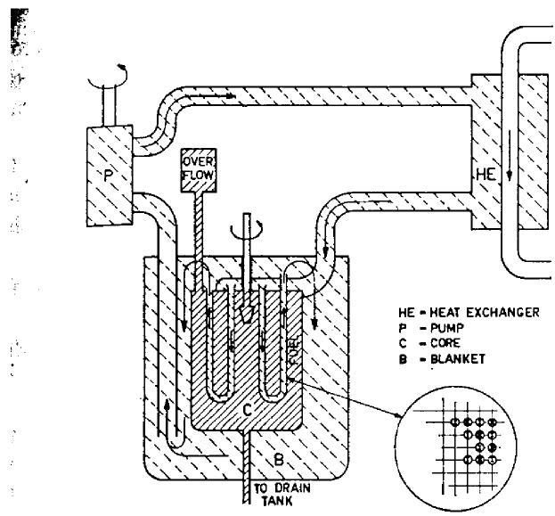
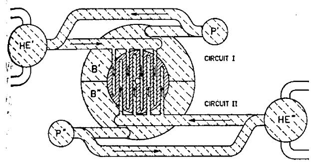
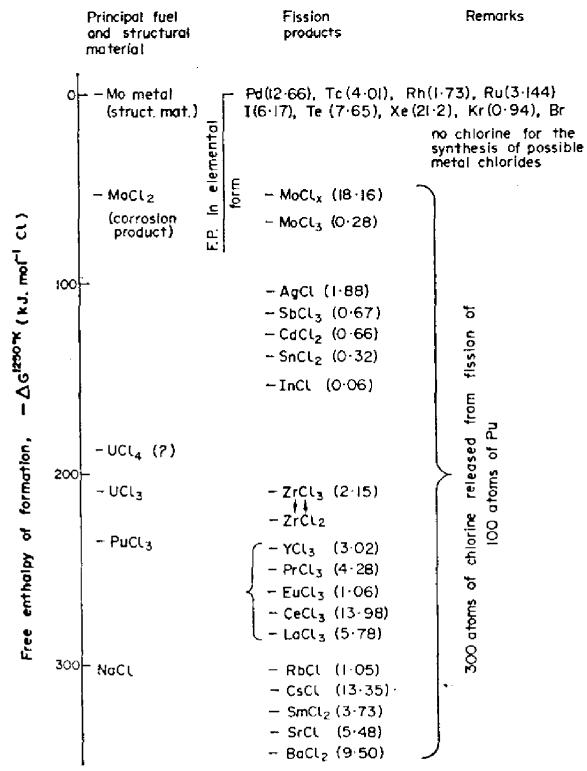

# MOLTEN PLUTONIUM CHLORIDE FAST BREEDER REACTOR COOLED BY MOLTEN URANIUM CHLORIDE

MIECZYSLAW TAUBE and J LIGOU Swiss Federal Institute of Reactor Research, Würenlingen, Switzerland

Abstract—A fast breeder reactor of 2000 $\sim$ MWt output using molten chlorides as fuel and coolant is discussed. Some of the most significant characteristics are: The liquid fuel contains only $\mathrm{PuCl}_3 / \mathrm{NaCl}$ . The coolant is molten $\mathrm{UCl}_3 / \mathrm{NaCl}$ and also forms the fertile material along with the blanket system, again $\mathrm{UCl}_3 / \mathrm{NaCl}$ : the coolant blanket system is divided into 2 or more independent circuits. The fuel circulates through the core by forced convection; the core is not divided. The thermal stability of the reactor is very good. Power excursions or fuel temperature transients are quickly damped by the phenomena of fuel expansion pushing part of the fissile material out of the critical zone. The loss of coolant accident results in a loss of half (or $1/3$ , $2/3$ ) of blanket which, without relying on a reactor scram, results in an automatic adjustment of the reactor power level. Corrosion effects form the most difficult problem. Thermodynamic studies suggest the use of molybdenum alloys as structural materials.

Breeder reactors differ from other reactor types in that they are not only power-producing devices but also a source of fissile material and therefore should be considered as part of a complex "breeding system" which includes both the power reactor (producing electricity and heat) and the reprocessing and fuel preparation plant. From this point of view the fast reactor with molten fuel seems to be better adapted to the long-term secure breeding system than are the solid-fuel reactors.

The reactor system described here being a continuation of a long-term development study of a molten-chlorides breeder (Bulmer, 1956; Chasanov, 1965; Nelson et al., 1967; Taube, 1961) demonstrates some of these advantages, among others a very high inherent safety (without relying on engineered devices) against changes of power level and loss-of-coolant accident.

# 1. GENERAL DESCRIPTION OF THE REACTOR

In this paper a molten-chloride fast breeder reactor (MCFBR) with in-core cooling using fertile material as coolant is discussed. The most important features are shown in Table 1 (Taube, Ligou 1972).

Liquid fuel consisting of $(\mathrm{mol}\%)$ $16\%$ $\mathrm{PuCl}_3$ and $84\%$ NaCl.

Liquid fertile material and core cooling agent (mol %) $65\%$ $^{238}\mathrm{UCl}_3$ , $35\%$ NaCl.

The flow of the blanket-coolant agent is as follows—through U tubes in the core—heat exchanger—pump—blanket region—return to core (Figure 1).

The coolant blanket circuits are in the form of at least two independent systems: the core vessel is not divided.

The core is directly connected with: overflow buffer vessel (for thermal expansion of fuel), emergency fuel drainage tank, reprocessing and fuel preparation plant, and an off-gas system (with continuous purification) for removing the volatile fission products and for control of corrosion processes.

The structural material is molybdenum and iron; the corrosion phenomena might be controlled in-situ by means of a volatile reagent added to the off-gas system.

The coolant is circulated through the U-tubes with a velocity of $9\mathrm{m / s}$ , the coolant pump is out-of-core; the fuel is circulated within the core itself with a velocity of $2\mathrm{m / s}$ (the pump being in-core).

The advantages brought about by this arrangement are as follows.

No separate 'foreign' cooling agent in the core results in an improvement in the neutron balance and the unique behavior of the system.

The unification of the blanket material and cooling agent results in a system which has a very strong negative reactivity in the case of loss-of-coolant accident (LOCA), which in this system equals the loss of blanket material accident. This results in a spontaneous 'self-reduction' of the criticality thus stopping the fission reaction without any 'engineered' safeguards (control rods, valves etc.) since the reactivity decrease by $8\% / N$ where $N$ is the number of independent circuits only one remaining intact.

Table 1. Molten chloride fast breeder reactor (MCFBR) "CHLOROPHIL"   

<table><tr><td>Electrical power, approximate</td><td>MWe</td><td>~800</td></tr><tr><td>Thermal power, total/in core</td><td>MWt</td><td>2050/1940</td></tr><tr><td>Core volume</td><td>m3</td><td>8.75</td></tr><tr><td>Specific power</td><td>MW/m3</td><td>220</td></tr><tr><td>Core geometry</td><td>m</td><td>height 2.0/2.36 dia.</td></tr><tr><td>Fuel: liquid PuCl3/NaCl</td><td>mole %</td><td>16/84</td></tr><tr><td>Liquidus/boiling point</td><td>K</td><td>~960/~1770 (approx)</td></tr><tr><td>Fuel mean temperature</td><td>K</td><td>1260</td></tr><tr><td>Fuel volume fraction in the core</td><td></td><td>0.386</td></tr><tr><td>Power form-factors radial/axial</td><td></td><td>0.60/0.78</td></tr><tr><td>Fast flux, mean across core</td><td>n/(cm·s)</td><td>7 x 1015</td></tr><tr><td>Fuel density at 984°C</td><td>kg/m3</td><td>2344</td></tr><tr><td>Heat capacity 984°C</td><td>kJ/(kg·K)</td><td>0.95</td></tr><tr><td>Viscosity 984°C</td><td>g/(cm·s)</td><td>0.0217</td></tr><tr><td>Thermal conductivity, at 750°C</td><td>W/(cm·K)</td><td>0.007</td></tr><tr><td>Fuel salt in core</td><td>kg</td><td>7900</td></tr><tr><td>Total plutonium in core/in system</td><td>kg</td><td>2900/3150</td></tr><tr><td>Plutonium in salt</td><td>weight %</td><td>36.4</td></tr><tr><td>Mean plutonium specific power</td><td>MW(t)/kg</td><td>0.67</td></tr><tr><td>Mean plutonium specific power in entire system</td><td>MW(t)/kg</td><td>0.62</td></tr><tr><td>Coolant: liquid 238UCl3/NaCl</td><td>mole %</td><td>65/35</td></tr><tr><td>Liquidus/boiling point</td><td>K</td><td>~980/~1970</td></tr><tr><td>Coolant temperature inlet/outlet</td><td>K</td><td>1023/1066</td></tr><tr><td>Coolant volume fraction in the core</td><td></td><td>0.555</td></tr><tr><td>Coolant density</td><td>kg/m3</td><td>4010</td></tr><tr><td>Coolant salt in core/in blanket</td><td>kg</td><td>19,500/165,000</td></tr><tr><td>Thermohydraulics</td><td></td><td></td></tr><tr><td>Fuel (shell side, pumped), velocity</td><td>m/s</td><td>2</td></tr><tr><td>Coolant, velocity</td><td>m/s</td><td>9</td></tr><tr><td>Number of coolant tubes</td><td></td><td>23,000</td></tr><tr><td>Tubes inner/outer diameter</td><td>cm</td><td>1.20/1.26</td></tr><tr><td>Tubes pitch</td><td>cm</td><td>1.38</td></tr><tr><td>Breeding ratio, internal/total</td><td></td><td>0.716/1.386</td></tr><tr><td>Doubling time, load factor 1.0/0.8 yr</td><td></td><td>8.5/10.5</td></tr></table>

The division of this coolant system into (at least) two totally independent circuits with a "crossed over" lattice of U-tubes in the core plus the circulation of liquid fuel (even when assumed to be low) makes possible the removal of residual fission product heating; only one undamaged circuit being necessary to achieve this.

The off-gas system makes it possible to continuously remove part of the noble gases and other volatile fission products from the core (such as iodine) and to control the corrosion processes on the core structural materials.

The plutonium-containing salt (fuel) is in general separate from the uranium-containing salt (coolant and blanket material) which simplifies the technology of reprocessing, improves the corrosion problems and at the same time diminishes the problem of a leak in either direction particularly when the continuous reprocessing

removes the "foreign" component in both the fuel and blanket coolant. The compatibility of fuel and blanket coolant is excellent.

The very strong negative temperature coefficient of reactivity arising out of any power excursion we get an increase of fuel temperature causing a decrease in density and an ejection of part of the fuel material from the core region through specially arranged tubes.

The continuous reprocessing plant (using salt-liquid metal transport processes) means a reduced plutonium inventory and an increased load factor for the plant and enhances the effective doubling time of the system. However, the disadvantages are also numerous.

The first and most important disadvantage is of course corrosion. The molten chloride medium, especially in neutron and gamma fields at high temperatures and velocities with virtually free chlorine present from the fission of plutonium chloride, presents

  
Figure 1: Circuit Schematic

a very serious problem which has to be solved (perhaps by means of continuous control of the chemistry in-situ by means of volatile agents).

The most likely structural material seems to be a molybdenum alloy which among other things gives rise to parasitic absorption of neutrons (see the neutron balance: Table 2).

The fuel is circulated by a pump which must be located in or close to the core which increases the corrosion problems. Other possibilities for increasing the heat transfer in the fuel are probable, but not easy to realise.

The high fuel and coolant velocities result in high pumping costs and could cause erosion and increase of hydrodynamic pressure.

# 2. REACTOR PHYSICS

In order to define the neutron spectrum in this reactor a 22-group cross-section set has been prepared; the code GGC3 (Adir et al., 1967) which allows 99 group calculations for a rather simple geometry has been used for this condensation. Most of the GGC3 library data were evaluated by GGA before 1967 but some are more recent.

All whole reactor calculations have been made on the basis of transport theory using the 22-group cross-section set in spherical and cylindrical geometry. The transport methods were aimed at getting a better accuracy for some reactivity coefficients.

Table 2: Neutron balance (%)   

<table><tr><td>Region</td><td colspan="2">Atoms (cm3 x 1021)</td><td colspan="2">Absorption</td><td>Leakage</td><td>Production</td></tr><tr><td></td><td>238U</td><td>3.5629</td><td>25.50</td><td>22.51 (n,γ)</td><td></td><td>8.23</td></tr><tr><td></td><td></td><td></td><td></td><td>2.99 (n,f)</td><td></td><td></td></tr><tr><td></td><td>239Pu</td><td>0.66796</td><td>34.56</td><td>5.58 (n,γ)</td><td></td><td>85.55</td></tr><tr><td></td><td></td><td></td><td></td><td>28.98 (n,f)</td><td></td><td></td></tr><tr><td></td><td>240Pu</td><td>0.16699</td><td>3.78</td><td>2.24 (n,γ)</td><td></td><td>4.72</td></tr><tr><td></td><td></td><td></td><td></td><td>1.54 (n,f)</td><td></td><td></td></tr><tr><td>Core</td><td>Na</td><td>6.3017</td><td>0.26</td><td></td><td></td><td></td></tr><tr><td></td><td>Cl</td><td>19.495</td><td>3.16</td><td>1.10 (in fuel)</td><td></td><td></td></tr><tr><td></td><td></td><td></td><td></td><td>2.06 (in coolant)</td><td></td><td></td></tr><tr><td></td><td>Fe</td><td>5.078</td><td>1.30</td><td></td><td></td><td></td></tr><tr><td></td><td>Mo</td><td>0.7386</td><td>2.04</td><td></td><td></td><td></td></tr><tr><td></td><td>F.P.</td><td>0.0679</td><td>0.50</td><td></td><td></td><td></td></tr><tr><td>Total core</td><td></td><td></td><td>71.10</td><td></td><td>27.40</td><td>98.50</td></tr><tr><td></td><td>238U</td><td>6.42</td><td>23.70</td><td>23.15 (n,γ)</td><td></td><td>1.50</td></tr><tr><td></td><td></td><td></td><td></td><td>0.55 (n,f)</td><td></td><td></td></tr><tr><td>Blanket</td><td>Na</td><td>3.457</td><td>0.08</td><td></td><td></td><td></td></tr><tr><td></td><td>Cl</td><td>22.72</td><td>2.22</td><td></td><td></td><td></td></tr><tr><td>Total blanket</td><td></td><td></td><td>26.00</td><td></td><td>2.9</td><td>1.50</td></tr></table>

The detailed neutron balance is given in Table 2; for more detailed information see Ligou (1972). The spectrum of the MCFBR compares favorably with that of a LMFBR.

From Table 2 one can deduce that $\mathrm{k} = 1.385$ . If $\delta \mathrm{k}$ is the loss of reactivity due to some parasitic absorption the corresponding behaviour of the breeding ratios are:

$$
C _ {\text {c o r e}} \approx 0. 7 1 6 - 1. 7 2 \delta k
$$

$$
C _ {\text {b l a n k e t}} \approx 0. 6 7 0 - 1. 0 5 \delta \mathrm {k}
$$

$$
C _ {\text {t o t a l}} \approx 1. 3 8 6 - 2. 7 7 \delta k
$$

Taking into account the latest data the problem of parasitic absorption of the chlorine is not dramatic so there appears to be no need to enrich the chlorine $(^{37}\mathrm{Cl})$ which is consistent with the conclusion of Nelson et al. (1967). The neutron spectrum shows a peak which corresponds to the chlorine cross section minimum $65\%$ of neutrons are in an energy range where $\sigma_{\mathrm{Cl}} < 5$ mb). This fact was perhaps not recognized 15 yr ago when fine spectrum calculations were not possible; it would perhaps explain the pessimistic conclusions of several eminent physicists (Weinberg and Wigner, 1958) about the use of natural chlorine in this type of reactor.

For the chosen structural material $(20\% \mathrm{Mo})$ the reactivity cost of $2\%$ is quite acceptable (see Table 2). However, the cost could rapidly become rather prohibitive if the volume of the structural material and/or molybdenum content should increase for technological reasons. Using the same structural materials $(20\% \mathrm{Mo})$ the loss of reactivity due to the vessel is $\delta \mathrm{k}(\%) = 0.721e$ where $e$ is the vessel thickness in cm.

Five complete transport calculations have been made for different coolant or fuel densities, and different temperatures (Ligou, 1972). If one considers that all the density modifications come from thermal expansion (liquid phase only) one can define general temperature coefficients

$$
\frac {\delta k}{k} (\%) \cong - 0.038 \delta T _ {f u e l} + 0.0129 \delta T _ {c o o l a n t}
$$

In the second term the part played by the Doppler coefficient (0.00048) is quite negligible. For $+100\mathrm{K}$ in the isothermal core the loss of reactivity is $-2.5\%$ which is very important from the safety point of view. Compared to any other type of power reactor (even the BWR) the advantage of this kind of reactor on the grounds of inherent safety is quite evident.

The "feedback effect" which is very important for kinetics studies is as follows

$$
\frac {\delta k}{k} (\%) \cong 60 \left(\frac {\delta \rho}{\rho}\right) _ {f u e l} - 15 \left(\frac {\delta \rho}{\rho}\right) _ {c o o l a m t} - 0.00048 \delta T _ {c o o l a m t}
$$

The void coefficient of the fuel (1st term) is strongly negative; $1\%$ void

$$
\frac {\delta \rho}{\rho} = - 1 0 ^ {- 2}
$$

gives a $0.6\%$ loss of reactivity. If boiling occurs in the fuel it will be rapidly arrested by a decrease in reactor power.

# 3. THERMOHYDRAULICS

This type of reactor, has fuel circulating in the core only, with a relatively low temperature gradient of approximately $35^{\circ}\mathrm{C}$ and a high heat capacity, and a high velocity coolant $\sim 9\mathrm{m / s}$ with again a low temperature gradient of approximately $43^{\circ}\mathrm{C}$ and high heat capacity. This, coupled with the very high negative temperature coefficient of reactivity results in an unusually high negative thermal and 'reactivity' stability.

Decrease of the fuel circulation and/or coolant, velocity (in the U-tubes) results in a definite and "automatic" decrease of reactor power without recourse to engineered methods. This points to such a reactor being a surprisingly stable and self-regulating device.

The achievement of the required fuel velocity in the core seems to require a forced circulation system since the rough estimate using natural convection gives a heat transfer coefficient which is too low giving decrease of a specific power which is not acceptable.

Such a forced circulation system (core only) can be one of the following types—pump installed directly in the core, pump outside the core, an external pump with injector, a gas lift pump using inert gas. Consideration of the factors involved using criteria such as reduction of the out-of-core inventory, elimination of additional heat exchangers; minimization of the fuel leakage, minimization of the auxiliary power, optimization of the fuel flow regulation—all point to an in-core pump solution. Of course this gives rise to considerable technical problems (cooling of the rotor, corrosion and erosion, maintenance, neutron activation etc.).

# 4. FISSION PRODUCTS AND CORROSION PROBLEMS

From the earlier published data (Chasanov, 1965; Harder et al., 1969; Taube, 1961) it appears that the problem of the chemical state (oxidation state) in this chloride medium for the fission product element constituents requires further clarification.

From a simple consideration it seems that the freeing of chlorine from the fissioned plutonium is controlled

by the fission product elements with standard free enthalpy of formation up to $\sim 20\mathrm{kJ / mol}$ of chlorine, that is up to molybdenum chloride. The more 'noble' metals such as palladium, technetium, ruthenium, rhodium and probably tellurium and of course noble gases: xenon, krypton plus probably iodine and bromine, remain in their elementary state because of lack of chlorine (see Figure 2). Molybdenum as a fission product with a yield of $\sim 18\%$ from $200\%$ all fission products may remain in part in metallic form. Since molybdenum also plays the role of structural material the corrosion problems of the metallic molybdenum or its alloys are strongly linked with the fission product behavior in this medium.

The possible reaction of $\mathrm{UCl}_3$ and $\mathrm{PuCl}_3$ with $\mathrm{MoCl}_2$ resulting in further chlorination of the actinides-trichlorides to tetrachlorides seems, for $\mathrm{PuCl}_3$ very unlikely $(\Delta \mathrm{G}^{1000\mathrm{K}} = -450\mathrm{kJ / mole~Cl})$ but this is not so for $\mathrm{UCl}_3$ .

A rather serious problem arises out of the possible reaction of oxygen and oxygen containing compounds (e.g. water) with $\mathrm{PuCl}_3$ and $\mathrm{UCl}_3$ which results in a precipitation of oxides or oxychlorides. The continuous reprocessing may permit some control over the permissible level of oxygen in the entire system as well as the continuous gas bubbling system with appropriate chemical reducing agent.

  
Figure 2: The behavior of fission products in the molten-chloride fuel. (Yields given represent products for $100\mathrm{Pu}$ atoms fissioned.)

Corrosion of the structural material, being molybdenum is also strongly influenced by the oxygen containing substances. A protective layer of molybdenum however, may be used on some steel materials using electrodeposition or plasma spraying techniques.

Acknowledgements—We express our grateful thanks to Dr. Dawson and Dr. Long of A.E.R.E. Harwell and Dr. Smith and his colleagues of Winfrith for very useful and critical discussions covering some of these problems.

The authors would also like to acknowledge particularly the valuable advice and assistance given by G. Markoczy (heat transfer problems) and G. Ullrich (corrosion problems) in the preparation of this paper and would also like to thank R. Stratton for preparing the text.

# REFERENCES

Adir G. et al. (1967) Users and Programmer's Manual for the CGC3 Multigroup Cross-Section Code, Part IGA 7157.   
Alexander L.G. (1963) Molten salt reactors, Proceed breeding large fast reactors. ANL-6792 (1963).   
Bell G.I. and Glasstone S. (1970) Nuclear Reactor Theory. Von Nostrand, New York.   
Burris L. and Dillon I. G. (1957) Estimation of fission product spectra. ANL-5742.   
Bulmer J.J. (1956) Fused salt fast breeder. CF-56-8-204, Oak Ridge.   
Chasanov M.G. (1965) Fission-products effects in molten chloride fast reactor fuels. Nucl. Sci. Engng 23, 189.   
Harder B.R., Long G. and Stanaway W.P. (1969) Compatability and reprocessing in use of molten $\mathrm{UCl}_3$ -alkali chlorides mixture as reactor fuel. In Symp. Reprocess Nucl. Fuels (Editor: Chiotti P.). USAEC CONF-690801.   
Ligou J. (1969) E.I.R. Report 228. Molten chlorides fast breeder reactor. Reactor physics calculations.   
Nelson P.A. et al. (1969) Fuel properties and nuclear performance of fast reactors fuelled with molten chlorides. Nucl. Appl. 3, 540.   
Taube M. (1961) Fused plutonium and uranium chlorides as nuclear fuel for fast breeder reactors. Symp. Power React. Experiment. International Atomic Energy Agency Symp., Vienna (SM-21/19).   
Taube M. et al. (1967) New boiling salt fast breeder reactor concepts. Nucl. Engng Design 5, 109.   
Taube M. and Ligou J. (1972) Molten chlorides fast breeder reactor. E.I.R. Rep. 215.   
Weinberg A.M. and Wigner E.P. (1958) The Physical Theory of Neutron Chain Reactor VI, 143, Univ. Chicago Press, Chicago.