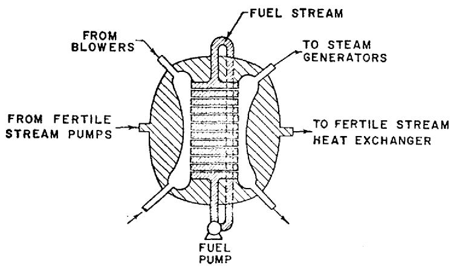

# MOLTEN-SALT FAST REACTORS

# L. G. Alexander   Oak Ridge National Laboratory   Oak Ridge, Tennessee

Thorium, plutonium, and uranium chlorides and fluorides are soluble in mixtures of the halides of Li, Be, Na, K, Mg, and other metals. Their fluoride solutions, at least, are compatible with INOR (an alloy consisting primarily of nickel). They are also compatible with graphite, a structural material as well as a moderator having many desirable properties for high-temperature application. Thus, many embodiments are possible for molten-salt reactors, ranging from simple one-fluid, one-region systems externally cooled to complex internally cooled, two-region, two-fluid systems. The capabilities of only a few of the more obvious systems have been studied so far.

The nuclear and economic potentials of several thermal reactors have been evaluated heretofore, (1-3) and recently a limited program for the preliminary evaluation of fast molten-salt reactor concepts was instituted. Appropriate background studies were performed: (1) a survey was made of data available about the thermal and physical properties of molten fluoride and chloride salt mixtures, (2) the compatibilities of selected reactor materials with various reactor coolants and with molten-salt fuels were studied, (3) potential processing methods for irradiated molten fluoride and chloride reactor fuels were reviewed, and (4) data available for the nuclear properties of chlorine, nickel, and other nuclides of interest were reviewed.

The compositions and physical properties of typical molten-salt reactor fuels in various reactor concepts are compared in Table 1.

Table I COMPARISON OF TYPICAL MOLTEN-SALT REACTOR FUELS   

<table><tr><td></td><td>Thermal Converter Reactor</td><td>Thermal Breeder Reactor</td><td>Fast Breeder Reactor</td></tr><tr><td>Regions</td><td>1</td><td>2</td><td>2</td></tr><tr><td>Fluid Streams</td><td>1</td><td>2</td><td>2</td></tr><tr><td>Moderator</td><td>Graphite</td><td>Graphite</td><td>None</td></tr><tr><td>Fissile Mixture</td><td></td><td></td><td></td></tr><tr><td>Components, m/o</td><td>67 LiF, 23 BeF2, 9 ThF4, 1 UF4</td><td>63 LiF, 36 BeF2, 1 UF4</td><td rowspan="2">45 NaCl, 25 KCl, 30 (Pu, 238U)Cl3(1000 ± 50)*</td></tr><tr><td>Liquidus temperature, F</td><td>887</td><td>849</td></tr><tr><td>Density, lb/ft3 at 1200 F</td><td>190</td><td>120</td><td>(192 ± 10)*</td></tr><tr><td>Heat Capacity at 1200 F Btu/lb-F</td><td>0.4</td><td>0.5</td><td>(0.3 ± 0.03)*</td></tr><tr><td>Thermal Conductivity at 1200 F Btu/hr-ft-F</td><td>2.9</td><td>3.5</td><td>(0.4 +0.4/-0.1)*</td></tr><tr><td>Viscosity, lb/ft-hr at 1200 F</td><td>21</td><td>20</td><td>(16 ± 2)*</td></tr></table>

*Values estimated by semi-theoretical correlations and by inference from measurements on homologous systems.

A molten-salt reactor program was initiated at the Oak Ridge National Laboratory in 1957 to exploit, for purposes of economic civilian power, the technology of molten-salt fuels developed at ORNL in connection with the Aircraft Nuclear Propulsion (ANP) project. Moltensalt fuels were conceived originally as a means of satisfying the requirements for very high temperature and extremely high power density necessary for aircraft propulsion, and a large amount of work on the physical, chemical, and engineering characteristics of uranium- and thorium-bearing molten fluorides was carried out as part of the ANP program.

The technology of molten-salt reactors was first introduced into the open literature in 1957 by Briant and Weinberg. (4) Bettis et al. (5,6) and Ergen et al. (7) reported on the Aircraft Reactor Experiment, a beryllium-moderated reactor fueled with $\mathrm{UF_4}$ dissolved in a mixture of the fluorides of sodium and zirconium, and contained in Inconel. The reactor was successfully operated in 1954 for more than $90,000\mathrm{kW}$ -hr without incident at thermal powers up to $2.5\mathrm{MW}$ and temperatures as high as $1650^{\circ}\mathrm{F}$ .

For thermal power reactor fuels, fluorides of $^{7}\mathrm{Li}$ and beryllium are preferred because of their low parasitic neutron capture rate. Mixtures of these with fluorides of thorium and uranium (in the range from 5 to $15\mathrm{m / o})$ have liquidus temperatures below $1000^{\circ}\mathrm{F}$ , have good heat transfer properties, and are nearly inert with respect to INOR, the preferred container material.

In fast reactors, sodium and potassium may be used in place of $^7\mathrm{Li}$ and beryllium, which are costly. Fluorine may be a suitable anion for use with $^{233}\mathrm{U}$ in a fissile stream, but for plutonium fuels, chloride mixtures are required to obtain sufficiently high concentrations of plutonium at temperatures below $1000^{\circ}\mathrm{F}$ . Another important advantage of chlorine is that it has considerably less moderating power than fluorine. On the other hand, $^{35}\mathrm{Cl}$ exhibits a disadvantageous (n,p) reaction, and it is necessary to use the separated isotope $^{37}\mathrm{Cl}$ contaminated with less than $5\%$ $^{35}\mathrm{Cl}$ . Since it is not so important to obtain a hard spectrum in the blanket and plutonium concentrations are never high there, fluoride mixtures are satisfactory for the fertile stream.

The potential usefulness of molten-salt fuels for civilian power was recognized from the start. The features that attracted attention were the high temperature at which the fuel could be used (permitting use of modern stream technology and attainment of high thermal efficiency), combined with a low vapor pressure, the unsurpassed stability of halide salts under radiation, and the usual advantages that a fluid fuel provides. These include a negative temperature coefficient of reactivity, absence of the need for initial excess reactivity and its wastage in control elements, no limitation to burnup by radiation damage or loss of reactivity, the absence of a complicated structure in the reactor core, removal of the heat-transfer operation from the core to an external heat exchanger, and the potential for a low-cost fuel cycle.

The ORNL molten-salt reactor program $^{(8)}$ has comprised a reactor evaluation program for selecting the most promising concepts for civilian power and for pinpointing specific development problems; an extensive materials development program for fuels, containers, and moderators; an equally extensive program for the development of components, especially pumps, valves, and flanges suitable for extended use with molten salts at $1300^{\circ}\mathrm{F}$ ; a modest program for the discovery of supplementary chemical processes for recovering valuable components (other

than uranium) from spent fuel; and a program for the development and definitive demonstration of the feasibility of maintenance of molten-salt reactor systems.

These programs have substantially reached their initial goals, $^{(1)}$ and the work is now mainly devoted to the design and construction of a molten-salt reactor experiment, $^{(9,10)}$ which will demonstrate the utility of the developments achieved and resolve remaining areas of uncertainty. The MSRE will produce up to $10\mathrm{MW}$ of heat in a fuel consisting of a solution of highly enriched ${}^{235}\mathrm{UF}_4$ dissolved in a mixture of the fluorides of lithium ( $99.990\%$ Li), beryllium, and zirconium, having a liquidus temperature of $842^{\circ}\mathrm{F}$ . Construction and installation of the entire system are scheduled for completion in mid-1964, and criticality is planned for early in 1965.

# System Maintenance

Because of fission-product contamination and induced activity in components and piping, the fuel-containing portions of molten-salt reactors cannot be approached for direct maintenance even after draining and flushing. Semi-direct maintenance with long-handled tools through a shield plug is possible for many items, however, and completely remote tools and methods can be employed where needed.

Semi-direct maintenance procedures for circulating-fuel reactors were used with success in the repair and maintenance of HRE-2 (11). The techniques of fully remote maintenance were demonstrated at ORNL (12) in the Molten-salt Reactor Remote-maintenance Development Facility, which was a mockup comprising a reactor vessel, heat exchangers, pumps, valves, flanges, heaters, instruments, etc., for a 20-MWt reactor. All pieces of equipment in the facility were removed, replaced, and tested remotely both before and after circulation of salt through the system at $1200^{\circ}\mathrm{F}$ .

# Chemical Processing of Fluid Fuel

The use of fluid fuels in nuclear reactors provides an opportunity for continuously removing fission products and replacing fissile isotopes at power. Thus, it may be possible to hold losses of neutrons to fission-product poisons at low levels, on the one hand, and yet not be forced to waste neutrons by capture in control rods, such as those used in solid-fuel reactors to compensate for initial excess reactivity. Volatility processing,[13] wherein the relative volatilities of the halides of the high-valent states of uranium and plutonium are used to effect separation, is uniquely suited to molten salts. The associated fluorination process is in an advanced stage of development, and a pilot plant for general application is now in operation at ORNL.[14] Volatilization and recovery of chlorides of plutonium and uranium have been studied by Naumann,[23] who proposed a complete process starting with oxide fuels.

Although the fluoride-volatility process was not developed specifically for use with molten-salt fuels, it has been verified in laboratory experiments conducted at ORNL that uranium may be recovered from fluoride mixtures containing $\mathrm{ThF_4}$ . In this process, elemental fluorine, perhaps diluted with an inert gas, is bubbled through the salt. The $\mathrm{UF_4}$ is converted to $\mathrm{UF}_{6}$ , which is volatile at the temperature of operation $(500 - 700^{\circ}\mathrm{C})$ and passes out of the contactor, to be absorbed reversibly in a bed of NaF. The off-gas is cooled and passed through charcoal beds,

where fission-product gases are absorbed. The fluorides of a few of the fission products are also volatile, but these are irreversibly absorbed in the NaF beds. Thus, by heating the beds, $\mathrm{UF}_6$ is removed in a very pure state, with losses less than $0.1\%$ .

The $\mathrm{UF_6}$ may be reduced to $\mathrm{UF_4}$ in a hydrogen-fluorine flame and collected as a powder in a cyclone separator backed up by gas filters. This process is quantitative, the losses characteristically being smaller than random errors in the assays, and it has been used successfully for many years in the manufacture of enriched $^{235}\mathrm{U}$ from natural uranium in the production plants at Oak Ridge.

Plutonium is not volatilized until all of the uranium has been removed, and large volumes of fluorine are required to bring it over because of an unfavorable equilibrium condition.[24] However, plutonium has been recovered successfully[25] from salt mixtures containing as little as 2 ppm of plutonium.

The recovery of $^{37}\mathrm{Cl}$ from salt mixtures by fluorination has not been studied heretofore; however, fluorine readily replaces chlorine in ionic compounds, and the recovery and separation of $^{37}\mathrm{Cl}$ from excess fluorine does not appear to present ally unusual difficulties.

# Reactor Container

The development of nickel-molybdenum base alloys (INOR series) for containment of molten fluorides was conducted jointly by ORNL and several subcontractors. In addition to resistance to corrosion, these alloys have good-to-excellent mechanical and thermal characteristics (superior to those of many austenitic stainless steels), and they are virtually unaffected by long-term exposure to fluoride salts or to air at $1300^{\circ}\mathrm{F}$ . (15) Exhaustive tests at ORNL have shown that the tensile properties, ductility, creep strength, and cyclic fatigue strength (both thermal and mechanical) are adequate for molten-salt reactor applications when judged in accordance with criteria used in the ASME Boiler Code. INOR alloys are weldable by conventional techniques with welding rods of the same composition as the base metal, and a gold-nickel alloy suitable for remote brazing of reactor components has been developed at ORNL. INOR alloys have been made by several major manufacturing companies. These alloys are presently available on a limited commercial basis in the form of tubing, plates, bars, forgings, and castings.

Although the compatibility of INOR with chlorides remains to be established, it is believed that corrosion will not be severe provided the trichlorides of plutonium and uranium are used, and temperatures do not exceed $1300^{\circ}\mathrm{F}$ .

# Fast Molten-salt Reactors

The use of a fluid fuel makes possible a number of economies in fuel utilization and reactor operations. Fabrication consists in compounding the raw materials and purifying these at the reactor site; the cost is small. Fresh fuel may be added and spent fuel withdrawn without interruption of power: thus, plant availability is determined only by the maintenance schedule and not by the fuel cycle. Valuable components of spent fuel may be recovered on-site, simply and economically, by volatilization with chlorine or fluorine. This makes rapid processing

attractive and obviates the necessity, found in solid-fuel reactors, of obtaining high in-core breeding ratios in order to extend the fuel life. Thus, the fluid-fuel reactors have an additional degree of freedom in design, and as much of the breeding may be accomplished in the blanket as appears desirable. This need not be accomplished by a high blanket inventory of fissile isotopes, however, since a thorium-fluoride blanket may be stripped continuously of bred material by volatilization with fluorine. No additional processing is required, and the stripped salt may be recycled indefinitely. Since the fissile isotope concentration is very low, fission-product accumulation is negligible. It should be emphasized that these characteristics of $\mathrm{ThF_4}$ solutions confer an enormous fuel-cycle cost advantage, which, taken with the simplicity of the processing cycle for recovery of uranium or plutonium and $^{37}\mathrm{Cl}$ from the fuel stream by volatilization with fluorine, will, it is believed, result in negligibly small processing costs in on-site processing plants.

Continuous processing results in steady-state operation: the power load does not shift back and forth between the blanket and the core, and the power distribution in the core does not vary with time. Hence, all parts of the reactor may be designed for maximum performance over the life of the reactor.

In regard to safety, the fast fluid-fuel reactors have the advantage of an inherently negative contribution to the temperature coefficient of reactivity resulting from thermal expansion of the fuel. Also, since the fuel is already in a molten state, "fuel slumping" in the sense associated with solid fuels is impossible. In a loss-of-coolant accident, the possibility exists that the fuel can be drained away to dump tanks where the reactivity may be controlled and the afterheat removed conveniently.

That molten salts are not difficult to contain has been adequately demonstrated at ORNL, where a highly successful record of handling these materials at high temperatures in radiation fields has been established. Of course, hazards arising from the mobility of the fuel, such as the accidental accumulation of a supercritical mass of fuel, must be considered in the detailed design of fluid-fuel reactors.

A fast molten-chloride reactor was proposed by Goodman et al. $^{(16)}$ in 1952, and the chemical problems involved in the use of such fuels were reviewed by Scatchard et al. $^{(17)}$ Also, a design study and evaluation of a molten-chloride fast breeder was prepared by Bulmer et al. $^{(18)}$ at the Oak Ridge School of Reactor Technology in 1956. Bulmer chose chloride mixtures in preference to fluorides because of the higher moderating power of the latter, but he noted that enrichment in $^{37}\mathrm{Cl}$ would be required because of the strong (n,p) reaction in $^{35}\mathrm{Cl}$ . More recently, the suitability of various molten plutonium salts for use in fast breeders was reviewed by M. Taube $^{(19-21)}$ of the Institute of Nuclear Research, Warsaw. Taube's principal conclusion was that $^{37}\mathrm{Cl}$ is the only anion that satisfies all the requirements for fast plutonium-fueled molten-salt reactors. On the other hand, it is believed at ORNL that fluoride salts may prove to be advantageous for use with $^{233}\mathrm{U}$ , in spite of the extra moderation, and that the use of $\mathrm{ThF_4}$ dissolved in a mixture of alkali fluorides would have outstanding advantages in the blankets of fast reactors.

Both internally- and externally-cooled systems are being studied at ORNL. The first kind avoids the disadvantage of having appreciable fuel inventories "idling" outside the reactor; the second avoids cluttering the core with heat-transfer surfaces.

# Internally Cooled Reactors

Structural Material. The leading candidates are INOR-8 (an alloy of nickel with molybdenum, iron, and chromium), niobium, and $^{92}\mathrm{Mo}$ (a separated isotope). The order of listing reflects both availability and cost. Preliminary calculations indicate that niobium will probably satisfy both the nuclear and thermal requirements; INOR may also, with some sacrifice in nuclear performance, due to the (possibly) higher parasitic resonance capture in nickel.

Choice of Coolant. Although sodium is compatible with these metals, it reacts strongly (though not explosively) with fuel salt, yielding metallic plutonium and uranium. For this reason, and also because of its moderating effect and because of the difficulties associated with positive void coefficients of reactivity, etc., sodium was passed over in favor of helium at 1000 psia and $1100^{\circ}\mathrm{F}$ (max) for cooling. The principal disadvantage is the high pressure required, which increases the probability of loss of coolant by rupture of the gas system. However, the mobility of the fuel contributes to the abatement of the loss-of-coolant hazards, since it may be possible to drain the fuel to cooled dump tanks.

Configuration. In order to shorten the flow path of cooling gas, the arrangement illustrated in Fig. 1 was chosen. The fuel salt is contained in a calandria, 1-1/2 to 5 ft thick and 5

  
Fig. 1. Internally Cooled Fast Molten-salt Reactor

ft high, and as long as required to obtain the desired power capability. The calandria is penetrated laterally by gas passages (tubes or flat plates), 1/4 to 1/2 in. wide, and fuel passages, 0.10 to 0.20 in. thick with walls 0.025 in. thick, between adjacent passages. Since flow of heat in the salt by conduction alone would result in temperatures exceeding $2000^{\circ}\mathrm{F}$ , convection is achieved by circulating the salt in turbulent flow by means of an external pump.

Fuel Stream. A mixture of NaCl and KCl with 30 to $50\mathrm{m / o}$ $(\mathrm{Pu},^{238}\mathrm{U})\mathrm{Cl}_3$ was chosen. The liquidus temperature is expected to be less than $1000^{\circ}\mathrm{F}$ and the density about $3.1~\mathrm{g / cc}$ at $1200^{\circ}\mathrm{F}$ . The anion is $95\%$ $^{37}\mathrm{Cl}$ . Isotopes of plutonium, uranium, and $^{37}\mathrm{Cl}$ are recovered by fluorination; the residue contains fission products and is discarded.

Fertile Stream. The ternary eutectic of the fluorides of sodium, potassium, and thorium is circulated through the blanket region. Bred $^{233}\mathrm{U}$ is removed by fluorination with a cycle time of 10 days. The fertile stream is recycled indefinitely without other treatment.

Status of the Study. The limiting values or ranges given above for several parameters were tentatively established from prior experience and probable inference. The operating conditions selected were a maximum metal temperature of $1300^{\circ}\mathrm{F}$ (to limit corrosion rates and maintain mechanical properties), a maximum salt temperature of $2000^{\circ}\mathrm{F}$ (to avoid thermal shock and mitigate hot-spot conditions), a minimum inlet gas temperature of $600^{\circ}\mathrm{F}$ (to maintain thermal efficiency in the energy conversion cycle and to avoid thermal stress and reduce likelihood of freezing fuel salt near the gas inlet of the core), a maximum ratio of work expended in pumping gas through the reactor core to electrical output of 0.06, and a maximum pressure drop of 25 psi across the core. Thermal and nuclear calculations are in progress to find the optimum combination of core thickness, volume fraction of fuel, composition of fuel, inlet gas temperature, etc. The primary figure-of-merit is the fuel-cycle cost, with subsidiary figures being the doubling time and its components: breeding ratio and specific power.

The heavy-metal atom density in molten salts suitable for fast reactor use is lower than in oxide fuels by a factor of 4. The moderating power, as defined in Table 2, of the materials in the core is an important quantity, as this determines the spectrum of neutrons and the effective $\eta$ obtainable. In this connection, molten salts for fast reactors may be handicapped by heat-transfer requirements (limited metal and salt temperature) which, in gas-cooled reactors, may force the use of relatively large heat-transfer surfaces and thus large ratios of atoms of structural material to fuel atoms. Thus, it may be difficult to maintain a hard spectrum and obtain a high $\eta$ in an optimized gas-cooled fast molten- salt reactor. A corollary consequence of the soft spectrum is that the parasitic absorption in carrier salt and structural materials is more difficult to control, especially since nickel, the major component in the preferred alloy for containing molten salts, appears to have some extremely noxious resonances in the range of neutron energies lying between 10 and $100\mathrm{keV}$ . However, the degradation of the spectrum may be no more deleterious than that suffered in sodium-cooled reactors when provision is made to reduce the sodium void coefficient and preserve the Doppler effect by the addition of BeO, for example.

# Externally Cooled Reactors

An important advantage of fluid fuels is that the heat-transfer operation may be performed outside the reactor by circulating the fuel to an external heat exchanger. Although this permits designing to meet the nuclear and thermal requirements independently, it has the disadvantage of having at least half the inventory of fuel materials outside the core. It is easy to see, by reference to Table 2, that the breeding ratio of an externally-cooled fast reactor core will be good, even in the presence of atoms of carrier salt, and that the problems are those of designing for stable flow in the core and adequate heat transfer in the heat exchanger to obtain favorable specific powers.

Since in-core breeding is not required to obtain long fuel-life, fertile materials may be excluded from the core (unless required to maintain a negative temperature coefficient). This lowers the required concentration of fissile isotopes, as does also the absence of structural material and coolant. Thus, the inventory in the circulating system may be quite low in relation to the power level and high specific power attainable.

Table 2   
COMPARISON OF MODERATING POWER IN SODIUM-COOLED AND OXIDE-FUELED AND MOLTEN-SALT REACTORS   
$\mathrm{N} =$ atomic density of listed element $\mathrm{N_0} =$ atomic density of $\mathrm{Pu + U}$   

<table><tr><td>Element</td><td>N/N0</td><td>ξσs</td><td>Nξσs/N0</td></tr><tr><td colspan="4">Sodium-cooled Oxide-fueled Reactor</td></tr><tr><td>Oxygen</td><td>2.1</td><td>0.34</td><td>0.71</td></tr><tr><td>Sodium</td><td>1.8</td><td>0.26</td><td>0.47</td></tr><tr><td>Stainless Steel</td><td>2.1</td><td>0.10</td><td>0.21</td></tr><tr><td>Total</td><td></td><td></td><td>1.39</td></tr><tr><td colspan="4">Externally Cooled Molten-Salt Reactor</td></tr><tr><td>37Cl</td><td>5.3</td><td>0.11</td><td>0.59</td></tr><tr><td>Sodium</td><td>1.5</td><td>0.26</td><td>0.39</td></tr><tr><td>Potassium</td><td>0.8</td><td>0.10</td><td>0.08</td></tr><tr><td>Total</td><td></td><td></td><td>1.06</td></tr></table>

The same components in the fuel and fertile streams are used as for the internally-cooled reactor, and the processing cycles are the same. The core, of course, contains no structure, and INOR is probably suitable for separating the core from the blanket. The fuel stream is circulated through an external shell-and-tube heat exchanger.

Should a "conventional" exchanger require too great a volume of fuel salt and result in inventories too high to be economically attractive, E. S. Bettis $^{(26)}$ has proposed to cool and pump the fuel stream by spraying lead or mercury, which are chemically and nuclearly compatible with the fuel salt, into downcomers located outside the blanket. This arrangement is similar to that proposed for LAMPRE by Hammond et al. $^{(22)}$ and hopefully will result in total inventories no more than twice the in-core inventories and specific powers of $1\mathrm{MW / kg}$ or more.

The study is presently concerned with establishing upper limits on the power density in the core and the external circuits. With these in hand, the optimization of the core thickness, uranium loading, etc., will proceed.

# Conclusions

In summary, the advantages claimed for molten-salt fast reactors are: (1) simplicity of the reactor core and the semi-continuous fuel handling apparatus, which lead to low capital costs and increased plant availability; (2) simplicity and continuous nature of fissile and fertile stream processing methods, which lead to negligible fuel-cycle costs in on-site plants; (3) improved safety resulting from the negative contribution to the temperature coefficient of reactivity

inherent in the thermal expansion of the fuel; (4) competitive nuclear performance of the internally cooled reactor and superior performance of the externally cooled reactor.

# Acknowledgements

This report was based on contributions from E.S. Bettis, W.L. Carter, J.L. Wantland, R.E. Thoma, T.W. Pickel, and others. The comments and suggestions of M.W. Rosenthal, A.M. Perry, J.A. Lane, R.B. Briggs, S.E. Beall, and H.G. MacPherson are gratefully acknowledged,

# References

1. J.A. Lane, H.G. MacPherson, and F. Maslan (Eds.), Chapters 11-17 in Fluid Fuel Reactors, Addison-Wesley, Reading, Mass. (1958).   
2. L.G. Alexander et al., Thorium Breeder Reactor Evaluation, Part 1 - Fuel Yield and Fuel Cycle Costs in Five Thermal Breeders, ORNL CF-61-3-9 and Appendices (March 1961).   
3. L.G. Alexander et al., Cost of Power from a 1000-MWe Molten-salt Converter Reactor, report in preparation, Oak Ridge National Laboratory.   
4. R.C. Briant and A.M. Weinberg, Molten Fluorides as Power Reactor Fuels, Nucl. Sci. Eng., 2, 797 (1957).   
5. E.S. Bettis et al., The Aircraft Reactor Experiment - Operation, ibid., 2, 841 (1957).   
6. E.S. Bettis et al., The Aircraft Reactor Experiment - Design and Construction, ibid., 2, 804 (1957).   
7. W.K. Ergen et al., The Aircraft Reactor Experiment - Physics, ibid., 2, 826 (1957).   
8. H.G. MacPherson, Molten Salts for Civilian Power, ORNL CF-57-10-41 (Oct 1957).   
9. A.L. Boch, "The Molten-Salt Reactor Experiment," Power Reactor Experiments, Vol. I, pp. 247-292, International Atomic Energy Agency, Vienna (1962).   
10. S.E. Beall et al., Molten-salt Reactor Experiment Preliminary Hazards Report, ORNL CF-61-2-46 (Add. 1 and 2) (Feb 1961).   
11. J.A. Lane, H.G. MacPherson, and F. Maslan, op. cit., Chapters 1-10.   
12. W.B. McDonald and C.K. McGlothlan, Remote Maintenance of Molten-salt Reactors, ORNL-2981 (in preparation).   
13. D.O. Campbell and G.I. Cathers, Processing of Molten-salt Power Reactor Fuels, Ind. Eng. Chem., 52, 41 (Jan 1960).

14. W.H. Carr, S. Mann, and E. C. Moncrief, Uranium-Zirconium Alloy Fuel Processing in the ORNL Volatility Pilot Plant, ORNL CF-61-7-13 (July 10, 1961).   
15. J.H. DeVan and R.B. Evans, III, Corrosion Behavior of Reactor Materials in Fluoride Salt Mixtures, ORNL TM-328 (Sept 19, 1962).   
16. C. Goodman et al., Nuclear Problems on Non-aqueous Fluid-fuel Reactors, MIT-5000 (Declassified) (Oct 1952).   
17. G. Scatchard et al. Chemical Problems of Non-Aqueous Fluid-Fuel Reactors. USAEC Report MIT-5001 (Declassified) (Oct 1952).   
18. J.J. Bulmer et al., Fused Salt Fast Breeder, ORNL CF-56-8-204 (Declassified) (Aug 1956).   
19. M, Taube, Plutonium Fused Salts Fuels for Fast Breeder Reactor; Nuclear and Chemical Criterion, Nukleonika, 6, 565 (1961).   
20. M. Taube, "Molten Plutonium and Uranium Chlorides as Fuels for Fast Breeder Reactors," Proceedings of a Symposium on Power Reactor Experiments, Vienna, 1961, Vol. 1, pp. 353-363 (1962); see also USAEC Translation AEC-tr-5161.   
21. M. Taube, Stopione Chlorki Plutonu i Uranu Juko Paliwo Dla Predkich Reaktorow, Report No. 414/V, Instytut Badan Judrowych, Warszawa, Poland (March 1963).   
22. R.P. Hammond et al., Mobile Fuel Plutonium Breeders, LA-2644 (Dec 1961).   
23. D. Naumann, Laborstudie zur chlorierenden Aufarbeitung neutron-enbestrahlter Urankernbrennstoffe, Kernenergie, 2, 5, 118 (Feb 1962).   
24. Oak Ridge National Laboratory, Chemical Technology Division Annual Progress Report for Period Ending May 31, 1963, ORNL-3452 (Sept 1963).   
25. G.I. Cathers and R.L. Jolley, Recovery of $\mathrm{PuF_6}$ by Fluorination of Fused Fluoride Salts, ORNL-3298 (Oct 1962).   
26. E.S. Bettis, Oak Ridge National Laboratory, personal communication to L.G. Alexander, 1957.

# Discussion of Paper Presented by Mr. Alexander

MR. HALL (Los Alamos):

What is your concentration of fissile atoms in the fuel? Is it 50 per cent in the salt?

MR. ALEXANDER:

We believe we can operate in the range of 30 to 50 mole per cent, and this gives a concentration of about $0.004 \times 10^{24}$ atoms/cc of heavy elements in the salt.

MR. HALL:

Is there a strong temperature dependence of solubility in the salt?

MR, ALEXANDER:

The range that I gave you, 30 to 50 per cent, means that the liquidus temperature is below $1000^{\circ}$ for mixtures having that composition. If you want to increase it, then the liquidus temperature goes up.

MR. HALL:

In the case of the external heat exchangers, what fraction of the total fuel would have to be out-of-pile inventory?

MR. ALEXANDER:

Not enough to go critical in the heat exchanger, we hope. Also we hope the external inventory would be no greater than the internal inventory.

MR. DIETRICH:

If there is no further discussion of this paper, let us take this opportunity for further discussion of yesterday afternoon's session, which was cut a little short.