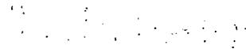

# Argonne National Laboratory

# CATALOG OF NUCLEAR REACTOR CONCEPTS

# Part I. Homogeneous and Quasi-homogeneous Reactors

# Section IV. Reactors Fueled with Liquid Metals

by

# Charles E. Teeter, James A. Lecky, and John H. Martens

P RASED FOR ANNOUNCER

SCIENCE ABSTRACTS

# DISCLAIMER

This report was prepared as an account of work sponsored by an agency of the United States Government. Neither the United States Government nor any agency Thereof, nor any of their employees, makes any warranty, express or implied, or assumes any legal liability or responsibility for the accuracy, completeness, or usefulness of any information, apparatus, product, or process disclosed, or represents that its use would not infringe privately owned rights. Reference herein to any specific commercial product, process, or service by trade name, trademark, manufacturer, or otherwise does not necessarily constitute or imply its endorsement, recommendation, or favoring by the United States Government or any agency thereof. The views and opinions of authors expressed herein do not necessarily state or reflect those of the United States Government or any agency thereof.

# DISCLAIMER

Portions of this document may be illegible in electronic image products. Images are produced from the best available original document.

# LEGAL NOTICE

This report was prepared as an account of Government sponsored work. Neither the United States, nor the Commission, nor any person acting on behalf of the Commission:

A. Makes any warranty or representation, expressed or implied, with respect to the accuracy, completeness, or usefulness of the information contained in this report, or that the use of any information, apparatus, method, or process disclosed in this report may not infringe privately owned rights; u1   
B. Assumes any liabilities with respect to the use of, or for damages resulting from the use of any information, apparatus, method, or process disclosed in this report.

As used in the above, "person acting on behalf of the Commission" includes any employee or contractor of the Commission, or employee of such contractor, to the extent that such employee or contractor of the Commission, or employee of such contractor prepares, disseminates, or provides access to, any information pursuant to his employment or contract with the Commission, or his employment with such contractor.

ARGONNE NATIONAL LABORATORY 9700 South Cass Avenue Argonne, Illinois 60439

CFSTI PRICES H.C. $3.00; MN. 75

# CATALOG OF NUCLEAR REACTOR CONCEPTS

Part I. Homogeneous and Quasi-homogeneous Reactors Section IV. Reactors Fueled with Liquid Metals

by

Charles E. Teeter, James A. Lecky, and John H. Martens

Technical Publications Department

January 1966

THIS PAGE WAS INTENTIONALLY LEFT BLANK

TABLE OF CONTENTS   

<table><tr><td></td><td>Page</td></tr><tr><td>Preface</td><td>5</td></tr><tr><td>Plan of Catalog of Nuclear Reactor Concepts</td><td>6</td></tr><tr><td>List of Reactor Concepts</td><td>7</td></tr><tr><td>SECTION IV. REACTORS FUELED WITH LIQUID METALS</td><td>13</td></tr><tr><td>Chapter 1. Introduction</td><td>13</td></tr><tr><td>Chapter 2. Internally-cooled Reactors</td><td>19</td></tr><tr><td>Chapter 3. Externally-cooled Reactors</td><td>59</td></tr></table>

THIS PAGE

WAS THIS PAGE ALL

WASINTENTIONALLY

LEFT BLANK

# PREFACE

This report is an additional section in the Catalog of Nuclear Reactor Concepts that was begun with ANL-6892 and continued in ANL-6909 and ANL-7092. As in the previous reports, the material is divided into chapters, each with text and references, plus data sheets that cover the individual concepts. The plan of the catalog, with the report numbers for the sections already issued, is given on the following page. On p. 6 is a list of the concepts covered in this report, with the corresponding numbers of chapters, and data sheets.

Dr. Charles E. Teeter, formerly employed by the Chicago Operations Office at Argonne, Illinois, is now affiliated with the Southeastern Massachusetts Technological Institute, New Bedford, Mass. Through a consultancy arrangement with Argonne National Laboratory, he is continuing to help guide the organization and compilation of this catalog.

We wish to acknowledge the assistance of Miss Ellen Thro in the compilation of this report.

J.H.M.

January 1966

PLAN OF CATALOG OF REACTOR CONCEPTS

General Introduction ANL-6892

Part I. Homogeneous and Quasi-homogeneous Reactors

Section I. Particulate-fueled Reactors ANL-6892

Section II. Reactors Fueled with Homogeneous Aqueous Solutions and Slurries ANL-6909

Section III. Reactors Fueled with Molten-salt Solutions

Section IV. Reactors Fueled with Liquid Metals This report

Section V. Reactors Fueled with Uranium Hexafluoride, Gases, or Plasmas

Section VI. Solid Homogeneous Reactors

Part II. Heterogeneous Reactors

Section I. Reactors Cooled by Liquid Metals

Section II. Gas-cooled Reactors

Section III. Organic-cooled Reactors

Section IV. Boiling Reactors

Section V. Reactors Cooled by Supercritical Fluids

Section VI. Water-cooled Reactors

Section VII. Reactors Cooled by Other Fluids

Section VIII. Boiling-water Reactors

Section IX. Pressurized-water Reactors

Part III. Miscellaneous Reactor Concepts

REACTOR CONCEPTS DESCRIBED IN THIS REPORT   

<table><tr><td>Name of Reactor</td><td>Chapter No.</td><td>Data Sheet No.</td><td>Page</td></tr><tr><td>Slurry-fueled Fast Breeder</td><td>2</td><td>1</td><td>31</td></tr><tr><td>Bismuth-cooled, Liquid-metal-fueled, Thermal Pile</td><td>2</td><td>2</td><td>31</td></tr><tr><td>Thermal Breeder Reactor</td><td>2</td><td>3</td><td>32</td></tr><tr><td>Bubbler-type Reactor</td><td>2</td><td>4</td><td>32</td></tr><tr><td>Rotating-plate Reactor</td><td>2</td><td>5</td><td>32</td></tr><tr><td>Heterogeneous Liquid Fuel, Beryllium Moderated Reactor</td><td>2</td><td>6</td><td>33</td></tr><tr><td>Fast U238 Converter</td><td>2</td><td>7</td><td>33</td></tr><tr><td>Externally Fueled, Internally Cooled PBR</td><td>2</td><td>8</td><td>34</td></tr><tr><td>Pineapple Reactor</td><td>2</td><td>9</td><td>34</td></tr><tr><td>Radiator Reactor with Solution Fuel</td><td>2</td><td>10</td><td>35</td></tr><tr><td>Radiator Reactor with Slurry Fuel</td><td>2</td><td>11</td><td>35</td></tr><tr><td>Radiator Reactor with Solution Fuel and Solid Fertile Material</td><td>2</td><td>12</td><td>36</td></tr><tr><td>Rotating-graphite-ring, Liquid-bismuth-uranium Reactor</td><td>2</td><td>13</td><td>36</td></tr><tr><td>Reactor with Stationary Liquid Uranium-Bismuth Fuel, Cooled with Sodium and Water</td><td>2</td><td>14</td><td>37</td></tr><tr><td>Internally-bismuth Cooled LMFR with Graphite Element (One-region)</td><td>2</td><td>15</td><td>37</td></tr><tr><td>Liquid-Metal Fuel--Gas Cooled Reactor</td><td>2</td><td>16</td><td>38</td></tr><tr><td>Los Alamos Molten Plutonium Reactor Experiment (LAMPRE-I)</td><td>2</td><td>17</td><td>39</td></tr><tr><td>Liquid-Metal Reactor for Ship Propulsion</td><td>2</td><td>18</td><td>40</td></tr><tr><td>Reactor for Rocket Propulsion, with Molten Metal Fuel</td><td>2</td><td>19</td><td>40</td></tr></table>

REACTOR CONCEPTS DESCRIBED IN THIS REPORT   

<table><tr><td>Name of Reactor</td><td>Chapter No.</td><td>Data Sheet No.</td><td>Page</td></tr><tr><td>Reactor for Rocket Propulsion, with Uranium Carbide Fuel</td><td>2</td><td>20</td><td>41</td></tr><tr><td>Liquid Metal Pile</td><td>2</td><td>21</td><td>41</td></tr><tr><td>Thermal Molten-metal-fueled Reactor</td><td>2</td><td>22</td><td>41</td></tr><tr><td>Fast Molten-metal-fueled Reactor</td><td>2</td><td>23</td><td>42</td></tr><tr><td>Molten Fuel Fast Breeder Reactor (FBR)</td><td>2</td><td>24</td><td>42</td></tr><tr><td>Fluid-fuel SGR</td><td>2</td><td>25</td><td>43</td></tr><tr><td>Liquid-metal-fueled, Gas-cooled Reactor</td><td>2</td><td>26</td><td>43</td></tr><tr><td>Fast Breeder LMFR for Power</td><td>2</td><td>27</td><td>44</td></tr><tr><td>Uranium-Bismuth Fast Breeder</td><td>2</td><td>28</td><td>44</td></tr><tr><td>&quot;Teitel Design&quot; Breeder Reactor</td><td>2</td><td>29</td><td>45</td></tr><tr><td>Gas-cooled, Liquid-metal Reactor</td><td>2</td><td>30</td><td>45</td></tr><tr><td>Internally Cooled Liquid Metal Fuel Reactor (Power Breeder)</td><td>2</td><td>31</td><td>46</td></tr><tr><td>Internally Cooled LMFR (Power Breeder)</td><td>2</td><td>32</td><td>46</td></tr><tr><td>Internally-cooled Experimental Liquid Metal Fuel Reactor, Alternative Design</td><td>2</td><td>33</td><td>47</td></tr><tr><td>Internally-cooled Experimental Liquid Metal Fuel Reactor, Alternative Design</td><td>2</td><td>34</td><td>47</td></tr><tr><td>Internally-cooled LMFR with Molybdenum Core Container</td><td>2</td><td>35</td><td>48</td></tr><tr><td>Internally Gas Cooled LMFR</td><td>2</td><td>36</td><td>48</td></tr><tr><td>Internally Cooled LMTBR</td><td>2</td><td>37</td><td>49</td></tr><tr><td>Liquid Metal Breeder Reactor (LIMB)</td><td>2</td><td>38</td><td>50</td></tr></table>

REACTOR CONCEPTS DESCRIBED IN THIS REPORT   

<table><tr><td>Name of Reactor</td><td>Chapter No.</td><td>Data Sheet No.</td><td>Page</td></tr><tr><td>Second Los Alamos Molten 
Plutonium Reactor Experi- 
ment (LAMPRE-II)</td><td>2</td><td>39</td><td>51</td></tr><tr><td>Fast Reactor Core Test 
Facility</td><td>2</td><td>40</td><td>52</td></tr><tr><td>Heterogeneous Reactor with 
Spherical Fuel Elements</td><td>2</td><td>41</td><td>53</td></tr><tr><td>Thermal Reactor with Spherical 
Fuel Elements in Liquid Metal</td><td>2</td><td>42</td><td>54</td></tr><tr><td>Fast Reactor with Spherical 
Fuel Elements in Liquid Metal</td><td>2</td><td>43</td><td>54</td></tr><tr><td>Halban-Kowarski Molten- 
metal Pile</td><td>3</td><td>1</td><td>69</td></tr><tr><td>Liquid Fuel Circulating Reactor 
for Aircraft Propulsion</td><td>3</td><td>2</td><td>69</td></tr><tr><td>Circulating-fuel Dispersed- 
moderator Reactor</td><td>3</td><td>3</td><td>69</td></tr><tr><td>Circulating-fuel, Reflector- 
moderator Reactor</td><td>3</td><td>4</td><td>70</td></tr><tr><td>Circulating Uranium-Bismuth 
Fuel, Beryllium-moderated 
Reactor</td><td>3</td><td>5</td><td>70</td></tr><tr><td>Circulating Fuel Reactor</td><td>3</td><td>6</td><td>70</td></tr><tr><td>Circulating Uranium-Bismuth 
Fuel Reactor (Solid Moderator) 
for Aircraft Propulsion</td><td>3</td><td>7</td><td>71</td></tr><tr><td>Circulating-fuel Reactor Fueled 
with Uranium-Bismuth and 
Moderated with Water</td><td>3</td><td>8</td><td>71</td></tr><tr><td>Circulating-fuel Reactor with 
Slurry Fuel</td><td>3</td><td>9</td><td>72</td></tr><tr><td>Spherical Graphite-reflected 
LMFR</td><td>3</td><td>10</td><td>72</td></tr><tr><td>LMFR Single-region Burner</td><td>3</td><td>11</td><td>73</td></tr><tr><td>Liquid Metal Fuel Reactor with 
Recycled Plutonium</td><td>3</td><td>12</td><td>73</td></tr></table>

REACTOR CONCEPTS DESCRIBED IN THIS REPORT   

<table><tr><td>Name of Reactor</td><td>Chapter No.</td><td>Data Sheet No.</td><td>Page</td></tr><tr><td>Liquid Metal Fuel Reactor</td><td></td><td></td><td></td></tr><tr><td>Experiment I (LMFRE-I), First Reference Design</td><td>3</td><td>13</td><td>74</td></tr><tr><td>Liquid Metal Fuel Reactor</td><td></td><td></td><td></td></tr><tr><td>Experiment I (LMFRE-I), Final Reference Design</td><td>3</td><td>14</td><td>74</td></tr><tr><td>Externally-cooled, Single-fluid LMFR</td><td>3</td><td>15</td><td>75</td></tr><tr><td>High Temperature Integral Reactor (HTIR)</td><td>3</td><td>16</td><td>75</td></tr><tr><td>\(\mathsf{UO_2}\)- Liquid Metal Slurry Reactor</td><td>3</td><td>17</td><td>76</td></tr><tr><td>Breeder with Uranium-Bismuth Slurry</td><td>3</td><td>18</td><td>76</td></tr><tr><td>Mixed Fast and Thermal Pile</td><td>3</td><td>19</td><td>77</td></tr><tr><td>Molten-alloy Epithermal Plutonium Pile</td><td>3</td><td>20</td><td>77</td></tr><tr><td>Uranium-Bismuth Fluid Fuel Reactor (LFR-2)</td><td>3</td><td>21</td><td>78</td></tr><tr><td>Bismuth-cooled, Circulating-slurry Reactor I</td><td>3</td><td>22</td><td>78</td></tr><tr><td>Bismuth-cooled, Circulating-fuel Reactor II</td><td>3</td><td>23</td><td>78</td></tr><tr><td>LMFRE- 1</td><td>3</td><td>24</td><td>79</td></tr><tr><td>Liquid Metal Fuel Reactor (Central Station Power Plant)</td><td>3</td><td>25</td><td>80</td></tr><tr><td>Multiregion Liquid Metal Fuel Reactor</td><td>3</td><td>26</td><td>81</td></tr><tr><td>Liquid Metal Fuel Reactor Reference Design</td><td>3</td><td>27</td><td>82</td></tr><tr><td>Two-fluid LMFR Design</td><td>3</td><td>28</td><td>82</td></tr><tr><td>Liquid Metal Thorium Breeder Reactor (LMTBR)</td><td>3</td><td>29</td><td>83</td></tr><tr><td>Liquid Bismuth Breeder Reactor (LBBR)</td><td>3</td><td>30</td><td>84</td></tr></table>

REACTOR CONCEPTS DESCRIBED IN THIS REPORT   

<table><tr><td>Name of Reactor</td><td>Chapter No.</td><td>Data Sheet No.</td><td>Page</td></tr><tr><td>Immiscible-liquid-cooled, 
Fluid-fuel Reactor (Central) 
Station Power Reactor)</td><td>3</td><td>31</td><td>85</td></tr><tr><td>LMFR-SGR Power Reactor</td><td>3</td><td>32</td><td>85</td></tr><tr><td>City of Orlando (Florida) 
Reactor</td><td>3</td><td>33</td><td>86</td></tr><tr><td>Uranium-Bismuth-Thorium 
System Reactor</td><td>3</td><td>34</td><td>86</td></tr><tr><td>Circulating-fuel LMFR</td><td>3</td><td>35</td><td>87</td></tr><tr><td>Reactor with Circulating 
UO2-NaK Slurry Fuel</td><td>3</td><td>36</td><td>87</td></tr><tr><td>Direct Contact Reactor</td><td>3</td><td>37</td><td>88</td></tr></table>

1

WAS THIS PAGE A.I.

WASINTENTIONALLY

LEFT BLANK

# PART I. HOMOGENEOUS AND QUASI-HOMOGENEOUS REACTORS

# SECTION IV. REACTORS FUELED WITH LIQUID METALS

# Chapter 1. Introduction

Concepts in this section include reactors fueled with liquid fissionable materials, as well as those fueled with solutions or dispersions of fissionable materials in nonfissionable liquid metals. A solution of uranium in a metal, particularly bismuth, has received the most attention. Dispersions of uranium oxide in bismuth or sodium, as well as molten plutonium fuels, however, have also been investigated. Bismuth is a suitable fuel medium because it will dissolve uranium, and it has a low cross section for thermal neutrons. The solubility is, however, so limited that enriched uranium must be used. Liquid metals can be fuels in either thermal or fast reactors. Concepts for liquid-metal-fueled reactors, commonly referred to as LMFR concepts, are reviewed in Refs. 1 and 2.

The concepts in this section are divided according to the method of cooling the reactor, internal or external (see below). A third classification, integral or "pot," is frequently used. The only distinguishing feature of this concept is that the reactor and primary heat exchanger are both in the primary reactor vessel. Because this feature is not basic, the integral reactors will be discussed according to the method of cooling.

In the internally-cooled reactors, Chapter 2, the liquid metal remains in the core; the coolant, another fluid, flows through the core and out to an external heat exchanger. Thus the core itself acts as a heat exchanger. In this design, the fuel inventory is reduced, but the introduction of a second fluid complicates core design.

In externally-cooled reactors, Chapter 3, the fuel circulates to an external heat exchanger for cooling.

Liquid-metal-fueled reactors may be either one-fluid or two-fluid, analogous to the one- and two-region reactors in Sections II and III, Part I, of this Catalog. In the one-fluid reactors, the fuel carrier contains fertile material if breeding is desired, and there is no fertile blanket. In the two-fluid reactors, a blanket of either solid or liquid fertile material permits higher conversion ratios.

In 1941, Halban and Kowarski suggested the use of a bismuth-uranium alloy as a nuclear fuel. The alloy would be circulated outside the reactor for cooling in a heat exchanger.

Several workers in the wartime atomic-energy program advanced ideas for reactors fueled with liquid metals, but most of the ideas were not developed in enough detail for complete concepts. The advantages of a fuel that could be used at high temperatures and low pressures and could be easily reprocessed were recognized early,[4] but development was hindered by such difficulties as those arising in pumping liquid metals and by emphasis put on other concepts, which showed greater promise.

By 1944, a pile in which the fuel is dissolved in liquid bismuth and the solution is circulated through the pile in beryllium tubes was being studied. The greatest difficulty expected was the removal of fission products. In one 1945 concept, chunks of beryllium metal would be hung inside of the pile container as a moderator. Alternatively, the container could be a cylinder that is filled with uranium dissolved in sodium and that contains beryllium tubes through which the coolant stream flows. Unfortunately, uranium is even less soluble in liquid sodium than it is in liquid bismuth. The possibility of an all-liquid pile containing a molten alloy of plutonium and uranium, with some diluent, was discussed, but development was hindered by lack of knowledge of the proper alloy.

In 1947, Young summarized current developments of concepts.9 Fuels suggested included a slurry of uranium oxide in liquid metal and a solution of uranium in a molten alloy.

Two more-advanced concepts were described in 1947 by Menke and by Young. $^{10,11}$

Liquid-metal fuels have most of the advantages and disadvantages previously discussed for aqueous and molten-salt fuels, $^{1}$ and they have some of their own. Liquid-metal systems can operate at high temperatures and low pressures and have good heat-transfer properties. They are comparatively free from radiation damage and bubble formation. Because of their lack of inherent moderating properties, they can be used in either thermal or fast reactors. As with other liquid fuels, removal of fission products and reenrichment are simpler than with solid fuels. Wolfgang, $^{12}$ for example, has suggested the use of fission recoil to separate fission products and thus simplify waste removal. If a solid adsorbent, such as alumina, were suspended in the fuel, fission products would be adsorbed on the suspended solid rather than on the fuel. A mixed suspension of fuel and adsorbent might be continuously processed by simple techniques. Such a system has not, however, been developed. Among the disadvantages of these fuels are: the low heat capacity of metals as compared with that of water; the greater difficulties of pumping liquid metals, some of which can be avoided by the use of electromagnetic pumps; corrosion and mass-transfer problems; and the low solubility of uranium in bismuth, requiring the use of highly enriched fuel. Slurries are often used to attain high fuel concentrations, but such difficulties as settling out of the solid and erosion are encountered. The high melting point of metals makes startup of a reactor difficult. The sodium-potassium alloy is, however, liquid at room temperature.

Although several studies have been made on applying the liquid-metal-fuel concept to aircraft propulsion, it has also been considered for central-station power plants.

The problems of using liquid metals as fuels, which include selection of construction materials, heat transfer, special equipment, and engineering aspects of operation, are discussed in Refs. 1 and 2.

Extensive developmental work in the United States on molten metals as reactor fuels began with investigations at Brookhaven National Laboratory (BNL), the Babcock & Wilcox Company, and the Los Alamos Scientific Laboratory (LASL). Other organizations in which work was carried out on liquid-metal fuels include the Knolls Atomic Power Laboratory (KAPL) of the General Electric Company, the Argonne National Laboratory (ANL), and the Fairchild Engine and Airplane Corporation (NEPA Project). At ANL and KAPL, for example, slurries of uranium dioxide in molten sodium-potassium were investigated. The development of a reactor fueled with liquid metals began at BNL in 1947. In 1954, Babcock & Wilcox and other companies prepared a reference design for a power reactor. In 1956, this company contracted with the USAEC to design, construct, and operate a Liquid Metal Fuel Reactor Experiment (LMFRE) and to do research and development beyond that carried out at BNL.

Several groups have evaluated liquid-metal-fueled reactors.

The Project Dynamo evaluation of $1953^{13-15}$ concluded that the LMFR was extremely attractive if it could be proven technically feasible. The first comprehensive effort to determine general layouts and costs of a full-scale LMFR power plant was made at BNL in March 1954. Pursuant to the request of the USAEC, Brookhaven and Babcock & Wilcox arranged a formal contract to determine the feasibility of the various LMFR types.[16] The results of this study favored the externally-cooled reactor for immediate feasibility, but the integral type, either externally or internally cooled, for long-range possibilities.[17] A reevaluation by Babcock & Wilcox in 1957 reaffirmed the previous conclusion.[18]

In 1959, the USAEC sponsored a Fluid Fuel Reactors Task Force to compare the three fluid-fuel reactor concepts then under development: the aqueous-homogeneous, molten-salt, and liquid-metal-fuel reactors. Although the task force found that the liquid-metal-fuel concept could be developed into a "hold-own" (i.e., conversion ratio = 1) breeder with reasonable power-cost potential, the development of a suitable container material for the slurry fuel presented too many problems for the existing technology for the LMFR to be considered technically feasible.[19]

Three LMFR concepts were examined: an externally-cooled, one-fluid breeder using a $\mathrm{U}^{235}\mathrm{O}_2$ - $\mathrm{ThO}_2$ slurry in bismuth; an externally-cooled, open-type breeder using U-Bi solution for fuel and circulating $\mathrm{ThBi}_2$ "soluble" slurry in bismuth for fertile material; and an internally-cooled

breeder using a slowly-circulating suspension of $\mathbf{U}^{233}$ and Th particles in bismuth for fuel-fertile material, with a bismuth coolant circulating separately through a graphite core. In the third concept, fuel was circulated solely to permit degassing and fuel addition. On the basis of rules established by the task force, the first concept of the three--the externally-cooled, one-fluid breeder--was chosen by Babcock & Wilcox as the most attractive first-generation LMFR concept for low-cost power.[20]

In 1960, the USAEC terminated the liquid-metal-fuel reactor program, as well as the aqueous homogeneous program.[21] At LASL, however, developmental work on fast reactors fueled with molten plutonium was continued with a facility for testing cores for fast reactors.

# REFERENCES

1. Fluid Fuel Reactors, J. A. Lane, H. G. MacPherson, and Frank Maslan, eds., Addison-Wesley Publishing Co., Reading, Mass., 1958.   
2. Reactor Handbook, 2nd ed. IV, Engineering, Stuart McLain and J. H. Martens, eds., Interscience Publishers, a division of John Wiley & Sons, N. Y., 1964.   
3. H. Halban and L. Kowarski, Technological Aspects of Nuclear Chain Reactors Used as a Source of Power, BR-7, Cambridge University, England, Oct. 1941.   
4. F. H. Spedding, The Molten-Metal Fuel Reactor, ISC-318, Del., Ames Laboratory, Iowa State University, June 1953. Decl., April 1958.   
5. Gale Young, in Physics Research Report for Month Ending November 25, 1944, CP-2426, p. 37, Metallurgical Laboratory, The University of Chicago, Oct. 16-17, 1945.   
6. Gale Young, in New Piles Meeting, CF-3352, p. 18, Metallurgical Laboratory, The University of Chicago, Oct. 16-17, 1945. Issued, Nov. 29, 1945. Decl., Feb. 15, 1956.   
7. R. E. Connick, ibid., p. 23.   
8. W.H.Zinn,ibid.   
9. Gale Young, Some Notes on Power Piles, MonP-190, Clinton Laboratories (now Oak Ridge National Laboratory) Oct. 30, 1947.   
10. J. R. Menke, Fast Piles, in Physics Division Monthly Report for January 1947, L. W. Nordheim, comp., MonP-250, Clinton Laboratories, Feb. 19, 1947. Decl., March 23, 1956.   
11. Gale Young, Outline of a Liquid Metal Pile, MonP-264, Clinton Laboratories, March 6, 1947.   
12. Richard Wolfgang, Fission Recoil Separation of Fission Products in Power Reactor Design, Nucl. Sci. Eng. 1, No. 5, p. 383 Oct. 1956   
13. C. Goodman, J. L. Greenstadt, R. M. Kiehn, A. Klein, M. M. Mills, and N. Tralli, Nuclear Problems of Non-Aqueous Fluid-Fuel Reactors, MIT-5000, MIT, Oct. 15, 1952. Decl., Feb. 28, 1957.   
14. G. Scatchard, H. M. Clark, S. Golden, A. Boltax, and R. Schuhmann, Jr., Chemical Problems of Non-Aqueous Fluid-Fuel Reactors, MIT-5001, MIT, Oct. 15, 1952. Decl., Oct. 7, 1959.   
15. Power Plants with Thermal Reactors, MIT-5003 Del., MIT, Sept. 15, 1953, p. 517. Decl. with del., March 5, 1957.   
16. Liquid Metal Fuel Reactor. Technical Feasibility Report, BAW-2, Babcock & Wilcox Co., June 30, 1955, Decl., Feb. 15, 1960, pp. 25-27.

17. Liquid Metal Fuel Reactor, Interim Feasibility Report, BW-AED-501, p. 358, Babcock & Wilcox Co., March 31, 1955.   
18. C. Williams and R. T. Schomer, Liquid Metal Fuel Reactor and LMFRE-I, Proc. 2nd U.N. Int. Conf. on Peaceful Uses of Atomic Energy 10, pp. 487-499, United Nations, N. Y., 1958.   
19. Report of the Fluid Fuels Reactor Task Force to the Division of Reactor Development, United States Atomic Energy Commission, TID-8507, USAEC, Feb. 1959.   
20. Externally Cooled LMFR, A Reference Design for Low-Cost Power, BAW-1147, Babcock & Wilcox Co., March 1960.   
21. Major Activities in the Atomic Energy Programs, Jan-Dec 1959, pp. 31-32, USAEC, Jan. 1960.

# Chapter 2. Internally-cooled Reactors

In the reactors described in this chapter, the fuel remains stagnant within the core except for circulation needed for changing and reprocessing fuel. The circulating coolant flows around the fuel. Typically, the core is a graphite or beryllium structure, with tubes for the fuel and passages for coolant. Fast reactors, with no moderator, have also been designed. Because the fuel does not circulate outside the core, internally-cooled reactors have the advantages that a lower fuel inventory is needed and the heat exchangers and other equipment outside the core are not contaminated by radioactive coolant. Also, the shielding problem is simpler. The development of internally-cooled reactors has been contemporary with that of externally-cooled reactors, and they have been compared at different times for specific purposes.

# One-fluid Reactors

In these reactors, if conversion or breeding is desired, the fertile material is incorporated into the fuel solution or slurry.

In 1946, Snyder suggested a fast breeder in which the fuel and fertile material is a slurry of uranium-235 and uranium-238 in molten metal.1 The fuel is contained in compartments to prevent gross physical changes in the physical disposition of the active metal, with consequent changes in reactivity. The coolant, either an alloy of lead and bismuth or one of sodium and potassium, flows around the compartments.

A 1947 concept was the Bismuth-cooled, Liquid-metal-fueled, Thermal Pile. In this concept, alternative arrangements of the $\mathbf{U}^{233}$ fuel, beryllium moderator, and bismuth coolant are given: a vertical or horizontal cylindrical or a spherical core; the beryllium as plates separating fuel from the coolant or as tubes containing the coolant, with the fuel outside.

An unusual coolant, boiling rubidium, is a feature of a concept by Grebe.3 Uranium-235 in molten rubidium is the fuel. The rubidium boils; the vapors rise to the top of the reactor, where they are condensed by contact with cooling coils; and the liquid returns to the bottom of the reactor.

Two concepts for internally-cooled reactors fueled with liquid metals were proposed in 1950 by staff members of the H. K. Ferguson Co.4 In both concepts, the coolant would be a liquid that is lighter than, and immiscible with, the liquid-metal fuel. A molten salt or another nonmetallic, immiscible liquid might be used as the coolant.

In the Bubbler-type reactor, the fuel (molten uranium-bismuth or uranium-aluminum) fills the vertical, cylindrical reactor. The lighter, immiscible coolant is pumped to the bottom of the reactor, and bubbles of it rise through the fuel to extract heat, which is exchanged to a secondary coolant.

The reactor vessel in the Rotating-plate reactor, which is similar to the Bubbler-type reactor, is a horizontal cylinder with a battery of rotating metal discs. This reactor also closely resembles Grebe's Rotating-ring concept of 1954. The immiscible coolant floats on the fuel, and heat is transferred from fuel to coolant by the rotating metal discs. The fuel (uranium-bismuth or uranium-aluminum) partially fills the cylinder.

An early theoretical approach was that of Neustadt, $^{5}$ who in 1951 made calculations to determine the effect of fuel lumping on the performance of a reactor fueled with uranium-235 in bismuth and moderated with beryllium. An unusual feature is the sharp difference between the temperature of the molten fuel in molybdenum tubes (1947°C) and the beryllium moderator (20°C). The two were to be separated by a gap filled with helium. Use of the low moderator temperature and the high fuel temperature was an attempt to partly compensate for the effect of lumping on critical mass. Calculations showed that it would not do so.

A 1952 ORSORT term paper by Davis et al. described a concept for a fast reactor fueled with a eutectic of iron and slightly enriched uranium. This sodium-cooled reactor was designed to produce 153 MW(t).

In a preliminary investigation of the thermal properties of a power reactor, Old7 proposed a fast reactor fueled with a eutectic of plutonium and nickel. This reactor, cooled by either sodium or lead and with an outlet temperature of $1000^{\circ}\mathrm{F}$ , would produce 500 MW(t).

Four designs for fast reactors were proposed in 1952 in a joint study of reactors by the Dow Chemical Company and the Detroit-Edison Company.[8,9] Among them was an unusual fast reactor, the "Pineapple" reactor. In it, the core is a sphere of molten-metal fuel (plutonium-nickel eutectic), at about $750^{\circ}\mathrm{C}$ , within a container. The metal circulates rapidly to the container surface. Near this surface are many small recessed cyclones, into which the fuel is inducted by jets of sodium, the coolant. After they are mixed, the fuel and coolant are separated by centrifugal force; the coolant goes to heat boiler tubes, and the fuel returns to the core. With plutonium fuel, this reactor should have a specific power of $5000\mathrm{kW/kg}$ and a breeding gain of 0.8 to 1.0. A blanket of thorium or depleted uranium was suggested for breeding. Adding appreciable amounts of fertile material to the core would slow neutrons by inelastic collisions and would require an increase in the critical mass.

The remaining three reactors are similar in structure to each other but differ in the type of fuel, power, size, breeding gain, and other details. In all, the core is a container of molten fuel cooled by sodium flowing in tubes through it. The reactor is made up of sections in a radiator type of arrangement. Individual sections might be filled outside the reactor and inserted. The individual sections, "fuel elements," are very small-- 0.1-inch diameter.

This small size is necessary because the high heat release per unit volume requires either such small sizes of fuel elements or large drops in temperature. For breeding, a blanket of thurium or of natural or depleted uranium would be used. The coolant temperature available for steam production is $900^{\circ}\mathrm{F}$ for the first and third reactors, and $1020^{\circ}\mathrm{F}$ for the second.

In the first design, the fuel is a eutectic of plutonium and nickel. It has a maximum heat output of 25 MW(t) and, at $30\%$ efficiency, produces 7.5 MW(e). The breeding gain is 0.8.

The second design is for a reactor fueled with a slurry of uranium-bismuth alloy in bismuth. Because of the fuel dilution, adding appreciable amounts of uranium-238 to the core for internal breeding would be difficult. This reactor requires four times as much fissionable material $(200\mathrm{kg})$ for criticality as does the first design, and this core volume (200 liters) is 25 times that in the first. The reactor produces $460\mathrm{MW(t)}$ and $138\mathrm{MW(e)}$ at $30\%$ efficiency. The breeding gain is 0.4.

The third design includes a solution fuel (plutonium-nickel) with solid fertile material (uranium). The critical mass and core volume are of the same order of magnitude as those of the second design. The reactor produces 75 MW(t) and 22.5 MW(e), at $30\%$ efficiency. The breeding gain is 1.0.

In Grebe's Rotating-ring concept (1954),10 the moderator-coolant is a solid, formed of a series of concentric graphite cylinders (rings) rotating as a unit and moving through the reactor core. Thus it is similar to the 1956 Rotating-plate Reactor of the H. K. Ferguson Co. Beryllium or lithium-7 deuteride might be used for the rings. The molten uranium-bismuth fuel is in annuli between the cylinders in the core, which is positioned eccentrically with respect to the axis of the rings but parallel to it. As the rings move through the core region, they are heated. The portions outside the core act as a heat exchanger, and boiler tubes are in annuli in the outside area.

In a 1955 ORSORT term paper by Burch et al. is a brief description of a uranium-bismuth-fueled reactor cooled by both water and molten sodium. In one part of the core, water is circulated at 1000 psi, it is heated, and pressure is reduced to form steam. In the other, molten

sodium is circulated to give heat for superheating the steam formed by the water. Breeding ratios calculated for cores of 5, 10, and 20 ft diameter were too low for economic power, and the concentration of uranium needed was above the solubility of uranium in bismuth.

One of the Babcock & Wilcox designs was for a single-fluid, internally-cooled converter, with a graphite core, and with a slurry of uranium and thorium as combined fuel and fertile material.[12,13] Both the fuel and molten-bismuth coolant are in passages within the graphite structure, with the coolant flowing past the fuel. The power is 825 MW(t).

A reactor with a graphite core drilled with vertical passages containing fuel and horizontal passages for circulating helium coolant was proposed by Robba and staff members of the Raytheon Manufacturing Company. The fuel is highly enriched uranium in molten bismuth. The helium leaves the core at $1300^{\circ}\mathrm{F}$ to produce steam at 850 psig and $900^{\circ}\mathrm{F}$ in a steam generator. This reference design for a power station would produce 16.5 MW(e).

The first Los Alamos Molten Plutonium Reactor Experiment (LAMPRE-I) $^{15,16}$ was a fast reactor with a molten eutectic of iron and plutonium as fuel. The fuel is contained in tantalum capsules in a cylindrical core, with stainless-steel reflector pins in some of the capsule locations and fuel in the others. The investigative program for this reactor included determining feasibility of separating fission gas from the molten plutonium fuel; satisfactory fuel containment; and the suitability of this type of reactor for power breeders. The reactor has been successfully operated.

An internally-cooled, one-fluid reactor for ship propulsion was described by Byford in 1959.[17] The fuel, molten uranium-235 in bismuth, is contained in tubes in graphite sheaths, with provision for adding and removing fuel. Molten bismuth flows up through coolant tubes, around the fuel elements, and out to a heat exchanger cooled by molten salt. The power, 33 MW(t), is considered suitable for the class of ships with about 25,000-ton dead weight, powered by a geared steam turbine of 12,000 shp.

Two one-fluid reactors have been proposed for rocket propulsion. In the first concept, by McCarthy, $^{18}$ molten uranium or plutonium is held by centrifugal force against the walls of a rotating cylindrical rocket. Hydrogen, which is the coolant (working fluid), is passed through small holes into the rocket chamber, and it bubbles through the fuel. The maximum temperature is reached as the gas leaves the surface of the metal. Possible difficulties with this concept include loss of fuel by formation of volatile compounds with the gas or by being blown out of the chamber, difficulties in pumping gas through the molten fuel, and the problem of keeping the engine spinning. In the second concept, by Rom, $^{19}$ which is

very similar to the first, molten uranium carbide (m.p. $4485^{\circ}\mathrm{F}$ ) is the fuel. Hydrogen passes through the walls of the rocket, which are porous tungsten-184, and bubbles through the molten fuel and out of the nozzle. The reactor would operate at below $6500^{\circ}\mathrm{F}$ and 1000 psia. (Tungsten melts at $6120^{\circ}\mathrm{F}$ .)

# Two-fluid Reactors

The need for more fertile material than could be included in a one-fluid reactor has led to many concepts for breeder reactors, particularly those from BNL and the Babcock & Wilcox Company.

One of the earliest concepts was a two-fluid breeder, briefly described by Young in 1946.[20] A molten alloy of uranium-235 in bismuth is contained within the walls of a beryllium moderator core, and bismuth coolant flows around the fuel. A thorium blanket surrounds the core.

Spedding, in 1953, discussed the use of molten metals as fuels in advanced concepts for both thermal and fast reactors.[21]

In the thermal reactor, which could be a converter or breeder, the fuel is enriched uranium in a eutectic with chromium, iron, nickel, manganese, or other metals; uranium-235 would be used initially, and the uranium-233 produced would be used later. The fuel is within tubes around which the coolant flows, and the fertile material circulates through tubes in the annulus at the periphery of the reactor vessel. In the other concept, Spedding postulated that a fast reactor of the same design as for the thermal reactor would be possible if more than 2 percent uranium could be dissolved in molten magnesium.

A design for a molten-fuel fast breeder reactor, also known as the Power Breeder Reactor or the Fast Power Breeder Reactor,[22,23] was developed by Kelly, Robbins, Stichka, and other members of the staff of California Research and Development Corporation. This 1953 concept includes a molten alloy of plutonium, uranium-238, and nickel as fuel, a blanket of spheres of uranium-238 as fertile material, and control by movement of plutonium silicide rods in the core and movement of the fast reflector--a hollow nickel cylinder around the core. The reactor was designed for a power of $180\mathrm{MW(e)}$ .

A modification of the Sodium Graphite Reactor to take advantage of the properties of liquid metal fuels was given in a preliminary design by Balent.[24] Two core arrangements were suggested. In one, a solid rod of thorium is suspended in the molten uranium-bismuth fuel contained in each thimble. In the other, a hollow cylinder of thorium is within the thimble, with the fuel inside the cylinder. There is a blanket of thorium for breeding.

A 1956 concept of the Raytheon Manufacturing Company was a gas-cooled, liquid-metal-fueled reactor.[25] This breeder, with a graphite core and thorium breeding blanket, resembles many other LMFR reactors. Materials for several components were still to be developed when this concept was advanced.

A 1960 British patent26 gives a fairly conventional design for a fast reactor that is claimed to combine the best features of the externally-cooled reactor fueled with liquid metal with those of designs for aqueous homogeneous reactors that have cooling coils in the core. Molten metal (unspecified) is one of the fuels listed in the patent. The fuel is cooled by a liquid metal, a suspension, or a molten salt circulating around it through pipes. A liquid fertile material surrounds the core.

Several designs in the Brookhaven National Laboratory LMFR program have been for internally-cooled, two-fluid breeders.

An early design by Teitel was for a fast breeder fueled with a slurry of fine particles of solid $\mathrm{USn}_3$ in molten lead-bismuth-tin.[27-30]

In 1953, Fleck made calculations on a design by Teitel for a breeder reactor. Based on "a bare, homogeneous, poison-free pile," the calculations were for breeding gain and power removal for different core specifications. The fuel, uranium-233 suspended in a molten alloy of tin and lead, was to be cooled by a combined coolant and fertile material consisting of a solution of thorium in molten bismuth.

Falkenberry et al. published a design for a helium-cooled reactor fueled with a solution of uranium in molten bismuth.[32] The concept was intended to combine the advantages of a liquid-metal-fuel reactor with those of a closed-cycle gas turbine, which uses the helium (1000 psi) directly from the reactor. The core, a graphite cube, contains vertical passages for fuel and horizontal ones for the gas coolant. The design power is 148.5 MW(t). The high pressure used would permit use of compact power-plant equipment.

A 1956 design, the Internally Cooled Liquid Metal Fuel Reactor, $^{33-37}$ utilized the fertile material (thorium) as coolant. The fuel, a dispersion of fine particles of $\mathrm{U}^{233}\mathrm{Sn}_3$ in a molten mixture of bismuth, lead, and tin, is contained in U-tubes within passages between graphite blocks in the core. The coolant-fertile material passes around each fuel element and into a central channel. The construction is of the integral type, with heat ex-changers located within the same pressure vessel as the core. The power is $155\mathrm{MW(e)}$ .

In a 1959 design for a power breeder, fertile material is in both the fuel and an external blanket.[38] The fuel is a slurry of uranium-233 and

thorium in molten bismuth, and the fertile material is a slurry of thorium in molten bismuth. The core consists of graphite stringers with vertical passages for fuel and coolant. The power is 825 MW(t).

The work at Babcock & Wilcox on reactors fueled with liquid metals has been reviewed.[39] Beginning in 1955, with the study by this and other companies of the LMFR concept, Babcock & Wilcox completed several designs. Although the externally-cooled reactor has been given more emphasis, internally-cooled reactors have also been considered.

In 1957, two internally-cooled reactors were considered as alternatives to the reference design for the LMFRE (see Chapter 3), but both were rejected for power applications.[40] They were similar except for core design. In one, a bayonet-type, graphite heat exchanger is immersed in molten uranium-bismuth within holes in a block of graphite. A blanket of fertile material is cooled in the same way. In the other, the core is a block of graphite with vertical holes. Headers are provided for fuel and coolant. The fuel, uranium-bismuth, and the coolant, bismuth, are in adjacent holes. Each reactor produces $500\mathrm{MW(t)}$ .

A related concept, proposed in 1958, was for a LMFR in which the fuel is contained in molybdenum tubes with headers at the top and bottom of the core.[41,42] The tubes are surrounded by bismuth coolant, which is in an annulus between the fuel tubes and the graphite moderator. Designs with several core sizes were studied, but few details were given. The design was rejected because of the low conversion ratio and the high cost of molybdenum.

A gas-cooled LMFR was described by Babcock & Wilcox staff members in 1958.[43-46] This reactor is cooled by helium passing horizontally through the core at 500 psi. Graphite stringers form a parallelepiped, with vertical fuel channels and horizontal holes for the passage of coolant. The power for this reactor is 200 MW(e).

A detailed design for an internally-cooled Liquid Metal Thorium Breeder Reactor (LMTBR) was presented in 1960.[47] This reactor, with integral construction, is similar to earlier designs, with a fuel of uranium-235 in molten bismuth, graphite moderator, and a blanket of fertile material. The fertile material, a slurry of thorium oxide in molten bismuth, is also the coolant. It flows from the bottom blanket through the core, to a heat exchanger above the core, and back to the bottom of the reactor vessel in a divided flow. Part of the flow goes through the side blanket; the other goes through the annulus between the graphite core and the core vessel. The two streams join at the bottom of the vessel. The power for this reactor would presumably be $500\mathrm{MW(t)}$ , the same as that for an externally-cooled reactor with similar design, which was discussed in the same report.

A design (LIMB) for which many advantages are described has been proposed by Teitel.[48,49] The advantages include those usually listed for internally-cooled reactors, such as low fuel inventory and no transfer of radioactivity to boilers. Some other advantages are the use of a coolant (lead) that does not corrode graphite or steel and does not become radioactive, high specific power $(7.1\mathrm{kW / kg})$ , high breeding ratio (1.08), minimized maintenance, and integral, simple treatment for reprocessing fuel and fertile material. The core consists of a hexagonal grouping of graphite fuel elements. Each is a tube, closed at the bottom, that contains a plunger. The plunger is hollow, with upper and lower blanket regions containing the fertile material, a dispersion of thorium bismuthide in a molten alloy of bismuth and lead. The upper and lower blanket regions are connected by a tube. When the reactor is noncritical, the plunger is in its upper position, and the fuel, a solution of highly enriched uranium in molten bismuth, rests at the bottom of the tube. To make the reactor critical, the plunger is lowered to the bottom and fuel is displaced upward into annuli between the graphite vessel wall and the plunger in the core region. The coolant circulates upward around the fuel elements and out to a boiler. Portions of the fuel and blanket are regularly circulated to separate vessels for reprocessing. In the integral construction of this reactor, the fuel elements and units for processing fuel and fertile material are in the same pressure vessel. The power for this design would be either 200 or $1000\mathrm{MW(t)}$ , depending on such factors as dimensions of core, blanket, and reflector; and fuel and blanket compositions. Steam is produced at $1000^{\circ}\mathrm{F}$ and $1250~\mathrm{psi}$ .

The investigations at LASL on molten plutonium as a fuel for power reactors, which were begun with LAMPRE-I, have continued with development of concepts for a two-region breeder and a facility for testing cores of molten plutonium.

The design for the second Los Alamos Molten Plutonium Reactor Experiment (LAMPRE-II), like that for the first, included a molten iron-plutonium eutectic as fuel, tantalum containment for the fuel, sodium coolant, and control by rods in a movable shim outside the reactor vessel.[50-53] In the cylindrical core, the fuel is contained in tantalum tubes in a spiral configuration. Axial blankets of fertile material (uranium-molybdenum alloy pins) are above and below the core. A paste of uranium and sodium was considered for a blanket that would be more mobile than that with pins. This design was for a total power of $20\mathrm{MW(t)}$ . LAMPRE-II was proposed in 1959, but this designation for the project was later discontinued, and work on this concept is now incorporated into the Fast Reactor Core Test Facility (FRCTF).[54].

The Fast Reactor Core Test Facility is under development at LASL, with several objectives: developmental testing of core materials, complete cores, or prototype steam generators; measurements of breeding

ratios; developing blanket designs, methods of purging fission products, and control methods; determining the effect of specific powers on the core; studying the possibility of continuous integral processing; and developing methods for purging fission products. The fuel, coolant, and core arrangement are similar to those of the LAMPRE-II design. The power originally designed for is 15 MW(t); a specific power of 300 W/g Pu is sought. The target date for this facility is 1967.[52,54]

A related concept, the Direct Contact Reactor, is covered in Chapter 3.

Spherical elements, containing molten fuel, are held in molten-metal coolant in reactors described by Westman and Seltorp.[55]

Two similar designs for a thermal reactor were proposed, one by Westman and Seltorp, and one by Seltorp. In both, a sphere of graphite contains the molten fuel, and provision is made for escape of evolved gaseous fission products from the spheres into the molten coolant, which flows upward to hold the spheres near its surface. The coolant leaves to go to a heat exchanger. The flow of coolant is reversed to discharge the fuel. For low-enrichment fuels, spheres of graphite could be used to fill up spaces between fuel spheres, so as to reduce neutron absorption in the coolant. The spheres are within a spherical pressure vessel, around which there may be a beryllium or graphite reflector.

Advantages claimed are: high thermal performance and burnup, plutonium production, and ease of fuel changing.

In a design for a fast reactor proposed by Seltorp, the fuel element consists of fuel tubes, which contain molten fuel and fertile material, packed within graphite spheres. These spheres are suspended in liquid-metal coolant, which circulates. Additional fertile material is in loops at the periphery of the core vessel. This breeder has a doubling time of five years and a breeding ratio of 1.9.

# THIS PAGE WAS INTENTIONALLY LEFT BLANK

DATA SHEETS

INTERNALLY-COOLED REACTORS

# THIS PAGE WAS THIS PAGELLLY WAS INTENTIONALLY LEFT BLANK

# No.1 Slurry-fueled Fast Brceder

# KAPL

Reference: GE-TMS-6.

Originator: T. Snyder.

Status: Calculations, September 1946.

Details: Fast neutrons, steady state, breeder. Fuel-fertile material: slurry of $\mathbf{U}^{235}$ and $\mathbf{U}^{238}$ in molten metal. Coolant: molten Pb-Bi or NaK. Fuel in compartments to prevent gross changes in physical disposition of active material, which might cause large changes in reactivity. Coolant flows around compartments. Calculations with a test pile in which pure Pb is the diluent showed: critical mass: 328 kg; critical atomic ratio: less than 10 (probably 9) $\mathbf{U}^{238}$ to 1 $\mathbf{U}^{235}$ ; critical volume: $2.56 \times 10^{6} \mathrm{~cm}^{3}$ .

Code: 0112 11 31204 42 636 753 8XXXX 9XX 108

31206

# No. 2 Bismuth-cooled, Liquid-metal-fueled, Thermal Pile

# Clinton Laboratories

Reference: Unpublished reports, 1947.

Originalators: Staff members.

Status: Preliminary design, 1947.

Details: Thermal neutrons, steady state, breeder. Fuel: U $^{233}$ in liquid Bi, Pb, or other metals. Coolant: liquid Bi. Moderator: Be. Fertile material: Th. Coolant flows around noncirculating fuel. Alternative core arrangements: (1) vertical or horizontal reactor orientation; (2) sphere or vertical cylinder. Fuel could be confined in thin sheet between Be plates that separate fuel from flowing coolant; or hollow Be tubes, round or hexagonal, could contain Bi, with fuel outside. Control: adjustment of fuel volume. Power: 255 MW(t).

Code: 0312 15 31105 .45 626 7X6 .83X79 9XX 106

83679

# No. 3 Thermal Breeder Reactor

Reference: Unpublished reports.

Originator: J. J. Grebe.

Status: Preliminary design, 1947.

Details: Thermal neutrons, steady state, breeder. Fuel-coolant: $\mathbf{U}^{235}$ in molten Rb. Coolant: Rb in fuel solution boils. Core temperature: $1300^{\circ}\mathrm{F}$ (Rb boils at $1270^{\circ}\mathrm{F}$ ). Moderator: Be or $\mathrm{Be}_2\mathrm{C}$ . Reflector: Be or $\mathrm{Be}_2\mathrm{C}$ . Fertile material: $\mathbf{U}^{238}$ , $\mathbf{Th}^{232}$ . Reactor shape: vertical inverted syphon. Rb vapors rise to top of reactor; condensed by contact with cooling coils containing either Hg or $\mathrm{H}_2\mathrm{O}$ . Power: 500 MW(t) maximum.

Code: 0312 .15 32206 .44 626 7X5 8XXXX 9XX 109

# No. 4 Bubbler-type Reactor

H. K. Ferguson Co.

Reference: Unpublished report, 1950.

Originators: Staff members.

Status: Preliminary design, 1950.

Details: Thermal neutrons, steady state, burner. Fuel: molten U-Bi or U-Al. Coolant: liquid lighter than, and immiscible with, fuel. Reactor: vertical cylinder. Fuel fills reactor. Coolant is pumped through porous plate at bottom of reactor; bubbles of it rise through fuel and extract heat of fission; in external circuit, coolant exchanges heat with secondary coolant or working fluid. Secondary coolant: Li, Na, or NaK. Working fluid: air for turbine.

Code: 0313 1X 311XX 44 626 711 8XXXX 9XX 102 312XX

# No. 5 Rotating-plate Reactor

H. K. Ferguson Co.

Reference: Unpublished report, 1950.

Originalators: Staff members.

Status: Preliminary design, 1950.

Details: Thermal neutrons, steady state, burner. Fuel: molten U-Bi or U-Al. Secondary coolant: liquid lighter than, and immiscible with, fuel. Reactor: horizontal cylinder, with battery of rotating metal discs. Axis of rotation of discs same as that of cylinder. Fuel partially fills cylinder. Secondary coolant is pumped through reactor, exchanges heat, through the discs, with fuel, and either heats air for turbine directly or through an intermediate coolant--Li, Na, or NaK.

Code: 0313 1X 2111 44 626 711 8XXXX 9XX 102

# No. 6 Heterogeneous Liquid Fuel, Beryllium Moderated Reactor

North American Aviation, Inc.

Reference: NAA-SR-Memo-45.

Originator: N. Neustadt.

Status: Calculations to determine effect of fuel lumping on reactor performance, 1951.

Details: Thermal neutrons, steady state, burner. Fuel: $\mathbf{U}^{235}$ dissolved or otherwise dispersed in molten Bi or Pb; Bi preferable. Moderator: Be. Coolant: He. Fuel inside Mo tube: He, as insulator, fills gap between fuel tube and moderator. Fuel assumed at $1947^{\circ}\mathrm{C}$ ; moderator at $20^{\circ}\mathrm{C}$ . Calculations for different operating conditions and temperatures. Operation at low moderator temperatures and high fuel temperatures, in attempt to partially compensate for effect of lumping on critical mass of fuel, would not accomplish aim.

Code: 0313 15 31716 44 626 711 8XXXX 9XX 106

636

# No. 7 Fast $\mathbf{U}^{238}$ Converter

# ORSORT

Reference: CF-52-8-230

Originators: W. E. Davis et al.

Status: Preliminary design calculations, 1952.

Details: Fast neutrons, steady state, converter. Fuel: U-Fe eutectic; 3.6 at.% Fe, 10 at.% enriched U. Coolant: liquid Na; inlet temp., $730^{\circ}\mathrm{C}$ , outlet temp., $850^{\circ}\mathrm{C}$ . Reflector: 12 in. MgO on sides; Na top and bottom. Core arrangement: cylindrical V container, 1/2-in. walls, for fuel; integral V cooling tubes attached to lower end of container. Upper ends of tubes constrained laterally by a tube sheet perforated to allow transfer of gaseous fission products to Na coolant. Container supported by stainless-steel grid, which directs flow of coolant normal to container bottom. Stainless-steel shell encloses core, coolant, and reflector. Coolant Na flows into bottom of reactor, through coolant tubes, out top, to heat exchanger. Control: displacement of fuel from multiplying zone; control of liquid level; control of coolant flow. Power (with 51.6-in. core radius): 153 MW(t).

Code: 0111 11 31103 43 626 734 83679 921 109

No. 8 Externally Fueled, Internally Cooled PBR

California Research and Development Co.

Reference: LWS-24719.

Originator: C. C. Old.

Status: Preliminary investigation of thermal properties of a power reactor, 1953.

Details: Fast neutrons, steady state, burner. Fuel: eutectic of Pu and Ni (12 at.% Ni). Coolant: Pb or Na; inlet temp., $700^{\circ}\mathrm{F}$ , outlet temp., $1000^{\circ}\mathrm{F}$ .

Stationary fuel surrounds tubes through which coolant flows. Cylindrical reactor: coolant tubes parallel to cylindrical axis. Power: 500 MW(t).

Code: 0113 11 31103 46 626 711 8XXXX 9XX 109

31106

No. 9 Pineapple Reactor

Dow Chemical--Detroit Edison Associates. Atomic Power Development Project

References: CF-52-4-197; unpublished report, October 1952.

Originator: J. J. Grebe.

Status: Proposal, 1952.

Details: Fast neutrons, steady state, breeder. Core: sphere of molten Pu-Ni eutectic within container. Coolant: Na. Fertile material: blanket of Th or depleted U. Fuel at $750^{\circ}\mathrm{C}$ circulates rapidly from center of core to container surface, where there are many small recessed cyclones.

Jets of Na coolant induct fuel into cyclones for rapid mixing and heat exchange. Fuel and coolant separated by centrifugal force. Fuel returns to core at high velocity. Heated Na rises out of center of cyclone to a cooler, where heat is transferred to boiler tubes. Na returns to cyclone:

Specific power: $5000 \mathrm{~kW} / \mathrm{kg}$ . Breeding gain: 0.8-1.0.

Code: 0112 11 31103 46 621 7X5 8XXXX 931 109

626 7X6

# No. 10 Radiator Reactor with Solution Fuel

# Dow Chemical--Detroit Edison Associates. Atomic Power Development Project

Reference: Unpublished report, October 1952.

Originalators: Staff members.

Status: Concept review, 1952.

Details: Fast neutrons, steady state, breeder. Fuel: Pu-Ni; 1 mole $\mathrm{Pu - 0.14}$ mole Ni. Fertile material: blanket of Th or of depleted or natural U. Critical mass: $50\mathrm{kg}$ . Critical core volume: 8 liters. Specific power: $500\mathrm{kW / kg}$ for 0.1-in. fuel element; 1000 if 0.04-in. fuel elements used. Coolant: Na. Molten fuel within container is cooled by Na flowing in tubes through it. Temperature increase of coolant: $130^{\circ}\mathrm{C}$ . Core divided into sections like a radiator. Each section ("fuel element") 0.1 or 0.04 in. High heat release per unit area requires either this small size or large temperature drops. Maximum coolant temperature available for steam: $900^{\circ}\mathrm{F}$ . Power: 25 MW(t); 7.5 MW(e) at $30\%$ efficiency. Breeding gain: 0.8. Doubling time: 2500 days (1150 days for 0.04-in. fuel element).

Code: 0112 11 31103 46 626 7X2 8XXXX 931 105

7X5

7X6

# No. 11 Radiator Reactor with Slurry Fuel

# Dow Chemical--Detroit Edison Associates. Atomic Power Development Project

Reference: Unpublished report, October 1952.

Originalators: Staff members.

Status: Concept review, 1952.

Details: Fast neutrons, steady state, breeder. Fuel: slurry of U-Bi in Bi; 1 UBi:3Bi. Critical mass: $200\mathrm{kg}$ . Critical core volume: 200 liters.

Specific power: $2300 \, \text{kW/kg}$ . Coolant: Na. Temperature increase:

$130^{\circ}\mathrm{C}$ . Fertile material: U in core; blanket of Th or of natural or depleted U. Same structure as concept in Data Sheet 10. Max. coolant temperature available for steam: $1020^{\circ}\mathrm{F}$ . Power: 460 MW(t), 138 MW(e) at $30\%$ efficiency. Breeding gain: 0.4. Doubling time: 540 days.

Code: 0112 11 31103 43 636 7X7 8XXXX 931 105

# No. 12 Radiator Reactor with Solution Fuel and Solid Fertile Material

Dow Chemical--Detroit Edison Associates.: Atomic Power Development Project.

Reference: Unpublished report, October 1952.

Originalators: Staff members.

Status: Concept review, 1952.

Details: Fast neutrons, steady state, breeder. Fuel: 1 Pu:0.12 Ni:5 U.

Critical mass: 150 kg. Critical core volume: 170 liters. Specific power: 500 kW/kg; 1500 kW/kg with 0.04-in. fuel elements. Coolant: Na. Temperature increase: $140^{\circ}\mathrm{C}$ . Same core structure as concept in Data Sheet 10.

Fertile material: U in core; blanket of Th or of natural or depleted U.

Maximum coolant temperature available for steam: $900^{\circ}\mathrm{F}$ . Power:

75 MW(t); 22.5 MW(e) at $30\%$ efficiency. Breeding gain 1:0. Doubling time: 2000 days (700 days for 0.04-in. fuel elements).

Code: 0112 11 31103 47 626 7X7 8XXXX 931 105

No. 13 Rotating-graphite-ring, Liquid-bismuth-uranium Reactor

Dow-Detroit Edison Nuclear Power Project

Reference: Dow-Detroit Edison Nuclear Power Project, General Meeting, Jan. 21, 1954.

Originator: J. J. Grebe.

Status: Preliminary proposal, 1954.

Details: Thermal neutrons, steady state, converter. Fuel: molten U-Bi. Moderator-coolant: series of concentric hollow graphite cylinders (rings) moving through reactor core. Li $^7$ D or Be could be used instead of graphite.

Reactor core: vertical cylinder with axis parallel to ring axis, positioned eccentrically with respect to this axis. Fuel in annuli between rings in core. Portions of rings outside core act as heat exchanger; boiler tubes in annuli between rings. Internal breeding gain: 0.1-0.17. Projected specific power: $4\mathrm{MW/kg}$ .

Code: 0311 12 2112 4X 626 7XX 8XXXX 9XX 103 15 2111

17

# No. 14 Reactor with Stationary Liquid Uranium-Bismuth Fuel, Cooled with Sodium and Water

ORSORT

Reference: CF-55-8-188, pp. 136-138 (Appendix).

Originators: W. D. Burch et al.

Status: Term paper, August 1955.

Details: Thermal neutrons, steady state, breeder. Fuel: U dissolved in Bi. Coolant: Na and $\mathsf{H}_2\mathsf{O}$ . Moderator: presumably graphite. Fuel in double-wall tubes through which coolant circulates. Water at 1000 psi circulated through one part of core, where it is heated and reduced in pressure to 600 psi to form steam. Liquid Na circulated through another part of the core and used for superheating steam. Breeding ratios for cores of 5-, 10-, and 20-ft diameter calculated. For all, breeding ratio much too low for economical power and concentration of U required was above limit of solubility of U in Bi. Power: 300 MW(e).

Code: 0312 12 31101 4X 626 74X 8XXXX 9XX 106

# No. 15 Internally-bismuth Cooled LMFR with Graphite Element (One-region)

Babcock & Wilcox Company

References: BAW-1045, pp. 8-11; BAW-1051, pp. 4-5.

Originalators: Staff members.

Status: Proposal, April 1958.

Details: Thermal neutrons, steady state, converter. Fuel-fertile material: presumably $\mathbf{U}^{233}$ and $\mathbf{Th}^{232}$ in molten Bi. Moderator: graphite. Coolant: circulating liquid Bi. Holes for fuel and coolant drilled axially through graphite stringers, square in cross section; both headed separately with Mo headers at top and bottom of core. Coolant enters the bottom at $750^{\circ}\mathrm{F}$ and exits at the top at $1050^{\circ}\mathrm{F}$ . Fuel circulated only for degassing and for adding fuel. Core vessel: cylinder 10.5 ft in diameter and height. Reflector: graphite (nominally 1 ft thick) surrounding core. Control: provision for three vertical control rods. Power: 825 MW(t).

Code: 0311 12 31105 45 636 756 8111X 921 106

No. 16 Liquid Metal Fuel--Gas Cooled Reactor

Raytheon Manufacturing Co.

Reference: Lane et al., Fluid Fuel Reactors, pp. 930-939.

Orginators: W. A. Robba and Raytheon staff members.

Status: Reference design for power station, 1958.

Details: Thermal neutrons, steady state, burner. Fuel: highly enriched $(93.5\%)$ U $^{235}$ U in molten Bi--900 ppm U $^{235}$ . Coolant: He at 500 psia.

Moderator: graphite, 1.5 ft thick. Reflector: graphite. Core arrangement: graphite elements, 56-in. active length; core cross section approximates a circle 56 in. in diameter. Each element has rectangular vertical channels for slowly circulating (2-4 gal/min) fuel for processing (three sets of channels, three channels per set); smaller rectangular horizontal slots (in spaces between vertical channel) for passage of gas coolant. Graphite conducts heat from fuel to coolant. Gas enters core at $900^{\circ}\mathrm{F}$ , leaves at $1300^{\circ}\mathrm{F}$ , and goes to steam generator. Gas pressure: 500 psia. Steam produced at 850 psig and $900^{\circ}\mathrm{F}$ . Containment: stainless steel pressure vessel, 2-in.-thick walls, 94-in. OD, 123-in. overall length. Control: negative temperature coefficient; varying flow rate of coolant. Power: 57 MW(t); 16.5 MW(e) net.

Code: 0313 12 31716 44 626 711 84677 921 106

No..17 Los Alamos Molten Plutonium Reactor Experiment (LAMPRE-I)

# LASL

References: LA-2112; LA-2327.   
Originalators: R. M. Kiehn, A. S. Coffinberry, L. D. P. King, and members of Group K-1, LASL.   
Status: Critical, 1961; experimental work continuing on concept.   
Details: Fast neutrons, steady state, burner. Fuel: molten Pu-Fe eutectic, app. 10 at.% Fe. Coolant: Na. Cover gas for Na: He. Fuel contained in Ta capsules. Core arrangement: cylindrical calandria, 6.5 in. high,   
6.25 in. OD. Most locations for fuel capsules in core are fueled; remainder are reflector pins of stainless steel. Fuel in bottom 6 in. of capsule; upper 2 in. empty for accumulation of fission gas. Closure plug welded to capsule top; stainless-steel adapter is pinned to it and screws into handle; just above is locator section for positioning capsule tops. Core containment: double-walled stainless steel. Reflector: side--reflector pins in core, Fe reflector 12.5 in. in diameter, 7 ft long surrounding core; top--stainless-steel capsule handles; bottom--Armcoiron. Coolant enters reactor vessel (at $500^{\circ}\mathrm{C}$ ) and flows downward through annulus to bottom. It flows up through bottom reflector into plenum, through capsule locator plate, into core.   
From core, coolant (at $650^{\circ}\mathrm{C}$ ) passes into upper reflector region and out to cylindrical bayonet-type Ta heat exchanger. Control: negative temperature coefficient; coarse reactivity control--annular shim moving outside vessel; vernier reactivity control--four vertically moving, cylindrical, nickel control rods. Power: 1 MW(t).   
Code: 0113 11 31103 46 626 711 84677 921 109

82148

81116

No. 18 Liquid Metal Reactor for Ship Propulsion

Hawker-Siddeley Nuclear Power Co., Inc.

Reference: Atomic World 10, No. 6, June 1959, pp. 223-247.

Originator: A. N. Byford.

Status: Proposal, 1959.

Details: Thermal neutrons, steady state, burner. Fuel: $\mathbf{U}^{235}$ in molten Bi; Pu or $\mathbf{U}^{233}$ could be used. Moderator and reflector: graphite.

Coolant: molten Bi. Core arrangement: graphite core, 4 ft high, 5 ft 6 in. in diameter, surrounded by graphite reflector, 2 ft thick. Core contains graphite fuel-element sheaths; tubes sealed at ends by plugs forming top and bottom reflector; each consists of tube containing fuel, center rod (a filler piece or a feed-and-return pipe), and top and bottom plugs. 784 fuel elements in groups of 7, and 60 in groups of 6. Fuel normally stagnant. Fresh fuel added at top of each fuel-element bundle, travels down central tube of outer elements, and is distributed through cross drillings to each element in bundle. Coolant enters bottom of core, flows in tubes around fuel elements, and out top to heat exchangers cooled with molten salt: a mixture of $\mathrm{NaNO}_3$ , $\mathrm{NaNO}_2$ , and $\mathrm{KNO}_3$ . Coolant enters core at $475^{\circ}\mathrm{C}$ ; leaves at $550^{\circ}\mathrm{C}$ . Control: negative temperature coefficient; 10 vertical control rods. Power: 33 MW(t).

<table><tr><td>Code:</td><td>0313</td><td>12</td><td>31105</td><td>44</td><td>626</td><td>711</td><td>84677</td><td>921</td><td>105</td></tr><tr><td></td><td></td><td></td><td></td><td>45</td><td></td><td></td><td>8111X</td><td></td><td></td></tr><tr><td></td><td></td><td></td><td></td><td>46</td><td></td><td></td><td></td><td></td><td></td></tr></table>

No. 19 Reactor for Rocket Propulsion, with Molten Metal Fuel

Reference: J. Am. Rocket Soc. 24, No. 1, p. 36, 1954.

Originator: John McCarthy.

Status: Preliminary design, 1954.

Details: Fast neutrons, steady state, burner. Fuel: molten U or Pu.

Coolant ("working fluid"): presumably $\mathbf{H}_2$ . Containment: cylindrical rocket, possibly with W walls. Molten fuel held to walls of rotating cylinder by centrifugal force. Working fluid pumped into rocket chamber through small holes in lining, bubbles through molten fuel, and passes out of nozzle to give thrust; max. temp. reached as gas bubbles off fuel surface.

Arrangement may keep container walls at relatively low temp. Difficulties: fuel may be lost by being blown away by gas bubbles or by formation of volatile compound with the gas; reaction may not be controllable; mechanical difficulties may arise in pumping gas through molten fuel and keeping engine spinning.

Code: 0113 11 31715 44 611 711 8XXXX 921 109

No. 20 Reactor for Rocket Propulsion, with Uranium Carbide Fuel

Reference: Astronautics 4, p. 20, October 1959.

Originator: F. E. Rom.

Status: Preliminary design, 1959.

Details: Similar to concept in Data Sheet No. 19. Thermal neutrons, steady state, burncr. Fuel: molten UC. Moderator-reflector: Be or other solid. Coolant: $\mathbf{H}_2$ propellant. Container: rotating cylinder, walls of which are porous $\mathbf{W}^{184}$ . Molten fuel held to cylinder walls by centrifugal force. $\mathbf{H}_2$ passes through walls, bubbles through fuel, and passes out of nozzle to give thrust. Probable temperature and pressure: below $6500^{\circ}\mathrm{F}$ ; 1000 psia.

Code: 0313 15 31715 4X 613 711 8XXXX 921 109

No. 21 Liquid Metal Pile

Clinton Laboratories

Reference: MonP-264.

Originator: Gale Young.

Status: Preliminary study, 1947.

Details: Thermal neutrons, steady state, breeder. Fuel: molten U $^{235}$ -Bi.

Moderator: Be. Coolant: Bi. Fertile material: Th. Fuel within moderator walls (of undetermined shape) through which heat is conducted to moving Bi coolant. Th blanket surrounds pile.

Code: 0312 15 31105 44 626 7X6 8XXXX 9XX 106

No. 22 Thermal Molten-metal-fueled Reactor

Reference: ISC-318 Del.

Originator: F. H. Spedding.

Status: Proposal, 1953.

Details: Thermal neutrons, steady state, breeder or converter. Fuel: enriched U in molten eutectic with Cr, Fe, Ni, Mn, or other metals; $\mathbf{U}^{235}$ used initially, with $\mathbf{U}^{233}$ produced used later. Coolant: molten Na or NaK. Fertile material: Th-Mg. Fuel contained in vertical tubes of Ta, Nb, Y, or their alloys. Circulating coolant surrounds fuel tubes. Fertile material circulates through horizontal, possibly spiral, tubes in annulus at periphery of reactor vessel.

Code: 0311 1X 31103 4X 626 746 8XXXX 9XX 106

0312 31204

# No. 23 Fast Molten-metal-fueled Reactor

Reference: ISC-318 Del.

Originator: F. H. Spedding.

Status: Proposal, 1953.

Details: Same as concept in Data Sheet No. 22, except that a fast reactor is postulated if more than $2\%$ U can be dissolved in molten Mg. Reactor would be internal breeder.

Code: 0112 11 31103 4X 626 746 8XXXX 9XX 106 31104

No. 24 Molten Fuel Fast Breeder Reactor (FBR)

[Power Breeder Reactor (PBR) or Fast Power Breeder Reactor (FPBR)]

California Research and Development Corporation

References: LWS-22534; LWS-22710.

Originalators: R. E. Kelly, L. B. Robbins, and J. B. Stichka.

Status: Conceptual design, 1953.

Details: Fast neutrons, steady state, breeder. Fuel: molten alloy of $\mathbf{U}^{238}$ , Ni, and Pu; high $\%$ $\mathbf{Pu}^{239}$ . Coolant: Na. Fertile material: $\mathbf{U}^{238}$ . Core arrangement: about 1000 extruded (probably V) tubes, 53.2 in. long, of cloverleaf design in removable cylindrical tank (26.5 in. in diameter and 53.2 in. long), which contains the fuel. Coolant flows downward inside tubes at about 24 ft/sec, increasing in temperature from 800 to $1200^{\circ}\mathrm{F}$ . Immediately surrounding core is 5-in.-thick annular ring in which fast reflector, hollow Ni cylinder moving vertically, is placed. Above and below the core is 18-in.-thick blanket of randomly-packed, 1/4-in.-diameter, $\mathbf{U}^{238}$ spheres, cooled by liquid Na flowing upward and inward through bed. Outside, above, and below blanket is gas-cooled thermal reflector of graphite blocks stacked in place to a depth of 3 ft. A 2-ft annular space around the graphite contains boron-steel plates to absorb thermal neutrons. Integral construction. Control: negative temperature coefficient; regulatory or fine control-- movement of solid plutonium silicide rods spaced evenly inside the core; shim control-- movement of fast reflector and by regulating fuel concentration. Breeding gain: 0.39 if all Pu is recovered after chemical processing. Power: 500 MW(t), 180 MW(e).

Code: 0112 11 31103 46 626 785 84677 941 109

82148

83779

83119

# No. 25 Fluid-fuel SGR

North American Aviation, Inc.

Reference: NAA-SR-Memo-1008.

Originator: R. Balent.

Status: Preliminary design, 1954.

Details: Thermal neutrons, steady state, breeder. Fuel: U $^{235}$ in Bi.

Moderator: graphite. Coolant: Na. Fertile material: Th. Two core arrangements: in one, solid Th rod is suspended in molten U-Bi contained in thimble; in other, hollow cylinder of Th is contained in thimble, with molten U-Bi in central portion of cylinder. Thimble surrounded by flowing Na coolant. Graphite moderator as hexagonal cladding around coolant. Control: varying fuel concentration. Power: 500-1000 kW, depending on temperature of Th.

Code: 0312 12 31103 44 626 726 83789 921 106

No. 26 Liquid-metal-fueled, Gas-cooled Reactor

Raytheon Mfg. Co.

References: Unpublished reports, 1956, 1957.

Originalators: Staff members.

Status: Preliminary design, 1956.

Details: Thermal neutrons, steady state, breeder. Fuel: molten U-Bi.

Coolant: He. Moderator: graphite. Fertile material: Th. Core: 23 fuel elements in circular array to form cylindrical graphite core. Each element 7.77 in. sq and 42 in. long. Core radius: 21 in. Core containment: 7-ft-diameter pressure vessel. Fuel circulates slowly through vertical holes in fuel elements, coolant through horizontal holes. Th in breeding blanket. Reflector surrounds core. Power: 25 MW(t); 7.5 MW(e).

Code: 0312 12 31716 4X 626 7X6 8XXXX 941 109

# No. 27 Fast Breeder LMFR for Power

Walther & Cie. Aktiengesellschaft, Köln-Delbruch, Germany

Reference: United Kingdom Patent No. 856,946.

Originalators: Staff members.

Status: Specification published, December 21, 1960.

Details: Fast neutrons, steady state, breeder. Fuel: molten metal, metal alloy, suspension, or molten salt. Fuel essentially stagnant; only small amounts removed at a time for purification. Coolant: liquid metal, metal alloy, suspension, or molten salt. Coolant circulates through many straight cooling pipes through the reactor vessel containing the fissile material. This vessel is blanketed by a breeder vessel containing the fertile material (also liquid) through which extend cooling pipes similar to those in core. Control: rods inside the reactor, plates containing neutron-absorbing material outside the reactor, or change in level of fissile material in reactor vessel. No specific materials mentioned; no power rating given.

Code: 0112 11 311XX 4X 616 73X 8111X 941 109

312XX 626 82128

313XX 636 83679

31111 627

31211

# No. 28 Uranium-Bismuth Fast Breeder

BNL

References: BNL-88, p. 9; BNL-105, p. 34; BNL-111, p. 33; BNL-1072, p. 9.

Originator: R. J. Teitel.

Status: Preliminary design, 1952.

Details: Fast neutrons, steady state, breeder. Fuel: slurry of USn₃

(solid) in liquid Pb-Bi-Sn; particles $0.5 - 5\mu$

Code: 0112 11 31305 45 636 756 8111X 941 108

# No. 29 "Teitel Design" Breeder Reactor

# BNL

Reference: BNL-2390.

Originator: J. Fleck (computations on design by R. J. Teitel).

Status: Preliminary calculations, 1953.

Details: Thermal neutrons, steady state, breeder. Fuel: U $^{233}$ (3.75 at.%) suspended in molten alloy of Pb (83.25 at.%) and Sn (13 at.%). Moderator: graphite. Coolant-fertile material: Th (4 at.%) Bi (96 at.%) solution.

Part of solution diverted into blanket area for breeding. Coolant circulates through graphite core.

Code: 0312 12 31205 45 636 746 8XXXX 9XX 106

# No. 30 Gas-cooled, Liquid-metal Reactor

# BNL

Reference: TID-2016, Del., pp. 125-141.

Originators: H. L. Falkenberry, C. J. Raseman, W. A. Robba,

T. V. Sheehan, and L. D. Stoughton.

Status: Preliminary design, 1954.

Details: Thermal neutrons, steady state, breeder. Fuel: molten alloy of U and Bi, stagnant except for small amounts circulated for reprocessing. Moderator: graphite blocks. Coolant: He. Fertile material: slurry of Th in Bi within holes in reflector. Core arrangement: 5-ft graphite cube containing horizontal passages for flow of coolant gas and vertical passages for fuel. Reflector: 4-ft graphite around core. Containment: 14-ft spherical pressure shell of C-Mo steel. Helium passes through core and out to turbine; enters core at $886^{\circ}\mathrm{F}$ and leaves at $1400^{\circ}\mathrm{F}$ . Control: negative temperature coefficient; bypassing helium; control rods if desired. Power: 148.5 MW(t); 60 MW(e).

Code: 0312 12 31716 4X 626 756 84677 921 106

# BNL

References: Proc. First Nuc. Eng. and Science Conf. (Cleveland), 1957, Vol. 1, pp. 292-301; Chem. Eng. Progress Symp. Series, 50, No. 11, 1954, pp. 250-252; BAW-2, p. 376; BAW-1045, pp. 8-11; BAW-1041, pp. 15, 26.   
Originator: R. J. Teitel.   
Status: Conceptual design, 1956.   
Details: Thermal neutrons, steady state, breeder. Fuel: dispersion of $\mathrm{U}^{233}\mathrm{Sn}_3$ (20-50 $\mu$ particles) in molten Bi-Pb-Sn at maximum temperature of $800^{\circ}\mathrm{F}$ . Moderator: graphite. Coolant-fertile material: molten Bi-Th, 7.7 wt. $\%$ Th. Two $2\frac{1}{2}$ -ft breeding zones, one at the inlet and outlet of the core, and one side zone of graphite reflector blocks. A 24-ft-diameter pressure vessel is filled with graphite blocks machined and located to provide passageways for fuel elements (2.25-in. OD) standing vertically in a triangular array; coolant flows around each element and through a central channel. Each element, essentially U-shaped tube open on both legs at the top, has a metallic dip tube, dipping into the liquid fuel at the top of each open leg, which passes through the head of the vessel. This upper end of the dip tube is connected to the inlet (or outlet) half of seal-pot arrangement outside the reactor. Integral construction. Core vessel: alloy steel, 8.25-ft diameter and height. Single-pass graphite heat ex-changers on both sides of the core. Control: provisions for control-rod drive. Breeding ratio: 1.17. Power: 500 MW(t), 155 MW(e).   
Code: 0312 12 31205 45 636 746 8111X 941 106

# No. 32 Internally Cooled LMFR (Power Breeder)

# BNL

Reference: TID-8507, pp. 130-132.   
Originalators: Staff members.   
Status: Preliminary design, 1959.   
Details: Thermal neutrons, steady state, breeder. Fuel-fertile material: slurry of $\mathbf{U}^{233}$ and Th particles in liquid Bi. Coolant: Bi. Moderator: graphite. Reflector: graphite. Core arrangement: array of graphite elements made of square graphite stringers. Holes for fuel and coolant drilled axially through stringers and separately headered with Mo fuel headers at both ends of core. Overall diameter: of core: 10 ft. Around core is 2.5-ft-thick region of Th-Bi slurry (10 wt.% Th), molten Bi coolant, and graphite moderator. Graphite reflector, at least 2-ft thick, at top and bottom of core. Power: 825 MW(t).   
Code: 0312 12 31105 45 636 756 8XXXX 941 106

# No. 33 Internally-cooled Experimental Liquid Metal Fuel Reactor, Alternative Design

Babcock & Wilcox Company

Reference: BAW-1019, pp. 244-245.

Originalators: Staff members.

Status: Alternative designs proposed, August 1957. Both rejected for power applications.

Details: Thermal neutrons, steady state, converter. Fuel: solution of fully enriched U in liquid Bi. Moderator: graphite. Core arrangement: fuel contained within vertical holes drilled in block of core-moderator graphite. Fertile material: presumably Th-Bi slurry. Both fluids cooled by bayonet-type graphite heat exchangers immersed in the fluids. Graphite temperatures about $1800^{\circ}\mathrm{F}$ . Power: 500 MW(t).

Code: 0311 12 31105 44 626 756 8XXXX 941 104

# No. 34 Internally-cooled Experimental Liquid Metal Fuel Reactor, Alternative Design

Babcock & Wilcox Company

Reference: BAW-1019, pp. 244-245.

Originalators: Staff members.

Status: Alternative designs proposed, August 1957. Both rejected for power applications.

Details: Same as concept in Data Sheet No. 33, except that core is block of graphite with headers so that the U and the Bi coolant are in adjacent holes.

Code: 0311 12 31105 44 626 756 8XXXX 941 106

# No. 35 Internally-cooled LMFR with Molybdenum Core Container

# Babcock & Wilcox Company

References: BAW-1045, pp. 16-19; BAW-1051, pp. 4-5.

Originalators: Staff members.

Status: Considered, 1958; rejected.

Details: Thermal neutrons, steady state, converter. Fuel: presumably U-Bi solution or slurry. Moderator: graphite. Coolant: Bi. Fertile material: unspecified; blanket 2 ft thick. Core arrangement: fuel within thin-walled Mo tubes with headers at top and bottom of core. Be was suggested as an alternate construction material, but rejected because of prohibitive cost. Fuel header connected to small inlet and outlet pipes so that fuel can be slowly circulated for fuel makeup, chemical processing, and degassing. Immediately surrounding each tube is annuluo of Bi coolant (10-ft/sec flowrate), and around annulus is graphite moderator, completing a hexagonally-shaped element. Coolant enters at bottom, exits at top. Control: three control rods. Several core sizcs studied.

Code: 0311 12 31105 4X 6XX 7XX 81XXX 941 106

# No. 36 Internally Gas Cooled LMFR

# Babcock & Wilcox Company

References: BAW-1045, pp. 11-16; BAW-1051, pp. 4-5; BAW-1041, pp. 15, 26; Mech. Eng. 78, No. 8, pp. 699-702, August 1956. Originators: Staff members.

Status: Design, 1958.

Details: Thermal neutrons, steady state, breeder. Fuel: solution of $\mathbf{U}^{233}$ in Bi. Coolant: He. Moderator: graphite. Fertile material: slurry of Th in Bi. Core arrangement: graphite stringers, 8-in. by 8-in. cross section, form parallelepiped, 10 ft 4 in. by 10 ft 4 in. by 9 ft 4 in. high. Vertical fuel channels and horizontal rectangular holes for coolant flow. Blanket of fertile material, 2 ft thick, around core. The 240 core elements and 248 blanket elements are headed in groups of 25 or 30 to reduce number of shell penetrations and to permit removal of a group at a time. Coolant gas enters along outside annulus of a concentric pipe at 500 psi and $800^{\circ}\mathrm{F}$ and flows horizontally through the core in a two-pass arrangement. Control: three vertical control rods. Power: 605 MW(t); 200 MW(e).

Code: 0312 12 31716 45 626 756 8111X 941 106

# No. 37 Internally Cooled LMTBR

# Babcock & Wilcox Company

Reference: BAW-1171, pp. 4-27 to 4-33.   
Originalators: C. E. Thomas, F. M. Alcorn, B. E. Bingham, J. L. Bunts, Jr., C. A. Burkart, J. D. Carlton, R. P. Denise, A. L. Lowe, Jr., H. Shaw, R. T. Schomer, and J. A. Weissenfluh.   
Status: Proposal, 1960.   
Details: Thermal neutrons, steady state, breeder. Fuel: $\mathbf{U}^{235}$ in molten Bi. Coolant fertile material: slurry of $\mathrm{ThO}_2$ (10 wt.%) in molten Bi. Moderator and reflector: graphite. Core arrangement: graphite structure, of central bundle of 18-in. square or hexagonal elements, containing fuel channels; minimum thickness, 1/2 in. Around core is structure 3 ft thick, of graphite blocks with channels for blanket. Each graphite core element has connections to allow drainage of fuel for dumping or slow circulation for reprocessing. Blanket slurry circulates from bottom of reactor vessel, through bottom end blanket, through channels in core, and up through primary heat exchanger to an expansion volume above it. Slurry then flows radially to pumps, into a plenum, and to the bottom of the vessel in a divided flow. One stream flows down through the side blanket channels; other flows through the annulus between graphite and vessel. Two streams join at bottom of vessel. Containment: integral construction; pressure vessel, stainless-steel cylinder with elliptically-dished end closures. Ta primary heat exchangers in center of cylindrical steel extensions of reactor head. Similar extensions, outside the primary heat exchanger, house pumps and heat exchangers. Control: four vertical control rods. Power: 500 MW(t).   
Code: 0312 12 31305 45 626 756 8111X 941 106

# No. 38 Liquid Metal Breeder Reactor (LIMB)

Douglas Aircraft Company, Inc.

References: TID-7650, pp. 210-243; Nuclear Applications.1, No.1, pp. 13-24, 1965.

Originator: R. J. Teitel.

Status: Design being evaluated, 1965.

Details: Thermal neutrons, steady state, breeder. Fuel: solution $0.5\%$ U (95% enriched) in molten Bi. Coolant: molten Pb; Bi or Pb-Bi alloys might be used. Moderator and reflector: graphite. Fertile material: dispersion of thorium bismuthide in molten Pb-Bi. Core arrangement: tubular graphite fuel elements in hexagonal pattern. Each element is tube, closed at bottom end, with three zones, upper blanket, core, and lower blanket. Within graphite tube is hollow plunger, with larger upper and lower sections connected by tube. Fertile material in upper and lower sections. When reactor is noncritical, plunger is in its upper position, and fuel rests at bottom of tube. Reactor made critical by depressing plunger. Fuel is displaced upward into annuli between plunger and cylinder wall in core region. Part of fuel goes to top of cylinder for processing. Blanket fluid circulates from top to bottom through connecting tube. Portions of fuel and fertile material forced by gas pressure to separate processing tanks above reactor. He, used as cover gas, operates piston; reducing gas pressure below piston moves the plunger downward. Coolant enters bottom of core vessel at $752^{\circ}\mathrm{F}$ , rises around fuel elements and moves radially outward through plenum at top to go to boiler. Outlet temperature: $1022^{\circ}\mathrm{F}$ ; steam produced at $1000^{\circ}\mathrm{F}$ and 1250 psi. Containment: integral construction, with fuel elements and units for processing fuel and fertile material in same stainless-steel vessel. Control: small movement of plunger causes large changes in activity; withdrawal of plunger displaces fuel to bottom and shuts down reactor; liquid-metal poison--alloys of Cd or In--could be displaced into core. Power: 200 or 1000 MW(t), depending on dimensions of core, blanket, and reflector, and on fuel and blanket compositions.

Code: 0312 12 31105 44 626 756 83179 921 109

31106 81182

31206 81186

# No. 39 Second Los Alamos Molten Plutonium Reactor Experiment (LAMPRE-II)

LASL

References: LA-2332, pp. 75-84; LA-2644, p. 40; R. P. Hammond, Paper VI-A, Proc. 1957 Fast Reactor Information Meeting, pp. 239-240; U. K. Patent 878,180.   
Originators: D. B. Hall, R. P. Hammond, and R. E. Peterson.  
Status: Proposed, 1957 and 1959; continued as Fast Reactor Core Test Facility.   
Details: Fast neutrons, steady state, breeder. Fuel: liquid Pu-Fe (90.5 at.% Pu) eutectic. Coolant: Na. Reflector: Fe. Fertile material: depleted U (0.35% U $^{235}$ ). Core arrangement: fuel in Ta tubes or passages. Cylindrical core, 8 in. in diameter, 8 in. high, built up in either of two ways: spiral cores of tubing stacked one above another and connected to form continuous fuel channel approximately 12 spirals high; or spirally wound sheets. Axial blankets of U-Mo alloy pins, sheathed with stainless steel and sodium-bonded, above and below core. Developmental work on U-Na paste for more mobile blanket. Coolant flows past fuel tubes; average temperature rise of coolant: $140^{\circ}\mathrm{C}$ . Containment: stainless-steel pressure vessel contains core and reflector: vessel supported from top to permit vertical expansion. Control: vertical control rods, of enriched boron, in blanket shim; movement of blanket pins. Power: 20 MW(t)--15 MW(t) in core; 5 MW(t) in blanket.   
Code: 0112 11 31103 46 626 725 81112 941 108

# LASL

References: LA-2332; HW-66666, Rev. 2.   
Originalators: D. B. Hall, R. P. Hammond, and R. E. Peterson.   
Status: Originally designated as LAMPRE-II; project under way for development of facility; target date, 1967.   
Details: Fast neutrons, steady state, breeder. Developed to duplicate neutron and thermal flux developed in a power reactor fueled with molten $\mathbf{P}_{\mathfrak{U}}$ . Fuel: Pu-Fe eutectic. Coolant: Na. Fertile material: $\mathbf{U}^{238}$ . Core arrangement: two possibilities--flat spiral cores of tubing stacked one above another and connected to form a continuous fuel channel; or spirally wound sheet structure with channel formed by spacer strips welded between two sheets. Fuel probably contained in Ta, with coolant flowing externally. Control: negative temperature coefficient; other controls needed because of large volume coefficient of expansion of fuel. Power: 15 MW(t). Testing objectives are to study: methods of purging fission products; effects of specific powers on core; possibility of continuous in-pile processing; design of uranium blanket to take economic advantage of high leakage of fast neutrons; methods of control; measurement of breeding ratios; and developmental testing of core materials, complete cores, or prototype steam generators.   
Code: 0112 11 31103 46 626 7X5 84677 9XX 108

# AEROMEKANO AB, Stockholm, Sweden

Reference: Unpublished reports, December 1965.

Originators: K. Westman and Leonard Seltorp.

Status: Proposed design, 1965.

Details: Thermal neutrons, steady state, converter or breeder. Fuel: molten uranium, slightly enriched, plus 1 wt.% Si to form eutectic of m.p. about $950^{\circ}\mathrm{C}$ ; molten Pu may be added; Th granules may be added as fertile material. Modcrator: graphite. Coolant: molten alloy of 95 wt.% Mg, 5 wt.% Pb. Reflector: Be or graphite. Fuel element: spherical container of molten fuel within outer container, which has lower specific gravity than inner container and has channels for coolant flow. Typical size of external containers: 50-cm (ca. 20-in.) OD. Inner container has empty space above layer of fuel to allow for collection of fission-product gas, which escapes through porous plug at top. This space kept at top by maintaining center of gravity of inner container displaced from that of outer one. Inner container separated from outer by supports to make annular space. With low-enrichment fuels, to reduce neutron absorption in coolant, balls of moderator fill up space between fuel elements; space between moderator balls partially filled with moderator granules. Granules circulate with coolant. Fuel elements (same sp. gr. as coolant) held near top of core during power operation because of coolant flow. Coolant flows into bottom of reactor, into channels in outer container of fuel element, out of fuel element, and out top of reactor. Flow reversed to discharge fuel. Spherical pressure reactor vessel, typically about 22-ft ID, of material of low neutron cross section and resistant to high temperatures and to corrosion by coolant. Be or graphite reflector outside reactor vessel. Control: chains or ribbons moving into metal channels around reflector. Advantages claimed: high thermal performance, high burnup, plutonium produced, ease of fuel changing.

Code: 0311 12 31206 42 626 747 8116X 921 109

0312

# No. 42 Thermal Reactor with Spherical Fuel Elements in Liquid Metal

Reference: Unpublished report, December 1965.

Originator: Leonard Seltorp, Stockholm, Sweden.

Status: Proposed design, 1965; patents applied for,

Details: Thermal neutrons, steady state, converter or breeder. Fuel: molten uranium, probably slightly enriched. Moderator: graphite.

Coolant: molten metal--95 vol.% Mg, 5 vol.% Pb; m.p. about $650^{\circ}\mathrm{C}$ .

Fertile material: fuel. Fuel element: sphere of graphite containing molten fuel; around this sphere is graphite sphro with channels for coolant; fission gases escape through porous plug in container. Spheres (same sp.gr.as coolant) held near top of core during power operation because of coolant flow. Coolant flows from bottom of spherical core vessel to top and out. Flow reversed to discharge fuel. Control: chains of control material, in liquid metal, within tubes at periphery of core vessel; vertical "scram columns" (safety rods) in center of vessel; granular poison released electromagnetically.

Code: 0311 12 31206 42 626 733 8116X 921 109 0312

# No. 43 Fast Reactor with Spherical Fuel Elements in Liquid Metal

Reference: Unpublished report, December 1965.

Originator: Leonard Seltorp, Stockholm, Sweden.

Status: Proposed design, 1965; patents applied for.

Details: Fast neutrons, steady static, breeder. Fuel: unspecified.

Coolant-reflector: molten metal--65 vol.% Pb; 35 vol.% Na. Fertile material: unspecified. Fuel element: fuel tubes, containing molten fuel and fertile material, packed within graphite sphere, which has perforations for flow of coolant; rods have porous plugs for escape of fission gases. Spheres suspended in coolant within spherical core vessel, as in the thermal reactor, Data Sheet No. 42. Coolant flows from bottom out top. Part of coolant flows in space between wall of core vessel and an inner wall to act as reflector and shield. Tubular loops at core-vessel periphery for additional fertile material and for control material. Control: chains of control material, in liquid metal, in tubes around core; vertical scram rods in central portion of core; addition and removal of granular adsorbent. Coolant leaves reactor at a maximum temperature of $1010^{\circ}\mathrm{C}$ . Power density:

1 MW/kg. Breeding ratio: 1.9. Doubling time: 5 years.

Code: 0111 11 31206 4X 626 74X 8116X 921 109

# REFERENCES

1. T. Snyder, A Proposed Pile (GE-TMS-6)(A-4248), General Electric Co., Sept. 25, 1946. Decl., Jan. 8, 1963.   
2. Unpublished reports, Clinton Laboratories, 1947.   
3. J. J. Grebe, unpublished report, Clinton Laboratories, 1947.   
4. Unpublished report, H. K. Ferguson Co., 1950.   
5. N. Neustadt, Heterogeneous, Liquid Fuel, Beryllium Moderated, Reactor, NAA-SR-Memo-45, North American Aviation, Inc., July 25, 1951.   
6. W. E. Davis, C. H. Bergsland, Harold Brammer, J. H. Kinginger, J. C. Nance, W. E. Schortmann, and P. H. Wackman, Preliminary Design Calculations for a Fast $\mathbf{U}^{238}$ Converter, CF-52-8-230, ORSORT, Aug. 20, 1952. Decl., March 14, 1957.   
7. C. C. Old, Preliminary PBR Heat Transfer Study, LWS-24719, California Research & Development Co., Jan. 23, 1953.   
8. J. J. Grebe, Dow-Edison Reactor Concepts and Problems, Proceedings of the Second Fluid Fuels Development Conference Held at Oak Ridge National Laboratory on April 17 and 18, 1952, CF-52-4-197 Rev., pp. 75-77, Decl., April 8, 1957.   
9. Unpublished report, Dow Chemical Company and Detroit-Edison Company, 1952.   
10. J. J. Grebe, Rotating-ring, Liquid Bismuth-Uranium Reactor, Dow-Detroit Edison Nuclear Power Project, General Meeting, Jan. 21, 1954.   
11. W. D. Burch, C. H. Cater, D. C. Hathway, B. S. Maxon, N. R. Williamsen, and O. O. Yarbro, Immiscible-Liquid-Cooled, Fluid-Fuel Reactor, CF-55-8-188, ORSORT, Aug. 1955, pp. 136-138.   
12. Evaluation of Internally Cooled Liquid Metal Fuel Reactors, BAW-1045, Babcock & Wilcox Co., March 1958, pp. 8-11.   
13. Summary of Babcock & Wilcox LMFR Studies, BAW-1051, Babcock & Wilcox Co., April 7, 1958, pp. 4-5.

14. W. A. Robba, Liquid Metal Fuel Gas-cooled Reactor, in Fluid Fuel Reactors, J. A. Lane, H. G. MacPherson, and Frank Maslan, eds., Addison Wesley Publishing Co., Reading, Mass., 1958, pp. 930-939.   
15. R. M. Kiehn, A. S. Coffinberry, and L. D. P. King, A Molten Plutonium Fueled Reactor Concept--LAMPRE, LA-2112, LASL, Jan.1957.   
16. Los Alamos Molten Plutonium Reactor Experiment (LAMPRE) Hazard Report, E. O. Swickard, comp., LA-2327, LASL, Dec. 28, 1959.   
17. A. N. Byford, The Internally Cooled, Liquid Metal Fuel Reactor, Atomic World, 10, No. 6, pp. 223-247, June 1959.   
18. John McCarthy, Nuclear Reactors for Rockets, J. Am. Rocket Soc., 24, No. 1, p. 36, 1954.   
19. F. E. Rom, Advanced Reactor Concepts for Nuclear Propulsion, *Astronautics.* 4, p. 20, Oct. 1954.   
20. Gale Young, Outline of a Liquid Metal Pile, MonP-264, Clinton Laboratories, March 6, 1947.   
21. F. H. Spedding, The Molten Metal Fuel Reactor, ISC-318 Del., Iowa State College, June 1953, Decl., April 1958.   
22. J. E. Mahlmeister, W. H. Harker, H. L. Hollister, J. B. Stichka, and E. D. Kane, Recommended PBR Conceptual Design Program, LWS-22534, California Research & Development Co., March 10, 1953. Decl., March 19, 1957.   
23. R. E. Kelly, L. B. Robbins, and J. B. Stichka, Conceptual Design of a Molten Fuel FBR, LWS-22710, California Research & Development Company, July 2, 1953. Decl., March 4, 1957.   
24. R. Balent, A Fluid-fuel, Solid-fertile Material Assembly Design for SGR, NAA-SR-Memo-1008, North American Aviation, Inc., May 26, 1954. Decl., March 31, 1959.   
25. Unpublished reports, Raytheon Mfg. Co., 1956, 1957.   
26. Walther & Cie. Aktiengesellschaft, Improvements in or Relating to Fast Breeder Reactors, United Kingdom Patent 856,946, Dec. 21, 1960. Filed, Jan. 16, 1958.   
27. Progress Report of the Reactor Science and Engineering Department July 1-September 30, 1950, BNL-88, BNL, p. 9. Decl., June 12, 1957.

28. D. H. Gurinsky, I. Kaplan, F. T. Miles, C. Williams, and W. E. Winsche, Tentative Design for a Uranium-Bismuth Liquid Fuel Power Reactor, BNL-105, BNL, April 27, 1951. Decl., Feb. 20, 1957.   
29. D. H. Gurinsky, I. Kaplan, F. T. Miles, C. Williams, and W. E. Winsche, Preliminary Study of a Uranium-Bismuth Liquid Fuel Power Reactor, LFR-2, BNL-111, BNL, June 5, 1951. Dccl., Feb. 13, 1957.   
30. F. T. Miles, D. W. Bareis, O. E. Dwyer, D. H. Gurinsky, I. Kaplan, R. J. Teitel, and C. Williams, Fluid Fuel Reactors with Uranium-Bismuth BNL-1072, BNL, Jan.1952.   
31. J. Fleck, Preliminary Computations on the "Teitel" Design Breeder Reactor, BNL-2390, BNL, March 9, 1953. Decl., Nov. 9, 1955.   
32. H. L. Falkenberry, C. J. Raseman, W. A. Robba, T. V. Sheehan, and L. B. Stoughton, A Gas-cooled Liquid-Metal Reactor, Extracts from Nucl. Sci. Technol. 1, Nos. 1-3, pp. 125-141, Feb.-June 1955, TID-2016, Del. Decl. with del., Feb. 26, 1957.   
33. R. J. Teitel, An Internally Cooled Liquid Metal Fuel Reactor Design, in Proc. First Nuclear Engineering and Science Conf., Vol. 1, Problems in Nuclear Engineering, Pergamon Press, N. Y., 1957, pp. 292-301.   
34. C. Williams and F. T. Miles, Liquid Metal Fuel Reactor Systems for Power, Chem. Eng. Progress Symp. Series 50, No. 11, AICHe, 1954, pp. 245-252.   
35. Liquid Metal Fuel Reactor, Technical Feasibility Report, BAW-2, Babcock & Wilcox Co., June 30, 1955, p. 376. Decl., Feb. 15, 1960.   
36. Liquid Metal Fuel Reactor Experiment, Quarterly Technical Report, October-December 1957, BAW-1041, Babcock & Wilcox Co.   
37. Ref. 12, pp. 8-11.   
38. Report of the Fluid Fuels Reactor Task Force to the Division of Reactor Development, United States Atomic Energy Commission, TID-8507, USAEC, Feb. 1959, pp. 130-132.   
39. C. E. Thomas, F. M. Alcorn, B. E. Bingham, J. L. Bunts, Jr., C. A. Burkart, J. D. Carlton, R. P. Denise, A. L. Lowe, Jr., H. Shaw, R. T. Schomer, and J. A. Weissenfluh, The Liquid Metal Thorium Breeder, BAW-1171, Babcock & Wilcox Co., Feb. 1960, pp. 2-1 to 2-2.   
40. Liquid Metal Fuel Reactor Experiment, Reference Design Report, BAW-1019, Babcock & Wilcox Co. and United Nuclear Co., Aug. 1957, pp. 244-245.

41. Ref. 12, pp. 16-19.   
42. Ref. 13, pp. 4-5.   
43. Ref. 36, pp. 15, 26.   
44. Ref. 12, pp. 11-16.   
45. Ref. 13, pp. 4-5.   
46. L. D. Stoughton and T. V. Sheehan, The Liquid-Metal-Fuel Reactor Closed-Cycle Gas Turbine Power Plant, Mech. Eng. 78, No. 8, pp. 699-702 Aug. 1956.   
47. Ref. 39, pp. 4-27 to 4-33.   
48. R. J. Teitel, Liquid Metal Breeder Reactor (LIMB), Proceedings of the Thorium Fuel Cycle Symposium, Gatlinburg, Tennessee, Dec. 5-7, 1962, TID-7650, Book I, pp. 210-243.   
49. R. J. Teitel and J. R. Brown, Liquid Metal Breeder Reactor (LIMB), Nuclear Evaluation, Nuclear Applications 1, No. 1, 1965, pp. 13-24.   
50. R. P. Hammond, Advanced Plutonium Reactor Concepts, Proc. 1957, Fast Reactor Information Meeting, Chicago, Ill., Nov. 20-21, 1957, G. W. Wensch, ed., USAEC, pp. 239-240.   
51. A Preliminary Study of a Fast Reactor Core Test Facility, D. B. Hall, R. P. Hammond, and R. E. Peterson, eds., LA-2332, LASL, Aug. 1959, pp. 75-84.   
52. R. P. Hammond, R. E. L. Stanford, and J. R. Humphreys, Jr., Mobile Fuel Plutonium Breeders, A Study of Economic Potential, LA-2644, LASL, Dec. 20, 1961.   
53. USAEC, Nuclear Reactor, United Kingdom Patent 878,180, Sept. 27, 1961. Filed Nov. 14, 1958.   
54. Review of Power and Heat Reactor Designs, Domestic and Foreign, E. R. Appleby, comp., HW-66666 Rev. 2, Hanford Atomic Products Operation (HAPO), Oct. 1963, p. 113.   
55. K. Westman and Leonard Seltorp, unpublished reports, Dec. 1965.

# Chapter 3. Externally--cooled Reactors

These reactors, which are cooled by the molten fuel circulating outside the core for heat exchange, have been suggested for both propulsion and central-station power.

# One-fluid Reactors

Apparently, the earliest suggestion for fusing molten metals as fuels was that of Halban and Kowarski. They proposed in 1941 that a molten alloy of uranium and bismuth be circulated outside the reactor ("boiler") for cooling in an external heat exchanger. The reactor would be moderated with heavy water. The authors believed that the real limitation on power would be the speed with which the molten alloy could be circulated. A power of $40\mathrm{MW(t)}$ was projected for a system containing 2 tons of heavy water, and $5500\mathrm{kg}$ of uranium-- $500\mathrm{kg}$ within the boiler at any moment, and $5000\mathrm{kg}$ in the heat exchanger. Some difficulty was foreseen in obtaining a material in which the metal could circulate within the boiler. It would have to be temperature-resistant, have low absorption for slow neutrons, and not be too light an element.

Several reactor designs were suggested for propulsion in the period 1949-1951.

In 1949, staff members of the NEPA division of Fairchild Engine and Aviation Corporation suggested a reactor, fueled with a molten alloy of uranium and bismuth, for aircraft propulsion. The fuel would flow through a graphite core, leaving at $1800^{\circ}\mathrm{F}$ . The power given is 600 MW(t). It was hoped to show the feasibility of a design that appeared to require relatively little research and development. The authors concluded that such a reactor would avoid many of the difficulties of other reactors for aircraft.

Four related concepts for reactors with circulating liquid-metal fuels were proposed by staff members of the H. K. Ferguson Co. in 1950-1951. $^{3,4}$ In the circulating-fuel, dispersed-moderator reactor, the fuel is either uranium-bismuth or a molten mixture of uranium dioxide and lead dioxide. The beryllium moderator is distributed throughout the core of the cylindrical reactor. The circulating-fuel, reflector-moderator reactor, as the name indicates, differs in that the moderator is the beryllium or beryllium oxide reflector in this spherical reactor. In the circulating-fuel, beryllium-moderated reactor, the uranium-bismuth fuel flows downward in tubes through the beryllium moderator to a heat exchanger. A later development of this concept is the 1951 circulating-fuel reactor. Here more detail is given on core structure, reflector, and control methods.

Another 1951 design for aircraft propulsion, originated by McDonald, was for a uranium-bismuth fuel, and a moderator core of rods composed of beryllium carbide and carbon, through which the fuel flows. A saving in uranium investment is postulated to be possible because no reflector is included in the design. Problems that the author believed would determine the feasibility of the concept were: fabricating the moderator rods, determining their structural stability under flight conditions, and determining the effects on the moderator of radiation and the fuel solution.

A variation of this design utilized water as moderator-reflector. The core consists of thermally-insulated stainless-steel tubes forming an equilateral triangle. The tubes are surrounded by water. The fuel passes through the tubes to an intermediate heat exchanger and back to the core; the exit temperature is $1326^{\circ}\mathrm{F}$ . The water moderator is also cooled by circulation to a heat exchanger. Advantages listed included: no need for high-performance heat transfer or thermally-stressed solid-fuel elements; simple fabrication, construction, and fuel processing; a negative temperature coefficient; and no serious concern about radiation damage to the reactor. The feasibility of the design was considered to depend on whether high maximum temperatures and power would be possible with materials that were easily available.

An ORSORT concept of 1955 by Beusman et al. utilized the Fireball core structure (see Section III, Chapter 2). The fuel is a slurry of uranium dioxide in molten sodium. The reactor would give either 60 or 300 MW(t), depending upon core parameters.

Three Brookhaven concepts for externally-cooled reactors were for one-fluid designs.

In 1955, Mozer7 calculated characteristics of a reactor consisting of two spherically-concentric regions, a core containing a homogeneous molten mixture of uranium and bismuth, and a reflector of graphite. Uranium-233 and uranium-235 were considered as fuels (in bismuth), and changes in critical size and critical mass with changes in uranium concentrations were determined. Cores varied from 1 to 5 ft in diameter, and critical masses from 11 to $45\mathrm{kg}$ of uranium. The fuel inventory with uranium-235 was almost triple that with uranium-233. The authors concluded that externally-moderated LMFR's with a core U/Bi atomic ratio of less than 10 percent can produce a useful thermal flux greater than $10^{15}$ neutrons/sq cm/sec at low power.

A design that was given a preliminary evaluation is the LMFR Single-region Burner. $^{8,9}$ The molten bismuth-uranium-233 fuel flows from the bottom upward through a graphite core surrounded by a graphite reflector, which is cooled by molten bismuth. The power is 550 MW(t).

Recycled plutonium was a feature of a 1958 design by Miles et al. for a reactor that could be either a burner or converter.[10] Use of impure plutonium-239 from outside sources would aid fuel economy. Depleted or natural uranium could be added to the molten plutonium-bismuth solution to furnish fertile material for breeding plutonium-239. The design was intended to use as far as possible only components that had already been demonstrated or were under active development and to avoid arrangements that would require further development. The fuel passes upward through perforations in the cylindrical graphite reactor, and out to secondary heat exchangers. The design is for 180 MW(e) net.

The work by the Babcock & Wilcox Company included the design and construction of a Liquid Metal Fuel Reactor Experiment (LMFRE). Two designs were proposed, a first reference design, and a final reference design.

In the first design (1957), $^{11-14}$ a burner, a solution of highly enriched uranium in bismuth enters at $750^{\circ}\mathrm{F}$ and flows upward through channels in the graphite core, reaching a temperature of $885^{\circ}\mathrm{F}$ . The power was expected to be 20 MW(t) at first, with an increase to $33\frac{1}{3}\mathrm{MW}(t)$ projected if the temperature rise in the reactor could be increased to above $135^{\circ}\mathrm{F}$ . Use of a blanket of fertile material so that the reactor could be a breeder was considered, but it was decided that the research and development required for such a blanket could not be completed in time.

The final reference design, published in 1958, $^{15-17}$ resulted when it was decided to study a simpler, more economical design, with the assumption that more than one experimental reactor would be built before design of the large-scale LMFR plant. The reactor was designed for a lower power--8.33 MW(t) maximum, with normal operation at 5 MW(t). Although it was considered that a slurry would be used later, a solution of uranium in bismuth was used as fuel because of the need to first obtain basic reactor kinetics on the simpler solution system. The general core design, fuel flow, and cooling arrangement are like those of the first design; after heat exchange in a bismuth-cooled heat exchanger, the heat would be ultimately rejected to air.

A 1960 Babcock & Wilcox concept, a single-fluid LMFR, $^{18-20}$ utilized a suspension of uranium dioxide in bismuth for fuel, with thorium oxide added to provide fertile material. The fuel flows upward through vertical channels in the graphite blocks forming the core. The power level is $315\mathrm{MW(e)}$ . Advantages listed for this design, in addition to those of one-fluid reactors generally, are a simplified design and a 20-year fuel-processing cycle.

In 1960, staff members published a feasibility study of the High Temperature Integral Reactor (HTIR).[21-23] In this concept, the fuel-- either slightly enriched uranium in molten bismuth, or plutonium-239-- circulates upward through a core of high-density graphite. From the top

of the core the fuel solution, at $1300^{\circ}\mathrm{F}$ , goes to a heat exchanger, for cooling with boiling mercury, and returns to the bottom of the core. The power is 315 MW(e). Integral construction is used, with the core, reflector, and mercury-cooled heat exchanger contained inside the same pressure vessel. This design, with the choice of fuel, coolant, and construction materials, is claimed to have many advantages. They include: negligible corrosion or mass transfer; low energy costs; a fuel that can withstand prolonged irradiation; a net efficiency of about 50 percent; low fuel costs (about 1 mill/kw-hr); a compact plant that requires low capital investment and low maintenance costs; average conversion ratios of more than 0.6; and a total energy cost of less than 7 mills/kw-hr. The use of mercury coolant, made possible by the high temperature of the fuel leaving the reactor, is a major factor given for some of these advantages. Also, the low vapor pressure, absence of such hazardous possibilities as metal-water reactions, and the stability of the system against large increases in reactivity are believed to make the reactor unusually safe.

Davidson et al., of KAPL, investigated the possibilities of slurries of uranium compounds in liquid metals as practical reactor fuels.[24,25] In a design for a stationary power plant, a slurry of finely divided $(1 - 5\mu)$ uranium dioxide in molten bismuth is pumped upward through tubes in a core of graphite, beryllium, or beryllium oxide. Either natural uranium, slightly enriched uranium, or plutonium could be used as fuel. Alternative methods of operating with different fuels were suggested. The reactor power is $500\mathrm{MW(t)}$ . The slurry was believed to be relatively stable, with a low settling rate. Other advantages stated include a high conversion ratio (0.8 or 0.9 with 10-15 vol.% fuel suspended); a simple fuel-processing cycle; resistance of construction materials to deterioration; and a high thermal efficiency.

# Two-fluid Reactors

As with molten-salt reactors, the two-fluid design represents an advanced stage in the development of liquid-metal-fueled reactors. The externally-cooled, two-fluid design has been developed into reference designs by the staffs at BNL and Babcock & Wilcox.

In a concept by Wigner, Weinberg, and Young,[26] heavy-water moderator surrounds tubes through which a slurry of uranium-233 in molten bismuth circulates. The heavy water prevents neutron loss and facilitates disposal of $\mathrm{Xe}^{135}$ . This early slurry concept was among the first in which the problem of maintaining a suitable slurry in liquid metal arose.

A concept, proposed in 1947 by Menke, Wigner, and Weinberg, was designed to combine the advantages and avoid the disadvantages of fast and thermal piles.[27,28] It was hoped that the design would utilize the better neutron economy of the fast pile and retain the small critical size and

better control of the thermal pile. The reactor consists of concentric spherical shells. The innermost shell is a fast core. It is surrounded successively by shells containing a thermal core, a beryllium reflector, and a blanket of fertile material. The fast core is fueled with plutonium or uranium-233 in molten bismuth. The thermal core is fueled with uranium-233 in molten bismuth and moderated by the beryllium. The blanket is uranium-238 and thorium. The reactor is not critical in the fast core alone. The method of cooling is not specified, but presumably the fuel solutions could circulate to an external heat exchanger. Control is stated to be possible with thermal-neutron absorbers. No useful power is specified for this design. The breeding gain is given as 0.1 to 0.2 for uranium-233 and 0.2 to 0.3 for plutonium-239.

A 1947 concept, for which few details are given, is the molten-alloy epithermal plutonium pile.[29] In this concept, suggested by Connick, the fuel, a molten uranium-plutonium alloy plus a diluent, presumably circulates to an external heat exchanger for cooling. Uranium-238 is the fertile material in this breeder.

A BNL design for a breeder intended to utilize the advantages of molten metals as fuels was published in 1951-1952. $^{30-32}$ The fuel, a molten solution of uranium-233 in bismuth, circulates upward through a core containing graphite or beryllium rods and out to a heat exchanger before return to the bottom of the core. The fertile material, either a slurry of thorium oxide in heavy water or a blanket of thorium fluoride pellets, surrounds the core. The fluoride blanket was being developed, but the thoria slurry was considered easier to cool. A molten solution of uranium-235 in bismuth might be used as fuel for startup or if the reactor were to be operated as a converter instead of a breeder. The power is $450\mathrm{MW(t)}$ . A reactor experiment before construction of this reactor was suggested.

Two Brookhaven concepts were for alternative fuels and coolants for the second LFR.[33] In one, a suspension of an alloy of uranium and tin in molten lead, bismuth, or tin was suggested to increase the uranium concentration and to allow lower operating temperatures. In the other, suspensions in liquid metal of such uranium compounds as oxides, nitrides, carbides, or silicides were proposed.

BNL staff members described a reactor for central-station power to produce 210 MW(e).34-36 The main elements resemble those of earlier designs: uranium-233 in molten bismuth as the liquid fuel; a cylindrical graphite core through which the fuel flows upward and out; a circulating slurry of thorium bismuthide as fertile material around the core; a graphite reflector; and external heat exchangers for fuel and fertile material. A breeding ratio of about one was expected.

Part of the supporting work at BNL on the LMFRE project was a preliminary design in 1956 for a reactor experiment (LMFRE-I) to operate at low power $[5\mathrm{MW(t)}]$ .37 It was hoped that the design would be useful in preparing the final LMFRE design. The fuel is a molten solution of uranium-233 or -235 in bismuth, the fertile material is thorium bismuthide dispersed in molten bismuth, and the core is a cylinder of graphite. The fertile material circulates in loops within the graphite reflector around the core.

A multiregion reactor, designed to reduce neutron loss and increase breeding gain, was described in a 1954 report by Mozer and a 1961 U.S. patent of Miles, which was applied for in 1956.[38,39] The reactor resembles the earlier concept of Menke, Wigner, and Weinberg.[27,28] The BNL concept consists of two concentric spherical cores, an inner moderated core (Zone I) and an outer unmoderated one (Zone II); a container for the cores (Zone III); and two blankets of fertile material, an inner one of thorium (Zone IV) and an outer one of thorium and carbon (Zone V). In Zone I is molten uranium-233 or -235, in bismuth, with a graphite or beryllium moderator. Zone II contains unmoderated uranium-233 in bismuth. Zone IV, the inner blanket, contains thorium, possibly as thorium fluoride. Zone V, the outer blanket, contains thorium fluoride with a carbon moderator. A reflector surrounds the outer blanket. According to the authors, the unmoderated uranium-233 in Zone II absorbs thermal neutrons from Zone I and produces fast neutrons, which escape capture by the stainless steel around the core. This makes for more efficient breeding. Fast neutrons from Zone II that are not captured in Zone IV continue to Zone V, where they are moderated and absorbed by the fertile material. No cooling means is specified, but presumably the fuel and blankets could circulate to heat exchangers.

A 1955 reference design for an externally-cooled two-fluid reactor was used in the evaluation of the LMFR concept by a study group representing 17 industrial firms. Under the direction of Babcock & Wilcox, the group worked at BNL.[40,41] The group concluded that the LMFR could be shown to be technically feasible in the near future and that the concept was economically attractive. Their study resulted in the design of a large power station. The two-fluid reactor utilizes the thorium-uranium-233 breeding cycle. A molten solution of uranium-233 in bismuth flows through the graphite core; several possible flow patterns were considered. The fertile material, a slurry of thorium bismuthide in molten bismuth, flows through a graphite region around the core. A power of 225 MW(e) and a net breeding ratio of 0.79 are postulated for this design. Construction of a 5-MW prototype was proposed for a test program before construction of the full-scale reactor.

A similar concept was that proposed by B&W in 1958 for an LMFR.42-44 It has a molten uranium-bismuth fuel, a graphite core, and a

blanket of fertile material, either thorium bismuthide in bismuth or a slurry of thorium oxide particles in bismuth. The power projected was 315 MW(e), and a breeding ratio of 1.026 was given.

An advanced stage in the development of a liquid-metal-fueled reactor was the Liquid Metal Thorium Breeder Reactor (LMTBR), for which a reference design was published in 1960.[45] The design was submitted to aid the USAEC in selecting concepts for development under the thermal-breeder program. It was a modification of the High Temperature Integral Reactor to give a two-fluid design. This design was the basis for that used by Alexander et al. of ORNL in their 1961 evaluation of thorium breeder reactors[46] (see below). In the design, the fuel, molten uranium-233 in bismuth, contains thorium, the fertile material. The core, made up of graphite subassemblies, is surrounded by other graphite subassemblies that also contain fertile material. Both fuel and blanket circulate to external heat ex-changers. Integral construction is used, with the heat exchangers and pumps within the same pressure vessel as the core and blanket. This reactor was designed for $500\mathrm{MW(e)}$ and had a breeding ratio of 1.10; two reactors were to be used in a power station.

The Liquid Bismuth Breeder Reactor considered by Alexander et al.46 resembled the above concept, but there is no fertile material in the fuel, and dimensions and operating conditions differ.

A 1955 ORSORT term paper described a reactor in which the liquid-metal fuel (uranium-233 in bismuth), after two-pass flow through the graphite core, is cooled by direct contact with a molten eutectic of potassium and lithium chlorides in a jet pump above the core.[47] To reduce entrainment of coolant in the fuel, an annular settling ring limits the velocity of fuel returning to the core. A blanket of thorium dispersed in molten bismuth acts as fertile material and reflector. This design was for a breeding ratio of 0.987 and a power of 300 MW(e). Many of the nuclear calculations for this concept were based on findings from the LMFR project at BNL.

Two reactors on which few details are given are the LMFR-SGR Power Reactor of the Dow Chemical Company48 and the City of Orlando (Florida) Reactor.49 The design for the Dow reactor, which was to utilize engineering and methods of operation of the Sodium Graphite Reactor, includes molten fuel of uranium-235 in bismuth, a graphite core, and a blanket of solid fertile elements, which were not described. It was designed for a power of 250 MW(t). The design of the City of Orlando Reactor has no unique features that differentiate it from most other reactors fuelled with molten uranium-bismuth. This concept is apparently an adaptation of existing concepts by the engineering firm of Black and Veatch for the Orlando Utilities Commission. The proposal for a 25-40 MW(e) reactor was submitted to the USAEC under the Power Reactor Demonstration Program, but it was rejected on the grounds that technical feasibility was not established.

Two closely related concepts were proposed by AERE workers in 195650 and 1958.51 In both, the fuel is molten uranium-233 in bismuth. In one, the blanket is thorium, in the other, thorium bismuthide in bismuth. Both fuel and blanket circulate through or around a graphite core. The power for the 1956 design is 500 MW(t); that for the 1958 design is 755 MW(t).

In a 1962 patent,[52] Rodin and Carter disclosed a design for a reactor in which a slurry of uranium dioxide in molten NaK flows through a helix around a graphite cylinder, with another graphite cylinder around the inner one. The fuel flows to an external heat-exchange system. The reactor power is $2\mathrm{MW}(t)$ . Advantages listed by the authors include: simple design, with ease of disassembly; fuel containment of high integrity and reliability; internal and external reflectors that permit neutron flux to be concentrated; and the possibility for use either in research reactors or as a power source in remote locations.

Like the Mixed Fast and Thermal Pile (Data Sheet No. 19) and the Multiregion Liquid Metal Fuel Reactor (Data Sheet No. 26), the Los Alamos Direct Contact Reactor has a multizoned core and blanket.[53,54] It is a descendant of the LAMPRE reactor and the Fast Reactor Core Test Facility (Chapter 2) in that it is a part of the LASL program of development of reactors fueled with molten plutonium. In addition to the usual advantages of liquid fuels, this concept offers the possibility of a negative fuel cost, with the value of the plutonium bred exceeding all fuel costs.

The fuel is a molten alloy of plutonium, cobalt, and cerium. The fertile material is uranium-238 dioxide in a paste with molten sodium. The fuel is in three tantalum core capsules in a triangular array within a vertical cylindrical tank. Each core capsule has a core container, inner blanket, heat exchangers, and other primary equipment in a cylindrical container. An inner blanket region surrounds each core, and an external blanket region surrounds the three core units. The fuel is rapidly circulated through the core by a jet of sodium coolant; thus cooling is by direct contact with an immiscible coolant, as in the earlier ORSORT concept $^{47}$ (see above). The fuel and coolant are separated centrifugally above the core. The inner blanket is pumped as a dilute slurry, but settles in the region around the core as a dense paste. The outer blanket, which settles in the bottom of the main reactor vessel, also circulates. The design power is $300 \, \text{MW}(\text{t})$ . It was expected that four or five years would be required for a feasibility study, and the same amount of time would be needed for constructing a prototype. A plant with this reactor system was compared in economic potential with one using a solid-fuel breeder reactor that was based on an APDA-PRDC-Detroit Edison concept. The savings in fueling cost for the mobile-fuel reactor was estimated as being greater than the additional investment and operating cost required.

DATA SHEETS

EXTERNALLY-COOLED REACTORS

1

Was THIS PAGE ALLY

WASINTENTIONALLY

LEFT BLANK

# No. 1 Halban-Kowarski Molten-metal Pile

# Cavendish Laboratory, Cambridge University, England

Reference: BR-7, October 1941.

Originalators: H. Halban and L. Kowarski.

Status: Suggested arrangement, 1941.

Details: Thermal neutrons, steady state, burner. Fuel-coolant: molten alloy of uranium in molten Bi or Pb. Moderator: D₂O. Molten alloy circulates to external heat exchanger for cooling. Control: insertion of neutron absorbing or poison materials (Cd or B) into pile. Power with 2 tons of D₂O and 5500 kg of U (500 within boiler at any one moment and 5000 in heat exchanger): 40 MW(t).

Code: 0313 14 31205 44 626 711 81X21 9XX 104

31206 81X22

# No. 2 Liquid Fuel Circulating Reactor for Aircraft Propulsion

# NEPA Division, Fairchild Engine and Aviation Corporation

Reference: NEPA-1251-SR-21.

Originalators: Staff members.

Status: Design for illustrative purposes, 1949.

Details: Thermal neutrons, steady state, burner. Fuel-coolant: $\mathbf{U}^{235}$ in molten alloy with Bi. Moderator: graphite. Reflector: graphite. Core arrangement: graphite cylinder, 5 ft square; diameter includes 3-in. reflector; circular channels, 2.5 in. diameter, in graphite, for fuel flow. Inlet temperature: $1000^{\circ}\mathrm{F}$ ; outlet: $1800^{\circ}\mathrm{F}$ . Control: negative temperature coefficient. Power: 600 MW(t).

Code: 0313 12 31205 44 626 711 84679 921 104

# No. 3 Circulating-fuel Dispersed-moderator Reactor

H. K. Ferguson Co.

Reference: Unpublished report, 1950.

Originators: Staff members.

Status: Preliminary design, 1950.

Details: Thermal neutrons, steady state, burner. Fuel-coolant: molten

U-Bi or $\mathsf{UO}_2$ - $\mathsf{PbO}_2$ mixture. Moderator: Be or BeO distributed through

core of cylindrical reactor:

Code: 0313 15 31205 44 626 711 8XXXX 9XX 104

31313 636

# No. 4. Circulating-fuel, Reflector-Moderator Reactor

H. K. Ferguson Co.

Reference: Unpublished report, 1950.

Originalators: Staff members.

Status: Preliminary design, 1951; abandoned.

Details: Thermal neutrons, steady state, burner. Fuel-coolant: molten

U-Bi or $\mathrm{UO}_2\text{-PbO}_2$ . Secondary coolant: Na, NaK, or Li. Moderator-reflector: Be or BeO in spherical reactor. Fuel circulates through reactor and external heat exchanger.

Code: 0313 15 31205 44 626 711 8XXXX 921 104

31313 636

# No. 5 Circulating Uranium-Bismuth Fuel, Beryllium-inmoderated Reactor

H. K Ferguson Co.

Reference: Unpublished report, 1950.

Originalators: Staff members.

Status: Preliminary design, 1950.

Details: Thermal neutrons, steady state, burner. Fuel-coolant: enriched U in molten Bi. Moderator: Be. Fuel flows downward through Be tubes, lined with stainless steel, to heat exchanger. Inlet temperature: $1200^{\circ}\mathrm{F}$ ; outlet: $1500^{\circ}\mathrm{F}$ . Power: 200 MW(t).

Code: 0313 15 31205 44 626 711 8XXXX 9XX 104

# No. 6 Circulating Fuel Reactor

H. K. Ferguson Co.

Reference: Unpublished report, 1951.

Originalators: Staff members.

Status: Preliminary design, 1951.

Details: Thermal neutrons, steady state, burner. Fuel-coolant: molten U-Bi. Moderator: Be. Reflector: Be. Core arrangement: Be moderator rods, clad with stainless steel, arranged in cylinder 42 in. square. Each rod 2 in. in diameter. Rods connected by stainless-steel webs, which form concentric annuli through which flow of fuel is distributed to correspond approximately with flux distribution. Fuel flows downward and out of core. It enters core at $1150^{\circ}\mathrm{F}$ and leaves at $1450^{\circ}\mathrm{F}$ . Fuel occupies $1/3$ of core volume. Core surrounded by reflector, 2-3 in. thick, of closely spaced clad Be rods, 1 in. thick. Rods cooled by U-Bi stream. Outer rods poisoned with boron. Extensions of moderator rods form end reflectors. Control: negative temperature coefficient; shim control by blanket of cylindrical control rods, 2 in. OD, of a Pb-Cd alloy. Rods move downward from Pb-filled thimble. Power: 150-175 MW(t).

Code: 0313 15 31205 44 626 71 84679 921 104

# No. 7 Circulating Uranium-Bismuth Fuel Reactor (Solid Moderator) for Aircraft Propulsion

Fairchild Engine & Aircraft Corporation

Reference: NEPA-1783, pp. 29-34.

Originator: A. MacDonald.

Status: Design study, 1951; discarded.

Details: Thermal neutrons, steady state, burner. Fuel-coolant: molten $\overline{\mathbf{U}^{235}}$ -Bi. Moderator: $\mathrm{Be}_2\mathrm{C}$ and C. Core arrangement: $350\frac{1}{4}$ in. diameter $\mathrm{Be}_2\mathrm{C} + 1/3\mathrm{C}$ rods suspended in swivel sockets in reactor, through which U-Bi solution flows. Corc diameter: 3.4 ft. Maximum moderator temperature: $2100^{\circ}\mathrm{F}$ . Control: negative temperature coefficient.

Code: 0313 15 31205 44 626 711 84679 9XX 104

# No. 8 Circulating-fuel Reactor Fueled with Uranium-Bismuth and Moderated with Water

NEPA Division, Fairchild Engine and Aviation Corporation

Reference: NEPA-1783.

Originator: A. MacDonald.

Status: Preliminary design, 1951.

Details: Thermal neutrons, steady state, burner. Fuel-coolant: U²³⁵ dissolved in molten Bi; 0.52% U²³⁵. Secondary coolant: probably Li.

Moderator-reflector: $\mathrm{H}_2\mathrm{O}$ . Core: 55 thermally insulated stainless-steel tubes, 3 in. diameter, 3 ft long, in equilateral triangular arrangement, surrounded by $\mathrm{H}_2\mathrm{O}$ , each tube consisting of steel tube within Al tube to form $1/4$ -in. annulus filled with diatomaceous earth for insulation. Fuel passes through tubes, to intermediate heat exchanger, and back to reactor. Inlet temperature: $1095^{\circ}\mathrm{F}$ ; outlet: $1326^{\circ}\mathrm{F}$ . $\mathrm{H}_2\mathrm{O}$ moderator is cooled by circulation to $\mathrm{H}_2\mathrm{O}$ heat exchanger under 67 psia to help prevent boiling. Containment: 3-ft-diameter cylinder of Mo or stainless steel. Control: changes in densities of fuel and moderator with power perturbations.

Code: 0312 13 31205 44 626 711 84677 921 104

84679

# No. 9 Circulating-fuel Reactor with Slurry Fuel ORSORT

Reference: Unpublished term paper, ORSORT, August 1955.

Originalators: C. C. Beusman, J. Agresta, D. H. Gaucher, W. A. Barron, C. M. Copenhaver, and J. H. Terry.

Status: Preliminary design, 1955; no further work.

Details: Very similar to Fireball (see Chapter 2, Section III, Part I).

Thermal neutrons, steady state, burner. Fuel: slurry of $\mathrm{UO}_2$ in Na; example of concentration: 30 wt.% $\mathrm{UO}_2$ . Fuel density: $10.3~\mathrm{g/cm^3}$ . Moderator: presumably Be. Three core temperatures considered: 1250, 1425, and $1600^{\circ}\mathrm{F}$ . Secondary coolant: NaK. Power: 60 MW(t) or 300 MW(t), depending on core parameters.

Code: 0213 15 31203 44 636 711 8XXXX 921 104 0313

# No. 10 Spherical Graphite-reflected LMFR

# BNL

Reference: BNL-2744.

Originator: B. Mozer.

Status: Calculations of reactor characteristics, 1955.

Details: Thermal neutrons, steady state, burner. Fuel-coolant: homogeneous molten mixture of Bi and either $\mathbf{U}^{233}$ or $\mathbf{U}^{235}$ ; $\mathbf{U}^{233}$ is better. Fuel presumably circulates. Moderator reflector: graphite. Core design: two spherically-concentric regions--core and reflector of graphite.

Operating temperature: $900^{\circ}\mathrm{C}$ . Minimum critical mass for $\mathbf{U}^{233}$ : from 2 to $4 \times 10^{-3} \mathrm{~N}(\mathrm{U}) / \mathrm{N}(\mathrm{Bi})$ (N is mole fraction) atoms. Fuel inventory with $\mathbf{U}^{235}$ was almost triple this amount. For core sizes of 1-5-ft diameter, critical mass is 11 to $45 \mathrm{~kg}$ of U.

Code: 0313 12 31205 44 626 711 8XXXX 921 104

# No.11 LMFR Single-regionBurner BNL

References: BAW-2, pp. 28, 257, 300-302; Chem. Eng. Progr. Symp.

Series 50, No. 11, pp. 245-252.

Originalators: Staff members.

Status: Preliminary evaluation; anticipates single-fluid LMFR design.

Details: Thermal neutrons, steady state, burner. Fuel-coolant: molten $\mathbf{U}^{233}$ -Bi. Moderator: graphite. Reflector: graphite. Structure: graphite core-moderator, 6 ft in diameter, surrounded by graphite reflector, 1.5 ft thick, cooled by molten Bi. Fuel enters core at bottom, absorbs heat, and leaves at top through heat exchangers cooled by molten Na and by $\mathsf{H}_2\mathsf{O}$ .

Solution then returns to core. Control: presumably negative temperature coefficient. Power: 550 MW(t).

Code: 0313 12 31205 45 626 711 84679 921 104

No. 12 Liquid Metal Fuel Reactor with Recycled Plutonium

# BNL

Reference: Proc. 2nd U:N. Int. Conf., 9, pp. 180-187.

Originators: F. T. Miles, T. V. Sheehan, D. H. Gurinsky, and H. J. C. Kouts.

Status: Proposal, 1958.

Details: Thermal neutrons, steady state, burner or converter. Fuel-coolant: solution of $\mathsf{Pu}^{239}$ in liquid Bi. Mg and Zr present as corrosion inhibitors. Moderator core and reflector: graphite. Fertile material: depleted or natural U could be added to fuel solution. Core arrangement: cylindrical core 10 ft in diameter and 10 ft high is made up of perforated blocks. Reflector: 2 ft thick on all sides. Side reflector: hollow, thick-walled cylinder surrounding the core. Fuel enters the bottom of the core at $450^{\circ}\mathrm{C}$ , rises to $550^{\circ}$ as it passes upwards, travels to the degasser and then to the suction side of the fuel pumps, from which it goes to Na intermediate heat exchanger, and finally back to reactor inlet. Containment: some features of integral construction used; alloy-steel pressure vessel contains the reactor and the six primary fuel loops. Control: rods provided for.

Power: 480 MW(t); 180 MW(e) net.

Code: 0313 12 31205 46 626 711 8111X 921 104

0311

742

745

# No. 13 Liquid Metal Fuel Reactor Experiment I (LMFRE-I), First Reference Design

Babcock & Wilcox Company

References: BAW-1004; BAW-1019; BAW-1041; U.S. Patent 3,018,329.   
Originalators: J. J. Happell, C. R. Thomas, R. P. Denise, and J. L. Bunts, Jr. Status: Reference design, August 1957; deferred.   
Details: Thermal neutrons, steady state, burner. Fuel-coolant: solution of $\mathbf{U}^{235}$ (90% enriched U) in molten Bi. Moderator: graphite. Reflector: graphite. Core structure: moderator-core cylinder, 50-in. diameter, 42-in. height, with 226 vertical fuel channels drilled through it. Graphite reflector, 2.46 ft thick, completely surrounds core; cooled by circulating liquid Bi.   
Fuel flow is straight- through, from bottom to top; temperature rises from 750 to $885^{\circ}\mathrm{F}$ . Fuel flows first to degasser, then to pumps, next to an intermediate heat exchanger with molten Bi, and finally back to the inlet. Design pressure: 100 psi. Control: vertical, hollow Ta rods in Be thimbles.   
Power: 20 MW(t).   
Code: 0313 12 31205 44 626 711 81156 921 104

# No. 14 Liquid Metal Fuel Reactor Experiment I (LMFRE-I), Final Reference Design

Babcock & Wilcox Company

References: BAW-1052; BAW-1135; Proc. 2nd U.N. Int. Conf., 10, pp. 487-499.   
Originalators: Staff members.   
Status: Conceptual design, June 1958.   
Details: Thermal neutrons, steady state, burner. Fuel-coolant: solution (800 ppm $\mathbf{U}^{235}$ ) of U (93.5% $\mathbf{U}^{235}$ ) in molten Bi. Moderator and reflector: graphite. Core structure: vertical circular cylinder of graphite, with 252 fuel channels. Core dimensions: 64 in. in diameter, 48 in. high. Core surrounded by graphite reflector, 2 ft 2 in. thick on sides and 2 ft thick on ends. Fuel solution, at minimum inlet temperature of $775^{\circ}\mathrm{F}$ , enters bottom of core, and passes upward through fuel channels; part of flow diverted to cool reflector. Fuel leaves at maximum outlet temperature of $1000^{\circ}\mathrm{F}$ and enters heat exchanger cooled by molten Bi. Containment: Croloy steel cylinder, 8 ft 10 in. in diameter, 8 ft 6 in. high. Control: 8 safety and one regulator vertical rods, which enter directly into fuel stream; rods of Croloy steel, Ta, or Mo, filled with $\mathbf{B}_4\mathbf{C}$ . Power: 8.33 MW(t) maximum; normal operation at 5 MW(t).   
Code: 0313 12 31205 44 626 711 81151 921 104

# No. 15 Externally-cooled, Single-fluid LMFR Babcock & Wilcox Company

References: BAW-1046, pp. 5-58; BAW-1147; TID-8507, pp. 89-125.

Originalators: Staff members.

Status: Reference design, 1958, 1959, and 1960.

Details: Thermal neutrons, steady state, converter with some breeding. Fuel-coolant-fertile material: suspension of $\mathrm{UO}_2$ (95% $\mathrm{U}^{235}$ ) and $\mathrm{ThO}_2$ in molten Bi. Moderator: graphite. Reflector: graphite. Core structure: array of graphite blocks stacked to form a cylinder-like structure, 11 ft diameter, 14 ft high. Cylindrical channels drilled vertically through moderator for fuel circulation. Reflector, 1.5 ft thick, surrounds core. Fuel enters at $750^{\circ}\mathrm{F}$ at bottom, moves at 10 ft/sec to exit at top at $1050^{\circ}\mathrm{F}$ , and is moved by forced convection to three external heat-transport loops located radially to, and on the same side of, the reactor. Reflector contains some fuel channels for cooling. Containment: concrete vessel, 16 ft 6 in. OD, $1\frac{1}{4}$ in. thick. Control: negative temperature coefficient; four control rods if needed. Initial conversion ratio: 0.74. Power: 825 MW(t); 315 MW(e).

Code: 0311 12 31305 44 636 756 84679 921 104 0312 8111X

# No. 16 High Temperature Integral Reactor (HTIR) Babcock & Wilcox Company

References: BAW-1156-1; BAW-1170, pp. 6-23; Trans. ANS 2, No. 2, pp. 152-153, November 1959.

Originators: Staff members. Status: Feasibility study, 190

Details: Thermal neutrons, steady state, converter. Fuel-coolant: solution of U with low enrichment (3.8 to 4.1 wt.%) in molten bismuth; fuel could also be $\mathbf{Pu}^{239}$ . Moderator and reflector: graphite. Fertile material: $\mathbf{U}^{238}$ in fuel solution. Core arrangement: 14-ft-high, 14-ft-diameter, graphite core-moderator assembly surrounded on sides by a 1.5-ft-thick, graphite reflector assembly. 1568 vertical fuel channels in graphite contain fuel-coolant solution. Fuel enters at the bottom of the core at $1100^{\circ}\mathbf{F}$ , flows up through the core, and exits at $1300^{\circ}\mathbf{F}$ into the top plenum and then into a primary heat exchanger of Ta, in which heat exchange is with boiling Hg. Fluid velocity: 1.7 ft/sec. Integral construction used: complete primary system is enclosed in stainless-steel pressure vessel. Control: four top-mounted solid rods--three boron carbide for shim and safety, one Ta for regulation. Power: 625 MW(t); 315 MW(e).

Code: 0311 12 31205 42 626 743 8111 921 104

# No. 17 $\mathrm{UO}_2$ -Liquid Metal Slurry Reactor KAPL

References: KAPL-1686; KAPL-1877; Nucl. Sci. Eng. 5, pp. 227-236, 1959.

Originators: J. K. Davidson, W. L. Robb, O. N. Salmon, and J. B. Sampson. Status: Conceptual design, 1956.

Details: Thermal neutrons, steady state, converter. Fuel-coolant-fertile material: $\mathrm{UO_2}$ suspended in molten Bi; 15 vol.% $\mathrm{UO_2}$ ; particles of $1 - 5\mu$ . Initial core either natural U, slightly enriched U, or Pu. After initial operation with enriched U, natural or $3\%$ enriched U could be added. An initial core of $1.3\%$ enriched U could be operated as long as criticality is maintained; it would then be replaced and the Pu recovered. Alternatively, after operation with slightly enriched U, operation could be by conversion of $\mathrm{U}^{238}$ in fuel slurry to $\mathrm{Pu}^{239}$ . Moderator: Be, BeO, or graphite. Core arrangement: cylindrical Be fuel tubes (5 cm ID, 7 cm OD) in matrix of moderator. Fuel pumped into bottom of core, upward through tubes, to superheater and boiler, and back to core. Temperature of fuel increases $350^{\circ}\mathrm{F}$ in flowing through core. Core containment: low-pressure vessel, probably of low-chrome steel or of iron. Initial conversion ratio: 0.8-0.9. Power: 500 MW(t).

Code: 0311 12 31305 41 636 752 8XXXX 9XX 104 15 46 753 42

# No. 18 Breeder with Uranium-Bismuth Slurry Metallurgical Laboratory

References: Unpublished reports, 1944, 1947.

Originators: E. P. Wigner, A. M. Weinberg, and Gale Young.

Status: Concept, 1947.

Details: Thermal neutrons, steady state, breeder. Fuel-coolant: $\mathrm{U}^{233}$ in molten Bi slurry, 0.04 g $\mathrm{U}^{233} / \mathrm{cm}^3$ Bi. Moderator: $\mathrm{D}_2\mathrm{O}$ . Reflector: Th. Fertile material: Th. Fuel-coolant circulates through reactor in tubes. $90^\circ \mathrm{F}$ rise in temperature of core between inlet and outlet. $\mathrm{D}_2\mathrm{O}$ around tubes. Power: 100-200 MW(t). Possibility of pulsing suggested.

Code: 0312 14 31305 45 636 7X6 8XXXX 931 104

# No. 19 Mixed Fast and Thermal Pile

# Clinton Laboratories

References: MonP-250, pp. 32-34; CLM-JRM-2.

Originalators: J. R. Menke, E. P. Wigner, and A. M. Weinberg.

Status: Preliminary calculations, 1947.

Details: Thermal and fast neutrons, steady state, breeder. Fuel: Pu or $\mathbf{U}^{233}$ in inner section of core and molten $\mathbf{U}^{233}$ -Bi (atomic ratio, $\mathrm{U} / \mathrm{Bi} = 1/29$ ) in outer section. Coolant: not specified, but fuel solutions might circulate to heat exchangers. Moderator (outer section): Be. Fertile material: $\mathbf{U}^{238}$ and Th. Core design: two sections, inner and outer. Fast core: Pu or unmoderated $\mathbf{U}^{233}$ in molten Bi. Outer thermal core: $\mathbf{U}^{233}$ -Bi moderated with Be. Concentric spherical shells: fast core surrounded by shells containing, successively, outer thermal core, Be reflector, and blanket of fertile material. Reactor not critical in fast core alone. Control: stated to be "possible with thermal-neutron absorbers." Breeding gain: 0.2 to 0.3 for $\mathbf{Pu}^{239}$ ; 0.1 to 0.2 $\mathbf{U}^{233}$ . No useful power.

Code: 0412 11 31205 45 626 7X5 8XXXX 9XX 109

15 46 611 7X6

# No. 20 Molten-alloy Epithermal Plutonium File

# Metallurgical Laboratory

Reference: Unpublished report, 1947.

Originator: Suggested by G. Connick.

Status: Preliminary description, 1947.

Details: Intermediate neutrons, steady state, breeder. Fuel: molten Pu-U alloy plus diluent. Fertile material: $\mathbf{U}^{238}$ . Fuel presumably circulates for cooling.

Code: 0212 1X 31206 44 626 7X5 8XXXX 9XX 10X

46

# No. 21. Uranium-Bismuth Fluid Fuel Reactor (LFR-2) BNL

References: BNL-105; BNL-111; BNL-1072.

Originalators: Staff members.

Status: Preliminary design, 1952; considered again, 1954.

Details: Thermal neutrons, steady state, breeder or converter. Fuel-coolant: molten $\mathbf{U}^{233}$ -Bi at $400^{\circ}\mathrm{C}$ ; $\mathbf{U}^{235}$ -Bi for converter and for startup of breeder. Moderator: Be or graphite. Fertile material: slurry of $\mathsf{ThO}_2$ in $\mathsf{D}_2\mathsf{O}$ or $\mathsf{ThF}_4$ pellets. Core design: cylindrical reactor chamber, 5 ft high and 5.5 ft in diameter, (6.7 ft x 6.2 ft for converter) containing 443 2-in. Be rods for moderation. Graphite suggested in earlier dsign; chosen in later designs. Blanket of $\mathsf{ThF}_4$ pellets being developed, but $\mathsf{ThO}_2$ slurry in $\mathsf{D}_2\mathsf{O}$ considered easier to cool. Temperature rise in the fuel-coolant of $170^{\circ}\mathrm{C}$ results in pressure differential adequate to drive the solution around a thermal convective loop containing core and heat exchanger. Fuel enters at the bottom of core, rises through core and then to a vacuum header, and passes through heat exchanger before returning to the inlet. Intermediate heat exchanger with mercury. Control: negative temperature coefficient. Power: 450 MW(t).

<table><tr><td>Code:</td><td>0312</td><td>12</td><td>31205</td><td>44</td><td>626</td><td>756</td><td>84679</td><td>931</td><td>104</td></tr><tr><td></td><td>0311</td><td>15</td><td></td><td>45</td><td></td><td>786</td><td></td><td>921</td><td></td></tr></table>

# No. 22. Bismuth-cooled, Circulating-slurry Reactor I BNL

Reference: Unpublished report, 1951.

Originalators: Staff members.

Status: Preliminary design; alternative fuel for LFR-2 (Data Sheet No. 21).

Details: Nearly same as LFR-2. Fuel-coolant: suspension of U-Sn in

liquid Pb, Bi, or Sn. Suspension circulates for cooling.

<table><tr><td>Code: 0311</td><td>12</td><td>31305</td><td>44</td><td>636</td><td>756</td><td>84679</td><td>931</td><td>104</td></tr><tr><td>0312</td><td>15</td><td>31306</td><td>45</td><td></td><td>786</td><td></td><td>921</td><td></td></tr></table>

# No. 23 Bismuth-cooled, Circulating-fuel Reactor II BNL

Reference: Unpublished report, 1951.

Originalators: Staff members.

Status: Preliminary design, alternative fuel for LFR-2 (Data Sheet No. 21).

Details: Nearly same as LFR-2. Fuel-coolant: suspensions of U compounds, such as oxides, nitrides, carbides, and silicides, in liquid metals.

<table><tr><td>Code:</td><td>0311</td><td>12</td><td>31313</td><td>44</td><td>636</td><td>756</td><td>84679</td><td>931</td><td>104</td></tr><tr><td></td><td>0312</td><td>15</td><td></td><td>45</td><td></td><td>786</td><td></td><td>921</td><td></td></tr></table>

# No..24 LMFRE-1

BNL

Reference: BNL-3247.

Originalators: Staff members.

Status: Proposal, April 1956.

Details: Thermal neutrons, steady state, breeder. Fuel-coolant: solution of $\mathbf{U}^{235}$ or $\mathbf{U}^{233}$ in molten Bi with Mg and Zr additives. Moderator and reflector: graphite. Fertile material: $\mathrm{Th}_3\mathrm{B}_5$ dispersed in molten Bi. Core: vertical cylinder, 4.5 ft in diameter and height. Fucl enters at bottom at $752^{\circ}\mathrm{F}$ , increases in temperature to $550^{\circ}\mathrm{C}$ ( $1022^{\circ}\mathrm{F}$ ) as it travels up through the core and enters the degasser. From there it goes to the main fuel pumps, which pump it through the cooler and back to the reactor inlet. Heat from reflector removed by conduction toward the core and toward the outside of reflector. Some fuel is diverted to the inside of vessel wall to remove this heat. Fertile material does not form complete blanket, but circulates in loops in the graphite reflector. On sides, reflector is 2.5 ft thick; on the ends, 3 ft thick. Control: reactor expected to become self-regulating; 4 vertically moving steel ( $2\frac{1}{4}\mathrm{Cr - }1\mathrm{Mo}$ ) control rods. Power: 5 MW(t).

Code: 0312 12 31205 44 626 756 8111X 941 104

# No. 25 Liquid Metal Fuel Reactor (Central Station Power Plant)

BNL

References: Proceedings 1st U.N. Conf. 3, pp. 125-133; AIF Report No. 7, 1956; Reactor Handbook, 2nd ed., IV, 1964, pp. 793-800.

Originalators: Staff members.

Status: Design, 1955.

Details: Thermal neutrons, steady state, breeder. Fuel-coolant: solution of $\overline{\mathbf{U}^{233}}$ in molten Bi (670 ppm); $\mathbf{U}^{235}$ in Bi for startup. Moderator: graphite; Be might be used. Reflector: graphite. Fertile material: slurry of $\mathrm{Th}_3\mathrm{Bi}_5$ in Bi. Core arrangement: circular cylinder of graphite, 5 ft by 5 ft, perforated with holes, 2 in. in diameter, for flow of fuel. Core contained in steel vessel.. Core and fertile blanket separated by graphite vessel. Blanket 3 ft thick. Reflector made up of either drilled graphite blocks or lattice of graphite rods around core. Fuel flows in bottom of core at $752^{\circ}\mathrm{F}$ , up through holes in graphite, and out of top, at $1022^{\circ}\mathrm{F}$ , to go to external heat exchangers cooled by Na. Flow velocity: 11 ft/sec. Blanket slurry enters bottom of blanket region around reflector rods in this region, and out of the top. Containment for core and reflector: cylindrical steel $(2\frac{1}{4}\mathrm{Cr - }1\mathrm{Mo})$ pressure vessel, 10 ft ID, 11 ft long, with walls $3\frac{1}{2}$ in. thick. Control: negative temperature coefficient. Average thermal neutron flux: about $10^{15}$ neutrons/ cm² sec. Breeding ratio: about 1. Power: 550 MW(t); 210 MW(e) (core plus blanket).

Code: 0312 12 31205 44 626 756 84679 941 104 15 45

# No. 26 Multiregion Liquid Metal Fuel Reactor BNL

References: BNL-2395; U.S. Patent 2,982,709.

Originalators: B. Mozer and F. T. Miles.

Status: Patent issued, 1961; filed 1956.

Details: Thermal and fast neutrons, steady state, breeder. Fuel: $\mathbf{U}^{233}$ and $\mathbf{U}^{235}$ . Moderator: Be or graphite. Fertile material: $\mathbf{ThF_4}$ . Coolant: none specified; fuels presumably circulate. Reflector: included; material not specified. Core arrangement: two spherical, concentric cores--one moderated, one unmoderated. Inner core of $\mathbf{U}^{233}$ or $\mathbf{U}^{235}$ in molten Bi, moderated with Be or graphite. Outer core, unmoderated $\mathbf{U}^{233}$ in molten Bi. Stainless-steel containment in core. Core surrounded by two-zone breeding blanket. Inner blanket: $\mathbf{ThF_4}$ with no moderator. Outer blanket: $\mathbf{ThF_4}$ with carbon moderator. Reflector surrounds outer blanket region. Design intended to reduce neutron loss and increase breeding gain. Outer (fast) core intended to absorb thermal neutrons to produce fast neutrons. Fast neutrons escape capture by core containment to make more efficient breeding possible.

<table><tr><td>Code:</td><td>0112</td><td>11</td><td>31205</td><td>44</td><td>626</td><td>736</td><td>8XXXX</td><td>941</td><td>109</td></tr><tr><td></td><td>0312</td><td>12</td><td></td><td>45</td><td></td><td></td><td></td><td></td><td></td></tr><tr><td></td><td></td><td>15</td><td></td><td>46</td><td></td><td></td><td></td><td></td><td></td></tr></table>

# No. 27 Liquid Metal Fuel Reactor Reference Design

References: BAW-2, pp. 64-248, 371; Nucl. Sci. & Eng. 2, September 1957, pp. 582-601.

Originalators: Study group under B&W, with BNL contributions.

Status: Reference design, 1955.

Details: Thermal neutrons, steady state, converter. Fuel-coolant: molten U²³³-Bi. Moderator and reflector: graphite. Fertile material: slurry of thorium bismuthide (average particle diameter, 100µ) 10% Th by weight, in molten Bi. Core arrangement: cylindrical graphite core (5 ft in diameter and height) surrounded by graphite blanket approximately 3 ft thick. Thin-walled steel vessel separates two fluids. Both fluids enter at 752°F at the bottom and leave at 1022°F at the top for axial flow. Other flow patterns considered: (a) Axial flow-radial entry and exit to core. (b) Bottom entry and exit--fuel enters core through inner cylinder, reverses at top and flows down through outer portion of core. (c) Reverse of (b). Operating pressure: 20 psig. External heat-transport system carries heat from the reactor to nuclear steam generators by means of an intermediate heat-transport medium (Pb-Bi eutectic). Control: negative temperature coefficient. Net breeding ratio: 0.79. Power: 550 MW(t); 225 MW(e).

Code: 0311 12 31205 45·626 ·756 84679 .941 104

No. 28 Two-fluid LMFR Design

Babcock & Wilcox Company

References: BAW-1046, pp. 59-102; Proceedings 2nd U.N. Conf. 10, pp. 494-496; TID-8507, pp. 126-130.

Originalators: Staff members.

Status: Design study, 1958.

Details: Thermal neutrons, steady state, breeder. Fuel-coolant: $\mathbf{U}^{233}$ in molten Bi. Moderator and reflector: graphite. Fertile material: thorium bismuthide (10 wt.% Th) in molten Bi; alternative--ThO₂ particles in Bi. Core arrangement: graphite cylinder, 61 in. in diameter, 91.5 in. high, with vertical channels for fuel circulation. Fuel enters core at 750°F, leaves at 1050°F. Blanket, in 3-ft-thick graphite construction, surrounds core.

Blanket and bred $\mathbf{U}^{233}$ flow through this graphite. Graphite reflector at end of core. Control: chiefly negative temperature coefficient; allowance for one regulating rod and some shim control. Breeding ratio: 1.026. Power: 825 MW(t); 315 MW(e).

Code: 0312 .12 31205 45 626 · 756 84677 941 104 31305 636 8111X

# No. 29 Liquid Metal Thorium Breeder Reactor (LMTBR) Babcock & Wilcox Company

Reference: BAW-1171, pp. 4-1 to 4-26.

Originalators: C. E. Thomas, F. M. Alcom, B. E. Bingham, J. L. Bunts, Jr., C. A. Burkart, J. D. Carlton, R. P. Denise, A. L. Lowe, Jr., H. Shaw, R. T. Schomer, and J. A. Weissenfluh.

Status: Reference design, 1960.

Details: Thermal neutrons, steady state, breeder. Fuel-coolant: $\mathbf{U}^{233}$ in molten Bi, plus 3 wt.% Th. Moderator and reflector: graphite. Fortile material. slurry of $\mathrm{ThO}_2$ (12 wt.% in Bi). Core arrangement: core made up of graphite subassemblies; 7 ft 4 in. diameter; surrounded by side and end blankets also made up of graphite subassemblies; blanket 3 ft in diameter. Overall graphite diameter: 15 ft 6 in.; height, 6 ft. Channels in core for flow of fuel; $2\frac{1}{3}$ -in. diameter in active core, $1\frac{5}{8}$ in. in end-blanket region. Channels for blanket fluid, cruciform in core, $1\frac{3}{4}$ -in. diameter in side blan-kets. Reflector, 1 ft thick, of graphite around blanket. Fuel enters bottom end-blanket, goes up through core and inner side-blanket, through the top end-blanket and into top inner plenums. From there it enters the intermediate heat exchanger on the tube side, and flows upward to expansion pool. From there it goes to pumps for fuel; these pumps discharge the fuel downward, through annulus between graphite and vessel, to bottom of vessel. Blanket slurry flows from inner bottom plenums through bottom, up through channels in core and inner side blanket, and to top end-blankets. From there it goes to the top inner plenums, and to the tube side of blanket heat exchangers. It then goes to individual expansion volumes, and flows radially to pumps for blanket fluid. Blanket flows down through graphite connectors into outer top plenums and then down through channels in outer side blanket into outer bottom plenums. Outer bottom plenums and inner plenums are connected radially. Containment: integral construction; pressure vessel, stainless-steel cylinder, 15 ft 10 in. ID, with elliptically dished end closures. Interior of vessel that may contact liquid Bi clad with low-carbon steel. Ta primary heat exchangers in center of cylindrical shell, extension of reactor head. Similar extensions, outside heat ex-changer house pumps and secondary heat exchangers. Control: four vertical control rods. Breeding ratio: 1.10. Power: 1065 MW(t); 500 MW(e). Two reactors in station to produce 1000 MW(e).

Code: 0312 12 31205 45 626 756 8111X 941 104

# No. 30 Liquid Bismuth Breeder Reactor (LBBR) ORNL

Reference: CF-61-3-9, pp. 18-24.

Originalators: L. G. Alexander, W. L. Carter, R. H. Chapman, B. W. Kinyon, J. W. Miller, and R. VanWinkle.

Status: Preliminary design for evaluation, 1961; related to B&W concept in Data Sheet No. 29.

Details: Thermal neutrons, steady state, breeder. Fuel-coolant: solution of $\mathbf{U}^{233}$ and $\mathbf{U}^{235}$ in molten Bi. Moderator and reflector: graphite. Fertile material: slurry of $\mathsf{ThO}_2$ in molten Bi. Core arrangement: graphite shapes with premachined flow channels cemented together to form circular cylinder, $6\frac{1}{2}$ ft by $6\frac{1}{2}$ ft. Two sets of channels, one each for the fuel and fertile streams, penetrate the core in square lattice spacing. Fuel channels extend from one outer edge of the blanket to the other. Blanket, 4 ft thick, in graphite structure. Graphite reflector, 1 ft thick, surrounds core and blanket. Fuel solution flows up through the bottom end-blanket, through core and upper end-blanket, and into a plenum. Leaving the plenum at $1300^{\circ}\mathbf{F}$ , it passes through Ta heat exchanger, where it gives up heat to an intermediate Na-cooled heat-transfer system. It is then discharged at $1000^{\circ}\mathbf{F}$ into a sparging chamber, from which it is pumped through annulus between the reflector and reactor vessel to bottom plenum. Containment: integral construction. Core and primary heat exchangers enclosed in single stainless-steel pressure vessel, 16 ft ID. Fluid operating pressure: 275 psi. Blanket slurry distributed through internal annular plenum to outer portion of the blanket, where it flows downward to bottom plenum. This plenum distributes steam to risers, which pass through the core, end blankets, and inner portion of the radial blanket. After discharge from the risers is collected in another plenum, steam at $1300^{\circ}\mathbf{F}$ passes through a heat exchanger like that used for fuel. Control: negative temperature coefficient. Power: 1186 MW(t). Two reactors for power station produce 2376 MW(t); 1000 MW(e).

Code: 0312 12 31205 45 626 756 84679 941 104

# No. 31 Immiscible-liquid-cooled, Fluid-fuel Reactor

# (Central Station Power Reactor)

# ORSORT

Reference: CF-55-8-188, pp. 1-135.   
Originators: W. D. Burch, C. H. Cater, D. L. Hathway, B. S. Maxon,   
N.R.Williamsen,and O.O.Yarbro.   
Status: ORSORT term paper, 1955.   
Details: Thermal neutrons, steady state, converter. Fuel-coolant: solution of $\mathbf{U}^{233}$ (300 ppm by weight) in molten Bi. Moderator: graphite.   
Reflector-fertile material: blanket of Th (10% by weight) dispersed in molten Bi. Core arrangement: graphite circular cylinder, 6 ft by 6 ft.   
Blanket of fertile material, 3 ft thick, surrounds core. Fuel enters core at top, flows to bottom, and returns to top to leave. Fuel cooled by direct contact with molten KCL-LiCl eutectic in circular disc jet pump 3 ft above core. To reduce entrainment of coolant in fuel, annular settling ring limits velocity of fuel returning to core to 1 ft/sec. Fuel enters heat exchanger at $1407^{\circ}\mathrm{F}$ and leaves at $917^{\circ}\mathrm{F}$ . Control: negative temperature coefficient.   
Breeding ratio: 0.987. Power: 770 MW(t); 300 MW(e).   
Code: 0311 12 31205 45 626 756 84679 931 109

# No. 32 LMFR-SGR Power Reactor

# Dow Chemical Company

Reference: DOW-NR-55001-1-S.   
Originalators: Staff, Nuclear Research Laboratory.   
Status: Proposal, 1955.   
Details: Thermal neutrons, steady state, converter. Fuel-coolant: solution of $\mathbf{U}^{235}$ in molten Bi. Moderator: graphite. Fertile material: solid blanket elements. Core arrangement: core made up of hexagonal graphite bars 9 in. across flats, each with channel, 5 in. in diameter, for fuel flow; total of 55 channels. Blanket of solid fertile material around core. Control: negative temperature coefficient. Conversion ratio: 0.9. Power: $250\mathrm{MW(t)}$   
Code: 0311 12 31205 4X 626 72X 84679 941 104

# No. 33 City of Orlando (Florida) Reactor

References: Nuclear Reactor Data, 2nd ed., Raytheon Mfg. Co., p. 14;

Marshall Ray, USAEC, personal communication, 1965.

Originators: Apparently an adaptation of existing concepts by firm of Black and Veatch.

Status: Proposal submitted to USAEC; rejected in 1957.

Details: Thermal neutrons, steady state, breeder. Fuel-coolant: solution of $\mathbf{U}^{235}$ in molten Bi. Moderator and reflector: graphite. Fertile material: Th. Core arrangement: graphite moderator structure and reflector about 3 ft thick. Th blanket. Control: negative temperature coefficient; control of fuel concentration. Power: 25-40 MW(e).

Code: 0312 12 31205 44 626 7X6 84679 941 104

No. 34 Uranium-Bismuth-Thorium System Reactor

AERE

Reference: LMFS/P-1.

Originalators: W. Murgatroyd, A. M. Cocks, R. Parr, B. Puffett,

R. Rutherford, J. Swain, and J. J. Thompson.

Status: Engineering studies, 1956.

Details: Thermal neutrons, steady state, breeder. Fuel-coolant: solution of $\mathbf{U}^{233}$ in molten Bi. Moderator and reflector: graphite. Fertile material: suspension of $\mathrm{Th}_3\mathrm{Bi}_5$ in Bi. Core arrangement: graphite blocks or bars form cylindrical core, 5 ft in diameter. Fuel flows down through outer section of core and up through center at 10 ft/sec, enters heat exchanger at $550^{\circ}\mathrm{C}$ and returns at $400^{\circ}\mathrm{C}$ to core inlet at bottom. Both one- and two-pass arrangements considered. For former, core is horizontal, with radial inlets and outlets; for latter, core is vertical with integral construction. Horizontal design not favored. Breeding blanket: fertile material flows around moderator rods. Control: vertical rods, in sealed thimble tubes, operated from under side of reactor. Power: 500 MW(t).

Code: 0312 12 45 626 756 8111X 941 104

# No.35 Circulating-fuel LMFR AERE

Reference: LMFS/P-16.

Originator: W. R. Croft.

Status: Design proposal, 1958.

Details: Thermal neutrons, steady state, breeder. Fuel-coolant: $\mathbf{U}^{233}$ (700 ppm) in molten Bi. Moderator and reflector: graphite. Fertile material: Th (8 at.%) in Bi. Core arrangement: graphite rods form cylinder, 5 ft by 5 ft; rods supported by graphite grill above and below. Fuel pumped to primary heat exchanger and returns. Fertile slurry, in separate segmented units, arranged in annulus around core. Slurry container: graphite. Blanket circulates in two passes; entering and leaving at top through pipes connected to blanket heat-exchange circuit above top of reactor vessel. Blanket area 12 ft 2 in. OD, 12 ft 3 in. long. Fuel and fertile material in atmosphere of inert gas. Containment: integral--steel vessel for reactor and all primary circuits, 12 ft 2 in. ID, 15 ft 6 in. inside length. Control: presumably negative temperature coefficient. Power: 755 MW(t); 260 MW(e).

Code: 0312 12 31205 45 626 756 84679 941 104

# No. 36 Reactor with Circulating $\mathrm{UO_2}$ -NaK Slurry Fuel ANL

Reference: U.S. Patent 3,034,978.

Originalators: M. B. Rodin and J. C. Carter.

Status: Patent granted May 15, 1962; filed Jan. 5, 1961.

Details: Thermal neutrons, steady state, converter. Fuel-coolant: slurry of uranium as $\mathrm{UO}_2$ (20% enriched) in NaK; 16 vol.% $\mathrm{UO}_2$ . Moderator: graphite. Reflector graphite. Arrangement: inner graphite cylinder (54 in. high, 18 in. in diameter) around which is wound a helix of stainless-steel tubing. Around this is outer cylinder (54 in. high, 54 in. OD, 21 in. ID) of graphite, enclosed in stainless steel. Reflector plugs above and below inner cylinder. Shielding: steel and concrete. Fuel slurry flows into bottom of helix, out top to secondary heat-exchanger system, to steam system. Slurry enters helix at $700^{\circ}\mathrm{F}$ max., and leaves at $1100^{\circ}\mathrm{F}$ max. Control: four vertical rods, within thimbles, of Type 304 stainless steel containing 2% boron; one rod in inner cylinder is control rod; three rods in outer cylinder are safety rods. Power: 2 MW(t).

Code: 0311 12 31304 43 636 754 81111 923 104

# No. 37 Direct Contact Reactor

# LASL

References: LA-2644; Nuclear Sci. Eng., 18, pp. 421-425, 1964.   
Originalators: R. P. Hammond, R. E. L. Stanford, and J. R. Humphreys, Jr. Status: Conceptual design, 1961.   
Details: Fast neutrons, steady state, breeder. Fuel-coolant: molten alloy of 7.5 at.% Pu-25 at.% Co-67.5 at.% Ce. Secondary coolant system: Na. Fertile material: $U^{238}$ as paste of $\mathrm{UO_2}$ in Na. Structure: three Ta or Ta-W core capsules located in vertical cylindrical tank. Each cylindrical capsule, 4 ft in diameter, contains core and, above it, successively, jct pump and phase separator, sodium heat exchanger, sodium pump, and surgc volume. Two blanket regions: inner region, surrounding each core; and outer region, surrounding three core units. Blanket in inner region is pumped as a dilute slurry, but settles in the region around the core as a dense paste. Blanket cooled, through heat exchanger, by portion of secondary Na coolant. Outer blanket system, in bottom of main reactor vessel, circulates. Small amount of heat generated removed by thermal conduction. Core containment: integral construction. Main reactor vessel-- cylindrical tank, $13\frac{1}{2}$ ft in diameter, 4 ft high, clad with stainless steel. Fuel is rapidly circulated through core by jet of liquid Na. Coolant and fuel separated by a cyclone; fuel returns to core and coolant goes to heat exchanger. Control: negative temperature coefficient; change in heat demand; shutdown by pumping fuel out of core. Power: 800 MW(t); 300 MW(e) net. Breeding ratio: 1.3.   
Code: 0112 11 31206 46 626 755 84679 941 109

# REFERENCES

1. H. Halban and L. Kowarski, Technological Aspects of Nuclear Chain Reactors Used as a Source of Power, BR-7, Cambridge University, England, Oct. 1941.   
2. NEPA Division, Fairchild Engine and Aviation Corp., Liquid Fuel Circulating Reactors for Aircraft Reactors, NEPA-1251-SR-21, Dec. 30, 1949.   
3. Unpublished report, H. K. Ferguson Co., 1950.   
4. Ibid., 1951.   
5. Angus MacDonald, A Study of the Uranium-Bismuth Alloy Circulating Fuel Reactor, NEPA-1783, NEPA Division, Fairchild Engine and Aviation Corp., Mar. 1, 1951.   
6. C. C. Beusman, J. Agresta, D. H. Gaucher, W. A. Barron, C. M. Copenhaver, and J. H. Terry, unpublished term paper, ORSORT, Aug. 1955.   
7. B. Mozer, Externally Moderated LMFR's (Non-Breeding Type), BNL-2744, BNL, June 10, 1955. Decl., Feb. 9, 1956.   
8. Liquid Metal Fuel Reactor, Technical Feasibility Report, BAW-2, Babcock & Wilcox Co., June 30, 1955, pp. 28, 257, 300-302. Decl., Feb. 15, 1960.   
9. C. Williams and F. T. Miles, Liquid-metal-fuel Reactor Systems for Power, Chem. Eng. Progress Symposium Series 50, No. 11, AICHe, 1954, pp. 245-252.   
10. F. T. Miles, T. V. Sheehan, D. H. Gurinsky, and H. J. C. Kouts, Liquid Metal Fuel Reactor with Recycled Plutonium, Proc. 2nd U.N. Int. Conf. on Peaceful Uses of Atomic Energy, Geneva, 1958, 9, pp. 180-187, United Nations, New York, 1958.   
11. Liquid Metal Fuel Reactor Experiment, Quarterly Progress Report, November 1956-February 1957, BAW-1004, Babcock & Wilcox Co.   
12. Liquid Metal Fuel Reactor Experiment, Reference Design Report, August 1957, BAW-1019, Babcock & Wilcox Co.   
13. Liquid Metal Fuel Reactor Experiment, Quarterly Technical Report, October-December 1957, BAW-1041, Babcock & Wilcox Co.   
14. J. J. Happel, G. R. Thomas, R. P. Denise, and J. L. Bunts, Jr., Experimental Liquid Metal Fuel Reactor, U.S. Patent 3,018,239, Jan. 23, 1962. Filed Oct. 14, 1958.   
15. C. Williams and R. T. Schomer, Liquid Metal Fuel Reactor and LMFRE-I, Proc. 2nd U.N. Int. Conf. on Peaceful Uses of Atomic Energy, Geneva, 1958. 10, pp. 487-499, United Nations, N.Y., 1958.

16. Reference Design Report, LMFRE-I, Liquid Metal Fuel Reactor Experiment, BAW-1052, Babcock & Wilcox Co., June 1958.   
17. Liquid Metal Fuel Reactor Experiment Quarterly Technical Report, October-December 1958, BAW-1135, pp. 15-22, Babcock & Wilcox Co.   
18. Externally Cooled Liquid Metal Fuel Reactor Design Study, C. E. Thomas, ed., BAW-1046, Babcock & Wilcox Co., Mar. 1958.   
19. Externally Cooled LMFR, A Reference Design for Low Cost Power, BAW-1147, Babcock & Wilcox Co., Mar. 1960.   
20. Report of the Fluid Fuel Reactors Task Force to the Division of Reactor Development, United States Atomic Energy Commission, TID-8507, USAEC, Feb. 1959.   
21. Feasibility Study of a High Temperature Integral Liquid Metal Fuel Reactor for Low Cost Power, BAW-1156-1, Babcock & Wilcox Co., Apr. 1960.   
22. Liquid Metal Fuel Reactor Experiment Quarterly Technical Report, April-June 1959, BAW-1170, Babcock & Wilcox Co., pp. 6-23.   
23. J. L. Bunts, D. C. Purdy, and C. E. Thomas, A High Temperature Integral Reactor for Low Cost Power, Trans. Am. Nuclear Soc., 2, No. 2, pp. 152-153, Nov. 1959.   
24. J. K. Davidson, W. L. Robb, O. N. Salmon, and J. B. Sampson, A $\mathrm{UO}_2$ -Liquid Metal Slurry Reactor for Economic Power, KAPL-1686, KAPL, Dec. 15, 1956; Nucl. Sci. Eng.: 5, pp. 227-236, 1959.   
25. D. H. Ahmann, J. A. Consiglio, J. K. Davidson, F. K. Heumann, B. T. Morecroft, and O. N. Salmon, A $\mathrm{UO}_2$ -Bismuth System as a Reactor Fuel, KAPL-1877, KAPL, July 1, 1957.   
26. E. P. Wigner, A. M. Weinberg, and Gale Young, unpublished reports, Metallurgical Laboratory, 1944, 1947.   
27. J. R. Menke, Fast Piles, in Physics Division Monthly Report for January 1947, L. W. Nordheim, comp., MonP-250, Clinton Laboratories, Feb. 19, 1947, pp. 32-34. Decl., Mar. 23, 1956.   
28. J. R. Menke, Mixed Piles, CLM-JRM-2, Clinton Laboratories, 1947. Decl., May 21, 1957.   
29. Unpublished report, Metallurgical Laboratory, 1947.   
30. D. H. Gurinsky, I. Kaplan, F. T. Miles, C. Williams, and W. E. Winsche, Tentative Design for a Uranium-Bismuth Liquid Fuel Power Reactor, BNL-105, BNL, April 27, 1951. Decl., Feb. 20, 1957.   
31. D. H. Gurinsky, I. Kaplan, F. T. Miles, C. Williams, and W. E. Winsche, Preliminary Study of a Uranium-Bismuth Liquid Fuel Power Reactor, LFR-II, BNL-111, BNL, June 5, 1951. Decl., Feb. 13, 1957.

32. F. T. Miles, D. W. Bareis, O. E. Dwyer, D. H. Gurinsky, I. Kaplan, R. J. Teitel, and C. Williams, Fluid Fuel Reactors with Uranium-Bismuth, BNL-1072, BNL, Jan. 1952, pp. 8-9.   
33. Unpublished report, BNL, 1951.   
34. F. T. Miles and Clarke Williams, Liquid Metal Fuel Reactor, Proc. 1st U.N. Int. Conf. on Peaceful Uses of Atomic Energy, Geneva 3, pp. 125-133, United Nations, N.Y., 1956.   
35. L. D. Stoughton, The Liquid Metal Fuel Reactor Project, in Forum Report No. 7, Commercial and International Developments in Atomic Energy, Atomic Industrial Forum, Inc., N.Y., 1956.   
36. D. H. Gurinsky, Liquid Metal Fuel Reactors, in Reactor Handbook, 2nd ed., IV, Engineering, Stuart McLain and J. H. Martens, eds., Inter-science Publishers, a division of John Wiley & Sons, N.Y., 1964, pp. 793-800.   
37. The Preliminary Design of the Liquid Metal Fuel Reactor Experiment, BNL-3247, BNL, Apr. 30, 1956.   
38. B. Mozer, Evaluation of the UNIVAC Data for a Liquid Metal Fuel Reactor, BNL-2395, BNL, July 28, 1954.   
39. F. T. Miles, Neutronic Reactor Design to Reduce Neutron Loss, U.S. Patent 2,982,709, May 2, 1961. Filed Nov. 16, 1956.   
40. Ref. 8, pp. 64-248, 371.   
41. D. Mars, J. N. Inglima, and R. T. Schomer, Preliminary Design of an LMFR Power Plant, Nucl. Sci. Eng., 2, pp. 582-601, 1957.   
42. Ref. 18, pp. 59-102.   
43. Ref. 20, pp. 126-130.   
44. Ref. 15, pp. 494-496.   
45. The Liquid Metal Thorium Breeder Reactor, BAW-1171, Babcock & Wilcox Co., Feb. 1960, pp. 4-1 to 4-26.   
46. L. G. Alexander, W. L. Carter, R. H. Chapman, B. W. Kinyon, J. W. Miller, and R. VanWinkle, Thorium Breeder Reactor Evaluation, Part I. Fuel Yield and Fuel Cycle Costs in Five Thermal Breeders, CF-61-3-9, ORNL, May 24, 1961, pp. 18-24.   
47. W. D. Burch, C. H. Cater, D. L. Hathway, B. S. Maxon, N. R. Williamsen, and O. O. Yarbro, Immiscible-Liquid-Cooled, Fluid-Fuel Reactor, CF-55-8-188, ORSORT, Aug. 1955. Decl., Mar. 19, 1956.   
48. Proposed Reactor for Power Combining Features of LMFR-SGR, DOW-NNR-55001-1-S, Dow Chemical Co., Feb. 1, 1955. Decl., Feb. 25, 1957.   
49. Nuclear Reactor Data, 2nd ed., Raytheon Mfg. Co., Waltham, Mass., 1956, p. 14; Marshall Ray, USAEC, personal communication, 1965.

50. Circulating Liquid Metal Fuel Reactors (Engineering Studies on the Uranium-Bismuth-Thorium Systems), W. Murgatroyd, et al., LMFS/P-1, AERE, UKAEA, July 25, 1956.   
51. W. R. Croft, A Proposal for the Circulating Fuel LMFR, LMFS/P-16, AERE, UKAEA, Apr. 1958.   
52. M. B. Rodin and J. C. Carter, Reactor Having NaK- $\mathrm{UO_2}$ Slurry Helically Positioned in a Graphite Moderator, U.S. Patent 3,034,978, May 15, 1962. Filed Jan. 5, 1961.   
53. R. P. Hammond, R. E. L. Stanford, and J. R. Humphreys, Jr., Mobile Fuel Plutonium Breeders: A Study of Economic Potential, LA-2644, LASL, Dec. 20, 1961.   
54. R. P. Hammond and J. R. Humphreys, Jr., Direct-contact Core Systems, Nuclear Sci. Eng. 18, pp. 421-425, 1964.

