ANP-60(Dol.)

Contract No. W-7405, Eng-26

AIRCRAFT NUCLEAR PROPULSION PROJECT

QUARTERLY PROGRESS REPORT

for Period Ending March 10, 1951

R. C. Briant

Director, ANP Division

Edited by:

W. B. Cottrell

Photostat Price $ 43.20

Microfilm Price $ 11.10

Available from the

Office of Technical Services

Department of Commerce

Washington 25, D.C.

This document is

PUBLICLY RELEASABLE

David Lamn

Authorizing Official

Date 5/18/2017

Date Issued: 'Jun 19 1951

Declassified with deletions January 7, 1960.

OAK RIDGE NATIONAL LABORATORY

Operated by

CARBIDE AND CARBON CHEMICALS COMPANY

A Division of Union Carbide and Carbon Corporation

Post Office Box P

Oak Ridge, Tennessee

LEGAL NOTICE

This report was prepared as an account of Government sponsored work. Neither the United States, nor the Commission, nor any person acting on behalf of the Commission:

A. Makes any warranty or representation, expressed or implied, with respect to the accuracy, completeness, or usefulness of the information contained in this report, or that the use of any information, apparatus, method, or process disclosed in this report may not infringe privately owned rights; or

B. Assumes any liabilities with respect to the use of, or for damages regulating from the use of any information, apparatus, method, or process disclosed in this report.

As used in the above, "person acting on behalf of the Commission" includes any employee or contractor of the Commission, or employee of such contractor, to the extent that such employee or contractor of the Commission, or employee of such contractor prepares, disseminates, or provides access to, any information pursuant to his employment or contract with the Commission, or his employment with such contractor.

# DISCLAIMER

This report was prepared as an account of work sponsored by an agency of the United States Government. Neither the United States Government nor any agency thereof, nor any of their employees, makes any warranty, express or implied, or assumes any legal liability or responsibility for the accuracy, completeness, or usefulness of any information, apparatus, product, or process disclosed, or represents that its use would not infringe privately owned rights. Reference herein to any specific commercial product, process, or service by trade name, trademark, manufacturer, or otherwise does not necessarily constitute or imply its endorsement, recommendation, or favoring by the United States Government or any agency thereof. The views and opinions of authors expressed herein do not necessarily state or reflect those of the United States Government or any agency thereof.

# DISCLAIMER

Portions of this document may be illegible in electronic image products. Images are produced from the best available original document.

Reports previously issued in this series are as follows:

ORNL-528 Period Ending November 30,1949

ORNL-629 Period Ending February 28, 1950

ORNL-768 Period Ending May 31, 1950

ORNL-858 Period Ending August 31, 1950

ORNL-919 Period Ending December 10, 1950

TABLE OF CONTENTS

SUMMARY 18

Part I. REACTOR DESIGN

INTRODUCTION TO PART I 25

1. DESIGN OF THE 200-MEGAWATT AIRCRAFT REACTOR 28

Core Design 28

Core materials 32

Control of the Aircraft Reactor 33

Inherent stability 34

Liquid-fuel-level control system 35

Primary Coolant Circuit 38

Pumps 39

Intermediate heat exchanger 42

2. DESIGN OF THE AIRCRAFT REACTOR EXPERIMENT 45

Core Design 45

Control of the ARE Reactor 47

Fluid-Circuit Design 47

Test Facility Building for the ARE 48

Experimental Engineering for the ARE 51

Fuel circuits 51

Coolant circuits 52

Instrumentation 53

3. REACTOR PHYSICS 56

Introduction 56

Reflected-Reactor Criticality Calculations 59

Mathematics of calculations 59

IBM calculations 63

Reflected-Reactor Solid-Fuel Calculations 64

Effect of core composition and core size 68

Effect of reflector 75

Effect of xenon 80

Effect of uranium lumping 84

Effect of iteration of the source term 84

StaticsofANPEquivalentBareReactor 89

StaticsofANPReflectedLiquid-FuelReactor 93

Kinetics of ANP Reflected Liquid-Fuel Reactor 97

StaticsofAREBareReactor 97

Kinetics of ARE Reactors 106

Perturbation theory studies 106

Maximum pressure in fuel tubes 115

Critical Assembly Calculations 116

Glossary of Nuclear Energy Terms 118

4. CRITICAL EXPERIMENTS 119\~ Apparatus for the Critical Experiments 119 Fabrication of uranium disks 120 First critical assembly 120   
5. NUCLEAR MEASUREMENTS 121  
Molybdenum Cross-Section Measurements 121  
The 5-Mev Van de Graaff Accelerator 123  
Research program 123  
Mechanical Velocity Selector 126   
6. CHEMISTRY OF LIQUID FUELS 127  
Phase Studies of Fluoride Systems 127  
Sodium fluoride--uranium fluoride 128  
Potassium fluoride--uranium fluoride 128  
Sodium fluoride--potassium fluoride--uranium fluoride 130  
Sodium fluoride--beryllium fluoride--uranium fluoride 130  
Filtration Experiments 132  
Suspensions of Uranium Compounds in Sodium Hydroxide 135  
Stability of uranium suspensions 135  
Identification of the uranium compound 139

# Part III. MATERIALS RESEARCH

INTRODUCTION TO PART III 178

11. CORROSION EXPERIMENTATION 181  
Static Corrosion by Liquid Metals 182  
Testing technique 182  
Static corrosion 184  
Diffusion Barrier as a Corrosion Inhibitor 197  
Dynamic Corrosion by Liquid Metals 203  
Thermal convection loops -- harps 203  
Forced circulation loops -- figure-eight loops 211  
Static Corrosion by Fluoride Melts 212  
Pretreatment of fluoride eutectic 212  
Test procedure 214  
Results 215  
Conclusions 215   
12. LIQUID-METAL AND HEAT TRANSFER RESEARCH 226

Sodium Hydroxide Heat-Transfer Studies 228  
Boiling Liquid Metals 230  
Heat-Transfer Coefficient of Liquid Sodium 230  
Study of Free Convection in Liquid-Fuel Pins 232  
Heat Transfer to Noncircular Ducts 233

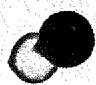

Theoretical Thermal Entrance and Turbulent Flow Analysis 233   
Physical Properties 237   
Heat capacity 237   
Thermal conductivity of liquids 238   
Thermal conductivity of solids 243   
Viscosity of liquids 246   
Density of liquids 246

Molten Fluoride Electrical-Conductivity Measurements 251

13. COMPONENTS OF LIQUID-METAL SYSTEMS 253

Pumps 253

Electromagnetic pump for figure-eight loops 253   
Centrifugal pump for figure-eight loops 254   
Centrifugal pump for ARE 254   
Pump for 200-megawatt aircraft reactor 257   
Canned rotor pump 257   
Turbine pump 258   
Pump seals 258

Bearing-Tester Design 260   
Operation of Seal-Testing Device 260   
Electromagnetic Flowmeter 262   
Calibration Loop 263   
Flange-Testing Device 263   
Stress Rupture Tests 263   
Insulation Testing 263   
Heat-Exchanger Tests 264   
Cleaning and Disposal of Liquid Metals and Equipment 266   
Sampling Procedures 269   
Purification of Liquid Metals and Gases 270   
Liquid Metals Safety Committee 271   
Instrumentation 272   
Building Facilities for the Experimental Engineering Group 272

14.METALLURGICAL PROCESSES 274

Welding Laboratory 293   
Creep-Rupture Laboratory 293   
Equipment installation 294   
Tensile tests with cyclic stress 295   
Physical Chemistry of Liquid Metals 295   
Liquid-metal corrosion of single metal crystals 296   
Processing of single spherical crystals 296   
Hydrogenous Fluids 298

15. RADIATION DAMAGE 299

Creep Under Irradiation 299

Cantilever creep apparatus 300

Tensile creep apparatus 300

Thermal Conductivity of Structural Alloys at High Temperature 300

Y-12 Cyclotron Creep Experiments 301

Purdue Cyclotron 302

Properties of unirradiated molybdenum 302

Resistivity of molybdenum after irradiation 303

Creep instrumentation 304

Effects of Radiation on a Fluoride Fuel 304

# Part IV. ALTERNATIVE SYSTEMS

INTRODUCTION TO PART IV 307

16. HOMOGENEOUS, CIRCULATING-FUEL, AND CIRCULATING-MODERATOR REACTORS 308

17. VAPOR-CYCLE AND HELIUM-CYCLE SYSTEMS 309

Vapor-Cycle System 309

High-temperature materials 310

Helium-Cycle Analysis 310

18. SUPERCRITICAL-WATER CYCLE 311

Heat Transfer and Fluid Flow 311

Comparative heat-transfer studies of flow types 312

Study of flow instability 313

Review of heat-transfer data 314

Reactivity 315

Equivalent water reactors for iron-water mixtures 315

Results of reactivity studies 316

Dynamics and Controls 318

Properties of Materials 318

Embrittlement of steel by atomic hydrogen. 319

Corrosion of steel in water 319

19. SUPersonic TUG-TOW SYSTEM 321

# APPENDIXES

21. ANALYTICAL CHEMISTRY 336

Determination of Oxygen in Sodium 336

n-Butyl bromide method 337

Sampling techniques 338

Conclusions 339

Determination of Oxygen in Argon and Helium 339

339

Thermal Stability of Dow Corning Silicone Oil 550 340

Control Program for Spectrographic Determination of Trace Metals

in Sodium 341

Service Analyses 341

Analysis of sodium 341

Analysis of lead and bismuth 342

Analysis of uranium compounds and mixtures 342

Analysis of beryllium fluoride 343

Analysis of metals and alloys 343

Analysis of miscellaneous samples 343

Summary of service analyses 344

22. LIST OF REPORTS ISSUED 345

23. CHART OF THE TECHNICAL ORGANIZATION OF THE ANP PROJECT 348

LIST OF TABLES

Table 1.1 Reactor Core Data 29   
Table 1.2 Temperature and Pressure Summary (Core, Primary Coolant Circuit, and Part of Secondary Coolant Circuit) 40   
Table 1.3 Axial-Flow Pump Specification Data 42   
Table 1.4 Heat-Exchanger Specification Data 44   
Table 3.1 Effect of Core Composition on Critical Mass of Standard Reactor 72   
Table 3.2 Density $(\rho)$ Coefficients of Reactivity and Uranium Mass $(m)$ in the Standard Reactor 73   
Table 3.3 Shim Control Requirements 91   
Table 3.4 ARE Critical Masses 105   
Table 3.5 ARE Shim Control Requirements 106   
Table 3.6 Constants Employed in the Kinetic Calculation 110   
Table 3.7 Power and Average Fuel Temperature Equations for the ARE Resulting from Perturbation Theory Analysis 111   
Table 3.8 Calculated Reactivity by Subdividing Energy Groups 117

Table 6.1 Determination of Ternary Eutectic in NaF-KF-UF $^4$ from Filtration Experiments 133   
Table 6.2 Effect of Temperature and Length of Aging on the Stability of Sodium Monouranate Suspensions in Sodium Hydroxide 137

Table 11.1 Static Corrosion Data Obtained in 40-hr Tests Made in Iron Capsules at $1000^{\circ}\mathrm{C}$ in Lead 185   
Table 11.2 Static Corrosion Data Obtained in 400-hr Tests Made in Iron Capsules at $1000^{\circ}\mathrm{C}$ in Lead 195   
Table 11.3 Static Corrosion Data for Tests Made in Nickel Capsules in Sodium at $1000^{\circ}\mathrm{C}$ 198   
Table 11.4 Static Corrosion Data Obtained from Tests Made in Beryllia Crucibles at $1000^{\circ}\mathrm{C}$ with 2U-98Bi Alloy 199

Table 11.5 Corrosion and Operation Notes of Thermal Convection Loops 206   
Table 11.6 Materials Under Test (Static Corrosion by Fluoride Melts) 213   
Table 11.7 Results of Corrosion Tests on Fluoride Eutectic 224

Table 18.1 Calculated Equiv. Density of Iron as a Function of the Iron-to-Water Ratio 315   
Table 18.2 Fuel Requirement for Iron-Water Reactors 317   
Table 21.1 Determination of Oxygen in Bulk Sodium by n-Butyl Bromide Method 338   
Table 21.2 Results of Determinations of Oxygen in Helium and Argon 340   
Table 21.3 Summary of Service Analyses 344

# LIST OF FIGURES

Fig. 1.2 Aircraft Reactor Core Arrangement 31   
Fig. 1.3 Liquid Level Control System 36   
Fig. 1.4 Primary Circuit Pump (Axial Flow) 41   
Fig. 1.5 Intermediate Heat Exchanger 43   
Fig. 2.1 Preliminary ARE Core Arrangement 46   
Fig. 2.2 Floor Plan of ARE Test Facility Building 49   
Fig. 2.3 End Elevations of ARE Test Facility Building 50   
Fig. 3.1 Slowing Down Density vs. Radius (807) 60   
Fig. 3.2 Slowing Down Density vs. Radius (839) 62   
Fig. 3.3 Spatial Power Distribution (Reactor 804) 66   
Fig. 3.4 Normalized Fissioning Spectrum (Reactor 804) 67   
Fig. 3.5 Normalized Fissioning Spectrum (Integrated over Core) 69   
Fig. 3.6 Spatial Power Distribution (Reactor 806) 70   
Fig. 3.7 Normalized Fissioning Spectrum (Reactor 806) 71   
Fig. 3.8 Spatial Power Distribution (Reactor 813) 74   
Fig. 3.9 Spatial Power Distribution (Reactor 808) 76   
Fig. 3.10 Normalized Fissioning Spectrum (Reactor 808) 77   
Fig. 3.11 Spatial Power Distribution (Reactor 812) 78   
Fig. 3.12 Effect of Reflector Thickness on Reactivity 79   
Fig. 3.13 Spatial Power Distribution (Reactor 855) 81   
Fig. 3.14 Flux Distribution (Reactor 855) 82   
Fig. 3.15 Normalized Fissioning Spectrum (Reactor 839) 83   
Fig. 3.16 Spatial Power Distribution (Reactor 822) 85   
Fig. 3.17 Normalized Fissioning Spectrum (Reactor 822) 86   
Fig. 3.18 Self-Shielding Factor as a Function of Lethargy (10 mil Foil) 87

Fig. 3.19 Self-Shielding Factor as a Function of Lethargy (20 mil Foil) 88   
Fig. 3.20 Iteration of Source Term 90   
Fig. 3.21 Normalized Fissioning Spectrum (ANP Equivalent Bare Reactor) 92   
Fig. 3.22 Normalized Fissioning Spectrum (ANP Reflected Liquid Fuel   
Fig. 3.23 Spatial Power Distribution (ANP Reflected Liquid Fuel Reactor) 95   
Fig. 3.24 Flux Response to a Step Change in Reactivity of $10^{-3}$ (No   
Delays-NoXenon) 98  
Fig. 3.25 Bulk Mean Fuel Temperature Response to a Step Change in   
Fig. 3.26 Flux Response to a $75^{\circ}\mathrm{C}$ Step Change in Coolant Entrance   
Fig. 3.27 Bulk Mean Fuel Temperature Response to a $75^{\circ}\mathrm{C}$ Step Change in   
Fig. 3.28 Flux Response to a Step Change in Reactivity of $10^{-3}$ (No   
Fig. 3.29 Bulk Mean Fuel Temperature Response to a Step Change in   
Fig. 3.30: Normalized Fissioning Spectrum (ARE Bare Reactor - No Xenon) 107   
Fig. 3.31 Normalized Fissioning Spectrum (ARE Bare Reactor - Equilib-  
Fig. 3.32 Change in Power for $100^{\circ}\mathrm{F}$ Step Change in Inlet Coolant 112   
Fig. 3.33 Change in Mean Fuel Temperature $(^{\circ}\mathbf{F})$ for $100^{\circ}\mathbf{F}$ Step Change   
Fig. 3.34 Normalized Fissioning Spectrum (Critical Experiment   
Fig. 4.1 Critical Experiment Apparatus 119a   
Fig. 5.1 Total Cross-Section Curve of Molybdenum (Low Energy Tail) 122   
Fig. 5.2 Total Cross-Section Curve of Molybdenum 124   
Fig. 6.1 Phase Diagram of the NaF-UF4 System 129   
Fig. 6.2 Phase Diagram of the $\mathbf{KF - UF_4}$ System 131   
Fig. 6.3 The Ternary System NaF-KF-UF 134

Fig. 11.1 Static Corrosion Testing (Capsulating Technique) 183   
Fig. 11.2 Static Corrosion Testing (Tabulating Technique) 187   
Fig. 11.3 Armco Iron and Type 405 SS Exposed to Lead 188   
Fig. 11.4 Type 430 SS and Type 446 SS Exposed to Lead 189   
Fig. 11.5 Molybdenum and Tantalum Exposed to Lead 190   
Fig. 11.6 Nickel and Beryllium Exposed to Lead 191   
Fig. 11.7 Titanium and Type 304 SS Exposed to Lead 192   
Fig. 11.8 Type 316 SS and Type 347 SS Exposed to Lead 193   
Fig. 11.9 Type 310 SS Exposed to Lead 194   
Fig. 11.10 Molybdenum, Inconel and Inconel X Exposed to Sodium 200   
Fig. 11.11 Type 316 SS Tubing and Inconel Tubing Exposed to Bi-U Alloy 201   
Fig. 11.12 Type 310 SS Exposed to Lead 204   
Fig. 11.13 Flaws in Welded Joints Which Tend to Promote Premature Convection Loop Failure 205   
Fig. 11.14 Steps in Capsule Preparation for Fluoride Corrosion Testing 216   
Fig. 11.15 Liquid Fuel Corrosion (Monel and Nickel) 217   
Fig. 11.16 Liquid Fuel Corrosion (Inconel X and Inconel) 218   
Fig. 11.17 Liquid Fuel Corrosion (304 SS and 304 ELC SS) 219   
Fig. 11.18 Liquid Fuel Corrosion (347 SS and 321 SS) 220   
Fig. 11.19 Liquid Fuel Corrosion (446 SS and 430 SS) 221

Fig. 11.20 Liquid Fuel Corrosion (410 SS and Nichrome V) 222   
Fig. 11.21 Liquid Fuel Corrosion (Globeiron) 223   
Fig. 12.1 Test Section for the Determination of the Heat Transfer Coefficient of NaOH 229   
Fig. 12.2 Temperature Distribution Along Walls of Rectangular Conduit for Constant Wall Flux Heating 234   
Fig. 12.3 Temperature Distribution Along Walls of Equilateral Triangular Duct for Constant Wall Flux Heating 235   
Fig. 12.4 Temperature Distribution Along Walls of Right Triangular Duct for Constant Wall Flux Heating 236   
Fig. 12.5 Heat Exchange Section of Ice Calorimeter 239   
Fig. 12.6 Assembled Calorimetric Apparatus 240   
Fig. 12.7 Thermal Conductivity Apparatus - Steady State Apparatus for Liquids 241   
Fig. 12.8 Proposed Apparatus for Measuring Thermal Diffusivity of Liquids 242   
Fig. 12.9 Longitudinal Flow Thermal Conductivity Apparatus for Solids 244   
Fig. 12.10 Density Apparatus 247

Fig. 12.13 Conductivity of the NaF-UF4 Fluoride Eutectic 252   
Fig. 13.1 Cell of Electromagnetic Pump 255   
Fig. 13.2 Centrifugal Pump Assembly 256   
Fig. 13.3 Sealless Pumping System 259   
Fig. 13.4 Bearing Tester Assembly 261   
Fig. 13.5 Insulation Tester 265   
Fig. 13.6 Mock-Up of Heat Exchanger 267   
Fig. 13.7 Mock-Up of Heat Exchanger (End View) 268   
Fig. 14.10 Single Crystal Sphere of Electrolytically Etched Copper 297   
Fig. 16.1 Assembly Details of Reactor: and Heat Exchanger 308a   
Fig. 16.2 Nuclear Power Plant Installation 308b

# SUMMARY

In this edition of the Quarterly Progress Report of the Aircraft Nuclear Propulsion Project the research is divided into four phases in order to facilitate the presentation and the comprehension of the work. Each of these phases -- Reactor Design, Shielding Research, Materials Research, and Alternative Systems -- is separately introduced so that the reader may know the specific areas covered in the subsequent detailed discussions.

The design of the Aircraft Reactor Experiment (Sec. 2) has been developed from the design of the quiescent liquid fuel-liquid metal cooled aircraft reactor (Sec. 1), which was established early in the quarter. The reactor consists of a 3-ft-square cylinder with ellipsoidal ends, employing beryllium oxide as a moderator, sodium as a coolant, a mixture of $\mathrm{UF_4BeF_2}$ NaF as fuel, and inconel as the structural material. The liquid fluoride fuel is contained in tubes suspended in the coolant streams which traverse the moderator. This intimacy of the fuel elements and the heat-transfer medium ensures complete continuity of heat flow from fuel to coolant = an essential feature of high-power aircraft reactors. The maximum design temperature of both these reactors is $1500^{\circ}\mathrm{F}$ (a materials limitation), which is adequate for a subsonic aircraft power plant.

The ternary fluoride eutectic $\mathrm{UF}_4\cdot \mathrm{BeF}_2\cdot \mathrm{NaF}$ appears to be a satisfactory liquid fuel, both in uranium content (about 80 lb/ft³) and melting point (about $900^{\circ}\mathrm{F}$ ). An alternative fluoride fuel, $\mathrm{UF}_4\cdot \mathrm{KF}\cdot \mathrm{NaF}$ , possessing a higher uranium concentration (about 120 lb/ft³) is available although its melting point (about $1020^{\circ}\mathrm{F}$ ) is high (Sec. 6). The radiation stability of these fuels appears to be good, from the evidence obtained so far (Sec. 15).

The phenomenon of mass transfer in a bimetallic system restricts the fabrication of the fuel and coolant circuits and the internal structure of the core to the same monometallic material. From the standpoint of corrosion molybdenum is ideally suited for this task, but fabrication difficulties have so far prevented its consideration for the aircraft reactor. Molybdenum is, nevertheless, highly regarded as the future construction material for high-temperature reactors. Inconel has been specified as the construction material of both the aircraft reactor and its prototype, as it is the only metal which, at this time, is known to be reasonably compatible with both the sodium

coolant and the fluoride fuel and at the same time to possess the other metallurgical requirements of high-temperature strength, weldability, fabricatability, etc. (Secs. 11 and 14).

Beryllium is a better moderator than beryllium oxide from nuclear considerations; however, the latter is specified for this reactor as it is relatively inert and may be readily contained. (Here, again, the potentiality of molybdenum is evident as it is the only known container for beryllium.) The coolant, sodium, is compatible with the oxide, although their mixing in the reactor is not intended. Sodium, incidentally, is a satisfactory coolant.

The facilities of the project have been augmented by the completion of a welding and stress-rupture laboratory for the Metallurgical Group (Sec. 14). The building modifications for the Experimental Engineering Group (Sec. 13) are not completed. The ANP Critical Facility (Sec. 4) and the Shield Testing Reactor (Sec. 8), which were essentially completed during the last quarter, have both achieved criticality and are being used. The 5-Mev Van de Graaff (Sec. 5) is now being installed and may be applied to nuclear research by the end of the next quarter. The Test Facility Building for the ARE (Aircraft Reactor Experiment) is now being designed (Sec. 2).

In addition, the personnel employed by the Aircraft Nuclear Propulsion Project has increased in number so that there are now 256 technical people engaged in all phases of the research work, not including trades and sub-technical people. The capacity of this organization is supplemented by the work and skill of 21 consultants and eight subcontracted scientific laboratories. A chart of the technical organization of the Aircraft Nuclear Propulsion Project at the Oak Ridge National Laboratory is given in Sec. 23.

# RESEARCH. RESULTS

From the body of research now underway on all problems associated with this project, some of the more tangible results obtained during the quarter are listed below.

# Physics

1. The analyses (Sec. 3) of a beryllium oxide—moderated, sodium-cooled stainless steel—fabricated reactor whose static characteristics are very similar to the aforementioned aircraft (ANP) reactor show the following:

(a) A change of moderator from beryllium oxide to beryllium would decrease the critical mass requirement by $20\%$ .   
(b) The increase in critical mass caused by removing a volume of a given constituent equal to $1\%$ of the core volume is approximately $+3.4\%$ for beryllium oxide, $-1.0\%$ for stainless steel, and $+0.2\%$ for sodium.   
(c) A change in reflector thickness from 5.51 to 7.09 in would decrease the critical mass $36\%$ and the median energy of fission from 45 to 14 ev. The savings in critical mass from subsequent increases in the reflector, however, would not be significant.

2. The maximum reactivity change in the ANP reactor that must be overcome by shim control totals $-5.0\%$ , of which $-0.5\%$ is for depletion, $-2.7\%$ for equilibrium xenon, $-1.1\%$ for fuel expansion, and $-0.7\%$ for additional maximum xenon (Sec. 3).   
3. The calculated kinetic responses of the ANP reactor to a step change in reactivity of $10^{-3}$ and to an entrance coolant temperature step change of $167^{\circ}\mathrm{F}$ indicate that the reactor is well damped and completely safe (Sec. 3).   
4. The calculated critical mass expected in the critical experiment with the beryllium-uranium-aluminum assembly underestimated the experimental critical mass by $50\%$ . Discrepancies between the experimental setup and the calculations are being examined (Secs. 3 and 4).   
5. The slow-neutron transmission curve of molybdenum indicates a strong resonance at 46 ev with other dips in transmission at 145 and 180 ev. The line which best describes the transmission in the low-energy region is given by $\sigma_{f} = 5.7 + 0.30E^{-\frac{1}{2}}$ (Sec. 5).

# Heat Transfer

10. An experiment to determine the extent of free convection in the reactor fuel tube indicated a temperature drop of from 1 to $2^{\circ}\mathrm{F}$ in a vertical tube filled with mercury, in which the temperature drop without convection would have been about $13^{\circ}\mathrm{F}$ . This implies that convection in the ARE fuel tubes will lead to very good heat-transfer conditions (Sec. 8).   
11. A longitudinal-flow apparatus for the determination of the thermal conductivity of solids up to $600^{\circ}\mathrm{F}$ has been developed which is capable of accuracies of from 5 to $10\%$ (Sec. 8).

# Liquid Fuels Chemistry

12. The equilibrium diagram for the ternary fluoride fuel NaF-KF-UF $_4$ has been reasonably well established. The lowest eutectic found to exist consisted of 27 mole % UF $_4$ , 29.5 mole % KF, and 43.5 mole % NaF and had a melting point of $1020 \pm 20^{\circ}\mathrm{F}$ (Sec. 6).   
13. The equilibrium diagram for the ternary system $\mathrm{NaF - BeF_2 - UF_4}$ has not been completely established, but a eutectic consisting of 12 mole $\%$ $\mathrm{UF_4}$ , 17 mole $\%$ $\mathrm{BeF_2}$ , and 71 mole $\%$ NaF with a melting point of $900 \pm 20^{\circ}\mathrm{F}$ has been located. This uranium content is high enough to be of interest as fuel material (Sec. 6).

# Radiation Damage

14. The initial irradiation of the fluoride eutectic $\mathrm{NaF - UF_4}$ in a neutron flux of about $10^{12}$ per cubic centimeter per second evidenced no irradiation-induced pressure rise, as might have resulted if free fluorine gas had been formed (Sec. 15).

15. One molybdenum sample irradiated for 4 hr by a $3 - \mu$ a beam of 10-Mev deuterons evidenced no detectable variation in resistivity after one day (Sec. 15).

# Metallurgy

16. Monel and nickel A have been found to have satisfactory corrosion rates (about 0.03 mil/hr) in the fluoride eutectic $(\mathrm{NaF - UF_4})$ , although the compatibility of these metals with such other requirements as high-temperature strength is not favorable (Sec. 11).

17. An extensive summary of the corrosion behavior of molten lead under static conditions has been prepared (Sec. 11). Results of these tests with various metals include the following:

(a) Iron showed no metallographic evidence of any attack although a small weight loss corresponding to a surface erosion of 0.0005 in. was detected after 40 hr at $1000^{\circ}\mathrm{C}$ .   
(b) Steels containing 12 to $16\%$ chromium also showed very little evidence of corrosion, although there was some surface penetration to a depth of 0.005 in. after 400 hr at $1000^{\circ}\mathrm{C}$ .   
(c) Austenitic stainless steels at $1000^{\circ}\mathrm{C}$ show more extreme surface instabilities than iron or the low-chromium steel, including lead solution, intergranular penetration, precipitation, and decarburization.

18. The static corrosion of metals with sodium is in general less severe than with lead. Nickel evidences no corrosion, and molybdenum, tantalum, titanium, inconel, 347 stainless steel, and 446 stainless steel appear to be almost as satisfactory (i.e., 0.003 in. or less thickness change in 40-hr tests at $1000^{\circ}\mathrm{C}$ ) (Sec. 11).   
19. A diffusion barrier of chromic oxide has been tried as a corrosion inhibitor for 310 stainless steel. A static corrosion test with lead at $1000^{\circ}\mathrm{C}$ for 100 hr indicated that the depth of the attack was not reduced, but the attack was, nevertheless, less severe (Sec. 11).

# Alternative Systems

20. The supercritical water reactor is being analyzed by Nuclear Development Associates, Inc. Preliminary exploratory work on heat transfer, fluid flow, and reactivity have been encouraging (Sec. 18).

# Part I

# REACTOR DESIGN

# INTRODUCTION TO PART I

The aircraft reactor, being a high-power (200-megawatt) reactor, is characterized by a high heat flux, the requirement of a large heat-transfer area in a small volume, and, consequently, a rather intricate core design. The last quarter has witnessed the establishment of the preliminary design of the quiescent liquid fuel-liquid metal cooled 200-megawatt aircraft reactor. This design incorporates a core arrangement in which three fuel tubes are immersed in each coolant tube in a beryllium oxide matrix.

The complexity of the overall aircraft power plant system necessitates the separate development of the major components of the system. Consequently, the detailed design of the Aircraft Reactor Experiment (ARE), a low-power test reactor, has been undertaken with the aircraft reactor design as a point of departure. This ARE core design is intended to duplicate, so far as is practical, the materials and kinetics of the larger reactor. Although exact duplication of the ANP reactor is not possible, the resultant compromises do not mitigate against the usefulness of the ARE as a device for proving the present core concept in all details consistent with rapid progress. The preliminary design of this prototype reactor has been completed, and procurement of the larger pieces of the reactor has been initiated. The design of a building facility for this test reactor has been completed and detailed specifications are being prepared.

Throughout the design of both the ANP and ARE reactors the calculations of the ANP Physics Group have directed the layout of the core. Numerous multigroup calculations have been required by the engineering variations and shifts of interests that were investigated. The nuclear characteristics of reactors which have been investigated include statics (e.g., critical mass, flux distributions, power distributions, reflector effects) and dynamics (e.g., the time response of the liquid fuel-liquid metal cooled reactor to changes in reactivity coolant temperature failures). The program for correlating theoretically predicted values of critical mass with those obtained from actual critical experiments was initiated.

A satisfactory liquid fuel for these reactors appears to have been found in the ternary fluoride system beryllium fluoride--sodium fluoride--uranium fluoride. This fuel provides a suitable uranium density in a fuel

solution with a satisfactory melting point. Other solutions of uranium fluoride in alkaline earth fluorides are being investigated.

A schematic drawing of the reactor and core, representing that of either the ANP or ARE reactor, is presented in Fig. 0.2. The essential components of these liquid fuel-liquid metal cooled reactors are noted, together with specific references to the text for discussion of each feature.

# 1. DESIGN OF THE 200-MEGAWATT AIRCRAFT REACTOR

R. W. Schroeder, ANP Division

Of the five quiescent liquid-fuel reactors which were discussed in the last quarterly report (ORNL-919) the hairpin core arrangement in which three tubular hairpins (fuel tubes) are immersed in each coolant tube was selected for the 200-megawatt (ANP) reactor. A study of the other alternatives, however, indicated that any one might be capable of successful development, since it is not possible at this time to designate any single design that warrants development to the exclusion of all others. Nevertheless, as the early initiation of a development program leading to the ANP reactor is desired and as much of the information to be acquired will be general in nature, it was necessary to select a particular reactor from the more attractive possibilities. The overall arrangement of this reactor (Fig. 1.1) will involve a minimum of additional research, and it imposes minimum constraints on the size and shape of accessory components. It is emphasized that even this design as illustrated is preliminary in form and that many months of analysis and component testing will be required prior to the establishment of all features.

The major components of the reactor arrangement include the reactor core and pressure shell assembly, four independent control assemblies, six intermediate heat exchangers, six axial-flow primary coolant pumps,

These individual components are described separately.

# CORE DESIGN

The core (Fig. 1.2) is nominally a 3-ft-square cylinder with ellipsoidal ends, employing beryllium oxide as moderator and reflector, a mixture of $\mathrm{UF}_4$ and NaF as fuel, and inconel as the structural and canning material. The volume percentages of these components in the core are given in Table 1.1. The core includes 2268 parallel coolant tubes arranged logitudinally and spaced by transverse perforated and dimpled disks occurring every 2 in. along the longitudinal core axis. Three "U-tube" fuel elements are located within each coolant tube and are supported by the fuel manifold system. To minimize the number of header welds, "U tubes" rather than individual straight

TABLE 1.1   
Reactor Core Data   

<table><tr><td colspan="5">MATERIAL COMPOSITION</td></tr><tr><td>. COMPONENT</td><td>MATERIAL</td><td>VOLUME (ft3)</td><td>Volume % OF TOTAL CORE</td><td>WEIGHT (1b)</td></tr><tr><td>Fuel</td><td>Fused fluoride salts</td><td>1.39</td><td>7.83</td><td>390</td></tr><tr><td>Fuel tubes</td><td>Inconel</td><td>0.78</td><td></td><td></td></tr><tr><td>Moderator</td><td>BeO</td><td>10.10</td><td>57.14</td><td>1778</td></tr><tr><td>Moderator cans</td><td>Inconel</td><td>0.42</td><td></td><td></td></tr><tr><td>Structure</td><td>Inconel</td><td>0.81</td><td></td><td></td></tr><tr><td>Coolant</td><td>Sodium</td><td>4.18</td><td>23.65</td><td>210</td></tr><tr><td>Total inconel</td><td></td><td>2.01</td><td>11.38</td><td>1000</td></tr><tr><td>Total core</td><td></td><td>17.68</td><td>100.00</td><td>3378</td></tr></table>

MISCELLANEOUS DATA   

<table><tr><td>Heat-transfer area</td><td>1040 ft2</td></tr><tr><td>Fuel tube aggregate length</td><td>39,600 ft</td></tr><tr><td>Free flow area for coolant (% of core cross-section)</td><td>23.65%</td></tr><tr><td>Number of tubes</td><td>15,700 (7850 “U tubes”)</td></tr><tr><td>Number of tube sections</td><td>148</td></tr><tr><td>Fuel per section</td><td>0.675 % of total fuel</td></tr><tr><td>Fuel available for control</td><td>10%</td></tr><tr><td>Fuel tube diameter</td><td>0.100 in.</td></tr><tr><td>Fuel expansion allowance (not in core)</td><td>6%</td></tr><tr><td>Fission gas accumulation allowance (not in core)</td><td>10%</td></tr></table>

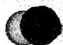

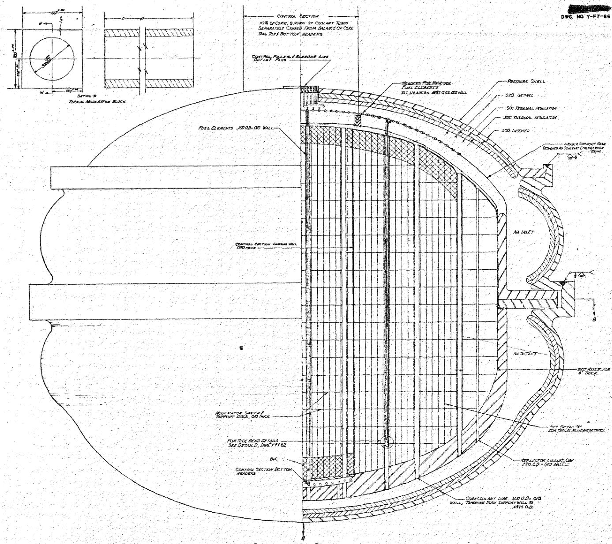  
FIGURE 1.2 AIRCRAFT REACTOR CORE ARRANGEMENT

tubes (as described in section on control of the aircraft reactor) are employed for all fuel elements except control elements. The fuel headers to which the fuel elements are welded are arranged so that the individual "U-tube" legs are connected to separate headers, designated as "inlet" and "outlet" for loading, unloading, flushing, etc. The fuel headers are partially empty during operation, serving as accumulators to accommodate changes in core fuel volume associated with fuel temperature changes.

One hundred and fifty-nine fuel element sectors are employed, each of which contains a proportionate share of fuel elements, one inlet header, and one outlet header. This degree of compartmentalization favors fabrication and inspection and minimizes the consequences of any one or more failures, since any one failure will involve the loss of less than $1\%$ of the total fuel volume. Several such failures can be compensated for by control adjustment. Inlet and outlet filling and flushing tubes, connected to the individual headers, are grouped together into a spider-shaped harness and brought to a multtube conduit passing through the pressure shell. The conduit is routed through the shield to an external filling and flushing station,

The arrangement illustrated embodies features that were selected after review of many alternatives. It was found that thin fuel elements are required to minimize peak fuel temperatures which tend to become critical, because the thermal conductivity of the fuel is estimated to be of the order of 1.0 to 1.5 Btu/(hr·ft·°F). It was decided to use cylindrical fuel elements rather than plate type elements for maximum resistance to differential pressures. Tubes of small diameters and lengths not in excess of several feet minimize hoop stresses associated with fuel egress acceleration forces. These factors, plus considerations of surface area and included volume requirements, dictated the dimensional constants listed in Table 1.1.

Core Materials. The material selections which have been mentioned are not necessarily final, but these materials have been tentatively adopted on the basis of current data.

Fuel. The fused fluorides have been specified to permit the negative temperature coefficient and because of the relative ease of fuel drainage and replenishment associated with liquid fuels. These factors are discussed in more detail in Secs. 3 and 6.

Coolant. Sodium has been designated as the primary and secondary coolant because existing data indicate that sodium can be contained at desired operating temperatures by several materials, including certain stainless steels, nickel, and inconel.

Structure. The core structure includes an inconel pressure shell, cooled externally and insulated internally. The top dome is free of primary coolant piping, facilitating its removal. Within the pressure shell a structural cylinder is supported by a spline joint in a manner permitting freedom for axial and radial expansion but restraining center-of-gravity movement. Moderator weight, coolant-tube weight, and coolant-tube drag forces are transmitted by compression to the bottom core dome, which in turn transmits the loads to the main flange.

Inconel has been specified tentatively, as preliminary data indicate it to be compatible with the sodium coolant and with the fused fluorides. If further data indicate type 316 stainless steel to be compatible with the fuel, this material may be preferred.

Moderator. The use of metallic beryllium as moderator offers some decrease in fuel investment compared to beryllium oxide. Beryllium possesses favorable thermal conductivity and ductility, but there is evidence that it may alloy with any of the readily available canning materials, and further research is required on the elimination or minimization of this alloying. Pending resolution of this problem, BeO is regarded as the specific moderator material, and the analyses included here are based on its use,

# CONTROL OF THE AIRCRAFT REACTOR

E. S. Bettis, NEPA Control Group

Consideration of several features of the aircraft reactor indicates that the control difficulties are mitigated by the reactor design which is inherently stable for fast power or temperature transients. This stability is achieved by using fuel elements with high negative temperature reactivity

coefficients. Since the temperature-time response of the moderator is about two orders of magnitude slower than that of the fuel, stability of the reactor to fast power or temperature transients can be effected by the choice of fuel elements only and is independent of moderator choice. The response of the coolant is slower than that of the fuel, and the sodium coolant is a poor moderator.

The expansion of the fuel provides the necessary fast control for the reactor. This automatic regulation must be supplemented by a slow-acting shim control to compensate for large and relatively slow changes in reactor power, poisoning, and depletion. The shim control is effected by a variable liquid-fuel volume in a separate fuel assembly within the active lattice. This system is actuated by a temperature signal from the coolant outlet and automatically regulates the fuel volume to maintain a constant coolant outlet temperature.

Inherent Stability. A fuel consisting of a combination of molten fluorides has the highest volume coefficient of thermal expansion of any system studied. This type of fuel has been selected to provide the maximum change in reactivity with temperature variations. A reactor whose changes in reactivity result from changes in fuel volume provides a mechanism for holding the fuel temperature to relatively small excursions about a bulk mean value. This type of control will allow wide variations in fission rate or power. Since the reactor temperature must be kept under control for safe operation, it is felt that the temperature control provides adequate safeguard for the reactor.

While inherent stability to fast power and temperature transients appears to be a highly desirable feature of the fused-salt fuel elements, it cannot be concluded that the system will not have objectionable oscillations in power or temperature transients until careful quantitative analyses of the response of the system to such transients are made. Such analyses will give further information on ranges of temperature and power for which stability is satisfactory.

The analyses of the response of the system to fast perturbations show that, even with the large damping factor contributed by the delayed neutrons omitted from the calculations, oscillations are small in amplitude and are highly damped in power ranges about the design point. The results of the studies show that the pressures developed within the fuel tubes by fuel expansion are

not excessive, even for assumed magnitudes of reactivity step changes much more severe than could reasonably be expected to occur in practice.

Liquid-Fuel-Level Control System. The liquid-fuel reactor permits the use of a portion of the fuel for dynamic control. The dynamic control system of the aircraft reactor requires the use of approximately $10\%$ of the fuel volume. This volume is located in the center of the core where its removal will have the least detrimental effect on the power distribution. To minimize lumping of the fuel in any one container, the system has been divided into four elements. Each element is independently activated and interlocked so that no more than one element is active at one time. These control elements are limited in maximum rate of travel so that the $\Delta k / k$ will not exceed approximately $2\times 10^{-4}$ per second. The coolant outlet temperature provides the signal for operation of the control system. The system has no close-tolerance moving parts in the high-temperature region. Figure 1.3 illustrates the preliminary liquid fuel-liquid metal cooled reactor control system.

A description of the control system core element, fuel reservoir, actuator unit, and operating cycle is given,

Core Element. The core control elements extend through the core in a vertical direction and are so spaced as to introduce a minimum local power variation. The upper header normally contains gas maintained under a constant pressure. The lower header is full of fuel and is fed from the fuel reservoir. Excluding the header volume, each of the four core control elements contain approximately $2.5\%$ of the total fuel volume of the core. The amount of fuel in this volume is controlled from the fuel reservoir. Both headers are separated from the core flux by a $\mathsf{B}_4\mathsf{C}$ shield.

Fuel Reservoir. The fuel reservoir is attached to the upper pressure shell and so arranged that the reserve fuel will be heated or cooled by the sodium coolant. On the initial start-up it will be necessary to keep this reservoir above the fuel melting point, but after some interval of power operation the problem is reversed to one of heat removal.

Actuator Unit. The actuator unit is similar in construction to the fuel reservoir but contains the transmitter eutectic in one compartment and hydraulic oil in the other. The diaphragm is spring loaded to provide a positive force for removing the fuel from the core. This force, augmented by the gas pressure above the fuel in the core element, will serve to remove the fuel in the event

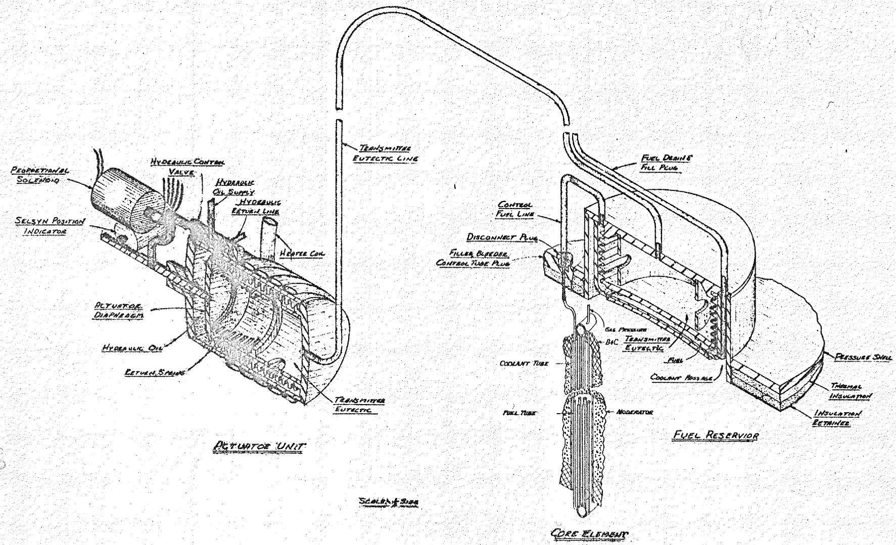  
FIGURE 1.3. LIQUID LEVEL CONTROL SYSTEM

of component failure. The volume of oil in the system at any time is regulated by the hydraulic control valve, which in turn is fed by a positive displacement pump. This pump is so adjusted that the oil flow will not exceed the value determined as safe for the introduction of fuel into the core. The control valve is positioned by a linkage which is controlled by the proportional solenoid and the shaft connected to the actuator diaphragm. This linkage is so designed that the proportional solenoid controls the position of the diaphragm and correspondingly the level of fuel in the core element. The solenoid is installed in such a way that it will remove the fuel from the core control element in the event of electrical failure. There is a selsyn transmitter coupled to the diaphragm shaft to indicate fuel level to the operator. A heating coil, which will have shield water circulating through it, is provided to protect the eutectic from freezing.

Operation. The coolant outlet temperature, which is monitored by a number of thermocouples immersed in the coolant stream, provides the control signals. The signals are first compared to the operation level set point and then amplified and sent to the proportional solenoid. The level set point may be varied by the operator to meet the demand, but, once adjusted, it should not require any change during normal operation. This set point is automatically overridden to set back the reactor temperature in the event of failure of engines, pumps, auxiliary power supply, etc.

# PRIMARY COOLANT CIRCUIT

The primary circuit employs

generously sized heat exchangers and ducts to minimize pressure losses and to maximize secondary circuit temperatures. The arrangement (Fig. 1.1) provides intermediate heat exchangers each with its own primary circuit pump (as illustrated) and its own secondary circuit (not shown). The separation of the heat exchangers and secondary circuits isolates the consequences of any secondary system failure, any primary pump failure, or any intermediate heat-exchanger internal failure. Primary coolant returning

to the core from the pumps is mixed in the core inlet scroll and header before the coolant is directed through the core coolant annuli, thereby protecting against local core starvation in the event of primary pump stoppage. Back flow through any dead primary pump is minimized by the resistance of the heat exchanger and ducts in series with the dead pump as well as the resistance of the dead rotor itself, thereby obviating the need for check valves.

In Table 1.2 are given the calculated pressures and temperatures throughout the core, the primary coolant circuit, and a portion of the secondary circuit.

Pumps. Various types of pumps, including electromagnetic, canned rotor, and mechanically driven pumps, have been studied. At their current respective stages of development the mechanically driven pumps appear to be superior for aircraft usage from the standpoints of weight, size, and efficiency. Within this category a broad band of rotor types may be designed, ranging from pure centrifugal at the high head—low flow end of the range, through mixed flow impellers, to axial flow at the moderate head—high flow end of the range. The flow rates and heads required by the proposed system fall within the range permitting the use of axial-flow pumps, which are preferred for their compactness. Such an axial-flow pump (Fig. 1.4) has been designed. Pertinent pump data are given in Table 1.3.

Shaft sealing is provided by a combination of inert gas pressure and a centrifugal slinger. The slinger illustrated should be adequate under the most adverse operating conditions. Sealing under static conditions is provided by locating the gas seal above the highest point in the sodium system. Inert gas pressure is applied to the surface of the sodium in the primary fluid make-up tank and also admitted, via interconnecting lines, to the shaft housings below the gas seals. This arrangement should ensure, under static conditions, that the sodium level in the shaft housings is maintained hydrostatically by the make-up tank level. Rotor thrust is taken by an oil-lubricated thrust bearing installed above the gas seal.

The pumps may be driven by hydraulic, pneumatic, or electric motors, and the choice probably will be dictated by the overall power transmission system design of the airplane.

# TABLE 1.2

# Temperature and Pressure Summary

# GENERAL SPECIFICATIONS

Total power 200,000 kw (189,600 Btu/sec)

Flow rate, primary circuit 1800 lb/sec

Flow rate, secondary circuit 1800 lb/sec

Coolant average properties:

Specific heat

0.3Btu/(1b·°F)

Density

50 lb/ft3

Thermal conductivity

36 Btu/(hr·ft·°F)

Viscosity

0.5 lb/(hr·ft)

# PRIMARY CIRCUIT

<table><tr><td></td><td>PRESSURE (psi)</td><td>TEMPERATURE* (°F)</td></tr><tr><td>Pump inlet</td><td>50</td><td>1130</td></tr><tr><td>Pump discharge</td><td>93</td><td>1130</td></tr><tr><td>Pressure shell inlet</td><td>88</td><td>1130</td></tr><tr><td>Core matrix inlet</td><td>80</td><td>1130</td></tr><tr><td>Core matrix outlet</td><td>67</td><td>1480</td></tr><tr><td>Pressure shell outlet</td><td>62</td><td>1480</td></tr><tr><td>Intermediate heat-exchanger inlet</td><td>57</td><td>1480</td></tr><tr><td>Intermediate heat-exchanger outlet</td><td>53</td><td>1130</td></tr><tr><td>Pump inlet</td><td>50</td><td>1130</td></tr></table>

# SECONDARY CIRCUIT

<table><tr><td>Intermediate heat-exchanger inlet</td><td>Δp=10</td><td>1070</td></tr><tr><td>Intermediate heat-exchanger outlet</td><td></td><td>1420</td></tr></table>

# REACTOR

<table><tr><td>Division of power production</td><td>94% in fuel, 6% in moderator</td></tr><tr><td>Avg. power density in fuel</td><td>74 Btu/(sec·in.3)</td></tr><tr><td>Avg. power density in moderator</td><td>65 Btu/(sec·in.3)</td></tr><tr><td>Max. fuel temperature</td><td>2650°F</td></tr><tr><td>Max. temperature on inner surface of fuel tube</td><td>1540°F</td></tr><tr><td>Max. temperature on outer surface of fuel tube</td><td>1500°F</td></tr><tr><td>Max. primary coolant temperature</td><td>1480°F</td></tr><tr><td>Max. moderator temperature</td><td>1730°F</td></tr><tr><td>Max. temperature of moderator surface**</td><td>1690°F</td></tr><tr><td>Max. temperature of inner surface of moderator can</td><td>1488°F</td></tr><tr><td>Max. temperature of outer surface of moderator can</td><td>1483°F</td></tr><tr><td>Max. primary coolant temperature (ref.)</td><td>1480°F</td></tr></table>

*Neglecting minor heat inputs and losses.

**Based on assumption of contact thermal resistance coefficient of 400 Btu/(hr·ft²·°F).

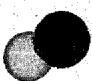

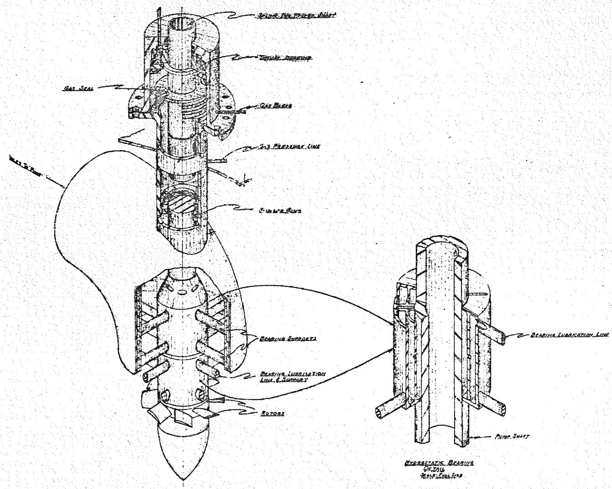

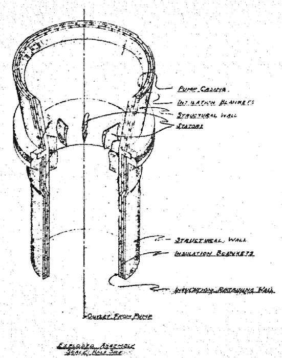  
FIGURE 1.4 PRIMARY CIRCUIT PUMP (AXIAL FLOW)

# TABLE 1.3

# Axial-Flow Pump* Specification Data

Flow per pump 6 cfs

Pressure rise 80 psi,230 ft of sodium

Specific speed 6000

Actual speed 6860 rpm

Estimated efficiency 80%

Pump power requirement 157 hp***

Blade tip diameter 6.0 in.

Rotor hub diameter 3.6 in.

*The pump bearing is of the self-centering hydrostatic type.

**The estimated system pressure rise requirement is of the order of 43 psi. Pending experimental verification of this requirement, the pump has been designed for a more adverse requirement.

***85 hp per pump for the calculated system pressure requirement of 43 psi.

Intermediate Heat Exchanger. The problem of heat transfer in the intermediate heat exchanger is quite comparable to that of the reactor core. However, the relative insensitivity of the airplane weight as a function of heat-exchanger size permits the use of somewhat larger and thicker tubular elements. Cylindrical elements are preferred for maximum resistance to differential pressures, and counterflow is desired for maximum secondary coolant outlet temperature. Two conventional methods of providing for thermal expansion of the tubes are the "floating header" with a convoluted bellows seal, and bent-tube construction. The former may involve bellows stresses that are unacceptable at the intended operating temperature unless the pressures in the primary and secondary circuits are substantially balanced at all times, which may be undesirable as well as difficult to ensure. Accordingly, the bent-tube or "hockey stick" design (Fig. 1.5) has been selected. Heat-exchanger specification data are given in Table 1.4, in which the volumes and areas are based on one heat exchanger.

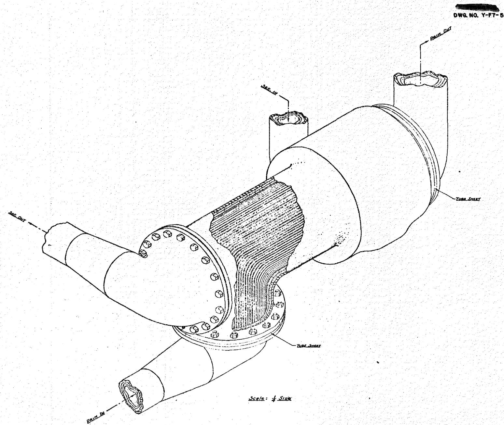  
FIGURE 1.5 INTERMEDIATE HEAT EXCHANGER

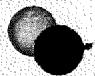

# TABLE 1.4

# Heat-Exchanger Specification Data

Tube outer diameter 0.25 in.

Tube wall thickness 0.018 in.

Tube spacing, center to center 0.3134 in. (staggered pitch)

Active volume 4 ft3

Hydraulic diameter, primary fluid 0.02083 ft (inside tubes)

Hydraulic diameter, secondary fluid 0.01307 ft

Free flow area, primary or secondary 0.4229 ft²

Heat-transfer area, mean 400 ft²

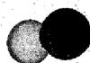

# 2. DESIGN OF THE AIRCRAFT REACTOR EXPERIMENT

R. W. Schroeder, ANP Division

The general features of the 200-megawatt aircraft reactor have been postulated, and a preliminary design of the core, shield, and fluid circuit has been achieved (Sec. 1). With this design as a point of departure, the design of a low-powered test reactor, the ARE, intended as a prototype of certain features of the 200-megawatt reactor, was attempted. The complexity of the overall aircraft power plant system appears to be such as to warrant separate development of the major components prior to any attempt to operate the entire system. Accordingly, the Aircraft Reactor Experiment is regarded as a core and control system development program with shielding and fluid circuit components designed for simplicity and adequacy rather than for faithful aircraft simulation. The current design status of ARE components is outlined below.

# CORE DESIGN

The core design is intended to duplicate, insofar as is practicable, the materials, the temperature pattern, and the kinetics of the 200-megawatt reactor. Studies have indicated that the temperature pattern and certain of the control kinetics constants would be almost duplicated if the airplane-size fuel elements were employed with the number of fuel elements reduced proportionately to the power reduction. Such an arrangement would have insufficient fuel volume, however, and compromises in the direction of more and larger fuel elements appear to be necessary. The more conservatism employed in estimation of the critical mass, the greater will be the fuel volume provided and the larger the departure from the intended temperature and kinetic simulation.

It therefore seems best to defer final determination of required fuel volume pending criticality tests, although it is desired to initiate procurement of the pressure shell, the moderator and reflector ceramic blocks, and the sheet metal and metal tubing as early as possible. A core has therefore been designed (Fig. 2.1) that will permit freezing the components requiring early procurement while retaining fuel volume flexibility. This flexibility

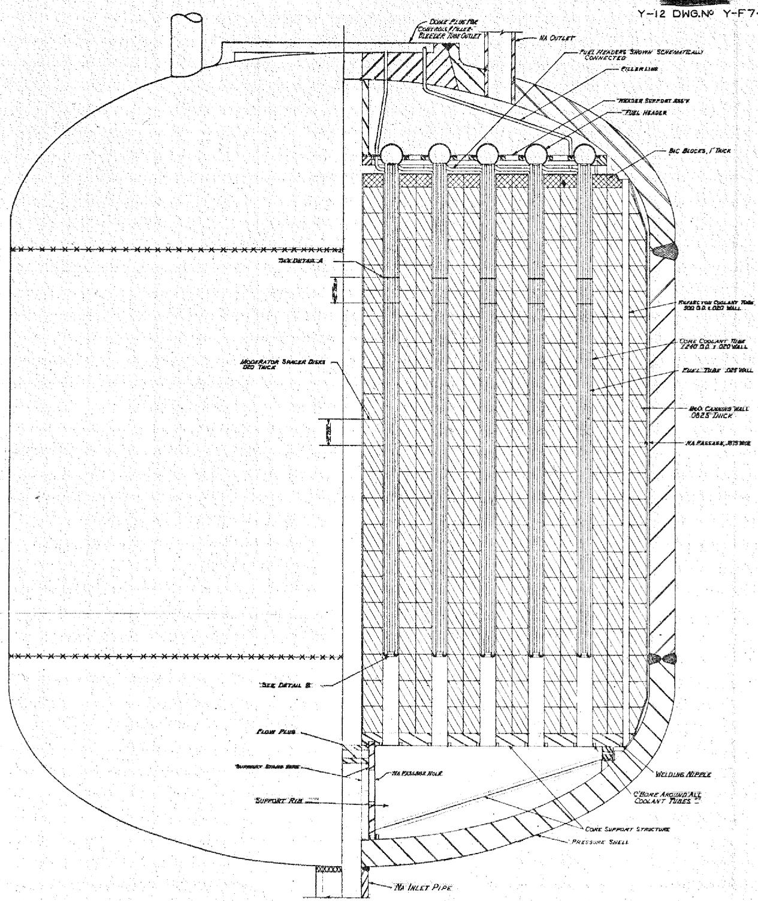  
FIGURE 2.1 PRELIMINARY ARE CORE ARRANGEMENT

is achieved by specifying two alternate tube sizes and by designing the coolant tubes such that four, five, six, seven, or eight fuel elements of either size may be accommodated by each coolant tube. This arrangement permits a critical mass range from approximately 4 to 25 lb, based on a uranium density in the fused salts of 80 lb/ft³.

# CONTROL OF THE ARE REACTOR

E. S. Bettis, NEPA Control Group

The control is intended to duplicate as closely as possible the control of the 200-megawatt aircraft reactor. The liquid-fuel dynamic control system of the aircraft reactor requires the use of approximately $10\%$ of the fuel volume. This volume is divided into four elements, each of which has $2\frac{1}{2}$ of the fuel, and the rate of insertion is limited to a maximum reactivity change of $2 \times 10^{-4}$ per second. The lower powered ARE reactor dynamic control elements will be scaled in such a manner as to give these same conditions.

In addition to the liquid-fuel dynamic control system, it is also planned to incorporate a solid absorber rod in the ARE reactor. This $\mathbf{B}_4\mathbf{C}$ rod will operate at a maximum rate of withdrawal of $2 \times 10^{-4} \Delta k / k$ per second with provisions for fast insertion for safety. Fast insertion of the rod will be initiated by the flux level, which will be adjustable over the operating range of the reactor. The insertion will be by means of gravity plus a spring or other means of accelerating the rod when it is released from its magnet. It will be necessary to cool the rod to allow materials for sliding or bearing surfaces to operate at temperatures for which they are designed. This cooling can be done by circulating water or some low-melting alloy, such as Na-K, through the rod. The solid $\mathbf{B}_4\mathbf{C}$ rod can also be used to give the reactor a small perturbation in reactivity in order to check the calculations on the reactor dynamics.

# FLUID-CIRCUIT DESIGN

The function of the ARE fluid circuit is to dispose of the heat generated as safely and as economically as practicable. It was decided to employ sodium as the primary coolant because of metallurgical compatibility. The ultimate

heat receptacle must be expendable, and both air and water were studied. Water was selected as the preferred agent because of the very nominal flow and pumping requirements associated with its use.

Safety considerations indicate the desirability of employing an intermediate fluid that is nonreactive with either sodium or water. A liquid would be preferred, but a review of available liquids did not reveal any that are known to meet all requirements. Accordingly, it is planned to employ either nitrogen or helium as the intermediate heat-transfer agent.

The primary circuit pumps, make-up tanks, and intermediate heat exchangers are to be located in a shielded pit adjacent to the reactor pit. The intermediate gas is conveyed from the heat-exchanger pit to a pump room, which houses the gas-to-water heat exchangers, the gas blowers, and other accessories.

# TEST FACILITY BUILDING FOR THE ARE

The Test Facility Building for the operation of the Aircraft Reactor Experiment has been designed (Figs. 2.2 and 2.3). This building is to consist of a concrete-steel structure approximately 80 by 105 ft with a one-story service wing and a 40-ft-high crane bay. The Austin Company has been authorized to prepare detailed plans and specifications for the Test Facility. The proposed location is approximately 1500 ft east of the HRE building.

In the service wing (low wing) of the Test Facility Building will be the control room, change room, counting room, shop, and offices. The crane bay will accommodate a 10-ton crane and will house the test bed, including the reactor pit, disassembly area, heat-exchanger pit, tank-storage room, and pump room. In the Austin Company design and subsequent construction of the building no installations except the bridge crane will be made in the crane bay area. Upon completion of this construction phase by the building contractor, the Laboratory will begin installation of test components and shielding.

It is expected that by June 1 the AEC will have awarded a contract for the building and that six to eight months will be allowed for its completion. The estimated cost of the building is $400,000.

DWG.NO.D-YF7-70

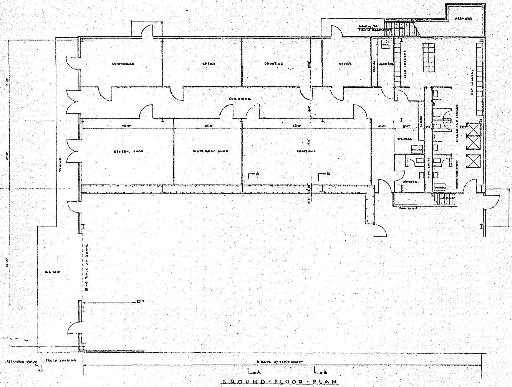  
FIGURE 2.2. FLOOR PLAN OF ARE TEST FACILITY BUILDING

HIGDHTY COUCTE-8

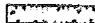

#

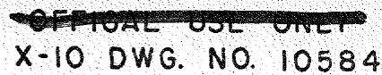

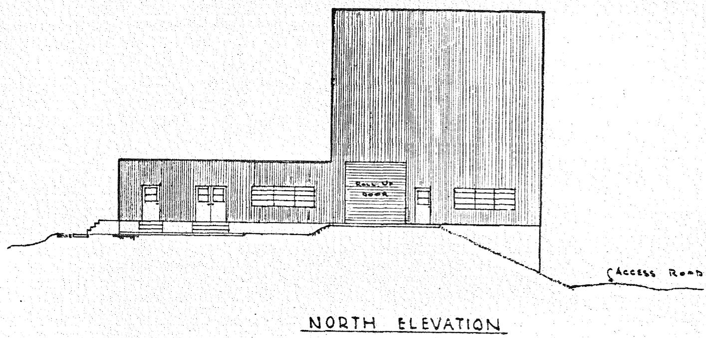

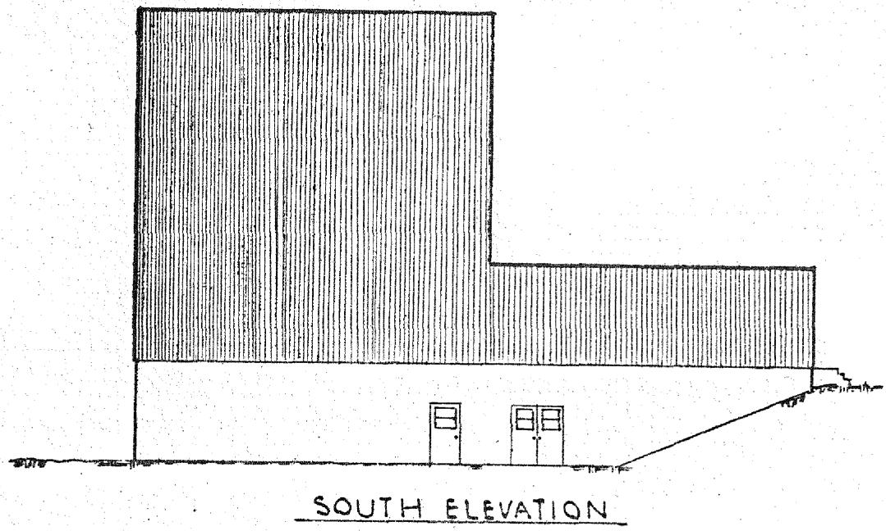  
FIGURE 2.3. END ELEVATIONS OF ARE TEST FACILITY BUILDING

# EXPERIMENTAL ENGINEERING FOR THE ARE

# H. W. Savage, ANP Division

The design for the ARE has suggested a number of experiments and tests, the scope of which has been studied and outlined in some detail by the Experimental Engineering Section. In general, it will be necessary to examine the core structure and fluid circuits segmentally to determine the fabricability, ease of assembly, structural integrity under conditions of thermal cycling, and the hydrodynamic and thermal properties of their components. In addition to testing components as received, development engineering of such systems pointing toward ANP type applications will be pressed.

Fuel Circuits. The techniques of handling a liquid fuel which is a solid at room temperature and which must be preheated to about $1000^{\circ}\mathrm{F}$ before any transfer can take place must be determined experimentally. The following systems must be developed for such a fuel circuit: (1) evacuation, (2) flushing, (3) loading, (4) preheating, (5) transferring, (6) cleaning, (7) pressurizing, (8) monitoring, (9) purifying, (10) storing, and (11) instrumenting.

The first handling of fuel for the ARE system, as such, is expected to involve problems of cleaning, storage, purification (filtering), and transferral of the fuel to the system without contamination. The problem of transferring the liquid fuel from one location to another will involve studies of both parallel and series circuits, probably in combination, and under conditions where the circuits are pressurized with an inert gas. It is anticipated that the entire system will require remote instrumentation for temperature, pressure, flow, volume measurements, and leak detection.

Experiments will involve mock-ups of proposed designs in which hydrodynamic measurements at low temperatures can be made, and mock-ups and actual components which can be tested with high-temperature fluids for determining hydrodynamic properties at these temperatures. A means of accurate volumetric control will be required, which will be adequate under either radioactive or nonradioactive conditions and also under dynamic conditions.

Problems relating to fabrication will depend in part on determination of satisfactory joining techniques which will resist both thermal cycling and corrosive and erosive action of the fluids involved; in part on the ability to assemble the various components after fabrication; and in part on whether

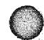

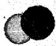

certain of the internal components of the core can be subjected to direct contact with the fluids. The fabricability of the structure would be considerably eased if certain conditions were demonstrated, for example, if it could be shown that is not necessary to seal the proposed moderator, beryllium oxide, from the proposed coolant, sodium or sodium-potassium alloy. If sealing is not necessary it should be possible to provide support for the members which will change dimensions under thermal cycling without providing rigid connections between them.

Coolant Circuits. The components of the coolant circuits will include all the piping, pumps, heat exchangers, waste-gas systems, etc. necessary to dispose of the heat generated within the core. It is proposed to develop the components of the heat-transfer system and to determine the adequacy and properties of its components individually and in combination in order to determine the arrangement necessary for these systems in the ARE facility. The general requirement is for the experimental determination of techniques of handling a liquid coolant which, in the case of sodium, would be solid at room temperature and would require preheating to at least $300^{\circ}\mathrm{F}$ before any transfer would take place. If the coolant was sodium-potassium eutectic alloy, which is liquid at room temperatures, it would not require preheating but would require pressurizing at a temperature of $1500^{\circ}\mathrm{F}$ .

The following systems will probably be required: (1) evacuation, (2) flushing, (3) loading, (4) purification, (5) circulation, (6) draining, (7) cleaning, (8) coolant disposal, (9) pressurizing, (10) monitoring, (11) instrumenting, (12) preheating, in the case of sodium, and (13) waste-heat fluid systems.

Experiments will involve mock-ups of core sections including tubes and headers to determine hydrodynamic properties and thermal characteristics of these sections. Also included will be development of valves and flowmeters and other devices for controlling the location and transfer of coolant. A pump will be required which will handle about 150 to 200 gpm; for the ARE application it is anticipated that commercially available pumps can be modified for this purpose. Studies of electromagnetic pumps will continue. The techniques of cleaning the cooling system of the reactor and transferring coolant to it in a pure state and of providing equipment for maintaining purity of the coolant require considerable development in order to assure satisfactory handling at a maximum coolant temperature of $1500^{\circ}\mathrm{F}$ .

Another development will center around suitable piping for transfer of the coolant from the core to the waste-heat disposal system, and this will include development of monitoring devices for leak detection and development of suitable insulation. The waste-heat disposal system will be located some distance from the actual reactor core and may involve transfer of heat from the coolant either to water or to a gas such as air or nitrogen. The simplest system would probably be one involving water, which could be disposed of directly, but such a system would require careful fabrication and instrumentation for leak detection. A system using recirculating helium can be built of conventional equipment but is somewhat more complex. A waste-heat disposal system venting directly to air would involve few fabrication problems but would entail rather more complex conducting systems and safety devices to prevent general air contamination in case of breakdown.

Other problems associated with this circuit will be encountered in the integration of the control devices monitoring the coolant temperature with the control devices for the reactor proper. These will include devices for ternier type control and also emergency type control equipment which in general will act to shut down the systems.

It is anticipated that in the course of the experimentation a heat source comparable to the output of the ARE (1 to 3 megawatts) will be a necessity for pretesting components of the system. Fabrication techniques are not considered to be an insurmountable obstacle inasmuch as for these segments of the ARE circuits the structures may be of reasonable size, with the basic requirement that joints and removable parts of this system be fabricated in such a fashion that tightness is guaranteed over a period somewhat in excess of the expected life of the reactor as a whole.

Instrumentation. Instrumentation for the reactor systems described in the foregoing sections will be divided between a more routine type of instrumentation for general control purposes, including the indication of basic conditions existing in the circuits, and the more elaborate type of control equipment designed to maintain safe operation throughout. The Experimental Engineering Section expects that the initial instrumentation will be of the first-mentioned type. The latter type of instrumentation required is the responsibility of the Reactor Control Group and will be discussed here only as it is required to be integrated with the first type.

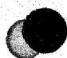

The following types of instrumentation are expected to be required: (1) temperature-responsive devices, (2) pressure-responsive devices, (3) volumetric control, (4) monitoring, (5) flow measurement and control, (6) stress indicators, (7) power measurement, (8) control rod actuation, (9) radio-activity, (10) reactivity control, (11) miscellaneous electronic equipment, and (12) devices for personnel safety.

Thermocouple, resistance, bi-metal, and liquid type temperature-responsive devices for indicating, recording, and controlling purposes will have wide application. Most of this instrumentation will be of the remote type, and some of the problems will include locating the temperature-sensing element in restricted spaces, providing leads and insulation between the temperature-sensing element and the indicating or controlling equipment, and the possible use of such equipment for indicating clogged lines in the fluid circuits. The characteristics of temperature-sensing devices in strong radiation fields must be determined.

Pressure-responsive devices will include hydraulic and gas actuated instruments, null type bellows and diaphragms, manometers, and electric simulators such as the microformer. Problems will include measurement of high pressures (up to several atmospheres) at high temperatures in the presence of liquid metals, liquid fuels, and gases, and the measurement of low pressures and low-pressure differentials, which may occur at any temperature. It is anticipated that pressure and volumetric control devices can be interrelated to some extent.

With regard to volumetric control devices, it will be necessary to develop methods of detecting liquid levels with fair accuracy (in some cases precisely) for both the liquid fuel and liquid coolant, and also the means of maintaining and controlling these. Determination of the instantaneous quantity of fuel present in a reactor core involves the consideration of weighing methods, volumetric changes resulting from temperature variations, the feasibility of using mean measurements from gangs of small tubes as an indication of the quantity of fluid present in any one of the tubes, the effects of vapor pressures of materials being pressurized, the application of integrating flow measurement devices, the detection of clogged tubes and the relationship of this effect to quantity determinations, the amount of excess fuel over and above that in the core required for satisfactory control, and the possible application of overflowing fuel as a device for quantity limitation and providing some continuous flow of fuel.

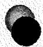

In connection with reactor control there is a possible application of dynamic-pressure-responsive equipment to the detection of high- and low-frequency pressure variations, and there will again be the problem of locating the pressure-sensing element and bringing out leads to remote indicating and controlling equipment.

Monitoring devices will be required for detecting the entrance of sodium into the fuel, or vice versa, and particularly for detecting leaks in both the fuel lines and the coolant lines. It is anticipated that spectrographic methods will be of value in determining where leaks are occurring. Study of the general problem of power-monitoring radiation detection is not considered as a function of the Experimental Engineering Group.

Flow measurement can be effected by the measurement of pressure drops, possibly by the application of electromagnetic devices or rotameters. The subsequent control of the fluid flow can be accomplished by orifices, venturis, throttling devices, and/or valves of more or less conventional types.

# 3. REACTOR PHYSICS

N. M. Smith, Chairman  
ANP Physics Group, Physics Division

A. Introduction   
B. Reflected-Reactor Criticality Calculations   
C. Reflected-Reactor Solid Fuel Calculations   
D. Statics of ANP Equivalent Bare Reactor   
E. Statics of ANP Reflected Liquid-Fuel Reactor   
F. Kinetics of ANP Reflected Liquid-Fuel Reactor   
G. Statics of ARE Bare Reactor   
H. Kinetics of ARE Reactor   
I. Critical Assembly Calculations   
J. Glossary of Nuclear Energy Terms

# A. INTRODUCTION

In the first part of this quarter the IBM Fermi-diffusion multigroup calculational procedures have come into fruition through the cooperative effort of the ANP Physics Group and the Uranium Control and Computing Section of Y-12. The productive capacity of this operation - now some 13 reactors a week - has materially advanced the capabilities of the group not only in the survey of reactor characteristics but also in the keeping up with the engineering variations and shifts of interest that have developed.

The application of the IBM calculations has not followed a smooth course, however, since about three weeks of calculational time was lost in locating and rectifying a mathematical source of divergence in the flux solutions. This difficulty is described in Sec. 3B, which also includes a description of the operational problem of these calculations and of the activity of the IBM group.

Since the original interest of the ANP Project was in liquid-metal--cooled solid-fuel reactor designs, the first calculations produced concerned this

class of reactors. The "statics," i.e., the critical mass, flux distribution, etc., of these models apply almost equally well to liquid-fuel designs provided they have the same median energy of fission (mef). The solid-fuel studies are reported below in some detail, followed by a description of the ANP liquid-fuel 200-megawatt design of Jan. 9, 1951. It so happens that the mef of the latter is somewhat less than that of the solid-fuel designs because of difference in moderator percentages.

The solid-fuel reflected reactor calculations are of interest since they show the effect on criticality, critical mass, etc. of the following:

1. Change of moderator from beryllium oxide to beryllium which has been shown to give a substantial increase in reactivity.   
2. Change of density of coolant and moderator.   
3. Change in the reflector thickness.   
4. Replacement of beryllium oxide reflector with a nonmoderating stainless steel reflector (which has been shown to decrease criticality).   
5. Xenon poisoning,   
6. Heterogeneity of uranium lumping.   
7. Iteration of the source term.

Following a routine investigation of the ANP liquid-fuel design of January 9, by means of study of the equivalent bare reactor, IBM calculations of reflected reactors were undertaken. A series of calculations was made which permits the estimation of the kinetic temperature coefficient of reactivity.

The kinetics of the liquid-fuel reactor has been the subject of a large amount of investigation, which has revealed the desirability of a short thermal relaxation time of the fuel tubes and of a long neutron lifetime. The worst types of accidents to which the nuclear-powered aircraft may be subjected are thought to be (1) the simultaneous failure of two turbojet motors and (2) the failure of one-third of the primary coolant pumping power. Neither one of these failures is sufficient to make the reactor go into prompt-critical condition. Considerations of the time required for failure and the presence of delayed neutrons lead to the conclusion that self-regulation of the reactor is such that it is well-damped and safe during such emergencies. Calculations

on the behavior of the reactor in the absence of damping effect of the delayed neutrons indicate that the reactor would safely regulate changes which might even throw it slightly beyond the prompt-critical condition.

With the change of emphasis of the engineering studies toward the Aircraft Reactor Experiment, bare reactor studies of the proposed ARE designs were begun. It was desired that the ARE possess as many of the kinetic characteristics of the high-powered 200-megawatt ANP reactor as possible, which resulted in a problem which could be solved only through arbitrary decision. A design of the ARE possessing exactly the same characteristics of the ANP would have insufficient fuel volume for criticality. It has been necessary to increase the size of the fuel tubes, thereby increasing the thermal relaxation time, but an increase in the number of fuel tubes makes the ARE more nearly thermal and the increase of neutron lifetime tends to offset the departure from ideal equivalents.

Reflected ARE calculations have been begun but reportable results are not available.

The kinetic responses of the proposed ARE designs have been studied and compared with the kinetic response of the ANP design. A great number of acceptable designs have been found to exist.

Calculations of the critical mass expected from the current beryllium-uranium-aluminum critical assemblies have been undertaken. It is found that the calculations have underestimated the critical mass by about $50\%$ . In view of the experience of other groups in the first estimation of critical masses from fundamental data, this result is not too surprising. Investigation of the sources of error are proceeding, and a number of small discrepancies between the experimental setup and the calculations have been discovered, although none sufficient to account for the large divergence. Obviously some time and further experimentation will be necessary before theoretical and experimental values will come into agreement. It should be the goal to calculate critical masses by the moderated Fermi-diffusion method to within $25\%$ . It may not be practical at this time to attempt to improve calculations beyond this point.

It is interesting that our present experience has made but little use of the perturbation theory. The reason for this is that it is generally easier to

recalculate the characteristics of a new reactor than it is to make a perturbation calculation. The perturbation theory may be required whenever large spatial variations are encountered.

# B. REFLECTED-REACTOR CRITICALITY CALCULATIONS

Mathematics of Calculations (D. K. Holmes, Physics Division, and O. A. Schulze, Reactor School). In the calculation of the static characteristics of two reactors with stainless steel reflectors and two with very thin BeO reflectors, the slowing-down density had alternately greater and smaller values (at a given space point) from lethargy group to lethargy group (Fig. 3.1) and finally took on negative values. This difficulty has been discussed at length in a separate report, (1) where it is shown that the particular assumption made as to the variation of the flux across a lethargy group, namely,

$$
\overline {{\phi^ {N}}} = \overline {{\left(\frac {1}{\xi \sigma_ {i}}\right) ^ {N}}} \cdot \left[ \frac {q ^ {N} + q ^ {N - 1}}{2} \right] \tag {1}
$$

where

$$
\overline {{\phi^ {N}}} = \text {a v e r a g e f l u x i n t h e} N ^ {\mathrm {t h}} \text {l e t h a r y g r o u p}
$$

$$
q ^ {N} = \text {s l o w i n g - d o w n d e n s i t y o u t o f t h e} N ^ {\mathrm {t h}} \text {g r o u p}
$$

$$
\overline {{\left[ \frac {1}{\xi \sigma_ {t}} \right] ^ {N}}} = \text {a v e r a g e o f} \left[ \frac {1}{\xi \sigma_ {t}} \right] \text {i n t h e} N ^ {\text {t h}} \text {g r o u p}
$$

should be replaced by the assumption

$$
\overline {{\phi^ {N}}} = \frac {\left[ \frac {1}{\xi \sigma_ {t}} \right] ^ {N} q ^ {N} + \left[ \frac {1}{\xi \sigma_ {t}} \right] ^ {N - 1} q ^ {N - 1}}{2} \tag {2}
$$

where $\left[\frac{1}{\xi\sigma_{t}}\right]^{N} =$ the value of $\left[\frac{1}{\xi\sigma_t}\right]$ at the higher lethargy limit of the $N^{\mathrm{th}}$

(1) Holmes, D. K., A Correction to the Multigroup Method of Y-F10-21, Y-F10-38 (Feb. 19, 1951). (ORNL, Y-12 Site).

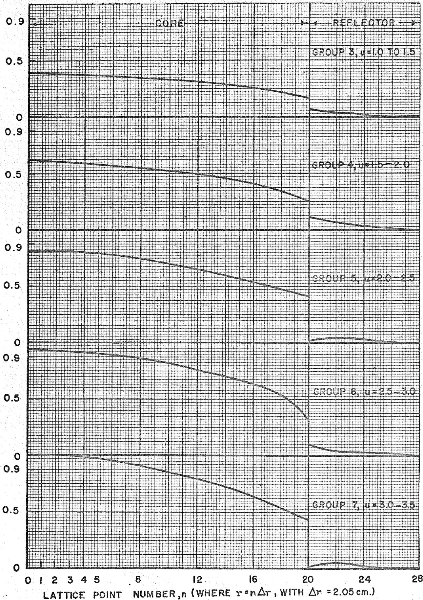  
SLOWING DOWN DENSITY   
FIGURE 3.1 SLOWING DOWN DENSITY VS. RADIUS (807)

group. The use of numerical equations based on the second assumption eliminated the difficulties (see Fig. 3.2), and this method has now been adopted for reactor calculations. The details of the method, referred to as the "EPLA" method, are given in a separate report.(2)

In order to determine whether the reactivity calculations of these reactors on the basis of assumption (1), which showed no oscillations from group to group, were actually acceptable without recalculation, a comparison calculation was made. The particular reactor chosen for test was a solid-fuel type with the following properties:

Core radius 41 cm

Reflector thickness 14 cm

Core containing 120.1b of $\mathbf{U}^{235}$

MATERIAL

VOL: $\%$ IN CORE

VOL. $\%$ IN REFLECTOR

UO

1.963

0

BeO

52.00

75.00

Stainless steel

7.90

5.00

Sodium

36.10

20.00

Void

2.037

0

The comparison between the two methods follows:

CHARACTERISTIC

METHOD OF ASSUMPTION

(1)

METHOD OF ASSUMPTION

(2）

keff

1.05118

1.06293

Median energy for fission (ev)

70.3

73.1

Percent thermal fissions

5.5

5.5

Estimated critical mass (lb)

98

92

The results are sufficiently similar that it is permissible to accept results given by the method (1) (which were calculated before the introduction of the EPLA method and which did not show calculational trouble); however,

(2) Holmes, D. K., The Multigroup Methods as Used by the ANP Physics Group, ANP-58 (Feb. 15, 1951).

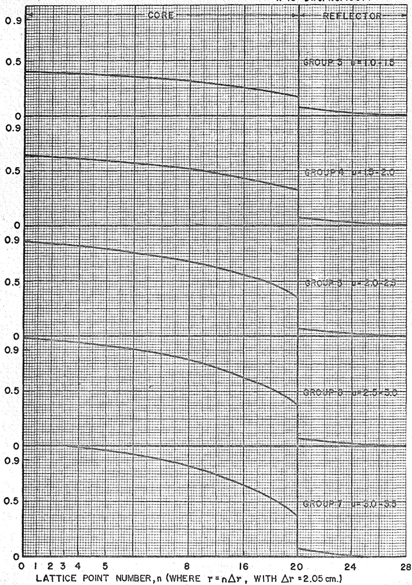  
SLOWING DOWN DENSITY   
FIGURE 3.2 SLOWING DOWN DENSITY VS. RADIUS (839)

because of the difference in $k_{eff}$ it is not considered valid to make direct comparisons between the reactivity of reactors calculated by the two different methods.

IBM Calculations (F. C. Uffleman and Phyllis Johnson, Uranium Control and Computing Department). During the quarter ending Feb. 28, 1951 a machine and procedural changeover from the linear approximation method to the end-point linear approximation method was effected. In order to make this changeover, and to make some additional calculations, fourteen 604 boards were wired or revised for permanent use while about a dozen boards were wired and used temporarily. In current usage are six 604 and two C.P.C. (Card Program Computer) "cross-section" boards; sixteen 604 and two C.P.C. "reactor" boards; two general listing boards; and one "check" listing board. A brief summary of the scope of operations is given below.

The use of the cross-section boards starts with the key-punched micro-or macro-cross-sections. Decimal points are adjusted and Simpson weighting factors are applied to each individual cross-section. Average unweighted end-point cross-sections are calculated for each element. Using these basic cross-section cards for each element,

$$
\overline {{\left[ \frac {1}{\xi \sigma_ {t}} \right]}}, \quad \overline {{\left[ \frac {\sigma_ {q}}{\xi \sigma_ {t}} \right]}}, \quad \overline {{\left[ \frac {\sigma_ {f}}{\xi \sigma_ {t}} \right]}}, \quad \text {a n d} \quad \overline {{\left[ \frac {1}{3 \xi \sigma_ {t r} \sigma_ {t}} \right]}}
$$

as well as the end-point values $1 / \xi \sigma_{t}$ , are calculated for each group for each core and reflector. Various combinations of the average cross-sections and the end-point cross-sections as needed in the method are calculated. On March 1 master basic cross-section files included basic cross-section and end-point cross-section cards for 16 elements plus 12 "lumping effect" variations on basic uranium cross-sections. Master core-reflector files included complete average cross-sections, end-point cross-sections, and constants for 61 cores and three reflectors.

Calculation with the "reactor" boards starts with the calculation of some constants needed in meeting the core-reflector boundary conditions. It

continues through the calculations of the average and end-point fluxes along with some auxiliary functions for each energy-space point, the total degradation of neutrons from each group plus the total absorptions and fissions, reflector escapes for each energy group, and the eigenvalue, $\nu_{c}$ , for criticality for each thermal base and total fissions at each space point for each thermal base. Checks being run are the power distribution normalization check and the total neutron balance for each group. At present calculations for 12 reactors have been completed using the end-point linear approximation method, but during the quarter 25 or 30 other reactor calculations were either wholly or partially made by the linear method or by a variation of the linear method. It was expected that during March production of reactor calculations would average at least one reactor per day and that in the future the calculation time, including all checks, for one reactor will be about 16 hr. (These calculation times include making all calculations twice, so that a single calculation would take only 8 hr.)

# C. REFLECTED-REACTOR SOLID-FUEL CALCULATIONS

O. A. Schulze, Reactor School, and J. W. Webster, NEPA

The calculations reported in this section were initiated at an early date; the reactors considered have solid fuel rather than the liquid fuel of the current design. However, the constituency of the small fuel volume does not significantly alter the core nuclear properties and hence the static results (critical mass, power distribution, etc.) are applicable to liquid-fuel reactors. The method of calculation is described in the preceding section.

This section is divided into five parts which discuss the effect on critical mass, power-distribution, etc. of the variation in certain conditions. The topical headings are: Effect of Core Composition and Core Size, Effect of Xenon, Effect of Uranium Lumping, Effect of Reflector, and Effect of Iteration of Source Term.

The basic reactor configuration of this study has the following description:

Core diameter (ft) 2.69

Reflection thickness (in.) 5.51

Volume fractions of core (where the densities are at a mean operating temperature of $1286^{\circ}\mathrm{F}$ )

$\mathbf{U}\mathbf{O}_2$ of density 10.9 g/cc 0.01963

BeO of density 2.8 g/cc 0.5200

Stainless steel 347 of density $7.69\mathrm{g / cc}$ 0.0790

Na coolant of density 0.75 g/cc 0.3610

Volume fractions of reflector

BeO 0.7500

Stainless Steel 0.0500

Na 0.2000

The thermal neutrons are considered to have an energy corresponding to $1286^{\circ}\mathrm{F}$ . No fission product poisons or self-shielding effects are present. The critical mass was determined to be about 98 lb, the median energy of fission-producing neutrons about 45 ev, and the mean neutron lifetime about $1.6 \times 10^{-5}$ sec. All other reactors of this study are variations from this "standard" reactor.

The spatial power distribution is shown in Fig. 3.3 for the standard spherical reactor. It will be noticed that the power distribution rises sharply in the core near the interface. The power density at the interface is about $86\%$ of that at the center, so that the reflector thickness used in this reactor is not quite the optimum for minimum peak-to-average-power ratio. The distribution throughout the central region of the reactor has approximately the shape of the fundamental mode of the equivalent bare reactor. It is only in about the last 4 in. of the core radius that the core "feels" the reflector distortion. Thus, a peak-to-average-power ratio of unity (flat power) is obtainable only by nonuniform distribution of uranium. The ratio here is 1.39.

Figure 3.4 shows the energy distribution of the fission-producing neutrons at various spatial lattice points. Comparison of this distribution at the interface with that at inner points shows how strongly the neutrons are

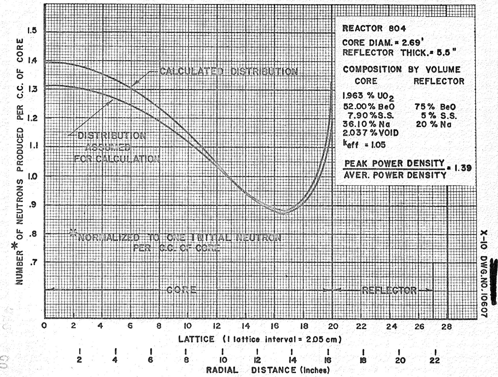  
FIGURE 3.3 SPATIAL POWER DISTRIBUTION (REACTOR 804)

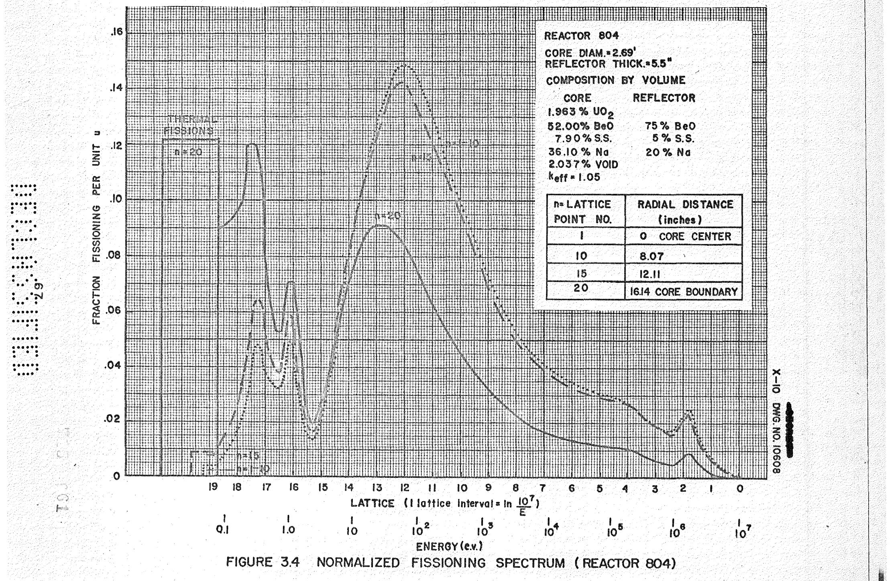

thermalized which return from the reflector and explains why the power distribution has the sharp rise at the interface (slow neutrons are captured more easily by uranium).

Figure 3.5 shows the integrated energy distribution of all fission-producing neutrons.

Effect of Core Composition and Core Size. Change of Moderator, BeO to Be. The first change investigated was a replacement in the standard reactor of the BeO moderator by beryllium metal of density 1.86. The result was that the critical mass was reduced to 75 lb, which is a reduction of 25 lb or 26%. The index of the nuclear value of a moderator is the quantity $N\sigma_{s}\xi$ known as the "slowing-down power" where $N$ is the number of atoms per cubic centimeter, $\sigma_{s}$ is the microscopic scattering cross-section, and $\xi$ is the loss in log energy per collision. Solid BeO moderator has 0.0674 × 10²⁴ atoms per cubic centimeter of both beryllium and oxygen. The beryllium moderator has 0.124 × 10²⁴ atoms per cubic centimeter of beryllium. The $\xi$ for Be is 0.2078 and the $\xi$ for O is 0.1209. A good average value for $\sigma_{s}(\mathrm{Be})$ is 5.5 × 10⁻²⁴ cm², and for $\sigma_{s}(0)$ , 4.2 × 10⁻²⁴ cm². The slowing down power for beryllium metal is thus about 0.14 lethargy unit per centimeter and for BeO it is about 0.11 lethargy unit per centimeter, which accounts for the lower critical mass with the former.

Figure 3.6 shows the spatial power distribution in the beryllium-moderated core with beryllium reflector. Comparison with Fig. 3.3 for the equivalent BeO assembly shows that the beryllium reflector causes an even sharper rise of power density near the interface, the power density at the interface being $93\%$ of the value at the center.

Figure 3.7 shows the energy distribution of the fission-producing neutrons, i.e., the normalized fissioning spectrum. The fraction of thermal fission production at the interface is about $33\%$ , as compared to $24\%$ for the BeO-reflected assembly, and thus part of the reduced critical mass is certainly due to the better moderation in the reflector.

Change in Coolant Volume. The second change investigated was a decrease in the coolant volume from 36.10 to $31.10\%$ of the core volume, the space being left as void. The critical mass increased by 1.2 lb, indicating that the reduced leakage due to scattering from sodium is more important than the loss

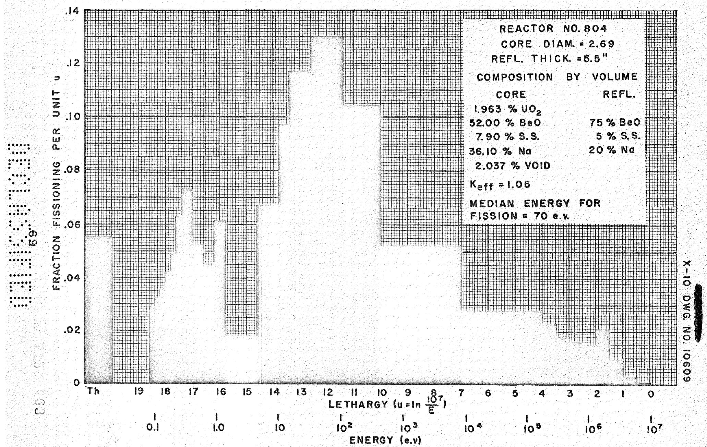  
FIGURE 3.5 NORMALIZED FISSIONING SPECTRUM (INTERGRATED OVER CORE)

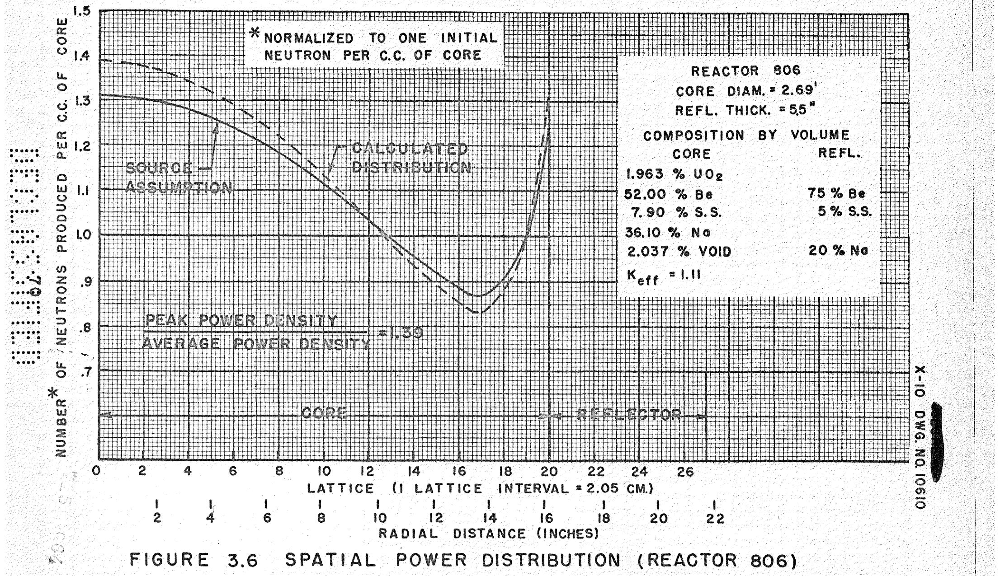

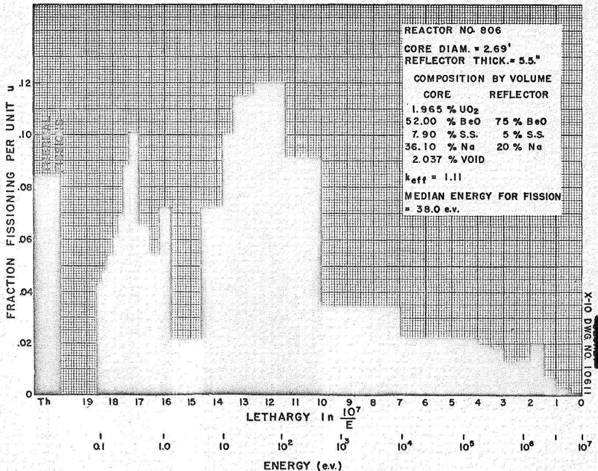  
FIGURE 3.7 NORMALIZED FISSIONING SPECTRUM   
(REACTOR 806)

of neutrons due to absorption in sodium in a reactor of this neutron energy spectrum. In terms of sodium weight, 100 lb of sodium decreases the critical uranium mass by 5.8 lb.

Change in Structural Volume. The third change in the core was an increase of the volume fraction of stainless steel from 0.0790 to 0.09937, with an equivalent decrease in the void. The critical mass increased by 2.1 lb, indicating that the loss of neutrons due to absorption in stainless steel is more important than the reduced leakage due to scattering for this reactor. In terms of weight of stainless steel, 100 lb of stainless steel increased the critical mass by 1.9 lb. This would seem to indicate, at first thought, that considerable freedom could be exercised with regard to tube wall thickness, etc., but usually an increase in structural material incurs a decrease in moderator volume and the combined penalty is greater. Also, the effect of the steel will be greater in the ANP design than is calculated here since the neutron energy spectrum is lower in the ANP reactor.

Change in Moderator Volume. The fourth change in the core was decrease in the volume fraction of BeO from 0.52 to 0.47 with an equivalent increase in the void. The critical mass increased by 17 lb.

Comparison of Core Constituents Effects. The BeO moderator is clearly the most important core constituent affecting critical mass in this reactor. In Table 3.1 the effect on critical mass of a change in the volume of the three core constituents is compared. From the table it is seen that thickening the tube walls to the extent of $1\%$ of the core volume costs approximately $3.4 + 1.0 = 4.4$ lb in fuel.

TABLE 3.1   
Effect of Core Composition on Critical Mass of Standard Reactor   

<table><tr><td>CORE CONSTITUENT</td><td>CHANGE IN CRITICAL MASS CAUSED BY REMOVIDING A VOLUME
OF THE GIVEN CONSTITUENT EQUAL TO 1% OF THE CORE
VOLUME (1b)</td></tr><tr><td>BeO</td><td>+3.4</td></tr><tr><td>Stainless steel</td><td>-1.0</td></tr><tr><td>Na coolant</td><td>+0.2</td></tr></table>

Another useful way of interpreting these results is in the sense of density coefficients of reactivity and uranium mass, i.e.,

$$
\frac {\Delta k / k}{\Delta \rho / \rho} \quad \text {a n d} \quad \frac {\Delta m / m}{\Delta \rho / \rho}
$$

In Table 3.2 are given values of these ratios for different ccre constituents.

TABLE 3.2   
Density $(\rho)$ Coefficients of Reactivity and Uranium Mass $(m)$ in the Standard Reactor   

<table><tr><td>CORE CONSTITUENT</td><td>\( \frac{\Delta k/k}{\Delta\rho/\rho} \)</td><td>\( \frac{\Delta m/m}{\Delta\rho/\rho} \)</td></tr><tr><td>B=O</td><td>+0.285</td><td>-1.442</td></tr><tr><td>Stainless steel</td><td>-0.015</td><td>+0.076</td></tr><tr><td>Na coolant</td><td>+0.018</td><td>-0.091</td></tr></table>

Change of Core Size. The fifth change in the core was to decrease the core radius by 3.15 in. (from core diameter 2.69 to 2.16 ft) and at the same time increase the reflector thickness by 3.15 in., thus keeping the reflector outside diameter the same as in the standard reactor, the core composition being held constant. It was found that the critical mass decreased from 98 to 57 lb, which shows that the additional reflector is almost as effective as fissionable core material. This result is useful in gaining an understanding of the factors that affect critical mass, but behavior associated with variation of core size under constant core composition does not have direct engineering significance since the requirement of a certain heat removal (heat-transfer area) will always dictate a decrease in moderator fraction as core size is decreased.

Figure 3.8 shows the spatial power distribution. The power density at the interface is greater by a factor of 1.3 than that at the core center, and hence the reflector is much too thick for good core power distribution in this small nonthermal core. The peak-to-average-power ratio is 1.48 as compared to 1.39 in the standard reactor.

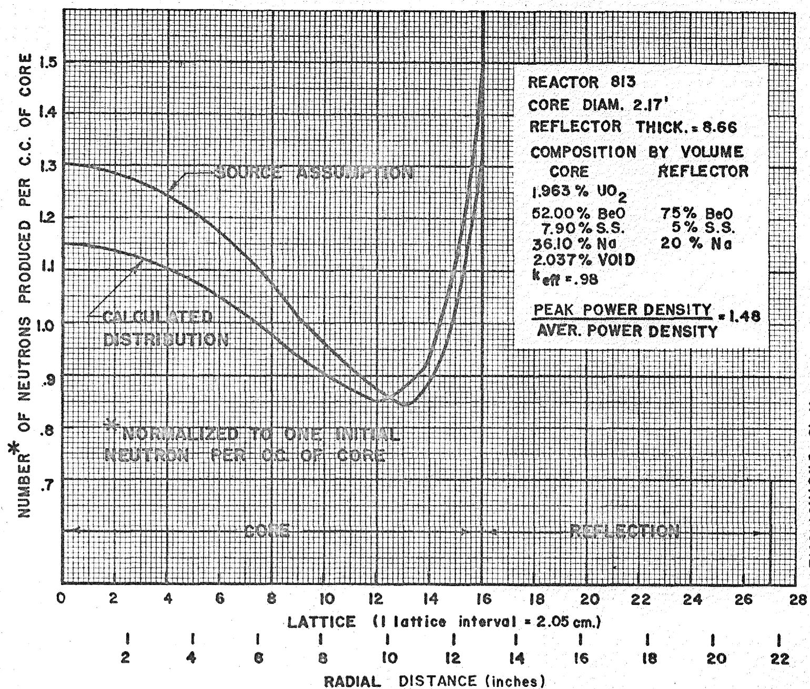  
FIGURE 3.8 SPATIAL POWER DISTRIBUTION (REACTOR 813)

Effect of Reflector. Change of Reflector Thickness. Two variations of reflector thickness were made from the standard reactor. The first was a change from 5.51 to 7.09 in., an increase of 1.58 in. The result was a drop in critical mass from 98 to 63 lb. The median energy of the fission-producing neutrons dropped from 45 to about 14 ev.

Figure 3.9 shows the spatial power distribution over the core with this additional reflector. Comparison with Fig. 3.3 (the equivalent graph for the standard reactor) shows that power density has increased at the interface. The interface power density is now greater than that at the core center by a factor of 1.03. This appears to be very close to the optimum reflector thickness as far as good core power distribution is concerned. The peak-to-average-power ratio is 1.35 compared to 1.39 with the 5.51-in. reflector. Figure 3.10 shows the energy distribution of the fission-producing neutrons, i.e., the normalized fissioning spectrum. There is now about $38\%$ thermal fission at the interface as compared to $24\%$ in the standard reactor.

The second investigation of the effect of reflector thickness was an increase to 15.4 in. The critical mass decreased to approximately 53 lb. Figure 3.11 shows the new spatial power distribution. The power density at the interface is now greater than that at the core center by a factor of 1.19 and the peak-to-average-power ratio is 1.52, indicating that the reflector is too thick for good core power distribution.

From the point of view of critical mass the increase of reflector thickness from 5.51 to 7.09 in. was very worth while, a saving of 35 lb of fuel. The increase from 5.67 to 15.4 in. did not cause a significant increase in the uranium saving, however. If the three values of reflector thickness are plotted vs. critical mass, the curve shows a definite "knee" around 6 to 8 in. reflector (see Fig. 3.12, a plot of $k_{eff}$ vs. reflector thickness). The conclusion is that, from the point of view of both power distribution and critical mass, the BeO reflector thickness should be about 6 in. for a reactor of this energy spectrum.

Change to Nonmoderating Reflector. The third change in reflector conditions was complete replacement of the BeO reflector of the standard reactor by a combination of $80\%$ stainless steel and $20\%$ sodium, by volume, of the same thickness. The critical mass increased from 98 to 151 lb, thus demonstrating the advisability of having a moderating reflector between the core and pressure shell.

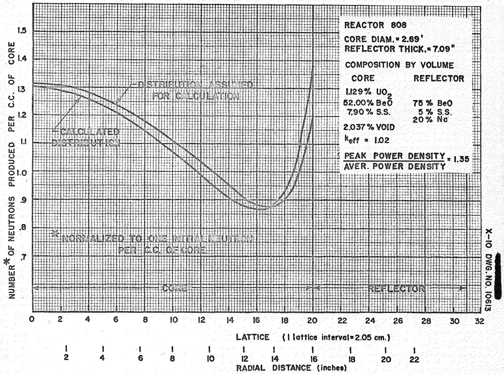  
FIGURE 3.9 SPATIAL POWER DISTRIBUTION (REACTOR 808)

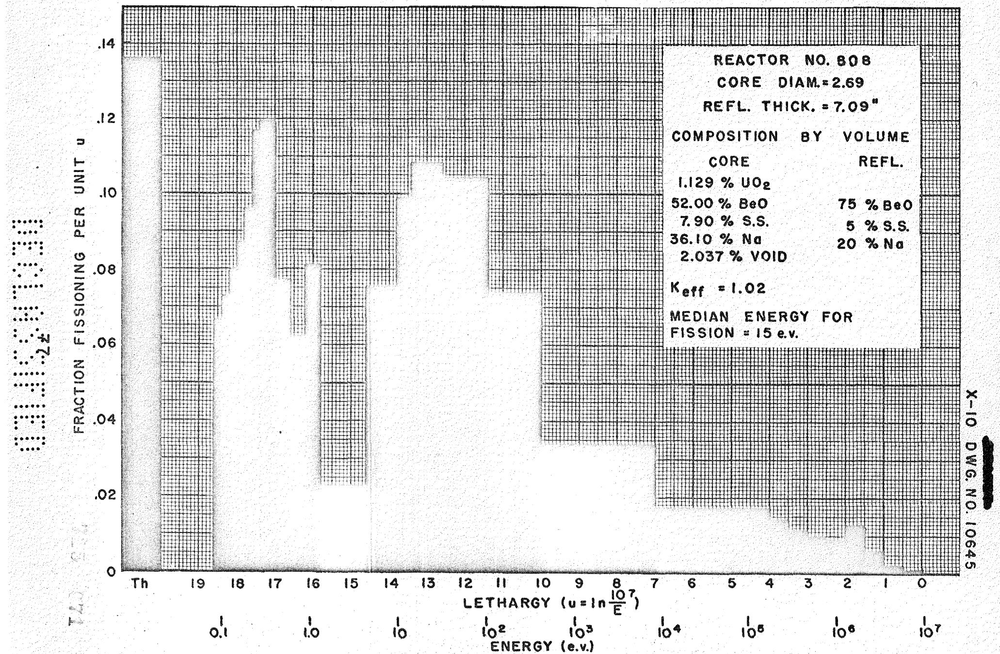  
FIGURE 3.10 NORMALIZED FISSIONING SPECTRUM (REACTOR 808)

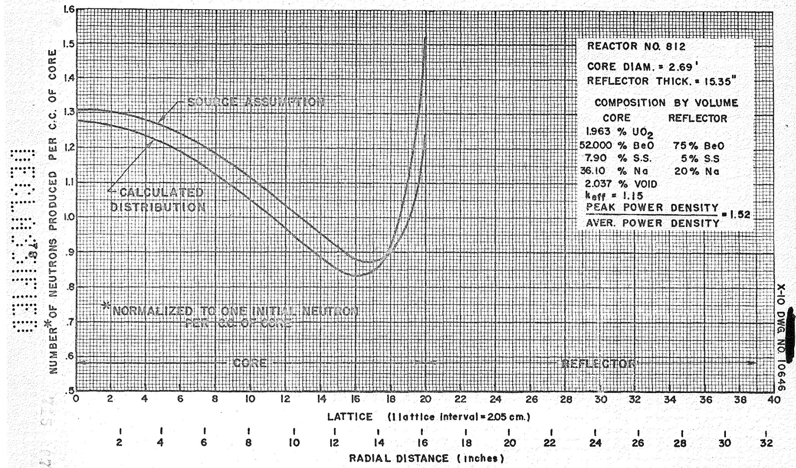  
FIGURE 3.11 SPATIAL POWER DISTRIBUTION (REACTOR 812)

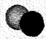

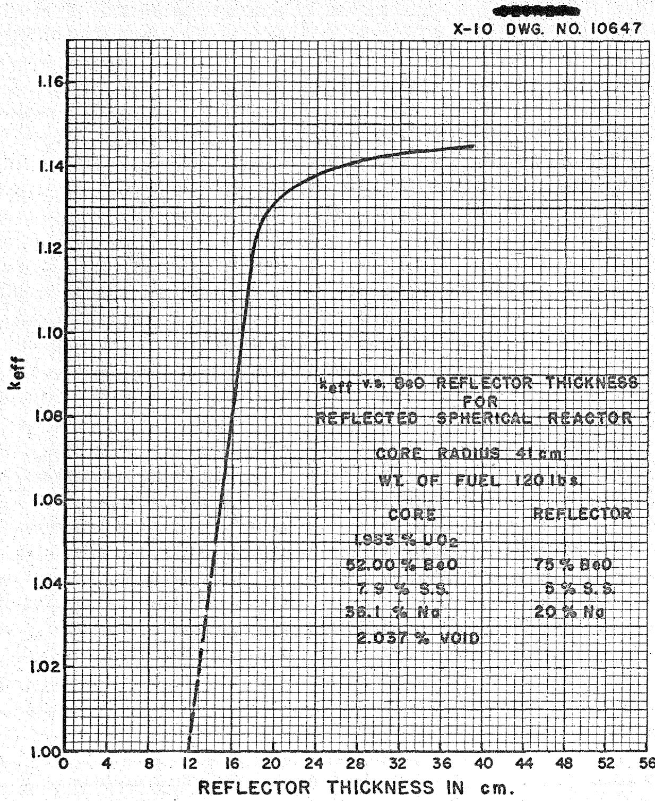  
FIGURE 3.12 EFFECT OF REFLECTOR THICKNESS ON REACTIVITY

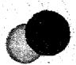

The effect of the substitution of the nonmoderating reflector on the core power distribution was striking. Figure 3.13 shows this new spatial power distribution. The shape of the curve is now very close to that of the fundamental mode of the equivalent bare reactor, i.e., a zero-order Bessel function of the first kind. The flux distribution curves change very little from this shape (Fig. 3.14). The rise in power density near the interface that is characteristic of the moderating reflector assembly is completely absent. The peak-to-average-power ratio is 1.77, indicating a very undesirable, nonuniform distribution of heat source.

Figure 3.15 shows the energy distribution of fission-producing neutrons at various lattice points. This distribution is nearly uniform over the core, the fraction thermal fission production at the interface being no different from that at the core center. The effect on the overall energy distribution of neutrons is thus quite marked, the median energy of fission-producing neutrons now being 270 ev instead of 45 ev as in the BeO-reflected assembly.

From the standpoint of both low critical mass and flattest possible core power distribution, it seems very desirable to use a moderating reflector rather than a stainless steel reflector, e.g., the pressure shell, directly exterior to the core.

Effect of Xenon. The effect on critical mass and reactivity of the fission product poison xenon was investigated. First the equilibrium xenon density was determined at each space lattice point over the core, based on the fission density and flux energy spectrum at the point. This equilibrium density varied from $6 \times 10^{16}$ atoms of xenon per cubic centimeter at the center to $1 \times 10^{16}$ at the interface. Since the criticality method is set up only to handle core compositions which are uniform over the core, it was necessary to find an average xenon density which would give the proper change in $k_{eff}$ . This average was found by weighting the densities at each lattice point with the fraction of neutron captures in xenon that would take place in the spherical shell at this radius.

It was found that the equilibrium xenon caused a $\Delta k / k$ of $-4.2\%$ , or, expressed in terms of critical mass, it increased the critical mass from the 98 lb of the clean case to 117 lb. This is a greater effect than might be expected since the spectrum is definitely nonthermal. It is planned to investigate this effect of fission product poisons further. At the date of

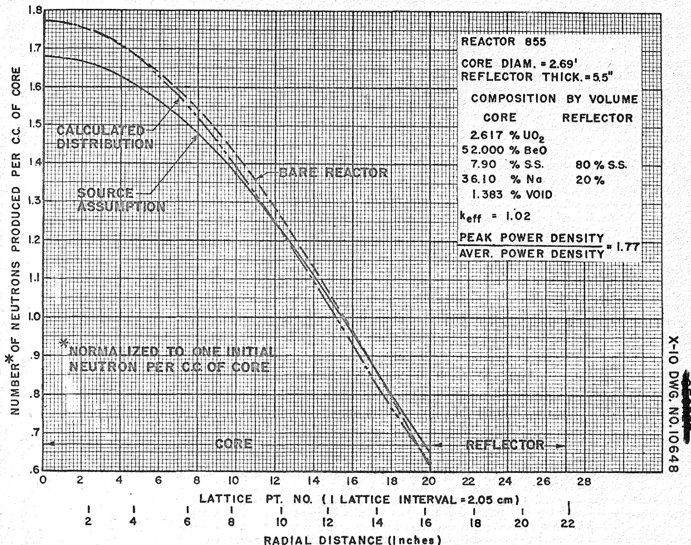  
FIGURE 3.13 SPATIAL POWER DISTRIBUTION (REACTOR 855)

FLUX   
FIGURE 3.14 FLUX DISTRIBUTION (REACTOR 855)   

<table><tr><td>0-10</td><td>0-10</td><td>0-10</td><td>0-10</td><td>0-10</td><td>0-10</td><td>0-10</td><td>0-10</td><td>0-10</td><td>0-10</td><td>0-10</td><td>0-10</td><td>0-10</td><td>0-10</td><td>0-10</td><td>0-10</td><td>0-10</td><td>0-10</td><td>0-10</td><td>0-10</td><td>0-174</td><td>10</td><td>176</td><td></td><td></td><td></td><td></td><td></td><td></td><td></td><td></td><td></td><td></td><td></td><td></td><td></td><td></td><td></td><td></td><td></td><td></td><td></td><td></td><td></td><td></td><td></td><td></td><td></td><td></td><td></td><td></td><td></td><td></td><td></td><td></td><td></td><td></td><td></td><td></td><td></td><td></td><td></td><td></td><td></td><td></td><td></td><td></td><td></td><td></td><td></td><td></td><td></td><td></td><td></td><td></td><td></td><td></td><td></td><td></td><td></td><td></td><td></td><td></td><td></td><td></td><td></td><td></td><td></td><td></td><td></td><td></td><td></td><td></td><td></td><td></td><td></td><td></td><td></td><td></td><td></td><td></td><td></td><td></td><td></td><td></td><td></td><td></td><td></td><td></td><td></td><td></td><td></td><td></td><td></td><td></td><td></td><td></td><td></td><td></td><td></td><td></td><td></td><td></td><td></td><td></td><td></td><td></td><td></td><td></td><td></td><td></td><td></td><td></td><td></td><td></td><td></td><td></td><td></td><td></td><td></td><td></td><td></td><td></td><td></td><td></td><td></td><td></td><td></td><td></td><td></td><td></td><td></td><td></td><td></td><td></td><td></td><td></td><td></td><td></td><td></td><td></td><td></td><td></td><td></td><td></td><td></td><td></td><td></td><td></td><td></td><td></td><td></td><td></td><td></td><td></td><td></td><td></td><td></td><td></td><td></td><td></td><td></td><td></td><td></td><td></td><td></td><td></td><td></td><td></td><td></td><td></td><td></td><td></td><td></td><td></td><td></td><td></td><td></td><td></td><td></td><td></td><td></td><td></td><td></td><td></td><td></td><td></td><td></td><td></td><td></td><td></td><td></td><td></td><td></td><td></td><td></td><td></td><td></td><td></td><td></td><td></td><td></td><td></td><td></td><td></td><td></td><td></td><td></td><td></td><td></td><td></td><td></td><td></td><td></td><td></td><td></td><td></td><td></td><td></td><td></td><td></td><td></td><td></td><td></td><td></td><td></td><td></td><td></td><td></td><td></td><td></td><td></td><td></td><td></td><td></td><td></td><td></td><td></td><td></td><td></td><td></td><td></td><td></td><td></td><td></td><td></td><td></td><td></td><td></td><td></td><td></td><td></td><td></td><td></td><td></td><td></td><td></td><td></td><td></td><td></td><td></td><td></td><td></td><td></td><td></td><td></td><td></td><td></td><td></td><td></td><td></td><td></td><td></td><td></td><td></td><td></td><td></td><td></td><td></td><td></td><td></td><td></td><td></td><td></td><td></td><td></td><td></td><td></td><td></td><td></td><td></td><td></td><td></td><td></td><td></td><td></td><td></td><td></td><td></td><td></td><td></td><td></td><td></td><td></td><td></td><td></td><td></td><td></td><td></td><td></td><td></td><td></td><td></td><td></td><td></td><td></td><td></td><td></td><td></td><td></td></tr><tr><td>0.5</td><td>10.10</td><td></td><td></td><td></td><td></td><td></td><td></td><td></td><td></td><td></td><td></td><td></td><td></td><td></td><td></td><td></td><td></td><td></td><td></td><td></td><td></td><td></td><td></td><td></td><td></td><td></td><td></td><td></td><td></td><td></td><td></td><td></td><td></td><td></td><td></td><td></td><td></td><td></td><td></td><td></td><td></td><td></td><td></td><td></td><td></td><td></td><td></td><td></td><td></td><td></td><td></td><td></td><td></td><td></td><td></td><td></td><td></td><td></td><td></td><td></td><td></td><td></td><td></td><td></td><td></td><td></td><td></td><td></td><td></td><td></td><td></td><td></td><td></td><td></td><td></td><td></td><td></td><td></td><td></td><td></td><td></td><td></td><td></td><td></td><td></td><td></td><td></td><td></td><td></td><td></td><td></td><td></td><td></td><td></td><td></td><td></td><td></td><td></td><td></td><td></td><td></td><td></td><td></td><td></td><td></td><td></td><td></td><td></td><td></td><td></td><td></td><td></td><td></td><td></td><td></td><td></td><td></td><td></td><td></td><td></td><td></td><td></td><td></td><td></td><td></td><td></td><td></td><td></td><td></td><td></td><td></td><td></td><td></td><td></td><td></td><td></td><td></td><td></td><td></td><td></td><td></td><td></td><td></td><td></td><td></td><td></td><td></td><td></td><td></td><td></td><td></td><td></td><td></td><td></td><td></td><td></td><td></td><td></td><td></td><td></td><td></td><td></td><td></td><td></td><td></td><td></td><td></td><td></td><td></td><td></td><td></td><td></td><td></td><td></td><td></td><td></td><td></td><td></td><td></td><td></td><td></td><td></td><td></td><td></td><td></td><td></td><td></td><td></td><td></td><td></td><td></td><td></td><td></td><td></td><td></td><td></td><td></td><td></td><td></td><td></td><td></td><td></td><td></td><td></td><td></td><td></td><td></td><td></td><td></td><td></td><td></td><td></td><td></td><td></td><td></td><td></td><td></td><td></td><td></td><td></td><td></td><td></td><td></td><td></td><td></td><td></td><td></td><td></td><td></td><td></td><td></td><td></td><td></td><td></td><td></td><td></td><td></td><td></td><td></td><td></td><td></td><td></td><td></td><td></td><td></td><td></td><td></td><td></td><td></td><td></td><td></td><td></td><td></td><td></td><td></td><td></td><td></td><td></td><td></td><td></td><td></td><td></td><td></td><td></td><td></td><td></td><td></td><td></td><td></td><td></td><td></td><td></td><td></td><td></td><td></td><td></td><td></td><td></td><td></td><td></td><td></td><td></td><td></td><td></td><td></td><td></td><td></td><td></td><td></td><td></td><td></td><td></td><td></td><td></td><td></td><td></td><td></td><td></td><td></td><td></td><td></td><td></td><td></td><td></td><td></td><td></td><td></td><td></td><td></td><td></td><td></td><td></td><td></td><td></td><td></td><td></td><td></td><td></td><td></td><td></td><td></td><td></td><td></td><td></td><td></td><td></td><td></td><td></td><td></td><td></td><td></td><td></td><td></td><td></td><td></td><td></td><td></td><td></td><td></td></tr><tr><td>0.5</td><td>10.10</td><td></td><td></td><td></td><td></td><td></td><td></td><td></td><td></td><td></td><td></td><td></td><td></td><td></td><td></td><td></td><td></td><td></td><td></td><td></td><td></td><td></td><td></td><td></td><td></td><td></td><td></td><td></td><td></td><td></td><td></td><td></td><td></td><td></td><td></td><td></td><td></td><td></td><td></td><td></td><td></td><td></td><td></td><td></td><td></td><td></td><td></td><td></td><td></td><td></td><td></td><td></td><td></td><td></td><td></td><td></td><td></td><td></td><td></td><td></td><td></td><td></td><td></td><td></td><td></td><td></td><td></td><td></td><td></td><td></td><td></td><td></td><td></td><td></td><td></td><td></td><td></td><td></td><td></td><td></td><td></td><td></td><td></td><td></td><td></td><td></td><td></td><td></td><td></td><td></td><td></td><td></td><td></td><td></td><td></td><td></td><td></td><td></td><td></td><td></td><td></td><td></td><td></td><td></td><td></td><td></td><td></td><td></td><td></td><td></td><td></td><td></td><td></td><td></td><td></td><td></td><td></td><td></td><td></td><td></td><td></td><td></td><td></td><td></td><td></td><td></td><td></td><td></td><td></td><td></td><td></td><td></td><td></td><td></td><td></td><td></td><td></td><td></td><td></td><td></td><td></td><td></td><td></td><td></td><td></td><td></td><td></td><td></td><td></td><td></td><td></td><td></td><td></td><td></td><td></td><td></td><td></td><td></td><td></td><td></td><td></td><td></td><td></td><td></td><td></td><td></td><td></td><td></td><td></td><td></td><td></td><td></td><td></td><td></td><td></td><td></td><td></td><td></td><td></td><td></td><td></td><td></td><td></td><td></td><td></td><td></td><td></td><td></td><td></td><td></td><td></td><td></td><td></td><td></td><td></td><td></td><td></td><td></td><td></td><td></td><td></td><td></td><td></td><td></td><td></td><td></td><td></td><td></td><td></td><td></td><td></td><td></td><td></td><td></td><td></td><td></td><td></td><td></td><td></td><td></td><td></td><td></td><td></td><td></td><td></td><td></td><td></td><td></td><td></td><td></td><td></td><td></td><td></td><td></td><td></td><td></td><td></td><td></td><td></td><td></td><td></td><td></td><td></td><td></td><td></td><td></td><td></td><td></td><td></td><td></td><td></td><td></td><td></td><td></td><td></td><td></td><td></td><td></td><td></td><td></td><td></td><td></td><td></td><td></td><td></td><td></td><td></td><td></td><td></td><td></td><td></td><td></td><td></td><td></td><td></td><td></td><td></td><td></td><td></td><td></td><td></td><td></td><td></td><td></td><td></td><td></td><td></td><td></td><td></td><td></td><td></td><td></td><td></td><td></td><td></td><td></td><td></td><td></td><td></td><td></td><td></td><td></td><td></td><td></td><td></td><td></td><td></td><td></td><td></td><td></td><td></td><td></td><td></td><td></td><td></td><td></td><td></td><td></td><td></td><td></td><td></td><td></td><td></td><td></td><td></td><td></td><td></td><td></td><td></td><td></td><td></td><td></td><td></td><td></td><td></td><td></td><td></td><td></td><td></td></tr><tr><td>0.5</td><td>10.10</td><td>0.5</td><td></td><td></td><td></td><td></td><td></td><td></td><td></td><td></td><td></td><td></td><td></td><td></td><td></td><td></td><td></td><td></td><td></td><td></td><td></td><td></td><td></td><td></td><td></td><td></td><td></td><td></td><td></td><td></td><td></td><td></td><td></td><td></td><td></td><td></td><td></td><td></td><td></td><td></td><td></td><td></td><td></td><td></td><td></td><td></td><td></td><td></td><td></td><td></td><td></td><td></td><td></td><td></td><td></td><td></td><td></td><td></td><td></td><td></td><td></td><td></td><td></td><td></td><td></td><td></td><td></td><td></td><td></td><td></td><td></td><td></td><td></td><td></td><td></td><td></td><td></td><td></td><td></td><td></td><td></td><td></td><td></td><td></td><td></td><td></td><td></td><td></td><td></td><td></td><td></td><td></td><td></td><td></td><td></td><td></td><td></td><td></td><td></td><td></td><td></td><td></td><td></td><td></td><td></td><td></td><td></td><td></td><td></td><td></td><td></td><td></td><td></td><td></td><td></td><td></td><td></td><td></td><td></td><td></td><td></td><td></td><td></td><td></td><td></td><td></td><td></td><td></td><td></td><td></td><td></td><td></td><td></td><td></td><td></td><td></td><td></td><td></td><td></td><td></td><td></td><td></td><td></td><td></td><td></td><td></td><td></td><td></td><td></td><td></td><td></td><td></td><td></td><td></td><td></td><td></td><td></td><td></td><td></td><td></td><td></td><td></td><td></td><td></td><td></td><td></td><td></td><td></td><td></td><td></td><td></td><td></td><td></td><td></td><td></td><td></td><td></td><td></td><td></td><td></td><td></td><td></td><td></td><td></td><td></td><td></td><td></td><td></td><td></td><td></td><td></td><td></td><td></td><td></td><td></td><td></td><td></td><td></td><td></td><td></td><td></td><td></td><td></td><td></td><td></td><td></td><td></td><td></td><td></td><td></td><td></td><td></td><td></td><td></td><td></td><td></td><td></td><td></td><td></td><td></td><td></td><td></td><td></td><td></td><td></td><td></td><td></td><td></td><td></td><td></td><td></td><td></td><td></td><td></td><td></td><td></td><td></td><td></td><td></td><td></td><td></td><td></td><td></td><td></td><td></td><td></td><td></td><td></td><td></td><td></td><td></td><td></td><td></td><td></td><td></td><td></td><td></td><td></td><td></td><td></td><td></td><td></td><td></td><td></td><td></td><td></td><td></td><td></td><td></td><td></td><td></td><td></td><td></td><td></td><td></td><td></td><td></td><td></td><td></td><td></td><td></td><td></td><td></td><td></td><td></td><td></td><td></td><td></td><td></td><td></td><td></td><td></td><td></td><td></td><td></td><td></td><td></td><td></td><td></td><td></td><td></td><td></td><td></td><td></td><td></td><td></td><td></td><td></td><td></td><td></td><td></td><td></td><td></td><td></td><td></td><td></td><td></td><td></td><td></td><td></td><td></td><td></td><td></td><td></td><td></td><td></td><td></td><td></td><td></td><td></td><td></td><td></td><td></td><td></td><td></td><td></td><td></td><td></td><td></td></tr><tr><td>0.5</td><td>10.10</td><td>0.5</td><td>0.5</td><td>0.5</td><td>0.5</td><td>0.5</td><td>0.5</td><td>0.5</td><td>0.5</td><td>0.5</td><td>0.5</td><td>0.5</td><td>0.5</td><td>0.5</td><td>0.5</td><td>0.5</td><td>0.5</td><td>0.5</td><td>0.5</td><td>0.5</td><td>0.5</td><td>0.5</td><td>0.5</td><td>0.5</td><td>0.5</td><td>0.5</td><td>0.20</td><td>0.20</td><td>0.20</td><td>0.20</td><td>0.20</td><td>0.20</td><td>0.20</td><td>0.20</td><td>0.20</td><td>0.20</td><td>0.20</td><td>0.20</td><td>0.20</td><td>0.20</td><td>0.20</td><td>0.20</td><td>0.20</td><td>0.20</td><td>0.20</td><td>0.20</td><td>0.22</td><td>0.22</td><td>0.22</td><td>0.22</td><td>0.22</td><td>0.22</td><td>0.22</td><td>0.22</td><td>0.22</td><td>0.22</td><td>0.22</td><td>0.22</td><td>0.22</td><td>0.22</td><td>0.22</td><td>0.22</td><td>0.22</td><td>0.22</td><td>0.22</td><td>0.22</td><td>0.20</td><td>0.20</td><td>0.20</td><td>0.20</td><td>0.20</td><td>0.20</td><td>0.20</td><td>0.20</td><td>0.20</td><td>0.20</td><td>0.20</td><td>0.20</td><td>0.20</td><td>0.20</td><td>0.20</td><td>0.20</td><td>0.20</td><td>0.20</td><td>0.20</td><td>0.21</td><td>0.21</td><td>0.21</td><td>0.21</td><td>0.21</td><td>0.21</td><td>0.21</td><td>0.21</td><td>0.21</td><td>0.21</td><td>0.21</td><td>0.21</td><td>0.21</td><td>0.21</td><td>0.21</td><td>0.21</td><td>0.21</td><td>0.21</td><td>0.21</td><td>0.21</td><td>0.20</td><td>0.20</td><td>0.20</td><td>0.20</td><td>0.20</td><td>0.20</td><td>0.20</td><td>0.20</td><td>0.20</td><td>0.20</td><td>0.20</td><td>0.20</td><td>0.20</td><td>0.20</td><td>0.20</td><td>0.20</td><td>0.20</td><td>0.20</td><td>0.20</td><td>0.2</td><td>0.21</td><td>0.21</td><td>0.21</td><td>0.21</td><td>0.21</td><td>0.21</td><td>0.21</td><td>0.21</td><td>0.21</td><td>0.21</td><td>0.21</td><td>0.21</td><td>0.21</td><td>0.21</td><td>0.21</td><td>0.21</td><td>0.21</td><td>0.21</td><td>0.21</td><td>0.22</td><td>0.22</td><td>0.22</td><td>0.22</td><td>0.22</td><td>0.22</td><td>0.22</td><td>0.22</td><td>0.22</td><td>0.22</td><td>0.22</td><td>0.22</td><td>0.22</td><td>0.22</td><td>0.22</td><td>0.22</td><td>0.22</td><td>0.22</td><td>0.22</td><td>0.21</td><td>0.21</td><td>0.21</td><td>0.21</td><td>0.21</td><td>0.21</td><td>0.21</td><td>0.21</td><td>0.21</td><td>0.21</td><td>0.21</td><td>0.21</td><td>0.21</td><td>0.21</td><td>0.21</td><td>0.21</td><td>0.21</td><td>0.21</td><td>0.21</td><td>0.30</td><td>0.30</td><td>0.30</td><td>0.30</td><td>0.30</td><td>0.30</td><td>0.30</td><td>0.30</td><td>0.30</td><td>0.30</td><td>0.30</td><td>0.30</td><td>0.30</td><td>0.30</td><td>0.30</td><td>0.30</td><td>0.30</td><td>0.30</td><td>0.30</td><td>0.30</td><td>0.31</td><td>0.31</td><td>0.31</td><td>0.31</td><td>0.31</td><td>0.31</td><td>0.31</td><td>0.31</td><td>0.31</td><td>0.31</td><td>0.31</td><td>0.31</td><td>0.31</td><td>0.31</td><td>0.31</td><td>0.31</td><td>0.31</td><td>0.31</td><td>0.31</td><td>0.31</td><td>0.30</td><td>0.30</td><td>0.30</td><td>0.30</td><td>0.30</td><td>0.30</td><td>0.30</td><td>0.30</td><td>0.30</td><td>0.30</td><td>0.30</td><td>0.30</td><td>0.30</td><td>0.30</td><td>0.30</td><td>0.30</td><td>0.30</td><td>0.30</td><td>0.30</td><td>0.29</td><td>0.29</td><td>0.29</td><td>0.29</td><td>0.29</td><td>0.29</td><td>0.29</td><td>0.29</td><td>0.29</td><td>0.29</td><td>0.29</td><td>0.29</td><td>0.29</td><td>0.29</td><td>0.29</td><td>0.29</td><td>0.29</td><td>0.29</td><td>0.29</td><td>0.29</td><td>0.28</td><td>0.28</td><td>0.28</td><td>0.28</td><td>0.28</td><td>0.28</td><td>0.28</td><td>0.28</td><td>0.28</td><td>0.28</td><td>0.28</td><td>0.28</td><td>0.28</td><td>0.28</td><td>0.28</td><td>0.28</td><td>0.28</td><td>0.28</td><td>0.28</td><td>0.28</td><td>0.29</td><td>0.29</td><td>0.29</td><td>0.29</td><td>0.29</td><td>0.29</td><td>0.29</td><td>0.29</td><td>0.29</td><td>0.29</td><td>0.29</td><td>0.29</td><td>0.29</td><td>0.29</td><td>0.29</td><td>0.29</td><td>0.29</td><td>0.29</td><td>0.29</td><td>0.21</td><td>0.21</td><td>0.21</td><td>0.21</td><td>0.21</td><td>0.21</td><td>0.21</td><td>0.21</td><td>0.21</td><td>0.21</td><td>0.21</td><td>0.21</td><td>0.21</td><td>0.21</td><td>0.21</td><td>0.21</td><td>0.21</td><td>0.21</td><td>0.21</td><td>0.2</td><td>0.21</td><td>0.21</td><td>0.21</td><td>0.21</td><td>0.21</td><td>0.21</td><td>0.21</td><td>0.21</td><td>0.21</td><td>0.21</td><td>0.21</td><td>0.21</td><td>0.21</td><td>0.21</td><td>0.21</td><td>0.21</td><td>0.21</td><td>0.21</td><td>0.21</td></tr></table>

00

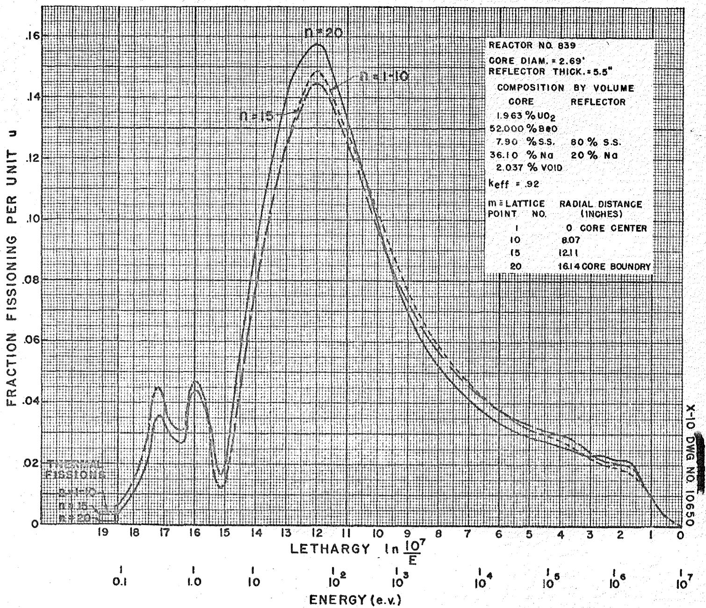  
FIGURE 3.15 NORMALIZED FISSIONING SPECTRUM

(REACTOR 839)

this writing only the one calculation has been made with xenon in reflected reactors. Equivalent bare reactor studies of assemblies with the same spectrum indicate a much smaller change in reactivity. Since the xenon effect is estimated by employing the flux distribution of the unpoisoned reactor, the first iteration must result in an overestimation of the xenon effect. The average of two iterations is closer to a true value, and in this case gives a value of about $3\%$ for the xenon effect.

Figure 3.16 shows the spatial power distribution. Comparison with Fig. 3.3 on the clean reactor indicates a marked decrease in power density in the core near the interface due to the xenon. However, this is definitely overemphasized in this calculation owing to the approximation of uniform xenon density.

Figure 3.17 shows the integrated energy distribution of the fission-producing neutrons. The percentage of thermal neutrons has been decreased from 6.8 to $1.9\%$ by the xenon.

The density of xenon at its maximum transient after shutdown is a somewhat elusive quantity to determine because the time after shutdown at which the maximum occurs depends on the neutron spectrum and hence varies over the core. By a process of integration it was found that the greatest $\Delta k / k$ change from the case of no xenon would be $4.9\%$ and the critical mass with this xenon would be 120 lb. The maximum xenon effect is thus not much worse than the equilibrium xenon effect.

Effect of Uranium Lumping. Using the method developed at KAPL (3) to determine new effective cross-sections for uranium when it exists in lumped rather than homogeneous form, it was found that the critical mass increased by only 5 lb. The fuel was assumed to exist in 0.08-in. isolated pins having, by volume, $39\%$ BeO, $36\%$ $\mathrm{UO}_2$ , and $25\%$ void. The mutual self-shielding effect of bundled pins was not determined, but this additional effect should be less than the isolated pin effect. The self-shielding effect (ratio of effective to actual absorption cross-sections) for 10- and 20-mil uranium foils of $93\%$ enrichment is illustrated in Figs. 3.18 and 3.19.

Effect of Iteration of the Source Term. In the calculation of a reflected reactor by the multigroup method as developed by $\mathrm{KAPL}^{(3)}$ and as used by the ANP Physics Group a spatial distribution of fission neutrons is assumed. The (3) Bartels, W. J. C., Self-Absorption of Monoenergetic Neutrons, KAPL-336 (May 1, 1950).

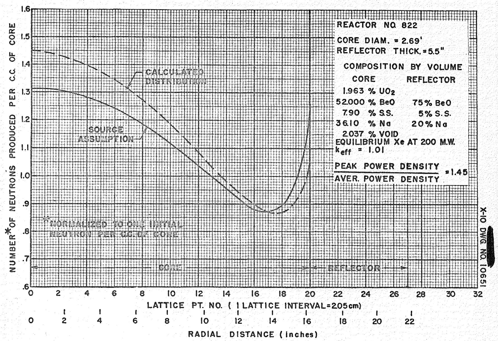  
FIGURE 3.16 SPATIAL POWER DISTRIBUTION   
(REACTOR 822)

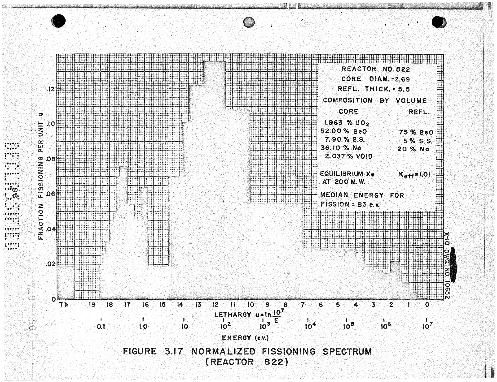

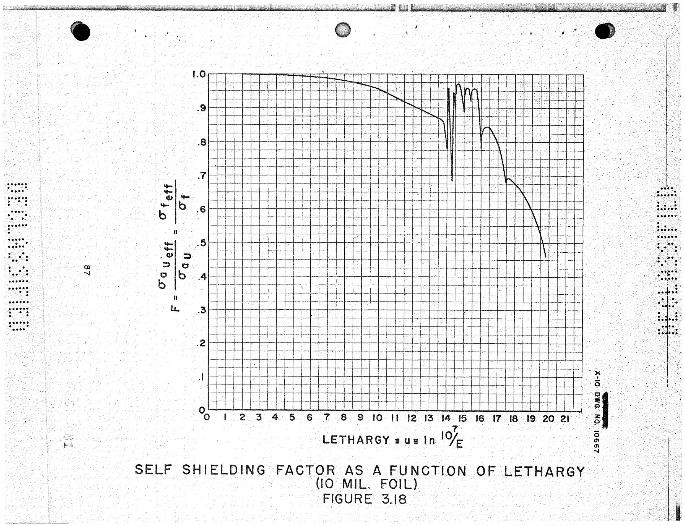

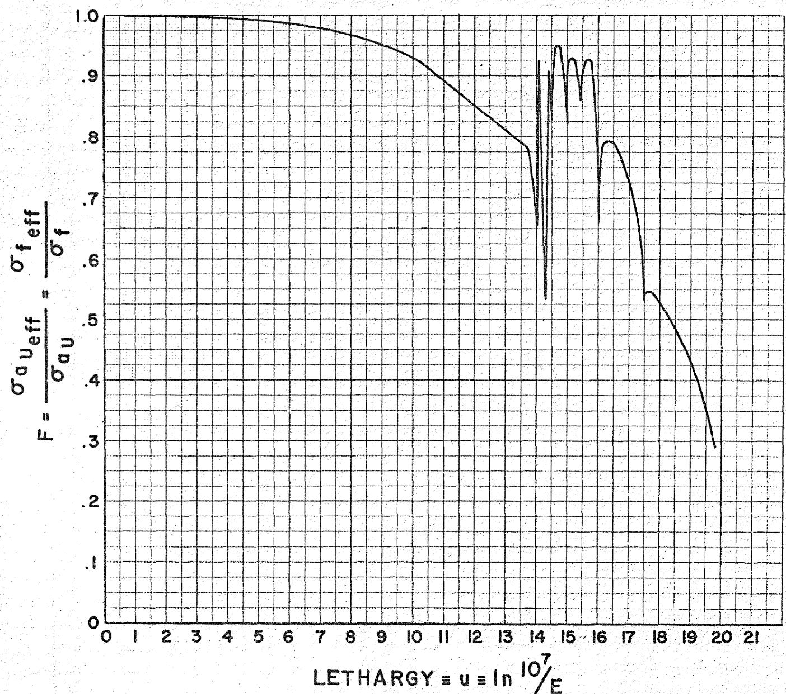  
89901 ON 3Mg 01-x   
$\therefore m - 1 \neq  0$ ;

rate of convergence of the distribution to a limiting value is established by a process of iteration. This process is illustrated graphically in Fig. 3.20. The steps were as follows:

(a) A flat source was assumed for the first calculation. The eigenvalue obtained corresponded to a $k_{zff}$ of 1.04335.   
(b) For the second calculation, the distribution determined from calculation (a) was used as the source distribution and resulted in a $k_{\varepsilon f}$ of 1.05118, an increase over (a) of 0.00783.   
(c) For the third calculation, the distribution determined from calculation (b) is used as the source distribution and the $k_{eff}$ was 1.05483, an increase over (b) of 0.00365 and an increase over (a) of 0.01150.

For the above-described reactor the maximum change in $k_{\text{eff}}$ due to the choice of a flat source distribution is greater than 1.15% but probably less than 1.5%. This corresponds to a maximum change in critical mass of more than 5.4 lb but less than 7.1 lb.

# D. STATICS OF ANP EQUIVALENT BARE REACTOR

J. W. Webster, NEPA

The preliminary calculations made this quarter on the ANP reactor design used bare-reactor methods and a "reflector savings" to account for the reflector. The 3-ft elliptical core was approximated by a homogeneous sphere of the same volume (17.68 cu ft), having a diameter of 3.232 ft. The reflector, which is actually rather complicated in composition from a computational standpoint, was taken to be equivalent to 5 extra inches of core mixture around the 3.232-ft spherical core. The volume fractions of the materials comprising the core that were used in the calculation were as follows: $7.83\%$ $\mathrm{UF_4}$ -NaF liquid-fuel solution, $57.14\%$ BeO, $11.38\%$ stainless steel, and $23.65\%$ Na coolant. This composition was modified slightly in the final ANP reactor design.

The critical mass of this assembly was calculated to be 95 lb of uranium of $93\%$ enrichment. About 15 lb of this total is necessary to offset the xenon poisoning. About 3 lb was shown to be necessary because of the lumping of the fuel. This calculated increase due to lumping is thought to be somewhat optimistic since not all the effects of heterogeneity have been adequately

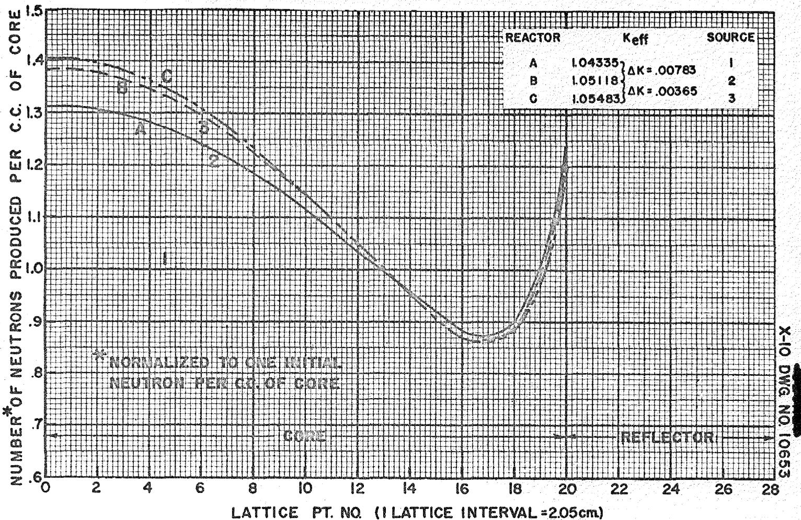  
FIGURE 3.20 ITERATION OF SOURCE TERM

accounted for in the present self-shielding method. Judging from the comparison of theory and experiment on the first critical assembly, the critical masses as predicted by the theory are too large, and hence at this time the best that can be said it that the critical mass of the ANP design will probably lie in the range 65 to 100 lb of uranium,

Since the design fuel volume is 1.39 cu ft, the 95-lb mass leads to a fuel solution of 68 lb of uranium per cubic foot, having a density of about 3 g/cc and 11 mole % UF $_4$ in the UF $_4$ -NaF solution.

These bare reactor calculations indicate that the median energy of the fission-producing neutrons will be about 15 eV and that about $7\%$ of the fission-producing neutrons are thermal. Figure 3.21 is a graph of the energy distribution of fission-producing neutrons. The mean lifetime of a neutron was calculated to be $2 \times 10^{-5}$ sec.

Table 3.3 below presents the results of a study of the reactivity effects in the reactor that must be offset by shim control.

TABLE 3.3   
Shim Control Requirements   

<table><tr><td>EFFECT</td><td>△k/k (%)</td></tr><tr><td>Depletion (200 megawatts for 100 hr or 1.855 lb)</td><td>-0.5</td></tr><tr><td>Equilibrium xenon (total core flux, 200 megawatts, 5 x 1015neutrons/cm2-sec)</td><td>-2.7</td></tr><tr><td>Moderator (expansion and change of thermal base with rise inmoderator temperature)*</td><td>0.0</td></tr><tr><td>Fuel expansion (1400 to 1815°F)</td><td>-1.1</td></tr><tr><td>Reasonable allowance for temporary extra xenon due to powerreductions</td><td>-0.7</td></tr><tr><td>Total</td><td>-5.0</td></tr></table>

*The moderator will be preheated at start-up.

It is intended that shim control in the ANP reactor will be obtained by fuel removal. It was found that if fuel was moved uniformly over the core, $20\%$ of the fuel would have to be removed to accomplish the above $5\%$ reactivity change (the conversion factor from $\Delta k_{eff}$ to uranium mass for this reactor was

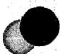

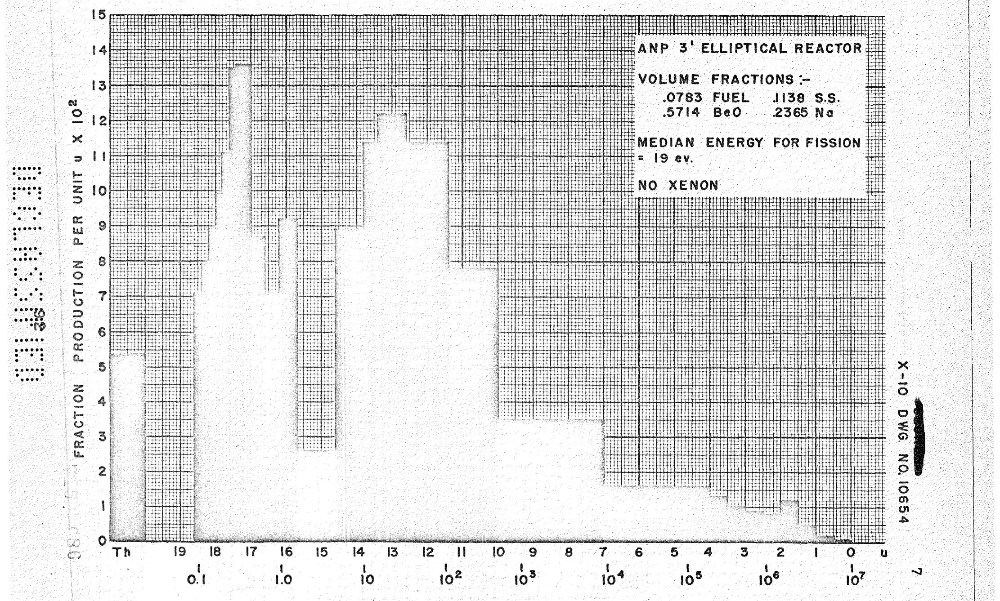  
FIGURE 3.21 NORMALIZED FISSIONING SPECTRUM (ANP EQUIVALENT BARE REACTOR)

determined to be $\frac{\Delta_{\pi / \pi}}{\Delta_{k / k}} = 4$ ). However, if the fuel was removed from the tubes in the cylindrical portion of the reactor around the longitudinal axis, only $10\%$ would have to be removed. The weighting factor of 2 for axial removal as compared to uniform removal was calculated from the bare reactor perturbation theorem that the effect on reactivity of removal of a fuel lump is proportional to the square of the flux at the point of removal. This will be checked later by more accurate methods.

# E. STATICS OF ANP REFLECTED LIQUID-FUEL REACTOR

D. K. Holmes, Physics Division, and O. A. Schulze, Reactor School

The basic ANP reflected reactor has a core of 49.2 cm radius with a 16.4-cm reflector. The composition is:

<table><tr><td>MATERIAL</td><td colspan="2">VOL. % IN CORE</td><td>VOL. % IN REFLECTOR</td></tr><tr><td>UF4-NaF</td><td>0.078</td><td></td><td>0</td></tr><tr><td>BeO</td><td>53.09</td><td></td><td>75.00</td></tr><tr><td>Structure</td><td colspan="2">7.63 (inconel)</td><td>5.00 (stainless steel)</td></tr><tr><td>Na coolant</td><td>29.83</td><td></td><td>20.00</td></tr></table>

The volume percent of fuel shown corresponds to 120 lb of U²³⁵. The static characteristics of reactors of the same composition except for the fuel were also calculated. The fuel weights in these reactors were 100 and 80 lb of U²³⁵. The $k_{eff}$ for the 120-lb fuel reactor is 1.0660 and from all three calculations the critical mass is estimated to be about 90 lb. Figure 3.22 shows the normalized fissioning spectrum; the median energy for fission for the 120-lb fuel reactor is 18.5 ev, with 8.4% of the fissions occurring at thermal energy. Figure 3.23 shows the power distribution.

From the results for these reactors the following kinetic coefficients have been determined:

1. The change in $k_{\text{eff}}$ per degree Fahrenheit change in the thermal base:

$$
\left[ \frac {\Delta k}{\Delta T} \right] = 1. 4 7 \times 1 0 ^ {- 6} / ^ {\circ} F
$$

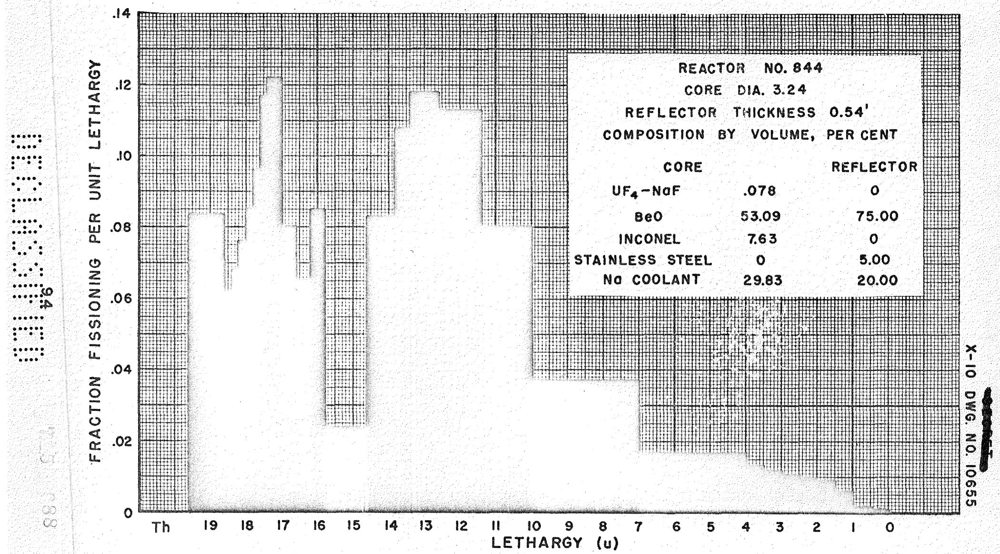  
FIGURE 3.22 NORMALIZED FISSIONING SPECTRUM (ANP REFLECTED LIQUID FUEL REACTOR)

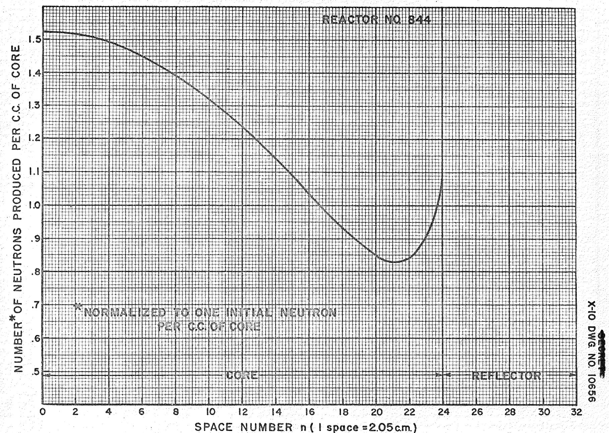  
FIGURE 3.23 SPATIAL POWER DISTRIBUTION (ANP REFLECTED LIQUID FUEL REACTOR)

2. The change in $k_{eff}$ per degree Fahrenheit due to a density change in

$(\alpha)$ Moderator only:

$$
\left[ \frac {\Delta k}{\Delta T} \right] _ {B \in 0} \approx 1, 1 1 \times 1 0 ^ {- 6} / ^ {\circ} F
$$

(b) Sodium coolant only:

$$
\left[ \frac {\Delta k}{\Delta T} \right] _ {N a} = - 1. 1 5 \times 1 0 ^ {- 6} / ^ {\circ} F
$$

(c) Fuel only:

$$
\left[ \frac {\Delta k}{\Delta T} \right] _ {\text {F u e i}} = - 5. 2 7 \times 1 0 ^ {- 5} / ^ {\circ} \mathrm {F}
$$

3. The fractional change in $k_{eff}$ per fractional change in density of

(a) Moderator only:

$$
\left[ \frac {\Delta k / k}{\Delta \rho / \rho} \right] _ {\text {B e o}} = 0. 2 9 0
$$

(b) Sodium coolant only:

$$
\left[ \frac {\Delta k / k}{\Delta \rho / \rho} \right] _ {N a} = 0. 0 0 5 7 2
$$

(c) Fuel only:

$$
\left[ \frac {\Delta k / k}{\Delta \rho / \rho} \right] _ {F u e l} = 0. 2 0 6
$$

Compare with Table 3.2 in Sec. 3.C which gives comparable constants for the solid-fuel design of higher median energy of fission.

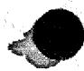

# F. KINETICS OF ANP REFLECTED LIQUID-FUEL REACTOR

T. Rubin, NEPA, N. M. Smith, Physics Division R. R. Coveyou, Mathematics Panel

The kinetic responses of the ANP reactor as designed by Jan. 9, 1951 to a step change in reactivity of $10^{-3}$ and to an entrance coolant temperature step change of $75^{\circ} \mathrm{C}$ has been calculated $^{(4)}$ for the case in which delayed neutrons and xenon have been neglected. The variations of flux and fuel temperature about the original operating position on application of the above two stimuli are plotted in Figs. 3.24 through 3.27. The following constants were used in the calculations:

<table><tr><td>Thermal relaxation time (sec)</td><td>0.40</td><td>13.6</td></tr><tr><td>Total heat capacity (cal/°C)</td><td>6.6 x 104</td><td>3.7 x 105</td></tr><tr><td>Temperature rise rate in absence of cooling (°C/sec)</td><td>678</td><td>7.8</td></tr><tr><td>Reactivity temperature coefficient (per °C)</td><td>-3.3 x 10-5</td><td>-3.6 x 10-5</td></tr><tr><td>Integrated flux (neutrons/cm2-sec)</td><td colspan="2">3 x 1015</td></tr><tr><td>Neutron lifetime (sec)</td><td colspan="2">2.5 x 10-5</td></tr></table>

Further calculations show that for small reactivity changes from critical, the delayed neutrons completely damp out the high-frequency oscillations obtained in these calculations. This is evident since the time scale of the process is now determined by the delayed-neutron periods. Figures 3.28 and 3.29 illustrate the effect of the delayed neutrons.

Work is now in progress on obtaining better estimates for the reactivity coefficients from the IBM multigroup calculations.

# G. STATICS OF ARE BARE REACTOR

J. W. Webster, NEPA

The reactor physics calculations in regard to the statics of the ARE have thus far been largely of the bare-reactor preliminary type. Nine proposals were made by the Design Group and a critical mass study has been completed of these nine assemblies. It has now become evident that critical mass

(4) For derivation of equations see report ANP-62, , Perturbation Equations for the Kinetic Response of Liquid Fuel Reactor, by N. M. Smith, T. Rubin, M. J. Nielsen, and R. R. Coveyou (Apr. 17, 1951), (OFNL, Y-12 Site).

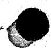

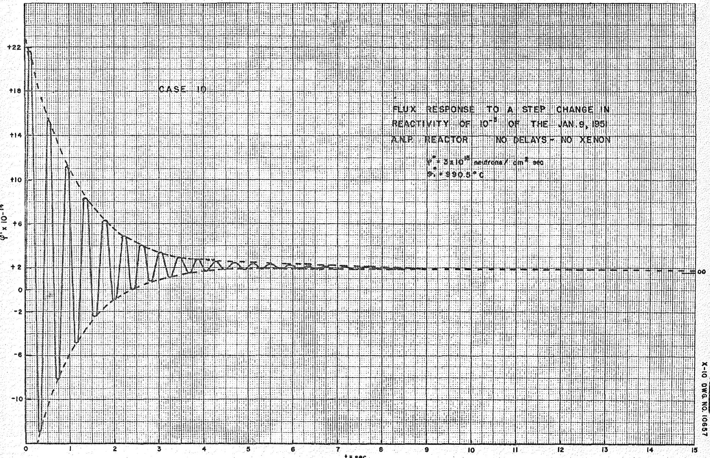  
FIGURE 3.24 FLUX RESPONSE TO A STEP CHANGE IN REACTIVITY OF $\mathsf{IO}^{-3}$ (NO DELAYS - NO XENON)

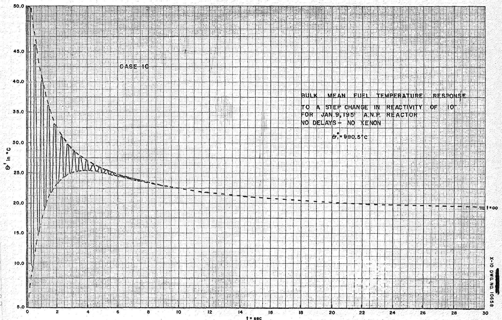  
FIGURE 3.25 BULK MEAN FUEL TEMPERATURE RESPONSE TO A STEP CHANGE IN REACTIVITY OF $\mathsf{IO}^{-3}$ (NO DELAYS - NO XENON)

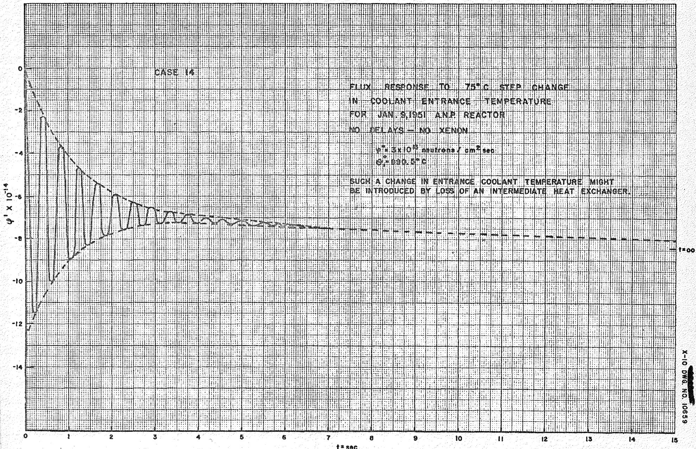  
FIGURE 3.26 FLUX RESPONSE TO A $75^{\circ}\mathrm{C}$ STEP CHANGE IN COOLANT ENTRANCE TEMPERATURE (NO DELAYS - NO XENON)

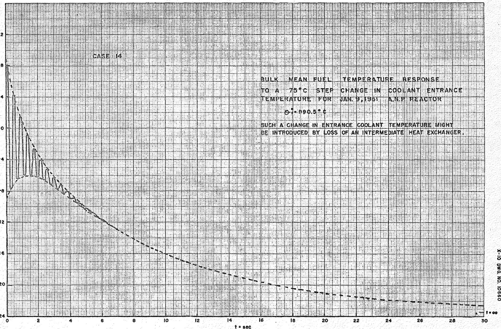  
FIGURE 3.27 BULK MEAN FUEL TEMPERATURE RESPONSE TO A $75^{\circ}C$ STEP CHANGE IN COOLANT ENTRANCE TEMPERATURE (NO DELAYS-NO XENON)

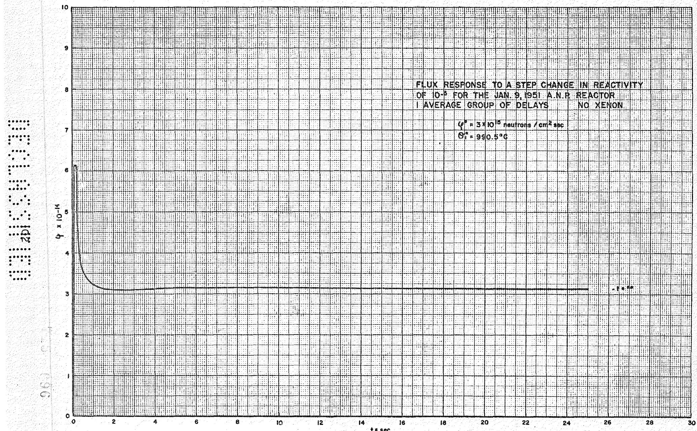  
FIGURE 3.28 FLUX RESPONSE TO A STEP CHANGE IN REACTIVITY OF $\mathsf{IO}^{-3}$ (NO XENON)

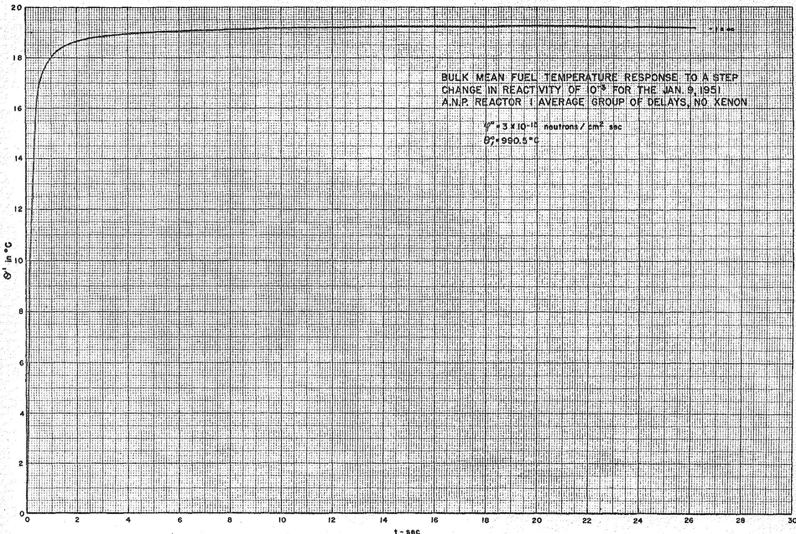  
FIGURE 3.29 BULK MEAN FUEL TEMPERATURE RESPONSE TO A STEP CHANGE IN REACTIVITY OF $\mathsf{IO}^{-3}$ (NO XENON)

is an important criterion in selecting an ARE design. If in order to simulate the control kinetics of the ANP design (1) the number of fuel tubes in the ANP reactor is scaled down by a factor equal to the ratio of the design power of the ANP (200 megawatts) to that of the ARE (3 megawatts), (2) the fuel tube diameter is kept the same, (3) coolant volume in the core is reduced accordingly, and (4) the moderator volume is increased accordingly, then the resultant design contains insufficient fuel volume for criticality even though the moderator volume is over $90\%$ of the core volume. The result is that the number of fuel tubes must be increased over this exact scale-down, or the size of the fuel tubes must be increased, or both, until the reactor can be made critical with a satisfactory fuel solution even though the control characteristics of the ANP design may not be simulated exactly.

Table 3.4 lists the composition and critical mass results on the nine proposals. A 5-in. reflector saving was assumed for each reactor. The critical masses are given for a BeO density of both 2.8 and 2.6 g/cc. It appears that expediency in procurement may dictate acceptance of the lower value.

Judging from, comparison of the theory with experiment on the first critical assembly, these results are pessimistic, and future correlated methods may predict values as much as $33\%$ less than those quoted. In any event the proposed reactors 1, 2, 1A, and 1B could not be made critical with any reasonable fuel solution. Proposals 3 and 2A are marginal. Proposal 3B would not simulate the control characteristics of ANP at all well, so 3A and 2B, or something intermediate between these two, seem to be the logical design.

Table 3.5 presents the results of calculations on reactivity effects in reactor 3A that will have to be offset by shim control.

It is planned to build into the ARE two methods of control. One method will be the removal of fuel solution from a cylindrical portion of the reactor around the longitudinal axis, and the second method will be the insertion of an absorber control rod along the axis. To accomplish the $2.8\%$ change in $k$ (Table 3.5) would require removing approximately $7 \frac{1}{2}$ of the fuel if it is removed from the axial portion of the core, i.e., fuel tubes out to about 0.27 of the core radius will have to be devoted to shim control. These results are rough and will be checked in the future by more elaborate methods.

<table><tr><td colspan="2">REACTOR</td><td>1</td><td>2</td><td>3</td><td>1A</td><td>2A</td><td>3A</td><td>.1B</td><td>2B</td><td>3B</td></tr><tr><td colspan="2">No. of fuel tubes</td><td>225</td><td>225</td><td>225</td><td>563</td><td>563</td><td>1125</td><td>1125</td><td>1125</td><td>1125</td></tr><tr><td colspan="2">Fuel tube I.D. (in.)</td><td>0.080</td><td>0.150</td><td>0.200</td><td>0.080</td><td>0.150</td><td>0.200</td><td>0.080</td><td>0.150</td><td>0.200</td></tr><tr><td colspan="2">Fuel volume (cu ft)</td><td>0.018</td><td>0.063</td><td>0.111</td><td>0.045</td><td>0.1575</td><td>0.2775</td><td>0.090</td><td>0.315</td><td>0.555</td></tr><tr><td colspan="2">Volume fraction</td><td></td><td></td><td></td><td></td><td></td><td></td><td></td><td></td><td></td></tr><tr><td colspan="2">Fuel</td><td>0.00102</td><td>0.00357</td><td>0.0063</td><td>0.00295</td><td>0.00894</td><td>0.01575</td><td>0.0051</td><td>0.0178</td><td>0.0314</td></tr><tr><td colspan="2">Moderator</td><td>0.97794</td><td>0.95753</td><td>0.9365</td><td>0.95475</td><td>0.90297</td><td>0.85039</td><td>0.9157</td><td>0.8122</td><td>0.7065</td></tr><tr><td colspan="2">Metal</td><td>0.00904</td><td>0.0104</td><td>0.0117</td><td>0.0127</td><td>0.01669</td><td>0.02006</td><td>0.0192</td><td>0.0274</td><td>0.0343</td></tr><tr><td colspan="2">Coolant</td><td>0.0120</td><td>0.0285</td><td>0.0455</td><td>0.0300</td><td>0.0714</td><td>0.1138</td><td>0.0600</td><td>0.1426</td><td>0.2278</td></tr><tr><td colspan="2">Thermal fissions (%)</td><td></td><td></td><td></td><td></td><td></td><td></td><td></td><td></td><td></td></tr><tr><td colspan="2">Uranium mass (lb)</td><td></td><td></td><td></td><td></td><td></td><td></td><td></td><td></td><td></td></tr><tr><td colspan="2">PBoO = 2.8</td><td></td><td></td><td></td><td></td><td></td><td></td><td></td><td></td><td></td></tr><tr><td colspan="2">PBoO = 2.6</td><td></td><td></td><td></td><td></td><td></td><td></td><td></td><td></td><td></td></tr><tr><td colspan="2">PBoO = 2.6</td><td></td><td></td><td></td><td></td><td></td><td></td><td></td><td></td><td></td></tr><tr><td colspan="2">Uranium per cubic foot of fuel solution (lb)</td><td></td><td></td><td></td><td></td><td></td><td></td><td></td><td></td><td></td></tr><tr><td colspan="2">PBoO = 2.6</td><td></td><td></td><td></td><td></td><td></td><td></td><td></td><td></td><td></td></tr><tr><td colspan="2">E7+22</td><td>E7+238</td><td>144</td><td>E*311</td><td>127</td><td>90</td><td>200</td><td>95</td><td>86</td><td></td></tr></table>

* E means estimated from the other calculated results.

The absorber control rod will provide auxiliary shim, safety, and dynamic control. The effectiveness of this type of control in the ARE as a function of rod size has not yet been calculated.

TABLE 3.5   
ARE Shim Control Requirements   

<table><tr><td>EFFECT</td><td>Δk/k (%)</td></tr><tr><td>Depletion</td><td>0</td></tr><tr><td>Equilibrium xenon (thermal flux 1 x 1013neutrons/cm2-sec for 3 megawatts)</td><td>-1.6</td></tr><tr><td>Moderator (expansion and change of thermal base with rise in moderator temperature)*</td><td>0</td></tr><tr><td>Fuel expansion (1400** to 1815°F)</td><td>-1.1</td></tr><tr><td>Reasonable allowance for temporary extra xenon due to power reductions</td><td>-0.1</td></tr><tr><td>Total</td><td>2.8</td></tr></table>

*The moderator will be preheated at start-up.   
**1400°F was selected somewhat arbitrarily as the temperature at which the fuel would be loaded in the core at start-up.

The normalized fissioning spectrum of proposed reactor 3A without xenon and with equilibrium xenon is shown in Figs. 3.30 and 3.31, respectively. The primary difference between the two curves appears at higher lethargies, since the area under the two curves is normalized to unity.

H. KINETICS OF ARE REACTORS

M. C. Edlund, Physics Division

Perturbation Theory Studies. A study of the kinetic behavior of some of the proposed ARE core configurations(5) has been partially completed. The responses of these reactors for short time intervals after a step change of (5) Schroeder, R. W., Proposed ARE Core Configurations, Y-F8-13 (Feb. 5, 1951) (ORNL, Y-12 Site).

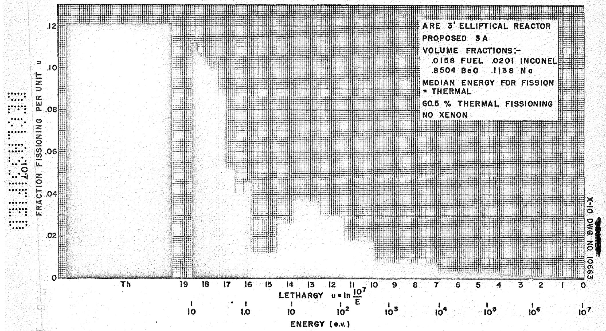  
FIGURE 3.30 NORMALIZED FISSIONING SPECTRUM (ARE BARE REACTOR-NO XENON)

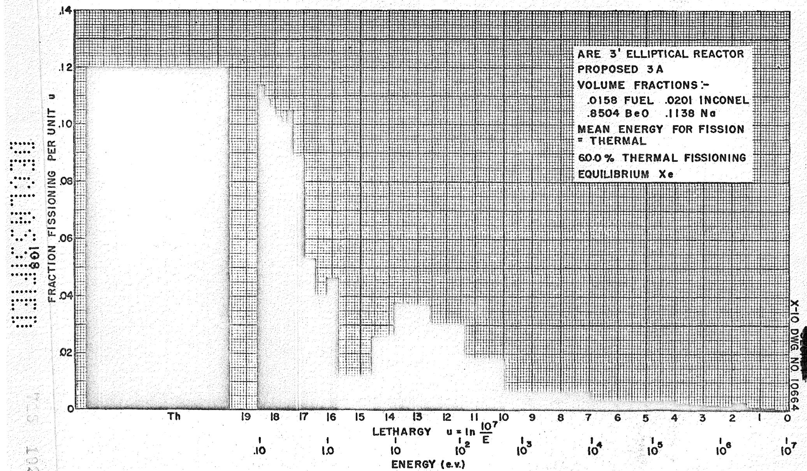  
FIGURE 331 NORMALIZED FISSIONING SPECTRUM   
(ARE BARE REACTOR-EQUILIBRIUM XENON)

$100^{\circ}\mathrm{F}$ in the inlet coolant temperature have been calculated using the perturbation technique, (6)

The variation of neutron flux in the ARE type of cores during short time intervals after a change in reactivity is essentially governed by four factors:

1. Fuel temperature coefficient of reactivity, a negative coefficient.   
2. Fuel tube expansions (a positive coefficient of reactivity linked with temperatures of coolant).   
3. Thermal relaxation time of fuel.   
4. Total heat capacity of fuel and tubing.

The Doppler effect in fuel has not been considered and the moderator coefficient resulting from direct heating in the moderator has been neglected, since the thermal relaxation time of the moderators is of the order of thousands of seconds. The xenon coefficient was not included since it depends on the temperature of the moderator. It is reasonable to suppose that a temperature-sensing servo-control system could react in times much shorter than $10^{3}$ sec. Hence all moderator coefficients are neglected in a first survey of ARE kinetics.

Three of the proposed ARE reactor designs were selected as representative of the range being considered. They varied from $77\%$ thermal fissions to $40\%$ thermal fissions, the neutron lifetimes varying from an estimated $10^{-4}$ to $3 \times 10^{-5}$ sec. The thermal characteristics of these reactors also covered the range considered. For comparison the same calculation was made for a proposed full-power aircraft reactor (ANP reactor).

The calculations include an effective single group of delayed neutrons obtained by lumping all delayed-neutron precursors into a single group with an average decay constant of 0.081 sec and a fractional yield per fission neutron of 0.0075.

A summary of the constants employed in the calculations is given in Table 3.6.

The temperature coefficient of reactivity that is due to fuel expansion is estimated to be $-6 \times 10^{-5} / {}^{\circ}\mathrm{F}$ . The temperature coefficient of reactivity due to the tube wall expansion is $2.34 \times 10^{-5} / {}^{\circ}\mathrm{F}$ . The temperature of the fuel (6) Edlund, M. C., Kinetics of Proposed ARE Reactors, Y-F10-42 (to be issued) (ORNL, Y-12 Site).

TABLE 3.6   
Constants* Employed in the Kinetic Calculation   

<table><tr><td>REACTOR</td><td>BeO IN CORE (vol. %)</td><td>INCONEL IN CORE (vol. %)</td><td>% THERMAL FISSIONS</td><td>APPROXIMATE LIFETIME (sec)</td></tr><tr><td>3</td><td>94</td><td>1.17</td><td>70</td><td>10-4</td></tr><tr><td>2A</td><td>90</td><td>1.67</td><td>71</td><td>10-4</td></tr><tr><td>3B</td><td>71</td><td>3.43</td><td>40</td><td>3 × 10-5</td></tr><tr><td>ANP</td><td>52</td><td>8.0</td><td>10</td><td>2 × 10-5</td></tr></table>

<table><tr><td>REACTOR</td><td>THERMAL RELAXATION TIME OF FUEL (sec)</td><td>TOTAL HEAT CAPACITY OF FUEL (Btu/°F)</td><td>TOTAL HEAT CAPACITY OF TUBES (Btu/°F)</td><td>TOTAL POWER PRODUCTION IN FUEL (Btu/sec)</td></tr><tr><td>3</td><td>2.51</td><td>7.49</td><td>3.30</td><td>2,674</td></tr><tr><td>2A</td><td>1.64</td><td>10.62</td><td>6.40</td><td>2,674</td></tr><tr><td>3B</td><td>2.62</td><td>37.44</td><td>16.50</td><td>2,674</td></tr><tr><td>ANP</td><td>0.409</td><td>80.3</td><td>45.1</td><td>178,228</td></tr></table>

<table><tr><td>REACTOR</td><td>MEAN FUEL TEMPERATURE, STEADY STATE (°F)</td><td>MEAN COOLANT TEMPERATURE, STEADY STATE (°F)</td><td>INLET COOLANT TEMPERATURE (°F)</td></tr><tr><td>3</td><td>1900</td><td>1270</td><td>1100</td></tr><tr><td>2A</td><td>1570</td><td>1310</td><td>1140</td></tr><tr><td>3B</td><td>1450</td><td>1320</td><td>1150</td></tr><tr><td>ANP</td><td>1900</td><td>1310</td><td>1140</td></tr></table>

*With the exception of the % Thermal Fissions and Neutron Lifetimes these values were obtained from S. V. Manson.

tubes follows the temperature of coolant more closely than that of the fuel and can be considered as a coolant temperature coefficient. Each calculation was made with two neutron lifetimes, $10^{-4}$ and $2.5 \times 10^{-5}$ sec.

In Figs. 3.32 and 3.33 are shown the results when $\Delta P$ equals the change in total power in the fuel (in British thermal units per second) from steady state, $\Delta \theta$ equals the change in mean fuel temperature from steady state, and $t$ is the time in seconds after the change in coolant temperature. The periods may be seen from the equations in Table 3.7.

# TABLE 3.7

# Power and Average Fuel Temperature Equations for the ARE Resulting from Perturbation Theory Analysis

# REACTOR 3

$$
\Delta p = - 2 3 8 - 7 0 8 e ^ {- 7 3. 7 t} + 9 0 2 e ^ {- 2. 7 5 t} + 4 3. 9 e ^ {- 0. 0 6 7 5 t}
$$

$$
\Delta \theta = 3 0. 4 + 1. 1 8 e ^ {- 7 3. 7 t} - 4 7. 0 e ^ {- 2. 7 5 t} + 1 5. 1 e ^ {- 0. 0 6 7 5 t}
$$

# REACTOR 2A

$$
\Delta p = - 5 0 5 \cdot 5 3 5 e ^ {- 7 4. 8 t} + 8 7 3 e ^ {- 1. 7 9 t} + 1 6 6 e ^ {- 0. 0 5 6 3 t}
$$

$$
\Delta \theta = 2 0. 4 + 0. 5 4 9 e ^ {- 7 4 \cdot 8 t} - 5 1. 0 e ^ {- 1 \cdot 7 9 t} + 2 9. 8 e ^ {- 0. 0 5 6 3 t}
$$

# REACTOR 3B

$$
\Delta p = - 8 3 7 - 3 6 6 e ^ {- 3 0 4 t} + 8 3 0 e ^ {- 0. 4 7 3 t} + 3 7 3 e ^ {- 0. 0 5 2 0 t}
$$

$$
\Delta \theta = 8. 1 8 \div 0. 0 2 6 e ^ {- 3 0 4} \cdot 6 3. 9 e ^ {- 0. 4 7 3} \cdot 5 5. 6 e ^ {- 0. 0 5 1 0}
$$

# ANP

$$
\Delta p = - 1 6, 7 0 0 - 4 9, 0 0 0 e ^ {- 2 8 9 \varepsilon} + 6 2, 0 0 0 e ^ {- 1 7. 8 \varepsilon} + 3, 5 0 0 e ^ {- 0. 0 6 4 3 \varepsilon}
$$

$$
\Delta \theta = 3 0 + 1. 9 0 e ^ {- 2 8 9 t} - 4 5. 7 e ^ {- 1 7. 8 t} + 1 3. 8 e ^ {- 0. 0 6 4 3 t}
$$

The time at which the maximum mean fuel temperature excursion occurs is inversely proportional to the thermal relaxation time of the fuel. In all cases the maximum change in mean fuel temperature was about $45^{\circ}\mathrm{F}$ . The power excursions, however, indicate a considerably different power response for the proposed ARE cores compared to the aircraft reactor. In general the fractional

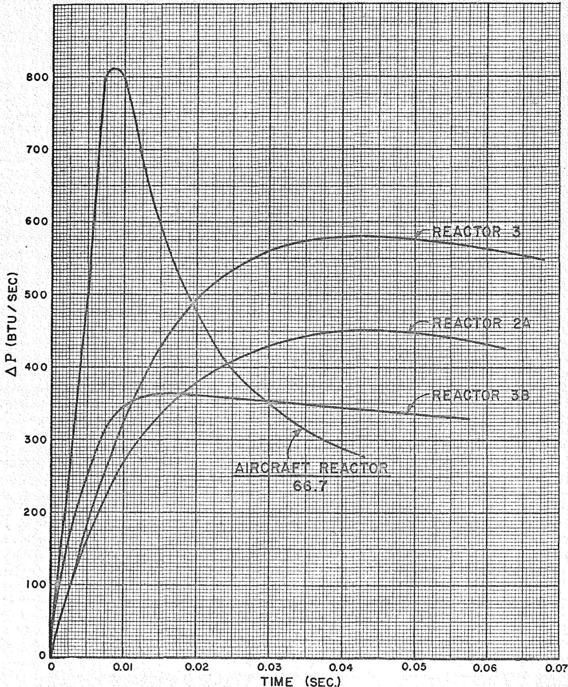  
FIGURE 3.32 CHANGE IN POWER (BTU/SEC) FOR $100^{\circ}\mathrm{F}$

STEP CHANGE IN INLET COOLANT

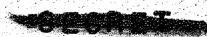

X-10 DWG. NO. 10666

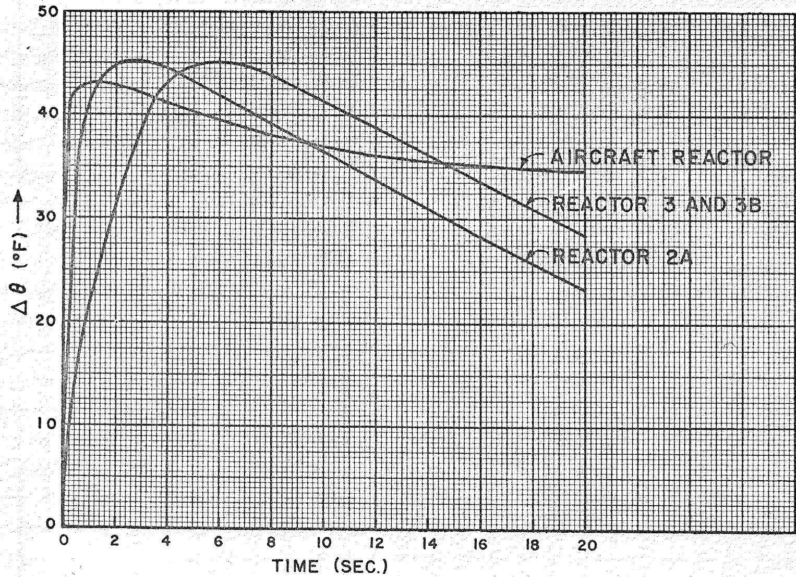  
FIGURE 3.33 CHANGE IN MEAN FUEL TEMPERATURE (°F)

FOR $100^{\circ}F$ STEP CHANGE IN THE

INLET COOLANT TEMPERATURE

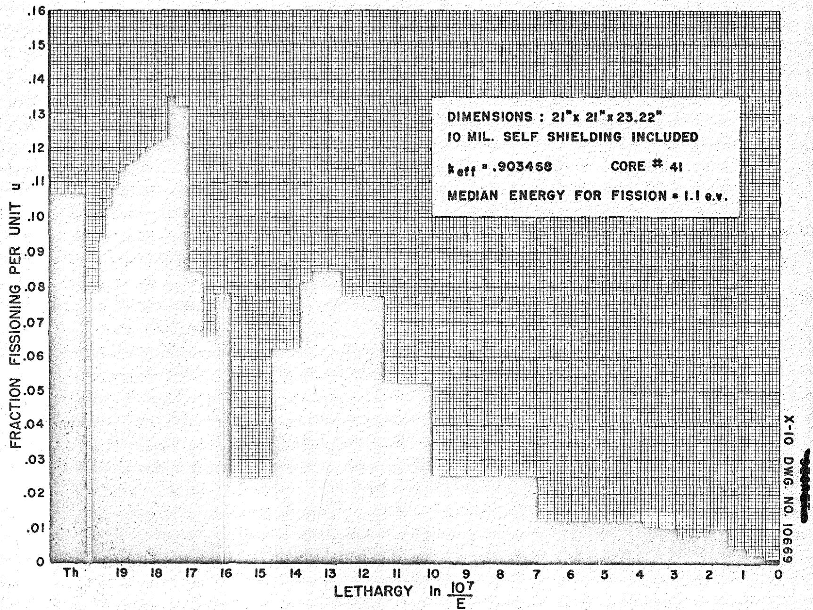  
FIGURE 3.34 NORMALIZED FISSIONING SPECTRUM   
(CRITICAL EXPERIMENT ASSEMBLY \*I)

power change is much greater than the fractional temperature change and depends strongly on the thermal coupling of the fuel with the coolant system and on the neutron lifetime.

Whereas the change in temperature obtained in each case for the two different assumed neutron lifetimes $(10^{-4}$ and $2.5\times 10^{-5}\mathrm{sec})$ was the same, the power excursion was found to be somewhat larger and to occur sooner for the shorter neutron lifetime.

Maximum Pressure in Fuel Tubes. An upper limit to the maximum pressures in the liquid-fuel system resulting from the expansion of the fuel has been obtained by neglecting the expansion of the tube walls.(7) The fuel is treated as an incompressible fluid. The velocity of the fluid along the tube can then be obtained by integrating the equation of continuity, the time rate of change of density being determined by the fuel temperature behavior. The pressure is then obtained from Euler's equations.

The maximum pressure in the fuel tube occurs at the closed end of the tube and is given by

$$
p _ {\max } = p _ {0} + \frac {\rho_ {0} \alpha l ^ {2}}{2} \left[ \frac {d ^ {2} T}{d t ^ {2}} + 2 \alpha \left(\frac {d T}{d t}\right) ^ {2} \right]
$$

where

$$
\begin{array}{l} p _ {0} = \text {p r e s s u r e i n f u e l r e s e r v o i r} \\ l = \text {t u b e} \\ \rho_ {0} = \text {s t e a d y - s t a t e f u e l d e n s i t y} \\ \alpha = \text {v o l u m e} \\ T = \text {t e m p e r a t u r e o f t h e f u e l}. \\ \end{array}
$$

The time derivatives of the temperature are to be evaluated at a time at which the above expression for $P_{\max}$ is a maximum.

(7) Edlund, M. C., Maximum Pressures in Fuel Tubes, Y-F10-43 (to be issued). (ORNL, Y-12 Site).

It is interesting to note that the pressure varies as the square of the tube length rather than as the first power, as would be the case of a liquid of constant density flowing in a tube.

The maximum pressures for the cases given in Table 3.7 have been calculated to be about 10 psi for the ANP and less than 1 psi for the ARE cores.

# I. CRITICAL EXPERIMENT CALCULATIONS

B. T. Macauley, Reactor School

Bare reactor calculations were made by the ANP Physics Group using multi-group methods and material constants forwarded by the Critical Experiment Group. The program was planned for the purpose of correlating theoretical predictions of critical mass with those obtained from experiment, using multigroup calculations in use by the ANP Physics Group as well as furnishing the Critical Experiment Group with theoretical values of spatial flux distribution, fission-ing spectrum, and effects of heterogeneity on critical mass and reactivity.

A preliminary calculation on a critical assembly having the following properties was performed:

Base area 24 by 24 in.

Loading length Varied from 22.22 to 24.24 in.

Volume fractions Fuel (93.2% U $^{235}$ )

Beryllium moderator 0.9150503

Stainless steel 0.000697

Aluminum 0.064039

Void 0.0131086

When self-shielding effects for foils of 10 mils thickness were taken into account, it was found that an assembly having the dimensions 24 by 24 by 24.24 in. would have a $k_{eff}$ of 1.00142, with a corresponding critical mass, $m_c$ , of 29.35 kg of uranium metal, and an mef of 1.2 ev. The normalized fissioning spectrum resulting from this calculation is illustrated in Fig. 3.34.

However, the Critical Assembly Group reported that an assembly 21 by 21 by 23.22 in, had gone critical with a corresponding critical mass of approximately $19\mathrm{kg}$ and an mef of the order of 0.5 to 1 ev, making a discrepancy of about

$50\%$ in critical mass. More exact material constants were obtained, and a rerun on an assembly of 21 by 21 by 23.22 in. was performed to see what theoretical $k_{eff}$ would be predicted. The calculated $k_{eff}$ was 0.90346 and the mef was 1.1 ev.

Because of the large difference between theoretical predictions and experimental values for critical mass, tests were made on the multigroup method to determine a possible source of error. One test was made to determine the effect of subdividing the first two energy groups. Results of the test are given in Table 3.8, from which it appears that the division of the higher

TABLE 3.8   
Calculated Reactivity by Subdividing Energy Groups   

<table><tr><td>CALCULATION</td><td>GROUP</td><td>ENERGY</td><td>keff</td></tr><tr><td rowspan="2">Original calculation</td><td>1</td><td>107to 6.07 x 106ev</td><td>1.01253</td></tr><tr><td>2</td><td>6.07x106to 3.68 x 106ev</td><td></td></tr><tr><td rowspan="2">Test No. 1</td><td>1</td><td>Broken into 5 groups</td><td>1.01653</td></tr><tr><td>2</td><td>Broken into 5 groups</td><td></td></tr><tr><td rowspan="2">Test No. 2</td><td>1</td><td>Made into one group</td><td>0.9979</td></tr><tr><td>2</td><td>Made into one group</td><td></td></tr></table>

energy groups was quite satisfactory in the present multigroup method.

The next theoretical test was made assuming a bare reactor. In the corresponding experiment the rectangular parallelepiped was transformed into a spherical core, and the volume of aluminum in the honeycomb surrounding the critical assembly was converted into an aluminum reflector of reduced density, having the same total volume as the honeycomb outside the core.

It was assumed that the neutrons leaving the core would be allowed only one collision (according to calculated mean free path in the reduced-density aluminum) in the reflector prior to returning to the core. The reflector neutron contribution to the core then depended upon (1) the solid angle and (2) the probability that a reflector neutron made no second collision in

returning to the core. Integrating over the reflector gave an albedo for the reduced density aluminum of 0.02 to 0.03 (depending on the aluminum cross-section chosen). It was found from this test that the effect of the aluminum honeycomb was to increase $k_{eff}$ by 1 to $2\%$ , which corresponded to a mass decrease of the order of 5 to $10\%$ . Of all the approximations made, the smearing out of the aluminum, which neglects the streaming in the channels, is probably the worst, so that the above mass decrease is probably an over-estimate. Preliminary experimental results reported verbally to us indicate that the aluminum grid decreases the critical mass from 2 to $3\%$ .

Further investigations are contemplated to attempt to make theory and experiment agree more closely. Possible sources of error may lie in not accounting for (1) the $\mathrm{Be}(n,2n)$ reaction, (2) the beryllium total cross-section at 0.1 Mev and higher, which is not known accurately, and (3) the fact that continuous-slowing-down theory in the uranium resonance region may not hold. Work is in progress to obtain a better estimate of resonance capture as a function of energy.

# J. GLOSSARY OF NUCLEAR ENERGY TERMS

C. B. Mills, ANP Physics Group

The reactor theory section of the glossary of nuclear energy terms is nearing completion. The many suggestions by others on the panel for reactor theory terms have been incorporated in the glossary and the terms are being generalized to include intermediate reactor theory.

# 4. CRITICAL EXPERIMENTS

A. D. Callihan, Physics Division, and J. F. Coneybear, NEPA

The purpose of the ANP Critical Experiments Program is to investigate the properties of critical assemblies composed of uranium and various neutron reflectors and moderators. Other materials, simulating structural members, coolants, etc. of the aircraft reactor, can be included in the assembly. The mass of uranium required for criticality, the spectral and spatial distribution of neutrons within the array, and the effectiveness of controls are some of the variables to be examined as assembly components are changed. During the last three months the installation of the equipment in the laboratory was completed, and sufficient uranium and beryllium have been procured to begin experimentation late in the quarter.

# APPARATUS FOR THE CRITICAL EXPERIMENTS

The critical experiment apparatus consists essentially of two matrices of 3-in.-square aluminum tubing 3 ft long, mounted on two tables, one being stationary and the other so arranged that it can be motor driven toward the first. Enriched uranium metal and the other materials under study as moderators, etc. are assembled in units approximately 3 in. square and of suitable length and are placed in the aluminum tubing. The two parts of the final array are then brought together by remote control. The usual safety and control rods, the latter for fine adjustment, are built into the assembly, and the approach to criticality is monitored with neutron and gamma detectors.

Figure 4.1 is an overall picture of the apparatus, the movable table being on the left. The end of one-half of an assembly is shown in the top of the movable bundle of aluminum tubes and, of course, the other half is similarly placed in the fixed matrix. Four safety rods, the longer cylinders, and two control rods may be seen at the rear of each of the arrays. Attached to the fixed half, at the interface, is the motor drive for positioning the neutron source. Various neutron and gamma detectors are shown around the apparatus. The sets of aluminum tubes, comprising the interface of half an assembly, are visible. One of the elements, which is partly removed, consists of blocks of beryllium 1 in. thick, with uranium disks between them, all strung on a horizontal rod. The source drive motor is at the top.

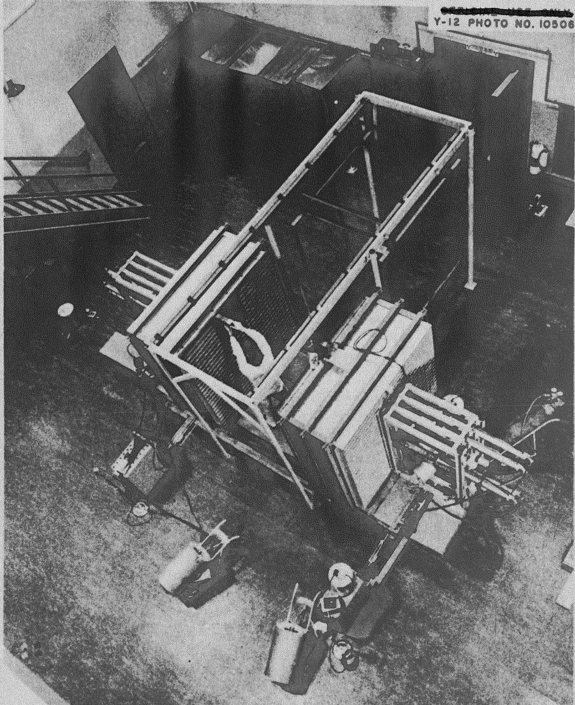  
FIGURE 4.1 CRITICAL EXPERIMENT APPARATUS

Fabrication of Uranium Disks. The uranium metal is being fabricated into disks approximately 3 in. in diameter and 0.010 in, thick by first rolling billets to the required thickness and then punching the disks. Since it has not been possible to roll to uniform thickness, the finished disks were brought to target weight by punching small holes in them. The first batch of 1200 disks delivered were found to be heavily coated with black oxide, probably formed during hot rolling, which, because of the nonadherence of the oxide, presented a serious contamination and accountability problem. The oxide was readily removed by leaching in concentrated nitric acid, after which the metal remained at room temperature in an atmosphere of about $15\%$ relative humidity. The oxide coating which is now being laid down in quite adherent. It has been necessary, however, to lower the target weight of all disks by about $5\%$ because of the weight loss in the first batch during leaching.

First Critical Assembly. The first critical assembly to be built was simple in structure in order that it would lend itself readily to calculation. It was to have beryllium metal as a moderator, to be cubical, and to have no reflector. In the procedure followed an assembly of beryllium was first made with the stepwise addition of uranium in the center. The $\mathrm{Be} / \mathrm{U}^{235}$ atomic ratio of the loaded elements was 386. Criticality was first achieved with about $6\mathrm{kg}$ of uranium in the core and a 6-in. layer of beryllium as a reflector. As more uranium was added the reflector was removed, resulting finally in an assembly 21 by 21 in., with no reflector and containing about $18\mathrm{kg}$ of $\mathrm{U}^{235}$ , which was critical with one control somewhat removed leaving a small void near the center. Extrapolation to the condition of all rods in, i.e., no voids, gives $17.5\mathrm{kg}$ as the mass. The calculated values are 40 to $60\%$ greater than the value observed. Consequently, attempts have been made to ascertain if the discrepancy can be attributed to misinterpretation of the experiment, the most likely cause being spurious reflection of leakage neutrons back into the core by the supporting structure or by the concrete floor. No effect has thus far been found which will account for the difference.

Some very preliminary measurements of the activity induced in bare and cadmium-covered uranium foils at the center of the core show that the median energy for fission of the neutrons is of the order of 0.5 ev. Estimates have also been made of the power level, allowing rough calibration of some of the instruments and a survey of personnel shielding.

# 5. NUCLEAR MEASUREMENTS

The cross-section of molybdenum, as determined at Columbia University, exhibits a strong resonance at 46 ev. This measurement is of particular interest because molybdenum is frequently proposed as a construction material in the aircraft reactor. The 5-Mev Van de Graaff accelerator is now being installed in the Y-12 Area and is expected to begin delivering a proton beam sometime in April. The tentative program for this facility emphasizes neutron work pertinent to shielding and reactor calculations. Also of interest in this field is the Mechanical Neutron Velocity Selector which is still being constructed.

# MOLYBDENUM CROSS-SECTION MEASUREMENTS

Columbia University*

The measurement of the cross-section of molybdenum, introduced in the last quarterly report (ORNL-919, p. 92), has been continued. The slow-neutron transmission curves of $25.82\mathrm{g/cm}^2$ of molybdenum were taken with the Columbia University Neutron Velocity Selector by Prof. W. W. Havens. Figure 5.1 shows the transmission from 0 to $240\mu \mathrm{sec / meter}$ . The line which best fits the data in this energy region is given by the equation $\sigma_{i} = 5.7 + 0.30E^{-\frac{1}{2}}$ . The transmission of these data has been delayed because of the results which do not agree with those published by Egelstaff and Taylor of Harwell.(1) They give their results as $\sigma = 6.4 + 0.43E^{-\frac{1}{2}}$ . The discrepancy between these two results is considerably larger than can be explained by experimental uncertainties. The Columbia data have been rechecked from the point of view of both sample thickness and transmission, and it is believed that the Columbia results are correct. The Harwell people state that their sample was $99.7\%$ pure. Since likely impurities in molybdenum are manganese, tantalum, and tungsten, all of which have high neutron cross-sections, it is conceivable that the impurities might change the slope. However, it is extremely difficult to explain the difference between 6.4 and 5.7 for the extrapolated value of this cross-section. Since any of the probable impurities would tend to increase both the intercept and the slope of the line, it is thought that the Columbia results are probably the better ones.

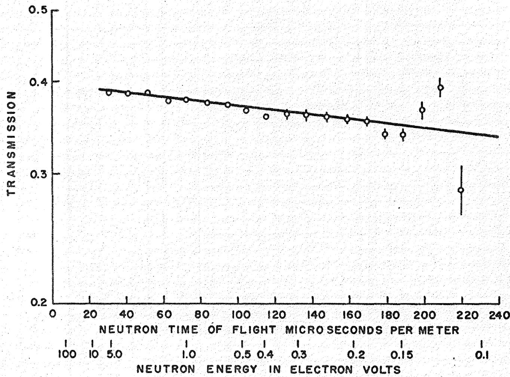

X-10 DWG.NO. 10606   
UNCLASSIFIED   
FIGURE 5.1 TOTAL CROSS-SECTION CURVE OF MOLYBDENUM (LOW ENERGY TAIL)   
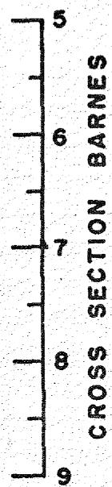  
(MEASURED AT COLUMBIA UNIVERSITY BY PROFESSOR W.W. HAVENS)

Figure 5.2 shows the transmission from 0 to $20~\mu \mathrm{sec / meter}$ . As can be seen, there is a strong resonance at 46 ev with other dips in transmission at 145 and 580 ev. These higher energy dips may be due to multiple levels, as the resolution width of the velocity selector is not too good in this energy region. Note also that the highest transmission values obtained in this higher energy region correspond to a cross-section of about 5.5 barns, which is in agreement with the present data in the lower energy region. The results therefore are self-consistent.

# THE 5-MEV VAN DE GRAAFF ACCELERATOR

Conway Snyder, NEPA

The 5-Mev Van de Graaff accelerator which has been purchased by the United States Air Force for use in the joint NEPA-ORNL accelerator laboratory successfully passed its acceptance tests at the High Voltage Engineering Corporation, Cambridge, Mass., on December 28, 1950. During the course of the tests, the accelerator produced a magnetically analyzed proton beam of from 6 to $7\mu \mathrm{a}$ in its optimum operating range of from 2.5 to 4 Mev and operated successfully at somewhat lower beam currents at energy extremes of 0.5 and 5.4 Mev. The energy stability of the machine was excellent throughout the entire energy range explored, and the actual upper limit to the energy is not known, since it has not been considered desirable to "push" it at this early stage. The fact that no such accelerator has yet yielded nuclear data above 4.25 Mev lends substantiation to the claim that this is the finest electrostatic accelerator in the world.

During January and February the accelerator was disassembled, painted, crated, and shipped to Oak Ridge, where its reassembly is now in progress in Building 9201-2 in the Y-12 Area. By the end of the quarter all components had been received, the major items were in their places, about one-third of the piping was complete, and the electricians were beginning to install the conduits for the rather large number of wires required to control the machine. It is anticipated that the accelerator will begin delivering a proton beam sometime in April.

Research Program. The research program for the accelerator is now being formulated. The advantage of more than a million volts which this accelerator has over others will make accessible for the first time a wide field of great

UNCLASSIFIED

X-IO DWG. NO. 10605

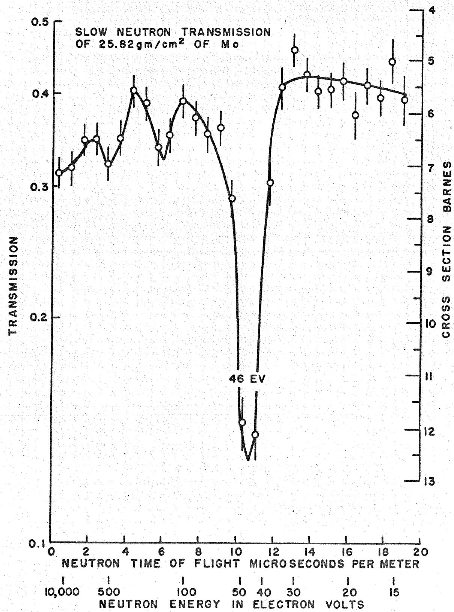  
FIGURE 5.2 TOTAL CROSS-SECTION CURVE OF MOLYBDENUM (MEASURED AT COLUMBIA UNIVERSITY BY PROFESSOR W.W. HAVENS)

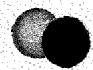

interest to nuclear physics. After the original calibration and breaking-in period, the primary emphasis will be on neutron work of interest for shielding and reactor calculations.

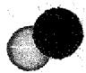

120

# MECHANICAL VELOCITY SELECTOR

G. S. Pawlicki, ORINS, and E. C. Smith, Physics Division

The chopper time-of-flight velocity selector for operation in the neutron energy range up to several thousand electron volts is in the process of construction and installation. The electrical equipment for this neutron spectrometer consists of the following parts:

1. Eighty-four counting channels and control circuits.   
2. Power supply for item 1.   
3. Ionization chamber and associated amplifiers.   
4.Shutter drive motor and speed control regulator.

The mechanical equipment consists of:

1. The rotating shutter.   
2. Neutron beam collimator and necessary support elements for the rotor.   
3. Installation facilities for the shutter assembly.

The counting channels are complete and are undergoing reliability checks in the instrument shop. The necessary regulators for filament voltage are on hand, but the $B$ supply generator delivery has been repeatedly delayed and is again currently due for shipment. The ionization chamber has been checked with commercial purity $\mathrm{BF}_3$ and the performance has been promising. Before final filling with enriched $\mathrm{BF}_3$ , a study of $\mathrm{BF}_3$ purification is being conducted in the Instrument Department. The 5-hp shutter drive motor and the speed control are on hand.

The rotating shutter is retarding the entire program. To date the rotor is less than $50\%$ complete. At the present time the supervision of the Research Shops is doing everything possible to expedite the rotor fabrication, and the current completion date of May 1 may be realized. The collimator and associated elements for the complete chopper are very near completion at present. The installation facilities in the pile building have been designed, and the work order has been submitted. The installation will be begun as soon as field workers are available and can do the work without interfering with other research activities in the vicinity.

# 6. CHEMISTRY OF LIQUID FUELS

W.: R. Grimes, Materials Chemistry Division

The last two ANP quarterly progress reports (ORNL-858 and 919) have discussed some of the characteristics of liquid-fuel systems, and have described the preliminary phases of the research designed to produce satisfactory liquids. Two types of fuels, suspensions of uranium compounds in sodium hydroxide and solutions of $\mathrm{UF_4}$ in alkaline earth fluorides, are under study. At this time it appears that the ternary system sodium fluoride—beryllium fluoride—uranium fluoride will find use in the ANP and ARE reactors, since this fuel combines suitable uranium density (about $80\mathrm{lb / cu ft}$ ) in a fuel solution with a satisfactory (below $500^{\circ}\mathrm{C}$ ) melting point. Other ternary fluoride systems which permit higher uranium concentration are being studied. A stable suspension of a uranium compound in sodium hydroxide has not been realized, although a suspension of adequate uranium concentration may be maintained with but slight stirring.

# PHASE STUDIES OF FLUORIDE SYSTEMS

J.:P.:Blakely G.J:Nessle

R.E.Moore C.J.Barton

Materials Chemistry Division

Studies of molten mixtures of uranium tetrafluoride with alkali fluorides and beryllium fluoride have continued during the past quarter using the methods of thermal analysis and of phase separation. The equilibrium diagrams for the binary systems $\mathrm{KF - UF_4}$ and $\mathrm{NaF - UF_4}$ have been established. A large number of data on the ternary system $\mathrm{NaF - KF - UF_4}$ have been obtained, and the equilibrium diagram for this very complicated system is reasonably well established. Additional data on the system $\mathrm{NaF - BeF_2 - UF_4}$ have been obtained, but considerably more will be required to complete the equilibrium diagram for this system. No work on the NaF-LiF-UF $_4$ system was carried out during the past quarter, since it is not likely that the separated lithium isotopes will soon be available in quantity. The general characteristics of these systems,

as indicated by thermal analysis, are discussed briefly under individual headings below. The filtration technique and results are discussed under a separate heading:

Sodium Fluoride-Uranium Fluoride. This system was previously studied by Kraus.(1) Cooling curves on the lower-eutectic-point mixture, 26 mole % $\mathrm{UF_4}$ and 74 mole % NaF, and on a mixture of one other composition, $18\%$ $\mathrm{UF_4}$ and $82\%$ NaF, were determined at the beginning of this work, and the results obtained seemed to confirm the published data. However, in the course of the investigation of the ternary system NaF-KF- $\mathrm{UF_4}$ , it began to appear that Kraus' equilibrium diagram might be in error, particularly in the regions above 50 mole % $\mathrm{UF_4}$ . In addition, Zachariasen's study of this system by the X-ray diffraction method(2) showed the existence of several compounds in addition to the $\mathrm{NaUF_5}$ compound that Kraus' data indicated. Therefore additional study of this system was deemed worth while:

The results obtained are shown graphically in Fig. 6.1. In the range 0 to 50 mole $\%$ $\mathrm{UF_4}$ the equilibrium curve is in essential agreement with Kraus' data. The melting point of the eutectic at 26 mole $\%$ $\mathrm{UF_4}$ is $615 \pm 10^{\circ}\mathrm{C}$ . There appears to be good evidence for the existence of the $\mathrm{Na_2UF_6}$ compound although the thermal data in the 30 to 50 mole $\%$ $\mathrm{UF_4}$ range hardly permit unequivocal interpretation. The low breaks in this region, which Kraus attributed to supercooling, may be due to a solid transition. Zachariasen showed that $\mathrm{Na_2UF_6}$ exists in two modifications, and it appears likely that the low breaks in the 0 to 25 mole $\%$ $\mathrm{UF_4}$ range are also due to solid transition. The higher eutectic point is at about 56 mole $\%$ $\mathrm{UF_4}$ instead of the previously accepted 67 mole%. The melting point of this eutectic is $680 \pm 10^{\circ}\mathrm{C}$ . The thermal data do not show the existence of the $\mathrm{Na_3UF_7}$ compound identified by Zachariasen in the 25 mole $\%$ $\mathrm{UF_4}$ region.

Potassium Fluoride—Uranium Fluoride. Study of this system was begun early in the present research program but was discontinued after the existence of the high-melting compound $\mathrm{K}_3\mathrm{UF}_7$ was found and the absence of any low-melting eutectic in the 0 to 50 mole $\%$ $\mathrm{UF}_4$ range was established. Since more complete data on this system were needed to complete the NaF-KF- $\mathrm{UF}_4$ ternary diagram, the earlier work was repeated using the improved technique now in use. The data obtained essentially confirmed the earlier results.

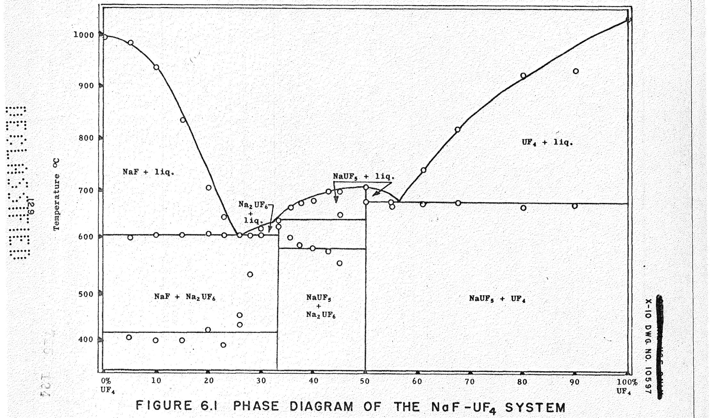

The complete diagram is shown in Fig. 6.2. The thermal data appear to confirm the existence of about all the compounds that Zachariasen found in this system, (3) but it must be admitted that the evidence for some of the compounds is not very strong. The eutectics in this system are all in the 730 to $760^{\circ}\mathrm{C}$ range; this variation is only slightly greater than the experimental error. The two compounds having congruent melting points, $\mathrm{K}_3\mathrm{UF}_7$ and $\mathrm{KUF}_5$ , melt at $970 \pm 10^{\circ}\mathrm{C}$ and $780 \pm 10^{\circ}\mathrm{C}$ , respectively.

Sodium Fluoride-Potassium Fluoride-Uranium Fluoride. Owing to the complexity of this system, it has been necessary to run cooling curves on a large number of compositions in order to locate the isotherms and eutectic compositions. Figure 6.3 shows the isotherms and the known eutectics in this system. Eutectic compositions corresponding to some of the higher halts have not been determined with any degree of certainty, and some doubt also exists as to the exact location of the isotherms in certain regions of the diagram.

The lowest eutectic believed to exist is that at 27 mole $\%$ UF $_4$ , 43.5 mole $\%$ NaF, and 29.5 mole $\%$ KF, having a melting point of $530 \pm 10^{\circ}\mathrm{C}$ . However, a well-defined break in the cooling curves for several points near the above-mentioned composition appeared at about $430^{\circ}\mathrm{C}$ . None of these mixtures appeared to be liquid below the $530^{\circ}\mathrm{C}$ eutectic. The break is probably due to a solid transition, but the length of the halts in a very restricted area of the diagram indicates a rather large energy change for a change in crystalline modification. Two compounds, $\mathrm{Na}_2\mathrm{KUF}_7$ and $\mathrm{Na}_3\mathrm{KUF}_8$ , are possible in the area where the $430^{\circ}\mathrm{C}$ break appears, and it is possible that a solid reaction occurs with the formation of a stable compound. There is a fairly large area in the diagram, in the range 24 to 33 mole $\%$ UF $_4$ , with a maximum melting point of $570 \pm 10^{\circ}\mathrm{C}$ .

There appears to be a eutectic at approximately 55 mole $\%$ UF $_4$ , 30 mole $\%$ NaF, and 15 mole $\%$ KF with a melting point of $670 \pm 10^{\circ}\mathrm{C}$ . Another eutectic at $620 \pm 10^{\circ}\mathrm{C}$ apparently exists in the lower right-hand corner of the diagram, the exact location of which was not determined (see Filtration Experiments, below). Other eutectics at higher temperatures may exist in this system, but the effort necessary to locate the exact compositions corresponding to these higher eutectic temperatures hardly appears worth while at the present time.

Sodium Fluoride--Beryllium Fluoride--Uranium Fluoride. Progress on this system was rather limited during the last quarter. In the previous progress

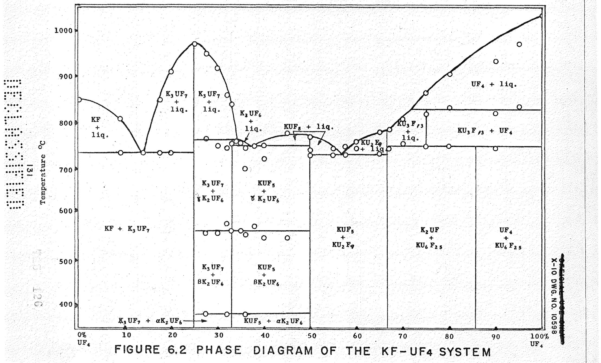

report (ORNL-919) it was indicated that little was known concerning the purity of the beryllium fluoride available in this laboratory. Spectrographic and chemical analyses were performed on the two batches of Brush Beryllium Co.'s product that have been used in the present investigation. The spectrographic analyses showed no impurities except a trace of magnesium. The first chemical analysis, however, indicated that the beryllium fluoride might be contaminated with beryllium oxyfluoride, which has been reported to have the composition $2\mathrm{BeO}\cdot 5\mathrm{BeF}_2$ . Later analyses by an improved method (see Analysis of Beryllium Fluoride in Sec. 21) indicated that the beryllium fluoride received from Brush Beryllium Co. has the theoretical composition, within the limits of experimental error. Hydrofluorination of the $\mathrm{BeF}_2$ under various conditions produced no significant change in analytical results.

Ternary mixtures have a eutectic at $480 \pm 10^{\circ}\mathrm{C}$ with an approximate composition of 12 mole $\%$ $\mathrm{UF_4}$ , 17 mole $\%$ $\mathrm{BeF_2}$ , and 71 mole $\%$ NaF: The uranium content of this eutectic is probably high enough to make it of interest as a fuel material. As mentioned in the previous progress report (ORNL-919), the uranium content of the other known eutectic in this system is apparently too low to be of interest.

Cooling curves have been run on a few binary mixtures of $\mathsf{BeF}_2$ and $\mathsf{UF}_4$ . These showed no indication of a low-melting eutectic.:

On the basis of the data so far obtained, the possibility of finding in this system mixtures melting below $500^{\circ}\mathrm{C}$ and containing more than 20 mole $\%$ $\mathrm{UF_4}$ appears rather remote. The study is being continued at present to allow construction of the equilibrium diagram.

# Filtration Experiments

A considerably simplified technique has been shown to be useful for filtering low-melting fused salt mixtures. A "filtration stick" consisting of a sintered glass filter disk on the end of a pyrex glass tube may be inserted directly into a fused salt mixture on which a cooling curve is being determined. At the desired temperature a vacuum is applied to the filtration stick, and a sample of liquid is thereby drawn up the tube through the sintered glass medium. The filtration stick is then removed from the melt and broken to obtain the filtrate for analysis. Such glass filters may be used with caution up to about $650^{\circ}\mathrm{C}$ .

The procedure employed to locate ternary eutectics is as follows: A ternary mixture with a cooling curve showing a definite eutectic halt is chosen as a starting point. This mixture is melted and brought to equilibrium at a temperature well above the melting point. The mixture is then cooled slowly to as low a temperature as is practicable and filtered. Another mixture is prepared on the basis of the analysis of the filtrate and this sample is melted and filtered at a still lower temperature. By repetition of this procedure the ternary eutectic can be approached closely in a few steps.

The region in the NaF-KF-UF $_4$ phase diagram of possible interest as a fuel lies between 20 and 35 mole % UF $_4$ and between 5 and 35 mole % KF as shown in Fig. 6.3. Cooling curves in this region indicate a ternary eutectic melting at approximately $520^{\circ}\mathrm{C}$ . Filtration experiments conducted by the technique described above which started with two different compositions of melting point $635^{\circ}\mathrm{C}$ gave, on successive filtrations, the compositions in Table 6.1.

TABLE 6.1   
Determination of Ternary Eutectic in NaF-KF-UF $_4$ from Filtration Experiments   

<table><tr><td rowspan="2">TEMPERATURE (°C)</td><td colspan="3">COMPOSITION (mole %)</td></tr><tr><td>U</td><td>Na</td><td>K</td></tr><tr><td>635</td><td>22.5</td><td>45</td><td>32.5</td></tr><tr><td>635</td><td>35</td><td>45</td><td>20</td></tr><tr><td>615</td><td>31.5</td><td>51</td><td>17.5</td></tr><tr><td>560</td><td>28.5</td><td>53</td><td>18.5</td></tr><tr><td>540</td><td>27</td><td>55</td><td>18</td></tr><tr><td>586</td><td>22.5</td><td>55</td><td>22.5</td></tr></table>

These results would seem to indicate that a ternary eutectic melting at $530 \pm 10^{\circ}\mathrm{C}$ lies in the region near 27 mole $\%$ $\mathrm{UF_4}$ and 18 mole $\%$ $\mathrm{KF}$ . The cooling curves seem to indicate, however, another eutectic of similar melting point

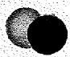

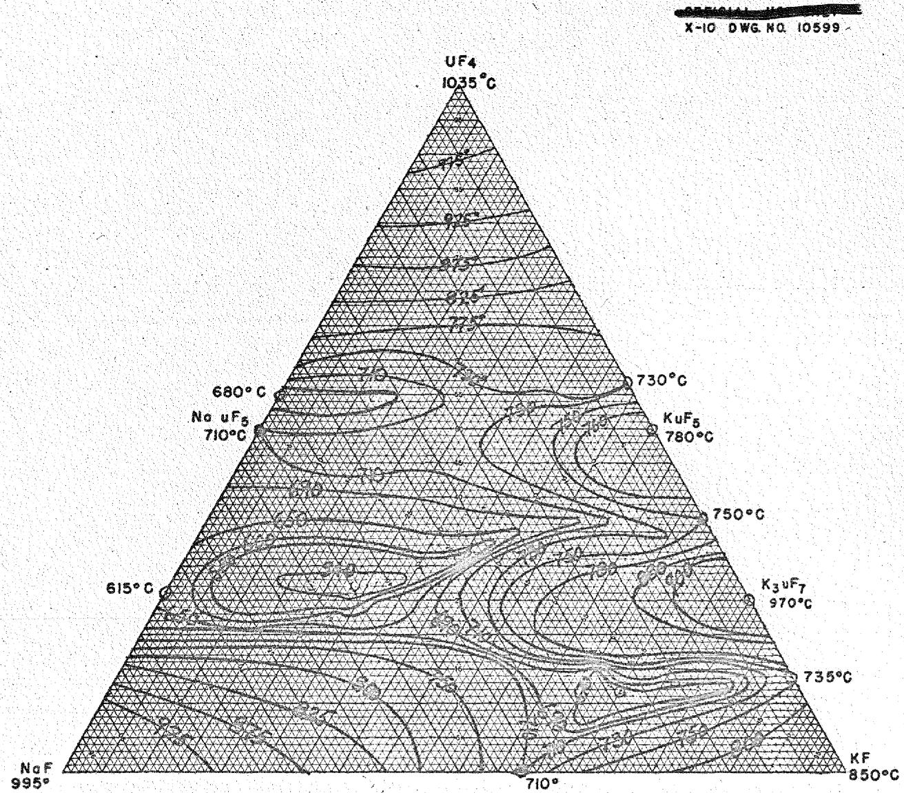  
FIGURE 6.3 THE TERNARY SYSTEM NoF-KF-UF4

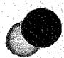

near 27 mole % UF $_4$ and 26 mole % KF. Filtration of this mixture at the eutectic temperature resulted in a filtrate containing 26 mole % UF $_4$ and 26 mole % KF. It is possible that two ternary eutectics exist in this region of the diagram; additional experiments will, however, be necessary before a definite conclusion can be drawn.

By use of this technique the eutectic indicated in the lower right-hand corner of Fig. 6.3 has been shown to melt at $620^{\circ}\mathrm{C}$ and to be very close to the composition 12 mole $\%$ $\mathrm{UF_4}$ , 67 mole $\%$ $\mathrm{KF}$ , and 21 mole $\%$ NaF.

# SUSPENSIONS OF URANIUM COMPOUNDS IN SODIUM HYDROXIDE

J.D.Redman D.E.Nicholson

L. G. Overholser

Materials Chemistry Division

Previous reports (ORNL-858 and 919) have described attempts to prepare stable suspensions of uranium compounds in molten sodium hydroxide and have discussed some of the properties of the materials so prepared. Additional efforts have been made to ascertain the effects of a number of variables on the stability of the suspensions and to identify the uranium compound present in the sodium hydroxide at elevated temperatures. Only a limited number of data are presented since in most instances a qualitative statement suffices to show the effect of different variables on the system.

Stability of Uranium Suspensions. Virtually all the experiments have been performed in a silver reactor in the prevailing atmosphere. A few experiments which were run in a nickel reactor at $700^{\circ}\mathrm{C}$ in the prevailing atmosphere showed that nickel is corroded rapidly under these conditions. The presence of nickel oxide appears to cause a decrease in the stability of suspensions of the monouranate, and, since this behavior of the oxide may mask the effect of the variables under consideration, the use of nickel vessels in an oxidizing atmosphere was abandoned.

Effect of Pretreatment of $UO_{3}$ . Uranium trioxide was used in the majority of the experiments since this source of uranium appeared to give the most stable suspensions. Samples of trioxide were specially prepared from the

peroxide and from ammonium diuranate, but, because these products yielded no better suspension than did the commercial uranium trioxide, the latter was used most extensively. The commercial product has a water content approximating the monohydrate; drying at $300^{\circ}\mathrm{C}$ gives the anhydrous trioxide. Experiments in which the hydrated trioxide was used gave results comparable to those obtained using as charge material the commercial trioxide dehydrated by heating at either 300 or $450^{\circ}\mathrm{C}$ . Ignition of the trioxide to $\mathrm{U}_{3}\mathrm{O}_{8}$ at $800^{\circ}\mathrm{C}$ yielded a material which produced less stable suspensions.

Effect of Temperature of Formation. Most of the early experiments were performed by heating the sodium hydroxide to $700^{\circ}\mathrm{C}$ and adding sufficient uranium trioxide to give a suspension containing about $5\%$ by weight. Subsequent studies showed that somewhat more stable suspensions resulted when the trioxide was added to the sodium hydroxide at 450 to $500^{\circ}\mathrm{C}$ instead of $700^{\circ}\mathrm{C}$ , and most of the ensuing work utilized this lower temperature. The temperature was raised to $700^{\circ}\mathrm{C}$ following the addition of the trioxide and held there, in most instances, during the aging period.

Effect of Aging of Suspension. Reference was made in ORNL-919 to the fact that the suspensions became less stable after aging at $700^{\circ}\mathrm{C}$ . Additional studies have shown that this behavior, presumably due to a growth of the particles, may be a very serious problem. The data given in Table 6.2 show the effect of aging at various temperatures on the stability. The values reported show the percentage of the original uranium remaining in the upper one-fourth of the suspension after the designated settling time (100 corresponds to no settling). In all cases the uranium trioxide (heated at $300^{\circ}\mathrm{C}$ , passed 150-mesh sieve) was added to the sodium hydroxide at 450 to $500^{\circ}\mathrm{C}$ and the suspension was heated at the indicated temperature for the period given. The uranium trioxide content was approximately $4.5\%$ by weight in all cases.

The results in this table also show that drastic aging of the suspensions occurs at high temperatures. The rate of growth during aging increases with increasing temperature and apparently becomes very pronounced at $800^{\circ}\mathrm{C}$ . The suspensions appear to be more stable at $600^{\circ}\mathrm{C}$ than at the higher temperatures, but it is difficult to say what fraction of the increased stability is due to particle size and what portion arises from the increased density and viscosity of the sodium hydroxide at the lower temperature. At the higher temperature the decrease in density and viscosity must be responsible for a large portion

TABLE 6.2   
Effect of Temperature and Length of Aging on the Stability of Sodium Monouranate Suspensions in Sodium Hydroxide   

<table><tr><td colspan="2">AGING CONDITIONS</td><td rowspan="2">SETTLING TIME(min)</td><td rowspan="2">PERCENT OF URANIUMREMAINING SUSPENDED</td></tr><tr><td>TEMPERATURE (°C)</td><td>TIME (hr)</td></tr><tr><td rowspan="10">600</td><td rowspan="5">18</td><td>1</td><td>98</td></tr><tr><td>2</td><td>86</td></tr><tr><td>3</td><td>83</td></tr><tr><td>4</td><td>61</td></tr><tr><td>5</td><td>58</td></tr><tr><td rowspan="5">42</td><td>1</td><td>61</td></tr><tr><td>2</td><td>44</td></tr><tr><td>3</td><td>34</td></tr><tr><td>4</td><td>21</td></tr><tr><td>5</td><td>21</td></tr><tr><td rowspan="10">700</td><td rowspan="5">20</td><td>1</td><td>85</td></tr><tr><td>2</td><td>66</td></tr><tr><td>3</td><td>61</td></tr><tr><td>4</td><td>51</td></tr><tr><td>5</td><td>39</td></tr><tr><td rowspan="5">95</td><td>1</td><td>37</td></tr><tr><td>2</td><td>17</td></tr><tr><td>3</td><td>2</td></tr><tr><td>4</td><td>2</td></tr><tr><td>5</td><td>2</td></tr><tr><td rowspan="10">800</td><td rowspan="5">2</td><td>1</td><td>83</td></tr><tr><td>2</td><td>71</td></tr><tr><td>3</td><td>47</td></tr><tr><td>4</td><td>51</td></tr><tr><td>5</td><td>27</td></tr><tr><td rowspan="5">20</td><td>1</td><td>2</td></tr><tr><td>2</td><td>2</td></tr><tr><td>3</td><td>1</td></tr><tr><td>4</td><td>1</td></tr><tr><td>5</td><td>2</td></tr></table>

of the instability observed. However, the results obtained at $800^{\circ}\mathrm{C}$ show quite markedly the decrease in stability that results from the aging at this high temperature and suggest that the rate of particle growth is accelerated by a rise in temperature. This behavior may prove to be a real impediment since not only must it be possible to prepare a reasonably stable suspension but the system also must remain stable for relatively long periods of time at high temperatures if such a fuel system is to have any practical value.

Effect of Additive. In view of the drastic changes noted above which occur on aging, studies were made in an attempt to find some additive that would inhibit or prevent this growth of particles. It appeared doubtful that any beneficial effect would result from the introduction of another solid phase because of the deleterious effect of nickel oxide on the system. This limited the study to those materials which are soluble in sodium hydroxide at $700^{\circ}\mathrm{C}$ . The effects of the addition of some materials meeting this requirement are described briefly below.

The additive was placed in the silver reactor, sodium hydroxide was added, the temperature was raised to 450 to $500^{\circ}\mathrm{C}$ , sufficient uranium trioxide was added to make the suspension approximately $5\%$ by weight, and the temperature was then raised to $700^{\circ}\mathrm{C}$ . Sampling for the settling rate determination was usually done after the suspension had aged for about 24 hr. The addition of 1 to $5\%$ sodium silicate had very little effect; amounts of the order of 5 to $20\%$ resulted in decreased stability. Addition of 1 to $20\%$ of either tungstic acid or sodium chromate produced very unstable suspensions. The presence of molybdate appeared to be without any marked effect. Sodium vanadate, when present in amounts approximating 20 to $30\%$ by weight, resulted in suspensions which were more stable after aging for 24 hr than were those to which no material was added. Smaller amounts of vanadate showed no beneficial effect. It is impossible to state whether the increased stability is due to changes in density and viscosity or is to be attributed to an effect on the particle size. The results obtained using these additives are not encouraging and one cannot be optimistic about the possibilities of finding a stabilizer for such a system.

Suspensions of $UO_{2}$ . Experiments in which uranium dioxide, $UO_{2}$ , was used as the charge material under a normal atmosphere showed that the uranium compound was oxidized and that a slow transition to sodium monouranate occurred.

It should be noted that the suspension formed from the dioxide was very unstable and that the stability increased as sodium monouranate was formed. It appears that if $\mathrm{UO}_2$ were used in a reducing atmosphere it might be possible to avoid reaction; it is not certain, however, that improved suspensions will be possible by this means.

Identification of the Uranium Compound. It has been indicated in a previous report (ORNL-919) that the addition of uranium compounds to sodium hydroxide in oxidizing atmospheres yielded a material whose characteristic X-ray diffraction spectrum was not identical with that of any of the starting materials. Positive identification of this material as sodium monouranate, $\mathrm{Na}_2\mathrm{UO}_4$ , has not been possible from X-ray diffraction alone; chemical studies have recently suggested very strongly, however, that $\mathrm{Na}_2\mathrm{UO}_4$ is actually obtained.

Attempted Separation of the Compound from NaOH. Several attempts have been made to recover the uranium compound by vacuum distillation of the caustic at 800 to $850^{\circ}\mathrm{C}$ from silver crucibles contained in stainless steel retorts. Contamination of the residue, which was noted in the first distillation, was prevented in the subsequent distillations by covering the silver crucible with a loose-fitting silver plate. With this modification, relatively pure orange-colored residues were obtained after distillation of the sodium hydroxide was complete. Chemical and X-ray diffraction analyses showed that the residues consisted principally of sodium diuranate. This was not anticipated but may be explained by assuming that the reaction

$$
2 \mathrm {N a} _ {2} \mathrm {U O} _ {4} \longrightarrow \mathrm {N a} _ {2} \mathrm {U} _ {2} \mathrm {O} _ {7} + \mathrm {N a} _ {2} \mathrm {O}
$$

occurs during the later stages of the distillation.

Synthesis of Sodium Monouranate. Mixtures of sodium carbonate and $\mathrm{U}_3\mathrm{O}_8$ showed little evidence of reaction when heated at temperatures as high as $1250^{\circ}\mathrm{C}$ . Reaction was obtained by heating mixtures containing $\mathrm{U}_3\mathrm{O}_8$ , $\mathrm{Na}_2\mathrm{CO}_3$ , and $\mathrm{NaCl}$ to $950^{\circ}\mathrm{C}$ . Attempts to leach the unreacted $\mathrm{Na}_2\mathrm{CO}_3$ and $\mathrm{NaCl}$ from the product, however, left an orange residue which was shown by X-ray diffraction to be sodium diuranate, $\mathrm{Na}_2\mathrm{U}_2\mathrm{O}_7$ .

When stoichiometric mixtures of sodium carbonate and uranium trioxide were finely ground, intimately mixed, and heated at approximately $1600^{\circ}\mathrm{C}$ for

1 hr a pale orange solid which showed evidence of sintering was obtained. Chemical analysis gave a sodium/uranium ratio of 1.97/1.00 and a carbonate content of approximately $1\%$ . The X-ray diffraction pattern for this material is identical with that obtained when uranium trioxide is heated with a large excess of sodium hydroxide at $700^{\circ}\mathrm{C}$ and is assumed to be characteristic of sodium monouranate. Less than $10\%$ of sodium diuranate was found by the X-ray diffraction analysis. When the experiment was repeated at $1250^{\circ}\mathrm{C}$ a mixture of sodium monouranate and sodium diuranate was obtained in which the diuranate content was of the order of 40 to $50\%$ .

Since the preceding results indicated that sodium monouranate may be prepared from sodium carbonate and uranium trioxide if a temperature of $1600^{\circ}\mathrm{C}$ or higher is used, experiments were run using an induction furnace to attain the desired temperatures. A run at $1750^{\circ}\mathrm{C}$ , in which a platinum dish was partly melted, gave a layer of relatively pure sodium monouranate. There was evidence that the portion of the material in contact with the melted platinum had been fused, suggesting that the sodium monouranate may melt in the vicinity of $1750^{\circ}\mathrm{C}$ . The bulk of the material had remained at a temperature considerably below $1750^{\circ}\mathrm{C}$ ; the failure of the platinum was due to local overheating. To avoid this difficulty when using platinum, magnesia cups preheated at $1800^{\circ}\mathrm{C}$ were tried. These cups proved to be too porous; the material diffused through the magnesia cup and in contact with the graphite holder burst into flame at a temperature of approximately $1400^{\circ}\mathrm{C}$ in an argon atmosphere.

The failure to find a suitable container for the high-temperature sodium carbonate--uranium trioxide reaction resulted in further attempts to prepare sodium monouranate by other methods.

A mixture containing 2 moles of sodium nitrate per mole of uranium trioxide was heated for 1 hr at $1050^{\circ}\mathrm{C}$ . A similar run was made at $1350^{\circ}\mathrm{C}$ . Both runs yielded a pale orange residue which appeared to be sodium monouranate, but the X-ray diffraction analyses of these materials have not been completed.

Stability of Sodium Monouranate. A mixture of uranium trioxide (5% by weight) and sodium hydroxide was heated in a silver crucible for 2 hr at $600^{\circ}\mathrm{C}$ under an atmosphere of hydrogen. X-ray diffraction analysis showed that only sodium monouranate was present. This compound apparently is not reduced by

hydrogen under these conditions. A sample was taken from the upper portion for analysis after the solids had settled and was found to contain $0.008\%$ uranium. Apparently uranium is not soluble to any significant extent under the conditions used.

141-176

# Part III

# MATERIALS RESEARCH

# INTRODUCTION TO PART III

In the final analysis the ultimate success of any reactor program depends upon the satisfactory solution of many serious material problems. The many specific requirements of materials for the aircraft reactor comprise a design problem unique in engineering experience. The most pertinent of these requirements are that the material do the following:

1. Resist liquid-metal corrosion.   
2. Possess high mechanical strength.   
3. Withstand attack by fuel and moderator.   
4. Be formable into thin-walled structures.   
5. Be amenable to production of sound welds.   
6. Be dimensionally stable at operating temperatures.   
7.: Not be subject to thermal gradient transfer.   
8. Have favorable nuclear characteristics.   
9. Have reasonable stability under radiation bombardment.   
10. Be available in uniform quality.

In addition to the above requirements, most of which pertain specifically to the structural and containing material in the reactor, the liquid fuel and the liquid-metal coolant must possess certain thermal and physical properties, notably good thermal conductivity, high heat-transfer characteristics, and low viscosity. Furthermore, these liquid-metal systems will require the development of handling equipment (plumbing) such as pumps, valves, flowmeters, bearings, insulation, and similar facilities.

The bulk of the research on these problems is now being done in various laboratories of the Oak Ridge National Laboratory which are associated with the ANP Division, and is discussed under one or more of the following subject headings: Corrosion Experimentation, Liquid-Metal and Heat-Transfer Research, Components of Liquid-Metal Systems, Metallurgical Processes, and Radiation Damage -- Secs. 11 through 15, respectively.

At this time the corrosiveness of sodium, is being investigated with the family of metals whose known

characteristics fulfill the requirements listed above. These container materials include a variety of stainless steels, nickel alloys, and refractory metals. The corrosiveness of the fluoride fuel must be examined with these same metals since the metallic container for the fluoride melt will, in the reactor, be immersed in the coolant (liquid-metal) stream. These corrosion problems (Sec. 11) are now being thoroughly examined under static conditions although the subsequent tests in circulating loops are in progress for some systems.

Many fundamental data are required on the thermal and physical properties of both liquids (coolants and fuels) and metals. The heat-transfer coefficients of NaOH (which is still of interest as a reactor fuel - Sec. 16) are being determined. These values and other information concerning principally the thermal convection in the fuel pins, flow characteristics of the coolant in various passages, and the electrical conductivity of the fluoride melt are discussed in Sec. 12. In addition, the Heat Transfer Research Group has initiated the editing of a revised Liquid Metal Handbook.

The development of liquid-metal systems and associated handling techniques belong to the new technology which is rapidly becoming well-known as "reactor plumbing." A number of pumps, including axial flow, centrifugal, electromagnetic, and "canned rotor," are being tested on these systems. Tests were initiated this quarter on mock-up of heat exchangers. As a consequence of this research with liquid metals, adequate safety measures, disposal procedures, product control tests, insulation, and other techniques and procedures have had to be established. Outstanding in this field is the work of the Liquid Metal Safety Committee which will soon issue a safety manual for the handling of liquid metals. These developments are discussed in Sec. 13.

Laboratories for stress-rupture testing, powder metallurgy, and welding have been established for the development of fabricating techniques for the reactor itself. Of particular interest are the welding of molybdenum

and the stress-rupture testing of metals in a liquid-metal environment although both these programs were delayed by the installation of laboratory equipment. The fabrication of solid-fuel elements, however, has been extensively pursued, and three techniques have been developed. In addition, the examination of electrolytically etched single-crystal copper spheres may lead to a better understanding of the fundamental physical chemistry of liquid-metal corrosion. These activities are discussed in Sec. 14.

The radiation stability of core materials is under investigation. Effects of radiation damage on the creep and thermal conductivity of 316 stainless steel are currently under investigation. A program has been established at Purdue University for similar work on molybdenum, and preparations to date include the establishment of the physical properties of molybdenum without irradiation. The radiation stability of the fluoride eutectic NaF-UF4 has been tentatively established. These radiation damage measurements are discussed in Sec. 15.

# 11. CORROSION EXPERIMENTATION

E. C. Miller and W. D. Manly, Metallurgy Division

H. W. Savage, ANP Division

P. J. Hagelston, Isotope Research and Production

The past quarter has seen the substantial completion of the initial phase of the static corrosion testing. The first portion of the program was to determine in a rough, qualitative way whether or not a metal or alloy had any chance of withstanding attack by liquid metals at elevated temperatures. By this selective weeding, many metals and alloys have been eliminated from further consideration. The second portion of the program has now been started. The metals and alloys which showed some resistance to attack are now being subjected to rigorous, more quantitative corrosion study. While certain refinements in both apparatus and technique are yet to be made and evaluated, it is felt that the recently adopted methods for the study of attack resistance will produce worthwhile information.

The evaluation of reactor metals for use with a certain coolant under given conditions of cycling or varying temperature and of a limited degree of purity involves more than the close study of a corrosion rate determined under test conditions where very pure materials and ideally prepared surfaces are involved, no thermal or composition gradient is present, and temperature is maintained at a constant level. Dynamic corrosion tests in both convection and forced-circulation loops have been initiated and significant information on the low-velocity circulation of sodium has already been obtained.

The fundamental metallurgical considerations involved in corrosion indicate that a barrier film might be formed on the surface of the metal which would inhibit the corrosive properties of the coolant. A search is in progress to find such a diffusion barrier for systems of interest to otherwise feasible liquid-metal systems.

The static corrosion by fluoride melts will determine the possible container for the liquid (fluoride salt mixture) fuel. It is notable in this program that the quiescent nature of the liquid fuel in the ANP reactor mitigates against the necessity of dynamic corrosion testing of the fuel, although this would eventually be desirable. Some materials, e.g., monel and

nickel A, have been found to have satisfactory corrosion rates (less than 0.03 mil/hr), but the compatibility of these metals with other requirements (namely, high-temperature strength) is not favorable. The tests are by no means complete.

# STATIC CORROSION BY LIQUID METALS

A. D. Brasunas, Metallurgy Division

Additional data are being gathered concerning the resistance of various metals and alloys to liquid-metal corrosion under static and dynamic conditions. The coolant sodium, has been investigated with regard to its interactions with certain solid metals under static test conditions at $1000^{\circ}\mathrm{C}$ .

A critical study of the capsulating testing technique has led to the development of a more satisfactory manner of testing. The undesirable third component may be eliminated by the tubulating technique now being developed. Both these techniques are described below.

Testing Technique. The manner of enclosing specimens in capsules for static corrosion testing in molten-metal media is illustrated in Fig. 11.1. The metal specimens are machined and polished to size (1 by $\frac{3}{4}$ by $\frac{1}{4}$ in.) and carefully weighed after vapor degreasing. Relatively inert metal test capsules (nickel in the case of sodium may be prepared by machining from bar stock: The specimen is first inserted in the capsule and liquid metal is poured into it, in a dry box chamber containing argon.: A cap, inserted in the capsule, is then heliarc welded into place. While under vacuum, the extended tube is crimped, spot welded, and bead welded, thereby enabling the corrosion test to be conducted at temperature in vacuum.

The major undesirable feature here is concerned with the relatively inert metal capsule. Although the solubility of nickel in sodium is very low,

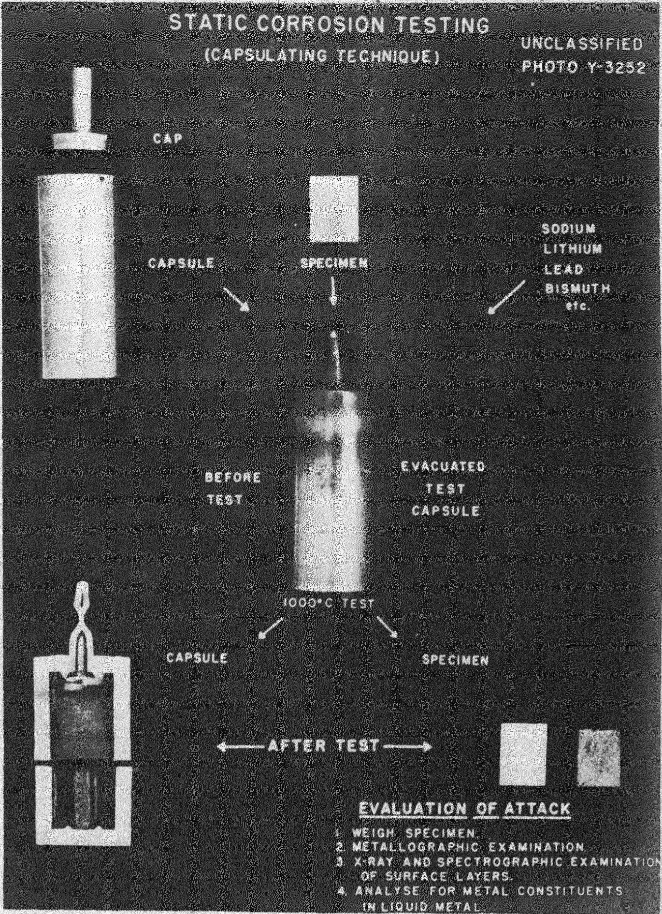  
FIGURE II.1

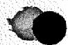

a substantial layer of nickel may be deposited on metal specimens. The presence of such films seriously challenges the validity of the test data. The same phenomenon has been observed in lead tests conducted in iron capsules.

Considerable effort is currently being placed on the development of the tubulating technique illustrated in Fig. 11.2, in which the tube and specimen are of identical composition. Mass transfer caused by composition variations should be nonexistent under these conditions. This technique is essentially similar to the above capsulating technique in other respects. The major developmental problem is concerned with the maintenance of a high degree of molten metal purity during the filling and sealing operations. Aging and filtering the molten metal slightly above its melting point, together with the necessaryGETTING, constitute the present plans for purification.

Static Corrosion. Lead. Many corrosion tests in molten lead at $1000^{\circ}\mathrm{C}$ have been conducted for 40 and 400 hr. These have been made in evacuated iron capsules as shown in Fig. 11.1. The extent and nature of corrosive attack have now been determined for most of the materials tested. Forty-hour test data are reported in Table 11.1 and the 400-hr data are given in Table 11.2. Photomicrographs illustrating the nature of and depth of attack on numerous metals are given in Figs. 11.3 through 11.9. The tests in which mass transfer of capsule material to specimen was evident, as in Fig. 11.5, are indicated in Table 11.1 by the symbol "Mt." These tests will be repeated under conditions where this phenomenon cannot occur.

Iron showed no metallographic evidence of any attack (Fig. 11.3a) in 40 hr at $1000^{\circ}\mathrm{C}$ . A weight loss of approximately 0.1 g was detected which corresponded to the change in specimen thickness of 0.001 in. (0.0005 in. removed from all exposed surfaces). Low-alloy steels containing 12 and $16\%$ Cr likewise showed very little evidence of corrosion. However, tiny gray spheroids, shown in Figs. 11.3a and 4a, were noted along the surface to a depth of approximately 0.001 in. in 40 hr and about 0.005 in. in 400 hr. Type 446 stainless steel $(26\% \mathrm{Cr})_{\kappa}$ shown in Fig. 11.4b, shows appreciably more susceptibility to such attack.

The presence of iron layers on the surfaces of molybdenum and tantalum is shown in Figs.11.5a and b, respectively; similar films were detected on columbium and zirconium. These tests will be repeated.

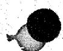

TABLE 11.1   
Static Corrosion Data Obtained in 40 - hr Tests Made in Iron Capsules at 1000°C in Lead   

<table><tr><td>METAL</td><td>ARBITRARY COMPARATIVE RATING(a)</td><td>THICKNESS CHANGE(b)(in.)</td><td>INTERGRANULAR PENETRATION (in.)</td><td>SUBSURFACE PRECIPITATION WITHIN GRAIN (in.)</td><td>SURFACE TRANSFORMATION (in.)</td><td>DECARBURIZATION (in.)</td><td>FILM FORMATION (in.)</td><td>REMARKS</td><td>BATH ANALYSIS (ppm)(c)</td><td>WEIGHT CHANGE (mg)</td></tr><tr><td>Elements:</td><td></td><td></td><td></td><td></td><td></td><td></td><td></td><td></td><td></td><td></td></tr><tr><td>Fe</td><td>10</td><td>-0.0005</td><td>None</td><td>None</td><td>None</td><td></td><td>None</td><td>No evidence of attack; X-ray diffraction detected no change</td><td>Fe, 37</td><td>-120</td></tr><tr><td>W</td><td>10</td><td>None</td><td>None</td><td>None</td><td>None</td><td></td><td>None</td><td>No evidence of attack; X-ray diffraction indicated the presence of WC</td><td>Fe, 155 W, N.D.</td><td>+35</td></tr><tr><td>Mo</td><td>9, Mt(d)</td><td>None</td><td>None</td><td>None</td><td>None</td><td></td><td>Outer 0.0010 Inner 0.0001</td><td>Fe deposit detected on Mo surface</td><td>Fe, N.D. Mo, N.D.</td><td>+250</td></tr><tr><td>Ta</td><td>9, Mt</td><td>None</td><td>None</td><td>None</td><td>None</td><td></td><td>Outer 0.0002 Inner 0.0001</td><td>No evidence of attack; X-ray diffraction indicated TaC</td><td>Fe, 153 Ta, N.D.</td><td>+150</td></tr><tr><td>Cb</td><td>9, Mt</td><td>+0.003</td><td>None</td><td>None</td><td>None</td><td>0.013</td><td>0.004</td><td>No evidence of attack; X-ray diffraction indicated Pb; specimen increased in thickness</td><td>Fe, 933 Cb, N.D.</td><td>+140</td></tr><tr><td>Zr</td><td>9, Mt</td><td>None</td><td>None</td><td>None</td><td>None</td><td>0.025</td><td>0.0001</td><td>No evidence of attack; X-ray diffraction indicated ZrO2</td><td>Fe, 327 Zr, N.D.</td><td>+70</td></tr><tr><td>Be</td><td>6</td><td>-0.004</td><td>0.001</td><td>None</td><td>None</td><td></td><td>None</td><td>Surface appears severely macroetched; preferential attack along certain crystal-logographic planes</td><td>Fe, 8 Be, N.D.</td><td>-300</td></tr><tr><td>Ni</td><td>3</td><td>-0.029</td><td>0.021</td><td>None</td><td>None</td><td></td><td>None</td><td>Severe general and intergranular attack</td><td>Fe, 48 Ni, 2400</td><td>-10,000</td></tr><tr><td>Ti</td><td>4</td><td>-0.015</td><td>None</td><td>None</td><td>None</td><td></td><td>None</td><td>Severe general attack, not intergranular</td><td>Fe, 210 Ti, 53</td><td>-1,200</td></tr><tr><td>Th</td><td>2</td><td colspan="9">Specimen severely attacked; lead completely consumed</td></tr><tr><td>U</td><td>1</td><td colspan="9">Specimen completely disappeared.</td></tr><tr><td>Stainless steel:(f)</td><td></td><td></td><td></td><td></td><td></td><td></td><td></td><td></td><td></td><td></td></tr><tr><td>405</td><td>9</td><td>None</td><td>0.001</td><td>0.0005</td><td>None</td><td>None</td><td>None</td><td>Very little evidence of attack</td><td>(e)</td><td>-165</td></tr><tr><td>410 LC</td><td>9</td><td>None</td><td>0.001</td><td>0.0005</td><td>None</td><td>None</td><td>None</td><td>Very slight indications of corrosion; X-ray diffraction indicates presence of Cr2O3</td><td>(e)</td><td>+30</td></tr><tr><td>430</td><td>9</td><td>None</td><td>0.001</td><td>0.001</td><td>None</td><td>None</td><td>None</td><td>Very slight attack; tiny gray globules precipitated along surface</td><td>(e)</td><td>-40</td></tr><tr><td>430 ELC</td><td>9</td><td>None</td><td>0.002</td><td>0.001</td><td>None</td><td>0.008</td><td>None</td><td>Same</td><td>(e)</td><td>-75</td></tr><tr><td>446</td><td>7</td><td>None</td><td>0.004</td><td>0.002</td><td>None</td><td>0.006</td><td>None</td><td>Occasional indication of pearlite-like formation near surface</td><td>(e)</td><td>-60</td></tr><tr><td>446 ELC</td><td>6</td><td>None</td><td>0.003 (avg.)</td><td>0.003</td><td>None</td><td>0.004(g)</td><td>None</td><td>Carbide-like particles (pos-sibly sigma) throughout sec-tion, but none noted within 0.004 in. of surface; gray particles precipitated near surface</td><td>(e)</td><td>-75</td></tr><tr><td>446 ELC</td><td>7</td><td>-0.0015</td><td>0.001</td><td>0.003</td><td>None</td><td>0.008(g)</td><td>None</td><td>Gray globular particles pre-cipitated near surface; no metallic particles (carbide-like) noted within 0.008 in. of surface</td><td>(e)</td><td>-60</td></tr><tr><td>304</td><td>6</td><td>None</td><td>0.003 (avg.)</td><td>0.001</td><td>0.001</td><td>None</td><td>None</td><td>Austenite → ferrite transformation at surface and along grain boundaries to depth of penetration noted; X-ray evidence also showed presence of Cr2O3</td><td>(e)</td><td>-65</td></tr><tr><td>304 LC</td><td>6</td><td>None</td><td>0.003 (avg.)</td><td>0.001</td><td>0.001</td><td>None</td><td>None</td><td>Same</td><td>(e)</td><td>-175</td></tr><tr><td>304 ELC</td><td>5</td><td>-0.001</td><td>0.005 (avg.)</td><td>0.001</td><td>0.001</td><td>None</td><td>None</td><td>Same</td><td>(e)</td><td>-90</td></tr><tr><td>316</td><td>5</td><td>None</td><td>0.008 (avg.)</td><td>0.001</td><td>0.001</td><td></td><td>None</td><td>Austenite → ferrite transformation at surface and adjacent grain boundaries; formation of large white metallic phase in grain boundaries near surface; cavi-ties within</td><td>(e)</td><td>+5</td></tr><tr><td>347</td><td>5</td><td>None</td><td>0.006 (avg.)</td><td>0.002</td><td>0.003</td><td></td><td>None</td><td>Austenite → ferrite transformation at surface and adjacent grain boundaries; at-tack more shallow on fine-grain steel</td><td>(e)</td><td>-20</td></tr><tr><td>310</td><td>4</td><td>None</td><td>0.013 (avg.)</td><td>0.015 (max.)</td><td>None</td><td>0.013</td><td>None</td><td>Numerous grain boundary voids in decarburized zones; X-ray diffraction indicates face-centered cubic phase</td><td>(e)</td><td>+75</td></tr></table>

(a) $10 =$ excellent, 5 = poor, 1 = dissolved.   
(b) Values reported are for dimensional changes from one surface only.   
(c) $N \cdot D_{1} = \text{not detected.}$   
(d) Mt = mass transfer p   
(e) Not yet available.   
(f) LC, <0.04% C; ELC, <0.006% C.   
(g) See remarks.

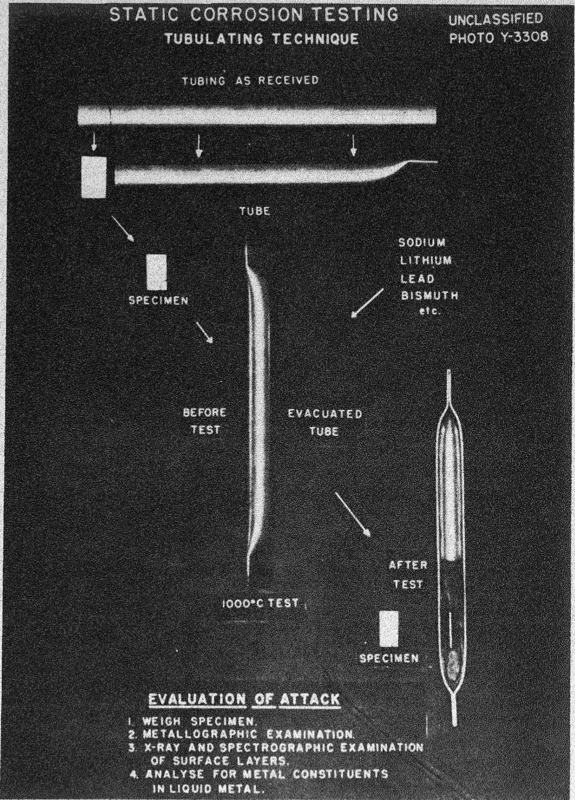  
FIGURE 11.2

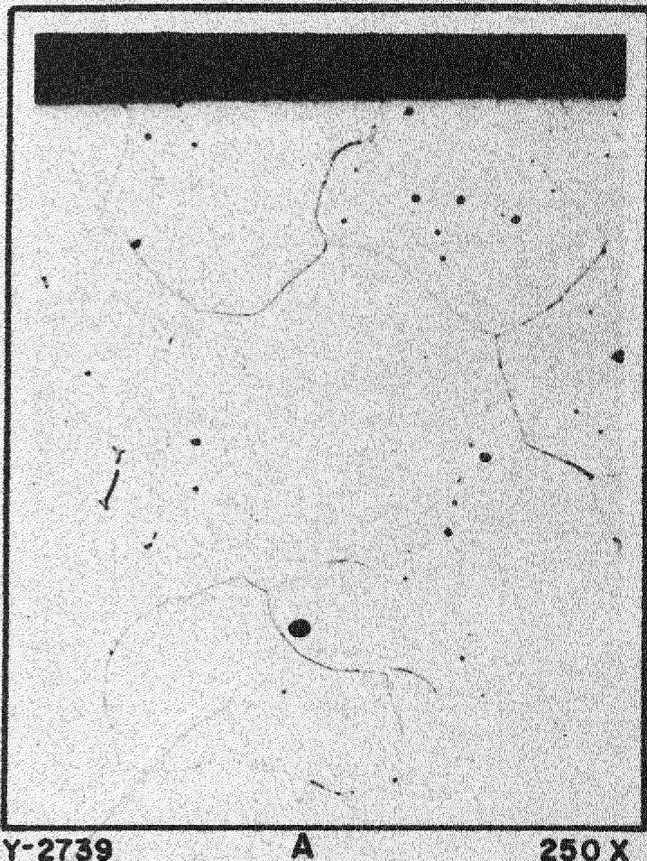  
ARMCO IRON EXPOSED TO LEAD FOR 40 HOURS AT $1000^{\circ}C$ NOTE EXTREMELY SLIGHT SURFACE ATTACK.

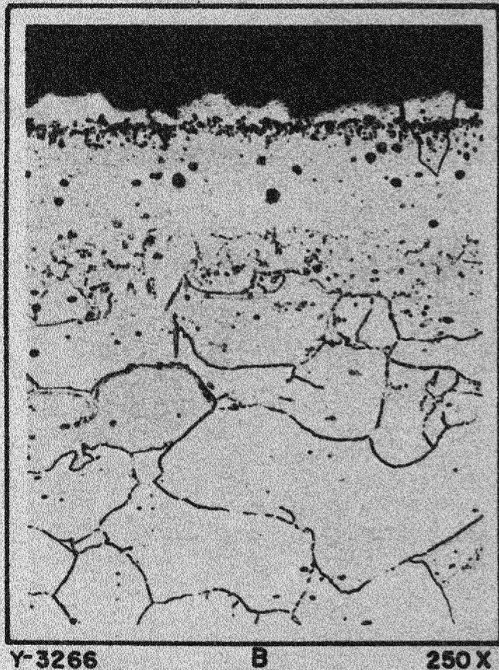  
TYPE 405 STAINLESS STEEL EXPOSED TO LEAD FOR 400 HOURS AT 1000°C. NOTE THE SLIGHTLY ROUGHENED SURFACE, SMALL CORROSION Void, AND LIGHT GRAY PRECIPITATE IN THE DECARBURIZED LAYER.   
FIGURE 11.3

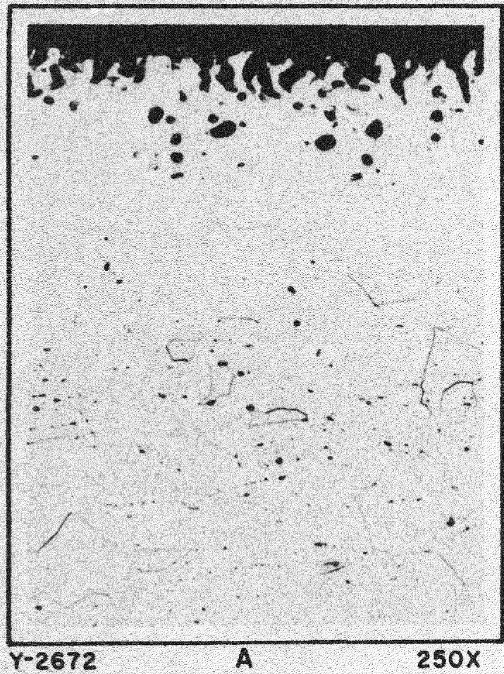  
TYPE 430 STAINLESS STEEL EXPOSED TO LEAD FOR 40 HOURS AT $1000^{\circ}C$ NOTE SLIGHT INTERGRANULAR ATTACK.

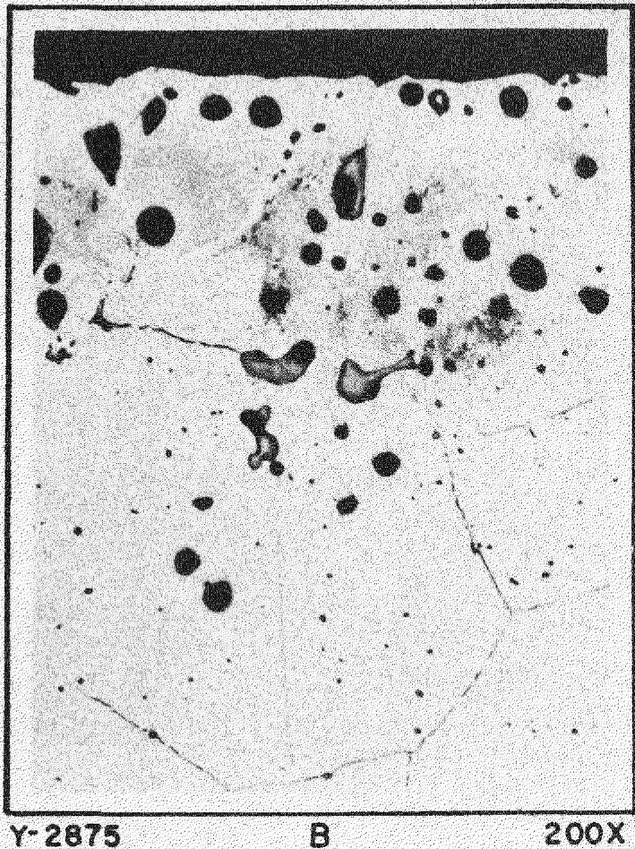  
TYPE 446 STAINLESS STEEL EXPOSED TO LEAD FOR 400 HOURS AT $1000^{\circ}C$ NOTE GLOBULAR VOIDS, SOME PARTIALLY FILLED WITH A BLUE-GRAY PHASE. ALSO PHASE TRANSFORMATION.   
FIGURE 11.4

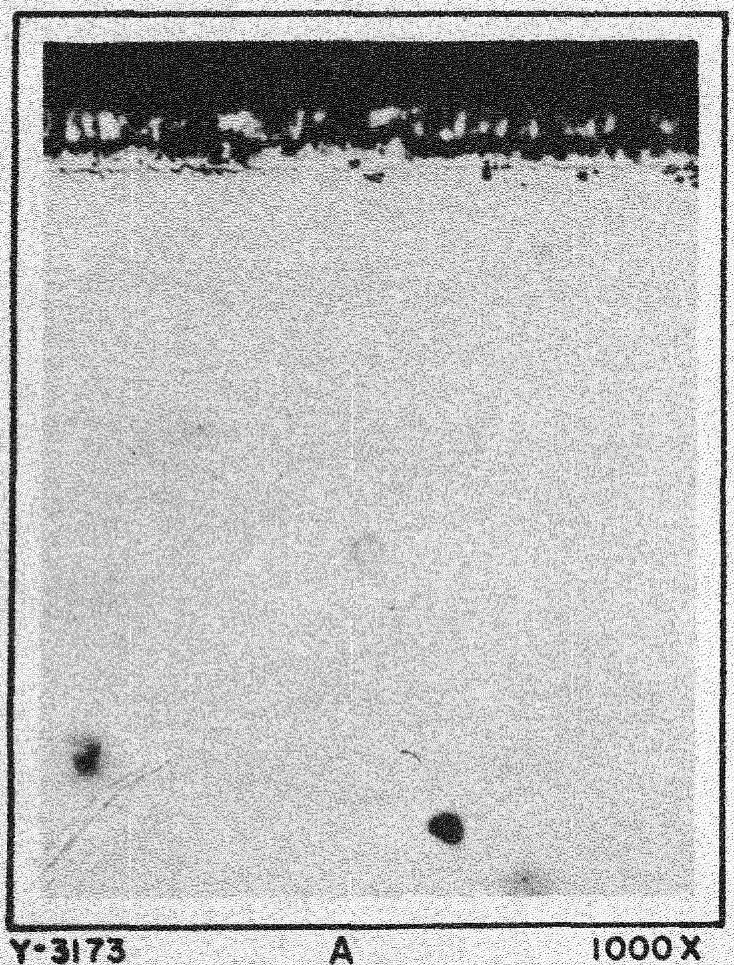

MOLYBDENUM EXPOSED TO LEAD FOR 40 HOURS AT $1000^{\circ}C$

NOTE MASS TRANSFER LAYER AND DIFFUSION ZONE.

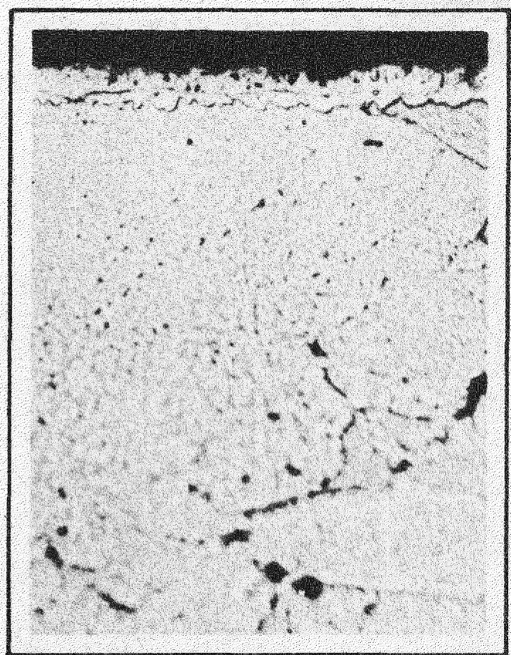  
FIGURE 11.5

Y-3174 B 1000X TANTALUM EXPOSED TO LEAD FOR 40 HOURS AT $1000^{\circ}C$

NOTE MASS TRANSFER LAYER AND DIFFUSION ZONE.

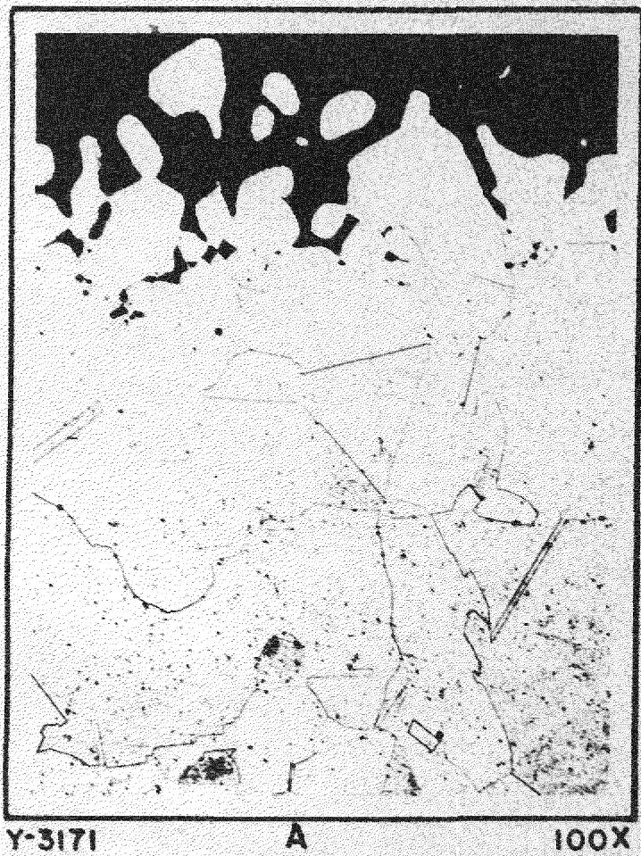  
NICKEL EXPOSED TO LEAD FOR 40 HOURS AT $1000^{\circ}$ C.   
NOTE HEAVY INTERGRANULAR ATTACK AND COMPLETELY ISOLATED GRAINS NEAR THE SURFACE.

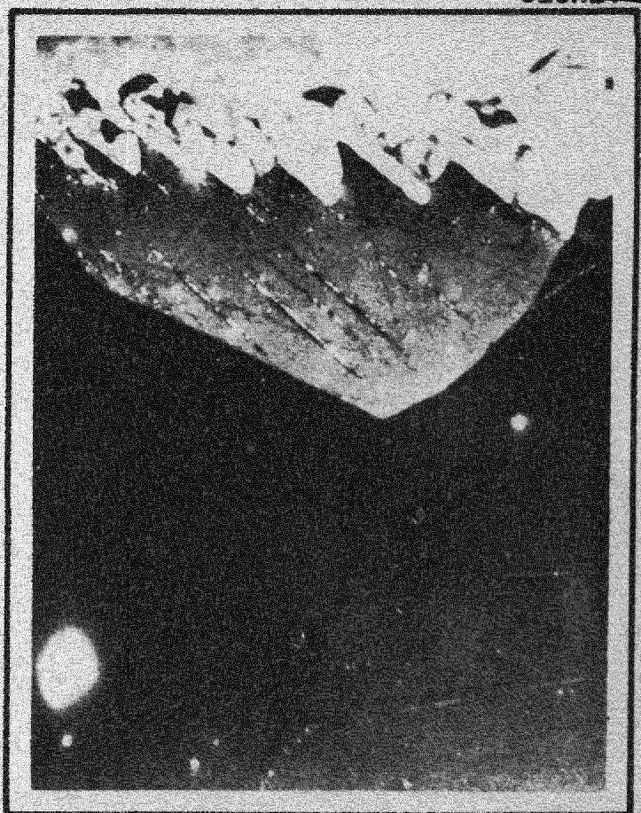  
FIGURE II.6

Y-3213 B (POLARIZED LIGHT) 250X

BERYLLIUM EXPOSED TO LEAD FOR 40 HOURS AT $1000^{\circ}C$

NOTE EVIDENCE OF HEAVY PREFERENTIAL

ATTACK AT THE SURFACE ALONG

CRYSTALLOGRAPHIC PLANES; SHALLOW

INTERGRANULAR ATTACK.

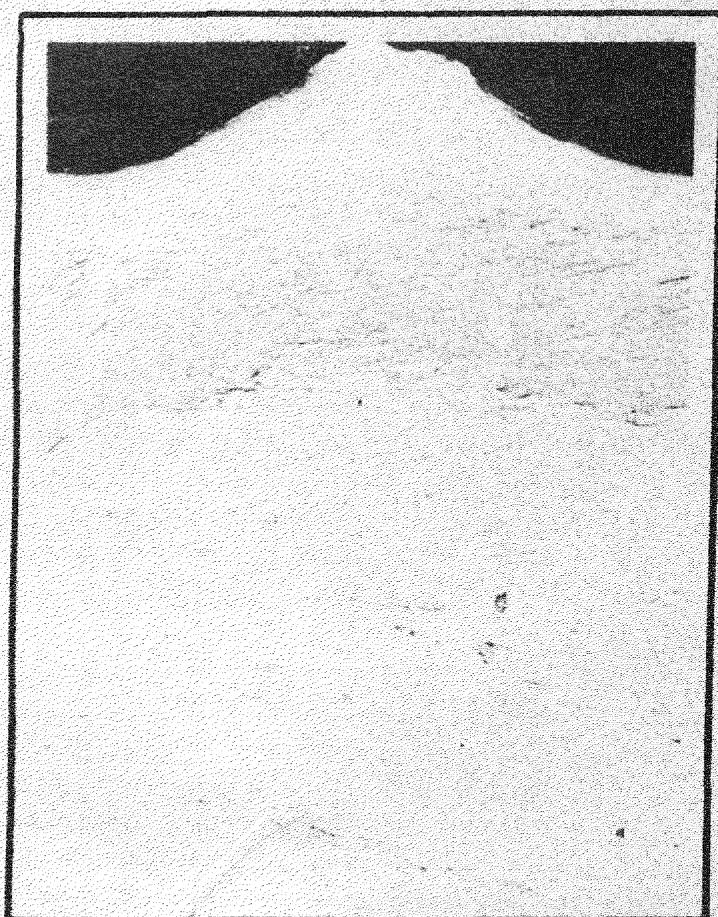  
Y-3166 A 100X TITANIUM EXPOSED TO LEAD FOR 4 HOURS AT $1000^{\circ}C$

NO EVIDENCE OF INTERGRANULAR OR PREFERENTIAL ATTACK; HOWEVER CONSIDerable SOLUTION HAS OCCURRED.

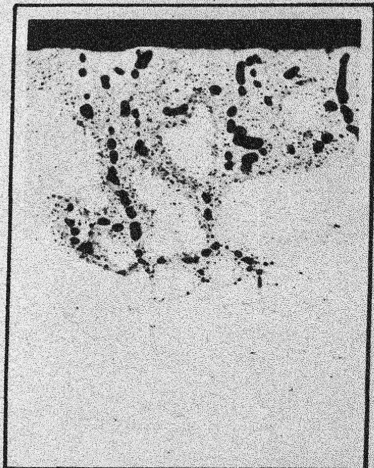  
Y-2906 B 100X   
TYPE 304 STAINLESS STEEL EXPOSED   
TO LEAD FOR 400 HOURS AT $1000^{\circ}C$ NOTE THE HEAVY INTERGRANULAR ATTACK   
AND ADJACENT AREAS OF PHASE   
TRANSFORMATION TO FERRITE.   
FIGURE 11.7

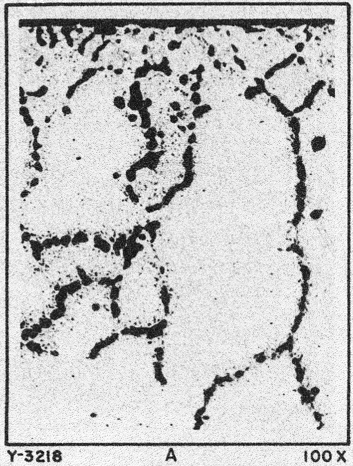  
TYPE 316 STAINLESS STEEL EXPOSED TO LEAD FOR 400 HOURS AT $1000^{\circ}\mathrm{C}$ NOTE HEAVY INTERGRANULAR ATTACK AND PHASE TRANSFORMATION ALONG THE ATTACKED GRAIN BOUNDARIES.

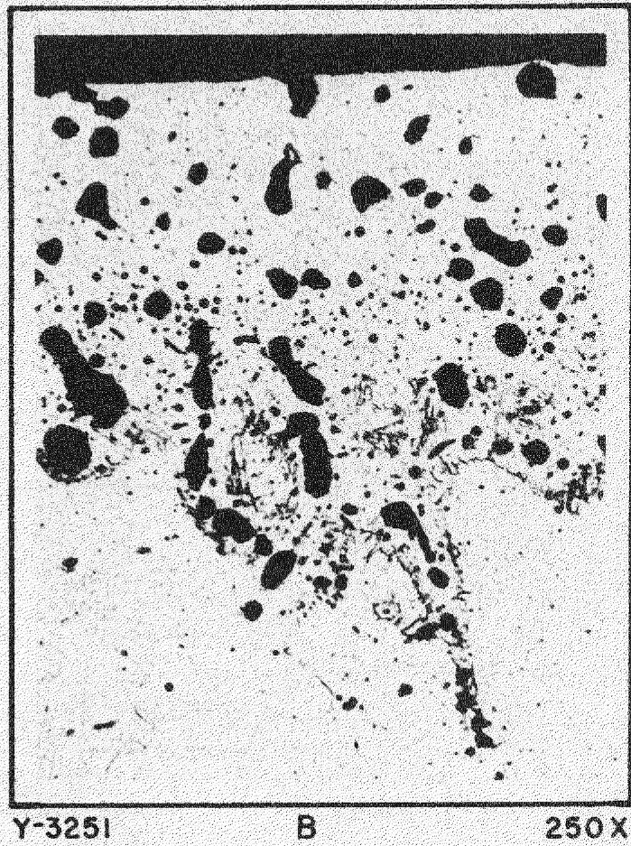  
FIGURE 11.8

TYPE 347 STAINLESS STEEL EXPOSED TO LEAD FOR 400 HOURS AT $1000^{\circ}C$ NOTE HEAVY INTERGRANULAR ATTACK AND PHASE TRANSFORMATION ALONG THE ATTACKED GRAIN BOUNDARIES.

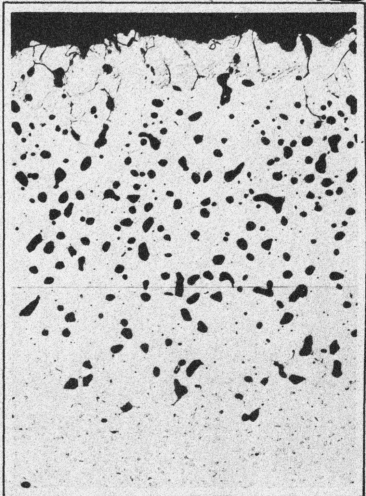  
FIGURE 11.9

Y-3257-58

250X

TYPE 310 STAINLESS STEEL EXPOSED TO LEAD FOR 400 HOURS AT $1000^{\circ}C$

NOTE GAMMA TO ALPHA PHASE TRANSFORMATION AT SURFACE AND GRAINBOUNDARY VOIDS IN DECARBURIZED LAYER.

Static Corrosion Data Obtained in 400-hr Tests Made in Iron Capsules at $1000^{\circ}\mathrm{C}$ in Lead (a)   

<table><tr><td>STAINLESS STEEL(b)</td><td>ARBITRARY COMPARATIVE RATING(c)</td><td>THICKNESS CHANGE(d)(in.)</td><td>INTERGRANULAR PENETRATION (in.)</td><td>SUBSURFACE PRECIPITATION WITHIN GRAIN (in.)</td><td>SURFACE TRANSFORMATION (in.)</td><td>DECARBURIZATION (in.)</td><td>FILM FORMATION</td><td>REMARKS</td><td>WEIGHT CHANGE (mg)</td></tr><tr><td>405</td><td>9</td><td>-0.001</td><td>0.001</td><td>0.005(e)</td><td>None</td><td></td><td>None</td><td>Tiny gray globules precipitated within grains below surface to depth of 0.005 in.</td><td>+135</td></tr><tr><td>410 LC</td><td>8</td><td>-0.001</td><td>0.004</td><td>0.006</td><td>None</td><td>0.006</td><td>None</td><td>Gray globules precipitated below surface to depth of 0.006 in.</td><td>+300</td></tr><tr><td>430</td><td>8</td><td>-0.001</td><td>0.004</td><td>0.006</td><td>None</td><td>0.005</td><td>None</td><td>Same</td><td>+100</td></tr><tr><td>430 ELC</td><td>7</td><td>None</td><td>0.006</td><td>0.007</td><td>None</td><td>0.028</td><td>None</td><td>Similar to above, except that the decarburized zone reported for this low-carbon alloy may actually be sigma-free zone</td><td>+90</td></tr><tr><td>446</td><td>6</td><td>-0.002</td><td>0.007 (avg.)</td><td>0.005(e)</td><td>None</td><td>0.028</td><td>None</td><td>Pearlite-like precipitation along surface to depth of 0.005 in.</td><td>+250</td></tr><tr><td>446 ELC</td><td>5</td><td>None</td><td>0.010 (avg.)</td><td>None</td><td>None</td><td></td><td>None</td><td>Gray phase observed in grain boundaries and within grains at surface</td><td>+300</td></tr><tr><td>446 ELC</td><td>6</td><td>None</td><td>0.026 (max.)</td><td>None</td><td>None</td><td></td><td>None</td><td>Same</td><td>+75</td></tr><tr><td>304</td><td>6</td><td>-0.001</td><td>0.007 (avg.)</td><td>None</td><td>0.008</td><td>&gt;0.125</td><td>None</td><td>Gamma → alpha transformation along surface and adjacent grain boundaries</td><td>+185</td></tr><tr><td>304 LC</td><td>6</td><td>None</td><td>0.020 (avg.)</td><td>None</td><td>0.003</td><td></td><td>None</td><td>Same</td><td>+190</td></tr><tr><td>304 ELC</td><td>4</td><td>-0.002</td><td>&gt;0.020</td><td>None</td><td>0.003</td><td></td><td>None</td><td>Same</td><td>(+55 -260f)</td></tr><tr><td>316</td><td>4</td><td>+0.001</td><td>0.035 (avg.)</td><td>None</td><td>0.008</td><td>&gt;0.125</td><td>None</td><td>Specimen completely decarburized; gamma → alpha transformation along surface and adjacent grain boundaries</td><td>+130</td></tr><tr><td>347</td><td>6</td><td>-0.004</td><td>0.018 (avg.)</td><td>None</td><td>0.005</td><td></td><td>None</td><td>Gamma → alpha transformation along surface and adjacent grain boundaries</td><td>+35</td></tr><tr><td>310</td><td>5</td><td>+0.003</td><td>0.030 (avg.)</td><td>None</td><td>0.003</td><td>0.025</td><td>None</td><td>Gamma → alpha transformation at surface; grain boundary void: observed to depth of 0.030 in.</td><td>+450</td></tr></table>

$\{a\}$ Bath analysis not yet available.   
(b) LC, <0.04% C; ELC, <0.006% C.   
(d) Values reported are for dimensional char   
(e) See remarks   
(f) Weight change of two samples.

The titanium, beryllium, and nickel specimens showed appreciable weight loss and reduction in size. A close study of their surfaces revealed basic differences in the nature of attack. Nickel was severely attacked intergranularly, as shown in Fig. 11.6a. Leaving grains completely isolated from their neighbors. Beryllium, Fig. 11.6b, indicated preferential attack for different crystallographic directions; the grain boundaries were not subject to greater attack than the grain proper. Titanium showed neither grain boundary nor preferred directional attack by lead, as illustrated in Fig. 11.7a. Thorium and uranium specimens were very severely attacked under similar test conditions.

Austenitic stainless steels, shown in Figs. 11.7b through 11.9, have been found to be susceptible to the following types of surface instability at $1000^{\circ}\mathrm{C}$ when in contact with lead solution, intergranular penetration, sub-surface precipitation of unknown phases within grains and in grain boundaries, apparent decarburization, and transformation to a body-centered cubic phase in the lead-affected regions. Furthermore, intermetallic layers may also be present on the surfaces of steels or other metals. Their melting points, however, may be close to the melting point of lead and they may escape detection owing to the present method of separating the specimen from the bath.

The corrosion data for stainless steels in lead at $1000^{\circ}\mathrm{C}$ reported in Tables 11.1 and 11.2 indicate that alloys containing smaller amounts of chromium and nickel, especially the latter, appear to withstand molten lead attack better than the higher alloyed metals. The weight change data reported in these tables are not particularly significant since they do not consider occasional mass transfer effects, possible lead retention, or the mode of weight loss distribution (i.e., intergranular or general attack). A certain amount of general attack can be tolerated, whereas intergranular attack must be kept to a minimum. Likewise, thickness changes of the specimen are not entirely free of extraneous influence. Mass transfer and unsatisfactory cleaning may be corrected, but dimensional instability due to gamma-to-alpha transformation or solid solution can cause, and has caused, an actual increase in specimen thickness in spite of possible solution (alloy 310 stainless steel in Table 11.2).

Lithium. Additional tests are being made in lithium, but the test data are not yet available. The tests are of 40 hr duration and include binary

alloys of Fe-Ni, Fe-Cr, Ni-Cr, and Fe-C which were prepared at the Massachusetts Institute of Technology Metallurgy Laboratory. Several additional tests are being made to determine the relative corrosion resistance of columbium, molybdenum, and tantalum in molten lithium.

Sodium. The corrosion data of pure metals and alloys in sodium have not been so fully evaluated as those of pure metals and alloys in lead. Nevertheless, a small number of data are available and are presented in Table 11.3. Sodium attack differs from that of lead and lithium in that attack is relatively shallow and gamma-to-alpha transformations at the surfaces of stainless steels are not observed.

Some of the corrosion phenomena observed in sodium are caused by impurities in the sodium rather than the sodium itself. Carbides have been detected on the surfaces of the strong carbide-forming metals molybdenum, tantalum, titanium, and tungsten. A nickel-rich layer on molybdenum (Fig. 11.10a) has been retested in sodium at $1000^{\circ}\mathrm{C}$ using the special testing technique in which such mass transfer is not possible. The data, however, are not yet available, but it is quite obvious that molybdenum has excellent corrosion resistance to sodium.

Other metals listed in Table 11.3 also show good corrosion resistance to sodium at $1000^{\circ}\mathrm{C}$ . However, there is evidence of slight susceptibility to intergranular attack in the case of low-carbon 304 stainless steel (18 Cr, 8 Ni) and of a slight solubility of tungsten in sodium. Inconel X is inferior to inconel in corrosion, as is evident in Fig. 11.10b.

Bismuth-Uranium. Several metals have been exposed to bismuth containing 2 atom % uranium at $1000^{\circ}\mathrm{C}$ . These are listed in Table 11.4 together with testing time and other pertinent information. Figures 11.11a and b illustrate the nature of corrosive attack on type 316 stainless steel and inconel. The severity of intergranular attack is quite pronounced for these alloys.: Zirconium and titanium were very severely attacked, whereas tungsten, tantalum, molybdenum, and columbium were relatively unattacked. Additional materials are being tested, and will be reported in the future.

# DIFFUSION BARRIER AS A CORROSION INHIBITOR

Corrosion protection may be accomplished by either of two methods: (l) an environment could be selected such that the free energy change for the

TABLE 11.3   
Static Corrosion Data for Tests Made in Nickel Capsules in Sodium at $1000^{\circ}\mathbf{C}$   

<table><tr><td>METAL</td><td>ARBITRARY COMPARATIVE RATING*</td><td>THICKNESS CHANGE (in.)</td><td>REMARKS</td><td>WEIGHT CHANGE (mg)</td></tr><tr><td colspan="5">400-hr TESTS</td></tr><tr><td>Ni</td><td>10</td><td>None</td><td>No evidence of attack</td><td>+10</td></tr><tr><td>Co</td><td>9</td><td>-0.008</td><td>Slight attack; particles or voids at depth of 0.0008 in.</td><td>+175</td></tr><tr><td>Mo</td><td>? Mt**</td><td></td><td>Spectrographic evidence of Ni and C on metal surface (see Fig. 11.10a)</td><td>+75</td></tr><tr><td>Ta</td><td>9</td><td>None</td><td>X-ray diffraction study indicates TaC; unknown film 0.002 in. thick; irregular surface</td><td></td></tr><tr><td>Ti</td><td>9</td><td>None</td><td>X-ray and spectrographic evidence of TiC on surface to depth of 0.004 in.</td><td>+240</td></tr><tr><td>W</td><td>8</td><td>-0.001</td><td>X-ray evidence of WC on surface</td><td>-1050</td></tr><tr><td>Inconel</td><td>9</td><td>None</td><td>Decarburization to depth of 0.001 in.; no intergranular attack (Fig. 11.10b)</td><td>+160</td></tr><tr><td>Inconel X</td><td>8</td><td>None</td><td>0.0006 in. decarburization; 0.002 in. intergranular attack</td><td>+100</td></tr><tr><td>N·155</td><td>8</td><td>+0.010</td><td>Decarburization and unidentified phase beneath surface; no intergranular attack</td><td>+300</td></tr><tr><td colspan="5">40-hr TESTS</td></tr><tr><td>304 SS (0.006% C)</td><td>7</td><td>None</td><td>Precipitate in grain boundary and along crystallographic planes; corrosion noted to a depth of 0.003 in.</td><td>-200</td></tr><tr><td>347 SS</td><td>9</td><td>-0.003</td><td>0.0008 in. decarburization; 0.0005 in. intergranular attack</td><td>-60</td></tr><tr><td>310 SS</td><td>8</td><td>None</td><td>Voids and decarburization to depth of 0.002 in.</td><td>-60</td></tr><tr><td>430 SS</td><td>8</td><td></td><td>0.002 in. intergranular attack; 0.001 in. decarburization; nonuniform sigma-like precipitate to a depth of 0.025 in.</td><td>-165</td></tr><tr><td>446 SS</td><td>9</td><td>-0.001</td><td>No evidence of attack; sigma-like particles noted in grains and in grain boundaries</td><td>-50</td></tr></table>

* 10 = excellent, 5 = poor, 1 = dissolved.   
\*Mt = mass transfer probable.

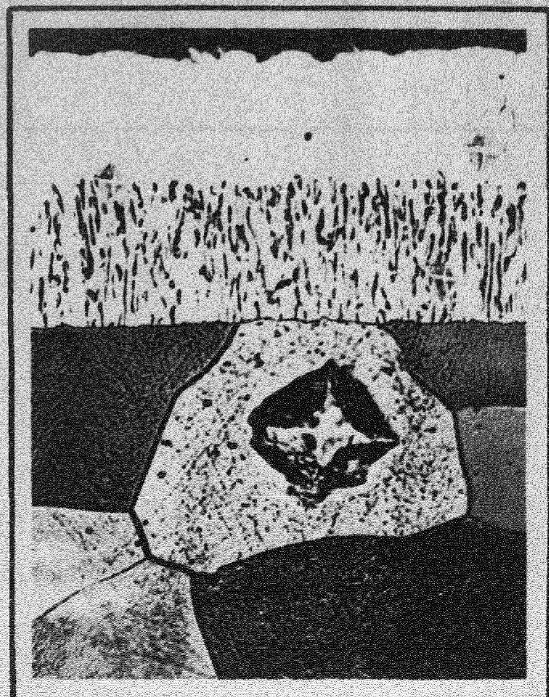  
Y-2772

  
1000X

MOLYBDENUM EXPOSED TO SODIUM FOR 40 HOURS AT $1000^{\circ}C$ IN A NICKEL CAPSULE.

NOTE DIFFERENCE IN HARDNESS BETWEEN MATRIX (DPH206) AND MASS TRANSFER LAYER (DPH 2990).

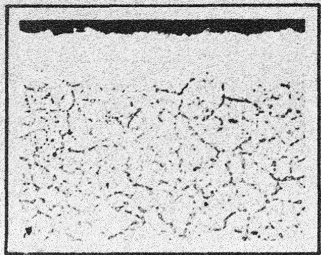  
Y-2749   
INCONEL

  
250x

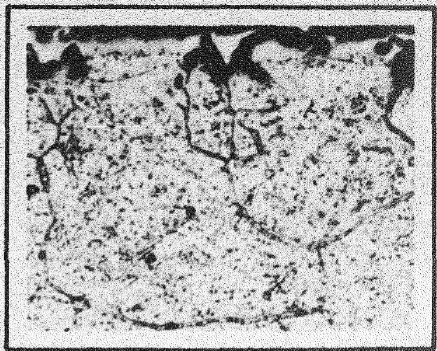  
FIGURE II.10   
200

Y-2760

INCONEL X

250x

COMPARISON OF INCONEL AND INCONELX AFTER 40

HOUR EXPOSURE TO SODIUM AT 1000°C.

NOTE DECARBURIZATION OF INCONEL AND THE

INTERGRANULAR ATTACK OF INCONELX.

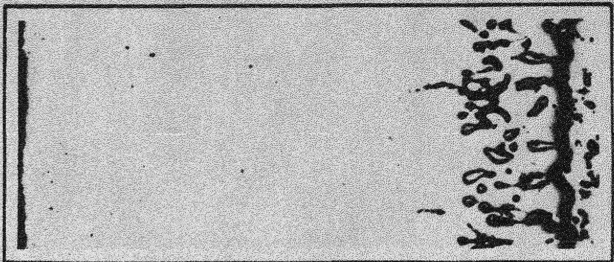

Y-3081

A

175X

TYPE 316 STAINLESS STEEL TUBING

EXPOSED 40 HOURS AT $1000^{\circ}C$ TO

BI-ULLOY.

NOTE THE INNER WALL OF THE TUBE

ON THE RIGHT SHOWING INTERGRANULAR

ATTACK. PICTURE WIDTH IS COMPLETE

TUBE WALL OF 0.035" THICKNESS.

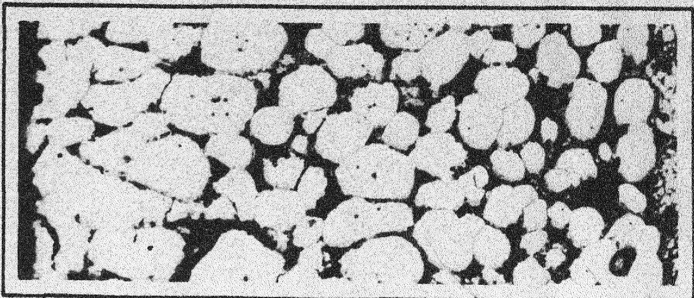

Y-3124

B

175X

INCONEL TUBING EXPOSED 40 HOURS

AT 1000°C TO Bi-U ALLOY.

NOTE COMPLETE INTERGRANULAR ATTACK

OF TUBE WALL BY Bi-U ALLOY. INNER WALL

OF TUBE ON RIGHT.

FIGURE II.11

201

corroding reaction is positive, or (2) a barrier film between the reactants could be developed which would reduce diffusion to the extent that the reaction rate is satisfactorily minimized. The latter technique is the one most widely practiced since the former usually demands conditions and materials that are generally difficult and impractical to obtain.

The possible reactions* between a pure solid metal and a pure liquid metal are uniquely described in an equilibrium diagram of the binary system. However, such information is either nonexistent for many systems of interest or is inaccurate to the point of being misleading. Much work remains to be done in this field. The ideal situation would be a system in which an intermetallic phase coexists with relatively pure components at the desired temperature and through which diffusion rates are negligibly small. The formation of such an intermetallic film on the specimen surface would constitute an excellent protective layer. The solid and liquid metals would then be accompanied by very little corrosion (if the definition of this term could be broadened to include 'such a reaction').

Since it appears unlikely that such a fortuitous relationship exists in the liquid-solid (coolant-container) metal combination being considered, the addition of a suitable third (or more) component could conceivably have a similar inhibiting effect. The barrier film might be an oxide, nitride, carbide, or possibly some other nonmetallic, metallic, or intermetallic layer. However, the adverse effects on thermal conductivity must not be overlooked.

Thermodynamic data pertaining to metal oxides suggest that $\mathrm{Cr_2O_3}$ should be stable in the presence of lead at all temperatures and in the presence of sodium above approximately $600^{\circ}\mathrm{C}$ , assuming that no complicating mixed oxides form, e.g., chromates. Since many alloys contain chromium as an alloying element, the selective oxidation of this constituent may contribute to corrosion resistance and thus form a diffusion barrier. Fortunately, this can be accomplished by exposing the metal to an atmosphere of controlled oxidizing potential for a suitable time at a selected temperature. The adherence of the oxide to the parent metal through the temperature cycles involved is obviously vital for protection.

A 25 Cr-20 Ni alloy (type 310 stainless steel) was pretreated in this manner to develop a $\mathrm{Cr}_2\mathrm{O}_3$ layer and subsequently was subjected to a static

corrosion test in lead at $1000^{\circ}\mathrm{C}$ for 100 hr. A photomicrograph of the exposed surface is shown in Fig. 11.12 together with a similar photomicrograph of an unpretreated specimen. Although the depth of corrosive attack was not appreciably reduced in this preliminary test, it was nevertheless less severe.

Additional exploratory tests are planned using other alloys and coolants.

# DYNAMIC CORROSION BY LIQUID METALS

H.:W.: Savage, ANP Division W.D.:Manly, Metallurgy Division

Whereas the static corrosion testing of various materials by liquid metals may serve to screen out those which are obviously unsatisfactory, the final acceptance of any system is dependent upon dynamic corrosion tests. These tests are more difficult to perform, however, primarily because they also involve the development of a complete liquid-metal system. The dynamic tests are currently being performed both in convection loops (which require a minimum of development but have low flow rates) and forced circulation loops (which require a liquid-metal pump and have substantial flow rates). Obviously this latter technique will ultimately yield the desired results; the convection loops have been used on an interim basis pending the development of forced circulating systems.

Many data have been obtained, principally with sodium, from the convection loops. The forced circulating loops (figure-eight loops) are still being developed.

Thermal Convection Loops - Harps (E. M. Lees, ANP Division). Thirty-nine thermal convection loops containing sodium and a few lead-containing loops have been operated by the ANP Experimental Engineering Group. Data on these are given in Table 11.5. The decrease in operational troubles may be attributed to improved operational technique and to the installation of adequate control equipment.

Operational Difficulties. Several premature loop failures were attributed to unsatisfactory welds and should not be interpreted as being indicative of poor corrosion resistance of the alloy material. Figure 11.13 illustrates

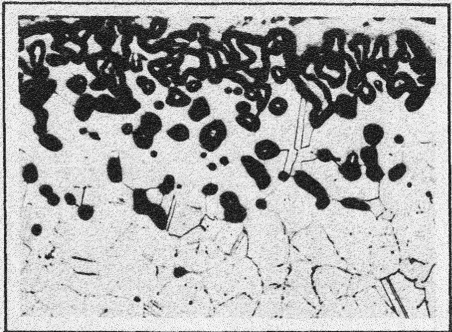  
Y-3178-A

250x

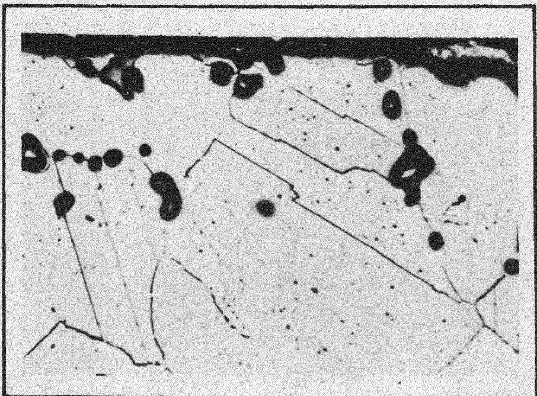  
Y-3178-B

250X

TYPE 310 STAINLESS STEEL (25 Cr.-20 Ni)

AFTER 40-HOUR EXPOSURE TO LEAD AT $1000^{\circ}C$

ABOVE: UNTREATED SAMPLE.

BELOW: PRETREATED TO DEVELOP $\mathrm{Cr_2O_3}$

LAYER PRIOR TO TESTING.

FIGURE II.12

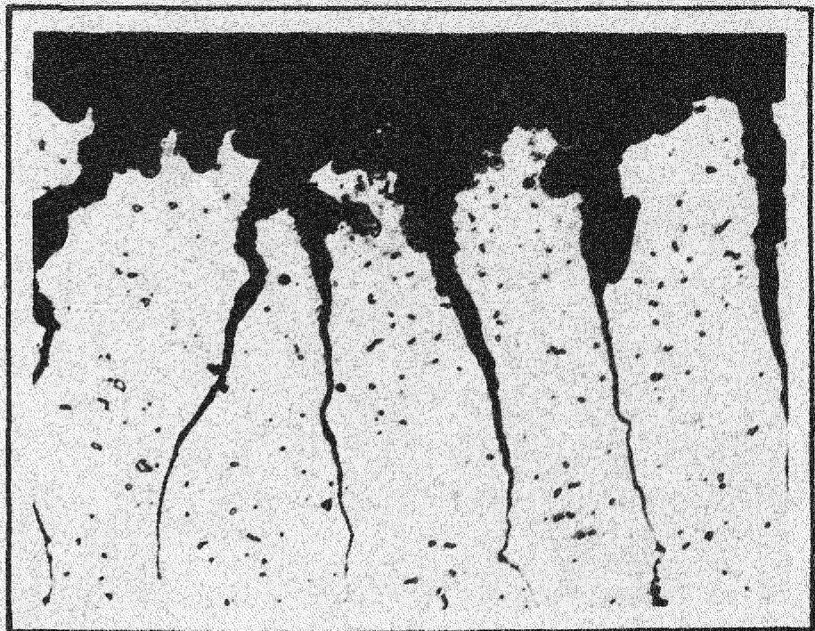  
Y-3263   
200x

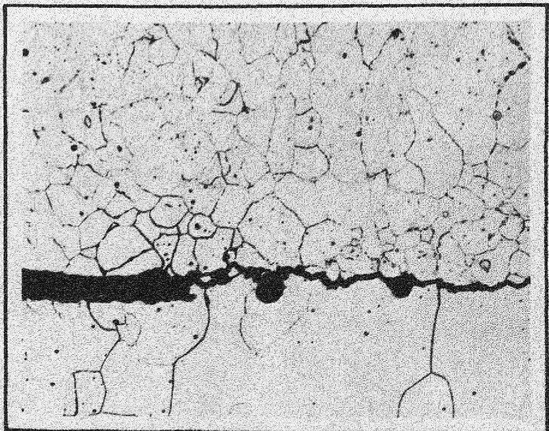  
Y-3262   
FIGURE 11.13   
100X

FLAWS IN WELDED JOINTS WHICH TEND TO PROMOTE PREMATURE CONVECTION LOOP FAILURE.

ABOVE-GRAIN BOUNDARY SLAG REDUCES THE EFFECTIVE THICKNESS OF WELD METAL AND RESULTS IN HIGHLY LOCALIZED STRESS REGIONS.

BELOW-LACK OF FUSION BETWEEN WELDMETAL AND BOTTOM PLATE; FUSION SATISFACTORY BETWEEN WELDMETAL AND PIPE SHOWN AT EXTREME LEFT.

TABLE 11.5   
Corrosion and Operation Notes of Thermal Convection Loops   

<table><tr><td rowspan="2">LOOP</td><td rowspan="2">LOOP MATERIAL</td><td rowspan="2">BATH METAL</td><td rowspan="2">LENGTH OF TEST (hr)</td><td rowspan="2">HOT ZONE TEMP. (°F)</td><td rowspan="2">COLD ZONE TEMP. (°F)</td><td rowspan="2">TERMINATION</td><td rowspan="2">TIME OF SAMPLING</td><td rowspan="2">LOCATION OF TEST SAMPLE</td><td colspan="2">OXYGEN (%)</td><td colspan="7">ANALYSIS OF LIQUID BATH METAL FOR CORROSION PRODUCTS (ppm) Spectrographic Analysis</td><td rowspan="2">METALLOGRAPHIC EXAMINATION</td></tr><tr><td>UPPER BULB</td><td>LOWER BULB</td><td>Fe</td><td>Cr</td><td>Ni</td><td>Mo</td><td>Mn</td><td>Co</td><td>W</td></tr><tr><td rowspan="2">1</td><td rowspan="2">316 SS</td><td rowspan="2">Na</td><td rowspan="2">1100</td><td rowspan="2">1350</td><td rowspan="2">1130</td><td rowspan="2">12-10-50 as scheduled</td><td>Initial</td><td>Top cup</td><td>0.092</td><td>0.082</td><td></td><td></td><td></td><td></td><td></td><td></td><td></td><td rowspan="9">Appreciable amounts of sigma phase formed in two loops operated at 1500°F, more in hot zones than in cold; all 4 loops showed heavy intergranular attack in bottom cups near welds; most specimens had a slight irregular edge, indicating some attack</td></tr><tr><td>Final</td><td>Top cup</td><td>0.028</td><td>0.014</td><td>30</td><td>&lt;30</td><td>&lt;130</td><td>&lt;75</td><td>&lt;30</td><td></td><td></td></tr><tr><td rowspan="2">2</td><td rowspan="2">316 SS</td><td rowspan="2">Na</td><td rowspan="2">978</td><td rowspan="2">1350</td><td rowspan="2">1110</td><td rowspan="2">12-6-50; early termination scheduled because of gas line leak above sodium level</td><td>Final</td><td>Bottom cup</td><td></td><td></td><td>90</td><td>&lt;15</td><td>&lt;70</td><td>&lt;15</td><td>&lt;15</td><td></td><td></td></tr><tr><td>Initial</td><td>Top cup</td><td>0.056</td><td>0.013</td><td></td><td></td><td></td><td></td><td></td><td></td><td></td></tr><tr><td rowspan="2">3</td><td rowspan="2">316 SS</td><td rowspan="2">Na</td><td rowspan="2">1000</td><td rowspan="2">1500</td><td rowspan="2">1345</td><td rowspan="2">12-10-50 as scheduled</td><td>Initial</td><td>Top cup</td><td></td><td></td><td>1130</td><td>50</td><td>&lt;250</td><td>&lt;50</td><td>&lt;50</td><td></td><td></td></tr><tr><td>Final</td><td>Bottom cup</td><td></td><td></td><td>15</td><td>&lt;5</td><td>&lt;20</td><td>&lt;5</td><td>&lt;5</td><td></td><td></td></tr><tr><td rowspan="3">4</td><td rowspan="3">316 SS</td><td rowspan="3">Na</td><td rowspan="3">625</td><td rowspan="3">1500</td><td rowspan="3">1165</td><td rowspan="3">11-24-50; failure middle of hot leg</td><td>Initial</td><td>Top cup</td><td>0.067</td><td>0.087</td><td></td><td></td><td></td><td></td><td></td><td></td><td></td></tr><tr><td>Final</td><td>Top cup</td><td>0.021</td><td>0.012</td><td>210</td><td>&lt;105</td><td>&lt;470</td><td>&lt;260</td><td>&lt;105</td><td></td><td></td></tr><tr><td>Final</td><td>Bottom cup</td><td></td><td></td><td>1200</td><td>&lt;40</td><td>&lt;200</td><td>&lt;40</td><td>&lt;40</td><td></td><td></td></tr><tr><td rowspan="2">5</td><td rowspan="2">304 SS</td><td rowspan="2">Na</td><td rowspan="2">349</td><td rowspan="2">1500</td><td rowspan="2">1270</td><td rowspan="2">11-12-50; weld failure top of hot leg below cup</td><td>Initial</td><td>Top cup</td><td></td><td></td><td></td><td></td><td></td><td></td><td></td><td></td><td></td><td rowspan="6">Considerable intergranular attack of weld metal, heaviest in the cold zone welds; most specimens had a slight irregular edge, indicating some attack</td></tr><tr><td>Final</td><td>Bottom cup</td><td></td><td></td><td>1680</td><td>580</td><td>270</td><td>&lt;10</td><td></td><td></td><td></td></tr><tr><td rowspan="2">16</td><td rowspan="2">304 SS</td><td rowspan="2">Na</td><td rowspan="2">988</td><td rowspan="2">1350</td><td rowspan="2">1185</td><td rowspan="2">12-7-50 as scheduled</td><td>Initial</td><td>Top cup</td><td>0.037</td><td>0.051</td><td></td><td></td><td></td><td></td><td></td><td></td><td></td></tr><tr><td>Final</td><td>Top cup</td><td>0.011</td><td>0.016</td><td>&lt;75</td><td>&lt;35</td><td>&lt;180</td><td>&lt;95</td><td>&lt;35</td><td></td><td></td></tr><tr><td rowspan="2">17</td><td rowspan="2">304 SS</td><td rowspan="2">Na</td><td rowspan="2">1000</td><td rowspan="2">1350</td><td rowspan="2">1220</td><td rowspan="2">12-6-50 as scheduled</td><td>Initial</td><td>Top cup</td><td>0.052</td><td>0.016</td><td></td><td></td><td></td><td></td><td></td><td></td><td></td></tr><tr><td>Final</td><td>Bottom cup</td><td></td><td></td><td>30</td><td>&lt;30</td><td>&lt;140</td><td>&lt;30</td><td>&lt;30</td><td></td><td></td></tr><tr><td rowspan="2">7</td><td rowspan="2">347 SS</td><td rowspan="2">Na</td><td rowspan="2">1000</td><td rowspan="2">1500</td><td rowspan="2">1290</td><td rowspan="2">12-12-50 as scheduled</td><td>Initial</td><td>Top cup</td><td>0.020</td><td>0.013</td><td></td><td></td><td></td><td></td><td></td><td></td><td></td><td rowspan="7">No intergranular attack on samples and very little evidence of any type of corrosion</td></tr><tr><td>Final</td><td>Top cup</td><td>0.008</td><td>0.018</td><td>&lt;150</td><td>&lt;70</td><td>&lt;370</td><td>&lt;180</td><td>&lt;70</td><td></td><td></td></tr><tr><td rowspan="2">14</td><td rowspan="2">347 SS</td><td rowspan="2">Na</td><td rowspan="2">1000</td><td rowspan="2">1350</td><td rowspan="2">1110</td><td rowspan="2">12-13-50 as scheduled</td><td>Initial</td><td>Top cup</td><td>0.037</td><td>0.090</td><td></td><td></td><td></td><td></td><td></td><td></td><td></td></tr><tr><td>Final</td><td>Top cup</td><td>0.009</td><td>0.027</td><td>&lt;70</td><td>&lt;35</td><td>&lt;170</td><td>&lt;85</td><td>&lt;35</td><td></td><td></td></tr><tr><td rowspan="3">15</td><td rowspan="3">347 SS</td><td rowspan="3">Na</td><td rowspan="3">1000</td><td rowspan="3">1350</td><td rowspan="3">1175</td><td rowspan="3">12-5-50 as scheduled</td><td>Initial</td><td>Top cup</td><td>0.025</td><td>0.019</td><td></td><td></td><td></td><td></td><td></td><td></td><td></td></tr><tr><td>Final</td><td>Top cup</td><td>0.045</td><td>0.023</td><td>&lt;45</td><td>&lt;25</td><td>&lt;110</td><td>&lt;55</td><td>&lt;25</td><td></td><td></td></tr><tr><td>Final</td><td>Bottom cup</td><td></td><td></td><td>30</td><td>&lt;5</td><td>&lt;30</td><td>&lt;5</td><td>&lt;5</td><td></td><td></td></tr></table>

TABLE 11.5 (Cont'd)   

<table><tr><td rowspan="2">LOOP</td><td rowspan="2">LOOP MATERIAL</td><td rowspan="2">BATH METAL</td><td rowspan="2">LENGTH OF TEST (hr)</td><td rowspan="2">HOT ZONE TEMP. (°F)</td><td rowspan="2">COLD ZONE TEMP. (°F)</td><td rowspan="2">TERMINATION</td><td rowspan="2">TIME OF SAMPLING</td><td rowspan="2">LOCATION OF TEST SAMPLE</td><td colspan="2">OXYGEN (%)</td><td colspan="7">ANALYSIS OF LIQUID BATH METAL FOR CORROSION PRODUCTS (ppm) Spectrographic Analysis</td><td rowspan="2">METALLOGRAPHIC EXAMINATION</td></tr><tr><td>UPPER BULB</td><td>LOWER BULB</td><td>Fe</td><td>Cr</td><td>Ni</td><td>Mo</td><td>Mn</td><td>Co</td><td>W</td></tr><tr><td>6</td><td>L-605 (Co base)</td><td>Na</td><td>1000</td><td>1500</td><td>1185</td><td>12-14-50 as scheduled</td><td>Final Final</td><td>Top cup Bottom cup</td><td></td><td></td><td>70 20</td><td>95 10</td><td>500 &lt;40</td><td>&lt;25 &lt;10</td><td></td><td>270 &lt;40</td><td>&lt;230 &lt;80</td><td>No evidence of corrosion in any sample</td></tr><tr><td>8</td><td>1010 steel</td><td>Na</td><td>593</td><td>1200</td><td>840</td><td>11-25-50; failed middle of hot leg because of external oxidation</td><td>Initial Final Final</td><td>Top cup Top cup Bottom cup</td><td>0.021</td><td>0.017 0.043</td><td>&lt;110 11200</td><td>&lt;60 610</td><td>&lt;280 &lt;55</td><td>&lt;60 &lt;30</td><td>&lt;60 &lt;160</td><td></td><td></td><td>Considerable attack in top cup and bottom cup contained a considerable amount of a dark metallic residue that analyzed over 95% iron; very little evidence of attack in metallographic samples, indicating that attack was fairly uniform</td></tr><tr><td>13</td><td>Nickel</td><td>Na</td><td>223</td><td>1500</td><td>1020</td><td>11-6-50: weld failure bottom plate of bottom cup</td><td>Initial Final Final</td><td>Top cup Top cup Bottom cup</td><td>0.027</td><td>0.026</td><td></td><td></td><td>8500 3300</td><td></td><td></td><td></td><td></td><td>All samples showed light attack, not intergranular, heavy near weld failure</td></tr><tr><td rowspan="2">:: : : : : : : : : : : : : : : : : : : : : : : : : : : : : : : : : : : : : : : : : : : : : : : : : : : : : : : : : : : : : : : : : : : : : : : : : : : : : : : : : : : : : : : : : : : : : : : : : : : : :</td><td rowspan="2">316 SS</td><td rowspan="2">Pb</td><td rowspan="2">138</td><td rowspan="2">1500</td><td rowspan="2">1300</td><td rowspan="2">12-19-50; loop plugged internally</td><td rowspan="2">Final Final Final</td><td rowspan="2">Cold leg Cold leg plug Hot leg</td><td colspan="2" rowspan="2">0.0046 0.048</td><td colspan="6">Chemical Analysis</td><td>The hot zone samples showed considerably more attack than cold; surfaces of samples showed pronounced irregularities; cold zone sections of loop were blocked with a lead plug in which was a network of dendritic crystals of loop material</td><td rowspan="2"></td></tr><tr><td>300 46,000 400</td><td>&lt;10 13,900 &lt;10</td><td>300 6000 300</td><td>40 50 40</td><td></td><td></td><td></td></tr><tr><td>28</td><td>446 SS</td><td>Pb</td><td>62</td><td>1500</td><td>1300</td><td>12-21-50: loop plugged internally</td><td>Final Final Final</td><td>Cold leg Cold leg plug Hot leg . plug</td><td colspan="2">0.002 0.047 0.0046 0.048</td><td>6700 78,000 800 51,000</td><td>&lt;10 29,200 &lt;10 46,400</td><td></td><td></td><td></td><td></td><td></td><td>Hot zone samples showed very heavy attack; wall thickness of the hot zone was 12 mils less than that of cold; hot zone showed a spongy type of attack, spongy layer being about 3 mils thick as in loop 26, cold zone was blocked with a lead plug containing dendritic crystals of loop material</td></tr><tr><td rowspan="2">OP</td><td rowspan="2">LOOP
MATERIAL</td><td rowspan="2">BATH
METAL</td><td rowspan="2">LENGTH
OF
TEST
(hr)</td><td rowspan="2">HOT
ZONE
TEMP.
(°F)</td><td rowspan="2">COLD
ZONE
TEMP.
(°F)</td><td rowspan="2">TERMINATION</td><td rowspan="2">TIME OF
SAMPLING</td><td rowspan="2">LOCATION
OF TEST
SAMPLE</td><td colspan="2">OXYGEN
(%)</td><td colspan="7">ANALYSIS OF LIQUID BATH METAL
FOR CORROSION PRODUCTS (ppm)
Chemical Analysis</td><td rowspan="2">METALLOGRAPHIC
EXAMINATION</td></tr><tr><td>UPPER
BULB</td><td>LOWER
BULB</td><td>Fe</td><td>Cr</td><td>Ni</td><td>Mo</td><td>Mn</td><td>Co</td><td>W</td></tr><tr><td>9</td><td>Nickel</td><td>Na</td><td>0</td><td>1500</td><td></td><td>10-23-50; failure
middle of cold leg</td><td></td><td></td><td></td><td></td><td></td><td></td><td></td><td></td><td></td><td></td><td></td><td></td></tr><tr><td>10</td><td>1010 steel</td><td>Na</td><td>25.4</td><td>1200</td><td></td><td>11-26-50; failure
side of bottom cup</td><td></td><td></td><td></td><td></td><td></td><td></td><td></td><td></td><td></td><td></td><td></td><td></td></tr><tr><td>11</td><td>Nickel</td><td>Na</td><td>13.0</td><td>1500</td><td></td><td>11-2-50; failure top
plate of bottom cup</td><td></td><td></td><td></td><td></td><td></td><td></td><td></td><td></td><td></td><td></td><td></td><td></td></tr><tr><td>12</td><td>Nickel</td><td>Na</td><td>1000</td><td>1500</td><td></td><td>1-1-51 as scheduled</td><td></td><td></td><td></td><td></td><td></td><td></td><td></td><td></td><td></td><td></td><td></td><td></td></tr><tr><td>18</td><td>Fe
(enameled)</td><td>Pb</td><td>62.0</td><td>1400</td><td></td><td>1-29-51; loop plugged
internally</td><td></td><td></td><td></td><td></td><td></td><td></td><td></td><td></td><td></td><td></td><td></td><td></td></tr><tr><td>19</td><td>Fe</td><td>Pb</td><td>832</td><td>1100</td><td></td><td>Operating 3-1-51</td><td></td><td></td><td></td><td></td><td></td><td></td><td></td><td></td><td></td><td></td><td></td><td></td></tr><tr><td>20</td><td>Fe</td><td>Li</td><td>34.5</td><td>1100</td><td></td><td>2-24-51; failure
lower section of top
pot; loop internally
plugged</td><td></td><td></td><td></td><td></td><td></td><td></td><td></td><td></td><td></td><td></td><td></td><td></td></tr><tr><td>21</td><td>Fe</td><td>Pb</td><td>824</td><td>1100</td><td></td><td>Operating 3-1-51</td><td></td><td></td><td></td><td></td><td></td><td></td><td></td><td></td><td></td><td></td><td></td><td></td></tr><tr><td>27</td><td>316 SS</td><td>Pb</td><td>0</td><td>1500</td><td></td><td>12-16-50; loop plugged
internally at start-
up</td><td></td><td></td><td></td><td></td><td></td><td></td><td></td><td></td><td></td><td></td><td></td><td></td></tr><tr><td>29</td><td>Inconel</td><td>Na</td><td>1000</td><td>1350</td><td></td><td>2-6-51 as scheduled</td><td></td><td></td><td></td><td></td><td></td><td></td><td></td><td></td><td></td><td></td><td></td><td></td></tr><tr><td>30</td><td>310 SS</td><td>Na</td><td>1000</td><td>1350</td><td></td><td>1-26-51 as scheduled</td><td></td><td></td><td></td><td></td><td></td><td></td><td></td><td></td><td></td><td></td><td></td><td></td></tr><tr><td>33</td><td>321 SS</td><td>Na</td><td>754</td><td>1500</td><td></td><td>1-17-51; failure
middle of top diag-
onal section</td><td></td><td></td><td></td><td></td><td></td><td></td><td></td><td></td><td></td><td></td><td></td><td></td></tr><tr><td>34</td><td>321 SS</td><td>Na</td><td>457</td><td>1500</td><td></td><td>1-16-51; loop plugged</td><td></td><td></td><td></td><td></td><td></td><td></td><td></td><td></td><td></td><td></td><td></td><td></td></tr><tr><td>35</td><td>L-605
(Co base)</td><td>Li</td><td>115.5</td><td>1500</td><td></td><td>Operating 3-1-51</td><td></td><td></td><td></td><td></td><td></td><td></td><td></td><td></td><td></td><td></td><td></td><td></td></tr><tr><td>36</td><td>L-605
(Co base)</td><td>Pb</td><td>699</td><td>1500</td><td></td><td>2-28-51; loop plugged
internally during
operation; failure
middle of hot leg</td><td></td><td></td><td></td><td></td><td></td><td></td><td></td><td></td><td></td><td></td><td></td><td></td></tr><tr><td rowspan="2">LOOP</td><td rowspan="2">LOOP MATERIAL</td><td rowspan="2">BATH METAL</td><td rowspan="2">LENGTH OF TEST (hr)</td><td rowspan="2">HOT ZONE TEMP. (°F)</td><td rowspan="2">COLD ZONE TEMP. (°F)</td><td rowspan="2">TERMINATION</td><td rowspan="2">TIME OF SAMPLING</td><td rowspan="2">LOCATION OF TEST SAMPLE</td><td colspan="2">OXYGEN (%)</td><td colspan="7" rowspan="2">ANALYSIS OF LIQUID BATH METAL FOR CORROSION PRODUCTS (ppm) Chemical Analysis</td><td>METALLOGRAPHIC EXAMINATION</td></tr><tr><td>UPPER BULB</td><td>LOWER BULB</td><td></td></tr><tr><td>37</td><td>V-36 (Co base)</td><td>Na</td><td>1000</td><td>1500</td><td></td><td>2-26-51 as scheduled</td><td></td><td></td><td></td><td></td><td></td><td></td><td></td><td></td><td></td><td></td><td></td><td></td></tr><tr><td>38</td><td>V-36 (Co base)</td><td>Li</td><td>0</td><td>1500</td><td></td><td>2-19-51; failure middle of hot leg</td><td></td><td></td><td></td><td></td><td></td><td></td><td></td><td></td><td></td><td></td><td></td><td></td></tr><tr><td>39</td><td>V-36 (Co base)</td><td>Pb</td><td>84.5</td><td>1500</td><td></td><td>2-2-51; failure middle of hot leg</td><td></td><td></td><td></td><td></td><td></td><td></td><td></td><td></td><td></td><td></td><td></td><td></td></tr></table>

two of the more common examples of poor welding. Either type of flaw may cause an unexpected leak in the coolant system. Prior to being filled with sodium, the loops were pickled with uninhibited acid in an attempt to remove the oxide scale formed during welding. This pickling undoubtedly introduced some attack of the metal, especially in the weld zone of nonstable alloys, making metallographic examination of these loops difficult to interpret. The attack which occurred during pickling cannot be differentiated from the attack which occurred due to sodium. The data presented in Table 11.5 should therefore be interpreted with caution.

The most frequent difficulty encountered with all this type of equipment is plugging of the gas lines from which the system is pressurized. The gas lines on the sodium systems continue to give plugging trouble.

Heater failures now occur infrequently, and it has been found advisable to control these with variacs instead of placing them at line voltage. Control panels are now being installed which will automatically operate all heaters at reduced voltage and this, in combination with additional heater capacity, should further increase the life of the heaters.

During this quarter there has been no damage caused by liquid-metal leaks resulting from failures of harp material.

There has been one failure of a sodium-filled convection loop; however, this resulted in no fires of any consequence.

Results. Of the harps operated to date, 11 different materials at five different temperatures have been checked with sodium, Of these harps, 13 operated for 1000 hr to scheduled termination. Of 10 harps using sodium at $1500^{\circ}\mathrm{F}$ , using five different harp materials, only three ran

for 1000 hr.: Four failed because of faulty welds, one plugged, and in two harps the materials actually failed.

The low-carbon steel loop was the only one appreciably attacked by sodium, and the attack in the hot zone was more severe than that in the cold zone. With the exception of some intergranular attack near the welds in the unstabilized stainless steels, none of the stainless steel loops showed evidence of corrosion attack. Type 347 stainless steel showed the least attack of the types tested. It is interesting to note that the oxygen content of the stainless steel loops decreased during operation, indicating possible reaction with the alloy. Metallographic examinations of alloy L-605 and nickel loops showed little evidence of attack.

Forced Circulation Loops -- Figure-Eight Loops (W. C.: Tunnell and W. B.: McDonald, ANP Division). The ANP Experimental Engineering Group is currently operating forced circulation loops constructed of type 316 stainless steel. Two type 347 stainless steel loops are being fabricated, and several more are in the design stage. To date no dynamic corrosion data have been taken with the loop now operating. Operating time has been employed in training personnel in correct operating procedure of such a loop and in searching for the weak points of the system, so that these may be improved in future units.

The figure-eight loop type A, mentioned in the last report (ORNL-919, p. 161) has been operated with sodium at elevated temperatures (up to $1500^{\circ}\mathrm{F}$ ) for over 100 hr. Particular difficulty was encountered with faulty welds in this loop, and the design has been simplified for future (type B) loops to facilitate the welding operations.

The program which has been outlined for these loops will have the Metallurgy Division supply erosion and stress corrosion test samples, and conduct the metallurgical examination and evaluation of the materials tested.

# STATIC CORROSION BY FLUORIDE MELTS

# P. J. Hagelston, Isotope Research and Production

The studies reported below were instituted to establish structural materials suitable for preparation of fuel tubes for the ARE. It is recognized that the material finally chosen must be relatively easy to fabricate and must possess suitable high-temperature strength, low capture cross-section for neutrons, and resistance to corrosion by liquid sodium in addition to resistance to corrosion by the liquid fluorides. For these studies, which represent a part of a preliminary survey of the field, not all the materials tested met all these preliminary requirements.

The ultimate material of construction must be extremely resistant to the fluoride melt since present designs for the reactor include thin-walled (perhaps 10-mil) fuel tubes. As in many problems where extreme corrosion resistance is required, it is likely that not only must the proper metal or alloy be ascertained but also that the test liquid must be carefully prepared in a manner such that all extraneous materials which may enhance the corrosion are removed. The research program in progress includes studies in both these directions. At present, tests on 26 metals, all utilizing a single method of pretreatment of the fluoride, are in progress. Since testing of this entire series is not completed, this report describes only the method of testing and gives only a partial listing of the results.

The metals and alloys under test are listed in Table 11.6. All samples were $\frac{1}{2}$ -in.-O.D. metal tubing with 0.035-in. wall thickness. With the single exception indicated in Table 11.6, the tubing was seamless.

The liquid fluoride eutectic employed throughout the testing was 76 mole % NaF-24 mole % UF₄.

Pretreatment of Fluoride Eutectic. The liquid fluoride eutectic used throughout these tests was pretreated as follows: 3.3 lb of the dry mixture of 76 mole % NaF-24 mole % UF₄ was heated in a hastelloy C container which was continuously under evacuation. In the range 650 to 700°C, the mixture melted with a resultant upsurge of pressure. The temperature was held at this point until a vacuum of below 10 μ Hg was reattained, at which time the temperature was increased to 800°C, held there for 2 hr, and then allowed to

# TABLE 11.6

# Materials Under Test

304 stainless steel   
304 stainless steel (low-carbon)   
321 stainless steel.   
347 stainless steel

"A"nickel

Globe iron

Inconel

Inconel X

Nichrome V

410 stainless steel

430 stainless steel

446 stainless steel

1020 steel

Weld-drawn titanium (graphite-melted)

N155 alloy

Monel   
1035 steel   
D"nickel   
L"nickel   
"Z"nickel   
309 stainless steel   
316 stainless steel   
316 stainless steel (low-carbon)   
317 stainless steel   
310 stainless steel   
318 stainless steel

cool to room temperature under vacuum. When it had cooled to room temperature, air was admitted to the apparatus and the sample was immediately placed in a dry box. The pretreated material was ground to a powder and stored in the dry box until it was tested in metal tubes as described below.

Analysis of Vapor from Eutectic Pretreatment. A test was made during pretreatment of a separate sample of the fluoride eutectic in an attempt to determine the approximate water content of the raw powder mixture and the amount of HF generated as a result of heating such a mixture.

One hundred grams of the dry mixture was placed in a quartz flask and heated to $800^{\circ}\mathrm{C}$ . The vapors were brought through a condenser and collected in a beaker. One gram of liquid had been collected when all apparent reaction had ceased.

Quantitative analysis of this liquid showed it to be $90\%$ water and $10\%$ HF. This means that approximately $0.1\%$ of the dry mixture was removed as HF during treatment. These figures strongly indicate the necessity for vigorous pretreatment of such liquid fluorides since exposure of most materials to a $10\%$ HF solution engenders excessive corrosion.

Test Procedure. The routine given below is being followed throughout the testing of the 26 metals and alloys listed in Table 11.6. The metal tubes were degreased in all cases, while in a few cases where incipient oxidation was evident, the tubes were pickled.

One end of an ll-in. section of tubing was pressed at 16,000 psi, and the end of the pressed section was bead-welded. Fifty grams of pretreated fluoride eutectic powder was loaded into the tube, this being accomplished in the dry box. In addition, a previously prepared sample of metal was placed in each tube with the eutectic powder. This metal sample was, in each case, a flattened section of the same tubing in which it was placed, and its purpose was to provide weight-loss data at the conclusion of the tests. Rubber pressure tubing was attached to the open end of the eutectic and sample-loaded tube and clamped, and the assembly was then hooked up to a vacuum system.

A small electrical furnace was used to heat the sample to $800^{\circ}\mathrm{C}$ with continuous pumping. Argon was blown on the sample tubing during treatment in order to minimize exterior oxidation. When the desired temperature was

reached and the pressure leveled to below $10\mu \mathrm{Hg}$ , the system was allowed to cool and an atmosphere of helium was admitted to the apparatus. The rubber tubing was clamped, to keep the solidified eutectic from air, and the metal tube was pressed at 16,000 psi at a point above the interior eutectic charge. The pressed portion was seam-welded, cut above this weld, and finally beadwelded at the cut. Figure 11.14 shows the various steps in the process as described for preparation of the final test capsule and its contents.

The sealed metal capsules were then heated in helium-filled reactor to prevent their exterior oxidation. These capsules were held at $800^{\circ}\mathrm{C}$ for the periods indicated in Table 11.7 and then allowed to cool in the helium atmosphere. Thin sections were cut from the capsules, the eutectic was scraped out, and the metal was cleaned by dipping in molten $\mathrm{Na_2CO_3}$ . Suitable samples were cut from the capsule tubing for metallographic examination and photomicrographs. Weight-loss figures, also shown in Table 11.7, were computed from the samples which had been placed in the eutectic material inside the capsules.

Results. Comparison samples were of two varieties: first, the parent metal as received, and, second, small sections of the tubing which were put through the entire procedure with the exception that no fluoride eutectic was used. Materials tested and the results obtained are shown in Table 11.7.

Figures 11.15 through 11.21 show photomicrographs of tube sections. The left-hand micrograph in each series pictures the untreated parent metal, the center shows the specimen which was heat-treated only, and the right shows the fluoride-treated specimen. It should be explained that many of the heat-treated specimens (center photos) show an apparent attack. This is oxidation and need not be considered as a factor, inasmuch as the only function of the heat-treating step is to show grain growth or refinement due to heat only.

Conclusions. Monel with an apparent penetration of 1 mil during the 100-hr test would appear to be the most promising material solely from the corrosion resistance viewpoint. Since this material has poor creep resistance at elevated temperatures and poor nuclear properties, it can hardly be recommended as a reactor material. Nickel A with an average penetration of 2 to 3 mils shows promise and may be considered a "marginal" reactor material.

It should be realized that these tests, while they have been carefully performed in a manner such as to minimize the influence of extraneous variables, are few in number and that a large number of variables which may be

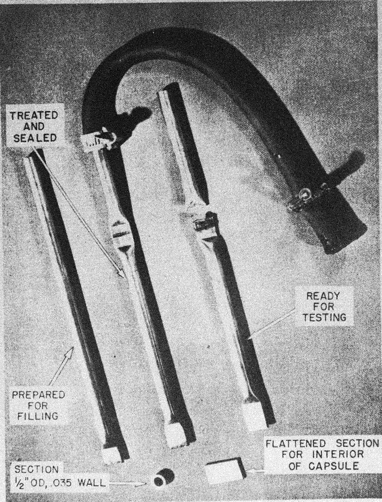  
FIGURE 11.14 STEPS IN CAPSULE PREPARATION   
FOR FLUORIDE CORROSION TESTING

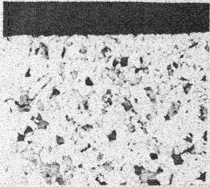  
PARENT METAL

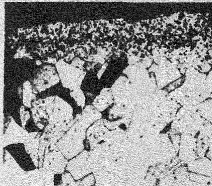  
HEAT TREATED

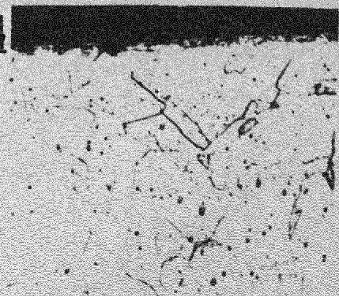  
SURFACE   
FLUORIDE TREATED IOQ HRS.

MONEL-50X

$\%$ INCH = 2 MIL.

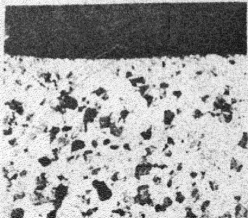  
PARENT METAL

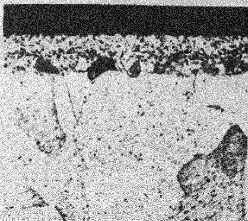  
HEAT TREATED

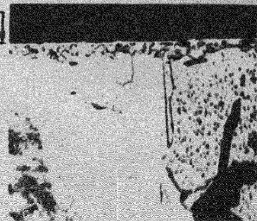  
SURFACE   
FLUORIDE TREATED IOO HRS.

NICKEL A-50X

$\%_{0}$ INCH =2 MIL.

FIGURE II.15 LIQUID

FUEL CORROSION

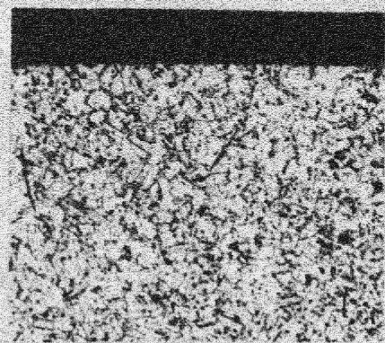  
PARENT METAL

HEAT TREATED   
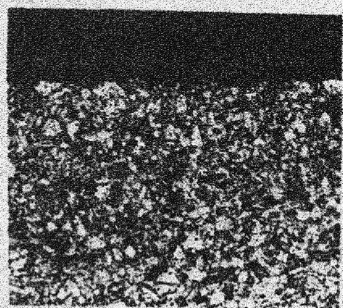  
SURFACE

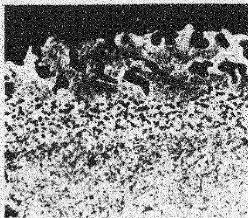  
FLUORIDE TREATED IOO HRS.

INGONEL X-50X

$\frac{1}{10} \mathrm{INCH} = 2 \mathrm{MIL}$ .

PARENT METAL   
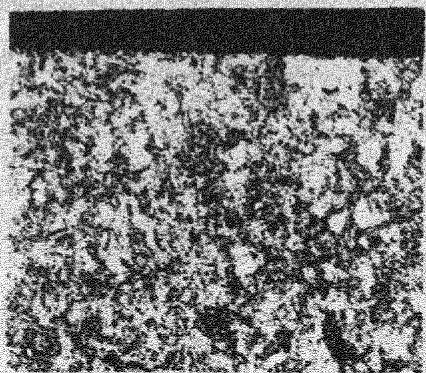  
SURFACE

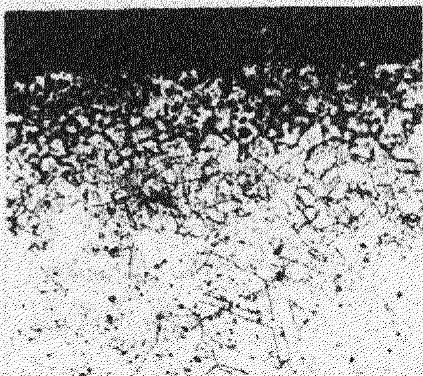  
FLUORIDE TREATED 62 HRS.

INCONEL-50X

$\frac{1}{10} \mathrm{INCH} = 2 \mathrm{MIL}$ .

FIGURE II.16 LIQUID FUEL CORROSION

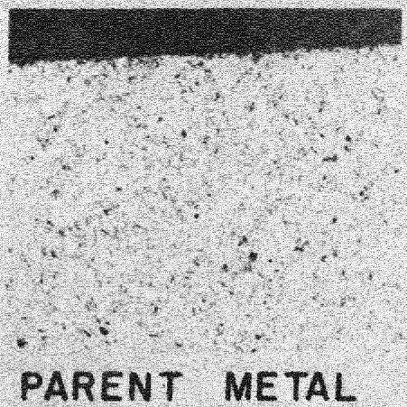

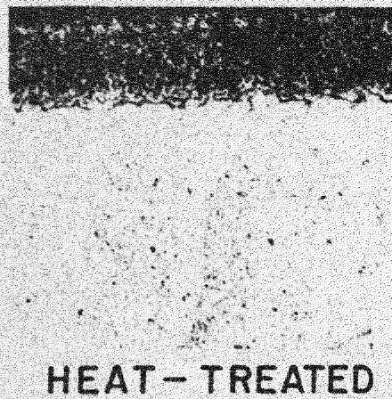  
SURFACE

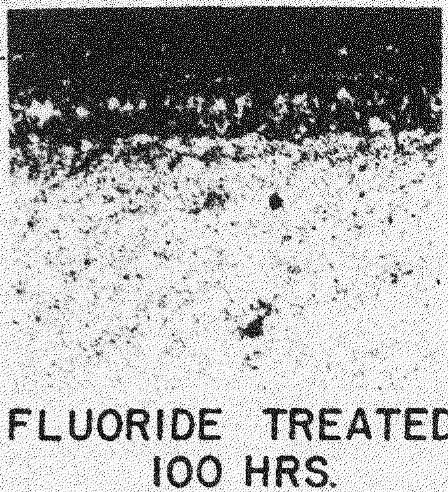  
$\%_{10}$ INCH = 2 MIL.

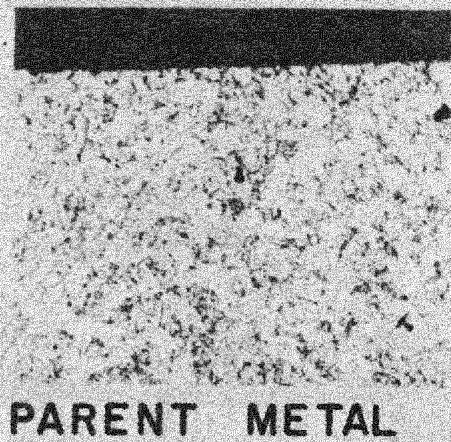  
304 STAINLESS STEEL - 50X

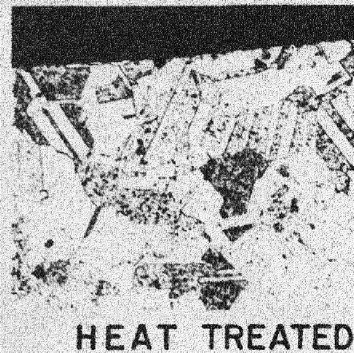

SURFACE

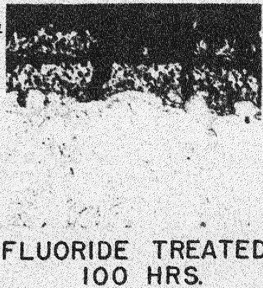  
FIGURE II.17 LIQUID FUEL CORROSION

304 ELC. STAINLESS STEEL - 50X

$\frac{1}{10}$ INCH = 2 MIL.

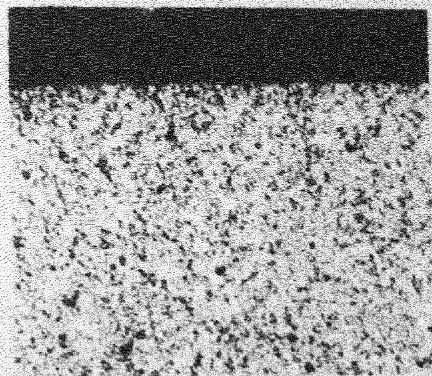  
PARENT METAL

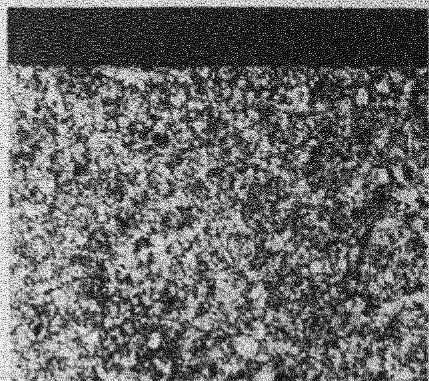  
HEAT TREATED

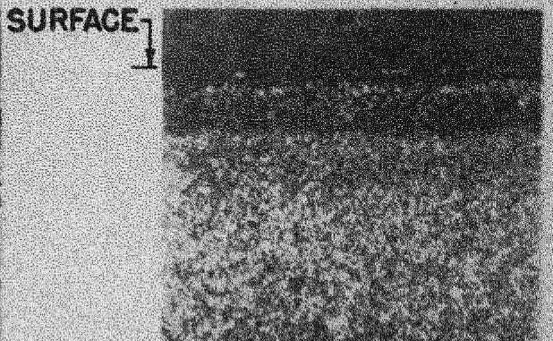  
FLUORIDE TREATED 100 HRS.

347 STAINLESS STEEL - 50X

$\%_{0} \mathrm{INCH} = 2 \mathrm{MIL}$ .

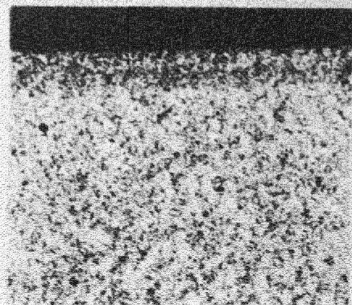  
PARENT METAL

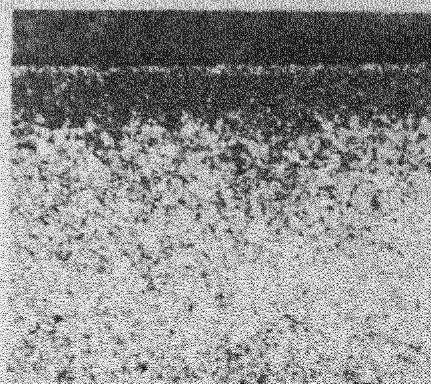  
HEAT TREATED

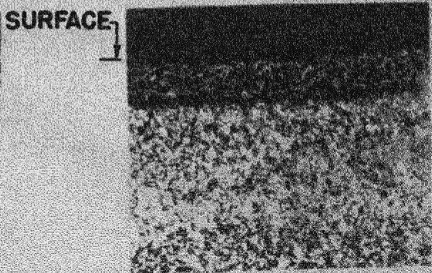  
FLUORIDE TREATED IOO HRS.

321 STAINLESS STEEL - 50 X

$\%_{10}$ INCH = 2 MIL.

FIGURE II.18 LIQUID FUEL CORROSION

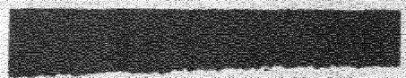

PARENT METAL

446 STAINLESS

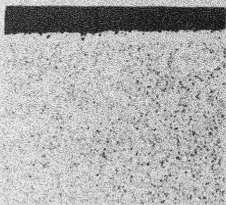

HEAT TREATED

STEEL-50X

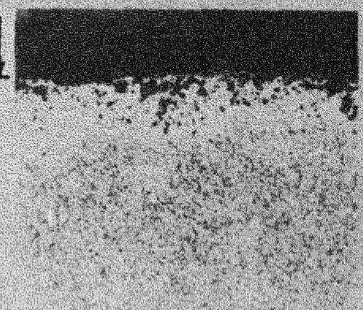  
SURFACE-

FLUORIDE TREATED 62 HRS.

10 INCH = 2MIL.

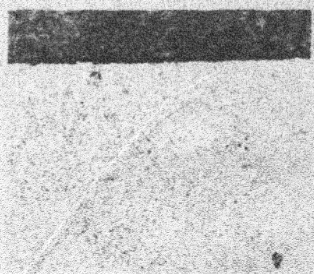

PARENT METAL

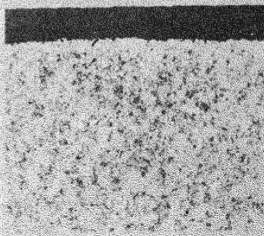

HEAT TREATED

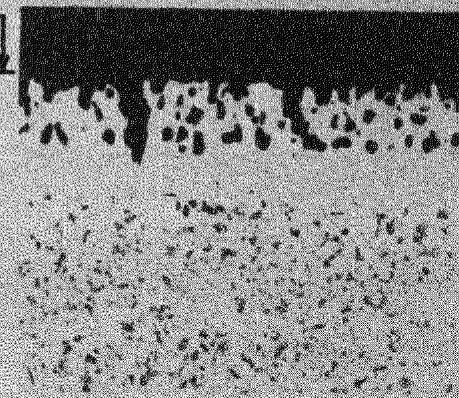  
SURFACE

FLUORIDE TREATED 62 HRS.

430 STAINLESS

STEEL-50X

1/IO INCH = 2 MIL.

FIGURE II.19 LIQUID FUEL CORROSION

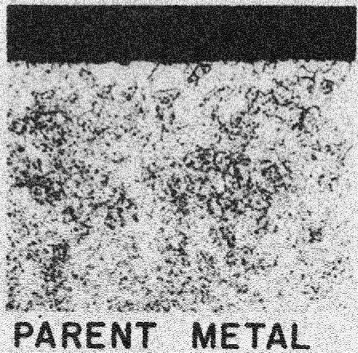

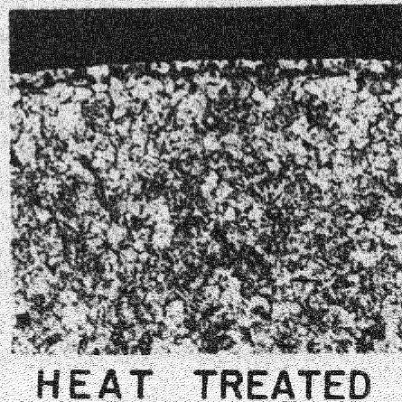  
4IO STAINLESS STEEL-5OX   
SURFACE

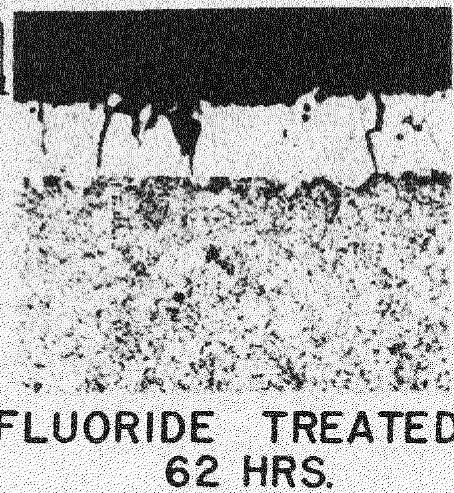  
$\%$ INCH = 2 MIL.

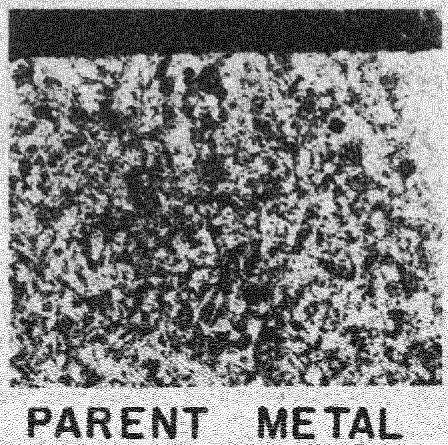

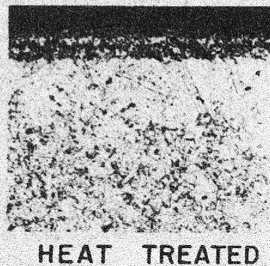  
SURFACE.

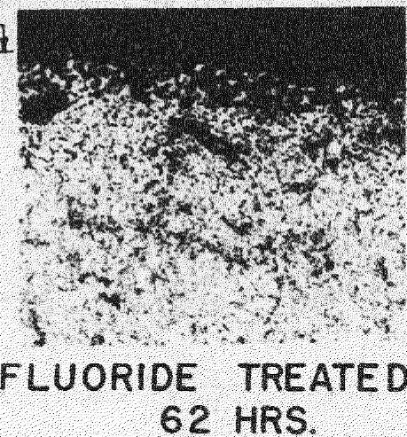  
NICHROME V-50X   
10 INCH=2 MIL.   
FIGURE II.20 LIQUID FUEL CORROSION

£22

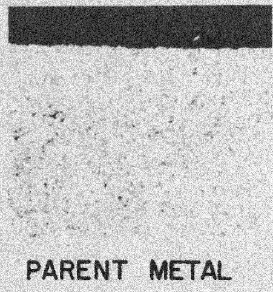

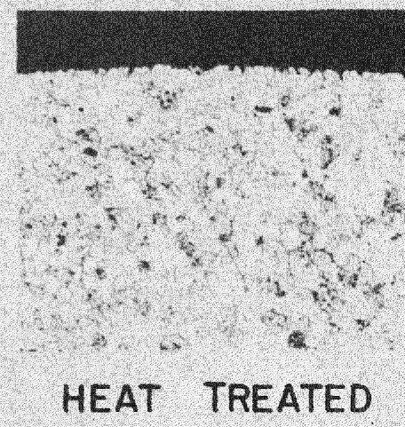  
SURFACE

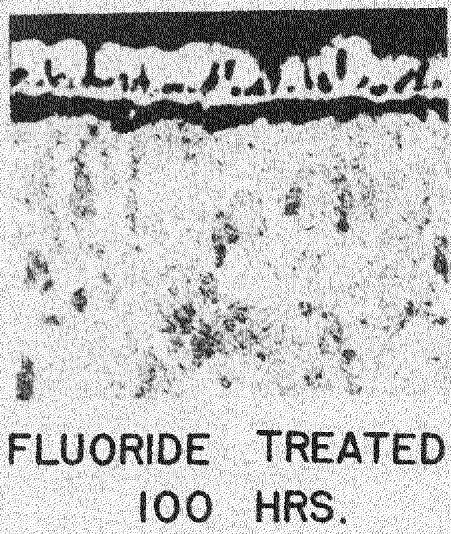

GLOBEIRON - 50X

$\frac{1}{10}$ INCH = 2 MIL.

FIGURE 11.21 LIQUID FUEL CORROSION

TABLE 11.7   

<table><tr><td>MATERIAL</td><td>WEIGHT CHANGE* (mg/dm2/day)</td><td>ESTIMATED AVERAGE PENETRATION* (mils)</td><td>TIME IN FLUORIDES AT 800°C (hr)</td><td>REMARKS***</td></tr><tr><td>Monel</td><td>+19.15</td><td>1</td><td>100</td><td>No apparent attack</td></tr><tr><td>Nickel A</td><td>+22.55</td><td>2 - 3</td><td>100</td><td>No apparent attack</td></tr><tr><td>446 stainless steel</td><td>-453.0</td><td>8 - 9</td><td>62</td><td>Surface scaly, bright in spots</td></tr><tr><td>347 stainless steel</td><td>+1000.0</td><td>5 - 6</td><td>100</td><td>Evident penetration and attack</td></tr><tr><td>321 stainless steel</td><td>-375.0</td><td>6 - 7</td><td>100</td><td>Some attack, partly bright</td></tr><tr><td>410 stainless steel</td><td>-1838.0</td><td>10+</td><td>62</td><td>Carburized and serious attack</td></tr><tr><td>Nichrome V</td><td>-1557.0</td><td>10+</td><td>62</td><td>Scaly and pitted</td></tr><tr><td>Inconel</td><td>+507.0</td><td>8</td><td>62</td><td>Scaly and pitted</td></tr><tr><td>Inconel X</td><td>-19.13</td><td>9 - 10</td><td>100</td><td>Scaly and pitted</td></tr><tr><td>430 stainless steel</td><td>-1500.0</td><td>9 - 10</td><td>62</td><td>Scaly surface, some bright spots</td></tr><tr><td>304 stainless steel</td><td>+577.0</td><td>10</td><td>100</td><td>Scaly surface, evident attack and penetration</td></tr><tr><td>304 (ELC) stainless steel</td><td>+844.0</td><td>10</td><td>100</td><td>Scaly surface, evident attack and penetration</td></tr><tr><td>Globe iron</td><td>-1840.0</td><td>10</td><td>100</td><td>Badly carburized and attacked</td></tr></table>

*Based on samples treated inside capsules.   
**Based on micrographs of capsule segments.   
\*\*\*Visual examination only of samples treated inside capsules.

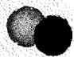

important have not been studied at present. A large number of tests using the more promising of these metals will obviously be required before a clear picture can be obtained.

Present plans call for use of the most promising of these metals, including some of the stainless steels, with the NaF-BeF $_2$ -UF $_4$ eutectic to evaluate the influence of eutectic composition on corrosion resistance of the metals under conditions identical with those described. On completion of that series of tests, it is anticipated that studies of more drastic methods of pretreatment of the eutectic are most likely to yield information of value.

# 12. LIQUID-METAL AND HEAT-TRANSFER RESEARCH

R. N. Lyon and H. F. Poppendiek, Reactor Technology Division

The past quarter has witnessed the procurement of numerous facilities for the determination of fundamental data on heat transfer and physical properties of solids and liquid metals which may be utilized in the design of the aircraft reactor. Some data are already being obtained, although for the most part the equipment is being set up and freed of operational difficulties.

The pieces of apparatus for the determination of the heat-transfer coefficients with liquid sodium, sodium hydroxide, and boiling are in various stages of fabrication.

The electri-

cally heated sodium hydroxide apparatus will be constructed of nickel. The sodium heat-transfer equipment has been operated, but the differential expansion of the pump casing and gears reduces the obtainable pressure of the operating temperature.

Evidence of free convection in the fuel tubes of the reactor has been obtained from an experiment in which the fuel tube was mocked-up by an electrically heated column of mercury. A temperature drop of 1 to $2^{\circ}\mathrm{F}$ was observed between the center and the wall of the tube, where the corresponding $\Delta T$ without convection was calculated to be approximately $13^{\circ}\mathrm{F}$ . Equipment modifications have been started to obtain higher-power-level operation.

Analytical solutions of heat transfer have been obtained for wall temperatures at constant heat flux with slug flow of high-conductivity liquid in some noncircular ducts. These solutions approximate the case for liquid metals in turbulent flow at a moderate Reynolds number. In addition, temperature solutions have been obtained in parallel-plate and circular-tube systems for the case of an isothermal turbulent fluid which suddenly flows over a heated length of wall.

The redesigned Bunsen ice calorimeter has been constructed. Its calibration demonstrates that specific heat values will not be in error more than $5\%$ . At present four of these calorimeters are in operation, and enthalpy determinations are being made type 316 stainless steel, sodium hydroxide, and nickel in the temperature range 300 to $1000^{\circ}\mathrm{C}$ .

The design and fabrication of a steady-state apparatus for the measurement of thermal conductivity of liquids has been completed, and the assembly of the apparatus and auxiliary systems is approximately $90\%$ complete. A transient method for obtaining the thermal conductivity of liquids by measuring thermal diffusivities is being studied. A longitudinal flow apparatus for the measurement of the thermal conductivity of solids is currently in use; however, calibration of this apparatus indicates that values will be in error by about $10\%$ . In order to obtain more accurate thermal conductivity values of solids, a radial flow apparatus has been designed and is currently being fabricated. In addition, methods for determining thermal diffusivities of solids are being studied.

Other activities during the past quarter include the following:

1. The apparatus for the measurement of viscosities is nearing completion. Final assembly should be completed by April, 1951.   
2. An apparatus for the measurement of densities has been designed and is now being fabricated.   
3. The initiative is being taken in setting up an intersite liquid-metal information service in cooperation with the TIS, and editing of a revised Liquid Metal Handbook has been started.   
4.   
5. The electrical conductivity of the eutectic binary salt $\mathbf{U}\mathbf{F}_4$ -NaF was determined from 1112 to $1700^{\circ}\mathbf{F}$ .

# SODIUM HYDROXIDE HEAT-TRANSFER STUDIES

H. W. Hoffman, Reactor Technology Division

The design of the apparatus for the determination of the heat-transfer coefficient for molten sodium hydroxide under forced convection has been completed. The test section is a straight tube of circular cross-section with heat generated electrically in the tube wall and transferred to the fluid through the inner tube surface. On the basis of available corrosion data, the test section and the other components of the system will be constructed of nickel. Electrical heating was chosen for the following reasons:

1. Uniform heat-flux density is obtained.   
2. Heat-flux control is relatively simple.   
3. A reliable check of thermal output as compared with electrical input is possible.

Calculation of the comparative resistances of the electrical paths through the sodium hydroxide flowing in the tube and through the nickel tube wall shows that only $1\%$ of the power generation occurs in the sodium hydroxide.

Surrounding the test section are three concentric thermal radiation shields of stainless steel. The annular space between the innermost shield and the test tube is filled with an insulating cement. Thermocouples are spark welded to the outer surface of the tube. Voltage taps are also attached to the tube wall. Figure 12.1 shows one end of the test section with heater flange and power leads.

The flow rate of the fluid through the system will be measured either by pressure drop through an orifice or by a rotameter. The choice of the exact method will be dictated by the availability of an all-nickel flowrator. Calibration will be effected by means of a weight tank. An all-nickel centrifugal sump pump delivering 20 gpm at 50 psig will be used to pump the molten sodium hydroxide through the system.

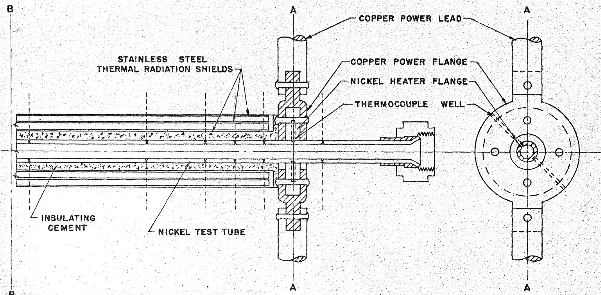  
- - - - - X THERMOCOUPLE AND VOLTAGE TAP LOCATIONS

SYMMETRICAL AROUND B B AXIS. LENGTH TEST SECTION,

CENTER OF FLANGE TO CENTER OF FLANGE, 25 INCHES

SCALE: $\mid \mathbb{I}^{\prime \prime}\equiv \mid \mathbb{I}^{\prime \prime}$

FIGURE 12.1 TEST SECTION FOR THE DETERMINATION OF THE HEAT

TRANSFER COEFFICIENT OF NaOH

Construction of the apparatus is to begin shortly, but it is handicapped by a shortage of nickel.

# BOILING LIQUID METALS

W. S. Farmer, Reactor Technology Division

As reported in the last quarterly report (ORNL-919, p. 186) the boiling-liquid-metal system consists of a vertical 12-in.-diameter tank, through the base of which an interchangeable boiler tube will be passed. The boiler tube is to be heated internally by radiation from a graphite heating element, and the resulting liquid-metal vapors are to be condensed in vertical finned tubes in the boiler header using a high-velocity air stream across the outside of the finned tubes.

Owing to delays in procurement, progress for the past quarter has been largely confined to refinements in the design of the boiling-liquid-metal experiment.

It now appears that a flux of $10^{6}$ Btu/(hr·ft²) is to be about the maximum theoretically obtainable from the boiling-liquid-metal experiment. This limitation on the thermal-flux level results primarily from the decrease in thermal conductivity of the graphite with temperature. Hence the inside surface temperature of the graphite tube will be at approximately the maximum operatable range while the outside surface temperature will be several hundred degrees lower.

Thus far it has been impossible to get anyone to manufacture the small molybdenum boiler tube, and, consequently, tantalum is being considered.

# HEAT-TRANSFER COEFFICIENT OF LIQUID SODIUM

W. B. Harrison, Reactor Technology Division

The system described in the last quarterly progress report (ORNL-919, p. 182) for obtaining the highest values of heat-transfer coefficients with molten sodium has been completed and preliminary observations have been made. Briefly, it is a continuous recycle of sodium through a 1/32-in.-diameter hole in the center of a circular copper disk. The disk is cooled by passing water through

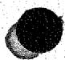

a tube soldered around the periphery. Rate of heat flow and the heat-transfer coefficient are computed from measurements of the temperature gradient set up in the disk:

Instrumentation consists of:

1. Brown electronic temperature indicator. A 12-point indicator is used with iron-constantan thermocouples located at critical spots in the circuit. A survey of these 12 temperatures reveals the nature of thermal conditions throughout the circuit.   
2. Rubicon potentiometer, type B. This instrument is used for the precise measurements required in the heat-transfer analysis, i.e., gradient in the disk, inlet and outlet sodium temperatures, and inlet and outlet water temperatures. Readings can be made to less than half a microvolt.   
3. General Electric galvanometer. The sensitivity of the galvanometer used with the potentiometer mentioned above is about $2\mu \mathrm{v}$ per scale division. With the copper-constantan thermocouples used in the test section, this permits readings to less than $0.1^{\circ}\mathbf{F}$ .   
4. Timer and relay box. For flow measurements, two probes are located at different levels in a catch tank. The timer is actuated when contact is made with the lowest probe and disconnected when contact is made with the highest probe.   
5. Variac transformers. All heater circuits are controlled by variable transformers. Heaters around the sump tank are conventional strip heaters. Nichrome wire covered with fiberglass sleaving was wound around the piping.

The instrumentation has been checked and appears to be entirely adequate. It was necessary to develop a technique for soldering No. 30 thermocouples into the copper disk, and this no longer represents a problem.

Operative difficulties are centered chiefly in the pump, which must produce 200 psi with a 1-gpm sodium stream at $250^{\circ}\mathrm{F}$ . A gear pump was selected for this service. The pump installed at present has the disadvantage that the housing expands more than the gears in being heated to the operating temperatures. This increases the clearance and allows considerable slip, drastically reducing the attainable pressure. Another pump is on hand for trial in the event that subsequent tests prove the present pump to be unsatisfactory. In case neither pump fulfills the requirements of the experiment, provision is being made for displacement of the sodium stream by gas pressure.

It is expected that coefficients of over 200,000 Btu/(hr·ft²·°F) will be attained in a 1/16-in.-thick disk, and, by varying the disk thickness, a study of entrance effects may be made.

# STUDY OF FREE CONVECTION IN LIQUID-FUEL PINS

F. E. Lynch and P. C. Zmola, Reactor Technology Division

An investigation has been started to determine the extent to which natural convection will contribute to the transfer of heat from a liquid-fuel pin in which heat is being generated. Preliminary calculations indicate a temperature difference without convection of approximately $1000^{\circ}\mathrm{F}$ from the center to the inside wall of a 0.080 in.-I.D. fuel pin under the power conditions contemplated. The purpose of this study is: (1) to determine whether free convection exists in tubes 0.080 to 0.250 in. I.D. under conditions of internal heat generation, and (2) if convection does exist, to determine the extent to which it will reduce the fuel-pin center temperature, i.e., contribute to heat transfer, for various values of the parameters.

The experimental system chosen to simulate conditions within the reactor consists of a quartz tube in which a liquid metal is electrically resistance-heated. Thermocouples, small in comparison to the inside diameter of the tube, are located in the center and at the inside wall of the tube. For a given heat generation, the measured temperature difference can be compared with the value calculated on the basis of pure conduction. Results of preliminary experiments using mercury in a 0.24-in. (6-mm) I.D. tube indicate that a convection pattern is established for temperature differences of the order of 1 or $2^{\circ}\mathrm{F}$ where the corresponding $\Delta T$ without convection is calculated to be approximately $13^{\circ}\mathrm{F}$ . These experiments were limited to a power density of 70 watts/cc, corresponding to a bulk temperature of $280^{\circ}\mathrm{F}$ , because the mercury began to boil at the electrodes.

# HEAT TRANSFER TO NONCIRCULAR DUCTS

H. C. Claiborne, Reactor Technology Division

A draft of the first report (ORNL-985) on heat transfer to noncircular ducts has been prepared and is now in the final stages of editing.

Since the temperature distribution along the walls of noncircular ducts for the case of constant heat flux are of general interest, the accompanying figures from the forthcoming report show the wall temperatures in terms of a generalized parameter for a square velocity wave (slug flow). Figures 12.2, 12.3, and 12.4 are rectangular, equilateral triangular, and right triangular ducts, respectively. These solutions approximate the case for liquid metals in turbulent flow at a moderate Reynolds number.

Attempts are being made to solve the heat-transfer equation for more complex systems by analytical methods. If the analytical methods are un-fruitful, consideration will be given to numerical methods for particular cases that are considered important.

# THEORETICAL THERMAL ENTRANCE AND TURBULENT FLOW ANALYSES

H. F. Poppendiek, Reactor Technology Division

Analytical solutions for temperature distributions have been derived for parallel-plate and pipe-duct systems in which (1) the fluid velocity is characterized by a turbulent velocity profile (a power-law relation) and a high thermal molecular diffusivity compared to the thermal eddy diffusivity, (2) the initial fluid and wall temperatures are uniform, and (3) the fluid suddenly flows over surfaces which possess a temperature distribution which varies linearly with duct length. Local heat flow and convective conductance solutions have also been developed.

A new turbulent flow velocity expression for an annulus has been derived with the hope of generalizing experimental annulus velocity data. The ideal system used in the analytical study consists of two laminar sublayers (contiguous to the outer and inner duct walls) and a turbulent core. The velocity structure within the laminar sublayers and their thicknesses are determined in terms of the wall shear and physical property data as in the case of a circular

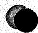

UNCLASSIFIED

X-10 DWG.NO.10589

$$
\frac {t _ {w} - t _ {c}}{q _ {f / K}}
$$

0.120   
0.100   
0.080

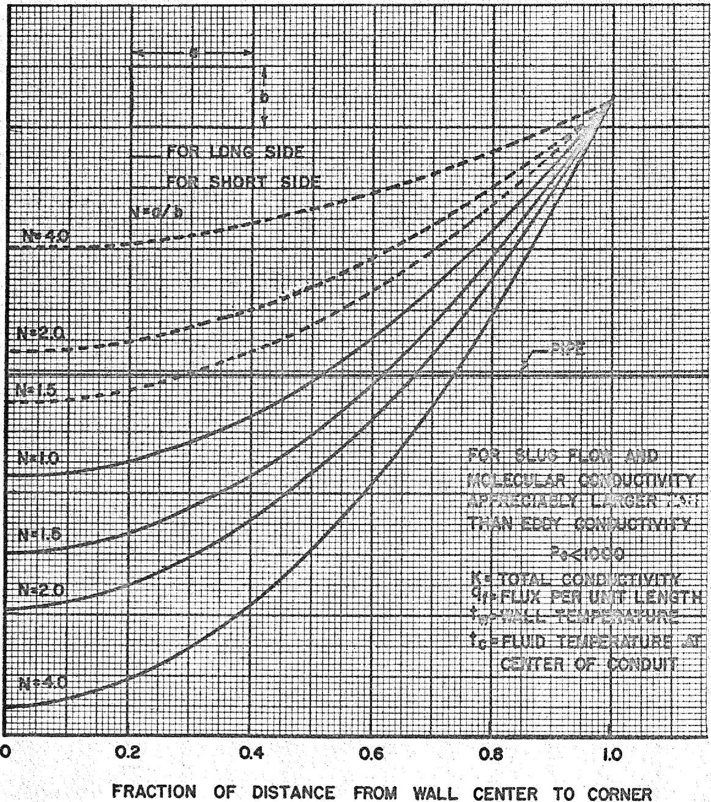  
FIGURE 12.2 TEMPERATURE DISTRIBUTION ALONG WALLS OF RECTANGULAR CONDUIT FOR CONSTANT WALL FLUX HEATING.

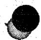

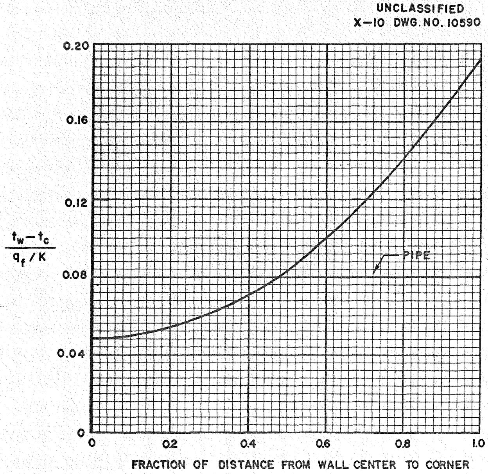  
FIGURE 12.3

TEMPERATURE DISTRIBUTION ALONG WALLS OF EQUILATERAL TRIANGULAR DUCT FOR CONSTANT WALL FLUX HEATING.

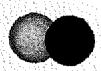  
t-w-tc qf/K

UNCLASSIFIED

X-10 DWG.NO.10591

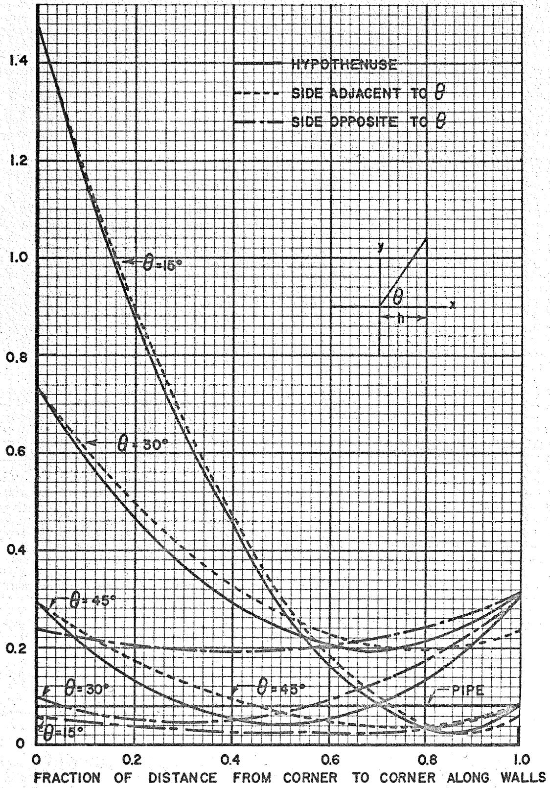  
FIGURE 12.4

TEMPERATURE DISTRIBUTION ALONG

WALLS OF RIGHT TRIANGULAR DUCT

FOR CONSTANT WALL FLUX HEATING.

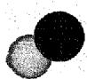

pipe. The eddy diffusivity profile within the turbulent core is postulated to be directly proportional to the velocity profile itself. The eddy diffusivity is thus a maximum where the velocity is a maximum; from a physical standpoint, this is a desirable characteristic. A momentum transfer analysis based on these postulates yields a velocity expression with an unknown turbulence constant (similar to a Karman constant) which is to be evaluated from experimental data. This velocity expression indicates that the radius of maximum velocity is (1) identical to the corresponding expression for laminar flow and (2) only a function of the inner and outer wall radii and not a function of Reynolds' modulus; these two observations were in good agreement with the data of Rothfus, Monrad, and Senecal. $^{(1)}$

# PHYSICAL PROPERTIES

A.R.Frithsen,USAF

The physical properties laboratory was established to measure the physical properties of liquid metals, liquid salts, liquid caustics, and structural and other materials which may be utilized in the design of the aircraft reactor. The facilities of the laboratory at present include four Bunsen ice calorimeters, a steady-state apparatus for the measurement of the thermal conductivity of liquids, a longitudinal-flow apparatus to determine the thermal conductivity of solids, a falling-ball viscometer, and an apparatus for the measurement of densities. In addition to these facilities, all of which are or soon will be in operation, several other pieces of apparatus which would provide other information, such as thermal diffusivities, or alternate methods for measuring the above properties are being considered. These existing and proposed facilities and the information obtainable therewith are discussed.

Heat Capacity (R. F. Redmond and J. Lones, Reactor Technology Division). The problem of determining heat capacities has progressed to the stage that the method has been selected; the apparatus has been designed, constructed, and given a preliminary check for accuracy; and the investigation of some materials has been initiated.

The calorimeter chosen for measuring the necessary enthalpies was the Bunsen ice calorimeter. The enthalpy measurements made at various temperatures make it possible to calculate the heat capacity of the material being

investigated as a function of temperature. In designing and constructing the apparatus attention was given to making the calorimeter simple but capable of the desired accuracy (5%). The calorimeter is shown in Fig. 12.5 and the assembled apparatus in Fig. 12.6. At present four such instruments are in use.

By checking the enthalpy data available for beryllium with data obtained experimentally using the calorimeter, the accuracy of the apparatus could be gauged. It was found that the enthalpy values checked within $4\%$ . A more thorough comparison using synthetic sapphire will permit corrections to be applied to the results thus reducing the probable error in the enthalpy values.

Currently, enthalpy determinations are being run on sodium hydroxide, 316 stainless steel, and nickel. Determinations for zirconium are to be started soon. It has been estimated that the time necessary to determine the temperature dependence of the heat capacity for a given material will be nearly one month. With the four calorimeters available, the heat capacities of four materials can be determined for each month of operation.

Thermal Conductivity of Liquids (L. Basel, M. Tobias, and S. K. Claiborne, Reactor Technology Division). Steady-State Method. The Deem type of apparatus for measuring thermal conductivities of liquids was described briefly in the last quarterly report (ORNL-919, p. 196). Since that time the design and fabrication of the various components of such an apparatus have been completed, and the assembly of the apparatus and auxiliary systems is approximately $90\%$ complete. An assembly drawing of the main apparatus without auxiliary electrical and piping systems is presented in Fig. 12.7. A more detailed description of the apparatus and method will be presented in a forthcoming report. Some difficulty was encountered in arc-welding thermocouples to the apparatus, but this trouble has been eliminated. At present, these thermocouples are being calibrated. On completion of the apparatus assembly and after calibration of the thermocouples, the apparatus will be checked out with sodium as the specimen liquid since the existing data for thermal conductivity of sodium are in somewhat good agreement.

Transient Method. Some thought has been given to a transient method for determining thermal diffusivities of liquids. It has been decided to attack the convection problem by using suitable convection shields rather than by attempting to maintain perfectly uniform longitudinal heat flow. A schematic diagram of the proposed apparatus is presented in Fig. 12.8. It consists

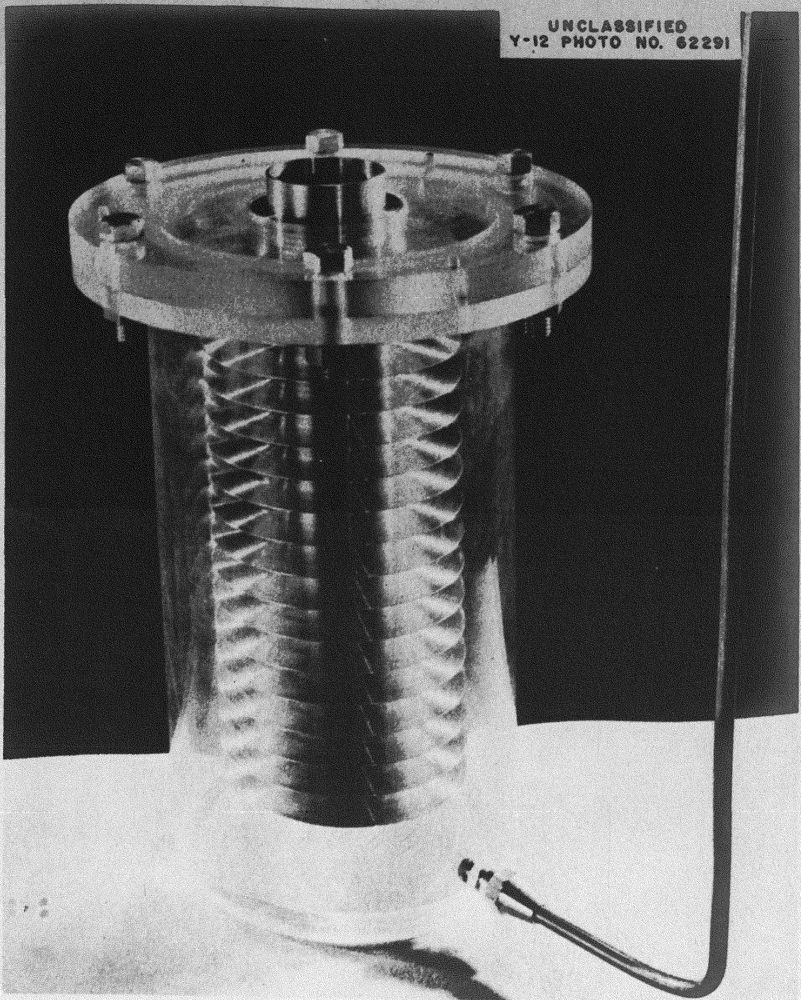  
FIGURE 12.5 HEAT EXCHANGE SECTION OF ICE CALORIMETER

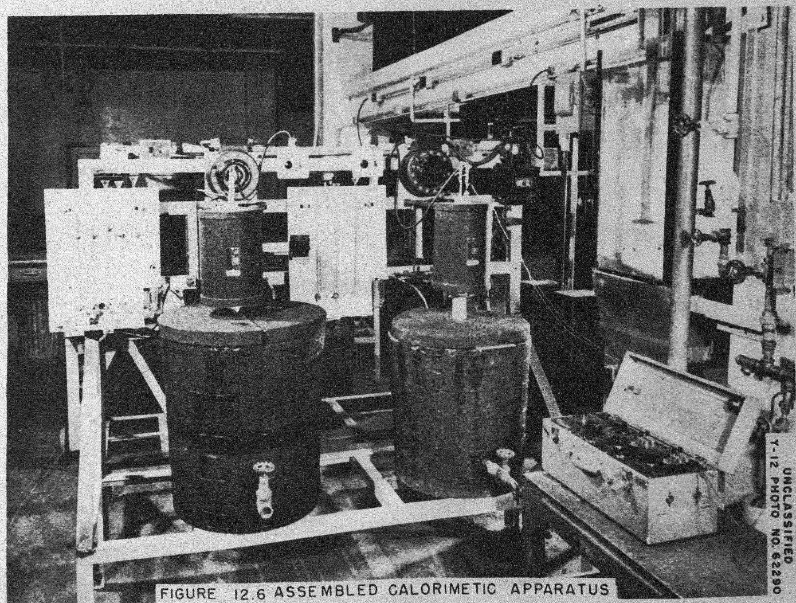

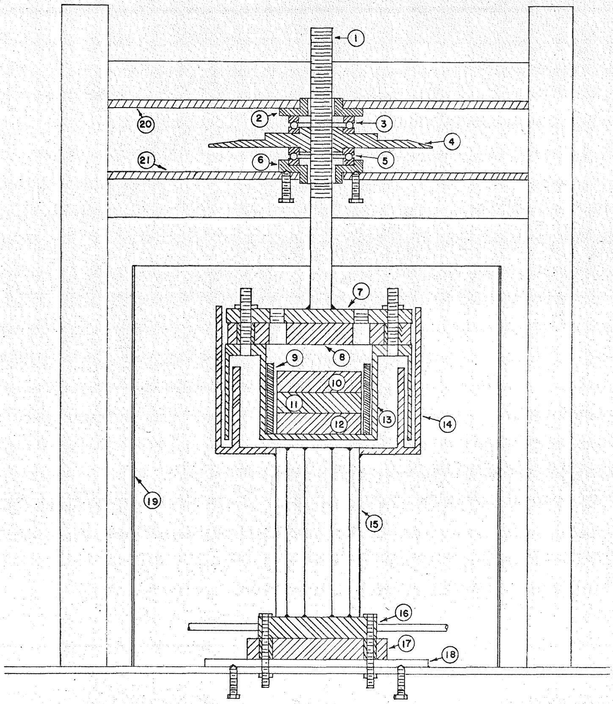  
NOTE: NUMBERS REFER TO DETAIL SKETCHES   
FIGURE 12.7 THERMAL CONDUCTIVITY APPARATUS   
STEADY STATE APPARATUS FOR LIQUIDS

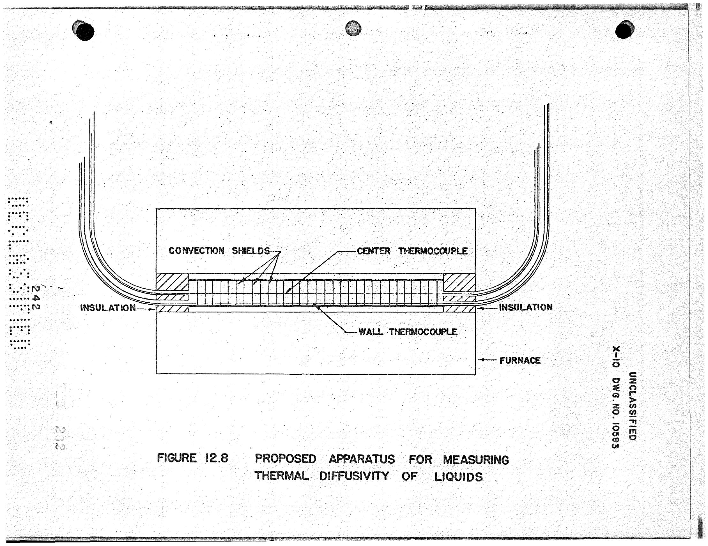

essentially of a long cylindrical tube, with thin disks spaced about $\frac{1}{2}$ in apart along the length of the tube. One thermocouple will be located at the axis of the cylinder, the other near the wall. It has been decided to make no attempt to maintain either constant wall temperature or constant flux at the boundary, but rather to measure the wall temperature as a function of time. The thermal diffusivity can be obtained using the solution for the infinite cylinder, surface at $\phi(T)$ , initial temperature constant.(2)

Design of apparatus of the type described above will soon be started.

Thermal Conductivity of Solids (M. Tobias, Reactor Technology Division). Longitudinal Flow Method. It is desired to have available apparatus capable of measuring the thermal conductivities of solids to accuracies greater than $\pm 10\%$ . A partial answer to this need seems to have been found in the apparatus of Kitzes and Hullings which has been modified for operation at higher temperatures. Preliminary tests are being made to evaluate the maximum error to be expected from the equipment, using substances of known thermal conductivity such as Armco iron, copper, and aluminum.

Briefly, the apparatus is constructed as follows (see Fig. 12.9): The specimen of the material under investigation is in the form of a cylinder $5\mathrm{cm}$ in length and $2\mathrm{cm}$ in diameter. It is placed between a heat source and a heat sink which are impressed upon its two flat surfaces. The heat source is a copper block wound with nichrome wire embedded in Sauereisen cement. The copper block is a cylinder slightly larger in diameter than the specimen and has a small shoulder in the contact face enabling close fitting to the specimen. The heat sink is a water-cooled copper block likewise having a shoulder for seating the specimen firmly. The assembly of the heater, specimen, and cooler is mounted inside a containing cylinder about 5 in. in diameter. The cooler is mounted on a lava block, and the three components are pressed together by a spring whose load is communicated to the top of the heater through a lava disk.

After assembly in the containing cylinder, the heater, specimen, and cooler are buried in Sil-O-Cel powder. Longitudinal heat flow is further ensured by means of an electric guard heater placed on the outside of the containing cylinder. Two thermocouples are placed in the Sil-O-Cel at the

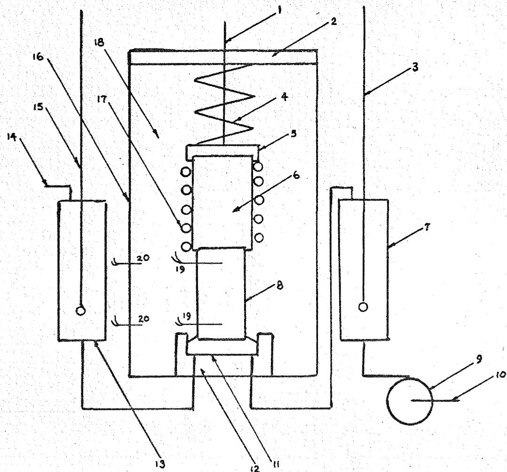  
FIGURE 12.9 LONGITUDINAL FLOW THERMAL CONDUCTIVITY APPARATUS FOR SOLIDS

1-Guide Screw for Spring   
2-Spring Retainer   
3-Inlet Thermometer   
4-Retainer Spring   
5-Lava Block   
6-Copper Block   
7-Insulated Inlet Thermometer Well   
8-Sample   
9-Centrifugal Pump   
10-Inlet from Const. Temp. Bath

11-Copper Water cooler   
12-Lava Block   
13-Outlet Thermometer Well   
14-Return Line to Const. Temp. Bath   
15-Outlet Thermometer   
16-Brass Container (Heater not shown)   
17-Nichrome Heater Winding   
18-Sil-O-Cel Insulation   
19-Specimen Thermocouples   
20-Guard Heater Couples

same level as corresponding thermocouples in the sample, and the power to the guard heater is adjusted so as to make the temperatures in the Sil-O-Cel equal to those in the sample.

The thermal conductivity of the specimen is given by the equation

$$
k = Q L / \Delta T A
$$

where $k$ is the thermal conductivity. $\Delta T$ is the temperature difference measured by the two thermocouples in the specimen, $A$ is the area of the circular cross-section of the specimen, $L$ is the specimen length, and $Q$ is the heat flow from the heater through the sample into the water cooler. $Q$ is determined by measuring the flow rate and rise in temperature of the cooling water. The coolant is supplied from a constant temperature bath by means of a small "Eastern" centrifugal pump through insulated ½-in. copper tubing. The rate of flow is measured by weighing a sample of water over a known time interval as it returns to the bath. The rise in temperature is measured by calibrated mercury-in-glass thermometers placed in large wells as close as possible to the inlet and outlet of the copper cooler.

The power supply for the heating elements and the pump is a-c and is manually adjusted by means of variacs. The progress of the test is recorded on a Leeds and Northrup Micromax multipoint instrument, while a Rubicon portable precision potentiometer is used to measure sample thermocouple emf's when a steady state has been reached. Chromel-alumel thermocouples are used throughout. Sample thermocouples are installed generally by boring small, precisely spaced holes in the sample and arcing them into place by means of a condenser-discharge device, or, in the case of nonmetallic samples, by simply burying them in the holes with cement. So far, no single method of thermocouple installation has shown marked superiority, but satisfactory results have been achieved without special effort.

The apparatus measured the conductivities of 2S aluminum and Armco iron with an average error of only $5\%$ over the temperature range 100 to $400^{\circ}\mathrm{C}$ . However, the temperature drops in the sample were large, particularly at higher temperatures. Thus, when the average temperature in a sample of Armco iron was about $590^{\circ}\mathrm{F}$ , the temperature difference between the two thermocouples was $268^{\circ}\mathrm{F}$ . For substances whose temperature-conductivity variation is markedly nonlinear, serious errors may be introduced.

Radial Flow Method. An apparatus has been designed in which the flow of heat is to be from the center of a hollow cylinder outward. The apparatus is a modification of that used elsewhere.(3) Construction is being initiated. It is hoped that the difficulties caused by the large temperature gradients mentioned above may be eliminated. Details of the design will be given in a future report.

Viscosity of Liquids (S. I. Kaplan, Reactor Technology Division). The falling-ball apparatus for measurement of viscosity of heat-transfer liquids at high temperatures which was described in the last quarterly report (ORNL-919, p. 198) is nearing completion. The furnace and power supply have been mounted, and construction of the viscosity tube components, including the magnetic valve, is finished. Final assembly, including the detector mechanism, is expected to start during the next month.

The design of a melt tank which will permit filtering of liquids and charging into the viscometer and other physical properties units as required has been completed and is now being fabricated.

For the testing of liquids having specific gravity greater than 8, $\frac{1}{4}$ -in-bearing balls plugged with tantalum will be used. The dropping mechanism, consisting of a solid stainless steel cone attached to a movable rod, will be removed to accommodate these larger balls. A supply of these balls is being made up for initial calibration of the unit using molten bismuth.

Brookfield Engineering Laboratories, of Stoughton, Mass., has been consulted regarding the construction of a rotational viscometer for liquids, and preliminary investigations indicate that such a unit may prove feasible.

Density of Liquids (S. I. Kaplan, Reactor Technology Division). An apparatus for the measurement of densities has been designed and is now being fabricated. The design of this apparatus is based on application of the Archimedes principle, i.e., weighing a suspended bob in the liquid (see Fig. 12.10). An analytical balance has been adapted for this purpose. This unit will be charged from the same melt tank used for the viscometer.

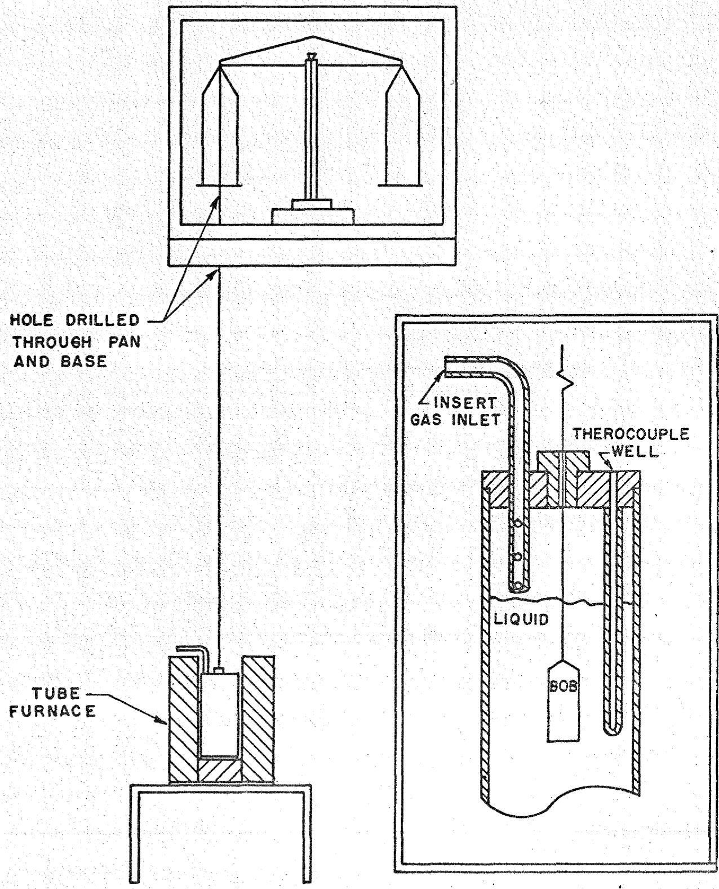  
FIGURE 12.10 DENSITY APPARATUS

# MOLTEN FLUORIDE ELECTRICAL-CONDUCTIVITY MEASUREMENTS

F. J. Sheehan, ANP Division

The electrical conductivity of the eutectic binary salt 26 mole $\%$ UF $_4$ -74 mole $\%$ NaF was determined from 1112 to $1700^{\circ}\mathrm{F}$ . The conductivity figures obtained with direct current were checked with 60-cycle alternating current. No significant difference was noted. The values obtained are presented in a plot of resistivity vs. temperature (Fig. 12.13). These values are estimated to be accurate to only about $20\%$ and apply only to the particular mixture which was not vacuum melted. There was considerable corrosion of the quartz tube in which the fluoride was contained.

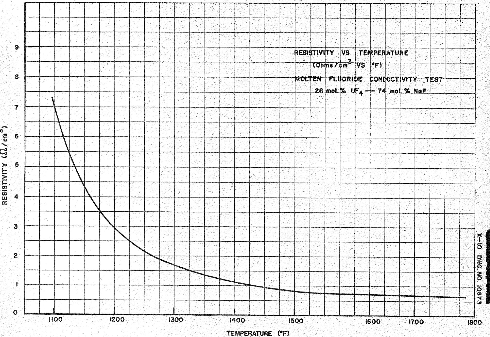  
FIGURE 12.13 CONDUCTIVITY OF THE NaF—UF4 FLUORIDE EUTECTIC

# 13. COMPONENTS OF LIQUID-METAL SYSTEMS

H. W. Savage, ANP Division

The development of pumps, heat exchangers, and other accessory plumbing is being undertaken to assure the existence of a satisfactory liquid-metal system for operation with the ARE. In addition, many of these research data which are not available are necessary to the satisfactory design of any liquid-metal reactor. Accordingly, the Experimental Engineering Group of the ANP Division is engaged in a program of testing and developing the various components of liquid-metal systems required by a power-producing reactor. This program includes research on pumps, bearings, seals, flowmeters, insulation, flanges, heat exchangers, and related matters, which are reported here.

# PUMPS

W. G. Cobb, ANP Division

The variety of available pumps permits considerable freedom in the choice of a pump for any particular application. For aircraft use an axial-flow pump appears to be preferred because of the large pumping volume and small pump size and weight requirement but, a centrifugal pump is being considered for the ARE. Both of these types of pumps, electromagnetic pumps, and others, will be used on various experimental fluid circuits.

Electromagnetic Pump for Figure-Eight Loops. The electromagnetic pump designed and built for use in the figure-eight loops (see Sec. 11 for a discussion of the operation of these loops) has thus far been used exclusively for operation of the loop. Neither a calibrated flowmeter nor pressure taps have been developed for accurate determination of operating characteristics. Initial operation showed that the length of the electrode between the wall of the cell and the joint with the copper secondary connector must be held to an absolute minimum to prevent excessive heating with resultant loosening of the clamped joint. The copper-to-stainless steel weld joint previously reported was not entirely satisfactory owing to thermal cracking of the cell wall. Substitution of the nickel electrode eliminated the weld problem but introduced a higher resistance.

Another difficulty encountered in the operation of the electromagnetic pump is the build-up of sodium, which deposits in the inlet section of the pump cell (Fig. 13.1). One effect of this deposit appears to be nonuniform fluid flow. This effect is not serious and possibly this build-up of sodium in the pump cell must be tolerated since other groups have reported similar unexplained difficulties.

An orifice plate with sodium manometer attached has been fabricated and calibrated with water, and a pressure tap plate for insertion between flanges has been prepared. As soon as operating experience in a small forced-circulation loop has been acquired with these devices, they will be inserted in the pump connections to study its operating characteristics.

Centrifugal Pump for Figure-Eight Loops. The vertical-shaft sump type centrifugal pump (Fig. 13.2) is under fabrication. This assembly utilizes a packed gas seal with liquid-level maintenance by automatic control of gas feed, Solenoid valves operated by a system of probes regulate the gas feed. The seal is cooled internally by a coolant such as kerosene circulated through the squirt-tube and hollow-shaft arrangement. The seal housing is also cooled by circulation of the coolant through the passages around it. Make-up gas to provide for the seal leakage is fed into the labyrinth below the seal in order that the gas leaking through the seal will carry a minimum of sodium vapor.

This pump has a design capacity suitable for operation in the figure-eight loops in place of the electromagnetic pump now being utilized. It will be driven by an adjustable-speed motor and put through a series of water tests before being used on liquid metals. The use of a cooled mechanical seal has also been contemplated, and a means for its insertion with comparative ease has been provided for.

Centrifugal Pump for ARE. A centrifugal pump of similar arrangement is also being studied for use in the ARE; two pumps operating in parallel are contemplated. By mounting the pumps at the top of the liquid-metal circulation system with flow vertically downward, the shaft seal will be subjected to the minimum system pressure, and the pump liquid-level control can be utilized as the system-level control as well.

The rating of such pumps for a typical design of $350^{\circ}\mathrm{F}$ across the reactor would be 120 gpm each at 15 psi developed head of sodium at $1100^{\circ}\mathrm{F}$ . If driven at a speed of 2300 rpm, which gives a specific speed of 1500, the impeller

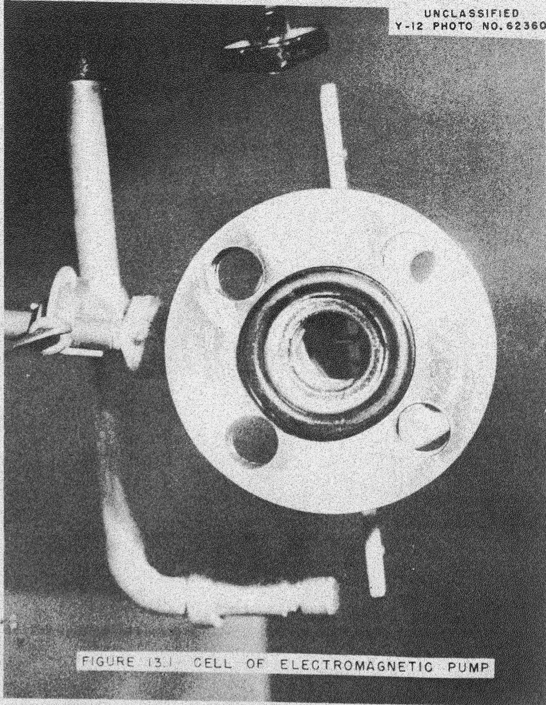

UNCLASSIFIED

Y-12 DWG. NO. DSK-15059

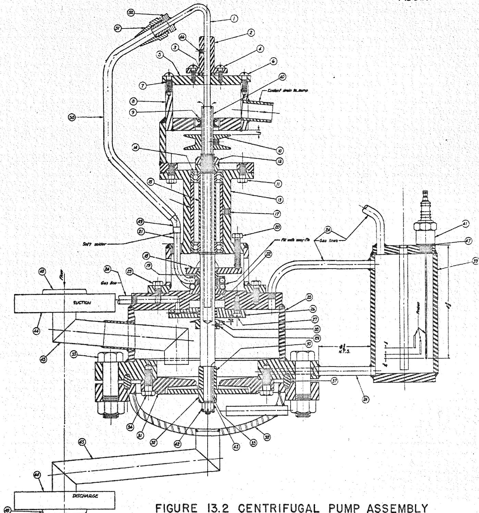

would be approximately 5.3 in. in diameter. The power required would be 1.5 hp per pump with an assumed efficiency of $70\%$ . A more conservative design for operation at approximately 1750 rpm and using an impeller 6-13/16 in. in diameter gives a specific speed of 1280 and approximately as good an efficiency.

A-c and d-c electromagnetic pumps are being studied as possible alternates to mechanical pumps for the ARE operation. However, it appears at present that mechanical pumps for this application will require less development work, besides being more compact, flexible, and efficient and possibly more dependable.

Pump for 200-Megawatt Aircraft Reactor. Calculations on large pumps for a 200-megawatt reactor indicate that centrifugal pumps would be too bulky for this application and that either axial- or mixed-flow types (with specific speed parameter of 4000 to 6000) would be more satisfactory. One such pump-design study involved six axial-flow pumps, each handling 2677 gpm, each developing 80 psia, and each requiring 139 hp (total of 834 hp at 90% efficiency). Each rotor was to be 6 in. in diameter and run at 6800 rpm, with a specific speed of 6000. This design was very compact, but it required a high speed of revolution and a large pump intake pressure of about 56 psia to suppress cavitation. A more conservative design, for 2677 gpm at 40 psia with a mixed-flow rotor of 4000 specific speed, required a 9.4-in. rotor operating at 2706 rpm, with intake pressure of 16 psia. A fuller set of data will appear in a forthcoming report.

Canned Rotor Pump (A. R. Frithsen and M. Richardson, Reactor Technology Division). A seamless pumping system which utilizes hydrodynamic journal bearings was designed, fabricated, and tested. This pumping system consists of two "canned" rotors with a pump sandwiched between them. The "canned" rotors are each part of a $\frac{1}{2}$ -hp motor modified so that machined "cans" having a wall thickness of about 10 mils fit snugly inside the motor stators. The motor armatures were machined so as to fit inside the "cans" with a clearance of 25 mils, thus having the same clearance between "can" wall and armature as existed before modification in the air gap.

The pump was made by modifying two Aurora turbine type pumps so that they could be flanged together in such a way that their suction and discharges

*Earlier specification data for the ANP pump are given in Sec. 1.

would oppose each other. This was necessary in order to keep radial loads to a minimum.

Figure 13.3 is a schematic drawing showing the relation of the various components in the pumping system to each other and the manner by which fluid is recirculated through the "canned" motors. This recirculation of fluid is necessary since the operation of the pump is dependent on the shaft "floating" in the fluid. When in operation, the armatures function as journal bearings and the "cans" act as bearing sleeves. At the same time, the hydrodynamic forces acting on the sides of the impellers make the impellers function as thrust bearings. Forces which tend to move the armature out of the center of its magnetic field are at least partially counteracted by the magnetic forces. This pumping system thus has a combination of hydrodynamic and magnetic thrust bearings.

Although no test runs were of a duration longer than 3 hr, the total operating time was about 40 hr with no noticeable wear on any part except on the lower face of the bottom impeller. This can be explained by the fact that, when not in operation, the shaft rests on the bottom impeller. The new hydraulic bearings described in the previous quarterly report (ORNL-919, p. 179) were tested; however, results were not entirely satisfactory because clearances between the shaft and the bearing could not be maintained, which resulted in seizing. The bearings have been redesigned to eliminate this trouble, and new bearings are now being fabricated.

Turbine Pump. A study is being made and experiments are to be initiated to determine design parameters for turbine pumps so that a high-head low-flow pressure source may be available without the use of excessive speeds or sizes.

Pump Seals. A theoretical study of mechanical seals is in progress to aid in choosing seal materials and designs. It appears that fluid-lubricated seals depend mainly on capillary action of the liquid in the seal to maintain a lubricating film when neither material in the seal possesses lubricating qualitites, and they thus require a very fine finish and very flat sealing surfaces, within a few microinches of true flatness. Gas seals, on the other hand, rely on "boundary" lubrication of the seal surfaces by oxide films or adsorbed gas films, requiring the use of graphite or other material having a low boundary friction coefficient and high melting point as one of the sealing surfaces.

UNCLASSIFIED

X-10 DWG. NO. 10776

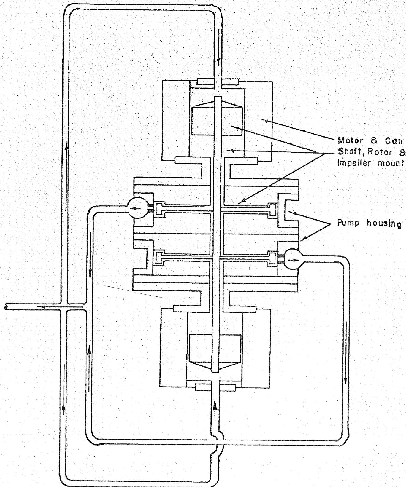  
FIGURE 13.3 SEALLESS PUMPING SYSTEM   
(UTILIZING HYDRODYNAMIC BEARINGS)

A sodium or Na-K lubricated mechanical seal is also another possibility being given consideration.

An alternate seal design under consideration uses an oil seal around the shaft, with the latter entering the pump case from below. A small centrifugal separator rotor is mounted between the seal and the pump rotor. A separation surface is maintained between the sodium and a small charge of oil above the seal by the centrifuging action of this rotor. An oil cooling jacket maintains a temperature of approximately $250^{\circ}\mathrm{F}$ in the vicinity of the oil seal and the centrifuge rotor to keep sodium melted but at a reasonable temperature. Preliminary tests indicate that DC 550 silicone oil is quite stable in contact with sodium at $400^{\circ}\mathrm{F}$ for extended periods. Other possible seal liquids are being investigated.

# BEARING-TESTER DESIGN

W. B. McDonald, ANP Division

A bearing tester for testing hydrostatic bearings operating in liquid metals over a wide range of temperatures and unit bearing pressures has been designed (Fig. 13.4). It consists of:

1. A precision spindle to accommodate an interchangeable sleeve $1\frac{1}{4}$ in. in diameter which simulates a pump shaft.   
2. A sealed pot for containing liquid metals, which also provides rigid mounting for the hydrostatic bearing. Entry is provided for pressurized liquid metal over a wide range of pressures. The pot is mounted on two universal joints which permit the hydrostatic bearing to align itself with the shaft.   
3. External means of applying variable load to the bearing.   
4. Pump for pressurizing the hydrostatic bearing.   
5. Variable speed motor for driving the spindles.   
6. Sump and expansion tanks.

# OPERATION OF SEAL-TESTING DEVICE

W. B. McDonald, ANP Division

Two seal-testing units have been constructed and are set up. One has been operating in water with good results. Seal materials which have been

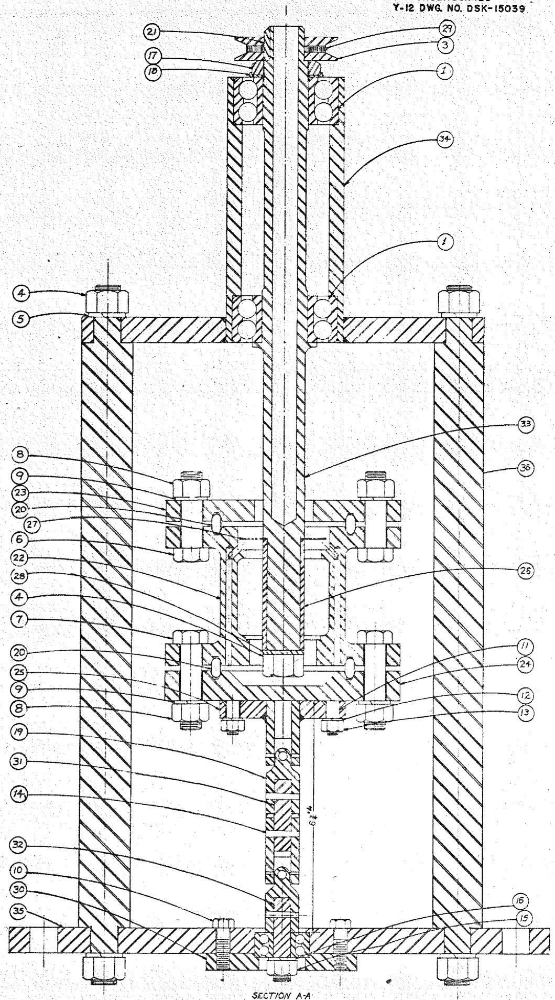  
UNCLASSIFIED   
Y-12 DWG.NO.DSK-15039

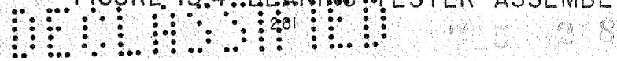  
FIGURE.13.4..BEARING:TESTER ASSEMBLY

tested to date are:

1. Stainless steel rotating member against brass ring. This seal operated satisfactorily against water, but the brass sealing face was scored excessively after 20 min of operation. Some copper was precipitated out of the brass onto the face of the stainless steel rotating member. The scoring was probably due to poor initial operating technique resulting in excessive hydraulic pressure on the back side of the rotating member. Two sets of these seals were run with identical results.   
2. Stainless steel rotating member against white cast iron ring. This set sealed against water during 1 hr of operation. However, a deep groove was worn in the cast iron member owing to the above-mentioned faulty operation technique.   
3. Stellar against stellite. For this test the operational technique was changed. Means were provided for pressurizing both chambers of the seal-testing unit, i.e., water in outer chamber and air pressure on the inner chamber. Gauges were provided to check the pressures and throttling valves provided to adjust the pressures. This seal operated successfully over a 6-hr period with unit contact pressures of 48.5 psi and water pressure of 50 psi.   
4. Stellite against stellite. These seals performed satisfactorily against 40 psi water pressure with unit contact pressure reduced to 10.9 psi. The rubbing velocity of members was 1350 ft/min.   
5. Stainless steel rotating member against stellite ring. This seal operated successfully for 50 hr against 30 psi of water with unit contact pressures reduced to 3 psi. The rubbing velocity was 1350 ft/min.

Other seal materials to be tested in various combinations are carballoy, nitralloy, Scottsonized stainless steel, and Ihrigized steel. Future seal testing will be done in liquid metals.

# ELECTROMAGNETIC FLOWMETER

An electromagnetic flowmeter was installed in the figure-eight loop to obtain an indication and rough estimate of the flow velocity attained in operation. This flowmeter utilized the large permanent magnet with a field strength of 2600 gauss. It will be calibrated as soon as practical.

# CALIBRATION LOOP

The fabrication of the calibration loop is approximately $70\%$ complete in our shop and operation is planned by April 1.

# FLANGE-TESTING DEVICE

W. C. Tunnell, ANP Division

Since it is desirable to use flanged joints in experimental liquid-metal equipment so that test sections can be quickly and easily installed and removed, a flange-testing device is being fabricated to test flanges at various system temperatures and pressures. It is planned first to test, with vacuum, Freon and water pressures against bolt pressures obtained with torque wrenches for various types of API gaskets, e.g., soft iron, nickel, and stainless steel, before testing with liquid metals at various temperatures and pressures.

# STRESS-RUPTURE TESTS

W.C.Tunnell,ANP Division

The equipment described in the last quarterly report (ORNL-919, p. 166) for self-welding and stress corrosion is initially to be used for stress-rupture tests. Two pieces of apparatus are being set up in convection loops for liquid-sodium tests, and another piece will be set up in a furnace with inert-gas atmosphere on the specimen being tested. It is planned that tests of 10 and 100 hr duration will be run in the furnace at 1400, 1500, and $1600^{\circ}\mathrm{F}$ , testing first 316 and 347 stainless steel and nickel. Tests in sodium will be for 10, 100, and 1000 hr duration using the specimen shown in the above reference with dead weight loading up to 50,000 psi stress.

# INSULATION TESTING

R. T. Schomer, ANP Division

Preliminary tests were made by placing samples of various insulations in a pan of burning cadmium. The samples tested were Philip Carey and Johns-Mansville high-temperature insulations as well as Eagle-Picher and Baldwin-Hill

lead-mill slag wools. Results with all these materials appear encouraging.

in all cases the rate of reaction appears to be slow enough to be safe. At this time a sample of lime silica was also tested and it appeared to be worthy of further consideration.

It was felt at

the conclusion of the sodium tests that a better method of metering the amount of liquid metal jetted into a sample could be devised. With this in mind a measuring tube has been added between the reservoir and the sample-holding plate. A probe in this measuring tube determines the amount of liquid metal used in each test. By changing the length of the probe, various amounts of liquid metal can be expelled. In addition to permitting better standardizing of the amount of metal used in each test, this change allows the bulk of the liquid metal to be kept at a relatively low temperature while only the small amount of metal in the measuring tube is heated to the desired temperature for the test. This modification has been made in conjunction with the Heat Transfer Section of the Reactor Technology Division.

Prior to modifying the insulation-testing apparatus the remaining sodium in the reservoir and the associated piping was heated to $1730^{\circ}\mathrm{F}$ (which is above the boiling point of sodium at atmospheric pressure). This molten metal was squirted into the air and the results obtained were merely a stream of molten metal burning as it struck the air. No indications of vaporization were seen.

# HEAT-EXCHANGER TESTS

A. P. Fraas, ANP Division

In the ANP reactor design bundles of fairly closely packed tubes have been included in a large proportion of the proposals both for fuel elements in the reactor core and for the matrix of the intermediate heat exchanger. One of the major design problems for any of these proposals has been the problem of the pressure drop in the stream flowing outside the tubes. Three important elements contribute to this pressure drop, namely, skin friction, turbulence induced by the spacers, and losses in the cross-flow region at the inlet and outlet.

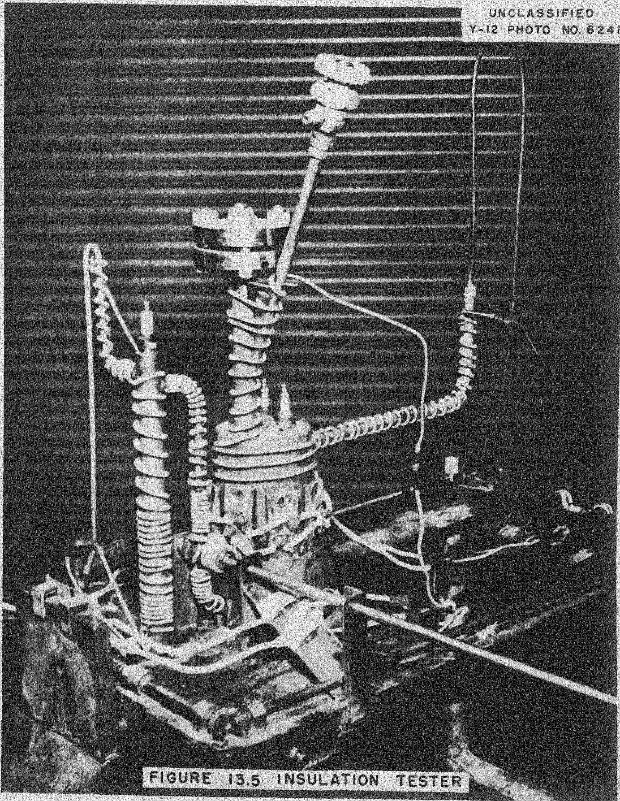

It was decided that the fluid-flow and pressure characteristics of a bundle of closely spaced tubes could be readily investigated through an airflow test of the model shown in Fig. 13.6, which was made up of $\frac{1}{8}$ -in. copper welding rods. Restriction of the flow in the cross-flow region at the end of the tube bundle was avoided by putting a small offset in every other tube where it bent to enter the header. Figure 13.7, an end view of the model, shows how this was done. Note that offsetting half the tubes in this way also helped to spread the tubes out in the header so that welding of a full-scale header would be facilitated.

Preliminary results from the tests indicate that the pressure drop in the cross-flow region at the end is quite small. Similarly, the pressure loss across the spacers is also very reasonable. The major loss, from skin friction in the tube bundle, appears to be about twice the calculated values based on the use of the hydraulic radius of the channel between the tubes. The test set-up is being modified to permit operation at a higher Reynolds number, and the literature is being re-examined by the theoretical group of the Reactor Technology Division to determine the limitations of hydraulic radius as the fluid-pressure-loss parameter.

# CLEANING AND DISPOSAL OF LIQUID METALS AND EQUIPMENT

P. L. Hill and R. Devenish, ANP Division

The facility to be used for removing liquid metals from pieces of apparatus has been designed and is in the process of construction. This facility will be used by all units in the Y-12 plant area which may have to clean equipment contaminated with liquid metal, since solidified. NEPA and the ANP Division are jointly equipping this facility which consists of a sheet steel barrier resting upon a gravel bed with adequate drainage and supplied with steam, heat, and water.

Large amounts of sodium have been removed from small items of equipment by draining when immersed in a heated oil bath containing low-specific-gravity high-flash-point saturated-hydrocarbon type oil. The residual sodium adhering to the equipment is then removed by steaming, degreasing, and thorough rinsing. The moist steam used has produced a relatively small amount of fuming and

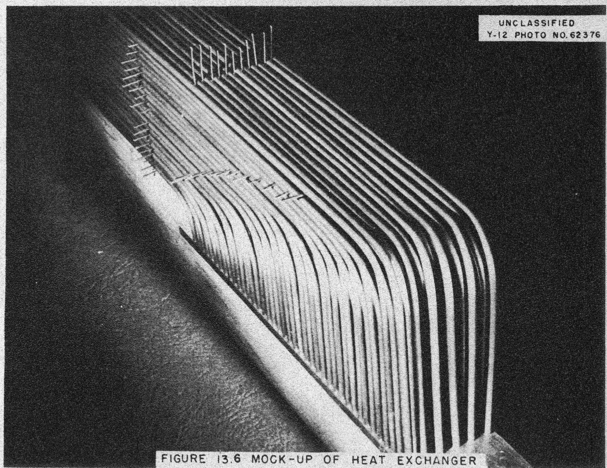

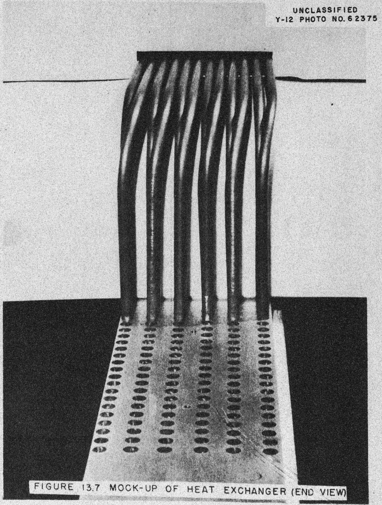

minor explosions. Dry steam is expected to produce little or no explosion. Large items of equipment have been cleaned by melting the sodium in such a manner that it falls through the atmosphere for a short distance and then into an oil bath. This method appears to have promise but needs further refinement.

Waste metal will be accumulated under oil, or in an otherwise safe manner, until sufficient quantity is on hand to warrant recovery or disposal. Up to now the waste sodium accumulated has been used in tests of cleaning methods and to create controlled fires for tests of fire extinguishing equipment. Disposal requirements vary with the metals concerned. Waste sodium will normally be discarded.

Waste sodium will be dumped into an abandoned quarry to be reacted with the large mass of water present. Tests are underway to determine the practicality of disposing of solid sodium by holding under the water in a perforated steel container. It has been noted that sodium stored under heavy oil will not react instantaneously when placed in water, and the delay should afford time for the operators to take necessary safety precautions after dumping the waste metal. This method will also be used to dispose of other waste materials containing a large percentage of metallic sodium.

# SAMPLING PROCEDURES

P. L. Hill and J. F. Sheehan, ANP Division

Samples of liquid coolant being tested are taken for chemical analysis. Sodium is sampled when in the molten state by drawing the metal into evacuated glass tubes. The tubes consist of two bulbs of about 5 cc capacity connected by a 2-mm tubing. One tube has a long piece of tubing ending in a drawn break-off tip which is broken by contact with the walls or bottom of the sodium-containing apparatus. This method is believed to give nonrepresentative samples because there is the possibility of picking up precipitated solids resting on the contact surface. Modifications of the technique are being

devised, some of them patterned after the method used by Knolls Atomic Power Laboratory.

After the sample is drawn into the tube the sodium solidifies in the bulbs, and the tip is sealed to prevent excessive contamination with oxygen from the atmosphere. The sodium-filled bulbs are then given to the chemical analysis laboratory for further handling as described in Sec. 21.

Samples of the solidified liquid metal are removed from the test apparatus for determination of metallic contamination. Such samples are not analyzed for oxygen as are those taken in the glass bulbs but are analyzed spectrographically solely for pick-up from the container materials (see Sec. 21).

# PURIFICATION OF LIQUID METALS AND GASES

P. L. Hill, ANP Division

Liquid sodium used in the tests is purified by filtering at about $250^{\circ}\mathrm{F}$ through a sintered stainless steel filter with a pore size of approximately $5\mu$ . Precise determination of the oxygen content of this filtered sodium has not been made pending development of adequate sampling and analyzing techniques (see Appendix, Section 21).

The argon and helium used as an inert atmosphere will have to be purified because three cylinders of argon were analyzed and found to contain 20, 30, and 45 ppm of oxygen. Two helium cylinders checked were found to contain 3500 and 56 ppm of oxygen (see Sec. 21). Purification will be accomplished

by bubbling the gas through a 2-ft depth of Na-K in addition to passing it over hot copper turnings and hot titanium turnings. Tests will be made to determine the purity of the gases after the scrubbing treatment (see Appendix, Sec. 21).

# LIQUID METALS SAFETY COMMITTEE

P. L. Hill, ANP Division

The Liquid Metals Safety Committee is nearing the completion of a safety manual for use by units handling liquid metals. The completed manual should be distributed to interested persons by April 15, 1951.

As a result of numerous tests in various areas, the committee has recommended the use of dry graphite powder screened to 25 mesh as a fire extinguishing agent for sodium, Na-K, calcium, uranium, and possibly magnesium fires. It is readily applied by scoop, or with dry type pressurized fire extinguishers such as the Ansul Metal-X or the Pyrene G-1. The graphite is removed after use by vacuuming. Cleaning is not difficult if the graphite has not been walked on or otherwise forced into the surface of flooring.

The search for adequate protective clothing continues. The committee recommends the interim use of chrome leather as partial protection against jetting molten sodium

Flame-retardant clothing is recommended for general wear in liquid-metals handling areas. It is not intended to protect against direct metal burns but only against general body burns resulting from ignited clothing.

Thermal insulating materials have been tested for resistance to attack by molten metals, with steel or lead-mill slag wools and clay-bonded diatomaceous silica offering considerable resistance to molten sodium up to about $1700^{\circ}\mathrm{F}$ . Above this temperature the slag wools begin to deteriorate from temperature effects alone and eventually fuse completely. Clay-bonded diatomaceous-silica high-temperature insulating materials, such as Johns-Manville Superex or Philip Carey Hi-Temp No. 19, have proved successful against attack from molten sodium In many cases an initial reaction occurs which appears to form a slag that retards further attack.

# INSTRUMENTATION

C. D. Hatfield, ANP Division

Instrumentation for the liquid-metals test systems described in the preceding sections will require the routine instrumentation for general control purposes as well as the indication of basic physical conditions existing in the systems. The following equipment has been developed for these liquid-metal systems:

1. Differential pressure measurements. A mock-up of a liquid-metals circulation loop has been designed and built for use in sodium manometer operation training. The mock-up is complete in every detail, thus facilitating the manometer operation when used in the forced-circulation sodium loops.   
2. Control panels. The first of a group of eight control panels has been installed and is ready for operation of convection loops. Two auxiliary portable power supplies have been designed and built to supplement the control panels when these are used to operate figure-eight circulation rigs. These power supplies will be adaptable to other experimental testing equipment as demands for such a power supply develop.   
3. Automatic liquid-level controls. The two-probe level-control system has operated with little trouble in both the figure-eight and convection loops. A baffle design change is being considered in the surge tank of the figure-eight to eliminate the actuation of the electrical relays in the level-control system. The agitation of sodium in the surge tank is caused by electromagnetic pump operation at high output levels.

# BUILDING FACILITIES FOR THE EXPERIMENTAL ENGINEERING GROUP

P. L. Hill and R. E. Wright, ANP Division

Laboratory area facilities are improving slowly with much still to be completed. One open-faced canopy type hood 48 ft long, 9 ft high, and 6 ft deep has been installed and is in partial use. A similar hood 120 ft long, 15 ft high, and 12 ft deep is being designed with construction promised by June, 1951. With no fixed partitions along their lengths, these hoods can accommodate a great variety of test equipment so as to provide protection against fumes and/or fire hazards.

A physical and chemical testing laboratory with benches, sinks, furnaces, dry boxes, and hoods is being designed. These facilities will be used for preliminary checks on properties of materials and for special small-scale experiments that may be required.

Areas for flow tests using water and air are being prepared. The water-flow test area will be provided with circulating water up to about 2800 gpm capacity. The air-flow test area has one centrifugal blower rated at 1750 cfm and a head of 12.7 in. of water. Other blowers will be added as required.

Special machine, welding, and electrical shops have been established which are prepared to do small or special jobs not otherwise handled in the main shops. The welding shop is prepared to do heliarc welding wherever required in the experimental area. Experiments are underway to determine the best method for heliarc welding of thin pieces of materials such as stainless steels.

# 14. METALLURGICAL PROCESSES

E. C. Miller and W. D. Manley, Metallurgy Division

The demands of the high-temperature reactor include the development of improved welding techniques for high-stress corrosion-resistant welds. Welding and creep-rupture laboratories for this work will soon be in full use. Equipment and materials for these laboratories are being received daily, and the next quarter should see greatly expanded operations. The Powder Metallurgy Group has spent the past quarter in investigating and developing techniques for solid-fuel-element fabrication for high-temperature service. Their interest has centered chiefly around flat plates which are sandwiches of cladding material with fuel between, and which may be used flat or rolled into tubing. The method of placing the proper amount of fuel in the fuel layer and bonding this layer to the cover plate is the subject of intensive investigation.

A program designed to study the fundamental physical chemistry of liquid-metal systems has been initiated. The first phase of the program will be concerned with the effect of crystal orientation on the rate and type of attack by liquid metals.: In order to study simultaneously all possible crystal orientations, single crystals machined into spheres will be used.

# WELDING LABORATORY

# Peter Patriarca, Metallurgy Division

The operations of the Welding Laboratory which heretofore were performed in borrowed facilities were transferred this quarter to the new Welding Laboratory. As much of the time during the last quarter was devoted to this transfer and the installation of new equipment, there is little progress to report on the welding of columbium or molybdenum although both these problems are still under active consideration.

The majority of heliarc-welding equipment and associated apparatus has been delivered and is in use. Still lacking are a d-c motor-generator welder and a variable-speed welding turntable. These should be delivered and in operation in March.

A series of thermal convection loops of a new design, for the Dynamic Corrosion Group, are being constructed using the facilities of the X-10 Pipe Shop. These loops, which will be of types 410, 430, and 316 stainless steel, Izett iron, and inconel, are being fabricated as specified and under supervision.

Preliminary experiments have been conducted to determine techniques of spot welding strap supports for fuel tube clusters. This method will be used to fabricate a test cluster for use in the figure-eight thermal convection loop at Y-12.

Communication with the laboratories of the International Nickel Company indicates that joining of thin-walled stainless steel or inconel tubing to flat or tube header by means of electrodeposition of nickel is feasible. Specimens have been sent for experiment by the International Nickel Company laboratory and will be returned to the Metallurgy Division for evaluation when complete.: If these samples are encouraging it is anticipated that further work along this line will be undertaken.

# CREEP-RUPTURE LABORATORY

R.: B.: Oliver, Metallurgy Division

The installation of equipment in the Creep-Rupture Laboratory should be completed by the middle of March. Other facilities for stress-rupture testing

in liquid-metal environment is in the design stage. Only a limited number of tests were performed during the past quarter in the new Creep-Rupture Laboratory because of the construction and installation that was in progress.

Tensile tests were conducted to observe the deformation and recovery characteristics of several possible metals for the reactor fuel tubes under cyclic stressing. Under the test conditions, $1500^{\circ}\mathrm{F}$ , elastic recovery was not detected and the maximum stress decreased with each cycle.

Equipment Installation. If delivery schedules have been met by the various vendors, installation of the laboratory equipment should be completed by the middle of March. Completion of the 14 special furnaces and chamber for testing in vacuum or in inert atmosphere is expected in 30 to 60 days. These furnaces are being built in part by Oak Ridge National Laboratory and in part by L.H. Marshall Co. The first unit has been delivered and the production schedule calls for two or three furnaces per week. Studies are underway on the first furnace unit to determine the various operating characteristics, including the natural temperature gradient and the values and distribution of shunts to give an adequately long constant-temperature zone.

A 25-kw gasoline-driven motor generator with automatic transfer switch has been purchased to furnish emergency electric power for the laboratory. Alternate sources for other services are provided but require manual switchover. Man-power requirements have been surveyed, and it is planned to have an operator in constant attendance.

A procurement program has been instituted to obtain sheet, rod, and tubing of the various materials that may be of interest on the ANP Project. The production of test specimens of several types and from the various materials has been discussed with the Research Shops. Tooling is being planned to provide specimens in lots of about 25 at a minimum production cost.

Owing to the lack of space in Building 2000 and the fire hazard involved in handling liquid metals, space has been obtained in the basement of the Pilot Plant Building to install a laboratory for stress-rupture testing in liquid-metal environments. This laboratory is in the preliminary design stage. It is planned to install four tube-burst units and six lever-arm type creep racks along with the necessary instrumentation and other auxiliaries. The planning provides for possible future expansion if the program at any

future time indicates such an expansion to be desirable. The furnaces and test chambers to contain the specimens and liquid metal are in the final design stage. Considerable attention has been given to the design problems so that the amount of handling of the liquid metal is minimized and the hazards are kept at a minimum. This laboratory will also be under the 24-hr supervision of an operator.

No tests have been conducted during the past quarter in this laboratory area. During the construction period the room has been crowded with the service crews and the power has been frequently interrupted, making testing impractical.

Tensile Tests with Cyclic Stress. Eighteen tensile tests were conducted at $1500^{\circ}\mathrm{F}$ to observe the deformation and recovery characteristics of types 310, 316, and 347 stainless steel and inconel under conditions of cyclic stressing. The tests were conducted at two constant strain rates of 0.05 and 0.10 in./min.: The strain rate was maintained constant during loading until the load ceased to increase. The load was then released slowly. The specimen was held at zero stress for 10 min prior to reloading. This was repeated for four or five cycles, giving a total test time of approximately 1 hr.

This series has just been completed and the data, which have not been adequately studied, will be reported at a later date. Following are a few generalized observations:

1. Increasing the strain rate markedly increased the maximum stress obtained.   
2. Generally, the maximum stress obtained in each cycle decreased with each successive stress cycle.   
3. Under the test conditions elastic recovery was not detected.   
4. Tests performed at room temperature showed that these types of stainless steel exhibited considerable elastic recovery.

# PHYSICAL CHEMISTRY OF LIQUID METALS

G.: P. Smith, Metallurgy Division

A program to study the fundamental physical chemistry of liquid-metal corrosion has been started. As various studies of the physical chemistry of

many surface phenomena have shown a marked dependence of rate on crystal face, this program will be concerned initially with large single crystals. Even a perfectly prepared polycrystalline surface presents a difficult problem because of the numbers of crystal faces and boundaries. The differences in behavior of crystals of various orientations has been markedly demonstrated in the case of the oxidation of copper at intermediate temperatures and in the case of the catalytic decomposition of carbon monoxide on nickel where entirely different processes take place on different crystal faces. In order to limit the number of variables, initial studies will be devoted to gaining an understanding of the properties of the different crystal faces by the use of metal single crystals exposed to a variety of liquid metals. A qualitative survey will determine the extent of expected differences and the most active crystal faces for a given process.

Liquid-Metal Corrosion of Single Metal Crystals. As single crystals machined into spheres present every crystal face at least twice on the surface, all crystal faces may be simultaneously compared in a single experiment. In Fig. 14.10 is shown a single crystal sphere of copper, the surface of which was initially electrolytically polished in an orthophosphoric acid solution. The pattern resulting from the different rates of etching attack on different crystal faces are evident. In Fig. 14.10a a [100] axis is normal to the plane of the page. Copper has a cubic lattice and the expected fourfold symmetry of the (100) pole may be seen. The (100) pole itself is the geometric center of the fourfold symmetry. In Fig. 14.10b a [111] axis is normal to the plane of the page. The expected threefold symmetry may be seen. All the other crystallographic poles may be located in like manner using the methods of crystallography. For example, a (110) pole lies midway between any pair of adjacent (100) poles or any pair of adjacent (111) poles.

Processing of Single Spherical Crystals. The following procedure will be used with spherical single crystals: The cold-worked surface layers will be removed electrolytically until a smooth surface is obtained, the completeness of cold-working removal being indicated by the sharpness of the etched pattern. Annealing will then be carried out in an atmosphere which will reduce the oxide film, where possible, and then the crystal will be immersed in the liquid metal without being subjected to atmospheric contamination. An apparatus for liquid metal--single crystal systems which do not attack quartz is essentially complete. The first system to be tried will be mercury-copper, as

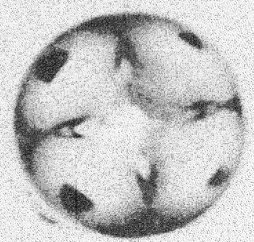

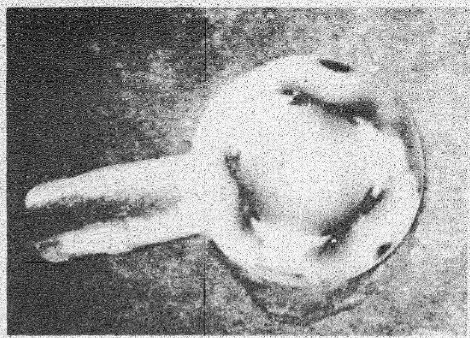  
Y-3122 A 4X ELECTROLYTIC ETCH PATTERN ON 5/8 INCH DIAMETER COPPER SINGLE CRYSTAL. PHOTOGRAPH NORMAL TO (IOO) AXIS. (FOURFOLD SYMMETRY)  
Y-3123 B 4X ELECTROLYTIC ETCH PATTERN ON 5/8 INCH DIAMETER COPPER SINGLE CRYSTAL. PHOTOGRAPH NORMAL TO (III) AXIS. (THREEFOLD SYMMETRY)  
FIGURE 14.10 SINGLE CRYSTAL SPHERE OF ELECTROLYTICALLY ETCHED COPPER

the single crystals of copper are immediately obtainable and the handling of mercury presents no major problem.

To demonstrate the feasibility of the method as a means of study of such systems, a single rather crude experiment was performed. A single crystal of copper was immersed in a bath of mercury at room temperature with no precautions taken against atmospheric contamination. The result, definitely preliminary, was that certain rather sharply defined crystallographic regions of the spherical copper crystal were wetted, giving a uniform film, while the other regions were covered with fine droplets.

The availability of single crystals suitable for corrosion studies is a matter of some concern. Although a variety of metals may be produced in this form by the Bridgman method, few are commercially obtainable, and those crystals which must be grown by other methods are very scarce commercially.

Another problem yet to be solved is that of machining the spheres from the single crystals in such a manner as to make possible the removal of the cold-worked layer by electrolytic polishing. With some metals reasonable success can be obtained, but it may be necessary to grow others in spherical shape. The major difficulty is in the machining of those metals which may be fractured by cleavage. In these metals deep cracks, although not perceivable before corrosion, sometimes form owing to abnormal corrosion along the cleavage planes.

Very little experimental attention has been given to surface preparation, even though it has been generally recognized that physicochemical processes occurring at the surface are frequently sensitive to surface-preparation methods. It is hoped that research into surface preparation will not be necessary except where the meaning of corrosion results is in doubt.

# HYDROGENOUS FLUIDS

A study is to be undertaken to determine the approximate liquidus curves for systems containing a high percentage of hydrogenous compounds. The purpose of this study is to determine which systems might be useful as moderator-coolants in a high-temperature reactor on the basis of melting point. Subsequent studies are planned to determine the stability of selected mixtures and to establish methods of decreasing undesirable dissociation. The necessary apparatus for conducting the liquidus curve determinations is being designed.

# 15. RADIATION DAMAGE

D. S. Billington, Physics of Solids Institute, Metallurgy Division

The effect of radiation on the creep of metals will be determined by the cantilever creep apparatus (ORNL-919). Recent efforts have been concerned with improving methods of construction and checking the components of the apparatus to assure the required accuracy. A tensile creep apparatus is also being built. The creep specimen will be tubular so that it may be filled with a liquid metal for stress-corrosion studies under irradiation.

The apparatus has been designed for measuring thermal conductivity changes during irradiation, and bench testing is now in progress. The equipment for the before-after measurements of thermal conductivity is also being designed.

The Y-12, Berkeley, and Purdue University cyclotrons have been applied to radiation damage problems. A rotating cylindrical target, which will be liquid-metal cooled, is being developed for the Y-12 cyclotron. This target will provide creep data for the target material while being irradiated. Two attempts were made to irradiate liquid metals in iron capsules using the 60-in. Berkeley cyclotron, but in each case heater failures prematurely terminated the experiment. The Purdue Cyclotron Group has begun a study of the properties of unirradiated molybdenum, preparatory to radiation damage work on this metal. Instrumentation for creep measurements under deuteron bombardments is being developed, and a preliminary measurement of resistivity after irradiation has been made.

The initial irradiation of the fluoride eutectic $\mathrm{NaF - UF_4}$ evidenced no irradiation-induced pressure rise, as might have resulted if free fluorine gas had been formed.

# CREEP UNDER IRRADIATION

J.C.Wilson J.C.Zukas

M. J. Feldman W. W. Davis

Metallurgy Division

No further data from experiments on creep under irradiation have been obtained. The main work during the quarter consisted in improving methods of construction of the apparatus and checking of its components.

Operation of a new creep test in the intense gamma field supplied by a $\mathbf{C}\mathbf{o}^{60}$ source located in the canal at the Oak Ridge National Laboratory Reactor is contemplated. The geometry of the source is such that the present cantilever apparatus must be modified to place the long axis of the specimen vertical. The apparatus is now being modified in the shop.

Cantilever Creep Apparatus. A preliminary test of effect of radiation on thermocouple characteristics under irradiation shows a possible change of emf of chromel-alumel and iron constantan couples at $1220^{\circ}\mathrm{F}$ after a period of two weeks. These thermocouples were used to run cooling (melting point) curves on pure aluminum in an alumina crucible in the reactor.

Effects of masses of metal in the field of microformers on the linearity of the response were studied. Furthermore, temperature coefficients of microformers and variations in cores were checked to eliminate possible errors of interpretation of creep results. Little, if any, effect on the microformer was observed when it was mounted on a slotted aluminum base.

Tensile Creep Apparatus. A pilot model of a tensile creep apparatus containing its own loading weight on a lever arm is in the shop. The specimen will be tubular so that materials such as sodium may be introduced into the tube to study stress-corrosion during creep tests. At least two complete tests at $1500^{\circ}\mathrm{F}$ on 347 or 316 stainless steel will have been run in the Oak Ridge National Laboratory Reactor in March with stresses of the order of 1000 psi.

# THERMAL CONDUCTIVITY OF STRUCTURAL ALLOYS AT HIGH TEMPERATURE

A. F. Cohen, Metallurgy Division

Designs have been prepared for the measurement of the change of thermal conductivity as a function of temperature under pile irradiation. Construction of the experimental parts for the measurements on 316 stainless steel are nearing completion, and preliminary bench experiments will have been initiated by March. The other materials to be considered for thermal conductivity measurements are 347 stainless steel, inconel, inconel X, and molybdenum.

Out-of-pile experiments are being planned to determine absolute values of thermal conductivity of alloys at high temperatures. The accuracy in these out-of-pile experiments is expected to be within a few percent.

# Y-12 CYCLOTRON CREEP EXPERIMENTS

T. H. Blewitt and M. J. Feldman, Metallurgy Division

R. S. Livingston, Electromagnetic Research Division

The experimental arrangement to be used in the 86-in. cyclotron for determining the effect of radiation on the creep of metals at elevated temperatures has been worked out in principle and the components are in process of construction. The internal beam of the 86 in. cyclotron will be used to irradiate a thin-walled cylindrical sample which will be cooled by liquid metal pumped through the cylinder at the rate of approximately 10 gpm by an electromagnetic pump. The cylindrical sample will be rotated at 500 rpm to facilitate liquid-metal pumping and to obtain uniform radiation in the direction of rotation.

In making creep measurements it is necessary that the temperature of the target not fluctuate more than a few degrees. The liquid metal flowing through the thin-walled cylindrical sample results in efficient heat transfer with a temperature gradient of only a few degrees, depending on the material under test. The fluctuations of the sample temperature from cyclotron "beam off" to "beam on" will be of the same order.

# PURDUE CYCLOTRON

The Purdue program emphasis has been placed on molybdenum and stainless steels which are of interest in high-temperature reactor designs. The major work has been with molybdenum. After techniques have been developed with molybdenum, the same apparatus will be applied to the investigation of stainless steel.

Prerequisite to the measurement of the properties of molybdenum after irradiation, a study of these properties in unirradiated molybdenum is being undertaken. Properties currently under study are grain size, density, microhardness, and resistivity. Preliminary measurements of the resistivity of molybdenum after irradiation have been made and no change was detected although one day elapsed after bombardment before a measurement could be safely made. Instrumentation for creep experiments under deuteron bombardment is underway. Control circuits are complete.

Properties of Unirradiated Molybdenum. In order to obtain reproducible results, a study of grain size, degree of preferred orientation, strain, and hardness of commercially available rolled molybdenum was made. Three standard thicknesses - 5, 10, and 20 mil - were selected. With the 5- and 20-mil samples, powder and back-reflection X-ray patterns show sharp lines, indicating that grain size is in the range $10^{-2}$ to $2 \times 10^{-4}$ mm. X-ray patterns from the 10-mil sample exhibit spottiness in the rings, indicating that the grain size is somewhat larger than $10^{-2}$ mm. Preferred orientation is marked in each thickness, but particularly so in the case of the 5-mil sample. Density was calculated from the lattice parameter determined from back-reflection patterns, and the value obtained was $10.22\mathrm{g / cc}$ .* Agreement in density between 5- and 10-mil samples was within the experimental error. These results were supplemented by photomicrographs of the polished and etched surfaces of the different samples. Using equipment with a magnification of only 100 diameters, it was possible to resolve grain boundaries in only the 10-mil sample. This is consistent with the X-ray determination of grain size. With the 10-mil sample the grain size was estimated at $7 \times 10^{-2}$ mm. This value is greater than that indicated by the X-ray patterns, but, according to the Oak Ridge National Laboratory group, this discrepancy is typical of the two methods, has the

usual order of magnitude, and is in the same direction. The same X-ray and photomicrograph techniques are now being employed to determine the structure of the rolled sheets after different annealing treatments. Microhardness tests taken with a Tukon tester yield an average Knoop number of 245 for the 5-mil sample, 207 for the 10-mil sample, and 233 for the 20-mil sample.

Resistivity measurements using the equipment immediately available have been troublesome. Three different sample holders have been designed and tested, but further modifications are required before the design will be suitable. The justification for seeking an extremely accurate and sensitive means of measuring resistivity is that bombardment-induced changes in resistivity are small in the case of metals.

Resistivity of the 5-mil sample in as-received condition has been measured within an error of $8.4 \times 10^{-9}$ ohm-cm, the error being averaged by applying the method of least squares. The resistivity $\rho$ as a function of temperature $T$ is linear within experimental error, and can be expressed as $\rho = 5.022 - 0.02265T$ over the temperature range 77 to $300^{\circ}\mathrm{K}$ . It should be added that refinements of the techniques are not yet such that this accuracy can always be maintained with successive measurements. With less accurate and earlier measurements of the 5- and 10-mil sheets, the resistivity agreed with the equation just given within experimental error. It is surprising that the difference in cold-working between the 5- and 10-mil sheets, which is quite evident in X-ray measurements and hardness tests, does not produce an easily discernible difference in resistivity.

Resistivity of Molybdenum After Irradiation. One of the 5-mil samples of molybdenum was bombarded in the Purdue cyclotron for 4 hr with a $3 - \mu$ a beam of 10-Mev deuterons. The sample was cooled by heat conduction through a brass bar immersed in dry ice, and its temperature was measured during the bombardment with a thermocouple. Whenever the temperature rose to $40^{\circ}\mathrm{C}$ , the bombardment was temporarily interrupted while the dry ice supply around the brass bar was replenished. Cross-sections for deuteron-induced transmutations in some of the naturally abundant isotopes of molybdenum are high, and after the bombardment the sample read over the tolerance on a health monitor at a distance of approximately a meter. After three days the tolerance value was obtained at a distance of about 10 cm. A radioautograph of the sample, made with a 5-min exposure, indicated a relatively uniform bombardment across the sample. A more accurate measurement will be made after more decay with a

Geiger-Mueller tube, masking different parts of the surface with lead. It was felt that as the recrystallization temperature of molybdenum is around $1280^{\circ}\mathrm{C}$ , the effects of radiation might be "frozen in" by keeping the sample below $40^{\circ}\mathrm{C}$ during bombardment. Not having hot laboratory facilities for measuring resistivity, one day elapsed after bombardment before a measurement could be safely made. By that time any variations in resistivity which may have been produced were not detectable by the apparatus. Hardness and X-ray measurements await further decay of the sample. Resistivity measurements in place would be desirable and will be attempted. Smaller samples might also be used, as they could be bombarded longer and give the same total activation as a large sample irradiated for less time.

Creep Instrumentation. Demands on instrumentation for creep under bombardment are critical because of the short range of particle penetration and fluctuations in specimen heating produced by the beam. A large assembly of instruments is required, and this part of the program is in the development stage. Control circuits have been completed. These include tuning-coil assemblies, tuned amplifiers, and recording indicators of creep and creep rate. Tests of the circuits have been satisfactory as to sensitivity and stability, but supplementary shielding and filtering are required to reduce stray pick-up. A microformer type of mutual inductance bridge has been developed for use as the sensing device in the extensometer. The mechanical design of the creep machine is complete except for the furnace, and about $80\%$ of the parts for the machine have been turned out by the machine shop. Requirements for controlling the temperature profile across the wire are stringent, and the development of a suitable furnace may take several months. Future plans are primarily concerned with a satisfactory completion of the work now underway. However, if possible, it would be advantageous to incorporate measurements of other physical properties and enlarge the scope of metals under investigation. A repetition of a creep experiment, using polonium alpha particles incident on a single-crystal cadmium-wire creep specimen, will be carried out.

# EFFECTS OF RADIATION ON A FLUORIDE FUEL

W. R. Grimes, Materials Chemistry Division

Fluoride fuels which appear satisfactory for the ANP and ARE reactors have been developed. The one reservation that is commonly expressed in connection with the use of these fuels, since no information to the contrary

exists, is that decomposition and corrosion effects might appear under irradiation. Consequently, the controlled irradiation of a fluoride fuel was undertaken under the direction of Dr. V. P. Calkins of NEPA.

The fluoride eutectic 26 mole $\%$ UF $_4$ and 74 mole $\%$ NaF was irradiated in the X-10 pile. The eutectic was placed in a heated container which was equipped with pressure and temperature instrumentation. Preliminary checks were performed outside the pile, following which the test chamber was inserted in the X-10 pile in a neutron flux of approximately $10^{12}$ per square centimeter per second. Since the fluoride sample would be too radioactive for laboratory analysis, cooling curves were taken while the sample was in the pile to give an indication of any change in its chemical composition. However, these cooling curves exhibited discontinuities of unknown origin around the melting point of the eutectic, although the characteristic curves of the original eutectic were obtained with no neutron flux. Furthermore, no irradiation-induced pressure rise was observed. From this information it may be tentatively concluded, pending further experimentation, that the radiation damage of the eutectic mixture in a flux of $10^{12}$ is negligible.

Part IV

ALTERNATIVE SYSTEMS

# INTRODUCTION TO PART IV

At the present time the Aircraft Nuclear Propulsion Program is pointed toward development of a B-36 type of aircraft powered by J-53 turbojets, with a sodium-cooled reactor using quiescent liquid fuel. However, several alternative types of reactor systems are still receiving attention, although none of these systems is yet known to be as feasible as the one now chosen for the main line effort. They are, however, interesting, and several have potentialities if their present difficulties, chiefly in materials, can be overcome.

The work of the Oak Ridge National Laboratory and its subcontractors on the supercritical water system, the sodium compressor jet system, the homogeneous reactor, the circulating-fuel reactor, the circulating-moderator reactor, and the supersonic tug-tow system is discussed in Secs. 16 through 19.

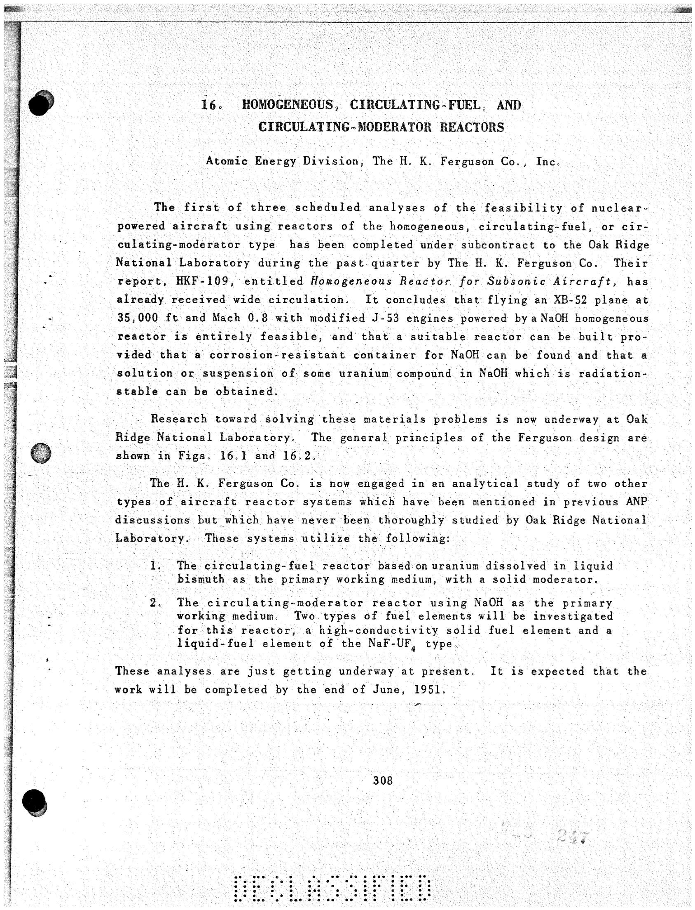

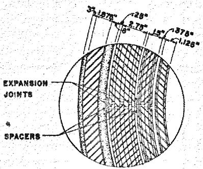  
DETAIL "A"

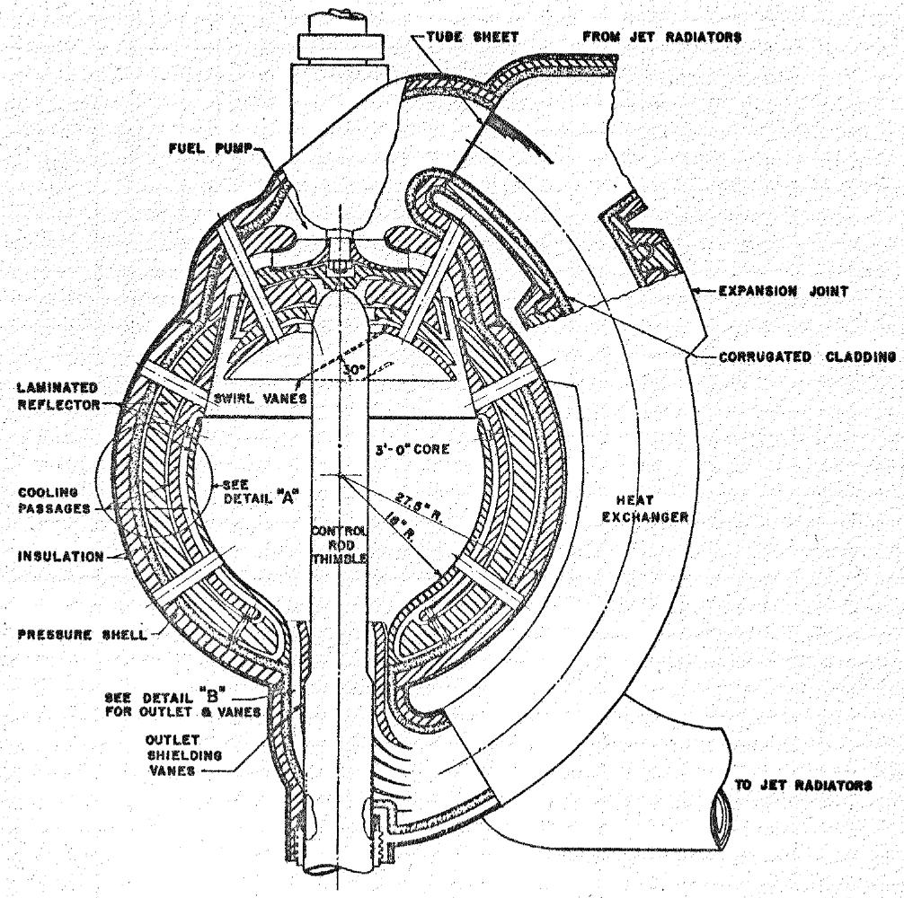  
FIGURE 16.1   
ASSEMBLY DETAILS OF REACTOR AND HEAT EXCHANGER

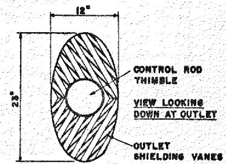  
DETAIL "B"

X-10 DWG.NO.10587

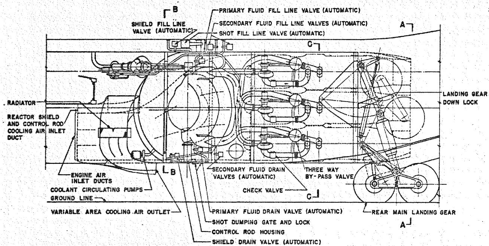

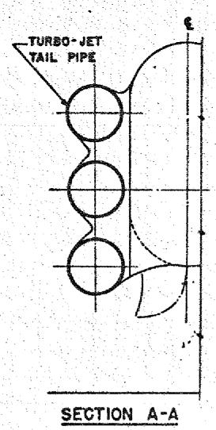

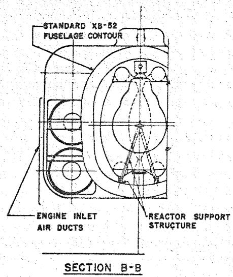

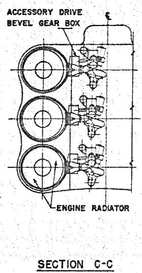  
FIGURE 16.2   
NUCLEAR POWER PLANT INSTALLATION

# 17. VAPOR-CYCLE AND HELIUM-CYCLE SYSTEMS

Atomic Energy Research Department, North American Aviation, Inc.

North American Aviation, Inc., has completed preliminary studies of both the mercury-vapor-cycle reactor and the helium-cycle system, and is preparing an extended report on each. NAA concludes that neither of these specific systems shows promise, but from their analysis of the vapor-cycle system it appears that the use of liquid-vapor sodium may result in a feasible reactor. Furthermore, NAA suspects that a high (approximately $2200^{\circ}\mathrm{F}$ ) temperature will be required of a supersonic vapor-cycle reactor.

# VAPOR-CYCLE SYSTEM

North American Aviation, Inc., has been exploring the probable consequences if low $L / D$ ratios for a Mach 1.5 plane should force the ANP program into higher reactor temperatures than are being considered at the present time. Any increase in required reactor temperature above about $1800^{\circ}\mathrm{F}$ will bring the turbojet radiator temperature up into the range where protection against air oxidation becomes extremely difficult. NAA therefore suggests that, as an alternative to the research on higher-temperature air-resistant metals now going on elsewhere, the ANP program considers the use of a liquid-vapor compressor-jet in the secondary loop for these higher temperature systems. The advantage of the compressor-jet is that the turbine is completely enclosed in a nonoxidizing atmosphere, while the air radiator is at the lower temperature end of the circuit and so may possibly be kept below the difficult oxidation range. For the secondary working fluid of such a compressor-jet cycle, NAA has explored mercury liquid-vapor and is preparing an extended report thereon. However, they find that the temperature range available to the secondary loop using mercury is so much constricted by the low critical temperature of mercury that the cycle becomes inefficient for airplane use. The use of liquid-vapor sodium as the best secondary working fluid for such a compressor-jet is therefore proposed. A detailed report on a Mach 1.5 aircraft using this sodium liquid-vapor compressor-jet cycle is now in preparation.

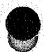

High-Temperature Materials. At reactor wall temperatures above $2200^{\circ}\mathrm{F}$ it will probably be necessary to use primary coolants with low vapor pressures at those temperatures. Such liquid metals as tin, bismuth, magnesium, and aluminum are being considered as primary coolants.

Various container materials such as carbon, tungsten, molybdenum, tantalum, and TiC will be tested for corrosion resistance to these suggested primary liquids. In addition, a considerable amount of corrosion research is now underway on both graphite and the above container materials when exposed to liquid sodium and to sodium vapor — initially at $1800^{\circ}\mathrm{F}$ and eventually up to 3000 to $4000^{\circ}\mathrm{F}$ .

Complementary to the corrosion test program in liquid metals, NAA is carrying out tensile strength, creep, and fatigue tests on molybdenum, tantalum, and tungsten at temperatures up to $2000^{\circ}\mathrm{C}$ . Data on properties of graphite at this temperature are already available at NAA from work under another contract.

# HELIUM-CYCLEANALYSIS

A fairly detailed analysis of a nuclear-powered aircraft, based on a closed-cycle helium-cooled system, has been completed and a final report is being prepared. This analysis has shown that the helium cycle is inefficient because of the large amount of pumping power required and the low heat-transfer coefficients that are available. Further details will be presented when the report is received. North American Aviation, Inc. recommends that this cycle not be pursued.

# 18. SUPERCRITICAL-WATER CYCLE

Nuclear Development Associates, Inc. (1)

Since about the middle of last December the work of Nuclear Development Associates, Inc. has been devoted to an analysis of the supercritical-water reactor as proposed in the Williams report (2) Liaison has been established with NEPA's subcontractor United Aircraft at East Hartford and with NACA at Cleveland, who are working on the power plant and airplane aspects of this system. NDA's activity to date has been primarily exploratory work on heat transfer and fluid flow, reactivity, and properties of materials, with recent emphasis turning to dynamics and controls.

The results to date on heat removal and reactivity are encouraging. It appears that the requisite amounts of heat can be removed with less iron surface than that indicated in the Williams report, and that the size of the reactor can be reduced appreciably without marked rise in fuel requirement. The considerable industrial experience with water and iron systems indicates that corrosion damage will be unimportant up to $1500^{\circ}\mathrm{F}$ in the absence of radiation. The effect of radiation is unknown, but it might increase the concentration of atomic hydrogen, to which substance much of the corrosion damage that has been experienced is attributed. In addition, the corroded iron will contribute appreciable radioactivity to the system and might interfere with heat transfer. Nevertheless, the supercritical water reactor does appear sufficiently attractive to justify continued consideration provided that a favorable impression emerges in regard to its dynamics and control. The various aspects of the system analyzed to date are discussed.

# HEAT TRANSFER AND FLUID FLOW

There is little reason to doubt that the required few hundred thousand kilowatts can be removed at the necessary temperature from a reactor of reasonable size with supercritical water. The heat-transfer studies reported here are aimed at indicating core design types which allow small reactor diameter,

small amounts of structural materials, and high average water density * Results to date point out several promising arrangements which accomplish the required heat transfer in reactors of small size (e.g., 2.4 ft diameter compared to the 4 ft diameter in the Williams report, and with less heat-transfer surface). These designs will allow savings in critical mass; alternatively, the savings in critical mass can be spent to gain higher performance by, for example, changing the designs to give higher water exit temperatures (which seems highly desirable from the aircraft point of view).

The work on heat transfer and fluid flow during the quarter falls into one of the following classifications: comparative heat-transfer studies of several flow types, study of instabilities, and a review of heat-transfer data. Each of these is discussed.

Comparative Heat-Transfer Studies of Flow Types. The standard case for comparisons of different flow schemes is a single-pass straight-through arrangement with water flowing in parallel streams between parallel fuel plates. This simple straight-through case is characterized by rather fine-scale internal structure and high plate volume, but is not entirely uninteresting. It served to direct reactivity work toward low water-to-iron ratios, which led to the finding that critical mass is not strongly dependent on the water-to-iron ratio for a constant weight of iron in the region of interest.

The straight-through case can be considerably improved by methods which increase heat flux at the expense of pressure drop. The pressure drop in the straight-through case is trifling, but it can be increased substantially by, for example, introducing baffles or guides which increase the length of flow path and increase the coolant-mass velocity. There are many possible ways of implementing this. For example, baffles or bent-wire flow guides might modify the straight-through case, or spacer wires wound between concentric cylindrical fuel plates might be used to impart a spiral motion to the coolant. The pressure drop, when the flow-path length is increased by a factor of 5, does not appear excessive, although the temperature rise in the fuel plates begins to cause important (order of 10,000 psi) thermal stresses.

Results at least as good as for the above cases with "waviness," but without the complications attendant upon building in the small-scale structure for

producing waviness, can be realized with multipass compartmented flow. The core is divided into several regions, with a central cylinder and at least one outer annulus; in each region there is a flow grid of small tubes or plates. The inlet water enters the central region at one end of the core, is turned in an end plenum chamber into the first annular pass, etc. Some generalized studies indicate that a given stream temperature rise can be achieved with lower maximum wall temperature for a multipass annular design than with the corresponding single-pass system if the maximum wall temperature is approximately the same in each pass of the multipass system. The multipass arrangement concentrates the denser inlet water at the center of the core; this probably helps on critical mass but hurts by peaking the central power more severely. The effects of nonuniform water-density distributions in shifting and accentuating the heat peaks of the power distributions have not yet been thoroughly analyzed.

Attention will be given to means for increasing the average water density (0.44 g/cc for the straight-through case, compared to 0.64 claimed in WASH-24). Critical-mass considerations may require the introduction of regions of slow-moving dense water as reported in WASH-24; some improvement can probably be made in reducing the amount of heat-transfer surface wasted in containing the dense regions. The use of central entrance arrangements to boost average water density was considered briefly but did not appear to be very promising.

Study of Flow Instability. When several heated stream passages are connected in parallel between common headers, it is possible for a type of flow instability to arise if the heated fluid expands markedly with heat addition (cf. Hanford "boiling disease"). Under certain conditions, if a small disturbance tends to block the flow in a passage and if the heat input to that passage is not reduced, it is possible for the decreased flow rate to require an increased pressure drop, with the flow then being further choked. Thus if the mass flow rate is decreased, with heat input maintained, the coolant density will be decreased and the velocity increased; it is possible, in the case of an expansible fluid, for the increased velocity to more than balance the decrease in mass flow and give a net increase in pressure drop necessary to maintain the flow.

An analysis of the straight-through flow case showed that a $1\%$ decrease in mass velocity would give a $0.4\%$ decrease in pressure drop, compared to the $1.8\%$ decrease for the incompressible fluid. Thus the straight-through flow

system is mildly stable, but with a not very strong restoring force. It is perhaps somewhat surprising that the straight-through case is inherently stable in view of the large expansion undergone by the water. The situation is helped by the fact that most of the expansion takes place in the interior of the flow path, with density changing comparatively slowly with respect to temperature near the exit end. The flow stability is less favorable for multipass systems in which a flow passage might have its exit at a temperature in the region of high expansibility.

In any event, if this type of flow instability should appear, it can be cured by introducing orifices at the entrances of the flow channels; the required pressure drop across the orifices would not seem to be large enough to be objectionable in any cases of interest. For a sharp-edged orifice, a $1\%$ decrease in flow rate would give a $2\%$ decrease in pressure drop, and it is thus merely necessary to provide an orifice with equilibrium pressure drop large enough to make the overall (orifice plus flow channel) change in pressure drop negative for a decrease in flow rate.

Review of Heat-Transfer Data. Heat transfer to supercritical water can be expected to follow a conventional Colburn type correlation, although there are no known data for the pressures and flow rates under consideration.* Uncertainties in predicting heat-transfer coefficients arise from the wide variations of fluid properties with temperature and from doubt as to just which temperature should be used in evaluating film properties for large film drops.

The thermal conductivity and viscosity depend markedly on temperature; both decrease with temperature when the water has liquid characteristics, and both go through minima and increase with temperature when the water has vapor characteristics. Since there are few data near and beyond the minima, extrapolation beyond the minima is uncertain. The specific heat has a sharp peak at temperatures close to the quasi phase change of the water, but reliable specific heat data are available.

A curve of the property-dependent portion of the heat-transfer correlation as a function of film temperature was obtained by extrapolating data on both thermal conductivity and viscosity. The latest heat-transfer correlations with high pressure $^{(3)}$ are given for transport properties evaluated at an

average temperature and are satisfactory for film drops up to $200^{\circ}\mathrm{F}$ . The film drops in the supercritical-water reactor design, however, are of the order of $500^{\circ}\mathrm{F}$ , and uncertainties of the order of $100^{\circ}\mathrm{F}$ may therefore be expected in estimates of maximum wall temperature.

# REACTIVITY

Estimation of the reactivity of reactors containing iron and water is at present a difficult problem because there are insufficient experimental data. An approach to the problem is to use a procedure which would be successful in the case of plain-water reactors (for which there are critical-mass measurements such as those given in report K-343 $^{(4)}$ ), and to utilize only microscopic cross-sections of the reactor ingredients. When developed, such a procedure could be extended to metal-water mixtures by the use of microscopic data for the metal component. Therefore the analysis has proceeded using the approach based on microscopic data only.

Equivalent Water Reactors for Iron-Water Mixtures. A procedure has been developed whereby the density of the iron in an iron-water mixture (with respect to the scattering power of the mixture for neutrons of high energy) may be expressed in terms of an equivalent density of plain water. This is feasible since the scattering power of metals (other than hydrogen) compares favorably with that of an equal volume of water at the high energies where much of the neutron leakage tends to occur. Table 18.1 summarizes the calculated equivalent density of iron as a function of the iron-to-water ratio of the mixture.

TABLE 18.1   

<table><tr><td>IRON-TO-WATER VOLUME RATIO</td><td>EQUIVALENT IRON DENSITY (g/cc)</td></tr><tr><td>0.30</td><td>0.48</td></tr><tr><td>0.40</td><td>0.45</td></tr><tr><td>0.50</td><td>0.43</td></tr><tr><td>0.60</td><td>0.42</td></tr><tr><td>0.70</td><td>0.41</td></tr></table>

(4) Beck, C. K., Callihan, A. D., Morfitt, J. W., and Murray, R. L., Critical Mass Studies, Part III, C & CCC, K-25 Report K-343 (Apr. 19, 1949).

In the calculations thus far the iron slowing-down (by inelastic collision) has been neglected. Perturbation methods are now being developed to include the beneficial effect of the inelastic slowing-down by iron. The only result available as yet adds 0.11 to the equivalent iron density of 0.41 (last line of Table 18.1).

Suppose that iron is, in fact, equivalent to water of some density $x$ in preventing escape of neutrons while slowing down. Then, so far as neutron slowing-down is concerned, a mixture of 1 volume of iron and $z$ volumes of water of density $\rho$ is equivalent to water of density $b = (x + \rho z) / (1 + z)$ . On the other hand, iron (in the form of stainless steel) absorbs (slow) neutrons about 11 times as strongly as an equal volume of water. Thus, as regards neutron capture, the same mixture is equivalent to water of density $a = (11 + \rho z) / (1 + z)$ . By means of these two "equivalent densities," $a$ and $b$ , known results on all-water reactors can be transformed into results for water-iron reactors.

Results of Reactivity Studies. By use of the equivalent densities defined above, the volume and fuel requirements for any iron-water reactor may be calculated. Let $V_{0}$ and $M_{0}$ denote, respectively, the volume and fuel requirements for a given water reactor. Reducing the density of water in this reactor from 1 to $b$ requires increasing the volume by a factor $1 / b^{3}$ and the mass of fuel by a factor $1 / b^{2}$ . Since the slow-neutron leakage in water reactors is relatively small, the effect of multiplying the absorption of the water in the core by $a / b$ can be taken into account approximately by multiplying the amount of fuel by the same factor.* Thus the final result is a reactor having a volume $V = V_{0} / b^{3}$ and fuel mass $M = M_{0}a / b^{3}$ . A curve of $M_{0}$ vs. $V_{0}$ for spherical water cores surrounded by infinite water reflectors has been obtained. ** Comparison(5) with critical mass experiments(4) indicates that the curve is conservative in that it overestimates the fuel requirement by up to 25%.

Considering an example which roughly approximates the Williams reactor, the fuel requirement $M_0$ for a water reactor having a $V_0$ of 132 liters is found*** to be 2.46 kg. Assuming the equivalent density of the iron to be 0.5 and that of the water to be also 0.5, 27 kg of fuel is required.

The result just found is for a spherical core of total volume $V = 1056$ liters and containing 88 liters of iron; the balance of the core volume and *Actually, the increased water and fuel absorption will act to slightly reduce the leakage. The above procedure is thus conservative in that it overestimates the fuel requirement somewhat. **The comparison between Greuling's computation for spheres and the experiments on right cylinders was effected by comparing the $U^{235}$ density in the experimental assemblies with that in a sphere having the same core buckling. (§) Nuclear Development Associates, Inc., Pile Sizes and Fuel Requirements, Circle II (Jan. 7, 1949).

*** There is, of course, no pretension that the critical masses are known to anything like the number of significant figures given in Table 18.2; we would, in fact, be happy if we could believe them to within, say, 20%. Also, it should be noted that no allowance for depletion, xenon and other poisons, etc. has been included here.

the surrounding infinite reflector are composed of half-density water. Upon varying the core volume $V$ , we similarly obtain the results given in Table 18.2.

TABLE 18.2   
Fuel Requirement for Iron-Water Reactors   
(with 88 liters of iron, $x = 0.5$ and $\rho = 0.5$ )   

<table><tr><td>V (liters)</td><td>Z [vol. of half-density water] / vol. of iron</td><td>M (kg)</td></tr><tr><td>176</td><td>1</td><td>44.6</td></tr><tr><td>264</td><td>2</td><td>34.9</td></tr><tr><td>352</td><td>3</td><td>31.3</td></tr><tr><td>440</td><td>4</td><td>29.3</td></tr><tr><td>704</td><td>7</td><td>26.8</td></tr><tr><td>1056</td><td>11</td><td>27.0</td></tr><tr><td>1760</td><td>19</td><td>29.5</td></tr></table>

These computations suggest that, with a prescribed amount of iron and hence a prescribed total heat-transfer surface in the reflector, there is considerable leeway afforded in the design as regards reactor size. Since the smaller reactors would have lower shield weights and hence lower power requirements, the amount of iron and hence the fuel requirement would be expected to be relatively less in the smaller reactor sizes than is indicated in the table. On the other hand, the uncertainties in the above computations, and the sensitivity of the fuel requirement to changes in $\rho$ and $x$ , will increase with the fractional iron content of the core.

The above considerations have all envisaged uniform composition throughout the reactor. Actually, the water density will change along a cooling stream, as discussed above in the section on heat transfer and fluid flow. Only one preliminary calculation has yet been made on the effect of space variation within the reactor. This was a rough one-group treatment of a case in which the water density varied as it would in flowing straight through the reactor. Apparently the reactivity of such a reactor can be higher than if the water were everywhere at its average density; on the other hand, the power generation will be more peaked than in the uniform-density case, which is a disadvantage from the standpoint of heat removal.

Again, only preliminary calculations have been made on the variations of reactor reactivity with water density, neutron temperature, and other such

quantities that enter into control considerations. First-round estimates indicate that the rate of change of reactivity with respect to (average) water density, $dR / d\rho$ , is about 1/3 for a reactor having 10 parts of half-density water to 1 part of iron by volume.

# DYNAMICS AND CONTROLS

The study of reactor dynamics and controls has only recently been initiated and few conclusions have been reached, although the nature of the analysis has been determined. In order to obtain results without excessive work and an undue amount of time, the time behavior of the reactor is now* being analyzed by perturbation studies of small displacements from equilibrium. This study will adequately determine the fundamental stability of the system although it will not consider conditions involving large changes from equilibrium values.

If the reactor turns out to be stable and well behaved for short times, the behavior will then be considered for longer time intervals (over many seconds) in which the coupling to the external circuit and to any controls becomes important.

The questions of both accidents and start-up have been considered to some extent, but further consideration is desirable before detailed conclusions can be reached. A method has been discussed which may lead to a feasible, even if time-consuming and complicated, start-up procedure.

# PROPERTIES OF MATERIALS

The presence of radiation introduces some doubt into what would otherwise be a rather satisfactory materials situation. In the absence of radiation effects, 347 stainless steel can be used in contact with steam at $1500^{\circ}\mathrm{F}$ for several hundred hours without showing appreciable corrosion, and 25-20 stainless steel can be used at temperatures up to about $1750^{\circ}\mathrm{F}$ . Cases of successful operation at conditions similar to those contemplated here are common,\* and there is, of course, a vast wealth of general background in alloy steel technology. With radiation present, nevertheless, the materials situation is not unlike that for most other reactor materials, i.e., radiation-damage experiments and heat-transfer tests will be needed (cf. section on heat transfer) and (because of the many incentives for pushing temperatures higher) attempts must be made to determine practical operating limits.

Embrittlement and corrosion, which are the primary materials problems, depend markedly on the purity of the water, which should be degassed and should have less than $1\mathrm{ppm}$ of dissolved solids, and the design of the system. The 347 stainless steel should be as low as possible in carbon and sulfur, and stringent techniques are prescribed for pickling, annealing, welding, etc. No castings should be used -- only forgings.

Embrittlement of Steel by Atomic Hydrogen. The embrittlement and fissuring of steel by diffusion of atomic hydrogen into the steel appears to be the basic trouble-causing mechanism. Radiation bombardment of the water in the supercritical-water reactor may increase the atomic hydrogen concentration.

The agency of embrittlement appears to be mechanical; free hydrogen atoms diffuse readily along the grain boundaries and either form bonds with impurities in the steel (especially carbon, which is converted to methane) or recombine into $\mathbf{H}_{2}$ molecules. (The amount of atomic hydrogen which can dissolve in steel is small.) High pressures are generated in rifts and voids. The steel is weakened by formation of actual fissures and is embrittled by the build-up of high internal triaxial stresses and deformation of its fine structure. This concept of embrittlement has been developed thoroughly in recent years by Zapffe (many papers in Metals and Alloys, Metals Progress, etc.) and others, and the old concept of embrittlement by hydride formation seems to have fallen into disrepute.

Fortunately, 347 stainless steel is not susceptible to the hydrogen effects (in the absence of irradiation) since a protective surface film of chromic oxide recombines the free hydrogen. There are, however, few data on the temperature dependence of this surface effect. It has been suggested that hydrogen might be bled out of the system by the use of a palladium plug, since palladium is almost transparent to hydrogen.

Corrosion of Steel in Water. Corrosion rates of less than 0.0001 in. penetration are reported for 347 stainless steel at temperatures up to $1500^{\circ}\mathrm{F}$ and for 25-20 stainless steel at temperatures up to $1750^{\circ}\mathrm{F}$ without irradiation. Even with these small corrosion rates of the nonradiation case, however, it appears that enough radioactive iron may get into the coolant stream to preclude access to the water-handling machinery for maintenance, inspection, etc.(6) Furthermore, dissolved material will tend to be deposited out on the reactor fuel plates where solubility inversion occurs. This takes place at

the expansion of the water from liquid characteristics to vapor characteristics. The experience of Rohsenow and Clark at M.I.T. with a high-temperature rig with corrosion sources (e.g., cast pump rotor) indicate just what can happen; an oxide layer that was deposited in the phase-change region increased the film drop $50\%$ in 2 hr.

# 19. SUPERSONIC TUG-TOW SYSTEM

C. B. Ellis, ANP Division

Of the various possibilities for a supersonic aircraft which can be foreseen at the present time, the tug-tow system stands out as demanding relatively small aircraft, and, therefore, a considerably simpler reactor and engine than any other system. The principal burden of doubt regarding this system is thrown on the question of dynamic stability of tug-tow at trans-sonic and supersonic speeds.

During the past quarter some preliminary exploration on the weights of suitable shields, reactors, and engines have been carried out by Oak Ridge National Laboratory, NEPA, and Nuclear Development Associates, Inc. Some of the shield weight calculations have been described in Sec. 10. Various designs for the tug plane have been sketched by NEPA and lift-to-drag and gross weight values estimated. The present estimate at the Oak Ridge National Laboratory is that gross weights of the tug and the tow planes will be approximately 100,000 and 20,000 lb, respectively. Furthermore, the shield weights are likely to be small enough so that the determining factor in the weight of the tug will probably be the weight of the engines and plumbing, rather than the shield.

It is believed that calculations on the dynamic stability of the coupled system could be reasonably trustworthy. A determination of the number and placement of engines will have to be made so as to fix the moments of inertia of the two craft before such calculations would be possible.

APPENDIXES

322-335

# 21. ANALYTICAL CHEMISTRY

C. D. Susano, Analytical Chemistry Division

Results of development work on analytical methods of interest to the ANP Program included the discovery of a new and improved method for the determination of oxygen in metallic sodium. The new method is based on the fact that alkyl halides react readily with sodium to produce metallic halides, but are practically inert to sodium oxide.

Also under consideration are methods for detecting and estimating small amounts of oxygen and nitrogen in inert gases (helium and argon). A colorimetric method for oxygen appears promising; for nitrogen, an isotope dilution method of analysis, using $\mathbf{N}^{15}$ as tracer, is to be investigated.

Other studies include tests of the stability of Dow Corning Silicone Oil 550 at higher temperatures (up to $1200^{\circ}\mathrm{F}$ ), the chemical nature of a sublimate from a eutectic mixture of sodium and uranium fluorides, and statistical analyses of spectrographic test results for minor components in sodium, the objective being to determine the standard error at various concentration levels and to assist in improving methods.

A total of 427 samples of interest to the Reactor Development Program (including NEPA work) were analyzed during this period. Of these, samples of metallic sodium derived from corrosion test work comprised the majority of samples analyzed for the ANP Project. Fusion mixtures of alkali metal and uranium fluorides and of alkali metal, uranium, and beryllium fluorides, were analyzed in considerable number, as were metals, alloys, and boron carbide. The remaining samples were quite varied in nature, often requiring considerable development work to establish satisfactory analytical procedures.

# DETERMINATION OF OXYGEN IN SODIUM

J. C. White and W. J. Ross, Analytical Chemistry Division

As previously reported, efforts are being made to develop a method for the determination of oxygen in sodium which will permit a spectrographic analysis on the same sample. It was hoped, also, that any such method would have certain other advantages over the currently used Pepkowitz and Judd procedure.(1)

During the initial phases of this study, a large number of organic compounds were investigated in a search for a reagent which would take sodium into solution without dissolving or reacting with sodium oxide. All these materials proved to be unsuitable for one or more reasons. Ethylacetoacetate and acetonylacetone at first appeared promising but were later discarded, partly because of the excessive reactivity they showed toward sodium oxide.

n-Butyl Bromide Method. Recently a more fruitful approach to this problem has been discovered which depends on the well-known Wurtz reaction. The general reaction is

$$
\mathrm {R X} + 2 \mathrm {N a} + \mathrm {R} ^ {\prime} \mathrm {X} \longrightarrow \mathrm {R} - \mathrm {R} ^ {\prime} + 2 \mathrm {N a X}
$$

It was felt that the reaction might be useful as the basis for a method if an excess of halide were employed, which is the reverse of the usual procedure. It was also found that the reaction rate could be controlled by the addition of an inert diluent to the reagent. A 1 to 1 mixture of $n$ -butyl bromide and hexane was selected as optimum for preliminary tests.

The effect of $n$ -butyl bromide on sodium oxide was then investigated. A weighed amount of $\mathrm{Na}_2\mathrm{O}$ was introduced into the reagent (1 to 1 $n$ -butyl bromide and hexane), and the mixture was refluxed at 65 to $70^{\circ}\mathrm{C}$ for various periods of time. Water was then added to the mixture to dissolve the monoxide, and the total basicity of the resulting two-phase system was determined by titration. The results of these experiments indicate that after 24 hr there is no loss of basicity, after 36 hr there is a barely detectable loss, and after 72 hr there is a slight loss which is, however, of questionable significance. In actual practice, however, a contact time of more than 24 hr is neither necessary nor desirable.

In the actual determination the sodium sample is placed in the reagent mixture, which rapidly attacks it as evidenced by formation of a blue salt. As fresh sodium is exposed the reaction proceeds with greater vigor, especially when the temperature is raised to about $60^{\circ}\mathrm{C}$ . The reaction is generally complete in 2 to 4 hr, although it is usually more convenient to allow the mixture to stand overnight. After completion of the reaction, the insoluble sodium bromide and monoxide are dissolved in water, and the solution is titrated with dilute acid to a potentiometric end point. A bromide titration

on an aliquot of the water solution allows calculation of the sample weight (total sodium), and the rest of the solution is processed for spectrographic analysis.

Sampling Techniques. Several sampling techniques have been employed in an effort to obtain standard samples. According to one procedure, sodium was melted under an atmosphere of argon and the molten metal was drawn into evacuated glass bulbs. The oxygen content of sodium sampled in such a manner has been found to range between 0.02 and $0.05\%$ as determined by the Pepkowitz and Judd method. The uniformity of such samples is usually questionable because of possible segregation of the $\mathrm{Na}_2\mathrm{O}$ in the sodium. Another technique of sampling which provides more uniform samples is the double distillation of sodium into glass bulbs under vacuum. These results also range between 0.02 and $0.05\%$ .

A brick of bulk sodium, furnished by the ANP Experimental Engineering Group, was sampled and analyzed for oxygen by the $n$ -butyl bromide method. One-fourth-inch slices were cut from the brick, and samples were taken from each slice. Results obtained to date are given in Table 21.1.

TABLE 21.1   
Determination of Oxygen in Bulk Sodium by $n$ -Butyl Bromide Method   

<table><tr><td rowspan="2">SODIUM SAMPLE</td><td colspan="4">OXYGEN, (%)</td></tr><tr><td>SAMPLE 1</td><td>SAMPLE 2</td><td>SAMPLE 3</td><td>SAMPLE 4</td></tr><tr><td>First layer</td><td>0.033</td><td>0.034</td><td>0.033</td><td>0.033</td></tr><tr><td>Second layer</td><td>0.046</td><td>0.047</td><td>0.048</td><td>0.048</td></tr><tr><td>Third layer</td><td>0.055</td><td>0.048</td><td>0.053</td><td></td></tr><tr><td>Fourth layer</td><td>0.073</td><td>0.070</td><td>0.081</td><td></td></tr></table>

Judging from the precision of the test results on samples from any one layer on the brick of bulk sodium, it appears that the $n$ -butyl bromide method is capable of satisfactory precision. Variations in test results on standard samples prepared by other methods are probably due to segregation and non-uniform distribution of sodium oxide from sample to sample, even though such samples receive the same treatment and are supposedly identical in all respects.

Conclusions. The results so far indicate that the $n$ -butyl bromide method is suitable for the determination of oxygen in sodium and that it possesses important advantages over the Pepkowitz and Judd method, among which are: (1) an oxygen determination and spectrographic analysis can both be made on the same sample, (2) less time per determination is required, (3) less skill and judgment are required on the part of the operator, and (4) the apparatus is much simpler and less fragile.

Developmental work on this method is continuing.

# DETERMINATION OF OXYGEN IN ARGON AND HELIUM

J. C. White and J. R. Lund, Analytical Chemistry Division

The amount of oxygen in argon or helium is generally quite small, but some question has been raised as to the uniformity of these gases from cylinder to cylinder with regard to purity. It is contemplated that these gases will to used as inert blankets in contact with liquid alkali metals, and since it is known that as few as 10 ppm of oxygen will prove deleterious, it appears desirable to resort to some purification of the gases before use.

This purification, as planned by the ANP Experimental Engineering Group, consists in passing the gas through heated copper oxide, titanium turnings heated to $800^{\circ}\mathrm{C}$ , sodium-potassium alloy (Na-K), and, finally, a liquid-air trap. Such drastic treatment will, presumably, reduce the oxygen content to far less than the minimum tolerable amount. The efficiency and service life of this train will be determined by testing the gas for oxygen after various intervals of time up to 1000 hr of operation.

Brady Method. A method described by Brady $^{(2)}$ for the determination of oxygen in gases, which is based on the oxidation of sodium anthraquinone $\beta$ -sulfonate from the red reduced form to the colorless oxidized form, has been applied to the analyses of helium and argon. The reduction in color intensity of the sodium anthraquinone $\beta$ -sulfonate solution, which is a function of the oxygen content of the gas, is measured spectrophotometrically. Investigations are underway to establish the lower limit of detection afforded by this method.

The first determinations were made directly on cylinders of argon and helium. The results are given in Table 21.2.

TABLE 21.2   
Results of Determinations of Oxygen in Helium and Argon   

<table><tr><td>GAS</td><td>CYLINDER</td><td>OXYGEN (ppm)</td></tr><tr><td>Helium</td><td>1</td><td>&gt;3000</td></tr><tr><td>Helium</td><td>2</td><td>57</td></tr><tr><td>Argon</td><td>1</td><td>20</td></tr><tr><td>Argon</td><td>2</td><td>45</td></tr><tr><td>Argon</td><td>3</td><td>35</td></tr></table>

The results demonstrate the wide variance from tank to tank with regard to oxygen content. Plans are also underway to determine nitrogen in helium and argon by means of isotopic dilution analysis, using $\mathbf{N}^{15}$ as a tracer. This work will be carried out in cooperation with the Y-12 Assay Laboratory.

# THERMAL STABILITY OF DOW-CORNING SILICONE OIL 550

J. C. White, Analytical Chemistry Division

A study of the stability of Dow Corning Silicone Oil 550 at elevated temperatures, alone and when in contact with sodium, has been previously reported (ORNL-919, p. 260). The oil polymerized at 900 to $1050^{\circ}\mathrm{F}$ in the presence of sodium, but little change was noted at a temperature of $1000^{\circ}\mathrm{F}$ when sodium was not present.

Further tests were recently made to determine the thermal stability of the oil. In one case the oil was heated under helium and maintained at $1200^{\circ}\mathrm{F}$ for 15 min. Upon removal from the furnace it was found that about $20\%$ of the liquid had been lost by evaporation and approximately $40\%$ of the remaining fluid had polymerized into a dark-brown, hard, brittle mass. In a second trial, the oil, sealed in a quartz tube under argon and heated to $1200^{\circ}\mathrm{F}$ , was observed to undergo polymerization after 15 to 20 min at this temperature.

These results indicate that DC 550 is thermally unstable at temperatures above $1200^{\circ}\mathrm{F}$ because of polymerization, even when not in contact with sodium.

# CONTROL PROGRAM FOR SPECTROGRAPHIC DETERMINATION OF TRACE METALS IN SODIUM

R L. McCutchen, Analytical Chemistry Division

The quality control program associated with the spectrographic analysis of metallic sodium has had two objectives: (1) to determine the precision of the test results, at various concentration levels, for iron, nickel, chromium, and manganese, and (2) to assist in a study aimed at improvement of the precision of the porous cup method of spectrographic analysis.

The standard error at a $99.5\%$ confidence level for the average of four determinations was found to be essentially the same (approximately $20\%$ ) for the four constituents at the three concentration levels which were investigated. This means that $99.5\%$ of all averages of four determinations for one constituent in the sample will be within $\pm 20\%$ of the amount of the constituent actually present. It has been established as standard procedure that all determinations be made in quadruplicate.

It is believed that the precision of the test results may be improved by changing the internal standard from platinum to vanadium and by carefully controlling the processing conditions for the spectrographic plates. An investigation of the use of vanadium instead of platinum as the internal standard is now being carried out.

# SERVICE ANALYSES

During this period the analytical work carried out in support of the ANP program consisted chiefly in the determination of minor impurities in liquid metals (coolants), in uranium compounds and mixtures, as well as in structural materials and in unrelated miscellaneous samples.

Analysis of Sodium (J. M. Peele and L. H. Jenkins). Minor metallic impurities in sodium metal were determined spectrographically and the oxygen content was determined by the chemical method of Pepkowitz and Judd.(1) The more recent sodium samples have required a wider variety of tests than in the past. The determinations of lead, copper, and cobalt are often requested, requiring the preparation of spectrographic standard solutions containing these elements.

Although the porous cup technique for the determination of the minor metallic components of sodium was applied without significant change during this period, the results of a few preliminary tests indicate an increase in precision when vanadium is substituted for platinum as an internal standard. If further tests confirm these findings, and the presence of vanadium is found to cause no interference in the chemical preparation of the sample, the use of platinum as an internal standard may be discontinued and vanadium substituted for this purpose.

Analysis of Lead and Bismuth (J. M. Peele). Samples of lead and of bismuth metal, after use in corrosion tests, were analyzed for minor components. Practically the same spectrographic technique was used in these determinations as is used for the analysis of sodium. The chemical preparation of the bismuth and lead samples differs from that employed in the case of sodium, however, since the minor impurities are dissolved along with the matrix material, while in the preparation of sodium samples the sodium is separated from the minor impurities by dissolution and precipitation methods.

Most of the lead and bismuth samples were found to contain relatively large amounts of corrosion products. Spectrographic standards for use in carrying out these analyses were prepared in such a manner that the concentrations of lead and bismuth were approximately equivalent to those in the samples to be tested.

Analysis of Uranium Compounds and Mixtures (E. C. Lynn and L. J. Brady). A variety of uranium-bearing materials, consisting, for the most part, of fusion products of alkali bases and salts with uranium oxide, uranium and beryllium fluoride, or mixtures of these components, were analyzed for the Reactor Chemistry Group and for the NEPA plant.

Sodium was determined flame-photometrically. This method was also used for potassium except when high accuracy was required, in which case the perchlorate gravimetric method was used for potassium.

Potentiometric, gravimetric, and colorimetric methods were used for the uranium determinations. The choice of method was governed by the range of uranium concentrations and by the accuracy required.

Beryllium was determined as follows: The total oxides $(\mathrm{U}_3\mathrm{O}_8$ plus BeO) were determined as well as the uranium. The difference between total oxides and uranium (calculated as $\mathrm{U}_3\mathrm{O}_8$ ) was assumed to be BeO, from which the beryllium content was calculated. Obviously, when the U/Be ratio is high, the

accuracy of the beryllium determination will be of a low order. To improve this accuracy it is planned to chemically separate the uranium and beryllium by one of the following methods: (1) beryllium carbonate precipitation, (2) diethyl ether extraction of the uranium, or (3) peroxide precipitation of the uranium.

Fluorides were separated from interfering elements by distillation and determined volumetrically as lead chlorofluoride.

The lithium content of two fusions was determined with the flame photometer.

For the analyses of the remaining uranium-bearing fusions, conventional well-established methods were used.

Analysis of Beryllium Fluoride (E. C. Lynn and J. H. Hackney). The usual Willard and Winters distillation procedure for the removal of fluoride was found, when applied to beryllium fluoride, to yield low results unless an exceedingly long distillation period was used, and even then the results were rather erratic. A pyrohydrolytic procedure whereby beryllium fluoride is hydrolyzed at an elevated temperature by superheated steam and the resulting hydrogen fluoride is collected for analysis has been substituted, and is proving to yield quite satisfactory results in much less time than the Willard and Winters method.

Analysis of Metals and Alloys (S. R. Buxton). A number of samples of ferrous and nonferrous alloys were analyzed by chemical and by spectrographic methods. The results obtained from spectrographic analysis were sufficient in some cases to permit classification of the samples as to alloy type, while with other samples the information gained from a semiquantitative spectrographic analysis served as a valuable guide to chemical analysis. Chemical methods were employed where greater accuracy in estimating the concentration of the major components of the alloy was required.

Analysis of Miscellaneous Samples (L. H. Jenkins). A wide variety of unrelated miscellaneous samples were analyzed during this quarter. The following list is typical of the diversity of these samples: determination of sodium peroxide in sodium oxide; determination of hydrogen, nitrogen, and titanium in titanium hydride samples; the determination of hydrogen in a fused melt of lithium hydride and lithium and beryllium fluorides; the determination of water in barium hydroxide; determination of free iodine in lithium iodide; determination of traces of copper in magnesium perchlorate; and the determination of carbonate and sulfate in thallium carbonate.

The quantity of material available for analysis was limited in the case of many of these samples and micro or semimicro methods were necessary. Small-scale equipment was constructed and used where standard microequipment was not readily available.

The complexity of the analyses in this category varied from those requiring only simple tests which could be completed in a matter of a few minutes, to samples for which standard methods of analysis were not available and which required many days to complete.

Summary of Service Analyses. A brief summary of the analytical work for the ANP program during the past quarterly period is given in Table 21.3.

TABLE 21.3   
Summary of Service Analyses   

<table><tr><td rowspan="2"></td><td colspan="2">NO. OF SAMPLES</td></tr><tr><td>NEPA</td><td>ANP</td></tr><tr><td>Backlog of samples as of Dec. 1, 1950</td><td>79</td><td>24</td></tr><tr><td>No. of samples received</td><td>234</td><td>185</td></tr><tr><td>Total no. of samples</td><td>313</td><td>209</td></tr><tr><td>No. of samples reported</td><td>234</td><td>193</td></tr><tr><td>Balance as of Feb. 28, 1951</td><td>79</td><td>16</td></tr></table>

Total no. of determinations made:

<table><tr><td colspan="2">NEPA</td><td colspan="2">ANP</td></tr><tr><td>Spectrographic</td><td>Chemical</td><td>Spectrographic</td><td>Chemical</td></tr><tr><td>1250</td><td>445</td><td>273</td><td>580</td></tr></table>

22. LIST OF REPORTS ISSUED   

<table><tr><td>REPORT NO.</td><td>TITLE</td><td>AUTHOR</td><td>DATE</td></tr><tr><td colspan="4">DESIGN OF THE ARE</td></tr><tr><td>Y-F8-17</td><td>ARE Core Design Status</td><td>Schroeder, R.
Manson, S. V.</td><td>3-12-51</td></tr><tr><td>Y-F8-10</td><td>Pressure Drop Comparison/Crossflow vs. Counter-
flow</td><td>Schroeder, R.</td><td>12-20-50</td></tr><tr><td>Y-F8-9</td><td>KOH Circulating Reactors</td><td>Dauwalter, C.
Estabrook, J.</td><td>12-18-50</td></tr><tr><td>Y-F8-11</td><td>Temperature in a Reactor Having a Prescribed
Power</td><td>Manson, S. V.</td><td>1-15-51</td></tr><tr><td>Y-F8-15</td><td>Curves Relating ARE Configurations</td><td>Wesson, H.
Manson, S. V.</td><td>2-26-51</td></tr><tr><td>Y-F15-5</td><td>The Effect of External Pressure on the Tubes
of the Fuel Annulus Design Configuration</td><td>Duffy, J. G.</td><td>1-8-51</td></tr><tr><td>Y-F15-7</td><td>Reactor Design Handbook</td><td>Fraas, A. P.</td><td>12-29-50</td></tr><tr><td>Y-F28-1</td><td>ANP Reactor Primary Coolant Flow Changes with
Pump Failures</td><td>Mann, E. R.</td><td>1-29-51</td></tr><tr><td colspan="4">REACTOR PHYSICS</td></tr><tr><td>ANP-58</td><td>The Multigroup Method as Used by the ANP
Physics Group</td><td>Holmes, D. K.</td><td>2-15-51</td></tr><tr><td>Y-F10-23
Suppl. A
Suppl. B</td><td>Elementary Reactor Physics</td><td>Holmes, D. K.</td><td>12-7-50
2-29-51
1-31-51</td></tr><tr><td>Y-F10-24</td><td>Calculations of Age of Neutrons in Beryllium
Fluoride by ANP Physics Group</td><td>Smith, N. M.</td><td>12-5-50</td></tr><tr><td>Y-F10-28</td><td>Temperature Variations with Space and Time in
an Infinitely Long Cylinder Concentric with an
Interior Cylinder in Which There Is a Steady
Source of Heat</td><td>Rubin, T.</td><td>12-29-50</td></tr><tr><td>Y-F10-29</td><td>IBM Multigroup Procedures, Revised Introduction</td><td>Holmes, D. K.
Schulze, O. A.</td><td>12-20-50</td></tr><tr><td>Y-F10-31</td><td>The Adjoint Equations and Perturbation Theory
for a Reflected Reactor</td><td>Nielsen, M.</td><td>1-8-51</td></tr><tr><td>Y-F10-33</td><td>Calculations of Thermal Parameters for 10-Megawatt ARE</td><td>Smith, N. M.</td><td>1-24-51</td></tr><tr><td>Y-F10-34</td><td>Heating in BeO Reflectors</td><td>Edlund, M. C.</td><td>1-30-51</td></tr><tr><td>Y-F10-36</td><td>Shim Control Required for the ANP Reactor</td><td>Webster, J.</td><td>2-1-51</td></tr><tr><td>Y-F10-37</td><td>Critical Mass Calculations for Survey ARE 
Proposals</td><td>Webster, J.</td><td>2-6-51</td></tr><tr><td>Y-F10-27</td><td>Stability of Columbium as a Reactor Core Material</td><td>Edlund, M. C.</td><td>12-20-50</td></tr><tr><td colspan="4">CRITICAL EXPERIMENTS</td></tr><tr><td>NEPA-1710</td><td>Preliminary Criticality Calculations for the 
First ANP Critical Assembly</td><td>Mooneyham, A. O.</td><td>1-23-51</td></tr><tr><td colspan="4">NUCLEAR MEASUREMENTS</td></tr><tr><td>-691</td><td>Temperature Dependence of Xenon Cross Section</td><td>Goertzel, G. 
Oppenheim, A.</td><td>11-29-50</td></tr></table>

LIQUID METAL AND HEAT TRANSFER RESEARCH   

<table><tr><td>ORNL-913</td><td>Forced Convection Heat Transfer in Thermal 
Entrance Regions - Part I</td><td>Poppendiek, H.</td><td>3-20-51</td></tr><tr><td>Progress 
Report #3</td><td>Investigation of Materials for Use in Heat 
Transfer Systems Containing Lead Alloys</td><td>Stanford University</td><td>1-31-51</td></tr><tr><td>--</td><td>Lead-Bismuth Heat Transfer</td><td>Univ. of California</td><td>3-13-51</td></tr></table>

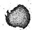

# REPORT NO.

# TITLE

# AUTHOR

# DATE

-- Metallurgical Investigations of Materials Univ. of California 3-13-51 Subjected to Liquid Lead-Bismuth Alloy Environ- ment

# REACTOR CHEMISTRY

Y-B31-227 Stability of Dow Corning Silicone Fluid 550 in Rowan, R. 1-17-51 the Presence of Sodium

# TUG-TOW SYSTEM

CF-50-12-77 Design Possibilities with Light-Weight Tug-Tow Gruber, A. R. 12-20-50 Shields

# EXPERIMENTAL ENGINEERING

ANP-57 Effects of Major Parameters on the Performance Fraas, A. P. 1-24-51 of Turbojet Engines   
Y-F12-4 NEPA Program for Large Liquid Metal Rig Haines, J. F. 2-1-51   
Y-F15-6 Progress Reports on Stainless Steel Acid Pumps Fraas, A. P. 2-1-51

Reworked to Test Special Features for Operation with Liquid Metals   
Y-F17-4 Fabrication Development Program Haines, J. F. 1-15-51

Savage, H. W.   
Y-F28-2 Preliminary Report on Experimental Determination Mann, E. R. 2-8-51

of Velocity of Sound in Fused Salts

# RADIATION DAMAGE

Y-F29-1 Radiation Damage and the ARE Smith, L. P. 2-28-51

# SUPERCRITICAL WATER SYSTEM

Quarterly Report on ANP Activities Dec., 1950 - Nuclear Development 3-5-51 Feb., 1951 Associates, Inc.

# 23. CHART OF THE TECHNICAL ORGANIZATION OF THE ANP PROJECT

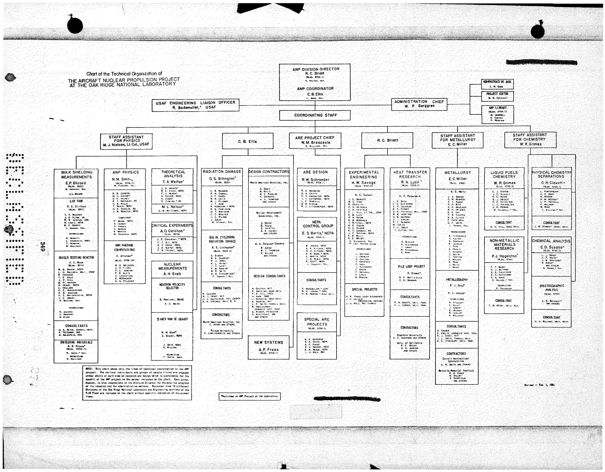