# LEGAL NOTICE

This report was prepared as an account of Government sponsored work. Neither the United States, nor the Commission, nor any person acting on behalf of the Commission:

A. Makes any warranty or representation, expressed or implied, with respect to the accuracy, completeness, or usefulness of the information contained in this report, or that the use of any information, apparatus, method, or process disclosed in this report may not infringe privately owned rights; or

B. Assumes any liabilities with respect to the use of, or for damages resulting from the use of any information, apparatus, method, or process disclosed in this report.

As used in the above, "person acting on behalf of the Commission" includes any employee or contractor of the Commission, or employee of such contractor, to the extent that such employee or contractor of the Commission, or employee of such contractor prepares, disseminates, or provides access to, any information pursuant to his employment or contract with the Commission, or his employment with such contractor.

ANP-65 (Del.)

Contract No. W-7405, Eng-26

# AIRCRAFT NUCLEAR PROPULSION PROJECT

# QUARTERLY PROGRESS REPORT

# for Period Ending June 10, 1951

R. C. Briant

Director, ANP Project

C-B-Ellis

Coordinator, ANP Project

Photostat Price $ 30.30

Microfilm Price $ 8.70

Available from the

Office of Technical Services

Department of Commerce

Washington 25, D.C.

Edited by:

W. B. Cottrell

This document is

PUBLICLY RELEASABLE

David t.h.m. n OSTI

Authorizing Official

Date 57/8/2017

DATE ISSUED:

SEP 13 1951

OAK RIDGE NATIONAL LABORATORY

operated by

CARBIDE AND CARBON CHEMICALS COMPANY

A Division of Union Carbide and Carbon Corporation

Post Office Box P

Oak Ridge, Tennessee

Declassified with deletions November 16, 1959

# DISCLAIMER

This report was prepared as an account of work sponsored by an agency of the United States Government. Neither the United States Government nor any agency thereof, nor any of their employees, makes any warranty, express or implied, or assumes any legal liability or responsibility for the accuracy, completeness, or usefulness of any information, apparatus, product, or process disclosed, or represents that its use would not infringe privately owned rights. Reference herein to any specific commercial product, process, or service by trade name, trademark, manufacturer, or otherwise does not necessarily constitute or imply its endorsement, recommendation, or favoring by the United States Government or any agency thereof. The views and opinions of authors expressed herein do not necessarily state or reflect those of the United States Government or any agency thereof.

# DISCLAIMER

Portions of this document may be illegible in electronic image products. Images are produced from the best available original document.

Page(s) Missing from

Original Document

Reports previously issued in this series are as follows:

ORNL-528

Period Ending November 30, 1949

ORNL-629

Period Ending February 28, 1950

ORNL-768

Period Ending May 31, 1950.

ORNL-858

Period Ending August 31, 1950

ORNL-919

Period Ending December 10, 1950

ANP-60

Period Ending March 10, 1951

# TABLE OF CONTENTS

# SUMMARY

# Part I. REACTOR DESIGN

1.

# INTRODUCTION TO PART I

7

# 1. DESIGN OF THE AIRCRAFT REACTOR EXPERIMENT

9

Reactor Design 10

Pressure-shell closure 13

Fuel header 13

Fluid Circuit 13

Control of the ARE 15

Liquid-fuel control system 15

Solid-absorber rod design 15

Control-system electrical diagram 16

Electronic-computer design 16

Remote Handling 16

Building Facility for the ARE 17

# 2. REACTOR PHYSICS

21

Introduction 21

IBM Calculations 23

IBM operation 23

Correction on $k_{eff}$ for effect of iteration of the fission source distribution 24

Adjoint calculations for the ARE 31

Design Calculations for the ARE 41

A study of various reflectors with two proposed ARE cores 41

Estimated critical mass of the ARE 47

Shim-control requirements and miscellaneous data 49

Recommendation on alternative loading 55

Control-rod effectiveness and heating 59

Reactivity coefficients and kinetic constants 64

Integration of nonlinear kinetic equations 66

Calculation for the Critical Experiment 71

Development of Numerical Procedures 73

Modification of age theory for sharp resonances 73

Integration of the transport equation in hydrogenous reactors 74

Reactor with absorbing interface between core and reflector 74

Engineering Calculations for the ARE 76

Fissions in the fuel-tube headers 76

Activity of fission products and heavy elements in ARE fuel 76

Importance of fuel in loading procedure on the ARE 76

3. CRITICAL EXPERIMENTS 82

Bare Uranium-Beryllium Critical Assembly 82

Critical Assembly of Air-Water Cycle Reactor 83

4. CHEMISTRY OF LIQUID FUELS 84

Phase Studies of Fluoride Systems 84

Rubidium fluoride-uranium fluoride 85

Cesium fluoride-uranium fluoride 86

Lead fluoride-uranium fluoride 86

Beryllium fluoride—uranium fluoride 86

Sodium fluoride--beryllium fluoride--uranium fluoride 90

Sodium fluoride—rubidium fluoride—uranium fluoride 90

Potassium fluoride-rubidium fluoride-uranium fluoride 90

Sodium fluoride--lead fluoride--uranium fluoride 90

Potassium fluoride--lead fluoride-uranium fluoride 90

Rubidium fluoride--beryllium fluoride—uranium fluoride 96

Potassium fluoride--beryllium fluoride—uranium fluoride 96

Binary systems containing no uranium 96

Suspensions or Solutions of Uranium in Molten Hydroxides 96

Behavior of uranium hydroxide suspensions at 250 to $500^{\circ}\mathrm{C}$ 99

Solubility of uranium in potassium hydroxide 101

Solubility of uranium in lithium hydroxide 101

Solubility of uranium in mixtures of sodium and lithium hydroxides 101

Phase equilibria in hydroxide systems 102

Fuel Recovery and Reprocessing 103

# Part III. MATERIALS RESEARCH 131

# INTRODUCTION TO PART III 133

# 10. COPROSION EXPERIMENTATION 135

# Static Corrosion by Sodium on Metals 135

Static Corrosion by Hydroxides on Metal Containers 147

Static Corrosion: Sodium-Inconel-Fluoride Fuel 147

Static Corrosion by Fluoride Melts on Metal Containers 148

Experimental procedure 148

Corrosion by outgassed NaF-BeF2-UF4 Melt 149

Corrosion by pretreated NaF-KF-UF4 Melt 150

Dynamic Corrosion by Liquid Metals 150

Thermal-convection loops (harps) 150

Forced-convection (figure-eight) loops 152

11: LIQUID-METAL AND HEAT-TRANSFER RESEARCH 154

Study of Free Convection in Liquid-Fuel Elements 155

Sodium Heat-Transfer Coefficients 156

Boiling-Liquid-Metal Heat Transfer 157

Sodium Hydroxide Heat-Transfer System 158

Transfer of Momentum and Heat in Annuli and Noncircular Ducts 158

Physical Properties 159

Heat capacity 160

Thermal. conductivity of liquids 161

Thermal conductivity of solids 162

Viscosity of liquids 164

Density of liquids 165

Supervision of Lead-Bismuth Contracts 165

Liquid Metals Handbook 166

12. COMPONENTS OF LIQUID-METAL SYSTEMS 167

Pumps 167

Electromagnetic pump for figure-eight loops 168

Centrifugal pump for figure-eight loops 168

Electromagnetic pumps for the ARE 170

Turbine pump 170

Canned rotor pump 170

Sodium Manometer 175

Investigation of Sodium Condensation 175

Seal Tests 176

Metal-to-metal seal 176

Graphite-gas seal 176

Thermal Conductivity of Steel Wool and Some Granular Solids 177

ARE Fuel-System Mock-Ups 176

Flow Testing 179

Fire-Extinguisher and Extinguisher-Materials Tests 180:

13: METALLURGICAL PROCESSES 181

Fuel Element Fabrication 181

Mechanically formed matrix 182

Sintering and bonding a loose powder 183

Hot-rolled clad fuel plate 187

Compatibility tests of potential fuel-element materials 187

Welding of Inconel 191

Manual inert-arc welding 191

Penetration in cone-arc welds 192

Welding of the ARE pressure shell 192

Creep and Stress-Rupture Laboratory 196

Irradiation of Fluoride Fuels 207

Y-12 cyclotron irradiation of fuel capsules 207

Analysis of irradiated-fuel capsules 208

Liquid-Metals In-Pile Experiment 211

Part V. APPENDIXES 229

20. ANALYTICAL CHEMISTRY 234

Metallic Corrosion Products in Reactor Fuels 235

Determination of Oxygen in Sodium 236

Potassium, and Cesium in Sodium 237

Oxygen in Helium and Argon 238

High-Temperature Reaction of Sodium with Sodium Tetraborate 239

Spectrographic Analysis of Sodium 240

Chemical Analysis of Sodium 240

Analytical Services 241

21. LIST OF REPORTS ISSUED 242

22. CHART OF THE TECHNICAL ORGANIZATION OF THE ANP PROJECT 245

1x-x

LIST OF TABLES   

<table><tr><td>Table 2.1</td><td>k_eff for Iterations of the Same Reactor</td><td>24</td></tr><tr><td>Table 2.2</td><td>Summary of Calculations for Reactor 907</td><td>32</td></tr><tr><td>Table 2.3</td><td>Comparison of k_eff andνcfor the Forward and Adjoint 
Calculations</td><td>33</td></tr><tr><td>Table 2.4</td><td>Composition of Cores and Reflectors</td><td>41</td></tr><tr><td>Table 2.5</td><td>Initial Slope of Reflector Savings Curve with 
Re-
flector Thickness, dS/dt for Four Different Reactors</td><td>44</td></tr><tr><td>Table 2.6</td><td>Calculation of k_eff of ARE and Uranium Investment</td><td>49</td></tr><tr><td>Table 2.7</td><td>Reactivity Changes Requiring Shim Control</td><td>50</td></tr><tr><td>Table 2.8</td><td>Comparison of 3 ft ARE Core and Proposed ARE Core with 
Reduced Volume</td><td>56</td></tr><tr><td>Table 4.1</td><td>Stability of Uranium-Hydroxide Suspensions at Various 
Temperatures</td><td>100</td></tr><tr><td>Table 4.2</td><td>Suggested Reactor Fuel Reprocessing Time</td><td>104</td></tr></table>

<table><tr><td>Table 10.2</td><td>Corrosion of Structural Metals by Outgassed NaF-BeF2-UF4in 100 hr at 800°C</td><td>149</td></tr><tr><td>Table 10.3</td><td>Corrosion of Structural Metals by Pretreated NaF-KF-UF4in 100 hr at 800°C</td><td>151</td></tr><tr><td>Table 11.1</td><td>Heat Capacity of Various Substances</td><td>160</td></tr><tr><td>Table 12.1</td><td>Summary of Thermal-Conductivity Studies of Granular Solids</td><td>178</td></tr><tr><td>Table 13.1</td><td>Loose-Powder Sintering and Bonding</td><td>184</td></tr><tr><td>Table 13.2</td><td>100&#x27;-hr Compatibility Tests of Potential Fuel Element Materials</td><td>188</td></tr><tr><td>Table 20.1</td><td>Recovery of Known Amounts of Oxygen in Sodium</td><td>237</td></tr><tr><td>Table 20.2</td><td>Oxygen in Unpurified Argon</td><td>238</td></tr><tr><td>Table 20.3</td><td>Reaction of Borax with Sodium</td><td>239</td></tr><tr><td>Table 20.4</td><td>Concentration of Minor Trace Elements in Sodium</td><td>241</td></tr><tr><td>Table 20.5</td><td>Summary of Service Analyses</td><td>241</td></tr></table>

LIST OF FIGURES   

<table><tr><td>Fig. 1.1</td><td>ARE Core, Reflector, and Pressure Shell Assembly</td><td>11</td></tr><tr><td>Fig. 1.2</td><td>ARE Reactor Assembly - Plan View</td><td>12</td></tr><tr><td>Fig. 1.3</td><td>ARE Fluid Circuit Installation</td><td>14</td></tr><tr><td>Fig. 1.4</td><td>Floor Plan of ARE Test Facility Building</td><td>18</td></tr><tr><td>Fig. 1.5</td><td>Section Elevation of ARE Test Facility Building</td><td>19</td></tr><tr><td>Fig. 2.1</td><td>Fission Distribution on Successive Iterations</td><td>26</td></tr><tr><td>Fig. 2.2</td><td>Iteration for Case of Assumed Source Distribution Having
Excess of Neutrons in Center</td><td>27</td></tr><tr><td>Fig. 2.3</td><td>Corrected keff vs. (B11-B)-1; Determination for Best Fit
of Eigenvalue</td><td>29</td></tr><tr><td>Fig. 2.4</td><td>Working Curves for Determination of B11 for Various Core
and Reflector Compositions and Thicknesses</td><td>30</td></tr><tr><td>Fig. 2.5</td><td>Spatial Distribution of Adjoint &#x27;Fissions&#x27; - Calculated
and Assumed</td><td>37</td></tr><tr><td>Fig. 2.6</td><td>Adjoint Function for Various Lethargy Groups</td><td>38</td></tr><tr><td>Fig. 2.7</td><td>Statistical Weight as a Function of Lethargy for Various
Space Points</td><td>39</td></tr><tr><td>Fig. 2.8</td><td>Comparison of Forward and Adjoint Fluxes as a Function of
Lethargy for the Same Space Point</td><td>40</td></tr><tr><td>Fig. 2.9</td><td>Reactivity of Core 50 of Radius &#x27;49.2 cm Backed by Various
Reflectors or Additional Core Material</td><td>43</td></tr><tr><td>Fig. 2.10</td><td>Reactivity of Core 84 of Radius 50.53 cm Backed by Various
Reflectors or Additional Core Material</td><td>45</td></tr><tr><td>Fig. 2.11</td><td>Reflector Savings of Various Reflectors Backing Cores 50
and 84</td><td>46</td></tr><tr><td>Fig. 2.12</td><td>Sketch of ARE Showing Reflector Thicknesses, Compositions,
and Dispositions</td><td>48</td></tr><tr><td>Fig. 2.13</td><td>Change in keff with Percent BeO in Reflector</td><td>52</td></tr><tr><td>Fig. 2.14</td><td>keff vs. Uranium Weight for A-1, A-2, A-3 ARE Designs</td><td>53</td></tr><tr><td>Fig. 2.15</td><td>Flux Spectrum in Standard ARE A-1 Design</td><td>54</td></tr><tr><td>Fig. 2.16</td><td>Spatial Power Distribution in ARE Core of Reduced Volume</td><td>57</td></tr><tr><td>Fig. 2.17</td><td>Spatial Power Distribution in 3&#x27; Standard ARE</td><td>58</td></tr></table>

Fig. 2.18 Fractional Change of $k_{eff}$ with Fractional Change of Uranium Weight vs. $k_{eff}$ 65   
Fig. 2.19 Flux Response of the ARE to a Step Increase in Reactivity of 0.009125 68   
Fig. 2.20 Fuel Temperature Response of ARE to a Step Increase in Reactivity of 0.009125 69   
Fig. 2.21 Phase Diagram of Relative Excess Power vs. Excess Fuel Temperature of the ARE Following a Step Increase in Reactivity of 0.009125 70   
Fig. 2.22 Gamma Heating of Fission Products After Shutdown as a Function of Cooling Time 77   
Fig. 2.23 Curves of $\mathbf{U}^{237}$ Activity After Shutdown as a Function of Cooling Time and Operating Time 78   
Fig. 2.24 Total Number of Grams of $\mathbf{U}^{236}$ Produced per Operating Watt as a Function of Operating Time 79   
Fig. 2.25 Total Number of $\mathbf{Pu}^{239}$ Grams Produced per Operating Watt as a Function of Operating Time for Zero Cooling Time and for Infinite Cooling Time of Fuel 80   
Fig. 4.1 The System RbF-UF 87   
Fig. 4.2 The System CsF-UF4 88   
Fig. 4.3 The System $\mathsf{PbF}_2\text{-UF}_4$ 89   
Fig. 4.4 The System NaF-BeF $_2$ -UF $_4$ 91   
Fig. 4.5 The System NaF-RbF-UF 92   
Fig. 4.6 The System KF-RbF-UF 93   
Fig. 4.7 The System NaF-PbF $_2$ -UF $_4$ 94   
Fig. 4.8 The System $\mathbf{KF - PbF_2 - UF_4}$ 95   
Fig. 4.9 The System $\mathbf{RbF - BeF}_2\cdot \mathbf{-UF}_4$ 97   
Fig. 4.10 The System KF-BeF $_2$ -UF

Fig. 10.1 Unidentified Phase in Grain Boundary and Within Grain Surface Zone of 304 Stainless Steel After 40 hr Exposure to Sodium at $1000^{\circ}\mathrm{C}$ 137   
Fig. 10.2 Unidentified Phase in Grain Boundary and Within Grain Surface Zone of 316 Stainless Steel After 40 hr Exposure to Sodium at $1000^{\circ}\mathrm{C}$ 138   
Fig. 10.3 Surface of Molybdenum Specimen After 100 hr Exposure to Sodium at $1000^{\circ}\mathrm{C}$ 139   
Fig. 10.4 Appearance of Thin Molybdenum Specimen After 100 hr Exposure to Sodium in System Containing Silicon at $1000^{\circ}\mathrm{C}$ 140

Fig. 11.1 Comparison of ORNL Thermal Conductivity vs. Temperature Data with Data in the Literature 163   
Fig. 12.1 Centrifugal Pump Suction Baffle 169   
Fig. 12.2 Liquid-Metal Seal for Centrifugal Pump 171   
Fig. 12.3 Two-Stage Electromagnetic Pump 172   
Fig. 12.4 Improved Sealless Pumping System 174   
Fig. 13.1 Effect of Surface Preparation on the Bonding of Loose Powders Containing $\mathsf{UO}_2$ to a 316 Stainless Steel Plate 185   
Fig. 13.2 Difference in Sintering in Stack of Eleven 316 Stainless Steel Plates with Bonded Powder 186   
Fig. 13.3 Effect of Stainless Steel Particle Size on $\mathbf{U}\mathbf{O}_2$ Distribution After Cladding by Hot Rolling 189   
Fig. 13.4 Effect of Iron Particle Size on $\mathbf{U}\mathbf{O}_2$ Distribution After Cladding by Hot Rolling 190

Fig. 13.5 Manually Welded Inconel Tube-to-Header Tensile Test "Pairs" 193   
Fig. 13.6 Cross-Section of Inconel Tube-to-Header Manual Inert Arc Weld 194   
Fig. 13.7 Cross-Section of Inconel Tube-to-Header Inert "Cone-Arc' Weld 195

Fig. 13.8 Stress-Rupture Testing Machines and Argon Atmosphere Furnaces 197   
Fig. 13.9 Atmosphere Furnace and Pull Rod Assemblies for Round Bar on Sheet Specimens 198

Fig. 14.5 Unirradiated and Irradiated Globe Iron Samples 212   
Fig. 14.6 Liquid-Metal In-Pile Loop 213

# SUMMARY

This quarterly progress report of the Aircraft Nuclear Propulsion Project at the Oak Ridge National Laboratory is divided into four parts. Each of these parts - Reactor Design, Shielding Research, Materials Research, and Alternative Systems - contains a separate introduction to indicate the specific areas covered in the subsequent discussions.

The design of the Aircraft Reactor Experiment (Sec. 1) has been further refined from that first established as the prototype of the quiescent liquid-fuel-liquid-metal-cooled aircraft reactor. Without compromising the distinguishing features of the aircraft reactor, the present ARE design incorporates many engineering simplifications, prominent among which is the use of individual sealed fuel pins containing the liquid fuel (Sec. 1) and the proposed use of a small reactor core (Sec. 2). The fuel itself (Sec. 4) may be any one of several ternary fluoride mixtures now known to possess a sufficiently low melting point.

The required uranium investment in the present ARE design is calculated to be $27\mathrm{lb} + 10\%$ , $-20\%$ . The shim-control requirement from room temperature start-up to operating full power including fission product poisons is estimated to be $11\%$ , for which four to six control rods are recommended. Recent calculations of reflector effects on the equivalent ARE core have led to the proposal that the volume of the active core be reduced by one-third and the reflector thickness increased correspondingly. Such a change would effect a saving in uranium investment, reduce control requirements, and have a smaller peak—to-average power ratio, all at the expense of an unimportant decrease in neutron lifetime (Sec. 2).

The liquid-metal coolant for this reactor is sodium, as had been previously proposed, and present corrosion research (Sec. 10), both static and dynamic, is predominantly with this liquid-metal coolant. Inconel still appears to offer satisfactory resistance to both sodium and fluoride fuel corrosion. However, recent, more refined corrosion tests indicate that some of the stainless steels (304, 316, 321, and 347) may be equally as satisfactory as inconel with both fluoride fuel and sodium. These data may argue against the ultimate selection of inconel for the aircraft reactor although it is now specified for the ARE. (The phenomenon of mass transfer in a bimetallic

system may necessitate the use of the same structural metal throughout the reactor core.) The sodium corrosion data are not yet considered completely conclusive as the experimental conditions did not prohibit mass transfer.

The radiation stability of the fuel (Sec. 14) is still a point in question although considerable effort has now been directed toward this problem. In most other respects, i.e., concerning the beryllium oxide moderator, sodium coolant, and inconel structural material, radiation damage effects are not expected to be serious, although creep rates, corrosion rates, and thermal conductivity values may be somewhat modified.

Perhaps the most significant recent developments are those directed toward the fabrication (Sec. 13) and operation of the ARE reactor. Orders have been placed for all metallic components of the reactor core — fuel element tubing, coolant tubing, pressure shell, and miscellaneous sheet and bar stock — as well as the beryllium oxide moderator and boron carbide curtain (Sec. 1). Furthermore, mock-ups of core fluid circuits and their components are now being tested (Sec. 12) so that these features will be operable when installed on the reactor. The building facility (Sec. 1) for the ARE is scheduled for completion in March, 1952, or earlier, and operation of the reactor should commence during the summer of 1952.

In addition to the research directed toward the successful design and operation of the liquid-fuel-liquid-metal-cooled test reactor, the Laboratory is supporting the analysis of other reactor types which are potentially useful for aircraft nuclear propulsion. Included among these reactor systems are the homogeneous reactor (1) the circulating-fuel reactor (Sec. 18), sodium and mercury-vapor cycle reactors (Sec. 17), the supercritical-water reactor (Sec. 15), and the supersonic tug-tow system (Sec. 16). Although each of these reactor systems except the mercury-vapor cycle reactor may turn out to be feasible as an aircraft reactor, the superiority of none is considered by the Laboratory to be sufficiently clear-cut yet to warrant intensive development at this time.

The personnel employed on the Aircraft Nuclear Propulsion Project have increased in number so that, including both full-time and part-time employees,

there are now 275 technical persons engaged in all phases of the research work. It is expected that the number of personnel will increase with the installation and operation of the ARE and will level off somewhere around 300. The capacity of this organization is supplemented by the services of 27 consultants and 12 subcontracted research organizations.

# RESEARCH RESULTS

From the body of research now underway.on all problems associated with this project, some of the more tangible results obtained during the quarter are listed below.

# Reactor Physics

1. Extensive calculations of reflector effects with the 3-ft ARE core for several reflector compositions and thicknesses indicate that (a) the greater the volume fraction of BeO in the reflector the more effective the reflector, and (b) a good reflector (more than $97\%$ BeO) is more effective than additional core material for small thicknesses (Sec. 2).   
2. If the 3-ft ARE core should be decreased in volume by one-third (by removing the outer row of fuel tubes) and this volume replaced by reflector, the resulting reactor would require (a) $23\%$ less uranium investment, (b) $26\%$ less start-up shim-control requirements, and (c) $12\%$ lower peak-to-average power ratio. The neutron lifetime would be slightly decreased (Sec. 2).   
3. The calculated reactivity of the first experimental beryllium-uranium critical assembly is 0.90 for a configuration which actually was just critical, i.e., a reactivity of 1.00. The remaining discrepancy (0.10) may be in the estimated cross-section for the $\mathrm{Be}(n,2n)$ reaction (Secs. 2, 3, and 9).

# Materials Research

8. Static-corrosion tests for 100 hr at $800^{\circ}\mathrm{C}$ on types 304, 316, 321, and 316 stainless steel and inconel by the outgassed $\mathsf{NaF - BeF}_2\cdot \mathsf{UF}_4$ fuel mixture resulted in average depths of attack of 2.5, 1.5, 1.0, 2.0, and 5.0 mils, respectively (Sec..10).

10. The following thermal capacities (in cal/g °C) have been determined: zirconium, 0.086 from 200 to $600^{\circ}\mathrm{C}$ ; NaOH, 0.44 from 450 to $750^{\circ}\mathrm{C}$ ; nickel A, 0.125 from 400 to $600^{\circ}\mathrm{C}$ and 0.162 from 800 to $1000^{\circ}\mathrm{C}$ ; and 316 stainless steel, 0.133 from 100 to $700^{\circ}\mathrm{C}$ and 0.185 from 900 to $1000^{\circ}\mathrm{C}$ (Sec. 11).   
11. The thermal conductivity of iron measured from 100 to $700^{\circ}\mathrm{C}$ agrees well (maximum deviation $5\%$ ) with published data; that of aluminum between 100 and $400^{\circ}\mathrm{C}$ does not agree well with the latest data (Sec. 11).   
12. A new electronic welding technique has been developed for the semiautomatic welding of small-diameter tubing. The degree of weld penetration may be predetermined by control of geometry, heat input, and time (Sec. 13).

13. The creep rate of 347 stainless steel under irradiation in the X-10 pile (about $10^{12} \, \text{n/cm}^2/\text{sec}$ ) was $25\%$ lower than that of a similar but unirradiated creep specimen. The creep rate under irradiation gives essentially a linear curve through the 300 hr of test (Sec. 14).

# Chemistry

15. The temperature contours of the ternary fluoride systems. NaF-BeF $_2$ -UF $_4$ , NaF-KF-UF $_4$ , NaF-RbF-UF $_4$ , RbF-BeF $_2$ -UF $_4$ , and NaF-PbF $_2$ -UF $_4$ ; as well as of several others, have been determined. All of those listed, however, possess a melting point below $525^{\circ}\mathrm{C}$ and therefore may be regarded as possible reactor fuels (Sec. 4).

# Alternative Systems

17. As a result of their analysis of the mercury-vapor compressor jet with a liquid-metal-cooled reactor, North American Aviation, Inc., concludes that this system is not suitable for the propulsion of a supersonic nuclear aircraft, primarily because of the unfavorable vapor pressure characteristics of mercury.

18. A reactor using a solution of uranium in liquid bismuth as the circulating fuel and coolant is suitable for subsonic aircraft propulsion provided corrosion-resistant container material can be found, according to a study made by The H. K. Ferguson Co., Inc.

# Part I

# REACTOR DESIGN

# INTRODUCTION TO PART I

The design of the Aircraft Reactor Experiment (Sec. 1), a low-power (3-megawatt) reactor, is essentially complete. Although the principal features of this reactor, including the liquid-metal coolant and quiescent liquid fuel, have remained intact, so that these and the materials duplication of the 200-megawatt reactor are not compromised, there have been numerous modifications in the design of the prototype reactor. The modifications have been mainly engineering improvements or, as in the case of the elimination of the fuel header, for the purpose of permitting development of subsystems independent of the reactor itself.

The work of the Reactor Physics Group (Sec. 2) has been closely coordinated with the engineering variations of the ARE. Calculations of critical mass, flux, and power-distribution reflector effects have not only defined the design criteria for the reactor but have also indicated substantial improvements, for example, the use of a smaller core. Other activities of this group are directed toward the Critical Experiment (Sec. 3), for which calculated critical masses are now being more accurately determined for the BeO-U assembly, and toward more fundamental information in reactor physics, i.e., the development of numerical procedures and the effect of various parameters on the reactor.

The search for the most satisfactory liquid fuel for this reactor is continuing in the investigation of ternary fluoride systems containing molten uranium tetrafluoride (Sec. 4). Although several such systems with sufficiently low melting point exist, none possesses this melting point over a sufficiently wide range of uranium concentrations. Investigation of solutions of uranium in hydroxide is being pursued with some success, and cursory appraisal of fuel reprocessing and recovery for the ARE has not revealed any serious difficulties.

# 1. DESIGN OF THE AIRCRAFT REACTOR EXPERIMENT

R. W. Schroeder, ANP Division

Progress has been made in the layout of all ARE components, which has permitted the placement of orders for some materials and some components. In cases in which further experimentation is required prior to establishing a design, the material and component orders are such as to include a maximum of latitude for the accommodation of features that may be required.

The design of the building facility for the ARE has been completed, and construction should begin in July. The building is tentatively scheduled for completion by March, 1952.

# REACTOR DESIGN

The overall reactor design is very similar to that described in the last quarterly report.(2) However, there have been many minor modifications; the current concept of the ARE core, reflector, and pressure-shell assembly is illustrated in Figs. 1.1 and 1.2. These modifications have been of such a nature as to permit the placement of orders for core components. Fuel-element tubing, coolant tubing, and other thin-walled tubing have been ordered from the Superior Tube Company. The pressure-shell components are on order with the Lukenweld Division, Lukens Steel Company. Boron carbide and beryllium oxide hexagonal blocks have been ordered from the Norton Company. Miscellaneous sheet, plate, and bar stock for core components have been ordered from the Tulls Metal Company, an International Nickel distributor.

(1) R. W. Schroeder, "Design of the 200-megawatt Aircraft Reactor," Aircraft Nuclear Propulsion Project Quarterly Progress Report for Period Ending March 10, 1951, ANP-60, p. 28 (June 19, 1951).   
(2) R. W. Schroeder, "Design of the Aircraft Reactor Experiment," ANP-60, op. cit., p. 45.

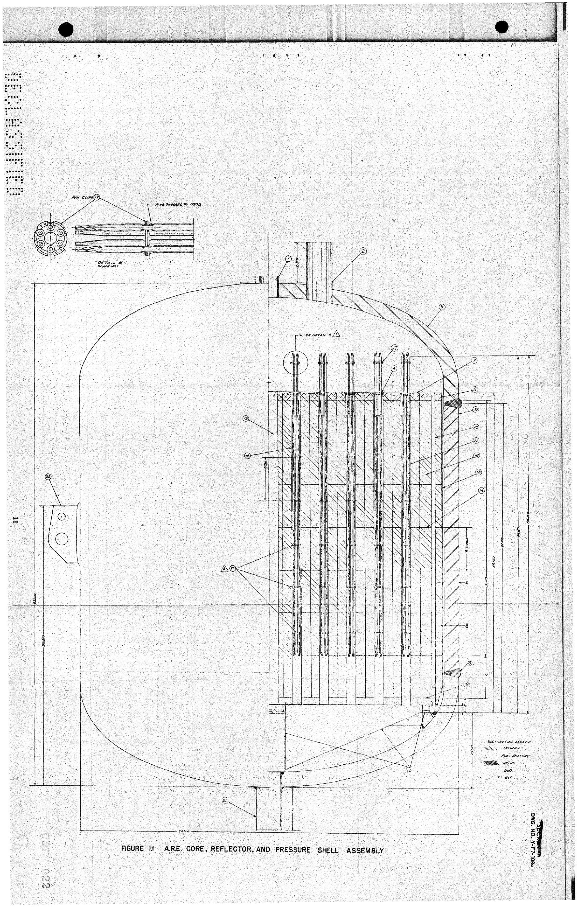

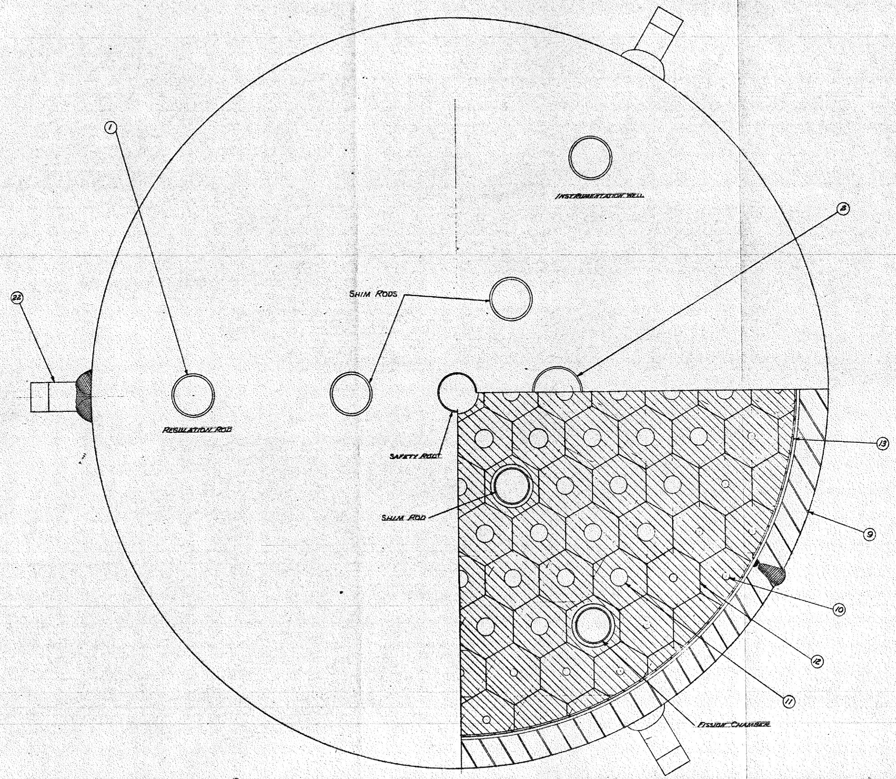  
M3IANVd-1BnssvAeOReEeEe

Pressure-Shell Closure. The final closure of the pressure shell has been investigated from the standpoint of employing a welded closure or a gasketed joint. Discussions have been held with the Lukens Steel Company, Babcock and Wilcox, International Nickel, U. S. Gasket Corp., and Johns-Manville. No one with whom this problem was reviewed knew of any comparable instance in which a gasketed joint had been used successfully. Furthermore, gasket development has been so largely empirical that extrapolation from existing practice does not appear to permit prediction of performance at ARE temperatures. It appears probable, therefore, that the ARE pressure shell will include only welded joints. Nevertheless, the incentives for the development of a gasketed joint are such as to warrant expenditure of some effort on the problem, and a gasketed-flange development program is being initiated and pressure-shell flange blanks are on order to permit the use on the ARE of gasketed flanges if results of the program should indicate their feasibility.

Fuel Header. Tentative fuel-manifolding systems have been designed to permit external fuel drainage and recharging, and experimentation has started with glass models.* A more detailed scrutiny, however, of the developmental program that seems to be required and of the final design, procurement, and fabrication times indicates that this system may well become available later than other ARE components. Accordingly, the necessity of including the manifolding system in the ARE has been reviewed. Inasmuch as the attributes of the manifolding system relate primarily to maintenance rather than operation, it has been decided to seal the fuel in individual elements for the ARE, and to continue development of the manifolding system for later usage.

# FLUID CIRCUIT

The ARE heat-disposal system as currently designed includes two parallel loops, each transmitting heat from sodium to helium in one set of heat exchangers, and thence from helium to water in another set of heat exchangers. Figure 1.3 illustrates a tentative geometric arrangement of the components of this fluid circuit.

Analysis of this system has indicated that the desired performance will be attained with commercially available centrifugal gas blowers, commercially available copper-finned-tube gas-to-water cross-flow exchangers, and cross-flow sodium-to-helium exchangers consisting of 1-in. bare inconel pipe.

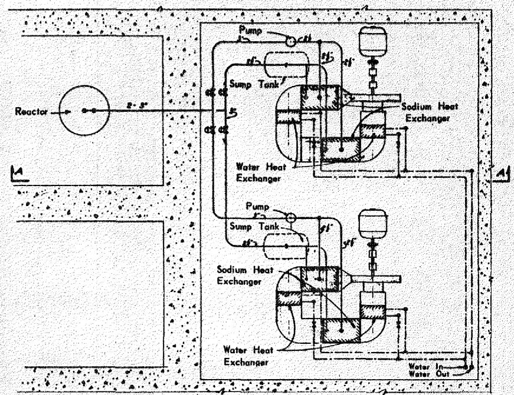  
PLAN

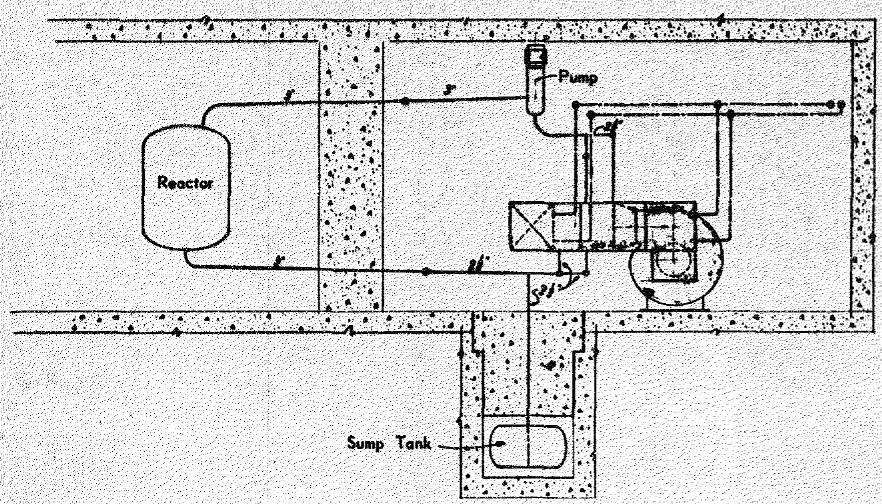  
SECTION A A   
FIGURE 1.3 ARE FLUID CIRCUIT INSTALLATION

Quotations have been received for the blowers, and inquiries regarding the heat exchangers have recently been mailed to several manufacturers. Detailed design of the sodium-to-helium heat exchanger is in process, and the ORNL design will be compared with any proposals received from outside manufacturers.

# CONTROL OF THE ARE

# E. S. Bettis, Research Director's Division

The liquid-fuel control apparatus, which decreases the fuel volume in the core, is to be supplemented by a solid-absorber-rod control of a more conventional design.(1) The outstanding difficulty in this apparatus is the relatively high heat generation in the rod itself. The electronic control system for the regulating rod has been completed and is similar to existing (MTR) control circuits. The reactor dynamic computer, which will be of service to other reactors as well as to the ARE, should be completed in time to be of use in final ARE design calculations.

Liquid-Fuel Control System. A test rig is being built for testing the bellows operation for moving a high-temperature liquid, which is required to change the volume of the liquid fuel in the ARE reactor for control purposes. The test will determine the life of conventional type bellows when used to pump high-temperature liquids. Na-K will first be employed on both sides of the bellows.

Solid-Absorber-Rod Design. The primary consideration in the design of the absorber rod is the provision for the high temperature of the reactor and the relatively large amount of heat developed in the rod by the nuclear reactions therein. Calculations of the heat generated in $\mathbf{B}_4\mathbf{C}$ absorber rods indicate that it is of the order of 100 to 150 watts per centimeter (length), although helium cooling will apparently be adequate. Some thought has been given to the possible use of cadmium or hafnium absorber rods since the heat generation in them would be considerably less.

The rod configuration will probably take the form of (1) a centrally located safety rod with approximately $4\% \Delta k / k$ , (2) three shim rods forming an equilateral triangle with each vertex one-fourth radius from the center of the core, each rod effecting approximately $3\% \Delta k / k$ , and (3) a regulating rod

located in the reflector and effecting approximately $0.75\% \Delta k / k$ . In addition to the central safety rod, additional safety absorber, possibly in the form of B4C shot, may be provided for placement inside the shim-rod thimbles in case the shim rods become jammed or inoperable for any reason.

All rods are equipped with release mechanism to be actuated by a "scram" signal, and it is tentatively planned that the rods will have a positive drive in both insert and withdraw directions. Because of the possible misalignment and warping of the rod and its socket in the reactor, the rods must be partially articulated. Several rough designs of such rods have been made.

Control-System Electrical Diagram. A block diagram of the control system showing the sensory instrumentation, interlocks, and electronic components (amplifiers, servos, etc.) in an integrated system has been completed. All the basic electronic components are available as tested designs, having been proved in the MTR and Shield Testing Reactors over a period of time. The fission chamber for use in the ARE is about the only control item which will have to be changed in order to operate at the elevated temperature.

The core-coolant outlet temperature provides the signal which actuates the regulating rod. Since the whole system is based on the stabilizing effect of the expanding liquid fuel, the actuation of the regulating rod is slow (except, of course, in scrambling), and shim control to keep the regulating rod in range will be accomplished manually by the operator. Since the high temperature leads to malfunctioning of any automatically actuated mechanical device, it is thought advisable to add an additional manually operated "superscream." Details of this system are not yet worked out, but the basic idea is incorporated in the control system.

Electronic-Computer Design. The long-range project of the reactor dynamic computer will apply to the ARE as well as to other reactor studies. Design of this computer is well underway. It is expected that the computer will be completed in time to be of use in final ARE design.

# REMOTE HANDLING

The remote-handling plan provides for destructive disassembly of the reactor, under borated water, after operation at power. Salvage and reuse of fuel and moderator, but scrapping of other components, are planned. This

entails underwater cutting of the pressure-shell dome, for core access, and cutting of the core can and coolant tubes for moderator salvage. Current planning provides for accomplishment of the former with rubber-bonded abrasive wheels and the latter with small cutting tools. Layouts of the required tools have been made, and detailed drawings are in progress. Welding and cutting of steel and inconel plate are in progress in the Y-12 Shops to obtain data necessary for the design of the disassembly tools.

# BUILDING FACILITY FOR THE ARE

The building drawings were received from our architectural contractor, the Austin Company, and were forwarded to the AEC on May 29, 1951, for advertisement and awarding of contract. June 27, 1951, has been set as the last day for receipt of bids. The specifications allow 240 days for completion after notice to proceed, or 180 days after delivery of structural steel, whichever may be the greater. The Austin Company steel plans have been released for procurement of building steel. Several quotations have been received indicating September delivery. Placement of the order within several days is anticipated. Design of internal building features is in progress, and several initial layouts have been made. Figures 1.4 and 1.5 illustrate the building shell as designed by the Austin Company as well as certain internal features as currently planned.

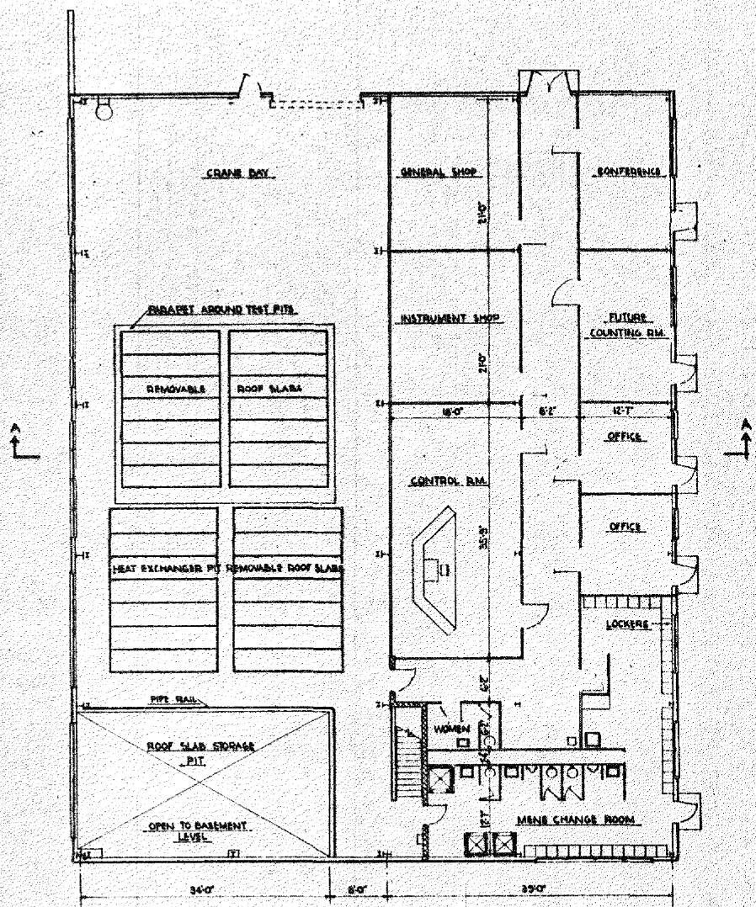  
FIRST FLOOR PLAN

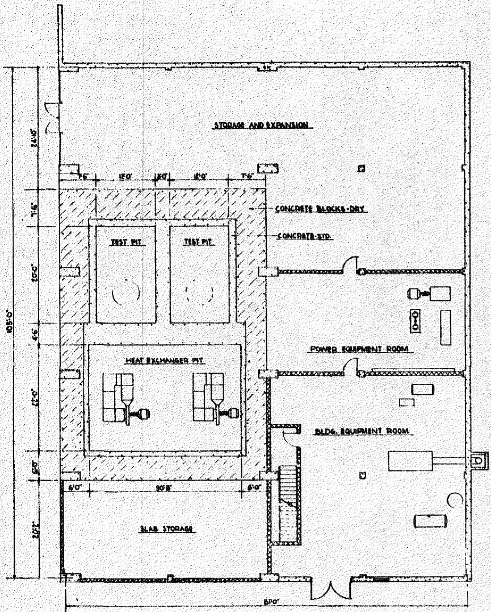  
BASEMENT PLAN   
FIGURE 1.4 FLOOR PLAN OF ARE TEST FACILITY BUILDING

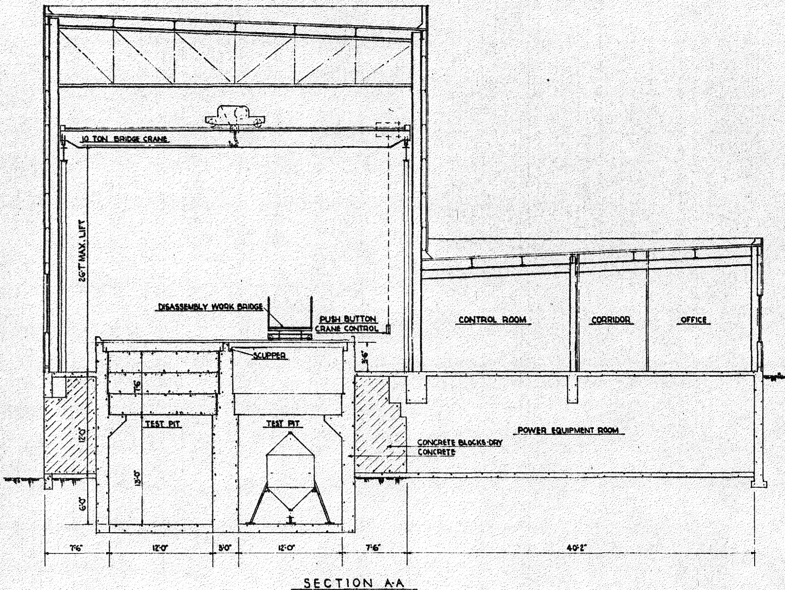  
FIGURE 1.5 SECTION ELEVATION OF ARE TEST FACILITY BUILDING

# 2. REACTOR PHYSICS

N. M. Smith, Jr., Chairman, ANP Physics Group, ANP Division

A. Introduction   
B. IBM Calculations   
C. Design Calculations for the ARE   
D. Calculations for the Critical Experiment   
E. Development of Numerical Procedures   
F. Engineering Calculations for the ARE

# A. INTRODUCTION

The ANP Physics Group has been largely occupied during the past quarter with calculations of the statics of the ARE. The IBM operation has been speeded up, and a rapid correction for the discrepancy between assumed and resulting fission distributions has been developed and exploited. The first complete IBM calculation of the adjoint function is reported.

The required uranium investment in the ARE A-3 design series including six control rods is estimated to be 27 lb, +10%, -20%. The shim-control requirements from room-temperature start-up to operation at full power and with fission-product poisons is estimated to be 11%. A control rod composed of 2 in. of B C of wall thickness 0.335 in. lying along the longitudinal axis, together with the permanent thimble isolating it from the sodium coolant, is estimated to reduce the reactivity by 5.3%; the thimble alone, by 1.4%. Thus the control rod alone is worth 3.9% in reactivity. Based on this estimation three rods are just sufficient, but four to six are recommended.

The results of extensive calculations on the effect of various reflectors backing the ARE core have been presented graphically, and have led to the recommendation that the ARE core be decreased in size. The core size may be decreased very simply and with minimum disturbance of the present design by converting the outer row of fuel-tube clusters into reflectors. The decrease in core size results in a design requiring (a) appreciably less (23%) uranium investment, (b) appreciably less (26%) start-up shim-control requirement, and (c) smaller (12%) peak-to-average power ratio. The neutron lifetime will be slightly, but not importantly, decreased.

Reactivity coefficients and kinetic constants have been computed for the ARE A-1 design series and are presented. The integration of the nonlinear time-dependent equations linking power, delayed neutrons, and fuel temperature has been completed in one specific case by IBM machine procedure, and a program of calculations has been initiated. With the present set-up, and using a time interval of 1 msec, 1 hr is required to compute a kinetic response of 1 sec duration. This first result, in which the assumption is made that only conductive heat transfer occurs in the fuel, indicates a maximum fuel-tube pressure following a step change of 0.009125 in reactivity of only 0.3 lb/in.[2] Thus in future designs appreciably longer fuel tubes can be used.

Further calculations on the uranium-beryllium critical assembly have failed to produce agreement with experiment. Interest in the $\mathrm{Be}^9 (n,2n)\mathrm{Be}^8$ reaction has been revived as a source of this discrepancy. It is shown that the existing data on this reaction do not rule out the assumption that the $(n,2n)$ yield is sufficiently great to account for up to $10\%$ in reactivity in the assembly.

Studies aimed at the development of future numerical procedures have been continued. An investigation of the modification necessary in Fermi age theory to take into account the effects of sharp resonances has resulted in the conclusion that the error in the present methods due to this cause is probably small. Integration of the Boltzmann time-dependent transport equation by the spherical-harmonic method for application to the study of hydrogenous reactors is being investigated for IBM machine procedures. Two theoretical methods for the computation of the effect of the boron curtain have been developed, and a calculation has been initiated.

Various engineering calculations are reported; in particular, the activity of fission products and heavy elements in the liquid fuel has been computed for various running and waiting times and the results are presented.

# B. IBM CALCULATIONS

IBM Operation (F. C. Uffleman and Phyllis Johnson, Uranium Control and Computing Department). Reactors. During the period ending June 1, 1951, the IBM Section completed calculations on 86 reactors. Included in these 86 reactors were nine bare reactors calculated by the end-point linear approximation (EPLA) method(1) and two iterations, using different source distributions, of an adjoint calculation. The adjoint EPLA calculation is now setup with the exception of the balance checks for core and reflector, and the forward EPLA reactor calculation is completely set up. Time estimates for the completion of a reactor are as follows:

1. Forward calculation, assuming core and reflector constants are already calculated, about 19 hr to calculate the reactor twice.   
2. Adjoint calculation, including the necessary recalculation of certain constants, about 22 hr to calculate the reactor twice.

These estimates are for calculating one reactor at a time, starting with a new source distribution and carrying through to the final labeling of the lists. However, in actual practice one operator may be working on several reactors so that the current estimate of the production rate for five operators and one operating supervisor is 12 reactors per week. This estimate includes calculating each reactor twice, so that 24 reactors are actually calculated, and having an average amount of machine breakdown with resulting corrections to be made. A very conservative estimate of the time required for a hand computer to calculate one reactor is six weeks, assuming that no mistakes are made. Allowing another hand computer to check and make corrections in the same period of time, it is possible for two hand computers to turn out one finished (and checked) reactor in six weeks. In the same period the IBM group of six can turn out 72 finished (and checked) reactors, or the equivalent of 144 hand computers' production. The IBM production includes, in addition, a number of calculations which are not included in the hand-computer production. To be considered along with the quantity of reactors produced is the fact that an IBM-calculated reactor can be available in as little as 24 hr, whereas the hand-computed reactor is not available for six weeks after the basic specifications are determined.

Cores and Reflectors. During the period ending June 1, 1951, average cross-sections and "constants" were calculated for 22 cores and 10 reflectors, and "constant" variations were calculated for 26 cores and reflectors.

Basic cross-section card files now include key-punched and weighted cross-sections for 23 elements or compounds, as well as 19 variations (such as different self-shielding effects) of the uranium cross-sections. Average and end-point cross-sections and constants have been completed for 89 cores and 16 reflectors.

Correction on $k_{eff}$ for Effect of Iteration of the Fission Source Distribution (2) (N. M. Smith, Jr., ANP Division). It is necessary in solving the multigroup equations numerically for the eigenvalue, $\nu_{c}$ , i.e., the number of neutrons for fission needed to keep the flux stationary, to first assume a fission distribution. Using this assumed source of neutrons, the resulting fluxes, leakages, absorptions, fissions, etc. are computed, leading, finally, back to a new fission distribution.

If the resulting normalized fission distribution is very different from the assumed distribution, the problem must proceed through another calculation, or iteration, using the result of the first calculation as a starting point. The effective multiplication constant, $k_{eff} = \nu / \nu_c$ , is affected by the error between the assumed fission neutron source and its final, stable, iterated shape. This error in $k_{eff}$ in some cases has been as high as 10%. In Table 2.1 a series of iterated calculations on the same reactor is given as an example, in which the prediction of infinite iteration based on assumption of geometrical progression of $\Delta k_{eff} = 1.02661$ .

TABLE 2.1   
$k_{eff}$ for Iterations of the Same Reactor   

<table><tr><td>REACTOR CALCULATION DESIGNATION</td><td>SOURCE ASSUMEDa</td><td>keff</td><td>Δkeff</td><td>Δki/Δki-1</td></tr><tr><td>857</td><td>Mn 814</td><td>0.94053</td><td></td><td></td></tr><tr><td>873</td><td>Mn 857</td><td>1.00507</td><td>0.06454</td><td>4.390</td></tr><tr><td>898</td><td>Mn 873</td><td>1.01977</td><td>0.01470</td><td>3.140</td></tr><tr><td>900</td><td>Mn 898</td><td>1.02444</td><td>0.00467</td><td></td></tr></table>

* “M. 814” means the fission distribution resulting from calculation No. 814; other numbers have similar meaning.   
(2) This is discussed in more detail in the report by N. M. Smith, Simple Correction on Multiplication. Constant for Difference Between Assumed and Resulting Fission Distribution in Multigroup Calculations, ORNL, Y-12 Site, Y-F10-56 (May 22, 1951).

The fission distributions resulting from these calculations, as well as the original assumed fission distribution, are shown in Fig. 2.1. It is to be noted that an excess of fissions at large radii was assumed, and that $k_{eff}$ increased on iteration. This is a typical effect and results from the fact that the source neutrons were put at positions of greater radii than the stationary (infinitely iterated) position where they have less "importance" than near the center. If the assumed distribution were to be lumped at the center more than the stationary distribution, the $k_{eff}$ would decrease on iteration (Fig. 2.2).

Let $A(r)$ be the assumed fission distribution, $R(r)$ that resulting from one calculation, and $I(r)$ that resulting from an infinite number of iterations; then the error in the multiplication constant is given by

$$
\left. \right.\left[ \frac {\Delta k}{k} \right] _ {e f f} = \frac {\int_ {r} \int_ {u} \phi^ {\dagger} (r , u) [ A (r) - I (r) ] f (u) d r d u}{\int_ {r} ^ {a} \int_ {u} \phi^ {\dagger} (r , u) I (r) f (u) d r d u}, \tag {1}
$$

where $\phi^{\dagger}(r,u)$ is the adjoint function (which, depending on normalization, can be the iterated fission expectation, or the importance function), $f(u)$ the fission spectrum, $dr$ the spatial volume element, and $du$ the lethargy element. The integrals are to be taken over appropriate volume in phase space.

A very handy, simple, and rapid estimate of $\Delta k / k$ can be made by two simple approximations. Since the iterated fission distribution, $I(r)$ , is never available, but instead only the distribution $R(r)$ resulting from one generation of neutrons, the first approximation will be to replace $I(r)$ by $R(r)$ . An inspection of the adjoint spatial distribution reveals that the shape is roughly the same for various $u$ 's, and, furthermore, is roughly a $(\sin \omega r) / r$ function. Assuming, then, that

$$
\phi^ {\dagger} (r, u) = \frac {\sin \omega r}{r} \Phi^ {\prime} (u), \tag {2}
$$

there results

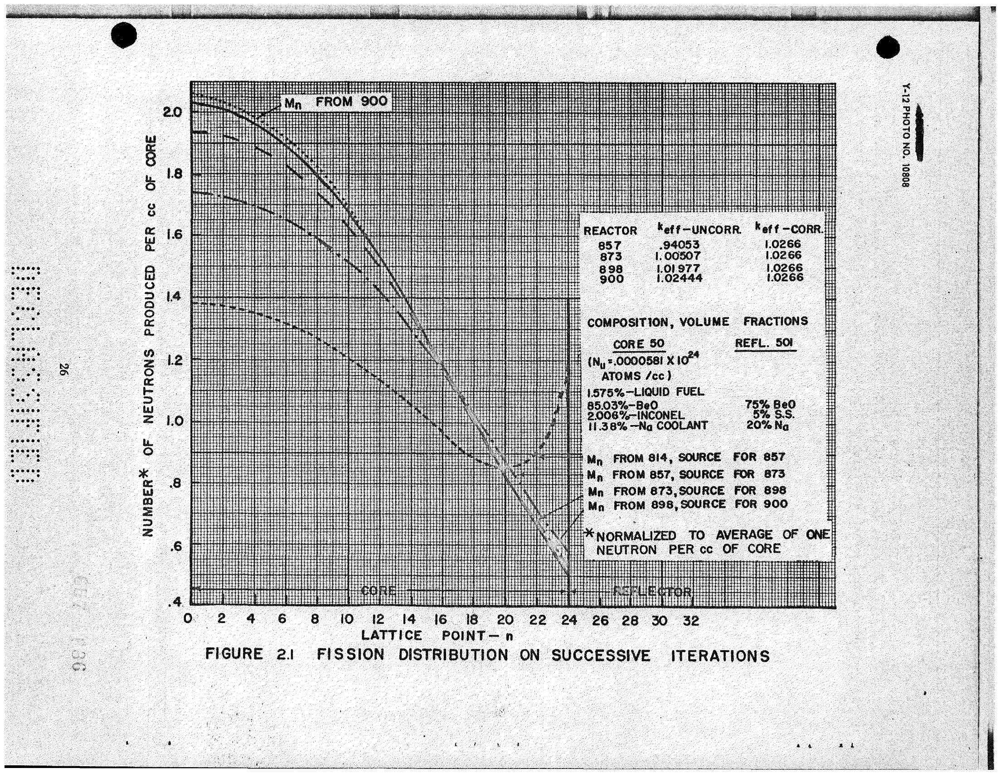

LZ

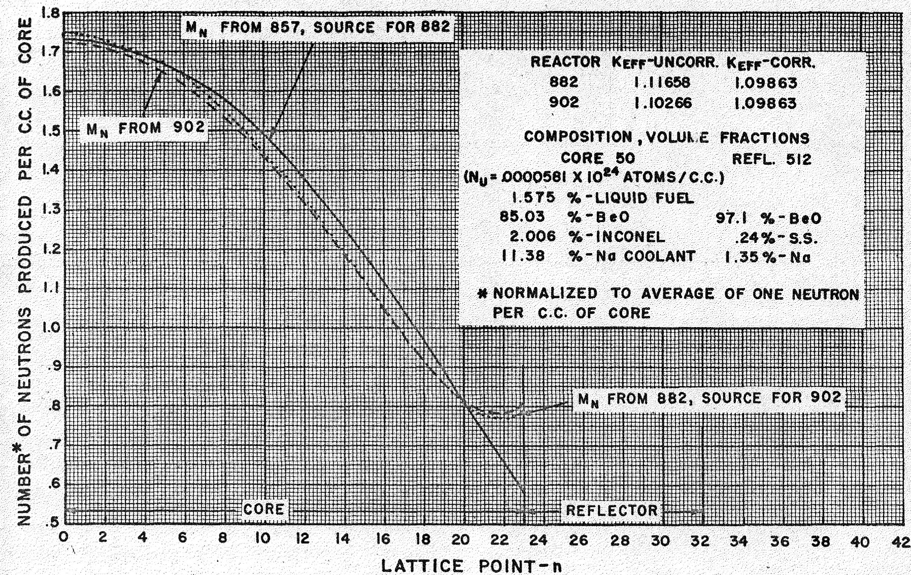  
FIGURE 2.2 ITERATION FOR CASE OF ASSUMED SOURCE DISTRIBUTION HAVING EXCESS OF NEUTRONS IN CENTER

$$
\left[ \frac {\Delta k}{k} \right] _ {e f f} = \frac {\int_ {r} r \sin \omega r [ A (r) - R (r) ] d r}{\int_ {r} r \sin \omega r R (r) d r}. \tag {3}
$$

For IBM numerical procedures(4) the integral operator is replaced by the summation operator, $\Omega$ ,

$$
\int_ {0} ^ {B} r \psi d r \longrightarrow \Omega \psi_ {n} = \frac {3}{B ^ {3}} \sum_ {n = 1} ^ {B} n \psi_ {n} - \left[ \frac {B}{2} + \frac {1}{6} \right] \psi B,; \tag {4}
$$

giving

$$
\frac {\Delta k}{k} = \frac {\sum_ {n = 1} ^ {B} n \sin \frac {\pi n}{B ^ {n}} \left\{A _ {n} - R _ {n} \right\} - \left\{\frac {B}{2} + \frac {1}{6} \right\} \left\{A _ {B} - R _ {B} \right\} \sin \frac {\pi B}{B ^ {n}}}{\sum_ {n = 1} ^ {1} n \sin \frac {\pi n}{B ^ {n}} R _ {n} - \left\{\frac {B}{2} + \frac {1}{6} \right\} R _ {B} \sin \frac {\pi B}{B ^ {n}}} \tag {5}
$$

There remains now to determine the parameter $B^{\prime \prime}$ . It is assumed that $B^{\prime \prime}$ is determined roughly by the addition of the reflector savings onto $B$ , and thus will be determined differently for various reflector and core combinations.

Applying Eq. 5 to the four series of iterated calculations of Table 2.1, and adding the $\Delta k_{eff}$ to $k_{eff}$ calculated in each case, the values shown in Fig. 2.3, where $k_{eff}$ is plotted against the reciprocal of $B''$ . - $B$ are obtained. The points on the ordinate marked "l" are for values of $B'' = B$ , which are undercorrected. Making $B''$ too small overcorrects, and the iterated $k_{eff}$ 's reverse their order (marked "3" on ordinate). The best $B''$ . - $B$ in this case is found to be 5.35, whereas $B' - B = 7$ . A $k_{eff}$ iterated of 1.0265 is thus estimated which can be compared with 1.0266 estimated from the assumed geometrical progression of $\Delta k_{eff}$ from one iteration to the next.

From the existing cases of iterated calculations, curves of $B''$ . - $B$ vs. $B'$ - $B$ are thus established for the various cases, and others are interpolated from partial reflector savings curves. The result is Fig. 2.4, giving $B''$ . - $B$ vs. $B'$ - $B$ for various reflector-core combinations, which, together with Eq. 5, may be used to determine an ad hoc correction to $k_{eff}$ for the error involved in assuming a fission distribution which is nonideal.

(4) D. K. Holmes, The Multigroup Method as Used by the ANP Physics Group, ANP-58 (Feb. 15, 1951).

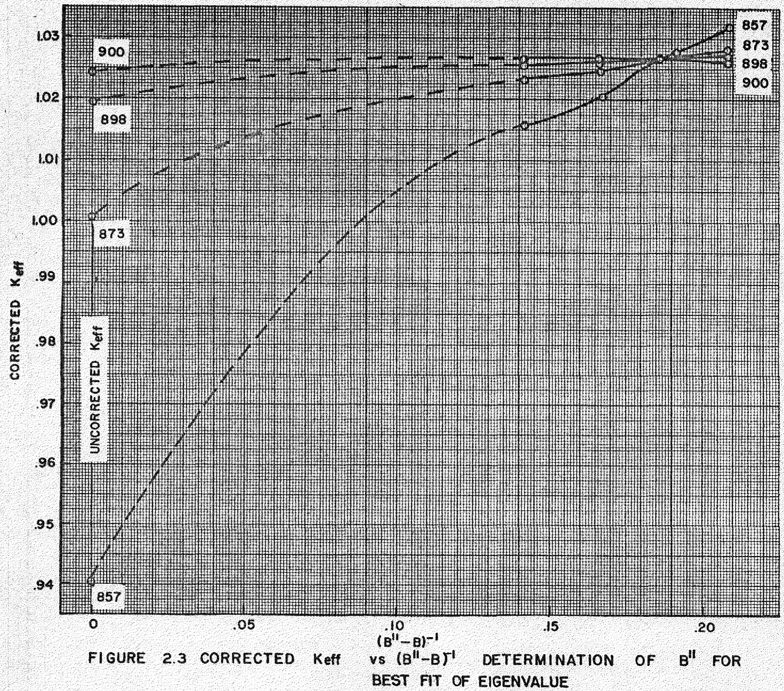

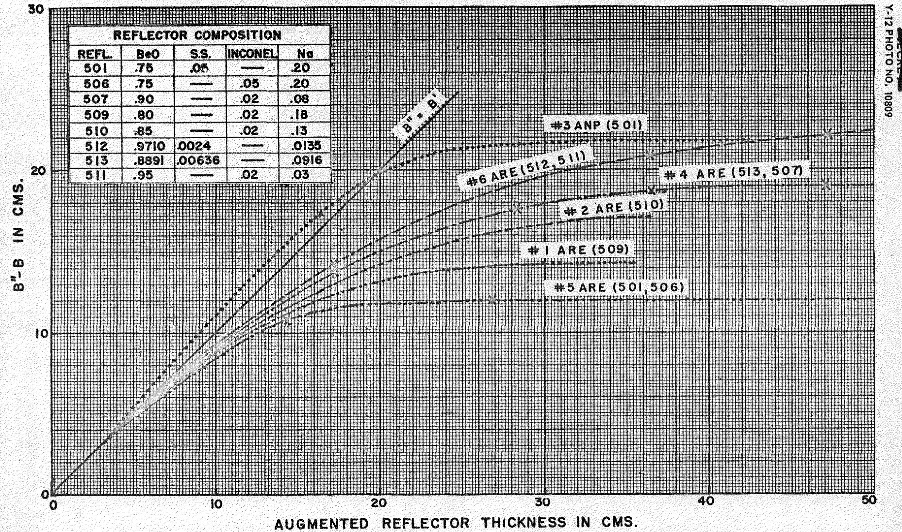  
FIGURE 2.4 WORKING CURVES FOR DETERMINATION OF $B^{\prime \prime}$ FOR VARIOUS CORE & REFLECTOR COMPOSITIONS & THICKNESSES CROSSES REFER TO POINTS DETERMINED FROM SUCCESSIVE ITERATIONS ON THE SAME REACTOR

The corrections thus determined are quite accurate and are good even in cases in which the correction must amount to as much as $10\%$ ; indeed, the discrepancy between the eigenvalues of successive iterations can be reduced by a factor of $10^2$ .

Correction of $k_{eff}$ in the adjoint calculation follows logically. Since there is a reciprocal relation between the forward and the adjoint calculation, the actual fission distribution is then proportional to the importance of adjoint neutrons. Thus the approximate relation

$$
\left[ \frac {\Delta k}{k} \right] _ {e f f} = \frac {\int_ {r} R (r) \left\{A ^ {\dagger} (r) - R ^ {\dagger} (r) \right\} d r}{\int_ {r} R (r) R ^ {\dagger} (r) d r}. \tag {6}
$$

is obtained, where the dagger refers to the adjoint calculation. $R(r)$ and $R^{\dagger}(r)$ refer, of course, to a mated pair of calculations on forward and adjoint reactors. It is not to be expected that the adjoint eigenvalue can be corrected as closely by Eq. 6 as the forward eigenvalue can be corrected by Eq. 3. The reason for this is that the adjoint changes its spatial shape very little with change in lethargy, whereas the spatial distribution of the fluxes changes markedly with change in lethargy.

Adjoint Calculations for the ARE (N. Edmonson, ANP Division; D. K. Holmes, Physics Division; and M. J. Nielsen, USAF). The first adjoint calculations according to the methods of Y-F10-31(5) and ANP-58(4) were carried out on Reactor 907 (ARE A1-3). A summary of the forward calculations on this reactor is given in Table 2.2. These calculations were made to establish the "standard". ARE reactor point around which changes in reflector thickness, uranium weight, material densities, etc. will be computed and compared to those for Reactor 907. This reactor is of the eight-tubes-per-cluster family of reactors. It has been chosen as a standard about which variations in design parameters will be made.

TABLE 2.2   
Summary of Calculations for Reactor 907   

<table><tr><td>Core radius (cm)</td><td>50.529</td></tr><tr><td>Reflector thickness (cm)</td><td>14.147</td></tr><tr><td>Uranium weight in core (lb)</td><td>25.0</td></tr><tr><td>Uranium atoms in core (atoms/cc)</td><td>0.00004534 x 1024</td></tr><tr><td>Uranium weight in fuel (1b/ft3)</td><td>69.25</td></tr><tr><td>Core 84, volume fraction of components* (%)</td><td></td></tr><tr><td>Liquid fuel</td><td>1.705</td></tr><tr><td>Beryllium oxide</td><td>89.00</td></tr><tr><td>Inconel</td><td>2.180</td></tr><tr><td>Sodium</td><td>7.160</td></tr><tr><td>Reflector 513, volume fraction of components* (%)</td><td></td></tr><tr><td>Beryllium oxide</td><td>88.91</td></tr><tr><td>Stainless steel</td><td>0.636</td></tr><tr><td>Sodium</td><td>9.16</td></tr><tr><td>Void</td><td>1.31</td></tr><tr><td>Calculated nuclear constants</td><td></td></tr><tr><td></td><td>UNCORRECTED CORRECTED FOR 
ITERATION OF SOURCE</td></tr><tr><td>Reactivity at 183°F (start-up), keff</td><td>1.08603 1.08225</td></tr><tr><td>Reactivity at 1286°F, normal operation, keff</td><td>1.04964 1.04894</td></tr><tr><td>Reactivity at 1673°F, keff</td><td>1.04796 1.04788</td></tr><tr><td>Reactivity from start-up to normal operation, Δk/k</td><td>-0.03126</td></tr><tr><td>Temperature coefficient of reactivity at operating 
point, I Δk/k</td><td>-2.613 x 10-6°F-1</td></tr><tr><td>Percent thermal fissions</td><td>68.44</td></tr></table>

*The volume fractions do not total exactly 100% because of the limitation of slide rule accuracy of engineering computations.

The initial source distribution $S_{n}$ assumed to start the adjoint calculation was

$$
S _ {n} \dagger = \sin \frac {n \pi}{3 1 . 5 8}.
$$

The number 31.58 was chosen as the best value in making iteration calculations (see the preceding section on correction of $k_{eff}$ ). Experience showed that this value for the adjoint function gave good results. Table 2.3 gives for comparison the values of $k_{eff}$ and $\nu_c$ for the forward and the adjoint calculations.

TABLE 2.3   
Comparison of $k_{eff}$ and $\nu_{c}$ for the Forward and Adjoint Calculations   

<table><tr><td></td><td>k eff</td><td>νc</td></tr><tr><td>First calculated adjoint values</td><td>1.04261</td><td>2.39783</td></tr><tr><td>Iterated adjoint values</td><td>1.03998</td><td>2.40412</td></tr><tr><td>First calculated forward values</td><td>1.04964</td><td>2.38178</td></tr><tr><td>Iterated forward values</td><td>1.04897</td><td>2.38329</td></tr></table>

The iterated adjoint values were obtained by the empirical method of correction developed by N. M. Smith (see preceding section), using the fission spatial distribution as the weighting function, i.e., as the adjoint to the adjoint. The iterated forward values were obtained by using the first calculated values of the neutron-flux-distribution function $\phi$ as the initial values of the source distribution for a second calculation on Reactor 907.

It is seen from Table 2.3 that the iteration on the first adjoint values led to changes -0.00263 and +0.00629 in the values of $k_{eff}$ and $\nu_c$ , respectively. The corresponding changes in the forward values are -0.00057 and +0.00151. Although the iterations changed the adjoint and the forward values in the same directions, the differences between the adjoint and the forward values were increased. The reasons for this behavior are being investigated.

The adjoint function $\phi^{\dagger}$ corresponding to the neutron flux $\phi$ of the forward calculation is proportional to the probability that a neutron at lethargy $u$ and position $r$ in the spherical reactor will undergo a fissioning absorption in the core. The numerical value of $\phi^{\dagger}$ depends on the type of normalization selected for the source distribution. The absolute value of $\phi^{\dagger}$ on the basis of its interpretation as the iterated fission expectation has been calculated.(6) To normalize the present $\phi^{\dagger}$ resulting from the procedure of ANP-58(4) it should be multiplied by a factor $A$ given by

$$
A = \frac {1}{\nu_ {c}} \frac {\int d \tau}{\int_ {\tau} \int_ {u} \phi^ {\dagger} f \int_ {u ^ {\prime}} \sigma_ {f} (u ^ {\prime}) \phi (u ^ {\prime}) d u ^ {\prime} d u d \tau},
$$

where $f(u)$ is the distribution of fission neutrons, $\sigma_f(u)$ is the fission macroscopic cross-section, and $\nu_c$ is the neutrons per fission necessary to keep the reactor in a stationary state. In the notation of ANP-58,

$$
A = \frac {1}{\Omega_ {n} n M _ {n} M _ {n} ^ {\dagger}}
$$

where

$\Omega$ is the summation operator,

$$
\Omega_ {n} \psi_ {n} = \frac {\dot {3}}{B ^ {3}} \left[ \sum_ {n = 0} ^ {- B} n \psi_ {n} - \left(\frac {B}{2} + \frac {1}{6}\right) \psi_ {B} \right],
$$

$M_{n}$ is the normalized fission distribution for the forward calculation,

$M_{n}^{+}$ is the corresponding quantity in the adjoint calculation.

For Reactor 907 (ARE A1-3), $A = 0.89762$ .

(6) M. J. Nielsen, A Discussion of Normalization in IBM Adjoint Calculations, ORNL, Y-12 Site, Y-F10-58 (June 26, 1951).

Figures 2.5 through 2.8 are given to illustrate the adjoint calculation to Reactor 907.

In Fig. 2.5 the initially assumed values and the resulting calculated values of $M_{n}$ are plotted against positions along the core radius from the center outward, with the position spacing determined by $\Delta r = 2.021$ . The fact that the curve of assumed values almost coincides with the curve of the calculated values shows that

$$
S _ {n} \dagger = \sin \frac {n \pi}{3 1 . 5 8}
$$

where $M_{n}^{\dagger}$ is normalized such that

$$
M ^ {\dagger} = \frac {M _ {0} ^ {\dagger}}{n} \sin \frac {n \pi}{3 1 . 5 8}
$$

and

$$
\left[ \begin{array}{l} M ^ {\dagger} (r) d r = 1 \\ \text {c o r e} \end{array} \right]
$$

is an excellent choice for the assumed initial source.

In Fig. 2.6 the adjoint function $\phi^{\dagger}$ is plotted against positions ( $\Delta r = 2.021$ ) along the core radius from the center outward. Curves for lethargy groups 1, 10, and 24 are given. The curve for the thermal lethargy group coincides with the curve for group 24, to within the limits of accuracy attainable in the plotting.

Physically, a neutron released near the center of the core would be expected to have a greater probability of undergoing a fissioning absorption than one released near the core-reflector interface. The negative slope of these curves is in agreement with this physical condition. The functions $\phi$ and $\phi^{\dagger}$ are normalized such that

$$
\int_ {\text {c o r e}} \int_ {u} \sigma_ {f} \phi d u d \tau = \int_ {\text {c o r e}} d \tau
$$

and

$$
\int_ {\text {c o r e}} \int_ {u} f (u) \phi^ {1} d u d \tau = \int_ {\text {c o r e}} d \tau
$$

In Fig. 2.7 the product $\phi \phi^{\dagger}$ is plotted against the lethargy for three radial positions corresponding to $n = 12, 18, \text{and} 25$ , with $\Delta r = 2.021$ . The functions $\phi$ and $\phi^{\dagger}$ are normalized as above.

In Fig. 2.8, $\phi$ and $\phi^{\dagger}$ are plotted against the lethargy $u$ for radial position $n = 18$ from the core center, $\Delta r = 2.021$ .

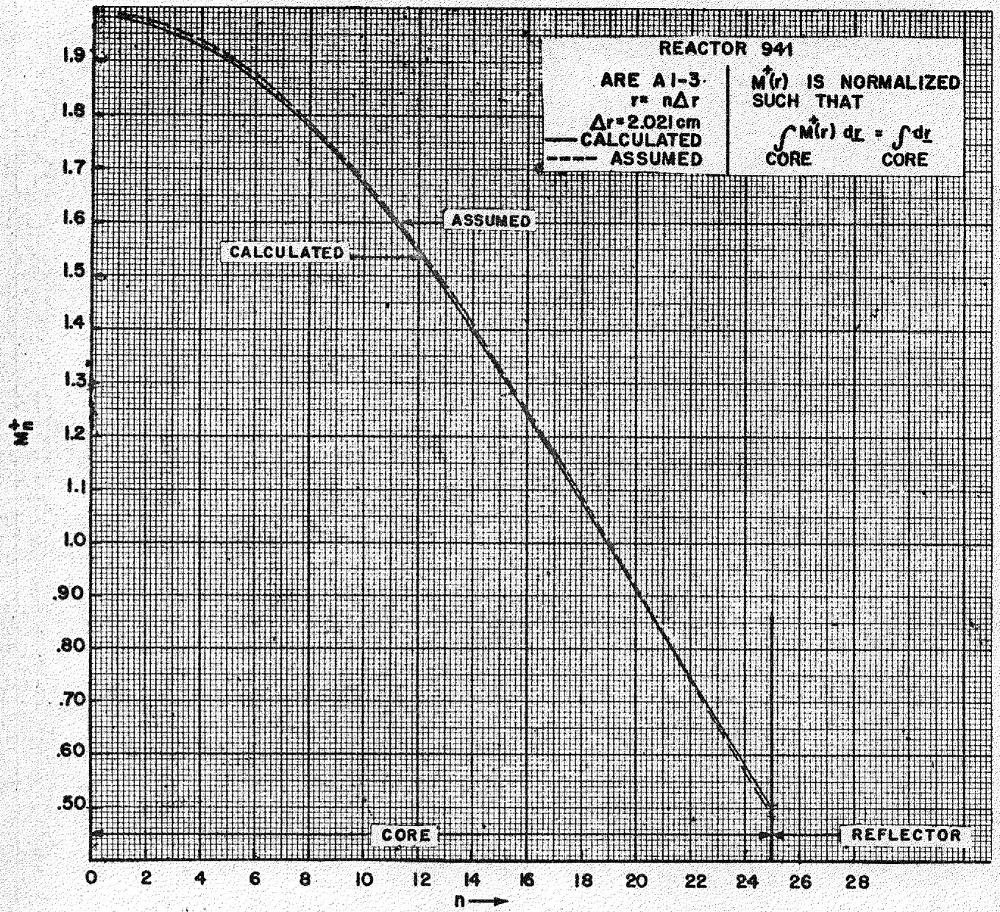  
FIGURE 2.5 SPATIAL DISTRIBUTION OF $\mathbf{M}_{\mathfrak{n}}^{+}$

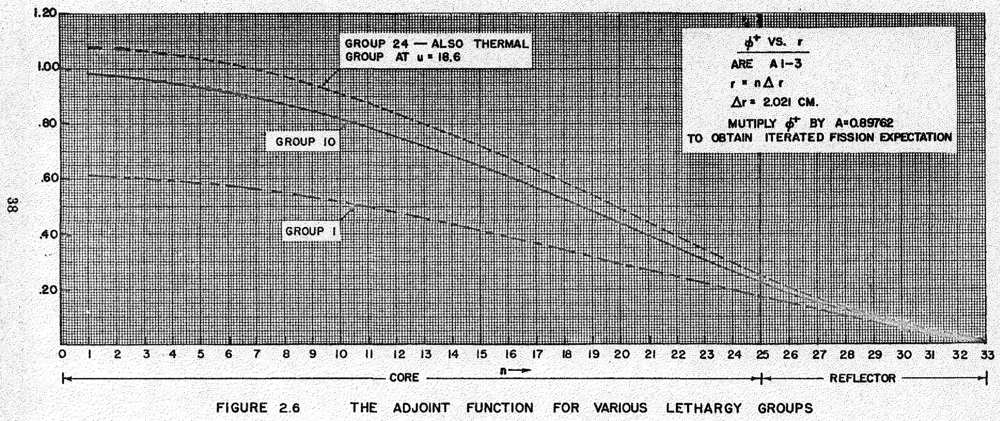

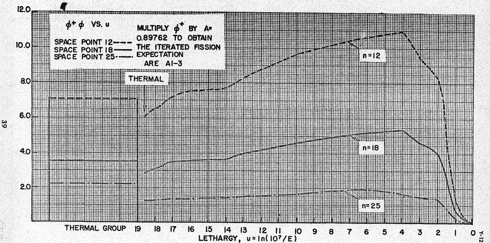  
FIGURE 2.7 STATISTICAL WEIGHT AS FUNCTION OF LETHARGY FOR VARIOUS SPACE POINTS

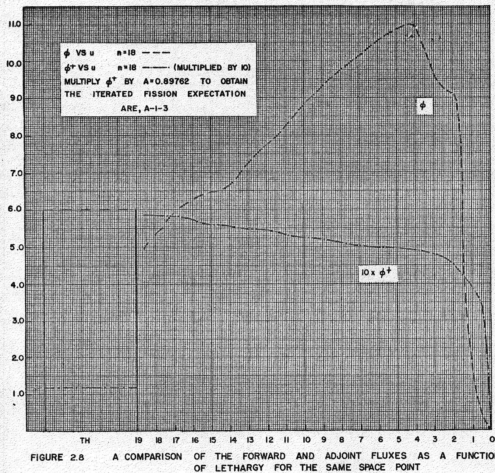  
9P801 ON OLOHd ZI-A

# C. DESIGN CALCULATIONS FOR THE ARE

A Study of Various Reflectors with Two Proposed ARE Cores. (N. M. Smith, Jr., ANP Division; B. T. Macauley, USAF; and G. Leeth, Oak Ridge School of Reactor Technology). A fairly extensive study has been made of various cores around the older 3A(7-) core and the newer A-1(8) cores, both of which were proposed for the ARE. The 3A core with 25 lb of uranium is designated by the ANP Physics Group as core 50, and the A-1 core, with 25 lb of uranium, as core 84.

These cores have been backed up by various reflectors having different moderating properties. The core and reflector constituents are given in Table 2.4. Reflector 512 is the present(9) radial reflector and reflector 513 is the present end reflector.

TABLE 2.4   
Composition of Cores and Reflectors   

<table><tr><td></td><td>LIQUID
FUEL
(vol. fraction)</td><td>URANIUM*
MASS
(lb)</td><td>BeO
(vol.
fraction)</td><td>INCONEL
(vol.
fraction)</td><td>STAINLESS
STEEL
(vol.
fraction)</td><td>SODIUM
(vol.
fraction)</td></tr><tr><td>Core 50</td><td>0.01575</td><td>25</td><td>0.8503</td><td>0.02006</td><td></td><td>0.1138</td></tr><tr><td>Core 84</td><td>0.01705</td><td>25</td><td>0.8900</td><td>0.02180</td><td></td><td>0.0716</td></tr><tr><td>Reflector 501</td><td></td><td></td><td>0.75</td><td></td><td>0.05</td><td>0.20</td></tr><tr><td>Reflector 506</td><td></td><td></td><td>0.75</td><td>0.05</td><td></td><td>0.20</td></tr><tr><td>Reflector 507</td><td></td><td></td><td>0.90</td><td>0.02</td><td></td><td>0.08</td></tr><tr><td>Reflector 509</td><td></td><td></td><td>0.80</td><td>0.02</td><td></td><td>0.18</td></tr><tr><td>Reflector 510</td><td></td><td></td><td>0.85</td><td>0.02</td><td></td><td>0.13</td></tr><tr><td>Reflector 511</td><td></td><td></td><td>0.95</td><td>0.02</td><td></td><td>0.03</td></tr><tr><td>Reflector 512</td><td></td><td></td><td>0.9710</td><td></td><td>0.0024</td><td>0.0135</td></tr><tr><td>Reflector 513</td><td></td><td></td><td>0.8891</td><td></td><td>0.00636</td><td>0.0916</td></tr></table>

\*K-25 end product.

(7) R.W. Schroeder, Proposed ARE Core Configurations, ORNL, Y-12 Site, Y-F8-13 (Feb. 5, 1951):   
(8) R. W. Schroeder, and S. V. Manson, ARE Core Design Status, ORNL Y-12 Site., Y-F8-17 (Mar. 12, 1951).   
(9) R. W. Schroeder, ARE, Corp, Material Constituency, Temperatures, and Thermal Kinetic Constants, ORNL, Y-12 Site, X-FB-19 (Apr. 11, 1951).

Core 50 has been most extensively studied; results are presented in Fig. 2.9. In these calculations various thicknesses of additional core material, or various reflector materials, are added to a basic core size of $49.2\mathrm{cm}$ radius. Since the mathematical thicknesses are added, these are "augmented thicknesses" and the extrapolation length must be subtracted to get a true size. The curves of $k_{eff}$ vs. additional core material have been computed (1) by the "hand" method in which the spatial variation is separated from the lethargy variation and in which the slowing down density $q$ is assumed linear within a group, and (2) by the IBM method in which the integration is taken over both radial and lethargy variables, and in which the flux $\phi$ is assumed linear within a group interval.

The IBM method gave consistently higher values of $k_{eff}$ by about 0.010. The $k_{\infty}$ values quoted are those calculated by the hand method. In the figures the numbered flags by the designated points refer to reactor calculation numbers. Where two or more numbers are attached to the same point, a series of iterations have been made and all resulting multiplication constants corrected to the same value by the "iteration correction" described in the section beginning on p.24.

An interesting fact shown in Fig. 2.9 is the verification for small thicknesses of reflector (i.e., less than 7 to $10\mathrm{cm}$ ) of a rule-of-thumb which states that a small addition of reflector, which has slowing down properties similar to those of the core, affects the multiplication constant equivalently to the addition of a corresponding thickness of core material. This rule is not exact, but an interesting parallelism to one-group theory can be drawn. On the basis of one-group theory the reflector savings $S$ , i.e., the thickness of core material affecting $k_{eff}$ similarly to, as given thickness of reflector, of a thin reflector is given by

$$
S = \frac {\lambda_ {t c}}{\lambda_ {t r}} t; \quad t <   L _ {r}
$$

where $t$ is the reflector thickness, $\lambda_{t,c}$ and $\lambda_{tr}$ are the transport mean-free-paths in the core and reflector, respectively, and $L_r$ is the diffusion length in the reflector.

Y-12 PHOTO NO. 10820

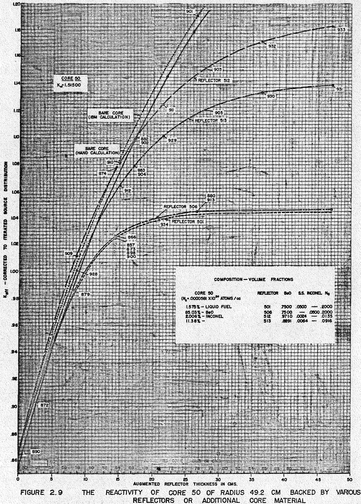

The quantities

$$
\overline {{\lambda_ {t i}}} = \int \lambda_ {t i} (u) \phi (u) d u
$$

were computed in the core and reflector for four different reactors. The results are given in Table 2.5.

TABLE 2.5   
Initial Slope of Reflector Savings Curve with Reflector Thickness, $dS/dt$ , for Four Different Reactors   

<table><tr><td colspan="3">DESIGNATION NO.</td><td rowspan="2">λtc(cm)</td><td rowspan="2">λtr(cm)</td><td rowspan="2">dS/dt,1- GROUPEQUATION(λtc/λtr)</td><td rowspan="2">dS/dtBY IBMCALCULATION</td></tr><tr><td>REACTOR</td><td>CORE</td><td>REFLECTOR</td></tr><tr><td>900</td><td>50</td><td>501</td><td>2.0726</td><td>2.2503</td><td>0.921</td><td>0.87 ± 0.02</td></tr><tr><td>902</td><td>50</td><td>512</td><td>2.0366</td><td>1.9015</td><td>1.071</td><td>1.07 ± 0.02</td></tr><tr><td>904</td><td>50</td><td>513</td><td>2.0452</td><td>2.0455</td><td>0.9998</td><td>0.95 ± 0.02</td></tr><tr><td>907</td><td>84</td><td>513</td><td>1.9531</td><td>1.9772</td><td>0.9878</td><td>1.01 ± 0.02</td></tr></table>

The reflector savings can be computed directly from Figs. 2.9 and 2.10 since $S$ for any particular reflector and particular thickness is equal to the thickness of added core having the same multiplication constant. Reflector savings curves have been constructed and are presented in Fig. 2.11.

These curves show that the ANP reflector 501 saturates fairly sharply at about 15 cm (6 in.); that the bottom ARE reflector No. 513 saturates at about 25 cm (10 in.); and that the ARE side reflector No. 512 saturates at about 30 cm (12 in.). An interesting feature of the side reflector is that for thicknesses of 14 cm or less it is more efficient for the chain reaction than the addition of a similar thickness of core material. This is understandable since reflector 512 contains approximately $97\%$ BeO moderator while the core contains only $85\%$ moderator.

Table 2.5 shows the effect of the higher moderator concentrations on the initial slope of the reflector savings. The transport mean-free-paths were

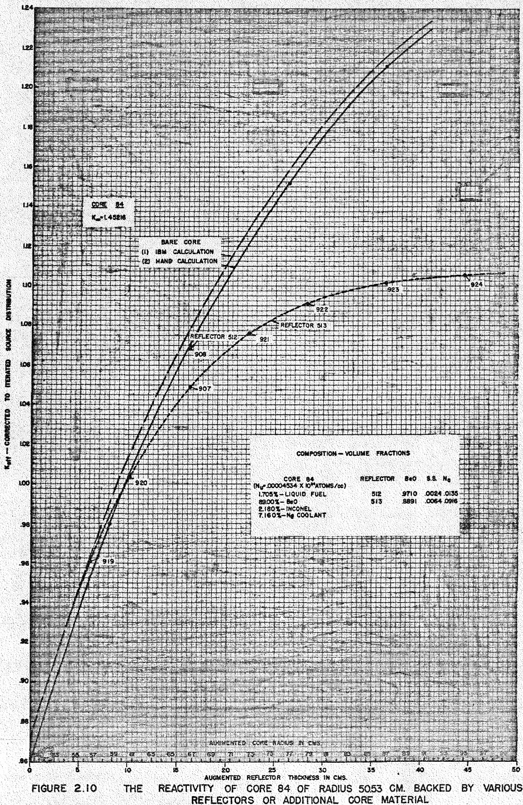

9

REFLECTOR SAVINGS IN CMS.

FIGURE 2.11 REFLECTOR SAVINGS OF VARIOUS REFLECTORS BACKING CORES 50 AND 84   
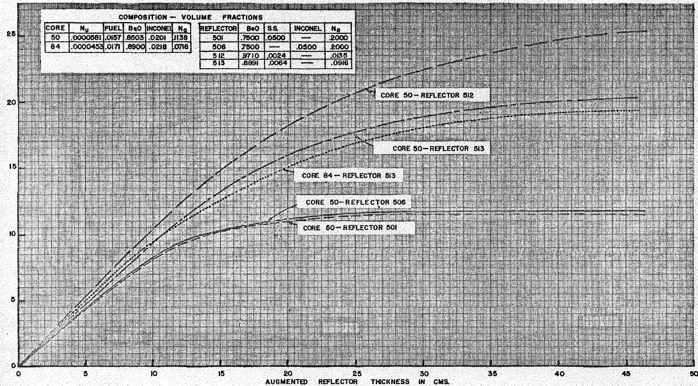  
81801 'ON OLOHd ZI-A

computed using the flux distribution at the reflector-core interface for reflector thickness of about 15 cm. The agreement between the ratio $\lambda_{tc} / \lambda_{tr}$ and the slope of the IBM-calculated reflector-savings curves is within $5\%$ . Similar prediction by one-group-theory averages of the saturated value of reflector savings was attempted but the agreement was poor.

It is of interest that the reflector savings of a particular reflector is a function of the core used. This result is expected since the transport mean-free-paths in core and reflector are nearly equal. Only in the case where the mean-free-path in the reflector is much less than that in the core (e.g., a water-reflected graphite reactor) is the reflector savings independent of small variations in core material.

Estimated Critical Mass of the ARE (N. M. Smith, Jr., and J. W. Webster, ANP Division). The curves of Figs. 2.9 and 2.10 may be used to estimate the multiplication constant of the present ARE core as designed and with 25 lb of enriched uranium within the reacting volume. A basic assumption is made that the effect of the various reflectors is proportional to the respective core surface areas backed by them. Referring to Fig. 2.12, the thickness of the side reflector is seen to be $5\%$ in. of reflector 512 plus 2 in. of inconel; the thickness of the bottom reflector is seen to be 6 in. of reflector 513 backed by 1 in. of inconel.

The inconel is assumed to be two-thirds as effective as additional reflector. The reflector savings of reflector 512 with core 84 must be estimated from one calculation and the curve shape for core 50 with various thicknesses of reflector. 512. The present ARE design embodies a six-tube cluster per coolant tube rather than an eight-tube cluster of the A-1 design. The core 84 results are then corrected to the difference between the eight- and the six-tube designs, and allowances are made for the effect of six control-rod thimbles. Calculated results of the $k_{eff}$ and uranium investment are summarized in Table 2.6.

The required uranium investment in the reacting volume of the ARE is estimated from Table 2.6 to be

$$
\pi_ {u} \text {in reacting volume} 2 7. 0 \mathrm {lb} + 1 0 \%, - 2 0
$$

It is of interest that the conversion value from the eight- to six-tube cluster by direct calculation agreed with that employing the reactivity coefficients listed below in the section on reactivity coefficients and kinetic constants.

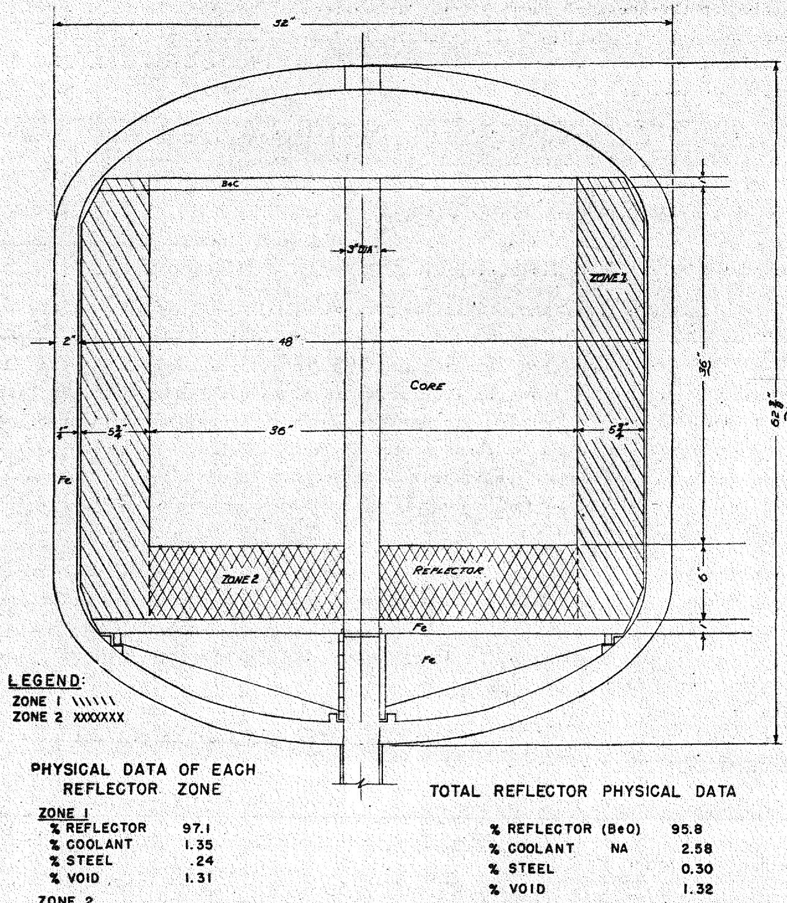  
FIGURE 2.12 A SKETCH OF THE ARE SHOWING REFLECTOR

ZONE I

% REFLECTOR 97.1   
COOLANT 1.35   
STEEL .24   
% V0ID 1.31

% REFLECTOR (BeO) 95.8   
COOLANT 2.58   
STEEL 0.30   
% V01D 1.32

ZONE 2

REFLECTOR 88.91   
COOLANT 9.14   
STEEL .636   
% VOID 1.31

THICKNESSES, COMPOSITIONS AND DISPOSITIONS

TABLE 2.6   
Calculation of $k_{eff}$ of ARE and Uranium Investment   

<table><tr><td>CORE</td><td>REFLECTOR</td><td>POSITION</td><td>RELATIVE SURFACE</td><td>keff</td><td>‘URANIUM (1b)</td></tr><tr><td>84</td><td>None</td><td>Top</td><td>1/6</td><td>0.8713</td><td></td></tr><tr><td>84</td><td>513</td><td>Bottom</td><td>1/6</td><td>1.0542</td><td></td></tr><tr><td>84</td><td>512</td><td>Side</td><td>2/3</td><td>1.0836</td><td></td></tr><tr><td colspan="4">Weighted mean</td><td>1.043</td><td></td></tr><tr><td colspan="4">Correction, 8-tube cluster to 6-tube cluster</td><td>+0.039</td><td></td></tr><tr><td colspan="4">Net, clean, unperturbed reactor</td><td>1.082</td><td></td></tr><tr><td colspan="4">Six control-rod thimbles at -0.011 each</td><td>-0.066</td><td></td></tr><tr><td colspan="4">Net AFE reactivity with 25 lb of uranium</td><td>1.016</td><td></td></tr><tr><td colspan="3">Maximum keff desired, critical</td><td>1.000</td><td></td><td></td></tr><tr><td colspan="3">k for Sm and Xe override</td><td>0.017</td><td></td><td></td></tr><tr><td colspan="3">Net excess k for experiment, measuring devices, etc.</td><td>0.020</td><td></td><td></td></tr><tr><td colspan="4">Total keff desired</td><td>1.041</td><td></td></tr><tr><td colspan="4">Additional keff needed (1.016 - 1.041)</td><td>+0.025</td><td></td></tr><tr><td colspan="4">Uranium in Core 84</td><td></td><td>25.0</td></tr><tr><td colspan="4">Additional uranium to achieve additional keff needed</td><td></td><td>2.0</td></tr><tr><td colspan="4">Total uranium then in reacting volume</td><td></td><td>27.0</td></tr><tr><td colspan="4">Error range,+10%, -20%</td><td></td><td>29.2 to 21.6</td></tr><tr><td colspan="4">5% allowance above and inside B4C curtainin</td><td></td><td>1.4</td></tr><tr><td colspan="4">Total uranium investment in AFE</td><td></td><td>30.6 to 22.0</td></tr></table>

Shim-Control Requirements and Miscellaneous Data (J.W. Webster and N.M. Smith, Jr., ANP Division; B. T. Macauley, USAF; G. Leeth, Oak Ridge School of Reactor Technology). Table 2.7 gives the breakdown of the estimated reactivity change that will have to be offset by shim-control rods. There are a good deal of uncertainty and lack of data with respect to certain entries, so that results should be taken as the best estimate at the moment and subject to future changes as better data and more accurate calculations become available. The results are broken down according to whether they occur below or above the melting point of the fuel, $986^{\circ}\mathrm{F}$ .

TABLE 2.7   
Reactivity Changes Requiring Shim Control   

<table><tr><td rowspan="2">EFFECT</td><td colspan="2">Δkeff/keff (%)</td></tr><tr><td>BELOW 986°F</td><td>ABOVE 986°F</td></tr><tr><td>Expansion of the solid fuel, 80 to 986°F</td><td>No data available; a guess is -1</td><td></td></tr><tr><td>Expansion of fuel upon change in phase, solid to liquid</td><td>No data available; assumed zero</td><td></td></tr><tr><td>Expansion of liquid fuel, 986 to 1470°F; assumed to expand into B4C layer</td><td></td><td>-1.7</td></tr><tr><td>Change of reactor size due to expansion, 80 to 986°F</td><td>+0.54</td><td></td></tr><tr><td>Change of reactor size due to expansion, 986 to 1328.5°F</td><td></td><td>+0.28</td></tr><tr><td>Introduction of coolant (not including channeling effect of voids)</td><td>-2.0</td><td></td></tr><tr><td>Change of density of core BeO, 80 to 986°F</td><td>-0.93</td><td></td></tr><tr><td>Change of density of core BeO, 986 to 1470°F</td><td></td><td>-0.52</td></tr><tr><td>Change of density of core Na, 183 to 986°F</td><td>+0.24</td><td></td></tr><tr><td>Change of density of core Na, 986 to 1328.5°F</td><td></td><td>+0.10</td></tr><tr><td>Change of density of core inconel, 80 to 986°F</td><td>+0.42</td><td></td></tr><tr><td>Change of density of core inconel, 986 to 1328.5°F</td><td></td><td>+0.24</td></tr><tr><td>Change of density of reflector BeO, 80 to 986°F</td><td>-0.54</td><td></td></tr><tr><td>Change of density of reflector BeO, 986 to 1470°F</td><td></td><td>-0.31</td></tr><tr><td>Change of density of reflector Na, 183 to 986°F</td><td>No data available; assumed zero</td><td></td></tr><tr><td>Change of density of reflector Na, 986 to 1328.5°F</td><td></td><td>No data avail- able; assumed zero</td></tr><tr><td>Change of density of reflector inconel, 80 to 986°F</td><td>No data available; assumed zero</td><td></td></tr><tr><td>Change of density of reflector inconel, 986 to 1328.5°F</td><td></td><td>No data avail- able; assumed zero</td></tr><tr><td>Change of thermal base, 80 to 986°F (nuclear cross-section effect)</td><td>-2.79</td><td></td></tr><tr><td>Change of thermal base, 986 to 1492°F (nuclear cross-section effect)</td><td></td><td>-1.56</td></tr><tr><td>Equilibrium xenon</td><td></td><td>-1.6</td></tr><tr><td>Additional after-shutdown xenon over and above equilibrium xenon</td><td></td><td>-0.2</td></tr><tr><td>Depletion of fuel</td><td></td><td>0</td></tr><tr><td>Total reactivity change (%)</td><td>6</td><td>5</td></tr></table>

The shim-control rods designated to control the reactivity change (6%) for effects below the fuel melting point will require less cooling than those designated to offset effects above the fuel melting point (5%). In particular, the rod designated to offset the xenon effect will be essentially fully inserted at full power and therefore will need considerable cooling.

From the results given below in the section on control-rod effectiveness, and heating, an axial 2-in. B4C control rod will be worth about $4\%$ so that a pattern of about four rods would be indicated. Present plans are to use a pattern of six to allow for uncertainties in the calculations.

Figures 2.13, 2.14, and 2.15 contain information that was used in obtaining some of the above quantities. Figure 2.13 shows the increase in $k_{eff}$ with increase in the fraction of BeO in the reflector. As indicated in the section on density coefficients of reactivity, the percentage of BeO in the reflector is only about half as important as the percentage of BeO in the core from the point of view of $k_{eff}$ or critical mass.

Figure 2.14 shows the variation of $k_{eff}$ with uranium weight for different reflector compositions. The function is fairly linear in the supercritical reactor, but, for $k_{eff}$ greater than approximately 1.04, additional uranium becomes increasingly less effective.

Figure 2.15 shows the flux spectrum in the ARE at different spatial points.

An interesting breakdown of the neutron captures was determined, giving the fraction of the captures that occur in the different constituents of the core; $72.5\%$ of all fission neutrons are captured with the following distribution:

# PERCENT

Uranium 72.3

Inconel 23.3

Sodium 2.5 (80% of which are in coolant)

Be0 1.9

Fluorine 0.1

The absorptions in the BeO are calculated without regard for impurities. An increase of perhaps $50\%$ in the moderator absorption is expected.

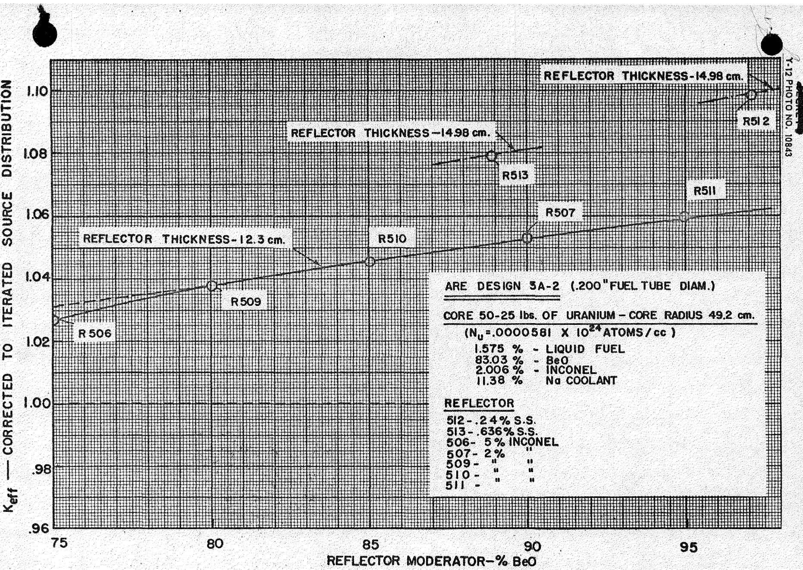  
Z9   
FIGURE 2.13 CHANGE OF $K_{\text{eff}}$ WITH PERCENT BeO IN REFLECTOR

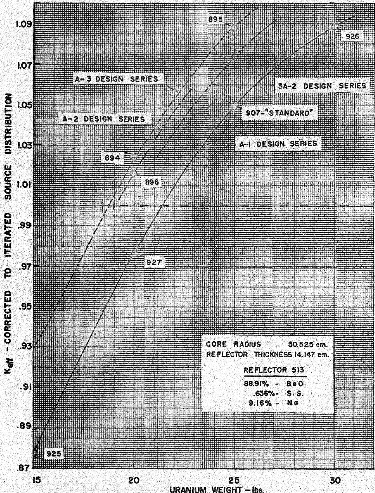  
FIGURE 2.14 Keff vs. URANIUM WEIGHT FOR A-1,A-2,A-3 ARE DESIGNS

Y-12 PHOTO NO. 10845

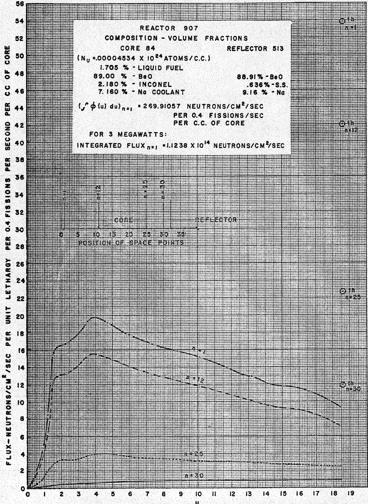  
FIGURE 2.15 FLUX SPECTRUM IN STANDARD ARE A-1 DESIGN

Recommendation on Alternative Loading (N. M. Smith, Jr., ANP Division). The efficacy of the side reflector No. 512 (see section beginning on p. 41) relative to additional core material as well as the large thickness of this reflector for saturation effect suggests that a decrease of core size would increase the reactivity of the ARE. In addition, certain very desirable improvements are expected.

In the first place a decrease of core size will reduce the shim control required in start-up and in temperature changes because of the increased ratio of uranium to other materials and because of the resulting smaller amount of thermal fissioning.

A perturbation was made on the core size of the core 50- reflector 512 combination, in which the radius of the core was decreased 4.28 cm and the same outer radius of reflector was maintained. There resulted

$$
\Delta k _ {e f f} = - 0. 0 2 0 4 1,
$$

$$
\Delta k _ {e f f} / \Delta r = 0. 0 0 6 8 7 \mathrm {c m} ^ {- 1}.
$$

Since the same uranium density was kept, the total uranium mass had been decreased by the ratio

$$
\frac {\Delta m}{m} = 0. 2 3 8 8.
$$

From the section below on reactivity coefficients and kinetic constants, we have

$$
\frac {(\Delta k / k) _ {\text {e f f}}}{(\Delta m / m)} \approx \frac {1}{3},
$$

so that if the same uranium mass were maintained there would result

$$
\Delta k / k = + 0. 0 7 8 2
$$

or

$$
\Delta k _ {e f f} = + 0. 0 8 4 3
$$

caused by getting back an equal uranium mass. The net effect of decreasing core size while keeping the uranium investment constant is then

$$
\Delta k _ {e f f} = + 0. 0 6 3 9
$$

or

$$
\frac {\Delta k _ {e f f}}{\Delta r} = + 0. 0 1 4 9 3 \mathrm {c m} ^ {- 1}.
$$

Another advantage gained in decreasing the core size will be the flattening of the power distribution. Since by freezing of engineering design the use of the same matrix dimensions on the BeO hexagonal blocks is imposed, a calculation has been made considering that the entire outer row of fuel-tube clusters is removed and the volume is changed into side reflector.

Preliminary results, i.e., results from one reactor calculation, 953, on a reactor of reduced size give the following comparison with the present accepted standard, No. 907 (see Fig. 2.12):

TABLE 2.8   
Comparison of 3- $ft_{1}$ ARE Core and Proposed ARE Core with Reduced Volume   

<table><tr><td></td><td>PRESENT ARE STANDARD, NO. 907</td><td>PROPOSED ARE OF REDUCED CORE VOLUME, NO. 953</td></tr><tr><td>Critical mass (lb)</td><td>27</td><td>21.5</td></tr><tr><td>Thermal-base shim-control requirements in keff(part of start-up shim requirements), cold to hot (1283°F)</td><td>0.034</td><td>0.014</td></tr><tr><td>Total peak-to-average power ratio (not radial ratio)</td><td>1.876</td><td>1.607</td></tr><tr><td>Thermal fissions at operating temperature (%)</td><td>68.44</td><td>63.58</td></tr></table>

A comparison of Figs. 2.16 and 2.17 illustrates the improved fissioning distribution. The decrease in shim-control requirements of $3.0\%$ in- going to the core of reduced size allows the elimination of one shim-control rod.

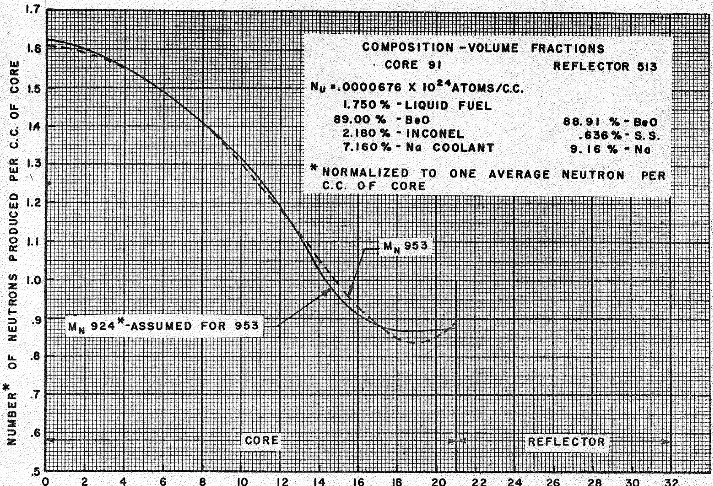  
LATTICE POINT - n; r = M Δr; Δr = 2.063 cm   
FIGURE 2.16 SPATIAL POWER DISTRIBUTION IN ARE CORE OF I/3 REDUCED VOLUME REACTOR 953

FIGURE 2.17 SPATIAL POWER DISTRIBUTION IN $3^{\prime}$ STANDARD ARE (REACTOR 907)   
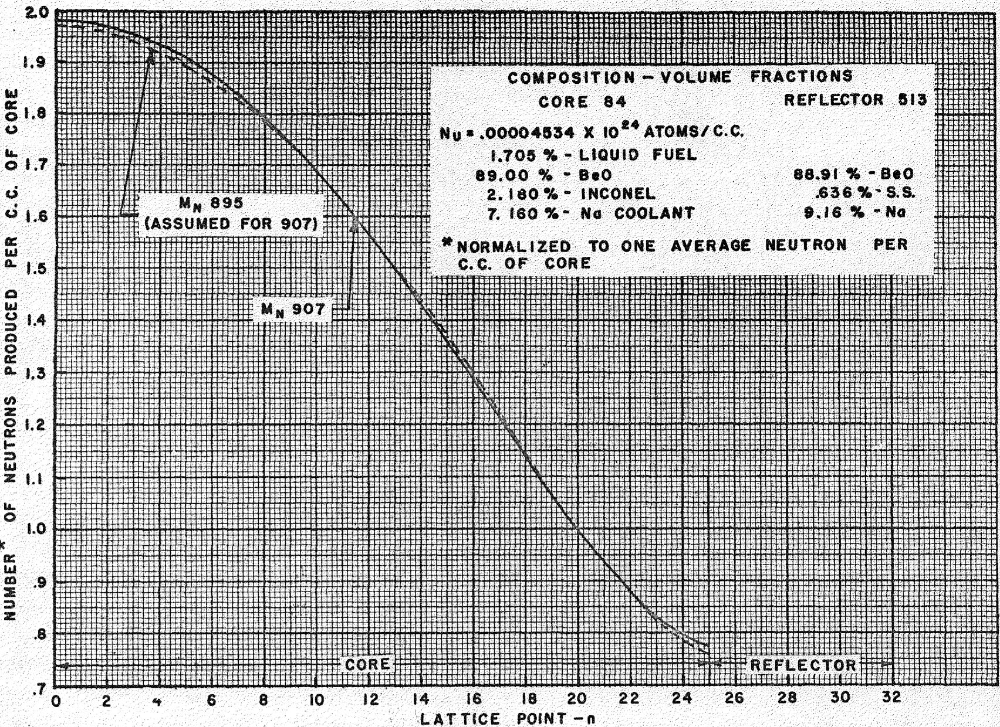  
69801ONGLOHdZ-  
$\therefore m : x = 1$ 或 ${3x} + {4y} + 1 = 0$

The reduction of the core volume by converting the outer row of the fuel-tube cluster into side reflector is recommended as a move toward a more nearly optimum design, viz., to a design requiring (1) appreciably less (23%) uranium investment, (2) appreciably less (26%) shim control, and (3) smaller (12%) peak-to-average power ratio.

Control-Rod Effectiveness and Heating (J. W. Webster, ANP Division, and R. J. Beeley, Oak Ridge School of Reactor Technology). It is at the present time proposed that shim control on the ARE be obtained from absorber control rods in the core. Therefore studies have been initiated to determine the reactivity effects of such control rods, as well as the heat generated within the rods.

The calculations so far have been concerned with a 2-in. B4C rod of wall thickness 0.335 in. lying along the longitudinal axis of the cylindrical reactor. A double-wall inconel thimble separates the core coolant from the control rod, and two concentric inconel cylinders inside the rod provide a cool bearing surface and channel for the NaK control-rod coolant to flow down and back up inside the rod.

Results: First, the permanent reactivity change, $\Delta u / \mu$ , associated with the existence of the inconel structure and NaK control-rod coolant was calculated with the rod out. Then the reactivity change resulting from the rod plus structure and coolant was calculated and the difference taken as the reactivity effect of the rod. The blockage of neutron streaming that takes place when the rod is inserted was not computed, but from the results quoted in NEPA-1207(10) it is seen that blockage of the neutrons would cause less than 0.25% change in reactivity.

It was found that the permanent effect of the thimble and coolant was about $1.4\%$ in reactivity $(\Delta \nu/\nu)$ . For the rod calculation it was first assumed that the rod was black to thermal neutrons and transparent to nonthermal neutrons (there was about $14\%$ thermal flux, 0.084 ev, in the ARE design used, corresponding to about $60\%$ thermal fissions), and a two-group Nordheim-Scaletor model was used. With this assumption the change in reactivity was $2.5\%$ . Actually, however, with the 0.335-in. B₄C wall thickness the rod is

still $82\%$ black to flux of energy 160 ev; therefore a more realistic approach was then used of assigning all flux of energy less than 112 ev to the slow group and using again a two-group model in which the rod is black to the slow group and transparent to the fast group. About $42\%$ of the flux was in the slow group under this assumption. The result of this calculation was that a change of reactivity of $5.3\%$ would be incurred. Thus the net effect of the 2 in. axial $\mathbf{B}_4\mathbf{C}$ appears to be $3.9\%$ or approximately $4 \%$ in $\Delta \nu /\nu$

The heating due to neutron capture in the control rod was first calculated for thermal-neutron captures only, and the result was 50 watts per linear centimeter at the middle of the rod with the rod fully inserted and the reactor power at 3000 kw. From this it was estimated that an additional 95 watts under the same conditions would be generated by the capture of above-thermal neutrons. A rough calculation of the heating due to absorption of core gamma rays indicated a corresponding value of about 15 watts, so that the total heating per linear centimeter at the middle of the rod with the rod fully inserted and the reactor power at 3000 kw would be about 160 watts. Taking into account the longitudinal buckling of the flux, the total heat generation over the 3-ft length of the rod would then be 11,200 watts, and the average heating per linear centimeter is then approximately 120 watts.

Method. The Nordheim-Scaletor method was used with a two-group model to evaluate the $\Delta \nu/\nu$ effect of the rod. The reflected reactor was approximated by a critical bare reactor having the same composition as the core of the reflected reactor.

The two-group equations in a multiplying medium take the form

$$
\nabla^ {2} \phi_ {f} + a \phi_ {f} + b \phi_ {s} = 0, \tag {1}
$$

$$
\nabla^ {2} \phi_ {s} + c \phi_ {s} + d \phi_ {f} = 0, \tag {2}
$$

where $\phi_{f}$ is the flux in the fast group; $\phi_{s}$ is flux in the slow group $p: a, b, c$ , and $d$ depend on the microscopic properties of the reactor and on $\nu_{c}$ , the number of neutrons per fission necessary to make the reactor critical.

Absorption of and fission by neutrons in the fast group was included. In getting the constants $a$ , $b$ , $c$ , and $d$ a Fermi-age continuous-slowing-down model was first worked out, and then the two group constants were evaluated

such that the group leakage, absorption, and production equaled the corresponding integrated quantities on the Fermi model. The slow group does not have to be a purely thermal group but can consist of all neutrons up to any desired energy.

The radial components of the general solutions to Eqs. (1) and (2) in cylindrical geometry are

$$
\begin{array}{l} \phi_ {s} = A J _ {0} \left(\mu_ {1} r\right) + Y _ {0} \left(\mu_ {1} r\right) + C I _ {0} \left(\mu_ {2} r\right) + D K _ {0} \left(\mu_ {2} r\right), \\ \phi_ {f} = A \alpha J _ {0} (\mu_ {1} r) + \alpha Y _ {0} (\mu_ {1} r) + C \beta I _ {0} (\mu_ {2} r) + D \beta K _ {0} (\mu_ {2} r), \\ \end{array}
$$

where $A$ , $C$ , and $D$ are constants; $J_0$ and $I_0$ are Bessel functions of the first kind with real and imaginary arguments, respectively; $Y_0$ and $K_0$ are Bessel functions of the second kind; $\mu_1^2$ and $-\mu_2^2$ are the radial components of the two solutions of the Helmholtz equation $\nabla^2\phi + \mu^2\phi = 0$ ; and the constants $\alpha$ and $\beta$ are proportionality constants for the fast to slow flux, where $\alpha$ depends on the positive solution of the buckling and $\beta$ on the negative solution. The values $\mu_1$ , $\mu_2$ , $\alpha$ , and $\beta$ are all functions of $\nu_c$ .

When the control rod is out the medium is homogeneous and the positive solution of the buckling is simply related to the reactor size on the one hand and to $\nu_{c}$ on the other. The size was chosen so that $\nu_{c} = 2.5$ , the actual number of neutrons released per fission.

With the rod, of radius $r_0$ , in place along the longitudinal axis of the reactor, the following boundary conditions were applied to the general solutions $\phi_s$ and $\phi_f$ :

1. The $\phi_{s}$ and $\phi_{f}$ go to zero at the extrapolated boundary of the reactor which is critical with the rod out;   
2. The fast flux is finite at the rod center, $r = 0$ ; i.e., the rod is transparent to the fast group:   
3. The slow flux extrapolates to zero at the rod surface, i.e.,

$$
\left[ \frac {1}{\phi_ {s}} \quad \frac {d \phi_ {s}}{d r} \right] = \frac {1}{\delta}
$$

The extrapolation distance $\delta$ was obtained from the results of Davison(11) in which values of $\delta$ have been determined for various sizes of "black" bodies by transport theory such that the asymptotic flux of diffusion theory is correct in the core except for the region within two or three mean-free-paths of the rod. The latter region is unimportant since the region is small and the flux density is low there.

Boundary condition 2 can be met because the terms of $\phi_f$ which have singularities at $r = 0$ , i.e., $Y_0(\mu_1 r)$ and $K_0(\mu_2 r)$ , have singularities of the same character ( $\log r$ ). By choosing $D$ properly the singularities are made to cancel at $r = 0$ .

When boundary conditions 1, 2, and 3 are applied, a final equation results which provides a relationship in $\nu_{c}$ such that criticality exists. The fractional increase in $\nu_{c}$ from the case of no rod to the case with rod provides a measure of the effectiveness of the rod. The effects of temperature, poisons, and depletion which are to be offset by shim-control rods should be measured also in $\Delta \nu / \nu$ to be consistent.

The heating of the control rod due to absorption of neutrons was calculated by taking

$$
J = \frac {1}{4} \left[ \phi + \delta \frac {d \phi}{d r} \right] _ {r = r _ {0}}
$$

to be the number of neutrons entering the rod per square centimeter of rod surface area and assuming that every neutron of the slow group which enters the rod is captured and generates 2.6 MeV of heat energy. In this formula $\phi$ is the scalar flux, $\delta$ is the extrapolation distance at the rod discussed above, and $r_0$ is the radius of the rod. The expression of $J$ results from the familiar formula

$$
J = \frac {\phi}{4} + \frac {\lambda_ {t r}}{6} \frac {d \phi}{d r}
$$

(11) B. Davison and S. Kushneriuk, Linear Extrapolation Length for a Black Sphere and a Black Cyclinder, Montreal report MT-214 (Mar. 30, 1946).

by replacing $(2/3)\lambda_{sr}$ by the corrected extrapolation distance, $\delta$ . It should be noted that this still gives only the flow resulting from the asymptotic flux and hence is not strictly correct, since the asymptotic flux differs from the true flux near the rod.

The result of neutron capture is boron is

$$
_ 5 B ^ {1 0} + _ {0} n ^ {1} = _ {3} L i ^ {7} + _ {2} H e ^ {4}.
$$

and Wilson(12) has shown that 93 to $94\%$ of the time the associated kinetic energy is released according to the equation

$$
s B ^ {1 0} + _ {0} n ^ {1} = _ {3} L i ^ {* 7} + _ {2} H e ^ {4} + 2. 5 7 \pm 0. 0 5 M e v
$$

and 6 to $7\%$ of the time according to the equation

$$
_ 5 B ^ {1 0} + _ {0} n ^ {1} = _ {3} L i ^ {7} + _ {2} H e ^ {4} + 2. 9 9 M e v
$$

The latter energy of the particles is obtained when $\mathsf{Li}^7$ goes immediately to the ground state. In the former case the excited $\mathsf{Li}^7$ nucleus goes to its ground state by gamma-ray emission. The average kinetic energy is thus 2.6 MeV and it can be assumed this is completely converted to heat at the point of capture.

The calculation of the heating of the rod due to gamma rays was based on the following assumptions:

1. Source: (a) prompt fission gamma rays, 6.6-Mev per fission divided into two equal photons of 3.3 Mev each; (b) fission-product gamma rays, 5 Mev per fission divided into two equal photons of 2.5-Mev each; (c) core-capture gamma rays, 7 Mev per capture as a single photon.   
2. The calculation was made for the middle of the rod with the rod completely inserted along the longitudinal axis. The gamma sources were integrated spatially out to infinity since the attenuation is rapid.   
3. Exponential attenuation was assumed in the core, no attenuation in the rod; the linear absorption coefficients were computed as in the Project Handbook.(13)

Reactivity Coefficients and Kinetic Constants (J. W. Webster, ANP Division; B. T. Macauley, USAF; and G. Leeth, Oak Ridge School of Reactor Technology). The following are reactivity coefficients and other constants pertaining to the current ARE design for use in control and kinetic calculations.

$$
\left[ \frac {\Delta_ {\text {面}} / \Delta_ {\text {面}}}{\Delta k / k} \right] _ {k e f f = 1} = 2. 9
$$

where $m$ = mass of uranium (K-25 end product). This coefficient is not constant, however, but is a function of $m$ , or $k_{\text{eff}}$ , as shown in Fig. 2.18.

$\left[\frac{1}{\Delta T}\frac{\Delta k}{k}\right]_{\text {thermal base}} = -4.1 \times 10^{-6}{}^{\circ}\mathrm{F}^{-1}$ ; average value from start-up to operating temperature

$\left[\frac{\Delta k / k}{\Delta\rho / \rho}\right]_{\text{reflector moderator}} = +0.205$

1 2.7 x 10-6 F-1 T k

$\left[\frac{\Delta k / k}{\Delta\rho / \rho}\right]_{\text{core moderator}} = +0.35$

1 4.6 x.10-6 F-1 T k core mode rator

$\left[\frac{\Delta k / k}{\Delta\rho / \rho}\right]_{\text{core inconel}}$

*Based on linear expansion coefficient of BeO = 4.4 × 10⁻⁶ °F⁻¹. Actually, however, in the ARE design the moderator density decreases according to the inconel coefficient because the BeO blocks are strung on the coolant tubes.

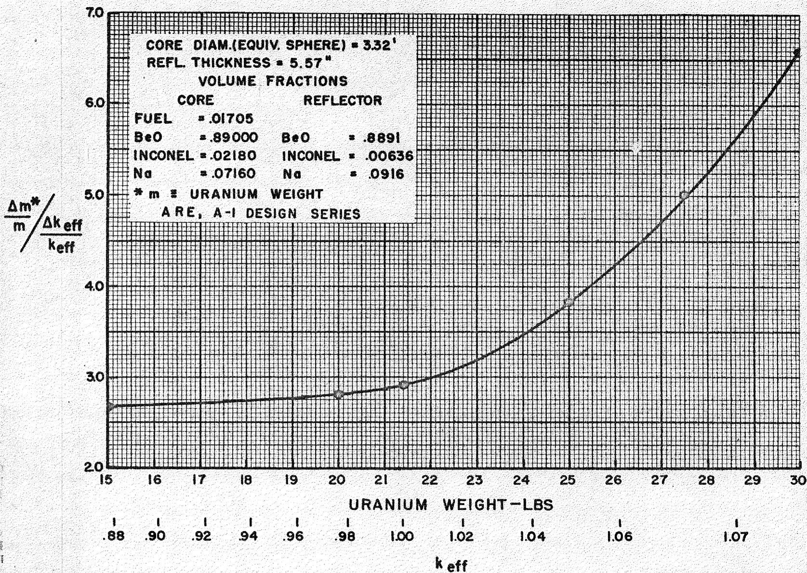  
FIGURE 2.18 FRACTIONAL CHANGE OF keff WITH FRACTIONAL CHANGE OF URANIUM WEIGHT VS. keff (OR URANIUM WEIGHT)

$$
\left[ \frac {1}{\Delta T} \frac {\Delta k}{k} \right] _ {\text {c o r e i n c o n e l}} = + 4. 3 \times 1 0 ^ {- 6} ^ {\circ} \mathrm {F} ^ {- 1}
$$

$$
\left[ \frac {\Delta k / k}{\Delta \rho / \rho} \right] _ {\text {c o r e N a}} = - 0. 0 2 1
$$

$$
\left[ \frac {1}{\Delta T} \frac {\Delta k}{k} \right] _ {\text {c o r e N a .}} = + 3. 1 \times 1 0 ^ {- 6} ^ {\circ} \mathrm {F} ^ {- 1}
$$

where $\rho =$ density

Mean neutron lifetime $= (1.3 \pm 0.2) \times 10^{-4}$ sec

$\overline{\phi}_{\text{total}}$ for ARE $= 6.6 \times 10^{13} \frac{\text{neutrons}}{\text{cm}^2 \text{sec}}$ (spatial average of total flux)

$\overline{\Sigma}_{a} = 0.00453 \, \text{cm}^{-1}$ (average weighted by flux distribution)

Integration of Nonlinear Kinetic Equations (M. J. Nielsen, USAF). In the last quarterly report (ANP-60, pp. 97, 106) results of perturbation calculations using linearized equations were given; these have since been published in detail in ANP-62.[14] The magnitude of the fluctuations in power obtained for reactivity change of interest indicated a need for integration of the nonlinear equations. Accordingly, a series of calculations involving numerical integration of the nonlinear equations utilizing available IBM facilities has been initiated. One such calculation has been completed for the current ARE design.

(14) N. M. Smith, Jr., T. Rubin, M. J. Nielsen, and R. R. Coveyou, *Perturbation Equations for the Kinetic Response of a Liquid Fuel Reactor*, ANP-62 (Apr 17, 1951). In this report the nonlinear equations are set up and the nonlinear terms are assumed to be second order and neglected. These assumptions made in order to treat the problem analytically, restrict the results to very small changes in the stationary system.

This calculation was for a clean reactor operating at 3000 kw with a step reactivity increase of about 0.0013 in excess of that required for the prompt-critical condition. Only the fast temperature effects were considered, that is, fuel-density changes and fuel-tube expansion. The delayed neutrons were divided into three groups. The shortest lived group was included with the prompt neutrons, and the longest lived group was considered to have infinite lifetime, since the variation in return of these neutrons is negligible during the period of greatest interest.

The relative power increase and the average fuel-temperature increase resulting are shown in Figs. 2.19 and 2.20. Results of the calculation are as follows:

The excess heat generated during the first second was approximately 11,000 Btu. The maximum pressure increase in the fuel tubes was about 0.3 psi and occurred 0.09 sec after the reactivity increase. The maximum fuel exit velocity, about 10 cm/sec, occurred 0.15 sec after the reactivity increase. A phase plot of relative power vs. fuel temperature, shown in Fig. 2.21, is a typical shape.

Calculations are in progress to determine the effect of variation of certain parameters, such as the effective conductivity of the fuel.

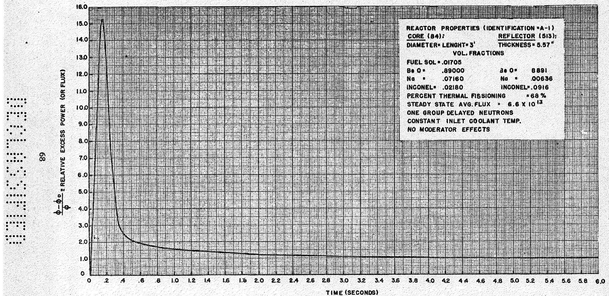  
FIGURE 2.19 FLUX RESPONSE TO A STEP INCREASE IN REACTIVITY OF .009125

69

FIGURE 2.20 FUEL TEMPERATURE RESPONSE TO A STEP INCREASE IN REACTIVITY OF .009125  
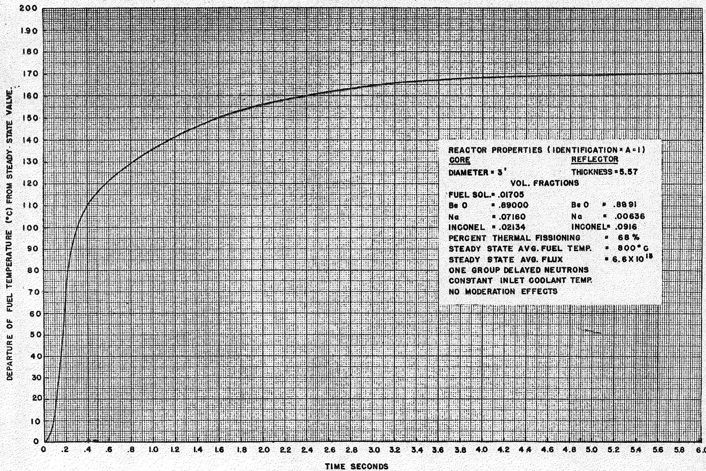  
6801'ONOLOHdZ-

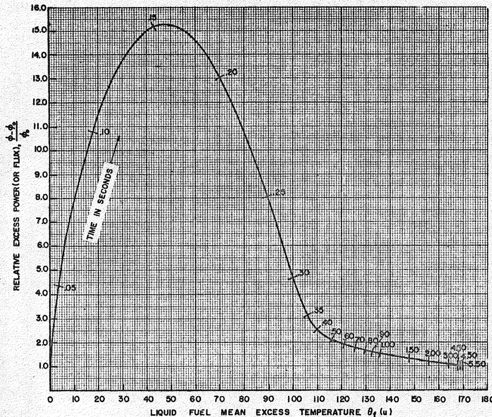  
FIGURE 2.21   
A PHASE DIAGRAM OF RELATIVE EXCESS POWER VS EXCESS   
EUEF TEMPERATURE OF THE ARE FOLLOWING A STEP INCREASE  
IN REACTIVITY OF 0.009125. THE THERMAL RELAXATION TIME   
OF THE FUEL, $\lambda_{\alpha} = \sec^{-1}$ , IS THAT RESULTING FROM NON-CONVECTIVE   
HEAT TRANSFER IN THE FUEL.

# D. CALCULATION FOR THE CRITICAL EXPERIMENT(15)

# C. B. Mills and N. M. Smith, Jr., ANP Division

The consideration of numerous effects has failed to disclose the source of discrepancy between the calculated and measured reactivity of the beryllium-uranium critical assembly reported in the last quarterly report (ANP-60). The calculation contained a correction on the average loss of lethargy per collision, and on the transport mean-free-path, for anisotropic scattering in such proportion that the theoretical age in beryllium from fission to indium resonance agreed with the experimental value. Additional corrections included a transport calculation of neutron leakage and allowance for a variable extrapolation length. There resulted an estimate of $k_{eff}$ of the critical assembly of 0.90. This calculation has been verified by others. During the calculations it became apparent that the reactions at high energies (1 to 10 MeV) affected the reactivity strongly, and attention was therefore directed to all processes in this region, and particularly to the $(n,2n)$ reactions in beryllium, since the scattering processes had already been corrected to get the proper age.

The $\mathrm{Be}^9 (n,2n)\mathrm{Be}^8$ reaction cross-section values published in the literature vary from values below the $\mathrm{Be}^9 (n,\alpha)\mathrm{He}^6$ value of $4.5\times 10^{-26}\mathrm{cm}^2$ at 2.7 Mev to 3.6 barns for the average value in the vicinity of 3 Mev. In the berylliummoderated reactor calculations neutron production by the $(n,2n)$ reaction has been assumed to be absorbed by the $(n,\alpha)$ reaction, and thus to have no net effect. A difference of $10\%$ between the effective multiplication constant computed and that found by critical experiments has revived interest in the $(n,2n)$ reaction, and therefore an estimate of its effectiveness of neutron production was made.

A number of experiments to determine $\sigma(n,2n)$ were made by Houtermans, $^{(16)}$ Rusinov, $^{(17)}$ and Teucher. $^{(18)}$ The similarity of Houtermans' and Rusinov's experimental set-up (an 8-cm-diameter sphere of beryllium in water) to a two-region reactor justifies the use of multigroup scattering theory to determine the effect of multiple transitions of fast neutrons through the beryllium

(15) To be reported in detail in Y-F10-55.   
(16) F. G. Houtermans, "On the $(n,2n)$ Reaction in Beryllium with Neutrons from a Polonium-Beryllium Source," Nachr. d. Akad. d. Wiss. in Göttingen, Math.-Phys., Kl. 52 (1946) (see translation by W. K. Ergen, Y-F20-12).   
(17) L. I. Rusinov, "Passage of Fast Neutrons Through Beryllium," Physik. Z. Sowjetunion 10, 219 (1936).   
(18) M. Teucher, "Primary Spectrum of Fast Neutrons from a (Ra $\alpha +$ Be) Source and Their Inelastic Impacts in Beryllium, Bismuth, and Lead," Z. Physik 126, 410 (1949).

sphere by reflection from the water "reflector." The small size of the sphere of beryllium diminishes the significance of the results to an order-of-magnitude. Results of this type of 'calculation reduced Houtermans' value of $\sigma(n,2n)$ from 3:6 barns to about 1.4 barns.

Houtermans' revised value for $\sigma(n,2n)$ of 1.4 barns, averaged with values from two other experiments, one by Rusinov who used the same type of experiment to obtain a smaller value, 0.3, for $\sigma(n,2n)$ and one by Teucher who used a bare beryllium sphere and a fission counter and obtained 0.39 barn, results in a value for $\sigma(n,2n)$ of 0.7 barn near 2.7 Mev. This value is derived from a comparison of production of neutrons from two different primary neutron spectra with an approximate cross-section vs. neutron energy curve shape. It is sufficient to estimate the $(n,2n)$ contribution to a reactor by this reaction.

Neutron production and absorption by beryllium in a reactor is computed by the bare-reactor multigroup method with the use of the neutron-flux energy distribution computed for a critical assembly. The integrated production and absorption by $(n,2n)$ and $(n,a)$ reactions gives a net production of 0.12 neutron per fission source neutron. This is an additive correction to the effective multiplication constant of the correct magnitude to reduce the error in the critical-mass calculation.

H. A. Bethe has 'pointed out' that the $(n,2n)$ reaction would be expected to be not appreciably greater than the geometrical cross-section of $\mathbf{Be}^9$ of 0.3 barn. This leads to the conclusion 'that the $(n,2n)$ reaction in beryllium may be great enough to affect the reactivity of the beryllium-uranium reactor by approximately $10\%$ ; at least; this possibility is not ruled out by existing data and theory.

# E. DEVELOPMENT OF NUMERICAL PROCEDURES

Modification of Age Theory for Sharp Resonances (M. C. Edlund, ANP Division). A survey calculation has been conducted to determine if a modification to the Fermi age theory is needed. As in the estimation of resonance escape, the Wigner approximation,

$$
p = \exp \left\{- \int_ {0} ^ {u} \frac {\sigma_ {a}}{\zeta \left(\sigma_ {a} + \sigma_ {s}\right)} d u \right\}
$$

is used, where $p$ is the resonance escape, $\sigma_{a}$ the macroscopic absorption cross-section, $\sigma_{s}$ the macroscopic scattering cross-section, $\zeta$ the average change of lethargy per collision, and $u$ the lethargy = ln 10⁷/E where E is the energy in electron volts. The spatially independent Boltzmann equation has been integrated numerically, and the results have been compared to the simple expression for the case of two absorption resonances as a function of their spacing. The fictitious absorber was assumed to be an atom of infinite mass (no slowing down in collisions with this atom); the moderator was assumed to be beryllium metal; and $\sigma_{s} / \sigma_{t}$ was assumed to be 0.1. The absorption cross-section was taken as a constant over a lethargy width of 0.1.

The rigorous solution indicated a minimum resonance-escape probability of 0.848 when the two resonances were contiguous, increasing to a maximum of 0.866 when the resonances were separated by a lethargy of $\zeta$ , where $\zeta$ is the maximum change in lethargy per collision with a moderator atom. When the spacing was increased by a lethargy of $3\zeta$ units or more, the resonance escape probability became independent of energy, having the value 0.861. The Wigner approximation yielded a value of 0.864.

The value of $\sigma_{s} / \sigma_{t}$ used in this calculation is less than the corresponding values for any U $^{235}$ resonance in the beryllium-moderated intermediate reactors considered for the ANP, i.e., this case represents a stronger resonance than any in the proposed ANP reactor. Thus it is apparent that the expected overlap effect and hence error in present IBM reactor calculations due to this effect is probably small.

This conclusion is in agreement with that of Rose $^{(19)}$ who has shown that the condition for the applicability of the Wigner approximation is

$$
\frac {\Sigma_ {a}}{\Sigma_ {a} + \Sigma_ {s}} \frac {\Gamma}{E _ {r}} <   <   1,
$$

(19) M. E. Rose, The Resonance Escape Probability for Continuous Absorption, MonP-366 (Aug. 25, 1947).

where $E_r$ is the resonance energy and $\Gamma$ the width of the level, a condition which applies here.

Integration of the Transport Equation in Hydrogenous Reactors (R. R. Coveyou, Mathematics Panel). One technique being investigated is the splitting of the Boltzmann equation into spherical harmonics, formation of lethargy-group equations, and numerical integration of the resulting set of equations. Methods for accomplishing this have been sketched in outline and are being worked out in detail. One of the major uncertainties of the spherical harmonic method pertains to the number of harmonics necessary for an accurate estimate of the fluxes. A computation is projected to test this point, which will be, essentially, to solve the time-dependent Boltzmann equation quite accurately for a typical reactor of interest to the ANP project. Since the source term is isotropic, the "flow" of neutrons into the higher modes of the angular distribution can be "observed" from this computation.

Reactor with Absorbing Interface Between Core and Reflector (C. B. Mills, ANP Division; and R. R. Coveyou, Mathematics Panel). The ANP and ARE liquid-fuel designs make use of the large expansion of the liquid fuel to remove some fuel, and hence some reactivity, with increasing temperature. In order to make full use of the expansion in getting a large negative temperature coefficient of reactivity it is necessary to define a boundary at which the reaction stops. This is accomplished by employing a $\mathsf{B}_4\mathsf{C}$ "curtain." This curtain is not effective at high neutron energies since the absorption cross-section is relatively small in the high-neutron-energy region, but is effective at lower energies where the fissioning absorptions occur.

The assumptions for the boron-blanketed reactor calculation are that the blanket is thin, and a certain fraction, $\gamma$ , of neutrons incident on this blanket escape absorption and continue on through to the reflector. The usual assumption of flux continuity at this boundary is thus modified. Other assumptions used for previous ANP calculations are retained. Two calculational methods have been devised for the solution of this problem and are under development. Both methods change the usual boundary conditions between core and reflector from continuity of right and left currents across the boundary:

$$
\vec {i} _ {\text {c o r e}} = \vec {i} _ {\text {r e f l e c t o r}}
$$

$$
\overleftarrow {j} _ {\text {c o r e}} = \overleftarrow {j} _ {\text {r e f l e c t o r}}
$$

to

$$
\vec {\gamma j} _ {\text {c o r e}} = \vec {\gamma} _ {\text {r e f l e c t o r}}
$$

$$
j _ {\text {c o r e}} = \gamma j _ {\text {r e f l e c t o r}}
$$

where the arrows indicate the direction of the current.

$$
\dots \dots \dots \dots \dots \dots \dots \dots \dots \dots \dots \dots \dots \dots
$$

Method I. A whole new procedure $^{(20)}$ is developed about the modified boundary conditions in Method I (C. B. Mills). These equations reduce to the usual continuous form when the transmission coefficient $\gamma$ is set equal to 1, corresponding to no absorption at the interface. The presence of a discontinuity in flux and flux gradient requires somewhat smaller space intervals in the vicinity of the boundary, and, for almost complete absorption (at low neutron energies) separate calculations of flux in the core and reflector.

The method of solution requires the use of net current equations in the core and reflector. These establish the values of flux in the reflector as a function of the flux in the core. Two other boundary transition equations for $A$ , the solution of the homogeneous continuity equation, and two for $P$ , the correction to the homogeneous equation required for an accurate solution of flux, were obtained. The equations for $A$ were obtained directly from the inhomogeneous solution by eliminating the source term, and the equations for $P$ were obtained by assuming the flux in the reflector to be a function of $A$ and $P$ . These six equations were put in the form necessary for IBM calculations.

Method II. A second general method has been developed (R. R. Coveyou) in two variations, A and B.

Variation A.(21) In this variation the reactor equations in each lethargy group are solved for the case of a bare core and for a bare reflector with black core, respectively. After this numerical work is done, it is possible to calculate analytically the mutual interaction of core and reflector, and hence the fluxes in the reactor with absorbing interface.

Variation B. $(^{22})$ This is a refinement of variation A, designed to exploit as far as possible the existence of a functioning IBM method for computation of fluxes in reflected spherical reactors. Here the procedure is to calculate the fluxes for the whole reactor (with the absorbing interface not present) due to the group source confined, first to the core, then to the reflector. It is then possible to compute the fluxes in the reactor with absorbing interface by a proper superposition of these solutions. It is felt that a fair estimate of the amount of calculation necessary for a simple reactor by variation B is that it would not exceed $2\frac{1}{2}$ times the computation necessary for the present method used for reactors without absorbing interface. The prime advantage of this procedure is that a minimum of new IBM programming is required.

(20) C. B. Mills, The Spherical Reactor with a $B_4C$ Layer Between Core and Reflector, OPNL, Y-12 Site, Y-F10-59 (July 6, 1951).   
(21) R. R. Coveyou, Spherical Reactor with Absorbing Interface, ORNL, Y-12 Site, Y-F10-48 (Apr. 13, 1951).   
(22) R. R. Coveyou, Spherical Reactor with Absorbing Interface II, ORNL, Y-12 Site, Y-F10-52 (Apr. 30, 1951).

# F. ENGINEERING CALCULATIONS FOR THE ARE

Fissions in the Fuel-Tube Headers $^{(23)}$ (C. B. Mills, ANP Division). The ARE design $^{(24)}$ of March, 1951 contained fuel manifolds at the top of each coolant-tube cluster. The cooling of these headers was less effective than that of the fuel tubes by a factor of approximately 16. Approximate methods of estimation of the fissioning in the header indicated that the power production was down by a factor of less than 2 from the maximum in the reactor and that the design was therefore safe.

Activity of Fission Products and Heavy Elements in ARE Fuel $^{(25)}$ (G. E. Putnam, Oak Ridge School of Reactor Technology). The activity of fission products as a function of cooling time for various operating times has been computed (Fig. 2.22) from an expression derived from the Young-Blizard $^{(26)}$ and Borst-Wheeler $^{(27)}$ data. The expression, giving watts of gamma radiation per operating watt, is applicable for operating times ranging up to 100 days and for cooling times of from 10 min to 1000 days. The number of gamma watts per operating watt is given by

$$
w = 5. 4 \times 1 0 ^ {- 3} \left[ \frac {1}{t ^ {0} \cdot 1 6} - \frac {1}{(t + 7) ^ {0} \cdot 1 6} \right],
$$

where $t$ is the cooling time in days and $\tau$ is the operating time in days.

In addition, the $\mathbf{U}^{237}$ activity as a function of cooling time was calculated from build-up formulas modified for special application in terms of ARE characteristics of power, critical mass, and operating times (Fig. 2.23).

The $\mathbf{U}^{236}$ and $\mathbf{Pu}^{239}$ build-ups were graphed for simplified application to ARE type reactors. These graphs (Figs. 2.24 and 2.25) give the number of grams produced in the reactor per operating watt in terms of operating time.

Importance of Fuel in Loading Procedure on the ARE (J. W. Webster, ANP Division). The relative importance with respect to spatial position of the fuel in the loading procedure is being investigated.

(23) This calculation was reported in detail in the report by C. B. Mills, Fissions in the Fuel Tube Header, ORNL, Y-12 Site, Y-F10-53 (May 17, 1951).   
(24) R. W. Schroeder, "Design of the Aircraft Reactor Experiment," ANP-60, op. cit., p. 45.   
(25) To be reported in detail in ORNL, Y-12 Site report Y-F10-57.   
(26) G. Young, and E. P. Blizzard, Gamma Rays from Fission and Fission Products, ORNL-420 (Nov. 17, 1949).   
(27) C. W. J. Wende, The Computation of Radiation Hazards, Du Pont report M-1324 (TNX-7, N-609) (Jan. 11, 1944).

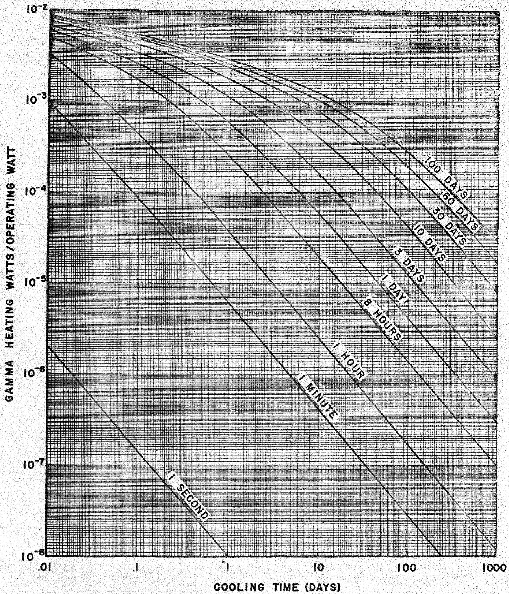  
FIGURE 2.22 GAMMA HEATING OF FISSION PRODUCTS AFTER   
SHUTDOWN AS A FUNCTION OF COOLING TIME. (OPERATING   
TIMES INDICATED ON CURVES) VALUES NORMALIZED TO   
ONE WATT POWER LEVEL

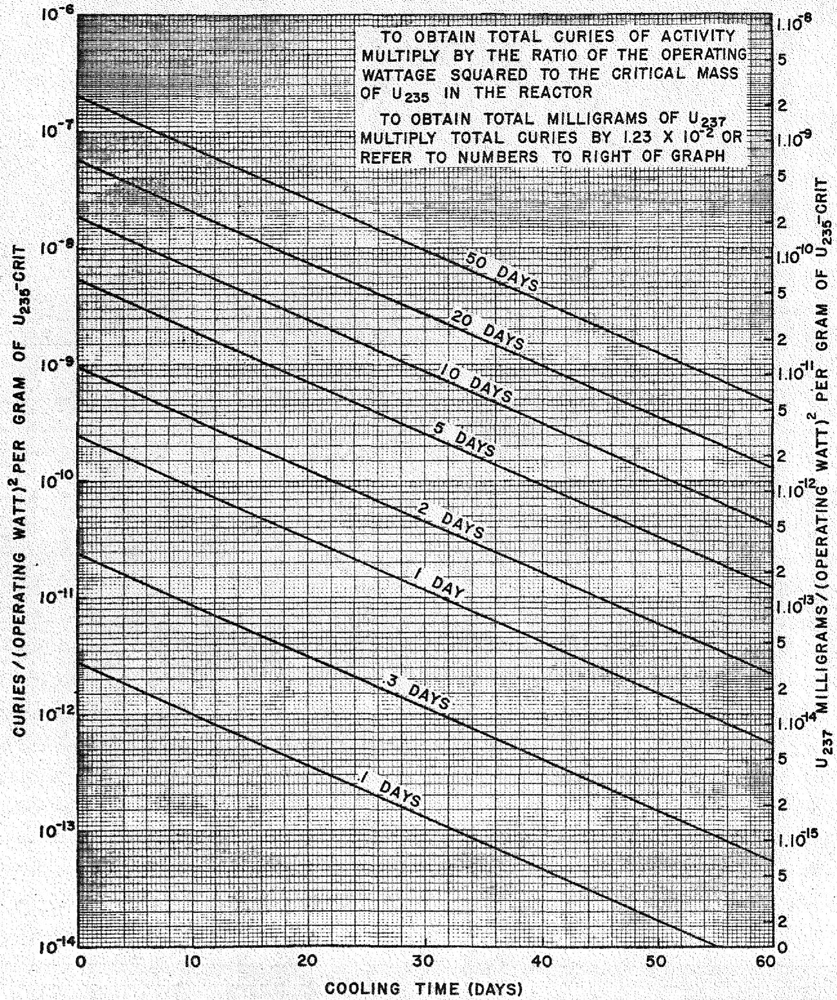  
FIGURE 2.23 CURIES OF $U_{237}$ ACTIVITY AFTER SHUTDOWN AS A FUNC- TION OF COOLING TIME OPERATING TIMES LISTED ON CURVES

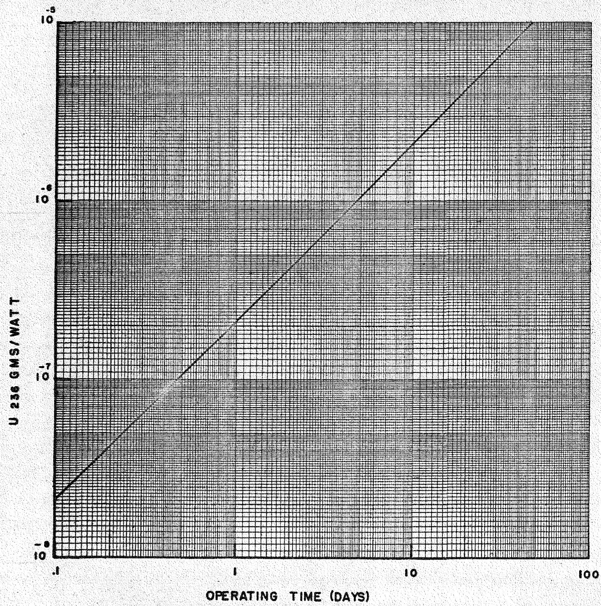  
FIGURE 2.24 TOTAL NUMBER OF GRAMS OF U236   
PRODUCED PER OPERATING WATT AS A  
FUNCTION OF OPERATING TIME.

FIGURE 2.25 NUMBER OF $\mathsf{PU}_{239}$ GRAMS PRODUCED PER OPERATING WATT AS A FUNCTION OF OPERATING TIME FOR ZERO COOLING TIME AND FOR INFINITE COOLING TIME OF FUEL  
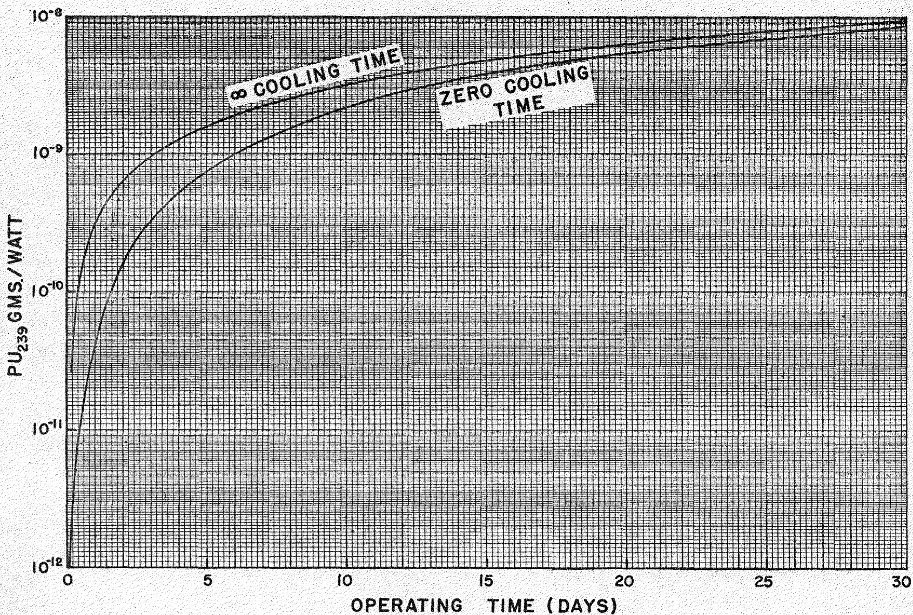  
£1801'ON OLOHd ZI-A

The fuel tubes lie in concentric cylindrical shells. The core design studied was 3 ft in diameter and length, and there were five rings of tube bundles, six bundles in the first ring, 12 in the second, 18 in the third, 24 in the fourth, and 30 in the fifth. Each tube bundle contains several fuel tubes surrounded by the coolant. With each ring of bundles is associated a cylindrical shell of the core of thickness $18/5' = 3.6$ in.

The aim of the initial calculations was to establish the $k_{eff}$ of the inner three rings of bundles, and then the $\Delta k_{eff}$ that accrued when the outer two rings were filled.

Since the IBM multigroup procedure is set up for spherical geometry only, the problem was solved in approximate form by first determining the $k_{eff}$ in an equivalent spherical reactor of 38.74 in. core and 5.74 in. reflector with composition approximating that of the current ARE design. The core-reflector interface was then moved inward 3.6 in. and the $k_{eff}$ was recalculated. Then the interface was moved inward another 3.6 in. and the $k_{eff}$ was again determined.

The results were, in the order of description, $k_{eff} = 1.074$ , 0.953, and 0.781. If the results are normalized such that the reactor is critical ( $k_{eff} = 1$ ) when all fuel tubes are full, then with the outer ring empty the $k_{eff}$ would be approximately 0.887, and with two outer rings empty, 0.727. Based on these results a fuel tube in the next to outer ring is about 2.5 times as effective as a fuel tube in the outer ring.

The uncertainty of the theory is at most about $10\%$ in $k_{eff}$ based on the check with the critical assembly so that it would seem perfectly safe to load immediately the first three rings. The fourth ring could be loaded a fourth at a time, assuming the shim control is worth 6 to $8\%$ in $k_{eff}$ , and the outer ring a third at a time.

# 3. CRITICAL EXPERIMENTS

# A.-D. Callihan, Physics Division

The Critical Experiment Group is responsible, essentially, for the experimental investigation of preliminary reactor assemblies. Enriched uranium metal and other appropriate materials for the construction of critical accumulations have been procured and are being used in the apparatus described in the last quarterly report.(1) In this procedure a matrix of the uranium with suitable reflector and moderator is constructed with adequate safety and control devices. With the assembly made critical, several important data, including the critical mass and dimensions, the spectral and spatial distribution of the neutrons, and the power distribution throughout the core may be obtained. In addition, the assembly, when critical, may be used as a tool for measuring, at least relatively, some nuclear properties of materials. A bare uranium-beryllium assembly is being thus studied for the ANP Physics Group and, in addition, a study is being made of an air-cycle reactor using water as a moderator.(2)

Recent contractual changes in the aircraft reactor program have necessitated replacing $75\%$ of the staff engaged in the critical experiments during the past quarter.

# BARE URANIUM-BERYLLIUM CRITICAL ASSEMBLY

It has been reported earlier(1) that the first assembly had beryllium as a moderator and had no reflector. The measured critical mass was approximately $30\%$ less than that calculated (see Sec. 2, Part D), and anumber of experiments have been carried out to determine if the relatively low experimental mass is due to neutrons reflected back into the core by the floor and structural materials. In some of these tests neutron absorbers were placed between the core and the potential reflectors. In one other test the quantity of possible reflector was increased in an attempt to exaggerate the supposed reflection.

Neither of these techniques has accounted for the discrepancy between the measured and calculated values.

In preliminary operations of the equipment a small but significant irreproducibility in the geometric arrangement at criticality was observed. That is, the positions of the control rods, for a given loading, were not constant from run to run. The variation is believed to be due to mechanical instability of the core elements in the supporting structure. Some larger sized beryllium pieces have been obtained to improve the mechanical stability, but no tests have yet been made. Improvement in the reproducibility of measurements is necessary before accurate measurements can be made of the effects of introducing other elements into the reactor.

Some preliminary traverses of the core have been made yielding information on the power distribution. The results show the distribution to follow the usual cosine form. The measurements consisted in determining the fission product gamma activity in pieces of uranium.

# CRITICAL ASSEMBLY OF AIR-WATER CYCLE REACTOR

At the request of the General Electric Company and with the cooperation of some of its personnel, a study is being made of a proposed reactor embodying water as a moderator and air as a coolant. In the current experiments methyl methacrylate (lucite) is used to simulate water, and graphite replaces the SiC of the proposed core. No air spaces are provided in the mock-up. The critical mass without reflector has been found to be more than $30~\mathrm{kg}$ , some three times that predicted by calculation. Measurements of the neutron spectrum are in progress.

# 4. CHEMISTRY OF LIQUID FUELS

Warren Grimes, Materials Chemistry Division

Studies of possible liquid fuels for the ARE have centered around the use of molten mixtures of uranium tetrafluoride with a number of other fluorides. Although several such ternary systems possess sufficiently low melting points (around $500^{\circ}\mathrm{C}$ and below) to be of interest as a fuel, none possesses this low melting point over a very wide range of uranium concentrations (from about 80 to 150 lb of uranium per cubic foot of fuel), as would be desirable. Phase diagrams of these and other ternary systems that have been studied are given in this section.

Studies to date have demonstrated that uranium is not soluble to any significant extent in sodium hydroxide. Lithium hydroxide and potassium hydroxide, however, will dissolve approximately 1 and $0.5\%$ uranium, respectively, while mixtures of these hydroxides will dissolve even larger quantities of uranium. Phase equilibria of the sodium hydroxide—potassium, hydroxide system and of other hydroxide systems are being determined.

Preliminary consideration has also been given to the reprocessing and recovery of uranium from a fluoride fuel in the reactor. The processing time can be reduced to approximately four days once the liquid fuel is available for solution.

# PHASE STUDIES OF FLUORIDE SYSTEMS

J.P.Blakely L.Bratcher

G.J.Nessle C.J.Barton

Materials Chemistry Division

Studies of possible liquid fuels consisting of molten mixtures of uranium tetrafluoride with a number of other fluorides have been continued during the past quarter, using the methods of thermal analysis as outlined in previous reports.(1-3) In the course of this investigation a large number of two- and three-component fluoride systems have been examined in some detail. At least five of the three-component systems have been shown to possess melting points

(1) C. J. Barton, R. E. Moore, J. P. Blakely, and G. J. Nessle, "Low Melting Fluoride Systems - Thermal Analysis," Aircraft Nuclear Propulsion Project Quarterly Progress Report for Period Ending August 31, 1950, ORNL-858, p. 110 (Dec. 4, 1950).   
(2) R. E. Moore, G. J. Nessle, J. P. Blakely, and C. J. Barton, "Low-Melting Fluoride Systems," Aircraft Nuclear Propulsion Project Quarterly Progress Report for Period Ending December 10, 1950, ORNL-919, p. 242 (Feb. 26, 1951).   
(3) J. P. Blakely, R. E. Moore, G. J. Nessle, and C. J. Barton, "Phase Studies of Fluoride Systems," Aircraft Nuclear Propulsion Project Quarterly Progress Report for Period Ending March 10, 1951, ANP-60, p. 127 (June 19, 1951).

sufficiently low to be of interest as reactor fuels; none of the systems examined to date, however, shows low melting points over a wide range of uranium concentrations. In view of the inevitable uncertainty in critical mass of the reactor and consequent uncertainty in the required uranium concentration of the fuel, a system in which the uranium concentration could be varied over wide limits with little change in melting point would be very desirable.

Equilibrium diagrams for the binary systems $\mathsf{RbF - UF_4}$ , $\mathsf{CsF - UF_4}$ , $\mathsf{PbF_2 - UF_4}$ , $\mathsf{BeF_2 - UF_4}$ , $\mathsf{KF - PbF_2}$ , $\mathsf{NaF - RbF}$ , and $\mathsf{KF - BeF_2}$ have been established. Of these systems the last four were studied in order to complete the corresponding ternary diagrams with $\mathsf{UF_4}$ . None of the uranium-bearing binary systems showed a eutectic temperature sufficiently low to offer promise as a fuel.

The ternary systems $\mathrm{RbF - NaF - UF_4}$ and $\mathrm{PbF_2 - NaF - UF_4}$ have been investigated in some detail. Other ternary systems for which the data are less complete include $\mathrm{RbF - KF - UF_4}$ , $\mathrm{PbF_2 - KF - UF_4}$ , $\mathrm{RbF - BeF_2 - UF_4}$ , and $\mathrm{KF - BeF_2 - UF_4}$ . Additional data have been obtained for the $\mathrm{NaF - BeF_2 - UF_4}$ system.

From data available at present it may be stated that the systems NaF-BeF $_2$ -UF $_4$ , RbF-BeF $_2$ -UF $_4$ , NaF-KF-UF $_4$ , and NaF-PbF $_2$ -UF $_4$ all show melting points sufficiently low to be valuable. In the NaF-BeF $_2$ -UF $_4$ system previously mentioned, (3) the useful range extends from 0 to about 16 mole % UF $_4$ , while the useful range in the NaF-KF-UF $_4$ system extends from about 22 to 35 mole % of this compound. Replacement of NaF by RbF in the former and of KF by RbF in the latter system leads to slightly lower minimum melting points but little change in the useful concentration range. The NaF-PbF $_2$ -UF $_4$ system offers low melting points in the range 0 to 20 mole % UF $_4$ . It is likely, however, that the container problem will prove especially serious for systems containing PbF $_2$ since this compound is easily reduced to metallic lead.

The various systems investigated are discussed briefly under individual headings below.

Rubidium Fluoride—Uranium Fluoride. The high cost and limited availability of rubidium fluoride required that the thermal analyses be done on a

smaller scale. No difficulty was experienced in thermal analysis using 50-g charges in l-in.-diameter crucibles. The melting point of the pure material was found to be $795 \pm 10^{\circ}\mathrm{C}$ as compared to the reported value of $760^{\circ}\mathrm{C}$ . The equilibrium diagram for the $\mathrm{RbF - UF_4}$ system shown in Fig. 4.1 is quite similar to that for the $\mathrm{KF - UF_4}$ system reported previously.(3) The minimum melting point in this system, approximately $700^{\circ}\mathrm{C}$ , is not low enough to make the system of interest as a fuel. Some difficulty was encountered in handling samples containing more than 90 mole % RbF owing to the fact that the molten charge diffuses through high-density graphite.

Cesium Fluoride—Uranium Fluoride. The experimentally determined melting point of pure CsF agreed within experimental error with the value given in the literature, $687^{\circ}\mathrm{C}$ . The equilibrium diagram for the CsF- $\mathbf{UF}_4$ system is shown in Fig. 4.2. The minimum melting point in this system at 7.5 mole $\%$ $\mathbf{UF}_4$ , $650^{\circ}\mathrm{C}$ , is too high to be of interest. The diagram is similar in some respects to the diagrams for the KF- $\mathbf{UF}_4$ and RbF- $\mathbf{UF}_4$ systems, but the poor reproducibility of the data in the high- $\mathbf{UF}_4$ part of the diagram makes the location of the liquidus line rather uncertain. There is some evidence for a compound at 75 or 80 mole $\%$ $\mathbf{UF}_4$ . Pure liquid CsF, like RbF, diffuses through high-density graphite.

Lead Fluoride—Uranium Fluoride. This system, which is shown in Fig. 4.3, is peculiar in several respects. The addition of $\mathrm{UF}_4$ to $\mathrm{PbF}_2$ appears to raise the melting point of the $\mathrm{PbF}_2$ , although a more detailed investigation might possibly show a slight drop in the melting point at a very low $\mathrm{UF}_4$ concentration. The maximum in the curve corresponds most closely to the compound $6\mathrm{PbF}_2 \cdot \mathrm{UF}_4$ . The absence of eutectic halts in this part of the diagram makes the interpretation of the cooling curve difficult. It seems likely that a compound is formed in the range 30 to 45 mole $\% \mathrm{UF}_4$ , but the composition of the compound is uncertain. Above 55 mole $\% \mathrm{UF}_4$ the diagram is more conventional, showing a definite eutectic at $762 \pm 10^{\circ}\mathrm{C}$ .

Beryllium Fluoride—Uranium Fluoride. A number of mixtures were run in this system with somewhat inconclusive results. Mixtures containing more than 85 mole $\%$ $\mathrm{BeF}_2$ showed no noticeable break in the cooling curve. Apparently mixtures in this region form quite stable glasses. The lowest melting point found in this system, at 15 mole $\%$ $\mathrm{UF}_4$ , was $760 \pm 10^{\circ}\mathrm{C}$ .

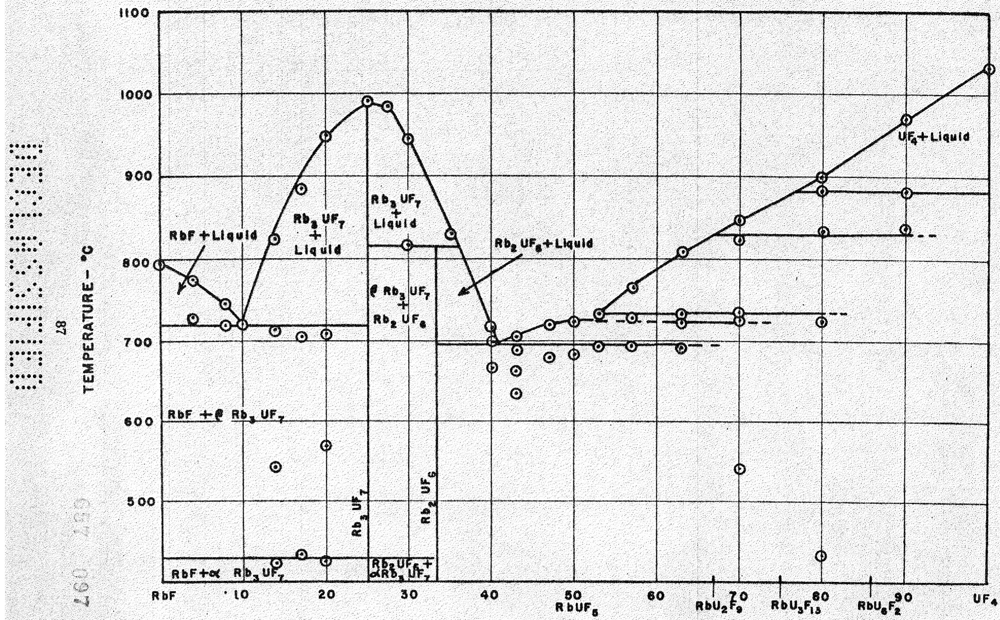  
X-10DWGNO:1507   
FIGURE 4.1. THE SYSTEM RbF-UF

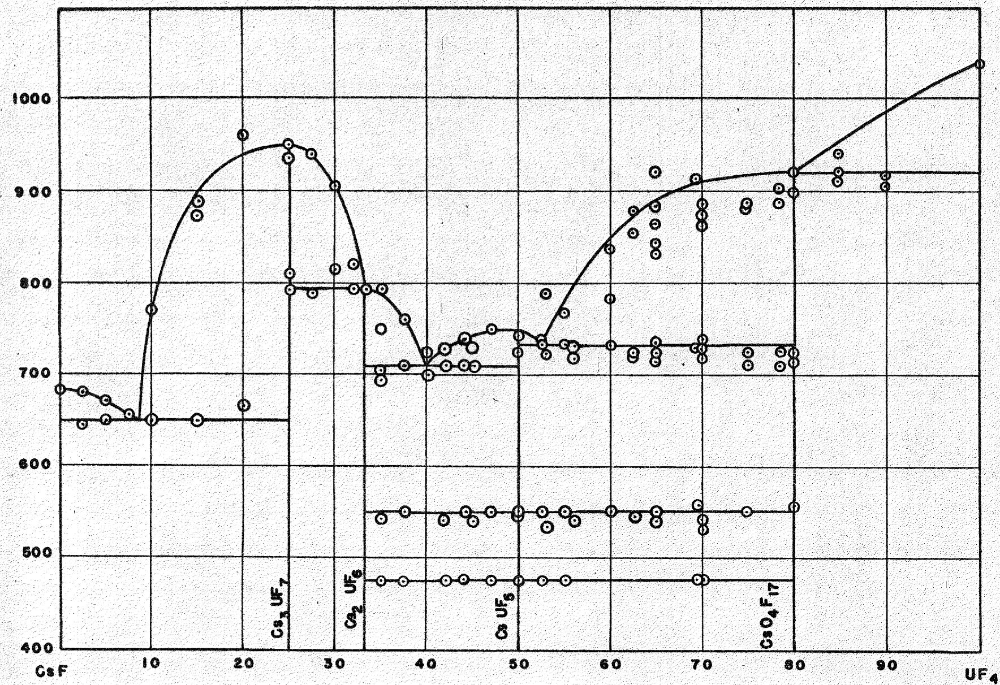  
FIGURE 4.2. THE SYSTEM CsF-UF4

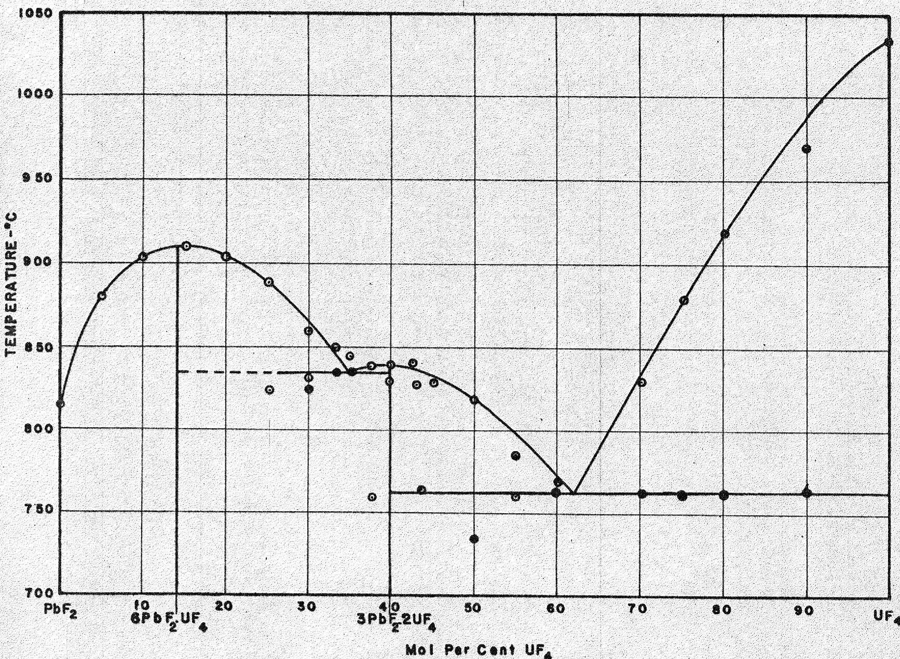  
FIGURE 4.3. THE SYSTEM $\mathsf{P}\mathsf{b}\mathsf{F}_2 - \mathsf{U}\mathsf{F}_4$

Sodium Fluoride—Beryllium Fluoride—Uranium Fluoride. Figure 4.4 shows the contour lines for the melting points in the NaF-BeF $_2$ -UF $_4$ system. This system has been less intensively studied than the NaF-KF-UF $_4$ system, and the location of the contour lines, particularly for those above the 25 mole % UF $_4$ level, is consequently not so well established. The BeF $_2$ corner of the diagram is labeled "Indeterminate," since melting points could not be detected for mixtures in this region by means of the technique currently being used in these studies. As shown in Fig. 4.4, the $550^{\circ}\mathrm{C}$ contour line extends up to about 20 mole % UF $_4$ in the NaF corner of the diagram and goes slightly lower as the BeF $_2$ concentration is increased.

Sodium Fluoride—Rubidium Fluoride—Uranium Fluoride. The melting point contours for this system, which are shown in Fig. 4.5, resemble those in the NaF-KF- $\mathrm{UF_4}$ system to some extent. The low-melting region, which occurs in the same part of the diagram in both systems, shows a minimum at about $45^{\circ}\mathrm{C}$ lower than in the NaF-KF- $\mathrm{UF_4}$ system. The $550^{\circ}\mathrm{C}$ contour line covers a slightly wider range of uranium concentrations in the NaF-RbF- $\mathrm{UF_4}$ system. However, the fact that no low-melting mixtures appear at low $\mathrm{UF_4}$ concentrations in either of these systems may restrict their usefulness as fuel materials.

Potassium Fluoride—Rubidium Fluoride—Uranium Fluoride. The melting points that have been observed for mixtures in this system are shown in Fig. 4.6. More data are needed in order to permit contours for this system to be drawn. This system does not appear to be very promising for use as a fuel material on the basis of the data that have been obtained to date.

Sodium Fluoride—Lead Fluoride—Uranium Fluoride. Contour lines for the melting points in this system are shown in Fig. 4.7. The $550^{\circ}\mathrm{C}$ contour line covers approximately the same range of uranium concentrations as in the $\mathrm{NaF - BeF_2 - UF_4}$ system (0 to 20 mole $\%$ UF $_4$ ). However, it should be noted that 20 mole $\%$ UF $_4$ in the $\mathrm{NaF - PbF_2 - UF_4}$ system represents a higher uranium density than in the $\mathrm{NaF - BeF_2 - UF_4}$ system, owing to the higher specific gravity of the former. Some slight reduction of lead fluoride to metallic lead was noted in these mixtures, but the amount of reduction was not enough to change the composition of the mixtures significantly.

Potassium Fluoride-Lead Fluoride-Uranium Fluoride. Contour lines for this system, based on limited data, are shown in Fig. 4.8. As usual, the substitution of KF for NaF resulted in higher melting points. This system is decidedly less promising as a fuel material than the corresponding sodium fluoride system.

FIGURE 4.4. THE SYSTEM $\mathsf{NaF - BeF_2 - UF_4}$   
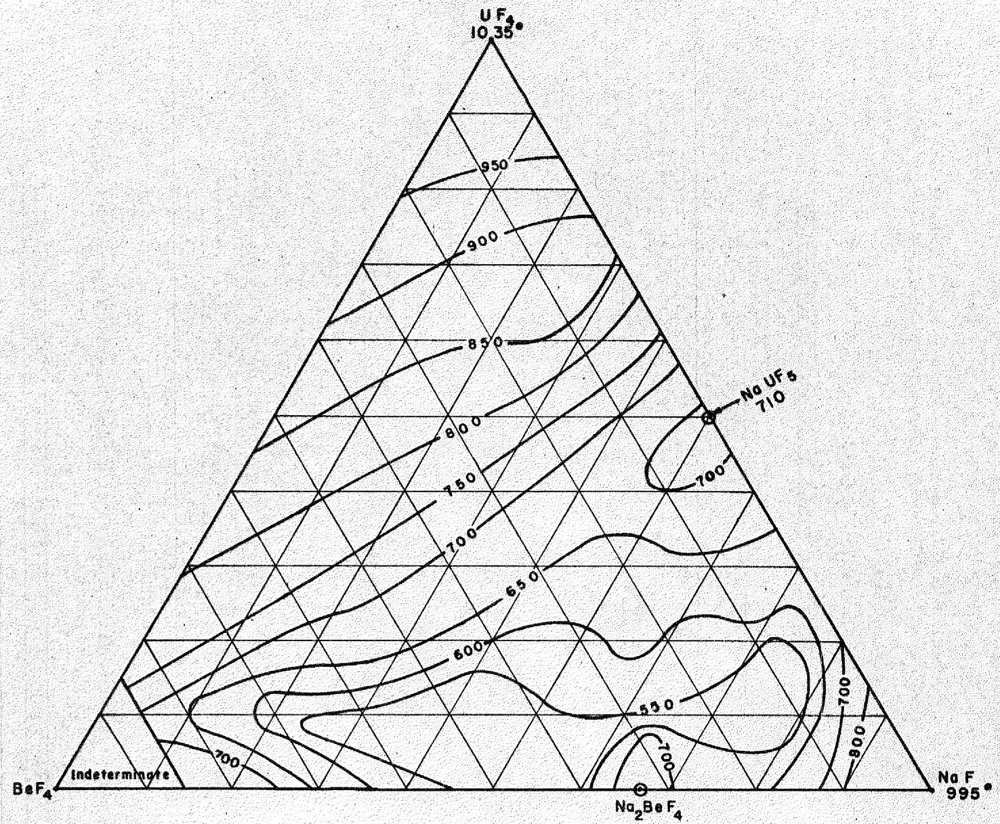  
OISLLON OMOI-X

FIGURE 4.5 THE SYSTEM NaF-RbF-UF   
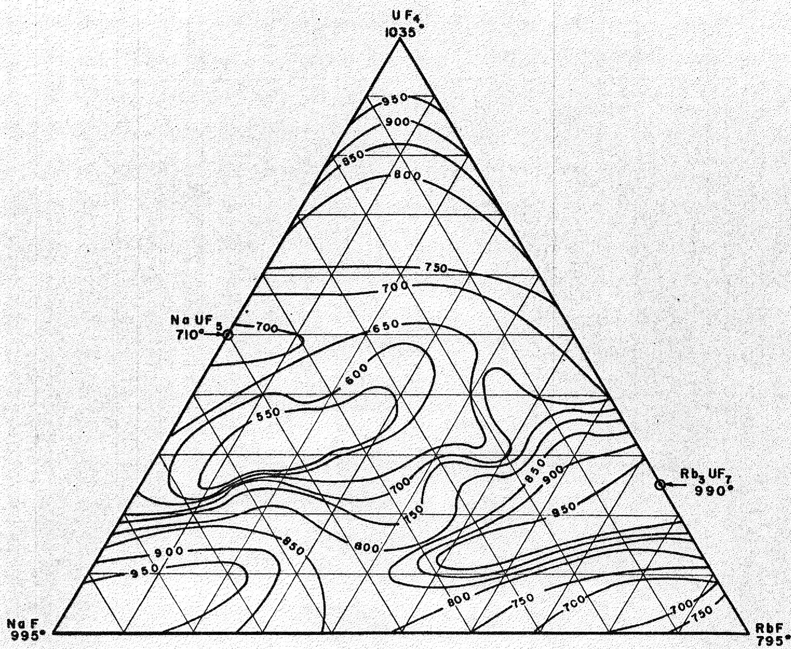  
11S11 ON 0MA 0I-X

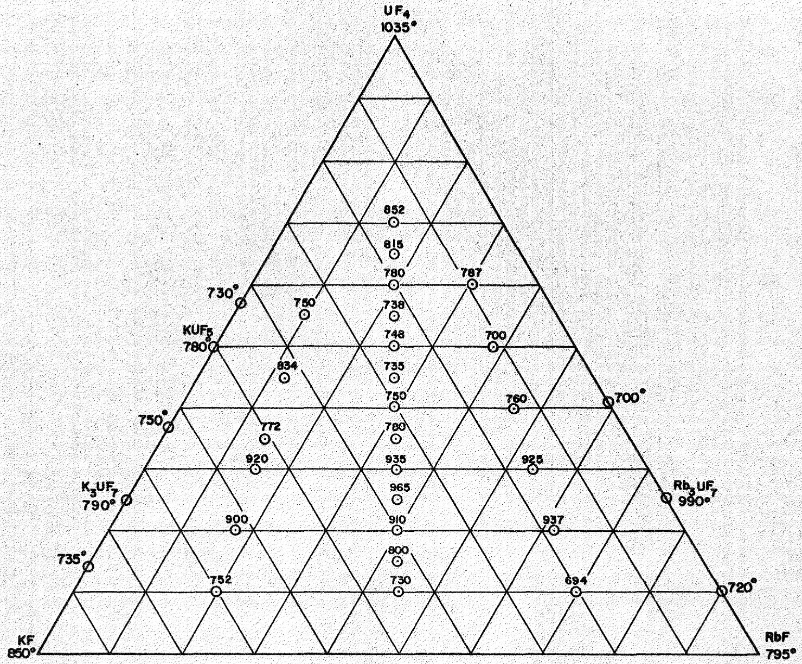  
FIGURE 4.6 THE SYSTEM KF-RbF-UF4

FIGURE 4.7. THE SYSTEM $\mathsf{NaF - PbF_2 - UF_4}$   
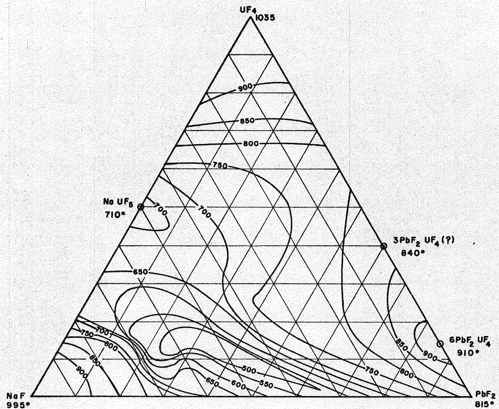  
EIGIL 'ON 'SMO OL-X

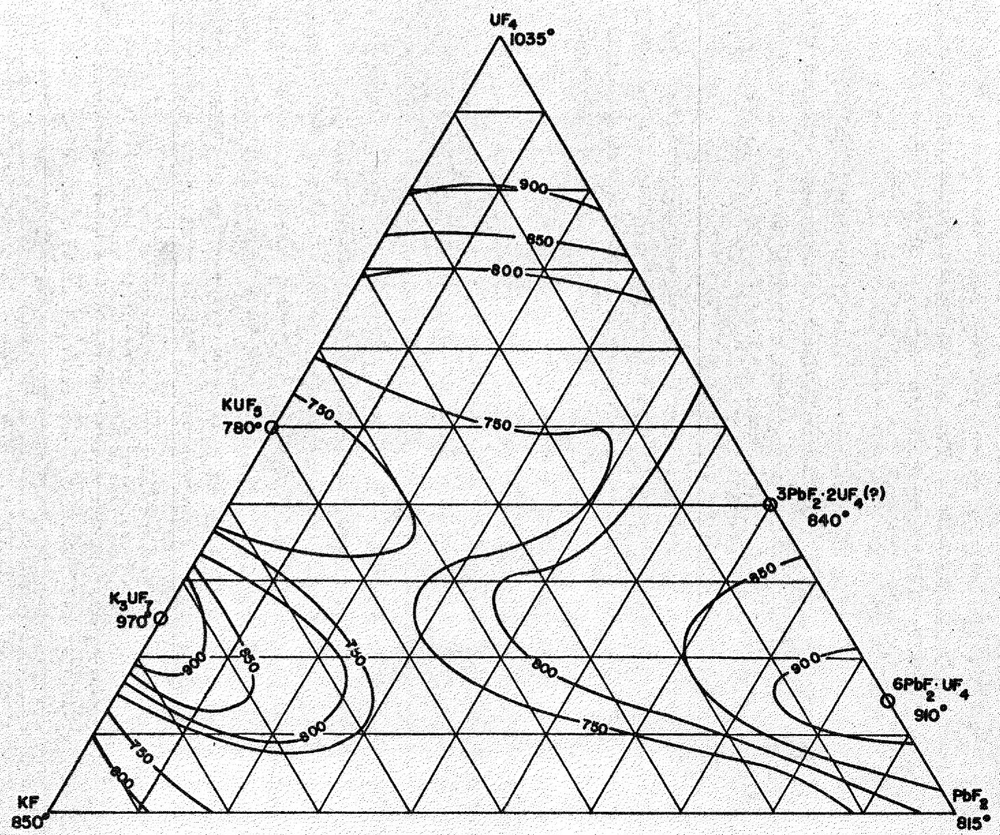  
FIGURE 4.8 THE SYSTEM $\mathrm{KF - PdF_2 - UF_4}$

Rubidium Fluoride—Beryllium Fluoride—Uranium Fluoride. This system has been investigated only in the range 10 to 20 mole $\% \cdot \mathrm{UF}_4$ . The data obtained are shown in Fig. 4.9. The melting points observed over large areas in the diagram are quite close to those found for corresponding points in the NaF-BeF $_2$ -UF $_4$ system. The effect of the high-melting compound $\mathrm{Rb}_3\mathrm{UF}_7$ is evident in the RbF corner of the diagram.

Potassium Fluoride—Beryllium Fluoride—Uranium Fluoride. This system likewise has not been completely investigated. The melting points obtained to date are shown in Fig. 4.10. This system appears much less promising than the corresponding NaF system, and further investigation of it does not seem justified at this time.

Binary Systems Containing No Uranium. The equilibrium diagrams of the binary systems $\mathsf{KF - PbF}_2$ , NaF-RbF, RbF-BeF $_2$ , and $\mathsf{KF - BeF}_2$ have been determined. These uranium-free mixtures were studied in connection with the corresponding uranium ternary systems. The beryllium curves cannot at present be extended beyond about 60 or 70 mole $\%$ $\mathsf{BeF}_2$ owing to the afore-mentioned formation of beryllium glasses and the uncertain melting point of pure beryllium fluoride.

# SUSPENSIONS OR SOLUTIONS OF URANIUM IN MOLTEN HYDROXIDES

L. G. Overholser D. E. Nicholson  
J. D. Redman  
Materials Chemistry Division

The experimental work previously reported(4-6) has demonstrated that uranium is not soluble to any significant extent in molten sodium hydroxide under a normal atmosphere and that the sodium monouranate formed under these conditions gives quite unstable suspensions at $700^{\circ}\mathrm{C}$ . Data have also been presented which show that the suspensions become less stable during aging at $700^{\circ}\mathrm{C}$ . No additive has been found which will prevent this undesirable aging. Lithium hydroxide and potassium hydroxide, on the other hand, are shown to dissolve approximately 1 and 0.5 wt. $\%$ , respectively, uranium at $700^{\circ}\mathrm{C}$ while a

(4) J. D. Redman, L. G. Overholser, and D. E. Nicholson, "Systems Containing Sodium Hydroxide," ORNL-858, op. cit., p. 107.   
(5) J. D. Redman, L. G. Overholser, and D. E. Nicholson, "Suspensions of Uranium Compounds in Sodium Hydroxide," ORNL-919, op. cit., p. 235.   
(6) J. D. Redman, L. G. Overholser, and D. E. Nicholson, "Suspensions of Uranium Compounds in Sodium Hydroxide," ANP-60, op. cit., p. 135.

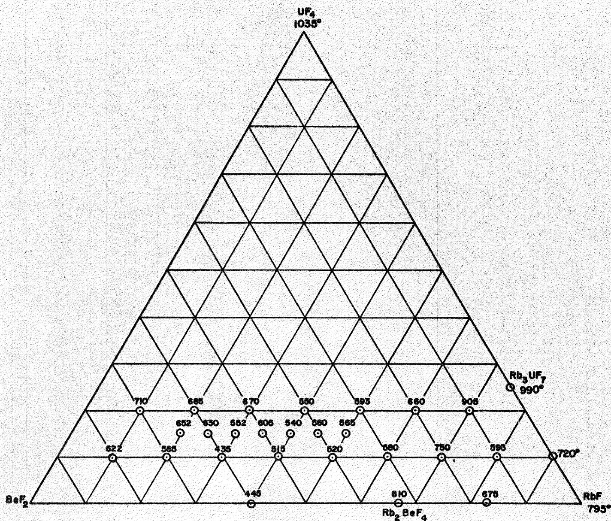  
FIGURE 4.9 THE SYSTEM $\mathsf{RbF - BeF_2 - UF_4}$

FIGURE 4.10. THE SYSTEM $\mathsf{KF - BeF_2 - UF_4}$   
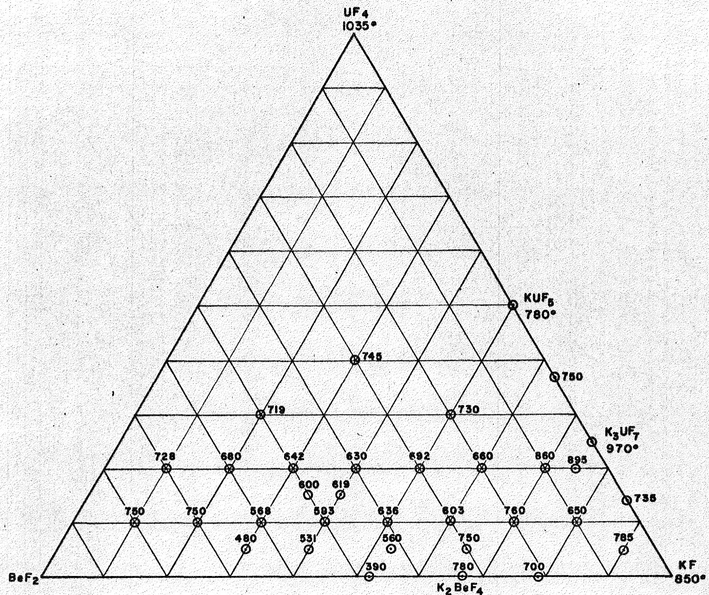  
91SLL 'ON 'OMO 01-X

mixture consisting of equal weights of lithium hydroxide and sodium hydroxide dissolves approximately 2 wt. % uranium at $650^{\circ}\mathrm{C}$ and 4 wt. % at $750^{\circ}\mathrm{C}$ . The phase equilibria of this lithium hydroxide—potassium hydroxide system and other hydroxide systems are being determined.

Additional work on sodium monouranate has shown that this compound may be prepared by heating a finely ground mixture consisting of 2 moles of sodium nitrate per mole of uranium trioxide at $1100^{\circ}\mathrm{C}$ . The monouranate so prepared has been found to be stable only in a dry atmosphere.

Behavior of Uranium Hydroxide Suspensions at 250 to $500^{\circ}\mathrm{C}$ . Experiments were run at temperatures considerably under $700^{\circ}\mathrm{C}$ to compare the stability of the uranium hydroxide suspensions with the earlier work, most of which had been done in the neighborhood of $700^{\circ}\mathrm{C}$ . In general, the hydroxide or a mixture of hydroxides was heated to about $400^{\circ}\mathrm{C}$ , the uranium trioxide was added, and, after the trioxide had reacted, the suspension was brought to the desired temperature and aged for various periods of time. The apparatus and techniques employed were essentially the same as previously described.(5) All experiments were run at a uranium trioxide content of approximately 5 wt.%. The results of several such runs are compared in Table 4.1 with similar data from previous studies at $700^{\circ}\mathrm{C}$ . The stability is expressed as percent of original uranium content remaining in the upper one-fourth of the melt (100 corresponds to no settling).

The data presented in Table 4.1 show the marked effect of temperature on the stability of the suspensions. The eutectic mixture of sodium hydroxide and potassium hydroxide, which has a melting point of $187^{\circ}\mathrm{C}$ , permits observations at lower temperatures than is possible with either of the pure components; the decrease in stability as the temperature increases from 250 to $700^{\circ}\mathrm{C}$ is quite evident. A similar, though less drastic change, occurs for the sodium hydroxide suspensions in the narrower temperature range reported.

The change in stability must be attributed primarily to the variation in viscosity with temperature. The suspensions are quite viscous at the lower temperatures so that improved stability of the suspensions would be accompanied by difficulty in pumping of these materials. It is of interest to note that the aging phenomena are different at the temperatures studied. The lack of significant change in stability for the eutectic system at $250^{\circ}\mathrm{C}$ on prolonged aging is in direct contrast to all results obtained at $700^{\circ}\mathrm{C}$ for the

sodium hydroxide systems. A comparison of the results given in Table 4.1 for the sodium hydroxide systems at 500 and $700^{\circ}\mathrm{C}$ also shows that the decrease in stability or growth of the particles is less pronounced at 500 than at $700^{\circ}\mathrm{C}$ but is readily detected at $500^{\circ}\mathrm{C}$ .

Two advantages are apparent if these systems are used at the lower temperatures: (1) increased stability and (2) less drastic changes on aging. These are offset by pumping difficulties due to the increased viscosity and loss in efficiency inherent in low-temperature operation.

TABLE 4.1   
Stability of Uranium Hydroxide Suspensions at Various Temperatures   

<table><tr><td rowspan="2">SUSPENSION</td><td colspan="2">AGING CONDITIONS</td><td rowspan="2">SETTLING TIME(min)</td><td rowspan="2">URANIUM REMAINING(%)</td></tr><tr><td>TEMPERATURE (°C)</td><td>TIME (days)</td></tr><tr><td rowspan="12">61% NaOH + 39% KOH</td><td>250</td><td>1</td><td>120</td><td>95</td></tr><tr><td>250</td><td>1</td><td>240</td><td>75</td></tr><tr><td>250</td><td>1</td><td>360</td><td>55</td></tr><tr><td>250</td><td>2</td><td>120</td><td>95</td></tr><tr><td>250</td><td>2</td><td>240</td><td>85</td></tr><tr><td>250</td><td>2</td><td>360</td><td>65</td></tr><tr><td>250</td><td>2</td><td>960</td><td>0.2</td></tr><tr><td>250</td><td>5</td><td>124</td><td>95</td></tr><tr><td>250</td><td>5</td><td>240</td><td>85</td></tr><tr><td>700</td><td>17</td><td>1</td><td>0.8</td></tr><tr><td>700</td><td>17</td><td>5</td><td>0.2</td></tr><tr><td>700</td><td>17</td><td>10</td><td>0.2</td></tr><tr><td rowspan="18">NaOH</td><td>500</td><td>1</td><td>15</td><td>70</td></tr><tr><td>500</td><td>1</td><td>30</td><td>65</td></tr><tr><td>500</td><td>1</td><td>60</td><td>25</td></tr><tr><td>500</td><td>1</td><td>150</td><td>1</td></tr><tr><td>500</td><td>2</td><td>15</td><td>65</td></tr><tr><td>500</td><td>2</td><td>30</td><td>35</td></tr><tr><td>500</td><td>2</td><td>60</td><td>1.5</td></tr><tr><td>500</td><td>2</td><td>150</td><td>0.1</td></tr><tr><td>700</td><td>1</td><td>1</td><td>65</td></tr><tr><td>700</td><td>1</td><td>2</td><td>35</td></tr><tr><td>700</td><td>1</td><td>3</td><td>20</td></tr><tr><td>700</td><td>1</td><td>4</td><td>10</td></tr><tr><td>700</td><td>1</td><td>5</td><td>1.5</td></tr><tr><td>700</td><td>5</td><td>1</td><td>0.2</td></tr><tr><td>700</td><td>5</td><td>2</td><td>0.1</td></tr><tr><td>700</td><td>5</td><td>3</td><td>0.1</td></tr><tr><td>700</td><td>5</td><td>4</td><td>0.1</td></tr><tr><td>700</td><td>5</td><td>5</td><td>0.1</td></tr></table>

Solubility of Uranium in Potassium Hydroxide. Attempts to suspend uranium trioxide in molten potassium hydroxide resulted in suspensions considerably less stable than those prepared with sodium hydroxide. The solubility of uranium in sodium hydroxide at $750^{\circ}\mathrm{C}$ is of the order of 0.01 wt. $\%$ or less; (4) potassium hydroxide at this temperature, however, dissolves about 0.3 wt. $\% \mathrm{UO}_3$ . At $650^{\circ}\mathrm{C}$ the solubility is about 0.1 wt. $\%$ .

The solubility of uranium in potassium hydroxide is decreased by the addition of sodium hydroxide. A mixture consisting of 75 wt. % potassium hydroxide and 25 wt. % sodium hydroxide dissolves about 0.1 wt. % uranium at $750^{\circ}\mathrm{C}$ . The presence of 25 wt. % lithium hydroxide has very little effect on the solubility.

These amounts of dissolved uranium are, of course, too small to be of any practical value, but it is of theoretical interest to note the difference in solubility of uranium in potassium hydroxide and sodium hydroxide. It should also be noted that suspensions of uranium in mixtures of potassium and sodium hydroxides or of potassium and lithium hydroxides are less stable than suspensions prepared with sodium hydroxide alone.

Solubility of Uranium in Lithium Hydroxide. Suspensions of uranium in lithium hydroxide, like similar preparations with potassium hydroxide, were found to be very unstable. Uranium trioxide is, however, much more soluble in lithium hydroxide. Experiments at $650^{\circ}\mathrm{C}$ indicate that 0.5 wt. $\%$ uranium may be dissolved in lithium hydroxide. The dissolution is slow, approximately 24 hr heating being required to convert the preliminary suspension to a clear blood-red solution. The solubility seems to increase slightly upon aging at $700^{\circ}\mathrm{C}$ , but this may be due to the decomposition of lithium hydroxide.

The solubility depends, to a marked degree, upon the temperature. Increasing the temperature to $750^{\circ}\mathrm{C}$ increases the solubility of $\mathrm{UO}_3$ to about $2\%$ . This change in solubility is reversible; on repeated thermal cycling between 650 and $750^{\circ}\mathrm{C}$ reproducible values for solubility of $\mathrm{UO}_3$ at $650^{\circ}\mathrm{C}$ were obtained, but the values obtained at $750^{\circ}\mathrm{C}$ increased slightly with time. This increase may perhaps be due to some decomposition of the lithium hydroxide.

Solubility of Uranium in Mixtures of Sodium and Lithium Hydroxides. The solubility of $\mathrm{UO}_3$ at $700^{\circ}\mathrm{C}$ in a mixture consisting of 25 wt. $\%$ lithium hydroxide and 75 wt. $\%$ sodium hydroxide is about 0.2 wt. $\%$ . This value is considerably less than that for lithium hydroxide but greater than that found for

sodium hydroxide. A mixture consisting of 75 wt. % lithium hydroxide dissolves about 1 wt. % uranium at $700^{\circ}\mathrm{C}$ . However, a mixture containing equal weights of lithium and sodium hydroxides dissolves substantially more uranium than does lithium hydroxide. The data collected to date indicate that approximately 2 wt. % uranium may be dissolved in this mixture at $650^{\circ}\mathrm{C}$ and about 4 wt. % at $750^{\circ}\mathrm{C}$ . The change in solubility with temperature is marked in this range but appears to be reversible, as shown by thermal cycling between 650 and $750^{\circ}\mathrm{C}$ . The system appears to be thermally stable; several samples have been heated for seven days without any marked changes being observed.

The solubility is affected by variables other than the temperature, such as purity of the hydroxides which seems to be important. It has been established that carbonate lowers the solubility; the presence of 5 wt. $\%$ sodium carbonate has been found to reduce the solubility from 2 to 0.6 wt. $\%$ at $650^{\circ}\mathrm{C}$ . Some of the variation in solubility found in the early experiments may, therefore, be ascribed to the variable carbonate content shown by subsequent analysis of the materials. The water content of the original hydroxide is probably of no great importance, since heating at $750^{\circ}\mathrm{C}$ should result in a fairly constant, low water content. The decomposition of the hydroxides at high temperatures may have an important influence on the solubility.

This system at $750^{\circ}\mathrm{C}$ contains considerable dissolved uranium and might be of interest as a reactor fuel if separated lithium isotopes were available. Two important factors which need to be established are the thermal stability of the mixture and its corrosion. Virtually no information is available concerning the behavior of the equal-weight mixture of lithium and sodium hydroxides in these respects.

Phase Equilibria in Hydroxide Systems (K. A. Allen and W. C. Davis, Stable Isotope Research and Production Division). Preliminary measurements have been made on the cooling rates of the strontium hydroxide—barium hydroxide and lithium hydroxide—sodium hydroxide systems: The apparatus and techniques employed are similar to those used in studying the fluoride systems (3) except for the exclusive use of nickel for all equipment in contact with the hydroxide.

The barium hydroxide, which contained several percent water when received, was heated at $200^{\circ}\mathrm{C}$ . Analysis of the material following this treatment showed it to be essentially anhydrous. The melting point for this lot of barium

hydroxide was found to be $395 \pm 5^{\circ} \mathrm{C}$ , which is lower than the value of $408 \pm 1^{\circ} \mathrm{C}$ reported in the literature. The difference may be attributed to impurities such as carbonate since no special effort was made to purify the commercial product.

Strontium hydroxide octahydrate was dried under argon at 200 to $300^{\circ}\mathrm{C}$ for several days to remove the water. Analysis following this treatment indicated that the hydroxide retained 1 to $2\%$ water, and, in view of the relatively large dissociation pressure of strontium hydroxide, preparation of the anhydrous material presented some difficulties. The hydroxide was found to melt at $510 \pm 5^{\circ}\mathrm{C}$ ; no value is given in the literature to compare this with. The instability of the hydroxide at this temperature leads to some uncertainty in this value.

The lithium hydroxide monohydrate used melted at $450^{\circ}\mathrm{C}$ , which is in agreement with the value given in the literature. The water of hydration appears to be easily removed by heating to the melting point.

The reagent-grade sodium hydroxide lost less than $1\%$ water when heated to the melting point. It melted at $318^{\circ}\mathrm{C}$ , which is in good agreement with the value given in the literature.

Thermal analysis of the strontium hydroxide—barium hydroxide system showed a eutectic which melts at $355 \pm 5^{\circ}\mathrm{C}$ . This eutectic mixture contains $62.5 \pm 0.5$ mole % barium hydroxide. No evidence of compound formation was observed, but additional data must be obtained before any conclusive statements may be made about this system.

An incomplete study of the lithium hydroxide—sodium hydroxide system revealed a eutectic melting at $220^{\circ}\mathrm{C}$ which contained $25 \pm 1$ mole% lithium hydroxide. There is some evidence of compound formation at 40 mole% lithium hydroxide, but further work is needed to confirm this.

# FUEL RECOVERY AND REPROCESSING

# Preston Hill, ANP Division*

The use of liquid fuels that can be drained without the necessity of disassembling the core inherently appears to permit a relatively quick and simple method for the partial decontamination of the reactor and the recovery of the uranium in the fuel. At the present time the use of established *Lieutenant Colonel, USAF, on loan to the Oak Ridge National Laboratory.

solvent-extraction methods, such as the Redox or Purex process, appears the most feasible for processing the used fluoride salts for recovery of uncontaminated uranium. The fluoride salts mixture can be dissolved in fused aluminum nitrate, and the resulting solution is in almost exactly the proper proportions for use as feed material for the solvent process. After the fuel has been dissolved in the aluminum nitrate it is fed to the solvent-extraction system in subcritical batches for separation of the fissionable material from the sodium, beryllium, and aluminum fluoride, and fission products. After solvent extraction, the uranium-rich liquid is processed to give uranium tetrafluoride for reuse.

If plants of sufficiently large size are available, it seems that the processing times may be reduced to approximately those given in Table 4.2.

TABLE 4.2   
Suggested Reactor Fuel Reprocessing Time.   

<table><tr><td>PROCESS</td><td>TIME (days)</td></tr><tr><td>Cooling</td><td>1</td></tr><tr><td>Dissolving</td><td>%</td></tr><tr><td>Extraction</td><td>1%</td></tr><tr><td>Evaporation</td><td>%</td></tr><tr><td>Hydrofluorination</td><td>%</td></tr><tr><td>Total</td><td>4</td></tr></table>

The total time from reactor shutdown until the fissionable material is available as purified uranium tetrafluoride depends upon having facilities capable of handling the total amount of fuel in batches containing not over $500\mathrm{g}$ of fissionable material in each. If a continuous process is available, the equipment must be such that all dimensions are within the safe design limits for criticality. This probably gives about the same minimum reprocessing time as for batch operation.

The overall reprocessing time may be reduced by a proposed technique of direct fluorination of the fluoride mixture and distilling off the resulting uranium hexafluoride. This process is to be investigated.

104-130

# Part III

# MATERIALS RESEARCH

131

# INTRODUCTION TO PART III

Investigation of materials problems introduced by the temperature, the necessary constituents, and the environment in the ARE reactor comprises, by far, the largest effort in the ANP program. In addition to empirical research on corrosion, radiation damage, welding, and development of components for liquid-metal systems, this program includes the determination of the basic thermal and physical constants associated with these materials at reactor temperatures.

The corrosion research (Sec. 10), both static and dynamic, is now predicated on the use of sodium as coolant for the ARE. While a considerable number of static-corrosion data with sodium have been accumulated, few dynamic corrosion data, particularly with forced circulation, are yet available. From the static tests, several stainless steels and inconel appear to be satisfactory for use with sodium. Static-corrosion data with possible fluoride fuels (static-corrosion data are acceptable because of the quiescent nature of the fuel) has established the desirability of pretreating the fuel, while indicating also that one of several stainless steels may prove to be a suitable container. Inconel, now designated for use in the ARE on the basis of earlier corrosion tests with the fluoride fuel, still appears satisfactory from a corrosion standpoint although somewhat inferior to some of the stainless steels.

The section on components of liquid-metal systems (Sec. 12) includes a discussion of the development of pumps, bearings, seals, flowmeters, valves preheaters, pressure indicators, etc. Techniques and procedures required in liquid-metal handling have been further refined. In addition, studies of the fluid mechanics of fuel and coolant systems are being made, and facilities for handling high-temperature fluid in full-scale (ARE) quantities are being designed and installed.

The fabrication of the ARE presents one of the most difficult tasks of this nature. In the section on metallurgical processes (Sec. 13), the successful use of a semiautomatic welding technique for the assembly of the fuel tubes to the fuel header is described. The high-temperature stress and creep-rupture laboratory for testing these and other specimens is essentially complete. In addition, solid type fuel elements, an alternative to the use

of liquid-fuel elements, may be fabricated by one of three techniques now being refined.

The question of the radiation stability of the fuel is singularly important (Sec. 14). The irradiation of a fuel capsule is being undertaken in the X-10 reactor and in the Y-12 and Berkeley cyclotrons. While no serious radiation damage effects are anticipated in either the moderator or the liquid-metal coolant, the structural and containing materials of the reactor are being examined under irradiation for significant changes in creep rate, thermal conductivity, and induced corrosion.

Many fundamental data on the thermal and physical properties of both liquids and metals are being determined (Sec. 11). Heat-transfer, heat-capacity, and thermal-capacity data are now being determined on materials of interest, and density and viscosity measurements will soon be available. In addition, the determination of the influence of natural convection on heat transfer of liquid fuel has served to enhance the desirability of such a fuel system. Some fundamental studies have been completed on heat transfer in noncircular ducts.

# 10. CORROSION EXPERIMENTATION

E. C. Miller and W. D. Manly, Metallurgy Division  
W. R. Grimes, Materials Chemistry Division  
H. W. Savage, ANP Division

Static-corrosion tests with sodium and some fluoride mixtures are being continued on the more promising alloys being considered for the proposed ARE in order to evaluate more thoroughly the effects of time and temperature on their stability and on surface reactions. Inconel and several of the stainless steels appear to be satisfactory in corrosion tests in static sodium; dynamic-corrosion tests and stress-corrosion tests of these materials are in progress. Static-corrosion tests with lithium, since suspended, showed more severe attack, particularly on nickel, than with sodium.

The recent tests with the fluoride fuel now indicate that several of the stainless steels may be as good as, or better than, inconel as container material from the standpoint of corrosion. The lessened corrosion with fluoride mixtures pretreated to remove impurities have shown the necessity for pretreating.

A number of miscellaneous corrosion tests are in progress, including tests with hydroxides on metals; with sodium on beryllium oxide, and on the sodium-inconel-fluoride system.

Approximately ten additional thermal-convection loops have been operated chiefly with sodium during the past quarter and are now being examined. These dynamic-corrosion tests will be supplemented by tests with forced-circulation loops, i.e., figure-eight loops. The first loop has now been in operation for 200 hr with sodium at $1500^{\circ}\mathrm{F}$ .

# STATIC CORROSION BY SODIUM ON METALS

Corrosion tests in molten sodium at $1000^{\circ}\mathrm{C}$ which have been run in the past year are reported in detail in the recent Metallurgy Division quarterly progress report (ORNL-1033). In general, the materials tested did not undergo much corrosive attack, as indicated by weight changes and examination for intergranular penetration. However, a number of alloys, such as 304 and 316

stainless steel, did contain precipitates in the surface zones, as shown in Figs. 10.1 and 10.2. The nature of these precipitates is not definitely known, although it appears that they may be carbide or sigma transformed material.

A molybdenum specimen was recently exposed to sodium at $1000^{\circ}\mathrm{C}$ for a 100- $\mathbf{hr}$ period in a molybdenum tube. Very little attack was apparent, as illustrated in Fig. 10.3. Similar tests made in the presence of a third component definitely indicated the formation of a hard, brittle, intermetallic phase on the molybdenum surface. Figure 10.4 shows this effect when silicon is present, and a photomicrograph shown in the previous report (ANP-60, p. 200) shows an analogous layer with nickel present.

The work to date on materials for use in contact with sodium in high-temperature, $1500^{\circ}\mathrm{F}$ , reactors indicates that a substantial number of potential materials resist corrosion in the absence of an applied stress. Work is now in progress to evaluate the possibilities of stress-corrosion attack of the more common alloys. Inconel and several of the stainless steels, both austenitic and ferritic, appear satisfactory from the standpoint of corrosion, and the limitations upon their use appear to depend upon the factors of high-temperature strength and possible phase changes, which are not necessarily related to the action of sodium. The following distinct possibilities of unfavorable effects of sodium do exist, however, and must be provided for in the design of a reactor system:

1. Mass transfer attack or film formation, which may result from the presence of two dissimilar metals in the same system. This can be corrected by constructing the system so that only one metallic component is in contact with the sodium. Fortunately, this does not appear to be serious in all cases, particularly when the stainless steels and inconel are involved.   
2. Increased solubility of oxygen in sodium at high temperatures. The thermal coefficient of solubility of oxygen in sodium is such that sodium saturated with oxygen in the temperature range of 1200 to $1500^{\circ}\mathrm{F}$ will contain substantially more oxygen than a system saturated at lower temperatures. This can be taken care of by control of the amount of sodium oxide in the system, in original preparation and filling of the system, by purification of the gas, and by continuous removal of sodium oxide by use of a cold trap.

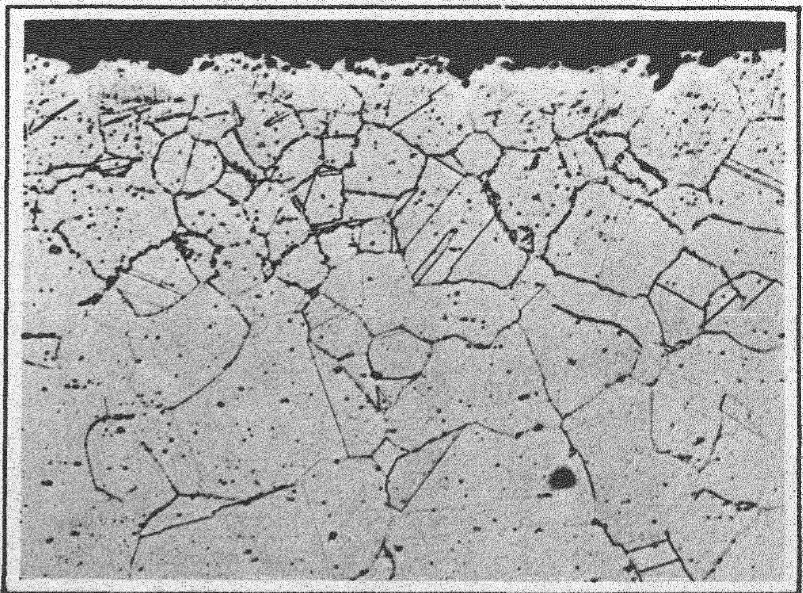  
Y-3210   
MAG.250X   
FIGURE 10.1

PRECIPITATION OF UNKNOWN PHASE IN GRAIN BOUNDARY AND WITHIN GRAIN IN SURFACE ZONE OF 304 STAINLESS STEEL ALLOY AFTER 40 HOUR EXPOSURE TO SODIUM AT $1000^{\circ}\mathrm{C}$ .

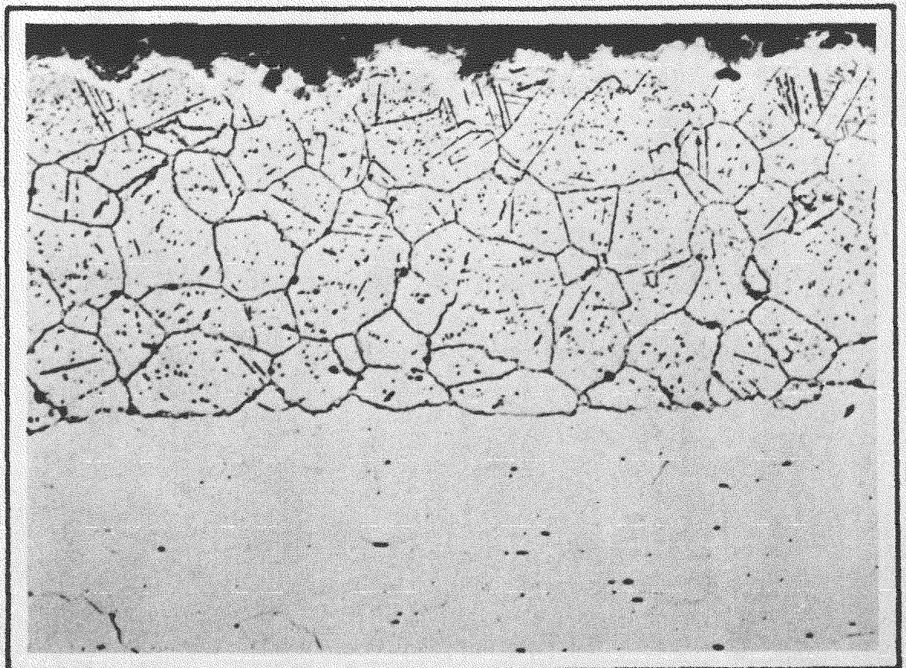  
Y-3517   
MAG.250X   
FIGURE 10.2

PRECIPITATION OF UNKNOWN PHASE IN GRAIN BOUNDARY AND WITHIN GRAIN IN SURFACE ZONE OF 316 STAINLESS STEEL ALLOY AFTER 40 HOUR EXPOSURE TO SODIUM AT $1000^{\circ}C$ .

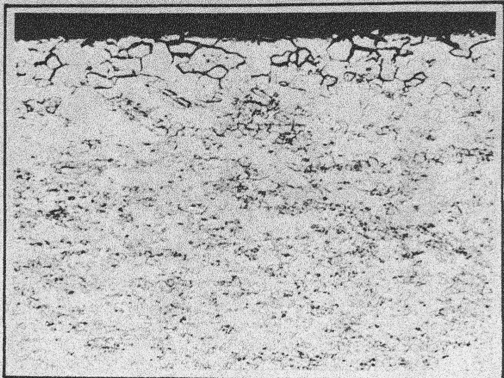  
Y-3756

MAG.250X

# FIGURE 10.3

SURFACE OF MOLYBDENUM SPECIMEN AFTER IOO HOUR EXPOSURE TO SODIUM AT 1000°C. SLIGHT EVIDENCE OF UNKNOWN GRAIN BOUNDARY PRE-CIPITATE.

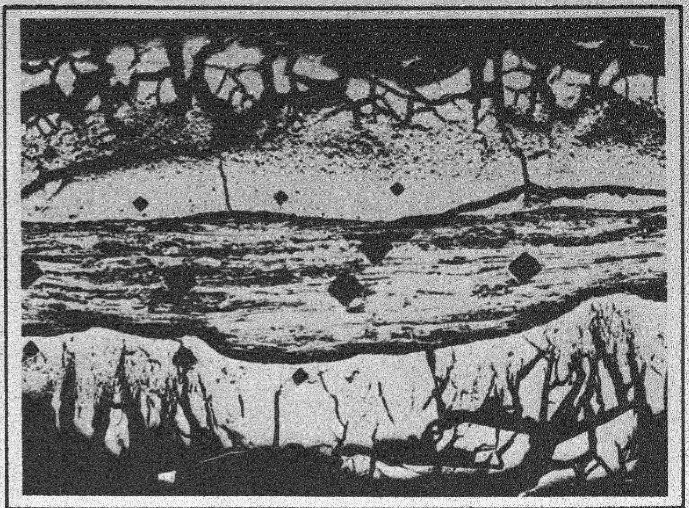  
Y-3552   
MAG.250X   
FIGURE 10.4

APPEARANCE OF THIN MOLYBDENUM SPECIMEN AFTER 100 HOUR EXPOSURE TO SODIUM IN CONTACT WITH SILICON AT $1000^{\circ}C$ .

3. The presence of a slight amount of carbon in the system may cause carburization and possible embrittlement of some of the stainless steels. This, too, can be regulated by the control of the carbon and carbon-bearing materials in the system.

# STATIC CORROSION BY HYDROXIDES ON METAL CONTAINERS

Several corrosion tests have been made on inconel and nickel at $1500^{\circ}\mathrm{F}$ using the hydroxides of barium, strontium, and sodium. The results of these tests are not yet available, but preliminary examination has indicated very severe attack by sodium hydroxide on inconel and nichrome V although nickel was quite resistant to attack.

# STATIC CORROSION: SODIUM-INCONEL-FLUORIDE FUEL

Static-corrosion experiments on fuel capsules are being performed to provide data on static-corrosion rates of various types of metal in contact with hot sodium on one side and the fluoride eutectic fuel on the other. The test equipment consists of four wells of "standpipes," all leading from a common vessel, to contain sodium at $1500^{\circ}\mathrm{F}$ . After a fuel capsule is cut and filled with eutectic, a weighed and measured specimen of capsule tube material is placed inside the capsule in the eutectic before the capsule is welded shut. One of the capsules containing the specimen and eutectic is then placed in each of the standpipe wells. The test schedule has been arranged so that

seven capsules are rotated to give tests of 100, 200, 400, 600, 800, 900, and 1000 hr in length. Samples of sodium are taken at the beginning and end of the tests for oxygen and spectrographic analysis. Operation thus far has been intermittent, owing to sodium leaks at faulty welds in the standpipe equipment; leaks due to faulty welds have also been found in capsules upon their removal from the sodium bath.

# STATIC CORROSION BY FLUORIDE MELTS ON METAL CONTAINERS

F. Kertesz H. J. Buttram

F. A. Knox S. D. Fulkerson

J. A. Griffin

Materials Chemistry Division

The study of corrosion of structural metals by various possible fluoride fuel mixtures has been continued during the past quarter. The technique used for preparation of the ternary fluoride systems tested, preparation and filling of the metal capsules, and sealing of the capsules was essentially the same as that previously described.(1) The significant feature of this procedure is that the sample is placed in a capsule of the same material as the sample, so that mass transfer, as between a capsule and sample of different materials, is not possible.

While the combined metallographic, weight change, and chemical data are available for only a few runs, it is apparent that the problem of corrosion, at least in the absence of radiation, need not be serious. It has, however, been well demonstrated that freedom of the fluoride mixture from extraneous materials, especially water, is very important and that carefully controlled pretreatment of the fuel mixture before testing is, therefore, essential.

Experimental Procedure. The standard exposure time has been 100 hr at $800^{\circ}\mathrm{C}$ , but tests currently in progress are designed to study the effect of exposure time for periods up to 1000 hr and at temperatures up to $950^{\circ}\mathrm{C}$ . The exposures are made in a furnace contained in a large vacuum chamber. This chamber encloses a volume of about 8.5 ft³ and is held during operation at pressures below 1 μ Hg by a 6-in. diffusion pump backed with a 25-cfm Kinney pump. The chamber can be brought to this pressure in a few minutes at the start of a run. Power is fed to the furnaces through spark plug connections

through the side walls of the chamber. Temperature control of the furnace is effected by chromel-alumel thermocouples and Wheelco controllers. A vacuum-tight window permits observation of the sample during the experiment.

Corrosion by Outgassed NaF-BeF $_2$ -UF $_4$ Melt. The data shown in Table 10.2 indicate the corrosion to be expected from typical melts with several types of structural metal when the procedure outlined in the previous report is followed directly. By this technique, the fuel mixture is melted and the liquid is homogenized by heating under an argon atmosphere in a nickel crucible. The homogeneous melt is reduced to powder and packed into the metal tubes in a good dry box. The corrosion capsules are sealed, after the contents are outgassed, by evacuation at $800^{\circ}$ C and are handled in the standard manner.

TABLE 10.2   
Corrosion of Structural Metals by Outgassed NaF-BeF $_2$ -UF $_4$ in 100 hr at $800^{\circ}$ C   

<table><tr><td rowspan="2">MATERIAL</td><td colspan="2">DEPTH OF INTERGRANULAR ATTACK (mils)</td></tr><tr><td>MAXIMUM</td><td>AVERAGE</td></tr><tr><td>Stainless steel 304</td><td>4.0</td><td>2.5</td></tr><tr><td>Stainless steel 304 ELC</td><td>3.0</td><td>1.5</td></tr><tr><td>Stainless steel 316</td><td>4.0</td><td>4.1.5</td></tr><tr><td>Stainless steel 316 ELC</td><td>2.0</td><td>1.5</td></tr><tr><td>Inconel</td><td>7.0</td><td>4.6</td></tr><tr><td>Stainless steel 321</td><td>1.0</td><td>1.0</td></tr><tr><td>Stainless steel 347</td><td>3.0</td><td>2.0:</td></tr><tr><td>Multinet N-155</td><td>1.0</td><td>1.0</td></tr></table>

*Composition, in mole %: NaF, 25; BeF $_2$ , 60; UF $_4$ , 15.

While the depth of intergranular penetration of some of these specimens, notably 321 and 316 ELC stainless steels, is not large, the fact that the

exposures were for only 100 hr indicates definitely that improvement must be realized if long life is to be expected from thin-walled fuel tubes.

Corrosion by Pretreated NaF-KF-UF $_4$ Melt. If the fluoride melt is "pretreated" by standing for several hours in contact with stainless steel and inconel tubing, a small gain in stability of inconel and a large improvement in the stability of the stainless steels is observed. This pretreatment was effected under an argon atmosphere and varied from $2\frac{1}{2}$ to 6 hr with no noticeable change. The observed increase in stability based upon weight change in the sample is a factor of 2 for inconel and a factor of 10 for types 304, 316, 321, and 347 stainless steel.

The results of metallographic examination of a number of these samples maintained at $800^{\circ}\mathrm{C}$ for 100 hr in the pretreated NaF-KF-UF $_4$ melt is given in Table 10.3. No attack was observed except in the case of the 316 stainless steel. The mechanism by which the pretreatment with these metals effects the great improvement in corrosion has not been established. It is evident, however, that almost all the metals in Table 10.3 are good candidates as container materials for this fluoride mixture.

# DYNAMIC CORROSION BY LIQUID METALS

The operation of thermal-convection loops is being continued by the ANP Experimental Engineering Group. Forced-circulation tests and corrosion-erosion tests are awaiting the final reconstruction of the loop recently burned out. The construction of a second forced-circulation loop (also for sodium) is nearing completion.

Thermal-Convection Loops (Harps) (E. M. Lees, ANP Division). The ANP Experimental Engineering Group has continued testing dynamic corrosion in

# TABLE 10.3

# Corrosion of Structural Metals by Pretreated NaF-KF UF\* in 100 hr at $800^{\circ}C$

<table><tr><td>MATERIAL</td><td>RESULTS OF METALLOGRAPHIC EXAMINATION(2)</td></tr><tr><td>Stainless steel 304</td><td>No attack</td></tr><tr><td>Stainless steel 304 ELC</td><td>No attack</td></tr><tr><td>Stainless steel 321</td><td>No attack</td></tr><tr><td>Stainless steel 347</td><td>No attack</td></tr><tr><td>Nickel A</td><td>No attack</td></tr><tr><td>Stainless steel 316</td><td>Specimen showed little evidence of direct attack; around edge, to depth of from l to 3 mils, were a number of voids, some of which appeared to be intergranular; there did not appear to be much continuity between these voids, and they may represent places from which a subsurface phase was removed during polishing; voids were non-uniform in occurrence and were concentrated more heavily on one edge of specimen than on others</td></tr><tr><td>Stainless steel 316 ELC</td><td>No attack</td></tr></table>

\*Composition, in mole % NaF, 46.5; UF4, 27.5; KF, 26.0.   
(2) R. J. Gray and R. B. Day, Metallographic Examination of Static Corrosion Specimens of Run 15 Tested in a Ternary Fluoride Mixture, memorandum to E. C. Miller, June 11, 1951.

conjunction with the Metallurgy Division. During this period, 10 convection loops (harps) were taken out of service, six of which had been operated with sodium at $1500^{\circ}\mathrm{F}$ for 1000 hr.

Seven loops

are presently in operation with sodium at $1500^{\circ}\mathrm{F}$ , and several are nearing the 1000-hr mark.

No data on loops terminated

during the quarter are presented since the supporting metallographic examinations have not been completed. Loop materials tested included 316, 304, and 309 stainless steels, iron, nickel, and cobalt-base alloy L-605.

Equipment procurement and fabrication for test operations have been emphasized with the result that control panels for thermal-convection-loop operations are now in use. These panels provide facilities for operating 16 loops simultaneously and thus far have given good automatic temperature control, in addition to providing sufficient power capacity to enable loop heaters to operate at reduced voltages, resulting in markedly increased heater life. The automatic level-control circuits in themselves have given little trouble, although some difficulty was encountered with leaks in the common argon header to which all level controls are connected. Some trouble is still encountered in gas lines which become plugged with condensed sodium. Adequate methods for preventing the line plugging are being sought, but, in the meantime, the level-control system indicates stopped lines, thereby permitting correction before an emergency arises.

Forced-Convection (Figure-Eight) Loops (W. B. McDonald, ANP Division). During the quarter the figure-eight loop was operated for approximately 200 hr with sodium at $1500^{\circ}\mathrm{F}$ . The test was terminated by electromagnetic pump cell rupture which resulted in a serious sodium spill. Fortunately, the system dumped satisfactorily, and the fire was quickly extinguished. A second figure-eight loop is being assembled and should be ready for testing early next quarter.

In the course of operation, however, solutions were found for some existing problems: (l) preheater difficulties resulting from the use of wrap-around heaters were virtually eliminated by the use of inconel sheathed

calrod heaters; (2) clamps designed to replace flange bolts in the hot-test sections of the figure-eight loop have proved satisfactory; (3) plugging of gas pressure lines has been relieved by admitting gas pressure through condensation tanks containing steel wool.

The operation of electromagnetic pumps has given considerable difficulty in figure-eight loop tests. An electromagnetic pump built by ORNL yielded maximum flows of about 5 gpm of sodium through the loop; later this rate dropped to 3 gpm. This pump was replaced with a Model G-3 General Electric pump which had a pump cell with lugs silver-soldered in place. Maximum flow obtained with this pump was approximately 1 gpm, and after 10 hr operation the cell ruptured at the inside lug, terminating the test.

# 11. LIQUID-METAL AND HEAT-TRANSFER RESEARCH

R. N. Lyon and H. F. Poppendiek, Reactor Technology Division

Heat-transfer research for the ANP program has both long- and short-term objectives. The long-term objective consists in the discovery and accumulation of facts which, with careful analysis, will simplify future decisions on heat-transfer questions arising in designing an aircraft reactor. The short-term objective consists in the discovery, accumulation, and analysis of facts required to answer current heat-transfer questions in the design of the ANP and the ARE reactors. Longer term problems include theoretical and experimental studies of forced-convection heat transfer, boiling heat transfer, and the determination and accumulation of physical property data for materials of possible interest. They deal with liquid metals, liquid hydroxides, and liquid salts and involve a wide range of conduit shapes and heat-flux distribution.

Studies of immediate importance include a determination of the influence on heat transfer of natural convection in liquid fuels and the determination of physical properties of materials of current interest. Both these short-term studies have resulted in useful design information during the past quarter, and they are both continuing at an accelerated pace. A survey of fluid-friction data in noncircular conduits, completed during the quarter, was made to interpret, in part, seemingly anomalous pressure-drop data obtained with a mock-up of a hockey-stick heat exchanger by another ANP group.

As a result of work on the longer-range studies, a report on analysis of heat transfer in some noncircular ducts has been published (ORNL-985). Preliminary tests with sodium have been made in a system which provides data on thermal entry length.

The

sodium hydroxide system has been redesigned to eliminate the need for pumps, and construction of a small-scale liquid-metal boiling apparatus has begun.

Heat-capacity data are being obtained at temperatures up to $1000^{\circ}\mathrm{C}$ on a routine basis. Thermal conductivities of solids are now being measured over a smaller range. Viscosity equipment and liquid-thermal-conductivity apparatus have been built and will be in operation shortly. Liquid-density equipment has been built and checked with sodium. Agreement within $1.5\%$ was obtained with existing data.

In addition to the research activities, a project-wide system was established with the cooperation of the TIS for distribution of informative abstracts of liquid-metal reports, technical coordination of two AEC contracts for lead-bismuth alloy studies was maintained, and assembly and editing of a second edition of the Liquid Metals Handbook progressed satisfactorily with help from other sites.

# STUDY OF FREE CONVECTION IN LIQUID-FUEL ELEMENTS

F. E. Lynch, Experimental Engineering Division  
P. C. Zmola, Reactor Technology Division

The experimental system consisting of a quartz tube in which a liquid metal is electrically resistance-heated is being utilized. Results from the 0.24-I.D. mercury-filled tube briefly mentioned in the last quarterly report(1) have been reported in detail.(2) This apparatus, slightly modified, has also been run with lead-bismuth eutectic alloy at power densities up to 250 watts/cc (corresponding to a bulk temperature of about $1200^{\circ}\mathrm{F}$ ). For all but the lowest power densities, the measured temperature difference between the center and the thermocouple at the inside wall of the tube was less than 0.3 of the calculated value based on pure conduction through the liquid. A 0.115-in. (3-mm) I.D. apparatus was assembled, but results were not obtained because of difficulties in satisfactorily locating thermocouples within the tube. A number of techniques are being investigated in an effort to measure significant temperatures within this size tube.

An apparatus has been designed and is being fabricated to study free convection in annular spaces under conditions of internal heat generation. The temperature-measurement problem is somewhat simplified in an annulus system, in which it will also be possible to investigate smaller gap sizes (corresponding to radii in tubes) than in the case of tubes.

Results obtained from these experiments are being compared with values reported in the literature for systems in which no heat is generated in the liquid. If data from the present study compare favorably with existing correlations, it may be possible to use such correlations as a starting point for analytical interpretation of the current experiments.

# SODIUM HEAT- TRANSFER COEFFICIENTS

W. B. Harrison, Reactor Technology Division

The test section designed for obtaining heat-transfer data in entrance regions with sodium consists of a very short (1/16 to 1/4 in.) thick-walled copper cylinder (3 in. O.D.). Sodium is passed through a 1/32-in.-diameter hole in the center of the cylinder, and the periphery is maintained at constant temperature with low-pressure steam. The initial design of the circulating system incorporated a continuous recycle of the sodium by means of a gear pump, in view of the pressure requirements of 200 psi and the flow rate of only $\frac{1}{2}$ gpm. In the last quarterly report(3) it was pointed out that

(3) W. B. Harrison, "Heat-Transfer Coefficient of Liquid Sodium," ANP-60, op. cit., p. 230.

operative problems were centered in the pump. When the pump temperature was increased to $250^{\circ}\mathrm{F}$ , the housing expanded to such an extent that attainable pressure was too low to be useful. Although it is believed that a gear pump could be developed for this service, such development was considered to be beyond the proposed scope of the experiment, and the system was altered to the form of a once-through path, the sodium being moved by gas pressure. These modifications have been completed, and a preliminary check of the system has been made. Essentially, the system is now ready for operation with only a few minor adjustments yet to be incorporated.

# BOILING-LIQUID-METAL HEAT TRANSFER

W. S. Farmer, Reactor Technology Division

A decision was made this past quarter to include in the boiling-liquid-metal program an investigation of nucleate boiling from a flat plate. The apparatus is sufficiently simple that construction and operation will be possible within the next two months. In the interim, construction will be carried to completion on the horizontal-tube boiling apparatus.(4)

The apparatus for nucleate boiling from a flat plate has been almost completely designed and is now under construction. The equipment consists of a 4-in.-diameter vertical cylindrical tank approximately 30 in. high. The bottom of the tank consists of a short copper cylinder. The upper surface of the copper cylinder within the tank is chrome plated for corrosion resistance. In the top of the tank a spiral cooling coil is to be inserted for condensing vapors.

In operation, the bottom of the copper bar is to be heated by an induction coil, and the heat so generated is to be conducted through the bar to the surface within the tank. Thermocouples are so spaced in the copper bar that the net heat-transfer flux and the surface temperature can be obtained. Initial experiments will be conducted in this system, employing mercury as a heat-transfer fluid.

(4) W. S. Farmer, "Boiling Liquid Metals," ANP-60, op. cit., p. 230.

# SODIUM HYDROXIDE HEAT-TRANSFER SYSTEM

# H. W. Hoffman, Reactor Technology Division

To enable the early determination of data on the heat-transfer coefficient for sodium hydroxide flowing in a tube of circular cross-section, the experimental system was redesigned. This was necessiated by delay in delivery of components of the originally designed system. The new design is for a pressurized, once-through, flow system, with the NaOH flowing through a nickel tube of 0.1875 in. O.D., 0.035 in. wall thickness, and 7 ft in length. The first 4-ft length of this serves as a calming section in which the hydrodynamic flow pattern is established. The next 2-ft length is electrically heated by the passage of a current through the tube wall; from the data obtained in this region, the heat-transfer coefficients are calculated. The test section is essentially as described in previous quarterly reports.(5,6) The ratio of length to diameter for this section is 204:1.

The sodium hydroxide is pushed through the system by applying gas pressure to the fluid in a tank. The hydroxide flows into another tank at the outlet end of the heat exchanger, and the flow rate is determined by continuous weight measurement of this tank. The NaOH is returned to the first tank through an auxiliary line by means of gas pressure.

# TRANSFER OF MOMENTUM AND HEAT IN ANNULI AND NONCIRCULAR- DUCTS

# H. C. Claiborne, Reactor Technology Division

An investigation is being made of the equivalent-diameter (4 times the hydraulic radius) concept in the correlation of momentum-transfer data. An examination of the data in the literature on pressure drop for isothermal flow in ducts having various flow cross-sections revealed that the conventional equivalent diameter correlated the experimental data quite well; the results were in good agreement with the universal Reynolds number-friction factor plot for circular pipes. In the Reynolds number region of 5000 and beyond,

the experimental data of seven investigators fell within $\pm 16\%$ of the circular-pipe data. In the transition region (Reynolds number from 2100 to 5000) the experimental data of eight investigators fell within $\pm 35\%$ of the circular-pipe data. The duct shapes investigated by the various authors included annuli with diameter ratios from 1.04 to 258, rectangles with aspect ratios from 2.91 to 40, equilateral triangles, a square, a right isosceles triangle, a right triangle with unequal sides, a trapezoid, and round pipes with one and two large rectangular depressions or notches. A memorandum reporting these findings has been issued.(7)

A critical review of the experimental data in the literature on pressure drop in ducts of various flow cross-sections for nonisothermal flow is in progress. When this review has been completed, the isothermal and nonisothermal momentum and heat-transfer correlations will be issued as an ORNL report. A report on some analytical solutions for heat transfer in noncircular ducts has been issued.(8)

# PHYSICAL PROPERTIES

A.R.Frithsen, USAF

The four Bunsen ice calorimeters have been in practically continuous operation during the past quarter. Thermal-capacity data are now obtained on a routine basis, and, given a particular unknown, complete thermal-capacity data between 0 and $1000^{\circ}\mathrm{C}$ can be obtained within three weeks with an uncertainty of less than $5\%$ . A fifth Bunsen ice calorimeter will be operated by students from the Oak Ridge School of Reactor Technology now assigned to the Reactor Experimental Engineering Division for in-plant training. With these five calorimeters in continuous operation, it will be possible to issue a report each month on the thermal capacities of four substances.

The apparatus for the determination of the thermal conductivity of liquids is being calibrated, and a similar but improved apparatus is being designed. It is anticipated that two apparatuses will be in operation by July 15, 1951.

The equipment for the determination of the thermal conductivity of solids by the axial-heat-flow method has been calibrated and is now being used to obtain original data. A duplicate apparatus is being made and is expected to be in operation by July 1, 1951. The apparatus for the determination of the thermal conductivity of solids by the radial-heat-flow method has been fabricated and is now being calibrated.

All major components of the falling-ball viscometer have been completed, and the apparatus is now being checked.

The density apparatus has been completed and tested. Agreement with reported data on liquid sodium is within $1.5\%$ . The densities of various liquid fuels will be obtained in the near future.

Heat Capacity (R. F. Redmond, Reactor Technology Division). At the time of writing of the last quarterly report, $^{(9)}$ enthalpy data were being obtained for various substances. These data have now been obtained for sodium hydroxide, zirconium, synthetic sapphire, 316 stainless steel, and nickel. These data have not as yet been rigorously analyzed; therefore the approximate mean heat-capacity values given in Table 11.l are subject to later revision:

TABLE 11.1 Heat Capacity of Various Substances   

<table><tr><td>SUBSTANCE</td><td>TEMPERATURE (°C)</td><td>Cp(cal/g·°C)</td></tr><tr><td>Zirconium</td><td>200 - 600</td><td>0.086</td></tr><tr><td>NaOH</td><td>450 - 750</td><td>0.44</td></tr><tr><td colspan="3"></td></tr><tr><td rowspan="2">Nickel A</td><td>400 - 600</td><td>0.125</td></tr><tr><td>800 - 1000</td><td>0.162</td></tr><tr><td rowspan="2">316 stainless steel</td><td>100 - 700</td><td>0.133</td></tr><tr><td>900 - 1000</td><td>0.185</td></tr></table>

(9) R. F. Redmond and J. Lones, "Heat Capacity," ANP-60, op. cit., p. 237.

The data on sodium hydroxide will be extended as soon as high-purity samples are available. In addition, the heat capacity of fuels, coolants, containers, and moderators of interest for the ARE and other reactor systems will be determined. These include, in their order of priority, $\mathrm{UF_4}$ -NaF-KF (by weight %, 71.5-16.1-12.4), $\mathrm{UF_4}$ - $\mathrm{BeF_2}$ -NaF (by weight %, 50.0-7.5-42.5), Mo, Armco iron, Pb-Bi (by weight %, 44.5-55.5), Pb-Bi-Sn (by weight %, 52-32-16), inconel, Pb, Bi, $\mathrm{UF_4}$ , NaF, KF, $\mathrm{BeF_2}$ , LiF, Ti, Ta, and KOH.

A report will be published soon describing the apparatus and procedure employed in determining the enthalpy values from which the heat capacity values are calculated. Shortly thereafter the results of the afore-mentioned and subsequent heat-capacity determinations will be published in a series of separate reports.

Thermal Conductivity of Liquids (L. F. Basel, Reactor Technology Division). Assembly of the Deem type apparatus described in earlier progress reports $^{(10,11)}$ was completed, and some measurements were made on the thermal conductivity of sodium between 200 and $500^{\circ}\mathrm{C}$ . Although modifications to heaters were made during the course of these runs, the data checked within $15\%$ those obtained by the Naval Research Laboratory over the same temperature range. A No. 16 platinum-wire-wound heater is now being used, and the sodium runs are being repeated.

Since some of the liquid metals are toxic and have appreciable vapor pressures, safety considerations necessitate use of a seal more positive than the lead-bismuth seal now being used. A new apparatus is being designed which will utilize a type 347 stainless steel bellows. The new apparatus is expected to be in operation by July 15.

The thermal conductivities of the following liquids will be determined in the order given: Na, Li, UF $_4$ -NaF-KF (by weight %, 71.5-16.1-12.4), Pb-Bi (by weight %, 44.5-55.5), Pb-Bi-Sn (by weight %, 52-32-16), UF $_4$ -BeF $_2$ -NaF (by weight %, 50-7.5-42.5), and NaOH.

Thermal Conductivity of Solids (M. Tobias, Reactor Technology Division). Two types of apparatus are being developed for the measurement of the thermal conductivity of solids, the longitudinal-heat-flow apparatus and the radial-heat-flow apparatus. These were described in the last quarterly report.(12) The longitudinal-flow apparatus has been checked with specimens of Armco iron and aluminum; the radial-flow apparatus is still being fabricated. In order that the thermal conductivity measurements may be completed in the shortest possible time, a radial-flow apparatus is being set up at the University of Alabama under a subcontract, and an additional longitudinal-flow apparatus will be constructed here.

Longitudinal-Heat-Flow Apparatus: The apparatus as described in the previous quarterly report(12) has been checked with specimens of Armco iron and 2S aluminum. Tests are now being undertaken on copper. The data for iron, aluminum, and boron carbide (of theoretical density 2.497 g/cc) are shown in Fig. 11.1. The upper limit of operation appears to be about $700^{\circ}\mathrm{C}$ , but attempts are being made to extend the range of the apparatus to $1000^{\circ}\mathrm{C}$ . The chief problem is that of increasing the durability of the heating element. The most satisfactory solution to the heater problem may be to operate the system in a vacuum or in an inert gas.

Concerning the data obtained thus far, the agreement with those on Armco iron(13) appears to be excellent. The maximum deviation obtained was about $5\%$ , with the majority of points deviating by $3\%$ or less. The data on aluminum do not agree as well with the latest data, those obtained by Bidwell.(14) However, the aluminum used by Bidwell was of $99.98\%$ purity, while that used in the present investigation was only $99.2\%$ pure. Furthermore, it must be noted that the data of Bidwell were obtained by the so-called "Forbes bar method." This method requires knowledge of the specific heat and the density of the material, since only the thermal diffusivity can be obtained from the experiment. Also shown are some preliminary data obtained on boron carbide of theoretical density (2.497 g/cc).

(12) M. Tobias, "Thermal Conductivity of Solids," ANP-60, op. cit., p. 243.   
(13) Cf. R. W. Powell, "Survey of Existing Data on Thermal and Electrical Conductivities of Irons and Steels," *Iron and Steel Institute Special Report Series No. 24*, Second Report of Alloy Steels Committee, p. 242, London, 1939.   
(14) C. C. Bidwell and C. L. Hogan, "Thermal Conductivity of Aluminum; Solid and Liquid States," J. Applied Phys. 18, 776 (1947).

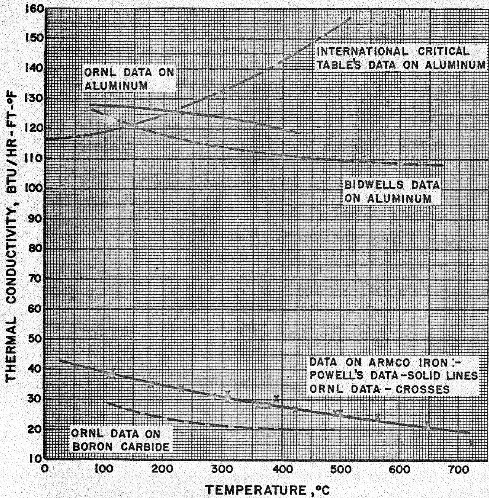  
FIGURE II COMPARISON OF ORNL THERMAL CONDUCTIVITY VS. TEMPERATURE DATA WITH DATA IN THE LITERATURE

It was noted in the course of operation that the centrifugal pump which had been used to transfer the cooling water from the constant-temperature bath through the apparatus was not giving uniform flow. The equipment has been rearranged to permit flow by gravity from the bath. A pump, operating intermittently, returns the water to the bath. Tests made to study the possibilities of guarding the sample against radial heat loss by auxiliary heaters showed that it is not possible to do this without major structural alterations. The apparatus will therefore be used in its present form, i.e., radial heat losses will be reduced by means of insulation only. However, the modifications indicated by these studies will be incorporated in an additional longitudinal apparatus which is being designed. The materials to be studied with the longitudinal-flow apparatus include types 347 and 303 stainless steel, boron carbide, titanium, beryllium, nickel, zirconium, and inconel.

Radial-Heat-Flow Apparatus. The radial-heat-flow apparatus is now under construction and will shortly be placed in operation. Details of its design will be published in a forthcoming report (ORNL-1042).

Another radial-flow apparatus is being set up at the University of Alabama under a subcontract for the measurement of the thermal conductivity of molybdenum. Construction of this equipment is about $90\%$ complete.

In addition to the measurements on molybdenum at the University of Alabama, measurements will be made on the following materials with the ORNL apparatus: 2S aluminum, types 310 and 347 stainless steel, nickel, carbon steels, and SiC.

Viscosity of Liquids (S. I. Kaplan, Reactor Technology Division). All major components of the falling-ball apparatus for viscosity measurement have been completed. The viscosity tube is mounted and insulated, and the suspension rack for the detector is under construction. Radiation surveys around the instrument have been completed, using a tantalum-plugged quarter-inch bearing ball as the test source. Suitable shielding has been designed, on the basis of these surveys, to bring stray radiation down to the normal background level outside the shield.

The movable melt tank is complete and available for immediate operation as required. A supply of cobalt-plated glass beads is being prepared for viscometry of light alkali metals. These are $5\mathrm{-mm}$ pyrex beads which will be silvered by chemical precipitation prior to plating.

An order has been placed with Brookfield Engineering Laboratories, of Stoughton, Massachusetts, for a rotational viscometer based on designs of ORNL and Brookfield. It should be useful in the testing of slurries and other nonideal fluids and in providing a check on the falling-ball apparatus.

The viscosity of the following substances, in their order of priority, will be obtained: Bi, Pb, Pb-Bi (by weight %, 44.5-55.5), UF $_4$ -NaF-KF (by weight %, 71.5-16.1-12.4), UF $_4$ -BeF $_2$ -NaF (by weight %, 50.0-7.5-42.5), NaOH, Li, and KOH.

Density of Liquids (S. I. Kaplan, Reactor Technology Division). The density apparatus, employing a buoyancy method involving the weighing of a suspended bob in the test liquid, has been completed. Test runs on sodium at $200^{\circ}\mathrm{C}$ show agreement within $1.5\%$ with the best available data. Further runs will be made as soon as a NaK bubbler has been installed for better purification of the argon used for blanketing.

The densities of the following substances will be obtained: Na, NaOH, UF₄-NaF-KF (by weight %, 71.5-16.1-12.4), UF₄-BeF₂-NaF (by weight %, 50.0-7.5-42.5), Pb-Bi-Sn (by weight %, 52-32-16), and KOH.

# SUPERVISION OF LEAD-BISMUTH CONTRACTS

R. N. Lyon, Reactor Technology Division

Oak Ridge National Laboratory is responsible for technical coordination of two contracts for fundamental studies of lead-bismuth alloys at Stanford University and at the University of California. Visits were made to both installations during the quarter.

Stress-rupture tests and 'splubility tests are being conducted at both institutions with lead, bismuth, and the eutectic alloy. Stanford is also conducting wetting studies and has found that all metals tested were wet by the liquid at elevated temperatures. It has also been found that preheating of the solid in vacuum made it wettable at lower temperatures provided that the surface was not exposed to air after heating.

Berkeley is building equipment for a stress-rupture test in lead-bismuth at $2000^{\circ}\mathrm{F}$ or higher. They are also rebuilding equipment for determination of forced-convection heat-transfer coefficients with lead-bismuth.

# LIQUID METALS HANDBOOK

R. N. Lyon and H. F. Poppendiek

A second edition of the Liquid Metals Handbook is being assembled with the help of E. C. Miller of ORNL, T. Trocki of General Electric, C. B. Jackson of Mine Safety Appliances Company, R. R. Miller of the Naval Research Laboratory, I. R. Kramer of the Office of Naval Research, and D. L. Katz of the University of Michigan.

# 12. COMPONENTS OF LIQUID-METAL SYSTEMS

H.W. Savage, ANP Division

During the past quarter major emphasis was placed on the design and development of pumps suitable for the ARE, seal testing and development, instrumentation, insulation testing, thermal-conductivity testing, formulation of liquid-metals cleaning and disposal techniques, static-corrosion testing, preventing or minimizing sodium condensation in gas lines, and developing adequate sampling procedures.

Both electromagnetic and centrifugal pumps have been tested, and improved designs have been worked out. Lack of an a-c electromagnetic pump of acceptable volume and head led to the design of a two-stage pump patterned after Mine Safety Appliance Company types. Cooled liquid-metal and gas seals have been devised for centrifugal pumps of the type applicable to the AFE, and other work has been done on metal-to-metal seals and on graphite-gas seals. The calibration loop and the sodium manometer loop were completed, which will allow development and evaluation of flowmeters, pumps, etc. to progress more rapidly.

Tests were conducted on the effects of molten lithium on various insulating materials, and thermal-conductivity tests were made on several possible materials for use in a sodium-to-water heat exchanger. Two experiments involving a new and a used figure-eight loop have been devised to test the effectiveness of revised cleaning methods. Sampling procedures have been improved in that liquid-metal samples are taken from various points in the containers. Of the several methods of eliminating or reducing sodium condensation in gas-pressure lines under consideration, electrostatic precipitation as well as steel-wool-filled condensation tanks have shown promise.

# PUMPS

W. G. Cobb, ANP Division

A variety of liquid-metal pumps are being developed for the ARE by ORNL, including a two-stage electromagnetic pump, a sump type centrifugal pump, and a canned motor and rotor centrifugal pump. In addition, steps are being

taken to procure proven liquid-metal pumps for experimental applications from Knolls Atomic Power Laboratory, Mine Safety Appliance, Argonne National Laboratory, and Allis-Chalmers Corp. The General Electric a-c electromagnetic pump is being modified for further use on the figure-eight loop. A small centrifugal pump, prototype of the ARE sump pump mentioned above, is being tested.

Electromagnetic Pump for Figure-Eight Loops. The ANP-designed and built a-c electromagnetic pump was tested during figure-eight-loop operation; satisfactory pumping has not been obtained. Continued efforts to increase flow rates above approximately 3 gpm resulted in overheating and failure of the joint between the nickel electrodes and the copper secondary connector. This pump cell differed from its predecessors in that nickel instead of inconel weld material was used for joining the nickel electrodes to the stainless steel cell wall in order to eliminate localized heating in the weld.

A new cell and pump purchased from General Electric were then placed in the loop; this pump has copper electrodes attached to the cell wall with silver brazing metal. No other changes were made at that time, but this pump would not deliver more than approximately 1 gpm indicated flow. Repeated efforts to increase the flow with this pump resulted in overheating and rupture of the cell wall. Oxide-contaminated sodium is thought to have been the cause of inadequate electromagnetic pump operation.

Centrifugal Pump for Figure-Eight Loops. The centrifugal pump for figure-eight-loop operation was tested with water. During these tests, it was found that air was being drawn into the suction by the vortex around the shaft. This difficulty was eliminated by placing over the impeller suction an inverted pan into which the inlet tube discharged its liquid (Fig. 12-1). A short thimble was welded in for passage of the shaft with a diameter clearance of approximately 1/16 in. Air was prevented from being drawn in by the pump suction as long as the top face of the thimble around the shaft remained submerged. The shaft packing box as originally designed with depth for only two rings of 1/8-in.-square packing was considered to be unsafe for operation on high-temperature sodium. A new packing box assembly which allows four rings of 1/4-in.-square Teflon packing with five washers of 1/16-in.-thick Teflon sheet is being fabricated for the initial operation on sodium. This packing will be cooled internally and externally as originally planned.

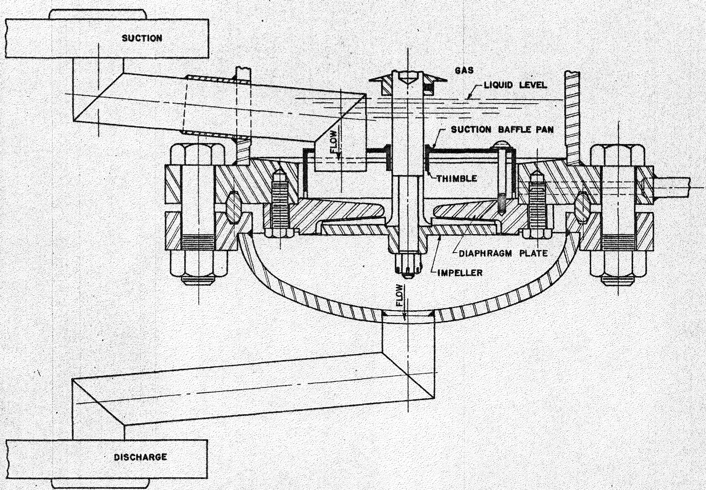  
FIGURE 12.1. CENTRIFUGAL PUMP SUCTION BAFFLE

Another type of seal (Fig. 12.2) is being fabricated which employs a cooled liquid-metal seal between the gas space above the liquid in the pump chamber and the gas in contact with the shaft seal. The pressures in these two spaces are equalized through a leveling tank. A cooled baffle is provided below the shaft seal proper, which is a commercial leather liquid seal lubricated by the flowing coolant for the shaft. The ethylene glycol coolant is prevented from leaking to air by a neoprene seal. Gas pressure inside the pump will be maintained at a higher level than that of the coolant above the seal to prevent coolant entering the sodium system.

Electromagnetic Pumps for the ARE (J. H. Wyld and A. L. Southern, ANP Division). Lack of a-c electromagnetic pumps in the intermediate range of capacities led to theoretical design work to investigate the feasibility of such a pump for the ARE. In addition to the capacity considerations, efforts were made, of course, to improve pump efficiency over currently available models and ultimately to investigate efficiency, pressure, and pumping speed. Another engineering consideration is reduction of size of the overall pump assembly.

Theoretical design has been completed for a two-stage a-c electromagnetic pump with a capacity of 120 gpm at 15 psi. This pump, patterned after Mine Safety Appliance pumps, is illustrated schematically in Fig. 12.3. Detailing of the magnet section is underway, and engineering design of the current loop is in progress. Current transformer design is incomplete. Design calculations show that currents of the order of 7000 amp at approximately 0.5 volt are required along with a magnetic field strength of about 4 kilogauss. The approximate size of the pump without supporting structure is 30 by 27 in.

Since this pump is required to pump sodium at $1500^{\circ}\mathrm{F}$ , the material specified for pump cell fabrication is 316 stainless steel. The current loop will contain copper buses with nickel spacers between the copper and the stainless steel cell wall.

Turbine Pump (W. G. Cobb, ANP Division, and A. G. Grindell, Engineering and Maintenance Division). Shop fabrication for water tests of the turbine pump has been completed. Parts have been delivered but await assembly and testing.

Canned Botor Pump (A. R. Frithsen and M. Richardson, Reactor Technology Division). During the past quarter experimental pump efforts have been

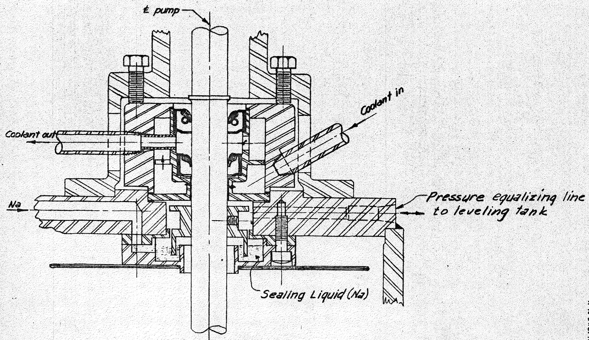  
FIGURE 12.2. LIQUID METAL SEAL FOR CENTRIFUGAL PUMP

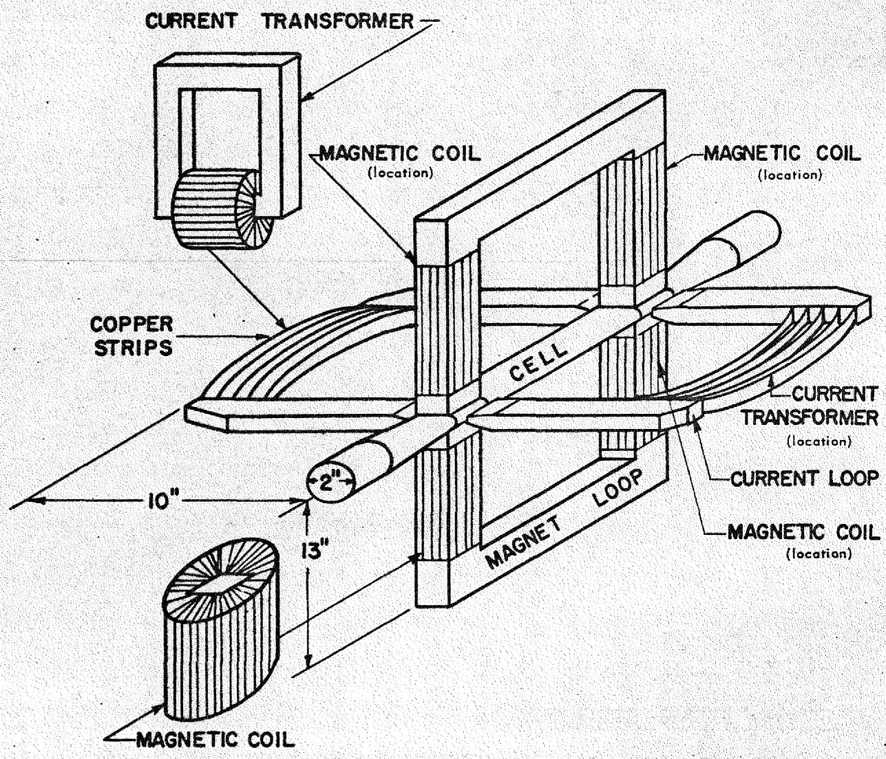  
FIGURE 12.3. TWO-STAGE ELECTROMAGNETIC PUMP

directed toward the development of a seamless pumping system, utilizing combination hydrodynamic-magnetic bearings. In the previous quarterly report(1) the design, fabrication, and operation of such a system with a turbine pump was discussed; however, still greater success has been attained by operating a centrifugal pump in such a system (Fig. 12.4).

This pumping system consists of two canned rotors with a centrifugal pump sandwiched in between. Each rotor is part of a 3/4-hp motor modified so that machined cans having a wall thickness of about 10 mils fit snugly inside the motor stators. The motor armatures are machined to fit inside the cans with 25 mils clearance. When the system is in operation the armatures function as journal bearings and the cans act as bearing sleeves.

A part of the pumped fluid is recirculated to help support the rotating system axially and, by acting as a hydrodynamic lubricant, to counteract any small radial loads. The thrust loads are balanced by a combination of the forces produced by (1) the recirculated fluid, (2) the magnetic fields of the motors, and (3) the pump impeller. The recirculated fluid contributes to the overall force that balances the thrust load through the use of a valve at each recirculatory inlet, which may be manipulated so as to produce an upward pressure differential. The magnetic fields of the motors produce forces which tend to center the rotors in their respective magnetic fields. The single-entry pump impeller is mounted facing upward. This produces an additional lift on the rotating system.

Total test time to date is 1050 hr with water as the pumped fluid. Post-run examination has failed to yield any evidence of wear. In the near future, this pumping system will be tested with NaK, which will be gradually heated to $500^{\circ}\mathrm{F}$ to test the effects of temperature on the operation of the pump.

A comparison of the operating characteristics of the pump (i.e., head vs. flow curve) with the characteristics obtained from the manufacturer of the pump impeller and housing shows that no changes are introduced in this system. The highest overall efficiency thus far obtained is $27.3\%$ whereas the highest attainable if the pump were operated in the normal manner is $35.7\%$ . Thus it can be stated that the losses due to the cans and added windings are less than

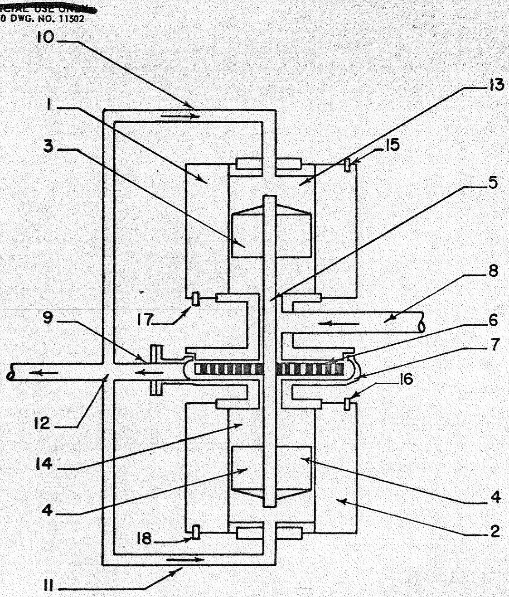  
FIGURE 12.4. IMPROVED SEAL-LESS PUMPING SYSTEM

1. UPPER STATOR   
2. LOWER STATOR   
3. UPPER 'CANNED' ROTOR   
4. LOWER 'CANNED' ROTOR   
5. SHAFT   
6. IMPELLER   
7. FUMP HOUSING   
8. PUMP SUCTION INLET   
9. PUMP DISCHARGE OUTLET

10. UPPER RECIIRCULATION INLET   
11. LOWER RECIRCULATION INLET   
12. JUNCTION   
13. UPPER STATOR 'CAN'   
14. LOWER STATOR 'CAN'   
15. UPPER STATOR COOLANT INLET   
16. LOWER STATOR COOLANT INLET   
17. UPPER STATOR COOLANT OUTLET   
18. LOWER STATOR COOLANT OUTLET

25%. For larger systems the percentage loss would be less inasmuch as the air gap change would be nil and winding losses would be about the same. It should be noted that the armature diameters of nine powerful electric motors do not increase in proportion to the power.

# SODIUM MANOMETER

W. G. Cobb, ANP Division  
A. G. Grindell, Engineering and Maintenance Division

A sodium manometer assembly attached to a bell-mouth orifice plate, and a pressure tap plate with bulb attached have been prepared for testing pumps. These elements have been installed in a small low-friction-loss loop with a modified General Electric electromagnetic pump to test the operability of the instrumentation devices such as electromagnetic flowmeters. This experimental set-up will permit experience to be gained in handling flow-nozzle manometer type flowmeters and to match their performances against electromagnetic flow-meters. Fabrication and instrumentation have been completed and preliminary trial start-ups have been attempted. A program for electromagnetic-flowmeter testing has been formulated and includes varying the temperature of the working fluid and magnetic flux, compressing the liquid metal, etc., to note the effects on electromagnetic flowmeter operability.

# INVESTIGATION OF SODIUM CONDENSATION

W. C. Tunnell and H. R. Bronstein, ANP Division

A major source of trouble in the operation of thermal- and forced-convection loops has been the unpredictable. plugging of inert-gas supply and bleed lines by sodium. In preliminary experiments to prevent or minimize this plugging, which has occurred up to 6 ft from the sodium bath, an electrostatic precipitator was used: Operation of the precipitator was quite successful since (1) so much sodium was trapped that it may become necessary to periodically melt the sodium out of the trap and (2) it was determined that the sodium build-up is a solid aerosol phenomenon and not a vapor phenomenon as originally suspected.

In another experiment designed to minimize sodium condensation in the gas lines, condensation tanks filled with steel wool were located at the connection between the gas lines and the sodium system. With this trap no gasoline plugging was experienced during approximately 200 hr of operation.

# SEAL TESTS

W. B. McDonald, ANP Division

Development of adequate seals for pumps handling liquid metals at $1500^{\circ}\mathrm{F}$ is a major problem of the Experimental Engineering Group. Both metal-to-metal seals and graphite-gas-seals are being developed. Neither seal has yet been successfully operated over an extended period.

Metal-to-Metal Seal. The first seal test in liquid metal was assembled with a 316 stainless steel fixed plate and a 316 stainless steel rotating bell-shaped chamber. The seal contact surfaces were surface-hardened by a special "Scottsonizing" process, and the seal was operated in NaK at room temperature with argon pressure of 3 to 5 psi applied to the chamber containing the liquid metal. The seal operated satisfactorily for 2 hr at 1900 rpm, at the end of which time a leak developed.

A second test was conducted with a 316 stainless steel base plate and a stellite rotating bell with contact surfaces hardened and lapped. This seal operated for approximately 5 min in NaK at room temperature. The seal failed when the surfaces began to chatter, and subsequent inspection showed that the stellite member retained its smooth surface while the stainless steel member was scored.

Graphite-Gas Seal. This seal, similar to the metal-to-metal seal previously discussed, consisted of a 347 stainless steel base plate and a rotating tool-steel bell and graphite ring, the graphite ring being between the two metal parts of the seal. All mating faces were lapped to less than three interference bands, and an argon pressure was applied in addition to a 1-2/3 psi spring pressure which held the seal in place. When the seal was rotated at approximately 1900 rpm it was found that a high pressure on the rotating bell caused "chattering" of the seal. However, when the pressure was adjusted to 5 psi of argon pressure and 2-1/3 psi of spring load, the seal operated

satisfactorily for $17\%$ hr. The seal operating temperature was $200^{\circ}\mathrm{F}$ until chipping of the graphite ring at the outer edges began, which eventually caused failure; just prior to failure the temperature rose to $320^{\circ}\mathrm{F}$ . Post-run inspection revealed that a narrow ring of contact surface on the base plate in addition to a slight eccentricity of the rotating parts apparently caused seal failure. New parts have been made to correct these faults, and another test is underway.

THERMAL CONDUCTIVITY OF STEEL WOOL AND SOME GRANULAR SOLIDS

D. F. Salmon, ANP Division

A proposed sodium-to-water heat exchanger for the ARE would have required an inert granular solid with a thermal conductivity of approximately 2 Btu/hr·ft².°F to fill an annulus between the two fluids. A test apparatus

was designed to determine the approximate thermal conductivity of likely materials. The apparatus consisted of a 3-kw electric-tube-furnace element machined to 2 in. diameter concentric with a 6-in.-diameter tube. Around this was placed a 1-in. annulus through which cooling air could be passed to reduce the shell temperature of the 6-in. tube if necessary. The mid-plane of the test space was instrumented with nine chromel-alumel thermocouples located on three equally spaced radial lines, each radial line having one thermocouple on the heater surface one midway of the test annulus, and one on the inside surface of the 6-in.-diameter tube. Results are shown in Table 12.l.

TABLE 12.1   
Summary of Thermal-Conductivity Studies of Granular Solids   

<table><tr><td>MATERIAL</td><td>MEAN TEMPERATURE (°F)</td><td>THERMAL CONDUCTIVITY (Btu/hr. ft2, °F)</td></tr><tr><td>Steel wool (fire grade, density 15 lb/ft3)</td><td>1250</td><td>0.3</td></tr><tr><td>Aluminum oxide (No. 8 mesh)</td><td>1170</td><td>0.58</td></tr><tr><td>Silicon carbide (No. 8 mesh)</td><td>1050</td><td>0.67</td></tr><tr><td>Silicon carbide and graphite</td><td>1300</td><td>0.91</td></tr></table>

# ARE FUEL-SYSTEM Mock-UPS

E. Wischhusen and D. R. Ward, ANP Division

The ARE reactor-fuel-system design calls for 90 fuel clusters, each cluster composed of six tubes 0.135 in. in inside diameter and 38 in. long. Up to 24 clusters will be connected in series and filled from a single fuel reservoir. A dome at the top of each cluster will be used for collecting fission gas.

Preliminary studies have indicated that there may be several phenomena regarding bubble formation, siphoning action, rates of filling, etc. which are unpredictable on the basis of theory alone. To investigate these and other problems connected with fuel systems, three mock-ups have been proposed.

Mock-up No. 1 has been constructed and is a "crude-but-quick" system fabricated from glass tubing, rubber stoppers, and tygon tubing using colored water as a fluid. Mock-up No. 2 will be an all-glass system capable of operating at pressures up to 75 psig and using an organic fluid with a higher specific gravity than water. Mock-up No. 3 will be a welded inconel or stainless steel system using nonenriched fuel mixture as a fluid and capable of operating at pressures up to 75 psig with temperatures up to $1400^{\circ}\mathrm{F}$ . Tests conducted on Mock-up No. 1, though radically simplified as compared to the actual ARE fuel system, have already yielded useful qualitative information.

# FLOW TESTING

A. P. Fraas and G. H. Cohen, ANP Division

Experiments have been performed to investigate the pressure losses involved when fluids flow past fuel-tube bundles of various sizes as will be encountered in the coolant streams inside the ARE. Full-size models were tested with water flow in the turbulent range. The models were 4 ft long and contained six brass tubes in a hexagonal arrangement. The tubes were 1/3, 3/16, and 1/4 in. in diameter. A small spacer was brazed at the mid-point of the bundle, while the end spacers were removable. The bundles were inserted in a glass tube, and the pressure drop across the models was measured at various flow rates by means of pressure taps at each end of the test section. Tests were made also with the bare glass tube and with the end spacers only. The data have not yet been analyzed, but casual observation of the results of the first phase reveals that the friction factor, based on the hydraulic radius concept, appears to be a function of the Reynolds number alone. The values obtained for the friction factor seem to be very close to the standard empirical value for smooth pipe, i.e., $f = 0.316 / N_R$ where $N_R$ is the Reynolds numbers.

The second phase of this work was aimed toward determining the pressure losses introduced by various spacer arrangements. Three types of spacers were tested with the 3/16-in. tube bundle. These spacers were placed midway between the ends of the bundle and the brazed spacer at the mid-point, and pressure drops were measured as before. The results, not yet fully analyzed, indicate that any of the spacers increases the pressure drop of the tube bundle by approximately $5\%$ per spacer. (The ARE core design currently employs four spacers for each tube bundle.)

# FIRE-EXTINGUISHER AND EXTINGUISHER-MATERIAL TESTS

# R. Devenish, ANP Division

Sodium-fire tests have been conducted to determine the operation and expelling patterns of Ansul 150-lb, Ansul 30-lb, and Pyrene $\mathrm{CO}_{2}$ -dry powder extinguishers. Each type of extinguisher was tested on a fire prepared with about 6 lb of sodium; therefore all were of approximately the same magnitude. The Ansul 30-lb extinguisher filled with graphite failed to extinguish the sodium fire; the Ansul 150-lb extinguisher filled with graphite readily extinguished the fire, but difficulty was encountered with excessive discharge pressures scattering the sodium fire. The Pyrene $\mathrm{CO}_{2}$ extinguisher filled with carbon powder (instead of $\mathrm{CO}_{2}$ ) extinguished its sodium fire completely and exhibited the best discharge pattern.

Another series of tests was conducted to determine possible coolants for Megatherm induction heaters which are under consideration for figure-eight-loop heating. Ethylene glycol, butyl alcohol, Dow Corning Silicone Oil (D-C 550), Pydraul (Monsanto Chemical Co., Hydraulic Oil), and kerosene, all burned when coming in contact with a sodium fire, whereas carbon tetrachloride and water both exploded. The tests indicated that ethylene glycol, butyl alcohol, D-C 550, kerosene, or Pydraul could be used as Megatherm coolant, ethylene glycol probably being the most desirable.

Other tests were conducted to determine the effectiveness of soda ash, Pyrene G-1, precipitated chalk, carbon powder, and Met-L-X on sodium fires of similar intensity. Met-L-X appeared to be superior to other extinguishing agents tested, but it has the distinct disadvantage of corroding equipment with which it comes in contact.

# 13. METALLURGICAL PROCESSES

E. C. Miller and W. D. Manly, Metallurgy Division

Fabrication of solid type fuel elements for high-temperature reactor application has proceeded actively with three powder metallurgical techniques receiving most attention. Improvements in punching and embossing grids for supporting powders, which are then clad, have aided the investigation of this technique. The loose-powder-sintering technique studies have shown that base-sheet surface preparation is not so critical as originally expected. The stringer effect in the powder compacting-cladding techniques has proved to be a particle-size phenomenon.

Welding of small-diameter inconel tubing to inconel header sheet has been under investigation using manual inert-arc welding, but equipment is being assembled for semiautomatic cone-arc welding. A tensile test has been developed for partial evaluation of welded sections.

The high-temperature creep and stress-rupture laboratory is essentially complete. The machines are being tested and personnel are being trained. The liquid-metal-environment creep—stress-rupture laboratory construction has started, with a tentative completion date of late summer.

# FUEL-ELEMENT FABRICATION

George Adamsqn, Metallurgy Division

The three methods of fabrication of a fuel plate which have been actively pursued during this quarter are:

1. Filling the holes in a perforated or mechanically deformed metal plate with $\mathrm{UO}_2$ and cladding by solid-phase bonding.   
2. Sintering and bonding a loose powder to a back-up plate.   
3. Pressing a powder compact and cladding it with a hot-rolling technique similar to that used in producing MTR fuel plates.

In the investigation of the loose-powder-sintering technique the effect of surface preparation of the base sheet has been shown to be not so critical as expected; also, the substitution of iron or nickel powder for the stainless

steel looks doubtful. With the cladding by hot-rolling techniques the problem of separation of the protective can from the compact has been solved by applying a slurry of $\mathrm{Al}_{2}\mathrm{O}_{3}$ powder in a clear lacquer carrier. The stringer effect in the metallic matrices as reported in the last quarterly report(1) has proved to be a particle-size phenomenon.

Mechanically Formed Matrix. Development continued during this quarter on mechanical punching and embossing methods for fabrication of fuel-supporting matrices. The perforations or deformations in the punched and embossed plates are then filled with $\mathrm{UO}_2$ powder and clad by solid-phase bonding. A 0.020-in.-diameter punched-hole design of the Hendrick Manufacturing Company was first considered for this purpose. An improvement in this design with respect to both precision and open area uses a 0.007-in.-diameter hole punched in hard brass sheet supplied by the Norton Company; the holes comprise $33\%$ of the area,

The X-10 Research Shop expressed confidence in being able to produce similar-size openings with an overall open area of about $65\%$ . Accordingly, a simple die and semiautomatic punch-press equipment are being assembled to produce 1-in.-wide molybdenum strip, 0.005 in. thick, having a close-packed 0.020-in.-diameter hole arrangement on 0.025-in. centers. Preliminary hand-punch experiments have demonstrated the feasibility of using supporting web sections as small as 0.002 to 0.004 in.

Another approach to the continuous-sheet matrix problem concerns the use of embossed metal foil. A preliminary test strip of 0.002-in. steel foil was prepared by the Royal Lace Paper Works, Inc. They successfully employed a "till" design roller die which imparted a 0.010-in. raised pattern of circular dimples, running about 700 per square inch. A rolled diamond pattern of sharp ridges is also being considered since this design can readily be produced on the lace paper machines.

Solid-phase welding tests were conducted at the Micro Metallic Corporation. Twelve $1 \frac{1}{2}$ - by 2-in. packets comprising sandwiched sheet specimens of various stainless steels, molybdenum, electroformed nickel screening, stainless steel wire screening, and sheets flash-electroplated with coats of nickel, iron, and chromium were tried. A dead-weight pressure of approximately $1 \frac{1}{2}$ psi

was used, the reported temperature being about $1325^{\circ}\mathrm{C}$ for about 2 hr. However, from an examination of the run it is apparent that certain specimens were highly overheated; in several locations melting had occurred. Analyses of all specimens indicated extensive diffusion and bonding of some, while other interfacial areas were shown to be unbonded or fractured, owing, perhaps, to brittle phases being formed. There are indications that chromium-plated molybdenum may self-bond efficiently under the conditions used.

Sintering and Bonding a Loose Powder. The second technique of fuel-element fabrication consists in bonding loose-powders containing $\mathrm{UO}_2$ to a back-up plate. The facilities of the Micro Metallic Corporation in New York are being used in this work. A summary of the results is presented in Table 13.1. These results are based only upon a visual examination of a bond in the plate so must be regarded as tentative. The metallographic examinations are being made, but have not yet been completed. As indicated in Table 13.1, in the no-load group the plates were sintered as assembled, while with the remainder a dead load of 0.5 psi was applied to increase the contact area. Little improvement was observed.

The effect of surface preparation of the 316 stainless steel base plate on the resulting bond is shown in Fig. 13.1. These results are from a single test only and will be checked. While all these plates appeared well bonded on observation under the microscope, differences are apparent. The smoothest or electropolished surface is not bonded so well as the degreased or lightly roughened samples. The heavily roughened plate is the poorest bonded of all. Figure 13.2 shows a series sintered for the same time in a single stack. The top, which was slightly cooler (estimated $25^{\circ}\mathrm{F}$ ) than the bottom, is not sintered at all, while the plates nearest the bottom (of a 1-in.-high stack) are well sintered.

While the microscopic examination of this test is not completed, the possibility of substituting iron or nickel powder for the 316 stainless steel powder does not look promising, even with possible diffusion layers. Furthermore, since the furnace at the Micro Metallic Corporation is primarily a production furnace, it is not possible to control the time, temperature, and atmosphere variables within the limits necessary for our work. Further development of sintering and bonding techniques will be held in abeyance until facilities are available at Oak Ridge National Laboratory.

# TABLE 13.1

# Loose-Powder Sintering and Bonding

<table><tr><td>POWDER LAYER</td><td>PLATE</td><td>COMMENTS</td></tr><tr><td colspan="3">With No Load</td></tr><tr><td>20 vol. % UO2+ size G°316 stainless steel</td><td>Degreased 316 stainless steel</td><td>Good bonding</td></tr><tr><td>+ size G 316 stainless steel</td><td>Electropolished 316 stainless steel</td><td>Good bonding</td></tr><tr><td>+ size G 316 stainless steel</td><td>Slightly roughened 316 stainless steel</td><td>Good bonding</td></tr><tr><td>+ size G 316 stainless steel</td><td>Heavily roughened 316 stainless steel</td><td>Good bonding</td></tr><tr><td>+ 10-μ carbonyl iron</td><td>Degreased 316 stainless steel</td><td>Poor bonding</td></tr><tr><td>+ 325 H2reduced iron</td><td>Degreased 316 stainless steel</td><td>No bonding</td></tr><tr><td>+ 10-μ carbonyl nickel</td><td>Degreased 316 stainless steel</td><td>No bonding</td></tr><tr><td>+ 10-μ carbonyl iron</td><td>Iron-plated 316 stainless steel</td><td>Poor bonding</td></tr><tr><td>+ 10-μ carbonyl iron</td><td>Nickel-plated 316 stainless steel</td><td>Fair bonding</td></tr><tr><td>+ 10-μ carbonyl nickel</td><td>Nickel-plated 316 stainless steel</td><td>No bonding</td></tr><tr><td>+ size G 316 stainless steel</td><td>Nickel-plated 316 stainless steel</td><td>Poor bonding</td></tr><tr><td colspan="3">With 0.5 psi Dead Load</td></tr><tr><td>20 vol. % UO2+ size G 316 stainless steel</td><td>Degreased 316 stainless steel</td><td>Good bonding</td></tr><tr><td>+ carbonyl iron</td><td>Degreased 316 stainless steel</td><td>Poor bonding</td></tr><tr><td>+ size G 316 stainless steel</td><td>Nickel-plated molybdenum</td><td>Fair bonding</td></tr><tr><td>+ molybdenum</td><td>Nickel-plated molybdenum</td><td>Fair bonding</td></tr><tr><td>+ chromium</td><td>Nickel-plated molybdenum</td><td>Poor bonding</td></tr><tr><td>40 vol. % UO2+ size G 316 stainless steel</td><td>Degreased 316 stainless steel</td><td>Slight bonding</td></tr><tr><td>+ carbonyl iron</td><td>Degreased 316 stainless steel</td><td>Poor bonding</td></tr></table>

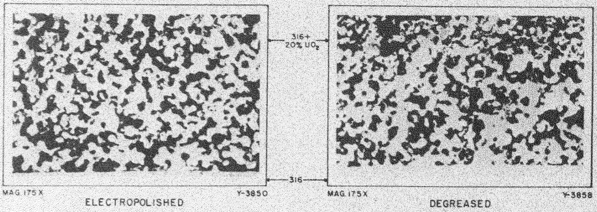

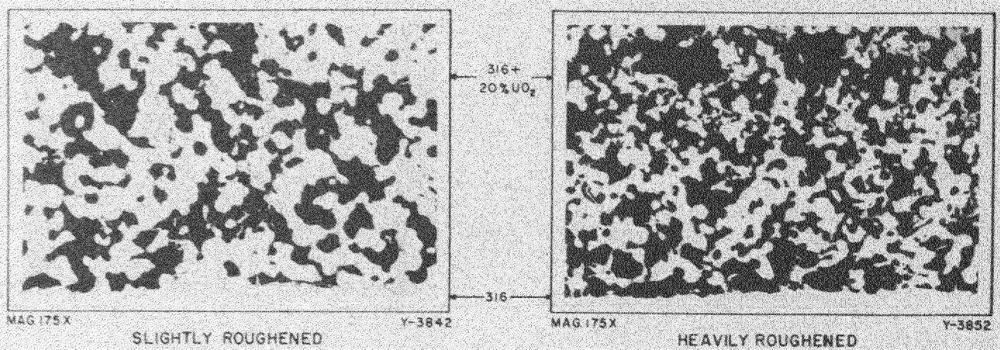  
FIGURE 13.1. EFFECT OF SURFACE PREPARATION ON THE BONDING OF LOOSE POWERS CONTAINING $\mathrm{UO}_2$ TO A 316 STAINLESS STEEL PLATE.

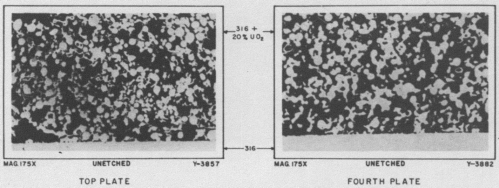

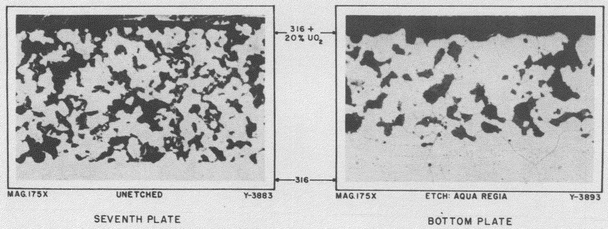  
FIGURE 13.2. DIFFERENCE IN SINTERING IN STACK OF ELEVEN 316 STAINLESS STEEL PLATES WITH BONDED POWDER.

Hot-Rolled Clad Fuel Plate. In this procedure for producing a fuel plate a core of $\mathrm{UO}_2$ and a matrix of some metallic powder is first pressed and then clad by hot-rolling, using a technique similar to that used for producing MTR fuel plates. In previous work(1) it was observed that when stainless steel powders were used as the matrix material there was a tendency for the $\mathrm{UO}_2$ particles to agglomerate and to form stringers. That this is a particle-size phenomenon and may be eliminated by using very fine particles is shown in Fig. 13.3. The same effect is also present with iron powders (Fig. 13.4) but not to such a degree. The sections with the fine powders show that with $50\%$ $\mathrm{UO}_2$ a continuous metallic network and good bonding may be obtained.

With the hot-rolling technique a protective capsule or can is used to prevent oxidation of the clad compact during fabrication. Unless preventive steps are taken, the capsule bonds to the cladding plate, making separation impossible. Efforts are being made to prevent this bonding by applying a coating of $\mathrm{Al}_{2}\mathrm{O}_{3}$ to one of the surfaces. The most satisfactory separation was obtained when the $\mathrm{Al}_{2}\mathrm{O}_{3}$ was applied to the inner surface of the caa by dipping it into a slurry of $\mathrm{Al}_{2}\mathrm{O}_{3}$ in clear lacquer. After air-drying, the capsules were heated to $600^{\circ}\mathrm{C}$ in an oxidizing atmosphere to burn off volatiles and residual carbon from the lacquer. With this technique separation of the can and compact was obtained after as much as $75\%$ reduction. A few samples were not given the high-temperature treatment, with the result that, on heating for rolling, gas evolution caused a blistering of the capsule and contamination of all internal stainless steel surfaces.

Compatibility Tests of Potential Fuel-Element Materials. Additional results of tests to obtain information on compatibility of various solid materials for use in possible high-temperature reactor systems are reported in Table 13.2. The test procedure and objectives are the same as those outlined in the last ANP quarterly report.(2) Appropriate combinations of materials and physical shapes were selected to give the contact surfaces. One material, in either powder or cylindrical form, was placed in a capsule of the second material, the capsule was evacuated, and the cuts were sealed by welding. The capsules were then hot-swaged at from 800 to $1100^{\circ}\mathrm{C}$ to obtain a reduction in cross-section of not more than $20\%$ . It was hoped that this step would create

TABLE 13.2   
100-hr Compatibility Tests of Potential Fuel-Element Materials   

<table><tr><td>MATERIALS</td><td>TEMPERATURE (°C)</td><td>THICKNESS OF REACTION LAYER (in.)</td><td>GAP (in.)</td><td>GAP + REACTION LAYER (in.)</td></tr><tr><td>Be-Mo</td><td>1000</td><td>0.011</td><td>0.003</td><td>0.014</td></tr><tr><td>Be-430 stainless steel</td><td>1000</td><td>0.022</td><td>0.015</td><td>0.037</td></tr><tr><td>Be-BeO</td><td>800(a)</td><td>No reaction</td><td></td><td></td></tr><tr><td>Be-BeO</td><td>1100</td><td>Negligible, if at all</td><td></td><td></td></tr><tr><td>Cr-Mo</td><td>1000</td><td>0.001</td><td>0.005</td><td>0.006</td></tr><tr><td>Cr-Ni</td><td>1000</td><td>0.003</td><td>0.001</td><td>0.004</td></tr><tr><td>Cr-inconel</td><td>1000</td><td>0.006</td><td>0.002</td><td>0.008</td></tr><tr><td>Cr-316 stainless steel</td><td>1000</td><td>0.003</td><td></td><td>0.003</td></tr><tr><td>Cr- \( \mathrm {U O}_{2} \)</td><td>1000</td><td>No reaction</td><td></td><td></td></tr><tr><td>Cr-BeO</td><td>1000</td><td>No reaction</td><td></td><td></td></tr><tr><td>Fe-316 stainless steel</td><td>1000(b)</td><td>Slight diffusion zone</td><td></td><td></td></tr><tr><td>Fe-316 stainless steel</td><td>800</td><td>0.001</td><td></td><td>0.001</td></tr><tr><td>Fe-316 stainless steel</td><td>900</td><td>0.011</td><td></td><td>0.011</td></tr><tr><td>Fe-316 stainless steel</td><td>1000</td><td>0.009</td><td>0.001</td><td>0.010</td></tr><tr><td>Fe-430 stainless steel</td><td>1000</td><td>0.002</td><td>0.011</td><td>0.013</td></tr><tr><td>Fe- \( \mathrm {U O}_{2} \)</td><td>1200(c)</td><td>No reaction</td><td></td><td></td></tr><tr><td>Fe- \( \mathrm {U O}_{2} \)</td><td>1000</td><td>No reaction</td><td></td><td></td></tr><tr><td>Mo-inconel</td><td>1000(b)</td><td>No reaction</td><td></td><td></td></tr><tr><td>Mo-inconel</td><td>800</td><td>0.003</td><td></td><td>0.003</td></tr><tr><td>Mo-316 stainless steel</td><td>1000(b)</td><td>No reaction</td><td></td><td></td></tr><tr><td>Mo-316 stainless steel</td><td>1000</td><td>Trace</td><td>0.002</td><td>0.002</td></tr><tr><td>Ni-BeO</td><td>1000</td><td>No reaction</td><td></td><td></td></tr><tr><td>Inconel-304 stainless steel</td><td>1000</td><td>0.004</td><td></td><td>0.004</td></tr><tr><td>Inconel-316 stainless steel</td><td>900</td><td>0.004</td><td></td><td>0.004</td></tr><tr><td>Inconel-Be \( {}_{2}\mathrm {C} \)</td><td>1000</td><td>0.003</td><td></td><td>0.003</td></tr><tr><td>Inconel-BeO</td><td>800</td><td>0.006</td><td></td><td>(d)</td></tr><tr><td>Ta-316 stainless steel</td><td>1000</td><td>0.014</td><td>0.001</td><td>0.015</td></tr><tr><td>302 stainless steel-316 stainless steel</td><td>900</td><td>Very alight reaction</td><td></td><td></td></tr><tr><td>302 stainless steel- \( \mathrm {U O}_{2} \)</td><td>1200(c)</td><td>No reaction</td><td></td><td></td></tr><tr><td>302 stainless steel- \( \mathrm {U O}_{2} \)</td><td>1000</td><td>No reaction</td><td></td><td></td></tr><tr><td>304 stainless steel-316 stainless steel</td><td>1000</td><td>No reaction</td><td></td><td></td></tr></table>

(a) 195 hr at temperature.   
(b) Examined after swaging; 0 hr at temperature.

(c) Examined after sintering; 0 hr at temperature.

(d) Presence of gap not determined. BeO powder fell out of capsule during cutting of sample.

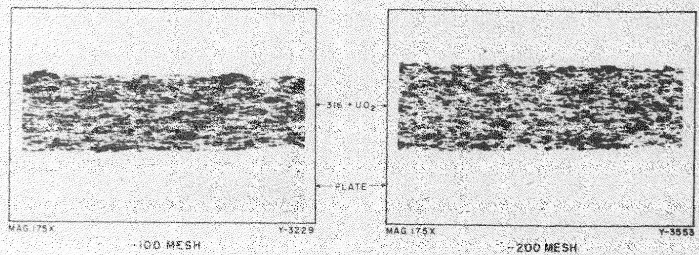

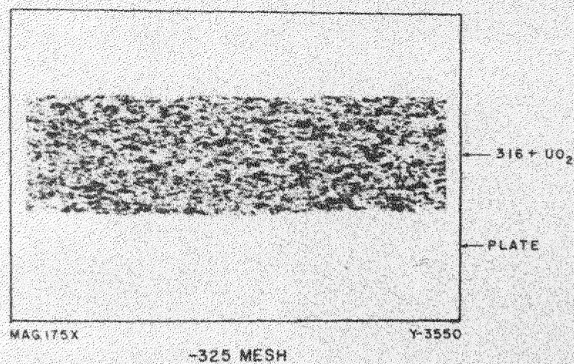  
FIGURE 13.3. EFFECT OF STAINLESS STEEL PARTICLE SIZE ON $\mathsf{UO}_2$ DISTRIBUTION AFTER CLADDING BY HOT ROLLING.

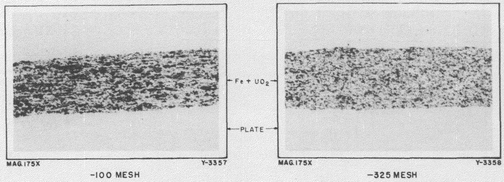

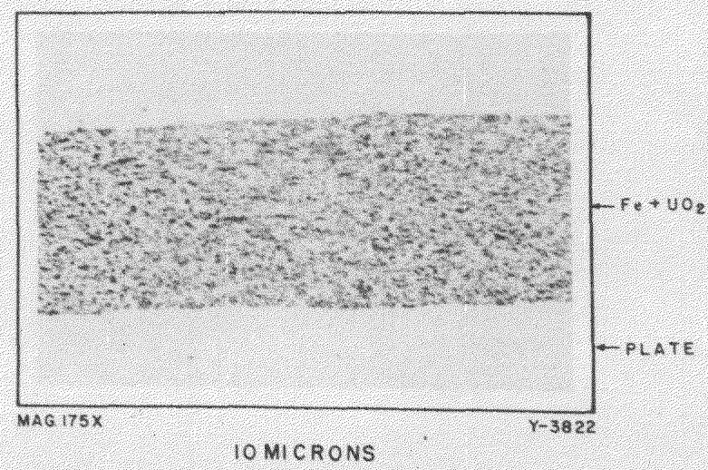  
FIGURE 13.4. EFFECT OF IRON PARTICLE SIZE ON $\mathrm{UO_2}$ DISTRIBUTION AFTER CLADDING BY HOT ROLLING.

intimate contact at newly created surfaces, thus offering the maximum opportunity for interaction. The results are given in Table 13.2. The samples were held for 100 hr at the temperature indicated. It is believed that, in addition to the thickness of the reaction layer, the presence of a-gap is significant and would be undesirable in a fuel element.

# WELDING OF INCONEL

P. Patriarca, Metallurgy Division

Of the basic rules applicable to all high-temperature fabrication, one of the most important is that complete penetration be attained wherever possible. (3) This is particularly true in the ARE reactor in which good corrosion resistance at high temperatures is essential, and the design of the liquid-fuel reactor proposes a large number of small welds in which complete penetration is required.

Experiments to date have been confined to manual inert-arc welds. In view of the number of tube-to-header welds required for the ARE, the majority of future work will involve use of the semiautomatic cone-arc apparatus, $^{(4)}$ installation of which is underway. A modified room-temperature tensile test has been used in partial evaluation of weld quality of inconel tube-to-header welded joints. Test specimens were welded in pairs and pulled to destruction in a tensile jig.

Manual Inert-Arc Welding. The effect of joint design on the room-temperature strength of manual inert-arc-welded joints has received some attention. Results of tests on inconel pairs in which complete penetration was realized have shown that excellent joint efficiencies can be obtained by manual inert-arc welding. The welded specimens showed some ductility, of the order of 15 to $17\%$ in 3 in., when annealed after welding or when previously annealed material was welded. It may be noted that tensile strengths based on tube dimensions of 0.188 in. O.D. and 0.030 in. wall were of the order of 90,000 psi or greater, which compare favorably with the strength of the annealed parent tubing, 94,000 psi. The inconel tubing was annealed when received.

Typical manually welded inconel test pairs in the welded condition, and as pulled to destruction in the tensile jig (mentioned previously), are illustrated in Fig. 13.5. The filleting in the welded joint and the relative elongation of the specimens are evident. A typical inconel joint made by manual inert-arc welding, in which complete penetration has been accomplished, is shown in Fig. 13.6. In view of the geometry of this type of joint, however, a failure in the heat-affected zone of the tubing would be expected. This large-grained material, which occurs in an area of minimum cross-section, was softer than either the cast weld metal or the parent tubing and had a hardness of about 130 Vickers Hardness Numbers as indicated by a hardness traverse across the welded joint.

Penetration in Cone-Arc Welds. Although welds with complete penetration may be obtained by the manual inert-arc-welding technique, the number of such welds that will be required by the ARE indicates the need for application of some automatic technique in which welds with complete penetration may be reliably reproduced in large quantity. Earlier joints made using the semi-automatic cone-arc(4) technique were of the type illustrated in Fig. 13.7.

Recent experiments using a temporary cone-arc set-up indicate that the degree of penetration can be predetermined by proper control of geometry, heat input, and time. Future work will include evaluation of welds incorporating complete and incomplete penetration using this process, corrosion tests, modified fatigue tests, and pressure tests.

Welding of the ARE Pressure Shell. Consideration is being given to the problem of welding the ARE reactor shell. This shell will be fabricated commercially, but there exists the problem of final closure at Oak Ridge. There are several possible alternatives for accomplishing this closure, including:

1. Manual or semiautomatic heliarc welding with unmodified inconel filled filler rod.   
2. Manual or semiautomatic heliarc welding with modified inconel filler rod (International Nickel Co. electrode No. 62 especially designed for inert-arc welding).   
3. Manual metal-arc welding with International Nickel Co. coated electrode No. 132.   
4. Manual or semiautomatic Aircomatic welding with No. 62 filler wire.   
5. Combinations of the above.

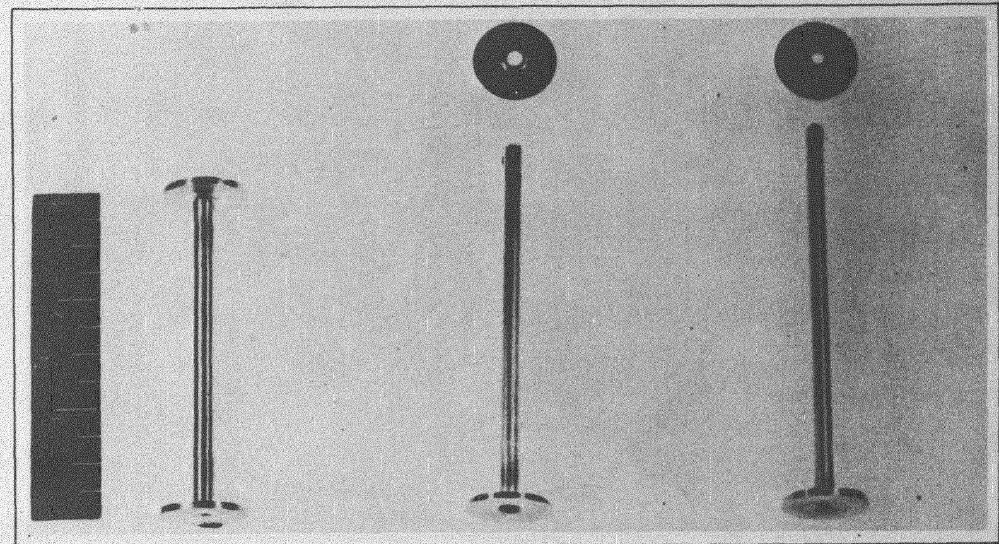  
FIGURE 13.5   
MANUALLY WELDED INCONEL TUBE-TO-HEADER TENSILE

AS-WELDED CONDITION

TESTED IN THE AS-

WELDED CONDITION

ANNEALED AT 1000°C

FOR 20 MINUTES IN DRY

HYDROGEN, IN THE AS-

WELDED CONDITION—

THEN TESTED

TEST "PAIRS"

NOT CLASSIFIED Y-3961

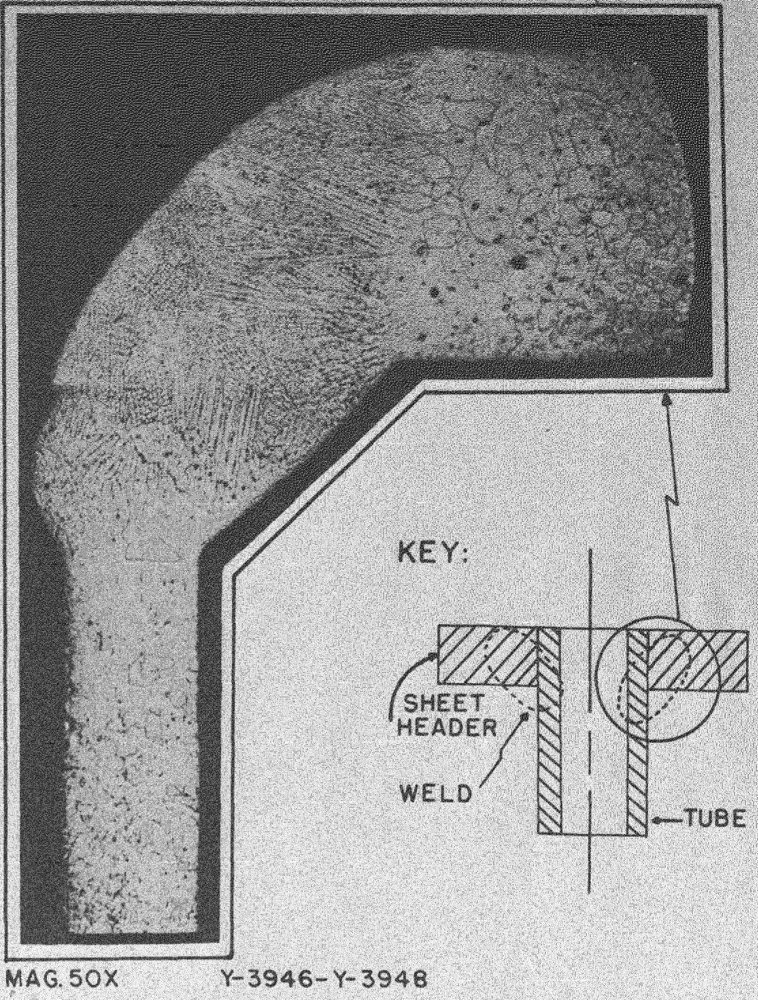  
FIGURE 13.6. CROSS SECTION OF INCONEL   
TUBE-TO-HEATER MANUAL INERT   
ARC WELD. ETCHED WITH AQUA REGIA.   
(GOOD PENETRATION)

FIGURE 13.7. CROSS SECTION OF INCONEL TUBE-TO-HEATER INERT "CONE-ARC" WELD (POOR PENETRATION)   
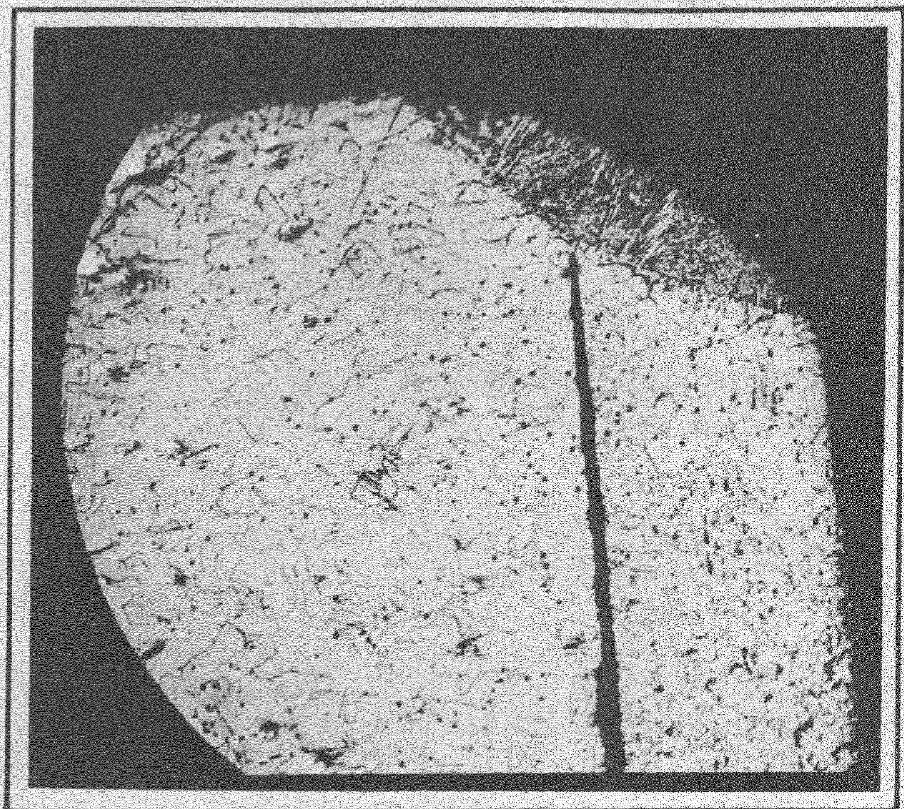  
MAG.50X   
ETCH: AQUA REGIA   
Y-3700

An Aircomatic welder is on order, along with quantities of the various filler materials in rod and wire form. Strength and corrosion properties of welds deposited by the various welding techniques will be determined from all-welded metal specimens.

# CREEP AND STRESS- RUCTURE LABORATORY

There are insufficient high-temperature long-time strength data for the materials, and in the environments, considered for the aircraft reactor. A stress-rupture testing installation is therefore being placed in service to test both the common high-temperature alloys and the refractory metals in inert atmospheres and in liquid-metal environments. These data will be compared with the existing data obtained in air, and will furnish design data for the aircraft reactors.

All the testing chambers (Figs. 13.8 and 13.9) for the creep and stress-rupture laboratory have been received and assembled. Each chamber has been given a helium leak check at $0.005\mu \mathrm{Hg}$ and $1000^{\circ}\mathrm{C}$ , and all detectable leaks have been sealed. The specimen temperature is controlled from the specimen surface to less than a $\pm 1^{\circ}\mathrm{C}$ cycle by a Leeds and Northrup Speedomax-D.A.T. control system. Five months of furnace operation indicate that the entire control system is stable over at least that time period.

The first specimens of 316 stainless steel have been machined and will be loaded by June 1. Preliminary operational tests indicate that the test temperature can be maintained within $1^{\circ}\mathrm{C}$ and that the gradient along the test bar can be maintained within $2^{\circ}\mathrm{C}$ for long times. The round-bar stainless steel specimens (0.505 in. diameter) are now being turned on a milling machine, using a 5-in. sharp-tooth shell mill cutter. This machining method produces specimens with very light surface disturbances and reproducible fillets with a saving of at least $25\%$ on machining time.

Stress relaxation tests have been performed on the Baldwin screw machines on inconel and 316 stainless steel. These tests indicate that any initial stress above 5000 psi relaxes to about 4500 to 4700 psi in 14 hr.

All designs for the liquid-metal-environment creep--stress-rupture laboratory have been completed, and construction has been started. The

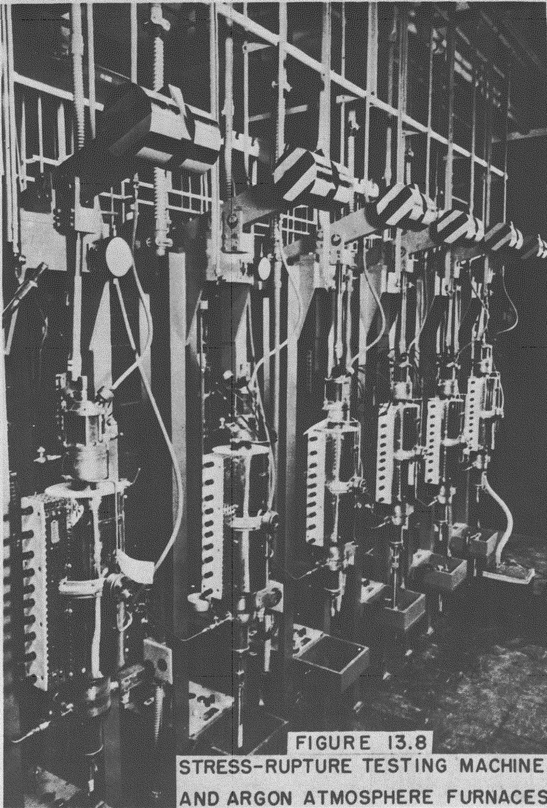

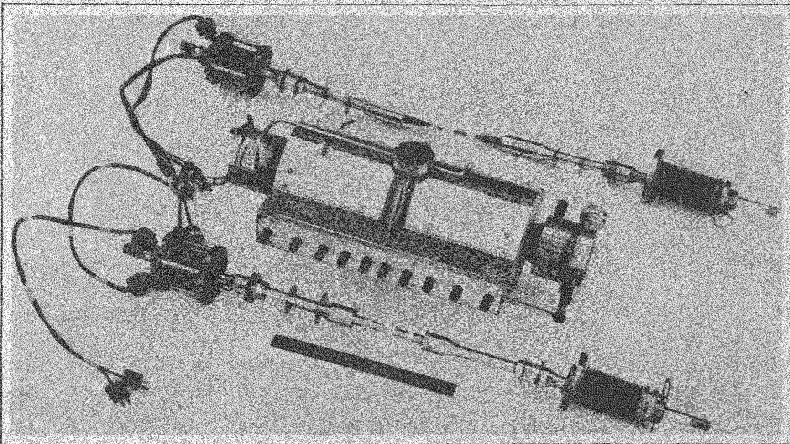  
186E·A 0311ISSVATONN   
FIGURE 13.9. ATMOSPHERE FURNACE AND PULL ROD ASSEMBLIES   
ROUND BAR OR SHEET SPECIMEN

tentative completion date is September, 1951. At least two additional months of preliminary tests must be allowed before the laboratory can be put into operation.

Eight of the nine added technicians have reported for work and are being trained in the several phases of laboratory operation and testing. It is hoped that their training will be completed by July and that shift work can then be instituted.

# IRRADIATION OF FLUORIDE FUELS

G. W. Keilholtz, Materials Chemistry Division

J.C.Morgan H.Robertson

C. C. Webster Physics of Solids Institute

The effect of nuclear radiation on the stability of fluoride fuels is the most poignant question in the entire radiation-damage program for the ANP project. The radiation damage to the liquid fuel and its container is being or soon will be studied in the X-10 reactor as well as in the Y-12 cyclotron and the Berkeley cyclotron. The cyclotron bombardments are significant because of the possibility of correlation between proton and neutron damage. The LITR will also be used in this program when that reactor becomes operative for radiation-damage work.

Temperature and pressure measurements of the liquid fuel irradiated in the X-10 reactor will be resumed (the initial experiments were reported in the last quarterly report(4) during June. The equipment is now undergoing bench testing without irradiation.

Y-12 Cyclotron Irradiation of Fuel Capsules. Proposals have been made recently to irradiate the fuel and container material of the ARE reactor in the 86-in. cyclotron. High-power densities would thus be available for tests on corrosion, precipitation, decomposition, etc. under conditions simulating those in the reactor. Inconel is being used as container material for the UF₄-NaF-KF fuel mixture. The initial test will use an inconel tube, approximately ¼ in. in diameter and 6 in. long, two-thirds of the volume filled with fuel and the remainder evacuated. The tubes will be heliarc-welded on one end prior to filling and spot-welded across the other after filling. A temperature of $1500^{\circ}\mathrm{F}$ will be maintained during irradiation by allowing the bombardment protons to heat the fuel capsule. Calculations indicate that approximately 5 μa of protons at 26 Mev will maintain a $1500^{\circ}\mathrm{F}$ temperature equilibrium, assuming all the heat is dissipated by radiation. The volume of liquid irradiated will be approximately 1 cc; thus the average power density in the fuel at 5 μa and 26 Mev would be 105 watts/cc (25 watts is lost in the inconel and its support).

Under the conditions of the proposed irradiation, the specific power dissipation in the fuel mixture is but $5\%$ of that proposed for the ARE. However, the power dissipation can be increased to about $50\%$ by irradiating the entire volume of a tube of optimum dimensions, and the fuel element temperature can still be maintained at $1500^{\circ}\mathrm{F}$ by radiation cooling alone. (Similarly, maintaining the same target temperature by radiation cooling, a bombardment with $5\mu \mathrm{a}$ of 40-Mev alpha particles at the Berkeley cyclotron, as is proposed by the NAA group, should yield specific power dissipations considerably in excess of ARE specifications, possibly approaching that of the aircraft reactor.)

In order to obtain power densities by proton irradiation comparable to the airplane reactor, it may be necessary to dissipate the heat generated in the fuel by means of liquid-metal cooling. A design is in progress for this purpose. The target consists of a fuel chamber and coolant channel machined from one piece of inconel similar to the water-cooled target also being developed for power dissipation. Preliminary tests for the water-cooled target in which a 0.7-in.² surface was bombarded with 3.2 kw maintained an equilibrium surface temperature of $1200^{\circ}\mathrm{F}$ . The water flowed through a channel in the back of the target block.

In analyzing the activities that will result from the bombardment with respect to health hazards, only those with half-lives longer than a minute, as are formed by fission induced in the fuel or by $(p,n)$ and $(p,2n)$ reactions, need be considered. The $\mathbf{Cr}^{52}(p,n)$ reaction produces $\mathbf{Mn}^{52}$ which has a half-life of 21 min and yields a radiation level of approximately 50 millicuries per microampere.

Analysis of Irradiated-Fuel Capsules. The Mass Spectrographic Research Group at Y-12 is making fundamental studies of the ions evolved from liquid fuels at high temperatures in an attempt to work out a sensitive method of detecting the radiation-induced decomposition of the fuel. Chemical analysis for the examination of radiation damage and corrosion samples from the cyclotron are being developed by the Analytical Chemistry Division and the Isotope Physics Spectrographic Group at Y-12. Analytical methods for hot samples from the X-10 reactor are being developed by the Analytical Chemistry Division at ORNL.

208-210

# LIQUID METALS IN PILE EXPERIMENT

C. D. Baumann, Physies of Solids Institute

R. M. Carroll and O. Sisman. Reactor Technology Division

Using information obtained from the testing of a prototype test loop described in the last quarterly report (6) the liquid metals in pile loop for the study of bremastrahlung activity and induced activity of the liquid metal stream due to corrosion and recoil atoms from the container walls has been designed, constructed and bench tested with lithium at $1000^{\circ}\mathrm{F}$ .

The test loop (Fig. 14.6) consists of a loop external to the pile approximately 5 ft long, an internal loop approximately $18\%$ ft long and a jacket assembly approximately 20 ft long. The external loop is comprised of a melt tank, a surge tank, a drop tank, an electromagnetic pump, an electromagnetic flowmeter, and associated tubing (S/16 in D 1/16 in wall

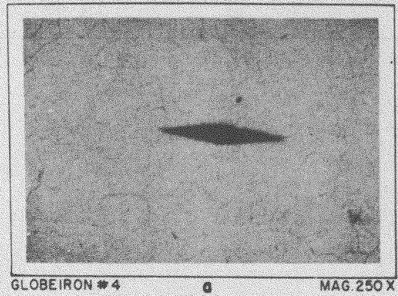  
OUTER ZONE: NITAL ETCH BEFORE DENTING FOR HARDNESS. BEFORE TREATMENT, BUT AFTER ANNEALING FOR IO-20 MINUTES AT 870°C AND FURNACE COOLING CLAMPED BETWEEN PARALLELS IN VICE 5 MINUTES FOR STRAIGHTENING, POLISHED ON 3/O EMERY PAPER FROM O.0090 TO O.0085 OR O.0082

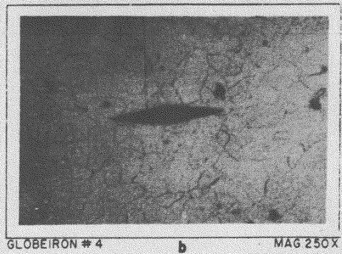  
INNER ZONE. IDENTICAL TREATMENT AS OUTER ZONE AT LEFT

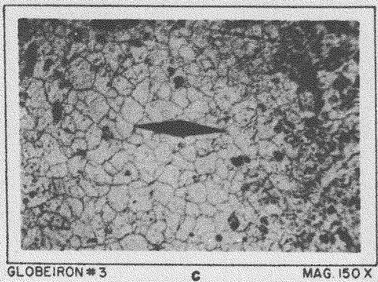  
OUTER ZONE: AFTER TREATMENT, ORIGINAL HARDNESS DENT, NO ETCH.

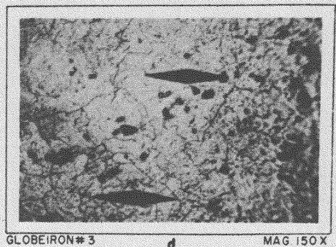  
FIGURE 14.5. UNIRRADIATED AND IRRADIATED GLOBEIRON SAMPLES

INNER ZONE AFTER TREATMENT, ORIGINAL DENTS, NO ETCH

a. BEFORE IRRADIATION, UNIRRADIATED ZONE   
c. AFTER IRRADIATION, UNIRRADIATED ZONE

b. BEFORE IRRADIATION, ZONE TO BE IRRADIATED   
d. AFTER IRRADIATION, IRRADIATED ZONE

E1Z

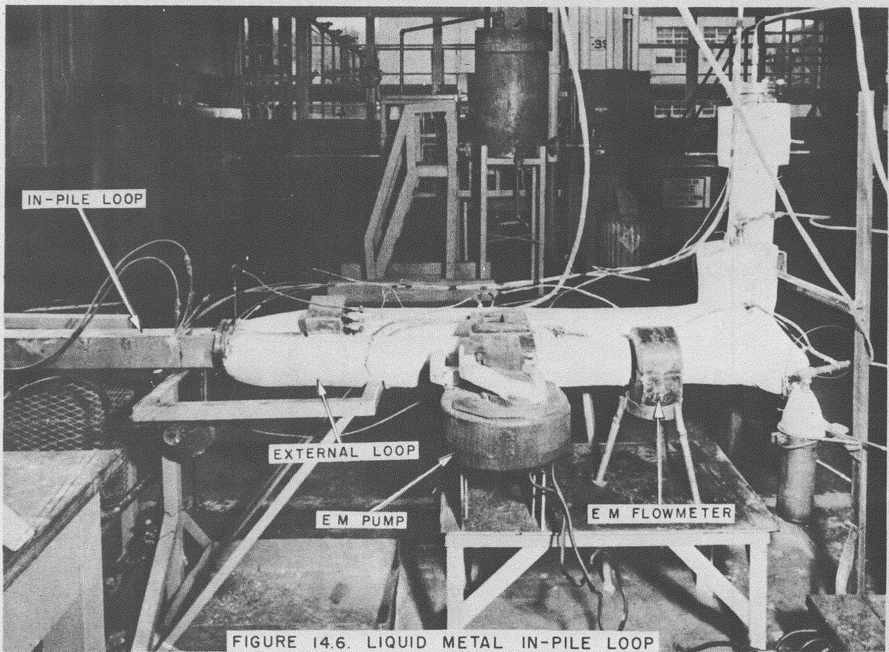  
V1L01'ONO⊥OHdZ-人  
$\therefore m = \frac{3}{11}$

thickness, 316 stainless steel). All parts are heated with calrod tubular heaters and insulated with 2 in. of magnesia. The internal loop, of 316 stainless steel tubing, is 3/8 in. O.D., 1/16 in. in wall thickness, and $18\frac{1}{2}$ ft long; it is heated with calrod heaters and surrounded by stainless steel radiation shields and mica insulating shields. The internal loop is positioned inside a 2-in. pipe mounted in the water-cooled jacket assembly which is separated from the pipe by diatomaceous earth.

During test operation of the loop, it was found that the heat capacity of the system is such that once the system is up to operating temperature $(1000^{\circ}\mathrm{F})$ the heat input to either loop can be stopped entirely with very little change in the temperature of the system. These tests indicate that it should be possible to continue operations in the pile in the event of failure of either the external or the internal loop heaters. The desired liquid-lithium velocity of 3 ft/sec through the external loop was obtained at approximately one-sixteenth maximum pump power.

Cursory shielding and bremsstrahlung calculations have been made. Details of shielding construction, bremsstrahlung measurements, instrument control, and physical installation in the pile are currently being developed, and the in-pile test should begin in July. After the initial experiments the loop will be used as a general test facility, within which samples of various materials can be placed for measurements of radiation damage in the presence of flowing hot liquids.

Part V

APPENDIXES

229-233

# 20. ANALYTICAL CHEMISTRY (1)

C. D. Susano and R. Rowan, Jr., Analytical Chemistry Division

The development of chemical methods for the determination of oxygen in sodium is essentially complete, and this method has been placed in routine operation.

Development of chemical methods for the determination of corrosion products (iron, nickel, chromium, and molybdenum) in reactor fuels of the low-melting fluoride type is well advanced. Chemical methods for the determination of the metallic corrosion products iron, chromium, cobalt, and nickel in sodium metal are being studied. Chemical methods for the determination in sodium metal of elements of high neutron-capture cross-section, including particularly the rare earths, cadmium, and boron, are being considered. In this connection, although efforts have been made to utilize ion-exchange methods in the separation of lithium, potassium, and cesium from solutions of sodium metal, it appears that activation methods of analysis may be more applicable.

The reaction of metallic sodium with decrepitated borax at $745^{\circ}\mathrm{C}$ results in the formation of elemental boron and sodium oxide. The reaction is not violent at this temperature.

The substitution of vanadium for platinum as the internal standard in the porous-cup technique for the spectrographic analysis of sodium resulted in a significant improvement in precision.

Routine chemical and spectrographic analyses were performed on 315 (169 for ANP, 146 for NEPA) of the 373 samples on hand (95 held over from the winter quarter and 278 submitted during the past quarter).

# METALLIC CORROSION PRODUCTS IN REACTOR FUELS

J.C. White W.J.Ross

S. A. McKinnon

Analytical Chemistry Division

Efforts are being made to develop methods and techniques for the determination of metallic corrosion products in two reactor fuels, one a mixture of KF-NaF-UF $_4$ in the proportions 26.0, 46.5, and 27.5 mole %, and the other a eutectic of BeF $_2$ -NaF-UF $_4$ in the proportions 12, 76, and 12 mole %. These products contain iron, nickel, chromium, and possibly molybdenum in concentrations which, it is estimated, will range from 10 to 500 ppm.

The overall problem of analysis for metallic corrosion products can be divided into three phases:

1. Removal of the eutectic from the stainless steel container and subsequent sampling.   
2. Preparation of the sample for spectrographic analysis.   
3. Development of suitable colorimetric methods for the determination of iron, nickel, chromium, and molybdenum.

In these studies the tube containing the fuel is first cut into several sections, placed in a quartz tube, and melted in an argon atmosphere. The physical arrangement is such that, upon melting, the fuel flows by gravity into a graphite mold. After cooling, the solidified melt is easily removed from the mold and sampled. Direct spectrographic analysis is not practical as the preparation of standards containing the free metals in the low concentration range involved (10 to 500 ppm) does not appear feasible. However, as spectrographic standards containing the oxides can easily be prepared, the samples will be those converted before analysis.

Various colorimetric procedures for the determination of low concentrations of iron, nickel, chromium, and molybdenum are available. In the present case, since interference by uranium is proportional to the amount present, standard curves for the determination of each of the trace metals of interest have been prepared with a solution of a pure sample of the eutectic (prepared in graphite to avoid the presence of corrosion products) as the blank. A sample of the eutectic containing NaF, KF, and UF₄, which had been heated at 800°C for 50 hr in a type 316 stainless steel tube, was submitted for preliminary analysis. The results of two determinations showed an average of 130 ppm of iron. Semiquantitative determinations of nickel and molybdenum gave values of less than 100 ppm for these elements.

# DETERMINATION OF OXYGEN IN SODIUM

J. C. White and W. J. Ross, Analytical Chemistry Division

The determination of oxygen in sodium has been discussed in previous ANP progress reports.(3) In connection with the further investigation of the butyl bromide method which has been developed for this determination, the preparation of sodium samples containing known added amounts of oxygen as sodium monoxide has been studied. The method of preparation consists in reacting high-purity sodium peroxide and sodium(4) at 300 to $400^{\circ}\mathrm{C}$ to form sodium monoxide quantitatively:

$$
\mathrm {N a} _ {2} \mathrm {O} _ {2} + 2 \mathrm {N a} \xrightarrow {3 0 0 - 4 0 0 ^ {\circ} \mathrm {C}} 2 \mathrm {N a} _ {2} \mathrm {O}
$$

Because of this reaction, oxygen is believed to be present in sodium only in the form of sodium monoxide. The recovery of known additions of oxygen is shown in Table 20.1.

(2) L. J. Brady, H. P. House, J. W. Robinson, and R. Rowan, Jr., Monthly Progress Report of the Analytical Chemistry Division, Y-12, for Period March 1-31, 1951, CRNL, Y-B31-248 (Apr. 12, 1951)   
(3) For example, J. C. White and W. J. Ross, "Determination of Oxygen in Sodium," Aircraft Nuclear Propulsion Project Quarterly Progress Report for Period Ending March 10, 1951, ANP 60, p. 336 (June 19, 1951).   
(4) C. E. Weber and L. F. Epstein, "Problem in the use of Molten Sodium as a Heat Transfer Fluid," J. Metallurgy and Ceramics, Issue No. 3, (TID-67), p. 103 (1949).

# TABLE 20.1

# Recovery of Known Amounts of Oxygen in Sodium (Oxygen Added as Sodium Peroxide)

<table><tr><td colspan="5">OXYGEN (%)</td></tr><tr><td>ADDED</td><td>BLANK*</td><td>TOTAL (Blank + Added)</td><td>FOUND</td><td>DIFFERENCE</td></tr><tr><td>0.224</td><td>0.054</td><td>0.278</td><td>0.285</td><td>+0.007</td></tr><tr><td>0.101</td><td>0.054</td><td>0.155</td><td>0.158</td><td>+0.003</td></tr><tr><td>0.110</td><td>0.054</td><td>0.164</td><td>0.161</td><td>-0.003</td></tr><tr><td>0.218</td><td>0.054</td><td>0.272</td><td>0.282</td><td>+0.010</td></tr><tr><td>0.145</td><td>0.054</td><td>0.199</td><td>0.210</td><td>+0.011</td></tr><tr><td></td><td></td><td></td><td></td><td>+0.007 (avg.)</td></tr></table>

*Average of three determinations.

Oxygen analyses are being performed by both the $n$ -butyl bromide method and by the Pepkowitz and Judd method on duplicate samples to determine whether one method gives consistently higher or lower results than the other. On several analyses of the same sample, the results of the $n$ -butyl method appear to have less deviation. The final report on the determination of oxygen in sodium by this method is now being written.

POTASSIUM,

AND CESIUM IN SODIUM

# J. C. White, Analytical Chemistry Division

It is anticipated that these alkali metals will be present to the extent of 10 to 100 ppm in metallic sodium. Analysis by the flame photometer offers possibilities, but because of the marked interference of sodium in this scheme the bulk of the sodium must be removed before analysis. A modification of the procedure of Beukenkamp and Riemann has proved satisfactory for separation of sodium from potassium, and application of this procedure to the separation from lithium and cesium is under study.

# OXYGEN IN HELIUM AND ARGON

J. C. White and W. J. Ross, Analytical Chemistry Division

As reported in the last quarterly report(7) an apparatus suitable for determining low concentrations of oxygen in helium and argon by the method of Brady(8) has been placed in operation. Tests have been made to determine the extent of purification by passing helium through a sodium-potassium alloy (NaK) column by determining the oxygen concentration in the exit gas. Analyses indicate that 20 to 35 ppm of oxygen remains in the gas after such treatment.

Samples of argon from five different tanks, none of which has undergone purification, were analyzed for oxygen. In two cases, multiple determinations were made on samples from the same tank in order to test the precision of the analytical method. The results are given in Table 20.2.

TABLE 20.2   
Oxygen in Unpurified Argon   

<table><tr><td rowspan="2">TANK NO.</td><td rowspan="2">NO. OF SAMPLES</td><td colspan="2">AMOUNT OF OXYGEN (ppm)</td></tr><tr><td>AVERAGE</td><td>STANDARD DEVIATION</td></tr><tr><td>1</td><td>6</td><td>28.3</td><td>5.7</td></tr><tr><td>2</td><td>2</td><td>39.5</td><td>:</td></tr><tr><td>3</td><td>1</td><td>46</td><td>.</td></tr><tr><td>4</td><td>1</td><td>33</td><td>.</td></tr><tr><td>5</td><td>1</td><td>31</td><td>.</td></tr><tr><td>6</td><td>1</td><td>40</td><td>.</td></tr></table>

# HIGH-TEMPERATURE REACTION OF SODIUM WITH SODIUM TETRABORATE

# J. C. White, Analytical Chemistry Division

A proposed shield for the ARE would utilize dehydrated borax $(\mathrm{Na}_2\mathrm{B}_4\mathrm{O}_7)$ in a manner such that a leak in the cooling system would result in contact of the borax with sodium at $1500^{\circ}\mathrm{F}$ . The data in Table 20.3 summarize the results obtained during contact of these materials under dry argon in quartz tubes. It is likely that the boron is produced by the reaction

$$
\mathrm {N a} _ {2} \mathrm {B} _ {4} \mathrm {O} _ {7} + 1 2 \mathrm {N a} \longrightarrow 4 \mathrm {B} + 7 \mathrm {N a} _ {2} \mathrm {O}
$$

Other experiments in which sodium at $1500^{\circ}\mathrm{F}$ is dropped into molten borax will be performed in the near future.

TABLE 20.3   
Reaction of Borax with Sodium*   

<table><tr><td rowspan="2">MAXIMUM TEMPERATURE (°C)</td><td colspan="2">TIME (min)</td><td rowspan="2">RESULTS</td></tr><tr><td>AT MAXIMUM TEMPERATURE</td><td>TOTAL</td></tr><tr><td>500</td><td>25</td><td>180</td><td>Little reaction</td></tr><tr><td>660</td><td>25</td><td>120</td><td>Black crust on unreacted sodium; borax turned yellow-black</td></tr><tr><td>745</td><td>5</td><td>20</td><td>Mixture entirely black; evidence of boron and Na2O</td></tr></table>

-1 g of borax plus 0.1 g of sodium.

(9) J. G. Hanna and S. Siggia, “Determination of Acetylene and Monosubstituted Acetylenes,” Anal. Chem. 21, 1469 (1949).

# SPECTROGRAPHIC ANALYSIS OF SODIUM

R. L. McCutchen, Isotope Research and Production Division

Spectrographic analysis for corrosion products in sodium metal by the porous-cup technique with platinum as the internal standard has shown in the past $^{(10)}$ a standard error of about $20\%$ at the $99.5\%$ confidence level. Careful analysis of a group of control standards has indicated that more precise results are obtained if vanadium is substituted for platinum; average standard errors for analyses of iron, nickel, chromium, and manganese were $15.5\%$ with platinum and $10.5\%$ with vanadium as the internal standard.

Contamination of sodium with beryllium through contact of the liquid metal with beryllium oxide has been determined by conversion of the sodium to anhydrous sodium chloride for spectrographic analysis. This technique is capable of detecting 10 ppm of beryllium in the sodium.

# CHEMICAL ANALYSIS OF SODIUM

L. J. Brady J., M., Peele J. A. Norris Analytical Chemistry Division

Determination of oxygen and minor metallic impurities in metallic sodium from corrosion experiments continued to comprise the major segment of ANP analytical requirements. In addition, analysis for trace elements of high capture cross-section in sodium to be used in special criticality experiments was performed. Results of these analyses are shown in Table 20.4: more sensitive methods for some of these elements, including the rare earths, are desired.

TABLE 20.4   
Concentration of Minor Trace Elements in Sodium   

<table><tr><td colspan="2">CONCENTRATION</td></tr><tr><td>COMPONENT</td><td>(ppm)</td></tr><tr><td>Iron</td><td>75</td></tr><tr><td>Manganese</td><td>&lt;2</td></tr><tr><td>Cobalt</td><td>&lt;10</td></tr><tr><td>Nickel</td><td>&lt;10</td></tr><tr><td>Gold</td><td>&lt;20</td></tr><tr><td>Indium</td><td>&lt;4</td></tr><tr><td>Cadmium</td><td>&lt;2</td></tr><tr><td>Gadolinium</td><td>&lt;25</td></tr><tr><td>Dysprosium</td><td>&lt;50</td></tr><tr><td>Yttrium</td><td>&lt;50</td></tr><tr><td>Samarium</td><td>&lt;50</td></tr><tr><td>Neodymium</td><td>&lt;50</td></tr><tr><td>Boron</td><td>80</td></tr></table>

# ANALYTICAL SERVICES

J. W. Robinson and L. J. Brady, Analytical Chemistry Division

The bulk of the service analyses during the past quarter were concerned with liquid metals and structural materials furnished by the ANP Experimental Engineering Group and by the NEPA Division of Fairchild Engine and Airplane Corporation. A considerable number of analyses for iron, chromium, nickel, and molybdenum in fluoride fuel melts from corrosion experiments were also required during the quarter in addition to analyses of miscellaneous sample types.

A summary of service analyses performed is shown in Table 20.5. In general, these analyses presented no previously unreported problems.

TABLE 20.5   
Summary of Service Analyses   

<table><tr><td rowspan="2"></td><td colspan="2">NO. OF SAMPLES</td></tr><tr><td>NEPA</td><td>ANP</td></tr><tr><td>Backlog of samples, as of March 1, 1951</td><td>79</td><td>16</td></tr><tr><td>Number of samples received</td><td>67</td><td>211</td></tr><tr><td>Total number of samples</td><td>146</td><td>227</td></tr><tr><td>Number of samples reported</td><td>146</td><td>169</td></tr><tr><td>Backlog, as of May 25, 1951</td><td>0</td><td>58</td></tr></table>

# 21. LIST OF REPORTS ISSUED

REPORT NO.

TITLE OF REPORT

AUTHOR(S)

DATE ISSUED

DESIGN OF THE ARE   

<table><tr><td>Y-FB-17</td><td>ARE Core Design Status</td><td>R. W. Schroeder
S. V. Manson</td><td>3-12-51</td></tr><tr><td>Y-F27-2</td><td>ARE Characteristics, 1 Megawatt</td><td>W. Breazeale</td><td>3-26-51</td></tr><tr><td>Y-FB-20</td><td>Temperature Drops in ARE Reflector and Pressure Shell
Due to Heating</td><td>S. V. Manson</td><td>4-3-51</td></tr><tr><td>Y-FB-19</td><td>ARE Core, Material Constituency, Temperatures, and Thermal Kinetic Constants</td><td>R. W. Schroeder</td><td>4-11-51</td></tr><tr><td>Y-F26-9</td><td>ARE Design Meeting, 3-30-51</td><td>W. B. Cottrell</td><td>4-16-51</td></tr><tr><td>Y-F27-4</td><td>Modification in Design of the Aircraft Experimental Reactor</td><td>W. Breazeale</td><td>5-18-51</td></tr><tr><td>Y-F20-14.</td><td>Activation of Impurities in BeO</td><td>W. K. Ergen</td><td>6-1-51</td></tr></table>

REACTOR PHYSICS   

<table><tr><td>Y-F10-38</td><td>A Correction to the Multigroup Method of Y-F10-21</td><td>D. K. Holmes</td><td>2-19-51</td></tr><tr><td>Y-F10-45</td><td>Criticality Calculations for the U-235 Be Experiment</td><td>G. Safonov</td><td>4-3-51</td></tr><tr><td>Y-F10-46</td><td>Effect of 30° Airplane Bank on Reactor Reactivities</td><td>J. Webster</td><td>4-4-51</td></tr><tr><td>Y-F10-47</td><td>Elementary Reactor Physics, Supplement C</td><td>D. K. Holmes</td><td>4-6-51</td></tr><tr><td>Y-F10-48</td><td>Spherical Reactor with Absorbing Interface</td><td>R: R. Coveyou</td><td>4-13-51</td></tr><tr><td>Y-F10-50</td><td>Errors in the Multi-Group Method Introduced by the
Linear Approximation</td><td>D. K. Holmes</td><td>4-13-51</td></tr><tr><td>ANP-62</td><td>Perturbation Equations for the Kinetic Response of
a Liquid-Fuel Reactor</td><td>N. M. Smith
M. J. Nielsen
T. Rubin
R. Coveyou</td><td>4-17-51</td></tr><tr><td>Y-F10-42</td><td>Kinetics of Proposed ARE Reactors</td><td>M. C. Edlund</td><td>4-23-51</td></tr><tr><td>Y-F10-23</td><td>Elementary Reactor Physics, Supplements C and D</td><td>D. K. Holmes</td><td>4-25-51</td></tr><tr><td>Y-F10-49</td><td>Preliminary Criticality Results on ARE Proposals</td><td>J. Webster</td><td>4-26-51</td></tr><tr><td>F-F10-52</td><td>Spherical Reactor with Absorbing Interface II</td><td>R. Coveyou</td><td>4-30-51</td></tr><tr><td>Y-F10-54</td><td>Flux Distribution in the ANP Reactor</td><td>N. Smith</td><td>5-17-51</td></tr><tr><td>Y-F10-53</td><td>Fissions in the Fuel Tube Header</td><td>C. B. Mills</td><td>5-17-51</td></tr></table>

REPORT NO.

TITLE OF REPORT

AUTHOR(S)

DATE ISSUED

SHIELDING RESEARCH   

<table><tr><td>ORNL-899</td><td>Thermal Neutron Flux Distribution When Air Voids
are Present</td><td>D. Whitcombe</td><td>3-15-51</td></tr><tr><td>CF-51-4-156</td><td>Centerline Foil Measurements of Thermal Neutron
Intensities for Experiment I</td><td>E. B. Johnson
G. McCammon
M. P. Haydon</td><td>4-18-51</td></tr><tr><td>CF-51-4-122</td><td>A Proportional Counter Method of Measuring the Fast
Neutron Dose</td><td>G. S. Hurst</td><td>4-27-51</td></tr><tr><td>CF-51-4-110</td><td>Gamma Ray Measurements at Bulk Shielding Facility,
Experiment I, 100% Water</td><td>L. H. Ballweg</td><td>4-27-51</td></tr><tr><td>CF-51-5-16</td><td>Gamma Ray Measurements at the Bulk Shielding Facil-
ity, Experiment II, Iron-Water</td><td>L. H. Ballweg</td><td>5-3-51</td></tr><tr><td>CF-51-5-62</td><td>Thermal Neutron Measurements for Experiment I in
the Bulk Shielding Facility</td><td>H. E. Hungerford</td><td>5-4-51</td></tr><tr><td>CF-51-5-61</td><td>Fast Neutron Dosimeter Measurements for Experiment I
in the Bulk Shielding Facility</td><td>R. G. Cochran
H. E. Hungerford</td><td>5-7-51</td></tr><tr><td>ORNL-991</td><td>The New Bulk Shielding Facility at ORNL</td><td>W. Breazeale</td><td>5-8-51</td></tr><tr><td>CF-51-5-72</td><td>Thermal Neutron Measurements for Experiment 2 at
the Bulk Shielding Facility</td><td>H. E. Hungerford</td><td>5-11-51</td></tr><tr><td>CF-51-5-73</td><td>Fast Neutron Dosimeter Measurements for Experiment 2</td><td>R. G. Cochran
H. E. Hungerford</td><td>5-11-51</td></tr><tr><td>CF-51-5-164</td><td>Neutron Flux Measurements in the Bulk Shielding
Facility Reactor</td><td>J. W. Hill</td><td>5-15-51</td></tr><tr><td>Y-F20-13</td><td>Protection Against Fission Fragment Decay Gamma in
the ARE</td><td>W. K. Ergen</td><td>5-17-51</td></tr><tr><td colspan="4">HEAT TRANSFER RESEARCH</td></tr><tr><td>ORNL-913</td><td>Forced Convection Heat Transfer in Thermal Entrance
Regions. Part I</td><td>H. Poppendiek</td><td>3-20-51</td></tr><tr><td>CF-51-4-168</td><td>Investigation of the Equivalent Diameter Concept for
the Correlation of Pressure Drop in Ducts of Vari-
ous Flow Cross Sections</td><td>H. F. Poppendiek
H. C. Claiborne</td><td>4-23-51</td></tr><tr><td>CF-51-5-21</td><td>Heat Transfer Within Liquid Fuel Pins—Progress
Report No. I</td><td>F. E. Lynch
P. C. Zmola</td><td>5-3-51</td></tr><tr><td>ORNL-985</td><td>Heat Transfer in Non-Circular Ducts—Part I-Laminar
Flow Velocity Distributions and Heat Transfer
Characteristics for Noncircular Ducts with Fully
Developed Hydrodynamic and Thermal Boundary Layers</td><td>H. C. Claiborne</td><td>5-14-51</td></tr><tr><td colspan="4">RADIATION DAMAGE</td></tr><tr><td>Progress Report</td><td>Basic Radiation Damage Studies with Charged Particles
from the Purdue Cyclotron</td><td>Dept. of Physics., Purdue
University</td><td>3-1-51</td></tr></table>

REPORT NO.

TITLE OF REPORT

AUTHOR(S)

DATE ISSUED

# METALLURGY

ANP-63

Means for Making Uniform Circular Heliarc Welds by Deflecting the Ion Beam Continuously

E. R. Mann

4-9-51

CF-51-4-60

Proposed Reactor Type

E.C.Miller

4-13-51

Unclassified

High Temperature Mechanical Properties of Metals and Alloys

G. H. Boss

5-9-51

Unclassified

Effect of Hydrogen on Steels at High Temperatures

G. H. Boss

5-16-51

Unclassified

Platinum Metals and Their Alloys

G. H. Boss

5-18-51

# EXPERIMENTAL ENGINEERING

Y-F30-1

Thermal Convection Loop Corrosion Tests with Sodium

R. B. Day

4-12-51

# MISCELLANEOUS

a 0 0 0 0   
b 1 0 0 0   
c 0 0 0 0   
d 0 0 0 1

Y-B31 245

Analytical Chemistry Division (Y-12 Site) Quarterly Progress Report

C. D. Susano

4-5-51

Y-B31-248

Analytical Chemistry Division Monthly Progress Report

C. D. Susano

4-12-51

Y-B31-251

The $n$ -Butyl Bromide Method for the Determination of Sodium Monoxide in Sodium

J.C. White R. Rowan, Jr

4-24-51

ANP-64, Part 1

The Technical Problems of Aircraft Reactors

C. B. Ellis

6-8-51

*This document originated at Langley Field, NACA, and was documented at ORNL to facilitate handling

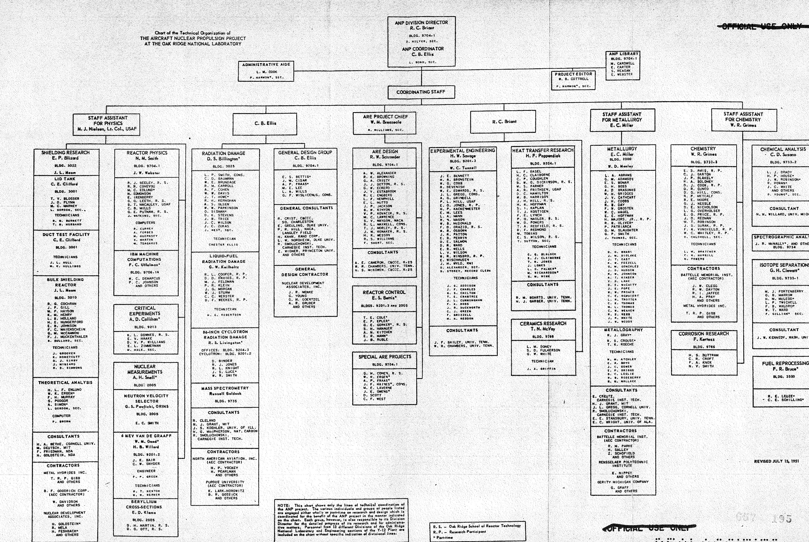