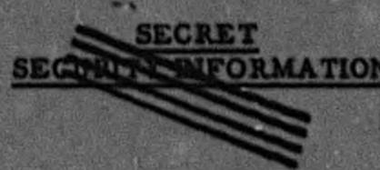

Report No. BMI-746

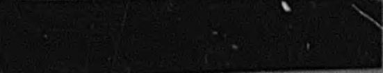

Reactors - Research and Power

UNCLASSIFIED

Contract No. W-7408-Gng-92

HYDROXIDES AS MODERATOR COOLANTS IN POWER-BREEDER- REACTORS

by

R.W.Dayton J.W.Chastain, Jr.

UNCLASSIFIED May 26,1952

# RESTRICTED DATA

This document contains restricted data as defined in the Atomic Energy Act of 1946. Its translation of this disclosure of its contents in any manner to an unauthorized person is prohibited.

BATTELLE MEMORIAL INSTITUTE

505 King Avenue Columbus, Ohio SEGRET

SECURITY INFORMATION

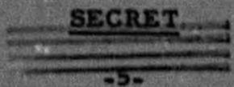

# ABSTRACT

Reflected and bare-pile two-group calculations are made for U $^{233}$ . NaOH, U $^{233}$ -Li $^{7}$ OH, and U $^{233}$ -Li $^{7}$ OD systems, assuming spherical geometry. The core is contained by two concentric zirconium shells, each 0.5 centimeter thick, separated by a one-centimeter air space. In the reflected-pile calculations, a spherical annulus filled with heavy water and thoria serves as a combined reflector and breeder blanket. Reflector thicknesses of 30 and 60 centimeters are investigated.

The nuclear constants are based on a core temperature of 1100 F, and a reflector temperature of 250 F. This core temperature is high enough for efficient power production but probably low enough to avoid excessive corrosion.

In calculating breeding gains, poisoning effects are neglected, since continuous removal of the most important fission products will probably be possible in this type of reactor. The computations involving Li $^7$ OH and Li $^7$ OD assume essentially completely separated lithium 7. With these assumptions of ideal conditions, breeding gains as high as 0.27 for Li $^7$ OD, and 0.23 for Li $^7$ OH are obtained.

A comparison of the two reactors shows the LiOH moderated pile has the advantages of lower moderator cost, smaller fuel requirements (~2.5 kg in core), and a smaller core radius (~30 cm). However, the larger radius (~60 cm) of the Li7OD reactor would facilitate heat removal, and at the same time offer a larger breeding gain. Furthermore, the minimum fuel requirement is only 0.4 per cent of the total mass, rather than two per cent as in the Li7OH pile. Four-tenths per cent of uranium might be dissolved in Li7OD.

# $\frac{5}{1} + u + {4q} = 1 + u + {uq}$ dH

-7-

# TABLE OF CONTENTS

Page

ABSTRACT 5

INTRODUCTION. 9

GENERAL CONSIDERATIONS 9

BAREPILE 10

REFLECTEDPILE 15

CONCLUSIONS 21

APPENDIX I 23

Nomenclature 25

APPENDIX II 27

Assumptions 29

BIBLIOGRAPHY 30

SECRET

# SECRET

9.

# INTRODUCTION

The homogeneous circulating-fuel reactor appears to offer promise of efficient breeding and power generation, at a reasonable cost. However, homogeneous reactors using water solutions of the fissionable material cannot operate advantageously at high temperatures without the disadvantage of very high pressures. Another class of fluids, the alkali metal hydroxides, have a number of the attractive features of water and will permit high-temperature operation at low pressures.

The advantages of NaOH are a low melting point (605 F), satisfactory nuclear properties, and favorable heat-transfer characteristics. Because of their smaller absorption cross sections, LiOH and Li7OD would appear better for breeder application, although their melting points (~842 F) are higher than that of NaOH, and little is known of their chemical behavior.

These factors

suggest that a homogeneous breeder reactor using an alkali metal hydroxide solution might be feasible.

The work reported here was undertaken to determine whether a reactor of this type is capable of breeding.

# GENERAL CONSIDERATIONS

For the reflected pile, it was necessary to assume a container material, core temperature, and thermal barrier. These assumptions can be only partially justified, since complete proof would require extensive laboratory work.

The choice of zirconium as a core container is based on recent corrosion(2) and yield-strength(3) tests performed at Battelle. In 24-hour corrosion tests, zirconium and L-nickel showed little attack by sodium hydroxide at 1000 F.

Zirconium, because of its small absorption cross section, is more attractive than nickel as a separator between core and blanket.

The yield strength of Foote zirconium is 8000 psi at 900 F, which is adequate for this application. By adding four per cent tin, this can be increased to 24,000 psi without increasing the cross section appreciably.

# SECRET

-10-

Corrosion tests also indicated that at present none of the metals or alloys tested were suitable caustic containers at 1500 F. These data made it necessary to choose a core temperature of less than 1500 F. The temperature used (1100 F) is a compromise between efficient power production and severe corrosion.

The use of heavy water as a reflector necessitates a low-reflector temperature if high pressures are to be avoided. However, maintaining a reflector temperature of 250 F requires a thermal barrier. Rough calculations show that this barrier can be obtained by placing zirconium foil in the dead-air space between the zirconium shells.

The feasibility of reactors using lithium hydroxide as a moderator is dependent on large-scale production of highly enriched lithium 7. To be useful as a moderator in a breeder, the amount of lithium 6 should not be greater than 100 ppm.

# BARE PILE

Bare-pile calculations for a homogeneous mixture of U²³³ and hydroxide were made as a quick basis for comparison of various hydroxides as moderators. The standard two group - one region equation was used. This equation assumes a continuous slowing-down process which is not valid for a hydrogenous material. However, use of a modified age makes the method sufficiently accurate for a preliminary feasibility study.

In calculating $r$ (Fermi age) for the hydroxides, it was assumed that hydrogen behaves as it does in water. Using a numerical integration method, the hydrogen scattering cross section was adjusted to give the experimental value $r = 33\mathrm{cm}^2$ for water. With the adjusted hydrogen cross section, a similar calculation was made for NaOH and LiOH. For the calculation of $r_{\mathrm{LiOD}}$ , the value $r_0 = 132.2\mathrm{cm}^2$ for heavy water was used. The results are listed in Appendix II.

The values for p, the probability of escaping resonance capture, and, the fast fission effect, were assumed equal to 1.

# SECRET

-11-

The absorption cross sections for lithium, sodium, and hydrogen were calculated for a temperature of 1100 F, assuming a 1/v dependence. Thermal values were taken from NBS 499(5). The scattering cross sections for 0.074 ev were obtained from Adair(6). The scattering of uranium and thorium was neglected in calculating macroscopic scattering cross sections.

Using the standard two group - one region method, calculations were made for thorium-moderator mass ratios of zero and 0.2 with the thorium homogeneously mixed in the core. The inclusion of thorium in the core was proposed in the hope of obtaining sufficient internal breeding $(BG = 0)$ to replenish continuously the fuel consumed. The net breeding gain was to be obtained in a blanket.

The three moderators, NaOH, Li $^{7}$ OH, and Li $^{7}$ OD, were considered. The results of the criticality calculations are plotted in Figures 1-3. Although parasitic absorption is smaller in Li $^{7}$ OD than in the other moderators, Figure 3 indicates that much larger critical radii are required in a Li $^{7}$ OD-moderated pile. This is caused by the smaller slowing-down power of the Li $^{7}$ OD, which permits a large number of fast neutrons to escape. Therefore, a larger reactor is necessary to obtain sufficient moderation to maintain criticality.

For each point on the 20 per cent thorium-criticality curves, a breeding ratio has been calculated. The breeding ratios have been plotted versus radius on their respective criticality curves. These data show that the breeding ratios are less than 1 and, thus, all breeding gains are negative since, by definition:

$$
B G = B R - 1 = \frac {\sum_ {a} ^ {T H}}{\sum_ {a} ^ {U}} - 1. \tag {1}
$$

For a given radius, both a breeding ratio and a critical mass for the bare pile may be obtained from Figures 1, 2, and 3. The results show that a 0.2 mass ratio of thorium to moderator in the core does not produce a positive breeding gain, although it increases the fuel requirements by a significant amount.

To evaluate further the possibilities of internal breeding, infinite pile breeding gains were computed. To obtain these data, the following equations were solved simultaneously.

$$
B G = \frac {v - (1 + a) - \frac {\sum_ {p}}{\sum_ {f}}}{1 + a} - 1.
$$

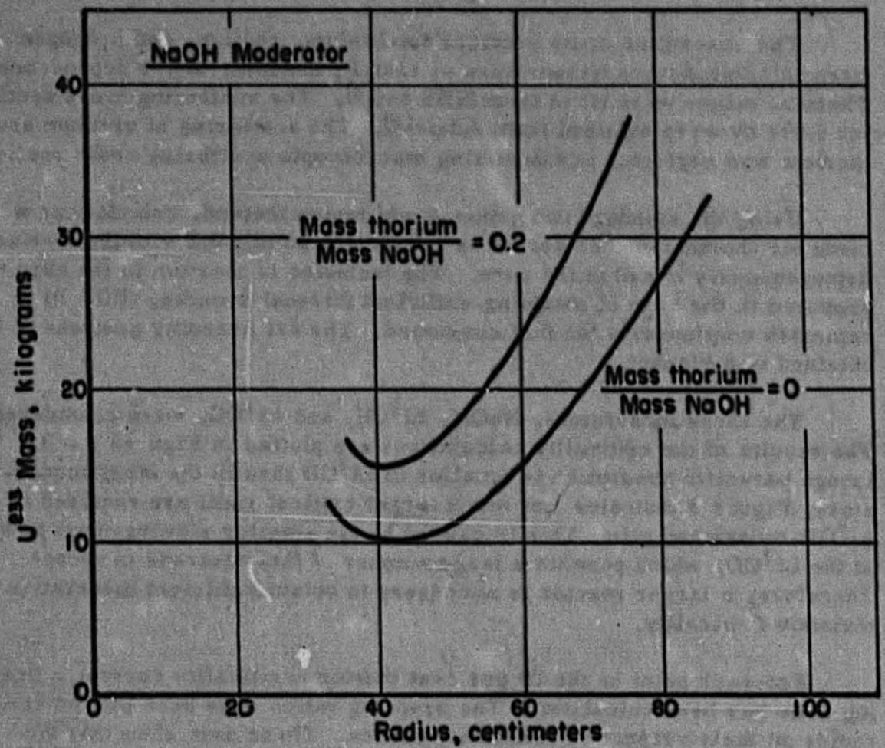  
SECRET

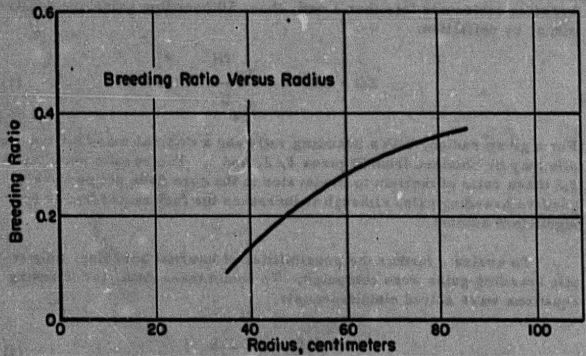  
FIGURE 1. CRITICALITY AND BREEDING RATIO CURVES FOR A HOMOGENEOUS U233-NoOH MODERATED BARE PILE

A-1076

SECRET

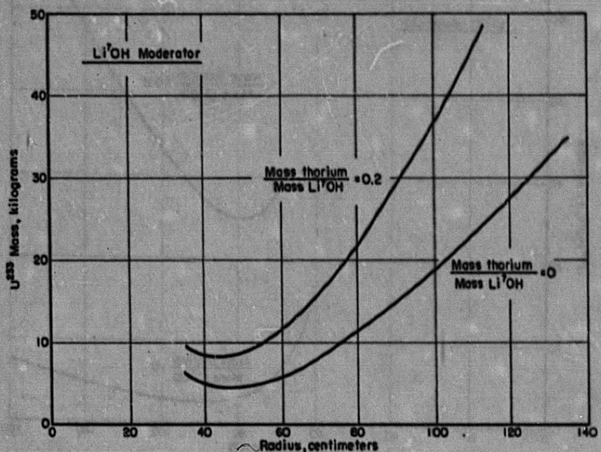

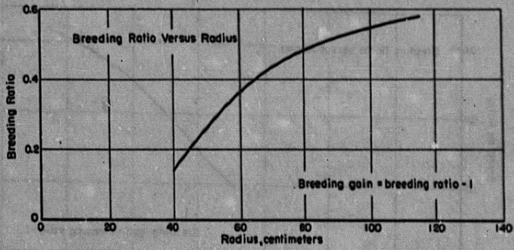  
FIGURE 2. CRITICALITY AND BREEDING RATIO CURVES FOR A HOMOGENEOUS U²³₃-Li⁷OH MODERATED BARE PILE

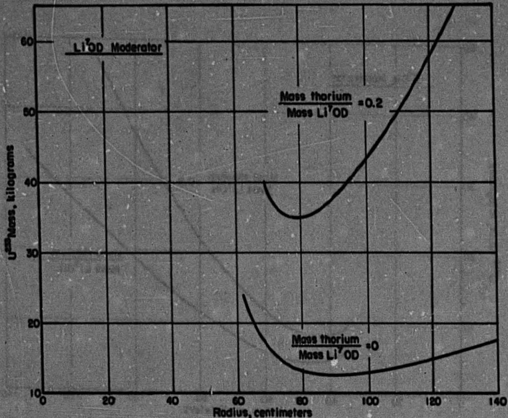  
SECRET

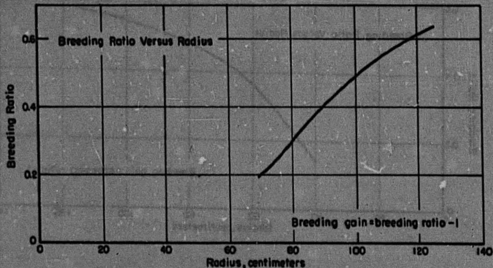  
FIGURE 3. CRITICALITY AND BREEDING RATIO CURVES FOR A HOMOGENOUS U233-LIOD MODERATED BARE PILE

A-1077

[{127} = {10}]

SECRET

# SECRET

-15-

$$
\eta - 1 = \frac {1}{\sigma_ {\mathrm {a}}} \left[ \mathrm {R} _ {1} \sigma_ {\mathrm {a}} ^ {\mathrm {M O D}} + \mathrm {R} _ {2} \sigma_ {\mathrm {a}} ^ {\mathrm {T H}} \right]. \tag {3}
$$

Equation 2 is the familiar breeding-gain equation for an infinite pile, and Equation 3 is obtained from the multiplication expression for an infinite pile. These results are plotted in Figure 4.

Although the thorium percentages in Figure 4 are high, some hope of obtaining zero internal breeding in Li'OD and possibly Li'OH still remained. Bare-pile radii and masses necessary to obtain zero breeding in the core were computed and appear in Figure 5. To maintain zero breeding, $\Sigma_{\mathrm{a}}^{\mathrm{TH}} = \Sigma_{\mathrm{a}}^{\mathrm{U}}$ was imposed as a requirement in choosing the mass ratios used in the solution of the critical equation. The mass ratios of thorium to moderator are listed for each point. From these data, it appears that obtaining even zero breeding gain in the core is impracticable in these piles, although the length of the operating cycle can be increased by the addition of some thorium.

The bare-pile results led to the following conclusions:

(1) Of the hydroxides considered, Li7OD appears most attractive as a breeder moderator where cost and size are not considerations.   
(2) Li $^{7}$ OH will probably breed, although to a lesser extent than Li $^{7}$ OD.   
(3) The size and fuel requirements of an LiOH-moderated reactor are smallest.   
(4) Internal breeding does not appear feasible if a small critical mass is a requirement.

# REFLECTED PILE

The core of the reflected pile is a homogeneous mixture of U²³³ and hydroxide contained by two concentric zirconium shells. The shells are 0.5 centimeter thick and are separated by a one-centimeter air space. The air space serves as a thermal barrier between core and reflector.

# SECRET

SECRET -16-

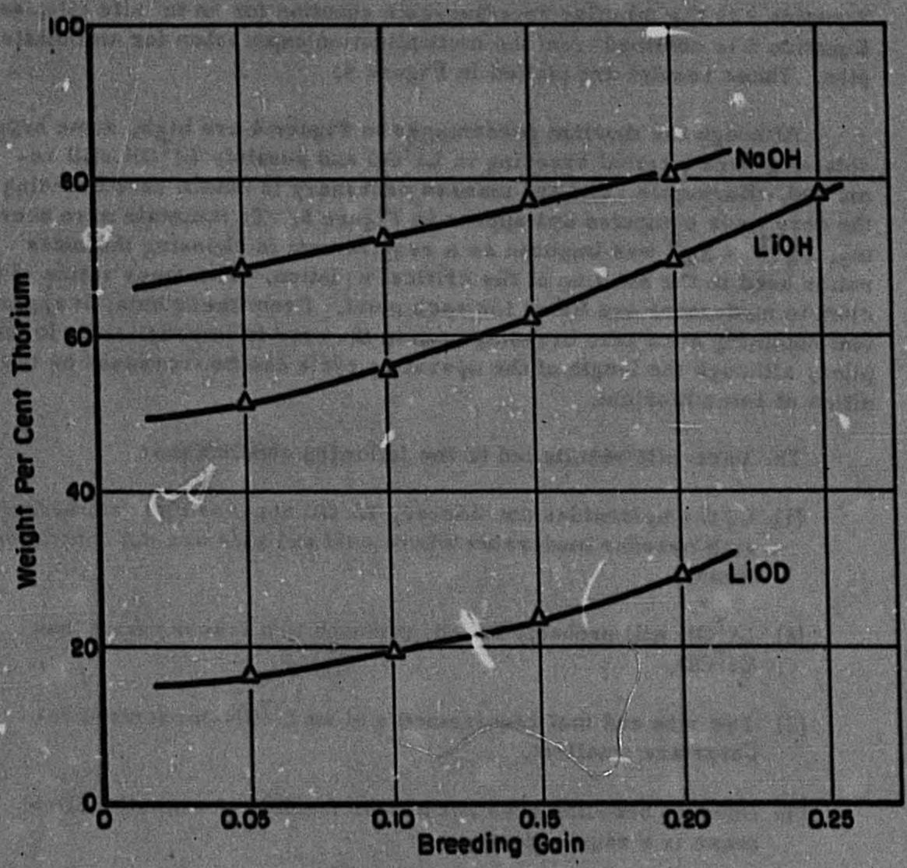  
FIGURE 4. THORIUM REQUIRED FOR VARIOUS BREEDING GAINS IN AN INFINITE PILE

${1.27} - {12}$

SECRET

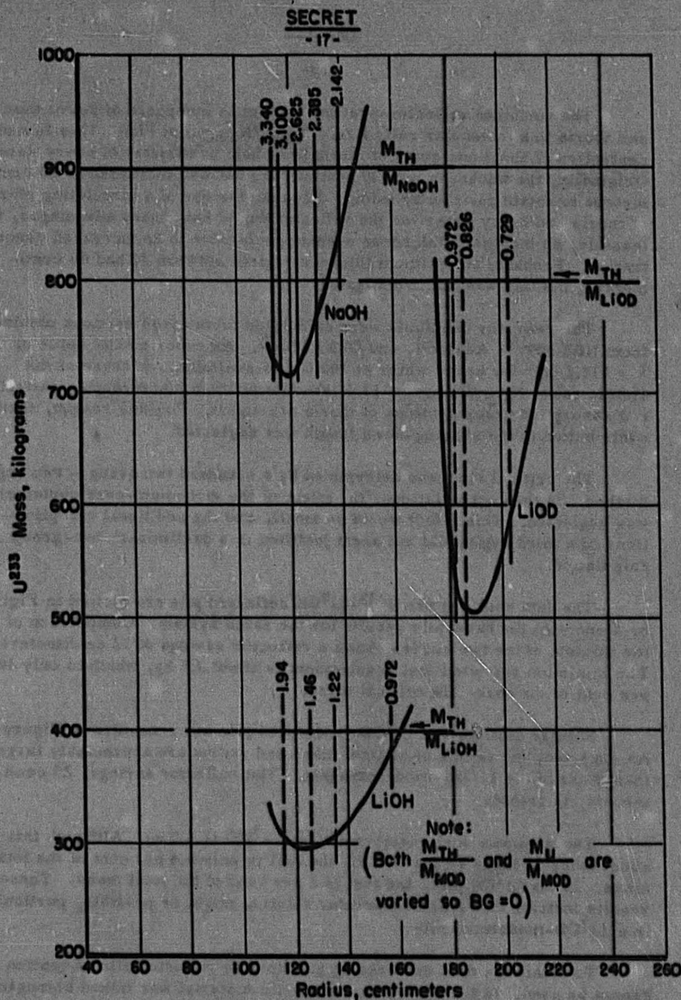  
FIGURE 5. CRITICALITY CURVE FOR ZERO INTERNAL BREEDING IN A U233 BARE PILE

SECRET

# SECRET

-18-

The combined reflector-breeder blanket is composed of heavy water and thoria in a molecular ratio (i.e., $\mathrm{ND}_{2}\mathrm{O} / \mathrm{N}_{\mathrm{ThO}_2}$ ) of 13:1. This is a concentration of about one gram of thoria per cubic centimeter of heavy water. Originally, the thickness was 30 centimeters but was increased to 60 centimeters to obtain positive breeding. Because the use of a circulating slurry of thoria and heavy water for the reflector would have many advantages, if feasible, an increased thickness seemed preferable to an increased concentration. Probably an optimum thickness exists between 30 and 60 centimeters, but this was not investigated.

The reflector constants were calculated from cross sections obtained from NBS 499(5), Adair(6), and ORNL-86(7). An experimental value of $T = 132.2 \, \text{cm}^2$ for heavy water at $100 \, \text{C}$ was available. Because of the atomic ratio, $\frac{\text{ND}_2\text{O}}{\text{NThO}_2} = 13:1$ , the fast neutron macroscopic scattering and absorption cross sections of thoria are small. For this reason, their contribution to the slowing-down length was neglected.

The critical size was determined by a standard two group - two region method. In these calculations, the effect of the zirconium-core container was neglected. This effect would be small, and the additional complications of a third region did not seem justified in a preliminary two-group calculation.

The data obtained for $\mathsf{U}^{233}$ -LiOH reflected pile are plotted in Figure 6, along with the bare-pile results for the same system. Comparison of the minima of the two curves shows a reflector savings of 12 centimeters. The minimum reflected fuel requirement is about 2.5 kg, which is only 50 per cent of the bare-pile critical mass.

Similar data for the Li $^{7}$ OD-moderated pile are presented in Figure 7. As expected, the values of critical mass and radius are appreciably larger than those of the Li $^{7}$ OH-moderated pile. The reflector savings, 25 centimeters, is greater.

The minimum fuel requirement for Li $^{7}$ OD is 4.5 kg. Although this is about twice as large as for Li $^{7}$ OH, the fuel is only 0.4 per cent of the total mass. In the Li $^{7}$ OH pile, the fuel is 2 per cent of the total mass. These results indicate that a fuel moderator solution might be possible, particularly in a Li $^{7}$ OD-moderated pile.

To obtain the data on breeding gain for the reflected pile, Equation 1 cannot be used. In the bare pile, the fertile material was mixed homogeneously with the materials of the core. Thus, the flux through the thorium and the uranium was identical for any small element of volume. Placing the thorium in an encircling blanket makes it necessary to include the flux in the reflected-pile breeding-gain computations.

# SECRET

-19

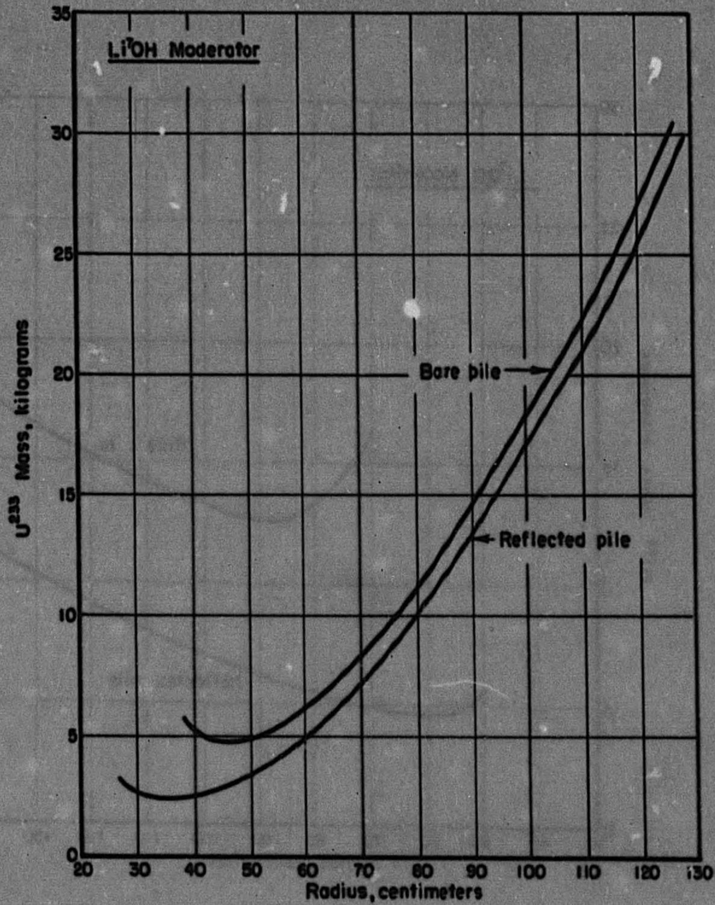  
FIGURE 6. CRITICALITY CURVE FOR HOMOGENEOUS U233-LiOH MODERATED REFLECTED PILE

A-1060

SECRET -20-

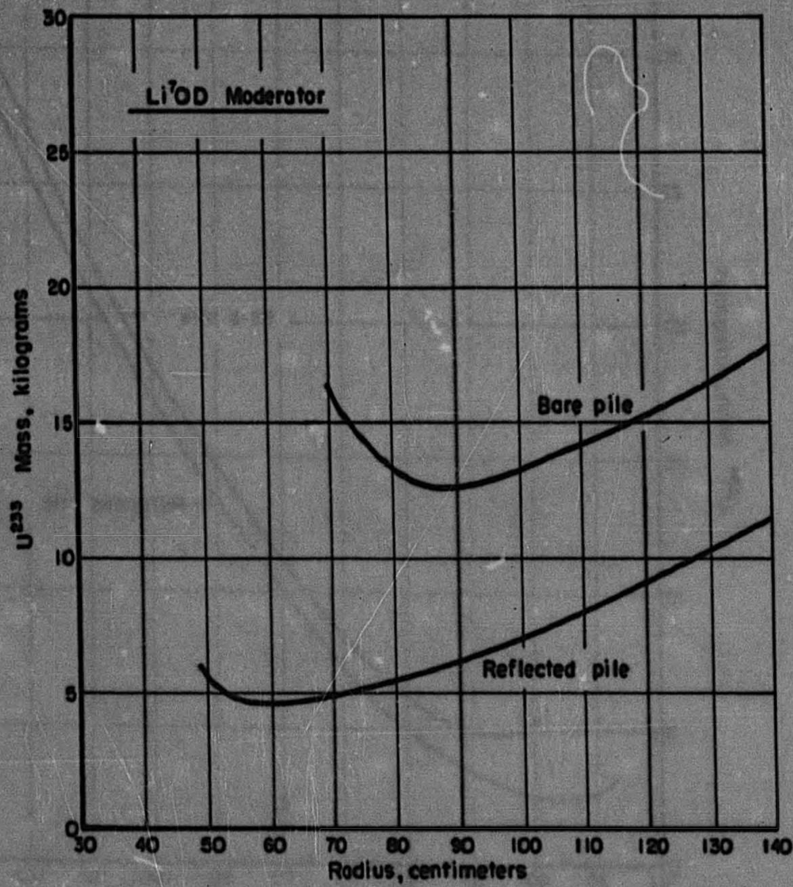  
FIGURE 7. CRITICALITY CURVE FOR A HOMOGENEOUS U²³⁵ -Li⁰D MODERATED REFLECTED PILE

A-1001

SECRET

# SECRET

-21-

The effect of the core container was considered in obtaining the breeding gain. This was done by plotting the fluxes obtained in the two-region problem. Since the container macroscopic cross sections are approximately equal to those of the reflector, the zirconium was considered as another centimeter of reflector. The flux at the reflector-container boundary was used as the maximum reflector flux for the breeding-gain calculations.

The results of these calculations for both Li $^{7}$ OH and Li $^{7}$ OD are shown in Figure 8.

Any serious estimate of doubling time would be impractical without considerable work to determine a feasible power level.

Assuming a power of 100 megawatts and a 0.2 breeding gain, the doubling time is about three years, allowing a total fuel inventory of 35 kilograms. This figure, although highly tentative, appears conservative enough to show that an acceptable doubling time is practicable.

The positive breeding-gain, high-temperature operation, and small critical mass are obvious advantages of this type of reactor. Possible advantages, which some other proposed types do not have, are effective and continuous poison removal, cheap and efficient chemical reprocessing, and comparatively simple fuel replenishment.

# CONCLUSIONS

From this preliminary nuclear study, it appears that Li $^{7}$ OH- and Li $^{7}$ OD-moderated reactors of reasonable size and fuel inventory are capable of breeding. However, to determine the practical feasibility of a uranium-hydroxide reactor, several experimental problems must be considered. One of these is the further study of the characteristics of solutions of uranium in hydroxides and mixtures of hydroxides. Also, more intensive investigations of the corrosive properties of hydroxides at elevated temperatures are needed.

The attractiveness of a homogeneous reflector suggests that an investigation of possible methods of obtaining highly concentrated slurries of thoria in heavy water might be profitable.

The engineering problems of heat removal and exchange, fuel circulation, and container design require study before the complete feasibility of a reactor of the type described here could be ascertained.

SECRET

SECRET

-22-

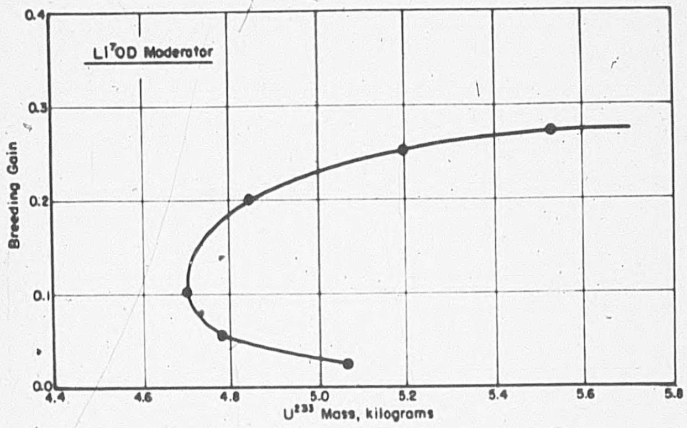

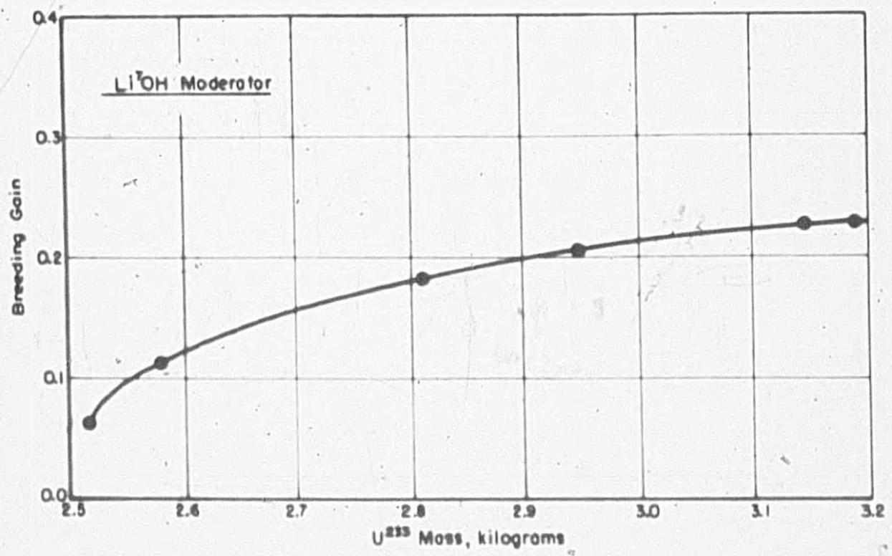  
FIGURE 8. BREEDING GAIN FOR $\mathsf{Li}^{\mathsf{T}}\mathsf{OH}$ AND $\mathsf{Li}^{\mathsf{T}}\mathsf{OD}$ REFLECTED PILES

SECRET

SECRET

-23-

APPENDIX I

SECRET

${120} - {19}$

# SECRET

-25-

# APPENDIX I

# Nomenclature

$\Sigma_{a} \mathrm{TH} =$ Macroscopic absorption cross section of thorium.

$\Sigma_{\mathbf{a}}^{\mathbf{U}} =$ Macroscopic absorption cross section of uranium.

BR = Breeding ratio.

BG = Breeding gain.

[ = \frac{\sum {c}_{i}}{\sum {f}_{i}}]

$\Sigma_{C} =$ Macroscopic capture cross section of $\mathbf{U}^{233}$

$\Sigma_{f} =$ Macroscopic fission cross section of $\mathbf{U}^{233}$

$\Sigma_{p} =$ Macroscopic parasitic absorption cross section.

$\nu$ = Neutrons/fission.

$\eta = \frac{\nu}{1 + a} =$ Neutrons produced per neutron absorbed in fissionable material

R1 = NMOD/NU

$\mathrm{R}_{2} = \mathrm{N}_{\mathrm{TH}} / \mathrm{N}_{\mathrm{U}}$

N =Molecules/cm³.

$\mathbb{P}$ = Resonance escape probability.

$\epsilon =$ Fast fission effect coefficient.

SECRET

-29

APPENDIX II

$\eta  = {2.35}$

p-1

1

<table><tr><td></td><td>LiOH</td><td>LiOD</td><td>NaOH</td><td>D2O-ThO2</td></tr><tr><td>r</td><td>114.5 cm2</td><td>357.2 cm2</td><td>104.1 cm2</td><td>132.2 cm2</td></tr><tr><td>Σa f</td><td>0.189 cm-1</td><td>0.00714 cm-1</td><td></td><td>0.0326 cm-1</td></tr><tr><td>Σth</td><td></td><td></td><td></td><td>0.0155 cm-1</td></tr><tr><td>Df</td><td>2.159 cm</td><td>2.552 cm</td><td></td><td>4.311 cm</td></tr><tr><td>Dth</td><td>0.354 cm</td><td>1.156 cm</td><td></td><td>0.313 cm</td></tr><tr><td>L2</td><td></td><td></td><td></td><td>20.207 cm2</td></tr><tr><td>Σt</td><td>0.288 cm-1</td><td>0.804 cm-1</td><td>0.762 cm-1</td><td></td></tr></table>

# Assumptions

# A-Core

(1) Hydrogen scattering cross section in hydroxide is the same as in water.   
(2) Uranium scattering cross section may be neglected in calculations of $r$ and $L^2$ .   
(3) For fast neutrons, the molecules of NaOH appear as free atoms of sodium, oxygen, and hydrogen. The transport cross section for each atom is computed and the average for the molecule calculated.   
(4) For thermal neutrons, the value for transport cross section was obtained by averaging the scattering cross section and then using molecular weight for A in the equation

$$
\sigma_ {t} = \sigma_ {s} \left[ 1 - \frac {2}{3 A} \right]
$$

# SECRET