# Eldg. Institut für Reaktorforschung Würenlingen

# Schweiz

# Molten Chlorides Fast Breeder Reactor

# Problems and Possibilities

M. Taube, J. Ligou

We regret that some of the pages in the microfiche copy of this report may not be up to the proper legibility standards, even though the best possible copy was used for preparing the master fiche.

Molten Chlorides Fast Breeder Reactor Problems and Possibilities

M. Taube, J. Ligou *)

*) The authors would like to acknowledge particularly the valuable advice and assistance given by G. Markoczny (heat transfer problems) and G. Ullrich (corrosion problems) in the preparation of this report.

# Contents

page

Summary 1

Résumé 2

1. General problems 3   
2. General description of the reactor 7   
3. Reactor physics 15   
4. Tnerro-hydralics 17   
5. Quasi-kinetic and pumping problems 29   
6. Fission products 32   
7. Reprocessing 39   
8. Aluminium Tri-chloride as a working agent 42   
9. Corrosion 46   
10. Safety problems 53   
11. Economics 54   
12. Some other selected thermal, and fast, breeder reactors 59

Appendix-Physical and chemical properties of the salt components 62

Acknowledgements 70

References 71

# Summary

A fast breeder reactor of 2000 MW(t) output using molten chlorides as fuel and coolant is discussed. Some of the most significant characteristics are

- the fuel contains only $\mathsf{PuCl}_3 / \mathsf{NaCl}$   
- the coolant is UCl₃/NaCl and also forms the fertile material along with the blanket, again UCl₃/NaCl   
- the fuel circulates through the core by forced convection.

The thermal stability of the reactor is very good. Power excursions of fuel temperature transients are quickly damped by the phenomena of fuel expansion pushing part of the fissile material out of the critical zone.

The balance of fission products including free chlorine seems to be stabilized when some of the semi-noble metals (Ru, Rh, Pd and some Mo) are present in the elementary form.

Corrosion effects form the most difficult problem. Thermodynamic stud.2s suggest the use of molybdenum alloys as structural materials. Separation of the fuel component from the fertile component UCl3 helps to overcome some of the corrosion problems.

A reprocessing system based on a salt-metal-transport process seems to be attractive from the point of view of the economics of the plant as a whole.

The possibility of using a dissociating gas as a secondary working agent in the turbine for example $\mathrm{Al}_{2}\mathrm{Cl}_{6}$ and $\mathrm{N}_{2}\mathrm{O}_{4}$ is discussed.

# Résumé

SURREGENERATE RAPIDE A SELS FONDUS (Chlorures)

Problemes et possibilités

Un surrégénérateur rôpide de 2000 MW(t) utilisant des chlorures fondus comme combustible et comme réfrigérant est décrit. Quel-ques-unes de ses caractéristiques les plus intéressantes sont les suivantes:

- le combustible liquide, contient seulement un mélange $\mathsf{PuCl}_3 / \mathsf{NaCl}$   
- le réfrigérant est un mélange UCl₃/NaCl; il comporte donc le matérieliau fertile tout comme les couvertures de même composition   
- le combustible demeure dans le coeur mais doit etre entrainé suivant une boucle de convection forcie.

La stabilité thermique du reacteur est très bonne; les excursions de puissance et les transitoires concernant la température du combustible sont fortement limités par l'expansion du combustible qui se trouve déplace vers les régions périqueriques qui contribuent beaucoup moins à la réactivité.

L'équilibre des produits de fission incluant des atomes de chlorismesemble être réalisé quand certains métaux semi-noble (Ru, Rh, Pd et Mo) sont present.

Les effets de corrosion constituent le problème le plus difficile. Des études de thermodynamique suggerent l'utilisation d'alliages de molybdène comme matériel de structure.

Un système de régénération base sur un procédé de "transport sel-métal" parait interressant du point de vue économique.

Enfin la possibilité d'utiliser les propriétés de dimérisation de certains gaz, par exemple $\mathrm{Al}_{2}\mathrm{Cl}_{6}$ et $\mathrm{N}_{2}\mathrm{O}_{4}$ , dans le cycle thermoc

# 1. General Problems

The biggest attraction of breeder reactors is their ability to utilize directly or indirectly, the non-fissile nuclides U-238 - in fast breeder reactors, and Th-232 - in thermal reactors.

The relative advantages of the fast breeder over the thermal breeder are: higher breeding ratio, higher specific power which results in the shortening of the doubling time as well as in the more intensive use of the reactor volume.

In addition it must be emphasized, that each breeder reactor, which is built to last 25-30 years, must be considered not only as a power producing device but also as a source of fissile material. Therefore each breeder reactor should be considered as part of a long term complex 'breeding system' which includes both the power reactor and the fuel reprocessing plant over this period.

From this point of view the reactors with molten fuel are better adapted to the long term 'breeding system' than are the solid fuel reactors. (simpler reprocessing technology, minimal transportation problems, smaller environmental danger, better economics?). (Fig. 1)

Such a coupled 'breeder system' has additional advantages when the reprocessing technology is based on high temperature processes, such as pyrometallurgical or pyrochemical techniques instead of low temperature processes in aqueous solutions. These high temperature reactorreprocessing systems might be realised in the most favorable manner when the fuel in the breeders is in a molten liquid and not in a solid state.

Thus in the future, 'breeding systems' using molten fuel fast reactors seem to be of interest.

The molten fuel fast reactors can be classified in the following manner

1) Molten metallic fuel   
2) Molten salt fuel

Fast reactors with molten metallic plutonium fuels were constructed in the sixties in Los Alamos under the name LAMPRE. The molten alloy Pu-Co-Ce was the most promising fuel proposed. The results were encouraging but further experiments have not been realised. These reactor types were not breeders.

Fast reactors with molten salt fuel exist only as paper studies at the present time. Som·work has been done at Oak Ridge (1956), Warsav (1960-68) Argonne (1965-68) and Harwell (1963-70). In addition some experimental work has also been carried out.

When nuclear, physical and chemical considerations are studied it can be shown that the only possible fuel constituent of these fast reactors are the molten chlorides. In the case of thermal reactors the most suitable molten salt fuel proves to be a fluoride.

(Fluorides are moderators, and therefore could not be used in a fast reactor, because of the dramatic softening of the neutron spectrum).

The search for the best components of molten salt fuel for fast reactors must take into account not only thermal and hydraulic properties but also the following nuclear properties: elastic and inelastic cross sections, cross sections for neutron absorbing mechanisms, not only $(n,\gamma)$ but also $(r,p)$ , $(n,\alpha)$ and $(n,2n)$ . The chlorides of uranium-238 and plutonium-239 diluted by sodium chloride are the selected components of the fused salt fuel. (Taube 1961)

Molten fuel reactors differ from the point of view of the cooling system. The following are three types of molten fuel reactors:

a) Externally cooled, where the molten fuel is pumped out of the core to the external heat exchanger. In this type of reactor, only fuel and fertile material are present in the core (no coolant). The large ruount of molten fuel outside the core does not of course contribute to the critical mass.

This type of reactor has been discussed for example by Nelson, (Argonne 1967) and Lane (USA 1970) especially as a high flux material testing fast reactor.

In externally cooled fast reactors the loss of a portion of the delayed neutrons could adversely affect reactor control. Also the biological shielding outside the core is very expensive.

b) Internally, direct cooled reactors: here the cooling agent is pumped directly into the core where, after mixing the fuel in the lower part of the core is separated and pumped out of the core to the heat exchanger. The direct contact of molten fuel with molten coolant has several particular advantages.

Very good heat transfer, no coolant tubes (or cladding), possibility of transporting fission products.

The disadvantages are unfortunately, also numerous: problems of mixing and separating the fuel and coolant, corrosion etc. This type of reactor has also been studied eg. - cooled by molten lead (Long, Harwell and Killingback, Winfrith), cooled by boiling mercury (Taube, Warsaw) and cooled by boiling aluminium chloride (Taube, Warsaw). This type of reactor must be considered as an 'extreme exotic type'.

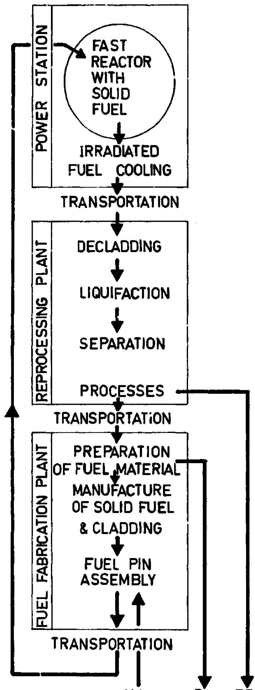

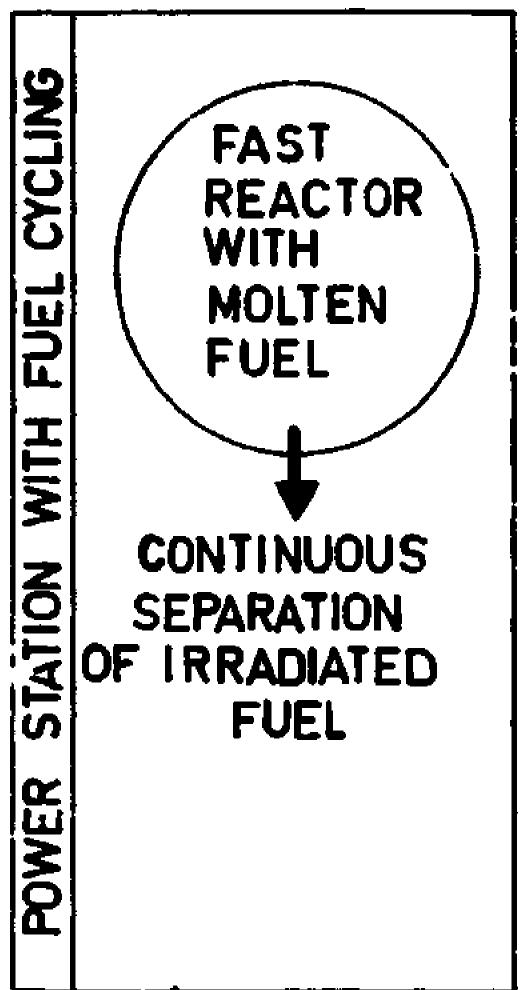

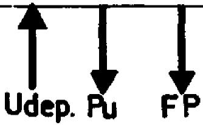

FUEL PROCESSING CYCLE

FOR FAST BREEDER REACTORS WITH SOLID AND MOLTEN FUEL

c) Internally indirectly cooled reactor: here the cooling agent flows through tubes in the core. Heat is transferred from fuel to coolant across the tubes. No direct contact between molten fuel and liquid or gaseous coolant is permitted. These types have also been studied, in most cases using sodium as a coolant, (Nelson, Argonne 1967).

indirectly  
In this paper an internally directly cooled molten salt fast reactor is discussed. The unusual difference is in the use of a molten chloride coolant, including uranium chloride in place of sodium or gaseous coolant. The uranium chloride component is in fact the fertile constituent which doubles as coolant.

Fig. 1 shows the flow diagrams of two types of reactors: with solid fuel and separate reprocessing plant and the molten fuel reactor with integral reprocessing system.

# 2. General description of the reactor

In this paper a molten chlorides fast breeder reactor is discussed. The most important features of this reactor are: (Fig. 2 and Fig. 3)

- thermal power 2050 MW(th) - 1936 MW(t) in core + 114 MW(t) in blanket giving   
- electrical power 1000 MW(e) (in the most optimistic case)   
- molten fuel consisting of (in mol%)

15% PuCl₃ (of which Pu-239 + Pu-241 = 80% and Pu-240 = 20%)

8% NaCl

(no $^{238}\mathrm{UCl}_3$ in fuel)

and fission products in the form of chlorides or in elementary state.

- molten fertile material (in mol %) 65% $238_{\mathrm{UC1}_3}$

35% NaCl

and newly bred $\mathsf{PuCl}_3$ and fission products.

- coolant flowing in tubes: the same as fertile material (no other coolant in core)   
- blanket material: the same as fertile material   
- the core is internally cooled, there is no circulating fuel outside the core.   
- the fuel and the coolant are flowing in the same direction (see fig. 3)   
- the reprocessing plant is in intimate proximity with the reactor (under the same roof)   
- for the sake of obtaining relatively high plant thermal efficiency a rather exotic working agent is proposed: aluminium trichloride. This agent removes the heat from the primary coolant (molen UCl₃/NaCl) in an external heat exchanger.   
- for full use of the thermal energy a secondary working agent is also proposed: nitrogen dioxide. The theoretical thermal efficiency of such a power station may be significantly higher than those of a 'classical' power station. Of course a more conservative steam turbine system need not be excluded, but it is possible to argue that one attraction of such system would be to use for 'district' heating.   
- the fuel in the core and the coolant are pumped with the velocity of 2 and $9\mathrm{ms}^{-1}$ respectively.

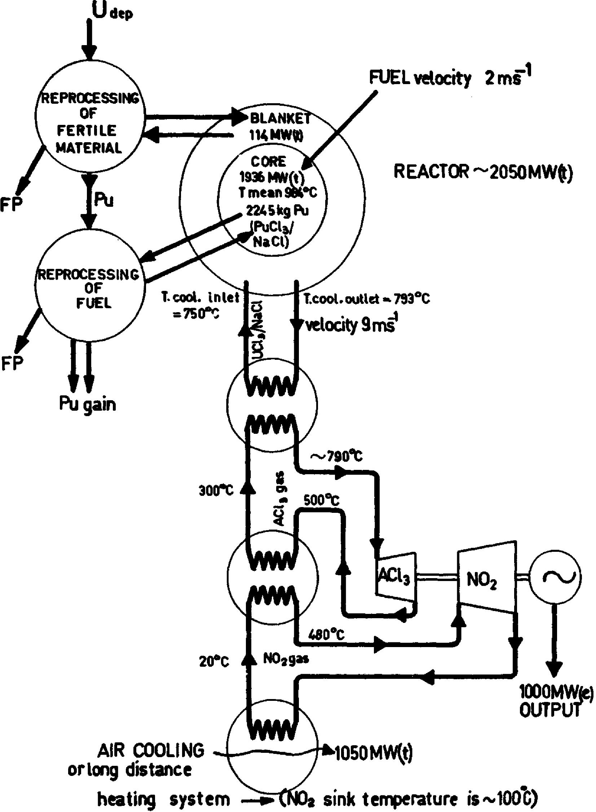  
Fig. 2. MOLTEN CHLORIDE REACTOR PLANT

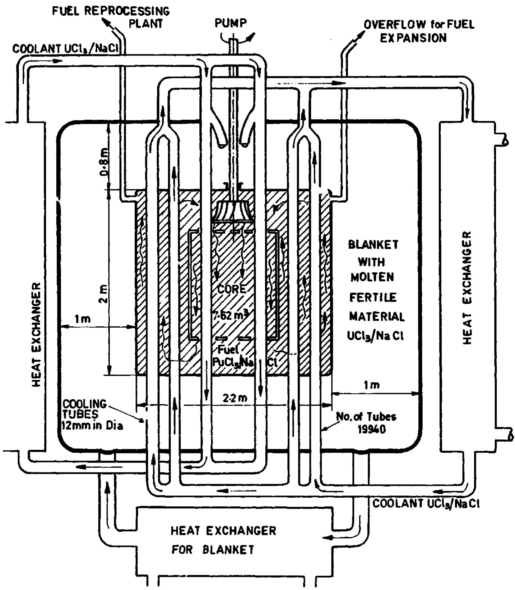  
Fig 3 CORE AND BLANKET SCHEMATIC

- the possible structural material: molybdenum alloy with small amounts of other metals e.g. Ni, Fe ....

The advantages of the proposed reactor are the following:

- no separate coolant no 'foreign' cooling agent (e.g. sodium, helium etc.) in the core which results in a more satisfactory system with improved neutron balance.   
- the fuel inventory is very small due to lack of a separate cooling system and because of the small out-of-core inventory on the basis of the direct coupled continuous reprocessing plant.   
- the fuel contains only plutonium and no uranium which simplifies the processing technology and removes the danger of uranium trichloride oxidation which also improves the corrosion properties of this medium.   
- the corrosion problems are easier to solve when the aggressive turbine working agent, aluminium chloride is situated outside the core.   
- the high velocities of both fuel and coolant significantly reduces the temperature gradients at the equilibrium state and reduces the mass transport mechanism. The mass transport mechanism is very sensitive to temperature gradients and plays a large part in corrosion mechanisms.

However the disadvantages are numerous:

- the first and most important disadvantage is of course corrosion. The molten chloride medium, especially in neutron and gamma fields, at high temperatures and velocities with chlorine

being virtually free in the fission process of plutonium chloride presents a very serious problem which must, and probably could be solved.

- the most likely structural material seems to be molybdenum alloy which among other things gives rise to parasytic absorption of neutrons.   
- the fuel is circulated by a pump which must be located in or close to the core which increases the corrosion problems.   
- the high fuel and coolant velocities result in high pumping costs and could cause severe erosion.

Table I   

<table><tr><td colspan="3">Molten chloride fast breeder reactor 'CHLOROPHIL'</td></tr><tr><td>Electrical power (approximate estimate)</td><td>MW(e)</td><td>1000</td></tr><tr><td>Thermal power, total</td><td>MW(t)</td><td>2050</td></tr><tr><td>- in core</td><td>MW(t)</td><td>1936</td></tr><tr><td>- in blanket (approx)</td><td>MW(t)</td><td>114</td></tr><tr><td>Core volume</td><td>m³</td><td>7.62</td></tr><tr><td>Specific power (core)</td><td>MWm-3</td><td>255</td></tr><tr><td>Core structure</td><td>see fig. 3</td><td></td></tr><tr><td>Plant efficiency (estimate)</td><td>%</td><td>49*</td></tr><tr><td>Liquid fuel properties</td><td></td><td></td></tr><tr><td>PuCl3</td><td>mol %</td><td>15</td></tr><tr><td>NaCl</td><td>mol %</td><td>85</td></tr><tr><td>Liquidus point</td><td>°C</td><td>685</td></tr><tr><td>Boiling point (at 1 bar)</td><td>°C</td><td>1500</td></tr><tr><td>Fuel temperature (mean)</td><td>°C</td><td>984</td></tr><tr><td>Fuel volume in core</td><td>m³</td><td>2.66</td></tr><tr><td>Density at 984°C</td><td>kgm-3</td><td>2340</td></tr><tr><td>Heat capacity (for 984°C)</td><td>KJ.kg-1deg-1</td><td>0.95</td></tr><tr><td>Viscosity (984°C)</td><td>g.cm-1s-1</td><td>0.0217</td></tr><tr><td>Thermal conductivity (for 750°C)</td><td>W.cm-1deg-1</td><td>0.007</td></tr><tr><td>Fuel in core</td><td>kg</td><td>6210</td></tr><tr><td>Total plutonium in core</td><td>kg</td><td>2252</td></tr><tr><td>Total plutonium in salt</td><td>weight %</td><td>36.4</td></tr><tr><td>Total plutonium in entire system</td><td>kg</td><td>2500</td></tr><tr><td>Mean plutonium specific power (core)</td><td>MW(t).kg-1</td><td>0.86</td></tr><tr><td colspan="2">Plutonium specific power (entire system)MW(t).kg-1</td><td>0.775</td></tr></table>

Coolant Properties   

<table><tr><td>(U238)Cl3(depleted uranium)</td><td>mol %</td><td>65</td></tr><tr><td></td><td>weight %</td><td>92</td></tr><tr><td>NaCl</td><td>mol %</td><td>35</td></tr><tr><td>U238 in salt</td><td>w %</td><td>63.5</td></tr><tr><td>Liquidus point</td><td>°C</td><td>710</td></tr><tr><td>Boiling point</td><td>°C</td><td>1700</td></tr><tr><td>Coolant temp. inlet</td><td>°C</td><td>750</td></tr><tr><td>Coolant temp outlet</td><td>°C</td><td>793</td></tr><tr><td>Coolant fertile salt in core</td><td>m3</td><td>4.96</td></tr><tr><td>density</td><td>kg.m-3</td><td>4000</td></tr><tr><td>in core</td><td>kg</td><td>20000</td></tr></table>

<table><tr><td>Coilent fertile salt total
(blanket + core)</td><td>m³</td><td>46.14</td></tr><tr><td></td><td>kg</td><td>185000</td></tr><tr><td>Uranium inventory (blanket + core)</td><td>kg</td><td>171000</td></tr><tr><td>Uranium inventory reactor +
reprocessing</td><td>kg</td><td>180000</td></tr></table>

<table><tr><td>Molybdenum alloy (80% Mo) in core</td><td>kg</td><td>3000</td></tr><tr><td>Core geometry - cylindrical</td><td></td><td></td></tr><tr><td>height</td><td>m</td><td>2.00</td></tr><tr><td>diameter</td><td>m</td><td>2.20</td></tr><tr><td>volume</td><td>m3</td><td>7.62</td></tr><tr><td>Axial blanket height</td><td>m</td><td>0.80</td></tr><tr><td>Radial blanket thicknesses</td><td>m</td><td>1.00</td></tr><tr><td>Blanket + in core coolant (tubes) volume</td><td>m3</td><td>38.25</td></tr><tr><td>Thermo-hydraulics</td><td></td><td></td></tr><tr><td>Fuel velocity</td><td>m.s-1</td><td>2.00</td></tr><tr><td>Fuel pump</td><td></td><td>in core</td></tr><tr><td>Fuel</td><td></td><td>shell side</td></tr><tr><td>Coolant velocity</td><td>m.s-1</td><td>9.00</td></tr><tr><td>Coolant pump</td><td></td><td>in external heat exchan-ger</td></tr><tr><td>Number of coolant tubes</td><td></td><td>19941</td></tr><tr><td>Tubes - inner dia</td><td>cm</td><td>1.20</td></tr><tr><td>- outer dia</td><td>cm</td><td>i.26</td></tr><tr><td>- tube material</td><td></td><td>Mo. alloy</td></tr><tr><td>- tube pitch</td><td>cm</td><td>1.38</td></tr><tr><td>pitch/inner dia ratio</td><td></td><td>1.15</td></tr><tr><td>Secondary working agent</td><td></td><td>AlCl3, gaseous</td></tr><tr><td>Reprocessing</td><td></td><td>continuous</td></tr><tr><td>Efficiency for Pu + F.P. separation (assumed)</td><td>%</td><td>50</td></tr><tr><td>Fuel stream to plant</td><td>kg.s-1</td><td>0.003</td></tr><tr><td>Mean cycle time for fuel</td><td>days</td><td>21</td></tr><tr><td>Fertile stream to plant</td><td>kg.s-1</td><td>0.216</td></tr><tr><td>Mean cycle time for fertile medium</td><td>days</td><td>56</td></tr><tr><td>Breeding ratio</td><td></td><td></td></tr><tr><td>Internal (in core only)**</td><td></td><td>0.709</td></tr><tr><td>Outer (in blanket)</td><td></td><td>0.680</td></tr><tr><td>total</td><td></td><td>1.389</td></tr><tr><td>Doubling time</td><td>years</td><td>9.2</td></tr></table>

# 3. Reactor Physics

The neutronics calculations have been made in 3 steps:

- rough calculation with one group cross sections taken from sodium cooled oxide fuel fast reactor data.   
- calculation with 15 group cross sections for given chloride composition.   
- recalculation with newly calculated one group cross sections, normalized from spectrum obtained in the previous 15 group calculation. (see fig. 4)

The one group cross sections used in these calculations are given in table 2.

The neutron balance is given in table 3.

There are references in the literature to the adverse effect of neutron absorption by the chlorine isotopes.

For fast neutrons the two isotopes of chlorine have the following cross-sections.

<table><tr><td>Nuclide</td><td>% isotope 
in natural C1</td><td>fast neutron 
cross sections</td><td>value 
(barns)</td></tr><tr><td rowspan="2">C1-35</td><td rowspan="2">75.53</td><td>σ(n,p)</td><td rowspan="2">0.072</td></tr><tr><td>σ(n,α)</td></tr><tr><td rowspan="2">C1-37</td><td rowspan="2">24.47</td><td>σ(n,p)</td><td rowspan="2">0.0015</td></tr><tr><td>σ(n,α)</td></tr></table>

From the data obtained the adverse influence of chlorine-35 is rather small and an isotopically enriched chlorine is not required. Such a suggestion was made by Weinberg and Wigner (1955) but was based on earlier more regassistic cross section values.

# Table 2

One group cross-sections for the molten chloride fast reactor on the basis of 15 group data of Bondarenko.

Table 3   

<table><tr><td>Nuclide</td><td>σf</td><td>αcapture</td><td>ν</td></tr><tr><td>Pu-239 (and Pu-241)</td><td>1,826</td><td>0,256</td><td>2,962</td></tr><tr><td>Pu-240</td><td>0,546</td><td>0,437</td><td>2,660 (estimated)</td></tr><tr><td>U-238</td><td>0,0743</td><td>0,3145</td><td>2,660</td></tr><tr><td>Na</td><td>-</td><td>0,00133</td><td>-</td></tr><tr><td>Cl</td><td>-</td><td>0,015</td><td>-</td></tr><tr><td>Mo</td><td>-</td><td>0,0743</td><td>-</td></tr><tr><td>Fission products</td><td>-</td><td>0,273</td><td>-</td></tr></table>

Neutron balance for 1 cm height of cell (1.91 cm³)

<table><tr><td>Nuclide</td><td colspan="2">x1020</td><td>Neutrons produced</td><td>Neutrons absorbed</td></tr><tr><td>Pu-239</td><td>11.36</td><td>(n,f)</td><td>61.4</td><td>20.7</td></tr><tr><td></td><td></td><td>(n,γ)</td><td>-</td><td>2.9</td></tr><tr><td>Pu-240</td><td>2.85</td><td>(n,f)</td><td>4.14</td><td>1.55</td></tr><tr><td></td><td></td><td>(n,γ)</td><td>-</td><td>1.24</td></tr><tr><td>U-238</td><td>72.39</td><td>(n,f)</td><td>14.3</td><td>5.40</td></tr><tr><td></td><td></td><td>(n,γ)</td><td>-</td><td>15.53</td></tr><tr><td>Na</td><td>104.00</td><td></td><td>-</td><td>0.13</td></tr><tr><td>Cl</td><td>375.00</td><td></td><td>-</td><td>5.62</td></tr><tr><td>Mo</td><td>56.00</td><td></td><td>-</td><td>4.2</td></tr><tr><td>F.P.</td><td>1.13</td><td></td><td>-</td><td>0.3</td></tr><tr><td></td><td></td><td></td><td>79.8</td><td>57.57</td></tr><tr><td></td><td></td><td></td><td>K∞ = 79.8/57.57 = 1.387</td><td></td></tr></table>

To a similar extent the problem of the exact choice of constructional materials for the coolant tubes will also affect the neutronics calculations.

At least two criteria must be considered in the selection of tube material:

- the absorption cross-section for fast neutrons (σ0.1 MeV) because of its effect on the breeding ratio. (fig. 5)   
- chemical stability against the attack of chlorine ions which can be partly represented by the free enthalpy of chloride formation $(G_{\text{form}}^{1000 \, \text{K}})$ .

Fig. 5 shows both properties of some selected materials. From this it appears that one of the most suitable metals is molybdenum. Unfortunately this answer cannot be regarded as completely satisfactory because of the lack of real experimental data and because of some thermodynamic questions which are discussed in sections 8 and 9.

# 4. Thermohydraulics

The calculations for this type of reactor have been based on the following more or less arbitrary selected parameters:

- fuel in shell side, with tube pitch to diameter ratio equal to 1.10 to 1.18.   
-fuel velocity: 0.5 to 5 m.s-1   
-core dia:2 and 2.2 m   
-core height: 2 m

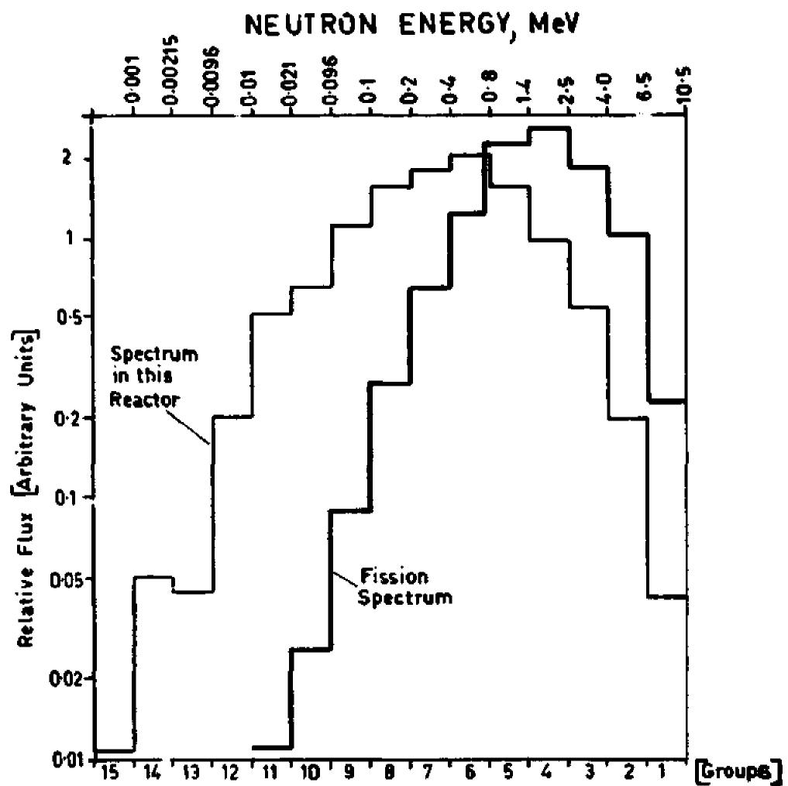  
Fig4 NEUTRON SPECTRA

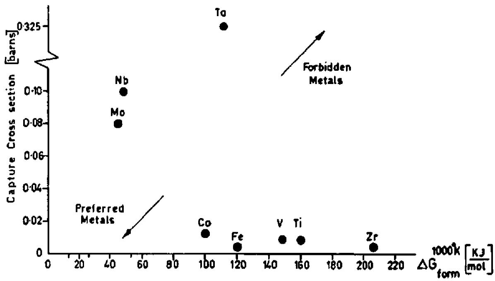  
Fig 5 CHOICE OF STRUCTURAL MATERIALS

- coolant in tube with tube internal diameter equal to: 1.0 to 1.5 cm   
- velocity of coolant: 1 to $17 \, \text{ms}^{-1}$   
- coolant inlet temperature $750^{\circ}$ and $800^{\circ}\mathrm{C}$

The calculation of neutronics and thermo-hydraulics were made for $l$ cm of the core height (see fig. 6 - flowsheet of program)

The data given in table 1 obtained from these calculations are for a steady state reactor.

The detailed representation for the temperature distribution in a typical power reactor with a core output of 1936 MW(t) are given in fig. 7 (for a position 43 cm above the bottom of the core where the neutron flux is normalised to 1).

The bulk temperature of the fuel is here $998^{\circ}\mathrm{C}$ , the temperature of the tube walls $857 - 839^{\circ}\mathrm{C}$ and the bulk temperature of the coolant $781^{\circ}\mathrm{C}$ .

For the total output of the core 1936 MW(t), the power distribution is as shown in fig. 8.

Of course a flatter power distribution could be obtained by adjusting tube diameters and pitch across the core.

(Note that in this calculation the radial neutron flux distribution has been taken as unperturbed).

A very encouraging indication of the good temperature distribution with very small temperature gradients is shown in fig. 9 which indicates the axial bulk temperature distribution in the fuel and in the coolant in the core.

X = height of core x no. of passes [cm]

D-density of component

C=heat capacity

V=viscosity

K = heat conductivity

G -geometry of channels

neutron flux

E-energy produktion

H=heat transfer

Tf-temperature of fuel

Tc-inlet temperature of coolant

U-velocities of fuel and coolant

Nf-fuel composition

Ncooant composition

ReReynolds number

Prandtl number

Nuusselt number

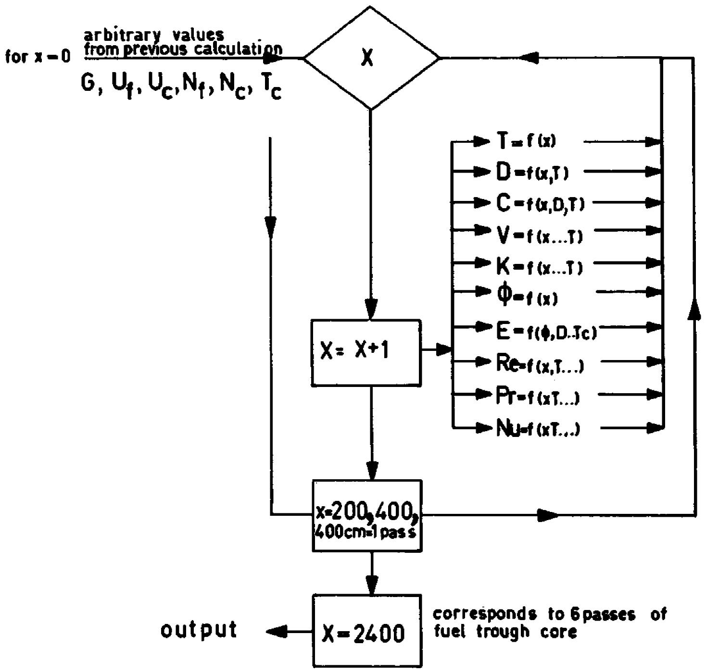

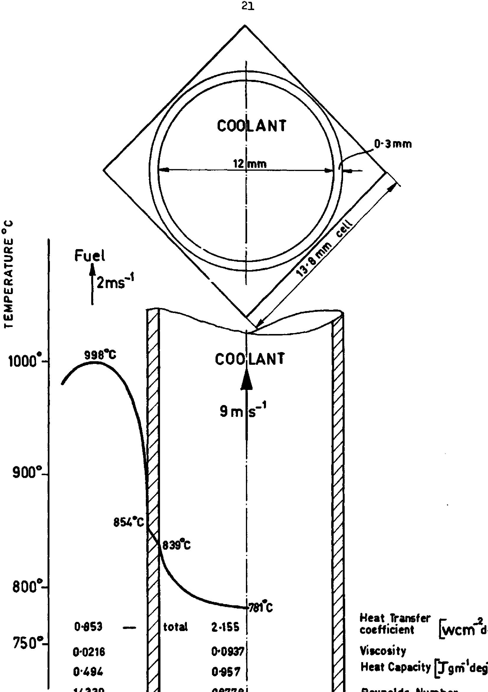

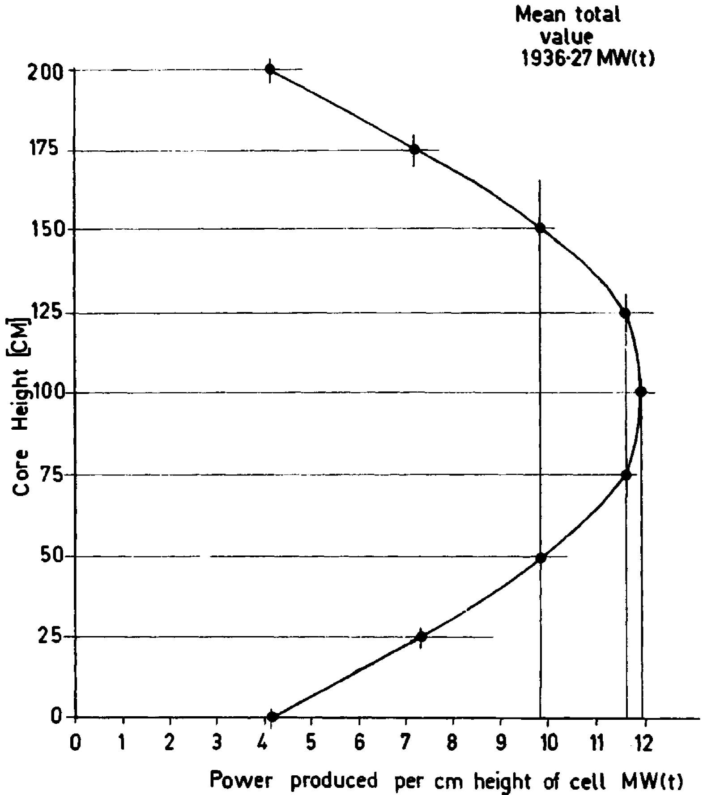  
Fig 8

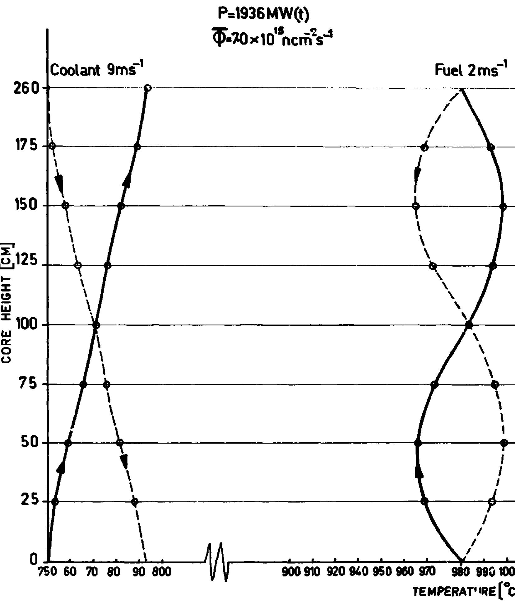  
Fig 9   
TEMPERATURE of FUEL and COOLANT

The fuel bulk temperature changes form $980^{\circ}\mathrm{C}$ at the bottom to $965^{\circ}\mathrm{C}$ at 1/4 core height and is $998^{\circ}\mathrm{C}$ at 3/4 of core height.

The coolant temperature lies between $750^{\circ}\mathrm{C}$ inlet and $793^{\circ}\mathrm{C}$ outlet. Both these small temperature gradients in the fuel and in the coolant (fertile and blanket material) may prove beneficial in reducing corrosion processes due to the minimizing of mass transport phenomena.

The stable behaviour of this type of reactor results from many parameters. Two of them are the velocity of the coolant and its bulk temperature. The mean power output of the core is strongly dependant on the velocities of both fuel and coolant. (fig. 10)

For a fuel velocity of $2 \, \text{m.s}^{-1}$ , when the coolant velocity falls from $12 \, \text{m.s}^{-1}$ to $1 \, \text{m.s}^{-1}$ the coolant outlet temperature increases from $784^{\circ}\text{C}$ to $893^{\circ}\text{C}$ for constant inlet temperature of $750^{\circ}\text{C}$ . This change of coolant velocity and its bulk temperature results in the decrease of the mean core output from $2088 \, \text{MW(t)}$ to $598 \, \text{MW(t)}$ - that is approximately a factor 3! It is clear since the lower coolant velocity results in a higher coolant outlet temperature and lower power output. We have definite negative temperature coefficient (power output) varying with the given coolant velocity.

If the fuel velocity falls from $2 \, \text{m.s}^{-1}$ to $0.8 \, \text{m.s}^{-1}$ we again get an important decrese of power output (see fig. 11)

The decrease in both fuel and coolant velocity results in a sharp decrease of reactor power (see fig. 12). This means that such a reactor can be considered as a surprisingly stable and self-regulating device. In the case of a sudden fall in coolant and/or fuel velocities the power output decreases to a safe level without intervention.

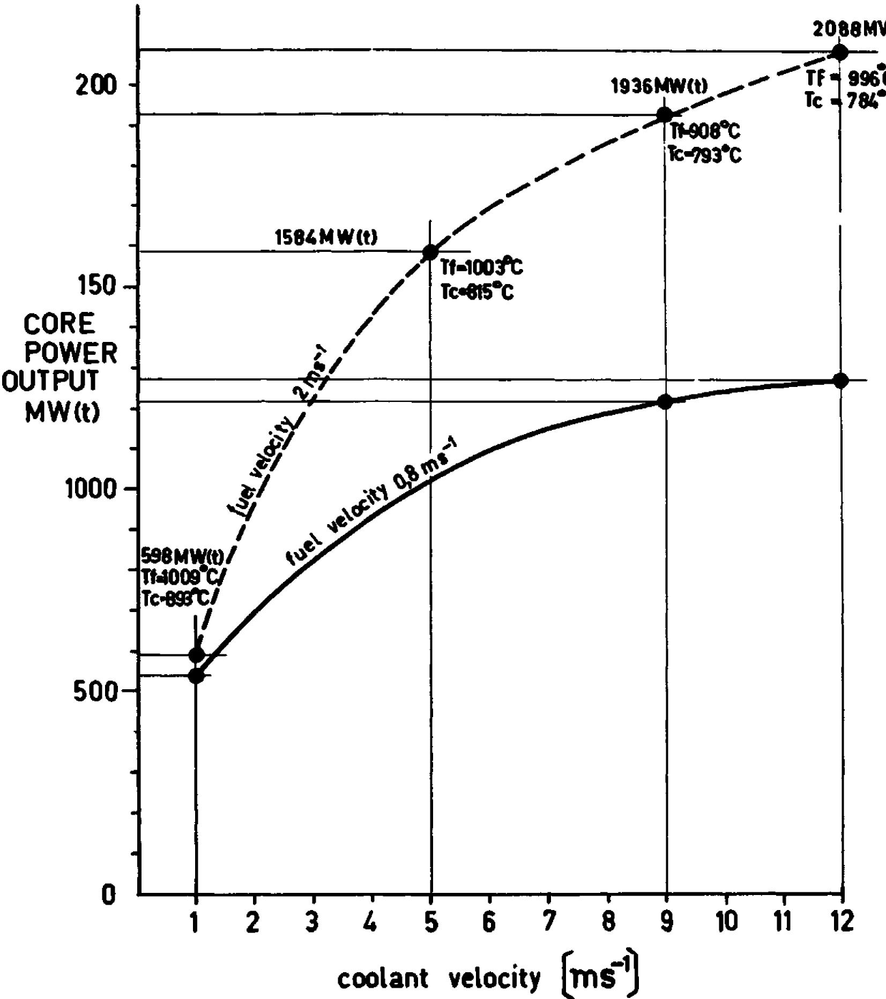  
Fig 10   
CORE POWER OUTPUT VERSUS COOLANT

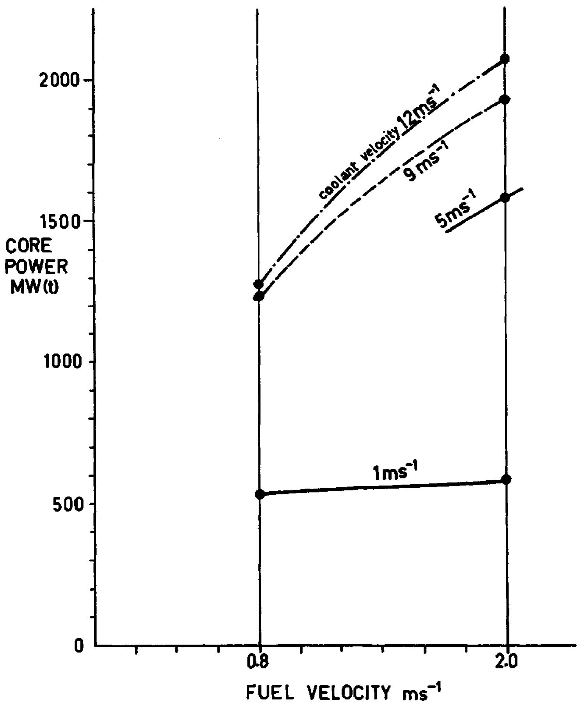  
Fig 11

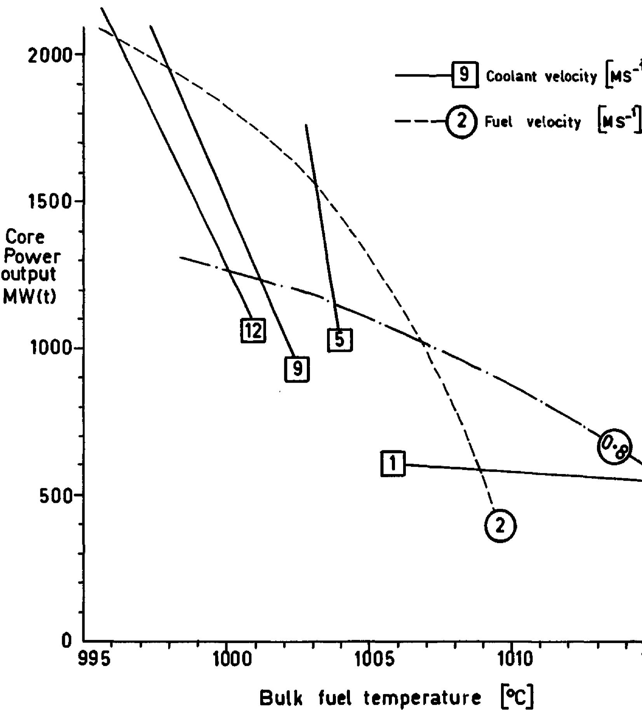  
Fig 12   
Power output versus bulk fuel temperature

The reference core with 1936 MW(t) coolant velocity $9 \, \text{m.s}^{-1}$ , fuel velocity $2 \, \text{m.s}^{-1}$ , tube pitch/dia ratio 1.15, has a plutonium inventory of 2252 kg of Pu (Pu-239 + Pu-240) which gives a specific power of 0.86 MW(t)/kg Pu.

The breeding ratio in the core for the reference case is calculated as

$$
B _ {\text {c o r e}} = \frac {N (U _ {2 3 8}) x \sigma_ {\gamma} + N (P u _ {2 4 0}) x \sigma_ {\gamma}}{N (P u _ {2 3 9}) x (\sigma_ {f} + \sigma_ {\gamma})} = 0. 7 0 9
$$

The blanket breeding ratio for a 1 m blanket is calculated as approx 0.680 which gives a total breeding ratio 1.389.

The doubling time for this reactor is given the following definition (at $80\%$ load factor)

$$
\begin{array}{l} \text {D o u b l i n g} = \frac {\text {P u i n v e n t o r y i n r e a c t o r}}{\text {P u g a i n}} \\ = \frac {2 2 5 2 \mathrm {k g} \mathrm {P u}}{1 9 3 6 \mathrm {M W} (\mathrm {t}) \times 1 . 1 \mathrm {k g} \mathrm {P u} / _ {1 0 0 0} \mathrm {M w d} \times 3 0 0 \text {d a y s / y e a r} \times (1 . 3 8 9 - 1)} \\ = 9. 2 \text {y e a r s} \\ \end{array}
$$

It must be stressed that this doubling time is a linear one.

# 5. Quasi-kinetic and pumping problems

The achievement of the required fuel velocity in the core seems to require a forced circulation system since the rough estimate using natural convection gives a heat transfer coefficient which is too low.

Such a forced circulation system (core only) can be one of the following types

- pump installed directly in core   
- pump outside the core   
- an external pump with injector   
- a gas-lift pump using inertgas (argon)

Intensive consideration of the factors involved, using criteria such as - reduction of the out of core inventory, elimination of additional heat exchangers, minimization of the fuel leakage, minimization of the auxiliary opwer, optimisation of the fuel flow regulation, points to an in-core pump solution. Of course this gives rise to considerable technical problems (cooling of the rotor, corrosion and erosion, maintenance, neutron activation etc.)

The postulated fuel velocity makes it possible to make some calculation on the heat transfer problems and also gives a feel for the kinetics of the reactor under discussion.

It must be stressed that these kinetics studies have no strong physical sense and use an iterative approach but it is clear that they give some useful information about the general reactor stability. (see fig. 13 and fig. 14)

There is little information on the density of $\mathrm{PuCl}_3 / \mathrm{NaCl}$ and $\mathrm{UCl}_3 / \mathrm{NaCl}$ in the temperature range of interest. For these calculations the fuel and coolant densities for the reference case are

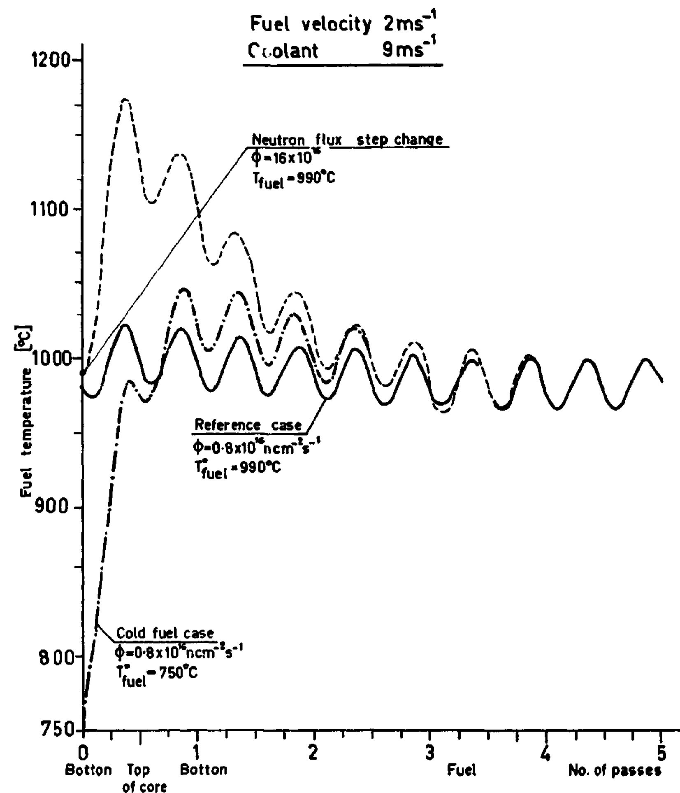  
Fig 13

Fuel temperature during several passes through core under different initial conditions

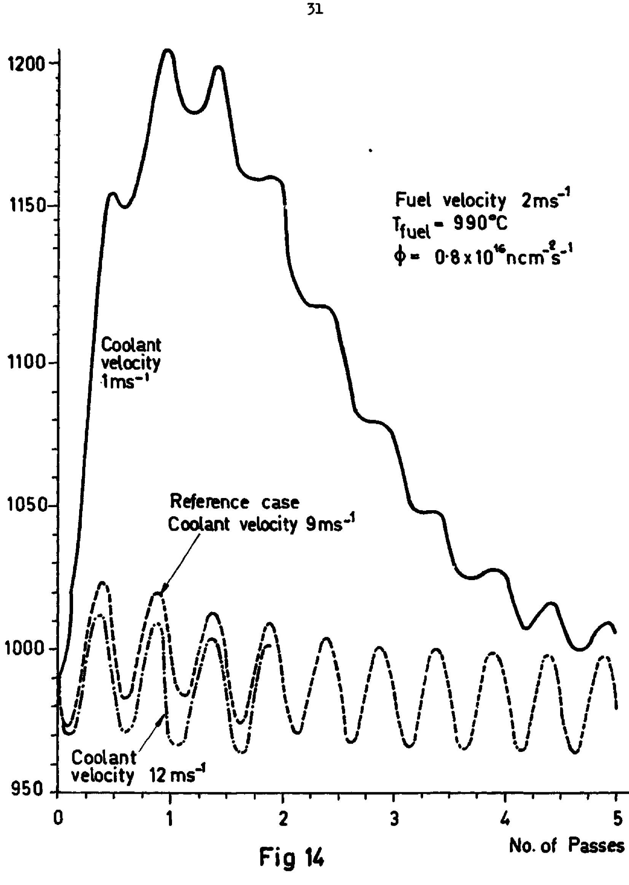

given in figure 15.

The influence of the temperature coefficient of density $(\Delta \rho / \rho$ per deg) is calculated here for 3 cases, $0.5 \times 10^{-3}$ , $1 \times 10^{-3}$ and $1.5 \times 10^{-3}$ . Fig. 16 gives the results which show only a small influence on reactor power.

# 6. Fission Products

The fission process of plutonium in a molten chloride medium may be expressed as

$$
\mathrm {P u C l} _ {3} \xrightarrow {(n , f)} \quad \text {F i s s . p r o d u c t s} + 3 \mathrm {C l}
$$

From the earlier published data of Taube 1965 and Chasanov 1965 and the more recent data of Lang 1970 it appears that the problem of the possible existence of fission product oxides states was not sufficiently discussed.

On t'e basis of the fission yields of Pu-239 in a fast reactor after 10 days irradiation and without cooling time the yield of the individual elements are as shown in table 4.

The most difficult problem is to predict the probable valency (oxidation state) of some metallic elements and metalloids. In this paper the oxidation states have been determined on the basis of the free enthalpy of formation of the chlorides (according to Veryatin et al. 1965) and are shown below.

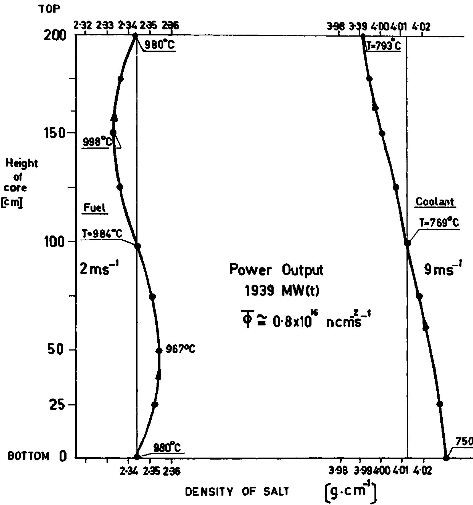  
Fig 15   
Density of fuel and coolant for

Fig 16   
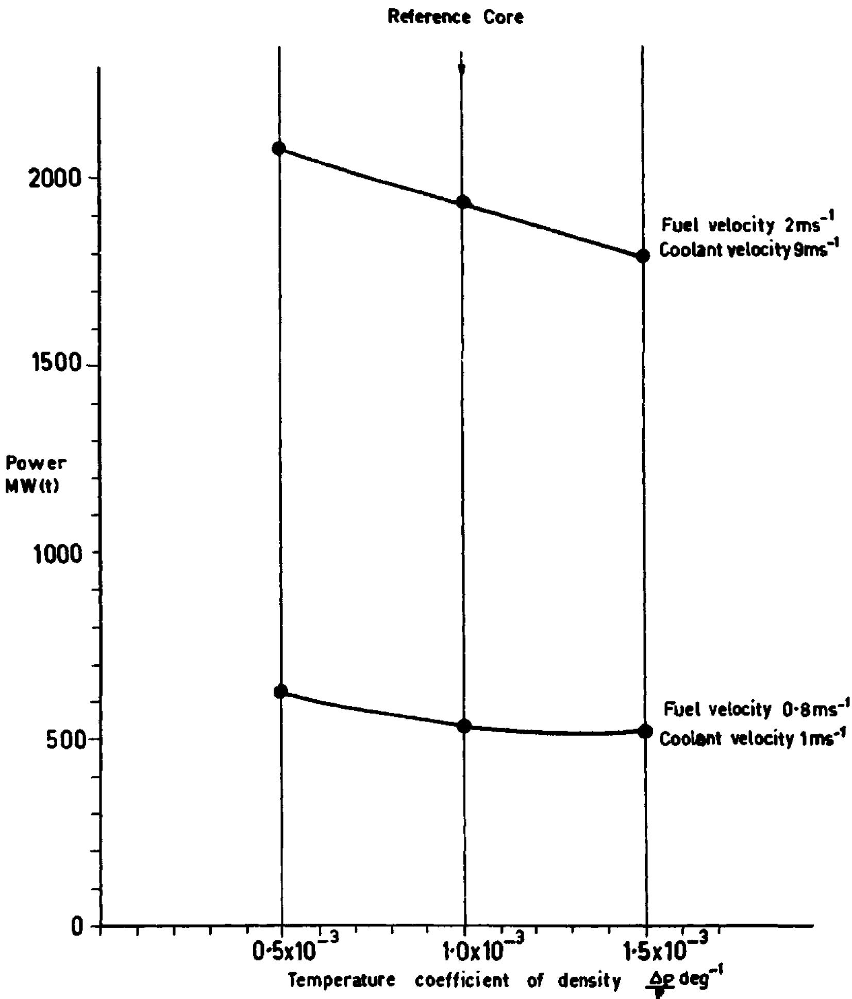  
Impact of the density temperature coefficient

Table 4   
Fission products in irradiated chloride fuel   

<table><tr><td>Oxidation state</td><td>Fission products</td><td>Remarks</td></tr><tr><td>0</td><td>Kr, Xe</td><td>noble gases</td></tr><tr><td>0</td><td>Se, Br, I</td><td>volatile metalloids</td></tr><tr><td>0</td><td>Tc, Ru, Rh, Pd</td><td>semi-noble metals</td></tr><tr><td>0</td><td>Mo (partially 30 %)</td><td>-----</td></tr><tr><td>+1</td><td>Rb, Cs, Ag</td><td>the only stable oxidation state</td></tr><tr><td>+1</td><td>In</td><td>the most stable (but unimportant)</td></tr><tr><td>+2</td><td>Sr, Cd, Ba</td><td>the only stable oxidation state</td></tr><tr><td>+2</td><td>Sn, Mo (70 %)</td><td>the most probable oxidation state in this medium</td></tr><tr><td>+3</td><td>Y, La, Ce, Pr, Nd, Pm, Dc</td><td>the only stable state</td></tr><tr><td>+3</td><td>Sm, Eu</td><td>the most probable oxidation state</td></tr><tr><td>+3</td><td>Sb</td><td>the lowest oxidation state</td></tr><tr><td>+5</td><td>Nb</td><td>the only stable oxidation state</td></tr><tr><td>+3</td><td>Zr</td><td>the most probable state:</td></tr></table>

On the basis of this assumption the balance of chlorine is fully realised: no free chlorine is to be expected in this molten chloride system. The following elements are fully or partially in a nonoxidized state, that is in metallic form:

The total amount of these metals equals approximately 50 atoms per 100 fissioned atoms of Pu-239 (see also fig. 17).

(Note that all these considerations have been made for standard free enthalpy; but even a change in the thermodynamic activity from $\gamma = 1$ to $\gamma = 0.001$ which means a change in free enthalpy of $14\mathrm{kJ}\cdot \mathrm{mol}^{-1}$ , thus appears insignificant in these rough considerations).

Fission products in a molten chloride plutonium fuel after 10 days irradiation in a fast reactor (no cooling).

Yields per 100 atoms of Pu-239 fissioned. (Burris, 1957)

Table 5   

<table><tr><td>Element</td><td>Yield</td><td>Oxidation state</td><td>Chloride</td></tr><tr><td>Se</td><td>0,008</td><td>0</td><td>no</td></tr><tr><td>Br</td><td>0,003</td><td>0</td><td>no</td></tr><tr><td>Kr</td><td>0,942</td><td>0</td><td>no</td></tr><tr><td>Rb</td><td>1,050</td><td>+ 1</td><td>RbCl</td></tr><tr><td>Sr</td><td>5,487</td><td>+ 2</td><td>SrCl2</td></tr><tr><td>Y</td><td>3,028</td><td>+ 3</td><td>YCl3</td></tr><tr><td>Zr</td><td>21,520</td><td>+ 3</td><td>ZrCl3</td></tr><tr><td>Nb</td><td>0,289</td><td>+ 5</td><td>NbCl5</td></tr><tr><td>Mo</td><td>18,160</td><td>+ 2</td><td>MoCl2</td></tr><tr><td>Tc</td><td>4,014</td><td>0</td><td>no</td></tr><tr><td>Ru</td><td>31,445</td><td>0</td><td>no</td></tr><tr><td>Rh</td><td>1,736</td><td>0</td><td>no</td></tr><tr><td>Pd</td><td>12,657</td><td>0</td><td>no</td></tr><tr><td>Ag</td><td>1,88</td><td>+ 1</td><td>AgCl</td></tr><tr><td>Cd</td><td>0,66</td><td>+ 2</td><td>CdCl2</td></tr><tr><td>In</td><td>0,00</td><td>+1</td><td>InCl</td></tr><tr><td>Sn</td><td>0,324</td><td>+2</td><td>SnCl3</td></tr><tr><td>Sb</td><td>0,674</td><td>+3</td><td>SbCl3</td></tr><tr><td>Te</td><td>7,654</td><td>+2</td><td>TeCl2</td></tr><tr><td>I</td><td>6,177</td><td>0</td><td>no</td></tr><tr><td>Xe</td><td>21,234</td><td>0</td><td>no</td></tr><tr><td>Cs</td><td>13,355</td><td>+1</td><td>CsCl2</td></tr><tr><td>Ba</td><td>9,502</td><td>+2</td><td>BaCl2</td></tr><tr><td>La</td><td>5,79</td><td>+3</td><td>LaCl3</td></tr><tr><td>Ce</td><td>13,986</td><td>+3</td><td>CeCl3</td></tr><tr><td>Pr</td><td>4,278</td><td>+3</td><td>PrCl3</td></tr><tr><td>Nd</td><td>11,870</td><td>+3</td><td>NdCl3</td></tr><tr><td>Pm</td><td>1,44</td><td>+3</td><td>PmCl3</td></tr><tr><td>Sm</td><td>3,737</td><td>+3</td><td>SmCl3</td></tr><tr><td>Eu</td><td>0,595</td><td>+3</td><td>EuCl3</td></tr><tr><td>Gd</td><td>0,028</td><td>+3</td><td>GdCl3</td></tr><tr><td>Total</td><td colspan="2">200 Mean +15</td><td>200 M Cl1.5</td></tr></table>

# Fission products in fertile material

The most important reactions in the fertile material are

$$
\begin{array}{l}\text {f i s s i o n p r o c e s s} \quad \mathrm {U C l} _ {3} \rightarrow \text {F i s s . p r o d u c t s + 3 C l}\\\text {o x i d a t i o n p r o c e s s} \quad \mathrm {U C l} _ {3} + 1 / 2 \mathrm {C l} _ {2} \rightarrow \mathrm {U C l} _ {4}; \Delta G ^ {1 2 5 0} \mathrm {o K} = 2 5 \mathrm {k J} \cdot \mathrm {m o l} ^ {- 1}\\\text {d i s p r o p o r t i o n a t i o n} \quad \mathrm {U C l} _ {3} + 3 \mathrm {U C l} _ {3} \rightarrow 3 \mathrm {U C l} _ {4} + \text {U m e t (s e e a l s o H a r -}\\\text {d e r , 1 9 7 0)}\end{array}
$$

Because some of the fission product chlorides have a free enthalpy of formation of the same order of magnitude as the oxidation

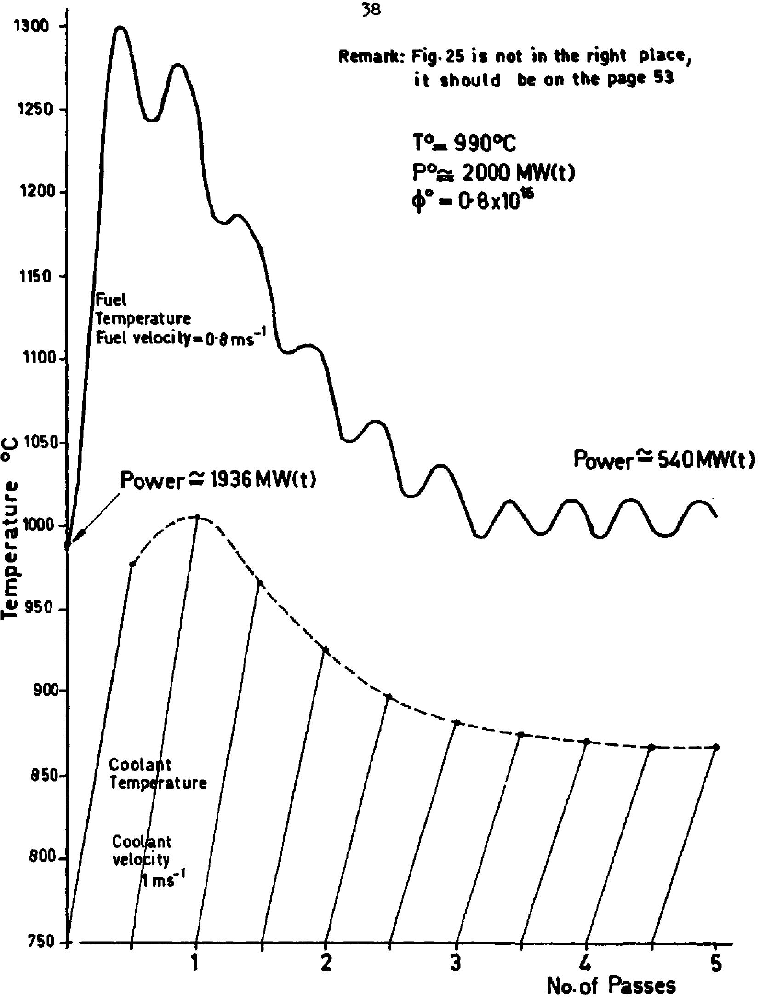

process of $\mathsf{UCl}_3\rightarrow \mathsf{UCl}_4$ , a reaction of the following type is possible

$$
\mathrm {U C l} _ {3 (\mathrm {s})} + 1 / 2 \mathrm {M o C l} _ {2 (\mathrm {s})} \longrightarrow \mathrm {U C l} _ {4 (\mathrm {s})} + 1 / 2 \mathrm {M o} _ {(\mathrm {m})}; \triangle G ^ {1 0 0 0} ^ {\circ_ {\mathrm {K}}} = 0
$$

The corrosion aggressivity of $\mathsf{UCl}_4$ is of course similar to that of $\mathsf{MoCl}_2$ .

# 7. Rep: cessing

Breeder reactors as we already know form part of a 'breeder system' which includes not only the power reactor but also the reprocessing plant.

The advantages of molten salt breeder reactors become particularly apparent when the reprocessing plant is under the same roof as the power reactor and when chemical separation processes take place in the high temperature molten salt media in a continuous cycle.

The separation of plutonium and/or uranium from the irradiated fuel by means of pyrochemical techniques could be carried out, for example, in the following way

Molten salt, primary phase Pu, FP (part of FP remains) Transport of Pu and part of FP.

Metallic phase (part of FP remains) Transport of Pu

Molten salt, secondary phase containing only Fu.

This is the so called 'metal transport' process (fig. 18)

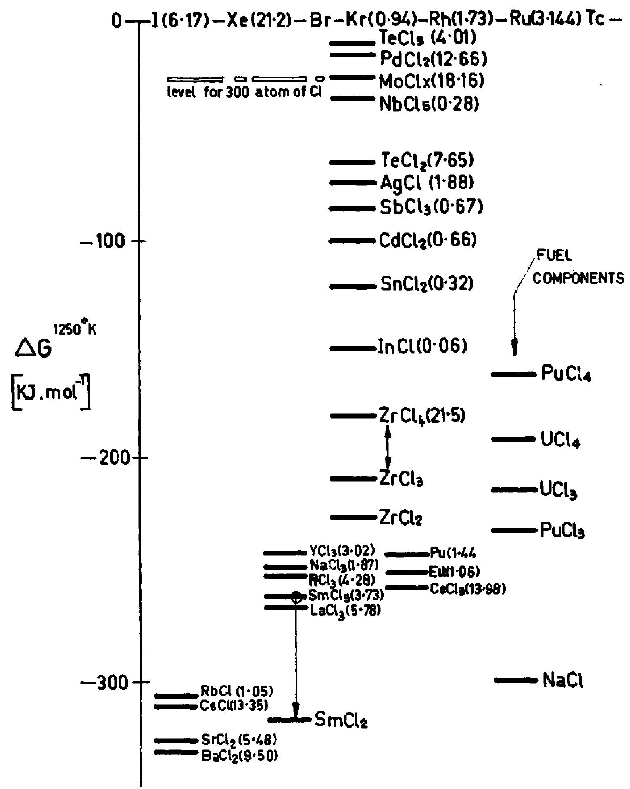  
Free Energy of formation for fission product chlorides [Yields shown in brackets] Fig.17

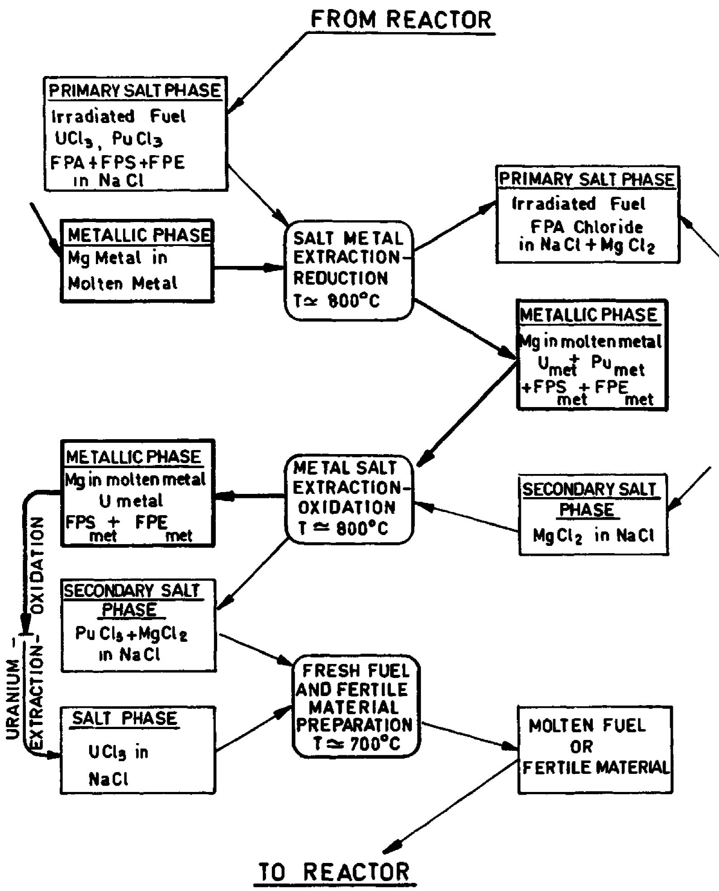

FPA - Alkali and Alkali earth fission products e.g. Cs, Ba, Sr.

FPS — Semi and noble metals and metal chlorides.

FPE — Noble metals in metallic states and noble gases.

From fig. 19 it can be seen that all fission products might be classified into 3 classes.

PIA : rission products of alkali, and alkali earth b.t also rare earth elements which have free enthalpy of chloride formation greater than those of $\mathsf{PuCl}_3$ .

FPS = fission products of seminoble metals with free enthalpy of formulations smaller than those of $\mathsf{F u C l}_{3}$ .

FPE = fission products existing in elementary form because of small free enthalpy of chloride formation or negative balance of chlorine.

The proposed schema of the separation processes utilizing metal transport is given in fig. 20

8. Aluminium trichloride as turbine working agent

One of the most important features of the proposed reactor is the relatively high total thermal efficiency of the power station.

Such a high thermal efficiency is possible only under two conditions:

- working agent at a higher temperature   
- certain required thermodynamic properties of the working agent must be met.

Among several possibilities—aluminium trichloride, a rather exotic working agent is proposed here.

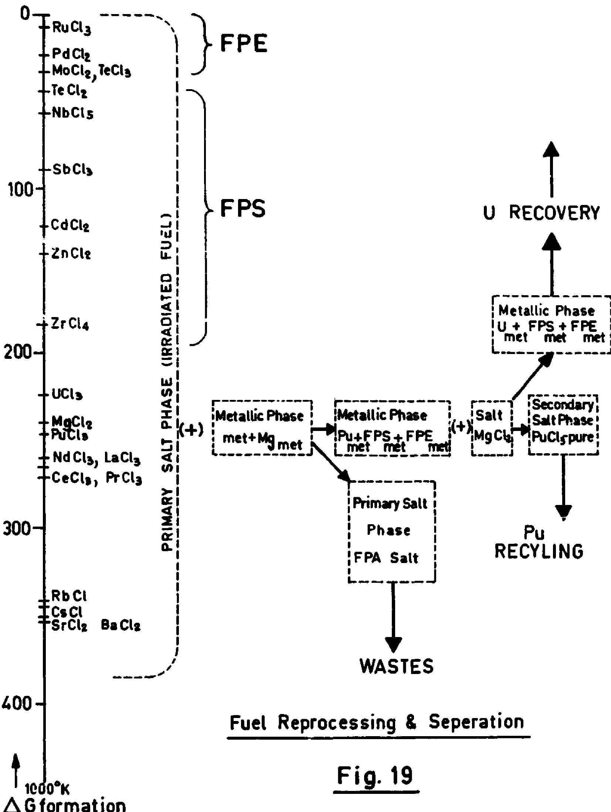

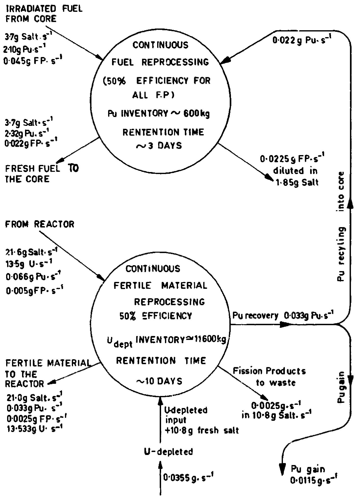  
FUEL REPROCESSING MATERIAL BALANCE   
Fig 20

The most important property of this substance is its spontaneous dimerisation at lower temperatures

$$
\begin{array}{l} A l C l _ {3} + A l C l _ {3} \quad \xleftarrow [ 1 0 0 0 ^ {\circ} K ]{5 0 0 ^ {\circ} K} A l _ {2} C l _ {6} + \Delta H \\ \Delta H = 1 2 5 k J / m o l \\ \end{array}
$$

This reaction results in a two fold decrease in volume but also release of some amount of heat energy.

The physico-chemical properties of aluminium trichloride are very well known (see Blander 1957, Krasin 1967). The phase diagram is given in fig. 21.

Physical and chemical properties of dissociating-gas systems $\mathrm{Al}_{2}\mathrm{Cl}_{6}$ and $\mathrm{N}_{2}\mathrm{O}_{4}$

Table 6   

<table><tr><td></td><td>Al2Cl6</td><td>N2O4</td></tr><tr><td>Molecular weight (g·mol-1)</td><td>266,7</td><td>92,02</td></tr><tr><td>Normal boiling point (°C)</td><td>193</td><td>21,5</td></tr><tr><td>Critical temperature (°C)</td><td>352,7</td><td>158,3</td></tr><tr><td>Critical pressure ( bar)</td><td>26</td><td>1033</td></tr><tr><td>Melting point (°C)</td><td>195</td><td>- 11</td></tr><tr><td></td><td>(at 2,46 bar)</td><td></td></tr></table>

<table><tr><td>Heat of evaporation(kJ·kg-1)</td><td>150</td><td>415</td></tr><tr><td>Heat of dimerisation(kJ·kg-1)</td><td>470</td><td>620</td></tr></table>

Type of reaction

<table><tr><td>Al2Cl6</td><td>N2O4</td></tr><tr><td>2ACl3</td><td>NO2</td></tr><tr><td></td><td>NO+O2</td></tr></table>

# Correction

From the point of view of corrosion the following regions can be distinguished, see Table 7.

<table><tr><td></td><td>Region F
(fuel in core)</td><td>Region B
(Blanket and
coolant)</td><td>Region A
(outside core)</td></tr><tr><td rowspan="5">Components</td><td>NaCl</td><td>NaCl</td><td>-----</td></tr><tr><td>PuCl3</td><td>PuCl3(little)</td><td>-----</td></tr><tr><td>no UCl3</td><td>UCl3</td><td>-----</td></tr><tr><td>FP</td><td>FP (little)</td><td>-----</td></tr><tr><td>-----</td><td>-----</td><td>A1Cl3</td></tr><tr><td>Temperature
gradient</td><td>965-998°C = 33°</td><td>750-793°C =73°</td><td>750-400°C = 350°</td></tr><tr><td>Neutron dose</td><td>very high</td><td>high</td><td>none</td></tr><tr><td>Gamma dose</td><td>very high</td><td>high</td><td>very small</td></tr><tr><td>Velocity of medium</td><td>2 m.s-1</td><td>9 m.s-1</td><td>40 m.s-1</td></tr><tr><td>State</td><td>liquid</td><td>liquid</td><td>gaseous/liquid</td></tr></table>

The selected structural material is molybdenum.

The main corrosion processes result from the following mechanisms (m = metallic phase, s = salt phase, Me = metallic component of irradiated fuel or coolant).

$$
\mathrm {M o} _ {\left(\mathrm {m}\right)} + \frac {2}{\mathrm {X}} \mathrm {M e C l} _ {\mathrm {x} (\mathrm {s})} \longrightarrow \mathrm {M o C l} _ {2 _ {\left(\mathrm {s}\right)}} + \frac {2}{\mathrm {X}} \mathrm {M e} _ {\left(\mathrm {m}\right)}
$$

For the reaction in region F of fresh fuel $\mathrm{PuCl}_3$ in NaCl, the most likely reaction is (1250 K)

$$
\begin{array}{l} \mathrm {M o} _ {(m)} + 2 / 3 \mathrm {P u C l} _ {3 (s)} \longrightarrow \mathrm {M o C l} _ {2} + 2 / 3 \mathrm {P u} _ {(m)} \\ \Delta G ^ {1 0 C 0} ^ {\mathrm {O K}} = + 4 5 0 \mathrm {k J / m o l} \mathrm {C l} \\ \end{array}
$$

The equilibrium constant of this reaction is so small and equals $10^{-17}$ that this reaction has no practical meaning.

In region B the most dangerous reaction is connected with uranium tetrachloride, the product of the oxidation of uranium trichlorides (chlorine from fission of $\mathrm{PuCl}_3$ ):

$$
\begin{array}{l} \mathrm {U C l} _ {\mathfrak {3} (\mathrm {s})} + 1 / 2 \mathrm {C l} _ {\mathfrak {2} (\mathrm {s})} \longrightarrow \mathrm {U C l} _ {\mathfrak {4} (\mathrm {s})} \\ 2 \mathrm {U C l} _ {4 (\mathrm {s})} + \mathrm {M o} (\mathrm {m}) \quad 2 \mathrm {U C l} _ {3 (\mathrm {s})} + \mathrm {M o C l} _ {2 (\mathrm {s})} \\ \end{array}
$$

The control of the UCl₃/UCl₄ ratio in the fertile-coolant material might be feasible due to the continuous reprocessing of this material together with the control of zirconium from the fission products oxidation state. In the region A that is in the external heat exchanger the main corrosion process results from the action of gaseous aluminium chloride (the secondary working agent). (see fig. 22)

$$
A l C l _ {3 (g)} + \frac {1}{X} M o _ {(m)} \longrightarrow \frac {1}{X} M o C l _ {2 x _ {(g)}} + A l C l _ {(g)}
$$

This reaction was discussed in previous publications (Blander 1957) but unfortunately not all the thermodynamic data is known. Molybdenum forms four compounds with chlorine: $\mathsf{MoCl}_2$ , $\mathsf{MoCl}_3$ , $\mathsf{MoCl}_4$ , $\mathsf{MoCl}_5$ (fig. 22). The stability of these chlorines is strongly influenced by the concentration of free chlorine and also by the temperature.

A more detailed calculation of metallic molybdenum corrosion in the aluminium trichloride is needed, see fig. A7. These calculations are very sensitive to the vapour pressure of chlorides (fig. 23). In connection with corrosion problems mention must also

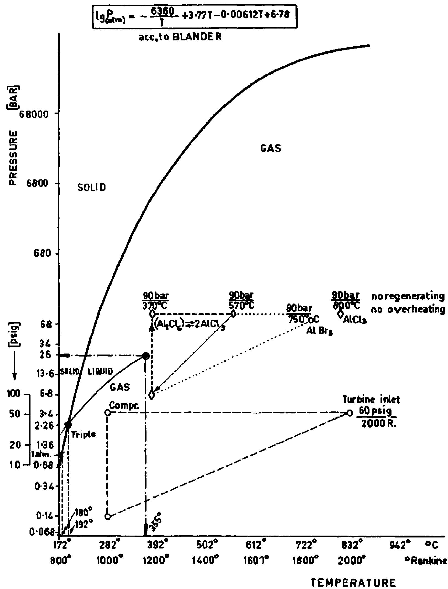

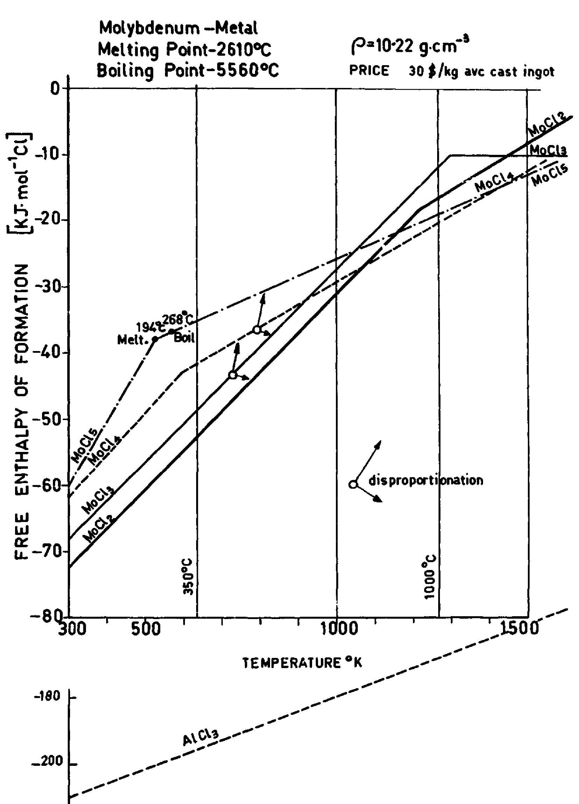  
49

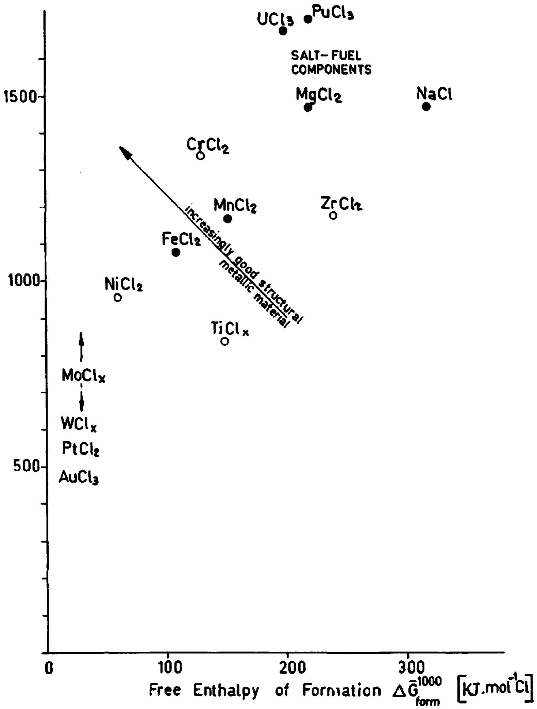

be made of the problem of the reaction between metal chlorides and oxygen and water.

These reactions (for oxidation state + 2) could be written in simplified form:

$$
\begin{array}{l l l} \mathrm {M e C l} _ {2} + \mathrm {H} _ {2} \mathrm {O} & \longrightarrow & \mathrm {M e O} + 2 \mathrm {H C l} \\ \mathrm {M e C l} _ {2} + \mathrm {O} _ {2} & \longrightarrow & \mathrm {M e O} + \mathrm {C l} _ {2} \end{array}
$$

The metal oxides are mostly insoluble in molten chlorides, which results in a serious disturbance of the fuel system. From this point of view the metallic elements could be divided into three classes: (see fig. 24)

- those which are stable against $\mathsf{H}_2\mathsf{O}$ and $\mathsf{O}_2$ , that is the chlorides are more stable than the oxides (eg. Na, Cs, Ba) and partially Ca.   
- those which are not stable against $\mathrm{H}_2\mathrm{O}$ and $\mathrm{O}_2$ and the resulting product is a mixture of chloride, oxychloride and oxide (eg. Pu, U but also Zr, Ti, Al, Fe, Cr, Mn, Mg - this is the most numerous group of metals).   
- those in which chlorides are converted to the most stable oxide in the presence of $\mathsf{H}_2\mathsf{O}$ or $\mathsf{O}_2$ (eg. Mo, W).

Metals of this class seem to be not so numerous as in the other two classes.

This property causes the rapid elimination of traces of water or oxygen in the molten salts of Pu and U chlorides. It is also well known that traces of $\mathrm{H}_2\mathrm{O}$ and $\mathrm{O}_2$ have a very big influence on corrosion rate.

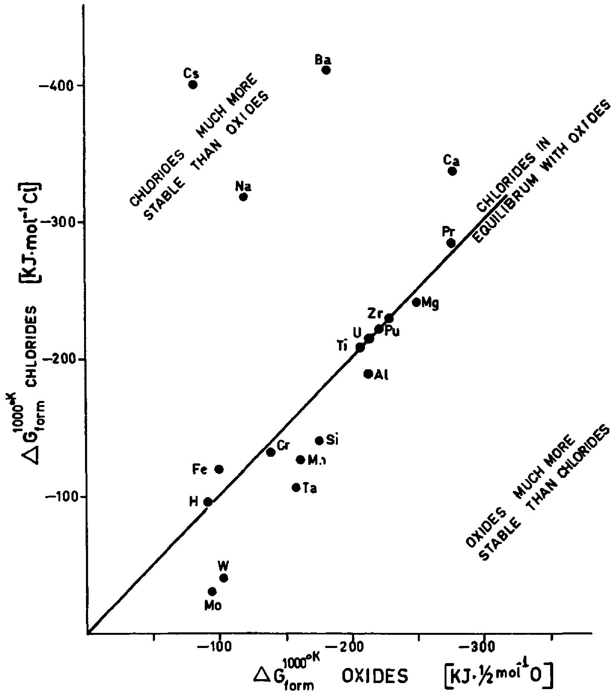  
Fig 24 CHLORIDES-OXIDES EQUILIBRUM DIAGRAM at $1000^{\circ}K$

The same property may be advantageous in establishing a thin coating of oxide on molybdenum surfaces. This suggestion must be proved thermodynamically and experimentally.

It must be stressed that the problem of removal of oxygen and water and other oxygen containing substances from the salts may be crucial for the corrosion problem as well as for long term fuel stability.

# 10. Safety Problems

The molten chlorides reactor seems to be a relatively safe system because of the following reasons

- an extremely high negative temperature coefficient of reactivity, because during a temperature rise part of the liquid fuel is pushed out of the core into a non-critical geometry buffer tank. The dumping of fuel in case of an incident is also possible in an extremely short time. (fig. 25) Fig. 25 is on the page 38.   
- in a more serious incident when the fuel temperature increases to $1500 - 1700^{\circ}\mathrm{C}$ (depending on external pressure) the fuel begins to boil. The vapour bubbles give rise to a new and unique, very high negative 'fuel void effect'   
- the leak of fuel to the coolant is probably not a serious problem because the coolant is continuously reprocessed.   
- the leak of coolant to the fuel for the same reason cannot cause large problems (provided the leak remains small).

A rather adverse property of such a molten fuel reactor is the necessity of initially heating the solidified fuel in a non critical geometry with external power. (eg. from the electrical grid).

This problem has been fully overcome in the case of the molten

# 11. Economics

It is not possible, when considering the economics of this type of reactor, at such an early stage to make realistic statements of costs and predictions of economic performance for a station in full operation. Here we merely indicate the main areas in which this type of reactor can be expected to have an economic advantage including some comments on the possible attractions offered by a molten fuel reactor in utilizing the abundant but low grade sources of uranium which may become available when economic or national requirements dictate the need.

The most important advantage of the molten chloride breeder power system (power reactor including reprocessing plant) is of course due the part it could play in reducing the costs of power production. The possible economic advantages are caused by the following features

- in relation to the 'classical' solid fuel fast breeder reactor, the molten chlorides fast breeder reactor system removes the need for the following operations: cooling of the irradiated fuel, transport, decladding, liquefaction, manufacture of solid fuel, cladding, fuel pin assembly, transport etc.   
- the amount of fuel outside the core is, in the molten chloride reactor only a few percent of the fuel core inventory. In the solid fuel reactor the out of core amount equals the fuel core inventory. The capital costs for the out of core fuel are of significance.   
- the doubling time for these reactors _s shorter than those for sodium cooled solid fuel reactors and, being equal to 7 years, gives a good doubling time.   
- the mean burn up in the molten fuel, continuously reprocessed could be a factor 3-5 lower than that for the solid fuel system.

- in a 'closed' system of power station and reprocessing plant the safeguards are much simpler and easier to apply.

In addition the molten chlorides reactor has further advantages:

- a higher mass specific power $(MW(t) / kgPu)$ than the solid fuel reactor which decreases the fuel inventory capital costs.   
- a high power density $(\mathsf{MW}(\mathsf{t}) / \mathsf{m}^3$ of core) than the solid fuel reactor, which may decrease the capital costs of core, blanket and shielding, perhaps in the future an increasingly important part of power production costs.   
- more attractive, from the point of view of future conditions when the costs of uranium recovery will probably increase and when independence from a foreign market may become an important factor.

This last point is here developed further as of being of particular relevance to the Swiss economy and national interests but which may become more and more relevant to the world uranium market in the future.

As with the classical fast breeder reactor, the molten chlorides reactor can be used for 'burning the rocks' (according to A.M. Weinberg), that is for utilization of the dispersed uranium present in granites in amounts of the order of 10 ppm (the mean value of uranium concentration in the entire earths crust is 4 ppm).

The continuous reprocessing of irradiated fuel and the relatively simple preparation of fresh fuel and fresh fertile material as suggested for the molten chlorides reactor seems to be ideally suited for 'rocks burning'.

Let as make some simple calculations:

$1 \, \text{m}^3$ of granite equals $2500 \, \text{kg}$ of minerals, and with a uranium content of $10 \, \text{ppm}$ we have $25 \, \text{g}$ of uranium per $1 \, \text{m}^3$ of granite.

As is known in the Swiss Alps in Piz-Giuv (Aar-Massif) the uranium content in the syenite equals 15 - 30 ppm (Prof. Hügi 1971) so in this case for 30 ppm.

1 m³ of syenite weighs: 2.5 x 10³ kg

2.5 x 10³ kg x 30 x 10⁻⁶ = 75 x 10⁻³ kg = 75 g Uranium.

In breeding

75gU-239 70gPu-239

for power production

70 g Pu x 1 Mw d x 10³ kw x 24 x 3.6 x 10³ s = 6 x 10⁹ KJ

in other words

$1\mathrm{m}^3$ of syenite is equivalent to $6\times 10^{9}\mathrm{KJ} = 6\mathrm{TJ}$ or $6\times 10^{-2}$ Joules.

It is interesting to compare this energy source with oil:

$1\mathrm{m}^3$ of petroleum product, with a specific weight $\mathrm{og}900\mathrm{kg / m}^3$ and heat of combustion $\sim 12000\mathrm{kCal / kg}$ gives:

900 kg x 12 x 10³ x 4.18 = 4.5 x 10⁷ kJ = 4.5 x 10¹⁰ Joules

that is $6 / 0.045 = 130$ times less than the energy content of $1 \, \text{m}^3$ of granite (syenite).

In terms of volumes, $1 \, \text{m}^3$ of petroleum product is equivalent to $7 \, \text{dm}^3$ of granite (syenite) (or a cube $19 \, \text{cm} \times 19 \, \text{xm} \times 19 \, \text{cm}$ ) and in addition $1 \, \text{m}^3$ of oil requires approx. $3000 \, \text{kg}$ of oxygen or $10^{1000} \, \text{m}^3$ air for combustion.

In the future output of the Swiss nuclear power industry will reach 10'000 MW(e).

For this amount of electrical energy approx. $10^{\circ}000 \, \text{kg}$ Pu must be burnt annually. In a steady state nuclear power industry this amount of plutonium could be obtained from $20^{\circ}000 \, \text{kg}$ of natural uranium (allowing for losses etc.). So for the Swiss nuclear industry it would be sufficient to recover the uranium from approximately 1 million cubic meters of granite annually - in other words the volume of a tunnel $30 \, \text{m} \times 10 \, \text{m} \times 3000 \, \text{m}$ or an open mine $200 \times 200 \times 20 \, \text{m}$ .

The cost of this rocks burning may be estimated as follows

The present price of natural uranium is 20 $\frac{\mathfrak{g}}{\mathfrak{kg}}$ U for the case where uranium is recovered from $0.1\%$ uranium ores.

In the future, when uranium is recovered from granites with only 0.001% (10 ppm) uranium the price of uranium may increase to 500 $\mathbb{B} / \mathbb{kg}$ that is 25 times.

Let us assume that the price of plutonium (currently and in the future) equals 8000 $\pmb{\beta} / \mathbf{kg}$ .

At the present time the proportion of uranium raw material costs appearing in this plutonium price is only

$$
\frac{20x2}{8000} = 0.5 \% \quad (2\mathrm{kg}\mathrm{U}\text{for} 1\mathrm{kg}\mathrm{Pu})
$$

In the future for the very expensive uranium from granites this part will equal

$$
\frac{500\times 2}{800} = 12.5\%
$$

Or in other words an increase in the cost of recovery of natural uranium by a factor of 25 will only raise the plutonium price from $8000\$/kg$ to $9000\$/kg$ .

The present cost of electrical energy with an optimistic figure of 4 mills/kWh(e) gives 1,1 mills for Pu per kWh(e) which at the higher price would give energy (electrical) costs of 4,27 mills/kWh(e) that is only $6.7\%$ more expensive than the current price.

Thus to summarize:

- The molten chlorides reactor is an attractive candidate for utilization of low grade ores such as from granite.   
- Even with the greatly increased cost of recovery of uranium from granite, the influence on electrical energy costs is small.   
- From a resource point of view, the energy content (per $\mathfrak{m}^3$ ) of granite is greatly superior to say fuel oil (130 times).   
The use of the abundant supplies of granit is abiously an attractive possibility from the point of view of the economy and interests of countries such as Switzerland.

12. Some other selected breeders, thermal and fast

For sake illustration a critical review concerning four reactors has been made.

<table><tr><td rowspan="3" colspan="2"></td><td colspan="2">Fuel</td></tr><tr><td>liquid</td><td>solid</td></tr><tr><td>(molten salt)</td><td>(oxide)</td></tr><tr><td rowspan="3">Type of reactor</td><td>thermal</td><td>molten fluorides breeder(Oak Ridge)</td><td></td></tr><tr><td rowspan="2">fast</td><td>molten chloride breeder(Argonne)</td><td rowspan="2">plutonium oxide breeder(Argonne)</td></tr><tr><td>molten chloride breeder(EIR)(this paper)</td></tr></table>

The main parameters of these reactors are given in the Table 8

Table 8 I   
Some selected breeder reactors   

<table><tr><td>Reactor type</td><td>Thermal reactor</td><td colspan="3">Fast</td></tr><tr><td>Fuel</td><td>Molten fluoride</td><td>Solid oxide</td><td>Molten plus</td><td></td></tr><tr><td>Laboratory</td><td>Oak Ridge N.L.</td><td>Argonne N.L.</td><td>Argonne National Laboratory</td><td></td></tr><tr><td>Reference year</td><td>1971</td><td>1970</td><td>(A)</td><td>1970</td></tr><tr><td>Cooling system</td><td>external to core</td><td>in the core</td><td>external to core</td><td>in the core</td></tr><tr><td>Coolant medium</td><td>fuel</td><td>sodium</td><td>fuel</td><td>sodium</td></tr><tr><td>Blanket material</td><td>Th-232 fluoride in the fuel</td><td>U-238 oxide in the fuel</td><td>U-238 chlo-ride in the fuel</td><td>U-238 chlo-ride in the fuel</td></tr><tr><td>Core volume (m3)</td><td>55,5</td><td>5,8</td><td>10</td><td>10</td></tr><tr><td>External fuel holding (m3)</td><td></td><td></td><td>15</td><td>15</td></tr><tr><td>Specific power MW(e) Kg fiss</td><td>0.66</td><td>0.26</td><td>0.132</td><td>0.132</td></tr><tr><td>Specific power MW(e) m3</td><td>18</td><td>170</td><td></td><td>270</td></tr><tr><td>Fuel composition mol%</td><td>3% 233UF3 in fluoride3</td><td>12% PuO2in UO2</td><td>30%(PuU1-xCl3)</td><td>50%(1-xCl3)</td></tr><tr><td>Fuel max. temp. (°C)</td><td>704</td><td>2800</td><td></td><td>690</td></tr><tr><td>Cladding material</td><td>graphite</td><td>steel</td><td>HastelloyF</td><td>HastelloyF</td></tr><tr><td>Fuel density kg/m3</td><td>3280 (at 704°)</td><td>11000</td><td>3000</td><td>3600</td></tr><tr><td>Coeff expan %C</td><td>6.7 x 10-4</td><td></td><td></td><td>3</td></tr></table>

Table_8_II  

<table><tr><td>Reactors</td><td>Thermal Molten Fluoride</td><td>Fast oxide</td><td>Homogen (A)</td></tr><tr><td>Specific heat(J/g.deg.) of fuel</td><td>1.357</td><td></td><td>0.84</td></tr><tr><td>Fuel velocity(m/s)</td><td>2.6 (fuel)</td><td>solid fuel</td><td>high</td></tr><tr><td>Coolant velocity(m/s)</td><td>no coolant</td><td>8.2 (sodium)</td><td>no coolant</td></tr><tr><td>Neutron flux(n/cm2s)</td><td>2.6 x 1014</td><td>1016</td><td></td></tr><tr><td>Fissile material in entire system (kg)</td><td>3000</td><td>3860</td><td>7500</td></tr><tr><td>Fertile material</td><td>Th fluoride</td><td>U-238 oxide</td><td>U-238 chloride</td></tr><tr><td>Breeding ratio (total)</td><td>1.06</td><td>1.27</td><td>1.48</td></tr><tr><td>Doubling time (years)</td><td>22</td><td>13</td><td>9 (estimated)</td></tr></table>

# Appendix

A1. Physical and chemical properties of salt components

The search for fuel, fertile material and for coolant is limited by following criteria:

- thermodynamic and kinetic stability of plutonium and uranium compounds   
- melting point not higher than $700^{\circ}\mathrm{C}$ , in pure state or in dissolved state (fig. A1, A2)   
- boiling point not lower than $1500 - 1600^{\circ}C$ both for pure and dissolved states (low vapour pressure) (fig. A3)   
- high solubility, at least 15 mol % of plutonium and 70 mol % uranium compounds   
- small neutron capture cross-section for fast neutrons   
- small elastic scattering for fast neutrons   
- small inelastic scattering   
- good heat-transport properties; specific heat capacity, (low viscosity, high conductivity etc.) (fig. A4)   
- good corrosion properties (if possible) (fig. A5)   
- sufficient technological or laboratory experience   
- relatively low price.

All these manifold criteria are sufficient well. fulfilled by following compunds:

$\mathsf{PuCl}_3$ UCl, NaCl and as coolert AlCl3.

Table I   
Properties of fuel components   

<table><tr><td></td><td>PuCl3</td><td>UC13</td><td>NaCl</td></tr><tr><td>Molecular weight</td><td>348.3</td><td>347</td><td>58.4</td></tr><tr><td>Postulated molar ratio-fuel</td><td>0.15</td><td>---</td><td>0.20</td></tr><tr><td>- blanket material</td><td>---</td><td>0.65</td><td>0.20</td></tr><tr><td>Density solid state(kg.m-3)</td><td>5.7</td><td>5.57</td><td>2.14</td></tr><tr><td>Melting point(℃)</td><td>767</td><td>835</td><td>800</td></tr><tr><td>Boiling point at atmospheric pressure(℃)</td><td>1730</td><td>1720</td><td>1465</td></tr><tr><td>Melting enthalpy(KJ.mol-1)</td><td>64.0</td><td>64</td><td>28</td></tr><tr><td>Boiling enthalpy(KJ.mol-1)</td><td>240</td><td>300</td><td>188</td></tr><tr><td>Temp coeff. of density (deg-3)</td><td>0.0010</td><td>0.0010</td><td>0.0005</td></tr><tr><td>Specific heat(J.mol-1deg-1)</td><td>140</td><td>140</td><td>77</td></tr><tr><td>Thermal conductivity (W.cm-1deg-1)</td><td></td><td></td><td></td></tr><tr><td rowspan="2">Viscosity (g.cm-1s-1)</td><td>Fuel</td><td>Coolant</td><td rowspan="2">0.0143</td></tr><tr><td>0.025</td><td>0.045</td></tr><tr><td>Temp coeff. of viscosity</td><td>0.0005</td><td>0.0005</td><td></td></tr><tr><td>Free enthalpy of formation at 1000K(KJ.mol-1)</td><td>-750</td><td>-675</td><td>-320</td></tr></table>

Other chlorides of plutonium, uranium and alumin

Table A2   

<table><tr><td rowspan="2"></td><td>Plutonium</td><td colspan="3">Uranium</td></tr><tr><td>PuCl4</td><td>UCl4</td><td>UCl5</td><td>UCl6</td></tr><tr><td>Melting point°C</td><td rowspan="2">All efforts to produce pure solid PuCl4have been unsuccessful; only in gaseous state with free chlorine, or in molten salt solution or in aqueous solution as complexes</td><td>590</td><td>(287)</td><td>178</td></tr><tr><td>Boiling point°C</td><td>792</td><td>(417)</td><td>(372)</td></tr><tr><td>Free enthalpy of formation at 1000°K (kJ/mol) at 2000°K</td><td>4 x -180 = -760</td><td>4 x -182 = -768</td><td>5 x -165 = -825</td><td>6 x -180 = -760</td></tr></table>

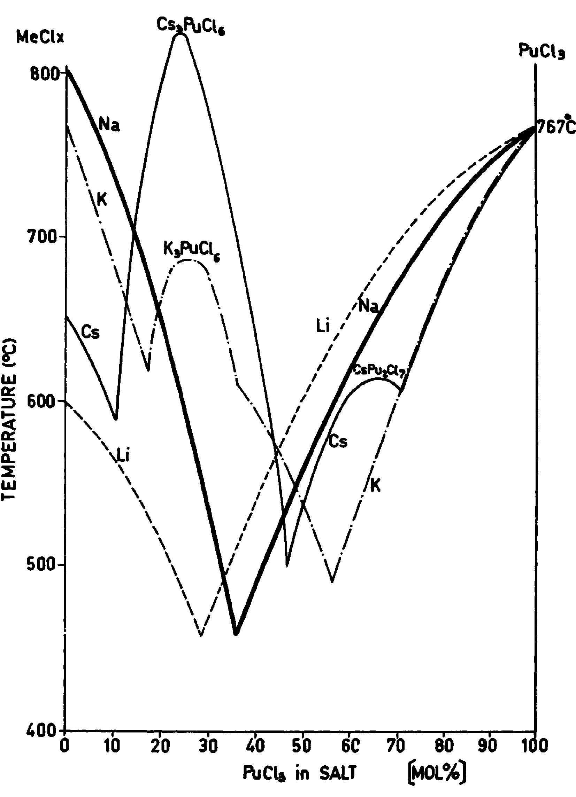  
65

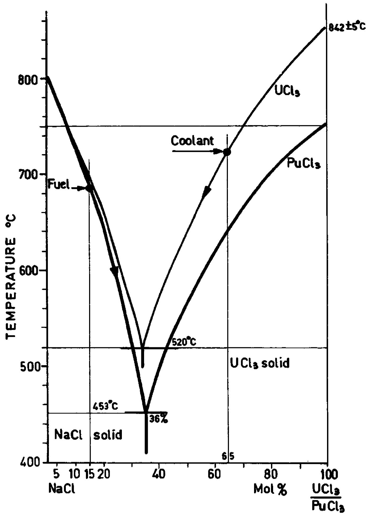  
Fig A2 PHASE DIAGRAM for Pu Cl₃/NaCl and UCl₃/NaCl

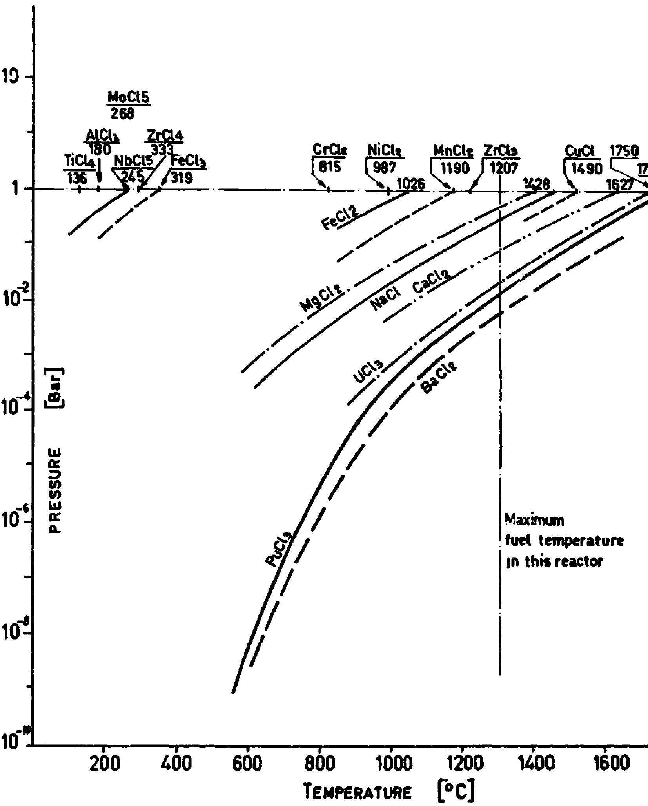  
VAPOUR PRESSURE - METAL CHLORIDES

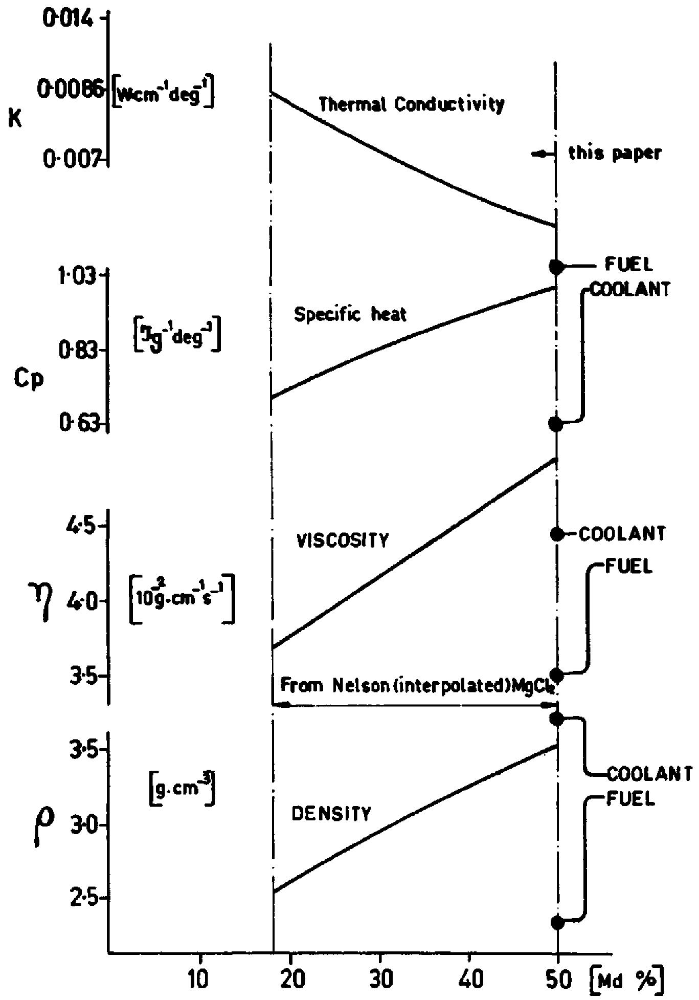  
Fig. A4

Salts properties at $650^{\circ}C$

v. Chemical composition

Data derived from Nelson

for UCl3/PuCl/MgCl2/NaCl

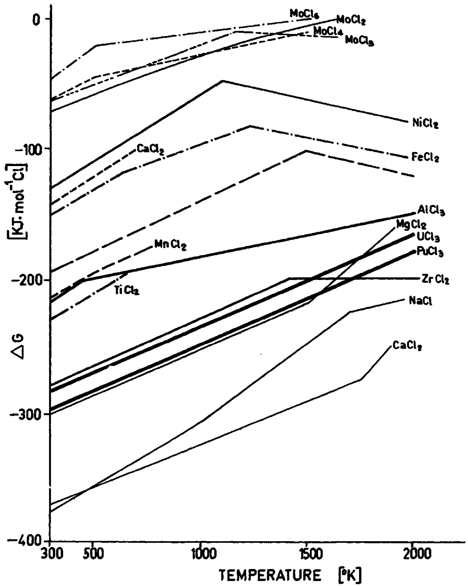  
69   
FREE ENTHALPY OF FORMATION   
CHLORIDES

# Acknowledgement

The authors would like to acknowledge the valuable assistance given by R. Stratton in the preparation of the text and O. Koller in the preparation of the figures.

# Authors' Note

During the time in which this report was prepared and printed, one of us (J.L.) has made more sophisticated neutronics calculations which result in the following

- for the ratio Fertile/Fissile material given in this paper the critical buckling was overestimated.   
- An improved figure for the core results when the ratio Fertile/Fissile material is reduced from 6.60 to 5.65. This is possible by a slight change in the tube/cell ratio and increase in the coolant velocity.

Recent data shows that the total cross section for chlorine used here was overestimated by a factor 2.

The results of the revised neutronics calculations will be given in a further paper.

# References

<table><tr><td>Alexander L.G.</td><td>Molten Salt Reactors
Proceed. Breeding large Fast Reactors
ANL-6792 (1963)</td></tr><tr><td>Blander M., Epel L.G.,</td><td>Aluminium chloride as a thermodynamic</td></tr><tr><td>Fraas A.P., Newton R.F.</td><td>working fluid and heat transfer medium.</td></tr><tr><td></td><td>ORNL-2677, Oak Ridge 1959</td></tr></table>

<table><tr><td>Burris L., Dillon I.G.</td><td>Estimation of fission product spectra
ANL-5742 (1957)</td></tr></table>

<table><tr><td>Bulmer J.J.</td><td>Fused salt fast breeder
CF-56-8-204, Oak Ridge 1956</td></tr></table>

<table><tr><td>Chasanov M.G.</td><td>Fission-products effects in molten chloride fast reactor fuels
Nucl. Sa. Eng. 23, 189 (1965)</td></tr></table>

<table><tr><td>Fraas A.P.</td><td>Heat Exchanger Design
J. Wiley New York 1965</td></tr></table>

<table><tr><td>Gat U.</td><td>Mosel, Wärmeübergang
Jul-296-RG, Julich 1965</td></tr></table>

<table><tr><td>Harder B.R., Long G., 
Stanaway W.P.</td><td>Comptability and reprocessing in use of 
molten UCl3-alcalichlorides mixture as 
reactor fuel</td></tr><tr><td></td><td>In &quot;Symp. Reprocess Nucl. Fuels&quot;</td></tr><tr><td></td><td>Ed. P. Chiotti</td></tr><tr><td></td><td>USAEC CONF-690801 (1969)</td></tr></table>

Kasten R.R.

1000 MW(e) Molten salt breeder ORNL-3996 (1966)

Krasin A.K., Nesterenko W.B.

Thermodynamic and transport properties of chemical reacting gaseous systems in Russian

"Nauka u Technika" 1967

Krasin A.K., Nesterenko V.B.

Dissociating gases: a new class of cool- lants and working substances for large power plants

Atom. Energy Review 9, 177 (1971)

Lane J.A.

Test-reactors prospectives

Reactor and Fuel Technol. 12, 1, Winter 1968/69

Nelson P.A. et al.

Fuel properties and nuclear performance of fast reactors fueled with molten chlorides

Nuclear Applications, Vol 3, 540 (1967)

Taube M.

Fused plutonium and uranium chlorides as nuclear fuel for fast breeder reactors Symp. Power

React. Experiment. International Atomic Energy Agency, Symp. Vienna 1961 (SM-21/19)

Taube Met al.

New boiling salt fast breeder reactor concepts.

Nucl. Eng. and Design 5, 109, 1967

1000 MW(e) liquid metal fast breeder

reactor

A1-AEC-12792 (1970)

Review of molten salt reactor technology

Nucl. Appl. and Technol. 8, 2 (1970)