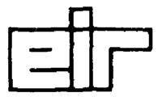
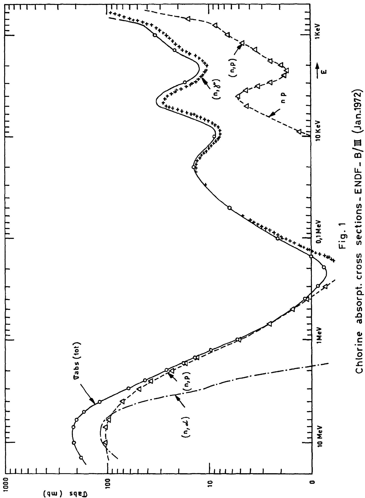
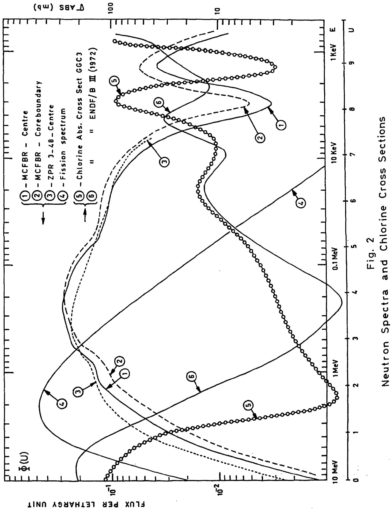
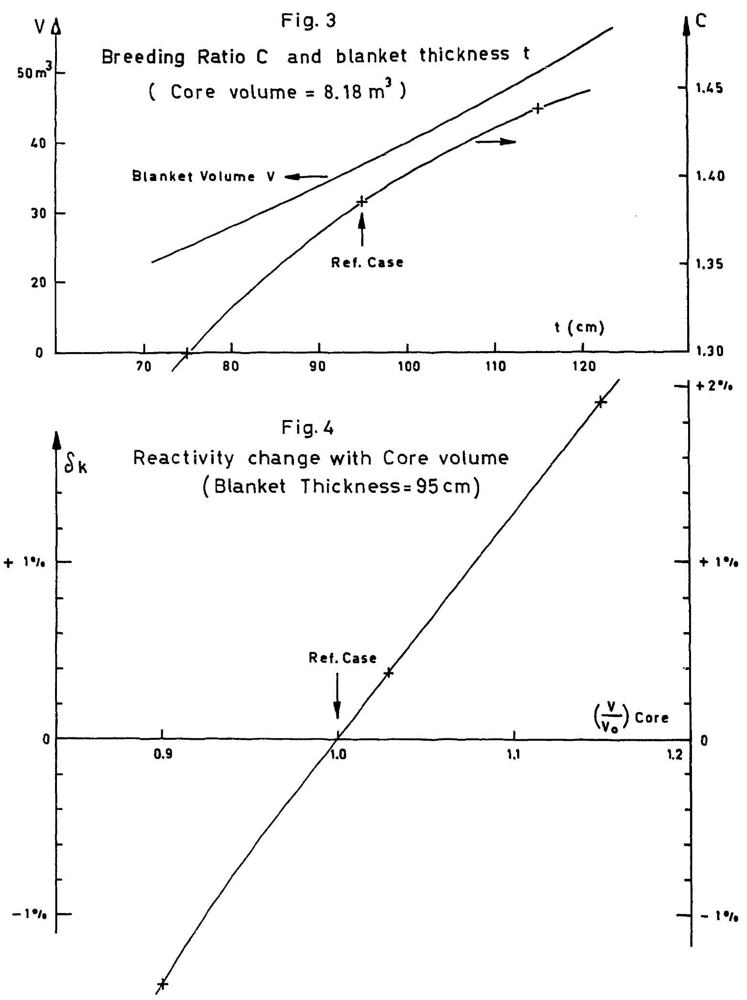
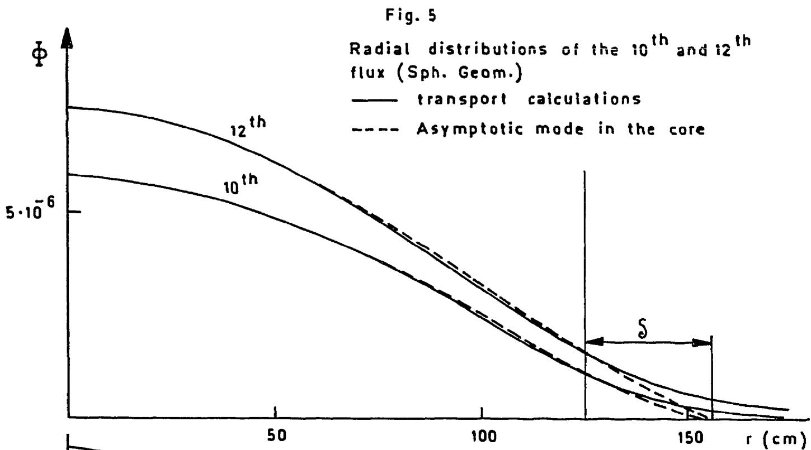
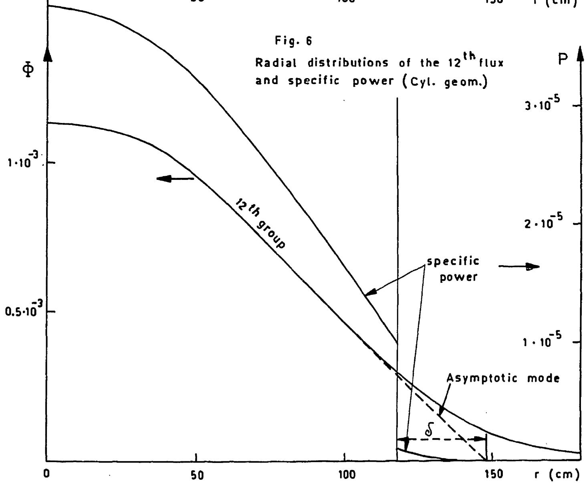

Eidg. Institut für Reaktorforschung Warenlingen Schweiz

# MOLTEN CHLORIDES FAST BREEDER REACTOR Reactor Physics Calculations

J. Ligou

Würenlingen, November 1972

MOLTEN CHLORIDES FAST BREEDER REACTOR

Reactor Physics Calculations

J. Ligou

1. Introduction 3   
2. Definition of the Proposed Reactor 4   
3. Cross-sections and Calculational Methods 6   
4. Reference Calculations for Spherical Geometry 9   
5. Parasitic Absorbtions 13

5.1. Chlorine 13   
5.2.Molybdenum 14   
5.3.Vessel 15

6. Void and Temperature Coefficients 15   
7. Buckling Search and Blanket Savings 18   
8. Transport Calculations in Cylindrical Geometry - 19   
9. Fast Flux Test Facility Using Molten Chlorides 24

10. Conclusions 27

Acknowledgement 29

References 29

Appendix 1 31

Appendix 2 32

Appendix 3 34

Acknowledgement 29   
References 29   
Appendix 1 31   
Appendix 2 32   
Appendix 3 34

# 1. Introduction

In an earlier report (1) the possibilities of a Molten Chlorides Fast Breeder Reactor (MCFBR) were analysed, based on thermohydraulic and neutronic studies. Although reactor physics calculations have been made from the beginning when the reactor characteristics were not frozen they can only be fixed later during the main phases of the studies when thermohydraulic, chemical and economic aspects are taken into account. The sensitivity of fast reactor performance to the neutron spectrum is well known and the spectrum depends strongly on the core composition i.e. on the results of thermohydraulic, mechanical and optimization studies. This feedback has therefore led to new reactor physics calculations.

In addition the earlier studies used a rather old cross-section set and omitted dilution factors. The new calculations are more sophisticated based on a more recent library with detailed information on

- chloride cross-sections and fine spectrum   
- neutron balance and breeding ratios   
- void and temperature reactivity coefficients   
- specific power distributions etc.

As usual (2) most calculations are made for a spherical geometry; this approximation is very good, only the critical mass and the radial distributions of specific power have been recalculated for the correct geometry.

As was expected, the conclusions of ref. 1 remain valid, only the coolant tube diameters have to be adjusted

slightly together with an admissible increase in coolant velocity. All core temperatures remain unchanged in the core and therefore the atomic densities.

A final section gives some results concerning HIGH FLUX FAST TEST FACILITY using molten chlorides as proposed in (3).

# 2. Definition of the Proposed Reactor

The coolant, forming the fertile material is pumped through the reactor through a lattice of tubes, and the fuel material circulates between these tubes in a forced convection circuit. The reference characteristics of the core cell are based on a tube pitch of 1.38 cm (l):

Fuel - area $V_{f} = 0.7354 \, \text{cm}^{2}$

- volumetric fraction 38.6 %   
- mean temperature 12570 K   
- mean density 2.344   
- molecular composition $16 \% \mathrm{PuCl}_{3}, 84 \% \mathrm{NaCl}$

Coolant - area $V_{c} = 1.05683 \, \text{cm}^{2}$

(inner diameter $2a = 1.16$ cm)

- volumetric fraction 55.5 %   
- mean temperature 10420KK   
- mean density 4.010   
- molecular composition $65 \% \mathrm{UCl}_{3}, 35 \% \mathrm{NaCl}$

Tubes - area 0.11215 cm² (thickness 0.3 mm)

- volumetric fraction 5.9%   
-density 10   
weight composition $20\% \text{Mo}, 80\% \text{Fe}$

Only the tube diameter has been changed (1.16 cm instead of 1.20 cm) which has no effect on the temperature, density etc. provided a new coolant velocity is chosen accordingly (12 m/s instead of 9 m/s (4)). The composition of the structural material was also changed (20 % Mo instead of 80 %) because the reactivity cost of the tubes was too high.

Finally the core atomic densities are $(\mathrm{A} / \mathrm{cm}^{3} \cdot 10^{24})$ :

<table><tr><td>Pu239</td><td>6.6796·10-4</td></tr><tr><td>Pu240</td><td>1.6699·10-4</td></tr><tr><td>U238</td><td>3.5629·10-3</td></tr><tr><td>Cl</td><td>1.9495·10-2</td></tr><tr><td>Na</td><td>6.3017·10-3</td></tr><tr><td>Mo</td><td>7.386·10-4</td></tr><tr><td>Fe</td><td>5.078·10-3</td></tr></table>

which gives 5.584 for the Fertile/Fissile ratio for materials in the core.

It is assumed in this table that the isotopic composition of the plutonium is

<table><tr><td>80 % (Pu239 + Pu241)</td></tr><tr><td>20 % Pu240</td></tr></table>

and the nuclear properties of Pu239 and Pu241 are the same. This composition is somewhat arbitrary and fuel cycle calculations should really be carried out. These calculations are too long for the preliminary studies laid down here. Nevertheless the composition chosen is very similar to that of a solid fuel fast reactor.

For the blanket the coolant characteristics (composition,

density) adopted give:

U238 6.4203·10-3

c1 2.2718·10

Na 3.457·10-3

The natural isotopic composition is assumed for the Chlorine. The dimensions and number of coolant tubes are fixed by the critical mass calculations.

# 3. Cross-sections and Calculational Methods

Usually the number of energy groups required for a good definition of neutron spectrum is at least 12 for fast critical assembly studies and 22 can be considered desirable (5). Therefore, a 22 group cross-section set has been prepared; the code GGC3 (6) which allows 99 group calculations for a rather simple geometry has been used for this condensation. The cross-sections were produced separately for core and blanket and the scattering anisotropy was limited to P1 which is sufficient for this reactor type. Most of the GGC3 library data were evaluated by GGA before 1967 but some are more recent:

- Iron: Evaluated from ENDF/BI data (Feb. 1968)   
- Molybdenum: Evaluated from isotopes of ENDF/B data (July 1968)   
-Plutonium 239: Evaluated from KFK 750 Resonance Nuclide (Feb.1969)

New data concerning Chlorine absorption cross-sections are now available at EIR (fig. 1); they are obtained from ENDF/B-III (Jan. 1972) which is the best nuclear library at present. Unfortunately this information came too late to be used for the transport calculations. Fig. 2 (curves 5 and 6) shows that the GGC3 values were underestimated above 0.6 MeV and overestimated between 10 keV and 0.6 MeV. The effect of this on the reactivity is not great (Sect.5). Taking also the Molybdenum cross-section from ENDF/B-III one can see that the GGC3 values are too high (experiments made with Molybdenum control rods in fast critical assemblies could not be reproduced with ENDF/B-I which makes a new evaluation of data necessary).

Fission product data are from (7). The absorption cross-sections for resonant nuclides are obviously shielded. The NORDHEIM theory (8) is included in the GGC3 code, it requires some special data as shown in table 1.

Table 1   

<table><tr><td>Resonant Nuclide R</td><td>NR(1024)</td><td>TOK</td><td>aR</td><td>CR</td><td>Rσm.1</td><td>σR2</td><td>Rσm</td></tr><tr><td>U238 (coolant)</td><td>6.42·10-3</td><td>1042</td><td>0.58</td><td>0.925</td><td>2.15</td><td>7.10</td><td>20.3</td></tr><tr><td>Pu239 (fuel)</td><td>1.725·10-3</td><td>1257</td><td>0.40</td><td>0.83</td><td>26.3</td><td>23.0</td><td>178.3</td></tr><tr><td>Pu240 (fuel)</td><td>4.32·10-4</td><td>1257</td><td>0.40</td><td>0.83</td><td>105.0</td><td>111.7</td><td>731.7</td></tr></table>

where $\mathbf{N}_{\mathbb{R}}$ is the lumped nuclear density of absorber R.

The mean chord of the lump $2\overline{a_{R}}$ is given by $\frac{4V_{R}}{2\pi a}$ where $V_{R}$ is the coolant or fuel area and $2a$ the coolant tube dia. For the coolant one has obviously $\overline{a_{R}} = a$ and for the fuel $\overline{a_{R}} = \frac{V_{fuel}}{\pi a}$ .

The Dancoff coefficient is calculated with a simple formula (9)

$$
c _ {\text {c o o l}} \simeq 1 - \frac {\sum_ {\text {f u e l}}}{\sum_ {\text {f u e l}} + \frac {1}{2 \bar {a} _ {\text {f u e l}}}}
$$

$$
\text {w i t h} \Sigma_ {\text {f u e l}} = 0. 1 0 \mathrm {c m} ^ {- 1}
$$

(fuel total cross-section for the resonance energy of U).

$$
c _ {f u e l} \stackrel {\sim} {=} 1 - \frac {\sum_ {c o o l}}{\sum_ {c o o l} + \frac {1}{2 a}}
$$

$$
\text {w i t h} \Sigma_ {\text {c o o l}} = 0. 1 8 \mathrm {c m} ^ {- 1}
$$

(coolant total cross-section for the resonance energy of Pu).

The cross-sections of the two "inner moderators" (6) per resonant atom om1 and om2 are defined in the following way. For U238 the diluents are Na and Cl; for Pu239 - Na and (Cl+Pu240), for Pu240 - Na and (Cl+Pu239).

Finally the total diluent cross-section $\sigma_{\mathfrak{m}}^{\mathbb{R}}$ is written.

$$
\sigma \mathrm {m} ^ {\mathrm {R}} = \sigma_ {\mathrm {m} 1} ^ {\mathrm {R}} + \sigma_ {\mathrm {m} 2} ^ {\mathrm {R}} + \sigma_ {\mathrm {e}} ^ {\mathrm {R}}
$$

where the "geometrical cross-section" $\sigma_{\mathrm{e}}^{\mathbb{R}}$ is given by (9),

$$
\sigma_ {e} ^ {R} = \frac {1}{2 \bar {a} _ {R} N _ {R}} \cdot \frac {\alpha (1 - C _ {R})}{1 + (\alpha - 1) C _ {R}} \text {w i t h} \alpha = 1. 3 5
$$

It is not necessary to determine the parameters of Table 1 to a high accuracy because the Doppler coefficients are of less importance in this reactor compared with thermal expansion effects (Sect.6).

The GGC3 is currently in use for GCFR studies and a good agreement with experimental results has been obtained using the ZPR-3-48 assembly which is representative of an LMFBR (10).

All whole reactor calculations have been made with the one-dimensional transport code SHADOK, using the 22 group cross-section set in spherical and cylindrical geometry (10). Comparison with the more usual SN methods have proved the reliability of this code. The transport methods chosen were aimed at getting a better accuracy for some reactivity coefficients. For the criticality calculations a more simple approach such as diffusion theory might have been sufficient.

# 4. Reference Calculations for Spherical Geometry

The 22 group transport calculation gives $125\mathrm{cm}$ ( $8.18\mathrm{m}^3$ ) for the critical radius of the core with a blanket thickness of $95\mathrm{cm}$ ( $36.42\mathrm{m}^3$ ). The detailed neutron balance is given below in Table II.

Table II: Neutron Balance % (MCFBR)   

<table><tr><td>Region</td><td colspan="3">Absorption</td><td>Leakage</td><td>Production</td></tr><tr><td>U238</td><td>25.50</td><td>{n,γ) 22.51 (n,f) 2.99</td><td></td><td></td><td>U238 8.23</td></tr><tr><td>Pu239</td><td>34.56</td><td>{n,γ) 5.58 (n,f) 28.98</td><td></td><td></td><td>Pu239 85.55</td></tr><tr><td>Pu240</td><td>3.78</td><td>{n,γ) 2.24 (n,f) 1.54</td><td></td><td></td><td>Pu240 4.72</td></tr><tr><td>Na</td><td>0.26</td><td></td><td></td><td></td><td>-</td></tr><tr><td>Cl</td><td>3.16</td><td>{fuel cool 1.10 2.06</td><td></td><td></td><td>-</td></tr><tr><td>Fe</td><td>1.30</td><td></td><td></td><td></td><td>-</td></tr><tr><td>Mo</td><td>2.04</td><td></td><td></td><td></td><td>-</td></tr><tr><td>F.P.</td><td>0.50</td><td></td><td></td><td></td><td>-</td></tr><tr><td>Total</td><td colspan="3">71.10</td><td>27.40</td><td>98.50</td></tr><tr><td rowspan="3">Blanket</td><td>U238 23.70</td><td>{n,γ) 23.15 (n,f) 0.55</td><td></td><td></td><td>U238 1.50</td></tr><tr><td>Na 0.08</td><td></td><td></td><td></td><td>-</td></tr><tr><td>Cl 2.22</td><td></td><td></td><td></td><td>-</td></tr><tr><td>Total</td><td colspan="3">26.00</td><td>2.9</td><td>1.50</td></tr></table>

The relative fluxes in each group are given in Appendix 1 for core centre and core boundary. The corresponding one group cross-sections are given in Appendix 2. In figure 2 the neutron spectra (flux per lethargy unit) are compared to that of the fast critical facility ZPR-3-48. This last spectrum is slightly harder but the spectrum of the MCFBR compares favourably with that of a power LMFBR.

From Table II one can deduce the following parameters

$$
\begin{array}{l} k _ {\infty} = 1. 3 8 5 0 \\ \text {B r e e d i n g r a t i o} \quad \left\{ \begin{array}{l l} C _ {\text {c o r e}} & = 0. 7 1 6 \\ C _ {\text {b l a n k e t}} & = 0. 6 7 0 \\ C _ {\text {t o t a l}} & = 1. 3 8 6 \end{array} \right. \\ \end{array}
$$

For the given core (125 cm radius) the blanket thickness was varied between 75 cm and 115 cm. Fig. 3 shows the variation of breeding ratios obtained from the new transport calculations. The reactivity and the core breeding ratio remain practically constant in this range making the adjustment of core volume unnecessary. Above 100 cm improvement of the breeding ratio by increasing blanket thickness gives a poor return. For example to increase the breeding ratio from 1.40 to 1.45 requires a thickness increase of 20 cm or a blanket volume increase of 32 %.

On the other hand, it is clear that the reactivity depends on the core radius. Fig. 4 shows the reactivity variation with core volume increase. Such a curve is very useful when it is required to translate the cost in reactivity of a supplementary parasitic absorption into an increase in core volume (or Plutonium inventory). The transport calculations

which gave figure 4 have not provided the corresponding variation of breeding ratio, rather they have been calculated from the information in Table II (assuming small core volume variations $< 10\%$ and no important changes in spectra). This gives

(1) $c_{\text{total}} \approx 1.386 - 2.45 \delta k$ (breeding in core unchanged).

By the same method the effect of a modification of core composition can be evaluated. The only way of doing that without changing the properties of coolant and fuel is to vary the coolant tube diameter. The reactivity is very sensitive to this parameter. If $\varepsilon$ and $\eta$ are respectively the relative increases of coolant and fuel volume for a constant pitch one has (§ 2)

$$
n = - 1. 4 4 \varepsilon
$$

From Table II

$$
k \quad \approx \quad \frac {1 + 8 . 2 3 \cdot 1 0 ^ {- 2} \varepsilon + 0 . 9 0 . 2 7 \eta}{1 + 0 . 2 7 5 6 \varepsilon + 0 . 3 9 4 4 \eta}
$$

which gives

(2) $\delta k \stackrel{\sim}{=} -0.924 \varepsilon$

$$
\text {o r} \quad \eta = 1. 5 6 \delta k
$$

The corresponding behaviour of the breeding ratios are

(3) $\left\{ \begin{array}{lll}c_{core} & \simeq & 0.716 - 1.72\delta k\\ c_{blanket} & \simeq & 0.670 - 1.05\delta k\\ c_{tot} & \simeq & 1.386 - 2.77\delta k \end{array} \right.$

Compared to (1) it can be seen that the penalty on the total breeding ratio for the same $\delta k$ is only slightly greater while the penalty on the increase of Plutonium inventory is five times less (Eq. 2 and Fig. 4). Therefore, a reduction in the diameter of coolant tubes is better than an increase of core diameter, provided of course that an increase in coolant velocity is admissible. This last assumption is implicit in these calculations since the coolant density was kept constant.

# 5. Parasitic Absorptions

# 5.1. Chlorine

In the whole system the Chlorine absorption represents $5.38\%$ . We have seen in Sect.3 that the GGC3 values are different from the more up to date ones (ENDF/B-III). On the basis of these new cross-sections given in fig. II (curve 6), and assuming that the reference spectrum is unchanged, a computation of the one group cross-sections gives $8.64\mathrm{mb}$ instead of 6.38 in the core and 9.11 mb instead of 8.83 mb in the blanket. In this last region the spectrum is softer and the increase of cross-sections in the high energy range $(E > 0.6\mathrm{MeV})$ is almost compensated for by the decrease at the lower energies $(10\mathrm{keV} - 0.6\mathrm{MeV})$ .

The total absorption by Chlorine for the whole system is $6.57\%$ instead of $5.38\%$ giving a loss of reactivity of $1.2\%$ . This loss could be replaced by a $1.9\%$ increase in Pu inventory (see Sect.4 Eq. 2) if a very small decrease $(0.65\%)$

of the coolant tube diameter is accepted; otherwise by changing only the core radius a greater increase of Pu inventory (10 %) is required (Fig. 4).

All these modifications lead to a reduction of the breeding ratio, 1.353 instead of 1.386 but an increase of the blanket thickness could compensate for this loss (Fig. 3).

Even taking into account this latest data the problem of parasitic absorption of the Chlorine is not dramatic so there appears to be no need to enrich the Chlorine (C137), which is consistent with the conclusions of Nelson (2). Figure 2 clearly shows the importance of spectrum shape since the peak of the spectrum corresponds to the Chlorine cross-section minimum (65 % of neutrons are in an energy range where $\sigma_{\mathrm{Cl}} \stackrel{<}{=} 5 \mathrm{mb}$ ). This fact was not perhaps recognised 15 years ago when fine spectrum calculations were not possible, it would perhaps explain the pessimistic conclusions of several eminent physicists (11).

# 5.2. Molybdenum

For the chosen alloy (20 % Mo) the reactivity cost 2 % (see Table II) is quite acceptable. However, the cost could rapidly become prohibitive if the volume of the structural material and/or the Molybdenum content should increase due to technological reasons. In the context of detailed studies this point may well be more important than the definition of the proper Chlorine cross-sections, although it does seem that the Molybdenum cross-sections taken from GGC3 were overestimated.

# 5.3. Vessel

In the previous calculations no core vessel was allowed for at the core/blanket boundary but all the required information is available - fluxes, one group cross-sections etc. (Appendix 2) at this point. Using the same alloy for the vessel (20% Mo) the one group macroscopic absorption cross-section is $2.56 \cdot 10^{-3} \, \text{cm}^{-1}$ giving a loss of reactivity:

$$
\delta k (\%) = 0.721 e
$$

where $e$ is the thickness of the vessel in cm.

For $19 \, \text{mm}$ thickness as in (2) one gets $1.37\%$ for the loss of reactivity, which would be compensated by an increase of core volume of about $10\%$ i.e. about $9 \, \text{m}^3$ instead of $8.18 \, \text{m}^3$ ( $10 \, \text{m}^3$ in Ref. 2). A better solution would be an increase in the Plutonium inventory of about $2.1\%$ in the reference core volume (loss in breeding ratio $1.386 \rightarrow 1.350$ ).

# 6. Void and Temperature Coefficients

Five complete transport calculations (GGC3 + SHADOK) have been made for different coolant or fuel densities, different temperatures (in this case with the density constant to determine only the Doppler effect). The reactivity changes with respect to the reference core are given in Table III.

Table III: Reactivity Changes with Density and Temperature   

<table><tr><td>Type of Modification</td><td>Reactivity Changes</td></tr><tr><td>Fuel density (-5 %)</td><td>-3.0 % { -1.9 (onk∞) -1.1 (leakage)</td></tr><tr><td>Coolant density (-5 %)</td><td>+0.77 % { +2.0 (onk∞) -1.23 (leakage)</td></tr><tr><td>Fuel temperature (+300°C)</td><td>&lt;0.01 %</td></tr><tr><td>Coolant temperature (+300°C)</td><td>-0.14 %</td></tr><tr><td>Full loss of coolant</td><td>+12.0 % {very high on k∞ (70 %)</td></tr></table>

# Note:

The partial changes on $\mathbf{k}_{\infty}$ or leakage are only approximate but the total reactivity changes are evaluated directly and are therefore more precise.

The Doppler effect in the fuel is quite negligible due to compensation between the capture and the fission process.

The effect of full loss of coolant is large and positive but considerably lower than might be expected from crude calculations ( $k_{\infty}$ changes in the reference spectrum).

From Table III one can deduce the "feedback effect" which is very important for kinetics studies:

$$
\frac {\delta k}{k} (\%) \stackrel {\sim} {=} 6 0 \left(\frac {\delta \rho}{\rho}\right) _ {\text {f u e l}} - 1 5 \left(\frac {\delta \rho}{\rho}\right) _ {\text {c o o l a n t}} - 4.8 \cdot 1 0 ^ {- 4} \delta T _ {(\text {c o o l a n t})} \tag{4}
$$

The void coefficient of the fuel (1st term) is strongly negative; 1 % void $\left(\frac{\delta\rho}{\rho} = -10^{-2}\right)$ gives a 0.6 % loss in reactivity. If boiling occurs in the fuel it will be rapidly arrested by a decrease in reactor power.

If one considers that all density modifications come from thermal expansion (liquid phase only), one can define general temperature coefficients.

The thermal expansion coefficients are (see Appendix 3).

$$
\left(\frac {\delta \rho}{\rho \delta T}\right) _ {\text {f u e l}} = - 0. 6 3. 1 0 ^ {- 3} o c ^ {- 1}
$$

$$
\left(\frac {\delta \rho}{\rho \delta T}\right) _ {\text {c o o l a n t}} = - 0. 8 9 \cdot 1 0 ^ {- 3} \circ_ {C} ^ {- 1}
$$

Replacing these values in Eq. (4) lead to the following expression:

$$
\frac {\delta k}{k} (\%) \stackrel {v} {-} - 3. 8 \cdot 1 0 ^ {- 2} (\delta T) _ {\text {f u e l}} + 1. 2 9 \cdot 1 0 ^ {- 2} (\delta T) _ {\text {c o o l a n t}} \tag {5}
$$

In the second term the part played by the Doppler coefficient $(4.8 \cdot 10^{-4})$ is quite negligible. For $+100^{\circ} \mathrm{C}$ in the fuel, the loss of reactivity is $-3.8\%$ which is very important from the safety point of view. Compared to any kind of power reactor (even the BWR) the advantage of this kind of reactor is quite evident.

For the Nelson value of the thermal expansion $-3.10^{-4}$ instead of $-6.3 \cdot 10^{-4}$ one gets $-1.8\%$ which is very close to the Nelson result $-1.5\%$ (2).

If we postulate an accident condition and assume that the same increase of coolant temperature immediately follows the fuel temperature rise, the overall change in reactivity is defined by:

$$
\frac {\delta k}{k} (\%) \stackrel {v} {-} - 2. 5 1 \cdot 1 0 ^ {- 2} \delta T
$$

This important isothermal and pessimistic coefficient is still negative. Nevertheless during a detailed study of this reactor concept it would be necessary to check the values of the thermal expansion coefficient for fuel and coolant more carefully. The relative value of the coolant term (Eq. 5) which is positive might prove to be too high if the differences between fuel and coolant became too marked. This problem did not arise with the present data.

# 7. Buckling Search and Blanket Savings

In a spherical assembly the fluxes in the core are given to a good approximation by (6) $\Phi_{\mathrm{as}}(\mathbf{r},\mathbf{E}) = \frac{\sin\mathbf{Br}}{\mathbf{Br}}\mathbf{f}(\mathbf{E})$ where the space function is called the "fundamental mode" (solution of $\nabla^{2}\Psi +\mathsf{B}^{2}\Psi = 0$ in spherical geometry). The critical buckling $\mathbf{B}^2$ is obtained from homogeneous calculations based only on the cross-section data of the core, $\mathbf{f}(\mathbf{E})$ is the asymptotic spectrum which is space independent far from the core boundary. For the same 22 energy groups one gets

$$
B ^ {2} = 4. 0 8. 1 0 ^ {- 4} \mathrm {c m} ^ {- 2}
$$

Using this value Eq.6 gives a good fit of the "exact fluxes" obtained from the complete transport calculations (Fig. 5). The asymptotic fluxes cancel for

$$
r = R _ {e} = \frac {4}{B} = 1 5 5. 5 c m
$$

where $R_e$ is the extrapolated radius.

By definition the blanket saving is given by

$$
\delta = R _ {e} - R _ {c} = 3 0. 5 \mathrm {c m}
$$

where $R_{c}$ is the core critical radius defined in Section 4. The blanket saving depends mainly on the nuclear properties of core and blanket and on blanket thickness. However, for thicknesses greater than 60 cm this last effect is very weak. Finally the shape and size of the core have almost no influence on this saving. This parameter, for this reason so important in reactor physics, will be used in the next section for the one dimensional cylindrical calculations.

8. Transport Calculations in Cylindrical Geometry - Final Results

The axial blanket thickness is taken to be equal to the radial thickness (95 cm), and the core height as $H_{c} = 200$ cm. The critical radius of this cylindrical core has to be determined. The two dimensional transport calculations are too expansive (and unsafe) and only one dimensional calculations have been made, which is sufficiently accurate. Axial trans

port calculations are not required since the blanket saving $\delta$ is known from the spherical geometry calculations. One can therefore assume the following flux shape.

$$
\Phi (\mathbf {r}, \mathbf {z}, \mathbf {E}) \stackrel {\sim} {=} \cos \beta \mathbf {z} \Psi (\mathbf {r}, \mathbf {E}) \tag {7}
$$

for any $r$ value (including the radial blanket) and

$$
- \frac {H _ {c}}{2} \leq z \leq \frac {H _ {c}}{2}
$$

$-\beta^2$ is the axial buckling computed from the extrapolated height $\mathrm{H_e} = \mathrm{H_c} + 2\delta = 261$ cm which gives

$$
\begin{array}{l} \beta = \frac {\pi}{H _ {e}} = 1. 2 0 4 \cdot 1 0 ^ {- 2} \mathrm {c m} ^ {- 1} \\ (\beta^ {2} = 1. 4 5 0 \cdot 1 0 ^ {- 4} \mathrm {c m} ^ {- 2}) \\ \end{array}
$$

The computation of core radius and spatial distribution have been made with the SHADOK code (cylindrical version) by introducing axial leakage defined by $\beta^2$ . Before that a first approximation is obtained by introducing the radial buckling $\alpha^2$ , that is to say assuming for the core only, the shape $\Psi(r,E)\sim J_0(\alpha r)f(E)$ where $J_{0}$ is the usual Bessel function. One obtains $\alpha^2 = B^2 - \beta^2$ where the critical total buckling is $4.08 \cdot 10^{-4} \, \text{cm}^{-2}$ (see Sect.7) which gives $\alpha^2 = 2.63 \cdot 10^{-4} \, \text{cm}^{-2}$ and $\alpha = 1.625 \cdot 10^{-2} \, \text{cm}^{-1}$ . Then the extrapolated radius of the cylindrical reactor is

$$
R _ {e} = \frac {2 . 4 0 5}{\alpha} = 1 4 8. 0 c m.
$$

Finally with the previous blanket saving we get a core radius proper of $R_{c} = 117.5$ cm. The direct transport calculations with SHADOK gives $R_{c} = 118$ cm! This clearly indicates

the value of the blanket saving concept. Nevertheless these transport calculations are still necessary because they give the radial distribution of fluxes and specific power over the whole system and more detailed informations. Fig. 6 shows some of the radial distributions of flux and specific power. The energy production in the blanket is quite small (1.7 % of the core power) because no fissile materials are present (and only fast fissions occur in U238). In practice it would be higher (say 5 %) since the reprocessing process would not be able to remove all the fissile nuclides produced even with continuous fuel (coolant) reprocessing.

The radial form factor for specific power distribution is, for this core

$$
\alpha_ {R} = \frac {\text {m e a n p o w e r}}{\text {m a x i m u m p o w e r}} = 0. 6 0
$$

# Note:

It would be possible to improve this coefficient by choice of different lattices particularly the most reactive at peripheral region.

The axial distribution of specific power is given with a good approximation by Eq.7. If the axial mean value is unity then this distribution is:

$$
P (z) = \frac {\beta H _ {c}}{2 \sin \frac {\beta H _ {c}}{2}} \cos \beta z \tag {8}
$$

$$
\text {w i t h} \quad \beta = \frac {\pi}{\mathrm {H e}} = \frac {\pi}{\mathrm {H} _ {\mathrm {c}} + 2 \delta} = 1. 2 \cdot 1 0 ^ {- 2} \mathrm {c m} ^ {- 1}
$$

and $\mathbf{H}_{\mathbf{C}} = 200$ cm giving

$$
P (z) = 1. 2 8 5 \cos \pi \frac {z (\mathrm {c m})}{2 6 1} - 1 0 0 ^ {<  } z ^ {<  } 1 0 0
$$

and $\alpha_{\mathbf{z}} = 0.78$ for the axial form factor.

This axial distribution is very close to that used in Ref. 1.

The critical volume is higher for cylindrical geometry $8.75 \, \text{m}^3$ compared to $8.18 \, \text{m}^3$ (Sect.4); this increase was expected. This critical size corresponds to 23,000 coolant tubes instead of 19,941 in ref. 1. For the total power given in (1) 1936 MW and from the form factors and one group fission cross-sections (Appendix 2) one can determine the absolute level of the total fast flux in the median plane:

$$
7 \cdot 1 0 ^ {1 5} \mathrm {n . c m} ^ {- 2} 5 ^ {- 1} (1. 1 8 \cdot 1 0 ^ {1 6} \text {i n t h e c e n t r e}).
$$

All previous data: breeding ratios, reactivity coefficients, penalties of parasitic absorptions etc. remain valid for the cylindrical geometry (provided that axial and radial blanket are identical). The main characteristics of the MCFBR are given by the following table:

# Table IV

- Core geometry - cylindrical   
height : 2.00 m   
diameter: 2.36 m   
volume : 8.75 m³ {fuel 38.6 % coolant 55.5 % tubes 5.9 %}   
- Blanket volume (95 cm thickness) : 47.85 m³   
- Mean power density in the core: 220 MW m $^{-3}$ (Thermal power in core 1940 MW)   
- Plutonium in core : 2900 kg (20 % Pu24O)   
- Number of coolant tubes : 23000   
- Power form factors $\begin{cases} \text{Radial}: 0.60 \\ \text{Axial}: 0.78 \end{cases}$   
- Breeding ratio : 1.386 $\left\{ \begin{array}{ll}\text{Core} & :0.716\\ \\ \text{Blanket} & :0.670 \end{array} \right.$   
- Neutron balance: Table II (without vessel)   
- Mean fast flux across core: $7 \cdot 10^{15} \mathrm{n.cm}^{-2} \mathrm{s}^{-1}$ (for 220 MW/m³) (1.2·10¹⁶ in centre)   
- Spectrum : Appendix 1 and Figure 2   
- Temperature reactivity coefficients $(\delta k(\%)/\delta T(^{OC}))$   
-fuel :-3.80·10-2   
- coolant: +1.29·10   
- Reactivity change with core volume: figure 4   
- Loss of reactivity in the vessel: $0.72\%$ (100 mm thickness)

# 9. Fast Flux Test Facility Using Molten Chlorides

Some calculations have been made concerning a high fast flux facility. In this case the core consists only of the fuel which is again a PuCl3 - NaCl mixture. No fertile coolant is used and the fuel itself is circulated outside the core. Based on the preliminary thermohydraulic calculations (4) the main data selected for the neutronic calculations were:

Plutonium content (80% Pu239): 1.22 kg/1 (core)

Molybdenum alloys: 1.915 kg/1 {Fe 1.45 kg/1 Mo 0.465 kg/1

Molar fuel composition : $31 \%$ PuCl3 and $69 \%$ NaCl.

The Molybdenum alloys represent partly the structural materials and partly the loop materials (since this is a materialstest reactor) - $25\%$ of the core volume for an alloy density of 7.65. The choice of this alloy is rather pessimistic from the reactivity point of view.

From this the atomic densities $(\mathrm{A} / \mathrm{cm}^{3} \cdot 10^{24})$ can be deduced.

<table><tr><td>Pu239</td><td>2.457·10-3</td></tr><tr><td>Pu240</td><td>6.143·10-4</td></tr><tr><td>Na</td><td>6.837·10-3</td></tr><tr><td>Cl</td><td>1.605·10-2</td></tr><tr><td>Mo</td><td>2.907·10-3</td></tr><tr><td>Fe</td><td>1.555·10-2</td></tr><tr><td>F.P.</td><td>2.457·10-4</td></tr></table>

The 22 group cross-section set was prepared once more with the GGC3 code and a blanket of 84 cm thickness was assumed with the same composition as the blanket of the breeder power reactor (Sect.2).

The SHADOK calculations give 36 cm for the critical core radius in spherical geometry (1951 for the core volume and 238 kg of Pu). As in earlier calculations one obtains

- $3.432 \cdot 10^{-3} \mathrm{~cm}^{-2}$ for the critical buckling

- 53.61 and 17.61 cm respectively for the extrapolated core radius and blanket savings

From these last results one can define the critical size for cylindrical geometry for several active heights $\mathbf{H}_{\mathbf{c}}$ .

$$
\begin{array}{l} \mathrm {H} _ {\mathrm {c}} = 4 8 \mathrm {c m} \quad \mathrm {R} _ {\mathrm {c}} = 3 6. 0 7 \mathrm {c m} \quad \mathrm {v} _ {\mathrm {c}} = 1 9 5. 4 1 \\ \mathrm {H} _ {\mathrm {c}} = 6 2. 9 \mathrm {c m} \quad \mathrm {R} _ {\mathrm {c}} = 3 1. 4 5 \mathrm {c m} \quad \mathrm {V} _ {\mathrm {c}} = 1 9 5. 4 5 \mathrm {l} \\ \end{array}
$$

etc.

For this small core surrounded by a large blanket all shapes give the same critical volume. The corresponding neutron balance is given by the Table V.

The $\mathbf{k}_{\infty}$ for the core is very high: 2.52 and in principle breeding is possible in the blanket (1.20 for the breeding ratio). The leakage from the blanket is significant (20 %) and its thickness could be increased. The spectrum is harder than for the breeder power reactor (Appendix 1). The maximum occurs in the range 0.5 MeV to 0.7 MeV instead of 10-50 keV with the NaF-UF4 salt concept (3).

Using the previous data and results the main characteristics of the High Fast Flux test facility are

- Core volume (including loops) : 1951   
- Blanket volume (84 cm thickness): 7.04 m³   
- Power density in the core : 4.1 MW/l (total power 800 MW)

Table V: Neutron Balance % (HFFMCR)   

<table><tr><td>Region</td><td colspan="2">Absorption (%)</td><td>Leakage (%)</td><td>Production (%)</td></tr><tr><td rowspan="9">O u O</td><td rowspan="2">Pu239</td><td rowspan="2">31.00</td><td>(n,γ) 2.5</td><td rowspan="2">Pu239 86.00</td></tr><tr><td>(n,f) 28.5</td></tr><tr><td rowspan="2">Pu240</td><td rowspan="2">3.80</td><td>(n,γ) 1.0</td><td rowspan="2">Pu240 8.60</td></tr><tr><td>(n,f) 2.8</td></tr><tr><td>Na</td><td>0.06</td><td></td><td></td></tr><tr><td>Cl</td><td>0.57</td><td></td><td></td></tr><tr><td>Fe</td><td>0.64</td><td></td><td></td></tr><tr><td>Mo</td><td>1.23</td><td></td><td></td></tr><tr><td>F.P.</td><td>0.20</td><td></td><td></td></tr><tr><td>Total</td><td colspan="2">37.50</td><td>57.10</td><td>94.60</td></tr><tr><td rowspan="4">Blanket</td><td rowspan="2">U238</td><td rowspan="2">39.14</td><td>(n,γ) 37.14</td><td rowspan="2">U238 5.40</td></tr><tr><td>(n,f) 2.09</td></tr><tr><td>Na</td><td>0.12</td><td></td><td></td></tr><tr><td>Cl</td><td>3.24</td><td></td><td></td></tr><tr><td>Total</td><td colspan="2">42.50</td><td>20.00</td><td>5.40</td></tr></table>

- Plutonium in the core : 238 kg   
- Structural materials and content of loops : 374 kg (in roughly 50 l) {Fe 283 kg Mo 91 kg}   
- Mean fast flux across core: 4.2·1016 n.cm-2 s-1 (for 4.1 MW/1) (6.8·1016 in centre)   
- Spectrum in centre: Appendix 1   
- Reactivity change with the core volume: $\frac{\delta k}{k} (\%) = 31$ . $\frac{\delta V}{V}$   
- Breeding ratio (blanket) : 1.20   
- Flux form factor (spherical or cylindrical geometry): 0.618

# 10. Conclusions

From these reactor physics calculations the main advantages of Molten Chloride fuels can be seen. For breeder power reactors the use of a fertile coolant which removes the need for a large plutonium inventory outside the core is very attractive. The total breeding ratio is more than 1.35 (more probably 1.40), lying between the GCFR and the IMFBR values. Against this it is known that the breeding ratio for thermal reactors using molten U233, Th232 fluorides is low (1.06 perhaps) so that molten salt reactors based on chlorides are very interesting.

From the safety point of view the very high void (or temperature) reactivity coefficients make the molten salt reactor more stable than any other reactor type considered to date.

The other characteristics - and the most important of these is obviously the on site (continuous) fuel recycling - are discussed in $(\underline{1})$ .

In the last part of this tudy the possibilities of a high fast flux molten chlorides reactor were discussed. Compared to the most advanced concept FFTF (3) the H.F.F. MCR gives a flux at least five times higher with a harder spectrum. However, a larger amount of fissile material must be accepted for the primary circuit.

Finally the absorption of chlorine atoms is not as dramatic as was at first feared. The latest data lead to an increase of chlorine cross-section in the high energy range which is quite acceptable; also the old values of molybdenum cross-section were overestimated.

From the neutronics point of view the main points which should be checked in the next stages are (for both reactors):

- the total amount of structural materials which are necessary and the molybdenum content of the proposed allows (corrosion problem). It might be that the total breeding ratio and the plutonium inventory could change with too large a variation from our reference case   
- the density and the thermal expansion of the fissile and fertile salts (critical volume and reactivity coefficients could be affected)   
- reactor control   
- reactor kinetics

# Acknowledgement

The author is indebted to M. Taube who has initiated the studies on the Molten Chloride Fast Reactor at EIR, for many helpful discussions. He would also like to thank R. Stratton for correcting the manuscript.

# References

(1) M. Taube, J. Ligou: Molten Chlorides Fast Breeder Reactor, Problems and Possibilities EIR Report No 215 (1972)   
(2) P.A. Nelson et al.: Fuel Properties and Nuclear Performance of Fast Reactors Fuelled with Molten Chlorides Nuclear Applications, Vol. 3 (1967) 540   
(3) J.A. Lane: Test-reactors Perspectives Reactor and Fuel Technology 12 (1968/1969) 1   
(4) M. Taube: Private communication   
(5) G.I. Bell, S. Glasstone: Nuclear Reactor Theory 5 Van Nostrand Reinhold Comp. (1970) 244-247

(6) J. Adir et al.: User's and Programmer's Manual for the GGC3 Multigroup Cross-Section Code Part 1, GA 7157 (1967)   
(7) I.J. Bodarenko et al.: Group Constants for Nuclear Reactor Calculations (1964)   
(8) L.W. Nordheim: A Program of Research and Calculations of Resonance Absorption GA 2527 (1961)   
(9) M.M. Hummel: Reactor Physics Division Annual Report, July 1, 1964 to June 30, 1965 - ANL 7110, 319   
(10) J. Ligou: Improved Integral Transport Theory by Means of Space Polynomial Approximations Accepted for publication in Nucl. Sci. Eng.   
(11) A.M. Weinberg, E.P. Wigner: The Physical Theory of Neutron Chain Reactor VI, 143 Univ. Chic. Press (1958)

# APPENDIX 1

Relative Fluxes in Each Group   

<table><tr><td>g</td><td>Upper Boundary</td><td>Mean Value</td><td>Δu (Lethargy)</td><td>Centre</td><td>Core Boundary</td></tr><tr><td>1</td><td>15 MeV</td><td>12.2 MeV</td><td>0.4</td><td>&lt;10-4(.0002)</td><td>&lt;10-4</td></tr><tr><td>2</td><td>10</td><td>8.18</td><td>0.4</td><td>.0010 (.0026)</td><td>.0006</td></tr><tr><td>3</td><td>6.7</td><td>5.49</td><td>0.4</td><td>.0045 (.0116)</td><td>.0029</td></tr><tr><td>4</td><td>4.5</td><td>3.67</td><td>0.4</td><td>.0112 (.0286)</td><td>.0072</td></tr><tr><td>5</td><td>3.0</td><td>2.46</td><td>0.4</td><td>.0222 (.0552)</td><td>.0146</td></tr><tr><td>6</td><td>2.0</td><td>1.65</td><td>0.4</td><td>.0407 (.0901)</td><td>.0285</td></tr><tr><td>7</td><td>1.35</td><td>1.23</td><td>0.2</td><td>.0264 (.0536)</td><td>.0193</td></tr><tr><td>8</td><td>1.11</td><td>1.00</td><td>0.2</td><td>.0281 (.0536)</td><td>.0215</td></tr><tr><td>9.</td><td>0.91</td><td>0.78</td><td>0.3</td><td>.0475 (.0837)</td><td>.0379</td></tr><tr><td>10</td><td>0.67</td><td>0.55</td><td>0.4</td><td>.0924 (.1373)</td><td>.0787</td></tr><tr><td>11</td><td>0.45</td><td>0.37</td><td>0.4</td><td>.1072 (.1254)</td><td>.0972</td></tr><tr><td>12</td><td>0.30</td><td>0.25</td><td>0.4</td><td>.1162 (.1042)</td><td>.1136</td></tr><tr><td>13</td><td>0.20</td><td>0.165</td><td>0.4</td><td>.1044 (.0749)</td><td>.1064</td></tr><tr><td>14</td><td>0.135</td><td>0.108</td><td>0.45</td><td>.1046 (.0662)</td><td>.1108</td></tr><tr><td>15</td><td>86.5 keV</td><td>59.5 keV</td><td>0.75</td><td>.1061 (.0549)</td><td>.1208</td></tr><tr><td>16</td><td>40.8</td><td>25.0</td><td>1.00</td><td>.1043 (.0394)</td><td>.1262</td></tr><tr><td>17</td><td>15.0</td><td>8.0</td><td>1.25</td><td>.0581 (.0145)</td><td>.0768</td></tr><tr><td>18</td><td>4.31</td><td>2.94</td><td>0.75</td><td>.0047 (.0011)</td><td>.0066</td></tr><tr><td>19</td><td>2.03</td><td>1.39</td><td>0.75</td><td>.0148 (.0025)</td><td>.0208</td></tr><tr><td>20</td><td>0.96</td><td>0.67</td><td>0.75</td><td>.0048 (.0004)</td><td>.0079</td></tr><tr><td>21</td><td>0.45</td><td>0.24</td><td>1.25</td><td>.0008 (&lt;10-4)</td><td>.0017</td></tr><tr><td>22</td><td>0.13</td><td></td><td></td><td>&lt;10-4(&lt;10-4)</td><td>&lt;10-4</td></tr><tr><td>Total</td><td colspan="2">0.4 eV - 15 MeV</td><td></td><td>1.0000</td><td>1.0000</td></tr></table>

- (x) values related to the spectrum in the Fast Flux Test Facility (Sect.9).

# APPENDIX 2

One Group Cross-Sections Based on the Reference 22 Group

Transport Calculation (barns)

<table><tr><td rowspan="2">Type of Nuclide</td><td colspan="3">Core Spectrum</td><td colspan="3">Blanket Spectrum</td></tr><tr><td>σc</td><td>σf</td><td>ν</td><td>σc</td><td>σf</td><td>ν</td></tr><tr><td>U238</td><td>0.249</td><td>3.30·10-2</td><td>2.746</td><td>0.326</td><td>7.71·10-3</td><td>2.715</td></tr><tr><td>Pu239</td><td>0.329</td><td>1.709</td><td>2.951</td><td>0.536</td><td>1.841</td><td>2.917</td></tr><tr><td>Pu240</td><td>0.527</td><td>0.364</td><td>3.052</td><td>0.790</td><td>0.174</td><td>2.998</td></tr><tr><td>Na</td><td>1.62·10-3</td><td>-</td><td>-</td><td>2.044·10-3</td><td>-</td><td>-</td></tr><tr><td>Cl</td><td>6.38·10-3(8.64·10-3)*</td><td>-</td><td>-</td><td>8.83·10-3(9.11·10-3)*</td><td>-</td><td>-</td></tr><tr><td>Fe</td><td>1.01·10-2</td><td>-</td><td>-</td><td>1.43·10-2</td><td>-</td><td>-</td></tr><tr><td>Mo</td><td>0.109</td><td>-</td><td>-</td><td>0.166</td><td>-</td><td>-</td></tr><tr><td>FP</td><td>0.225</td><td>-</td><td>-</td><td>0.362</td><td>-</td><td>-</td></tr></table>

* These values were computed on the basis of ENDF/B.III data.

It is interesting to know the cross-sections of Iron and Molybdenum for the core blanket boundary spectrum (useful for the reactivity cost of the vessel); these intermediate values are:

$$
\begin{array}{r l r} \sigma_ {c (b a r n s)} & = & \left\{ \begin{array}{l l} 1. 1 4 2 \cdot 1 0 ^ {- 2} & f o r I r o n \\ 0. 1 2 6 & f o r M o l b y d e n u m \end{array} \right. \end{array}
$$

In the blanket the spectrum is softer than in the core; except for the fast fissioning in the fertile isotopes all cross-sections are therefore higher in the blanket.

The new core spectrum is softer compared to that of $(\underline{1})$ which explains the deviations observed in the one group cross-sections.

If the volume remains constant during the mixing, the densities of the various liquids are given by (see the composition in Sect.2):

$$
\begin{array}{l} \left(\frac {1}{\rho}\right) _ {\text {f u e l}} \stackrel {\sim} {=} 0. 5 3 \left(\frac {1}{\rho}\right) _ {\text {P u C l 3}} + 0. 4 7 \left(\frac {1}{\rho}\right) _ {\text {N a C l}} \tag {1} \\ \left(\frac {1}{\rho}\right) _ {\text {c o o l a n t}} \stackrel {{\sim}} {{=}} 0. 9 2 \left(\frac {1}{\rho}\right) _ {\mathrm {U C l} 3} + 0. 0 8 \left(\frac {1}{\rho}\right) _ {\mathrm {N a C l}} \\ \end{array}
$$

$$
\begin{array}{l} \text {w i t h} \quad \left\{ \begin{array}{l} \rho_ {\mathrm {N a C l}} \stackrel {{\sim}} {-} 1. 5 \mathrm {g c m} ^ {- 3} \\ \rho_ {\mathrm {P u C l 3}} \stackrel {{\sim}} {-} \rho_ {\mathrm {U C l 3}} \stackrel {{\sim}} {-} 4. 7 6 \mathrm {g c m} ^ {- 3} \end{array} \right. \text {o n e g e t s t h e e x p e c t e d} \\ \left\{ \begin{array}{l} p _ {\text {f u e l}} = 2. 3 4 4 g c m ^ {- 3} \\ p _ {\text {c o o l a n t}} = 4. 0 1 g c m ^ {- 3} \end{array} \right. \\ \end{array}
$$

By taking the derivatives of both sides of Eq. 1 it follows:

$$
\left\{ \begin{array}{l} \left(\frac {\delta \rho}{\rho}\right) _ {\text {f u e l}} = 0. 2 6 \left(\frac {\delta \rho}{\rho}\right) _ {\text {P u C l 3}} + 0. 7 4 \left(\frac {\delta \rho}{\rho}\right) _ {\text {N a C l}} \\ \left(\frac {\delta \rho}{\rho}\right) _ {\text {c o o l a n t}} = 0. 7 8 \left(\frac {\delta \rho}{\rho}\right) _ {\text {U C l 3}} + 0. 2 2 \left(\frac {\delta \rho}{\rho}\right) _ {\text {N a C l}} \end{array} \right. \tag {2}
$$

The thermal expansion coefficients are given in (1) Appendix for pure PUC13 and NaCl:

$$
\left(\frac {\delta \rho}{\rho}\right) _ {P u C 1 3} \stackrel {\sim} {=} \left(\frac {\delta \rho}{\rho}\right) _ {U C 1 3} \stackrel {\sim} {-} 1. 1 0 ^ {- 3} o c ^ {- 1}
$$

$$
\left(\frac {\delta \rho}{\rho}\right) _ {\text {N a C l}} \stackrel {\nu} {- - } 0. 5 \cdot 1 0 ^ {- 3} \circ_ {\mathrm {C}} ^ {- 1}
$$

which gives:

$$
\left(\frac {\delta \rho}{\rho}\right) _ {\text {f u e l}} \quad \stackrel {{v}} {{=}} - 0. 6 3 \cdot 1 0 ^ {- 3} \circ c ^ {- 1}
$$

$$
\left(\frac {\delta \rho}{\rho}\right) _ {\text {c o o l a n t}} \stackrel {\sim} {-} 0. 8 9 \cdot 1 0 ^ {- 3} \mathrm {o c} ^ {- 1}
$$

