Eidg. Institut für Reaktorforschung Würenlingen Schweiz

# High Temperature Reaction of Uranium Carbides and Transient Metal Chlorides in Molten Chloride Media

M. Taube, J. Strejcek, F. Dietler

EIR-Bericht Nr. 238

HIGH TEMPERATURE REACTION OF URANIUM CARBIDES AND TRANSIENT METAL CHLORIDES IN MOLTEN CHLORIDE MEDIA

M. Taube, J. Strejcek, F. Dietler

June 1973

O

0

# Contents

page

Summary 1

1. Introduction, objective, principles 2   
2. Experimental techniques 12   
3. Kinetics: results and discussion 15   
4. Equilibrium: results and discussion 24   
5. The Impact of the 'inert' metal chlorides 35   
6. General remarks 41

# Summary

The reaction of uranium monocarbide with molten metal chlorides $\left(\mathrm{AlCl}_{3}, \mathrm{ZnCl}_{2}, \mathrm{CdCl}_{2}, \mathrm{HgCl}_{2}, \mathrm{MnCl}_{2}\right)$ in molten alkali chlorides (NaCl, KCl, RbCl, CsCl and eutectics NaCl/KCl, NaCl/CaCl $_2$ ) in temperature region between 600 to $970^{\circ} \mathrm{C}$ in sealed silica ampules was investigated. The kinetics (half time of dissolution) and the equilibrium was measured. In the system UC/MnCl-NaCl for the equilibrium state, the concentrations of uranium in both solid and liquid phases are roughly equal, which permitted to allowed the investigation of the influence of the secondary components as small amounts of uranium oxycarbide, uranium sesquicarbide and the impact of different alkali metals ions. The activity coefficient of uranium trichloride in this media was assested.

# 1. Introduction, objective, principles

The aim of this paper is to discuss some particular problems concerning the kinetics and equilibrium of the reaction between uranium monocarbide and transient metal chlorides in molten chloride media in temperature range up to $1000^{\circ}\mathrm{C}$ .

The reason for such a study is: (1). The development of uranium-plutonium carbide as a solid fuel for fast breeder reactors (e.g. see Schumacher 1971). (2) The possibility that pyrochemical processes might be employed with molten chloride media for reprocessing and preparation of uranium carbide fuel (Vogler, Argonne Nat. Lab. 1965, Beucherie 1966, Taube, Schumacher 1970). (3) The investigation of the properties of uranium trichloride in molten chloride media for possible use as fuel or blanket/coolant material in a molten salt fast breeder reactor (Taube, Ligou 1972) (see also Harder, Long 1969).

The most intensive investigation of the chlorination of uranium (or thorium) carbide in molten salt media was carried out using a strong chlorination agent (Ishihara 1964) or electrolysis (Hansen 1963). In the work described in this paper the use of strong chlorination agents was abandoned since the aim was the investigation of more subtle mechanisms which can be conveniently studied near the equilibrium state, in which both in the primary solid phase (uranium monocarbide) and in the secondary liquid phase (uranium trichloride in molten alkali chloride medium), the uranium concentrations are of the same order of magnitude.

The most appropriate carriers of chlorine for these investigations are the transient metal chlorides and especially manganese dichloride. The criteria for the selection of the appropriate metal chloride are discussed later.

Only one earlier paper, so far as is known to the authors, concerns work which is close to the experiments described here. It is that of Robinson and Chiotti (1964) in which a system of uranium monocarbide in molten metallic zinc media is equilibrated with molten zinc chloride in KCl/LiCl media. The use of a molten metallic phase in the equilibrium state makes this investigation less important for the present case.

In this paper the reaction of uranium monocarbide with metal dichlorides is investigated, which as a first approximation can be written as follows:

$$
\left\langle \mathrm {U C} \right\rangle + \frac {3}{x} \quad \left(\mathrm {M e C l} _ {\mathrm {x}}\right) \geqslant \left(\mathrm {U C l} _ {3}\right) + \frac {3}{x} \left\langle \mathrm {M e} \right\rangle + \left\langle \mathrm {C} \right\rangle \tag {1}
$$

where $<  >$ is solid phase

() is liquid solution in alkali chloride medium.

The next step may be the formation of metal carbide which is represented by:

$$
\langle \mathrm {M e} \rangle + z <   C > \geqslant \langle \mathrm {M e C} _ {z} \rangle \tag {2}
$$

In some cases a further step of chlorination is possible - the uranium (III) to uranium (IV) oxidation:

$$
\left(\mathrm {U C l} _ {3}\right) + \frac {1}{x} \quad \left(\mathrm {M e C l} _ {x}\right) \geqslant \left(\mathrm {U C l} _ {4}\right) + \frac {1}{x} <   \mathrm {M e} > \tag {3}
$$

The uranium monocarbide used is almost always a uranium oxycarbide which influences reaction 1) in the following simplified manner:

$$
\begin{array}{l} \frac {y}{y - x} \left\langle U C _ {(1 - x)} O _ {x} \right\rangle + \frac {3}{x} \quad \left(M e C l _ {x}\right) \geqslant \left(U C l _ {3}\right) + \frac {y}{y - x} \left\langle U C _ {(1 - y)} O _ {y} \right\rangle \\ + \frac {3}{x} <   M e > + <   C > \tag {4} \\ \end{array}
$$

Only in extreme cases is the following reaction of uranium dioxide precipitation also possible

$$
\begin{array}{l} \frac {2}{2 - y} \left\langle U O _ {y} C (1 - y) \right\rangle + \frac {3}{x} \left(M e C l _ {x}\right) \geqslant \left(U C l _ {3}\right) + \frac {y}{2 - y} \left\langle U O _ {2} \right\rangle + \\ + \frac {3}{x} <   M e > + \frac {2 - 2 y}{2 y} <   c > \tag {5} \\ \end{array}
$$

but a farther conversion of uranium dioxide to uranium tetrachloride is also possible

$$
\left\langle \mathrm {U O} _ {2} \right\rangle + \frac {4}{x} \quad \text {M e C l} _ {x} \geqslant \left(\mathrm {U C l} _ {4}\right) + \frac {4}{x} \left\langle \mathrm {M e O} _ {x _ {2}} \right\rangle \tag {6}
$$

The last - but not the least important factor which influences the reactions is the components of the 'inert' media, in this case the alkali metals or the alkali earth metal chlorides. In

the present work we investigated:

NaCl, NaCl/KCl eutectic, KCl, RbCl, CsCl and particularly NaCl/CaCl $_2$ eutectic.

Both the molten chlorides - the substrate $\mathrm{MeCl}_x$ and the product $\mathrm{UCl}_3$ dissolve in this molten chloride media resulting in more or less stable complexes which of course altered the equilibrium of the entire system. This effect can be represented by means of the equation

$$
<   U C > + \frac {3}{x} \left(M e C l _ {x} \cdot y M C l) \geqslant \left(U C l _ {3} \cdot y M C l\right) + \frac {3}{x} <   M e > + <   C > 7\right)
$$

where MCl - inert metal chloride with, in most cases M an alkali metal.

An important role is played by the metal chlorides which influence both the kinetics and the equilibrium of the system under investigation. Where we used $\mathrm{HgCl}_2$ , $\mathrm{CdCl}_2$ , $\mathrm{ZnCl}_2$ and $\mathrm{MnCl}_2$ with $5\mathrm{d}^{10}$ , $4\mathrm{d}^{10}$ , $3\mathrm{d}^{10}$ level electrons (in order of decreasing free enthalpy of formation) and $\mathrm{AlCl}_3$ (without d electrons).

The main object of the investigation was uranium 'monocarbide', nominally UC and for part of the study also uranium sesqui-carbide UC $_{1.5}$ $(\mathrm{U}_2\mathrm{C}_3)$ .

The temperature range of equilibrium and kinetics study was $550^{\circ} \mathrm{C}$ to $970^{\circ} \mathrm{C}$ .

The kinetics and equilibrium measurements were done for $1/4$ , $1/2$ , $1$ , $2$ , $4$ , $8$ up to 24 hours or longer.

The operations being sensitive against atmospheric were carried out in glove boxes under a controlled nitrogen atmosphere with approximately 10 ppm $\mathrm{O}_2$ and 10 ppm $\mathrm{H}_2\mathrm{O}$ . In some cases the $\mathrm{O}_2$ concentration was a factor of 10 higher which could have influenced the results.

# Components

The criteria for the selection of the appropriate compounds for the postulated system represented by equation 1 are as follows: The desired free enthalpy change $\Delta G$ of this reaction should be as near to zero as possible in the temperature range $600^{\circ} \mathrm{C} - 900^{\circ} \mathrm{C}$ . Not only will the value of the equilibrium constant $K_{\mathrm{eq}}$ be close to 1 but also the distribution ratio $D$ for uranium, where

$$
D = \frac {\text {m o l a r f r a c t i o n o f U C l}}{\text {m o l a r f r a c t i o n o f U C}} 3
$$

In such a case the determination of uranium in both phases - the molten (in the form of $\mathrm{UCl}_3$ ) and the solid (in the form of UC) will be most exact, enabling the effect of other relatively small influences (e.g. 'inactive' molten salt media) to be readily measured.

From a general point of view the electronegativity of any here chosen metal chloride should lie between a value of 1.2 (the electronegativity of uranium and plutonium) and 1.6. For higher electronegativity values the equilibrium moves towards uranium

chloride and makes the value of the equilibrium constant and distribution ratio large and difficult to measure because of very small amounts of uranium carbide. Selection of a metal of appropriate electronegativity thus leads to a choice of the following: Mg, Al, Mn, Zn, Cd, Hg.

For the same reasons the 'inert' or non-reacting component metals were selected from those with an electronegativity no greater than 1, i.e. alkali metal chlorides NaCl, NaCl/KCl, KCl CsCl and, as an alkali earth chloride $\mathrm{CaCl}_2$ (Fig. 1).

For the reaction 1, for the temperature 1100 K we can write:

$$
\mathrm {R T l n K} _ {\text {e q}} ^ {\text {1 1 0 0 K}} = \Delta G _ {\mathrm {U}} - \Delta G _ {\mathrm {M e}} = \Delta G _ {\text {r e a c t i o n}} ^ {\text {1 1 0 0 K}}
$$

$$
\Delta G _ {U} = \Delta G ^ {f (1 1 0 0 K)} \quad - \Delta G ^ {F (1 1 0 0 K)} <   U C >
$$

$$
\Delta G _ {M e} = \Delta G _ {M e C l _ {x}} ^ {f (1 1 0 0 K)}
$$

$$
(f = \text {f o r m a t i o n})
$$

Taking the value of $\Delta G_{\mathrm{UCl}_3}^{\mathrm{f}}$ from the recent experimental measurement and excellent critical review of Ferris (1972) and for $T = 1100\mathrm{K}$

$$
\Delta G _ {U C l _ {3}} ^ {1 1 0 0 K} = - 6 0 5 \quad K J. m o l ^ {- 1} U C l _ {3}
$$

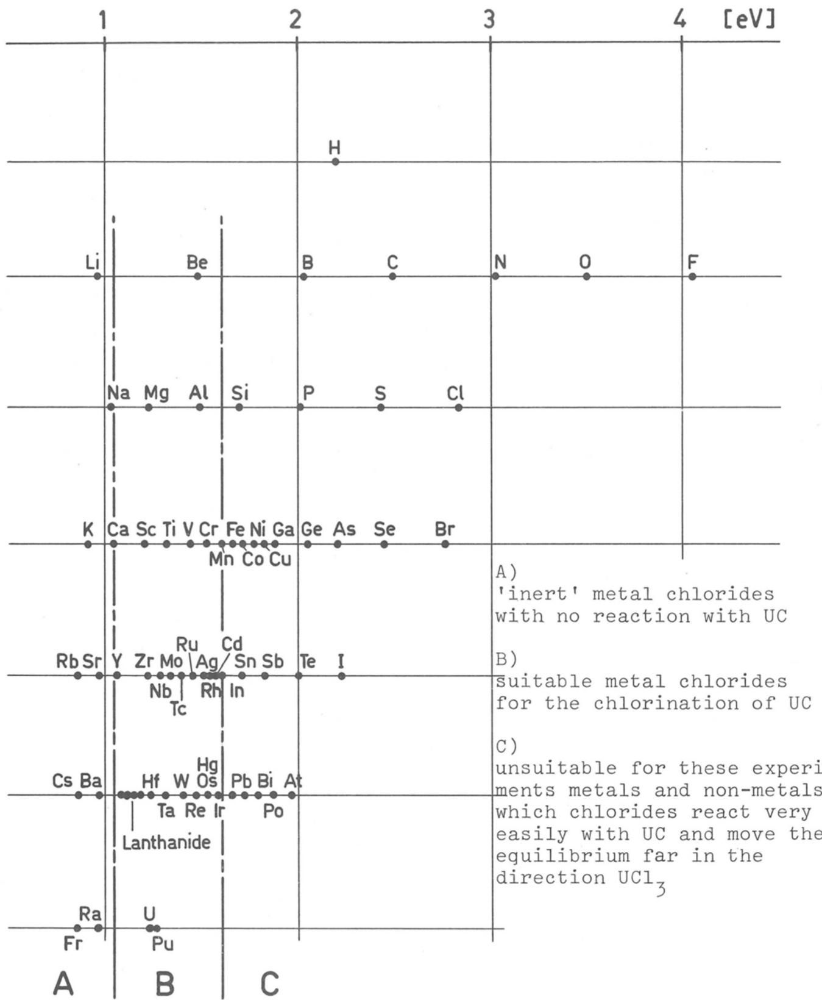  
Fig.1 Electronegativity calculated using the Allred-Rochov formula (according to Cotton, Wilkinson, 1966)

From Potter (1972)

$$
\Delta G _ {U C} ^ {1 1 0 0 K} = - 1 0 7 \quad K J. m o l ^ {- 1} U C
$$

then the change of free enthalpy

$$
\Delta G _ {\text {r e a c t i o n}} ^ {\text {1 1 0 0 K}} = - 4 9 8 \quad \mathrm {K J . m o l} ^ {- 1} \mathrm {U}, \quad \text {s a y} \quad \sim 5 0 0 \mathrm {K J . m o l} ^ {- 1}
$$

Because of the experimental techniques (fitness of analysis of uranium in both phases) we postulate as a first approximation a concentration in both phases equal to the case where the free enthalpy of reaction is zero

$$
\Delta G _ {\text {r e a c t i o n}} ^ {\text {l l 0 0 K}} = 0; \quad K _ {\text {e q}} ^ {\text {l l 0 0 K}} \cong 1; \quad D _ {U} ^ {\text {l l 0 0 K}} \cong 1
$$

Then the approximate metal chloride must have a free enthalpy of formation

$$
\begin{array}{l} \Delta G _ {\mathrm {M e C l} _ {\mathrm {x}}} ^ {\mathrm {f} (1 1 0 0 \mathrm {K})} = \frac {5 0 0}{3} \quad \mathrm {K J . m o l} ^ {- 1} \mathrm {C l} \\ \cong \quad 1 6 7 \quad K J. m o l ^ {- 1} C l \\ \end{array}
$$

so that we could say, on the basis of data from figure 2, that (l) the following metal chlorides will shift the equilibrium so far that practically no uranium carbide will be measurable:

$\mathrm{HgCl}_2(\mathrm{Hg}_2\mathrm{Cl}_2)$ , $\mathrm{AgCl}$ , $\mathrm{CdCl}_2$ , $\mathrm{ZnCl}_2$ . 2) the following will result in an equilibrium in which the uranium is present in both phases molten salt and solid (carbide) in clearly measurable amounts; $\mathrm{MnCl}_2$ , $\mathrm{AlCl}_3$ . 3) metal chlorides which practically do not react with UC in other words 'inert' salts; NaCl, KCl, RbCl, CsCl, $\mathrm{CaCl}_2$ and $\mathrm{BaCl}_2$ (Fig. 2).

On the basis of reaction 1 we write

$$
\mathrm {K} _ {\mathrm {e q}} = \frac {\mathrm {N} _ {\mathrm {U C l} _ {3}}}{\mathrm {N} _ {\mathrm {U C}}} \cdot \frac {\mathrm {N} _ {\mathrm {M e}} ^ {3 / x}}{\mathrm {N} _ {\mathrm {M e C l} _ {x}} ^ {3 / x}} \cdot \frac {\gamma_ {\mathrm {U C l} _ {3}}}{\gamma_ {\mathrm {U C}}} \cdot \frac {\gamma_ {\mathrm {M e}} ^ {3 / x}}{\gamma_ {\mathrm {M e C l} _ {x}} ^ {3 / x}} \cdot \mathrm {N} _ {\mathrm {C}} \gamma_ {\mathrm {C}} \tag {8}
$$

where $N =$ molar fraction

$\gamma =$ activity coefficient

but of course

$$
\gamma_ {U C} = 1; \quad \gamma_ {M e} = 1; \quad \gamma_ {C} = 1
$$

and activity coefficient quotient: $\pi_{\gamma} = \frac{\gamma U C l_{3}}{\gamma_{M e C l_{2}}^{3 / 2}}$

distribution ratios: $\mathrm{D_U} = \frac{\mathrm{N_{UC13}}}{\mathrm{N_{UC}}}.$

$$
D _ {M e} = \frac {N _ {M e}}{N _ {M e C l _ {2}}}
$$

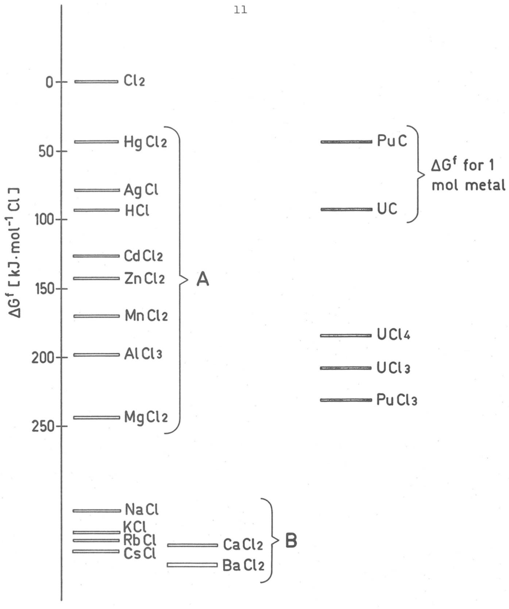  
Fig. 2 Free Enthalpy of formation at $1100\mathrm{K}$

(A) Reactive chloride metals   
B) "Inert" salt compounds

$$
\text {T h e n} \quad K _ {\mathrm {e q}} = D _ {U} \cdot D _ {\mathrm {M e}} ^ {3 / x}. \pi_ {\gamma} \cdot N _ {C} \tag {9}
$$

If we use the following composition of substrates

$$
1 \mathrm {m o l} U C + Q \frac {3}{x} \mathrm {m o l} M e C l _ {x}
$$

then in equilibrium we obtain

$$
(1 - w) \cdot <   U C > + \frac {3}{x} (Q - w) M e C l _ {x} \geqslant w \left(U C l _ {3}\right) + \frac {3}{x} \cdot w <   M e > + w \cdot <   C > \tag {10}
$$

then $\mathrm{D}_{\mathrm{U}} = \frac{\mathrm{w}}{1 - \mathrm{w}}$ $\mathrm{D}_{\mathrm{Me}} = \frac{\mathrm{w}}{\mathrm{Q} - \mathrm{w}}$

# 2. Experimental techniques

From the point of view of experimental techniques the following problems are of importance:

1) The stability of the substrates and products against the container materials - in this case silica ampules e.g. (for sake of simplicity without stoichiometric coefficients)

$$
\mathrm {U C l} _ {3} + \mathrm {S i O} _ {2} \rightarrow \mathrm {U O} _ {2} + \mathrm {S i C l} _ {4} + \mathrm {U S i} _ {3}
$$

2) The stability of the substrates and products against the atmosphere, in this case oxygen, water vapour:

$$
\mathrm {U C l} _ {3} + \mathrm {H} _ {2} \mathrm {O} \geqslant \mathrm {U O C l} + 2 \mathrm {H C l}
$$

3) The purity of substrates, especially the readily hydrolysing and oxidising components: UCl₃, UC, MeClₙ   
4) The selectivity of the separation methods: for instance the selective solution only of $\mathrm{UCl}_3$ in the presence of uranium carbide.   
5) The accuracy of the determination method: here the amperometric titration of uranium chlorides soluted in aqueus phase.

The problem mentioned above (II,1) of the possible interaction of $\mathrm{UCl}_3$ in molten salt media with silica requires further study. McIver (1966) writes: "The most obvious choice for a vessel is silica as this does not react with $\mathrm{UCl}_3$ . However, if free uranium is present in the melt silica is attacked and mixtures of $\mathrm{UO}_2$ and $\mathrm{USi}_3$ formed."

Brown (1972) states that "uranium trichloride partially with silica at the temperature $850^{\circ}\mathrm{C} - 900^{\circ}\mathrm{C}$ the product being $\mathrm{UO}_2$ ."

In these experiments for dry substrates the reaction between $\mathrm{UCl}_3$ and $\mathrm{SiO}_2$ is very slow and only after 6-8 hours is the amount of $\mathrm{UO}_2$ formed significant.

On point 2. the components used and the method of purification (drying) was as follows

- $\mathrm{AlCl}_3$ produced by Fluka AG in sealed ampules - no special purification - used only for rough tests   
- $\mathrm{CaCl}_2 \cdot 2\mathrm{H}_2\mathrm{O}$ produced by Merck, purified as follows:

dry HCl (Molecular sieve $\cdot 4\mathrm{A}$ ) for five hours from $20^{\circ}\mathrm{C}$ up to $300^{\circ}\mathrm{C}$ ;

removal of HCl and cooling in the $\mathbf{N}_2$ stream. $(\mathbf{N}_2 - \mathbf{p}$ urified with Oxisorb F, $0_{2} < 1$ vpM, $\mathrm{H}_{2}\mathrm{O}$ vapour $< 0.5$ vpM)

- Cd Cl $_2$ , x H $_2$ O - purified as for Ca Cl $_2$ · 2H $_2$ O and dried   
- Hg Cl $_2$ (Merck) no purification - for rough checks experiments only   
- $\mathrm{MgCl}_2 \cdot 6\mathrm{H}_2\mathrm{O}$ (pro analysis, Merck) purified as for $\mathrm{CaCl}_2 \cdot 2\mathrm{H}_2\mathrm{O}$ but a residue of $\mathrm{MgO}$ was left (seen as suspension in molten salt:)   
- $\mathrm{MnCl}_2 \cdot 4\mathrm{H}_2\mathrm{O}$ (pro analysis, Merck) purified as $\mathrm{CaCl}_2 \cdot 2\mathrm{H}_2\mathrm{O}$   
- NaCl (pro analysis Merck) partially dried in vacuum and then heated after 4 hours from $20^{\circ} \mathrm{C}$ up to $200^{\circ} \mathrm{C}$   
- $\mathrm{ZnCl}_2$ (pro analysis Merck) ( $\mathrm{SnO} \sim 1,2\%$ ) purified as $\mathrm{CaCl}_2$ . $2\mathrm{H}_2\mathrm{O}$   
- $\mathrm{CaCl}_2$ -NaCl eutectic was electrolysed with tungsten electrode (0.3 mm, 10 cm long) at $\sim 1$ volt the measured current was:

at $740^{\circ}C$ ：15mA at $550^{\circ}C$ ：2mA

- UC (produced by Nukem) nominal $\mathrm{UC}_{0.987}$ dried in glove box in vacuum extractor for 1 hour our analysis gave $\mathrm{UC}_{0.985}^{0} 0.015$ .   
- Silica ampule - vacuum dried, 2 hours, $150^{\circ} \mathrm{C}$ sealed after filling.

On point 4. For the analytical procedure a very important step is the separation of both phases: the salt phase and the chloride phase. Here we choose the method of solution in water at approx. $10^{\circ}\mathrm{C}$ for periods of 20 minutes. This problem is partly discussed in in the literature.

Besson (1963) writes: "UC reacts readily with water only above $60^{\circ}\mathrm{C}$ . The dissolution of UC in hydrochloric acid is not complete when the concentration of acid is too low". Bradley (1962) has observed during the hydrolysis of UC in water at $25^{\circ}\mathrm{C}$ for 1 hour a very small gas evolution. The time required to hydrolise a $3 - 4\mathrm{~g}$ irregularly shaped specimen at $25^{\circ}\mathrm{C}$ was up to a week. Robinson (1964) separated UC from Zn metal by solution in $\mathrm{HNO}_3$ . The UC is not dissolved.

In this paper a series of hydrolyses of UC in water and aqueous solution of HCl were made. The approximate results are shown in Fig. 3.

From these it is clear that the effect of a 20 minute attack by water or by weak solution of hydrochloric acid (to prevent the hydrolysis of uranium compounds) at $10^{\circ}\mathrm{C}$ on the UC was practically negligible. The flow sheet used in the present work is shown in fig. 4.

# 3. Kinetics: results and discussion

The first stage in the investigation of equilibrium is of course the kinetic measurement. For this purpose the uranium carbide reaction with a series of the above mentioned metal chlorides was investigated.

The chlorination by $\mathrm{HgCl}_2$ ( $\mathrm{Hg}_2\mathrm{Cl}_2$ ) and $\mathrm{CdCl}_2$ goes very rapidly. For a sample of solid uranium carbide of approx $0.5\mathrm{~g}$ of irregular shape in an arbitrary chosen ratio of uranium carbide to the metal chloride;

UC : $\frac{3}{x} Q M e C l_{x}$

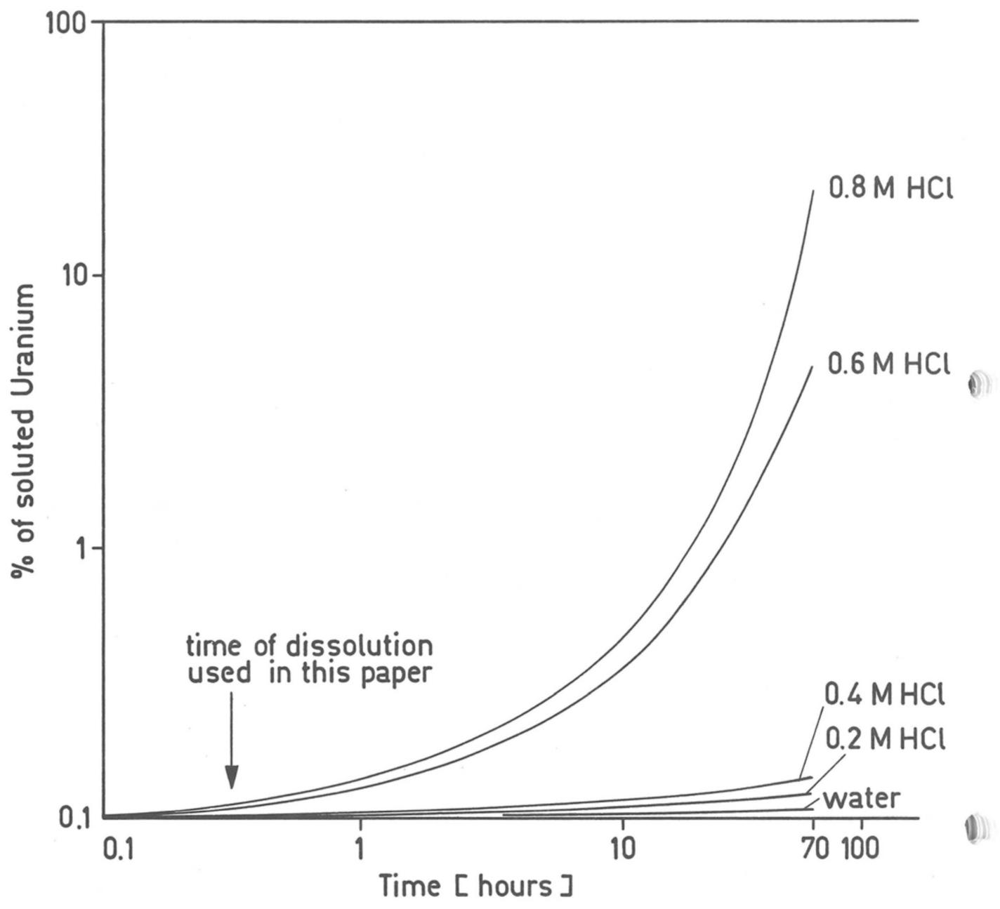  
Fig. 3 The roughly estimated kinetics of solution of uranium carbides in water and low concentration aqueous HCl solutions

Specimen $0.5\mathrm{g}$ UC $+5$ ml aqueous solution  
T $\cong$ 10°C ± 5°C  
t $\lesssim$ 70 hours  
Numbers given represent the molarity of HCl

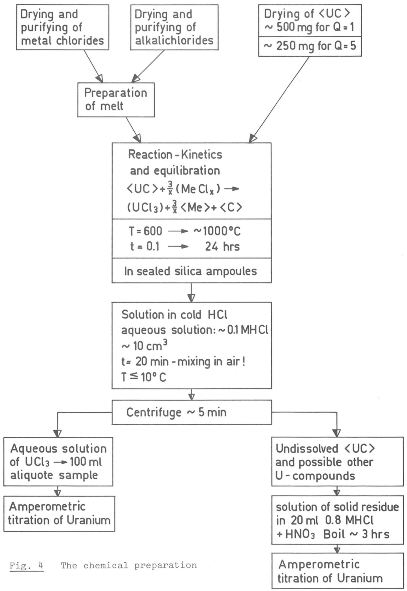

Where $Q = 1$ (simply stoichiometry) or $Q = 1.5$ , in the temperature range $700^{\circ}C - 900^{\circ}C$ , the dissolution of approximately half of the uranium carbide occurred in 10-30 minutes.

All the data cited - in fig. 5 - here are roughly interpolated from the series of experiments due to the volatility of some of the chlorides, and in sealed silica ampules they are not very reproducible.

Fig. 5 gives the results for a temperature of approximately $800^{\circ}\mathrm{C}$ against the free enthalpy change of the reaction 1). The time of half dissolution t 1/2 (in minutes) is a rather simple function of the free enthalpy change of the appropriate reaction $\Delta G$ reaction (see fig. 5). For NaCl/CaCl $_2$ the time of dissolution was too short to be measured.

Fig. 6 shows the kinetics of the chlorination by aluminium trichloride. The approx. increase of temperature from 1000 K up to 1170 K that is the inverse temperature from 1 x $10^{-3}$ to 0.85 x $10^{-3}$ K results in the half dissolution time t 1/2 for UC falling from 4.5 hours to approx 0.6 hours, that is 7.5 times faster. It must be stressed that the AlCl₃ acts in a different manner than the other metal chlorides and the reaction 4). and probably 5). may also occur, influencing the effective kinetics.

The manganese chloride (fig. 7) shows a considerable lower reaction rate, and what is of importance achieves equilibrium in a reasonable time of $\sim 18$ hours at $730^{\circ}\mathrm{C}$ , $\sim 2$ hours at $900^{\circ}\mathrm{C}$ , equivalent to an 9 fold increase of reaction rate in the same

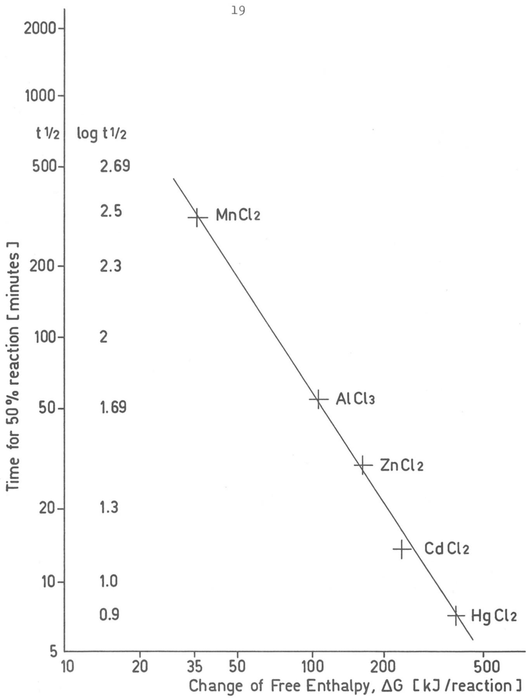  
Fig. 5 Kinetics of $50\%$ dissolution of UC in molten chlorides media at $800^{\circ}\mathrm{C}$ as a function of free enthalpy changes in the investigated reaction. Q ≈ 1

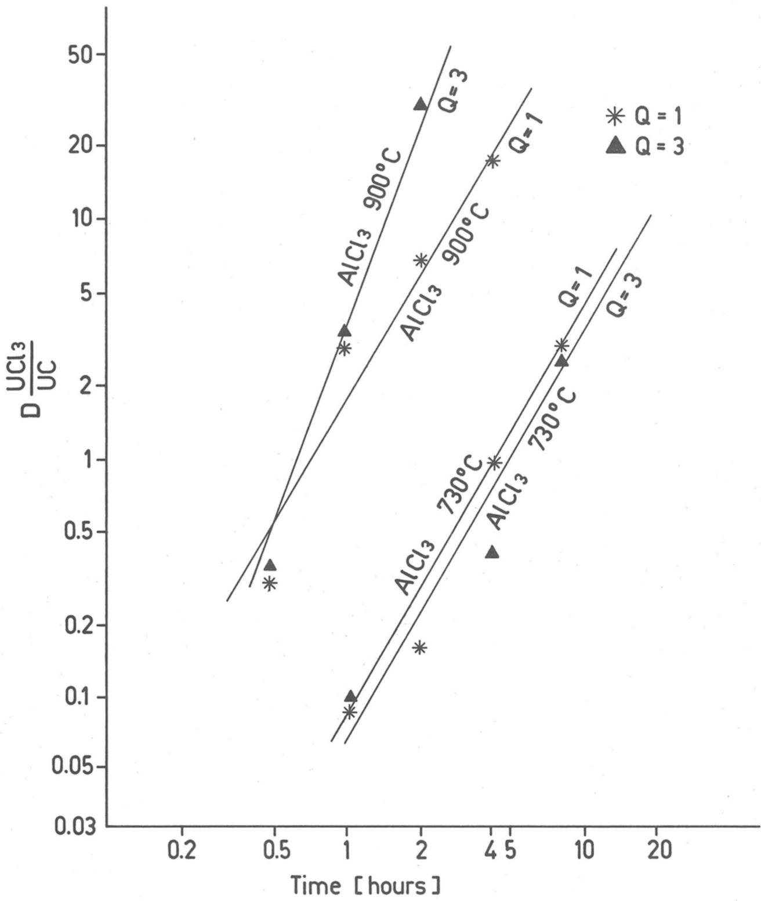  
Fig. 6 Kinetics of dissolution of UC in molten $\mathrm{AlCl}_3 / \mathrm{NaCl}$

$$
Q = 1, 3
$$

$$
\mathrm {T} = 7 3 0, 9 0 0 ^ {\circ} \mathrm {C}
$$

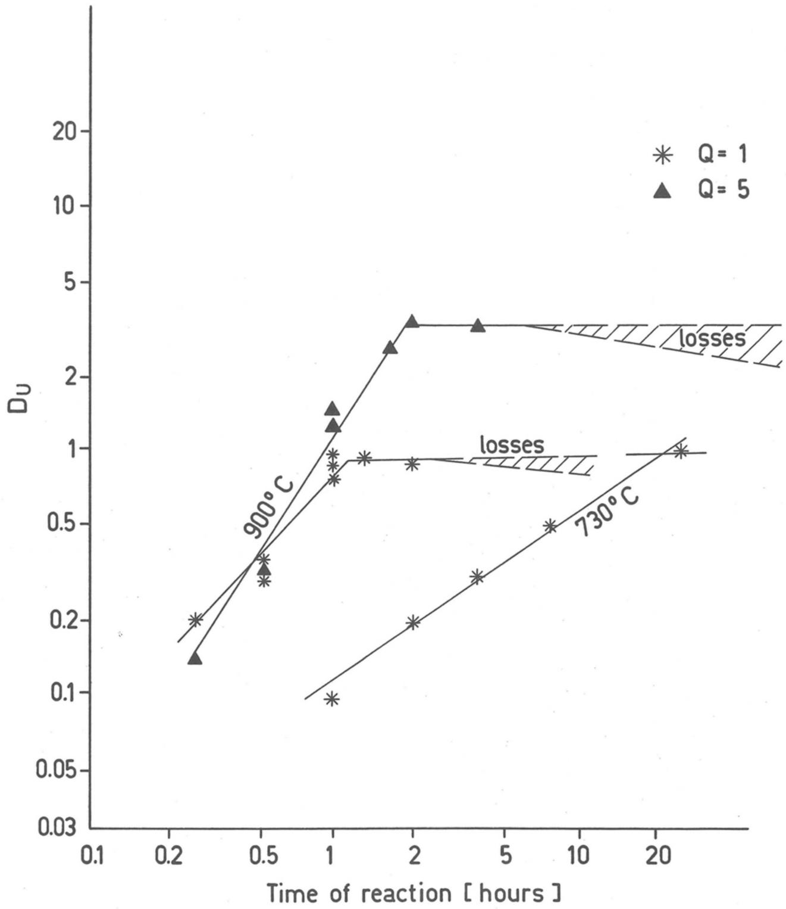  
Fig. 7 Kinetics of dissolution of UC in molten $\mathrm{MnCl}_2 / \mathrm{NaCl}$

$$
T = 7 3 0 ^ {\circ} \text {a n d} 9 0 0 ^ {\circ} C
$$

$$
Q = 1 \text {a n d} 5
$$

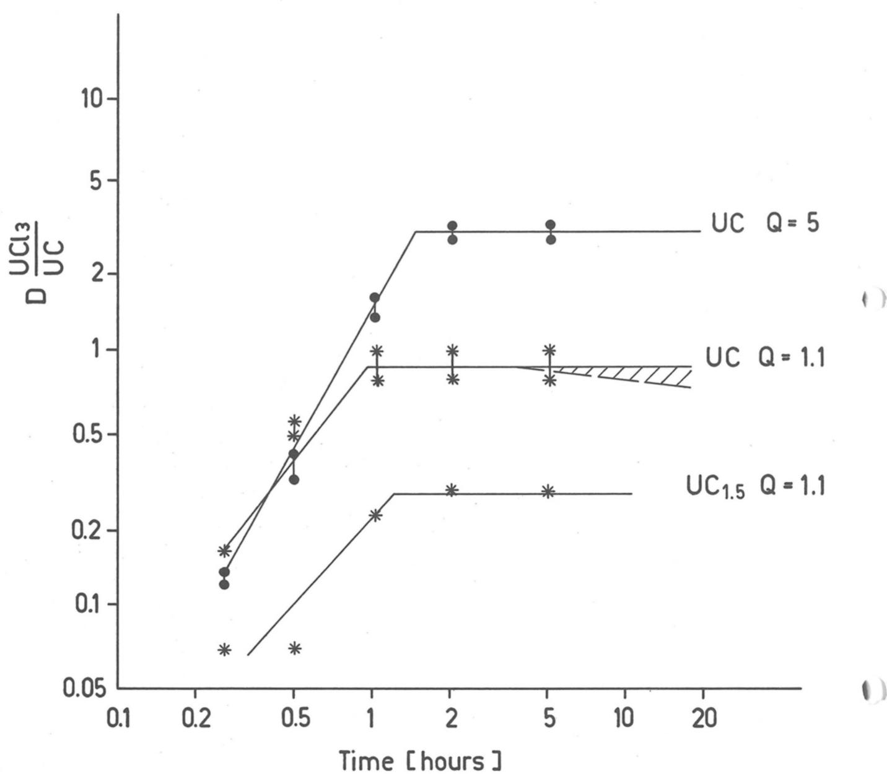  
Fig. 8 Kinetics of dissolution of UC and UC $_{1.5}$ in molten MnCl $_2$ /NaCl 1:4 T = 900°C

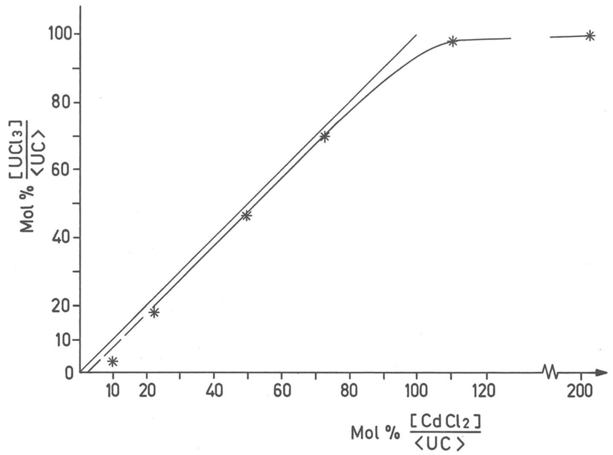  
Fig.9 The "stoichiometry" of dissolution of UC in molten $\mathrm{CdCl}_2 / \mathrm{NaCl}$ T $= 800^{\circ}C$ t $= 1 / 2$ hour

temperature range. The clear achievement of an equilibrium state is shown in fig. 7 where the manganese dichloride was used as the chlorinating agent. Note that the kinetic slopes differ for different temperatures.

The kinetics of dissolution of uranium sesquicarbide seem to give the value of t 1/2 a factor 2.5 lower than for uranium monocarbide when the chlorination using $\mathsf{MnCl}_2$ was measured (fig. 8).

From this it is clear that for manganese dichloride the equilibrium may be achieved in a reasonable time at 1000 K after $\sim$ 20 hours at 1170 K after $\sim$ 2 hours. The larger reaction time is not appreciable due to loss of uranium trichloride probably from the reaction with silica.

The correctness of postulated stoichiometry of reaction 1). was measured in the case of $\mathrm{CdCl}_2$ which is shown in fig. 9.

# 4. Equilibrium: results and discussion

The simplified reaction represented by (l) must be modified by the assessment of the impact of the metal carbides formation: reaction 2). The metals used in this work as a carrier for chlorine have a relatively small value of carbide formation.

In the case of manganese chloride the possible reaction as represented by:

$$
\left\langle \mathrm {U C} \right\rangle + \frac {3}{2} \quad \left(\mathrm {M n C l} _ {2}\right) \geqslant \left(\mathrm {U C l} _ {3}\right) + \left\langle \mathrm {M n} _ {3 / 2}. \mathrm {C} \right\rangle
$$

* for a formal stoichiometry, not for chemical individuum.

The manganese / carbon system includes numerous compounds (Pascal 1960), the most probable in our case is the formation of $\mathrm{Mn}_{3}\mathrm{C}$ : the stoichiometry of the reaction given above suggests such a possibility

$$
<   \mathrm {M n} _ {3 / 2} \quad \mathrm {C} > * \quad \rightarrow \quad 1 / 2 \quad \mathrm {M n} _ {3} \mathrm {C} + 1 / 2 \quad \mathrm {C}
$$

For the temperature 1000 K the free enthalpy of formation (Zefirov, 1965) equals

$$
\Delta G ^ {f} \left. \begin{array}{l} (1 0 0 0 K) \\ \left. \left. \left. \left. \left. \left. \left. \left. \left. \left. \left. \left. \left. \left. \left. \left. \left. \left. \left. \left. \left. \left. \left. \left. \left. \left. \left. \left. \left. \left. \left. \left. \left. \left. m n _ {3} C > \right. > \right. > \right. > \right. > \right. > \right. > \right. > \right. > \right. > \right. > \right. > \right. > \right. > \right. > \right. > \right. > \right. > \right. > \right. > \right. > \right. > \right. > \right. >
$$

In our case the change of the full free enthalpy of reaction 2). may be assessed as approx - 7 KJ/reaction. This value is rather small and does not strongly influence the calculated equilibrium state.

This is additionally influenced by the relatively large constraints in the formation of $\mathsf{Mn}_3\mathsf{C}$ because in the system under study the metallic manganese and the free carbon are in two separated phases: the carbon (graphite) with a density $\sim 2\mathrm{g.cm}^{-3}$ is floating on the surface of the molten salt (density $\sim 3\mathrm{g.cm}^{-3}$ ). and the metallic manganese is at the bottom (density $\sim 6\mathrm{g.cm}^{-3}$ ).

We must stress here that the change of free enthalpy for reaction 1) is rather independent of the temperature in the investigated region (900 - 1200 K). The data for the calculated values of $\Delta G$ for reaction 1) are given in fig. 10.

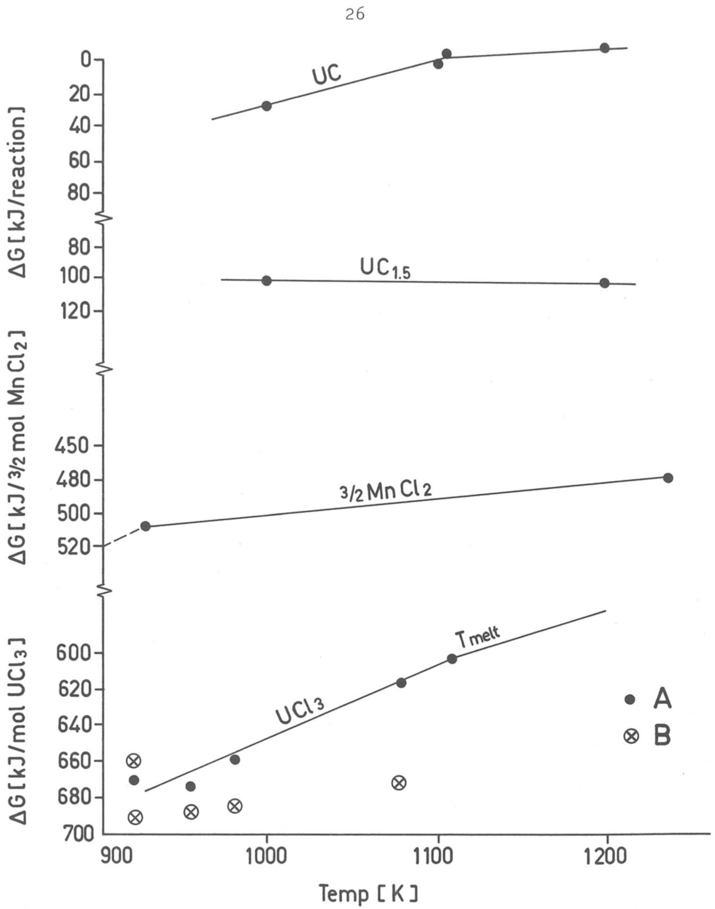  
Fig. 10 Calculated data of the influence of temperature on the dissolution UC and $\mathrm{UC}_{1.5}$ in molten $\mathrm{MnCl}_2 / \mathrm{NaCl}$

A) Ferris 1972   
B) others (see Ferris 1972)

Table 1 gives the values of the distribution ratio for the equilibrium state at $900^{\circ}\mathrm{C}$ in NaCl - medium. From equation (9) and (10) one can assess the activity co-efficient quotient $\pi_{\gamma}$

$$
\pi_ {\gamma} = \frac {\gamma (\mathrm {U C l} _ {3})}{\gamma_ {\mathrm {M e C l} _ {\mathrm {x}}} ^ {3 / \mathrm {x}}} = \mathrm {K} _ {\mathrm {e q}} / \left(\mathrm {D} _ {\mathrm {U}} \times \mathrm {D} _ {\mathrm {M e}} ^ {3 / \mathrm {x}} \quad \cdot \quad \mathrm {N} _ {\mathrm {C}}\right)
$$

For stoichiometric ratio $3 / x$ MeCl/UC approx 1:l we obtain

$$
\pi_ {\gamma} \cong 2
$$

Now we arbitrarily postulate $\gamma_{(UCl_3)NaCl} \cong 1$ (for a more detailed discussion of the activity co-efficient of $UCl_3$ in molten chlorides media see section V) in this case we obtain

$$
\gamma \left(\mathrm {M n C l} _ {2}\right) _ {\mathrm {N a C l}} \cong 0. 6 3
$$

But for the hypostoichiometric ratio: $\frac{3}{x} \mathrm{MeCl}_x / \mathrm{UC} \cong 5$

we obtain: $\pi_{\gamma} = 0.74$ and $\gamma_{(UCl_3)NaCl} \cong 1$

The activity co-efficient for manganese chloride equals

$$
\gamma \left(\mathrm {M n C l} _ {2}\right) _ {\mathrm {N a C l}} \cong 1. 2 2
$$

Table 1 Value of distribution ratio for equilibrium state T = 900 °C in NaCl - eutectic   

<table><tr><td>Carbide UC y (nominal)</td><td>Molar ratio: Q = MeCl2UC y</td><td>Distribution ratio (precision is roughly estimated).</td></tr><tr><td rowspan="2">UC</td><td>~ 1.1</td><td>0.95 ± 0.05</td></tr><tr><td>~ 5</td><td>3.5 ± 0.3</td></tr><tr><td>UC1.5</td><td>~ 1.1</td><td>0.25 ± 0.2</td></tr></table>

Experimental results: T = 1100 K; ΔG calcul. ≈ 0; Keq calcul ≈ 1   

<table><tr><td>Q</td><td>\( D_U \) measured</td><td>W calc.</td><td>\( D_{me} \) calc.</td><td>\( D^{3/2}_{me} \)</td><td>\( N_c \) assessed</td><td>\( \pi_Y \) calc.</td></tr><tr><td>1</td><td>~1 (0.95± ±0.005)</td><td>~0.5</td><td>1</td><td>1</td><td>0.5</td><td>2</td></tr><tr><td>5</td><td>3.5 ± 0.3</td><td>~0.78</td><td>0.305</td><td>0.5</td><td>0.78</td><td>0.74</td></tr></table>

The validity of this calculation and appropriate assumptions is shown also for the reaction of manganese chloride with uranium sesquicarbide UC $_{1.5}$ .

According to Potter:

$$
\begin{array}{l} \Delta G ^ {f} \left(U C _ {1. 5}\right) = - 2 2 2 4 0 - 1. 9 6 T [ K c a l. m o l ^ {- 1} ] (1 1 0 0 - 1 4 0 0) K \\ F o r 1 1 0 0 K \Delta G _ {f} ^ {1 1 0 0 K} (U C _ {1. 5}) = - 9 8 K J. m o l ^ {- 1} U C _ {1. 5} \\ \end{array}
$$

The possible reaction is represented by:

$$
\langle \mathrm {U C} _ {1. 5} \rangle + \frac {3}{2} (\mathrm {M n C l} _ {2}) \geqslant (\mathrm {U C l} _ {3}) + \frac {3}{2} \quad \langle \mathrm {M n} \rangle + \frac {3}{2} \quad \langle \mathrm {c} \rangle
$$

The calculated free enthalpy change of this reaction

$$
\Delta G ^ {1 1 0 0 K} = + 9 K J
$$

For all other unchanged parameters (activity coefficient etc.)

$$
\begin{array}{l} R T \ln K = \Delta G = + 9 K J \\ \mathrm {K} ^ {\text {1 1 0 0 K}} \quad \cong 2. 6 \\ \end{array}
$$

The calculated distribution ratio is

$$
D _ {U} (U C _ {1. 5}) \cong 0. 3 7
$$

The experimentely measured distribution ratio $D_{U}$ ( $U_{1.5}$ ) = 0.25 ± 0.2

The discrepancy between the calculated and measured results is probably due to the oxygen content in the nominal uranium sesqui-carbide in the form of uranium oxycarbide (see below).

# The problem of oxycarbides

An important problem arises due to the occurrence of bound oxygen in so called uranium carbide which is in fact uranium oxycarbide.

In this case the reaction is as given in equation (4).

In the $\mathrm{MnCl}_2$ system investigated here the reaction is probably as for equation 4 with $x = 0.017$ which for the sake of simplicity is taken for stoichiometry and which approximately corresponds with our substrate (see list of substrates) - and $y = 0.05$ which is here more or less arbitrarily chosen on the basis of the data of Anselm (see Potter 1972) concerning the U-C-O system at $1400^{\circ}\mathrm{C}$ . (See also the criticism of the U-C-O system (Potter 1972.)

Our substrate is thus an oxycarbide with $x = 0.017$ (l-x) = 0.983 and the product according to Anselm may be chosen as an oxycarbide with $y = 0.05$ (l-y) = 0.095 (see reaction 4) which gives

$$
\begin{array}{l} \frac {3}{2} \mathrm {U C} _ {\sim 0. 9 8 3} \quad \mathrm {O} _ {\sim 0. 0 1 7} + \frac {3}{2} \mathrm {M e C l} _ {2} \rightarrow \mathrm {U C l} _ {3} + \frac {1}{2} \mathrm {U C} _ {0. 9 5} \cdot \mathrm {O} _ {0. 0 5} + \\ + \quad \frac {3}{2} \quad \mathrm {M e} + 1 \quad \mathrm {C} \\ \end{array}
$$

For the sake of explanation the following ideal solution is postulated

$$
U C _ {0. 9 8 3} \quad O _ {0. 0 1 7} \geqslant \frac {3}{2} U C + \frac {1}{3} U C _ {0. 9 5} \quad O _ {0. 0 5}
$$

According to Potter (1972) the free enthalpy of formation of hypothetical uranium monoxide can be calculated from the reaction

$$
\Delta G _ {\langle U O \rangle} ^ {f} = \frac {1}{2} \Delta G _ {\langle U O _ {2} \rangle} ^ {f} - R T l n x - (1 - x) ^ {2} E
$$

E = interaction parameter or heat therm for a regular solution;

E = 0 for an ideal solution

x = mole fraction of UO in monoxycarbide phase.

Here we calculate for simplicity using $\mathrm{E} = 0$ a value of

$$
\begin{array}{l} G _ {U O} ^ {f (1 1 0 0 K)} \\ 0. 0 5 \quad C _ {0. 9 5} \end{array} \quad \cong \quad 1 2 0 K J. m o l ^ {- 1}
$$

The shift of the equilibrium constant may be estimated from

$$
\begin{array}{l} \mathrm {R T l n K} = - \Delta G _ {\mathrm {U O} _ {0. 0 5} \mathrm {C} _ {0. 9 5}} ^ {\mathrm {f}} - \Delta G _ {\mathrm {U C}} ^ {\mathrm {f}} \\ \ln K ^ {(1 1 0 0 \mathrm {K})} = - \frac {1}{8 . 3 \times 1 1 0 0} (1 2 0 - 1 0 7) = \frac {- 1 3}{9 . 2} = - 1. 4 \\ \begin{array}{c c c} \mathrm {K} & \cong & 2 5 \end{array} \\ \end{array}
$$

which for otherwise unchanged parameters results in decreasing the distribution ratio for uranium oxycarbide to 0.04 versus approx 1 for hypothetical uranium monocarbide.

Robinson (1964) observed a non soluble residue in the system UC in $\mathrm{Zn}_{(\text{molten})} / \mathrm{ZnCl}_2$ (molten salt) in the form of a black uranium carbide phase in a zinc matrix without any uranium - zinc phase present but with $1.5\%$ oxygen. The product of this reaction is uranium oxycarbide (equilibrium time some hours, temperature $\sim 600^{\circ}\mathrm{C}$ ). The maximum fraction of the uranium in uranium carbide which could have been oxidized was 0.91. A high concentration of $\mathrm{ZnCl}_2$ in the salt was necessary to accomplish this $91\%$ oxidation.

So the present experiments agree with the general results of Robinson.

Some explanation for the case discussed above can be found in the short discussion of the U-C-O system by Anselm (see Potter 1972) (fig. 11).

The chlorination of $\mathrm{UC}_{1 - x}\mathrm{O}_x$ may be represented by two reactions

$$
\mathrm {U C} _ {0. 9 8 3} ^ {\circ} 0. 0 1 7 \rightarrow \frac {2}{3} \mathrm {U C} + \frac {1}{3} \mathrm {U C} _ {0. 9 5} ^ {\circ} 0. 0 5
$$

A) $\mathrm{UC} + \frac{2}{3}\mathrm{MnCl}_2\rightarrow (\mathrm{UCl}_3) + \dots ;\quad \Delta \mathrm{G}^{1100K}\cong 0$   
B) $\mathrm{UC}_{0.95} \mathrm{O}_{0.05} + \frac{2}{3} \mathrm{MnCl}_2 \rightarrow 0.95 (\mathrm{UCl}_3) + 0.05 < \mathrm{UO} > + \dots$ ;

$\Delta G = +13 \mathrm{~KJ} \cdot \mathrm{mol}^{-1}$

According to our kinetics investigation the reaction A has a higher rate and of course, also a greater equilibrium constant. This results in a faster and more complete chlorination of the

hypothetical uranium monocarbide than that of the monoxycarbide $\mathrm{UC}_{0.95} \mathrm{O}_{0.05}$ (Fig. 11).

The reaction between uranium oxycarbide and aluminium chloride may follow the reaction (5) because of the much higher free enthalpy formation of aluminium oxide than that for the chlorides (according to Zefirov 1965)

$$
\begin{array}{l} \Delta G _ {A l _ {2} O _ {3}} ^ {f (1 1 0 0 K)} \left(A l O _ {1. 5}\right) = 4 5 0 \times 1. 5 = - 6 7 5 k J m o l ^ {- 1} A l \\ \Delta G _ {A 1 C l _ {3}} ^ {f (1 1 0 0 K)} = 1 8 5 \times 3 = - 5 5 5 K J m o l ^ {- 1} A 1 \\ \Delta G _ {A 1} ^ {1 0 0 0 K} = \Delta G _ {A 1} ^ {f} _ {2} O _ {3} - \Delta G _ {A 1 C l _ {3}} ^ {f} = - 1 2 0 K J m o l ^ {- 1} A l \\ \end{array}
$$

and the same values for uranium (simplified without oxidation).

$$
\begin{array}{l} \Delta G _ {U O} ^ {f (1 0 0 0 K)} \cong 4 7 5 \times 1. 5 = 7 1 0 \mathrm {K J} \mathrm {m o l} ^ {- 1} \mathrm {U} \\ \Delta G _ {U C l _ {3}} ^ {f (1 0 0 0 K)} \cong 1 5 5 \times 4. 1 8 = 6 5 0 \mathrm {K J} \mathrm {m o l} ^ {- 1} \mathrm {U} \\ \Delta G _ {U} ^ {1 0 0 0} = \Delta G _ {U C l _ {3}} ^ {f 1 0 0 0 K} - \Delta G _ {U O _ {1. 5}} ^ {f 1 0 0 0 K} = - 6 0 K J m o l ^ {- 1} U \\ \end{array}
$$

Following equations 5) and then 6)

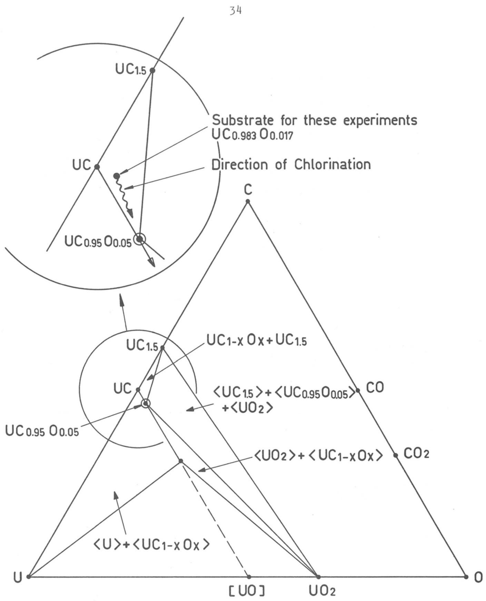  
Fig. 11 Phase diagram U-C-0 Anseln $\sim 1400^{\circ}C$ (According to Potter 1972)

$$
\begin{array}{l} \frac {2}{2 - 0 . 0 1 7} \quad \left\langle U O _ {0. 0 1 7} C _ {0. 9 8 3} \right\rangle + \left(A l C l _ {3} \cong \left(U C l _ {3}\right) + \frac {0 . 0 1 7}{2 - 0 . 0 1 7} \left\langle U O _ {2} \right\rangle \right. \\ + \langle \mathrm {M e} \rangle + \frac {2 - 2 \mathrm {x} 0 . 0 1 7}{2 \mathrm {x} 0 . 0 1 7} <   \mathrm {c} > \\ \end{array}
$$

without stoichiometric coefficient for the sake of simplicity

$$
\langle \mathrm {U O} _ {2} \rangle + (\mathrm {A l C l} _ {3}) \geqslant (\mathrm {U C l} _ {3}) + \langle \mathrm {A l} _ {2} \mathrm {O} _ {3} \rangle
$$

5. The Impact of the 'inert' metal chlorides

The reactions governing the chlorination of uranium carbide discussed above is of course, influenced by the properties of the molten salt medium. In this investigation the following 'inactive' alkali metal and alkali earth metal chlorides were used. NaCl, NaCl/KCl eutectic, KCl, RbCl, CsCl and NaCl/CaCl $_2$ eutectic.

The influence of these metal chlorides arises from two mechanisms:

1) interaction with the UCl₃ which is the product   
2) interaction with the MnCl $_2$ the substrate.

The $\mathrm{UCl}_3 - \mathrm{MeCl}_x$ system was rather intensely investigated but most of the published experiments have been carried out in LiCl/KCl eutectic, which because of the peculiar properties of the small cations of lithium is rather irrelevant to the

studies made for this paper. We need only say that $\mathrm{UCl}_3$ in this eutectic at $\sim 500^{\circ}\mathrm{C}$ has a positive deviation from ideal, the activity coefficient being of the order of 10 for low concentrations of $\mathrm{UCl}_3$ (for literature see Hardy 1966). The activity of $\mathrm{UCl}_3$ in NaCl/KCl eutectic (Flenglas 1962) is reasonably close to that above.

The more exact measurements (Hardy 1966) of the system $\mathrm{UCl}_3 / \mathrm{NaCl}$ shows a positive deviation from ideal: the activity coefficient is essentially greater than 1. The deviation from the ideal is lower, if the temperature is higher and is extremely sensitive to temperature changes. The deviation is lower at lower concentrations but according to Kertes (1971) in all system studied ( $\mathrm{UCl}_3$ , $\mathrm{UCl}_4$ ).) the activity coefficients are reasonably constant over the concentration range - usually below 0.01 mol fraction. Also the results of Krahe (1965) show a positive deviation for the $\mathrm{UCl}_3$ solid /LiCl - KCl system. Harder, Long and Steinaway in their recent publication (1969) estimate the activity coefficient for $\mathrm{UCl}_3$ in NaCl as excess partial molar free enthalpy

RT ln $\gamma$ (Uc13) [Kcal mol-1]:

from UCl3 liquidus data: -1.9

from the U/UC13 potential: - 3.0

average for $\mathrm{UCl}_3$ in relation to $\mathrm{PuCl}_3$ , $\mathrm{CeCl}_3$ and the above

data: -2.7 ± 0.6

for $0.3\mathrm{mol}$ fraction $\mathrm{UCl}_3$ in $\mathrm{NaCl} / \mathrm{UCl}_3$ . Over the temperature range $600 - 800^{\circ}\mathrm{C}$ the average value for the activity coefficient of $\mathrm{UCl}_3$ is therefore $0.25 \pm 0.10$ . Some additional information may be obtained from the phase diagrams of $\mathrm{UCl}_3/\mathrm{MeCl}_x$ , but it must be stressed that such derivations are not sufficiently conclusive to prove the existence of complex compounds and, therefore, the excess enthalpy. A sharp maximum at the melting point is highly indicative of the formation of a complex compound, a less pronounced maximum simply means a complex of lower thermodynamic stability (Kertes, 1971).

From the point of view of complex formation the $\mathrm{PuCl}_3$ systems are similar to those of $\mathrm{UCl}_3$ as far as the composition of the double salts and their melting characteristics are concerned.

Usually there is no intermediate compound with NaCl. The UCl₃/NaCl system gives an eutectic.

For the UCl₃ system it seems that a cautious examination of the phase diagrams points to the existence of two compounds, K₂UCl₅ and K₃UCl₆ (see Bagnall, 1969). From this it can be concluded that the activity coefficient for UCl₃ is essentially lower than 1. In addition PuCl₃ has an activity coefficient in the KCl medium lower than that for the NaCl system (Pascal 1960, p. 390) (Fig. 12).

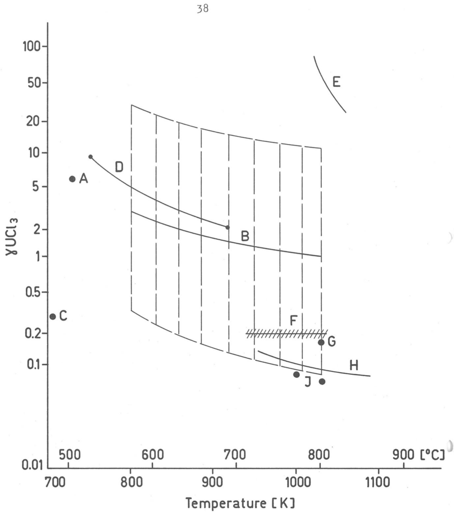  
Fig. 12 Activity coefficient of UCl₃ in molten chlorides

A) Partridge 1961 UCl/KCl

E) Hardy 1966 in NaCl

B) Ferris LiCl $\infty$ dilution $1\mathrm{g}\gamma_{\mathrm{UCl}_3} = 2.18 + 2190_4\pm 1$

F) Harder, Long 1969 NaCl

C) Inman 1961 UCl/KCl

G) Knoeh 1967 MgCl2

D) Knoch, Krahe LiCl/KCl dilute

H) Flenglas 1961  
KCl/NaCl

J) Knoch 1967 $\mathrm{MgCl}_2 / \mathrm{NaCl} / \mathrm{KCl}$

The impact of MnCl2-activity

The system under investigation at equilibrium is a tertiary system (e.g. $\mathrm{UCl}_3 / \mathrm{MnCl}_2$ / MeCl where Me is an alkali metal) which may also be described as quasi-binary system $\mathrm{Me}_{\mathrm{x}}\mathrm{UCl}_{3} + \mathrm{x}$ $\mathrm{Me}_{\mathrm{y}}\mathrm{MnCl}_{2} + \mathrm{y}$ . The case for $\mathrm{Mn}_{\mathrm{z}}\mathrm{UCl}_{3} + 2\mathrm{z}$ seems much less likely because the $\mathrm{Mn}^{+2}$ with a half filled d-electron shell and with a radius of $9\mathrm{nm}$ has the relation $\mathrm{R}_{\mathrm{MnCl}_2} / \mathrm{R}_{\mathrm{Cl}} = 0.50$ which results in the octahedral co-ordination $\mathrm{MnCl}_6^{-3}$ . $\mathrm{U}^{+3}$ in a chloride medium has the same tendency for octahedral co-ordination: $\mathrm{UCl}_6^{-3}$ . The cation partner is probably MeCl in both cases. The systems of $\mathrm{MnCl}_2 / \mathrm{NaCl}$ , $\mathrm{MnCl}_2 / \mathrm{KCl}$ and $\mathrm{MnCl}_2/$ CsCl are investigated by Seifert (1966). Among others the following melting compounds were found $\mathrm{KMnCl}_3$ , $\mathrm{NaMnCl}_3$ .

Of course one must treat these assumptions made from the phase diagrams concerning complexion in the liquid phase with some caution. But according to Sandannini (see Lumsden 1966) the $\mathrm{NaCl}_3 / \mathrm{MnCl}_2$ molten system was investigated and the deviations from ideality in this system found

$$
R T \ln \gamma = - 1 4 0 0 0 \left(1 - N _ {N a} ^ {+}\right) ^ {2} / \left(2 - N a ^ {+}\right) ^ {2} \quad c a l
$$

and for NaCl : MnCl $_2$ 1:1

$$
R T \ln \gamma \cong 1 0 0 0 c a l \cong 4 1 8 0 J
$$

which for T $\tilde{\equiv}$ 1100 results in $\gamma \approx 0.2$

Lumsden (1966) believes that the interaction here is so strong that it cannot be assumed that the equation given above for $\gamma$ applies over the whole range of compositions.

For the system NaCl/MnCl $_2$ our calculation of the activity coefficient according to the Bogacz and Trzebiatowski (1966) methods (see also Ferris, 1972)

$$
\ln a _ {i} = \ln N _ {i} + \ln \gamma_ {i} = \frac {\Delta H _ {f i}}{R} \left(\frac {1}{T o} - \frac {1}{T}\right) + \frac {\Delta C _ {p i}}{R} \left(\frac {T o}{T} - 1 + \ln \frac {T}{T o}\right)
$$

where To = melting point of component i

T = melting point of the eutectic here = 428 °C

R = Gas constant

$\Delta C_{pi} =$ difference of the molar heat of the crystalline component i on melting

$\Delta \mathrm{H}_{\mathrm{fi}} =$ heat of fusion of component i

- gives for the excess free enthalpy

$$
\Delta G _ {T} ^ {\text {e x c e s s}} = R T \ln Y \cong 5 4 2 0 K J m o l ^ {- 1}
$$

which is in good agreement with the above data.

From this it seems that the activity coefficient of $\mathrm{MnCl}_2$ in molten chlorides is close to 1 since as stated by Ferris (1972) the activity coefficient for the uranium trichlorides which must be taken into account is about

$$
\lg \gamma_ {U C l _ {3}} = 0 \pm 1
$$

that is $10^{-1} < \gamma < 10$

The experimental results of the impact of the metal chlorides investigated here are given below (Fig. 13).

In the series of alkali/metal chlorides: Na, (Na-K), K, Cs, the decrease of distribution ratio is clearly seen which could be interpreted that the activity coefficient quotient:

$$
\pi_ {\gamma} = \frac {U C l _ {3}}{M n C l _ {2}}
$$

is relatively strongly influenced by the alkali metal component. If the ionic radius increase the distribution ratio decrease and the activity coefficient quotient increases. This is possible when $\gamma_{\mathrm{UCl}_3}$ increases and/or $\gamma_{\mathrm{MnCl}_2}$ decreases.

# 6. General remarks

The chlorination of nominal uranium monocarbide in molten chlorides media is influenced by several parameters

- the rate of chlorination increases a bout 100 times (from 500 min to 5 min at $800^{\circ}$ for half dissolved UC) if the value of the free enthalpy change for the given metal chlorides changes from 25 KJ per reaction to more than 400 KJ per reaction - that is 16 times.

- the equilibrium state with K ≈ 1 is for T = 1100 K achieved for the system UC/MnCl $_2$ in molten NaCl.

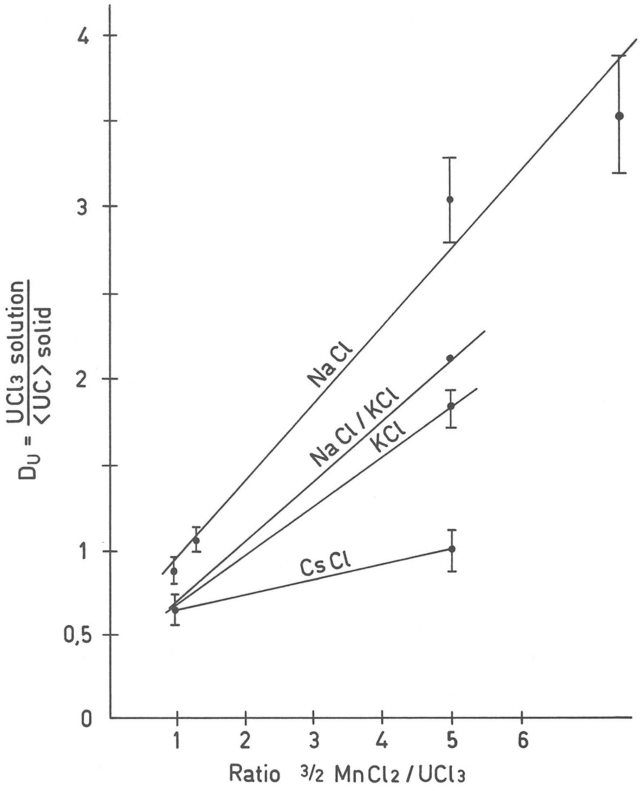  
Fig.13 Distribution ratio in the system UC + MnCl2

t = 2-4 hours

T = 900°C

- the thermodynamic data for UCl₃ from Ferris (1972) and UC, UC₁.5 UOxC1-x from Potter (1972) are in good agreement with our results, if the appropriate activity coefficient of UCl₃ and MnCl₂ in molten alkali metal chlorides are between 0.1 and 10.   
- the presence of uranium monoxycarbide strongly influences the equilibrium obtained for these chlorination reagents which have relatively low free enthalpy of formation e.g. $\mathrm{MnCl}_2$ but not for strong chlorination agents; e.g. Al $\mathrm{Cl}_3$

# Acknowledgements

The authors gratefully acknowledge the assistance of Dr. S. Huwyler in carrying out the analyses; Mr R. Stratton for preparation of the text; and they would also like to thank Dr. H. Schumacher and Dr. P. Tempus for their support in the performance of these studies.

Literature

# K.W. Bagnall

The Halogen Chemistry of the Actinides in "Halogen Chemistry" in V. Gutmann (ed) "Halogen Chemistry", Vol. 3. p. 304 Academic Press, London (1967)   
P. Beucherie, M. Payrissat, J.G. Wurm   
Preparation des carbures d'uranium et de carbures mixtes par conversion directe des halogenures en carbures Comm. Europ de l'Energie Atomique, Euratom. EUR 3170 f. Ispra 1966   
J. Besson, P. Blum, J. Sputs   
A Study of Hydrolysis of Uranium Carbides in Proceed. Symposium "Carbides in Nuclear Energy" Harwell, 1963   
M.J. Bradley, L.M. Ferris   
Hydrolysis of uranium carbide between 25 and $100^{\circ}\mathrm{C}$ . I. Uranium Monocarbide, Inorg. Chemistry, 1, 3, 683 (1962)   
D. Brown, J. Edwards   
Preparation and Crystallographic Properties of the Trichlorides Tribromides and Tri-Iodides of U, Np, Pu. J. Chem. Soc. Dalton, Trans 16, 1757 (1972)   
P. Chiotti, W.C. Robinson, M. Kanno   
Thermodynamic Properties of Uranium Oxycarbides J. of Less Common Metals, 10, 273 (1966)   
L.M. Ferris, J.C. Mailen, F.J. Smith   
Estimated free Energies of Formation of some Lanthanide and Actinide Halides at $600^{\circ}$ - $800^{\circ}$ C using Molten Salt - Liquid Metal Distribution Coefficient Data. J Inorg. Nucl. Chem. 34, 491 (1972)   
W.N. Hansen   
Reprocessing of Uranium Carbide by Molten Salt Electrolysis, NAA - SR - 7660 (1963)

B.R. Harder, G. Long, W.P. Stanaway   
Compatibility and Processing Problems in the Use of Molten Uranium Chloride - Alkali Chloride Mixtures as Reactor Fuels, Nuclear Metallurgy 15, 405 (1969)   
C. Hardy-Grena   
Etude thermodynamique sur le trichlorure d'uranium dissous dans les chlorures alcalins fondus.   
Comm. Europ de l'Energie Atomique, Euratom, Ispra EUR 3153 f (1966)   
T. Ishihara, K. Hiraua   
Chlorination Distillation Processing of Irradiated $\mathrm{UO}_2$ an $\mathrm{UC}_2$ Third Internat. Conf. Peaceful Uses of Atomic Energy, Geneva 1964, Volume 10, 8/798. p. 520   
C.P. Kempter   
Hydrolysis Properties of Uranium Monocarbide and Dicarbide, J. of Less-Common Metals, 4, 419 (1962)   
A.S. Kertes   
Complexes of Actinides in Molten Salts  
Actinides Reviews, 1, 371 (1971)   
J. Krahe   
Aktivität von UCl und anodische Polarisation von UC in der Schmelze LiCl-KCl   
Technische Hochschule, Aachen, Dissertation, 1965   
J. Lumsden   
Thermodynamics of Molten Salt Mixtures Academic Press, London N.York, 1966   
D.L. Maride, D.N. Hume   
A New Method for Preparing OH-free Alkali Chloride Melts, Electroch. Soc. J. 107, 354 (1960)   
E.J. McIver   
A Galvanic Cell for Measuring the Uranium Activity in Carbides at High Temperature,   
Harwell, A.E.R.E. - R. 4983 (1966)   
B.A. Partridge   
The Thermodynamic Properties of Dilute Solutions of UCl₃ in UCl - KCl Eutectic,   
Harwell, A.E.R.E. - R 3683 (1960)

P. Pascal

"NouveauTraits de chimie minerale" Tome XVI, Masson Cie, Paris, 1960

P.E. Potter

Ther Uranium-Plutonium-Carbon-Oxygen System, J. Nucl. Met. 42, 1, (1972)

W.C. Robinson, P. Chiotti

Reactions of Uranium Carbide in Fused KCl - LiCl/Zinc System, J. Less-Common Metals, 10, 190 (1966)

H. Schumacher

Plutonium-Brennstoffprogramm Jahresbericht 1972  
EIR-Report 230, Würenlingen (1973)

R.K. Steuerenberg, R.D. Pierce, L. Burris

Pyrometallurgical and Pyrochemical Fuel Processing. Process Chemistry, 1970 CM 56 : PC U

M. Taube et al.

New Boiling Salt Fast Breeder Reactor Concept Nucl. Eng. Design 5, 109, (1967)

M. Taube, H. Schumacher

A Carbide Fuelled Fast Breeder Reactor with Molten Chlorides as Fuel Bonding Material and Chloride Vapour as Coolant. EIR-Report 167, Würenlingen (1969)

M. Taube, J. Ligou

Molten Chlorides Fast Breeder EIR-Report 215, Wurenlingen (1972)

M. Taube, J. Strejcek

Reaction of Uranium Carbides with Transient Metals Chlorides in Molten Salt Media (to be published)

R.C. Vogel, M. Levensa, F.R. Masten

Argonne National Laboratory, Chemical Eng. Div. Research Highlights, April 1965 ANL - 7020

A.P. Zefirov

"Thermodynamic Properties of Some Inorganic Substances" Atomizdat, Moscow, 1965 (in Russian)

