Eidg. Institut für Reaktorforschung Würenlingen Schweiz

# A Molten Salt Fast Thermal Reactor System with no Waste

M. Taube

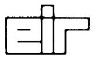

Würenlingen, Januar 1974

A Molten Salt Fast Thermal Reactor System with no Waste

M. Taube

# Abstract

A Power system of 1 GW(e) containing a fast breeder reactor (2GW(t)) with a molten chloride fuel and a thermal burner reactor (~0,5 GW(t)) with molten fluoride fuel resulting in a total breeding system with a doubling time of 30 years is described.

The fast breeder works on a U-238/Pu-239 cycle, the thermal burner on Pu-239. The thermal burner 'incinerates' (by neutron transformation) most of the long lived fission products. Kr-85, Sr-90, Tc-99, Cs-135 and other. The actinides (Np, Am, Cm) might be recovered from the molten salt with a high efficiency and then burnt up in the fast reactor. The entire system produces no long lived radioactive wastes with the exception of T and partially Cs-137.

The fast reactor has an inherent stability against power excursions, and loss of coolant accidents because of the two or more independant cooling circuits and in which the fertile material (molten uranium chloride) plays the role of coolant.

A very high efficiency aluminium-chloride secondary coolant and turbine working agent is proposed. Together with a district heating system practically no thermal pollution occurs.

A very low I-131 and Xe-133 and low Cs-137 concentration, and very low CsCl volatility in the steady state core due to continuous gas extraction guarantees the high safety level of this system.

# I. Why a new reactor system?

The present generation of power reactors both thermal and fast both liquid-cooled (water or sodium) and gas-cooled, use solid fuel. The single reactor type with positive experience of liquid fuel is the Molten Salt Breeder Reactor (thermal reactor with molten fluoride and with breeding ratio $\sim 1.05$ ) (Rosenthal, 1972). Some other molten salt fast reactors have also been discussed in the literature over several years (Taube, 1961, 1967, Nelson 1967).

The liquid fuel molten salt reactors have some specific characteristics which make them more attractive for future use, especially in form of a coupled system of two molten salt power reactors as is proposed here

1) a fast breeder reactor with molten chloride fuel   
2) a thermal burner with molten fluoride fuel.

This system appears to have the following special features which results in a reactor unit much more fitted to the future pattern of energy production than are the present day solid fuel reactors:

l) high inherent stability   
2) much smaller environmental hazard   
3) elimination of long lived fission product wastes and other radioactive wastes   
4) better suited to district heating systems with a relatively high thermal efficiency for electricity generation.

The "fast breeder - thermal burner" system proposed here has the following specific characteristics

1) inherent stability against power excursions which arise out of the following chain of events: criticality increase $\rightarrow$ power excursion $\rightarrow$ temperature increase $\rightarrow$ density decrease $\rightarrow$ movement of part of the fuel out of the core $\rightarrow$ very strong negative influence on the criticality.   
2) in the fast breeder reactor the loss of coolant is at the same time the loss of blanket which results in a very high negative coefficient of reactivity in this "Loss of Coolant Accident". The reactor thus shuts down without an engineered scram.   
3) continuous purging of the liquid fuel in the core by means of a hydrogen/helium stream for extraction of the volatile fission products especially the most hazardous I-131 and Xe-133 and also I-137, Xe-137, the volatile precursors of Cs-137 which have a large effect on the environmental impact in any reactor accident.   
4) continuous reprocessing of liquid fuel with extraction of the long lived fission products (e.g. Kr-85, Sr-90, Zr-93, Tc-99, I-129, Cs-135) and the burning (neutron transformation) of them in a thermal reactor.   
5) continuous reprocessing (with high yield) of the actinides $(\mathrm{Np}, \mathrm{Am}, \mathrm{Cm})$ and continuous burning in the fast core.   
6) the possibility of having a combined breeding ratio for both the fast and thermal reactors coupled together, greater than 1, achieving a doubling time of approx. 30 years.

7) with the exception of tritium, virtually no nett rejection of radioactive wastes to the environment, if Cs-137 has been stored practically all the waste is transformed in the form of stable or semi-stable nuclides.   
8) some of the corrosion processes of molybdenum (structural material) occurring in the core and blanket may be controlled by the continuous gas purging system.   
9) the high thermal efficiency for electrical energy production of the total power system (55 % for only electrical, or 40 % for combined electrical and district heating system) results from the use of a chemically dissociating medium as secondary coolant and turbine working agent $(\mathrm{AlCl}_3)$ .   
10) the system would seem to be suitable for an underground and fully automatic power plant of high safety.   
11) this type of reactor gives, as do other molten salt systems, a complete independence from foreign supplies (no fuel-element manufacture, no external reprocessing plant) and has the ability to 'burn-rocks' - i.e. low grade uranium "ores" from granites. (see Fig. 1)

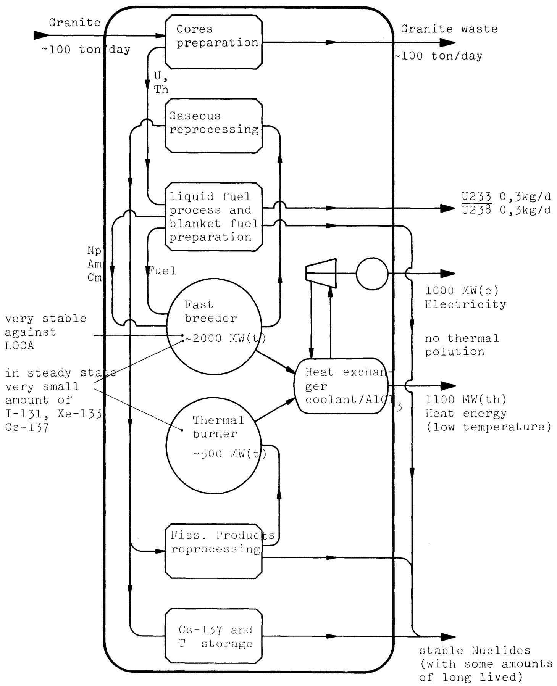

# II. The fast breeder - thermal burner coupled system

The total power system of approx 1 GW(e) contains:

1) fast breeder reactor with molten plutonium-chlorides fuel cooled in core by means of fertile material (uranium-238 chloride as fertile and coolant) The thermal power is approx 2000 MW.

In the coupled fuel cycle the breeder with a breeding ratio of $\sim 1.4$ form the basis of the breeding ratio of the entire system of 1.1 giving a doubling time of approx 30 years. In the fast reactor are also some of the long lived fission products being held under the neutron flux.

2) thermal burner reactor with molten plutonium fluoride fuel, cooled externally (out of core). The thermal power is approx 500 MW. In the coupled fuel cycle the burner (with breeding ratio equal to zero; no fertile material) is responsible for the burning of the longest lived fission products coming from both reactors fast and thermal that is from total power of 2500 MW(t).   
3) an appropriate power and heat generating system with the following circuits

- reactor fuel - in core cooling agent (molten uranium Salt)   
- secondary coolant out of core (aluminium trichloride)   
- tertiary coolant (e.g. nitrogen dioxide)   
hot water for district heating.

4) multi-stage multicomponent reprocessing system with the following units.

- reprocessing of the fast core fuel, including preparation of fresh fuel

- reprocessing of the blanket material from the blanket of the fast reactor   
- preparation of uranium chloride from natural uranium oxide   
- reprocessing of the thermal core fuel   
- reprocessing of the irradiated solid or molten long lived fission products   
- reprocessing of the in-core gas purge.

(see Fig. 2)

Since the system contains both breeder and burner reactors and since a combined breeding ratio greater than 1 is required the relationship of the power of the fast breeder and thermal burner is the highest importance.

The problem of the achievement of the breeding ratio for the total system can be solved by the following simplified calculations concerning the ratio between the respective powers.

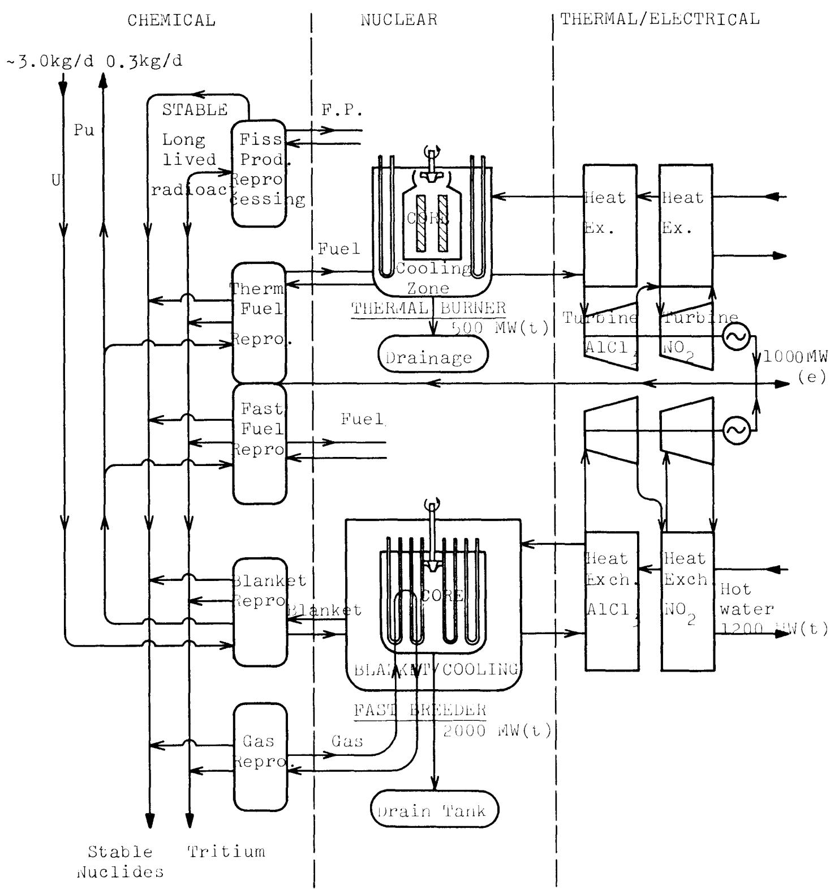  
Fig.2   
Fast/Thermal Reactors System

Table 1 Calculation of the fast breeder/thermal burner ratio   

<table><tr><td></td><td>Unit</td><td>Fast breeder</td><td>Thermal burner</td></tr><tr><td>Total power</td><td>MW(t)</td><td>X</td><td>1</td></tr><tr><td>Specific power</td><td>gPu/MW(t)</td><td></td><td></td></tr><tr><td>in core</td><td></td><td>Pf= 1000</td><td>Pt= 20</td></tr><tr><td>in total system</td><td></td><td></td><td></td></tr><tr><td>including reprocessing</td><td>gPu/MW(t)</td><td>Pf= 1100</td><td>Pt= 80</td></tr><tr><td>Plutonium burning</td><td>gPu/MWd(t)</td><td>F ≈ 1.1</td><td>F ≈ 1.1</td></tr><tr><td>Breeding ratio</td><td>gPu/MWd(t)</td><td>Bf= 1.35</td><td>Bt= 0</td></tr><tr><td>Losses in the re-processing system and uncertainties</td><td>gPu/MWd(t)</td><td>V = 0.05</td><td>V = 0.05</td></tr><tr><td>Breeding gain</td><td>gPu/MWd(t)</td><td></td><td></td></tr><tr><td>G=F.(B-1-V)</td><td></td><td>F.(1.35-1.0-0.05)= + F. 0.30</td><td>F.(0-1.0-0.05)= -F. 1.05</td></tr><tr><td>Postulated doubling</td><td></td><td></td><td></td></tr><tr><td>time: T2</td><td>years/days ≈ 30 years</td><td colspan="2">≈ 104 days</td></tr></table>

Needed breeding gain

$$
G ^ {t o t a l} = \frac {X . P _ {f} + P _ {t}}{T _ {2}} = \frac {1 0 ^ {3}}{1 0 ^ {4}} \approx 0. 1
$$

Effective (total breeding gain for fast/thermal system:

$$
G ^ {t o t} = X \cdot F \cdot 0. 3 - F \cdot 1. 0 5 = 0. 1
$$

The fast/thermal power ratio: $X = \frac{1.05 + 0.1}{0.3} = 3.9 \approx 4$

For a self-breeding system containing fast breeder and thermal burner the following power distribution is needed (B = breeding ratio)

- fast breeder reactor (B $^{\text{fast}}$ = 1.35) 4 MW(t)   
- thermal burner $(\mathbf{B}^{\mathrm{ther}} = 0)$ 1 MW(t)   
- total coupled system (B $^{\text{syst}}$ = 1.1) 5 MW(t)

or for a total power of 2500 MW(t):

- fast breeder: 2000 MW(t)   
- thermal burner: 500 MW(t)

A very rough estimation of the characteristics of both reactors is given in Table 2.

More details about the fast reactor are given in Chapter 3 and the thermal reactor in Chapter 4.

Brief characteristics of the "Fast breeder/thermal burner" system

Table 2   

<table><tr><td>Total electrical power</td><td>= 1 GW(e)</td></tr><tr><td>Total efficiency (arbitrary)</td><td>= 40 %</td></tr><tr><td>Total thermal power</td><td>= 2.5 GW(t</td></tr></table>

<table><tr><td>Reactor, total power</td></tr><tr><td>Specific power (per unit volume)</td></tr><tr><td>in core</td></tr><tr><td>in reactor with coo-
ling region but with-
out blanket</td></tr><tr><td>Core volume</td></tr><tr><td>Cooling region volume</td></tr><tr><td>Neutron flux</td></tr><tr><td>Core volume composition</td></tr><tr><td>Fuel-liquid</td></tr><tr><td>Moderator</td></tr><tr><td>Coolant</td></tr><tr><td>Fission products</td></tr><tr><td>Tubes</td></tr></table>

<table><tr><td>MW(t)</td></tr><tr><td>MW(t)/litre</td></tr><tr><td>litre</td></tr><tr><td>litre</td></tr><tr><td>n cm-2s-1</td></tr><tr><td>vol %</td></tr><tr><td>&quot;</td></tr><tr><td>&quot;</td></tr><tr><td>&quot;</td></tr><tr><td>&quot;</td></tr><tr><td>&quot;</td></tr><tr><td>&quot;</td></tr></table>

<table><tr><td>Fast Breeder</td><td>Thermal Burner</td></tr><tr><td>2000</td><td>500</td></tr><tr><td>1.22</td><td>2</td></tr><tr><td>0.22</td><td>0.225</td></tr><tr><td>8750</td><td>250</td></tr><tr><td>same as core</td><td>2000</td></tr><tr><td>7 x 1015*</td><td>6 x 1015</td></tr><tr><td>38.6</td><td>1.1</td></tr><tr><td>none</td><td>homogeneous fuel; BeF2as moderator</td></tr><tr><td>55.5 (in this case the fertile material)</td><td>no coolant in the core; external cooling</td></tr><tr><td>no special volume for F.P.</td><td>84 in the core</td></tr><tr><td>5.9</td><td>5</td></tr></table>

Table 2   

<table><tr><td>Blanket</td><td>m3</td><td>47.85
(UCl3as fer- tile3material)</td><td>no blanket</td></tr><tr><td>Role in fuel cycle</td><td></td><td>Breeding of Pu in U-238/Pu-239 cycle</td><td>Burning of long lived F.P.</td></tr><tr><td>Breeding ratio</td><td></td><td>~ 1.35</td><td>0</td></tr><tr><td>Fuel components</td><td></td><td>Molten chloride</td><td>Molten fluoride</td></tr><tr><td>fissionable</td><td></td><td>Pu-239 + other actinides (Am, Cm)</td><td>Pu-239</td></tr><tr><td>diluent</td><td></td><td>NaCl</td><td>Zr F4</td></tr><tr><td>moderator</td><td></td><td>no</td><td>BeF2</td></tr><tr><td>Irradiation target (fission products)</td><td></td><td>Zr isotopes (?)</td><td>Kr-85, Cs-135, Sr-90, Tc-99. I-129</td></tr><tr><td>Literature</td><td></td><td>(Taube, Ligou 1973)</td><td>For thermal bree- der reactor with molten fluorides fuel see (Rosenthal, 1972)</td></tr></table>

* here for calculation purpose a neutron flux of $8 \times 10^{15}$ is postulated, however a flux of $10^{16}$ n cm $^{-2}$ s $^{-1}$ seems realisable.

# III. The Fast Breeder Reactor

In this study a 2000 MW(t) fast breeder molten chlorides reactor was used. (Fig. 3 and 4)

The detailed description of the reactor type was recently given (Taube, Ligou, 1973). The most important characteristics are summarised here: (Table 3 and 4)

1) the liquid fuel contains only plutonium chlorides diluted by other metal chlorides. The in core breeding ratio is realised by the presence of the uranium-238 chloride (diluted by other metal chlorides) which acts as the cooling agent flowing in the tubes.   
2) the fertile material (238 UCl₃/NaCl) is at the same time the cooling material and the blanket material.

A very important and desirable feature of this fast reactor can be seen when the "maximal design accident" is discussed. This appears to be the Loss of Cooling Accident (LOCA) (Fig. 5)

The LOCA in fast reactor arises from two events.

1) the increase of criticality due to each coolant (even helium) being a neutron absorber and the loss of coolant results in an increase of neutron flux in the core (a trivial point is that in a thermal water cooled reactor "the Loss of Coolant" is also a "Loss of Moderator" which reduces the criticality); thus in a fast reactor the LOCA must be accompanied by an engineered shut-down device.

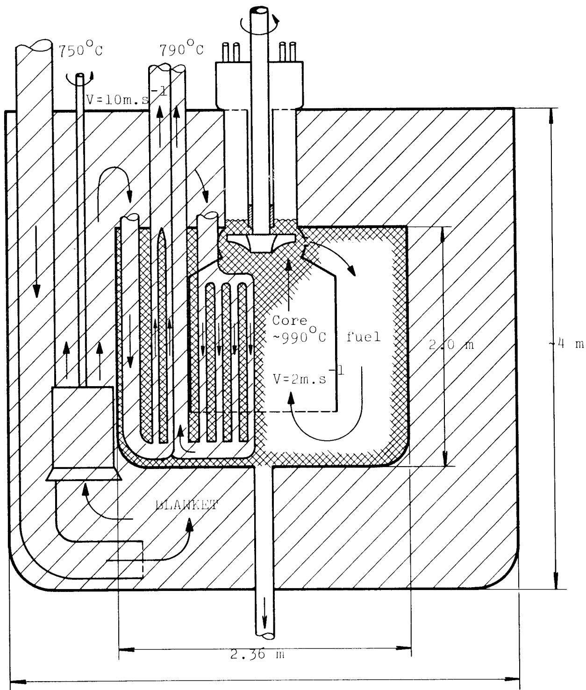  
Fig.3 CHLOROPHIL / EIR 2 GW(t)

Fig. 4 CHLOROPHIL EIR   
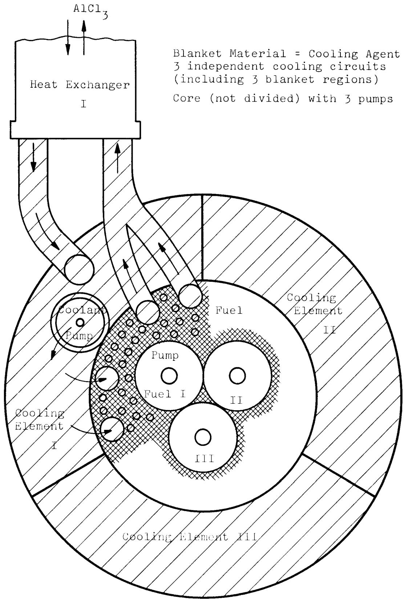  
2.36 m

Table 3

Molten Chloride Fast Breeder Reactor (MCFBR) "CHLOROPHIL"

Electrical power, approx Thermal power, total/in core Core volume Specific power Core geometry

Fuel: liquid $\mathrm{PuCl}_3 / \mathrm{NaCl}$ Liquidus/boiling point  
Fuel mean temperature  
Fuel volume fraction in the core  
Power form-factors radial/axial  
Fast flux, mean across core  
Fuel density at $984^{\circ}\mathrm{C}$ Heat capacity "  
Viscosity "  
Thermal conductivity, at $750^{\circ}\mathrm{C}$ Fuel salt in core  
Total plutonium in core/  
in system  
Plutonium in salt  
Mean plutonium specific power  
Mean plutonium specific power in entire system

MW(e) ~800  
MW(t) 2050/1940  
m³ 8.75  
MWh⁻³ 220  
m height 2.0/2.36 diameter  
Mol% 16/18  
°C ~685/~1500 (approx)  
°C 984 0.386  
n cm⁻²s⁻¹ 7·10¹⁵  
kg m⁻³ 2344  
kJ kg⁻¹K⁻¹ 0.95  
g cm⁻¹s⁻¹ 0.0217  
W cm⁻¹K⁻¹ 0.007  
kg 7900  
kg 2900/3150  
weight % 36.4  
MW(t) kg⁻¹ 0.67  
-- 0.62

Table 3   

<table><tr><td>Coolant liquid U-238 Cl3/NaCl</td><td>Mol %</td><td>65/35</td></tr><tr><td>Liquidus / Boiling point</td><td>°C</td><td>~710/~1700</td></tr><tr><td>Coolant temperature inlet/outlet</td><td>°C</td><td>750/793</td></tr><tr><td>Coolant volume fraction in the core</td><td></td><td>0.555</td></tr><tr><td>Coolant density</td><td>kg m-3</td><td>4010</td></tr><tr><td>Coolant salt in core/ in blanket</td><td>kg</td><td>19&#x27;500/165&#x27;000</td></tr><tr><td>Thermohydraulics</td><td></td><td></td></tr><tr><td>Fuel (shell side, pumped), velocity</td><td>ms-1</td><td>2</td></tr><tr><td>Coolant, velocity</td><td>ms-1</td><td>9</td></tr><tr><td>Number of coolant tubes</td><td></td><td>23&#x27;000</td></tr><tr><td>Tubes inner/outer diameter</td><td>cm</td><td>1.20/1.26</td></tr><tr><td>Tubes pitch</td><td>cm</td><td>1.38</td></tr><tr><td>Breeding ratio, internal/total</td><td></td><td>0.716/1.386</td></tr><tr><td>Doubling time, load factor 1.0/0.8 years</td><td></td><td>8.5/10.5</td></tr></table>

Table 4   
Fast breeder neutron balance   

<table><tr><td>Region</td><td></td><td>Atoms cm3·1021</td><td>Absorption %</td><td>Leakage %</td><td>Production %</td></tr><tr><td rowspan="8">CORE</td><td>U-238</td><td>3.5629</td><td>25.50 (n,γ) 22.51 (n,f) 2.99</td><td></td><td>8.23</td></tr><tr><td>Pu-239</td><td>0.66796</td><td>34.56 (n,γ) 5.58 (n,f) 28.98</td><td></td><td>85.55</td></tr><tr><td>Pu-240</td><td>0.16699</td><td>3.78 (n,γ) 2.24 (n,f) 1.54</td><td></td><td>4.72</td></tr><tr><td>Na</td><td>6.3017</td><td>0.26</td><td></td><td>--</td></tr><tr><td>Cl</td><td>19.495</td><td>3.16 in fuel 1.10 in cool.2.06</td><td></td><td>--</td></tr><tr><td>Fe</td><td>5.978</td><td>1.30</td><td></td><td>--</td></tr><tr><td>Mo</td><td>0.7386</td><td>2.04</td><td></td><td>--</td></tr><tr><td>F.P.</td><td>0.0679</td><td>0.50</td><td></td><td>--</td></tr><tr><td>Total Core</td><td></td><td></td><td>71.10</td><td>27.40</td><td>98.50</td></tr><tr><td rowspan="3">BLANKET</td><td>U-238</td><td>6.42</td><td>23.70 (n,γ) 23.15 (n,f) 0.55</td><td></td><td>1.50</td></tr><tr><td>Na</td><td>3.457</td><td>0.08</td><td></td><td>--</td></tr><tr><td>Cl</td><td>22.72</td><td>2.22</td><td></td><td>--</td></tr><tr><td>Total Blanket</td><td></td><td></td><td>26.00</td><td>2.9</td><td>1.50</td></tr></table>

19   
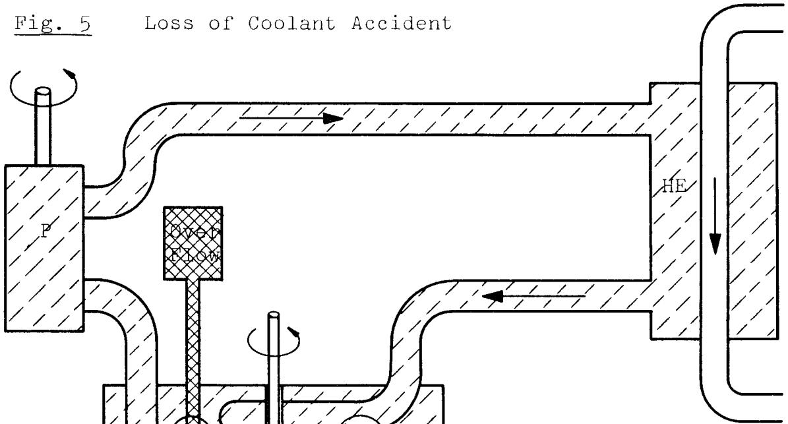  
HE - HEAT EXCHANGER   
P - PUMP   
C CORE   
B - BLANKET

TO DRAIN

TANK

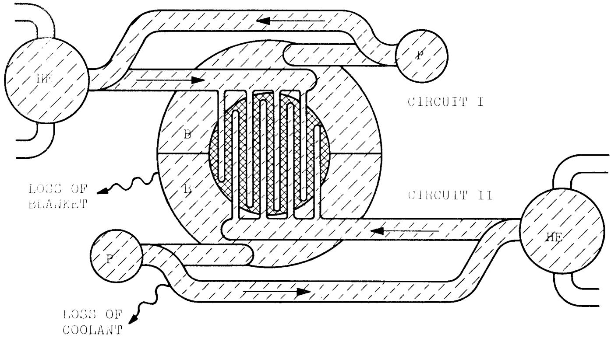

2) the radioactive decay heat of fission products is approx $7\%$ of the normal steady state power level and is high enough to melt the clad and in some cases the fuel in a few tens of seconds from the LOCA, especially in fast reactors with a high volumetric specific power.

The "Emergency Core Cooling Systems" are still under critical review.

Here in this type of fast reactor, both "negative" effects of LOCA could be virtually eliminated by means of the following design features (not shut-down devices):

1) the cooling system is coupled with the blanket, that is the cooling agent plays the role of fertile blanket material.   
2) the cooling system including the blanket region is divided into two or more fully independant circuits.   
3) it is postulated here that a major accident will cause complete destruction of all but one of these independant circuit systems and one of the fuel pumps is intact.   
4) the cooling system sub-divides into several if not all parts of the cooling region.

During an accident the loss of coolant accident thus brings about a corresponding loss of blanket in the region affected. The loss of blanket gives a very strong negative coefficient of reactivity which is clear from Table 4. The roughly estimated value is approx $(7 \pm 1\%)/N$ where $N$ is the number of independant cooling/blanket circuits. In this reactor a failure in only one out of four circuits results in a reactivity decrease of $(7 \pm 1\%)/4$ which is equivalent to a full scram.

Thus the reactor stops without the use of any engineered devices. It seems that this is the only type of fast reactor with inherent negative criticality against the Loss of Coolant Accident.

The radioactive decay heat still has to be removed, if not, the vessel and cooling tubes may melt down. In this reactor the one remaining intact cooling circuit is able to remove this heat, because the molten fuel acts as the internal heat transport medium and assists the heat removal to the one intact system.

# IV. The thermal burner reactor

As is shown in chapter VI the most effective neutron transformation of a large part of the long lived fission products is possible in a thermal neutron flux because the products of cross section and flux $(\sigma_{j} \cdot \varnothing_{j})$ is often larger for thermal neutrons ( $\varnothing_{j}$ = thermal) than for fast neutrons (see Fig. 16).

This is one of the reasons for using a thermal burner for the transformation.

Some general remarks about the criteria for this thermal burner are given below:

1) the thermal neutron flux must be as high as possible but as will be show there is an upper limit. It appears that a flux of $3 - 6 \times 10^{15} \, \text{cm}^{-2} \, \text{s}^{-1}$ is most suitable (e.g. for $\sigma_{\text{th}} = 5$ barns; $\sigma \cdot \varnothing = (5 \times 10^{-24}) \times (6 \times 10^{15}) = 2 \times 10^{-8} \, \text{s}^{-1}$ which corresponds to an effective half life of 2.25 years).

2) the specific volumetric power should not be too high because the thermal core volume and the neutron balance has to be kept to a size to accommodate the appropriate amounts of neutron absorbing fission products (e.g. specific power 1-2 MW/litre) (for 1 MW/l the core volume is 500 l, for 2 MW/l the volume is ~250 l).   
3) the specific power per unit volume must not be too high to keep the total power down. The thermal core is intended as a burner only, that is with breeding ratio zero.   
4) the core containing only fissionable nuclide, moderator and appropriate fission products must give the best possible neutron balance. The following two postulates are added.   
5) no fertile material in the core   
6) no coolant in the core except for the fuel itself which is cooled by means of out of core heat exchangers. The fuel is also in liquid form to permit continuous reprocessing.

As will be seen from the following discussions the appropriate specific volume power for this core is chosen to be as high as possible: 2 MW/1.

(HFIR Reactor in Oak Ridge, USA; 100 MW(t): 100 litre core; 1 MW/1) CM-2 Reactor in Mellekes, Soviet Union 50 MW(t); litre; MW/1 both with mean neutron fluxes of $6 \times 10^{15} \mathrm{~n} \mathrm{~cm}^{-2} \mathrm{~s}^{-1}$ . It must be stressed that a more conservative figure of 1 MW/1 and flux of $3 \times 10^{15} \mathrm{n} \mathrm{~cm}^{-2} \mathrm{~s}^{-1}$ would also meet the requirements but of course with lower effectiveness (higher steady state concentration of fission products). Fig. 6 and 7 give some details concerning the thermal high flux burner. Some datas concerning the neutron balance of the thermal burner reactor are given on the Table 5.

It is worth mentioning the possibility of a neutron coupled fast/ thermal system which would help to solve the problem should the thermal burner reactor have too small a $k_{\infty}$ due to the large amounts of neutron absorbing fission products present. In reducing the leakage from the thermal reactor it could be that neutron coupling will improve the entire neutron balance raising the system breeding ratio over 1.1. (Fig. 8)

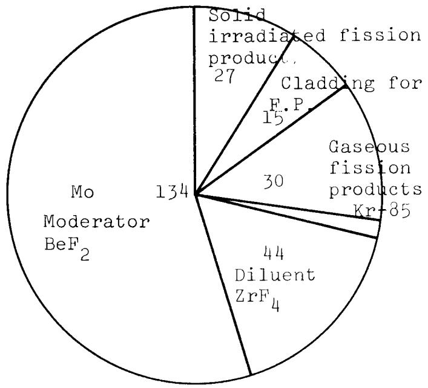  
Fig.6 Core Volume Composition (Vol%)

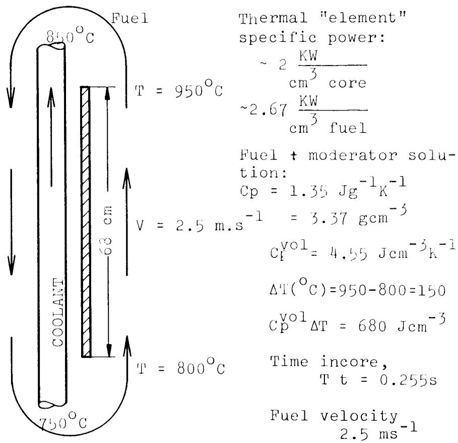

Fig.7 Thermal Reactor Burner   
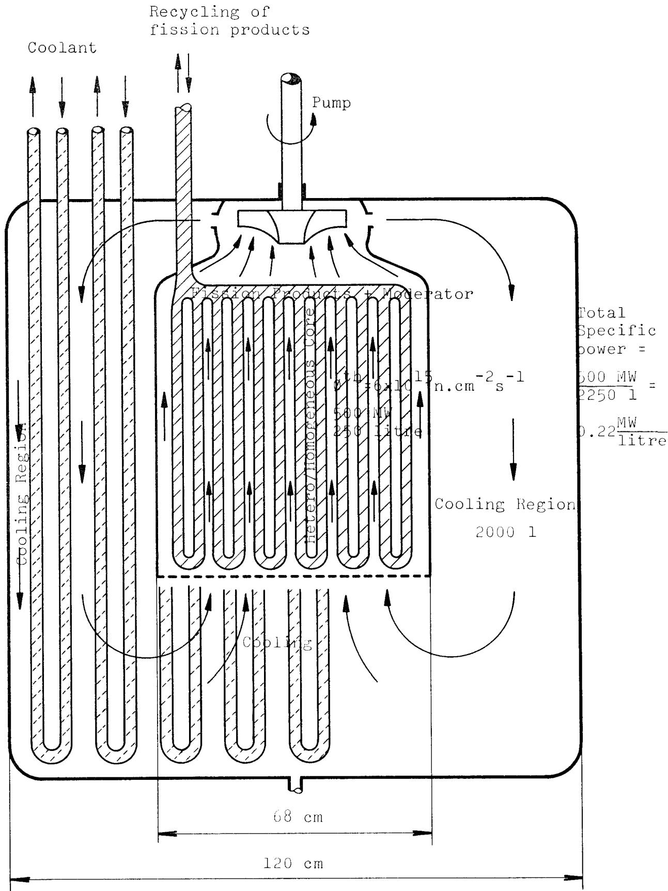  
Not to scale

# Table 5

First approximations of the thermal burner reactor neutron balance

Total power: 500 MW

Specific power: MW/1 Volume: 250 litre

Thermal neutron flux: $\varnothing_{\mathrm{th}} = 6 \times 10^{15} \mathrm{ncm}^{-2} \mathrm{s}^{-1}$

2 MW/1 gives $\sim \frac{2 \times 10^{6}}{10^{-3}} = 2 \times 10^{3} \mathrm{~W/cm}^{3}$

Fission rate $2 \times 10^{3} \times 3.1 \times 10^{10}$ fiss/W = 6.2 x $10^{13}$ fiss/cm $^{3}$

Plutonium atoms: N3 Pu-239 6.2 x 1013 (7.2 x 10-22)x(6 x 1015) = 6.2 x 1013 / 4.3 x .0-6

$$
= 1. 4 5 \times 1 0 ^ {1 9} \text {A t o m P u / c m} ^ {3}
$$

For 250 litres: $N_{\text{tot}}^{\text{Pu-239}} = (1.45 \times 10^{19}) \times (2.5 \times 10^{5}) = 3.6 \times 10^{24} =$

$$
= 6 \mathrm {M o l} \mathrm {P u} - 2 3 9
$$

Table 5   

<table><tr><td rowspan="2">Volume (litre)</td><td rowspan="2">Fuel</td><td rowspan="2">Amount in steady state (mol/in core)</td><td rowspan="2">Cross Section (otherm,barn)</td><td colspan="3">Neutron Balance</td></tr><tr><td colspan="2">Absorption</td><td>Production</td></tr><tr><td rowspan="3">1</td><td rowspan="2">Pu-239/241</td><td rowspan="2">6 Mol (80%)</td><td>σf= 720</td><td>4320</td><td>36</td><td>100</td></tr><tr><td>σc= 250</td><td>1500</td><td>12.5</td><td></td></tr><tr><td>Pu-240/242</td><td>1.2 Mol (20%)</td><td>σc= 250</td><td>300</td><td>2.5</td><td></td></tr><tr><td colspan="7">Irradiated Fission products</td></tr><tr><td>11</td><td>Sr-90</td><td>350 Mol</td><td>1.20</td><td>420</td><td>3.5</td><td></td></tr><tr><td>2.3</td><td>Tc-99</td><td>57 Mol</td><td>22.0</td><td>1260</td><td>10.5</td><td></td></tr><tr><td>7</td><td>Cs-135</td><td>185 Mol</td><td>8.7</td><td>1600</td><td>13.3</td><td></td></tr><tr><td rowspan="2">0.5</td><td>I-129</td><td>7 Mol</td><td>35.0</td><td>245</td><td>2.0</td><td></td></tr><tr><td>I-127</td><td>14 Mol</td><td>6.0</td><td>85</td><td>0.7</td><td></td></tr><tr><td>30</td><td>Kr-85</td><td>68 Mol</td><td>1.8</td><td>120</td><td>1.0</td><td></td></tr><tr><td colspan="7">Diluent/Moderator</td></tr><tr><td>BeF2</td><td>5100 Mol</td><td>0.01</td><td>150</td><td>1.25</td><td></td><td></td></tr><tr><td>ZrF4</td><td>1100 Mol</td><td>0.03</td><td>100</td><td>0.8</td><td></td><td></td></tr><tr><td>Structure (tubes Zr)</td><td>1100 Mol</td><td>0.3</td><td>300</td><td>2.5</td><td></td><td></td></tr><tr><td>250 litre</td><td>Leakage</td><td></td><td></td><td>1600</td><td>13.3</td><td></td></tr><tr><td colspan="2">Totals</td><td></td><td></td><td>12000</td><td>100%</td><td>100</td></tr></table>

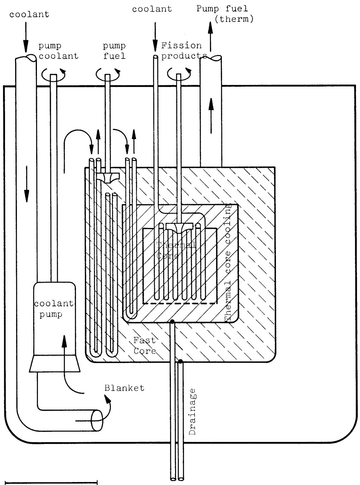  
Fig. 8 Fast/thermal system

# V. The in-core continuous gas purging

# V.a) General remarks

In this reactor an in-core continuous gas purging of the molten fuel is postulated which significantly improves the safety of this reactor in an in-core accident.

A mixture of hydrogen-helium gas is continuously bubbled through the liquid fuel in the core. The mean dwell time of the gas-bubbles needs to be controlled and the mean transport time of the molten components to these bubbles must also be controlled (e.g. if speed-up is desired-intensive mixing, if delay-local addition of a further gas stream).

The aim of the gas stripping is as follows:

1) to remove the volatile fission products which in the case of an accident control the environmental hazard. (I-131, Xe-133, Kr-85 and precursors of Cs-137 and at the same time for the thermal reactor, removal of the I-135, precursor of Xe-135, improves the neutron balance.   
2) to control the production of delayed neutrons since most of the precursors and nuclides of this group are very volatile, e.g.: Br-I-isotopes.   
3) removal of oxygen and sulphur, continuously (see Chapter VIII)   
4) in situ control of corrosion problems on structural materials (see Chapter VIII).

For the sake of a first approximation a gas flux of $30~\mathrm{cm}^3$ per sec. (normal state) of $\mathrm{H}_2 / \mathrm{He}$ is arbitrarily assumed. At 20 bar pressure

and with a dwelling time in core of 20 seconds, the gas bubbles will only occupy a fraction of the core equal to $10^{-5}$ of its volume and has little influence on the criticality, (but the collapsing of bubbles results in a positiv criticality coefficient).

The system proposed for continuous removal of the volatile fission product from the core itself has a retention time of some hundreds of seconds only. Each reprocessing mechanism which operates out of core is limited by the amount of molten fuel being pumped from the core to the reprocessing plant. This amount, due to the high capital cost of the fuel and high operation costs cannot be greater than that which gives a fuel in-core dwell time of about one week. Even with a 1 day dwell time, that is, if a after one day the fuel goes through the reprocessing plant, no acceptable solution to the I-131 problem is obtained since the activity of this nuclide is only diminished by one order of magnitude (see Fig. 9).

Only a direct in-core removal gives the dwell time in core as low as some hundreds of seconds.

# V.b) Delayed neutrons emitters

The principal question arises out of the fact that some of the short lived iodine and bromine (perhaps also arsenic, tellurium) isotopes are the precursors of the delayed neutrons.

Table 6 Precursors of delayed neutrons for Pu-239 fast fission   

<table><tr><td>Group</td><td>Half life t 1/2 (seconds)</td><td>Fraction %</td><td>Probable Nuclide</td></tr><tr><td>1</td><td>52.75</td><td>3.8</td><td>Br-87</td></tr><tr><td>2</td><td>22.79</td><td>28.0</td><td>I-137, Br-86</td></tr><tr><td>3</td><td>5.19</td><td>21.6</td><td>I-138, Br-89</td></tr><tr><td>4</td><td>2.09</td><td>32.8</td><td>I-139, Br-90</td></tr><tr><td>5</td><td>0.549</td><td>10.3</td><td></td></tr><tr><td>6</td><td>0.216</td><td>3.5</td><td></td></tr></table>

As other possible nuclides the following can be considered:

As-85; Kr-92,-93; Rb-92,-93,-94; Sr-97,-98; Te-136,-137; Cs-142,-143. The removal of these delayed-neutron precursors from the core reduces the value of $\beta$ , which is lower for Pu-239 than U-235.

Thus we have a problem of reaching a compromise between a removal as rapid as possible of the hazardous I-131, and as long a dwell time in the core for the delayed neutron precursors: I-140, I-139, I-138, I-137 and the appropriate bromine isotopes.

The compromise is given by a quasi-steady state regime in the core in which the amounts of isotopes present are given as an example in Fig. 10.

Fig.9 I-131 in CHLOROPHIL   
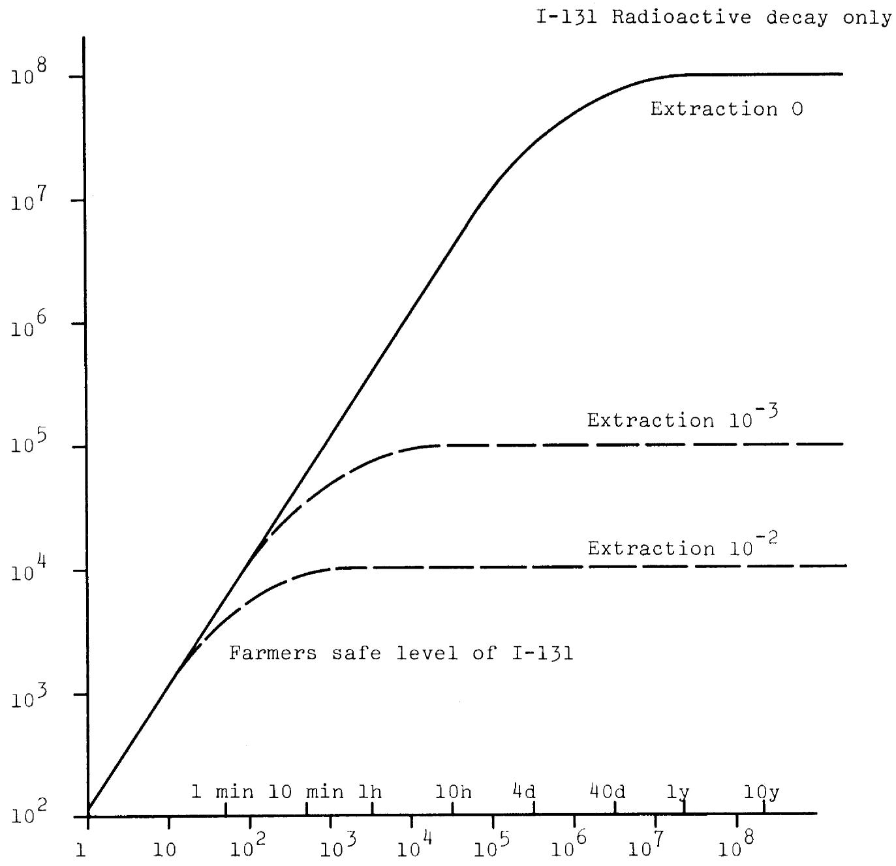  
Time, second

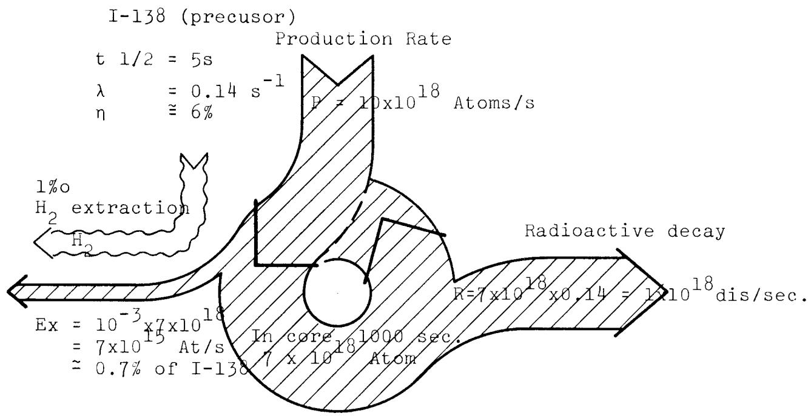  
Fig. 10 Removal of I-131 in CHLOROPHIL I and the problem of the precursors of the delayed Neutrons $2\mathrm{GW} = 6.2 \times 10^{19}$ fiss/sec.

Neutron loss = 0.7%

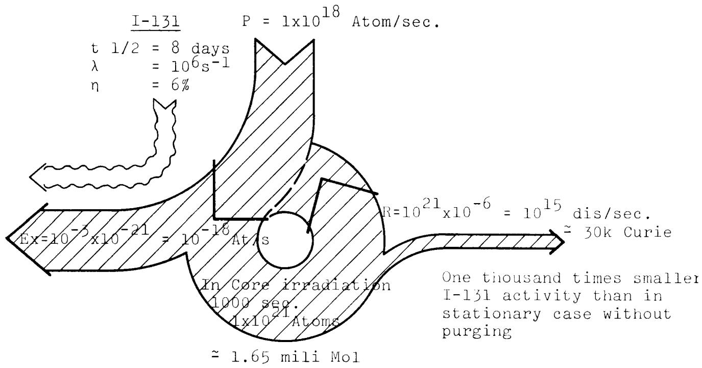

Without extraction: after approx 2 months ~ 30 Mega curies I-131 (1x10 $^{18}$ dis/sec)

In this case the mean dwell time of iodine in the steady state reactor is about 100 seconds. From the curve in Fig. 9 it can be seen that the activity of iodine for a 2.5 GW(t) reactor is of the order of only 10 k curies (for 100 seconds) instead of $\sim 100\mathrm{M}$ curies in the steady state, a decrease of activity of approx. $10^{4}$ (or $10^{3}$ for 1000 second extraction rate).

V. c) Gas-extraction and other fission products

The gas-extraction also influence the other volatile nuclides. From a very rough estimation for these molten salts (with a small excess of free hydrogen) the following fission products and their associated precursors of iodine and bromine can be volatile at $\sim 1000^{\circ}\mathrm{C}$ .

In elementary form: Xe, Kr, Te (?)

In simple volatile hydrides: BrH, IH

In simple volatile chlorides: $\mathrm{SnCl}_2$ , $\mathrm{SbCl}_3$ , $\mathrm{NbCl}_3$ , $\mathrm{CdCl}_2$ .

This amount of finally volatile components including I, Br, Xe, Kr amounts to approximately half the total fission products (i.e. 100 micromoles per second). In addition there is the corresponding amount of tritium (from ternary fission). This amount of all fission products corresponds to a gas volume ratio of about $2\mathrm{cm}^3/\mathrm{s}$ or 10 times smaller than the postulated amount of hydrogen flow at $30\mathrm{cm}^3/\mathrm{s}$ . For volatile fission products release: see (Farmer, 1973; Beattie, 1973).

The extraction removes all short lived fission products which are volatile under these conditions. Thus not only is the removal of the iodine isotopes and the consequent reduction in production of xenon (e.g. for the atom number: $A = 135$ , 136, 137, 138, 139) achieved but it slows down the in-core production of Cs-137, Cs-138, Cs-139 and then also Barium-139 (Fig. 11).

The gas extraction will also cause the vaporization of the higher components of the liquid fuel: $\mathrm{PuCl}_3$ and $\mathrm{NaCl}$ .

The fuel consists of:

- 15 mol% $\mathrm{PuCl}_{3}$ ; boiling point $2040^{\circ} \mathrm{K}$   
- 85 mol% NaCl ; boiling point $1738^{\circ}\mathrm{K}$

(see Fig. 12).

One can as a first approximation say that it would have to followwing composition in the vapour phase: $5\mathrm{mol}\% \mathrm{PuCl}_3 - 95\mathrm{mol}\% \mathrm{NaCl}$ .

The order of magnitude of vapour for pure components at a temperature of about 1250 K is

$$
\mathrm {N a C l} \sim 5 \times 1 0 ^ {- 2} \text {b a r}; \quad \mathrm {P u C l} _ {3} \sim 1 0 ^ {- 4} \text {b a r}
$$

For the $\mathrm{PuCl}_3$ -NaCl system one assumes here a lowering of the vapour pressure (thermodynamic activity coefficient approx 0.1). At the postulated volumetric flow rate of $30~\mathrm{cm}^3\mathrm{H}_2$ normal) per second, the vapourized amount of plutonium is given by:

$$
\frac {3 0 \mathrm {c m} ^ {3}}{2 2 0 0 0 \mathrm {c m} ^ {3} / \mathrm {m o l}} \quad \cdot \quad 1 0 ^ {- 4} \mathrm {b a r} \cdot 1 0 ^ {- 1} = 1 0 ^ {- 8} \mathrm {m o l} \mathrm {P u} / \mathrm {s}
$$

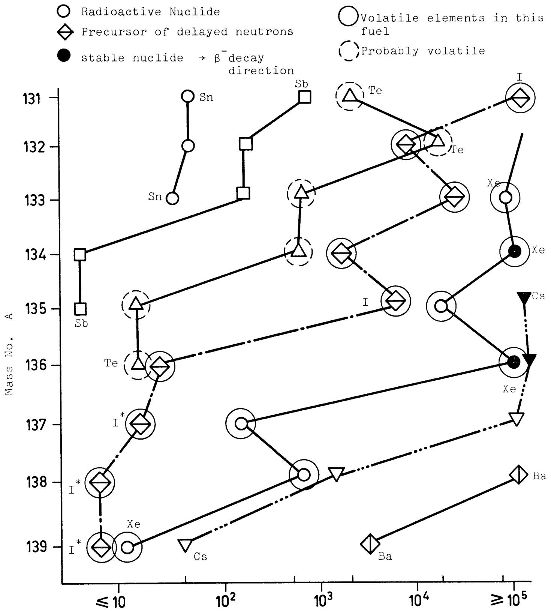  
Fig.11 Precursors of delayed neutrons   
Half life t 1/2 seconds

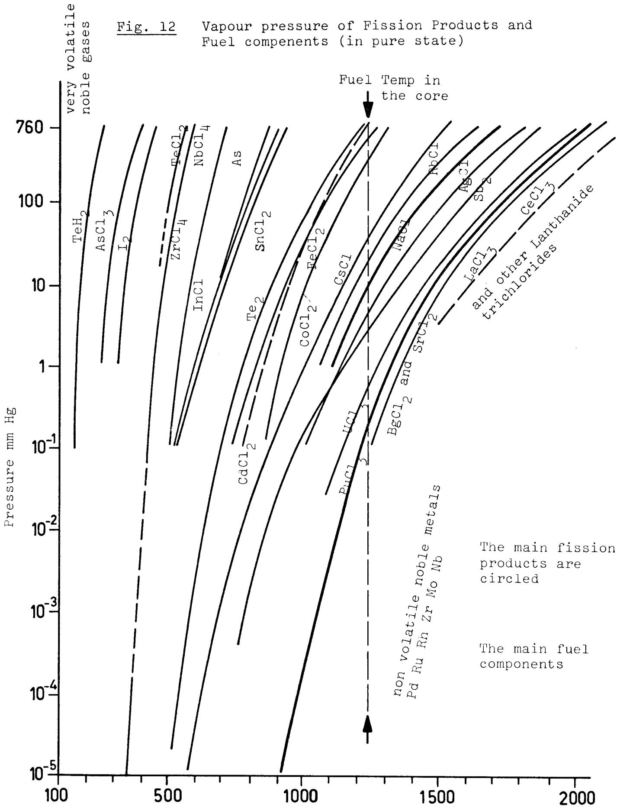  
Temperature K

This amount of plutonium is of the order of $10^{-4}$ relative to the amount of plutonium fissioned in the same time (approx $10^{-4}$ mol Pu/s). However, it still has to be recovered which makes the reprocessing unfortunately more complicated.

Last but not least is the in-core gas extraction of two other elements

- oxygen in the form of $\mathrm{H}_2\mathrm{O}$ : oxygen from impurities (i.e. PuOC1)   
- sulphur in the form of $\mathrm{H}_{2} \mathrm{~S}$ : sulphur from the nuclear reaction:

35Cl (n,p) 35s (see chapter VII)

VI. The neutron transformation of the fission products

VI. Principle of neutron transformations

Some of long lived radioactive nuclides are shown in Fig. 13 and 14.

The aim of this part of the paper is firstly to discuss the possibility of the steady state nuclear transformation (steady state burning) in the thermal neutron region, of the larger part of the long lived fission products. A first approximation for the solutions of this problem is given here and a further discussion initiated.

Fig. 13 Long lived radioactive wastes   
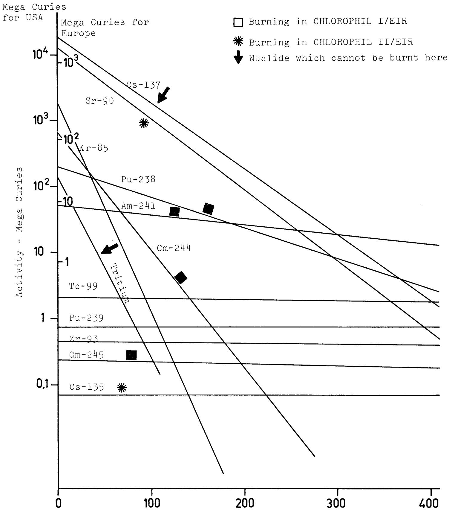  
Time from unloading from Reactor (at the year 2000)

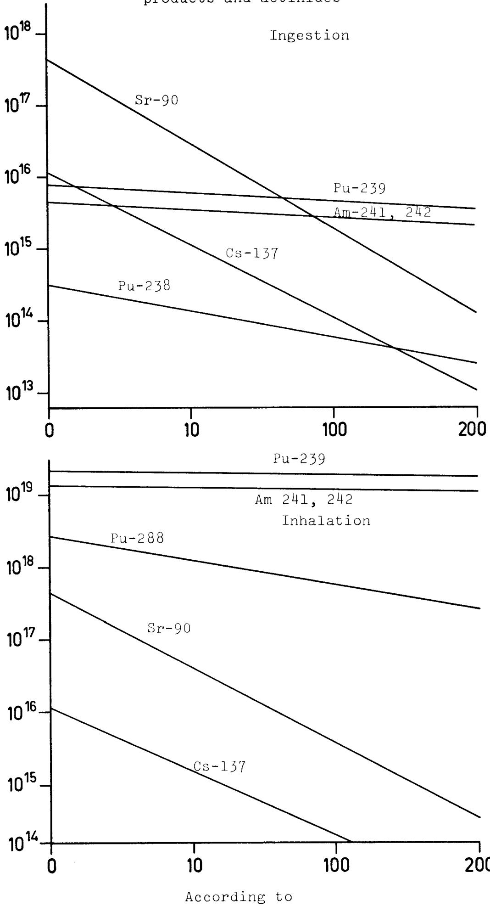  
Fig. 14 Postulated hazard index for long lived fission products and actinides

The idea of destroying the beta-active long lived radionuclides is based on the following:

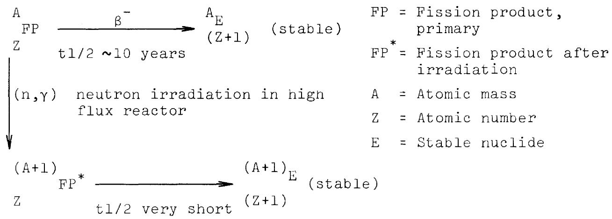  
In Fig. 15 are given the nuclide transformations under a high flux discussed here.

This problem of nuclear transformation of fission and non-fissionable actinides, being the irradiation products, has been discussed for many years. The most recent remarks and calculations concerning this problem made the following claim: "It is not practical to burn fission product wastes in power reactors because the neutron fluxes are too low. Developing special burner reactors with the required (thermal) neutron flux of the order of $10^{17}\mathrm{~n~cm}^{-2}\mathrm{~s}^{-1}$ or burning in the blankets of thermonuclear reactors is beyond the limits of current technology. It seems reasonable to extract three actinides (Np, Am, Cm, (M.T.)) for separate storage or for recycling through the reactors that produce them" (Claiborne, 1972).

Also a controlled thermonuclear reactor CTR was used for calculation of neutron transformations. In those calculations a neutron flux of $5 \times 10^{15} \, \text{n cm}^{-2} \, \text{s}^{-1}$ was used with remark that this flux level is somewhat higher than that usually associated with CTR power plants (Wolkenhauer, 1972, 1973). A three year irradiation was proposed but it would seem that for the most important fission products the neutron build-up in relation to the radioactive decay plays a relatively small role; e.g. for Strontium-90 after 3 years irradiation all neutron reaction products from $(\mathfrak{n}, \gamma)$ and $(\mathfrak{n}, 2\mathfrak{n})$ are lower than $10\%$ of those from the radioactive decay products Sr-90 and for Cs-137 only $(\mathfrak{n}, 2\mathfrak{n})$ products result in $\sim 40\%$ of the radioactive decay products. But $(\mathfrak{n}, 2\mathfrak{n})$ reactions need a rather hard neutron spectrum (Gore, Leonard, 1973).

# VI. b Cross sections and neutron fluxes for nuclear transformations

In this system the following simple evaluations are made

1) the amount of fission pr-ducts coming from both the fast breeder (2000 MW) and the thermal burner (500 MW)   
2) the cores are purged by means of gas $(\mathrm{He} + \mathrm{H}_2$ stream) for evacuation of some volatile nuclides (Kr, Xe, Br, I)   
3) the fuels and blanket materials are continually reprocessed   
4) the irradiated fission products are continuously (or periodically) separated for the sake of eliminating the daughter stable nuclides (e.g. Zr-90 and Zr-91 from the decay and burning of Sr-90)   
5) the amounts C in steady state (ss) burning are calculated by the obvious relationship for the i-th nuclide.

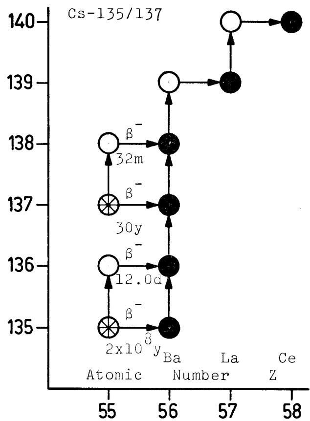  
Fig. 15 Burning of selected Nuclides

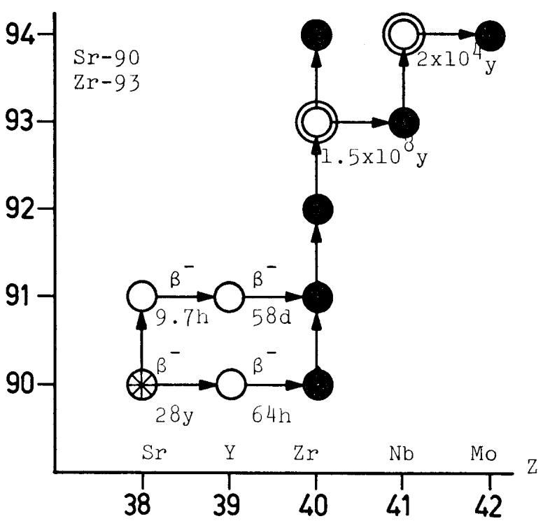

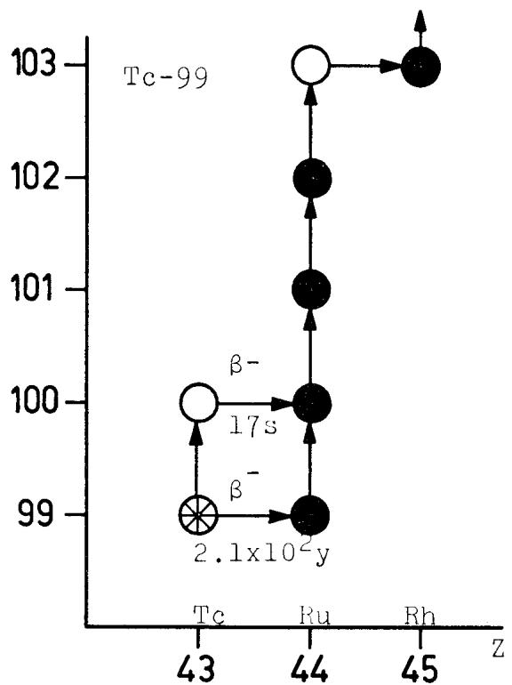

Long lived fission product   
Stable Nuclide   
Beta unstable intermediate nuclide   
Long lived nuclide

$$
\begin{array}{l} \mathrm {C} _ {\mathrm {s s}} ^ {\mathrm {i}} = \frac {\mathrm {p x} (3 . 1 \mathrm {x} 1 0 ^ {1 0}) \mathrm {f i s s . s} ^ {- 1} \mathrm {w} ^ {- 1} \mathrm {x n i}}{\left(\lambda_ {\mathrm {R}} ^ {\mathrm {i}} + \sigma_ {\mathrm {j}} ^ {\mathrm {i}} \Phi_ {\mathrm {j}}\right) \mathrm {x} (6 \mathrm {x} 1 0 ^ {2 3})} \end{array} \quad (\text {m o l})
$$

$$
\begin{array}{l l} \text {P} & = \text {t h e r m a l p o w e r (w a t t s)} \\ \eta & = \text {y i e l d (r e l a t i v e a m o u n t p e r 1 0 0 f i s s i o n e d P u - 2 3 9 / 2 4 1 a t o m s)} \\ \lambda_ {R} & = \text {r a d i o a c t i v e d e c a y c o n s t a n t (s ^ {- 1})} \\ \sigma & = \text {c r o s s s e c t i o n (c m ^ {- 2})} \\ \Phi & = \text {m e a n n e u t r o n f l u x (n c m ^ {- 2} s ^ {- 1})} \\ j & = \text {a p p r o p r i a t e n e u t r o n s p e c t r u m (j = f a s t o r t h e r m a l)} \end{array}
$$

The most critical values $\sigma_{j}^{i}\Phi_{j}^{i}$ are given in Fig. 16 for some selected nuclides for thermal and fast neutron fluxes.

The calculation given above results in the following:

Burning in a thermal high flux power reactor $\varnothing = 6 \times 10^{15}$ n cm $^{-2}$ s $^{-1}$

$$
\begin{array}{l} \text {C s - 1 3 5} \\ \text {S r - 9 0} \end{array} \tag {Fig. 17}
$$

$$
\mathrm {K r} - 8 5
$$

$$
\begin{array}{c c} \text {T c -} & 9 9 \end{array}
$$

$$
I - 1 2 9 / 1 2 7 \quad (\text {F i g .} 1 8)
$$

Burning in fast power breeder reactor: $\varnothing = \sim 10^{16} \mathrm{n.cm}^{-2} \mathrm{s}^{-1}$

Cs - 137 (Fig. 17/I) (other option: only storage but of core!)

Zr - 93 (Fig. 18/III)

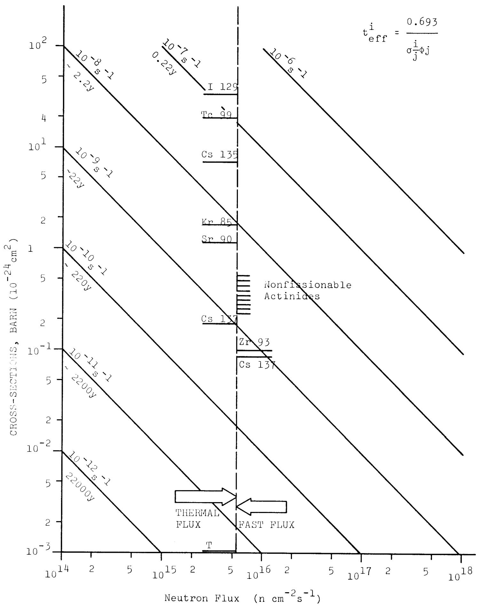  
Fig. 16

A more complicated problem is the need for the separation of the two caesium isotopes Cs-135 for thermal burning and Cs-137 for fast burning or out of core storage. From Fig. 11 it can be seen that the in-core gas extraction takes out the precursors of Cs-135, that is the long lived volatile I-135 and Xe-135, but the short lived precursors of Cs-137 remain in the fuel, so the separation of these isotopes is possible (see Chapter VII).

Among the most dangerous long lived radioactive wastes are some of the actinides (see Fig.13, 14).

The problem of the "destruction" of these nuclides: Np-237, Pu-238, Am-241, Am-243, Cm-244, Cm-245, is "simple". In any high flux fast or thermal reactor because of the relatively large cross sections these actinides are burned up, the problem is only limited by the present state of the reprocessing technology of irradiated fuel. In the most obvious aqueous processes e.g. the aqueous phase - organic phase extraction, these elements: Np, Am, Cm being hydrolysed, because of a relatively low concentration, and in the hydrolysed form are not extractable by many organic extractants. Of course a more refined aqueous process could give a significant improvement in the recovery of these actinides making it possible to recycle in the fuel and eventually to burn-up (Fig. 20 and 21).

In the fused salt fast-thermal system proposed here the recovery of the actinides seems much easier and simpler due to the fact that

1) the reprocessing occurs not in an aqueous but in a molten salt medium; the hydrolysis of the low concentration actinides is not possible; the recovery is very high.

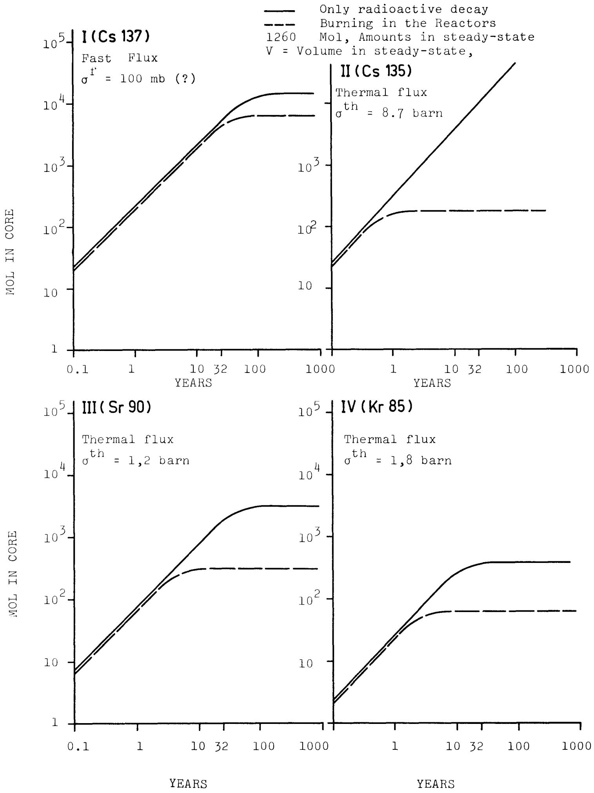  
47   
Fig. 17

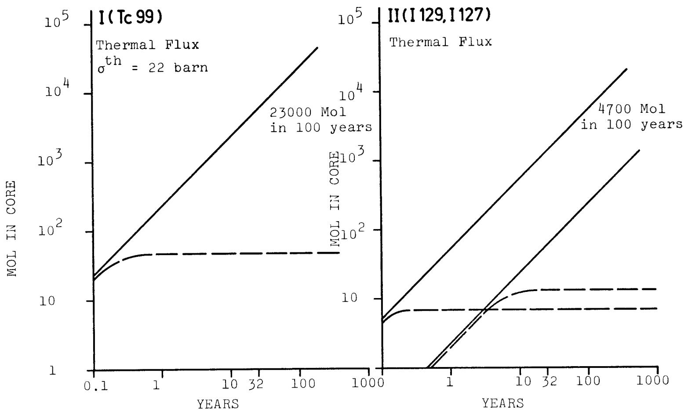  
48   
Fig. 18

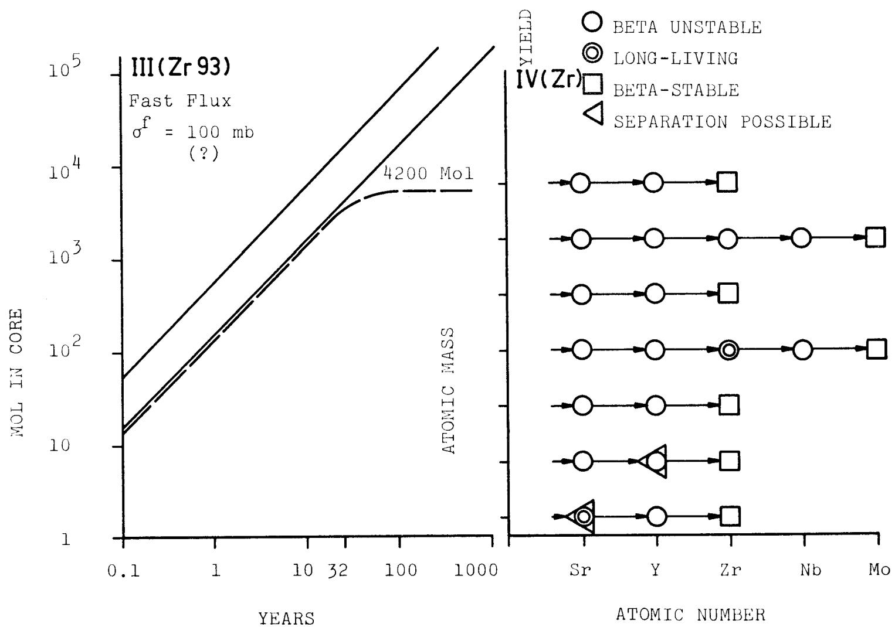

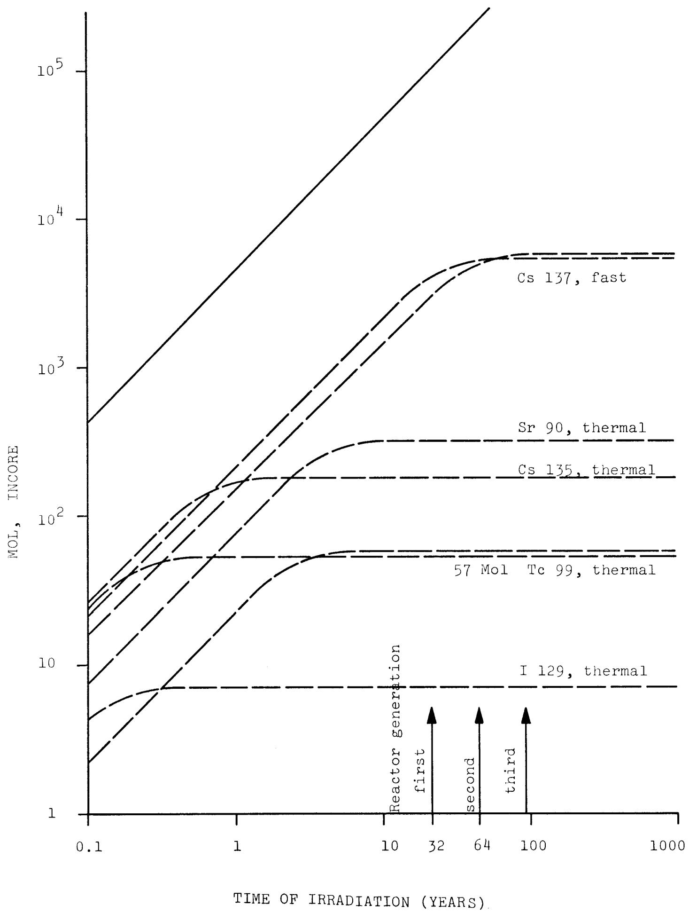  
Fig. 19 FISSION-PRODUCTS IN STEADY-STATE POWER REACTOR: 2,5 GW(t).

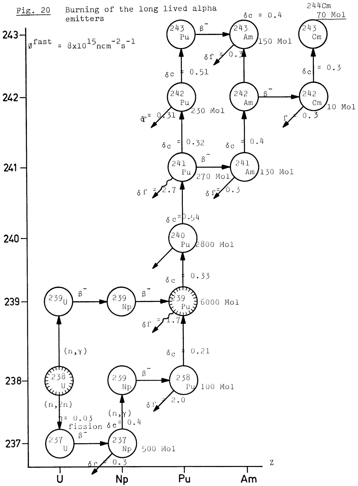  
A

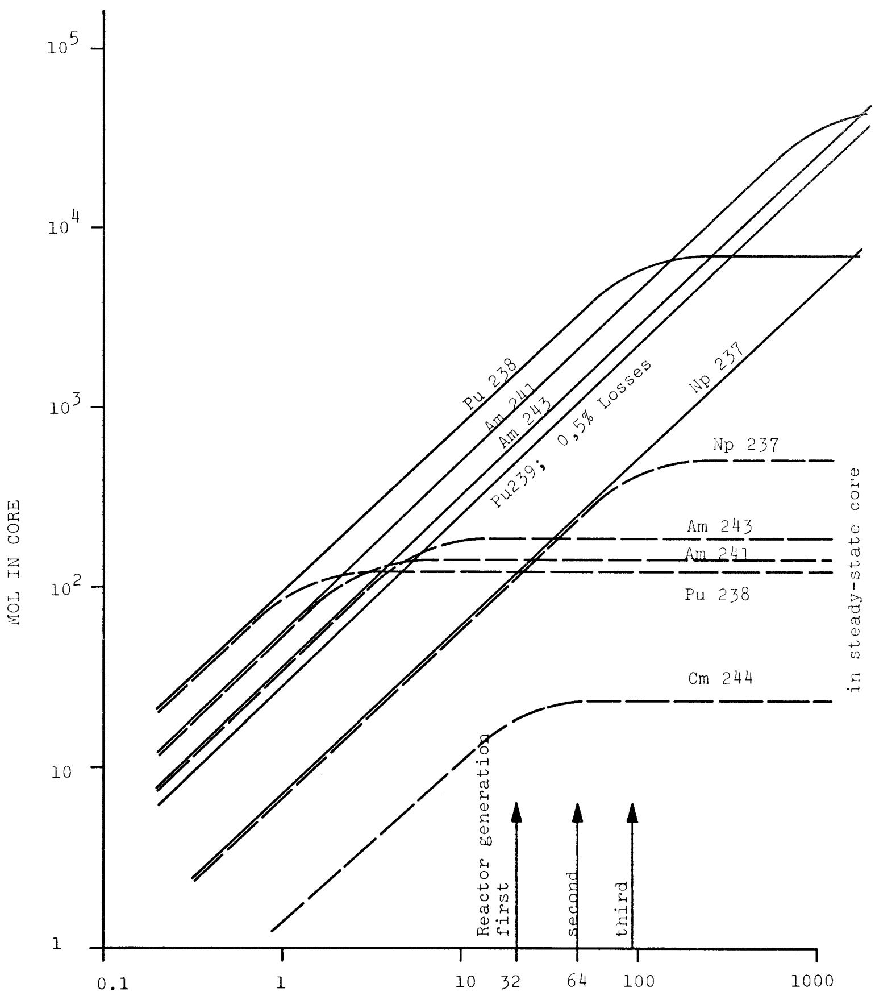  
Fig. 21   
TIME OF IRRADIATION (YEARS)

2) the continuous remotely operated extraction processes and preparation of the liquid fuel, and the absence of fuel elements etc. make this recycling of the actinides (very hazardous alpha and partly neutron emitters) possible and desirable.

The high grade recovery of the actinides postulated here gives the steady state results for the fast reactor shown in Fig. 20 and 21. The reason for burning in the fast and not in the thermal reactor is based on the fact that the relation $\delta_{\mathrm{c}}^{\mathrm{f}} / \delta_{\mathrm{c}}^{\mathrm{th}}$ is greater in the fast reactor than in the thermal.

It must be remembered that the relatively high neutron flux results not only in the irradiation of the non-desirable radioactive nuclides but also the stable fission products, not to mention the stable components of the fuel and the structural material. A very short review of these partial processes is given here

1) chlorine contains two stable isotopes (underlined) (see Fig. 22).

$$
\left. \begin{array}{l l l l} ^ {3 5} _ {\underline {{1 7}}} & (n, \gamma) & ^ {3 6} _ {\underline {{1 7}}} & \frac {\beta^ {-}}{\text {y e a r s}} ^ {-} \frac {3 6}{{\mathrm {A r}}} \\ ^ {3 7} _ {\underline {{1 2}}} & (n, \gamma) & ^ {3 8} _ {\underline {{1 2}}} & \frac {\beta^ {-}}{-} ^ {3 8} _ {\underline {{\mathrm {A r}}}} \end{array} \right\} \text {v o l a t i l e}
$$

but not only $(n, \gamma)$ reactions are important here. Much more important is the following reaction:

$$
\begin{array}{l l l l l} 3 5 _ {\mathrm {C l}} & (\mathrm {n}, \mathrm {p}) & 3 5 _ {\mathrm {S}} & \beta^ {-} & 3 5 _ {\mathrm {C l}} \\ 1 7 ^ \underline {{}} \underline {{}} \underline {{}} \underline {{}} \underline {{}} \underline {{}} \underline {{}} \underline {{}} \underline {{}} \underline {{}} \underline {{}} \underline {{}} \underline {{}} \underline {{}} \underline {{}} \underline {{}} \underline {{}} \underline {{}} \underline {{}} \underline {{}} \underline {{}} \underline {{}} \underline {{}} \underline {{}} \underline {{}} \underline {{}} ^ {\underline {{}}} \end{array}
$$

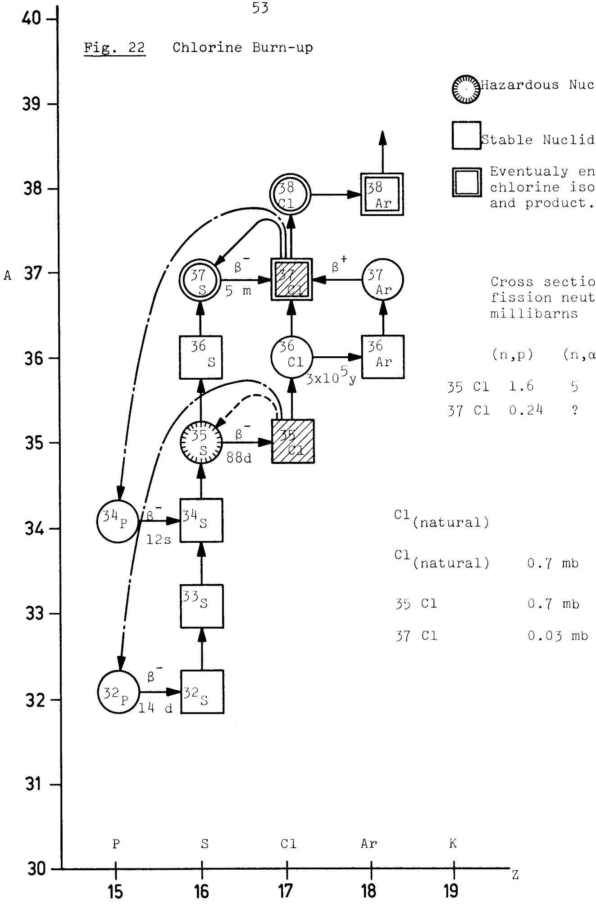

The presence of sulphur influences the chemistry of the molten fuel.

2) Sodium has only one stable isotope

$$
\begin{array}{c c c c c c c c} 2 3 _ {\mathrm {N a}} & (n, \gamma) & 2 4 _ {\mathrm {N a}} & \beta^ {-} & 2 4 _ {\underline {{M g}}} & (n, \gamma) & 2 5 _ {\underline {{M g}}} & (n, \gamma) & 2 6 _ {\mathrm {M g}} \\ 1 1 ^ {-} & & 1 1 ^ {-} & & 1 2 ^ {-} & & & & \\ & & & 2 6 ^ {-} & & & & \\ & & & \underline {{M g}} & (n, \gamma) & 2 7 _ {\underline {{M g}}} & \beta^ {-} & 2 7 _ {\underline {{A l}}} \end{array}
$$

This chain seems to result in increasing amounts of stable magnesium and in longer time also stable aluminium.

A short summary of the "history" of the long lived radioactive nuclides proposed in this paper is given in Table 7.

Table 7 Problems in fission-products management   

<table><tr><td>Nuclide</td><td>Separation</td><td>Transformation</td></tr><tr><td>T</td><td>from in core gas purging diluted with H</td><td>not possible, waste only</td></tr><tr><td>Kr-85</td><td>from in core gas purging after decay of other Kr isotopes:</td><td>burning in thermal reactor (under pressure or as fluoride compend)</td></tr><tr><td>Sr-90</td><td>from fuel reprocessing: separation Sr/Ba needed</td><td>burning in thermal reactor</td></tr><tr><td>Zr-93</td><td>from fuel reprocessing: the preliminary separation of Y-91, precursor of Zr-91 is needed</td><td>burning in fast reactor; not possible in thermal reactor due to too large a volume. The radioactive Zr-93 is diluted by Zr-94, 95</td></tr><tr><td></td><td>Mixture of Zr-93, 94, 95</td><td>partially used as a diluent for the thermal reactor ZrF4or as structural material &amp; fission products cladding in thermal reactor.</td></tr><tr><td>Tc-99</td><td>from fuel reprocessing</td><td>burned in thermal reactor</td></tr><tr><td>I-129</td><td>from gas purging, after decay time of I-131, that is ~ 160 days</td><td>burning in thermal reactor</td></tr><tr><td>Cs-135</td><td>from gas purging, after the decay of Xe-135, that is after ~ 5 days</td><td>burning in thermal reactor</td></tr><tr><td>Cs-137</td><td>from fuel reprocessing: separation of Cs/Rb is needed</td><td>quasi-burning (storage) in fast breeder core-(in solid form) or out of core</td></tr><tr><td>Actinides</td><td>from fuel reprocessing together with plutonium; very high efficiency of separation processes is needed.</td><td>fissioning in fast reactor</td></tr></table>

# VII. Reprocessing

The system proposed here is a rather complicated and sophisticated 'chemical machine' and not only a nuclear energy thermal energy transformer as are other classical reactors.

The entire reprocessing scheme includes: (Fig. 23)

Table 8 Scheme of entire reprocessing system   

<table><tr><td>Continuous Process</td><td>Short description</td><td>Principle action</td></tr><tr><td>Gas extraction</td><td>Hydrogen-helium gas stream</td><td>removal of I-131 and Xe</td></tr><tr><td>Fast chloride fuel reprocessing</td><td>Reprocessing of the 2 GW(t) fast breeder Remark: only plutonium! No uranium!</td><td>separation of Cs-135/Cs-137</td></tr><tr><td>Thermal fluoride fuel reprocessing</td><td>Reprocessing of the 0.5 GW(t) thermal only plutonium! No uranium!</td><td></td></tr><tr><td>Fertile chloride, material reprocessing</td><td>Reprocessing of the fast breeder blanket material Mostly uranium, small amounts of plutonium.</td><td></td></tr><tr><td>Fission products, mostly fluoride reprocessing</td><td>Reprocessing of the long lived fission products, irradiated in in the thermal high-flux.</td><td>removal of stable nuclides from Zr</td></tr></table>

The effective burning of the most important long lived nuclides needs a rather complicated reprocessing plant with high temperature pyrochemical separation methods, both in gaseous and liquid salt or/and metallic phases. In some cases also a retention volume is necessary (for spontaneous decay of short-lived nuclides).

This reprocessing philosophy arises from the following assumptions: The caesium nuclides are very hazardous but there are at least two isotopes Cs-135 (t 1/2 = 2 x $10^{6}$ a) and Cs-137 (t 1/2 ≈ 30 a). The first one has a reasonable cross section from the point of view of neutron transformation ( $\sigma_{\text{th}} \cong 8$ barn), the second a very small cross section in both fast and thermal reactors $\sigma^{\text{f}} = 100$ mb or less, $\sigma^{\text{th}} = 110$ mb). The separation of two flows e.g. Cs-135 for thermal burning and Cs-137 for quasi burning (rather self-decaying) could help solve this problem.

In this system the continuous in core gas purging system is expected to extract some of the volatile fission products especially those with longer half life period. In the case of caesium the separation of both isotopes is possible due to the different time chains

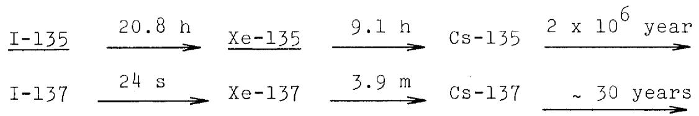

The extractable volatile and relatively long lived nuclides in short time gas purging are underlined. The Cs-135 could be extracted in the form of the precursors. Cs-137 is retained in the fuel and must be separated by more conventional (but not so simple) methods.

Another similar problem arises in the case of zirconium isotopes (see Fig. 18/IV) and iodine (Fig. 18/II). Part of the zirconium could be used as a diluent of the homogenous fuel for the thermal core (e.g. $20\, \text{mol}\% \, \text{ZrF}_4 + 80\, \text{mol}\% \, \text{FeF}_2$ ) part as component of the molten fuel for the fast core (?) and part in metallic form as structural (but radioactive) material when in the final period of fast reactor development when the Zr-93 will be reduced to less than 1 mass % of the total zirconium

Some further similar questions will have to be discussed, in some a separation of isotopes is possible by means of rapid in core gas extraction or slow out of core (liquid phase) separation process.

A preliminary draft of the possible reprocessing scheme is given in Fig. 23.

# VIII. Molybdenum and corrosion processes

The corrosion processes in this type of reactor are of crucial importance. In the cores of these reactors are approx 950 kg molybdenum or approx $10^{\prime}000$ mol.

We postulate here, arbitrarily, a relatively high corrosion rate equivalent to a full or $100\%$ corrosion of the complete amount of molybdenum in approx 10 years. This means a corrosion rate of:

$$
\frac {1 0 ^ {\prime} 0 0 0 \mathrm {m o l} \text {m o l y b d e n u m}}{1 0 \text {y e a r s} \mathrm {x} (3 . 1 \mathrm {x} 1 0 ^ {7} \mathrm {s} / \text {y e a r})} = 3 \mathrm {x} 1 0 ^ {- 5} \mathrm {m o l} / \mathrm {s} = 3 0 \mu \mathrm {m} / \mathrm {s}
$$

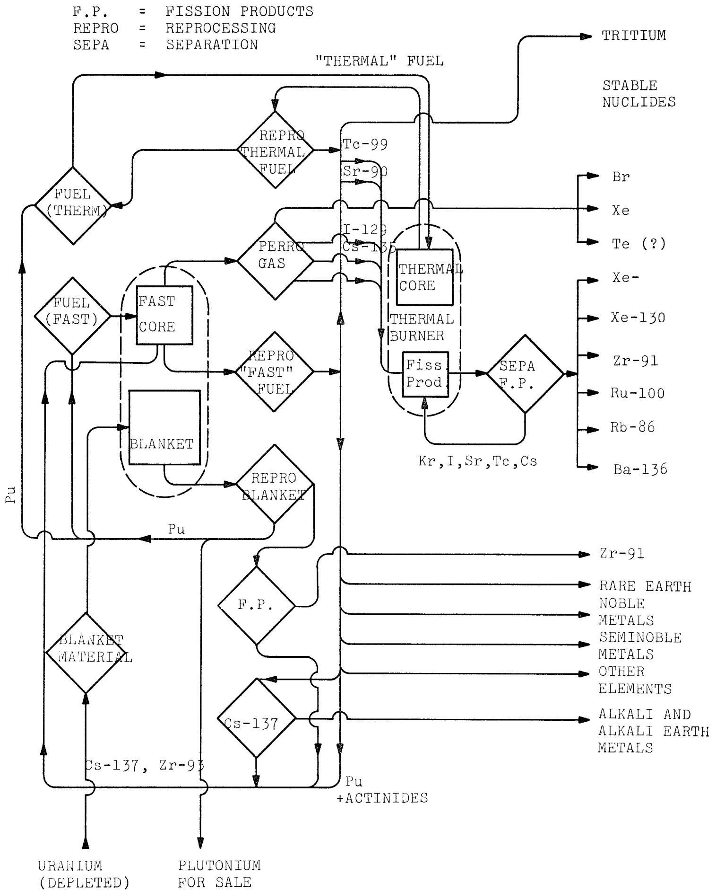  
Fig. 23

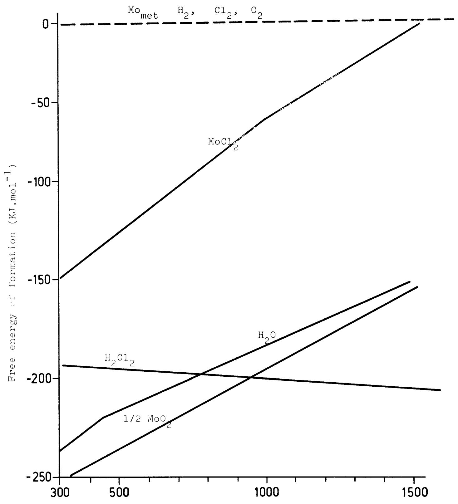  
Fig. 24   
Temperature K

Thus 30 micromoles molybdenum per second (or approx $3\mathrm{mgMo / s}$ ). In addition to this we have molybdenum as fission product. In the 2000 MW(t) fast reactor the amount of fissioned plutonium equals:

2000 MW(t) x 1 day x (1.06 g Pu/MWd(t)) ≈ 2150 g Pu/day or: 25 mg Pu/s: that is; 100 μ mol Pu/s.

The production side of fission products equals $200\mu \mathrm{mol} / \mathrm{s}$ . Molybdenum is present at about $18\mathrm{mol}\%$ of fission products which means a $36\mu \mathrm{mol} / \mathrm{s}$ , or almost half the amount of corroding material. From both sources, corrosion and fissioning the amount of molybdenum is about $50\mu \mathrm{mol} / \mathrm{s}$ . The corrosion processes can go in three directions

1) Chloride reaction $\mathrm{Mo}_{\mathrm{met}} + 2\mathrm{Cl}^{-} + \mathrm{Me}^{+} \rightarrow \mathrm{MoCl}_{2} + \mathrm{Me}_{\mathrm{met}}$   
2) Oxygen reaction $\mathrm{Mo}_{\mathrm{met}} + \mathrm{O}_2 \rightarrow \mathrm{MoO}_2$   
3）Tellurium reaction Mo met + Te2 → MoTe2

These and eventually other molybdenum corrosion processes are potentially dangerous and should when possible be prevented in the core itself. This possibility exists due to the reaction with the gaseous hydrogen (see also Chapter IV).

1) MoCl2 + H2 → Mo met + 2HCl   
2) MoO₂ + H₂ → Mo met + 2H₂O   
3) MoTe2 + 2H2 → Mo met + 2TeH2 → Te2 + 2H2

(see Fig. 24)

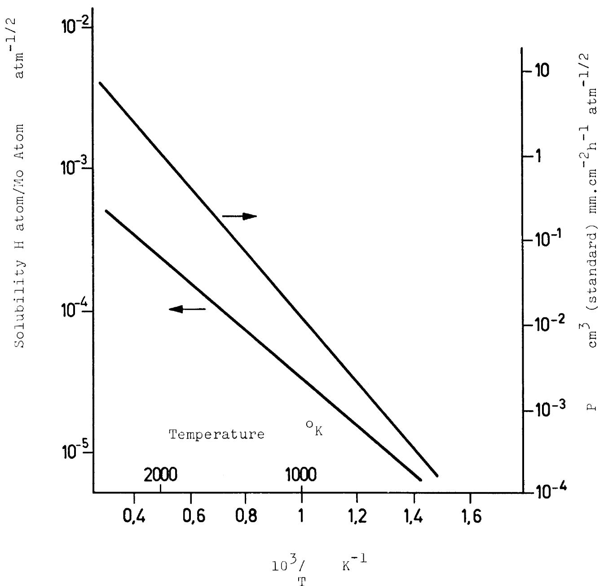  
Fig. 26 Solubility and Penneability Mo met H gas

In the extreme case the molar amount of hydrogen is twice as big as that of molybdenum giving $120 \mu \mathrm{mol} \, \mathrm{H}_2/\mathrm{s}$ .

Under normal conditions (1 bar, $0^{\circ}\mathrm{C}$ ) this amount of hydrogen is acceptable:

$$
\sim 1 2 0 \mu \mathrm {m o l} \times (2. 2 \times 1 0 ^ {4} \mathrm {c m} ^ {3} / \mathrm {m o l}) \times 1 0 ^ {- 6} \cong 3. 0 \mathrm {c m} ^ {3} \mathrm {H} _ {2} / \mathrm {s}
$$

For further calculations we arbitrarily assume ten times more, approx $30~\mathrm{cm}^3\mathrm{H}_2 / \mathrm{s}$ . (see also Chapter V)

Here is a major question concerning the reaction of metallic molybdenum with hydrogen. From about 100 elements there are only twelve elements which form no chemical binding with hydrogen.

<table><tr><td></td><td>d4</td><td>d5</td><td>d6</td><td>d7</td><td>d8</td></tr><tr><td>3d - Electrons</td><td></td><td>Mn</td><td>Fe</td><td>Co</td><td></td></tr><tr><td>4d - Electrons</td><td>Mo</td><td>Tc</td><td>Ru</td><td>Rh</td><td></td></tr><tr><td>5d - Electrons</td><td>W</td><td>Re</td><td>Os</td><td>Ir</td><td>Pt</td></tr></table>

Thus molybdenum fulfills the minimum requirements: it has no reaction with hydrogen. Also manganese-cobalt alloys are suitable for this reactor (chromium and nickel not!).

In addition the solubility of hydrogen in molybdenum is relatively small. The dependence of the solubility of $\mathrm{H}_{2}$ in Mo-metal on temperature and pressure is known since molybdenum is a possible constructional material for containing plasma (hydrogen) in fusion reactors. Also the diffusion of hydrogen through metallic molybdenum is relatively very small (see Fig. 26).

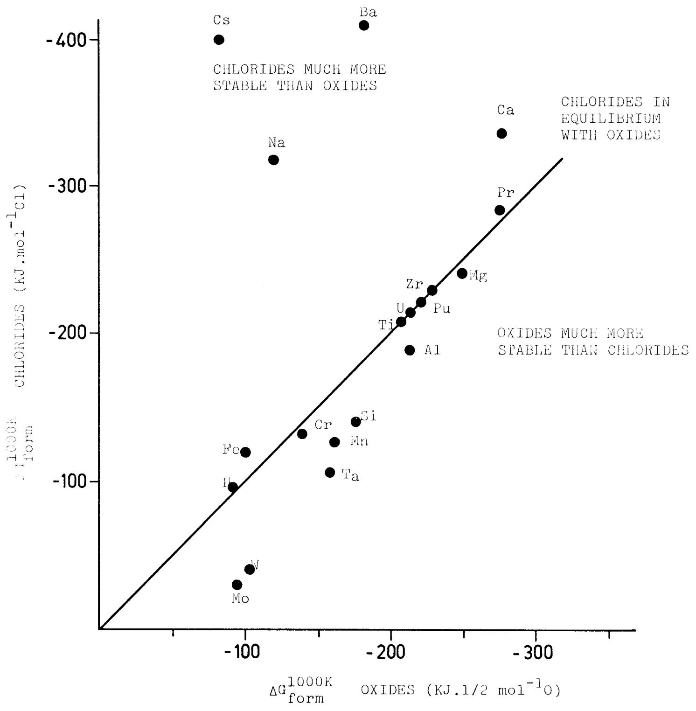  
Fig. 25 CHLORIDES-OXIDES EQUILIBRIUM   
DIAGRAM AT 1000K

The diffusion rate of hydrogen from the melted fuel to coolant and blanket (here also $\mathrm{UCl}_3 - \mathrm{NaCl}$ ) needs to be discussed.

One can assume, however, that also this melt with hydrogen is saturated so that the porosity of the wall (molybdenum) will play a minor role. The most important: the variation in mechanical properties of the molybdenum caused by the dissolved hydrogen.

The problem of the corrosion of molybdenum in chlorine containing media is particularly complicated by the numerous molybdenum chlorides: $\mathrm{MoCl}_2$ , $\mathrm{MoCl}_3$ , $\mathrm{MoCl}_4$ , $\mathrm{MoCl}_5$ .

Also the oxygen chlorine systems for molybdenum and some selected fuel components including hydrogen are rather complex (Fig. 24).

In the region of the external heat exchanger the main corrosion process results from the action of gaseous aluminium chloride (the secondary working agent)

$$
A l C l _ {3 (g)} + \frac {1}{x} M o \rightarrow \frac {1}{x} M o C l _ {2 x (g)} + A l C l (g)
$$

This reaction has been discussed in earlier publications (Blander 1957) but unfortunately not all the thermodynamic data is known. The stability of the molybdenum chlorines is of course strongly influenced by the concentration of free chlorine and also by the temperature.

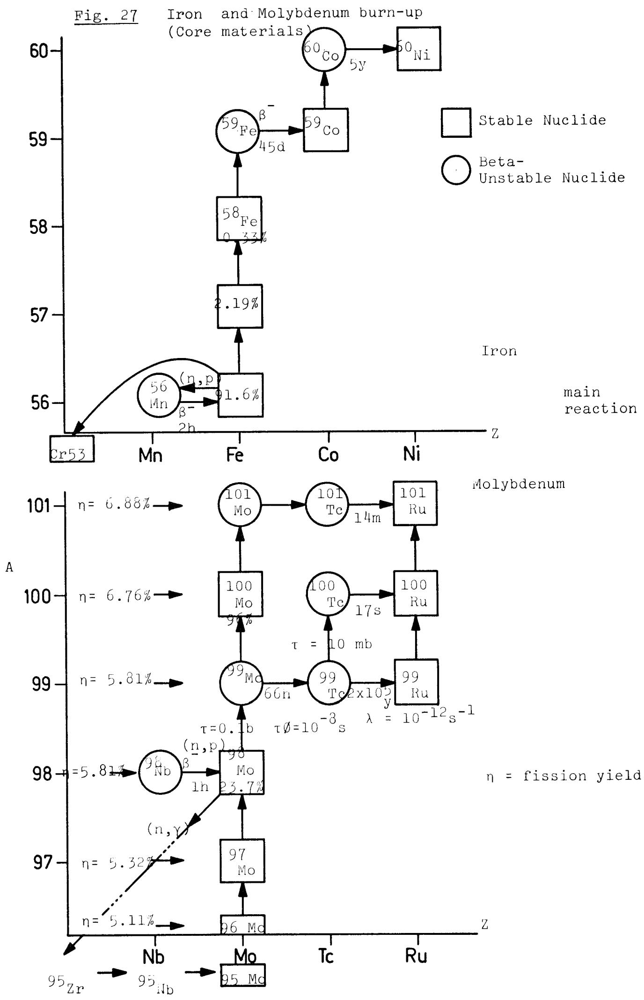

A more detailed calculation of metallic molybdenum corrosion in the aluminium trichloride is needed. These calculations are very sensitive to the vapour pressure of chlorides. More detailed calculations of the corrosion in this system have been given earlier (Taube, Schumacher 1969).

IX. Molybdenum and iron irradiated in a fast high flux reactor IX a) Nuclear effects

The high neutron flux irradiation causes physical and chemical changes in structural materials.

Molybdenum is a mixture of stable isotopes (Fig. 27). The most important by-product of neutron irradiation is the Tc-99 beta-emitter with $t$ $1/2 \cong 2.1 \times 10^5$ year and which belongs to the chain (stable nuclides underlined)

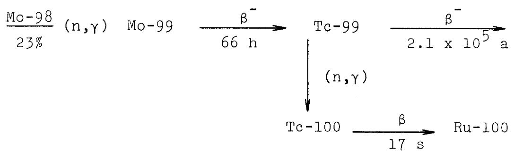

for approx $1000\mathrm{kg}$ . Mo in core or about 10'000 moles the Mo-98 gives 2300 mol. The irradiation rate equals:

$$
\begin{array}{l} \begin{array}{l} N ^ {M o - 9 9} \\ \text {p r o s e c} \end{array} = (2. 3 x 1 0 ^ {3}) x (6 x 1 0 ^ {2 3}) x (1 0 x 1 0 ^ {- 2 7}) x 1 0 ^ {1 6} A t o m / s \\ = 1. 2 \times 1 0 ^ {1 7} \text {A t o m / s} \\ \end{array}
$$

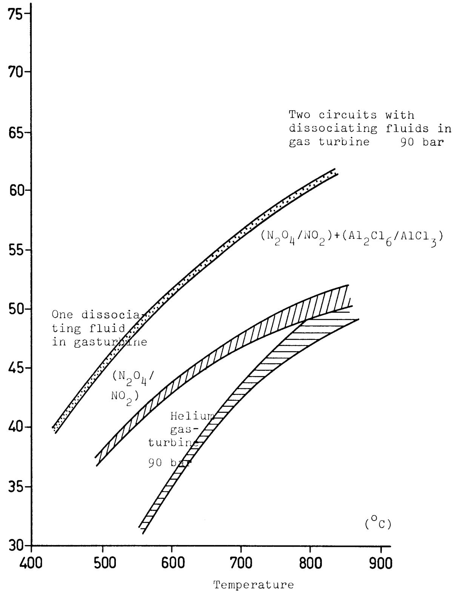  
Fig. 28 Approximate thermal efficiency using a turbine cycle with various working fluids   
Total Power Plant thermodynamic efficiency

After 700 hrs the steady state concentration of Mo-99 (t $1/2 = 66$ hrs $\approx 2.4 \times 10^{5} \mathrm{~s}$ : $\lambda = 3 \times 10^{-5} \mathrm{~s}^{-1}$ ) equals:

$$
C _ {\text {s t e a d y}} ^ {\text {M o - 9 9}} = \frac {1 . 2 \times 1 0 ^ {1 7}}{3 \times 1 0 ^ {- 5}} = 3 \times 1 0 ^ {2 1} \quad \text {A t o m}
$$

The activity of the Tc-99 (t $1/2 = 2.1 \times 10^{5} \mathrm{a} = 6.2 \times 10^{12} \mathrm{s}$ : $\lambda \stackrel{*}{=} 10^{-13} \mathrm{s}^{-1}$ ) after 3 years irradiation of $100 \mathrm{~kg}$ of molybdenum in the fast reactor core:

$$
\begin{array}{l} \text {A c t i v i t y} _ {(3 \text {y e a r})} ^ {\mathrm {T c} - 9 9} = 1. 2 \times 1 0 ^ {1 7} \text {A t o m / s x (3 x 3 . 1 x 1 0} ^ {7} \text {s / y e a r)} \\ x \frac {1 0 ^ {- 1 3}}{3 . 7 x 1 0 ^ {1 0}} \cong 3 \text {C u r i e} / 1 \text {t o n n e} \text {o f} M o \\ \end{array}
$$

IX b) Radiolysis of molten chlorides in very high flux of fast neutron

The high flux of neutrons and especially of the fission fragments results in a high damage in the fuel material and cladding. In the type of reactor under discussion this problem seems to be much easier to solve because

1) the molten chlorides are fluids with structure that is with a very low activation energy for recombination of the radiolysis product and therefore with a very high recombination velocity.   
2) in core there are no structural materials (tube, cladding etc.)

X. Aluminium trichloride as a secondary coolant and working agent

In this consideration for the power production a non conventional gas-turbine cycle is postulated: we have chosen aluminium tri-chloride, $\mathrm{AlCl}_3$ .

It is now clear that this chosen secondary coolant-working fluid substance has specific additional properties, which make it particularly interesting in the present application. The reason is the following: it is well known that real progress in improvement of the thermal efficiency of turbines is limited by two parameters:

1) for steam turbines, corrosion effects with non austenic steel above $580^{\circ}\mathrm{C}$ on the one hand, and on the other hand the dramatic increase of costs when an austenic steel is used.   
2) for gas turbines (e.g. helium), the operation of the gas-compressor consumes more than half of the energy produced by the power turbines. A number of methods are available for overcoming these limitations, one of these proceeds as follows: the working agent in the turbine, when the temperature decreases undergoes a chemical reaction which decreases the volume. This result is most conveniently obtained when the working substance polymerises at the lower temperature. Of course, this polymersiation must be completely reversible, that is to say that, at the higher temperature, the depolymerisation process is effectively complete. One of the most promising working agent is aluminium trichloride, which, at the lower

temperature dimerises by the following mechanism:

(2 AlCl3) gas (Al2Cl6) gas (Al2Cl6) liq. monomer dimer higher temp. lower temp. lower temp.

When the temperature increases a monomerisation process takes place. Already in 1959 Blander and co-workers discussed the problem of $\mathrm{AlCl}_3$ as working agent. They wrote: "A number of typical application (including a gas turbine cycle employing $\mathrm{AlCl}_3$ as the working fluid and a binary vapour cycle employing water vapour for the lower temperature: M.T.) have been considered but in none of these has the aluminium chloride shown outstanding advantages over more conventional media. However, it is believed that for some special applications it may well prove to have outstanding advantages, where the characteristics of the other system components are such as to make it possible to exploit to the fullest the unique characteristics of aluminium chloride" (Blander, 1959).

Much more optimistic conclusions could be seen in the papers of Krasin and Nesterenko (1972). These authors maintain that the overall thermal efficiency of a dual cycle with aluminium chloride as working fluid in the high temperature cycle and $\mathrm{NO}_2$ in the low temperature cycle promises to increase up to $60\%$ for $800^{\circ}\mathrm{C}$ and 90 ata (see also: Krasin, 1971).

But with aluminium chloride and with nitrogen dioxide the chemical industry has considerable experience, including experience with corrosion problems, in the high-temperature region. Unfortunately there seems to be a lack of data concerning the erosion and corrosion behaviour of these substances in turbines and on their behaviour under neutron irradiation in reactor conditions.

Aluminium chloride as a working fluid in a condensation turbine has the following advantages:

1) the efficiency of the power generation is about $30 - 50\%$ higher than for the "classical" working fluids; helium or steam. The quantity of fuel used is correspondingly smaller. For a country in which the sources of uranium an and plutonium are limited this advantage may be decisive.   
2) the waste heat is smaller than the temperature of the heating water is lower. In a country in which the only sources of cooling water are the rivers, such an advantage is of importance.   
3) the size of the turbine is approximately 5 times smaller than for a steam turbine of the same power. For a direct cycle (when the reactor coolant agent is the working fluid in the turbine) when the circuit is radioactive the small size of turbine is an important factor.   
4) all these properties of an aluminium chloride circuit have a significant influence in reducing the capital cost of a power station.

Let us repeat the advantageous properties: decreased fuel consumption, reduction of waste heat, decrease of turbine size. All these trends promise to give a significant reduction in power generating costs.

The crucial problem of possible corrosion processes caused by $\mathrm{AlCl}_3$ may be controlled by the small addition of hydrogen.

# Acknowledgements

For discussion parts of this paper the author thanks:

J. Ligou (neutronics calculation), Dr. G. Markoczy (heat transfer), Dr. J. Peter (chemistry problems), G. Ullrich (metallurgy), Dr. G. Seifritz (neutronics). The author is also indebted for useful discussions and criticism concerning fast breeder molten chloride reactor to Dr's. Dawson, Long (A.E.R.E. Harwell) and Smith (A.E.E. Winfrith).

Also Dr. P. Tempus for his discussion, criticism and support and Prof. H. Gränicher for his encouragement and support.

Finally Mr. R.W. Stratton for preparation of the text.

# Literature

Beattie J.R., Bell G.D.   
Blander M., Epel L.G., Faas A.P., Neuton R.F.,

A Possible Standard of Risk for Large Accidental Releases.   
Aluminium Chloride as a Thermodynamic Working Fluid and Heat Transfer Medium. ORNL-2677 (1959) Development of Adequate Risk Standards   
Managing Radioactive Wastes. Physics Today, 8 36 (1973)   
H.F.I.R. Core Nuclear Design. ORNL-4621 (1971)   
Neutron Induced Transmutation of High level Radioactive Waste. ORNL-TM-3964 (1972)   
Fission Products Chain A.E.R.E.-R-7394 (1973)   
Proceed. Principles and Standards of Reactor Safety. IAEA-SM-169/43 (1973)   
Considerations in the Long Term Management of High level Active Wastes. ORNL-4762 (1972)   
Proceed. Principles and Standards of Reactor Safety, IAEA-SM-169/43 (1973)   
Disposal of Radioactive Waste. OECD, Nuclear Energy Agency, Paris 1972

Rosenthal M.W., Haubenreich P.N., Briggs R.B.,

The Development Status of the Molten Salt Breeder Reactor. ORNL-4812 (1972)

Taube M., Schumacher H.,

A Carbide-fuelled Fast Breeder Reactor with Molten Chloride as Fuel Bonding Material and Chloride Vapour as Coolant.  
EIR-Report Nr. 167, (1969)

Taube M., Ligou J.,

Molten Plutonium Chlorides Fast Breeder Reactor Cooled by Molten Uranium Chlorides. Ann.Nucl.Sci. Eng. (in press).

Taube M.,

Steady-state burning of fission products in fast/thermal moltensalt breeding power reactors. Ann.Nucl.Sci.Eng.(in press).

Walker W.H.,

Fission Products Data, Part I A.E.C.L.-3037 (1968)

Wolkenhauer W.C.,

The Controlled Thermonuclear Reactor as a Fission Product Burner.

Am.Nucl.Soc.Meeting, BNWL-SA-4232 (1972)

See also Am.Nucl.Soc. Winter Meeting 1973, p. 52