Eidg. Institut für Reaktorforschung Würenlingen Schweiz

Thorium, Uranium, other Metals and Materials from Earth's Crust Rocks

M. Taube

Würenlingen, April 1974

# Abstract

The general use of the rocks of the earth's crust as a source of nuclear energy (from thorium-uranium extracted with $30\%$ efficiency), and a source of metals (aluminium, iron etc.), a source of ceramics (cement, glass, quartz) and other materials is discussed. The proposal is to use their source to meet the needs of a future stable civilization requiring a unit power production of some 20 kw per capita and source material supply of 1 tonne per capita per year (additional to recycling). The impact of this on the philosophy a reactor development is also discussed.

# I. General remarks

The aim of this paper is to outline and discuss the possible future sources and flows of energy in the next 50 to 200 years, in the world as a whole, and more especially in Switzerland. It is a continuation of the well known idea of A. Weinberg of 'rocks burning'.

It can be debated that any numerical or quantitative evaluations on these topics have little value at the present time, but the author is of the firm opinion that such an evaluation could have an impact on the philosophy of reactor development especially in the qualitative choice of reactor type.

Since it seems to take some 20 years from paper studies to full reactor operations (of a new type) and a further 30-40 years of life, then the minimum time scale we should consider is of the order of 50 years.

II. World energy development, and the case of Switzerland

It is well known that the number of prognoses for the future development of our civilization is equal to the number of papers on the subject. Here the following assumptions have been made.

1. The world population increases continuously to $9 - 10 \times 10^{9}$ people after 200 years and then reduces to a stable level of $8 \times 10^{9}$ people (for Switzerland - today $6 \times 10^{6}$ people, in the next 50 years $8 \times 10^{6}$ and then stabilization).

2. The abundance of available energy sources is the most important factor in the development of any civilization.   
3. The regeneration of the natural environment is one of the most important factors in considering the transformation of matter into energy.   
4. Our civilization achieves a steady state level in approx 200-250 years and this level will have the following characteristics

production of fresh materials (from ores etc.) would be a factor 2-3 times lower than at present.   
recycling will, therefore, be greatly increased.   
- the spectrum of material use will be drastically altered.   
- the free energy available for these needs will be increased per capita mean by approx 10 times.

The size of the fissile material requirement

The calculations are made on the following basis:

1 Mwd(t) $\approx$ 1.l g fissile nuclide (F.N.)

1 Mwyear (e) ≈ 1.0 kg fissile nuclide (F.N.)

and therefore

1 TW(t) year ≈ 400 ton FN   
1 GW(t) year ≈ 0.4 ton FN

for the far distant future, for the steady state case:

World:

8 Giga people x 20 kw per capita gives

160 Tw(t) ≈ 64'000 ton FN/year

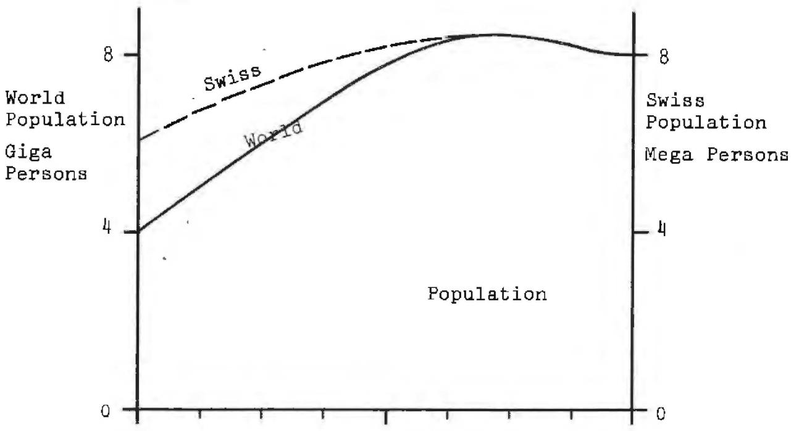  
4   
Fig.1 Energy Growth: World and Switzerland

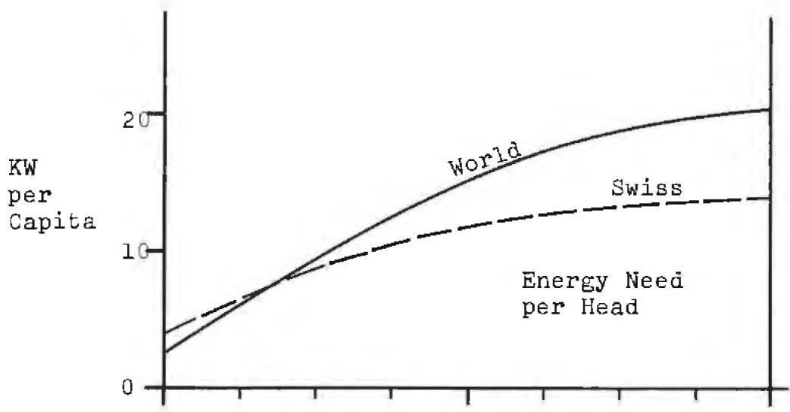

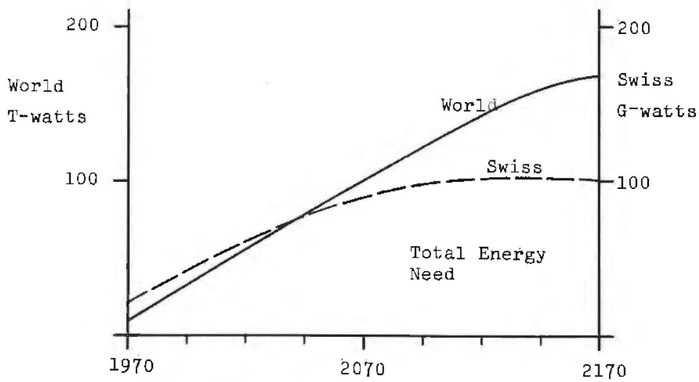

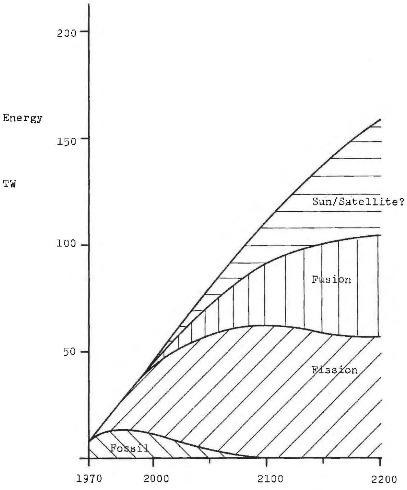  
Fig.2 Development of new World Energy Sources in the Future

# Switzerland:

8 Mega people x 12 kW per capita gives

0.1 TW(t) ≈ 40 ton FN/year

For a period of let us say 1000 years steady civilization

World requirements: 64 x 10 $^{6}$ ton FN

Swiss requirements: $40 \times 10^{3}$ ton FN

Of course the development of other energy sources will change and may dramatically after the assumptions given above, but fig. 2 makes the arbitrary assumptions clear.

Here the assumption of fission energy covers approx 1/3 of all energy needs and thus the data given above are too big only by a factor 3 in the worst case.

III. Uranium-Thorium sources in ores, granites and the earth's crust

The most important assumption made here is that the fission energy is the main source of free energy not only in the next century but also in later periods. At present uranium is recovered from the following ores.

USA ores 1800 ppM

Canada ores 1100 ppM

South Africa ores 250 ppM

Other West Hemisphere ores 1940 ppm

Mean for West Hemisphere 820 ppM

It must be stressed that at the present time the "uranium ores" have a commercial value of approx. $20 \text{‰}$ per kg of U₃O₈ even if the uranium contents equals only 250 ppM!

But as is well known the mean distribution of uranium and thorium in the earths crust is approximately 12 ppM for both elements. The proportion of these fissionable elements is higher in the granites (typical continental rocks) and reaches 50 ppM. In the basalts (typical oceanic rocks) it is lower at about 1 ppM (see fig. 3).

Of course in the continental rocks there are some significant accumulations of uranium and to save extent thorium. The probable amounts of high and low grade ores are given in fig. 4 (rough estimates).

# IV. Resources of other elements

An underlying feature of the arguments developed in this paper is that the extraction of the fissionable nuclides U and Th from the rocks of the earth's crust must be coupled with the extraction of all the usable elements from these cours, which must decrease the cost of the recovery of all appropriate elements.

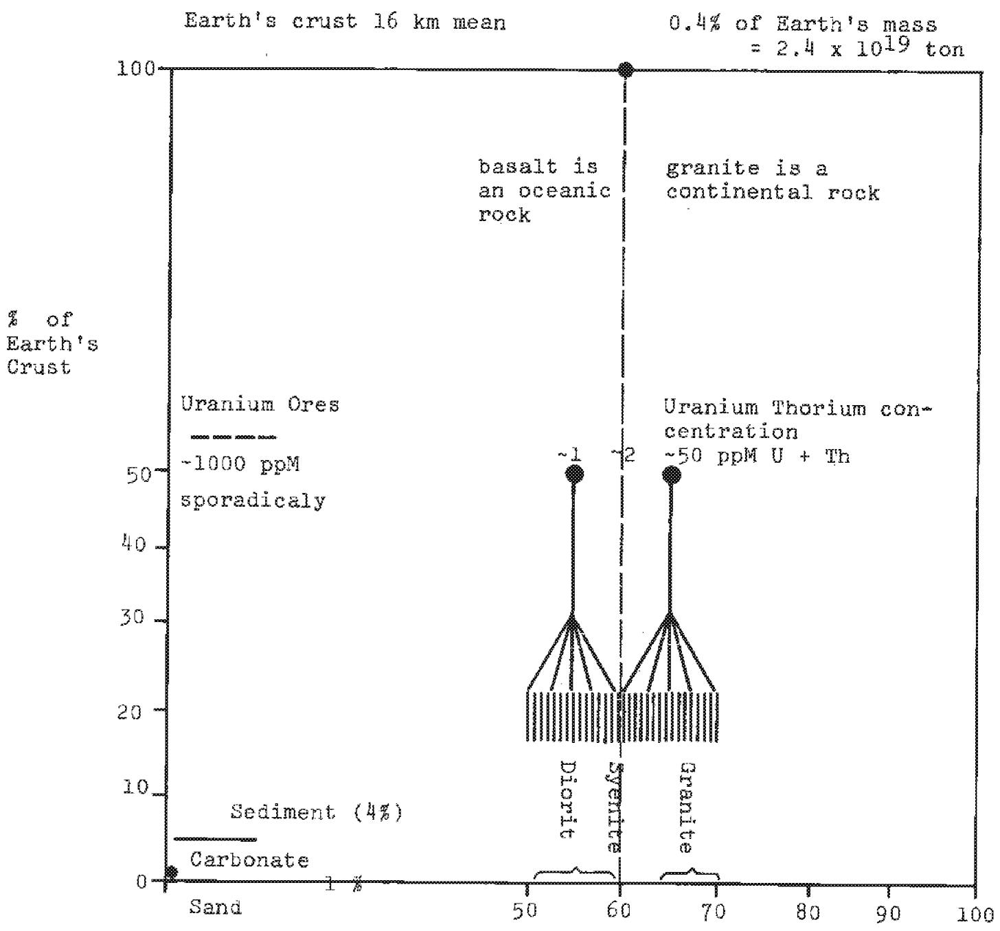  
Fig. 3 Composition of Earth's Crust

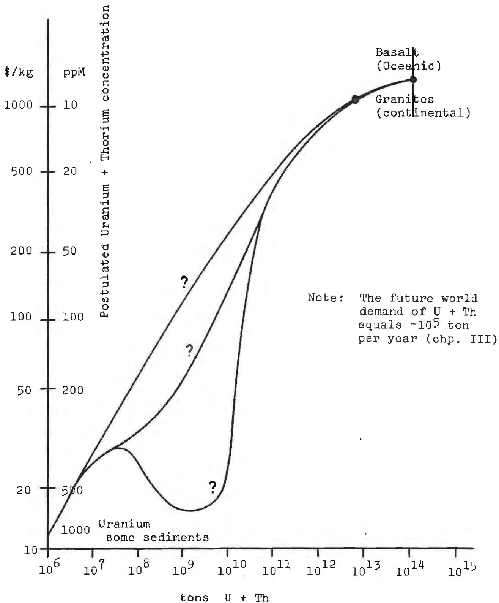  
Fig. 4 U + Th World Reserves

In table 1 are given the abundance of chemical elements in the earth's crust. Of course there is some disagreement about this data in different references but for our purposes the influence of these uncertainties is not great.

Fig. 5 shows the distribution of the most abundant elements (in the earth's crust) versus the electronegativity according to Pauling and periodic table. This gives the first indication concerning the thermodynamic stability of the possible chemical compounds such as silicates, alumosilicates and so on.

We attempt here to discuss the technical and energetical features of the industrial extractions of these components of the rocks in the future.

We can make a very simplified calculation based on the following:

Take first 1 ton of each of the today's commercially important ores (arbitrarily chosen) providing the following eleven metals

Fe, Al, Cr, Mn, Ni, Cu, Zn, Sn, Ag, Au, Pb

totalling ll tons of ores.

Commercial ores today contain approx the following amounts of metal

Fe 20%；Al 30%；Cr 30%；Mn 20%；Ni 1%；Cu 0.5%；Zn 4%；

Sn 0.2%; Pb 2%; Ag 0.05%; Au 0.005%.

1 ton $(\rho = 2.8\mathrm{kg} / \mathrm{dm}^3)\sim 357\mathrm{dm}^3$

Table 1 Element abundance in Earth's Crust   

<table><tr><td>Number</td><td>Z</td><td>Element</td><td></td><td></td><td>Number</td><td>Z</td><td>Element</td><td></td></tr><tr><td>1</td><td>8</td><td>O</td><td>466</td><td>kg</td><td>21</td><td>37</td><td>Rb</td><td>90 g</td></tr><tr><td>2</td><td>16</td><td>Si</td><td>277</td><td>kg</td><td>22</td><td>28</td><td>Ni</td><td>75 g*</td></tr><tr><td>3</td><td>13</td><td>Al</td><td>81</td><td>kg*</td><td>23</td><td>30</td><td>Zn</td><td>70 g*</td></tr><tr><td>4</td><td>26</td><td>Fe</td><td>50</td><td>kg*</td><td>24</td><td>58</td><td>Ce</td><td>60 g</td></tr><tr><td>5</td><td>20</td><td>Ca</td><td>36</td><td>kg</td><td>25</td><td>23</td><td>Cu</td><td>55 g</td></tr><tr><td>6</td><td>11</td><td>Na</td><td>28.3</td><td>kg</td><td>26</td><td>39</td><td>Y</td><td>33 g</td></tr><tr><td>7</td><td>19</td><td>K</td><td>25.9</td><td>kg</td><td>27</td><td>57</td><td>La</td><td>30 g</td></tr><tr><td>8</td><td>12</td><td>Mg</td><td>20.9</td><td>kg**</td><td>28</td><td>60</td><td>Nd</td><td>28 g</td></tr><tr><td>9</td><td>22</td><td>Ti</td><td>4.4</td><td>kg*</td><td>29</td><td>27</td><td>Co</td><td>25 g</td></tr><tr><td>10</td><td>1</td><td>H</td><td>1.4</td><td>kg</td><td>30</td><td>21</td><td>Se</td><td>22 g</td></tr><tr><td>11</td><td>15</td><td>P</td><td>1.1</td><td>kg</td><td>31</td><td>7</td><td>N</td><td>20 g</td></tr><tr><td>12</td><td>25</td><td>Mn</td><td>950</td><td>g</td><td>32</td><td>41</td><td>Nb</td><td>20 g</td></tr><tr><td>13</td><td>9</td><td>F</td><td>625</td><td>g</td><td>33</td><td>3</td><td>Li</td><td>20 g+</td></tr><tr><td>14</td><td>56</td><td>Ba</td><td>425</td><td>g</td><td>34</td><td>31</td><td>Ga</td><td>15 g</td></tr><tr><td>15</td><td>38</td><td>Sr</td><td>375</td><td>g</td><td>35</td><td>82</td><td>Pb</td><td>13 g*</td></tr><tr><td>16</td><td>16</td><td>S</td><td>260</td><td>g</td><td>36</td><td>5</td><td>B</td><td>10 g</td></tr><tr><td>17</td><td>6</td><td>C</td><td>200</td><td>g</td><td>37</td><td>90</td><td>Th</td><td>10 g+</td></tr><tr><td>18</td><td>40</td><td>Zr</td><td>165</td><td>g*</td><td>38</td><td>50</td><td>Sn</td><td>3 g</td></tr><tr><td>19</td><td>23</td><td>V</td><td>135</td><td>g*</td><td>39</td><td>92</td><td>U</td><td>2.4 g+</td></tr><tr><td>20</td><td>24</td><td>Cr</td><td>100</td><td>g*</td><td></td><td></td><td></td><td></td></tr><tr><td></td><td></td><td></td><td></td><td></td><td></td><td>80</td><td>Hg</td><td>0.08 g</td></tr><tr><td></td><td></td><td></td><td></td><td></td><td></td><td>78</td><td>Pt</td><td>0.01 g</td></tr></table>

Z = atomic number

* Approx all metals for metallurgy

** Only partially for metallurgy  
Other metals for ceramics etc.

Energy carriers +

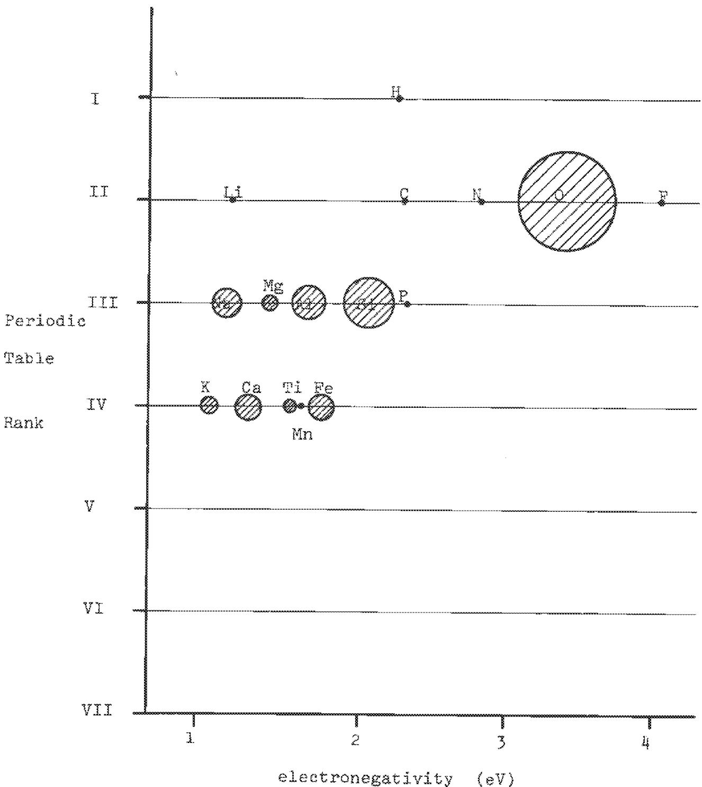  
Fig. 5 The 16 most important components of rocks

The total amount of metals produced from the 11 tons of ores is approx $1078 \, \text{kg}$ . The mean value of the commercial ores is therefore

1073 kg metal

11000 kg ores

10%byweight

The earth's crust contains the elements listed in table 2 among others. The total amount of metal there is $130 \, \text{kg}$ in $1000 \, \text{kg}$ or $13 \, \text{weight} \%$ . Thus the earth's crust taken as a whole has the same approximately total content of metals as a mean mixture of commercial ores, if the ratios of metals could be changed in an appropriate way.

From fig. 6 it can be seen that the ratio of metal concentration in commercial ores varies from less than 10 (e.g. Fe, Al) to more than 1000 (Pb, Mo, Ta, Sn, Ag, Au, Hg, Sb) but only $\frac{280}{50} \approx 6$ for Uranium + Thorium in granites and only $\frac{280}{12} \approx 20$ for Uranium + Thorium in the earth's crust. (Note: based on the very low, but still commercial uranium ores from South Africa).

A rather important conclusion can be drawn from fig. 7. We have arbitrarily assumed that the most metal - iron is extracted from the earth in a "resonable" way - that is proportional to its abundance in the earth crust by assuming the ratio

for Fe annual world production at 1960 = 1 abundance in the earth's crust

Table 2 Contents of some metals in ores and in earth crust   

<table><tr><td></td><td>Present commercial ores(weight %)</td><td>in present commercial ores</td><td>in earth crust</td></tr><tr><td>Fe</td><td>20</td><td>200</td><td>50</td></tr><tr><td>Zn</td><td>4</td><td>40</td><td>0.07</td></tr><tr><td>Cu</td><td>0.5</td><td>5</td><td>0.055</td></tr><tr><td>Pb</td><td>2</td><td>20</td><td>0.013</td></tr><tr><td>Al</td><td>30</td><td>300</td><td>81</td></tr><tr><td>Cr</td><td>30</td><td>300</td><td>0.2</td></tr><tr><td>Sn</td><td>0.2</td><td>2</td><td>0.003</td></tr><tr><td>Ni</td><td>1</td><td>10</td><td>0.08</td></tr><tr><td>Au</td><td>0.005</td><td>0.050</td><td>0.000005</td></tr><tr><td>Ag</td><td>0.05</td><td>0.5</td><td>0.00001</td></tr><tr><td>Mn</td><td>20</td><td>200</td><td>1</td></tr><tr><td>Metals</td><td></td><td>1077 kg</td><td>130 kg</td></tr><tr><td>Total</td><td></td><td></td><td></td></tr><tr><td>Ores</td><td>ll tonne</td><td></td><td>1 tonne</td></tr><tr><td>Mean weight %</td><td colspan="2">1077 kg/ll tonne = 10%</td><td>130 kg/1 tonne =</td></tr></table>

Note: This table does not give a good picture because the amounts of metal actually used are probably in another ratio to the simplest one used here 1·1·1…

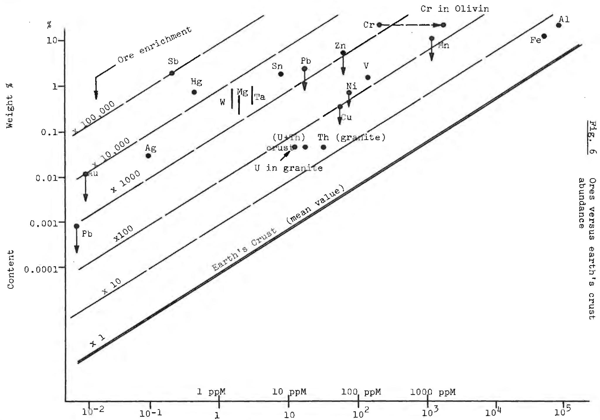  
Elements Earth's abundance   
g per ton of earth's crust

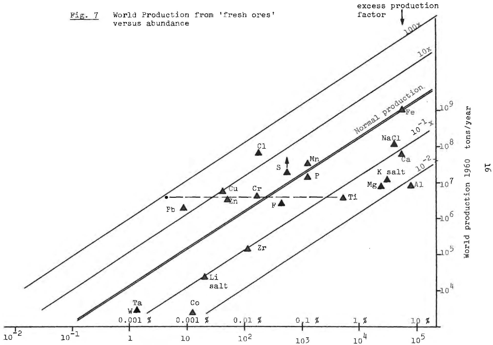  
Natural Abundance (earth's crust) g per Tonne

Then we classify the other metals in the following classes:

- metals being extracted more or much more than the 'natural ratio' e.g. Pb, Sn, Ag, Au, Cd, Hg, W, Zn   
- metals being extracted in the right proportion Fe (reference) Mn, Cr and U (when taken together with Thorium)   
- metals being extracted at a too low rate
Al (the most important!)
Mg, Ti, Zr, Mg, Co.

From this we might draw the following conclusion: if we are to operate a technology of metals use without waste or with the minimum of waste than the ratio of the extracted metals should be in accordance with the ratio existing in the earth's crust. Of course such an alteration in the relative and absolute amounts of extracted metals will have a vital impact on the technology.

V. Energy Balance for element extraction from the earth's crust

The jump from using the classical ores to the use of the earth's crust generally as a source of material clearly means an increase of free energy needed for element (or compound) extraction.

Questions to be answered

- are the potential energy sources large enough to meet this increased demand?   
- is the increase in energy consumption a fair price to pay and a positive solution from the point of view of environmental policy?

The first of these questions is discussed here. The second is discussed elsewhere.

As can be seen from table 3, from 1 ton of rock with a mean elementary abundance for complete extraction and transformation of all components to free elements requires, if a electrolysis in molten salt media (e.g. chloride) is postulated.

- theoretically (100% efficiency) ≈ 11 Gigajoules (GJ)   
practically (20% efficiency) ≈ 55 GJ

(Remark: part of this energy in form of electrical energy, and part of heat)

For processing 1 ton of rock per capita per year the free energy requirement almost equals

$$
\frac {5 5 \mathrm {G J / y e a r}}{3 . 1 5 \times 1 0 ^ {7} \mathrm {s / y e a r}} = 1 7 0 0 \text {w a t t s / c a p i t a}
$$

Table 3 Free energy for extraction from 1 tonne of rocks (simplified earth's crust chemical composition)   

<table><tr><td rowspan="2">Ele-ment</td><td colspan="2">In 1000 kg of rock</td><td rowspan="2">Oxide</td><td rowspan="2">Mol Oxygen</td><td rowspan="2">Free ent-halpy KJ/ mol oxide (in 1000 kg rock)</td><td rowspan="2">Free ent-halpy for dissociation (GJ) (theo-retically)</td></tr><tr><td>kg</td><td>mol</td></tr><tr><td>Si</td><td>277</td><td>10.000</td><td>SiO2</td><td>20.000</td><td>700</td><td>7.0</td></tr><tr><td>Al</td><td>81.3</td><td>3.000</td><td>Al2O5</td><td>4.500</td><td>670</td><td>2.01</td></tr><tr><td>Fe</td><td>50</td><td>900</td><td>FeO1.2</td><td>1.200</td><td>200</td><td>0.18</td></tr><tr><td>Ca</td><td>36.3</td><td>880</td><td>CaO</td><td>880</td><td>530</td><td>0.47</td></tr><tr><td>Na</td><td>28.3</td><td>1.200</td><td>Na2O</td><td>600</td><td>280</td><td>0.33</td></tr><tr><td>K</td><td>26.0</td><td>680</td><td>K2O</td><td>340</td><td>220</td><td>0.23</td></tr><tr><td>Mg</td><td>21.0</td><td>860</td><td>MgO</td><td>860 total</td><td>540</td><td>0.46</td></tr><tr><td>O</td><td>466</td><td>29.000</td><td>---</td><td>28.380</td><td></td><td>3.68 without SiO210.68 with SiO2</td></tr></table>

Considering the contents of 1 ton of earth's crust from the point of view of the possible free energy carried (see table 1) we get

$$
\mathrm {T h} + \mathrm {U} \quad \sim 1 2 \mathrm {g}
$$

(the problem of lithium as a possible source of tritium for the $6_{\text{Li}}$ ( $n,4_{\text{He}}$ ) reaction or $7_{\text{Li}}$ ( $n,n^{4}_{\text{He}}$ ) $3_{\text{T}}$ is not discussed here for the reasons given in chapter 1.)

We assume for the U + Th extraction efficiency a figure of 0.30 (but there no limitation for e.g. a two or three times higher efficiency) which gives:

(1 ton earth's crust rocks per year and capita)

$$
\frac {1 2 \mathrm {g} / \text {t o n} \mathrm {x} 0 . 3 0 \mathrm {x} 8 . 6 \mathrm {x} 1 0 ^ {1 0} \mathrm {J} / \mathrm {g} \mathrm {U} , \mathrm {T h}}{3 . 1 5 \mathrm {x} 1 0 ^ {7} \mathrm {s} / \text {y e a r}} \approx 1 0. 9 \mathrm {k W} / \text {c a p i t a}
$$

(1 ton granites per year and capita)

$$
\begin{array}{l} \frac {5 0 \mathrm {g} / \text {t o n} x 0 . 3 0 x 8 . 6 x 1 0 ^ {1 0} \mathrm {J} / \mathrm {g} U , \mathrm {T h}}{3 . 1 5 x 1 0 ^ {7} \mathrm {s} / \text {y e a r}} = 4 1 \mathrm {k W} / \text {c a p i t a} \\ \end{array}
$$

With these assumptions we arrive at the following conclusions:

Processing of 1 ton per capita/per year of 'earth's crust rock' requires 1.7 kW (tot) even with only $30\%$ extraction efficiency of thorium, uranium produces power of 11 kW or 6.5 times more.

The same calculation for granites (1 ton per year per capita) gives an power of 41 kw per capita which is 24 times more than is needed for the extraction of the metals, or in other words about $4.1\%$ of the energy available is used for mineral extraction. In the USA at the present time the raw material production requires $5.6\%$ and electrolysis $1.1\%$ making a total of $6.7\%$ of the total energy consumption.

Table 4 The efficiency (n) of metal extraction and metal recycling in terms of energy (in kw-hr/ton metal)   

<table><tr><td rowspan="2">Metal</td><td colspan="3">&quot;Fresh&quot; extraction</td><td colspan="2">Recycling</td></tr><tr><td>free energy theorem.</td><td>free energy pract.</td><td>efficiency %</td><td>Recycling: Technology practically</td><td>efficiency %</td></tr><tr><td>Mg</td><td>1208</td><td>91000</td><td>1.3</td><td>1395</td><td>75</td></tr><tr><td>Al</td><td>4600</td><td>52000</td><td>9</td><td>1300</td><td>28</td></tr><tr><td>Fe (Fe ores)</td><td>941</td><td>4500</td><td>20</td><td>1240</td><td>60</td></tr><tr><td>Fe (Ti ores)</td><td>941</td><td>2500</td><td>45</td><td></td><td></td></tr><tr><td>Cu</td><td>424</td><td>13500</td><td>2.5</td><td>630-1500</td><td>25-6</td></tr><tr><td>Ti</td><td>2885</td><td>140000</td><td>2</td><td>39000</td><td>28</td></tr></table>

Fig. 8 gives the present and possible future flows of material if the assumptions made here are correct.

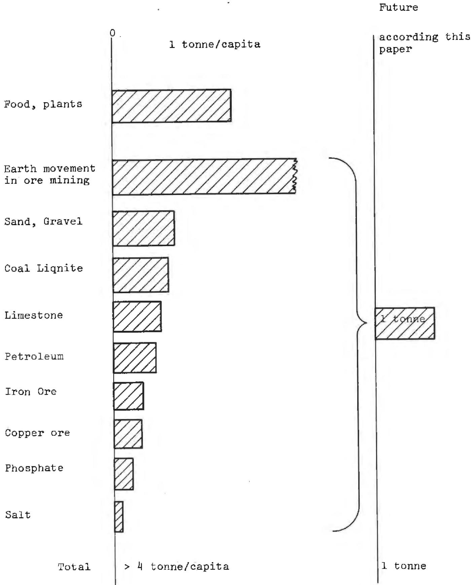  
Fig. 8 Material Flows Present

VI. Size of present and future material flows

One of the future aims of environmental protection among others will be without doubt the reduction in the amount of materials extracted from natural deposits per capita. We include here the waste together with the main products.

The present state of material flows seems to be far from the optimal (or rather far from a reasonable minimum). The material flow per capita per year is approx 4 tons without taking into account the large amounts of spoil (open cast mining etc.) moved, loss of agricultural land and disposal of wastes.

VII. Earth's crust rocks as an energy material source

To some extent the achievement of using rocks as a source of fissionable nuclides (or fissionable nuclides) depend on the ability to produce metal and ceramic materials as by-products of the process.

In table 5 is given a very simplified and approximate division of the earth's crust material for the production of some materials.

The results seem to indicate (for 1 ton rock/per capita)

<table><tr><td>Metals</td><td>total</td><td>130 kg/year</td></tr><tr><td>Aluminium</td><td></td><td>70.0 kg</td></tr><tr><td>Iron</td><td></td><td>45.0</td></tr><tr><td>Magnesium</td><td></td><td>10.0</td></tr><tr><td>Titanium</td><td></td><td>4.0</td></tr><tr><td>Manganese</td><td></td><td>0.9</td></tr><tr><td>Zirconium</td><td></td><td>0.15</td></tr><tr><td>Vanadium</td><td></td><td>0.12</td></tr><tr><td>Chromium</td><td></td><td>0.1</td></tr><tr><td>Nickel</td><td></td><td>0.07</td></tr><tr><td>Zinc</td><td></td><td>0.06</td></tr><tr><td>Copper</td><td></td><td>0.05</td></tr></table>

<table><tr><td>Cement</td><td>100 kg/year</td></tr><tr><td>Glass</td><td>200 kg/year</td></tr><tr><td>Quartz</td><td>100 kg/year</td></tr><tr><td>&quot;Silicon&quot;-plastics
(C &amp; H from other sources)</td><td>100 kg/year</td></tr><tr><td>Other (fillings)</td><td>250 kg</td></tr><tr><td>Free oxygen</td><td>150 kg</td></tr></table>

Table 5 Earth's crust rocks as potential source of material   

<table><tr><td>Element</td><td>kg in l tonne</td><td>Pure metals</td><td>Cement</td><td>Glass</td><td>Quartz</td><td>&quot;Silicones&quot; (semiorganic plastics)</td><td>Other material (nondefined)</td><td>Non metallic elements</td></tr><tr><td>O</td><td>466</td><td>70</td><td>33</td><td>90</td><td>50</td><td>-</td><td>143</td><td>150 free</td></tr><tr><td>Si</td><td>277</td><td>-</td><td>12</td><td>70</td><td>50</td><td>50</td><td>95</td><td>-</td></tr><tr><td>Al</td><td>81</td><td>70</td><td>3</td><td>-</td><td>-</td><td>-</td><td>8</td><td>-</td></tr><tr><td>Fe</td><td>50</td><td>45</td><td>5</td><td>-</td><td>-</td><td>-</td><td>-</td><td>-</td></tr><tr><td>Ca</td><td>36</td><td>-</td><td>30</td><td>6</td><td>-</td><td>-</td><td>-</td><td>-</td></tr><tr><td>Na</td><td>28</td><td>-</td><td>-</td><td>20</td><td>-</td><td>-</td><td>8</td><td>-</td></tr><tr><td>K</td><td>26</td><td>-</td><td>-</td><td>10</td><td>-</td><td>-</td><td>16</td><td>-</td></tr><tr><td>Mg</td><td>21</td><td>10</td><td>10</td><td>1</td><td>-</td><td>-</td><td>-</td><td>-</td></tr><tr><td>Ti</td><td>4.4</td><td>4</td><td>-</td><td>-</td><td>-</td><td>-</td><td>-</td><td>-</td></tr><tr><td>H</td><td>1.4</td><td>-</td><td>-</td><td>-</td><td>-</td><td>-</td><td>-</td><td>-</td></tr><tr><td>P</td><td>1.1</td><td>-</td><td>-</td><td>-</td><td>-</td><td>-</td><td>1.1</td><td>-</td></tr><tr><td>Mn</td><td>0.9</td><td>0.9</td><td>-</td><td>-</td><td>-</td><td>-</td><td>-</td><td>-</td></tr><tr><td>F</td><td>0.6</td><td>-</td><td>-</td><td>-</td><td>-</td><td>-</td><td>0.6</td><td>-</td></tr><tr><td>Ba</td><td>0.4</td><td>-</td><td>-</td><td>-</td><td>-</td><td>-</td><td>-</td><td>-</td></tr><tr><td>S</td><td>0.25</td><td>-</td><td>-</td><td>-</td><td>-</td><td>-</td><td>-</td><td>0.25</td></tr><tr><td>C</td><td>0.20</td><td>-</td><td>-</td><td>-</td><td>-</td><td>30*</td><td></td><td></td></tr><tr><td>Total</td><td></td><td>130</td><td>93</td><td>197</td><td>100</td><td>100</td><td>274</td><td>150</td></tr></table>

* From carbonate rocks

Table 6 Amounts of materials in use per capita   

<table><tr><td>Material</td><td>Postulated production (kg/year)</td><td>Recycling (kg/year)</td><td>Time of life by users (years)</td><td>Amounts in continuous use (kg/capita)</td></tr><tr><td rowspan="2">Metals</td><td rowspan="2">130</td><td>12 times</td><td rowspan="2">25</td><td rowspan="2">37,500</td></tr><tr><td>1500</td></tr><tr><td rowspan="2">Cement</td><td rowspan="2">100</td><td>3 times</td><td rowspan="2">40</td><td rowspan="2">12,000</td></tr><tr><td>300</td></tr><tr><td rowspan="2">Glass</td><td rowspan="2">200</td><td>5 times</td><td rowspan="2">10</td><td rowspan="2">15,000</td></tr><tr><td>1000</td></tr><tr><td>Quartz</td><td>100</td><td></td><td></td><td></td></tr><tr><td rowspan="2">&quot;Silicons&quot; plastics</td><td rowspan="2">100</td><td>5 times</td><td rowspan="2">5</td><td rowspan="2">2,500</td></tr><tr><td>500</td></tr><tr><td>Other</td><td>270</td><td>1 time</td><td>100</td><td>27,000</td></tr></table>

# VIII Impact on the philosophy of reactor development

From all these developments we can suggest the following as that which might result in the development of reactor technology.

- the breeder reactors, both with Unat/Pu-239 and Th/U-233 fuel cycles could provide a total energy production of approximately 10,000,000 Tw years.

that is a 160 TW civilization (8 Gigapeople with 20 kw/capita) for about one hundred thousand years even when one ten thoudanth part of the rocks will be burned.

- the breeder must in the future use both uranium and thorium and, therefore, probably both fast and thermal breeders are of interest (fig. 9, 10).   
- the impact of the extraction of U + Th from the earth's crust.  
- rocks is small (see table 7).   
- the use of the rocks for U + Th extraction must be coupled with the complex recovery of other materials, metals etc.   
- the power production could be totally independant from the suppliers of 'energy carriers' (no monopoly of energy sources).   
- the large amount of radioactive waste (fission) need not be stored but rather burned up in a high neutron flux reactor, or an accelerator.   
- the cost of all these additional processes will be significant but not crucial.

If the so called 'environmental taxes' (or entropy taxes) proposed for the future come into effect then the penalty of these new processes will be small and even negative (a profit).

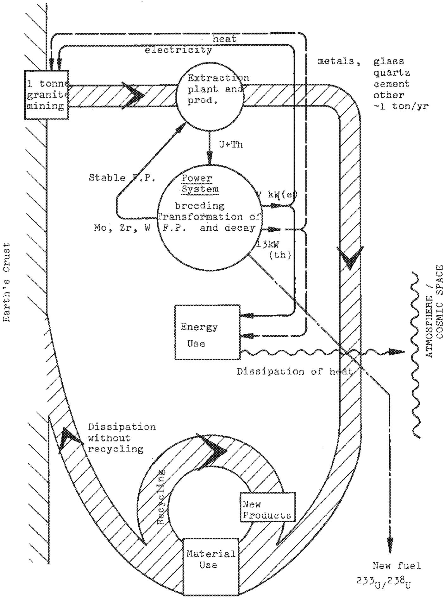  
Fig. 9 Scheme of 'ideal' energy and material flux annually and per capita in future.

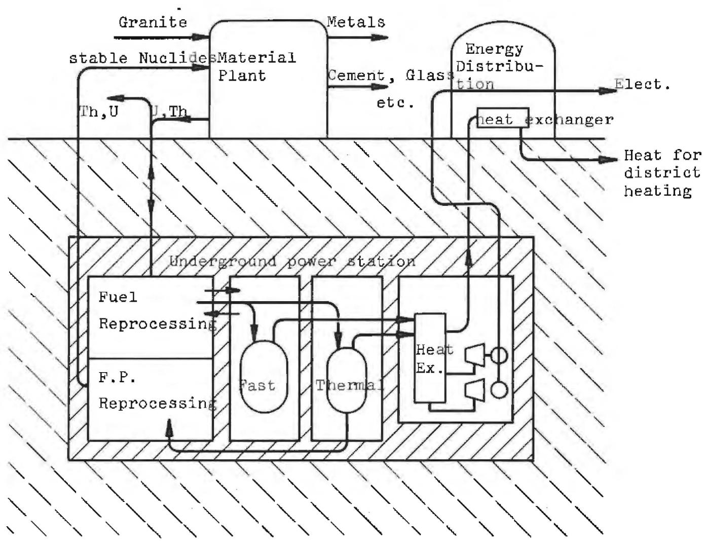  
Fig. 10 Schematic Reactor Arrangement

Table 7 Impact of the extraction U + Th from rocks

A) Price of plutonium = 10.000 $/kg

$$
\begin{array}{l} 1 \mathrm {k g} \mathrm {P u} = 1 0 ^ {3} \times 1 0 ^ {6} \times 8. 6 \times 1 0 ^ {4} J = 8. 6 \times 1 0 ^ {1 3} (\text {t o t}) = 3. 4 \times 1 0 ^ {1 3} J \tag {e1} \\ = \frac {3 . 4 \times 1 0 ^ {1 3} J (\mathrm {e l})}{3 . 6 \times 1 0 ^ {6} J / K W h r (\mathrm {e l})} \quad \equiv 1 0 ^ {7} K W h r (\mathrm {e l}) \\ \end{array}
$$

$$
\text {F u c o s t i n 1 K W h r (e l)} = \frac {1 0 ^ {4} \mathrm {\Phi} / \mathrm {k g x 1 0} ^ {3} \text {m i l l s} / \mathrm {\Phi}}{1 0 ^ {7} \text {K W h r (e l) / k g P u}} = 1 \text {m i l l s} / \text {1 K W h r (e l)}
$$

B) The uranium cost for plutonium synthesis

$$
1 \mathrm {k g} U \rightarrow \sim 1 \mathrm {k g} \mathrm {P u}
$$

If the cost of U production rises from 20$ to 1000 $/kg the contribution in the plutonium price will be approx 10%, because:

1) U price: 20$/kg → 10.000 $/kg Pu   
2) U price: 1000 $/kg + 11.000 $/kg Pu

C) The element of plutonium cost in the electrical energy cost will change from 1 mills/KWh to 1.1 mills/KWh, so that in the total electrical KWh cost will change from 12 mills to 12,1 mills that is in the order of $0.8\%$ .

Table 8 Preliminary costs of power generating   

<table><tr><td></td><td>Capital + operation $/KW(e)</td><td>Amort + Capital cost 12%/year</td><td>Mills KWh (e)</td><td>Classical fuel cycle</td></tr><tr><td>&quot;Classical reactor&quot;</td><td>500</td><td>60</td><td>8.5</td><td></td></tr><tr><td>Reprocessing plant</td><td>100</td><td>12</td><td></td><td>out of power station</td></tr><tr><td>Nuclear transformation</td><td>100 400</td><td>12 48</td><td>6.8</td><td>waste storage</td></tr><tr><td>District heat</td><td>100</td><td>12</td><td></td><td>cooling tower pollution landscape safety tax</td></tr><tr><td>Underground building</td><td>100</td><td>12</td><td></td><td></td></tr><tr><td>Total</td><td>900</td><td>108</td><td>15.3</td><td></td></tr></table>

Remark: because of rather preliminary and rough calculation of these problems, no references are given here explicitly.