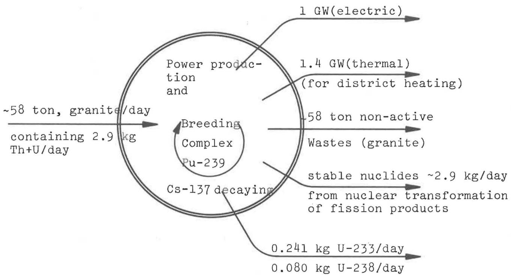
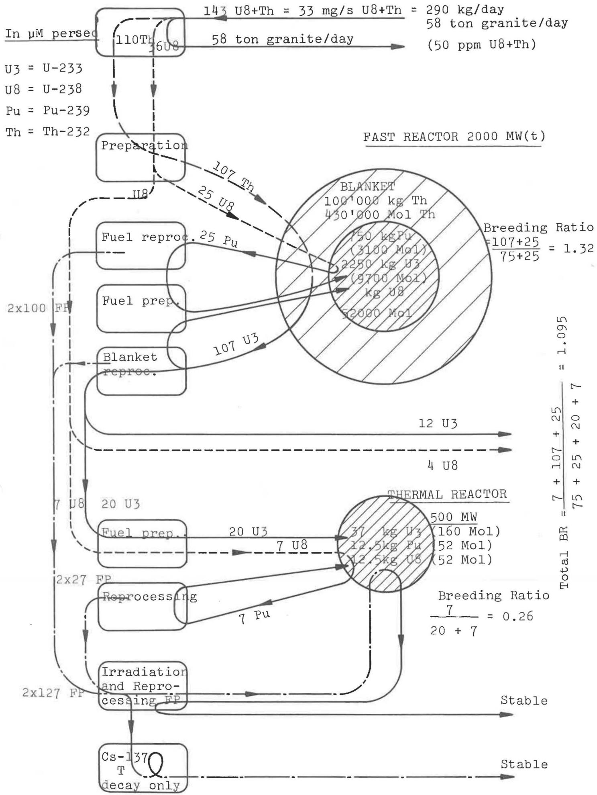
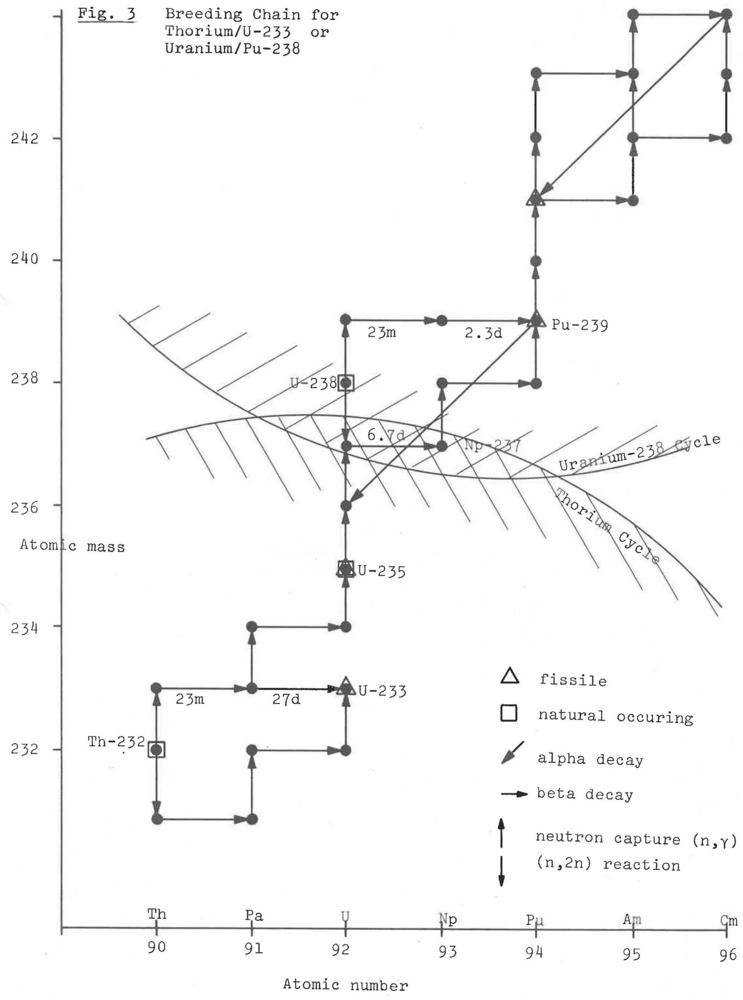

Eidg. Institut für Reaktorforschung Wurenlingen

Schweiz

# Thorium-Uranium Fast/Thermal Breeding

# System with Molten Salt Fuel

M. Taube


Würenlingen, Februar 1974

EIR-Bericht Nr. 253

Thorium-Uranium Fast/Thermal Breeding System with Molten Salt Fuel

M. Taube


The aims of this paper are as follows:

1. To discuss the elimination of the need to transport plutonium containing fuel (or pure plutonium) outside the confines of the power station (1) even for the construction of a new reactor (doubling the power), thus reducing the risk of:

a) hi-jacking, and subsequent holding to ransom: or diversi sion for undercover nuclear weapon production (or threat of)   
b) an accident, since the max permissible concentration of plutonium in air is as low as $10^{-12} \mu \mathrm{Ci/cm}^3$ that is $16 \mu \mathrm{g} \mathrm{Pu}$ in $1000 \mathrm{~m}^3$ of air.

2. To outline a possible method of utilising the whole amount of fertile material commonly present in rocks and granites, where the amounts of thorium are approx 3-4 times greater than those of uranium.

3. To discuss the optimisation of the burning of the 'synthetic' nuclides, that is the plutonium in the fast reactor and the uranium 233 in a thermal reactor. The desirability of coupling both reactor types is explained to

a) obtain a breeding system based on the fast reactor   
b) obtain a 'burner' system for nuclear transformation of fission products (9,10).

In order to realise these three characteristics the paper outlines a complex system of fuel cycles, reactors and reprocessing plants (Fig. 1).

  
Fig.1 Outline of the Thorium/Uranium Fast/Thermal Coupled System Using Molten Salt Reactors Giving Approx 1 GW(e) Power

# Note I

No long lived radioactive waste released into the environment  
No plutonium shipped outside the complex  
Only U-233(66%) + U-238(33%) transported as bred material externally.

# Note II

For discussion of problem of nuclear transformation or storage of Cs-137 and T. see (9,10)

1. The only nuclide allowed to pass out of the power plant complex is U-233 always diluted by $\sim 33$ atom% of U-238. In this case

a) hi-jacked U-233 cannot be used as weapon material without the aid of a separation plant.   
b) the accident risk is much reduced since both the specific activity of the U-233 is 6.8 times smaller than that of Pu-239 and the permissible body burden some 250 times greater than for plutonium, making an overall danger factor 1700 times smaller.

The plutonium re-cycling is contained entirely within the bounds of the reprocessing plant which in this case is directly coupled with a power reactor. Any 'milking' of plutonium from the system unknown to the safeguards control is prevented by having the plutonium always mixed with amount of highly active fission products.

2. To utilise fully all the potential fertile materials present in granites it is necessary to make use of both thorium and plutonium. In the case considered here this is possible due to the combined breeding system and the complex of two reactors fast and thermal.

The problems (the Weinberg's idea of 'burning the Rocks') of using both breeding cycles, Th-232/U-233 and U-238/Pu-239 in fast and/or thermal reactors have been discussed for a long time. (4,6,11,12)

Here the power producing system is based on the molten salt reactors for maximizing the breeding process and to achieve the nuclear transformation of most of the radioactive wastes.

The system proposed here consists of the following parts. (Fig. 2)

1. Granite extraction: 110 ton granite per day with approx 50 ppm of thorium plus uranium.

Note 1. In the Swiss Alps the syenite contains approximately this amount of Th + U.

Here we postulate an extraction efficiency of only $50\%$ . This could fairly easily be increased if some of the other valuable components of granite were also extracted for industrial purposes.

The amount of electrical energy and chemical reagent required is not too high relatively speaking.

Note 2. In South Africa the commercially exploitable uranium ores contain approx 300 ppM (plus other valuable components).

The cost of extraction of thorium + uranium from granites is estimated to be about 500 $/kg$ the present cost from 'rich' ores is 20-30 $/kg$ . This difference in a fast breeder reactor has little influence on the cost of electrical energy production.

The problem of reducing the volume of wastes from granite extraction can be overcome by using pyrochemical or electrochemical methods, instead of classical aqueous technology.

  
Fig.2 FLOW SCHEME

2. Preparation of fuel and blanket material

The amounts are: aprox. $2.2\mathrm{kg}$ thorium and $0.7\mathrm{kg}$ uranium per day. Part of the fertile material is in the form of chloride, and part in the form of fluoride.

3. The fast breeder reactor

Thermal power: $\sim 2000\mathrm{MW}$ Neutronflux: $\varnothing = 8\times 10^{15}\mathrm{ncm}^{-2}\mathrm{s}^{-1}$ Core: fissile material U-233 ~2250 kg Pu-239 ~750 kg as molten fertilile material (coolant) U-238 12000 kg Blanket: Th-232 100000 kg Breeding ratio for total fast reactor 1.32

Note - this breeding ratio is very roughly estimated, table 1 gives some references. For the breeding chain see fig. 3.

4. Fast core fuel reprocessing (chloride, fuel)

Extraction of part of uranium (U-233 + U-238) and fission products. Plutonium is not extracted, it is recycled in the fast core.



Table 1   
Breeding Ratio in the Fast Reactor (arbitrary units)   

<table><tr><td>Fissile</td><td>Nuclide</td><td>Fertile Nuclide</td><td>Wash 1097 metal 3000 litre core</td><td>Leipunsky oxide 5000 litre core</td></tr><tr><td></td><td></td><td></td><td>* 1.60</td><td>* 1.55</td></tr><tr><td>Pu-239</td><td>-</td><td></td><td>1.0</td><td>1.0</td></tr><tr><td>-</td><td>U-233</td><td>U-238</td><td>0.937</td><td>-</td></tr><tr><td>Pu-239</td><td>U-233</td><td></td><td></td><td>0.903</td></tr><tr><td>Pu-239</td><td>-</td><td></td><td>0.85</td><td>-</td></tr><tr><td>-</td><td>U-233</td><td>Th-232</td><td>0.793</td><td>-</td></tr><tr><td>Pu-239</td><td>U-233</td><td></td><td></td><td>0.767</td></tr></table>

* absolute value

Wood and Driscoll (1973) write: 'It is concluded that the LMFBR system can be designed to accommodate uranium and thorium blankets on an interchangeable basis and that a thorium blanket deserves strong consideration as the reference design concept for future LMFBR systems.

5. Fast blanket material reprocessing (chloride or fluoride) Extraction of uranium 233.   
6. Preparation of fuel for thermal reactor

```txt
Preparation of fluorides of U-233 fissile Pu-239 U-238 fertile 
```

diluted by $\mathrm{BeF}_2$ (moderator) and $\mathrm{ZrF}_4$

Amounts to $\sim 0.71\mathrm{kg/day}$ for these nuclides.

7. Thermal reactor: burner

Neutron flux: $\varnothing_{\mathrm{th}} = 6 \times 10^{15} \mathrm{ncm}^{-2} \mathrm{s}^{-1}$

```txt
Power = 500 MW(th) 
```

```txt
Core:fissile U-233 \~38 kg Pu-239 \~13 kg 
```

```txt
fertile U-238 \~13 kg 
```

Fuel: as fluoride diluted by $\mathrm{ZrF}_4$ and moderator $\mathrm{BeF}_2$

Breeding ratio: 0.25

```txt
Irradiation target - long lived fission products: Sr-90, Cs-135, I-129, Tc-99, Kr-85 
```

Note. For nuclear transformation of fission products in the thermal reactor (9,10).

8. Reprocessing of liquid and gaseous component of thermal fuel (fluoride)

The details of reprocessing, waste management and electrical power production are not discussed here for the sake of simplicity and brevity.

# Conclusions

1. It is possible to conceive of a nuclear power system without shipment of plutonium outside the power plant boundary.

2. A power system making 'full' use of the thorium and uranium present in granites can be demonstrated taking the known mean abundance of these elements in the rocks.

3. This system 'breeds' with a doubling time of approx 35 years.

4. The system permits a large amount of long lived fission products to be burnt in situ (exceeds Cs-137 and T which must be stored).

5. The system consists of two coupled reactors, the fast breeder with chloride fuel, the thermal burner with fluoride fuel.

6. The fuel for a second (doubled) power system consists of only U-233 (66%) and u-238 (33%).

7. The system retains the other advantages of molten salt reactors such as

- very low concentration of I-131, Cs-137, Xe-135 in steady state due to continuous gas extraction (10)   
- no fuel element fabrication   
- internal fuel reprocessing plant   
- stable against loss of cooling accidents (8)

# References

1. Abrahamson D.E.

Is Nuclear Fission an acceptable means of producing energy?

Am.Nuc.Soc. Winter meeting 1973 p.410

E.Abrahamson (1973) gives a very useful outline of the environmental and social hazards associated with nuclear power production. Among the most important to be mentioned are those associated with plutonium.

- environmental releases of plutonium cannot be tolerated   
- occupational exposure cannot be permitted   
- unauthorised removal from the fuel cycle cannot be permitted - and what item of commerce has not been stolen?   
- the diversion into weapons programmes by countries must be prevented unless there are compelling reasons to believe that the proliferation of nuclear powers enhances stability.

la. Willrich M., Taylor T.B.

"Nuclear Diversion: Risks and Safeguards" Ballinger Pub. Cambridge, 1973

1b.

Nuclear Safeguards: Holes in the Fence Science 182, 1112 (1973)

2. Fortescue P.

A reactor strategy: FBR's and HTGR's Nuclear News, 36 April, 1972 (breeding of Th/U-233 in gas cooled thermal reactors)

2a. Booth L.A., Balcomb J.D., Edeskuty F.J.

A combined nuclear and hydrogen energy economy.

Proc. 8th Intersoc. Energy Conversion Eng. Conf. Univ. Pennsylvania Aug. 13-16 (1973)

3. Graziani G., Rinaldini C., Bairriot H., Tranwaert E.   
Plutonium as a make up in the thorium integral block HTR fuel element.  
Eur 5020e Joint Nuclear Research Centre, Ispra 1973   
4. Leijpunsky A.I. OD Kazachkowsky et al.   
Feasability of using thorium in fast power reactors. Atom. Energya (Sov.) 18; 4; 342 (1965)   
5. Ligou J.   
Molten chlorides fast breeder reactor Reactor physics calculations EIR Report 228 (1972)   
6. Okrent D., Cohen K.P., Lowenstein W.B.,   
Some Nuclear and safety considerations in the design of large power fast reactors. Proc. 3rd Conf. on Peaceful uses of Atomic Energy, Geneva P/267 Vol 6 p. 137 United Nations (1965)   
7. Taube M., Ligou J.,   
Molten chlorides fast breeder reactor  
EIR Report 215 (1972)   
8. Taube M., Ligou J.,   
Molten plutonium chloride fast breeder reactor cooled by molten uranium chloride Accepted for publication in Annals of Nucl. Sci. and Engineering.   
9. Taube M.   
Steady state burning of fission products in fast thermal molten salt breeder reactors. Accepted for publication in Annals of Nucl. Sci and Engineering.   
10. Taube M.   
A molten salt, fast-thermal reactor system with no waste and low steady state volatile radioactivity  
EIR Report 249 (1974)   
11. -   
Thorium Fuel Cycle  
Bibliog. series No. 39  
Int. Atom Energy Agency, Vienna 1970 (350 p)

12. -

The use of thorium in nuclear power reactors

WASH-1097 June 1969, Washington

Div. of Reactor Def. Tech. USAEC

13. Wood P.J., Driscoll M.J.

The Economics of thorium blankets for fast breeder reactors.

Am.Nuc.Soc. Winter meeting 1973 p. 314

