Eidg. Institut für Reaktorforschung Würenlingen Schweiz

# The possibility of continuous in-core gaseous extraction of volatile fission products in a molten fuel reactor

M. Taube

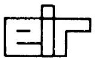

Würenlingen, Mai 1974

The possibility of continuous in-core gaseous extraction of volatile fission products in a molten fuel reactor

M. Taube

# Abstract

A system of continuous gas purging of a reactor core for removal of volatile fission products from the molten chloride fuel is discussed and calculations based on a computer programme are shown. The results indicate:

a) the precursors of the delayed neutrons nearly all remain   
b) iodine-13l in the steady-state core is reduced approx by a factor 1000   
c) caesium-137 concentration in the core decreases only by a factor 7, but the volatility is relatively low due to chloride   
d) caesium isotopes 135 and 133 can be separated from Cs-137 by a factor of which make easier the Cs-137 management   
e) xenon isotopes are extensively extracted

All this results in a significant improvement in the safety of this reactor type in the case of a core accident.

# 1. General Remarks

The aim of this paper is to discuss the possibility of decreasing the concentration of volatile fission products in the steady state core as a counter measure in the event of a core accident.

The design philosophy of a safe reactor is guided by the statements of the following type: (WASH 1250, 1973)

"The measures against the escape of radioactivity from nuclear facilities (nuclear power plants, fuel reprocessing waste disposal facilities, shipping, storage etc.) should use design features inherently favourable to safe operation e.g. by selection of fuel, coolant and core structural materials which will have inherent stability and safe characteristics."

In this paper a molten fuel fast breeder is discussed which could realise both these requirements through: - minimising the hazard of the escape of radioactive by substances by continuous extraction of the most volatile fission products from the molten fuel so that the steady state amounts of these are reduced by one or more orders of magnitude compared to the classical case of solid fuel periodically discharged and reprocessed.

It is well known that in the case of a reactor accident the hazards are centered around the volatile fission products (F.P.). For example according to Farmer (1973) a 1500 MW(th) reactor contains $4 \times 10^{9}$ curies of volatile and gaseous

fission products of which I-131 equals 50 Megacuries. The hypothetical release having a very low probability of causing harm to the general public (unlikely to cause one case of fatal illness within the ensuing ten or more years) is of the order of 5 kilocuries of I-131. In a hypothetical low probability accident they discussed a release of 5 Megacuries of I-131 and 0.5 Megacuries of Cs-137.

# 2. Continuous gas extraction

The continuous in core gas extraction of volatile fission products from the liquid fuel is based on the following data and/or roughly estimated calculations (using the appropriate "GASEX" programme)

a) the reactor is fuelled with molten salt fuel - in this case molten chlorides $\mathrm{PuCl}_3 - \mathrm{UCl}_3 - \mathrm{NaCl}$ etc. (fig. 1)   
b) the chemical properties of the fission products in this molten media are characterised by the scheme shown in (fig. 2)   
c) the balance of the fission products - especially for chlorine is given in (fig. 3)   
d) the thermodynamic stability of all the important irradiated fuel components are given in fig. 3   
e) the volatility (partial pressure) of some selected crucial fission products: e.g. caesium in the form of element, oxide and chloride is given in fig. 4

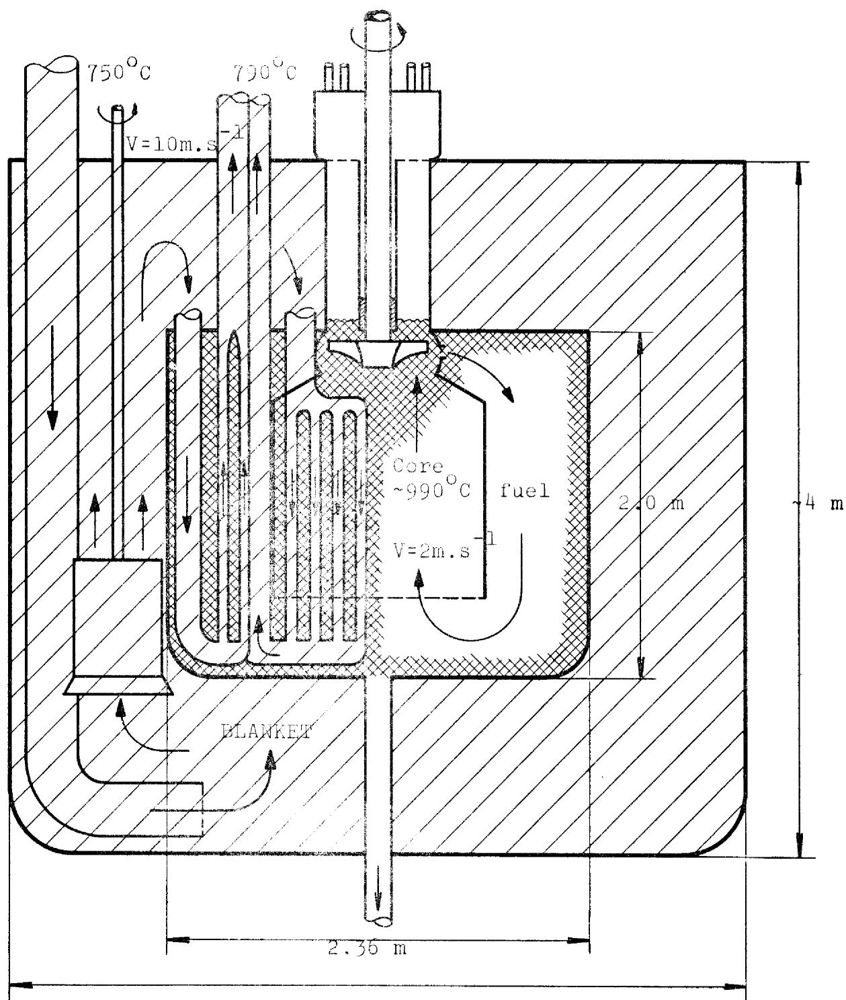  
Fig.1 Molten chlorides fast breeder $\sim 3$ GW(th)

Fig. 2 Fission Products in Molten Chlorides Media

<table><tr><td>36 Kr</td><td>54 Xe</td><td></td></tr><tr><td>35 Br</td><td>53 I</td><td></td></tr><tr><td>34 Se</td><td>52 Te</td><td></td></tr><tr><td>33 As</td><td>51 Sb</td><td></td></tr><tr><td>32 Ge</td><td>50 Sn</td><td></td></tr><tr><td>31 Ga</td><td>49 In</td><td></td></tr><tr><td>30 Zn</td><td>48 Cd</td><td></td></tr><tr><td></td><td>47 Ag</td><td></td></tr><tr><td></td><td>46 Pd</td><td></td></tr><tr><td></td><td>45 Rh</td><td></td></tr><tr><td></td><td>44 Ru</td><td></td></tr><tr><td></td><td>43 Tc</td><td></td></tr><tr><td></td><td>42 Mo</td><td></td></tr><tr><td></td><td>41 Nb</td><td></td></tr><tr><td></td><td>40 Zr</td><td></td></tr><tr><td></td><td></td><td>64 Gd</td></tr><tr><td></td><td></td><td>63 Eu</td></tr><tr><td></td><td></td><td>62 Sm</td></tr><tr><td></td><td></td><td>61 Pm</td></tr><tr><td></td><td></td><td>60 Nd</td></tr><tr><td></td><td></td><td>59 Pr</td></tr><tr><td></td><td></td><td>58 Ce</td></tr><tr><td></td><td>39 Y</td><td>57 La</td></tr><tr><td></td><td>38 Sr</td><td>56 Ba</td></tr><tr><td></td><td>37 Rb</td><td>55 Cs</td></tr></table>

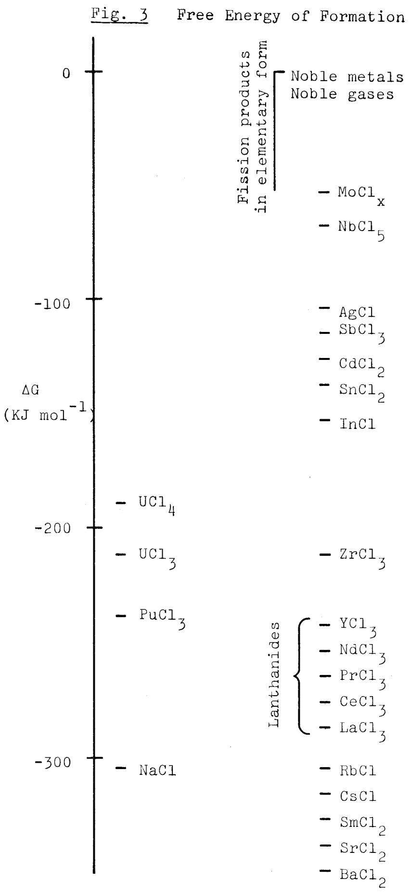  
Fission products in form of chloride

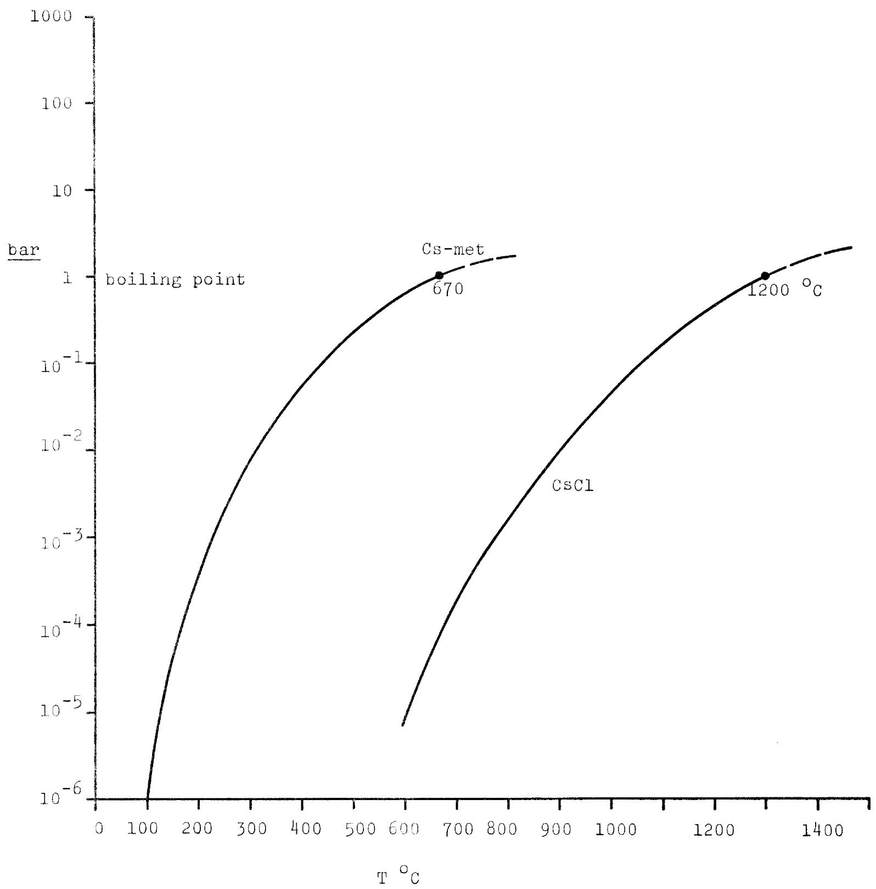  
Fig. 4 Volatility Pressure of Caesium-metal (Caesium Oxide) and Caesium Chlorides

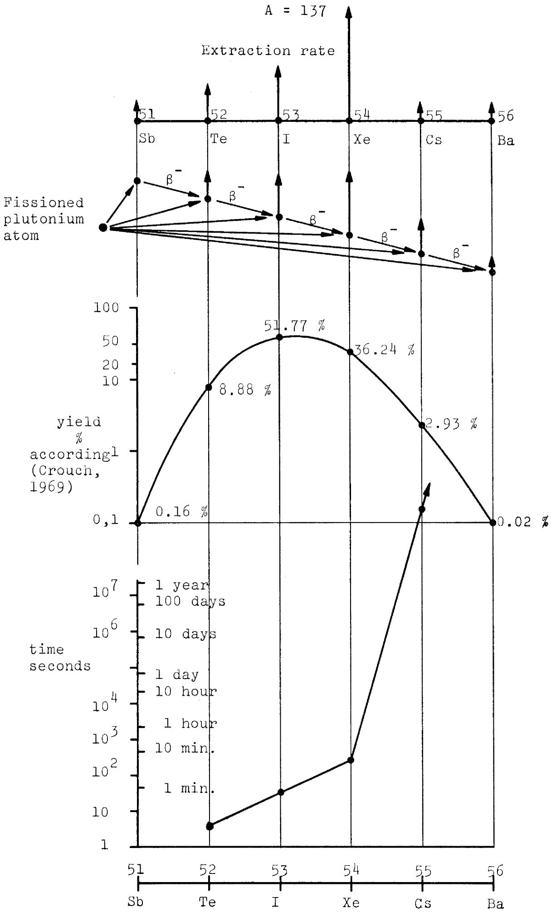  
Fig. 5 Scheme of the independent Yield Calculation

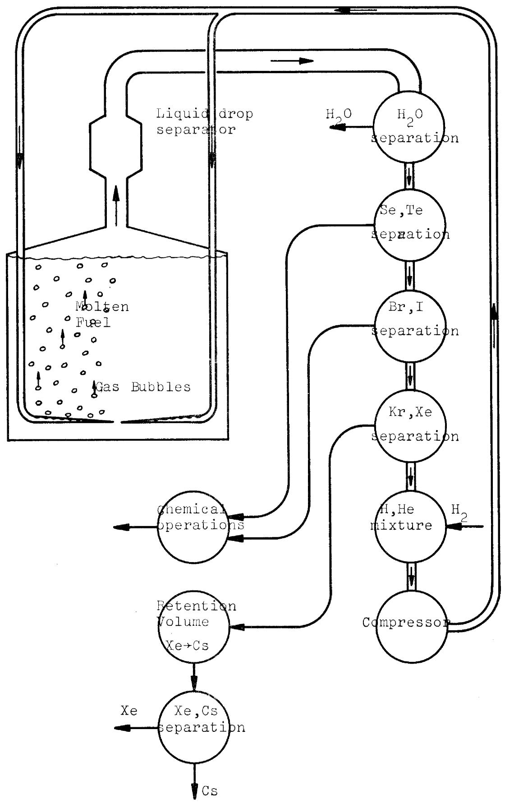  
Fig. 6 Scheme of Gas-Extraction

f) the history of each individual fission product is calculated on the basis of the independant yields: see fig. 5 (according to Crouch 1973)   
g) the in-core molten salt medium is purged by means of heliumhydrogen gas bubbles which greatly influence the chemical behaviour of some fission products (particularly iodine). The assumptions concerning the size of this stream is given in Appendix 1

3. Scheme of gas extraction and possible technology of gas separation

In order to give a basis for discussion on the gas extraction systems fig. 6 gives a simplified schematic. It must be stressed that this is a preliminary suggestion only without any basic studies.

4. Scheme of calculation

For calculation of the gas extraction system referred to here a computer programme "GASEX" has been prepared (using Fortran IV for the CDC 6500/6700). The principal layout on which the calculation is based is given in fig. 7.

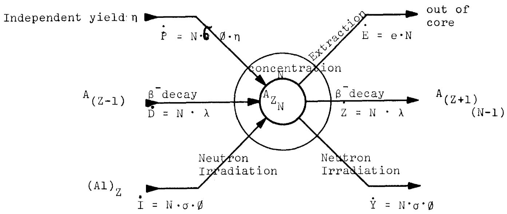  
Fig.7 The Scheme of Calculation

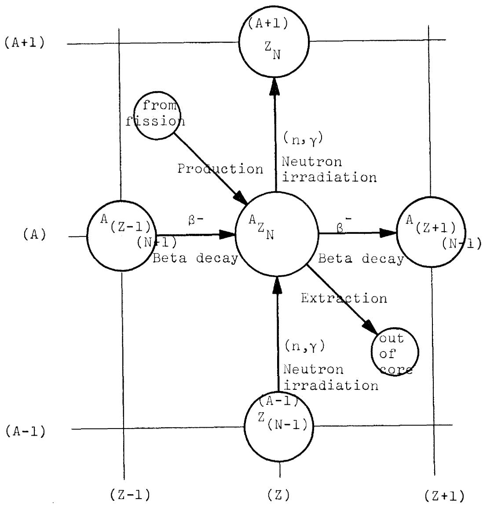

The only assumption arbitrarily made was the gas extraction rate of the volatile fission products.

The calculation was made for the following four assumptions, given in table 1.

Table 1 Core dwell time - (seconds)   

<table><tr><td></td><td colspan="4">Variant</td></tr><tr><td></td><td>1</td><td>2</td><td>3</td><td>4</td></tr><tr><td>Se and Te</td><td>106</td><td>109</td><td>104</td><td>103</td></tr><tr><td>Br and I</td><td>106</td><td>104</td><td>103</td><td>102</td></tr><tr><td>Kr and Xe</td><td>106</td><td>103</td><td>102</td><td>101</td></tr><tr><td>All other elements *)</td><td>106</td><td>106</td><td>106</td><td>106</td></tr></table>

*) $10^{6}$ seconds equals 11.57 days which is postulated as the reprocessing period of the total liquid fuel

# 5. Results of the calculations

The most important results are:

1. Stable bromine isotopes A-79 and A-87 (fig. 8) are extracted with high efficiency. The short lived isotopes (t $1/2 \sim$ hours or minutes) (fig. 8) are extracted in rather small quantities (logarithmic vertical scale).

2. Short lived bromine isotopes A = 88, 89, 90, being also the probable precursors of delayed neutrons are in practice not extractable (no loss of delayed neutrons) (fig. 9 - linear vertical scale)   
3. The very high retention of the heavy bromine isotopes in the molten fuel is almost independent of the rate of gas extraction. For the highest gas 'extraction' only a small extraction of bromine occurs (fig. 9).   
4. The main problem for krypton isotopes is the Kr-85 (fig. 10). The gas extraction is successful for the lowest case (2) and results in a reduction of the amount of Kr-85 by approx 1000 times.

By increasing the gas extraction rate the amounts of this isotopes decreases by a factor $10^{-5}$ . The short lived krypton isotopes are very efficiently extracted (fig. 11).

5. The gas extraction has only a small effect on the two radioactive strontium isotopes (fig. 12). They are decreased only by a factor of 7.   
6. The case of the iodine isotopes (fig. 13 and 14) is critical for two reasons I) the iodine-13l is an important factor in the core accident hazard.

The figures 8-17 are made directly by the CDC 6500/6700 printer as output from GASEX; If * appears then at least two curves are superimposed.

Fig. 8   
ALL ISOTOPES OF ATOMICNUMBER 35   

<table><tr><td colspan="11">GRAPH 1 - ELEMENT BR AT.NO. 35 ISOTYPE 79 STABLE</td></tr><tr><td>1.00E-08</td><td>1.00E-06</td><td>1.00E-04</td><td>1.00E-02</td><td>1.00E+00</td><td>1.00E+02</td><td></td><td></td><td></td><td></td><td></td></tr><tr><td colspan="11">GRAPH 2 - ELEMENT BR AT.NO. 35 ISOTYPE 81 STABLE</td></tr><tr><td>1.00E-08</td><td>1.00E-06</td><td>1.00E-04</td><td>1.00E-02</td><td>1.00E+00</td><td>1.00E+02</td><td></td><td></td><td></td><td></td><td></td></tr><tr><td colspan="11">GRAPH 3 - ELEMENT BR AT.NO. 35 ISOTYPE 82 HALF-LIFE 3.940E+01 HRS</td></tr><tr><td>1.00E-08</td><td>1.00E-06</td><td>1.00E-04</td><td>1.00E-02</td><td>1.00E+00</td><td>1.00E+02</td><td></td><td></td><td></td><td></td><td></td></tr><tr><td colspan="11">GRAPH 4 - ELEMENT BR AT.NO. 35 ISOTYPE 83 HALF-LIFE 2.400E+00 HRS</td></tr><tr><td>1.00E-08</td><td>1.00E-06</td><td>1.00E-04</td><td>1.00E-02</td><td>1.00E+00</td><td>1.00E+02</td><td></td><td></td><td></td><td></td><td></td></tr><tr><td colspan="11">GRAPH 5 - ELEMENT BR AT.NO. 35 ISOTYPE 84 HALF-LIFE 3.200E+01 MIN</td></tr><tr><td>1.00E-08</td><td>1.00E-06</td><td>1.00E-04</td><td>1.00E-02</td><td>1.00E+00</td><td>1.00E+02</td><td></td><td></td><td></td><td></td><td></td></tr><tr><td colspan="11">GRAPH 6 - ELEMENT BR AT.NO. 35 ISOTYPE 85 HALF-LIFE 3.000E+00 MIN</td></tr><tr><td>1.00E-08</td><td>1.00E-06</td><td>1.00E-04</td><td>1.00E-02</td><td>1.00E+00</td><td>1.00E+02</td><td></td><td></td><td></td><td></td><td></td></tr><tr><td colspan="11">GRAPH 7 - ELEMENT BR AT.NO. 35 ISOTYPE 86 HALF-LIFE 9.400E+01 SEC</td></tr><tr><td>1.00E-08</td><td>1.00E-06</td><td>1.00E-04</td><td>1.00E-02</td><td>1.00E+00</td><td>1.00E+02</td><td></td><td></td><td></td><td></td><td></td></tr><tr><td colspan="11">GRAPH 8 - ELEMENT BR AT.NO. 35 ISOTYPE 87 HALF-LIFE 9.940E+01 SEC</td></tr><tr><td>1.00E-08</td><td>1.00E-06</td><td>1.00E-04</td><td>1.00E-02</td><td>1.00E+00</td><td>1.00E+02</td><td></td><td></td><td></td><td></td><td></td></tr></table>

<table><tr><td rowspan="2">0.</td><td>GRAPH 1 - ELEMENT BR AT.NO. 35</td><td>ISOTOPE 88</td><td>HALF-LIFE 1.600E+01</td><td rowspan="2">SEC</td><td rowspan="2">8.00E-01</td><td rowspan="2">1.00E+00</td></tr><tr><td>2.00E-01</td><td>4.00E-01</td><td>6.00E-01</td></tr><tr><td rowspan="2">0.</td><td>GRAPH 2 - ELEMENT BR AT.NO. 35</td><td>ISOTOPE 89</td><td>HALF-LIFE 4.500E+00</td><td rowspan="2">SEC</td><td rowspan="2">8.00E-01</td><td rowspan="2">1.00E+00</td></tr><tr><td>2.00E-01</td><td>4.00E-01</td><td>6.00E-01</td></tr><tr><td rowspan="2">0.</td><td>GRAPH 3 - ELEMENT BR AT.NO. 35</td><td>ISOTOPE 90</td><td>HALF-LIFE 1.600E+00</td><td rowspan="2">SEC</td><td rowspan="2">8.00E-01</td><td rowspan="2">1.00E+00</td></tr><tr><td>2.00E-01</td><td>4.00E-01</td><td>6.00E-01</td></tr></table>

<table><tr><td>GRAPH</td><td>1 - ELEMENT KR AT.NO. 36</td><td>ISOTYPE 82</td><td>STABLE</td><td></td><td></td></tr><tr><td>1.00E-08</td><td></td><td>1.00E-04</td><td>1.00E-02</td><td>1.00E+00</td><td>1.00E+02</td></tr><tr><td>GRAPH</td><td>2 - ELEMENT KR AT.NO. 36</td><td>ISOTYPE 83</td><td>STABLE</td><td></td><td></td></tr><tr><td>1.00E-08</td><td></td><td>1.00E-04</td><td>1.00E-02</td><td>1.00E+00</td><td>1.00E+02</td></tr><tr><td>GRAPH</td><td>3 - ELEMENT KR AT.NO. 36</td><td>ISOTYPE 84</td><td>STABLE</td><td></td><td></td></tr><tr><td>1.00E-08</td><td></td><td>1.00E-04</td><td>1.00E-02</td><td>1.00E+00</td><td>1.00E+02</td></tr><tr><td>GRAPH</td><td>4 - ELEMENT KR AT.NO. 36</td><td>ISOTYPE 85</td><td>HALF-LIFE 1.076E+01 YRS</td><td></td><td></td></tr><tr><td>1.00E-08</td><td></td><td>1.00E-04</td><td>1.00E-02</td><td>1.00E+00</td><td>1.00E+02</td></tr><tr><td>GRAPH</td><td>5 - ELEMENT KR AT.NO. 36</td><td>ISOTYPE 86</td><td>STABLE</td><td></td><td></td></tr><tr><td>1.00E-08</td><td></td><td>1.00E-04</td><td>1.00E-02</td><td>1.00E+00</td><td>1.00E+02</td></tr><tr><td>GRAPH</td><td>6 - ELEMENT KR AT.NO. 36</td><td>ISOTYPE 87</td><td>HALF-LIFE 7.600E+01 MIN</td><td></td><td></td></tr><tr><td>1.00E-08</td><td></td><td>1.00E-04</td><td>1.00E-02</td><td>1.00E+00</td><td>1.00E+02</td></tr><tr><td>GRAPH</td><td>7 - ELEMENT KR AT.NO. 36</td><td>ISOTYPE 88</td><td>HALF-LIFE 2.900E+00 HKS</td><td></td><td></td></tr><tr><td>1.00E-08</td><td></td><td>1.00E-04</td><td>1.00E-02</td><td>1.00E+00</td><td>1.00E+02</td></tr><tr><td>GRAPH</td><td>8 - ELEMENT KR AT.NO. 36</td><td>ISOTYPE 89</td><td>HALF-LIFE 3.100E+00 MIN</td><td></td><td></td></tr><tr><td>1.00E-08</td><td></td><td>1.00E-04</td><td>1.00E-02</td><td>1.00E+00</td><td>1.00E+02</td></tr></table>

<table><tr><td>1.</td><td colspan="11">+···+···+···+···+···+···+···+···+···+···+···+···+···+···+···+···+···+···+···+···+···+···+···+···+···+···+···+···+···+···+···+···+···+···=111***4*8.</td><td></td><td></td></tr><tr><td></td><td>I</td><td>·</td><td>·</td><td>·</td><td>·</td><td>·</td><td colspan="5">111***4*8.</td><td></td><td></td></tr><tr><td></td><td>I</td><td>·</td><td>·</td><td>·</td><td>·</td><td>·</td><td colspan="5">111111***4*8.</td><td></td><td></td></tr><tr><td></td><td>I</td><td>·</td><td>·</td><td>·</td><td>·</td><td colspan="6">111115***4*8.</td><td></td><td></td></tr><tr><td></td><td>I</td><td>·</td><td>·</td><td>·</td><td>·</td><td>1111115***44</td><td>76</td><td colspan="4">8.</td><td></td><td></td></tr><tr><td></td><td>I</td><td>·</td><td>·</td><td>·</td><td>111111</td><td>5***44</td><td>76</td><td colspan="4">8.</td><td></td><td></td></tr><tr><td></td><td>I</td><td>·</td><td>·</td><td>·</td><td>111111</td><td>5**44</td><td>76</td><td colspan="4">8.</td><td></td><td></td></tr><tr><td></td><td>I</td><td>·</td><td>·</td><td>111111</td><td>5**44</td><td>76</td><td colspan="5">8.</td><td></td><td></td></tr><tr><td></td><td>I</td><td>·</td><td>·</td><td>111111</td><td>5**44</td><td>76</td><td colspan="5">8.</td><td></td><td></td></tr><tr><td>2.</td><td>+···+···+···+···+···+···+···+···+···+···+···+···+···+···+···+···+···+···+···+···+···+···+···+···+···+···+···+···+···+···+···+···+3.</td><td>+···+···+···+···+···+···+···+···+···+···+···+···+···+···+···+···+···+···+···+···+···+···+···+···+···+···+···+···+···+···+···+···+……+···+···+···+···+···+···+···+···+···+···+···+···+···+···+···+···+···+···+···+···+···+···+···+···+···+···+···+···+···+···+···+···+···-1.</td><td colspan="10">+···+···+···+···+···+···+···+···+···+···+···+···+···+···+···+···+···+···+···+···+···+···+···+···+···+···+···+···+···+···+···+···-1.</td><td></td></tr><tr><td></td><td>I</td><td>·</td><td>·</td><td>·</td><td>·</td><td>·</td><td>76</td><td colspan="4">8.</td><td></td><td></td></tr><tr><td></td><td>I</td><td>·</td><td>·</td><td>·</td><td>·</td><td>·</td><td>76</td><td colspan="4">8.</td><td></td><td></td></tr><tr><td></td><td>I</td><td>·</td><td>·</td><td>·</td><td>·</td><td>·</td><td>76</td><td colspan="4">8.</td><td></td><td></td></tr><tr><td></td><td>I</td><td>·</td><td>·</td><td>·</td><td>·</td><td>·</td><td>76</td><td colspan="4">8.</td><td></td><td></td></tr><tr><td></td><td>I</td><td>·</td><td>·</td><td>·</td><td>·</td><td>·</td><td>76</td><td colspan="4">8.</td><td>I</td><td></td></tr><tr><td></td><td>I</td><td>·</td><td>·</td><td>·</td><td>·</td><td>·</td><td>76</td><td colspan="4">8.</td><td>I</td><td></td></tr><tr><td></td><td>I</td><td>·</td><td>·</td><td>·</td><td>·</td><td>·</td><td>76</td><td colspan="4">8.</td><td>I</td><td></td></tr><tr><td></td><td>I</td><td>·</td><td>·</td><td>·</td><td>·</td><td>·</td><td>76</td><td colspan="4">8.</td><td>I</td><td></td></tr><tr><td></td><td>I</td><td>·</td><td>·</td><td>·</td><td>·</td><td>·</td><td>76</td><td>8.</td><td></td><td></td><td></td><td></td><td></td></tr><tr><td></td><td>I</td><td>·</td><td>·</td><td>·</td><td>·</td><td>·</td><td>76</td><td colspan="4">8.</td><td>I</td><td></td></tr><tr><td></td><td>I</td><td>·</td><td>·</td><td>·</td><td>·</td><td>·</td><td>76</td><td colspan="4">8.</td><td>I</td><td></td></tr><tr><td></td><td>I</td><td>·</td><td>·</td><td>·</td><td>·</td><td>·</td><td>76</td><td colspan="4">8.</td><td>I</td><td></td></tr><tr><td></td><td>I</td><td>·</td><td>·</td><td>·</td><td>·</td><td>·</td><td>76</td><td>8.</td><td colspan="4">8.</td><td>I</td></tr><tr><td></td><td>I</td><td>·</td><td>·</td><td>·</td><td>·</td><td>·</td><td>76</td><td>8.</td><td colspan="4">8.</td><td>I</td></tr><tr><td></td><td>I</td><td>·</td><td>·</td><td>·</td><td>·</td><td>·</td><td>76</td><td>8.</td><td colspan="4">8.</td><td>I</td></tr><tr><td></td><td>I</td><td>·</td><td>·</td><td>·</td><td>·</td><td>·</td><td>76</td><td>8.</td><td colspan="4">8.</td><td>I</td></tr><tr><td></td><td>1</td><td>·</td><td>·</td><td>·</td><td>·</td><td>·</td><td>76</td><td>8.</td><td colspan="4">8.</td><td>I</td></tr><tr><td></td><td>1</td><td>·</td><td>·</td><td>·</td><td>·</td><td>·</td><td>76</td><td>8.</td><td colspan="4">8.</td><td>I</td></tr><tr><td></td><td>1</td><td>·</td><td>·</td><td>·</td><td>·</td><td>·</td><td>76</td><td>8.</td><td colspan="4">8.</td><td>I</td></tr><tr><td></td><td>1</td><td>·</td><td>·</td><td>·</td><td>·</td><td>·</td><td>7.6</td><td colspan="4">8.</td><td>I</td><td></td></tr><tr><td></td><td>1</td><td>·</td><td>·</td><td>·</td><td>·</td><td>·</td><td>7.6</td><td>8.</td><td colspan="4">8.</td><td>I</td></tr><tr><td></td><td>1</td><td>·</td><td>·</td><td>·</td><td>·</td><td>·</td><td>7.6</td><td>8.</td><td colspan="4">8.</td><td>I</td></tr><tr><td></td><td>1</td><td>·</td><td>·</td><td>·</td><td>·</td><td>·</td><td>7.6</td><td>8.</td><td colspan="4">8.</td><td>I</td></tr><tr><td></td><td>1</td><td>·</td><td>·</td><td>·</td><td>·</td><td>·</td><td>7.6</td><td>8.</td><td colspan="4">8.</td><td>I</td></tr></table>

<table><tr><td rowspan="2">0.</td><td>GRAPH 1 - ELEMENT KR AT.NO. 36</td><td>ISOTOPE 90</td><td>HALF-LIFE 3.200E+01</td><td>SEC</td><td></td><td></td></tr><tr><td>2.00E-01</td><td>4.00E-01</td><td>6.00E-01</td><td>8.00E-01</td><td>1.00E+00</td><td></td></tr><tr><td rowspan="2">0.</td><td>GRAPH 2 - ELEMENT KR AT.NO. 36</td><td>ISOTOPE 91</td><td>HALF-LIFE 8.400E+00</td><td>SEC</td><td></td><td></td></tr><tr><td>2.00E-01</td><td>4.00E-01</td><td>6.00E-01</td><td>8.00E-01</td><td>1.00E+00</td><td></td></tr><tr><td rowspan="2">0.</td><td>GRAPH 3 - ELEMENT KR AT.NO. 36</td><td>ISOTOPE 92</td><td>HALF-LIFE 1.900E+00</td><td>SEC</td><td></td><td></td></tr><tr><td>2.00E-01</td><td>4.00E-01</td><td>6.00E-01</td><td>8.00E-01</td><td>1.00E+00</td><td></td></tr><tr><td rowspan="2">0.</td><td>GRAPH 4 - ELEMENT KR AT.NO. 36</td><td>ISOTOPE 93</td><td>HALF-LIFE 1.200E+00</td><td>SEC</td><td></td><td></td></tr><tr><td>2.00E-01</td><td>4.00E-01</td><td>6.00E-01</td><td>8.00E-01</td><td>1.00E+00</td><td></td></tr><tr><td rowspan="2">0.</td><td>GRAPH 5 - ELEMENT KR AT.NO. 36</td><td>ISOTOPE 94</td><td>HALF-LIFE 1.000E+00</td><td>SEC</td><td></td><td></td></tr><tr><td>2.00E-01</td><td>4.00E-01</td><td>6.00E-01</td><td>8.00E-01</td><td>1.00E+00</td><td></td></tr><tr><td rowspan="2">0.</td><td>GRAPH 6 - ELEMENT KR AT.NO. 36</td><td>ISOTOPE 95</td><td>HALF-LIFE 8.000E-01</td><td>SEC</td><td></td><td></td></tr><tr><td>2.00E-01</td><td>4.00E-01</td><td>6.00E-01</td><td>8.00E-01</td><td>1.00E+00</td><td></td></tr></table>

<table><tr><td>1.</td><td>+</td><td>+</td><td>+</td><td>+</td><td>+</td><td>+</td><td>+</td><td>+</td><td>+</td><td>+</td><td>+</td><td>+</td><td>+</td><td>+</td><td>+</td></tr><tr><td></td><td>I</td><td>·</td><td></td><td>·</td><td></td><td></td><td></td><td></td><td></td><td></td><td></td><td></td><td></td><td></td><td></td></tr><tr><td></td><td>I</td><td>·</td><td></td><td>·</td><td></td><td></td><td></td><td></td><td></td><td></td><td></td><td></td><td></td><td></td><td></td></tr><tr><td></td><td>I</td><td>·</td><td></td><td>·</td><td></td><td></td><td></td><td></td><td></td><td></td><td></td><td></td><td></td><td></td><td></td></tr><tr><td></td><td>I</td><td>·</td><td></td><td>·</td><td></td><td></td><td></td><td></td><td></td><td></td><td></td><td></td><td></td><td></td><td></td></tr><tr><td></td><td>I</td><td>·</td><td></td><td>·</td><td></td><td></td><td></td><td></td><td></td><td></td><td></td><td></td><td></td><td></td><td></td></tr><tr><td></td><td>I</td><td>·</td><td></td><td>·</td><td></td><td></td><td></td><td></td><td></td><td>·</td><td></td><td></td><td></td><td></td><td></td></tr><tr><td></td><td>I</td><td>·</td><td></td><td>·</td><td></td><td></td><td></td><td></td><td></td><td></td><td></td><td></td><td></td><td></td><td></td></tr><tr><td></td><td>I</td><td>·</td><td></td><td>·</td><td></td><td></td><td></td><td></td><td></td><td></td><td></td><td></td><td></td><td></td><td></td></tr><tr><td></td><td>I</td><td>·</td><td></td><td>·</td><td></td><td></td><td></td><td></td><td></td><td></td><td></td><td></td><td></td><td></td><td></td></tr><tr><td></td><td>I</td><td>·</td><td></td><td>·</td><td></td><td></td><td></td><td></td><td></td><td></td><td></td><td></td><td></td><td></td><td></td></tr><tr><td>2.</td><td>+</td><td>+</td><td>+</td><td>+</td><td>+</td><td>+</td><td>+</td><td>+</td><td>+</td><td>+</td><td>+</td><td>+</td><td>+</td><td>+</td><td>+</td></tr><tr><td></td><td>I</td><td>·</td><td></td><td>·</td><td></td><td></td><td></td><td></td><td></td><td></td><td></td><td></td><td></td><td></td><td></td></tr><tr><td></td><td>I</td><td>·</td><td></td><td>·</td><td></td><td></td><td></td><td></td><td></td><td></td><td></td><td></td><td></td><td></td><td></td></tr><tr><td></td><td>I</td><td>·</td><td></td><td>·</td><td></td><td></td><td></td><td></td><td></td><td></td><td></td><td></td><td></td><td></td><td></td></tr><tr><td></td><td>I
I</td><td>·</td><td></td><td>·</td><td></td><td></td><td></td><td></td><td></td><td></td><td></td><td></td><td></td><td></td><td></td></tr><tr><td></td><td>I</td><td>·</td><td></td><td>·</td><td></td><td></td><td></td><td></td><td></td><td></td><td></td><td></td><td></td><td></td><td></td></tr><tr><td></td><td>I</td><td>·</td><td></td><td>·</td><td></td><td></td><td></td><td></td><td></td><td></td><td></td><td></td><td></td><td></td><td></td></tr><tr><td></td><td>I</td><td>·</td><td></td><td>·</td><td></td><td></td><td></td><td></td><td></td><td></td><td></td><td></td><td></td><td></td><td></td></tr><tr><td></td><td>I</td><td>·</td><td></td><td>·</td><td></td><td></td><td></td><td></td><td></td><td></td><td></td><td></td><td></td><td>34*·</td><td></td></tr><tr><td></td><td>I</td><td>·</td><td></td><td>·</td><td></td><td></td><td></td><td></td><td></td><td></td><td></td><td></td><td></td><td></td><td></td></tr><tr><td></td><td>I</td><td>·</td><td></td><td>·</td><td></td><td></td><td></td><td></td><td></td><td></td><td></td><td></td><td></td><td></td><td></td></tr><tr><td>3.</td><td>+</td><td>+</td><td>+</td><td>+</td><td>+</td><td>+</td><td>+</td><td>+</td><td>+</td><td>+</td><td>+</td><td>+</td><td>+</td><td>+</td><td>+</td></tr><tr><td></td><td>I</td><td>·</td><td></td><td>·</td><td></td><td></td><td></td><td></td><td></td><td></td><td></td><td></td><td></td><td></td><td></td></tr><tr><td></td><td>I</td><td>·</td><td></td><td>·</td><td></td><td></td><td></td><td></td><td></td><td></td><td></td><td></td><td></td><td></td><td></td></tr><tr><td></td><td>I</td><td>·</td><td></td><td>·</td><td></td><td></td><td></td><td></td><td></td><td></td><td></td><td></td><td></td><td></td><td></td></tr><tr><td></td><td>I 1</td><td>·</td><td></td><td>·</td><td></td><td></td><td></td><td></td><td></td><td></td><td></td><td></td><td></td><td></td><td></td></tr><tr><td></td><td>I</td><td>·</td><td></td><td>·</td><td></td><td></td><td></td><td></td><td></td><td></td><td></td><td></td><td></td><td></td><td></td></tr><tr><td></td><td>I</td><td>·</td><td></td><td>·</td><td></td><td></td><td></td><td></td><td></td><td></td><td></td><td></td><td></td><td></td><td></td></tr><tr><td></td><td>I</td><td>·</td><td></td><td>·</td><td></td><td></td><td></td><td></td><td></td><td></td><td></td><td></td><td></td><td></td><td></td></tr><tr><td></td><td>I</td><td>·</td><td></td><td>·</td><td></td><td></td><td></td><td></td><td></td><td></td><td></td><td></td><td></td><td></td><td>I</td></tr><tr><td></td><td>I</td><td>·</td><td></td><td>·</td><td></td><td></td><td></td><td></td><td></td><td></td><td></td><td></td><td></td><td></td><td>I</td></tr></table>

<table><tr><td colspan="7">GRAPH 1 - ELEMENT SR AT.NO. 38 ISOTOPE 88 STABLE</td></tr><tr><td>1.00E-08</td><td>1.00E-06</td><td>1.00E-04</td><td>1.00E-02</td><td>1.00E+00</td><td>1.00E+02</td><td></td></tr><tr><td colspan="7">GRAPH 2 - ELEMENT SR AT.NO. 38 ISOTOPE 89 HALF-LIFE 5.050E+01 DAY</td></tr><tr><td>1.00E-08</td><td>1.00E-06</td><td>1.00E-04</td><td>1.00E-02</td><td>1.00E+00</td><td>1.00E+02</td><td></td></tr><tr><td colspan="7">GRAPH 3 - ELEMENT SR AT.NO. 38 ISOTOPE 90 HALF-LIFE 2.810E+01 YRS</td></tr><tr><td>1.00E-08</td><td>1.00E-06</td><td>1.00E-04</td><td>1.00E-02</td><td>1.00E+00</td><td>1.00E+02</td><td></td></tr><tr><td colspan="7">I - I - I - I - I - I - I - I - I - I - I - I - I - I - I - I - I - I - I - I - I - I - I - I - I - I - I - I - I - I - I - I - I - I - I - I - I - I - I - I - I - I - I - I - I - I - I - I - I - I - I -I - I - I - I - I - I - I - I - I - I - I - I - I - I - I - I - I - I - I - I - I - I - I - I - I - I - I - I - I - I - I - I - I - I - I - I - I - I - I - I - I - I - I - I - I - I - I - I - I - I- I - I - I - I - I - I - I - I - I - I - I - I - I - I - I - I - I - I - I - I - I - I - I - I - I - I - I - I - I - I - I - I - I - I - I - I - I - I - I - I - I - I - I - I - I - I - I - I - I - I-</td></tr><tr><td>I -</td><td>-</td><td>-</td><td>-</td><td>11*</td><td>-</td><td>-</td></tr><tr><td>I -</td><td>-</td><td>-</td><td>-</td><td>11*</td><td>-</td><td>-</td></tr><tr><td>I -</td><td>-</td><td>-</td><td>-</td><td>11</td><td>32</td><td>-</td></tr><tr><td>I -</td><td>-</td><td>-</td><td>-</td><td>11</td><td>32</td><td>-</td></tr><tr><td>I -</td><td>-</td><td>-</td><td>-</td><td>11</td><td>32</td><td>-</td></tr><tr><td>I -</td><td>-</td><td>-</td><td>-</td><td>11</td><td>32</td><td>-</td></tr><tr><td>I -</td><td>-</td><td>-</td><td>-</td><td>11</td><td>32</td><td>-</td></tr><tr><td>I -</td><td>-</td><td>-</td><td>-</td><td>11</td><td>32</td><td>-</td></tr></table>

Fig. 12

<table><tr><td colspan="9">GRAPH 1 = ELEMENT J AT.NO. 53 ISOTYPE 127 STAGE-1</td></tr><tr><td>1.00E-08</td><td>1.00E-06</td><td>1.00E-04</td><td>1.00E-02</td><td>1.00E+00</td><td>1.00E+02</td><td></td><td></td><td></td></tr><tr><td colspan="9">GRAPH 2 = ELEMENT J AT.NO. 53 ISOTYPE 129 HALF-LIFE 1.00E+07 YRS</td></tr><tr><td>1.00E-03</td><td>1.00E-06</td><td>1.00E-04</td><td>1.00E-02</td><td>1.00E+00</td><td>1.00E+02</td><td></td><td></td><td></td></tr><tr><td colspan="9">GRAPH 3 = ELEMENT J AT.NO. 53 ISOTYPE 133 HALF-FIVE 1.239E+01 HRS</td></tr><tr><td>1.00E-08</td><td>1.00E-06</td><td>1.00E-04</td><td>1.00E-02</td><td>1.00E+00</td><td>1.00E+02</td><td></td><td></td><td></td></tr><tr><td colspan="9">GRAPH 4 = ELEMENT J AT.NO. 53 ISOTYPE 131 HALF-FIVE 8.050E+00 DAY</td></tr><tr><td>1.00E-08</td><td>1.00E-06</td><td>1.00E-04</td><td>1.00E-02</td><td>1.00E+00</td><td>1.00E+02</td><td></td><td></td><td></td></tr><tr><td colspan="9">GRAPH 5 = ELEMENT J AT.NO. 53 ISOTYPE 132 HALF-FIVE 2.400E+00 HRS</td></tr><tr><td>1.00E-08</td><td>1.00E-06</td><td>1.00E-04</td><td>1.00E-02</td><td>1.00E+00</td><td>1.00E+02</td><td></td><td></td><td></td></tr><tr><td colspan="9">GRAPH 6 = ELEMENT J AT.NO. 53 ISOTYPE 133 HALF-FIVE 2.080E+01 HRS</td></tr><tr><td>1.00E-08</td><td>1.00E-06</td><td>1.00E-04</td><td>1.00E-02</td><td>1.00E+00</td><td>1.00E+02</td><td></td><td></td><td></td></tr><tr><td colspan="9">GRAPH 7 = ELEMENT J AT.NO. 53 ISOTYPE 134 HALF-FIVE 5.200E+01 MIN</td></tr><tr><td>1.00E-08</td><td>1.00E-06</td><td>1.00E-04</td><td>1.00E-02</td><td>1.00E+00</td><td>1.00E+02</td><td></td><td></td><td></td></tr><tr><td colspan="9">GRAPH 8 = ELEMENT J AT.NO. 53 ISOTYPE 135 HALF-FIVE 6.700E+00 HRS</td></tr><tr><td>1.00E-08</td><td>1.00E-06</td><td>1.00E-04</td><td>1.00E-02</td><td>1.00E+00</td><td>1.00E+02</td><td></td><td></td><td></td></tr></table>

Fig. 13

<table><tr><td rowspan="2">0.</td><td>GRAPH 1 - ELEMENT J AT.NO. 53</td><td>ISOTOPE 136</td><td>HALF-LIFE 8.300E+01</td><td>SEC</td><td></td><td></td></tr><tr><td>2.00E-01</td><td>4.00E-01</td><td>6.00E-01</td><td>8.00E-01</td><td>1.00E+00</td><td></td></tr><tr><td rowspan="2">0.</td><td>GRAPH 2 - ELEMENT J AT.NO. 53</td><td>ISOTOPE 137</td><td>HALF-LIFE 2.400E+01</td><td>SEC</td><td></td><td></td></tr><tr><td>2.00E-01</td><td>4.00E-01</td><td>6.00E-01</td><td>8.00E-01</td><td>1.00E+00</td><td></td></tr><tr><td rowspan="2">0.</td><td>GRAPH 3 - ELEMENT J AT.NO. 53</td><td>ISOTOPE 138</td><td>HALF-LIFE 6.000E+00</td><td>SEC</td><td></td><td></td></tr><tr><td>2.00E-01</td><td>4.00E-01</td><td>6.00E-01</td><td>8.00E-01</td><td>1.00E+00</td><td></td></tr><tr><td rowspan="2">0.</td><td>GRAPH 4 - ELEMENT J AT.NO. 53</td><td>ISOTOPE 139</td><td>HALF-LIFE 2.700E+00</td><td>SEC</td><td></td><td></td></tr><tr><td>2.00E-01</td><td>4.00E-01</td><td>6.00E-01</td><td>8.00E-01</td><td>1.00E+00</td><td></td></tr><tr><td rowspan="2">0.</td><td>GRAPH 5 - ELEMENT J AT.NO. 53</td><td>ISOTOPE 140</td><td>HALF-LIFE 8.900E-01</td><td>SEC</td><td></td><td></td></tr><tr><td>2.00E-01</td><td>4.00E-01</td><td>6.00E-01</td><td>8.00E-01</td><td>1.00E+00</td><td></td></tr></table>

<table><tr><td>1.</td><td>+···+</td><td>+···+</td><td>+···+</td><td>+···+</td><td>+···+</td><td>+···+</td><td>+···+</td><td>+···+</td></tr><tr><td></td><td>I</td><td>·</td><td>·</td><td>·</td><td>·</td><td>·</td><td>·</td><td>I</td></tr><tr><td></td><td>I</td><td>·</td><td>·</td><td>·</td><td>·</td><td>·</td><td>·</td><td>I</td></tr><tr><td></td><td>I</td><td>·</td><td>·</td><td>·</td><td>·</td><td>·</td><td>·</td><td>I</td></tr><tr><td></td><td>I</td><td>·</td><td>·</td><td>·</td><td>·</td><td>·</td><td>·</td><td>I</td></tr><tr><td></td><td>I</td><td>·</td><td>·</td><td>·</td><td>·</td><td>·</td><td>·</td><td>I</td></tr><tr><td></td><td>I</td><td>·</td><td>·</td><td>·</td><td>·</td><td>·</td><td>·</td><td>I</td></tr><tr><td></td><td>II</td><td>·</td><td>·</td><td>·</td><td>·</td><td>·</td><td>·</td><td>I</td></tr><tr><td>2.</td><td>+···+</td><td>+···+</td><td>+···+</td><td>+···+</td><td>+···+</td><td>+···+</td><td>+···+</td><td>+···+</td></tr><tr><td></td><td>I</td><td>·</td><td>·</td><td>·</td><td>·</td><td>·</td><td>·</td><td>I</td></tr><tr><td></td><td>I</td><td>·</td><td>·</td><td>·</td><td>·</td><td>·</td><td>·</td><td>I</td></tr><tr><td></td><td>I</td><td>·</td><td>·</td><td>·</td><td>·</td><td>·</td><td>·</td><td>I</td></tr></table>

<table><tr><td>GRAPH</td><td>1 - ELEMENT XE AT.NO. 54</td><td>ISOTOPE 129</td><td>STABLE</td><td></td><td></td></tr><tr><td>1.00E-08</td><td></td><td>1.00E-04</td><td>1.00E-02</td><td>1.00E+00</td><td>1.00E+02</td></tr><tr><td>GRAPH</td><td>2 - ELEMENT XE AT.NO. 54</td><td>ISOTOPE 130</td><td>STABLE</td><td></td><td></td></tr><tr><td>1.00E-08</td><td></td><td>1.00E-04</td><td>1.00E-02</td><td>1.00E+00</td><td>1.00E+02</td></tr><tr><td>GRAPH</td><td>3 - ELEMENT XE AT.NO. 54</td><td>ISOTOPE 131</td><td>STABLE</td><td></td><td></td></tr><tr><td>1.00E-08</td><td></td><td>1.00E-04</td><td>1.00E-02</td><td>1.00E+00</td><td>1.00E+02</td></tr><tr><td>GRAPH</td><td>4 - ELEMENT XE AT.NO. 54</td><td>ISOTOPE 132</td><td>STABLE</td><td></td><td></td></tr><tr><td>1.00E-08</td><td></td><td>1.00E-04</td><td>1.00E-02</td><td>1.00E+00</td><td>1.00E+02</td></tr><tr><td>GRAPH</td><td>5 - ELEMENT XE AT.NO. 54</td><td>ISOTOPE 133</td><td>HALF-LIFE</td><td>5.650E+00</td><td>DAY</td></tr><tr><td>1.00E-08</td><td></td><td>1.00E-04</td><td>1.00E-02</td><td>1.00E+00</td><td>1.00E+02</td></tr><tr><td>GRAPH</td><td>6 - ELEMENT XE AT.NO. 54</td><td>ISOTOPE 134</td><td>STABLE</td><td></td><td></td></tr><tr><td>1.00E-08</td><td></td><td>1.00E-04</td><td>1.00E-02</td><td>1.00E+00</td><td>1.00E+02</td></tr><tr><td>GRAPH</td><td>7 - ELEMENT XE AT.NO. 54</td><td>ISOTOPE 135</td><td>HALF-LIFE</td><td>9.150E+00</td><td>HRS</td></tr><tr><td>1.00E-08</td><td></td><td>1.00E-04</td><td>1.00E-02</td><td>1.00E+00</td><td>1.00E+02</td></tr><tr><td>GRAPH</td><td>8 - ELEMENT XE AT.NO. 54</td><td>ISOTOPE 136</td><td>STABLE</td><td></td><td></td></tr><tr><td>1.00E-08</td><td></td><td>1.00E-04</td><td>1.00E-02</td><td>1.00E+00</td><td>1.00E+02</td></tr></table>

<table><tr><td>1.</td><td>+···+···········································································································································································································.
I</td><td>·</td><td>·</td><td>·</td><td>·</td><td>·</td><td>4**********7</td><td>·</td><td>·</td></tr><tr><td>I</td><td>·</td><td>·</td><td>·</td><td>·</td><td>·</td><td>·</td><td>4**********7</td><td>·</td><td>·</td></tr><tr><td>I</td><td>·</td><td>·</td><td>·</td><td>·</td><td>·</td><td>·</td><td>4**********77</td><td>·</td><td>·</td></tr><tr><td>I</td><td>·</td><td>·</td><td>·</td><td>·</td><td>·</td><td>·</td><td>4**********77</td><td>·</td><td>·</td></tr><tr><td>I</td><td>·</td><td>·</td><td>·</td><td>·</td><td>·</td><td>·</td><td>4**********7</td><td>·</td><td>·</td></tr><tr><td>I</td><td>·</td><td>·</td><td>·</td><td>·</td><td>·</td><td>·</td><td>4**********7</td><td>·</td><td>·</td></tr><tr><td>I</td><td>·</td><td>·</td><td>·</td><td>·</td><td>·</td><td>·</td><td>4**********7</td><td>·</td><td>·</td></tr><tr><td>I</td><td>·</td><td>·</td><td>·</td><td>·</td><td>·</td><td>·</td><td>4**********7</td><td>·</td><td>·</td></tr><tr><td>I</td><td>·</td><td>·</td><td>·</td><td>·</td><td>·</td><td>·</td><td>4*********11**********2***</td><td>·</td><td>·</td></tr><tr><td>I</td><td>·</td><td>·</td><td>·</td><td>·</td><td>·</td><td>·</td><td>4**********3111**********2***</td><td>·</td><td>·</td></tr><tr><td>I</td><td>·</td><td>·</td><td>·</td><td>·</td><td>·</td><td>·</td><td>4**********3111**********2***</td><td>·</td><td>·</td></tr><tr><td>I</td><td>·</td><td>·</td><td>·</td><td>·</td><td>·</td><td>·</td><td>4**********333111**********2***5</td><td>·</td><td>·</td></tr><tr><td>I</td><td>·</td><td>·</td><td>·</td><td>·</td><td>·</td><td>·</td><td>4**********3331111**********82***9</td><td>·</td><td>·</td></tr><tr><td>2.</td><td>+···+·························································································································································································.
I</td><td>·</td><td>·</td><td>·
43</td><td>1</td><td>68</td><td>25</td><td>·7</td><td>·</td></tr><tr><td>I</td><td>·</td><td>·</td><td>·
43</td><td>1</td><td>68</td><td>25</td><td>·7</td><td>·</td><td>·</td></tr><tr><td>I</td><td>·</td><td>·</td><td>·
43</td><td>1</td><td>68</td><td>25</td><td>·7</td><td>·</td><td>·</td></tr><tr><td>I</td><td>·</td><td>·</td><td>·
43</td><td>1</td><td>68</td><td>25</td><td>·7</td><td>·</td><td>·</td></tr><tr><td>I</td><td>·</td><td>·</td><td>·
43</td><td>1</td><td>68</td><td>25</td><td>·7</td><td>·</td><td>·</td></tr><tr><td>I</td><td>·</td><td>·</td><td>·
433</td><td>1</td><td>68</td><td>25</td><td>·7</td><td>·</td><td>·</td></tr><tr><td>3.</td><td>+···+·························································································································································································
I</td><td>·</td><td>·</td><td>·
43</td><td>1</td><td>68</td><td>25</td><td>·7</td><td>·</td></tr><tr><td>I</td><td>·</td><td>·</td><td>·
43</td><td>1</td><td>68</td><td>25</td><td>·7</td><td>·</td><td>·</td></tr><tr><td>I</td><td>·</td><td>·</td><td>·
43</td><td>1</td><td>68</td><td>25</td><td>·7</td><td>·</td><td>·</td></tr><tr><td>I</td><td>·</td><td>·</td><td>·
43</td><td>1</td><td>68</td><td>20
25</td><td>·7</td><td>·</td><td>·</td></tr><tr><td>I</td><td>·</td><td>·</td><td>·
43</td><td>1</td><td>68</td><td>25</td><td>·7</td><td>·</td><td>·</td></tr><tr><td>I</td><td>·</td><td>·</td><td>·
43</td><td>1</td><td>68</td><td>25</td><td>·7</td><td>·</td><td>·</td></tr><tr><td>I</td><td>·</td><td>·</td><td>·
43</td><td>1</td><td>68</td><td>25</td><td>·7</td><td>·</td><td>·</td></tr><tr><td>I</td><td>·
43</td><td>1</td><td>68</td><td>25</td><td>·</td><td>7</td><td>·</td><td>·</td><td>·</td></tr><tr><td>I</td><td>·
43</td><td>1</td><td>68</td><td>25</td><td>·</td><td>7</td><td>·</td><td>·</td><td>·</td></tr><tr><td>I</td><td>·
43</td><td>1</td><td>68</td><td>25</td><td>·</td><td>7</td><td>·</td><td>·</td><td>·</td></tr></table>

Fig. 15

<table><tr><td>GRAPH</td><td>1 - ELEMENT XE AT.NO. 54</td><td>ISOTOPE 137</td><td>HALF-LIFE 3.900E+00 MIN</td><td></td><td></td><td></td></tr><tr><td>1.00E-08</td><td>1.00E-06</td><td>1.00E-04</td><td>1.00E-02</td><td>1.00E+00</td><td>1.00E+02</td><td></td></tr><tr><td>GRAPH</td><td>2 - ELEMENT XE AT.NO. 54</td><td>ISOTOPE 138</td><td>HALF-LIFE 1.410E+01 MIN</td><td></td><td></td><td></td></tr><tr><td>1.00E-08</td><td>1.00E-06</td><td>1.00E-04</td><td>1.00E-02</td><td>1.00E+00</td><td>1.00E+02</td><td></td></tr><tr><td>GRAPH</td><td>3 - ELEMENT XE AT.NO. 54</td><td>ISOTOPE 139</td><td>HALF-LIFE 4.100E+01 SIC</td><td></td><td></td><td></td></tr><tr><td>1.00E-08</td><td>1.00E-06</td><td>1.00E-04</td><td>1.00E-02</td><td>1.00E+00</td><td>1.00E+02</td><td></td></tr><tr><td>GRAPH</td><td>4 - ELEMENT XE AT.NO. 54</td><td>ISOTOPE 140</td><td>HALF-LIFE 1.350E+01 SEC</td><td></td><td></td><td></td></tr><tr><td>1.00E-08</td><td>1.00E-06</td><td>1.00E-04</td><td>1.00E-02</td><td>1.00E+00</td><td>1.00E+02</td><td></td></tr><tr><td>GRAPH</td><td>5 - ELEMENT XE AT.NO. 54</td><td>ISOTOPE 141</td><td>HALF-LIFE 1.700E+00 SIC</td><td></td><td></td><td></td></tr><tr><td>1.00E-08</td><td>1.00E-06</td><td>1.00E-04</td><td>1.00E-02</td><td>1.00E+00</td><td>1.00E+02</td><td></td></tr><tr><td>GRAPH</td><td>6 - ELEMENT XE AT.NO. 54</td><td>ISOTCPE 142</td><td>HALF-LIFE 1.200E+00 SEC</td><td></td><td></td><td></td></tr><tr><td>1.00E-08</td><td>1.00E-06</td><td>1.00E-04</td><td>1.00E-02</td><td>1.00E+00</td><td>1.00E+02</td><td></td></tr><tr><td>GRAPH</td><td>7 - ELEMENT XE AT.NO. 54</td><td>ISOTOPE 143</td><td>HALF-LIFE 1.000E+00 SEC</td><td></td><td></td><td></td></tr><tr><td>1.00E-08</td><td>1.00E-06</td><td>1.00E-04</td><td>1.00E-02</td><td>1.00E+00</td><td>1.00E+02</td><td></td></tr></table>

Fig. 16

<table><tr><td colspan="6">GRAPH 1 - ELEMENT CS AT.NO. 55 ISOTOPE 133 STABLE</td></tr><tr><td>1.00E-08</td><td>1.00E-06</td><td>1.00E-04</td><td>1.00E-02</td><td>1.00E+00</td><td>1.00E+02</td></tr><tr><td colspan="6">GRAPH 2 - ELEMENT CS AT.NO. 55 ISOTOPE 135 HALF-LIFE 2.000E+06 YRS</td></tr><tr><td>1.00E-08</td><td>1.00E-06</td><td>1.00E-04</td><td>1.00E-02</td><td>1.00E+00</td><td>1.00E+02</td></tr><tr><td colspan="6">GRAPH 3 - ELEMENT CS AT.NO. 55 ISOTOPE 137 HALF-LIFE 3.000E+01 YRS</td></tr><tr><td>1.00E-08</td><td>1.00E-06</td><td>1.00E-04</td><td>1.00E-02</td><td>1.00E+00</td><td>1.00E+02</td></tr><tr><td colspan="6">GRAPH 4 - ELEMENT CS AT.NO. 55 ISOTOPE 138 HALF-LIFE 3.230E+01 MIN</td></tr><tr><td>1.00E-08</td><td>1.00E-06</td><td>1.00E-04</td><td>1.00E-02</td><td>1.00E+00</td><td>1.00E+02</td></tr><tr><td colspan="6">GRAPH 5 - ELEMENT CS AT.NO. 55 ISOTOPE 139 HALF-LIFE 9.000E+00 MIN</td></tr><tr><td>1.00E-08</td><td>1.00E-06</td><td>1.00E-04</td><td>1.00E-02</td><td>1.00E+00</td><td>1.00E+02</td></tr></table>

II) The isotopes I-136, I-137, I-138, I-139 and I-140 are probably the most efficient precursors of delayed neutrons.

Fig. 13 shows that the gas extraction of I-13l is very efficient but rather strongly dependant on the postulated gas extraction rate. For the lowest rate the I-13l decreases by a factor of approx 10, but for the middle case - variant 3 this factor increases to more than 100 and for the highest rate (4) reaches approx 1000. For the same gas extraction rates the loss of iodine isotope delayed neutron precursors is negligible (see iodine-136 - 140, fig. 14).

7. The xenon isotopes are also an important factor in the core accident hazard. Gas extraction decreases the amount of xenon in the core significantly including the long lived Xe-133 and Xe-135 (fig. 15 and 16). The short life xenon isotopes are only slightly influenced by the gas extraction.

8. The next controlling radionuclide is Cs-137. From fig. 17 it is seen that the gas extraction does not aid in the removal of this nuclide from the molten fuel, a factor of 7 is all that can be obtained. But the amount is not the only important factor, the volatility of caesium is also of interest.

From fig. 4 it is clear that the caesium chloride has a much lower partial pressure than that of caesium metal or caesium oxide in the same temperature range.

A very important problem arises with the possibility of the nuclear transformation of fission products.

<table><tr><td>GRAPH</td><td>1 • ELEMENT RU AT.NO. 44</td><td>ISO106</td><td>HALF-LIFE 1.000E+00 YRS</td><td></td><td></td><td></td></tr><tr><td>1.00E-08</td><td>1.00E-06</td><td>1.00E-04</td><td>1.00E-02</td><td>1.00E+00</td><td>1.00E+02</td><td></td></tr><tr><td>GRAPH</td><td>2 • ELEMENT SR AT.NO. 51</td><td>ISO106</td><td>HALF-LIFE 2.700E+00 YRS</td><td></td><td></td><td></td></tr><tr><td>1.00E-08</td><td>1.00E-06</td><td>1.00E-04</td><td>1.00E-02</td><td>1.00E+00</td><td>1.00E+02</td><td></td></tr><tr><td>GRAPH</td><td>3 • ELEMENT CE AT.NO. 58</td><td>ISO106</td><td>HALF-LIFE 2.840E+02 DAY</td><td></td><td></td><td></td></tr><tr><td>1.00E-08</td><td>1.00E-06</td><td>1.00E-04</td><td>1.00E-02</td><td>1.00E+00</td><td>1.00E+02</td><td></td></tr><tr><td>GRAPH</td><td>4 • ELEMENT PM AT.NO. 61</td><td>ISO106</td><td>HALF-LIFE 2.620E+00 YRS</td><td></td><td></td><td></td></tr><tr><td>1.00E-08</td><td>1.00E-06</td><td>1.00E-04</td><td>1.00E-02</td><td>1.00E+00</td><td>1.00E+02</td><td></td></tr><tr><td>GRAPH</td><td>5 • ELEMENT EU AT.NO. 63</td><td>ISO106</td><td>HALF-LIFE 1.810E+00 YRS</td><td></td><td></td><td></td></tr><tr><td>1.00E-08</td><td>1.00E-06</td><td>1.00E-04</td><td>1.00E-02</td><td>1.00E+00</td><td>1.00E+02</td><td></td></tr></table>

Fig. 18

<table><tr><td colspan="7">GRAPH 1 • ELEMENT KR AT.NO. 36 ISOTOPE 85 HALF-LIFE 1.076E+01 YRS</td></tr><tr><td colspan="7">1.00E-08 1.00E-06 1.00E-04 1.00E-02 1.00E+00 1.00E+02</td></tr><tr><td colspan="7">GRAPH 2 • ELEMENT XE AT.NO. 54 ISOTOPE 135 HALF-LIFE 9.150E+00 HRS</td></tr><tr><td colspan="7">1.00E-08 1.00E-06 1.00E-04 1.00E-02 1.00E+00 1.00E+02</td></tr><tr><td colspan="7">GRAPH 3 • ELEMENT CS AT.NO. 55 ISOTOPE 137 HALF-LIFE 3.000E+01 YRS</td></tr><tr><td colspan="7">1.00E-08 1.00E-06 1.00E-04 1.00E-02 1.00E+00 1.00E+02</td></tr><tr><td>I</td><td>I</td><td>I</td><td>I</td><td>I</td><td>I</td><td>I</td></tr><tr><td>I</td><td>I</td><td>I</td><td>I</td><td>I</td><td>I</td><td>I</td></tr><tr><td>I</td><td>I</td><td>I</td><td>I</td><td>I</td><td>111 2 3</td><td>I</td></tr><tr><td>I</td><td>I</td><td>I</td><td>I</td><td>111 22 3</td><td>I</td><td>I</td></tr><tr><td>I</td><td>I</td><td>I</td><td>I</td><td>111 22 3</td><td>I</td><td>I</td></tr><tr><td>I</td><td>I</td><td>I</td><td>I</td><td>111 22 3</td><td>I</td><td>I</td></tr><tr><td>I</td><td>I</td><td>I</td><td>I</td><td>111 22 3</td><td>I</td><td>I</td></tr><tr><td>I</td><td>I</td><td>I</td><td>I</td><td>111 22 3</td><td>I</td><td>I</td></tr><tr><td>I</td><td>II</td><td>I</td><td>I</td><td>111 22 3</td><td>I</td><td>I</td></tr><tr><td>I</td><td>II</td><td>I</td><td>I</td><td>111 22 3</td><td>I</td><td>I</td></tr><tr><td>I</td><td>II</td><td>I</td><td>I</td><td>111 22 3</td><td>I</td><td>I</td></tr><tr><td>I</td><td>II</td><td>I</td><td>I</td><td>111 22 3</td><td>I</td><td>I</td></tr><tr><td>I</td><td>II</td><td>I</td><td>I</td><td>110 22 3</td><td>I</td><td>I</td></tr><tr><td>I</td><td>II</td><td>I</td><td>I</td><td>110 22 3</td><td>I</td><td>I</td></tr><tr><td>I</td><td>II</td><td>I</td><td>I</td><td>110 22 3</td><td>I</td><td>I</td></tr><tr><td>I</td><td>II</td><td>I</td><td>I</td><td>110 22 3</td><td>I</td><td>I</td></tr><tr><td>I</td><td>II</td><td>I</td><td>I</td><td>110 22 3</td><td>I
11*23</td><td>I</td></tr><tr><td>I</td><td>II</td><td>I</td><td>I</td><td>111 23</td><td>I</td><td>I</td></tr><tr><td>I</td><td>II</td><td>I</td><td>I</td><td>111 23</td><td>I</td><td>I</td></tr><tr><td>I</td><td>II</td><td>I</td><td>I</td><td>111 23</td><td>I</td><td>I</td></tr><tr><td>I</td><td>II</td><td>I</td><td>I</td><td>111 23</td><td>I</td><td>I</td></tr><tr><td>I</td><td>II</td><td>I</td><td>I</td><td>111 23</td><td>I</td><td>I</td></tr><tr><td>I</td><td>II</td><td>I</td><td>I</td><td>110 23</td><td>I</td><td>I</td></tr><tr><td>I</td><td>II</td><td>I</td><td>I</td><td>110 23</td><td>I</td><td>I</td></tr><tr><td>I</td><td>II</td><td>I</td><td>I</td><td>110 23</td><td>I</td><td>I</td></tr><tr><td>I</td><td>II</td><td>I</td><td>I</td><td>110 23</td><td>I</td><td>I</td></tr><tr><td>I</td><td>II</td><td>I</td><td>I</td><td>110 23</td><td>I</td><td>I</td></tr><tr><td>I</td><td>II</td><td>I
II</td><td>I</td><td>110 23</td><td>I</td><td>I</td></tr><tr><td>I</td><td>II</td><td>I
II</td><td>I</td><td>110 23</td><td>I</td><td>I</td></tr><tr><td>I</td><td>II</td><td>I
II</td><td>I</td><td>110 23</td><td>I</td><td>I</td></tr><tr><td>I</td><td>II</td><td>I
II</td><td>I</td><td>110 23</td><td>I</td><td>I</td></tr><tr><td>I</td><td>II</td><td>I
II</td><td>I</td><td>110 11</td><td>I</td><td>I</td></tr><tr><td>I</td><td>II</td><td>I
II</td><td>I</td><td>110 11</td><td>I</td><td>I</td></tr><tr><td>I</td><td>II</td><td>I
II</td><td>I</td><td>110 11</td><td>I</td><td>I</td></tr><tr><td>I</td><td>II</td><td>I
II</td><td>I</td><td>110 11</td><td>I</td><td>I</td></tr><tr><td>I</td><td>II</td><td>I
II</td><td>I</td><td>110 11</td><td>I</td><td>I</td></tr><tr><td>II</td><td>II</td><td>II</td><td>II</td><td>110 11</td><td>I</td><td>I</td></tr><tr><td>II</td><td>II</td><td>II</td><td>II</td><td>110 11</td><td>I</td><td>I</td></tr><tr><td>II</td><td>II</td><td>II</td><td>II</td><td>110 11</td><td>I</td><td>I</td></tr><tr><td>II</td><td>II</td><td>II</td><td>II</td><td>110 11</td><td>I</td><td>I</td></tr><tr><td>II</td><td>II</td><td>II</td><td>II</td><td>110 11</td><td>I</td><td>I</td></tr><tr><td>II
II</td><td>II</td><td>II</td><td>II</td><td>110 11</td><td>I</td><td>I</td></tr><tr><td>II
II</td><td>II</td><td>II</td><td>II</td><td>110 11</td><td>I</td><td>I</td></tr><tr><td>II
II</td><td>II</td><td>II</td><td>II</td><td>110 11</td><td>I</td><td>I</td></tr><tr><td>II
II</td><td>II</td><td>II</td><td>II</td><td>110 11</td><td>I</td><td>I</td></tr><tr><td>II
II</td><td>II</td><td>II</td><td>II
II</td><td>110 11</td><td>I</td><td>I</td></tr><tr><td>II
II</td><td>II</td><td>II
II</td><td>II
II</td><td>110 11</td><td>I</td><td>I</td></tr><tr><td>II
II</td><td>II
II</td><td>II
II</td><td>II
II</td><td>110 11</td><td>I</td><td>I</td></tr><tr><td>II
II</td><td>II
II</td><td>II
II</td><td>II
II</td><td>110 11</td><td>I</td><td>I</td></tr><tr><td>II
II</td><td>II
II</td><td>II
II</td><td>II
II</td><td>110 11</td><td>I</td><td>I</td></tr><tr><td>II
II</td><td>II
II</td><td>II
II</td><td>II
II</td><td>111 22</td><td>I</td><td>I</td></tr><tr><td>II
II</td><td>II
II</td><td>II
II</td><td>II
II</td><td>111 22</td><td>I</td><td>I</td></tr><tr><td>II
II</td><td>II
II</td><td>II
II</td><td>II
II</td><td>111 22</td><td>I</td><td>I</td></tr><tr><td>II
II</td><td>II
II</td><td>II
II</td><td>II
II</td><td>111 22</td><td>I</td><td>I</td></tr><tr><td>II
II</td><td>II</td><td>II
II</td><td>II
II</td><td>111 22</td><td>I</td><td>I</td></tr><tr><td>II
II</td><td>II
II</td><td>II
II</td><td>II
II</td><td>111 22</td><td>I</td><td>I</td></tr><tr><td>II
II</td><td>II
II</td><td>II
II</td><td>II
II</td><td>111 22</td><td>I</td><td>I</td></tr><tr><td>II
II</td><td>II
II</td><td>II
II</td><td>II
II</td><td>110 22</td><td>I</td><td>I</td></tr><tr><td>II
II</td><td>II
II</td><td>II
II</td><td>II
II</td><td>110 22</td><td>I</td><td>I</td></tr></table>

One of the methods especially for Cs-137 and Sr-90 is their irradiation in a fast high flux reactor. (The use of fast reactors is important because the absorption cross sections for thermal neutrons are relatively small - 0.1 and 0.8 barns.) It is important that the nuclide in question is more or less isotopically pure for two reasons

I) the neutron absorption in other isotopes

II) the increased volume.

In the case of caesium there are three isotopes of importance for neutron irradiation techniques they are: (yield for fast fission of Pu-239)

Cs-135 stable yield 6.91 atom %

Cs-135 t 1/2 - 2.1 x 10 $^{6}$ years yield 7.54 atom %

Cs-137 t 1/2 - 30 years yield 6.69 atom %

If isotopic separation is not possible the amount of caesium for neutron irradiation must be approx 3.15 times bigger than for pure Cs-137 and the macroscopic absorption cross section is probably more than 20 times bigger.

With the continuous in-core gas extraction system proposed here the separation of caesium isotopes - particularly Cs-137 from Cs-135 (long lived) and Cs-133 (stable) is possible, as is described elsewhere (Taube 1974).

8. Other nuclides with 'mean life times' greater than 0.3 years and shorter than 3 years as shown in fig. 18 - that is Ru-106, Sb-125, Ce-144, Pm-147 and Eu-155 are all little affected by the gas extraction.

9. Fig. 19 shows the most hazardous nuclides together Kr-85, Sr-90, Xe-135, Cs-137.

10. Fig. 20, 21, 22 show the estimated values of radioactivity for some selected nuclides in a 2000 MW(th) fast reactor for different cases

a) without continuous gas extraction and with 85 days irradiation period.   
b) with gas extraction at the highest rate   
c) with gas extraction at the lowest rate.

# Conclusions

The model of a possible continuous in-core gas-extraction process described here for a core fuelled by molten chlorides has the following features.

1. The extraction rate of the precursors of the delayed neutrons can be reduced to an insignificant value - even if these are very volatile. e.g. Kr, Xe, Br, I etc.   
2. The extraction rate of I-13l, the most hazardous fission product, prominent in any severe core-accident, is so high that the steady state concentration of this nuclide is reduced by more than 1000 times which significantly improves the reactor safety.

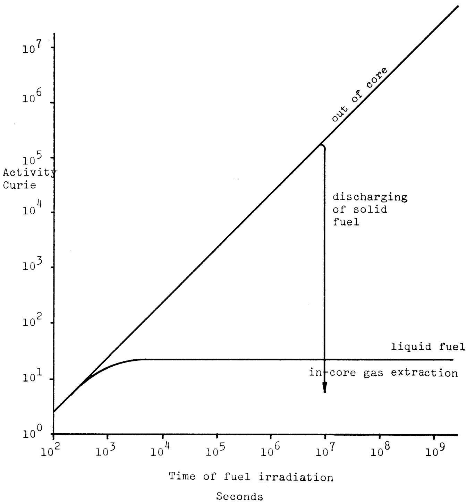  
Fig. 20 Krypton-85

Fig. 21 Iodine-131   
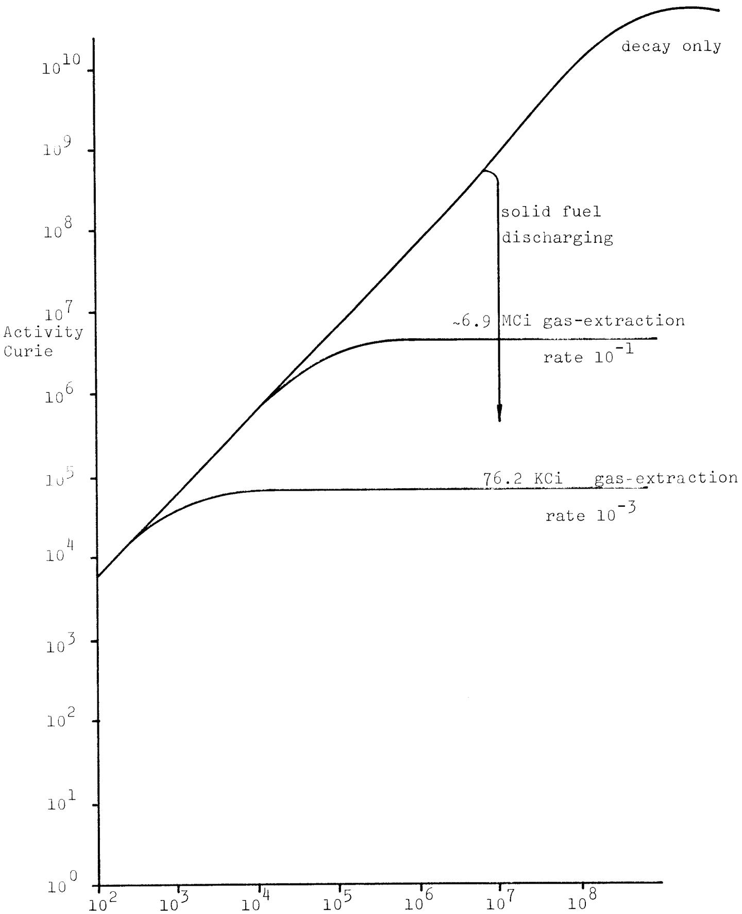  
Time of fuel irradiation

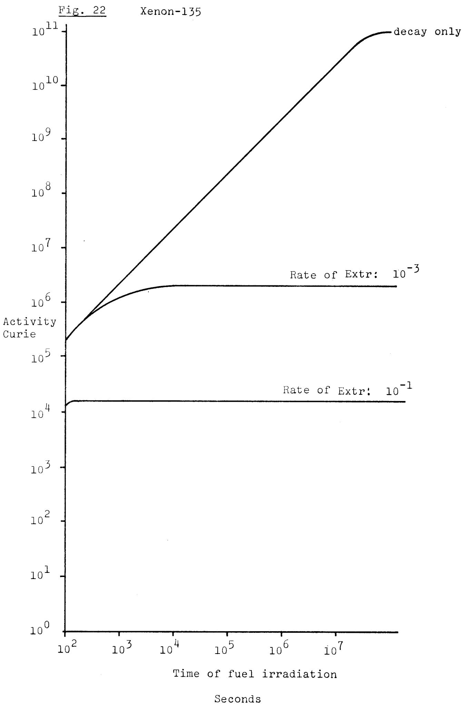

3. The extraction rate of Cs-137 is rather small and results in the diminishing of the caesium concentration by only 7 times when compared to the normal liquid fuel reprocessing having a time constant of $10^{6}$ seconds or $\approx 10$ days mean dwelling time of the liquid fuel in the reactor. In the solid fuel case the same amounts of Cs-137 are accumulated after approx 100 days that is $\sim 3.5$ months dwell time in the core. A special feature of the molten chlorides fuel is that the vapour pressure of CsCl is much lower than $\mathrm{CsO}_2/\mathrm{Cs}$ metal in solid oxide or carbide fuels, decreasing the amount of vapourised caesium in the case of a core accident. Another important point is that it appears possible to separate the caesium isotopes 135 and 137.

4. Further hazardous fission products such as Xe-133 and Xe-135 can also be effectively extracted and the steady state level is $>100$ times lower than in the unextracted core.

5. The gas extraction rate influences also the oxygen extraction from the molten fuel which considerably improves the corrosion behaviour of metallic molybdenum and also the stability of the uranium and plutonium chlorides (Taube 1974).

# Acknowledgements

The author thanks Mr. S. Padiyath for help in the writing and computation of the programme 'GASEX' and Mr. R. Stratton for polishing the English.

# Appendix I

Calculation of the gas stream rates.

The 2000 MW(th) reactor has a fission rate of about

$$
2 \mathrm {x} 1 0 ^ {9} \mathrm {W x} 3. 1 \mathrm {x} 1 0 ^ {1 0} \frac {\text {f i s s / s}}{\mathrm {W}} = \frac {1}{6 . 0 2 \mathrm {x} 1 0 ^ {2 3}} \approx 1 0 0 \mu \mathrm {M P u} / \mathrm {s}
$$

$$
(\mu \mathrm {M} = \text {m i c r o M o l} = 6. 0 2 \times 1 0 ^ {2 3} \times 1 0 ^ {- 6} = 6. 0 2 \times 1 0 ^ {1 7} \text {a t o m s})
$$

The relative amounts of volatile nuclides is estimated very roughly here as 0.2, that is $2 \times 20 \mu \mathrm{M} / \mathrm{s}$ of gaseous volatile elements. The volume of these elements at $\sim 950^{\circ} \mathrm{C}$ and $\sim 10$ bars pressure is

$$
4 0 \times 1 0 ^ {- 6} \mathrm {m o l} / _ {\mathrm {s}} \times \frac {2 2 . 2 \times 1 0 ^ {3} \mathrm {c m} ^ {3}}{\mathrm {m o l}} \times \frac {1 2 5 3 \mathrm {K}}{2 7 3 \mathrm {K}} \times \underline {{1}} = 0. 4 \mathrm {c m} ^ {3} / _ {\mathrm {s}}
$$

This amount of $0.4~\mathrm{cm}^3 /\mathrm{s}$ must be removed from the core by means of continuous gas extraction. If we postulate a helium stream (with probably 1 mol $\%$ of hydrogen) of $4~\mathrm{cm}^3 /\mathrm{s}$ then it seems the volatile elements can be removed. The assumed dwelling time of the gas bubbles in the core is 10 to 1000 s. The volume of the gaseous phase in the core is from 40 to $4000~\mathrm{cm}^3$ .

The total volume of fuel in the core equals

$$
8. 7 5 \quad \frac {\mathrm {m} ^ {3}}{\text {c o r e}} \quad \mathrm {x} \quad 0. 3 8 6 \quad \text {f u e l f r a c t i o n} = 3. 3 7 7 \mathrm {m} ^ {3}
$$

The volume of gas bubbles given above equals from $10^{-5}$ to $10^{-3}$ of the fuel volume. This should not give rise to problems of criticality particularly in the steady state.

# References

1) Beattie J.R. Radiological significance of Cs-137 releases from gas-cooled reactors Riley, SRD R 11 (1972)   
2) Beattie J.R., Assesment of environmental hazards from reactor fission product release AH SB (S) R 135 (1970)   
3) Crouch E.A.C. Calculated independent yields AERE-R-6056 (1969) Harwell   
4) Crouch E.A.C. Fission product chain yields AERE-R-7394 (1973)   
5) Farmer F.R. Development of adequate rist standards Proceed. of symposium "Principles and standards of reactor safety" I.A.E.A. Jülich, February 1973   
6) Flengas S.N., Solubilities of reactive gases in  
Block-Bolten A molten salt.  
In "Advances in Molten Salt Chemistry"  
Vol. 2  
Ed. J. Braunstein, G. Mamantov,  
G.P. Smith; Plenum Press, N. York 1973   
7) Taube M., The molten plutonium chlorides fast ligou J. breeder cooled by molten uranium chlorides Ann.Nucl.Engin. (in press) 1974   
8) Taube M. A molten salt fast thermal reactor system with no waste EIR-Report No. 249 January 1974   
9) WASH-1250 The safety of nuclear power reactors and related facilities U.S. Atomic Energy Commission, Washington 1973