Eidg. Institut für Reaktorforschung Würenlingen Schweiz

# A High-Flux Fast Molten Salt Reactor for the Transmutation of Caesium-137 and Strontium-90

M. Taube, E.H. Ottewitte, J. Ligou

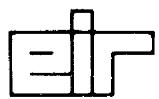

Würenlingen, September 1975

A High-Flux Fast Molten Salt Reactor for the Transmutation of Caesium-137 and Strontium-90

M. Taube, E.H. Ottewitte, J. Ligou

page

# Summary 1

1. Introduction 2   
2. Formulation of Reactor Requirements 4

2.1 Minimal System Doubling Time Requirements 4   
2.2 Need for Central Flux-Trap 7   
2.3 Determination of Flux-Trap Size from Destructio-tion-Production Balance Requirements 8

3. Neutronic Consideration 10

3.1Burner Reactor Calculations 10   
3.2Moderator Requirements 14   
3.3 Motivations for Molten Salt Fuel 18   
3.4 Outer-Reflector Zone Consideration 21

4. Thermohydraulic Considerations 24   
5. Further Parameters of the Burner Reactors 30   
6. Effect of Replacing Chlorine with Fluorine 33   
7. Remarks about Transmutation and Hazard Coefficients 38   
8. Conclusions 41   
9. Acknowledgment 42   
10. References 43

# Summary

A high flux molten salt (plutonium chlorides) fast reactor (7 GWth) with internal thermal zone for transmutation of Sr-90 and Cs-137 is here discussed. These fission products have been produced by breeder reactors with total power of 23 GWth and by the 7 GWth fast burner reactor.

For the case when the power breeder reactors achieve a breeding gain $G > 0.2$ the doubling time for whole system, including the high-flux burner reactor, equals ~30 years.

The transmutation of Sr-90 and Cs-137 in a total flux of $3,8 \cdot 10^{16}$ n cm $^{-2}$ s $^{-1}$ , and thermal flux $\sim 2,0 \cdot 10^{16}$ n cm $^{-2}$ s $^{-1}$ can achieve the steady-state which corresponds to an effective half-life of 1,8 year for Sr-90 and of 8,9 years for Cs-137. In terms of hazard coefficient the transmutation system gives an improvement of 14 times.

The impact of numerous parameters is discussed, e.g., chemical form of both nuclides, nature of moderator in thermal zone, moderator, layer, fuel composition, radius of thermal zone, ratio of burner/breeder reactors etc. The effects of replacing chlorides with fluorides as fuel for fast core is also discussed.

# 1. Introduction

The aim of this work was to study the concept of transmitting Sr-90 and Cs-137 in a very high-flux reactor. These two isotopes are of particular interest because of their high yield in fission, their longevity and their biological hazard. The rather high yields (Y: mol %) from fission are

<table><tr><td></td><td>U-233</td><td>U-235</td><td>Pu-239</td></tr><tr><td>Sr-90</td><td>~6,2</td><td>~5,1</td><td>2,2</td></tr><tr><td>Cs-137</td><td>6,6</td><td>~6,0</td><td>~6,7</td></tr></table>

Assuming each of the above fissile fuels to be equally prevalent in the future, the mean yield is $4.1\%$ for Sr-90 and $6.4\%$ for Cs-137.

The half-lives (28 years for Sr-90 and 30 years for Cs-137) indicate the longevity of the isotopes. To "significantly" reduce their activity (by a factor of 1000) through natural decay would take 300 years.

The biological hazard is reflected in the maximum permissible concentrations (IAEA, 1973):

<table><tr><td>Nuclide</td><td>in air3(μCi/cm3)</td><td>on water(μCi/cm3)</td></tr><tr><td>Sr-90</td><td>1·10-9</td><td>1·10-5</td></tr><tr><td>Cs-137</td><td>6·10-8</td><td>4·10-4</td></tr></table>

This indicates that Sr-90 is roughly 50 times more hazardous than Cs-137 and warrants prime attention.

These facts have understandably prompted numerous transmutation studies (Schneider 1974; see also Taube, 1975). The most optimistic has been transmutation in a controlled thermonuclear reactor CTR (Wolkenhauer, 1973). However, even unrealistic flux levels in CTR could only reduce the transmutation half-life from 30 years down to 5-15 years. The time required for "significant" reduction is five to ten times longer than indicated above. That would be longer than the usual life of a power plant. Furthermore, Lidsky (1975) has pointed out that for any reasonable ratio of fusion burners to fission reactors, the burners soon contain a much higher radioactive burden than the fission reactors themselves. This is certainly undesirable, and probably intolerable. A motivation for alternate solutions remains.

This work examines the basic requirements to obtain a system of reactors which provide adequate breeding and self-destruction of fission products. These requirements lead towards the inclusion in the system of a molten salt burner reactor with a central flux-trap (Taube 1974).

2. Formulation of Reactor Requirements

2.1 Minimal System Doubling Time Requirements

It was assumed at the outset that a very-high flux reactor for fission product transmutation would be special, only one being built for every L (breeder) power reactors. Such a system of $\mathrm{L} + 1$ reactors should provide a doubling time $T \leq 30$ years; this is estimated to satisfy the needs of future world power development.

Doubling time is defined by

$$
\begin{array}{l} T = \frac {1 \text {G w a t t t h e r m a l o p e r a t i n g d a y}}{1 . 1 \text {k g f u e l f i s s i o n e d}} x \frac {1 \text {y e a r}}{3 6 5 \text {d a y s}} \\ x \frac {l k g f i s s i e s d e s t r o y e d (a b s o r b t i o n)}{G k g f i s s i e s n e t g a i n p e r e - f o l d i n g t i m e} x \frac {\ln 2 d o u b l i n g t i m e}{e - f o l d i n g t i m e} \\ x \frac {(I + F) k g f u e l f i s s i o n e d}{k g f i s s i l e f i s s i o n e d} x \frac {1}{1 + \alpha} \frac {k g f i s s i l e f i s s i o n i}{k g f i s s i l e d e s t r o y e d (a b s)} \\ x \frac {1 \text {c a l e n d a r d a y}}{C \text {o p e r a t i n g d a y}} x \frac {\text {S I k g f i s s i l e s i n s y s t e m}}{\text {M W a t t t h e r m a l}} \\ = \frac {\left(I + F\right) S I _ {s y s} \ln 2}{(1 + \alpha) C G _ {s y s} x 1 . 1 x 3 6 5} = \frac {1 . 7 3 (I + F) S I _ {s y s}}{(1 + \alpha) C G _ {s y s}} \\ \end{array}
$$

where fuel $=$ fertiles and fissiles

fissiles = Pu-239, U-235 and U-233

$\mathsf{SI}_{\mathsf{i}} = \mathsf{specific~fissiles~inventory~in~the~reactor~sub}$ system i $= I_{i} / P_{i}$

$I_{i}$ = fissiles inventory in reactor subsystem i (including fuel cycle).

P i = thermal power level in reactor type i

F = fertile to fissile fission rate $\sim .2$

α = capture to fission cross section ratio ~.2

C fraction of time at full power $\sim .8$

B I Ibu/IBr

bu = burner reactor subsystem

br = breeder reactor subsystem

B P = Pbu/Pbr

Then

$$
G _ {\text {s y s}} = \frac {1 \cdot G _ {\text {b r}} \cdot P _ {\text {b r}} + G _ {\text {b u}} \cdot P _ {\text {b u}}}{L \cdot P _ {\text {b r}} + P _ {\text {b u}}} = \frac {L G _ {\text {b r}} + B _ {P} G _ {\text {b u}}}{L + B _ {P}}
$$

$$
\mathrm {S I} _ {\text {s y s}} = \frac {\mathrm {I} _ {\text {s y s}}}{\mathrm {P} _ {\text {s y s}}} = \frac {\mathrm {L I} _ {\text {b r}} + \mathrm {I} _ {\text {b u}}}{\mathrm {L P} _ {\text {b r}} + \mathrm {P} _ {\text {b u}}} = \frac {(\mathrm {L} + \mathrm {B} _ {\mathrm {I}})}{(\mathrm {L} + \mathrm {B} _ {\mathrm {P}})} \mathrm {S I} _ {\text {b r}}
$$

Letting (conservatively) $\mathsf{U}_{\mathrm{bu}} = -1$ , and dropping "br" subscripts one has

$$
\frac {\mathrm {S I} _ {\text {s y s}}}{\mathrm {G} _ {\text {s y s}}} = \frac {(\mathrm {L} + \mathrm {B} _ {\mathrm {I}}) \quad \mathrm {S I}}{\mathrm {L G} - \mathrm {B} _ {\mathrm {P}}}
$$

Then, assuming the previous nominal values for $\alpha$ , $C$ , and $F$ , the doubling time requirement is

$$
T _ {s y s} = \frac {2 . 1 6 (L + B _ {I}) S I}{L G - B _ {P}} \leq 3 0
$$

Solving for $\mathrm{X} = \mathrm{L} / \mathrm{B}_{\mathrm{P}}$ , the ratio of thermal power in the L breeders to that consumed in the burner, the requirement becomes

$$
X \geq \frac {B _ {I} / B _ {P} + 1 3 . 8 9 / S I}{(1 3 . 8 9 / S I) G - 1}
$$

In Table 1 this relation is studied over reasonable ranges of values for G, SI and $\mathbf{B}_{\mathrm{I}} / \mathbf{B}_{\mathrm{P}}$ . As one might expect, the possible variations in G produce the largest changes in the requirements on X. Furthermore, Table 1 suggests a minimum requirement that X $\geq 3$ , with nearterm practical requirements approaching X = 10.

Table 1 Minimum "X" Requirements to Accomplish a Burner/Breeder System with 30 Years Doubling Time

G = Breeding Gain = BR-1

MWatt thermal specific fissile inventory   
kg fissile in system   

<table><tr><td>SI</td><td>BI/BP</td><td>G = .4</td><td>G = .2</td></tr><tr><td></td><td>1</td><td>3.09</td><td>7.43</td></tr><tr><td>0.8</td><td>2</td><td>3.26</td><td>7.83</td></tr><tr><td></td><td>3</td><td>3.42</td><td>8.24</td></tr><tr><td></td><td>1</td><td>3.27</td><td>8.37</td></tr><tr><td>1.0</td><td>2</td><td>3.49</td><td>8.94</td></tr><tr><td></td><td>3</td><td>3.71</td><td>9.50</td></tr><tr><td></td><td>1</td><td>3.47</td><td>9.57</td></tr><tr><td>1.2</td><td>2</td><td>3.74</td><td>10.33</td></tr><tr><td></td><td>3</td><td>4.02</td><td>11.09</td></tr></table>

# 2.2 Need for Central Flux Trap

To accomplish a significant fission product transmutation rate will require high neutron absorption rates. For both Sr-90 and Cs-137, the thermal absorption cross section (in barn) is one or two orders of magnitude greater than in the fast neutron region:

<table><tr><td>FP</td><td>σ(.0253 eV),b</td><td>σ(fast reactor),b</td><td>σ(.0253 eV)/σfast</td></tr><tr><td>Sr-90</td><td>0.8</td><td>0.0076</td><td>~100</td></tr><tr><td>Cs-137</td><td>0.11</td><td>0.0137</td><td>~8</td></tr></table>

Consequently, the transmutation might be best accomplished in a central thermal flux trap surrounded by a fast fuel region (for high flux levels). If $\sigma$ (total spectrum, flux trap) = 1/2 · $\sigma(E = .0253 \mathrm{eV})$ the estimated total flux $\Phi_{\mathrm{tot}}$ just to match $(K=2)$ the natural decay rates is

for Cs-137:

$$
\Phi_ {\text {t o t}} = \frac {\lambda_ {\beta} 1 3 7}{0 . 1 1} \cdot 2 = 1. 3 \cdot 1 0 ^ {1 6} \mathrm {n c m} ^ {- 2} \mathrm {s} ^ {- 1} (\lambda_ {\beta} ^ {1 3 7} = 7. 3 5 \cdot 1 0 ^ {- 1 0} \mathrm {s} ^ {- 1})
$$

for Sr-90:

$$
\Phi_ {\text {t o t}} = \frac {\lambda_ {\beta} ^ {9 0}}{0 . 8} \cdot 2 = 2. 0 \cdot 1 0 ^ {1 5} \mathrm {n c m} ^ {- 2} \mathrm {s} ^ {- 1} (\lambda_ {\beta} ^ {9 0} = 7. 8 8 \cdot 1 0 ^ {- 1 0} \mathrm {s} ^ {- 1})
$$

# 2.3 Determination of Flux-Trap Size from Destruction-Production Balance Requirement

Another important requirement will be that the FP transmutation rate in the burner flux-trap (FT) exceeds the production rate in the power and burner fuels:

$$
\begin{array}{c c c c c c c} - & \dot {\mathrm {N}} _ {\text {f l u x}} & = & \lambda_ {\text {t r a n s m .}}   \mathrm {N} _ {\text {f l u x}} & > & \dot {\mathrm {N}} _ {\text {b r}} & + & \dot {\mathrm {N}} _ {\text {b u}} \\ & \text {t r a p} & & \text {t r a p} & & \end{array}
$$

where $\dot{\mathrm{N}}_{\mathrm{i}} = \frac{\mathrm{d}\mathrm{Ni}}{\mathrm{d}t} = \mathrm{P}_{\mathrm{i}}\cdot \mathrm{Y}^{\mathrm{FP}}\cdot 3.1\cdot 10^{10}(\mathrm{fiss / Ws})$

where $\mathbf{N}_{\mathbf{i}} =$ the number of F.P. atoms in subsystem i.

$$
\lambda_ {\text {t r a n s m .}} ^ {\mathrm {F P}} = (\sigma \Phi + \lambda_ {\beta}) _ {\mathrm {F P}} = K ^ {\mathrm {F P}} \lambda_ {\beta} ^ {\mathrm {F P}}
$$

using $\mathrm{P_{bu} = B_P P_{br}}$ and $\mathrm{X = L / B_P}$ get

$$
\begin{array}{l l} N ^ {F P} & \frac {Y ^ {F P} P _ {b u}}{K ^ {F P} \lambda_ {\beta} ^ {F P}} (X + 1) \cdot 3. 1 \cdot 1 0 ^ {1 0} \\ f i n e & \\ t r a p & \end{array}
$$

(Any additional transmutation beyond this would help to remove FP inventory from reactors outside this system. However, for transmutation to be a significant improvement over the 1000-fold decrease in 300 years by natural beta decay, it should then be accomplished in a much shorter time. A reasonable goal is 30 years (K=10), the lifetime of a power plant.)

Assuming a central thermal flux trap in spherical geometry, the radius is then

$$
\underset {\text {f l u x} \quad \text {t r a p}} {\mathrm {R}} ^ {(\mathrm {c m})} = \left[ \frac {3}{4 \pi} \cdot \frac {3 . 1 \cdot 1 0 ^ {1 0} (\mathrm {X} + 1) 1 0 ^ {9} \mathrm {P} (\text {g i g a w a t t s})}{6 . 0 2 3 \cdot 1 0 ^ {2 3} \frac {\text {a t o m s}}{\text {m o l e}}} \cdot \frac {\mathrm {Y} ^ {\mathrm {F P}}}{\mathrm {K} ^ {\mathrm {F P}} \rho^ {\mathrm {F P}} \lambda_ {\beta} ^ {\mathrm {F P}}} \right] ^ {1 / 3}
$$

where $\rho^{\mathrm{FP}} =$ density of FP nuclei (moles cm $^{-3}$ ) in the flux trap region.

# 3. Neutronic Consideration

# 3.1 Burner Reactor Calculations

To analyze the burner reactor, calculations were made by ANISN-code in the $S_4$ transport-theory approximation and checked in $S_8$ with 23 energy groups and approx. 100 spatial positions (checked by 160 spatial positions). $P_1$ -approximation cross sections were produced mostly with the GGC-3 code which utilizes ENDF/B-1 and -2 and GAM data. Sets for Cs-137, Sr-90 and F were made in less exact fashion from AAEA and Hansen-Roach data. Fig. 1 shows the group structure.

A reference burner reactor model is shown in Figure 2. The flux trap is surrounded by a BeO spectrum-converter, a critical fuel thickness, and an outer wall (see Table 2).

Figure 3 shows the calculated flux distributions. The total flux in the fuel is similar to that in the flux trap. The calculated fluxes lead to the conclusion (used in section) that $\sigma$ (total spectrum, flux trap) = $1/2 \cdot \sigma(E = .0253 \, \text{eV})$ .

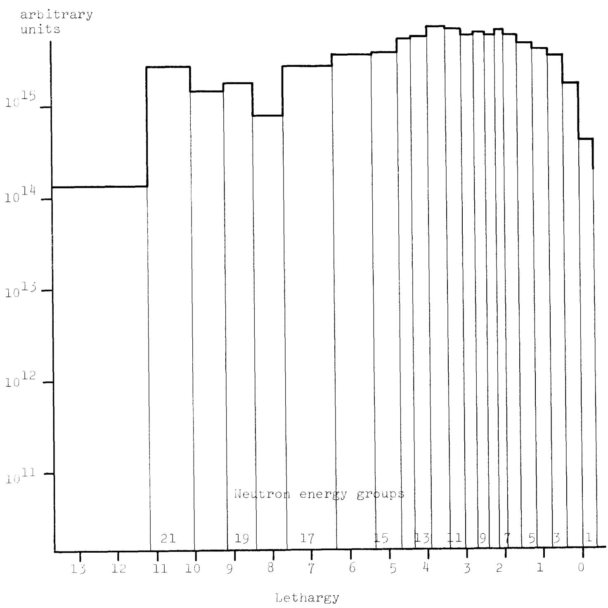  
Fig.1 Neutron spectrum in the core Total mean flux $4.03\cdot 10^{16}\mathrm{nm}^{-2}\mathrm{s}^{-1}$ Specific power $10.1\mathrm{kWcm}^{-3}$ Total power 7 Gwth

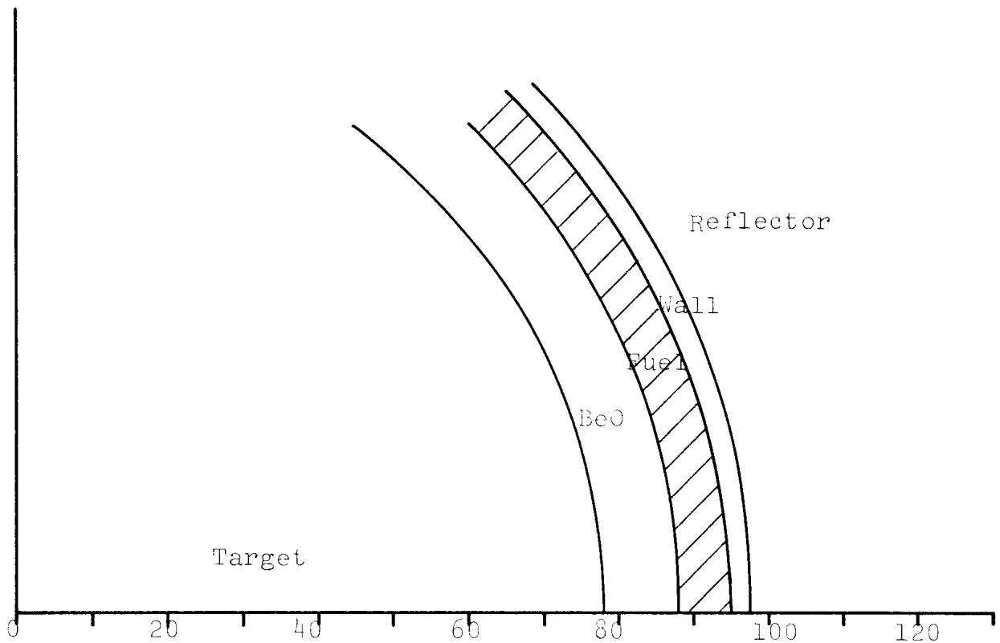  
Fig.2 High flux burner reactor

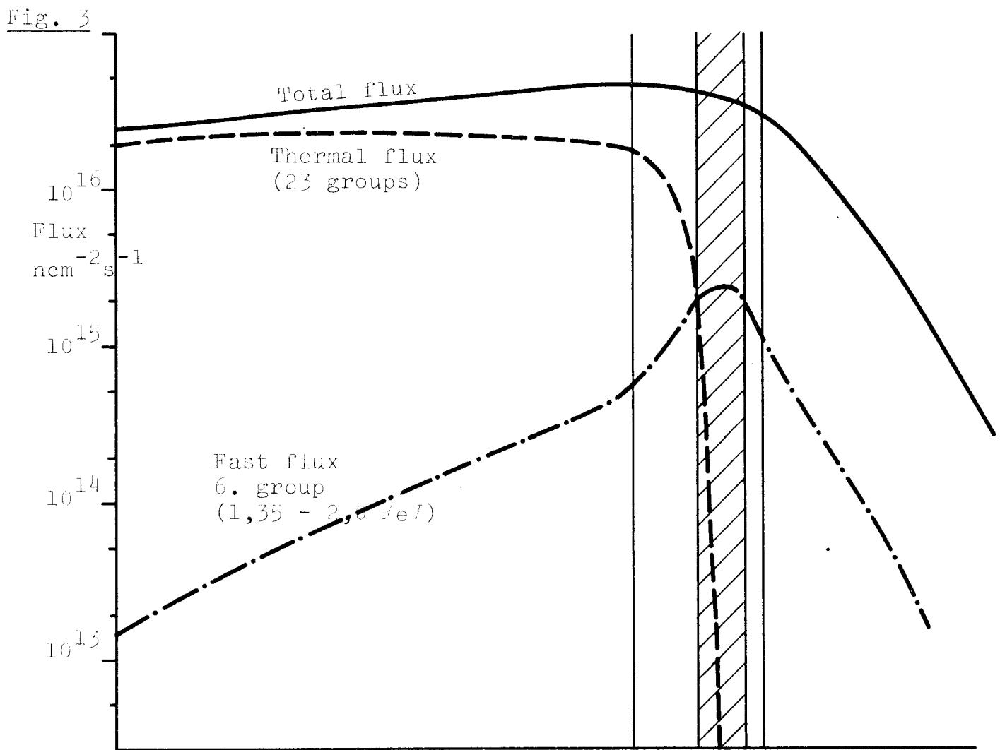

Total power 7 Gwth

Table 2 High-flux burner reactor with chloride fuel   

<table><tr><td>Zone Radius (cm) Volume (cm3)</td><td>Components atom 1024/cm-3</td><td>Neutron flux 16 n cm-2s-1 total thermal</td><td>Specific power (kW cm-3) transmutation rate (s-1)</td></tr><tr><td>I 0 ÷ 78.5 cm Target Vol. 2·106cm3</td><td>Cs-137 0.0116 Sr-90 0.0016 O 0.0145 D 0.0145</td><td>3,83 2,05</td><td>Cs-137 ~ 1,7·10-9 Sr-90 ~ 1,1·10-8</td></tr><tr><td>II 78.5 - 88 cm Moderator</td><td>Be 0.060 0.060 with thin graphite layer</td><td>4,48 1,70 4,365 0,201</td><td></td></tr><tr><td>III 88.0 - 94.6 cm Fuel Vol.6.9·105cm3</td><td>Pu-239 0.0014 Pu-240 0.0004 Pu-241 0.0002 Na 0.120 Cl 0.0180</td><td>4,03 0,0156</td><td>10,1 kWcm-3</td></tr><tr><td>IV 94.6 - 97.6 cm Wall</td><td>Fe 0.08</td><td>4,00 5·10-5</td><td></td></tr><tr><td>V 97.6 - 200 cm Reflector</td><td>Fe 0.08</td><td>3,39 1,8·10-5 2,4·10-3 10-12</td><td></td></tr></table>

# 3.2 Moderator Requirements

To accomplish a thermal neutron flux trap one must naturally employ neutron moderating materials in and about it. As is well known, light materials can scatter neutrons past the neutron-absorbing intermediate-energy resonance region. ${}_{1}^{H}$ is the most efficient nuclide in this respect but also exhibits appreciable thermal absorption. $^{2}D$ , $^{9}Be$ and $^{12}C$ are usual alternatives. $^{8}0$ is a bit heavy though frequently already present in a molecular combination. Other light nuclides have unacceptable nuclear or physical limitations.

Considering chemical and physical properties, the logical materials to be used inside the flux trap are hydroxide and/or deuteroxide compounds of the FP. Figure 4 shows that just a small proportion of H molar fraction has a large deleterious effect on the Cs-137 transmutation rate. This is due to the H absorption cross section. Therefore, CsOD and $\mathrm{Sr(OD)_2}$ are preferred.

As Sr-90 and Cs-137 also have their fair share of resonances it is advantageous to thermalize the flux before reaching the flux trap region containing these targets. Therefore a spectrum converter between flux trap and fast fuel is needed. Bearing in mind the high temperatures to be obtained in this reactor and possible chemical reactions with molten salt, $\mathrm{H}_2\mathrm{O}$ and $\mathrm{D}_2\mathrm{O}$ are unacceptable. This leaves Be, BeO and graphite or some variant therefore for consideration. Be (and D) compounds, of course, have also to their advantage a relatively low (n,2n) threshold (1.67 MeV). Location next to a fast region can therefore produce considerable extra slow neutrons in the flux trap - which is a main objective of the burner reactor. Replacement of Be by C or Mo wall material should therefore lower the FP transmutation rate, and it does (Table 3). Figure 5 indicates an optimum thickness of about 5 cm Be. For the sake of safety and higher melting temperature, BeO is preferred over Be.

```txt
Strontium-90 and Caesium-137 activity 
```

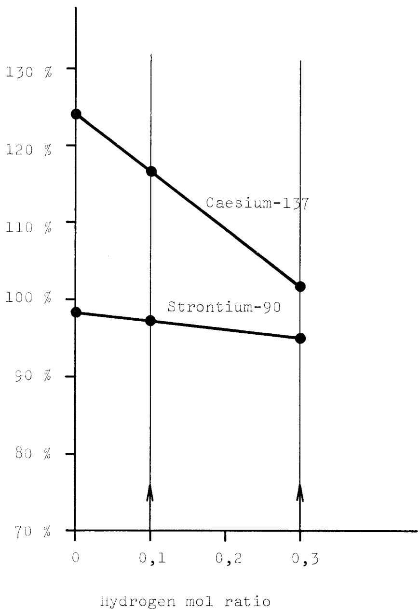  
Fig. 4 Hydrogen versus deuterium as moderator

Table 3 Effect on Replacing Be Converter upon the Relative FP Transmutation Rates   

<table><tr><td></td><td>Be</td><td>Be</td><td>molten-salt</td></tr><tr><td>flux trap</td><td>C</td><td>Be</td><td>fast driver</td></tr><tr><td></td><td>Be</td><td>Fe/Mo</td><td></td></tr></table>

<table><tr><td>case</td><td>materials</td><td>λtransm. (Cs-137)</td><td>λtransm. (Sr-90)</td></tr><tr><td>1</td><td>Be, Be</td><td>1.0</td><td>1.0</td></tr><tr><td>2</td><td>C, Be</td><td>0.72</td><td>0.68</td></tr><tr><td>3</td><td>Be, Fe/Mo</td><td>0.84</td><td>0.82</td></tr></table>

(Remark: transmutation rate in arbitrary units)

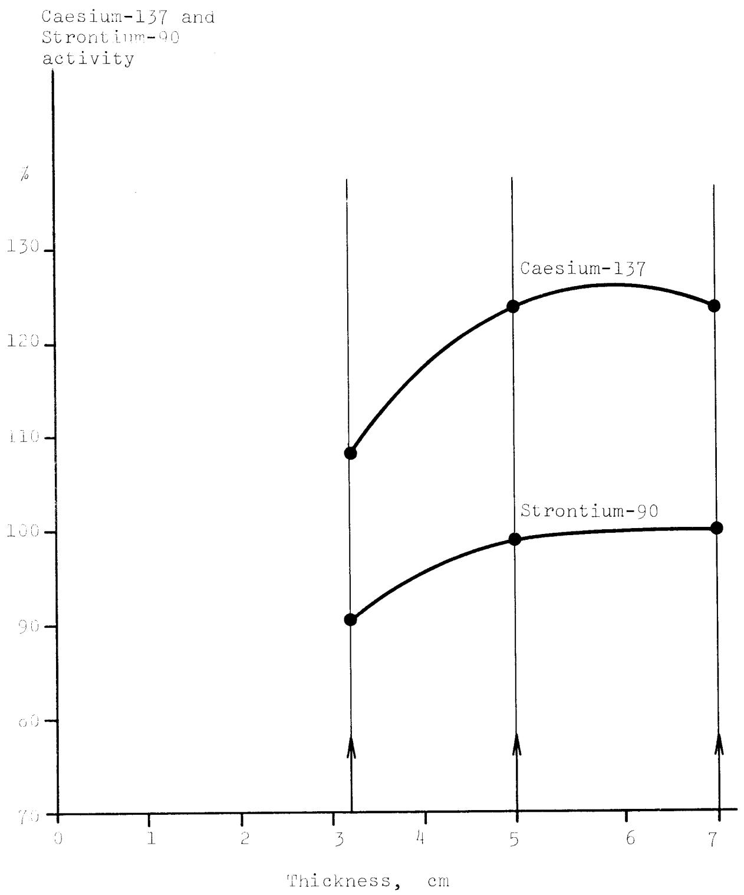  
Fig. 5 Thickness of beryllium moderator zone

# 3.3 Motivations for Molten Salt Fuel

In a fast plutonium reactor the average fission cross section is estimated to be 2.5 barns. The Pu atom density is .002 atoms $\mathrm{cm}^{-1}\mathrm{b}^{-1}$ . The total flux is of the same magnitude as in the flux trap. The specific power for the Cs-137 burnup is then (using $\Phi$ from section 2.2)

$$
N (P u) \sigma_ {f} \Phi / 3. 1 \cdot 1 0 ^ {1 3} = 2. 1 (K - 1) k W c m ^ {- 3}
$$

The rise of the thermal flux in the fast fuel (Fig. 6) leads to an order of magnitude increase in the fission density at the inner fuel boundary. For a solid fuel core the resulting peak power position would present extreme demands upon coolant velocity and flow distribution.

To minimize this, the addition of boron in and about the fast fuel was considered. Reactor calculations were made for 5 to 100 micron-thick intermediate walls as well as for distributed boron inside the fast region. As seen from Figure 7 the FP transmutation rate is always reduced; although the spectrum in the fuel region is harder, the loss of thermal neutrons to the flux trap has a greater effect.

From the above one sees that the fuel melting point and the thermohydraulic requirements effect a loss in FP transmutation rate for solid fuels. One solution might be to use liquid fuel, cooled out-of-core. Turbulent flow in the core will alleriate the thermal peaking problem. Also, the melting point limitation is removed.

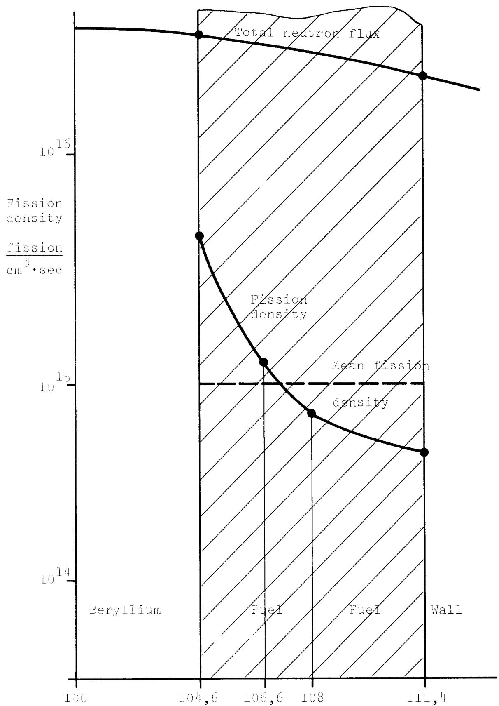  
Fig. 6 Fission density in the fuel zone

Fig.7 Impact of natural boron   
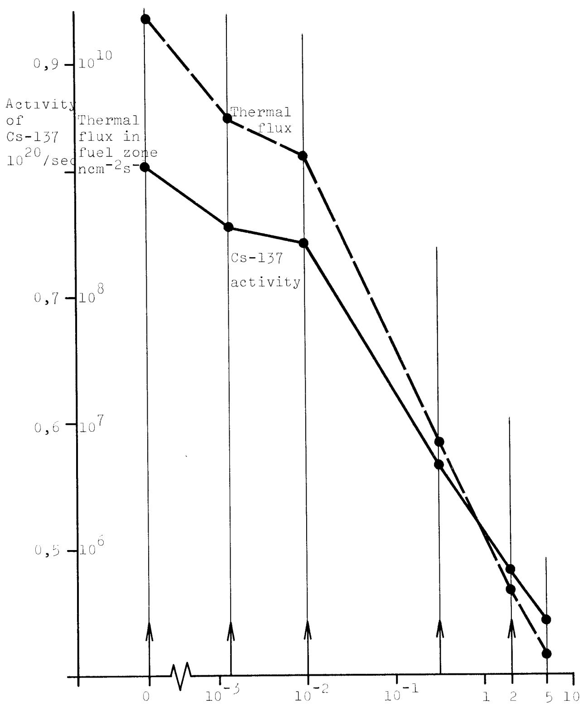  
Boron thickness, mm

The disadvantages arise from the increased fuel inventory in the burner, e.g. a factor $B_{I} = 2 \pm 0.5$ higher. To keep the system SI low will then require an specific fissile inventory SI in the burner core considerably lower to accommodate the factor (ratio of inventory in both subsystems) $B_{I}$ -higher inventory. Other problems include reduced doubling time, increased capital costs, and decreased $\beta_{\text{eff}}$ , the effective fraction of delayed neutrons in the core.

Proceeding with this concept, the molten salt burner fuel is assumed to be a mixture of $\mathrm{PuCl}_3$ and $\mathrm{NaCl}$ . Critically will depend upon the Pu concentration and the thickness of the fuel region. Figure 8 shows the effect of $\mathrm{PuCl}_3$ molar fraction upon specific power, core exit temperature, and Cs-137 transmutation rate.

# 5.4 Outer-Reflector Zone Consideration

The large size of the thermal flux trap results in the fuel region approaching slab geometry with attendant high neutron leakage. To better economize on neutrons several possibilities arise

(1) use of an optimum reflector such as Fe, Ni, Cu or Be to minimize the critical mass   
(2) use of the outer neutron leakage for breeding   
(3) use of the outer neutron leakage for additional FP transmutation.

To begin with a solid Fe reflector was assumed (Fig. 9).

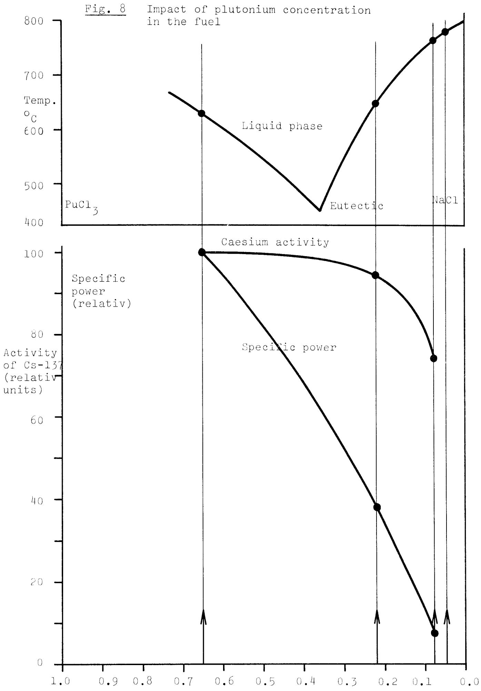  
Plutonium molar ratio

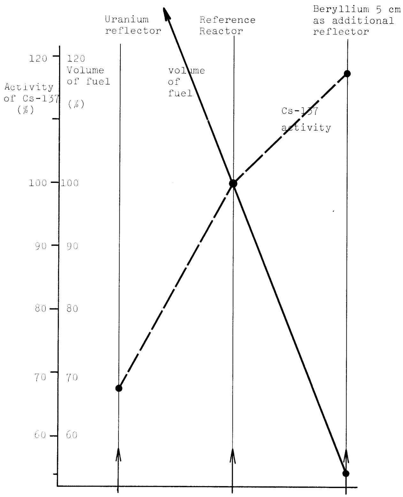  
Fig. 9 Impact of reflector

# 4. Thermohydraulic Considerations

We now examine the thermohydraulic implications in more detail. For a typical burner reactor consider (see Fig. 10).

total power, P = 11 GW  
power density in core, Pc = 11 kW cm $^{-3}$ Pu density, ρPu = .002 atoms cm $^{-1}$ b $^{-1}$ = 0.8 g cm $^{-3}$ fuel density, ρf = 2.35 g cm $^{-3}$ volumetric specific heat, Cp = 1.95 Joules cm $^{-3}$ K  
temperature rise across core, Δt = 250 + 500 K  
length of channel in the core, Lch = 80 + 120 cm

The crucial parameter here is core power density. The given value is high but still near the present state-of-the-art (Table 4).

Table 4   

<table><tr><td></td><td>kW/cm3in the core</td><td>Coolant onlyin the core</td></tr><tr><td>Feinberg, research reactor</td><td>3 - 5</td><td>8 - 10</td></tr><tr><td>Melekes CM-2</td><td>2,5</td><td>~5</td></tr><tr><td>FFTF</td><td>1,0</td><td>2</td></tr><tr><td>Lane (chlorides)</td><td>5 - 10</td><td>5 - 10</td></tr><tr><td>HFIR mean</td><td>2</td><td>4</td></tr><tr><td>max</td><td>4,38</td><td>8,5</td></tr><tr><td>Phoenix 250</td><td>0,46</td><td>~1,0</td></tr><tr><td>Chlorotrans (here)</td><td>10,9</td><td>10,9</td></tr></table>

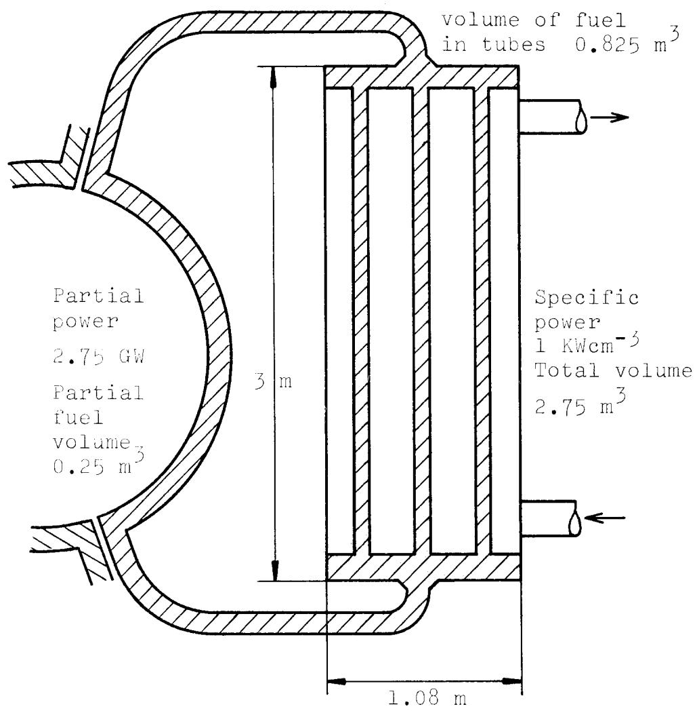  
Fig.10 Cooling of the burner reactor Total power of reactor 11 GW Heat exchanger 2,75 GW,4 units

Using the above one gets

power rating, .07 g Pu / Mwth

volumetric flow rate of fuel = (2.2 + 1.1) $\cdot 10^{7} \, \text{cm}^{3} \, \text{s}^{-1}$

residence time in core $= 0.045\div 0.091$ s

velocity of the fuel in the core $= 26.7 \div 8.8 \, \text{ms}^{-1}$

The deduced fuel velocity is similar to that postulated by Lane (1969) for the HFIR reactor: $21 \, \text{ms}^{-1}$ . (The HFIR is also a high flux irradiation facility).

The specific power in the coolant is about 3 times higher for the burner than for the indicated breeder concept. Furthermore, it must be increased by $\mathrm{B_I}$ to account for the increased fuel inventory in the burner reactor cycle. The crucial problem will be the efficiency of the external heat exchanger. In the following we use some typical heat exchanger characteristics to examine the possibilities.

Specific power for heat exchanger $\sim 1\mathrm{kW / cm}^3$

(rather conservative data)

Total volume of heat exchangers for

ll GW(th)

\~11 m

Ratio of fuel, volumetric

0,3

Fuel volume in heat exchanger

3,3 m

Fuel in the pipes core-heat exchanger

1,0 m³

Total fuel out of core

4,3 m³

Fuel in core

1,0 m³

Total fuel in whole system

5,3 m

Mean specific power of the fuel in

whole system $\frac{11\mathrm{GW}}{5,3\mathrm{m}^2}$ = 2,07 kW/cm³

Plutonium amount, in the fuel $0.8 \mathrm{gPu/cm}^3$

<table><tr><td>Plutonium inventory in whole system</td><td>4240 kg</td></tr><tr><td>Power rating in whole system</td><td>0,385 kgPu/MWth</td></tr><tr><td>The postulated power rating for whole system</td><td>1 kgPu/MWth</td></tr><tr><td>In this calculated case the power rating in the breeder power reactors</td><td>1,15 kgPu/MWth</td></tr></table>

The above indicates that the achievement of a total specific power rating of about 1 kgPu/MWth may be feasible.

# 5. Further Parameters of the Burner Reactors

Parametric studies were made as variations about a reference system which assumed $P = 11$ GWatts, ( $X = 2.9$ , $K = 4.2$ ) and $R_{\mathrm{FT}} = 78.5$ cm. The flux trap is surrounded by 5 cm EeO converter, a critical fuel thickness of 6.6 cm, and an outer wall. Figure 11 shows the calculated flux distributions for such a burner reactor. Note that the total flux in the fuel is similar to that in the flux trap. The calculated fluxes lead to the conclusion that $\sigma$ (total spectrum, flux trap) = 1/2 · $\sigma (E = 0.0253)$ .

Figure 12 shows the dependence of Cs-137 transmutation rate upon the burner power level. The higher the power, the greater the rate. However, power must, of course, be subject to thermohydraulic restraints, such as pump and heat exchanger capabilities.

Figure 13 indicates the relative effect of X upon the ratio R of FP transmutation rate to FP production rate for the reactor system. One observes the need to keep X low here. Absolute results will depend upon the Cs and Sr densities in the flux trap. An actual case of R = 1 for both FP nuclides was achieved at X = 4,5. The FP atom ratio there was (Cs-137)/(Sr-90) = 7.25.

Another important problem is the relative high flux in the outer zone, the leakage from the core.

This flux can be used for two purposes:

1) for transmutation of other fission products which have rather high absorption cross section e.g.

$$
\mathrm {T e} - 9 9 \quad \sigma^ {\mathrm {t h}} = 2 2 \mathrm {b a r n};
$$

$$
t \beta 1 / 2 = 2, 1 \cdot 1 0 ^ {5} a
$$

$$
1 - 1 2 9 \quad \sigma^ {\text {t h}} = 2 8 \text {b a r n};
$$

$$
t \beta 1 / 2 = 1, 7 \cdot 1 0 ^ {7} a
$$

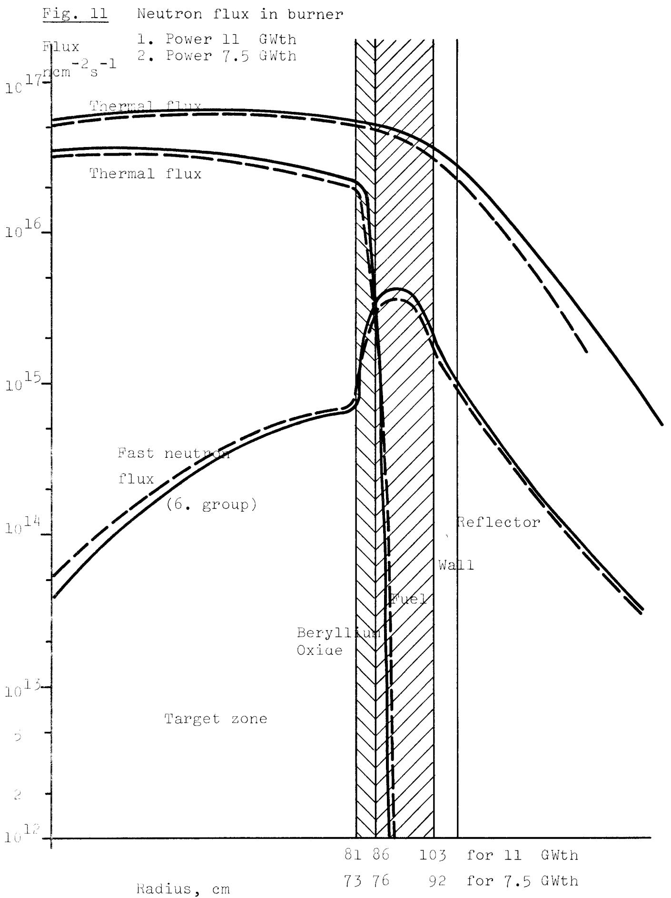

Fig.12 Impact of the power of burner for breeder/burner ratio $\sim 3$   
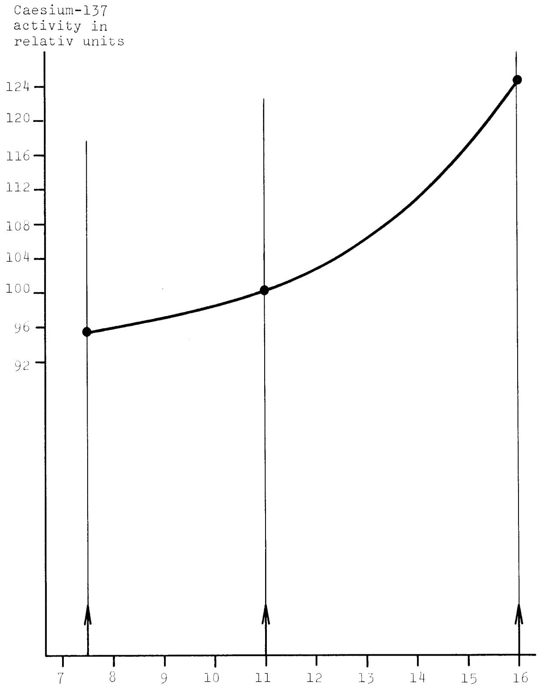  
Power, Gwth

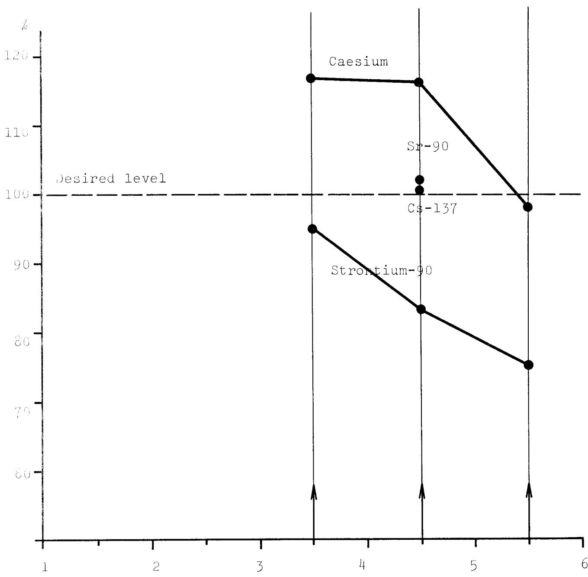  
Fig. 13 Caesium-137 and Strontium-90 activity in the target zone   
Activity   
Ratio of breeder/burner power

In both cases a flux of $10^{14} - 10^{15}$ n cm $^{-2}$ s $^{-1}$ (see fig.11) can result in a rather effective transmutation rate of

$$
\mathrm {T e} - 9 9 \quad \sigma \emptyset = 7 \cdot 1 0 ^ {- 9} \mathrm {s} ^ {- 1} \quad \mathrm {t} ^ {\text {e f f}} 1 / 2 \quad \cong 3 \mathrm {a}
$$

$$
I - 1 2 9 \quad \sigma \emptyset = 7 \cdot 1 0 ^ {- 9} s ^ {- 1} \quad t ^ {\text {e f f}} 1 / 2 \quad \cong 2 a
$$

For improvement of this possibility use of a beryllium moderator in form of $5\mathrm{cm}$ wall in the outer region of core have been calculated. This gave an improvement of transformation rate of Cs-137 in the inner target region but also a very significant increase of specific power, due to the softening of the neutron flux in the fuel region has been obtained (Fig. 11).

The possibility of transformation of these two longliving fission products will be further discussed elsewhere.

The neutron flux outside of the core can be used for breeding in an uranium blanket. The breeding ratio can be really very good, higher than 1, but the decrease of the transmutation ratio is critical, and seems to be too low for a reasonable burner reactor.

In spite of this, in a further study the possibilities must be checked of using part of a neutron for the breeding process in an external uranium blanket region.

# 6. Effect of Replacing Chlorine with Fluorine

Is a fluoride-fuelled burner, instead of one with chloride-fuel, possible? (Table 5, Fig. 14, 15)

For fuel in this reactor we have used an arbitrarily chosen mixture of $\mathrm{PuF}_3\cdot 3,54\cdot \mathrm{NaF}\cdot 2,4\mathrm{ZrF}_4$ . The calculations have been done for a bigger burner reactor of 11 Gwth and, the whole system totaling 55 Gwth.

The neutron flux in the target region was in the case of fluoride fuel appr. 1.05 times higher than in the reference case with chloride fuel.

The effective half-life of both the fission product nuclides was (in years):

<table><tr><td>In fluoride-</td><td>In chloride-fuelled</td></tr><tr><td>fuelled reactor</td><td>reactor (reference)</td></tr></table>

Cs-137 8.57 8.93

Sr-90 1.73 1.83

But all these benefits must be paid by a twice higher specific power: in fluoride-fuelled core of 19.9 kWcm $^{-3}$ , and 10,1 kWcm $^{3}$ in chloride-containing core.

Also because the possibility to use graphite, instead of part of beryllium oxide as moderator, which seems to be possible from the point of view of neutronics, a rather important improvement of the corrosion problems can be achieved. We must remember that the compatibility of molten fluoride fuel and graphite had been proved by the excellent experience of Oak Ridge Nat. Laboratory (with one difference: in ORNL experiments the fuel was LiF-BeF $_2$ -ThF $_4$ -UF $_4$ ).

Table 5 High-flux burner reactor with fluoride fuel Total power 11 GWth Power of total system 55 GWth   

<table><tr><td>Zone
Radius (cm)
Volume (cm3)</td><td>Components
atom 1024cm-3</td><td>Neutron flux
1016 cm-2s-1
total
thermal</td><td>Specific power
(KWcm-3)
transmutation
rate (s-1)</td></tr><tr><td>I
0 - 98.8
Target
Vol.~4.1·106cm3</td><td>Cs-137 0.0116
Sr-90 0.0016
O 0.0145
D 0.0145</td><td>4,01
2,21</td><td>Cs-137 1,8·10-9
Sr-90 1,2·10-8</td></tr><tr><td>II
98.8 - 109 cm
Moderator</td><td>Be 0.060
O 0.060
with thin
graphite layer</td><td>5,09
1,83
5,25
0,239</td><td></td></tr><tr><td>III
109 - 112.6 cm
Fuel
Vol. 5.5·105cm3</td><td>Pu-239 0.0017
Pu-240 0.00042
Pu-241 0.00021
Na 0.0075
Zr 0.0051
F 0.0340</td><td>5,02
0,0457</td><td>19,9 kWcm-3</td></tr><tr><td>IV
112.6-118.6 cm
Wall</td><td>Be 0.060
O 0.060</td><td>4,87
0,034
3,9
0,041</td><td></td></tr><tr><td>V
118.6-218.0 cm
Reflector</td><td>Fe 0.08</td><td>0,0023
2,8·10-9</td><td></td></tr></table>

Fig. 14 Burner reactor with molten fluoride fuel

Fuel: $\mathrm{PuF}_{3}-3.54 \mathrm{NaF}-2.41 \mathrm{ZrF}_{4}$

Specific power $\sim 20\mathrm{kWcm}^{-3}$

Total power 11 GW

Breeder/burner ratio: 4

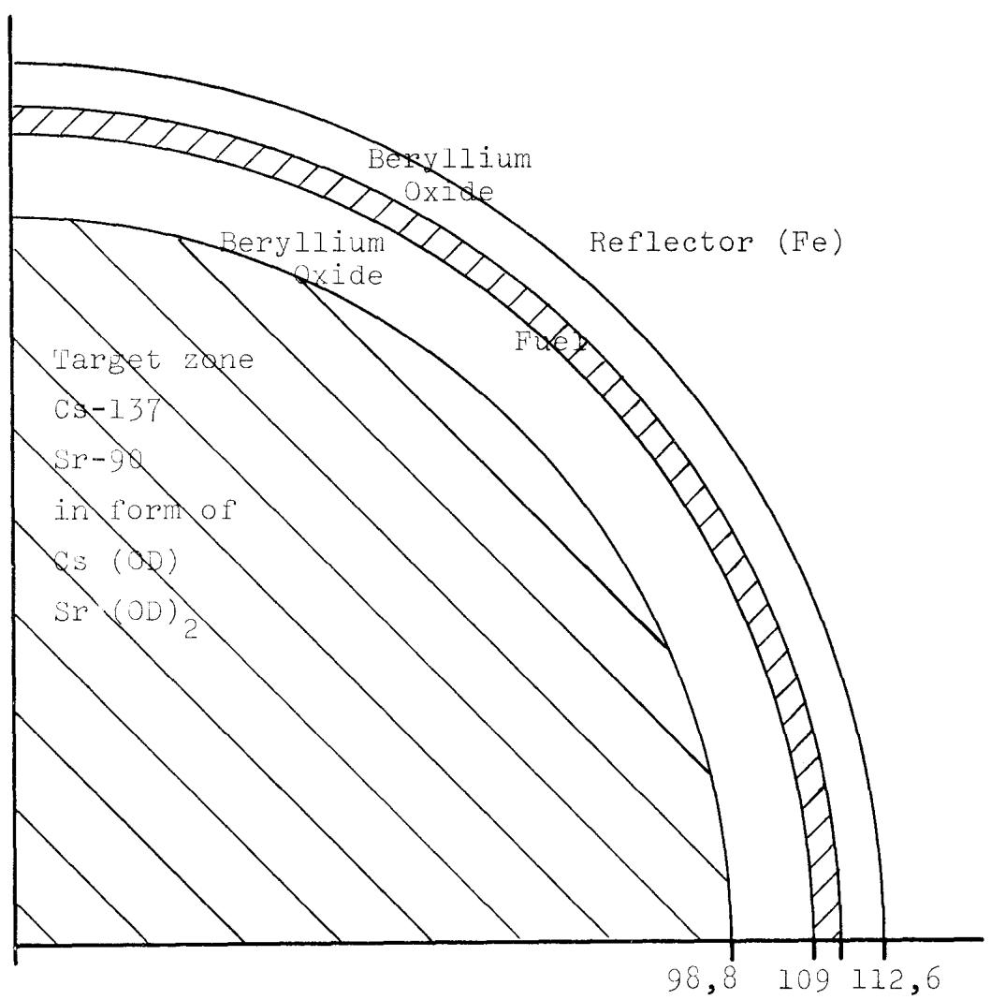  
Radius, cm

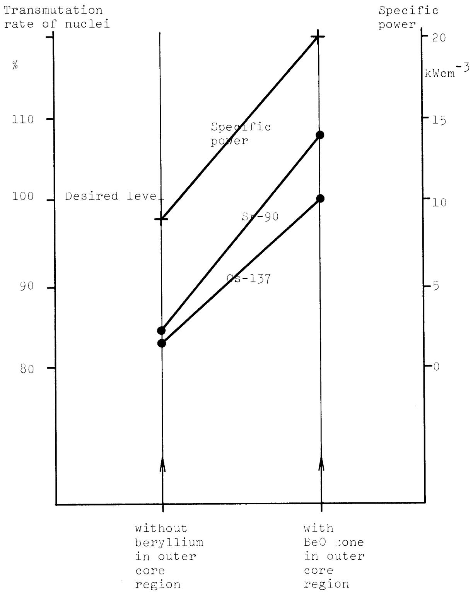  
Fig. 15 Burner reactor with molten fluoride fuel

# 7. Remarks about transmutation and hazard coefficients

It seems to be worthwhile to make some estimation of the advantage given by this type of fission-product management.

To operate for sale with only one figure for both nuclides: Sr-90 and Cs-137 the following mean values have been arbitrary postulated here:

<table><tr><td></td><td>Sr-90</td><td>Cs-137</td><td>Ratio of hazard Sr-90 Cs-137</td></tr><tr><td>Maximum permissible (μCi/cm3) water</td><td>1·10-5</td><td>4·10-4</td><td>40</td></tr><tr><td>air</td><td>1·10-9</td><td>6·10-8</td><td>60</td></tr><tr><td>mean value</td><td></td><td></td><td>50</td></tr><tr><td>yield from fission %</td><td></td><td></td><td></td></tr><tr><td>U-233</td><td>6,2</td><td>6,6</td><td></td></tr><tr><td>U-235</td><td>5,1</td><td>5,99</td><td></td></tr><tr><td>Pu-239</td><td>2,18</td><td>6,69</td><td></td></tr><tr><td>mean value for power production</td><td></td><td></td><td></td></tr><tr><td>1:1:1 for U-233:U-235:Pu-239</td><td>4,1%</td><td>6,4%</td><td></td></tr><tr><td>relative hazard coefficient</td><td>50</td><td>1</td><td></td></tr><tr><td>hazard coeff. X yield</td><td>2,050</td><td>0,064</td><td></td></tr><tr><td>total hazard coefficient</td><td colspan="2">2,114</td><td></td></tr><tr><td>in transmutation the effective half-life</td><td>2 years</td><td>6 years</td><td></td></tr><tr><td>hazard coeff. in transmutation</td><td>0,144</td><td>0,013</td><td></td></tr></table>

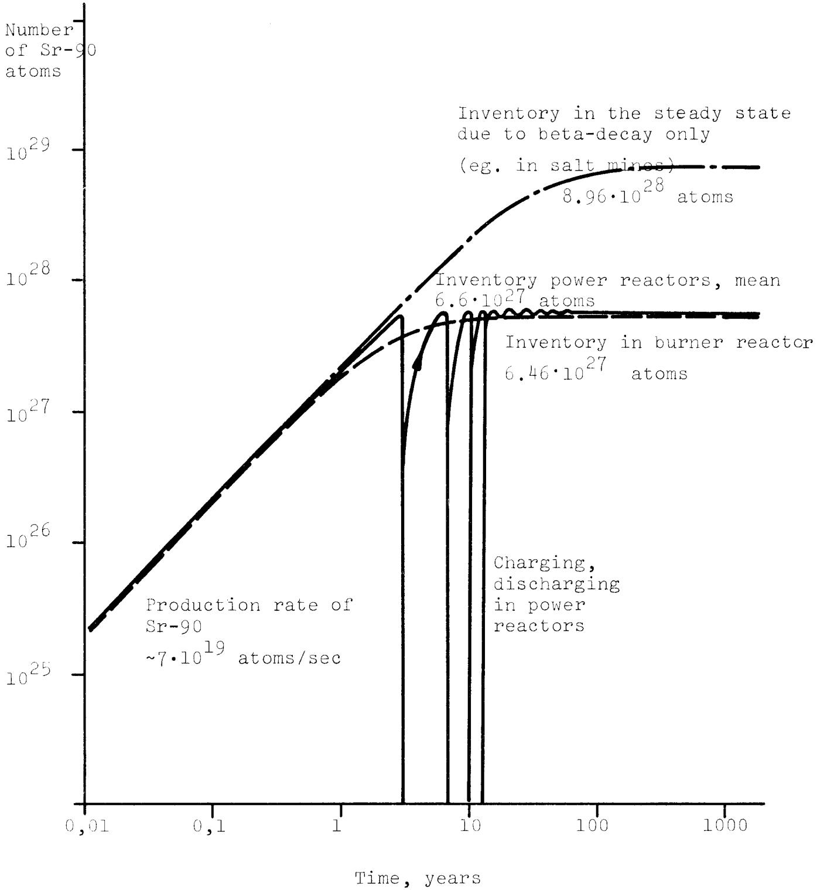  
Fig.16 Inventory of Strontium-90 in the power reactors and in the burner reactor Power of total system 55 Gwth Yield of Sr-90: $4,1\%$

Thus in the steady state of transmutation the amount of hazardous substances is reduced by factor $\sim 15$ in relation to the steady-state of beta-decay.

The amount of strontium, the most hazardous nuclide, is in a high-flux reactor burner approximately the same as in the power reactors after 3 years of fuel burning (fig. 16).

But the most impressive result comes from the considerations about the "end of the fission power era". The storage (without transmutation) Caesium-137 and Strontium-90 decayed within half-life of 39 years, core after $\sim 300$ years the amount of these nuclide will be reduced by factor 1000 (fig. 17).

In a high-flux transmutation the reduction with factor 1000 could be achieved after approximately 26 years, (fig. 17) i.e. in the lifetime of one reactor generation (for more exact considerations see (Taube, Ligou, Bucher, 1975).

Fig.17 Hazard of the both fission products: Sr-90 and Cs-137   
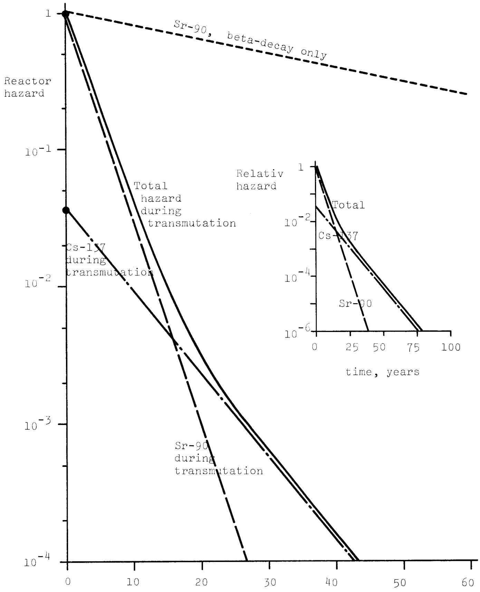  
Time, years

# 8. Conclusions

These considerations show that a high flux burner reactor for the transmutation of selected most hazardous fission products as Sr-90 and Cs-137 may be achieved for reasonable assumptions:

1) the whole system is a steady state transmutation system   
2) in the steady-state the amount of transmutated nuclides is more than one order of magnitude lower than in a spontaneously beta-decay steady-state.   
3) the ratio of conventional breeder power reactors to the burner is to about 4, making it possible to organize the fission power industry.   
4) the whole system is still breeding, with a relatively long doubling time of 30 years. The relative high specific power-rating of $1\mathrm{kgPu/MWth}$ , inclusive of the amount of plutonium out of core (cooling transport, reprocessing) is rather optimistic but not impossible, especially if a more sophisticated system will be used e.g. GCFBR or MSFBR (Molten Salt Fast Breeder Reactor) with a quasi-continuously pyrochemical reprocessing plant

# 9. Acknowledgement

The authors wish to express their best thanks to Mr. Stepanek for helping in some data processing, to Mr. K.H. Bucher for discussing some thermo-hydraulic problems and Mr. S. Padiyath for realizing the computer calculations.

10. References

- International Atomic Energy Agency Safe Handling of Radionuclides, Vienna, 1973   
Lane J.A. Test-reactor perspectives React. Fuel. Proces. Tech. 12, 1, 1 (1969)   
Lidsky L.M. Fission-Fusion Systems: Hybrid, Symbiotic and Augean Nuclear Fusion, 15, 151 (1975)   
Schneider K.J., Advanced Waste Management Studies, High Level  
Platt A.M. Radioactive Waste Disposal alternatives  
USAEC, BNWL-1900, Richland 1974   
Taube M., The Transmutation of Fission Products  
Ligou J., (Cs-137, Sr-90) in a Liquid Fuelled Fast  
Bucher K.H. Fission Reactor with Thermal Column  
EIR-Report 270, Würenlingen 1975   
Taube M. Steady-State Burning of Fission Products in a Fast/Thermal Molten Salt Breeding Power Reactor Ann. Nucl. Sci. Engin. 7, 283 (1974)   
Wolkenhauer W.C. The Controlled Thermonuclear Reactor as a Fission Product Burner BNWL-4232 (1973)