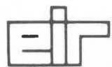
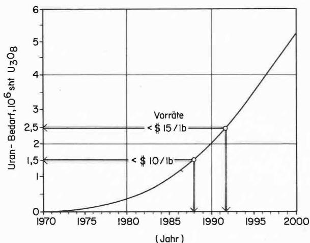
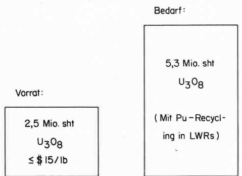
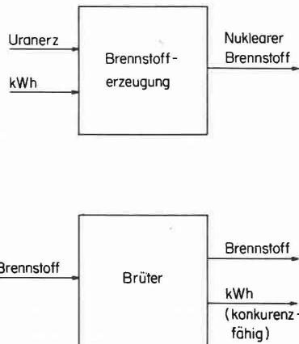

Eidg. Institut für Reaktorforschung Würenlingen Schweiz

# Ueber die Notwendigkeit von Brutreaktoren

H.K. Kohl, G. Sarlos, W. Seifritz

Vortrag gehalten an der Orientierungstagung über Gasgekühte Brutreactoren am 4. Juni 1974 in Bern

Würenlingen, Oktober 1974

# Über die Notwendigkeit von Brutreactoren

# Zusammenfassung

Die Notwendigkeit der Einführung der Brutreaktoren wird aus der zukünftigen Brennstoffverknappung und der darauf resultierenden Brennstoffverteuerung für Leichtwasserreaktoren abgeleitet. Ohne die Einführung von Brutreaktoren wurde aber auch der Uranbergbau einsersects und der erforderliche Umfang der zu installierenden Trennkapazität andersects immense Ausmasse annehmen. Gute Brutreaktoren konnen die Uran- und Thoriumreserven strecken und auf lange Zeit die Brennstoffversorgung sichern. Zurzeit scheint der Gasbekühte Schnelle Brüter, der allerdings gegenüber dem Natriumbekühlen einen Entwicklungs-rückstand aufweist, eine günstigere Brutrate zu haben. Für zukünftige, autarke Reaktorsymbiosen von Brütern und Konvertern (Brennern) resultiertDMAE daus ein gänstiges Verhältnis von Brütern zu Brennern.

# Résumé

La nécessité de l'introduction de surrégénérateurs est conditionné par la future pénurie en matière première de combustible qui conduira à une augmentation du prix du combustible pour les reacteurs à eau légère.

L'absence des surrégénrateurs entrainerait un accroissement intolerable aussi bien de la capacité des mines d'uranium que du travail de séparation. L'utilisation de surrégénrateurs permet d'étendre les réserves en uranium-thorium et de garantir un approvisionnement de combustible à long terme. Le surrégénateur refroidi au gaz, dont le développement est moins avancé que celui du reacteur refroidi au sodium, possède un facteur de conversion plus favorable. Il en résultat une combinaison avantageuse de surrégénrateurs et convertisseurs qui conduit à des systèmes autarciques.

# Summary

The necessity of the introduction of Breeder Reactors results from the fuel shortage and from the

Dr. H. K. Kohl, dipl. Ing., Dr. G. Sarlos und PD Dr. W. Seifritz, EIR, Würenlingen

# 1. Einleitung

Neben den fossilen Brennstoffen: Kohle, Erdgas, Erdöl wird heute hauptsächlich auch Uran als Kernbrennstoff zur Energieerzeugung genutzt. Um die Mitte dieseres Jahrhunderts hat der Abbau des Urans eingesetzt. Der rasche Anstieg im Uranbedarf wird dadzufahren, dass bereits zu Ende diese系数 Jahrhunderts immer minderwertigere Uranerze abgebaut werden müssen, da die Kernenergie in der bevorstehenden transienten Phase ihrer Einführung sehr viel Uran benötigen wird. In den USA wird fur das Jahr 1982 eine installierte nukleare Leistung von $150000\mathrm{MW_e}$ vorausgesagt, was dann etwa $20\%$ der gesamtten elektrischen Leistung der USA ausmachen wird [I].

Zeichnet sich ganz allgemein die Erschöpfung einer Rohstoffreserve ab, so hat dies eine Auswirkung auf den Rohstoffpreis. Der Aufwand, der für weitere Prospektionen und Explorationen nichtwendig wird, nimmt zu. Heute ist der Uranpreis bereits mit $ 1/lb U₃O₈ belastet, was etwa 10 ‰ des U₃O₈-Preises ausmacht.

Von 1975 bis 1983 rechnet man mit einem Preis-anstieg von durchschnittlich $1 bis$ 2 pro Jahr pro lb U₃O₈. Für 1975 wird etwa ein Anstieg auf $10 bis $11,5/lb U₃O₈ vorausgesagt, für 1979 auf $15 bis $16 und für 1983 auf $18 bis $20 [2].

Brutreactoren bieten die Möglichkeit, das vorhandene Uran wesentlich better auszunützen und auch das etwa dreimal früfigere Thorium für die Kernenergie zu erschliessen. Im folgenden wird gezeigt, dass die Einführung von Schnellen Brütern nicht nur eine Möglichkeit zur Energie- und Spaltstofferzeugung, sondern schon in verhältnismäßig manner zuken. Zurunzt für die Nutzung der Kernenergie durch Spaltreactoren eine Notwendigkeit darstellt.

# 2. Uranvorkommen und Brennstoffbedarf

# 2.1 Uranvorkommen in verschiedene Preisklassen

Die Uranvorkommen werden in Preisklassen eingeteilt. Tabelle 1 gibt die sicheren Uran-Weltvorkommen der westlichen Welt bis zur Preisklasse

presumed increase in fuel prices for Light Water Reactors in the future.

Without the introduction of Breeder Reactors the uranium mining and the needed separative work capacity would increase enormously. Good Breeder Reactors are able to extend the uranium and thorium reserves and to guarantee the fuel supply for a long time.

At the moment the Gas Cooled Fast Reactor - which is in its development behind the Sodium Cooled Fast Reactor - seems to have a better breeding rate than the Sodium Cooled Reactor. In future, for a maximum independence the former provides a more favourable ratio of breeder to burner reactors.

Tabelle 1 Sichere Uranvorkommen der westlichen Welt [3]   

<table><tr><td>Preisklasse</td><td>sichere Vorkommen
10^6 sht U3O8</td></tr><tr><td>bis $ 5/lb U3O8</td><td>0,7</td></tr><tr><td>bis $ 10/lb U3O8</td><td>1,5} 2,5</td></tr><tr><td>$ 10–$ 15/lb U3O8</td><td>1,0}</td></tr></table>

(\$ bedeutet den US-Dollar vom Frühjahr 1973, $1\mathrm{lb} = 0,45\mathrm{kg},1\mathrm{sht} = 907\mathrm{kg})$

von $ 15/lb U₃O₈ an [3]. Als sichere Uranvorkommen gelten Lagerstätten, die Uran in einer Menge und Art enthalten, die eine gewinnbringende Förderung mit bekannten Abbau- und Verarbeitungsmethoden innerhalb des angegebenen Preisbereiches erlauben. Die Abschätzung des Umfanges der Lagerstätten und der Urangehalte gründet sich auf die Lagerstättenbestimmung und die Ergebnisse von Proben über den Urangehalt. Es sind eigentliche Reserven im Sinne des Bergbaus. In Tabelle 2 sind die sicheren und zusätzlich geschätzten Uranvorkommen der USA für verschiedene Preisklassen zusammengestellt [4, 7]. Unter den zusätzlich geschätzten Vorkommen versteht man jenes Uran, das in bekannten Lagerstätten ohne Exploration oder in unbekannten Lagerstätten in bekannten Urangebieten vermutet wird. Da die Prospektion und Exploration primär auf die Identifikation von Vorkommen in den preisgünstigen Kategorien ausgerichtet ist, ist die Zuverlösigkeit der Vorkommen in diesen Klassen am hochsten.

Geographisch vertellen sich die sicheren Uranvorkommen in der interessanten Preisklasse unter $ 10/lb U₃O₈ folgendermassen: etwa 1/3 liegen in den USA und jeweils etwa 1/5 in Südafrika, Australien und Kanada.

Im Meerwasser ist Uran mit etwa 0,003 ppm enthalten. Schätzungen für die Urangewinnung aus dem Meerwasser ergaben Gestehungskosten für das Pfund Urankonzentrat zwischen $ 35 und $ 1000.

Tabelle 2 Uranvorräte der USA [4, 7]   

<table><tr><td>Preisklasse</td><td>Erzkonzentrationppm U3O8</td><td>sichere Vor-kommen106sht U3O8</td><td>zusätzlich geschätzt106sht U3O8</td></tr><tr><td>&lt;$ 10/lb</td><td>&gt;1600</td><td>0,3</td><td>0,7</td></tr><tr><td>&lt;$ 15/lb</td><td>&gt;1000</td><td>0,5</td><td>1,0</td></tr><tr><td>&lt;$ 30/lb</td><td>&gt;200</td><td>0,7</td><td>1,6</td></tr><tr><td>&lt;$ 50/lb</td><td>&gt;60</td><td>4,8</td><td>3,6</td></tr><tr><td>&lt;$ 100/lb</td><td>&gt;25</td><td>8,8</td><td>8,6</td></tr></table>

# 2.2 Kernbrennstoffbedarf

Wie bereits erwähnt, wird die installierte Kernkraftwerkskapazität sehr rasch ansteigen und damit auch der Bedarf an Kernbrennstoff. Tabelle 3 enthalt die voraussichtlich installierte Kernkraftwerkskapazität und den daraus abgeleiteten Uranbedarf der westlichen Welt bis zum Jahr 2000 [5]. Die installierte Kapazität steigt in den Jahren 1973 bis 2000 vermutlich um etwa das Fünzigfache an, darauf steigt auch der relative Anteil der Kernenergie an der Gesamtenergieerzeugung. Der Uranbedarf erhöht sich im selbst Zeitraum um den

Tabelle 3 Voraussichtlich installierte Kernkraftwerkskapazität und benötigtes Uran der westlichen Welt bis zum Jahr 2000 [5]   

<table><tr><td>Jahr</td><td>Installierte Kernkraftwerks-kapazität, GWe</td><td>Benötigtes Uran*106 sht U8O8(kumuliert)</td></tr><tr><td>1973</td><td>50</td><td>0,01</td></tr><tr><td>1975</td><td>93</td><td>0,09</td></tr><tr><td>1980</td><td>172</td><td>0,4</td></tr><tr><td>1985</td><td>585</td><td>1,0</td></tr><tr><td>1990</td><td>1088</td><td>2,0</td></tr><tr><td>2000</td><td>2660</td><td>5,3</td></tr></table>

* Mit Pu-Recycling in LWRs in $75 \text{‰}$ der Kernkraftwerke bis zum Jahre 1979

  
Bild 1Kumulierter Uranbedarf der westlichen Welt [5]

  
Bild 2 Massstübliche illustrierte Kernbrennstoffbilanz im Jahre 2000

Faktor 530. Dabei ist ein Abreicherungsgrad in den Trennanlagen auf $0,3 \text{‰}$ in Rechnung gesetzt. In Bild 1 ist der Uranbedarf der westlichen Welt als Kurve über den Zeitraum 1970 bis 2000 aufgezeichnet. Die sicheren Vorräte der westlichen Welt von 1,5 Millionen sht $\mathrm{U}_{3} \mathrm{O}_{8}$ in der Preisklasse bis $10 / \mathrm{lb} \mathrm{U}_{3} \mathrm{O}_{8}$ reichen bis in die zweite Häfte der 1980er Jahre und die sicheren Vorräte von 2,5 Millionen sht $\mathrm{U}_{3} \mathrm{O}_{8}$ in der Preisklasse $<$ $ 15/ lb $\mathrm{U}_{3} \mathrm{O}_{8}$ bis in die anfänglichen 1990er Jahre. Das heisst aber nicht, dass zu diesen Zeitpunkten das Uran zu diesen Preisen gehandelt werden wird, worauf eingangs bereits hingeswiesen wurde.

# 2.3 Kernbrennstoffbilanz für die westliche Welt im Jahr 2000

Stellt man die heute bekannten Uranvorräte von 2,5 Millionen sht $\mathrm{U}_3\mathrm{O}_8$ (Preisklasse $<$ $ 15/lb) dem Bedarf von 5,3 Millionen sht $\mathrm{U}_3\mathrm{O}_8$ (mit PuRecycling in LWRs) gegenüber, so ergibt sich für das Jahr 2000 ein mehr als doppelt so hoher Bedarf als Vorrat in dieser noch relativ preisgünstigen Klasse (Bild 2). Um diesen hohen Bedarf zudecken, müssen entweder neue Uranvorkommen prospektiert und exploriert werden, oder man ist gezwungen, die armeren Vorkommen, die entsprechend höhere Kosten verursachen, zu verwenden. Dabei muss beachtet werden, dass sieben bis acht Jahre notwendig sind, um neue Bergbauanlagen in Betrieb zunehmen.

# 2.4 Technisch-ökonomische Grenzen des Uranbergbaus und der Bereitstellung von Trennkapazität

Der Einfluss eines Anstiegs der Brennstoffkosten auf die Energiegestehungskosten bei Kernreactoren (Leichtwasserreactoren mit Pu-Recycling) kann mit folgender Faustformel [6] berechnet werden: Beim Übergang auf einen Uranpreis von $ X/lb U₃O₈ gegenüber der heutigen Basis $ 8/lb U₃O₈ erhöhen sich die Stromerzeugungskosten um

$$
\triangle \quad \left[ \frac {\mathrm {m i l l s}}{\mathrm {K W h} _ {\mathrm {e}}} \right] = 0. 0 6 (\mathrm {X} - 8) \tag {2.4.1}
$$

Beispiel: Beim Einsatz von Uran der Preisklasse $30/lb \mathrm{U}_{3} \mathrm{O}_{8}$ beträgt die Erhöhung der Energie-gestehungskosten $\triangle = 1,32$ mills/ $\mathrm{KWh}_{\mathrm{e}}$ , was bei einem heutigen Energiepreis von ungebahr 15 mills/ $\mathrm{KWh}_{\mathrm{e}}$ etwa eine $10^{\circ}$ /ige Erhöhung bedeutet. Der Übergang auf Uran der Klasse $\$100/lb \mathrm{U}_{3} \mathrm{O}_{8}$ wurde unter denselben Annahmen die Strom-gestehungskosten um $\approx 37 \text{‰}$ erhöhen.

Zusätzlich zu dieser - vielfrecht nicht schwerwiegend erscheinenden - Preissteigerung für die Kernenergie, muss aber der gewaltige Materialumsatz beachtet werden, der bei Verwendung armerer Uranerze in den Uranbergwerken zu bewerkstelligen ist. Rechnet man mit einer Jahresproduktion von 70 000 sht $\mathrm{U}_{3}\mathrm{O}_{8}$ , die Mitte der 1980er Jahre

in den USA bestehtigt werden, so erfordert der Abbau von Uranerz in der Preisklasse $ 50/lb U₃O₈ einen Gesteinsumsatz von etwa 1,2 Milliarden Tonnen im Jahr, was dem gegenüber Materialumsatz des gesamten US-Kohlebergbaus entspricht. Aus dem exponentiellen Anstieg des Uranbedarfs wurde sich bei Verarbeitung von immer armeren Uranerzen ein überexponentielles Wachstum für den Uranbergbau ergeben, was eine kaum erwünschte Umweltbelastung mit sich bringen)dürfte und auch enorme ökonomische Risiken in sich birgt. Eine 5jährige Verzögerung bei der Einführung der Brüter – zum Beispielstatt 1986 erst 1991 – wurde im Jahr 2040 für die USA zusätzlich eine Bereitstellung von 1 Million sht U₃O₈ bedingten. Das ist fast das Dreifache der in der westlichen Welt insgesamt benötigten U₃O₈-Menge im Jahr 2000!

Weiter,musste bei ausschliesslicher zukunftiger Verwendung von Leichtwasserreactoren (sebst mit Pu-Recycling) fur die Urananreicherung eine immense Trennarbeitskapazitat bereitgestellt werden. Tabelle 4 gibt eine Übersicht uber die jährlich erforderliche Trennarbeit bis zum Jahre 2000 [5].Dabei wird mit einer Abreicherung («tails assay») auf $0,3\%$ gerechnet. Wie aus der Tabelle ersichtlich, wird die voraussichtlich benötigte Trennarbeit von 1975 bis 2000 um mehr als das 12fache ansteigen, was gewaltige Investitionen nötig machen wird. Eine Verzögerung der Brüter-einführung-zum Beispielstatt 1986 erst 1991-würde bedingen,dass die Trennkapazität im Jahr 2000 um $30\%$ grösser sein,müssen.

Tabelle 4 Voraussichtlich benötigte Trennarbeit bis zum Jahr 2000 [5]   

<table><tr><td rowspan="2">Jahr</td><td colspan="3">Voraussichtlich benötigte Trennarbeit in 106 kg UTA*/a</td></tr><tr><td>USA</td><td>westliche Welt ausser USA</td><td>Summe west-liche Welt</td></tr><tr><td>1973</td><td>3,5</td><td>2,8</td><td>6,3</td></tr><tr><td>1975</td><td>6,8</td><td>6,2</td><td>13,0</td></tr><tr><td>1980</td><td>15,3</td><td>13,8</td><td>29,1</td></tr><tr><td>1985</td><td>30,0</td><td>27,9</td><td>57,9</td></tr><tr><td>1990</td><td>52,8</td><td>47,7</td><td>100,5</td></tr><tr><td>2000</td><td>74,3</td><td>84,6</td><td>158,9</td></tr></table>

* UTA - Urantrennarbeit

# 3. Die Ausnutzung des Urans in Leichtwasserreactoren

Bei einem natürlichen Gehalt von etwa $0,7 \text{‰}$ spaltbarem Uran-235 und einer Abreicherung auf $0,3 \text{‰}$ gelangen nur $0,4 \text{‰}$ des Urans als Spaltstoff in die Leichtwasserreactoren. Werden davon in

einem Zyklus drei Viertel gespalten und rechnet man für diese Reaktoren mit einer Konversionsrate (CR = Zahl der gebildeten spaltbaren Atom/ Zahl der verbrauchten spaltbaren Atom) von CR = 0,5 bis 0,6, so kann das Uran effektiv nur unter $0.5\%$ ausgenutzt werden.

Dies ist der Grund für den hohen Uranbedarf in Bild 1, und es Goes aus der obigen Darstellung hervor, dass schon mittelfristig und vor allem langfristig (nach 2000) eine bessere Ausnutzung des Urans unbedingt nötig wird. Die Möglichkeit dazu werden im folgenden beschreiben.

# 4. Der Brutreactor

Um Kernbrennstoff für thermische Reaktoren zu erzeugen, ist als Rohstoff in erster Linie Uranerz notwendig; für den Erzabbau, die Zerkleinerung, Laugung, Extraktion, Konversion, Isotopentrennung und Brennstofferzeugung soll schematisch als weitere Voraussetzung die elektrische Energie genannot werden, die nötig ist, um diese Prozesses durchführten zu konnen. Daraus ergibt sich das einfache Schema in Bild 3, wonach der nukleare Brennstoff unter Eingabe von Uranerz und elektrischer Energie erzeugt werden kann. Der Brüter benötigt Brennstoff und liefert wiederum Brennstoff und elektrische Energie zu konkurrenzfähigen Bedingungen. Er hat also - phänenologisch gesehen - umgekehrt zur Brennstofferzeugung einen Eingang und zwei Ausgänge. Ein Brutreactor liefert im Gegensatz zu einem Konverter mehr spaltbaren Brennstoff als er verbraucht.

Für die Erstladung eines Schnellen Brüters mit Pu-239/U-238-Brutzyklus wird Plutonium, das in thermischen Reaktoren erzeugt wurde, bestehtigt. Der U-233/Th-232-Zyklus, der die Erschliessung des Thoriums erhögt, zeit hingegen bei einem weicheren (thermischen) Neutronenspektrum eine höhere Effektivität als in einem Schnellen. In einer neuen Arbeit [8] wird dargelegt, dass der U-233/ Th-232-Zyklus faktisch ebensch gut wie der Pu-239/U-238-Zyklus in einem Schnellen Reaktor arbeitet,

  
Bild 3 Phenomenologischer Unterschied der Brennstoff-erzeugung für thermische Reaktoren einerseits und eines Brutreaktors andereits

wenn man sich auf externes Brüten beschränkt, das heisst wenn man etwa die radialen Blankets eines Schnellen Reaktors mit Thorium $(\mathrm{ThO}_2)$ belädt. Das so erbrütete U-233 kann - wie wir noch sehen werden - als Brennstoff für Hochtemperaturreactoren dieren.

# 4.1 Einige Definitionen des Brutens

Der Brutgewinn, BG, an Spaltstoff (U-233, Pu-239 beziehungsweise Pu-241) aus einem Brennstoffzyklus bei einem Brüter ist definiert als:

$$
\begin{array}{l} \mathbf {B G} = \frac {\left(\text {S p a l t s t o f f a m Z y k l u s e n d e}\right) - \left(\text {S p a l t s t o f f z u Z y k l u s b e g i n n}\right)}{\left(\text {S p a l t s t o f f v e r b r a u c h}\right)} \\ = \frac {(\text {N e t t o - G e w i n n a n S p a l t s t o f f})}{(\text {S p a l t s t o f f v e r b r a u c h})} \tag {4.1.1} \\ \end{array}
$$

Inähnlicher Weise ist die Brutrate, BR, definiert als:

$$
\mathrm {B R} = 1 + \mathrm {B G} = \frac {\text {(e r z e u g t e r S p a l t s t o f f)}}{\text {(v e r b r a u c h e t e r S p a l t s t o f f)}} \tag {4.1.2}
$$

Dieser Wert ist für einen Brüter grösser als 1; das heisst man kann mit einem Brutgewinn nettomässig recknen.

Eine weitere wichtige Grösse stellt die Verdopplungszeit, RDT (reactor doubling time) dar als jene Zeit (in Jahren), die nötig ist, um das spaltbare Material für eine neue Reaktorladung aus dem Netto-Gewinn an Spaltstoffe zu erhalten:

$$
R D T = \frac {\left(S p a l t s t o f f z u Z y k l u s b e g i n n\right)}{\left(\text {N e t t o - G e w i n n a n S p a l t s t o f f}\right) \times \left(\text {B r e n n s t o f f z y k l e n / J a h r}\right)} \tag {4.1.3}
$$

In der Praxis ist während eines Zyklus nur ein Teil des Spaltstoffinventars im Reaktorkern; ein Anteil von etwa $60 \text{‰}$ des im Reaktorkern befindlichen Spaltstoffes zirkuliert ausserhalb des Reaktors (Wiederaufbereitung).

Man erhält deshalb für die praktische Verdopplungszeit des Spaltstoffinventars eines Brennstoffzyklus, IDT (inventory doubling time) folgenden Ausdruck:

$$
\mathrm {I D T} = \frac {\left(\text {S p a l t s t o f f z u Z y k l u s b e g i n n}\right)}{\left\{\left(\text {N e t t o - G e w i n n a n S p a l t s t o f f}\right) - \left(\text {A u s s e n v e r l u s t e a n S p a l t s t o f f}\right) \right\}}
$$

$$
\frac {\times (\text {A u s s e n f a k t o r})}{\times (\text {B r e n n s t o f f z y k l e n / J a h r})} \tag {4.1.4}
$$

wobei auch Wiederaufbereitungsverluste in Rechnung gesetzt sind. Der

$$
\text {A u s s e n f a k t o r} = \frac {\left(\text {S p a l t s t o f f z u Z y k l u s b e g i n n}\right) + \left(\text {S p a l t s t o f f a u s R e a k t o r}\right)}{\left(\text {S p a l t s t o f f z u Z y k l u s b e g i n n}\right)} \tag {4.1}
$$

berücksichtigt die Spaltstoffmenge, die ausserhalb des Reactors in Umlauf ist [9].

Betrachtet man einen Verbund von Brutreaktoren, der eine Vielzahl dieser Reaktoren enthalt, und in welchem dann der erbrütete Brennstoff praktisch kontinuierlich exponentiell anfällt, so ist es sinnvoll eine Systemverdopplungszeit (compound inventory doubling time)

$$
\mathrm {C I D T} = 0, 6 9 3 \mathrm {I D T} \tag {4.1.6}
$$

einzuführen.

Um den ansteigenden Bedarf an elektrischer Energie zu decken, der einen Anstieg im Brennstoffbedarf verursacht, ist es wünschenswert, wenn die Verdopplungszeit des Energiebedarfs - also etwas zehn Jahre - mit der Verdoppelungszeit der verwendenten Brüter übereinstimmt.

# 5. Brutreaktortypen

# 5.1 Der Natriumgekühlite Schnelle Brüter

Zurzeit sind bereits verschiedene Prototypanlagen. These Types (DEMOs) der Grosse 250-300MWe in Betrieb, wie Phenix (Frankreich), PFR (England), BN-350 (UdSSR). Die Investitionen für diese Anlagen sind hoch. Für den amerikanischen DEMO rechnet man mit rund den doppelten Anlagekosten verglichen mit einem Leichtwasserreactor gleicher Leistung. Diese hohen Kosten sind zureichzuführen auf Sicherheitsüberlegungen, die die Anlage verteuern beziehungsweise auf die komplexe Natriumtechnologie. Eine heute noch offene Frage ist die wirtschaftliche Energieerzeugung mit Natriumgekühlen Schnellen Brütern.

Als Vorteile für die Natriumkuhlung gegenüber der Gaskuhlung gelten: niedriger Systemdruck, sehr gutes Wärmeübertragungsmittel, gingeres Brennstoffinventar, hoher Wirkungsgrad $(40 - 42\%)$ der Anlage bei mittleren Temperaturen.

In Tabelle 5 sind Verdopplungszeiten für künftige kommmerzielle Na-Brüter angegeben. Sie sind bei Oxidbrennstoff ungündiger als bei Karbidbrennstoff. In projektierten Anlagen rechnet man mit folgenden Brutraten: DEMO (USA): $1,15 \pm 0,05$ ; der SNR-300 wird aus Kostenersparnisgründen mit einem dünneren radialen Brutmantel bei $\lesssim 1$ liegen, der Französische Superphonix wird bei 1,1 liegen und bei späteren weiteren kommender Anlagen ist mit 1,2-1,3 zu rechnen.

# 5.2 Der Gasgekühte Schnelle Brüter

Es existieren noch keine Prototypen mit Gaskühlung. Eine sichere Voraussage über eine wirtschaftliche Energieerzeugung ist zurzeit noch nicht möglich. Die Gasbrüterentwicklungzieht Nutzen aus der Entwicklung des Na-Brüters für das odische Brennelement. Der Brennstab im gasgekühnten Brüter unterscheidet sich allerdings vom Brenn

Table 5 Verdopplungszeiten fur künftige kommerzielle Natriumgekühte Schnelle Brüter [4]   

<table><tr><td rowspan="2">Brennstoff</td><td rowspan="2">Spez. Leistung MWth/kg**</td><td rowspan="2">Brennstoff-verbleib im Reaktor Jahr</td><td colspan="2">Abbrand</td><td colspan="4">Verdopplungszeit in Jahren</td></tr><tr><td>% Fima</td><td>Fifa</td><td>1.1</td><td>1.15</td><td>Brutraten 1.2</td><td>1.3</td></tr><tr><td rowspan="2">Oxid</td><td rowspan="2">0,7</td><td>1</td><td>3,3</td><td>0,25</td><td>112</td><td>61</td><td>42</td><td>26</td></tr><tr><td>3</td><td>10</td><td>0,75</td><td>47</td><td>30</td><td>22</td><td>14,2</td></tr><tr><td rowspan="3">Karbid*</td><td rowspan="3">1,4</td><td>1</td><td>6,7</td><td>0,50</td><td>-</td><td>26</td><td>19</td><td>12,2</td></tr><tr><td>1,5</td><td>10</td><td>0,75</td><td>-</td><td>20</td><td>14,5</td><td>9,5</td></tr><tr><td>2</td><td>13,3</td><td>1,00</td><td>-</td><td>17</td><td>12,6</td><td>8,3</td></tr></table>

* noch erhebliche Entwicklungserbeit notwendig!  
** Schwermetall

stab im natriumgekühnten Brüter, durch seine Entlüftung und aufgerauhte Hüle. Von den gasgekühnten Reaktoren, insbesondere dem Hochtemperaturreactor, kann das Engineering für die Heliumgaskühlung und den vorgespannten Betondruckbehälter übernommen werden, so dass wahrseinlich ein viel kleinerer F&E-Aufwand notwendig sein)dürfte,als für die Natriumgekühten Brüter. Als Vorteile des Gasbrüters gelten: inertes, durchsichtiges, einphasiges Kuhlmittel, reduzierte spezifische Leistung,nur schwache neutronische Wechselwirkungen mit dem Kuhlmittel,gut überschaubare nukleare Sicherheit.

Die Brutrate einer zukünftigen $1000\mathrm{-MW_e}$ -komm ermerziellen Anlage wurde in unserem Hause mit $\mathrm{BR} = 1,38$ (bei oxidischen Brennstoff) ermittelt [10]. Es werden auch Werte bis zu $\mathrm{BR} = 1,49$ bei halbjährlicher Coreumladung fur einen 1000 $\mathrm{MW_e}$ -Gasbruter angegeben [8].Zukünftige, realistische Werte dürften bei 1,3-1,4 liegen.

# 5.3 Brutaten, Konversionsraten, Gesamtwirkungsgrad und $\mathsf{U}_3\mathsf{O}_8$ -Inventar verschiedene Reaktoren

In Tabelle 6 sind die Brutraten beziehungsweise Konversionsraten, der Gesamtwirkungsgrad und das $\mathrm{U}_{3}\mathrm{O}_{8}$ -Inventar der verschiedenen Reaktoren zusammengestellt. Auffallend ist das geringe $\mathrm{U}_{3}\mathrm{O}_{8}$ -Inventar der Brüter, die nach der Erstlung mit rund einer sht $\mathrm{U}_{3}\mathrm{O}_{8}$ pro Jahr über die gesamte Betriebszeit auskommen, was für dieselbe elektrische Leistung gilt, wie für die thermischen Reaktoren.

# 6. Symbiotische Reaktorstrategien

Eine Symbiose von verschiedenenartigen Konver-tern beziehungsweise Brennern mit Brütern soll den Zweck verfolgen, einserseits allen Energieanforderungen gerecht zu werden, das heisst die Bereitstellung von:

- elektrischer Energie,   
-Hochtemperaturprozesswärme für industrielle Zwecke,

Tabelle 6 Brutraten, Konversionsraten, Gesamtwirkungsgrad und $\mathbf{U}_3\mathbf{O}_8$ -Inventar verschiedene Reaktoren [4]   

<table><tr><td>Reaktortyp</td><td>Brutrate bzw. 
Konversionsrate 
BR bzw. CR</td><td>Gesamt- 
wirkungsgrad 
ηB bzw. ηC</td><td>Inventar 
sht U3O8</td><td>sht U3O8bei 40jährigem 
Betrieb</td></tr><tr><td rowspan="2">LWR (1000 MWe)</td><td rowspan="2">0,5 -0,6</td><td rowspan="2">≈ 0,33</td><td>548 (PWR)</td><td rowspan="2">5000 (LWR)</td></tr><tr><td>580 (BWR)</td></tr><tr><td>HTGR (1000 MWe)</td><td>0,66-0,9</td><td>≈ 0,40</td><td>456</td><td>2400</td></tr><tr><td>LMFBR (komerziell)</td><td>1,2 -1,25</td><td>≈ 0,40</td><td>≈ 80</td><td>≈ 110*</td></tr><tr><td>GCFR (komerziell)</td><td>1,3 -1,4</td><td>≈ 0,37</td><td>≈ 100</td><td>≈ 140*</td></tr><tr><td colspan="2">LWR = Light Water Reactor</td><td colspan="3">HTGR = High Temperatur Gas-Cooled Reactor</td></tr><tr><td colspan="2">BWR = Boiling Water Reactor</td><td colspan="3">LMFBR = Liquid Metal Fast Breeder Reactor</td></tr><tr><td colspan="2">PWR = Pressurized Water Reactor</td><td colspan="3">GCFR = Gas-Cooled Fast Breeder Reactor</td></tr><tr><td colspan="5">* Aussenfaktor berücksichtigt</td></tr></table>

- kalorischer Fernwärme für Fernheiznetze zur Raumbehezung,  
soll hinreichend gewährleistet werden.

Anderseits will man aber auch gleichzeitig weltgehend von Rohstoffen unabhängig werden, so dass nur soviel Uran beziehungsweise Thorium in ein Symbiosystem nachgespeist werden muss, wie infolge von Spaltung (lg pro MWd erzeugter thermischer Leistung) verbraucht wird. Neuerdings ist eine interessante Symbiose von GCFRs und HTGRs in den Vordergrund gerückt [8, 10, 11, 12]. Der Grundgedanke dieser Philosophie ist, dass ein GCFR so ausgelegt wird, dass der Kern mit den axialen Blankets auf der Grundlage des Uran-Plutonium-Zyklus eine Konversionsrate von $\mathrm{CR} = 1$ besitzt, während die radialen Blankets Thoriumoxid enthalten. Das erzeugte Plutonium wird in den Kern des Reactors zusückgeführt undersetzt gerade wieder die Spaltstoffverluste. Der überschüssig erbrütete Brennstoff ist Uran-233 und wird in den radialen Blankets erzeugt. Dieses U-233 wird in HTGRs eingesetzt, die sich wegen $\mathrm{CR} < 1$ brennstoffmässig nicht selbst erhalten konnen. Dieses System erhält sich selbst und ist somit autark bis auf die Nachspeisung von Natururan und Thorium. Die GCFRs dieren besoin der Energieerzeugung als Brennstoffabriken für die HTGRs, die auf Grund ihrer Hochtemperaturwärme ein hohes Potential in der Zukunft haben werden. Somit sind keine Isotopentrennanlagen mehr notig.

Nimmt man vereinfacht an, dass in einem solchen System alle GCFRs dieselbe Brutrate BR, und alle HTGRs dieselbe Konversionsrate CR, besitzen, sind weiterhin die thermischen Leistungen und Lastfaktoren aller Reaktoren gleich, und die elektrischen Anlagewirkungsgrade der Konverter und Brüter durch $\eta_{\mathrm{C}}$ beziehungsweise $\eta_{\mathrm{B}}$ berücksichtigt, so ergibt sich im stationären Gleichgewicht das Verhältnis der Zahl HTGRs N, zur Zahl der benöttigten GCFRs M, zu [10, 12]

$$
\frac {\mathrm {N}}{\mathrm {M}} = \frac {1}{\mathrm {a}} \frac {\mathrm {B R} - 1}{1 - \mathrm {C R}} \times \frac {\eta_ {\mathrm {C}}}{\eta_ {\mathrm {B}}} \tag {6.1}
$$

(a $\approx 1.1$ fur den beschriebenen gemischten Zyklus: Pu-239/U-238-Zyklus und U-233/Th-232-Zyklus; a $\approx 1.66$ fur einen reinen Uran-Plutonium-Zyklus). Die total installierte elektrische Leistung $\mathbf{L}_{\mathrm{tot}}$ , stellt die Summe aus den elektrischen Leistungen der Konverter, $\mathbf{L}_{\mathrm{C}}$ , und jene der Brüter, $\mathbf{L}_{\mathrm{B}}$ , gemäss

$$
\mathrm {L} _ {\text {t o t}} = \mathrm {N} \cdot \mathrm {L} _ {\mathrm {C}} + \mathrm {M L} _ {\mathrm {B}} \tag {6.2}
$$

dar.

Für eine bestimmte zu installierende Leistung kann unter Annahmen für die Konversions- und Brutaten und für die Brutsysteme eine Abschätzung der Anzahl von Brutern (LMFBRs, GCFRs) zu Brennern (LWRs, HTGRs) nach Gleichung 6.1 getroffen werden. Die Tabellen 7 und 8 geben als

Tabelle 7 Anzahl von Brütern zu Brennern in Symbiose mit reinem U/Pu-Zyklus für eine installierte Gesamtleistung von 10 000 MWe   

<table><tr><td>Brenner-Typ</td><td rowspan="2">LWR</td><td rowspan="2">HTGR</td></tr><tr><td>Brüter-Typ</td></tr><tr><td>LMFBR</td><td>8 LMFBRs : 2 LWRs</td><td>6 LMFBRs : 4 HTGRs</td></tr><tr><td>GCFR</td><td>7 GCFRs : 3 LWRs</td><td>5 GCFRs : 5 HTGRs</td></tr></table>

(Alle Reaktoren besitzen eine Leistung von 1000 MWe; das in den Brütern überschüssige erzeugte Plutonium gehen in die Brenner, welche ebenfalls mit dem U/Pu-Zyklus arbeiten)

Tabelle 8 Anzahl von Brütern zu Brennern in Symbiose, mit gemischtem U/Pu- und Th/U-233-Zyklus, für eine installierte Gesamtleistung von 10 000 MWe   

<table><tr><td>Brenner-Typ</td><td rowspan="2">LWR</td><td rowspan="2">HTGR</td></tr><tr><td>Brüter-Typ</td></tr><tr><td>LMFBR</td><td>7 LMFBRs : 3 LWRs</td><td>5 LMFBRs : 5 HTGRs</td></tr><tr><td>GCFR</td><td>6 GCFRs : 4 LWRs</td><td>4 GCFRs : 6 HTGRs</td></tr></table>

(Alle Reaktoren besitzen eine Leistung von 1000 MWe; das in den radialen Blankets der Brüter über-schüüssig erzeugte U-233 gehen in die Brenner, welche mit dem Th/U-233-Zyklus arbeiten)

Beispiel für eine installierte Leistung von 10 000 MWe die Anzahl der bereitsigen Brüter und Brenner an, bei Verwendung des reinen Plutoniumzyklus beziehungsweise bei gemischten Zyklen. Der Berechnung liegen die Mittelwerte der Brut-beziehungsweise Konversionsraten und die Wirkungsgrade der Tabelle 6 zugrunde.

Durch Vergleich der beiden Tabellen sieht man, dass unter Anwendung des gemischten Brennstoffzyklus (Tabelle 8) 4GCFRs-6HTGRs, mit Brennstoff versorgen konnen. Die Firma General Atomics (früher Gulf General Atomic Comp.) glaubt sareg, dass ein Verhältnis von 3 oder gar 4 HTGRs pro GCFR möglich sein müsste, wenn optimistischere Brutaten für den GCFR; und Konversionsraten für den HTGR bis 0,9 angenommen werden.

Eine GCFR/HTGR-Symbiose basierend auf gemischtem Brennstoffzyklus ist also am vorteilhaftesten, da diekleinste Anzahl von Bruternbenötigt wird. In einem gemischten Zyklus zirkuliert viel weniger Plutonium, als in einem System das nur den reinen U/Pu-Zyklus verwendet.

Ein entscheidender Vorteil ist jedoch der, dass auch der Thoriumkreislauf erschlossen wird, und bzw wird gewichtsmäßig mehr Thorium als Uran verbrannt. Da mehr Thorium als Uran in der Natur vorkommen, können somit diese Rohstoffe für die Kernspaltung optimal ausgenützt werden.

# 7. Schlussfolgerungen

Wie gezeigt wurde, leitet sich die Notwendigkeit von Brütern aus der zukünftigen Brennstoffversorgung und den technisch-wirtschaftlichen Grenzen ab, die durch den Uranbergbau und die erforderliche Trennarbeit gegeben sind. Der Natriumgekehnte Schnelle Brüter besitzt gegenüber dem

Gasgekühnten einen Entwicklungsvorsprung. Soweit zurzeit beurteilbar, sind mit dem Gasgekühnten Schnellen Brüter höhere Brutraten zu erreichen als mit Natriumgekühten. Eine Lösung der zukünftigen Rohstoffversorgung kann mit Reaktorsymbiosen erreicht werden, wozu der Brüter unbedingt notwendig ist Es sind sowohl Symbiosen von Brütern mit Leichtwasserreactoren, wie auch mit Hochtemperaturreactoren möglich. Die Verwendung von GCFRs wurde eine gingere Anzahl von Brütern für eine bestimmte zu installmentende Leistung ergeben. Aus der Bedeutung der Brennstoffversorgung für die Kernenergie erscheidt jederoch die Verfolgung von zwei Brüterkonzeptensinnvoll und das Energieproblem der Zukunft durch die rechtzeitige Einführung von Schnellen Brütern losbar.

# Literatur

1. Seaborg, G. T.: Annals Nucl. Sci. Eng. 1. p. 2 (1974).   
2. Nucleonics Week: 15, p. 6 (1974).   
3. Hampel, H. R.: Atomwirtschaft 7, 330 (1973).   
4. Report of the Cornell Workshops on the Major Issues of a National Energy Research and Development Program, Sept. 14—Oct. 17, 1973, Cornell University, Ithaca, New York 14850, p. 9, 1973.   
5. idem, p. 135.   
6. idem, p. 136.   
7. idem, p. 137.   
8. Fortescue, P.: Annals of Nucl. Sci. Eng. 1, p. 21 (1974).   
9. Wyckoff, H.L., und Greebler, P.: Nucl. Techn. 21, p. 158 (1974).   
10. Seifritz, W.: Chimia, S. 1 (1974).   
11. Melèse-d'Hospital, G., und Meyer, L.: Status of GCFBRs in the USA, Reaktortagung, 2.—5. April 1974, Berlin.   
12. Schikorr, W.: Reaktorstrategie zu einer autarken Primärenergieversorgung, Reaktortagung, 2.—5. April 1974, Berlin.