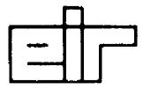
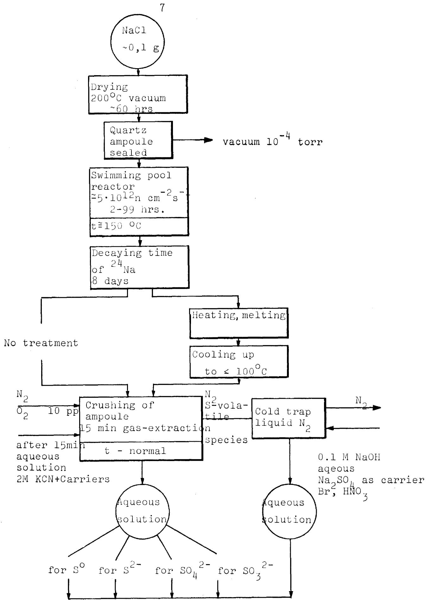
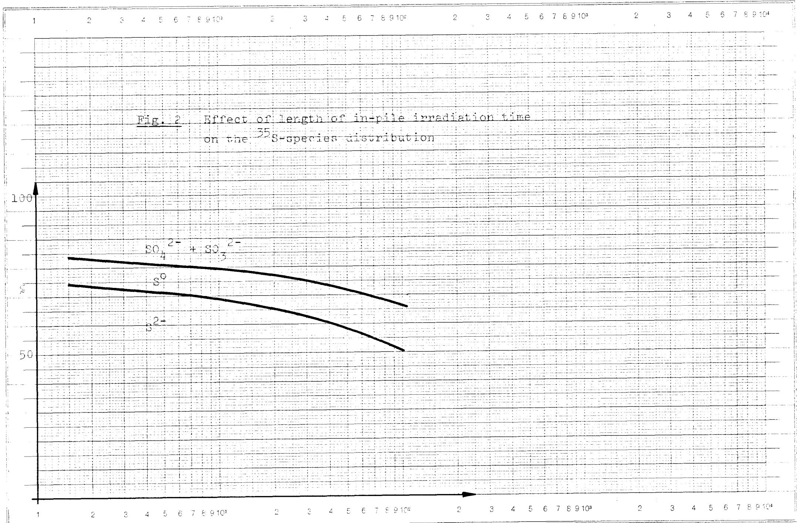
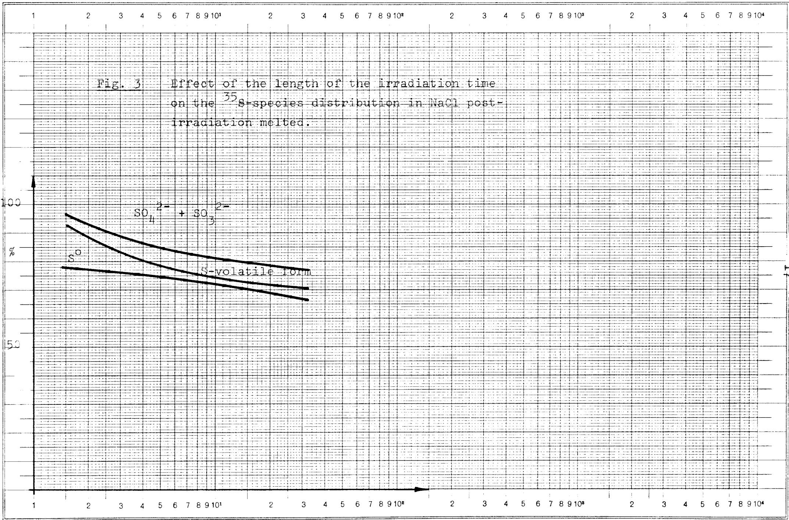

Eidg. Institut für Reaktorforschung Würenlingen Schweiz

# Chemical state of sulphur obtained by the $^{35}\mathrm{Cl}(\mathsf{n},\mathsf{p})$ $^{35}\mathrm{S}$ reaction during in pile irradiation

E. Ianovici, M. Taube

CHEMICAL STATE OF SULPHUR OBTAINED BY THE $^{35}\mathrm{Cl}(\mathfrak{n},\mathfrak{p})^{35}\mathrm{S}$ REACTION DURING IN PILE IRRADIATION

E. Ianovici, M Taube

December, 1974

# Abstract

The chemical distribution of $^{35}\mathrm{S}$ produced by the $^{35}\mathrm{Cl}(\mathrm{n,p})^{35}\mathrm{S}$ nuclear reaction was studied. The chemical forms found after solution, $\mathbf{S}^{2-}$ , $\mathbf{S}^0$ and higher oxidation form $(\mathrm{SO}_4^{2-} + \mathrm{SO}_3^{2-})$ coincide with Maddock's most recent experiments, the preponderant fraction being $\mathbf{S}^{2-}$ . The length of the irradiation time has an important role on the chemical states of radiosulphur. An oxidation process concerning $\mathbf{S}^{2-}$ was observed as the irradiation progressed. The effect of post-irradiation heating above and below the melting point of NaCl was investigated. By high temperature heating an evolution of volatile $^{35}\mathrm{S}$ was observed. After melting the preponderent form remains $\mathbf{S}^{2-}$ though an oxidation process occurs. The effect of temperature irradiation on the sulphur distribution was also examined. At low temperature irradiation the predominance of $\mathbf{S}^{2-}$ and $\mathbf{S}^0$ was observed.

The present work gives the preliminary results obtained on n-irradiated NaCl, the simplest component of the molten chlorides fast reactor, which project has been described recently in various papers by Tabe et al. (1,2). As the chlorides of U-238 and Pu-239 diluted by NaCl are the selected components for the fused salt reactor, the n-reactions of chlorine must be taken into account.

In a relatively high neutron flux the most important nuclear reactions of natural chlorine are as follows:

$$
\begin{array}{l} \begin{array}{l l l l} 3 5 & \mathrm {C l} (n, \gamma) & 3 6 & \beta^ {-} \\ 1 7 & & 1 7 & 3, 1 \cdot 1 0 ^ {5} y \\ & & & 1 8 \end{array} \quad \begin{array}{l l l l} 3 6 & \mathrm {C l} & \frac {\beta}{3 , 1 \cdot 1 0 ^ {5} y} & 3 6 \\ 1 7 & & 1 8 \end{array} \\ \begin{array}{l l l l} 3 7 & \mathrm {C l} (n, \gamma) & 3 8 & \\ 1 7 & & 1 7 & \frac {\beta^ {-}}{3 7 , 3 m} \end{array} \begin{array}{l l l l} 3 8 & \mathrm {C l} & \frac {\beta^ {-}}{3 7 , 3 m} \end{array} \begin{array}{l l l l} 3 8 & \mathrm {A r} \\ 1 8 & \end{array} \\ \end{array}
$$

But much more important from the point of view of the chemical properties of the system, are the following reactions:

$$
\begin{array}{l l l l} 3 5 & \text {C l} & (\mathrm {n}, \mathrm {p}) & 3 5 \\ 1 7 & & 1 6 & \frac {\beta^ {-}}{8 8 \mathrm {d}} \end{array} \begin{array}{l l l l} 3 5 & \text {C l} & (\mathrm {n}, \mathrm {p}) & 3 5 \\ 1 6 & \frac {\beta^ {-}}{8 8 \mathrm {d}} \end{array}
$$

and

$$
{ } ^ { 3 5 } \mathrm { C l } ( n , \alpha ) \begin{array} { c } { { } ^ { 3 2 } \mathrm { P } } \\ { { } ^ { 1 5 } } \end{array} \begin{array} { c } { { } ^ { \beta } } \\ { { } ^ { 1 4 . 3 d } } \end{array} \begin{array} { c } { { } ^ { 3 2 } \mathrm { S } } \\ { { } ^ { 1 6 } } \end{array}
$$

The description of the "chlorine burn-up" given by Taube(2) gives a good illustration of all these processes.

During reactor operation an important part of the fission products are gaseous and can be removed continuously, others form chlorides and remain in the salt, while others will precipitate

as metals $^{(1)}$ . The excess chlorine produced in the system can react with the strongest reducing agent present $\mathrm{UCl}_3$ forming $\mathrm{UCl}_4$ which in the pure form is highly corrosive.

At the same time it can be assumed that $\mathrm{UCl}_4$ will react rapidly with any short-lived oxidising species produced under the intense fission fragments irradiation of the salt.

If the calculations about the evolution of chlorine from the melt are optimistic (3,4) it is not the same situation concerning the sulphur. The (n,p) reaction on $^{35}\mathrm{Cl}$ will produce $^{35}\mathrm{S}$ at a mean concentration up to a few thousand ppM in the salt (4) which depends upon the isotopic concentration of the chlorine e.g. separated Cl-37. An interaction between UCl₃ and sulphur is expected to take place. It may be supposed that $^{35}\mathrm{S}$ leads to the precipitation of U as US. An attack of structural materials by $^{35}\mathrm{S}$ can also take place.

The chemical state of $^{35}\mathrm{S}$ in neutron irradiated sodium chloride. The aim of this work is to give some information about the sulphur chemical states formed in the NaCl lattice by $^{35}\mathrm{Cl}$ (n,p) $^{35}\mathrm{S}$ nuclear reaction. For this reason we have performed experiments concerning the influence of irradiation time, and of the post-irradiation high temperature heating on the chemical sulphur distribution.

The chemical state of radiosulphur obtained by the reaction $^{35}\mathrm{Cl}$ (n,p) $^{35}\mathrm{S}$ in the alkali chlorides has been the object of many studies $^{(5-13)}$ . However, the most recent studies have proved that the alkali chlorides are systems of an unexpected complexity. The complexities are coming from the presence of

a large concentration of hydroxide ions normally found in alkali chloride crystals as a result of the hydrolysis of the salt (14,15). In addition, a large sensitivity of the recoil 35S to experimental conditions was observed (11,12,16,17).

Generally the radiochemical method used, involved solution of the crystals before analysis, usually in an aqueous solvent. This means that the relation of the crystal precursors to the products found after solution depends on the reactions of the crystals species with the solvent or with point defects formed by irradiation (e.g. V centres) during solution.

Recently interesting results concerning sulphur chemical states have been published $^{(18,19)}$ . Using different methods of $^{35}\mathrm{S}-$ species separation and especially non-aqueous medium it was possible to identify the $\mathbf{S}^{2-}$ and $\mathbf{S}^0$ precursors but not those of the sulphite and sulphate $^{(18)}$ . It was shown that the oxidising point defects produced in the crystal during the irradiation as V centres or derivatives can oxidise the $^{35}\mathrm{S}$ at the moment of solution. The aerial oxidation can also be very important in aqueous or ammoniacal carrier-free systems but no oxidation was observed in liquid ammonia-cyanide or aqueous cyanide systems in the presence at least $\mathbf{S}^{2-}$ carrier. The solution in an acid medium even in the absence of both air and carriers invariably lead to complete conversion of all active sulphur into sulphate $^{(18)}$ . Since sulphide ions are known to be stable in water it is concluded that point defects produced by irradiation in the crystal can oxidise all sulphate at the time of solution.

# EXPERIMENTAL

Sodium chloride "Merck" reagent was heated for 60 hrs. at $200^{\circ}\mathrm{C}$ in an oven under the vacuum. The dried samples of $100\mathrm{mg}$ sealed in evacuated $(10^{-4}$ torr) quartz tubes were irradiated near the core of the "Saphir" reactor (swimming pool) for different periods at a neutron flux of $5\cdot 10^{12}\mathrm{ncm}^{-2}\mathrm{s}^{-1}$ and $4,3\cdot 10^{12}\mathrm{ncm}^{-2}\mathrm{s}^{-1}$ . Reactor irradiations were carried out at about (estimated only) $150^{\circ}\mathrm{C}$ and $-186^{\circ}\mathrm{C}$ . After irradiation the samples were 'cooled' for 8 days to allow the decay of $^{24}\mathrm{Na}$ .

The method of $^{35}\mathrm{S}$ -species separation

The crushing of the irradiated ampoule was made in a special device from which the air was removed by passing a nitrogen stream containing oxygen of 10 ppM. After crushing, a gentle stream of nitrogen was allowed to flow for about 10 minutes. The gases evolved were collected in cooled traps of containing 0,1 NaOH solution.

The irradiated salt was dissolved in $2\mathrm{m}$ KCN solution containing carriers of $\mathbf{S}^{2 - }$ , $\mathbf{CNS}^{-}$ , $\mathbf{SO}_3^{2 - }$ , $\mathbf{SO}_4^{2 - }$ . For the dissolution care was not taken to exclude the oxygen completely although the nitrogen gas was passed continuously through the system. The solution from the traps containing the gases evolved in the system was oxidised with bromine and nitric acid in the presence of $\mathbf{Na}_2\mathbf{SO}_4$ (5 mg in S) evaporated and the sulphur was precipitated as barium sulphate.

For the $^{35}\mathrm{S}$ -species separation the chemical method described recently by M. Kasrai and A.G. Maddock (18) was used. The barium sulphate precipitates corresponding to each S-species were separated on the weighed paper disc in a demountable filter.

The dried separated precipitates were weighed and the activity of the samples was measured under a thin-window Geiger counter. All measurements were made in duplicate with and without aluminium absorber for discriminating $^{35}\mathrm{S}$ from $^{32}\mathrm{P}$ which was produced by the $^{35}\mathrm{Cl}$ ( $n, \alpha$ ) reaction.

# Post irradiation high temperature heating

The sealed irradiated ampoules were heated in an electric oven at $770^{\circ}\mathrm{C}$ for 2 hrs. and $830^{\circ}\mathrm{C}$ for about 5 minutes and then crushed in a closed system under nitrogen stream. The description of the method used by us can be seen in Fig. 1

# RESULTS AND DISCUSSION

A comparison of the S-distribution obtained by us and by other authors is given in Table 1. As can be seen the results are practically the same using the cyanide method even if the conditions of dissolution are different. Unfortunately it was not possible to make a comparison of the irradiation conditions. The dissolution in vacuo in an alcoholic cyanide solution gave exactly the same distribution as the analytical method using the cyanide and carriers. This shows that the carriers do not affect the distribution of the active sulphur, on the contrary they prevent the oxidation process that disturb the distribution. The oxidising agents of sulphur can be Cl and $\mathrm{Cl}_2^-$ entities which results in n-irradiated alkali chlorides (20). Chlorine atoms are able to create a strong oxidising environment for the sulphur at the moment of dissolution. Also possible is an interaction in crystals between sulphur and chlorine with formation of reactive

  
Radioactivity measurements Geiger-counter thin window with and without Al for discrimination of $^{32}\mathrm{P}$

Table 1 Chemical distribution of ${}^{35}\mathrm{\;S}$ in n-irradiated NaCl   

<table><tr><td>Sample</td><td>Solvent</td><td>Conditions of dissolution</td><td>Carriers</td><td>S2-%</td><td>So%</td><td>SO42- + SO32-%</td><td>References</td></tr><tr><td>A</td><td>liquid ammonia</td><td>vacuum</td><td>no</td><td>63.0</td><td>9.4</td><td>27.8</td><td>18</td></tr><tr><td>B</td><td>&#x27;&#x27;</td><td>air</td><td>H2S</td><td>61.0</td><td>12.2</td><td>25.3</td><td>&#x27;&#x27;</td></tr><tr><td>C</td><td>aqueous solution Et-OH-2 M KCN</td><td>vacuum</td><td>no</td><td>64.0</td><td>12.8</td><td>23.2</td><td>&#x27;&#x27;</td></tr><tr><td>D</td><td>4 M KCN</td><td>air</td><td>yes</td><td>63.0</td><td>12.5</td><td>24.4</td><td>&#x27;&#x27;</td></tr><tr><td>E</td><td>2 M KCN</td><td>air</td><td>yes</td><td>62.3</td><td>12.5</td><td>25.4</td><td>&#x27;&#x27;</td></tr><tr><td>F</td><td>2 M KCN (as E)</td><td>N2</td><td>yes</td><td>64.4</td><td>11.9</td><td>23.7</td><td>This work Φ=5·1012n cm-2s-1</td></tr></table>

*Note sulphite fraction is less than $5 \%$ in our experiments and always lower than sulphate fraction

species which by dissolution give the oxidised form. Dissolution of the irradiated salt in the presence of a scavenger for Cl or $\mathrm{Cl}_2^-$ should avoid the oxidation. The experiments of Yoshihara (16) and Maddock (18) showed that ethyl alcohol can reduce but not eliminate the oxidation. Using this solvent the zero valent sulphur is lost. It was shown by Maddock that the cyanide solution was doubly advantageous; to stabilise $S^0$ as CNS and to act as a Cl or $\mathrm{Cl}_2^-$ scavenger.

# Effect of length of irradiation time

In order to find whether the irradiation time has any effect on the behaviour of the radiosulphur the distribution of sulphur as a function of the length of irradiation time was studied. The results are presented in Table 2 and Fig. 2. The irradiation time was varied between 2 and 99 hrs. As is seen in Table 2 $S^{2-}$ remains the preponderant fraction independent from the irradiation time. This means that in a natural way the preponderant state of sulphur following $^{35}\mathrm{Cl}$ (n,p) $^{35}\mathrm{S}$ reaction can be $S^{2-}$ . Alternatively it can be supposed that a reduction of sulphur takes place by capture of electrons arising from the discharge of F-centers.

The results presented in Table 2 show that the sulphur distribution is influenced by the length of irradiation time. Thus the yield of less than 20 per cent of oxidised forms for 2 hrs. of irradiation increases to about 30 per cent for a longer time (99 hrs). The increase of higher oxidation fraction is at the expense of the sulphide. In the last case the fraction decreases from about 70 to 50 per cent at the irradiation time mentioned above. The fraction corresponding to elementary sulphur, about 10 per cent, seems to be not affected by the length of irradiation time in the time interval studied by us.

Table 2 Chemical distribution of ${}^{35}\mathrm{\;S}$ for different length of irradiation time   

<table><tr><td>S-species irradiation time hrs.</td><td>Number of parallel runs</td><td>\( S^{2-} \) %</td><td>\( S^0 \)%</td><td>\( SO_4^{2-} + SO_3^{2-} \)%</td><td>S-Volatile form %</td><td>Conditions of irradiation</td></tr><tr><td>2</td><td>2</td><td>73.1 ± 0.4</td><td>9.8 ± 0.8</td><td>16.9 ± 0.8</td><td>0.01</td><td>\( \varnothing ≈5·10^{12}n cm^{-2}s^{-1} \sim 150°C vacuum \)</td></tr><tr><td>12</td><td>2</td><td>67.5 ± 0.7</td><td>12.1 ± 0.1</td><td>20.4 ± 0.6</td><td>&#x27;&#x27;</td><td>\( \varnothing ≈4.3·10^{12}n cm^{-2}s^{-1} \)</td></tr><tr><td>24</td><td>2</td><td>64.4 ± 0.5</td><td>11.9 ± 0.5</td><td>23.7 ± 2.0</td><td>&#x27;&#x27;</td><td>&#x27;&#x27;</td></tr><tr><td>99</td><td>1</td><td>50.47</td><td>15.90</td><td>33.62</td><td>&#x27;&#x27;</td><td>&#x27;&#x27;</td></tr></table>

  
Logar. Teilung 1-10000 Einheit 62.5 mm Irradiation time (hrs) Division Unité

It is remarkable that after 10 hrs. of irradiation the changes in the chemical distribution of radiosulphur become rapid (Fig. 2). As is seen the main effect of the irradiation time is the conversion of part of the sulphide into the higher oxidised fraction. This may be a consequence of radiation produced defects with oxidising character.

It is also possible that either the concentration of the defects responsible for the reduction of radiosulphur decreases with the increase of the irradiation time or they are annihilated when new traps are formed. The oxidation of radiosulphur with increase of radiation damage concentration may be also due to the increase in the positive charge on the sulphur as a result of interaction of recoils with chlorine atoms. The same behaviour was found in the case of post gamma irradiation KCl $^{(15)}$ . Even if the oxidising process of radiosulphur can be attributed to the V-centers, the presence of $\mathrm{OH}^{-}$ in the crystal must not be neglected. It was shown that the sensitivity to the oxidation is enhanced by the presence of $\mathrm{OH}^{-}$ suggesting that the radiolysis of $\mathrm{OH}^{-}$ can be responsible for accelerating the oxidising process $^{(21)}$ . It must be added also that in the target oxygen containing the product of radiolysis can be an oxygen atom which acts as a deep electron trap. The electron traps can be formed either by gamma radiolysis or be initially present as crystal defects.

The reaction $^{35}\mathrm{Cl}(\mathrm{n,p})^{35}\mathrm{S}$ in the alkali chlorides can produce sulphur as $\mathbf{S}^{2-}$ as well as $\mathbf{S}^{-(22)}$ . For the oxidation up to zero valency state it is possible to imagine only an electron transfer without many changes in the lattice. The precursors of higher oxidation form may be $\mathbf{S}^{+}$ as a result of an electron loss from a neutral species. However, the interaction of chlorine entities formed by irradiation with $\mathbf{S}^{0}$ to form species as $\mathrm{SCl}_2$ , $\mathrm{SCl}_2$ may be an important mechanism in forming the precursors of the higher oxidation states. These entities in an oxidative hydrolysis will produce sulphate and sulphite fractions.

# Effect of post-irradiation heating

The effect of post irradiation high temperature heating (including melting state) can be seen in Table 3 and 4. A comparison between heated and unheated samples are made for irradiations of 2 hrs. Table 3, 12 hrs. and 24 hrs. in Table 4. In Table 3 are also presented results on samples heated at a temperature below the melting point of NaCl.

The results presented in Table 3 show that the high temperature heating has only a slight influence on the $\mathbf{s}^{2-}$ state, but it affects the $\mathbf{S}^0$ and higher oxidised forms $(\mathrm{SO}_4^{2-} + \mathrm{SO}_3^{2-})$ . A part of radiosulphur was found under the volatile form. An escape of radiosulphur from the crystals particularly at higher temperature (T > 400 °) was mentioned earlier(17).

The proportion of volatile radiosulphur appears at the expense of $S^0$ and higher oxidised forms. The results show that with high temperature heating above the boiling point of sulphur and above melting point of NaCl the $S^0$ and $S^+$ and/or $S_{\mathrm{Y}}$ receive sufficient kinetic energy to migrate to the surface or even to escape from the crystal and then collected as volatile radiosulphur.

# Effect of irradiation time on post-irradiation melted sample

However, there are some differences in changes of $^{35}\mathrm{S}$ -chemical distribution on heating below and above melting point of NaCl. It seems that for a relatively short time of irradiation (2 hrs) only the sulphate and sulphite precursors account for the volatile radiosulphur proportion.

The results presented in Table 4 show a change in the distribution of chemical forms of $^{35}\mathrm{S}$ for longer time of irradiation before melting. On melting the $\mathbf{S}^{\circ}$ value decreases up to $2\%$ for a longer time of irradiation and this corresponds to an increase of volatile radiosulphur form. A slight influence of the irradiation time on the yield of $\mathbf{S}^{2-}$ and higher oxidation forms may be also observed.

Table 3 Effect of post-irradiation heating on the chemical states of $^{35}\mathrm{S}$ . Irradiation time 2 hrs; $\varnothing \cong 5 \cdot 10^{12}$ n cm $^{-2}$ s $^{-1}$   

<table><tr><td>Exp.</td><td>Conditions of irradiation</td><td>Post-irradiation treatment</td><td>S2- %</td><td>S0 %</td><td colspan="2">(SO42- + SO32-) S-volatile form %</td></tr><tr><td>1</td><td>~150 °C vacuum</td><td>no</td><td>73.4</td><td>10.4</td><td>15.8</td><td>0.01</td></tr><tr><td>2</td><td>&quot;</td><td>no</td><td>72.7</td><td>9.2</td><td>18.0</td><td>0.01</td></tr><tr><td>3</td><td>&quot;</td><td>770 °C 2 hrs</td><td>77.4</td><td>5.5</td><td>2.0</td><td>14.7</td></tr><tr><td>4</td><td>&quot;</td><td>&quot;</td><td>73.4</td><td>5.1</td><td>5.3</td><td>16.2</td></tr><tr><td>5</td><td>&quot;</td><td>830 °C 5 min.</td><td>78.2</td><td>12.0</td><td>6.3</td><td>3.5</td></tr><tr><td>6</td><td>&quot;</td><td>&quot;</td><td>74.8</td><td>10.4</td><td>9.4</td><td>5.3</td></tr><tr><td>7</td><td>&quot;</td><td>&quot;</td><td>78.6</td><td>10.7</td><td>4.3</td><td>6.4</td></tr></table>

* The radioactivity of all measured S-containing fractions was normalised to 100 per cent.

Table 4 Effect of the post-irradiation heating on the chemical states of ${}^{35}\mathrm{\;S}$   

<table><tr><td>Exp.</td><td>Conditions of irradiation</td><td>Post-irradiation treatment</td><td>S2- %</td><td>S0 %</td><td>(SO42- + SO32-) %</td><td>S volatile form %</td></tr><tr><td rowspan="3">1</td><td>∅≈4,3·1012n cm-2s-1</td><td>no</td><td>66.8</td><td>12.1</td><td>21.0</td><td>0.01</td></tr><tr><td>12 hrs.</td><td></td><td></td><td></td><td></td><td></td></tr><tr><td>150 °C vacuum</td><td></td><td></td><td></td><td></td><td></td></tr><tr><td>2</td><td>&quot;</td><td>no</td><td>68.1</td><td>12.0</td><td>19.8</td><td>0.01</td></tr><tr><td rowspan="2">3</td><td>&quot;</td><td>830 °C</td><td>71.5</td><td>1.9</td><td>18.9</td><td>7.6</td></tr><tr><td></td><td>5 min</td><td></td><td></td><td></td><td></td></tr><tr><td rowspan="3">4</td><td>∅≈5·1012n cm-2s-1</td><td>no</td><td>66.9</td><td>11.4</td><td>21.6</td><td>0.01</td></tr><tr><td>24 hrs.</td><td></td><td></td><td></td><td></td><td></td></tr><tr><td>150 °C vacuum</td><td></td><td></td><td></td><td></td><td></td></tr><tr><td>5</td><td>&quot;</td><td>no</td><td>61.9</td><td>12.3</td><td>25.7</td><td>0.01</td></tr><tr><td rowspan="2">6</td><td>&quot;</td><td>830 °C</td><td>70.6</td><td>2.0</td><td>19.7</td><td>7.4</td></tr><tr><td></td><td>5 min.</td><td></td><td></td><td></td><td></td></tr><tr><td>7</td><td>&quot;</td><td>&quot;</td><td>65.8</td><td>2.7</td><td>23.0</td><td>8.4</td></tr></table>

However, the present data are not enough to give a definite picture of these phenomena and we tried to represent in Fig. 3 the influence of irradiation time on the $^{35}\mathrm{S}$ -chemical distribution in the post-irradiation melted NaCl. As is seen in Fig. 3 a slight oxidation process concerning $\mathbf{S}^{2 - }$ fraction occurs as the irradiation progresses. The increase of higher oxidation forms up to about 10 hrs. is faster than the decrease of $\mathbf{S}^{2 - }$ fraction. It may be supposed that a part of $\mathbf{S}^0$ passes to the higher oxidation forms. However, a small and practically constant quantity of $\mathbf{S}^0$ is found in the melt for longer irradiation time. The gas evolution remains also practically constant. The oxidation process concerning $\mathbf{S}^{2 - }$ tends to a pseudo-plateau value as the irradiation progresses. This behaviour induces a pseudo-plateau in the increase of the higher oxidation states yield.

It is possible that this arises from a significant decrease of defects with oxidising character in melting process. Comparison of these results and those presented in Fig. 2 shows that in the melted sample the concentration of radiation damages has not the same effect as in the non-melted sample. The supplementary information about this can be obtained by studying the effect of high temperature irradiation on the chemical distribution of radio-sulphur.

Alternatively it is possible to suppose that in the melting state the active oxidising agents have another nature than those in heating below melting. The presence of oxygen can have a determinant role in radiosulphur oxidation. At the melting point the formation of sodium oxides and consequently an oxidising environment may be assumed.

  
Logar. Teilung 1-10000 Einheit 62,5 mm Division Unité

Effect of reactor irradiation temperature on the chemical distribution of $^{35}\mathrm{S}$ -species

The results obtained on the chemical states of radiosulphur in n-irradiated NaCl at about $423\mathrm{K}$ and $77\mathrm{K}$ are shown in Table 5. The big proportion of active sulphur as $\mathbf{S}^{2 - }$ fraction for reactor "normal" temperature ( $\sim 150^{\circ}\mathrm{C}$ ) was confirmed by the last experiments on the $^{32}\mathrm{P}$ obtained by $^{35}\mathrm{Cl}(n,\alpha)^{32}\mathrm{P}$ reaction (23). The preponderant valence form was found to be phosphine. An evidence for zero valent phosphorus was also obtained.

The low temperature irradiation (Table 5) leads to a distribution of $^{35}\mathrm{S}$ between four valence states with the predominance of $\mathbf{S}^{2-}$ and $\mathbf{S}^0$ . The results obtained by us for low temperature irradiation agree with those obtained by J. Paptista and N.S. Marques for KCl single crystals (15).

The comparison of results obtained by irradiation at $\sim 423\mathrm{K}$ and $77\mathrm{K}$ show that the higher oxidation fraction is lower (3 per cent) for $77\mathrm{K}$ . It is remarkable that the sulphide fraction is lower at $77\mathrm{K}$ than at $423\mathrm{K}$ . It is clear that the increase of $\mathbf{S}^0$ form at low temperature irradiation is done at the expense of both sulphite + sulphate and sulfide fractions.

The low yield of higher oxidation forms may be explained by the fact that an activation energy associated with some reaction to form $\mathrm{S}_{\mathrm{X}} \mathrm{Cl}_{\mathrm{Y}}$ presursors can prevent such kind of reaction.

The defects with oxidising and reducing character formed by low temperature irradiation become important factors in determining the sulphur precursors and thus the chemical distribution by dissolution. It is possible to suppose that the low yield of higher oxidation states is determined by the following reaction:

$$
\mathrm {S} ^ {+} + \mathrm {F} \rightarrow \mathrm {S} ^ {\circ}
$$

Table 5 The influence of irradiation temperature on the chemical states of radiosulphur   

<table><tr><td rowspan="2">Exp.</td><td rowspan="2">Conditions of irradiation flux-time</td><td rowspan="2">Temp.</td><td>S2-</td><td>S0</td><td>SO42- + SO23-</td><td>S-volatile form</td></tr><tr><td>%</td><td>%</td><td>%</td><td>%</td></tr><tr><td rowspan="2">1</td><td rowspan="2">∅=5·1012n cm-2s-12 hrs.</td><td rowspan="2">~423 K</td><td>73,4</td><td>10,4</td><td>15,8</td><td>0,01</td></tr><tr><td></td><td></td><td></td><td></td></tr><tr><td>2</td><td>&#x27;&#x27;</td><td></td><td>72,7</td><td>9,2</td><td>18,0</td><td>0,01</td></tr><tr><td rowspan="2">3</td><td rowspan="2">∅=5·1012n cm-2s-12 hrs.</td><td rowspan="2">77 K</td><td>64,7</td><td>32,3</td><td>3,0</td><td>0,01</td></tr><tr><td></td><td></td><td></td><td></td></tr><tr><td>4</td><td>&#x27;&#x27;</td><td></td><td>66,1</td><td>30,8</td><td>3,1</td><td>0,01</td></tr></table>

High temperatur irradiations (T >500 °C) are being looked at.

As in the low temperature irradiation as the F center concentration is higher a bigger fraction of higher oxidation states will be reduced. It was shown that the thermal stability of F centers is markedly decreased in oxygen containing samples $^{(24)}$ . It may be postulated that the bleaching of F centers leads to formation of some oxygen centers with an oxidising action for sulphur.

The decrease of $S^{2-}$ fraction can be also explained by the presence of V centers as follows:

$$
\mathrm {s} ^ {2 -} + \mathrm {v} \rightarrow \mathrm {s} ^ {\circ}
$$

In conclusion the results obtained on the chemical distribution of radiosulphur by dissolution may be explained by the existence of crystal entities as $\mathbf{S}^{2-}$ , $\mathbf{S}^0$ , $\mathbf{S}^+$ and/or $\mathbf{S}_{\mathbf{x}} \mathbf{C} \mathbf{l}_{\mathbf{y}}$ and their interaction with oxidising and reducing defects formed by irradiation or initially present in the crystals.

# LITERATURE

1. M. Taube and J. Ligou, Ann. Nucl. Sci. Eng. 1, 277 (1974)   
2. M. Taube, Ann. Nucl. Sci. Eng. 1, 283 (1974)   
3. B.R. Harder, G. Long and W.P. Stanaway, Symposium on Reprocessing of Nuclear Fuels, 25 Aug. Iowa, p. 405, (1969)   
4. S. Smith and W.E. Simmons, Winfrith Private communication   
5. W.S. Koski, J. Amer. Chem. Soc. 71, 4042 (1949)   
6．U.Croatto and A.G.Maddock，Nature 164,614 (1949)   
7. W.S. Koski, J. Chem. Phys. 17, 582 (1949)   
8．U.Croatto and A.G.Maddock，J.Chem.Soc.Suppl. 351 (1949)   
9. M. Chemla, Compt. rend. 262, 1553, 2424 (1951)   
10. T.A. Carlson and W.S. Koski, J. Chem. Phys. 23, 1596 (1955)   
11. R.H. Herber, J. Inorg. Nucl. Chem. 16, 361 (1960)   
12. R.H. Herber, Chem. Effect of Nuclear Transformations vol.II 251 (1961)   
13. A.G. Maddock and P.M. Pearson, Proc. Chem. Soc. 275, 1962   
14. J. Rolfe, Phys. Rev. Letters, 1, 56 (1958)   
15. J.L. Baptista and N.S. Marques, J. Inorg. Nucl. Chem. 36, 1683 (1974)   
16. K. Yoshinara, Ting Chia Hwang, E. Ebihara and N. Shibata. Radiochim. Acta 3, 185 (1964)   
17. C. Chiotan, M. Szabo, I. Zamfir and T. Costa, J. Inorg. Nucl. Chem. 30, 1377 (1968)   
18. M. Kasrai and A.G. Maddock, J. Chem. Soc. A, 1105 (1970)   
19. C.N. Turcanu, Radiochem. Radioanal. Letters 5/6/287 (1970)   
20. J.G. Rabe, R. Rabe and A. Ohlen, J. Phys. Chem. 70, 1098 (1966)   
21. J.H. Growford, Adv. Phys. 17, 93 (1968)   
22. F. Fischer and H. Grundig, Z. Phys. 184, 299 (1965)   
23. A.G. Maddock and A.J. Mahmood, Inorg. Nucl. Chem. Letters 9, 509 (1973)   
24. J.L. Baptista, T. Andersen, Phys. Stat. Soc. (b) 44, 29 (1971)