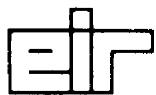
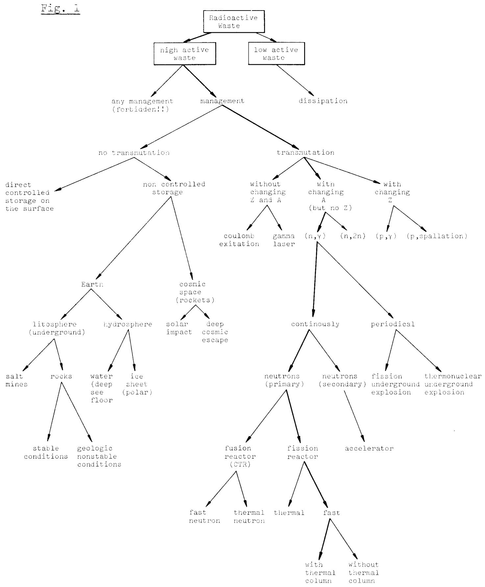
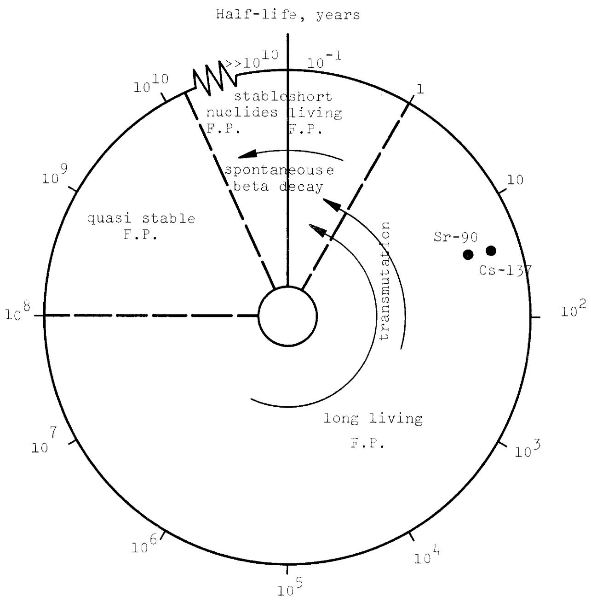
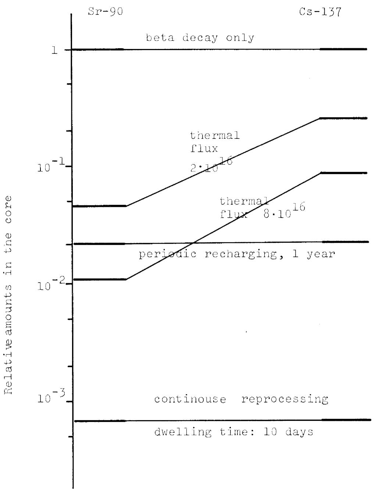
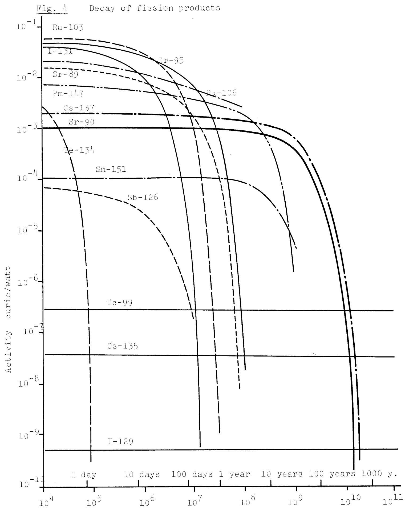
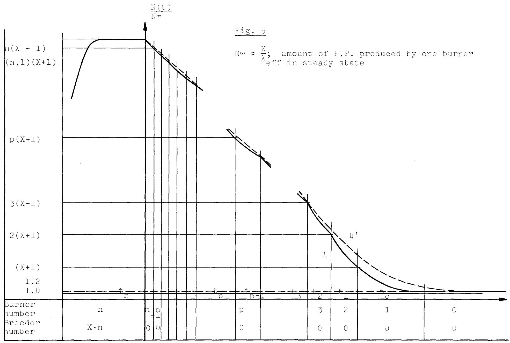
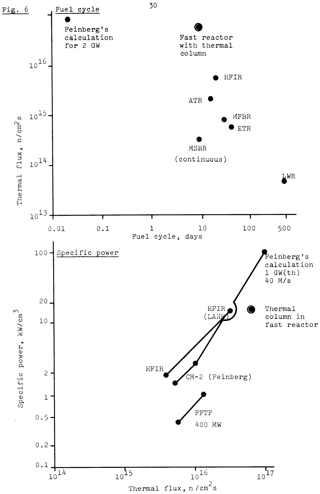
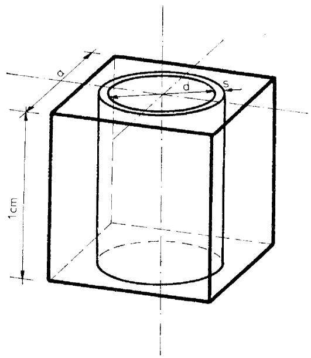
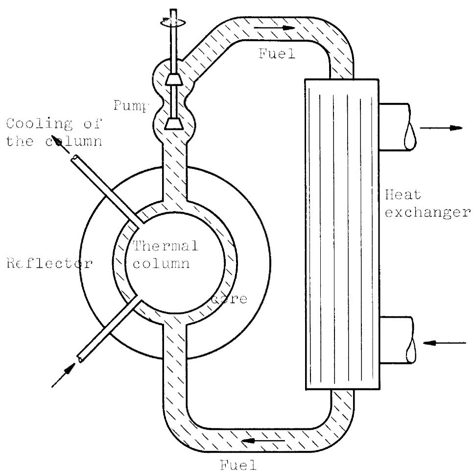
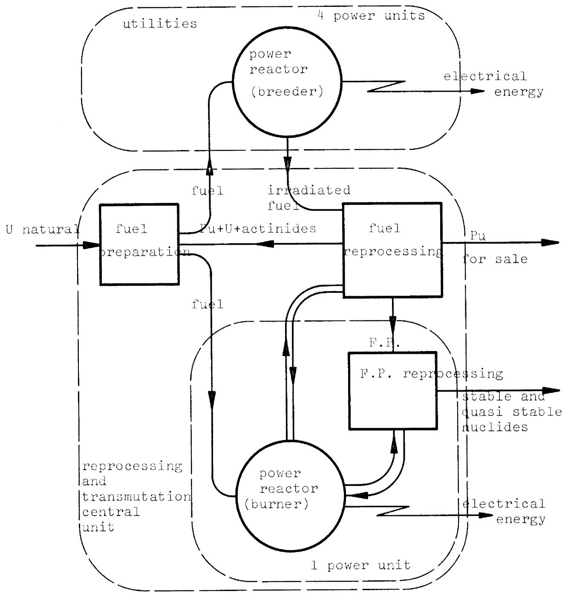

Eidg. Institut für Reaktorforschung Würenlingen Schweiz

# The transmutation of fission products (Cs-137, Sr-90) in a liquid fuelled fast fission reactor with thermal column

M. Taube, J. Ligou, K.H. Bucher

Würenlingen, Februar 1975

The transmutation of fission products (Cs-137, Sr-90) in a liquid fuelled fast fission reactor with thermal column

M. Taube, J. Ligou, K.H. Bucher

# Summary

The possibilities for the transmutation of caesium-137 and strontium-90 in high-flux fast reactor with molten plutonium chlorides and with thermal column is discussed. The effective half life of Cs-137 could be decreased from 30 years to 4-5 years, and for Sr-90 to 2-3 years.

# Introduction

The problem of management of highly radioactive fission product waste has been intensely and extensively discussed in the recent paper WASH - 1297 and especially in BNWL 1900 (Fig. 1).

Here only the transmutation of Fission Products (F.P.) without the recycling of the actinides is discussed, making use of neutron irradiation by means of a fission reactor (Fig. 2).

A short outline of this paper is as follows

1) Why, contrary to many assertions, is neutron transmutation in a fusion reactor not feasible.   
2) Why recent discussions concerning transmutation in fission reactors are rather pessimistic.   
3) Could the transmutation in a fission reactor be possible taking into account the neutron balance in a breeding system?   
4) Which are the F.P. candidates for irradiation in a fission reactor?   
5) Is the rate of transmutation sufficiently high in a fission reactor?   
6) In what type of fission reactor is the transmutation physically possible?   
7) What are the limiting parameters for transmutation in a solid fuelled fission reactor?   
8) Is a very high flux fission reactor possible if the fuel is in the liquid state instead of the solid state?   
9) How could such a high flux fast reactor with circulating liquid fuel and a thermal column operate as a 'burner' for some F.P. (Cs-137 Sr-90 etc) transmutation.   
10) What engineering problems must be solved for this to be realised?

  
Fig. 2 Transmutations of fission products

1. Why the transmutation of F.P. is not feasible in a controlled thermonuclear reactor (CTR):

The recent studies of the use of a C.T.R. as a transmutation machine for at least the conversion of Cs-137 have been to some extent optimistic. Table 1 gives a summary of the most important data and results from BNWL 1900.

# Comments 1

Wolkenhauer (BNWL 4232) calculated the values with a nominal one energy group cross section and fast neutron flux $5 \times 10^{15} \mathrm{n} \, \mathrm{cm}^{-2} \, \mathrm{s}^{-1}$ . (The primary flux of $14 \, \mathrm{MeV}$ neutrons for $10 \, \mathrm{MW/m}^2$ wall loading equals $5 \times 10^{14} \mathrm{n} \, \mathrm{cm}^{-2} \, \mathrm{s}^{-1}$ , but such a high loading is very optimistic!)

<table><tr><td rowspan="2"></td><td colspan="2">Cs-137</td><td colspan="2">Sr-90</td></tr><tr><td>σ(barns)</td><td>∅·σ(s-1)</td><td>σ(barns)</td><td>∅·σ(s-1)</td></tr><tr><td>(n,γ)</td><td>0.44</td><td>2.2·10-10</td><td>0.0188</td><td>0.94·10-10</td></tr><tr><td>(n,2n)</td><td>0.147</td><td>7.3·10-10</td><td>0.148</td><td>7.40·10-10</td></tr><tr><td>(β-decay)</td><td>-</td><td>8.26·10-10</td><td>-</td><td>7.63·10-10</td></tr></table>

The results obtained are rather pessimistic since the values of the reduction of the steady state amount due to the transformations are given by:

$$
\begin{array}{l} \text {f o r C s - 1 3 7} \quad \frac {\lambda \text {t o t a l}}{\lambda \text {d e c a y}} = \frac {1 7 . 7 6 \cdot 1 0 ^ {- 1 0}}{8 . 2 6 \cdot 1 0 ^ {- 1 0}} = 2. 1 5 \\ \text {f o r S r - 9 0} \quad \frac {\lambda \text {t o t a l}}{\lambda \text {d e c a y}} = \frac {1 5 . 9 7 \cdot 1 0 ^ {- 1 0}}{7 . 6 3 \cdot 1 0 ^ {- 1 0}} = 2. 0 9 \\ \lambda \text {t o t a l} = \lambda \text {d e c a y} + \sigma \cdot \Phi \\ \end{array}
$$

Table 1   
Transmutation possibilities for different devices (from BNWL-1900, WASH-1297)   

<table><tr><td>Machine</td><td>Flux/ Energy</td><td>Reactions, and remarks of authors of original reports.</td><td>See Comments</td></tr><tr><td rowspan="2">Accelerator of medium and high energy protons</td><td>Protons 100 MeV</td><td>Reaction (p,xn.) Not promising. Ruled out on basis of energy balance criteria</td><td>-</td></tr><tr><td>Protons 1-10 GeV with Cs-137 as target and/or thermalised flux of neutrons</td><td>Spalation (p,xn) and (n,2n) (n,γ) secondary neutron flux Not feasible within limits of current technology. The capital cost is prohibitive.</td><td>-</td></tr><tr><td rowspan="3">Fusion (thermonuclear) reactor in all cases with wall</td><td>Fast flux of 14 MeV neutrons from (D-T) Φ = 5x1014n cm-2s-1</td><td>Neutron reactions (n,2n) and (n,γ). Fast Flux of 5 x 1015n cm-2s-1</td><td>2</td></tr><tr><td rowspan="2">Thermalised flux in beryllium trap</td><td>Practically only (n,γ) Thermal flux 6.7 x 1015n cm-2s-1</td><td>2</td></tr><tr><td>Attractive transmutation rate has not been demonstrated but possible to transmute all Cs-137 and Sr-90 created by fission reactors</td><td>3</td></tr><tr><td>Nuclear explosions</td><td>Fissile explosive or thermonuclear explosive</td><td>Technically not feasible. No. of explosions per year very high. Appr. 3900 p.a. each of 100 k ton. (For USA in year 2000 Cs-137 and Sr-90) Probably not acceptable to public!</td><td>-</td></tr><tr><td>Fission reactor</td><td colspan="2">See table 2</td><td></td></tr></table>

and are clearly too small for justifying such a complicated technology as transmutation in a CTR. In spite of this Wolkenhauer writes: "the flux level is somewhat higher than that usually associated with CTR power plants. This value was selected based upon the hope that by the time transmutation is applied in a CTR that technology will have advanced far enough to allow for the implied vacuum wall loading. If this high a value proves to be unrealistic longer irradiation times will be required"

"attractive transmutation rates have not been demonstrated up to this point".

Also all these calculations were done on the basis of isotopically pure Cs-137 and Sr-90. Later Wolkenhauer writes, "any practical scheme would probably involve elemental rather than isotopic loadings".

# Comment 2

In BNWL-1900 it was noted that the calculation (in a moderating blanket of the CTR) represents a more realistic blanket configuration with a neutron wall loading of $10 \, \text{MW/m}^2$ . (This is still a very optimistic value. M.T.)

In this case the following date have been obtained for a thermalised neutron flux from a CTR with a $10\mathrm{MW / m}^2$ wall loading.

<table><tr><td rowspan="3">for 80% fraction ~291 kg Cs/yr</td><td>θ thermal n.cm-2s-1</td><td>θ.σ (n,γ)</td><td>θ.σ (n,2n)</td><td>total t1/2 eff.</td></tr><tr><td>6.71·1015</td><td>σ(n,γ)=0.117 (barn)</td><td>σ(n,2n)=0.104 (barn)</td><td>λ=22.2·10-1s-1</td></tr><tr><td></td><td>7.91·10-10</td><td>7.0·10-10</td><td>9.9 years</td></tr></table>

The conclusions of this study are that useful quantities of Cs-137 could be transmuted under the projected CTR blanket loading conditions. The reduction in Cs-137 "toxicity" is still expected to be at most a factor 3 down. In addition a study of the build-up of fission product nuclei in order to establish the requirements of periodic chemical processing and associated costs has not been carried out.

# Comment 3

H.W. Lefevre (appendix to BNWL-1900) makes an interesting comment on the study of the transmutation of Cs-137 and Sr-90 in CTR:

'Everyone knows that a CTR will be "clean". Don't spoil that illusion. I think that I would worry some about a CTR loaded with 50 kg of Cs-137'.

2. Why recent remarks about transmutations in a fission reactor are rather pessimistic

A recent and most intensive study of the use of a fission reactor for the transmutation of fission products has been published by Claiborne (1972). He writes:

"The problem fission products cannot be eliminated by any system of fission power reactors operating in either a stagnant or expanding nuclear power economy since the production rate exceeds the elimination rate by burnout and decay. Only a equilibrium will the production and removal rates be equal, a condition that is never attained in power reactors. Equilibrium can be obtained, however, for a system that includes the stockpile of fission products as part of the system inventory since the stockpile will grow until its decay rate equals the net production rate of the system. For the projected nuclear power economy, however, this will require a very large stockpile with its associated potential for release of large quantities of hazardous radio-isotopes to the environment. It is this stockpile that must be greatly reduced or eliminated from the biosphere. A method suggested by Steinberg et al. is transmutation in "burner reactors", which are designed to maximize neutron absorption in separated fission products charged to a reactor. If sufficient numbers of these burners are used, the fission products inventory of a nuclear power system can then reach equilibrium and be maintained at an irreducible minimum, which is the quantity contained in the reactors, the chemical processing plants, the transportation system, and in some industrial plants.

If the assumption is made that burner reactors are a desirable adjunct to a nuclear economy, what are the design requirements and limitations: It is obvious that they must maximize (with due regard to economics) the ratio of burnout of a particular

fission product to its production rate in fission reactors, and the neutron flux must be high enough to cause a significant decrease in its effective half-life. Of the fission types, the breeder reactor has the most efficient neutron economy and in principle would make the most efficient burner if all or part of the fertile material can be replaced by a Sr-Cs mixture without causing chemical processing problems or too large a perturbation in the flux spectrum because of the different characteristics of these fission products. The cost accounting in such a system would set the value of neutrons absorbed in the fission product feed at an accounting cost equal to the value of the fuel bred from those neutrons.

The maximum possible burnout of fission products would occur when the excess neutrons per fission that would be absorbed in a fertile material are absorbed instead in the fission product feed. The largest possible burnout ratio would then be the breeding ratio (or conversion ratio for non-breeders) divided by the fission product yield. The estimated breeding ratio for the Molten Salt Breeder Reactor (MSBR), a thermal breeder, is 1.05 and for the Liquid Metal Fuelled Fast Breeder Reactor (LMFBR), 1.38. The yield of $^{137}\mathrm{Cs} + ^{90}\mathrm{Sr}$ is 0.12 atom/fission, but a number of other isotopes of these elements are produced which would also absorb neutrons. However, if the fission product waste is aged two years before separation of the cesium and strontium, the mixture will essentially be composed of about $80\%$ $^{137}\mathrm{Cs} + ^{90}\mathrm{Sr}$ and $20\%$ $^{135}\mathrm{Cs}$ (which will capture neutrons to form $^{136}\mathrm{Cs}$ that decays with a 13-day half-life (M.T. see Comment 4): consequently the maximum burnout ratio for $^{137}\mathrm{Cs} + ^{90}\mathrm{Sr}$ will be decreased by $20\%$ . This leads to a maximum possible burnout ratio of about 7 for the MSBR and about 9 for the LMFBR. Unfortunately, however, the neutron fluxes in these designs are well below $10^{16}\mathrm{ncm}^{-2}\mathrm{s}^{-1}$ . Any modifications of these designs to create high neutron fluxes will increase the neutron leakage and decrease the burnout ratios significantly." (Claiborne 1972)

# Comment 4

It is not clear why Claiborne claimed that after 2 years ageing and separation of strontium and caesium the isotope composition will be

80% Cs-137 Sr-90

20% Cs-135

From Crouch (1973) the fission products of U-235 have the following composition (2 years ageing) (in at $\%$ per fissioned nucleous) (see Table 3).

<table><tr><td>Sr-88</td><td>(stable)</td><td>3.63</td><td></td></tr><tr><td>Sr-90</td><td>(28 years)</td><td>4.39</td><td></td></tr><tr><td>Cs-133</td><td>(stable)</td><td>6.57</td><td></td></tr><tr><td>Cs-134</td><td>(2 years)</td><td>3.5</td><td>(7.09·0.5 from independent yield)</td></tr><tr><td>Cs-135</td><td></td><td>6.26</td><td></td></tr><tr><td>Cs-137</td><td></td><td>5.99</td><td></td></tr><tr><td>Subtotal</td><td></td><td>30.34</td><td></td></tr></table>

The realistic data are unfortunately more than twice those cited by Claiborne.

The same negative opinions concerning the use of Fission Reactors for F.P.-transmutation are given by the following authors:

A.S. Kubo (BNWL - 1900):

"Fission products are not conductive to nuclear transformation as a general solution to long term waste management".

- BNWL - 1900, itself:

"In summary it is improbable that transmutation of fission products in fission reactors could meet any of the technical feasibility requirements for the production of stable daughters".

Claiborne (1972):

"Developing special burner reactors with the required neutron flux of the order of $10^{17}\mathrm{n} \, \mathrm{cm}^{-2}\mathrm{s}^{-1}$ is beyond the limits of current technology".

3. Is the transmutation in a fission reactor possible taking into account the neutron balance in a breeding system?

In spite of all these pessimistic opinions on the transmutation of F.P. (especially Cs-137 and Sr-90) in a fission reactor the discussion below points to a more optimistic conclusion.

The calculation of the transmutations of F.P. nuclides is made on the basis of the following more or less arbitrary assumptions:

1) The total number of fission power reactors installed must form a self-sustaining system (a breeding system) with a compound doubling time $T_{s}$ of about 30 years (at a later date in the development of our civilization this may be satisfied).

$$
\mathrm {T} _ {\mathrm {S}} = \frac {2 . 7 5 \cdot \mathrm {M} \cdot (1 + \mathrm {F})}{(\mathrm {B R} - 1) \cdot (1 + \alpha) \mathrm {C}} \cdot \ln 2
$$

$\mathrm{T}_{\mathrm{S}} =$ compound doubling time (years)

M = initial fuel loading (kg/MW th)

C $= \frac{1}{2}$ fraction of time that reactor is at full power

F ratio of the fertile isotope fission rate

α = capture to fission ratio for the fissile material

BR = breeding ratio

From this BR $= 1 + \frac{2.75 \cdot M \cdot (1 + F) \cdot \ln 2}{T_{S} \cdot (1 + \alpha) \cdot C}$

We have postulated:

$$
T _ {s} = 3 0 \text {y e a r s}
$$

and we know that the mean values for 'our reactor' are

F = 0.20 (instead of 0.3, see Beynon 1974)

α = 0.24

M = 1 kg Pu/MJth

C $= 0.8$

and we obtain

BR 1.077

2) We know that the breeding ratio can be defined as

$$
\mathrm {B R} = \frac {(v - 1 - \alpha) + (F (v ^ {\prime} - 1)) - (A + L + T)}{(1 + \alpha)}
$$

$\mathsf{v}$ and $\mathsf{v}' =$ number of neutrons per fission

A = ratio of parasitic capture rate in structural material to fission in fissile material

T = ratio of parasitic capture rate in transmutated F.P. to fission in fissile material

L = leakage ratio

In this paper the following rather conservative data are postulated

L = 0.06

A $= 0.30$ (instead of 0.23)

v = 2.96

v' = 2.70

F = 0.20 (instead of 0.30)

$\alpha = 0.24$

we obtain

T = v-1-x-BR (1+x)-A-L + F (v'-1)

T = 0.364

if T 0

then BR max. = 1.371

For illustration only (ref. Beynon, 1974)

GCFR

LMFBR

MSBR

0.05

0.04

0.0244

0.067

0.09

0.163

2.95

2.93

2.92

2.77

0.25

0.19

0.22

0.28

T = 0

T = 0

T = 0

1.47

1.21

1.06

Sr-90 in a fission reactor according to BNWL - 1900

Table 2 Possibility for transmutation of F.P. - particularly Cs-137 and   

<table><tr><td></td><td>Reactor</td><td>Reference</td><td>Flux</td><td>Remarks</td></tr><tr><td rowspan="4">thermal</td><td rowspan="2">power reactor</td><td rowspan="2">Steinberg, Wotzak Manowitz,1964</td><td></td><td>The authors use a wrong value: Kr-85 with large σa = 15 barns instead of σa = 1.7 barns. Isotopic separation of Kr-isotopes</td></tr><tr><td>3·1013 thermal</td><td>Only I-129 can be transmuted.</td></tr><tr><td rowspan="2">high flux (trap)</td><td>Steinberg, 1964</td><td>1016 in the trap smaller in the presence of the F.P. target</td><td>An equal or greater no. of F.P. would be formed in the fission process per transmutation event.</td></tr><tr><td>Claiborne, 1972</td><td>2·1015 thermal</td><td>This reactor does not meet the criteria of overall waste balance and of total transmutation rate.</td></tr><tr><td>fast</td><td>liquid metal fast breeder</td><td>Claiborne, 1972</td><td>1·1015 fast</td><td>Neutron excess 0.15 - 0.3 at the expense of being no longer a viable breeder of fissile material. Also this flux does not allow the attainment of a sufficiently high transmutation rate and is, therefore, not a feasible concept.</td></tr><tr><td>fast with thermal</td><td>Liquid fuel fast reactor with thermal column</td><td colspan="3">this paper.</td></tr></table>

The result can be checked as follows:

In a mixed breeder/burner system let the ratio of the power be X

$$
X = \frac {\text {B r e e d e r r e a c t o r s p o w e r}}{\text {B u r n e r r e a c t o r s p o w e r}}
$$

From this

$$
X \cdot B R _ {\max } = (X + 1) B R _ {\min }
$$

also

$$
\mathrm {B R} _ {\max } = \mathrm {B R} _ {\min } + \frac {\mathrm {T}}{1 + \alpha}
$$

$$
X \cdot \left(B R _ {\min } + \frac {T}{1 + \alpha}\right) - B R _ {\min } = B R _ {\min }
$$

$$
X = B R _ {\min } \cdot \frac {1 + \alpha}{T} = 3. 6 7
$$

# Conclusions

It is clear that a breeding-self transmutating system with $\mathrm{T} >> 0$ is possible only for a fast reactor in which the value of breeding ratio BR is $> 1.3$ and not for a thermal reactor in which BR $< 1.06$ (see Fig. 3).

  
Fig. 3 Burning of F.P. in steady state

4. Which fission products are candidates for transmutation?

In our case the amount of transmutatable nuclide can equal

$$
\mathrm {T} = 0. 3 6 7
$$

The tables of (BNWL-1900) provide the data for Fig. 4 in which the radioactivity of a F.P. after a very short 'cooling' time is seen, from which it is clear that the main hazard arises from only a few radionuclides.

But these radionuclides nevertheless constitute the global hazard even taking the amounts produced during the next period of nuclear energy development.

The crucial nuclides are characterised in Table 3 together with other isotopes. All this data now makes it possible to estimate the number of candidates for transmutation in our breeder/burner system. The criteria are as follows

- the total amount of all transmutated nuclides cannot be bigger than the estimated value of $T = 0.367$ , that is ~36 atoms of F.P. nuclides for each 100 fissioned nuclides.   
- the priority of transmutation is given as follows: $\mathrm{Cs} > \mathrm{Sr} > \mathrm{I} > \mathrm{Te} > \mathrm{Kr}$ Total equals: $T = 0.3318$   
- in the first instance no isotopic separation process is postulated.

Table 3 shows the F.P. nuclides selected for transmutation. (see also Fig. 4).

Table 3   
The priority for the transmutation of fissioned products   

<table><tr><td>Selected</td><td colspan="2">Yield for fission of 100 atoms of Pu-239</td><td>Atom/100 atom Pu-239 Subtotal</td><td>Assuming isotopic separation atoms/100 atoms Pu-239</td></tr><tr><td>Cs-133 (stable)</td><td>6.91</td><td></td><td>6.91</td><td>0.14</td></tr><tr><td>Cs-135</td><td>7.54</td><td>21.140</td><td>14.450</td><td>7.54</td></tr><tr><td>Cs-137</td><td>6.69</td><td></td><td>21.140</td><td>6.69</td></tr><tr><td>Sr-90</td><td>2.18</td><td></td><td>23.32</td><td>2.18</td></tr><tr><td>Sr-88 (stable)</td><td>1.44x0.02 = 0.029</td><td>2.209</td><td>23.349</td><td>0.029</td></tr><tr><td>(2% isotopic separation efficiency)</td><td></td><td></td><td></td><td></td></tr><tr><td>I-129</td><td>1.17</td><td></td><td>24.519</td><td>1.17</td></tr><tr><td>I-127 (stable)</td><td>0.38</td><td>1.55</td><td>24.899</td><td>0.01</td></tr><tr><td>Tc-99</td><td>5.81</td><td>5.81</td><td>30.709</td><td>5.81</td></tr><tr><td>Kr-83 (stable)</td><td>0.36</td><td></td><td></td><td></td></tr><tr><td>Kr-84 (stable)</td><td>0.56</td><td>2.474</td><td></td><td></td></tr><tr><td>Kr-85</td><td>0.672</td><td></td><td></td><td>0.67</td></tr><tr><td>Kr-86 (stable)</td><td>0.882</td><td></td><td>33.183</td><td>0.04</td></tr><tr><td>Total</td><td></td><td></td><td>33.183</td><td>24.28</td></tr></table>

  
time, seconds

5. Is the rate of transmutation good enough?

It is clear that the rate of radioactive nuclide removal in a field of particles is given by:

$$
\lambda_ {\text {e f f}} = \lambda_ {\text {d e c a y}} + \lambda_ {\text {t r a n s m u t a t i o n}} \quad (\mathrm {s} ^ {- 1}) = \frac {\ln 2}{\text {t} 1 / 2 (\text {e f f})}
$$

where

$$
\lambda_ {\mathrm {t r a n s}} = \sigma_ {\mathrm {t r a n s}} \varnothing
$$

$\sigma =$ cross section $(\mathrm{cm}^2)$ for a given reaction $\varnothing =$ flux of the reacting particles $(\mathrm{cm}^{-2}\mathrm{s}^{-1})$

Let us assume that the energy production is based on a set of n burners and nX breeders (see §3). At time $t_n$ (see Fig. 5) when it is decided to stop fission energy production in favour of other sources the total amount of a selected fission product is

(1) $\mathrm{N(t_n)} = (\mathrm{X} + 1)\mathrm{n}\frac{\mathrm{K}}{\lambda_{\text{eff}}}$ with K = YP/E  
Y = yield of the selected F.P.  
P = power per burner (or breeder) (watt)  
E = energy per fission (Joule)

This amount of F.P. is located only in the burners, therefore, each burner can receive $(X + 1)\frac{K}{\lambda_{\text{eff}}}$ although their own production should represent only $\frac{K}{\lambda_{\text{eff}}}$ in the steady state.

At time $t_n$ the nX breeders are shut down and only $n$ burners are in operation. Later on (time $t_{n-1}$ ) the nuclide removal is such that a rearrangement is possible and one burner can be stopped, its F.P. content will be loaded in the remaining burners etc. At the beginning of each time step, $t_p$ , the $p$ burners which

are still working contain the max. possible amount of F.P.:

$$
\begin{array}{l} \left( \begin{array}{l l} X & + \end{array} \right) \frac {K}{\lambda} _ {\text {e f f}} \\ (2) \frac {N (t _ {n})}{n} = \frac {N (t _ {n - 1})}{n - 1} = \frac {N (t _ {p})}{p} = \frac {N (t _ {p - 1})}{p - 1} = \frac {N (t _ {2})}{2} = \frac {N (t _ {1})}{1} = (X + 1) \frac {K}{\lambda} \\ \end{array}
$$

where $N(t)$ represents the total amount of the selected F.P.

One could imagine other schemes: for example one could make the rearrangement only when 2 burners can be shutdown. From the reactivity point of view this solution is worse than the proposed one. Coming back to the original proposal one has still to solve at each time step $(t_p, t_{p-1})$ the burn up equation.

(3) $\frac{\mathrm{d}N}{\mathrm{d}t} + \lambda_{\text{eff}} N = K.p$ where the right hand side is the F.P. production

Then the solution is

(4) $N(t) = \frac{Kp}{\lambda_{eff}} + (N(tp) - \frac{Kp}{\lambda_{eff}})e^{-\lambda_{eff}(t - tp)}$

using (2) one deduces the time needed to go from $p$ burners to (p-1).

(5) $\lambda_{\text{eff}} (t_{p-1} - t_p) = \ln \left(1 - \frac{X + 1}{pX}\right)$

with a summation one gets the time $t_1$ after which one burner only is in operation

(6) $\lambda_{\text{eff}}(t_1 - t_n) = \sum_{p=2}^{p=n} \ln \frac{1}{1 - \frac{x + 1}{pX}}$

A more direct evaluation can be obtained if $n$ is so large that the number of operating burners changes continuously with time ( $p = n(t)$ ) then by a single elimination of $p$ between (2) and (3) one gets

$$
\frac {\mathrm {d} N}{\mathrm {d} t} + \lambda_ {\text {e f f}} N = N \lambda_ {\frac {\text {e f f}}{X + 1}} \quad \text {o r}
$$

(4) $N(t) = N(t_{n}) e^{-\lambda} \operatorname{eff} \frac{x}{x + 1} (t - t_{n})$   
(6') $\lambda_{\text{eff}}(t_1, t_n) = \frac{x + 1}{x} \ln \frac{\sqrt{n}(t_n)}{\sqrt{n}(t_1)} = \frac{x + 1}{x} \ln (n)$

The two approaches give similar results except at the end when few burners are in operation (see Fig. 5)

For times longer than $t_1$ only one burner is operated and the amount of F.P. would decrease from $(X + 1) \frac{K}{\lambda}$ to $\frac{K}{\lambda}$ the

We shall postulate that it has no sense to operate this last burner when the amount of F.P. is only 1.2 times longer than the asymptotic value which requires a new time interval (eq.4 p =1)

(7) $\lambda_{\mathrm{eff}}(\mathrm{t}_{0} - \mathrm{t}_{1}) = \ln 5 \times$

The total time $t_0 - t_n$ will be the sum (6) + (7) which corresponds to the reduction factor $\frac{n(x + 1)}{1.2}$ . Further reductions can only be obtained by natural decay ( $t > t_0$ ).

Numerical application:

With $x = 4, n = 100$ which means the economy was based before $t_n$ on 400 breeders, the initial F.P. amount is reduced 415 times when the last burner is shutdown. Then the required time is defined by $\lambda_{\text{eff}}(t_0 - t_n) = 8.93$ (8.76 with the approx expression $(6^1)$ ). It this time is to be less than say 60 years (2 reactor generations)

then $\lambda_{\text{eff}} \geq 4.7 \cdot 10^{-9} \text{s}^{-1}$ (t 1/2 eff = 4.7 years).

Since the most hazardous F.P. nuclides are those which apart from their high metabolic activity and high retention in living organisms also have a half life of the same order as a human life span of 60-70 years we arrive at the following list of hazardous isotopes which are the most important for transmutation.

$$
\mathrm {K r} - 8 5 \quad t 1 / 2 = 1 0 \text {y e a r s} \quad \lambda_ {\mathrm {d e c}} = 2 0. 9 \quad \cdot \quad 1 0 ^ {- 1 0} _ {\mathrm {s}} ^ {- 1}
$$

$$
\mathrm {S r} - 9 0 \quad 6 1 / 2 = 2 8. 2 \text {y e a r s} \quad \lambda_ {\mathrm {d e c}} = 7. 7 6 \cdot 1 0 ^ {- 1 0} \mathrm {s} ^ {- 1}
$$

$$
\mathrm {C s} - 1 3 7 \quad t 1 / 2 = 3 0 \text {y e a r s} \quad \lambda_ {\mathrm {d e c}} = 7. 3 2 \cdot 1 0 ^ {- 1 0} \mathrm {s} ^ {- 1}
$$

$$
\begin{array}{l} \text {d e s i r e d} ^ {\prime} \text {h a l f l i f e} ^ {\prime} = 4. 7 \text {y e a r s} \quad \lambda_ {\text {d e s i r e d}} = 4. 7 \cdot 1 0 ^ {- 9} \mathrm {s} ^ {- 1} = \\ \mathit {\Pi} = \lambda_ {\mathrm {d e c}} + \lambda_ {\mathrm {t r a n s}} \\ \end{array}
$$

The most important problem arises from the fact that the two nuclides Sr-90 and Cs-137 have very small cross sections for neutron absorption in both the thermal and fast regions.

<table><tr><td></td><td>thermal</td><td colspan="2">fast</td></tr><tr><td>Sr-90</td><td>0.6 barns</td><td>0.007</td><td>barns</td></tr><tr><td>Cs-137</td><td>0.06&#x27;&#x27;</td><td colspan="2">0.010&#x27;&#x27;</td></tr></table>

therefore to achieve $\lambda_{\text{desired}} = 4.7 \cdot 10^{-9} \text{s}^{-1}$ the necessary fluxes should be :

$$
\begin{array}{l} \text {F a s t f l u x C s - 1 3 7} \quad \emptyset \text {f a s t} = \frac {\lambda_ {\text {d e s i r e d}} - \lambda_ {\text {d e c a y}}}{\sigma \text {C s - 1 3 7 f a s t}} = \frac {4 . 1 0 ^ {- 9}}{0 . 0 1 \cdot 1 0 ^ {2 4}} = \\ = 4. 0 \cdot 1 0 ^ {1 7} (n c m ^ {- 2} s ^ {- 1}) \\ \end{array}
$$

thermal flux Cs-137 0th=.... . $4 \cdot 10^{-9}$ $= 6 \cdot 10^{16} (\mathrm{~n~cm}^{-2} \mathrm{~s}^{-1})$

$$
\mathrm {S r} - 9 0 \quad \emptyset_ {\mathrm {t h}} = \dots \dots \frac {4 . 0 \cdot 1 0 ^ {- 9}}{0 . 6 \cdot 1 0 ^ {2 4}} = 6. 6 \cdot 1 0 ^ {1 5} (\mathrm {n c m} ^ {- 2} \mathrm {s} ^ {- 1})
$$

The question then arises, in what device are such fluxes possible - a fast flux of $4 \cdot 10^{17}$ or a thermal flux $6 \cdot 10^{16}$ . It is interesting to point out that during the period of 60 years which provides the reduction factor of 415 (if the $\lambda_{\text{eff}} = 4.7 \cdot 10^{-9} \text{s}^{-1}$ can be achieved) the natural decay of Cs-137 would have reduced it only by a factor 4 which demonstrates the efficiency of the burner. Also the burning which occurs during the first period ( $t \leq$ tn) reduces the amount of

$$
F. P. \frac {\lambda_ {\text {e f f}}}{\lambda_ {\text {d e c a y}}} \quad \text {t i m e s} \quad = 6. 7 \text {t i m e s f o r C s - 1 3 7}
$$

6. In what reactors are the transmutations possible?

From the point of view of this paper the most important process is the transmutation of some of these nuclides by neutrons in a fission reactor. The criteria given in chapter 2 limit the choice of system. That is

a) the number of F.P. nuclei cannot be too large in relation to the number of fissioned atoms in the burner reactor (reactor for transmutation) because the latter process also produces new fission products.   
b) the fission reactor should be self-sustaining - that is a breeding system.

c) the specific power of the reactor is proportional to the neutron flux. High neutron flux means high specific power which is controlled by the effectiveness of the core cooling.   
d) the specific power $P$ and the neutron flux $\varnothing$ are coupled by the fission cross section and the concentration of fissile nuclide $(N_{f})$

$$
\mathrm {t e x t i t {P}} = \mathrm {t e x t i t {N} _ {\mathrm {f}}} \cdot \mathrm {t e x t i t {\sigma} _ {\mathrm {f}}} \cdot \mathrm {t e x t i t {\varnothing}}
$$

For thermal neutrons $\sigma_{\mathrm{f}}$ is approx. 700 barns and for fast neutrons only 1.8 barns, that is 400 times smaller.

For the given total power and the same specific power the product $\mathbf{N}_{\mathrm{f}} \cdot \emptyset$ for the thermal reactor must be approx. 400 times smaller than for a fast reactor. Since the critical concentration of fissile nuclides in a thermal reactor can only be 10 times smaller than for a fast reactor then for a given specific power the neutron flux in a fast reactor can be about 40 times higher than that of a thermal reactor.

The cross section for thermal neutrons for the nuclides considered here is from 3 to 10 times larger than in a fast flux and this must be taken into account.

All these factors bring us to the following solution of the problems under discussion.

a) The highest specific power and hence the highest neutron flux is possible if the cooling process is carried out by the fuel itself and not by a separate cooling agent only.

This directs our interest towards a reactor with molten fuel in spite of the exotic nature of this solution.

b) The high flux reactor must be a fast reactor (small $\sigma$ for fast fission)   
c) Because $\sigma_{\mathrm{th}} > \sigma_{\mathrm{fast}}$ the thermalisation of the high flux in a thermal (column) is postulated, then it is possible that

$$
\varnothing_ {\text {t h e r m .}} ^ {\text {c o l u m n}} > \varnothing_ {\text {f a s t}} ^ {\text {c o r e}}
$$

d) The first approximation is made for an isotopically pure radio-nuclide e.g. Cs-137 without Cs-133 (stable) and Cs-135 and also Sr-90 without Sr-88 (stable)

The discussion then results in:

- transmutation of Cs-137 (and some other nuclides) in a thermalised trap of high flux neutrons: $\varnothing$ thermal $\tilde{\equiv}$ 5·10 $^{16}$ n cm $^{-2}$ s $^{-1}$   
production of a high flux of fast neutrons $>5 \cdot 10^{16} \, \text{n cm}^{-2} \, \text{s}^{-1}$ and the high specific power of 15 kW cm $^{-3}$ is achieved by means of liquid fuel circulating through an external cooler.   
- transmutation of other selected fission products in an external thermalised region with a thermal flux of $5 \cdot 10^{15}$ or $1 \cdot 10^{15}$ n cm $^{-2}$ s $^{-1}$ .   
- coupling of one burner - high flux fast burner reactor with a system of 'normal' power breeder reactors.

7. What are the limits of specific power in a solid fuelled reactor?

Is the specific power of $15 \, \text{KWh}^{-3}$ achievable in a solid fuel reactor? These are the self-evident limits in solid fuelled reactors:

a) rate of burning of fissile nuclides limited due to depletion of fissile or an increase of F.P. nuclides.   
b) heat transfer limitation of fuel/clad to coolant   
c) temperature and temperature gradients in the fuel and cladding (melting, mechanical properties)   
d) boiling of coolant   
e) limitation of coolant velocity, pumping power, stability

Now we discuss these limitations in more detail

a) the dwell time in a solid fuelled reactor in core for the fissile nuclides must not be too short. $t_{\text{dwell}} = \frac{\text{concentration of fissile nuclide} \cdot \text{maximum burn-up}}{\text{fission rate}}$

We could write:

$$
t _ {d w e l l} = \frac {N \cdot b}{R}
$$

where $N$ = concentration of fissile nuclide

$$
N = \frac {P}{\sigma_ {f}} \cdot \frac {f}{\varnothing} \quad \text {a n d} f = 3. 1 x 1 0 ^ {1 0} \text {f i s s i o n s / j o u l e}
$$

$$
P = \text {p o w e r} (\text {w a t t s})
$$

$$
R = \text {f i s s i o n} \quad \text {r a t e} \quad (\text {f i s s i o n} \quad \mathrm {s} ^ {- 1})
$$

$$
\mathrm {R} = \mathrm {P} ^ {\cdot} f
$$

from this:

$$
t _ {d w e l l} = \frac {P . f . b}{\sigma \cdot \varnothing \cdot P . f} = \frac {b}{\sigma_ {f} \cdot \varnothing}
$$

For a thermal reactor (some arbitrary values)

$$
b = 0. 0 3
$$

$$
\begin{array}{r l r} \mathbf {6 t h} & = & 7 0 0 \cdot 1 0 ^ {- 2 4} \mathrm {c m} ^ {2} \end{array}
$$

$$
\varnothing = 5 \cdot 1 0 ^ {1 6} \mathrm {n c m} ^ {- 2} \mathrm {s} ^ {- 1}
$$

$$
t _ {d w e l l} = 8 5 0 \mathrm {s} = 1 4. 3 \text {m i n u t e s}
$$

but also for $b = 0.10$ we achieve $t_{\text{dwell}} = 47.6$ minutes

For a fast reactor (some arbitrary values)

$$
b \quad = 0. 1 0
$$

$$
\begin{array}{r l} \text {6 f a s t} & = 1. 8 \times 1 0 ^ {- 2 4} \mathrm {c m} ^ {2} \\ \text {f} & \end{array}
$$

$$
\emptyset = 5 \cdot 1 0 ^ {1 6} n c m ^ {- 2} s ^ {- 1}
$$

$$
t _ {d w e l l} = 1. 1 \cdot 1 0 ^ {6} \sec = 1 2. 9 d a y s
$$

Conclusion:

- the dwell time in a thermal reactor is prohibitive short;   
- in a fast reactor it is more reasonable but still very short, especially in the case of solid fuel reactor

b) The limitation of specific power by heat transfer is the following:

Specific power $P_{\text{spec}}$ in a 'good' 3 GWth power reactor and with the appropriate flux can be taken from literature is:

$$
\text {t h e r m a l P} _ {\text {s p e c}} = 0. 0 5 \mathrm {k W / c m} ^ {3}; \quad \emptyset_ {\text {t h}} = 5 \times 1 0 ^ {1 5}
$$

$$
\text {f a s t} \quad P _ {\text {s p e c}} = 1 \quad \mathrm {k W / c m} ^ {3}; \quad \varnothing_ {f} = 5 \times 1 0 ^ {1 5}
$$

In a high flux reactor: (see LANE 1969, FEINBERG 1970) (see also Fig. 6)

thermal

$$
\begin{array}{l} \text {t h e r m a l :} \mathrm {P} _ {\text {s p e c}} = 2. 0 \mathrm {k W / c m} ^ {3}; \quad \emptyset_ {\text {t h}} = 3 \times 1 0 ^ {1 5} \mathrm {n c m} ^ {- 2} \mathrm {s} ^ {- 1} \\ P _ {s p e c} = 1. 5 \mathrm {k W / c m} ^ {3}; \quad \varnothing_ {t h} = 3 \times 1 0 ^ {1 6} \mathrm {n c m} ^ {- 2} \mathrm {s} ^ {- 1} \\ \end{array}
$$

$$
\text {f a s t :} \quad P _ {\text {s p e c}} = 1. 0 \mathrm {k W / c m} ^ {3}; \quad \emptyset_ {\mathrm {f}} = 1. 5 \times 1 0 ^ {1 6} \mathrm {n c m} ^ {- 2} \mathrm {s} ^ {- 1}
$$

With the same geometry the very high flux reactor desired here would have the following flux for Cs-137 transmutation:

$$
f o r \varnothing_ {t h} = 5. 0 x 1 0 ^ {1 6} t h e s p e c i f i c p o w e r P _ {t h} = 2 2. 5 k W / c m ^ {3}
$$

$$
f o r \varnothing_ {t h} = 4. 0 x 1 0 ^ {1 7} t h e s p e c i f i c p o w e r P _ {f} = 2 0 k W / c m ^ {3}
$$

For a solid fuel we postulate the following "unit-cell"

<table><tr><td></td><td>dimension</td><td>volume</td><td>cross-section area</td><td>surface-area</td></tr><tr><td>Cell:</td><td>0.9x0.9x1.0 cm</td><td>0.81 cm3</td><td>0.81 cm2</td><td>3.60 cm2</td></tr><tr><td>Fuel:</td><td>∅ = 0.6 cm</td><td>0.283 cm3</td><td>0.283 cm2</td><td>1.885 cm2</td></tr><tr><td>Cladding:</td><td>∅iS = 0.6 cm</td><td></td><td></td><td></td></tr><tr><td></td><td>∅a = 0.6 cm</td><td>0.568·10-2cm3</td><td>0.568·10-2cm2</td><td>1.904 cm2</td></tr><tr><td>Coolant:</td><td></td><td>0.521 cm3</td><td>0.521 cm2</td><td></td></tr></table>

In this specified cell of a "desired" high-flux-reactor, we would achieve a heat-flux, per unit fuel element surface area:

(for both types of reactors, thermal and fast)

$$
\mathrm {H} _ {\mathrm {f s}} = \frac {2 1 \mathrm {k W / c m} ^ {3} \cdot 0 . 8 1 \mathrm {c m} ^ {3}}{1 . 8 8 5 \mathrm {c m} ^ {2}} = 9 \mathrm {k W / c m} ^ {- 2}
$$

Using now a simplified model for the first guess of the temperature gradient we can say: the amount of heat generated in the fuel must be the same as leaving the surface of the cladding-material.

$$
\Delta \mathrm {T} _ {\text {c l a d}} = \mathrm {H} _ {\mathrm {f s}} \cdot \frac {\mathrm {s}}{\lambda}
$$

Where $s =$ wall thickness and $\lambda =$ heat conductivity $(W \cdot cm^{-1} \cdot K^{-1})$ . An optimistic value for stainless steel is $\lambda = 0.4 W \cdot cm^{-1} \cdot K^{-1}$ .

$$
\Delta \mathrm {T} _ {\text {c l a d}} = 9 0 0 0 \cdot \frac {0 . 0 3}{0 . 4} = 6 7 5 ^ {\circ} \mathrm {C}
$$

It is evident that this result is not realistic.

The solution of this problem may be the thermalisation of neutrons in a high flux fast core and the irradiation of Cs-137 in a thermal trap (see Fig. 7).

In such a thermal trap we postulate (which must be based later on core calculation)

$$
\varnothing_ {\mathrm {t h}} = 1. 2 \cdot \varnothing_ {\mathrm {f a s t}}
$$

to reach $\varnothing_{\mathrm{th}} = 6.0 \cdot 10^{16}$ we require $\varnothing_{\mathrm{fast}} = 5.0 \cdot 10^{16}$ n cm $^{-2}$ s $^{-1}$

For this fast flux the specific power can be assumed, if we take into account the effective increase of the fission cross section because of the influence of the thermal trap. The simplified calculation results in a specific power of $\sim 10\mathrm{kW/cm}^{-3}$ .

The corresponding heat-flux is therefore reduced to

$$
\mathrm {H} _ {\mathrm {f s}} = \frac {\mathrm {P} _ {\text {s p e c}} \cdot \mathrm {V} _ {\text {c e l l}}}{\mathrm {A} _ {\mathrm {f s}}} \sim 4. 3 \mathrm {k W / c m} ^ {- 2}
$$

  
Fig.7 Fast molten chlorides reactor with thermal column

and the temperature gradient to

$$
\Delta \mathrm {T} _ {\text {c l a d}} = 4 3 0 0 (\mathrm {W} \cdot \mathrm {c m} ^ {- 2}) \frac {0 . 0 3 (\mathrm {c m})}{0 . 4 (\mathrm {W} \cdot \mathrm {c m} ^ {- 1} \mathrm {K} ^ {- 1})} = 3 2 3 ^ {\circ} \mathrm {C}
$$

This value is still rather high. A rough estimate of the thermal stress in the wall can be takes as

$$
\begin{array}{l} \beta = \text {c o e f f i c i e n t o f l i n e a r} \\ \text {e x p a n s i o n (K ^ {- 1})} \\ \sigma = \frac {3}{4} \cdot \beta_ {\text {t h}} \cdot \Delta T \cdot E; \\ \text {E} = \text {m o d o l u s o f e l a s t i c i t y} \\ (\mathrm {K p} \cdot \mathrm {c m} ^ {- 2}) \end{array}
$$

and the corresponding values for stainless steel (19-9 DL)

$$
\sigma = \frac {3}{4} \cdot 1 5 \cdot 1 0 ^ {- 6} \left(\mathrm {K} ^ {- 1}\right) \cdot 3 2 3 (\mathrm {K}) \cdot 1. 5 \cdot 1 0 ^ {6} \left(\mathrm {K p} \cdot \mathrm {c m} ^ {- 2}\right) = 5 5 0 0 \mathrm {K p} \cdot \mathrm {c m} ^ {- 2}
$$

It is also evident that this result is not realistic!

The resulting thermal stress in the cladding wall coupled with the high flux is prohibitive.

c) Impact of the thermal flux tail in the fast neutron solid fuel core

Here, the most important problem is the local overheating by the thermal flux present at the interface of the thermal column and the solid fuel core. If, in the fast region near to the interface approx. $20\%$ of the energy comes from the thermal neutrons, the following ratio of fluxes must be achieved:

$$
\begin{array}{l} \sigma_ {\mathrm {t h}} \cdot \varnothing_ {\mathrm {t h}} \leq (\sigma_ {\mathrm {f a s t}} \cdot \varnothing_ {\mathrm {f a s t}}) 0. 2 \\ \sigma_ {\text {t h}} \frac {\sigma_ {\text {f a s t}}}{\text {t h}} \cdot \varnothing_ {\text {f a s t}} \cdot 0. 2 \leq \frac {1 . 8}{7 0 0} \cdot 0. 2 \cdot \varnothing_ {\text {f a s t}} \\ \varnothing_ {\text {t h}} \leq 5 \cdot 1 0 ^ {- 4} \cdot \varnothing_ {\text {f a s t}} \\ \end{array}
$$

That the thermal flux must be 2000 times lower than the fast, would seem very difficult to realise. It is feasible in a liquid fuel core, externally cooled.

d) The liquid-fuelled fast reactor with thermal trap

A much better solution is using a liquid-fuel. The transfer of the heat generated is done, by pumping and cooling the liquid fuel out of core.

For a unit cell of $1 \, \text{cm}^3$ , which in this case consists of fuel only, we can write the following heat-balance.

$$
\begin{array}{l} P _ {s p e c} = (\rho \cdot c) \cdot w \cdot \frac {\Delta T}{1}; \quad (\rho \cdot c) = H e a t c a p a c i t y (J \cdot c m ^ {- 3} \cdot K ^ {- 1}) \\ w = \text {V e l o c i t y} (\mathrm {c m} / \mathrm {s}) \\ \Delta T / 1 = \text {T e m p e r a t u r e i n c r e a s e p e r} \quad \text {u n i t c e l l (K • c m} ^ {- 1}) \\ P _ {s p e c} = \text {S p e c i f i c p o w e r} (W \cdot c m ^ {- 3}) \\ \end{array}
$$

If we allow in the core a temperature increase of $\Delta T / 1\sim 3$ deg·cm

$$
w = \frac {2 1 \cdot 1 0 ^ {3} (W \cdot c m ^ {- 3})}{2 . 0 (J \cdot c m ^ {- 3} \cdot K ^ {- 1}) \cdot 3 (K \cdot c m ^ {- 1})} = 3 5 m. s ^ {- 1}
$$

This velocity appears to be within the limits of LANE who in 1969 proposed a fuel-velocity of $40 \, \text{m.sec}^{-1}$ for a reactor with $10 \, \text{kW.cm}^{-3}$ specific power. This point however has to be seriously investigated, as erosion due to high velocities is a problem.

For a 7000 MW(th) core with a specific power of $21\mathrm{kW}\cdot \mathrm{cm}^{-3}$ the fuel volume is about 330 liters.

The target volume, that is the volume of irradiated (transmuted) fission products e.g. Cs-137, is postulated as 1300 liters. The diameter of a spherical core is therefore 146 cm. The temperature increase of the unit cell of fuel, in one pass through the core, equals approximately

$$
\Delta \mathrm {T} _ {\text {f u e l}} = 3 (\mathrm {d e g} \cdot \mathrm {c m} ^ {- 1}) \cdot 1 4 6 (\mathrm {c m}) = 4 3 8 ^ {\circ} \mathrm {C}
$$

and for an fuel inlet temperature of $550^{\circ}\mathrm{C}$ we reach an outlet temperature of approx. $988^{\circ}\mathrm{C}$ .

The idea of a liquid fuel high flux reactor has been discussed for some years. LANE (1971) for example writes about high flux fast reactors:

"As an alternative some consideration has been given at Oak Ridge to the possibility of using a molten salt reactor as a fast flux test facility. The primary virtue of this approach includes the ability to achieve very high power densities and at the same time eliminate the down time associated with refuelling the reactor. A fast spectrum molten salt reactor however requires a high fissile concentration (i.e. 300 to $500\mathrm{g}^{235}\mathrm{U}/\mathrm{litre}$ ) in order to get mean neutron energies in the range of 10 to 50 keV. Switching from an NaF - UF4 salt (on which the energy range just mentioned is based) to a chloride-salt reactor would permit a higher mean energy for the same fuel concentration but would require the development of a new technology associated with the use of chlorides.

Since the fast flux level is largely determined by the power density a flux of the order of $10^{16}$ or more corresponds to a peak power density in the fuel salt in a range of 5 to 10 MW/ litre and to a power level of about 1000 MW(th). This means that there will be only 100 to 200 litres in the core: however the external volume would be about 10,000 litres".

8. How could such a high flux fast reactor with circulating liquid fuel and thermal column operate as burner?

The details will be given in the second part of this report (see also Fig. 7 and 8).

9. What engineering problems must be solved for this to be realised

Short life of the structure materials because of nuclear transformation in these materials, due to the extremely high neutron flux. The details will be given in the second part of this report.

Acknowledgment

We express out thanks to R. Stratton for preparing the text.

  
Fig. 8 Selfsustaining slow-breeding and steady state transmutation power system

References

Beynon T.D.

The nuclear physics of fast reactors Rep. Prog. Phys. 37, 951 (1974)

Blomeke J.O., Nichols J.P., McClain W.C.

Managing radioactive wastes Physics Today 8, 36 (1973)

Cerbone R.J.

Physics design of GCFBR  
GA-A-13109 Aug. 1974

Claiborne H.C.

Neutron-induced transmutation of high-level radioactive waste ORNL-TM-3964 (1972)

Clayton E.

Thermal capture cross-section AAEC-TM-619 (1972)

Crouch E.A.C.

Fission products chain yields from experiments AERE-R-7394 (1973)

Crouch E.A.C.

Calculated independent yields AERE-R-6056 (1969)

Feinberg S.M.

Highflux stationary experimental reactors and their perspectives (in Russian) Atom. Energ. 29, 3, 162 (1970)

Gore B.F., Leonard B.R.

Transmutation in quantity of Cs-137 in a controlled thermonuclear reactor Nucl. Sci. Engin. 53, 319 (1974)

Hegedus F., Chakraborty S.

Calculation of the burn-up of Cs-137 by 80 MeV protons.  
EIR-Würenlingen AN-PH-446 (1974)

Gregory M.V., Steinberg M.

A nuclear transformation system for disposal of long-lived fission product waste. Brookhaven Nat.-Lab. BNL-11915, 1967

<table><tr><td>Kubo A.S., Rose D.J.</td><td>Disposal of nuclear waste
Science 182, 4118, 1205 (1973)</td></tr><tr><td>Lane J.A.</td><td>Test-reactor perspectives
Reactor Fuel Reproc. Techn. 12, 1, 1 (1969)</td></tr><tr><td>Lewis W.B.</td><td>Radioactive waste management in the long therm.
AECL-4268 (1972)</td></tr><tr><td>Pappas A.C., Alstad J., Hagebø I.</td><td>High-energy nuclear chemistry, in &quot;Inorg. Chem. Series&quot; Vol. 8 Ed. A.G. Maddock
Butterworths Univ. Park Press 1972</td></tr><tr><td>Rupp A.F.</td><td>A radioisotope-oriented view of nuclear waste management
Oak Ridge, ORNL-4776 (May 1972)</td></tr><tr><td>Schneider K.J., Platt A.M.</td><td>Advanced waste management studies, high-level radioactive waste disposal alternatives
USAEC, BNWL-1900, Batelle Pac. N.W. Lab. Richland, May 1974</td></tr><tr><td>Steinberg M., Wotzka G., Manowitz B.</td><td>Neutron burning of long-lived fission products for waste disposal
BNL-8558 (1964)</td></tr><tr><td>Taube M.</td><td>A molten salt fast thermal reactor system with no waste
EIR-Report No. 249 (1974)</td></tr><tr><td>Taube M., Ligou J.</td><td>Molten plutonium chlorides fast breeder reactor cooled by molten uranium chloride
Ann.Nucl.Sci.Engin. 1, 277 (1974)</td></tr><tr><td>Taube M.</td><td>Steady-state burning of fission products in a fast/thermal molten salt breeding power reactors
Ann.Nucl.Sci.Engin. 1, 283 (1974)</td></tr></table>

Wolkenhauer W.C.

The controlled thermonuclear reactor as a fission product burner BNWL-4232 (1973)

Vogelsang W.F., Lott R.C., Kulcinski G.L., Sung T.Y.

Transmutations, radioactivity in D-T TOKAMAK fusion reactor Nucl. Technology 22, 379 (1974)

WASH-1297

High-level radioactive waste management alternatives  
USAEC, May 1974

Wild H.

Radioaktive Inventare und deren Zeitlicher Verlauf nach Abschalten des Reactors  
KfK-1797, Kernforschungszentrum Karlsruhe, 1974

Wolkenhauer W.C., Leonhard B.K. Gore B.F.

Transmutation of high-level radioactive waste with a CTR.  
BNWL-1772, Pac. North West Lab. (1973)