Eidg. Institut für Reaktorforschung Würenlingen Schweiz

# Breeding in Molten Salt Reactors

Lectures at the University of Liège/Belgium 15th May, 1975

M. Taube

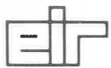

Würenlingen, April 1975

BREEDING IN MOLTEN SALT REACTORS

Lectures at the University of Liège / Belgium 15th May, 1975

M. Taube

# Remerciements

Je remercie M. le Prof. G. DUYCKAERTS de l'Université de Liège, de m'avoir permis de faire cette conférence dans le cadre de la licence speciale en Science Nucléaire.

M. Taube

WHAT IS BREEDING?

WHY IS BREEDING POSSIBLE?

WHAT IS BREEDING GOOD FOR?

Breeding is a process in which two mechanisms are occurring simultaneously. 1) Fissile nuclides are 'burning' and producing energy and neutrons. 2) Some of the neutrons are transforming the so called fertile nuclides into fissile nuclides at a rate greater than the rate at which the fissile nuclides are being consumed.

Breeding is possible because of three factors: 1. Some fissile nuclides have a rather large nett production of neutrons so that more than half of them can be used for breeding. 2. The fertile nuclides are converted to fissile nuclides only by the simple, and energetically not expensive act of neutron capture followed by two spontaneous processes which occur at a much faster rate than the rate of neutron capture. 3. Fertile materials are present in the earths crust at relatively high concentrations. (This also means that these fertile nuclides must be rather stable, beta stable of course, like all heavy nuclides they are alpha unstable. The $\alpha$ -decay rate must be matched to the age of the solar system).

Breeding makes it possible to use not only the uranium-235 (the only naturally occurring fissile nuclide) but also the uranium-238 which occurs in amounts 140 times greater than U-235. These factors permit the use of ores with low uranium and thorium concentrations even down to granites ( $>50$ ppM U+Th).

Practically only some reactor types are suitable for effective breeding:

- all reactors with a fast neutron spectrum (e.g. sodium cooled fast reactor, gas cooled fast reactor, molten salt fast reactor)

- one reactor type with a thermal flux spectrum (molten fluoride thermal reactor).

# FISSILE AND FERTILE NUCLIDES

Definitions

<table><tr><td></td><td colspan="2">Fissionable Nuclides</td></tr><tr><td>Characteristics</td><td>Fissile nuclides Neutrons of any energy can produce fission</td><td>Fertile nuclides Only neutrons of high energy (&gt;1 MeV) can induce fission; Neutrons with lower energy are captured and after gamma emission (and in some cases then by beta-decay) a transformation into a fissile nuclide occurs.</td></tr><tr><td>Examples</td><td>U-233 U-235 Pu-239 Pu-241</td><td>Th-232 U-238 Pu-240</td></tr><tr><td>Binding energy of neutrons and barrier to fission</td><td>Binding energy of the captured neutron is greater than the fission barrier (more exactly: fission activation energy Qa) Qn &gt; Qa</td><td>Binding energy of the captured neutron is lower than the fission barrier Qn &lt; Qa only fast neutrons with kinetic energy Ec can cause the fission Qn + Ec &gt; Qa</td></tr></table>

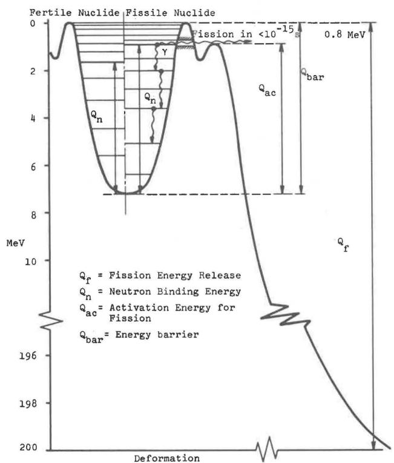

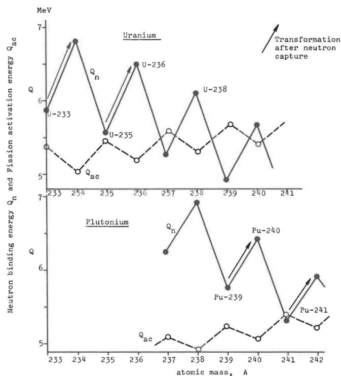

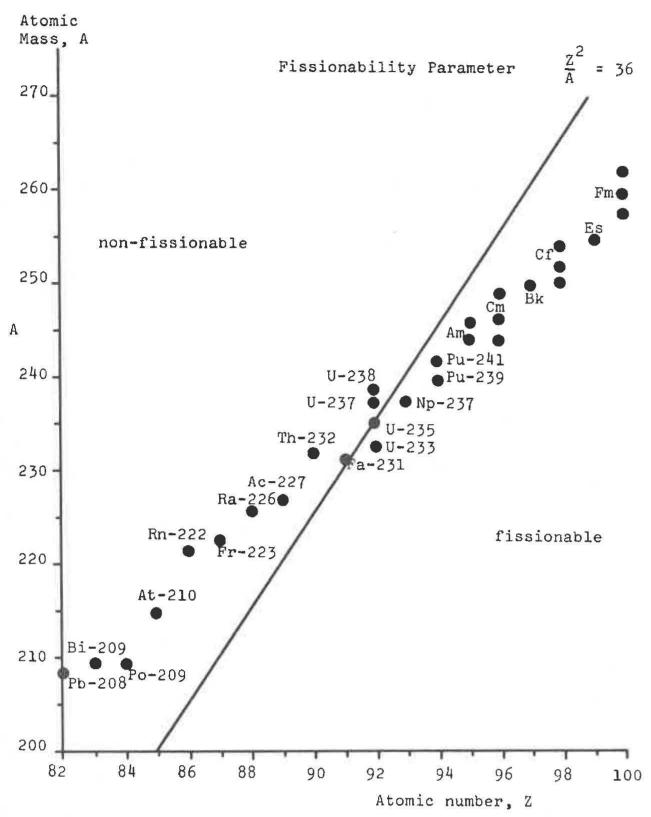

# for the following reasons

1. The fissile nuclides must have $\frac{Z}{A}^2 > 36$ (fissionability parameter)   
2. The fissile nuclides must be beta stable, because the half life of beta-decay in this region of A is smaller than 10 years.   
3. Because for $\frac{Z^2}{A} > 36$ gives in the realistic case $Z \geq 92$ ; all fissile nuclides are alpha unstable.   
4. To exist in the earth's crust the half life of alpha decay of the nuclide must be of the same order of magnitude as the age of the solar system $\geq 10^9$ years.   
5. Only one nuclide fulfills all these criteria: - U-235

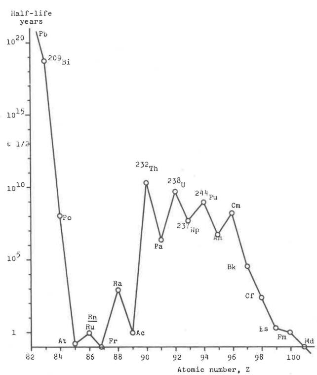

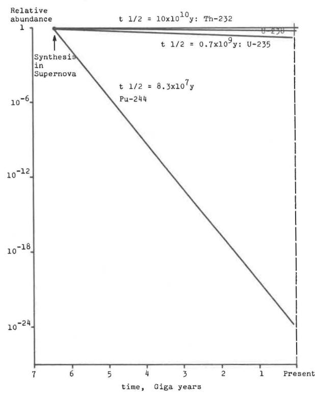

ONLY TWO NUCLIDES EXISTING IN THE EARTH'S CRUST CAN PLAY THE ROLE OF

# FERTILE NUCLIDES

The fertile nuclides must fulfill the following obvious criteria

1. They must be abundant on the earth. At least a mean value equivalent to 1 ppM throughout the earth's crust (or more exactly in the outer layer of the earth's crust.   
2. Thus they must be beta-stable   
3. Thus the Z value must lie between 90 and 94 and be even   
4. These are the isotopes of thorium and uranium with t 1/2 >10 $^{9}$ years

The only two 'natural' isotopes are

Th-232 and U-238

These nuclides can be transformed into fissile nuclides by simple neutron capture and spontaneous beta-decay.

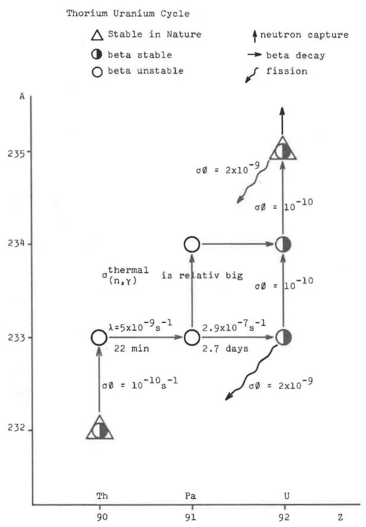

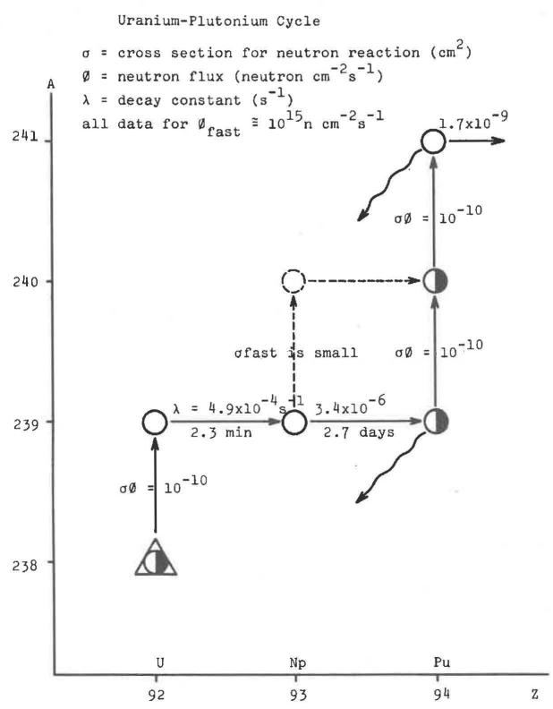

TO PERMIT BREEDING THE NUMBER OF NEUTRONS EMITTED PER FISSION SHOULD BE LARGE

The scheme of neutron induced fission of Pu-239

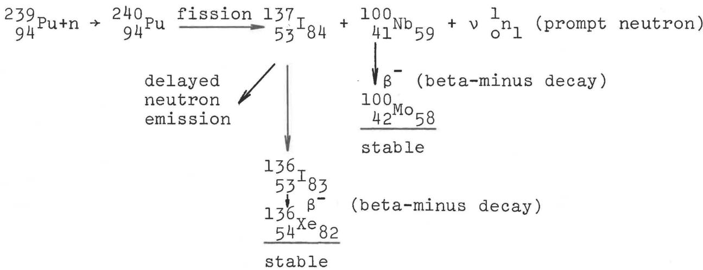

The value of prompt neutrons fission $= \nu$

1. The value of $\nu$ for uranium isotopes 2.5   
2. The value of $v$ for plutonium isotopes 2.9   
3. The value of $\nu$ increases when the energy of the captured neutron is $\sim 1$ MeV

Table All data approximate   

<table><tr><td>Nuclide</td><td colspan="2">Thermal reactor</td><td colspan="2">Fast reactor</td></tr><tr><td></td><td>γ</td><td>η</td><td>γ</td><td>η</td></tr><tr><td>U-235</td><td>2.43</td><td>2.09</td><td>2.57</td><td>2.30</td></tr><tr><td>U-233</td><td>2.48</td><td>2.25</td><td>2.51</td><td>2.31</td></tr><tr><td>Pu-239</td><td>2.87</td><td>2.08</td><td>2.88</td><td>2.40</td></tr><tr><td>U-238</td><td>-</td><td>-</td><td>2.66</td><td>very small</td></tr><tr><td>Th-232</td><td>-</td><td>-</td><td>2.36</td><td>very small</td></tr><tr><td>Pu-240</td><td>2.87</td><td>0</td><td>3.00</td><td>1.21</td></tr><tr><td>Pu-241</td><td>2.97</td><td>2.18</td><td>3.1</td><td>2.06</td></tr><tr><td>Pu-242</td><td>2.18</td><td>0</td><td>3.2</td><td>1.26</td></tr></table>

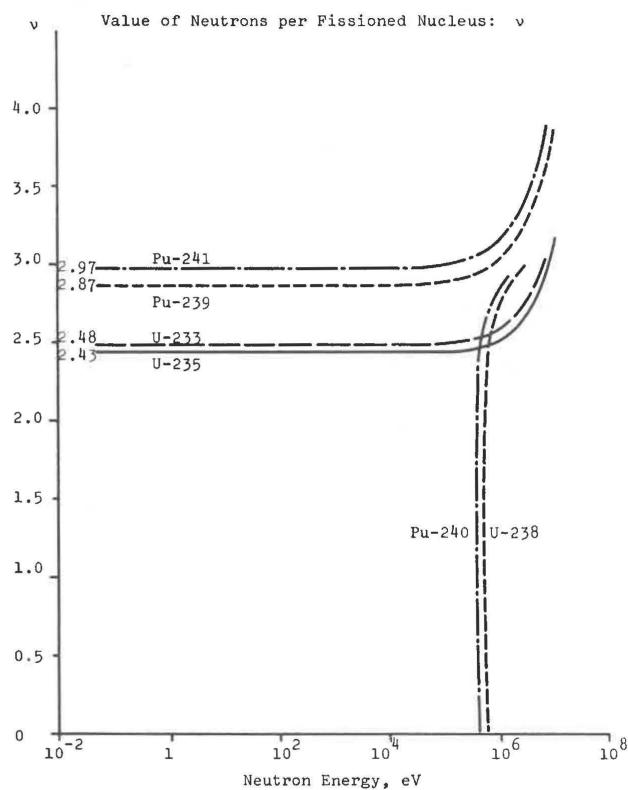

ONLY SOME OF THE CAPTURED NEUTRONS CAUSE FISSION THE OTHERS BRING ABOUT A GAMMA EMISSION. THIS REDUCES THE BREEDING POTENTIAL

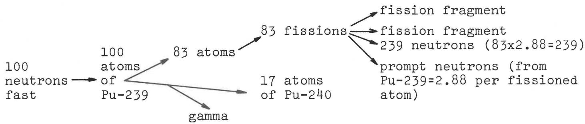

The ratio of non-fissioned atoms to fissioned atoms is called $\alpha$

$$
\alpha = \frac {\sigma (n , q)}{\sigma (n , f)} \quad (\text {i n t h i s e x a m p l e} \alpha = \frac {1 7}{8 3} = 0. 2 0)
$$

We define: $\sigma_{\mathrm{absorption}} = \sigma (\mathfrak{n},\mathbf{\mu}) + \sigma (\mathfrak{n},\mathbf{f})$

The real number of emitted neutrons per neutron absorbed equals:

$$
\eta = v \frac {\sigma (n , f)}{\sigma (n , f) + \sigma (n , \gamma)} = v \cdot \frac {1}{1 + \alpha} \quad \left[ \begin{array}{l} \text {i n t h i s e x a m p l e} \\ \eta = 2. 8 8 \frac {8 3}{(8 3 + 1 7)} = 2. 4 0 \\ \eta = 2. 8 8 \frac {1}{(1 + 0 . 2)} = 2. 4 0 \end{array} \right]
$$

The value of $\eta$ is strongly energy dependent

The value of $\boldsymbol{\eta}$ differs for different fissile nuclides

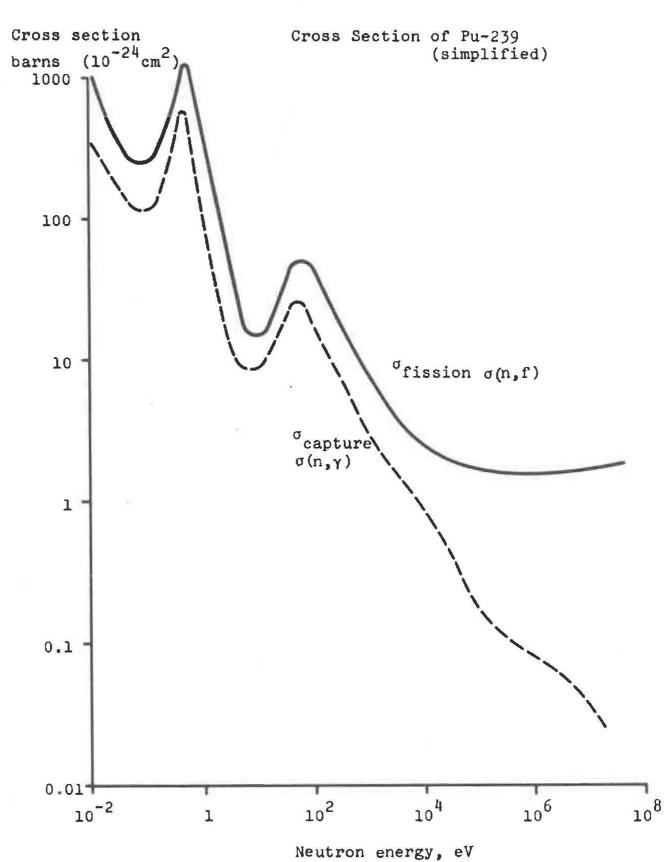

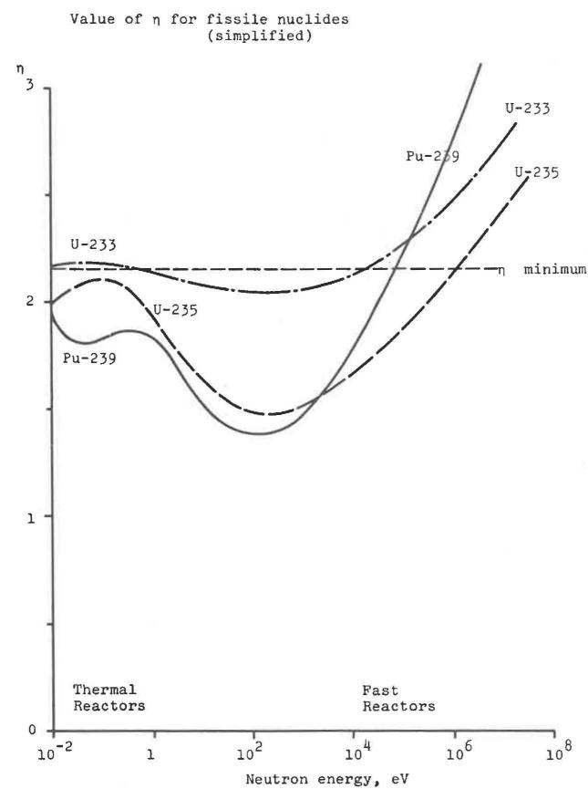

THE NEUTRON BALANCE FOR FISSION AND BREEDING IS AS FOLLOWS:   

<table><tr><td colspan="3">Molten Salt (thermal) fluoride breeder for ~100 neutrons</td></tr><tr><td>Nuclide</td><td>Absorption</td><td>Fission</td></tr><tr><td>232Th</td><td>44.7</td><td>0.03</td></tr><tr><td>233Pa</td><td>0.02</td><td></td></tr><tr><td>233U</td><td>41.4</td><td>92.3</td></tr><tr><td>234U</td><td>3.7</td><td>0.01</td></tr><tr><td>235U</td><td>3.4</td><td>6.8</td></tr><tr><td>236U</td><td>0.3</td><td></td></tr><tr><td>237Np</td><td>0.3</td><td></td></tr><tr><td>6Li</td><td>0.1</td><td></td></tr><tr><td>7Li</td><td>0.7</td><td></td></tr><tr><td>9Be</td><td>0.3</td><td>0.9</td></tr><tr><td>19F</td><td>0.8</td><td></td></tr><tr><td>Graphite</td><td>2.3</td><td></td></tr><tr><td>Fission products</td><td>0.7</td><td></td></tr><tr><td>Leakage (nE</td><td>1.0</td><td>2.2317)</td></tr><tr><td colspan="3">Breeding ratio (total) 1.0708</td></tr></table>

<table><tr><td colspan="3">Molten salt (fast) chloride breeder for ~100 neutrons</td></tr><tr><td>Nuclide238U(n,γ)(n,f)</td><td>Absorption22.512.99</td><td>Fission8.23</td></tr><tr><td>239Pu (n,γ)(n,f)</td><td>5.5828.98</td><td>85.55</td></tr><tr><td>240Pu (n,γ)(n,f)</td><td>2.241.54</td><td>4.72</td></tr><tr><td>NaCl nat</td><td>0.263.16</td><td></td></tr><tr><td>FeMo</td><td>1.302.04</td><td></td></tr><tr><td>Fission products</td><td>0.50</td><td></td></tr><tr><td>238U(n,γ)(n,f)</td><td>23.150.55</td><td>1.50</td></tr><tr><td>NaCl nat</td><td>0.082.22</td><td></td></tr><tr><td>Leakage</td><td>2.90</td><td></td></tr><tr><td>Breeding ratio</td><td colspan="2">core0.716blanket0.670total1.386</td></tr></table>

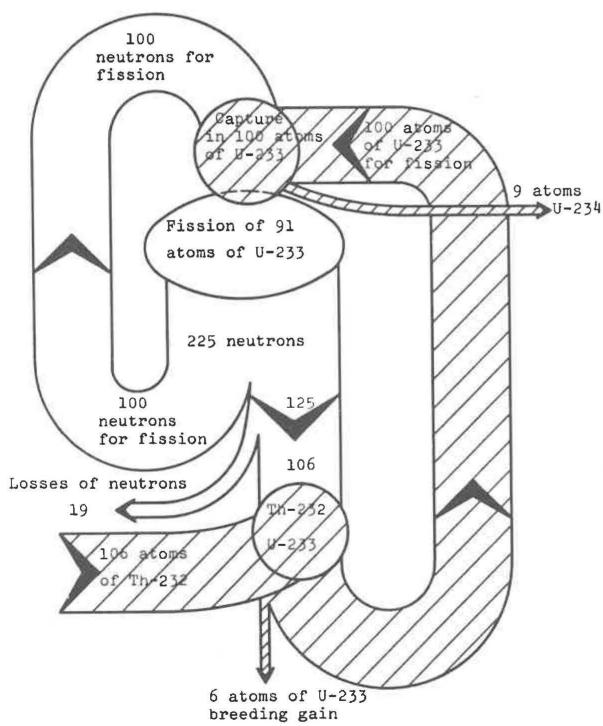  
Balance for Thermal Fission U-233

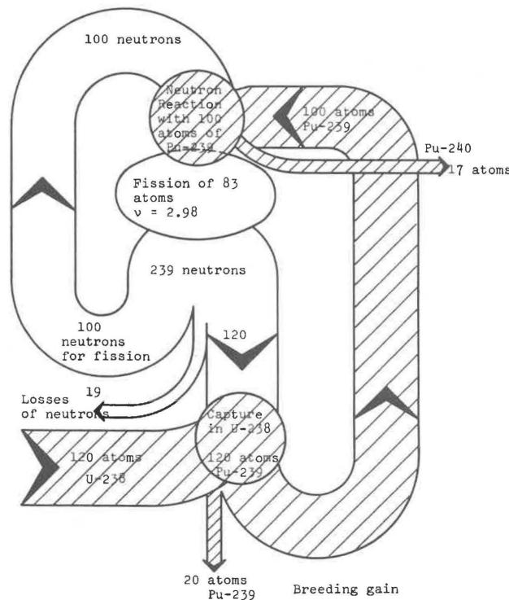  
Balance for Fast Fission of Pu-239   
(Fission Products not shown)

DEFINITION OF BREEDING RATIO AND BREEDING GAIN   
BR = average rate of production of fissile nuclides average rate of loss of fissile nuclides BR maximum $\equiv$ Breeding potential $= n - 1$ Breeding gain $= \mathrm{BR - 1} = \eta -2$ for breeder G>0 1) for typical fast reactors; value of breeding gain, G oxide fuel 0.25 (at present for 300 MWe LMFBR; G $= 0.12\pm 0.03)$ nitride fuel 0.30 carbide fuel 0.4-0.47 (gas cooled FBR) molten chloride 0.35 2) for thermal breeder molten fluoride 0.06 all other fuels solid and liquid <0.00

<table><tr><td rowspan="2">BR = (+v)</td><td>Mechanism</td><td>Typical value for Pu fuelled fast reactor</td></tr><tr><td>No. of neutrons per fission</td><td>(+2.96</td></tr><tr><td>-1</td><td>one neutron for fission claim</td><td>-1</td></tr><tr><td>-α</td><td>loss due to absorption in Pu-239</td><td>-0.24</td></tr><tr><td>-A</td><td>losses in structural material, etc.</td><td>-(0.1÷0.25)</td></tr><tr><td>-L</td><td>leakage of neutrons</td><td>-(0.04÷0.06)</td></tr><tr><td>-T</td><td>losses due to absorption in FP</td><td>-(0.01÷0.015)</td></tr><tr><td>+F.</td><td>rate of fission of U-238 neutrons from U-238 fission rate of ab-sorption in Pu-239 in (n,γ) reaction</td><td>+(0.19÷0.22). .(2.70-1)) (1/(1 + 0.24)</td></tr><tr><td colspan="2">BRfast=</td><td>1.25 ÷ 1.40</td></tr></table>

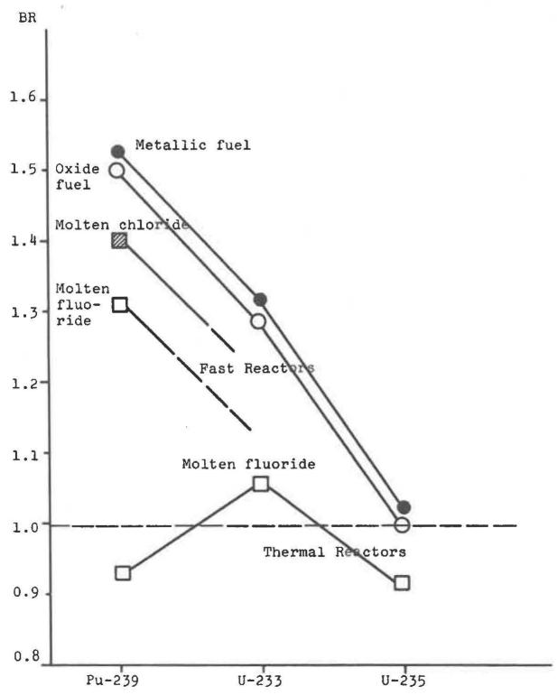

FOR THE CHEMIST, THE POSSIBILITY OF INTERNAL OR EXTERNAL

BREEDING IS OF IMPORTANCE

<table><tr><td></td><td colspan="3">Primary Step</td><td colspan="2">Secondary Step</td></tr><tr><td>Cycle</td><td>Fertile</td><td>Intermediate</td><td>Fissile</td><td>Intermediate</td><td>Fissile</td></tr><tr><td>Thorium</td><td>Th-23290</td><td>Pa-23391</td><td>U-23392</td><td>U-23492</td><td>U-23592</td></tr><tr><td>Uranium</td><td>U-23892</td><td>Np-23893</td><td>Pu-23994</td><td>Pu-24094</td><td>Pu-24194</td></tr></table>

Fissile and Fertile Materials

Micro-mixing $(\mathrm{U},\mathrm{Pu})\mathrm{O}_{2}$

Macro-mixing $\mathrm{UO}_2$ particles + $\mathrm{PuO}_2$ particles

In fused salt: $\mathrm{PuCl}_3$ in fuel, $\mathrm{UCl}_3$ in coolant/fertile material

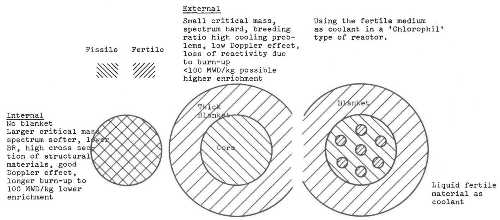  
Note: for ~3000 MW(th) radius of core is ~100 cm thickness of blanket is ~100 cm

# DEFINITION OF DOUBLING TIME

Doubling time $\mathrm{T}_{\mathrm{o}}$ is the period of time (years) in which a breeder produces enough fresh fissile material to fuel a new breeder react with the same power level ( $\mathrm{T}_{\mathrm{eff}}$ includes the inventory of fissile materials out of core e.g. cooling, being transported and reprocessed). The compound doubling time $\mathrm{T}_{\mathrm{comp}}^{\mathrm{eff}}$ takes into account that in a breeder system, the new breeder can be fuelled with fissile material coming from the total system and not only from one reactor.

$$
\begin{array}{l} T _ {O} = \frac {\text {S p e c i f i c i n v e n t o r y (g r a m f i s s i l e / M W t h)}}{(1 + \alpha) \cdot G} (\text {d a y s}) \\ G = B R - 1; \quad \text {b r e e d i n g} \\ r = f u e l \quad i n v e n t o r y \quad o u t \quad o f \quad c o r e \\ L = \text {l o a d f a c t o r (h o u r s p e r 8 7 6 0 h o u r s i n y e a r)} \\ F = \text {f r a c t i o n} \\ \begin{array}{r l r} \mathrm {T} _ {\text {c o m p}} ^ {\text {e f f}} & = & \mathrm {T} _ {\circ} \frac {(1 + F)}{\mathrm {L} (1 - r)} \cdot \ln 2 \end{array} \\ \end{array}
$$

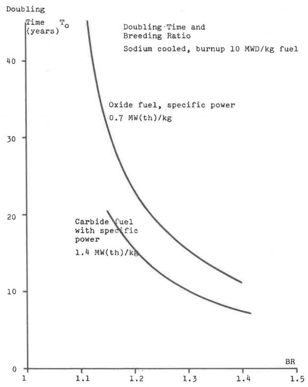

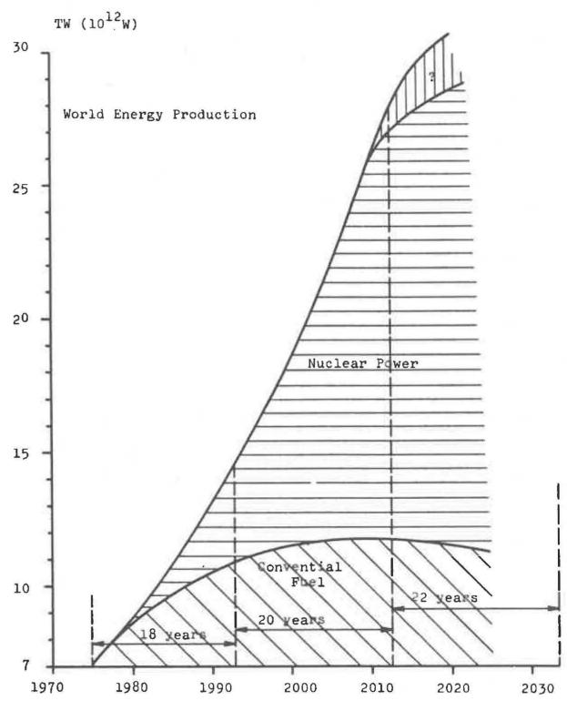

# DOUBLING TIME IS COUPLED WITH FUTURE ENERGY DEVELOPMENT

The rate of doubling (doubling time) of the total energy consumption is $\sim 18$ years and may increase in the future.

Doubling time of electrical energy consumption is $\sim 9$ years.

Doubling time of nuclear power capacity is less than 9 years.

Doubling time of breeders should be of the same magnitude.

In the future, civilization should reach a steady state when the doubling time for the breeder will satisfy the demand with

$\mathrm{T}_{\mathrm{s}} > \sim 30$ years.

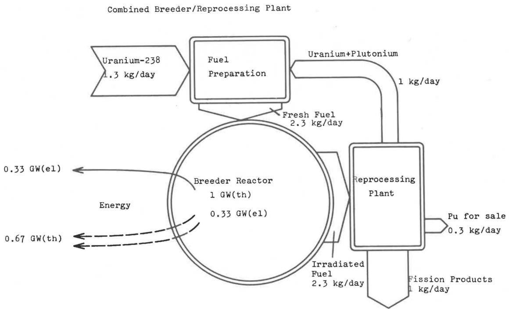

# BREEDERS ARE NECESSARY BECAUSE THE WORLD RESOURCES OF 'GOOD' URANIUM ORES ARE RATHER LIMITED

A tremendous increase in available uranium ores occurs if one considers not only the classical ores (>1000 ppm uranium) but the very abundant granites with 80 ppm uranium and thorium.

Even if the price of uranium should increase a hundred fold the price of the raw fuel per kWhr will be no higher than it is now for light water reactors (since the uranium contains only $\sim 0.4\%$ of burnable U-235).

1 kWhr (e) ≈ 3 cents US, of this fuel ≈ 0.8, from this plutonium ≈ 0.5 cents.

1 g Pu ≈ 1 MWDth = 24000 kWhr(th) = 8000 kWhr(e) ≈ 40$/g Pu
for 1 g Pu ≈ 1.5 g natU

present price 1 kg U ≈ 30 $; 1 g ≈ 3¢

assume future extreme price 1 kg U = 2000 $ 1 g = 2 $

1 g Pu will require 3 $ worth of Unat

Each gram of Pu will be not 40 $ but 42 $ per g.

The price of electrical energy increases to 3.25 €/kWh(e)

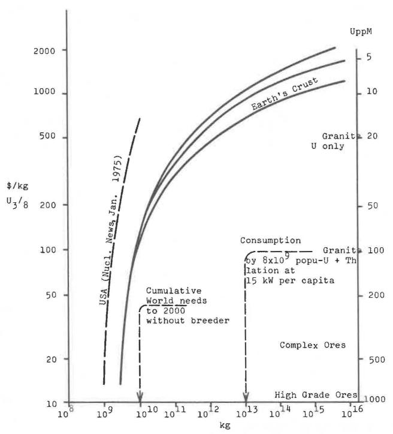

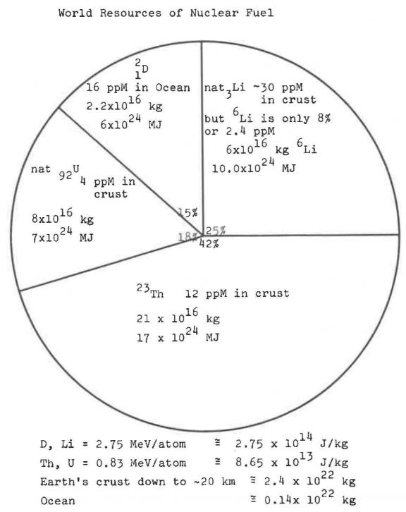

FUTURE ENERGY NEEDS COULD BE VERY GREAT BUT WOULD STILL BE MET FROM NUCLEAR SOURCES IN THE FIRST instance

TODAY: $3.8 \times 10^{9}$ people x 2 kW/cap. = 7.6 TW = 2.4x10 $^{20}$ J/year

FUTURE: 8x109 people x 15 kW/cap. = 120 TW = 38x1020J/year  
1 gram (U, Th) = 1 MW/day = 8.64x1010J

38x10²⁰J/year 4.4x10¹⁰g/year = 44000 tons Uranium and/or Thorium per year

But granite contains 80 ppm U+Th so the annual need for granites as 'fissile' ores will be 550 million tons. At the present time coal production alone is 4 times greater!

Granite: Energy cost for 15 ppm U and 60 ppm Th.

Granite is the main constituent of the earth's crust (up to 20 km deep)

1000 kg granite = $\frac{10^6 g}{68.6 g/mol} = 1.46 \times 10^4 mol$

Free enthalpy of formation of granite $= 210$ kcal/mol ' 8.8x105J/mol

Technological free energy (electrolysis?) = 1.8 MJelec/mol + 1.8 MJtherm/mol

Technological free energy for 1 ton granite $= 5.2 \times 10^{10} \mathrm{~J}$ .

Amount of uranium and thorium $= 75\mathrm{ppM} = 75\mathrm{g} =$

75MWD total =

6.48x1012J

Amount of electricity at $40\%$ efficiency = 2.6x10^12J

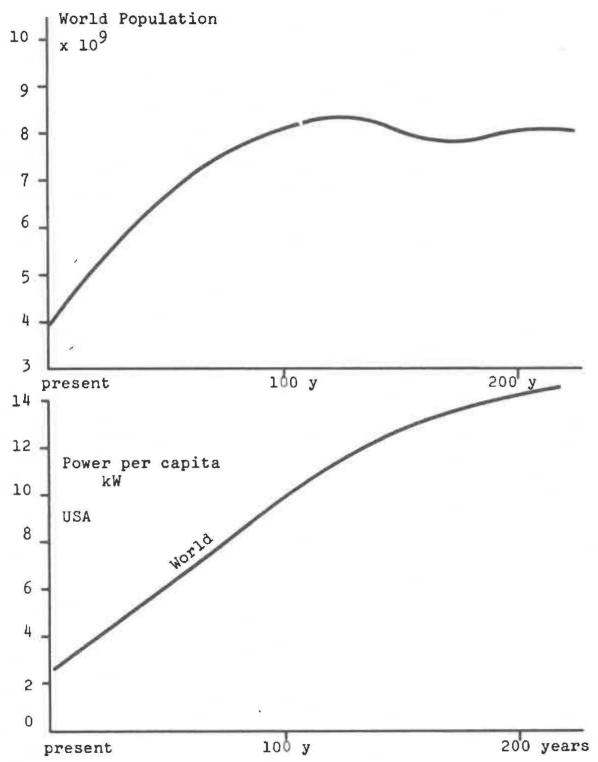

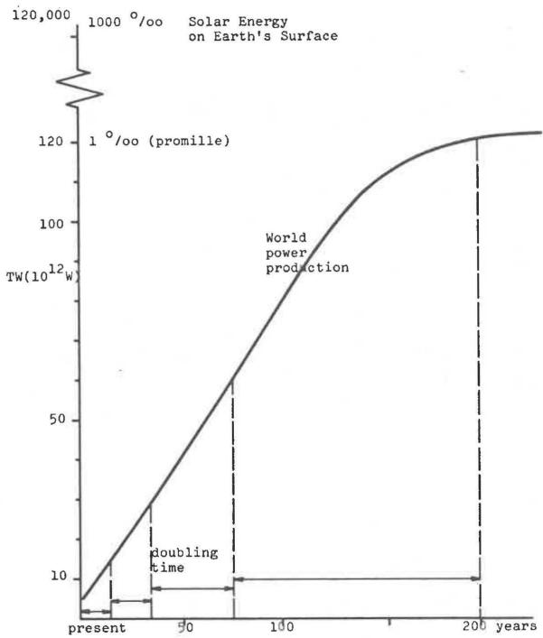

# ONE OF THE BIGGEST CONSTRAINTS TO FISSION ENERGY IS THE PROBLEM OF FISSION PRODUCT MANAGEMENT

Each fission releases $\sim 200\mathrm{MeV}$ ; 1 Joule = 3.1x10 $^{10}$ fissions.

1 watt = 3.1x10 $^{10}$ fissions per second equivalent to 6.2x10 $^{10}$ fission product atoms per second.

In steady state very roughly 1 Watt of power ~1 Curie of fission products (1 Curie = 3.7x10 $^{10}$ disintegrations per sec).

All fission products are beta unstable (neutron rich nuclei)

Some fission products are long lived, comparable with a human life span or even the life span of an element of social organisation.

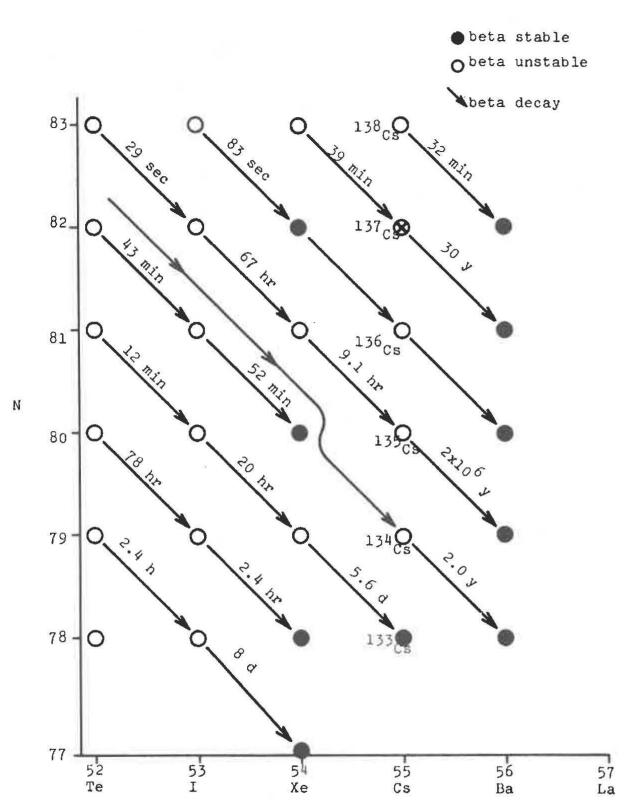

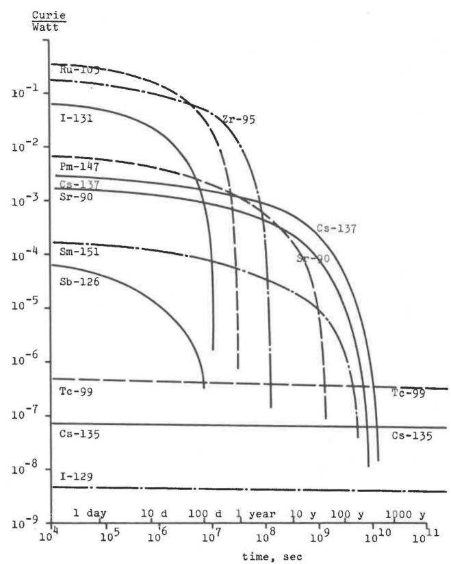

# THE PROBLEM OF FISSION PRODUCT MANAGEMENT IS VERY DIFFICULT AND REQUIRES A SOPHISTICATED SOLUTION

The possibilities of radioactive waste management are:

1. Without the use of nuclear transmutation; that is the fission product nuclides are not changed, but merely removed and isolated; as for example a rocket to the sun, in discussed salt mines or in the polar ice-cap.   
2. By using nuclear transmutation in which the nuclear properties are so fundamentally changed that the transmuted products are short living nuclides which decay after a short retention time to a stable nuclide.

In this second class of waste management techniques a number of exotic methods have been discussed

- gamma laser excitation (does not exist)   
- underground neutron irradiation due to fission or thermonuclear explosion (e.g. more than 3000 explosions of $100\mathrm{kT}$ per year in USA 2000 only)   
- bombarding by protons (e.g. a 10 GeV accelerator with 1 Amp)   
- neutron irradiation in a thermo-nuclear fission reactor (does not exist)   
- neutron irradiation in a fission reactor (only pessimistic opinions).

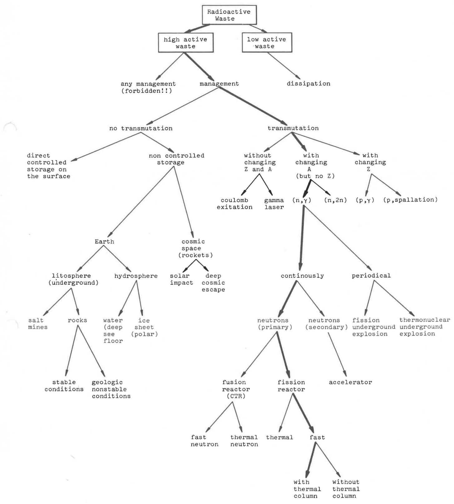

Shown here are the most dangerous nuclides: per 100 fissioned atoms.

<table><tr><td rowspan="3">Caesium</td><td>133 (stable)*</td><td>6.91</td><td rowspan="3">21.14</td></tr><tr><td>135 (2x10^6 years)</td><td>7.54</td></tr><tr><td>137 (30 years)</td><td>6.69</td></tr><tr><td rowspan="2">Strontium</td><td>88 (stable)*</td><td>1.44</td><td rowspan="2">3.62</td></tr><tr><td>90 (28 years)</td><td>2.18</td></tr><tr><td rowspan="2">Iodine</td><td>127 (stable)</td><td>0.38</td><td rowspan="2">1.55</td></tr><tr><td>129 (1.7x10^7 y)</td><td>1.17</td></tr><tr><td>Technetium</td><td>99 (2.1x10^5 y)</td><td>5.81</td><td>33.18</td></tr><tr><td rowspan="4">Krypton</td><td>83 (stable)</td><td>0.36</td><td rowspan="4">2.47</td></tr><tr><td>84 (stable)</td><td>0.56</td></tr><tr><td>85 (10.7 years)</td><td>0.672</td></tr><tr><td>86 (stable)</td><td>0.882</td></tr></table>

The incineration is possible due to irradiation in a very high neutron flux, which gives, for example

$$
\mathrm {C s} - 1 3 7 \left(\mathrm {n}, \gamma\right) \mathrm {C s} - 1 3 8 \frac {3 2 \min}{\beta} \quad \mathrm {B a} - 1 3 8 (\text {s t a b l e})
$$

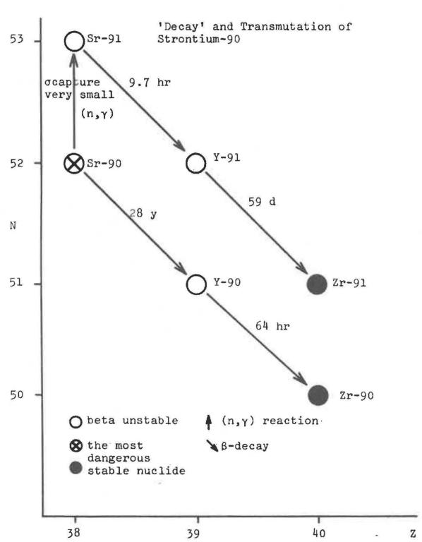

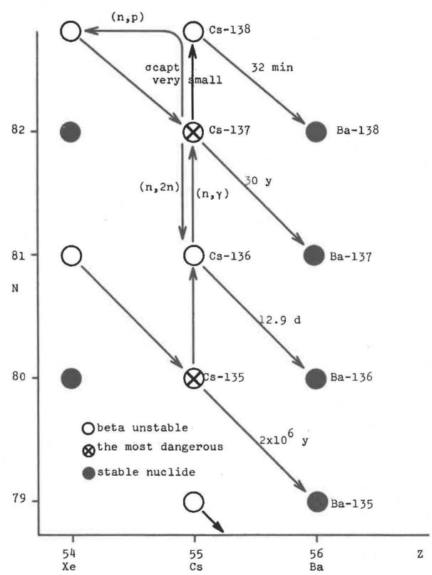  
'Decay' and Transmutation of Caesium-137

THE NEUTRON TRANSMUTATION OF F.P. NEEDS A VERY HIGH THERMAL NEUTRON

FLUX OF 5 x 1016 n cm-2 s-1

The efficiency of the transmutation is limited by the criteria that the probability of the bombardment of an atom by a neutron is $\sim 10$ times greater than the probability of spontaneous beta decay.

$\lambda$ (neutron capture) $\geq 10\cdot \lambda$ (beta decay)

We know that for a neutron flux $\varnothing$ ( $n\, \text{cm}^{-2}\text{s}^{-1}$ ) and the capture cross section $\sigma_{c}(\text{cm}^{2}/\text{particle})$ the probability of reaction equals.

$\lambda$ reaction $= \emptyset \cdot \sigma$ ; therefore $\emptyset \cdot \sigma > \lambda$ decay

For caesium-137 we have

$$
\lambda d e c a y = 7. 7 \times 1 0 ^ {- 1 0} s ^ {- 1}
$$

$$
\sigma \text {c a p t u r e} (\text {t h e r m a l}) \cong 0. 0 6 x 1 0 ^ {- 2 4} \mathrm {c m} ^ {2}
$$

$$
\sigma \text {c a p t u r e (f a s t)} \quad \cong 0. 0 1 x 1 0 ^ {- 2 4} c m ^ {2}
$$

For the postulated neutron reaction probability

$$
\begin{array}{l} \varnothing > \frac {\lambda \text {d e c a y}}{\sigma \text {c a p}} > \varnothing \text {f a s t}; \varnothing \text {f a s t} = \frac {7 . 7 \times 1 0 ^ {- 1 0}}{0 . 0 1 \times 1 0 ^ {- 2 4}} = 8 \times 1 0 ^ {1 6}; \varnothing \text {t h e r m a l} = \frac {7 . 7 \times 1 0 ^ {- 1 0}}{1 0 . 6 \times 1 0 ^ {- 2 4}} = \\ = 1, 2 \times 1 0 ^ {1 6} \\ \end{array}
$$

<table><tr><td rowspan="2"></td><td>Flux</td></tr><tr><td>Thermal
Fast</td></tr><tr><td>Power
rating (W/cm3)</td><td>80/500</td></tr><tr><td>Fissile
concentration (N)</td><td>3%
10%</td></tr><tr><td>Nuclei per cm3</td><td>8x1020/30x1020</td></tr><tr><td>σfission(10-24cm-2)</td><td>700/2</td></tr><tr><td>Flux Φ
ncm-2s-1, Φ =</td><td>6.2x1012/2.6x1015</td></tr><tr><td></td><td></td></tr><tr><td>Fluence, Φ.t
t = (days)
φ.t = (ncm-2)</td><td>700/100
3.7x1020/2.2x1022</td></tr></table>

<table><tr><td colspan="3">Possibilities of transmutation</td></tr><tr><td rowspan="2">Source of Particles</td><td colspan="2">Particles</td></tr><tr><td>Protons</td><td>neutrons</td></tr><tr><td>Accelerator ~30 MeV</td><td>30 MeV protons for (p,γ)(p,n)</td><td>-</td></tr><tr><td>Accelerator &gt;1 GeV</td><td>1 GeV protons for (p,xn)(p,spall)</td><td>(secondary) High flux of neutrons</td></tr><tr><td>Nuclear explosion</td><td>-</td><td>primary very high flux in very short time</td></tr><tr><td>C.T.R. (controlled thermonuclear reactor</td><td>-</td><td>High flux, continuously</td></tr><tr><td>Fission reactor</td><td>-</td><td>Very high flux continuously</td></tr></table>

# IT MAY BE POSSIBLE TO COUPLE A BREEDING SYSTEM WITH A HIGH FLUX TRANSMUTATION FISSION REACTOR

We postulate a system with breeding potential and with transmutation potential.

The compound doubling time Ts must be at least 30 years,

since; Ts(year) = 1000/365 · M.(1+F)/(BR-1)(1+α) L · ln2 = 30 years

from this;minBR = 1 + 2.75 · ln2 · M.(1+F) / (30.(1+α)). L

for typical values;

$$
\min  ^ {\text {B R}} = 1. 0 7 7
$$

we know that: $\max_{\text{BR}} = \frac{\text{v} - \text{l} - \alpha - (\text{A} + \text{L} + \text{T}) + \text{F} (\text{v} - \text{l})}{(1 + \alpha)}$ when T is very small (T=transmutation rate)

For the desired $\mathsf{BR}_{\min} = 1.077$ we obtain:

$$
\mathrm {T} = v - 1 - \alpha - \operatorname {B R} (1 + \alpha) - A - L + F (v - 1)
$$

For typical values: $\mathrm{T} = 0.364$

That is, for a breeding system with a breeding potential of BR = 1.4 and for a compound doubling time of 30 years, approx. 0.36 of FP nuclides could be transformed in the fast system.

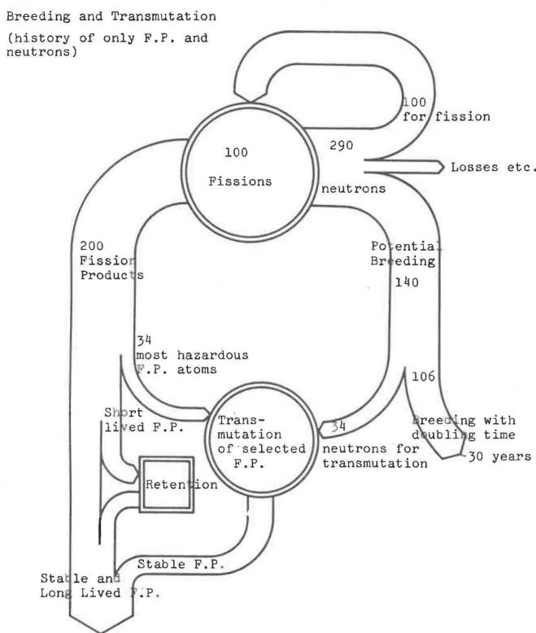

Organisation of transmutation and breeder system

Our system is:

- breeding system with compound doubling time 30 years.   
- breeding potential BR pot = 1.4   
- transformation rate 0.36   
- 1 burner reactor for transmutation   
- breeder power reactors

We obtain:

$$
\begin{array}{l} X. B R _ {\max } = (X + 1) B R _ {\min } \\ \text {b u t w e k n o w} \mathrm {B R} _ {\max } = \mathrm {B R} _ {\min } + \frac {\mathrm {T}}{(1 + \alpha)} \\ \end{array}
$$

from this, for typical values

$$
X = B R _ {\min } \frac {1 + \alpha}{T} = 3. 7
$$

Result: for about 3.7 power units of breeder reactors and 1 power unit of the breeder transmutation reactor 0.36 of FP nuclides of all reactors can be 'incinerated'.

WHAT IS THE CONNECTION BETWEEN BREEDING AND THE FUEL CHARACTERISTICS (PHYSICAL STATE: SOLID/LIQUID, CHEMICAL STATE: METALLIC, CERAMIC, SALT)?

Breeder reactors are feasible using both thermal and fast neutrons. But for thermal neutrons, breeding is possible only in a very limited region the thorium-232/uranium-233 cycle in a liquid fuel reactor.

<table><tr><td></td><td colspan="4">Breeder Reactors</td></tr><tr><td>Neutrons</td><td colspan="2">Thermal</td><td colspan="2">Fast</td></tr><tr><td>Fertile/fissile Cycle</td><td>Th-233</td><td>U238/Pu239</td><td>Th232/U239</td><td>U238/Pu239</td></tr><tr><td>Potential Bree-ding gain G=BR-1-losses</td><td>~0.1</td><td>&lt;0</td><td>~0.3</td><td>~0.45</td></tr><tr><td>Impact of inter-mediate mole-cule</td><td>Pa-233 σth ab=large</td><td>breeding not possib- le</td><td>Pa-233 σfast =small ab =small</td><td>Np-239 σfast negligible- ab be- cause t1/2 small</td></tr><tr><td>Consequence</td><td>Continuous Pa extraction</td><td>-</td><td colspan="2">no limitations, periodic rechanging possible</td></tr><tr><td>Results</td><td>liquid fuel (aqueous or molten)</td><td>-</td><td colspan="2">no limitations, solid fuel possible</td></tr><tr><td>Maximum losses in core struc-tural material and coolant</td><td>~0.1</td><td>-</td><td>~0.2</td><td>~0.3</td></tr><tr><td>Consequences</td><td>Moderator D2O or graphite2</td><td>-</td><td colspan="2">Metals possible, graphite forbidden</td></tr><tr><td>Consequences</td><td>No metallic tubes in the core</td><td>-</td><td colspan="2">metallic tubes in the core possible</td></tr><tr><td>Impact of coo-ling system</td><td>out of core</td><td>-</td><td colspan="2">no limitations, in core coo-ling possible</td></tr><tr><td>Fuel system</td><td>liquid fuel only, cooled out of core</td><td>-</td><td colspan="2">solid and liquid fuel, cooling in/or out of core. Solid fuel: ceramis, metals; liquid fuel: chlorides only.</td></tr><tr><td>Example only for liquid fuel reactors</td><td>moltensalt /LiFBeF2ThF4UF4graphite</td><td>aqueous solu-tion suspensi-on UO2/ThO2in D2O</td><td>- molten salt NaCl 232ThCl4233UC13</td><td>molten salt NaCl 238UC13239PuCl3</td></tr></table>

# THE LIQUID FUEL REACTOR ALSO HAS OTHER ADVANTAGES IN RELATIONTO THE CLASSICAL SOLID FUEL REACTOR

<table><tr><td></td><td>Solid Fuel</td><td>Liquid Fuel</td></tr><tr><td>Pressure</td><td>pressure of volatile fission products</td><td>no FP pressure: Very low pressure of fuel components</td></tr><tr><td>Cooling Problems</td><td>cooling only in the core</td><td>cooling in the core or out of core</td></tr><tr><td>Burn-up</td><td>periodic recharging typical case PWR: specific power 40 KW/kg fuel, burn-up 30000 KWd/kg fuel, dwell time 750 days</td><td>continuously recharging e.g. MSBR: 22 KW/litre dwell time 10 days</td></tr><tr><td>Reprocessing</td><td>periodic</td><td>continuous</td></tr></table>

Heat Transport in the Core

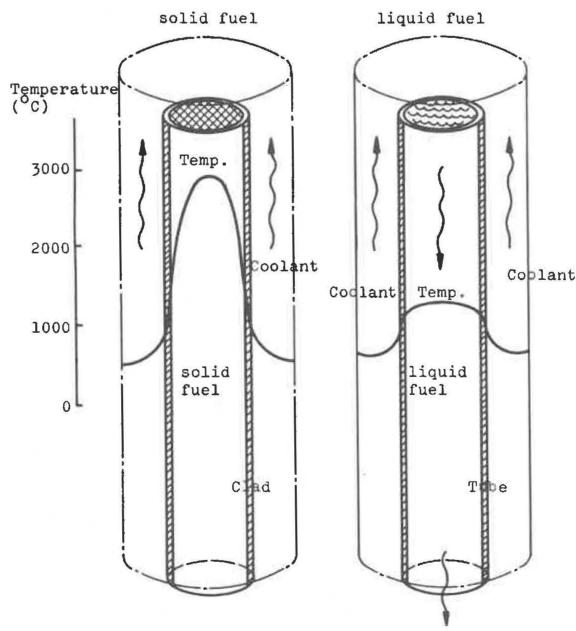

<table><tr><td rowspan="3" colspan="4">thermal
fast</td><td colspan="2">Fuel</td></tr><tr><td>ambient pressure</td><td>overpressure</td></tr><tr><td>liquid</td><td>solid</td></tr><tr><td rowspan="5">Coolant</td><td rowspan="2">unpressurised</td><td rowspan="3">liquid</td><td>metal
(Na)</td><td>projected</td><td>now not
possible
LMFBR</td></tr><tr><td>salt</td><td>MSBR
(fluoride)
MSFBR
Chlorophyl
(chloride)</td><td>-</td></tr><tr><td rowspan="3">pressurised</td><td>water</td><td>not
possible</td><td>LWR
HWR
not
possible</td></tr><tr><td rowspan="2">gas</td><td>CO2</td><td>No</td><td>English
French
GCR
No</td></tr><tr><td>He</td><td>-</td><td>HTGR
HHT
GCFBR</td></tr></table>

<table><tr><td>GCR</td><td>=</td><td>Gas Cooled (thermal) Reactor</td></tr><tr><td>GCFBR</td><td>=</td><td>Gas Cooled Fast Breeder Reactor</td></tr><tr><td>HHT</td><td>=</td><td>High Temp. Helium (thermal) Reactor</td></tr><tr><td>HWR</td><td>=</td><td>Heavy Water (thermal) Reactor</td></tr><tr><td>LMFBR</td><td>=</td><td>Liquid Metal Fast Breeder Reactor</td></tr><tr><td>LWR</td><td>=</td><td>Light water (thermal) Reactor</td></tr><tr><td>HTGR</td><td>=</td><td>High Temp. Steam Turbine Reactor</td></tr><tr><td>MSBFBR</td><td>=</td><td>Molten Salt Fast Breeder Reactor</td></tr><tr><td>MSBR</td><td>=</td><td>Molten Salt (thermal) Breeder Reactor</td></tr></table>

# MOLTEN SALT FUEL APPEARS TO BE THE BEST LIQUID FUEL

Only limited possibilities exist for choosing a fuel to operate in the liquid state in a reactor.

The limiting criterium seems to be the radiolysis in the extremely high field of neutrons, fission fragments and gamma rays.

In addition the chemical stability of the dissolved species of thorium, uranium and/or plutonium in the presence of the products of radiolysis is a severe problem. The ionic liquids, that is the molten ionic salts seem to be the most appropriate media for fission fuel (see table of electronegativity overleaf).

<table><tr><td rowspan="2">Liquid state</td><td rowspan="2">Range of li- quid state (℃)</td><td rowspan="2">Stability</td><td colspan="2">Reactor type</td></tr><tr><td>Thermal</td><td>Fast</td></tr><tr><td>Aqueous solution</td><td>0300 with pressure</td><td>Radiolytic decom-position. Instability of U and Pu salts in aqueous solution</td><td>Possible but negative ex- experience with homoge- neous thorium reactor</td><td rowspan="2">no possible due to neutron moderation</td></tr><tr><td>Organic solu- tion or suspen- sion</td><td>-5030 decomposition</td><td>Radiolytic decom- position. Very unstable compound of Pu and U</td><td>Possible (?) but no experience</td></tr><tr><td>Metallic solu- tion or suspen- sion</td><td>-502000</td><td>Very stable, some limitations in the solubility of Umet and Pumet</td><td>Possible. Some expe- riments in Brookhaven Nat.Lab. USA</td><td>Possible. LAMPRE, Reactor Experi- ments (with Pu alloys? Los Alamos USA</td></tr><tr><td>Molten salt solution</td><td>400&lt;1000</td><td>Stable to irra- diation but corrosive!</td><td>Possible using fluo- rides. MSBR Experiment (Oak Ridge, USA). 8 MW(th)</td><td>Possible using chlorides. No ex- perimental experience EIR Switzerland</td></tr><tr><td>Ceramics</td><td>1500T practically impossible</td><td>-</td><td>-</td><td>-</td></tr></table>

BOTH THERMAL AND FAST FLUX MOLTEN SALT BREEDER REACTORS ARE POSSIBLE   

<table><tr><td></td><td>Thermal</td><td>Fast</td></tr><tr><td>Breeding ratio</td><td>max. 1.06</td><td>1.3 - 1.5 (?)</td></tr><tr><td>Possibility of transmutation</td><td>no</td><td>yes, 0.35</td></tr><tr><td>Fuel cycle</td><td>Th- \(U_{233}\)only because,in this case only,is η thermal &gt;1.2</td><td>U- \(Pu_{239}\)and/or Th- \(U_{233}\)</td></tr><tr><td>Chemistry of molten salt</td><td>Fluorides only. positive experience exists</td><td>Chlorides, or fluorides (?) no experience with chlorides</td></tr><tr><td>Structural materials</td><td>Only graphite-direct contact,no metals (no parasitic capture)</td><td>metals in core permitted.</td></tr><tr><td>Cooling</td><td>Out of core cooling</td><td>Either in core or out of core cooling</td></tr><tr><td>Present day develop-ment</td><td>USA - Oak Ridge; France Fontenay aux Roses; India - Trombay?</td><td>UK., -Harwell, Winfrith (?); Switzerland: Würenlingen EIR</td></tr><tr><td>Moderation of neutrons</td><td>Fluoride in large amounts acts as a weak moderator</td><td>The moderation factor for chlorine is 3 times lower and the concentration is also smaller</td></tr></table>

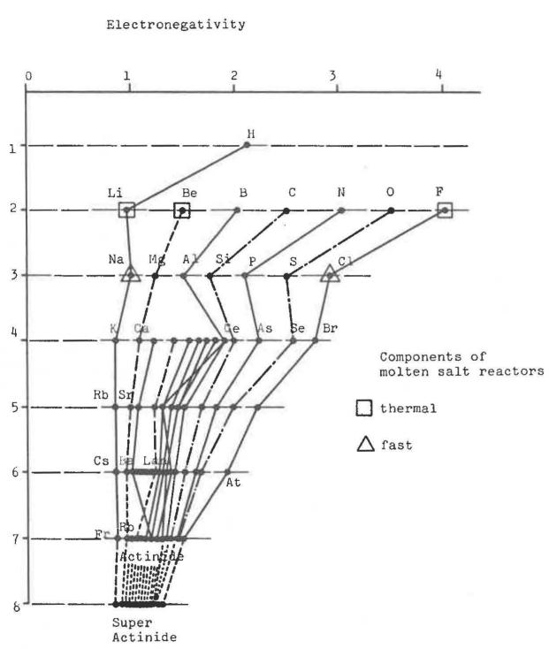

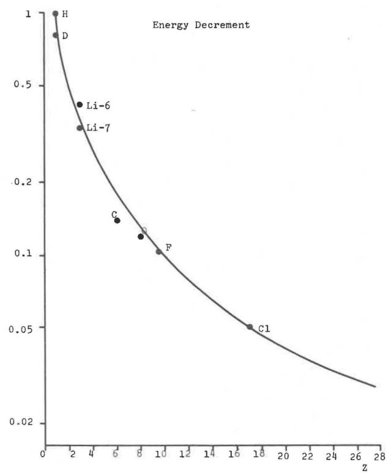

# MOLTEN FLUORIDE VERSUS MOLTEN CHLORIDE FUEL - I

Criteria for molten salt as fuel:

Melting point: lower than $500 - 600^{\circ} \mathrm{C}$

Boiling point higher than $1500^{\circ}\mathrm{C}$ (partial pressure)

Density: as high as possible, $\rho = 3\mathrm{gcm}^{-3}$

Capture cross section low $\sigma_{\text{capture}}^{\text{thermal}} < 0.16$ ; $\sigma_{\text{capt}}^{\text{fast}}$ small

Cross section for nuclear reactions low; e.g. for $^{35}\mathrm{Cl}$ (n,p) $^{35}\mathrm{S}$

Elastic scattering: high for thermal, low for fast (see previous page)

Radiolytic stability high and fast recombination (previous page)

Chemically stable (large free enthalpy of formation), no precipitates

Simple technology, low corrosivity

Low viscosity (low pumping requirements) ~1 centipoise

Low price, good availability, non poisonous

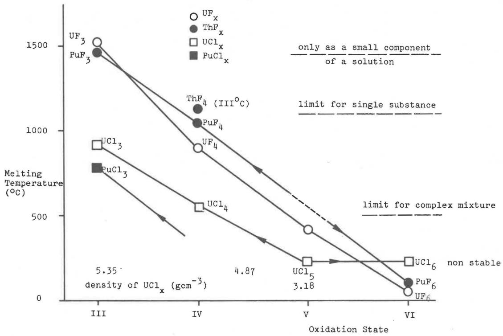

<table><tr><td></td><td>Fluoride</td><td>Chloride</td></tr><tr><td>Reactor Type</td><td>Thermal (fast possible)</td><td>only fast because σcapt Cl is large</td></tr><tr><td>Components - fertile</td><td>ThF4only</td><td>UCl3or UCl4(unstable!)</td></tr><tr><td>fissile</td><td>UF4or UF3</td><td>PuCl3only</td></tr><tr><td>dilutent</td><td>LiF Possible but also BeF2plays the role of moderator NaF forbidden since Tmelt is too high</td><td>LiCl forbidden since BeCl2they act as moderators NaCl possible</td></tr><tr><td>Moderator</td><td>Li.F, BeF2not suffi-cient. Graphite is nec-cessary: does not react with molten fluoride</td><td>none</td></tr><tr><td>Metallic tubes in the core</td><td>not permitted due to neutron balance</td><td>permitted, e.g. a molybdenum/iron duplex</td></tr></table>

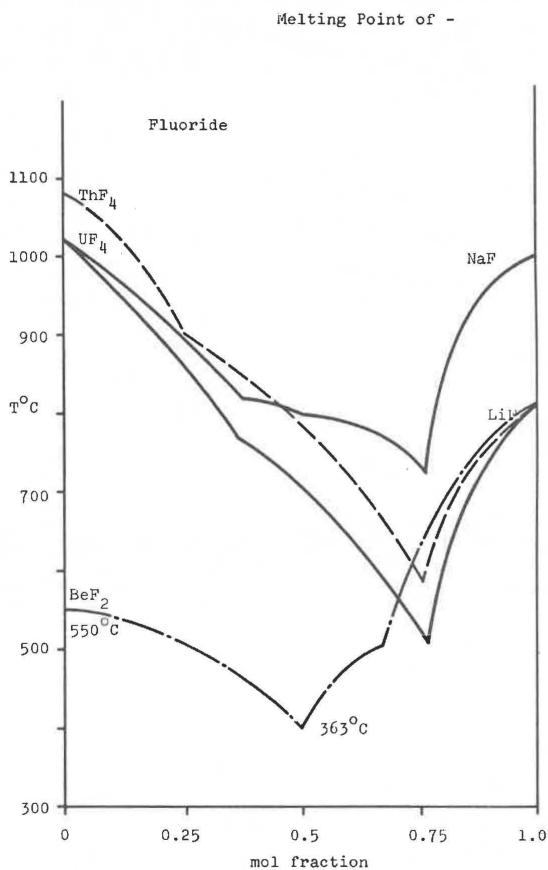

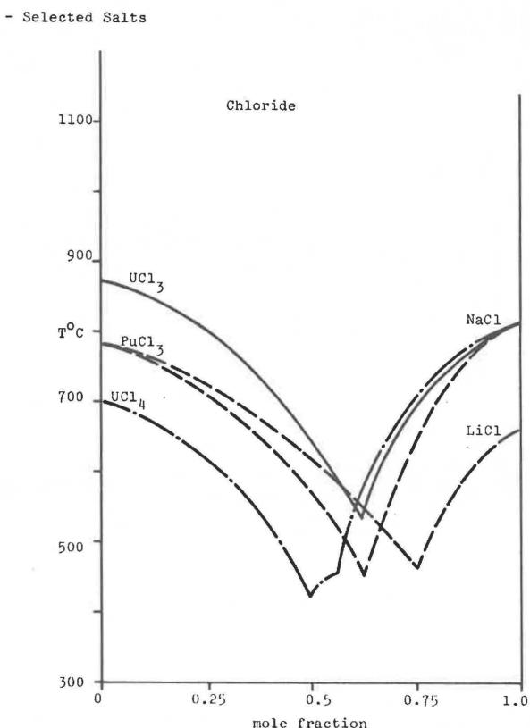

The free energy of formation for fluorides is greater than that for chlorides.

The formation of oxides of uranium is retarded in fluorides.

The ratio $\Delta G\left(\mathrm{HF} / \mathrm{H}_{2} \mathrm{O}\right)$ is not the same as $\Delta G\left(\mathrm{HCl} / \mathrm{H}_{2} \mathrm{O}\right)$ .

Carbon tetra-fluoride is a product of graphite and fluorides.

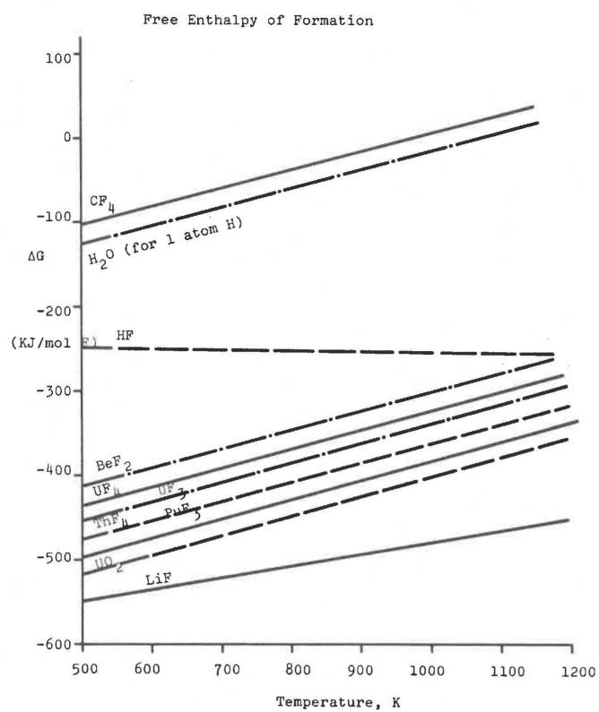

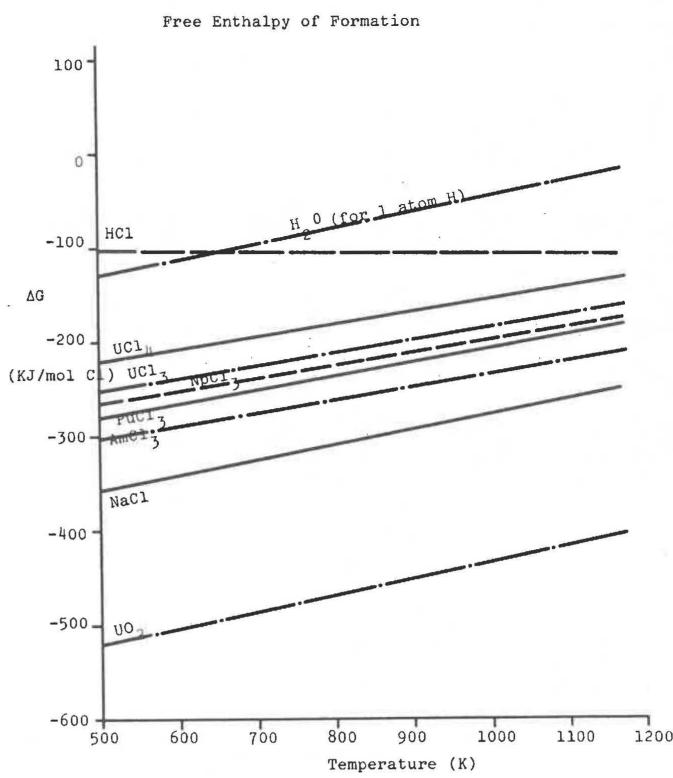

For molten fluoride the crucial mechanism

$$
U F _ {4} (d) + 1 / 2 C r (S s) \quad U F _ {3} (d): K ^ {9 0 0 K} = 1. 3 8 x 1 0 ^ {- 4}
$$

Numerical Values given for $\Delta G^{1000K}$ in 2LiF-BeF $_2$ solution

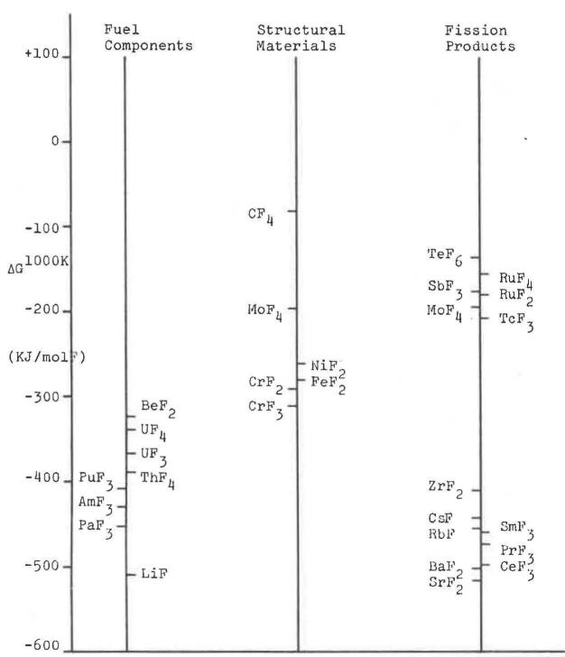

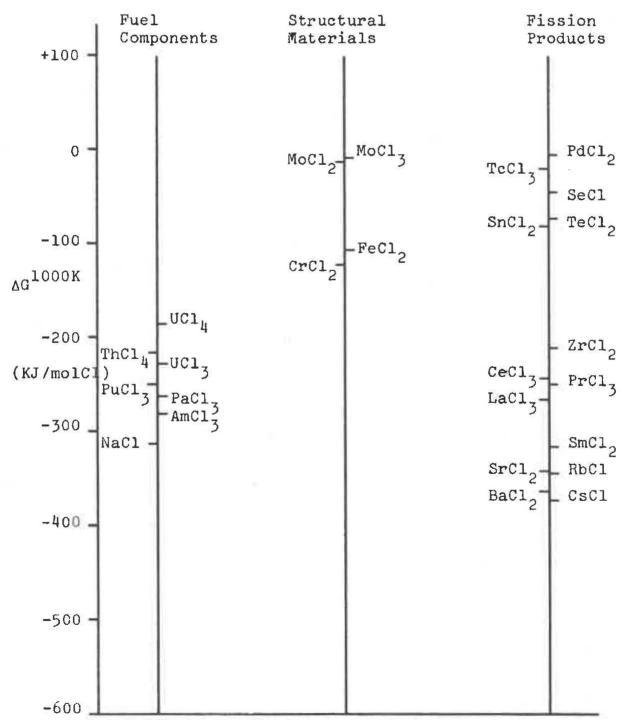

MOLTEN SALT FLUORIDE BREEDER (THERMAL) POWER REACTOR

1 GW(e1), MSBR (Oak Ridge concept)

Fuel: $7_{\text{LiF}} (71.7 \, \text{mol}\%)$ , $\text{BeF}_2 (16\%)$ , $\text{ThF}_4 (12\%)$ , $233_{\text{UF}_4} (0.3\%)$

$\mathrm{T}_{\text {fuel }} = 839 - 978 \mathrm{~K}$ $\mathrm{T}_{\text {melt }} = 772 \mathrm{~K}$

Breeding ratio = 1.06 Doubling time = 22 years

Density $(\sim 908~\mathrm{K}) = 3330~\mathrm{kg / m}^3$ . Heat Capacity $= 1.36~\mathrm{J~g^{-1}K^{-1}}$

Viscosity $(\sim 908~\mathrm{K}) = 0.01~\mathrm{N}~\mathrm{s}~\mathrm{m}^{-2}$

Structural material: graphite (in core)

Hastelloy N

Problem of delayed neutron precursors.

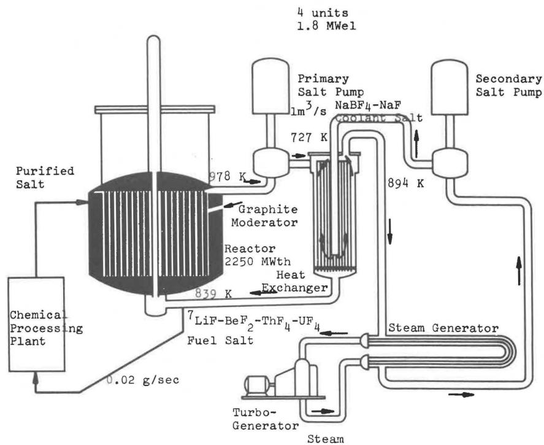

A FAST BREEDER REACTOR WITH MOLTEN CHLORIDES COULD HAVE IN CORE COOLING

Total power: 2050 MW(th) Core volume $7.75 \mathrm{~m}^{3}$ (2m x 2.36 m)

Fuel: $\mathrm{PuCl}_{3}$ (15 mol%) NaCl (85 mol%). $T_{\text {melt}} = 685^{\circ} \mathrm{C}; \rho = 2.34 \mathrm{~gcm}^{-3}$

Coolant, fertile: $238 \mathrm{UCl}_{3}$ (65 mol%) NaCl (35 mol%) Tmelt = 710°C; ρ = 4.00 gcm $^{-3}$

Specific power: 220 W/cm³ core; 705 W/g Pu

Velocity: Fuel 2 m s $^{-1}$ ; coolant 9 m s $^{-1}$

Number of tubes in the core: 20,000 (1.26/1.20 cm dia.)

Reprocessing: continuous, 3 gs $^{-1}$ ; dwell time: 10 days

Breeding ratio: internal 0.716; outer 0.67

total 1.386 (corrected)

Mean fast flux across core: 7 x $10^{15}$ n cm $^{-2}$ s $^{-1}$

fast flux in the centre: 1.2 x $10^{16}$ n cm $^{-2}$ s $^{-1}$

Temperature reactivity coefficient $(\delta k(\%)/\delta T(^{\circ}C))$

$$
f u e l = 3. 8 \times 1 0 ^ {- 2}; \text {c o o l a n t} + 1. 2 9 \times 1 0 ^ {- 2}
$$

Structural material: Fe (1.45 kg/1): Mo(0.465 kg/1)

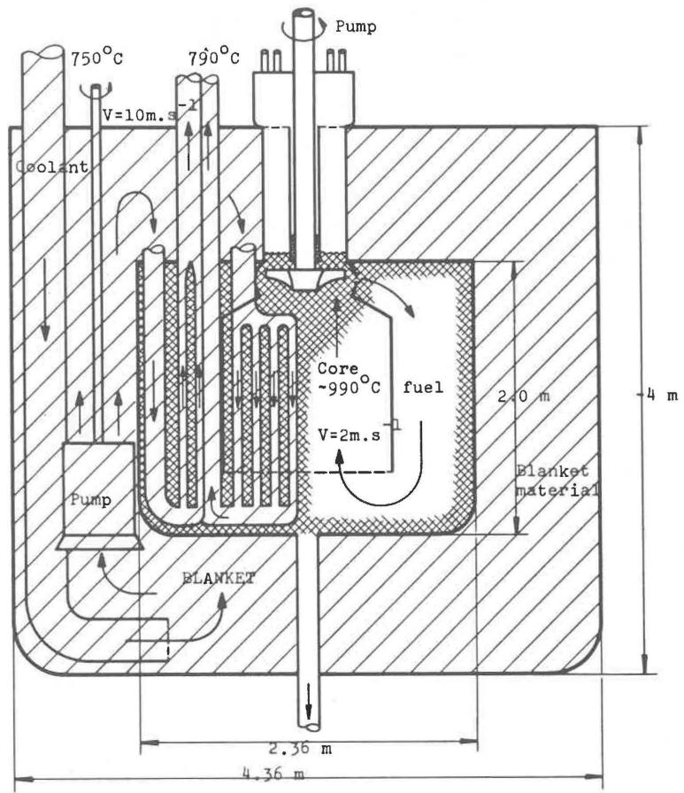

THE VERY COMPLEX PROBLEM OF CONTINUOUS REPROCESSING OF THE FUEL IN A MOLTEN FLUORIDE REACTOR HAS BEEN SOLVED

The operation of a molten salt thermal reactor as a high performance breeder is made possible by the continuous reprocessing of the fuel salt in a plant located at the reactor site. The most important operation consists in removing fission products (rare-earths) and isolating Pa-233 from the high flux region during its decay to U-233 in order to reduce neutron absorption.

It is also necessary for:

- the removal of excess U-233   
- addition of fresh amounts of Th-232   
- the proper redox potential to be maintained   
- the oxides to be removed   
- corrosion products to be maintained at tolerable levels

In order to achieve the breeding ratio of 1.06 - 1.07 the following fission products must be removed as shown.

Dwelling Time of F.P. in Molten Fuel

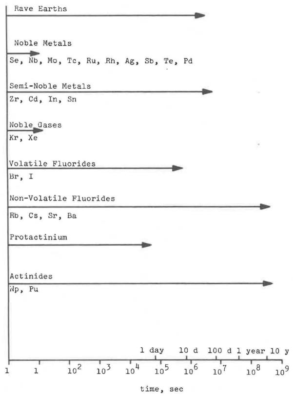

Reprocessing in MSBR

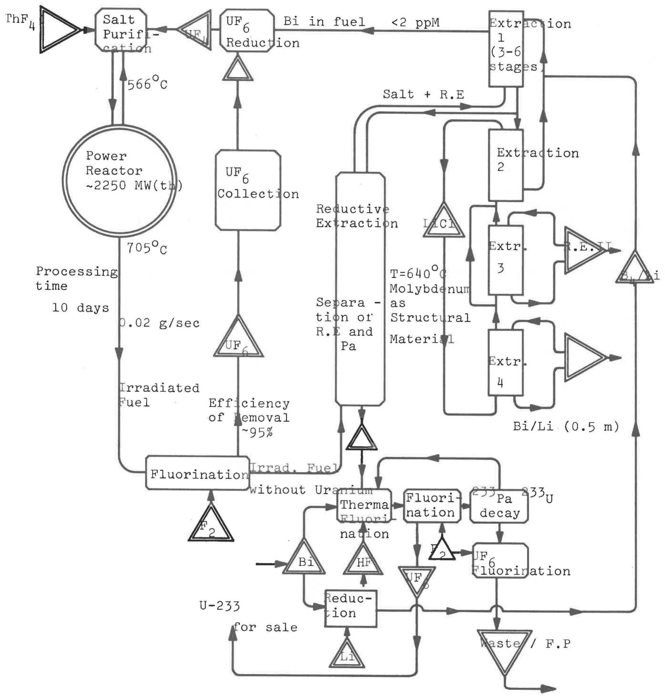

THE EXISTING REPROCESSING SCHEME IS TOO CONSERVATIVE.

IT DOES NOT TAKE INTO ACCOUNT THE PROBLEMS OF RADIOACTIVE WASTE MANAGEMENT

<table><tr><td></td><td>PRESENT STATE</td><td>POSSIBLE FUTURE FORM</td></tr><tr><td>Reprocessing</td><td>periodic</td><td>quasi-continuous</td></tr><tr><td>Removal of F.P.</td><td>in a mixture</td><td>as individium</td></tr><tr><td>Transmutation of hazardous F.P.</td><td>no</td><td>possible in a special central station</td></tr><tr><td>Actinides (Np, Am, Cm..)</td><td>removal to radio-active waste</td><td>recycled in a special power reactor?</td></tr></table>

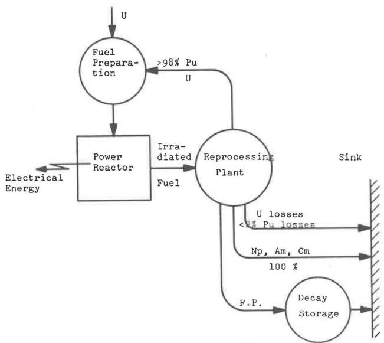  
Reprocessing today

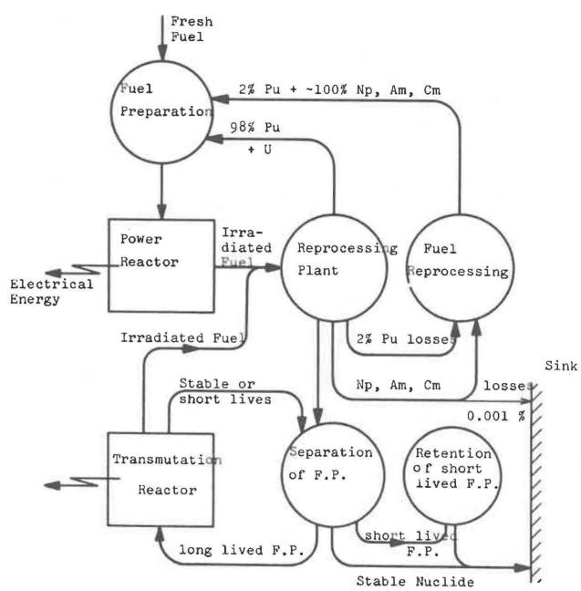  
Reprocessing in the Future

Parallel to the burning of U and Pu also synthesis of Np, Am, Cm, Bk and Cf is going.

At present time the actinides, other than U and Pu, are removed to the waste.

The problem of the hazard from these actinides in long term must be solved.

The recycling of actinides bath to the power reactors gives the solution of problem.

The methods of the recycling must be developed.

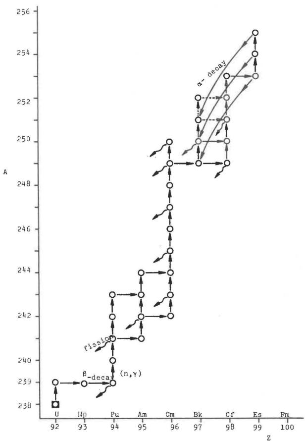

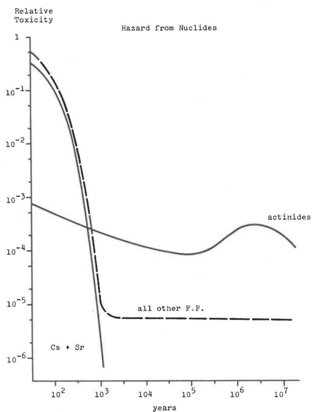

# CHEMISTRY OF FLUORIDE FUEL

Fluorides are the only salts with acceptable $\sigma_{\mathrm{abs}}$ , requisite stability ( $\Delta G$ ) and melting point.

Oxidation state $\mathrm{UF}_{3}$ due to stability and low $\mathrm{T}_{\text {melt }}$ $\left. \begin{array}{l} \mathrm{PuF}_{3} \text { the most stable } \\ \mathrm{ThF}_{4} \text { the only one } \end{array} \right\}$ but in both cases $\mathrm{T}_{\text {melt }}$ is very high

Components 1) $^7\mathrm{LiF}$ and $\mathrm{BeF}_2$ for lowering T melt

2) for moderating   
3) $7_{\text{Li}}$ because: $\frac{6}{3} \operatorname{Li}(n, \alpha) T$ , $\sigma_{\text{th}} = 953$ barn   
4) $\mathrm{LiF} / \mathrm{BeF}_2$ for low viscosity

Tritium production: in spite of $^{7}$ Li the products are (for ~1 GW(el)) $^{233}$ U(n,f) ternary: 30 Ci/day $^{7}$ Li(n,αn) $^{3}$ T: 1200" $^{6}$ Li(n,α) $^{3}$ T: 1200"

Graphite - as moderator and structural material ( $\rho = 1.9 \, \text{gcm}^{-3}$ )

$$
4 \mathrm {U F} _ {4} + C \quad \mathrm {C F} _ {4} + 4 \mathrm {U F} _ {3}: \quad \text {e . g . p r e s s u r e} \mathrm {C F} _ {4} = 1 0 ^ {- 8} \text {b a r}.
$$

The problem of xenon-135: This F.P. is adsorbed in the open pore volume in the graphite; accessible void volume $\sim 10\%$ graphit replacement in the core $\sim$ each 2 years

Disproportionation

$$
4 U F _ {3} (d) \quad 3 U F _ {4} (d) + U: K ^ {9 0 0 K} = 6. 3 \times 1 0 ^ {- 7}
$$

Instability in the presence of oxygen-containing materials:

$$
\mathrm {U F} _ {4} + \mathrm {O} _ {2} \quad \mathrm {U O} _ {2} + \dots .
$$

solubility of $\mathrm{UO}_2$ in molten salt $\sim 40$ ppm also precipitation of $\mathrm{Pa}_2\mathrm{O}_5$ , $\mathrm{PuO}_2$

# FLUORIDES

F.P. Balance: $\mathrm{UF}_{4} \rightarrow 2$ atom F.P. + $4\mathrm{F} \rightarrow$

$$
\rightarrow \mathrm {M e} ^ {\mathrm {I}} \mathrm {F} + \mathrm {M e} ^ {\mathrm {I I}} \mathrm {F} _ {2} + \mathrm {M e} ^ {\mathrm {I I I}} \mathrm {F} _ {3} + \mathrm {M e} ^ {\circ} + \sim + \mathrm {F} _ {2}
$$

The Breeding Ratio is very sensitive to the removal rate of RE and Pa-233.

Structural material for reprocessing: TZM: molybdenum alloy

for fuel system Hastelloy N (modified) (wt%)

Ni 75 Si0.1 C0.06

Mo 12 W0.1 P0.015

Cr 7 A10.1 S0.015

Fe 4 Ti 1.0 B 0.001 (10 ppM)

Mn 0.2 Co 0.2

Hf 1.0 Ta 2.0

Cost of salt 57$/pound, in this U-233 $13/g; total cost 23x10^6 $

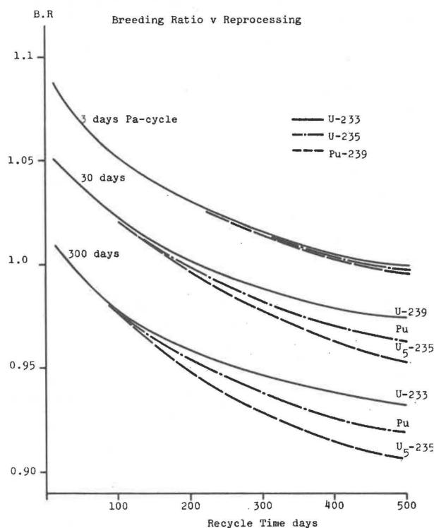

# IMPORTANCE

In order to fully exploit the unique features of the molten salt reactor concept it will be necessary to carry out all analyses automatically on line with transducers located directly in the salt streams in the reactor and reprocessing plant. The most significant items to be measured are

- Redox conditions of the fuel: the $\mathrm{U}^{3+}/\mathrm{U}^{4+}$ ratio which influences the rate of corrosion and the distribution of certain fission products and tritium in the reactor. This is due to the disproportionation

$$
4 \mathrm {U F} _ {3} \rightarrow 3 \mathrm {U F} _ {4} + \mathrm {U} ^ {\circ} \quad (\text {o n l y i n m o l t e n s t a t e})
$$

(by spectrophotometric methods also voltammetry)

corrosion product concentration $(\mathrm{Cr}^{+2}\mathrm{Ti}^{+3},$ voltammetry)   
- oxide levels (by hydrofluorination: MeO + HF → H $_2$ O + Fe $_x$ ) 50 ppM precision   
- bismuth (polarographic method 50 ppG)   
hydrogen and tritium (diffusion to Pd-electrode some ppM)   
protactinium   
- certain fission products (remote gamma spectrometry and for noble metals mass spectrometry)

Note: Most of these techniques are carried out in hot laboratories. The electrochemical technique appears to be the prime candidate for practical on-line fuel analysis because of the simplicity of its transducers.

The analytical and general chemical problems in the molten chlorides are also of interest because an important step in the continuous reprocessing technique is the liquid bismuth/molten chloride reduction extraction metal transfer process.

IN A HIGH NEUTRON FLUX CHLORINE TRANSFORMS TO SULPHUR AND PHOSPHOROUS

Chlorine 35 reacts with neutrons: $^{35}\mathrm{Cl}(\mathfrak{n},\mathfrak{p})$ . $^{35}\mathrm{Cl}(\mathfrak{n},\mathfrak{a})^{32}\mathrm{P}$

Separation of $^{35}\mathrm{Cl} / ^{37}\mathrm{Cl}$ is relatively easy because

1 $^{37}\mathrm{Cl}$ in the naturally occurring Cl is $24.5\%$   
2 the ratio $\frac{37 - 35}{35} = 0.057$   
3 Chlorine is volatile

WITH MOLTEN CHLORIDE FUEL IT SEEMS THAT A CONTINUOUS GAS EXTRACTION

SYSTEM IS POSSIBLE

Iodine isotopes as precursors of delayed neutrons

Isotopic separation e.g. Caesium

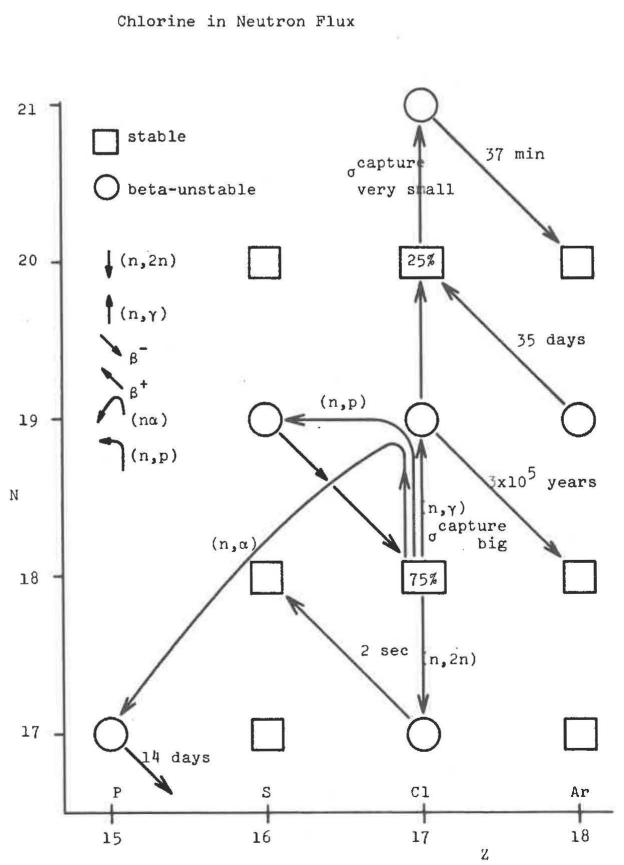

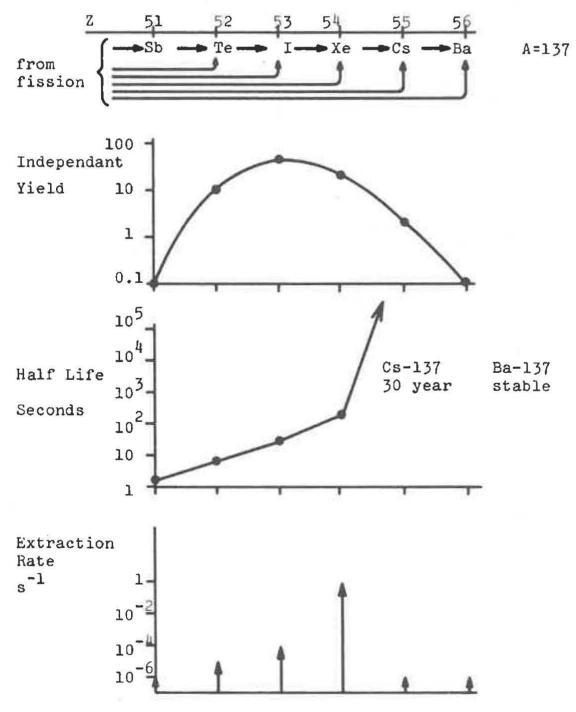

THE BALANCE OF CHLORINE DURING THE FISSION PROCESS IS "NEGATIVE"   
$\mathrm{PuCl}_{3}^{(n,f)}$ $\mathrm{E}' + \mathrm{E}'' + 3\mathrm{Cl}$ 100 $\mathrm{PuCl}_{3}^{(n,f)}$ 0.008 Se + 0.003 Br + 0.942 Kr + 1.05 RbCl + 5.49 SrCl $_2$ + 3.03 YCl $_3$ + 21.5 ZrCl $_3$ + 0.29 NbCl $_5$ (?) + 18.16 MoCl $_2$ + 4.01 Te + 31.45 Ru + 1.73 Rh + 12.66 Pd + 1.88 AgCl + 0.66 + 0.66 CdCl $_2$ + 0.06 InCl + 0.325 SnCl $_2$ + 0.67 SbCl $_3$ + 7.65 TeCl $_2$ + 6.18 I + 21.23 Xe + 13.35 CsCl + 9.50 BaCl $_2$ + 5.78 LaCl $_3$ + 13.98 CeCl $_3$ + 4.28 PrCl $_3$ + 11.87 NdCl $_3$ + 1.44 PmCl $_3$ + 3.74 SmCl $_3$ + 0.60 EvCl $_2$ + 0.03 CdCl $_3$ 100 $\mathrm{PuCl}_{3}^{(n,f)}$ 200 ECl $_{1.5}$

# LITERATURE

For molten salt reactors only, estimated to the recent publication

Harder B.R., Compatibility and reprocessing in use of molten Long G., UCl alcalichlorides mixtures as reactor fuel in Stanaway W.P. "Sympos. Reprocessing Nuclear Fuels" Ed. P. Chiotti, USAEC, Con-690801 (1969)

McNeese L.E., MSBR- a review of its status and future Nuclear Rosenthal M.W. News. Sept. 1974

Rosenthal M.W., The development status of molten-salt breeder  
Haubenreich P.N., reactor.  
Briggs R.B. Oak Ridge, ORNL-4812, 1972

Taube M. Steady-state burning of fission products in a fast thermal molten salt breeding power reactor. Ann.Nucl.Sci. Engin. 1, 283 (1974)

Taube M., Molten plutonium chlorides fast breeder cooled by Ligou J. molten uranium chlorides. Ann.Nucl.Sci. Engin. 1, 277 (1974)

Taube M., The transmutation of fission products (Cs-137, Ligou J., Sr-90) in a liquid fuelled fast fission reactor with thermal column. EIR-Report Nr. 270, Feb. 1975