# Eidg. Institut für Reaktorforschung Würenlingen Schweiz

# Fast Reactors Using Molten Chloride Salts as Fuel

Final Report (1972-1977)

M. Taube

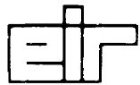

Würenlingen, Januar 1978

FAST REACTORS USING

MOLTEN CHLORIDE SALTS AS FUEL

FINAL REPORT (1972 - 1977)

prepared by 11. Taube

SWISS FEDERAL INSTITUTE FOR REACTOR RESEARCH CH-5303 Warenlingen

Januar 1978

Co-authors and contributors to this work

Physics, Neutronics

J. Ligou

Cross sections and codes

E.H. Ottewitte

J. Stepanek

Thermohydraulics

K.H. Bucher

M. Dawudi

Chemistry and experimental

Dr. E. Janovici

Dr. M. Furrer

Other assistance

Programming - S. Padyiath

Code operations - B. Mitterer

Text preparation - R. Stratton

Support and encouragement

Prof. H. Gränlicher

Dr. P. Tempus

Dr. J. Peter

Dr. H. Schumacher

EIR, Würenlingen

EIR, Würenlingen

EIR, Würenlingen

EIR, Würenlingen

Support and encouragement

P. Fougeras

J. Smith

G. Long

L.E. McNeese

Fontenay aux Roses - France

Winfrith U.K.

Harwell U.K.

Oak Ridge National Laboratory U.S.A.

# Summary

This report deals with a rather exotic "paper reactor" in which the fuel is in the form of molten chlorides.

(a) Fast breeder reactor with a mixed fuel cycle of thorium/uranium-233 and uranium 238/plutonium in which all of the plutonium can be burned in situ and in which a denatured mixture of uranium-233 and uranium-238 is used to supply further reactors. The breeding ratio is relatively high, 1.58 and the specific power is 0.75 GW(th)/m³ of core.   
(b) Fast breeder reactor with two and three zones (internal fertile zone, intermediate fuel zone, external fertile zone) with an extremely high breeding ratio of 1.75 and a specific power of 1.1 GW(th)/m³ of core.   
(c) Extremely high flux reactor for the transmutation of the fission products: strontium-90 and caesium-137. The efficiency of transmutation is approximately 15 times greater than the spontaneous beta decay. This high flux burner reactor is intended as part of a complex breeder/burner system.   
(d) Internally cooled fast breeder in which the cooling agent is the molten fertile material, the same as in the blanket zone. This reactor has a moderate breeding ratio of 1.38, a specific power of 0.22 GW(th)/m³ of core and very good inherent safety properties.

All of these reactors have the fuel in the form of molten chlorides: PuCl3 as fissile, UCl3 as fertile (if needed) and NaCl as diluent. The fertile material can be $^{238} \mathrm{UCl}_3$ as fertile and NaCl as diluent. In mixed fuel cycles the $^{233} \mathrm{UCl}_3$ is also a fissile component with $^{232} \mathrm{ThCl}_4$ as the fertile constituent.

In some special cases a hypothetical molten fluoride has been checked using $\mathsf{PuF}_3$ as the fissile, $\mathsf{UF}_3$ as the fertile and NaF and $\mathsf{ZrF}_4$ as the dilutents components. In this case one obtains a lower but still respectable breeding ratio of 1.5.

In all cases a directly coupled continuously operating reprocessing plant is proposed. Some of the technological problems of reprocessing are discussed. Furthermore the report touches on some of the difficulties associated with corrosion arising from the use of these molten media coupled with the irradiation effects such as structural damage from fast neutrons.

The thermohydraulic studies show that even under the extreme operating conditions of very high neutron fluxes and high specific power, cooling is possible, in most cases by out-of-core cooling but also in one or two cases cooling internally in the core.

Some molten salt reactor specific safety problems are discussed.

The influence of fast neutrons on the chlorine, forming sulphur by the (n,p) reaction has been experimentally investigated and the results are reported briefly.

With this report the work of several years at the Swiss Federal Institute for Reactor Research is brought to a conclusion.

# CONTENTS

page

Forward 8

1. Molten Salt Reactors. General Description 9

1.1 Methods of classification 9   
1.2 Method of cooling. External: Internal 9   
1.3 Intensity of Neutron Flux 10   
1.4 Number of core zones 12   
1.5 Type of Fissile Nuclide. Plutonium: Uranium 12   
1.6 Neutron energy: Thermal and Fast 12   
1.7 Purpose of the reactors 15   
1.8 Fuel Components. For Molten Salt, Fluoride and Chloride 16   
1.9 Short resume of the classification 16   
1.10 Method of Neutronic Calculation 17

2.1 Breeder Reactor with Plutonium Burning in situ 19

2.1.1 Aim of this Concept 19   
2.1.2 Reactor in the Build-up Phase 21   
2.1.3 The Transient Reactor 29   
2.1.4 The steady state reactor 29   
2.1.5 Comparison of the three phases 35

2.2 Impact of some parameters on the mixed zone two zone fast breeder 43   
2.3 Material balance of the steady state reactor 49   
2.4 Conclusions 49

3.1 The Three Zone Reactor 51

3.1.1 Introduction 51   
3.1.2 The three zone breeder with thorium/ uranium-233 52

3.2 A Three zone breeder reactor with a mixed fuel cycle U-238/Pu-239 plus Th-232/U-233 52   
3.3 The three zone reactor - uranium-plutonium fuel cycle 57   
3.4 The three zone breeder reactor: Very high breeding gain 63

3.5 The Two zone fast breeder. Fuel of uranium plutonium fluorides 70

3.5.1 Introduction 70   
3.5.2 Arbitrary assumptions and uncertainties 70

3.6 High Flux Reactor with Fluoride Fuel 83

4. A High flux burner reactor for transmuation 85

4.1 Need for fission product transmutation 85

4.1.1 Introduction 85   
4.1.2 Why some opinions concerning trans-mutations in a fission reactor are rather pessimistic 92   
4.1.3 Which fission products are suitable candidates for transmutation and in what quantities? 95   
4.1.4 In what way could a burner reactor be coupled to a system of breeders? 97   
4.1.5 Is the rate of transmutation sufficient? 98   
4.1.6 In what reactors is transmutation possible? 106   
4.1.7 What are the limitations of a solid fuelled reactor? 108   
4.1.8 The liquid-fuelled fast reactor with central thermal zone 113

4.2 The Neutron-physical aspects of the High Flux Reactor (according to Ligou, 1972) 114

4.2.1 Introduction 114   
4.2.2 Neutronic calculations 115   
4.2.3 Moderation requirements 115   
4.2.4 Influence of other parameters 121

4.3 Thermohydraulic considerations 123   
4.4 Some results 128   
4.6 Comments on hazard coefficients 130   
4.7 Secondary processes 134   
4.8 Conclusions 135

page

5. An internally cooled breeder with uranium-plutonium fuel 137

5.1 Design features adn objectives 137   
5.2 The reference design 141   
5.3 Neutron physics 142   
5.4 Safety problems, comments 154

6. Chemical and Related Problems 155

6.1 Physical and chemical criteria for slat components 155   
6.2 Corrosion of structural material 162

6.2.1 General criteria 162   
6.2.2 Molybdenum as structural material 164   
6.2.3 The irradiation of molybdenum and iron in a fast high flux reactor 166

6.3 Fission product behaviour in the fuel 167   
6.4 Some comments on reprocessing 170   
6.5 In core continuous gas purging 172

6.5.1 The proposal 172   
6.5.2 Delayed neutron emitters 173

7. Experimental Work (according to Ianovici, 1976) 177

7.1 Chemical behaviour of radiosulphur obtained by $^{35}\mathrm{Cl}(n,p)^{35}\mathrm{S}$ during in-pile irradiation 177   
7.2 Temperature dependence of sulphur species (according to Furrer, 1977) 180

8. Thermohydraulics 135

8.1 Introduction 185   
8.2 High Flux reactor with the core as a spherical shell 195   
8.3 Power Reactor with spherical core 189   
8.4 The external heat exchanger 191   
8.5 The internally cooled reactor 194

9. References 199

9.1 List of EIR publications used in this report (chronological order) 199   
9.2 Former publications concerning molten chlorides fast breeders and the fluoride thermal breeder 200   
9.3 Publications concerning transmutation 204   
9.4 Publications concerning the thorium fuel cycle 206   
9.5 References to the experimental work (chemistry) 208   
9.6 References to the physics calculations 208

# FORWARD

The history of the development of fission reactor concepts using molten salt as fuel media is as old and as complex as the history of the development of nuclear power itself. The ups and downs have followed those of the parent technology but the swings have been if anything more violent. In 1976 for example molten salt technology all but died out but then in 1977 a new attempt at revival was begun this time associated with the new interest in proliferation-proof systems.

The author of the present paper has a profound belief that the concept of molten slat reactors coupled with continuous reprocessing and the associated waste management will become an important feature of nuclear strategy perhaps in 10 or 20 years time.

In this report the efforts in this field over the last six years are summarised.

# 1. MOLTEN SALT REACTORS. GENERAL DESCRIPTION

# 1.1 Methods of classification

There are many ways of classifying a reactor type. One such possibility is shown here.

a) Method of cooling   
b) Flux intensity related also to specific power density   
c) Number of zones in the reactor   
d) Kind of fissile nuclides and fuel cycles   
e) Neutron energy   
f) Purpose of the reactor   
g) Diluent for the molten salt

It is clear that such an arbitrary classification is not necessarily internally compatible and not all reactor types fall easily into the scheme chosen.

# 1.2 Method of cooling. External: Internal

Molten fuel reactors differ from the point of view of the cooling system. The following are three types of molten fuel reactors:

Externally cooled, where the molten fuel is pumped out of the core to the external heat exchanger. In this type of reactor, only fuel and fertile material are present in the core (no coolant). The large amount of molten fuel inside the core does not of course contribute to the critical mass.

This type of reactor has been discussed for example by Nelson, (Argonne 1967) and Lane (USA 1970) especially as a high flux materials testing fast reactor.

In externally cooled fast reactors the loss of a portion of the delayed neutrons could adversely affect reactor control. Also the biological shielding outside the core is very expensive. In this paper most of the reactors discussed are externally cooled.

Internally, direct cooled reactors: here the cooling agent is pumped directly into the core where, after mixing, the fuel in the lower part of the core is separated and pumped out of the core to the heat exchanger. The direct contact of molten fuel with molten coolant has several particular advantages: very good heat transfer, no coolant tubes (or cladding), possibility of transporting fission products.

The disadvantages are unfortunately, also numerous: problems of mixing and separating the fuel and coolant, corrosion, etc. This type of reactor has also been studies, e.g. cooled by molten lead (Long, Harwell and Killingback, Winfrith 1967), cooled by boiling mercury (Taube, Warsaw 1966) and cooled by boiling aluminium chloride (Taube, Warsaw 1966). This type of reactor must be considered as an "extremely exotic type", and only some references are given here.

Internally indirectly cooled reactor: here the cooling agent flows through tubes in the core. Heat is transferred from fuel to coolant across the tubes. No direct contact between molten fuel and liquid or gaseous coolant is permitted. These types have also been studied, in most cases using sodium as a coolant, (Nelson, Argonne 1967) or molten chlorides of uranium (Taube, 1970). See Fig. 11.

# 1.3 Intensity of neutron Flux

The molten salt reactors discussed here can be used for two more or less quite different purposes.

- power production and fissile breeding, which is self evident   
- neutron production for nuclear transmutation of the long radionuclides produced in power reactors.

In this report both types have been considered

- power breeding ractors with a mean power level of approx 3 GW(th) and steam production with over critical parameters.   
- burner reactors with a very high neutron flux particularly in the internal zone for neutron moderation when the thermal flux reaches $3 \times 10^{16} \, \text{n cm}^{-2} \, \text{s}^{-1}$ .

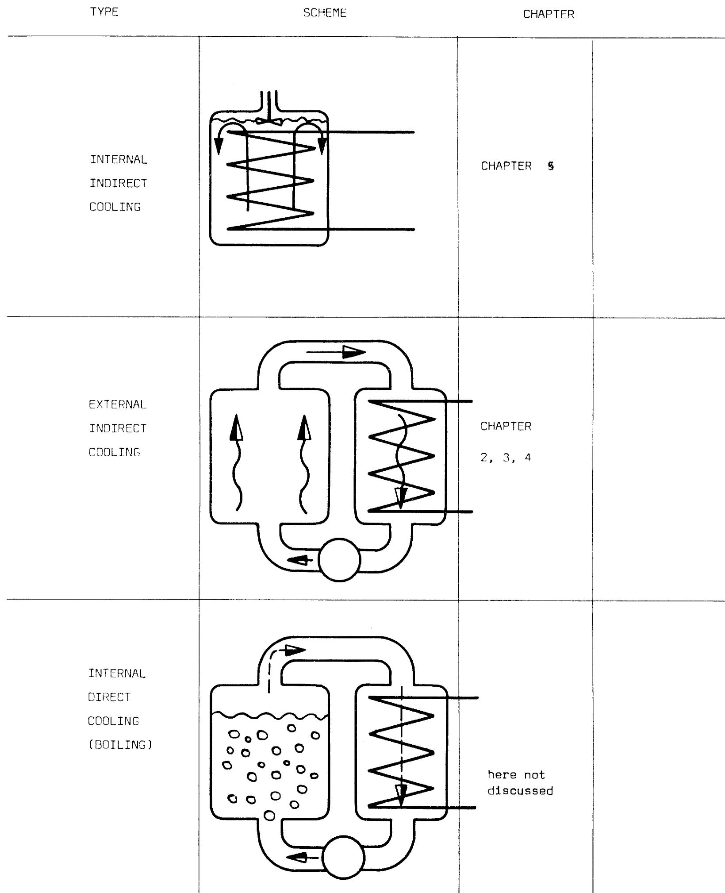  
Fig. 1.1 TYPES OF REACTOR COOLING SYSTEMS

# 1.4 Number of core zones

The division of the reactor into several zones must be considered from the point of view of neutronics, thermohydraulics and safety.

The organisation of multiple zones is easier in the case of molten fuel reactors than for solid fuel reactors. In this report two types are discussed

- with two zones   
- with three zones including outer and inner fertile zone, (see Fig. 1.2).

# 1.5 Type of Fissile Nuclide. Plutonium: Uranium

The fast reactors show excellent neutron properties, not only for the fuel cycle:

Uranium - 238/Plutonium – but also

Thorium -232/Uranium-233

Also a mixed fuel cycle of both types has some spectral advantages. Fig. 1.3 shows the nuclear properties of the fissile nuclides.

# 1.5 Neutron energy: Thermal and Fast

The reactors discussed here are all fast reactors. Thermal reactors however have also been extensively and intensively investigated during the 1960's and 1970's in Oak Ridge National Laboratory USA. (Rosenthal at all, 1972)

Fig. 1.2 TYPES OF REACTORS   

<table><tr><td rowspan="2">NUMBER ZONE</td><td rowspan="2">GEOMETRY</td><td colspan="2">PROPERTIES</td></tr><tr><td>POSITIVE</td><td>NEGATIVE</td></tr><tr><td>ONE</td><td>CORE
FISSILE FERTILE</td><td>SIMLICITY OF
TECHNOLOGY</td><td>RELATIV
LOW BREEDING
RATIO, BECAUSE
OF TOO SOFT
NEUTRON.</td></tr><tr><td>TWO</td><td>FERTILE
BLANKET
CORE
FISSILE + FERTILE</td><td>THE OPTIMAL
DESIGN</td><td></td></tr><tr><td>THREE</td><td>CORE
FRT
BLANKET</td><td>GOOD USE OF
NEUTRONS</td><td>THE GEOMETRY
IS VERY COMPLEX
THE NEUTRON FLUX
DISTRIBUTION IS
DISTURB</td></tr></table>

Fig. 1.3

Thorium Uranium Cycle

Stable in Nature neutron capture

beta stable $\rightarrow$ beta decay

$\bigcirc$ beta unstable fission

Uranium-Plutonium Cycle   
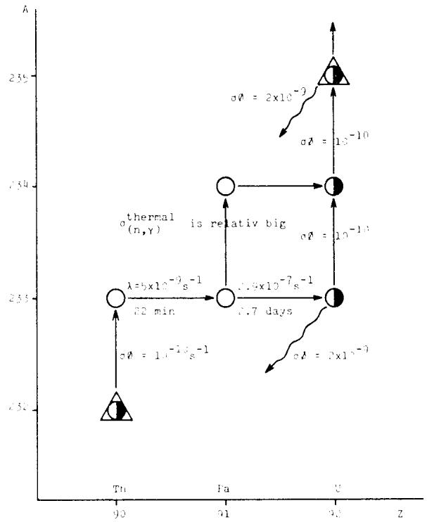  
$\sigma =$ cross section for neutron reaction $(cm^2)$   
$\varnothing =$ neutron flux (neutron $\mathrm{cm}^{-2}\mathrm{s}^{-1}$   
$\lambda =$ decay constant $(s^{-1})$   
all data for $\vartheta_{\text{fast}} \equiv 10^{15} \, \text{nm}^{-2} \, \text{s}^{-1}$

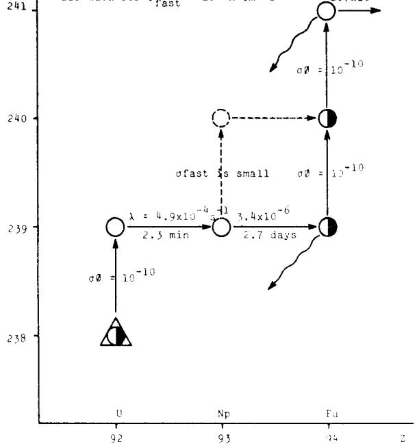

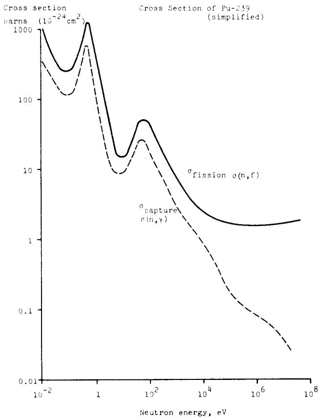

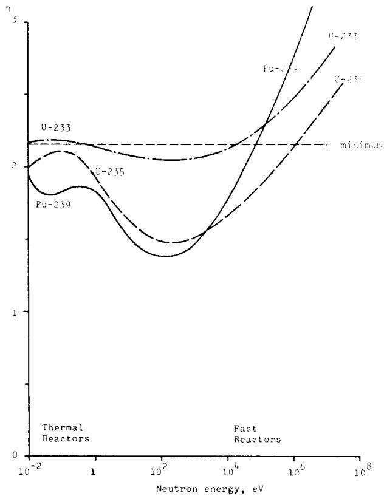  
Value of n for fissile nuclides (simplified)

# 1.7 Purpose of the reactors

The principle purposes of the large ractors proposed can be classified as follows. (Table 1.1)

Table 1.1   

<table><tr><td>Reactor type</td><td>Primary Aim</td><td>Secondary Aim</td><td>Comments to be found in chapter</td></tr><tr><td>Power</td><td>Electrical energy
T &gt; 600°C</td><td>Production of 
fissile nuclides 
BR &gt; 1</td><td>ch.5</td></tr><tr><td>Breeder</td><td>Production of 
fissile nuclide 
B.R. ∅ optimum</td><td>Production of 
electrical 
energy</td><td>ch.3</td></tr><tr><td>High flux</td><td>Neutron Flux 
Φ (n cm-2s-1) 
&gt; 1016for transmutation</td><td>Production of 
electrical 
energy</td><td>ch.4</td></tr><tr><td>High Temperature</td><td>T &gt; 850°C 
for chemical reactions</td><td>Production of 
electrical 
energy</td><td>not discussed here</td></tr><tr><td>Non-proliferating</td><td>Maximum 
security. 
No plutonium 
output</td><td>Production of 
electrical 
energy</td><td>ch.2</td></tr><tr><td>Propulsion</td><td>Heat for steam 
turbine</td><td></td><td>not discussed here</td></tr><tr><td>Space Heating</td><td>Heat with 
100°C &lt; T &lt; 200°C</td><td></td><td>not discussed here</td></tr></table>

1.8 Fuel Components. For Molten salt, fluoride and chloride

In the thermal molten salt reactor the best fuel compound is unduobtedly the fluoride.

For fast reactors the use of chlorine as the compound seems to be preferable but the use fo fluorine (as zirconium and sodium fluoride) as diluent is not excluded.

1.9 Short resumé of the classification

Table 1.2 brings together all these characteristics in an attempt at classification.

Table 1.2   

<table><tr><td></td><td></td><td>This work: 
yes no</td></tr><tr><td>Method of 
Cooling</td><td>External 
Internal Direct 
Internal Indirect</td><td>x 
x 
x</td></tr><tr><td>Flux Intensity</td><td>High 
Low</td><td>x 
x</td></tr><tr><td>Number of 
zones</td><td>One 
Two 
Three</td><td>x 
x 
x</td></tr><tr><td>Fissile</td><td>Plutonium 
Uranium 
Mixed</td><td>x 
x 
x</td></tr><tr><td>Energy of 
Neutrons</td><td>Thermal 
Intermediate 
Fast</td><td>x 
x 
x</td></tr><tr><td>Aim</td><td>Power 
Breeder 
High Flux burner</td><td>x 
x 
x</td></tr><tr><td>Dilutents</td><td>Fluoride 
Chloride</td><td>x 
x</td></tr></table>

# 1.10 Method of Neutronic Calculation

Almost all results given here have been obtained using the following calculational method

- the reactor code: ANISN   
number of zones: 5, 6 or 7   
- 40 
- 100 spatial positions   
- order of quadrature $S_4$ checked by $S_8$   
- neutron groups: 22 or 23 groups including the thermal neutrons (see Table 1.3)   
- anisotropy by first order Legendre expansions   
- library ENDF/BI, BII and BIV processed by code GGC-3 and GGC-4   
- the management of additional sub-routines have been realised by RSYST.

Table 1.3 Relative Fluxes in Each Group   

<table><tr><td>g</td><td>Upper boundary</td><td>Mean value</td><td>Δu (Lethargy)</td><td>Centre</td><td>Core boundary</td></tr><tr><td>1</td><td>15 MeV</td><td>12.2 MeV</td><td>0.4</td><td>10-5(.0002)</td><td>10-4</td></tr><tr><td>2</td><td>10</td><td>8.18</td><td>0.4</td><td>.0010(.0026)</td><td>.0006</td></tr><tr><td>3</td><td>6.7</td><td>5.49</td><td>0.4</td><td>.0045(.0116)</td><td>.0029</td></tr><tr><td>4</td><td>4.5</td><td>3.67</td><td>0.4</td><td>.0112(.0266)</td><td>.0072</td></tr><tr><td>5</td><td>5.0</td><td>2.46</td><td>0.4</td><td>.0222(.0552)</td><td>.0146</td></tr><tr><td>6</td><td>2.0</td><td>1.65</td><td>0.4</td><td>.0407(.0901)</td><td>.0285</td></tr><tr><td>7</td><td>1.35</td><td>1.23</td><td>0.2</td><td>.0264(.0536)</td><td>.0193</td></tr><tr><td>8</td><td>1.11</td><td>1.00</td><td>0.2</td><td>.0281(.0536)</td><td>.0215</td></tr><tr><td>9</td><td>0.91</td><td>0.78</td><td>0.3</td><td>.0475(.0837)</td><td>.0379</td></tr><tr><td>10</td><td>0.67</td><td>0.55</td><td>0.4</td><td>.0924(.1373)</td><td>.0787</td></tr><tr><td>11</td><td>0.45</td><td>0.37</td><td>0.4</td><td>.1072(.1254)</td><td>.0972</td></tr><tr><td>12</td><td>0.30</td><td>0.25</td><td>0.4</td><td>.1162(.1042)</td><td>.1136</td></tr><tr><td>13</td><td>0.20</td><td>0.165</td><td>0.4</td><td>.1044(.0749)</td><td>.1064</td></tr><tr><td>14</td><td>0.135</td><td>0.108</td><td>0.45</td><td>.1046(.0662)</td><td>.1108</td></tr><tr><td>15</td><td>86.5 keV</td><td>59.5 keV</td><td>0.75</td><td>.1061(.0549)</td><td>.1200</td></tr><tr><td>16</td><td>40.8</td><td>25.0</td><td>1.00</td><td>.1043(.0394)</td><td>.1262</td></tr><tr><td>17</td><td>15.0</td><td>8.0</td><td>1.25</td><td>.0581(.0145)</td><td>.0758</td></tr><tr><td>18</td><td>4.31</td><td>2.94</td><td>0.75</td><td>.0047(.0011)</td><td>.0056</td></tr><tr><td>19</td><td>2.03</td><td>1.39</td><td>0.75</td><td>.0148(.0025)</td><td>.0208</td></tr><tr><td>20</td><td>0.96</td><td>0.67</td><td>0.75</td><td>.0048(.0004)</td><td>.0079</td></tr><tr><td>21</td><td>0.45</td><td>0.24</td><td>1.25</td><td>.0008(10-4)</td><td>.0017</td></tr><tr><td>22</td><td>0.13 keV</td><td>0.4 eV</td><td>5.75</td><td>&lt; 10-4&lt; (10-4)</td><td>&lt; 10-4</td></tr><tr><td>Total</td><td>0.4 eV -</td><td>15 MeV</td><td>Σ = 17.40</td><td>1.0000</td><td>1.0000</td></tr></table>

# 2.1 BREEDER REACTOR WITH PLUTONIUM BURNING IN SITU

# 2.1.1 Aim of this Concept

The aim here is to demonstrate the possibility of using a molten chlorides fast breeder reactor with external cooling as a device for consuming all plutonium produced, in situ. At first the reactor is fuelled with denatured uranium -233/uranium -238 and this is changed stepwise to a feed of thorium and depleted or natural uranium only.

Such a reactor will have the following phases in its fuel cycle (Table 2.1) See Fig. 2.1

Table 2.1   

<table><tr><td rowspan="2">Phase</td><td colspan="2">Fuel input</td><td rowspan="2">Fissile burned in sítu</td><td colspan="2">Fuel output</td></tr><tr><td>Fertile</td><td>Fissile</td><td>Fissile</td><td>Fertile</td></tr><tr><td>Start. Build-up phase. (Fig. 2.1 A)</td><td>U-238: 70% Th</td><td>U-233: 30%</td><td>U-233</td><td>none</td><td>none</td></tr><tr><td>Transient Phase (Fig. 2.1 B)</td><td>U-238: 70% Th</td><td>U-233: 30%</td><td>Pu-239 U-233</td><td>none</td><td>none</td></tr><tr><td>Steady State</td><td>U-238 Th</td><td>none</td><td>Pu-239 + other Pu-isotopes</td><td>mixed U-233: 30%</td><td>U-238</td></tr></table>

A) BEGINNING

[NOPU-417]

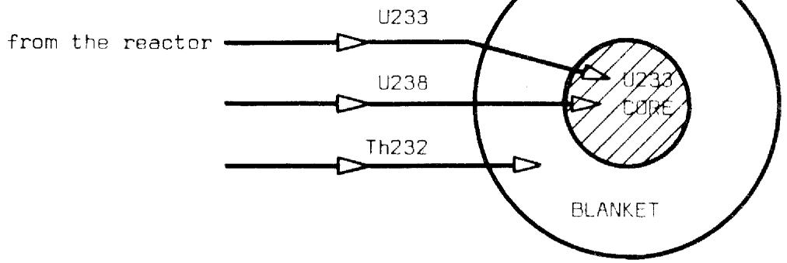  
Fig. 2.1 Two-zones Reactors with uranium-233/plutonium-239

B] TRANSIENT

(NOPU-501)

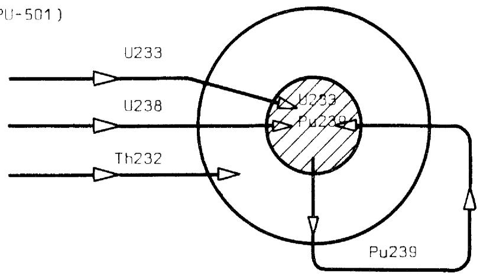

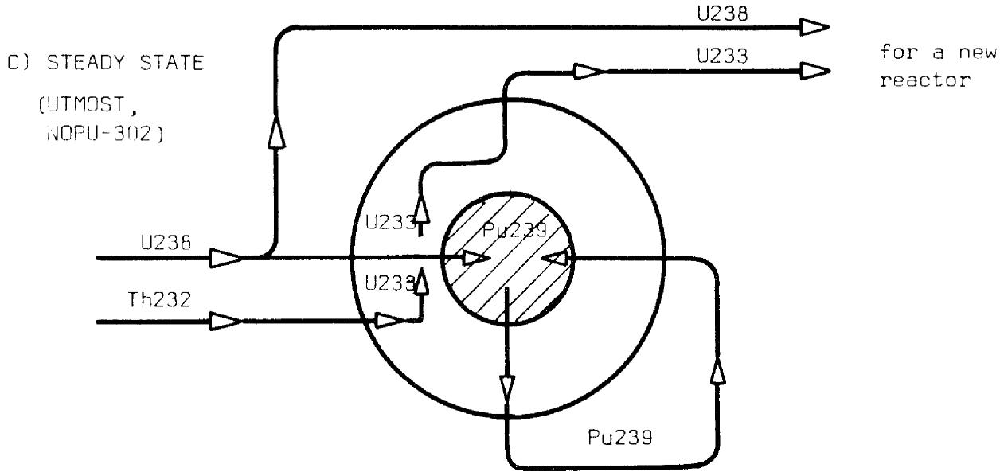

# 2.1.2 Reactor in the Build-up phase

At the start of the cycle the reactor core is fuelled by uranium-233 denatured with uranium 238 (see Fig. 2.1). (Table 2.2)

Table 2.3 gives information concerning

- the method of calculation   
- densities of elements in each of the 5 zones (core, wall, blanket, wall, reflector)

Table 2.4 shows the neutron balance in the core and blanket

Table 2.5 gives the breeding ratio calculated by a microscopic method of the form:

$$
B R _ {\text {m i c r}} = (\frac {v - 1 + \alpha}{1 + \alpha}) + (\frac {(v - 1) \delta}{1 + \alpha}) - \frac {L _ {\text {t o t}} ^ {+} \alpha}{1 + \alpha}
$$

- and the macroscopic method by

$$
B R _ {m a c r} = \frac {\text {p r o d u c t i o n r a t e o f f i s s i l e n u c l i d e}}{\text {r a t e o f d e s t r u c t i o n o f f i s s i l e n u c l i d e}}
$$

- and the maximum neutron flux which gives information on the flux spectrum in the core.

Table 2.6 shows the geometry of this reactor e.g. see Fig. 2.2

radius: 0.955 m   
volume: 3.65 m³

and

- specific power: 0.75 GW(therm)/m³ of core   
- total power: 2.8 GW(therm)

and inventories of fissile and fertile materials.

Table 2.7 gives some information concerning

- the material flux in this type of reactor. (for more see section 2.3).

TABLE 2.2   

<table><tr><td colspan="2">OBJECT: Thorium-uranium Breeder with Plutonium
burning in situ</td></tr><tr><td colspan="2">REACTOR TYPE: Power, Breeder</td></tr><tr><td colspan="2">GEOMETRY: INTERNAL ZONE: Fuel</td></tr><tr><td colspan="2">WALL: See
INTERMEDIATE ZONE: Fig.
WALL: 2.2</td></tr><tr><td colspan="2">EXTERNAL ZONE: Fertile zone</td></tr><tr><td colspan="2">WALL, REFLECTOR:</td></tr><tr><td colspan="2">POWER (GW thermal): 2.8</td></tr><tr><td colspan="2">POWER DENSITY (GW therm/m3core): 0.75</td></tr><tr><td colspan="2">NEUTRON FLUX, MEAN (n/cm2s): 1.6 x1016</td></tr><tr><td colspan="2">FISSILE NUCLIDE: Pu-239/Pu-241 in core, fuel</td></tr><tr><td colspan="2">: U233: in fertile</td></tr><tr><td colspan="2">FERTILE NUCLIDE: U238 in core, Th232 in fertile</td></tr><tr><td colspan="2">DILUTENT: Chloride</td></tr><tr><td colspan="2">COOLING SYSTEM: Outer</td></tr><tr><td colspan="2">BREEDING RATIO: 1.58</td></tr><tr><td colspan="2">PARAMETER STUDIED: Make up reactor with U233/U238</td></tr><tr><td colspan="2">: transient reactor with U233 + Pu239</td></tr><tr><td colspan="2">: steady state reactor with Pu239</td></tr><tr><td colspan="2">:</td></tr><tr><td colspan="2">METHOD OF NEUTRONIC: See table 1.10</td></tr><tr><td colspan="2">CALCULATION</td></tr></table>

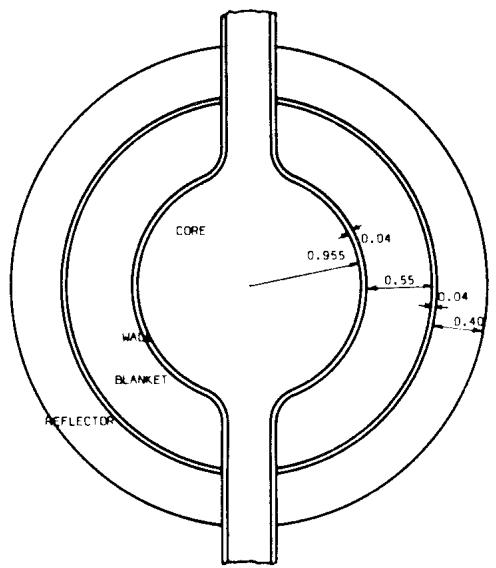  
Fig.2.2 Three zones reactor,7.8 Gw th (meter)

# Table 2.3

UTMOST-417,NU2U.

尔等学等学等学等学等学等学等学等学

TITLE : SPHERIC GEOM.

DATE 08/09/77

# INPUT DATA (RSYST FORMALISM)

# 学学学学学学学学学学学学学学学学学

ORUER OF SCATTERING 1

QUAURA TURE ORDER

NO. OF ZONES 5

NO. OF INTERVALS 43

NO. OF GROUPS 22

EIGENVALUE MODIFIER -2.00E-01

PRECISION DESIRED 1.0J0E-3

NORM. FACTOR 2.291E+20

NEWPARM. MOD.SRCH. 1.000e+00

# DENSITIES (ATOMS*1E-24/CM3)

# 华华华华华华华华华华华华华华华华华华华华华华华华华华华华华华华华华华华华华华华华华华华华华华华华华华华华华华华华华华华华华华华华华华华华华华华华华华华华华华华华华华华华华华华华华华华华华华华华华华华华

CORE

#

NA =7.64E-03 CL =1.30E-02 U23δ =4.75E-03

U233 = 5.66E-04 PU239 = 7.31E-37 PU24J = 7.31E-07

PU241 = 7.31E-07 FP239 = 1.61E-07

RATIO U3/（PUTOT+U3）= 8.37

FIRST WALL

$= 6.62E - \dot{U}2$ $= 2.88E - U2$

BLANK=

NA =5.41E-03 CL =1.03c-02 TH232=5.41E-03

PA = 1.3uε-05 U233 = 1.08E-05

2-ND WALL

C $= 1.37E = 0.2$ F2 $= 7.31E - 0.2$

REFLECTOR

C $= .0$ F 8.46E-02

UTMOST-417,NOPOU.

学学学学学学学学学学学学

TITLE : SPHERIC GEOM.

DATE 08/09/77

Table 2.4   

<table><tr><td>*</td><td rowspan="3" colspan="5">NEUTRONICS MAG</td></tr><tr><td>*</td></tr><tr><td>*</td></tr><tr><td>*</td><td rowspan="2">ELEMENT</td><td rowspan="2" colspan="2">ABSORPTION</td><td rowspan="2" colspan="2">PRODUCTION</td></tr><tr><td>*</td></tr><tr><td>*</td><td>CORE</td><td></td><td></td><td></td><td></td></tr><tr><td>*</td><td>U233</td><td>69.992E+18</td><td>31.77</td><td>16.499E+19</td><td>71.95</td></tr><tr><td>*</td><td>U238</td><td>65.894E+18</td><td>23.91</td><td>59.539E+18</td><td>25.96</td></tr><tr><td>*</td><td>PU239</td><td>73.674E+15</td><td>.03</td><td>18.217E+16</td><td>.08</td></tr><tr><td>*</td><td>PU240</td><td>32.018E+15</td><td>.01</td><td>57.914E+15</td><td>.03</td></tr><tr><td>*</td><td>PU241</td><td>87.895E+15</td><td>.04</td><td>22.947E+16</td><td>.15</td></tr><tr><td>*</td><td>CL</td><td>11.638E+13</td><td>5.28</td><td>.0</td><td>.00</td></tr><tr><td>*</td><td>FE</td><td>21.973E+17</td><td>1.00</td><td>.0</td><td>.00</td></tr><tr><td>*</td><td>NA</td><td>10.552E+17</td><td>.48</td><td>.0</td><td>.00</td></tr><tr><td>*</td><td>C</td><td>13.334E+16</td><td>.06</td><td>.0</td><td>.00</td></tr><tr><td>*</td><td>FP</td><td>12.735E+14</td><td>.00</td><td>.0</td><td>.00</td></tr><tr><td>*</td><td>TOTAL COR</td><td>15.110E+19</td><td>63.60</td><td>22.499E+19</td><td>98.11</td></tr><tr><td>*</td><td>BLANKET</td><td></td><td></td><td></td><td></td></tr><tr><td>*</td><td>TH232</td><td>50.643E+18</td><td>22.99</td><td>17.389E+17</td><td>.78</td></tr><tr><td>*</td><td>U233</td><td>11.181E+17</td><td>.51</td><td>25.407E+17</td><td>1.11</td></tr><tr><td>*</td><td>PA</td><td>69.619E+16</td><td>.32</td><td>.0</td><td>.00</td></tr><tr><td>*</td><td>CL</td><td>62.067E+17</td><td>2.82</td><td>.0</td><td>.00</td></tr><tr><td>*</td><td>FE</td><td>10.236E+18</td><td>4.65</td><td>.0</td><td>.00</td></tr><tr><td>*</td><td>NA</td><td>27.541E+16</td><td>.13</td><td>.0</td><td>.00</td></tr><tr><td>*</td><td>C</td><td>72.251E+13</td><td>.00</td><td>.0</td><td>.00</td></tr><tr><td>*</td><td>TOT, BLAN</td><td>69.177E+18</td><td>31.40</td><td>43.296E+17</td><td>1.39</td></tr><tr><td>*</td><td>ENTWO*</td><td></td><td></td><td>42.168E+17</td><td>1.31</td></tr><tr><td>*</td><td>LEAKAGE</td><td>13.285E+18</td><td>5.69</td><td></td><td></td></tr><tr><td>*</td><td>TOT A</td><td>22.028E+19</td><td>100.00</td><td>22.921E+19</td><td>100.00</td></tr></table>

THE REACTION (n,2n)

# Table 2.5

UTMOSF-417，NOU.

学学学学学学学学学学学学

TITLE : SPHERIC GEOM.

DATE 08/09/77

<table><tr><td>*</td><td colspan="3">NEUTRONICS MICR</td><td>*</td></tr><tr><td>*</td><td colspan="3">**********</td><td>*</td></tr><tr><td>*</td><td>ENTITY</td><td>SYMBOL</td><td>VALUE</td><td>*</td></tr><tr><td>*</td><td>NI0</td><td></td><td>3.183</td><td>*</td></tr><tr><td>*</td><td>NI1</td><td></td><td>3.023</td><td>*</td></tr><tr><td>*</td><td>NI2</td><td></td><td>2.455</td><td>*</td></tr><tr><td>*</td><td>NI3</td><td></td><td>2.556</td><td>*</td></tr><tr><td>*</td><td>NI8</td><td></td><td>2.945</td><td>*</td></tr><tr><td>*</td><td>NI9</td><td></td><td>2.996</td><td>*</td></tr><tr><td>*</td><td>ALFM</td><td></td><td>.085</td><td>*</td></tr><tr><td>*</td><td>FASB</td><td></td><td>.319</td><td>*</td></tr><tr><td>*</td><td>ABPAR</td><td></td><td>.173</td><td>*</td></tr><tr><td>*</td><td>LEAG</td><td></td><td>.058</td><td>*</td></tr><tr><td>*</td><td>PRODUCTION</td><td></td><td>1.357</td><td>*</td></tr><tr><td>*</td><td>FAST BONUS</td><td></td><td>.572</td><td>*</td></tr><tr><td>*</td><td>ABSOR.PARS</td><td></td><td>.159</td><td>*</td></tr><tr><td>*</td><td>LEAKAGE</td><td></td><td>.137</td><td>*</td></tr><tr><td>*</td><td>BRED.RATIO MICR</td><td></td><td>1.633</td><td>*</td></tr><tr><td>*</td><td>PU39 PRODUC</td><td></td><td>4.568</td><td>*</td></tr><tr><td>*</td><td>PU39 DESTRO</td><td></td><td>.007</td><td>*</td></tr><tr><td>*</td><td>U33 PRODUC</td><td></td><td>4.991</td><td>*</td></tr><tr><td>*</td><td>U33 DESTRO</td><td></td><td>7.111</td><td>*</td></tr><tr><td>*</td><td>BALANCE U233</td><td>BALA33</td><td>-2.126</td><td>*</td></tr><tr><td>*</td><td>BALANCE PU239</td><td>BALA39</td><td>4.561</td><td>*</td></tr><tr><td>*</td><td>TOTAL BREEDING MACR</td><td>BRTOT</td><td>1.342</td><td>*</td></tr><tr><td>*</td><td></td><td></td><td></td><td>*</td></tr><tr><td colspan="4">* MAX. FLOX IS: 2.42E+15 FOR GROUP 11 IN INTERVAL 1</td><td>*</td></tr></table>

# 1

TMDT-417，NOPU·

1. $\frac{1}{2}x - 1 > 0$

<table><tr><td></td><td></td><td></td><td></td><td></td></tr><tr><td></td><td></td><td></td><td></td><td></td></tr><tr><td></td><td></td><td></td><td></td><td></td></tr><tr><td></td><td></td><td></td><td></td><td></td></tr><tr><td></td><td></td><td></td><td></td><td></td></tr><tr><td></td><td></td><td></td><td></td><td></td></tr><tr><td></td><td></td><td></td><td></td><td></td></tr><tr><td></td><td></td><td></td><td></td><td></td></tr><tr><td></td><td></td><td></td><td></td><td></td></tr><tr><td></td><td></td><td></td><td></td><td></td></tr><tr><td></td><td></td><td></td><td></td><td></td></tr><tr><td></td><td></td><td></td><td></td><td></td></tr><tr><td></td><td></td><td></td><td></td><td></td></tr><tr><td></td><td></td><td></td><td></td><td></td></tr><tr><td></td><td></td><td></td><td></td><td></td></tr><tr><td>1.053</td><td>*</td><td></td><td></td><td></td></tr><tr><td>2.733</td><td>*</td><td></td><td></td><td></td></tr><tr><td>3.195</td><td>*</td><td></td><td></td><td></td></tr><tr><td>4.212</td><td>*</td><td></td><td></td><td></td></tr><tr><td>47.430</td><td>*</td><td></td><td></td><td></td></tr><tr><td>6864.340</td><td>*</td><td></td><td></td><td></td></tr><tr><td>23613.992</td><td>*</td><td></td><td></td><td></td></tr><tr><td>2143.611</td><td>*</td><td></td><td></td><td></td></tr><tr><td></td><td></td><td></td><td></td><td></td></tr><tr><td></td><td></td><td></td><td></td><td></td></tr><tr><td></td><td></td><td></td><td></td><td></td></tr><tr><td></td><td></td><td></td><td></td><td></td></tr><tr><td></td><td></td><td></td><td></td><td></td></tr><tr><td></td><td></td><td></td><td></td><td></td></tr><tr><td></td><td></td><td></td><td></td><td></td></tr><tr><td></td><td></td><td></td><td></td><td></td></tr><tr><td></td><td></td><td></td><td></td><td></td></tr><tr><td></td><td></td><td></td><td></td><td></td></tr><tr><td></td><td></td><td></td><td></td><td></td></tr><tr><td></td><td></td><td></td><td></td><td></td></tr><tr><td></td><td></td><td></td><td></td><td></td></tr><tr><td></td><td></td><td></td><td></td><td></td></tr></table>

Table 2.7   

<table><tr><td>*</td><td colspan="6">TABLE</td><td>*</td></tr><tr><td>*</td><td colspan="6">**********</td><td>*</td></tr><tr><td>*</td><td colspan="6">MATERIAL BALANCE OF THE BREEDER SYSTEM</td><td>*</td></tr><tr><td>*</td><td colspan="6">INCLUDING NEW REACTOR</td><td>*</td></tr><tr><td>**********</td><td>**********</td><td>**********</td><td>**********</td><td>**********</td><td>**********</td><td>**********</td><td>**********</td></tr><tr><td>*</td><td>THOR</td><td>PA</td><td>U233</td><td>*</td><td>U238</td><td>*</td><td>PU39</td></tr><tr><td>**********</td><td>**********</td><td>**********</td><td>**********</td><td>**********</td><td>**********</td><td>**********</td><td>**********</td></tr><tr><td>*ORS</td><td>2.33E+06</td><td>6.06E+02</td><td>5.97E+02</td><td>-1.87E+02</td><td>5.69E+02</td><td></td><td></td></tr><tr><td>*SBL</td><td>2.36E+04</td><td>5.69E+01</td><td>4.74E+01</td><td></td><td></td><td></td><td>*</td></tr><tr><td>*FBL</td><td>8.84E+00</td><td>8.49E+00</td><td>7.99E+02</td><td></td><td></td><td></td><td>*</td></tr><tr><td>*FTR</td><td>6.06E+02</td><td>5.97E+02</td><td></td><td>5.69E+02</td><td></td><td></td><td>*</td></tr><tr><td>*SCO</td><td></td><td></td><td>8.00E+02</td><td>6.86E+03</td><td>1.06E+01</td><td></td><td></td></tr><tr><td>*FFP</td><td></td><td></td><td></td><td>2.52E+02</td><td>9.21E-01</td><td></td><td></td></tr><tr><td>*FCB</td><td>6.15E+02</td><td></td><td></td><td>8.21E+02</td><td></td><td></td><td>*</td></tr><tr><td>*FLR</td><td>2.36E+00</td><td>5.69E+03</td><td>4.74E-03</td><td>6.86E+00</td><td>1.06E-03</td><td></td><td></td></tr><tr><td>*SRE</td><td>2.36E+00</td><td>5.69E-03</td><td>8.00E-01</td><td>6.86E+00</td><td>1.06E-03</td><td></td><td></td></tr><tr><td>*FWA</td><td>6.15E-01</td><td></td><td>-2.02E-01</td><td>6.86E-04</td><td>1.06E-04</td><td></td><td></td></tr><tr><td>*FNW</td><td>2.33E+06</td><td></td><td>-2.02E+02</td><td>-1.01E+03</td><td></td><td></td><td>*</td></tr><tr><td>*SNW</td><td>2.36E+04</td><td></td><td>-2.04E+00</td><td>-1.02E+01</td><td></td><td></td><td>*</td></tr></table>

# WHERE

ORS = FLOW FROM THE ORE OR SYNTH. IN KG / YEAR

SBL = STEADY STATE IN THE BLANKET IN KG.

FBL = FLOW = ISS. + PARAS. IN BLANKET IN KG / YEAR

FTR = FLOW FOR TRANSMUTATION IN KG / YEAR

SCO = STEADY STATE IN THE CORE IN KG

FFP = FLOW FISS. + PARASITIC IN CORE IN KG / YEAR

FCB = FLOW TO THE CORE OR BLANKET IN KG / YEAR

FLR = FLOWTO REPROCESS AND RETURN IN KG / YEAR

SRE = STEADY STATE IN THE RE-PROCESSING IN KG

FWA = FLOW TO THE WASTE IN KG / YEAR

FNW = FLOW TO THE NEW IN KG / YEAR

SNW = IN THE NEW AFTER DTIME IN KG

The data given indicates that in the given geometry the nominal power and all related values: temperature, temperature gradient, velocity of circulating fuel, heat exchange etc. are as for the steady state reactor with only plutonium fuel in the core (see section 2.1.4).

# 2.1.3 The Transient Reactor

Very shortly after the start up of the reactor, a significant amount of plutonium has been produced in the core.

The total amount of plutonium chloride, after having been separated from the fission products but mixed with the uranium chloride and sodium chloride is circulated back into the core. The amount of fresh U-233 required is correspondingly smaller.

The reactor now burns two fissile nuclides, the uranium-233 and the reprocessed plutonium. The data given below refers to the case where approximately half of the fissile uranium-233 is replaced by plutonium-239 and plutonium-241.

Based on rather simplified assumptions concerning the isotopic composition of the plutonium it can be shown that the same core design is capable of burning the mixture of fissile materials maintaining approximately the same power level.

Tables 2.8, 2.9, 2.10, 2.11 and 2.12 give the equivalent values previously shown for the build-up phase.

These confirm the suitability of the core design for both the build-up phase and the transient phase.

# 2.1.4 The steady state reactor

This reactor phase is in fact the main object of the work covered in this report, the steady state fast breeder reactor having the following features.

Table 2.8   

<table><tr><td colspan="2">UTPOST-501, PUCU.</td></tr><tr><td colspan="2">**********</td></tr><tr><td colspan="2">TITLE: SPHERIC GEOM.</td></tr><tr><td colspan="2">DATE: 16/39///</td></tr></table>

INPUT DATA (RSYST FORMALISM)   

<table><tr><td colspan="3">DENSITIES(ATONS*1E-24/CM3)</td></tr><tr><td colspan="3">**********</td></tr><tr><td colspan="3">CORE</td></tr><tr><td>NA = 7.59E-03</td><td>CL = 1.3FE-02</td><td>U238 = 4.72E-03</td></tr><tr><td>U233 = 2.83E-04</td><td>PU239 = 2.54E-04</td><td>PU240 = 7.26E-05</td></tr><tr><td>PU241 = 3.63E-05</td><td>FP239 = 5.59E-05</td><td></td></tr><tr><td colspan="3">RATIO US/(POT - U3) = EIRSILALL</td></tr><tr><td>C = 6.62E-02</td><td>FE = 2.88E-02</td><td></td></tr><tr><td colspan="3">BLANKEI</td></tr><tr><td>NA = 5.41E-03</td><td>CL = 1.08E-02</td><td>TH232 = 5.41E-03</td></tr><tr><td>PA = 1.30E-05</td><td>U233 = 1.08E-05</td><td></td></tr><tr><td colspan="3">2=ND-NALL</td></tr><tr><td>C = 1.37E-02</td><td>FE = 7.31E-02</td><td></td></tr><tr><td colspan="3">GEELECIOE</td></tr><tr><td>C = .0</td><td>FE = 8.46E-02</td><td></td></tr></table>

Table 2.9   

<table><tr><td colspan="2">UTPOST-501, PU+U.</td></tr><tr><td colspan="2">**********</td></tr><tr><td colspan="2">TITLE: SPHERIC GEOM.</td></tr><tr><td colspan="2">DATE: 16/09/11</td></tr></table>

<table><tr><td>*</td><td colspan="5">NEUTRONICS NACR</td></tr><tr><td>*</td><td colspan="5">**********</td></tr><tr><td>*</td><td>ELEENI</td><td>ABSOPION</td><td colspan="3">PRODUCTION</td></tr><tr><td>*</td><td>CORE</td><td></td><td></td><td></td><td></td></tr><tr><td>*</td><td>U233</td><td>38.077E+18</td><td>16.27</td><td>89.679E+18</td><td>36.80</td></tr><tr><td>*</td><td>U238</td><td>71.188E+18</td><td>30.42</td><td>62.698E+18</td><td>25.73</td></tr><tr><td>*</td><td>PU239</td><td>27.072E+18</td><td>11.82</td><td>68.323E+18</td><td>28.04</td></tr><tr><td>*</td><td>PU240</td><td>33.993E+17</td><td>1.45</td><td>61.259E+17</td><td>2.51</td></tr><tr><td>*</td><td>PU241</td><td>47.359E+17</td><td>2.52</td><td>12.348E+18</td><td>5.07</td></tr><tr><td>*</td><td>CL</td><td>12.350E+18</td><td>5.28</td><td>.0</td><td>.00</td></tr><tr><td>*</td><td>FE</td><td>23.288E+17</td><td>1.01</td><td>.0</td><td>.00</td></tr><tr><td>*</td><td>NA</td><td>11.275E+17</td><td>.48</td><td>.0</td><td>.00</td></tr><tr><td>*</td><td>C</td><td>13.080E+16</td><td>.96</td><td>.0</td><td>.00</td></tr><tr><td>*</td><td>FF</td><td>48.166E+16</td><td>.21</td><td>.0</td><td>.00</td></tr><tr><td>*</td><td>TOTAL CORE</td><td>16.153E+19</td><td>69.01</td><td>23.917E+19</td><td>98.15</td></tr><tr><td>*</td><td>BLANKEL</td><td></td><td></td><td></td><td></td></tr><tr><td>*</td><td>TH232</td><td>53.378E+18</td><td>22.81</td><td>18.379E+17</td><td>.75</td></tr><tr><td>*</td><td>U233</td><td>11.761E+17</td><td>.50</td><td>26.719E+17</td><td>1.10</td></tr><tr><td>*</td><td>PA</td><td>73.403E+16</td><td>.31</td><td>.0</td><td>.00</td></tr><tr><td>*</td><td>CL</td><td>65.000E+17</td><td>2.78</td><td>.0</td><td>.00</td></tr><tr><td>*</td><td>FE</td><td>10.450E+18</td><td>4.16</td><td>.0</td><td>.00</td></tr><tr><td>*</td><td>NA</td><td>28.913E+16</td><td>.12</td><td>.0</td><td>.00</td></tr><tr><td>*</td><td>C</td><td>74.329E+13</td><td>.00</td><td>.0</td><td>.00</td></tr><tr><td>*</td><td>TOT. PLAN.</td><td>72.528E+16</td><td>36.99</td><td>45.98E+17</td><td>1.85</td></tr><tr><td>*</td><td>EITWO</td><td></td><td></td><td></td><td></td></tr><tr><td>*</td><td>LEAKAGE</td><td>14.126E+18</td><td>5.69</td><td></td><td></td></tr><tr><td>*</td><td>TOT AL</td><td>23.405E+19</td><td>100.00</td><td>24.364E+19</td><td>100.00</td></tr></table>

UTMOST-501, PU+U.

\*\*\*\*\*\*\*\*\*\*\*\*\*\*\*\*\*\*\*

TITLE : SPHERIC GEOM.

DATE 16/9//

Table 2.10   

<table><tr><td colspan="3">NEUTRONICS MICR</td></tr><tr><td colspan="3">**********</td></tr><tr><td>CUILIY</td><td>SYMBOL</td><td>VALUE</td></tr><tr><td>NIG</td><td></td><td>3.182</td></tr><tr><td>NI1</td><td></td><td>3.022</td></tr><tr><td>NI2</td><td></td><td>2.456</td></tr><tr><td>NI3</td><td></td><td>2.554</td></tr><tr><td>NIR</td><td></td><td>2.946</td></tr><tr><td>NI9</td><td></td><td>2.994</td></tr><tr><td>ALFN</td><td></td><td>.136</td></tr><tr><td>FASP</td><td></td><td>.380</td></tr><tr><td>APPAR</td><td></td><td>.172</td></tr><tr><td>LEAG</td><td></td><td>.058</td></tr><tr><td>PRODUCTION</td><td></td><td>1.426</td></tr><tr><td>FAST BONUS</td><td></td><td>.651</td></tr><tr><td>ARSOR.PARS</td><td></td><td>.152</td></tr><tr><td>LEAKAGE</td><td></td><td>.141</td></tr><tr><td>BRED.RATIO MICR</td><td></td><td>1.784</td></tr><tr><td>PU39 PRODU</td><td></td><td>4.991</td></tr><tr><td>PU39 UESTRO</td><td></td><td>2.767</td></tr><tr><td>U33 PRODU</td><td></td><td>5.263</td></tr><tr><td>U33 DESTRO</td><td></td><td>3.925</td></tr><tr><td>BALANCE J233</td><td>BALA33</td><td>1.338</td></tr><tr><td>BALANCE PU239</td><td>BALA39</td><td>2.223</td></tr><tr><td>TOTAL BREEDING MACR</td><td>BRTOT</td><td>1.451</td></tr><tr><td colspan="3">MAX. FLOX IS: 2.59E+15 FOR GROUP 11 IN INTERVAL 1</td></tr><tr><td colspan="3">**********</td></tr><tr><td>*COMENT</td><td></td><td>*</td></tr><tr><td>*FASB, N*SIGMA FISS.FERT / N*SIGMA FISS.FISSIONABLE.</td><td></td><td>*</td></tr><tr><td>*APPAR, N*SIGMA PARAS / I*CAPT.(FERT + FISS).</td><td></td><td>*</td></tr><tr><td>*LEAG, LEAKAGE / TOTAL APSOR.(FPM TABLE NEUTRONICS).</td><td></td><td>*</td></tr><tr><td>*PRODU, (ZNIM - 1 - ALFN) / (1 + ALF).</td><td></td><td>*</td></tr><tr><td>*FAST PONUS, (FASB * (NIF - 1)) / (1 + ALF).</td><td></td><td>*</td></tr><tr><td>*ARSOR.PARS, ABPAR / (1 + ALF).</td><td></td><td>*</td></tr><tr><td>*LEAKAGE, LEAG*ZNIM / (1 + ALF).</td><td></td><td>*</td></tr><tr><td>*BETOT, N*SIGMA TRANSMUTATION (TH + US + PUN) / N*SIGMA.</td><td></td><td>*</td></tr><tr><td>*CAPT. (U3 + PUN + PU1).</td><td></td><td>*</td></tr></table>

UTNOST-5c1，PU+U.

TITLE : SPHERIC GEOM.

DATE 16/9/1

Table 2.11   

<table><tr><td>EOLIY</td><td>SYMBOL</td><td>UNI</td><td>VALUE</td></tr><tr><td colspan="4">GEOMETRY</td></tr><tr><td>CORE RADIUS</td><td>P(1)</td><td>M</td><td>.963</td></tr><tr><td>WALL 1 THICKNESS</td><td>THICK(2)</td><td>M</td><td>.040</td></tr><tr><td>BLANKET THICKNESS</td><td>THICK(3)</td><td>M</td><td>.550</td></tr><tr><td>WALL 2 THICKNESS</td><td>THICK(4)</td><td>M</td><td>.040</td></tr><tr><td>HEIGHT OF CYLINDER</td><td>HEIGHT</td><td>M</td><td>.000</td></tr><tr><td>HEIGHT/DIAM. RATIO</td><td>UP/AT</td><td>-</td><td>.000</td></tr><tr><td>VOLUME OF CUBE</td><td>VOLCOR</td><td>M***3</td><td>3.740</td></tr><tr><td>VOLUME OF BLANKET</td><td>VOLRL</td><td>M***3</td><td>11.461</td></tr><tr><td colspan="4">POWER</td></tr><tr><td>POWER IN CORE</td><td>POING</td><td>GW</td><td>2.749</td></tr><tr><td>POWER IN BLANKET</td><td>POINB</td><td>GW</td><td>.059</td></tr><tr><td>TOTAL POWER</td><td>POPTO</td><td>GW</td><td>2.808</td></tr><tr><td>POWER DENS. COPE</td><td>PODPC</td><td>GW/M***3</td><td>.735</td></tr><tr><td>POWER DENS. BLANKET</td><td>PODER</td><td>GW/M***3</td><td>.005</td></tr><tr><td>POWER RATING OF PU</td><td>POWRAT</td><td>MV/KG</td><td>5.091</td></tr><tr><td colspan="4">INVENTORY</td></tr><tr><td>TOTAL PU239 INVENT.</td><td>P9TOT</td><td>KG</td><td>377.326</td></tr><tr><td>TOTAL PU INVENT.</td><td>PUTOT</td><td>KG</td><td>539.940</td></tr><tr><td>U233 IN CORE</td><td>U3C</td><td>KG</td><td>409.894</td></tr><tr><td>U233 IN BLANKET</td><td>U3D</td><td>KG</td><td>47.984</td></tr><tr><td>TOTAL U233 INVENT.</td><td>U8TOT</td><td>KG</td><td>6978.166</td></tr><tr><td>TOTAL IN INVENT.</td><td>THTOT</td><td>KG</td><td>23889.212</td></tr><tr><td>RATIO U38/(PU+U33)</td><td>FATUB</td><td>-</td><td>12.924</td></tr><tr><td colspan="4">OTHER DATA</td></tr><tr><td>FUPN. RATIO (PU/ZU)</td><td>FUPNR</td><td>-</td><td>.826</td></tr><tr><td>DOUBLING TIME</td><td>T1NSE</td><td>YEARS</td><td>1.291</td></tr><tr><td>MEAN FLUX CORE</td><td>FLKEAN</td><td>NEUT/S*CP2</td><td>1.334E+16</td></tr></table>

Table 2.12   

<table><tr><td>*</td><td colspan="6">TABLE</td><td>*</td></tr><tr><td>*</td><td colspan="6">**********</td><td>*</td></tr><tr><td>*</td><td colspan="6">MATERIAL BALANCE OF THE BREEDER SYSTEM</td><td>*</td></tr><tr><td>*</td><td colspan="6">INCLUDING NEW REACTOR</td><td>*</td></tr><tr><td colspan="7">**********</td><td>*</td></tr><tr><td>*</td><td>*</td><td>THOR</td><td>*</td><td>PA</td><td>*</td><td>U233</td><td>*</td></tr><tr><td colspan="7">**********</td><td>*</td></tr><tr><td>*</td><td>*</td><td>*</td><td>*</td><td>*</td><td>*</td><td>*</td><td>*</td></tr><tr><td>*</td><td>*</td><td>*</td><td>*</td><td>*</td><td>*</td><td>*</td><td>*</td></tr><tr><td>*</td><td>*</td><td>*</td><td>*</td><td>*</td><td>*</td><td>*</td><td>*</td></tr><tr><td>*</td><td>*</td><td>*</td><td>*</td><td>*</td><td>*</td><td>*</td><td>*</td></tr><tr><td>*</td><td>*</td><td>*</td><td>*</td><td>*</td><td>*</td><td>*</td><td>*</td></tr><tr><td>*</td><td>*</td><td>*</td><td>*</td><td>*</td><td>*</td><td>*</td><td>*</td></tr><tr><td>*</td><td>*</td><td>1.92E+04</td><td>6.39E+02</td><td>6.39E+02</td><td>1.83E+03</td><td>6.22E+02</td><td>*</td></tr><tr><td>*</td><td>*</td><td>2.39E+04</td><td>5.76E+01</td><td>4.87E+01</td><td></td><td></td><td>*</td></tr><tr><td>*</td><td>*</td><td>9.39E+00</td><td>8.95E+00</td><td>4.41E+02</td><td></td><td></td><td>*</td></tr><tr><td>*</td><td>*</td><td>6.39E+02</td><td>6.30E+02</td><td></td><td>6.22E+02</td><td></td><td>*</td></tr><tr><td>*</td><td>*</td><td>*</td><td></td><td>4.10E+02</td><td>6.98E+03</td><td>3.77E+02</td><td>*</td></tr><tr><td>*</td><td>*</td><td>*</td><td></td><td></td><td>2.65E+02</td><td>3.46E+02</td><td>*</td></tr><tr><td>*</td><td>*</td><td>6.49E+02</td><td></td><td></td><td>8.87E+02</td><td></td><td>*</td></tr><tr><td>*</td><td>*</td><td>2.39E+00</td><td>5.76E+03</td><td>4.87E+03</td><td>6.98E+00</td><td>3.77E-01</td><td>*</td></tr><tr><td>*</td><td>*</td><td>2.39E+00</td><td>5.76E+03</td><td>4.10E+01</td><td>6.98E+00</td><td>3.77E-01</td><td>*</td></tr><tr><td>*</td><td>*</td><td>6.49E+01</td><td></td><td>1.80E+01</td><td>6.98E-04</td><td>3.77E-02</td><td>*</td></tr><tr><td>*</td><td>*</td><td>1.80E+04</td><td></td><td>1.80E+02</td><td>9.44E+02</td><td></td><td>*</td></tr><tr><td>*</td><td>*</td><td>2.39E+04</td><td></td><td>2.44E+2</td><td>1.82E+03</td><td></td><td>*</td></tr></table>

WHERE

ORS = FLOW FROM THE ORE OP SYNTH. IN KG / YEAR

SBL = STEADY STATE IN THE FLANKET IN KG.

FBI. FLOW FISS. + PARAS. IN BLANKET IN KG / YEAR

FTR = FLOW FOR TRANSMUTATION IN KG / YEAR

SCO - STEADY STATE IN THE CORE IN K

FFP = FLOW FISS. $\clubsuit$ PARASITIC IN CORE IN KC / YEAR

FCX = FLOW TO THE CORE OP PLANKET IN KG / YEAR

FLU = FLOWO REPROCESS AND RETURN IN KG / YEAR

SRE = STEADY STATE IN THE PE-PROGRESSING IN KG

FWA = FLOW TO THE WASTE IN KG / YEAR

FNW = FLOW TO THE NEW IN KG / YEAR

SN = IN THE NEW AFTER DTIME IN FC

- all the freshly bred plutonium can be burned in the same reactor (the history of the transplutonium elements is neglected here).   
- to achieve this in situ burning of plutonium the reprocessing of the irradiated fuel is limited to the separation of all or just the most neutron absorbing fission products and directly coupled to the reactor   
- for the next generation of reactors the fuel is produced in the form of denatured uranium, that is an isotopic mixture of

10.5% uranium -233 (produced in this breeder)

89.5% uranium -238 (from the mine or depleted uranium stock-piles)

- for over $90\%$ of the lifetime of this plant, that is $\sim 30$ years, the reactor burns its own plutonium and produces the uranium -233 for the next breeder generation. Tables 2.13 to 2.17 give the corresponding data for this reactor phase as before.

# 2.1.5 Comparison of the three phases

In spite of this rather over-simplification it seems that the proposed reactor design is suited for burning:

uranium -233 in th first phase  
uranium -233 and plutonium in the second phase  
plutonium in the steady state phase. (see Fig. 2.3)

As a first approximation the timetable of such a reactor will be as follows

- doubling time approximately 4 years (including the out of core inventory).   
- transient period (going from U-233 of plutonium) approximately 2 years.   
- steady state period approx 30 years including shutdown periods for the exchange of the core vessel etc. See Table 2.18


$$
\begin{array}{l} + \left[ \begin{array}{l l l} 0 & \beta T - \beta C _ {2}, N ^ {p} +, \end{array} \right. \\ \mathrm {你 你 你 带 来 的 风 格 质 量} \mathrm {验 审} \mathrm {型} \mathrm {电 视 等} \\ \end{array}
$$

TITLE : SPHERIC

DATE

$$
\left(\mathbf {H} \mathbf {S} ^ {\top} \mathbf {H} - \mathbf {H} \mathbf {S} ^ {\top} \mathbf {H} \mathbf {S} ^ {\top} \mathbf {H} - \mathbf {H} \mathbf {S} ^ {\top} \mathbf {H} \mathbf {S} ^ {\top}\right)
$$

$$
\text {国 家 需 求 与 资 金 有 关 系 数} \rightarrow \text {国 家 需 求 与 资 金 有 关 系 数} \rightarrow \text {国 家 需 求 与 资 金 有 关 系 数} \rightarrow \text {国 家 需 求 与 资 金 有 关 系 数}
$$

ORDER 08 SCATTER

QUADRATURE ORDER

NO. OF LINES

NU. 1NTV4

NO. OF 64135

EIGENVALUHOTXJF

PRECISION 1.00-03

NORM. CATEOR 2

1

$$
\text {中 国} \times 1 0 0 = 1 0 0 \times 1 0 0 = 1 0 0 (c m ^ {2})
$$

$$
\mathrm {联 系 统 将 为 本 地 市 场 的 发 展 增 加} \mathrm {都 是 国 家 的 重 要 面 积}
$$

$$
\mathrm {i} \mathrm {i} \mathrm {i} \mathrm {i}
$$

A 238 4.71E-3

U237 7.3有中4 PU2401.43E-4

FUP244 108 美国，美国7月3日

RATIOUBX（POU）=10） 6.70

$$
\frac {1}{\mathrm {i}} \int_ {\mathbb {R} ^ {n}} \dots \int_ {\mathbb {R} ^ {n}} \sum_ {k = 1} ^ {n} \sum_ {l = 1} ^ {m} \sum_ {m = 1} ^ {m} \alpha_ {k l m} d x d y d z d r d s d t
$$

$= 4.62 + 1$

$$
\therefore A _ {1} = K _ {1}
$$

HA 5.41E-3 7L =1.08=2 TH232=5.41E-3

A 1.3.11

$$
\frac {1}{2} \int_ {0} ^ {\infty} \frac {d t}{t - 1} \frac {1}{t ^ {2}} \frac {1}{t + 1}
$$

$= 1.375 = 0$ $= 7.31 = 2$

$$
\mathrm {E} _ {\mathrm {B}} = \frac {\mathrm {E} _ {\mathrm {A}}}{\mathrm {E} _ {\mathrm {B}}} = 0. 5
$$

C 1.0 8.46n-12

UTHOST-302,NOPU.

\*\*\*\*\*\*\*\*\*\*\*\*\*\*\*\*\*\*

TITLE : SPHERIC GEOM.

DATE 03/09/11

Table 2.14   

<table><tr><td>*</td><td colspan="4">NEUTRONICS MACR</td></tr><tr><td>*</td><td colspan="4">**********</td></tr><tr><td>*</td><td>ELEMENTI</td><td>ABSORPTION</td><td>PRODUCTION</td><td>*</td></tr><tr><td>*</td><td>CORE</td><td></td><td></td><td>*</td></tr><tr><td>*</td><td>U233</td><td>10.599E+16</td><td>.04 24.036E+16</td><td>.10</td></tr><tr><td>*</td><td>U238</td><td>76.015E+18</td><td>30.64 65.729E+18</td><td>25.45</td></tr><tr><td>*</td><td>PU239</td><td>58.061E+18</td><td>23.65 4.513E+19</td><td>56.19</td></tr><tr><td>*</td><td>PU240</td><td>69.111E+17</td><td>2.79 12.726E+18</td><td>4.93</td></tr><tr><td>*</td><td>PU241</td><td>11.388E+18</td><td>4.59 20.652E+18</td><td>11.48</td></tr><tr><td>*</td><td>CL</td><td>13.UR3E+18</td><td>5.27 .0</td><td>.00</td></tr><tr><td>*</td><td>FE</td><td>25.411E+17</td><td>1.02 .1</td><td>.00</td></tr><tr><td>*</td><td>NA</td><td>11.833E+17</td><td>.48 .1</td><td>.00</td></tr><tr><td>*</td><td>C</td><td>14.230E+16</td><td>.06 .1</td><td>.00</td></tr><tr><td>*</td><td>FP</td><td>10.387E+17</td><td>.42 .1</td><td>.00</td></tr><tr><td>*</td><td>TOTAL CORE</td><td>17.107E+19</td><td>68.96 28.349E+19</td><td>98.14</td></tr><tr><td>*</td><td>BLANKET</td><td></td><td></td><td>*</td></tr><tr><td>*</td><td>TJ232</td><td>57.083E+18</td><td>23.01 10.305E+17</td><td>.75</td></tr><tr><td>*</td><td>U233</td><td>12.680E+17</td><td>.01 2A.736E+17</td><td>1.11</td></tr><tr><td>*</td><td>PA</td><td>75.191E+16</td><td>.30 .1</td><td>.00</td></tr><tr><td>*</td><td>CL</td><td>66.744E+17</td><td>2.69 .1</td><td>.00</td></tr><tr><td>*</td><td>PL</td><td>10.910E+18</td><td>4.40 .1</td><td>.00</td></tr><tr><td>*</td><td>NA</td><td>30.440E+16</td><td>.12 .1</td><td>.00</td></tr><tr><td>*</td><td>C</td><td>77.050E+13</td><td>.00 .1</td><td>.00</td></tr><tr><td>*</td><td>TOT, BLAN,</td><td>76.92E+18</td><td>31.04 48.136E+17</td><td>1.86</td></tr><tr><td>*</td><td>ENTW</td><td></td><td>48.019E+17</td><td>1.79</td></tr><tr><td>*</td><td>LEAKAGE</td><td>14.056E+18</td><td>5.65</td><td></td></tr><tr><td>*</td><td>TOT AL</td><td>24.006E+19</td><td>100.00 28.068E+19</td><td>100.00</td></tr></table>

UTNOST-302,NOPU.

\*\*\*\*\*\*\*\*\*\*\*\*\*\*\*\*\*

TITLE : SPHERIC GEOM.

DATE 03/09/77

Table 2.15   

<table><tr><td colspan="3">NEUTRONICS MICE</td></tr><tr><td colspan="3">**********</td></tr><tr><td>ENIILY</td><td>SYNOL</td><td>VALUE</td></tr><tr><td>*</td><td>NI0</td><td>3.182</td></tr><tr><td>*</td><td>NI1</td><td>3.020</td></tr><tr><td>*</td><td>NI2</td><td>2.454</td></tr><tr><td>*</td><td>NI3</td><td>2.515</td></tr><tr><td>*</td><td>NI8</td><td>2.947</td></tr><tr><td>*</td><td>NI9</td><td>2.993</td></tr><tr><td>*</td><td>ALFM</td><td>.200</td></tr><tr><td>*</td><td>FASB</td><td>.455</td></tr><tr><td>*</td><td>ABPAR</td><td>.173</td></tr><tr><td>*</td><td>LEAG</td><td>.058</td></tr><tr><td>*</td><td>PRODUCTION</td><td>1.501</td></tr><tr><td>*</td><td>FAST BONUS</td><td>.738</td></tr><tr><td>*</td><td>ANSOR.PARS</td><td>.144</td></tr><tr><td>*</td><td>LEAKAGE</td><td>.144</td></tr><tr><td>*</td><td>BRED.RATIO MICR</td><td>1.951</td></tr><tr><td>*</td><td>PU39 PRODU</td><td>5.371</td></tr><tr><td>*</td><td>PU39 DESTRO</td><td>5.866</td></tr><tr><td>*</td><td>U33 PRODU</td><td>5.630</td></tr><tr><td>*</td><td>U33 DESTRO</td><td>.137</td></tr><tr><td>*</td><td>BALANCE U233</td><td>BALA33</td></tr><tr><td>*</td><td>BALANCE PU239</td><td>BALA39</td></tr><tr><td>*</td><td>TOTAL BREEDING MACR</td><td>BRTOT</td></tr><tr><td>*</td><td></td><td></td></tr><tr><td colspan="3">* MAX. FLUX IS: 2.81E+15 FOR GROUP 11 IN INTERVAL 1</td></tr><tr><td>*</td><td></td><td></td></tr><tr><td colspan="3">***********</td></tr><tr><td colspan="3">*COMMENT</td></tr><tr><td colspan="3">*FASE, N*SIGMA FISS.FERT / N*SIGMA FISS.FISSIONARLE.</td></tr><tr><td colspan="3">*ABPAR, N*SIGMA PAPAS / N*CAPT.(FERT + FISS).</td></tr><tr><td colspan="3">*LEAG, LEAKAGE / TOTAL APSOR.(FROM TABLE NEUTRONICS).</td></tr><tr><td colspan="3">*PRODU, (ZNIM - 1 = ALFN) / (1 + ALF).</td></tr><tr><td colspan="3">*FAST RONUS, (FASB * (NIE - 1)) / (1 + ALF).</td></tr><tr><td colspan="3">*AUSOR.PARS, ABPAR / (1 + ALF).</td></tr><tr><td colspan="3">*LEAKAGE, LEAG*ZNIM / (1 + ALF).</td></tr><tr><td colspan="3">*BRTOT, N*SIGMA TRANSMUTATION (TH + U8 + PU0) / N*SIGMA.</td></tr><tr><td colspan="3">*CAPT, (U3 + PU9 + PU1).</td></tr></table>

INTOST-302,NOP1.

中

TITLE : SPHERIC GEOM.

DATE 3/09/7

Table 2.16   

<table><tr><td>*</td><td>ENILI?</td><td>SYHOL</td><td>UNI</td><td>VALUE</td></tr><tr><td>*</td><td></td><td></td><td></td><td></td></tr><tr><td>*</td><td></td><td></td><td></td><td></td></tr><tr><td>*</td><td></td><td></td><td></td><td></td></tr><tr><td>*</td><td></td><td></td><td></td><td></td></tr><tr><td>*</td><td>CORE RADIUS</td><td>P(1)</td><td>M</td><td>.954</td></tr><tr><td>*</td><td>WALL 1 THICKNESS</td><td>THICK(2)</td><td>M</td><td>.040</td></tr><tr><td>*</td><td>PLANKET THICKNESS</td><td>THICK(3)</td><td>M</td><td>.550</td></tr><tr><td>*</td><td>WALL 2 THICKNESS</td><td>THICK(4)</td><td>M</td><td>.040</td></tr><tr><td>*</td><td>HEIGHT OF CYLINDER</td><td>HEIGHT</td><td>M</td><td>.000</td></tr><tr><td>*</td><td>HEIGHT/DIM. RATIO</td><td>VDRAT</td><td>*</td><td>.000</td></tr><tr><td>*</td><td>VOLUME OF CORE</td><td>VOLCOR</td><td>M*3</td><td>3.633</td></tr><tr><td>*</td><td>VOLUME OF BLANKET</td><td>VOLCEL</td><td>M*3</td><td>11.299</td></tr><tr><td>*</td><td></td><td></td><td></td><td></td></tr><tr><td>*</td><td>POWER</td><td></td><td></td><td></td></tr><tr><td>*</td><td>POWER IN CORE</td><td>POING</td><td>GW</td><td>2.732</td></tr><tr><td>*</td><td>POWER IN PLANKET</td><td>POINB</td><td>GW</td><td>.063</td></tr><tr><td>*</td><td>TOTAL POWER</td><td>FONTO</td><td>GW</td><td>2.795</td></tr><tr><td>*</td><td>POWER JENS. CORE</td><td>FODEC</td><td>GW/M**3</td><td>.752</td></tr><tr><td>*</td><td>POWER JENS. BLANKET</td><td>FODEB</td><td>GW/M**3</td><td>.006</td></tr><tr><td>*</td><td>POWER RATING OF PU</td><td>PORRAT</td><td>MW/KG</td><td>2.570</td></tr><tr><td>*</td><td></td><td></td><td></td><td></td></tr><tr><td>*</td><td>INVENTORY</td><td></td><td></td><td></td></tr><tr><td>*</td><td></td><td></td><td></td><td></td></tr><tr><td>*</td><td>TOTAL PU239 INVENT.</td><td>F9TOT</td><td>KG</td><td>736.542</td></tr><tr><td>*</td><td>TOTAL PU INVENT.</td><td>PUTOT</td><td>KG</td><td>1063.152</td></tr><tr><td>*</td><td>U233 IN CORE</td><td>U3C</td><td>KG</td><td>1.035</td></tr><tr><td>*</td><td>U233 IN BLANKET</td><td>U3P</td><td>KG</td><td>47.307</td></tr><tr><td>*</td><td>TOTAL U238 INVENT.</td><td>U8TOT</td><td>KG</td><td>6763.900</td></tr><tr><td>*</td><td>TOTAL IN INVENT.</td><td>THTOT</td><td>KG</td><td>23551.789</td></tr><tr><td>*</td><td>RATIO U38/33 (PU*U33)</td><td>FATUS</td><td>*</td><td>6.362</td></tr><tr><td>*</td><td></td><td></td><td></td><td></td></tr><tr><td>*</td><td>OTHER DATA</td><td></td><td></td><td></td></tr><tr><td>*</td><td></td><td></td><td></td><td></td></tr><tr><td>*</td><td>FURNO. RATIO (PHVU)</td><td>FURNR</td><td>*</td><td>50.983</td></tr><tr><td>*</td><td>DURING TIME</td><td>STIME</td><td>YEARS</td><td>1.984</td></tr><tr><td>*</td><td>MEAN FLUX CORE</td><td>FLMEAN</td><td>NEUT/S*CH2</td><td>1.460E+16</td></tr></table>

Table 2.47   

<table><tr><td>*</td><td colspan="6">TABLE</td><td>*</td></tr><tr><td>*</td><td colspan="6">**********</td><td>*</td></tr><tr><td>*</td><td colspan="6">MATERIAL BALANCE OF THE BREEDER SYSTEM</td><td>*</td></tr><tr><td>*</td><td colspan="6">INCLUDING NEW REACTOR</td><td>*</td></tr><tr><td>**********</td><td>**********</td><td>**********</td><td>**********</td><td>**********</td><td>**********</td><td>**********</td><td>**********</td></tr><tr><td>*</td><td>THOR</td><td>PA</td><td>U233</td><td>*</td><td>U738</td><td>*</td><td>PU39</td></tr><tr><td>**********</td><td>**********</td><td>**********</td><td>**********</td><td>**********</td><td>**********</td><td>**********</td><td>**********</td></tr><tr><td>*OKS</td><td>1.26E+04</td><td>6.83E+02</td><td>6.74E+02</td><td>4.24E+03</td><td>6.19E+02*</td><td></td><td></td></tr><tr><td>*SHL</td><td>2.36E+04</td><td>5.68E+01</td><td>4.73E+01</td><td></td><td></td><td></td><td>*</td></tr><tr><td>*FHL</td><td>9.55E+00</td><td>9.17E+00</td><td>1.51E+01</td><td></td><td></td><td></td><td>*</td></tr><tr><td>*FTR</td><td>6.83E+02</td><td>6.74E+02</td><td></td><td>6.69E+02</td><td></td><td></td><td>*</td></tr><tr><td>*SCO</td><td></td><td></td><td>1.03E+00</td><td>6.76E+03</td><td>7.37E+02*</td><td></td><td></td></tr><tr><td>*FFP</td><td></td><td></td><td></td><td>2.78E+02</td><td>7.34E+02*</td><td></td><td></td></tr><tr><td>*FCR</td><td>6.94E+02</td><td></td><td></td><td>9.47E+02</td><td></td><td></td><td>*</td></tr><tr><td>*FLR</td><td>2.36E+00</td><td>5.68E+03</td><td>4.73E+03</td><td>6.76E+00</td><td>7.37E-01*</td><td></td><td></td></tr><tr><td>*SRE</td><td>2.36E+00</td><td>5.68E+03</td><td>1.03E+03</td><td>6.76E+00</td><td>7.37E-01*</td><td></td><td></td></tr><tr><td>*FWA</td><td>6.94E-01</td><td></td><td>6.58E-01</td><td>6.76E-04</td><td>7.37E-02*</td><td></td><td></td></tr><tr><td>*FNW</td><td>1.19E+04</td><td></td><td>6.58E+02</td><td>3.29E+03</td><td></td><td></td><td>*</td></tr><tr><td>*SNW</td><td>2.36E+04</td><td></td><td>1.31E+02</td><td>6.53E+03</td><td></td><td></td><td>*</td></tr></table>

WHERE

ORS $\equiv$ FLOW FROM THE ORC OR SYNTH. IN KG/YEAR

SHL = STEADY STATE IN THE FLANKET IN KC.

FHL = FLOW FISS. + PARAS. IN BLANKET IN KG / YEAR

FTR = FLOW FOR TRANSMUTATION IN FK / YEAR

SC = STEADY STATE IN THE CORE IN KG

FFP = FLOW FISS. + PARASITIC IN CORE IN KG / YEAR

FCS = FLOW TO THE CORE OF PLANKET IN KG / YEAR

FLK = FLOWTO REPROCESS AND RETURN IN KG / YEAR

SHE = STEADY STATE IN THE RE-PROCESSING IN KC

FWA = FLOW TO THE WASTE IN KG / YEAR

FNW = FLOW TO THE NEW IN KG / YEAR

SNW IN THE NEW AFTER DTIME IN PC

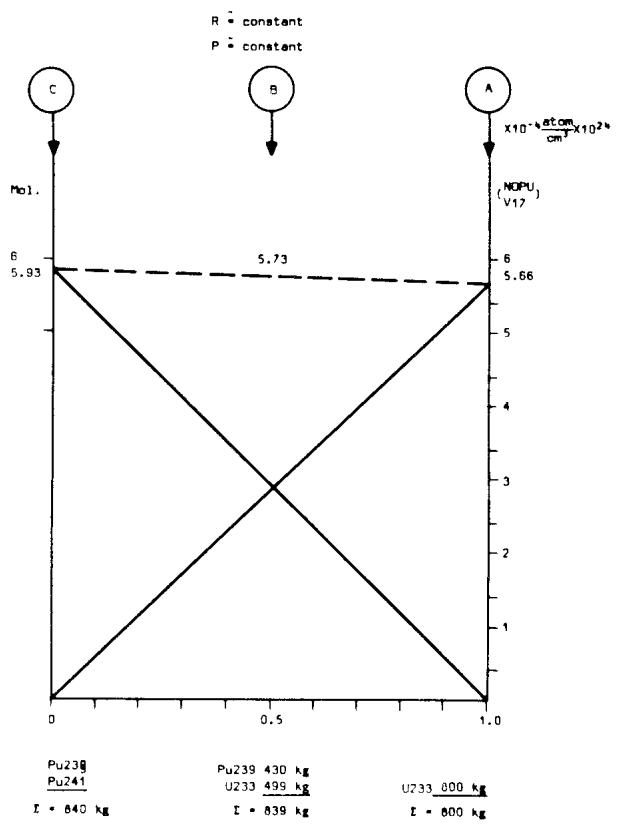  
Fig. 2.3 Fissile atom concentration in the core   
Fig. 2.4 Thorium and uranium-236 breeding (NOPU-21)

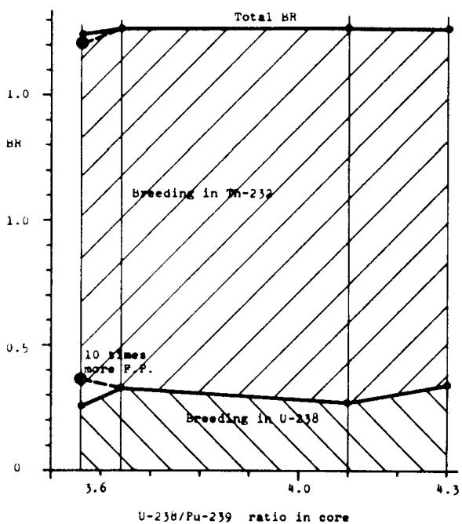

Table 2.18 Core Diameter = 0.95 m Power = 2.8 GW(th)   

<table><tr><td rowspan="2"></td><td rowspan="2"></td><td>Build-up</td><td>Transient</td><td>Steady State</td></tr><tr><td>A</td><td>B</td><td>C</td></tr><tr><td>Fissile</td><td>-</td><td>U233</td><td>U233, Pu239 + 241</td><td>Pu239 + 241</td></tr><tr><td>Core inventory</td><td>kg</td><td>800</td><td>409, 430</td><td>840</td></tr><tr><td>Fertile</td><td>-</td><td>U238</td><td>U238</td><td>U238</td></tr><tr><td>Core inventory</td><td>kg</td><td>6864</td><td>6978</td><td>6763</td></tr><tr><td>Fissile/Fertile (enrichment)</td><td>%</td><td>10.4</td><td>10.7</td><td>11.0</td></tr><tr><td>Breeding ratio total</td><td>BRtot</td><td>1.34</td><td>1.45</td><td>1.58</td></tr><tr><td>Mean neutron flux</td><td>1016neutrons/cm2s</td><td>1.26</td><td>1.33</td><td>1.46</td></tr><tr><td>Power density</td><td>GW(therm)/m3core</td><td>0.75</td><td>0.745</td><td>0.75</td></tr></table>

It should be emphasised that the era when fusion reactors are replaced by other energy sources and hence the plutonium burners are shut-down, has not been dealt with.

Even here it is conceivable that a reactor design could be proposed which only consumes and thus be used in this shutdown phase. This however has not been calculated.

2.2 Impact of some parameters on the mixed zone two zone fast breeder

In this section some intermediate results are presented concerning the influence of selected parameters in this design, and giving the breeding capability of a two zone fast breeder reactor. (Table 2.19)

The influence of mutual displacement.

$$
\Sigma (\mathrm {P u} - 2 3 9) + \Sigma (\mathrm {U} - 2 3 3) = 9 \times 1 0 ^ {- 4} (1 0 ^ {2} 4 \text {a t o m . c m} ^ {- 3})
$$

by five steps from A to E is given in Table 2.20 and Fig. 2.5 and 2.6.

The influence of the thickness of the external blanket, which contains thorium, on the total breeding ratio and the volume of the core for a given case of the following concentrations of fissile nuclides

$$
\begin{array}{l} \mathrm {P u} - 2 3 9 \quad 3. 5 \times 1 0 ^ {- 4} (1 0 ^ {2} \text {a t o m . c m} ^ {- 3}) \\ U - 2 3 3 1 0. 0 \times 1 0 ^ {- 4} (1 0 ^ {2} 4 a t o m. c m ^ {- 3}) \\ \end{array}
$$

is given in Table 2.20.

For the same case the partial BR's and BR total are shown in Fig. 2.7 and Fig. 2.8

In addition the following 4 reactor designs have been calculated having the following arrangement

$$
\begin{array}{l} \underline {{\text {C o r e}}} \quad \mathrm {P u} - 2 3 9 \quad 1. 1 \times 1 0 ^ {4} \longrightarrow 1. 8 \times 1 0 ^ {4} \quad \left(\times 1 0 ^ {2} \text {a t o m .} \mathrm {c m} ^ {- 3}\right) \\ U - 2 3 3 3. 4 \times 1 0 ^ {- 4} \leftarrow 5. 5 \times 1 0 ^ {- 4} \left(\times 1 0 ^ {2 4} a t o m, c m ^ {- 3}\right) \\ U - 2 3 3 / P u - 2 3 9 = 3. 1 \\ \end{array}
$$

Blanket thickness 100 cm.

The data are given in Tab. 2.21. Other results are found in Fig. 2.9, 2.10 and 2.11.

Table 2.19

OBJECT: Plutonium burning in situ: some parameters.

REACTOR TYPE : Power, Breeder, Two zones  
GEOMETRY: INTERNAL ZONE : Spherical core, $\sim 65$ cm  
WALL : $\sim 4$ cm  
INTERMEDIATE ZONE : -  
WALL : $\sim 4$ cm  
EXTERNAL ZONE : Blanket: 100 cm  
WALL, REFLECTOR : Iron,...

```txt
POWER (Gw thermal) : 3 GW  
POWER DENSITY (Gw therm/m<sup>3</sup> CORE) :  
NEUTRON FLUX, MEAN (n/cm<sup>2</sup>s) : 2 
```

```txt
FISSILE NUCLIDE : Core - Pu239  
: Out blanket - U-233  
FERTILE NUCLIDE : Core - U238 Out, Blanket Th232  
DILUTENT : Chlorides  
COOLING SYSTEM : External to core  
BREEDING RATIO : 
```

```txt
PARAMETER STUDIED: Ratio U238/PU239 in core Ratio PU239/U233 FP Concentration Wall (Molybdenum) thickness Blanket thickness 
```

```txt
METHOD OF NEUTRONIC : CALCULATION : see 1.10 (page 17) 
```

Table 2.20 Mixture of Pu-238 and U-233 in the core   

<table><tr><td>Pu/U3 Ratio</td><td>A
Pu only</td><td>B
Pu &gt; U3</td><td>C
Pu ≈ U3</td><td>D
Pu &lt; U3</td><td>E
U3 only</td></tr><tr><td>Fission/sec</td><td>2.74x1020</td><td>2.6x1020</td><td>2.51x1020</td><td>2.41x1020</td><td>2.32x1020</td></tr><tr><td rowspan="2">Pu-239, core
U-233 x1024at/cm3</td><td>9.10-4</td><td>6.10-4</td><td>4.10-4</td><td>2.10-4</td><td>0.0</td></tr><tr><td>0.0</td><td>3.10-4</td><td>5.10-4</td><td>7.10-4</td><td>0.10-4</td></tr><tr><td>BR total</td><td>1.761</td><td>1.64</td><td>1.56</td><td>1.49</td><td>1.42</td></tr><tr><td>Partial BR U/Pu</td><td>0.353</td><td>0.312</td><td>0.289</td><td>0.271</td><td>0.259</td></tr><tr><td>Partial BR Th/U-233</td><td>1.408</td><td>1.33</td><td>1.27</td><td>1.21</td><td>1.16</td></tr><tr><td>Flux tot. (ncm-2s-1)</td><td>2.05x1016</td><td>1.99x1016</td><td>1.94x1016</td><td>1.86x1016</td><td>1.76x1016</td></tr><tr><td>Radius, (cm)</td><td>67.28</td><td>66.22</td><td>65.72</td><td>65.5</td><td>65.8</td></tr><tr><td>Volume, (cm)</td><td>1.28</td><td>1.22</td><td>1.19</td><td>1.18</td><td>1.19</td></tr><tr><td>Spec. power (GW m-3)</td><td>2.34</td><td>2.46</td><td>2.52</td><td>2.54</td><td>2.52</td></tr><tr><td>Ratio of partial breeding ratios</td><td>3.99</td><td>4.26</td><td>4.39</td><td>4.46</td><td>4.48</td></tr><tr><td>Fission ratios U-233
Pu-239</td><td>0</td><td>0.89</td><td>2.28</td><td>5.40</td><td>∞</td></tr></table>

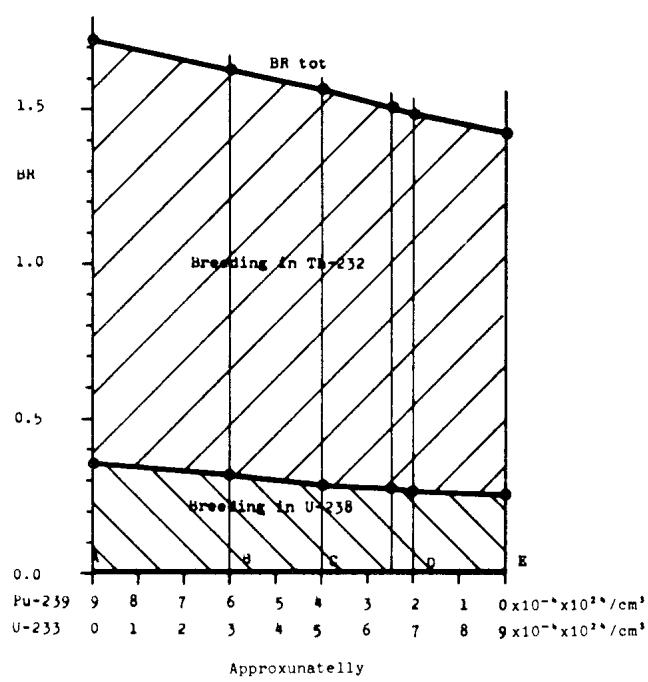  
Fig.2.5 Thorium and uranium-238 breeding (NOPU-22)

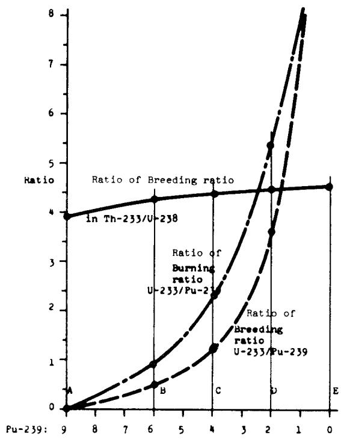  
Fig. 2.6 Ratio of breeding ratios (NOPU-22)

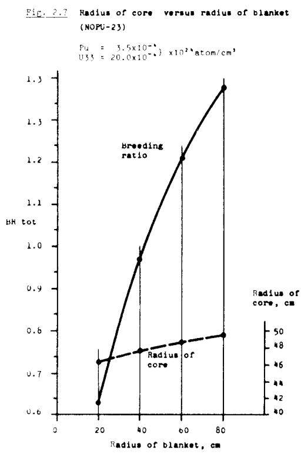

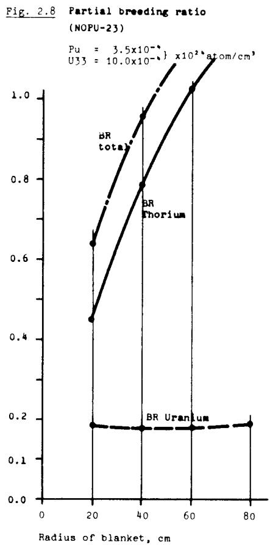

Table 2.21 Influence of Pu/U33 ratio   

<table><tr><td>Parameters</td><td>A</td><td>B</td><td>C</td><td>D</td></tr><tr><td>U-238Pu-239 x1024atom/cm3Pu-240</td><td>1.01.8x10-42.5x10-55.5x10-4</td><td>0.851.5x10-42.1x10-54.7x10-4</td><td>0.851.3x10-41.8x10-54.0x10-4</td><td>0.851.1x10-41.55x10-53.4x10-4</td></tr><tr><td>U-233U3/Pu9 ratioBR totalPartial BR thoriumPartial BR uraniumTh/UBreeding ratioFlux tot (ncm-2s-1)Radius of core, cmVolume of core, m3Spec. power (GW m-3)</td><td>3.061.511.120.392.371.3x101678.62.031.48</td><td>3.131.511.040.472.210.92x101691.43.20.938</td><td>3.081.520.950.5641.680.62x1016107.75.230.574</td><td>3.091.5280.852(see fig.2.9)0.6771.26(see fig.2.10)0.463x1016122.07.610.39</td></tr><tr><td>Thickness of blanket in Volume of blanket m3</td><td>1.080.6</td><td>1.093.4</td><td>1.0109.7</td><td>1.0124.0</td></tr><tr><td>Pu-39 in core, atomsmolkg</td><td>3.65x1026609146</td><td>4.8x1026800191</td><td>6.80x10261130271</td><td>8.37x10261400333</td></tr><tr><td>U.33 in core, atomsmolkg</td><td>1.12x10271860434</td><td>1.5x10272510584</td><td>2.09x10273490812</td><td>3.59x102743101000</td></tr><tr><td>Th in blanket, atomsmolkg</td><td>1.01x102916900039200</td><td>1.21x102920200045800</td><td>1.49x102924800057600</td><td>1.86x102929300068000</td></tr><tr><td>U-238 in core, atomsmolkg</td><td>9.54x1027159003780</td><td>1.5x1028251005970</td><td>2.46x1028410009750</td><td>3.58x102859600014200</td></tr><tr><td>Th-32U-8 inventory ratio</td><td>10.6</td><td>8.1</td><td>6.0</td><td>4.9</td></tr><tr><td>Burning ratePu-239 in 1017atom/sU-233 in 1017atom/sRatio U3/Pu burning</td><td>1.446.08</td><td>1.395.114.36</td><td>1.396.08</td><td>1.366.09</td></tr></table>

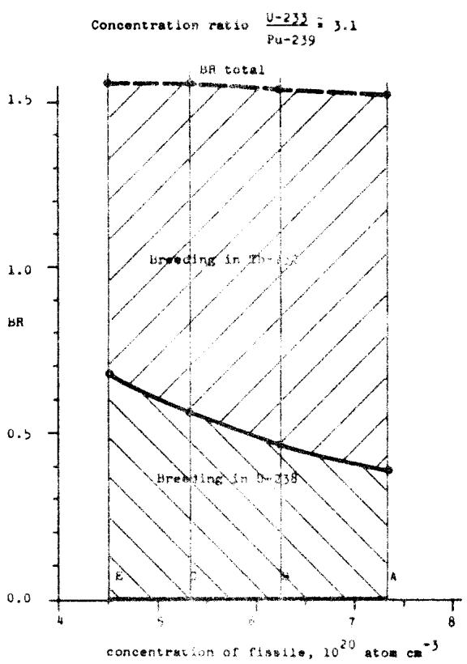  
Fig.2.9 Partial breeding ratio (NOPU-24)   
Fig. 2.10 Ratio of burning rate and ratio of breeding rate

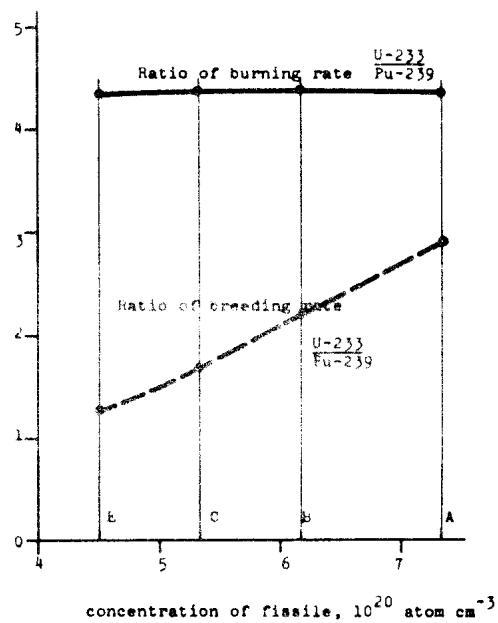

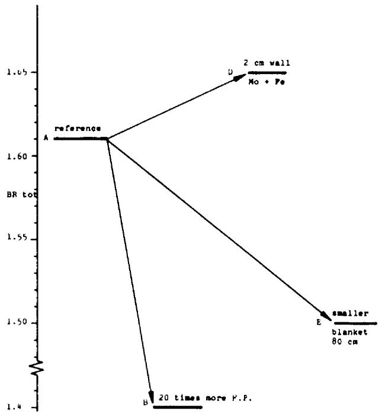  
Fig. 2.11 Impact of some selected parameters (NOPU-26 reference)

# 2.3 Material balance of the state reactor

The most important feature of this reactor is the in situ consumption of plutonium. The studies show this to be feasible. Fig. 2.12 gives the resulting material balance for the steady state reactor.

# 2.4 Conclusions

The molten chlorides fast breeder is ideally suited to the in-situ burning of plutonium matching the current requirement for a "proliferation safe" concept.

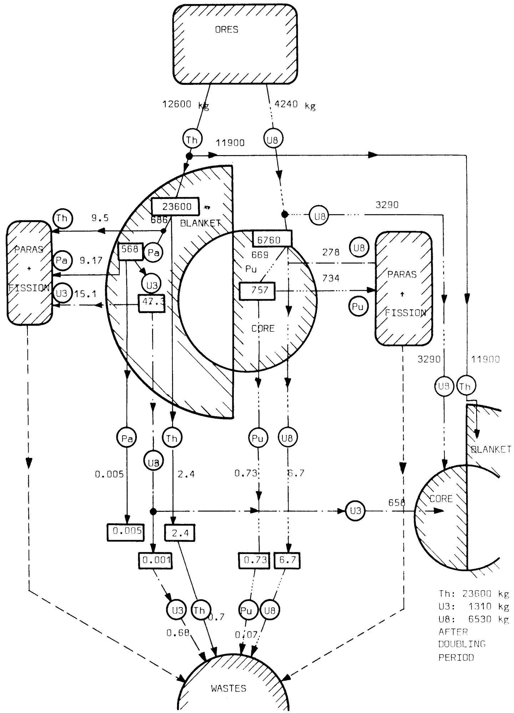  
Fig. 2.12

# 3.1 THE THREE ZONE REACTOR

# 3.1.1 Introduction

The reactor discussed now is rather unconventional because of its three zones (see Fig. 1.2)

- internal blanket zone   
- fuel zone   
- external blanket zone

This concept has been compared with the more conventional type. Holding most of the parameters the same the breeding gain comes out about equal. However, one large difference is that although the total power is the same the specific power changes by more than one magnitude being higher in the conventional central fuel zone reactor. Also the mean neutron flux increases from $1.2 \times 10^{16}\mathrm{n~cm}^{-2}\mathrm{s}^{-1}$ for the non-conventional central blanket zone to $2 \times 10^{17}\mathrm{n~cm}^{-2}\mathrm{s}^{-1}$ for the conventional central fuel zone.

Since the specific power and intensity of neutron flux is clearly a major problem form the point of view of the engineering design of the reactor (cooling, radiation damage of structural material and fuel), both systems have been studied, that is without a central blanket region and with a radius up to 110 cm. The results are given below for fuel without uranium and with uranium fuel for both cases: no internal blanket zone and with an internal blanket zone.

# 3.1.2 The three zone breeder with thorium/uranium-233

The first case is the fast breeder molten salt reactor with uranium-233 as fissile and thorium-232 as fertile material with a three region layout.

Table 3.1 gives the main details of the reactor.   

<table><tr><td>- internal fertile zone</td><td>1,</td><td>50,</td><td>90,</td><td>110</td><td>cm</td></tr><tr><td>- wall</td><td>2</td><td></td><td></td><td></td><td>cm</td></tr><tr><td>- spherical shell core</td><td>19</td><td></td><td></td><td></td><td>cm</td></tr><tr><td>- wall</td><td>3</td><td></td><td></td><td></td><td>cm</td></tr><tr><td>- external fertile zone</td><td>110</td><td></td><td></td><td></td><td>cm</td></tr><tr><td>- reflector</td><td>40</td><td></td><td></td><td></td><td>cm</td></tr></table>

# 3.2 A Three zone breeder reactor with a mixed fuel cycle U-238/Pu-239 plus Th-232/U-233

The next step is a study of a mixed fuel cycle in the three zone fast breeder reactor. This problem has received much attention and the published papers given in list D should be referred to.

A three zone fast breeder reactor with the geometry shown in table 3.1 has been calculated.

The range of variations covered include

Pu-239 or U-233 in the core U-238 Th-232 in the blanket

For a given geometry and concentration of ertile and fissile nuclides the influence of the fission products, when the concentrations are increased by a factor 10 results in a reduction in the breeding ratio by $5\%$ . An increase by a factor 10 in proactinium decreases the breeding ratio by only $2\%$ (Fig. 3.4).

For the three zone reactor calculations have also been made for mixed fuel cycles. For the fissile materials Pu-239 and U-233 and for fertile materials with U-238 in the core only and Th-232 in the blanket only.

# Table 3.1

OBJECT: Three zones thorium cycle

```txt
REACTOR TYPE : Power, Breeder  
GEOMETRY : INTERNAL ZONE : Spherical, fertile material  
(N) WALL : Metallic  
INTERMEDIATE ZONE : Shell; fissile material, active core  
WALL : Metallic  
EXTERNAL ZONE : Shell, fertile material  
WALL, REFLECTOR : Metallic 
```

```txt
POWER (GW thermal) : 2.6  
POWER DENSITY (GW therm/m³core) : 0.78 - 9.52  
NEUTRON FLUX, MEAN (n/cm²s) : 10¹⁶ 
```

```txt
FISSILE NUCLIDE : Internal Blanket  
: Core - Pu + U233  
Outer Blanket U233  
FERTILE NUCLIDE : Internal blanket Core U238  
Outer Blanket - Th 232  
DILUTENT : Chlorides  
COOLING SYSTEM : External  
BREEDING RATIO : 1.09 - 1.14 
```

```txt
PARAMETER STUDIED : Thickness of blanket  
: Thorium concentration in balnket material  
: FP and PA concentration  
: 
```

```txt
METHOD OF NEUTRONIC : ANISN, S4 23 Groups   
CALCULATION : 80 spatial positions P1 approxim. GGC-3 code ENDF/B-1 and B-2 Data 
```

Table 3.2 (THOC-300)   
Three zone reactor. Volumes and breeding ratio   

<table><tr><td>Geometry:</td><td>internal blanket, radius</td><td>110 cm</td></tr><tr><td></td><td>wall, width</td><td>3 cm</td></tr><tr><td></td><td>core, width</td><td>27 cm</td></tr><tr><td></td><td>wall</td><td>3 cm</td></tr><tr><td></td><td>external blanket, width</td><td>100 cm</td></tr><tr><td></td><td>wall reflector</td><td>140 cm</td></tr></table>

<table><tr><td colspan="4">Variable</td><td colspan="3">Results</td></tr><tr><td>Case</td><td>Internal fertile (cm)</td><td>Internal wall (cm)</td><td>U-233 concen. in core (1024/cm3)</td><td>Volume of core (m3)</td><td>Specific power (GW m-3)</td><td>Breeding ratio, total</td></tr><tr><td>B</td><td>1.0</td><td>1.0</td><td>0.0012</td><td>0.783</td><td>3.36</td><td>1.09</td></tr><tr><td>C</td><td>50.0</td><td>2.0</td><td>0.0012</td><td>1.66</td><td>1.57</td><td>1.10</td></tr><tr><td>D</td><td>90.0</td><td>3.0</td><td>0.0012</td><td>3.73</td><td>0.70</td><td>1.13</td></tr><tr><td>E</td><td>110</td><td>3.0</td><td>0.0012</td><td>5.62</td><td>0.46</td><td>1.11</td></tr><tr><td>A</td><td></td><td>3.0</td><td></td><td></td><td></td><td></td></tr><tr><td>reference</td><td>110</td><td></td><td>0.0018</td><td>3.13</td><td>0.80</td><td>1.16</td></tr><tr><td>F</td><td>110</td><td>3</td><td>0.0008</td><td>9.52</td><td>0.28</td><td>1.14</td></tr></table>

see Fig. 3.1   
[THOCL-300]   
Three zone reactor: atomic composition (atomic concentration $\times 10^{24}$ )

<table><tr><td>Internal fertile zone</td><td>Wall</td><td>Core</td><td>Wall</td><td>External blanket</td><td>Reflector</td></tr><tr><td>Th 4.5x10-3Pa 1x10-4U-33 1x10-4Cl 2.2x10-2Na 4.5x10-3variable radius(see Fig. 3.1)</td><td>Fe 7x10-2Mo 1x10-2</td><td>Th 2.5x10-3Pa 1x10-4U-33 1x10-3U-34 1x10-4variable U-233 concentration (see Table above).</td><td>Fe 7x10-2Mo 7x10-2</td><td>the same as internal blanket</td><td>Fe 7x10-2Mo 1x10-2 remark: wrong reflector with Mo!)</td></tr></table>

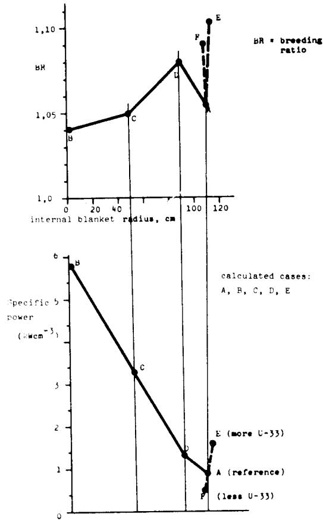  
Fi:7.1 Impact of the radius of the internal blanket (ThCL-300) on the breeding ratio

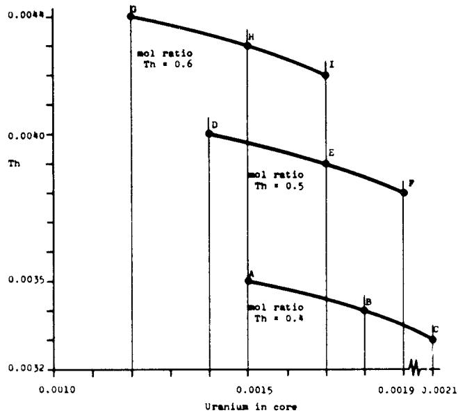  
Fig. 3.2 Concentration of thorium and uranium-233 (in $10^{24} / \mathrm{cm}^3$ )   
(THOCL-301)

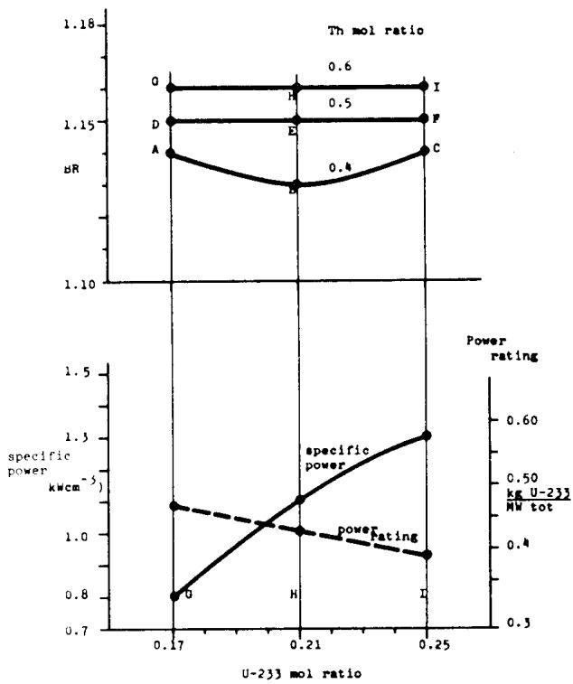  
Fig. 1.3 Uranium concentrations for given geometry   
(THOCL-301) for A, B, C, D, E, F, G, H, I,

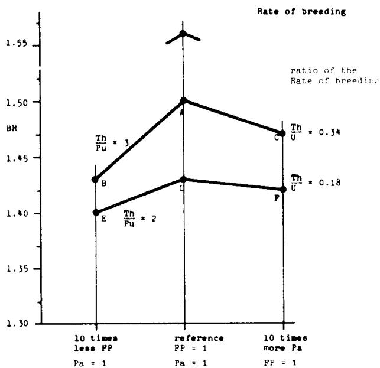  
Fig. 3.4 Three zones, mixed fuel cycle Impact of fission products and protactinium (THOCL-305)

Table 3.3 (THOCL-302)   
Influence of FP and Pa concentration   

<table><tr><td>geometry</td><td>internal blanket</td><td>wall</td><td>core</td><td>wall</td><td>external balnket</td><td>reflector</td></tr><tr><td></td><td>110 cm</td><td>3 cm</td><td>19 cm</td><td>3 cm</td><td>100 cm</td><td>40 cm</td></tr></table>

<table><tr><td rowspan="2">Case</td><td rowspan="2">Fission product content × 1024 cm-3</td><td colspan="3">Protactinium concentration corresponds to dwelling time, days.</td><td rowspan="2">Breeding ratio</td></tr><tr><td>2</td><td>6</td><td>18</td></tr><tr><td>A</td><td rowspan="3">3 x 10-5, dwelling time = 3 days</td><td rowspan="3">1 x 10-5</td><td rowspan="3">3 x 10-5</td><td rowspan="3">9 x 10-5</td><td>1.119</td></tr><tr><td>B</td><td>1.124</td></tr><tr><td>C</td><td>1.123</td></tr><tr><td>D</td><td>9 x 10-5, dwelling time = 10 days</td><td>1 x 10-5</td><td></td><td></td><td>1.1238</td></tr></table>

see also Fig. 3.4   
Remark Table 3.4 canceled

The influence of parameter variations is given in Fig. 3.5.

The following results can be noted:

the breeding ratio increases (under the given conditions) when

- the concentration of U-233 in the core decreases and U-238 increases   
- when the internal wall thickness is halved (note this is very sensitive due to the presence of 15 atom% of molybdenum)   
- when the outer fertile radius increases   
- when the inner fertile zone radius increases.

# 3.3 The three zone reactor - uranium-plutonium fuel cycle

The reference reactor is described in table 3.5 and 3.6. The thermal flux in all three zones, the external breeding zone, the fuel and the internal breeding zone is only $10^{-8}$ of the total flux and in the external blanket reaches $10^{-6}$ of the total flux. The total flux has a relatively flat distribution and even in the fuel region the max. to mean ratio is only about 1.13 (Fig. 3.6 and Fig. 3.7).

The neutron flux is rather hard and the mean neutron energy (calculated as the mean of the no. of fissions) is around 370 keV (see Fig. 3.8). In a typical LMFBR and in a gas cooled fast breeder this value is 120 keV and 176 keV respectively.

A good illustration of the influence of the most important papameters on the breeding ratio is given in table 3.7. The differences between these calculations and the computer output is approx $8\%$ .

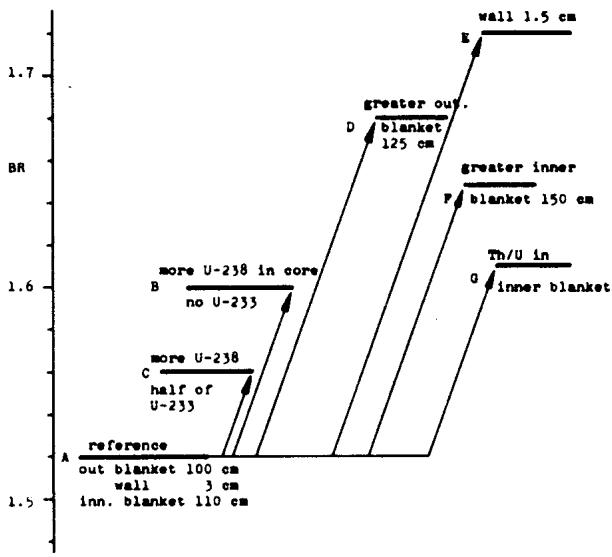  
Fig. 3.5 Three zones; mixed fuel cycle Impact of selected parameters on the breeding ratio (NOPU-1)

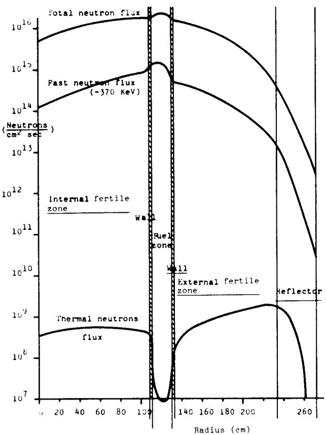  
Fig. 3.6 Three zones: uranium-plutonium fuel cycle Neutron Flux in reference reactor

# Table 3.5

OBJECT : Uranium-plutonium cycle - Maximum breeding ratio in three zones

```txt
REACTOR TYPE Optimised breeder  
GEOMETRY : INTERNAL ZONE : Spherical fertile zone  
(M) WALL : Iron, Molybdenum  
INTERMEDIATE ZONE : Core, Fuel  
WALL : Iron, Molybdenum  
EXTERNAL ZONE : Fertile zone  
WALL, REFLECTOR : Iron 
```

POWER (GW thermal) : $\sim 6$ POWER DENSITY (GW therm/m³ CORE) : 1.1  
NEUTRON FLUX, MEAN (n/cm² s) : $\sim 10^{16} - 10^{17}$

```txt
FISSILE NUCLIDE: Internal Blanket: small amounts of Pu239, U238 Core Pu 239, Pu240, Pu241, 0.7:/.2:0.1: External Blanket: small amounts of Pu239, U238 FERTILE NUCLIDE: Internal Blanket U238 DILUTENT Chlorides, Sodium COOLING SYSTEM Outer BREEDING RATIO 1.64 - 1.95 
```

```txt
PARAMETER STUDIED : Plutonium-uranium ratio With and without uranium : Reflector, Fe, Pb 
```

```txt
MEHTOD OF NEUTRONIC : see chapter 1  
CALCULATION :  
: 
```

Three Zones reactor: uranium-plutonium fuel cycle.

Table 3.6 (200/0)   

<table><tr><td>Radius cm</td><td>Width of zone cm</td><td>Zone</td><td colspan="2">Composition atoms/1024cm3</td><td>Flux thermal; total, Breeding ratio</td><td>Specific power GW/m3, Temperature:</td></tr><tr><td rowspan="5">0</td><td rowspan="5">110.0</td><td rowspan="5">I Central fertile zone</td><td>U-236</td><td>6.4x10-3</td><td>1.05x1016</td><td>T inlet=700°C</td></tr><tr><td>Pu-239</td><td>6.0x10-5</td><td>3.7x108</td><td>T outlet=800°C</td></tr><tr><td>F.P.</td><td>2.0x10-5</td><td rowspan="3">BR 0.490</td><td></td></tr><tr><td>Na</td><td>3.4x10-3</td><td></td></tr><tr><td>Cl</td><td>2.27x10-3</td><td></td></tr><tr><td rowspan="2">110.0</td><td rowspan="2">3.0</td><td rowspan="2">II Wall</td><td>Fe</td><td>7x10-2</td><td>1.15x1016</td><td>850°C</td></tr><tr><td>Mo</td><td>1x10-2</td><td>9x107</td><td></td></tr><tr><td rowspan="7">113.0</td><td rowspan="7">17.9</td><td rowspan="7">III Fuel zone</td><td>Pu-239</td><td>1.3x10-3</td><td>1.02x1016</td><td>1.1GW/m3</td></tr><tr><td>Pu-240</td><td>4.2x10-4</td><td>5.6x107</td><td>T inlet=750°C</td></tr><tr><td>Pu-241</td><td>2.4x10-4</td><td rowspan="5">BR 0.22</td><td>T outlet=1050°C</td></tr><tr><td>U-238</td><td>4.2x10-3</td><td></td></tr><tr><td>F.P.</td><td>2.0x10-5</td><td></td></tr><tr><td>Na</td><td>3.4x10-3</td><td></td></tr><tr><td>Cl</td><td>2.6x10-2</td><td></td></tr><tr><td rowspan="2">130.9</td><td rowspan="2">3.0</td><td rowspan="2">IV Wall</td><td>Fe</td><td>7.0x10-2</td><td>8.24x1015</td><td>850°C</td></tr><tr><td>Mo</td><td>1.0x10-2</td><td>2.4x108</td><td></td></tr><tr><td rowspan="3">133.9</td><td rowspan="3">109.0</td><td rowspan="3">V External fertile zone</td><td rowspan="3" colspan="2">the same as central fertile zone, I</td><td>3.9x1014</td><td>T inlet=700°C</td></tr><tr><td>1.9x109</td><td>T outlet=800°C</td></tr><tr><td>SR: 1.040</td><td></td></tr><tr><td rowspan="2">233.9</td><td rowspan="2">40</td><td rowspan="2">VI</td><td rowspan="2">Fe</td><td rowspan="2">8.0x10-2</td><td>5.2x1012</td><td></td></tr><tr><td>5x104</td><td></td></tr><tr><td>273.9</td><td></td><td></td><td></td><td></td><td></td><td></td></tr></table>

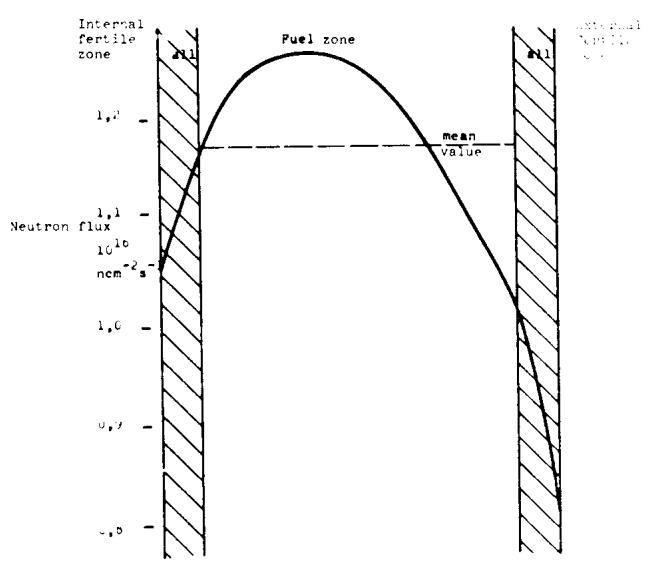  
Fig. 3.7 Three zones: uranium-plutonium fuel cycle Total flux in the fuel zone

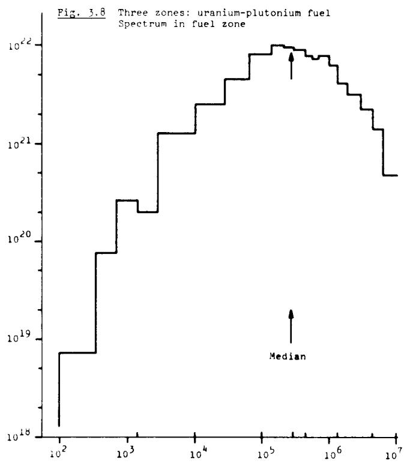  
Neutron Energy (eV)

Simplified calculation of the breeding ratio and neutron balance.

Table 3.7 Three Zone reactor: uranium-plutonium fuel   

<table><tr><td></td><td colspan="2">Parameter</td><td>Component of breeding ratio</td></tr><tr><td>Median energy</td><td>keV</td><td>370</td><td></td></tr><tr><td>Pu-239</td><td>σf(barn)</td><td>1.83</td><td></td></tr><tr><td>(from computer output)</td><td>σc(barn)</td><td>0.180</td><td></td></tr><tr><td></td><td>ν</td><td>2.95</td><td></td></tr><tr><td></td><td>α</td><td>0.0984</td><td></td></tr><tr><td>Breeding potential</td><td>(η-1)</td><td>1.6857</td><td>1.685</td></tr><tr><td>Fission ratio fertile/fissile</td><td>δ</td><td>0.37</td><td></td></tr><tr><td>Fast bonus</td><td>(v-1)/1+α</td><td>0.539</td><td>0.539</td></tr><tr><td>Total positive</td><td></td><td></td><td>2.225</td></tr><tr><td>Losses (absorption in FP, Cl, Na, Mo, Fe)</td><td></td><td>0.160</td><td></td></tr><tr><td>Leakage (arbitrarily)</td><td></td><td>0.10</td><td></td></tr><tr><td>Total losses</td><td>Loss+α/1+α</td><td>0.32</td><td>0.320</td></tr><tr><td>Calculated BR (micro)</td><td></td><td></td><td>1.890</td></tr><tr><td>Computed BR (macro)</td><td></td><td></td><td>1.752</td></tr></table>

# 3.4 The three zone breeder reactor: Very high breeding gain

One of the most important factors in achieving a very high breeding ratio is the hardness of the neutron flux. This is strongly influenced by the fuel composition.

In this case the fuel is postulated to be a mixture of

a $\mathrm{PuCl}_3\cdot$ b NaCl $\cdot$ c UCL3 where

a = 0.1 - 0.2, b = 0.7 - 0.8, c = 0.1 - 0.2

Unfortunately not all data are available for this system. (see Fig. 6.9)

The rough calculations on changing the concentration of $\mathrm{PuCl}_3$ in the melt of NaCl (Fig. 3.9) shows a rather sharp decrease of breeding gain (BG) for decreasing plutonium concentration, especially when the plutonium molar ratio to sodium is lower than 0.25.

In spite of these uncertainties of the PuCl3-NaCl-UCl3 system, the influence of the U-238 in the fuel has also been calculated. For a constant PuCl3 concentration with a simplified assumption for the NaCl concentration the results are given in Fig. 3.10 and 3.11.

Increasing the ratio of uranium to plutonium in the fuel from 0 to 3 causes the total breeding gain to increase from 0.65 to 0.95. This is rather clear and thus the reference reactor concept includes uranium in the fuel in a ratio of 2:1 to plutonium.

Such a high breeding gain is a special feature of this type of reactor for producing large quantities of fissile material.

Fig. 3.12 and 3.13 give the results of calculation when the radius of the central fertile zone is varied. Table 3.8 shows the simplified calculation of central and external fertile zone breeding ratios.

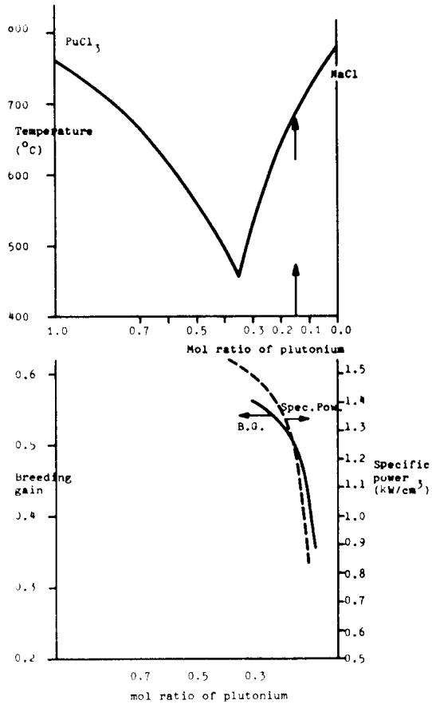  
Fig. 3.9 Impact of Plutonium Concentration

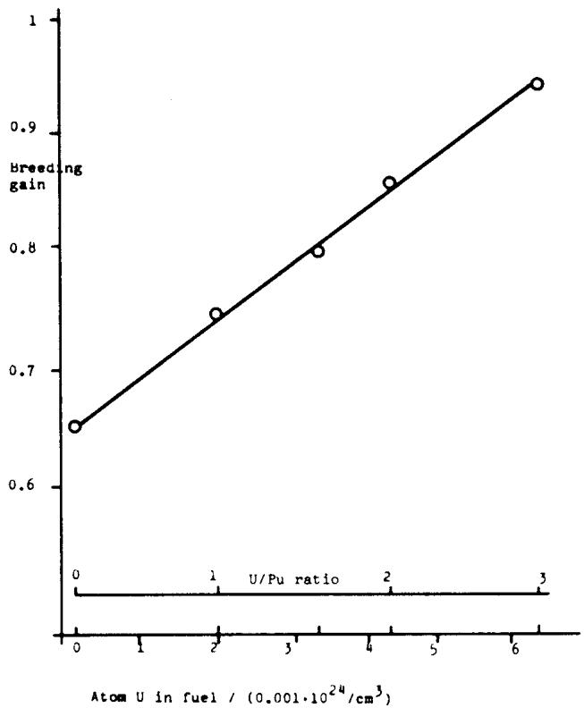  
Fig. 3.10 Three zones: uranium-plutonium fuel cycle Impact of U-235 concentration in the fuel Pu-Concentration: $0.0021x10^{24}$ atom/cm

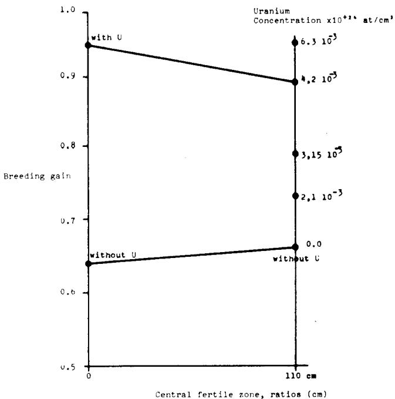  
Fig. 3.11 Three zones: uranium-plutonium fuel cycle Impact of Uranium concentration in the fuel (202/201) versus central fertile zone

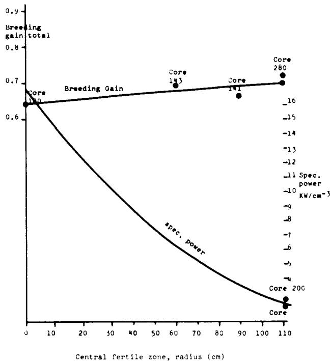  
Fig. 3.12 Three zones: uranium-plutonium fuel gele Impact of central fertile zone radius (No U in fuel)

From these results the following conclusions can be drawn

- increasing the raius of the internal fertile zone up to 110 cm increases the breeding gain for a given type of fuel. The effect of wall and fertile material changes are insignificant   
- at the same time the specific power decreases dramatically   
- increasing the U/Pu ratio from 2 to 3.6 does not influence the total breeding gain (see Fig. 3.13)   
- the FP concentrations play a rather significant role (Fig. 3.14)

Table 3.8   

<table><tr><td></td><td>Internal fertile zone</td><td>Fuel zone</td><td>External fertile zone</td><td>Total breeding ratio</td></tr><tr><td rowspan="2">Case (Number)</td><td>Pu-239 U fiss cap</td><td>Pu-239 f Pu-241 f</td><td>Pu-239 U f fiss cap</td><td></td></tr><tr><td>oxv oxv</td><td>oxv oxv</td><td>oxv oxv</td><td></td></tr><tr><td>three zones (200)</td><td>0.14 0.308 0.8</td><td>3.05 0.351</td><td>0.30 0.47 1.83</td><td>1.70</td></tr><tr><td>two zones (180)</td><td>-</td><td>3.63 0.367</td><td>0.04 0.46 2.50</td><td>1.63</td></tr></table>

The influence of the 40 cm reflector if changed from iron to lead is not very great as shown in table 3.9

Fission product concentration however plays a very important role. For a given reactor design and given fuel and fertile compositions, increasing the concentration of fission products (simulated here with Cs-133 only) from $2 \times 10^{-5}$ to $2 \times 10^{-4}$ (in $10^{24} / \mathrm{cm}^3$ ) decreases the breeding gain from 0.65 to 0.38 when the specific power decreases less than a factor two.

Central fuel (Core 180)

(wall 2.5 cm Pu = 2.1×10-3 × atom/10²⁴cm³)

Table 3.9 Three zone reactor: uranium-plutonium fuel   

<table><tr><td>Case</td><td>A</td><td>B</td><td>C</td></tr><tr><td>Uranium 238 in fuel</td><td>no</td><td>yes</td><td>no</td></tr><tr><td></td><td></td><td>4.2×10-3×1024atom/cm3</td><td></td></tr><tr><td>Reflector 40 cm: material</td><td>Fe</td><td>Fe</td><td>Pb</td></tr><tr><td>Volume fuel x 105cm3</td><td>2.95</td><td>2.40</td><td>2.97</td></tr><tr><td>Spec. power in fuel kW/cm3</td><td>18.4</td><td>23.0</td><td>18.3</td></tr><tr><td>Breeding ratio total</td><td>1.64</td><td>1.94</td><td>1.66</td></tr><tr><td>Total flux of fuel zone n/cm2s</td><td>1.18×1017</td><td>1.25×1017</td><td>1.187×1017</td></tr></table>

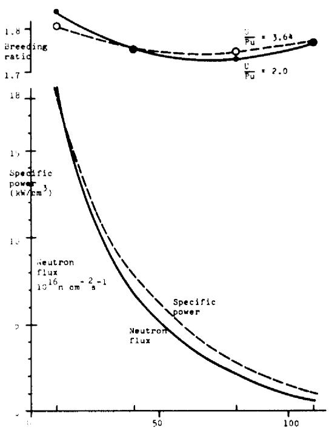  
Fig.1.1 Three zones: uranium-plutonium fuel Breeding ratio versus radius of internal fertile zone   
Radius of internal fertile zone, (cm)   
Fig. 3.14 Three zones: uranium-plutonium fuel gele Impact of Fission Products Concentration in fuel

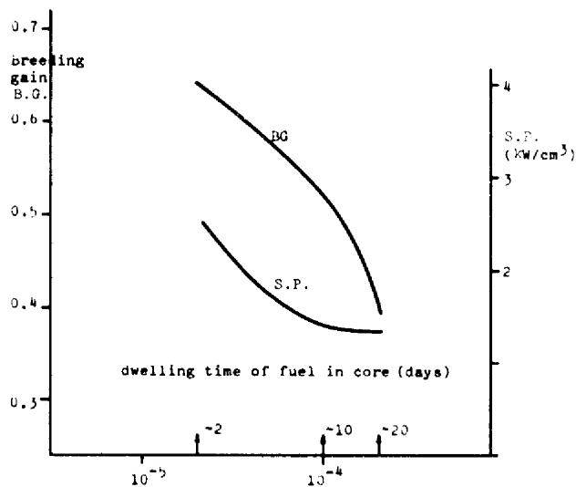  
(very simplified, from different calculations)   
Concentration of P.P. atoms $\cdot 10^{24} / \mathrm{cm}^3$

In the steady state reactor a concentration of $2 \times 10^{-5}$ atoms F.P. $\times 10^{24} / \mathrm{cm}^3$ for a fuel having $2.1 \times 10^{-3}$ atoms $\mathrm{Pu} \times 10^{24} / \mathrm{cm}^3$ is reached for a specific power of $2 \mathrm{GW} / \mathrm{m}^3$ after a time $t$ of

$$
t = \frac {\left(2 \times 1 0 ^ {- 5}\right) \times 1 0 ^ {2 4}}{\left(2 \times 1 0 ^ {3}\right) \left(3 . 1 \times 1 0 ^ {1 0}\right) \times 2} = 1. 6 1 \times 1 0 ^ {5} s
$$

that is after 1.87 days. The higher fission product concentration - that is $2 \times 10^{-4}$ corresponds to 18.7 days of mean dwell time $f$ or the fuel in the reactor.

The influence of chlorine-37 separation may now be looked at. The influence of each absorber on the breeding ratio is given by

$$
B = \frac {A + D + L + \alpha}{1 + \alpha}
$$

B = decrement of breeding ratio

A = absorption rate in a given absorber

$D =$ absorption rate in rest of absorbers

L = leakage

$\alpha = \sigma_{\mathrm{C}} / \sigma_{\mathrm{f}}$

It can be postulated that for a strong absorber in a hard (fast) spectrum that

A $= 0.15$

口 $+$ L =0.15

$\alpha = 0.15$

The relative influence on the rather high breeding ratio of 1.6 results in a case where the profit of the separation factor will be for example 0.3 then

$$
\Delta B \frac {0 . 9 \times 0 . 1 5}{1 . 1 5} = 0. 1 2
$$

and in relation to the breeding gain

$$
\Delta G \frac {0 . 1 2}{0 . 6} = 0. 2 0
$$

which results in an increase in doubling time of

$$
\frac {T _ {2}}{T _ {2}} = \frac {G}{G + \Delta G} = 0. 8 3
$$

It can be seen that introducing three zones does not result in any significant increase in the breeding gain (table 3.10). Therefore the two zone reactor must be preferred for its simpler layout.

Table 3.10 Fuel in central zone (2 zone reactor) versus fuel in middle zone (3 zone reactor)   

<table><tr><td colspan="2">Core, Case Number</td><td>Two zones (conventional) (130)</td><td>Three zones (nonconventional) (200)</td></tr><tr><td rowspan="3">Geometry</td><td>Central Zone</td><td>Fuel 100 cm</td><td>Blanket 110 cm</td></tr><tr><td>Middle Zone</td><td>---</td><td>Fuel ~18 cm</td></tr><tr><td>Outer Zone</td><td>Blanket 100 cm</td><td></td></tr><tr><td>Thermal power, GW</td><td></td><td>6</td><td>6</td></tr><tr><td>Pu/FP ratio</td><td></td><td>2.1x10-3/2x10-5</td><td>2.1x10-3/2x10-5</td></tr><tr><td>Spec. power, kW/cm3</td><td></td><td>17.7</td><td>1.41</td></tr><tr><td>Power in fuel,%</td><td></td><td>90.9%</td><td>76.2%</td></tr><tr><td>Flux total left} in fuel right</td><td>boundary</td><td>2.04x1017/1.15x1017</td><td>1.2x1016/1.08x1016</td></tr><tr><td>Flux in left outer} blanket right</td><td>boundary</td><td>8.99x1016/2.16x1015</td><td>9.7x1015/1.5x1014</td></tr><tr><td>Breeding gain</td><td></td><td>0.63</td><td>0.70</td></tr><tr><td>Median energy (group)</td><td></td><td>~9</td><td>10</td></tr></table>

3.5 The two zone fast breeder. Fuel of uranium plutonium fluorides

3.5.1 Introduction

The aim of this section is to give a rough idea of a fast breeder power reactor having the fuel in form of plutonium trifluoride in the molten state instead of molten chloride. (Table 3.11)

The earlier suggestions for a reactor of this type came from A.M. Weinberg.

The first attempts at carrying out calculations on a reactor of this type were not successful because a fuel was chosen having a high concentration of light metals, lithium and beryllium.

A very rough attempt by J. Ligou and the author (1972) shows the possibility for a fast breeder reactor with molten plutonium fluoride where the light metals were eliminated and the melting point increased.

P. Faugeras (Fautenay aux Roses) claimed that the fluoride of U-233 and Th-232 can be used for non-thermal reactors.

Some preliminary results for a three zones reactor are given in a short form in Table 3.12. The neutron flux remains rather hard (Fig. 3.15).

3.5.2 Arbitrary assumptions and uncertainties

The fuel composition has been arbitrarily chosen since the appropriate data is lacking in the literature. In most cases the following fuel composition has been used

1 $\mathrm{PuF}_{3} / 1.2 \mathrm{NaF}$

(Tmelt 727°C)

+ 2.4 NaF / 1 Zr F<sub>4</sub>

(Tmelt ≈ 510°C)

another alternative would be

$\mathrm{PuF}_{3} / 2 \mathrm{NaF}$

$\mathrm{CaF}_{2} / 3 \mathrm{NaF}$

(Tmelt ≈ 820°C)

Table 3.11

OBJECT: Fast Breeder, Molten Fluoride, Three zones

```txt
REACTOR TYPE : Power  
GEOMETRY : INTERNAL ZONE = Fertile zone  
(M) WALL : Iron, Graphite  
INTERMEDIATE ZONE : Fuel, fluoride  
WALL : Iron, No, Graphite  
EXTERNAL ZONE : Fertile zone  
WALL, REFLECTOR : Iron 
```

```txt
POWER (GW thermal) : 6  
POWER DENSITY (GW therm/m<sup>3</sup> CORE) : 3.5  
NEUTRON FLUX, MEAN (n/cm<sup>2</sup>s) : 10<sup>1</sup> 
```

FISSILE NUCLIDE : Plutonium. Fuel composition $\mathsf{PuF}_3$ , NaF, ZrF4 FERTILE NUCLIDE : U-238 DILUTENT : NaF, ZrF4 COOLING SYSTEM : External BREEDING RATIO : 1.38 (up to 1.51 with higher specific power)

```txt
PARAMETER STUDIED: wall structural material: graphite Wall: beryllium, Iron, thickness Fission product concentration 
```

METHOD ON NEUTRONIC : FLUORIDE+ recalculated ANISN  
CALCULATION : from Hansen-Roach Regions 6  
: Fission product Meshes 110  
only as Cs-133 Order of quadrature $\mathbf{S}_4$ Anistropy P1 23 neutron groups incl. thermal ENDF B/III

Power rating, total = 1 kg Pu/Mwth, Doubling time = 6.5 years.

Table 3.12 Design of fast breeder molten fluoride reactor (Three zone: 6 GW(thermal))   

<table><tr><td>Radius cm</td><td colspan="2">Zone</td><td colspan="2">Components molecules per cm3×1024</td><td>Flux total thermal</td><td>Breeding ratio</td></tr><tr><td rowspan="7">080.081.098.2100.2200.0240.0</td><td>I</td><td>Internal Blanket liquid state</td><td>UF4NaF PuF3</td><td>6×10-36×10-36×10-5</td><td>1.8×10165.8×1012Tmean = 800°C</td><td>0.42</td></tr><tr><td>II</td><td>Wall</td><td>FeMo (graphite is also possible)</td><td>7×10-21×19-2</td><td>1.86×10162.2×1012</td><td>--</td></tr><tr><td>III</td><td>Fuel liquid state</td><td>Pu-239 F3Pu-240 F3Pu-241 F3NaF ZrF4F.P. (Cs133)</td><td>1.47×10-34.2×10-42.1×10-47.5×10-35.1×10-30.2×10-3</td><td>1.57×10161.00×1016Tinlet = 750°C Tout = 1050°C</td><td>fertile material pu-2400.056</td></tr><tr><td>IV</td><td>Wall</td><td>FeMo (graphite is also possible)</td><td>7×10-21×10-2</td><td>1.37×10165.2×1012</td><td>--</td></tr><tr><td>V</td><td>External blanket liquid state</td><td>UF4NaF PuF3</td><td>6×10-36×10-36×10-5</td><td>8.8×10132.5×1011Tmean = 800°C</td><td>0.889</td></tr><tr><td>VI</td><td>Reflector</td><td></td><td></td><td>9.5×10115.3×106</td><td>--</td></tr><tr><td></td><td></td><td></td><td></td><td>Total</td><td>BR = 1.38</td></tr></table>

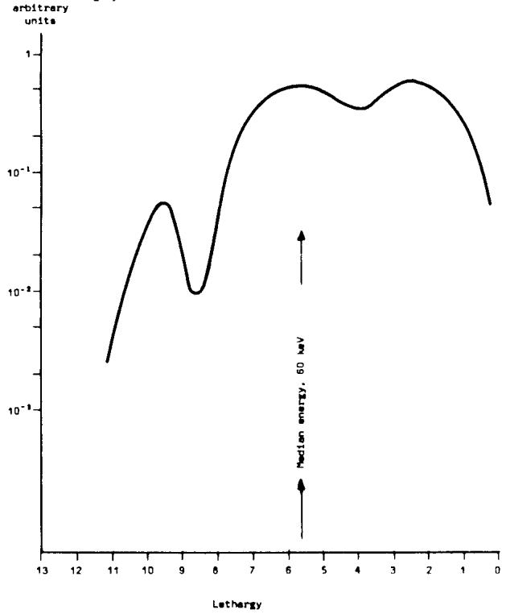  
Fig. 3.15 Neutron spectrum in molten fluoride feat breeder (roughly)

The results obtained, in spite of the uncertainties are encouraging. The simplified breeding ratio calculation gives a $BR_{tot}$ of 1.51 and the computed value is $BR_{tot} = 1.465$ (table 3.13).

Table 3.14a shows that the influence of fission products is very significant (see also Fig. 3.16). However the change of structural material of the wall form beryllium to iron has only a small effect on the breeding ratio and specific power (table 3.14b and Fig. 3.17).

In the calculations for three zones studies here, increasing the radius of the internal fertile zone from 60 cm to 80 cm, that is a volume increase of 2.37 has little effect on the total breeding ratio in spite of changes in the regional breeding ratios (table 3.15a and Fig. 3.18).

Altering the small amounts of plutonium in the fertile material as a result of reprocessing efficiencies also has only a small effect on the breeding ratio and specific power (table 3.15b and Fig. 3.19).

Because of the good experience of American and French groups using graphite as a structural material for molten fluordie thermal breeders, calculations have been made using graphite for separating walls for fast breeders. Graphite 2 cm thick as the wall material was chosen.

The results are rather encouraging. The breeding ratio using graphite is still very high, even slightly higher and the specific power in the fuel is lower (table 3.16a and Fig. 3.20).

Changing from the complicated design of three zones with fuel in the intermediate shell, to the "classical" two zone design having fuel in the central region results in a dramatic increase in specific power to a prohibitive $26\mathrm{kW.cm}^{-3}$ (table 3.16b, Fig. 3.21, table 3.17).

Table 3.13 Simplified calculation of the breeding ratio   

<table><tr><td>Median energy (from computer calculation)</td><td>keV</td><td>60</td></tr><tr><td rowspan="6">Pu-239</td><td>σf(barn)</td><td>1.459</td></tr><tr><td>σc</td><td>0.2328</td></tr><tr><td>ν</td><td>2.899</td></tr><tr><td>α</td><td>0.18</td></tr><tr><td>η</td><td>2.4568</td></tr><tr><td>η - 1</td><td>1.4568</td></tr><tr><td>U-238 (arbitrary)</td><td>ν&#x27;</td><td>2.60</td></tr><tr><td>Fast fission of ertile component 
(from computer output)</td><td>δ</td><td>0.25</td></tr><tr><td>Fast bonus</td><td>(v&#x27;-1) x δ/1+α</td><td>0.34</td></tr><tr><td>Total positive</td><td>Σ positive</td><td>1.79</td></tr><tr><td>Losses by absorption (from computer)</td><td>Lab</td><td>0.1</td></tr><tr><td>Leakage (assumption)</td><td>Lleack</td><td>0.05</td></tr><tr><td>Total losses</td><td>Ltot</td><td>0.15</td></tr><tr><td>Total negative</td><td>Ltot+α/1+α</td><td>0.28</td></tr><tr><td>Breeding ratio = total positive - total negative</td><td>BR (micro)</td><td>1.510</td></tr><tr><td>Breeding ratio (from computer output)</td><td>BR (macro)</td><td>1.465</td></tr></table>

Table 3.14a Three zones reactor: fluoride fuelled fast breeder reactor

Influence of Fission Products.

BR = Breeding ratio, total

Table 3.14b Three zones reactor: fluoride fuelled fast breeder reactor   

<table><tr><td>Core Number</td><td>Wall fuel/external blanket 2 cm</td><td>Fission products (Cs-133) atoms/cm3 x 1024</td><td>B.R.</td><td>Specific power GW/m3</td></tr><tr><td>163</td><td>Be</td><td>0.0001</td><td>1.437</td><td>4.33</td></tr><tr><td>164</td><td>Be</td><td>0.0002</td><td>1.427</td><td>4.24</td></tr><tr><td>166</td><td>Be</td><td>0.0040</td><td>1.14</td><td>2.32</td></tr><tr><td>167</td><td>Fe</td><td>0.0040</td><td>1.12</td><td>2.12</td></tr></table>

(see also Fig. 3.16)

Influence of the beryllium-moderator

F.P. = 0.0002 atom × $10^{24} / \mathrm{cm}^3$

<table><tr><td rowspan="2">Core Number</td><td colspan="2">Material</td><td rowspan="2">B.R.</td><td rowspan="2">Specific power GW/m3</td></tr><tr><td>2 cm</td><td>1.5 cm</td></tr><tr><td>164</td><td>Be</td><td rowspan="3">Be</td><td>1.427</td><td>4.24</td></tr><tr><td>162</td><td rowspan="3">Fe</td><td>1.464</td><td>4.19</td></tr><tr><td>165</td><td>1.38</td><td>3.45</td></tr><tr><td>161</td><td>Ce</td><td>1.37</td><td>3.47</td></tr></table>

(see also Fig. 3.17)

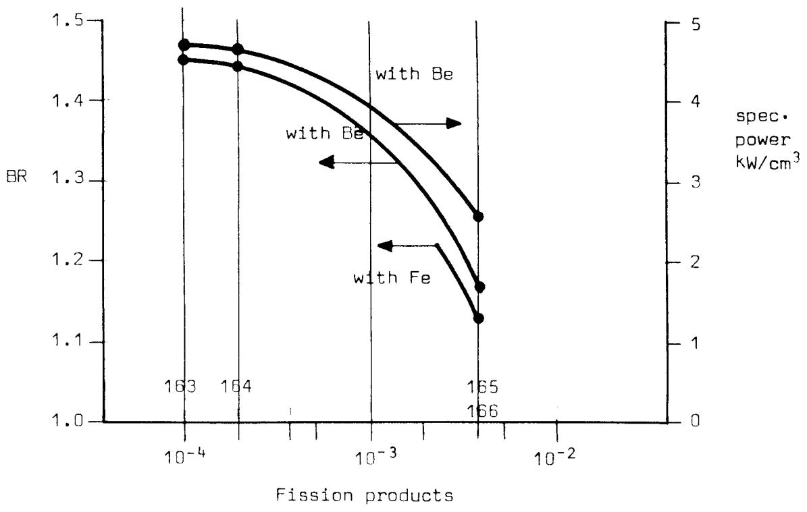  
Fig. 3.16 Impact of fission products

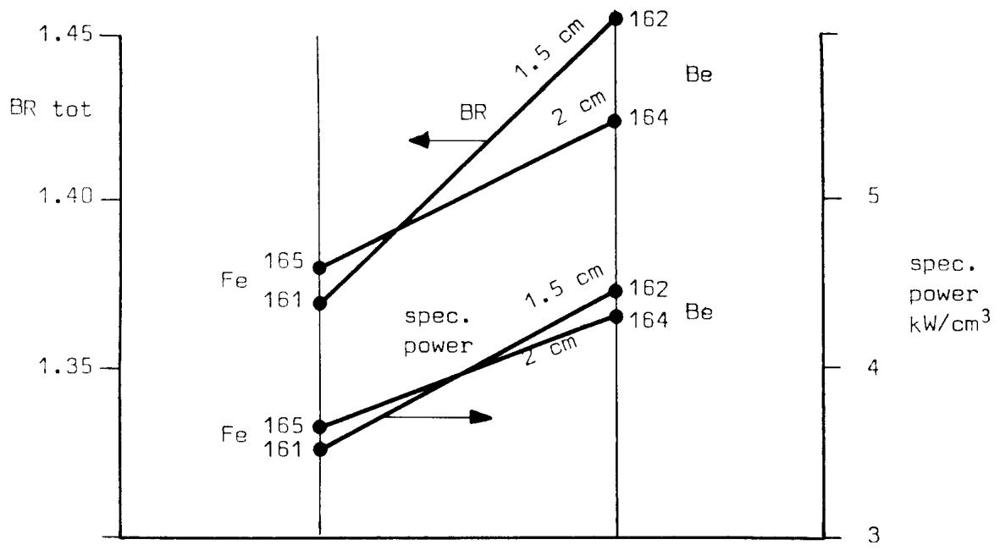  
Fig. 3.17 Impact of the beryllium and iron moderator on BR and spec. power

Table 3.15a Three zone reactor: fluoride uranium-plutonium fuel Influence of the radius of the internal fertile zone   

<table><tr><td rowspan="2">Number of Core</td><td rowspan="2">Radius of internal fertile zone, cm</td><td colspan="4">Breeding ratio</td></tr><tr><td>internal fertile zone</td><td>fuel</td><td>external fertile zone</td><td>total</td></tr><tr><td>165</td><td>80</td><td>0.42</td><td>0.056</td><td>0.889</td><td>1.364</td></tr><tr><td>169</td><td>60</td><td>0.34</td><td>0.053</td><td>0.99</td><td>1.379</td></tr><tr><td>Ratio of cores</td><td>Ratio of volume</td><td></td><td></td><td></td><td></td></tr><tr><td>165/169</td><td>2.37</td><td>1.21</td><td>1.05</td><td>0.898</td><td>0.989</td></tr></table>

(see Fig. 3.18)

Table 3.15b Three zone reactor: fluoride uranium-plutonium fuel Influence of Pu-239 in the fertile material   

<table><tr><td>Number of core</td><td>Pu-239 in fertile material</td><td>F.P. concentration</td><td>B.R. tot</td><td>Spec. power GN/m3</td></tr><tr><td>168</td><td>0.001</td><td>2 × 104</td><td>1.49</td><td>3.79</td></tr><tr><td>161</td><td>0.01</td><td>2 × 10-5</td><td>1.37</td><td>3.471</td></tr><tr><td>Ratio of cores</td><td></td><td></td><td></td><td></td></tr><tr><td>168/161</td><td>8.1</td><td>10</td><td>1.09</td><td>1.09</td></tr></table>

(see Fig. 3.19)

Fig. 3.18 Three zones fluoride uranium-plutonium fuel Impact of radius of internal blanket   
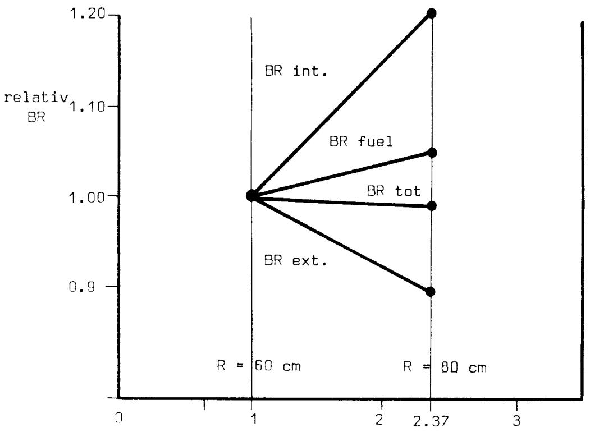  
internal fertile zone volume, relativ

Fig. 3.19 Three zones: fluoride uranium-plutonium fuel Impact of Pu-239 in fertile material   
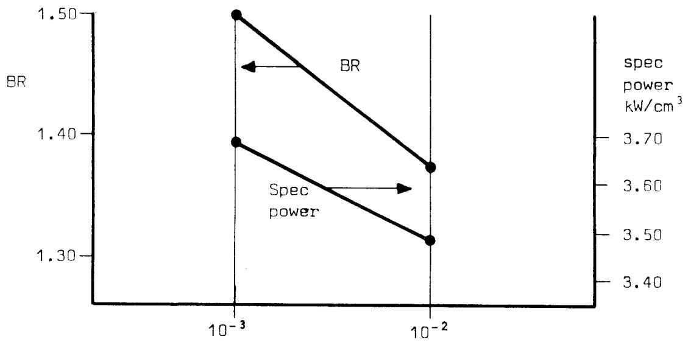  
Relativ Pu concentration; U-238 = 1.0

Table 3.16a Three zonesreactor: fluoride uranium-plutonium fuel Influence of graphite as structural material   

<table><tr><td>Number of core</td><td>1st wall between internal fertile zone and fuel 2 cm</td><td>2nd wall between fuel and external fertile zone 2 cm</td><td>B.R. Total</td><td>Spec. power; Gw/m3</td></tr><tr><td>164</td><td>Fe, Mo</td><td>Be met</td><td>1.427</td><td>4.24</td></tr><tr><td>171</td><td>C graphite</td><td>C graphite</td><td>1.45</td><td>3.65</td></tr><tr><td>Ratio of cores</td><td></td><td></td><td></td><td></td></tr><tr><td>171/164</td><td>graphite Fe</td><td>graphite Be</td><td>1.02</td><td>0.86</td></tr></table>

(see Fig. 3.20)

Table 3.16b Two zones reactor: fluoride uranium-plutonium fuel Influence of the geometry of the reactor   

<table><tr><td rowspan="2">Number of core</td><td colspan="3">Structure</td><td rowspan="2">B.R. total</td><td rowspan="2">Spec. power GW/m3</td></tr><tr><td>Internal zone</td><td>Intermediate zone</td><td>External zone</td></tr><tr><td>160 two zone reactor</td><td>Fuel</td><td>Blanket zone</td><td>Cooling zone</td><td>1.424</td><td>26.7</td></tr><tr><td>161 three zone reactor</td><td>Blanket</td><td>Fuel cooled out of core</td><td>Blanket</td><td>1.37</td><td>3.47</td></tr><tr><td>Ratio of cores 160/101</td><td></td><td></td><td></td><td>1.04</td><td>7.69</td></tr></table>

(see Fig. 3.21)

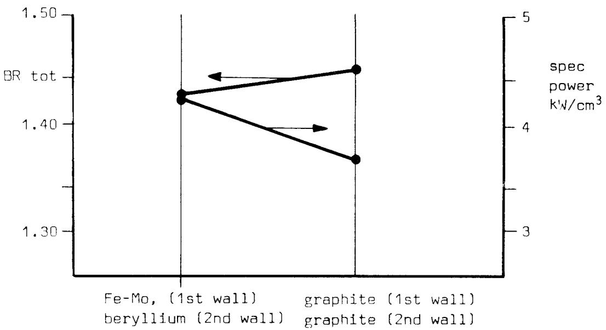  
Fig. 3.20 Three zones-fluoride uranium-plutonium fuel Graphite instead of beryllium as a structural material

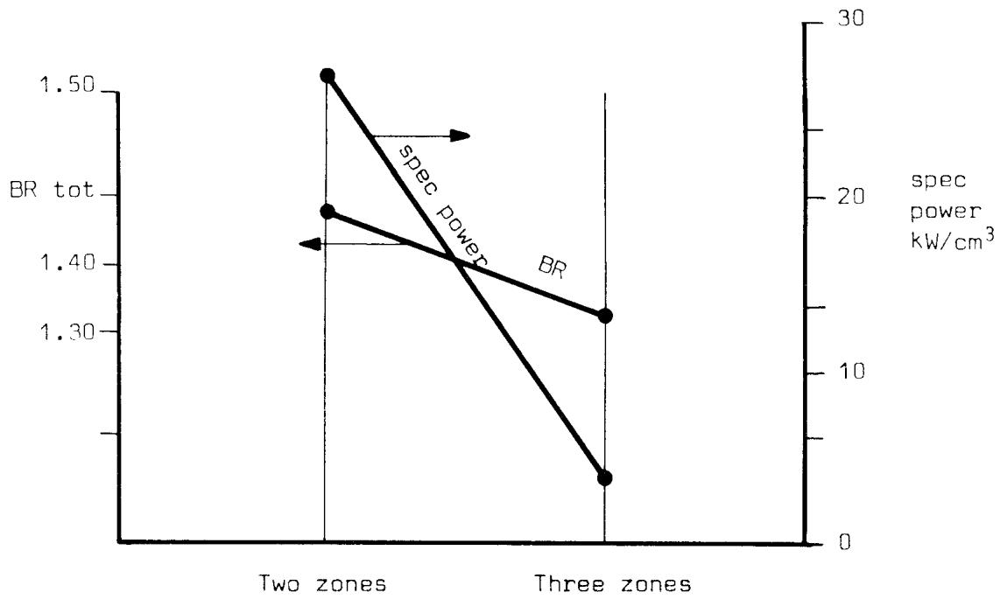  
Fig. 3.21 Two zones: fluoride uranium-plutonium fuel Impact of geometry

Table 3.17 Three zones reactor: fluoride uranium-plutonium fuel Influence of the plutonium concentration   

<table><tr><td>Number of Core</td><td>Pu total in fuel Mol %</td><td>Atoms cm3x1024</td><td>B.R. tot.</td><td>B.G. gain</td><td>Spec. Power GW/m3</td></tr><tr><td>165</td><td>14</td><td>0.0022</td><td>1.38</td><td>0.38</td><td>3.45</td></tr><tr><td>172</td><td>7</td><td>0.0011</td><td>1.05</td><td>0.05</td><td>4.05</td></tr><tr><td>Ratio of cores</td><td></td><td></td><td></td><td></td><td></td></tr><tr><td>172/165</td><td>0.5</td><td>0.5</td><td>0.76</td><td>0.13</td><td>1.17</td></tr></table>

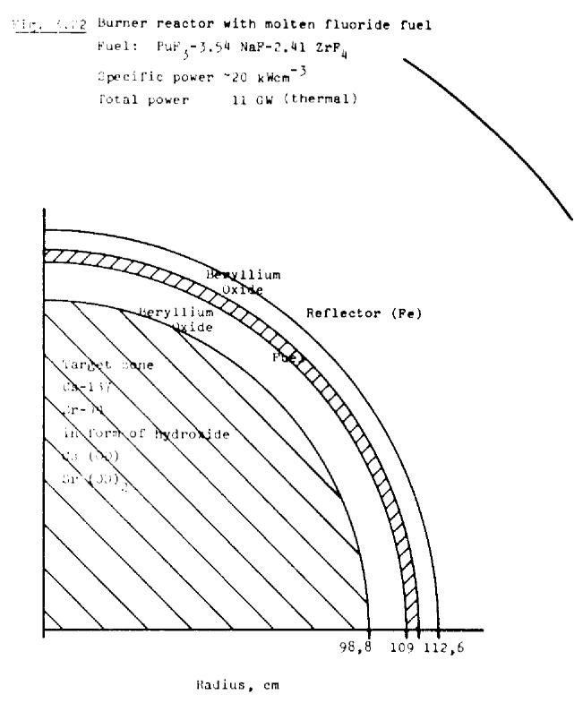

# 3.6 High Flux Reactor with Fluoride Fuel

Can a fluoride fuelled burner, as opposed to a chloride fuelled reactor be considered as a reactor for transmitting fission products? (See chapter 4, for the high flux transmutation reactor).

In such a reactor a fuel made up of $\mathrm{PuF_3 / 5.4NaF / 2.4ZrF_4}$ has been assumed. The calculations have been carried out for a larger Bruner of 11 GW(th) and the fission products are assumed to be generated in a total system of 55 GW(th).

The results are not encouraging in spite of the fact that the neutron lflux in the target region was 1.05 times higher for the fluoride fuelled reacotr as opposed to the chloride fuelled reactor (Table 3.18, Fig. 3.22).

The effective half life of both fission product nuclides was (in years)

<table><tr><td></td><td>In fluoride
fuelled
reactor</td><td>In chloride
fuelled
reactor
(reference)</td></tr><tr><td>Cs-137</td><td>8.57</td><td>8.93</td></tr><tr><td>Sr-90</td><td>1.73</td><td>1.83</td></tr></table>

These "benefits" must be balanced against a specific power which is twice as high as the reference case. In the fluoride core this is $19.9 \, \text{GW.m}^{-3}$ and for the chloride reactor $10.1 \, \text{GW.m}^{-3}$ . Such a high specific power is not realisable.

In addition since graphite might be used in place of beryllium oxide as moderator (possible for a neutronic viewpoint) a significant improvement in corrosion problems is obtained. This has been proved by the excellent experience of Oak Ridge National Laboratory with one proviso - at ORNL the fuel was LiF - BeF $_2$ - ThF $_4$ - UF $_4$ .

Total power 11 GW(th)

Burning fission products form a total system of 55 GW(th)

Table 3.18 High-flux burner reactor with fluoride fuel   

<table><tr><td>Zone Radius (cm) Volume (m3)</td><td>Components (atom 1024cm-3)</td><td>Neutron flux 1016cm-2s-1total thermal</td><td>Specific power (GW m-3) Transmutation rate (s-1)</td></tr><tr><td>I - 98.8 cm Target zone Vol: 4.1 m3</td><td>Cs-137 0.0116 Sr-90 0.0016 Oxygen 0.0145 Deuter 0.0145</td><td>4.01 2.21</td><td>Cs-137 : 1.8x10-9Sr-90 : 1.2x10-8</td></tr><tr><td>II 33.8 - 109 cm Noderator, wall</td><td>Be 0.060 Oxygen 0.060 with thin graphite layer</td><td>5.09 1.83 5.25 0.239</td><td></td></tr><tr><td>III 1.9 - 112.6 cm Fuel zone Vol: 0.55 m3</td><td>Pu-239 0.0017 Pu-240 0.00042 Pu-241 0.00021 Na 0.0075 Zr 0.0051 F 0.0340</td><td>5.02 0.0457</td><td>19.9 GW m-3</td></tr><tr><td>IV 112.6 - 118.6 cm wall</td><td>Be 0.060 Oxygen 0.060</td><td>4.87 0.034 3.9 0.041</td><td></td></tr><tr><td>V 113.6 - 218.0 cm Reflector zone</td><td>Fe 0.08</td><td>0.0023 2.8x10-9</td><td></td></tr></table>

4. A HIGH FLUX BURNER REACTOR FOR TRANSMUTATION

4.1 Need for fission product transmutation

4.1.1 Introduction

The problems associated with the management of highly radioactive fission product waste has been intensively and extensively discussed (Fig. 4.1).

Here only the transmutation of fission products (F.P.) is dealt with. The recycling of the actinides is not treated. Transmutation occurs by using neutron irradiation in a fission reactor.

A short outline of this chapter can be presented in the form of the following questions

- why, contrary to many assertions, is neutron transmutation in a fusion reactor not feasible? - this in spite of the fact that the fusion machine has often been proposed for this purpose   
- why are recent opinions concerning transmutation in fission reactors rather pessimistic?   
- could transmutation in a fission reactor be possible taking into account the neutron balance in a breeding system?   
- which fission products are candidates for irradiation in a fission reactor?   
- is the rate of transmutation sufficiently high in a fission reactor?   
- in what type of reactor is the transmutation physically possible?   
- what are the limiting parameters for transmutation in a solid fuelled fission reactor?   
- is a very high flux fission reactor possible if the fuel is in the liquid state instead of the solid state?

Fig. 4.1 POSSIBILITIES FOR TRANSMUTATION OF $^{90}\mathrm{Sr}$ AND $^{137}\mathrm{Cs}$ (see also table 4.1)   
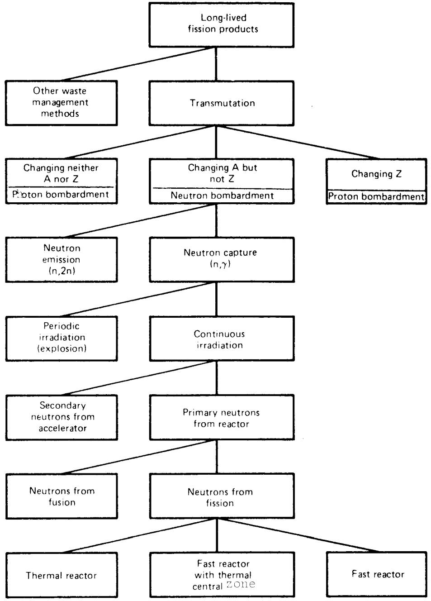  
TUTU DAPER

Table 4.1 Transmutation possibilities for different devices   

<table><tr><td>Machine</td><td>Flux/ Energy</td><td>Reactions, and remarks of authors of original reports.</td></tr><tr><td rowspan="2">Accelerator of medium and high energy protons</td><td>Protons100 MeV</td><td>Reaction p,xn) not promising. Ruled out on basis of energy balance criteria.</td></tr><tr><td>Protons1.10 GeV with Cs-137 as target and/or thermalised flux of neutrons</td><td>Spalation (p,xn) and (n,2n) (n,y) secondary neutron fluxNot feasible within limits of current technology. The capital cost is prohibitive.(see table 4.2)</td></tr><tr><td rowspan="2">Fusion (thermonuclear) reactor in all cases with wall</td><td>Fast flux of 14 MeV neutrons from (D-T) Φ = 5x1014n cm-2s-1</td><td>Neutron reactions (n,2n) and (n,y). Fast Flux of 5 x 1015n cm-2s-1</td></tr><tr><td>Thermalised flux in beryllium trap</td><td>Practically only (n,y) Thermal flux 6.7 x 1015n cm-2s-1Attractive transmutation rate has not been demonstrated but possible to transmute all Cs-137 and Sr-90 created by fission reactors</td></tr><tr><td>Nuclear</td><td>Fissile explosive or thermonuclear explosive</td><td>Technically not feasible. No. of explosions per year very high. Appr. 3900 per year each of 100 kton. (For USA in year 2000 Cs-137 and Sr-90) Probably not acceptable to public!</td></tr><tr><td>Fission reactor</td><td></td><td>(see Fig. 4.2)</td></tr></table>

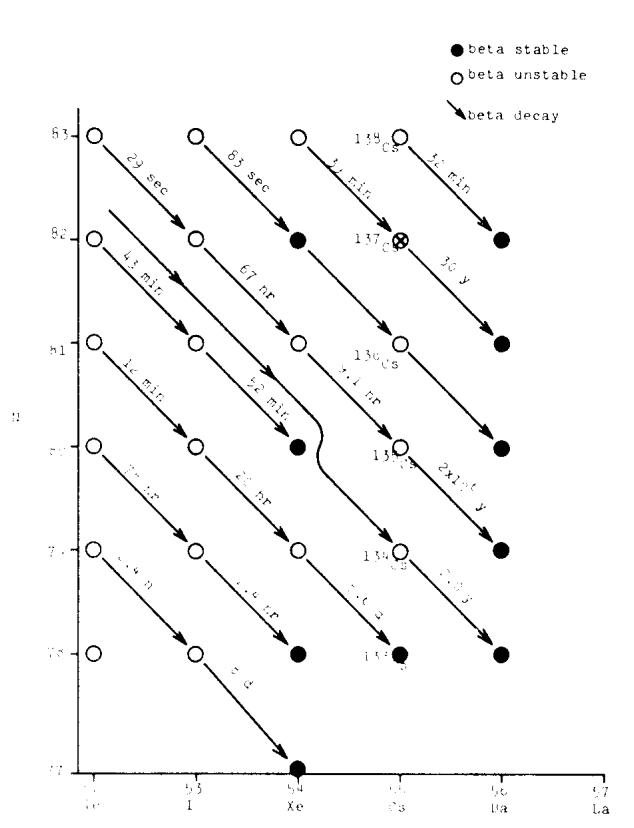  
Fig. 4.2 FISSION PRODUCTS

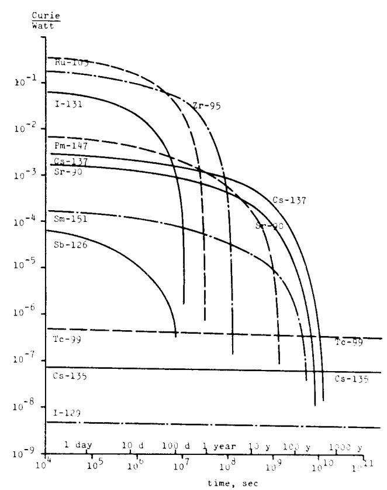

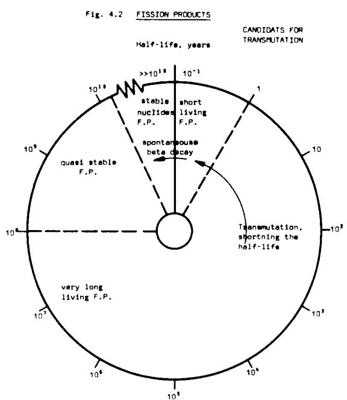

Table 4.2 Possibility for transmutation of F.P. - particularly Cs-137 and Sr-90 in a fission reactor according to BNWL - 1900   

<table><tr><td></td><td>Reactor</td><td>Reference</td><td>Flux</td><td>Remarks</td></tr><tr><td rowspan="4">Thermal</td><td rowspan="2">power reactor</td><td>Steinberg, Wotzak Manowitz, 1964</td><td></td><td>The authors use a wrong value: Kr-85 with large σ = 15 barns instead of σ = 1.7 barns. Isotopic separation of Kr-isotopes.</td></tr><tr><td></td><td>3 × 1013 thermal</td><td>Only I-129 can be transmuted.</td></tr><tr><td rowspan="2">high flux (trap)</td><td>Steinberg, 1964</td><td>1016 in the trap smaller in the presence of the F.P. target.</td><td>An equal or greater no. of F.P. would be formed in the fission process per transmutation event.</td></tr><tr><td>Claiborne, 1972</td><td>2 × 1015 thermal</td><td>This reactor does not meet the criteria of overall waste balance and of total transmutation rate.</td></tr><tr><td>Fast</td><td>liquid metal fast breeder</td><td>Claiborne, 1972</td><td>1 × 1015 fast</td><td>Neutron excess 0.15 - 0.3 at the expense of being no longer a viable breeder of fissile material. Also this flux does not allow the attainment of a sufficiently high transmutation rate and is, therefore, not a feasible concept.</td></tr><tr><td>Fast with thermal</td><td>liquid fuel fast reactor with thermal column.</td><td></td><td>this paper</td><td></td></tr></table>

- how could such a high flux reactor with circulating liquid fuel and a thermal column operate as a "burner" for some F.P. (Cs-137, Sr-90 etc.) transmutations? (Fig. 4.3)

- is such a system feasible?

# Comment

In BNWL-1900 it was noted that the calculation (in a moderating blanket of the CRT) represents a more realistic blanket configuration with a neutron wall loading of $10 \, \text{MW/m}^2$ (This is still a very optimistic value. M.T.).

In this case the following data have been obtained for a thermalised neutron flux from a CTR with a $10\mathrm{MW / m^2}$ wall loading.(Tab.4.3)

Table 4.3   

<table><tr><td rowspan="2">For 80% fraction v291 kg Cs/yr</td><td>Φ thermal (n.cm-2s-1)</td><td>Φ·σ (n,γ)</td><td>Φ·σ (n,2n)</td><td>effective t1/2 effective</td></tr><tr><td>6.74 x 1015</td><td>σ(n,γ) = 0.117 barn 7.91 x 10-10</td><td>σ(n+2n) = 0.10· barn 7.0 x 10-10</td><td>λ = 22.2x10-1s-19.9 years</td></tr></table>

The conclusions of this study are that useful quantities of Cs-137 could be transmuted under the projected CTR blanket loading conditions. The reduction in Cs-137 "toxicity" is still expected to be at most a factor 3 down. In addition, a study of the build-up of fission product nuclei in order to establish the requirements of periodic chemical processing and associated costs has not been carried out.

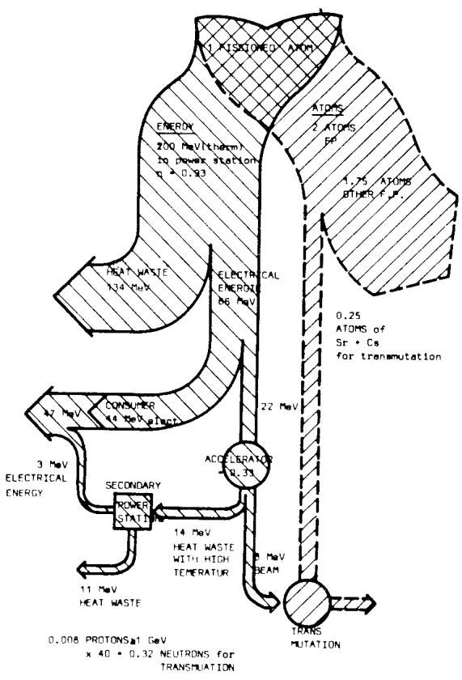  
Fig.4.3 Accelerator for transmutation BALANCE FOR 1 FISSIONED ATOM

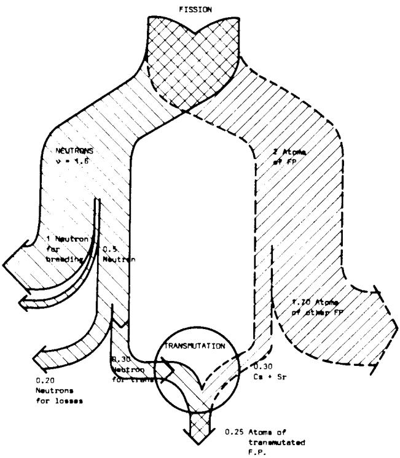  
Fig. 4.4 Neutron balance

# Comment

H.W. Lefevre (appendix to BNWL-1900) makes an interesting comment on the study of the transmutation of Cs-137 and Sr-90 in CTR: "Everyone knows that a CTR will be "clean". Don't spoil that illusion. I think that I would worry some about a CTR loaded with 50 kg of Cs-137".

# 4.1.2 Why some opinions concerning transmutations in a fission reactor are rather pessimistic

A recent and most intensive study of the use of a fission reactor for the transmutation of fission products has been published by Claiborne (1972). He writes:

"The problem fission products cannot be eliminated by any system of fission power reactors operating in either a stagnant or expanding nuclear power economy since the production rate exceeds the elimination rate by burnout and decay. Only at equilibrium will the production and removal rates be equal, a condition that is never attained in power reactors. Equilibrium can be obtained, however, for a system that includes the stockpile of fission products as part of the system inventory since the stockpile will grow until its decay rate equals the net production rate of the system. For the projected nuclear power economy, however, this will require a very large stockpile with its associated potential for release of large quantities of hazardous radio-isotopes to the environment. It is this stockpile that must be greatly reduced or eliminated from the biosphere. A method suggested by Steinberg et al. is transmutation in "burner reactors", which are designed to maximize neutron absorption in separated fission products charged to a reactor. If sufficient numbers of these burners are used, the fission products inventory of nuclear power system can then reach equilibrium and be maintained at an irreducible minimum, which is the quantity contained in the reactors, the chemical processing plants, the transportation system, and in some industrial plants.

If the assumption is made that burner reactors are a desirable adjunct to a nuclear economy, what are the design requirements and limitations: it is obvious that they must maximize (with due regard to economics) the ratio of burnout of a particular fission products to its production rate in fission reactors, and the neutron flux must be high enough to cause a significant decrease in its effective half-life. Of the fission types, the breeder reactor has the most efficient neutron economy and in principle would make the most efficient burner if all or part of the fertile material can be replaced by a Sr-Cs mixture without causing chemical processing problems or too large a perturbation in the flux spectrum because of the different characteristics of these fission products. The cost accounting in such a system would set the value of neutrons absorbed in the fission product feed at an accounting cost equal to the value of the fuel bred from those neutrons.

The maximum possible burnout of fission products would occur when the excess neutrons per fission that would be absorbed in a fertile material are absorbed instead in the fission product feed. The largest possible burnout ratio would then be the breeding ratio (or conversion ratio for nonbreeders) divided by the fission product yield. The estimated breeding ratio for the Molten Salt Breeder Reactor (MSBR), a thermal breeder, is 1.05 and for the Liquid Metal Fuelled Fast Breeder Reactor (LMFBR), 1.38. The yield of $^{137}\mathrm{Cs} + ^{90}\mathrm{Sr}$ is 0.12 atom/fission, but a number of other isotopes of these elements are produced which would also absorb neutrons. However, if the fission product waste is aged two years before separation of the cesium and strontium, the mixture will essentially be composed of about $80\%$ $^{137}\mathrm{Cs} + ^{90}\mathrm{Sr}$ and $20\%$ $^{135}\mathrm{Cs}$ (which will capture neutrons to form $^{136}\mathrm{Cs}$ that decays with a 13-day halflife consequently the maximum burnout ratio for $^{137}\mathrm{Cs} + ^{90}\mathrm{Sr}$ will be decreased by $20\%$ . This leads to a maximum possible burnout ratio of about 7 for the MSBR and about 9 for the LMFBR. Unfortunately, however, the neutron fluxes in these designs are well below $10^{16}\mathrm{n cm}^{-2}\mathrm{s}^{-1}$ . Any modifications of these designs to create high neutron fluxes will increase the neutron leakage and decrease the burnout ratios significantly". (Claiborne 1972)

# Comment

It is not clear why Claiborne claimed that after 2 years ageing and separation of strontium and caesium the isotope composition will be

```txt
Cs-137   
80% Sr-90   
20% Cs-135 
```

From Crouch (1973) the fission products of U-235 have the following composition (2 years ageing) (in at % per fissioned nucleous). (see Table 4.4)

```txt
Sr-88 (stable) 3.63  
Sr-90 (28 years) 4.39  
Cs-133 (stable) 6.57  
Cs-134 (2 years) 3.5  
Cs-135 6.26  
Cs-137 5.99  
Subtotal 30.34 
```

The realistic data are unfortunately more than twice those cited by Claiborne.

The same negative opinions concerning the use of Fission Reactors for F.P. - transmutation are given by the following authors:

-A.S.Kubo(BNWL-1900)：

"Fission products are not conductive to nuclear transformation as a general solution to long term waste management".

- BNWL - 1900, itself:

"In summary it is improbable that transmutation of fission products in fission reactors could meet any of the technical feasibility requirements for the production of stable daughters".

- Claiborne (1972):

"Developing special burner reactors with the required neutron flux of the order of $10^{17}\mathrm{n~cm}^{-2}\mathrm{s}^{-1}$ is beyond the limits of current technology".

4.1.3 Which fission products are suitable candidates for transmutation and in what quantities?

A simplified breakdown of neutrons and fission products produced by fission of 1 fissile plutonium atom is given in Fig. 4.4

From this it must be clear that only a very limited amount of fission products can be irradiated by neutrons of the whole system to retain a good breeding gain and doubling time - in other words a self sustaining and expanding breeding system. For further consideration it is postulated that the maximum number of transmutable nuclides equals $T = 0.3$ .

The proposed system for the transmutation includes two types of reactor:

- power reactors in the form of fast breeder reactors with a total power of three to four times that of:   
- a high flux burner reactor.

The crucial F.P. nuclides are characterised in table 4.4 together with others. The data available now makes it possible to estimate the number of candidates for transmutation in our breeder/burner system, using the following criteria

- the total amount of all nuclides to be transmuted cannot be greater than the estimated value of $T = 0.30$ , that is 30 atoms of F.P. nuclides for each 100 fissioned nuclides.   
- the order of priority taken from this table is given as $\mathrm{{Cs}} > \mathrm{{Sr}} > \mathrm{I} > \mathrm{{Te}}$   
- in the first instance no isotopic separation process is postulated.

Table 4.4 shows the F.P. nuclides selected for transmutation.

Table 4.4 The priorities for the transmutation of fissioned products   

<table><tr><td>Selected</td><td>Yield for fission of 100 atoms of Pu-239</td><td>Atom/100 atom Pu-239 Subtotal</td><td>Assuming isotopic separation atoms/100 atoms Pu-239</td></tr><tr><td>Cs-133 (stable)</td><td>6.91</td><td>6.91</td><td>0.14</td></tr><tr><td>Cs-135</td><td>7.54} 21.140</td><td>14.450</td><td>7.54} 14.37</td></tr><tr><td>Cs-137</td><td>6.69</td><td>21.140</td><td>6.69</td></tr><tr><td>Sr-90</td><td>2.18</td><td>23.32</td><td>2.18} 2.209</td></tr><tr><td>Sr-88 (stable)</td><td>1.44 × 0.02 = 0.029} 2.209</td><td>23.349</td><td>0.029} 0.029</td></tr><tr><td>(2% isotopic separation efficiency)</td><td></td><td></td><td></td></tr><tr><td>I-129</td><td>1.17} 1.55</td><td>24.519</td><td>1.17} 1.18</td></tr><tr><td>I-127 (stable)</td><td>0.38} 1.55</td><td>24.899</td><td>0.01} 0.01</td></tr><tr><td>Tc-99</td><td>5.81 5.81</td><td>30.709</td><td>5.81 5.81</td></tr><tr><td>Kr-83 (stable)</td><td>0.36</td><td></td><td></td></tr><tr><td>Kr-84 (stable)</td><td>0.56} 2.474</td><td></td><td></td></tr><tr><td>Kr-85</td><td>0.672} 2.474</td><td></td><td></td></tr><tr><td>Kr-86 (stable)</td><td>0.882</td><td>33.183</td><td>0.67} 0.71</td></tr><tr><td>Total</td><td></td><td>33.183</td><td>24.28</td></tr></table>

4.1.4 In what way could a burner reactor be coupled to a system of breeders?

The aim of the calculations used here is to show

- that given a system containing some breeding power reactors with a breeding gain of $G^{\text{日}}$   
- the fission products from all of these reactors can be tansmuted in the high flux burner reactor, which includes of course the fission product transmutation for the burner reactor itself.

The calculation of the ratio of breeder power to burner power is as shown here

Transmutation rate (atoms $\mathbf{s}^{-1}$ ), Yield of fission products (atoms/fission), Y Effectiveness of transmutation device 6

T = ε⁻¹ (Y(⁹⁰Sr) + Y(¹³⁷Cs) + Y(other F.P.))  
Y(⁹⁰Sr) = 0.041;  
Y(¹³⁷Cs) = 0.064

Breeding gain for the total system without transmutation $G^{p} = 0.375$ (arbitrary)

Breeding gain for the total system with transmutation $G^{\top}$ Ratio of fission to total capture: $\alpha = 0.24$ (arbitrary)

$$
G = G ^ {\square} - T / (1 + \alpha)
$$

Taking a numerical example with the same values arbitrarily chosen (including also another fission product with a yield of 0.1)

$$
T = 0. 5 ^ {- 1} (0. 0 4 1 + 0. 0 6 4 + 0. 1) = 0. 4 0
$$

$$
G ^ {\top} = 0. 3 7 5 - \frac {0 . 4 0}{1 + 0 . 2 4} = 0. 0 5
$$

which is sufficient for a power system having a slowly increasing capacity with a doubling time of 100 yr. This corresponds to the near steady state case.

To determine $X$ , the number of power reactors

$$
\begin{array}{l} X \cdot G ^ {B} - 1 = (X + 1) G ^ {T} \\ X = \frac {G ^ {\top} + 1}{G ^ {\top} - G ^ {\top}} = \frac {0 . 0 5 + 1}{0 . 3 7 5 - 0 . 0 5} = 3. 2 3 \\ \end{array}
$$

The correspondence ratio of the power of the breeder reactors and the burner reactor in this case equals

$$
X = \frac {3 0 - 7}{7} = 3. 3
$$

This means for example for 8 power reactors each of 3 GW(th) (i.e. a system total of 30 GW(th) can deal with the transmutation of the fission products chosen here. The electrical output assuming an efficiency of $40\%$ is $(3\times 8 + 1\times 7)\times 0.40 = 12\mathrm{GW(e)}$ (Fig. 4.5).

# 4.1.5 Is the rate of transmutation sufficient?

It is clear that the rate of radioactive nuclide removal in a field of particles is given by

$$
\lambda_ {\text {e f f}} = \lambda_ {\text {d e c a y}} + \lambda_ {\text {t r a n s m u t a t i o n}} = \frac {\ln 2}{t _ {1 / 2 (\text {e f f})}}
$$

where

$$
\begin{array}{l} \lambda_ {\text {d e c a y}} = \text {c o n s t a n t} (s ^ {- 1}) \\ \lambda_ {\text {t r a n s}} = \sigma_ {\text {t r a n s}} \cdot \Phi \\ \sigma = \text {c r o s s} \left(\mathrm {c m} ^ {2}\right) \text {f o r a g i v e n} \\ \Phi = \text {f l u x} \text {o f t h e r a c t i n g p a r t i c l e s (p a r t i c l e s} \mathrm {c m} ^ {- 2} \mathrm {s} ^ {- 1}) \\ \end{array}
$$

this value of $\lambda_{\mathrm{eff}}$ will be used later for the calculations of the neutron flux required to permit the transmutation rate to match.

8 Power Reactors, each GW (thermal) total $\sim 24$ GW (thermal)

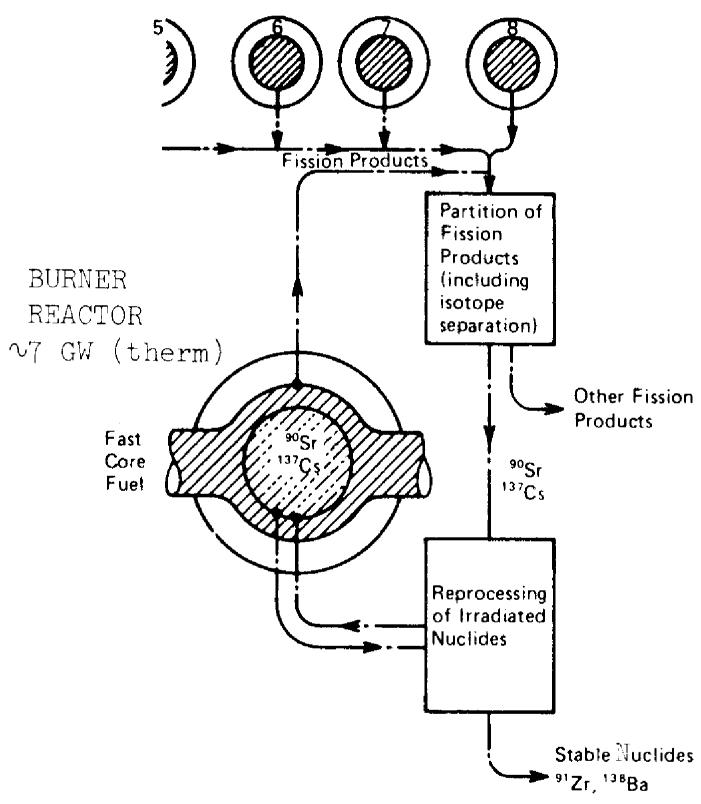  
Fig. 4.5 Scheme of the proposed breeding power system with "self-cleaning". (For the sake of simplicity, only the routes of the fission products $^{90}\mathrm{Sr}$ and $^{137}\mathrm{Cs}$ are shown).

Let us assume that the energy production is based on a set of n burners and nX breeders. At a time $t_n$ (see Fig. 4.5) when it is decided to stop the use of fission energy production in favour of other sources the total amount of a selected fission product present is

(1) $N(t_{n}) = (X + 1)\cdot n\cdot \frac{k}{\lambda_{eff}}$

with $K = Y \cdot P / E$ $Y =$ yield of the selected F.P. $P =$ power per burner (or breeder) (Watt) $E =$ energy per fission (Joule)

This amount of F.P. is located only in the burners, therefore each burner can receive

$$
(X + 1) \frac {k}{\lambda_ {\text {e f f}}}
$$

although then any production should only represent

$$
\frac {k}{\lambda_ {\mathrm {e f f}}}
$$

in the steady state.

At time $t_n$ the nX breeders are shut down and only $n$ burners are in operation. Later on (time $t_{n-1}$ ) the nuclide removal is such that a re-arrangement is possible and one burner can be stopped, i.e. F.P. contents will be loaded in the remaining burners etc. At the beginning of each time step $t_p$ the $p$ burners which are still working contain the maximum possible amount of F.P.

$$
(X + 1) \frac {k}{\lambda_ {\text {E f f}}}
$$

$$
\begin{array}{l} \frac {N (t _ {n})}{n} = \frac {N (t _ {n - 1})}{n - 1} = \frac {N (t _ {p})}{p} = \frac {N (t _ {p - 1})}{p - 1} = \frac {N (t _ {2})}{2} = \frac {N (t _ {1})}{1} = \tag {2} \\ = (X + 1) \cdot \frac {k}{\lambda_ {\text {e f f}}} \\ \end{array}
$$

where $N(t)$ represents the total amount of the selected F.P.

One could imagine other schemes: for example the rearrangement could be made only when 2 burners are to be shutdown. From the reactivity point of view this solution is worse than the one proposed. Coming back to the original solution, one has still to solve at each time step $(t_p, t_{p-1})$ the burn-up equation.

$$
\frac {d N}{d t} + \lambda_ {\text {e f f}} \cdot N = K \cdot p \quad \text {w h e r e t h e r i g h t h a n d s i d e i s t h e} \tag {3}
$$

then the solution is

$$
N (t) = \frac {K \cdot p}{\lambda_ {\text {e f f}}} + (N (t _ {p}) = \frac {K \cdot p}{\lambda_ {\text {e f f}}} \cdot \exp (- \lambda_ {\text {e f f}} \cdot (t - t _ {p})) \tag {4}
$$

Using (2) the time needed to go from $p$ burners to (p-1) can be deduced

$$
\lambda_ {\text {e f f}} \cdot \left(t _ {p - 1} - t _ {p}\right) = \sum_ {p = 2} ^ {p = n} 1 n \quad \frac {1}{1 - \frac {X + 1}{p \cdot X}} \tag {5}
$$

with a summation one obtains the time $t_1$ after which one burner only is in operation.

$$
\lambda_ {e f f} (t _ {1} - t _ {n}) = \sum_ {p = 2} ^ {p = n} \ln \frac {1}{1 - \frac {X + 1}{p \cdot X}} \tag {6}
$$

A more direct evaluation can be obtained if $n$ is so large that the number of operating burners changes continuously with time $(p = n(t))$ then by a single elimination of $p$ between (2) and (3) one gets

$$
\frac {\mathrm {d} N}{\mathrm {d} t} + \lambda_ {\text {e f f}} N = \frac {N \lambda_ {\text {e f f}}}{X + 1} \quad \text {o r}
$$

$$
\begin{array}{l} (4 ^ {\prime}) \quad N (t) = N (t _ {n}). \lambda_ {e f f} \frac {X}{X + 1} (t - t) _ {n} \\ \lambda_ {\text {e f f}} \left(t _ {1} t _ {n}\right) = \frac {X + 1}{X} \ln \frac {N \left(t _ {n}\right)}{N \left(t _ {1}\right)} = \frac {X + 1}{X} \ln (n) \\ \end{array}
$$

The two approaches give similar results except at the end when few burners are in operation.

For times longer than $t_1$ only one burner is operated and the amount of F.P. would decrease from

$$
(X + 1) \frac {K}{\lambda_ {\text {e f f}}} \text {t o} \frac {K}{\lambda_ {\text {e f f}}}
$$

We shall postulate that it has no sense to operate this last burner when the amount of F.P. is only 1.2 times longer than the asymptotic value which requires a new time interval (eq. 4 p = 1).

(7) $\lambda_{\text {eff }}(t_0 - t_1) = \ln 5 \cdot X$

The total time $t_0 - t_n$ will be the sum (6) + (7) which corresponds to the reduction factor

$$
\frac {n (X + 1)}{1 . 2} \cdot
$$

Further reductions can only be obtained by natural decay $(t > t_0)$ .

Numerical application: with $X = 4$ , $n = 100$ which means the economy was based before $t_n$ on 400 breeders, the initial F.P. amount is reduced 415 times when the last burner is shutdown. Then the required time is defined by $\text{eff}(t_0 - t_n) = 8.93$ (8.76 with the approx expression). If this time is to be less than say 60 years 2 reactor generations) then $\lambda_{\text{eff}} = 4.7 \times 10^{-9} \text{s}^{-1}$ ( $t_{1/2}$ eff = 4.7 years).

Now the problem of the intensity of the neutron flux desired for transmutation arises. Since the most hazardous F.P. nuclides are those which apart from their high metabolic activity and high retention in living organismus also have a half life of the same order as a human life span of 60-70 years we arrive at the following list of hazardous isotopes which are the most important for transmutation.

$$
\mathrm {K r} - 8 5 \quad t _ {1 / 2} = 1 0 \quad \text {y e a r s}, \quad \lambda_ {\text {d e c}} = 2 0. 9 \times 1 0 ^ {- 1 0} \mathrm {s} ^ {- 1}
$$

$$
\mathrm {S r} - 9 0 \quad t _ {1 / 2} = 2 8. 2 \text {y e a r s}, \quad \lambda_ {\text {d e c}} = 7. 7 6 \times 1 0 ^ {- 1 0} \mathrm {s} ^ {- 1}
$$

$$
\mathrm {C s} - 1 3 7 \quad t _ {1 / 2} = 3 0 \quad \text {y e a r s}, \quad \lambda_ {\text {d e c}} = 7. 3 2 \times 1 0 ^ {- 1 0} \mathrm {s} ^ {- 1}
$$

$$
\text {d e s i r e d} ^ {\prime} \text {h a l f l i f e} = 4. 7 \text {y e a r s}, \quad \lambda_ {\text {d e s i r e d}} = 4. 7 \times 1 0 ^ {- 9} \mathrm {s} ^ {- 1}
$$

$$
\text {a s w e k n o w} \quad \lambda_ {\text {d e s i r e d}} = \lambda_ {\text {d e c a y}} + \lambda_ {\text {t r a n s m u t a t i o n}}
$$

The most important problem arises from the fact that the two nuclides Sr-90 and Cs-137 have very small cross sections for neutron absorption in both the thermal and fast regions.

<table><tr><td rowspan="2"></td><td colspan="2">Cross section, σ(barn = 10-24cm2)</td><td>Ratio</td></tr><tr><td>thermal</td><td>fast</td><td>therm./fast</td></tr><tr><td>Sr-90</td><td>0.8 barns</td><td>0.0076 barns</td><td>~100</td></tr><tr><td>Cs-137</td><td>0.11 barns</td><td>0.0137 barns</td><td>~8</td></tr></table>

therefore to achieve $\lambda_{\text{desired}} = 4.7 \times 10^{-9} \, \text{s}^{-1}$ the necessary fluxes should be:

fast flux for transmutation of

$$
\mathrm {C s} - 1 3 7: \Phi_ {\text {f a s t}} = \frac {\lambda_ {\text {d e s i r e d}} ^ {- \lambda} \text {d e c a y}}{\sigma (\mathrm {C s} - 1 3 7 \text {f a s t})} = \frac {4 \times 1 0 ^ {- 9}}{0 . 0 1 \times 1 0 ^ {- 2 4}}
$$

$$
\Phi_ {\text {f a s t}} \stackrel {=} {=} 4. 0 \times 1 0 ^ {1 7} (n c m ^ {- 2} s ^ {- 1})
$$

thermal flux for transmutation of

$$
C s - 1 3 7: \Phi_ {t h} = \frac {4 \times 1 0 ^ {- 9}}{0 . 1 1 \times 1 0 ^ {2 4}} = 3. 2 \times 1 0 ^ {1 6} (n c m ^ {- 2} s ^ {- 1})
$$

thermal flux for transmutation of

$$
\mathrm {S r} - 9 0: \quad \Phi_ {\text {t h}} = \frac {4 . 0 \times 1 0 ^ {- 9}}{0 . 8 \times 1 0 ^ {2 4}} = 5. 0 \times 1 0 ^ {1 5} (\mathrm {n c m} ^ {- 2} \mathrm {s} ^ {- 1})
$$

[see also Fig. 4.7].

The question then arises, in what device are such fluxes possible - a fast flux of $4 \times 10^{17}$ of a thermal flux $6 \times 10^{16}$ . It is interesting to point aout that during the period of 60 years which provides the reduction factor of 415 (if the $\lambda_{\text{eff}} = 4.7 \times 10^{-9} \text{s}^{-1}$ can be achieved) the natural decay of Cs-137 would have reduced it only by a factor 4 which demonstrates the efficiency of the burner.

Also the burning which occurs during the first period (t - tn) reduces the amount of

$$
F. P. \frac {\lambda_ {\text {e f f}}}{\lambda_ {\text {d e c a y}}} \text {t i m e s} = 6. 7 \text {t i m e s f o r C s - 1 3 7}
$$

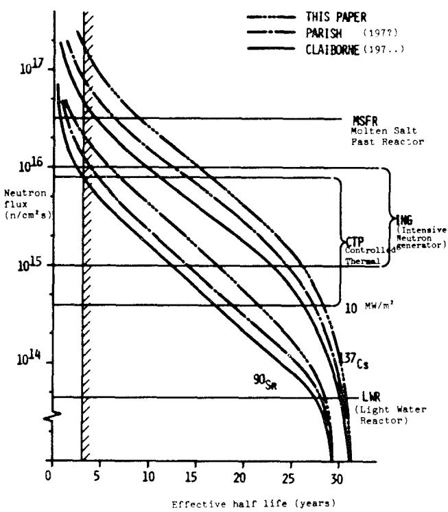  
Fig. 4.7 Effective half life and neutron flux for transmutation

4.1.6 In what reactors are the transmutations possible?

From the point of view of this paper the most important process is the transmutation of some of these nuclides by neutrons in a fission reactor. The criteria given in chapter 2 limit the choice of system. That is

- the number of F.P. nuclei cannot be too large in relation to the number of fissioned atoms in the burner reactor (reactor for transmutation) because the latter process also produces new fission products.   
- the fission reactor should be self-sustaining - that is a breeding system.   
- the specific power of the reactor is proportional to the neutron flux. High neutron flux means high specific power which is controlled by the effectiveness of the core cooling.   
- the specific power $P$ and the neutron flux $\Phi$ are coupled by the fission cross section and the concentration of fissile nuclide $(N_{f})$

$$
P = N _ {f} \cdot \sigma_ {f} \cdot \Phi
$$

For thermal neutrons $\sigma_{f}$ is approx. 700 barns and for fast neutrons only 1.8 barns, that is 400 times smaller.

For the given total power and the same specific power the product $N_{\mathrm{f}} \cdot \Phi$ for the thermal reactor must be approx. 400 times smaller than for a fast reactor. Since the critical concentration of fission nuclides in a thermal reactor can only be 10 times smaller than for a fast reactor then for a given specific power the neutron flux in a fast reactor can be about 40 times higher than that of a thermal reactor.

The cross section for thermal neutrons for the nuclides considered here is from 3 to 10 times larger than in a fast flux and this must be taken into account.

All these factors bring us to the following solution of the problems under discussion.

- the highest specific power and hence the highest neutron flux is possible if the cooling process is carried out by the fuel itself and not by a separate cooling agent only.

This directs our interest towards a reactor with molten fuel in spite of the exotic nature of this solution.

- the high flux reactor must be a fast reactor (small for fast fission)

- because $\sigma_{\mathrm{th}} > \sigma_{\mathrm{fast}}$ the thermalisation of the high flux in a internal thermal zone is postulated, then it is possible that

$$
\Phi \begin{array}{l} \text {z o n e} \\ \text {t h e r m .} \end{array} > \Phi \begin{array}{l} \text {c o r e} \\ \text {f a s t} \end{array}
$$

- the first approximation is made for an isotopically pure radio-nuclide e.g. Cs-137 without Cs-133 (stable) and Cs-135 and also Sr-90 without Sr-88 (stable).

The discussion then results in:

- transmutation of Cs-137 (and some other nuclides) in a thermalised central trap of high flux neutrons:

$$
\Phi_ {\text {t h e r m}} = 5 \times 1 0 ^ {1 6} \mathrm {n c m} ^ {- 2} \mathrm {s} ^ {- 1}
$$

- production of a high flux of fast neutrons $5 \times 10^{16} \, \text{nm}^{-2} \, \text{s}^{-1}$ and the high specific power of $15 \, \text{kW} \, \text{cm}^{-3}$ is achieved by means of liquid fuel circulating through an external cooler.   
- transmutation of other selected fission products in an external thermalised zone with a thermal flux of $5 \times 10^{15}$ or $1 \times 10^{15}$ n cm $^{-2}$ s $^{-1}$ .   
- coupling of one burner - high flux fast burner reactor with a system of 'normal' power breeder reactors.

4.1.7 What are the limitations of a solid fuelled reactor?

Can the desired specific power of $15\mathrm{kWcm}^{-3}$ be achieved in a solid fuel reactor? These are the self-evident limits in this case.

- the rate of burning of fissile nuclides is limited due to depletion of fissile or an increase of F.P. nuclides   
- the heat transfer limitation of fuel/clad to coolant   
- the temperature and temperature gradients in the fuel and cladding (melting, mechanical properties)

- the boiling of the coolant   
- the limitation of coolant velocity, pumping power, stability.

Now we discuss these limitations in more detail

- the dwell time in a solid fuelled reactor in core for the fissile nuclides must not be too short.

$$
t _ {d w e l l} = \frac {\text {c o n c e n t r a t i o n o f f i s s i l e n u c l i d e} \cdot \text {m a x i m u m b u r n - u p}}{\text {f i s s i o n r a t e}}
$$

We could write:

$$
t _ {d w e l l} = \frac {N \cdot b}{R}
$$

where $N$ = concentration of fissile nuclide

$$
N = \frac {R \cdot f}{\sigma_ {f} \cdot \Phi} \text {a n d} f = 3. 1 \times 1 0 ^ {1 0} \text {f i s s i o n s / j o u l e}
$$

$$
b = \text {m a x i m a l}
$$

$$
P = \text {p o w e r (w a t t s)}
$$

$$
R = \text {f i s s i o n r a t e (f i s s i o n} s ^ {- 1})
$$

$$
R = P \cdot f
$$

from this:

$$
t _ {d w e l l} = \frac {P . f . b}{\sigma \cdot \Phi \cdot P . f} = \frac {b}{\sigma_ {f} \cdot \Phi}
$$

$$
b = 0. 0 3 \text {(c o r r e s p o n d s t o} 3 0. 0 0 0 \mathrm {M W d / t})
$$

$$
\sigma_ {\text {f i s s}} ^ {\text {t h e r}} = 7 0 0 \times 1 0 ^ {- 2 4} \mathrm {c m} ^ {2}
$$

$$
\Phi = 5 \times 1 0 ^ {1 6} n c m ^ {- 2} s ^ {- 1}
$$

$$
t _ {d w e l l} = 8 5 0 s = 1 4. 3 \text {m i n u t e s}
$$

but also for $b = 0.10$ we achieve $t_{\text{dwell}} = 47.6$ minutes

For a fast reactor (some arbitrary values)

b = 0.10

fast $= 1.8\times 10^{-24}\mathrm{cm}^2$

=5×1016 n cm-2s

$\mathbf{t}_{\mathrm{dwell}} = 1.1 \times 10^{6} \mathrm{~s} = 12.9$ days

Conclusion:

- the dwell time in a thermal reactor is prohibitively short,   
- in a fast reactor it is more reasonable but still very short, especially in the case of a solid fuel reactor   
- the limitation of specific power by heat transfer is as follows: Specific power, $P_{\text{spec}}$ , in a "good" 3 GWth power reactor and with the appropriate flux taken from literature is:

thermal P spec = 0.05 kW/cm³; Φ th = 5 × 10¹⁵ n cm⁻² s⁻¹

fast Pspec $= 1$ kW/cm³; $\Phi_{\text{fast}} = 5 \times 10^{15} \text{~nm}^{-2} \text{s}^{-1}$

In a high flux reactor: (see also Fig. 6 1.8)

thermal: P spec = 2.0 kW/cm³; Φ_th = 3 × 10^15 n cm^-2 s⁻¹

Pspec = 1.5 kW/cm³; Φth = 3 × 10¹⁶ n cm⁻² s⁻¹

fast: Pspec = 1.0 kW/cm³; Φfast = 1.5×10¹⁶ n cm⁻² s⁻¹

With the same geometry the very high flux reactor desired here would have the following flux for Cs-137 transmutation:

for $\Phi_{\mathrm{th}} = 5.0 \times 10^{16}$ , the specific power $P_{\mathrm{th}} = 22.5 \, \mathrm{kW/cm}^3$

for $\Phi_{\mathrm{fast}} = 4.0 \times 10^{17}$ , the specific power $P_{\mathrm{fast}} = 20 \quad \mathrm{kW/cm}^3$

For a solid fuel we postulate the following "unit-cell"

<table><tr><td></td><td colspan="2">Dimension</td><td colspan="2">Volume</td><td colspan="2">Cross-section area</td><td colspan="2">Surface-area</td></tr><tr><td>Cell:</td><td colspan="2">0.9×0.9×1.0 cm</td><td colspan="2">0.81 cm3</td><td colspan="2">0.81 cm2</td><td colspan="2">3.60 cm2</td></tr><tr><td>Fuel:</td><td colspan="2">= 0.60 cm</td><td colspan="2">0.283 cm3</td><td colspan="2">0.283 cm2</td><td colspan="2">1.885 cm2</td></tr><tr><td rowspan="2">Cladding:</td><td colspan="2">diam = 0.63 cm wall: s = 0.03 cm</td><td colspan="2"></td><td colspan="2"></td><td colspan="2"></td></tr><tr><td colspan="2">diam = 0.60 cm</td><td colspan="2">0.568×10-2cm3</td><td colspan="2">0.568×10-2cm2</td><td colspan="2">1.904 cm2</td></tr><tr><td>Coolant:</td><td colspan="2"></td><td colspan="2">0.521 cm3</td><td colspan="2">0.521 cm2</td><td colspan="2"></td></tr></table>

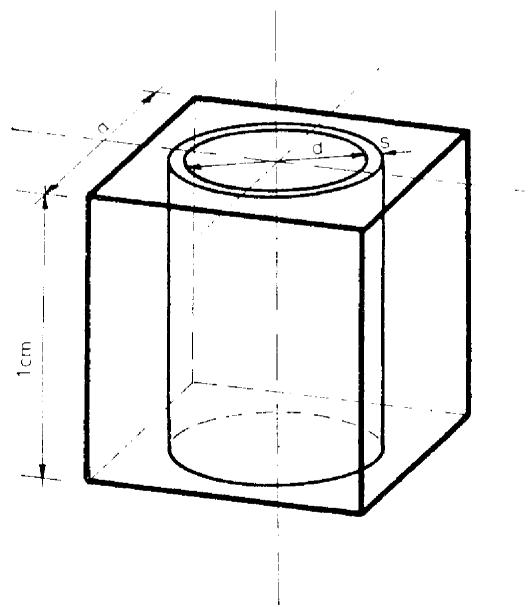

In this specified cell of a "desired" high-flux-reactor, we would achieve a heat-flux, per unit fuel element surface area: (for both byes of reactors, thermal and fast)

$$
H _ {f s} = \frac {2 1 k w / c m ^ {3} \cdot 0 . 8 1 c m ^ {3}}{1 . 8 8 5 c m ^ {2}} = 9 k w c m ^ {- 2}
$$

Using now a simplified model for the first guess of the temperature gradient we can say: the amount of heat generated in the fuel must be the same as that leaving the surface of the cladding material.

$$
\Delta T _ {\text {c l a d}} = H _ {\text {f s}} \cdot \frac {\mathrm {s}}{\lambda}
$$

Where $s =$ wall thickness and $\lambda$ heat conductivity $(W \cdot \mathrm{cm}^{-1} \cdot K^{-1})$ an optimistic value for stainless steel is $\lambda = 0.4 \cdot W \cdot \mathrm{cm}^{-1} \cdot K^{-1}$ .

$$
\Delta T _ {\text {c l a d}} = 9 0 0 0 \cdot \frac {0 . 0 3}{0 . 4} = 6 7 5 ^ {\circ} C
$$

It is evident that this result is not realistic.

The solution of this problem may be the thermalisation of neutrons in a high flux fast core and the irradiation of Cs-137 in a thermal central zone.

In such a thermal central zone we postulate (and this must be based later on core calculations)

$$
\Phi_ {\text {t h}} = 1. 2 \cdot \Phi_ {\text {f a s t}}
$$

to reach $\Phi_{\mathrm{th}} = 6.0 \times 10^{16}$ we require $\Phi_{\mathrm{fast}} = 5.0 \times 10^{16} \, \mathrm{cm}^{-2} \, \mathrm{s}^{-1}$ . For this fast flux the specific power can be assumed, if we take into account the effective increase of the fission cross section because of the influence of the thermal trap. The simplified calculation results in a specific power of $10 \, \mathrm{kW} \, \mathrm{cm}^{-3}$ .

The corresponding heat-flux is therefore reduced to

$$
H _ {f s} = \frac {P _ {\text {s p e c}} \cdot V _ {\text {c e l l}}}{A _ {f s}} 4. 3 \mathrm {k W} \mathrm {c m} ^ {- 2}
$$

and the temperature gradient to

$$
\Delta T _ {\text {c l a d}} = 4 3 0 0 \left(W \cdot \mathrm {c m} ^ {- 2}\right) \frac {0 . 0 3 (\mathrm {c m})}{0 . 4 \left(W \cdot \mathrm {c m} ^ {- 1} K ^ {- 1}\right)} = 3 2 3 ^ {\circ} C
$$

This value is still rather high. A rough estimate of the thermal stress in the wall can be taken as

$$
\beta = \begin{array}{l} \text {c o e f f i c i e n t o f l i n e a r} \\ \text {e x p a n s i o n (K ^ {- 1})} \end{array}
$$

$$
\sigma = \frac {3}{4} \cdot \beta_ {\text {t h}} \cdot \Delta T \cdot E; \quad E = \frac {\text {m o d u l u s o f e l a s t i c i t y}}{\left(\mathrm {K p} \cdot \mathrm {c m} ^ {- 2}\right)}
$$

and the corresponding values for stainless steel (19-9 DL)

$$
\sigma = \frac {3}{4} \cdot 1 5 \cdot 1 0 ^ {- 6} (K ^ {- 1}) \cdot 3 2 3 (K) \cdot 2. 5 \cdot 1 0 ^ {6} (K p \cdot c m ^ {- 2}) = 5 5 0 0 K p \cdot c m ^ {- 2}
$$

It is also evident that this result is not realistic!

The resulting thermal stress in the cladding wall coupled with the high flux is prohibitive.

Impact of the thermal flux tail in the fast neutron solid fuel core

Hiere, the most important problem is the local overheating by the thermal flux present at the interface of the thermal column and the solid fuel core. If, in the fast region near to the interface approx. $20\%$ of the energy comes from the thermal neutrons, the following ratio of fluxes must be achieved:

$$
\sigma_ {\text {t h}} \cdot \Phi_ {\text {t h}} (\sigma_ {\text {f a s t}} \cdot \Phi_ {\text {f a s t}}) 0. 2
$$

$$
\sigma_ {\text {t h}} \frac {\sigma_ {\text {f a s t}}}{\text {t h}} \cdot \Phi_ {\text {f a s t}} \cdot 0. 2 \quad \frac {1 . 8}{7 0 0} \cdot 0. 2 \cdot \Phi_ {\text {f a s t}}
$$

$$
\Phi_ {\text {t h}} = 5 \cdot 1 0 ^ {- 4} \cdot \Phi_ {\text {f a s t}}
$$

That the thermal flux must be 2000 times lower than the fast, would seem very difficult to realise.

# 4.1.8 The liquid-fuelled fast reactor with central thermal zone

A much better solution is using a liquid-fuel. The transfer of the heat generated is done, by pumping and cooling the liquid fuel out of core.

For a unit cell of $1 \, \text{cm}^3$ , which in this case consists of fuel only, we can write the following heat-balance.

$$
\begin{array}{l} P _ {\text {s p e c}} = (\rho \cdot c) \cdot w \cdot \frac {T}{1}; (\rho \cdot c) = \text {h e a t} \quad \text {c a p a c i t y} (J \cdot c m ^ {- 3} \cdot K ^ {- 1}) \\ w = \text {v e l o c i t y} (c m / s) \\ \begin{array}{r l} T / 1 & = \text {t e m p e r a t u r e i n c r e a s e p e r u n i t} \\ & \text {c e l l (K • c m ^ {- 1})} \end{array} \\ P _ {\text {s p e c}} = \text {s p e c i f i c p o w e r} (W \cdot \mathrm {c m} ^ {- 3}) \\ \end{array}
$$

If we allow in the core a temperature increase of $\Delta T / 1\sim 3$ deg·cm

$$
w = \frac {2 1 . 1 0 ^ {3} (W \cdot c m ^ {- 3})}{2 . 0 (J \cdot c m ^ {- 3} \cdot K ^ {- 1}) \cdot 3 (K \cdot c m ^ {- 1})} = 3 5 m. s ^ {- 1}
$$

This velocity appears to be within the practical limits proposed for a fuel-velocity of $40\mathrm{m.s^{-1}}$ for a reactor with $10\mathrm{kW.cm^{-3}}$ specific power. This point however has to be seriously investigated, as erosion due to high velocities is a problem.

For a 7000 MW(th) core with a specific power of $21\mathrm{kW}\cdot \mathrm{cm}^{-3}$ the fuel volume is about $0.330\mathrm{m}^3$

The target volume, that is the volume of irradiated (transmuted) fission products e.g. Cs-137, is postulated as $1.3 \, \text{m}^3$ . The diameter of a spherical core is therefore $146 \, \text{cm}$ . The temperature increase of the unit cell of fuel, in one pass through the core, equals approximately

$$
T _ {f u e l} = 3 \left(\deg \cdot c m ^ {- 1}\right) \cdot 1 4 6 (c m) = 4 3 8 ^ {\circ} C
$$

and for a fuel inlet temperature of $550^{\circ}\mathrm{C}$ we reach an outlet temperature of approx. $988^{\circ}\mathrm{C}$ .

The idea of a liquid fuel high flux reactor has been discussed for some years. Lane (1971) for example writes about high flux gas reactors:

"As an alternative some consideration has been given at Oak Ridge to the possibility of using a molten salt reactor as a fast flux test facility. The primary virtue of this approach includes the ability to achieve very high power densities and at the same time eliminate the down time associated with refuelling the reactor. A fast spectrum molten salt reactor however requires a high fissile concentration (i.e. 300 to $500\mathrm{g}^{235}\mathrm{U}/\mathrm{litre}$ ) in order to get mean neutron energies in the range of 10 to 50 keV. Switching from an NaF - UF<sub>4</sub> salt (on which the energy range just mentioned is based) to a chloride-salt reactor would permit a higher mean energy for the same fuel concentration but would require the development of a new technology associated with the use of chlorides. Since the fast flux level is largely determined by the power density a flux of the order of $10^{16}$ or more corresponds to a peak power density in the fuel salt in a range of 5 to 10 MW/litre and to a power level of about 1000 MW(th). This means that there will be only 100 to 200 litres in the core: however the external volume would be about 10'000 litres".

# 4.2 The Neutron-physical Aspects of the High Flux Reactor

# 4.2.1 Introduction

The idea of destroying the beta active long lived radionuclides is based on the following:

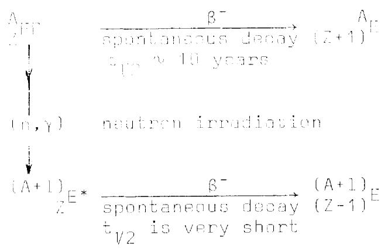

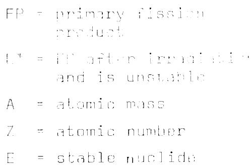

Fig. 4.10 gives some of the given transformations which may occur under a high flux. (Remark: Fig. 4.3 and 4.9 omitted)

In this system the following simple assumptions are made

- the amount of fission products come from both the fast power reactor breeders and the thermal burner.   
- the fuels and materials are continually reprocessed   
- the irradiated fission products are continuously (or periodically) separated in order to eliminate the daughter stable nuclides (e.g. Zr-90 and Zr-91) from the decay and burning of Sr-90   
- the amounts of transmutated nuclides in the steady state (SS) irradiation are calculated by the obvious relationships for the i-th nuclide.

# 4.2.2 Neutronic calculations

A reference burner reactor concept is shown in Fig. 4.11. The flux trap is surrounded by a BeO beryllium oxide spectrum converter, a critical fuel thickness and an outer wall (see Table 4.5 and Table 4.6). Fig. 4.12 shows the calculated flux distribution. The total flux in the fuel is similar to that in the flux trap (Fig. 4.13)

# 4.2.3 Moderation requirements

To form a thermal neutron flux trap one must naturally use neutron moderating materials. As is well known, light materials can scatter neutrons past the neutron-absorbing intermediate-energy resonance region. ${}^{1}\mathrm{H}$ is the most efficient nuclide in this respect but als exhibits appreciable thermal absorption. Deuterium ${}^{2}\mathrm{D}$ , beryllium ${}^{9}\mathrm{Be}$ and arbon ${}^{12}\mathrm{C}$ are usual alternatives. Oxygen ${}^{13}\mathrm{O}$ is rather heavy though frequently already present in a molecular combination. Other light nuclides have unacceptable nuclear or physical limitations.

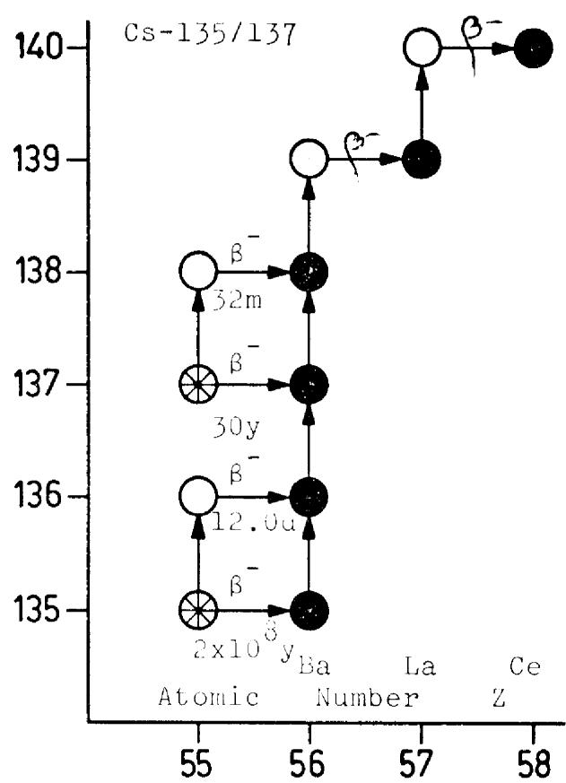  
Fig. 4.10 Transmutation of selected Nuclides-fission products

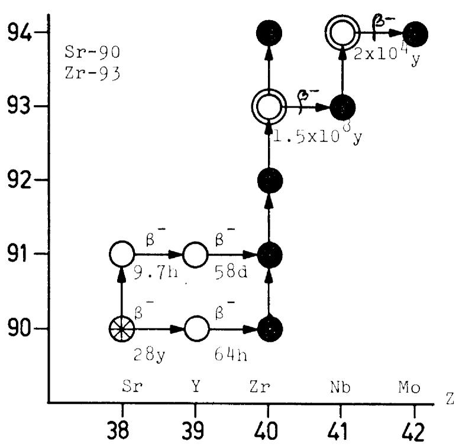

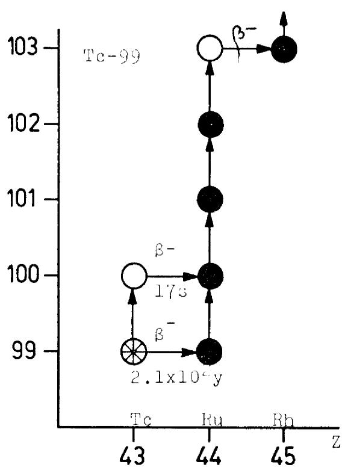

Long lived fission product being the object of transmutation   
Stable Nuclide   
Beta unstable, intermediate nuclide   
Long lived nuclide

$\frac{\beta^{-}}{\text{half-life}}$ spontaneous beta decay

neutron capture $(n,\gamma)$

Table 4.5

OBJECT: HIGH FLUX BURNER REACTOR WITH THERMAL ZONE

```txt
REACTORYTYPER:   
GEOMETRY: INTERNAL ZONE : THERMAL, HIGH FLUX WALL IRON, GRAPHIT INTERMEDIATE ZONE: CORE, FUEL WALL IRON EXTERNAL ZONE - WALL, REFLECTOR IRON 
```

```txt
POWER (GW thermal) : 7  
POWER DENSITY (GW therm/m³ core) : ∼ 10  
NEUTRON FLUX, MEAN (n/cm² s) : ∼ 4 x 10¹⁶ 
```

```txt
FISSILE NUCLIDE: Pu-239  
DILUTENT : NaCl  
COOLING SYSTEM : out of core  
BREEDING RATIO : - 
```

```txt
PARAMETER STUDIED: Moderators in thermal zone Wall, thickness, beryllium, graphite Volume, specific power cooling parameters 
```

```txt
METHOD OF NEUTRONIC: ANISN S4  
CALCULATION: 23 Groups  
: P1 APP.  
: GCC3 CODE  
END 
```

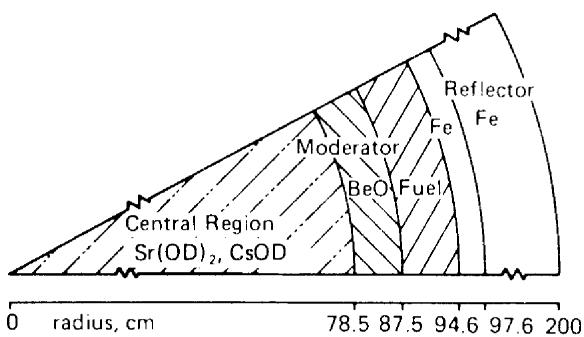  
Fig. 4.11. GEOMETRY OF THE HIGH FLUX REACTOR

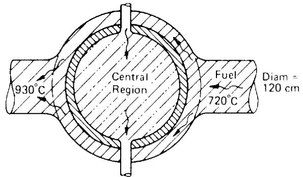

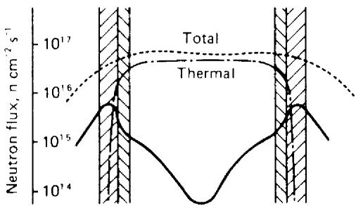  
Fast 1.6 MeV

(Total power = 7 GW(th): fission products from the total system of 30 GW(th)).

Table 4.6 Geometry and Neutronics of the High-Flux Burner Reactor   

<table><tr><td>Region</td><td>Radius (cm) Inner Outer</td><td>Components (atoms 10-24cm-3)</td><td>Neutron Flux (n cm-2s-1) total thermal</td></tr><tr><td>Cetral for transmutation</td><td>0.0 78.5 Volume 2.1 m3</td><td>137Cs 0.011690Sr 0.00160 0.01450 0.0145(Cesium and strontium deuteroxide)</td><td>3.83/2.05 x 1016</td></tr><tr><td>Wall, moderator</td><td>78.5 88.0 Volume 0.82 m3</td><td>Be 0.0600 0.060(Beryllia: 8 cm, graphite: 0.5 cm)</td><td>4.48/1.79 x 1016</td></tr><tr><td>Core (fuel)</td><td>88.0 94.6 Volume 0.67 m3</td><td>239Pu 0.0014240Pu 0.0004241Pu 0.0002Na 0.012Cl 0.018(Plutonium, sodium chlorides: PuCl3·6 NaCl)</td><td>4.03/0.0156 x 1016</td></tr><tr><td>Wall</td><td>94.6 97.6</td><td>Fe 0.08</td><td>4.00 x 1016/5 x 1011</td></tr><tr><td>Reflector</td><td>97.6 200</td><td>Fe 0.08</td><td>Boundary flux 2.4 x 1013/105</td></tr></table>

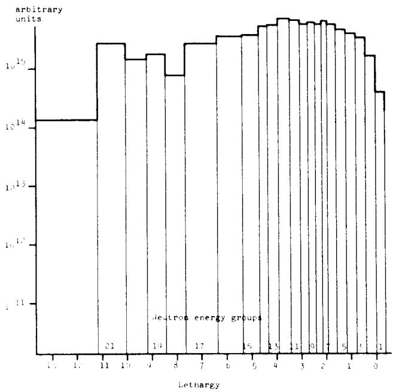  
Fig.4.2 Neutron spectrum in the core Total mean flux 4.03-1016 n cm-2s-1 Specific power 10.1 kWcm-3 Total power 7 GWh

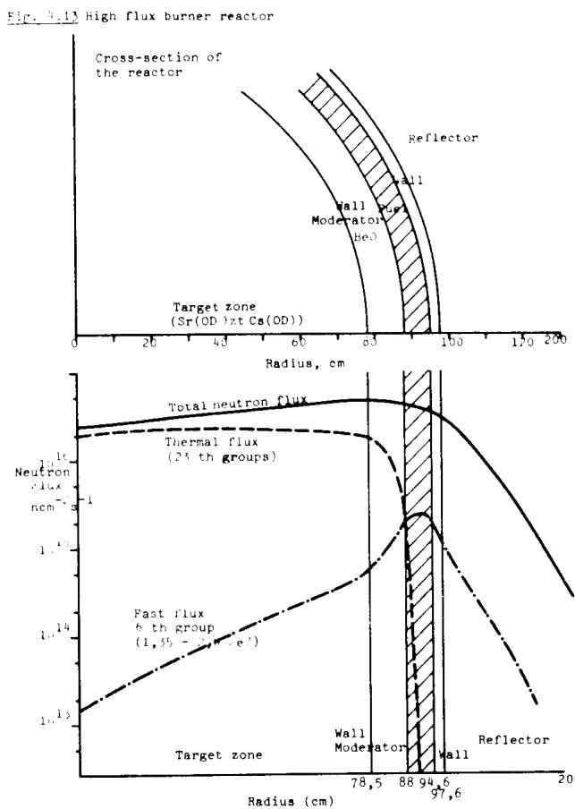

Considering chemical and physical properties, the logical materials to be used inside the lux trap are hydroxide and/or deuteroxide compounds of the FP. Fig. 4.14A shows that just a small proportion of H molar fraction has a large deleterious effect on the Cs-137 transmutation rate. This is due to the H absorption cross section. Therefore, CsOD and $\mathrm{Sr(OD)_2}$ are preferred.

As Sr-90 and Cs-137 also have their fair share of resonances it is advantageous to thermalise the flux before reaching the flux trap region containing these targets. Therefore a spectrum converter between flux trap and fast fuel is needed. Bearing in mind the high temperatures to be obtained in this reactor and possible chemical reactions with molten salt, $\mathrm{H}_2\mathrm{O}$ and $\mathrm{D}_2\mathrm{O}$ are unacceptable. This leaves Be, BeO and graphite or some variant therefore for consideration. Be (and D) compounds, of course, have also to their advantage a relatively low $(n,2n)$ threshold (1.67 MeV). Location next to a fast region can therefore produce considerable very slow neutrons in the flux trap - which is a main objective of the burner reactor. Replacement of Be by C or Mo wall material should therefore lower the FP transmutation rate, and it does. (Table 4.7 Fig 4.14B) indicates an optimum thickness of about $5\mathrm{cm}$ Be. For the sake of safety and higher melting temperature, BeO is preferred over Be.

Table 4.7 Effect on Replacing Be Converter upon the Relative FP Transmutation Rates   

<table><tr><td>case</td><td>materials</td><td>λtransm. (Cs-137)</td><td>λtransm. (Sr-90)</td></tr><tr><td>1</td><td>Be, Be</td><td>1.0</td><td>1.0</td></tr><tr><td>2</td><td>C, Be</td><td>0.72</td><td>0.68</td></tr><tr><td>3</td><td>Be, Fe/Mo</td><td>0.84</td><td>0.82</td></tr></table>

(Note. transmutation rate in arbitrary units)

# 4.2.4 Influence of other parameters

The influence of plutonium concentration (Fig. 4.14C) is an important parameter of this reactor. Increasing the plutonium concentration significantly improves the transmutation rate but also increases the power density above a technically feasible level (Fig. 4.14D). See also Fig. 4.15.

Fig. 4.14

Impact of some selected parameter variations: (a) hydrogen/deuterium, (b) thickness of moderator $(\mathrm{BeO})$ , (c) plutonium concentration, and (d) power density, P $(\mathrm{kWcm}^{-3})$

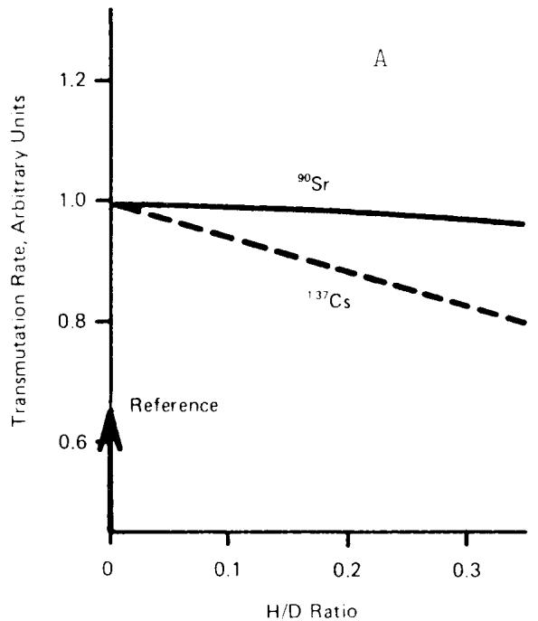  
(a)

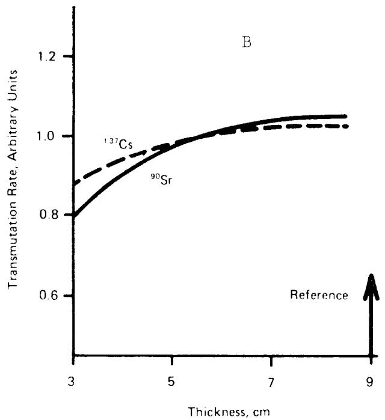  
(b)

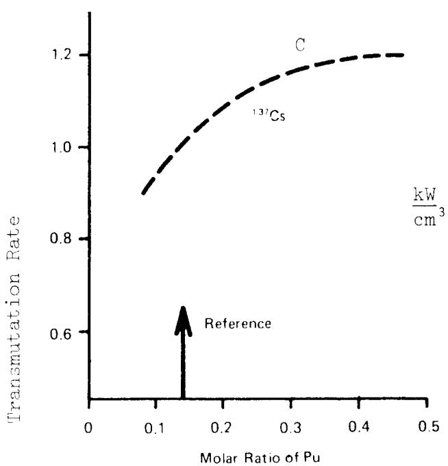  
(c)

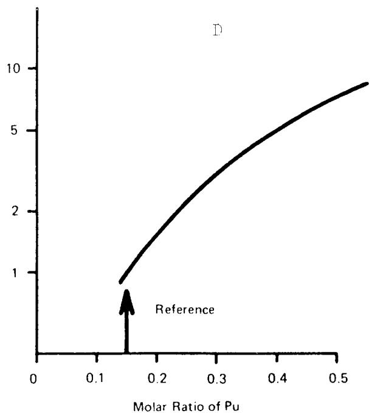  
(d)

Increasing the reactor power (Fig. 4.16A) from 5 to 11 GW(th) improves the transmutation rate. However a power unit above 7 GW(th) seems to be beyond the technological limit even for the distant future. The reference case has been taken as 7 GW(th).

The use of beryllium (Fig. 4.16B and 4.16C) instead of iron in the reflector of the core improves the transmutation rate significantly. At the same time the power density increases prohibitively (Fig. 4.16D). The reference case contains iron in the reflector.

Molten fuel offers the only way of handling the very high power densities of $10\mathrm{GWh}^{-3}$ . In addition the very steep gradient of fission rate makes a molten fuel core essential since the local fission density can be one order of magnitude greater than the mean density. In a solid fuel core the high heat removal rates would not be achievable.

The use of boron to absorb the thermal neutrons results in a definite decrease in the rate of caesium transmutation (Fig. 4.17).

The large size of the thermal flux trap results in the fuel region approaching slab geometry with attendant high neutron leakage. To better economise on neutrons several possibilities may be tried

- use of an optimised reflector such as Fe, Ni, Cu or Be to minimise the critical mass

- use of the outer neutron leakage for breeding

- use of the neutron leakage for additional FP transmutation

To begin with a solid Fe reflector was assumed (Fig. 4.18).

# 4.3 Thermohydraulic considerations

We now examine the thermohydraulic implications (for more details see ch. 8).

The crucial parameter here is the core power density. The given value is high but still near the present state of the art (Table 4.8).

For comparison, power densities for some high flux reactors. (Table 3)

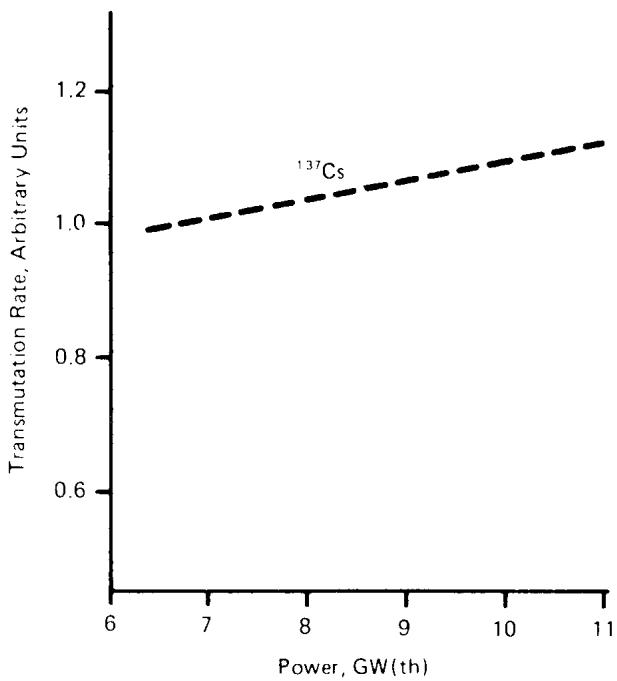  
Fig. 4.16 Effect of variation in some selected parameters: (a) power, (b) power (b) reflector, (c) power density, $\mathrm{P(GWm^{-3})}$ , and (d) fission density in fuel, F (fission $\mathrm{cm^{-3}}$ )   
(a)

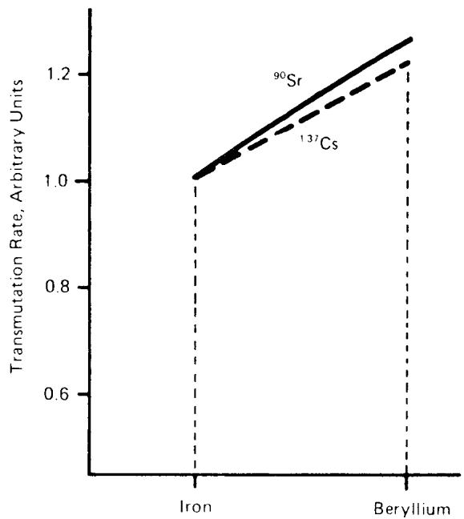  
(b)

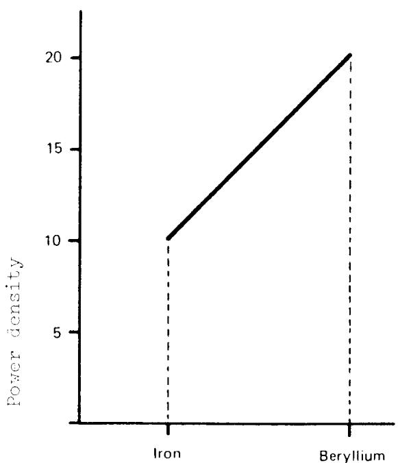  
(c)

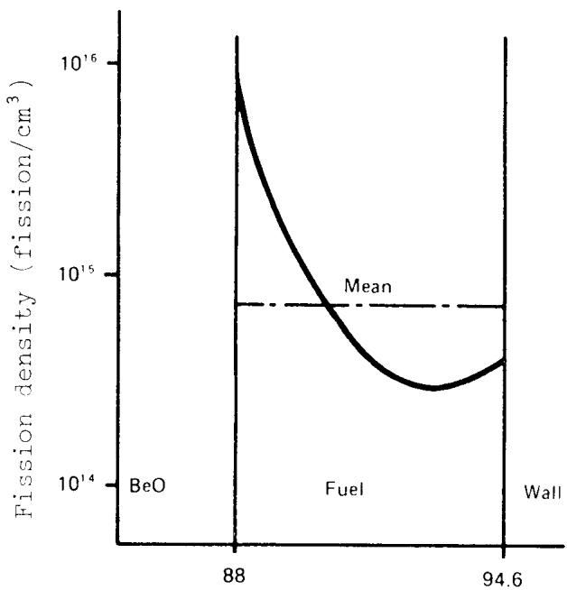  
Radius, cm   
(d)

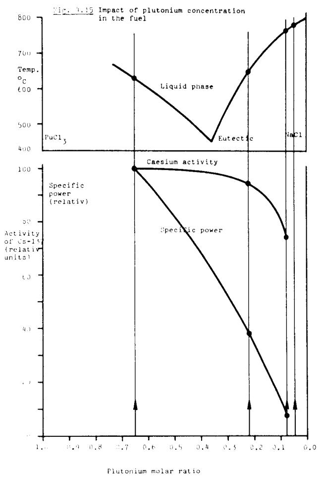

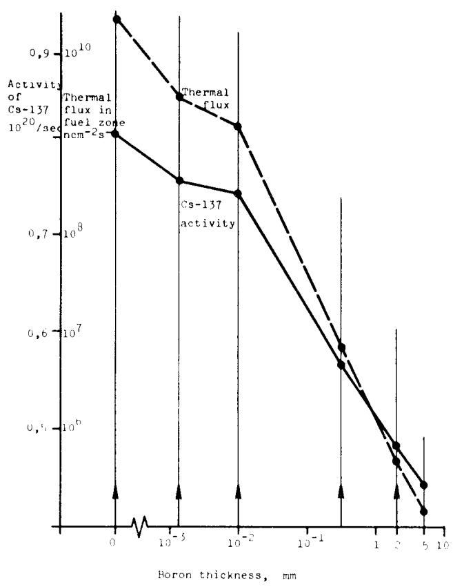  
Fig.4.17 Impact of natural boron

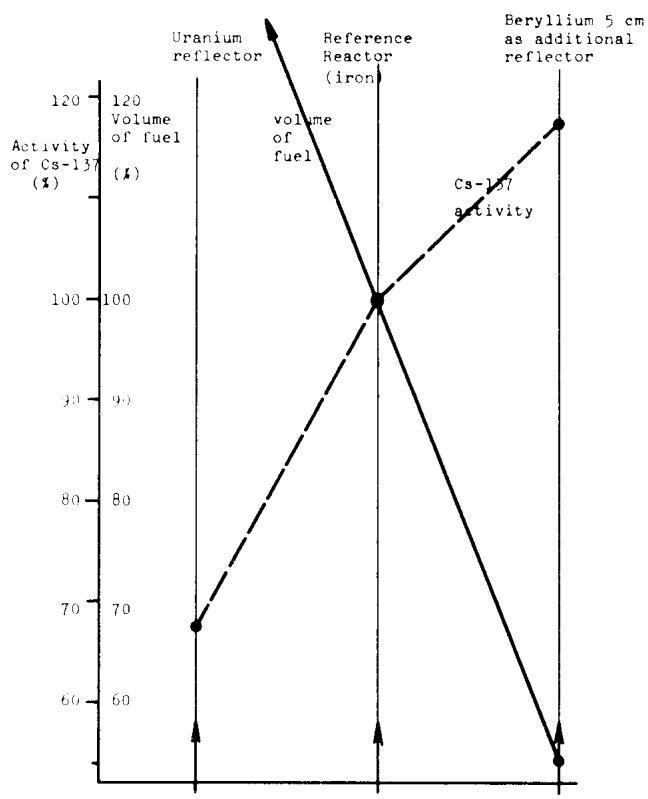  
Fig. 4.18 Impact of reflector

Table 4.8 Thermohydraulics of the High-Flux Burner Reactor   

<table><tr><td>Parameter</td><td>Unit</td><td>Value</td></tr><tr><td>Total power</td><td>Gw(th)</td><td>7.0</td></tr><tr><td>Core volume</td><td>m3</td><td>0.69</td></tr><tr><td>Power density</td><td>kW cm-3</td><td>10.5</td></tr><tr><td>Fuel density</td><td>g cm-3</td><td>2.35</td></tr><tr><td>Heat capacity, mass</td><td>J g-1K-1</td><td>0.83</td></tr><tr><td>Heat capacity, volume</td><td>J cm-3K-1</td><td>1.95</td></tr><tr><td>Diameter of tube inlet</td><td>cm</td><td>120</td></tr><tr><td>Inlet velocity</td><td>m s-1</td><td>15</td></tr><tr><td>Volumetric velocity</td><td>m3s-1</td><td>17</td></tr><tr><td>Heat capacity</td><td>Gw s K-1</td><td>0.033</td></tr><tr><td>Temperature increase (outlet-inlet)</td><td>oC</td><td>210</td></tr><tr><td>Temperature of fuel inlet</td><td>oC</td><td>720</td></tr><tr><td>Temperature of fuel outlet</td><td>oC</td><td>930</td></tr><tr><td>Mean velocity of fuel in core</td><td>m s-1</td><td>12</td></tr><tr><td>Cooling</td><td>---</td><td>Out of core in heat exchanger cooled by sodium</td></tr></table>

This seems to indicate that a total specific power rating of about $1 \, \text{kgPu/w(th)}$ may be achievable.

Table 3 Power density in high-flux reactors   

<table><tr><td rowspan="2"></td><td colspan="2">Power density GW(th)/m3</td></tr><tr><td>in core volume</td><td>in coolant volume</td></tr><tr><td>Feinberg, research reactor</td><td>3-5</td><td>8-10</td></tr><tr><td>Melekes CM-2 (Soviet Union)</td><td>2.5</td><td>5</td></tr><tr><td>FFTF (USA)</td><td>1.0</td><td>2</td></tr><tr><td>Lane (Molten chlorides)</td><td>5-10</td><td>5-10</td></tr><tr><td>HFIR (USA) mean</td><td>2</td><td>4</td></tr><tr><td>maximum</td><td>4.38</td><td>8.5</td></tr><tr><td>Phenix 250 (france)</td><td>0.46</td><td>1.0</td></tr><tr><td>This paper</td><td>10.9</td><td>10.9</td></tr></table>

The crucial problem will be the efficiency of the external heat exchanger. In the following example some typical heat exchanger characteristics are taken to demonstrate the possibilities (calculated for 11 Gw(th).

Specific heat exchanger power 1 kW/cm³ (conservative data)

Total volume of heat exchanger for 11 m³ 11 GW(th)

Volumetric fuel ratio 0.3

Fuel volume in heat exchanger 3.3 m³

Fuel in the core heat exchanger piping 1.0 m³

Total fuel out of core 4.3 m³

Fuel in core 1.0 m³

Total fuel in system 5.3 m³

Mean specific power of fuel in the 2.07 GW/m³ whole system 11 GW(th) 5.3m³

Plutonium content of fuel 0.8 gPu/cm³

Power rating of whole system 0.385 kgPu/Mw(th)

The postulated power rating for the 1 kgPu/MW(th) whole system

For this case calculated the power rating in the breeder power reactors 1.15 kgPu/MW(th)

# 4.4 Some results

Parametric studies were made as variations around a reference system which assumed $P = 11$ GW(th) ( $X = 2 \cdot 9$ , $K = 4 \cdot 2$ ) and $R_{FT} = 78 \cdot 5$ cm. The flux trap is surrounded by 5 cm BeO converter, a critical fuel thickness of 6·6 cm and an outer wall. Fig. 4.19 shows the calculated flux distributions for such a burner reactor. Note that the total flux in the fuel is similar to that in the flux trap. The calculated fluxes lead to the conclusion that

(total spectrum, flux trap) $= 1 / 2 \cdot (E = 0.0253)$

The result indicates the relative effect of X on the ratio R of the FP transmutation rate to FP production rate for the reactor system. It can be seen that X should be kept as low as possible. Absolute results will depend on the Cs and Sr densities in the flux trap. A value of R = 1 was achieved for both FP nuclides at X = 4·5. The F.P. atom ratio there was (Cs-137) / (Sr-90) = 7.25.

Another important problem is the relatively high flux in the outer zone or leakage from the core.

This flux can be used for two purposes:

1) for transmutation of other fission products which have rather a high absorption cross section e.g.

$$
\begin{array}{l} T _ {c - 9 9} \quad \sigma^ {\text {t h}} = 2 2 \text {b a r n s} \quad t _ {1 / 2} ^ {\beta} = 2. 1 \times 1 0 ^ {5} \text {y e a r s} \\ I - 1 2 9 \quad \sigma^ {\text {t h}} = 2 8 \text {b a r n s} \quad t _ {1 / 2} ^ {\beta} = 1. 7 \times 1 0 ^ {7} \text {y e a r s} \\ \end{array}
$$

In both cases a flux of $10^{14} - 10^{15}\mathrm{mcm}^{-1}\mathrm{s}^{-1}$ permits a rather effective transmutation rate of

$$
\begin{array}{l} T _ {c} = 9 9 \quad \lambda = 7 \times 1 0 ^ {- 9} s ^ {- 1} \quad t _ {V 2 e f f} = 3 \text {y e a r s} \\ I - 1 2 9 \lambda = 7 \times 1 0 ^ {- 9} s ^ {- 1} t _ {V 2 e f f} = 2 \text {y e a r s} \\ \end{array}
$$

To still further improve these reactions the use of a beryllium moderator in the form of a 5 cm wall in the outer region of the core has been calculated. This gave an improvement in the transmutation rate of Cs-137 in the inner target region but also a very significant increase of specific power due to the scattering of the neutron flux in the fuel region.

The possibilities for transmutation of these two long lived fission products will be discussed further elsewhere.

Fig. 4.19 Fission density in the fuel zone   
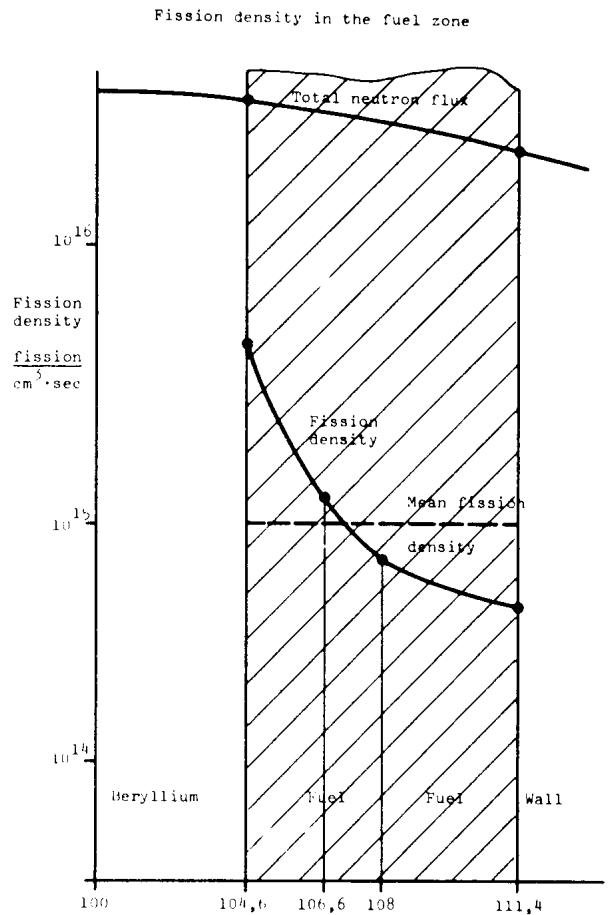  
Remark: Fig. 4.20 omitted

The neutron flux outside the core may also be used for breeding in a uranium blanket. The breeding ratio may be higher than 1 but the decrease of the transmutation ratio is critical and seems to be too low for a burner reactor.

Nevertheless it could be useful to check these possibilities in more detail using some of the available neutrons for breeding in an external blanket region.

Table 4.9 summarises the data for the reference case. It can be shown that the transmutation rates obtained are equal:

$$
\begin{array}{l} { } ^ { 9 } \mathrm { ~ o m e g a S r : } \quad \lambda _ { \text { e f f } } = \lambda _ { \text { t r } } + \lambda _ { \beta } = \sigma \cdot \Phi + \lambda _ { \beta } = 1 . 1 9 \times 1 0 ^ { - 8 } \mathrm { s } ^ { - 1 } \\ t _ {\text {e f f}} ^ {\frac {1}{2}} = 1. 8 5 \mathrm {y r} \\ \text {七} _ {\theta} ^ {2 0}, \text {七} _ {\pi} ^ {4 2} = 1. 5 \\ \end{array}
$$

$$
\begin{array}{l} 1 3 7 C S: \quad \lambda_ {e f f} = 0. 2 4 6 \times 1 0 ^ {- 8} s ^ {- 1} \\ t _ {\text {e f f}} ^ {1 / 2} = 8. 9 5 \mathrm {y r} \\ t _ {\beta} ^ {1 / 2} / t _ {\text {e f f}} ^ {1 / 2} = 3. 3 \\ \end{array}
$$

The results obtained are significant but rather pessimistic. To estimate the "profit" of the transmutation process, the hazard index (H) must also be taken into account. From Table 4.10 it can be seen that the total reduction in hazard from both fission products equals 13.5, which is a better indication.

# 4.6 Comments on hazard coefficients

It is perhaps valuable to estimate the usefulness of using the concept of hazard coefficients in fission product management. Table 4.10 gives some values for Sr-90 and Cs-137. From this it can be seen that in a steady state transmutations requiring the amount of hazardous substances is reduced by a factor $\sim 15$ in relation to the steady beta-decay.

(Total power $P = 30 \times 10^{9}W$ (burner reactor $7 \times 10^{9}W$ ); fission rate in

$= 9.3 \times 10^{20}$ fission/s.)

Table 4.9 The Transmutation Process for Selected Fission Products   

<table><tr><td rowspan="2">Property</td><td rowspan="2">Symbol</td><td rowspan="2">Unit</td><td colspan="2">Data for</td></tr><tr><td>90Sr</td><td>137Cs</td></tr><tr><td>Yield of fission producta</td><td>Y</td><td>---</td><td>0.041</td><td>0.064</td></tr><tr><td>Production rate</td><td>R = F • Y</td><td>atom s-1</td><td>3.81 × 1019</td><td>5.05 × 1019</td></tr><tr><td>Concentration</td><td>C</td><td>atom/1024cm3of target</td><td>0.0016</td><td>0.0116</td></tr><tr><td>Volume of target</td><td>V</td><td>cm3</td><td>2.03 × 106</td><td>106</td></tr><tr><td>Number of atoms</td><td>N = V • C</td><td>atom</td><td>3.25 × 1027</td><td>2.35 × 1028</td></tr><tr><td>Decay constant</td><td>λβ</td><td>s-1</td><td>7.86 × 10-10</td><td>7.33 × 10-10</td></tr><tr><td>Decay rate</td><td>R = Nλβ</td><td>atom s-1</td><td>2.55 × 1018</td><td>1.72 × 1019</td></tr><tr><td>Mean cross section</td><td>σc</td><td>10-24cm2</td><td>0.29</td><td>0.045</td></tr><tr><td>Total flux, mean</td><td>Φ</td><td>n cm-2s-1</td><td>3.83 × 1016</td><td>1016</td></tr><tr><td>Transmutation rate</td><td>Rtr = N•σc•Φ</td><td>atom s-1</td><td>3.61 × 1019</td><td>4.05 × 1019</td></tr><tr><td>Total destruction rate</td><td>Rt= R+Rtr</td><td>atom s-1</td><td>3.86 × 1019</td><td>5.77 × 1019</td></tr><tr><td>Destruction constant</td><td>t½eff = ln2/λeff</td><td>year</td><td>1.85</td><td>8.95</td></tr><tr><td>Efficiency of transmutation</td><td>Etr = t½β/t½eff</td><td>---</td><td>15</td><td>3.3</td></tr><tr><td>Inventory reduction ratio</td><td>Rp≈ R</td><td></td><td>3.8 × 1019</td><td>5.8 × 1019</td></tr><tr><td>Steady-state equilibrium</td><td></td><td></td><td></td><td></td></tr></table>

For the mean value of the yield, see in [1]: 4.10   
b. See Fig. 4.21

Table 4.10 Hazard index for the Improved Reference Case*   

<table><tr><td>Parameter</td><td>Symbol</td><td>Unit</td><td>90Sr</td><td>137Cs</td><td>Ratio 90Sr 137Cs</td></tr><tr><td>Maximum permissible concentration water</td><td></td><td></td><td>3.7 × 10-1</td><td>14.8</td><td>49</td></tr><tr><td>air &quot;mean&quot;</td><td>H</td><td></td><td>3.7 × 10-5</td><td>2.2 × 10-3</td><td>65</td></tr><tr><td>Yield of fission products from 233U</td><td>Y</td><td>atom/fission</td><td>0.062</td><td>0.066</td><td></td></tr><tr><td>from 235U</td><td>Y</td><td>atom/fission</td><td>0.051</td><td>0.0599</td><td></td></tr><tr><td>from 239U</td><td>Y</td><td>atom/fission</td><td>0.0218</td><td>0.0669</td><td></td></tr><tr><td>Mean value for fission rate of 233U:235U:239Pu 1:1:1</td><td>Y</td><td></td><td>0.341</td><td>0.064</td><td></td></tr><tr><td>Hazard</td><td>H·Y</td><td>---</td><td>2.05</td><td>0.064</td><td>2.114</td></tr><tr><td>Efficiency of hazard reduction by transmutation</td><td>H·Y/Etr(Table III)</td><td>---</td><td>0.137</td><td>0.019</td><td>0.156</td></tr><tr><td>Mean effective hazard reduction</td><td></td><td></td><td></td><td></td><td>2.114/0.156 = 13.5</td></tr></table>

*The hazard coefficient (H) is defined as the amount of air and/or water needed to dilute the amount of a given nuclide present to levels proposed for the maximum permissible concentration.

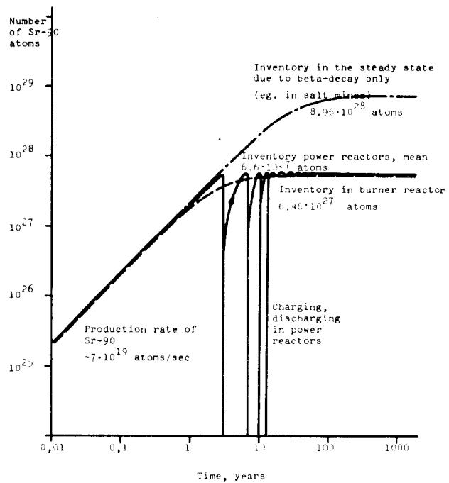  
Fig. 4.21 Inventory of Strontium-90 in the power reactors and in the burner reactor Power of total system 55 GWh Yield of Sr-90: 4.1 g

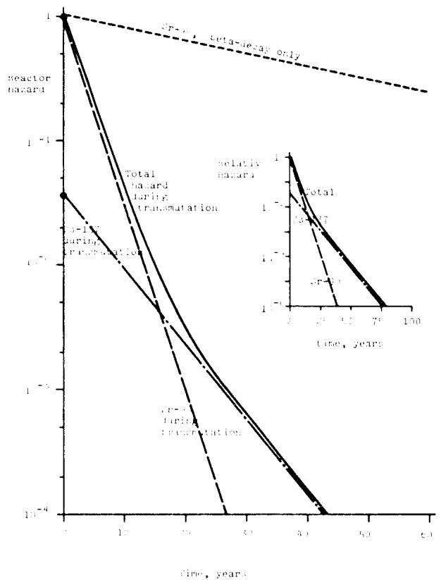  
15. 25 Haraard of the twin fusion products: $\mathbf{Pr} = \mathbf{h}$ and Ca-147

The amount of strontium-90, the most hazardous nuclide, in the high flux burner is about the same as that found in the power reactors after 3 years of operation.

However the most impressive result comes from considering the end of the fission power area. Where by compared to storage (natural decay with a combined half life of 39 years) without transmutation, the transmutation case shows that the amount of nuclides remaining will be reduced by a factor of 1000. (Fig. 4.22).

In a high flux transmutation the reduction by a factor 1000 would be achieved with 26 years in the lifetime of one reactor generation.

# 4.7 Secondary processes

It must be remembered that the relatively high neutron flux results in the irradiation not only of the non-desirable radioactive nuclides but also the stable fission products, including the stable components of the fuel and structural material. A very short review of these particular processes is given here.

Natural chlorine contains two stable isotopes (underlined)

$$
\begin{array}{l l l l} \underline {{3 5}} & \underline {{1 7}} \underline {{C l}} (n, \gamma) & \underline {{3 6}} & \underline {{1 7}} \underline {{C l}} \xrightarrow {\beta^ {-}} \underline {{3 . 1 \times 1 0 ^ {5} \text {y e a r s}}} \xrightarrow {\underline {{1 8}}} \underline {{A r}} \\ \underline {{3 7}} & \underline {{1 7}} \underline {{C l}} (n, \gamma) & \underline {{3 8}} & \underline {{1 7}} \underline {{C l}} \xrightarrow {\beta^ {-}} \underline {{3 7 , 3 \text {m i n u t e s}}} \xrightarrow {\underline {{1 8}}} \underline {{A r}} \end{array} \quad \text {v o l a t i l e}
$$

However not only $(n,\gamma)$ reactions are important here. Much more important is the following reaction

$$
\begin{array}{c c c c} \frac {3 5}{1 7} \underline {{C l}} & (n, p) & \frac {3 5}{1 6} S & \xrightarrow {\beta^ {-}} \frac {3 5}{8 . 7 d a y s} \\ \hline \end{array}
$$

(see ch. 7 for experiment results)

The presence of sulphur also influences the chemistry of the molten fuel (see ch.6).

Sodium having only one stable isotope is also transformed

$$
\begin{array}{l} \begin{array}{l} 2 3 \\ 1 1 \end{array} \mathrm {N a} (n, \gamma) \begin{array}{l} 2 4 \\ 1 1 \end{array} \mathrm {N a} \xrightarrow {\beta^ {-}} \begin{array}{l} 2 4 \\ 1 2 \end{array} \mathrm {M g} (n, \gamma) \begin{array}{l} 2 5 \\ \underline {{\mathrm {M g}}} (n, \gamma) \end{array} \begin{array}{l} 2 6 \\ \underline {{\mathrm {M g}}} \longrightarrow \end{array} \\ \longrightarrow^ {2 6} \underline {{M g}} (n, \gamma) ^ {2 7} M g \xrightarrow {\beta^ {-}} ^ {2 7} A l \\ \end{array}
$$

This chain gives rise to increasing amounts of stable magnesium and over larger periods also stable aluminium.

# 4.8 Conclusions

The system proposed for the transmutation of $^{90}\mathrm{Sr}$ and $^{137}\mathrm{Cs}$ , fulfills the following criteria:

1. The energy balance is positive.   
2. The hazardous waste balance is strongly negative. That is, the amount of hazardous material destroyed greatly exceeds the amount of freshly produced, e.g. tritium, $^{10}$ B, and the activation products of the structural material.   
3. The rate of destruction (transmutation) is approximately at least one order of magnitude greater than that due to spontaneous beta decay.   
4. The period in which a thousand-fold reduction in the hazard can be achieved is the same as the lifetime of one reactor, that is, 20 to 40 yr.   
5. The neutron balance of the system is positive. That is, it permits breeding to occur along with the transmutation.   
6. The weakest feature is shown in the relationship between the probability of catastrophic release to the environment for the transmutation operation, $P_{\text{trans}}$ , to the probability of a similar event in the case of storage, $P_{\text{store}}$ , where it is desired that

$$
\frac {P _ {\text {t r a n s}}}{P _ {\text {s t o r e}}} <   \frac {\text {t r a n s}}{\text {s t o r e}} = \frac {\sigma \cdot \Phi + \lambda}{\lambda}
$$

where $\lambda_{\beta}$ is the decay constant.

7. Further optimisations of the system are possible.

8. The proposed system, a molten-salt fast reactor, while rather exotic from a technological point of view, is not as far removed from the present state of technology as some other transmutation proposals (e.g. high-flux high-energy accelerators, controlled thermonuclear reactors) may be.

5. An internally cooled breeder with uranium-plutonium fuel

# 5.1 Design features and objectives

In this chapter a further variant of the molten salt breeder is described.

The core is cooled by a cooling medium circulating in tubes. The molten fuel is intensively miced. It remains in the core and no fuel other than that being drawn off for reprocessing is present outside the core.

The unique feature of this concept is the use of a molten fertile material as the cooling medium for the core.

Such a dual function for the fertile coolant results in some unusual properties for this reactor type. The study here is concerned with a molten chloride breeder reactor. The most important features are: (see table 5.1)

- thermal power: 2.05 GW - 1.94 GW in core + 0.11 GW in the blanket

- electrical power: 0.85 GW in the optimum case ( $n_{\text{eff}} = 0.4$ )

- molten fuel consisting of (in mol %)

15% PuCl3 (of which Pu-239 + Pu-241 = 80% and Pu-240 = 20%)

85% NaCl (no $^{238}$ UCl, in fuel)

and fission products in the form of chlorides or in an elementary state.

- molten fertile material (in mol %)

65% 238UC13

356 NaCl

and newly bred $\mathsf{PuCl}_3$ and fission products

- coolant flowing in tubes: made up of the fertile material above. No other coolant in core.

- blanket material: also made up of the fertile material above

- the core is internally cooled. There is no circulating fuel outside the core.

Table 5.1

OBJECT: INTERNAL COOLED FAST BREEDER POWER REACTOR

```txt
REACTOR TYPE :  
GEOMETRY: INTERNAL ZONE : CORE, Fuel  
(N) WALL : Iron, Holybdenum  
INTERMEDIATE ZONE: cooling tube with fertile material  
WALL : Fertile zone  
EXTERNAL ZONE : Fertile zone  
WALL, REFLECTRO : Iron 
```

```txt
POWER (GW thermal) : 2.1  
POWER DENSITY (GW therm/m³ core) : 0.22  
NEUTRON FLUX, MEAN (n/cm² s) : 7 × 10^15 
```

```txt
FISSILE NUCLIDE: Pu-239/241  
DILUTENT: NaCl, UCl₃  
COOLING SYSTEM: Internal, in tubes by fertile material  
BREEDING RATIO: 1.38 
```

```txt
PARAMETER STUDIED : Design  
: Tube materials  
: Pu/U ratio  
: Temperature 
```

```txt
METHOD OF NEUTRONIC : ANISN S4  
CALCULATION : 23 Groups  
: P1 APP.  
: GCCB CODE  
END 
```

- the fuel and coolant flow concurrently (Fig. 5.1)   
- the reprocessing plant is in close proximity to the reactor ("under same roof")   
- the fuel in the core, and the coolant is pumped with a velocity of 2 and $9 \, \text{m.s}^{-1}$ respectively.   
- structural material: possibly molybdenum along with small amounts of other metals e.g. Ni, Fe.

The advantages of the proposed reactor are as follows -

- no separate coolant, no "foreign" cooling agent (e.g. sodium, helium etc.) in the core which results in a more satisfactory system with improved neutron balance.   
- the fuel inventory is very small due to lack of a separate cooling system and the small out of core inventory due to the directly coupled reprocessing plant.   
- the fuel contains only plutonium and no uranium which simplifies the processing technology and removes the danger of uranium trichloride oxidation which also improves the corrosion properties of this medium   
- the high velocities of both fuel and coolant, significantly reduces the temperature gradients in the equilibrium state and reduces the mass transport mechanisms. These are very sensitive to temperature gradients and play a large role in corrosion.

However the advantages are numerous:

- the first and most important is of course corrosion. The molten chloride medium especially in neutron and gamma fields, at high temperatures and velocities with chlorine being virtually freed in the fission process from plutonium chloride presents a very serious problem which must, and probably could be solved.   
- the most likely structural material seems to be molybdenum alloy which among other thing gives rise to parasitic absorption of neutrons.   
- the fuel is circulated by a pump which must be located in or close to the core which increases the corrosion problems.   
- the high fuel and collant velocities result in high pumping costs and could cause severe erosion.

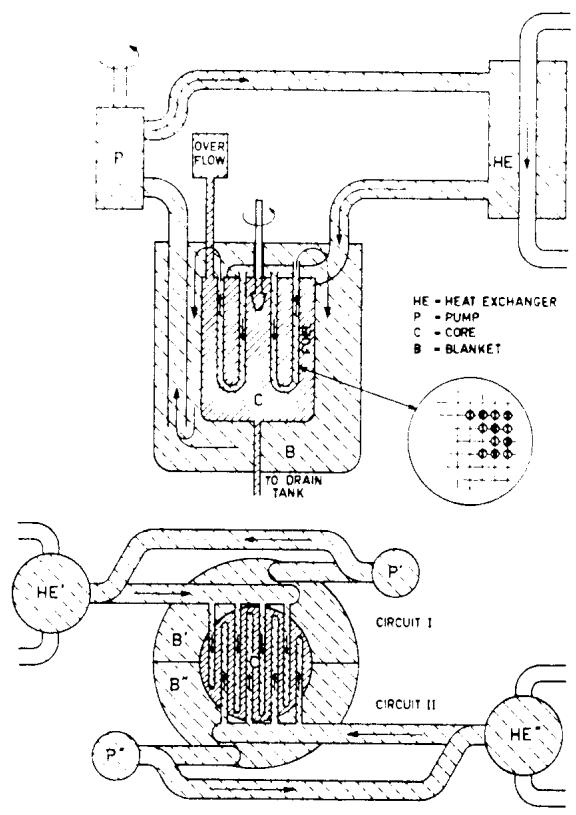  
Fig. 5.1 Circuit schematic

"CHLOROPHIL"

Table 5.2 Molten chloride fast breeder reactor (MCFBR)   

<table><tr><td>Electrical power, approx</td><td>MW(elect)</td><td>800</td></tr><tr><td>Thermal power, total/in core</td><td>MW(thermal)</td><td>2050/1940</td></tr><tr><td>Core volume</td><td>m3</td><td>8.75</td></tr><tr><td>Specific power</td><td>MW m-3</td><td>220</td></tr><tr><td>Core geometry</td><td>m</td><td>height2.02/2.36 dia.</td></tr><tr><td>Fuel: liquid PuCl3NaCl</td><td>mol%</td><td>16/84</td></tr><tr><td>Liquidus/boiling point</td><td>°C</td><td>685/1500 (appr.)</td></tr><tr><td>Fuel mean temperature</td><td>°C</td><td>984</td></tr><tr><td>Fuel volume fraction in the core</td><td></td><td>0.386</td></tr><tr><td>Power form-factors radial/axial</td><td></td><td>0.60/0.78</td></tr><tr><td>Fast flux, mean across core</td><td>n cm-2s-1</td><td>7 x 10^15</td></tr><tr><td>Fuel density at 984°C</td><td>kg m-3</td><td>2344</td></tr><tr><td>Heat capacity, 984°C</td><td>kJ Kg-1K-1</td><td>0.95</td></tr><tr><td>Viscosity, 984°C</td><td>g cm-1s-1</td><td>0.0217</td></tr><tr><td>Thermal conductivity, at 750°C</td><td>W cm-1K-1</td><td>0.007</td></tr><tr><td>Fuel salt in core</td><td>kg</td><td>7900</td></tr><tr><td>Total plutonium in core/in system</td><td>kg</td><td>2900/3150</td></tr><tr><td>Plutonium in salt</td><td>weight %</td><td>36.4</td></tr><tr><td>Mean plutonium specific power</td><td>MW(th) kg-1</td><td>0.67</td></tr><tr><td>Mean plutonium specific power in entire system</td><td>MW(th) kg-1</td><td>0.62</td></tr><tr><td>Coolant liquid U-238 Cl3/NaCl</td><td>mol %</td><td>65/35</td></tr><tr><td>Liquidus/boiling pint</td><td>°C</td><td>710/1700</td></tr><tr><td>Coolant temperature inlet/outlet</td><td>°C</td><td>750/793</td></tr><tr><td>Coolant volume fraction in the core</td><td></td><td>0.555</td></tr><tr><td>Coolant density</td><td>kg m-3</td><td>4010</td></tr><tr><td>Coolant salt in core/in blanket</td><td>kg</td><td>19,500/165,000</td></tr><tr><td>Total volume (95 cm)</td><td>m3</td><td>47.85</td></tr><tr><td>Fuel (shell side, pumped), velocity</td><td>m s-1</td><td>2</td></tr><tr><td>Coolant velocity</td><td>m s-1</td><td>9</td></tr><tr><td>Number of coolant tubes</td><td></td><td>23,000</td></tr><tr><td>Tubes inner/outer diameter</td><td>cm</td><td>1.20/1.26</td></tr><tr><td>Tubes pitch</td><td>cm</td><td>1.38</td></tr><tr><td>Breeding ratio, internal/total</td><td>-</td><td>0.716/1.386</td></tr><tr><td>Doubling time, load factor 1.0/0.8 yr.</td><td>years</td><td>8.5/10.5</td></tr></table>

Mean flux across core $7.0 \times 10^{15} \mathrm{~n} \mathrm{~cm}^{-2} \mathrm{~s}^{-1}$

in centre 1.2 x 10 $^{16}$ n cm $^{-2}$ s $^{-1}$

Temperature coefficient of reactivity $\delta k(\%) / \delta T(^{0}C)$   
-fuel -3.8×10-2   
- coolant + 1.29 x $10^{-2}$

Reactivity wall fo vessel 0.72% (10 mm thickness).

# 5.3 Neutron Physics (according to J. Ligou, 1972)

The 22 group transport calculation gives $125\mathrm{cm}$ ( $8 - 18\mathrm{m}^3$ ) for the critical radius of the core with a blanket thickness of $95\mathrm{cm}$ ( $36.42\mathrm{m}^3$ ). The detailed neutron balance is given in table 5.3.

The relative fluxes for each group are to be found in table 1.3 for core centre and core boundary. The corresponding one group cross sections are given in table 5.4. In Fig. 5.2 the neutron spectra (flux per lethargy unit) are compared to that of the fast critical facility ZPR - 3 - 48. This last spectrum is slightly harder but the spectrum of the molten chlorides fast breeder compares favourably with that of a power LMFBR. From table 5.3 one can deduce the following parameters

$$
k _ {\infty} = 1. 3 8 5
$$

Breeding ratio Br core 0.716

BRblanket 0.670

BR total = 1.386

For the given core (125 cm radius) the blanket thickness was varied between 75 cm and 115 cm. Fig. 5.4 shows the variation of breeding ratios obtained from the new transport calculations. The reactivity and the core breeding ratio remain practically constant in this rankge making the adjustment of the core volume unnecessary.

Above 100 cm improvement of the breeding ratio by increasing the blanket thickness gives a poor return. For example to increase the breeding ratio from 1.40 to 1.45 requires a thickness increase of 20 cm or a blanket volume increase of $32\%$ .

<table><tr><td colspan="3">Table 5.3
Neutronics of internal cooled fast breeder</td></tr><tr><td colspan="3">Core atomic densities (atoms x 1024)</td></tr><tr><td>Pu-239</td><td>6.6797 x 10-4</td><td>atoms cm-3</td></tr><tr><td>Pu-240</td><td>1.6699 x 10-4</td><td></td></tr><tr><td>U-238</td><td>3.5629 x 10-3</td><td></td></tr><tr><td>Cl</td><td>1.9495 x 10-2</td><td></td></tr><tr><td>Na</td><td>6.3017 x 10-3</td><td></td></tr><tr><td>Mo</td><td>7.386 x 10-4</td><td></td></tr><tr><td>Fe</td><td>5.078 x 10-3</td><td></td></tr></table>

<table><tr><td colspan="2">Blanket (coolant) densities (atoms x 1024)</td></tr><tr><td>U-238</td><td>6.4023 x 10-3atoms cm-3</td></tr><tr><td>Cl</td><td>2.2716 x 10-2</td></tr><tr><td>Na</td><td>3.457 x 10-3</td></tr></table>

Neutron Balance   

<table><tr><td>Region</td><td>Nuclide</td><td>Atoms (cm3 x 1021)</td><td>Absorption</td><td>Leakage</td><td>Production</td></tr><tr><td rowspan="8">Core</td><td>238U</td><td>3.5629</td><td>25.50 (n,γ) 22.51 (n,f) 2.99</td><td></td><td>8.23</td></tr><tr><td>239Pu</td><td>0.66796</td><td>34.56 (n,γ) 5.58 (n,f) 28.98</td><td></td><td>85.55</td></tr><tr><td>240Pu</td><td>0.16699</td><td>3.78 (n,γ) 2.24 (n,f) 1.54</td><td></td><td>4.72</td></tr><tr><td>Na</td><td>6.3017</td><td>0.26</td><td></td><td>-</td></tr><tr><td>Cl</td><td>19.495</td><td>3.16 (in fuel 1.10) (in cool.2.06)</td><td></td><td>-</td></tr><tr><td>Fe</td><td>5.078</td><td>1.30</td><td></td><td>-</td></tr><tr><td>Mo</td><td>0.7386</td><td>2.04</td><td></td><td>-</td></tr><tr><td>F.P.</td><td>0.0697</td><td>0.50</td><td></td><td>-</td></tr><tr><td rowspan="2">Total core</td><td rowspan="2">238U</td><td rowspan="2">6.42</td><td>71.10</td><td>27.40</td><td>98.50</td></tr><tr><td>23.70 (n,γ) 23.15 (n,f) 0.55</td><td></td><td>1.50</td></tr><tr><td rowspan="2">Blanket</td><td>Na</td><td>3.457</td><td>0.08</td><td></td><td>-</td></tr><tr><td>Cl</td><td>22.72</td><td>2.22</td><td></td><td>-</td></tr><tr><td>Total blanket</td><td></td><td></td><td>26.00</td><td>2.9</td><td>1.50</td></tr></table>

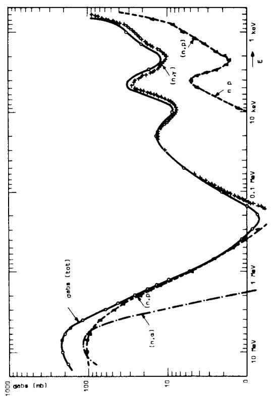  
Fig. 5.2 Chlorine absorpt. cross-sections ENDF B/III (Jan. 1972) Absorption cross-section of chlorine

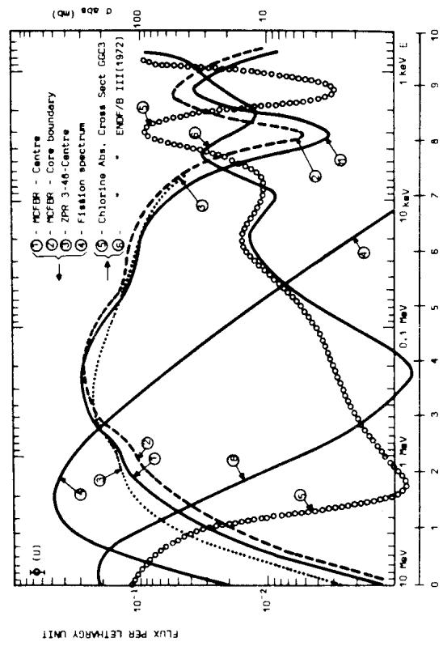  
Fig. 5.3 Neutron Spectra and Chlorine Cross Sections

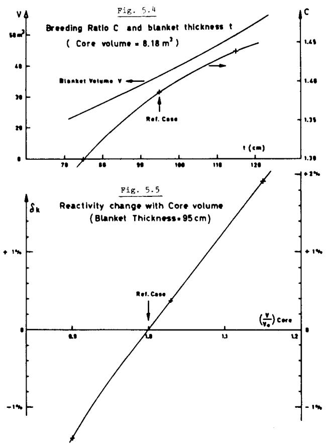

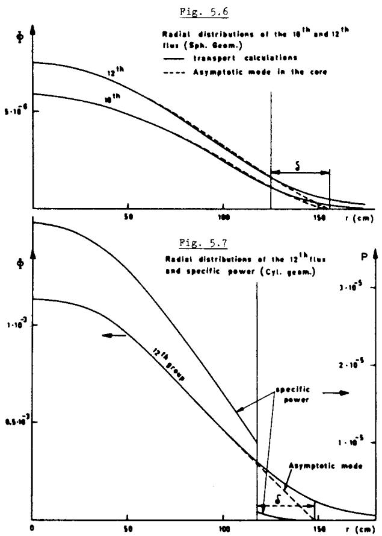

On the other hand the reactivity depends on the core radius. Fig. 5.5 shows the variation of reactivity with increasing core size. Such a curve is very useful when it is required to translate the cost in reactivity of a supplementary parasitic absorption into an increase in core volume (or plutonium inventory). The transport calculations used in Fig. 5.5 could not be used to obtain the corresponding variations in breeding ratio, rather they have been calculated from the information in table 5.3. (assuming small core volume variation $< 10\%$ and no important changes in spectra).

This gives

1) BRtotal $\approx 1.386 - 2.45\delta k$ (breeding in core unchanged)

The effects of modifying the core composition can be evaluated by the same method. This is arranged to avoid altering the properties of the coolant and fuel by varying the coolant tube diameter. The reactivity is very sensitive to this parameter. If $\epsilon$ and $\eta$ are respectively the relative increases in fuel

(barn = 10-24cm²)

Table 5.4 One group cross sections based on the reference 22 group transport calculation   

<table><tr><td rowspan="2">Type of Nuclide</td><td colspan="3">Core Spectrum</td><td colspan="3">Blanket Spectrum</td></tr><tr><td>σc</td><td>σf</td><td>ν</td><td>σc</td><td>σf</td><td>ν</td></tr><tr><td>238U</td><td>0.249</td><td>3.30 10-2</td><td>2.746</td><td>0.326</td><td>7.71 10-3</td><td>2.715</td></tr><tr><td>239Pu</td><td>0.329</td><td>1.709</td><td>2.951</td><td>0.536</td><td>1.841</td><td>2.917</td></tr><tr><td>240Pu</td><td>0.527</td><td>0.364</td><td>3.052</td><td>0.790</td><td>0.174</td><td>2.998</td></tr><tr><td>Na</td><td>1.62 10-3</td><td>-</td><td>-</td><td>2.044 10-3</td><td>-</td><td>-</td></tr><tr><td>Cl</td><td>6.38 10-3(8.64 10-3)*</td><td>-</td><td>-</td><td>8.83 10-3(9.11 10-3)*</td><td>-</td><td>-</td></tr><tr><td>Fe</td><td>1.01 10-2</td><td>-</td><td>-</td><td>1.43 10-2</td><td>-</td><td>-</td></tr><tr><td>Mo</td><td>0.109</td><td>-</td><td>-</td><td>0.166</td><td>-</td><td>-</td></tr><tr><td>FP</td><td>0.225</td><td>-</td><td>-</td><td>0.362</td><td>-</td><td>-</td></tr></table>

* These values were computed on the bases of FNDF/B. III data.

and coolant volume for a constant pitch are as

$$
n = - 1. 4 4 \varepsilon
$$

and k = 1 + 8.23 x 10-2ε + 0.9027 n /1 + 0.2756ε + 0.3944 n

which gives

$$
\delta k \approx - 0. 9 2 4 \varepsilon
$$

$$
n = 1. 5 6 \delta k
$$

The corresponding relationships for breeding ratios (BR) are

BR core $\approx 0.716 - 1.72\delta K$

BR blanket = 0.670 - 1.05 δK

BR total 1.386 - 2.77 8K

It can be seen that the penalty on the total breeding ratio for the same $\delta K$ is only slightly greater while the penalty on the increase of plutonium inventory is five times less. Therefore a reduction in the diameter of the coolant tubes is preferable to an increase in coolant diameter, provided of course that an increase in coolant velocity is admissible. This last assumption is implicit in these calculations since the coolant density was kept constant.

In the whole system the chlorine absorption represents $5.38\%$ . We have seen that the GGC-3 values are different from the more up to date ones (ENDF/B-III). On the basis of these new cross sections given in Fig. 5.3 (curve 6) and assuming that the reference spectrum is unchanged, a computation of the one group corss sections gives 8.46 mb instead of 6.33 mb in the core, and 9.11 mb instead of 8.83 mb in the blanket. In this last region the spectrum is softer and the increase of cross sections in the energy range $(E \sim 0.6 \mathrm{MeV})$ is almost compensated for by the decrease at the lower energies (10 keV - 0.6 MeV).

The total absorption by chlorine for the whole system is $6.57\%$ instead of $5.38\%$ giving a loss of reactivity of $1.2\%$ . This loss could be replaced by a $1.9\%$ increase in Pu inventory if a very small decrease $(0.65\%)$ of the coolant tube diameter is accepted. Otherwise by changing only the core radius a greater increase of Pu inventory $(10\%)$ is required (Fig. 5.5)

Even with this latest data the problem of parasitic capture in the chlorine is not dramatic and there is no reason to believe that there is no need to enrich the chlorine $^{37}\mathrm{Cl}$ . This is consistent with the conclusions of Nelson. Fig. 5.3 clearly shows the importance of the energy distribution (spectrum corresponds to the chlorine cross section minimum (65% of neutrons are in an energy range where $\sigma_{\mathrm{Cl}} \leq 5 \, \mathrm{mb}$ ). This fact was not perhaps recognised 15 years ago when fine spectrum calculations were not possible. This could explain the pessimistic conclusions of several eminent physicists.

For the molbydenum alloy chosen (20% Mo) the reactivity penalty (2%) is quite acceptable. However the cost could rapidly become prohibitive if the volume of the structural material and/or the molybdenum content should increase for design reasons. In the context of more detailed design studies this point may become more important than the definition of the proper chlorine cross-sections. It does however seem likely that the molybdenum cross sections used in GGC-3 were overestimated.

In the simplified calculations, no core vessel was allowed for at the core/blanket boundary but all the required information is available - fluxes, one group cross sections etc. (Table 5.4). Using the same alloy for the vessel (20% Mo) the one group macroscopic absorption corss section is $2.56 \times 10^{-3} \mathrm{~cm}^{-1}$ giving a loss of reactivity:

$$
\delta k (\%) = 0.721 e \quad \text {w h e r e} e \text {i s v e s s e l} \quad \text {t h i c k n e s s i n} c m.
$$

For $19\mathrm{mm}$ thickness a value of $1.37\%$ is obtained for loss of reactivity which would have to be compensated for by an increase of core volume of about $10\%$ i.e. about $9\mathrm{m}^3$ instead of $8.18\mathrm{m}^3$ . A better solution would be an increase in the plutonium inventory of about $2.1\%$ in the reference core (loss in breeding ratio $1.386 \rightarrow 1.350$ ).

Transport calculations (GGC-3 + SHADOK) have been made for different coolant fuel densities, different temperatures (in this case with the density constant to determine only the Doppler effect). The reactivity changes with respect to the reference core are given in table 5.5.

Table 5.5 Reactivity changes   

<table><tr><td>Type of modification</td><td>Parameter</td><td>Reactivity changes</td></tr><tr><td>Fuel density</td><td>-5%</td><td>-3.0% { -1.9 (k∞) -1.1 (leakage) }</td></tr><tr><td>Coolant density</td><td>-5%</td><td>+0.77% { +2.0 (k∞) -1.23 (leakage) }</td></tr><tr><td>Fuel temperature</td><td>+300°C</td><td>0.01%</td></tr><tr><td>Coolant temperature</td><td>+300°C</td><td>-0.14%</td></tr><tr><td>Full loss of coolant</td><td>-</td><td>+12.0% { very high on k∞ [75% ] }</td></tr></table>

The partial changes in $k_{\infty}$ or leakage are only approximate but the total reactivity changes are evaluated directly and are therefore more precise.

The Doppler effect in the fuel is quite negligible due to compensation between the capture and fission processes.

The effect of full loss of coolant is large and positive but considerably lower than might be expected from crude calculations ( $k_{\infty}$ changes in the reference spectrum).

From table 5.5 one can deduce the feed back effect which is very important for kinetic studies

$$
\frac {\delta k}{\delta k} (\%) \approx 60 \left(\frac {\delta \rho}{\rho}\right) _ {\text {fuel}} - 15 \frac {(\delta \rho)}{\rho} _ {\text {fuel}} - 15 \frac {(\delta \rho)}{\rho} _ {\text {coolant}} - 4.8 \times 10 ^ {- 4} \delta_ {\text {(coolant)}}
$$

The void coefficient of the fuel (1st therm) is strongly negative. 1% vould

$$
\left(\frac {\delta \rho}{\rho} = - 1 0 ^ {- 2}\right)
$$

gives a $0.6\%$ loss in reactivity. If boiling occurs in the fuel it will be rapidly arrested by a decrease in reactor power.

If one considers that all density modifications come from thermal expansions (liquid phase only) one can define general temperature coefficients.

The thermal expansion coefficients are

$$
\left(\frac {\delta \rho}{\rho \delta T}\right) _ {\text {f u e l}} = - 0. 6 3 \times 1 0 ^ {- 3} K ^ {- 1}
$$

$$
\left(\frac {\delta \rho}{\rho \delta T}\right) _ {\text {c o o l a n t}} = - 0. 8 9 \times 1 0 ^ {- 3} K ^ {- 1}
$$

Replacing these values in above given equation leads to the following expression

$$
\frac {\delta k}{k} (\%) \approx - 3. 8 \times 1 0 ^ {- 2} (\delta T) _ {f u e l} + 1. 2 9 \times 1 0 ^ {- 2} (\delta T) _ {c o o l a n t}
$$

In the second term the part played by the Doppler coefficient $(4.8 \times 10^{-4})$ is quite negligible. For $+100^{\circ}C$ in the fuel the loss of reactivity is $-3.8\%$ which is very important from the safety point of view. Compared to any kind of power reactor (even the BWR) the advantage of this kind of reactor is quite evident.

For the Nelson (1967) value of the thermal expansion $-3.10^{-4}$ instead of $-6.3 \times 10^{-4}$ one gets $-1.8\%$ which is very close to the Nelson result $-1.5\%$ .

If we postulate an accident condition and assume that the same increase of coolant temperature immediately follows the fuel temperature rise, the overall change in reactivity is defined by:

$$
\frac {\delta k}{k} (\%) \approx - 2.51 \times 10 ^ {- 2} \delta T
$$

This important isothermal and pessimistic coefficient is still negative. Nevertheless during a detailed study of this reactor concept it would be necessary to check the values of the thermal expansion coefficient for fuel and coolant more carefully. The relative value of the coolant term which is positive might prove to be too high if the differences between fuel and coolant became too marked. This problem did not arise with the present data.

In a spherical assembly the fluxes in the core are given to a good approximation

$$
\Phi (\mathbf {r}, \mathbf {E}) \approx \frac {\sin \mathrm {B r}}{\mathrm {B r}} f (\mathbf {E})
$$

where the space function is called the "fundamental mode" (solution of

$$
\begin{array}{r l r} {\nabla^ {2} \Psi + B ^ {2} \Psi} & = & \square \end{array}
$$

in spherical geometry). The critical buckling $B^2$ is obtained from homogeneous calculations based only on the cross section data of the core, $f(E)$ is the asymptotic spectrum which is space independent far from the core boundary. For the same 22 energy groups one gets: $B^2 = 4.08 \times 10^{-4} \, \text{cm}^{-2}$ . Using this value a good fit of the "exact fluxes" have been obtained from the complete transport calculations (Fig. 5.6). The asymptotic fluxes cancel for

$$
r = R _ {e} = \frac {\pi}{B} = 1 5 5. 5 c m
$$

where $R_{\mathrm{e}}$ is the extrapolated radius. By definition the blanket saving is given by

$$
\delta = R _ {e} - R _ {c} = 3 0. 5 \mathrm {c m}
$$

where $R_{C}$ is the core critical radius. The blanket saving depends mainly on the nuclear properties of core and blanket and on blanket thickness. However for thicknesses greater than 60 cm this last effect is very weak. Finally the shape and size of the core have almost no influence on this saving. This parameter, for this reason so important in reactor physics, will be used in the next section for the one dimensional cylindrical calculations.

The axial blanket thickness is taken to be equal to the radial thickness (95 cm), and the core height as $H_{c} = 200$ cm. The critical radius of this cylindrical core has to be determined. The two-dimensional transport calculations are too expansive (and unsafe) and only one dimensional calculations have been made, which is sufficiently accurate. Axial transport calculations are not required since the balnket saving is known from the spherical geometry calculations. One can therefore assume the following flux shape.

$\Phi (\mathbf{r},Z,E)\simeq (\cos \beta Z\Psi (\mathbf{r},E)$ for any

r value (including the radial blanket) and

$$
- \frac {H _ {C}}{2} \leq Z \leq \frac {H _ {C}}{2}
$$

$-\beta^{2}$ is the axial buckling computed from the extrapolated height: $H_{e} = H_{c} + 2\delta = 261 \, \text{cm}$ which gives

$$
\begin{array}{l} \beta = \frac {\pi}{H _ {e}} = 1. 2 0 4 \times 1 0 ^ {- 2} c m ^ {- 1} \\ \left(\beta^ {2} = 1. 4 5 0 \times 1 0 ^ {- 4} \mathrm {c m} ^ {- 2}\right) \\ \end{array}
$$

The computation of core radius and spatial distribution have been made with the SHADOK code (cylindrical version) by introducing axial leakage defined by $\beta^2$ . Before that a first approximation is obtained by introducing the radial buckling $\alpha^2$ , that is to say assuming for the core only, the shype $\Psi(r,E) = J_0(\alpha r)f(E)$ where $J_0$ is the usual Bessel function. One obtained $\alpha^2 = B^2 - \beta^2$ where the critical total buckling is $4.08 \times 10^{-4} \, \text{cm}^{-2}$ which gives $\alpha^2 = 2.63 \times 10^{-4} \, \text{cm}^{-2}$ and $\alpha = 1.625 \times 10^{-2} \, \text{cm}^{-2}$ . Then the extrapolated radius of the cylindrical reactor is

$$
R _ {e} = \frac {2 . 4 0 5}{\alpha} = 1 4 8. 0 c m.
$$

Finally with the previous blanket saving we get a core radius proper of $R_{C} = 117.5$ cm. The direct transport calculations with SHADOK-code gives $R_{C} = 118$ cm! This clearly indicates the value of the blanket saving concept. Nevertheless these transport calculations are still necessary because they give the radial distribution of fluxes and specific power over the whole system and more detailed informations. Fig. 5.6 shows some of the radial distributions of flux and specific power. The energy production in the blanket is quite small (1.7% of the core power) because no fissile materials are present (and only fast fissions occur in $^{238}\mathrm{U}$ ). In practice it would be higher (say 5%) since the reprocessing process would not be able to remove all the fissile nuclides produced even with continuous fuel (coolant) reprocessing.

The radial form factor for specific power distribution is, for this core

$$
\alpha_ {r} = \frac {\text {m e a n p o w e r}}{\text {m a x i m u m p o w e r}} = 0. 6 0
$$

Note; it would be possible to improve this coefficient by choice of different lattices particularly the most reactive at the peripheral region.

The axial distribution of specific power is given with a good approximation. If the axial mean value is unity then this distribution is:

$$
P (Z) = \frac {\beta H _ {C}}{2 \sin \frac {\beta H _ {C}}{2}} \cos \beta Z
$$

$$
\text {w i t h} \beta = \frac {\pi}{H _ {B}} = \frac {\pi}{H _ {C} + 2 \delta} = 1. 2 \times 1 0 ^ {- 2} \mathrm {c m} ^ {- 2}
$$

and $H_{\mathrm{C}} = 200$ cm giving

$$
P (Z) = 1. 2 8 4 \cos \pi \frac {Z (\mathrm {c m})}{2 6 1} (- 1 0 0 \leq Z \leq 1 0 0)
$$

and $\alpha_{Z} = 0.78$ for the axial form factor.

This axial distribution is very close to that used by Nelson.

The critical volume is higher for cylindrical geometry $8.75 \, \text{m}^3$ compared to $8.18 \, \text{m}^3$ : this increase was expected.

Usually the number of energy groups required for a good definition of neutron spectrum is at least 12 for fast critical assembly studies and 22 can be considered desirable. Therefore a 22 group cross section set has been prepared, the code GGC-3 which allows 99 group calculations for a rather simple geometry has been used for this condensation. The cross sections were produced separately for core and blanket and the scattering anisotropy was limited to $\mathbb{P}_1$ which is sufficient for this reactor type. Most of the GGC-3 library data were evaluated by G G A before 1967 but some are more recent.

- Iron - evaluated from ENDF/BI data (Feb. 1963)   
- Molybdenum 
- evaluated from isotopes of ENDF/BI data (July 1968)   
- Plutonium 239 - evaluated from KFK -750 Resonance Nuclide (Feb. 1969)

New data concerning chlorine absorption cross sections are available at EIR (Fig. 5.2) they are obtained from ENDF/B-III (Jan. 1972). Unfortunately this information came too late to be used for the transport calculations. Fig. 5.3 (curves 5 and 6) shows that the GGC-3 values were underestimated above 0.6 MeV and overestimated between 10 keV and 0.6 MeV. The effect of this on the reactivity is not great. Taking also the molybdenum cross section from ENDF/B-III one can see that the GGC-3 values are too high. (experiments made with molybdenum control rods in fast critical assemblies could not be reproduced with ENDF/B-I which makes a new evaluation of data necessary).

Fission product data are from Bodarenko (1964). The absorption cross sections for resonant nuclides are obviously shielded. The Nordheim (1961) theory is included in the GGC-3 code, it requires some special data as shown in table 5.6.

Table 5.6   

<table><tr><td>Resonant Nuclide R.</td><td>Atomic density NR (x1024)</td><td>T (K)</td><td>aR</td><td>CR</td><td>σR1</td><td>σR2</td><td>σR3</td></tr><tr><td>238U(Coolant)</td><td>6.42 × 10-3</td><td>1042</td><td>0.58</td><td>0.925</td><td>2.15</td><td>7.10</td><td>20.3</td></tr><tr><td>239Pu(fuel)</td><td>1.725 × 10-3</td><td>1257</td><td>0.40</td><td>0.83</td><td>26.3</td><td>23.0</td><td>178.3</td></tr><tr><td>240Pu(fuel)</td><td>4.32 × 10-4</td><td>1257</td><td>0.40</td><td>0.83</td><td>105.0</td><td>111.7</td><td>731.7</td></tr></table>

# 5.4 Safety Problems, Comments

The molten chlorides reactor seems to be a relatively safe system due to the following rasons

- an extremely high negative temperatur coefficient of reactivity, since during a temperature rise part of the liquid fuel is pushed out of the core into a non-critical geometry buffer tank. The dumping of fuel in case of an incident is also possible in an extremely short time.   
- in a more serious incident when the fuel temperature increases to $1500 - 1700^{\circ}\mathrm{C}$ (depending on external pressure) the fuel begins to boil. The vapour bubbles give rise to a new and unique, very high negative "fuel void effect"   
- the leakage of fuel to the coolant is probably not a serious problem because the coolant is continuously reprocessed.   
- the leak of coolant to the fuel for the same reason cannot cause large problems (provided the leak remains small).

A rahter adverse property of such a molten fuel reactor is the need to initially heat the solidified fuel in a non critical geometry with external power. (e.g. from the electrical grid). This problem has been fully overcome in the case of the molten fluoride thermal reactor (Oak Ridge National Laboratory).

# 6. CHEMICAL AND RELATED PROBLEMS

# 6.1 Physical and chemical criteria for salt components

The limiting criteria in the search for fuel, fertile material and coolants for internally cooled systems are as follows

1. small elastic scattering for fast neutrons (Fig. 6.1)   
2. small inelastic scattering.   
3. low neutron capture cross-sections for fast neutrons   
4. thermodynamic and kinetic stability of plutonium and uranium compounds (Fig. 6.2, 6.3, 6.4).   
5. melting point below $700^{\circ}\mathrm{C}$ in the pure state or in the dissolved state (Fig. 6.5, 6.6, 6.7, 6.8, 6.9, 6.10).   
6. boiling point above $1500 - 1600^{\circ}\mathrm{C}$ for both pure and dissolved states (low vapour pressure) (Fig. 6.11).   
7. stability against atmospheric constituents, oxygen, water carbon dioxide. (Fig. 6.12).   
8. good heat transfer properties and specific heat capacity (low viscosity, high conductivity etc.) (Fig. 6.13)   
9. good corrosion properties if possible (Fig. 6.14)   
10. adequate technological or laboratory experience.   
11. relatively cheap.

These wide ranging criteria are fulfilled best by the following compounds

$\mathrm{PuCl}_3$ ，UCl3，NaCl (Table6.1,6.2)

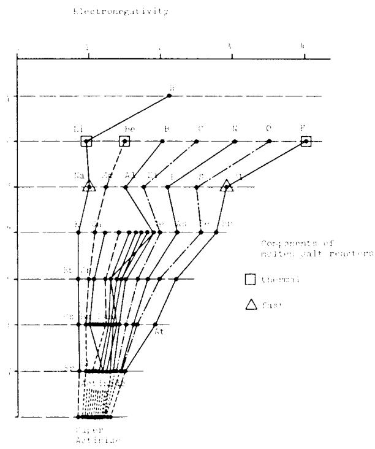  
Fig. 6.2

Fig. 6.1   
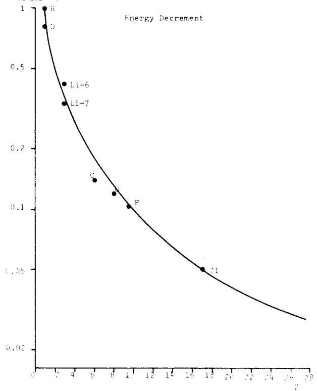  
Bilinear Values given for $F_{1}^{k - \kappa}$ in $\mathrm{HIF - bE}$ , solution

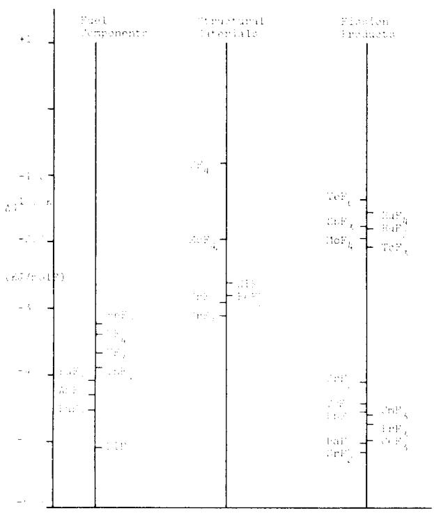  
Fig. 5.3

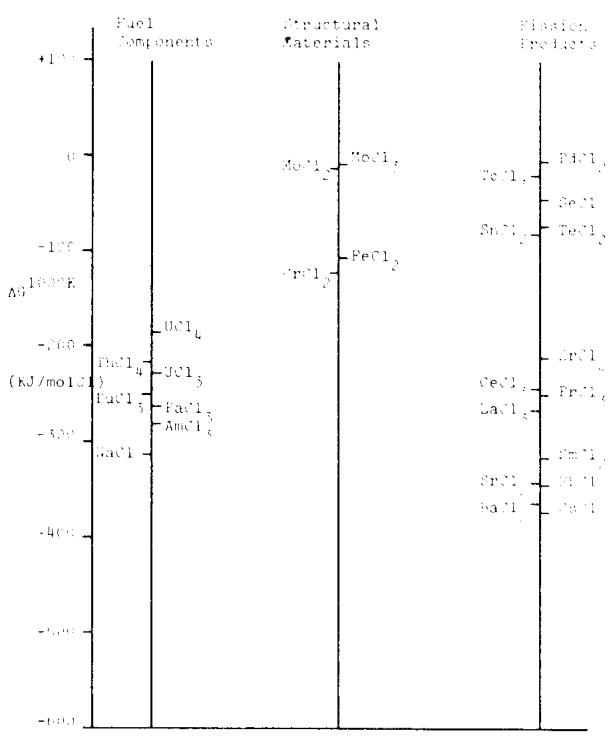  
F1. 6.4

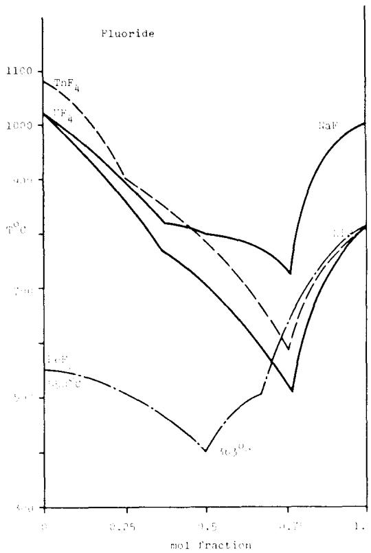  
Fig. 6.6 Melting Point of -

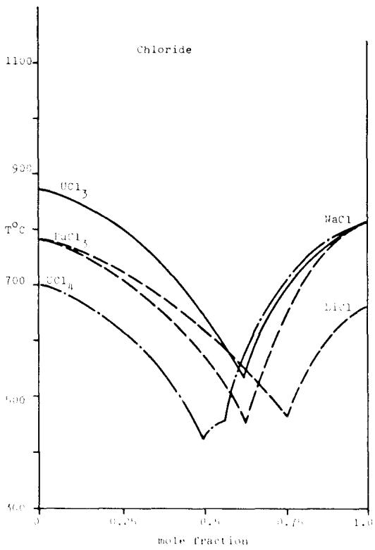  
- Selected Salts Fig. 6.5

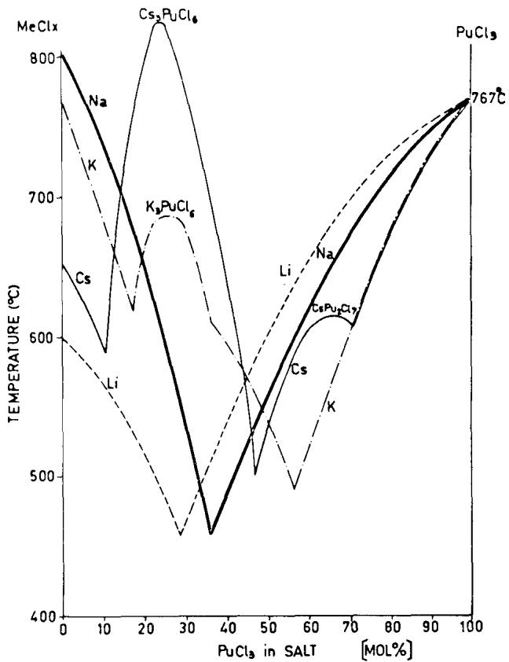  
Fig.6.7 FuCl-Alkali Metal Chlorides

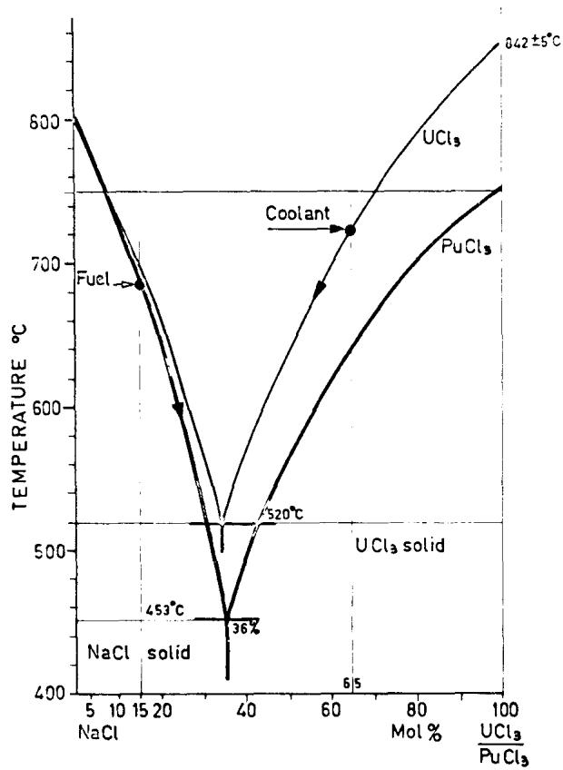  
Fig. 6.8 Phase Diagram for $\mathrm{PuCl}_2 / \mathrm{NaCl}$ and $\mathrm{NCl}_2 / \mathrm{NaCl}$

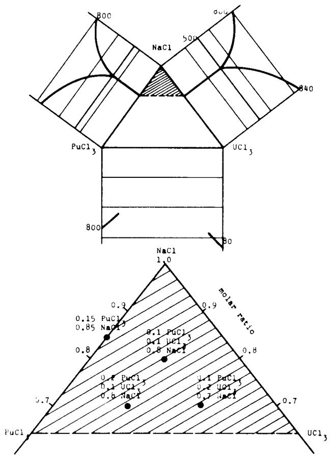  
Fig. 6.9 The System Pucl, NaCl-ICl,

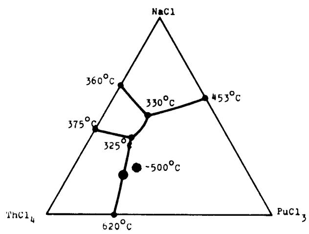  
Fig. 6.10 Phase diagramme with thorium

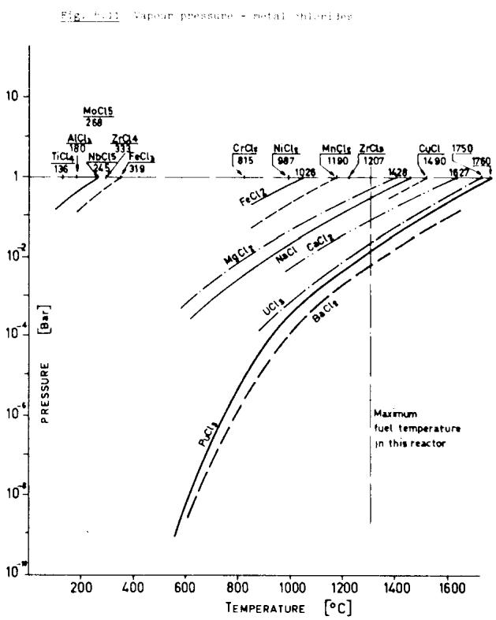

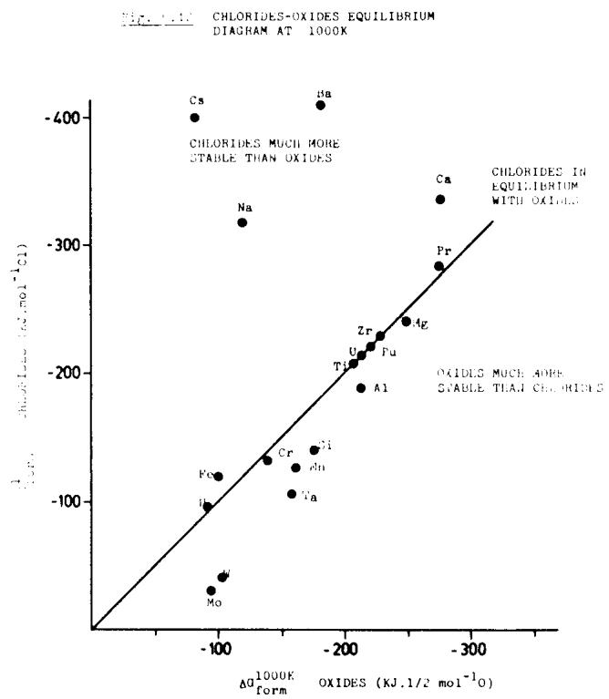

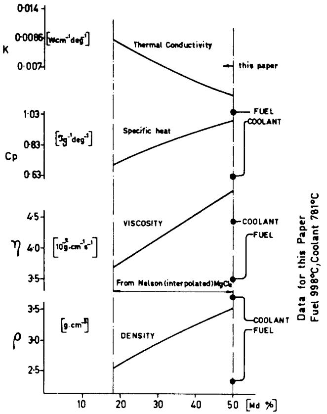  
Fig. 6.13 Salts properties at $650^{\circ}\mathrm{C}$ v. Chemical composition Data derived from Nelson for $\mathsf{UCl}_3 / \mathsf{PuCl}_3 / \mathsf{MgCl}_2 / \mathsf{NaCl}$

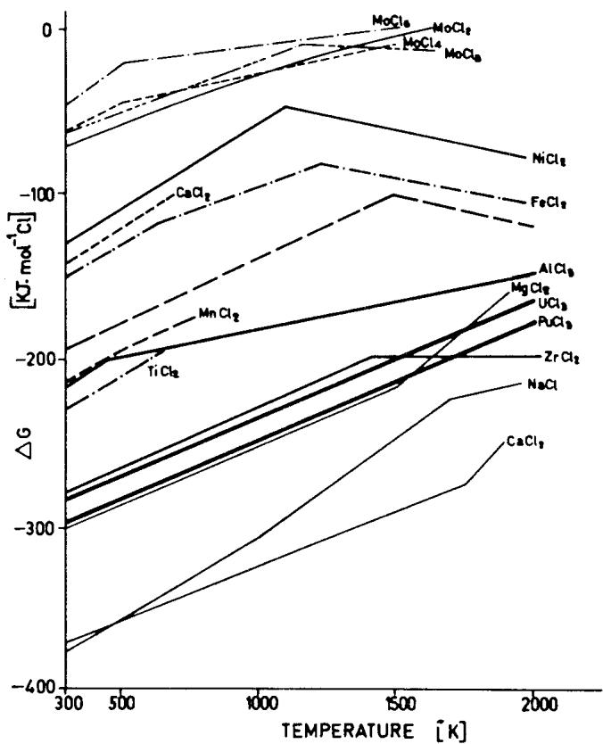  
Fig. 6.14 Free enthalpy of formation chlorides

Table 6.1 Properties of fuel components   

<table><tr><td></td><td>PuCl3</td><td>UCl3</td><td>NaCl</td></tr><tr><td>Molecular weight</td><td>348.3</td><td>347</td><td>58.4</td></tr><tr><td>Postulated molar ratio-fuel</td><td>0.15</td><td>-</td><td>0.20</td></tr><tr><td>- blanket material</td><td>-</td><td>0.65</td><td>0.20</td></tr><tr><td>Density solid state (kg·m-3)</td><td>5.7</td><td>5.57</td><td>2.14</td></tr><tr><td>Melting point (℃)</td><td>767</td><td>835</td><td>800</td></tr><tr><td>Boiling point at atmospheric pressure (℃)</td><td>1730</td><td>1720</td><td>1465</td></tr><tr><td>Melting enthalpy (kJ·mol-1)</td><td>64.0</td><td>64</td><td>28</td></tr><tr><td>Enthalpy of vapourisation (kJ·mol-1)</td><td>240</td><td>300</td><td>188</td></tr><tr><td>Temp coeff. of density (K-1)</td><td>0.0010</td><td>0.0010</td><td>0.0005</td></tr><tr><td>Specific heat (J·mol-1K-1)</td><td>140</td><td>140</td><td>77</td></tr><tr><td>Thermal conductivity (W·cm-1deg-1)</td><td></td><td></td><td></td></tr><tr><td>Viscosity (g·cm-1s-1)</td><td>Fuel: 0.025</td><td>Coolant: 0.045</td><td>0.0143</td></tr><tr><td>Temp coeff. of viscosity (K-1)</td><td>0.0005</td><td>0.0005</td><td></td></tr><tr><td>Free enthalpy of formation at 1000 K (kJ·mol-1)</td><td>-750</td><td>-675</td><td>-320</td></tr></table>

Table 6.2 Other chlorides of plutonium and uranium   

<table><tr><td rowspan="2"></td><td>Plutonium</td><td colspan="3">Uranium</td></tr><tr><td>PuCl4</td><td>UCl4</td><td>UCl5</td><td>UCl6</td></tr><tr><td>Melting point (°C)</td><td rowspan="2">All efforts to produce pure solid PuCl4have been unsuccessful; only in gaseous state with free chlorine, or in molten salt solution or in aqueous solution as complexes</td><td>590</td><td>(287)</td><td>178</td></tr><tr><td>Boiling point (°C)</td><td>792</td><td>(417)</td><td>(372)</td></tr><tr><td>Free enthalpy of formation at 1000 KJ/mol)</td><td>4x-180 = -760</td><td>4x-182 = -768</td><td>5x-165 = -825</td><td>6x-130 = -780</td></tr></table>

# 6.2 Corrosion of structural material

# 6.2.1 General criteria

It is clear that one of the most problematic areas in molten salt reactor technology is the area of corrosion. Some criteria can be formulated as follows

- the free energy of chlorides formation for structural materials must be relatively low, significantly lower than those of plutonium and uranium chlorides but still lower than those of the main fission products   
- the partial pressure of the chlorides formed from the structural materials must be rather low which corresponds to a relatively high boiling point for these chlorides (Fig. 6.16)   
- the neutron capture cross section for $(n,\gamma)$ , $(n,p)$ and $n,2n$ - must be low (see later)

The structural materials are in principle different for the two types of core discussed.

- internally cooled, using tubes plus the effect of the cooling agent   
- externally cooled by pumping the liquid fuel out of the core

These two variants call for different structural materials and different requirements

<table><tr><td>Cooling method</td><td>heat conductivity of the structural material</td><td>mechanical behaviour</td></tr><tr><td>internally by tubes</td><td>very good</td><td>very good (thin wall tubes)</td></tr><tr><td>externally</td><td>not important</td><td>not so important</td></tr></table>

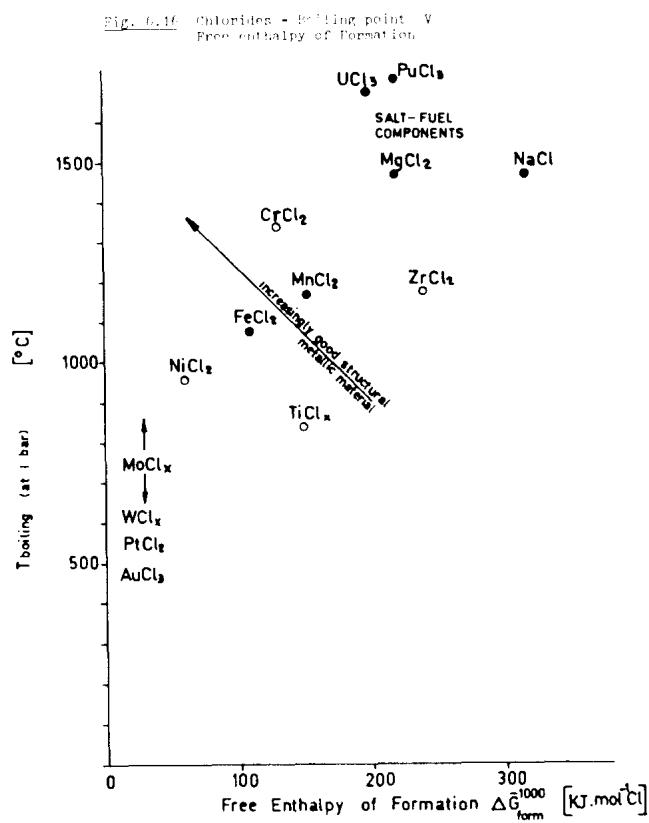

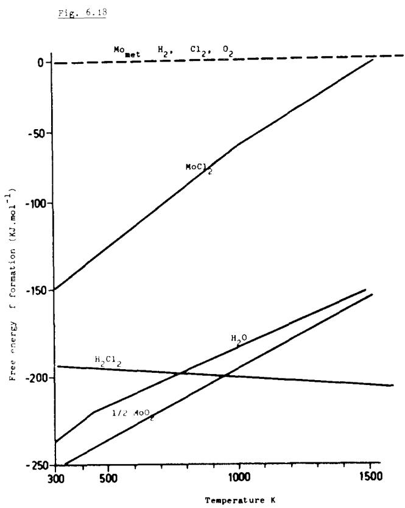

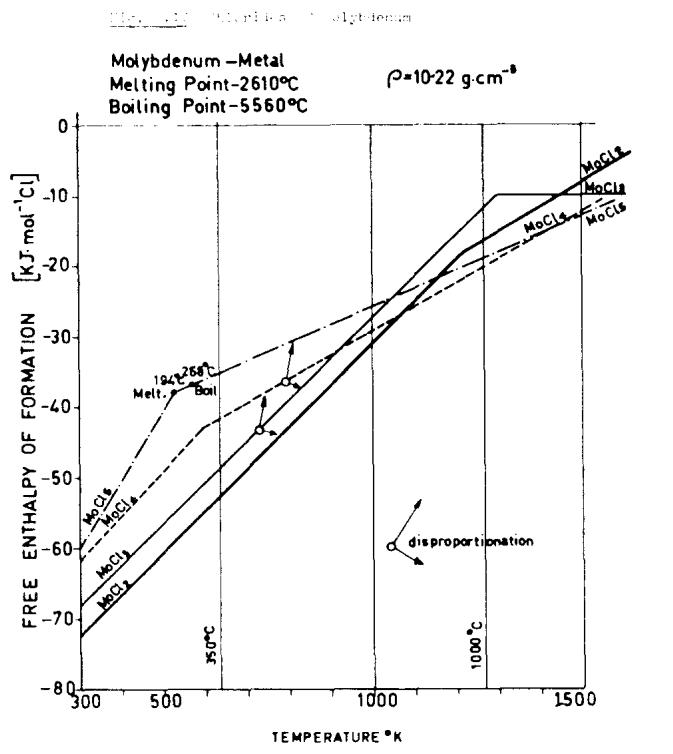

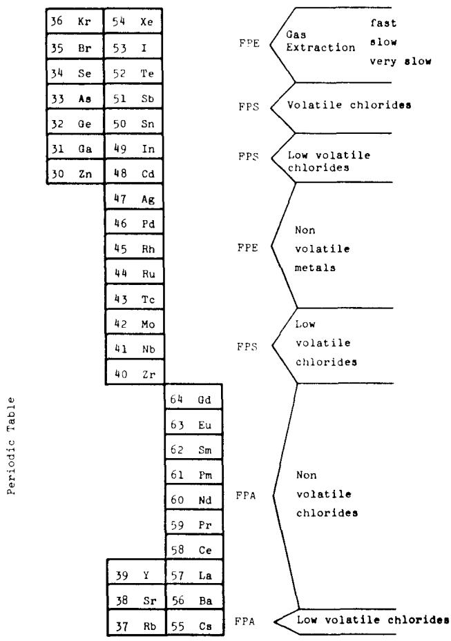  
Fig. 6.20 Fission Products in Molten Chlorides Media

From these and other criteria the following choices may be made

- for the internally cooled core tubes: molybdenum

- for the wall of the spherical core, in the case of the externally cooled reactor: graphite and berrylia.

# 6.2.2 Molybdenum as structural material

The main corrosion processes result from the following mechanisms (m = metallic phase, s = salt phase, Me = metallic component of irradiated fuel or coolant)

$$
M o _ {(m)} + \frac {2}{x} M e C l _ {x (s)} \longrightarrow M e C l _ {2 (s)} + \frac {2}{x} M e _ {(m)}
$$

For the behaviour of fresh fuel $\mathrm{PuCl}_3$ in NaCl the most likely reaction is (T = 1250 K)

$$
\begin{array}{l} \mathrm {M o} _ {(m)} + ^ {2} / _ {3} \mathrm {P u C l} _ {3} (s) \longrightarrow \mathrm {M o} \mathrm {C l} _ {2} (s) + ^ {2} / _ {3} \mathrm {P u} _ {(m)} \\ \Delta G ^ {1 0 0 0 K} = + 4 5 0 k J / m o l C l. \\ \end{array}
$$

The equilibrium constant of this reaction is small and equals $10^{-17}$ so that this reaction is completely unimportant.

In the blanket zone the most dangerous reaction is connected with uranium trichlorides (chlorine from the fission of $\mathrm{PuCl}_3$ ).

$$
\begin{array}{l} \mathrm {U C l} _ {3} + \mathrm {V} 2 \quad \mathrm {C l} _ {2 (\mathrm {s})} \longrightarrow \quad \mathrm {U C l} _ {4 (\mathrm {s})} \\ \mathrm {P U C l} _ {4 (s)} + \mathrm {M o} _ {(m)} \longrightarrow \mathrm {Z U C l} _ {3 (s)} \\ \end{array}
$$

the control of the $\mathrm{UCl}_3 / \mathrm{UCl}_4$ ratio in the fertile coolant might be feasible due to the continuous reprocessing of this material together with the control of zirconium from the fission products oxidation state.

An additional problem comes from the fact that molybdenum has different oxidation states $+2, +3, +4, +5$ and all of them have the corresponding chlorides. (see Fig. 6.17)

Further difficulties arise from the problem of the reactions between metal chlorides and oxygen and water.

These reactions (for oxidation state +2) could be written in simplified form

$$
\begin{array}{l} \mathrm {M e C l} _ {2} + \mathrm {H} _ {2} \mathrm {O} \longrightarrow \mathrm {M e O} + 2 \mathrm {H C l} \\ M e C l _ {2} \xrightarrow [ 2 ]{1} O _ {2} \longrightarrow M e O + C l _ {2} \\ \end{array}
$$

The metal oxides are mostly insoluble in molten chlorides which results in a serious disturbance of the fuel system. From this point of view the metallic elements could be divided into three classes (see Fig. 6.12).

- those which are stable with $\mathrm{H}_2\mathrm{O}$ and $\mathrm{O}_2$ , that is the chlorides are more stable than the oxides (e.g. Na, Cs, Ba) and partially Ca.   
- those which are not stable with $\mathsf{H}_2\mathsf{O}$ and $\mathsf{O}_2$ and the resulting product is a mixture of chloride, oxychloride and oxide (e.g. Pu, U but also Zr, Ti, Al, Fe, Cr, Mn, Mg - this is the most numerous group of metals).   
- those in which chlorides are converted to the most stable oxide in the presence of $\mathsf{H}_2\mathsf{O}$ or $\mathsf{O}_2$ (e.g. Mo, W) metals of this class seem to be less numerous than those in the other two classes.

This property causes the rapid elimination of traces of water or oxygen in the molten chloride salts of Pu and U. It is also well known that traces of $\mathsf{H}_2\mathsf{O}$ and $\mathsf{O}_2$ have a very big influence of the corrosion rate. Molybdenum belongs to the last class, the oxide is much more stable than the chloride (Fig. 6.18)

This means that the traces of oxygen or even water will result in the production of molybdenum oxide. This effect requires considerable further study.

# 6.2.3 The irradiation of molybdenum and iron in a fast high flux reactor

The high neutron flux irradiation causes physical and chemical changes in structural materials.

Molybdenum is a mixture of stable isotopes. The most important by-product of neutron irradiation is the Tc-99 beta-emitter with $t_{1/2} = 2.1 \times 10^5$ years and belongs to the decay chain shown here.

$$
\begin{array}{l} \frac {\text {M o - 9 8}}{(2 3 8)} (n, \gamma) \text {M o - 9 9} \xrightarrow [ t _ {1 / 2} = 6 6 h ]{\beta^ {-}} T c - 9 9 \xrightarrow [ t _ {1 / 2} = 2. 1 \times 1 0 ^ {5} y ]{\beta^ {-}} \\ \left(n, \gamma\right) \\ T c - 1 0 0 \xrightarrow [ t _ {1 / 2} = 1 7 s ]{\beta^ {-}} R u - 1 0 0 \end{array}
$$

For approx $1000\mathrm{kg}$ molybdenum in the core in the form of cooling tubes or about 10,000 moles. the Mo-98 gives 2300 mol. The irradiation rate N (mols/s) equals

$$
N _ {S ^ {- 1}} ^ {\text {M o} - 9 0} = (2. 3 \times 1 0 ^ {3}) \times (6 \times 1 0 ^ {2 3}) \times (1 0 \times 1 0 ^ {- 2 7}) \times 1 0 ^ {1 6} = 1. 2 \times 1 0 ^ {1 7} a t o m / s
$$

After an irradiation of 700 hrs a steady state concentration of Mo-99 is reached

$$
\begin{array}{l} C _ {\text {s t e a d y}} ^ {\text {M o - 9 9}} = \frac {1 . 2 \times 1 0 ^ {1 7}}{3 \times 1 0 ^ {- 5}} = 3 \times 1 0 ^ {2 1} \text {a t o m s} = 0. 0 0 5 \text {m o l} \\ \text {s t a t e} \end{array}
$$

The radioactivity of the Tc-99

$$
(t _ {V 2} = 2. 1 \times 1 0 ^ {5} y = 6. 2 \times 1 0 ^ {1 2} s: 3 = 1 0 ^ {- 1 3} s ^ {- 1})
$$

after three years irradiation of $1000\mathrm{kg}$ of molybdenum in the fast reactor core:

Activity $T_{C-99}$ (3 year) = 1.2x10 $^{17}$ atoms/s x (3x3.1x10 $^{7}$ s/year)

$$
\times \frac {1 0 ^ {- 1} 3}{3 . 7 \times 1 0 ^ {1 0}} = 3 \text {C u r i e / t o n n e o f M o}
$$

The diffusion rate of hydrogen from the molten fuel to the coolant and blanket (here also $\mathrm{UCl}_3$ - NaCl) must also be mentioned.

One can assume that this melt containing hydrogen is saturated so that the porosity of the wall (molybdenum) will play a minor role. The most important factor is the variation in the mechanical properties of the molybdenum caused by the uptake of hydrogen.

The problem of molybdenum corrosion in chlorine containing media is particularly complicated by the numerous molybdenum chlorides: $\mathrm{MoCl}_2$ , $\mathrm{MoCl}_3$ , $\mathrm{MoCl}_4$ , $\mathrm{MoCl}_5$ (Fig. 6.17)

# 6.2 Fission product behaviour in the fuel

The fission of $\mathrm{PuCl}_3$ causes the formation of two fission products E' and E" and three atoms of chlorine

$$
\mathrm {P u C l} _ {3} \xrightarrow {(n , f)} \mathrm {E} ^ {\prime} + \mathrm {E} ^ {\prime \prime} + 3 \mathrm {C l}
$$

For the fissioning of 100 atoms of Pu the following balance has been suggested

100 PuCl3 $\rightarrow$ 0.008 Se gas + 0.003 Br gas + 0.942 Kr gas

$$
\begin{array}{l} + 1. 0 5 \mathrm {R b C l} + 5. 4 9 \mathrm {S r C l} _ {2} + 3. 0 3 \mathrm {Y C l} _ {3} + 2 1. 5 \mathrm {Z r C l} _ {3} \\ + 0. 2 9 \mathrm {N b C l} _ {5} (?) + 1 8. 1 6 \mathrm {M o C l} _ {2} + 0. 2 8 \mathrm {M o C l} _ {3} + 4. 0 1 \mathrm {T e} _ {\text {m e t}} \\ + 3 1. 4 5 \mathrm {R u} _ {\text {m e t}} + 1. 7 3 \mathrm {R h} _ {\text {m e t}} + 1 2. 6 6 \mathrm {P d} _ {\text {m e t}} + 1. 8 8 \mathrm {A g C l} \\ + 0. 6 6 \mathrm {C d C l} _ {2} + 0. 0 6 \mathrm {I n C l} + 0. 3 2 4 \mathrm {S n C l} _ {2} + 0. 6 7 \mathrm {S b C l} _ {3} \\ + 7. 6 5 \mathrm {T e C l} _ {2} + 6. 1 8 \mathrm {I g a s} + 2 1. 2 3 \mathrm {X e g a s} + 1 3. 3 4 \mathrm {C s C l} \\ + 9. 5 0 \mathrm {B a C l} _ {2} + 5. 7 8 \mathrm {L a C l} _ {3} + 1 3. 9 8 \mathrm {C e C l} _ {3} + 4. 2 8 \mathrm {P r C l} _ {3} \\ + 1 1. 8 7 \mathrm {N d C l} _ {3} + 1. 4 4 \mathrm {P m C l} _ {3} + 3. 7 4 \mathrm {S m C l} _ {3} + 0. 6 0 \mathrm {E u C l} _ {2} \\ + 0. 0 3 \mathrm {C d C l} _ {3} \\ \end{array}
$$

the average balance of fission can be represented in the following manner

$$
1 0 0 \mathrm {P u C l} _ {3} \xrightarrow {\left(n , f\right)} 2 0 0 \mathrm {E C l} _ {1. 5}
$$

Table 6.3 The behaviour of fission products in the molten chlorides fuel. (Yields given represent products for 100 Pu atoms fissioned).   

<table><tr><td rowspan="24">Free enthalpy of formation, - 1250 K (kJ·mol-1C1)</td><td rowspan="4">0-</td><td>Principal fuel</td><td>Fission</td><td rowspan="2">Remarks</td></tr><tr><td>and structural material</td><td>products</td></tr><tr><td colspan="3">Pd(12.66), Tc(4.01), Rh(1.73), Ru(3.144), I(6.17), Te(7.65) Xe(21.2), Kr(0.94), Br no chlorine for the synthesis of possible metal chlorides</td></tr><tr><td>E.P. in elemental form</td><td></td><td></td></tr><tr><td rowspan="7">1000-</td><td>-MoCl2</td><td>-MoClx (18.16)</td><td></td></tr><tr><td>(corrosion product)</td><td>-MoCl3 (0.28)</td><td></td></tr><tr><td></td><td>-AgCl (1.88)</td><td></td></tr><tr><td></td><td>-SbCl3 (0.67)</td><td></td></tr><tr><td></td><td>-CdCl3 (0.66)</td><td></td></tr><tr><td></td><td>-SnCl2 (0.32)</td><td></td></tr><tr><td></td><td>-InCl2 (0.06)</td><td></td></tr><tr><td rowspan="8">2000-</td><td>-UCl4 (?)</td><td></td><td></td></tr><tr><td>-UCl3</td><td>-ZrCl3 (2.15)</td><td></td></tr><tr><td></td><td>-ZrCl2</td><td></td></tr><tr><td>-PuCl3</td><td>-YCl3 (3.02)</td><td></td></tr><tr><td></td><td>-PrCl3 (4.28)</td><td></td></tr><tr><td></td><td>-EuCl3 (1.06)</td><td></td></tr><tr><td></td><td>-CeCl3 (13.98)</td><td></td></tr><tr><td></td><td>-LaCl3 (5.78)</td><td></td></tr><tr><td rowspan="5">3000-</td><td>-NaCl</td><td>-RbCl (1.05)</td><td></td></tr><tr><td></td><td>-CsCl (13.75)</td><td></td></tr><tr><td></td><td>-SmCl2 (3.73)</td><td></td></tr><tr><td></td><td>-SrCl2 (5.48)</td><td></td></tr><tr><td></td><td>-BaCl2 (9.50)</td><td></td></tr></table>

From the earlier published data (Chasanov, 1965; Harder et al., 1969; Taube, 1961) it appears that the problem of the chemical state (oxidation state) in this chloride medium for the fission product element constituent requires further clarification.

From a simple consideration it seems that the freeing of chlorine from the fissioned plutonium is controlled by the fission product elements with standard free enthalpy of formation up to $\sim 20$ KJ/mol of chlorine, that is up to molybdenum chloride. The more 'noble' metals such as palladium, technetium, ruthenium, rhodium and probably tellurium and of course noble gases: xanon, krypton plus probably iodine and bromine, remain in their elementary state because of lack of chlorine. Molybdenum as a fission product with a yield of $18\%$ from $200\%$ all fission products may remain in part in metallic form. Since molybdenum also plays the role of structural material the corrosion problems of the metallic molybdenum or its alloys are strongly linked with the fission product behaviour in this medium.

The possible reaction of UCl₃ and PuCl₃ with $\mathsf{HbCl}_2$ resulting in further chlorination of the actinides-trichlorides to tetrachlorides seems, for PuCl₃ very unlikely ( $\Delta G^{1000}K = -450\mathrm{kJ/mol}$ Cl) but this is not so for UCl₃.

A rather serious problem arises out of the possible reaction of oxygen and oxygen containing compounds (e.g. water) with $\mathrm{PuCl}_3$ and $\mathrm{UCl}_3$ which results in a precipitation of oxides or oxychlorides. The continuous reprocessing may permit some control over the permissible level of oxygen in the entire system as well as the continuous gas bubbling system with appropriate chemical reducing agent.

Corrosion of the structural material, being molybdenum is also strongly influenced by the oxygen containing substances. A protective layer of molybdenum however, may be used on some steel materials using electrodeposition or plasma spraying techniques.

Note that all these considerations have been based on standard free enthalpy: but even a change in the thermodynamic activity from $= 1$ to $= 0.001$ which means a change in free enthalpy of $14\mathrm{kJ mol}^{-1}$ thus appears insignificant as far as these rough calculations go.

In the fertile material reactions also occur and the most important are

```txt
fission process: UCl₃ → Fiss·products + 3Cl oxidation process: UCl₃ + 1/2Cl₂ → UCl₄; ΔG⁻¹²⁵0K = 25kJ·mol⁻¹ disproportionation: UCl₃ + 3UCl₃ → 3UCl₄ + U met 
```

# 6.4 Some comments on reprocessing

Breeder reactors as is known form part of a breeder system which includes not only the power reactor but also the reprocessing plant.

The advantages of molten salt breeder reactors become particularly apparent when the reprocessing plant is under the same roof as the power reactor and when chemical separation processes take place in the high temperature molten salt media in a continuous cycle. From Fig. 6.2 it can be seen that all fission products might be classified into 3 classes.

FPA = fission products of alkali and alkali earth but also rare earth elements which have free enthalpy of chloride formation greater than those of $\mathrm{PuCl}_3$ .

FPS = fission products of seminoble metals with free enthalpy of formation smaller than those of $\mathsf{PuCl}_3$ .

FPE = fission products existing in elementary form because of the low free energy of chloride formation or negative balance of chlorine.

The separation of plutonium or Uranium form the irradiated fuel by means of pyrochemical techniques could be carried out for example in the following way.

Molten salt, primary phase Pu, FP (part of FP remains)

Metallic phase (part of FP remains)

Molten salt, secondary phase containing only Pu.

This is the so-called metal transport process. The proposed schematic of separation processes utilizing metal transport is given in Fig. 6.21 and 6.22.

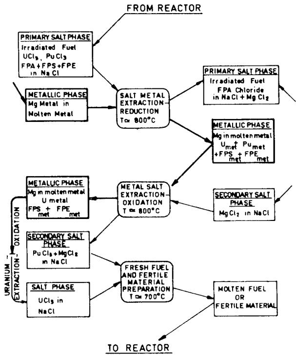  
Fig. 6.21 Fuel reprocessing flow Scheme

FPA Alkali and Alkali earth fission products e.g. Cs, Ba, Sr  
FPS Semi and noble metals and metal chlorides  
FPE Noble metals in metallic states and noble gases

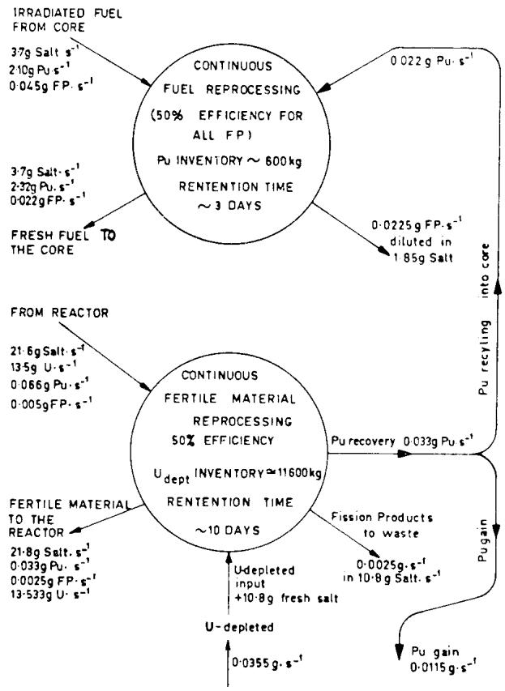  
Fig.6.1 Fuel Reprocessing Material balance

# 6.5 In-core continuous gas purging

# 6.5.1 The proposal

In this type of reactor an in-core continuous gas purging of the molten fuel which can significantly improve the safety in an in-core accident, is possible.

A mixture of hydrogen-helium gas is continuously bubbled through the liquid fuel in the core. The mean dwell time of the gas-bubbles needs to be controlled and the mean transport time of the molten components to these bubbles must also be controlled (e.g. if speed-up is desired-intensive mixing, if delay-local addition of a further gas stream).

The aim of the gas stripping is as follows:

1) to remove the volatile fission products which in the case of an accident control the environmental hazard. (I-131, Xe-133, Kr-85 and precursors of Cs-137) and at the same time for the thermal reactor, removal of the I-135, precursor of Xe-135, improves the neutron balance.   
2) to control the production of delayed neutrons since most of the precursors and nuclides of this group are very volatile, e.g. + Br-I-isotopes.   
3) removal of oxygen and sulphur, continuously (see Chapter 7)   
4) in situ control of corrosion problems on structural materials

For the sake of a first approximation a gas flux of $30~\mathrm{cm}^3$ per sec. (normal state) of $\mathrm{H}_2 / \mathrm{He}$ is arbitrarily assumed. At 20 bar pressure and with a dwelling time in core of 20 seconds, the gas bubbles will only occupy a fraction of the core equal to $10^{-5}$ of its volume and have little influence of the criticality, (but the collapsing of bubbles results in a positive criticality coefficient).

The system proposed for continuous removal of the volatile fission product from the core itself has a retention time of some hundreds of seconds only. Each reprocessing mechanism which operates out of core is limited by the amount of molten fuel being pumped from the core to the reprocessing plant. This amount, due to the high capital cost of the fuel and high operation costs cannot be greater than that which gives a fuel in-core dwell time of about one week. Even with a 1 day dwell time, that is, if after one day the fuel goes through the reprocessing plant, no acceptable solution to the I-131 problem is obtained since the activity of this nuclide is only diminished by one order of magnitude. Only a direct in-core removal gives the dwell time in core as low as some hundreds of seconds.

# 6.5.2 Delayed neutron emitters

The principal question arises out of the fact that some of the short lived iodine and bromine (perhaps also arsenic, tellurium) isotopes are the precursors of the delayed neutrons.

Table 6.4 Precursors of delayed neutrons for Pu-239 fast fission   

<table><tr><td>Group</td><td>Half life t 1/2 (seconds)</td><td>Fraction %</td><td>Probable Nuclide</td></tr><tr><td>1</td><td>52.75</td><td>3.8</td><td>Br-87</td></tr><tr><td>2</td><td>22.79</td><td>28.0</td><td>I-137, Br-36</td></tr><tr><td>3</td><td>5.19</td><td>21.6</td><td>I-138, Br-69</td></tr><tr><td>4</td><td>2.09</td><td>32.8</td><td>I-139, Br-90</td></tr><tr><td>5</td><td>0.549</td><td>16.3</td><td></td></tr><tr><td>6</td><td>0.216</td><td>3.5</td><td></td></tr></table>

As other possible nuclides the following can be considered + As-85; Kr-92, -93; Rb-92, -94; Sr-97, -98; Te-136, -137; Cs-142, -143. The removal of these delayed-neutron precursors from the core reduces the value of $\beta$ , which is lower for Pu-239 than U-235. Thus we have a problem of reaching a compromise between an as rapid as possible removal of the hazardous I-131, and as long a dwell time in the core for the delayed neutron precursors: I-140, I-139, I-138, I-137 and the appropriate bromine isotopes.

In this case the mean dwell time of iodine in the steady state reactor is about 100 seconds. It can be seen that the activity of iodine for a 2.5 GW(t) reactor is of the order of only 10 kilo curies (for seconds) activity of approx. $10^{4}$ (or $10^{3}$ for 1000 second extraction rate).

The gas-extraction also influences the other volatile nuclides. From a very rough estimation for these molten salts (with a small excess of free hydrogen) the following fission products and their associated precursors of iodine and bromine can be volatile at $1000^{\circ}\mathrm{C}$ .

In elementary form: Xe, Kr, Te (?).

In simple volatile hydrides: BrH, IH

In simple volatile chlorides: $\mathrm{SnCl}_2$ , $\mathrm{SbCl}_3$ , $\mathrm{NbCl}_3$ , $\mathrm{CdCl}_2$ .

This amount of finally volatile components including I, Br, Xe, Kr amounts to approximately half the total fission products (i.e. 100 micromoles per second). In addition there is the corresponding amount of tritium (from ternary fission). This amount of all fission products corresponds to a gas volume ratio of about $2\mathrm{cm}^3/\mathrm{s}$ or 10 times smaller than the postulated amount of hydrogen flow at $30\mathrm{cm}^3/\mathrm{s}$ .

The extraction removes all short lived fission products which are volatile under these conditions. Thus not only is the removal of the iodine isotopes and the consequent reduction in production of xenon (e.g. for the atom number: A = 135, 136, 137, 138, 139) achieved but it slows down the in-core production of Cs-137, Cs-138, Cs-139, and then also barium-139

The higher components of the liquid fuel: $\mathsf{PuCl}_3$ and NaCl. The Fuel consists of:

- 15 mol% $\mathrm{PuCl}_3$ ; boiling point 2040 K

- 85 mol% NaCl ; boiling point 1728 K

One can as a first approximation say that it would have the following composition in the vapour phase: $5\mathrm{mol}\% \mathrm{PuCl}_3 - 95\mathrm{mol}\%$ NaCl.

The order of magnitude of vapour for pure components at a tem- perature of about 1250 K is

NaCl $\sim 5 \times 10^{-2}$ bar; PuCl $_3$ $\sim 10^{-4}$ bar

For the PuCl3-NaCl system one assumes here a lowering of the vapour pressure (thermodynamic activity coefficient approx. 0.1). At the postulated volumetric flow rate of $30~\mathrm{cm}^3$ $\mathsf{H}_2$ normal per second, the vapourized amount of plutonium is given by:

$$
\frac {3 0 \mathrm {c m} ^ {3}}{2 2 0 0 0 \mathrm {c m} ^ {3} / \mathrm {m o l}} \times 1 0 ^ {- 4} \text {b a r} \times 1 0 ^ {- 1} = 1 0 ^ {- 8} \mathrm {m o l} \mathrm {P u} / \mathrm {s}
$$

This amount of plutonium is of the order of $10^{-4}$ relative to the amount of plutonium fissioned in the same time (approx $10^{-4}$ mol Pu/s). However, it still has to be recovered, which unfortunately makes the reprocessing more complicated.

Last but not least is the in-core gas extraction of two other elements

- oxygen in the form of $\mathrm{H}_{2} \mathrm{O}$ : oxygen from impurities (i.e. PuOCl)   
- sulphur in the form of $\mathsf{H}_2\mathsf{S}$ : sulphur from the nuclear reaction: $^{35}\mathrm{Cl} (n,p)^{35}\mathrm{S}$

(see Chapter 7).

# 7. EXPERIMENTAL WORK

7.1 Chemical behaviour of radiosulphur obtained by $^{35}\mathrm{Cl}(n,p)^{35}\mathrm{S}$ during in-pile irradiation (according to Janovici, 1975)

The rather large concentration of sulphur formed by $^{35}\mathrm{Cl}(n,p)^{35}\mathrm{S}$ reaction in the molten chlorides system proposed for the fast reactor makes it necessary to obtain the full information on the chemical behaviour of the radiosulphur. The most recent studies on the chemical states of radiosulphur obtained by n-irradiation of alkali chlorides have shown the complexity of this problem.

To obtain new data on the behaviour of radiosulphur we have investigated the influence of the time and temperature of irradiation and of post-irradiation heating on the chemical distribution of the sulphur.

# EXPERIMENTAL

Sodium chloride ("Merck" reagent) was heated for 60hr at $200^{\circ}\mathrm{C}$ in an oven in vacuo. The dried samples of 100 mg sealed in evacuated $(10^{-4}\mathrm{torr})$ quartz tubes were irradiated near the core of the "Saphir" swimming pool reactor for different periods at a neutron flux of $5 \times 10^{12}$ and $4.3 \times 10^{12} \mathrm{~n} \mathrm{~cm}^{-2} \mathrm{~s}^{-1}$ . Reactor irradiations were carried out at an estimated temperature of $150^{\circ}\mathrm{C}$ and $-190^{\circ}\mathrm{C}$ . After irradiation the samples were kept for 8 days to allow the decay of $^{24}\mathrm{Na}$ .

The method of $^{35}\mathrm{S}$ -species separation. The crushing of the irradiated ampoule was made in a special device from which the air was removed by purging with a nitrogen stream containing 10ppM of oxygen. After crushing a gentle stream of nitrogen was allowed to flow for about 10 min. The gases evolved were collected in cooled traps. The irradiated slat was dissolved in 2 M KCN solution containing carriers of $S^{2-}$ , $\mathrm{CNS}^{-}$ , $\mathrm{SO}_{3}^{2+}$ , $\mathrm{SO}_{4}^{2-}$ . During dissolution oxygen was not completely excluded although nitrogen gas was passed continuously through the system. The radiosulphur found in gaseous form was determined as barium sulphate. For the $^{35}\mathrm{S}$ -species separation the chemical method described recently by Kasrai and Maddock was used. The radioactive samples were counted under a thin window Geiger counter. All measurements were made in duplicate with and without Al-absorber.

Post-irradiation heating. The sealed irradiated ampules were heated in an electric oven at $770^{\circ}\mathrm{C}$ for 2 hr or at $830^{\circ}\mathrm{C}$ for about 5 min, and then cooled and crushed in a closed system under a stream of nitrogen.

# Results and discussions

Effect of length of irradiation time. As can be seen from Fig. 7.1 $S^{2-}$ remains the preponderant fraction independent of the irradiation time. Formation of $S^{2-}$ is indicated by charge conservation during the $^{35}\mathrm{Cl}(n,p)^{35}\mathrm{S}$ reaction. Alternatively it can be supposed that reduction of sulphur takes place by capture of electrons due to the discharge of F-centers. The presence of $S^0$ in this oxidation state in the lattice is no longer contested. The precursors of higher forms may be $S^+$ as a result of an electron loss from $S^0$ . However, the interaction of chlorine entities formed by irradiation with radiosulphur to form species as $\mathrm{SCl}_2$ , $\mathrm{SCl}_2^-$ , $\mathrm{SCl}_2$ may be an important mechanism in forming the per-cursors of sulphate and sulphite.

During longer irradiations some of the sulphide is converted into higher oxidised forms. This may be a consequence of radiation-produced defects with oxidising character (e.g. V-centres or derivatives). It is possible that the concentration of defects responsible for reduction of the sulphur decreases by annihilation when new traps are formed. The oxidation of radiosulphur with increase of radiation damage concentration may also be due to the reaction of recoil sulphur with chlorine atoms. The presence of OH $^-$ in the crystal must not be neglected. It has been suggested that radiolysis of OH $^-$ can be responsible for accelerating the oxidising process.

Effect of post-irradiation heating. The effect of post-irradiation heating (including melting) can be seen in Table 7.1.

Comparisons between heated and unheated samples are made for irradiations of 2, 12 and 24 hr. For 2 hr irradiation, results on samples heated at a temperature below the melting point of NaCl are also presented. As is seen, on heating, a part of the radiosulphur is found in a volatile form. The volatile radiosulphur appears at the expense of $S^0$ and higher oxidation forms. The results show that with temperatures above the boiling point of sulphur and above melting point of NaCl the $S^0$ and $S^+$ and/or $S_{\times}Cly$ receive sufficient kinetic energy to migrate to the surface or even to escape from the crystal and be collected as volatile radiosulphur. However, there are some differences in the $^{35}\mathrm{S}$ -chemical distribution on heating below and above the melting point of NaCl (experiments 2-3). It seems that for relatively short periods of irradiation (2 hr) only the sulphate and sulphite precursors account for the volatile radiosulphur fraction. For a longer time of irradiation, on melting the $S^0$ value decreases to about $2\%$ and this corresponds to an increase in the volatile radiosulphur (experiments 5, 7). However, a small and practically constant yield of $S^0$ is found in the melt after longer irradiation

Table 7.1   

<table><tr><td>Expt.</td><td>Irrad. time</td><td>Post-irrad. treatment</td><td>\( S_{\%}^{2-} \)</td><td>\( S_{\%}^{0} \)</td><td>\( SO_{4}^{2-} + SO_{3}^{2-*} \)</td><td>S-volatile %</td></tr><tr><td>1</td><td>2 hrs.</td><td>no</td><td>73.1 ± 0.4</td><td>9.8 ± 0.8</td><td>16.9 ± 0.8</td><td>0.01</td></tr><tr><td>2</td><td>&quot;</td><td>\( 770^{\circ}C \)2 hrs.</td><td>75.4 ± 2.8</td><td>5.3 ± 0.3</td><td>3.6 ± 2.3</td><td>15.4 ± 1.1</td></tr><tr><td>3</td><td>&quot;</td><td>\( 830^{\circ}C \)5 min.</td><td>77.2 ± 2.0</td><td>11.0 ± 0.8</td><td>6.6 ± 2.5</td><td>5.0 ± 1.4</td></tr><tr><td>4</td><td>12 hrs.</td><td>no</td><td>67.5 ± 0.7</td><td>12.1 ± 0.1</td><td>20.4 ± 0.6</td><td>0.01</td></tr><tr><td>5</td><td>&quot;</td><td>\( 830^{\circ}C \)5 min.</td><td>7.15</td><td>1.9</td><td>18.9</td><td>7.6</td></tr><tr><td>6</td><td>24 hrs.</td><td>no</td><td>64.4 ± 2.5</td><td>11.9 ± 0.5</td><td>23.7 ± 2.6</td><td>0.01</td></tr><tr><td>7</td><td>&quot;</td><td>\( 830^{\circ}C \)5 min.</td><td>68.2 ± 3.4</td><td>2.3 ± 0.5</td><td>21.4 ± 2.5</td><td>7.9 ± 0.7</td></tr></table>

Expt. $1 - 5 = 4.3 \times 10^{12}$ nm $^{-2}$ s $^{-1}$

Expt. 6-7 = 5.9 10 $^{12}$ n cm $^{-2}$ s $^{-1}$

* Sulphite fraction is less than 5% in our experiments and always lower than sulphate fraction

times. No significant changes are observed for the sulphide and higher oxidation forms. Comparison of these results and those presented in Fig. 1 shows that in the post-irradiation melted samples the radiation damage does not have the same effect as in the unmelted samples. Supplementary information can be obtained by studying the effect of high temperature irradiation on the distribution of the radiosulphur. It is possible that in the molten state the active oxidising agents have a different identity from those present below melting. The presence of oxygen and probably sodium oxides during melting may have a determinant role in deciding the state of the radiosulphur.

Effect of irradiation temperature.

A comparison of results obtained by irradiation at 423 K and 77 K (Table 7.2) shows that the higher oxidation fraction is lower $(3\%)$ at 77 K. As is seen the increased $S^0$ after low temperature irradiation occurs at the expense of the sulphate + sulphite and sulphide fractions. The defects with oxidising and reducing character formed by low temperature irradiation such as F and V-centres (or derivatives) become important factors in determining the radiosulphur behaviour.

7.2 Temperature dependence of sulphur species (according to Furrer, 1977)

Significant amounts of the order of magnitude of thousands of ppm $^{35}\mathrm{S}$ would be present as steady-state concentration in a proposed fast breeder reactor fuelled with molten Pu/U-chlorides diluted in NaCl. To obtain information about the chemical behaviour, mainly the distribution of oxidation-states, the influence of irradiation temperatures (-190 and $15^{\circ}\mathrm{C}$ ) and the effects of a post-irradiation heat treatment, solid NaCl was investigated and the results published. The subject of the present note are investigations at higher irradiation temperatures, especially with samples molten during irradiation.

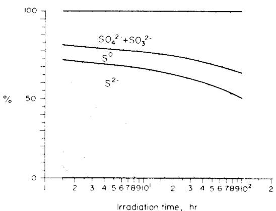  
Fig. 7.1 Effect of length of irradiation time on the $^{3}$ S -species distribution

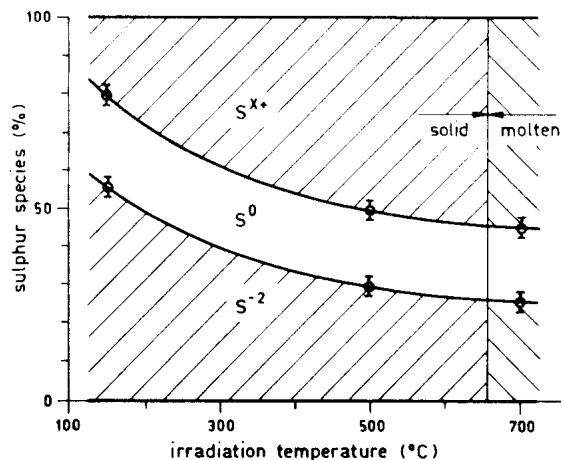  
Fig. 7.2 Irradiation-temperature dependence of the oxidation-state distribution of $^{35}\mathrm{S}$ -species

Table 7.2   

<table><tr><td>Irrad. conditions flux, time</td><td>Irrad. temp. (K)</td><td>\( S_{\%}^{2-} \)</td><td>\( S_{\%}^{0} \)</td><td>\( SO_{4\%}^{2-} + SO_{3\%}^{2-} \)</td></tr><tr><td rowspan="2">\( 5.10^{-12}\text{ n cm}^{-2}\text{s}^{-1} \) 2 hrs.</td><td>423</td><td>73.1 ± 0.4</td><td>9.8 ± 0.8</td><td>16.9 ± 0.8</td></tr><tr><td>77</td><td>65.4 ± 0.9</td><td>31.5± 1.1</td><td>3.0 ± 0.1</td></tr></table>

# Experimental

Equimolar mixtures of NaCl and KCl ("Suprapur", Merck) were studied instead of pure NaCl (m.p.658 vs $800^{\circ}\mathrm{C}$ ) because the irradiation device permitted temperatures of up to $750^{\circ}\mathrm{C}$ only. The finely crushed slat-mixture was dried in vacuo at $250^{\circ}\mathrm{C}$ for 24 hr and subsequently treated with dried HCl-gas at $300^{\circ}\mathrm{C}$ for 24 hr in order to remove traces of water and hydroxides. 100 mg samples were weighed into quartz ampoules in a glove-box with a purified nitrogen atmosphere $(O_2, H_2O 10\mathrm{ppm})$ .

In order to study the influence of oxygen from the surface of the $\mathrm{SiO}_2$ -ampoules, parts of the samples were weighed into small crucibles made of gold-foil and closed by folding the foil. The ampoules were evacuated to a pressure of less than $10^{-5}\mathrm{mmHg}$ (24 hr) and during evacuation heated to $250^{\circ}\mathrm{C}$ for about 8 hr to remove adhering traces of HCl, sealed and irradiated for 2 hr at 500, 600 or $700^{\circ}\mathrm{C}$ in the swimming-pool reactor SAPHIR near the core at a total flux of about $4\times 10^{12}\mathrm{ncm}^{-2}\mathrm{s}^{-1}$ . The neutron-spectrum is not well characterised but known to be rather hard.

The post-irradiation treatment followed closely the work of (6) as described in detail elsewhere (4.5). The ampoules were crushed at room temperature in a nitrogen atmosphere, volatile reaction products carried by a nitrogen gas-stream into cold-traps cooled with liquid nitrogen and the samples subsequently dissolved in an oxygen-free carrier-solution containing cyanide and sulphide, thiocyanate, sulphite and sulphate as carriers. The fractions were separated. independently oxidized to sulphate, precipitated as $\mathrm{BaS}_{4}$ and the activities measured with a thin-window Gf-counter. Some experiments were made at $1500^{\circ}\mathrm{C}$ irradiation-temperature in order to be able to compare the CaCl/KCl-system with pure NaCl. New irradiations of pure NaCl were carried out in order to study the influence of the HCl pre-irradiation treatment.

# Results and discussions

The data for at least 2 independent experiments at 150 and $500^{\circ}\mathrm{C}$ or 4-5 experiments at $700^{\circ}\mathrm{C}$ for each set of parameters (pre-irradiation treatment, gold-foil packing, irradiation-temperature) are shown in the following table. Sulphite, sulphate and volatile fractions are tabulated together as $\mathbf{S}^{\times +}$ . While the sulphite-fraction was always less than $2\%$ of the sulphate-content, the volatile part showed large fluctuations, especially with samples packed into gold-foil, ( $0.20\%$ of the sulphate content) caused by the variations in sample surface and tightness of the package, even if mechanically destroyed before dissolving. The volatile species still remaining in the slat at dissolution, presumably as $\mathbf{S}_{\times}\mathbf{C}\mathbf{l}_{\mathbf{y}}$ , are immediately hydrolized to sulphate and only to a small extent to sulphite in the basic cyanide-carrier-solution. The following figure shows the temperature-dependence of the oxidation state distribution.

The experiments at $150^{\circ}$ on NaCl treated with HCl-gas confirmed the existing published results (4.5), which were obtained with a slat dried in vacuo only.

The results of the investigations at higher temperatures and with molten samples show a monotone decrease of the $\mathsf{S}^{-2}$ -species and a corresponding increase of the $\mathsf{S}^{\mathsf{X}^{\mathsf{+}}}$ -species with increasing irradiation-temperature. The content of $\mathsf{S}^0$ is influenced neither by the pre-irradiation treatment nor by the irradiation-temperature and is always about $20\%$ . Melting of the samples during irradiation does not influence the distribution of oxidation states. The studies at $150^{\circ}\mathsf{C}$ show for NaCl/KCl-mixtures a shift of about $20\%$ in $\mathsf{S}^{-2}$ towards higher oxidation-states, mainly $\mathsf{S}^0$ , compared to pure NaCl. No influence of the pre-irradiation sample treatment could be shown at $150^{\circ}\mathsf{C}$ , but it is of importance for work with molten samples. Untreated samples without gold-foil protection showed $\mathsf{S}^{-2}$ -levels of less than $2\%$ . HCl-treatment increased this value to about $13\%$ , an additional gold-foil protection to $26\%$ . Oxygen of the quartz surface in contact with the melt is clearly significant at $700^{\circ}\mathsf{C}$ . The assumption that oxygen from the quartz surface should be of importance for reactions over the gas-phase is not plausible, without mentioning that oxygen-levels in the evacuated ampoules ( $10^{-5}$ , $\mathrm{Hg}$ ) must be much greater but have no significant influence, as low temperature experiments show.

Table 7.3 Oxidation state distribution of radiosulphr produced by $^{35}\mathrm{Cl}(\mathfrak{n},\mathfrak{p})^{35}\mathrm{Cl}$ in NaCl, NaCl/K1 solid mixtures and NaCl/KCl-melts   

<table><tr><td>Salt-type</td><td>HCl-treatm.</td><td>Gold-packing</td><td>Irrad.temp. (°C)</td><td>State</td><td>S-2(%)</td><td>S0(%)</td><td>SX+(%)</td></tr><tr><td>NaCl</td><td>No</td><td>No</td><td>150</td><td></td><td>73</td><td>10</td><td>17(4)</td></tr><tr><td>NaCl</td><td>Yes</td><td>No</td><td>150</td><td></td><td>72 ± 2</td><td>13 ± 2</td><td>15 ± 2</td></tr><tr><td>NaCl/KCl</td><td>Yes</td><td>No</td><td>150</td><td>Solid</td><td>55 ± 2</td><td>25 ± 2</td><td>20 ± 2</td></tr><tr><td>NaCl/KCl</td><td>Yes</td><td>Yes</td><td>500</td><td></td><td>30 ± 2</td><td>19 ± 2</td><td>51 ± 3</td></tr><tr><td>NaCl/KCl</td><td>Yes</td><td>No</td><td>600</td><td></td><td>17 ± 3</td><td>22 ± 3</td><td>61 ± 4</td></tr><tr><td>NaCl/KCl</td><td>No</td><td>No</td><td>700</td><td></td><td>2 ± 1</td><td>22 ± 3</td><td>76 ± 5</td></tr><tr><td>NaCl/KCl</td><td>Yes</td><td>No</td><td>700</td><td>Molten</td><td>13 ± 3</td><td>22 ± 3</td><td>65 ± 4</td></tr><tr><td>NaCl/KCl</td><td>Yes</td><td>Yes</td><td>700</td><td></td><td>26 ± 4</td><td>10 ± 3</td><td>55 ± 4</td></tr></table>

# 8. THERMOHYDRAULICS

# 8.1 Introduction

This chapter gives the results of studies on the thermal properties of the following units.

- High flux liquid fuel core with external heat exchanger. This core has the geometrical form of a spherical shell (Fig. 8.1A)   
- Power-breeder-core with molten fuel and external heat exchanger. The core is spherical. (Fig. 8.16).   
- Sodium/molten salt heat exchanger.

All the calculations were made in simplified form and were intended only to roughly define the scope of the problems.

# 8.2 High Flux reactor with the core as a spherical shell

This reactor was designed to meet the following requirements

a) In the shell type core to achieve the highest possible flux in having a fast spectrum requiring a relatively high power density. Very good mixing in the fluid, i.e., a high turbulence is a vital requirement. For this the flow rate of the fuel has to be kept high.   
b) In the central regions a thermal neutron flux is obtained (Beryllium coated Deuterium hydroxide as moderator). The thermal neutron flux extends partly into the fast core which causes a very high and localised power density. This is the reason for requiring a high fuel turbulence.   
c) In the ternal zone having a neutron flux of approx $4 \times 10^{16} \, \text{n cm}^2 \, \text{s}^{-1}$ it is possible to transmute the most 'dangerous' fission products Strontium-90 and Caesium-137. Table 8.1 shows the most important parameters.

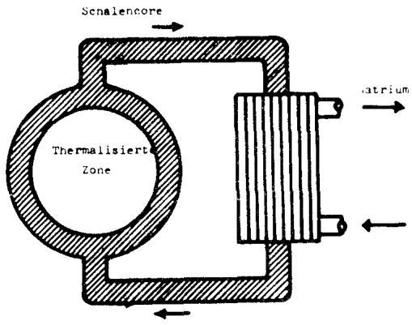  
Fig. 9.1   
A

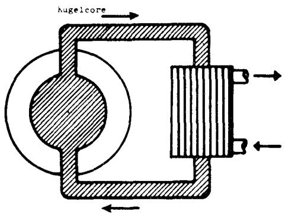  
B

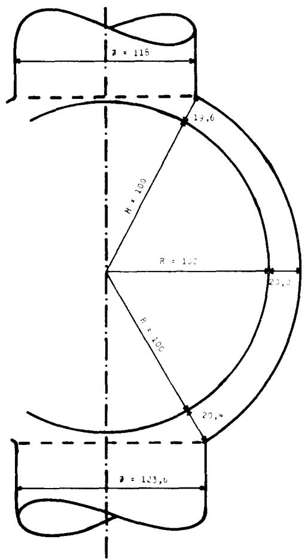  
F   
Referenzfaili Scalencore

Table 8.1 Shell form High Flux reactor   

<table><tr><td>Property</td><td>Unit</td><td>Value</td></tr><tr><td>Total power</td><td>GWTot</td><td>6</td></tr><tr><td>Core Geometry</td><td>see Fig. 8.2</td><td></td></tr><tr><td>Core volume</td><td>cm3</td><td>3.1 x 106</td></tr><tr><td>Mean power density</td><td>kW·cm-3</td><td>2</td></tr><tr><td>Specific heat of the fuel (T in °C)</td><td>J cm-3K-1</td><td>0.83 (1-0.5 x 103(T-850))</td></tr><tr><td>Density at 850°C</td><td>8 cm-3</td><td>2.12</td></tr></table>

The thermal properties of this core were calculated using the following parameters

- Flow rate at input $10 - 22\mathrm{m.s}^{-1}$   
- Diameter of the inlet pipe 0.5 - 0.6 m

The inlet temperature was kept constant at $750^{\circ}\mathrm{C}$

The most important variable was the outlet temperature

which was varied between $935^{\circ}C$ and $965^{\circ}C$

For various reasons a reference concept was used as a basis for the calculations, see Fig. 8.2. A description of the reference design is also given in Fig. 8.3.

The relevant characteristics are given in the following figures:

Temperature curve Fig. 8.4 A

Flow rate curve Fig. 8.4 B

Mean circumference and Fig. 8.4.

shell thickness

Number of Pu atoms in a 1

layer FIG. 0.5 A

The sudden changes at the start and end are due to the uncertainties in the geometry at the pipe/shell interface.

Density Fig. 8.5 B

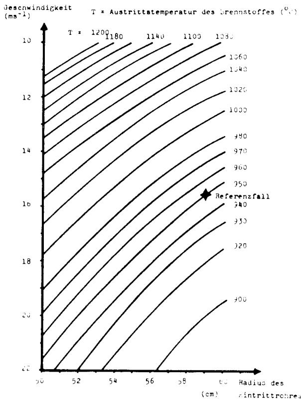  
题·

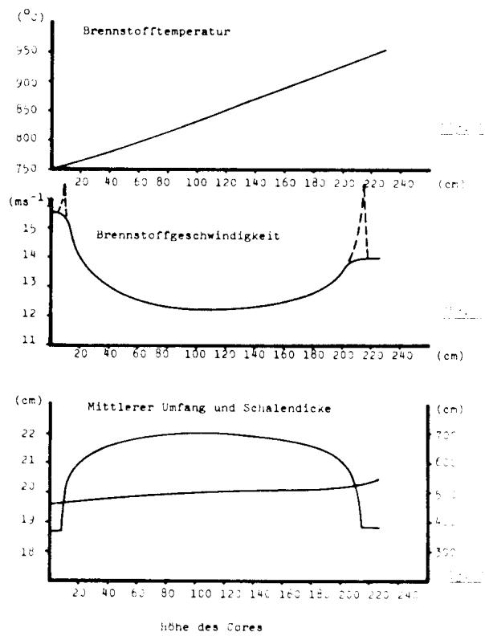  
Fig. 3.4   
heferenzfall Schalencore

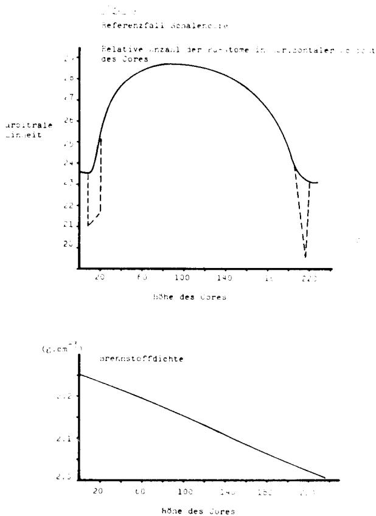

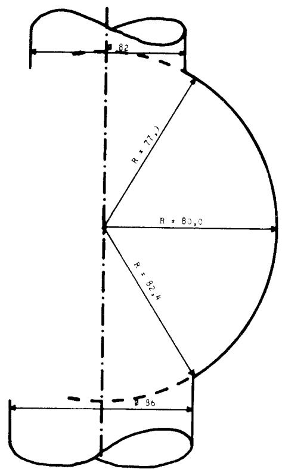  
#   
Referenzfall Kugelcore

# 8.3 Power Reactor with spherical core

This reactor was designed to meet the following requirements

- a spherical core with the minimum of structural material in order to optimise the neutron balance and to achieve a hard spectrum.   
- a maximum breeding ratio in the core and blanket   
- the liquid fuel cooled in an external heat exchanger.

Table 5.2 shows the most important characteristics.   
Table 3.2 Power breeding reactor   

<table><tr><td>Characteristic</td><td>Unit</td><td>Value</td></tr><tr><td>Total power</td><td>GW(th)</td><td>3</td></tr><tr><td>Core geometry</td><td rowspan="2" colspan="2">see Fig. 8.6</td></tr><tr><td>spherical radius</td></tr><tr><td>Core volume</td><td>cm3</td><td>2.3 x 10^6</td></tr><tr><td>Mean power density</td><td>kW·cm^3</td><td>1.3</td></tr><tr><td>Specific heat (T in °C)</td><td>J·cm^-3K^-1</td><td>0.83x(1 - 0.5x10^3(T-850))</td></tr><tr><td>Density at 850°C</td><td>g·cm^-3</td><td>2.92</td></tr></table>

The thermal parameters of this core have been calculated varying the following parameters

- inlet velocity   
- diameter of inlet tube

The inlet temperature was kept constant at $750^{\circ}\mathrm{C}$

The main parameter varied was the outlet temperature in the range $935^{\circ}\mathrm{C}$ to $965^{\circ}\mathrm{C}$ (see Fig. 8.7).

The given reference case (see Fig. 8.7) is shown in Fig. 8.6. The parameter changes under consideration are shown in figures 8.5 A, B, C and Fig. 8.9.

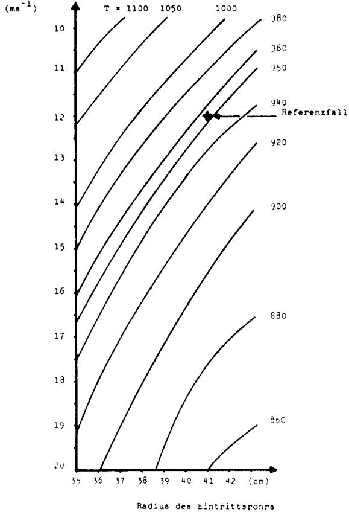  
Fig. 8.7 T: Austrittattemperatur des brennstoffes (°C)   
Geschwindigkeit

Fig. 8.8   
Referenzfall Kugelcore   
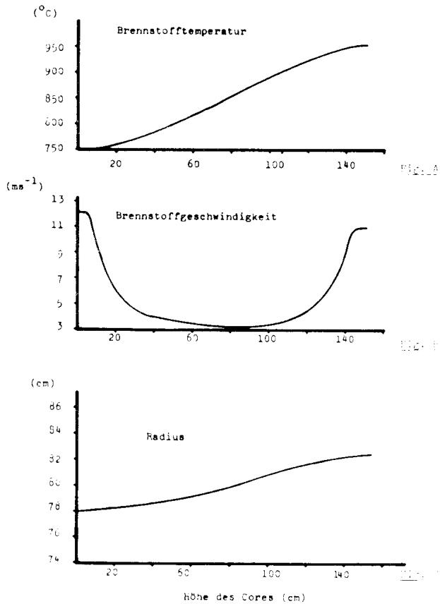  
1   
Referenzfall Kugelcore

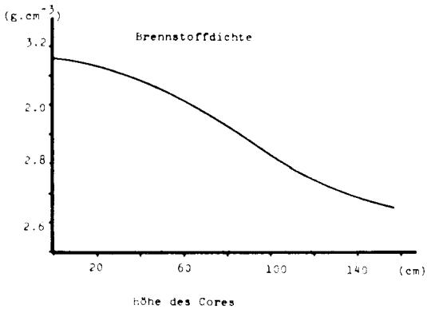  
V = totales volumer des brennstoifs in. solr. t.   
T = cirrittstemperatur des (atrium:

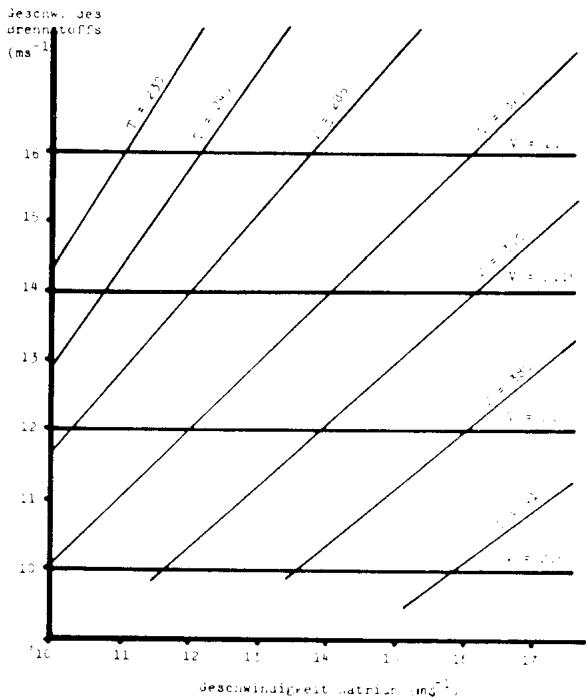  
renstoffvolaner.   
Lutriuntemperatur

# 8.4 The external heat exchanger

The most important parameter for the external heat exchanger was selected as the volume of fuel contained in it. The decisive factor is the minimisation of the fuel volume existing outside the core, which influences:

- the effective specific power (MWth) per kg guel in the whole system   
- the effective doubling time   
- safety considerations under accident conditions.   
- minimisation of the loss of delayed neutrons.

For this reason a simple molten salt/sodium heat exchanger was chosen.

The most important properties of the two media are shown in table 8.3.

The following parameters were arbitrarily chosen

- Velocity of fuel $10 - 16 \mathrm{~m} \cdot \mathrm{s}^{-1}$   
Velocity of sodium 10-16 m·s   
- Inlet temperature of the fuel £ 950ºC   
-Furl outlet temperature 750°   
- Sodium outlet temperature 600°C   
- Salt on the tube side – dia 0.6 cm   
- Sodium on the shell side 0.8/1.2 to 2.2 cm pitch

Important variables

- Inlet sodium temperature   
Length of tubes   
- Volume of fuel in the tubes

All these data are given in Fig. 9.10 for the case of a pitch of $1.2 \, \text{cm}$ .

Table 8.3 Heat Exchanger: 3 GW thermal   

<table><tr><td>Property</td><td>Unit</td><td>Fuel</td><td>Coolant</td></tr><tr><td>Composition</td><td>Mol</td><td>1 PuCl3·2 UCl3·3.65 NaCl</td><td>Sodium metal</td></tr><tr><td>Density</td><td>gcm-3</td><td>3.526 x (1-0.001 (T-850))</td><td>0.784 (1-0.001 (T-350))</td></tr><tr><td>Heat Capacity</td><td>Jg-1K-1</td><td>1.0 x (1.0.0005 (T-850))</td><td>1.256 (1-0.0005(T-350))</td></tr><tr><td>Thermal conductivity</td><td>Wcm-1K-1</td><td>0.015 x (1.0.001 (T-850))</td><td>0.663 (1+0.001 (T-350))</td></tr><tr><td>Viscosity</td><td>gcm-1s-1</td><td>0.05 x (1-0.001 (T-850))</td><td>0.0018 (1-0.001 (T-350))</td></tr><tr><td>Heat transfer coefficient</td><td>Wcm-2K-1</td><td>0.023 x RE0.8 x PR0.4</td><td>5.3 + 0.019 RE0.8•PR0.8(R&#x27;/R&quot;)0.3</td></tr><tr><td>Inlet temperature</td><td>°C</td><td>750</td><td>Variable (see Fig. 10)</td></tr><tr><td>Outlet temperature</td><td>°C</td><td>950</td><td>600</td></tr><tr><td>Inlet velocity</td><td>m·s-1</td><td>10 - 16</td><td>10 - 16</td></tr></table>

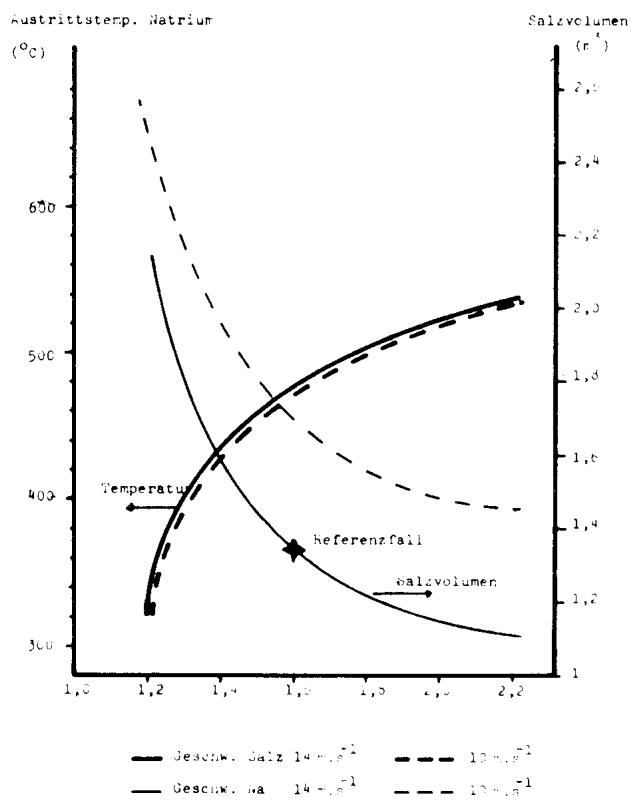  
Fig. 3.11

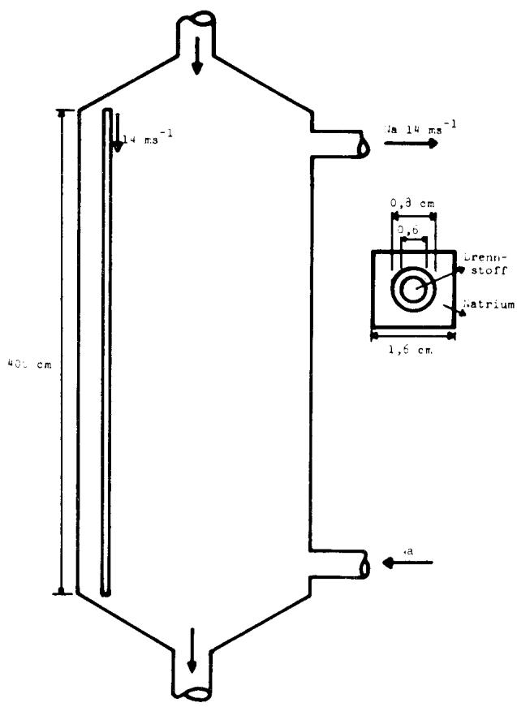  
Fig. 8.12   
Keferenzfall

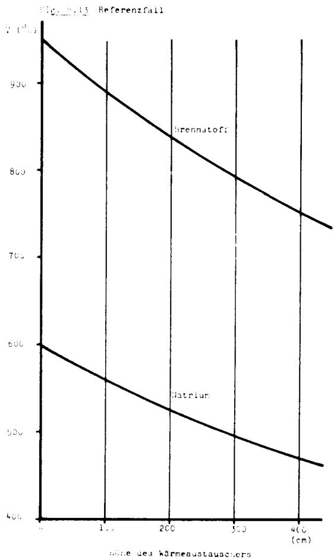

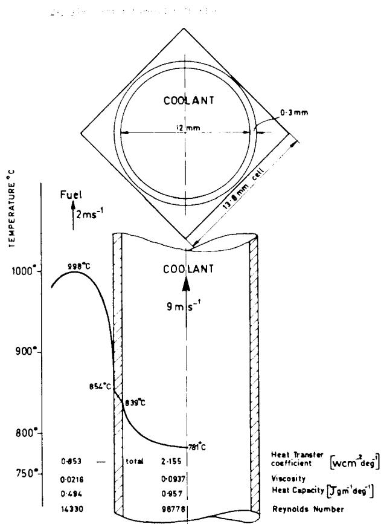

For other pitches between 1.2 and 2.2 and for two selected fuel and sodium velocities values can be seen in Fig. 8.11. The reference case was arbitrarily chosen (see Fig. 8.11). The geometry of the heat exchanger for this reference case is shown in Fig. 8.12. Further parameters are summarised in table 8.4.

Table 3.4 Heat Exchanger   

<table><tr><td>Characteristic</td><td>Unit</td><td>Fuel</td><td>Metallic sodium</td></tr><tr><td>Inlet velocity</td><td>m·s-1</td><td>14</td><td>14</td></tr><tr><td>Viscosity</td><td>g·cm-1s-1</td><td>0.0524</td><td>0.00183</td></tr><tr><td>Heat capacity</td><td>J·g-1K-1</td><td>1.624</td><td>1.275</td></tr><tr><td>Number of tubes</td><td></td><td>5787</td><td></td></tr><tr><td>Volume</td><td>cm3</td><td>1.32×106</td><td></td></tr></table>

The temperature curves for both media are given in Fig. 8.13.

# 8.5 The internally cooled reactor

This type of reactor, has fuel circulating in the core only, with a relatively low temperature gradient of approx. $35^{\circ}\mathrm{C}$ and a high heat capacity, and a high velocity coolant $9\mathrm{ms}^{-1}$ with again a low temperature gradient of approx. $43^{\circ}\mathrm{C}$ and high heat capacity. This, coupled with the very high negative temperature coefficient of reactivity results in an unusually high negative thermal and 'reactivity' stability.

Decrease of the fuel circulation and/or coolant velocity (in the U-tubes) results in a definite and "automatic" decrease of reactor power without recourse to engineered methods. This points to such a reactor being a surprisingly stable and self-regulating device.

The achievement of the required fuel velocity in the core seems to require a forced circulation system since the rough estimate using natural convection gives a heat transfer coefficient which not acceptable.

Such a forced circulation system (core only) can be one of the following types - pump installed directly in the core, pump outside the core, an external pump with injector, a gas lift pump using inert gas. Consideration of the factors involved using criteria such as reduction of the out of core inventory, elimination of additional heat exchangers, minimisation of the fuel leakage, minimisation of the auxiliary power, optimisation of the fuel flow regulation - all point at an in-core pump solution. Of course this gives rise to considerable technical problems (cooling of the rotor, corrosion and erosion, maintenance, neutron activation etc).

The calculations for this type of reactor have been based on the following more or less arbitrarily selected parameters:

- fuel on the shell side, with tube pitch to diameter ratio equal to 1.10 to 1.18.   
- fuel velocity: 0.5 to $5 \mathrm{~m} \cdot \mathrm{s}^{-1}$   
-coredia:2and2.2m   
-core height: 2 m   
coolant in tube with tube internal diameter equal to: 1.0 to 1.5 cm   
- velocity of coolant: 1 to $17 \mathrm{~ms}^{-1}$   
- coolant inlet temperature 750° and 300°C

The neutronic calculation and thermo-hydraulics were made for 1 cm of the core height.

The detailed representation for the temperature distribution in a typical power reactor with a core output of 1.936 GW(th) are given in Fig. 8.14 (for a position 43 cm above the bottom of the core where the neutron flux is normalised to 1).

The bulk temperature of the fuel is here $998^{\circ}\mathrm{C}$ , the temperature of the tube walls $857 - 389^{\circ}\mathrm{C}$ and the bulk temperature of the coolant $794^{\circ}\mathrm{C}$ .

For the total output of the core 1.936 GW(th), the power distribution is as shown in Fig. 8.15.

Of course a flatter power distribution could be obtained by adjusting tube diameters and pitch across the core. (Note that in this calculation the radial neutron flux distribution has been taken as unperturbed).

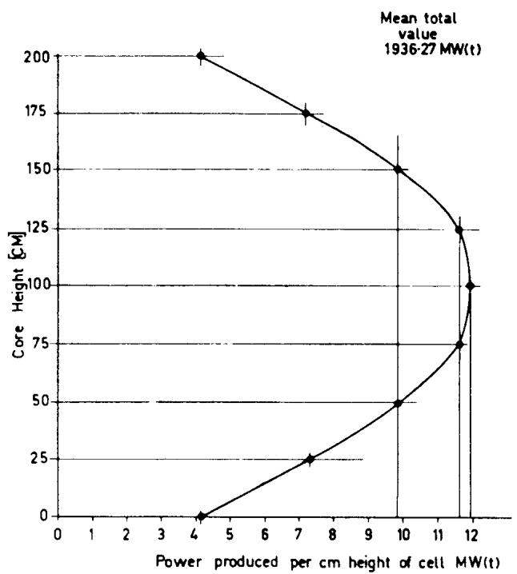  
Fig. 8.15 Power distribution in the core

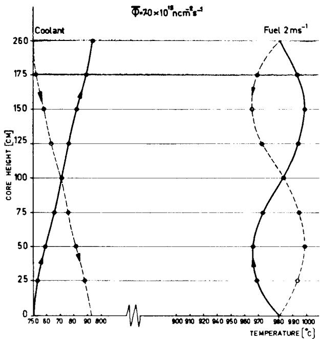  
Fig. 8.16 Temperature of fuel and coolant reference core

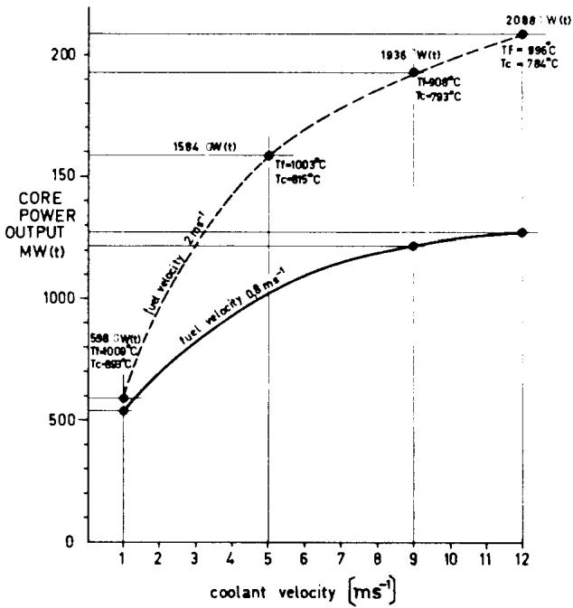  
#

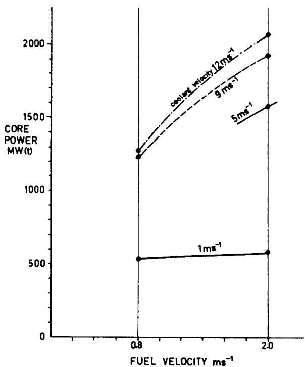  
Fig. 8.18 Core power output versus fuel velocity

A very encouraging indication of the good temperature distribution with very small temperature gradients is shown in Fig. 8.16 which indicates the axial bulk temperature distribution in the fuel and in the coolant in the core.

The fuel bulk temperature changes from $980^{\circ}\mathrm{C}$ at the bottom to $965^{\circ}\mathrm{C}$ at 1/4 core height and is $998^{\circ}\mathrm{C}$ at 3/4 of core height. The coolant temperature lies between $750^{\circ}\mathrm{C}$ inlet and $793^{\circ}\mathrm{C}$ outlet. Both these small temperature gradients in the fuel and in the coolant (fertiel material) may prove beneficial in reducing corrosion processes due to the minimizing of mass transport phenomena.

The stable behaviour of this type of reactor results from many parameters. Two of them are the velocity of the coolant and its bulk temperature. The mean power output of the core is strongly dependant on the velocities of both fuel and coolant. Fig. 8.17.

For a fuel velocity of $2\mathrm{m}\cdot \mathrm{s}^{-1}$ , when the coolant velocity falls from $12\mathrm{m}\cdot \mathrm{s}^{-1}$ to $1\mathrm{m}\cdot \mathrm{s}^{-1}$ the coolant outlet temperature increases from $784^{\circ}\mathrm{C}$ to $893^{\circ}\mathrm{C}$ for constant inlet temperature of $750^{\circ}\mathrm{C}$ . This change of coolant velocity and its bulk temperature results in the decrease of the mena core output from 2.088 GW(th) to 0.598 GW(th) - that is approximately a factor 3! It is clear since the lower coolant velocity results in a higher coolant outlet temperature and lower power output we have definite negative temperature coefficient (power output) varying with the given coolant velocity.

If the fuel velocity falls from $2\mathrm{m}\cdot \mathrm{s}^{-1}$ to $0.8\mathrm{m}\cdot \mathrm{s}^{-1}$ we again get an important decrease of power output (see Fig. 3.18). The decrease in both fuel and coolant velocity results in a sharp decrease of reactor power. This means that such a reactor can be considered as a surprisingly stable and self-regulating device. In the case of a sudden fall in coolant and/or fuel velocities the power output decreases to a safe level without intervention.

The achievement of the required fuel velocity in the core seems to require a forced circulation system since the rough estimate using natural convection gives a heat transfer coefficient which is too low.

Such a force circulation system (core only) can be one of the following types

- pump installed directly in core   
- pump outside the core   
- an external pump with injector   
- a gas-lift pump using inert gas (argon)

Intensive consideration of the factors involved, using criteria such as - reduction of the out of core inventory, elimination of additional heat exchangers, minimization of the fuel leakage, minimization of the auxiliary power, optimisation of the fuel flow regulation, points to an in-core pump solution. Of course this gives rise to considerable technical problems (cooling of the rotor, corrosion and erosion, maintenance, neutron activation etc.).

The postulated fuel velocity makes it possible to make some calculation of the heat transfer problems and also gives a feel for the kinetics of the reactor under discussion.

It must be stressed that these kietics studies have no strong physical sense and use an iterative approach but it is clear that they give some useful information about the general reactor stability. (see Fig. 8.19).

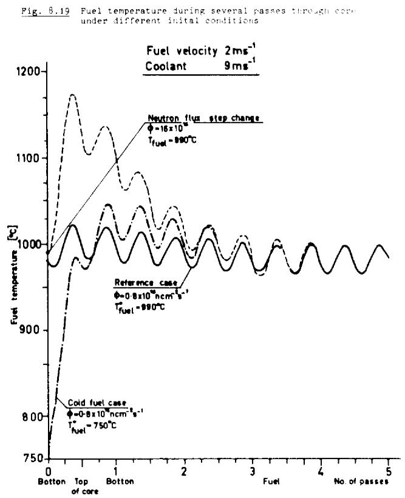

# 9. REFERENCES

9.1 List of EIR-publications used in this report (chronological order)

M. Taube Molten chlorides fast breeder reactors

J. Ligou (problems, possibilities)

EIR-Report 215 (1972)

J. Ligou Molten chlorides fast breeder reactor.

Reactor physics calculations

EIR-Report 228 (1972)

M. Taube Wärme-Tauscher für schnelle Reaktoren mit

K. Dawudi geschmolzenen Salzen

TM-HL-270 (1973)

M. Taube A molten salt fast/thermal reactor system

with no waste

EIR-Report 249 (1974)

M . Taube – Thorium-Uranium fast/thermal breeding system

with molten salt fuel

EIR-Report，253(1974)

M. Taube The possibility of continuous in-core gasous

extraction of volatile fission products in a

mullen fuel reactor

FIR-Report 257 (1974)

M . Taube – Molten plutonium chlorides fast breeder cooled

J. Ligou by molten uranium chlorides

Ann. Nucl. Sci. Engin. 1, 277 (1974)

M. Taube

Steady-state burning of fission products in a fast thermal molten slat breeding power reactor  
Ann. Nucl. Sci. Engin. 1, 283 (1974)

E. Janovici

Chemical state of sulphur obtained during in pile irradiation  
EIR-Report 267 (1974)

M. Taube

A high-flux fast molten salt reactor for the transmutation of Cs-137, Sr-150  
EIR-Report 259 (1975)

J. Ligou

E. Ottewitte

M. Taube

The transmutation of fission products (Cs-137, Sr-90) in a salt fuelled fast fission reactor with thermal zone EIR-Report 270 (1975)

J. Ligou

K.H. Bucher

Arbeitsvorschrift zur Auftrennung des nach $^{35}\mathrm{Cl}(n,p)^{35}\mathrm{S}$ in NaCl-Proben produzierten Schwefels TM-HL-247 (1975)

M. Furrer

M. Taube

Fast breeder power reactor with molten plutonium trif  
TM-HL-259 (1975)

M. Taube

Breeding in molten salt reactors, Incutures on the University of Liege  
EIR-Report 276 (1975)

E. Janovici

M. Taube

Chemical behaviour of radiosulphur obtained by $^{35}\mathrm{Cl}(n,p)^{35}\mathrm{S}$ during in-pile-irradiation J. Nucl. Inorg. Chem. 37, 2561 (1975)

M. Taube

Transmutation of Sr-90 and Cs-137 in a high-flux fast reactor with thermalized central region  
Nucl. Sci. Engineer. 61, 212 (1976)

M. Furrer

Chemischer Zustand von $^{35}\mathrm{Cl}(n,p)^{35}\mathrm{S}$ in Alkalichloridschmelzen EIR-TM-HL-275 (1976)

M. Furrer

Chemical behaviour of radiosulphur obtained during in-core irradiation  
J. Inorg. Nucl. Chem. (1977), 39, 1089

M. Taube

Is the transmutation of strontium-90 and caesium-137 in a high flux fission reactor feasible?  
In "Long-Life Radionuclide Transformation" Proceed, 1990, Nuclear Energy Agency Ispra, 16 March-1977

9.2 Former publications concerning molten chlorides fast breeders and the fluoride thermal breeder

J.J. Bulmer et al. Fused salt fast breeder Cf-56-8-204, Oak Ridge 1956

M. Taube Fused plutonium and uranium chlorides as nuclear fuel for fast breeder reactors, Symp. React, Eperiment. International Atomic Energy Agency, Symp. (SM-21/19) Vienna 1961

M. Taube The concept of salt-boiling fast breeder  
A. Kowalew reactor (AlCl₃ as cooling agent)  
M. Mielcarski Nukleonika 9-10, 639 (1965)   
S. Poturaj   
M. Taube The concept of fast breeder reactor with M. Mielcarski fused salt and boiling mercury A. Kowalew Nukleonika 9-10, 641 (1965)   
S. Putilaj   
M. Taube Reactivity in salt-boiling ractors Nukleonika 3, 231 (1967)   
M. Taube Konzeption der Salzsiedereaktoren A. Kowalew Kernenergie 6, 184 (1967)   
S. Poturaj   
M. Mielarski   
M. Taube Fast breeder boiling reactors with fused salts (in Russian) Atomnaya Energiya 1, 10 (1967)   
M. Taube New boiling salt fast breeder reactor concepts M. Nielcarski Nucl. Engin. Design 5, 109 (1967)   
S. Poturaj   
A. Kowalew

M. Taube

Fast breeder reactor with direct cooling by boiling agents (in Russian)  
IBJ-Warszawa, 842/C  
Conf. Fast Breeder, USSR, Dubna, December, 1967

L.G. Alexander

Molten Salt Reactors  
Proceed. Breeding Large Fast Reactors  
ANL-6792 (1963)

P.A. Nelson

D.K. Butler

M.G. Chasanov

D. Nemeghetti

B.R. Harder

G. Long

W.P. Stanaway

Fuel properties and nuclear performance of fast reactors fuelled with molten chlorides Nuclear Applications, Vol. 3, 540 (1967)

Compatibility and reprocessing in use of molten UCl₃ alkalichlorides mixtures as reactor fuel in "Sympos. Reprocessing Nuclear Fuels" Ed. P. Chiotti, USAEC, Con. 690801 (1969)

J.A. Lane

Test-reactor perspectives React. Fuel. Proces. Tech. 12, 1, 1 (1969)

M.W. Rosenthal et al.

Molten salt reactors: Series of papers Nucl. Applic. Techn. 8, 2, 105-219 (1970)

# 9.3 Publications concerning transmutation

M. Steinberg Neutron burning of long-lived fission

G. Wotzka products for waste disposal   
B. Manowitz BNL-8558 (1964)

M.G. Chasanov Fission-products effects in molten chloride

fast reactor fuels

Nucl. Sci. Eng. 23, 189 (1965)

M.V. Gregory A nuclear transformation system for disposal

M. Steinberg of long-lived fission product waste

Brookhaven Nat. Lab. BNL-11915, 1967

W.H. Walker Fission Products Data, Part I

A.E.C.L. - 3037 (1968)

E.A.C. Crouch Calculated independent yields

AERE-R-6056 (1969)

S.M. Feinberg High flux stationary experimental reactors

and their perspectives (in Russian)

Atom. Energ. 29, 3, 162 (1970)

R.D. Cheverton H.F.I.R. Core Nuclear Design.

T.M. Sims ORNL-4621 (1971)

E. Clayton Thermal capture cross-section

AAEC-TM-619 (1972)

H.C. Claiborne Neutron-induced transmutation of high-level

radioactive waste

ORNL-TM-3964 (1972)

W.C. Wolkenhauer The controlled thermonuclear reactor as a fission product burner BNWL-4232 (1973)

J.D. Blomeke Managing radioactive wastes  
J.P. Nichols Physics Today 8, 36 (1973)  
W.C. McClain

E.A.C. Crouch Fission products chain yields from experiments AERE-R-7394 (1973)

A.S. Kubo Disposal of nuclear waste D.J. Rose Science 182, 4118, 1205 (1973)

W.C. Wolkenhauer Transmutation of high-level radioactive B.K. Leonhard waste with a CTR B.F. Gore BNWL-1772, Pac. North West Lab. (1973)

K.J. Schneider Advanced waste management studies, High level radioactive waste disposal alternatives USAEC, BNWL-1900, Richland 1974

T.D. Beynon The nuclear physics of fast reactors Rep. Prog. Phys. 37, 951 (1974

B.F. Gore Transmutation in quantity of Cs-137 in a B.R. Leonard controlled thermonuclear reactor Nucl. Sci-Engin. 53, 329 (1974)

W.F. Vogelsang Transmutations, radioactivity in D-T  
R.C. Lott TOKAMAK fusion reactor  
G.L. Kulcinski Nucl. Technology 22, 379 (1974)  
T.Y. Sung

H. Wild Radioaktive Inventare und deren zeitlicher Verlauf nach Abschalten des Reactors KfK-1797, Kernforschungszentrum Karlsruhe, 1974

9.4 Publications concerning the thorium fuel cycle

A.I. Lejpunskii Feasability of using thorium in fast power  
O.D. Kazachkovski reactors  
S.B. Shikhov Atomnaya Energiya, 18, 4, 342 (1965)  
V.M. Murogov   
C.A. Renni Selfsustaining mixed fast and thermal reactor system D.P. Report 581, AEE Winfrith, 1967   
Ash-1097 The use of thorium in nuclear power reactors USAEC 1969   
Thorium fuel cycle Bibl. Series No. 39 Int. Atom Energy Agency, Vienna 1970   
P. Fortescue A reactor strategy FBR's and HTGR's Nuclear News, April 1972   
G. Grazianni Plutonium as a make up in the thorium C. Rinaldini integral block HTR buel element H. Bairiot Eur 5020e Joint Nuclear Research Centre E. Tranwaert Ispra 1973   
R.H. Brogli Thorium utilization in an FBR/HTGR power system 34 LC 3730 1973 / 74

D. Broda

Eine Welt aus Plutonium?

Naturwiss. Rundschau, 28, 7, 233 (1975)

#

Can we live with plutonium?

Some articles: Now Scientist, 29 May 1975

P.J. Wood

The economics of thorium blankets for FBR

J.M. Driscoll

Proceed ANS 1975 June

B.R. Seghal

Thorium-based fuels in FBR

C. Lin

Proceed ANS, June 1975

J. Naser

W.B. Löwenstein

E.R. Merz

Thorium fuel cycle

Inter. Conf. Nucl. Power, Fuel Cycle

IAEA,Salzburg，May 1977，CN-36/96

F.T. Kasten

Evaluation of Pu, U and Th use in power

F.J. Homan

reactor fuel cycle

Inter. Conf. Nucl. Power, Fuel Cycle

IAEA, Salzburg, May 1977, CN-36/402

9.5 References to the chemical experiments

M. Kasrai J. Chem. Soc. A, 1105 (1970)   
A.G. Maddock   
C.N. Turcanu Radiochem. Radioanal. Lett. 5, 287 (1970)   
J.L. Baptista J. Inorg. Nucl. Chem. 36, 1683 (1974)   
N.S.S. Maques   
9.6 References to the physics calculation   
A.M. Weinberg The Physical Theory of Neutron Chain  
E.P. Wigner VI p.143, Univ. Chic. Press (1958)   
L.W. Nordheim A Program of research and calculations of resonance absorption - PA - 2507, (1961)   
I.J. Bodarenko Group constants for nuclear reactor et al. Calculations (1964)   
J. Adir et al. User's and Programmer's Manual for the GGC 3 Multigroup Cross-Section Code - Part 1, GA 7157 (1967)

G.I. Bell

S. Glassstone

Nuclear Reactor Theory. Van Nostrand Reinhold Comp. (1970) 244 - 247

G.A. Ducat

M.J. Driscoll

N.E. Tudreas

Evaluation of the parfait blanket concept

for fast breeder reactor

M.I.T. Cambridge, MITNE-157 (1974)

R.W. Hardie

W.W. Little

R.P. Omberg

A Comprehensive expression for the doubling time of fast breeder reactors

Nuclear Technology, 26, 115 (1975)