Eidg. Institut für Reaktorforschung Würenlingen Schweiz

# Reactor with very low fission product inventory

M. Taube, W. Heer

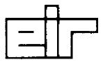

Würenlingen, Juli 1980

Reactor with very low fission

product inventory

M. Taube, W. Heer,

in co - operation with A. Indrefjord

Swiss Federal Institute of Reactor Technology

July 1980, Würenlingen

# Abstract.

A fast converter with one zone and an internal breeding ratio of 1.00, with liquid fuel in the form of molten plutonium - uranium - and sodium chloride, with a thermal power of 3 GW (th) allows continuous extraction of the volatile fission products (Br, I, Kr, Xe, Te) by means of helium purging in the core. The non-volatile fission products e.g. Sr and Cs can continuously be extracted in a chemical reprocessing plant at the reactor site. The impact on an accidental release of fission products is rather significant; the amounts released are 50-100 times smaller than those in a reference reactor (LWR with oxide fuel). Because the heat sink is relatively large and after heat reduced, the temperature of the fuel does not exceed $500^{\circ}\mathrm{C}$ after an accident, which greatly reduces the consequences of an accident.

# Zusammenfassung.

Ein Schneller konverter Reaktor mit einer Zone und einem Bruffaktor von 1.00, mit flüssigem Brennstoff in Form von geschmolzenem Plutonium -, Uranium - und Natriumchlorid, mit einer Leistung von 3 GW (th) erlaubt die kontinuierliche Enfernung von flüchtigen Spaltprodukten (Br, I, Kr, Xe, Te) durch Durchleiten von Helium im Core. Die nicht-flüchtigen Spaltprodukte wie Sprund Cs werden kontinuierlich in der angegliederten Aufbereitungs-anlage ausgeschieten. Die Folgen bei einer unfallbedingten Freigabe von Spaltprodukten sindrecht signifikant; die freiigegebenen Mengen sind 50-100 mal kleiner als die beim Referenzreaktor (einem LWR mit Oxiden als Brennstoff). Weil die Wärmesenke relativ gross ist, und die Nachwärme reduziert ist, übersteigt die Temperatur des Brennstoffs nach einem Unfall $500^{\circ}\mathrm{C}$ nicht, was zu einer bedeutenden Reduktion der Unfallfolgen führt.

# INIS DESCRIPTORS

MOLTEN SALT REACTORS

FISSION PRODUCT RELEASE

AFTER HEAT REMOVAL

REACTOR SAFETY

LOSS OF COOLANT

MELT DOWN

# Contents.

# 1. Introduction

1.1 Present position 5   
1.2 Safety of Fission Reactor: State of the art 9   
1.3 Safety of Fission Reactor+ desired improvement 9   
1.4 The present State of Reactor Development and the Criteria for a Safer Reactor. 12

# 2. Accidental release of fission products and decay

heat removed. 15

2.1 The Rasmussen Scenario 15   
2.2 The problem 16

# 3. Principles of the "SOFT" Reactor 19

3.1 A Schematic View 19   
3.2 System description 19   
3.3 Mass flows and containments 23

# 4. Nuclear calculations 26

4.1 The Method 26   
4.2 Nuclear properties of SOFT 28

# 5. Continuous extraction of fission products. 28

5.1 General scheme 28   
5.2 Chemical state of fission products in molten chlorides 28   
5.3 Fission product volatility and gaseous extraction 31   
5.4 Problem of delayed neutron emitters 30   
5.5 Gas extraction rate 41

5.6Reprocessing of non-volatile fission products 42   
5.7 Some technological problems 44   
5.8 Possible reprocessing technologies 44   
5.9 The problem of external storage of the fission products 47

6. Heat removal 47

6.1 Primary circuit: core and heat exchangers 47   
6.2 Secondary circuit 48   
6.3 The tertiary circuit 48   
6.4 Heat removal from the sotred fission products 51

7. Accidents - problems and solutions 51

7.1 Decay heat: Power and energy 51   
7.2 Worst accident scenario 55   
7.3 Spontaneous cooling processes in the containment 61   
7.4 The prompt critical scenario 63

8. Conclusions 67

Literature 68

Page

# 1. INTRODUCTION

# 1.1 Present position

The light water reactor, the most common power reactor today and for the next two decades is safe enough to be the basic energy source for society.

This however does not mean that the search for improved safety is a waste of time. The continued search for still safer systems is common in all the technologies making up our civilization (transportation, chemical technology, domestic fire hazards etc.).

Each type of nuclear reactor also has potential for increasing its safe operation. It must however be remembered that the most important safety aspect of the current reactor systems is in the real practical experience built up over many years. Here the light water reactor is in a privileged position being able to demonstrate an excellent safety record.

In spite of this crucial fact the search must continue for reactotypes which promise improved inherent safety on the basis of their different system design. Such a search seems to be generally desirable.

The best reason for such a reactor type has been given by Alvin Weinberg (1979, 1980).

"For the 15 billion curies contained in a 1000 megawatt reactor we could never say that the chance of a serious accidental release was zero.

... Thus a most important technical fix for nuclear energy would be a means of minimising the amount of land that conceivably could be contaminated in the worst possible accident.

... For nuclear energy to survive we must reduce the probability of any serious malfunction much below the 1 in 20 000 per reactor-year estimated in the Rasmussen report as well as reducing any possible consequences."

"But if the world energy system involved as many as 5000 reactors - that is, 10 times as many as are now either in operation or under construction - one might expect an accident that released sizeable amounts of radioactivity every four years. Considering that a nuclear accident anywhere is a nuclear accident everywhere I believe this accident probability is unacceptable. If a man is to live with fission over the long term he must reduce the a priori probability of accident by a large factor - say 100."

(The Bulletin of Atomic Scientists. March 1980)

The aim of this paper is to try and present a concept for a fission power reactor being approximately 100 times less hazardous than existing reactor types, and with much less than 15 billion curies activity.

It must be stressed that this study is concerned with a 'paper reactor' (which is of course the safest type of all!) a concept only. The route from the concept to realising an actual power reactor in service, and contributing to our energy problems is a long and tortuous road and with financial commitments of tens of billions of dollars. Even this should not prevent the search for such a reactor. The search itself is of benefit even for a better understanding and possible improvement to the existing power reactor systems.

How is it possible to meet the requirement for a 100-fold improvement in reactor safety?

The following proposals are made below:

a) the amount of fission products in the core during a normal operation must be reduced by a factor 100 which significantly reduces the effects of a large accident where the fission products would be released into the environment,   
b) the decay heat level must be reduced and the internal inherent heat sink, such as the total heat capacity of the fuel and other components must be significantly increased. Additionally the maximum temperature reached by the fuel in the case of failure of all emergency cooling systems must be low enough to allow the fuel to be trapped in a core catcher.

Table 1.1 Reactor characteristics affecting safety (data for 3 GW(th))   

<table><tr><td>Characteristics</td><td>Existing Reactor
(e.g. LWR)</td><td>Desired Reactor</td></tr><tr><td>1) Fission product inventory</td><td>~15 Gourie. Possibility of releasing into the environment:
a) volatile Fission Products (F.P.)
b) non-volatile F.P.</td><td>Minimum in F.P.
inventory but at least two orders of magnitude smaller than in existing reactors for both:
a) volatile F.P.
b) non-volatile F.P.</td></tr><tr><td>2) Decay heat removal</td><td>Immediately after shutdown ~180 MW(th).
The integrated decay heat over some hours is of the order of 1000 Gigajoules</td><td>Minimum decay heat. At least by more than one order of magnitude</td></tr><tr><td>3) Pressure in fuel and coolant (in containment)</td><td>a)~150 bar in a PWR ~80 bar in a BWR in the coolant.
b) internal pressure in the fuel pins</td><td>No pressure:
a) in the coolant
b) in the fuel</td></tr><tr><td>4) Coolant with low boiling point 
(Explosion possibility)</td><td>The presence of water in the primary circuit gives rise to the hazard of uncontrolled boiling and production of large volumes of steam, pressurizing the containment</td><td>No low boiling point media allowed in the reactor circuits</td></tr></table>

<table><tr><td>Characteristics</td></tr></table>

5) Chemically active medium (coolant)

6) Hydrogen Evolution

7） 'China Syndrom'

8) Criticality control

9) External (away from reactor) movement of plutonium

Existing Reactor (e.g. LWR)

In a liquid metal cooled reactor an exothermic reaction is possible $4\mathrm{Na}_{\mathrm{met}} + \mathrm{UO}_2 + 2\mathrm{Na}_2\mathrm{O} + \mathrm{U}_{\mathrm{met}}$

In Light Water Reactors during an accident the following reaction may occur:

Zrmet+H2O+ZrO+H2gas The evolved hydrogen results in an uncontrolled increase of pressure in the core vessel or containment because of burning in air

For the LWR system the report WASH-1400 discussed the probability of the 'China-syndrom'

A strongly negative criticality, for the case of loss of coolant: control rods

The LWR system being a producer of plutonium results in transporting plutonium away from reactor (e.g. in irradiated fuel)

Desired Reactor No chemically active agent is allowed

No chemical agent including hydrogen is allowed

Elimination of this kind of accident

regulating system is desired

A self sufficient reactor with a breeding ratio of $\sim 1$ has no external circulation of Pu

Both of these criteria seem to be possible in a reactor having a molten fuel with continuous extraction of fission products in the fuel during normal operation. (Ref. 19).

In this paper one solution to this problem is discussed in detail: the molten salt reactor. It must be said that such reactor types have been considered for many years having molten salt as a fuel and with continuous extraction of fission products.

Some examples of molten salt reactors: (Ref. 5, 14, 16, 17, 18).

a) thermal breeder with molten fluorides developed decades ago by Oak Ridge National Laboratory, existing as an experimental reactor with a power of 8 MW(th), (Ref. 13)   
b) fast breeder reactor with molten chlorides discussed for tens of years, but still a "paper reactor".

A reactor of the second type is discussed here.

1.2 Safety of a Fission Reactor: state of the art.

Of course the hazard of a fission reactor is not only connected with its fission product inventory. There are other important safety aspects. Table 1.1 shows the impact of other reactor parameters on its safety and ways of resolving these. The question arising out of these criteria is can all the necessary improvements be made in a single reactor type? The answer assumed here is yes.

1.3 Safetv of a Fission Reactor+ possible improvements.

Table 1.1 summarises very briefly the properties of such a 'super safe' reactor. The reactor proposed in this paper is called SOFT.

S alt reactor

O n site reprocessing

F ast converter

T ask

The properties are discussed below in the order given in table 1.1.

Table 1.2 Safety of a Fission Reactor: possible improvements   

<table><tr><td>Parameter</td><td>Properties of the desired reactor</td><td>The solution formed for the SOFT reactor</td></tr><tr><td>1) Fission product inventory.</td><td>Minimum F.P.
Two orders of magnitude less volatile and non-volatile F.P.</td><td>Continuous extraction of:
a)volatile F.P. by means of gas pumping
b)non-volatile F.P. by means of chemical treatment and storage in another containment</td></tr><tr><td>2) Decay heat removal</td><td>Decay heat at least one order of magnitude less</td><td>Decrease of decay heat energy by:
a)continuous extraction of F.P.
b) continuous extraction of 239Np and storage in another containment</td></tr><tr><td>3) Pressure</td><td>Works at ambient pressure
a) in coolant
b) in fuel</td><td>Use of molten salt as both:
a) the coolant
b) the fuel in a pressured system</td></tr><tr><td>4) Low boiling point media (Explosion possibility)</td><td>Absence of agents
having low boiling point reducing also the explosion hazard</td><td>Both fuel and coolant
have a boiling temperature of approx 1500°C thus no explosion is possible</td></tr></table>

<table><tr><td>Parameter</td><td>Properties of the 
desired reactor</td><td>The solution formed 
for the SOFT reactor</td></tr><tr><td>5) Chemically 
active media</td><td>Absence of chemically 
active media which 
could react with fuel 
e.g. sodium and oxide</td><td>Both fuel and coolant 
are in the form of molten 
chlorides. The thermo-
dynamic stability of all 
constituents exclude any 
exothermic chemical (or 
explosive) reaction</td></tr><tr><td>6) Hydrogen 
evolution</td><td>Absence of substances 
which could give rise 
to hydrogen. E.g. water 
reacting with Zirconium</td><td>Neither fuel nor 
coolant contain 
hydrogen</td></tr><tr><td>7) &#x27;China Syndrome&#x27;</td><td>Elimination of any 
formation of a mass of 
molten fuel, slumping 
through containment</td><td>The significant decrease 
in decay heat and the 
presence of large heat 
sinks (reflector, core 
catcher) eliminates a 
&#x27;China Syndrome&#x27;</td></tr><tr><td>8) Criticality 
control</td><td>Fuel inherently &#x27;self 
controlling&#x27;</td><td>Fluid fuel reactors are 
known to have a large 
negative temperature 
coefficient and 
Doppler coefficient</td></tr></table>

1.4 The present State of Reactor Development and the Criteria for a Safer Reactor

The present state of reactor technology results from a long and complicated development and marked by not always the most logical decisions.

If the following are the four main targets of reactor development:

a) an economically and technically feasible source of electrical energy,   
b) economically and technically feasible source of high temperature heat for chemical processes,   
c) high grade utilisation of uranium resources (and even thorium resources),   
d) satisfactory level of safety,

then it may be possible to show with the aid of a diagram (Fig. 1.1) the present state of reactor development.

Of course there are other ways of eliminating the characteristics presenting the greatest hazards - high pressure and high F.P. inventory. Figure 2 shows some possibilities. It seems however that only molten salts can solve both these problems.

In this paper the accent is on the safety problem i.e. the effort to reduce the consequences of the worst credible accident - core melting. Paradoxically as this might sound the solution to this problem is the use of a reactor with a molten fuel core.

In this reactor:

a) the most important parameter to be optimised is the reduction in the inventory of volatile fission products (which will control the consequences of an accident during the first hours) and fission products such as Sr-90 and Cs-137 (which determine the accessibility of the contaminated area for tens of years),

Fig. 1.1

TRENDS IN THE PRESENT

DEVELOPMENT OF THE

REACTOR TECHNOLOGY

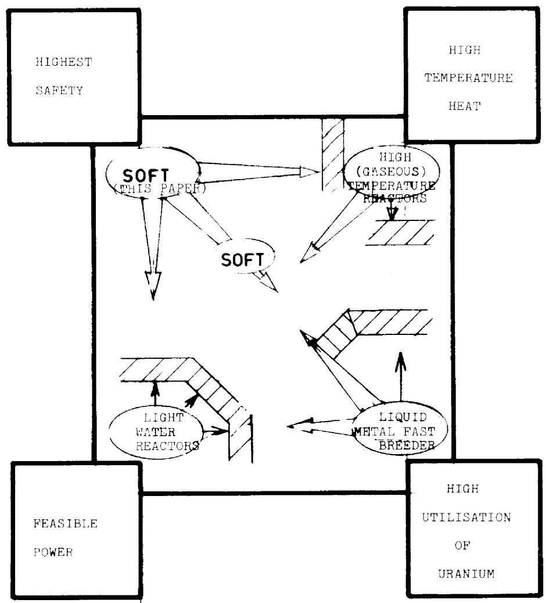  
Fig. 1.2   
DIFFERENT REACTOR TYPES AND THE   
SAFETY PROBLEMS

<table><tr><td rowspan="2" colspan="2"></td><td colspan="2">Pressure in the coolant or fuel</td></tr><tr><td>No(good:+)</td><td>High(bad:−)</td></tr><tr><td rowspan="2">Fission product inventory and after-heat</td><td>High(bad:−)</td><td>LiquidMetalFastBreeder(+) (−)</td><td>LightWaterReactor(−)(−)</td></tr><tr><td>Low(good:+)</td><td>MoltenSaltReactor(thermal-fluoride,fast-chloride)(+) (+)</td><td>GaseousFuelReactor(−)(+)</td></tr></table>

b) decay heat resulting from the spontaneous radioactive decay of fission products and actinides but also of the structural material is significantly lower, even if it is not enough,   
c) the breeding ratio has been set at 1 in order to minimise the need to transport fissionable material. this makes the reactor a net zero consumer and zero producer of fissionable material,   
d) the entire system fuel, primary and secondary cooling systems have been designed to operate at ambient pressure,   
e) no highly reactive compounds, (e.g. metallic sodium) are present in the system,   
f) no hydrogen containing compounds (e.g. water), which can evolve free hydrogen, are present. (see Ref. 14, 15, 16, 17, 18).

2. ACCIDENTAL RELEASE OF FISSION PRODUCTS AND DECAY HEAT REMOVAL

2.1 The Rasmussen Scenario (Ref. 12, 24).

The scenario of an accident used here is taken from the report WASH-1400 as the most fatal case: the PWR-1 which can be characterised by a steam explosion on contact of molten fuel with water in the reactor vessel. This accident category includes the following fraction of fission product core inventory release:

<table><tr><td></td><td>Rasmussen</td><td>German risk study</td></tr><tr><td></td><td></td><td>(maximum)</td></tr><tr><td>Xe - Kr</td><td>0.9</td><td>1.0</td></tr><tr><td>I</td><td>0.7</td><td>0.8</td></tr><tr><td>Cs-Rb</td><td>0.5</td><td>0.5</td></tr><tr><td>Te-Sb</td><td>0.4</td><td>0.35</td></tr><tr><td>Ba-Sr</td><td>0.05</td><td>0.052</td></tr><tr><td>Ru (Rh,Co,Mo,Tc)</td><td>0.4</td><td>0.38</td></tr><tr><td>La (Y,Zr,Nb,Ce,Pr, Nd, Np, Pu, Am, Cm)</td><td>\( 3 \times 10^{-3} \)</td><td>\( 2.6 \times 10^{-3} \)</td></tr></table>

The release of fission products and actinides to the environment results in two different scenarios (simplified here):

a) the impact of volatile short lived fission products from the passing cloud in the direct neighbourhood of the reactor - some hours after the accident,   
b) the impact of non-volatile long lived fission products.

# 2.2 The Problem

From consideration of this scenario of the worst reactor accident it is clear that to improve the safety significantly the proposed reactor must allow the continuous extraction of both classes of fission products - the short lived volatile F.P. and the long lived non-volatile F.P. This is the most important aspect. (Table 2.1)

For the accident described above to occur in its entirety it is necessary that the last barrier, the containment building becomes breached.

# SOFT'REACTOR VERSUS CONVENTIONAL REACTOR

Table 2.1 The most dangerous Fission Products according to   

<table><tr><td colspan="5">(WASH 1400)</td></tr><tr><td>Release Category</td><td>Critical Organ</td><td>Nuclides</td><td>Relative Dose</td><td>Proposed Counter-measure</td></tr><tr><td rowspan="4">Radiation from passing cloud from reactor, hours after release</td><td rowspan="2">bone marrow lung</td><td>I-132,135,133 I-131 Kr-88,Te-132</td><td>~500</td><td rowspan="4">continuous extraction of volatile F.P. by means of He-gas purging</td></tr><tr><td>I-132,135,133 I-131,Kr-88 Te-132,Sb-129</td><td>~340</td></tr><tr><td>lower large intestine</td><td>I-132,135,133 I-131,Sb-129 Te-132,131m</td><td>~240</td></tr><tr><td>thyroid gland</td><td>I-132,135,133 I-131,Kr-88 Te-132,Sb-129</td><td>~330</td></tr><tr><td rowspan="4">Long term effect (0-10 yrs) of inhaled radio nuclides 15/km from reactor</td><td>bone . marrow</td><td>Sr-90,Cs-134 Cs-137 Ce-144,Ru-106</td><td>6.7</td><td rowspan="4">continuous extraction of non-volatile F.P. in the fuel reprocessing plant</td></tr><tr><td>lung</td><td>Ru-106,Ce-144</td><td>~126</td></tr><tr><td>mineral bone</td><td>Cs-134,137 Sr-90,Ce-144</td><td>~18</td></tr><tr><td>breast</td><td>Cs-134,137 Ru-106,Ce-144</td><td>~1.25</td></tr></table>

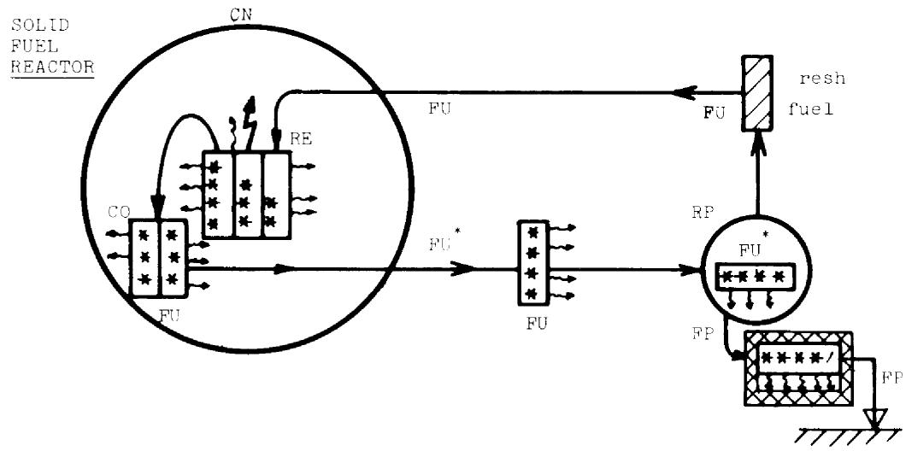

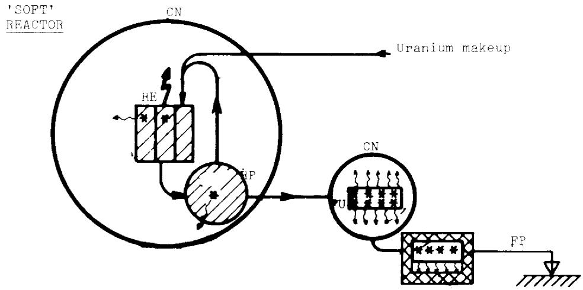

Fuel element

Fission products $(\mathbf{F} = \mathbf{P} =)$

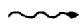

Decay heat

Power,

Criticality

RE = Reactor

RP = Reprocessing

FP = Fission Product

CN = Containment

FU = Fuel element

CO = Cooling of irradiated elements

This can occur in the following ways:

a) steam explosion,   
b) leakage of pipes,   
c) hydrogen burning,   
d) overpressure due to heating,   
e) melting of the core systems,   
f) loss of fluid giving overpower (for fast reactors).

It seems that in the reactor system proposed here almost all of these failure mechanisms (excluding the leakage of pipes) could be fully eliminated. The safety is thus significantly improved.

# 3. PRINCIPLES OF THE 'SOFT' REACTOR

# 3.1 A Schematic View

Of course there is no possible way to build a fission reactor in which the dangerous fission products are not produced at all, or in which they could be fully destroyed (by transformation) in situ. Therefore the only possibility is to shift in time and space:

a) fissionable fuel as a critical source and generator of power - both being controllable,   
b) fission products as a source of radioactivity and source of decay heat, both of which cannot be controlled.

Figure 3.1 shows this principle.

# 3.2 System Description

For the sake of simplicity, and by no means as an optimised system the reactor characteristics can be summarised as follows: (Table 3.1 and Fig. 3.2)

- fast converter reactor: internal breeding ratio of $\geq 1$ ; includes a continuously operating reprocessing plant,   
- thermal power : 3GW

SCHEME OF

SOFT-REACTOR

3 GW(tH)

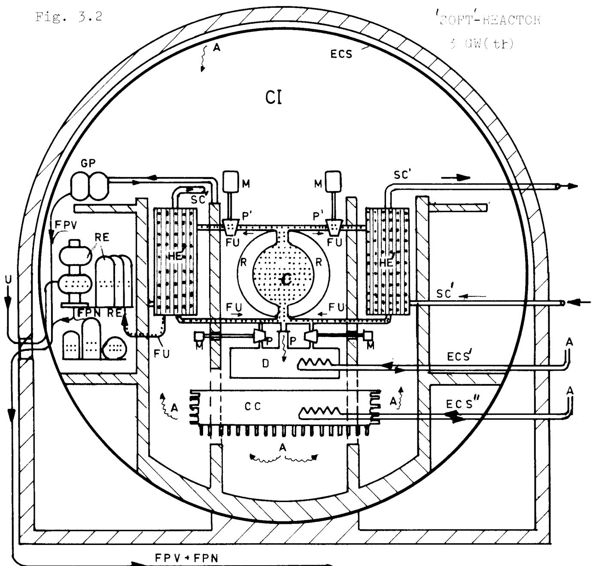  
Fig. 3.2

CT = Containment diameter, ${}^{100}\mathrm{\;m}$

C = Core, 75 m³

R = Herfcetor, 167

D = Dumping tank, 200 m³

CC = Core+easeher, 800 m² (2000 t)

HR' = Heat exchanger, 750 MW (th) x 4

HE $\mathbf{\Pi}^{\prime \prime} =$ Heat exchanger, 50 MW (th)

SC' = Secondary coolant, 3000 MW (th)

SC" = Secondary coolant , 50 MW

ECS' = Emergency cooling system, 20 MW (tWh)

ECS $\pmb{\mathcal{U}} =$ Emergency cooling system,20 MW (tB)

ECS = Emergency cooling system, ${}^{\mathrm{a}}/\mathrm{{Mw}}$

RE = Reprocessing plant

GP = Gas Purging system (Hollow)

FPV = Fission products, volatile

FPN = Fission products, nonvolatile

U = Uranium make-up

FU = Fuel

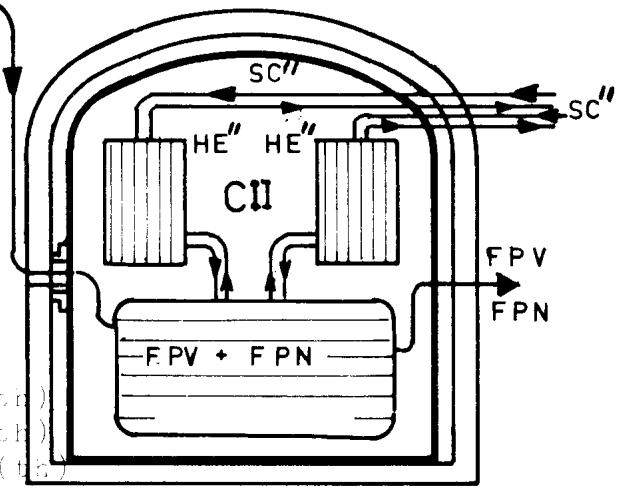

A = Air-cooling

M = Motor

P = P u n p for fuel

p = Auxillary pump

Table 3.1 A Short Description of the SOFT Reactor   

<table><tr><td></td><td>Unit</td><td>Value</td></tr><tr><td colspan="3">Reactor</td></tr><tr><td>Type of reactor</td><td>-</td><td>fast</td></tr><tr><td>Type of fuel</td><td>-</td><td>molten salt</td></tr><tr><td>Type of cooling</td><td>-</td><td>external cooling</td></tr><tr><td>Power - total</td><td>GW(th)</td><td>3</td></tr><tr><td>- electrical gross</td><td>GW(e)</td><td>1.2</td></tr><tr><td>- efficiency</td><td>%</td><td>40</td></tr></table>

Fuel   

<table><tr><td>- composition</td><td></td><td>1 PuCl3·8 UCl3·10 NaCl</td></tr><tr><td>- density</td><td>kg/liter</td><td>~3.3</td></tr><tr><td>- total mass</td><td>kg</td><td>247200</td></tr><tr><td>- mass plutonium fissile</td><td>w% fuel;kg</td><td>5.18w%;12800</td></tr><tr><td>- mass plutonium total</td><td>w% fuel;kg</td><td>6.48w%;~16020</td></tr><tr><td>- outlet temperature</td><td>°C</td><td>650</td></tr><tr><td>- temperature, inlet</td><td>°C</td><td>470ΔT=180</td></tr><tr><td>- specific heat of fuel core</td><td>GW(th)/K</td><td>0.188</td></tr><tr><td>- volume flow through core</td><td>m3/s</td><td>6.65</td></tr><tr><td>- specific power</td><td>kW/kg</td><td>12.14</td></tr><tr><td>- total mass (in core + heat exch)</td><td>kg</td><td>353 000</td></tr><tr><td>- total volume (in core + heat exch)</td><td>m3</td><td>107</td></tr><tr><td>- breeding ratio</td><td>BR</td><td>~1.04</td></tr></table>

<table><tr><td></td><td>Unit</td><td>Value</td></tr><tr><td colspan="3">Core</td></tr><tr><td>- geometry</td><td>-</td><td>spherical</td></tr><tr><td>- radius</td><td>m</td><td>2.616</td></tr><tr><td>- volume</td><td>m3</td><td>74.99</td></tr><tr><td>- specific power</td><td>kW/liter</td><td>40.00</td></tr><tr><td>- dwell time in core</td><td>s</td><td>~11.3</td></tr><tr><td>- dwell time ex-core</td><td>s</td><td>4.8</td></tr><tr><td>- total circulation time</td><td>s</td><td>16.1</td></tr><tr><td>- neutron flux</td><td>n/cm2s</td><td>5x1015</td></tr><tr><td colspan="3">Coolant System</td></tr><tr><td>- primary heat exchanger</td><td>number</td><td>4</td></tr><tr><td>- secondary coolant</td><td>-</td><td>molten chlorides</td></tr><tr><td>- amount of fuel ex-core</td><td></td><td></td></tr><tr><td>- volume (Fig.6.1 page 48)</td><td>m3</td><td>~32</td></tr><tr><td>- mass</td><td>kg</td><td>106 000</td></tr><tr><td>- volume flow in core</td><td>m3/s</td><td>6.65</td></tr><tr><td>- mass flow in core</td><td>kg/s</td><td>21 950</td></tr><tr><td>- dwelling time in-core</td><td>s</td><td>11.3</td></tr><tr><td>- dwelling time ex-core</td><td>s</td><td>4.8</td></tr><tr><td>- total recirculation time</td><td>s</td><td>16.1</td></tr><tr><td>- amount of coolant</td><td></td><td></td></tr><tr><td>- specific heat</td><td>kJ/liter.K</td><td>1.85</td></tr><tr><td>- density</td><td>kg/liter</td><td>1.85</td></tr><tr><td colspan="3">Reprocessing</td></tr><tr><td>- total amount of fuel in system</td><td>kg</td><td>353 000</td></tr><tr><td>- total amount of plutonium</td><td>kg</td><td>22 874</td></tr><tr><td>- total amount of plutonium</td><td>moles</td><td>~95 000</td></tr></table>

- thermal power : 3 cW,   
- fuel : molten chlorides : 1 $\mathrm{PuCl}_{3} \cdot 8 \mathrm{UCl}_{3} \cdot 10 \mathrm{NaCl}$ ,   
- the reactor is cooled externally. This means that part of the molten fuel is pumped out of the core through a heat exchanger,   
- the specific power in normal operation is very low $40 \mathrm{~kW}$ /liter of fuel in the core,   
- fuel is at a rather low temperature of $650^{\circ} \mathrm{C}$ ,   
- the internal heat sink is very high: the fuel itself has a heat capacity of approx 80 GJ(th) per $300\mathrm{K}$ temperature increase.

The negative properties of 'SOFT'

- large plutonium inventory: 22.8 tons, in no way optimized   
- low specific power per unit of fissile material,   
- a new and unexplored reactor type,   
serious corrosion problems.

# 3.3 Mass Flows and Containments

This kind of reactor is characterised by the existence of three separate mass flows (see Fig. 3.3):

- the flow of the molten fuel through the external heat exchangers (approx $6.65 \, \text{m}^3/\text{s}$ ).   
The ratio of the dwell time outside and in the core is $4.8 \, \text{s} / 11.3 \, \text{s} = 0.42$   
- the flow of molten salt through chemical reprocessing is 0.25 liter/s. The ratio of the dwell times in the reprocessing plant (5 day cycle) and in the core is $2.4 \, \text{hr} / 5 \times 24 \, \text{hr.} = 0.02$

The fission products of concern in the case of an accidental release can be removed by continuous gas purging with helium in the core.

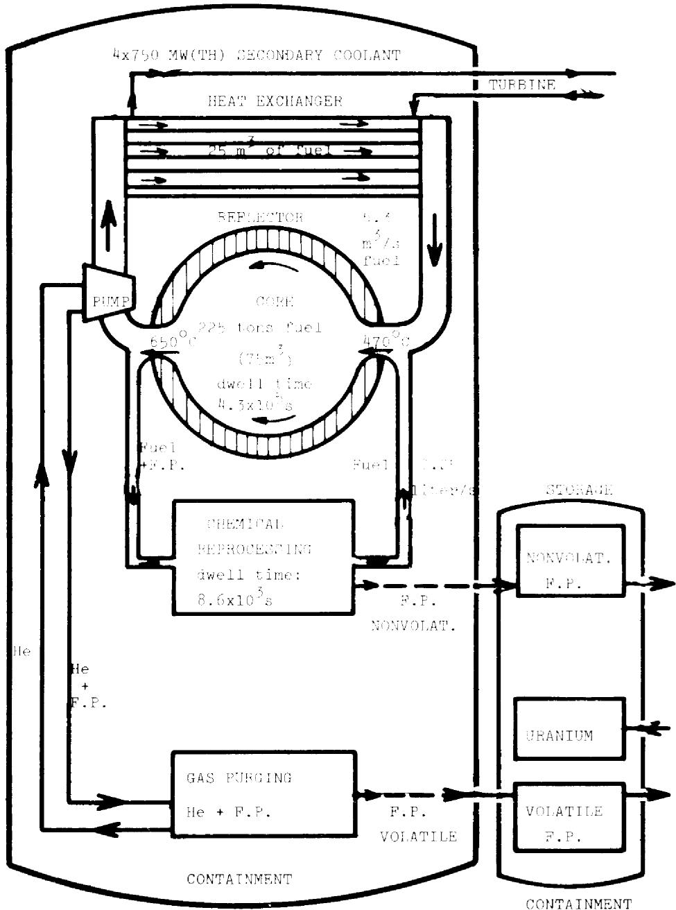  
Fig. 3.3   
MASS FLOW IN "SOFT"

Table 4.1 Neutron Balance of 'SOFT' Reactor   

<table><tr><td rowspan="2">Nuclide</td><td colspan="3">Core</td><td>Reflector</td><td colspan="3">Total</td></tr><tr><td>Product</td><td>Fission</td><td>Capture</td><td>Capture</td><td>Product</td><td>Fission</td><td>Capture</td></tr><tr><td>U235</td><td>0.046</td><td>0.019</td><td>0.005</td><td>0</td><td>0.046</td><td>0.019</td><td>0.005</td></tr><tr><td>Pu239</td><td>0.713</td><td>0.242</td><td>0.052</td><td>0</td><td>0.713</td><td>0.242</td><td>0.052</td></tr><tr><td>U238</td><td>0.140</td><td>0.051</td><td>0.350</td><td>0</td><td>0.140</td><td>0.051</td><td>0.350</td></tr><tr><td>Pu240</td><td>0.021</td><td>0.007</td><td>0.009</td><td>0</td><td>0.021</td><td>0.007</td><td>0.009</td></tr><tr><td>C</td><td>0</td><td>0</td><td>0</td><td>0</td><td>0</td><td>0</td><td>0</td></tr><tr><td>Na</td><td>0</td><td>0</td><td>0.002</td><td>0.001</td><td>0</td><td>0</td><td>0.003</td></tr><tr><td>Fe</td><td>0</td><td>0</td><td>0</td><td>0.042</td><td>0</td><td>0</td><td>0.042</td></tr><tr><td>Pu241</td><td>0.065</td><td>0.022</td><td>0.004</td><td>0</td><td>0.065</td><td>0.022</td><td>0.004</td></tr><tr><td>Pu242</td><td>0.015</td><td>0.005</td><td>0.005</td><td>0</td><td>0.015</td><td>0.005</td><td>0.005</td></tr><tr><td>F.P.</td><td>0</td><td>0</td><td>0.001</td><td>0</td><td>0</td><td>0</td><td>0.001</td></tr><tr><td>Ko</td><td>0</td><td>0</td><td>0</td><td>0</td><td>0</td><td>0</td><td>0</td></tr><tr><td>B10</td><td>0</td><td>0</td><td>0</td><td>0</td><td>0</td><td>0</td><td>0</td></tr><tr><td>K</td><td>0</td><td>0</td><td>0</td><td>0</td><td>0</td><td>0</td><td>0</td></tr><tr><td>Ca</td><td>0</td><td>0</td><td>0</td><td>0.000</td><td>0</td><td>0</td><td>0</td></tr><tr><td>Cl</td><td>0</td><td>0</td><td>0.105</td><td>0.054</td><td>0</td><td>0</td><td>0</td></tr><tr><td>Total</td><td>1.000</td><td>0.346</td><td>0.533</td><td>0.097</td><td>1.000</td><td>0.346</td><td>0.630</td></tr></table>

# 4. NUCLEAR CALCULATIONS

# 4.1 The Method

The calculations were based on the British 2240 group nuclear data library FGL5. Twenty group cross-sections for each reactor zone were derived from FGL5 using the associated cell code MURALB.

The reactor geometry was represented by a spherical model with one core zone and a reflector zone. Transport calculations were performed in the discrete ordinate $(\mathbf{S}^{\#})$ approximation by the ANISN code to obtain the physical properties of the critical reactor. The effective delayed neutron fraction was derived from basic ENDF-B-IV data using proper flux and adjoint flux weighting and an appropriate reduction of the delayed neutron yields due to precursor losses.

The main results of the physics calculations can be summarised as:

critical radius 2.616 m average neutron flux $5 \times 10^{15} \mathrm{~n/cm}^2$ s temperature criticality coefficient 0.018% /K (see also Table 4.1 and Table 4.2)

Effect of doppler contribution not calculated but according to ref. 9 is very small

Table 4.2 Calculated One Group Cross Sections   

<table><tr><td colspan="2">Nuclide</td><td>Concentration (1024cm-3)</td><td>γσf(barn)</td><td>σf(barn)</td></tr><tr><td rowspan="15">CORE</td><td>U235</td><td>0.31 - 4</td><td>4.109</td><td>2.082</td></tr><tr><td>Pu239</td><td>4.04 - 4</td><td>4.919</td><td>2.032</td></tr><tr><td>U238</td><td>42.75 - 4</td><td>0.916 - 1</td><td>0.262</td></tr><tr><td>Pu240</td><td>0.54 - 4</td><td>1.066</td><td>0.801</td></tr><tr><td>C</td><td>1.0 - 18</td><td>0</td><td>0.470 - 4</td></tr><tr><td>Na</td><td>53.83 - 4</td><td>0</td><td>0.885 - 3</td></tr><tr><td>Fe</td><td>1.0 - 18</td><td>0</td><td>0.996 - 2</td></tr><tr><td>Pu241</td><td>0.27 - 4</td><td>6.763</td><td>2.736</td></tr><tr><td>Pu242</td><td>0.54 - 4</td><td>0.791</td><td>0.524</td></tr><tr><td>F.P.</td><td>0.11 - 4</td><td>0</td><td>0.191</td></tr><tr><td>Mo</td><td>1.0 - 18</td><td>0</td><td>0.115</td></tr><tr><td>B10</td><td>1.0 - 18</td><td>0</td><td>2.146</td></tr><tr><td>K</td><td>1.0 - 18</td><td>0</td><td>0.172 - 1</td></tr><tr><td>Ca</td><td>1.0 - 18</td><td>0</td><td>0.237 - 3</td></tr><tr><td>Cl</td><td>199.39 - 4</td><td>0</td><td>0.147 - 1</td></tr><tr><td rowspan="15">REFLECTOR</td><td>U235</td><td>1.0 - 18</td><td>10.403</td><td>6.154</td></tr><tr><td>Pu239</td><td>1.0 - 18</td><td>11.597</td><td>6.595</td></tr><tr><td>U238&#x27;</td><td>1.0 - 18</td><td>0.123 - 1</td><td>2.541</td></tr><tr><td>Pu240</td><td>1.0 - 18</td><td>0.576</td><td>4.076</td></tr><tr><td>C</td><td>1.0 - 18</td><td>0</td><td>0.120 - 4</td></tr><tr><td>Na</td><td>33.65 - 4</td><td>0</td><td>0.287 - 2</td></tr><tr><td>Fe</td><td>420.60 - 4</td><td>0</td><td>0.136 - 1</td></tr><tr><td>Pu241</td><td>1.0 - 18</td><td>24.676</td><td>10.920</td></tr><tr><td>Pu242</td><td>1.0 - 18</td><td>0.261</td><td>2.384</td></tr><tr><td>FP</td><td>1.0 - 18</td><td>0</td><td>1.009</td></tr><tr><td>Mo</td><td>1.0 - 18</td><td>0</td><td>0.644</td></tr><tr><td>B10</td><td>1.0 - 18</td><td>0</td><td>9.301</td></tr><tr><td>K</td><td>1.0 - 18</td><td>0</td><td>0.245 - 1</td></tr><tr><td>Ca</td><td>33.65 - 4</td><td>0</td><td>0.865 - 3</td></tr><tr><td>Cl</td><td>100.9 - 4</td><td>0</td><td>0.736 - 1</td></tr></table>

# 4.2 Nuclear Properties of SOFT

The loss of neutrons due to the use of natural chlorine are $10\%$ which is significantly high but far from being prohibitive. (Ref. 8, 10, 16, 20, 21).

# 5. CONTINUOUS EXTRACTION OF FISSION PRODUCTS

# 5.1 General Scheme

The general idea of this reactor type is the differentiation of the chemical properties of the fission products in the molten chloride medium. (Ref. 10, 16).

The rough scheme is given in Fig. 5.1.

# 5.2 Chemical State of Fission Products in Molten Chlorides

It is important to know the chemical state of the fission products. The fission reaction of $\mathrm{PuCl}_3$ can be written as follows (El = fission product element) (index 0 for elementary state)

$$
1 \mathrm {P u C l} _ {3} \xrightarrow {\text {f i s s i o n}} 3 / 2 \mathrm {E l} \cdot \mathrm {C l} _ {2} + 1 / 2 \mathrm {E l} _ {0}
$$

Cumulated Cl-demand is calculated from individual fission product yields (Y) for fast fission of $^{239}\mathrm{Pu}$ irradiated for 10 days and product stoichiometry starting with the most stable chloride product being formed. Where necessary (i.e. where one fission product will form several chlorides of comparable stability) a weighted mean was calculated based on the Gibbs free energies at 1000 K. (see also Ref. 6, 17, 22)

Table 5.1 fives the cumulated chlorine demand of the fission products forming stable chlorides at $1000\mathrm{K}$ (100% is set equal to the number of fission events - total Cl supply therefore equals 300%). Because of the apparent lack of free chlorine

FiE. 5.1

SIMPLIFIED FLOW OF FISSION PRODUCTS

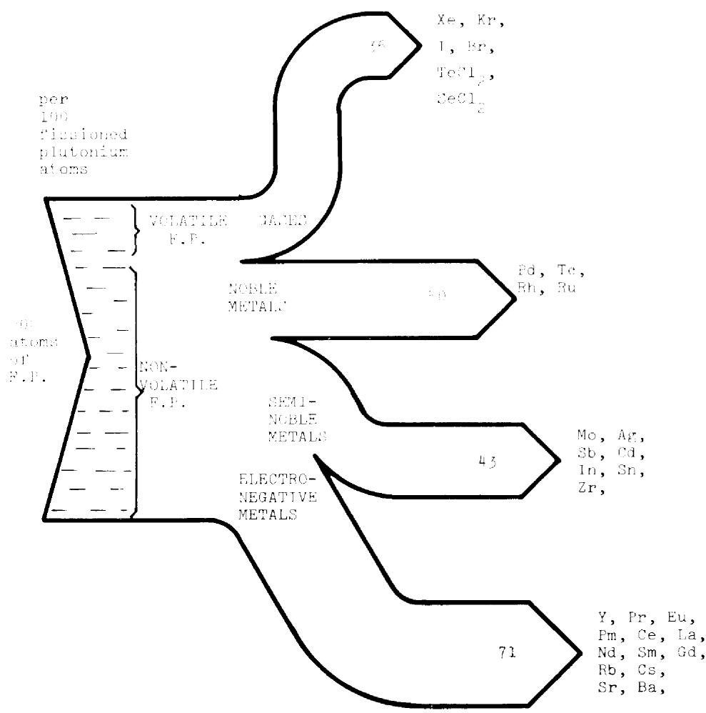

Table 5.1   
Cumulated Cl-Demand of Fission Products forming stable chlorides at 1000 K   

<table><tr><td></td><td>Compound</td><td>Yield (%)</td><td>Chlorine demand (%)</td><td>Cumulative chlorine demand (%)</td></tr><tr><td rowspan="10">most stable</td><td>BaCl2</td><td>9.502</td><td>19.004</td><td>19.00</td></tr><tr><td>RbCl</td><td>1.050</td><td>1.050</td><td>20.05</td></tr><tr><td>CsCl</td><td>13.355</td><td>13.355</td><td>33.41</td></tr><tr><td>SrCl2</td><td>5.487</td><td>10.974</td><td>44.38</td></tr><tr><td>SmCl2</td><td>3.737</td><td>7.474</td><td>51.86</td></tr><tr><td>LaCl3</td><td>5.794</td><td>17.382</td><td>69.24</td></tr><tr><td>CeCl3</td><td>13.986</td><td>41.958</td><td>111.20</td></tr><tr><td>PrCl3</td><td>4.278</td><td>12.834</td><td>124.03</td></tr><tr><td>NdCl3</td><td>11.870</td><td>35.61</td><td>159.64</td></tr><tr><td>YCl3</td><td>3.028</td><td>9.084</td><td>168.73</td></tr><tr><td rowspan="12">least stable</td><td>ZrCl2.6*</td><td>21.520</td><td>63.05</td><td>231.78</td></tr><tr><td>InCl1.3*</td><td>0.060</td><td>0.078</td><td>231.85</td></tr><tr><td>CdCl2</td><td>0.661</td><td>1.322</td><td>233.18</td></tr><tr><td>SnCl2</td><td>0.324</td><td>0.648</td><td>233.82</td></tr><tr><td>SbCl3</td><td>0.674</td><td>2.032</td><td>235.86</td></tr><tr><td>AgCl</td><td>1.880</td><td>1.880</td><td>237.74</td></tr><tr><td>SeCl</td><td>0.088</td><td>0.088</td><td>237.75</td></tr><tr><td>TeCl2</td><td>7.654</td><td>15.308</td><td>253.06</td></tr><tr><td>NbCl5</td><td>0.289</td><td>1.445</td><td>254.51</td></tr><tr><td>MoCl2.9*</td><td>18.16</td><td>34</td><td>288.51</td></tr><tr><td>PdCl2</td><td>12.66</td><td>8.8</td><td>297.31</td></tr><tr><td>TeCl2</td><td>4.01</td><td>2.7</td><td>300.00</td></tr></table>

* weighted mean

1000 = Gibbs free energy at 1000 K

only $65\%$ of the molybdenum and only $35\%$ of the palladium and technetium being produced in the fission process will form chlorides. These cations cannot form stable iodides at 1000 K (their respective $\Delta G_{f}^{0}$ being in the range from +48.5 kJ mol Cl to 67.4 kJ mol Cl (Fig. 5.2) and will probably be present in metallic form.

# 5.3 Fission Product Volatility and Gaseous Extraction

Table 5.2 gives the melting and boiling points of the fission product chlorides and the fuel components. (Ref. 22)

The chemical species in the system discussed here can be divided into 3 groups :

- those that have melting points of 1000K are likely to solidify under normal operating conditions (e.g. semi-noble metals),   
- those which have a boiling point 1000 K (or 1500 K) will evaporate under normal operating conditions (in case of accidental use in temperature) and will have to be removed from the reactor altogether with other gaseous products (i.e. Xe, Kr, I₂ and He as an inert carrier gas). This will necessitate the installation of appropriate equipment to extract these compounds from the purge gas before it is released to the environment,   
- all other chemical species.

The volatile fission products Xe, Kr, I, Te and Sb are of primary concern because they would be almost completely released in a core accident. The ten radionuclides that contribute the most ( 92% of the total) of the external dose to the bone marrow from a passing cloud (see Fig. 5.3.) were

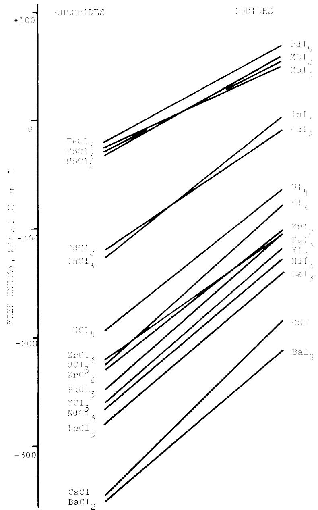  
Fig. 5.2 FREE ENERGY OF FORMATION OF IODIDES AND CHLORIDEG

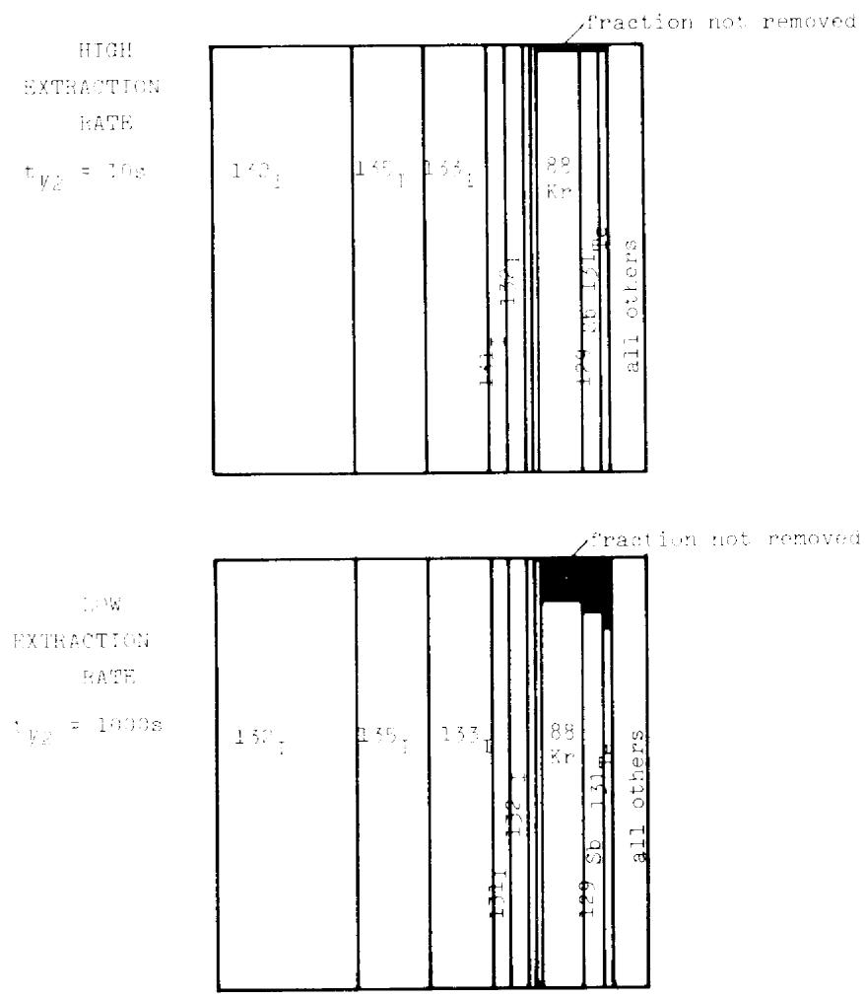  
Fig. 5.3 RADIATION DOSE FROM A PASSING CLOUD BY CONTINUOUS EXTRACTION OF VOLATILE HANTINUCIDES

Melting- and Boiling-Point of Fission-Product-Chlorides at Standard Pressure.

Table 5.2   

<table><tr><td>Compound</td><td>Melting point (K)</td><td>Boiling point (K)</td><td>Reference</td></tr><tr><td>SeCl4</td><td></td><td>403</td><td>3</td></tr><tr><td>SeCl4</td><td>469</td><td>Diss</td><td>3</td></tr><tr><td>RbCl</td><td>990</td><td>1654</td><td>3</td></tr><tr><td>SrCl2</td><td>1145</td><td>2300</td><td>3</td></tr><tr><td>YCl3</td><td>973</td><td>1725</td><td>3</td></tr><tr><td>ZrCl2</td><td>1000</td><td>1660</td><td>3</td></tr><tr><td>ZrCl3</td><td>900</td><td>1480</td><td>3</td></tr><tr><td>ZrCl4</td><td></td><td>604</td><td>3</td></tr><tr><td>NbCl5</td><td>478 - 480</td><td>489.6</td><td>6</td></tr><tr><td>MoCl2</td><td></td><td>Diss.</td><td>3</td></tr><tr><td>MoCl5</td><td>467</td><td>541</td><td>6</td></tr><tr><td>MoCl4</td><td>590</td><td></td><td>6</td></tr><tr><td>MoCl3</td><td></td><td>Diss.</td><td>3</td></tr><tr><td>MoCl6</td><td>580</td><td>630</td><td>3</td></tr><tr><td>TeCl3</td><td>1220</td><td>1475</td><td>3</td></tr><tr><td>RuCl3</td><td>900</td><td>Diss.</td><td>3</td></tr><tr><td>RhCl</td><td>1000</td><td>1238 Diss.</td><td>3</td></tr><tr><td>RhCl2</td><td>1050</td><td>1231 Diss.</td><td>3</td></tr><tr><td>PdCl2</td><td>951</td><td>1300</td><td>3</td></tr><tr><td>AgCl</td><td>728</td><td>1837</td><td>3</td></tr><tr><td>CdCl2</td><td>841</td><td>1248</td><td>3</td></tr><tr><td>InCl</td><td>498</td><td>881</td><td>3</td></tr><tr><td>InCl2</td><td>508</td><td>758</td><td>3</td></tr><tr><td>InCl3</td><td></td><td>771</td><td>3</td></tr><tr><td>SnCl2</td><td>520</td><td>925</td><td>3</td></tr><tr><td>SnCl4</td><td></td><td>386</td><td>3</td></tr><tr><td>SbCl3</td><td>346.4</td><td>492</td><td>3</td></tr><tr><td>SbCl5</td><td></td><td>445</td><td>3</td></tr></table>

<table><tr><td></td><td>Melting point(K)</td><td>Boiling point(K)</td><td>Reference</td></tr><tr><td>TeCl2</td><td>448</td><td>595</td><td>3</td></tr><tr><td>TeCl4</td><td>497.3</td><td>665</td><td>3</td></tr><tr><td>CsCl</td><td>918</td><td>1573</td><td>3</td></tr><tr><td>BaCl2</td><td>1198(α) 1235 (β)</td><td>2100</td><td>3</td></tr><tr><td>LaCl3</td><td>1125</td><td>2020</td><td>3</td></tr><tr><td>CeCl3</td><td>1085</td><td>2000</td><td>3</td></tr><tr><td>PrCl3</td><td>1049</td><td>1980</td><td>3</td></tr><tr><td>NdCl3</td><td>1033</td><td>1960</td><td>3</td></tr><tr><td>SmCl2</td><td>1013</td><td>1700</td><td></td></tr><tr><td>SmCl3</td><td>951</td><td>1830</td><td>3</td></tr><tr><td>UCl3</td><td>1108</td><td>2000</td><td>3</td></tr><tr><td>UCl4</td><td>863</td><td>1060</td><td>3</td></tr><tr><td>UCl5</td><td>560</td><td>690</td><td>3</td></tr><tr><td>UCl6</td><td>452</td><td>550</td><td>3</td></tr><tr><td>PuCl3</td><td>1033</td><td>2040</td><td>3</td></tr><tr><td>PuCl4</td><td>730</td><td>1060</td><td>3</td></tr><tr><td>NaCl</td><td>1074</td><td>1686</td><td>3</td></tr></table>

chosen to study the effectiveness of gaseous extraction.

The extraction rate will be characterised by a rate constant $K_{\text{ext}}$ which will depend on the physical and chemical properties of the volatile, the salt melt and design parameters such as gas throughput. For simplicity sake the same rate constant is used in the calculations for all the radionuclides that are studied.

As an example the following simplified scheme is used to calculate the $^{88}\mathrm{Kr}$ and $^{129}\mathrm{Sb}$ inventory:

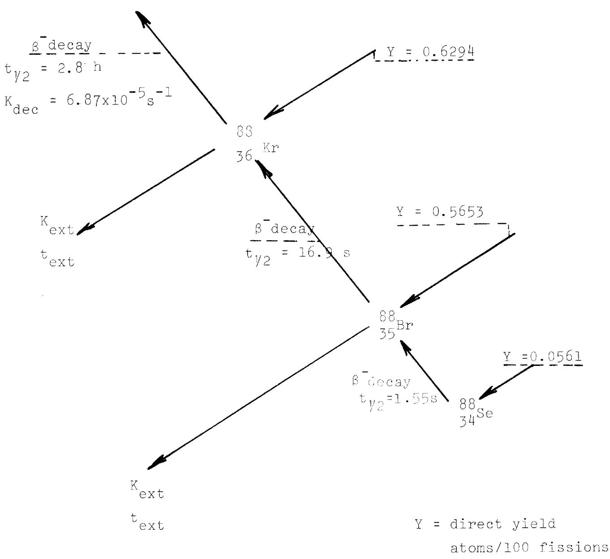

The halfflives of $\frac{88}{35}$ Br and $\frac{88}{34}$ Se are so short that they will decay to $\frac{88}{36}$ Kr before they can be removed from the reactor. The rate of production of $\frac{88}{36}$ Kr is therefore equal to the sum of the direct yields of $\frac{88}{36}$ Kr and $\frac{88}{35}$ Br and $\frac{88}{34}$ Se. These direct yields were calculated as the product of the values given in ref. 4 and represent the number of nuclei formed by fast fission of 100 atoms of $\frac{239}{\text{Pu}}$ directly before any radioactive decay has taken place.

Similarly the rate at which $\frac{88}{36} \mathrm{Kr}$ is disappearing is characterised by the sum of the respective rate constants for radioactive $\beta$ -decay and extraction, where the half-life is given by $t_{\gamma 2} = \frac{\ln 2}{K}$

Thus the change in $\frac{88}{36}$ Kr inventory ( $\frac{88}{Kr}$ ) is given by:

$$
\frac {d \left(^ {8 8} K r\right)}{d t} = V \cdot F \cdot \left[ Y + D - K _ {\text {d e c}} \left(^ {8 8} K r\right) - K _ {\text {e x t}} \left(^ {8 8} K r\right) \right]
$$

where $V$ is the reactor volume ( $m^3$ ), $F$ the fission rate (fission/s), $Y$ the direct yield (atoms/fission), $D$ the decay rate of its precursors and ( $^{88}\mathrm{Kr}$ ) is the concentration of $^{88}\mathrm{Kr}$ exposed, in units such as ( $10^{20}\mathrm{atom/cm^3}$ ) or ( $\mathrm{mol/m^3}$ ).

During steady state operation the inventory will remain constant i.e. as many radionuclides are removed from the reactor as are produced in any given time. The equation above can therefore be solved if we assume a value for $K_{\text{ext}}$ the only parameter not given by nature.

Arbitrarily setting the product:

(reactor volume) x (fission rate) = 1

i.e. putting the above equation in a dimensionless form we get

<table><tr><td>\( {\mathrm{t}}_{1/2}{}^{\text{ext }}\left( \mathrm{s}\right) \)</td><td>\( {\mathrm{K}}_{\text{ext }}\left( {\mathrm{s}}^{-1}\right) \)</td><td>\( {}^{\left( {88}\right) }{}_{\mathrm{{Kr}}} \) )</td></tr><tr><td>10</td><td>\( {6.93} \times  {10}^{-2} \)</td><td>\( {1.81} \times  {10}^{-1} \)</td></tr><tr><td>1000</td><td>\( {6.93} \times  {10}^{-4} \)</td><td>\( {1.65} \times  {10}^{-1} \)</td></tr><tr><td>100000</td><td>\( {6.93} \times  {10}^{-5} \)</td><td>\( {9.03} \times  {10}^{1} \)</td></tr><tr><td>∞</td><td>0</td><td>\( {1.81} \times  {10}^{2} \)</td></tr></table>

Similar calculations were made for other extractable nuclides.

The extraction rate cannot be very high not only because of the physical and chemical constraints and the prohibitive amount of helium bubbles in the fuel (effecting the criticality due to changes in total and local bubble volumes) but also because of the problem of the precursors of the delayed neutrons.

# 5.4 Problem of Delayed Neutron Emitters

A significant proportion of the delayed neutron precursors are the volatile fission products. Delayed neutron emitters will be removed along with other volatile fission products by means of gas purging. The nuclides of interest and their respective half lives are approximately as follows :(see Ref.9)

<table><tr><td>Nuclide</td><td>Neutrons/fission x 100</td><td>Half life (s)</td></tr><tr><td>\( ^{87}_{\text{Br}} \)</td><td>0.024</td><td>54.5</td></tr><tr><td>\( ^{137}_{\text{I}} \)</td><td>0.176</td><td>24.4</td></tr><tr><td>\( ^{88}_{\text{Br}} \)</td><td></td><td>16.3</td></tr><tr><td>\( ^{138}_{\text{I}} \)</td><td>0.136</td><td>6.3</td></tr><tr><td>\( ^{89}_{\text{Br}} \)</td><td>0.207</td><td>4.4</td></tr><tr><td>\( ^{139}_{\text{I}} \)</td><td></td><td>2.0</td></tr><tr><td>\( ^{90}_{\text{Br}} \)</td><td>0.087</td><td>1.6</td></tr><tr><td>Total</td><td>0.630</td><td></td></tr></table>

138 I and 139 I have no precursors. 137 I and its short-lived precursor 137 Te $(t_{\gamma_2} = 3.5$ s)

The effect of gaseous extraction upon delayed neutron emitters inventory can be calculated roughly by the same method used in section 5.4 to calculate the degree of extraction of the other volatile F.P. The results of these calculations are presented in Fig. 5.4 and Fig. 5.5. (Ref.17)

Delayed neutrons will also be lost in the heat exchanger as the salt melt is pumped through this loop. The salt melt will remain an average of 11.3 s in the core and 4.8 s in the external heat exchanger circuit. During these 5 s the number of radio-nuclides is reduced by a factor of 2 exp $(-5\mathrm{s} / \mathrm{t}_{\frac{1}{2}})$ thus total loss due to $\beta$ decay in the heat exchanger circuit is:

$$
Y \cdot (1 - X _ {\text {e x t}}) \cdot \frac {4 . 8}{1 6 . 1} \cdot (1 - 2 \exp \left(\frac {- 4 . 8 \mathrm {s}}{t _ {1 / 2}}\right))
$$

With a time constant of extraction $t_{\text{ext}}$ arbitrarily chosen as $10^{2}$ s the following results can be obtained:

<table><tr><td>Radio-nuclide</td><td>Relative yield (normalised to Σ = 1)</td><td>Loss due to β-decay in external heat exchanger</td><td>Loss due to extraction</td><td>Total loss to yield ratio</td><td>&quot;Weighted&quot; losses</td></tr><tr><td>87Br</td><td>0.129</td><td>0.313</td><td>0.187</td><td>0.500</td><td>0.965</td></tr><tr><td>137I</td><td>0.499</td><td>0.289</td><td>0.076</td><td>0.365</td><td>0.182</td></tr><tr><td>88Br</td><td>0.120</td><td>0.269</td><td>0.046</td><td>0.315</td><td>0.038</td></tr><tr><td>138I</td><td>0.096</td><td>0.192</td><td>0.018</td><td>0.210</td><td>0.020</td></tr><tr><td>89Br</td><td>0.058</td><td>0.152</td><td>0.008</td><td>0.160</td><td>0.009</td></tr><tr><td>139I</td><td>0.080</td><td>0.059</td><td>0.001</td><td>0.060</td><td>0.005</td></tr><tr><td>90Br</td><td>0.028</td><td>0.038</td><td>0.000</td><td>0.038</td><td>0.001</td></tr><tr><td>Total</td><td>1.000</td><td>0.250</td><td>0.070</td><td></td><td>0.320</td></tr></table>

These losses of 0.32 are significant but not prohibitive.

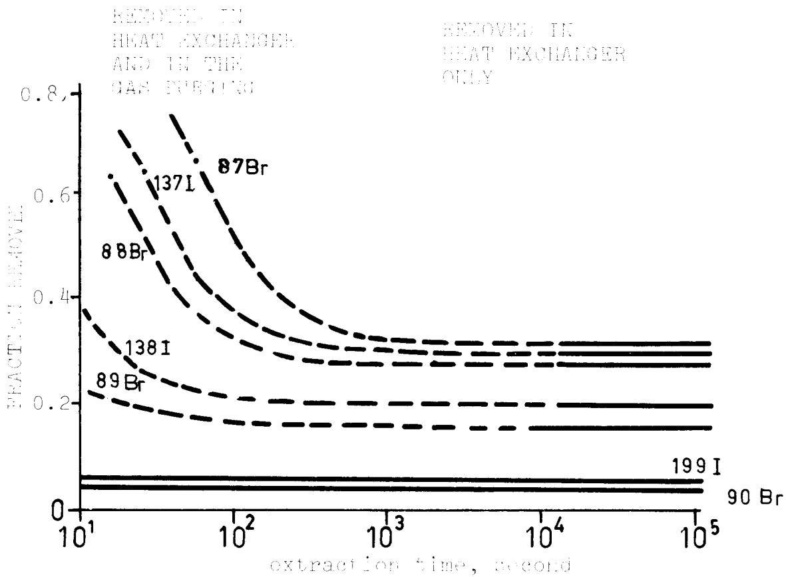  
制取OVA-10F-FEELA111=NEKINON-10F-NTERIS  
Fig. 5.4

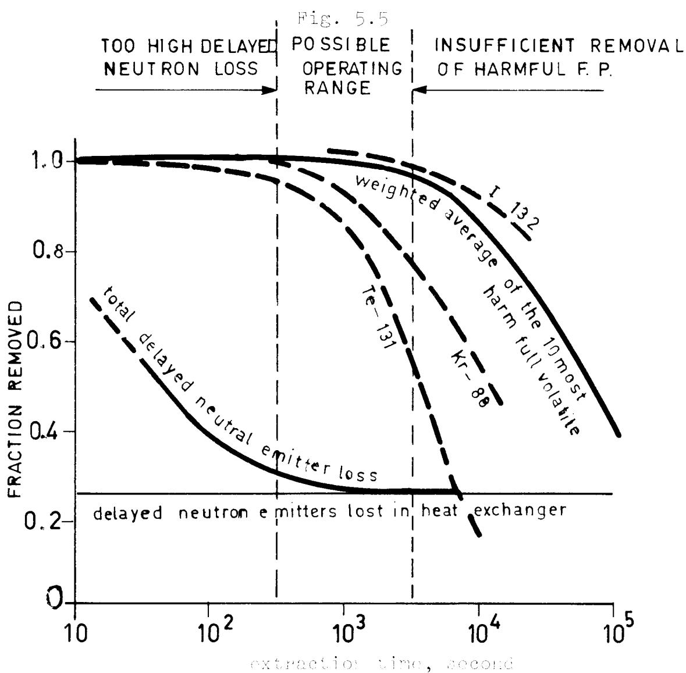

# 5.5 Gas Extraction Rate

In a 3 GW(th) reactor $9.3 \times 10^{19}$ fission/s occur producing $3.09 \times 10^{-4} \mathrm{~mol} / \mathrm{s}$ of fission products, $1 \times 10^{-4} \mathrm{~mol} / \mathrm{s}$ of which are volatile. The total volume of helium bubbles in the core should not exceed $0.1 \mathrm{~m}^{3}$ (less than $0.2\%$ of the total core volume) that is 5 moles of helium in order to minimise the rise in criticality due to loss of helium throughput.

If we assume the extraction process is limited only by diffusion (i.e. the volatiles are completely immiscible in the molten salt which is likely to be the case for Kr and Xe but hardly for $\mathrm{I}_2\mathrm{TeCl}_3$ and $\mathrm{SbCl}_3$ ) the extraction rate can be approximated from film theory. The model assumes that the gas in the bubble undergoes toroidal circulation.

As the gas circulates it encounters fresh liquid at the top of the bubble. As the bubble rises the liquid moves downward in relation to the bubble and leaves when it reaches the bottom of the bubble. The liquid near the interface is usually in laminar flow and the contact time is certainly short, thus the liquid behaves much like the liquid at the surface of a falling film. Therefore to a first approximation the average rate of mass transfer across the interface $(N_{A})_{avg}$ is: (Ref.2)

$$
\left(\mathrm {N} _ {\mathrm {A}}\right) _ {\text {a v g}} \quad = \frac {4 \theta_ {\mathrm {A B}}}{\pi \cdot t _ {\text {c o n t}}} \cdot {} ^ {\mathrm {C}} _ {\mathrm {A O}}
$$

in which $C_{Ao}$ is the concentration of volatile A in the salt melt, $\theta_{AB}$ its diffusion coefficient in the melt and $t_{cont}$ the contact time given approximately by $t_{cont} = \frac{D}{V_t}$ where $D$ is the bubble diameter and $V_t$ the terminal velocity.

During the normal operation of the reactor the volatiles produced in the fission process are removed as quickly as they are produced.

Therefore:

$$
F = S \cdot N \cdot (N _ {A}) _ {\text {a v g}}
$$

Where $F$ is the fission rate, $S$ the surface of 1 bubble and $N$ the number of bubbles in the core.

A uniform bubble diameter of $3\mathrm{mm}$ was assumed and $\theta_{\mathrm{AB}}$ calculated from the Stokes-Einstein equation. For a typical volatile molecule with a molecular weight of $\sim 30$ the value of $\theta_{\mathrm{AB}}$ is $\sim 2\mathrm{x}10^{-9}\mathrm{m}^2/\mathrm{s}$ . $C_{\mathrm{Ho}}$ thus equals $7\mathrm{x}10^{-6}\mathrm{mol}/\mathrm{m}^3$ equivalent to the production for 7 seconds. (Ref.2, 23)

This investigation shows that:

- gaseous extraction of volatile fission products would be an effective means of reducing the risk to the environment due to an accidental release of part of the reactor inventory in a MSFBR.   
- the extraction rates which would be necessary to achieve this should be attainable with a reasonably small throughput that should minimise any criticality change and allow a reasonable design of a gas purification system,   
- delayed neutron emitters are removed less than the volatiles that cause concern in the case of a core accident because they have few (or no) volatile precursors and are short-lived compared to the time constant of extraction.

# 5.6 Reprocessing of Non Volatile Fission Products.

The fission products experience the conditions in the molten chloride core of the reactor and are at $^{\circ}650^{\circ}\mathrm{C}$ and in the non-volatile form, e.g:

- dispersions of metallic particles (colloids?) Rh, Ru,   
solutions of molten chlorides:CsCl, $\mathrm{SrCl}_2$ RECl 3

They must be extracted from the irradiated fuel by means of chemical reprocessing, if possible continuously. A rough list of the different fission products which may be formed in the molten chloride reaction is given in Table 5.3.

Table 5.3 Extraction of Fission Products in 'SOFT'   

<table><tr><td>Element/ Isotope</td><td>Production of element (yield per 100 fissions)</td><td>Principle chemical species at 950 K</td><td>ΔG° of chloride at 1500 kJ/mol Cl</td><td>Tb at 1 bar (K)</td><td>Decontamination factor *</td></tr><tr><td>Sr 90</td><td>5.487</td><td>SrCl2(1)</td><td>-320</td><td>2300</td><td>100 R</td></tr><tr><td>Rb 86</td><td>1.050</td><td>RbCl (1)</td><td>-275</td><td>1654</td><td>3.3 R</td></tr><tr><td>Cs 134</td><td></td><td></td><td></td><td></td><td></td></tr><tr><td>Cs 137</td><td>13.355</td><td>CsCl (1)</td><td>-275</td><td>1573</td><td>125 R</td></tr><tr><td>La 140</td><td>5.794</td><td>LaCl3(1)</td><td>-255</td><td>2020</td><td>1.2 R</td></tr><tr><td>Ce 144</td><td>13.986</td><td>CeCl3(1)</td><td>-245</td><td>2000</td><td>20 R</td></tr><tr><td>Pr 143</td><td>4.287</td><td>PrCl3(1)</td><td>-245</td><td>1980</td><td>2.6 R</td></tr><tr><td>Y 90</td><td>3.028</td><td>YCl3(1)</td><td>-240</td><td>1725</td><td>1.3 R</td></tr><tr><td>Nd 147</td><td>11.870</td><td>NdCl3(1)</td><td>-235</td><td>1960</td><td>2.4 R</td></tr><tr><td>Sb 129</td><td>0.674</td><td>SbCl3(g)</td><td>-80</td><td>492</td><td>8.4 R</td></tr><tr><td>Te 131m</td><td></td><td></td><td></td><td></td><td></td></tr><tr><td>Te 132</td><td>7.654</td><td>TeCl2(g)</td><td>-62</td><td>595</td><td>6.1 G</td></tr><tr><td>Te 99m</td><td>4.010</td><td>TeCl2(1)</td><td>-12</td><td>1474</td><td>100 R</td></tr><tr><td>Ru 105</td><td>31.445</td><td>Ru met(s)</td><td>0</td><td>4170</td><td>1.0 R</td></tr><tr><td>Rh 105</td><td>1.736</td><td>Rh met(s)</td><td>0</td><td>4000</td><td>1.2 R</td></tr><tr><td>Xe 133</td><td></td><td></td><td></td><td></td><td></td></tr><tr><td>Xe 135</td><td>21.234</td><td>Xe (g)</td><td>0</td><td>166</td><td>500 G</td></tr><tr><td>I 131</td><td></td><td></td><td></td><td></td><td>500 G</td></tr><tr><td>I 132</td><td></td><td></td><td></td><td></td><td>100 G</td></tr><tr><td>I 133</td><td>6.177</td><td>I2(g)</td><td>0</td><td>457.5</td><td>500 G</td></tr><tr><td>I 134</td><td></td><td></td><td></td><td></td><td>100 G</td></tr><tr><td>I 135</td><td></td><td></td><td></td><td></td><td>100 G</td></tr><tr><td>Kr 88</td><td>0.942</td><td>Kr (g)</td><td>0</td><td>121</td><td>11 G</td></tr></table>

Remarks (1) liquid

(g) gaseous

* The "decontamination factor" is defined as the ratio of inventories without and with extraction.

The letters R and G refer to chemical reprocessing and gaseous extraction respectively

$\Delta G_{f}^{0} =$ free energy of formation at 1500 K in kJ/mol Cl

$\mathrm{T_b}$ = boiling point at 1 bar

# 5.7 Some Technological Problems

Apart from the fission products and corrosion products an important problem in this molten chlorides reactor is the removal of sulphur. In a flux of fast neutrons the following reaction takes place: (Ref. 8, 18, 20)

$$
\begin{array}{l l} \frac {3 5}{1 7} \mathrm {C l} (\mathrm {n}, \mathrm {p}) & \frac {3 5}{1 6} \mathrm {S} (\mathrm {t} _ {\mathrm {y} 2} = 8 8 \mathrm {d}) \end{array}
$$

This sulphur is obviously undesirable and makes the corrosion problems worse. The continuous chemical reprocessing can be used to remove the sulphur. Nevertheless a considerable problem remains regarding the resulting corrosion.

# 5.8 Possible Reprocessing Technologies

It is possible to separate the fission products from the molten fuel in various ways:

- extraction from molten chlorides by imiscible liquid metals. This is a well known technology developed especially for the molten salt breeder (Ref. 13)

- electrochemical dissolution of metallic uranium. The continuous feed of uranium (depleted or natural) in amounts of some gram/sec permits the removal of fission products which have a free energy of formation of chlorides of $\sim 1000\mathrm{K}$ which is smaller than that of $\mathrm{UCl}_3$ . This applies to a good proportion of the semi-noble F.P. (see Fig.5.1)

- the most attractive method is electrolysis in the molten chloride system. The following very simplified calculation explains this: The total amount of plutonium in the fuel is 96 000 moles. (see Table 3.1). The total amount of chlorides is $1.82 \times 10^{6}$ moles ( $\mathrm{PuCl}_{3}, \mathrm{UCl}_{3}, \mathrm{NaCl}$ ). For a five day reprocessing cycle (4.32x10 $^5$ s) the flow to the reprocessing plant is 4.21 mol/s.

Taking into account the electrolysis is at a voltage of 3 volts (see Fig. 5.5) and the efficiency is 0.5 then the power needed for the electrolysis is:

Fig. 5.5   
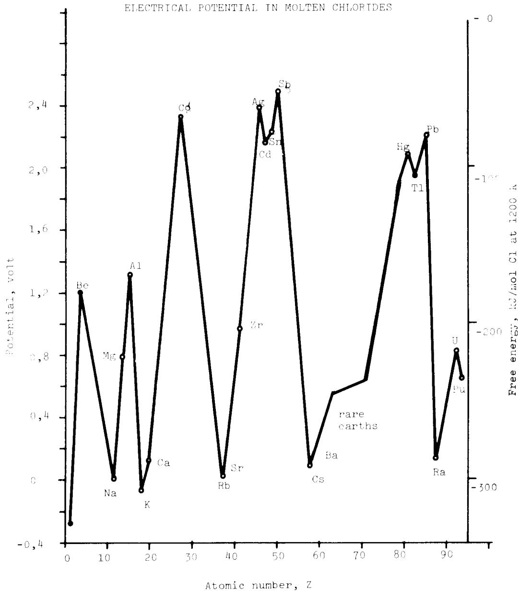  
Fig. 5.6

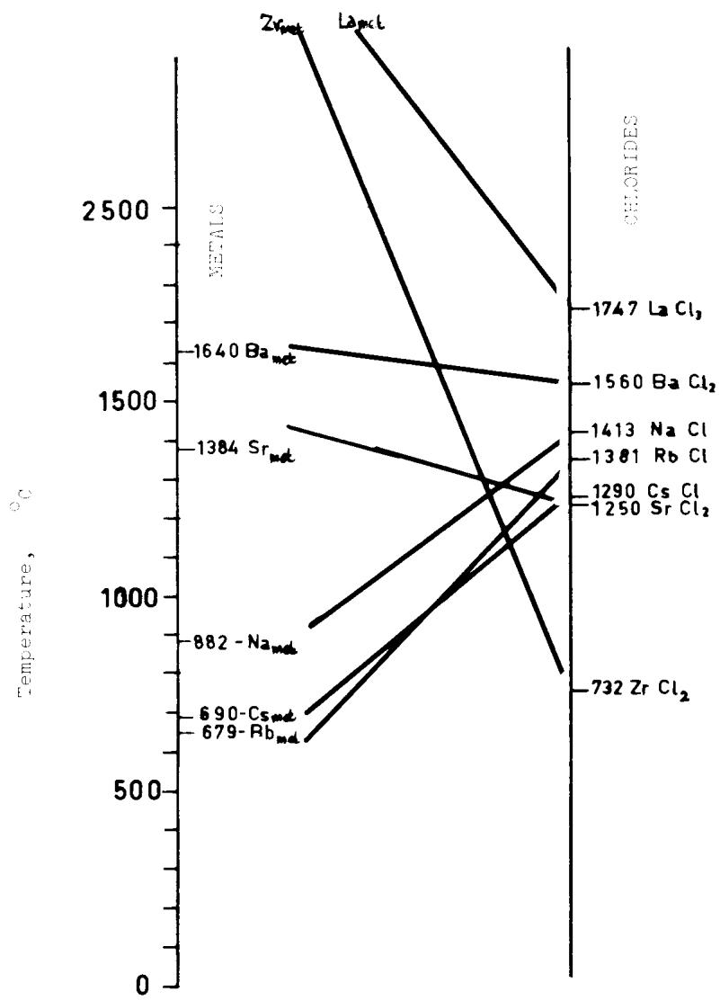  
BOILING POINT OF METALS AND CHLORIDES

$$
4. 2 1 \mathrm {m o l} / \mathrm {s} \times 3 \mathrm {V} \times 9 6 5 0 0 \mathrm {C} / \mathrm {m o l} \times \frac {1}{0 . 5} = 2. 4 4 \mathrm {M W (e)}
$$

The amount of electrical energy needed for the electrolysis of the total amount of fuel, related to the total power production is only:

$$
\frac {2 . 4 4 \mathrm {M W} (\mathrm {e})}{3 0 0 0 \mathrm {M W} (\mathrm {t h}) \mathrm {x} \left(\eta_ {\mathrm {e}} \approx 0 . 5\right)} = 0. 1 6 \text {p e r c e n t}
$$

Continuous electrolysis seems to be feasible both from the economic and technical point of view.

5.9 The Problem of External Storage of the Fission Products

For the reactor type proposed a special problem has to be solved: that of the interim storage of the fission products from the time of extraction from the fuel to the time of transportation away from the reactor building approximately 30 days later.

The criteria giving the form of chemical and physical form best suited for interim storage is shown in Table 5.4.

6. HEAT REMOVAL

6.1 Primary Circuit: Core and Heat Exchangers

Molten fuel reactors have been proposed having differing methods of cooling the primary fuel : a) internal cooling in which the coolant is pumped into the core in for example tubes, b) external cooling systems in which the fuel is pumped out of the core through heat exchangers.

The reactor proposed here has the following characteristics:

- the heat removal is based on the pumping of the molten fuel out of the core. The dwell time in the core is $\sim 11.3$ s, and outside the core $\sim 4.8$ s.

- the outlet temperature of the fuel is $650^{\circ}\mathrm{C}$ the inlet temperature $470^{\circ}\mathrm{C}$ . The temperature difference of $180^{\circ}\mathrm{C}$ with a volume flow rate of $6.65\mathrm{m}^{3}/\mathrm{s}$ permits the removal of 3000 MW(th) (see Fig.6.1)   
- the secondary coolant is also a molten salt containing chemically inert chlorides of Na, Ca, Ba, Mg. No pressure is needed and no hydrogen containing a volatile compound are present.

# 6.2 Secondary Circuit

The following are the requirements for a cooling medium for this reactor:

- generating at the proposed $600^{\circ}\mathrm{C}$ , pressureless and stable for long periods of irradiation.   
- non reactive to molten fuel (no exothermic or endothermic chemical reactions, no precipitation or gas evolution.

Some media which fulfill the above requirements are:

Low melting chlorides

<table><tr><td colspan="5">mol per cent</td><td rowspan="2" colspan="2">Tmelt (℃)</td></tr><tr><td>NaCl</td><td>KCl</td><td>MgCl2</td><td>CaCl2</td><td>BaCl2</td></tr><tr><td>20</td><td>20</td><td>60</td><td>-</td><td>-</td><td>396</td><td></td></tr><tr><td>38.5</td><td>-</td><td>-</td><td>47</td><td>14.5</td><td>450</td><td></td></tr><tr><td>-</td><td>20</td><td>60</td><td>-</td><td>20</td><td>440</td><td></td></tr></table>

# 6.3 The Tertiary Circuit

A rather unconventional choice has been made for the medium for and form of the tertiary circuit.

Table 5.4 In what form should the Fission Products be stored?   

<table><tr><td></td><td>Criteria</td><td>Positive</td><td>Negative</td></tr><tr><td>1</td><td>Chemical stability (radiation damage)</td><td>oxide, chloride, fluoride. metals, alloys.</td><td>carbonate, sulphate aqueous solutions</td></tr><tr><td>2</td><td>Low volatility</td><td>oxide chlorides</td><td>metals</td></tr><tr><td>3</td><td>Low pressure</td><td>solid or molten state</td><td>aqueous solutions</td></tr><tr><td>4</td><td>High thermal conductivity (heat transport)</td><td>metallic - solid metallic - liquid molten salt</td><td>oxide, solid compounds.</td></tr><tr><td rowspan="3">5</td><td>Easy management</td><td>liquid</td><td>solid</td></tr><tr><td>- storage</td><td></td><td>gaseous</td></tr><tr><td>- solidification</td><td></td><td></td></tr><tr><td>6</td><td>Low specific power</td><td>diluted</td><td>concentrated</td></tr><tr><td>7</td><td>Small volume</td><td>concentrated</td><td>diluted</td></tr><tr><td></td><td>See also Fig. 5.6</td><td></td><td></td></tr></table>

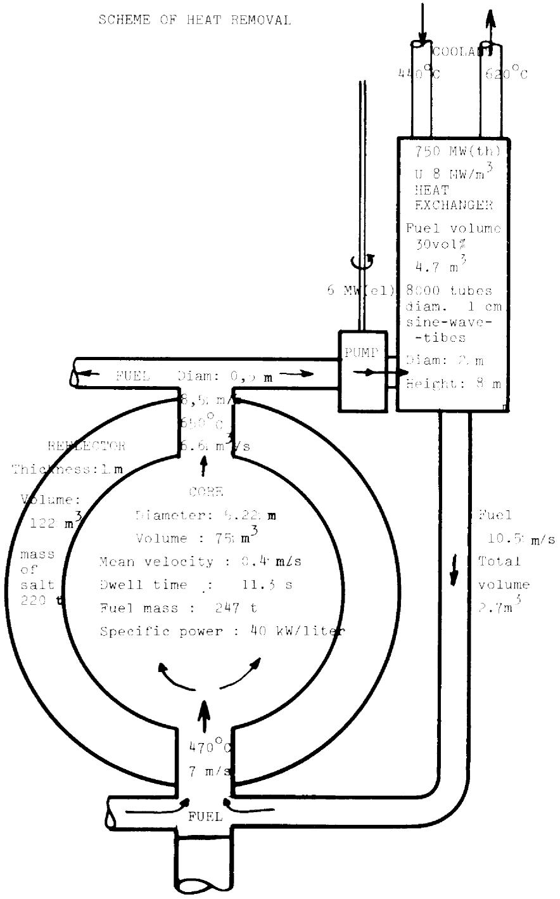  
Fig. 6.1.   
SCHEME OF HEAT REMOVAL

The criteria for selection are as follows:

- the highest possible thermodynamic efficiency,   
- the full use of the high temperature of the molten fuel reactor,   
- minimising of the risk of chemical reactions between secondary and tertiary working agent,   
- minimising the pressure in the working agent,   
- use of the same circuit materials as for the secondary circuit if possible.

All these requirements can be met by using aluminium trichloride as the working fluid. This has been discussed earlier (Ref. 14, 15).

6.4 Heat Removal from the Stored Fission Products

An additional problem for this reactor arises from the continuous extraction of the fission products from the molten fuel and transfer out of the reactor containment. For this a second (small) containment must be built to house the stored 'hot' fission products.

The power produced will be of the order of some tens of megawatts (th) depending on how quickly the fission products are removed for further treatment elsewhere.

This system therefore requires a special cooling system which can be built with some simple redundancy relatively inexpensively.

The problem of the possible processing of the fission products and transportation methods have not been discussed here.

7. ACCIDENTS - PROBLEMS AND SOLUTIONS

7.1 Decay Heat: Power and Energy

The crucial problem of each fission reactor is the problem of

the decay heat removal during a worst core accident.

It is known that the fission product inventory is:

- for short lived F.P. proportional to the specific power (that is to the neutron flux),   
- for long lived F.P. proportional to the energy produced (that is to the neutron flux times length of operation)

To carry out a rough estimate the following simplified calculations have been made:

a) the decay heat power from a fission reactor has been taken from ANS guides (Ref. 1) (see Fig. 7.1).   
As a reference the decay heat from the thermal fission of $^{239}\mathrm{Pu}$ has been taken.   
b) for the sake of simplification the decay heat power curve has been presented as an overlapping series of six curves having half-life value of $10^{8}$ , $10^{7}$ , $10^{6}$ , $10^{5}$ , $10^{4}$ , $10^{3}$ and $10^{2}$ seconds.   
c) the decay heat of $^{239}\mathrm{U}$ and $^{239}\mathrm{Np}$ has been taken into account   
d) the build-up curve has been constructed for an irradiation time of 500 days and 5 days (Fig. 7.2),   
e) the effect of gas extraction on the volatile fission products has been assume to be as follows:

- for the F.P. with $t_{y2} = 10^{2}$ s only a quarter of the total can be extracted by gas pumping,   
- for the F.P. with $t_{\gamma_2} \gg 10^3$ s approximately one-third can be extracted by gas pumping.

f) the effect of chemical extraction on all the long lived fission products with $t_{\gamma_2} \geq 10^5$ s has been estimated to be approximately 99 percent (rather optimistic),

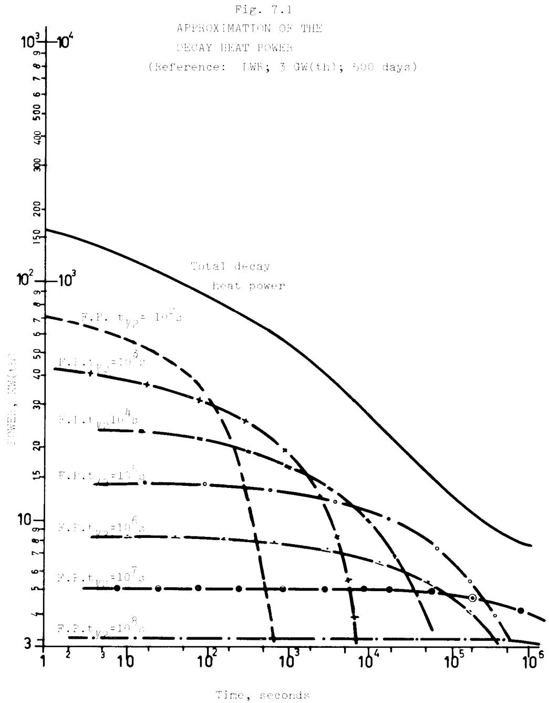

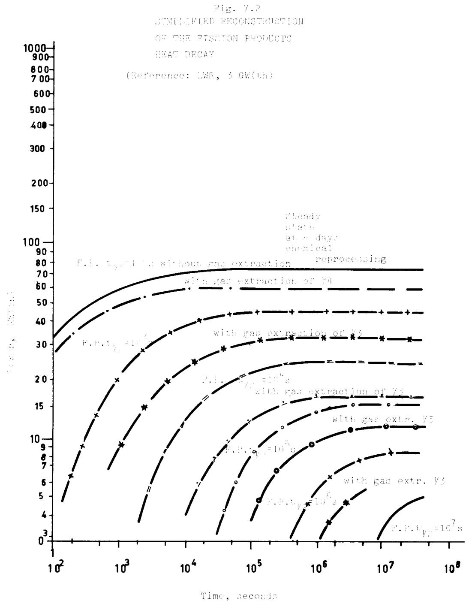

g) Figure 7.3 shows the different afterheat power curves for the SOFT reactor including all the processes and nuclides mentioned above,   
h) Figure 7.4 shows the afterheat power curves and the resulting integrated heat produced as a function of time.

# 7.2 Worst Accident Scenarios

A number of simplified scenarios for the worst core accident for this reactor is shown in Fig. 7.5.

The calculation of the heat and power for each stage of the calculation is given in Table 7.1.

The following three points have been taken into account

a) the scram is perfect (in this reactor type not only the engineered fast shut down system, but also the inherent negative reactivity (coefficient).

All the cooling possibilities fail. The fuel in the core and in the external loop begin to heat up as a result of the decay heat.

A temperature of $950^{\circ}\mathrm{C}$ is reached after a time of 0.7 hours after the scram. This temperature has been postulated as the maximum 'allowable' temperature of the fuel because of:

- partial pressure of volatile components in the irradiated fuel,   
- structural material properties (e.g. molybdenum alloys for the core vessel),   
- management of molten fuel.

The end of this step is shown in Fig.7.4 and Table 7.1 as point A.

b) an interim mechanism has been postulated in that the reflectormaterial being composed of chlorides of e.g. NaCl, $\mathrm{CaCl}_2$ , MgCl etc.

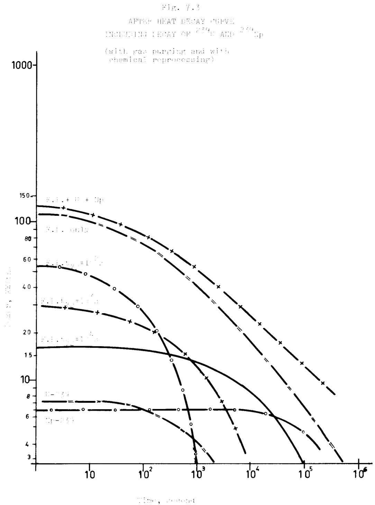  
56

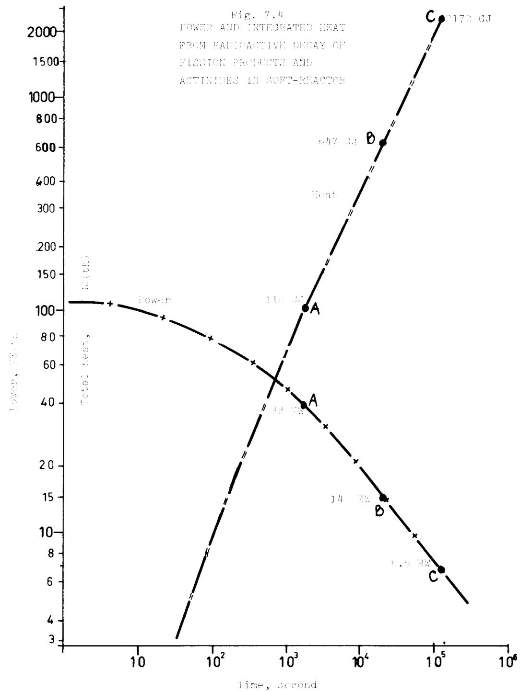  
57

Table 7.1 Scenario of the worst accidents   

<table><tr><td></td><td>Stage</td><td>Calculation</td><td>Heat in this stage (GJ)</td><td>Cumulative heat from start (GJ)</td><td>Elapsed time from start (h)</td><td>Decay heat power at given time (MW (h))</td></tr><tr><td>A</td><td>After scram all cooling systems fail. Self heating of fuel</td><td>Mass of fuel 353t
Specific heat 0.8MJ/t.K
Mean fuel temperature at start 470+650/2
Mean fuel temperature at end 950°C</td><td>110</td><td>110</td><td>0.7</td><td>38</td></tr><tr><td>B</td><td>Reflector begins to melt</td><td>Mass of reflector 660t
Specific heat ∼1.0MJ/tK
Heat of fusion 0.5GJ/t
Temperature start 470°C
Temperature end 700°C</td><td>540</td><td>650</td><td>7</td><td>14</td></tr><tr><td>C</td><td>Fuel is drained to the core catcher (reflector is stationary and is neglected)</td><td>Fuel temperature 950°C
Fuel mass 353t
Catcher mass 2000t
Catcher temperature start 20°C
Catcher temperature end 600°C
Specific heat 0.9
Fusion heat 0.5</td><td>2060</td><td>2170</td><td>42</td><td>6.5</td></tr><tr><td>D</td><td>Guillotine</td><td>Fuel mass 353t
Mean fuel temperature at start 560°C
Catcher mass 2000t
Catcher temperature 20°C
Heat of fusion 0.5GJ/t
Core catcher final temperature 600°C</td><td></td><td></td><td></td><td></td></tr><tr><td></td><td></td><td>Fuel heat loss: 353x0.8(950-600)</td><td>100</td><td></td><td></td><td></td></tr><tr><td></td><td></td><td>Salt heating and melting 2000 (1.0x(600-20) + 0.5</td><td></td><td></td><td>42</td><td>6.5</td></tr><tr><td></td><td></td><td>Balance of heat</td><td></td><td>2170</td><td></td><td></td></tr></table>

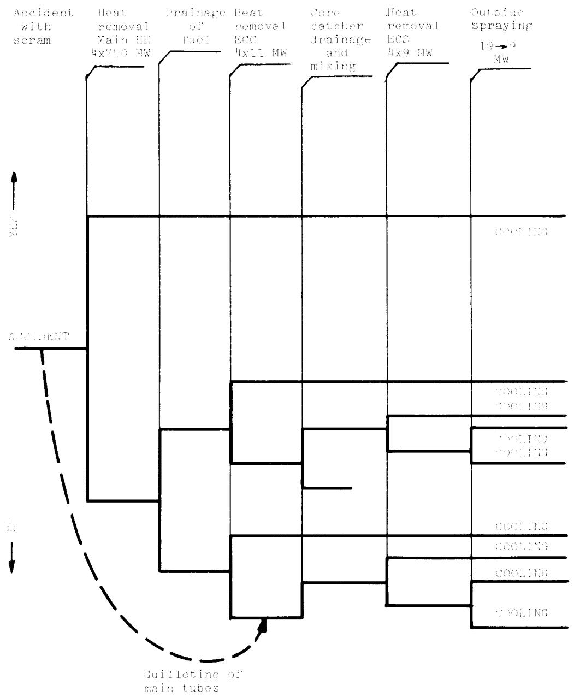  
Fig. 7.5   
SCENARIO OF THE ACCIDENTS

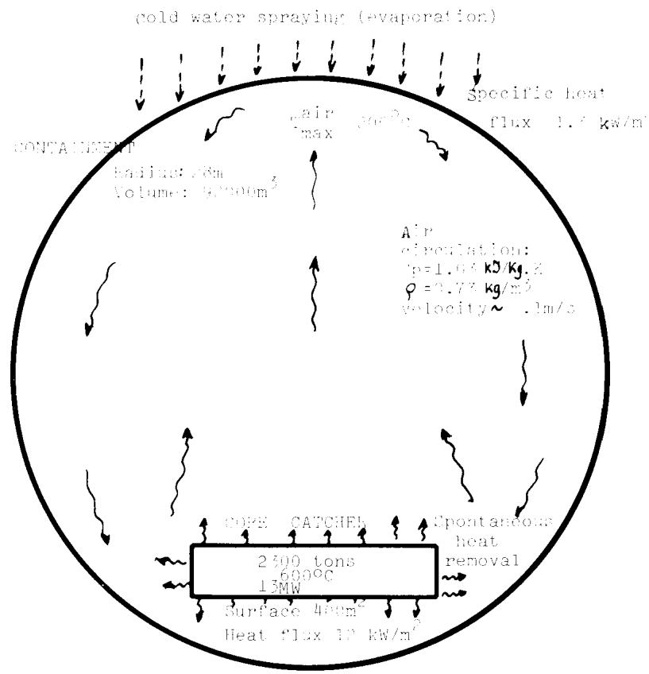  
Fig. 7.6   
SCHEME OF THE HEAT   
TRANSPORT PROCESSES   
IN THE CONTAINMENT

and as a result of the temperature increase from $470^{\circ}\mathrm{C}$ to $700^{\circ}\mathrm{C}$ and then $950^{\circ}\mathrm{C}$ , also heat up and melts.

(Note the problem of heat transfer from the core to the reflector has not been discussed). Point B on Fig. 7.4 and Table 7.1,

c) the drainage to the dump tank is negligible,   
d) the fuel at $950^{\circ}\mathrm{C}$ drains to the core catcher filled with $\sim 2000$ tons of solid chlorides with a melting point of approximately $600^{\circ}\mathrm{C}$ . (Point C: Fig. 7.4 and Table 7.1)

# 7.3 Spontaneous Cooling Processes in the Containment

In this scenario it has been assumed that all cooling systems (including all redundancy) and all emergency cooling systems of the core of the dump-tank of the core catcher and of the internal containment fail.

Figure 7.6 shows the principle layout of the reactor after drainage of the fuel to the core catcher. The transport of heat from the molten fuel and the core catcher mixture is as follows:

a) the molten mass of $\sim 2350$ tons reaches the permissible temperature of $600^{\circ} \mathrm{C}$ after 42 hours from the start of the accident (and scream). At this moment the decay heat is approximately 6.5 MW(th).

b) the core catcher has the following characteristics
- the upper part free molten salt and a temperature of $600^{\circ}\mathrm{C}$ (873 K).
- the lower part of steel at a temperature of $450^{\circ}\mathrm{C}$ (723 K)
The heat losses due to infra-red emission are:
- for the molten salt surface ( $\varepsilon = \text{emissivity}$ )
[ Q^{1} = 400\mathrm{m}^{2}\times (\varepsilon = 0.5)\times (\sigma = 5.67\times 10^{-8} \quad \mathrm{J / (m}^{2}\mathrm{K}^{4})\times (873)^{4} = 6.5 \, \mathrm{MW} ]

- for the steel structure

$$
Q ^ {\prime \prime} = 8 0 0 m ^ {2} x (\varepsilon = 0. 8) x (6) \times (7 2 3 ^ {4}) = 9. 9 M w
$$

The total heat emission due to infra-red radiation allows the removal of all the decay heat once this has dropped below 10 MW.

c) this heat has to be removed from the air and the following parameters have been taken:

<table><tr><td>Temperature (℃)</td><td>Heat Capacity (K Joule/kg)</td><td>Density (kg/m3)</td><td>Pressure (bar)</td><td>Effective density</td></tr><tr><td>50&#x27;</td><td>1.01</td><td>1.16</td><td>1.1</td><td>1.27</td></tr><tr><td>200&#x27;</td><td>1.03</td><td>0.74</td><td>1.7</td><td>1.26</td></tr></table>

For the simplified calculation of the heat transfer

coefficient for natural correction in air the following simplified relationship has been used (in BTU, ft, $^{\circ}$ F)

$$
h = 0. 2 2 \Delta t ^ {1 / 3} (\text {a c c o r d i n g K e r n 1 9 5 0 : h} _ {c} = 0. 3 8 \Delta t ^ {1 / 4})
$$

for $\Delta t = 100^{\circ}C$ the heat transfer coefficient:

$$
h = 7 W \cdot m ^ {- 2} K ^ {- 1} \text {(f r o m K e r n 1 9 5 0 : h = 7 . 9 W \cdot m ^ {- 2} K ^ {- 1})}
$$

for the bulk temperature difference :

$$
\Delta T = \left(T _ {\text {a i r}} - T _ {\text {s t e e l}}\right) = 2 0 0 - 3 0 = 1 7 0 ^ {\circ} \mathrm {C}
$$

the heat flux will be :

$$
\dot {H} _ {\text {a i r}} = 7 \times 1 7 0 = 1. 2 \mathrm {k W} / \mathrm {m} ^ {2}
$$

The desired heat removal from the outside wall of the containment (dia 56m, for half of surface)

$$
\dot {H} _ {\text {d e c a y h e a t}} = \frac {6 . 5 \mathrm {m W}}{5 0 0 0 \mathrm {m} ^ {2}} = 1. 3 \mathrm {k W / m} ^ {2}
$$

d) the air as a heat transport medium :-

$$
\begin{array}{l} \text {H e a t c a p a c i t y o f} 1 \mathrm {m} ^ {3} \text {a i r} = 1. 0 2 \mathrm {x} (1. 1 6) \mathrm {x} (2 0 0 - 5 0) \\ = \quad_ {1 7 7} \mathrm {K J} \\ \end{array}
$$

# 7.4 The Prompt Critical Scenario

Since in this study only steady state calculations have been made the problem of the prompt critical excursion is not discussed seriously.

However a rather naive attempt is made to obtain a rough idea of the magnitude of events under such a scenario as follows:

a) the best known data for a prompt critical accident for the liquid metal cooled fast breeder SNR-300 has been taken as the reference (Ref. 11)   
b) where the SOFT reactor has significantly different characteristics such as:

temperature of fuel during normal operation:

SNR 1154°C   
SOFT 650°C

a heat capacity of total fuel inventory for $\Delta T = 1000^{\circ}C$ :

SNR 0.21 GJ/100K  
SOFT 28.2 GJ/100 K

- then the values for the SOFT reactor have been taken.

Table 7.2 shows the calculations.

The reactor proposed here has therefore the following characteristics:

a) the continuous removal of fission products and the adjustment of the fissile/fertile inventory continuously during operation. This minimises the amount of excess reactivity which must be compensated for by the control rods, which reduces the risk of rapid control rod withdrawal causing an uncontrolled excession,

\*) assumed by analogy.

Table 7.2 Prompt Critical Accident   

<table><tr><td>Parameter</td><td>Method of calculation</td><td>Unit</td><td>SNR-300</td><td>SOFT</td></tr><tr><td>Reference</td><td>-</td><td>-</td><td>KfK-2845 Dec.1979</td><td>This paper</td></tr><tr><td>Nominal power (Po)</td><td>-</td><td>GW(th)</td><td>0.76</td><td>3</td></tr><tr><td>Accident scenario</td><td>-</td><td>-</td><td>F8 with compaction</td><td></td></tr><tr><td>Ramp</td><td>KfK ; p</td><td>$/s</td><td>80</td><td>80*</td></tr><tr><td>Reactor period</td><td>&quot;</td><td>ms</td><td>3.2</td><td>3.2*</td></tr><tr><td>Duration of excursion (texc)</td><td>&quot;</td><td>ms</td><td>23.3</td><td>23.3*</td></tr><tr><td>Increase of peak power</td><td>e23.3/3.2</td><td>Pmax / Po</td><td>1500</td><td>1500*</td></tr><tr><td>Increase of average power</td><td>roughly estimated</td><td>Pav / Po</td><td>342</td><td>342*</td></tr><tr><td>Total energy</td><td>(Pav, texc)</td><td>PoS</td><td>7.97</td><td>7.97*</td></tr><tr><td>Total energy relative to solidus (Q)</td><td>KfK</td><td>GJ(th)</td><td>6.1</td><td>23.9</td></tr><tr><td>Mass of molten fuel (M)</td><td>KfK</td><td>t(percent)</td><td>6.5(99%)</td><td>225(100%)</td></tr><tr><td>Heat capacity (Cp)</td><td>literature</td><td>MJ/kg.K</td><td>0.33</td><td>0.80</td></tr><tr><td>Temperature increase (ΔT)</td><td>(Qmelt, Cp)</td><td>K</td><td>2840</td><td>133</td></tr><tr><td>Operating fuel temperature (Tnor)</td><td>KfK(1684)</td><td>°C</td><td>1154</td><td>650</td></tr><tr><td>Average fuel temperature after accident</td><td>(Tnor + ΔT)</td><td>°C</td><td>3994</td><td>783</td></tr><tr><td>Fuel temperature (accident)</td><td>KfK</td><td>°C</td><td>3920</td><td></td></tr><tr><td>Fuel temperature maximum (accident)</td><td>KfK</td><td>°C</td><td>5060</td><td></td></tr><tr><td>Pressure after accident</td><td>KfK</td><td>bar</td><td>90</td><td>3</td></tr></table>

<table><tr><td></td><td>Reference</td><td>Unit</td><td>SNR-300</td><td>SOFT</td></tr><tr><td>Compaction</td><td>Wirtz,p.105</td><td>-</td><td>possible</td><td>??</td></tr><tr><td>Doppler constant</td><td>γ</td><td>-</td><td>0.004</td><td></td></tr><tr><td>Characteristic time for excursion (prompt generation time)</td><td>λ</td><td>s</td><td>4 x 10-7</td><td></td></tr><tr><td>Delayed neutrons</td><td>β</td><td>-</td><td>0.003</td><td>0.00</td></tr><tr><td>Neutron lifetime</td><td>l</td><td>s</td><td>10-7 10-5</td><td></td></tr><tr><td></td><td>α κ(1-6)-1 i</td><td>s-1</td><td>2400-3600</td><td></td></tr><tr><td>Reactivity</td><td>κ</td><td></td><td></td><td></td></tr><tr><td>Power at prompt critical</td><td>P(t)=Po exp(ρ·t2/2·λ)</td><td></td><td></td><td></td></tr><tr><td>Total energy release</td><td></td><td></td><td></td><td></td></tr><tr><td>Fuel in core time</td><td>KfK</td><td>day</td><td>441</td><td>5</td></tr><tr><td>Maximum burn-up</td><td>KfK</td><td>MWD/t</td><td>69000</td><td>not applicable due to continuous reprocessing</td></tr><tr><td>Fluence</td><td>KfK</td><td>n/cm2</td><td>13x1023</td><td>(φav=3.4x1015)(φav=5x1015)</td></tr><tr><td>Flux</td><td></td><td>μm2s</td><td></td><td></td></tr></table>

b) the temperature reactivity coefficient $\frac{\partial K}{\partial T}$ is dependant on two effects:

The removal of the fuel out of the critical zone due to density decrease (temperature coefficient of expansion equals $\sim 1\mathrm{lx}10^{3} / \mathrm{K}$ ) and secondly the increased leakage of neutrons,

c) the inflow of cooler fuel occurs with time constants of at least several seconds and does not strongly affect the control characteristics,   
d) under normal operation the core contains $\sim 0.2\%$ of helium bubbles. Changes in gas flow changes the average density of the molten fuel. A depressurization of the fuel system which would expand the bubbles by a factor 2 to 3 would cause a reactivity decrease,   
e) the voiding by local boiling in this type of homogeneous core is not credible even without pumping,   
f) the fissile material in the on-line processing plant amounts to less than $1\%$ of the reactor inventory. If all this amount could be returned to the reactor within one minute the excess reactivity would be increased by $0.007\%$ per second (by rough estimation),   
g) The worst credible event occurs probably due to a breach of the primary sytem boundary. This results in a release of large amounts of irradiated fuel - even the total amount into the containment building. The rather simple core catcher in the form of $\sim 2000$ tons of salt (see Fig. 3.2) is sufficient to control this accident,   
h) a peculiar property of this reactor is the possibility of inhomogeneity in the fissile material $(\mathrm{PuCl}_3)$ for example due to hydrolysis and/or reaction with oxygen resulting in the formation of insoluble $\mathrm{PuO}_2$ . The probability of such an event is very small since no water is used in the entire system,

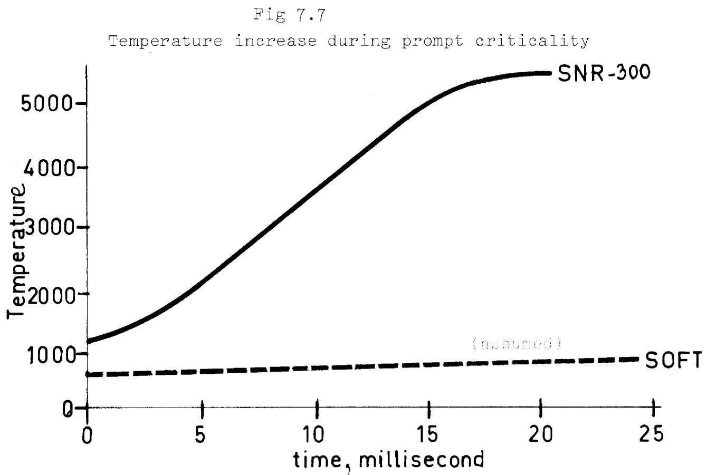

# 8. CONCLUSIONS.

The reactor concept has the following strong points:

- the steady state operating inventory of potentially harmful fission products is significantly reduced,   
- high thermal stability against excursion,   
- removal of the decay heat is guaranteed even in case of a failure of all emergency cooling systems provided the outside containment spraying system works, for a power of less than 0.5 MW.

however;

- the technology of molten salt reactors is not yet sufficiently developed,   
- the corrosion problems will probably be difficult to solve,   
- the amount of Pu present in the reactor is very high, (but not optimized)

# REFERENCES

1 ANS, (1978). Decay heat power in LWR. ANS Standard, 5.1   
2 Bird, Stewart and Lightfoot (1960). Transport Phenomena, Wiley & Sons, New York.   
3 Burris L., and Dillon I (1957). Estimation of fission product spectra in discharged fuel from fast reactors, ANL 5742.   
4 Crouch E.A. L. (1977). Atomic Data Bull. Data Tables, 19, 417-532.   
5 Engel T. R., Rhoades W. A., Grimes W.R., and Dearing J.F. (1979). Molten-salt reactor for efficient nuclear fuel utilization without plutonium separation. Nucl. Techn. 46, 30.   
6 Gutman V. Ed., (1967). Halogen Chemistry, Academic Press, London.   
7 Heer W. (1980). Physikalische Berechnungen zum Salzschmelzreaktor SOFT, TM-22-80-26, Swiss Feder. Inst. Reactor Research, Wurenlingen, June.   
8 Furrer M. (1977). Chemical behaviour of radiosulphur obtained during in-core irradiation. J. Inorg. Nucl. Chem. 39, 1085.   
9 Keepin C.R. (1965). Physics of nuclear kinetics, Addison-Wesley, Reading.   
10 Harder B., Long G., Stanaway W.P. (1969). Compatibility and reprocessing in use of molten UCL as reactor fuel. In "Symp. Reprocessing Nucl. Fuels". Ed. P. Chiotti, USAEC, Con 690801.   
11 Royl P. (1979). Untersuchungen zu störfläten in Kernkraftwerk Kalkar, KfK 2845, December.   
12 Reactor Safety Study: WASH-1400. Appendix VI, US NRC, Washington 1975.   
13 Rosenthal M.W., Haubenreich P.M., Brigss R.B. (1972). The development status of molten-salt breeder reactor. ORNL-4812 August.   
14 Taube et al: (1965). On the concept of salt-boiling fast-breeder reactor with AlCl₃ as cooling agent. Nukleonika, 9-10. 639.   
15 Taube et al: (1967). New boiling salt fast breeder reactor concepts. Nucl. Eng. Design, 5, 109.   
16 Taube M. (1978). Fast reactors using molten chloride salts as fuel. Swiss Federal Institute for Reactor Research, Würenlingen, Report 332.   
17 Taube M., (1974). The possibility of continuous in-core gaseous extraction of volatile fission production in a molten fuel reactor, EIR-Bericht Nr. 257.

18 Taube M. and Ligou J. (1974). Molten chlorides fast reactor cooled by molten uranium chloride, Ann. Nucl. Sci. Eng. 1, 277.   
19 Taube M., Heer. W., Trdjefjord A., (1980). A molten salt converter reactor with a very low fission product inventory. 2nd Intern. Conf. on Emerging Nuclear Energy Systems. 8-11 April, Lausanne, Switzerland: Atomenergiee 36, 57. (1980).   
20 Tanovici E., Taube M. (1975). Chemical behaviour of radiosulphur $^{35}\mathrm{Cl}(\mathfrak{n},\mathfrak{p})^{35}\mathrm{s}$ during in-pile irradiation. J. Nucl. Inorg. Chem. 37, 2561.   
21 Taube M. (1976). The transmutation of Sr-90 and Cs-137 in a high flux fast reactor with a thermalized central region. Nucl. Sci. Eng. 61, 212.   
22 Veryatin U. D. and others. (1965). Thermodynamic properties of inorganic compounds. Atomisdat, Moscow. (in Russian)   
23 Watson G., Evans R., Grimes W., Smith N. (1962). Solubility of noble gases in molten fluorides. J. Chem. Eng. Data. 7, 2.   
24 - Deutsche Risikostudie Kernkraftwerke. Verlag TUV, Köln, 1979.