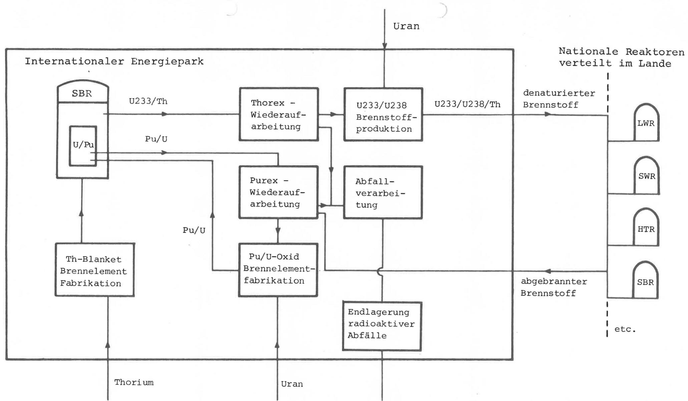
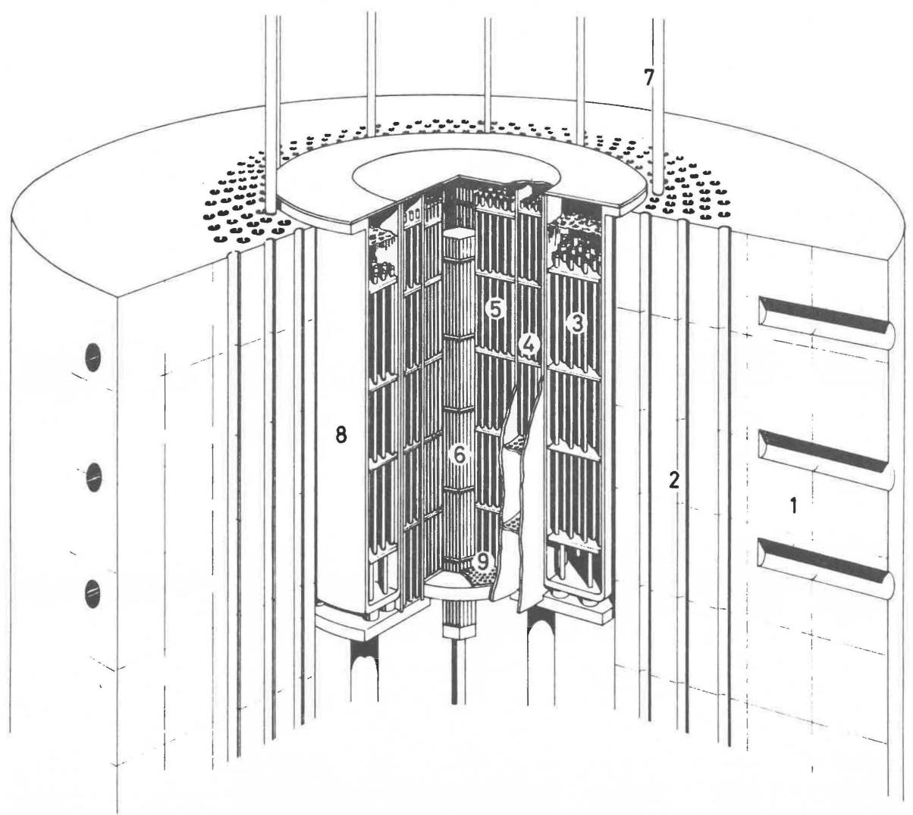
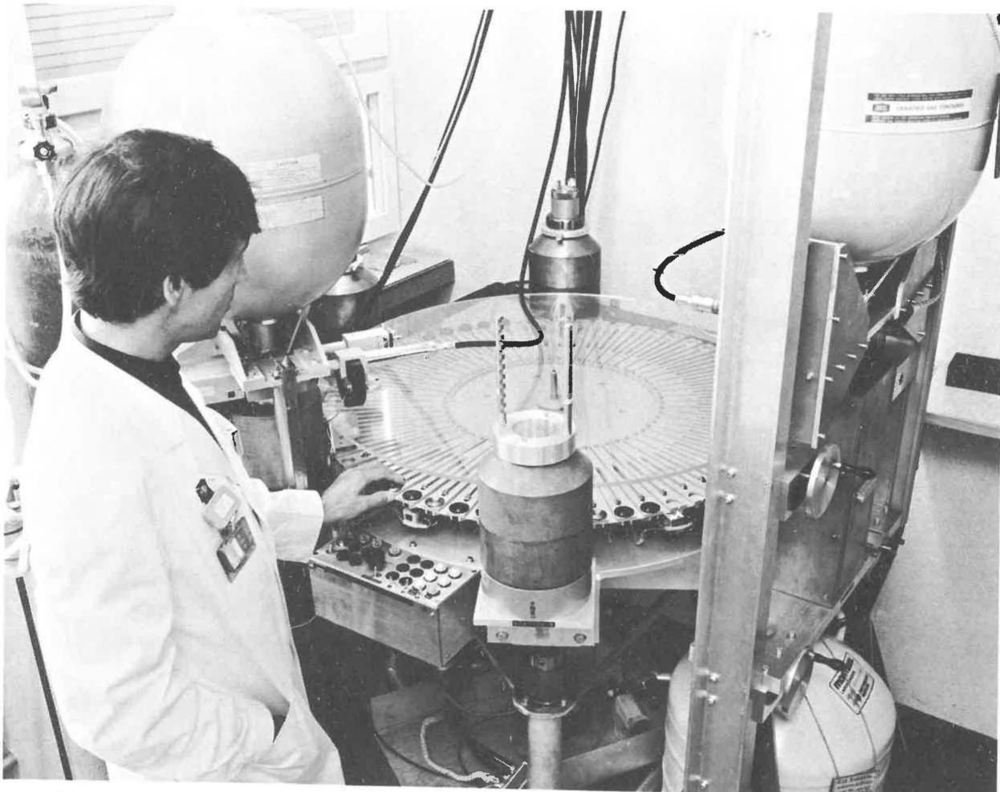
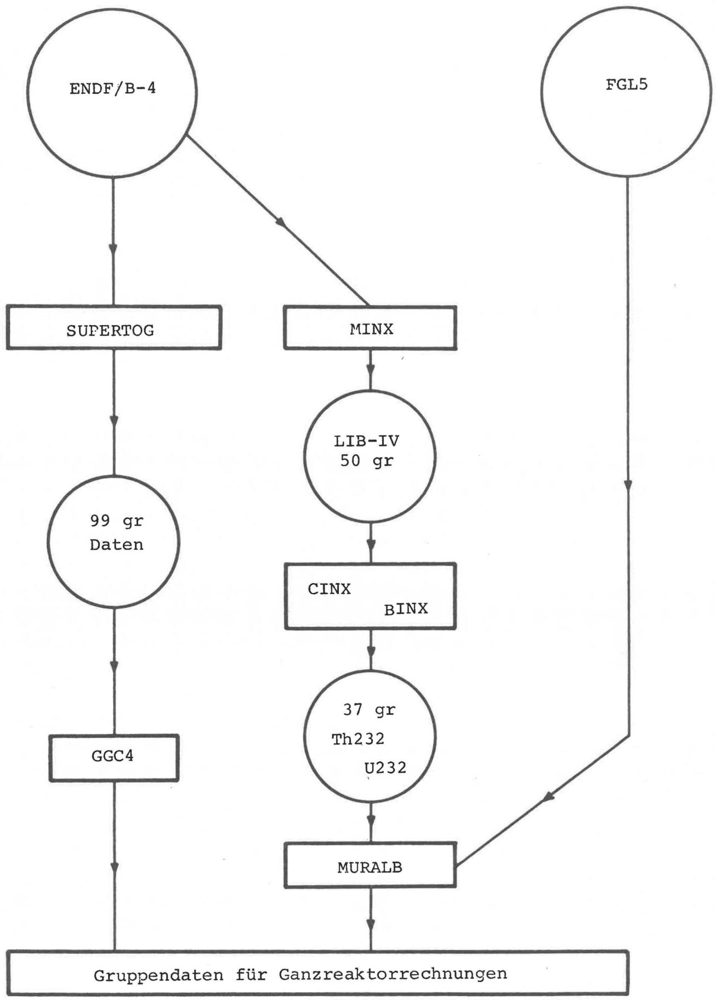

Kontrollblatt für externe Publikationen und Vorträge

Name des Autor:

C. McCombie, U., Schmocker, W. Seifritz

Abteilung:

PHYSIK

Wir beantragen:

- Publikation in folgender Fachzeitschrift:*

EIR-Bericht\*

Schweizerische Technische Zeitschrift

- Teilnahme mit Vortrag an folgender Tagung / Konferenz* (Titel der Konferenz, Datum, Ort, Organisator)

Die Tagung hat offiziellen / inoffziellen Charakter*

Ein Tagungsbericht wird gedruckt / nicht gedruckt*

Unser Beitrag hat folgenden Titel:

Thorium im Schnellen Brüter

Anzahl der bestelltener Sonderdrucke (bei EIR-Bericht Auflage): 400

Dem EIR entstehen dadurch Kosten in der Höhe von Fr.: ca.700.

Der Verfasser bestätigt, dass die Arbeit keine vertraulichen Angaben enthalt.

Weitere Bemerkungen:

Der beiliegende Antikel wurde von der Redaktion der STZ nach Absprache mit U. Schmocker leicht gekürzt.

Datum:

Unterschrift des Verfassers:

12. September 1978

Unterschrift des Abt./Projekteiters:

w. keim

Bemerkungen der Stabsstelle Forschung:

Thorium im Schnellen Brüter

Physikalische Untersuchungen zu neuen Brennstoffzyklen am EIR

von

C. Mc Combie, U. Schmocker, W. Seifritz

Anschrift:

Physikabteilung des Eidg. Institut für Reaktorforschung (Leiter: PD Dr. W. Seifritz) CH-5303 Warenlingen.

pddle:diLc 1in dep.78 (froocnnne)

in 1eue. Jedu, Rtochf (cde gucn)

(1) $p$ 与 $q = {cm} - {m0r}$ ①

# Zusammenfassung

Im Zusammenhang mit der neuen Nuklearpolitik der US-Administration ist das Interesse an Brennstoffzyklen, die gegenüber der Proliferation von Spaltmaterial technisch resistenter als der gegenwärte Uran/Plutoniumzyklus sind, stark gestiegen. In der Physikabteilung des Eidg. Instituts für Reaktorforschung (EIR), Wurenlingen, beschäftigt man sich intensiv mit diesen Problem. Gegenwärting wird mit Hilfe des Forschungsreaktors PROTEUS das neutronen-physikalische Verhalten von Thorium in einem Schnellen Reaktorgitter untersucht, um die technischen Grund-daten für das Erbrufen von U-233 in schnellen Reaktoren und dessen Einsatz in sog. "denaturierten" Brennstoffzyklen zu überprüfen. Im folgenden Antikel wird diese weltweit diskutierte Möglichkeit;naher untersucht.

# 1. Uran als Energiequelle

In der Natur gibt es nur ein einziges Isotop, mit demer Brennstoffzyklus eines Reaktorsystems gestartet werden kann - U235. Dieses ist aber nur zu 0,71% in Natururan enthalten, das hauptsächlich aus dem Isotop U238 besteht. Heute werden Natururan-vorkommen abgebaut, die Gewinnungskosten bis etwa 30$/lb U₃O₈ (1 lb = 454 g) verursichen. Für diesen Kostenbereich werden die Reserven der westlichen Welt auf rund 3.7 Mio. t geschätzt, die bei Nutzung in heutigen Leichtwasserreaktoren (LWR) einen Energie-inhalt von rund 100 Mia. t Steinkohle darstellen. Leichtwasserrektoren heutiger Bauart nützen aber nur etwa 1% des Natururans zur Energiegewinnung aus; sie stellen dazu eine Energiereserve dar, die grössenordnungsmässig nur jener der Erdöl- und Erdgasvorräte entspricht. Daran erkennt man, dass die heutigen LWR keine langfristige Lösung des Energieproblems darstellen. Genauso wie die Oelvorkommen * $\text{們}$ den auch die Uranreserven in der ersten Hälfte des nachsten Jahrhunderts erschöft sein.

Die Kohlevorräte konnten unseren Energiebedarf bzw für wesentliche Zeit decken, noch sind die darauf auffallenden Umweltsbelastungen sehr gross. Kohle muss trotzem in nach-ster Zeit ein wichtiger Träger unserer Energieversorgung bleiben, aber wir brauchen für die Zukunft saubere und langfristig ertragreiche Energiesysteme.

Neben dem spaltbaren U235-Isotop stellt uns die Natur aber auch sogenannten Brutmaterial, namentlich U238 und Th232, in grosser Menge zur Verfügung. Dieses Brutmaterial lässt sich durch Neutroneinfang in spaltbaren Kernbrennstoff umwandeln. (Abb. 1) In einem LWR werden pro 100 gespaltenen U235-Kerne etwa 60 U238-Kerne ein Neutron eingangen und sich in Pu239 umwandeln. $70\%$ desses Plutoniums wird während des Reaktorbetriebs wieder gespalten, die restlichen $30\%$ können für spätere Benützung in anderen Reaktoren verwendet werden. Rund $30\%$ der produzierten Leistung werden in LWR durch die Plutoniumspaltung erzeugt!

Brutmaterial lassst sich aber durch Neutroneneinfang auch direkt spalten. Dazu werden allerdingschnelle Neutronen mit einer

Energie von rd. 1 MeV (Mega-Elektronenvolt) besteht. In einem sogenannten thermischen Reactor, zu denen auch die Leichtwasser-reactoren gehören besitzen weniger Neutronen diese Energie, die meisten haben Energie, die nur einem Bruchteil eines eV entsprechen. Von 100 in U238-Kerne eingefangenen Neutronen haben etwa 5 genügend Energie, um den Kern zu spalten.

Eine Möglichkeit, Brutmaterial better auszunützen, ist deren Einsatz in Schnellen Brutreaktoren (SBR). Sowohl die Konversion in spaltbares Material als auch die Ausnutzung der direkten Spaltung durch schelle Neutronen sind viel günstiger als im LWR. Ein Schneller Reaktor besitzt im Gegensatz zum LWR keinen Modulator, um die Neutronen abzubremsen. Die mittlere Energie der Neutronen in einem SBR beträgt deshalb einige 100 keV. Als Spaltmaterial wird bei heutigen SBR-Konzepten vorwiegend Plutonium eingesetzt. Pro 100 gespaltene Plutoniumkerne werden in einem SBR rund 110 bis 120 (und mehr) U238-Kerne durch Neutroneneinfang in Plutonium verwandelt - das Konversionsverhältnis (CR) ist grösser als 1, Plutonium wird "erbrutet". Ein SBR erzeugt nicht nur Energie, er produziert auch Spaltmaterial für weitere Reaktoren. Nach rund 10 bis 30 Betriebsjahren (abhängig vom speziellen Reaktortyp) ist genügdeng Brennstoff produziert um einen weiteren Reaktor zu betreiben. Man nennt dies die Verdopelungszeit des Reaktors. SBR nützen im Idealfall das Natururan vollständig aus. In der Praxis ist eine Ausnutzung zwischen 50 bis 70 % zu erwarten, eine rund 60 mal bessere Verwertung des Urans gegenüber heutigen LWR. Bei thisem gänstigen Ausnutzungsgrad des Urans in SBR wird es zudem interessant, auch uranärmere Erze mit hohenen Urangewinnungskosten abzubauen. Für den Kostenbereich bis zu 250$/lb U₃O₈ werden die Reserven auf etwa 100 Mio. t geschätzt. Darauf basierte unter anderem auch die vor einigen Jahrenbekannt gewordene Idee, Uran und Thorium aus dem Granit der Schweizer Alpen für ein Brutreaktor-system zu gewinnen.

Um einen SBR zu betreiben, wird zu Beginn ein Plutoniuminventar von einigen Tonnen bereits in den heutigen LWR produziert wird.

# Trotz dieser

langfristigen Vorzüge stösst die Ein

führung von Schnellen Brutreaktoren heute auf Widerstand. Gesellschaftspolitische Konsequenzen einer sogenannten Plutoniumwirtschaft, ungenügende Sicherheitsmassnahmen und die Gefahr des Plutoniummissbrauches sind die Hauptargumente der Opposition. Besonderss die Abzweigung von Plutonium aus dem friedlichen Bereich der Kernenergienutzung zur Herstellung von nuklearen Waffen, die Frage der sogenannten Proliferation, ist durch die amerikanische Nuklearpolitik sehr aktuell geworden. In den letzten Jahren sind deshalb Anstrengungen unternommen worden, Nuklearkonzepte zu entwickeln, die den Missbrauch von Spaltstoff erschweren wenn nicht

verunmöglichens sollen.

Wir möchten hier aber feststellen, dass die Verwendung von Plutonium zur Kernwaffenproduktion aus unseren elektrizitäserzeugenden Leistungsreaktoren sehr kompliziert und aufwendigeware. Um an geeignetes Spaltmaterial heranzukommen, gibt es eine ganze Reihe einfacherer und vor allem billigere Methoden, als die Benutzung von Spaltstoffen aus Kernkraftwerken. So haben beispielsweise alle heutigen Atomwaffenstaaten das Spaltmaterial für ihre Kernwaffen ohne den Umweg über die friedliche Nutzung der Kernenergie produziert. Die Produktion einer Kernwaffe ist keineswegs von der Existenz von Kernkraftwerken abhängig und wir sind der Meinung, dass das Prolieferationsproblem erher durch politische Uebereinkünfte zwischen gleichberechtigten Staaten in den Griff zubekommen ist, als durch einseitige Ge- und Verbote. Trotzem ist es sinnvoll, bei einer weltweiten Einführung der Kernenergie, Konzepte und Techniken zu studieren, die das Risiko eines Brennstoffmissbrauches von der technischen Seite her auf ein Minimum beschränkt.

# 2. Warum Thorium?

Im Zusammenhang mit den Bedenken einer reinen Plutoniumwirtschaft führen Brennstoffzyklen, die kein oder nur weniger Plutonium benutztzen und produzieren, vermehrtes Interesse. Eine Möglichkeit ist darauf die Verwendung von Thorium als Brutmaterial anstelle von U238.

Th232, das in der Natur in etwa der gleichen Menge vorhanden ist wie Uran,{lssst sich durch Neutroneneinfang in spaltbares U233 umwandeln, ein Isotop mit ähnlichen Eigenschaften wie U235 und Pu239. In einem thermischen Reaktor hat U233)sogar bessere neutronenphysikalische Eigenschaften als U235 und Pu239. Aus thisem Grunde ist der Thoriumzyklus in einer Reihe von Ländern{naher unter-sucht worden.(z.B.Kanada,Indien,BRD und USA).Darüber hinaus bietet die Anwendung des Th232-U233-Brennstoffzyklus in thermi-schen Reaktoren die Moglichkeit die Uranreserven langfristig zu strecken.

Die Ausnutzung des Energiepotentials beider Brennstoffzyklen, des Pu239-U238 und des U233-Th 232-Zyklus, in thermischen Reaktoren ist aber gering verglichen mit den Mollerkeiten, die ein Schneller Brutreactor (SBR) liefert. Allein der Energieinhalt der Uranvorrata, ausgenützt in Schnellen Reaktoren auf der Basis des Plutoniumzyklus, wurde den Energiebedarf der Erde für mehrere Jahrhunderte decken. Diese Tatsache erübrigte länger Zeit erhare Untersuchungen zum Einsatz alternative Brennstoffe im SBR.

Im Zusammenhang mit dem oben erwähnten Problem der Proliferation ist das Interesse am Einsatz von Thorium in Schnellen Brutreaktoren stark gestiegen. Beim Plutoniumzyklus enthalten die Brenn-elemente eine Mischung von Plutonium- und Uranoxyd. Theoretisch könnte im Falle des Missbrauchs, Plutonium chemisch abgetrennt und für Kernwaffen abgezweigt werden. Benützt man hingegen den

U233-Th-232-Zyklus, könnte man das U233 so stark mit U238 verschneiden, dass diese Uranmischung nicht mehr direkt als Waffenmaterial benützbar ist. Aus diesen Brennstoff liesse sich das als Bombenmaterial interessante U233-Isotop nur noch durch Isotopentrennung separieren. Durch die Benützung von Thorium im Reaktor wird zudem eine gewisse Menge an U232 aufgebaut. Beim Zerfall与此es Isotops bilden sich radioaktivive Zwischenkerne (Pb 212, Bi 212, T1 208), deren starke Strahlung einen natürlichen Schutz gegen den Missbrauch des Brennstoffs bildet. Die Separation von U233 aus diesen Brennstoff wurde nur noch mit grösserem technischen Aufwand möglich, was einen Missbrauch ganzbeträchtlich erschweren wurde. Andererseits wurde aber auch für den Brennstoffhersteller die Produktion von Brenn-elementen für Kernkraftwerke entsprechend kompliziert.

Die physikalischen Eigenschaften des Thoriumzyklus in thermischen und Schnellen Reaktorsysteme sollen in den beiden folgenden Abschnitten untersucht werden, wobei nochmals auf die heute diskutierten Probleme der Proliferation bisher eingegangen wird.

# 3. Thorium im thermischen Reaktor

In heutigen LWR{lssst sich bei Verwendung von U238-Brutstoff Plutonium produzieren, beim Einsatz von Thorium wird U233 als neues spaltbares Material erzeugt. Benutzt man Thorium als Brutmaterial, ist allerdings eine grössere U235-Brennstoffmenge im Reaktor notwendig. Dafür gewinnt man als Spaltmaterial U233, ein für thermische Reaktoren ausgezeichnet verwendbarer Brennstoff. Für{jedes in einem U233-Isotop eingefangenes Neutron werden durchschnittlich 2.28 Neutronen freigesetzt. Für Pu239 und U235 beträgt dieser sogenannte n-Wert 2.11 respektive 2.07. Dieser scheinbar keine Unterschied in den n-Werten ist aber für die Neutronenbilanz in einem Reaktor äusserst wichtig. Direkte Konsequenzen des höheren n-Wertes von U233 gegenüber Pu239 und U235 sind beispelswise eine klinere Menge an Spaltmaterial im Reaktor und ein gänstiger Res Konversionsverhältnis (CR). Dieser Wert ist allerdings stark vom Aufbau des Reaktorkerns abhängig, insbesondere vom Verhältnis zwischen Spalt- und Brutmaterial. Als Beispiel sind in der fol-genden Tabelle CR-Werte für einen 587 MW(e) Druckwasserreaktor zusammengestellt, wobei verschiedene Kombinationen von Spalt- und Brutmaterialen untersucht wurden. Die Beispiele wurden mit oxy-dischen Brennstoffen gerechnet.

<table><tr><td>Spalt- material</td><td>Brut-</td><td>Konversions- verhältnis</td><td>Tabelle 1</td></tr><tr><td>U 235</td><td>U238</td><td>0.61</td><td>Vergleich von Konver-</td></tr><tr><td>Pu239</td><td>U238</td><td>0.72</td><td>sionsverhältnissen für</td></tr><tr><td>Pu239</td><td>Th232</td><td>0.69</td><td>einen 587 MW(e) Druckwasser-</td></tr><tr><td>U 233</td><td>TH232+</td><td>0.73</td><td>reactor (a. ORNL/TM-5565)</td></tr></table>

+ Benützt man Thoriummetall, steigt der CR-Wert auf 0.79.

Gegenüber einem LWR besitzen Schwerwasserreaktoren (HWR) und Hochtemperaturreaktoren (HTR) eine gunstigere Neutronenbilanz. In schwerem Wasser $(\mathrm{D}_2\mathrm{O})$ und Graphit (Moderator im HTR) werden bedeutend weniger Neutronen absoriert als im normalen Wasser $(\mathrm{H}_2\mathrm{O})$ . Somit stehen in einem HWR oder HTR mehr Neutronen zur Spaltung und Konversion zur Verfügung, was sich positiv auf das Konversionsverhältnis auswirkt. Bei optimaler Reaktorauslegung und verhältnismäßig kurzer Bestahlungszeit ist es in einem HWR sareg mächt, mit U233-Th232-Brennstoff einen Konversionswert knapp über eins zu erreichen. Auch einen Hochtemperaturreaktorkann man als "Nahebrüter" auslegen, so dass er mit U233-Th232 Brennstoff ein Konversionsverhältnis von 0.9-0.95 erreichen kann. Wann solche thermischen Hochkonverter wirtschaftlich arbeiten hangt von der Entwicklung der Brennstoffzykluskosten ab. Sicher ist aber, dass der Einsatz von Thorium in thermischen Reaktoren die Uranvorräte strecken kann.

# 4. Thorium im Schnellen Reaktor

Die Verwendung von U233 als Spalt- und Th232 als Brutmaterial in einem SBR ist vom rein physikalisch-technischen Standpunkt ausungunstiger als der Einsatz von Pu239 und U238. In einem harten Neutronenspektrum besitzt Pu239 einen höheren n-Wert als U233. Der Beitrag der direkten Spaltung von U238 ist im SBR zudem be-deutend grösser als derjenige von Th232. Die U238-Spaltungträgt in einem SBR rund 17% zur Energieproduktion bei, die Th232-Spaltung nur etwa 3%. Diese physikalischen Tatsachen bewirken einen kleineren CR-Wert für den U233-Th232-Zyklus gegenüber dem Pu239-U238-Zyklus. Für beiden Brennstoffsysteme sind aber in einem SBR Konversionsraten >1 ohne große Schwierigkeiten möglich.

Der Einsatz von Thorium in einem SBR bietet - nebst der Erschliessung einer neuen Energiequelle - einzelige Vorteile. Bei Anlagenheitiger Konzeption mit Natrium als Kühlmittel (sogenanne Natriumbrüter) führt das Entfernen von Natrium aus dem Kühlkreislauf - der sogenannte "Voideffekt" - zu einem Anstieg der Reaktor-reaktivitat, d.h. der Neutronendichte und damit der Leistung, was mit entsprechenden Sicherheitstechnischen Gegenmassnahmen verhindert werden muss. In einem mit Thorium geladenen SBR führt der "Voideffekt" vorteilhafterweise meinst zu einer Reaktivitätsabnahme.

Das gegenüber dem Pu239-U238-Zyklus keinere Konversionsverhältnis des U233-Th232-Zyklus kann teilweise durch Benützung von metallischen anstelle des oxydischen Thoriums kompensiert werden. Thoriummetall hat für Metalle einen hohen Schmelzpunkt (1700°C) und gänstige Bestrahlungseigenschaften. Die bessere thermische Leitfähigkeit des Metals gegenüber dem Oxyd erlaubt einen Reaktorbetrieb mit hörherer Leistungsdichte. Das härtere Neutronenspektrum und die große Thoriumdichte ergeben schliesslich eine Verbesserung des Konversionsfaktors um rund 10% gegenüber einem System mit Thoriumoxyd. Im Gegensatz zu Thorium{lssst sich Uranmetall wegen

ungunstigeren metallurgischen Eigenschaften nicht in einem Reaktoreinbauen.

Die vom neutronenphysikalischen Standpunkt wohl Beste Anordnung eines Schnellen Reaktors mit Thorium als Brutmaterial ist dessen Einbau in einer sogenannten Brutzone (im sog. Blanket), die die Zentrale, mit $\mathrm{PuO_2 / UO_2}$ gefüllte Brennstoffzone umschliesst. Dabei wird immer nur soviel Plutonium erbrutet, als der Reaktorselbst verbraucht, das heisst das Plutonium wirkt nur als eine Art Katalysator, um U238 zu verbrauchen. Der im Ueberschuss erbrütete Brennstoff ist U233, der in thermische Reaktoren zurückgeführrt werden soll. Dies führt dann zu einer sogenannten "Symbiose" von Schnellen und thermischen Reaktoren, wobei im Gleichgewicht ein SBR den Brennstoff für mehrere thermische Reaktoren liefern könnte und eine Energiequelle für die{nachsten Jahrhunderte - bis wir vielfeicht noch ein besseres Energiesystem gefunden haben - erschlossen waren.

5. Massnahmen gegen die Proliferation von Spaltmaterial

Das heutige Interesse an Thorium, vor allem sein Einsatz in Schnellen Reaktoren, ist vorwiegend im Zusammenhang mit Fragen der Sicherheit des Brennstoffzyklus zu sehen.

Bekanntlich ist das Plutonium-Isotop 239 ein geeignetes Spaltmaterial für Kernwaffen. Plutonium wird immer aus U238 erbrutet d.h. es wird in jedem Reaktor mit Uran vermisch sein. Da Plutonium und Uran aber chemisch verschiedene Elemente sind, dass sie sich vor allem bei neuen Brennstoff mit relativ geringer Radioaktivität, leicht trennen. Benützt man hingegen Th232 als Brutmaterial um U233-Spaltstoff zu erzeugen, liegen die Verhältnisse günstiger. U233 kann{nämlich, wie wir bereits früherer erwähnten, mit dem U238-Isotop so stark verdünnt werden, dass die Mischung als Bombenmaterial nicht mehr geeignet ist. Eine chemische Trennung dieser Uranmischung ist aber nicht mehr möglich. Diese Idee, Spaltstoffe mit Brutmaterial so stark zu vermischen, dass sie für Waffenproduktion nicht mehr direkt missbraucht werden konnen, gab Anlass zu intensiven Untersuchungen von sogenannten isotopisch verschnittenen oder "denaturierten Brennstoffzyklen".

Am Oak Ridge National Laboratory (ORNL) sind umfangreiche Studien zu diesen Problemkreis durchgeführt worden. Die Ergebnisse zeigen, dass denaturierte Brennstoffzyklen die Proliferation erschwen. Dies muss aber mit einem in allgemeinen niedrigeren Konversionsverhältnis erkauft werden. Zudem muss beachtet werden dass in jedem Fall einekleiner Menge Plutonium erbrutet wird. Dieses Plutonium ist allerdings nur in bescheidenen Mengen in abgebrannten Brennelementen enthalten. Ein Missbrauch ware wegen der starken radioaktiviven Strahlung abgebrannter Stäbe äusserst schwierig.

Um vorteilhaftere Verhältnisse zu erzielen, ist die bereits erwähnte Symbiose zwischen SBR mit Thorium im Brutmantel und thermischen Reaktoren, betrieben auf der Basis des denaturierten Brennstoffzyklus, vorgeschlagen worden. Die Schnellen Brutreaktoren,müssen besteht in geschäften, international kontrollier-baren Zonen ("safeguarded areas") gebaut werden - den sogenannten Energieparks . Alle Arbeiten, bei denen grössere Mengen von Spaltmaterial gehandhabt werden muss, sollen in diesen abgeschlossenen Zonen durchgeführt werden. Ausserhalb dieser Energieparks werden nur Reaktoren mit schwach bis mittel angereichertem Brennstoff betrieben. Die Wiederaufarbeitung und die Brennelementfertigung erfolgt innerhalb der kontrollierten Zone. Das gewonnene Pluto-nium wird wie bereits erwähnt als Katalysator in SBR benutzt, die ebenfls innerhalb der Parks betrieben werden und die den U233-Brennstoff fur Reaktoren ausserhalb des Energieparks produzieren. Dabei wurde ein SBR genügen, um etwas vier externe Reaktoren mit Brennstoff zu versorgen, wenn diese optimal ausgelegt sind. Inner-halb dieser Parks wurden auch die radioaktiviven Abfälle, die haupt-sächlich bei der Wiederaufarbeitung anfallen, für die entgültige Lagerung konditioniert und wenn möglich an Ort und Stelle entsortgt. Hochaktive Abfälle und hochangereicherter Brennstoff wurden nur innerhalb dieser Energieparks gehandhabt, was eine mögliche Gefähr-dung der Oeffentlichkeit durch Ueberlandtransporte stark reduziert. Diese Idee der Energieparks erschwert nicht nur den Missbrauch von Brennstoff erheblich, sie erlaubt auch eine optimale Ausnutzung der vorhandenen Energiereserven. In Abb. 2 ist schematisch die Idee eines möglichen Energieparks veranschaulicht.

Vom politischen Standpunkt aus ist dieser Vorschlag sicher vorerst nicht leicht durchführbar, obwohl es eine vernünftige und sinnvolle Idee ist. Ob wir bereit sind, eine so starke internationale Zusammenarbeit und Kontrolle zu akzeptieren, ist nicht leicht zu beantworten.

Andererseits haben aber bereits viiele Nichtatomwaffenstaaten den "Nichtverbreitungsvertrag" unterscrieben und die Wiener Agentur IAEA kontrolliert bereits die Kernmaterialverwendung in Anlagen von 101 Mitgliedstaaten des Atomsperrvertrags und darüber hinause einzeln Anlagen in nicht dem Abkommen angehorenden Ländern auf Grund bi- oder trilatraler Verträge. Darüberhinaus liegt es in der Rationalität der Sache, dass die Schweiz mit einem Weltener-gieverbrauchsanteil von nur 2-3 Promillen ihr Energieproblem nur gemeinsam und durch einen internationalen Konsens offen kann. So gesehen, stehen die Chancen für internationale Energieparks mit gemeinsam und sicher verwalteter Kernbrennstoffbank, mit gemeinsam betriebener Wiederaufarbeitung und Endlagerung der Abfälle in einer wirtschaftlich sinnvollen Grösse, nicht schlecht.

6. Die Bedeutung nuklearer Daten für den Brennstoffzyklus

International werden zur Zeit große Anstrengungen unternommen um alle noch hängigen Fragen zum Thoriumbrennstoffzyklus abzuklären. Auf AnregungPräsident Carters wurde die INFCE (International Nuclear Fuel Cycle Evaluation) gegrundet. Alle Studien und Untersuchungen zu möglichen Brennstoffzyklen werden der INFCE zur Verfugung gestellt mit dem Ziel, verschiedene Vorschlägeschnell und objektiv miteinander zu vergleichen. Neue Brennstoffzyklen werden meistens mit dem heute besteikannten, dem Pu239-U238-Zyklus, verglichen, undzar nicht nur vom physikalisch-technischen Standpunkt aus, auch politische, ökologische, gesellschaftliche und Sicherheitsstechnische Punkte werden berücksichtigt.

Um Brennstoffzyklen miteinander vergleichen zu konnen, sollenen alle wichtigen Entscheidungsgrößen verschiedener Zyklen mit ähnlicher Genauigkeit berechnet werden konnen. Diese Forderung bedingt, dass die für diese Studien notwendigen nuklearen Daten-sätze vergleichbare Zuverlösigkeit haben. Um diese Bedingung zu erfüllen, ist es notwendig, nukleare Daten-sätze zu überprüfen. Sogenannte integrale Experimente sind dafür eine wichtige Hilfe. Dabei werden grundlegende Reaktorparameter experimentell ermittelt und mit den berechneten Werten verglichen. Die Reaktoranordnung muss bei solchen Experimenten so einfach sein, dass Unterschiede zwischen berechneten und gemessenen integralen Parametern haupt-sächlich durch die in der Rechnung benutzten Kerndaten verur-sacht werden und Unsicherheiten auf Grund der Rechenmethoden kein sind. Ein wichtiger integraler Parameter für den Pu239-U238-Zyklus ist zum Beispiel das Verhältnis zwischen Neutroneneinfang in U238 und der Spaltung von Pu239. Will man für einen SBR den effektiven Neutronenmultiplikationsfaktor (k_eff) auf 1 % und die Konversionsrate auf 3 %/genau berechnen - diese Genauigkeiten werden heute von Reaktorbetreibern erwünscht -, muss dieser Wert auf 1 % genau besteht.

Für den Pu239-U238-Brennstoffzyklus sind bereits umfangreiche Messungen durchgeführt worden, um die Güte der nuklearen Parameter dieseres Zyklus zu testen. Für den U233-Th232-Zyklus, voralem für dessen Einsatz in Schnellen Reaktoren, sind bis heute relativ weniger integrale Experimente ausgeführt worden. Es sind deshalb in der nächsten Zeit noch spezifische Untersuchungen notwendig, um die nuklearen Daten des U233-Th232-Zyklus zu testen und eventuell zu verbessern. Dies betriff vor alle eine Ueberprüfung der wichtigsten Wirkungssquerschnittsdaten. Dazu eignet sich besonderss die Bestimmung der entsprechenden Reaktionsraten, die über das Neutronenspektrum eines Reaktors gemittelten Wirkungssquerschnitte. Die entscheidenden Größen für den U233-Th232-Zyklus sind Einfangs-, Spalt- und (n,2n)-Raten für Thorium sowie Einfangs- und Spaltquerschnitte für U233 und Protactinium (Pa).

# 7. Ueberprüfung der Thorium-Daten am Reaktor PROTEUS

Zu Beginn diesen Jahres wurde am PROTEUS-Reaktor, der von der Physikabteilung des Eidg. Instituts für Reaktorforschung (EIR) in Würenlingen betrieben wird ein Messprogramm gestartet, das einige wichtige Beiträge zur Ueberprüfung der nuklearen Daten des Thoriumzyklus liefern wird. Dieses Programm wurde in erger Zusammenarbeit mit dem Oak Ridge National Laboratory in den USA ausgearbeitet und ist ein Teil des sogenannten "Umbrella Agreement", einem Forschungsprogramm der USA, Frankreichs, Deutschland und der Schweiz über gasgekühte Reaktoren. Die Ergebnisse dieser Thoriumarbeiten werden auch der INFCE zur Verfügung besteht.

These Arbeits bilden eine Fortsetzung von Studien zu nuklearen Daten des Pu239/U238-Zyklus für Schnelle Reaktoren, wie sie seit 1972 am PROTEUS-Reaktor durchgeführt werden. PROTEUS ist ein so-genannte Nulleistungsreaktor, er produziert selbst keine Energie und dient ausschiesslich Forschnungszwecken. In Bild 3 ist die Reaktorkconfiguration dargestellt. Eine zentrale, selbst unterkritische schelle Zone (5) wird mit einem ringfornigen thermischen Treiber gekoppelt, um die Kritikalität des Reaktors zu erreichen. Diese Anordnung erlaubt eine Reduktion des Spaltinventars um ca. einen Faktor 20 - 30 gegenüber demjenigen eines grossen Schnellen Brutreaktors. Die schelle Reaktorzone besteht aus ca. 2000 Brennstoffstäben mit einer $\mathrm{PuO_2 / UO_2}$ -Mischung, welche wie in einem gasgekühnten Schnellen Brutreaktor angeordnet sind. Der thermische Treiber ist in eine $\mathrm{D}_2\mathrm{O}-$ und eine graphitmodiererte Zone unterteilt. Beide Zonen enthalten 5% angereicherten $\mathrm{UO_2}$ -Brennstoff. Zwischen dem $\mathrm{D}_2\mathrm{O}$ -Treiber und der schellen zentralen Reaktorzone ist eine Pufferzone aus U-Metallstäben eingebau, um die aus dem Treiber einfallenden thermischen Neutroneneinzufangen und sie in schelle Spaltneutronen umzuwandeln. Dadurch wird ein Teil der Leckverluste aus der schellen Zone kompensiert. Eine optimale Zoneneinteilung ermöglich eine gute An

nähierung des zentralen Netronenspektrums an dasjenige eines gasgekühnten Schnellen Leistungsreaktors, ein entscheidendes Kriterium, um relevante Experimente für diesen Reaktortyp durchzuführen.

Eine bewegliche zentrale Kolonne (6) kann aus dem Reaktorkern ausgefahren und ausgewechselt werden. Den Experimenten entsprechend wird sie mit Messdetektoren bestückt und nachher wieder in diesenchnellen Zone eingefahren.

Bei bisherigen Experimenten am PROTEUS wurden haptsächlich wichtige physikalische Parameter von Gittern gasgekühler Brüter untersucht. Ein Vergleich der gemessenen mit berechneten Werten dient im Falle einfacher Gitteranordnungen als wichtiger Test für die benützten Datenstände, bei komplizierterem Gitteraufbau halten sich auch die verwendeten Rechenmethoden und -modelle überprüfen. Sind die Vergleiche befriedigend, können Methoden und Daten bei der Auslegung künftiger Leistungsreaktoren benutzt werden, andern-falls geben die Ergebnisse wichtige Hinweise auf Fehler in den Berechnungsmethoden und Datenstände.

# 8. Das PROTEUS-Thoriumprogramm

Nach der bisherigen Planung werden in vier verschiedene Gitteranordnungen Messungen zum Thoriumzyklus durchgeführt.

Das Thorium steht in Form gesinterter Thoriumoxydkügelchen von rund 0.4 mm Durchmesser zur Verfügung. 200 kg $\mathsf{ThO}_2$ wurden in Stahlhüllen von 335 mm Länge und 7 mm Durchmesser abgefüllt und luftdicht verschlussen. Diese $\mathsf{ThO}_2$ -Zigarren setzen sich in die üblichen Brennstoffstabhüllen des PROTEUS einbauen, womit die große Flexibilität beim Aufbau derzentralen Testzone im Reaktor gewährt bleibt.

In der ersten Gitterkonfiguration wurde die zentrale schnelle Zone des PROTEUS-Reaktors mit $\mathrm{PuO_2 / UO_2}$ gefüllten Stäben beladen. Diese Anordnung entspricht dem Standardaufbau der Brennstoffzone eines gasgekühnten Brüters. Im Zentrum dieser Zone wurden nun die wichtigsten Reaktionsraten für Thorium und U233 gemessen,)nämlich Einfangs-, Spalt- und (n,2n)-Reaktion.

Dünne Folien aus Thorium und U233 wurden zwischen einem Brennstoffpellets montiert und bestrahlt, um darüber nach mittels Gammaspektrometrie die Reaktionsraten zu bestimmen (Bild 4). Mit diesen Messungen setzen sich die Thorium- und U233-Wirkungssquerschnitte direkt überprüfen, da das Neutronenspektrum im Reaktorzentrum nicht von den zu untersuchenden Wirkungsquerschnitten beeinflusst wird.

In einer zweiten Gitteranordnung wurde ein Drittel der $\mathrm{PuO_2 / UO_2}$ -Stäbe durch $\mathrm{ThO_2}$ -Stäbe ersetzt. Thoriumoxyd als Brutmaterial in der zentralen Brennstoffzone bewirkt ein weicheres Neutronenspektrum und eine Reaktivitätsabnahme dieser Zone gegenüber einer reinen $\mathrm{PuO_2 / UO_2}$ -Anordnung. Messungen der wichtigsten Reaktionsraten in Uran und Thorium, die experimentelle Bestimmung des Neutronenspektrums und der Reaktivitätswerte wichtiger Materialien

im Zentrum des Gitters verwollständigten das Messprogramm. Indiesem Gitter setzen sich nebst den eigentlichen Wirkungsquerschnittsdaten für Thorium auch dessen Selfstabschirmungseffekt überprüfen. Dieses Phenomen tritt immer auf, wenn grössere Mengendesselben Materials im Reaktor vorhanden sind und führt zu einer Reduktion der Reaktionsraten Pro Thoriumatom.

In zwei weiteren Gitteranordnungen sollen Brutzonen, die nur Thoriumoxyd enthalten, eingebaut werden. Geplant ist die Konstruktion einer zentralen und einer axialen Zone aus $\mathsf{ThO}_2$ . Diese Trennung von spaltbarem Brennstoff und Brutmaterial erhöht die Konversionrate des Reaktors gegenüber einer Anordnung mit homogener Vermischung von Spalt- und Brutmaterial in der eigentlichen Brennstoffzone. In diesen "heterogenen" Gitterkonfigurationen interressiert insbesondere der relative Verlauf der Reaktionsraten innerhalb der $\mathsf{ThO}_2$ -Zonen und im Uebergangsgebiet zwischen Thorium und $\mathsf{PuO}_2 / \mathsf{UO}_2$ -Brennstoffzone. In ausgedehnten Messerien werden radiale und axiale Traversen der wichtigsten Uran- und Thorium-reaktionen gemessen. These Ergebnisse dienen einserseits zur Ueberprüfung der verwendeten Rechenmethoden und -modelle, andererseits erlauben sie wichtige Rückschlüsse auf die Neutronen- und Leistungsverteilung innerhalb der Brut- und Spaltzone zuziehen. Solche Daten werden zur optimalen Auslegung von Leistungsreaktoren benötigt.

Die Berechnungen, womit die experimentellen Ergebnisse verglichen werden, erfolgen in mehreren Schritten (Abb. 5). Ausgehend vonden nuklearen Datenbibliotheken ENDF/B-4 werden in mehreren Zwischenstufen Wirkungssquerschnittte für Ganzreactorrechnungen erzeugt. Erst diese Rechnungen liefern schliesslich die

gesuche Neutronenflussverteilung im Reactor, womit dann Reaktionsraten, Neutronenspektren und Reaktivitätswerte berechnet werden können.

Aus den vorliegenden Resultaten ist ersichtlich, dass die berechneten Einfangsraten in Thorium mit den gemessenen Werten innerhalb des Messfehlers von $2\%$ übereinstimmen. Dieses Ergebnis ist bedeutungsvoll, da die Thoriumseinfangsrate wesentlich die Konversionsrate des Reaktors beeinflusst. Die berechneten Spaltraten in Thorium untersachtzen anderersects aber die gesessenen Größen um rund 10-15%. Da die Spaltung der Thorium-kerne selbst in Schnellen Reaktoren die Neutronenbilanz nur unwesentlich beeinflusst, brauchen die Spaltraten nicht genauer besteht zu sein.

Detaillierte und vollständige Ergebnisse werden an internationen Tagungen vorgetragen und interessierten Wissenschafter zur Verfugung gestellt.

# 9. Schlussbemerkung

Mit den heute verfügbar nuklearen Thoriumdaten wurden in verschiedenen Ländern Studien zum U233-Th232-Brennstoffzyklus durchgeführrt, die zeigten, dass dieser eine technisch und auch wirtschaftlich sinnvolle Ergänzung oder weitereicht)sogar eine Alternative zum Pu239-U238-Zyklus darstellen könnte. Bei Berücksichtigung der Proliferationsgesichtspunkte bietet der Thoriumzyklus vor allem bei Anwendung der denaturierten Variante, einzelige Vorteile gegenüber dem Plutoniumzyklus. Um diese Vorzüge und die Wirtschaftlichkeit der Brennstoffzyklen zuverlässiger bestimmten zu können, sind für die wichtigsten Nuklide bessere nukleare Daten notwendig. In thisem Zusammenhang sind die PROTEUS-Arbeiten am EIR ein wichtiger und solidarischer Beitrag zu den weltweiten Anstrengungen, nukleare Datenätze für den Thoriumzyklus zu überprüfen und zu verwollständigen.

Sind nach dieser ersten Phase zuverlässige nukleare Datenständevorhanden so sind noch weitere Entwicklungserbeiten vor allem fürdie Wiederaufarbeitung thoriumhaltigen Brennstoffs notwendig, bevor der Thoriumzyklus kommerziell eingesetzt werden kann. Eswurde geschätzt, dass noch gut 15 Jahre lang Forschungs- und entwicklungsarbeiten notwendig sind, um thesez Ziel zu erreichen.

Die weltweiten Anstrengungen auf dem Gebiet der Energieforschung und speziell – hier zum Problem des Thoriumzyklus zeigen aber das große Interesse der meisten Länder, diese proliferationsresistentere Option als sinnvolle Ergänzung oder Alternative zum Plutoniumzyklus offen zu halten. Abschliessend betonen wir aber nochmals ausrücklich, dass unseres Erachtens die Lösung des Problems der Proliferation in allererster Linie eine politische Aufgabe und erst in zweiter Linie eine technische Aufgabe darstellt. Es ware wünschenswert, wenn in Zukunft auf beiden Ebenend diese Aspekte diskutiert * $^{30}$ wurden und ein Konsens herbeigeführt

werden können, der es dann erlaubt die Kernspaltenergienutzung wirklich zu einer allgemein akzeptierten und weltweit tragenden Säule der Energieversorgung in einer nachfossilen Aera zu machen.

$$
\begin{array}{l} \mathrm {T h} ^ {2 3 2} \xrightarrow {(n, \gamma)} \mathrm {T h} ^ {2 3 3} \frac {\beta}{2 2 , 1 m} \mathrm {P a} ^ {2 3 3} \frac {\beta}{2 7 . 0 d} \mathrm {U} ^ {2 3 3} \\ U ^ {2 3 8} \xrightarrow {(n, \gamma)} U ^ {2 3 9} \frac {\beta}{2 3 , 5 m} N ^ {2 3 9} \frac {\beta}{2 , 3 5 d} P u ^ {2 3 9} \\ \end{array}
$$

Abb. 1: Umwandlung von Thorium und Uran in Spalt-material

Bild 2 :   
  
Schema eines Energieparks, das eine Reaktorpopulation mit denaturiertem U233/U238 Brennstoff ausserhalb des Parks ver- und entsorgt. Die in den Energiepark fliessen den Materialströme sind nur abgebrannte Brennelemente sowie Natururan und Thorium. Zu beachten ist der Plutoniumfluss ein im Energiepark geschlossener Materialstrom darstellt und so leichter einer internationalen Kontrolle unterstellt und von ihr überwacht werden kann.

1 Graphitreflektor   
2 Graphittreiberzone   
3 D2O-Treiberzone   
4 Pufferzone (U-Metall)   
5 Schnelle Zone

6 Testkolonne   
7 Sicherheitsstab   
8 Moderatortank   
9 Auswechselbare Gitterplatte

Bild 3 : Aufbau des Reactors PROTEUS

  
Bild 4 : Ausmessung bestrahlter Folien.

  
Bild 5: PROTEUS-Rechenschema

Bibliotheksdaten   
Computerprogramme