<table><tr><td>E</td><td colspan="3">Technische Miteilung</td><td colspan="2">TM-HL-261</td></tr><tr><td>Abteilung: HL</td><td colspan="3">Bearbeiter: Prof. M. Taube</td><td colspan="2">Visum:</td></tr><tr><td rowspan="3" colspan="4">Betrift: Very high breeding ratio in the molten chloride fast power reactor with external cooling.</td><td colspan="2">Datum: 28.7.75</td></tr><tr><td colspan="2">26 Seiten</td></tr><tr><td colspan="2">Zeichnungen</td></tr><tr><td colspan="6">Introduction
In the recent time the discussion about the breeding efficiency of fast breeders is dealing with the difficulties of obtaining a reasonable doubling time for nuclear power.
In this paper the search for a significant improvement of both of these parameters, and therefore of the doubling time, is aimed to a design of a molten chloride fast breeder reactor, with as good as possible doubling time characteristics.
This can be achieved by rather trivial improvements. But here it must be stressed that most of these improvements can be realised only in a fast reactor with liquid fuel and especially in molten plutonium chlorides.
1) The breeding gain is very sensitive to the hardness of the neutron spectrum in the core. Because in the molten fuel reactor it is possible to use fissile material also with elimination of fertile material, the spectrum can be rather hard.</td></tr><tr><td>Abteilung</td><td>Name</td><td>Expl.</td><td>Abteilung</td><td>Name</td><td>Expl.</td></tr><tr><td rowspan="2">GL</td><td>Direktion</td><td>3</td><td rowspan="2">PH</td><td>S. Padiyath</td><td>1</td></tr><tr><td>Dr. W. Seifritz</td><td>1</td><td>J. Stepanek</td><td>1</td></tr><tr><td rowspan="3">HL</td><td rowspan="3">Dr. J. Peter alle Gruppenleiter je Dr. M. Furrer</td><td>1</td><td rowspan="3">ST</td><td>Dr. G. Sarlos</td><td>1</td></tr><tr><td>1</td><td>D. Haschke</td><td>1</td></tr><tr><td>1</td><td>S. Kypreos</td><td>1</td></tr><tr><td rowspan="2">IN</td><td>P. Moser</td><td>1</td><td rowspan="6">DO</td><td>Bibliothek</td><td>3</td></tr><tr><td>K.H. Bucher</td><td>1</td><td>Reserve</td><td>15</td></tr><tr><td>ME</td><td>G. Ullrich</td><td>1</td><td></td><td></td></tr><tr><td rowspan="3">PH</td><td>Dr. J. Brunner</td><td>1</td><td></td><td></td></tr><tr><td>J. Ligou</td><td>1</td><td></td><td></td></tr><tr><td>E. Ottewitte</td><td>1</td><td></td><td></td></tr></table>

The impact of elimination of the fertile nuclide from the core e.g. on the Doppler-effect will be discussed later.

2. Because of hard spectrum the bonus of fast fission in fertile nuclides is high, which improves the breeding gain.   
3. The elimination of structural material from the core in case of out-of-core cooling improves the neutron balance.   
4. Decrease of the fission products concentration because of continuous reprocessing, improves the neutron balance.   
5. Doubling time, more than breeding gain characterises the efficiency of breeding process or for linear increasing power system the conservation coefficient which equals

Gain x (Specific Power)²

The specific power in a liquid fuel reactor can be achieved on a level lower than $1\mathrm{kg}$ Pu tot/MWther, for the whole system: core + external heat exchanger + reprocessing plant.

This preliminary report gives some selected datas about such a type of power reactor.

This datas are calculated on the following basis:

ANISN reactor code   
- 23 neutron groups taken from GGC-3 condensed from ENDF/B III   
- 7 zones with 110 intervals   
-fourth order of quadrature, $\mathbf{S}_4$   
- anisotropy by first order Legendre expansion, $\mathsf{P}_1$   
- instead of F.P. cross sections, here the datas for Cs-133, have been used.

The reference reactor: core

The reference reactor is characterised on (see fig. 1) fig. 2.

Short description of his properties:

Total thermal power: 6000 Mwth

Central zone: Molten chlorides of uranium-238 diluted by sodium chloride as internal breeding zone. Also some amounts of Pu-239 from the breeding process are here present. Small amounts of fission products are present Radius of this zone 110 cm

Wall: Material: iron with layer of molybdenum Width: 3 cm

Fuel zone: Molten chlorides of plutonium Pu-composition: 0,7 Pu-239, 0,2 Pu-240 0,1 Pu-241 diluted by sodium chloride. Significant amounts of uranium-238 (as chlorides) are present for achieving an internal breeding ratio of 0.22 Width of zone 18 cm Specific power $\sim 1$ KW/cm3 Flux total $\sim 1 \cdot 10^{16} \mathrm{~n} \mathrm{~cm}^{-2} \mathrm{~s}^{-1}$

Wall: Material: iron/molybdenum Width 3 cm

External zone: The same as central breeding zone Width in all cases 100 cm

Reflector: Material: iron only Width in all cases 40 cm

(see table 1)

Table 1 CORE 200/C   

<table><tr><td>Thermal power</td><td>6 Gwth</td></tr><tr><td>Breeding ratio</td><td>1,75</td></tr><tr><td>Specific power in fuel</td><td>1,1 KW/cm3</td></tr></table>

<table><tr><td>Radius cm</td><td>Width of zone cm</td><td>Zone</td><td colspan="2">Composition atoms/1024cm3</td><td>Flux thermal total Breeding ratio</td><td>Specific power KW/cm3 temperature</td></tr><tr><td>0</td><td>110,0</td><td>I Central breeding zone</td><td>U-238 Pu-239 F.P. Na Cl</td><td>6,4·10-36,0·10-52,0·10-53,4·10-32,27·10-3</td><td>1,05·1016 3,7·1080,490</td><td>Tinlet 700°C Toutlet 800°C</td></tr><tr><td>110,0</td><td>3,0</td><td>II Wall</td><td>Fe Mo</td><td>7·10-21·10-2</td><td>1,15·1016 9·107</td><td>~850°C</td></tr><tr><td>113,0</td><td>17,9</td><td>III Fuel zone</td><td>Pu-239 Pu-240 Pu-241 U-238 F.P. Na Cl</td><td>1,4·10-34,2·10-42,1·10-44,2·10-32,0·10-53,4·10-32,6·10-2</td><td>1,02·1016 6,6·1070,22</td><td>1,1 KW/cm3 Tinlet 750°C Toutlet 1050°C</td></tr><tr><td>130,9</td><td>3,0</td><td>IV Wall</td><td>Fe Mo</td><td>7,0·10-21,0·10-2</td><td>8,24·1015 2,5·108</td><td>~850°C</td></tr><tr><td>133,9</td><td>100,0</td><td>V External breeding zone</td><td colspan="2">the same as central zone I</td><td>3,9·1014 1,9·1091,040</td><td>Tinlet Toutlet 700°C 800°C</td></tr><tr><td>233,9</td><td>40</td><td>VI Reflector</td><td>Fe</td><td>8,0·10-2</td><td>5,2·1012 5·104</td><td></td></tr></table>

"Classical" fast breeder reactor with external blanket only

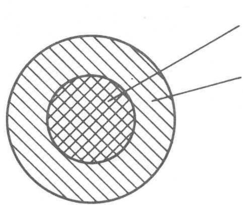  
Fig.1 Peculiarity of the Reference Reactor Design

fuel zone (core)

external blanket zone

This reference reactor Blanket-Core-Blanket

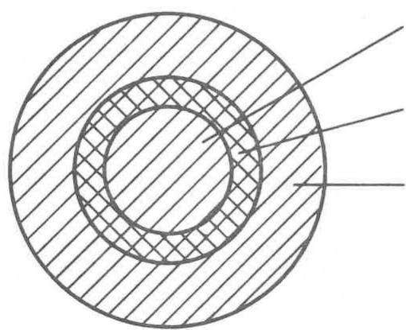

internal blanket zone

fuel zone

external blanket zone

for impact of internal breeding zone (see also DUCAT, MIT, 1974)

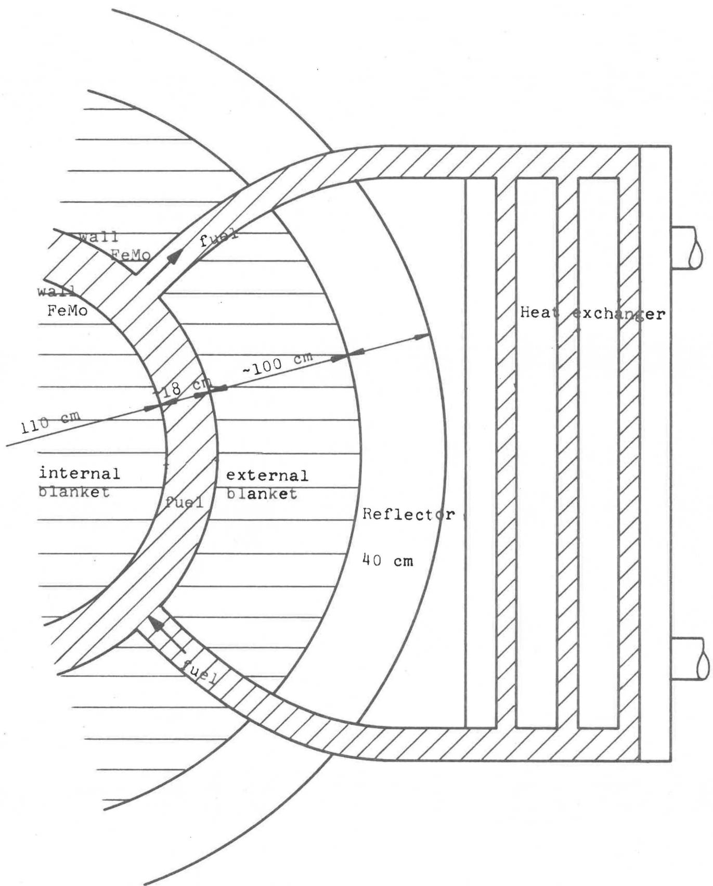  
Fig.2 Power Reactor 6 Gwth

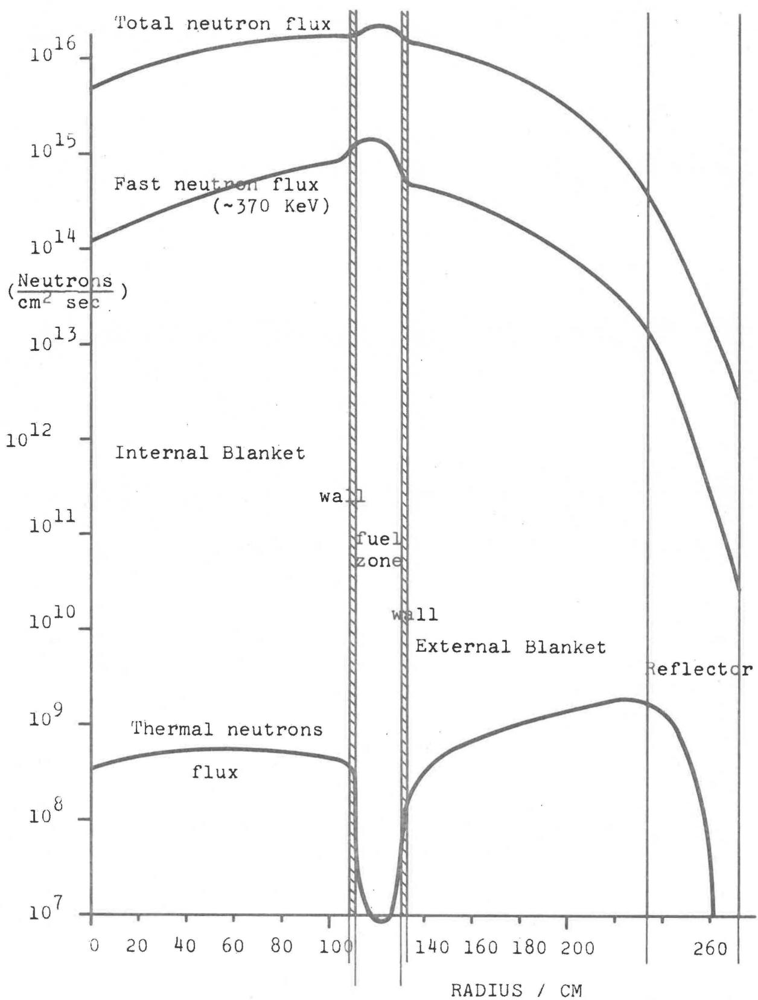  
F1E. 3   
Neutron Flux in Reference Reactor

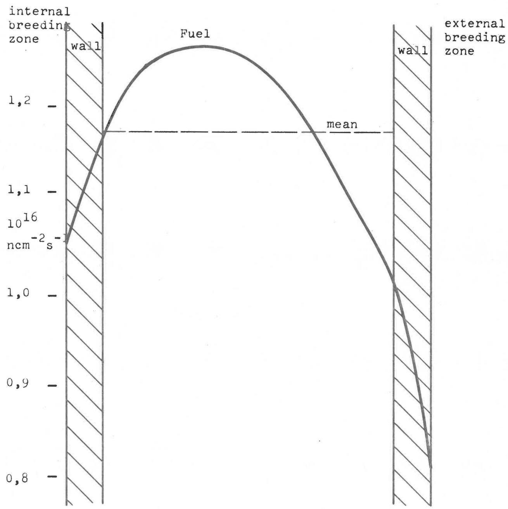  
Fig. 3' Total Flux in the Fuel Zone

The neutron flux in the reference reactor is shown in fig. 3, 3' and 4.

The thermal flux in all three zones, external breeding zone, fuel and external breeding zone is only $10^{-8}$ of the total flux and only in external blanket zone arrives $10^{-6}$ .

The total flux is relatively smoth distributed and also in the fuel zone the maximum to the mean value of the flux achieves approx 1,13 (fig. 3').

The neutron flux is rather hard and the median energy of neutrons (here estimated as that to the left and to the right of this value the number of fission is equal) is approximately $\sim 370$ KeV (see fig. 4). In a typical liquid metal fast breeder and in gas cooled fast breeder this value equals: $120\mathrm{KeV}$ and $176\mathrm{KeV}$ respectively.

As a good illustration of the impact of the most important parameters on the value of breeding ratio a simplified calculation is given on the table 2. The discrepancy between this calculations and the computer output is of $8\%$ .

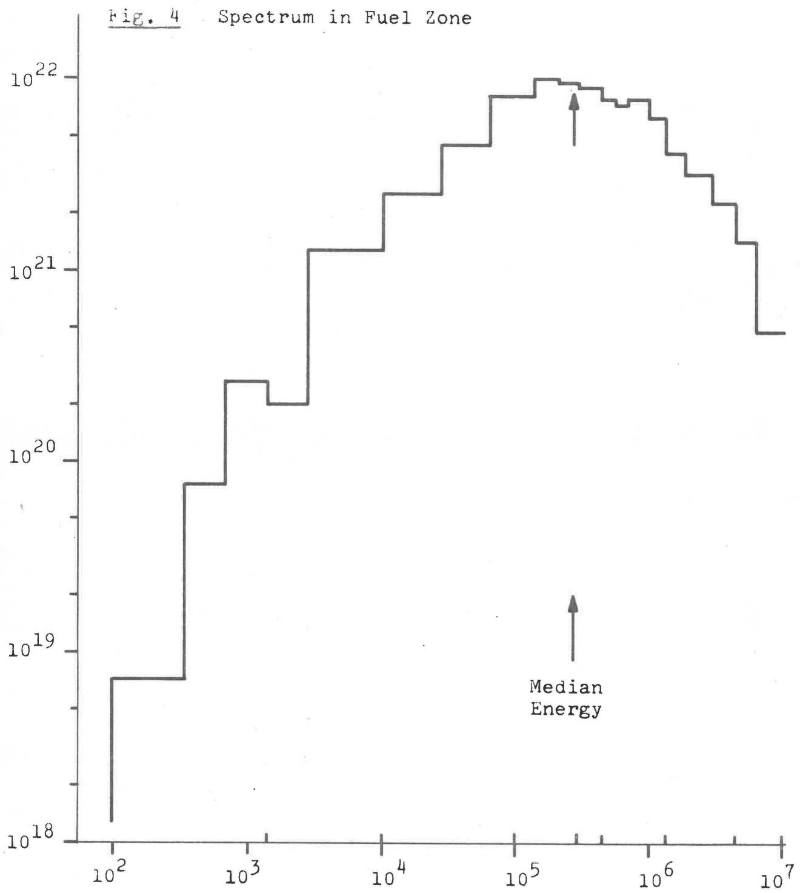  
Neutron Energy / eV

Tabelle 2 Simplified calculation of breeding ratio and neutron balance   

<table><tr><td colspan="2">Median energy (10/11 group)</td><td>370 KeV</td></tr><tr><td>Pu-238</td><td>σf</td><td>1.83 barn</td></tr><tr><td>(from computer output)</td><td>σc</td><td>0.180</td></tr><tr><td></td><td>ν</td><td>~2.95</td></tr><tr><td></td><td>α</td><td>0.0984</td></tr><tr><td></td><td>n-1</td><td>1.6857</td></tr></table>

δ: fertile/fissile fission 0.37

Bonus $\frac{(v^{\prime} - 1)\delta}{1 + \alpha}$ 0.539

Total positive 2.225

Losses FP, Cl, Na, Mo, Fe 0.160

Leakage (arbitr.) 0.10

Losses $+\alpha$ 0.32 1+a

Calculated BR 1.890

Computed BR 1.752

Impact of the plutonium contents in the fuel

One of the most important problems in achieving a high breeding ratio seems to be the hardness of the neutron flux, this is strongly influenced by the composition of the fuel.

In this case the fuel has been postulated to be a mixture of

a $\mathrm{PuCl}_3\cdot \mathrm{bNaCl}\cdot \mathrm{cUCl}_3$

$$
a = 0, 1 - 0, 2 \quad b = 0, 7 - 0, 8 \quad c = 0, 1 - 0, 2
$$

Unfortunately not all datas for this system are available (fig. 5).

The rough calculation of the changing concentration of $\mathrm{PuCl}_3$ in the melt with NaCl (fig. 6) shows a rather sharp decrease of breeding gain BG for decreasing plutonium concentration, especially when the plutonium molar ratio to the sodium is lower than 0.25.

In spite of these uncertainties of the $\mathrm{PuCl}_3$ -NaCl-UCl₃ system here has been calculated the impact of uranium-238 in the fuel. For a constant $\mathrm{PuCl}_3$ concentration, with simplified correction of NaCl concentration, the results are given on the fig. 7.

For the increasing ratio of uranium to plutonium in fuel from 0 to 3 the total breeding gain increases from 0,65 to 0,95. It is a rather clear situation; and therefore the reference reactor includes uranium in fuel in a ratio of 2:1 to the plutonium.

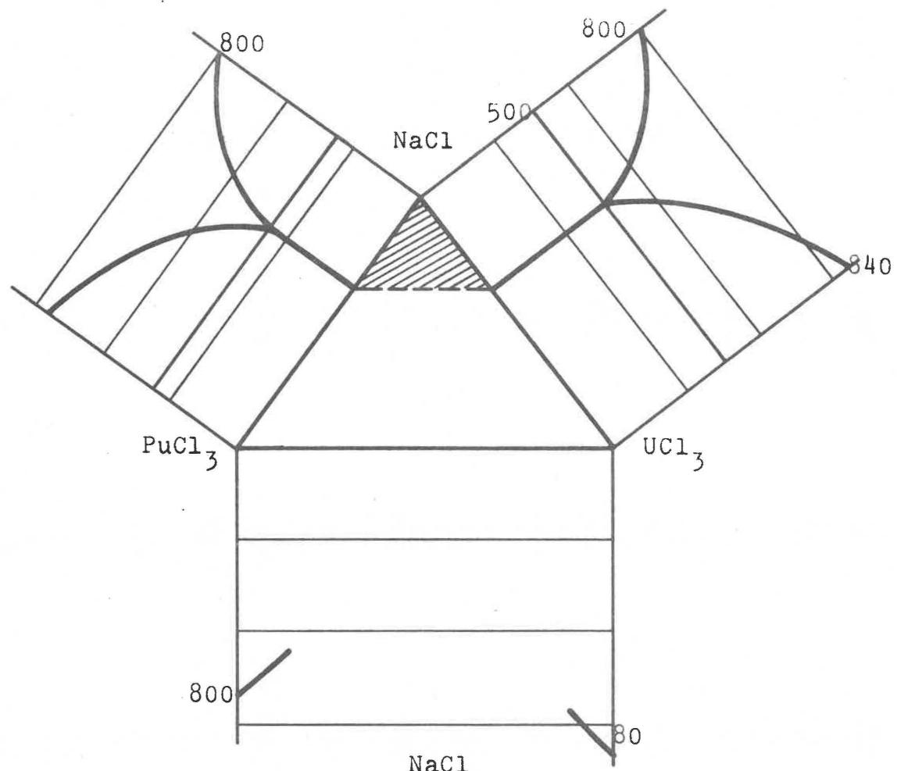  
Fig.5 The System $\mathsf{PuCl}_3\mathsf{-NaCl - UCl}_3$

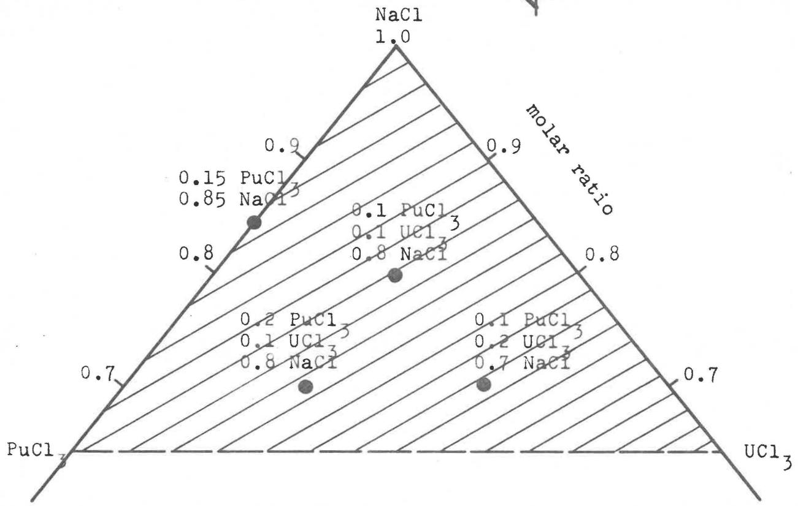

TM-HL-261

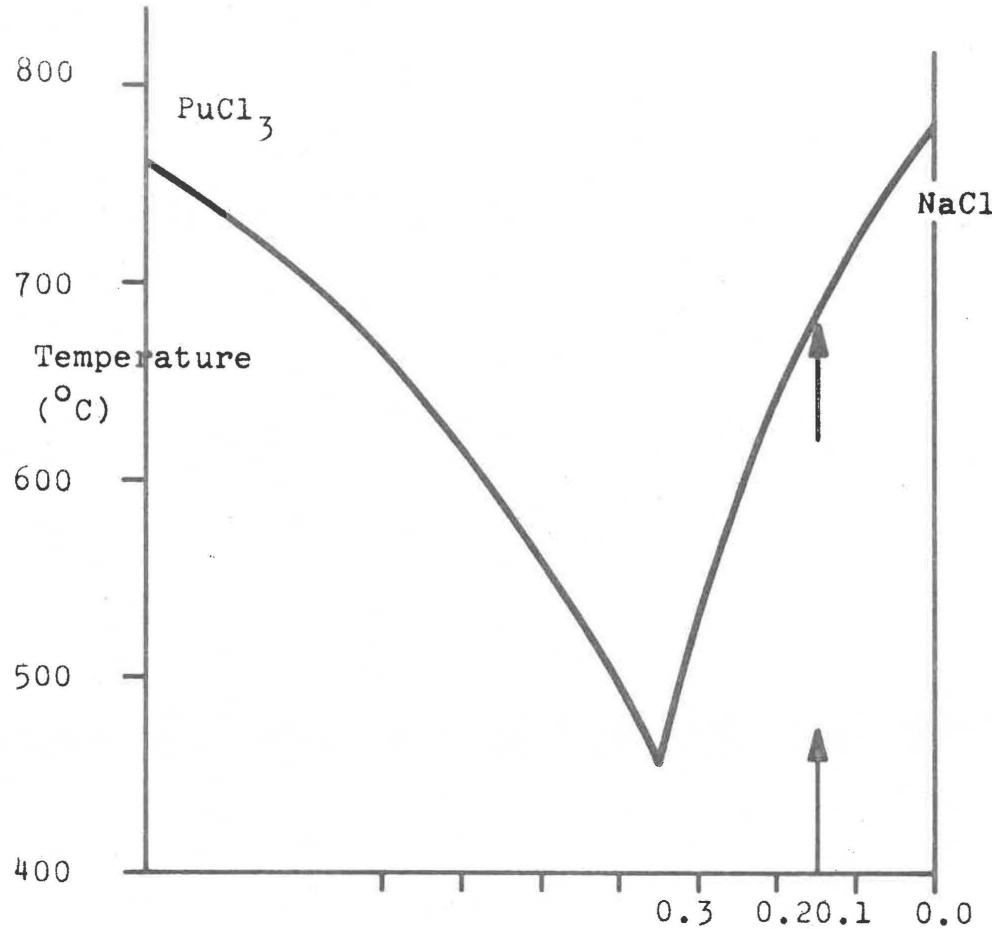  
Fig. 6 Plutonium Concentration

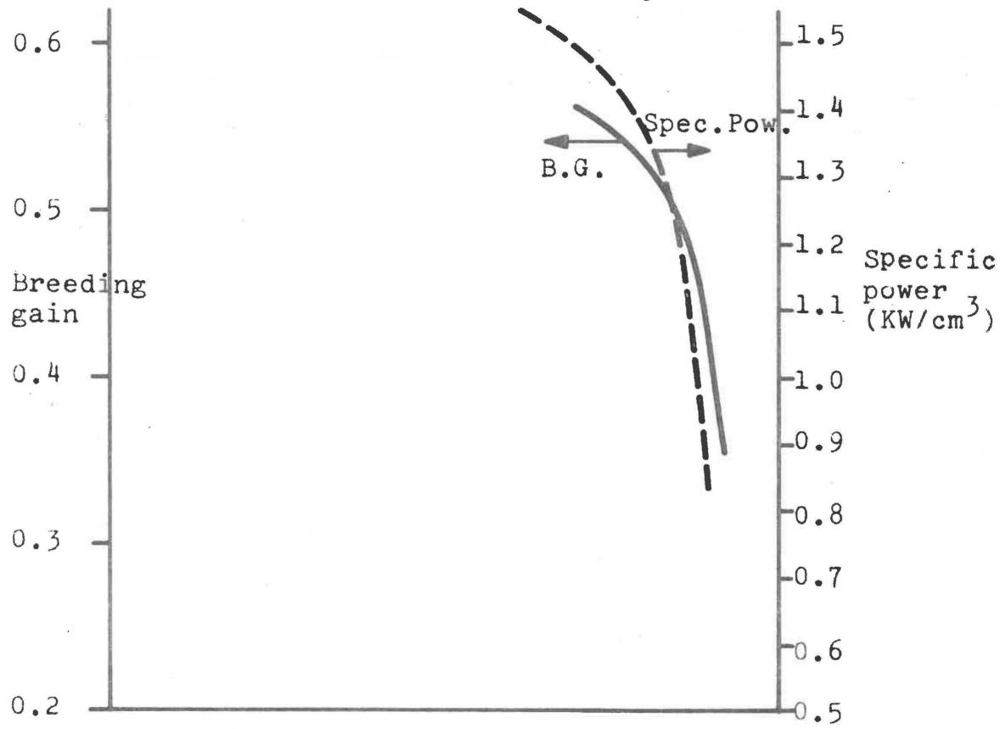  
Mol ratio of plutonium

Fig.7 Impact of U-238 Concentration in the Fuel Pu-Concentration: $0.0021 \cdot 10^{24}$ atom/cm³   
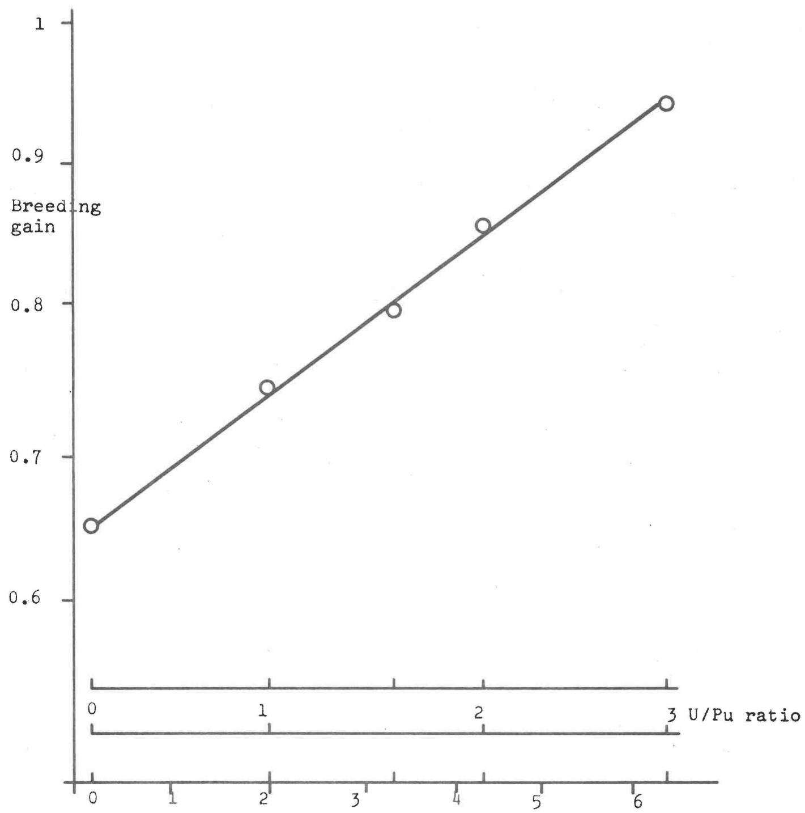  
Atom U in fuel / (0.001·10²⁴/cm³)

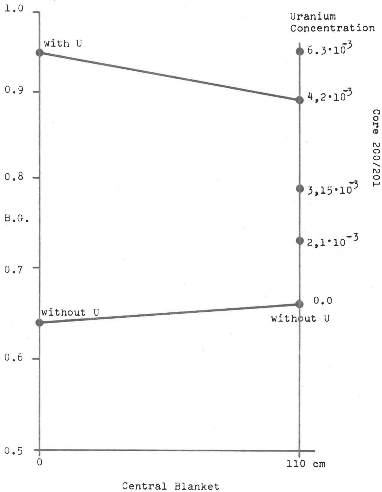  
Fig. 8 Impact of Uranium Concentration in the Fuel

Problem of geometry:

Central breeding zone versus central fuel zone

The reference reactor is a rather nonconventional one because of three zones structure:

- internal blanket zone   
fuel zone   
external blanket zone

This type of reactor has been checked with the conventional type (table 2). For all other more or less constant parameters, inclusive total power, the obtained results for breeding gain are equal. But the difference is to see in the specific power changes more than one order of magnitude, being higher in the "conventional" central fuel zone reactor. It is trivial that also the mean neutron flux increases from $1.2 \cdot 10^{16} \mathrm{~n} \mathrm{~cm}^{-2} \mathrm{~s}^{-1}$ for nonconventional central blanket zone to approx $2 \cdot 10^{17} \mathrm{~n} \mathrm{~cm}^{-2} \mathrm{~s}^{-1}$ for the conventional central fuel zone.

Because the specific power and intensity of neutron flux is doubtless a very serious problem from point of view of engineering design of the reactor (cooling, radiation damage of structural material and fuel) the both systems that is without internal blanket zone and with radius up to 110 cm have been calculated. The results are given on fig. 8 for fuel without uranium and with uranium in fuel for both extrem cases; no internal blanket zone and by internal blanket zone.

Table 2 Fuel in central zone versus fuel in middle zone 6 Gwth "Chlorophil"   

<table><tr><td colspan="2">Core (number of case)</td><td>conventional (180)</td><td>nonconventional (200)</td></tr><tr><td rowspan="3">Geometry</td><td>Central</td><td>Fuel</td><td>Blanket 110 cm</td></tr><tr><td>Middle</td><td>----</td><td>Fuel ~18 cm</td></tr><tr><td>Outer</td><td>Blanket &gt;100 cm</td><td>Blanket 100 cm</td></tr><tr><td>Pu/FP</td><td rowspan="5">boundary</td><td>2,1·10-3/2·10-5</td><td>2,1·10-3/2·10-5</td></tr><tr><td>Spec. power KW/cm3</td><td>17,7</td><td>1,41</td></tr><tr><td>Power in fuel %</td><td>90,9 %</td><td>76,2 %</td></tr><tr><td rowspan="2">Flux total left ) in fuel right)</td><td>2,04·1017</td><td>1,2·1016</td></tr><tr><td>1,15·1017</td><td>1,08·1016</td></tr><tr><td rowspan="2">Flux in left ) outer blanket right)</td><td rowspan="2">boundary</td><td>8,99·1016</td><td>9,7·1015</td></tr><tr><td>2,16·1015</td><td>2,5·1014</td></tr><tr><td>Breeding gain</td><td></td><td>0,63</td><td>0,70</td></tr><tr><td colspan="2">Median energy (group)</td><td>9 1/2</td><td>10</td></tr></table>

Fig.9 Impact of Internal Radius (No U in Fuel)   
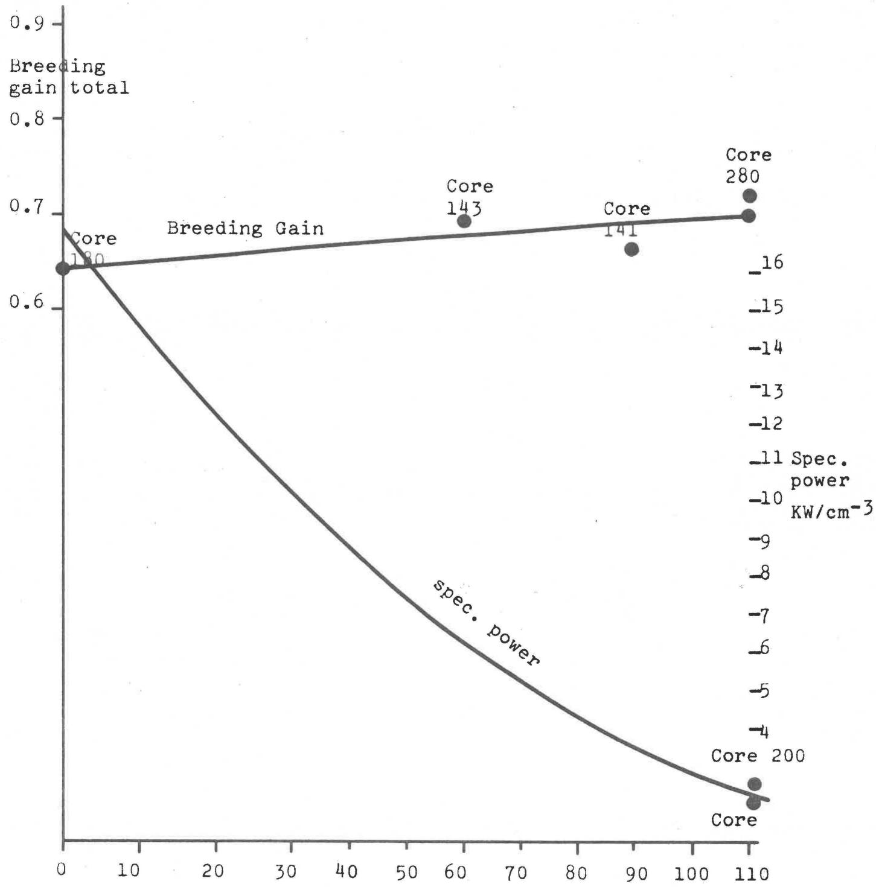  
Internal Blanket cm

On the fig. 9 and 10 are given some results of different radii of the central breeding zone.

Also the simplified calculation of internal zone breeding ratio, breeding ratio in fuel and external zone breeding ratio is shown on table 3.

From all these datas the following conclusions can be obtained:

- increase of the internal breeding zone from zero up to 110 cm increases the breeding gain for given type of fuel, wall and fertile material only unsignificant, less than $10\%$ relative.   
- the specific power increases dramatically and makes the solution of in the design very difficult.   
- the increase of U/Pu ratio from 2 up to 3,6 does not influence the total breeding gain (see fig. 10).

Table 3 (in arbitrary units)   

<table><tr><td rowspan="2">Case number</td><td colspan="3">Internal zone</td><td colspan="2">Fuel</td><td colspan="3">Outer zone</td><td rowspan="2">Total Bree-ding Ratio</td></tr><tr><td>Pu-239 oxv</td><td>U fis oxv</td><td>U cap oxv</td><td>Pu-239f oxv</td><td>Pu-241f oxv</td><td>Pu-239f oxv</td><td>U fis oxv</td><td>U cap oxv</td></tr><tr><td>*) 200</td><td>0,14</td><td>0,308</td><td>0,8</td><td>3,05</td><td>0,351</td><td>0,30</td><td>0,47</td><td>1,83</td><td>1,70</td></tr><tr><td>**) 180</td><td></td><td></td><td></td><td>3,63</td><td>0,367</td><td>0,04</td><td>0,46</td><td>2,50</td><td>1,63</td></tr></table>

*) nonconventional   
**) conventional

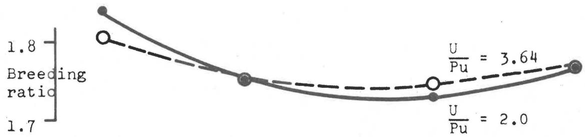  
Fig. 10 Breeding Ratio Versus Radius of Internal Fertile Zone

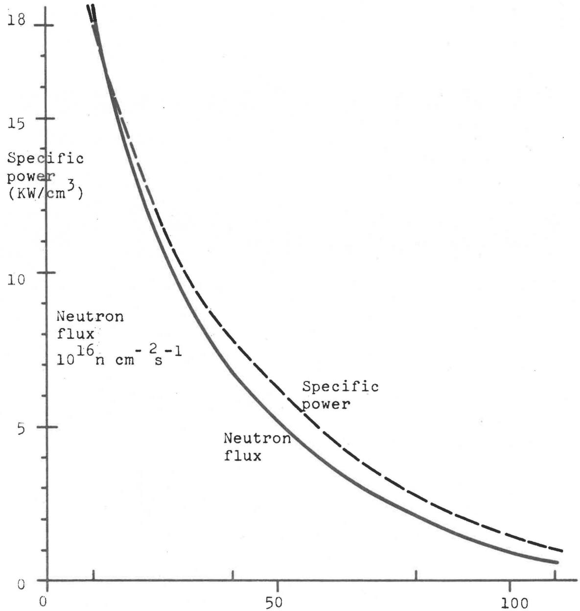  
Radius of internal breeding zone, cm

Fig. 11 Impact of Fission Products Concentration in Fuel (very simplified, from different calculations)   
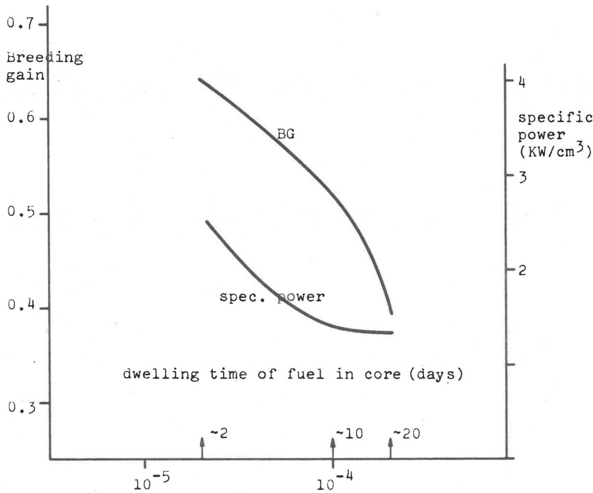  
Concentration of F.P. atoms $\cdot 10^{24} / \mathrm{cm}^3$

# Impact of reflector

The impact of the 40 cm with reflector, when changing from iron to lead is rather insignificant as is to see from table 4.

# Impact of F.P. concentration

This parameter plays a very important role. For given reactor design and given fuel and fertile composition the increase the concentration of F.P. (here simulated by Cs-133 only) from $2 \cdot 10^{-5}$ to $2 \cdot 10^{-4}$ (in $10^{24} / \mathrm{cm}^3$ ) decreases the breeding gain from 0,65 up to 0,38, when specific power decreases less than twice.

In steady state reactor a concentration of $2 \cdot 10^{-5}$ atoms F.P. $10^{24} / \mathrm{cm}^3$ for a fuel with $2,1 \cdot 10^{-3}$ atoms Pu $\cdot 10^{24} / \mathrm{cm}^3$ is to achieve for a specific power of $2 \mathrm{KW} / \mathrm{cm}^3$ after a time period of

$$
t = \frac {2 \cdot 1 0 ^ {- 5} \cdot 1 0 ^ {2 4}}{2 \cdot 1 0 ^ {3} \cdot 3 , 1 \cdot 1 0 ^ {1 0} \cdot 2} = 1, 6 1 \cdot 1 0 ^ {5} \sec
$$

that is after 1,87 days. The higher value of F.P. concentration that is $2 \cdot 10^{-4}$ corresponds to 18,7 days of mean dwelling time of fuel in reactor.

Table 4 Central fuel (Core 18) (wall 2,5 cm; Pu = 2,1·10-3 at/1024 cm³)   

<table><tr><td>Case</td><td>A</td><td>B</td><td>C</td></tr><tr><td>U in fuel</td><td>no</td><td>yes</td><td>no</td></tr><tr><td rowspan="2">Reflector 40 cm Volume fuel ·105cm3</td><td>Fe</td><td>Fe</td><td>Pb</td></tr><tr><td>2,95</td><td>2,40</td><td>2,97</td></tr><tr><td>% power in fuel %</td><td>90,6</td><td>92,1</td><td>90,8</td></tr><tr><td>spec. power in fuel KW/cm3</td><td>18,4</td><td>23,0</td><td>18,3</td></tr><tr><td>BR tot</td><td>1,64</td><td>1,94</td><td>1,66</td></tr><tr><td>Flux total right bound zone 3</td><td>1,18·1017</td><td>1,25·1017</td><td>1,187·1017</td></tr></table>

Impact of chlor-37 separation a separated chlorine Cl-37 which has much lower absorption cross section than Cl-35. The impact of each adsorber on the breeding ratio is given by:

$$
\Delta B = \frac {A + D + L + \alpha}{1 + \alpha}
$$

$\Delta \mathrm{B} =$ decrement of breeding ratio

A = absorption rate in given absorber

D absorption rate in rest of absorbers

L = leakage

$\alpha = \sigma c / \sigma f$

Because in typical case for strong absorber in hard spectrum fast core

$$
A \cong (D + L) \cong \alpha = 0. 1 5
$$

The relativ impact on the rather high breeding ratio of $B = 1.6$ results in a case when the "profit" of the separation factor will be e.g. 0,9 A, than

$$
\Delta B = \frac {0 , 9 \cdot 0 , 1 5}{1 , 1 5} = 0, 1 2
$$

and in relation to breeding gain

$$
\Delta G = \frac {0 , 1 2}{0 , 6} = 0, 2 0
$$

doubling time $\frac{T^{\prime}2}{T_{2}} = \frac{G}{G + \Delta G} = 0.83$

# Acknowledgment

All the results have been achieved in close cooperation with J. Ligou. The best thanks for the help of E. Ottewitte (nuclear datas and ANISN-code management) and S. Padiyath for computer technique help.

# Literature

M. Taube, J. Ligou EIR-Report 215, June 1972   
J. Ligou EIR-Report 229, November 1972   
M. Taube, J. Ligou Ann. Nucl. Sci. Eng. 1, 227 (1974)   
G.A. Ducat, M.J. Driscoll, N.E. Todreas MITNE-157 (1974)