# CHAPTER 2

# NUCLEAR CHARACTERISTICS OF ONE- AND TWO-REGION HOMOGENEOUS REACTORS*

Nuclear characteristics refer to the conditions and material concentrations under which reactor systems will remain critical, the relative changes in concentration of materials within the system as a function of reactor operation, and the time behavior of variables in the reactor system which occur when deviations from criticality take place. The material concentrations are closely connected with fuel costs in power reactors, while reactor behavior under noncritical conditions is closely related to the safety and control of the reactor system. These nuclear characteristics are determined from the results obtained from so-called "reactor criticality" and "reactor kinetic" calculations. In such studies, certain parameter values pertaining to nuclei concentrations and reaction probabilities are used; for convenience some of these are listed in Section 2-2.

# 2-1. CRITICALITY CALCULATIONS

Criticality studies are also termed "reactor-statics studies." In these studies the concentration of the various nuclei present can vary with time, but it is assumed that the condition of criticality will be maintained.

The statics of chain reactions in aqueous-homogeneous reactors are of interest primarily in connection with the estimation of the inventory of fuel and fertile material, power density at the wall, the flux distribution inside the reactor, and the rate of production of fissionable isotopes. These enter into economic calculations pertaining to fuel costs in power reactors and also into criteria specifying the design of the system. The most important factors determining criticality are geometry; nature, concentration, and enrichment of the fuel; nature and distribution of other components in the reactor; and operating temperature and pressure. The production of fissionable isotopes depends primarily on the neutron economy of the system and will be a function of the relative competition for neutrons between the fertile material and the various other absorbers. The latter include materials of construction, moderator, fuel components, fission products, and various nonfissionable nuclei formed by parasitic neutron capture in the fuel. In designing a reactor for the production of

fissionable isotopes, it is therefore important to choose materials (other than fuel and fertile material) which have low neutron-capture cross sections. This, in turn, leads to the selection of $\mathrm{D}_2\mathrm{O}$ as the moderator in nearly all cases.

Although criticality is assumed at all times, the concentration of fuel isotopes can change appreciably with time owing to the relative competition between isotope formation, decay, and neutron-absorption processes. In many studies it has been assumed that the reactor has operated for such times that the steady-state conditions apply with regard to the nuclei concentrations. This simplifies the isotope equations but may not always give an adequate picture of the actual concentrations which would be present in an operating reactor.

2-1.1 Calculation methods. Since both light and heavy water are excellent moderators, the energy of fission neutrons is rapidly degraded, with the result that most of the fissions are produced by thermal neutrons. Under these conditions either the modified one-group or the two-group diffusion equations are usually applicable for criticality calculations. For simplicity, this discussion will be limited to spherical reactors.

For a bare, spherical reactor the criticality condition (assuming Fermi age theory) is given by

$$
1 = \nu \left\{\frac {\sum_ {f} ^ {\mathrm {t h}} p _ {\mathrm {t h}} e ^ {- B ^ {2} \tau_ {\mathrm {t h}}}}{\sum_ {a} ^ {\mathrm {t h}} + D _ {\mathrm {t h}} B ^ {2}} + \int_ {0} ^ {u _ {\mathrm {t h}}} \frac {\sum_ {f} (u ^ {\prime})}{\xi \Sigma_ {t} (u ^ {\prime})} \left[ p (u ^ {\prime}) e ^ {- B ^ {2} \tau (u ^ {\prime})} \right] d u ^ {\prime} \right\}, \qquad (2 - 1)
$$

where $B^2 = (\pi /R)^2$

$D_{\mathrm{th}} =$ thermal diffusion coefficient,

$D(u) =$ diffusion coefficient as a function of lethargy,

$p_{\mathrm{th}} =$ resonance escape probability to thermal energy,

$p(u) =$ resonance escape probability to lethargy $u$

$R$ $=$ radius of reactor plus extrapolation distance,

$u$ = lethargy of neutrons,

$u_{\mathrm{th}}$ $= u$ evaluated at thermal energy,

$\nu$ =neutrons emitted per fission,

$\xi$ = average lethargy increment per neutron collision,

$\Sigma$ = macroscopic cross section; superscript th refers to thermal value; subscripts $f$ , $a$ , and $t$ refer to fission, absorption, and total cross sections, respectively; $\Sigma(u)$ refers to $\Sigma$ evaluated as a function of lethargy,

$\tau_{\mathrm{th}}$ = Fermi age to thermal energy,

$$
\tau (u) = \mathrm {F e r m i a g e t o l e t h a r g y} u = \int_ {0} ^ {u} \frac {D \left(u ^ {\prime}\right) d u ^ {\prime}}{\xi \Sigma_ {t} \left(u ^ {\prime}\right)}.
$$

By introducing $\epsilon$ , the "fast fission factor," where

$$
\epsilon \equiv \frac {\text {t o t a l f i s s i o n s}}{\text {t h e r m a l f i s s i o n s}} = \frac {\frac {\sum_ {f} ^ {\mathrm {t h}} p _ {\mathrm {t h}} e ^ {- B ^ {2} \tau_ {\mathrm {t h}}}}{\sum_ {a} ^ {\mathrm {t h}} + D _ {\mathrm {t h}} B ^ {2}} + \int_ {0} ^ {u _ {\mathrm {t h}}} \frac {\sum_ {f} (u ^ {\prime})}{\xi \sum_ {t} (u ^ {\prime})} p (u ^ {\prime}) e ^ {- B ^ {2} \tau (u ^ {\prime})} d u ^ {\prime}}{\frac {\sum_ {f} ^ {\mathrm {t h}} p _ {\mathrm {t h}} e ^ {- B ^ {2} \tau_ {\mathrm {t h}}}}{\sum_ {a} ^ {\mathrm {t h}} + D _ {\mathrm {t h}} B ^ {2}}}, \tag {2-2}
$$

Eq. (2-1) becomes

$$
1 = \frac {k e ^ {- B ^ {2} \tau_ {\mathrm {t h}}}}{1 + B ^ {2} L _ {\mathrm {t h}} ^ {2}}, \tag {2-3}
$$

where $k = \eta \epsilon p_{\mathrm{th}}f_{\mathrm{th}} =$ infinite multiplication constant,

$\eta$ = neutrons emitted per neutron absorption in fuel,

$f_{\mathrm{th}} = \mathrm{fraction}$ of thermal neutrons absorbed in fuel,

$$
L _ {\mathrm {t h}} ^ {2} = \frac {D _ {\mathrm {t h}}}{\Sigma_ {a} ^ {\mathrm {t h}}} = \frac {\text {t h e r m a l d i f f u s i o n c o e f f i c i e n t}}{\text {m a c r o s c o p i e t h e r m a l a b s o r p t i o n c r o s s s e c t i o n}}.
$$

Replacing the exponential term in Eq. (2-3) by $(1/1 + B^{2}\tau_{\mathrm{th}})$ , the two-group criticality condition is obtained as

$$
k = (1 + B ^ {2} \tau_ {\mathrm {t h}}) (1 + B ^ {2} L _ {\mathrm {t h}} ^ {2}). \tag {2-4}
$$

Although Eqs. (2-1), (2-3), and (2-4) imply that resonance fissions in the fuel are considered, in usual practice Eqs. (2-3) and (2-4) are used on the basis that $(\epsilon p)_{\mathrm{fuel}}$ is equal to unity. Using this assumption, the values of $\pmb{\epsilon}$ and $p$ to be used in evaluating $k$ are those associated with the fertile material. In the subsequent results and discussion, calculations based on Eqs. (2-3) and (2-4) consider that $(\epsilon p)_{\mathrm{fuel}}$ is equal to unity, while calculations based on Eq. (2-1) explicitly consider resonance absorptions and fissions in fuel based on a $1 / E$ resonance-energy flux distribution.

The breeding ratio (BR) is defined as the number of fuel atoms formed per fuel atom destroyed for the reactor system. For a bare reactor, assuming that the resonance flux is independent of lethargy and that absorptions in fertile material produce new fuel, the BR is given by

$$
\mathrm {B R} = \frac {\sum_ {\text {f e r t i l e}} ^ {\mathrm {t h}} \left[ 1 - \nu \int_ {0} ^ {u _ {\mathrm {t h}}} \frac {\sum_ {f} e ^ {- B ^ {2} \tau} p d u}{\xi \Sigma_ {t}} \right] + \nu \sum_ {f} ^ {\mathrm {t h}} \int_ {0} ^ {u _ {\mathrm {t h}}} \frac {\sum_ {\text {f e r t i l e}} p e ^ {- B ^ {2} \tau} d u}{\xi \Sigma_ {t}}}{\sum_ {a} ^ {\mathrm {t h}} (\text {f u e l}) \left[ 1 - \nu \int_ {0} ^ {u _ {\mathrm {t h}}} \frac {\sum_ {f} e ^ {- B ^ {2} \tau} p d u}{\xi \Sigma_ {t}} \right] + \nu \sum_ {f} ^ {\mathrm {t h}} \int_ {0} ^ {u _ {\mathrm {t h}}} \frac {\sum_ {a} (\text {f u e l}) p e ^ {- B ^ {2} \tau} d u}{\xi \Sigma_ {t}}}, \tag {2-5}
$$

where $\Sigma_{\mathrm{fertil}}^{\mathrm{th}} =$ thermal absorption cross section of fertile material,

$\Sigma_{\text{fertile}} = \text{absorption cross section of fertile material at lethargy } u,$

$\Sigma_{a}(\mathrm{fuel}) =$ fuel absorption cross section at lethargy $u$

If resonance absorptions in fuel are neglected, the conventional two-group formula is obtained as

$$
\mathrm {B R} = \frac {\sum_ {\text {f e r t i l e}} ^ {\mathrm {t h}}}{\sum_ {a} ^ {\mathrm {t h}} (\text {f u e l})} + \frac {\eta (1 - p _ {\text {f e r t i l e}})}{1 + B ^ {2} \tau_ {\mathrm {t h}}} \cdot \tag {2-6}
$$

In the subsequent discussion, reference to one-region, two-group calculations implies use of Eqs. (2-4) and (2-6) to calculate critical mass and breeding ratio, respectively.

The two-group diffusion equations were used for two-region reactor calculations. The effect of a thin shell between the two regions upon reactor criticality and breeding ratio was taken into account by considering the shell absorptions by means of a boundary condition; the effect of a pressure-vessel wall was taken into account by using an "effective" extrapolation distance in specifying the radius at which the flux was assumed to be zero. The two-group equations were written as:

$$
D _ {f c} \nabla^ {2} \phi_ {f c} - \Sigma_ {f c} \phi_ {f c} + \frac {k _ {c}}{p _ {c}} \Sigma_ {s c} \phi_ {s c} = 0, \tag {2-7}
$$

$$
D _ {s c} \nabla^ {2} \phi_ {s c} - \Sigma_ {s c} \phi_ {s c} + p _ {c} \Sigma_ {f c} \phi_ {f c} = 0, \tag {2-8}
$$

$$
D _ {f b} \nabla^ {2} \phi_ {f b} - \Sigma_ {f b} \phi_ {f b} + \frac {k _ {b}}{p _ {b}} \Sigma_ {s b} \phi_ {f b} = 0, \tag {2-9}
$$

$$
D _ {s b} \nabla^ {2} \phi_ {s b} - \Sigma_ {s b} \phi_ {s b} + p _ {b} \Sigma_ {f b} \phi_ {f b} = 0. \tag {2-10}
$$

The subscripts $f, s, c$ , and $b$ refer, respectively, to the fast flux, slow flux, core region, and blanket region; $D$ is the diffusion coefficient; $\phi$ is the neutron flux; $\Sigma_f$ refers to the effective cross section for removing neutrons from the fast group; and $\Sigma_s$ refers to the thermal absorption cross section. Other symbols have the same meaning given previously, with $k$ calculated on the basis that $(\epsilon p)_{\mathrm{fuel}} = 1$ .

The boundary conditions used assume that the fast flux has the same value on the core side of the core-tank wall as on the blanket side; the same is also true of the slow flux. It is also specified that the fast flux and slow flux become zero at some extrapolated reactor radius. At the core-tank wall, the net fast-neutron current on the blanket side is assumed equal to that on the core side, while the net slow-neutron current on the core side is assumed equal to the flux rate of neutron absorptions in the core tank plus the net slow-neutron current on the blanket side.

A multigroup formulation can be obtained by adding neutron groups with energies intermediate between the fast and slow groups specified in Eqs. (2-7) through (2-10). These intermediate groups would be essentially of the form

$$
D _ {i} \nabla^ {2} \phi_ {i} - \Sigma_ {i} \phi_ {i} + p _ {i - 1} \Sigma_ {i - 1} \phi_ {i - 1} = 0, \tag {2-11}
$$

where $i$ represents the $i$ th group of neutrons, and $i$ increases with decreas-

ing neutron energy. Boundary conditions analogous to those specified above would apply. Such a formulation assumes that neutrons in the $i$ th group are always slowed down into the $i + 1$ group, corresponding to a relatively small number of fast groups. Using about 30 groups or more, multigroup methods [1] used in homogeneous reactor calculations consider that fast neutrons are born in the various fast groups in accordance with the fraction of fission neutrons generated in the particular group; that for all materials but hydrogen, neutrons are "slowed down" from one energy group to the group immediately below; and that with hydrogen, the possibility exists for a neutron to pass from one group to any group below as a result of one scattering collision. Other multigroup methods [2] of calculation have been devised which consider that a scattering collision degrades a neutron into the groups below in accordance with the probability for degradation into a particular group.

2-1.2 Results obtained for one-region reactors. The majority of critical calculations for large one-region reactors have been based on Eqs. (2-3) and (2-4), in which all the fissions are effectively assumed to take place in the thermal group [3]. However, if the effective value of $\eta(\text{fuel})$ for the resonance region is less than the value for the thermal region, the above models may not be adequate. Some multigroup calculations [4] have been done for uranium-water systems at an average temperature of $260^{\circ}\text{C}$ ; in Fig. 2-1 are shown critical-mass requirements for light water-uranium sys

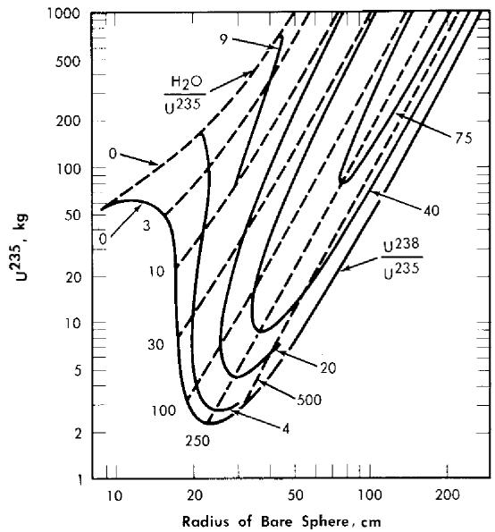  
FIG. 2-1. $\mathbf{U}^{235}$ mass and critical size of uranium light-water mixtures at $260^{\circ}\mathrm{C}$ . Assumed densities: $\mathrm{U}^{235} = 18.5\mathrm{g / cm^3}$ , $\mathrm{U}^{238} = 18.9\mathrm{g / cm^3}$ , $\mathrm{H}_2\mathrm{O} = 0.8\mathrm{g / cm^3}$ .

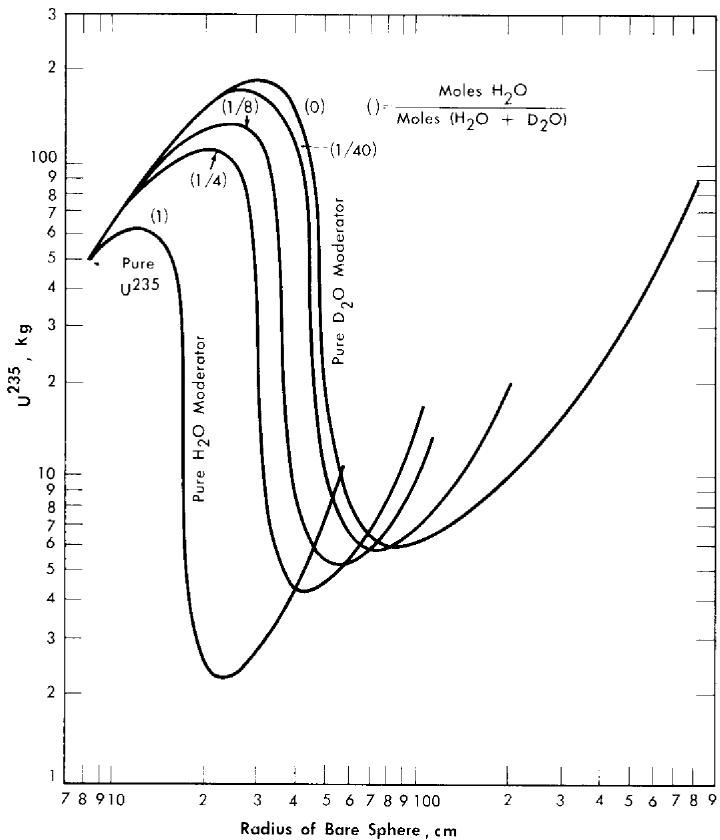  
FIG. 2-2. $\mathrm{U}^{235}$ mass and critical size of bare spherical reactors moderated by $\mathrm{H}_2\mathrm{O}-\mathrm{D}_2\mathrm{O}$ mixtures at $260^{\circ}\mathrm{C}$ . Assumed densities: $\mathrm{U}^{235} = 18.5\mathrm{g/cm^3}$ , $\mathrm{H}_2\mathrm{O} = 0.8\mathrm{g/cm^3}$ , $\mathrm{D}_2\mathrm{O} = 0.89\mathrm{g/cm^3}$ .

tems, while Fig. 2-2 gives the critical-mass requirements for $\mathrm{U}^{235}-\mathrm{D}_2\mathrm{O}-\mathrm{H}_2\mathrm{O}$ systems. Initial conversion ratios for light-water systems are given in Ref. [4].

Nuclear calculations have also been performed [5] using Eqs. (2-1) and (2-5), with the $1 / E$ component of the flux starting at energies of $6kT$ . The calculations were for single-region reactors containing only $\mathrm{ThO_2}$ , $\mathrm{U}^{233}\mathrm{O}_2$ , and $\mathrm{D}_2\mathrm{O}$ at $300^{\circ}\mathrm{C}$ with the value of $\eta^{23}$ in the resonance region considered to be a parameter. Critical concentrations thus calculated are given in Fig. 2-3 for zero neutron leakage. The value for $\eta^{23}$ in the thermal energy region was taken as 2.25. The value for $\eta^{23}$ in the resonance region has not been firmly established; based on available data, $\eta_{\mathrm{res}}^{23} / \eta_{\mathrm{th}}^{23}$ lies between 0.9 and 1.

When the neutron leakage is not negligible and $\eta_{\mathrm{res}}^{23} / \eta_{\mathrm{th}}^{23}$ is less than 1, a finite thorium concentration exists for which the breeding ratio is a maximum. This is indicated in Fig. 2-4, in which the initial breeding ratio is

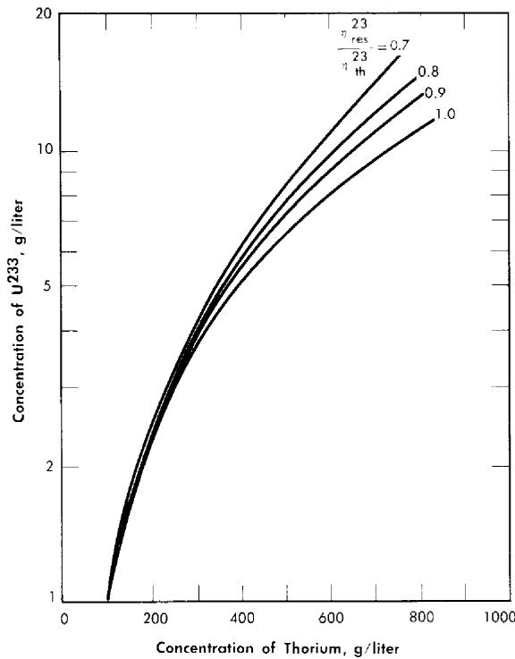  
FIG. 2-3. Fuel concentration as a function of thorium concentration and value of $\eta_{\mathrm{res}} / \eta_{\mathrm{th}}$ for an infinite reactor.

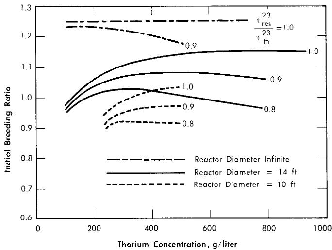  
FIG. 2-4. Breeding ratio as a function of thorium concentration and $\eta_{\mathrm{res}}^{23} / \eta_{\mathrm{th}}^{23}$ in a one-region reactor. Reactor temperature $= 300^{\circ}\mathrm{C}$ , $\eta_{\mathrm{th}}^{23} = 2.25$ .

given as a function of thorium concentration, reactor diameter, and relative value of $\eta^{23}$ . The breeding ratio goes through a maximum owing to the increase in resonance absorption in fuel as the thorium concentration is increased.

If the above reactors were fueled initially with $\mathbf{U}^{235}$ , the initial breeding ratio would have a maximum value of 1.08 rather than 1.25; however, the curves would have about the same shape as those presented in Fig. 2-4, and the value for $\eta_{\mathrm{res}}^{25} / \eta_{\mathrm{th}}^{25}$ would be between 0.8 and 0.9.

Comparison of the above results with those obtained using a two-group model shows that if $\eta_{\mathrm{res}} / \eta_{\mathrm{th}}$ is equal to 1, the breeding ratio obtained by the two methods is about the same; however, the critical concentration is about $30\%$ higher when the two-group model is used. If $\eta_{\mathrm{res}}^{23} / \eta_{\mathrm{th}}^{23} < 1$ , the value for the breeding ratio obtained using the two-group model will tend to be higher than the actual value; however, if the fertile-material concentration is low (about $200\mathrm{g}$ /liter or less) and the reactor size large, little resonance absorption occurs in fuel. Under these conditions the two-group model should be adequate for obtaining the breeding ratio and conservative with respect to estimating the critical concentration.

2-1.3 Results obtained for two-region reactors. Most two-region reactors have been calculated on the basis of the two-group model. Results have also been obtained using multigroup calculations which indicate that the two-group method is valid so long as the value of $\eta(\mathrm{fuel})$ is independent (or nearly so) of energy, or so long as nearly all the fissions are due to absorption of thermal neutrons.

To compare results obtained by different calculational methods, breeding ratios and critical fuel concentrations were obtained [6] for some two-region, $\mathrm{D}_2\mathrm{O}$ -moderated thorium-blanket breeder reactors using a multi-group, multiregion Univac program ("Eyewash") [1] and a two-group, two-region Oracle program [7]. In these calculations operation at $280^{\circ}\mathrm{C}$ was assumed; a $\frac{1}{2}$ -in.-thick Zircaloy-2 core tank separated the core from the blanket; a 6-in.-thick iron pressure vessel contained the reactor; and absorptions occurred only in $\mathrm{U}^{233}$ and thorium in the core and in thorium in the blanket. Twenty-seven fast groups, one thermal group, and four regions (core, Zircaloy-2 core tank, blanket, and pressure vessel) were employed in the multigroup model. The two-group parameters were computed from the multigroup cross sections by numerical integration [8]. In the two-group, two-region calculations a "thin-shell" approximation [9] was used to estimate core-tank absorptions, while the effect of the pressure vessel was simulated by adding an extrapolation distance to the blanket thickness.

In the multigroup studies, various values for $\eta^{23}$ in the resonance region were considered. In one case the value of $\eta_{\mathrm{res}}^{23}$ was assumed to be constant

and equal to the thermal value.* In another the variation of $\eta^{23}$ in the resonance region was based on cross sections used by Roberts and Alexander [10], which resulted in an $\eta_{\mathrm{res}}^{23} / \eta_{\mathrm{th}}^{23}$ of about 0.95; in the third case the effective value for $\eta^{23}$ in the resonance region was assumed to be essentially 0.8 of the thermal value of 2.30.

The initial breeding ratios and $\mathbf{U}^{233}$ critical concentrations obtained from the Eyewash and two-group, two-region calculations are given in Fig. 2-5 for slurry-core reactors (zero core thorium concentration also corresponds to a solution-core reactor). With solution-core reactors the effect of the value of $\eta_{\mathrm{res}}^{23}$ upon breeding ratio was less pronounced than for slurry-core reactors, since fewer resonance absorptions take place with the lower fuel concentrations. The blanket thorium concentration had little influence upon the above effect for blanket thorium concentrations greater than $250~\mathrm{g / liter}$ .

As indicated in Fig. 2-5, the breeding ratio is rather dependent upon the value of $\eta^{23}$ ; the loss in breeding ratio due to a reduced value of $\eta^{23}$ in the resonance region is most marked for the slurry-core systems. For these reactors, relatively more fissions take place in the resonance-energy region as the core loading is increased, owing to the "hardening" of the neutron spectrum. Figure 2-5 also shows that the two-group model gives breeding ratios which are in good agreement with those obtained from the multigroup model, so long as $\eta_{\mathrm{res}}^{23}$ does not deviate significantly from $\eta_{\mathrm{th}}^{23}$ . Reported measurements [11-13] of $\eta^{23}$ as a function of energy indicate that for the reactors considered here, the value of $\eta_{\mathrm{res}}^{23} / \eta_{\mathrm{th}}^{23}$ would be about 0.95; the results given by curve "a" in Fig. 2-5 are based effectively on such a value of $\eta_{\mathrm{res}}^{23} / \eta_{\mathrm{th}}^{23}$ and indicate that two-group results are valid.

In general, for the cases studied it was found that for a heavily loaded blanket (or core), the two-group values of total neutron leakage were larger than the total leakages obtained from the multigroup calculation (the multigroup model allowed for competition between fast absorptions in fuel and fast leakage, while the two-group model assumed that fast leakage occurred before any resonance absorption occurred). The multigroup results were also used to calculate the fast effect, $\epsilon$ , previously defined in Eq. (2-2). It was found that resonance fissions accounted for $10\%$ to $40\%$ of the total fissions in those reactors containing from 0 to $300\mathrm{g}$ Th/liter in the core region. With no thorium in the core region, changing from a 4-9 reactor (4-ft-diameter core and a 9-ft-diameter pressure vessel) to a 6-10 reactor decreased core resonance fissions from about $14\%$ to $10\%$ .

If the reactor core size is small, the two-group method does not adequately treat leakage of fast neutrons; for this case two-group results may

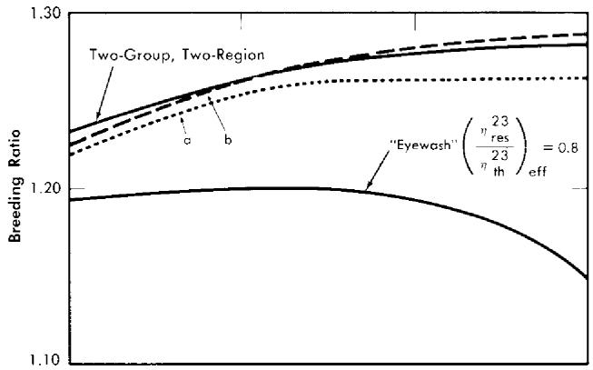

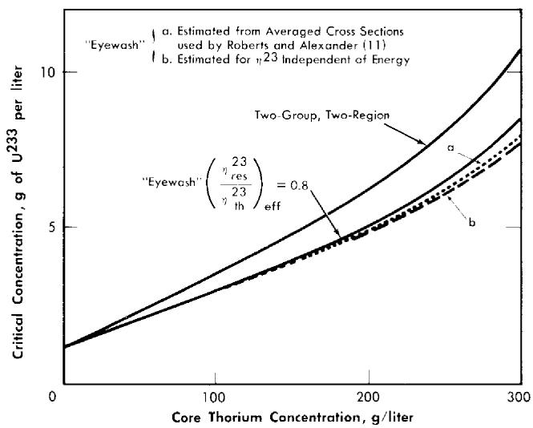  
FIG. 2-5. Breeding gain and critical concentration for slurry-core reactors vs. core thorium concentration. Core diameter $= 6.0$ ft, pressure vessel diameter $= 10.0$ ft, blanket thorium concentration $= 1000\mathrm{g / liter}$ , blanket $\mathrm{U}^{233}$ concentration $= 3.0$ g/kg of Th.

not be adequate even though $\eta_{\mathrm{res}}$ is equal to $\eta_{\mathrm{th}}$ . This is indicated by the experimental [14] and calculated results for the HIRE-2 given in Fig. 7-15. As illustrated, there is excellent agreement between the experimental data and the data calculated by a multigroup method and by a "harmonics" method, but not with the results from the two-group model. The harmonics calculation [15] referred to in Fig. 7-15 does not take into account fast fissions but does treat the slowing-down of neutrons in a more realistic manner than does the two-group calculation. The multigroup result [16] indicated that about $13\%$ of the fissions were due to neutrons having energies above thermal.

A comparison [15] of the $\mathrm{U}^{235}$ critical concentrations predicted by the

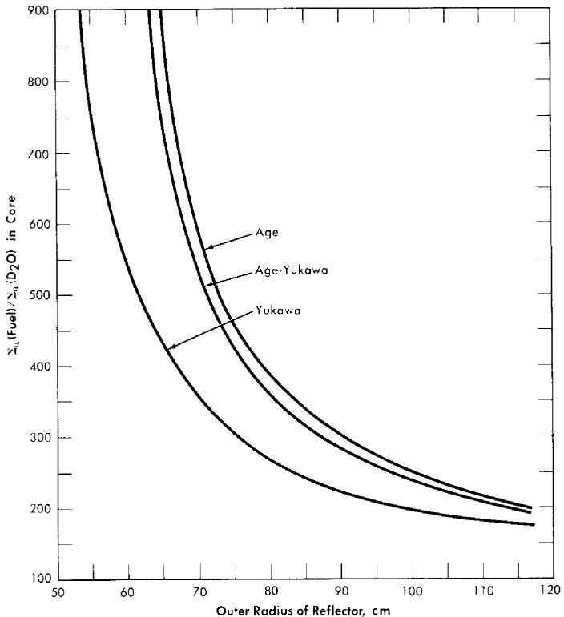  
FIG. 2-6. Comparison of critical concentrations obtained for various slowing-down kernels in $\mathrm{D}_2\mathrm{O}$ . Core radius $= 39~\mathrm{cm}$ , total age $= 237~\mathrm{cm}^2$ for all kernels, diffusion length of pure moderator, $\mathbf{L}_0^2 = 40,200~\mathrm{cm}^2$ . Fuel only in core.

use of different slowing-down kernels in $\mathrm{D}_2\mathrm{O}$ -moderated reactors is shown in Fig. 2-6. In the age-Yukawa kernel [given by $(e^{-r^2 /4\tau_1} / (4\pi \tau_1)^{3 / 2})\times$ $(e^{-r / \sqrt{\tau_2}} / 4\pi \tau_2r)]$ , the "age" parameters were taken to be $158~\mathrm{cm^2}$ for $\tau_{1}$ and $79~\mathrm{cm^2}$ for $\tau_{2}$ . For both the age kernel (given by $e^{-r^2 /4\tau} / (4\pi \tau)^{3 / 2}$ ) and the Yukawa kernel (given by $e^{-r / \sqrt{\tau}} / 4\pi \tau r$ ), $\tau$ was taken to be $237~\mathrm{cm^2}$ . The results show that in small reactors the calculated critical concentration obtained using the two-group method (Yukawa kernel) is substantially lower than that obtained using either an age-Yukawa or an age kernel to represent the neutron distribution during the slowing-down process. Since the age-Yukawa kernel is believed to be the proper one to use for $\mathrm{D}_2\mathrm{O}$ , and the HRT is a "small" reactor (in a nuclear sense), it is not surprising that the two-group results given in Fig. 7-15 are appreciably different from the experimental results.

# 2-2. NUCLEAR CONSTANTS USED IN CRITICALITY CALCULATIONS

In obtaining the nuclear characteristics of reactors, it is necessary to know the probabilities with which different events occur. These reaction

probabilities are usually given on an atomic basis in terms of cross sections [17]. Because of their diverse applications, it is necessary to present reaction probabilities in this manner; however, in calculating the nuclear characteristics of homogeneous reactors, it is convenient to combine fundamental data concerning atomic density and reaction probabilities so as to facilitate critical calculations. This has been done to a limited extent in this section. Listed here are some nuclear data and physical properties of uranium isotopes, uranyl sulfate, heavy water, thorium oxide, and Zircaloy-2 used in two-group calculations for thorium breeder reactors [18].

# TABLE 2-1

# THERMAL MICROSCOPIC ABSORPTION CROSS SECTIONS AT VARIOUS TEMPERATURES

(Corrected for Maxwell-Boltzmann distribution and also non- $(1 / v)$ correction)

<table><tr><td>Element</td><td>Neutron velocity, 2200 m/sec</td><td>20°C</td><td>100°C</td><td>280°C</td></tr><tr><td colspan="5">σa,barns [17]</td></tr><tr><td>U233</td><td>588</td><td>526</td><td>460</td><td>376</td></tr><tr><td>U234</td><td>92</td><td>82</td><td>72</td><td>59</td></tr><tr><td>U235</td><td>689</td><td>595</td><td>515</td><td>411</td></tr><tr><td>U236</td><td>6</td><td>5.3</td><td>4.7</td><td>3.9</td></tr><tr><td>U238</td><td>2.73</td><td>2.42</td><td>2.15</td><td>1.76</td></tr><tr><td>Pa233* [19]</td><td>60</td><td>130</td><td>130</td><td>130</td></tr><tr><td>Th232</td><td>7.45</td><td>6.60</td><td>5.85</td><td>4.81</td></tr><tr><td>Pu239</td><td>1025</td><td>975</td><td>905</td><td>950</td></tr><tr><td>Pu240*</td><td>250</td><td>600</td><td>700</td><td>1000</td></tr><tr><td>Pu241</td><td>1399</td><td>1240</td><td>1118</td><td>952</td></tr><tr><td>S</td><td>0.49</td><td>0.43</td><td>0.39</td><td>0.32</td></tr><tr><td>Li7 (99.98%) [20]</td><td>0.23</td><td>0.20</td><td>0.18</td><td>0.15</td></tr><tr><td colspan="5">σf,barns [17]</td></tr><tr><td>U233</td><td>532</td><td>472</td><td>412</td><td>337</td></tr><tr><td>U235</td><td>582</td><td>506</td><td>438</td><td>350</td></tr><tr><td>Pu239</td><td>748</td><td>711</td><td>660</td><td>693</td></tr><tr><td>Pu241</td><td>970</td><td>860</td><td>776</td><td>660</td></tr></table>

*Estimates of the effective cross section in typical homogeneous-reactor neutron spectrums (except for $2200\mathrm{m / sec}$ value); these values include contributions due to resonance absorptions. (Although these values were not used in the calculations presented, they are believed to be more accurate than the ones employed. Values used for $\mathrm{Pa}^{233}$ were 133, 118, and 97 barns at 20, 100, and $280^{\circ}\mathrm{C}$ , respectively.)

2-2.1 Nuclear data. Table 2-1 lists thermal microscopic absorption and fission cross sections for various elements and for various temperatures. Table 2-2 lists thermal macroscopic absorption cross sections for $\mathrm{H}_2\mathrm{O}$ , $\mathrm{D}_2\mathrm{O}$ , and Zircaloy-2, and the density of $\mathrm{H}_2\mathrm{O}$ and $\mathrm{D}_2\mathrm{O}$ at the various

# TABLE 2-2

(Corrected for Maxwell-Boltzmann distribution on basis of $1 / v$ cross section)

THERMAL MACROSOCOPIC ABSORPTION CROSS SECTIONS AND DENSITIES AT VARIOUS TEMPERATURES [18]   

<table><tr><td>Element</td><td>20°C</td><td>100°C</td><td>280°C</td></tr><tr><td>Σa(H2O)</td><td>0.0196</td><td>0.0167</td><td>0.0107</td></tr><tr><td>Σa(99.75% D2O)</td><td>8.02 × 10-5</td><td>6.85 × 10-5</td><td>4.44 × 10-5</td></tr><tr><td>Σa(Zircaloy-2)</td><td>0.00674</td><td>0.00598</td><td>0.00491</td></tr><tr><td>ρ(D2O)</td><td>1.105</td><td>1.062</td><td>0.828</td></tr><tr><td>ρ(H2O)</td><td>1.000</td><td>0.962</td><td>0.749</td></tr></table>

temperatures. All cross sections listed under the columns headed by $^\circ \mathrm{C}$ have been corrected for a Maxwell-Boltzmann flux distribution.

Values of $\eta$ and $\nu$ for the various fuels, and the fast and slow diffusion coefficients for Zircaloy are given in Table 2-3.

# TABLE 2-3

Values of $\eta$ and $\nu$ for U and Pu [21]

SOME NUCLEAR CONSTANTS FOR URANIUM, PLUTONIUM, AND ZIRCALOY-2   

<table><tr><td>Element</td><td>η</td><td>ν</td></tr><tr><td>U233</td><td>2.25</td><td>2.50</td></tr><tr><td>U235</td><td>2.08</td><td>2.46</td></tr><tr><td>Pu239</td><td>1.93</td><td>3.08</td></tr><tr><td>Pu241</td><td>2.23</td><td>3.21</td></tr><tr><td colspan="3">Diffusion coefficients for Zircaloy-2: [22] 
D1=D2=0.98 for all temperatures, 
where D1=fast diffusion coefficient, 
D2=slow diffusion coefficient.</td></tr></table>

Data for two-group calculations are summarized in Table 2-4 for $\tau$ , $D_{1}$ , $D_{2}$ , and $p$ as functions of fertile-material concentration in mixtures of

TABLE 2-4   
TWO-GROUP NUCLEAR CONSTANTS* FOR $\mathrm{D}_2\mathrm{O}$ -MODERATED SYSTEMS AT $280^{\circ}\mathrm{C}$ [18]   

<table><tr><td>Fertile-material concentration, g/liter</td><td>τ, cm2</td><td>Dt, cm</td><td>D2, cm</td><td>p</td></tr><tr><td>Th (in ThO2-D2O)</td><td></td><td></td><td></td><td></td></tr><tr><td>0</td><td>212</td><td>1.64</td><td>1.24</td><td>1.000</td></tr><tr><td>100</td><td>212</td><td>1.62</td><td>1.23</td><td>0.909</td></tr><tr><td>250</td><td>213</td><td>1.60</td><td>1.22</td><td>0.825</td></tr><tr><td>500</td><td>213</td><td>1.56</td><td>1.20</td><td>0.718</td></tr><tr><td>1000</td><td>215</td><td>1.50</td><td>1.16</td><td>0.554</td></tr><tr><td>U238 (in UO2SO4-D2O)</td><td></td><td></td><td></td><td></td></tr><tr><td>0</td><td>212</td><td>1.64</td><td>1.24</td><td>1.000</td></tr><tr><td>100</td><td>200</td><td>1.57</td><td>1.20</td><td>0.875</td></tr><tr><td>250</td><td>189</td><td>1.49</td><td>1.15</td><td>0.801</td></tr><tr><td>500</td><td>179</td><td>1.40</td><td>1.10</td><td>0.720</td></tr><tr><td>1000</td><td>173</td><td>1.28</td><td>1.04</td><td>0.595</td></tr><tr><td>U238 (in UO2SO4-Li2SO4-D2O)†</td><td></td><td></td><td></td><td></td></tr><tr><td>0</td><td>212</td><td>1.64</td><td>1.24</td><td>1.000</td></tr><tr><td>100</td><td>198</td><td>1.55</td><td>1.19</td><td>0.873</td></tr><tr><td>250</td><td>185</td><td>1.45</td><td>1.13</td><td>0.797</td></tr><tr><td>500</td><td>173</td><td>1.33</td><td>1.07</td><td>0.705</td></tr><tr><td>1000</td><td>165</td><td>1.18</td><td>0.99</td><td>0.525</td></tr></table>

$^{*}\tau =$ Fermi age; $D_{1} =$ fast diffusion coefficient; $D_{2} =$ slow diffusion coefficient; $p =$ resonance escape probability.   
$\dagger \mathrm{Li}_2\mathrm{SO}_4$ molar concentration equal to $\mathrm{UO}_2\mathrm{SO}_4$ molar concentration.

fertile material and heavy water $(99.75\% \mathrm{D}_2\mathrm{O})$ at $280^{\circ}\mathrm{C}$ . Materials considered are $\mathrm{ThO_2 - D_2O}$ , $\mathrm{UO_2SO_4 - D_2O}$ , and $\mathrm{UO_2SO_4 - Li_2SO_4 - D_2O}$ where the molar concentration of $\mathrm{Li_2SO_4}$ is the same as the $\mathrm{UO_2SO_4}$ molar concentration. Reference [18] gives corresponding data at other temperatures and also gives some values for the case of $\mathrm{H}_2\mathrm{O}$ as the moderator.

The diffusion coefficients and ages were calculated by a numerical integration procedure [8]. The fast diffusion constant, $D_{1}$ , and the Fermi age, $\tau$ , are based on a $1 / E$ flux distribution, and the slow diffusion constant, $D_{2}$ , is based on a Maxwellian flux distribution.

2-2.2 Resonance integrals. Formulas used in calculating resonance integrals (RI) are given below.

For $\mathrm{U}^{238}$

$$
\mathrm {R I} = 2. 6 9 \left(\frac {\sum_ {s}}{N ^ {2 8}}\right) ^ {0. 4 7 1}, \quad 0 \cong \frac {\sum_ {s}}{N ^ {2 8}} \cong 4 \times 1 0 ^ {3}, \tag {2-12}
$$

$$
\ln \mathrm {R I} = 5. 6 4 - \frac {1 6 3}{\left(\Sigma_ {s} / N ^ {2 8}\right) ^ {0 . 6 5}}, \quad \frac {\Sigma_ {s}}{N ^ {2 8}} > 4 \times 1 0 ^ {3}, \tag {2-13}
$$

$$
\operatorname {R I} (\infty) = 2 8 0 \text {b a r n s .} \tag {2-14}
$$

For Th232:

$$
\mathrm {R I} = 8. 3 3 \left(\frac {\sum_ {s}}{N ^ {0 2}}\right) ^ {0. 2 5 3}, \quad 0 \cong \frac {\sum_ {s}}{N ^ {0 2}} \cong 4 5 0 0, \tag {2-15}
$$

$$
\mathrm {R I} = 7 0 \text {b a r n s}, \quad \frac {\sum_ {s}}{N ^ {0 2}} > 4 5 0 0, \tag {2-16}
$$

$$
\operatorname {R I} (\infty) = 7 0 \text {b a r n s .} \tag {2-17}
$$

# 2-3. FUEL CONCENTRATIONS AND BREEDING RATIOS UNDER INITIAL AND STEADY-STATE CONDITIONS

The relationships between breeding ratio and reactor-system inventory determine the fuel costs in homogeneous reactors. The breeding ratio depends on neutron leakage as well as relative absorptions in fuel fertile material and other materials present, while material inventory is a function of reactor size and fuel and fertile-material concentrations; thus a range of parameter values must be considered to aid in understanding the above relationships. Based on results given in Section 1-1.3, it appears that the two-group method gives satisfactory results for critical concentration and breeding ratio for most of the aqueous-homogeneous systems of interest. This permits survey-type calculations to be performed in a relatively short time interval. The results given below are based on the conventional two-group model.

In steady-state operation, the concentration of the various nuclides within the reactor system does not change with time. During the initial period of reactor operation this situation is not true, but is approached after some time interval if neutron poisons are removed by fuel processing. Under steady-state operation it is necessary to consider the equilibrium isotope relationships. In thorium breeder reactors this involves rate material balances on Th, $\mathrm{Pa}^{233}$ , $\mathrm{U}^{233}$ , $\mathrm{U}^{234}$ , $\mathrm{U}^{235}$ , $\mathrm{U}^{236}$ , fission-product poisons, and corrosion products. (The uranium isotope chain is normally cut off at $\mathrm{U}^{236}$ since this is a low-cross-section isotope, and neutrons lost to the successors of $\mathrm{U}^{236}$ would tend to be compensated for by fission neutrons gen

erated by some succeeding members of the chain.) In uranium-plutonium reactors, steady-state rate material balances were made on $\mathrm{U}^{235}$ , $\mathrm{U}^{236}$ , $\mathrm{U}^{238}$ , $\mathrm{Pu}^{239}$ , $\mathrm{Pu}^{240}$ , and $\mathrm{Pu}^{241}$ ; all other higher isotopes were assumed either to be removed in the fuel-processing step or to have a negligible effect upon the nuclear characteristics of the reactor.

Although equilibrium results give the isotope ratios which would be approached in a reactor system, much of the desired nuclear information can be obtained by considering "clean" reactors, i.e., reactors in which zero poisons exist, corresponding to initial conditions, or to criticality conditions at reactor startup. This is a result of the rather simple relationships which exist between breeding ratio, critical concentration, and fraction poisons, and the ability to represent the higher isotopes by their fraction-poison equivalent.

2-3.1 Two-region reactors. In order to estimate the minimum fuel costs in a two-region thorium breeder reactor, it is important to determine the relation between breeding ratio and the concentrations of fuel $(\mathrm{U}^{233})$ and fertile material $(\mathrm{Th}^{232})$ in the core and blanket. Similar considerations apply to uranium-plutonium converter reactors. The breeding or conversion ratio will depend on neutron leakage as well as relative neutron absorptions in fuel, fertile material, and the core-tank wall; therefore a range of core and pressure-vessel sizes must be considered.

Since fabrication problems and the associated cost of pressure vessels capable of operating at 2000 psi increase rapidly for diameters above 12 ft, and since the effect of larger diameters on the nuclear characteristics of the two-region reactors is relatively small, 12 ft has been taken as the limiting diameter value. Actually, in most of the calculations discussed here, the inside diameter of the pressure vessel has been held at 10 ft and the core diameter allowed to vary over the range of 3 to 9 ft.

In addition to the limitation on the maximum diameter of the pressure vessel, there will also be a limitation, for a given total power output, on the minimum diameter of the core vessel. This minimum diameter is determined by the power density at the core wall, since high power densities at the wall will lead to intolerable corrosion of the wall material (Zircaloy-2). In order to take this factor into consideration, the power densities, as well as critical concentrations and breeding ratios, were calculated for the various reactors.

2-3.2 Two-region thorium breeder reactors evaluated under initial conditions. The results given here are for reactors at startup; although the trends indicated apply to reactors in steady-state operation, the values given here for the breeding ratio and fuel concentration would be somewhat different than those for steady-state conditions.

Calculations of breeding ratio, the power density at the inside core wall, and the maximum power density were carried out for some spherical reactors with $200\mathrm{g}$ Th/liter in the core. The blanket materials considered were heavy water $(99.75\%)$ $\mathrm{D}_2\mathrm{O}$ , beryllium, and $\mathrm{ThO_2}$ -heavy water suspensions. The inside diameter of the pressure vessel was fixed at 10 ft for one set of calculations and at 12 ft for a second set; core diameters ranged from 6 to 9 ft in the first set and from 6 to 11 ft in the second set. The average temperature of all systems was taken as $280^{\circ}\mathrm{C}$ , and for the purpose of calculating power densities at the core wall, the total thermal power was taken as $100\mathrm{Mw}$ . A $\frac{1}{2}$ -in-thick Zircaloy-2 core tank was assumed to separate the core and blanket in all reactors, and the value of $\eta^{23}$ was taken as 2.32. (A more accurate value of $\eta^{23}$ is presently considered to be $\eta = 2.25$ .) No account was taken of fission-product-poison buildup, protactinium losses, or fuel buildup in the blanket. The results obtained [23] indicate that the breeding ratio increases for any core diameter by replacing either a $\mathrm{D}_2\mathrm{O}$ or Be blanket with one containing $\mathrm{ThO_2}$ ; no significant increase in breeding ratio is obtained by increasing the blanket thorium concentration above $2\mathrm{kg}$ Th/liter; for reactors with fertile material in the blanket, the breeding ratio and wall power density increase with decreasing core diameter.

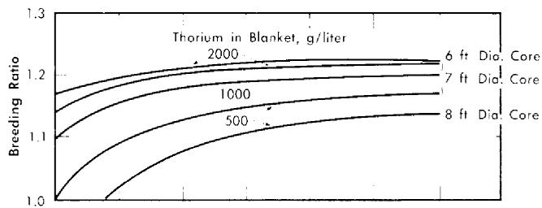

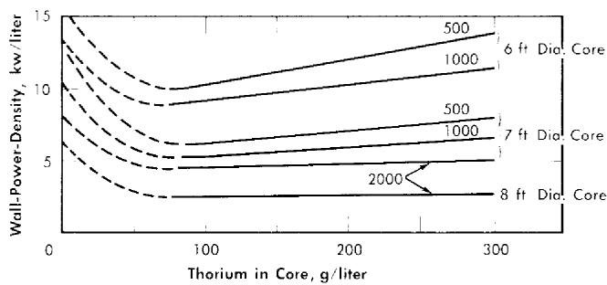  
FIG. 2-7. Effect of core thorium concentration on breeding ratio and wall power density of two-region slurry reactors. $\eta = 2.25$ , total reactor power $= 100$ Mw (heat), pressure vessel $= 10$ ft ID, $\mathrm{U}^{233}$ in blanket $= 3$ g/liter, poison fraction $= 0$ , temperature $= 280^{\circ}\mathrm{C}$ .

Additional results [24] obtained on the same bases given above except that $\eta^{23}$ was considered to be 2.25, and that the $\mathrm{U}^{233}$ concentration in the blanket region was varied, are given in Figs. 2-7 through 2-9. Results were obtained for 10-ft-diameter pressure vessels and for core diameters of 6, 7, and 8 ft; the blanket thorium concentration was 500, 1000, or $2000\mathrm{g / liter}$ , while the core thorium concentration was 0, 100, 200, or $300\mathrm{g / liter}$ . Generally, the results in Figs. 2-7 through 2-9 are complete for the 7-ft-diameter-core reactors, while for the 6- and 8-ft-diameter-core reactors results are shown only for the parameter-value extremes. The variation of results with parameter value is practically the same for all three core diameters, and so all the essential results are presented in the figures.

In all cases slurries of $\mathrm{D}_2\mathrm{O}-\mathrm{ThO}_2-\mathrm{U}^{233}\mathrm{O}_3$ are assumed in both the core and blanket regions, and all power densities are based on the assumption that the total reactor power is 100 thermal Mw. Whenever the power density on the blanket side of the core-tank wall was greater than that on the core side (owing to a fuel concentration which was higher in the blanket than in the core), the greater value was plotted. This situation is indicated by the dashed lines in Fig. 2-7.

Typical information obtained for these slurry reactors is given in Table 2-5 for two of the cases considered. The values of breeding ratio for

TABLE 2-5 SLURRY-REACTOR CHARACTERISTICS  

<table><tr><td>Pressure-vessel inside diameter, ft</td><td>10</td><td>10</td></tr><tr><td>Core inside diameter, ft</td><td>7</td><td>7</td></tr><tr><td>Core thorium concentration, g/liter</td><td>100</td><td>200</td></tr><tr><td>Blanket thorium concentration, g/liter</td><td>1000</td><td>2000</td></tr><tr><td>Blanket U233 concentration, g/liter</td><td>3</td><td>5</td></tr><tr><td>Total power, Mw</td><td>100</td><td>100</td></tr><tr><td>Blanket power, Mw</td><td>8.5</td><td>4.2</td></tr><tr><td>Critical core concentration, g U233/liter</td><td>3.0</td><td>6.0</td></tr><tr><td>Breeding ratio</td><td>1.18</td><td>1.21</td></tr><tr><td>Power density at core center, kw/liter</td><td>43</td><td>45</td></tr><tr><td>Power density at core wall, kw/liter</td><td>5.4</td><td>4.9</td></tr><tr><td>Flux at core center × 10-14</td><td>5.5</td><td>2.9</td></tr><tr><td>Neutron absorptions in core wall, %</td><td>0.7</td><td>0.3</td></tr></table>

the two-region reactors given may be compared with those in Table 2-6 for a one-region reactor having the same size and same diameter pressure vessel. These results indicate that for a given size, two-region reactors have significantly higher breeding ratios than do one-region reactors.

TABLE 2-6 BREEDING RATIO IN 10-FT-DIAMETER ONE-REGION REACTORS (ZERO POISONS)   

<table><tr><td>Thorium concentration, g/liter</td><td>Breeding ratio</td></tr><tr><td>100</td><td>0.875</td></tr><tr><td>200</td><td>0.993</td></tr><tr><td>300</td><td>1.037</td></tr></table>

For all reactors having thorium concentrations of at least $100\mathrm{g}$ /liter in the core and $500\mathrm{g}$ /liter in the blanket, the neutron absorption by the core-tank wall was less than $1\%$ of the total absorptions. The variations of breeding ratio and wall power density with core size, thorium concentration, and blanket $\mathrm{U}^{233}$ concentration are plotted in Figs. 2-7 and 2-8 for reactors of 10-ft over-all diameter. The variations of critical concentration, fraction of total power generated in the blanket region, and the ratio of fuel to thorium required in the core for criticality are given in Fig. 2-9 for different thorium concentrations and blanket fuel concentrations. The curves for the ratio of $\mathrm{U}^{233} / \mathrm{Th}$ versus core thorium concentration are of value in determining the reactivity which would occur if there were a rapid change in core thorium concentration. If the reactor operating conditions

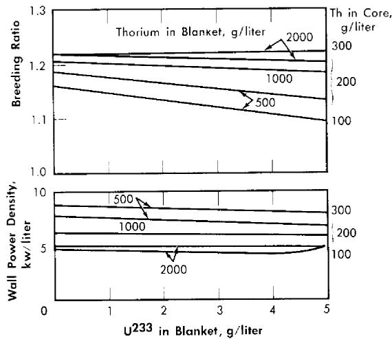  
FIG. 2-8. Effect of blanket $\mathbf{U}^{233}$ concentration on breeding ratio and wall power density of two-region slurry reactors. $\eta = 2.25$ , total reactor power $= 100$ Mw (heat), pressure vessel $= 10$ ft ID, core diameter $= 7$ ft, poison fraction $= 0$ , temperature $= 280^{\circ}\mathrm{C}$ .

were such that the flat region of the appropriate curve applied, small uniform changes in core thorium concentration would have a negligible effect upon reactor criticality. The location of the minimum in these curves did not vary appreciably with changes in blanket thickness, blanket thorium concentration, and blanket fuel concentration. The results given in Figs. 2-7 through 2-9 indicate that for large spherical reactors the breeding ratio increases when the core size decreases, when the blanket $U^{233}$ concentration decreases, and when the thorium concentration is increased in either the core or blanket region. The core-wall power density decreases when the thorium concentration is increased in the blanket region and when the core size increases, but is relatively insensitive to changes in the blanket fuel concentration for thorium concentrations greater than 100 and $500\mathrm{g / liter}$ in the core and blanket, respectively. The critical concentration of $U^{233}$ in the core decreases with decreasing core thorium concentration and with increasing core diameter, and varies only slightly with changes in blanket thickness, blanket $U^{233}$ concentration, and blanket thorium

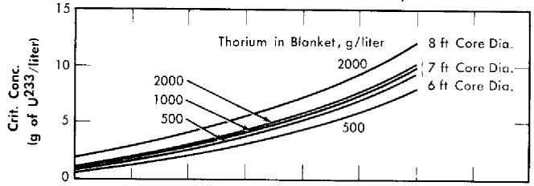

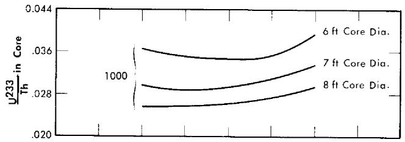

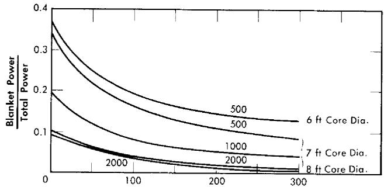  
Thorium in Core, g/liter   
FIG. 2-9. Effect of core thorium concentration on $\mathbf{U}^{233}$ critical concentration, ratio of $\mathbf{U}^{233}$ to Th required for criticality, and fraction of total power generated in blanket for some two-region slurry reactors. $\eta^{23} = 2.25$ , pressure vessel $= 10$ ft ID, poison fraction $= 0$ , $\mathbf{U}^{233}$ in blanket $= 3\mathrm{g / liter}$ , temperature $= 280^{\circ}\mathrm{C}$ .

concentration. The fraction of total power generated in the blanket increases nearly linearly with increasing blanket $U^{233}$ concentration, increases with decreasing core diameter, and also increases with decreasing core and blanket thorium concentrations. Finally, the $U^{233}$ -to-thorium ratio required in the core for criticality passes through a minimum when the core thorium concentration is permitted to vary. These variations show that desirable features are always accompanied by some undesirable ones. For example, increasing either the core or blanket thorium concentrations results in an increase in breeding ratio, but there is also an accompanying increase in inventory requirements; decreasing the core radius increases breeding ratio and possibly decreases inventory requirements but increases wall power density. These types of variations illustrate that minimum fuel costs will result only by compromise between various reactor features.

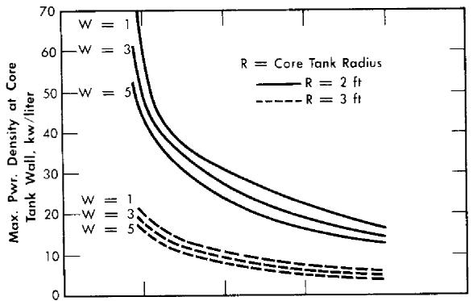

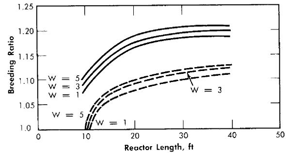  
FIG. 2-10. Gross breeding ratio and maximum power density at core wall for two-region cylindrical reactors. $W = \mathrm{g}$ of $\mathrm{U}^{233} / \mathrm{kg}$ of $\mathrm{Th}^{232}$ in blanket, blanket radius $= 5$ ft, power $= 450$ Mw (heat).

The breeding ratio, the power density at the core wall for a given total power, and the required fuel concentration have also been evaluated for cylindrical reactors [25]. The results, plotted in Fig. 2-10, are based on two-group calculations for cylindrical reactors; the diameter of the pressure vessel was assumed to be $10\mathrm{ft}$ , the total reactor power $450\mathrm{Mw}$ , the reactor

temperature $300^{\circ}\mathrm{C}$ , and the core diameter either 4 or 6 ft. The Zircaloy-2 core tank was assumed to be $\frac{1}{2}$ -in. thick when the core diameter was 4 ft, and $\frac{3}{4}$ in. when the core diameter was 6 ft. The reactors were assumed to contain $\mathrm{D}_2\mathrm{O}$ , $\mathrm{U}^{233}$ , and $6\%$ fraction poisons in the core region and $\mathrm{D}_2\mathrm{O}$ , $\mathrm{U}^{233}$ , and $1000\mathrm{g}$ Th/liter in the blanket region. Figure 2-10 gives the breeding ratio and the maximum power density at the core wall (core side) as a function of reactor length for different core radii and blanket fuel concentrations. The highest breeding ratios are associated with small core radii, thick blankets, and long reactors; however, these reactors also have relatively high power densities at the core wall. Increasing the reactor length increases the breeding ratio and decreases the wall power density and the critical fuel concentration but appreciably increases the inventory of material.

In other studies [26] of cylindrical reactors, results were obtained which indicated that breeding ratios for cylindrical reactors of interest were about the same as those obtained for spherical reactors. The required fuel concentrations were higher, as expected, so that the average flux was lower for the cylindrical geometry. Although the maximum core-wall power density decreased with increasing cylinder diameter, it was always higher than the wall power density obtained for the spherical reactors of equal volume. The results of these calculations are given in Table 2-7. These reactors were assumed to be at $280^{\circ}\mathrm{C}$ with $7\%$ core poisons, $3\mathrm{g}$ of $\mathrm{U}^{233}$ per liter and $1000\mathrm{g}$ of Th per liter (as $\mathrm{ThO_2}$ ) in heavy water in the blanket, and operated at a total power of $60\mathrm{Mw}$ . A cylindrical core was assumed to be positioned within a cylindrical pressure vessel such that a 2-ft blanket thickness surrounded the core.

The results given in Table 2-7 show that increasing the reactor height had only a slight effect on breeding ratio; also, although the critical concentration declined with increasing height, the corresponding total fuel inventory increased. While not shown, the ratio of blanket power to core power did not vary significantly with reactor height. Increasing the core volume caused a pronounced decrease in core-wall power density and an increase in fuel inventory. Thus, for a 3-ft-diameter core, increasing the core length from 4.8 to 8 ft decreased the power density by $36\%$ . However, the blanket and core fuel inventory increased by about $40\%$ .

2-3.3 Nuclear characteristics of two-region thorium breeder reactors under equilibrium conditions. Results [27] of some nuclear computations associated with the conceptual design of HIRE-3 are given below for spherical two-region reactors in which the following conditions were specified:

(1) The reactor system is at equilibrium with regard to nuclei concentrations.

# TABLE 2-7

BREEDING RATIOS, CORE-WALL POWER DENSITY, AND CRITICAL U233 CONCENTRATION FOR CYLINDRICAL REACTORS OF VARIOUS HEIGHTS

<table><tr><td rowspan="3">Height of core, ft</td><td colspan="10">Core diameter, ft</td></tr><tr><td colspan="3">21/2</td><td colspan="3">3</td><td colspan="4">31/2</td></tr><tr><td>U233, g/liter</td><td>Breeding ratio</td><td>Power density,* kw/liter</td><td>U233, g/liter</td><td>Breeding ratio</td><td>Power density,* kw/liter</td><td>U233, g/liter</td><td>Breeding ratio</td><td>Power density,* kw/liter</td><td></td></tr><tr><td>3.5</td><td></td><td></td><td></td><td></td><td></td><td></td><td>4.1</td><td>1.10</td><td>25</td><td></td></tr><tr><td>4.8</td><td></td><td></td><td></td><td>4.6</td><td>1.12</td><td>29</td><td></td><td></td><td></td><td></td></tr><tr><td>6.0</td><td></td><td></td><td></td><td>4.2</td><td>1.12</td><td>24</td><td>3.0</td><td>1.12</td><td>16</td><td></td></tr><tr><td>6.8</td><td>6.5</td><td>1.13</td><td>36</td><td></td><td></td><td></td><td></td><td></td><td></td><td></td></tr><tr><td>8</td><td>6.2</td><td>1.13</td><td>31</td><td>3.9</td><td>1.13</td><td>18</td><td>2.7</td><td>1.12</td><td>12</td><td></td></tr><tr><td>10</td><td>6.0</td><td>1.13</td><td>26</td><td>3.7</td><td>1.13</td><td>15</td><td>2.6</td><td>1.12</td><td>10</td><td></td></tr><tr><td>12</td><td>5.8</td><td>1.13</td><td>21</td><td>3.6</td><td>1.13</td><td>13</td><td>2.5</td><td>1.12</td><td>8</td><td></td></tr></table>

*Core-wall power density, based on total reactor power of 60 Mw (heat).

(2) Hydroclone separation of poisons from the core system is employed in addition to Thorex processing.   
(3) The core Thorex cycle time is a dependent function of the specified total poison fraction; the blanket cycle time is a function of the blanket $\mathrm{U}^{233}$ concentration.

TABLE 2-8   
CHARACTERISTICS OF INTERMEDIATE-SCALE (HRE-3)   
TWO-REGION REACTORS (EQUILIBRIUM CONDITIONS)   

<table><tr><td>Core diameter, ft</td><td>4</td><td>4</td><td>4</td><td>4</td><td>5</td></tr><tr><td>Pressure vessel ID, ft</td><td>8</td><td>8</td><td>9</td><td>9</td><td>9</td></tr><tr><td>Blanket thorium, g/liter</td><td>500</td><td>1000</td><td>500</td><td>1000</td><td>1000</td></tr><tr><td>Blanket U233, g/kg Th</td><td>3.0</td><td>3.0</td><td>3.0</td><td>3.0</td><td>3.0</td></tr><tr><td>Core poison fraction</td><td>0.07</td><td>0.07</td><td>0.07</td><td>0.07</td><td>0.07</td></tr><tr><td>Concentration of U233, g/liter (core)</td><td>3.68</td><td>4.04</td><td>3.63</td><td>4.02</td><td>2.19</td></tr><tr><td>Concentration of U235, g/liter (core)</td><td>0.41</td><td>0.39</td><td>0.37</td><td>0.37</td><td>0.21</td></tr><tr><td>Breeding ratio</td><td>1.041</td><td>1.094</td><td>1.086</td><td>1.123</td><td>1.089</td></tr><tr><td>Core-wall power density (inside), kw/liter</td><td>27</td><td>23</td><td>27</td><td>23</td><td>10</td></tr><tr><td>Core cycle time, days</td><td>833</td><td>901</td><td>817</td><td>893</td><td>616</td></tr><tr><td>Blanket cycle time, days</td><td>220</td><td>371</td><td>288</td><td>504</td><td>486</td></tr><tr><td>Core power, Mw (heat)</td><td>51.5</td><td>51.9</td><td>51.0</td><td>51.7</td><td>51.2</td></tr><tr><td>Blanket power, Mw (heat)</td><td>10.0</td><td>9.6</td><td>10.5</td><td>9.9</td><td>10.3</td></tr><tr><td colspan="6">Neutron absorptions and leakages per 100 absorptions in fuel</td></tr><tr><td>Absorptions in core by:</td><td></td><td></td><td></td><td></td><td></td></tr><tr><td>U233</td><td>74.7</td><td>76.4</td><td>74.6</td><td>76.4</td><td>75.3</td></tr><tr><td>U234</td><td>9.2</td><td>8.2</td><td>8.4</td><td>7.8</td><td>8.2</td></tr><tr><td>U235</td><td>9.1</td><td>8.1</td><td>8.3</td><td>7.6</td><td>8.0</td></tr><tr><td>U236</td><td>0.7</td><td>0.4</td><td>0.4</td><td>0.3</td><td>0.4</td></tr><tr><td>Poisons</td><td>5.2</td><td>5.3</td><td>5.2</td><td>5.3</td><td>5.2</td></tr><tr><td>Heavy water</td><td>0.9</td><td>0.8</td><td>0.9</td><td>0.8</td><td>1.6</td></tr><tr><td>Absorptions in core tank</td><td>2.1</td><td>1.6</td><td>2.1</td><td>1.6</td><td>2.4</td></tr><tr><td>Absorptions in blanket by:</td><td></td><td></td><td></td><td></td><td></td></tr><tr><td>U233</td><td>16.2</td><td>15.5</td><td>17.1</td><td>16.0</td><td>16.6</td></tr><tr><td>U234, U235, U236</td><td>0.1</td><td>0.1</td><td>0.1</td><td>0.1</td><td>0.1</td></tr><tr><td>Th</td><td>95.8</td><td>101.7</td><td>100.9</td><td>104.8</td><td>101.0</td></tr><tr><td>Pa233</td><td>0.9</td><td>0.5</td><td>0.7</td><td>0.4</td><td>0.4</td></tr><tr><td>Poisons</td><td>0.4</td><td>0.4</td><td>0.4</td><td>0.4</td><td>0.4</td></tr><tr><td>Heavy water</td><td>0.5</td><td>0.2</td><td>0.5</td><td>0.2</td><td>0.2</td></tr><tr><td>Fast leakage</td><td>4.3</td><td>3.6</td><td>2.2</td><td>1.6</td><td>3.0</td></tr><tr><td>Slow leakage</td><td>3.4</td><td>0.9</td><td>1.7</td><td>0.4</td><td>0.8</td></tr></table>

(4) The poison fraction due to samarium is $0.8\%$ ; that due to xenon is $1\%$ [poison fraction is the ratio of $\Sigma_{a}(\mathrm{poison}) / \Sigma_{f}(\mathrm{fuel})$ ].   
(5) The external core system has 1.0 liter of volume for every $20\mathrm{kw}$ of core power; the blanket external system has 1.0 liter for every $14\mathrm{kw}$ of blanket power.   
(6) The total reactor power is 61.5 thermal Mw.   
(7) The average core and blanket temperatures are $280^{\circ}\mathrm{C}$ .

The breeding ratio for the reactor variables considered is plotted in Fig. 2-11 as a function of pressure-vessel size for 4- and 5-ft-diameter cores with several blanket thorium concentrations. More extensive results, including neutron balances, are given in Table 2-8 for selected reactors. The neutron

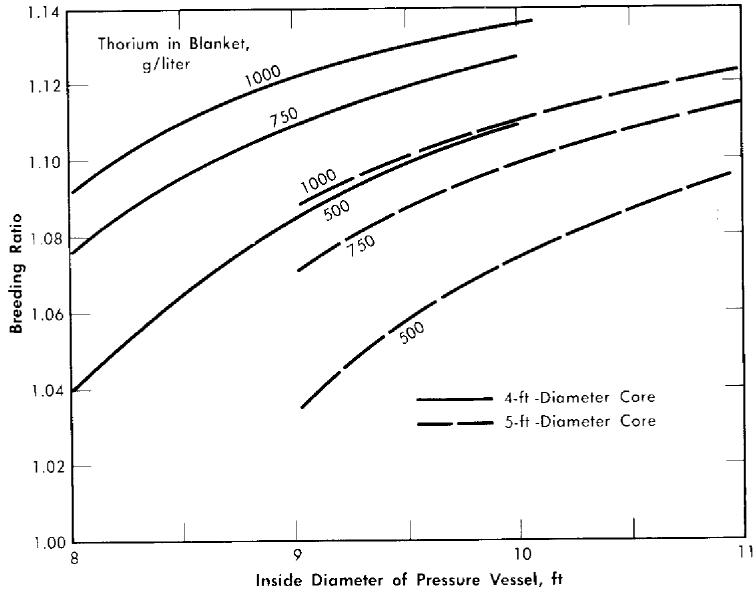  
FIG. 2-11. Breeding ratio as function of pressure vessel size for various core diameters and blanket thorium concentrations. Core poison fraction $= 0.07$ , corrosion products $= 0$ , copper concentration $= 0$ , blanket $\mathrm{U}^{233} = 3.0~\mathrm{g / kg}$ of Th, $\eta^{23} = 2.25$ , mean temperature $= 280^{\circ}\mathrm{C}$ , equilibrium isotope concentrations.

balances are normalized to 100 absorptions in $\mathrm{U}^{233}$ and $\mathrm{U}^{235}$ ; therefore the numerical values represent approximately the percentage effects of the various items on the breeding ratio (however, the effect of $\mathrm{Pa}^{233}$ losses on breeding ratio would be obtained by doubling the values given).

Some of the materials which act as neutron poisons can be altered by reactor-system design; these include fission-product poisons, core-tank material, contaminants such as $\mathrm{H}_2\mathrm{O}$ , and additives such as the cupric ion. The effect of these on breeding ratio is discussed below.

Fission-product poisons. The effect of total core poison fraction, $f_{pc}$ (ratio of absorption cross section of poisons to fission cross section of fuel),

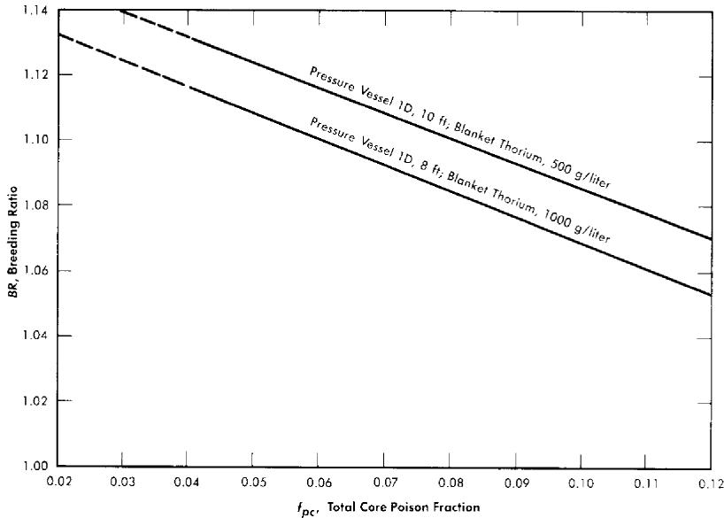  
FIG. 2-12. Effect of core poison fraction on breeding ratio. Core diameter $= 4$ ft, blanket $\mathrm{U}^{233} = 3.0\mathrm{g.kg}$ of Th, $\eta^{23} = 2.25$ mean temperature $= 280^{\circ}\mathrm{C}$ , equilibrium isotope concentrations.

on breeding ratio is shown in Fig. 2-12. The results indicate that for these reactors the change in breeding ratio with change in poison fraction can be estimated from the relation

$$
\Delta \mathrm {B R} = - 0. 7 5 \Delta f _ {p c}. \tag {2-18}
$$

Achievement of a xenon poison fraction of 0.01, as postulated in the computations for Fig. 2-11 and Table 2-8, requires the removal of most of the xenon or its iodine precursor before neutron capture occurs. If there is no fast-cycle system for iodine or xenon removal, the poison fraction resulting from xenon will be about 0.05. According to Eq. (2-18), the breeding ratio would be reduced by about 0.03 below the values given in Fig. 2-11 if all xenon were retained in the core system.

Core-tank absorptions. The thickness of the Zirealoy core tank was taken as 0.42 in, for the 5-ft core and 0.33 in, for the 4-ft vessel. As shown in Table 2-8, neutron captures in the core tank reduce the breeding ratio about 0.02 in the 4-ft core and 0.03 in the 5-ft core. If the core-tank thickness were altered, the losses would be changed proportionately.

Absorptions in copper. Copper can be added to act as a recombination catalyst for decomposed water. No allowance for neutron absorptions in the copper recombination catalyst was made in these computations. The poison fraction attributable to copper in various concentrations and the effects on breeding ratio (ΔBR) are estimated in Table 2-9. For other copper concentrations the poisoning effects would be proportionate to the values in Table 2-9.

TABLE 2-9   
EFFECT OF COPPER ADDITION ON BREEDING RATIO  

<table><tr><td>Core diameter, ft</td><td>Copper concentration, g-mole/liter</td><td>Poison fraction</td><td>ΔBR</td></tr><tr><td>4</td><td>0.01</td><td>0.004</td><td>-0.003</td></tr><tr><td>5</td><td>0.01</td><td>0.008</td><td>-0.006</td></tr></table>

The copper concentration required for $100\%$ recombination in a 4-ft core at $61.5\mathrm{Mw}$ has been estimated to be $0.018\mathrm{g}$ -mole/liter. For this core size and copper concentration, the loss of neutrons to copper would reduce the breeding ratio by 0.005.

$H_{2}O$ contamination. Any $\mathrm{H}_{2}\mathrm{O}$ contained in the heavy-water moderator will act as a poison and reduce the breeding ratio. The above results are based on the use of heavy water containing $0.25\%$ $\mathrm{H}_2\mathrm{O}$ . Neutron captures in the moderator in a 4-ft-core reactor (see Table 2-8) were found to be about 0.009 per absorption in fuel, of which about $60\%$ were in $\mathrm{H}_{2}$ . Thus $0.25\%$ $\mathrm{H}_2\mathrm{O}$ , which is 9 liters in a 3600-liter system, reduced the breeding ratio by 0.005. Other values are given in Table 2-10. Different concentrations of $\mathrm{H}_2\mathrm{O}$ would cause changes in breeding ratio proportionate to the values in Table 2-10.

TABLE 2-10   
EFFECT OF $\mathrm{H}_2\mathrm{O}$ CONCENTRATION ON BREEDING RATIO   

<table><tr><td>Core diameter, ft</td><td>H2O concentration</td><td>ΔBR</td></tr><tr><td>4</td><td>1.0% (36 liters)</td><td>-0.02</td></tr><tr><td>5</td><td>1.0% (44 liters)</td><td>-0.04</td></tr></table>

A specified volume of $\mathrm{HI}_2\mathrm{O}$ added to the blanket has much less effect on breeding ratio than the same amount added to the core. This is a result of both the lower flux in the blanket region and the larger volume of the system.

Corrosion products. Assuming the surface area of stainless steel in the core high-pressure system to be $6000\mathrm{ft}^2$ , corrosion to an average depth of 0.001 in. would remove 250 lb of metal. If this were distributed uniformly throughout the fuel solution, the poison fraction resulting from it would be

about 0.18 in a 4-ft core and 0.36 in a 5-ft core. However, iron and chromium would precipitate and be removed by hydroclones. If the hydroclones were operated on a fast cycle time (several days), neutron capture in iron and chromium would be unimportant. Nevertheless, the absorption cross section of the nickel and manganese (which probably remain in solution) amount to about $15\%$ and $9\%$ , respectively, of the total absorption cross section of type-347 stainless steel. Thus, from 0.001 in. of corrosion, the nickel and manganese would yield a poison fraction of about 0.04 $(\Delta \mathrm{BR} = 0.03)$ in a 4-ft core, and 0.08 $(\Delta \mathrm{BR} = 0.06)$ in a 5-ft core.

The actual value of the poison fraction from corrosion products would depend on the corrosion rate and the chemical processing rate. If the corrosion products are assumed to change to isotopes of the same cross section upon neutron capture, the following relations are obtained under equilibrium conditions:

$$
f _ {p} = 0. 0 4 \times R \times \left(T _ {c} / 3 6 5\right) \quad \text {(C o r e I D = 4 f t)}, \tag {2-19}
$$

$$
f _ {p} = 0. 0 8 \times R \times \left(T _ {c} / 3 6 5\right) \quad \text {(C o r e I D} = 5 \text {f t)}, \tag {2-20}
$$

where $f_{p}$ is the equilibrium core poison fraction from corrosion products, $R$ the mean corrosion rate in mils/yr, and $T_{c}$ the core cycle time in days.

An additional point of concern resulting from corrosion of stainless steel is the adverse effect of high corrosion-product concentrations on the stability of fuel solution. The concentration of nickel resulting from 0.001 in. of corrosion would be $0.052\mathrm{g}$ -mole/liter, and that of manganese would be $0.011\mathrm{g}$ -mole/liter. Unless adjustments were made to the acid concentration, the fuel solution would probably form a second phase before the above concentration of nickel was attained.

The corrosion products from the Zircaloy-2 core vessel would not appreciably affect the breeding ratio, even if they remained in suspension. Owing to the dilution effect associated with the large external volume, corrosion of the core tank would result in a slight increase in the breeding ratio.

2-3.4 Equilibrium results for two-region uranium-plutonium reactors. Initial reactor-fuel materials which have been considered [28] in uranium-plutonium systems are $\mathrm{UO_2SO_4 - D_2O}$ , $\mathrm{UO_2(NO_3)_2 - D_2O}$ , and $\mathrm{UO_3 - D_2O}$ . Of these, the system which gives the highest conversion ratio is the one containing $\mathrm{UO_3 - D_2O}$ . However, because of the relatively low values for $\eta (\mathrm{U}^{235})$ and $\eta (\mathrm{Pu}^{239})$ , it is presently considered that the attainment of a conversion ratio as great as unity under equilibrium conditions is impractical because of the high fuel-processing rates and the large reactor sizes that would be required. However, many uranium-plutonium reactor systems which will operate on either natural-uranium feed or on fuel of lower enrichment than natural uranium appear feasible. A two-region reactor can be operated by feeding natural uranium (or uranium of lower

enrichment in $\mathrm{U}^{235}$ into the blanket region, and plutonium (obtained by processing the blanket) into the core region.

The reactor system considered here is one containing $\mathrm{UO}_3$ , $\mathrm{PuO}_2$ , and $\mathrm{D}_2\mathrm{O}$ ; steady-state concentrations of $\mathrm{U}^{235}$ , $\mathrm{U}^{236}$ , $\mathrm{U}^{238}$ , $\mathrm{Pu}^{239}$ , $\mathrm{Pu}^{240}$ , and $\mathrm{Pu}^{241}$ are considered. Fuel is removed and processed at a rate required to maintain a specified poison level. The reactor consists of a core region in which plutonium is burned and of a blanket region containing uranium and plutonium. Under equilibrium conditions the net rate of production of plutonium in the blanket is equal to the plutonium consumption in the core. In Table 2-11 are given [29] some of the nuclear characteristics for

TABLE 2-11   
DATA FOR TWO-REGION, $\mathrm{UO}_3 - \mathrm{PuO}_2 - \mathrm{D}_2\mathrm{O}$ REACTORS OPERATING AT $250^{\circ}\mathrm{C}$ , HAVING A CORE DIAMETER OF 6 FT, A BLANKET THICKNESS OF 3 FT, AND VARIABLE BLANKET-FUEL ENRICHMENT  

<table><tr><td>U235/U238 in blanket</td><td>0.0026</td><td>0.0035</td><td>0.0040</td></tr><tr><td>Blanket U conc., g/liter</td><td>500</td><td>500</td><td>500</td></tr><tr><td>Pu239/U238 in blanket</td><td>0.0010</td><td>0.0018</td><td>0.0022</td></tr><tr><td>Pu240/U238 in blanket</td><td>0.00013</td><td>0.00041</td><td>0.00060</td></tr><tr><td>Pu241/U238 in blanket</td><td>0.00002</td><td>0.00007</td><td>0.00011</td></tr><tr><td>Feed enrichment, U235/U</td><td>0.0031</td><td>0.0047</td><td>0.0058</td></tr><tr><td>Blanket power, Mw</td><td>247</td><td>411</td><td>519</td></tr><tr><td>Core power, Mw</td><td>320</td><td>320</td><td>320</td></tr><tr><td>Core Pu conc., g/liter</td><td>1.66</td><td>1.48</td><td>1.40</td></tr><tr><td>Pu240/Pu249 in core</td><td>0.99</td><td>0.99</td><td>0.99</td></tr><tr><td>Pu241/Pu249 in core</td><td>0.35</td><td>0.35</td><td>0.35</td></tr><tr><td>Fraction of fissions in U235</td><td>0.25</td><td>0.28</td><td>0.30</td></tr><tr><td>Fraction of U consumed</td><td>0.017</td><td>0.016</td><td>0.015</td></tr><tr><td>Total power, Mw (heat)</td><td>567</td><td>731</td><td>839</td></tr></table>

two-region, $\mathrm{UO}_{3} - \mathrm{PuO}_{2} - \mathrm{D}_{2}\mathrm{O}$ reactors having a core diameter of 6 ft and an over-all diameter of 12 ft, and having various $\mathrm{U}^{235},\mathrm{U}^{238}$ ratios in the blanket region.

2-3.5 One-region reactors. Single-region reactors have simpler designs than two-region reactors by virtue of having only a single fuel region; also, fuel processing costs for one-region reactors are generally lower than for two-region systems. However, to attain breeding or conversion ratios comparable to those in a 10-ft-diameter two-region reactor, the diameter of a one-region reactor has to be about 15 ft or greater. The construction

of pressure vessels of such diameters is difficult, and relatively little experience on such construction has been obtained to date.

In the succeeding sections some equilibrium results are given for the nuclear characteristics of one-region breeder and converter reactors.

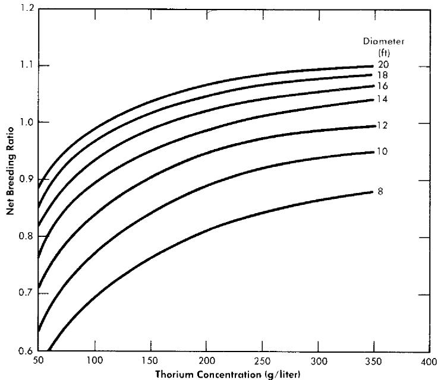  
FIG. 2-13. Breeding ratio vs. thorium concentration for one-region reactors of various diameters. Poison fraction $= 0.08$ , $\eta^{23} = 2.25$ .

2-3.6 Equilibrium results for one-region thorium breeder reactors. Results have been obtained [30] for one-region thorium breeder reactors operating under equilibrium conditions. Critical concentrations and breeding ratios were obtained by means of Eqs. (2-4) and (2-6). Figure 2-13 gives the breeding ratio as a function of thorium concentration and reactor diameter. Comparison of these results with those obtained for two-region reactors illustrates that reactor diameter influences breeding ratio to a greater extent in one-region systems than in two-region systems. Also, increasing the reactor diameter increases the breeding ratio significantly even for 14-ft-diameter reactors. Although breeding ratio can be increased by increasing the thorium concentration, there is an accompanying increase in fuel inventory. To keep inventory charges at a reasonably low level and yet permit a breeding ratio of unity to be attained requires thorium concentrations between 200 and $300\mathrm{g / liter}$ and reactor diameters of about 14 ft.

The equilibrium isotope concentrations as a function of thorium concentration for a 14-ft-diameter reactor are given in Fig. 2-14. This diameter

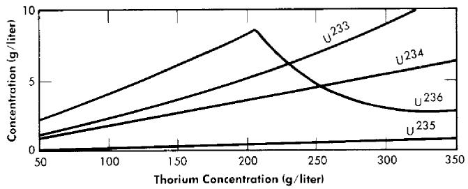  
FIG. 2-14. Uranium isotope concentrations under equilibrium conditions vs. thorium concentration in a one-region reactor of 14-ft diameter.

value has been chosen because it represents the diameter which gives minimum fuel costs, although it is realized that construction of the corresponding vessel may be beyond present technology. The fuel-processing cycle time which minimized fuel cost was that which corresponded to a poison fraction (due to fission products) of about 0.08, and so this is the value used for poison fraction in the results given here. Absorptions in higher isotopes contributed an additional poison fraction of about 0.03.

2-3.7 Equilibrium results for one-region uranium-plutonium reactors. The fertile-material concentrations and reactor diameters have essentially the same effects on conversion ratio and fuel inventory for one-region uranium-plutonium systems as they do for thorium breeder systems; however, since the $\eta$ 's for $\mathrm{U}^{235}$ and $\mathrm{Pu}^{239}$ are lower than for $\mathrm{U}^{233}$ , it is more difficult to attain a conversion ratio of unity in U-Pu systems than it is in $\mathrm{U}^{233}-\mathrm{Th}$ systems. It is still possible, though, for $\mathrm{UO}_3-\mathrm{PuO}_2-\mathrm{D}_2\mathrm{O}$ systems to operate on natural-uranium feed, as evidenced by the results for two-region reactors. Minimum fuel costs (based on $\eta^{41} = 1.9$ ; a more accurate value is now believed to be 2.2) for one-region reactors, however, occur when the uranium feed is slightly enriched in $\mathrm{U}^{235}$ [32]. Table 2-12 gives results [32] of some nuclear calculations for these one-region systems operating under equilibrium conditions. The reactor diameter was taken to be 15 ft; the fuel-processing rate was such as to maintain a poison fraction of $7\%$ in the reactor core. Fuel feed was considered to be obtained from an isotope-enrichment diffusion plant. The results indicate that the uranium feed for these reactors would have to contain between 1 and $1.5\%$ $\mathrm{U}^{235}$ .

# 2-4. UNSTEADY-STATE FUEL CONCENTRATIONS AND BREEDING RATIOS

2-4.1 Two-region reactors. During the period following reactor startup, there is a buildup of fission-product poisons and higher isotopes with time, which results in varying nuclear characteristics. This section presents some calculations relative to the HRE-3 conceptual design for the initial period of reactor operation.

# TABLE 2-12

# REACTOR CHARACTERISTICS FOR SOME ONE-REGION, $\mathrm{UO_3 - PuO_2 - D_2O}$ REACTORS* OPERATING UNDER EQUILIBRIUM CONDITIONS

<table><tr><td>Reactor temperature, °C</td><td>250</td><td>250</td><td>250</td><td>300</td></tr><tr><td>U conc., g/liter</td><td>334</td><td>253</td><td>170</td><td>183</td></tr><tr><td>U235 conc., g/liter</td><td>2.65</td><td>1.47</td><td>0.83</td><td>1.35</td></tr><tr><td>U236 conc., g/liter</td><td>0.39</td><td>0.22</td><td>0.12</td><td>0.20</td></tr><tr><td>Pu239 conc., g/liter</td><td>3.43</td><td>1.74</td><td>0.84</td><td>1.08</td></tr><tr><td>Pu240 conc., g/liter</td><td>3.39</td><td>1.72</td><td>0.83</td><td>1.17</td></tr><tr><td>Pu241 conc., g/liter</td><td>1.21</td><td>0.61</td><td>0.30</td><td>0.41</td></tr><tr><td>Initial enrichment (no Pu), U235/U (total)</td><td>0.0116</td><td>0.0106</td><td>0.0098</td><td>0.0140</td></tr><tr><td>Steady-state enrichment, U235/U (total)</td><td>0.0081</td><td>0.0059</td><td>0.0050</td><td>0.0073</td></tr><tr><td>Steady-state feed enrichment, U235/U (total)</td><td>0.0153</td><td>0.0113</td><td>0.0096</td><td>0.0136</td></tr><tr><td>Fraction of fissions in U235</td><td>0.24</td><td>0.25</td><td>0.29</td><td>0.31</td></tr><tr><td>Fraction of U consumed</td><td>0.018</td><td>0.017</td><td>0.015</td><td>0.014</td></tr></table>

*Reactor diameter = 15 ft; poison fraction = 7%; reactor fuel returned to diffusion plant for re-enrichment; tails from diffusion plant are assumed to have $\mathrm{U}^{235}$ content of $\mathrm{U}^{235} / \mathrm{U} = 0.0025$ ; processing losses are neglected.

Computations have been performed for several spherical reactors using an Oracle code [31] for two-region, time-dependent, thorium breeder systems. The variation with time of the breeding ratio and the concentrations of $\mathrm{U}^{233}$ , $\mathrm{U}^{234}$ , $\mathrm{U}^{235}$ , $\mathrm{U}^{236}$ , $\mathrm{Pa}^{233}$ , and fission-product poisons were obtained. Calculations were first confined [32] to solution-core reactors initially containing either $\mathrm{U}^{233}$ or $\mathrm{U}^{235}$ , and generating a core power of $50\mathrm{Mw}$ . Core and blanket Thorex processing was considered only when the initial fuel was $\mathrm{U}^{233}$ . The use of centrifugal separation (hydroclones) for core-solution processing was assumed in all cases. The time dependence of the concentrations of xenon, the samarium group of poisons, and the poisons removable by hydroclone processing were neglected, since the time required for these poisons to reach near-equilibrium conditions is relatively short. Account has been taken of their presence by the use of fixed poison fractions. The effect of copper added for internal gas recombination was also included in this way. Core diameters of 4 and 5 ft, pressure-vessel diameters of 8 and 9 ft and thorium blanket concentrations of 500 and $1000\mathrm{g}/$ liter were considered. Fixed core poisons in terms of percentage of

core fission cross section were: samarium group, $0.8\%$ ; xenon group, $1\%$ ; copper, $0.8\%$ ; poisons removable by hydroclones, $1\%$ . Fixed blanket poisons were: samarium group, $0.8\%$ ; xenon, $1\%$ . It was assumed that the core solution was processed both by hydroclones and by the Thorex process described in Chapter 6; the blanket slurry of thorium oxide in heavy water was processed by Thorex only, and fuel produced in the blanket was drawn off from the Thorex plant and returned to the core at a rate sufficient to maintain criticality.

The system was assumed to start "clean," except for the poisons mentioned, with either $\mathrm{U}^{233}$ or $\mathrm{U}^{235}$ in the core. Makeup fuel (same as initial fuel) was fed as needed while the concentration of fuel in the blanket was increasing. When the blanket fuel concentration reached a predetermined level, blanket processing was initiated at the rate which would be required if the reactor were at equilibrium; however, for the $\mathrm{U}^{235}$ -fueled reactors, calculations were performed only up to the time at which processing would start. At the start of processing, the fuel feed for the core was assumed to come from the processed blanket stream. When the core poison level built up to a predetermined point ( $8\%$ for the $\mathrm{U}^{233}$ reactors), processing of the core solution was started. The processed core-fuel stream was considered mixed with the processed blanket stream; part of the mixture was used as core feed while the excess was drawn off as excess fuel. The calculations were continued until most of the concentrations approached equilibrium values. Time lags due to chemical processing holdups were neglected. The chemical processing rates employed were those calculated earlier for equilibrium reactors [27].

The curves in Fig. 2-15 show results for some representative $\mathrm{U}^{233}$ -fueled reactors. As shown in Fig. 2-15(a), with $1000\mathrm{g}$ Th/liter in the blanket region, the breeding ratio falls steadily for about 900 days until core processing starts. Although blanket processing, begun at 490 days, arrests the growth of $\mathrm{U}^{233}$ in the blanket rather suddenly, the slope of the breeding-ratio curve does not change markedly because the buildup of core poisons is controlling the breeding ratio. When core processing interrupts the growth of core poisons, the breeding ratio levels off sharply. The variation of relative leakage and poison losses with time and the variation of blanket power with time are illustrated in Fig. 2-15(b) for the case of a blanket thorium concentration of $500\mathrm{g}/$ liter.

In all cases the time required to reach the $8\%$ core poison level was of the order of two years. The average breeding ratio during this period was about 0.02 higher than the equilibrium value. The effect of poisoning due to buildup of corrosion products is not included in this estimate.

While the above statements concerning breeding ratio are characteristic of $\mathrm{U}^{233}$ -fueled reactors, $\mathrm{U}^{235}$ reactors show quite a different variation of breeding ratio with time, due to changes in the effective $\eta$ for the system.

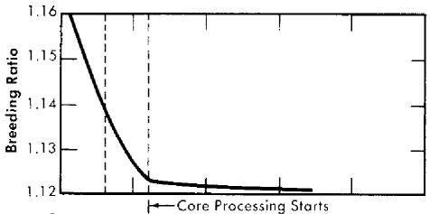

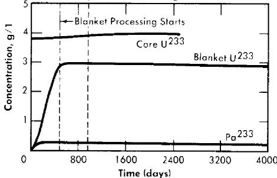  
(a) Breeding Ratio, Blanket Conc. of U233 and $\mathsf{P}\mathsf{g}^{233}$ and Core Conc. of U233 (Blanket Conc.: $= 1000\mathrm{g}$ Th/1).

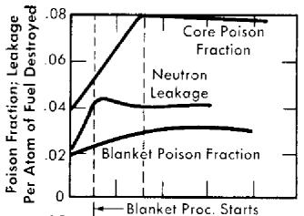

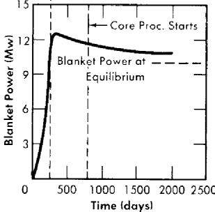  
(b) Neutron Leakage, Poisson Fraction and Blanket Power (Blanket Conc. $= 500g$ Th/1).   
FIG. 2-15. Nuclear characteristics of a 60-Mw (heat) two-region $\mathbf{U}^{233}$ breeder during initial operating period. Core diameter $= 4$ ft, pressure vessel diameter $= 9$ ft, $280^{\circ}\mathrm{C}$ , solution core.

Such reactors have appreciably lower breeding ratios than do $\mathrm{U}^{233}$ -fueled systems. This is primarily due to the relatively low value of $\eta^{25}$ compared to $\eta^{23}$ ( $\eta^{23} = 2.25$ while $\eta^{25} = 2.08$ ). As $\mathrm{U}^{233}$ builds up in the blanket of a $\mathrm{U}^{235}$ -fueled reactor, the average value of $\eta$ for the reactor as a whole increases. This helps compensate for the increase in core poison fraction and causes the breeding ratio, which initially drops from 1.008 to 1.002 during the first 200 days of operation, to rise again. A maximum of 1.005 in the breeding ratio is reached at about 600 days, after which a slow decrease follows.

Three types of isotope growth were obtained in this study. First, the concentration of the main isotope, $\mathrm{U}^{233}$ or $\mathrm{U}^{235}$ , remained relatively constant despite sizeable changes in other concentrations. Second, the protactinium concentration-time curve was found to "knee-over" even before processing started. This behavior was due to the radioactive decay rate being several times larger than the chemical processing rates employed. Third, the concentration of the heavier isotopes of uranium built up slowly with time for the assumed power level; even after 10 years' operation their concentrations were much less than the equilibrium values. The total core concentration of uranium was thus significantly less than the equilibrium value. The isotope concentrations after various operating times are shown in Table 2-13, along with equilibrium values.

# TABLE 2-13

# CORE CONCENTRATION OF URANIUM ISOTOPES

# AS A FUNCTION OF TIME FOR A U²³₃-FUELED REACTOR

# AND FOR A U235-FUELED REACTOR

(Core diameter = 4 ft; pressure-vessel diameter = 9 ft; $\mathrm{ThO_2}$ concentration in blanket = 1000 g/liter; solution core, total power = 60 Mw of heat)

<table><tr><td>Time, days</td><td>U233</td><td>U234</td><td>U235</td><td>U236</td><td>U total</td></tr><tr><td colspan="6">Concentrations of isotopes for U233 fuel, g/liter</td></tr><tr><td>0</td><td>3.75</td><td>-</td><td>-</td><td>-</td><td>3.75</td></tr><tr><td>200</td><td>3.77</td><td>0.33</td><td>0.02</td><td>-</td><td>4.12</td></tr><tr><td>500</td><td>3.74</td><td>0.74</td><td>0.07</td><td>0.01</td><td>4.56</td></tr><tr><td>920</td><td>3.91</td><td>1.29</td><td>0.14</td><td>0.04</td><td>5.38</td></tr><tr><td>2000</td><td>3.98</td><td>2.06</td><td>0.26</td><td>0.18</td><td>6.48</td></tr><tr><td>3000</td><td>4.02</td><td>2.40</td><td>0.31</td><td>0.34</td><td>7.07</td></tr><tr><td>Equilibrium</td><td>4.02</td><td>2.74</td><td>0.37</td><td>1.57</td><td>8.07</td></tr><tr><td colspan="6">Concentrations of isotopes for U235 fuel, g/liter</td></tr><tr><td>0</td><td>-</td><td>-</td><td>4.21</td><td>-</td><td>4.21</td></tr><tr><td>200</td><td>-</td><td>-</td><td>4.19</td><td>0.57</td><td>4.76</td></tr><tr><td>500</td><td>-</td><td>-</td><td>4.12</td><td>1.43</td><td>5.55</td></tr><tr><td>900</td><td>-</td><td>-</td><td>4.03</td><td>2.54</td><td>6.57</td></tr></table>

While chemical processing sharply discontinues the growth of $\mathrm{U}^{233}$ in the blanket, the power level in the blanket may markedly overshoot the equilibrium level, as shown in Fig. 2-15(b). An overshoot is obtained when the blanket- $\mathrm{U}^{233}$ concentration reaches its maximum value before core processing starts. Table 2-14 shows the peak values of blanket power computed for the reactors studied, along with the equilibrium values.

Results similar to those given above have also been obtained [33] for two-region breeders having various concentrations of thorium in the core. The core diameter was set at 4 ft, the pressure-vessel diameter at 9 ft, and the blanket thorium concentration at $1000\mathrm{g}$ Th/liter. The core thorium concentrations studied were 100, 150, and $200\mathrm{g}$ Th/liter. As before, the moderator was heavy water in both core and blanket volumes, and both regions operated at a mean temperature of $280^{\circ}\mathrm{C}$ ; the Zircaloy-2 core tank was 0.33 in. thick. Calculations were performed at a constant total power of 60 thermal Mw. The same chemical processing conditions were assumed

# TABLE 2-14

# PEAK AND EQUILIBRIUM VALUES OF BLANKET POWER COMPUTED FOR U233-FUELED REACTORS

(Reactor power $= 60$ thermal Mw)

<table><tr><td>Core dia., ft</td><td>Reactor dia., ft</td><td>Blanket Cone., g Th/liter</td><td>Equilibrium value of blanket power, Mw</td><td>Peak value of blanket power Mw</td><td>Time at which peak value occurs, days</td></tr><tr><td>4</td><td>9</td><td>1000</td><td>9.6</td><td>10.8</td><td>520</td></tr><tr><td>4</td><td>9</td><td>500</td><td>10.4</td><td>12.5</td><td>350</td></tr><tr><td>4</td><td>8</td><td>1000</td><td>9.3</td><td>10.8</td><td>380</td></tr><tr><td>5</td><td>9</td><td>1000</td><td>10.0</td><td>11.5</td><td>490</td></tr></table>

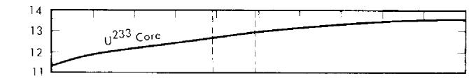

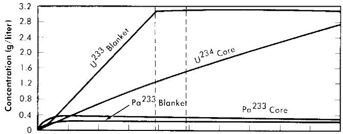

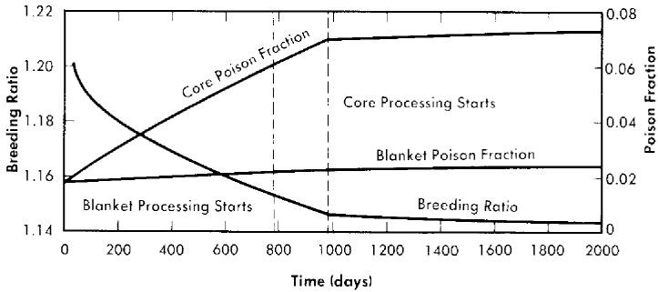  
FIG. 2-16. Variation with time of $\mathrm{U}^{233}$ , $\mathrm{U}^{234}$ , and $\mathrm{Pa}^{233}$ in the core, $\mathrm{U}^{233}$ and $\mathrm{Pa}^{233}$ in the blanket, breeding ratio, and core and blanket poison fractions as functions of time for a two-region 60-Mw thorium breeder reactor. Core thorium concentration $= 150\mathrm{g}$ Th/liter, blanket thorium concentration $= 1000\mathrm{g}$ Th/liter, temperature $= 280^{\circ}\mathrm{C}$ .

as before, with the important exception that no hydroclone processing was employed for the slurry-core cases.

Results given in Fig. 2-16 are for a core thorium concentration of $150\mathrm{g}$ Th/liter and are typical of all cases studied in their important features. As with solution-core reactors, there is a small but relatively rapid initial drop in breeding ratio during the first 100 days following reactor startup. This is due to the neutron captures in protactinium as its concentration rises and approaches equilibrium conditions. The buildup of protactinium is quite similar to the behavior seen in the solution-core cases. Equilibrium protactinium levels are reached in both core and blanket long before chemical processing is started. This period is followed by a more or less linear fall in breeding ratio with time, due to core poison-fraction buildup. Initiation of blanket processing produces a relatively minor change in slope of the breeding ratio-time curve, in contrast to the sharp break caused by the start of core processing. Linear buildups with time of the poison fractions and the higher isotopes are also observed, with $\mathrm{U}^{234}$ in the core being the most important higher isotope. Other isotope concentrations are comparatively low even at 1500 days.

Figure 2-17 lists some results for the various cases considered (except for the case already considered in Fig. 2-16). Comparison of the results shows that the time at which core processing is initiated increases with increasing core thorium concentration (except for the solution-core case); this is due to the higher $\mathrm{U}^{233}$ critical concentration associated with higher thorium concentration, resulting in a longer period to build up to a specified core poison fraction. For the solution-core case, hydroclone processing was assumed, so that $75\%$ of the poisons were removed by means other than by Thorex processing of the core (the time specified for core processing to begin in Fig. 2-17 corresponds to the initiation of Thorex processing). It is interesting to note that with slurry cores, despite the absence of hydroclone separation, the core poison fraction still takes two or more years to reach a $7\%$ level.

In these calculations there was no allowance for the poisoning effect of accumulated corrosion products. Absence of hydroclone processing would result in retention of all corrosion products in the core system, and for the same corrosion rate the cross section of corrosion products is about four times as great as in a solution-core system using hydroclones. However, the higher critical concentrations in slurry-core systems compensate for this, and the poison fraction in the core with $200\mathrm{g}$ Th/liter could be about the same as in a solution-core reactor.

The critical concentration of $\mathrm{U}^{233}$ in the core displays a small but steady rise; this contrasts with solution-core reactors, where the critical core concentration is found to be strikingly constant. Solution-core reactors, because of their longer thermal diffusion length, are more sensitive to the

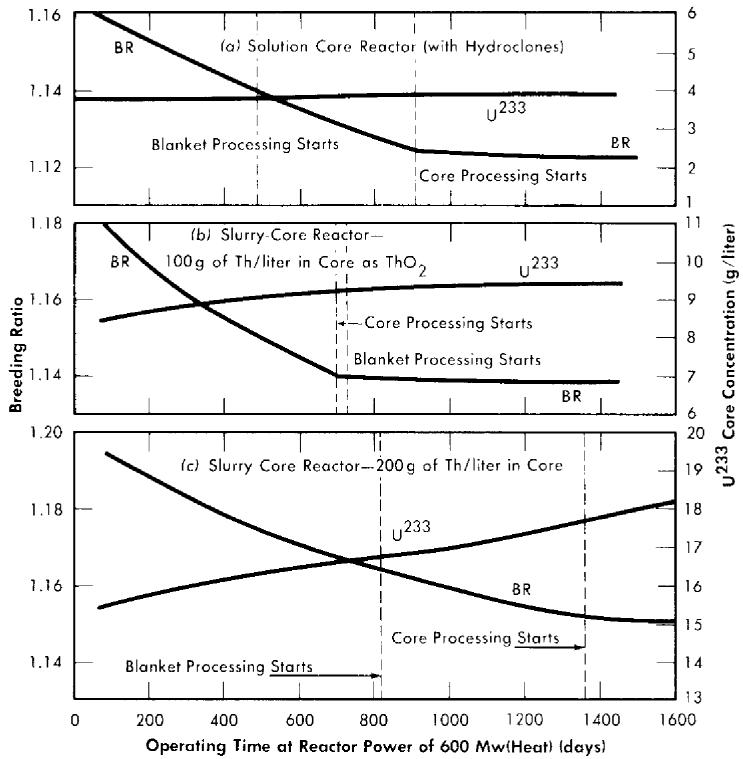  
FIG. 2-17. Comparison of breeding ratios and $\mathrm{U}^{233}$ core concentrations for two-region breeder reactors with various core-thorium concentrations. Core diameter $= 4$ ft, reactor diameter $= 9$ ft, $280^{\circ}\mathrm{C}$ , blanket thorium concentration $= 1000$ g/liter, blanket processing started when $\mathrm{U}^{233}$ blanket concentration reached $3\mathrm{g / liter}$ , core processing started when core poison fraction reached $7\%$ ( $8\%$ for solution-core case).

growth of fuel in the blanket than slurry-core machines. The latter have less thermal leakage from core to blanket, and core-poison and higher-isotope growth are less well compensated by the rise of fuel level in the blanket.

2-4.2 One-region reactors. The critical equation for one-region reactors is not so involved as that for two-region systems, and so the mathematical system analogous to the one used above for two-region systems is comparatively simple. However, relatively few nuclear results for one-region, time-dependent systems have been obtained specifically. Some results are given in Reference [29] for a 15-ft-diameter reactor containing $200\mathrm{g}$ of uranium per liter and operating at a constant power of $1350\mathrm{Mw}$ (heat) at $250^{\circ}\mathrm{C}$ . Concentrations of $\mathrm{U}^{235}$ , $\mathrm{Pu}^{239}$ , $\mathrm{Pu}^{240}$ , and $\mathrm{Pu}^{241}$ , and the fraction of fissions due to $\mathrm{U}^{235}$ were obtained as functions of time.

Under certain conditions the mathematical system involving nuclide concentrations, criticality, and fuel processing can be solved analytically [34]; the solutions obtained have been used to calculate fuel costs directly, but they could also be used to calculate breeding ratio and critical fuel concentrations explicitly.

# 2-5. SAFETY AND STABILITY OF HOMOGENEOUS REACTORS FOLLOWING REACTIVITY ADDITIONS

Reactor kinetic studies are usually broken down into investigations of reactor safety and reactor stability. Both safety and stability are determined by the generalized equations of motion involved. The two categories are considered, however, because the time scales in safety studies are usually much shorter than those involved in stability studies; hence, the generalized equations of motion can be simplified in accordance with the specified study. As used here, safety refers to the events which happen as a result of the initial power excursion following a reactivity addition; stability refers to the events which occur as a result of subsequent power surges. By these definitions, it is possible that a reactor can safely withstand the first power surge following a reactivity addition, but still not be stable; under these conditions, the reactor would be safe with respect to the first power surge but would not be safe to subsequent power surges. On the other hand, a reactor system can be stable and still not be safe; i.e., permissible changes in reactor variables can be exceeded as a result of the first power surge, even though the system would have reached a new equilibrium condition had it been able to withstand the first power surge.

The majority of work on the kinetics of homogeneous reactors has concerned circulating, pressurized-type systems, and the discussion below pertains primarily to those systems. There has been relatively little effort devoted to boiling homogeneous reactors; for these reactors the control and safety problems may be more difficult than for the nonboiling reactors [35]. In boiling systems, the most important parameters are those associated with vapor formation and bubble growth, vapor removal from the system, and the control system. With regard to control, boiling reactors have the disadvantage of producing more power when less power is demanded unless a control system is used in which an increase in reactor pressure leads to ejection of fuel from the core region. Alternatively, power-demand control can be obtained by permitting the boiling process to generate only a fraction of the total reactor power, the remainder being removed by fuel fluid which is circulated through a heat exchanger.

2-5.1 Homogeneous reactor safety. The nuclear safety of homogeneous reactors will be a function of the maximum permissible reactivity addition

and the possible reactivity additions. Despite the inherent safety associated with a large negative temperature coefficient of reactivity, it cannot be stated a priori that homogeneous reactors will be safe under all operating conditions. The limiting feature with respect to reactivity addition is the permissible pressure rise within the reactor system. This is usually either the maximum permissible core pressure rise (two-region reactor) or the maximum permissible pressure rise within the pressure vessel (one-region reactor).

With a given limit on the maximum permissible pressure rise, it is possible to specify the maximum permissible reactivity addition which can be added to the reactor. Reactor operations can then be restricted by design, so that reactivity additions associated with physical events will not exceed the maximum permissible reactivity addition.

The potential reactivity available in homogeneous systems is inherently large, because a high operating temperature is coupled with a high negative temperature coefficient of reactivity. However, all reactivity additions involve a time element. Since it appears desirable to allow continuity of physical operations, the safety design criteria should be applicable to continuous, linear rates of reactivity addition. Specifically, the maximum permissible linear rate of reactivity addition should specify what restrictions are necessary on the physical system so that this rate is not exceeded.

Equations of motion. The neutron density is the fundamental variable in homogeneous reactor safety and is influenced primarily by the temperature and density of the moderator and by the operational changes which effect a reactivity change. So long as the reactor is not far above prompt critical, the neutron density is given by the conventional equations of motion. These may also be used when larger reactivity additions are considered, if the prompt-neutron lifetime is assumed to be that associated with the region in which the neutron density is rising most rapidly with time. Under this condition, the over-all rate of increase in neutron density is overestimated, so that a safety factor will exist in reactor designs based upon these equations.

Reactivity additions which involve homogeneous reactor safety are considerably in excess of that required for prompt criticality, and for these cases the reactor power reaches a maximum value in times of the order of tenths of seconds. Such time intervals are short compared with the average half-life of the delayed-neutron precursors, and so only a small fraction of the precursors formed during the power rise decay during that time interval. The delayed neutrons from these precursors therefore contribute little to the reactor power while the power is rising; rather, they are formed following the time of peak power and exert a powerful damping influence on the power oscillation, leading to a single, damped power surge. For these safety calculations, the delayed-neutron density can be considered

constant, and so the neutron-density equations can be combined into one equation. In terms of reactor power, this equation is

$$
\frac {d P}{d t} = \left[ \frac {k _ {e} (1 - \beta) - 1}{l} \right] P + \frac {\beta}{l} P _ {0}, \tag {2-21}
$$

where $k_{e} =$ effective multiplication constant,

$P =$ reactor power,

$P_{0} = P$ evaluated under initial conditions,

$t = \mathrm{time},$

$\beta =$ effective fraction of fission neutrons which are delayed,

$l =$ average lifetime of prompt neutrons.

The appropriate value for $\beta$ is determined on the basis of the time spent inside and outside the reactor core vessel by a fluid particle.

To complete the mathematical system, the relation between $k_{e}$ and $P$ is required, which requires intermediate relations. For aqueous systems operating above $200^{\circ}\mathrm{C}$ , $k_{e}$ is influenced primarily by fluid-density effects, insofar as inherent reactivity changes are concerned. Since reactivity can also be added by physical operations, $k_{e}$ can be considered to be given by

$$
k _ {e} = 1 + \Delta + b t + \frac {\partial k _ {e}}{\partial \rho} (\rho - \rho_ {0}), \tag {2-22}
$$

where $b =$ linear rate of reactivity addition to reactor, $\Delta k_{e} / \mathrm{sec}$ ,

$\frac{\partial k_{e}}{\partial\rho} =$ density coefficient of reactivity,

$\Delta =$ instantaneous reactivity addition,

$\rho - \rho_0 =$ deviation of the average density of fuel fluid from its initial value.

The core fluid density is determined from the hydrodynamic equations of continuity and motion, in conjunction with the equation of state for the fluid. In most studies to date, a one-dimensional flow model is assumed, gas effects are neglected, the core tank is considered to be rigid, and the core inlet fluid velocity is considered to be constant. The equation for the change in fluid density is then

$$
\frac {d \rho}{d t} = - \frac {A}{V _ {c}} \rho_ {0} (U - U _ {0}), \tag {2-23}
$$

where $A =$ cross-sectional area of relief pipe,

$V_{c} =$ volume of core region,

$U - U_{0} =$ deviation of the fluid velocity in core-relief piping from its initial value.

Assuming that the resistance to fluid flow between the core and pressurizer is proportional to the square of the average fluid velocity, and that the fluid is incompressible, the one-dimensional hydrodynamic equation of motion is given by

$$
\left[ \frac {\rho_ {0} A}{g _ {c}} \int_ {0} ^ {L} \frac {d x}{A (x)} \right] \frac {d}{d t} (U - U _ {0}) = p _ {c} - p _ {p} - \frac {n _ {f} \rho_ {0}}{2 g _ {c}} \left| U \right| U, \tag {2-24}
$$

where $n_f =$ resistance coefficient associated with velocity $U$ ,

$A(x) =$ cross-sectional area of relief pipe,

$g_{c}$ $=$ dimensional constant,

$p_{c}$ = core pressure,

$p_{p}$ = pressurizer pressure,

$U$ = average velocity of fluid in relief piping of cross-sectional area $A$ ,

$L$ = length of relief piping from core to pressurizer.

Use of the absolute value of $U$ in Eq. (2-24) ensures that fluid friction will always oppose fluid flow.

The relation between pressure, temperature, and density of the fluid is given by the equation of state:

$$
p = \frac {d p}{d \rho} \Big [ (T - T _ {0}) \Big (- \frac {\partial \rho}{\partial T} \Big) + \rho - \rho_ {0} \Big ], \tag {2-25}
$$

where $p =$ pressure rise in core,

$T - T_{0} =$ deviation of the average core-fluid temperature from its initial value.

Relations are still needed between $T$ and $P$ and between $p_p$ and $\rho$ . Assuming isentropic compression within the pressurizer, $p_p$ is approximated by

$$
p _ {p} - p _ {0} = n p _ {0} \frac {\rho_ {0} - \rho}{\rho_ {0}} \frac {V _ {c}}{V _ {p}}, \tag {2-26}
$$

where $V_{p} =$ volume of pressurizing fluid,

$p_{p} - p_{0} =$ deviation of the pressurizer pressure from its initial value, $n =$ ratio of heat capacity at constant pressure to heat capacity at constant volume for pressurizing fluid.

The relation between $T$ and $P$ is obtained from an energy rate balance on the core fluid. Since the rate of energy transport associated with fluid

flow and thermal diffusion is small during times of interest, the energy rate balance is approximated by

$$
S _ {c} \frac {d T}{d t} = P - P _ {0}, \tag {2-27}
$$

where $S_{c} =$ volume heat capacity of the core fluid.

The mathematical system is now complete, and consists of Eqs. (2-21) through (2-27). Since an analytic solution to the above system has not been obtained, numerical integration of the above equations is necessary in general.

Calculation of reactor pressure rise. The variable of interest is the maximum value of core pressure for a given set of parameter values. Although not exact, an analytic expression for the maximum pressure rise, $p_{\mathrm{max}}$ , can be derived [36] for the case of an instantaneous reactivity addition. This is given by

$$
p _ {\max } = \frac {m ^ {2} \bar {F}}{2 \omega_ {h} ^ {2} \gamma_ {2}} \left[ 0. 3 8 5 m + \gamma_ {f} \left(1 + \frac {m ^ {2} \bar {F}}{4 \gamma_ {3}}\right) \right] + \frac {C _ {2} m}{\gamma_ {2}}, \tag {2-28}
$$

where $C_2 = \frac{p_0}{\rho_0}\frac{nV_c}{V_p}\left(\frac{d\rho}{dp}\right),$

measure of effect of pressurizer volume upon core pressure rise, dimensionless,

$$
\bar {F} = 1 + \frac {1}{2} \left[ C _ {2} + \frac {\left(\gamma_ {f} + m\right) m}{\omega_ {h} ^ {2}} \right],
$$

$$
m \quad = \frac {\Delta - \beta}{l} = \text {i n s t a n t a n e o u s p r o m p t r e a c t i v i t y a d d i t i o n d i v i d e d} _ {\text {b y l , s e c} ^ {- 1},}
$$

$$
p _ {\max } = \text {m a x i m u m p r e s s u r e r i s e , l b - f o r c e / f t} ^ {2},
$$

$$
\gamma_ {f} = \frac {n _ {f} U _ {0}}{A \int_ {0} ^ {L} \frac {d x}{A (x)}}, \begin{array}{c} \text {n o r m a l i z e d f r i c t i o n c o e f f i c i e n t i n c o r e r e l i e f l i n e ,} \\ \sec^ {- 1}, \end{array}
$$

$$
\gamma_ {2} = \frac {1}{l} \left(\frac {d \rho}{d \rho}\right) \left(\frac {\partial k _ {e}}{\partial \rho}\right), \begin{array}{c} \text {n o r m a l i z e d c o n v e r s i o n f a c t o r b e t w e e n n e t c o r e} \\ \text {d e n s i t y c h a n g e a n d c o r e p r e s s u r e r i s e , f t ^ {2} / s e c - l b} \\ \text {f o r c e ,} \end{array}
$$

$$
\gamma_ {3} = \frac {U _ {0} A \rho_ {0}}{V _ {c} l} \left(\frac {\partial k _ {e}}{\partial \rho}\right), \sec^ {- 2}, \quad \omega_ {h} ^ {2} = \frac {g _ {c} (d p / d \rho)}{V _ {c} \int_ {0} ^ {L} \frac {d x}{A (x)}}, \sec^ {- 2}.
$$

Results obtained from Eq. (2-28) have compared favorably with numerical integration of Eqs. (2-21) through (2-27) [36].

Although Eq. (2-28) is based on an instantaneous reactivity addition, it can be applied to rate additions of reactivity in certain circumstances. For rate additions normally encountered in homogeneous systems, it appears that the most dangerous amounts of reactivity can be added when the initial reactor power is low. In these circumstances, reactivity is added during an interval which is much greater than the time interval in which the reactivity is decreased as a result of fluid density changes. A simplified mathematical model can then be used [36] to relate a linear rate of reactivity addition, $b$ , to its equivalent instantaneous reactivity addition, $\Delta k_{\mathrm{eq}}$ . This relationship is given by the following equation:

$$
1 + \frac {\xi}{\omega_ {n p} ^ {2}} = \frac {m _ {e /} ^ {2} / 2 \omega_ {n p} ^ {2}}{\ln \left(m _ {e /} ^ {2} / 2 \omega_ {n p} ^ {2}\right)}, \tag {2-29}
$$

where $\omega_{np}^2 = \omega_n^2 x_{pc},\sec^{-2}$

$$
\omega_ {n} ^ {2} = \frac {1}{l} \left(- \frac {\partial k _ {e}}{\partial T}\right) \frac {P _ {0}}{S _ {c}}, \sec^ {- 2},
$$

$x_{pc} =$ reactor power at prompt critical relative to initial power level,

$$
{m _ {e}} {= \frac {\Delta k _ {\mathrm {e q}} - \beta}{l}, \sec^ {- 1},}
$$

$\Delta k_{\mathrm{eq}} =$ equivalent instantaneous $\Delta k_{e}$ associated with rate of reactivity addition,

$$
\xi = b / l, \sec^ {- 2}.
$$

The value for $x_{pe}$ is obtained from the equation

$$
x _ {p e} = e ^ {- M _ {s} ^ {2} / 2 \xi} + \sqrt {\pi} \frac {M _ {s}}{\sqrt {2 \xi}} \operatorname {e r f} \left(\frac {M _ {s}}{\sqrt {2 \xi}}\right), \tag {2-30}
$$

where $M_{s} = \frac{1 - k_{e}(0) + \beta}{l}$ ,

$k_{e}(0) =$ initial value of $k_{e}$

Equations (2-29) and (2-30) are plotted in Figs. 2-18 and 2-19 and give the particular combinations of initial power level and rate of reactivity addition corresponding to a given equivalent prompt reactivity addition.

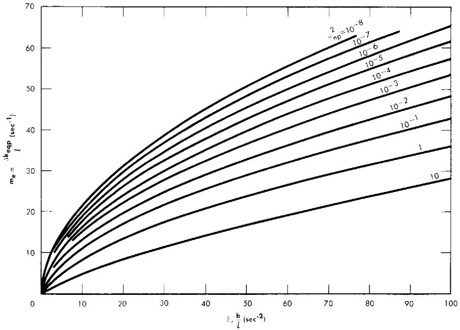

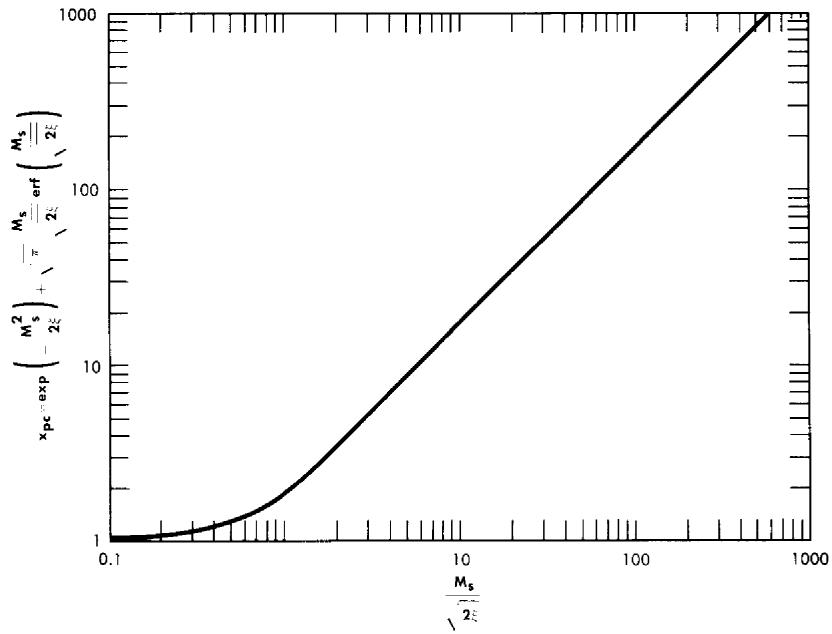  
FIG. 2-18. Relation between equivalent prompt reactivity and rate of reactivity addition. $\Delta k_{\mathrm{ep}} =$ equivalent prompt reactivity, $l =$ mean lifetime of prompt neutrons, $b =$ rate of reactivity addition, $\omega_{\mathrm{np}}^{2} =$ modified nuclear frequency.   
FIG. 2-19. Neutron power at prompt critical relative to initial power for different rates of reactivity addition.

Having determined the equivalent prompt reactivity addition, the maximum pressure rise can be calculated by using Eq. (2-28) with $m$ replaced by $m_e$ . To check the validity of the derived relations, values of $p_{\mathrm{max}}$ obtained analytically were compared [36] with those obtained by numerical integration of Eqs. (2-21) through (2-27). The results obtained by numerical integration were used to establish the relationship between rate of reactivity addition and equivalent instantaneous reactivity addition on the basis of equal pressure rise. Thus, for a given rate of reactivity addition and initial reactor power level, a particular maximum pressure was obtained. The amount of prompt reactivity added instantaneously which gave the same maximum pressure was termed the equivalent prompt reactivity addition corresponding to a given rate addition and initial power level. For a given rate of reactivity addition, good agreement was obtained between the equivalent prompt reactivity addition obtained by numerical integration and that obtained by use of Eqs. (2-29) and (2-30).

Reactivity additions. Homogeneous reactors usually have relatively large, negative temperature coefficients of reactivity. A high negative value for the temperature coefficient is usually associated with a high degree of reactor safety; however, this is true only if reactivity is introduced by means other than the temperature coefficient itself. If reactivity is added by adding cold fuel to the reactor core, e.g., by means of a heat-exchanger accident, then the smaller the value of the temperature coefficient the smaller the reactivity addition. From this viewpoint, a small temperature coefficient is desirable if the most hazardous reactivity addition occurs as a result of introduction of cold fluid into the reactor. On the other hand, a large negative temperature coefficient is desirable to compensate for reactivity added by means other than that associated with decreasing the core fluid temperature.

Reactivity changes can also occur as a result of changes in fuel concentration or distribution. In slurry reactors, large changes in reactivity can result from settling of the fertile material. The results [37] of two-group, two-dimensional, two-region calculations are shown in Table 2-15 for a cylindrical reactor containing highly enriched $\mathrm{UO}_2\mathrm{SO}_4$ in a 5-ft-diameter core region, and $\mathrm{ThO}_2$ in a $2\frac{1}{4}$ -ft-thick blanket region. The average temperature was assumed to be $280^{\circ}\mathrm{C}$ , and the height was assumed to be equal to the diameter for both core and pressure vessel.

Although the calculated reactivity additions associated with slurry settling were quite large, such additions would not occur instantaneously; rather, they would be a function of time, the rate of reactivity addition being controlled by the rate at which the slurry settled. Settling data for slurries containing 1000 or $500\mathrm{g}$ Th/liter correspond to rates of reactivity addition of less than $0.02\% \Delta k_{e} / \mathrm{sec}$ . These rates are well within permissible rates of reactivity addition; however, if settling took place over a period

TABLE 2-15 REACTIVITY CHANGE AS A FUNCTION OF SLURRY SETTLING  

<table><tr><td>Initial thorium concentration in blanket, g/liter</td><td>Percentage of reactor height slurry has settled</td><td>Calculated reactivity change, % Δke</td></tr><tr><td>1000</td><td>30</td><td>+2.8</td></tr><tr><td>1000</td><td>50</td><td>10.2</td></tr><tr><td>500</td><td>30</td><td>2.1</td></tr><tr><td>500</td><td>50</td><td>8.7</td></tr></table>

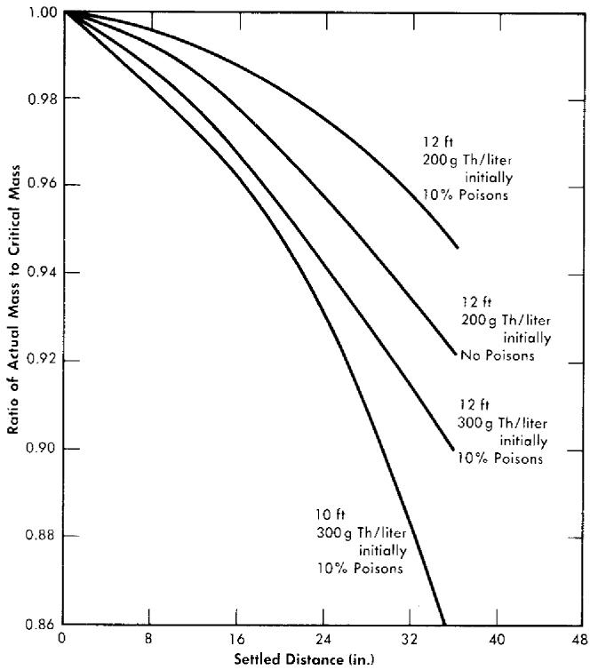  
FIG. 2-20. Effect of settling on critical mass requirements in one-region reactors.

of time, the reactor temperature and pressure would eventually reach the point where the fuel system would have to be diluted or dumped.

Settling of fuel and fertile material in large single-region reactors may cause the reactor to become subcritical. The results [38] of two-group calculations for $\mathrm{D}_2\mathrm{O}-\mathrm{ThO}_2-\mathrm{U}^{233}\mathrm{O}_3$ reactors 10 and 12 ft in diameter and containing 200 and $300\mathrm{g}$ Th/liter are given in Fig. 2-20. Cylindrical

geometry was assumed, with height/diameter ratio equal to one; the slurry was assumed to be homogeneously distributed in the bottom portion of the reactor, with a $\mathrm{D}_2\mathrm{O}$ reflector on top. In Fig. 2-20 the amount of fuel required for criticality (after settling) is compared with the amount of fuel initially required (before settling). Based on these two-group results, it appears that large one-region reactors become subcritical following slurry settling.

In the previous analytical presentation, the effect of decomposition gases upon reactor safety has been tacitly neglected. However, the generation of hydrogen and oxygen from the decomposition of water represents a possible explosion hazard. If the fuel contains no catalyst for recombination, gas bubbles will form and contain an explosive mixture of hydrogen, oxygen, and water vapor. Explosions might occur in the core, gas separator, recombiner system, or connecting piping. If an explosion occurs outside the reactor core, reactivity can be added to the reactor, resulting in an undesirably high power surge. Under these conditions, not only must the gas explosion be considered but also the possible reactivity addition associated with the explosion. If the gas explosion occurs in the core, however, no reactivity addition should be involved, and only the pressure associated with the explosion need be considered. If no explosion occurs, the presence of gases will still influence the compressibility of the fuel fluid, and this effect can be considered in the evaluation of fluid compressibility. Neglect of gas formation in evaluating reactor safety is justified if complete recombination of the decomposed gases is achieved within the reactor, or if the reactor is initially operating at a power so low that decomposition gases are not formed (corresponding to absorption of the decomposition gases by the fuel solution). If the reactor is at low power and reactivity is added to the system, then neglect of gas formation is conservative with respect to safety evaluation, since in this case the formation of gases helps in decreasing the reactivity of the system. If the initial power is so high that undissolved gases are initially present within the core region, then the effect of these gases must be considered in evaluating fluid compressibility. The presence of undissolved gases would tend to lower the permissible reactivity addition; however, an increase in gas volume would imply an increase in initial reactor power, which aids reactor safety if reactivity can be added as a rate function only.

The number of fission neutrons which are delayed usually is considered as an important factor in reactor safety. However, if reactivity is added as a linear rate function at low initial reactor power, the delayed neutrons have little influence upon the reactivity addition above prompt critical. They will influence the stability and steady-state operational behavior of the reactor, though, and are necessary to damp the power oscillation following a reactivity addition.

Reactor safety also involves events which are not directly associated with reactivity additions; e.g., if the circulating pump failed or if there were sudden cessation of heat removal in the heat exchanger, after-heat effects may raise the temperature (and pressure) of the system to undesirably high values. The possibility of an instantaneous rupture of a high pressure steam line, however, is remote, based on experience in conventional plants.*

2-5.2 Homogeneous reactor stability. The purpose of stability studies is to determine whether the reactor power will return to a stable equilibrium condition following a system disturbance. Although inherently connected with safety, stability studies usually treat small reactivity additions and concern time intervals long in comparison with those involved in safety studies. The general stability problem can be broken into simpler problems by eliminating those parts of the physical system which have only a small influence upon the time behavior of the variable of interest.

The most familiar of stability studies concerns the reactor core-pressurizer system, and will be referred to as "nuclear stability" studies. These consider the high-pressure system alone and assume that the power demand is constant. This is a valid assumption, since changes in power demand and changes in variables resulting from fluid flowing between the low- and high-pressure systems initiate only low-frequency nuclear power oscillations in comparison with those sustained by the pressurizer-core system.

Reactor instabilities can also arise due to interactions between the reactor primary system, heat-removal system, and fuel-storage system. These are associated with the method of reactor operation, and are discussed under the heading of Operational Stability.

Under certain conditions it may be desirable to operate reactors with fission gases retained within the system; in these circumstances the buildup of $\mathrm{Xe}^{135}$ during periods of low-power operation may influence subsequent reactor operation. Although no stability problem is involved, a long time scale is associated with controlling the reactor in these circumstances. Reactivity effects and required fuel-concentration changes associated with $\mathrm{Xe}^{135}$ buildup and burnup are discussed below under the appropriate heading.

Nuclear stability. In studying nuclear stability, the equations of motion for a single-region reactor system are normally used. These should be adequate if the reactor behavior is controlled by a single region; however, it should be remembered that the mean lifetime of prompt neutrons should be that for the reactor as a whole. The general mathematical system is too complicated to handle analytically, so that it is necessary either to resort

to numerical integration of specific cases or to linearize the equations so that they can be treated analytically. The linearized approach is valid for very small power oscillations; since the nonlinear effects appear to introduce damping of the power surges, the reactor system should be stable if the stability criteria for the linearized equations are satisfied. Not meeting the linearized stability criteria may not necessarily result in the buildup of pressure oscillations to proportions where reactor safety is concerned; satisfying the criteria should aid in eliminating the small pressure surges which may physically weaken the system if they occur in a repetitive manner.

The conventional equations of motion given in Eqs. (2-21) through (2-27) are used, except that the delayed-neutron precursors are assumed to decay in accordance with a single effective decay constant, and fluid-flow effects are considered in which the average fuel-fluid temperature is the linear average of the core inlet and outlet temperatures. Heat-exchanger behavior will also affect the temperature of the fuel fluid and is to be considered. The resulting linearized equations [36] lead to an equation defining the criteria for stability of the reactor system. If only the reactor core and pressurizer system are considered, corresponding to a relatively large residence time for fluid in the core, the stability criteria reduces to

$$
\gamma_ {f} \frac {\beta}{l} \left[ \omega_ {h} ^ {2} \left(1 + C _ {2}\right) + \frac {\beta}{l} \left(\gamma_ {f} + \frac {\beta}{l}\right) \right] > \left(\gamma_ {f} + \frac {\beta}{l}\right) ^ {2} \frac {\omega_ {n} ^ {2}}{1 + C _ {2}} > 0. \tag {2-31}
$$

Since all quantities are positive, the last inequality is always satisfied. By replacing the other inequality with an equal sign and fixing all parameters but one, the value of the remaining parameter (which barely fails to satisfy the inequality) can be obtained. By this procedure, the results given in Fig. 2-21 were obtained for a specific value of $\gamma_{f}$ . Stable operating conditions are those lying above the appropriate curve.

The above treatment neglects any effects that fluid transport and heat-exchanger behavior might have upon the temperature of the fluid entering the reactor. Results of studies [36] in which these effects were considered indicate that the resulting stability criteria are less stringent than those for systems in which fluid transport and heat-exchanger behavior are neglected. On this basis, the results given in Fig. 2-21 form reasonable bases for safe design.

A one-region reactor will operate at a power density lower than that at which the corresponding two-region reactor is operated, if the physical size of the one-region reactor is large. Based on the stability criteria given in Fig. 2-21, about the same degree of stability will result if the product of $\omega_h^2\omega_n^2$ remains constant in going from a one- to a two-region reactor. On the basis of fuel-cost studies, the optimum two-region and one-region

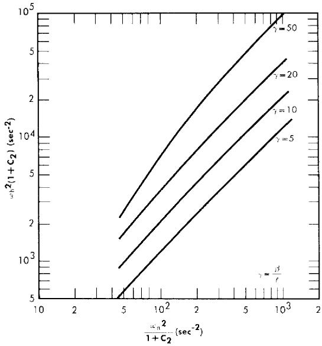  
FIG. 2-21. Stability criteria for homogeneous circulating reactors. $\gamma_{f} =$ normalized friction coefficient $= 0.5$ .

reactors do have $\omega_h^2\omega_n^2$ which are roughly equal, with the one-region reactor being somewhat more stable. However, there appears to be no distinct advantage of one type over the other as regards nuclear stability, since both normally will operate well within the stable region.

Operational Stability. Other types of stability which might be considered concern the response of the reactor to changes in load demand and to changes in rates of flow between the low- and high-pressure systems. These usually involve power oscillations whose frequencies are much lower than those sustained by the core-pressurizer system. In these circumstances the general equations of motion can be simplified; however, load-demand studies will concern the particular characteristics of the heat exchanger under consideration.

Changes in fluid flow rates between the high- and low-pressure systems in reactors can also influence reactor stability. During operation of the HRE-1, it was noticed that under certain conditions the temperature and power of the reactor would rise with time. This effect was termed the "walkaway" phenomenon [39]. It was associated with a slow rate of reactivity addition produced by an increase in core fuel concentration, leading to an increase in operating power and temperature. This increase in fuel concentration resulted when water was removed from the core (as a result of decomposition-gas formation and accompanying vaporization of water) at a faster rate than it was returned from the low-pressure system. This process continued until it was stopped by the operator.

TABLE 2-16   
EFFECT OF $\mathbf{X}\mathbf{E}^{135}$ UPON REACTOR CONDITIONS FOLLOWING SHUTDOWN AND RETURN TO POWER   

<table><tr><td>Reactor diameter, ft</td><td>(a) φ0</td><td>(b) P/P0</td><td>(c) - 1/N dN/ sec-1</td><td>(d) dkε/dt, sec-1</td><td>(e) Δke,%</td><td>(f) ΔT, °C</td><td>(g) tmin, hr</td></tr><tr><td>4</td><td>1013</td><td>0</td><td>3.0 × 10-6</td><td>7.4 × 10-7</td><td>0.86</td><td>2</td><td>10</td></tr><tr><td>4</td><td>1014</td><td>0.1</td><td>6.8 × 10-5</td><td>1.7 × 10-5</td><td>9.0</td><td>20</td><td>5</td></tr><tr><td>4</td><td>1014</td><td>0</td><td>8.5 × 10-5</td><td>2.1 × 10-5</td><td>13.</td><td>30</td><td>5</td></tr><tr><td>4</td><td>1015</td><td>0.1</td><td>6.9 × 10-4</td><td>1.7 × 10-4</td><td>17.</td><td>60</td><td>1</td></tr><tr><td>4</td><td>1015</td><td>0</td><td>3.5 × 10-4</td><td>8.6 × 10-5</td><td>33.</td><td>v. large</td><td>3</td></tr><tr><td>∞</td><td>1015</td><td>0</td><td>6.9 × 10-4</td><td>3.6 × 10-4</td><td>52.</td><td>v. large</td><td>2</td></tr></table>

(a) Initial value of thermal flux before shutdown; averaged over high-pressure system; neutrons/cm $^2$ -sec.   
(b) Power during shutdown relative to power before and after shutdown.   
(c) Relative rate of change in $\mathrm{U}^{235}$ concentration required to maintain criticality at time of return to power (no change in fluid temperature).   
(d) Rate of reactivity addition due to xenon burnout at time of return to power.   
(e) Estimate of reactivity associated with removal of $\mathrm{Xe}^{135}$ at time of maximum xenon concentration.   
(f) Estimate of fluid temperature decrease if reactivity addition associated with xenon buildup were compensated by fall in reactor temperature.   
(g) Estimate of the time required for xenon concentration to reach a minimum value following return to power.

The above type of phenomenon is a function of fuel flow rates between the low- and high-pressure system and can therefore be controlled. Using the applicable linearized equations of motion, the criteria for stability toward walkaway can be obtained. This has been done for the HRE-2 [40]. Design parameters such as operating conditions, fluid-flow rates, vessel volumes, recombination rate of decomposition gases, and other conditions will influence the degree of stability. Walkaway will not occur if decomposition gases are not formed. If gas is formed, a paramount cause of instability is insufficient overpressure. Increasing the fuel feed-pump rate or the ratio of solution volume in the high-pressure system to that in the low-pressure system, or decreasing the reactor temperature or power will tend to increase reactor stability against walkaway. Walkaway can also be prevented by automatic control devices which influence the behavior of the heat exchanger. Walkaway conditions can be instigated by reducing overpressure or by increasing the rate of gas formation.

Effect of $Xe^{135}$ upon reactor behavior. If reactors are operated with complete recombination of the decomposition gases and no letdown from the high-pressure system, there will be virtually complete retention of the fission fragments and the fission-product gases within the reactor system. Under such conditions, partial or total reactor shutdown will lead to an increase in $Xe^{135}$ concentration, which might, in turn, lead to difficulties in maintaining criticality or reaching criticality upon subsequent power demand. To investigate the above effect, calculations were performed [41] for a 4-ft-diameter spherical reactor operating at $280^{\circ}\mathrm{C}$ , containing $U^{235}$ , heavy water, $I^{135}$ , and $Xe^{135}$ , and operating at initial fluxes of $10^{13}$ to $10^{15}$ neutrons/( $\mathrm{cm}^2$ ) (sec). For these cases the reactor power was reduced either to zero or to one-tenth the initial value, and the fuel concentration required for criticality was obtained for times following the power reduction. At the time that the xenon concentration reached a maximum value, the power was returned to its original level, and at this point the maximum rate of reactivity addition associated with xenon burnout was obtained. The rate of change in fuel concentration required to maintain criticality at this point was also obtained. In addition, the time required for the xenon concentration to reach a minimum value following return to power was evaluated. The maximum change in xenon concentration was used to estimate the total reactivity addition associated with xenon buildup and was interpreted in terms of fluid temperature changes required to maintain criticality if the fuel concentration were maintained constant. Table 2-16 summarizes the results obtained and, for comparison purposes, also includes results for a reactor of infinite diameter. As shown in Table 2-16, the maximum rate of reactivity addition associated with xenon burnout was less than $10^{-3} \Delta k_{e} / \mathrm{sec}$ , which does not appear to constitute a dangerous rate. However, at an operating flux of $10^{15}$ the increase in fuel concentra

tion or the decrease in temperature required to maintain criticality following partial or total shutdown is so large that provisions should be made for elimination of xenon by external means. At $10^{14}$ average flux it appears that xenon poisoning may be compensated by decreasing the reactor temperature.

# REFERENCES

1. J. H. ALEXANDER and N. D. GIVEN, A Machine Multigroup Calculation: The Eyewash Program for Univac, USAEC Report ORNL-1925, Oak Ridge National Laboratory, Sept. 15, 1955.   
2. G. SAFONOV, Notes on Multigroup Techniques for the Investigation of Neutron Diffusion, in Reactor Science and Technology, USAEC Report TID-2503(Del.), The Rand Corporation, December 1952. (pp. 249-272)   
3. S. VISNER, Critical Calculations, Chap. 4.2, in The Reactor Handbook, Vol. 2, Engineering, USAEC Report AECD-3646, 1955. (pp. 511-533)   
4. G. SAFONOV, The Rand Corporation, 1955. Unpublished.   
5. S. JAYE, Oak Ridge National Laboratory, in *Homogeneous Reactor Project Quarterly Progress Report*, USAEC Reports ORNL-2222, 1957 (p. 43); ORNL-2272, 1957. (p. 51)   
6. B. E. PRINCE, Breeding Ratio in Thorium Breeder Reactors, in Homogeneous Reactor Project Quarterly Progress Report for the Period Ending Jan. 31, 1958, USAEC Report ORNL-2493, Oak Ridge National Laboratory, 1958.   
7. T. B. FowLER, Oracle Code for a General Two-region, Two-group Spherical Reactor Calculation, USAEC Report CF-55-9-133, Oak Ridge National Laboratory, Sept. 22, 1955.   
8. M. ToBIAs, Oak Ridge National Laboratory, 1956. Unpublished.   
9. M. TOBIAS, A "Thin-shell" Approximation for Two-group, Two-region Spherical Reactor Calculations, USAEC Report CF-54-6-135, Oak Ridge National Laboratory, June 1954.   
10. J. T. ROBERTS and L. G. ALEXANDER, Cross Sections for Ocusol-A-Program, USAEC Report CF-57-6-5, Oak Ridge National Laboratory, July 11, 1957.   
11. I. V. KURCHATOV, Some Aspects of Atomic-power Development in the USSR, USSR Academy of Sciences, Moscow. (Talk presented at Harwell, England, 1956.)   
12. E. H. MAGLEBY et al., Energy Dependence of Eta for U-233 in the Region 0.1 to 8.0 Ev, USAEC Report IDO-16366, Phillips Petroleum Co., Nov. 19, 1956.   
13. D. E. McMILLAN et al., in Report of the Physics Section for June, July, August 1956, USAEC Report KAPL-1611(Del.), Knolls Atomic Power Laboratory, Dec. 14, 1956. (pp. 14-15)   
14. P. N. HAUBENREICH, in Homogeneous Reactor Project Quarterly Progress Report for the Period Ending Jan. 31, 1958, USAEC Report ORNL-2493, Oak Ridge National Laboratory, 1958.   
15. M. C. EDLUND and P. M. Wood, Physics of the Homogeneous Reactor Test-Statics, USAEC Report ORNL-1780(Del.), Oak Ridge National Laboratory, Aug. 27, 1954.   
16. B. E. PRINCE and C. W. NESTOR, JR., in Homogeneous Reactor Project

Quarterly Progress Report for the Period Ending Oct. 31, 1957, USAEC Report ORNL-2432, Oak Ridge National Laboratory, 1958. (p. 17)   
17. D. J. HUGHES and R. B. SCHWARTZ, Neutron Cross Sections, USAEC Report BNL-325, Brookhaven National Laboratory, Jan. 1, 1957.   
18. T. B. FowLER and M. TOBIAS, Two-group Constants for Aqueous Homogeneous Reactor Calculations, USAEC Report CF-58-1-79, Oak Ridge National Laboratory, Jan. 22, 1958.   
19. J. HALPERIN et al., Capture Cross Section of Pa-233 for Thermal Reactor Neutrons, in Reactor Science and Technology, USAEC Report TID-2504(Del.), Oak Ridge National Laboratory, 1953. (pp. 345-348)   
20. H. C. CLAIBORNE and T. B. FOWLER, *Fuel Cost of Power Reactors Fueled by UO₂SO₄-Li₂SO₄-D₂O Solution*, USAEC Report CF-56-1-145, Oak Ridge National Laboratory, Jan. 30, 1956.   
21. D. E. McMillan et al., A Measurement of Eta and Other Fission Parameters for U-233, Pu-239, Pu-241, Relative to U-235 at Sub-Cadmium Neutron Energies, USAEC Report KAPL-1464, Knolls Atomie Power Laboratory, Dec. 15, 1955.   
22. M. TOBIAS, Certain Nuclear Data and Physical Properties to Be Used in the Study of Thorium Breeders, USAEC Report CF-54-8-179, Oak Ridge National Laboratory, Aug. 26, 1954.   
23. C. W. NESTOR, JR., and M. W. ROSENTHAL, in Homogeneous Reactor Project Quarterly Progress Report for the Period Ending Apr. 30, 1956, USAEC Report ORNL-2096, Oak Ridge National Laboratory, 1956. (pp. 60-62)   
24. M. W. ROSENTHAL and M. TOBIAS, Nuclear Characteristics of Two-region Slurry Reactors, USAEC Report CF-56-12-82, Oak Ridge National Laboratory, Dec. 20, 1956.   
25. D. C. HAMILTON and P. R. KASTEN, Some Economic and Nuclear Characteristics of Cylindrical Thorium Breeder Reactors, USAEC Report ORNL-2165, Oak Ridge National Laboratory, Sept. 27, 1956.   
26. M. ToBIAs, Oak Ridge National Laboratory, in Homogeneous Reactor Project Quarterly Progress Report, USAEC Reports ORNL-2379, 1957 (p. 43); ORNL-2432, 1958. (p. 46)   
27. M. W. ROSENTHAL and T. B. FOWLER, in Homogeneous Reactor Project Quarterly Progress Report for Period Ending July 31, 1957, USAEC Report ORNL-2379, Oak Ridge National Laboratory, 1957. (p. 37)   
28. J. A. LANE et al., Oak Ridge National Laboratory, 1951. Unpublished.   
29. R. B. BRIGGS, Aqueous Homogeneous Reactors for Producing Centralstation Power, USAEC Report ORNL-1642(Del.), Oak Ridge National Laboratory, May 4, 1954.   
30. M. W. ROSENTHAL et al., *Fuel Costs in Spherical Slurry Reactors*, USAEC Report ORNL-2313, Oak Ridge National Laboratory, Sept. 11, 1957.   
31. T. B. FowLER, in Homogeneous Reactor Project Quarterly Progress Report for the Period Ending July 31, 1957, USAEC Report ORNL-2379, Oak Ridge National Laboratory, 1957. (p. 44)   
32. M. Tobias et al., in *Homogeneous Reactor Project Quarterly Progress Report for the Period Ending Oct. 31, 1957*, USAEC Report ORNL-2432, Oak Ridge National Laboratory, 1958. (p. 42)

33. M. TOBIAS, in Homogeneous Reactor Project Quarterly Progress Report for Period Ending Jan. 31, 1958, USAEC Report ORNL-2493, Oak Ridge National Laboratory, 1958.   
34. P. R. KASTEN et al., *Fuel Costs in Single-region Homogeneous Power Reactors*, USAEC Report ORNL-2341, Oak Ridge National Laboratory, Nov. 18, 1957. (pp. 42-50)   
35. J. M. STEIN and P. R. KASTEN, Boiling Reactors: A Preliminary Investigation, USAEC Report ORNL-1062, Oak Ridge National Laboratory, Nov. 23, 1951. W. MARTIN et al., Density Transients in Boiling Liquid Systems; Interim Report, USAEC Report AECU-2169, Department of Engineering, University of California, Los Angeles, Calif., July 1952; Studies on Density Transients in Volume-heated Boiling Systems, USAEC Report AECU-2950, Department of Engineering, University of California, Los Angeles, Calif., July 1953. M. L. GREENFIELD et al., Studies on Density Transients in Volume-heated Boiling Systems, USAEC Report AECU-2950, Department of Engineering, University of California, Los Angeles, Calif., October 1954. P. R. KASTEN, Boiling Reactor Kinetics, Chap. 4.2, in The Reactor Handbook, Vol. 2, Engineering, USAEC Report AECD-3646, 1955 (pp. 551-552); Operation of Boiling Reactors: Part I—Power Demand Response, USAEC Report CF-53-1-140, Oak Ridge National Laboratory, Jan. 14, 1953; Boiling Reactor Operation: Part II—Reactor Governors, USAEC Report CF-53-2-112, Oak Ridge National Laboratory, Feb. 12, 1953.   
36. P. R. KASTEN, Dynamics of the Homogeneous Reactor Test, USAEC Report ORNL-2072, Oak Ridge National Laboratory, June 7, 1956.   
37. H. C. CLAIBORNE and P. R. KASTEN, in Homogeneous Reactor Project Quarterly Progress Report for the Period Ending Jan. 31, 1956, USAEC Report ORNL-2057(Del.), Oak Ridge National Laboratory, 1956. (pp. 68-69)   
38. H. C. CLAIBORNE, in Homogeneous Reactor Project Quarterly Progress Report for the Period Ending July 31, 1955, USAEC Report ORNL-1943, Oak Ridge National Laboratory, 1955. (p. 44 ff)   
39. S. VISNER, in *Homogeneous Reactor Project Quarterly Progress Report for the Period Ending Jan. 31, 1954*, USAEC Report ORNL-1678, Oak Ridge National Laboratory, 1954. (p. 9 ff)   
40. M. TOBIAS, Oak Ridge National Laboratory, in *Homogeneous Reactor Project Quarterly Progress Report*, USAEC Reports ORNL-1853, 1955 (pp. 23-27); ORNL-1895, 1955. (pp. 27-29)   
41. M. TOBIAS, in Homogeneous Reactor Project Quarterly Progress Report for the Period Ending July 31, 1956, USAEC Report ORNL-2148(Del.), Oak Ridge National Laboratory, 1956. (p. 41 ff)