# CHAPTER 3

# PROPERTIES OF AQUEOUS FUEL SOLUTIONS*

# 3-1. INTRODUCTION

The chemical and physical properties of aqueous fuel solutions are important because they affect the design, construction, operation, and safety of homogeneous reactors in which they are used. This chapter will discuss primarily those chemical and physical properties, except corrosion, which are important for reactor design and operation. Special attention will be given to the properties of solutions of uranyl sulfate, since such solutions have been the most extensively studied, and at present appear the most attractive for ultimate usefulness in homogeneous reactors.

Solubility relationships are discussed first, with data for uranyl sulfate followed by information concerning other fissile and fertile materials. The effects of radiation on water, the decomposition of water by fission fragments, the recombination of radiolytic hydrogen-oxygen gas, the decomposition of peroxide in reactor solutions, and the effects of radiation on nitrate solutes are then presented. Finally, tables of relevant physical properties are given for light and heavy water, for uranyl sulfate solutions, for other solutions of potential reactor interest, and for the hydrogen-oxygen-steam mixtures which occur as vapor phases in contact with reactor solutions.

# 3-2. SOLUBILITY RELATIONSHIPS OF FISSILE AND FERTILE MATERIALS†

3-2.1 General. For the most part, studies of aqueous solutions of fissile materials for use in homogeneous reactors have dealt with hexavalent uranium salts of the strong mineral acids. Hexavalent uranium in aqueous solutions appears as the divalent uranyl ion, $\mathrm{UO}_2^{++}$ . Tetravalent uranium salts in aqueous solutions are relatively unstable, being oxidized to the hexavalent condition in the presence of air. Other valence states of uranium either disproportionate or form very insoluble compounds and have not been seriously proposed as fuel solutes.

Uranyl salts are generally very soluble in water at relatively low temperatures (below $200^{\circ}\mathrm{C}$ ). At higher temperatures, miscibility gaps appear in the system. These are manifested by the appearance of a basic salt solid

phase from dilute solutions and by the appearance of a uranium-rich second liquid phase from more concentrated solutions. In both the salt and the second liquid phase, the uranium-to-sulfate ratio is found to be greater than in the system at lower temperature; this suggests that hydrolysis of the uranyl ion is responsible for the immiscibility in each instance. Hydrolysis can be repressed effectively by increasing the acidity of the solution or, alternatively, by the addition of a suitable complexing agent for the uranyl ion. Even the anions of the solute itself may be considered to accomplish this to some degree, since very dilute solutions hydrolyze much more extensively than more concentrated solutions.

Primary emphasis has been placed on the study of uranyl sulfate solutions because of the superiority of the sulfate over other anions with respect to thermal and radiation stability, absorption cross section for neutrants, ease of chemical processing, and corrosive properties. Other uranyl salts which have either been used in reactors or studied for possible use include the nitrate, phosphate, fluoride, chromate, and carbonate. It has been found possible to improve the solubility characteristics of uranyl salts solutions at elevated temperatures by the addition of acids or salts of the chosen anion.

The marked differences between light water and heavy water with respect to moderating ability and thermal neutron absorption cross section, make solutions in both solvents of interest for reactor use. Generally speaking, the upper temperature limit of solution stability occurs about $10^{\circ}\mathrm{C}$ lower in heavy-water solutions than in light-water solutions.

Tetravalent uranium can be stabilized by increasing the reduction potential of the solution. However, tetravalent uranium is more readily hydrolyzed at elevated temperatures than hexavalent uranium, and it probably cannot be kept in solution except by the use of otherwise excessively high concentrations of acid.

Plutonium, the other fissile material, also forms salts which can be dissolved in water. The possibility of using such solutions in aqueous homogeneous reactor systems has been examined, and limited experimental studies have been directed toward this goal but without substantial success (see Article 6-6.3).

Uranium-238 and thorium, the fertile materials, have been considered for use in converter or breeder reactor systems. The solubility of uranium is such that satisfactory aqueous solutions of uranium can be obtained for use in the conversion of $\mathrm{U}^{238}$ to plutonium. Substantial efforts have been made to develop solutions of thorium which could be used as a blanket in a two-region breeder reactor system.

Thorium appears to be stable in the tetravalent form but has a strong tendency toward hydrolysis at elevated temperatures. Insoluble thorium dioxide is ultimately formed as the hydrolysis product. Thorium nitrate

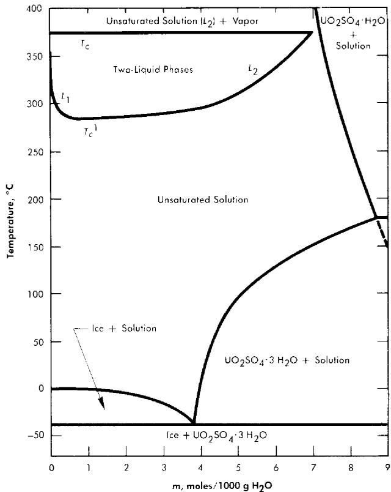  
FIG. 3-1. Phase diagram for the system $\mathrm{UO}_2\mathrm{SO}_4 - \mathrm{H}_2\mathrm{O}$ .

and thorium phosphate can be maintained in solution at satisfactory concentrations by the use of substantial concentrations of nitric or phosphoric acids to inhibit hydrolysis. However, in the nitrate system an acceptable breeding ratio could only be obtained by using $\mathrm{N}^{15}$ . Thorium phosphate solutions containing the necessary amount of phosphoric acid are extremely corrosive to all but the noble metals.

Neptunium and protactinium complete the listing of fissile and fertile materials, since these are intermediates in the production of plutonium and $\mathrm{U}^{233}$ from $\mathrm{U}^{238}$ and thorium. Limited exploratory studies of their solubilities have been carried out primarily in connection with the development of processes for their continuous removal from blanket systems.

3-2.2 Uranyl sulfate. The solubility of uranyl sulfate in water and the characteristics of the phase relationships at elevated temperatures, displayed in the form of a binary system, $\mathrm{UO_2SO_4 - H_2O}$ , are shown in Fig. 3-1 [1]. It is necessary, however, to study the ternary system, $\mathrm{UO_3 - SO_3 - H_2O}$ , in order to understand the hydrolytic precipitation of the

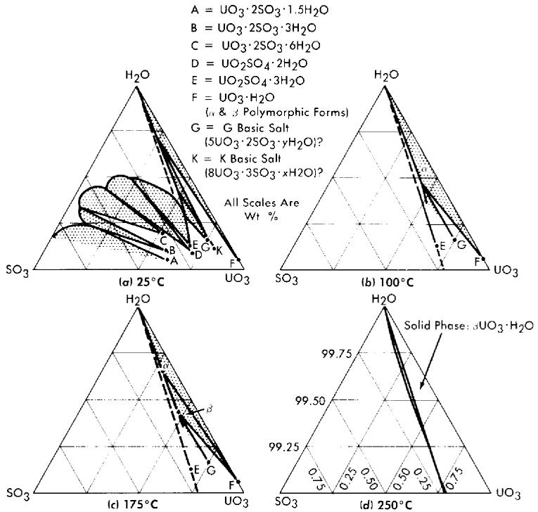  
FIG. 3-2. The system $\mathrm{UO}_3 - \mathrm{SO}_3 - \mathrm{H}_2\mathrm{O}$ .

basic solid phase, $\beta\text{-}\mathrm{UO}_3\cdot \mathrm{H}_2\mathrm{O}$ , which occurs in very dilute solutions at elevated temperatures, and the position of the tie lines in the liquid-liquid miscibility gap. Figure 3-2 shows portions of the ternary isotherms at 25, 100, 175, and $250^{\circ}\mathrm{C}$ [2,3]. A point of special significance in these diagrams is that the solubility of $\mathrm{UO}_3$ in uranyl sulfate solutions decreases with increasing temperature to the extent that at $250^{\circ}\mathrm{C}$ excess acid is required to maintain homogeneity in solutions of low concentration. Excess acid also has a marked effect on the liquid-liquid miscibility gap, as shown by the curves in Fig. 3-3 [4]. In very dilute solutions the surface formed by these curves intersects the surface representing the liquid compositions in equilibrium with the hydrolytically precipitated solid phase, $\beta\text{-}\mathrm{UO}_3\cdot \mathrm{H}_2\mathrm{O}$ . Figure 3-4 shows this intersection and three paths on the liquidus surface at fixed $\mathrm{SO}_3 / \mathrm{UO}_3$ mole ratios [5].

Figure 3-5 shows, from the data of Jones and Marshall [6], how the two-liquid-phase separation temperature is lowered when the solvent is changed from light water to heavy water. Scattered experiments suggest that the temperatures for solid-phase separation through hydrolytic precipitation are also somewhat lower in heavy-water systems than in systems containing light water as the solvent.

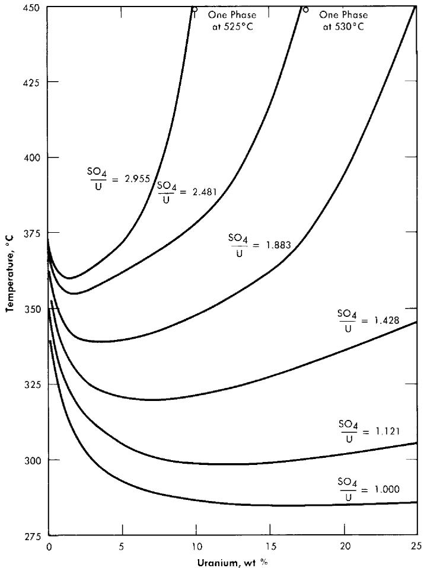  
FIG. 3-3. Coexistence curves for two liquid phases in the system $\mathrm{UO}_2\mathrm{SO}_4\text{-H}_2\mathrm{SO}_4\text{-H}_2\mathrm{O}$ .

Figure 3-6 shows the liquidus composition isotherms from 150 to $290^{\circ}\mathrm{C}$ for dilute sulfuric acid solutions saturated with $\mathrm{UO}_3$ [7].

Study of the data leads to the following general conclusions with respect to the stability of uranyl sulfate solutions of reactor interest:

(1) Stoichiometric uranyl sulfate solutions in light and heavy water are unstable at temperatures of $280^{\circ}\mathrm{C}$ and above because of hydrolysis.   
(2) Stability up to approximately $325^{\circ}\mathrm{C}$ is provided at uranium concentrations up to 2.5 w/o by the addition of a 50 mole $\%$ excess of sulfuric acid.   
(3) Stability up to as high as $400^{\circ}\mathrm{C}$ is provided at uranium concentrations above 20 w/o by the addition of a 100 mole $\%$ excess of sulfuric acid.

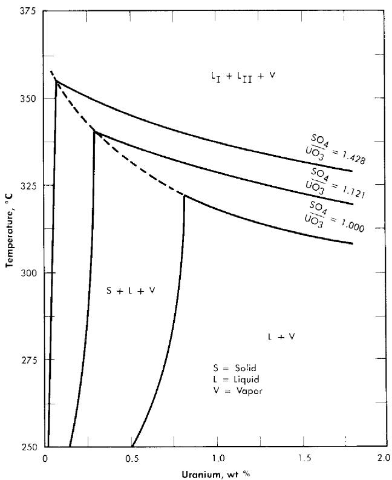  
FIG. 3-4. Effect of excess $\mathrm{H}_2\mathrm{SO}_4$ on the phase equilibria in very dilute $\mathrm{UO}_2\mathrm{SO}_4$ solutions.

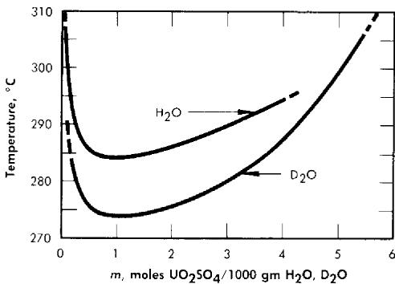  
FIG. 3-5. Two-liquid phase region of uranyl sulfate in ordinary and heavy water.

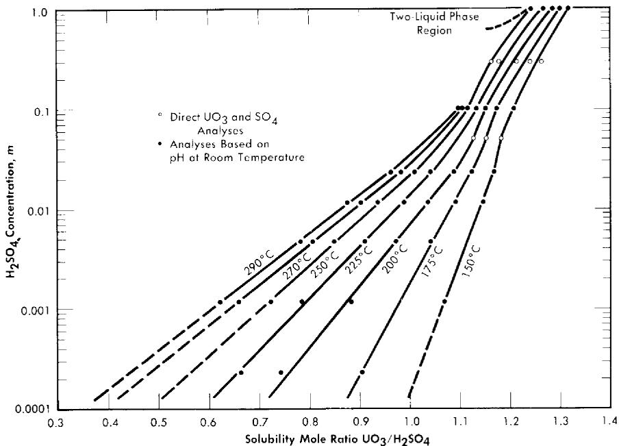

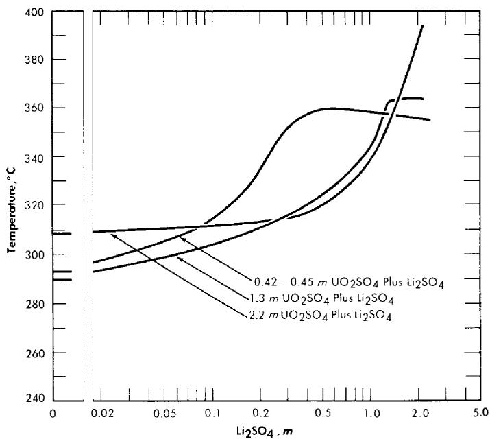  
FIG. 3-6. Solubility of $\mathrm{UO_3}$ in $\mathrm{H}_2\mathrm{SO}_4$ - $\mathrm{H}_2\mathrm{O}$ mixtures.   
FIG. 3-7. Second-liquid phase temperature of $\mathrm{UO_2SO_4 - Li_2SO_4}$ solutions. Concentrations are uncorrected for loss of water to vapor phase at elevated temperatures.

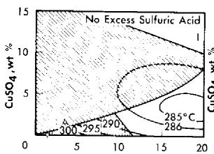

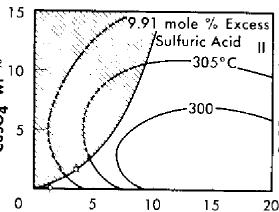

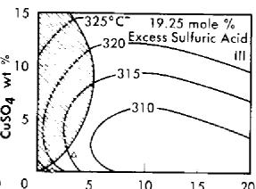

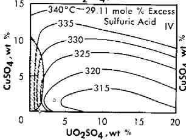  
$\mathsf{UO}_2\mathsf{SO}_4,\mathsf{wt}\%$

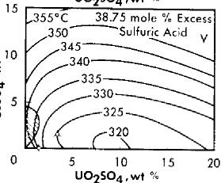

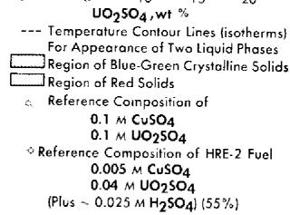  
FIG. 3-8. Phase transition temperatures in solutions containing cupric sulfate, uranyl sulfate, and sulfuric acid.

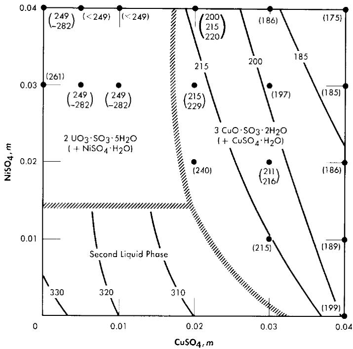  
FIG. 3-9. The effect of $\mathrm{CuSO_4}$ and $\mathrm{NiSO_4}$ on phase transition temperatures $(0.04\,m\, \mathrm{UO}_2\mathrm{SO}_4; 0.01\, m\, \mathrm{H}_2\mathrm{SO}_4)$ .

The addition of lithium sulfate or beryllium sulfate to uranyl sulfate solutions has been found to elevate the temperatures at which the second liquid phase appears [8]. Figure 3-7 shows the effect of $\mathrm{Li_2SO_4}$ additions on the second liquid phase temperature for three uranyl sulfate solutions. In very dilute uranyl sulfate solutions excess acid must also be added to prevent hydrolytic precipitation.

The solubility relationships in uranyl sulfate solutions containing cupric copper are also of interest (see Article 3-3.4). Copper sulfate solutions, like uranyl sulfate, undergo hydrolytic precipitation at elevated temperatures [9]. Even though the required concentration of cupric ion may be quite low, its presence influences the phase relationships. This influence is most significant in dilute uranyl sulfate solutions. A complete phase diagram for the four-component system, $\mathrm{CuO - UO_3 - SO_3 - H_2O}$ , has not been determined, but regions of special interest have been studied. Figure 3-8 shows the phase transition temperatures in solutions containing copper sulfate, uranyl sulfate, and sulfuric acid. The solid phase which appears at the higher $\mathrm{CuSO_4}$ concentrations has been shown to be at least in part the basic copper sulfate, $3\mathrm{CuO}\cdot \mathrm{SO}_3\cdot 2\mathrm{H}_2\mathrm{O}$ [10].

In uranyl sulfate solutions in contact with austenitic stainless steels it is important to know the effect of the corrosion products upon the solubility relationships. Under most conditions iron and chromium appear as insoluble hydrolytic products, but nickel appears as a soluble contaminant of the solution. Studies have been made of the precipitation temperatures for dilute solutions in the system $\mathrm{UO_2SO_4 - CuSO_4 - NiSO_4 - H_2SO_4 - H_2O}$ and the solid phases have been identified [11]. Figure 3-9 summarizes the information for systems having compositions approximately that of the fuel solution of the HRE-2. In this preliminary study the tests were limited to short time intervals (15 minutes or less of exposure to the elevated temperatures). When solutions containing $0.01m\mathrm{CuSO}_4$ plus $0.01m\mathrm{NiSO}_4$ , or $0.02m\mathrm{CuSO}_4$ with no $\mathrm{NiSO}_4$ were heated for longer periods of time at 300 to $310^{\circ}\mathrm{C}$ (just below the temperature for the formation of two liquid phases) green solids were deposited. Thus the results pictured in Fig. 3-9 should be applied to practical situations with considerable reservation until experiments with the exact composition of interest have been conducted.

3-2.3 Other uranium compounds. Uranyl nitrate. A phase diagram for the system uranyl nitrate-water [12] is shown in Fig. 3-10. Although uranyl nitrate remains very soluble at the elevated temperatures of interest for power-reactor operation, the nitrate group in such solutions decomposes to yield oxides of nitrogen which appear in the vapor phase. Although this situation is reversible with the lowering of temperature, it does introduce corrosion problems with respect to the vapor phase. The

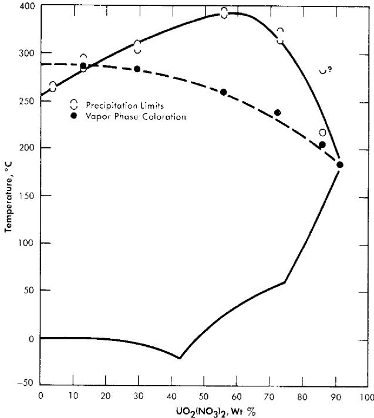

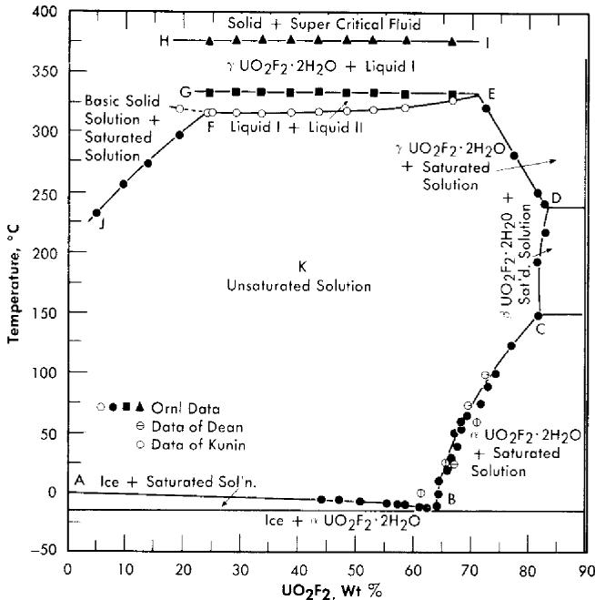  
FIG. 3-10. The $\mathrm{UO}_2(\mathrm{NO}_3)_2$ - $\mathrm{H}_2\mathrm{O}$ system.   
FIG. 3-11. Phase equilibria of aqueous solutions of $\mathrm{UO}_3$ and HF in stoichiometric concentrations.

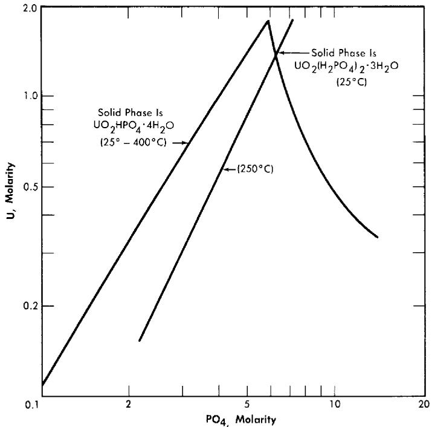  
FIG. 3-12. Solubility of $\mathrm{UO}_3$ in $\mathrm{H}_3\mathrm{PO}_4$ solution.

nitrate ion is, moreover, not completely stable in fissioning solutions; elemental nitrogen is one of the products of radiation decomposition. Although uranyl nitrate solutions have proved quite satisfactory in low-power water-boiler type research reactors, where makeup nitric acid can be added as needed [13], they do not appear attractive for high-temperature, high-power aqueous homogeneous reactors.

Uranyl fluoride. Uranyl fluoride is a very attractive fuel solute because of the low neutron capture cross-section of fluorine. However, at high temperatures it undergoes hydrolysis, which means that excess HF would be required to maintain homogeneity. Hydrogen fluoride is also a component of the vapor phase. Both liquid and vapor are very corrosive toward zirconium and titanium, but less corrosive toward stainless steel (see Article 5-3.3). Figure 3-11 shows the phase relationships in this system [14].

Uranium phosphate. Neither hexavalent nor tetravalent uranium phosphate is sufficiently soluble in water to be of reactor interest, but both $\mathrm{UO_2}$ and $\mathrm{UO_3}$ are quite soluble in moderately strong phosphoric acid. These solutions have been the subject of considerable study at the Los Alamos Scientific Laboratory [15]. The solubility of $\mathrm{UO_3}$ in phosphoric acid is illustrated by Fig. 3-12 [16]. Although the solubilities of uranyl

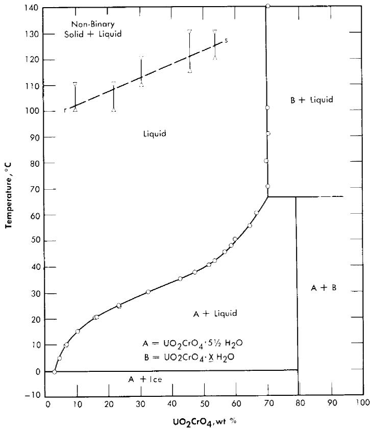  
FIG. 3-13. The system $\mathrm{UO}_2\mathrm{CrO}_4 - \mathrm{H}_2\mathrm{O}$ .

phosphate and uranyl sulfate in water are quite different, their respective solubilities in concentrated phosphoric acid and concentrated sulfuric acid are analogous; in either case temperatures as high as $450^{\circ}\mathrm{C}$ can be obtained with no phase separation. Phosphorus has an advantage over sulfur in possessing a somewhat lower neutron absorption cross section, but both anions appear to be stable under radiation. Both the phosphate and sulfate solutions in concentrated acid at temperatures of $450^{\circ}\mathrm{C}$ are extremely corrosive toward most metals and alloys except the noble metals. Attempts to operate experimental high-temperature reactors using uranium phosphate-phosphoric acid fuel solutions have failed because of catastrophic corrosion rates due to imperfections in noble metal plating or cladding of the reactor core and heat-exchanger tubing [17] (see Section 7-5).

Uranyl chromate. Uranyl chromate solutions also suffer from hydrolysis at elevated temperatures; excess chromic acid is required for stability [18]. This system is, however, not unattractive insofar as corrosion of stainless and carbon steels is concerned. The conditions of acidity and oxidation-

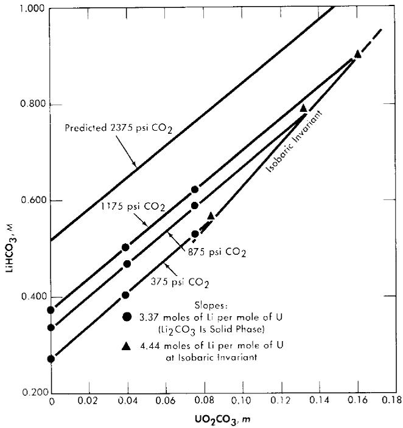  
FIG. 3-14. Variation of $\mathrm{Li_2CO_3}$ solubility with $\mathrm{UO_2CO_3}$ concentration at constant $\mathrm{CO_2}$ pressure $(250^{\circ}\mathrm{C})$ .

reduction potential determine the valence state of the chromium, but present knowledge is not adequate to specify required conditions for reliable behavior at elevated temperatures and under reactor radiation. Figure 3-13 shows the phase diagram insofar as it has been established.

Uranyl carbonate. Uranium trioxide is quite soluble in alkali carbonate solutions. This solubility can be attributed to the complexing of $\mathrm{UO_3}$ or uranyl ion by the bicarbonate ion to form uranium-containing anions. In any event, one would not expect the solubility of uranium to be retained at high temperature unless the carbonate content of the aqueous phase were kept high. This can be accomplished by retaining an adequately high partial pressure of $\mathrm{CO_2}$ over the solution. The solubility of $\mathrm{UO_3}$ in $\mathrm{Li_2CO_3}$ solutions at $250^{\circ}\mathrm{C}$ has been studied [19], and the significant results are shown in Figs. 3-14 and 3-15. Referring to Fig. 3-14, we see that at a constant $\mathrm{CO_2}$ pressure the concentration of uranium increases linearly with the lithium concentration until a limit is reached at the isobaric invariant. The uranium concentration cannot be increased further unless the $\mathrm{CO_2}$ pressure is increased. Figure 3-15 is a projection of the compositions of solutions saturated with respect to lithium and uranium at $250^{\circ}\mathrm{C}$ and at a constant total pressure $(\mathrm{CO_2} + \mathrm{steam})$ of 1500 psi. The projection

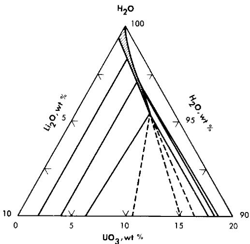  
FIG. 3-15. The system $\mathrm{Li}_2\mathrm{O - UO}_3\mathrm{-CO}_2\mathrm{-H}_2\mathrm{O}$ at $250^{\circ}\mathrm{C}$ and 1500 psi.

figure gives no information concerning the concentration of carbonate in the liquid phase. The region in which a single homogeneous liquid phase exists is the very narrow shaded region near the $\mathrm{H}_2\mathrm{O}$ apex. Although the scope of this region is small, there should be no difficulty in maintaining a homogeneous liquid phase if an adequate pressure of $\mathrm{CO}_{2}$ is kept on the system and an appropriate composition is selected in preparing the solution.

3-2.4 Solubilities of nonuranium compounds. Thorium. Thorium solutions having concentrations as high as $0.5\mathrm{m}$ would be useful for one-region breeder reactors. For the breeder blanket of a two-region reactor concentrations of about $6.0\mathrm{m}$ thorium appear to be optimal, although somewhat lower concentrations would be of interest. At the present time only thorium nitrate or phosphate solutions in the presence of excess acid have been demonstrated to have the required solubilities at elevated temperatures; both of these solutions have substantial disadvantages. Thorium chloride would be expected, by analogy, to show substantial solubility at elevated temperatures, but this system has not been investigated in detail. Complex organic salts, such as thorium acetylacetonate, have high solubilities at relatively low temperatures, but these have not been investigated for use in aqueous solutions at temperatures above $100^{\circ}\mathrm{C}$ .

Data from the literature on the solubility of thorium sulfate at low temperatures both alone and in the presence of other solutes [20] indicate that such solutions will probably not be satisfactory at elevated temperatures.

Thorium phosphate (or thorium oxide) is very soluble in concentrated phosphoric acid. Solutions containing up to $1100\mathrm{g}$ Th/liter with $\mathrm{PO_4 / Th}$

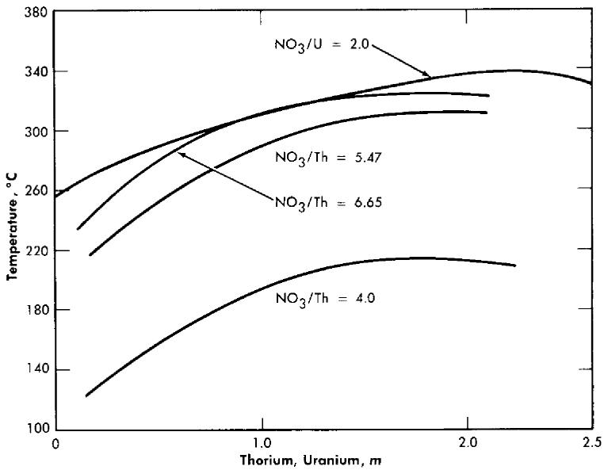  
FIG. 3-16. Hydrolytic stability of thorium nitrate and uranyl nitrate solutions.

ratios of 5 and 7 could be prepared and appeared to be thermally stable but had high viscosities. Solutions containing $400\mathrm{g}$ Th/liter at $\mathrm{PO_4 / Th}$ ratios of 10 were thermally stable at 250 to $300^{\circ}\mathrm{C}$ with viscosities little higher than that of concentrated phosphoric acid. Efforts to improve the properties of thorium phosphate-phosphoric acid systems by the inclusion of HF, $\mathrm{HNO}_3$ , $\mathrm{H}_2\mathrm{SO}_4 = \mathrm{SeO}_4 = \mathrm{SO}_4$ , $\mathrm{Li^{+}}$ , or $\mathrm{Mg}^{+ + }$ , alone or in combination, have not proved encouraging [21].

The thorium nitrate-water system has been reported [22] as having considerable solubility up to about $225^{\circ}\mathrm{C}$ , at which point hydrolytic precipitation occurs. Further investigation [23] revealed a maximal stability for the $80\mathrm{w / o}$ material (to around $255^{\circ}\mathrm{C}$ ). Increasing the acidity of the solutions (increasing the $\mathrm{NO}_3^-$ /Th ratio) suppresses hydrolysis and increases the stability of the solutions as indicated by Figure 3-16, which shows the precipitation temperatures for various solutions [24]. The intensity of vapor phase coloration at elevated temperatures (rapidly reversible) increased as the nitrate/thorium ratio was raised above 4.0.

Plutonium. A considerable investigation of the chemistry of plutonium in aqueous uranyl sulfate solutions has been directed, not toward the achievement of solubility, but toward the achievement of insolubility in order to provide the basis for continuous processing of a $\mathrm{U}^{238}$ blanket solution for plutonium production [25] (see Chapter 6).

The possible use of aqueous solutions of plutonium in homogeneous reactors has been reviewed by Glanville and Grant [26] in order to determine

TABLE 3-1   
THE SOLUBILITY OF PLUTONIUM COMPOUNDS AT ROOM TEMPERATURE  

<table><tr><td></td><td>PuIII</td><td>PuIV</td><td>PuVI</td></tr><tr><td>Fluoride</td><td>Soluble in presence of fluoride complexing ions; e.g., Zr</td><td>Soluble in presence of fluoride complexing ions; e.g., Zr or Al</td><td>&gt;40 g Pu/liter in 19 M HF</td></tr><tr><td>Chloride</td><td>Soluble in water and dilute acids</td><td>Of the order of 50 g Pu/liter in 6 M HCl</td><td>~350 g Pu/liter</td></tr><tr><td>Bromide</td><td>Soluble in water</td><td>Of the order of 1 g Pu/liter in 5 M HBr</td><td>No information</td></tr><tr><td>Bromate</td><td>No information</td><td>&gt;8 g Pu/liter in 1.5 M H2SO4, 0.15 M KBrO4</td><td>No information</td></tr><tr><td>Iodate</td><td>1.5 mg Pu/liter in 0.0017 M KIO3, 0.17 M H2SO4</td><td>Max. reported is 94.5 mg Pu/liter in 0.1 M KIO3, 6 M HNO3</td><td>0.6 g Pu/liter in 0.2 M KIO3</td></tr><tr><td>Perchlorate</td><td>Of the order of grams of Pu/liter in dilute HClO4</td><td>Of the order of grams of Pu/liter in dilute HClO4</td><td>Of the order of grams of Pu/liter in dilute HClO4</td></tr><tr><td>Nitrate</td><td>&gt;7.7 g Pu/liter in 0.9 M HNO3</td><td>500 g Pu/liter in 2 M HNO3</td><td>≈500 g Pu/liter</td></tr><tr><td>Sulfate</td><td>125 g Pu/liter in 0.1 M H2SO4</td><td>&gt;125 g Pu/liter in 0.1 M H2SO4</td><td>No information</td></tr><tr><td>Chromate</td><td>No information</td><td>Soluble in 10 M HNO3, 0.25 g Pu/liter in 0.1 M Na2Cr2O7, 0.1 M HNO3</td><td>No information</td></tr><tr><td>Phosphate</td><td>Max. reported is 3.89 g Pu/liter in 0.8 M H3PO4, 0.9 M HCl</td><td>0.55 g Pu/liter in 1 M H2SO4</td><td>&gt;0.7 g Pu/liter in 0.6 M H3PO4, 0.1 M HNO3</td></tr><tr><td>Carbonate</td><td>Soluble in 45% K2CO3</td><td>0.1 g Pu/liter in 0.2 M Na2CO3, 0.2 M CH3COONa</td><td>&gt;8.4 g Pu/liter in 0.02 M Na2CO3</td></tr><tr><td>Oxalate</td><td>0.46 g Pu/liter in 0.5 M H2C2O4, 3.7 M H+</td><td>Max. reported is &gt;0.244 g Pu/liter in 0.1 M H2C2O4, 1 M HNO3, 1 M HF</td><td>Of the order of grams of Pu/liter</td></tr><tr><td>Benzoate</td><td>Very soluble</td><td>Very soluble</td><td>No information</td></tr></table>

which compounds of plutonium appear most worthy of experimental study as fuel solutes. Table 3-1 summarizes the available low-temperature solubility information for three valence states of plutonium in the presence of different anions.

Limited experimental work has been performed in which the solubilities of plutonium carbonates, sulfates, and phosphates have been determined at temperatures up to $300^{\circ}\mathrm{C}$ [27]. No substantial solubilities have been established at temperatures above $200^{\circ}\mathrm{C}$ .

Protactinium. No efforts have been made to achieve high solubilities of protactinium in order to use it as a component of reactor fuel solutions. Rather, the chemistry of protactinium has been examined in order to devise processes for removing $\mathrm{Pa}^{233}$ continuously from thorium breeder blanket systems. A project was undertaken by the Mound Laboratories [28] to separate gram quantities of the longer-lived $\mathrm{Pa}^{231}$ which could be used in studies of the chemistry of protactinium.

Considerable information concerning the low-temperature chemical behavior of Pa has accumulated as a by-product of the development of chemical processes for the separation of $\mathbf{U}^{233}$ from irradiated thorium materials [29].

Neptunium. $\mathrm{Np}^{239}$ is in a class with $\mathrm{Pa}^{233}$ ; no efforts have been made to use it as a fuel solute, but consideration has been given to its formation in and removal from blanket solutions of $\mathrm{U}^{238}$ [30a]. The chemistry of neptunium has been reviewed by Hindman et al. [30b], and the hydrolytic behavior has been reviewed by Kraus [30c]. Continuous separation of $\mathrm{Np}^{239}$ would provide a $\mathrm{Pu}^{239}$ product of high purity by radioactive decay, whereas plutonium recovered from long-term irradiation of $\mathrm{U}^{238}$ usually contains appreciable amounts of $\mathrm{Pu}^{240}$ . Spectrophotometric cells for use at elevated temperatures and pressures in the study of the chemistry of neptunium (and other materials) have recently been developed by Wagener [30d] and have been used to measure the absorption spectra of dilute neptunium perchlorate in its six-, five-, four-, and three-valence states, using heavy water as the solvent. Dilute solutions of neptunyl nitrate in nitric acid have been so studied at temperatures up to $250^{\circ}\mathrm{C}$ ; the pentavalent state was found to be stable under the test conditions [30e].

# 3-3. RADIATION EFFECTS*

3-3.1 Introduction. Any aqueous reactor fuel solution will be subjected to intense fluxes of high-energy radiations. The action of these radiations both on the water and on the solute is of considerable importance in

reactor design and operation. Energy will be dissipated in a fuel solution by the stopping of fast charged particles. These include mainly the fission recoil particles, the recoil particles such as protons produced by elastic neutron scattering, and the fast electrons resulting from the absorption of gamma rays and from the decay of radioactive fission products. The extent to which each contributes to the total energy absorbed in the fuel solution depends upon the design of the reactor and the composition of the solution.

Water is decomposed by all types of high-energy radiations to give hydrogen, hydrogen peroxide, and oxygen [31]. If the decomposition products are confined in solution, a radiation-induced back reaction will occur and, eventually, steady-state concentrations (pressures) of products will be attained. The rate of decomposition, the rate of the back reaction, and hence the steady-state concentrations are sensitive to the conditions of the system, such as the nature of the radiation, the type and concentration of solutes present, and the temperature. In particular, the addition of hydrogen suppresses the decomposition of pure water.

The solutes may also be acted upon by direct absorption of the energy of the radiations (or by transfer of energy from the solvent) and also by reactions with the intermediate reactive species produced by the decomposition of the water.

3-3.2 Primary and secondary reactions in pure water. The fast charged particles give up energy to the electronic systems of the molecules of the medium, thereby producing various excited and ionized states. In liquid water, the ionized and excited molecules are rapidly transformed into the free radicals $\mathrm{H}$ and $\mathrm{OH}$ . These are formed in relatively high concentrations along the tracks of the fission recoils or other charged particles. As a result, many of the radicals combine before they can diffuse apart, thereby producing the stable molecules $\mathrm{H}_2\mathrm{O}$ , $\mathrm{H}_2$ , and $\mathrm{H}_2\mathrm{O}_2$ . The primary chemical species are therefore considered to be $\mathrm{H}$ , $\mathrm{OH}$ , $\mathrm{H}_2$ , and $\mathrm{H}_2\mathrm{O}_2$ ; their yields per $100\mathrm{ev}$ of energy absorbed are expressed as $G(\mathrm{H})$ , $G(\mathrm{OH})$ , $G(\mathrm{H}_2)$ , and $G(\mathrm{H}_2\mathrm{O}_2)$ . The primary chemical reaction can be written:

$$
3 \mathrm {H} _ {2} \mathrm {O} \longrightarrow \mathrm {H} + \mathrm {O H} + \mathrm {H} _ {2} + \mathrm {H} _ {2} \mathrm {O} _ {2}. \tag {3-1}
$$

Some minor subtleties emerging from recent studies of the radiolysis of aqueous solutions are: (a) although stoichiometry demands that $G(\mathrm{H}) + 2G(\mathrm{H}_2) = G(\mathrm{OH}) + 2G(\mathrm{H}_2\mathrm{O}_2)$ , the yields of H and OH and also the yields of $\mathrm{H}_{2}$ and $\mathrm{H}_2\mathrm{O}_2$ are not necessarily equal to each other [32]; (b) the yields of $\mathrm{H}_{2}$ and $\mathrm{H}_2\mathrm{O}_2$ are lowered by solutes which scavenge the precursors in the particle tracks [33]; (c) $\mathrm{HO_2}$ may be another "primary" chemical species produced in small yield in the particle tracks [34].

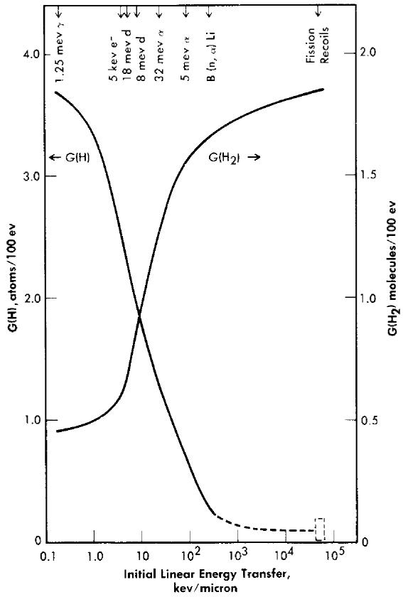  
FIG. 3-17. Yields of atomic and molecular hydrogen from the decomposition of water by various ionizing radiations.

The yields of the primary chemical species depend markedly on the type of radiation or, more specifically, on the energy transferred to the solution per unit length along the track of the charged particle. The linear energy transfer (LET) parameter varies from $5 \times 10^{4}$ kev per micron of path for fission recoils to $0.2\mathrm{keV} / \mathrm{micron}$ for fast electrons. The yields $G(\mathrm{H}_2)$ and $G(\mathrm{H}_2\mathrm{O}_2)$ are largest for radiations such as fission recoils with large LET, while the yields $G(\mathrm{H})$ and $G(\mathrm{OH})$ are largest for radiations such as fast electrons with small LET [31]. This is illustrated in Fig. 3-17, where the yields [35] $G(\mathrm{H}_2)$ and $G(\mathrm{H})$ are plotted as a function of LET.

The free radicals which escape immediate combination and diffuse into the bulk of the solution may react with solutes present, including the $\mathrm{H}_{2}$ and $\mathrm{H}_{2}\mathrm{O}_{2}$ . In water with no added solutes, the principal back reactions of the free radicals are believed to be:

$$
\mathrm {H} + \mathrm {H} _ {2} \mathrm {O} _ {2} \longrightarrow \mathrm {H} _ {2} \mathrm {O} + \mathrm {O H}, \tag {3-2}
$$

$$
\mathrm {O H} + \mathrm {H} _ {2} \longrightarrow \mathrm {H} _ {2} \mathrm {O} + \mathrm {H}, \tag {3-3}
$$

$$
\mathrm {O H} + \mathrm {H} _ {2} \mathrm {O} _ {2} \longrightarrow \mathrm {H} _ {2} \mathrm {O} + \mathrm {H O} _ {2}, \tag {3-4}
$$

$$
2 \mathrm {H O} _ {2} \longrightarrow \mathrm {H} _ {2} \mathrm {O} _ {2} + \mathrm {O} _ {2}, \tag {3-5}
$$

$$
\mathrm {H} + \mathrm {O} _ {2} \longrightarrow \mathrm {H O} _ {2}, \tag {3-6}
$$

$$
\mathrm {H O} _ {2} + \mathrm {H} _ {2} \mathrm {O} _ {2} \longrightarrow \mathrm {H} _ {2} \mathrm {O} + \mathrm {O H} + \mathrm {O} _ {2}. \tag {3-7}
$$

Reactions (3-2) and (3-3) provide a chain mechanism for the back reaction of $\mathrm{H}_{2}$ and $\mathrm{H}_{2}\mathrm{O}_{2}$ to reform water [36], thereby leading to steady-state concentrations of decomposition products. The steady-state concentration will depend on the relative yields of molecular products and free radicals in reaction (3-1). For gamma rays, which produce the free radicals in high yield and the molecular decomposition products in low yield, the steady state in pure water is essentially zero. For fission recoils, which produce essentially no free radicals to promote the back reaction, the steady-state concentration (pressure) is very high (several thousand psi). Reactions (3-4) and (3-5) provide a mechanism for decomposing $\mathrm{H}_{2}\mathrm{O}_{2}$ to $\mathrm{O}_{2}$ , and reactions (3-3), (3-5), (3-6), and (3-7) provide a mechanism for combining $\mathrm{H}_{2}$ and $\mathrm{O}_{2}$ to form water at higher temperatures [37].

Dissolved materials may be oxidized or reduced. In general, H atoms usually reduce the solute and OH radicals reoxidize it. Assuming equal numbers of H and OH, the net result depends on the action of the $\mathrm{H}_2\mathrm{O}_2$ . The peroxide may act in either way (depending on the oxidation-reduction potentials) but usually oxidation is favored. In the presence of $\mathrm{O}_2$ , the H-atom may be converted to $\mathrm{HO}_2$ , which usually acts as an oxidizing agent.

3-3.3 Decomposition of water in uranium solutions. In Table 3-2 are listed the hydrogen yields from the decomposition of solutions of various uranyl salts [38]. The yield depends on the type of radiation and on the solute concentration, but is independent of temperature. Figure 3-18 shows how the yield of hydrogen produced by fission recoil decomposition, and by gamma-ray decomposition, decreases with increasing uranium concentration. This decrease may result from scavenging of H-atoms in the particle tracks by the uranyl ions. Decomposition by fission recoil particles produces mostly $\mathrm{H}_{2}$ (and an equivalent amount of $\mathrm{H}_{2}\mathrm{O}_{2}$ plus $\mathrm{O}_2$ ); the yields $G(\mathrm{H})$ and $G(\mathrm{OH})$ are very small, probably in the range 0 to 0.1 per 100 ev.

In an aqueous homogeneous reactor fuel solution, the water is decomposed by fission recoils, proton recoils, and fast electrons. The rate of hydrogen formation, in moles per liter per minute, can be expressed by the equation:

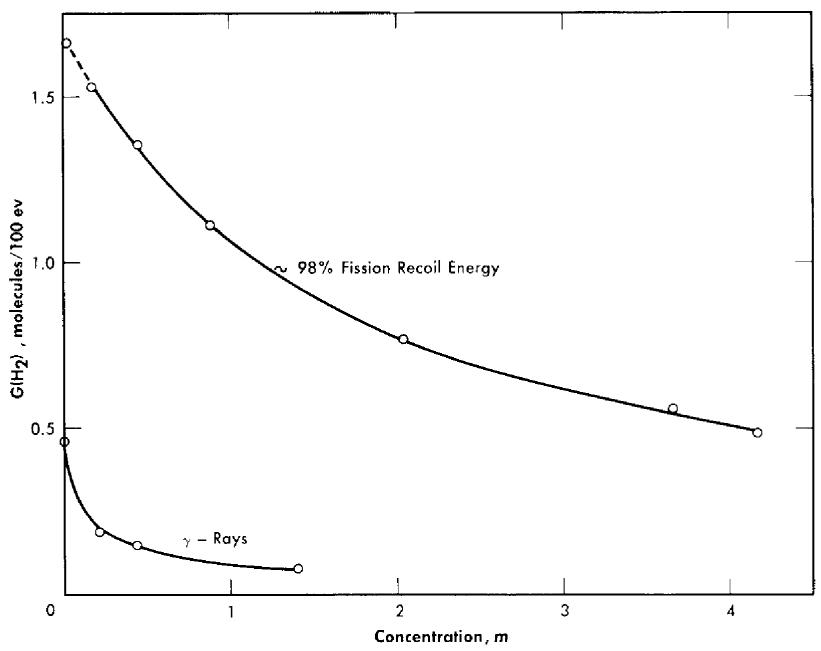  
FIG. 3-18. The effects of uranium concentration and type of radiation on the initial $\mathrm{H}_{2}$ yield from irradiated $\mathrm{UO}_{2}\mathrm{SO}_{4}$ solutions.

$$
\frac {d (\mathrm {H} _ {2})}{d t} = 0. 0 0 6 2 2 [ G _ {f} \times W _ {f} + G _ {p} \times W _ {p} + G _ {e} \times W _ {e} ], \qquad (3 - 8)
$$

where $G$ is the hydrogen yield in molecules per 100 ev absorbed; and $W$ is the power density in kilowatts per liter. The subscripts $f$ , $p$ , and $e$ refer to the values for fission recoil particles; protons produced by neutron scattering, and electrons produced by gamma-ray absorption and by radioactive decay of fission products. For an operating homogeneous reactor, about $96\%$ of the hydrogen gas produced in solution is due to the fission recoil particles, $2\%$ to the neutrons, and $2\%$ to the gamma rays. Therefore the last two terms in Eq. (3-8) are usually neglected. The fraction due to recoils is usually above 0.96, since part of the energy of the prompt neutrons, gamma rays, and radioactive decay escapes from the solution. The value of $G_{f}$ for a given solute concentration can be obtained from Fig. 3-17 and the value for $W_{f}$ can be calculated from the neutron flux, the concentration of fissionable atoms, the fission cross section, and the kinetic energy of the fission recoils.

Along with the hydrogen, an equivalent amount of oxidant (either peroxide or $\mathrm{O}_2$ ) will be formed.

TABLE 3-2   
INITIAL RATES OF $\mathbf{H}_2$ GAS PRODUCTION FROM REACTOR-IRRADIATED URANIUM SOLUTIONS   

<table><tr><td rowspan="2">Solute</td><td colspan="2">Concentration</td><td rowspan="2">Fission energy total energy</td><td rowspan="2">pH</td><td rowspan="2">G(H2)</td></tr><tr><td>g U/liter</td><td>g U235/liter</td></tr><tr><td rowspan="19">UO2SO4</td><td>0.399</td><td>0.372</td><td>0.688</td><td></td><td>1.61</td></tr><tr><td>4.03</td><td>3.76</td><td>0.957</td><td>3.26</td><td>1.66</td></tr><tr><td>18.6</td><td>1.63</td><td>0.906</td><td>2.90</td><td>1.48</td></tr><tr><td>38.1</td><td>0.274</td><td>0.619</td><td></td><td>0.95</td></tr><tr><td>40.7</td><td>37.9</td><td>0.995</td><td>2.42</td><td>1.53</td></tr><tr><td>102.1</td><td>37.4</td><td>0.995</td><td>2.00</td><td>1.35</td></tr><tr><td>105.2</td><td>38.9</td><td>0.995</td><td>0.10*</td><td>1.20</td></tr><tr><td>108.4</td><td>40.1</td><td>0.995</td><td></td><td>1.35</td></tr><tr><td>202.3</td><td>0.063</td><td>0.273</td><td></td><td>0.69</td></tr><tr><td>202.5</td><td>37.6</td><td>0.995</td><td>1.61</td><td>1.11</td></tr><tr><td>203.4</td><td>189.6</td><td>0.999</td><td></td><td>1.11</td></tr><tr><td>227.0</td><td>1.63</td><td>0.906</td><td></td><td>0.98</td></tr><tr><td>310.4</td><td>0.096</td><td>0.364</td><td></td><td>0.62</td></tr><tr><td>386.0</td><td>1.63</td><td>0.906</td><td></td><td>0.80</td></tr><tr><td>431.3</td><td>37.8</td><td>0.995</td><td>1.32</td><td>0.77</td></tr><tr><td>436.8</td><td>3.10</td><td>0.949</td><td></td><td>0.73</td></tr><tr><td>477.2</td><td>0.148</td><td>0.467</td><td></td><td>0.56</td></tr><tr><td>713.5</td><td>33.5</td><td>0.995</td><td></td><td>0.56</td></tr><tr><td>796.0</td><td>37.4</td><td>0.995</td><td>1.03</td><td>0.49</td></tr><tr><td rowspan="6">UO2F2</td><td>4.25</td><td>3.96</td><td>0.959</td><td>4.25</td><td>1.63</td></tr><tr><td>40.1</td><td>37.3</td><td>0.995</td><td>3.32</td><td>1.58</td></tr><tr><td>118.8</td><td>37.1</td><td>0.995</td><td>2.98</td><td>1.36</td></tr><tr><td>272.0</td><td>37.2</td><td>0.995</td><td>2.64</td><td>1.11</td></tr><tr><td>377.0</td><td>39.3</td><td>0.996</td><td>1.35*</td><td>0.84</td></tr><tr><td>405.7</td><td>42.3</td><td>0.996</td><td>2.41</td><td>0.95</td></tr><tr><td rowspan="4">UO2(NO3)2</td><td>4.24</td><td>3.95</td><td>0.960</td><td></td><td>1.63</td></tr><tr><td>42.3</td><td>39.4</td><td>0.995</td><td>2.05</td><td>1.5</td></tr><tr><td>318.0</td><td>2.29</td><td>0.932</td><td>1.03</td><td>0.6</td></tr><tr><td>420.1</td><td>36.9</td><td>0.994</td><td>0.60</td><td>0.55</td></tr><tr><td rowspan="3">U(SO4)2</td><td>42.2</td><td>39.3</td><td>0.995</td><td>1.95</td><td>1.45</td></tr><tr><td>92.5</td><td>35.1</td><td>0.996</td><td>0.1</td><td>1.25</td></tr><tr><td>350.0</td><td>32.0</td><td>0.995</td><td>0.1</td><td>0.75</td></tr></table>

$^*\mathrm{pH}$ adjusted by adding acid.

3-3.4 Recombination in uranium solutions. For fission recoil particles the radiation-induced back reaction of $\mathrm{H}_2$ , $\mathrm{O}_2$ , and $\mathrm{H}_2\mathrm{O}_2$ is relatively slow. Also, the thermal recombination rate in the absence of added catalyst is relatively slow and, as a result, the steady-state pressure of gases is very high; e.g. at $250^{\circ}\mathrm{C}$ the pressure is of the order of thousands of psi.

Certain solutes, notably copper salts, have been shown to act as homogeneous catalysts [39] in the thermal combination of hydrogen and oxygen in aqueous uranium solutions. This provides a convenient method for recombining the radiolytic hydrogen and oxygen gases.

The reaction rate is first order in hydrogen and in copper concentration, and independent of the oxygen concentration. The rate-determining step is the reaction of hydrogen with the catalyst, and the activation energy is about $24\mathrm{kcal / mole}$ . For a particular uranium solution, the rate of hydrogen removal, in moles/liter/min, can be expressed by

$$
\frac {- d \left(\mathrm {H} _ {2}\right)}{d t} = k _ {\mathrm {C u}} (\mathrm {C u}) (\mathrm {H} _ {2}), \tag {3-9}
$$

where $k_{\mathrm{Cu}}$ is the catalytic constant in liters/mole/min, and concentrations are given as moles/liter. Some selected values of $k_{\mathrm{Cu}}$ are listed in Table 3-3. Increasing the concentration of uranyl sulfate or of sulfuric acid decreases the catalytic activity of the copper somewhat, possibly as a result of complexing. Also, the rate of reaction with $\mathbf{D}_2$ is about 0.6 that with $\mathbf{H}_2$ .

TABLE 3-3   
SELECTED VALUES OF $k_{\mathrm{Cu}}$ AT SEVERAL TEMPERATURES AND URANIUM CONCENTRATIONS (Cu = 10-3M)   

<table><tr><td>Uranium concentration, M</td><td>Temperature, °C</td><td>kCu, liters/mole/min</td><td>103kCu/S, psi-1/min</td></tr><tr><td>0.17</td><td>190</td><td>4.3</td><td>0.28</td></tr><tr><td>0.17</td><td>220</td><td>26.6</td><td>2.3</td></tr><tr><td>0.17</td><td>250</td><td>90.0</td><td>12.</td></tr><tr><td>0.00</td><td>250</td><td>83.0*</td><td>11.</td></tr><tr><td>0.01 to 0.1</td><td>250</td><td>133</td><td>18.</td></tr><tr><td>0.01 to 0.1</td><td>275</td><td>380</td><td>61</td></tr><tr><td>0.01 to 0.1</td><td>295</td><td>850</td><td>149</td></tr></table>

*With $10^{-3}M\mathrm{Cu(ClO_4)_2}$ plus $\mathrm{HClO_4}$ in concentrations ranging from 0.005 M to 0.05 M.

The concentration (solubility) [40] of $\mathbf{H}_2$ is related to the partial pressure of hydrogen by the proportionality factor

$$
S = \frac {P _ {\mathrm {H} _ {2}}}{\left(\mathrm {H} _ {2}\right)}, \tag {3-10}
$$

where $P_{\mathrm{H_2}}$ is given in psi, $(\mathbf{H}_2)$ in moles/liter, and $S$ in psi/liter/mole. Equation (3-9) can then be written

$$
\frac {- d \left(\mathrm {H} _ {2}\right)}{d t} = k _ {\mathrm {C u}} (\mathrm {C u}) \frac {P _ {\mathrm {H} _ {2}}}{S} \tag {3-11}
$$

At the steady state, the rates of formation and removal of hydrogen are equal, and from Eqs. (3-8) and (3-11), the steady-state pressure is given by

$$
P _ {(\mathrm {H} _ {2}) \mathrm {s s}} = \frac {0 . 0 0 6 2 \times G _ {f} \times W _ {f} \times S}{(\mathrm {C u}) k _ {\mathrm {C u}}}. \tag {3-12}
$$

Application of copper sulfate catalyst to the suppression of gas evolution during the operation of the Homogeneous Reactor Experiment was discussed by Visner and Haubenreich [41]. Design calculations for use of copper catalysts in the HRE-2 and in other reactors have been reported [42]. The use of internal recombination catalysts in homogeneous reactors is also discussed in Article 7-3.7.

3-3.5 Peroxide decomposition in uranium solutions. The hydrogen peroxide produced by decomposition of the water can undergo several secondary reactions: (a) It can react with uranyl ion to form the slightly soluble peroxide $\mathrm{UO_4}$ according to the reaction

$$
\mathrm {U O} _ {2} ^ {+ +} + \mathrm {H} _ {2} \mathrm {O} _ {2} \xrightarrow {\leftrightarrow} \mathrm {U O} _ {4} + 2 \mathrm {H} ^ {+}. \tag {3-13}
$$

The $\mathrm{UO_4}$ will precipitate if its solubility $(\sim 10^{-3}M)$ is exceeded. (b) It (or the $\mathrm{UO_4}$ ) can decompose by a radiation-induced reaction via the free radicals H and OH produced by decomposition of the water. (c) In a reactor operating at high temperatures the $\mathrm{H}_2\mathrm{O}_2$ will decompose thermally at an appreciable rate according to the over-all reaction:

$$
\mathrm {H} _ {2} \mathrm {O} _ {2} \longrightarrow \mathrm {H} _ {2} \mathrm {O} + 1 / 2 \mathrm {O} _ {2} \tag {3-14}
$$

and the $\mathrm{UO_4}$ will decompose thermally according to the reactions

$$
\mathrm {U O} _ {4} \longrightarrow \mathrm {U O} _ {3} + 1 / 2 \mathrm {O} _ {2}, \tag {3-15}
$$

$$
\mathrm {U O} _ {3} + 2 \mathrm {H} ^ {+} \longrightarrow \mathrm {U O} _ {2} ^ {+ +} + \mathrm {H} _ {2} \mathrm {O}. \tag {3-16}
$$

Studies of the kinetics of the thermal decomposition of peroxide in uranyl sulfate solutions [43] have shown the rate to be first order with respect to peroxide concentration in the range from 0.4 to $5 \times 10^{-3} M$ , independent of uranium concentration in the range from $4.5 \times 10^{-3}$ to $0.65 M$ , and independent of the acidity from pH 1.6 to 3.3. Traces of certain ions showed pronounced catalytic effects. The rate of decomposition could be expressed by

$$
\frac {- d \left(\mathrm {H} _ {2} \mathrm {O} _ {2}\right)}{d t} = k \left(\mathrm {H} _ {2} \mathrm {O} _ {2}\right) + k _ {\text {c a t}} (\text {C a t}) \left(\mathrm {H} _ {2} \mathrm {O} _ {2}\right), \tag {3-17}
$$

where $(\mathrm{H}_2\mathrm{O}_2)$ represents total peroxide concentration $(\mathrm{UO_4 + H_2O_2})$ in moles per liter at time $t$ , $k$ is the molar rate constant in the absence of catalyst, $k_{\mathrm{cat}}$ is the catalytic constant, and (Cat) is the concentration of catalyst in moles per liter.

Values of $k$ for uranyl sulfate solutions $(4.5 \times 10^{-3} M$ to $0.65 M$ ) with no added catalyst depended upon the adventitious impurities present, and were in the ranges as listed in Table 3-4. The indicated activation energy is $25.5 \, \text{kcal/mol}$ . For pure water, the rate constant at $78^{\circ}\text{C}$ was $4.5 \times 10^{-4}$ per minute.

Catalytic constants, $k_{\mathrm{cat}}$ , for various ions added are listed in Table 3-5.

The net rate of peroxide formation is the difference between the rate of production and the rate of decomposition. At the steady state the two rates are equal. The rate of formation of peroxide in an operating reactor in terms of moles per liter per minute can be expressed in terms of the yield, $G$ , in molecules per 100 ev of fission recoil energy, and the average fission recoil power density of the reactor, $W$ , in kilowatts per liter, by the equation:

$$
\frac {d \left(\mathrm {H} _ {2} \mathrm {O} _ {2}\right)}{d t} = 0. 0 0 6 2 \times G \times W \times 0. 9 6. \tag {3-18}
$$

The maximum value of $G$ for the particular solution used is that given for the $\mathbf{H}_2$ yield in Fig. 3-18. During reactor operation the radiation-induced decomposition of peroxide is negligible, and the rate of decomposition is essentially the thermal rate given by Eq. (3-17). At the steady state the peroxide concentration is given by

$$
\left(\mathrm {H} _ {2} \mathrm {O} _ {2}\right) _ {\mathrm {s s}} = \frac {0 . 0 0 6 2 \times G \times W \times 0 . 9 6}{k + k _ {\mathrm {c a t}} (\mathrm {C a t})}. \tag {3-19}
$$

# TABLE 3-4

MOLAR RATE CONSTANTS FOR PEROXIDE DECOMPOSITION IN $\mathrm{UO}_2\mathrm{SO}_4$ SOLUTIONS   

<table><tr><td>Temperature, °C</td><td>k, min-1</td></tr><tr><td>53</td><td>1.2 × 10-3to 12 × 10-3</td></tr><tr><td>78</td><td>1.8 × 10-2to 14 × 10-2</td></tr><tr><td>100</td><td>1.8 × 10-1to 12 × 10-1</td></tr></table>

# TABLE 3-5

CATALYTIC CONSTANTS AT $100^{\circ}\mathrm{C}$ FOR PEROXIDE DECOMPOSITION BY VARIOUS IONS ADDED TO $\mathrm{UO_2SO_4}$ SOLUTION   

<table><tr><td>Catalyst</td><td>kcat(liters/mole/min)</td></tr><tr><td>Fe2+</td><td>135,000</td></tr><tr><td>Ru4+</td><td>121,000</td></tr><tr><td>Ag+1</td><td>4,500</td></tr><tr><td>Ni+2</td><td>2,600</td></tr><tr><td>Cu+2</td><td>1,200</td></tr><tr><td>Fe+2(promoted</td><td>502,000</td></tr><tr><td>by 793 ppm Cu+2)</td><td></td></tr></table>

The maximum allowable power density, $W_{\mathrm{max}}$ , before precipitation of uranium peroxide occurs is given by

$$
W _ {\max } = \frac {(\mathrm {H} _ {2} \mathrm {O} _ {2}) \mathrm {s o l} [ k + k _ {\mathrm {e a t}} (\mathrm {C a t}) ]}{0 . 0 0 6 2 \times G \times 0 . 9 6}. \tag {3-20}
$$

For example, in $0.17M\mathrm{UO}_2\mathrm{SO}_2$ solution at $100^{\circ}\mathrm{C}$ with no added catalyst, the peroxide solubility is $\approx 4\times 10^{-3}M$ , $k\approx 1\mathrm{min}^{-1}$ , and $G\approx 1.5$ , then $W_{\max}\approx 0.4\mathrm{kw / liter}$ .

Following reactor shutdown, peroxide formation and decomposition will result from the delayed neutrons and from the $\beta^{-}$ and $\gamma$ radiation of the fission products. The yield for peroxide formation will be essentially that for $\gamma$ -rays, $G = 0.46$ . The yield for radiation-induced decomposition [37] may be as high as 4.5, but will depend in a complicated way on the amount of oxygen, hydrogen, and other solutes such as fission products, corrosion products, etc., present.

3-3.6 Decomposition of water in thorium solutions. Under radiation thorium nitrate solutions decompose [44] to give $\mathrm{H}_2$ , $\mathrm{H}_2\mathrm{O}_2$ , and $\mathrm{O}_2$ from decomposition of the water, and $\mathrm{O}_2$ , $\mathrm{N}_2$ , and oxides of nitrogen from decomposition of the nitrate. Yields of $\mathrm{H}_2$ and $\mathrm{N}_2$ for several types of radiation, and for several concentrations of thorium nitrate, are given in Table 3-6. The hydrogen yield decreases with increasing solute concentration, the same as for uranium solutions. The nitrogen yield increases with increasing nitrate concentration. The $\mathrm{N}_2$ is presumably formed by direct action of radiation on the nitrate. The $\mathrm{N}_2$ yield is greater for radiations of greater LET. The $\mathrm{N}_2$ yield is independent of temperature, and little or no radiation-induced back reaction takes place.

Uranyl nitrate solution also decomposes to give $\mathbf{N}_2$ in yield comparable to that for thorium nitrate solution.

TABLE 3-6   
THE EFFECTS OF CONCENTRATION AND TYPE OF RADIATION ON THE YIELDS OF $\mathbf{N}_2$ AND $\mathbf{H}_2$ IN THE DECOMPOSITION OF THORIUM NITRATE SOLUTIONS   

<table><tr><td rowspan="2">Th(NO3)4, molality</td><td rowspan="2">G(H2) Fission recoils*</td><td colspan="3">G(N2)</td></tr><tr><td>Fission recoils*</td><td>ORNL graphite pile radiation</td><td>Gamma rays</td></tr><tr><td>0.26</td><td>1.11</td><td>0.002</td><td>0.003</td><td>0.04 × 10-3</td></tr><tr><td>0.55</td><td>0.93</td><td>0.016</td><td>0.003</td><td>0.5 × 10-3</td></tr><tr><td>1.5</td><td>0.51</td><td>0.047</td><td>0.005</td><td>1.5 × 10-3</td></tr><tr><td>2.7</td><td>0.33</td><td>0.063</td><td>0.006</td><td>1.1 × 10-3</td></tr><tr><td>7.2</td><td>~0.08†</td><td>0.16</td><td></td><td></td></tr></table>

*0.14 molal enriched $\mathrm{UO}_2\mathrm{SO}_4$ added to make the energy contributed by fission recoils $>95\%$ of the total energy absorbed.   
†Estimated by extrapolation.

# 3-4. PHYSICAL PROPERTIES

3-4.1 Introduction. Knowledge of the physical properties of aqueous solutions of reactor fuel materials is required for nuclear physics calculations and analysis of reactor performance, for engineering design, and, ultimately, for effective reactor operation. The scarcity of information available in 1951 concerning the properties of uranium salt solutions prompted the Homogeneous Reactor Program at ORNL to sponsor a physical properties research program at Mound Laboratory beginning in

July 1951 and carrying through December 1954. The progress of this effort is discussed in regular reports [45] and in a number of topical reports dealing with techniques, apparatus, and summarized data [46-56].

A number of compilations of physical properties data for aqueous reactor solutions have appeared, among which are included those of Van Winkle [57], Tobias [58], and sections by Briggs, Day, Secoy, and Marshall in The Reactor Handbook [59].

The properties of light and heavy water are discussed by Lottes [60] as they relate to reactor heat-transfer problems. Other properties of water are found in standard reference works [61-62].

The remainder of this section is devoted to particular properties of reactor solutions which are of interest and to some properties of the vapor phase above reactor solutions which are important for aqueous homogeneous reactors.

TABLE 3-7 LIQUID AND VAPOR DENSITIES OF $\mathrm{D}_2\mathrm{O}$   

<table><tr><td rowspan="2">T, °C</td><td colspan="2">Density, g/cc</td></tr><tr><td>Vapor</td><td>Liquid</td></tr><tr><td>175</td><td>0.004</td><td>0.989</td></tr><tr><td>180</td><td>0.005</td><td>0.983</td></tr><tr><td>190</td><td>0.006</td><td>0.970</td></tr><tr><td>200</td><td>0.007</td><td>0.957</td></tr><tr><td>210</td><td>0.009</td><td>0.943</td></tr><tr><td>220</td><td>0.010</td><td>0.929</td></tr><tr><td>230</td><td>0.013</td><td>0.913</td></tr><tr><td>240</td><td>0.016</td><td>0.898</td></tr><tr><td>250</td><td>0.020</td><td>0.881</td></tr><tr><td>260</td><td>0.024</td><td>0.864</td></tr><tr><td>270</td><td>0.029</td><td>0.847</td></tr><tr><td>280</td><td>0.034</td><td>0.829</td></tr><tr><td>290</td><td>0.040</td><td>0.809</td></tr><tr><td>300</td><td>0.048</td><td>0.787</td></tr><tr><td>310</td><td>0.058</td><td>0.763</td></tr><tr><td>320</td><td>0.070</td><td>0.735</td></tr><tr><td>330</td><td>0.087</td><td>0.705</td></tr><tr><td>340</td><td>0.105</td><td>0.668</td></tr><tr><td>350</td><td>0.129</td><td>0.626</td></tr><tr><td>360</td><td>0.163</td><td>0.573</td></tr><tr><td>370</td><td>0.248</td><td>0.462</td></tr><tr><td>371.5</td><td>0.363</td><td>0.363*</td></tr></table>

*Critical point.

3-4.2 Density of heavy water and uranyl sulfate solutions. The density of heavy water has been measured up to $250^{\circ}\mathrm{C}$ at Mound Laboratory by a direct method making use of a Jolly balance [51,54]. An indirect method for determining the density of heavy-water liquid and vapor has been used to extend the data up to the critical temperature [63]. Table 3-7 gives density values at convenient temperature intervals. The densities of uranyl sulfate solutions from 20 to $90^{\circ}\mathrm{C}$ and at concentrations up to 4.0 molal were measured by Jegart, Heiks, and Orban at Mound Laboratory [47,56]. The densities of uranyl sulfate solutions were measured by Barnett et al., of Mound Laboratory [55] at temperatures up to $250^{\circ}\mathrm{C}$ for concentrations (at room temperature) of 60.6 and $101.0\mathrm{gU / liter}$ of solution in light water and for uranium concentrations (room temperature) of 20.3, 40.4, and $61.2\mathrm{g / liter}$ in heavy water. Their data are presented in Table 3-8.

TABLE 3-8 DENSITIES OF LIGHT- AND HEAVY-WATER SOLUTIONS OF URANYL SULFATE   

<table><tr><td rowspan="3">T, °C</td><td colspan="7">Density, g/ml</td></tr><tr><td colspan="2">\(\mathrm{UO}_{2}\mathrm{SO}_{4}\) in \(\mathrm{H}_{2}\mathrm{O},\mathrm{g}\) U/liter</td><td colspan="5">\(\mathrm{UO}_{2}\mathrm{SO}_{4}\) in \(\mathrm{D}_{2}\mathrm{O},\mathrm{g}\) U/liter</td></tr><tr><td>60.6</td><td>101.0</td><td>20.3</td><td>\(\mathrm{O}_{2}\),\(\mathrm{psi}^{*}\)</td><td>40.4</td><td>\(\mathrm{O}_{2}\),\(\mathrm{psi}^{*}\)</td><td>61.2</td></tr><tr><td rowspan="2">30</td><td></td><td>1.1340</td><td>1.300</td><td></td><td>1.1567</td><td></td><td>1.1842</td></tr><tr><td></td><td></td><td>1.318</td><td>300</td><td>1.1598</td><td>280</td><td></td></tr><tr><td rowspan="2">45</td><td>1.0715</td><td>1.1275</td><td>1.1245</td><td></td><td>1.1509</td><td></td><td>1.1781</td></tr><tr><td></td><td></td><td>1.1263</td><td>305</td><td>1.1540</td><td>280</td><td></td></tr><tr><td rowspan="2">60</td><td>1.0649</td><td>1.1199</td><td>1.1170</td><td></td><td>1.1433</td><td></td><td>1.1704</td></tr><tr><td></td><td></td><td>1.1198</td><td>325</td><td>1.1472</td><td>300</td><td></td></tr><tr><td>75</td><td>1.0562</td><td>1.1111</td><td>1.1120</td><td>340</td><td>1.1388</td><td>325</td><td>1.1628</td></tr><tr><td>90</td><td>1.0468</td><td>1.1008</td><td>1.1026</td><td>360</td><td>1.1297</td><td>350</td><td>1.1545</td></tr><tr><td>100</td><td>1.0395</td><td>1.0952</td><td>1.0954</td><td>380</td><td>1.1228</td><td>365</td><td>1.1476</td></tr><tr><td>125</td><td>1.0203</td><td>1.0742</td><td>1.0751</td><td>415</td><td>1.1037</td><td>410</td><td>1.1278</td></tr><tr><td>150</td><td>0.9984</td><td>1.0528</td><td>1.0505</td><td>480</td><td>1.0822</td><td>480</td><td>1.1053</td></tr><tr><td>175</td><td>0.9735</td><td>1.0293</td><td>1.0221</td><td>560</td><td>1.0572</td><td>530</td><td>1.0805</td></tr><tr><td>200</td><td>0.9460</td><td>1.0030</td><td>0.9920</td><td>680</td><td>1.0280</td><td>670</td><td>1.0540</td></tr><tr><td>225</td><td>0.9156</td><td>0.9745</td><td>0.9578</td><td>830</td><td>0.9973</td><td>840</td><td></td></tr><tr><td>250</td><td></td><td>0.9440</td><td>0.9224</td><td>1090</td><td>0.9610</td><td>1080</td><td></td></tr></table>

*Overpressure of oxygen gas as indicated. Otherwise solutions were in contact with their own vapor.

The densities of light-water solutions of uranyl sulfate were found by Marshall [64] to fit the relationship

$$
d _ {s} = \frac {1}{(7 8 . 6 5 / \mathrm {U}) - 1 . 0 4 6} + d _ {\mathrm {H _ {2} O}},
$$

where $d_{s}$ is the density of the solution in $\mathbf{g / cc}$ , $\mathbf{U}$ is the weight percent uranium, and $d_{\mathrm{H_2O}}$ is the density of water at the same temperature and pressure as the solution. The accuracy of this formula is believed to be:

$$
\begin{array}{l} \pm 0.5 \% \text{from} 25 \text{to} 300^{\circ}\mathrm{C} \text{for} 0 - 10 \% \mathrm{U}, \\ \pm 1.0 \% \text{from} 120 \text{to} 250^{\circ}\mathrm{C} \text{for} 10 - 50 \% \mathrm{U}, \\ \pm 2.0 \% \text{from} 25 \text{to} 125^{\circ} \mathrm{C} \text{for} 10 - 50 \% \mathrm{U}, \\ \pm 2.0 \% \text{from} 250 \text{to} 280^{\circ}\mathrm{C} \text{for} 10 - 50 \% \mathrm{U}. \\ \end{array}
$$

The density of heavy-water solutions of uranyl sulfate may be estimated from an analogous formula:

$$
d _ {s} = \frac {1}{(7 1 . 0 / U) - 0 . 9 4 4} + d _ {\mathrm {D} _ {2} \mathrm {O}}.
$$

The densities of heavy-water solutions of uranyl sulfate reported in Table 3-8 were found to be within $3\%$ of values calculated by this formula.

Similar formulas were devised by Tobias [58] for application to the determination of the densities of solutions of mixed solutes such as uranyl sulfate-beryllium sulfate and uranyl sulfate-lithium sulfate.

Density information for other uranium salts and for thorium nitrate solutions was compiled by Day, Secoy, and Marshall [59].

3-4.3 Viscosity of $\mathbf{D}_2\mathbf{O}$ and uranium solutions. The viscosity of heavy water was measured from 30 to $250^{\circ}\mathrm{C}$ by Heiks et al. [54]. Good agreement with four values reported by Hardy and Cottingham [65] was found. The apparatus used has been described by Heiks et al. [51] and the electronic instrumentation for measuring the time of fall of a plummet containing a radioactive pellet has been described by Rogers et al. [52].

Van Winkle [57] discussed the viscosity of light and heavy water and the early data for solutions of uranyl sulfate in heavy water.

Heiks and Jegart of Mound Laboratory [50,56] measured the viscosity of uranyl sulfate solutions in light water over a concentration range of 0.176 to 2.865 molal and over a temperature range of 20 to $90^{\circ}\mathrm{C}$ by the use of Ostwald capillary viscometers. Using the falling-body viscometer referred to above, Barnett et al. of Mound Laboratory have measured the viscosities of light- and heavy-water solutions of uranyl sulfate at temperatures up to $250^{\circ}\mathrm{C}$ [55]. Table 3-9 presents a comparison of viscosities

TABLE 3-9 VISCOSITIES OF LIGHT- AND HEAVY-WATER SOLUTIONS OF URANYL SULFATE  

<table><tr><td rowspan="3">T, °C</td><td colspan="10">Viscosity, cp</td></tr><tr><td colspan="6">\(\mathrm{UO}_{2}\mathrm{SO}_{4}\) in \(\mathrm{H}_{2}\mathrm{O},\mathrm{g}\) U/liter</td><td colspan="4">\(\mathrm{UO}_{2}\mathrm{SO}_{4}\) in \(\mathrm{D}_{2}\mathrm{O},\mathrm{g}\) U/liter</td></tr><tr><td>20.2</td><td>59.7</td><td>100.4</td><td>201.4</td><td>301.1</td><td>400.7</td><td>0</td><td>20.3</td><td>40.4</td><td>61.2</td></tr><tr><td>30</td><td>0.857</td><td>0.946</td><td>1.04</td><td>1.40</td><td>1.97</td><td>3.04</td><td>0.969</td><td>-</td><td>-</td><td>-</td></tr><tr><td>45</td><td>0.629</td><td>0.701</td><td>0.773</td><td>1.05</td><td>1.39</td><td>1.98</td><td>0.713</td><td>0.773</td><td>0.789</td><td>0.827</td></tr><tr><td>60</td><td>0.492</td><td>0.536</td><td>0.605</td><td>0.820</td><td>1.06</td><td>1.41</td><td>0.552</td><td>0.586</td><td>0.608</td><td>0.638</td></tr><tr><td>75</td><td>0.403</td><td>0.436</td><td>0.483</td><td>0.638</td><td>0.821</td><td>1.10</td><td>0.445</td><td>0.467</td><td>0.487</td><td>0.513</td></tr><tr><td>90</td><td>0.329</td><td>0.365</td><td>0.399</td><td>0.517</td><td>0.675</td><td>0.884</td><td>0.365</td><td>0.384</td><td>0.397</td><td>0.415</td></tr><tr><td>100</td><td>0.292</td><td>0.327</td><td>0.351</td><td>0.454</td><td>0.589</td><td>0.767</td><td>0.323</td><td>0.342</td><td>0.350</td><td>0.365</td></tr><tr><td>125</td><td>0.238</td><td>0.264</td><td>0.273</td><td>0.347</td><td>0.442</td><td>0.543</td><td>0.252</td><td>0.263</td><td>0.269</td><td>0.287</td></tr><tr><td>150</td><td>0.194</td><td>0.213</td><td>0.223</td><td>0.275</td><td>0.335</td><td>0.437</td><td>0.208</td><td>0.216</td><td>0.222</td><td>0.233</td></tr><tr><td>175</td><td>0.164</td><td>0.178</td><td>0.188</td><td>0.226</td><td>0.269</td><td>0.360</td><td>0.175</td><td>0.182</td><td>0.187</td><td>0.196</td></tr><tr><td>200</td><td>0.142</td><td>0.153</td><td>0.158</td><td>0.192</td><td>0.230</td><td>0.298</td><td>0.151</td><td>0.154</td><td>0.160</td><td>0.169</td></tr><tr><td>225</td><td></td><td>0.136</td><td>0.141</td><td></td><td>0.209</td><td>0.264</td><td>0.135</td><td>0.138</td><td>0.144</td><td>0.151</td></tr><tr><td>250</td><td></td><td>0.125</td><td>0.130</td><td></td><td>0.190</td><td>0.238</td><td>0.124</td><td>0.125</td><td>0.133</td><td>0.137</td></tr></table>

of light- and heavy-water solutions for selected temperatures and uranium concentrations.

The viscosity of uranyl nitrate solutions is discussed by Day and Secoy [59].

3-4.4 Heat capacity of uranyl sulfate solutions. Van Winkle [57] estimated the heat capacity of dehydrated uranyl sulfate by comparison with uranyl nitrate and with salts of other metals and has estimated the heat capacity of solutions of uranyl sulfate in heavy water and in light water. The effect of temperature on the heat capacity of solutions was assumed to be the same, percentagewise, as the effect on the heat capacity of the pure solvent. Table 3-10 shows the influence of uranyl sulfate concentration upon the heat capacity of solutions at 25 and $250^{\circ}\mathrm{C}$ . No experimental measurements have been reported for temperatures above $103^{\circ}\mathrm{C}$ ; values below this temperature differ from the estimates by as much as $10\%$ [57].

3-4.5 Vapor pressure of uranyl sulfate solutions. The vapor pressures of uranyl sulfate solutions have been measured over the temperature range 24 to $100^{\circ}\mathrm{C}$ and at uranium concentrations up to 4.8 molal by Day [66]. The ratio of the vapor pressure of the solution to that of pure water at the

Estimated Heat Capacity, $\mathrm{cal / g}\cdot {}^{\circ}\mathrm{C}$

TABLE 3-10 ESTIMATED HEAT CAPACITIES OF URANYL SULFATE SOLUTIONS   

<table><tr><td rowspan="2">\( \mathrm {U O}_{2}\mathrm {S O}_{4},\mathrm {w}/\mathrm {o} \)</td><td colspan="2">\( \mathrm {H}_{2}\mathrm {O} \) solutions</td><td>\( \mathrm {D}_{2}\mathrm {O} \) solutions</td></tr><tr><td>\( 25^{\circ}\mathrm {C} \)</td><td>\( 250^{\circ}\mathrm {C} \)</td><td>\( 25^{\circ}\mathrm {C} \)</td></tr><tr><td>0</td><td>0.998</td><td>1.166</td><td>1.005</td></tr><tr><td>10</td><td>0.905</td><td>1.070</td><td>0.916</td></tr><tr><td>20</td><td>0.809</td><td>0.975</td><td>0.830</td></tr><tr><td>30</td><td>0.714</td><td>0.875</td><td>0.745</td></tr><tr><td>40</td><td>0.619</td><td>0.770</td><td>0.658</td></tr><tr><td>50</td><td>0.523</td><td>0.665</td><td>0.568</td></tr><tr><td>60</td><td>0.428</td><td>0.550</td><td>0.474</td></tr><tr><td>70</td><td>0.333</td><td>0.425</td><td>0.370</td></tr><tr><td>80</td><td>0.238</td><td>0.290</td><td>0.252</td></tr><tr><td>85.9\( (U O_{2}S O_{4}\cdot 3D_{2}O) \)</td><td>-</td><td>-</td><td>0.174</td></tr><tr><td>87.2\( (U O_{2}S O_{4}\cdot 3H_{2}O) \)</td><td>0.170</td><td>-</td><td>-</td></tr></table>

same temperature is almost independent of temperature but markedly dependent upon the solute concentration over this range. Table 3-11 shows the effect of uranium concentration upon the ratios at temperatures up to $100^{\circ}\mathrm{C}$ . Vapor pressure measurements have been made for light-water solutions of uranyl sulfate at temperatures up to approximately $200^{\circ}\mathrm{C}$ and uranium concentrations (room temperature) of 400 and $500\mathrm{g / liter}$ . Data have, however, not yet been published [45]. Other vapor pressure measurements are being made at the Oak Ridge National Laboratory. The vapor pressure lowering in uranyl sulfate solutions containing added lithium or beryllium sulfate was stated to be approximately in accord with Raoult's law [8b].

The vapor pressures of three solutions of $\mathrm{UO}_3$ in phosphoric acid are shown in Table 3-12 [17], based on values read from the published curve.

3-4.6 Surface tension of uranyl sulfate solutions. The capillary rise method was adapted to conditions prevailing at elevated temperatures and pressures for measurements made at Mound Laboratory by Heiks et al. [51,54]. Briggs [59] has compiled information on the surface tension of aqueous solutions of uranyl sulfate, including the relationships established by Van Winkle.

TABLE 3-11   
RATIOS OF VAPOR PRESSURES OF URANYL SULFATE SOLUTIONS TO THAT OF PURE $\mathbf{H}_2\mathbf{O}$   
TABLE 3-12   

<table><tr><td rowspan="2">\( \mathrm {U O}_{2}\mathrm {S O}_{4},M \)</td><td colspan="4">\( p/p_{0} \) (at given temperature)</td></tr><tr><td>\( 25^{\circ }\mathrm {C} \)</td><td>\( 50^{\circ }\mathrm {C} \)</td><td>\( 80^{\circ }\mathrm {C} \)</td><td>\( 100^{\circ }\mathrm {C} \)</td></tr><tr><td>0.59166</td><td>0.990</td><td>0.990</td><td>0.991</td><td>0.993</td></tr><tr><td>1.14545</td><td>.979</td><td>.981</td><td>.984</td><td></td></tr><tr><td>3.17433</td><td>.911</td><td>.920</td><td>.935</td><td></td></tr><tr><td>4.1821</td><td>.863</td><td>.881</td><td>.900</td><td></td></tr></table>

VAPOR PRESSURES OF $\mathrm{UO_3}$ SOLUTIONS IN $\mathrm{H}_3\mathrm{PO}_4^*$   

<table><tr><td rowspan="2">Temperature, °C</td><td colspan="3">Vapor pressure, lb/in2</td></tr><tr><td>0.76 M UO3 in 0.56 M H3PO4</td><td>0.309 M UO3 in 2.90 M H3PO4</td><td>0.75 M UO3 in 7.5 M H3PO4</td></tr><tr><td>110</td><td>23</td><td>21</td><td>21</td></tr><tr><td>150</td><td>66</td><td>64</td><td>64</td></tr><tr><td>200</td><td>200</td><td>200</td><td>200</td></tr><tr><td>250</td><td>460</td><td>500</td><td>500</td></tr><tr><td>300</td><td>1000</td><td>1150</td><td>1150</td></tr><tr><td>350</td><td>1700</td><td>2100</td><td>2100</td></tr><tr><td>400</td><td>2900</td><td>3600</td><td>3700</td></tr><tr><td>450</td><td>4600</td><td>5600</td><td>6600</td></tr><tr><td>500</td><td>6600</td><td>8000</td><td>-</td></tr></table>

*Plotted and extrapolated from Los Alamos data.

Barnett and Jegart of Mound Laboratory [53] reported the surface tension of uranyl sulfate solutions in light water at temperatures up to $75^{\circ}\mathrm{C}$ and concentrations up to 2.34 molal.

Barnett et al. [55], using the apparatus described by Heiks et al. [51] for capillary rise technique at elevated temperatures and pressures, measured the surface tension of light- and heavy-water solutions of uranyl sulfate at temperatures up to $250^{\circ}\mathrm{C}$ .

TABLE 3-13   
THE pH OF $\mathrm{UO_3 - H_2SO_4 - H_2O}$ SOLUTIONS AT $25.00^{\circ}C^{*}$   

<table><tr><td rowspan="2">Molarity H2SO4</td><td colspan="6">Molar ratio, UO3/SO4</td></tr><tr><td>0.7006</td><td>0.8017</td><td>0.9024</td><td>1.0029</td><td>1.1042</td><td>1.202</td></tr><tr><td>0.02432</td><td>1.995</td><td>2.151</td><td>2.425</td><td>3.043</td><td>3.612</td><td>3.823</td></tr><tr><td>0.01214</td><td>2.259</td><td>2.422</td><td>2.692</td><td>3.267</td><td>3.731</td><td>3.922</td></tr><tr><td>0.004866</td><td>2.619</td><td>2.784</td><td>3.046</td><td>3.526</td><td>3.874</td><td>4.038</td></tr><tr><td>0.003656</td><td>2.730</td><td>2.900</td><td>3.155</td><td>3.604</td><td>3.913</td><td>4.074</td></tr><tr><td>0.002437</td><td>2.905</td><td>3.065</td><td>3.321</td><td>3.708</td><td>3.977</td><td>4.124</td></tr><tr><td>0.001216</td><td>3.174</td><td>3.348</td><td>3.592</td><td>3.906</td><td>4.093</td><td>4.214</td></tr><tr><td>0.0004850</td><td>3.587</td><td>3.715</td><td>3.903</td><td>4.130</td><td>4.250</td><td>4.354</td></tr><tr><td>0.0003646</td><td>3.671</td><td>3.822</td><td>3.996</td><td>4.201</td><td>4.304</td><td>4.395</td></tr><tr><td>0.0002424</td><td>3.851</td><td>4.004</td><td>4.127</td><td>4.326</td><td>4.411</td><td>4.500</td></tr></table>

*These values are based on a determined pH of 2.075 for 0.01000 molar HCl, 0.900 molar KCl. For pH's relative to the analytical concentration of HCl subtract 0.075 pH unit from each of the above values.

TABLE 3-14   
THE pH VALUES OF HCl, $\mathrm{H}_2\mathrm{SO}_4$ , AND $\mathrm{UO}_2\mathrm{SO}_4$ SOLUTION AS A FUNCTION OF TEMPERATURE  

<table><tr><td></td><td>M</td><td>t°C</td><td>pH</td><td>t°C</td><td>pH</td></tr><tr><td>HCl</td><td>0.0100</td><td>30</td><td>2.13</td><td>130</td><td>2.17</td></tr><tr><td>H2SO4</td><td>0.00490</td><td>30</td><td>1.76</td><td>180</td><td>1.93</td></tr><tr><td>”</td><td>0.04615</td><td>30</td><td>1.28</td><td>180</td><td>1.62</td></tr><tr><td>”</td><td>0.09740</td><td>30</td><td>0.96</td><td>180</td><td>1.21</td></tr><tr><td>UO2SO4†</td><td>0.04</td><td>30</td><td>2.80</td><td>150</td><td>2.58</td></tr><tr><td>”</td><td>0.17</td><td>30</td><td>2.20</td><td>180</td><td>2.20</td></tr><tr><td>”</td><td>1.1</td><td>30</td><td>1.76</td><td>180</td><td>1.81</td></tr><tr><td>UO2SO4* + H2SO4</td><td></td><td>30</td><td>1.22</td><td>180</td><td>1.83</td></tr></table>

$\mathrm{^*UO_2SO_4}$ solution which read $\mathsf{pH}2.68$ at $30^{\circ}\mathrm{C}$ , to which was added sufficient $\mathbf{H}_2\mathbf{SO}_4$ to bring the $\mathsf{pH}$ reading down to 1.22 at $30^{\circ}\mathrm{C}$ .

Reported values modified and extended by personal communication with M. H. Lietzke, April 1958.

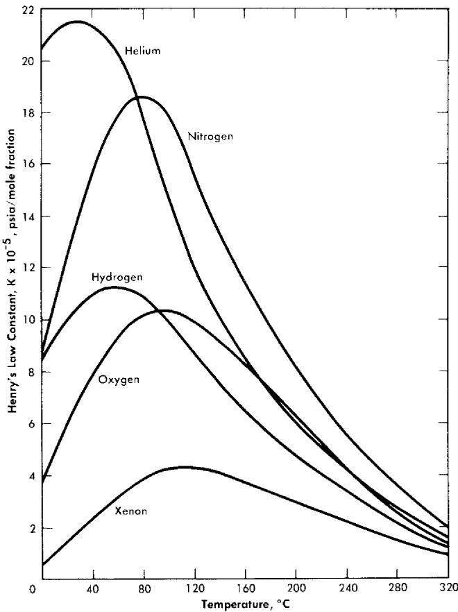  
FIG. 3-19. Solubility of gases in water.

3-4.7 Hydrogen ion concentration (pH). Orban of Mound Laboratory [48,56] studied the acidity of uranyl sulfate solutions from 25 to $60^{\circ}\mathrm{C}$ . Orban has also reported the $\mathsf{pH}$ values for uranyl sulfate solutions containing excess $\mathrm{UO_3}$ at temperatures up to $60^{\circ}\mathrm{C}$ [49,56]. Secoy has compiled information concerning the effects of uranium sulfate concentration upon $\mathsf{pH}$ as reported by a number of investigators [59]. Marshall has utilized the relationship between $\mathsf{pH}$ and concentration to determine the solubility of $\mathrm{UO_3}$ in sulfuric acid at elevated temperatures [7]. Table 3-13 shows the effect of sulfate concentration on $\mathsf{pH}$ at $25.00^{\circ}\mathrm{C}$ for various ratios of $\mathrm{UO_3}$ to sulfate as found by Marshall.

The direct measurement of $\mathsf{pH}$ at elevated temperatures and pressures has been made possible through the development by Ingruber of high-temperature electrode systems for use in the sulphite pulping process of the paper industry [68]. Lietzke and Tarrant have demonstrated the applicability of Ingruber's electrode system to the measurement of the $\mathsf{pH}$ of

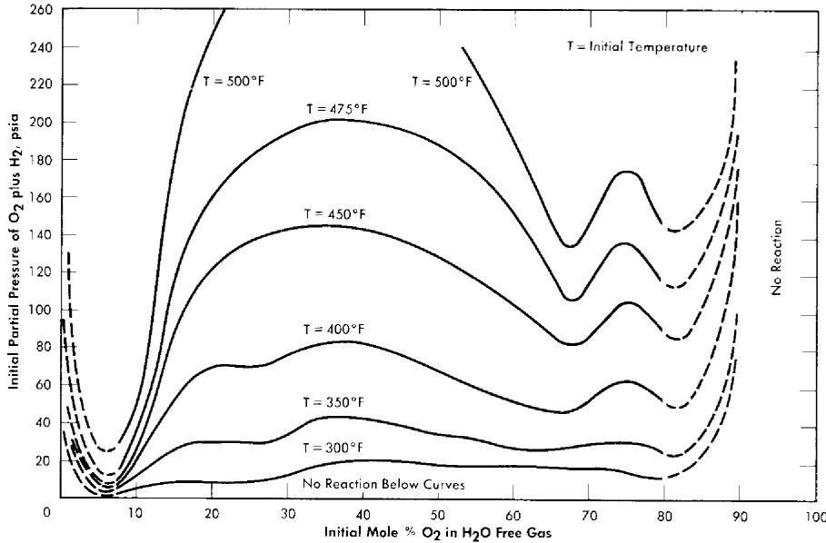  
FIG. 3-20. Approximate explosion limits of spark-ignited gaseous mixtures of $\mathrm{O_2}$ and $\mathrm{H_2}$ saturated with $\mathrm{H_2O}$ vapor in $1\frac{1}{2}$ -in. bomb.

solutions of HCl, $\mathrm{UO}_2\mathrm{SO}_4$ , and $\mathrm{H}_2\mathrm{SO}_4$ at temperatures as high as $180^{\circ}\mathrm{C}$ [69]. Table 3-14 lists the values reported. Lietzke has reported the properties of the hydrogen electrode-silver chloride electrode system at high temperatures and pressures [70].

3-4.8 Solubility of gases. The solubilities of various gases in water and in reactor solutions are indicated by Fig. 3-19 [71,72].

Composition and PVT data [73,74]. Dalton's Law of additive partial pressures has been determined to correlate the $P - PVT$ relationships of steam-oxygen and steam-helium mixtures in the pressure range of interest (up to 2500 psi) to within $1\%$ .

For approximate calculations the perfect gas laws can be applied when dealing with the permanent gases under reactor conditions, but values for the properties of water vapor and $\mathrm{D}_2\mathrm{O}$ vapor should be obtained from experimental data or standard tables [62].

The compositions of saturated steam-gas mixtures are predictable in a similar manner, in that the partial density of each constituent is equal to that of the pure constituent at its partial pressure.

3-4.9 Reaction limits and pressures. Stephen et al. [75] measured the effect of temperature and $\mathrm{H}_2 / \mathrm{O}_2$ ratio on the lower reaction limits of the $\mathrm{H}_2 - \mathrm{O}_2$ -steam system in a small 1.5-in.-diameter autoclave. Their investi

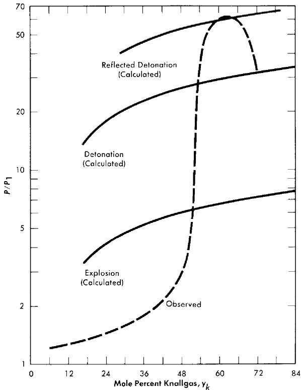  
FIG. 3-21. Ratio of peak reaction pressure to initial mixture pressure vs. composition of Knallgas saturated with water vapor at $100^{\circ}\mathrm{C}$ . Tube diameter $= 0.957$ in., spark ignition energy $= 180$ millijoules.

gation indicated that the composition (mol basis) of the mixture at the lower limit was not temperature dependent at constant $\mathrm{H}_2 / \mathrm{O}_2$ . Figure 3-20 is a plot of Stephan's data showing variation in $\mathrm{H}_2 / \mathrm{O}_2$ [76].

Syracuse University is investigating [77] further the effects of geometry, temperature, and method of ignition on the reaction and detonation limits of $\mathrm{H}_2\mathrm{O} - (2\mathrm{H}_2 + \mathrm{O}_2)$ . Reaction pressures are also measured. Figure 3-21 shows their reported results in a long 0.957-in.-diameter tube at $100^{\circ}\mathrm{C}$ ; these are typical of results obtained at $300^{\circ}\mathrm{C}$ . It is interesting to note that their lower reaction limit is $6\%$ Knallgas,\* as compared with $20\%$ Knallgas observed by Stephan.

# REFERENCES

1. C. H. SEcoy, J. Am. Chem. Soc. 72, 3343 (1950).   
2. C. H. Secoy, Survey of Homogeneous Reactor Chemical Problems, in Proceedings of the International Conference on the Peaceful Uses of Atomic Energy, Vol. 9. New York: United Nations, 1956. (P/821, p. 377)   
3. J. S. GILL et al., in *Homogeneous Reactor Project Quarterly Progress Report for the Period Ending October 31, 1953*, USAEC Report ORNL-1658, Oak Ridge National Laboratory, Feb. 25, 1954. (p. 87)   
4. H. W. WRIGHT et al., in Homogeneous Reactor Program Quarterly Progress Report for the Period Ending Oct. 1, 1952, USAEC Report ORNL-1424(Del.), Oak Ridge National Laboratory, Jan. 10, 1953. (p. 108)   
5. W. L. MARSHALL and C. H. SECOY, Oak Ridge National Laboratory, 1954. Unpublished.   
6. E. V. JONES and W. L. MARSHALL, in Homogeneous Reactor Project Quarterly Progress Report for the Period Ending Mar. 15, 1952, USAEC Report ORNL-1280, Oak Ridge National Laboratory, July 14, 1952. (p. 180)   
7. W. L. MARSHALL, The pH of $UO_{3} - H_{2}SO_{4} - H_{2}O$ Mixtures at $25^{\circ}C$ and Its Application to the Determination of the Solubility of $UO_{3}$ in Sulfuric Acid at Elevated Temperature, USAEC Report ORNL-1797, Oak Ridge National Laboratory, Nov. 1, 1954.   
8. (a) R. S. GREELEY, Oak Ridge National Laboratory, 1956, personal communication. (b) R. S. GREELEY et al., High Temperature Behavior of Aqueous Uranyl Sulfate—Lithium Sulfate and Uranyl Sulfate—Beryllium Sulfate Solutions, paper presented at the 2nd winter meeting of the American Nuclear Society, New York, Oct. 28, 1957.   
9. E. POSNJAK and G. TUNELL, Am. J. Sci. 218, 1 (1929).   
10. F. E. CLARK et al., in Homogeneous Reactor Project Quarterly Progress Report for the Period Ending Apr. 30, 1956, USAEC Report ORNL-2096, Oak Ridge National Laboratory, May 10, 1956. (p. 130)   
11. C. H. Secoy et al., in *Homogeneous Reactor Project Quarterly Progress Report for the Period Ending July 31, 1957*, USAEC Report ORNL-2379, Oak Ridge National Laboratory, Oct. 10, 1957 (p. 163); F. Moseley, *Core Solution Stability in the Homogeneous Aqueous Reactor: The Effect of Corrosion Product and Copper Concentrations*, Report *HARD(C)/P-41*, Gt. Brit. Atomic Energy Research Establishment, May 1957.   
12. W. L. MARSHALL et al., J. Am. Chem. Soc. 73, 1867 (1951).   
13. L. D. P. King, Design and Description of Water Boiler Reactors, in Proceedings of the International Conference on the Peaceful Uses of Atomic Energy, Vol. 2. New York: United Nations, 1956. (P/488, p. 372)   
14. W. L. MARSHALL et al., J. Am. Chem. Soc. 76, 4279 (1954).   
15. B. J. ThAMER et al., The Properties of Phosphoric Acid Solutions of Uranium as Fuels for Homogeneous Reactors, USAEC Report LA-2043, Los Alamos Scientific Laboratory, Mar. 6, 1956. D. FROMAN et al., Los Alamos Power Reactor Experiments, in Proceedings of the International Conference on the Peaceful Uses of Atomic Energy, Vol. 3. New York: United Nations, 1956 (P/500, p. 283). L. D. P. KING, Los Alamos Power Reactor Experiment and Its Associated Hazards,

USAEC Report LAMS-1611(Del.), Los Alamos Scientific Laboratory, Dec. 2, 1953; A Brief Description of a One Megawatt Convection-cooled Homogeneous Reactor—LAPRE II, USAEC Report LA-1942, Los Alamos Scientific Laboratory, Apr. 13, 1955. R. P. HAMMOND, Los Alamos Homogeneous Reactor Program, in HRP Civilian Power Reactor Conference Held at Oak Ridge, March 21-22, 1956, USAEC Report TID-7524, Los Alamos Scientific Laboratory, March 1957. (pp. 168-176)   
16. Figure 3-12 was supplied by R. B. Briggs, Oak Ridge National Laboratory. Unpublished.   
17. L. D. P. KING, Los Alamos Homogeneous Reactor Program, in HRP Civilian Power Reactor Conference Held at Oak Ridge, March 21-22, 1956, USAEC Report TID-7524, Los Alamos Scientific Laboratory, March 1951. (pp. 177-209)   
18. FRANK J. LOPREsT et al., J. Am. Chem. Soc. 77, 4705 (1955).   
19. F. J. Loprest et al., Homogeneous Reactor Project Quarterly Progress Report for the Period Ending July 31, 1955, USAEC Report ORNL-1943, Oak Ridge National Laboratory, Aug. 9, 1955 (p. 227). W. L. MARSHALL et al., Homogeneous Reactor Project Quarterly Progress Report for the Period Ending Jan. 31, 1956, USAEC Report ORNL-2057(Del.), Oak Ridge National Laboratory, Apr. 17, 1956 (p. 131). C. A. BLAKE et al., J. Am. Chem. Soc. 78, 5978 (1956).   
20. W. C. WAGGENER, Oak Ridge National Laboratory, 1953, personal communication.   
21. M. H. LIETZKE and W. L. MARSHALL, Present Status of the Investigation of Aqueous Solutions Suitable for Use in a Thorium Breeder Blanket, USAEC Report ORNL-1711, Oak Ridge National Laboratory, June 1954.   
22. W. L. MARSHALL et al., J. Am. Chem. Soc. 73, 4991 (1951). JOHN R. FERRARO et al., J. Am. Chem. Soc. 76, 909 (1954).   
23. P. G. JONES and R. G. SOWDEN, Thorium Nitrate Solution as a Breeder Blanket in the H.A.R., Report AERE-C/M-298, Part I. Thermal Stability, Gt. Brit. Atomic Energy Research Establishment, 1956.   
24. W. L. MARSHALL and C. H. SECOY, Preliminary Exploration of the $\mathrm{Th(NO_3)_4}$ -HNO $_3$ -H $_2$ O System at Elevated Temperature, in Homogeneous Reactor Project Quarterly Progress Report for the Period Ending Oct. 31, 1954, USAEC Report ORNL-1658, Oak Ridge National Laboratory, Feb. 25, 1954. (pp. 93-96)   
25. R. E. LEUZE, Chemistry of Plutonium in Uranyl Sulfate Solutions, in HRP Civilian Power Reactor Conference Held at Oak Ridge National Laboratory, May 1-2, 1957, USAEC Report TID-7540, Oak Ridge National Laboratory, July 1957. (pp. 221-231)   
26. D. E. GLANVILLE and D. W. GRANT, *Gt. Brit. Atomic Energy Research Establishment*, 1956. Unpublished.   
27. Mound Laboratory, Interim Monthly Reports, 1957-1958.   
28. L. V. Jones et al., Isolation of Protactinium-231, in Homogeneous Reactor Project Quarterly Progress Report for the Period Ending July 21, 1956, USAEC Report ORNL-2148(Del.), Oak Ridge National Laboratory, Oct. 3, 1956. (pp. 144-145)   
29. A. T. GRESKY, Separation of $\mathbf{U}^{233}$ and Thorium from Fission Products by Solvent Extraction, in Progress in Nuclear Energy—Series 3; Process Chem-

istry, by F. R. Bruce et al., New York: McGraw-Hill Book Co., Inc., 1956; Thorex Process Summary, February 1956, USAEC Report CF-56-2-157, Oak Ridge National Laboratory, Apr. 25, 1956. A. T. GRESKY et al., Laboratory Development of the Thorex Process: Progress Report, Oct. 1, 1952 to Jan. 31, 1953, USAEC Report ORNL-1518, Oak Ridge National Laboratory, Aug. 4, 1953. E. D. ARNOLD et al., Preliminary Cost Estimation: Chemical Processing and Fuel Costs for a Thermal Breeder Reactor Power Station, USAEC Report ORNL-1761, Oak Ridge National Laboratory, Feb. 23, 1955. R. E. ELSON, The Chemistry of Protactinium, in The Actinide Elements, ed. by G. T. SEABORG and J. J. KATZ, National Nuclear Energy Series, Division IV, Volume 14A. New York: McGrawHill Book Co., Inc., 1953. (Chap. 5, p. 103)   
30. D. E. FERGUSON, Homogeneous Plutonium Producer Chemical Processing, in HRP Civilian Power Reactor Conference Held at Oak Ridge March 21-22, 1956, USAEC Report TID-7524, Oak Ridge National Laboratory (pp. 224-232). J. C. HINDMAN et al., Some Recent Developments in the Chemistry of Neptunium, in Proceedings of the International Conference on the Peaceful Uses of Atomic Energy, Vol. 7. New York: United Nations, 1956 (P/736, p. 345). K. A. KRAUS, Hydrolytic Behavior of the Heavy Elements, in Proceedings of the International Conference on the Peaceful Uses of Atomic Energy, Vol. 7, New York: United Nations, 1956. (P/731, p. 245). W. C. WAGGENER and R. W. STOUGHTON, Spectrophotometry of Aqueous Solutions, in Chemistry Division Annual Progress Report for the Period Ending June 20, 1957, USAEC Report ORNL-2386, Oak Ridge National Laboratory, (pp. 64-71). W. C. WAGGENER, in Chemistry Division Seminar—1958, Oak Ridge National Laboratory (to be published).   
31. A. O. ALLEN, J. Phys. & Colloid Chem. 52, 479 (1948). C. J. HOCHANADEL, Radiation Stability of Aqueous Fuel Systems, USAEC Report CF-56-11-54, Oak Ridge National Laboratory, November 1956.   
32. F. S. DAINTON and H. C. SUTTON, Trans. Faraday Soc. 49, 1011 (1953).   
33. T. J. Sworski, J. Am. Chem. Soc. 76, 4687 (1954).   
34. E. J. HART, Radiation Research 2, 33 (1955).   
35. Selected values from several literature references.   
36. A. O. ALLEN et al., J. Phys. Chem. 56, 575 (1952). C. J. HOCHANADEL, J. Phys. Chem. 56, 587 (1952).   
37. C. J. HOCHANADEL, Radiation Induced Reactions in Water, in Proceedings of the International Conference on the Peaceful Uses of Atomic Energy, Vol. 7. New York: United Nations, 1956. (P/739, p. 521)   
38. J. W. Boyle et al., Nuclear Engineering and Science Congress, Held in New York in 1955, American Institute of Chemical Engineers (Preprint 222). H. F. McDUFFIE, Aqueous Fuel Solutions, Chap. 4.3, in Reactor Handbook, Vol. 2, Engineering, USAEC Report AECD-3646, Oak Ridge National Laboratory, 1955. (p. 571)   
39. H. F. McDUFFIE et al., The Radiation Chemistry of Homogeneous Reactor Systems: III—Homogeneous Catalysis of the Hydrogen-Oxygen Reaction, USAEC Report CF-54-1-122, Oak Ridge National Laboratory, 1954.   
40. For solubilities of $\mathrm{H}_{2}$ and $\mathrm{O}_{2}$ in water and in $\mathrm{UO}_{2} \mathrm{SO}_{4}$ solutions at high temperatures see: H. A. H. PRAY et al., Ind. Eng. Chem. 14, 1146 (1952); E. F. STEPHAN et al., The Solubilities of Gases in Water and in Aqueous Uranyl Salt

Solutions at Elevated Temperatures and Pressures, USAEC Report BMI-1067 Battelle Memorial Institute 1956; see also Sec. 4, this chapter.   
41. S. VISNER and P. N. HAUBENREICH, HRE Experiments on Internal Recombination of Gas with a Homogeneous Catalyst, USAEC Report CF-55-1-166, Oak Ridge National Laboratory, Jan. 21, 1955.   
42. R. E. Aven and M. C. LAWRENCE, Calculation of Effects of Copper Catalyst in the HRT, USAEC Report CF-56-4-4, Oak Ridge National Laboratory, Apr. 10, 1956.   
43. M. D. SILVERMAN et al., Ind. Eng. Chem. 48, 1238 (1956).   
44. J. W. BOYLE and H. A. MAHLMAN, paper presented at the 2nd Annual Meeting of the American Nuclear Society, Chicago, 1956.   
45. M. M. HARRING, Mound Laboratory, Uranium Salts Research Progress Reports, USAEC Report MLM-628, 1951. E. ORBAN, Mound Laboratory, Uranium Salts Research Progress Reports, USAEC Reports MLM-663, 1952; MLM-680, 1952; MLM-710, 1952; MLM-755, 1952; MLM-790, 1952; MLM-825, 1953; MLM-863, 1953; MLM-928, 1953.   
46. E. ORBAN, Mound Laboratory, 1952. Unpublished.   
47. J. S. JEGART et al., The Densities of Uranyl Sulfate Solutions Between $20^{\circ}$ and $90^{\circ}C$ , USAEC Report MLM-728, Mound Laboratory, Oct. 10, 1952.   
48. E. ORBAN, The pH Measurement of Uranyl Sulfate Solutions from $25^{\circ}$ to $60^{\circ}\mathrm{C}$ , USAEC Report MLM-729, Mound Laboratory, Aug. 1, 1952.   
49. E. ORBAN, The pH of Uranyl Sulfate-Uranium Trioxide Solutions, USAEC Report AECD-3580, Mound Laboratory, Aug. 14, 1952.   
50. J. R. Heiks and J. S. JEGART, The Viscosity of Uranyl Sulfate Solutions $20^{\circ}$ to $90^{\circ}C$ , USAEC Report MLM-788(Rev.), Mound Laboratory, Feb. 22, 1954.   
51. J. R. HEIKs et al., Apparatus for Determining the Physical Properties of Solutions at Elevated Temperatures and Pressures, USAEC Report MLM-799, Mound Laboratory, Jan. 14, 1953.   
52. A. J. Rogers et al., An Instrument for the Measurement of the Time of Fall of a Plummet in a Pressure Vessel, USAEC Report MLM-805, Mound Laboratory, Feb. 27, 1952.   
53. M. K. BARNETT and J. JEGART, The Surface Tension of Aqueous Uranyl Sulfate Solutions Between $20^{\circ}$ and $75^{\circ}C$ , USAEC Report AECD-3581, Mound Laboratory, Feb. 15, 1953.   
54. J. R. HEIKs et al., The Physical Properties of Heavy Water From Room Temperature to $250^{\circ}C$ , USAEC Report MLM-934, Mound Laboratory, Jan. 12, 1954.   
55. M. K. BARNETT et al., The Density, Viscosity, and Surface Tension of Light and Heavy Water Solutions of Uranyl Sulfate at Temperatures to $250^{\circ}C$ , USAEC Report MLM-1021, Mound Laboratory, Dec. 6, 1954.   
56. E. ORBAN et al., Physical Properties of Aqueous Uranyl Sulfate Solutions from $20^{\circ}$ to $90^{\circ}$ , J. Phys. Chem. 60, 413 (1956).   
57. R. VAN WINKLE, Some Physical Properties of $UO_{2}SO_{4} - D_{2}O$ Solutions, USAEC Report CF-52-1-124, Oak Ridge National Laboratory, Jan. 18, 1952.   
58. M. TOBIAS, Certain Physical Properties of Aqueous Homogeneous Reactor Materials, USAEC Report CF-56-11-135, Oak Ridge National Laboratory, Nov. 23, 1956.

59. J. A. LANe et al., Properties of Aqueous Solution Systems, Chap. 4.3 in The Reactor Handbook, Vol. 2, Engineering, USAEC Report AECD-3646, Oak Ridge National Laboratory, 1955.   
60. P. A. Lotres, Physical and Thermodynamic Properties of Light and Heavy Water, Chap. 1.3 in The Reactor Handbook, Vol. 2, Engineering, USAEC Report AECD-3646, Argonne National Laboratory, 1955. (pp. 21-42)   
61. N. E. Dorsey, Properties of Ordinary Water-Substance, New York: Reinhold Publishing Corp., 1940.   
62. J. H. KeENAN and F. G. KEYES, Thermodynamic Properties of Steam, New York: John Wiley & Sons, Inc., 1936.   
63. G. M. HeBERT et al., The Densities of Heavy-Water Liquid and Saturated Vapor at Elevated Temperatures, J. Phys. Chem. 62, 431 (1958).   
64. W. L. MARSHALL, Density—Weight Percent—Molarity Conversion Equations for Uranyl Sulfate—Water Solutions at $25.0^{\circ}C$ and Between $100 - 300^{\circ}C$ , USAEC Report CF-52-1-93, Oak Ridge National Laboratory, Jan. 15, 1952.   
65. R. C. HARDY and R. L. COrrington, J. Research Nat. Bur. Standards 42, 573 (1949).   
66. H. O. DAY and C. H. Secoy, Oak Ridge National Laboratory. Unpublished data.   
67. W. L. MARSHALL, Oak Ridge National Laboratory, March 1958, personal communication.   
68. O. V. INGRUBER, The Direct Measurement of pH at Elevated Temperature and Pressure during Sulphite Pulping, *Pulp Paper Can.* 55 (10), 124-131 (1954).   
69. M. H. LIETZKE and J. R. TARRANT, Preliminary Report on the Model 904 High-temperature pH Meter, USAEC Report CF-57-11-87, Oak Ridge National Laboratory.   
70. M. H. LIETZKE, The Hydrogen Electrode—Silver Chloride Electrode System at High Temperatures and Pressures, J. Am. Chem. Soc. 77, 1344 (1955).   
71. E. F. STEPHAN et al., The Solubility of Gases in Water and in Aqueous Uranyl Salt Solutions at Elevated Temperatures and Pressures, USAEC Report BMI-1067, Battelle Memorial Institute, 1956.   
72. H. A. PRAY et al., The Solubility of Hydrogen, Oxygen, Nitrogen, and Helium in Water at Elevated Temperatures, Ind. Eng. Chem. 44, 1146 (1952).   
73. J. A. LUKER and THOMAS GNIEWEK, Saturation Composition of Steam—Helium—Water Mixtures PVT Data and Heat Capacity of Superheated Steam—Helium Mixtures, USAEC Report AECU-3299, Syracuse University Research Institute, July 29, 1955.   
74. J. A. LUKER and THOMAS GNIEWEK, Determination of PVT Relationships and Heat Capacity of Steam—Oxygen Mixtures, USAEC Report AECU-3300, Syracuse University Research Institute, Aug. 2, 1955.   
75. E. F. STEPHAN et al., Ignition Reactions in the Hydrogen-Oxygen--Water System at Elevated Temperatures, USAEC Report BMI-1138, Battelle Memorial Institute, Oct. 2, 1956.   
76. T. W. LELAND, Evaluation of Data from Battelle Memorial Institute on Solubility of $H_{2}$ and $O_{2}$ in Solutions of $UO_{2}SO_{4}$ and $UO_{2}F_{2}$ in Water and on Explosion Limits in Gaseous Mixtures of $H_{2}$ , $O_{2}$ and $H_{2}O$ and in $H_{2}, O_{2}, He$ ,

and $H_{\mathbb{Z}}O$ , USAEC Report CF-54-8-215, Oak Ridge National Laboratory, Aug. 23, 1954.   
77. IRVIN M. MACAFEE, JR., Detonation, Explosion, and Reaction Limits of Saturated Stoichiometric Hydrogen—Oxygen—Water Mixtures, USAEC Report AECU-3302, Syracuse University, Research Institute, July 1, 1956. PAUL L. McGILL and JAMES A. LUKER, Detonation Pressures of Stoichiometric Hydrogen—Oxygen Mixtures Saturated with Water at High Initial Temperatures and Pressures, USAEC Report AECU-3429, Syracuse University, Research Institute, Dec. 3, 1956.