# CHAPTER 4

# TECHNOLOGY OF AQUEOUS SUSPENSIONS*

# 4-1. SUSPENSIONS AND THEIR APPLICATIONS IN REACTORS†

4-1.1 Introduction. With the inception of the aqueous homogeneous power reactor program at Oak Ridge National Laboratory in 1949, the primary choice of fuel was highly enriched $\mathrm{UO}_2\mathrm{SO}_4$ solution. Use of enriched uranium alleviated to some extent the need for strict neutron economy, but it was found that at high temperature (250 to $300^{\circ}\mathrm{C}$ ) $\mathrm{UO}_2\mathrm{SO}_4$ solutions were more corrosive than pure water and were subject to a high-temperature instability. As a result, a secondary development effort was initiated at ORNL to determine the potentialities of suspensions of solid uranium compounds as reactor fuels. The principal efforts were directed at forms of $\mathrm{UO}_3$ , because it was believed that under reactor operating conditions the trioxide would be the stable oxidation state. Considerable progress was made in studies of the oxide and its slurries, and in development of equipment for circulating the slurries at concentrations of several hundred grams per liter in 100-gpm loops at $250^{\circ}\mathrm{C}$ . In addition, a criticality study was carried out with enriched $\mathrm{UO}_3\cdot \mathrm{H}_2\mathrm{O}$ in water to obtain assurance that local fluctuations in concentration or settling would not unduly affect nuclear stability [1].

In 1955, the $\mathrm{UO}_3$ work was set aside so that effort could be concentrated on $\mathrm{ThO}_2$ suspensions, which are at the present time believed to be the only suitable fluid homogeneous fertile material for use in an aqueous homogeneous thorium breeder. The ultimate of this effort at ORNL has been set at a two-region, $\mathrm{ThO}_2$ , homogeneous, power breeder.

In the following sections of this chapter a detailed account is given of the studies on $\mathrm{UO}_3$ slurries and $\mathrm{ThO}_2$ slurries, and a description of the present state of knowledge of their production, properties, and utilization. The discussion will be based largely on work done in the United States, but it should be kept in mind that studies on fuel- and fertile-material suspensions have been conducted in other countries—in particular, in the Netherlands and in Great Britain—and that exchanges of concepts and data have aided the U.S. efforts.

4-1.2 Types of suspensions and their settled beds. Two-phase systems of solids in liquids may be classified in several ways. On the basis of size of particle a, phase is said to be colloidal when it is sufficiently finely divided to permit the surface attraction forces of the particles to exert a strong influence on the mechanical properties of the material as a whole. If, in addition, the particles are dispersed in a liquid and are sufficiently small so they diffuse throughout the liquid due to their Brownian motion in a normal gravitational field, they are referred to as sols. Sols are not resolved in an ordinary microscope but are usually recognizable in an ultramicroscope. The particles of a sol are usually less than 0.5 micron in length for materials of density near that of water, while particles in a $\mathrm{ThO_2}$ sol are usually less than 0.05 micron. Particles in a sol may join to form a random network of some strength having a semisolid appearance and called a gel, or they may coalesce into loose and relatively independent clouds of joined particles referred to as flocs. Suspensions of flocs or of particles which are large enough to settle are referred to as slurries.

In some sols the particles are stabilized by the preferential attraction of the suspending liquid to the particles' surface. These are referred to as lyophillic sols. In other sols the thermodynamically stable condition is a flocculated or a gelled state, but the particles are held apart by electrostatic forces produced by ions which collect on and near the surface of the particles. Sols of elements, oxides, and salts (including the oxides of uranium and thorium) are generally of the latter type and are referred to as lyophobic sols.

Although dispersions having particle sizes greater than 0.5 micron do not form sols, since they are too large and have too large a mass to be appreciably affected by Brownian motion, the particle surfaces may exhibit some colloidal properties which are most pronounced when the particles are very close together. The magnitude of these forces is such that spherical particles of $\mathrm{ThO_2}$ which are 10 to 15 microns in diameter appear to show only slight tendency to flocculate, while cubic or platelet forms of $\mathrm{ThO_2}$ and $\mathrm{UO_3\cdot H_2O}$ of 1 or 2 microns on a side do show a marked tendency to flocculate.

When slurries having particles that are either relatively large or have a high ionic charge on their surface (and hence have little tendency to flocculate) settle, the settled bed density approaches about 50 to $70\%$ of the particle density. The bed resuspend only slowly and is not easily deformed rapidly. An example of such a bed is settled sand. In general, such beds may exhibit dilatancy, which means that the bed must expand to be deformed, and the apparent viscosity of the bed increases as the rate of shear increases. $\mathrm{ThO_2}$ spheres of more than 5 to 10 microns settle to beds of this type.

Flocculated slurries settle to a concentration at which the flocs become

joined, and from that point the particles are in part supported by indirect contact with the walls and bottom of the container through the floc structure. The resulting settled bed may continue to compact indefinitely at a slower and slower rate. Such beds behave more or less in a plastic fashion, and may even exhibit a pronounced yield stress (i.e., shear stress required before an appreciable deformation rate is initiated).

In $\mathrm{UO}_3\cdot \mathrm{H}_2\mathrm{O}$ slurries of concentrations up to several hundred grams per liter, the yield stress is less than $0.1~\mathrm{lb / ft^2}$ and the slurries are almost of Newtonian character. A breeding blanket requires $\mathrm{ThO_2}$ slurries containing 500 to 1500 grams of thorium per liter, and in these concentrations the yield stress varies from 0 to well over $1\mathrm{lb / ft^2}$ , depending in part on the concentration, on the shape and form of the oxide particle, and on the presence or absence of certain additives. Settled beds of both $\mathrm{ThO_2}$ and $\mathrm{UO_3}\cdot \mathrm{H_2O}$ may be either colloidal and plastic, or much more dense, noncolloidal, and apparently dilatant.

4-1.3 Engineering problems associated with colloidal properties. The colloidal behavior of some slurries offers three types of problems: high yield stress, caking, and sphere-forming tendencies. To these may be added a general instability in the colloidal behavior which changes with time, chemical treatment, and general previous history. A high yield stress, in turn, offers three main engineering problems: high velocity required to produce turbulence, a tendency to plug tubes, and a tendency to increase the difficulty of mixing in a large blanket or reactor vessel.

A cake is defined as an accumulation of particles on part of the surface of the system in so dense and rigid a form that it cannot be deformed without fracture. A mud is a similar dense accumulation of greater yield strength than the circulating slurry but which can be deformed without fracture of the accumulation.

Caking and mud formation have occurred occasionally in circulation loops, causing plugging of tubes, hydraulic or mechanical unbalance in a centrifugal pump, and drastic reduction in heat transfer to or from the walls. These phenomena appear to be due to compaction of flocculated slurry under the influence of stresses due to flow. The rigidity of a cake or mud appears to be inversely related to the particle size.

Muds have been observed in both $\mathrm{ThO_2}$ and $\mathrm{UO_3\cdot H_2O}$ platelet slurries. Cakes have been observed in $\mathrm{ThO_2}$ slurries. In one case, a $\frac{1}{4}$ -to $\frac{3}{8}$ -in. layer of $\mathrm{ThO_2}$ cake was built up on essentially all parts of a 3-in. 200-gpm circulating system. The cake resembled chalk in strength and consistency. It had a density of about $5.5~\mathrm{g / cc}$ .

Sphere formation occurs when a circulating slurry contains very fine particles and appears to resemble the formation of a popcorn ball [2]. Spheres ranging in size from about five to several hundred microns in

diameter have been made. Prolonged circulation causes an equilibrium size to be reached which depends on the circulating conditions and the starting material. Spheres have been formed from certain types of $\mathrm{ThO_2}$ in suspension, but no spheres or cakes have been observed in circulating $\mathrm{UO_3\cdot H_2O}$ . This may be due to the fact that the greater solubility of $\mathrm{UO_3\cdot H_2O}$ prevents its remaining as extremely fine particles.

Since cake, mud, and sphere formations appear to be a result of colloidal behavior, effective control of the colloidal behavior of a slurry will probably control the formation of such aggregates.

Plastic materials which exhibit a high yield stress require a high velocity before they become turbulent. It is not uncommon for $\mathrm{ThO_2}$ slurries to require 30 to 40 ft/sec velocity for the onset of turbulence. (It is of interest to note that velocity by itself appears to be the most important criterion for whether a given plastic will be in laminar or turbulent flow [3]—as opposed to the product of tube diameter and velocity, which is the corresponding criterion for a given Newtonian liquid.) Turbulence is, of course, important in maintaining the suspension and in providing good heat transfer.

Control or elimination of colloidal, flocculating properties of slurries can be accomplished by additives, particle-size control, or particle-shape control. Electrolyte additives which attach to particle surfaces may provide so strong a charge that particles cannot approach to form a floc or gel. In true lyophobic sols, the most effective additives are often those which produce ions of atoms or radicals of the same type as those composing the particle. For example, $\mathrm{ThO_2}$ or $\mathrm{Th(OH)_4}$ sols of up to 4000-g/liter concentration are easily made by the addition of $\mathrm{Th(NO_3)_4}$ solution to freshly prepared $\mathrm{Th(OH)_4}$ . On a somewhat similar basis, additives which may form partially ionized or lyophilic surface compounds are often effective. Very small additions of $\mathrm{H_2C_2O_4}$ , $\mathrm{Na_2SiO_3}$ , $\mathrm{Na_3PO_4}$ , and $\mathrm{NaAlO_2}$ have been found effective at room temperatures in producing free-flowing Newtonian slurries from high-yield-stress $\mathrm{ThO_2}$ muds. In most cases the effect is lost at elevated temperatures. However, coating of the particles with a silicone compound and firing to convert it to $\mathrm{SiO_2}$ has produced slurries which appear to remain unflocculated at temperatures up to $300^{\circ}\mathrm{C}$ [4].

$\mathrm{Na_2HPO_4}$ or $\mathrm{NaH_2PO_4}$ added to $\mathrm{UO_3\cdot H_2O}$ platelet slurries has prevented the formation of mugs in regions where they normally form. The latter additive is preferred, since $\mathrm{Na_2HPO_4}$ solution appears to attack stainless steel in the presence of oxygen at elevated temperatures [5].

Evidence indicates that as the particle size increases the colloidal effects become reduced. In the case of $\mathrm{UO_3\cdot H_2O}$ an equilibrium size is reached due to the continuous abrasion of the particles and subsequent recrystallization. In $\mathrm{ThO_2}$ , and probably in $\mathrm{UO_2}$ slurries, the crystals are much more

resistant to abrasion, but at the same time the recrystallization in solution is essentially nil. $\mathrm{ThO_2}$ produced by calcination of a plate or cube form of $\mathrm{Th(C_2O_4)_2}$ retains the plate or cube form, but the particle is composed of smaller crystals of $\mathrm{ThO_2}$ . Violent agitation causes crystals in the particles to break apart, after which they are free to exhibit the colloidal behavior of the finer particles. The higher the calcination temperature, the larger the $\mathrm{ThO_2}$ crystals. By calcination at $1600^{\circ}\mathrm{C}$ , crystals in excess of 0.25 micron are produced, whereas calcination at $650^{\circ}\mathrm{C}$ gives crystals of 50 to 100 A. In both cases, the over-all particle size may be of the order of 0.5 to 5 microns. Even the material calcined at the higher temperature exhibits a discouragingly high yield stress, however, at the preferred concentration for a two-region breeder blanket ( $\sim 1500\mathrm{g}/$ liter at room temperature). Part of the difficulty may be due to a possible systematic arrangement of charges on the particle surface which causes actual attraction and binding of particles into an unusually strong floc in a preferred orientation [6].

If spherical particles are used, the amount of possible common surface between particles is limited and the permanence of mutual attachment is correspondingly limited. In addition, if the surface is essentially uniform, the charge arrangement might tend to repel rather than attract other particles. Furthermore, a spherical shape permits the particles to be larger without excessive abrasion.

Spheres made in circulating systems, as mentioned above, exhibit Newtonian flow properties at concentrations up to about 3500 to 4000 g/liter at room temperature. At the present time they are rather friable, although their density is of the order of 8.5. Calcining the spheres at very high temperatures in furnaces, oxyacetylene flames, or electric arcs gives them considerably greater integrity while retaining their noncolloidal properties. However, at high firing temperatures (1800°C) a tendency of the spheres to break up, owing presumably to internal stresses, has been noted [7]. Dense spheres have been produced in small quantity by spraying a $\mathrm{Th(OH)_4}$ gel which is subsequently hardened, dried, and fired.

Thus it appears that the colloidal behavior of $\mathrm{ThO_2}$ slurries may be minimized through the use of spherical particles, larger particles, coating the particles with silica or some other compound, or by the use of some as-yet-unperfected additive.

4-1.4 Engineering problems not associated with colloidal properties. Sedimentation. One of the principal noncolloidal problems encountered with suspensions or slurries is sedimentation which, in a flowing system, is offset by any upward component of liquid velocity. By definition, in idealized laminar flow in a horizontal conduit there is no upward velocity component and the rate of settling should proceed at the same rate as in a

stagnant vessel. In a vertical tube with laminar flow, particles tend to be more concentrated near the center of the tube [8]. One possible explanation may be that the particles spin in the velocity gradient near the wall in a direction which would cause them to move toward the center of the tube as the liquid moves past them. It appears possible that a similar effect could reduce the sedimentation rate in a horizontal tube. In an inclined tube the solids will collect on the lower side of the tube, while a channel of low solids content will appear along the upper side. The resulting radial variation in density and possibly in viscosity distorts the normal parabolic velocity profile and complicates computation of the local sedimentation rate.

In turbulent flow, fluctuating radial velocities will tend to cause diffusion from more concentrated regions to regions of lower concentration in competition with the settling due to gravity. Although a relatively strong diffusion tendency exists across the bulk of the conduit, the diffusion rather suddenly begins to be damped near the wall, although some random radial velocity fluctuations may occur essentially up to the wall. The distance from the wall at which damping begins to become pronounced is of the order of about $1\mathrm{mm}$ for water for velocities at 1 ft/sec, in tubes larger than about $\frac{1}{4}$ to $\frac{1}{2}$ in. in diameter, and it is generally recognized by hydrodynamicists as being approximately proportional to $\nu /u_{m}$ where $u_{m}$ is the mean velocity of the fluid and $\nu$ is the kinematic viscosity, about $10^{-5}\mathrm{ft}^2 /\mathrm{sec}$ . Since particles in the slurries under discussion are of micron size, rather than large fractions of millimeters, those particles which find themselves well inside this layer above a horizontal surface may tend to build up a sediment which becomes the solid surface from which the more or less damped layer must be measured. This process can continue until the diameter and velocity are reduced to the point where flow becomes laminar and the tube is choked off completely, or until the local shear stress becomes high enough to drag the particles along and an equilibrium bed thickness is approached. At a given distance from the wall in the damped region the local velocity of the liquid is proportional roughly to the square of the mean velocity through the conduit, and the radial velocity fluctuations in the damped regions vary in about the same proportion. Therefore the mean stream velocity at which sediment tends to accumulate is rather sharply defined for a given slurry.

It follows directly that a slurry which is flowing horizontally cannot keep its particles in suspension unless the flow is turbulent, or unless it is an extremely stiff flocculated mud, and even in turbulent flow a minimum velocity may be required to prevent the accumulation of a sediment along the bottom of a tube or conduit. Such sedimentation can occur in a reactor blanket vessel in regions where the net velocity is extremely low.

Abrasion. A second problem is that of abrasion, which is more serious

in the case of thorium slurries than uranium slurries. $\mathrm{UO}_3\cdot \mathrm{H}_2\mathrm{O}$ crystals are relatively soft, and when they strike a stainless-steel wall, they tend to break without damaging the surface of the wall. $\mathrm{ThO}_2$ particles, on the other hand, appear to be sufficiently hard to abrade the protective oxide film on stainless steel and perhaps to abrade the base metal. Continuous removal of the film exposes the bare metal to corrosive attack by the hot water and, in some cases, causes very serious attack. The attack is most severe in local recirculation regions associated with flow separation and in regions of sudden acceleration and direction change, such as in orifices, pump impellers, and pump seal rings. Materials such as zirconium and titanium, which form very hard oxide films, and essentially noncorrodrible metals such as gold and platinum show more resistance to $\mathrm{ThO}_2$ slurries than do stainless steels. Reduction of particle size, use of round particles rather than sharp-cornered particles, and design of components and piping to avoid regions of high velocity or high acceleration will reduce attack.

4-1.5 Systems and components for using slurries in reactors. The preceding discussion implies several general conclusions regarding systems and components for using slurries. For example, the over-all system should be kept as free of extraneous circuits and secondary lines as possible. If possible, the system should always tend to drain into a sump whenever circulation stops, to prevent plugging by settled beds. Smaller side lines should, where possible, be attached to the top of a horizontal run of the main system to allow solids to settle into the main stream, and a minimum size for smaller lines should be established based on the expected strength of any reasonably conceivable settled bed. In $\mathrm{ThO_2}$ or $\mathrm{UO_2}$ systems, all elbows should be of at least moderately large radius, and sudden constrictions such as orifices should be avoided.

Mechanical pumps for $\mathrm{ThO_2}$ or $\mathrm{UO_2}$ must be leaktight, and should be capable of handling the hard abrasive particles; this includes adequate hydraulic design, the use of particularly resistant materials in regions of high fluid acceleration or high velocity, and either very abrasion-resistant bearings or essentially complete isolation of the bearings from the slurry. Valves must be designed to operate in spite of the abrasive nature and the settling or compacting properties of the solids; they must be leaktight to the outside. The trim must be unusually abrasion- and corrosion-resistant to ensure continued internal leaktightness.

Pressure-sensing instruments should not, in general, include long blind passages of small diameters, which might easily become plugged; in $\mathrm{ThO_2}$ slurries, flowmeters should not include rapidly moving parts in contact with slurries, unless bearings which are not affected by the abrasive action of the solids are used.

All vessels should be provided with a means of respending solids which have settled to the bottom. In some vessels, a simple mechanical agitator is sufficient. In others, steam or gas sparging can be used. In still other cases, more sophisticated systems may be required involving, for example, injection of an external liquid or slurry stream to induce strong internal recirculation currents.

The following sections of this chapter represent a brief, condensed progress and status report of the work on suspensions. This effort is continuing at an accelerated rate as their potentialities are becoming more clearly recognized and as the problems and difficulties are becoming more rapidly overcome.

# 4-2. URANIUM OXIDE SLURRIES*

4-2.1 Introduction. Preliminary studies on uranium oxide slurries for use in a plutonium-producer reactor were carried out in the period 1940-1944 by Vernon, Hickey, Huffman, and others, first at Columbia University and later at the University of Chicago as a part of the Manhattan Project. This program was discontinued before the feasibility of uranium oxide slurries could be established, but a large backlog of information on the properties and slurry behavior of the uranium oxides was obtained. These studies are reported in detail by Kirschenbaum, Murphy, and Urey [9] in a still secret volume of the National Nuclear Energy Series (III, 4-B) which should soon be declassified. In 1951 work on the development of uranium oxide slurries was revived, primarily at the Oak Ridge National Laboratory. These studies were terminated in 1953 before a satisfactory slurry was developed. The results are reported by Blomeke [10] and, in a 1955 Geneva paper, by Kitzes and Lyon [11]. Since 1953, emphasis on a slurry fuel has centered on the development of a thorium-uranium oxide slurry [12,13].

4-2.2 Chemical stability of uranium oxides. Both the early Manhattan Project work [9] and the ORNL work [10] indicated that uranium trioxide would be the probable stable form of uranium oxide under the radiolytic gas formed by the radiation-induced decomposition of water in a reactor. Uranium dioxide in an aqueous slurry at $250^{\circ}\mathrm{C}$ was oxidized to uranium trioxide in the presence of oxygen overpressure and even in the presence of excess hydrogen gas. The extent of this oxidation depended on the oxygen pressure, and seemed to be independent of the partial pressure of hydrogen (Table 4-1). The extent of oxidation of $\mathrm{U}_3\mathrm{O}_8$ to uranium trioxide depended on both temperature and oxygen pressure. The presence

TABLE 4-1   
OXIDATION OF $\mathrm{UO_2}$ SLURRIES UPON HEATING UNDER VARYING PARTIAL PRESSURE OF HYDROGEN AND OXYGEN  
TABLE 4-2   

<table><tr><td colspan="2">Heating conditions</td><td colspan="2">Gas pressure</td><td rowspan="2">Uranium oxidized, %</td></tr><tr><td>Temp., °C</td><td>Time, hr</td><td>H2, psi</td><td>O2, psi</td></tr><tr><td>200</td><td>48</td><td>63.5</td><td>31.8</td><td>64.9</td></tr><tr><td>250</td><td>16</td><td></td><td>202</td><td>74.5</td></tr><tr><td></td><td>16</td><td></td><td>378</td><td>82.2</td></tr><tr><td></td><td>24</td><td>70</td><td>61.5</td><td>78.4</td></tr><tr><td></td><td>24</td><td>70</td><td>175</td><td>91.4</td></tr></table>

REDUCTION OF $\mathrm{UO}_3$ SLURRIES AT $250^{\circ}\mathrm{C}$ UNDER VARYING PARTIAL PRESSURES OF HYDROGEN AND OXYGEN  

<table><tr><td rowspan="2">Heating time, hr</td><td colspan="2">Gas pressure</td><td rowspan="2">Uranium reduced, %</td></tr><tr><td>H2, psi</td><td>O2, psi</td></tr><tr><td>20</td><td>263</td><td>26.3</td><td>0.5</td></tr><tr><td>2</td><td>378</td><td>—</td><td>1.39</td></tr><tr><td>24</td><td>70</td><td>35</td><td>0</td></tr><tr><td>68</td><td>527</td><td>26.3</td><td>0.4</td></tr></table>

of a partial pressure of hydrogen did not seem to markedly inhibit the oxidation (Table 4-2). When a slurry of $\mathrm{UO}_3\cdot \mathrm{H}_2\mathrm{O}$ rods prepared by thermal decomposition of uranium peroxide in water was heated at $250^{\circ}\mathrm{C}$ under varying pressures of hydrogen and oxygen, it was unchanged in the presence of a stoichiometric mixture of hydrogen and oxygen in the ratio of water. It was only very slightly reduced by a tenfold excess of hydrogen over the stoichiometric (Table 4-3). Reduction of the $\mathrm{UO}_3$ and $\mathrm{U}_3\mathrm{O}_8$ under pure hydrogen atmospheres was quite slow, although freshly oxidized uranium species formed by treatment of $\mathrm{UO}_2$ with peroxide were rather readily reduced with hydrogen [9].

4-2.3 Crystal chemistry of $\mathbf{U}\mathbf{O}_{\mathfrak{z}}$ . Uranium trioxide in an aqueous slurry can exist as one of three hydrates, depending on the temperature at which it

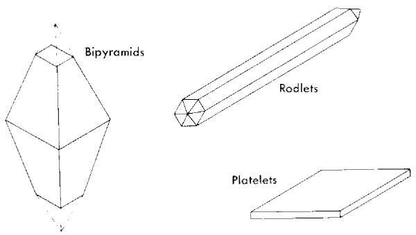  
FIG. 4-1. $\mathrm{UO_3 - H_2O}$ crystal habits.

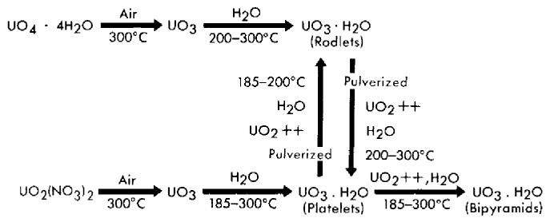  
FIG. 4-2. Preparation of $\mathrm{UO}_3\text{-H}_2\mathrm{O}$ .

is maintained. In the earlier work [Ref. 9, pp. 45-49, 127-131] the monohydrate was shown to be the stable form between 100 and $300^{\circ}\mathrm{C}$ . Four crystalline modifications of the monohydrate were described: the $\alpha$ form, "large six-sided orthorhombic tablets"; $\beta$ , "small six-sided orthorhombic tablets"; $\gamma$ , "rhombic(?) hexagonal rods"; and $\delta$ , "triclinic crystals with a very complicated x-ray pattern." The $\alpha$ and $\beta$ were stable in water below $185^{\circ}\mathrm{C}$ and the $\gamma$ and $\delta$ above $185^{\circ}\mathrm{C}$ .

ORNL studies on preparation of uranium oxide hydrates agreed in general with those reported in Ref. 9. The most important exception was the inability to prepare a triclinic crystal resembling the $\delta\text{-}\mathrm{UO}_3\cdot \mathrm{H}_2\mathrm{O}$ . Attempts to prepare this modification resulted in the formation of bipyramids or platelets, depending on the conditions. Three allomorphic modifications of the monohydrate were obtained, depending on the mode of preparation and treatment (Figs. 4-1 and 4-2). A rodlet form of $\mathrm{UO}_3\cdot \mathrm{H}_2\mathrm{O}$ was produced when the anhydrous trioxide, formed by heating uranium peroxide at $300^{\circ}\mathrm{C}$ , was heated in water at 185 to $300^{\circ}\mathrm{C}$ (Fig. 4-2). The rodlets were also prepared by autoclaving at $250^{\circ}\mathrm{C}$ for at least 16 hr a slurry of uranium peroxide containing less than 50 ppm uranyl nitrate as an impurity. A platelet form of $\mathrm{UO}_3\cdot \mathrm{H}_2\mathrm{O}$ appeared when the trioxide, made

# TABLE 4-3

OXIDATION OF $\mathrm{U}_{3}\mathrm{O}_{8}$ SLURRIES ON HEATING FOR 24 HOURS UNDER VARYING PARTIAL PRESSURES OF HYDROGEN AND OXYGEN  

<table><tr><td rowspan="2">Temp., °C</td><td colspan="2">Gas pressure</td><td rowspan="2">Uranium oxidized, %</td></tr><tr><td>H2, psi</td><td>O2, psi</td></tr><tr><td>150</td><td>51.8</td><td>25.9</td><td>63.2</td></tr><tr><td>170</td><td>59.5</td><td>29.8</td><td>71.7</td></tr><tr><td>200</td><td>63.5</td><td>31.8</td><td>90.1</td></tr><tr><td>225</td><td>67</td><td>33.5</td><td>92.6</td></tr><tr><td>250</td><td>—</td><td>35</td><td>88.0</td></tr><tr><td>250</td><td>175</td><td>35</td><td>85.1</td></tr><tr><td>250</td><td>70</td><td>17.5</td><td>75.2</td></tr><tr><td>250</td><td>70</td><td>175</td><td>96.8</td></tr></table>

by decomposition of uranyl nitrate at 300 to $400^{\circ}\mathrm{C}$ , was hydrated at 185 to $300^{\circ}\mathrm{C}$ . Pulverized uranium trioxide rodlets digested at 200 to $250^{\circ}\mathrm{C}$ converted to the platelet form, whereas pulverized uranium trioxide platelets digested at 150 to $200^{\circ}\mathrm{C}$ transformed into rodlets. Crystals which resemble truncated bipyramids were formed when either rodlets or platelets were heated with water containing several hundred parts per million of uranyl ions.

The rodlets were bright yellow in color, normally 1 to 5 microns in diameter and 10 to 30 microns long; the platelets were pale yellow in color, 6 to 50 microns on edge and about 1 micron thick; the bipyramids were also pale yellow in color and several hundred microns along each edge.

The rodlets appeared to be the same material as a $\gamma\text{-}\mathrm{UO}_3\cdot \mathrm{H}_2\mathrm{O}$ reported in Ref. 9 as having an orthorhombic structure. Unfortunately, cell dimensions were not given in this reference, and it was impossible to establish the identity without question. Zachariasen [14] reported the cell dimensions of two different $\mathrm{UO}_3\cdot \mathrm{H}_2\mathrm{O}$ crystals but gave no information concerning the chemical history of his samples. He indexed both of these structures as orthorhombic and called them $\alpha-$ and $\beta\text{-}\mathrm{UO}_3\cdot \mathrm{H}_2\mathrm{O}$ , independently of the nomenclature of Ref. 9. From the cell dimensions given by Zachariasen the positions of all possible lines in the x-ray diffraction patterns were calculated, thus permitting a comparison to be made with material prepared in the present studies. It was established from this that the rods gave the same x-ray diffraction pattern as Zachariasen's $\alpha\text{-}\mathrm{UO}_3\cdot \mathrm{H}_2\mathrm{O}$ and that the platelets had the structure of his $\beta\text{-}\mathrm{UO}_3\cdot \mathrm{H}_2\mathrm{O}$ .

4-2.4 $\mathbf{UO}_3\cdot \mathbf{H}_2\mathbf{O}$ slurry characteristics. Easily suspended slurries were prepared of both the rodlets and platelets. On the other hand, the bipyramids, because of their size, required violent agitation to keep them in suspension. With rodlets or platelets, slurries could be prepared which were dispersed and kept in suspension, by mild agitation, at both room temperature and at higher temperatures, even though settling occurred in stagnant water.

Slurries of the rodlets were pumped satisfactorily at temperatures below $200^{\circ}\mathrm{C}$ [15]. Slurries of the platelets, although easily pumped, had a tendency to form soft cakes on the pipe walls at temperatures above $200^{\circ}\mathrm{C}$ [16]. The influence of the trace quantities of nitrate impurities which remained in the "purified" oxides was not investigated, however.

The solubility of pure $\mathrm{UO}_3\cdot \mathrm{H}_2\mathrm{O}$ in pure water is less than $10~\mathrm{ppm}$ at room temperature and is also low at high temperatures. As a result, pure $\mathrm{UO}_3\cdot \mathrm{H}_2\mathrm{O}$ slurries were essentially neutral. The presence of soluble uranyl salts of strong acids lowered the $\mathsf{pH}$ of the slurry, however, and increased the solubility of the oxide. In the preparation of $\mathrm{UO}_3$ by the pyrolysis of $\mathrm{UO}_2(\mathrm{NO}_3)_2$ , for example, residual nitrate could not readily be removed by a simple washing step, and slurries of such oxides released nitrate when the crystals were broken down in a pumping system. Under extreme conditions the increased uranyl ion concentration in the supernate caused serious crystal growth and the formation of hard cakes in stagnant regions [17].

4-2.5 Zero-power reactor tests. The microscopic inhomogeneity of enriched rodlet slurry fuel was found to offer no serious difficulty in the operation of a zero-power homogeneous slurry reactor [9]. In this reactor, suspension was established by a propeller type of mixer located near the bottom of the vessel. The reactor was extremely stable at any given stirrer speed. Changing the stirrer speed produced a change in nuclear reactivity which was attributed to a redistribution of the oxide when the stirrer was moving slowly, and to a change in the shape of a vortex type of concavity in the slurry when the stirrer was moving rapidly.

# 4-3. PREPARATION AND CHARACTERIZATION OF THORIUM OXIDE AND ITS AQUEOUS SUSPENSIONS*

4-3.1 Selected properties of thorium oxide. Thorium oxide is a white, granular, slightly hygroscopic solid with a fluorite structure (lattice constant $-5.5859 \pm 0.0005$ ) [18] and an x-ray density of 10.06. The Chemical Rubber Handbook of Chemistry and Physics [19] gives 10.03 as the density of thoria. Foex [20] gives pycnometric densities for thorium

powders, prepared by firing the hydroxide, which increased with increasing firing temperature (8.6 at $450^{\circ}\mathrm{C}$ ; 9.4 at $725^{\circ}\mathrm{C}$ ; 9.7 at $910^{\circ}\mathrm{C}$ ), approaching the x-ray density asymptotically. Foex also noted that the density of a compacted bed of the thoria powder ( $3000\mathrm{kg/cm}^2$ pressures) increased with firing temperature but remained much lower than the actual powder densities, the ratio of pycnometric density to bed density changing from 1.46 to 1.40 over the firing-temperature range of 250 to $1000^{\circ}\mathrm{C}$ . Thoria powders obtained from oxalate thermal decomposition had pycnometric densities almost identical with those prepared from the hydroxide for the same firing temperature [21]. The melting point of thorium oxide has been reported [22] to be $3050 \pm 25^{\circ}\mathrm{C}$ , and the boiling point has been estimated [23] at $4400^{\circ}\mathrm{C}$ .

The bibliographies of reports available from the AEC on thorium oxide in the list appended to this chapter provide sources of more detailed information.

4-3.2 Preparation of thorium oxide. The principal method of preparing thorium oxide for use in aqueous slurries has been the thermal decomposition of the oxalate. Thorium oxalate, precipitated from thorium nitrate solution, is crystalline, easy to wash and filter, and the oxide product is readily dispersed as a slurry. In addition, the oxide particle resulting from oxalate thermal decomposition retains the relic structure of the oxalate, and hence the particulate properties are determined by the precipitation conditions. The mechanism by which the thermal decomposition takes place has been quite widely investigated [24-26]. The following is proposed by D'Eye and Sellman [26] for the thermal decomposition:

$$
\begin{array}{c} \mathrm {T h (C _ {2} O _ {4}) _ {2}} \xrightarrow [ > 3 0 0 ^ {\circ} \mathrm {C} ]{\triangle} \mathrm {T h O _ {2}} + 2 \mathrm {C O _ {2}} + 2 \mathrm {C O} \\ \mathrm {T h (C O _ {3}) _ {2}} + 2 \mathrm {C O} \\ \mathrm {T h O _ {2}} + 2 \mathrm {C O _ {2}} \end{array}
$$

Properties of thorium oxide prepared by the thermal decomposition of oxalate are discussed in detail in Articles 4-3.3 and 4-3.4.

A satisfactory oxide has also been prepared by the hydrothermal decomposition of thorium oxalate as an aqueous slurry in a closed autoclave at $300^{\circ}\mathrm{C}$ [27]: Unidentified organic

300°C[27]: Un an $\mathrm{Th(C_2O_4)_2 + excess H_2O\xrightarrow{>175°C} Th(OH)_4 + 2H_2C_2O_4}$ $\mathrm{ThO_2\cdot 2H_2O}$

Unidentified organic and inorganic gases

This preparation is characterized by a very small particle size, approximately 0.02 micron, and low bulk density, and very closely resembles the oxide from the thermal decomposition of oxalate after the latter has been pumped at elevated temperatures.

A third method for the preparation of slurry oxide is the thermal decomposition of thorium formate [28]. In this procedure, thorium nitrate in solution is decomposed on adding it to concentrated formic acid at $95^{\circ}\mathrm{C}$ [29,30]. The precipitated thorium formate is washed free of excess acid and decomposed by calcination at 500 to $800^{\circ}\mathrm{C}$ . The oxide from the formate procedure is similar in its slurry behavior to that produced by thorium oxalate thermal decomposition; however, less is known about its handling characteristics. Because of this, the oxalate preparation method is preferred at the present time.

Experience on the preparation of oxide by the direct calcination of $\mathrm{Th(NO_3)_4}$ is limited. The nitrate decomposes at about $250^{\circ}\mathrm{C}$ , but firing to $500^{\circ}\mathrm{C}$ is necessary to remove the last traces of nitrogen oxide decomposition products. The hydrated salt goes through a plastic stage during calcination, and the resulting oxide is sandlike and difficult to slurry. In the absence of a grinding and size-classification step, direct calcination of the nitrate in a batch process does not appear to be a promising preparation method for preparing oxide for slurry.

An interesting method for producing submicron-size thorium oxide directly from thorium nitrate is that developed by Hansen and Minturn [31]. Their method consisted of the combustion of an atomized solution of thorium nitrate in an ethanol-acetone mixture and collection of the resulting thorium oxide smoke.

Micron-size thorium oxide may also be prepared by the hydrothermal decomposition of a thorium nitrate solution at $300^{\circ}\mathrm{C}$ . The product from the preparation is a free-flowing powder [32]. At temperatures much below $300^{\circ}\mathrm{C}$ the rate of hydrolysis is quite slow.

Brief studies made with thorium hydroxide indicated [33] that it is probably not a good source material for the production of slurry oxide. As precipitated from nitrate solution, the hydroxide formed a bulky precipitate which was hard to filter and wash, was amorphous to x-rays, and contained considerable nitrate impurity. Drying at 300 to $500^{\circ}\mathrm{C}$ yielded a crystalline oxide product which was difficult to slurry. Autoclaving a slurry of the hydroxide (without previous drying) at $250^{\circ}\mathrm{C}$ gave a bulky slurry (settled volume 300 to $500\mathrm{g}$ Th/liter) exhibiting a characteristic $\mathrm{ThO_2}$ x-ray diffraction pattern.

4-3.3 Large-scale preparation of thorium oxide. In the present method (Fig. 4-3) [34] for making thorium oxide in a pilot plant operated by the Chemical Technology Division at Oak Ridge National Laboratory, $1M$

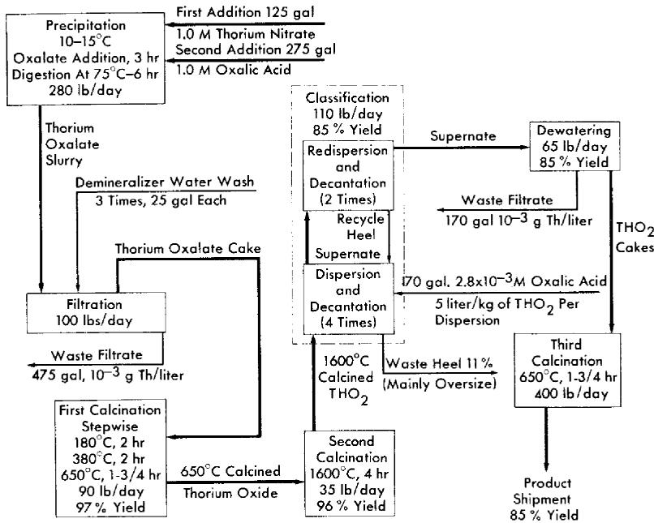  
FIG. 4-3. Thorium oxide pilot plant chemical flowsheet. Percent yields based on initial thorium input.

solutions of thorium nitrate and oxalic acid are mixed in an agitated tank with controlled temperature, addition rate, and order of addition. In the first step, all the thorium nitrate is added to the precipitator, after which the oxalic-acid solution is added over a period of 3 hr with the reagents held at $10^{\circ}\mathrm{C}$ by external cooling. The slurry of precipitated thorium oxalate is digested for 6 hr at $75^{\circ}\mathrm{C}$ and then pumped to a vacuum filter where the solid is separated from the mother liquor and washed three times with demineralized water. The oxalate cake on the filter is air-dried and is then loaded on trays for the first calcination.

In the first calcination the air-dried thorium oxalate is heated successively at $180^{\circ}\mathrm{C}$ for 2 hr, at $380^{\circ}\mathrm{C}$ for 2 hr, and at $650^{\circ}\mathrm{C}$ for 1.75 hr. The material is then packed on a tray for the second calcination, and heated at $1600^{\circ}\mathrm{C}$ for 4 hr.

The $1600^{\circ}\mathrm{C}$ -calcined thorium oxide normally contains about $10\%$ of particles larger than desired ( $>5$ microns). These oversize particles are removed by classification, i.e., by suspension of the thorium oxide in oxalic acid solution $(\mathrm{pH}2.6)$ to a $\mathrm{ThO}_2$ concentration of 100 to $200\mathrm{g / liter}$ . The suspension is stirred, and the mixture is then allowed to stand for $5\mathrm{min}$

before the supernate is decanted. Coarse material (5 to 7 microns) is separated by setting the supernate withdrawal rate at $0.5\mathrm{in. / min}$ liquid level drop. The withdrawn thorium oxide is dispersed and decanted again twice to ensure removal of oversized particles. The thorium oxide that settles to the bottom is also redispersed and decanted three more times to separate the considerable fraction of the fine particles that settle with the heel or are imperfectly dispersed. This procedure removes nearly all the thorium oxide smaller than 5 microns, and the final product contains only 1 or $2\%$ of particles greater than 5 microns. This material is then refired at $650^{\circ}\mathrm{C}$ to decompose the oxalic-acid dispersant before being used in engineering studies.

Oxide prepared in this way has an average particle size of 1 to 3 microns and has handled well in high-temperature engineering loop tests at slurry concentrations as high as $1500\mathrm{g}\mathrm{Th / kgH_2O}$ . Removal of the oversize particles has decreased the erosive attack on loop components to essentially what would be observed with water alone (see Section 6-7). At $1500\mathrm{g}\mathrm{Th / kgH_2O}$ , slurries of average particle sizes $\cong 1$ micron have moderately high yield stresses (0.5 to $1\mathrm{lb / ft^2}$ ). Lower-yield-stress slurries are obtained with the larger particles.

Previous engineering experience with slurries of oxide prepared similarly but with final firings at 650 and $800^{\circ}\mathrm{C}$ [35] showed them to possess an extremely high yield stress at concentrations greater than $750\mathrm{g}\mathrm{Th / kgH_2O}$ , and an occasionally bad caking characteristic [36]. Firing at $1600^{\circ}\mathrm{C}$ appears to have in large part removed or substantially diminished the caking tendency [37].

4-3.4 Characterization of thorium oxide products. Although thorium oxide is a very refractory substance, it is well known that such properties as its density, catalytic activity, and chemical inertness depend on the conditions of its formation. With particular references to preparation from the oxalate, the firing temperature has a marked effect on the ease of formation of colloids [38]. Beckett and Winfield [25] concluded from electron micrographs of oxide residues that the initial oxalate crystal imposes on the residual oxide a mosaic structure of thin, spongy, microcrystalline laminae all oriented in very nearly the same direction. Foex [20], investigating the rate of change in density as a function of the firing temperature for oxide prepared from the hydrous oxide, associated the density change with crystallite growth among closely joined crystallites and observed that no sintering of particles seemed to take place below $1000^{\circ}\mathrm{C}$ .

Oxide products from thorium oxalate decomposition are normally characterized by their behavior as slurries. In addition, they have been characterized by means of electron micrograph pictures, their nitrogen adsorption surface areas, particulate properties as measured by sedimenta

tion* [39], and average x-ray crystallite size by x-ray diffraction line broadening† [41].

Effect of preparation variables on the particulate properties of thorium oxide. The effects of thorium oxalate precipitation temperature, calcination temperature, and calcination time on oxide properties were initially investigated by Allred, Buxton, and McBride [42]. Oxalate was precipitated at 10, 40, 70, and $100^{\circ}\mathrm{C}$ from a $1M$ thorium-nitrate solution by dropwise addition of oxalic-acid solution and vigorous stirring. The precipitates were fired at $400^{\circ}\mathrm{C}$ for 16 hr and successively at 500, 650, 750, and $900^{\circ}\mathrm{C}$ for 24 hr. Electron micrographs of the oxide products showed particles of the approximate size and shape of the original oxalate particles from which they were formed. The particles of oxide prepared from $10^{\circ}\mathrm{C}$ -precipitated material were approximately 1 micron in size and appeared quite uniform; those from the $40^{\circ}\mathrm{C}$ material were 1 to 2 microns in size and less uniform. A marked increase in particle size was observed for the oxide particles prepared from the $70^{\circ}\mathrm{C}$ - and $100^{\circ}\mathrm{C}$ -precipitated materials, which were 4 to 7 microns in size. There was no change in particle shape or average particle size and no evidence of sintering as the firing temperature was increased from 400 to $900^{\circ}\mathrm{C}$ . Micrographs of shadow-cast oxides showed that the particles prepared from oxalate precipitated at $10^{\circ}\mathrm{C}$ were almost cubic in shape, with an edge-to-thickness ratio of about 3:2, and that those from the $100^{\circ}\mathrm{C}$ material were platelets with an edge-to-thickness ratio of 6:1 (Fig. 4-4). The mean particle sizes determined by sedimentation particle-size analyses were in good agreement with the data from the electron micrographs (Fig. 4-4).

Table 4-4 shows typical data obtained with the $10^{\circ}\mathrm{C}$ -precipitated material. Included in Table 4-4 are the results of additional firings up to $1600^{\circ}\mathrm{C}$ . No increase in average particle size was noted even up to $1600^{\circ}\mathrm{C}$ . However, in all oxide preparations, there was about 10 w/o above 5 microns in particle size.

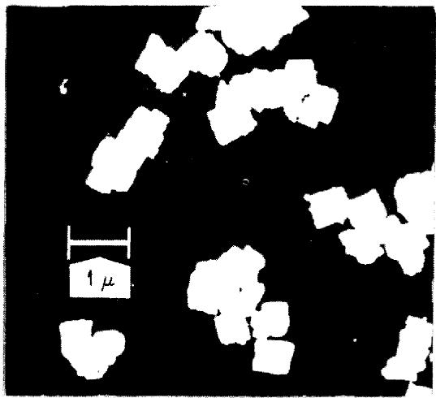

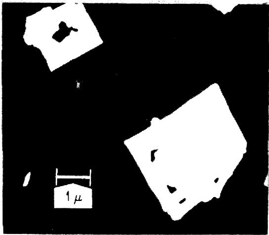  
(a) Cubic Shape From $10^{\circ}\mathrm{C}$ Precipitated Oxalate   
(b) Platelet Shape From $70^{\circ}\mathrm{C}$ Precipitated Oxalate   
FIG. 4-4. Particle shapes of thorium oxide prepared from oxalate thermal decomposition.

Additional studies on the effects of the chemical and physical variables of the batch oxalate precipitation step on the particulate properties of thorium oxide from oxalate thermal decomposition were carried out by Pearson, et al. [34,43]. In addition to precipitation temperature, the effect of reagent concentration, stirring rate, reagent addition rate, and digestion time were investigated. Most of the precipitations were made by adding oxalic-acid solution to the thorium nitrate solution, which appeared to give an oxide product of smaller average size and fewer oversize particles than the reverse. Rather than being added dropwise, the oxalic acid was

(Precipitation temperature $10^{\circ}\mathrm{C}$ . Average particle size for all firings was between 1.1 and 1.4 microns.)

TABLE 4-4 CHARACTERISTIC PROPERTIES OF THORIUM OXIDE FROM OXALATE THERMAL DECOMPOSITION  

<table><tr><td>Final firing temperature, °C</td><td>Firing time, hr</td><td>Average x-ray crystallite size, A</td><td>Specific surface area, m2/g</td></tr><tr><td>400</td><td>16</td><td>61</td><td>35.0</td></tr><tr><td>500</td><td>24</td><td>78</td><td>40.0</td></tr><tr><td>650</td><td>24</td><td>143</td><td>25.0</td></tr><tr><td>750</td><td>24</td><td>250</td><td>13.0</td></tr><tr><td>900</td><td>24</td><td>550</td><td>6.3</td></tr><tr><td>1000</td><td>12</td><td>803</td><td>4.3</td></tr><tr><td>1200</td><td>12</td><td>1100</td><td>3.0</td></tr><tr><td>1400</td><td>12</td><td>2000</td><td>2.4</td></tr><tr><td>1600</td><td>12</td><td>2000</td><td>1.0</td></tr></table>

introduced under pressure into the thorium nitrate solution through a capillary tube projecting beneath the surface of the nitrate solution, the tube exit being directly above the agitator blades.

In these experiments [34,43] it was found that the conditions for producing oxide with uniform* particles of 1 micron average size and a low percentage of particles greater than 5 microns were $1M\mathrm{Th}(\mathrm{NO}_3)_4$ and $\mathrm{H_2C_2O_4}$ concentrations, a $10^{\circ}\mathrm{C}$ precipitation temperature, a high rate of oxalic-acid addition, and vigorous stirring. A draft tube with a variable opening placed around the stirrer permitted a further control over the average particle size, larger particles (2 to 4 microns) being produced by increasing the rate of recirculation of the precipitating system through the

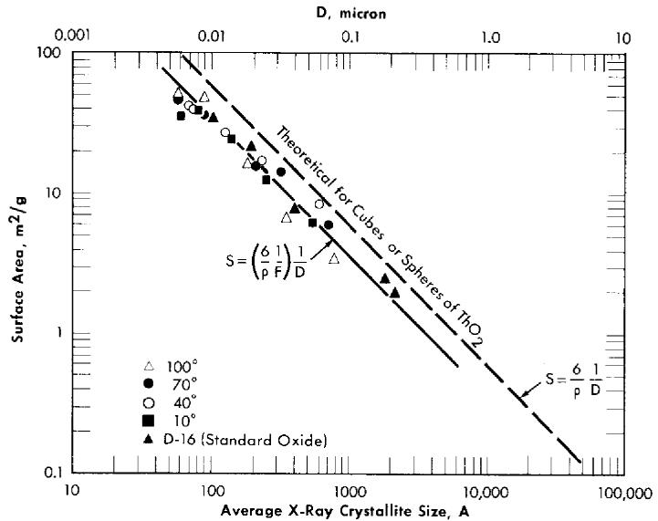  
FIG. 4-5. Relationship between average crystallite size and specific surface area for thorium oxide prepared by the thermal decomposition of thorium oxalate (400 to $900^{\circ}\mathrm{C}$ firings).

draft tube. Decreasing the concentration of the oxalic-acid solution increased the average particle size (0.7 to 0.8 micron at $1.5M$ and 2 to 3 microns at $0.5M$ ) but did not affect the size distribution, which appeared to be primarily temperature-dependent. The shape also changed, with decreasing reagent concentration, from a cube to a platelet. Only the particles about 1 micron in size were cubic in shape. Long digestion times seemed to reduce localized sintering effects in high-fired oxides (1400, $1600^{\circ}\mathrm{C}$ ) and hence lowered the fraction of oversize particles.

Effect of preparation variables on $x$ -ray crystallite size and specific surface areas of thorium oxide from oxalate thermal decomposition. Specific surface areas of oxide prepared from oxalate thermal decomposition were much larger than could be anticipated from the particle size, and decreased with increasing firing temperatures (Table 4-4). Crystallite sizes as measured by $x$ -ray diffraction line broadening increased with increasing firing temperature and corresponded very closely to the particle sizes estimated from the specific surface areas (Fig. 4-5) [42]. The product of the surface area in $\mathrm{m}^2/\mathrm{g}$ and the crystallite diameter in angstroms, at least for oxide fired at $\cong 900^\circ\mathrm{C}$ , was approximately constant and equal to $3.6 \times 10^3$ .

While the crystallite size was determined primarily by the firing temperature, a relationship between crystallite size and firing time was also

established [42]. Log-log plots of crystallite size versus firing time for oxides at various firing temperatures fit an equation of the form

$$
D = t ^ {\alpha_ {e} (A - B / T)},
$$

where $D$ is the crystallite diameter, $t$ the time, and $T$ the absolute temperature; $\alpha$ , $A$ , and $B$ are constants. The constant $\alpha$ appears to be characteristic of oxide prepared by the thermal decomposition of thorium oxalate. For $D$ in angstroms and $t$ in hours, the equation becomes

$$
D = t ^ {0. 1 4} e ^ {(1 0. 3 5 1 5 - 5 4 8 2 / T)}.
$$

The temperature-dependent function, $e^{(A - B / T)}$ , is typical for rate processes requiring an energy of activation, the constant $B$ being equal to $\Delta H / R$ where $\Delta H$ is the heat of activation. The heat of activation was determined to be 10.97 kcal/g-mole [42].

Oxides from the hydrothermal decomposition of thorium oxalate. Oxides prepared by the hydrothermal decomposition of the oxalate [27] at $300^{\circ}\mathrm{C}$ in a closed autoclave were found to be markedly different in their characteristic properties from the thermally prepared materials. The precipitation temperature of the oxalate had no effect on the final shape or size, and all evidence of the original oxalate structure had disappeared. Sedimentation particle-size analyses indicated particle sizes between 0.5 and 1 micron.

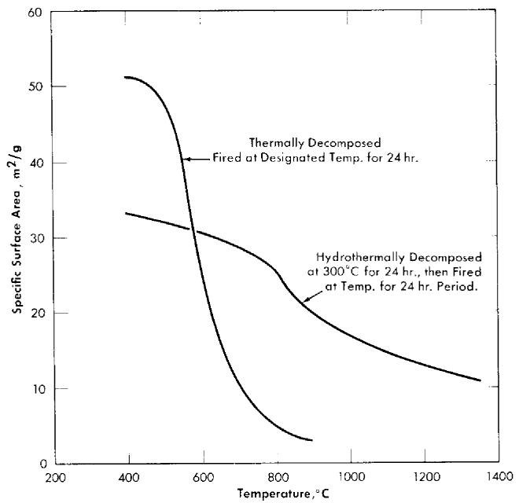  
FIG. 4-6. Effect of oxalate decomposition method on thorium oxide surface area. (Prepared from oxalate precipitated at $100^{\circ}\mathrm{C}$ .)

The hydrothermal oxides were composed of crystallites $200\mathrm{A}$ in size which did not grow on subsequent firing at temperatures up to $900^{\circ}\mathrm{C}$ . Furthermore, the specific surface area of the hydrothermally prepared oxide decreased less with increasing firing temperature than did the surface area of the oxide from oxalate thermal decomposition, and was much larger for the higher firing temperatures (Fig. 4-6).

Effect of high-temperature water on oxide properties. Experiments have been carried out [45-48] which show that treatment with high-temperature water has practically no effect on the characteristic properties of oxide itself. Prolonged heating in water at temperatures up to $300^{\circ}\mathrm{C}$ did not change the crystallite size, bulking properties, or abrasiveness of thorium hydroxide calcined at 500 and $650^{\circ}\mathrm{C}$ [45], and tests showed no evidence of hydrate formation [46,47]. Lack of crystallite growth probably indicates an extremely low solubility of thorium oxide in water at $300^{\circ}\mathrm{C}$ . When slurries of oxide calcined at 650, 750, 900, and $1000^{\circ}\mathrm{C}$ were heated overnight at $300^{\circ}\mathrm{C}$ in the presence and absence of as much as 10,000 ppm of $\mathrm{SO}_4$ (pH about 2), there was no increase in the average sedimentation particle size or x-ray crystallite size [49].

Effect of pumping on oxide properties. Oxides with particle size much greater than 1 micron are degraded to an average particle size much less than 1 micron on pumping at elevated temperatures,\* while oxides composed of cubic particles of about 1 micron show little change [50]. Surface area increases of from $16\mathrm{m}^2/\mathrm{g}$ to $30\mathrm{m}^2/\mathrm{g}$ have been noted for some pumped oxides, the latter figure being almost the theoretical maximum for the measured x-ray crystallite size [51].

Pumping does not affect the average x-ray crystallite size of slurry oxides [52]. Also, oxides which have been pumped as slurries, dried, and then calcined, show relatively little crystallite growth. From these considerations it would seem that the crystallite size as measured by x-ray diffraction line broadening represents the ultimate limit of the attrition process due to pumping.

# 4-3.5 Sedimentation characteristics of thorium oxide slurries. All thorium oxide-water slurries, except the very dilute suspensions, in the absence

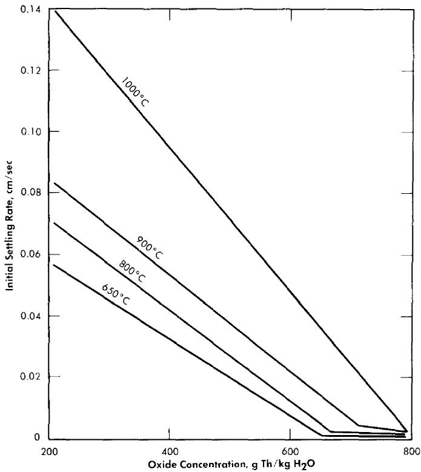  
FIG. 4-7. Effect of oxide calcination temperature and slurry concentration on the room temperature settling rates of aqueous thorium oxide slurries.

of a dispersing agent exhibit "hindered" settling. All particles settle at a constant rate, and there is a well-defined interface between the suspended particle and the supernatant. This form of settling is called "hindered" because there is mutual interference of the particles in their motion, and Stokes' law does not apply to the settling of each particle.

Usually three zones of settling are observed: the initial zone during which the motion of the interface from its initial level is uniform (hindered settling) and rapid; a compressive zone during which the motion of the interface is also uniform, but much slower; and a final stationary state. The first settling zone terminates when the interface reaches the settled mass of flocs. The slurry concentration (grams of thorium per liter) at the point of transition between the initial settling zone and the compressive zone is termed the critical density or the critical concentration. The slurry concentration in the final stationary state is called the settled concentration (sometimes the bulk density). The compressive zone is characteristic of a flocculated material and shows the rate of compaction of the settled bed

under the force of gravity. With discrete particles, or with $\mathrm{ThO_2}$ in the presence of a dispersing agent $(0.005M\mathrm{Na}_4\mathrm{P}_2\mathrm{O}_7)$ , the particles settle directly into a permanently settled bed, and there is no compressive zone.

Room-temperature sedimentation characteristics. The room-temperature hindered-settling rates (for a given slurry concentration), critical concentrations, and settled concentrations of thorium oxide slurries (unpumped) all increased with increasing firing temperature up to $1000^{\circ}\mathrm{C}$ of the oxide. In addition, the hindered-settling rates also increased with decreasing slurry concentration (see Fig. 4-7) [53]. It should be noted in Fig. 4-7 that all slurries are in compaction in the 500 to $800\mathrm{gTh / kgH_2O}$ concentration range.

Table 4-5 shows the combined effects of slurry temperature and oxide calcination temperature on the hindered-settling rate, $\mathrm{U_0[50]}$ . From theoretical considerations the product $\mathrm{U_0\mu}$ , where $\mu$ is the viscosity of water, should remain constant for an oxide over a series of settling temperatures, provided that no change has occurred in the particulate or dispersive characteristics of the oxide. $\mathrm{U_0\mu}$ does remain fairly constant over the temperature range 27 to $98^{\circ}\mathrm{C}$ . That changes do occur in oxide properties, however, with increasing calcination temperatures up to $1000^{\circ}\mathrm{C}$ is shown by the increase in the $\mathrm{U_0\mu}$ product with calcination temperature. The trend appears to reverse with the $1300^{\circ}\mathrm{C}$ -fired material, which also shows a larger change in the $\mathrm{U_0\mu}$ product with temperature than do the lower-fired materials.

High-temperature sedimentation characteristics. Slurry settling rates at temperatures in excess of $100^{\circ}\mathrm{C}$ have been obtained in quartz tube $8\mathrm{mm}$ in diameter [54]. These data, obtained with a slurry of thorium oxide prepared by a $650^{\circ}\mathrm{C}$ calcination of thorium formate [55], indicated that the slurry was already in the compaction zone of settling above $500\mathrm{gTh / kgH_2O}$ at 200 to $300^{\circ}\mathrm{C}$ . At a concentration of $1000\mathrm{gTh / kgH_2O}$ , no settling occurred at temperatures above $100^{\circ}\mathrm{C}$ . The small diameter of the tube probably affected the concentration at which the slurry went into compaction.

Data on the sedimentation characteristics of thorium oxide slurries at elevated temperatures in stainless-steel autoclaves, $\frac{3}{4}$ in. in inside diameter,\* have been obtained by an x-ray adsorption technique [56]. Standard x-ray film was transported at a controlled speed past a vertical slot in a lead shield behind which a bomb containing the settling slurry and an x-ray source were placed. A typical radiograph of a settling slurry at an initial concentration of $250\mathrm{gTh / kgH_2O}$ at $205^{\circ}\mathrm{C}$ is shown in Fig. 4-8.

# TABLE 4-5

# EFFECT OF SLURRY TEMPERATURE AND OXIDE CALCINATION

# TEMPERATURE ON SETTLING CHARACTERISTICS OF $\mathrm{THO_2}$ SLURRIES, $500\mathrm{g}$ Th/kg $\mathrm{H}_2\mathrm{O}$ ( $U_{0} =$ hindered settling rate, cm/sec)

<table><tr><td rowspan="3">Slurry temp., °C</td><td rowspan="3">Viscosity μ of H2O, centipoise</td><td colspan="10">Settling characteristics of oxides calcined at indicated temperature</td></tr><tr><td colspan="2">650°C</td><td colspan="2">800°C</td><td colspan="2">900°C</td><td colspan="2">1000°C</td><td colspan="2">1300°C</td></tr><tr><td>U0</td><td>U0μ</td><td>U0</td><td>U0μ</td><td>U0</td><td>U0μ</td><td>U0</td><td>U0μ</td><td>U0</td><td>U0μ</td></tr><tr><td>27</td><td>0.8545</td><td>0.031</td><td>0.029</td><td>0.038</td><td>0.032</td><td>0.06</td><td>0.05</td><td>0.10</td><td>0.08</td><td>0.03</td><td>0.03</td></tr><tr><td>50</td><td>0.5494</td><td>0.045</td><td>0.025</td><td>0.07</td><td>0.036</td><td>0.09</td><td>0.047</td><td>0.15</td><td>0.08</td><td>0.07</td><td>0.04</td></tr><tr><td>75</td><td>0.3799</td><td>0.07</td><td>0.027</td><td>0.12</td><td>0.044</td><td>0.12</td><td>0.044</td><td>0.27</td><td>0.10</td><td>0.16</td><td>0.06</td></tr><tr><td>98</td><td>0.2899</td><td>0.10</td><td>0.028</td><td>0.16</td><td>0.048</td><td>0.15</td><td>0.042</td><td>0.34</td><td>0.10</td><td>0.20</td><td>0.06</td></tr></table>

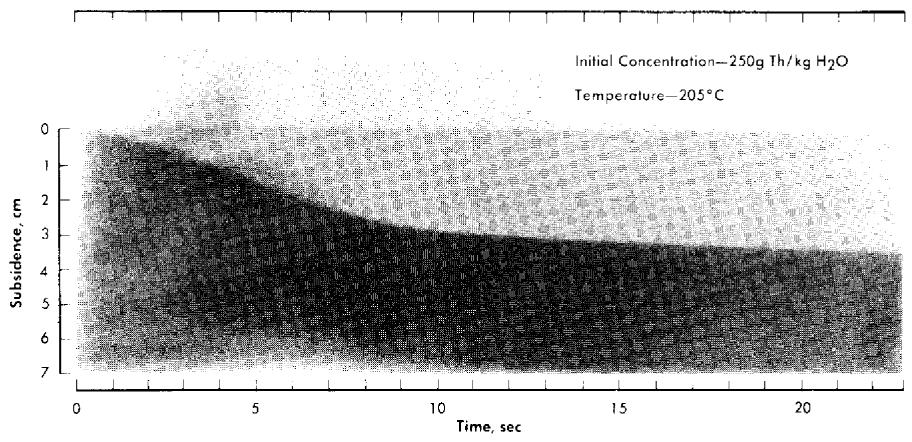  
FIG. 4-8. Typical high-temperature settling curve obtained with x-ray apparatus.

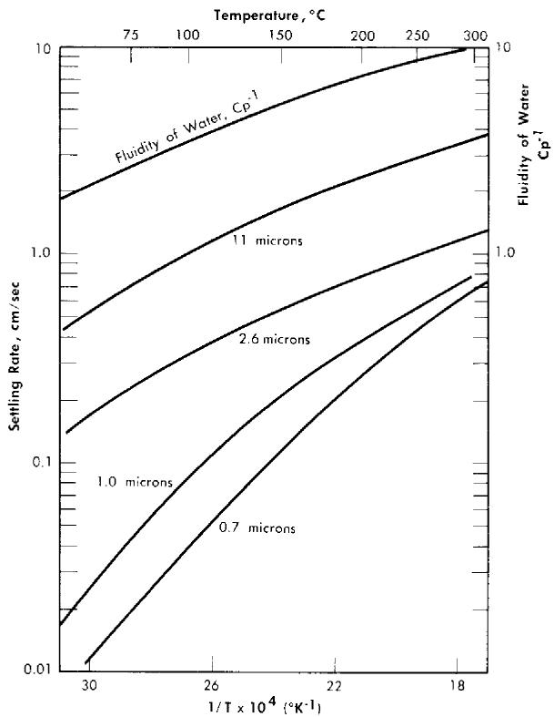  
FIG. 4-9. Temperature-particle size effects on the settling rate of thorium oxide slurries: $250\mathrm{g}$ Th/kg $\mathrm{H}_2\mathrm{O}$ .

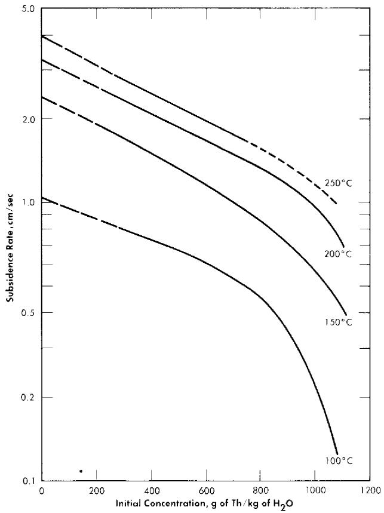  
FIG. 4-10. Effect of slurry concentration on settling rate.

The combined effects of temperature and particle size on slurry settling rates for $250\mathrm{g}$ $\mathrm{Th / kgH_2O}$ slurries of oxides fired at 800 to $900^{\circ}\mathrm{C}$ are shown in Fig. 4-9. Since the systems were flocculated, the hindered-settling rates are much greater than those predicted from the mean particle sizes by a simple application of Stokes' law. The settling rate-temperature dependence curve for the slurries containing the larger particles closely paralleled the curve for the fluidity of water. Hence it may be assumed that for these slurries little or no change occurred in the flocculating characteristics with increasing slurry temperature. For the slurries containing the smaller particles the curve is steeper, showing an apparent increase in agglomerate size or density with increasing temperature.

The effect of slurry concentration on the settling characteristics of a slurry at elevated temperatures is illustrated in Fig. 4-10. The bulk of this slurry $(>80\mathrm{w / o})$ was made up of spherical agglomerates 10 to 15 microns in size. The data indicate that the slurry settling rate is an exponential function of the concentration and has the form

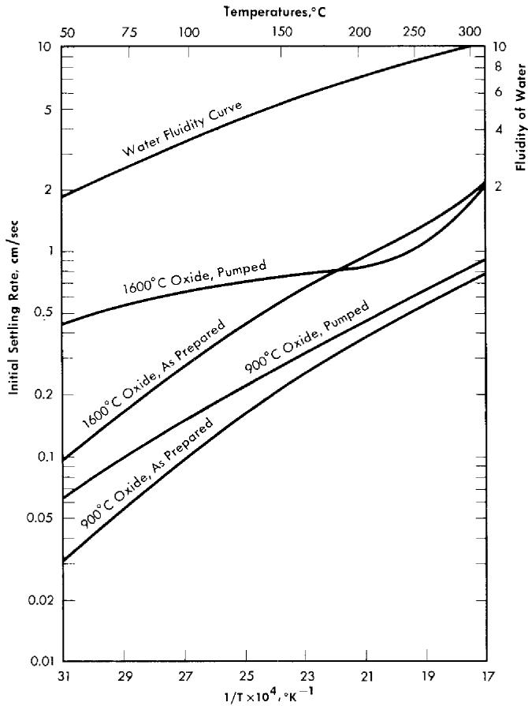  
FIG. 4-11. Effect of firing temperature on high-temperature settling rates. $250\mathrm{g}$ Th/kg $\mathrm{H}_2\mathrm{O}$ ; particle size 1 micron; prepared from $10^{\circ}\mathrm{C}$ precipitated oxalate.

$$
\ln \frac {U _ {0}}{U _ {s}} = a C,
$$

where $U_{0}$ is the measured sedimentation rate, $U_{s}$ is the settling rate at infinite dilution where Stokes' law should govern the particulate settling, $C$ is the slurry concentration, and $a$ is the slope of the logarithmic settling rate-slurry concentration curve. Extrapolating the straight-line portion of the curves to zero concentration and assuming an agglomerate density of $5.0\mathrm{g / cc}$ , Stokes' law particle diameters were calculated at the various temperatures and were found to be approximately the same, again illustrating a lack of change in slurry flocculation characteristics with increasing slurry temperature. The calculated particle diameters at 100, 150, 200, and $250^{\circ}\mathrm{C}$ were 40, 45, 45, and 44 microns, respectively, far greater than those obtained by sedimentation particle-size analysis in dilute suspension.

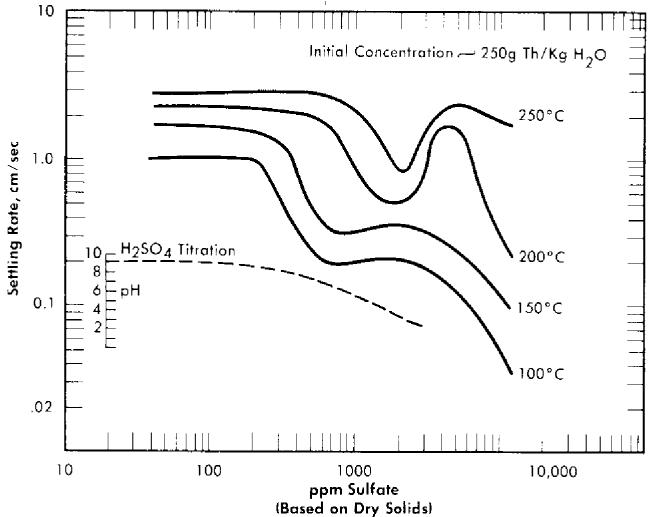  
FIG. 4-12. Effect of thorium sulfate on hindered settling rates of oxide slurries.

The effects of oxide firing temperatures of 900 and $1600^{\circ}\mathrm{C}$ on slurry settling rates at elevated temperatures are shown in Fig. 4-11. Slurry concentrations were $250\mathrm{g}\mathrm{Th} / \mathrm{kg}\mathrm{H}_2\mathrm{O}$ , and the oxide was prepared from the $10^{\circ}\mathrm{C}$ -precipitated oxalate (cubic particles, $\sim 1$ micron). Settling data obtained on the slurries after they had been pumped at elevated temperatures are also included. The slurry of higher-fired material shows much higher settling rates. Pumping does not greatly affect the settling rates of slurries of either oxide above $150^{\circ}\mathrm{C}$ . The temperature dependence of settling rates roughly follows the change in water fluidity, but the curve for the $1600^{\circ}\mathrm{C}$ -fired pumped material deviates considerably below $150^{\circ}\mathrm{C}$ and is much flatter.

Effect of additives on settling rates. The fluidity of concentrated non-Newtonian slurries can be increased by the use of additives. Of particular importance is a knowledge of the effect of temperature on the action of such additives. Both sulfate and sodium silicate additions, either as thorium sulfate or sulfuric acid, were investigated and found to change markedly the settling rates and handling characteristics [50] of thoria slurries, the relative effect of any additive concentration on a given slurry depending on the slurry temperature.

Sodium silicate is a well-known deagglomerator, as well as a wetting agent. Its addition to thick concentrated slurries at room temperature increases their fluidity to that approaching water. It also markedly improves their heat-transfer properties for certain flow conditions [58].

The effect of thorium sulfate additions on the high-temperature sedimentation properties of a thoria slurry (250 g Th/kg $\mathrm{H}_2\mathrm{O}$ ) composed of spherical agglomerates approximately 15 microns in average size is shown in

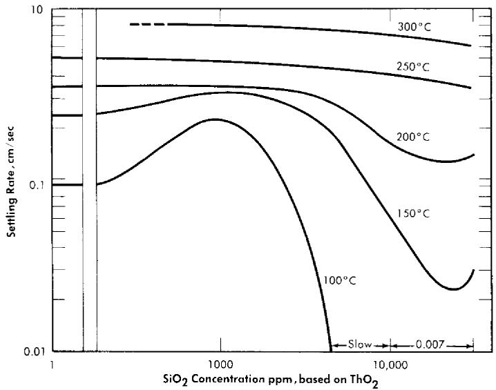  
FIG. 4-13. Effect of sodium silicate on the hindered settling rates of oxide slurries. $250\mathrm{g}$ Th/kg $\mathrm{H}_2\mathrm{O}$ , $d_{\varrho} = 1$ micron.

Fig. 4-12. An abnormal increase in the hindered-settling rate in the temperature region of 150 to $200^{\circ}\mathrm{C}$ was obtained upon the addition of between 500 and $1000\mathrm{ppm}$ of sulfate (based on $\mathrm{ThO_2}$ ) and again at about $5000\mathrm{ppm}$ of sulfate. The concentration region of 2000 to $3000\mathrm{ppm}$ of sulfate appears to be one of a relatively low settling rate and good temperature stability. It is of interest to note that in the operation of a high-temperature loop, abnormal pump power demands at $200^{\circ}\mathrm{C}$ were observed when pumping slurry containing $1000\mathrm{ppm}$ , and that increasing the sulfate concentration to between 2000 and $3000\mathrm{ppm}$ removed the difficulty and permitted operation at $300^{\circ}\mathrm{C}$ [54].

Also appearing in Fig. 4-12 is the sulfuric acid titration curve obtained with the standard slurry. It should be noted that the sulfate concentration regions of temperature instability bracket the break in the pH curve and the region of temperature stability occurs between pH 6 and 7.

Figure 4-13 shows the effect of sodium metasilicate additions on the settling rate at elevated temperatures of a $250\mathrm{g}$ $\mathrm{Th / kgH_2O}$ slurry of $800^{\circ}\mathrm{C}$ -fired oxide which had been micropulverized to an average particle size of 1 micron. At silica concentrations of 5000 to 30,000 parts $\mathrm{SiO_2}$ per million $\mathrm{ThO_2}$ , the settling rates are reduced (by comparison with the pure slurry) at all temperatures up to $250^{\circ}\mathrm{C}$ , but the effect is more pronounced at the lower temperatures.

It would appear from the studies carried out so far that the relative dispersion effect for any additive concentration depends markedly on the

slurry temperature. The more pronounced effects are observed at temperatures below $200^{\circ}\mathrm{C}$ . Above $250^{\circ}\mathrm{C}$ the effect of the additive becomes less pronounced and sometimes even negligible from the point of view of its effect on the settling rate. It may be, however, that at high temperatures the additive could change the viscous properties of the slurry in a dynamic system and not affect its settling rate in a quiescent state (essentially zero shear stress) at the same temperature.

4-3.6 Status of laboratory development of thorium oxide slurries. Thorium oxide prepared by the thermal decomposition of thorium oxalate appears suitable for a reactor slurry at concentrations up to $1500\mathrm{g}$ $\mathrm{Th / kgH_2O}$ . Study of the preparation variables has indicated that a considerable control can be exercised over the properties of the slurry oxide. Little is known as to what physical and chemical properties of thorium oxide are important in determining its handling characteristics in water at high temperatures, and studies are being made to determine these properties. Sulfate and silicate additives have been shown in settling studies to have a marked effect on the dispersion characteristics of slurries at temperatures below $200^{\circ}\mathrm{C}$ , but at reactor temperatures the effect of the additive on the settling rate diminishes and may be negligible. The effect of additives on the rheological properties of slurries at reactor temperatures has not yet been determined. Attempts are being made to obtain slurries of ideal rheological characteristics by the preparation of oxide of controlled particle size, shape, and surface activity.

# 4-4. ENGINEERING PROPERTIES*

4-4.1 Introduction. The major difference in descriptions of the engineering properties of aqueous suspensions (compared with aqueous solutions) arises from the fact that suspensions may exhibit either Newtonian or non-Newtonian laminar-flow characteristics. The consequences of the possibility of these two different types of behavior modify conventional heat transfer, fluid flow, and sedimentation correlations, and are important in the design of large systems for handling slurries.

The magnitude of the effects that can be observed with non-Newtonian slurries is illustrated in Fig. 4-14, where the critical velocity for the onset of turbulence is shown to be a strong function of the slurry yield stress and almost independent of coefficient of rigidity and pipe diameter [59]. The usefulness of laminar-flow measurements in characterizing different suspensions, as well as the application of these constants to a variety of correlations, will be given in the following sections.

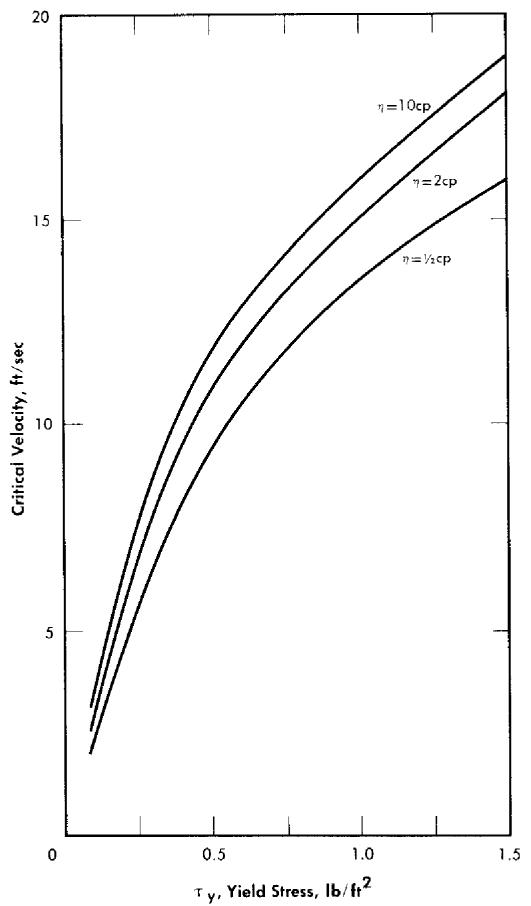  
FIG. 4-14. Effect of slurry physical properties on velocity for onset of turbulence $\rho = 100\mathrm{lb / ft^3}$ , $D = 1$ to 24 in.

$$
(C _ {p} = a + (b \times 1 0 ^ {- 3}) T + c \times 1 0 ^ {5} / T ^ {2})
$$

TABLE 4-6   
SPECIFIC-HEAT CONSTANTS FOR THE OXIDES OF URANIUM AND THORIUM [61]   

<table><tr><td>Material</td><td>a</td><td>b</td><td>c</td><td>Temp. range, °K</td></tr><tr><td>H2O</td><td>11.2</td><td>7.17</td><td>-</td><td>-</td></tr><tr><td>ThO2</td><td>16.45</td><td>2.346</td><td>-2.124</td><td>to 1970</td></tr><tr><td>UO2</td><td>19.20</td><td>1.62</td><td>-3.957</td><td>to 1500</td></tr><tr><td>U3O8</td><td>(65)</td><td>(7.5)</td><td>(-10.9)</td><td>-</td></tr><tr><td>UO3</td><td>22.09</td><td>2.54</td><td>-2.973</td><td>to 900</td></tr></table>

4-4.2 Physical properties. The heat capacity of suspensions of solids is commonly taken as the sum of the heat capacities on a weight basis of the liquid and the solid at the bulk mean suspension temperature, each multiplied by its respective weight fraction in the suspension [60]. Specific-heat values for pure thorium and uranium oxides are given in Table 4-6.

Thermal conductivity data for mixtures of solids have been correlated [62] using Maxwell's [63] equation:

$$
k _ {s} = k _ {0} \frac {2 k _ {0} + k _ {p} - 2 \phi \left(k _ {0} - k _ {p}\right)}{2 k _ {0} + k _ {p} + \phi \left(k _ {0} - k _ {p}\right)} \tag {4-1}
$$

for the electrical conductivity of a two-phase system. This equation was subsequently used to correlate conductivity data for suspensions of solids in a gel [64]. However, the thermal conductivity of suspensions has not been shown to be independent of the rate of shear [65]. The thermal conductivity of sintered thorium oxide having a bulk density of $8.16\mathrm{g / cc}$ was found to decrease from 6.0 to 2.5 Btu/(hr) (ft) $(^{\circ}\mathbf{F})$ as the temperature was increased from 140 to $500^{\circ}\mathrm{C}$ [66,67].

Suspensions of solids in liquids may be either Newtonian or non-Newtonian, depending primarily on particle size and electrolyte atmosphere around the particles [68]. Newtonian and non-Newtonian materials are classified and compared by means of shear diagrams in which the rate of shearing strain, $dv_{\tau} / dr$ , is plotted against the shear stress, $\tau$ . Newtonian fluids are characterized by a shear diagram in which the rate of shearing strain is directly proportional to the shear stress, as shown in Fig. 4-15, the viscosity being given by:

$$
\mu = - g _ {c} \tau / \left(d v _ {r} / d r\right), \tag {4-2}
$$

where the coefficient of viscosity, $\mu$ , is independent of the rate of shearing strain. On the other hand, non-Newtonian fluids have a variable viscosity that is a function of the rate of shear and in some cases of the duration of shear. Detailed discussions of non-Newtonian materials are available elsewhere [69-72].

Einstein [73] has shown that the viscosity of dilute suspensions of rigid spherical particles is a function of the volume fraction of solids in the suspension and is independent of particle size, as shown in Eq. (4-3):

$$
\mu_ {s} = \mu (1 + 2. 5 \phi), \tag {4-3}
$$

where $\phi$ is the volume fraction of solids in the suspension. It was assumed that the system was incompressible, that there was no slip between the particles and the liquid, no turbulence, and no inertia effects, and that the macroscopic hydrodynamic equations held in the immediate neighborhood

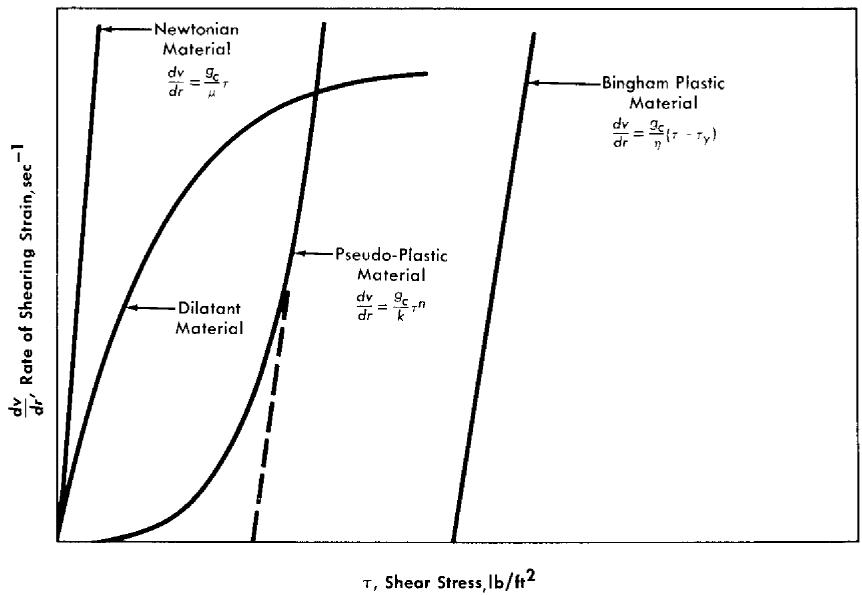  
FIG. 4-15. Classification of Newtonian and non-Newtonian materials by shear diagram.

of the particles. Einstein's treatment for dilute suspensions has been extended by Guth and Simha [74], Simha [75], de Bruyn [76], Saito [77], Vand [78], and Happel [79] to suspensions of higher concentrations. In all these treatments the hydrodynamic interaction between particles was considered, the extension usually taking the form of terms proportional to $\phi^2$ and $\phi^3$ , the terms to be added to the Einstein term $2.5\phi$ . These results are summarized in Table 4-7.

Theoretical treatments have also included such nonspherical particles as ellipsoids [85] and dumbbells [86] and an empirical relationship has been determined for rod-shaped particles [80]:

$$
\mu_ {s} = \mu (1 + 2. 5 F \phi + 8 F ^ {2} \phi^ {2} + 4 0 F ^ {3} \phi^ {3}), \tag {4-4}
$$

where $F$ is dependent upon the axial ratio, but not upon size or concentration of the rods. Values of $F$ , determined with a Couette viscosimeter, are given in Table 4-8.

The viscosities of suspensions of $\mathrm{UO}_3\cdot \mathrm{H}_2\mathrm{O}$ rods and platelets with uranium concentrations of up to $250~\mathrm{g / liter}$ were measured [87] with a modified Saybolt viscosimeter at temperatures from 30 to $75^{\circ}\mathrm{C}$ . There was no detectable difference in viscosity between the slurries of rods and those of platelets at these uranium concentrations. The viscosity values given in

TABLE 4-7   
COMPARISON OF THEORETICAL AND EMPIRICAL EXTENSION OF THE EINSTEIN RELATION TO HIGHER CONCENTRATIONS (All relations are of the form $\mu_{s} = \mu (1 + A_{1}\phi +A_{2}\phi^{2} + A_{3}\phi^{3})$   

<table><tr><td>Author</td><td>Refer-ence</td><td>A1</td><td>A2</td><td>A3</td><td>Comments</td></tr><tr><td>Vand</td><td>[78]</td><td>1.5</td><td>7.349</td><td>0</td><td>Considered mutual hydrodynamic interaction and collisions between particles and pairs of particles</td></tr><tr><td>Guth and Simha</td><td>[74]</td><td>2.5</td><td>14.1</td><td>0</td><td>Considered mutual hydrodynamic interaction; neglected formation of pairs</td></tr><tr><td>de Bruyn</td><td>[76]</td><td>2.5</td><td>2.5</td><td>2.5</td><td>Considered only mutual hydrodynamic interaction</td></tr><tr><td>Saito</td><td>[77]</td><td>2.5</td><td>2.5</td><td>2.5</td><td>Considered only mutual hydrodynamic interaction</td></tr><tr><td>Gosting and Morris</td><td>[84]</td><td>3.35</td><td>0</td><td>0</td><td>Very dilute</td></tr><tr><td>Oden</td><td>[83]</td><td>2.5</td><td>30 to 60</td><td>0</td><td>Sulfur sols</td></tr><tr><td>Boutaric and Vuillaume</td><td>[82]</td><td>2.5</td><td>75</td><td>0</td><td>As2S3sols</td></tr><tr><td>Eirich</td><td>[80]</td><td>2.5</td><td>9 to 13</td><td>0</td><td>Glass spheres in water</td></tr><tr><td>Vand</td><td>[81]</td><td>2.5</td><td>7.17</td><td>16.2</td><td>Glass spheres in ZnI2-water-glycerol solutions</td></tr><tr><td>Happel</td><td>[79]</td><td>5.5ψ*</td><td>—</td><td>—</td><td>Each particle confined to a cell of fluid bounded by frictionless envelope</td></tr></table>

$^{*}\psi =$ Interaction factor, 1.00 at $\phi = 0$ ; 4.071 at $\phi = 0.50$

TABLE 4-8   
VALUES OF CORRECTION FACTOR, $F$ , FOR EFFECT OF AXIAL RATIO OF RODS IN VISCOSITY OF SUSPENSIONS   

<table><tr><td>L/D</td><td>F</td></tr><tr><td>5</td><td>2.1</td></tr><tr><td>11</td><td>2.25</td></tr><tr><td>17</td><td>2.60</td></tr><tr><td>23</td><td>4.20</td></tr><tr><td>25</td><td>5.60</td></tr><tr><td>32</td><td>7.0</td></tr><tr><td>50</td><td>11.0</td></tr><tr><td>75</td><td>22</td></tr><tr><td>100</td><td>32</td></tr><tr><td>140</td><td>50</td></tr></table>

Ref. 87 were used to determine the value of the shape factor $F$ in Eq. (4-4), which was derived for rod-shaped particles. The value of $F$ for the $\mathrm{UO}_3 \cdot \mathrm{H}_2\mathrm{O}$ data is $2.4 \pm 0.7$ , corresponding to an $L / D$ of about 14 (from Table 4-8). This agrees very well with the dimensions reported for the rodlets of from 1 to 5 microns diameter and 10 to 30 microns long [87]. (The dimensions for platelets were 6 to 50 microns on edge and about 1 micron thick.)

Powell and Eyring [88] have applied the theory of absolute reaction rates to arrive at a suggested general relation between the shear stress and the shear rate for non-Newtonian fluids:

$$
\tau = \frac {1}{c} \frac {d v}{d r} + \frac {1}{b} \sinh^ {- 1} \left(\frac {1}{a} \frac {d v}{d r}\right). \tag {4-5}
$$

It is found that in the range of most common interest, $10^{3} < (dv / dr) < 10^{5}$ , $\sinh^{-1}[(1 / a)(dv / dr)] = 6.4 \pm 3.5$ for a variety of $\mathrm{ThO}_2$ slurries [89] and does not change rapidly with changes in $dv / dr$ . Thus $1 / b \sinh^{-1}[(1 / a)(dv / dr)]$ is in effect $\tau_y$ in the Bingham equation [90] for an idealized plastic:

$$
\frac {d v}{d r} = \frac {g _ {c}}{\eta} (\tau - \tau_ {y}). \tag {4-6}
$$

For convenience, the apparent yield stress, $\tau_{y}$ , and the coefficient of rigidity, $\eta$ , will be used to characterize different uranium and thorium oxide slurries [72].

If it is assumed that the particles in a flocculated non-Newtonian slurry stick together in the form of loose, irregular, three-dimensional clusters in which the original particles can still be recognized, and further that the yield stress is a manifestation of the breaking of these particle-particle bonds, then for constant isotropic bond strength the yield stress should be proportional to the cube of the volume fraction solids. Since the shear forces are exerted in a plane, the yield stress should also be proportional to the number of particles per unit area, and hence, for constant volume fraction solids, the yield stress should be proportional to the reciprocal of the square of the particle diameter.

Data on the yield stress and coefficient of rigidity as a function of concentration for three particular uranium oxide preparations [91] are summarized in Table 4-9. The yield stress-volume fraction solids data may be expressed by a relation of the form

$$
\tau_ {y} = k _ {1} \phi^ {4}. \tag {4-7}
$$

Values of $k_{1}$ for the three different oxides are shown in Table 4-9. The data for the coefficient of rigidity may be fitted by a relation of the form

$$
\eta = \mu \exp \left[ k _ {2} \phi \right], \tag {4-8}
$$

using values of $k_{2}$ given in Table 4-9.

TABLE 4-9 RHEOLOGIC PROPERTIES OF NON-NEWTONIAN URANIUM OXIDE SLURRIES  

<table><tr><td rowspan="2">Oxide</td><td colspan="2">Particle-size distribution</td><td rowspan="2">k2=ln(η/μ)/φ</td><td rowspan="2">k1=τy/φ4, lb/ft2</td></tr><tr><td>σ</td><td>Dp, microns</td></tr><tr><td>UO2</td><td>1.7</td><td>1.4</td><td>1.8</td><td>150</td></tr><tr><td>U3O8</td><td>2.0</td><td>1.3</td><td>2.2</td><td>230</td></tr><tr><td>UO3H2O</td><td>1.9</td><td>1.2</td><td>2.2</td><td>430</td></tr></table>

TABLE 4-10   
RHEOLOGIC PROPERTIES OF NON-NEWTONIAN THORIUM OXIDE SLURRIES  

<table><tr><td colspan="5">Oxide designation</td><td rowspan="2" colspan="2">Particle-size distribution</td><td rowspan="3">k4= ln(η/μ)/φ</td><td rowspan="3">k3= τy/φ3, 
lb/ft2</td></tr><tr><td></td><td rowspan="2">Calcination temperature, °C</td><td colspan="3">Agitation</td></tr><tr><td></td><td>Method</td><td>Duration, hr</td><td>Temp., °C</td><td>σ</td><td>Dp, microns</td></tr><tr><td>S-59</td><td>650</td><td>Pump</td><td>325</td><td>290</td><td>2.7</td><td>0.030</td><td>2.4</td><td>1100</td></tr><tr><td>200A-1</td><td>800</td><td>Pump</td><td>234</td><td>300</td><td>2.9</td><td>0.58</td><td>1.8</td><td>470</td></tr><tr><td>200A-11</td><td>800</td><td>Pump</td><td>900-1800</td><td>300</td><td>2.8</td><td>0.75</td><td>1.4</td><td>550</td></tr><tr><td>W-30</td><td>1600</td><td>Waring blender</td><td>0.5</td><td>50</td><td>1.9</td><td>1.0</td><td>1.5</td><td>145</td></tr><tr><td>LO-25-S</td><td>1600</td><td>None</td><td>—</td><td>—</td><td>1.5</td><td>1.6</td><td>1.2</td><td>100</td></tr><tr><td>200A-14</td><td>1600</td><td>Pump</td><td>3787</td><td>300</td><td>1.8</td><td>1.4</td><td>0.8</td><td>60</td></tr><tr><td>LO-25-1</td><td>1600</td><td>None</td><td>—</td><td>—</td><td>1.7</td><td>2.0</td><td>1.0</td><td>44</td></tr><tr><td>LO-22</td><td>1600</td><td>Mikro-pulverizer</td><td>4 passes</td><td>30</td><td>1.7</td><td>2.4</td><td>1.2</td><td>33</td></tr></table>

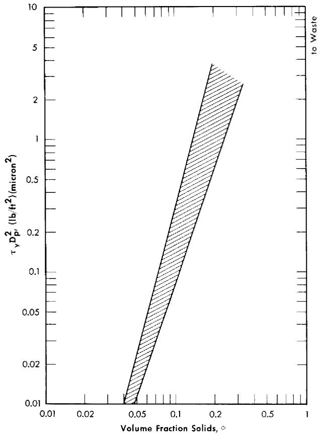  
FIG. 4-16. Effect of particle diameter and volume fraction solids on $\mathrm{ThO_2}$ slurry yield stress.

The yield stress and coefficient of rigidity as a function of volume fraction solids for a variety of different $\mathrm{ThO_2}$ slurries [89] are given in Table 4-10. The yield stress-volume fraction solids curves can be fitted by a relation of the form

$$
\tau_ {y} = k _ {3} \phi^ {3}. \tag {4-9}
$$

The coefficient of rigidity-volume fraction solids curves can be fitted by a relation of the form

$$
\eta = \mu \exp \left(k _ {4} \phi\right). \tag {4-10}
$$

The data given in Table 4-10 were obtained with $\mathrm{ThO_2}$ slurries having a pH less than 6 and whose rheological constants were relatively insensi

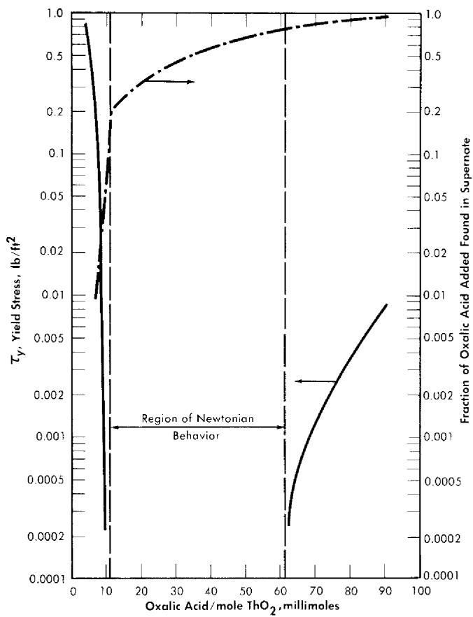  
FIG. 4-17. Effect of electrolyte on $\mathrm{ThO_2}$ slurry yield stress.

tive to dilution and reconcentration and therefore could be considered as having a similar and reproducible electrolyte atmosphere associated with the particles [89]. On the basis of the above considerations a plot of $k_{3}$ (Eq. 4-9) versus mean particle diameter was found to fall on a line of slope minus two on a log-log plot, as suggested by the plausibility arguments given above. Therefore the data of Table 4-10 were plotted as $\tau_{\nu}D_p^2$ versus volume fraction solids. All points fell within the two lines shown in Fig. 4-16. It is believed that the spread of data is largely due to effects of the electrolyte atmosphere [89], since the deviations from the mean particle size were similar. The influence of small quantities of electrolyte on the yield stress of a particular $\mathrm{ThO_2}$ slurry [92] is shown in Fig. 4-17. Similar behavior for particulate systems has been described elsewhere [68,93].

Preliminary measurements [94] of rheologic properties of $\mathrm{ThO_2}$ slurries at temperatures up to $290^{\circ}\mathrm{C}$ indicate that the yield stress is essentially independent of temperature $(\pm 30\%)$ , whereas the coefficient of rigidity decreases with temperature, although not to the same extent as water.

4-4.3 Fluid flow. The pressure drop due to friction for viscous flow of Newtonian fluids through pipes is given by the Poiseuille equation:

$$
\Delta p = 3 2 \mu L V / g _ {c} D ^ {2}. \tag {4-11}
$$

The same equation may be used for non-Newtonian suspensions, provided that the "apparent" viscosity, $\mu_{a}$ , is substituted for the viscosity.

Buckingham [95] has presented a mathematical relationship for the flow of Bingham plastics in circular pipe:

$$
8 V / g _ {c} D = (1 / \eta) \left(\tau_ {w} - (4 / 3) \tau_ {y} + (1 / 3) \tau_ {y} ^ {4} / \tau_ {w} ^ {3}\right). \tag {4-12}
$$

For large values of $\tau_w$ , the last term of Eq. (4-12) becomes small, and the resulting expression for the shear stress at the wall, $\tau_w$ , when combined with Eq. (4-13),

$$
\tau_ {w} = D \Delta p / 4 L, \tag {4-13}
$$

gives

$$
\Delta p = 3 2 \eta L V / g _ {c} D ^ {2} + (1 6 / 3) \tau_ {y} L / D \tag {4-14}
$$

for the pressure drop of a Bingham plastic in laminar flow.

Hedstrom [96] has proposed a simple criterion to distinguish between laminar and turbulent flow of Bingham plastic materials. The Reynolds number at which turbulence sets in is determined by the intersection of a parametric curve, defined by

$$
N _ {\mathrm {H e}} = g _ {c} \rho \tau_ {y} D ^ {2} / \eta^ {2}, \tag {4-15}
$$

$$
\frac {1}{N _ {\mathrm {R e}}} = \frac {f}{1 6} - \frac {1}{6} \frac {N _ {\mathrm {H e}}}{(N _ {\mathrm {R e}}) ^ {2}} + \frac {1}{3} \frac {N _ {\mathrm {H e}} ^ {4}}{f ^ {3} (N _ {\mathrm {R e}}) ^ {8}}, \tag {4-16}
$$

and the turbulent Newtonian friction curve on a Fanning friction factor-Reynolds number plot, provided that the Reynolds number is defined as $DV\rho /\eta$ . The usefulness of the Hedstrom concept has been demonstrated by several investigators [97,98]. Figure 4-18 is a plot of the solution of Eqs. (4-15) and (4-16) superimposed on a friction factor-Reynolds number diagram for Newtonian fluids flowing in smooth tubes.

In general, non-Newtonian fluids behave similarly to Newtonian fluids in the turbulent flow region in that they exhibit relatively constant ap

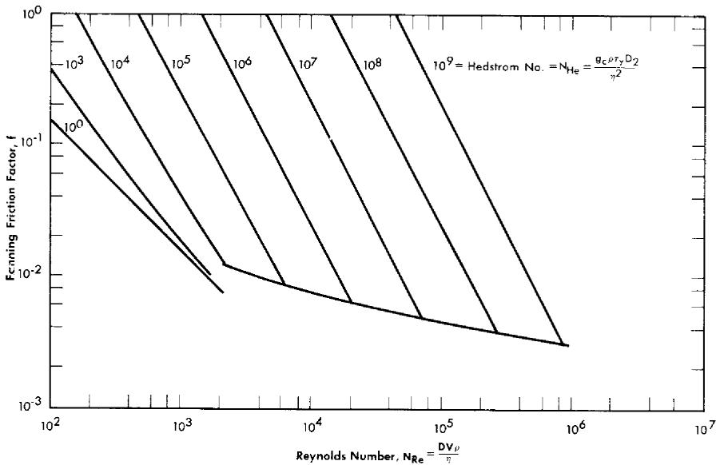  
FIG. 4-18. Friction factor-Reynolds number diagram for Bingham plastic slurries in smooth pipes.

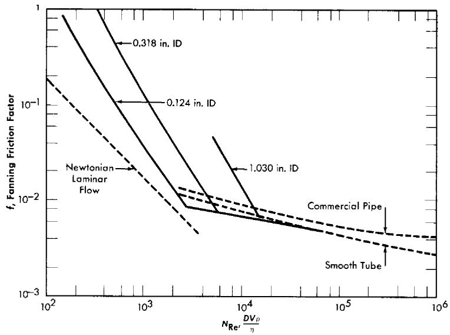  
FIG. 4-19. Friction factor-Reynolds number data for $\mathrm{ThO_2}$ slurries in turbulent flow. $\tau_{\nu} = 0.075\mathrm{lb / ft^2}$ , $\eta = 2.9$ cp.

parent viscosity. Alves, Boucher, and Pigford [69] indicate that, in the absence of data, the conventional friction-factor plot may be used to predict turbulent pressure drop to within $\pm 25\%$ , provided that the Reynolds number is evaluated by using the coefficient of rigidity or viscosity at infinite shear and that the density is taken as that of the slurry. However, it has been shown that a large amount of turbulent pressure-drop data taken with both Newtonian and non-Newtonian slurries can be correlated using the usual friction factor-Reynolds number plot provided the density is taken as that of the slurry and the viscosity as that of the suspending medium [99-105]. Data obtained [106] with two different $\mathrm{ThO_2}$ slurries using three different tubes are shown in Fig. 4-19. As can be seen, the turbulent friction-factor line is below the smooth-tube Newtonian line at low Reynolds numbers and approaches the smooth-tube line at high Reynolds numbers.

Vanoni [107], who reviewed the literature on sedimentation transportation mechanics through 1953, has pointed out that although a quantitative description of the phenomena was unavailable at that time, it was clear that sediment movement is intimately associated with turbulence. Subsequent work either has been largely of an empirical nature [108-110] or has unquestioningly accepted and used [111-113] generalized flow relations which have been developed for homogeneous Newtonian fluids [114]. Undoubtedly the presence of particulate matter in the flowing stream will exert a perturbing influence on the flow pattern at velocities near drop-out, and a quantitative solution to the problem must include at least an estimate of this effect [115].

It has been proposed [116] that the velocity below which particulate matter will be deposited on the bottom of horizontal pipes from a Bingham plastic suspension corresponds to the critical velocity for the onset of turbulence. This velocity may be calculated approximately by setting the modified Reynolds number (obtained by using the apparent viscosity $\mu_{a} = \eta (1 + g_{c}D\tau_{y} / 6\eta V)$ from Eq. 4-14 instead of viscosity as usually defined) equal to 2100 and solving for the velocity:

$$
V _ {c} = \frac {2 1 0 0 \eta}{2 D \rho} + \frac {1}{2} \sqrt {\left(\frac {2 1 0 0 \eta}{D \rho}\right) ^ {2} + \frac {(4) (2 1 0 0) g _ {c} \tau_ {y}}{6 \rho}} \tag {4-17}
$$

Resuspension velocities* for one particular slurry [117] in a $\frac{3}{4}$ -in. glass pipe are given in Table 4-11 together with the rheological properties [118] and the critical Reynolds number calculated with the resuspension velocity.

TABLE 4-11 RESUSPENSION VELOCITY FOR BINGHAM PLASTIC $\mathrm{THO_2}$ SLURRIES  

<table><tr><td>ρ, g/cc</td><td>Concentration, g Th /kg H2O</td><td>τy, lb/ft2</td><td>η, cp</td><td>Resuspension velocity, Vc, fps</td><td>Critical Reynolds number, D Vcp/η[1 + (gcD τy/6ηVc)]</td></tr><tr><td>2.44</td><td>1645</td><td>0.48</td><td>5.9</td><td>7.4</td><td>2220</td></tr><tr><td>2.29</td><td>1490</td><td>0.35</td><td>5.5</td><td>6.3</td><td>2040</td></tr><tr><td>2.17</td><td>1325</td><td>0.25</td><td>5.1</td><td>5.5</td><td>2050</td></tr><tr><td>2.05</td><td>1180</td><td>0.19</td><td>4.6</td><td>5.2</td><td>2240</td></tr><tr><td>1.94</td><td>1030</td><td>0.12</td><td>4.2</td><td>4.5</td><td>2380</td></tr><tr><td>1.84</td><td>910</td><td>0.098</td><td>3.9</td><td>3.7</td><td>1920</td></tr><tr><td>1.76</td><td>825</td><td>0.065</td><td>3.6</td><td>3.5</td><td>2350</td></tr><tr><td>1.65</td><td>690</td><td>0.040</td><td>3.1</td><td>3.7</td><td>3460</td></tr></table>

As can be seen, the critical Reynolds number is very close to the proposed value [116] of 2100. Additional data on a variety of slurries and different tube diameters are being obtained [119] to further substantiate Eq. (4-17).

4-4.4 Hindered-settling systematics. The hindered-settling velocity of slurries may be expressed as a coefficient times the Stokes' law settling rate. Table 4-12 summarizes [120] typical coefficients obtained in theoretical and empirical investigations. A plot of these coefficients versus porosity showed that they are substantially in agreement. Steinour [121] introduced the concept of immobilized water in his treatment of flocculated suspensions and showed that by defining

$$
\alpha = \frac {\text {i m m o b i l i z e d f l u i d v o l u m e}}{\text {s o l i d v o l u m e}} \tag {4-18}
$$

and making appropriate corrections to the volume fraction solids term in his empirical equations, a good correlation could be obtained for all materials that were studied. Typical values of $\alpha$ for flocculated [120,121] $\mathrm{ThO_2}$ slurries are $\alpha \sim 1$ to 25, which corresponds to floc densities of from 1.3 to $\sim 6g / cc$ .

Hindered-settling studies [120] with $\mathrm{ThO_2}$ slurries having yield-stress characterization constants, $k_{3}$ , from 50 to 500, in containers having diameters from 1.6 to $10.25\mathrm{cm}$ , showed that for containers having depth greater than six times the diameter, the onset of compaction was a function of the

# TABLE 4-12

# HINDERED SETTLING OF SUSPENSIONS

$$
U _ {0} = \frac {D _ {p} ^ {2} (\rho_ {p} - \rho) g _ {c}}{1 8 \mu}, \qquad U _ {s} = C U _ {0}
$$

<table><tr><td rowspan="2">C*</td><td rowspan="2">Porosity range</td><td rowspan="2">Origin of C</td><td colspan="2">Reference</td></tr><tr><td>Author</td><td>No.</td></tr><tr><td>ε4.65</td><td>0.33-1.0</td><td>(a)</td><td>Richardson, Zaki (1954)</td><td>[123]</td></tr><tr><td>ε2 10-1.82(d-ε)</td><td>0.65-1.0</td><td>(a)</td><td>Steinour (1944)</td><td>[122]</td></tr><tr><td>1/9 ∫01/(a/R)^2-(4/3)(a/R)^2-(3/4ln(R/a)b)</td><td>0.5-0.95</td><td>(b)</td><td>Richardson, Zaki (1954)</td><td>[124]</td></tr><tr><td>1/1+6.875(1-ε)</td><td>0.8-1.0</td><td>(c)</td><td>Burgers (1942)</td><td>[125]</td></tr><tr><td>ε2 exp [−2.5(1-ε)/1-3/64(1-ε)]</td><td>0.5-1.0</td><td>(c)</td><td>Hawksley (1950)</td><td>[126]</td></tr><tr><td>1+(3/4)(1-ε)[1-8/1-ε-3]</td><td>0.5-1.0</td><td>(b)</td><td>Brinkman (1947)</td><td>[127]</td></tr><tr><td>0.106 ε3/(1-ε)</td><td>0.5-0.8</td><td>(d)</td><td>DallaValle et al. (1957)</td><td>[128]</td></tr><tr><td>0.123 ε3/(1-ε)</td><td>0.5-0.785</td><td>(d)</td><td>Steinour (1944)</td><td>[122]</td></tr><tr><td>ε3(1-ε)[2k+ε2/1-ε]</td><td>0.5-1.0</td><td>(d)</td><td>Loeffler, Ruth (1953)</td><td>[129]</td></tr><tr><td>0.10 (ε-wi)3/1-ε</td><td></td><td>(e)</td><td>Powers (1939)</td><td>[130]</td></tr><tr><td>0.123(ε-wi)3/(1-wi)2(1-ε)</td><td>0.5-0.82w_i=0.27 to 0.35 for variability of emery powders</td><td>(e)</td><td>Steinour (1944)</td><td>[131]</td></tr></table>

\*The term $\pmb{\epsilon}$ refers to volume fraction liquid. (a) Experimental settling rate. (b) Drag theory. (c) Stokes' law using physical properties of suspension for $\pmb{\rho}$ and $\pmb{\mu}$ d) Empirical -- hydraulic radius. (e) Empirical -- hydraulic radius for flocculated systems.

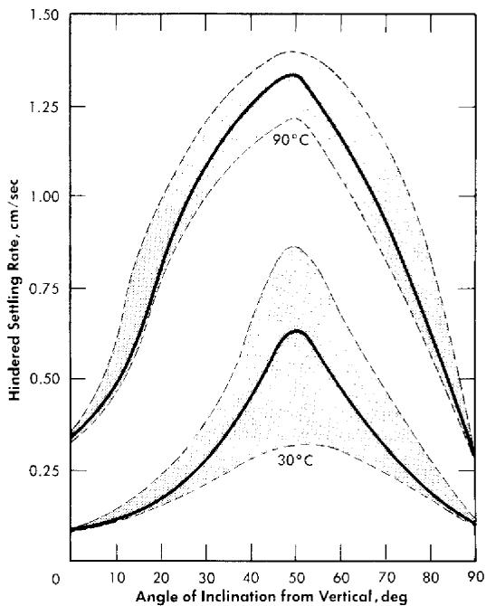  
FIG. 4-20. Effect of angle of container inclination on $\mathrm{ThO_2}$ slurry hindered settling rate. Slurry concentration $300\mathrm{g}$ Th/kg $\mathrm{H}_2\mathrm{O}$ , container diameter 1.63 in.

slurry yield stress, slurry concentration, and container diameter, the particular relation being

$$
D = (0. 0 7 \pm 0. 0 2) k _ {3} \frac {\phi_ {c} ^ {2}}{1 - (1 - \phi_ {c}) ^ {3 . 6 5}}, \tag {4-19}
$$

where the concentration term, $\phi_c$ , is the value for the onset of compaction.

Settling-rate data obtained [122] in inclined tubes showed a maximum at an angle of about $50^{\circ}$ from the vertical, with typical results being given in Fig. 4-20. The spread in the data is largely due to the difficulty in discerning an interface due to supernate rushing upward as the thoria settles out.

4-4.5 Heat transfer. Grigull [131] has presented a theoretical treatment of heat transfer to pseudoplastic and Bingham plastic non-Newtonian fluids for laminar flow through tubes. Theoretical treatments of laminar heat transfer to pseudoplastic materials have been given for a variety of boundary conditions [132-134]. Pigford [135] has shown that, for Bingham plastics, the laminar isothermal coefficient should increase less rapidly than the 1/3 power of the mass flow rate and the magnitude of these

coefficients should be increased by the factor $[1 + (1/9)(\tau_w / \tau_y)]$ , approximately. Bailey [136] substituted Eqs. (4-13) and (4-14) into Eq. (4-6) to obtain an approximate expression for the velocity gradient and then substituted that expression into Leveque's solution [137] for the case of constant wall temperature and uniform fluid temperature at the entrance to the tube, to obtain:

$$
\frac {h D}{k} = 1. 6 1 5 \Big (\frac {V \rho_ {c} D ^ {2}}{k L} \Big) ^ {1 / 3} \Big (1 + \frac {g \tau_ {y} D}{2 4 \eta V} \Big) ^ {1 / 3}. \tag {4-20}
$$

Experimental data [106] are in substantial agreement with Eq. (4-20).

The principal uncertainty in non-Newtonian heat transfer in the transition and turbulent region is the criterion for the onset of turbulence and range of the transition region. Data taken in fully developed turbulent flow with a variety of solid-liquid suspensions may be correlated satisfactorily with the Dittus-Boelter equation (or variations of it), with some uncertainty about the best viscosity to use in the correlation [138-142].

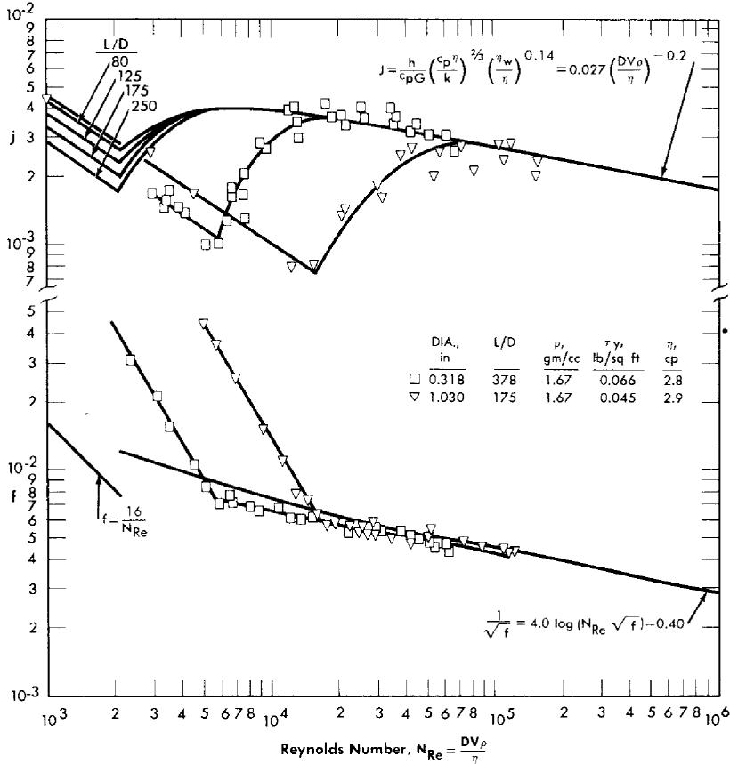  
FIG. 4-21. Heat-transfer and fluid flow characteristics of $\mathrm{ThO_2}$ slurries.

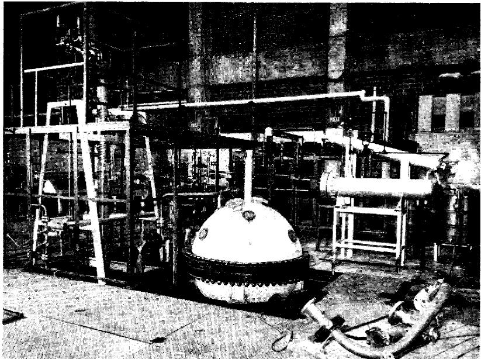  
FIG. 4-22. Slurry blanket mockup.

Figure 4-21 gives experimental data [106] for heat transfer to the $\mathrm{ThO_2}$ slurry with which the pressure-drop measurements of Fig. 4-19 were made. Comparison of the heat-transfer and pressure-drop data shows that although the onset of turbulence in heat transfer occurs at Reynolds numbers greater than the 2100 expected for Newtonian fluids, it corresponds exactly with the experimental critical Reynolds number for the onset of turbulence obtained from the pressure-drop measurement (which can be predicted approximately by the Hedstrom criterion). The transition region then extends to Reynolds numbers a factor of four or five greater than the critical, as is the case with Newtonian materials. Heat transfer to $\mathrm{ThO_2}$ slurries in fully developed turbulent flow is the same as that predicted by the usual Newtonian correlations [143] to within the precision of the experimental data. The very interesting question as to whether a suspension has more desirable heat-transfer characteristics than a pure liquid, as indicated by the results of Orr and DallaValle [139], or whether the yield stress of a Bingham plastic decreases the heat transfer coefficient, as suggested by Lawson [142], remains unanswered by these results [106] on $\mathrm{ThO_2}$ slurries.

# 4-5. OPERATING EXPERIENCE WITH THE HRE-2 SLURRY BLANKET TEST FACILITY*

4-5.1 Introduction. The purpose of constructing the HRE-2 slurry blanket test facility was to determine whether the blanket system installed in the HRE-2 for use with solutions could be used with slurry and, if so, what modifications would be required. The facility, often referred to as the blanket mockup, was a full-scale replica of the HRT blanket circulating system with respect to the reactor-vessel dimensions, piping size, circulating pump, and heat-exchanger tubing size. The pressurizer and piping configurations were not the same, and the high-pressure heat exchanger contained only one-fifth as many tubes as the HRE-2 heat exchanger. A general view during the last stages of constructions [144] is shown in Fig. 4-22.

The system was divided into a high-pressure and a low-pressure section, since the reactor vessel available was a steel prototype, good for only a few hundred psi, and could not be used during circulation and heat-transfer tests at high pressure. A schematic drawing [145] of the slurry blanket mockup system is given in Fig. 4-23. The slurry stream entered the 60-in.-diameter mockup pressure vessel (which contained a stainless steel replica of the HRE-2 core) through two inlet nozzles arranged to direct the flow in opposite directions on either side of the core inlet, with the expectation [146,147] that the flow pattern in the blanket would consist of two vortices which would rotate in opposite directions in parallel vertical planes, thus preventing deposition of sediment on the bottom of the pressure vessel. The slurry was removed at the top of the vessel by putting a shroud around the core outlet and removing the fluid through this shroud. It was also expected [146,147] that as the slurry moved across the top of the core vessel to the shrouded outlet, the rotating motion produced by the inlet nozzles would set up a free vortex in a horizontal plane, the accompanying increase in angular velocity of the fluid as it moved toward the axis tending to sweep the top of the core vessel free of solids. The design of the inlet and outlet nozzles was based on successful tests with an 18-in. model of the vessel [146]. Slurry leaving the pressure vessel flowed to the circulating pump, a Westinghouse type $230\mathrm{A}$ canned-motor pump having a design point of $230~\mathrm{gpm}$ at 50-ft head and a working pressure of 2000 psi which produced a pipeline velocity of 10 ft/sec at its nominal capacity. From the pump, the slurry stream entered the pressurizer, a 6-in. schedule-160 vertical pipe, with an over-all height of 14 ft 0 in. above the inlet. Entering flow was directed down and out of the pressurizer with a reducing tee, and

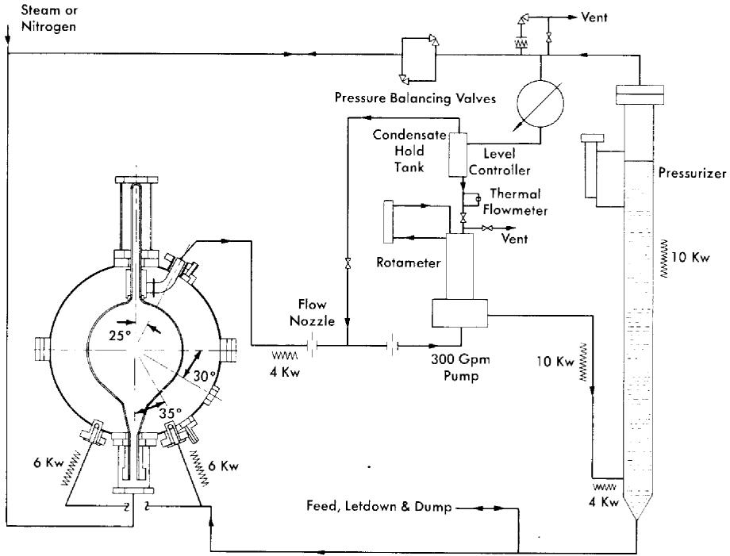  
FIG. 4-23. Slurry blanket test system.

baffles were installed above the inlet to damp out any vortices. System pressure was maintained by a 10-kw heater located just below the liquid line on the top of the pressurizer. Slurry flowed to the bottom of the mockup pressure vessel from the pressurizer. The main loop auxiliaries consisted of a slurry feed system and a letdown and dump system, which provided system versatility during startup and shutdown. A detailed description of the system is given in reference [145].

4-5.2 Operation of blanket pressure vessel mockup system. Initial experiments [145] in the 60-in.-diameter vessel (duplicating the HRE-2) at 170 and $200^{\circ}\mathrm{C}$ showed that a scale-up based on maintaining equal superficial vertical velocity at the equator and equal inlet nozzle velocities was inadequate to maintain a uniform suspension. At $170^{\circ}\mathrm{C}$ , a sharp concentration gradient was found, and above $180^{\circ}\mathrm{C}$ most of the slurry charge remained essentially stagnant in the blanket, with quite dilute slurry circulating through the piping loop. The increase in settling rate with temperature is believed to account for the effect of temperature on slurry distribution.

As a result of the initial tests the following changes were made in the mockup system [148,149]:

(1) The circulating pump was reassembled with a 300-gpm stainless-steel impeller.   
(2) The blanket inlet nozzles were redesigned, with the nozzle diameter being reduced from 2.16 in. to 1.50 in.   
(3) A steam sparging system was installed just above the inlet nozzles to aid in maintaining the slurry in suspension during a dump.

Although these changes are relatively minor in nature, they resulted in significant improvement in blanket operation [150]. Hydraulic measurements with water showed that the loop flow was increased from 230 to $350\mathrm{~gpm}$ , the head developed was increased from 50 to 56 ft of fluid, the pressure drop through the blanket went from 7.3 to 33 ft of fluid, and the loss across the blanket inlet nozzles went from 5.5 to 25 ft of fluid. During system operation at $200^{\circ}\mathrm{C}$ with a slurry made from $\mathrm{ThO_2}$ calcined at $800^{\circ}\mathrm{C}$ , samples were withdrawn from 36 different locations in the blanket vessel. The mean value of the concentration was $610\mathrm{~g~}\mathrm{Th / kg~H_2O}$ with a deviation at the $95\%$ level of $75\mathrm{~g~}\mathrm{Th / kg~H_2O}$ . The average concentration of the loop circulating stream was $647\mathrm{~g~}\mathrm{Th / kg~H_2O}$ , and an average blanket vessel concentration of $655\mathrm{~g~}\mathrm{Th / kg~H_2O}$ was obtained from a gamma-ray transmission scan of the vessel. Only about $40\mathrm{~kg}$ (out of a total charge of $1000\mathrm{~kg}$ ) was unaccounted for by inventory on the system at this time. This material appeared to be more or less stagnant in the blanket region on top of the core vessel and at the bottom of the pressure vessel. The evidence for this was as follows:

(1) The blanket samples indicated high-concentration regions on the top of the core vessel and on the bottom wall of the pressure vessel.   
(2) Gamma-ray transmission scans of the blanket vessel indicated the highest concentration at the top of the core vessel.   
(3) Addition of uranium tracer to the circulating stream indicated that 10 to $15\mathrm{kg}$ of $\mathrm{ThO_2}$ was immobilized in the blanket and was only slowly mixing with the circulating stream; this was supported by examination of the slurry remaining in the system at the conclusion of the test, when a pure white layer containing no uranium was found to be partially covered over with a yellow layer containing a substantial quantity of uranium, both layers being found on the top of the core vessel.

During this operation at a flow rate of $350\mathrm{gpm}$ the temperature of the system was raised and lowered at will between 150 and $200^{\circ}\mathrm{C}$ with no significant change in circulating concentration. That this marked improvement in operating characteristics over the initial tests was due to the small system changes and not due to a change in slurry properties was indicated by the results from operation with the electrical frequency of the pump motor reduced from the normal 60 cycles to a value giving pump flow

characteristics similar to those in the initial tests. Reduction of the frequency to 42 cycles with a blanket temperature of $190^{\circ}\mathrm{C}$ gave a circulating concentration of 265 versus $625\mathrm{gTh / kgH_2O}$ charged. The blanket samples averaged $495\mathrm{gTh / kgH_2O}$ . These results are quite similar to those observed in the initial tests.

Operation of the steam sparging system during the dumping operation at the end of the run allowed recovery of all but 50 liters of the slurry from the blanket (total blanket volume, 1600 liters), compared with about 200 liters remaining at the end of the dump after the initial tests.

During operation with redesigned inlet nozzles, a number of experiments were run in which the pump was shut down for periods up to $3\mathrm{hr}$ . In every case the slurry settled rapidly to a concentration of approximately $800\mathrm{g}$ Th/liter and then gradually compacted to a concentration of approximately $1500\mathrm{g}$ Th/liter. On restarting the pump, no difficulty was experienced in resuspending the slurry, and the original slurry distribution was re-established in approximately $2\mathrm{min}$ . This proved to be one advantage of operating with a highly flocculated $\mathrm{ThO}_2$ slurry compared with operation with a deflocculated slurry that would settle to much more dense beds that are correspondingly more difficult to resuspend.

Among the problems that have been more clearly defined as a result of the tests on the blanket mockup are:

(1) The necessity of establishing the effect of settling rate on the slurry distribution.   
(2) Determination of the scale-up laws for applying small- or intermediate-scale results to full-scale systems.   
(3) Evaluation of the danger of possible boiling at the core wall due to high heat flux and low fluid velocities.

# 4-6. RADIATION STABILITY OF THORIUM OXIDE SLURRIES*

4-6.1 Introduction. Experiments have been carried out at the Oak Ridge National Laboratory as part of a continuing program to determine the effect of radiation on the physical properties of aqueous suspensions of thorium oxide. Since changes in particle size, surface properties, and viscosity of the suspension might have a deleterious effect on the operability of a homogeneous-reactor slurry system, these properties were examined in detail.

Suspensions of thorium oxide and thorium oxide containing $0.5\mathrm{~mol}\%$ of either natural or highly enriched $\mathrm{UO}_3$ were irradiated in the Low Intensity Test Reactor (LITR) at a thermal-neutron flux of $2.7\times 10^{13}$ neutrons/ $(\mathrm{cm}^2)$ (sec). Although more than 40 irradiations were carried out, no significant changes in the properties studied were noted [151].

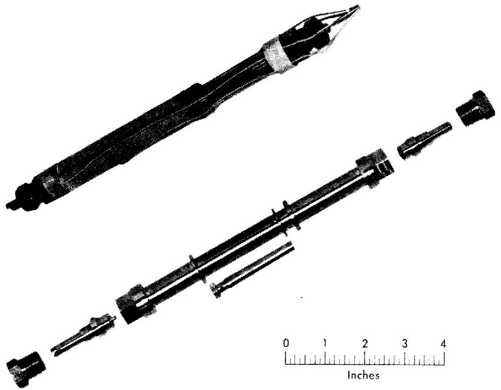  
FIG. 4-24. Parts and assembly of in-pile autoclave for slurry irradiations.

4-6.2 Experimental technique. The experiments were carried out in small, cylindrical, stainless steel autoclaves such as shown in Fig. 4-24. Thermocouples welded into the bottom closure and a 20-mil-ID steel capillary in the top permitted a continuous measurement of temperature and pressure. Continuous stirring was accomplished by means of a dashpot type stirrer of Armco iron clad with stainless steel, with a stainless steel stirring head. The capacity of the autoclave with stirrer was approximately $14\mathrm{ml}$ .

The stirrer was made to reciprocate at 3 to 4 cycles/see by alternately energizing two solenoid coils of double glass-insulated aluminum wire wrapped around the autoclave body. The timing unit consisted of a multivibrator circuit whose frequency of oscillation and cycle time division could be controlled by varying resistances in the circuit. The timer unit, in turn, controlled the grids of two pairs of thyatronns which furnished power to the solenoids. Stirrer operation was monitored by a tickler coil connected to an oscilloscope.

The radiation facility consisted of a double-walled aluminum tube $\sim 7/8$ in. in inside diameter which extended from the top of the LITR through approximately 20 ft of water into the reactor core. The autoclave was lowered into this tube on a bundle of wires containing the electrical leads,

thermocouples, and pressure capillary. During reactor shutdown the autoclaves were maintained at $300^{\circ}\mathrm{C}$ by the heat generated by the stirring coils. Heat was removed during reactor operation by air which flowed down the tube, over the autoclave, and back through the annulus provided by the double-walled tube.

The uranium-bearing oxides were prepared by wet-autoclaving mixtures of $\mathrm{ThO_2}$ and $\mathrm{UO_3}$ (about $90\%$ enriched uranium) at $300^{\circ}\mathrm{C}$ or by coprecipitating thorium and uranous oxalates and calcining to the oxide. The autoclaves were loaded with $5\mathrm{ml}$ of slurry at room temperature, which expanded to fill half of the autoclave at $300^{\circ}\mathrm{C}$ . When uranium-bearing slurries were irradiated, either palladium oxide or molybdenum oxide was added to catalyze the recombination of radiolytic hydrogen and oxygen (see Section 4-7). In some experiments an oxygen overpressure of 200 to 250 psi was added at room temperature.

Viscosity measurement. The versatility of the timing device described above made possible the measurement of relative slurry viscosity both in-pile and out-of-pile. It was found that the time it takes the stirrer to reach its maximum height for a fixed solenoid current is dependent on the viscosity of the autoclave contents. The "rise time" was determined by adjusting the frequency and load division so that the upper solenoid was de-energized the instant the oscilloscope indicated that the stirrer had reached the top of its travel. The rise time in seconds was then obtained by dividing the load division by the frequency.

Calibration curves of rise time versus viscosity were made using a silicone oil of known viscosity at various temperatures. Low viscosity points were obtained using water and air.

4-6.3 Irradiation results. Viscosities, x-ray crystallite sizes, particle size, and settled concentrations appeared unaffected by the irradiation, as indicated by the data shown in Table 4-13. Measurements made on irradiated and nonirradiated materials were the same within the limits of error. The mean particle sizes were in general not changed significantly; however, in two cases, involving samples cooled for 10 and 11 months, a large increase in mean particle size was observed. It is possible that the long cooling period allowed hard agglomerates to form which were not broken up by the brief shaking prior to opening of the autoclaves. One experiment cooled 12 months did not show an agglomeration effect. In general, the irradiated slurries poured readily from the autoclave, and no tendency toward caking was observed even on samples irradiated in settled condition for 10 days.

Chemical and radiochemical analyses of both phases of the irradiated slurries showed the bulk of the fission products, protactinium, and uranium to be associated with the solids. Only cesium appeared in the supernatant

# TABLE 4-13

# EFFECT OF RADIATION ON THE PROPERTIES OF THORIUM OXIDE SLURRIES

Conditions: $300^{\circ}\mathrm{C}$ , $2.7 \times 10^{13}$ neutrons/( $\mathrm{cm}^2$ ) (sec)

<table><tr><td>Property</td><td>ThO2</td><td>ThO2+0.5% nat. UO3(a)</td><td>ThO2+0.5% U235O3(b)</td></tr><tr><td>Precipitation temp., °C</td><td>40</td><td>40</td><td>10</td></tr><tr><td>Calcination temp., °C</td><td>900</td><td>900</td><td>900</td></tr><tr><td>Radiation time, hr.</td><td>175-300</td><td>151-172</td><td>168-314</td></tr><tr><td>Slurry concentration, g Th/kg H2O</td><td>750</td><td>750</td><td>750</td></tr><tr><td>Viscosity, centistokes</td><td></td><td></td><td></td></tr><tr><td>Control</td><td>16</td><td>—</td><td>4-7</td></tr><tr><td>During irradiation</td><td>16</td><td>—</td><td>5</td></tr><tr><td>X-ray crystallite size, A</td><td></td><td></td><td></td></tr><tr><td>Original</td><td>350-464</td><td>350</td><td>—</td></tr><tr><td>Irradiated</td><td>315-540</td><td>295-350</td><td>—</td></tr><tr><td>Settled conc., g Th/liter</td><td></td><td></td><td></td></tr><tr><td>Control</td><td>1100</td><td>1500</td><td>1400</td></tr><tr><td>Irradiated</td><td>1400</td><td>1600-1700</td><td>1400-1500</td></tr><tr><td>Mean particle size, microns(c)</td><td></td><td></td><td></td></tr><tr><td>Control</td><td>1-2</td><td>2.8</td><td>2.1-2.3</td></tr><tr><td>Irradiated and cooled up to 6 months</td><td>1-1.8</td><td>1.1-314</td><td>1.8</td></tr><tr><td>Irradiated and cooled 10-12 months</td><td>—</td><td>—</td><td>15(d)</td></tr></table>

(a) $650^{\circ}\mathrm{C}$ -fired $\mathrm{ThO_2}$ wet-autoclaved at $300^{\circ}\mathrm{C}$ with $\mathrm{UO_3\cdot H_2O}$ ; mixtures refired at $900^{\circ}\mathrm{C}$ .   
(b) Prepared as in (a) and also by thermal decomposition of the coprecipitated thorium-uranous oxalates.   
(c) Measured by sedimentation in dilute suspension dispersed with 0.005 M Na₄P₂O₇.   
(d) The result in two experiments; a third test showed no change in average particle size.

in significant amounts. Strontium appeared to absorb less on the higher-fired materials. The ruthenium analyses were inconsistent, the probable result of the perchloric acid dissolution treatment used.

Total corrosion-product pickup was similar to that obtained in out-of-pile experiments except with the slurries containing sulfate, which showed higher corrosion-product pickup under irradiation. All of the iron and most of the nickel and chromium were associated with the slurry solids. The greater part of the corrosion-product pickup resulted from abrasive attack by the slurry solids under the action of the stirrer.

# 4-7. CATALYTIC RECOMBINATION OF RADIOLYTIC GASES IN AQUEOUS THORIUM OXIDE SLURRIES*

4-7.1 Introduction. Radiolytic decomposition of the aqueous phase of a thorium oxide slurry blanket will produce a stoichiometric mixture of deuterium and oxygen which must be recombined. Total recombination may be accomplished external to the blanket system by suitable methods. It would be advantageous, however, to recombine the gases internally to minimize both reactor control problems accompanying bubble formation and engineering problems associated with external recombination. The magnitude of the internal-recombination reaction desired may be judged from the estimate that an aqueous thorium oxide-uranium slurry breeding blanket may produce from 2 to 3 moles of $\mathrm{H}_2$ and 1 to 1.5 moles of $\mathrm{O}_2$ per hour per liter of slurry by radiolytic decomposition, assuming a $G$ -value of $1\dagger$ and an average blanket flux of $6\times 10^{13}$ neutrons/( $\mathrm{cm}^2$ )( $\mathrm{sec}$ ). This is within a factor of 2 of the decomposition one would expect for a solution at the same power density.

Work on the development of a catalyst for use in thorium oxide slurries to recombine the radiolytic gases has been carried out as a part of the Homogeneous Reactor Project at the Oak Ridge National Laboratory [152]. More recently, Westinghouse (Pennsylvania Advanced Reactor Project) undertook similar studies. The experimental approach at both laboratories has been similar, and the results are in reasonable agreement. While sufficient data have been obtained to assure that a catalyst can be used in both thorium and thorium-uranium oxide slurries for complete internal radiolytic-gas recombination, specific conditions for the most efficient catalyst preparation and use have not as yet been established.

4-7.2 Experimental techniques and method of analysis. The out-of-pile tests were carried out in $\sim 15\mathrm{-ml}$ stainless-steel autoclaves provided with a thermocouple well and a capillary pressure connection through the top closure. The autoclaves were approximately half filled with the slurry containing an appropriate catalyst, closed, and charged with $550~\mathrm{psi}$ oxygen and then $900~\mathrm{psi}$ hydrogen from regular high-pressure cylinders. To minimize corrosive attack at temperature, the oxygen charged was in excess of the stoichiometric $1:2$ ratio to hydrogen. The autoclaves were raised to temperature in an appropriate furnace, mechanically agitated, and the decrease in pressure with time was followed continuously by appropriate instrumentation.

For a stoichiometric mixture of hydrogen and oxygen, the rate of pressure decrease was proportional to the total gas pressure in excess of a certain minimum pressure (i.e., steam and inert gases). A plot of pressure data in the differential form, $\Delta P / \Delta t$ versus $P$ , resulted in a straight line, the slope of which, $k_{x}$ , was a measure of the experimentally observed first-order reaction rate.

While the experimental data are insufficient to establish firmly that the reaction rate is first order, it is convenient to present the data in this form and assume a first-order dependence on hydrogen partial pressure:\*

$$
\frac {d P _ {\mathrm {H} _ {2}}}{d t} = k _ {\pi} P _ {\mathrm {H} _ {2}},
$$

where $P_{\mathrm{H_2}}$ is the hydrogen partial pressure, $t$ the time in hours, and $k_{\pi}$ the observed reaction rate constant $(\mathrm{hr}^{-1})$ . The moles of $\mathrm{H_2}$ reacted per hour per liter of slurry, $dn/dt$ , for any given hydrogen partial pressure may be calculated, assuming the ideal gas law, from

$$
\frac {d n}{d t} = \frac {k _ {\pi} P _ {\mathrm {H _ {2}}}}{R T} \frac {V _ {g}}{V _ {s}},
$$

where $V_{g}$ and $V_{s}$ are the gas and slurry volumes and $R$ and $T$ are the gas constant and absolute temperature. The recombination rates calculated in this way are conservative in that only the hydrogen removed from the gas phase is taken into account, and dissolved and adsorbed gases are ignored. The method of analysis is convenient, however, and permits the evaluation of the relative activity of the various slurry and catalyst systems.

The results of the out-of-pile tests were evaluated on the ability to attain a reaction rate equivalent to the consumption of 2 moles of $\mathrm{H}_{2}$ per hour per liter of slurry at $280^{\circ}\mathrm{C}$ and a hydrogen partial pressure of 100 psi.

4-7.3 Catalytic activity of thorium and thorium-uranium oxide slurries. Experiments with several different samples of $\mathrm{ThO_2}$ alone showed that none of the aqueous slurries prepared with the pure oxide possessed the desired degree of catalytic activity for the stoichiometric gas mixture. Reaction rates in the region of $300^{\circ}\mathrm{C}$ were equivalent to less than 0.1 mole of $\mathrm{H}_{2}$ consumed per hour per liter of slurry at a partial pressure of 100 psi $\mathrm{H}_{2}$ . The higher reaction rates appeared to be associated with the slurries prepared with oxides having higher surface areas.

A small catalytic effect for the stoichiometric gas reaction was obtained by incorporating uranium in the aqueous $\mathrm{ThO_2}$ slurries; however, the reaction rates remained much too slow to be useful. These tests were carried out with aqueous slurries of simple oxide mixtures, as well as with a mixed oxide prepared by calcining the coprecipitated thorium-uranous oxalates. Heating the slurry of the latter preparation under a small hydrogen partial pressure at $280^{\circ}\mathrm{C}$ produced a marked but temporary increase in catalytic activity which progressively diminished as further gas-recombination experiments were carried out at higher temperatures [that is, $dn/dt$ (at $P_{\mathrm{H_2}} = 100\mathrm{psi}) = 1.42$ at $137^{\circ}\mathrm{C}$ ; 0.65 at $154^{\circ}\mathrm{C}$ ; 0.08 at $282^{\circ}\mathrm{C}$ ].

4-7.4 Survey of possible catalysts. The primary criterion, other than a satisfactory catalytic activity, for a catalyst to be used in an aqueous thorium oxide slurry blanket is that it have a low thermal-neutron absorption cross section. A convenient estimate of the allowable concentration is provided by the rule that the total cross section of elements other than thorium which are in the blanket slurry should be less than $10\%$ of that of the thorium itself.

On this basis, scouting experiments were carried out with copper sulfate, copper chromite, copper oxide, copper and nickel powders, silver carbonate (reduces to metal at elevated temperature), vanadium oxide, ceric oxide, palladium oxide, and molybdenum oxide. Of these only the silver, vanadium, palladium, and molybdenum oxide showed sufficient activity at reasonable concentrations. Silver and vanadium were rejected because of their higher thermal-neutron cross section; palladium appeared susceptible to poisoning, particularly at lower temperatures, $< 120^{\circ}\mathrm{C}$ , and subsequent development effort was concentrated on molybdenum oxide.

The preliminary catalyst evaluation was carried out with slurries of thorium oxide fired at $900^{\circ}\mathrm{C}$ . Subsequent experience with molybdenum oxide has indicated that it is inactive with low-fired oxides, and its activity at least at low concentrations is decreased by the presence of uranium oxide (see the following discussion). Hence in slurry systems using low-fired thorium oxide or thorium-uranium oxides, silver, palladium, and platinum, which are active in these slurries, may prove to be useful [154].

4-7.5 Molybdenum oxide as a catalyst. The molybdenum oxide catalyst used in the initial scouting studies of its catalytic activity was prepared by calcining ammonium paramolybdate at $480^{\circ}\mathrm{C}$ for 16 hr. It was added to the slurry by dry-mixing $900^{\circ}\mathrm{C}$ -fired $\mathrm{ThO}_2$ , $\mathrm{UO}_3 \cdot \mathrm{H}_2\mathrm{O}$ , and the $\mathrm{MoO}_3$ and then slurrying the mixture in water. Prior to its use in recombination experiments, the slurry was heated under $\mathrm{O}_2$ at $280^{\circ}\mathrm{C}$ . Recombination data obtained with slurries prepared in this way indicated that reaction rates in the range of 1 to 6 moles of $\mathrm{H}_2$ per hour per liter were obtained in slurries which were heated for 1 hr at $280^{\circ}\mathrm{C}$ with hydrogen at as low a concentration as $0.025\,m\,\mathrm{MoO}_3$ . Lower reaction rates (0.03 to 1.8 moles of $\mathrm{H}_2$ per hour per liter) were measured for slurries not treated with $\mathrm{H}_2$ .

It was found that the catalytic activities of the activated slurries were independent of the method used to prepare $\mathrm{MoO_3}$ . Also, experiments with $\mathrm{MoO_2}$ indicated that it was not stable under the experimental conditions and that this form of the oxide is not the very active catalytic species produced when the slurries were heated with $\mathrm{H}_{2}$ .

The addition of sulfate up to $10,000\mathrm{ppmSO_4}^{\ominus}$ (based on thorium) did not appear to impair the catalytic activity of the above slurry containing $0.05m\mathrm{MoO}_3$ . Corrosion products resulting from the attack on the reaction vessel at the highest sulfate concentration greatly decreased the recombination rate. Similar slurries to which a ferric oxychloride sol (1500 to $1600~\mathrm{ppm}$ Fe/Th) was added showed decreased catalytic activities (approximately one-tenth the iron-free rate), but reducing the iron by treatment with hydrogen gave catalytic activities equal to or greater than those of the iron-free systems. The addition of $634~\mathrm{ppm}$ rare-earth oxides (based on Th)* had no effect on the catalytic activity.

Subsequent experiments indicated that in slurries of mixed thorium-uranium oxides, the order of addition of the slurry solids, the method of incorporating the uranium, and particularly the oxide firing temperature and time were important. It was necessary in some cases to fire mixed oxides containing 0.5 mole $\%$ uranium as high as $1000^{\circ}\mathrm{C}$ for as long as $16\mathrm{hr}$ to give an active slurry with the molybdenum oxide. Lower firing temperatures or a shorter firing time at $1000^{\circ}\mathrm{C}$ did not give an active slurry.

Oxides fired above $1000^{\circ}\mathrm{C}$ (4 hr at 1200 or $1600^{\circ}\mathrm{C}$ ) gave very active slurries. Table 4-14 gives the data obtained with slurries of simple mixtures of $1600^{\circ}\mathrm{C}$ -fired thorium oxide and $\mathrm{UO}_3\cdot \mathrm{H}_2\mathrm{O}$ and with a $1600^{\circ}\mathrm{C}$ -fired mixed oxide prepared from the coprecipitated oxalates. Both preparations gave excellent combination results at $0.05m\mathrm{MoO}_3$ both before and

TABLE 4-14 REACTION RATES OF STOICHOMETRIC $\mathrm{H}_2\mathrm{-O}_2$ MIXTURES IN THORIUM OXIDE-URANIUM OXIDE SLURRIES  

<table><tr><td rowspan="2">Oxide used for makeup of 500 g Th/kg H2O slurry</td><td colspan="2">Reaction rate, moles H2/hr (liter)*</td></tr><tr><td>Slurry as prepared</td><td>H2-activated slurry†</td></tr><tr><td colspan="3">Reaction temperature, 250°C</td></tr><tr><td>10°C coprecipitated oxalates (U/Th=0.005) calcined at 1600°C for 24 hr</td><td>0.2</td><td>0.2</td></tr><tr><td>MoO3 additions, m:</td><td></td><td></td></tr><tr><td>0.012</td><td>6.86</td><td>11.0</td></tr><tr><td>0.024</td><td>6.40</td><td>11.0</td></tr><tr><td>0.036</td><td>11.5</td><td>18.1</td></tr><tr><td>0.048</td><td>15.3</td><td>17.1</td></tr><tr><td>0.06</td><td>15.2</td><td>15.0</td></tr><tr><td colspan="3">Reaction temperature, 291°C</td></tr><tr><td>ThO2 calcined at 1600°C for 4 hr</td><td>0.02</td><td>0.02</td></tr><tr><td>0.5 mole % U added as UO3·H2O</td><td>0.02</td><td>0.40</td></tr><tr><td>MoO3 additions, m:</td><td></td><td></td></tr><tr><td>0.012</td><td>0.08</td><td>0.05</td></tr><tr><td>0.024</td><td>0.10</td><td>0.05</td></tr><tr><td>0.036</td><td>0.24</td><td>0.62</td></tr><tr><td>0.048</td><td>1.04</td><td>3.46</td></tr><tr><td>0.06</td><td>2.53</td><td>4.16</td></tr></table>

*At 100 psi partial pressure of hydrogen.   
†Slurry heated with hydrogen (250 psi at $25^{\circ}\mathrm{C}$ ) for 2 hr at $270^{\circ}\mathrm{C}$ .

after treatment with $\mathrm{H}_{2}$ , but at low molybdate concentrations the simple mixture showed lower activity. Apparent over-all activation energies of 13 to $16\mathrm{kcal / mole}$ were calculated for the hydrogen-treated slurries containing $0.05m\mathrm{MoO}_3$ from an Arrhenius plot of the observed reaction rate constants.

Investigations of $\mathrm{MoO_3}$ chemistry by the Houdry Process Corporation [156] (for the PAR Project) have shown that $\mathrm{MoO_3}$ reacts in high-temperature water with $650^{\circ}\mathrm{C}$ -fired thorium oxide and uranium oxide. The failure of some lower-fired material and thorium-uranium mixtures

to give active slurries may be the result of chemical reaction of the molybdenum oxide to form catalytically inactive species.

4-7.6 In-pile studies.* Radiolytic-gas production and recombination rates were determined in the ORNL Graphite Reactor using a slurry of $\mathrm{ThO_2}$ containing approximately $2.8\%$ uranium which was approximately $93\%$ enriched in $\mathbf{U}^{235}$ . The mixed oxide was prepared by coprecipitation of thorium and uranous oxalates at $10^{\circ}\mathrm{C}$ followed by calcination at $650^{\circ}\mathrm{C}$ .

Gas production rates were calculated from the initial pressure rise observed in the autoclave at low temperatures, where the reverse reaction rate could be neglected. The measured production rates were $1.6 \times 10^{-4}$ , $3.3 \times 10^{-4}$ , and $4.9 \times 10^{-4}$ moles of $\mathrm{H}_{2}$ per hour, respectively, for slurry concentrations of 250, 500, and $750\mathrm{g}$ $\mathrm{Th / kgH_2O}$ . The $G$ -value for water decomposition, assuming an average neutron flux of $4.2 \times 10^{11}$ neutrons/ $(\mathrm{cm}^2)$ (sec), an energy deposition in the slurry of $170\mathrm{MeV}$ /fission, and a fission cross section of 580 barns, was 0.8 molecule per 100 ev.

Gas recombination rates were measured by determining the equilibrium pressures in excess of steam for various temperatures (Fig. 4-25). Table 4-15 lists rate constants, $k_{\pi}$ ( $\mathrm{hr}^{-1}$ ), calculated from the equilibrium pressures and gas production rates, assuming first-order dependence, and making the necessary corrections for volume changes with temperature. From an Arrhenius plot an apparent activation energy of 16.2 kcal/mole was obtained. There is some evidence which indicates that the action of the stirrer increases the reaction rate either by forming catalytically active corrosion products or by providing reactive steel surfaces.

TABLE 4-15   
GAS RECOMBINATION RATE CONSTANTS FROM EQUILIBRIUM PRESSURES IN AN IRRADIATED THORIUM-URANIUM OXIDE SLURRY   

<table><tr><td>Temperature, °C</td><td>kπ, hr-1</td></tr><tr><td>282</td><td>0.45</td></tr><tr><td>275</td><td>0.26</td></tr><tr><td>250</td><td>0.15</td></tr><tr><td>235</td><td>0.10</td></tr><tr><td>200</td><td>0.03</td></tr></table>

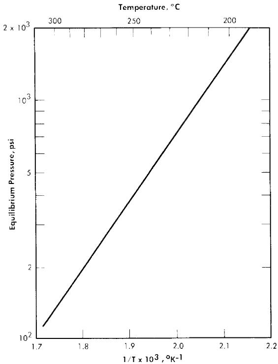  
FIG. 4-25. Equilibrium radiolytic gas pressure, excluding steam pressure, in irradiated thorium oxide slurries.

In all the slurry stability tests in the Low Intensity Test Reactor (see Section 4-6) where enriched uranium was present, sufficient catalyst was added to prevent any net radiolytic-gas production. Both $\mathrm{PdO}$ and $\mathrm{MoO_3}$ were used for this purpose. No radiolytic gas $(< 25$ psi) in excess of steam pressure was observed in these experiments. In the tests where only $\mathrm{ThO_2}$ was used, no catalyst was necessary.

In an LITR experiment [157] carried out with a $1000\mathrm{g}$ $\mathrm{Th / kgH_2O}$ slurry of $1300^{\circ}\mathrm{C}$ -fired thorium-uranium oxide $(\mathrm{U}^{235} / \mathrm{Th} = 0.005)$ , sufficient catalyst $(0.02m\mathrm{MoO}_3)$ was added to give a small partial pressure of radiolytic gas. A $G$ -value (calculated as above) for gas production of 0.6 molecule of $\mathrm{H}_{2}$ per $100\mathrm{ev}$ was obtained. From the equilibrium gas pressures at 250 and $280^{\circ}\mathrm{C}$ , first-order rate constants for gas recombination of 4.98 and $7.14\mathrm{hr}^{-1}$ were calculated. These values compare well with rate constants of 4.95 and $8.75\mathrm{hr}^{-1}$ obtained in out-of-pile gas-recombination experiments made with a similar slurry of the same oxide at the indicated temperatures.

# BIBLIOGRAPHY

# Thorium and Thorium Oxide

Thorium, A Bibliography of Unclassified Report Literature, USAEC Report TID-3309, Technical Information Service Extension, AEC, October 1956.   
DAVID, LORE S. (Comp.), Thorium, A Bibliography of Unclassified Literature, USAEC Report TID-3044, Technical Information Service Extension, AEC, November 1953.   
PRATER, W. D. et al. (Comps.), Thorium, A Bibliography of Published Literature, ed. by R. A. Allen, USAEC Report TID-3044 (Suppl. 1), Mound Laboratory, June 1955.   
SACHS, FRANCES (Comp.), Literature Search on Selected Properties of Thorium Oxide, USAEC Report AECD-3423, Union Carbide Nuclear Co., 1952.   
SWEETON, F. H. (Comp.), Thorium Oxide, Literature Survey of Preparation and Properties of, USAEC Report CF-55-8-11, Oak Ridge National Laboratory, 1955.

# Thorium and Thorium-Oxide Chemistry

RODDEN, C. J. and WARF, J. C., Thorium, in Analytical Chemistry of the Manhattan Project, ed. by C. J. Rodden, National Nuclear Energy Series, Division VIII, Volume 1. New York: McGraw-Hill Book Co., Inc., 1950. (Chap. 2, p. 160)

# REFERENCES

1. D. F. CRONIN and DIXON CALLIHAN, Critical Mass Studies. Part VII. Aqueous Uranium Slurries, USAEC Report ORNL-1726, Oak Ridge National Laboratory, 1954.   
2. R. N. Lyon, The Choice in Thorium Oxide Slurries for the Prevention of Caking in Circulating Systems, USAEC Report CF-57-4-77, Oak Ridge National Laboratory, 1957.   
3. D. G. THOMAS, paper presented at the 3rd Annual Meeting of the American Nuclear Society, Pittsburgh, Pa., June 1957. (Paper 14-3)   
4. JOHN P. McBride, personal communication, December 1957.   
5. A. S. KITZES et al., Uranium Slurry Loops, in *Homogeneous Reactor Project Quarterly Progress Report for the Period Ending Mar. 31, 1953*, USAEC Report ORNL-1554, Oak Ridge National Laboratory, 1953. (p. 123)   
6. R. K. Schofield and H. R. Samson, Flocculation of Kaolinite Due to the Attraction of Oppositely Charged Crystal Faces, *Discussions of Faraday Soc.* No. 18, 135-145 (1955).   
7. SHERMAN A. REED, Oak Ridge National Laboratory, personal communication, April 1958.   
8. J. HAPPEL and H. BRENNER, A.I.Ch.E. Journal 3, 506-513 (1957). H. E. WOLFE and G. MURPHY, Flow of an Aqueous Slurry through a Vertical Tube, USAEC Report ISC-874, Iowa State College, 1957.

9. I. KIRCHENBAUN et al. (Eds.), Utilization of Heavy Water, USAEC Report TID-5226, Columbia University, Substitute Alloy Materials Labs., 1951.   
10. J. O. BLOMEKE, *Aqueous Uranium Slurries*, USAEC Report ORNL-1904, Oak Ridge National Laboratory, 1955.   
11. A. S. KITZES and R. N. Lyon, Aqueous Uranium and Thorium Slurries, in Proceedings of the International Conference on the Peaceful Uses of Atomic Energy, Vol. 9. New York: United Nations, 1956. (P/811, p. 414) (cf. Progress in Nuclear Engineering. Series IV. Technology and Engineering. New York: McGraw-Hill Book Co., Inc., and Pergamon Press, 1956. (p. 317)   
12. R. B. BRIGGS, Aqueous Homogeneous Reactors for Producing Central-station Power, USAEC Report CF-55-11-35, Oak Ridge National Laboratory, 1955; (paper delivered at the annual meeting of American Society of Mechanical Engineers, November 1955).   
13. Pennsylvania Advanced Reactor (PAR) Project under joint contract between Westinghouse Electric Corporation and Pennsylvania Power and Light Co., Pittsburgh, Pennsylvania.   
14. W. H. ZACHARIASEN, The Crystal Structure of $\beta\text{-}\mathrm{UO}_3\cdot\mathrm{H}_2\mathrm{O}$ , in Report for July 1 to Dec. 31, 1946, of Mass Spectroscopy and Crystal Structure Division, USAEC Report CP-3774, Argonne National Laboratory, 1947. (p. 20)   
15. R. N. Lyon et al., in *Homogeneous Reactor Project Quarterly Progress Report for the Period Ending Mar. 15, 1952*, USAEC Report ORNL-1280, Oak Ridge National Laboratory, 1952. (p. 83)   
16. R. N. Lyon et al., in *Homogeneous Reactor Project Quarterly Progress Report for the Period Ending Mar. 31, 1953*, USAEC Report ORNL-1554, Oak Ridge National Laboratory, 1953. (p. 122)   
17. R. N. Lyon et al., in *Homogeneous Reactor Project Quarterly Progress Report for the Period Ending Oct. 1, 1952*, USAEC Report ORNL-1424, Oak Ridge National Laboratory, 1952. (p. 24)   
18. W. H. ZACHARIASEN, Phys. Rev. 73, 1104-1105 (1948).   
19. C. D. HODGMAN (Ed.), Handbook of Chemistry and Physics, 36th ed. Cleveland, Ohio: Chemical Rubber Publishing Co., 1954.   
20. M. Fox, Soc. Chim. (France) 55(16), 231-237 (1949).   
21. D. E. FERGUSON et al., in Homogeneous Reactor Project Quarterly Progress Report for the Period Ending Oct. 31, 1953, USAEC Report ORNL-1658, Oak Ridge National Laboratory, 1954. (p. 116)   
22. O. RUFF et al., Z. anorg. u. allgem. Chem. 180, 252-256 (1929).   
23. W. R. Mott, Trans. Am. Electrochem. Soc. 50, 165-175 (1926).   
24. C. L. DuVAL, Inorganic Thermogravimetric Analysis. New York: Elsevier Publishing Co., Inc., 1953. (p. 546)   
25. R. BECKETT and M. E. WINFIELD, Australian J. Sci. Research Ser. (A) 4, 644-650 (1951).   
26. R. W. M. D'Eye and P. G. Sellman, J. Inorg. & Nuclear Chem. 1, 143-148 (1955).   
27. V. D. ALLRED and J. P. McBRIDE, in Homogeneous Reactor Project Quarterly Progress Report for the Period Ending Oct. 31, 1955, USAEC Report ORNL-2004(Del.), Oak Ridge National Laboratory, 1956. (p. 172) (cf. paper delivered at the 2nd Annual Meeting of the American Nuclear Society, Chicago, Ill., June 1956.)

28. R. N. Lyon et al., in *Homogeneous Reactor Project Quarterly Progress Report for the Period Ending Apr. 30, 1954*, USAEC Report ORNI-1753(Del.), Oak Ridge National Laboratory, 1954. (pp. 169-170)   
29. J. E. SAVOLAINEN, Oak Ridge National Laboratory, private communication.   
30. D. E. Ferguson et al., in *Homogeneous Reactor Project Quarterly Progress Report for the Period Ending Jan. 31, 1954*, USAEC Report ORNL-1678, Oak Ridge National Laboratory, 1954. (pp. 88-89)   
31. R.S. HANSEN and R.E. MINTURN, Iowa State College, 1951. Unpublished.   
32. J. P. McBride et al., Preparation and Properties of Aqueous Thorium-Uranium Oxide Slurries, paper presented at the 2nd Nuclear Engineering and Science Conference, Philadelphia, Pa., March 1957. (Paper 57)   
33. F. R. Bruce et al., in Homogeneous Reactor Project Quarterly Progress Report for the Period Ending July 31, 1953, USAEC Report ORNL-1605, Oak Ridge National Laboratory, 1953. (p. 138)   
34. R. L. PeARson et al., Preparation of Thorium Oxide for Homogeneous Reactor Blanket Use, USAEC Report ORNL-2509, Oak Ridge National Laboratory, 1958.   
35. W. H. CARR, Pilot Plant Preparation of Thorium Oxide, USAEC Report CF-56-1-50, 1956; see also in Homogeneous Reactor Project Quarterly Progress Report for the Period Ending July 31, 1955, USAEC Report ORNL-1943, Oak Ridge National Laboratory, 1955. (p. 198)   
36. D. G. THOMAS, Engineering Properties of Slurries, in HRP Civilian Power Reactor Conference Held at Oak Ridge National Laboratory May 1-2, 1957, USAEC Report TID-7540. Oak Ridge National Laboratory, 1957.   
37. E. L. COMPERE and S. A. REED, in Homogeneous Reactor Project Quarterly Progress Report for the Period Ending Jan. 31, 1958, USAEC Report ORNL-2493, Oak Ridge National Laboratory, 1958.   
38. V. KoHLsCHUTTER and A. FREY, Z. Elektrochem. 22, 145-161 (1916); J. Soc. Chem. Ind. (London) 35, 668 (1916).   
39. G. W. LEDDICOTTE et al., Oak Ridge National Laboratory, to be issued (cf. Analytical Chemistry Semiannual Progress Report for Oct. 20, 1954, USAEC Report ORNL-1788, Oak Ridge National Laboratory, 1954). (p. 21)   
40. B. M. ABRAHAM et al., Particle Size Determination by Radioactivation, Anal. Chem. 7, 1058 (1957).   
41. H. P. KLUG and L. E. ALEXANDER, X-Ray Diffraction Procedures for Polycrystalline and Amorphous Materials, New York: John Wiley & Son, Inc., 1954. (Chap. IX, p. 491)   
42. V. D. ALLRED et al., J. Phys. Chem. 61, 117 (1957).   
43. J. P. McBride et al., in *Homogeneous Reactor Project Quarterly Progress Report for the Period Ending Jan. 31, 1958*, USAEC Report ORNL-2493, Oak Ridge National Laboratory, 1958.   
44. J. M. DALLAVALLE, Micromeritics, 2nd ed. New York: Pitman Publishing Co., 1948.   
45. D. E. FERGUSON. Oak Ridge National Laboratory, 1954. Unpublished.   
46. D. E. FERGUSON et al., in Homogeneous Reactor Project Quarterly Progress Report for the Period Ending Oct. 31, 1953, USAEC Report ORNL-1658, Oak Ridge National Laboratory, 1954. (p. 114)

47. D. M. RICHARDSON, Adsorption of $\mathrm{H}_2\mathrm{O}$ by $\mathrm{ThO}_2$ at High Temperatures, USAEC Report CF-56-1-109, Oak Ridge National Laboratory, 1956.   
48. V. D. ALLRED et al., in *Homogeneous Reactor Project Quarterly Progress Report for the Period Ending July 31, 1956*, USAEC Report ORNL-2148, Oak Ridge National Laboratory, 1956. (p. 126)   
49. E. V. JONES, in Homogeneous Reactor Project Quarterly Progress Report for the Period Ending July 31, 1955, USAEC Report ORNL-1943, Oak Ridge National Laboratory, 1955. (p. 192)   
50. V. D. ALLRED et al., in Homogeneous Reactor Project Quarterly Progress Report for the Period Ending Jan. 31, 1956, USAEC Report ORNL-2057(Del.), Oak Ridge National Laboratory, 1956. (pp. 115-120)   
51. D. E. Ferguson et al., in *Homogeneous Reactor Project Quarterly Progress Report for the Period Ending Oct. 31, 1956*, USAEC Report ORNL-2222, Oak Ridge National Laboratory, 1957. (p. 151)   
52. C. E. SCHILLING, in *Homogeneous Reactor Project Quarterly Progress Report for the Period Ending Oct. 31, 1955*, USAEC Report ORNL-2004(Del.), Oak Ridge National Laboratory, 1956. (p. 179)   
53. E. V. JONES, in *Homogeneous Reactor Project Quarterly Progress Report for the Period Ending Oct. 31*, 1955, USAEC Report ORNL-2004(Del.), Oak Ridge National Laboratory, 1956. (p. 176)   
54. S. A. REED and P. R. CROWLEY, *Nuclear Sci. and Eng.* 1, 511-521 (1956).   
55. S. A. REED, in Homogeneous Reactor Project Quarterly Progress Report for the Period Ending Apr. 30, 1955, USAEC Report ORNL-1895, Oak Ridge National Laboratory, 1955. (p. 93)   
56. V. D. ALLRED et al., in *Homogeneous Reactor Project Quarterly Progress Report for the Period Ending Apr. 30, 1956*, USAEC Report ORNL-2096, Oak Ridge National Laboratory, 1956. (p. 112)   
57. R. B. Korsmeyer et al., in *Homogeneous Reactor Project Quarterly Progress Report for the Period Ending July 31, 1956*, USAEC Report ORNL-2148(Del.), Oak Ridge National Laboratory, 1956. (p. 58)   
58. C. G. LAWSON, Heat Transfer to Bingham Plastics, $\mathrm{ThO_2}$ Slurries Flowing Turbulently in Tubes: An Exploratory Study, USAEC Report CF-56-9-132, Oak Ridge National Laboratory, 1956.   
59. D. G. Thomas, paper presented at 3rd Annual Meeting of the American Nuclear Society Held in Pittsburgh, Pennsylvania, June 1957. (Paper 14-3)   
60. CLYDE ORR, Jr., and J. M. DALLAVALLE, Heat Transfer Properties of Liquid-Solid Suspensions, in Chemical Engineering Progress Symposium Series, Vol. 50, No. 9, 29-45 (1954).   
61. ALVIN GLASSNER, The Thermochemical Properties of the Oxides, Fluorides, and Chlorides to $2500^{\circ} \mathrm{K}$ , USAEC Report ANL-5750, Argonne National Laboratory, 1957.   
62. B. M. TAREEF, Colloid J. (USSR) 6, 545 (1940).   
63. J. C. MAXWELL, Scientific Papers, ed. by W. D. Niven. New York: Dover Publications, 1952.   
64. CLYE ORR, Jr., and J. M. DALLAVALLE, Heat Transfer Properties of Liquid-Solid Suspensions, in Chemical Engineering Progress Symposium Series, Vol. 50, No. 9, 29-45 (1954).

65. S. E. CRAIG, JR., Fellowship Progress Report, National Science Foundation Grant: G1616, July 23, 1957.   
66. F. H. NORTON and W. D. KINGERLY, The Measurement of Thermal Conductivity of Refractory Materials; Technical Progress Report, USAEC Report NYO-601, Massachusetts Institute of Technology, 1952.   
67. K. L. JOHNSON et al., Thermal Conductivity of Hot-pressed Thorium Oxide, USAEC Report M-3475, Battelle Memorial Institute, 1946.   
68. H. R. Kruytr, Colloid Science, Vol. 1. Amsterdam: Elsevier Publishing Co., Inc., 1952.   
69. G. E. ALVES et al., Chem. Eng. Prog. 48, 385-393 (1952).   
70. C. E. LAPPLE et al., Fluid and Particle Mechanics. Newark, Delaware: University of Delaware Press, 1954.   
71. A. B. METZNER, in Advances in Chemical Engineering, ed. by T. B. Drew and J. W. Hoopes, Jr. New York: Academic Press, 1956.   
72. D. G. THOMAS, Solids Dispersed in Liquids, USAEC Report CF-56-10-35, 1956.   
73. A. EINSTEIN, Ann. phys. 19, (1906); 34, 591 (1911); Kolloid-Z. 27, 137 (1920).   
74. E. Guth and R. Simha, Kolloid-Z 74, 266 (1936).   
75. R. SIMHA, J. Research Natl. Bur. Standards 42, 409 (1949).   
76. H. DE BRUYN, Proc. Intern. Congr. Rheol. (Amsterdam) Pt. 2, 95 (1949).   
77. N. SAIRO, J. Phys. Soc. (Japan) 5, 4 (1950).   
78. V. VAND, J. Phys. & Colloid Chem. 52, 277 (1948).   
79. J. HAPPEL, J. Appl. Phys. 28, 1288-1292 (1957).   
80. F. EIRICH et al., Kolloid-Z. 75, 20 (1936).   
81. V. VAND, J. Phys. & Colloid Chem. 52, 300 (1948).   
82. A. BOUTARIC and M. VUILLAUME, J. Chem. Phys. 21, 247 (1924).   
83. S. O'Den, Der Colloide Schwefel, Nova Acta Regiae Soc. Sci. Upsaliensis, 4, 3 (1913).   
84. L. J. GOSTING and M. S. MORRIS, J. Am. Chem. Soc. 71, 2005 (1949).   
85. F. EIRICH and R. SIMHA, Monatsh. 71, 67 (1937).   
86. R. SIMHA, J. Colloid Sci. 5, 386 (1950).   
87. L. E. MORSE, in *Homogeneous Reactor Project Quarterly Progress Report for the Period Ending July 1*, 1952, USAEC Report ORNL-1318, Oak Ridge National Laboratory, 1952. (pp. 82-84)   
88. R. E. POWELL and H. EYRING, Nature 154, 427-428 (1944).   
89. D. G. THOMAs, USAEC Report CF-58-6-3, Oak Ridge National Laboratory. (In preparation)   
90. E. C. BINGHAM, Fluidity and Plasticity. New York: McGraw-Hill Book Co., Inc., 1922.   
91. I. KIRSHENBAUM et al., eds., Utilization of Heavy Water, USAEC Report TID-5226, Columbia University, Substitute Alloy Materials Labs., 1951.   
92. D. G. THOMAs, in Homogeneous Reactor Project Quarterly Progress Report for the Period Ending July 31, 1954, USAEC Report ORNL-1813(Del.), Oak Ridge National Laboratory, 1954. (p. 125)   
93. J. N. MUKHERJEE et al., J. Phys. Chem. 47, 553-577 (1943).   
94. C. H. GIBSON, Oak Ridge National Laboratory. (In preparation)

95. E. BUCKINGHAM, Am. Soc. Testing Materials, Proc. 21, 1154 (1921).   
96. B. O. A. HEDSTROM, Ind. Eng. Chem. 44, 651-656 (1952).   
97. Y. OYAMO and S. ITO, J. Sci. Research Inst. (Tokyo) 48, 1369-1375 (1954).   
98. R. N. WELTMAN, An Evaluation of Non-Newtonian Flow in Pipe Lines, National Advisory Committee for Aeronautics Report NACA-TN-3397, Lewis Flight Propulsion Lab., Cleveland, 1955.   
99. D. H. CALDWELL and H. E. BABBITT, Trans. Am. Inst. Chem. Inst. 37, 237 (1941).   
100. G. W. HOWARD, Proc. Am. Soc. Civil Engrs. 64, 1377 (1938).   
101. A. P. YUFIN, Izvest. Akad. Nauk S.S.S.R., Otdel. Tekh. Nauk, No. 8, 1146 (1949).   
102. M. P. O'BRIEN and R. G. FOLSOM, Univ. of Calif. (Berkeley) Publ. Eng. 3(7), 343 (1937).   
103. A. HAZEN and E. D. HARDY, Trans. Am. Soc. Civil Engrs. 57, 307 (1906).   
104. N. S. BLATCH, Trans. Am. Soc. Civil Engrs. 57, 400 (1906).   
105. H. C. WARD and J. M. DALLAVALLE, in Chemical Engineering Progress Symposium Series, Vol. 50, No. 10. New York: American Institute of Chemical Engineers, 1954.   
106. D. G. THOMAS and P. H. HAYES, Heat-transfer Characteristics of Aqueous $\mathrm{ThO}_2$ Slurries, USAEC Report ORNL-2504, Oak Ridge National Laboratory. (In preparation)   
107. V. A. VANONI, A Summary of Sediment Transportation Mechanics, 3rd Midwestern Conference on Fluid Mechanics. Minneapolis, Minn.: University of Minnesota Press, 1953. (pp. 129-160)   
108. D. M. Newitt et al., Hydraulic Conveying of Solids in Horizontal Pipes, Trans. Inst. Chem. Engrs. (London) 33, 93-113 (1955).   
109. K. E. SPELLs, Correlations for Use in Transport of Aqueous Suspensions of Fine Solids Through Pipes, Trans. Inst. Chem. Engrs. (London) 33, 79-84 (1955).   
110. R. A. SMITH, Experiments on the Flow of Sand-Water Slurries in Horizontal pipes, Trans. Inst. Chem. Engrs. (London) 33, 85-92 (1955).   
111. A. W. MARRIS, Fluid Turbulence and Suspended Sediment, Can. J. Technol. 33, 470-493 (1955).   
112. R. J. BURIAN and GLENN MURPHY, Ratio of Solid Velocity to Mixture Velocity in Slurry Flow, USAEC Report ISC-586, Iowa State College, 1955.   
113. S. L. Soo, Statistical Properties of Momentum Transfer in Two-Phase Flow, Chem. Eng. Sci. 5, 57-67 (1956).   
114. B. A. BAKHMETEFF, The Mechanics of Turbulent Flow. New Jersey: Princeton University Press, 1941.   
115. E. M. LAURSEN et al., Proc. Am. Soc. Civil Engineers 78, D56 (1952).   
116. R. J. ATKINS et al., Some Rheological and Engineering Aspects of Non-Newtonian Slurries, paper presented at the 3rd Annual American Nuclear Society Meeting, Pittsburgh, Pa., June 1957. (Paper 14.6)   
117. J. D. PERRET, in Homogeneous Reactor Project Quarterly Progress Report for the Period Ending Oct. 31, 1955, USAEC Report ORNL-2004(Del.), Oak Ridge National Laboratory, 1955. (p. 71)   
118. J. D. PERRET, Data Book No. 1, Oak Ridge National Laboratory, Oct. 3, 1955. (pp. 91-99)

119. D. G. THOMAS, Atmospheric Pressure System for Determining Resuspension Velocity of Thorium Oxide Slurries in Round Horizontal Pipes, USAEC Report CF-56-10-136, Oak Ridge National Laboratory, 1956.   
120. D. G. THOMAS and R. M. SUMMERS, *Hindered Settling of Flocculated Slurries*. I. Container Wall Effects, USAEC Report ORNL-2541, Oak Ridge National Laboratory. (In preparation)   
121. H. H. STEINOUR, Ind. Eng. Chem. 36, 618-624 (1944).   
122. J. F. RICHARDSON and W. W. ZAKI, Trans. Inst. Chem. Engrs. (London) 32, 35-53 (1954).   
123. J. F. RICHARDSON and W. N. ZAKI, Chem. Eng. Sci. 3, 65B (1954).   
124. J. M. BURGERS, Proc. Koninkl. Ned. Akad. Wetenschap. 45, 126 (1942).   
125. P. G. W. HAWKSLEY, Some Aspects of Fluid Flow. New York: Arnold Press, 1950.   
126. H. C. BRINKMAN, App. Sci. Research A1, 27-81 (1947).   
127. J. M. DALLAVALLE et al., Application of Hindered Settling to Particle Size Measurement, personal communication, 1956.   
128. A. L. LOEFFLER, JR., and B. F. RUTH, Mechanism of Hindered Settling and Fluidization, USAEC Report ISC-468, Iowa State College, 1953.   
129. T. C. Powers, Research and Develop. Labs. Portland Cement Assoc., Research Dept. Bull. 2 (1939).   
130. H. H. STEINOUR, Ind. Eng. Chem. 36, 840-847 (1944).   
131. U. GRIGULL, Heat Transfer to Non-Newtonian Fluids for Laminar Flow Through Tubes, Chem.-Ingr.-Tech. 28, (8/9), 553-556 (1956).   
132. B. C. LycHE and R. B. BirD, The Graetz-Nussett Problem for a Power Law Non-Newtonian Fluid, Chem. Eng. Sci. 6, 35-41 (1956).   
133. R. E. GEE and J. B. LYON, Non-Isothermal Flow of Viscous Non-Newtonian Fluids, Ind. Eng. Chem. 49, 956-960 (1957).   
134. A. B. METZNER et al., Heat Transfer to Non-Newtonian Fluids, A.I.Ch.E. Journal 3, 92-100 (1957).   
135. R. L. PIGFORD, Non-Isothermal Flow and Heat Transfer Inside Vertical Tubes, in Chemical Engineering Progress Symposium Series, Vol. 51, No. 17. New York: American Institute of Chemical Engineers, 1955. (pp. 79-92)   
136. R. V. BAiley, Forced Convection Heat Transfer to Slurries in Tubes, USAEC Report CF-52-11-189, Oak Ridge National Laboratory, 1952.   
137. M. A. LEVEQUE, Ann. mines 13, 2 (1928).   
138. C. F. BonILLA et al., Heat Transfer to Slurries in Pipe, Chalk and Water in Turbulent Flow, in Chemical Engineering Progress Symposium Series, Vol. 49, No. 5. New York: American Institute of Chemical Engineers, 1953. (pp. 127-135)   
139. C. ORR, JR., and J. M. DALLAVALLE, Heat-Transfer Properties of Liquid-Solid Suspensions, in Chemical Engineering Progress Symposium Series, Vol. 50, No. 9. New York: American Institute of Chemical Engineers, 1954. (pp. 29-45)   
140. J. C. Chu et al., Heat Transfer Coefficients of Pseudo-Plastic Fluids, Ind. Eng. Chem. 45, 1686-1696 (1953).   
141. J. J. SALAMONE and M. NEWMAN, Heat Transfer Design Data, Water Suspensions of Solids, Ind. Eng. Chem. 47, 283-288 (1955).   
142. C. G. LAWSON, Heat Transfer to Bingham Plastics, $\mathrm{ThO_2}$ Slurries Flowing Turbulently in Tubes: An Exploratory Study, USAEC Report CF-56-9-132, Oak Ridge National Laboratory, 1956.

143. W. M. McADAMS, Heat Transmission, 3rd ed. New York: McGraw-Hill Book Co., Inc., 1953.   
144. R. N. Lyon, in *Homogeneous Reactor Project Quarterly Progress Report for the Period Ending Oct. 31, 1955*, USAEC Report ORNL-2004(Del.), Oak Ridge National Laboratory, 1955. (p. 76)   
145. L. F. Parsly, Jr. et al., Report of Slurry Blanket Test Run SM-2, USAEC Report CF-57-4-87, Oak Ridge National Laboratory, 1957.   
146. C. G. LAWSON, in Homogeneous Reactor Project Quarterly Progress Report for the Period Ending Apr. 30, 1955, USAEC Report ORNL-1895, Oak Ridge National Laboratory, 1955. (pp. 149-150)   
147. R. N. Lyon, in HRP Civilian Power Reactor Conference Held at Oak Ridge March 21-22, 1956, USAEC Report TID-7524, Research and Development Division, AEC, 1956. (p. 90)   
148. R. B. KORSMEYER et al., in *Homogeneous Reactor Project Quarterly Progress Report for the Period Ending July 31, 1957*, USAEC Report ORNL-2379, Oak Ridge National Laboratory, 1957. (pp. 59–63)   
149. R. B. Korsmeyer et al., in *Homogeneous Reactor Project Quarterly Progress Report for the Period Ending Oct. 31, 1957*, USAEC Report ORNL-2432, Oak Ridge National Laboratory, 1957. (pp. 62-69)   
150. R. B. KORSMEYER et al., in *Homogeneous Reactor Project Quarterly Progress Report for the Period Ending Jan. 31, 1958*, USAEC Report ORNL-2493, Oak Ridge National Laboratory, 1958.   
151. N. A. Krohn, Radiation Studies of Thorium Oxide Slurries, in HRP Civilian Power Reactor Conference Held at Oak Ridge National Laboratory, May 1-2, 1957, USAEC Report TID-7540, Oak Ridge National Laboratory, 1957. (pp. 128-142)   
152. L. E. Morse, Catalytic Recombination of Radiolytic Gases in Aqueous Thorium Oxide Shurries, in IHRP Civilian Power Reactor Conference Held at Oak Ridge National Laboratory, May 1-2, 1957, USAEC Report TID-7540, Oak Ridge National Laboratory, 1957. (pp. 143-154)   
153. H. F. McDUFFIE et al., The Radiation Chemistry of Acqueous Reactor Solutions. Part 3. Homogeneous Catalysis of the Hydrogen-Oxygen Reaction, in Nuclear Science and Technology (Extracts from Reactor Science and Technology, Vol. 4), 1954, USAEC Report T1D-2505(Del.). (pp. 13-32)   
154. W. D. FLETCHER and D. E. BYRNES, Westinghouse Electric Corporation and Pennsylvania Power and Light Company, 1957. Unpublished.   
155. A. T. GRESKY and E. D. ARNOLD, Products Produced in the Continuous Irradiation of Thorium, USAEC Report ORNL-1817, Oak Ridge National Laboratory, 1956.   
156. W. D. FLETCHER et al., Internal Gas Recombination, in *Pennsylvania Advanced Reactor Project Quarterly Progress Report*, August 31, 1957, Report WCAP-668, Westinghouse Electric Corporation and Pennsylvania Power and Light Company, 1957.   
157. E. L. COMPERE and L. F. Woo, In-Pile Experiment-L6Z-1225, in Homogeneous Reactor Project Quarterly Progress Report for the Period Ending Apr. 30, 1958, Oak Ridge National Laboratory, 1958. (In preparation)