# CHAPTER 5

# INTEGRITY OF METALS IN HOMOGENEOUS REACTOR MEDIA*

# 5-1. INTRODUCTION

The materials problems of aqueous fluid-fuel reactors are among the most challenging in modern technology. The temperatures of interest alone involve considerable departures from those areas for which scientific data and techniques for obtaining such data are available. However, these difficulties are minor compared with those encountered in the actual environment ultimately to be dealt with in an operating nuclear reactor. The radiation which results from the nuclear reactions may profoundly alter the chemistry of the fluids through the formation and decomposition of various chemical species; similarly, the corrosion and physical behavior of materials may be changed by radiation damage and transmutation. Consequently, materials for reactor construction cannot be adequately specified until their behavior in the ultimate reactor environment has been evaluated through in-pile radiation experiments. Such experiments can, however, be safely and meaningfully carried out only after extensive, careful out-of-pile investigation of the systems of interest. Thus a comprehensive experimental program is required involving facilities ranging from conventional laboratory apparatus to complex in-pile experiments with associated remote-handling and evaluation equipment.

The comprehensive character of the program is further justified by the high cost associated with reactor component failure. This high cost stems from the problems involved in repairing or replacing highly contaminated equipment. These problems are, of course, magnified by a failure which results in a release of radioactivity from the reactor, even though this release is only to a leaktight reactor containment chamber. Thus considerable effort to assure unusual reliability of the reactor system is appropriate.

The corrosion behavior of materials in the fluids of interest has also appreciably increased the scope of the program. Corrosion rates showing complex time dependence for as long as the first several hundred hours result from changes in fluid characteristics with time and/or the necessity of forming a protective oxide film. During this period the rate decreases with time in a quasi-exponential fashion. The corrosion rate then usually

becomes linear and when the materials and environment are compatible is normally a few orders of magnitude lower than rates for the initial period. Flow conditions are also very important variables and so must be considered in all phases of the program; pump loops have fulfilled this requirement admirably. This time dependence of the corrosion rate complicates the interpretation of the data because it is a function of fluid flow, temperature, and fluid composition. Where tests are run long enough to get good incremental measurements, the resultant linear rates provide a good basis for evaluating the effects of different variables on corrosion. However, meaningful corrosion rates cannot be obtained in short-term runs, in which case a better comparison can be made on the basis of the unit weight loss over the period. This variable is normally selected for comparing results in runs less than $200\mathrm{hr}$ .

# 5-2. EXPERIMENTAL EQUIPMENT FOR DETERMINING CORROSION RATES*

5-2.1 Out-of-pile equipment. Static autoclaves. A variety of experimental equipment is required to determine the integrity of metals in aqueous homogeneous reactor media. The simplest apparatus consists of a glass flask in which various materials may be exposed to reactor fuel solutions at temperatures up to the atmospheric boiling point. At elevated temperatures and pressures, a static autoclave designed to withstand the temperature and pressure requirements is used with conventional or specially designed furnaces. A large number of tests may be rapidly and economically made in autoclaves prior to more extensive testing in dynamic corrosion test loops. The static autoclaves are used primarily for solution corrosion tests. Slurry corrosion tests are usually better conducted in equipment which provides agitation or forced circulation in order to prevent the slurry from settling into a dense bed.

Toroids. The toroid apparatus or rotator [1,2] provides a method of circulating fluids, as required to obtain data on the effect of fluid flow on corrosion rates, without the use of a pump. The toroid itself consists of a length of pipe bent into a circle with its ends joined. Pin-type corrosion specimens as well as a thermocouple well are inserted into the toroid through openings around the circumference. Each pin specimen is held firmly in a fitting, which also seals the opening in the pipe wall. When the environment is compatible, a Teflon (plastic) bushing is used to assist in holding the specimen as well as to insulate it from the holder. Continuous pressure measurements may also be taken during operation by means of small-diameter tubing connecting the toroid to a pressure gauge or recorder.

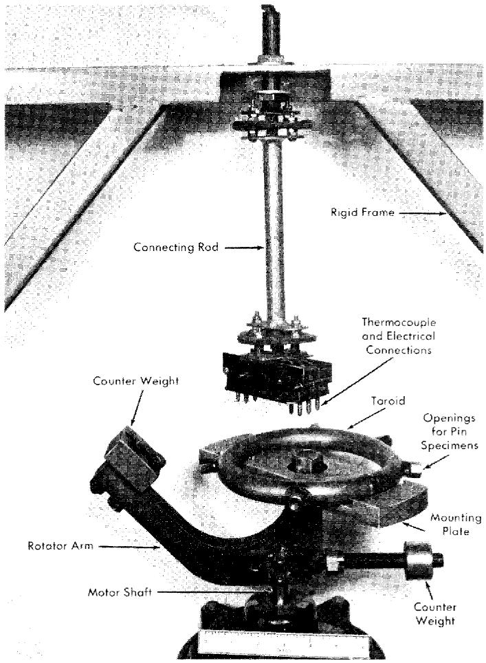  
FIG. 5-1. Photograph of toroid rotator.

The fluid medium in the partially filled toroid is circulated by imparting a motion to the toroid similar to that by which liquid may be caused to swirl in a flask.

To attain the necessary circular motion, the toroid is attached to a horizontal mounting plate which, in turn, is attached at its center (by means of a bearing) to the vertical shaft of a rotator arm. The rotator arm is, in turn, mounted on the shaft of a variable-speed motor, as shown in Fig. 5-1. The toroid is prevented from rotating about its own axis by means of a connecting rod installed between the toroid plate and an external rigid frame. Dynamic balancing of the unit is required for operation at high speeds (500 to $1000\mathrm{rpm}$ ), and a counterweight is provided for this

purpose. Flow velocities up to 30 fps are obtained in the unit now in use. A heating system, which consists of electric heating wire or elements wrapped around the toroid, provides for operation at elevated temperature and pressure. The entire apparatus is relatively inexpensive and fills the need for a laboratory-scale dynamic corrosion test.

In view of the fractional filling of the toroid, which results in "slug flow," corrosion attack rates based on the elapsed time of operation may be corrected to account for the time of immersion in the circulating fluid. This is usually required when corrosion rates obtained in a toroid are being compared with those obtained in the dynamic corrosion test loops described below.

The toroid rotator can be used in the study of solutions and slurries. It has been particularly useful for slurries because of the small amount of material required. The exploration of many slurry variables has been possible with amounts of material (50 to $100\mathrm{g}$ ) easily prepared in the laboratory.

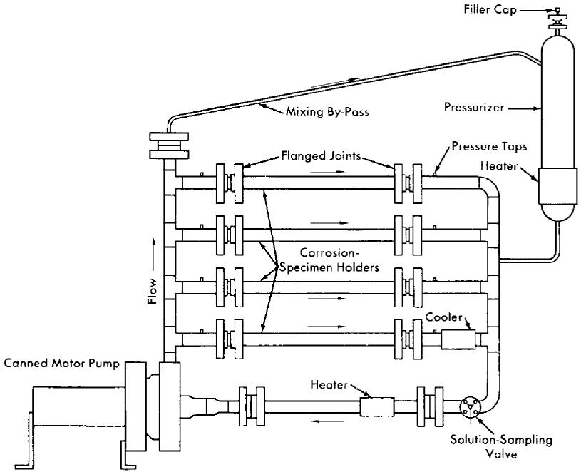  
FIG. 5-2. Dynamic solution corrosion test loop.

Dynamic corrosion test loops. Dynamic solution corrosion test loops designed to operate under the various conditions proposed for homogeneous reactor operation are the principal experimental equipment used for out-of-pile tests. One such loop is shown diagrammatically in Fig. 5-2, in

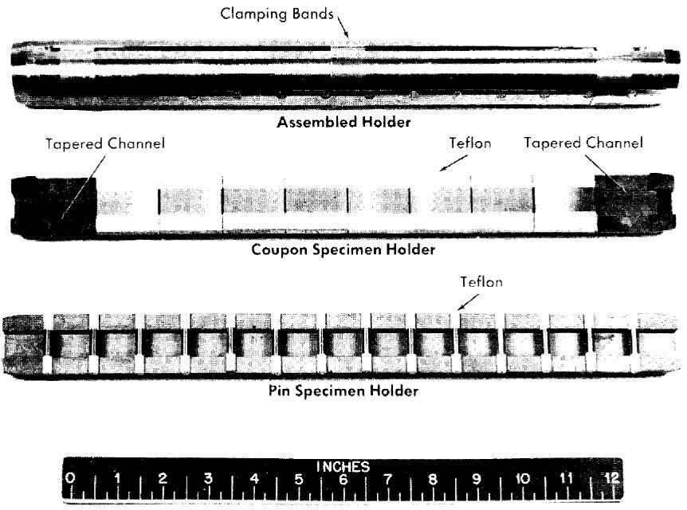  
FIG. 5-3. Pin and coupon specimen holders.

which the flow is divided between a number of parallel channels in which corrosion test specimens can be exposed. Several sets of specimens may be exposed to several flow conditions or a larger variety of specimens to a given set of flow and solution conditions. Loops of various designs have been constructed for other specific purposes [3,4].

The test loop consists of a circulating pump, pipe loop, and a pressurizer. The circulating pump is a Westinghouse model 100A canned-motor centrifugal type [5]. This pump delivers $100\mathrm{gpm}$ at a 250-ft-head and is constructed for operation at pressures up to $2500\mathrm{psi}$ . The loop and pressurizer are heated by means of electric elements cast in aluminum around the outside of the piping.

The loops are usually constructed of $1\frac{1}{2}$ -in. schedule-80 pipe. Flanged joints are used liberally in the loop construction to provide easy access for inspection and for connection of special experimental equipment. For simplicity, economy, and elimination of crevices, a simple butt joint using lap-joint flanges, bearing rings, and a metal gasket [6] is generally used. The test specimens are exposed in split-channel holders inserted in flanged-pipe sections as shown.

The pressurizer, which consists of a vertically mounted section of 4- to 6-in.-diameter pipe, serves several functions. It provides system over-pressure, contains space for solution expansion in the loop during heatup,

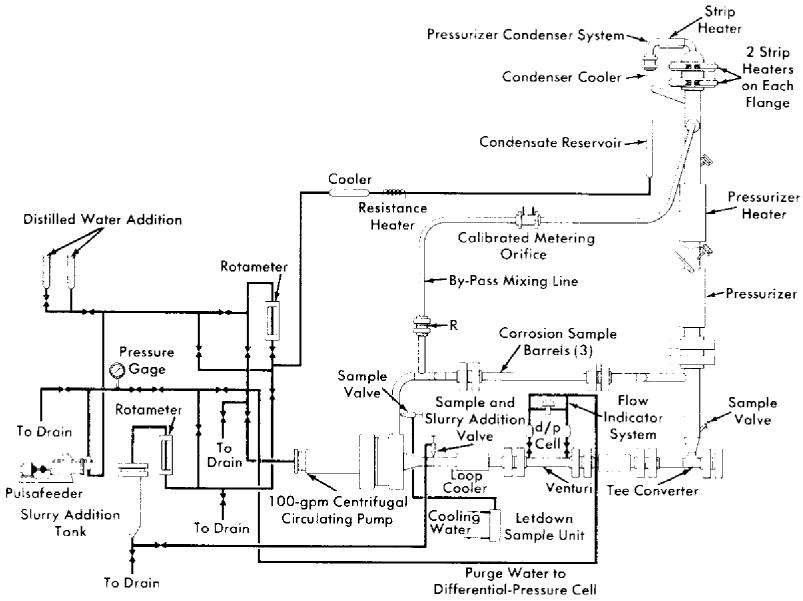  
FIG. 5-4. Dynamic slurry corrosion test loop.

contains space for gas that may be required for solution stability and/or corrosion studies, and serves as a reservoir for excess solution for samples removed during operation.

Two types of holders used for exposure of test specimens in the loop are shown in Fig. 5-3. The pin specimen holder shown is used to test a variety of materials at a uniform bulk fluid flow velocity. Pin-type specimens inserted in the holes are exposed to the solution flowing through the channel when the holder is assembled. Teflon sleeves on the ends of the pins serve as compressible gaskets to keep the specimens from rattling in the holder during the test and to insulate the specimens from the holder. Figure 5-3 also shows the specimens and holder used in determining the effect of velocity on corrosion. In this holder, flat coupon specimens form a continuous septum down the center of the tapered channel, so the bulk fluid flow velocity increases as the solution traverses the holder. Velocity-effect data thus obtained may be used in the design of reactor piping systems if the data are confirmed by loop experience.

In the dynamic slurry corrosion test loop [7], shown in Fig. 5-4, the pump discharge flow is directed through the bottom portion of the pressurizer to minimize settling and accumulation of slurry particles which would occur in this region if the pressurizer were connected as in the solution test loop. As shown in this figure, a condenser is installed in the

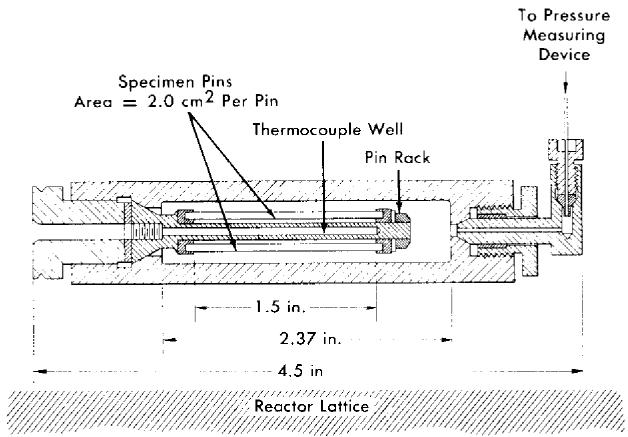  
(a) Type I Autoclave Containing Pin Type Corrosion Specimens

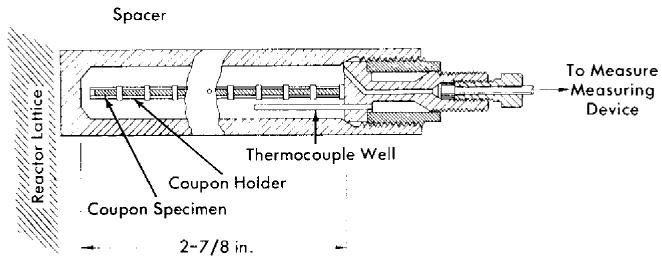  
(b) Type II Autoclave Containing Coupon Type Corrosion Specimens   
FIG. 5-5. In-pile rocking autoclaves.

pressurizer vapor space to supply clean condensate required to continuously purge the pump bearings and prevent slurry accumulation, which would result in excessive bearing wear. The flow of steam or steam-gas mixture through the condenser is by thermal convection. The condensate thus produced flows to the rear of the pump as a result of the static pressure difference between these two points in the system.

A slurry addition device is also incorporated in the loop so that slurry may be charged at elevated temperature and pressure. This device consists of a reservoir tank connected at its bottom to the main loop piping. The slurry may be added batchwise to the tank and, after the top flange is closed, may be forced into the loop by differential pressure, with the slurry being replaced by an equal volume of water from the condensate system. A high-pressure rotometer and regulating valve are provided in the addition system for metering and adjusting this flow of condensate so that flow

to the pump bearings is maintained. To ensure purge-water feed to the pump bearings and to provide positive feed of condensate for the slurry addition system in the event of a loss of static pressure differential, a pulsafeeder pump is incorporated in the condensate circuit and may be used as required.

As an aid in monitoring the density and thus the concentration of the circulating slurry, venturi type flowmeters with high-pressure-differential pressure cells are used in the slurry loop.

5-2.2 In-pile equipment. Rocking autoclaves. To obtain information on the behavior of fuels and materials under reactor conditions, experiments have been carried out in the Graphite Reactor and Low Intensity Test Reactor at ORNL and in the Materials Testing Reactor at NRTS [8-12] using small autoclaves or bombs. The autoclaves used for such tests are shown in Fig. 5-5 [9]. The autoclave, in a specially designed container can and shield plug assembly, is rocked by the mechanism at the face of the reactor shield. The rocking is designed to keep the solution mixed, to maintain equilibrium between liquid and vapor phases, and to keep all surfaces wet. The latter provision prevents the formation of local hot spots by the high gamma fluxes or localized recombination reaction with resultant explosive reaction of the hydrogen and oxygen formed by radiolytic decomposition of water. The assembly is so designed that the autoclave can be retracted into a cadmium cylinder, thereby substantially reducing the flux exposure. This minimizes the necessity for reactor shutdowns in case of minor experimental difficulties and is useful for obtaining data. The necessary electrical and cooling lines are carried to the face of the reactor shield through the container can and a shield plug. In addition, a capillary tube, filled with water, connects the autoclave to a pressure transducer gauge. By this means a continuous record of the pressure in the autoclave is obtained. In cases where a quantitative relationship exists between the corrosion reaction and consumption or production of a gas, the pressure measurements, suitably corrected, provide a measure of the generalized corrosion rate.

Pump loops. An in-pile loop [13] is similar to all forced-circulation loops; it consists of a pump, pressurizer, circulating lines, heaters and coolers, and associated control and process equipment. The circulating pump, designed at ORNL [14-16], is a caused-rotor type which delivers 5 gpm at a 40-ft head at pressures up to 2000 psig.

The loop assembly and 7-ft-long container are shown in Fig. 5-6. Some of the physical data for a typical loop are summarized in Table 5-1 [17]. The loop components are usually constructed of type-347 stainless steel, although one loop has been constructed in which the core section was made of titanium and another was made entirely of titanium. The loop con

TABLE 5-1 PHYSICAL DATA FOR TYPICAL IN-PILE LOOP

# I. Loop volume

1. Pump rotor chamber 160 cc   
2. Pump scroll 107cc   
3. Core 300 cc   
4. Loop pipe (3/8 in. Sch. 40) 440 cc   
5. Pressurizer (1-1/2 in. Sch. 80) 750 cc Total 1757 cc

# II. Pipe size

1. Main loop 3/8 in. Sch. 40   
2. Core 2 in. Sch. 80   
3. Pressurizer 1-1/2 in. Sch. 80   
4. Pressurizer bypass line $1 / 4$ in. $\times 0.049$ in. wall tubing   
5. Pump drain line 0.090 in. OD-0.050 in. ID tubing   
6. Loop drain line 0.090 in. OD-0.050 in. ID tubing   
7. Gas addition line (pressurizer) 0.060 in. OD-0.020 in. ID tubing   
8. Pressure transmitting line 0.080 in. OD-0.040 in. ID tubing

(pressurizer)

# III. Flow rates

1. Main loop 5 gpm (8.5 fps)   
2. Pressurizer bypass line 6 cc/sec (1.2 fps)   
3. Pressurizer 6 cc/sec (0.034 fps)   
4. Tapered channel coupon holder 5 gpm (variable: 10-45 fps)

# IV. Capacities* of loop heaters and coolers

1. Main loop heater 3000 watts   
2. Main loop cooler 6000 watts   
3. Pressurizer preheater 1500 watts   
4. Pressurizer jacket heater 400 watts

tainer, 7 ft long, is 6 in. in diameter at the core end and 8 in. at the pump end and is designed to withstand a pressure surge of 500 psi in case of a sudden failure of a loop component. All electrical and process lines are carried through the pump end of the container through sealed connectors and then through the shield plug to the "valve boxes" at the face of the reactor. These valve boxes are sealed, shielded containers in which are located process lines and vessels, valves, samplers, and sensing devices for

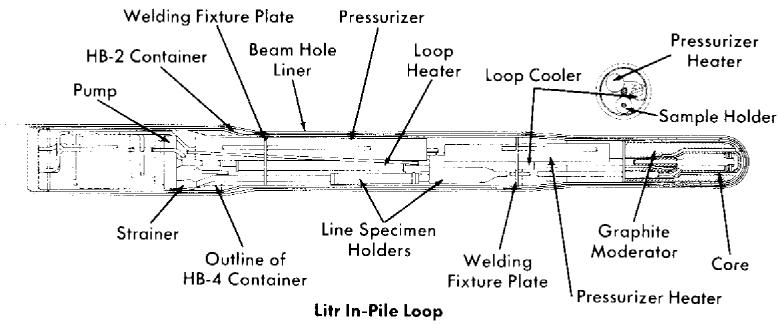  
FIG. 5-6. In-pile loop assembly drawing.

the instrumentation [13]. The equipment in the boxes is used with successive loops, whereas each loop is built for a single experiment and completely dismantled by hot-cell techniques thereafter [18]. Samples of the circulating solution for analysis are withdrawn through a capillary line during operation, and reagent additions can also be made if desired. A capillary connection to the pressurizer is used to follow pressure changes in the loop and to make gas additions when necessary. As in the case of the in-pile autoclaves, previously described, the pressure data can be used to follow a generalized average corrosion rate for all the materials in the loop as the operation proceeds.

Specimens can be exposed in the pressurizer, in holders in the line just beyond the pump outlet, and in the core. The specimens in the core inside the tapered-channel holder and in the annulus around it are exposed to the solution in which fissioning is taking place and to direct pile radiation. Duplicate specimens in the in-line holders are exposed to the same solution in the absence of the fissioning and direct pile radiation. As in the out-of-pile loops discussed previously, the tapered-channel coupon holders are used to study velocity effects. The core specimen holder is shown in place in Fig. 5-7. Figure 5-8 is a photograph of a core corrosion specimen assembly in which can be seen coupled coupons on a rod assembly, as well as coupons in the tapered-channel holder and stress specimens in the core annulus. Although not shown, impact and tensile specimens are also sometimes exposed in the core annulus.

The loops must be adequately instrumented [19] to provide accurate measurements of loop temperatures, pressurizer temperatures, and pressures within the loop. The quantity of oxygen and hydrogen in the pressurizer is obtained from the pressurizer temperature and pressure measurements. Electrical power demands of the loop heater furnish a measure of over-all fission power and gamma heating within the loop. Since the loop, in effect, becomes a small homogeneous reactor operating subcritically, when enriched fuel solution is being circulated many automatic

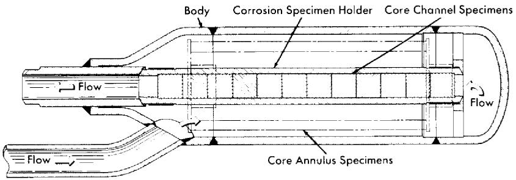  
FIG. 5-7. Core holder for coupon specimens.

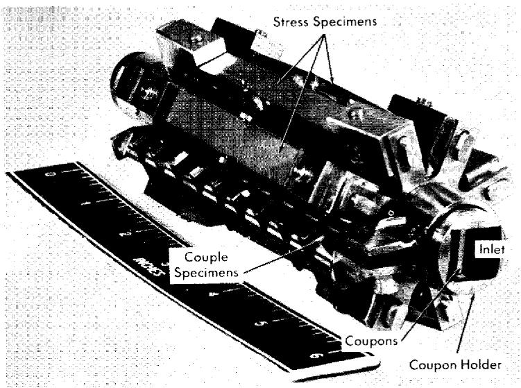  
FIG. 5-8. Core specimen array.

safety interlocks are used to prevent the possible release of radioactive material.

Remote-handling equipment. After exposure in the reactor, dismantling of the loops [18] and autoclaves [20], and subsequent examination of the test specimens and component parts must be done in hot cells with remote-handling equipment. Prior to removal from the reactor, the fuel solution is drained from the loop or autoclave and all radioactive gas is vented. The loop or autoclave is then withdrawn into a shielded carrier and separated from its shield plug to facilitate handling. It is then removed to the hot cell facilities for dismantling and examination.

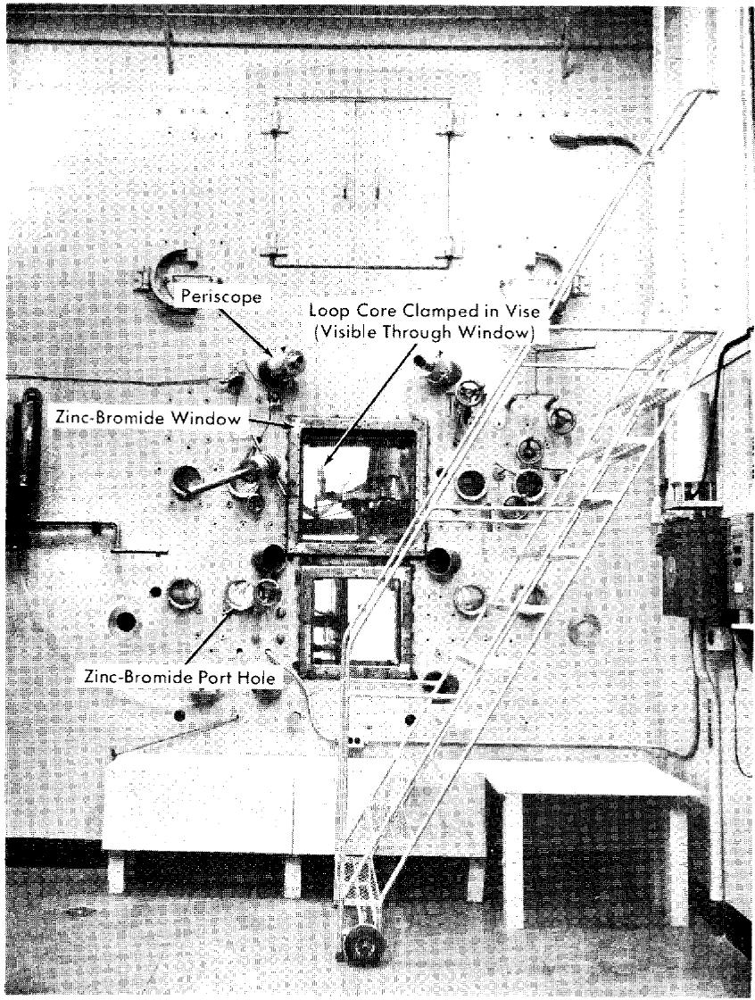  
FIG. 5-9. Exterior view of in-pile loop dismantling facility.

The operating face of the hot cell for dismantling an in-pile loop is shown in Fig. 5-9. An abundance of 1- and 2-in-diameter sleeves are included for insertion of remote-handling tools; two large zinc-bromide windows, eight 6-in. zinc-bromide portholes, and six periscope holes are provided for viewing. The usual hot-cell services, such as hot drain, metal-recovery drain, hot exhaust, vacuum, air, water, and electricity, are provided.

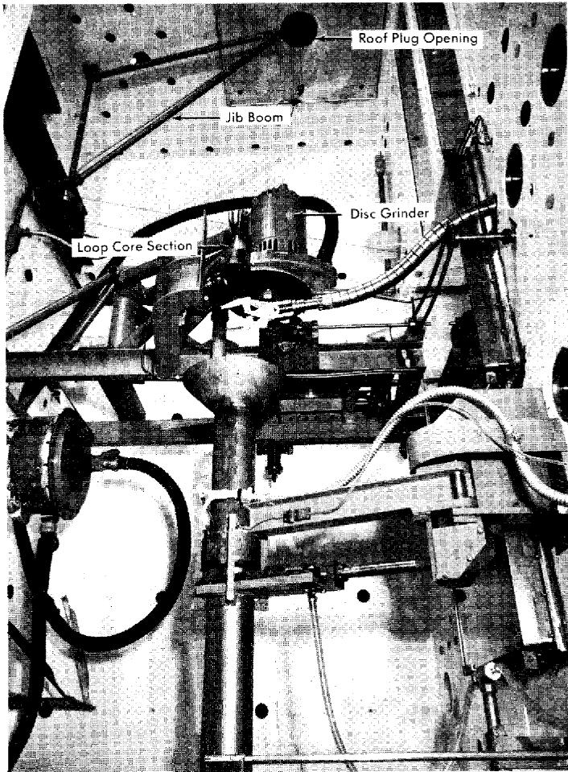  
FIG. 5-10. Interior view of in-pile loop dismantling facility.

The loop in its container can is lowered from its carrier, through a roofplug opening, into the cell, where it is clamped in a chuck which rotates the assembly while a disk grinder cuts off the rear section of the container. A jab boom is used to withdraw the loop from the container, and various sections of the loop are then cut out by means of a disk grinder. Figure 5-10 is a photograph of the dismantling equipment in the hot cell.

The severed loop sections are then removed to a remote-examination facility [21] where the more exacting tasks of removing, examining, and photographing loop components, as well as weighing individual test specimens, required to determine corrosion damage, are carried out. Hot-cell techniques are again used, with the aid of specially designed remote-handling equipment.

# 5-3. SURVEY OF MATERIALS*

5-3.1 Introduction. To determine the corrosion resistance of many different materials to uranium-containing solutions, a large number of screening tests have been performed. These tests were carried out either in pyrex flasks at the boiling point of the solution or in stainless steel autoclaves or loops at $250^{\circ}\mathrm{C}$ . Oxygen or air was bubbled through the atmospheric boiling solutions, whereas at $250^{\circ}\mathrm{C}$ the test solutions were pressurized with 100 to 200 psi oxygen. The corrosion rates of the materials were determined from weight losses of test specimens after the corrosion products had been removed from their surfaces by an electrolytic descaling process [22]. The results of the tests are presented in the following sections. All tests were carried out in the absence of radiation.

The stainless steel designations are those of the American Iron and Steel Institute. The composition of most of the other materials is listed in Engineering Alloys [23] and those not so listed are included in Table 5-2. All the materials were tested in the annealed condition except in the cases where parentheses follow the alloy designation, in Table 5-3. The number thus enclosed is the hardness of the material on either the Rockwell C (RC) or Rockwell B (RB) scale.

5-3.2 Corrosion tests in uranyl carbonate solutions. Since uranium trioxide is more soluble in lithium carbonate solutions at high temperatures than in solutions of other carbonates, the corrosion resistance of the materials was determined only in the lithium carbonate system. All corrosion tests were carried out in stainless steel loops at $250^{\circ}\mathrm{C}$ . The test solution was prepared by dissolving 0.03 moles of uranium trioxide per liter of $0.17\,m\,Li_2CO_3$ and passing carbon dioxide through the solution until the uranium was in solution. The solution was then circulated for 200 hr in a loop pressurized with 700 psi carbon dioxide and 200 psi oxygen. The flow rate of the solution was 20 fps. Table 5-3 shows the materials that were tested and the ranges of corrosion rates that were observed.

Thus the corrosion resistance of all the metals and alloys tested was good with the exception of aluminum, copper, and most of the nickel- or cobalt-base alloys. The acceptable alloys developed films that would have prevented further corrosion had the tests been continued longer. Data presented elsewhere [24] show that even the carbon steels and iron would be satisfactory materials in carbonate systems. The fact that the carbonate solution is approximately neutral is undoubtedly the reason for the nonaggressive nature of the solution.

TABLE 5-2   
THE COMPOSITION OF SEVERAL MATERIALS TESTED FOR CORROSION RESISTANCE   

<table><tr><td rowspan="2">Alloy designation</td><td colspan="6">Composition, w/o</td></tr><tr><td>Cr</td><td>Ni</td><td>C</td><td>Fe</td><td>Mn</td><td>Other</td></tr><tr><td>202</td><td>17-19</td><td>4-6</td><td>0.15 max</td><td>bal.</td><td>7.5-10</td><td></td></tr><tr><td>309 SCb</td><td>22-26</td><td>12-15</td><td>0.08 max</td><td>bal.</td><td>2.0 max</td><td>Nb 8 × C min</td></tr><tr><td>318</td><td>17-19</td><td>13-15</td><td>0.08 max</td><td>bal.</td><td>2.5 max</td><td>Nb 10 × C min</td></tr><tr><td>SRF 1132</td><td>12</td><td>13</td><td></td><td>bal.</td><td></td><td>Cu 5.5, Mo 7</td></tr><tr><td>Carpenter 20Cb</td><td>20</td><td>29</td><td>0.07 max</td><td>bal.</td><td>0.75</td><td>Nb/Ta 8 × C min</td></tr><tr><td></td><td></td><td></td><td></td><td></td><td></td><td>Cu 3, Mo 2</td></tr><tr><td>Croloy 1515 N</td><td>14.7-18.0</td><td>13.5-16.5</td><td>0.15 max</td><td>bal.</td><td>2.0 max</td><td>Mo 1.25-1.85, W 1.00-1.85, Nb/Ta 0.08-0.13</td></tr><tr><td>322 W</td><td>17</td><td>7</td><td>0.07</td><td>bal.</td><td>0.5</td><td>Ti 0.7, Al 0.2</td></tr><tr><td>329</td><td>25-30</td><td>3-5</td><td>0.10 max</td><td>bal.</td><td></td><td>Mo 1-1.5</td></tr><tr><td>CD4MCu</td><td>25-27</td><td>4.75-6.00</td><td>0.04 max</td><td>bal.</td><td>1.0</td><td>Mo 1.75-2.75</td></tr><tr><td></td><td></td><td></td><td></td><td></td><td></td><td>Cu 2.75-3.25</td></tr><tr><td>Croloy 16-1</td><td>14.5-16.5</td><td>0.80-1.25</td><td>0.03 max</td><td>bal.</td><td></td><td>Mo 2.75</td></tr><tr><td>Allegheny 350</td><td>17</td><td>4.2</td><td>0.08</td><td>bal.</td><td>0.60</td><td>W 17, Co 44</td></tr><tr><td>Rexalloy 33</td><td>33</td><td></td><td>2.25</td><td>2 max</td><td></td><td></td></tr><tr><td>Armco GT-45</td><td></td><td></td><td>0.17</td><td>bal.</td><td></td><td></td></tr><tr><td>Titanium 45 A</td><td></td><td></td><td></td><td></td><td></td><td>Ti 99+</td></tr><tr><td>Titanium AC</td><td></td><td></td><td></td><td></td><td></td><td>Al 3, Cr 5, bal. Ti</td></tr><tr><td>Titanium AM</td><td></td><td></td><td></td><td></td><td>4</td><td>Al 4, Mn 4, bal. Ti</td></tr><tr><td>Titanium AT</td><td></td><td></td><td></td><td></td><td></td><td>Al 5, Sn 2.5, bal. Ti</td></tr><tr><td>Titanium AV</td><td></td><td></td><td></td><td></td><td></td><td>Al 6, V 4, bal. Ti</td></tr><tr><td>Titalloy X</td><td></td><td></td><td>0.02</td><td></td><td></td><td>Al 1.6, V 1.9, bal. Ti</td></tr><tr><td>Titalloy Y</td><td></td><td></td><td>0.02</td><td></td><td></td><td>Al 1.2, bal. Ti</td></tr><tr><td>Titalloy Z</td><td></td><td></td><td>0.01</td><td></td><td></td><td>Al 2.4, bal. Ti</td></tr><tr><td>Zircaloy 1</td><td></td><td></td><td></td><td></td><td></td><td>Sn 2.5, bal. Zr</td></tr><tr><td>Zircaloy 2</td><td></td><td></td><td></td><td></td><td></td><td>Sn 1.5, Fe 0.07-0.2, Cr 0.02-0.15, Ni 0.03-0.08</td></tr><tr><td></td><td></td><td></td><td></td><td></td><td></td><td>Sn 5, bal. Zr</td></tr><tr><td>Zirconium-tin</td><td></td><td></td><td></td><td></td><td></td><td></td></tr></table>

Pressurizing gases: 700 psi $\mathrm{CO}_{2}$ and 200 psi $\mathrm{O}_{2}$ .

Time: 200 hr. Flow rate: 20 fps.

TABLE 5-3   
CORROSION RATES OF SEVERAL ALLOYS IN A SOLUTION OF $0.17m\mathrm{Li}_2\mathrm{CO}_3$ CONTAINING $0.03m\mathrm{UO}_3$ AT $250^{\circ}\mathrm{C}$   

<table><tr><td>Metal or alloy</td><td>Range of avg. corrosion rates, mpy</td></tr><tr><td>Austenitic stainless steels</td><td></td></tr><tr><td>202, 302B, 304, 304L, 309SCb, 310S, 316, 318, 321, 347</td><td>0.8-2.6</td></tr><tr><td>Carpenter 20, Carpenter 20Cb, Incoloy, Worthite</td><td>2.4-4.0</td></tr><tr><td>Ferritic and martensitic stainless steels</td><td></td></tr><tr><td>322 W, 410, 410 (cast), 414, 416, 420, 430, 431, 440C, 446, 17-7 PH</td><td>0.8-2.4</td></tr><tr><td>416 (36 RC), 440C (56 RC)</td><td>3.6-5.3</td></tr><tr><td>Titanium alloys</td><td></td></tr><tr><td>55A, 75A, 100A, 150A, AC, AM, AT, AV</td><td>0.3-0.6</td></tr><tr><td>Other metals and alloys</td><td></td></tr><tr><td>Zirconium and Zircaloy-2</td><td>&lt;0.1</td></tr><tr><td>Hastelloy C, Nionel, gold, niobium, plati-num</td><td>0-0.9</td></tr><tr><td>Armeo Iron, AISI-C-1010, AISI-C-1016</td><td>6.4-7.8</td></tr><tr><td>Inconel, Inconel X, nickel, Stellite 1, 2, 3, 98M2, Haynes Alloy 25, copper</td><td>16-90</td></tr><tr><td>Aluminum</td><td>&gt;1000</td></tr></table>

5-3.3 Corrosion tests in uranyl fluoride solutions. In contrast to uranyl carbonate solutions, uranyl fluoride solutions are acid, and in general the corrosivity of the fluoride solutions is much greater than that of the carbonate solutions. To determine the relative corrosion resistances of many different metals and alloys, a $0.17\mathrm{m}$ $\mathrm{UO}_2\mathrm{F}_2$ solution was used. Tests were performed at 100 and $250^{\circ}\mathrm{C}$ in static systems and at $250^{\circ}\mathrm{C}$ in loops. The static tests were continued for periods up to 1000 and 2000 hr. The dynamic tests lasted for 200 hr, and the flow rate of the solution past the specimens was 10 to 15 fps. The results of the dynamic tests are shown in Table 5-4.

# TABLE 5-4

# THE CORROSION RATES OF SEVERAL ALLOYS IN $0.17m\mathrm{UO}_2\mathrm{F}_2$ AT $250^{\circ}\mathrm{C}$

Pressurizing gas: 200 psi $\mathrm{O_2}$ me: 200 hr. Flow rate: 10 to 15 fps.

<table><tr><td>Metal or alloy</td><td>Range of avg. corrosion rates, mpy</td></tr><tr><td>Austenitic stainless steels</td><td></td></tr><tr><td>304, 304L, 309SCb, 310, 316, 316L, 318, 321, 347</td><td>4-13</td></tr><tr><td>Ferritic and martensitic stainless steels</td><td></td></tr><tr><td>322W, 430, 443, 17-4 PH</td><td>3.5-5.0</td></tr><tr><td>416</td><td>&gt;2000</td></tr><tr><td>Titanium and zirconium alloys</td><td></td></tr><tr><td>55A, 70A, 100A, 150A</td><td>0.01-0.25</td></tr><tr><td>AC, AM, AT</td><td>5.6-7.7</td></tr><tr><td>Zirconium, Zircaloy-2</td><td>&gt;2000</td></tr><tr><td>Other metals</td><td></td></tr><tr><td>Gold, platinum</td><td>&lt;0.5</td></tr><tr><td>Niobium</td><td>&gt;1000</td></tr></table>

All the stainless steels except type 416 showed low corrosion rates under the conditions of test. Other experiments showed that most of the corrosion occurred in about the first $100\mathrm{hr}$ of exposure, during which time a protective coating formed on the steel. After the coating formed, corrosion rates in the range of $0.1\mathrm{mpy}$ or less were observed (provided the flow rate was not too high). The static corrosion tests of longer duration verified the dynamic results. Thus, had the dynamic tests reported in Table 5-4 lasted for $1000\mathrm{hr}$ , the average corrosion rates would have been approximately one-fifth of those shown.

At high temperatures, all the stainless steels corrode at high constant rates if the flow rate of the solution exceeds a certain value which depends on the concentration of the solution and the temperature (to be discussed in the next section). In $0.17m\mathrm{UO}_2\mathrm{F}_2$ at $250^{\circ}\mathrm{C}$ this critical value is 20 to 25 fps.

As expected, zirconium and zirconium alloys showed no resistance to attack by uranyl fluoride solutions at high temperatures. In fact, other tests have shown that as little as $50~\mathrm{ppm}$ fluoride ions in uranyl sulfate solutions leads to appreciable attack of zirconium [25]. On the other hand, titanium demonstrated high resistance to uranyl fluoride solutions. Tests with more highly concentrated uranyl fluoride solutions have shown the corrosion rate of titanium to be low. The titanium alloys showed higher rates, ranging from 5 to $8\mathrm{mpy}$ . However, in crevices where oxygen depletion occurs, titanium and its alloys are severely attacked [26].

No nickel- or cobalt-base alloys were tested under dynamic conditions. Those tested at $250^{\circ}\mathrm{C}$ in autoclaves include D Nickel, Chromel P, Stellar 98M2, and nickel; all showed rates in excess of $18\mathrm{mpy}$ during 1000- to 2000-hr tests. At $100^{\circ}\mathrm{C}$ nickel corroded at a rate greater than $100\mathrm{mpy}$ and Monel corroded at $7\mathrm{mpy}$ ; the other above-listed materials, Elgiloy, Hastelloys C and D, Illium R, and Inconel, corroded at rates less than $1.5\mathrm{mpy}$ .

Gold, platinum, and tantalum were practically unattacked by the uranyl fluoride at $250^{\circ}\mathrm{C}$ ; the resistance of tantalum was unexpected. Niobium was heavily attacked.

It is seen from the foregoing that several metals, including most of the stainless steels, have adequate corrosion resistance to uranyl fluoride solutions if the flow rate of the solution is not too great. Uranyl fluoride cannot be used in a two-region reactor, however, because zirconium and uranyl fluoride solutions are incompatible. Another possible difficulty of uranyl fluoride solutions in any system is the fact that the vapor above the acid uranyl fluoride system may contain some hydrofluoric acid which, if present, would present a serious corrosion problem.

5-3.4 Corrosion tests in uranyl sulfate solutions. Many corrosion tests discussed in detail in HRP progress reports [27] have been carried out in uranyl sulfate solutions under different conditions of temperature, uranium concentration, flow rate, etc. Table 5-5 shows representative corrosion rates of a number of materials obtained in $0.17\mathrm{m}$ $\mathrm{UO}_2\mathrm{SO}_4$ at $250^{\circ}\mathrm{C}$ in stainless-steel loops during a 200-hr. exposure. The flow rate of the solution past the specimens was 10 to 15 fps. Static tests, the results of which are not included in the table, have also been carried out at 100 and $250^{\circ}\mathrm{C}$ and generally lasted for 1000 to 2000 hr. The results obtained in static systems generally confirmed the dynamic results, although the corrosion rates observed in static systems were less than those measured in dynamic systems.

The data presented in Table 5-5 show only the relative corrosion resistance of different classes of alloys and need further clarification. From the results reported in the table, and from many other static and dynamic

# TABLE 5-5

# THE CORROSION RATES OF SEVERAL ALLOYS IN

# 0.17 m $\mathrm{UO_2SO_4}$ AT $250^{\circ}\mathrm{C}$

Pressurizing gas: 200 psi $\mathrm{O_2}$

Time: 200 hr. Flow rate: 10 to 15 fps.

<table><tr><td>Metal or alloy</td><td>Range of avg. corrosion rates, mpy</td></tr><tr><td>Austenitic stainless steels</td><td></td></tr><tr><td>202, 302, 302B, 303, 304, 304L, 309SCb, 310S, 316, 316L, 318, 321, 347, Carpenter Alloys 10, 20, 20Cb, Croloy 1515N, Durimet, Incoloy, Multimet, Timken 16-25-6, Worthite</td><td>14-65</td></tr><tr><td>SRF 1132</td><td>190</td></tr><tr><td>Ferritic and martensitic stainless steels</td><td></td></tr><tr><td>Armco 17-4 PH (37 RC), Armco 17-7 PH (43 RC)</td><td>3.1-4.9</td></tr><tr><td>322W, 322W (27-38 RC), 329, 430, 431, 431 (43 RC), 446, Armco 17-4 PH, CD4MCu, Allegheny 350, Allegheny 350 (38-43 RC), Croloy 16-1, Frogalloy</td><td>6-35</td></tr><tr><td>410, 410 (43 RC), 414, 416, 416 (37 RC), 420, Armco 17-7 PH</td><td>46-81</td></tr><tr><td>420 (52 RC), 440 C</td><td>100-430</td></tr><tr><td>Titanium and zirconium alloys</td><td></td></tr><tr><td>45A, 55A, 75A, 100A, 150A, AM, Titalloy X, Y, and Z</td><td>0.01</td></tr><tr><td>AC, AT, AV</td><td>0.03-0.12</td></tr><tr><td>Zircaloy-1 and -2, zirconium, zirconium-tin</td><td>&lt;0.01</td></tr><tr><td>Nickel and cobalt alloys</td><td></td></tr><tr><td>Hastelloy R-235, Inconel X,stellite 1</td><td>77-88</td></tr><tr><td>Hastelloy C and X, Haynes Alloy 25, Inconel,stellite 3, 6, and 98M2</td><td>120-340</td></tr><tr><td>Other materials</td><td></td></tr><tr><td>Gold, platinum</td><td>&lt;0.1</td></tr><tr><td>Niobium</td><td>6.7</td></tr><tr><td>Sapphire</td><td>17</td></tr><tr><td>Quartz</td><td>58</td></tr><tr><td>Pyrex glass</td><td>730</td></tr></table>

tests of longer duration, the following conclusions can be drawn. All the austenitic stainless steels except SRF 1132, 316, and 316L behaved essentially alike; all corroded rapidly and uniformly for about the first $100\mathrm{hr}$ , during which time a protective coating formed (provided the flow rate was less than 20 fps). Once the film formed, corrosion rates less than $0.1\mathrm{mpy}$ were observed. The extent of attack during film formation varied somewhat from run to run, and there was no consistent difference from one austenitic stainless steel to the other. Thus, even though the rates reported in Table 5-5 are high, the continuing rates are very low; as a class, the austenitic stainless steels are satisfactory materials for containing uranyl-sulfate solutions at reasonable flow rates. Types 316 and 316L showed a tendency toward intergranular attack, and SRF 1132 did not develop a highly protective coating.

Of the ferritic and martensitic stainless steels, types 410, 416, 420, and 440C in all heat-treated conditions were completely unsatisfactory. The corrosion rates of these alloys were nearly constant with time, and the attack was very irregular. Although the precipitation-hardenable steels, 322W, 17-4 PH, and 17-7 PH, showed very low corrosion rates after the formation of the protective film, all displayed a tendency toward stress-corrosion cracking in their fully hardened conditions. Croloy 16-1 demonstrated reasonable corrosion resistance in short-term tests, but long static tests showed the material to be susceptible to intergranular attack in uranyl sulfate solutions. The other ferritic and martensitic stainless steels corroded in the same fashion as did the austenitic stainless steels; that is, after a protective film formed the corrosion rates were in the range of 0.1 mpy. From a corrosion standpoint these materials have adequate corrosion resistance for use in high-temperature uranyl sulfate solutions.

Titanium, zirconium, and all of their alloys were extremely resistant to attack by uranyl sulfate solutions at all concentrations, temperatures, and flow rates. In fact, corrosion damage was so small that it was difficult to detect weight changes of the specimens with a standard analytical balance. These alloys will be discussed further in Sections 5-5 and 5-6.

Most of the nickel- and cobalt-base alloys listed in Table 5-5 were rapidly attacked by high-temperature uranyl sulfate solutions. The two exceptions were Hastelloy R-235 and Elgiloy. Hastelloy R-235 resembled an austenitic stainless steel in that it developed a film and corroded practically no further. Although Elgiloy corroded only slightly, it was extremely susceptible to stress-corrosion cracking in high-temperature uranyl-sulfate solutions. Thus, of the alloys listed, only Hastelloy R-235 could be considered for use in high-temperature uranyl sulfate solutions. On the other hand, most of the alloys were resistant to uranyl sulfate solutions at $100^{\circ}\mathrm{C}$ ; corrosion rates less than a few tenths of a mpy were observed. It is particularly significant that many of the very hard alloys,

such as thestellites,are resistant at the lower temperature;in many applications,such as pump bearings,temperatures no greater than $100^{\circ}\mathrm{C}$ are required.

In dynamic tests platinum and gold were resistant to attack under all conditions, but niobium corroded at an appreciable rate, about 7 mpy at 15 fps. The corrosion rate of niobium depended on the flow rate of the solution, and at higher flow rates somewhat higher corrosion rates were observed. Static tests showed that tantalum and chromium are corroded only slightly under most conditions. If the solution contained dissolved hydrogen, tantalum was seriously embrittled; highly oxygenated uranyl-sulfate solutions at temperatures above $250^{\circ}\mathrm{C}$ oxidized chromium to the soluble hexavalent state, and under these conditions the rate of attack was several mils per year.

A number of nonmetallic substances were statically tested in $0.17\,m\, \mathrm{UO}_2\mathrm{SO}_4$ at $100^{\circ}\mathrm{C}$ . Those tested included various grades of sintered alumina and graphite, sapphire, silicon carbide, sintered titania and zirconia, and quartz. All corroded at rates of less than 3 mpy, except for one very impure grade of sintered alumina which corroded at $124\, \mathrm{mpy}$ . In fact, the corrosion resistance of the sintered alumina was higher, the higher the purity. In static tests at $250^{\circ}\mathrm{C}$ in $0.17\,m\, \mathrm{UO}_2\mathrm{SO}_4$ , the corrosion rate of pure sintered alumina was 3 mpy; sapphire corroded at the rate of $3.6\, \mathrm{mpy}$ . In dynamic tests under the same conditions, sapphire corroded at $17\, \mathrm{mpy}$ , quartz at $58\, \mathrm{mpy}$ , and Pyrex glass at $730\, \mathrm{mpy}$ . The high corrosion rates of quartz and Pyrex glass show why glass-lined equipment cannot be used for high-temperature experimental work. In addition to the attack on the glass, the resultant silicates cause precipitation of uranium.

5-3.5 Conclusions. Type-347 stainless steel has been the basic material of construction in most homogeneous reactor programs. It has serious limitations, particularly from the corrosion standpoint, but in consideration of the additional important factors of cost, availability, and experience with its use, it appears a suitable material. The excellent corrosion resistance of titanium and several of its alloys makes them very useful in special applications, particularly where the limitations of the stainless alloys make their use impractical. Cost, availability, and a recently observed autoignition reaction in oxygen-containing environments are serious limitations to the use of titanium in pressure-containing equipment (see Article 5-8.5). Zirconium and zirconium-rich alloys are unique materials for the core vessel of a two-region breeder.

The behavior of these materials in homogeneous reactor fluids is described in detail in subsequent sections of this chapter.

# 5-4. CORROSION OF TYPE-347 STAINLESS STEEL IN URANYL SULFATE SOLUTIONS*

5-4.1 Introduction. The decision to use type-347 stainless steel as the major material of construction and a uranyl sulfate solution as the fuel for HRE-1 and HRE-2 was based, at least in part, on the demonstrated compatibility of the two components and on the fact that the technology of the austenitic stainless steels was well developed. Articles 5-4.2 through 5-4.7 present the results of an extensive investigation of the corrosion of type-347 stainless steel in uranyl sulfate solutions in the absence of ionizing radiation, and in Article 5-4.8 the effect of ionizing radiation on the corrosion of stainless steel is discussed. Further details are reported in the HRP quarterly progress reports [28].

All the results reported in this section were obtained with solutions containing between 50 and $1000~\mathrm{ppm}$ oxygen to prevent reduction and precipitation of uranium; the precipitation of uranium as $\mathrm{U}_3\mathrm{O}_8$ leads to the formation of sulfuric acid which attacks stainless steel at a very high rate at the temperatures of interest. A consequence of these phenomena is the possibility of localized attack in crevices where oxygen depletion can occur. Other forms of localized attack have been investigated, but except for stress-corrosion cracking in the presence of chloride ions (discussed in Section 5-9) no serious problems have arisen. Thus, even with unstabilized stainless steels that have been sensitized by appropriate heat treatment, no severe intergranular attack in uranyl-sulfate solutions occurs. The coupling of such noble metals as gold and platinum to type-347 stainless steel does not result in accelerated attack of the stainless steel.

5-4.2 Effect of temperature. When type-347 stainless steel is placed in a uranyl-sulfate solution at temperatures up to $100^{\circ}\mathrm{C}$ , the steel retains its metallic luster, and only after long periods of time does it develop a very thin tarnish film. At higher and higher temperatures the film becomes progressively heavier, and in the temperature range 175 to $200^{\circ}\mathrm{C}$ a quite heavy black scale forms on the surface of the steel in about $100\mathrm{hr}$ . Up to about $175^{\circ}\mathrm{C}$ the film that forms is nonprotective, and the corrosion rate is dependent on the composition of the solution and independent of the flow rate past the steel surface. Some typical corrosion rates in this temperature range are presented in Table 5-6.

# TABLE 5-6

# CORROSION RATE OF TYPE-347 STAINLESS STEEL IN URANYL SULFATE SOLUTIONS AT 100 TO $175^{\circ}\mathrm{C}$

<table><tr><td>Solution composition</td><td>Temperature, °C</td><td>Corrosion rate, mpy</td></tr><tr><td>0.02 m UO2SO4</td><td>100</td><td>0.25</td></tr><tr><td>0.006 m H2SO4</td><td>150</td><td>0.96</td></tr><tr><td>0.04 m UO2SO4</td><td>150</td><td>0.87</td></tr><tr><td>0.006 m H2SO4</td><td>175</td><td>5.4</td></tr><tr><td>0.005 m CuSO4</td><td></td><td></td></tr><tr><td>1.3 m UO2SO4</td><td>100</td><td>0.40</td></tr><tr><td></td><td>125</td><td>0.80</td></tr><tr><td></td><td>150</td><td>2.8</td></tr><tr><td></td><td>175</td><td>18.0</td></tr></table>

The heavy film that forms in the temperature range 175 to $225^{\circ}\mathrm{C}$ offers some protection to the underlying steel, but in most cases the protection is poor. At higher temperatures a heavy scale forms fairly rapidly on the stainless steel, and once it has been established it affords essentially complete protection against further corrosion, provided the flow rate of the solution is not too great.

The protectiveness of the film appears to be related to its composition. At temperatures up to $175^{\circ}\mathrm{C}$ the scale, as determined by x-ray diffraction, is composed of mixed hydrated ferric and chromic oxides. At higher temperatures the amount of hydrated oxide decreases, and the amount of anhydrous alpha ferric oxide containing chromic oxide in solid solution increases. At $250^{\circ}\mathrm{C}$ and higher, only the anhydrous oxide is found in the protective scale.

The amount of metal that dissolves during the period of film formation depends primarily on the flow rate, the composition of the solution, the temperature, and the presence of additives. If the other variables remain constant, increasing the temperature decreases the amount of metal that is corroded during the formation of the protective coating and reduces the velocity effect.

5-4.3 Effect of solution flow rate. From room temperature to about $175^{\circ}\mathrm{C}$ the solution flow rate has essentially no effect on the corrosion rate of the stainless steel. However, at temperatures of $200^{\circ}\mathrm{C}$ and above, the corrosion rate is profoundly influenced by flow rate. Figure 5-11 shows

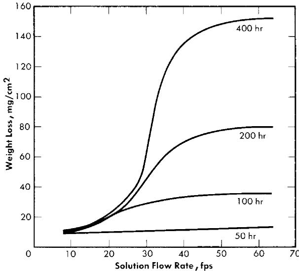  
FIG. 5-11. Corrosion of type-347 stainless steel in $0.17 \, m \, \mathrm{UO}_2\mathrm{SO}_4$ at $250^{\circ}\mathrm{C}$ as a function of the flow rate.

typical results obtained using a tapered-channel specimen holder in a stainless steel loop. The data were obtained from a series of runs in which $0.17 \, m \, \mathrm{UO}_2\mathrm{SO}_4$ was circulated at $250^{\circ}\mathrm{C}$ for various times. Since at low flow rates the corrosion rate depends on time, weight loss rather than corrosion rate is used as the ordinate.

At flow rates up to about 20 to 25 fps all weight losses were nearly the same regardless of exposure time. Between 25 and 35 fps weight losses increased sharply, and at still higher flow rates the weight loss of the specimens was proportional to the exposure time. An examination of the specimens revealed that up to about 20 fps the specimens were completely covered with a black, relatively heavy, tenacious scale which, after it formed, practically prevented further corrosion. In the region of 25 to 35 fps there were areas of the specimens that remained free of scale. At flow rates greater than 40 fps the specimens did not develop any visible scale, and upon removal from the holder the specimens had the appearance of severely etched steel.

Although the results presented in Fig. 5-11 are for only one concentration of uranyl sulfate, a similar velocity effect is observed at all uranyl-sulfate concentrations and at all temperatures above $200^{\circ}\mathrm{C}$ . The temperature of $200^{\circ}\mathrm{C}$ is in the middle of the transition region below which velocity is unimportant and above which a velocity effect is observed. Therefore, at $200^{\circ}\mathrm{C}$ a velocity effect is observed but is not well defined. Usually all specimens, even at the highest flow rate, develop a black coating which

gives partial protection. In addition, the extent of the velocity effect is dependent on the exposure time.

The velocity below which a completely protective scale forms is defined as the critical velocity. The weight loss of stainless-steel specimens above this velocity increases linearly with time, and the corrosion rate is constant. Below the critical velocity the stainless steel corrodes initially at the same rate as at the high velocities, but the rate decreases as the protective coating forms and, generally, after about 100 hr very little, if any, corrosion occurs. In fact, some specimens have been exposed continuously at flow rates less than the critical velocity for periods of time as long as 20,000 hr and the amount of metal corroded was no greater than after 100 hr [29].

5-4.4 Effect of uranyl sulfate and sulfuric acid concentration. All uranyl-sulfate solutions are acid, and the more concentrated the solution, the lower the pH as measured at room temperature. The acidity is further increased by adding sulfuric acid to dilute uranyl sulfate solutions to prevent hydrolytic precipitation of copper and uranium at high temperature.

Generally, the higher the concentration of uranyl sulfate or free acid in solution, the greater the extent of metal dissolution during film formation below the critical velocity, the lower the critical velocity, and the higher the film-free corrosion rate above the critical velocity. Table 5-7 shows how the above three regions change with uranyl-sulfate concentrations at $250^{\circ}\mathrm{C}$ .

TABLE 5-7   
THE CORROSION OF TYPE-347 STAINLESS STEEL IN URANYL SULFATE SOLUTIONS AT $250^{\circ}\mathrm{C}$   

<table><tr><td>Concentration of UO2SO4, m</td><td>Wt. loss at 10 fps, mg/cm2</td><td>Critical velocity, fps</td><td>Corrosion rate at 60 fps, mpy</td></tr><tr><td>0.02</td><td>1-2</td><td>&gt;50</td><td>~10</td></tr><tr><td>0.11</td><td>2-3</td><td>25-30</td><td>190</td></tr><tr><td>0.17</td><td>12</td><td>20-25</td><td>190</td></tr><tr><td>0.43</td><td>20</td><td>10-20</td><td>400</td></tr><tr><td>0.84</td><td>37</td><td>10-20</td><td>680</td></tr><tr><td>1.3</td><td>50</td><td>10-20</td><td>1400</td></tr></table>

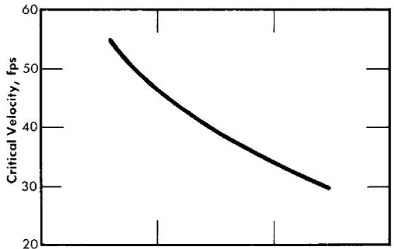

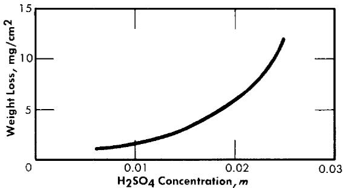  
FIG. 5-12. The effect of sulfuric acid concentration on the critical velocity and on the extent of corrosion at low flow rates at $250^{\circ}\mathrm{C}$ . Solution composition: $0.04\,m\, \mathrm{UO}_2\mathrm{SO}_4$ and $0.005\, m\, \mathrm{CuSO}_4$ .

Figure 5-12 shows the effect of sulfuric acid added to $0.04 \, \text{m} \, \text{UO}_2\text{SO}_4$ containing $0.005 \, \text{m} \, \text{CuSO}_4$ , on the amount of metal dissolved during film formation and on the critical velocity of the system. The effect of adding sulfuric acid is qualitatively the same at all uranyl sulfate concentrations and at all temperatures above $200^{\circ}\text{C}$ and produces a result similar to that of increasing the uranyl sulfate concentration. Thus it can be concluded that the acidity of the solution determines, at least in part, how much metal dissolves before a protective coating forms, and the critical velocity of the solution. It has been found that low concentrations of copper sulfate in uranyl sulfate solutions have no significant effect on the corrosion of type-347 stainless steel.

5-4.5 Temperature dependence of flow effects. It has been stated that increasing the flow rate of the solution generally produces a detrimental effect on the corrosion of type-347 stainless steel. This effect is temperature-dependent, as shown in Fig. 5-13. Although the results are based on a $0.17\mathrm{m}$ $\mathrm{UO}_2\mathrm{SO}_4$ solution, an increase in temperature has a similar effect at all concentrations. With a given solution composition (i.e., constant

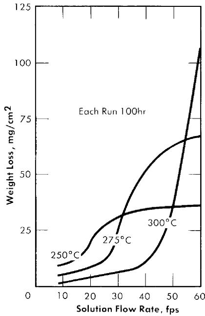  
FIG. 5-13. The corrosion of type-347 stainless steel in $0.17 \, \text{m} \, \text{UO}_2\text{SO}_4$ at different temperatures.

uranyl sulfate and sulfuric acid concentrations), increasing the temperature decreases the amount of metal that dissolves during film formation, increases the critical velocity, and increases the film-free corrosion rate of the stainless steel. The reasons for these effects are discussed in Article 5-4.7.

5-4.6 Effect of corrosion inhibitors. The number of substances that can be added to uranyl sulfate solutions to serve as corrosion inhibitors is limited for two reasons: (1) all organic inhibitors are oxidized to carbon dioxide in high-temperature oxygenated uranyl sulfate solutions, and (2) many inorganic compounds are insoluble in uranyl sulfate solutions. In spite of the second limitation, a number of inorganic salts have been added to uranyl sulfate solutions to determine their effectiveness in reducing the corrosion of type-347 stainless steel. Those substances that have been tested include: $\mathrm{Li_2SO_4}$ , $\mathrm{Na_2SO_4}$ , $\mathrm{BeSO_4}$ , $\mathrm{MgSO_4}$ , $\mathrm{Ag_2SO_4}$ , $\mathrm{CuSO_4}$ , $\mathrm{Cr_2(SO_4)_3}$ , $\mathrm{NiSO_4}$ , $\mathrm{FeSO_4}$ , $\mathrm{MnSO_4}$ , $\mathrm{Ce(SO_4)_2}$ , $[\mathrm{Ru(NO)}]_2(\mathrm{SO}_4)_3$ , $\mathrm{NaNO_3}$ , $\mathrm{Na_2WO_4}$ , $\mathrm{Na_2SiO_3}$ , $\mathrm{NaBiO_3}$ , $\mathrm{H_2MoO_4}$ , $\mathrm{H_3SbO_4}$ , $\mathrm{H_7P(MoO_4)_{12}}$ , $\mathrm{As_2O_5}$ , $(\mathrm{UO}_2)_3(\mathrm{PO}_4)_2$ , $\mathrm{NH_4TeO_4}$ , and $\mathrm{K_2Cr_2O_7}$ .

Of the compounds listed, only potassium dichromate and certain of the sulfate salts of the alkali and alkaline earth metals have been effective.

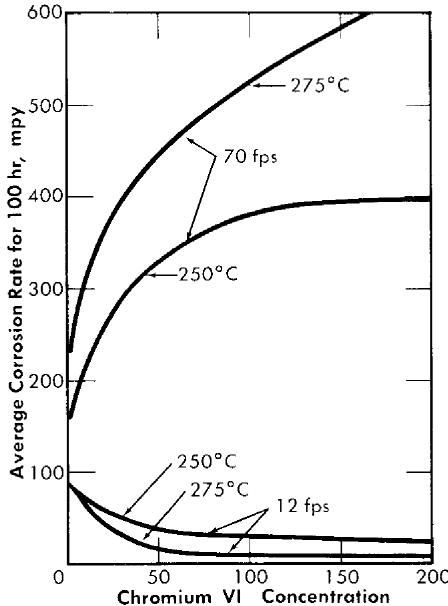  
FIG. 5-14. The effect of $\mathrm{Cr(VI)}$ in $0.17m\mathrm{UO}_2\mathrm{SO}_4$ on the corrosion of type-347 stainless steel.

Chromium(VI) was effective even at very low concentrations, whereas the sulfate salts had to be present in amounts nearly equal in molality to the uranyl sulfate.

The addition of chromium(VI) to high-temperature uranyl sulfate solutions reduces the amount of metal corroded during film formation, greatly increases the critical velocity, but materially increases the corrosion rate of the stainless steel at flow rates in excess of the critical velocity. Results obtained using coupon-type corrosion specimens in a loop through which $0.17 \, m\, \mathrm{UO}_2\mathrm{SO}_4$ was circulated at $250^{\circ}\mathrm{C}$ indicated that 200 ppm chromium(VI) increased the critical velocity from 20 to 25 fps to between 50 and 60 fps [30]. Other tests were carried out in which two pin-type specimens were exposed for 100 hr at flow rates both above and below the critical velocity in $0.17 \, m\, \mathrm{UO}_2\mathrm{SO}_4$ . The results are presented in Fig. 5-14. The corrosion rates at 70 fps are true rates which would not change on continued exposure; those at 12 fps are average rates for the 100-hr exposures and would decrease. Had the exposure been for 200 hr, the rates would have been approximately half those shown. It should be noted that as the film-free corrosion rate increased, the average corrosion rate at the low flow rate decreased.

It has been found that the presence of added sulfate salts in nearly equimolar concentration appreciably reduced the corrosion by concentrated

uranyl sulfate solutions. The salts that have been studied the most are beryllium sulfate, lithium sulfate, and magnesium sulfate. The phase stability [31] of the above solutions has been reported, as have the corrosion results [32-34]. For example, the weight loss for a 200-hr exposure of stainless steel in $2.0\mathrm{m}$ $\mathrm{UO}_2\mathrm{SO}_4$ containing $2.0\mathrm{m}$ $\mathrm{Li}_2\mathrm{SO}_4$ at $200^{\circ}\mathrm{C}$ was only $5\mathrm{mg/cm}^2$ for velocities up to 60 fps. This may be compared with $100\mathrm{mg/cm}^2$ for exposure to a $1.3\mathrm{m}$ $\mathrm{UO}_2\mathrm{SO}_4$ solution under similar conditions. The effect of lithium sulfate was less pronounced at $250^{\circ}\mathrm{C}$ and high velocities; at $250^{\circ}\mathrm{C}$ and 50 fps, weight losses were approximately 70 and $400\mathrm{mg/cm}^2$ , respectively, for solutions of these same concentrations. For flow velocities less than 30 to 40 fps initial weight losses were found to be in the range of 5 to $15\mathrm{mg/cm}^2$ for equimolar concentrations of uranyl sulfate and lithium sulfate up to $4.4\mathrm{m}$ and temperatures up to $350^{\circ}\mathrm{C}$ .

In dilute uranyl sulfate solutions the addition of sulfate salts also reduces the corrosion of stainless steel, but at temperatures of $250^{\circ}\mathrm{C}$ and higher the solutions are chemically unstable and complex hydrolytic precipitates form. At lower uranyl sulfate concentrations (0.04 to 0.17 m) the solutions demonstrating the greatest stability are those containing beryllium sulfate, and of the three sulfates most investigated, the least stable of the solutions were those with lithium sulfate. Sulfuric acid can be included in such solutions to prevent precipitation, but in so doing some of the effectiveness of the sulfate salt is lost. However, addition of both lithium sulfate and sulfuric acid to dilute uranyl sulfate solutions has been found to result in improved corrosion resistance of zirconium alloys on in-pile exposure [35].

5-4.7 Qualitative mechanism of the corrosion of stainless steel in uranyl-sulfate solutions. Although any proposed mechanism for the corrosion of stainless steel in uranyl sulfate solutions at high temperatures must be considered qualitative, from a study of the effects of several variables on corrosion and from visual observation of high-temperature solutions sealed in quartz tubes, certain conclusions can be drawn and the over-all reaction processes determined.

The austenitic stainless steels and most other metals and alloys of practical importance in large-scale homogeneous reactors are thermodynamically unstable in aqueous solutions and depend on protective films for their corrosion resistance. Fortunately, when austenitic stainless steels are oxidized in high-temperature uranyl sulfate solutions, the steel oxidizes uniformly so that no element (or elements) is leached preferentially from the alloy. However, not all the alloying elements contribute to film formation.

The oxidation and reduction processes of the corrosion reaction can be considered separately, with the oxidation reactions (considering only the major alloying elements) represented in the following manner:

$$
\mathrm {F e}, \mathrm {C r}, \mathrm {N i} \longrightarrow \mathrm {F e (I I)} + \mathrm {C r (I I I)} + \mathrm {N i (I I)} + \mathrm {e} ^ {-}, \tag {5-1}
$$

$$
\mathrm {F e} (\mathrm {I I}) \longrightarrow \mathrm {F e} (\mathrm {I I I}) + \mathrm {e} ^ {-}. \tag {5-2}
$$

Both iron(II) and nickel(II) are soluble in uranyl sulfate solutions to an appreciable extent at high temperature, but if an oxidizing agent more powerful than uranyl ions is present, the reaction indicated by Eq. (5-2) takes place. [Manganese(II) also remains in solution.]

The half-reaction for the reduction can be any of the following, depending on the conditions:

$$
\mathrm {O} _ {2} + 4 \mathrm {H I} ^ {+} + 4 \mathrm {e} ^ {-} \longrightarrow 2 \mathrm {H} _ {2} \mathrm {O}, \tag {5-3}
$$

$$
\mathrm {U O} _ {2} (\mathrm {I I}) + 4 \mathrm {H} ^ {+} + 2 \mathrm {e} ^ {-} \longrightarrow \mathrm {U} (\mathrm {I V}) + 2 \mathrm {H} _ {2} \mathrm {O}, \tag {5-4}
$$

$$
2 \mathrm {H} ^ {+} + 2 \mathrm {e} ^ {-} \longrightarrow \mathrm {I I} _ {2}. \tag {5-5}
$$

In most concentrations of uranyl sulfate at temperatures greater than $200^{\circ}\mathrm{C}$ (and probably even at somewhat lower temperatures), iron (III), chromium(III), and uranium(IV) are present in solution only briefly before hydrolyzing in the following manner:

$$
2 \mathrm {F e} (\mathrm {I I I}) + 3 \mathrm {H} _ {2} \mathrm {O} \longrightarrow \mathrm {F e} _ {2} \mathrm {O} _ {3} + 6 \mathrm {H} ^ {+}, \tag {5-6}
$$

$$
2 \mathrm {C r} (\mathrm {I I I}) + 3 \mathrm {H} _ {2} \mathrm {O} \longrightarrow \mathrm {C r} _ {2} \mathrm {O} _ {3} + 6 \mathrm {H} ^ {+}, \tag {5-7}
$$

$$
2 \mathrm {U O} _ {2} (\mathrm {I I}) + \mathrm {U} (\mathrm {I V}) + 4 \mathrm {H} _ {2} \mathrm {O} \longrightarrow \mathrm {U} _ {3} \mathrm {O} _ {8} + 8 \mathrm {H} ^ {+}. \tag {5-8}
$$

In a system containing oxygen the total reduction process is represented by Eq. (5-3), although it is highly probable that other ions enter into the reaction mechanism. Only in the absence of oxygen is either $\mathrm{U}_3\mathrm{O}_8$ or hydrogen found in the system.

If we examine the equations as written, it is apparent that the over-all corrosion of stainless steel in uranyl sulfate solutions containing oxygen can be represented by the sum of Eqs. (5-1), (5-2), (5-3), (5-6), and (5-7), taking into account the percentage of each element in the alloy. From the over-all reaction it can be seen that the amount of oxygen consumed can be used to measure the quantity of stainless steel corroded. In addition, since the nickel originating from the corrosion process remains soluble, the total quantity of stainless steel oxidized can be determined from a knowledge of the nickel content of the uranyl sulfate solution. Measurements of nickel content and oxygen consumption have been found to agree well with weight loss for determining total corrosion. Since the nickel remains soluble and replaces hydrogen ions, the $\mathsf{pH}$ of the solution slowly increases as corrosion proceeds.

In a system depleted in oxygen, uranium is reduced and precipitated as $\mathrm{U}_{3}\mathrm{O}_{8}$ , producing hydrogen ions while ferrous ions remain soluble. Consequently, a pH measurement gives an indirect measure of the presence or absence of oxygen in the system. Similarly, the presence of ferrous ions even in very small amounts indicates a deficiency of oxygen and that uranium is beginning to precipitate from the solution.

Once an anhydrous protective coating has formed on the surface of the stainless steel, the steel corrodes at an extremely slow rate. However, since the oxide coatings are thick, it is probable that they are under stress, and fine cracks or imperfections form. When the film-free metal at the base of the crack is exposed to the solution, the metal again corrodes actively until the corrosion products repair the crack. During extended periods of testing, this process is probably repeated many times over the surface of the specimen, with the net observable result being a uniform attack of the specimen.

In the proposed mechanism of film formation, both iron and chromium form ions before undergoing hydrolysis and crystallization on the surface of the stainless steel. This mechanism can account for the existence of a critical velocity, since ions and hydrolyzed particles can diffuse into the circulating stream before forming the film if the diffusion layer is too thin. Since the diffusion-layer thickness depends on the flow rate or turbulence, the process of film formation is, in essence, in competition with diffusion and turbulence. The critical velocity, then, is that flow rate (or turbulence) at which the diffusion layer is reduced to such an extent that most of the corrosion products get into the main circulating stream before they can form on the surface of the stainless steel. Under conditions where the rates of dissolution and hydrolysis are fast, the critical velocity would be expected to be relatively high.

It has been mentioned that solutions of uranyl sulfate are acid and that the higher the uranyl sulfate concentration, the lower the pH of the solution. Also, data have been presented to show that the higher the uranium concentration, the greater the corrosion rate of film-free stainless steel. These two factors essentially work against each other with regard to film formation; that is, a high corrosion rate would introduce relatively large concentrations of corrosion products into the solution in the immediate region of the stainless steel surface, a factor which should facilitate the formation of a protective film. But even though more corrosion products are present, the hydrogen ion concentration is also substantially greater. Since hydrolysis reactions are very dependent on the hydrogen ion concentration, the rate of film formation is actually retarded, so that the net result is the dissolution of more stainless steel at high uranyl sulfate concentrations than at lower concentrations before a protective film is formed. Because the process of film formation is slower the higher the uranyl sulfate concentration, the critical velocity is also lower the higher the uranyl sulfate concentration.

Since the presence of sulfuric acid in uranyl sulfate solutions also decreases the rate of hydrolysis, the addition of sulfuric acid has about the same effect as increasing the uranyl sulfate concentration.

The effect of temperature on the formation of a protective coating can

be accounted for by considering the effect of temperature on the rate at which the corrosion products are formed and on their rates of hydrolysis. Increasing the temperature increases the rate at which corrosion products enter the solution and also the rate of hydrolysis, with the net result that films form faster and that the critical velocity is increased. Because the initial corrosion rate and the rate of precipitation are fast, it would be expected that the crystallite size of the oxide would be smaller than the higher the temperature of formation, and this has been found to be true. Apparently a compact layer of small crystals forms a more protective and adherent coating than one composed of large crystals.

It is probable, though seemingly paradoxical, that chromium(VI) serves as a corrosion inhibitor, at least under certain conditions, because it accelerates the film-free corrosion rate of stainless steel. In this respect, the effect of adding chromium(VI) to uranyl sulfate solutions is similar to that of increasing the temperature. Because of the increased corrosion rate, large quantities of corrosion products are formed near the surface of the stainless steel, and hence the solubility limit of the oxides is exceeded rapidly and many small crystals form on the surface of the stainless steel. Even though the rate of hydrolysis is not increased as it is at the higher temperatures, the diffusion rate is slower, so that the corrosion products are in the vicinity of the stainless steel longer. Because the film forms faster, the critical velocity is higher in the presence of chromium(VI) than in its absence, other variables remaining the same.

The reason why the addition of relatively large quantities of inert sulfate salts to uranyl sulfate solutions reduces the corrosiveness of the resulting solutions is not known, but may be due to one of a number of factors, such as the formation of stable complexes, reduction of acidity, changes in oxidizing power, increased viscosity and density, or changes in colloidal properties of the oxide.

5-4.8 Radiation effects.* The effect of radiation on the corrosion behavior of stainless steel is important in relation to the use of this material in construction of the fuel-circulating system and reactor pressure vessel of a homogeneous reactor. The radiation levels thus encountered, however, are considerably less than for the zirconium core tank. For example, the fission power density of the solution in contact with the stainless steel in the HRE-2 will not exceed $1\mathrm{kw / liter}$ for operation at $10\mathrm{Mw}$ , and in a large-scale two-region breeder or single-region burner reactor would not be more than $5\mathrm{kw / liter}$ . These values may be compared with fission power densities of up to $50\mathrm{kw / liter}$ at the surface of the zirconium core tank.

The corrosion behavior of type-347 stainless steel in uranyl-sulfate solutions under irradiation at high temperature has been studied in a

number of in-pile loop and in-pile autoclave experiments. A few scouting type experiments of the effect of van de Graaff electrons on steel corrosion have also been carried out. Although most of the information for the radiation effect on steel has its source in these experiments (in particular, the loop experiments), information of a general nature has been derived from the performance of the stainless steel portion of the HRE-1.

With loop experiments, specimens were located in the core portion of the loop and in portions of the loop external to the core and out of the high-flux region [36], as shown in Fig. 5-6 (Article 5-2.2). Coupons and other specimens exposed in these latter positions are designated "in-line specimens." Specimen preparation, in general, comprised only cleaning after machining. However, prior to radiation exposure, each experimental system, including the specimens, was exposed first to water, with or without oxygen, and then to oxygenated uranyl sulfate solution at a temperature near the test temperature [37]. Corrosion attack of a specimen was determined from weight-loss measurements, visual inspection, and metallographic examination. The course of corrosion of the system during exposure in both loops and autoclaves was followed by measuring the rate of oxygen consumption. The approximate operating conditions and other experimental information for the loop tests are shown in Table 5-9 (Article 5-5.3). All the loops contained steel specimens except those otherwise indicated. Experiment L-2-14 contained only a few steel coupons. A detailed description of methods and procedures employed with the in-pile tests is presented in Article 5-5.3.

The behavior of steel under exposure to a solution in which fissioning is occurring in the immediate neighborhood of the surface appears to change appreciably with changes in experimental conditions. No comprehensive picture of the behavior is available as yet, and only the general features of the experimental results can be reported. Pits of 1 to 2 mils in depth, which appear to spread laterally and merge (with increasing attack), are usually found on the surfaces of specimens which have suffered appreciable attack [38]. After the merging of pits, the attack appears to proceed fairly uniformly over a surface.

Average corrosion rates which have been determined for core specimens in $0.17\mathrm{m}$ $\mathrm{UO_2SO_4}$ solution plus varying amounts of $\mathrm{H}_2\mathrm{SO}_4$ and $\mathrm{CuSO_4}$ varied between 0.1 and $>180$ mpy for solution power densities up to $5\mathrm{kw / liter}$ and for solution velocities up to 45 fps [39]. These rate values for specimens and the other rates quoted below are based on exposed specimen areas and radiation time.

With the exception of the results of two experiments, the rates observed at power densities below $2\mathrm{kw / liter}$ were less than $2\mathrm{mpy}$ . In one of the experiments, L-4-8, for which the results are an exception of this generalization, a specimen exposed to a solution power density of about $2\mathrm{kw / liter}$

and an average solution velocity of about 40 fps exhibited a rate of 40 mph. The pattern of the results in this case indicated that the high solution velocity was, in part, responsible for the high rate. In the other experiment, DD, rates varying from 2.5 to 57 mph at solution power densities from 0.3 to $1.7\mathrm{kw / liter}$ and solution velocities from 10 to 40 fps were observed. This experiment was the first of the series of loop experiments. The higher rates in this loop may have been associated with the exceptional solution conditions. Only a small amount of excess acid was added initially, and it was estimated that this excess was consumed in the solution of nickel produced in corrosion during the course of the experiment. This solution condition was not repeated in subsequent experiments [40].

No significant acceleration of corrosion has been observed with specimens exposed at in-line positions in the loops; that is, at positions in which the sample is not exposed to neutrons but is exposed to solution which has passed through the core. Average corrosion rates for in-line specimens were less than 2.3 mpy for all cases considered. These in-line specimens were exposed to solution velocities in the range of 10 to 40 fps, but no significant effect of velocity on the corrosion rate was observed [41]. However, in one experiment, L-4-12, a single pit was observed in the surface of the recessed shoulder of the volute inlet of the pump, a high-velocity region [42]. It should be noted that the rates mentioned are based on the loss in weight of a specimen during exposure as measured after a cathodic defilmung treatment. The oxide is not always removed quantitatively in this treatment. Weight gains were frequently observed for in-line specimens, and in these cases the rate of attack was assumed to be zero.

The results of the experiments with van de Graaff electrons have not shown any significant effect of electron irradiation on the corrosion of type-347 stainless steel by uranyl sulfate solutions at the high temperatures. One of these experiments, carried out in a type-347 stainless steel thermal siphon loop, was with an oxygenated $0.17\mathrm{m}$ $\mathrm{UO}_2\mathrm{SO}_4$ solution at $250^{\circ}\mathrm{C}$ . The intensity of electron irradiation was such that the estimated power density from absorption of electron energy in solution adjacent to the specimen was 20 to $30\mathrm{kw / liter}$ . Two exposures, each of 50-hr duration, were made, and no significant difference was observed between the attack of irradiated and nonirradiated specimens [43]. The other experiment was conducted in a titanium thermal loop with an oxygenated solution, $0.04m\mathrm{UO}_2\mathrm{SO}_4$ , $0.025m\mathrm{H}_2\mathrm{SO}_4$ , and $0.01m\mathrm{CuSO}_4$ at $280^{\circ}\mathrm{C}$ . The estimated power density due to absorption of electron energy adjacent to the specimen was about $60\mathrm{kw / liter}$ . Again no significant difference between the attack of irradiated and nonirradiated specimens was noted in a 50-hr exposure [44].

It has been suggested that chemical changes in solution due to fissioning and/or the radiation from fission-product decay, both of which would be

proportional to the total fission power averaged over the total solution volume of the high-pressure system, might have an adverse effect on the behavior of the stainless steel located in the regions external to the core. In loop experiments at average power densities up to $1.5\mathrm{kw / liter}$ , no such effect was apparent. The only available information on the corrosion of type-347 stainless steel at higher average power densities is that from the HRE-1. In this case the maximum average power density was about $14\mathrm{kw / liter}$ , and the over-all stainless steel corrosion rates (including the core tank) were 6 to 8 mpy as judged from data for total nickel in solution [45].*

The influences of some of the variables on the corrosion behavior of stainless steel under exposure to a fissioning solution, as indicated by the results to date, are listed and summarized as follows:

Fission power density. Corrosion is accelerated by exposure to fissioning uranyl sulfate solution, and the degree of acceleration increases with increasing fission power density in solution. In several experiments, reasonably good proportionality was found between the fission power density to which a specimen was exposed and the logarithm of the average corrosion rate of the specimen during exposure.

Excess $H_{2}SO_{4}$ . One interpretation of some of the results is that the optimum concentration of excess $H_{2}SO_{4}$ is between 0.01 and $0.02m$ , and that concentrations above and below these limits may have an adverse effect on in-pile corrosion.

Velocity of solution at specimen. There is some evidence that the in-pile rate increases with increasing solution velocity.

Radiolytic-gas pressure. A possible interpretation of some of the results is that the in-pile rate is diminished as the concentration of radiolytic gas in solution increases.

Galvanic effects. The possibility of galvanic effects on corrosion under some in-pile conditions has not been ruled out.

Temperature. In general, the attack observed at $250^{\circ}\mathrm{C}$ was greater and less predictable than that observed at $280^{\circ}\mathrm{C}$ .

# 5-5. RADIATION-INDUCED CORROSION OF ZIRCALOY-2 AND ZIRCONIUM†

5-5.1 Introduction. Crystal-bar zirconium and Zircaloy-2 have been tested at elevated temperatures in uranyl sulfate solutions under dynamic and static conditions in the absence and in the presence of radiation. Both

the metal and alloy are very corrosion resistant in the absence of radiation. However, under exposure to nuclear radiations, particularly those from fissioning uranium solution, corrosion rates may be appreciably greater than those observed out-of-radiation. Although most of this section will be concerned with the in-pile studies, some of the out-of-pile tests will also be described.

5-5.2 Corrosion of Zircaloy-2 and zirconium in uranyl sulfate solutions in the absence of radiation. Most of the radiation-free experiments were of the type in which specimens of the metal to be tested were exposed in autoclaves or loops constructed of stainless steel or titanium. The uranyl sulfate solutions were oxygenated and usually contained excess $\mathrm{H}_2\mathrm{SO}_4$ . $\mathrm{CuSO_4}$ was also added in some tests. Cleaned, as-machined specimens were employed. Under exposure to the uranyl sulfate solutions at high temperature, the specimens generally formed a black, tightly adhering film within $100\mathrm{hr}$ . These films could not be removed without damage to the metal, and the amount of corrosion was estimated from the weight of a specimen together with the oxide.

Zirconium and Zircaloy-2 specimens exposed in solutions circulating in stainless steel systems collected some of the stainless steel corrosion products (iron and chromium oxides) in an outer layer of scale. This outer layer could be removed partially by a cathodic defilming operation. A sodium hydride bath treatment was required for complete removal. Table 5-8 lists values for long-term average corrosion rates observed in a solution $0.04\mathrm{m}$ in $\mathrm{UO_2SO_4}$ , $0.02\mathrm{m}$ in $\mathrm{H_2SO_4}$ , and $0.005\mathrm{m}$ in $\mathrm{CuSO_4}$ at 200, 250, and $300^{\circ}\mathrm{C}$ .

TABLE 5-8   
LONG-TERM CORROSION RATES OF ZIRCONIUM AND ZIRCALOY-2 IN URANYL SULFATE SOLUTIONS   

<table><tr><td rowspan="2">Material</td><td colspan="3">Corrosion rate, mpy</td></tr><tr><td>200°C</td><td>250°C</td><td>300°C</td></tr><tr><td>Crystal-bar zirconium</td><td>&lt;0.01</td><td>&lt;0.01</td><td>0.13</td></tr><tr><td>Zircaloy-2</td><td>&lt;0.01</td><td>&lt;0.01</td><td>0.04</td></tr></table>

These rate values were calculated from the decrease in weight of de-filmed specimens as measured following an initial exposure period of several days. Other tests gave similar results at uranyl sulfate concentrations from

0.02 to $1.3\mathrm{m}$ . No evidence for appreciable acceleration of attack during exposure was observed during tests of up to 20,000 hr.

A few experiments with Zircaloy-2 were carried out in autoclaves similar to the in-pile type [46] described in Article 5-2.2. In these experiments, the autoclave was constructed of Zircaloy-2 and was charged with the test solution, oxygen gas, and specimens. The test surfaces were as-machined and cleaned. Corrosion during exposure was determined by measuring the rate of oxygen loss within the system. The results of two of these experiments, H-54 and II-55, are shown graphically in Fig. 5-15, where the thickness of the layer of metal which was converted to oxide or removed by oxidation is plotted on a log-log plot versus the exposure time.

Data reported by Thomas [47] on the behavior of Zircaloy-2 in deaerated water at temperatures of 290 and $315^{\circ}\mathrm{C}$ , when converted into values for the thickness of the layer of oxidized metal, are similar to those for H-54 and H-55. The water data at $315^{\circ}\mathrm{C}$ are illustrated in Fig. 5-15 by the dotted line. From these results, it appears that the out-of-pile behavior of Zircaloy-2 in oxygenated uranyl sulfate solutions is similar to that in deaerated water in the temperature region investigated.

5-5.3 Methods and procedures employed with in-pile tests. In-pile investigations were carried out with autoclaves and loops (described in Article 5-2.2). A majority of the autoclave experiments and all the loop experiments were conducted in the Low Intensity Test Reactor at ORNL. The maximum thermal-neutron flux available for these experiments was about $2 \times 10^{13}$ neutrons/( $\mathrm{cm}^2$ ) (sec).

For most experiments, the autoclave and the corrosion specimens were constructed of the metal to be studied. The autoclave was partly filled with the solution to be tested, pressurized with oxygen, and stirred by rocking. Measurements of the oxygen pressure in the system during exposure provided information regarding the course of corrosion.

Most of the in-pile loops were constructed of type-347 stainless steel; however, in one experiment the loop was of titanium, and in another the core portion only was of titanium. Corrosion specimens were placed in the core and in a portion of the loop which is outside the region of appreciable neutron flux. The specimens in the latter position were usually duplicates of the core specimens. The over-all corrosion behavior during exposure was followed by measuring the rate of oxygen consumption within the system, and by chemical analysis of solution samples which were withdrawn from time to time. Specimen examination included visual and metallographic inspection, and weight measurements. The exposure conditions and composition of test solution which prevailed for each of the in-pile loop experiments are listed in Table 5-9. Unless otherwise noted, all tests were run with a light-water solution of $0.17\mathrm{m}$ $\mathrm{UO_2SO_4}$ in a type-347

# TABLE 5-9

APPROXIMATE OPERATING CONDITIONS FOR IN-PILE LOOP EXPERIMENTS  

<table><tr><td rowspan="2">Loop number</td><td colspan="2">Excess H2SO4</td><td rowspan="2">Estimated radiolytic gas, main stream (cc/liter,STP)</td><td rowspan="2">Temp. main stream, °C</td><td colspan="2">Fission power density</td><td colspan="2">Time</td></tr><tr><td>Range, m</td><td>Mean, m</td><td>Range adjacent to core specimens, kw/liter</td><td>Average in total loop solution, kw/liter</td><td>Total operating time at temperature, hr</td><td>Time of irradiation at full power, hr</td></tr><tr><td>DD (a)</td><td>0.008–0</td><td>0.003</td><td>120</td><td>250</td><td>1.7–0.3</td><td>0.50</td><td>550</td><td>280</td></tr><tr><td>FF (f)</td><td>.021–0.040</td><td>.028</td><td>170</td><td>250</td><td>3.7–0.7</td><td>.55</td><td>816</td><td>467</td></tr><tr><td>GG (f)</td><td>.015–.043</td><td>.026</td><td>220</td><td>250</td><td>4.8–1.3</td><td>.75</td><td>1169</td><td>897</td></tr><tr><td>EE</td><td>.004–.008</td><td>.006</td><td>170</td><td>250</td><td>5.7–1.0</td><td>.48</td><td>757</td><td>537</td></tr><tr><td>L-4-8</td><td>.017–.044</td><td>.023</td><td>170</td><td>250</td><td>5.1–0.7</td><td>.55</td><td>1729</td><td>1459</td></tr><tr><td>L-4-11</td><td>.008–.040</td><td>.022</td><td>220</td><td>250</td><td>7.0–1.3</td><td>.62</td><td>1203</td><td>725</td></tr><tr><td>L-4-12 (d)</td><td>.027–.044</td><td>.031</td><td>180</td><td>250</td><td>4.8–0.9</td><td>.67</td><td>2173</td><td>1462</td></tr><tr><td>L-2-10 (b)</td><td>.014–.021</td><td>.018</td><td>170</td><td>280</td><td>4.2–0.8</td><td>.41</td><td>1869</td><td>1255</td></tr><tr><td>L-4-13 (c)</td><td>.010–.021</td><td>.015</td><td>280</td><td>250</td><td>6.3–1.1</td><td>.55</td><td>1212</td><td>787</td></tr><tr><td>L-2-15</td><td>.027–.030</td><td>.028</td><td>370</td><td>278</td><td>19.8–4.6</td><td>1.70</td><td>831</td><td>544</td></tr><tr><td>L-4-16</td><td>.022–.026</td><td>.024</td><td>110</td><td>280</td><td>5.7–1.3</td><td>.45</td><td>1200</td><td>775</td></tr><tr><td>L-2-14 (e-g)</td><td>.37–.42</td><td>.40</td><td>50</td><td>280</td><td>20.8–4.3</td><td>1.80</td><td>1034</td><td>510</td></tr><tr><td>L-2-17 (h)</td><td>.024–.028</td><td>.024</td><td>140</td><td>300</td><td>6.7–1.4</td><td>.48</td><td>1333</td><td>875</td></tr><tr><td>L-4-18 (i)</td><td>.018–.020</td><td>.019</td><td>200</td><td>235</td><td>5.2–1.1</td><td>.52</td><td>1021</td><td>642</td></tr></table>

(a) Stainless steel specimens only. 347 S.S. body. (e) All Ti-75A loop.

(b) $0.04m\mathrm{UO}_2\mathrm{SO}_4$ $\mathrm{O_2}$ pressure 310-90 psi.

(f) No stainless steel specimens.

(c) $\mathrm{D}_2\mathrm{O}$ solvent.

(g) $0.15m\mathrm{CuSO}_4$

(d) Ti-75A core,

(h) $0.04m\mathrm{UO}_2\mathrm{SO}_4$

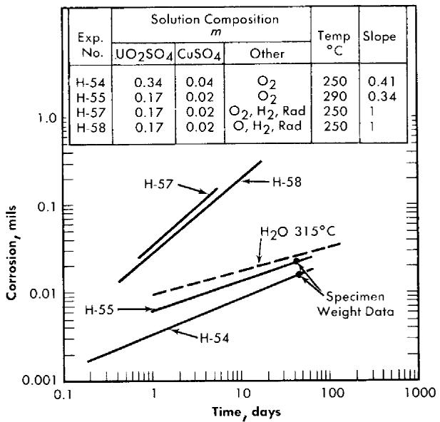  
FIG. 5-15. Comparison of Zircaloy-2 corrosion in various environments.

stainless steel loop. $\mathrm{CuSO_4}$ concentrations from $0.008\textbf{m}$ to $0.07\textbf{m}$ were employed. Oxygen pressures ranged from highs of 140 to 195 psi to lows of 35 to 90 psi. Pressurizer temperatures were normally 15 to $30^{\circ}\mathrm{C}$ higher than the temperature of the main stream.

The solution compositions for a majority of the autoclave experiments are summarized in Table 5-10. In the usual experiment, the fission power

TABLE 5-10   
SUMMARY OF SOLUTION COMPOSITION FOR AUTOCLAVE RADIATION CORROSION EXPERIMENTS WITH ZIRCALOY-2   

<table><tr><td>Component</td><td>Concentration</td></tr><tr><td>UO2SO4(90% enriched uranium)</td><td>0.17 m</td></tr><tr><td>CuSO4</td><td>0.01-0.04 m</td></tr><tr><td>H2SO4</td><td>0-0.04 m</td></tr><tr><td>Excess O2</td><td>900-20 psi</td></tr><tr><td>Radiolytic gas</td><td>0-500 psi</td></tr></table>

density was $20\mathrm{w / ml}$ or less. In a few exceptional autoclave experiments, power densities considerably greater than $20~\mathrm{w / ml}$ were achieved [48].

Operating temperatures ranged from 225 to $300^{\circ}\mathrm{C}$ , with most experiments at 250 or $280^{\circ}\mathrm{C}$ .

The method of filling and sealing many of the early autoclave experiments included air at atmospheric pressure within the system. Solution analyses after irradiation indicated that most of the nitrogen from this air was fixed in solution in some oxidized form with possible concentrations (if all $\mathrm{NO}_3^-$ ) up to or about $0.05\,m$ [49].

The usual preparation of specimen surfaces consisted of cleaning after machining. Before exposure to radiation, the systems, with specimens, were first subjected to high-temperature water, with or without oxygen, and then to the uranyl sulfate solution at temperatures near the test temperature. The loop systems were exposed to solutions of normal uranyl sulfate before the exposure to the $\mathrm{U}^{235}$ -enriched uranyl sulfate solutions.

The thermal neutron flux to which a Zircaloy-2 specimen was exposed while in-pile was determined by measuring and comparing the amount of the induced activities, $\mathrm{Zr}^{95}-\mathrm{Nb}^{95}$ , in the specimen and in a control sample of Zircaloy-2. The latter was irradiated together with a cobalt monitor in a separate experiment in which the specimen and cobalt did not contact solution. For some experiments which contained steel specimens, similar measurements were made utilizing the $\mathrm{Cr}^{51}$ activity. The fission power density in the uranium solution adjacent to a specimen was calculated from the resulting value for the thermal flux together with the value for the fission cross section of uranium, assuming 200 MeV per fission.

Recently, comparisons have been made between values for the flux indicated by cobalt monitors within the test system and by Zircaloy-2 within the same system. The flux values determined from the cobalt were about $25\%$ less than those from Zircaloy-2. The cobalt values may be more valid, but the consistency between Zircaloy-2 results has been good, and the Zircaloy-2 values are employed throughout in presenting the results [50].

Experimental conditions other than those summarized above have been employed, and some of these will be mentioned later.

5-5.4 Results of in-pile tests with Zircaloy-2 and zirconium. The results of autoclave experiments have demonstrated that the corrosion rate of Zircaloy-2 under irradiation at a given set of exposure conditions does not change with the time of exposure, in contrast to out-of-pile behavior. Two in-pile autoclave experiments, H-57 and H-58, plotted in Fig. 5-15, illustrate this [51]. The lines through the plotted points for tests under radiation exhibit a slope of 1, and those for out-of-pile experiments, a slope of about 0.4. In both cases the values for penetration are those calculated from the results of oxygen consumption measurements. It was assumed in the calculations that corrosion of the exposed surfaces in the autoclave

was uniform and that oxygen was lost only in the formation of $\mathrm{ZrO_2}$ . These assumptions appear to be generally valid for the in-pile cases. The corrosion penetration calculated from weight changes of specimens was usually in near agreement with the penetration calculated from oxygen data. A pitting type attack was detected in only one of the numerous specimens which have been exposed [52]. The cause of pitting in this case is unknown.

The time scale which is employed for the radiation experiments is cumulative time with the reactor at power. During exposure of a given experiment, the reactor was frequently at zero power for appreciable periods. It has been observed in autoclave experiments that a penetration of from 0.005 to $0.01\mathrm{mil}$ takes place after shutdown and that, following this, corrosion essentially stops until power operation is resumed. The corrosion which takes place during shutdown appears to delay the onset of attack when irradiation is reinstituted; the amount of delay about balances off the additional attack which occurs during shutdown. In view of this behavior, the practice has been adopted of using radiation time only in calculating corrosion rates [53].

The oxide which is found on Zircaloy-2 surfaces under irradiation is markedly different from that formed outside of radiation. The in-pile specimens which are removed from the autoclaves are covered with a relatively heavy brass-colored scale. This scale cracks and flakes off to some extent upon drying. When a specimen is immersed in acetone and then air-dried at $100^{\circ}\mathrm{C}$ , the scale flakes off almost quantitatively [54]; remaining scale can be removed by cathodic defilmimg. The specimen surfaces after defilmimg generally exhibit a dark-gray color and, in some cases, interference colors. In-pile loop specimens, on the other hand, appear to be free of heavy scale of the type found in autoclaves. There is usually a dark-brown-colored scale on the surfaces, the amount of which is greatest for specimens exposed at the lowest power densities. The scale, of unknown composition, can be removed in a cathodic defilmimg operation [55].

Chemical analyses of heavy scale on autoclave specimens revealed that they contain several percent by weight of uranium and copper in addition to zirconium. Sulfate is found in some scales [56]. Core specimens from loop experiment L-2-17 have been analyzed for uranium as removed from the loop. Twenty micrograms of uranium per square centimeter were found on the surface of a specimen exposed in a location at which the solution velocity was about 1 fps. Five micrograms per square centimeter were found on a specimen exposed at a solution velocity of about 30 fps [57].

Average corrosion rates during exposure to radiation have been calculated from the observed loss in weight and the exposed specimen area, not including areas in close contact with adjacent specimens or covered by the

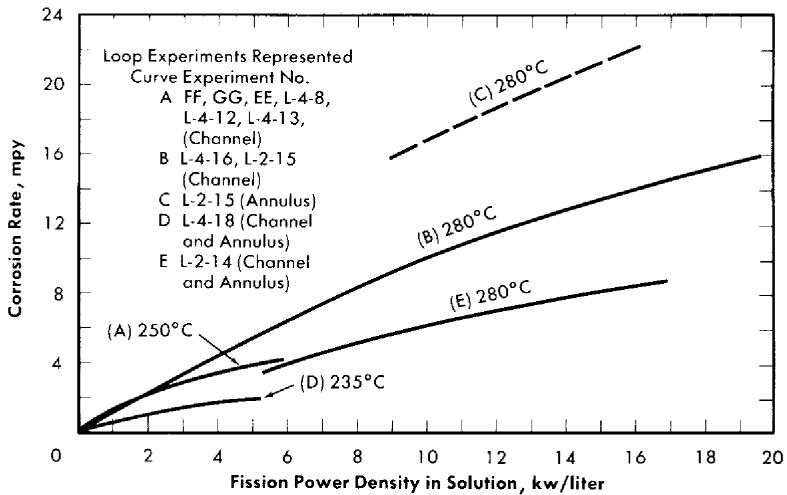  
FIG. 5-16. Radiation corrosion of Zircaloy-2 in $0.17 \, \text{m} \, \text{UO}_2\text{SO}_4$ solutions. Loop results at 235, 250, and $280^{\circ}\text{C}$ .

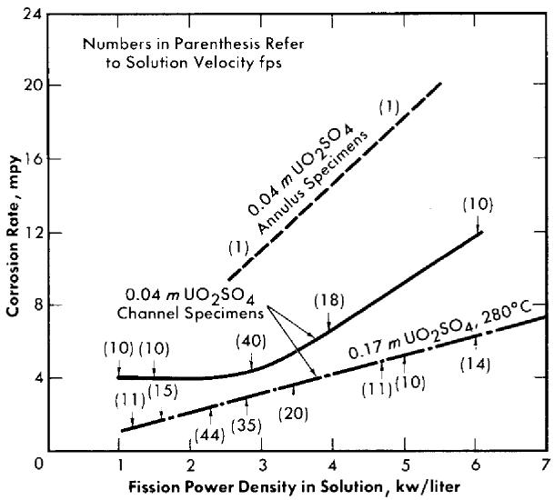  
FIG. 5-17. Radiation corrosion of Zircaloy-2 solutions. Loop results at 280 and $300^{\circ}\mathrm{C}$ .

specimen holder. In some cases, where specimens had different ratios of total to exposed areas, results indicated that the rate of attack of the covered areas was nearly the same as that of the exposed areas. However, use of only the exposed area gives more conservative values. For most of the loop specimens, the ratio of total to exposed area was about 1.6, and in autoclaves the ratio was nearly 1.

Loop results obtained with $0.17m\mathrm{UO}_2\mathrm{SO}_4$ solutions but with other conditions varying are illustrated in Fig. 5-16 [58]. Except for relatively minor variations, the solutions for the experiments represented by curves $A$ , $B$ , and $C$ were the same. Experiment L-2-14, curve $E$ , was with a solution containing $0.4m\mathrm{H}_2\mathrm{SO}_4$ and $0.15m\mathrm{CuSO}_4$ as additives. Experiment L-4-18, curve $D$ , was with a $\mathrm{D}_2\mathrm{O}$ solution. Channel specimens were exposed to solution velocities in the range 10 to 40 fps; annulus specimens to velocities of about 1 fps. Where annulus type specimens were employed, they usually exhibited rates somewhat greater than the channel specimens. The annulus type specimens in loop L-2-15 (curve $C$ ) represent the maximum difference observed in $0.17m\mathrm{UO}_2\mathrm{SO}_4$ solutions. No difference between channel and annulus specimens was observed in experiments L-4-18 and L-2-14 (curves $D$ and $E$ ). The $280^{\circ}\mathrm{C}$ data represented by line $B$ follows the equation

$$
R = 1. 0 4 P \left(1 - e ^ {- 9 5 / R ^ {1. 5}}\right), \tag {5-9}
$$

where $R =$ rate in mpy, and $P =$ power density in kw/liter. The data for $250^{\circ}\mathrm{C}$ (line A) follow the equation

$$
R = 1. 2 5 P \left(1 - e ^ {- 6. 5 / R ^ {1. 5}}\right). \tag {5-10}
$$

The derivation of an equation of this general form is given in Article 5-5.6. Data represented by the other curves are considered insufficient to justify representation by specific equations.

Results obtained with loop experiments with $0.04m\mathrm{UO}_2\mathrm{SO}_4$ solution (L-2-10 and L-2-17) are illustrated by the curves in Fig. 5-17 [59]. A portion of line $B$ from Fig. 5-16 is included in Fig. 5-17 for comparison. Corrosion rates for channel specimens in this solution are greater at the same power density than those for specimens in $0.17m\mathrm{UO}_2\mathrm{SO}_4$ solutions. The shape of the curve through the channel data is also different. As will be discussed later, these channel data may be interpreted in terms of a beneficial effect of solution velocity on corrosion. The approximate locations of specimens in the channel with respect to the power density to which the specimen was exposed and the average velocity of solution at the specimen are indicated in Fig. 5-17. The annulus specimens, which were exposed at low solution velocities, corroded at higher rates than the channel specimens.

The results of autoclave experiments at $250^{\circ}\mathrm{C}$ (curve A, Fig. 5-16) with solutions of the same general compositions as those listed in Table 5-9, but with $0.04m$ excess $\mathrm{H}_2\mathrm{SO}_4$ [60], followed Eq. (5-10), developed for $250^{\circ}\mathrm{C}$ loop data. The rates obtained in autoclave experiments with similar solutions at $280^{\circ}\mathrm{C}$ [60] followed the equation

$$
R = 1. 3 6 P \left(1 - e ^ {- 9 5 / R ^ {1. 5}}\right), \tag {5-11}
$$

which illustrates that the rates were somewhat greater than those obtained with loop channel specimens at $280^{\circ}\mathrm{C}$ (curve $B$ , Fig. 5-16). In autoclave experiments with solutions of the same general composition but with no excess $\mathrm{H}_2\mathrm{SO}_4$ , the data at $250^{\circ}\mathrm{C}$ [60] followed the equation

$$
R = 2. 9 P \left(1 - e ^ {- 6. 5 / R ^ {1. 5}}\right), \tag {5-12}
$$

and the data at $280^{\circ}\mathrm{C}$ followed the equation

$$
R = 2. 4 5 P \left(1 - e ^ {- 9 5 / R ^ {1. 5}}\right). \tag {5-13}
$$

Rates obtained with $0.04 \, \text{m} \, \text{UO}_2\text{SO}_4$ solutions in autoclaves were in approximate agreement with the values observed for annulus coupons in loop experiments with $0.04 \, \text{m}$ solutions (Fig. 5-17) [60]. The effects of changes in some other variables on the in-pile rate are described below:

Time. As mentioned previously, the rates under irradiation appear to remain fairly constant with time.

Oxygen and hydrogen. No effect has been noted of changing the pressure of hydrogen within the test limits, 0 to 350 psi, and of oxygen within 150 to 900 psi.

$\mathrm{CuSO_4}$ . $\mathrm{CuSO_4}$ concentration apparently has little effect on the rate. The results of one autoclave experiment, Z-17, in which no copper was employed confirmed this behavior [61].

Nitrogen. The presence or absence of air at atmospheric pressure in the autoclave when sealed apparently has little effect on the rate [62].

Other solution variables. The presence of $\mathrm{Li_2SO_4}$ as an additive in the uranyl-sulfate solution has resulted in a decreased radiation effect in some autoclave experiments [63]. No appreciable effect on the rate has been noted for other solution additives such as $\mathrm{CrO_3}$ and $\mathrm{KTcO_4}$ [64]. An experiment to which $\mathrm{MoO_3}$ was added indicated an adverse effect for this material in solutions [64].

Other materials. Crystal-bar zirconium was tested in several loop and autoclave experiments. Observed corrosion rates were in near agreement with those for Zircaloy-2.

Chemically polished* specimens of Zircaloy-2 and crystal-bar zirconium corroded at rates about $10\%$ lower than the as-machined specimens.

Other zirconium alloys have been tested in some experiments, but only one of these alloys, $\mathrm{Zr - 15\%}$ Nb, has exhibited appreciably better resistance than Zircaloy-2. This niobium alloy has been tested in several loop and autoclave experiments. In the beta-quenched condition, it corroded at rates lower than those observed for Zircaloy-2 by factors of from 3 (run L-4-11) to 1.5 (run L-2-17) [65].

Zircaloy-2 autoclave experiments in the LITR and MTR reactors with solutions which contained $\mathrm{UO_2SO_4}$ depleted of $\mathrm{U}^{235}$ have exhibited an acceleration of corrosion over that expected out-of-radiation. In these tests, absorption of fast neutron and gamma rays gave rise to a power density in solution of about $6\mathrm{kw / liter}$ in MTR experiments and 0.6 kw/liter in the LITR experiments. In each reactor, about one-half of the power was from gamma-ray and one-half from fast-neutron absorption. At 280 to $300^{\circ}\mathrm{C}$ the observed rates were about 1 and 4 mpy at the lower and higher powers, respectively [66].

5-5.5 Tests of the effect of fast-electron irradiation on Zircaloy-2 corrosion. The effect of fast electrons from a van de Graaff accelerator on the corrosion of Zircaloy-2 by uranyl sulfate solutions has been tested in experiments at 250 and $300^{\circ}\mathrm{C}$ . In both cases the specimens were mounted in a small thermal siphon loop constructed of titanium. Employing electrons with an initial energy of $1.5\mathrm{MeV}$ and currents in the neighborhood of $2\times 10^{14} / (\mathrm{cm}^2)(\mathrm{sec})$ , the experimental arrangement was such that an electron traversed approximately one-half of its range before impinging on the specimen. The estimated power density due to absorption of beta-ray energy in the solution adjacent to the specimen was 60 to $90\mathrm{kw / liter}$ in each experiment. The duration of exposure was $40\mathrm{hr}$ at $250^{\circ}\mathrm{C}$ and $60\mathrm{hr}$ at $300^{\circ}\mathrm{C}$ . No significant acceleration of the corrosion due to irradiation was found in either case [67].

5-5.6 Discussion of results of radiation corrosion experiments. The results of the radiation experiments presented above suggest that the radiation effect on the corrosion of Zircaloy-2 by uranyl-sulfate solution is not directly associated with changes in solution under irradiation. If the radiation chemistry of these solutions at high temperature is not greatly different from that of acid solutions near room temperature, the yield of H-atoms and OH radicals in solution from beta and gamma radiation is at least as great as that from heavy particles [68]. Since radicals produce marked changes in reactions, rather than the molecular products $\mathrm{H}_{2}$ and

$\mathrm{O_2}$ , corrosion effects due to changes in solution would be as pronounced for beta-gamma radiation as for heavy particles. However, no effect of beta radiation was observed. It was also mentioned that no effect has been observed of varying $\mathrm{H_2}$ and $\mathrm{O_2}$ pressures in in-pile autoclave experiments. Thus the primary action of the radiation is in the metal or its protective oxide film, or both, probably through the formation of interstitials and vacancies by heavy nuclear particles. Beta-gamma radiations can also produce interstitials in such materials, but with considerably less efficiency. The number of such defects produced by an electron in the energy range employed in the van de Graaff experiments may be expected to be a factor of 100 or more less than the number produced by a 1-Mev neutron [69]. Hence the rate of defect formation by the electrons was small compared with the rate of formation by fast neutrons in the depleted $\mathrm{UO_2SO_4}$ in-pile tests.

On the basis of these considerations and of the various experimental observations, a qualitative model of the radiation corrosion of Zircaloy-2 has been developed, from which an equation relating fission power density in solution and corrosion rate has been derived [70]. The equation has the general form

$$
R = \Lambda P \left(1 - e ^ {- B / R ^ {1. 5}}\right), \tag {5-14}
$$

where $R$ is the corrosion rate, $P$ is the fission power density, and $A$ and $B$ are constants. This equation is derived as follows.

Under exposure to heavy-particle radiation, the protective oxide film forms on the metal as it does out-of-radiation, and the kinetics of the protective oxide formation are about the same in and out of radiation. Under irradiation, however, the film does not continue to increase in thickness. Radiation produces defects of unspecified nature in the protective oxide, and in the presence of these defects, the oxide breaks up and/or reacts with the solution to form a nonprotective scale. The rate at which the protective oxide breaks up is proportional to the concentration of defects in the oxide at the oxide-solution interface. Under these conditions, a steady state is established in which oxide is removed at a rate equal to the rate of formation and in which a steady-state thickness of film results. The corrosion rate is determined by the rate of transfer of reagents across this film. The defects are produced at a rate proportional to the intensity of radiation and are removed by thermal annealing at a rate proportional to the concentration of defects. In the derivation of the general equation, it was assumed that the rate of oxidation of the metal, $R$ , at a given protective film thickness, $X$ , is given by

$$
R = C / X ^ {2}, \tag {5-15}
$$

where $C$ is a constant.

In considering the effect of solution composition and flow velocity on the radiation corrosion of Zircaloy-2, a number of interesting phenomena, related apparently to the sorption of uranium on or near the protective film, were observed. Some of these effects are illustrated in Fig. 5-17, based on data from runs L-2-10, L-2-17, L-4-16, and L-2-15 listed in Table 5-9. As shown in Fig. 5-17, at a given solution power density the corrosion rate was greater in $0.04\mathrm{m}$ $\mathrm{UO_2SO_4}$ than in $0.17\mathrm{m}$ $\mathrm{UO_2SO_4}$ , and the degree of difference was less in high-velocity regions (30 to 40 fps) than in low-velocity regions (10 fps). The low-velocity (1-fps) annulus specimens in the $0.04\mathrm{m}$ solutions were attacked at markedly higher rates than the channel specimens. The addition of $0.04\mathrm{m}$ excess $\mathrm{H_2SO_4}$ to the $0.17\mathrm{m}$ $\mathrm{UO_2SO_4}$ solutions in autoclave experiments had a beneficial effect at a given solution power density. The addition of a greater amount of excess $\mathrm{H_2SO_4}$ ( $0.4\mathrm{m}$ ) to the $0.17\mathrm{m}$ $\mathrm{UO_2SO_4}$ in loop experiment L-2-14 also produced a beneficial effect.

It appears likely that most of these solution and velocity effects are associated with the sorption of uranium on the surface of the test specimens. As mentioned previously, uranium is usually found in the scale from specimens exposed in autoclave experiments. The amount of this uranium is less for specimens exposed to solution with $0.04m$ excess $\mathrm{H}_2\mathrm{SO}_4$ than for those exposed to solutions with no acid. One to two per cent uranium by weight is usually found for specimens exposed under the former conditions, and 5 to $6 \%$ under the latter condition. It has been found that the autoclave results in the different solutions can be intercorrelated as well as correlated with the loop results if a corrected power density, $P_{c}$ , rather than the power density in solution is employed [71]. In this correlation, which is empirical, the corrected power density is assumed to be given by the expression

$$
P _ {c} = P _ {s} + K ^ {\prime} N U _ {f}, \tag {5-16}
$$

where $\mathrm{U}_f$ is the percentage uranium in the scale, $N$ is the thermal neutron flux, $P_s$ is the power density in solution, and $K'$ is a constant. Since $P_s$ is related to $N$ through the uranium concentration in solution, $\mathrm{U}_s$ , the equation may be written:

$$
P _ {c} = P _ {s} \left(1 + \frac {K U _ {f}}{U _ {s}}\right) \cdot \tag {5-17}
$$

The curve expressed by Eq. (5-9) was assumed for the relationship between power density in solution and corrosion rate in the absence of scale at $280^{\circ}\mathrm{C}$ . The constant $K$ in Eq. (5-17) was evaluated from the best fit of the $280^{\circ}\mathrm{C}$ autoclave data to the curve. The same value of the constant was found to apply in fitting the $250^{\circ}\mathrm{C}$ -autoclave data to Eq. (5-10),

which represents the line drawn through the results of the $250^{\circ}\mathrm{C}$ -loop experiments. On the basis of these correlations—that is, when the corrected power density is employed—it appears that there is no appreciable difference between the corrosion rate in autoclave solutions containing $0.04\,m\,\mathrm{H}_2\mathrm{SO}_4$ and in those free of excess acid. There is also no difference between $0.17\,m$ and $0.04\,m\,\mathrm{UO}_2\mathrm{SO}_4$ solutions in autoclave experiments.

The fact that the autoclave data can be correlated with the loop data represented by Eqs. (5-9) and (5-10) is of questionable significance, since it is not known whether the rates in the $0.17\mathrm{m}\mathrm{UO}_2\mathrm{SO}_4$ loop experiments were influenced by sorbed surface uranium. As mentioned previously, the loop specimens are usually free of heavy scale of the type found in autoclaves. However, uranium was found on specimens from the L-2-17 experiment, which was with a solution $0.04\mathrm{m}\mathrm{UO}_2\mathrm{SO}_4$ , and it appears likely that uranium sorption on a given Zircaloy-2 specimen was responsible for an appreciable fraction of the total corrosion attack on the given specimen both in this experiment and in experiment L-2-10 [72]. Since a greater amount of uranium was found on the surface of the low-velocity annulus specimen than on the high-velocity core channel specimen, it is also likely that differences in the amount of uranium which is sorbed at different velocities resulted in the apparent beneficial effect of increasing solution velocity [72] in these $0.04\mathrm{m}\mathrm{UO}_2\mathrm{SO}_4$ experiments.

# 5-6. CORROSION BEHAVIOR OF TITANIUM AND TITANIUM ALLOYS IN URANYL SULFATE SOLUTIONS*

5-6.1 Introduction. The corrosion behavior of commercially pure titanium and of titanium alloys has been tested at elevated temperatures in uranyl-sulfate solutions under dynamic and static conditions in the absence and in the presence of radiation. The equipment and testing procedures employed were identical with those employed in tests of Zircaloy-2 and type-347 stainless steel described previously.

Of the various in-pile loop experiments listed in Table 5-9, all but those designated DD, GG, and FF were concerned in part with titanium corrosion. In addition to the in-pile tests, one scouting-type experiment was made of the effect of fast electrons from a van de Graaff accelerator on the corrosion of titanium-75A in a small thermal siphon loop constructed of titanium.

5-6.2 Corrosion of titanium and titanium alloys in uranyl sulfate solutions in the absence of radiation. The commercially pure titanium and the titanium alloys developed a tightly adhering film under exposure which exhibited interference colors ranging from tan to deep blue or black, depending upon the alloy and upon conditions and length of exposure. This film could not be removed without damaging the metal. Titanium specimens exposed in uranyl sulfate solutions circulating in stainless steel loops collected some of the stainless steel corrosion products (iron and chromium oxides) in an outer layer of scale which could be removed electrochemically.

The average corrosion rates of commercially pure titanium alloys (45A, RC-55, 75A, 100A, 150A) in a solution $0.04\mathrm{m}\mathrm{UO}_2\mathrm{SO}_4$ , $0.02\mathrm{mH_2SO_4}$ , and $0.005\mathrm{mCuSO_4}$ at 200, 250, and $300^{\circ}\mathrm{C}$ in the absence of radiation were less than 0.1 mpy. Under similar conditions, high-strength titanium alloys (containing $5\%$ Al, $2\frac{1}{2}\%$ Sn; $3\%$ Al, $5\%$ Cr; $6\%$ Al, $4\%$ V; $4\%$ Al, $4\%$ Mn) exhibited corrosion rates up to 0.4 mpy; one alloy $(\mathrm{Ti} + 8\% \mathrm{Mn})$ showed only 0.05 mpy at $300^{\circ}\mathrm{C}$ . These rate values were calculated from the decrease in weight of specimens as measured in long-term tests following an initial exposure period of several days. The specimen in each case was descaled electrochemically prior to the final weighing but, as described above, some film remained on the specimen. As shown by the results, the commercially pure titanium is very resistant to attack. The high-strength titanium alloys are slightly less resistant, and corrosion rates increased with increasing temperature. Other tests have shown similar corrosion rates at uranyl sulfate concentrations from 0.02 to $1.3\mathrm{m}$ .

5-6.3 Corrosion of titanium and titanium alloys in uranyl sulfate solution under irradiation. Specimens exposed in the core of in-pile loops were coated with an adherent bronze-colored film which could not be removed without damage to the metal. In some loop experiments, the bronze film was overlaid with a dark-brown scale similar to that found on Zircaloy-2 specimens and was thickest for those specimens exposed at the lowest fission power densities [73] as for Zircaloy-2. This scale was partly removed from the titanium and alloys by a cathodic defilming operation prior to final weighing. The value for the corrosion rate of a core specimen was calculated from the loss in weight during exposure as indicated by final weighing, the exposed area, and the radiation time (see Articles 5-5.3 and 5-5.4).

The results obtained with core specimens from in-pile loop experiments shown in Fig. 5-18 [74] indicate the spread of experimental data over the range of conditions investigated (Table 5-9). Some of the available experimental values at low power density and low corrosion rates have been omitted from Fig. 5-18. Most of the data shown were obtained with Ti-55A. For this material, the results indicate that the corrosion rate

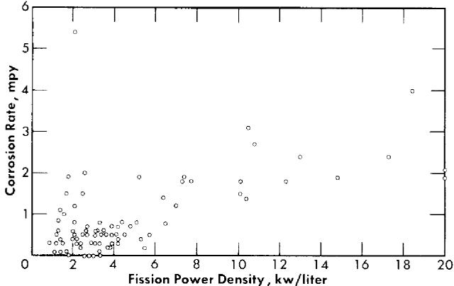  
FIG. 5-18. Radiation corrosion of titanium, loop results.

in-pile is greater than that expected out-of-pile and that the in-pile rate increases slightly with increasing fission power density. There is no significant effect of exposure temperature within the range investigated. A few results suggest that high solution velocities had an adverse effect on the in-pile corrosion, but other results show no such adverse effect. It is possible that fretting between specimens and holder was responsible for the additional weight loss of those specimens which indicated the adverse velocity effect. It should be noted that the amount of scale retained by a specimen after descaling can and may affect the apparent corrosion rate of the specimen, and differences in the amount of scale retained by different specimens may influence the apparent corrosion behavior with respect to the variables power density, velocity, and temperature. The few results available for titanium alloys indicate that, with the exception of the Ti-6% Al-4% V in experiment L-2-14, these materials corroded at rates which are about the same or only slightly greater than those for Ti-55A under the same conditions. The rates for the Ti-6% Al-4% V in L-2-14 were about double those for Ti-55A.

The corrosion rate of Ti-55A in in-line positions outside the radiation field was found to be in the range of 0 to $2.5\mathrm{mpy}$ [74]. These results indicate that, in general, the corrosion of titanium exposed in in-line positions of a loop is greater than expected in the absence of radiation, which out-of-pile tests showed to be about $0.03\mathrm{mpy}$ or less. The rates determined from specimen weights were generally less than those observed with specimens exposed in the core, although in some experiments the maximum rate observed for in-line specimens was about the same as that observed for core specimens. Differences between the amount of scale retained by in-line and core specimens after descending may account, in part, for the apparently lower rates of in-line specimens.

The results of in-pile autoclave experiments indicated corrosion rates under irradiation which are in general agreement with those determined in in-pile loop experiments. The oxygen pressure measurements in autoclave experiments indicate that the rate of attack remains constant at a given set of in-pile conditions [75].

The van de Graaff experiment employed a solution $0.04\,m\, \mathrm{UO}_2\mathrm{SO}_4$ , $0.02\,m$ in excess $\mathrm{H}_2\mathrm{SO}_4$ , and $0.01\,m\, \mathrm{CuSO}_4$ at a temperature of $300^{\circ}\mathrm{C}$ . Exposure to fast electrons was for a period of 50 hr and at an intensity such that the estimated power density due to electron absorption was about $60\, \mathrm{kw/liter}$ in solution adjacent to the specimen. No evidence was apparent that the corrosion of the Ti-75A was accelerated appreciably during the irradiation [76].

# 5-7. AQUEOUS SLURRY CORROSION*

The studies reported in this section indicate that corrosion-erosion problems of high-temperature (250 to $300^{\circ}\mathrm{C}$ ) aqueous oxide slurry systems may be satisfactorily controlled. However, under unfavorable conditions very aggressive attack has been noted.

Aqueous slurry corrosion problems in nuclear reactors were studied in the early days of the Manhattan Project, as reported by Hiskey [77] and Kirshenbaum [78]; in Great Britain's Harwell laboratory [79]; and in the Netherlands's KEMA laboratory [79]. Slurry corrosion problems are now being studied for the Pennsylvania Advanced Reactor by Westinghouse Corporation [80], and at Oak Ridge National Laboratory [81-85].

Most of the work described below has been done at the Oak Ridge National Laboratory and is summarized in the reports cited above. Most of the circulating corrosion tests have been carried out at temperatures of approximately 250 to $300^{\circ}\mathrm{C}$ in stainless steel equipment.

5-7.1 Nature of attack. Factors involved in the corrosion-erosion problem. Slurry attack may be regarded as simultaneous abrasion and high-temperature water corrosion. Information on the high-temperature corrosion of materials by water in nuclear reactors is discussed in the Corrosion and Wear Handbook [86], by L. Scheib [87], and for other systems in the Corrosion Handbook [88]. This serves as a basis for the consideration of similar aspects of attack by aqueous slurries.

For the practical utilization of circulating aqueous slurries, a suitable balance must be made between corrosion-erosion attack of materials of construction and handling properties of the slurry, including viscosity, heat transfer, settling, resuspension, and caking characteristics. The materials of construction, operating conditions, slurry characteristics, and

properties of the thoria or other material used to prepare the slurry all exert important influences on the corrosion-erosion problem. All these factors are important in certain circumstances, and their effect has frequently been found to depend strongly on the presence or level of other factors. Considerations of such interactions should not be neglected; however, the strongest factors in attack by aqueous slurries appear to be particle size, abrasiveness, and degradation susceptibility, flow velocity and pattern, and metal composition. Important secondary factors include temperature, atmosphere, slurry concentration, and additives. The effect of radiation, particularly fissioning, is expected to interact strongly with such other variables as flow and type of gaseous atmosphere.

Materials of interest. The materials of interest in aqueous slurry systems for nuclear reactors include many of those considered for high-purity aqueous high-temperature systems in the Corrosion and Wear Handbook [86]. Although materials found to be unsatisfactory in the purely aqueous system are usually not suitable for slurry systems, the order of excellence and the relative importance of different variables has been found to be altered in slurry systems. Most of the materials and alloys investigated were the same as tested in aqueous uranyl sulfate solutions described previously. Results for classes of materials are summarized as follows:

The austenitic stainless steels represent the most useful class of construction material for slurry systems. Of the various types available, type-347 has been tested most. Differences between various types do not appear to be significant.

It appears possible to reach corrosion rates considerably below 1 mpy with flows of 20 fps. The most severe attack of stainless steel has been localized attack noted on pump impellers and housings, orifice restrictors, and test specimens in high-velocity regions.

Ferritic and martensitic stainless steels are attractive for certain operating parts because of their hardness properties. The corrosion resistance of these materials is about the same as that of the austenitic stainless steels and slightly better in a number of cases. Because certain alloys of this class do not appear to be susceptible to stress-corrosion cracking as are austenitic stainless steels, they remain potentially a very useful class of materials.

Carbon steels or low-alloy steels are of interest because of their low cost. Results based on corrosion specimens in systems at high oxygen concentrations, or with hydrogen added, indicate comparatively high attack rates decreasing with time, and it is possible that acceptable rates will be achieved. However, pitting problems and potential embrittlement by hydrogen or alkali have not been explored. The effect of chromate from corrosion of stainless steel by slurries with high oxygen concentrations in a combined carbon steel-stainless steel system has not yet been determined.

Nickel alloys appear to perform somewhat better in hydrogenated systems but generally are not so corrosion resistant as the austenitic stainless steels in oxygenated slurries. Inconel and Inconel X appear to give results approaching austenitic stainless steel in some circumstances.

Stellites have performed best in hydrogenated systems. Attack by high-temperature oxygenated slurry appears to be due to simple aqueous corrosion.

Titanium and its alloys in oxygenated slurry have shown approximately the same corrosion rates as the austenitic stainless steels. In alkaline systems with hydrogen atmosphere, very severe attack has been noted.

Zirconium alloys, especially Zircaloy-2, have shown extremely good corrosion resistance relative to other materials. Fairly severe attack in a high-velocity wake region by a very abrasive thoria slurry has been noted.

Noble metals have been tested along with other types to assist in evaluating the effects of pure erosion. To a rough approximation the ratio of attack rates on the platinum and gold is constant over a wide range of conditions, as suggested by Hiskey [89].

Tantalum, in one test at 21 fps, gave results comparable to platinum. Bronze and aluminum were severely attacked by high-temperature aqueous slurries. Synthetic sapphire and aluminum oxide were severely attacked at high flow velocities by high-temperature aqueous thoria slurries, and pins of thoria densified by the addition of $0.5\%$ CaO disintegrated under similar conditions.

Types and mechanisms of attack. The attack by aqueous slurries on metals under nuclear reactor conditions may be treated as a succession of stages: (a) collision of slurry particles with the surface, (b) damage to the surface, and (c) reaction of the underlying metal with the aqueous phase. Particles may be caused to strike the surface by impingement, by eddy action, or by shear forces.

Impingement attack, which is noticed on upstream surfaces of objects in line of flow, in piping elbows, etc., is visualized as resulting from a breakthrough of flow lines by slurry particles as the direction of flow is changed on meeting an object. Attack primarily results from impact of the larger slurry particles with the surface. An example is shown in Fig. 5-19.

Impingement target efficiency [90-93] is estimated as a function of the dimensionless separation number $V_{0}D_{p}^{2}(\rho_{s} - \rho) / 18\mu D_{b}$ , where $V_{0}$ is relative slurry velocity, $D_{b}$ is dimension of obstructing body, $D_{p}$ is particle diameter, $\mu$ is fluid viscosity, $\rho_{s}$ is solid density, and $\rho$ is slurry density. A sigmoid curve of target efficiency versus the logarithm of separation number was obtained for various shapes with 55 to $80\%$ target efficiency at a separation number of 1, and with a limiting value of separation number, 0.06 for cylinders, below which impingement does not occur. Application

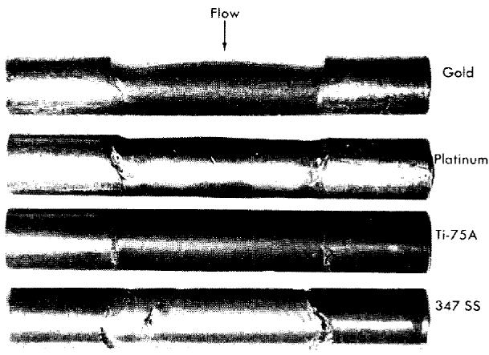  
FIG. 5-19. Impingement erosion of pin specimens by flowing thoria slurry.

of this concept by Thomas [94] to aqueous thoria slurry at $250^{\circ}\mathrm{C}$ indicated that flow at 26 fps past a cylinder of 0.1 in. diameter would result in no impingement by particles below about 3 microns.

Corrosion rate would be proportional to concentration, velocity, target efficiency, and erosivity [95] (the mass of metal removed per unit mass of particles striking the metal surface). Erosivity would be expected to be a function of the flow characteristics, particle energy and abrasiveness, and other properties of the particle and the metal, although a general formula for it has not been developed.

The results of the impingement concept should apply to attack on all surfaces obstructing flow lines of the slurry. This type of attack will be sensitive to equipment size effects.

Eddy attack is noted on pump impellers and housings, high-velocity test specimens, pipe walls, and other similar regions. It is characterized by relatively deep-gouged pits in the direction of flow, quite smooth on the bottom, or by a deep general polishing. The pits are frequently undercut to the downstream side so that they feel smooth in the direction of flow and rasplike in the reverse direction. Attack due to wakes, cavitation, or flow separation is more localized. It is frequently possible to associate the localization of the attack with some change in the flow pattern. It has been observed downstream from protruding weld beads, on the downstream side of pin test specimens, on the rim of pump impeller shrouds, on pipe walls downstream from a flow interruption, between adjoining coupon test specimens, etc. An illustration of such attack on a pump impeller is given in Fig. 5-20.

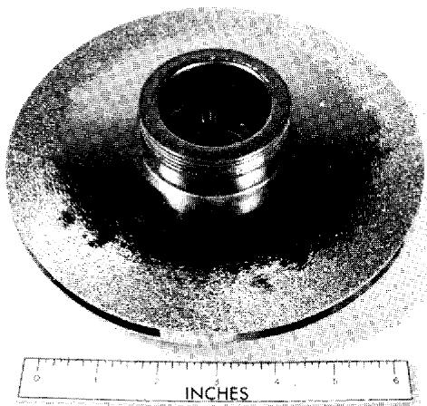

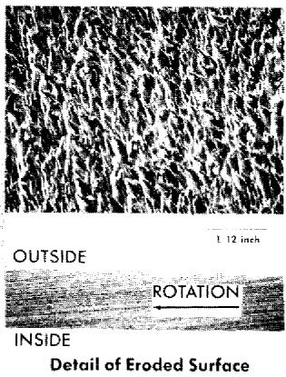  
FIG. 5-20. Eddy corrosion of stainless-steel pump impeller by thoria slurry.

Pits resulting from eddy attack may become quite deep, with depths of 100 mils having developed in a stainless steel pump-impeller shroud edge (not shown) in $1000\mathrm{hr}$ .

Eddies can be caused by high velocity, high rates of shear, cavitation, wake effects, and flow separation and may result in breakthrough of the flow boundary layer [96-97].

It would appear that in some sense the impingement model above might still apply to eddy erosion, with larger particles being thrown to the outer circumference of an eddy. The edge velocity of the eddy would be at least equal to the fluid velocity at the point of eddy origin. The postulation of a lower limit on eddy size has been noted [98]. Small eddies might become trapped in surface imperfections, leading to continuing localized attack. Wake effects are similar to the cavitation erosion studied in water tunnels by Shalnev [99], in which the initiation of cavitation in the wake of circular objects is attributed to eddies. Eddy attack will be very sensitive to equipment shape and streamlining effects.

Low shear attack is a relatively gentle, low-velocity attack such as might be observed on pipe walls, coupon specimen surfaces parallel to the direction of flow, etc. It is presumed to result from a reduction in thickness of the protecting boundary layer as flow velocity increases. As indicated by Johnstone and Thring [100], this type of attack would be sensitive to scale-up effects, becoming less severe at equivalent Reynolds number as the flow-channel dimensions are increased. It is also likely to be sensitive to water corrosion effects.

Relatively thin colored films (less than $1\mathrm{mg/cm^2}$ ) characteristic of

water corrosion are normally observed in aqueous slurry systems. In many cases, especially when a substantial quantity of electrolyte is present, a bright polished surface has been observed. With slurries having particle sizes near their degradation minimum, there appeared to be no decrease in corrosion rate with time, which implies that the outer portions of the protective oxide film were being removed by the flowing slurry as fast as it was formed.

Factors involved in surface damage to oxide film or metal proper by impinging particles are complicated. Hardness, elasticity, strength of the oxide film or metal, and the nature of the metal-to-oxide bond are important. Impact energy, its localization by particle sharpness, and its transfer due to particle hardness and strength, are also important. Rosenberg and others [101-103] noted that sharp sand was about four times as erosive to steel (in an air blast) as larger, more rounded sand. For many slurries in toroid or pump loop tests the most severe attack of metal surfaces is noted concurrently with the most rapid degradation in the size of the slurry particles [104].

For all metals of interest, except the most noble, the destruction of a protective oxide film exposes reactive metal to the aqueous medium. The rate of reaction is very high, and the rate of film re-formation will control this reaction rate and the net amount of metal consumed. Changes in the chemical environment and pH via gaseous atmosphere, additives, or ingrowing corrosion or fission products will strongly affect the rate of metal reaction and oxide re-formation.

Methods of test. The relative abrasiveness of slurries may be determined in a laboratory jet-impingement test device developed by McBride [105] in which a slurry spray is jetted against a thin metal strip and penetration time noted.

To obtain accurate slurry corrosion data, toroids, pump loops, and in-pile autoclaves have been used for high-temperature tests with aqueous slurries. This equipment is described in Section 5-2.

In toroid tests, information is obtained as to corrosion rate of several metals, slurry particle degradation, and qualitative slurry handling characteristics by examination of metal pin specimens and analysis of the withdrawn slurry.

In pump loops, a larger amount of quantitative information is obtained at several different velocities and flow patterns from an examination of loop components, as well as specimens. Generalized incremental loop corrosion rates and slurry properties are obtained at suitable intervals from analysis of withdrawn samples.

By use of rocking in-pile autoclaves, tests at negligible flow velocities have been made at neutron fluxes approaching $10^{13}$ to evaluate corrosion rates and rates of production and recombination of radiolytic gas.

# TABLE 5-11

# THE ATTACK OF VARIOUS MATERIALS BY $1600^{\circ}\mathrm{C}$ - FIRED THORIUM OXIDE SLURRY (PUMP-LOOP TESTS)

Loop-piping generalized corrosion rate except pump: 0.9 mpy at $\sim 10$ fps. Pump-impeller (7.8 in. dia) wt. loss: $27\mathrm{g}$ at 90 fps (50-100 mil rim pits)

<table><tr><td colspan="3">Pin-specimen corrosion rates, mpy:</td></tr><tr><td>Velocity</td><td>20 fps</td><td>40 fps</td></tr><tr><td>Austenitic stainless steels</td><td>2</td><td>25</td></tr><tr><td>Titanium alloys</td><td>2</td><td>6</td></tr><tr><td>Zircaloy-2</td><td>0.1</td><td>1</td></tr><tr><td>Gold</td><td>0.2</td><td>4</td></tr><tr><td>Platinum</td><td>1</td><td>12</td></tr></table>

5-7.2 Slurry materials. Uranium dioxide. Uranium-dioxide slurry and quartz slurries were tested in small-scale loops and spinning cylinder systems in the early days of the Manhattan Project. It was observed [106-107] that erosion was proportional to the square or cube of the velocity, varied strongly with particle size, decreased with time as particle size degradation took place, and exhibited a constant ratio for different materials under the same conditions. Uranium dioxide has a Moh scale hardness of 6.1 [108] and to a certain extent would be expected to resemble thoria under a hydrogen atmosphere, as described later.

Uranium trioxide. The attack of stainless steel pump-loop components by uranium trioxide slurries at $250^{\circ}\mathrm{C}$ was essentially nil in tests extended for thousands of hours, even on pump impellers with a tip velocity of 120 fps [109]. The lack of attack by circulating uranium trioxide slurries under conditions in which impingement certainly occurred is attributed to the relative softness of the uranium trioxide particles.

Thorium oxide. The major portion of studies on corrosion-erosion characteristics of high-temperature aqueous slurries has been carried out using thorium oxide [110-111]. Most preparations have used the calcination product of thorium oxalate precipitated under various conditions, with calcination temperatures from 450 to $1600^{\circ}\mathrm{C}$ having been used. Thoria prepared by other procedures, such as formate precipitation, has also been examined. Thoria calcined at temperatures in the vicinity of $1600^{\circ}\mathrm{C}$ has low surface area, crystallite sizes approaching particle size, less tendency to degrade, and exhibits a greater tendency to produce abrasive sintered particles; consequently, certain of such thoria products have been

TABLE 5-12   
REDUCTION IN THORIUM OXIDE SLURRY  
CORROSION BY PARTICLE SIZE CONTROL   
(Pump-loop tests on same batch)   

<table><tr><td></td><td colspan="2">Unclassified</td><td colspan="2">Classified</td></tr><tr><td>Temperature, °C</td><td colspan="2">200</td><td colspan="2">280</td></tr><tr><td>Duration, hr</td><td colspan="2">5</td><td colspan="2">309</td></tr><tr><td>Concentration, g Th/kg H2O</td><td colspan="2">443</td><td colspan="2">323</td></tr><tr><td>Atmosphere</td><td colspan="2">O2</td><td colspan="2">O2</td></tr><tr><td>pH (slurry, 25°C)</td><td colspan="2">7.5</td><td colspan="2">5.5</td></tr><tr><td>Thoria calcination temperature, °C</td><td colspan="2">1600</td><td colspan="2">1600</td></tr><tr><td>Particle size</td><td></td><td></td><td></td><td></td></tr><tr><td>Average, μ</td><td colspan="2">1.3</td><td colspan="2">1.7</td></tr><tr><td>Maximum</td><td colspan="2">28% &gt; 10 μ</td><td colspan="2">2% &gt; 5 μ</td></tr><tr><td>Average crystallite size (x-ray), μ</td><td colspan="2">&gt; 0.25</td><td colspan="2">&gt; 0.25</td></tr><tr><td>Specific surface (N2adsorption), m2/g</td><td colspan="2">1.2</td><td colspan="2">1.7</td></tr><tr><td>Loop-piping generalized corrosion rate, mpy</td><td colspan="2">63</td><td colspan="2">1.5</td></tr><tr><td>Pump-impeller (7.8 in. dia) wt. loss, g</td><td colspan="2">11</td><td colspan="2">1.5</td></tr><tr><td colspan="5">Pin-specimen corrosion rates, mpy</td></tr><tr><td>Velocity</td><td>25 fps</td><td>40 fps</td><td>22 fps</td><td>44 fps</td></tr><tr><td>Austenitic stainless steels</td><td>27-57</td><td>150-320</td><td>0.8</td><td>8</td></tr><tr><td>Ferritic stainless steel</td><td>34-110</td><td>120-180</td><td>1</td><td>4</td></tr><tr><td>Titanium alloys</td><td>63</td><td>240</td><td>0.5</td><td>4</td></tr><tr><td>Zirconium alloys</td><td>8-97</td><td>310-700</td><td>0</td><td>1</td></tr><tr><td>Gold</td><td>120</td><td>630</td><td>0</td><td>2</td></tr><tr><td>Platinum</td><td>96</td><td>650</td><td>0.5</td><td>7</td></tr></table>

classified, using sedimentation procedures, to remove unduly large particles. Thoria calcined at 650 to $900^{\circ}\mathrm{C}$ because of its properties was considerably degraded by continued pumping and was reported [112] to show greatly reduced corrosion rates as this occurred.

The hardness of thoria minerals has been reported as 6.5 on the Moh scale. The hardness of thoria densified with $0.5\%$ CaO is 6.8 [113], and laboratory preparations of thoria have been observed with hardness greater than 7. The hardness of many mineral oxides, of a composition similar to the protective film on metals, lies between 6 and 6.5. However, sapphire attacked by high-temperature aqueous thoria slurry has a hardness of 9.

To evaluate materials under conditions expected for a reactor, pin speci

# TABLE 5-13

COMPARATIVE PIN-CORROSION RATES AND PARTICLE DEGRADATION AT $300^{\circ}\mathrm{C}$ ; SAME THORIA BATCH (THORIUM OXALATE CALCINED AT $800^{\circ}\mathrm{C}$ ), OXYGEN ATMOSPHERE, PUMP-LOOP TESTS

<table><tr><td>Thoria</td><td colspan="3">Unpumped</td><td colspan="3">Unpumped</td><td colspan="3">Prev. pumped</td></tr><tr><td>Hours</td><td colspan="3">49</td><td colspan="3">301</td><td colspan="3">266</td></tr><tr><td>g Th/kg H2O (avg.)</td><td colspan="3">543</td><td colspan="3">348</td><td colspan="3">346</td></tr><tr><td>fps</td><td>11</td><td>21</td><td>41</td><td>10</td><td>22</td><td>41</td><td>13</td><td>22</td><td>43</td></tr><tr><td></td><td colspan="9">Corrosion rate, mpy</td></tr><tr><td>Gold</td><td>0.4</td><td>0.4</td><td>4</td><td>0.1</td><td>0.1</td><td>0.6</td><td>0.03</td><td>0.08</td><td>0.9</td></tr><tr><td>Zircaloy-2</td><td>0.1</td><td>1</td><td>6</td><td>0.1</td><td>0.1</td><td>2</td><td>0</td><td>0</td><td>1</td></tr><tr><td>Titanium</td><td>1</td><td>4</td><td>9</td><td>0.2</td><td>2</td><td>6</td><td>0.1</td><td>1</td><td>5</td></tr><tr><td>Stainless steel</td><td>3</td><td>7</td><td>21</td><td>1</td><td>3</td><td>8</td><td>0.5</td><td>0.5</td><td>3</td></tr><tr><td>Loop</td><td></td><td>4.5</td><td></td><td></td><td>1.5</td><td></td><td></td><td>0.8</td><td></td></tr><tr><td></td><td colspan="9">Particle-size distribution, w/o</td></tr><tr><td>Size, μ</td><td>&gt;3</td><td>1-3</td><td>&lt;1</td><td>&gt;3</td><td>1-3</td><td>&lt;1</td><td>&gt;3</td><td>1-3</td><td>&lt;1</td></tr><tr><td>0 hr</td><td>48</td><td>27</td><td>25</td><td>59</td><td>26</td><td>15</td><td>3</td><td>32</td><td>65</td></tr><tr><td>5 hr</td><td>8</td><td>25</td><td>67</td><td>—</td><td>—</td><td>—</td><td>—</td><td>—</td><td>—</td></tr><tr><td>30 hr</td><td>5</td><td>21</td><td>74</td><td>7</td><td>25</td><td>69</td><td>7</td><td>28</td><td>65</td></tr><tr><td>Final</td><td>—</td><td>—</td><td>—</td><td>3</td><td>32</td><td>65</td><td>2</td><td>21</td><td>77</td></tr></table>

mens of various materials were exposed for $1000\mathrm{hr}$ to a slurry of $1500\mathrm{g}$ $\mathrm{Th / kgH_2O}$ at $280^{\circ}\mathrm{C}$ in a pump loop pressurized with steam plus $200~\mathrm{psi}~\mathrm{O}_2$ . The $1600^{\circ}\mathrm{C}$ -calcined thoria had an average particle size of 1.7 microns, with $3 \%$ of the particles greater than 3 microns, and the slurry had a $\mathsf{pH}$ of 5.8 measured at $25^{\circ}\mathrm{C}$ . The results of the test are summarized in Table 5-11.

5-7.3 Effect of slurry characteristics. Particle size. Two effects relating to particle size have been distinguished. These are the effects of largeness of particles and of particle degradation. Large particles cause erosion-corrosion. This is in agreement with the impingement model of slurry attack. Tables 5-12 and 5-13 show comparisons of pump-loop corrosion tests in which, in the respective tables, the larger-particle-size slurry shows more aggressive attack.

The removal of large sintered particles resulted in a substantial reduction in corrosion rate for all materials in the tests shown in Table 5-12. This effect for thoria produced by high-temperature calcination was sufficient to justify including similar classification in the regular production procedure. Particles of large crystallite size ( $>0.25$ micron) from which the sintered particles had been removed by classification were shown to produce comparatively low corrosion rates. Particles composed of large crystallites are not much degraded by continued circulation, and consequently corrosion rates do not diminish much with time.

Low-crystallite-size materials (calcined at relatively low temperatures, e.g., $800^{\circ}\mathrm{C}$ ) become degraded as circulation proceeds, and aggressiveness is diminished. Thus, a shorter test showed a higher rate of corrosion, and a test using previously pumped material showed a lower rate of attack. This, and the change of particle size with time, is illustrated in Table 5-13.

Effect of calcination temperature. The major effect of increased calcination temperature is to cause growth of larger crystallites, and under adverse circumstances, sintered particles. Sintered particles, of course, would cause increased attack. However, unless sintering occurred, particles have not appeared to increase in size on calcination. At constant particle size, calcination temperature has not exhibited a direct effect on corrosion rate. Indirectly, lower calcination temperatures result in lower crystallite sizes and particles may be more readily degraded to smaller, less erosive sizes. Table 5-14 illustrates these points [114]. Except for the unaccountably increased attack by material calcined at $800^{\circ}\mathrm{C}$ , there appears to be no general effect of calcination temperature on attack rates in these short-term tests. It is also noted that the material calcined at higher temperatures is less degraded. In longer tests this would be expected to result in maintaining the original corrosion rate, rather than resulting in a decrease in rate when the particle size becomes smaller.

As crystallite size becomes larger, surface area is reduced. This reduces the adsorptive capacity of the thoria and thus influences the action of additives on corrosion. Handling properties are also changed.

Effect of concentration. In general, corrosion-erosion by slurries has been observed to increase with concentration [115-116], and roughly is indicated to be directly proportional to concentration, in concentration ranges of reactor interest. As concentration is increased, the effect of rheological properties on flow characteristics becomes more pronounced, and the effect on corrosion would become altered.

Effect of atmosphere. It is possible to distinguish between the effects of different atmospheres resulting from high oxygen concentration, low oxygen concentration, dissolved hydrogen, or other dissolved gases.

High oxygen concentration [117-119] in pump loop and toroid tests has appeared to result in less aggressive attack on type-347 stainless steel than

# TABLE 5-14

# EFFECT OF THORIA CALCINATION TEMPERATURE ON SLURRY CORROSION AND PARTICLE DEGRADATION AT VARIOUS CIRCULATION VELOCITIES

$\mathrm{ThO_2}$ from thorium oxalate.

Avg. dia., 2.6 $\mu$ after calcination.

$1000\mathrm{g}$ Th/kg water.

$250^{\circ}\mathrm{C}$ , toroid tests.

100 psi oxygen.

Test duration: 100-300 hr.

<table><tr><td rowspan="2">Circulation velocity, fps</td><td rowspan="2">Maximum calcination temperature, °C</td><td rowspan="2">Average diameter after circulation, μ</td><td colspan="3">Average attack rate, mpy</td></tr><tr><td>347 SS</td><td>Ti</td><td>Zr-2</td></tr><tr><td rowspan="3">5</td><td>650</td><td>1.2</td><td>0.4</td><td>0.4</td><td>-</td></tr><tr><td>800</td><td>1.5</td><td>0.8</td><td>1.0</td><td>+</td></tr><tr><td>1200</td><td>2.2</td><td>0.4</td><td>0.6</td><td>+</td></tr><tr><td rowspan="4">15</td><td>650</td><td>0.8</td><td>5</td><td>2</td><td>-</td></tr><tr><td>800</td><td>1.0</td><td>4</td><td>6</td><td>4</td></tr><tr><td>1200</td><td>1.3</td><td>3</td><td>4</td><td>0.2</td></tr><tr><td>1600</td><td>2.1</td><td>4</td><td>2</td><td>1</td></tr><tr><td rowspan="6">26</td><td>650</td><td>0.7</td><td>7</td><td>4</td><td>3</td></tr><tr><td>800</td><td>0.6</td><td>14</td><td>16</td><td>4</td></tr><tr><td>1000</td><td>1.1</td><td>7</td><td>3</td><td>3</td></tr><tr><td>1200</td><td>1.0</td><td>9</td><td>6</td><td>3</td></tr><tr><td>1400</td><td>1.0</td><td>8</td><td>6</td><td>2</td></tr><tr><td>1600</td><td>1.2</td><td>7</td><td>6</td><td>3</td></tr><tr><td colspan="6">Average attack rates at given velocity:</td></tr><tr><td>5</td><td colspan="2"></td><td>0.6</td><td>0.8</td><td>+</td></tr><tr><td>15</td><td colspan="2"></td><td>4</td><td>3</td><td>2</td></tr><tr><td>26</td><td colspan="2"></td><td>8</td><td>8</td><td>3</td></tr></table>

tests which used no added oxygen. Oxygen concentrations of $250~\mathrm{ppm}$ $(160~\mathrm{cc / kg}~\mathrm{H}_2\mathrm{O})$ appear sufficient to protect stainless steel. Toroid tests [120] in which the oxygen was consumed resulted in more aggressive attack of this metal. Corrosion products were black rather than tan-brown in color and were found to contain $\mathrm{Fe_3O_4}$ . In systems having hydrogen

atmosphere, stainless steel was attacked somewhat (perhaps threefold) more aggressively than in the presence of sufficient oxygen.

These data are presumably valid also for ferritic and martensitic stainless steels.

The corrosion resistance of carbon steel is improved under hydrogen atmosphere. Rates in some cases have approached those observed for stainless steels in the same experiment. Less localized attack is noted under hydrogen atmosphere.

Titanium appears to be equally corrosion resistant in oxygenated and hydrogenated systems, provided the slurry is not strongly alkaline. At $150^{\circ}\mathrm{C}$ titanium is more readily abraded by slurry with hydrogen atmosphere. In alkaline systems with hydrogen atmosphere, a very aggressive attack has been noted, as would be anticipated from the interpretation of Schmets and Pourbaix [121].

Zirconium alloys appear to be little affected by atmosphere. They are possibly more easily abraded under hydrogen atmosphere.

Nickel alloys and alsostellites appear, in agreement with Douglas [122], to be substantially more corrosion resistant under hydrogen atmosphere, and several nickel alloys have appeared to be more resistant than stainless steel when exposed with it in experiments under hydrogen atmosphere.

The nature of the atmosphere also affects the oxidation state and solubility of certain corrosion products and through these may affect the properties of the slurry. Under an oxygen atmosphere iron exists as $\mathrm{Fe_2O_3}$ , and chromium as soluble, acidic $\mathrm{CrO_3}$ . Under hydrogen atmosphere, iron is in the form of $\mathrm{Fe_3O_4}$ , and chromium is insoluble $\mathrm{Cr_2O_3}$ .

Effect of additives. Additives include the unavoidable corrosion products and fission products; the necessary, or difficultly avoidable, recombination catalysts; uranium inclusions in the particle and certain impurities; and optional materials added to modify the properties of the slurry.

Corrosion products have not been observed to affect the course of corrosion in oxygenated systems, although they have built up to levels of a few grams per liter in certain lengthy tests. Soluble chromic acid may affect the corrosion rate of such material as carbon steel. No experimental results are available on the effect of fission products.

Molybdenum oxide (a potential recombination catalyst) has shown a mild corrosion-inhibiting action. Uranium inclusions in the thoria have not been found to increase corrosion rates. Certain impurities, i.e., carbonate and sulfate carried through the production process, have not been found to affect corrosion rates except when added in large quantity, as described below. Chloride, which can cause stress-corrosion cracking of stainless steel, is undesirable in any quantity, as is fluoride.

Certain materials have been found to impart desirable handling properties to slurries at lower temperatures and have been of interest to test at

higher temperatures (e.g., $280^{\circ}\mathrm{C}$ ). These have included sulfates (thorium, sodium, calcium, hydrogen), phosphates (sodium monobasic, dibasic, tribasic, pyro-), silicates (sodium meta- and more acid compositions), and fluorides (thorium). In general it has been found that additives imparting acidity [e.g., $\mathrm{H}_2\mathrm{SO}_4$ , $\mathrm{Th}(\mathrm{SO}_4)_2]$ tend to attack ferrous-based materials, especially under low oxygen or reducing atmosphere. There is less effect of moderate concentrations with oxygen atmospheres. Alkaline materials tend to increase attack of titanium under reducing atmosphere and to affect the performance of other metals. Complexing or reacting additives (e.g., alkaline phosphate with titanium, fluorides with zirconium) tend to destroy protective films and thereby increase attack rates.

All soluble ionic additives appear initially to be adsorbed on the thoria surface. Their effect on corrosion is much greater after surface capacity is exceeded. Surface capacity varies with different thoria preparations, primarily with surface area.

5-7.4 Effect of operation conditions. Flow velocity is a very important factor in corrosion by slurries. Corrosion rate appears to be approximately proportional to the square of velocity at moderate velocities and possibly to a somewhat higher power at higher velocities. The effect of velocity is shown in Table 5-14 and in Table 5-15.

In addition to increasing regularly with velocity, greater attack in entrance regions and at the highest velocities was noted. The more severe attack on cylindrical pins is attributed to greater turbulence effects for this shape.

Velocity effects are also shown on the pump impeller in Fig. 5-20. Velocity increased radially from the hub, and attack was most severe at the rim. However, the vanes and inner shroud surface were polished, which indicates the importance of boundary-layer considerations in the study of such effects.

Cavitation also may be an important factor in the high-velocity attack. Attack on pump impellers has been found to be more severe in experiments in which gas bubbles were believed to have been entrained in the slurry. Erosion patterns similar to those observed by Shalnev [123] have been found on pin-specimen-holder channel walls, with most severe points of attack a few pin diameters downstream from a pin. Although this agrees with Shalnev's observations, it is not clear whether the effect is due to cavitation or simply high eddy density at this point.

Shape effects. The importance of shape effects in corrosion by flowing slurries may be very great, and the most severe attack has been observed to be a result of eddy erosion-corrosion associated with shape effects. The attack in some cases has appeared to be self-accelerating as pits develop. The importance of shape effects will depend strongly on velocity and also on particle characteristics and chemical environment.

# TABLE 5-15

# EFFECT OF VELOCITY ON ATTACK OF DIFFERENT SHAPES

182-hr circulation at $300^{\circ}\mathrm{C}$ , $\mathrm{O}_2$ , 617 g Th/kg $\mathrm{II}_2\mathrm{O}$ Thoria calcined $800^{\circ}\mathrm{C}$

<table><tr><td rowspan="3">Velocity, fps</td><td colspan="3">Stainless steel attack rate, mpy</td></tr><tr><td colspan="2">Flat coupon</td><td rowspan="2">Cylindrical pins across straight channel</td></tr><tr><td>Tapered channel</td><td>Straight channel</td></tr><tr><td>8</td><td>1 (entrance)</td><td></td><td></td></tr><tr><td>10</td><td>0.8</td><td></td><td></td></tr><tr><td>13</td><td>1</td><td rowspan="8">2</td><td rowspan="4">5</td></tr><tr><td>16</td><td>2</td></tr><tr><td>24</td><td>3</td></tr><tr><td>31</td><td>4</td></tr><tr><td>36</td><td>6</td><td rowspan="2">9</td></tr><tr><td>41</td><td>8</td></tr><tr><td>50</td><td>10</td><td rowspan="2">21</td></tr><tr><td>64</td><td>50, pitted</td></tr></table>

Design considerations are quite important. Streamlining of all sensitive parts and regions should be practiced to the maximum extent possible, in order to avoid impingement or wake effects. Surface irregularities such as rough finish, crevices, or protrusions should be avoided. The interior design of flow channels should be carefully considered in order to avoid impingement, flow separation, and wakes insofar as possible. Conditions conducive to cavitation should be avoided, since vigorous attack would be anticipated under such conditions.

Temperature. In general, temperature effects are associated with the reaction between water and the metal. Those materials most sensitive to water corrosion (e.g.,stellites in oxygenated aqueous systems) exhibit stronger temperature effects.

For many materials, corrosion rate has appeared to double for every 30 to $60^{\circ}\mathrm{C}$ increase in temperature.

Time. Changes in attack rate with time generally are not observed after the slurry has reached its equilibrium condition. Until this condition is reached, the slurry particle size may be larger than its degradation minimum. Consequently, more aggressive attack is usually observed in the early exposure period.

Localized attack which created eddy erosion pits could become more rapid as these pits developed.

Carbon steel has appeared in oxygenated systems to form its protective film rather slowly. Diminishing attack rates were observed over a period of at least $700\mathrm{hr}$ .

5-7.5 Radiation. Autoclave tests. Data are available [124] on the attack of Zircaloy-2 under radiation by thoria slurries in gently agitated autoclaves. No radiation data are available under flow conditions. Comparison of unirradiated control experiments with tests conducted in a reactor radiation field having a slow-neutron flux of 0.5 to $1.0 \times 10^{13}$ have indicated that both experiments had an initial rate of approximately 1 mpy with thoria slurries in $\mathrm{D}_2\mathrm{O}$ at $280^{\circ}\mathrm{C}$ (oxygenated). However, no reduction in rate with time was noted under radiation, while the rate decreased significantly with time in a longer unirradiated control. Similar results were obtained on pure $\mathrm{D}_2\mathrm{O}$ under radiation. Inclusion of enriched uranium in a thoria preparation permitted an experiment in which a fission power density of 0.5 to 1 watt/ml was achieved. Only a slight increase in rate, several tenths of a mill per year, was noted as a result under these conditions.

If radiation affects the protective oxide film, it is likely that more severe effects will be observed in the presence of radiation with slurry under sufficiently vigorous flow conditions.

# 5-8. HOMOGENEOUS REACTOR METALLURGY*

5-8.1 Introduction. Although many other materials are used for special applications in homogeneous reactors, in the following section only zirconium, titanium, austenitic stainless steels, and pressure-vessel steel are considered.

Zircaloy-2 (1.5% Sn, 0.1% Fe, 0.1% Cr, 0.005% Ni) used in the present reactors is the only commercially available zirconium alloy. It is a single-phase alloy with moderately good mechanical properties, is not heat treatable, and is stable under operating conditions.

Of the possible types of titanium and its alloys commercially available in the United States, only unalloyed titanium and one alpha alloy A-110AT (5.0% Al, 2.5% Sn) are satisfactory for homogeneous reactor applications. Beta alloys are not yet available and alpha-beta alloys, often structurally unstable under high stress and high temperature, cannot be welded without subsequent heat treatment. Although A-110AT has high strength and is stable and weldable, it is unavailable as pipe or tubing and

is difficult to fabricate. For such applications, so called "unalloyed" titanium (A-40 and A-55) is used. These high-purity grades are readily weldable in contrast to the stronger grades, are stable, and are available in all forms. Their disadvantage is their low strength at elevated temperatures which, except as linings, makes their use for large high-pressure, high-temperature equipment doubtful. Extensive use of titanium for homogeneous reactor use will probably depend upon the eventual development of a fabricable high-strength alpha alloy.

The pressure vessel for HRE-2 is constructed of A-212 grade B steel clad with 347 stainless steel. The serious possibility of radiation damage is the most important metallurgical limitation of this material. This problem is discussed in Article 5-8.8.

5-8.2 Fabrication and morphology of Zircaloy-2. When work was started on the HRE-2 core tank, very little was known about the physical metallurgy and fabrication of zirconium alloys. A procedure was available for the fabrication of zirconium fuel elements, but the variables of fabrication had not been investigated in detail. Since this core tank was a vital portion of the reactor system and was needed early in order to proceed with the pressure-vessel fabrication, it was built to a time schedule that permitted only a limited amount of development work. As a result, much of the present-day understanding of the physical metallurgy of Zircaloy-2 was not obtained in time to be used. During the development work for the tank, many variations were found in the available Zircaloy-2 plate. These included variations in mechanical properties, in bend radii, and in the amount of laminations and stringers.

Fabrication practice for the core-tank plate was based upon procedures developed by Westinghouse Atomic Power Division [125], but modified by increased cross-rolling to reduce the preferred orientation. The fabrication procedure for the core tank* is discussed in detail in Refs. 126 and 127.

This procedure resulted in the fine-grained, equiaxed, but oriented structure shown by the anodized sample [128] in Fig. 5-21. Two disadvantages of this material were the stringers found in the structure and the preferred orientation as shown by uneven extinction in rotation in polarized light.

Since it was suspected that the stringers were responsible for some of the variation in mechanical properties, they were examined in considerable detail in the morphological study. The two types of stringers prevalent in Zircaloy-2 are an intermetallic stringer, usually found in the alpha grain

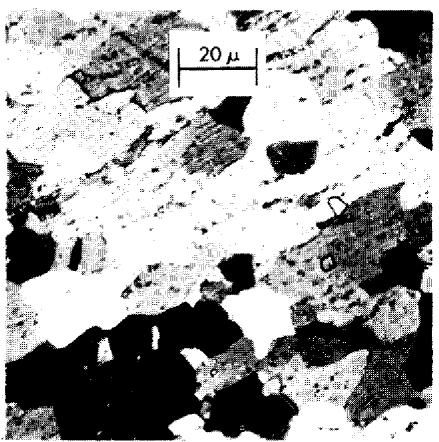  
Plate 1 (Core Tank)

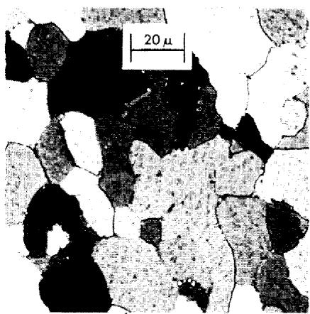  
Plate 3 (Present Practice)   
FIG. 5-21. Microstructures of as-received Zircaloy-2 plates fabricated by different schedules. Chemically polished, anodized, polarized light, $500 \times$ .

boundaries, as shown in Fig. 5-21, and an elongated void within the grains, caused by trapped gases. The latter type was found rarely in HRE-2 core-tank metal, but a small one may be noted in the photomicrograph of the developed material. This type may be largely eliminated by vacuum melting of the original ingots. It has been determined that the intermetallic stringers were formed during fabrication. While the upper fabrication temperature of $850^{\circ}\mathrm{C}$ was thought to have been in the all-alpha region, this is now known to be in error. The correct temperature for the alpha to alpha-plus-beta transition is $810^{\circ}\mathrm{C}$ and that for the beta to beta-plus-alpha transition is $970^{\circ}\mathrm{C}$ [129]. These temperatures will vary slightly with ingot composition. Holding at a temperature just above the lower boundary of the two-phase region resulted in the presence of small amounts of beta in the grain corners. By quenching samples held at $840^{\circ}\mathrm{C}$ , it was shown that approximately $15\%$ of the material had been beta phase at that temperature and that the beta phase had been present in the grain corners. Iron, nickel, and chromium are beta stabilizers and will partition to the beta phase, which will be strung out during rolling. On cooling, the beta phase decomposes, precipitating the alpha zirconium on the neighboring grains and leaving the intermetallics in the grain boundaries. These intermetallic stringers will dissolve on reheating to $1000^{\circ}\mathrm{C}$ while the stringers formed by the trapped gases will not.

While mechanical property tests of the core-tank material (see Article 5-8.3) indicated uniform properties in the longitudinal and transverse directions, it was noted that the fractures were not round but were oval,

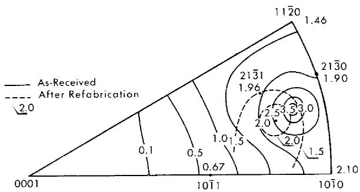  
Inverse Pole Figure

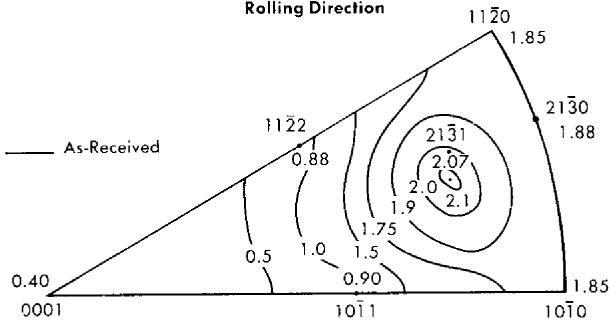  
Rolling Direction

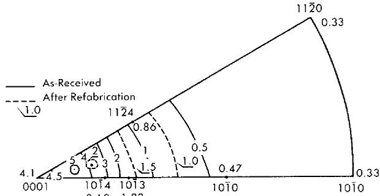  
Inverse Pole Figure Transverse Direction   
Inverse Pole Figure Normal Direction   
FIG. 5-22. Inverse pole figures from HRT core tank Zircaloy-2 before and after refabrication. Solid lines as-received, dotted lines after refabrication.

indicating anisotropic properties. This was confirmed by a polarized-light examination. The actual orientation of the material was determined using a special x-ray diffraction technique [130], with the data being reported in the form of inverse pole figures [131] shown in Fig. 5-22. Since variations were found in the intensity of the pole concentrations, it is evident that the core-tank plate had preferred orientation in all three directions. Quantitative calculations indicated that the plate had adequate ductility

and nearly isotropic properties in the rolling plane but very little ductility in the normal direction to the plate, since in this direction few deformation systems were available for slip or twinning.

To improve the quality of Zircaloy-2 and to predict what structures would be encountered in weldments, a study of the effect of heat treatment and fabrication practice was initiated. Representative photomicrographs of structures resulting from these studies are presented in Fig. 5-23. The fine "basket-weave" alpha structure observed in beta-quenched samples appeared to offer the most likely starting point. Recrystallization of this structure by annealing at temperatures between 700 and $800^{\circ}\mathrm{C}$ resulted in the formation of very large alpha grains, without stringers or intermetallic precipitates. Cold-working of the "basket-weave" structure, $15\%$ or less before annealing, also resulted in the production of large grains; however, if the amount of cold-working exceeded $20\%$ , improvement in the form of fine grains (ASTM 6 to 8) with a more nearly random structure resulted.

Scrap from the core-tank plate was heat treated by beta quenching, cold-worked $20\%$ , and alpha annealed. The diffraction results after this treatment are also shown on the diagrams in Fig. 5-22. The intensity of the peaks has been decreased by a factor of two and the peaks shifted 20 deg from the original position. These changes indicate an increase in ductility in the normal direction.

The results of the morphological study were used to outline an improved fabrication schedule for Zircaloy-2 [132]. This schedule* has been used successfully by commercial fabricators while more complete fabrication studies are being made. The material obtained from this procedure has a microstructure such as that shown in Fig. 5-21. It is essentially free of stringers, contains little or no intermetallic precipitate, and has small equiaxed grains with essentially a random orientation as seen under polarized light.

5-8.3 Mechanical properties of zirconium and titanium. The use of titanium and zirconium for pressure-containing equipment is complicated by the fact that both metals are hexagonal, rather than cubic, making preferred orientation a severe problem. The larger variations of mechanical properties with crystal orientation make it difficult to achieve the uniformity in all directions which is desirable in a pressure vessel. In addition, the determination of the mechanical properties of hexagonal metals, using standard tests developed for cubic metals, is questionable because the suita

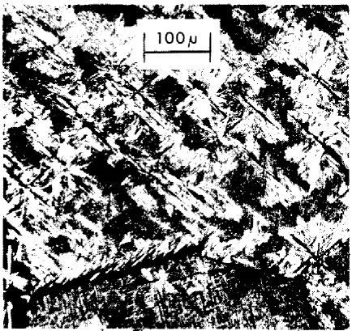  
(a) Beta Quenched $+1000^{\circ}C$ 30 min Water Quenched

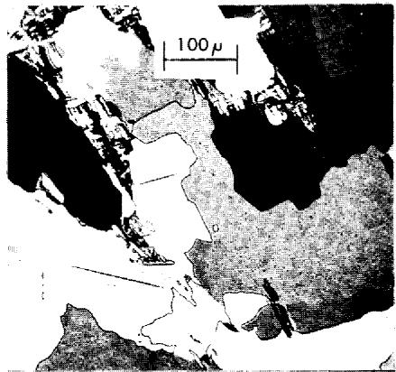  
(b) Beta Quenched + Annealed $800^{\circ}C$ 15 min

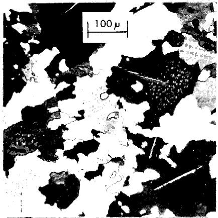  
(c) Beta Quenched + Cold Worked 10%, Annealed $800^{\circ}\mathrm{C} 15$ min

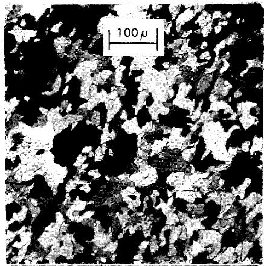  
(d) Beta Quenched + Cold Worked 20%, Annealed $800^{\circ}\mathrm{C}15\mathrm{min}$   
FIG. 5-23. Microstructure of heat-treated Zircaloy-2. Chemically polished, anodized, polarized light, $100 \times$ .

bility of such tests and the correct interpretation of results have not been demonstrated.

Zirconium. The anisotropy of Zircaloy-2 is not defined by the usual tensile test data, given in Table 5-16. Tensile data from both longitudinal and transverse subsize specimens cut from plates fabricated by various procedures are given in this table. With the exception of the commercial plate, the difference in tensile strengths both at room temperature and $300^{\circ}\mathrm{C}$ are within the experimental limits. Anisotropy in the material is illustrated, however, by the three columns which tabulate the percentage reduction in length of both the major and minor axes of the elliptical

TABLE 5-16   
TENSILE PROPERTIES OF ZIRCALOY-2  

<table><tr><td rowspan="2">Plate* source</td><td rowspan="2">Specimen direction</td><td rowspan="2">Ultimate strength, psi</td><td rowspan="2">Yield strength, psi</td><td rowspan="2">Elongation, %</td><td colspan="3">Percentage reduction</td><td rowspan="2">Isotropic ratio, long./normal</td></tr><tr><td>Area</td><td>Long. or trans. direction</td><td>Normal direction</td></tr><tr><td colspan="9">Room temperature</td></tr><tr><td rowspan="2">Core Tank</td><td rowspan="2">Long. Trans.</td><td>61400</td><td>52300</td><td>30.7</td><td>60.6</td><td>56.6</td><td>10.0</td><td>5.7</td></tr><tr><td>63300</td><td>59000</td><td>24.5</td><td>62.1</td><td>57.8</td><td>10.0</td><td>5.8</td></tr><tr><td rowspan="2">Commercial</td><td rowspan="2">Long. Trans.</td><td>64900</td><td>54800</td><td>31.1</td><td>47.7</td><td>45.5</td><td>4.4</td><td>10.4</td></tr><tr><td>69000</td><td>58300</td><td>25.8</td><td>43.3</td><td>40.6</td><td>3.3</td><td>13.7</td></tr><tr><td rowspan="2">Experimental 1</td><td rowspan="2">Long. Trans.</td><td>73200</td><td>63300</td><td>31.0</td><td>46.4</td><td>35.5</td><td>16.7</td><td>2.1</td></tr><tr><td>75200</td><td>59400</td><td>29.1</td><td>44.0</td><td>28.4</td><td>21.6</td><td>1.3</td></tr><tr><td rowspan="2">Experimental 2</td><td rowspan="2">Long. Trans.</td><td>73800</td><td>66400</td><td>32.2</td><td>46.0</td><td>37.2</td><td>14.4</td><td>2.6</td></tr><tr><td>74200</td><td>48400</td><td>32.7</td><td>44.3</td><td>25.5</td><td>25.5</td><td>1.0</td></tr><tr><td rowspan="2">Plate* source</td><td rowspan="2">Specimen direction</td><td rowspan="2">Ultimate strength, psi</td><td rowspan="2">Yield strength, psi</td><td rowspan="2">Elongation, %</td><td colspan="3">Percentage reduction</td><td rowspan="2">Isotropic ratio, long/normal</td></tr><tr><td>Area</td><td>Long. or trans. direction</td><td>Normal direction</td></tr><tr><td colspan="9">300°C</td></tr><tr><td rowspan="2">Core Tank</td><td rowspan="2">Long. Trans.</td><td>28400</td><td>22200</td><td>38.8</td><td>77.6</td><td>68.9</td><td>27.2</td><td>2.5</td></tr><tr><td>32200</td><td>29600</td><td>27.9</td><td>76.2</td><td>71.1</td><td>17.8</td><td>4.0</td></tr><tr><td rowspan="2">Commercial</td><td rowspan="2">Long. Trans.</td><td>32600</td><td>25500</td><td>35.5</td><td>43.5</td><td>38.4</td><td>7.8</td><td>4.9</td></tr><tr><td>29300</td><td>21200</td><td>29.3</td><td>68.4</td><td>65.5</td><td>13.3</td><td>4.9</td></tr><tr><td rowspan="2">Experimental 1</td><td rowspan="2">Long. Trans.</td><td>38600</td><td>31400</td><td>30.4</td><td>64.5</td><td>52.2</td><td>24.4</td><td>2.1</td></tr><tr><td>37600</td><td>29000</td><td>31.5</td><td>61.5</td><td>43.8</td><td>31.6</td><td>1.4</td></tr><tr><td rowspan="2">Experimental 2</td><td rowspan="2">Long. Trans.</td><td>32800</td><td>27800</td><td>32.9</td><td>76.5</td><td>63.3</td><td>35.5</td><td>1.8</td></tr><tr><td>35000</td><td>25100</td><td>32.1</td><td>68.7</td><td>48.3</td><td>39.4</td><td>1.2</td></tr></table>

*Core tank: scrap material from HRE-2 core-tank fabrication; see Article 5-8.2.   
Commercial plate: commercial plate similar to above but only straight rolled.   
Experimental plate 1: fabricated commercially by developed procedure in Article 5-8.2, except inert-gas melted.   
Experimental plate 2: same plate as item 3 but refabricated in laboratory using same procedure.

fracture and the ratio between them. In isotropic material the percentage reduction would be the same in both directions and the ratio would therefore be one. As shown, some reduction in anisotropy was obtained by the use of the developed procedure described previously.

Anisotropy of these materials may also be shown by V-notch Charpy impact tests. Since size effects are known to be critical in this type test, standard size specimens were used, thereby eliminating the thin core tank plate. Charpy V impact energy curves obtained with specimens and notches cut from various orientations from commercial plate and from a plate fabricated by the developed procedure are shown in Fig. 5-24 [133]. Differences in both the energy values and transition temperatures are apparent for the various orientations. These differences are reduced by the developed fabrication procedure.

With Zircaloy-2 the fracture appearance of the impact samples was not obviously indicative of the properties, as with steels. Shear lips, which are normally a mark of a ductile fracture, were found on samples from some orientations regardless of breaking temperature, but on specimens from other orientations from the same plate, shear lips were not found at any temperature.

The effects of notches and cracks in zirconium were studied using the drop-weight test as developed for steels by Pellini and others [134] at the Naval Research Laboratories. This test determines the highest temperature at which a crack will propagate through a specimen undergoing limited deformation. For steels this temperature is distinct and reproducible and has been labeled the NDT (nil ductility transition) temperature. Commercial Zircaloy-2 showed surprisingly good properties from this test. The NDT temperature was $-160^{\circ}\mathrm{C}$ for the longitudinal direction and between $-100$ and $-150^{\circ}\mathrm{C}$ for the transverse direction. However, contrary to the definition, when the fracture faces were examined, shear lips were found even at very low temperatures. The NDT temperature was well below the lower break in the Charpy V impact curve on the flat portion of the curve.

Titanium. Data available from manufacturers on the mechanical properties of titanium are generally adequate for present limited uses.

The NDT temperature for A-55 titanium was measured at ORNL on several plates and found to be below $-200^{\circ}\mathrm{C}$ . Incomplete fractures were found at this temperature for both longitudinal and transverse specimens.

As a portion of the brittle fracture study a plate of A-70 titanium containing $400~\mathrm{ppm}$ of hydrogen was tested. The results from this plate gave impact curves that were not affected by orientation and had a sharp break similar to steels. The NDT temperature for this brittle plate was $100^{\circ}\mathrm{C}$ and was located at the lower break of the impact curve. With this

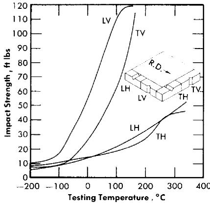  
FABRICATED BY COMMERCIAL PRACTICE

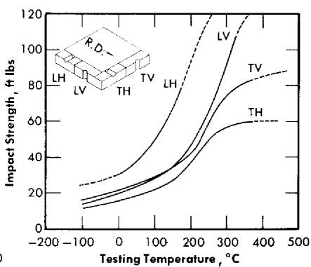  
FABRICATED BY DEVELOPED PROCEDURES   
FIG. 5-24. Impact energy curves for Zircaloy-2 fabricated by two techniques.

material, the transition region appears to be a function of hydrogen solution in the alloy.

Irradiated metals. In spite of the many questions that have been raised about the adequacy of mechanical property tests for hexagonal metals, the difficulties of which are magnified in testing irradiated samples, some mechanical property tests of irradiated samples have been attempted. Subsize tensile and impact specimens of Zircaloy-2, crystal-bar zirconium, and A-40 titanium have been irradiated in fissioning uranyl-sulfate solution, in in-pile corrosion loops, at temperatures of 250 to $280^{\circ}\mathrm{C}$ , to total fast fluxes $(>1\mathrm{Mev})$ of up to $3\times 10^{19}$ nvt for zirconium and $10^{19}$ for titanium [133]. Zirconium appears to be resistant to radiation damage under these conditions. The only changes noted have been small changes in yield point. Titanium seems to undergo some embrittlement. The tensile and yield strengths for titanium increased while the reduction in area decreased. The changes were by about $10\%$ of the unirradiated values.

5-8.4 Welding of titanium and zirconium. The welding of titanium and zirconium and their alloys is complicated by the fact that at elevated temperatures they will react to form brittle alloys with oxygen, nitrogen, hydrogen, water vapor, and carbon dioxide. Successful welding is, therefore, dependent upon protecting the molten metal and adjacent area from all contaminants. Prior to the construction of the HRE-2 core tank, the only method used for welding zirconium was fusion welding, with the necessary protection achieved by conducting the operations inside inert-atmosphere boxes [135]. The use of 5/16- and 3/8-in. plate for the HRE-2 core required

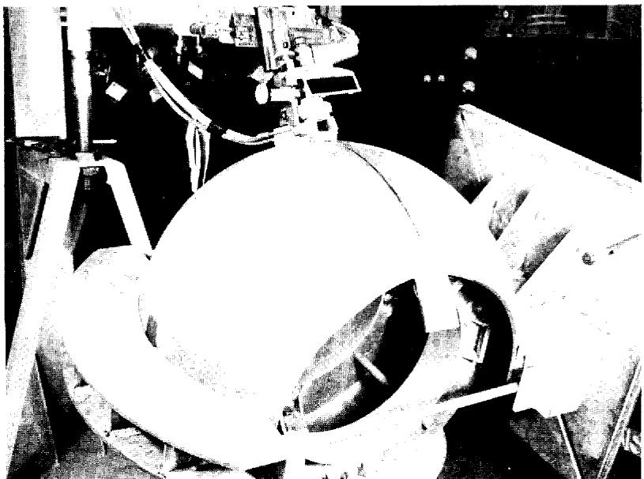  
FIG. 5-25. Typical setup of HRE-2 core tank Zircaloy-2 weldment.

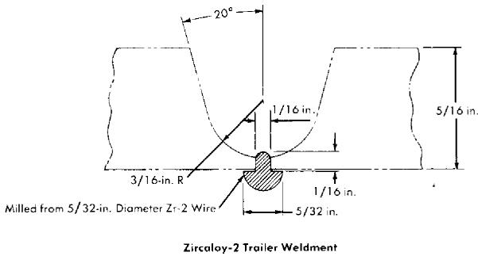

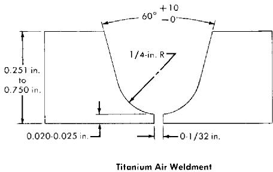  
FIG. 5-26. Joint configuration for HRE-2 core tank Zircaloy-2 trailer and titanium air weldments.

the development of multipass welding techniques, while the large size of the vessel made the use of atmosphere boxes impractical.

In a joint effort, the Newport News Shipbuilding & Dry Dock Company and Oak Ridge National Laboratory developed a machine for multipass welding of Zircaloy-2 in which the face protection was achieved by the use of trailers attached to the torch [127]. Root protection was achieved either by special backup devices or, where possible, by purging closed systems. In this device, a standard Heliarc torch was mounted on a small metal box, or trailer, Fig. 5-25. Both the method of supporting the trailer and its shape were varied with the configuration of the part being welded. The underside of the trailer was open and the lower edges of the sides were contoured to closely match the shape of the part being welded. Inert gas was distributed through the box by internal copper tubes along both sides. For all these welds, the torch and trailer were held fixed by a device which positioned the torch and spring loaded it against the work. The work pieces were moved under the torch, which remained fixed in a vertical position. The welding, with all the necessary adjustments and controls, required two operators.

The joint configuration of a typical Zircaloy-2 weld is shown in Fig. 5-26. All root passes were made using the preplaced insert which had been machined from swaged Zircaloy-2 wire. The inserts were tacked into place with a hand torch before the machine welding was started. The first filler metal pass was made with either $3/32$ - or $1/8$ -in. wire and all others with $1/8$ -in. Careful wire brushing with a stainless steel brush was required after every pass. Welding details for a typical joint are tabulated in Table 5-17; detailed procedures are given in Ref. 27.

In both this work and that which subsequently developed out of it, one of the major problems has been to determine the quality of the weld. Welds were examined visually, with liquid penetrants, and usually with radiography; however, none of these provided information about the degree of contamination. Measurement of the average microhardness of a prepared sample has proved to be an acceptable and sensitive indication of contamination. While this is a destructive test, it has been adopted as a standard test for this work. In the actual production welding, reliance had to be placed upon the strict adherence to procedures previously shown to be satisfactory by the destructive tests. Average hardnesses of over 500 DPH (diamond pyramid hardness) are found in lightly contaminated welds and increase to approximately a thousand diamond pyramid hardness numbers in contaminated metal. With this welding procedure average hardnesses of less than 200 DPH were consistently obtained. The absence of contamination was confirmed by vacuum fusion analyses of weld sections.

Although this welding procedure was slow and awkward, it was used successfully for the fabrication of the HRE-2 core tank. Many satis

# TABLE 5-17

# SUMMARY OF CONDITIONS FOR MAKING

# TITANIUM AND ZIRCONIUM WELDMENTS

<table><tr><td></td><td>Zircaloy-2 core tank</td><td>Titanium</td></tr><tr><td>Current, dc, single phase, amp</td><td></td><td></td></tr><tr><td>Tacks</td><td>80-100</td><td>40-55</td></tr><tr><td>Root pass</td><td>110</td><td>35-50</td></tr><tr><td>Filler pass (2)</td><td>150</td><td>35-90</td></tr><tr><td>Other filler passes</td><td>185</td><td>60-90</td></tr><tr><td>Voltage</td><td>19-23</td><td>10-16</td></tr><tr><td>Filler wire</td><td>1/8&quot;</td><td>3/32&quot;</td></tr><tr><td>Welding speed, in/min</td><td>4-6</td><td>1-2</td></tr><tr><td>Gas flow, cfh</td><td></td><td></td></tr><tr><td>Torch</td><td>40, helium</td><td>10-18, argon</td></tr><tr><td>Backup helium</td><td></td><td></td></tr><tr><td>First pass</td><td>40</td><td>30-60</td></tr><tr><td>Others</td><td>75</td><td>30-60</td></tr><tr><td>Trailer helium</td><td>65</td><td>—</td></tr></table>

factory multipass welds were completed in the assembly of the Zircaloy-2 tank.

Construction of a titanium circulating system for a homogeneous reactor requires many welds of all sizes, some of which must be made in place. While the procedure discussed above for zirconium can also be used for titanium, it is impractical for field welding of equipment and piping of varying sizes and shapes.

It has been found possible to make acceptable weldments in unalloyed titanium using only conventional tungsten, inert gas, arc-welding equipment [136]. By welding an A-55 base plate (average hardness of about 160 DPH for the annealed plate) with a filler rod of A-40, it is possible to consistently obtain welds with average hardnesses of less than 190 DPH $(10\mathrm{kg})$ for plates $1/4$ -in. and less in thickness. Hardnesses of less than 220 DPH are achieved for heavier plates requiring more passes. On the basis of tensile and bend tests, a hardness as high as 240 DPH would be acceptable.

The recommended conditions and configuration for a typical titanium weldment are shown in Fig. 5-26 and Table 5-17. A comparison of the recommended joint design and welding conditions for air welding of titanium with those used for trailer welding of Zircaloy-2 or for welding of

austenitic stainless steels shows an obvious trend to lower heat inputs and the use of small molten pools. The reduced size and temperature of the pool minimizes the possibilities of contamination during welding and also permits more rapid cooling after the weld is completed. These changes reduce the welding speed and thereby make this a precision welding method rather than a high-speed production procedure. Details of the procedure, including a comparison with welds made in atmosphere boxes, a discussion of adequate inert gas coverage, and the use of surface discoloration as an inspection method, are given in Ref. 136. In an effort to simplify and make more versatile the procedures used for welding Zircaloy-2 an attempt was made to adopt the inert gas procedures successfully developed for titanium. Under similar conditions it was, however, found to be more difficult to prevent contamination in Zircaloy-2 than it had been with titanium. Where multipass welds in titanium had resulted in hardness increases of 20 to 30 DPH numbers, similar welds in Zircaloy-2 increased by 50 to 100 numbers. It was also necessary to increase the radius used on the bend tests of the weldments from twice the plate thickness with titanium to four times the thickness with Zircaloy, primarily because of the lower ductility of the base metal. While multipass welds of this quality would be acceptable for many applications, additional improvement will be necessary to make them generally acceptable.

5-8.5 Combustion of zirconium and titanium. After several equipment failures in which evidences of melted titanium were found under operating temperatures not exceeding $250^{\circ}\mathrm{C}$ , a study of the ignition and combustion of titanium and zirconium was started. This work has been done by Stanford Research Institute under the direction of E. M. Kinderman [137].

Two types of tests were developed for studying the ignition reactions; in one, a thin metal disk was fractured either by gas pressure or by a plunger, while in the other, either a thin sheet or a 1/4-in. rod was broken in a tensile manner. In either test, both the composition and pressure of the atmosphere could be varied. With both types of tests, it proved to be surprisingly easy to initiate combustion of titanium. Ignition and complete consumption of both disks and rods occurred when titanium was ruptured, even at room temperature, in a high pressure of pure oxygen.

The limiting conditions for the ignition of A-55 titanium varied with the total pressure, the percentage of oxygen and the gas velocity. Under dynamic conditions in pure oxygen, ignition occurred at total pressures as low as 50 psi but with $50\%$ oxygen the total pressure required was 700 psi with the reaction curve becoming asymptotic with the pressure axis at about $35\%$ oxygen, showing no ignition would occur at any total pressure with this or lower oxygen concentrations. The corresponding values for static systems are 350 psi $(100\% \mathrm{O}_2)$ , 1900 psi $(50\% \mathrm{O}_2)$ , and $45\%$ oxygen

(no ignition at any pressure). Similar results were obtained whether the oxygen was diluted with steam or with helium. In no case was a reaction noted when samples were fractured under oxygenated water.

As might be expected, lower critical oxygen pressures were required for the propagation of the combustion than for the ignition. If the molten spot was formed by an external means, propagation and consumption of the entire sample occurred with about $20\%$ oxygen.

Because of the autoignition of titanium, various metals and alloys such as stainless steel, aluminum, magnesium, iron, tantalum, columbium, molybdenum, Zircaloy-2, and alloys of titanium were tested with oxygen pressures up to 2000 psi. Only the titanium alloys and Zircaloy-2 reacted. Within the limits of accuracy of these studies $(\pm 50$ psi) no differences were found in the behavior of the various titanium alloys.

While zirconium is similar to titanium in that autoignition can occur, the critical oxygen pressures appear to be considerably higher. Whereas, under dynamic conditions, titanium ignited with 50 psi oxygen, a zirconium disk required 500 psi. Under static conditions a 0.015-in. thick strip of titanium ignited at a pressure of 350 psi but a similar strip of zirconium required 750 psi. A 1/4-in. titanium rod ignited under the same conditions as the strip, but a zirconium rod did not ignite at 1500 psi oxygen.

5-8.6 Development of new zirconium alloys. An alloy development program was started at ORNL to find a radiation-corrosion-resistant zirconium-base alloy with satisfactory metallurgical properties. These include weldability, strength, ductility, formability and stability.

A wide variety of binary zirconium alloys was exposed in autoclaves and in in-pile loops to uranyl-sulfate solutions (see Section 5-5); however, only alloys of zirconium with niobium, palladium, or platinum showed greater corrosion resistance than Zircaloy-2. With the exception of the phase diagrams and a few mechanical property tests on low-niobium alloys [138], no information on any of these systems was available in the open literature. The few results for the mechanical property tests indicated very brittle alloys.

Two phase diagrams for the zirconium-niobium system are in the literature [139,140]. A cursory check of the diagram by determining the eutectoid temperature and approximate composition confirmed the first of these [139]. A few preliminary transformation specimens, with near-eutectoid compositions, revealed complicated and embrittling transformation structures. Since the zirconium-niobium alloy system showed promise from a corrosion viewpoint, these alloys with niobium contents varying from 2 to $33\mathrm{W / o}$ and many ternary alloys with small additions to the $\mathrm{Zr - 15Nb}$ base were studied with the objective of eliminating the undesirable properties. Information obtained includes the transformation kinetics and

products, morphologies, in-pile corrosion resistance, fabrication techniques, metallographic procedures, and some mechanical properties [141]. At least three transformation reactions occur in the zirconium-niobium binary system. The transformation sequence is quite complex, with the only straightforward transformation being a eutectoidal transformation occurring close to the eutectoid temperature. The most troublesome transformation is the formation of an omega phase which occurs in beta-quenched and reheated samples. Time-temperature-hardness studies for material heat treated in this manner showed very high hardnesses in short times with low temperature aging treatments. Aging times of three weeks did not result in over-aging and softening of such material. This transformation would make multipass welding of this material very difficult.

Because of the hardness and slow transformations of the binary zirconium-niobium alloys, ternary additions to the $\mathrm{Zr - 15Nb}$ base of up to $5\mathrm{w / oMo}$ , Pd, and Pt, up to $2\%$ Fe, Ni, Cr, Al, Ag, V, Ta, and Th and $0.5\%$ Cu have been studied. In general, the primary effects of the addition of small amounts of the ternary substitutional alloying elements are the lowering of the maximum temperature at which the hardening reaction can occur, an increase in incubation time for the beginning of the hardening reactions, a lowering of the temperature for the most rapid rate of hardening, and an increase in rate for the higher-temperature conventional hypoeutectoid reaction [142]. Of the ternary additions, Fe, Ni, and Cr have the least effect, Pt and Pd an intermediate effect, and Mo the largest. The additions of Cu and Al drastically reduced the maximum temperature at which the hardening transformation took place and reduced the temperature at which the hardening transformation took place at the maximum rate, but did not increase the incubation period for the reaction sufficiently to prevent excessive hardening in the heat-affected zone of a weldment. The addition of $5\mathrm{w / oTa}$ to the $\mathrm{Zr - 15Nb}$ base alloy resulted in the formation of a completely martensitic structure on quenching from the beta field, and the addition of oxygen by the use of sponge $\mathrm{Zr}$ resulted in an increase in the rate of all transformations. The addition of $2\%$ Pd or Pt to $\mathrm{Zr - 15Nb}$ delays the hardening sufficiently to make welding possible; however, it would be necessary to follow it by a stabilizing heat treatment.

Cursory fabrication studies have been performed during the course of the alloy development program in the preparation of sheet specimens for studies of the transformation kinetics [143]. All the $\mathrm{Zr - Nb - X}$ alloys have been hot-rolled from $800^{\circ}\mathrm{C}$ quite successfully. A sponge-base $\mathrm{Zr - 15Nb}$ arc casting has been successfully extruded at $950^{\circ}\mathrm{C}$ to form rods. While the fabrication techniques developed are adequate for the production of specimen material, they are not necessarily optimum for the commercial production of plate, sheet, bar, rod, and wire in these alloys.

An ultimate tensile strength of $\mathrm{Zr - 15Nb}$ at room temperature of 200,000

psi, with no elongation was obtained on specimens beta-quenched and aged at $400^{\circ}\mathrm{C}$ for 2 hr. Similar specimens aged at $500^{\circ}\mathrm{C}$ for 2 weeks and measured at room temperature had an ultimate strength of 150,000 psi, a yield strength of 135,000 psi, and an elongation of $10\%$ . At $300^{\circ}\mathrm{C}$ this material had an ultimate strength of 105,000 psi, a yield of 90,000 psi, and an elongation of $16\%$ in one inch.

While the $\mathrm{Zr - 15Nb}$ base ternary alloys are still of interest primarily for their potential improvement in corrosion resistance, they show promise of a wider, general use as structural material. These are the first zirconium alloys that may be heat-treated to high strength and yet are weldable and fabricable.

5-8.7 Inspection of metals by nondestructive testing methods. Of the several methods of nondestructive inspection, a visual examination, aided by contrast dye or fluorescent penetrant, can be used to detect very fine surface cracks or other surface flaws [144]. Radiography with penetrating radiation is used, especially for weldments, to inspect the interior of materials [145]. Such tests are limited in that unfavorably oriented cracks and laminations are very difficult to detect and the methods are slow and expensive. Ultrasonic methods are not subject to the same limitations as radiography. Defects which are oriented unfavorably for radiography are often readily detected by pulse-echo ultrasonic inspection.

An immersed, pulse-echo, ultrasonic technique developed in the Nondestructive Test Development Laboratory for inspecting tubular products [146] utilizes water as a coupling medium for the ultrasound. A very short pulse of 5-megacycle ultrasonic energy is directed through the water and into the wall of the tube under inspection. The tube is rotated while the source of the ultrasound, a lithium-sulfate transducer, is moved along the tube. The angle at which the sound is incident upon the tube wall is carefully adjusted, and echoes from defects are amplified and processed with commercial equipment. This instrumentation includes an "A scan," which is a cathode-ray tube presentation of echo amplitude on a horizontal time base, and a "B scan" which presents time on the vertical sweep, the horizontal sweep representing the rotation of the tubing being inspected, and the echo amplitude being indicated by brilliance. The "B scan" presentation is used as a visual aid in the interpretation of the ultrasonic reflections. These echoes are compared with the echoes from internal and external notches of known depth in identical tubing in order to estimate the depth of the flaw which causes the echo.

A remote ultrasonic technique is used to monitor the thickness of the HRE-2 core vessel without the necessity for access to both sides of the vessel wall. The method consists of introducing a swept-frequency beam of ultrasound into the wall of the vessel, which is thereby induced into

vibration at its resonant frequency and harmonics thereof. The resonances are sensed by the exciting transducer, and the signals from the resonances are amplified, processed, and displayed on a cathode-ray tube. In most cases layers of corrosion products inside the vessel are not included in the thickness measured and, therefore, the measurement represents the thickness of sound, uncorroded metal. However, a slight increase (3 to 6 mils) has been noted in the tank thickness since it was installed and the reactor operated. It is not known whether this is due to experimental inaccuracies, to changes in the metal, or to the presence of scale.

Simple shapes such as small-diameter tubing can be tested very rapidly by eddy-current methods. Such methods have been developed and used at ORNL to identify and sort various metals, to determine the thickness of clad or plated layers, to make rapid dimensional measurements of tubing, and to detect flaws in thin metal sections. Because of the large number of variables which affect eddy-current inspections, the results of these tests must be very carefully evaluated [147].

5-8.8 Radiation effects in pressure vessel steels.* The fast-neutron dose experienced by an aqueous homogeneous reactor pressure vessel during its lifetime may be greater than $5 \times 10^{18}$ neutrons/cm². Fast-neutron doses of this magnitude are capable of causing significant changes in the mechanical properties of pressure vessel steels, such as loss of tensile ductility, rise in the ductile-brittle transition temperature, and loss of energy absorption in the notch-impact test at temperatures at which the irradiated steel is ductile.

For several years the Homogeneous Reactor Project has supported investigations of an exploratory nature to determine the influence of radiation effects on pressure vessel steels [148, 149, 150]. Although it is not yet possible to give definitive answers to many of the questions posed, it has become apparent that radiation effects in steels depend upon a large number of factors, and the unusual properties of irradiated metals may force a reappraisal of the usual standards for predicting service performance from mechanical property data.

Table 5-18 lists the tensile properties of a number of irradiated pressure vessel steels and one weld. At doses of $5 \times 10^{18}$ fast neutrons/ $\mathrm{cm}^2$ appreciable changes in tensile properties are observed. At doses of $1 \times 10^{20}$ fast neutrons/ $\mathrm{cm}^2$ very large changes in properties are observed, and the steels seem unsuited for use in pressure vessels in this condition because of the limited ductility. Uniform elongation has been used as a measure of tensile ductility because irradiation reduces the uniform elongation much more drastically than the necking elongation. In some cases yielding and necking occur at the same stress or, in some cases, the yield strength exceeds

TABLE 5-18   
TENSILE PROPERTIES OF IRRADIATED STEELS  

<table><tr><td rowspan="2">Line</td><td rowspan="2">Alloy</td><td rowspan="2">Dose, fast neutrons/cm2</td><td rowspan="2">Temp. of irradiation, °F</td><td>Yield strength</td><td>Tensile strength</td><td rowspan="2">Uniform elongation, %</td></tr><tr><td colspan="2">Thousands of psi</td></tr><tr><td>1</td><td>A-106</td><td>0</td><td>—</td><td>40</td><td>76</td><td>18</td></tr><tr><td>2</td><td>fine</td><td>2 × 1019</td><td>580</td><td>81</td><td>102</td><td>8</td></tr><tr><td>3</td><td>grain</td><td>2 × 1019</td><td>680</td><td>55</td><td>87</td><td>11</td></tr><tr><td>4</td><td>0.24% C</td><td>2 × 1019</td><td>760</td><td>48</td><td>82</td><td>12</td></tr><tr><td>5</td><td></td><td>8 × 1019</td><td>580</td><td>79</td><td>106*</td><td>6</td></tr><tr><td>6</td><td></td><td>8 × 1019</td><td>780</td><td>47</td><td>79</td><td>11</td></tr><tr><td>7</td><td></td><td>1 × 1020</td><td>175</td><td>97</td><td>102</td><td>4</td></tr><tr><td>8</td><td>A-106</td><td>0</td><td>—</td><td>46</td><td>80</td><td>14</td></tr><tr><td>9</td><td>coarse grain</td><td>2 × 1019</td><td>580</td><td>93</td><td>115</td><td>8</td></tr><tr><td>10</td><td>0.24% C</td><td>2 × 1019</td><td>680</td><td>67</td><td>98</td><td>9</td></tr><tr><td>11</td><td></td><td>2 × 1019</td><td>760</td><td>43</td><td>84</td><td>14</td></tr><tr><td>12</td><td></td><td>7 × 1019</td><td>580</td><td>87</td><td>103*</td><td>3</td></tr><tr><td>13</td><td></td><td>7 × 1019</td><td>780</td><td>64</td><td>94</td><td>11</td></tr><tr><td>14</td><td></td><td>1 × 1020</td><td>175</td><td>116</td><td>121</td><td>2</td></tr><tr><td>15</td><td>A-212</td><td>0</td><td>—</td><td>40</td><td>75</td><td>25</td></tr><tr><td>16</td><td>0.2% C</td><td>2 × 1019</td><td>175</td><td>92</td><td>98</td><td>6</td></tr><tr><td>17</td><td></td><td>2 × 1019</td><td>560</td><td>76</td><td>102</td><td>9</td></tr><tr><td>18</td><td></td><td>2 × 1019</td><td>680</td><td>61</td><td>90</td><td>12</td></tr><tr><td>19</td><td></td><td>2 × 1019</td><td>760</td><td>56</td><td>84</td><td>14</td></tr><tr><td>20</td><td></td><td>6 × 1019</td><td>700</td><td>82</td><td>105*</td><td>6</td></tr><tr><td>21</td><td></td><td>6 × 1019</td><td>780</td><td>59</td><td>81</td><td>13</td></tr><tr><td>22</td><td></td><td>1 × 1020</td><td>175</td><td>109</td><td>116</td><td>4</td></tr><tr><td>32</td><td>E-7016</td><td>0</td><td>—</td><td>59</td><td>73</td><td>16</td></tr><tr><td>33</td><td>weld</td><td>5 × 1018</td><td>175</td><td>69</td><td>78</td><td>11</td></tr><tr><td>34</td><td>metal</td><td>5 × 1018</td><td>600</td><td>61</td><td>77</td><td>17</td></tr><tr><td>35</td><td></td><td>2 × 1019</td><td>175</td><td>108</td><td>108</td><td>0</td></tr><tr><td>36</td><td></td><td>6 × 1019</td><td>700</td><td>83</td><td>94</td><td>12</td></tr><tr><td>37</td><td></td><td>6 × 1019</td><td>740</td><td>77</td><td>85</td><td>12</td></tr><tr><td>38</td><td></td><td>6 × 1019</td><td>780</td><td>69</td><td>77</td><td>15</td></tr><tr><td>39</td><td></td><td>1 × 1020</td><td>175</td><td>115</td><td>115</td><td>0</td></tr></table>

*Broke without necking; work-hardening rate greater than for unirradiated specimen.

TABLE 5-19   
NOTCH-IMPACT (SUBSIZE IZOD)  
PROPERTIES OF STEELS AND WELDS   

<table><tr><td>Steel</td><td>Heat treatment*</td><td>Irradiation temp., °F</td><td>Dose, fast neutrons/cm2</td><td>Increase in transition temp., °F</td><td>Decrease in &quot;ductile&quot; energy, %</td></tr><tr><td rowspan="3">A-212 B (No. 18)</td><td rowspan="3">N</td><td>175</td><td>5 × 1018</td><td>45</td><td>0</td></tr><tr><td>575</td><td>5 × 1018</td><td>15</td><td>0</td></tr><tr><td>175</td><td>5 × 1019</td><td>100</td><td>35</td></tr><tr><td rowspan="2">A-212 B (No. 43)</td><td rowspan="2">HR</td><td>175</td><td>5 × 1018</td><td>45</td><td>20</td></tr><tr><td>175</td><td>5 × 1019</td><td>272</td><td>50</td></tr><tr><td rowspan="2">A-212 B (No. 65)</td><td rowspan="2">N &amp; SR HAZ</td><td>175</td><td>5 × 1019</td><td>220</td><td>30</td></tr><tr><td>175</td><td>8 × 1019</td><td>350</td><td>60</td></tr><tr><td rowspan="2">E-7016 Weld</td><td rowspan="2">SR Q &amp; T</td><td>175</td><td>2 × 1019</td><td>210</td><td>40</td></tr><tr><td>175</td><td>8 × 1019</td><td>360</td><td>55</td></tr><tr><td rowspan="3">Carilloy T-1</td><td rowspan="3">Q &amp; T</td><td>175</td><td>5 × 1018</td><td>175</td><td>20</td></tr><tr><td>575</td><td>5 × 1018</td><td>100</td><td>0</td></tr><tr><td>175</td><td>7 × 1019</td><td>450</td><td>50</td></tr><tr><td rowspan="2">81/2% Nickel</td><td rowspan="2">S</td><td>175</td><td>5 × 1018</td><td>100</td><td>20</td></tr><tr><td>175</td><td>7 × 1019</td><td>500</td><td>60</td></tr><tr><td rowspan="2">A-106 (Fine grain)</td><td rowspan="2">N</td><td>175</td><td>5 × 1019</td><td>85</td><td>0</td></tr><tr><td>175</td><td>8 × 1019</td><td>250</td><td>30</td></tr><tr><td rowspan="2">A-106 (Coarse grain)</td><td rowspan="2">N</td><td>175</td><td>5 × 1019</td><td>30</td><td>—</td></tr><tr><td>175</td><td>8 × 1019</td><td>300</td><td>55</td></tr></table>

\* $\mathrm{N} =$ Normalized   
$\mathrm{SR} =$ Stress relieved   
Q & T = Quenched and tempered

$\mathbf{S} =$ Special heat treatment

HAZ = Heat-affected zone near weld

the tensile strength. The loss of uniform elongation is more severe in ferritic steels of lower carbon content (less than $0.10\%$ ).

The effect of elevated irradiation temperatures is to reduce the yield stress increase, but the tensile strength increase may be greater under the higher temperature conditions. The uniform elongation is usually greater for elevated temperatures of irradiation. In some cases the reduction of area is drastically reduced by elevated temperature irradiations, and fracture has occurred without necking. Thus it is not clear whether elevated irradiation temperatures are always beneficial.

Table 5-19 lists selected data on the effects of irradiation on the notch-impact properties of a number of steels. The increase in transition temperature and the percentage of loss of energy absorption are shown as a function of neutron dose. The data were obtained on subsize Izod impact specimens. Limited information on full size Charpy V-notch specimens has indicated that at doses of the order of $5 \times 10^{18}$ fast neutrons/ $\mathrm{cm}^2$ , larger transition temperature shifts (by about a factor or two) are observed than with subsize Izod specimens. Thus there may be a size effect to be considered.

Preliminary results indicate that elevated irradiation temperatures invariably reduce the extent of radiation effects on the notch-impact properties, although the amount of reduction varies greatly between different steels of similar composition and heat treatment.

The following suggestions and recommendations for the selection of pressure vessel steels that will be irradiated in service are based upon the data obtained:

(1) On the basis of tensile ductility (uniform elongation) steels of carbon content greater than about $0.2\%$ are preferable.   
(2) The steel should be aluminum killed to secure a fine-grain material, but it is not certain that a small grain size per se is preferable to a large grain size.   
(3) The processing and heat treatment should be carried out to attain the lowest possible transition temperature before the steel is put into service.   
(4) There is some tendency for alloy steels (particularly when heat-treated to obtain a structure that is not pearlitic) to show more severe radiation effects than pearlitic steels. This is not to say that alloy steels are unsuitable; but there are insufficient data to choose between the various alloy steels.   
(5) The radiation effects in steels depend both in kind and degree on the temperature of irradiation in a very sensitive manner in the temperature ranges in which steels will be used in reactor vessels.   
(6) The effects of static and cyclic stresses during irradiation on dynamic and static properties have not yet been determined, and it is impossible to perform a realistic evaluation of engineering properties until some information is available.

(7) In the range of neutron doses to be expected in reactor vessels, the properties of irradiated steels are extremely sensitive to dose (and perhaps to dose rate). One of the greatest uncertainties is the comparison of the effectiveness of test reactor fluxes and fluxes to be encountered in service. Also, nothing is known about the rate of self-annealing at the temperature of operation.

Currently ASTM type A-212 grade B steel made to satisfy the low-temperature ductility requirements of ASTM A-300 specification is regarded as a good choice for reactor vessels. It is by no means certain that this is the best grade of steel to use, but there are other types that seem to be much less desirable.

# 5-9. STRESS-CORROSION CRACKING*

5-9.1 Introduction. Early in the Homogeneous Reactor Project the susceptibility of the austenitic stainless steels to failure by stress-corrosion cracking was recognized. As a result, test exposures of stress specimens of various kinds have been carried out in laboratory glassware, high temperature autoclaves, 100-gpm dynamic loops, and in-pile loops. These investigations, as well as a great deal of experience with the fluids of interest in the engineering development programs, have indicated that stress-corrosion cracking of type-347 stainless steel is not a serious problem in these environments in the absence of $(< 5\mathrm{ppm})$ chloride ions. However, investigations carried out with added chloride ions, and some failures which have been encountered where the fluids under test were inadvertently contaminated with chloride ions, have shown that the several oxygenated aqueous environments present in an operating two-region breeder can stress-crack the austenitic stainless alloys when the chloride ions are present. The presence of iodide and bromide ions has also resulted in localized attack in some tests [151,152]. However, bromide ions are an unlikely contaminant and are produced in very low yield in fission, and the iodide formed can be removed by a silver bed [153]. Whether chloride and bromide ions are also removed by the silver bed under reactor operating conditions has not been established.

Thus, the successful utilization of austenitic stainless steels in homogeneous reactor construction is dependent on the control of localized attack, particularly stress-corrosion cracking, by the rigid exclusion or continuous removal of halide ions. Space does not permit a review of the many complex factors which influence stress-corrosion cracking by chloride ions in homogeneous reactor fluids; however, some of the specific data and experience

which emphasize the necessity for halide control in homogeneous reactor fluids contained in type-347 stainless steel are presented. In general, the effects of the presence of chloride ions are similar to those encountered in high-temperature water. Stress-corrosion cracking problems in such environments in water-cooled reactors has been comprehensively reviewed in the Corrosion and Wear Handbook [154] and so will not be considered in any detail here.

Titanium and zirconium alloys have been tested in many aggressive aqueous stress corroductents without ever showing susceptibility to attack.

5-9.2 Fuel systems. An early investigation of stress-corrosion cracking in boiling uranyl-sulfate solutions involved exposure of stress specimens in a small, atmospheric pressure, total reflux test evaporator [155] constructed of type-347 stainless steel. Four constant-strain type-347 stainless-steel specimens stressed to 20,000 psi by three point loading were exposed in the solution and vapor phase. The evaporator was run without aeration other than that resulting from the fact that the condenser was open to the atmosphere.

No cracking of any of the specimens was observed during the 7630-hr exposure in HRE-2 composition $(0.04m\mathrm{UO}_2\mathrm{SO}_4 - 0.004 - 0.015m\mathrm{H}_2\mathrm{SO}_4 - 0.005m\mathrm{CuSO}_4)$ solution. This solution contained less than $1\mathrm{ppm}$ chloride. Two of the specimens, one from the liquid and one from the vapor phase, were replaced with new specimens and the test was continued, but with $60~\mathrm{ppm}$ of chloride added to the solution as sodium chloride. On examination of the specimens after 500-hr exposure in this environment, several small cracks were found in the area of maximum stress of the new solution-exposed specimen. No cracks were found on the new vapor-exposed specimen nor on any of the carryover specimens. These results were unchanged after an additional 1880-hr exposure to the same solution except that the cracks in the solution-exposed specimen were larger. Thus it was apparent that stress-corrosion cracking of type-347 stainless steel at $100^{\circ}\mathrm{C}$ in uranyl sulfate solutions containing chloride ions may be profoundly affected by pretreatment.

Further investigations of this pretreatment effect in boiling uranyl sulfate solutions in glass equipment with elastically stressed U-bend specimens have confirmed the results obtained in the evaporator test [156]. Table 5-20 summarizes some of the information which has been obtained on the effect of pretreatment in a nonchloride-containing uranyl sulfate solution on the resistance to cracking of stress specimens in subsequent exposure to an environment which is an aggressive crack producer in new specimens. Thus pretreatment for a period as short as $50\mathrm{hr}$ has an appreciable effect; also, stressing the specimen after pretreatment does not destroy the efficacy of the solution pretreatment. A similar beneficial

effect was not produced by a pretreatment consisting of heating the stressed U-bends in air for $1\mathrm{hr}$ at $677^{\circ}\mathrm{C}$ .

The results of some laboratory studies on the effect of chloride concentration on stress-corrosion cracking of type-347 stainless steel, not pretreated, in aerated, boiling uranyl sulfate solutions are summarized in Table 5-21 [157]. Under these conditions no cracking of simple beam-type

TABLE 5-20   
EFFECT OF PRETREATMENT(a) ON STRESS CORROSION CRACKING OF TYPE-347 STAINLESS STEEL IN BOILING URANYL SULFATE SOLUTION(b) CONTAINING CHLORIDE  

<table><tr><td>Pretreatment time, hr</td><td>No. of specimens</td><td>Time in test solution (b), hr</td><td>Specimens cracked, %</td></tr><tr><td>50</td><td>3</td><td>500</td><td>0</td></tr><tr><td>200</td><td>3</td><td>500</td><td>0</td></tr><tr><td>500</td><td>3</td><td>500</td><td>0</td></tr><tr><td>500</td><td>4</td><td>2500</td><td>0</td></tr><tr><td>500</td><td>4(c)</td><td>2500</td><td>0</td></tr><tr><td>0</td><td>50</td><td>400</td><td>85(d)</td></tr></table>

(a) Pretreatment solution: $0.04m\mathrm{UO}_2\mathrm{SO}_4$ $0.02m\mathrm{H}_2\mathrm{SO}_4$ $0.005m\mathrm{CuSO}_4$   
(b) Test solution: as in (a) plus 50 ppm chloride. (c) Stressed after pretreatment.   
(d) $75\%$ of the specimens cracked in $<  50$ hr.

specimens was observed with chloride concentrations of $10~\mathrm{ppm}$ or less over a period of $2500~\mathrm{hr}$ . However, cracking was encountered at chloride concentrations of 25 to $500~\mathrm{ppm}$ . The exposure-time intervals, after which microscope examination revealed the first evidence of cracking, ranged from 100 to $200~\mathrm{hr}$ at $25~\mathrm{ppm}$ to 2000 to $2500~\mathrm{hr}$ at $100~\mathrm{ppm}$ . Results of a few experiments with added bromide and iodide ions are also given. The bromide results are suggestive of a relatively unusual stress-accelerated corrosion rather than cracking.

Other tests [158,159] carried out in autoclaves with oxygen overpressure have indicated that chloride concentrations as low as 5 to $10~\mathrm{ppm}$ can cause stress-corrosion cracking of vapor phase specimens at temperatures of 100 and $250^{\circ}\mathrm{C}$ . Similar specimens exposed in the solution phase suffered no comparable attack even with chloride concentrations ranging up to $90~\mathrm{ppm}$ . The quite different results obtained with changes in test condi

TABLE 5-21   
STRESS-CORROSION BEHAVIOR OF TYPE-347 STAINLESS STEEL IN BOILING AND AERATED $0.04m\mathrm{UO}_2\mathrm{SO}_4 - 0.02m\mathrm{H}_2\mathrm{SO}_4 - 0.005m$ $\mathrm{CuSO_4}$ SOLUTION CONTAINING CHLORIDE, BROMIDE, AND IODIDE ADDITIONS  

<table><tr><td rowspan="2">Test no.</td><td colspan="2">Additive</td><td rowspan="2">Total hr</td><td rowspan="2">Applied stress, psi</td><td rowspan="2">Incidence of cracking</td></tr><tr><td>Species</td><td>Conc., ppm</td></tr><tr><td rowspan="2">P-9</td><td rowspan="2">None</td><td rowspan="2">0</td><td rowspan="2">2500</td><td>15,000</td><td>None</td></tr><tr><td>30,000</td><td>None</td></tr><tr><td rowspan="2">P-10</td><td rowspan="2">Cl-</td><td rowspan="2">5</td><td rowspan="2">2500</td><td>15,000</td><td>None</td></tr><tr><td>30,000</td><td>None</td></tr><tr><td rowspan="2">P-11</td><td rowspan="2">Cl-</td><td rowspan="2">10</td><td rowspan="2">2500</td><td>15,000</td><td>None</td></tr><tr><td>30,000</td><td>None</td></tr><tr><td rowspan="2">P-12</td><td rowspan="2">Cl-</td><td rowspan="2">25</td><td rowspan="2">1000</td><td>15,000</td><td>Cracked (100–200 hr) (c)</td></tr><tr><td>30,000</td><td>Cracked (100–200 hr)</td></tr><tr><td rowspan="2">P-13</td><td rowspan="2">Cl-</td><td rowspan="2">50</td><td rowspan="2">1000</td><td>15,000</td><td>Cracked (100–200 hr)</td></tr><tr><td>30,000</td><td>Cracked (100–200 hr)</td></tr><tr><td rowspan="2">P-14</td><td rowspan="2">Cl-</td><td rowspan="2">100</td><td rowspan="2">2500</td><td>15,000</td><td>Cracked (2000–2500 hr)</td></tr><tr><td>30,000</td><td>None</td></tr><tr><td rowspan="2">S-25</td><td rowspan="2">Cl-</td><td rowspan="2">200</td><td rowspan="2">1500</td><td>15,000</td><td>Cracked (200–500 hr)</td></tr><tr><td>30,000</td><td>Cracked (200–500 hr)</td></tr><tr><td rowspan="2">S-26</td><td rowspan="2">Cl-</td><td rowspan="2">500</td><td rowspan="2">1500</td><td>15,000</td><td>Cracked (200–500 hr)</td></tr><tr><td>30,000</td><td>Cracked (200–500 hr) (a)</td></tr><tr><td rowspan="2">S-27</td><td rowspan="2">Br-</td><td rowspan="2">50</td><td rowspan="2">1500</td><td>15,000</td><td>No localized attack</td></tr><tr><td>30,000</td><td>No localized attack</td></tr><tr><td rowspan="2">P-15</td><td rowspan="2">Br-</td><td rowspan="2">100</td><td rowspan="2">2500</td><td>15,000</td><td>Severe subsurface pitting</td></tr><tr><td>30,000</td><td>No localized attack</td></tr><tr><td rowspan="2">S-28</td><td rowspan="2">Br-</td><td rowspan="2">200</td><td rowspan="2">1500</td><td>15,000</td><td>Severe subsurface pitting</td></tr><tr><td>30,000</td><td>Severe subsurface pitting</td></tr><tr><td rowspan="2">P-16</td><td rowspan="2">I-</td><td rowspan="2">100(b)</td><td rowspan="2">2500</td><td>15,000</td><td>No localized attack</td></tr><tr><td>30,000</td><td>No localized attack</td></tr></table>

(a) No cracking on stress specimen; cracks occurred on stress specimen support plate stressed at an undetermined value.   
(b) Initial iodide concentration adjusted to 100 ppm at start of each 500-hr run; iodide level at end of 500-hr runs approximately 10 ppm and less.   
(c) Times given represent exposure interval.

tions are similar to experience with the phenomenon in other aqueous environments.

A further seeming inconsistency is the large number of hours ( $>300,000$ ) of operating experience accumulated on 100-gpm dynamic loops without experiencing a failure due to stress-corrosion cracking, in spite of the fact that a few ppm of chloride was often present in the solution. In a number of instances 50 to 200 ppm chloride ion was deliberately added to the solution used in a particular run. The same loops were run for many thousands of hours subsequently without stress-cracking failure. Also, in long-term loop tests with solutions of the same composition as HRE-2 fuel, stress specimens were exposed in liquid and vapor at 200, 250, and $300^{\circ}\mathrm{C}$ for 12,000 to 14,000 hr. No evidence of stress cracking was found by subsequent microscopic and metallographic examinations [160].

However, as more complex equipment has been operated in connection with the component development programs a few stress-cracking failures have been encountered. These were usually associated with crevices stemming either from the design or formed by accumulations of solid corrosion products. Comparison of these failures with the lack of difficulty encountered in the loop experience suggested that the presence of high concentrations of oxygen helped prevent stress-corrosion cracking by uranyl sulfate solutions containing chloride ions and that the cracking encountered in the more complex systems was related to oxygen exhaustion in the crevices.

To test this hypothesis, two series of loop runs were carried out to study the effect of oxygen concentration [161].

In the first of these, at $250^{\circ}\mathrm{C}$ , two sets of five stress specimens, one set pretreated in situ 98 hr with chloride-free solution, the other set in the as-machined, degreased condition, were exposed in the loop pressurizer. The specimens were arranged so the topmost specimen was exposed to vapor only, the next two were in the solution spray from the pressurizer bypass, and the bottom two were immersed in the liquid phase. No effect ascribable to exposure position was observed. Pretreated specimens were not included in the second series of runs at $200^{\circ}\mathrm{C}$ . Table 5-22 summarizes the conditions used in the runs and the results obtained:

At $250^{\circ}\mathrm{C}$ no cracks were produced in the specimens by varying conditions from high oxygen concentration to oxygen exhaustion with consequent uranium precipitation. At $200^{\circ}\mathrm{C}$ and high oxygen concentration, a crack was observed underneath the head of a bolt used to fasten the specimen to a holder instead of in the area of maximum tensile stress. The probability that this was the crevice-type attack which had been hypothesized was borne out by the results of the subsequent oxygen exhaustion run. After this run all the specimens showed transgranular cracks. However, the cracks were not characteristically related to the pattern of applied stress.

TABLE 5-22   
CONDITIONS OF RUNS TO INVESTIGATE STRESS-CORROSION CRACKING IN CHLORIDE-CONTAINING URANYL SULFATE SOLUTION   

<table><tr><td>Run no.</td><td>Time, hr</td><td>Temp., °C</td><td>\( \mathrm {UO}_{2}\mathrm {SO}_{4}, m \)</td><td>Chlor-ride, ppm</td><td>Oxygen, ppm</td><td>Remarks</td><td>Cracking results</td></tr><tr><td>H-103</td><td>98</td><td>250</td><td>0.17</td><td>0</td><td>1000</td><td>Pretreatment</td><td>-</td></tr><tr><td>H-104a</td><td>143</td><td>250</td><td>0.17</td><td>40</td><td>1500-1800</td><td></td><td>No cracks</td></tr><tr><td>H-104b</td><td>250</td><td>250</td><td>0.17</td><td>40</td><td>1500-1800</td><td>Same solution as H-104a</td><td>No cracks</td></tr><tr><td>H-104c</td><td>260</td><td>250</td><td>0.17</td><td>60</td><td>20-170</td><td>New solution</td><td>No cracks</td></tr><tr><td>H-104d</td><td>111</td><td>250</td><td>0.17</td><td>50</td><td>0-40</td><td>Oxygen exhaustion occurred and U precipitated</td><td>Pits, but no cracks</td></tr><tr><td>H-105a</td><td>211</td><td>200</td><td>0.17</td><td>50</td><td>1000-3000</td><td></td><td>One crevice crack</td></tr><tr><td>H-105b</td><td>200</td><td>200</td><td>0.17</td><td>50</td><td>0-25</td><td>Oxygen exhaustion occurred and U precipitated</td><td>All five specimens cracked</td></tr></table>

Several of the cracks were parallel rather than normal to the applied tensile stress, and most were in the regions where the identification numbers were stamped on the specimens rather than in the areas of maximum elastic stress.

The aggressive stress cracking encountered in the oxygen exhaustion run at $200^{\circ}\mathrm{C}$ raised the question whether similar effects might be produced in the absence of chloride. Consequently, oxygen exhaustion studies were carried out in loop runs with $0.17M$ uranyl sulfate solutions containing $< 3\mathrm{ppm}$ of chloride ions. Stress specimens exposed in such runs at 200, 250, and $280^{\circ}\mathrm{C}$ showed no stress-corrosion cracks on metallographic examination [162].

In-pile experience has of necessity been substantially less extensive; however, the results have been consistent with the negative experience encountered with out-of-pile loops. Over a period of $2\frac{1}{2}$ years, about 17,000 operating hours have been accumulated in fifteen type-347 stainless-steel in-pile loop experiments without encountering evidence of stress cracking. Also, stress specimens were exposed in the pressurizer vapor and liquid locations in one 1700-hr experiment. Subsequent microscopic and metallographic examination revealed no evidence of cracks. Stress speci

mens exposed in the core during a 630-hr experiment also showed no stress cracks.

Thus, a great deal of experience and the results of many specific investigations indicate stress-corrosion cracking of austenitic stainless alloys is not a problem in uranyl sulfate solution environments free of chloride. However, contrarivise, it also seems clear that stress-corrosion cracking failures will be a problem if these solutions become contaminated with chloride.

5-9.3 Slurry systems. Substantially less experience with aqueous slurries than with uranyl sulfate solutions has been accumulated in austenitic stainless steel equipment. However, it appears that stress-corrosion cracking failures manifest themselves about as one might expect from high-temperature water results. Thus the presence or absence and the concentration of chloride in the slurry are major factors in stress-cracking incidence.

Stress cracking has been encountered in toroids [163] and loops [164] operated with oxygenated thorium-oxide slurries containing chloride. No estimate of the concentration of chloride which is tolerable in oxygenated slurries can be made from available data. Williams and Eckel [165] have reported an apparent relationship between oxygen and chloride content for the development of cracks by alkaline-phosphate treated boiler water. These data indicate that maintenance of oxygen at concentrations of less than 0.5 to $1\mathrm{ppm}$ will provide reasonable assurance against stress-corrosion cracking at appreciable (10 to $\sim 100~\mathrm{ppm}$ ) chloride concentrations. As a result it has been suggested that elimination of oxygen from slurry systems by maintenance of a hydrogen overpressure on the system may be a solution to the stress-cracking problems. A few test results indicate that this may indeed be true under some out-of-pile conditions [166,167]; however, it is not likely to be effective under all environmental conditions encountered in an operating reactor. Thus, it is not clear that a hydrogen overpressure over the radioactive aqueous fluids encountered in an operating reactor will entirely repress the formation of oxygen by radiolytic decomposition of the water or that other species resulting from radiation effects cannot carry out the function of the oxygen in the stress-cracking mechanism(s) if the oxygen is eliminated.

As with the uranyl sulfate solutions discussed above, there have been some indications that stress-corrosion cracking of austenitic alloys in oxygenated slurry use is more likely to occur in crevices under accumulations of oxide [168].

5-9.4 Secondary systems. Boiler water. Chemical treatment of the water in the steam side of a fluid fuel reactor heat exchanger is a major

unresolved question in the operation of such reactors. McLain [169] has reviewed the problems attendant on the use of conventional boiler water treatment. These problems stem from very large radiation fluxes associated with the radioactive fuel circulating in the primary side of the exchanger. Radiation decomposition of inhibitors such as hydrazine and sulfite and the consequent and perhaps unpreventable production of some oxygen by water decomposition introduce completely novel factors to a long-standing problem. Thus stress-corrosion cracking failures originating on the secondary side of the type-347 heat-exchanger tubes are of concern unless rigid chloride exclusion can be maintained. The effectiveness of inhibitors in preventing production of appreciable oxygen in the secondary side water of a fluid fuel heat exchanger is one of the investigational objectives of the HRE-2. During this period rigid chloride exclusion is the only evident preventive measure which can be taken, although the successful accumulation of 700 Mwh experience on the HRE-1 fuel heat exchanger may be evidence of some cathodic protection by the carbon steel in the shell and tube sheet. It is probable, however, that in the future duplex 347-Inconel tubing, with the Inconel in contact with the secondary water environment, will be used in this application. The comprehensive investigation of stress-corrosion cracking in chloride-containing boiler water environments carried out in connection with the Naval Pressurized Water Reactor program has shown that Inconel is not susceptible to cracking failure.

Other secondary systems. Chloride should also be excluded from other aqueous environments in contact with the austenitic stainless equipment not easily replaceable. Thus, failures have been encountered in using chlorinated, potable water as cooling water [170] and the presence of marking ink containing from 3000 to $18,000~\mathrm{ppm}$ chloride on the surface of stress U-bend specimen has been shown to induce cracking on exposure to saturated oxygenated steam at $300^{\circ}\mathrm{C}$ [171]. The importance of the exclusion of chloride from aqueous environments contained in austenitic alloys was clearly demonstrated by the encounter with stress-corrosion cracking in the HRE-2 leak detector system. The undetected chloride contamination during manufacture of some of the tubing used in fabrication of the system resulted in a rapid succession of failures in parts of the system during shakedown operation. Subsequent penetrant and metallographic examination of the O-ring flanges to which the system was connected revealed stress-corrosion cracks in many of those exposed to high temperatures. As a result, all the high-temperature flanges were replaced before the reactor operation schedule could be continued [172,173].

# REFERENCES

1. L. G. DESMOND and D. R. MOSHER, Lewis Flight Propulsion Laboratory, National Advisory Committee for Acronautics, 1951. Unpublished.   
2. J. R. Cossey and R. Littlewood, Feasibility Tests on the Use of Toroids for Dynamic Corrosion Testing In-pile, Report AERE C/M 281, Gt. Brit. Atomic Energy Research Establishment, June 1956.   
3. H. C. SAVAGE et al., in Homogeneous Reactor Project Quarterly Progress Report for the Period Ending Mar. 15, 1952, USAEC Report ORNL-1280, Oak Ridge National Laboratory, July 14, 1952. (p. 43)   
4. H. C. SAVAGE et al., in Homogeneous Reactor Project Quarterly Progress Report for the Period Ending Mar. 31, 1953, USAEC Report ORNL-1554, Oak Ridge National Laboratory, July 10, 1953. (p. 46)   
5. C. L. SEGASER and F. C. ZAPP, HRE Design Manual, USAEC Report TID-10082, Oak Ridge National Laboratory, Nov. 18, 1952.   
6. H. C. SAVAGE et al., in Homogeneous Reactor Project Quarterly Progress Report for the Period Ending Mar. 15, 1952, USAEC Report ORNL-1280, Oak Ridge National Laboratory, July 14, 1952. (pp. 43)   
7. E. L. COMPERE et al., HRP Dynamic Slurry Corrosion Studies: Quarter Ending April 30, 1957, USAEC Report CF-57-4-139, Oak Ridge National Laboratory, Apr. 30, 1957. (pp. 9-16)   
8. F. H. SWEETON et al., The Effect of Irradiation on the Corrosion of Type 347 Stainless Steel by Uranyl Sulfate Solution, USAEC Report ORNL-2284, Oak Ridge National Laboratory, Apr. 1, 1957.   
9. K. S. WARREN and R. J. DAVIS, In-reactor Autoclave Corrosion Studies—LITR. Outline of Methods and Procedures, USAEC Report CF-57-5-110, Oak Ridge National Laboratory, May 22, 1957.   
10. See Bibliography following Chapter 10 for Homogeneous Reactor Project reports.   
11. G. H. JENKS et al., in *Homogeneous Reactor Project Quarterly Progress Report for Period Ending Jan. 31, 1955*, USAEC Report ORNL-1853, Oak Ridge National Laboratory, Feb. 16, 1955. (p. 115)   
12. T. L. TRENT and A. F. ZULLINGER, Experimental Facilities for Multiple In-Pile Corrosion Tests, in Proceedings of the Fifth Hot Laboratory Operation and Equipment Conference, Vol. III. New York: Pergamon Press, 1957. (pp. 253-257)   
13. G. H. JENKS et al., Circulating In-reactor Loops, in Proceedings of the Fifth Hot Laboratory Operation and Equipment Conference, Vol. III. New York: Pergamon Press, 1957. (pp. 237-244)   
14. G. H. JENKS et al., in Homogeneous Reactor Project Quarterly Progress Report for the Period Ending Oct. 31, 1955, USAEC Report ORNL-2004(Del.), Oak Ridge National Laboratory, Jan. 31, 1956. (p. 124, Fig. 12.4)   
15. A. WEITZBERG and H. C. SAVAGE, Performance Test of 220-V Three-phase Stator for Use with 5-gpm In-pile Loop Pump, USAEC Report CF-57-10-24, Oak Ridge National Laboratory, Oct. 4, 1957.   
16. H. C. SAVAGE, Sintered Alumina as a Pump Bearing and Journal Material, USAEC Report CF-57-11-122, Oak Ridge National Laboratory, Nov. 26, 1957.

17. G. H. JENKS et al., USAEC Report ORNL-2408, Oak Ridge National Laboratory, to be issued.   
18. D. T. JONES et al., In-pile Circulating Loop Is Dismantled in This Equipment, *Nucleonics* 12(11), 76 (November 1954).   
19. J. A. RUSSELL, Jr., Instrumentation for Solution-loop Experiments Inside a Nuclear Pile, ISA Journal 9, 390 (September 1957).   
20. H. G. Duggan and D. T. Jones, Corrosion Testing Facility and Disassembly Equipment, in Fourth Annual Symposium on Hot Laboratories and Equipment, Held in Washington, D. C., Sept. 29 and 30, 1955, USAEC Report TID-5280, Oak Ridge National Laboratory, September 1955. (pp. 64-77)   
21. A. M. TRIPP and D. T. JONES, Facility for Underwater Sample Preparation, in Fourth Annual Symposium on Hot Laboratories and Equipment, Held in Washington, D. C., Sept. 29 and 30, 1955, USAEC Report TID-5280, Oak Ridge National Laboratory, September 1955. (pp. 154-172)   
22. F. A. CHAMPION, Corrosion Testing Procedures, New York: John Wiley & Sons, Inc., 1952. (p. 185)   
23. N. E. WOLDMAN, Engineering Alloys, 3rd ed. Cleveland: American Society for Metals, 1954.   
24. J. C. GRIESS et al., in *Homogeneous Reactor Project Quarterly Progress Report for the Period Ending Apr. 30, 1956*, USAEC Report ORNL-2096, Oak Ridge National Laboratory, May 10, 1956. (pp. 82-83)   
25. J. L. ENGLISH et al., in Homogeneous Reactor Project Quarterly Progress Report for the Period Ending Apr. 30, 1954, USAEC Report ORNL-1753(Del.), Oak Ridge National Laboratory, Sept. 17, 1954. (pp. 97-102)   
26. J. C. GRIESS et al., in Homogeneous Reactor Project Quarterly Progress Report for the Period Ending July 31, 1956, USAEC Report ORNL-2148(Del.), Oct. 3, 1956. (pp. 77-78)   
27. See Bibliography following Chap. 10 for Homogeneous Reactor Project reports.   
28. See Bibliography following Chap. 10 for Homogeneous Reactor Project reports.   
29. J. C. GRIESS et al., in Homogeneous Reactor Project Quarterly Progress Report for the Period Ending July 31, 1957, USAEC Report ORNL-2379, Oak Ridge National Laboratory, Oct. 10, 1957. (pp. 72-73)   
30. J. C. Griess et al., Oak Ridge National Laboratory, 1954. Unpublished.   
31. J. C. Griess et al., HRP Dynamic Corrosion Studies for Quarter Ending July 31, 1956, USAEC Report CF-56-7-52, Oak Ridge National Laboratory, July 31, 1956. (pp. 28-36)   
32. J. C. GRIESS et al., in Homogeneous Reactor Project Quarterly Progress Report for the Period Ending Oct. 31, 1955, USAEC Report ORNL-2004(Del.), Oak Ridge National Laboratory, Jan. 31, 1956. (pp. 98-101)   
33. J. C. GRIESS et al., Solution Corrosion Group Quarterly Report for the Period Ending Jan. 31, 1956, USAEC Report CF-56-1-167, Oak Ridge National Laboratory, Jan. 31, 1956. (pp. 29-33)   
34. J. C. GRIESS et al., Solution Corrosion Group Quarterly Report for the Period Ending Apr. 30, 1956, USAEC Report CF-56-4-138, Oak Ridge National Laboratory, Apr. 30, 1956. (pp. 17-20)

35. G. H. JENKS et al., in *Homogeneous Reactor Project Quarterly Progress Report for the Period Ending Oct. 31, 1956*, USAEC Report ORNL-2222, Oak Ridge National Laboratory, Feb. 7, 1957. (pp. 107-111)   
36. J. E. BAKER et al., HRP Radiation Corrosion Studies: In-pile Loop L-4-8, USAEC Report ORNL-2042, Oak Ridge National Laboratory, Aug. 21, 1956. (p. 1)   
37. G. H. JENKS et al., in Homogeneous Reactor Project Quarterly Progress Report for the Period Ending Oct. 31, 1955, USAEC Report ORNI-2004(Del.), Oak Ridge National Laboratory, Jan. 31, 1956. (p. 126)   
38. G. H. JENKS et al., Oak Ridge National Laboratory, in *Homogeneous Reactor Project Quarterly Progress Report*, USAEC Reports ORNL-2379, 1957 (p. 110); ORNL-2493, 1958.   
39. G. H. JENKS et al., in Homogeneous Reactor Project Quarterly Progress Report for the Period Ending July 31, 1957, USAEC Report ORNL-2379, Oak Ridge National Laboratory, Oct. 10, 1957. (p. 112)   
40. G. H. JENKS et al., in *Homogeneous Reactor Project Quarterly Progress Report for the Period Ending Jan. 31, 1955*, USAEC Report ORNL-1853, Oak Ridge National Laboratory, Feb. 16, 1955. (pp. 89, 95)   
41. G. H. JENKS et al., Oak Ridge National Laboratory, in *Homogeneous Reactor Project Quarterly Progress Report*, USAEC Reports ORNL-1853, 1955 (p. 102); ORNL-1895, 1955 (p. 115); ORNL-2004(Dcl.), 1956 (p. 140); ORNL-2057(Del.), 1956 (p. 95); ORNL-2148(Del.), 1956 (p. 97); ORNL-2222, 1957 (p. 105); ORNL-2272, 1957 (p. 107); ORNL-2331, 1957 (p. 116); ORNL-2379, 1957 (pp. 106-107); ORNL-2493, 1958.   
42. G. H. JENKS et al., in *Homogeneous Reactor Project Quarterly Progress Report for the Period Ending Oct. 31, 1956*, USAEC Report ORNL-2222, Oak Ridge National Laboratory, Feb. 7, 1957. (p. 103)   
43. J. A. GHORMLEY and C. J. HOCHANADEL, in Chemistry Division Semiannual Progress Report for the Period Ending Dec. 20, 1953, USAEC Report ORNL-1674, Oak Ridge National Laboratory, Apr. 9, 1954. (p. 76)   
44. G. H. JENKS et al., in *Homogeneous Reactor Project Quarterly Progress Report for the Period Ending Jan. 31, 1958*, USAEC Report ORNL-2493, Oak Ridge National Laboratory, 1958.   
45. S. E. BEALL et al., in *Homogeneous Reactor Project Quarterly Progress Report for the Period Ending Jan. 31, 1954*, USAEC Report ORNL-1678, Oak Ridge National Laboratory, Apr. 15, 1954. (p. 5)   
46. G. H. JENKS et al., in *Homogeneous Reactor Project Quarterly Progress Report for the Period Ending Oct. 31, 1954*, USAEC Report ORNL-1813(Del.) Oak Ridge National Laboratory, Nov. 10, 1954. (pp. 81-82)   
47. D. E. THOMAS, in Metallurgy of Zirconium, ed. by B. Lustman and F. Kerze, Jr., National Nuclear Energy Series, Division VII, Volume 4. New York: McGraw-Hill Book Co., Inc., 1955. (p. 634)   
48. G. H. JENKS et al., in *Homogeneous Reactor Project Quarterly Progress Report for the Period Ending Apr. 30, 1957*, USAEC Report ORNL-2331, Oak Ridge National Laboratory, Sept. 3, 1957. (pp. 120-122)   
49. G. H. JENKS et al., Oak Ridge National Laboratory, in *Homogeneous Reactor Project Quarterly Progress Report*, USAEC Reports ORNL-2272, 1957 (p. 110); ORNL-2379, 1957 (pp. 119-121); ORNL-2222, 1957. (pp. 107-109)

50. G. H. JENKS et al., in *Homogeneous Reactor Project Quarterly Progress Report for the Period Ending Jan. 31, 1958*, USAEC Report ORNL-2493, Oak Ridge National Laboratory, 1958.   
51. G. H. Jenks et al., in *Homogeneous Reactor Project Quarterly Progress Report for the Period Ending Oct. 31, 1954*, USAEC Report ORNL-1813(Del.), Oak Ridge National Laboratory, Nov. 10, 1954. (pp. 82-86)   
52. G. H. JENKS et al., in *Homogeneous Reactor Project Quarterly Progress Report for the Period Ending Jan. 31, 1956*, USAEC Report ORNL-2057(Del.), Oak Ridge National Laboratory, Apr. 17, 1956. (pp. 96-98)   
53. G. H. JENKS et al., in *Homogeneous Reactor Project Quarterly Progress Report for the Period Ending Oct. 31, 1954*, USAEC Report ORNL-1813(Del.), Oak Ridge National Laboratory, Nov. 10, 1954. (pp. 83-84)   
54. G. H. JENKS et al., in Homogeneous Reactor Project Quarterly Progress Report for the Period Ending Jan. 31, 1955, USAEC Report ORNL-1853, Oak Ridge National Laboratory, Feb. 16, 1956. (pp. 113-114)   
55. G. H. JENKS et al., Oak Ridge National Laboratory, in *Homogeneous Reactor Project Quarterly Progress Report*, USAEC Reports ORNL-1895, 1955 (pp. 109-115); ORNL-2004(Del.), 1956 (pp. 131-145); ORNL-2057(Del.), 1956 (p. 94); ORNL-2148(Del.), 1956 (p. 96); ORNL-2222, 1957 (pp. 102-103); ORNL-2272, 1957 (pp. 105-106); ORNL-2331, 1957 (p. 115). J. E. BAKER et al., *HRP Radiation Corrosion Studies: In-pile Loop L-4-8*, USAEC Report ORNL-2042, Oak Ridge National Laboratory, Aug. 21, 1956. (pp. 16-17)   
56. G. H. JENKS et al., in Homogeneous Reactor Project Quarterly Progress Report for the Period Ending Jan. 31, 1955, USAEC Report ORNL-1853, Oak Ridge National Laboratory, Feb. 16, 1956. (p. 113)   
57. G. H. JENKS et al., in *Homogeneous Reactor Project Quarterly Progress Report for the Period Ending Jan. 31, 1958*, USAEC Report ORNL-2493, Oak Ridge National Laboratory, 1958.   
58. G. H. JENKS et al., Oak Ridge National Laboratory, in *Homogeneous Reactor Project Quarterly Progress Report*, USAEC Reports ORNL-2379, 1957 (p. 109); ORNL-2432, 1958 (p. 116); ORNL-2004(Del.), 1956 (pp. 146-149); ORNL-1895, 1955 (pp. 115-118); ORNL-1943, 1955 (pp. 121-124); ORNL-2057(Dcl.), 1956 (p. 94); ORNL-2148(Del.), 1956 (p. 96); ORNL-2222, 1957 (pp. 103-104); ORNL-2331, 1957 (pp. 116-118). J. E. BAKER et al., *HRP Radiation Corrosion Studies: In-pile Loop L-4-8*, USAEC Report ORNL-2042, Oak Ridge National Laboratory, Aug. 21, 1956. (pp. 19-20)   
59. G. H. JENKS et al., Oak Ridge National Laboratory, in Homogeneous Reactor Project Quarterly Progress Report, USAEC Reports ORNL-2272, 1957 (pp. 107-108); ORNL-2493, 1958.   
60. G. H. JENKS et al., in Homogeneous Reactor Project Quarterly Progress Report for the Period Ending Oct. 31, 1957, USAEC Report ORNL-2432, Oak Ridge National Laboratory, Jan. 21, 1958. (pp. 120-129)   
61. G. H. JENKS et al., Oak Ridge National Laboratory, in Homogeneous Reactor Project Quarterly Progress Report, USAEC Reports ORNL-2222, 1957 (pp. 107-111); ORNL-2096, 1956 (pp. 92-94); ORNL-2148(Del.), 1956 (pp. 98-103); ORNL-2057(Del.), 1956. (pp. 96-98)   
62. G. H. Jenks et al., Oak Ridge National Laboratory, in Homogeneous

Reactor Project Quarterly Progress Report, USAEC Reports ORNL-2222, 1957 (pp. 107-109); ORNL-2432, 1958. (pp. 120-129)   
63. G. H. JENKS et al., Oak Ridge National Laboratory, in *Homogeneous Reactor Project Quarterly Progress Report*, USAEC Reports ORNL-2222, 1957 (pp. 107-111); ORNL-2493, 1958.   
64. G. H. JENKS et al., in *Homogeneous Reactor Project Quarterly Progress Report for the Period Ending Oct. 31, 1957*, USAEC Report ORNL-2432, Oak Ridge National Laboratory, Jan. 21, 1958. (pp. 124-126)   
65. G. H. JENKS et al., Oak Ridge National Laboratory, in *Homogeneous Reactor Project Quarterly Progress Report*, USAEC Reports ORNL-2148(Del.), 1956 (pp. 93-96); ORNL-2432, 1958. (pp. 115-116)   
66. G. H. JENKS et al., Oak Ridge National Laboratory, in *Homogeneous Reactor Project Quarterly Progress Report*, USAEC Reports ORNL-1943, 1955 (pp. 126-131); ORNL-2331, 1957. (pp. 120-123)   
67. G. H. JENKS et al., Oak Ridge National Laboratory, in *Homogeneous Reactor Quarterly Progress Report*, USAEC Reports ORNL-2432, 1958 (p. 130); ORNL-2222, 1957. (p. 112)   
68. C. H. HOCHANADEL, Radiation Stability of Aqueous Fuel Systems, USAEC Report Cf-56-11-54, Oak Ridge National Laboratory, 1956.   
69. G. H. KINCHIN and R. S. PEASE, Repts. Progr. in Phys. 18, 1 (1955).   
70. G. H. JENKS, Effects of Radiation on the Corrosion of Zircaloy-2, USAEC Report CF-57-9-11, Oak Ridge National Laboratory, 1957.   
71. G. H. JENKS et al., in *Homogeneous Reactor Project Quarterly Progress Report for the Period Ending Oct. 31, 1957*, USAEC Report ORNL-2432, Oak Ridge National Laboratory, Jan. 21, 1958. (pp. 120-126)   
72. G. H. JENKS et al., in *Homogeneous Reactor Project Quarterly Progress Report for the Period Ending Jan. 31, 1958*, USAEC Report ORNL-2493, Oak Ridge National Laboratory, 1958.   
73. G. H. JENKS et al., Oak Ridge National Laboratory, in *Homogeneous Reactor Project Quarterly Progress Report*, USAEC Reports ORNL-2004(Del.), 1956 (p. 134); ORNL-2222, 1957. (p. 102)   
74. G. H. JENKS et al., Oak Ridge National Laboratory, in *Homogeneous Reactor Project Quarterly Progress Report*, USAEC Reports ORNL-2004(Del.), 1956 (p. 137); ORNL-2148(Del.), 1956 (p. 97); ORNL-2222, 1957 (p. 103); ORNL-2272, 1957 (p. 107); ORNL-2379, 1957 (pp. 106-107); ORNL-2432, 1958 (p. 116); ORNL-2493, 1958. J. E. BAKER et al., *HRP Radiation Corrosion Studies: In-pile Loop L-4-8*, USAEC Report ORNL-2042, Oak Ridge National Laboratory, Aug. 21, 1956. (pp. 21-23)   
75. G. H. JENKS et al., Oak Ridge National Laboratory, in *Homogeneous Reactor Project Quarterly Progress Report*, USAEC Reports ORNL-1895, 1955 (pp. 120-122); ORNL-2148(Del.), 1956. (pp. 99-103)   
76. G. H. JENKS et al., in *Homogeneous Reactor Project Quarterly Progress Report for the Period Ending Oct. 31, 1957*, USAEC Report ORNL-2432, Oak Ridge National Laboratory, Jan. 21, 1958. (p. 130)   
77. C. F. HIsKEY, Chemical Research. The Heavy-water Homogeneous Pile: A Review of Chemical Researches and Problems, USAEC Report CC-1383, Argonne National Laboratory, 1944.

78. I. KIRSHENBAUM et al., (Eds.), Utilization of Heavy Water, USAEC Report TID-5226, Columbia University, Substitute Alloy Material Labs., 1951.   
79. No corrosion data are available to the writer from this source.   
80. J. F. KENTON, *Nucleonics* 15(9), 166-184 (September 1957).   
81. A. S. KITZES and R. N. LYON, Aqueous Uranium and Thorium Slurries, in Proceedings of the International Conference on the Peaceful Uses of Atomic Energy, Vol. 9. New York: United Nations, 1956. (P/811, p. 414)   
82. H. F. McDUFFIE, Corrosion by Aqueous Reactor Fuel Slurries, USAEC Report CF-57-4-51, Oak Ridge National Laboratory, 1957.   
83. E. L. COMPERE, in HRP Civilian Power Reactor Conference Held at Oak Ridge National Laboratory, May 1-2, 1957, USAEC Report TID-7540, Oak Ridge National Laboratory, 1957. (pp. 249-265)   
84. E. L. COMPERE et al., Oak Ridge National Laboratory, in Homogeneous Reactor Project Quarterly Progress Report, USAEC Reports ORNL-990, 1951; ORNL-1121(Rev.), 1952; ORNL-1221, 1952; ORNL-1280, 1952; ORNL-1318, 1952; ORNL-1424(Del.), 1953; ORNL-1478(Del.), 1953; ORNL-1554, 1953; ORNL-1605, 1953; ORNL-1813(Del.), 1954; ORNL-1853, 1955; ORNL-1943, 1955; ORNL-2004(Del.), 1956; ORNL-2057(Del.), 1956; ORNL-2148(Del.), 1956; ORNL-2222, 1957; ORNL-2272, 1957; ORNL-2331, 1957; ORNL-2379, 1957; ORNL-2432, 1958.   
85. G. E. MOORE and E. L. COMPERE, Small-scale Dynamic Corrosion Studies in Toroids. *Aqueous Thorium Oxide Slurries*, USAEC Report ORNL-2502, Oak Ridge National Laboratory, to be issued.   
86. D. J. DEPAUL (Ed.), Corrosion and Wear Handbook for Water Cooled Reactors, USAEC Report TID-7006, Westinghouse Electric Corp., 1957.   
87. L. SCHEIB, Investigation of Materials for a Water-cooled and -moderated Reactor, USAEC Report ORNL-1915(Del.), Oak Ridge National Laboratory, 1954. (pp. 28-29)   
88. H. H. UHLIG (Ed.), Corrosion Handbook, New York: J. Wiley & Sons, 1948.   
89. C. F. Hiskey, see reference 77.   
90. J. H. PERRY (Ed.), Chemical Engineers Handbook, 3rd ed. New York: McGraw-Hill Book Co., Inc., 1950. (p. 1022)   
91. D. G. THOMAS, Comments on the Erosiveness of $ThO_{2}$ Slurries, USAEC Report CF-55-4-36, Oak Ridge National Laboratory, 1955; Attack of Circulating Aqueous $ThO_{2}$ Slurries on Stainless Steel Systems, USAEC Report CF-56-1-21, Oak Ridge National Laboratory, 1956.   
92. H. F. McDUFFIE, see reference 82.   
93. R. V. BAILEY, Erosion Due to Particle Impingement upon Bends in Circular Conduits, USAEC Report ORNL-1071, Oak Ridge National Laboratory, 1951.   
94. D. G. THOMAs, Comments on the Erosiveness of ThO₂ Slurries, USAEC Report CF-55-4-36, Oak Ridge National Laboratory, 1955.   
95. R. V. BAILEY, see reference 93.   
96. L. PRANDTL, Essentials of Fluid Dynamics, English translation. New York: Hafner Publishing Co., Inc., 1952. (pp. 136, 349)   
97. J. M. COULSON and J. F. RICHARDSON, Chemical Engineering, Vol. 1. New York: McGraw-Hill Book Co., Inc., 1954. (Chap. 9)   
98. R. J. HUGHES, Ind. Eng. Chem. 49, 947-955 (1957).

99. K. K. SHALNEV, Experimental Studies of the Intensity of Erosion Due to Cavitation, in Proceedings of Symposium on Cavitation in Hydrodynamics Held at the National Physical Laboratory on Sept. 14-17, 1955. London: H. M. Stationery Office, 1956. (Paper 22)   
100. R. E. JOHNSTONE and M. W. THRING, Pilot Plants, Models, and Scale-Up Methods in Chemical Engineering, New York: McGraw-Hill Book Co., Inc., 1957. (p. 247)   
101. S. J. ROSENBERG, J. Research Natl. Bur. Standards 5, 553 (1930).   
102. R. V. BAiley, see reference 93.   
103. R. L. STOKER, Ind. Eng. Chem. 41, 1196-1199 (1949).   
104. G. E. MoORE and E. L. COMPERE, see reference 85.   
105. J. P. McBride, The Abrasive Properties of Thorium Oxide, USAEC Report CF-53-8-149, Oak Ridge National Laboratory, 1953; and unpublished work.   
106. C. F. HIsKey, see reference 77.   
107. H. DE Bruyn et al., Homogeneous Oxide Suspension Reactor, in Proceedings of the International Conference on the Peaceful Uses of Atomic Energy, Vol. 3. New York: United Nations, 1956. (P/936, p. 116)   
108. C. E. CURTIS, Oak Ridge National Laboratory, personal communication.   
109. A. S. KITZES and R. N. LyON, Aqueous Uranium and Thorium Slurries, in Proceedings of the International Conference on the Peaceful Uses of Atomic Energy, Vol. 9. New York: United Nations, 1956 (P/811, p. 414). A. S. KITZES and R. N. LyON, Oak Ridge National Laboratory, in Homogeneous Reactor Project Quarterly Progress Report, USAEC Reports ORNL-990, 1951 (p. 143); ORNL-1121(Rev.), 1952 (p. 160); ORNL-1221, 1952 (p. 131); ORNL-1280, 1952 (p. 83); ORNL-1318, 1952 (p. 88); ORNL-1424(Dcl.), 1953 (pp. 35-38); ORNL-1478(Del.), 1953 (p. 107); ORNL-1554, 1953 (p. 122); ORNL-1605, 1953 (pp. 150-153). J. O. BLOMEKE, Aqueous Uranium Slurry Studies, USAEC Report ORNL-1904, Oak Ridge National Laboratory, 1955.   
110. E. L. COMPERE et al., Oak Ridge National Laboratory, in Homogeneous Reactor Project Quarterly Progress Report, USAEC Reports ORNL-990, 1951; ORNL-1121(Rev.), 1952; ORNL-1221, 1952; ORNL-1280, 1952; ORNL-1318, 1952; ORNL-1424(Del.), 1953; ORNL-1478(Del.), 1953; ORNL-1554, 1953; ORNL-1605, 1953; ORNL-1813(Del.), 1954; ORNL-1853, 1955; ORNL-1895, 1955; ORNL-1943, 1955; ORNL-2004(Del.), 1956; ORNL-2057(Del.), 1956; ORNL-2148(Del.), 1956; ORNL-2222, 1957; ORNL-2331, 1957; ORNL-2379, 1957; ORNL-2432, 1958.   
111. G. E. MoORE and E. L. COMPERE, see reference 85.   
112. J. D. KENTON, Nucleonics 15(9), 166-184 (September 1957).   
113. C. E. CURTIS, Oak Ridge National Laboratory, personal communication.   
114. G. E. MoORE and E. L. COMPERE, see reference 85.   
115. E. L. COMPERE and S. A. REED, in Homogeneous Reactor Project Quarterly Progress Report for the Period Ending Jan. 31, 1956, USAEC Report ORNL-2057(Del.), Oak Ridge National Laboratory, Apr. 17, 1956. (p. 89). G. E. MOORE and E. L. COMPERE, USAEC Report ORNL-2502, see reference 85.   
116. H. F. McDUFFIE, see reference 82. D. G. THOMAS, Attack of Circulating Aqueous- $\mathsf{ThO}_2$ Slurries on Stainless Steel Systems, USAEC Report CF-56-1-21, Oak Ridge National Laboratory, Jan. 5, 1956.

117. G. E. MOORE and E. L. COMPERE, Oak Ridge National Laboratory, in *Homogeneous Reactor Project Quarterly Progress Report*, USAEC Reports ORNL-1813(Dcl.), 1954 (p. 100); ORNL-1853, 1955. (p. 126)   
118. D. G. THOMAS, Attack of Circulating Aqueous-ThO₂ Slurries on Stainless Steel Systems, USAEC Report CF-56-1-21, Oak Ridge National Laboratory, Jan. 5, 1956.   
119. H. F. McDUFFIE, see reference 82.   
120. G. E. MOORE and E. L. COMPERE, see reference 85.   
121. J. SCHMETS and M. POURBAIX, Corrosion of Titanium, Proc. 6th Meeting Intern. Comm. Electrochem. Thermodynam. and Kinetics, 1955. (pp. 167-179)   
122. D. J. DePAUL (Ed.), Corrosion and Wear Handbook, USAEC Report T1D-7006, Westinghouse Electric Corp., 1957. (p. 17)   
123. K. K. SHALNEV, see reference 99.   
124. E. L. COMPERE, in Homogeneous Reactor Project Quarterly Progress Report for the Period Ending Jan. 31, 1958, USAEC Report ORNL-2493, Oak Ridge National Laboratory, 1958.   
125. RICHARDS et al., Melting and Fabrication of Zircaloy, in Proceedings of the 2nd International Conference on the Peaceful Uses of Atomic Energy, Geneva, 1958.   
126. L. F. BLEDSOE et al., Fabrication of the Homogeneous Reactor Test Vessel Assembly, Welding J. 35, 997-1005 (October 1956).   
127. G. E. ELDER et al., First Zirconium Vessel for HRT Reactor, J. Metals 8, 648-650 (1956).   
128. M. L. PICKLESIMER, Anodizing as a Metallographic Technique for Zirconium Base Alloys, USAEC Report ORNL-2296, Oak Ridge National Laboratory, 1957.   
129. G. M. ADAMSON and M. L. PICKKLESIMER, in Homogeneous Reactor Project Quarterly Progress Report for the Period Ending Jan. 31, 1956, USAEC Report ORNL-2057(Dcl.), Oak Ridge National Laboratory, Apr. 17, 1956. (pp. 101-104)   
130. L. K. JETTER and B. S. BORIE, JR., A Method for the Qualitative Determination of Preferred Orientation, J. Appl. Phys. 24, No. 5, 532-535 (May 1953).   
131. L. K. JETTER et al., A Method of Presenting Preferred Orientation Data, J. Appl. Phys. 27, No. 4, 368-374 (April 1956).   
132. M. L. PICKLESImer and G. M. ADAMSON, Development of a Fabrication Procedure for Zircaloy-2, USAEC Report CF-56-11-115, Oak Ridge National Laboratory, Nov. 21, 1956.   
133. G. M. ADAMSON and J. J. PRISINGER, in Homogeneous Reactor Project Quarterly Progress Report for the Period Ending Jan. 31, 1958, USAEC Report ORNL-2493, Oak Ridge National Laboratory, 1958: See also Homogeneous Reactor Project Quarterly Progress Report for the Period Ending Apr. 31, 1958.   
134. P. P. PUZAK et al., Crack-Starter Tests of Ship Fracture and Project Steels, Welding J. Res. Supplement 33, 433s-441s (September 1954).   
135. B. LUSTMAN and F. KERZE, Metallurgy of Zirconiun, National Nuclear Energy Series, Division VII, Volume 4. New York: McGraw-Hill Book Co., Inc., 1955. (pp. 307-320)   
136. G. M. ADAMSON and W. J. LEONARD, Inert Gas Tungsten Arc Welding of Titanium for the Nuclear and Chemical Industries, Welding J. (N.Y.) (to be published).

137. F. E. Littman, Stanford Research Institute, *Reactions of Titanium with Water and Aqueous Solutions*, Quarterly Report 1 (AECU-3581), 1957; Quarterly Report 2 (AECU-3582); see also Quarterly Reports 3 and 4.   
138. G. L. MILLER, Metallurgy of the Rarer Metals-2-Zirconium, New York: Academic Press, Inc., 1954. (pp. 157-158)   
139. B. A. ROGERS and D. F. ATKINS, The Zirconium-Columbium Phase Diagram, J. Metals 7, 1034 (1955).   
140. Yu Bychkov et al., Some Properties of Alloys of Zirconium with Niobium, Soviet Journal of Atomic Energy (English Translation) 2(2), 165-170 (1957).   
141. G. M. ADAMSON and M. L. PICKLESIMER, In Homogeneous Reactor Project Quarterly Progress Report for the Period Ending July 31, 1957, USAEC Report ORNL-2379, Oak Ridge National Laboratory, Oct. 10, 1957. (pp. 122-126)   
142. G. M. ADAMSON and M. L. PICKLESIMER, in Homogeneous Reactor Project Quarterly Progress Report for the Period Ending Jan. 31, 1958, USAEC Report ORNL-2493, Oak Ridge National Laboratory, 1958.   
143. G. M. ADAMSON and P. L. RITTENHOUSE, in *Homogeneous Reactor Project Quarterly Progress Report for the Period Ending Apr. 30*, 1957, USAEC Report ORNL-2331, Oak Ridge National Laboratory, Sept. 3, 1957. (pp. 127-128)   
144. Inspection of Material—Fluorescent and Dye-Penetrant Method, U.S. Air Force Technical Order No. 33B1-2-1-2, U.S. Air Force, June 15, 1955.   
145. Radiography in Modern Industry. Rochester, N. Y.: Eastman Kodak Co., 1957.   
146. R. B. OLIVER et al., Immersed Ultrasonic Inspection of Pipe and Tubing, J. Soc. Non-Destructive Testing 15, No. 3, 140-144 (May-June 1957).   
147. J. W. ALLEN and R. B. OLIVER, Inspection of Small Diameter Tubing by Eddy-Current Methods, J. Soc. Non-Destructive Testing 15, No. 2, 104-109 (March-April 1957).   
148. J. C. WILSON and R. G. BERGGREN, Effects of Neutron Irradiation in Steel, Am. Soc. Testing Materials 55, 689 (1955).   
149. R. G. BERGGREN and J. C. WILSON, Recent Data on the Effects of Neutron Irradiation on Structural Metals in Alloys, USAEC Report CF-56-11-1, Oak Ridge National Laboratory, 1957.   
150. R. G. BERGGREN and J. C. WILSON, in Solid State Semiannual Progress Report for Period Ending Aug. 31, 1957, USAEC Report ORNL-2413, Oak Ridge National Laboratory, 1957. (p. 75)   
151. G. E. MOORE, The Solution and Vapor Phase Corrosion of Type 347 Stainless Steel, Titanium 75A and Zircolay-2 Exposed to $0.14\mathrm{m}$ Uranyl Sulfate in the Absence and Presence of Chlorine or Iodine, USAEC Report CF-55-12-70, Oak Ridge National Laboratory, Dec. 12, 1955.   
152. J. C. GRIESS et al., Solution Corrosion Group Quarterly Report for the Period Ending July 31, 1957, USAEC Report CF-57-7-121, Oak Ridge National Laboratory, July 31, 1957.   
153. I. SPIEWAK et al., in Homogeneous Reactor Project Quarterly Progress Report for the Period Ending Oct. 31, 1957, USAEC Report ORNL-2432, Oak Ridge National Laboratory, Jan. 21, 1958. (p. 15)   
154. D. J. DePaul, see reference 86.

155. E. L. COMPERE and J. L. ENGLISH, Oak Ridge National Laboratory, 1954. Unpublished.   
156. J. C. GRIESS et al., Quarterly Report of the Solution Corrosion Group for the Period Ending Jan. 31, 1958, USAEC Report CF-58-1-72, Oak Ridge National Laboratory, Jan. 31, 1958.   
157. J. C. GRIESS et al., Quarterly Report of the Solution Corrosion Group for the Period Ending Apr. 30, 1957, USAEC Report CF-57-4-55, Oak Ridge National Laboratory, Apr. 30, 1957. (p. 30)   
158. G. E. Moore, see reference 151.   
159. T. M. KEGLEY, Jr., Metallographic Examination of Type-347 Stainless Steel and Titanium 75A Corrosion Specimens Exposed to Vapor Above Oxygenated $0.14\mathrm{m}$ $\mathrm{UO_2SO_4}$ Containing Chlorine or Iodine, USAEC Report CF-56-7-56, Oak Ridge National Laboratory, July 16, 1956.   
160. J. C. Griess et al., see Reference 156.   
161. J. C. GRIESS et al., Quarterly Report of the Solution Corrosion Group for the Period Ending Apr. 30, 1957, USAEC Report CF-57-4-55 Oak Ridge National Laboratory, Apr. 30, 1957. (p. 19)   
162. J. C. GRIESS et al., Quarterly Report of the Solution Corrosion Group for the Period Ending July 31, 1957, USAEC Report CF-57-7-121 Oak Ridge National Laboratory, 1957. (p. 27)   
163. E. L. COMPERE et al., Homogeneous Reactor Project Dynamic Slurry Corrosion Studies: Quarter Ending Jan. 31, 1957, USAEC Report CF-57-1-146, Oak Ridge National Laboratory, 1957. (p. 23)   
164. L. MARTI-BALAYNER, Westinghouse Electric Corporation, Commercial Atomic Power, 1957. Unpublished.   
165. W. L. WILLIAMS and J. F. ECKEL, Stress-Corrosion of Austenitic Stainless Steels in High-temperature Waters, J. Am. Soc. Naval Engrs. 68(1), 93-103 (1956).   
166. J. C. Griess et al., see reference 156.   
167. L. MARTI-BALAYNER, see reference 164.   
168. L. MARTI-BALAYNER, see reference 164.   
169. H. A. McLAIN, Treatment of HRT Steam System Water, USAEC Report CF-56-11-132, Oak Ridge National Laboratory, Nov. 29, 1956.   
170. J. C. GRIESS et al., Quarterly Report of the Solution Corrosion Group for the Period Ending Jan. 31, 1957, USAEC Report CF-57-1-144, Oak Ridge National Laboratory, 1957. (p. 35)   
171. J. C. GRIESS et al., Quarterly Report of the Solution Corrosion Group for the Period Ending Oct. 31, 1957, USAEC Report CF-57-10-80, Oak Ridge National Laboratory, 1957. (p. 31)   
172. E. G. BOHLMANN and G. M. ADAMSON, Stress-Corrosion Cracking Problems in the Homogeneous Reactor Test, USAEC Report CF-57-1-143, Oak Ridge National Laboratory, Jan. 31, 1957.   
173. G. M. ADAMSON et al., Metallurgical Examination of HRT Leak Detector Tubing and Flanges, USAEC Report CF-57-1-109, Oak Ridge National Laboratory, Jan. 31, 1957.