# CHAPTER 6

# CHEMICAL PROCESSING*

# 6-1. INTRODUCTION

One of the principal advantages of fluid fuel reactors is the possibility of continually processing the fuel and blanket material for the removal of fission products and other poisons and the recovery of fissionable material produced. Such continuous processing accomplishes several desirable objectives: (a) improvement of the neutron economy sufficiently that the reactor breeds more fissionable material than it consumes, (b) minimization of the hazards associated with the operation of the reactor by maintaining a low concentration of radioactive material in the fuel, and (c) improvement of the life of equipment and stability of the fuel solution by removing deleterious fission and corrosion products. The performance and operability of a homogeneous reactor are considerably more dependent on the processing cycle than are those of a solid fuel reactor, although the objectives of processing are similar.

The neutron poisoning in a homogeneous reactor from which fission product gases are removed continuously is largely due to rare earths [1], as shown in Fig. 6-1. In Fig. 6-1 the rare earths contributing to reactor poisoning are divided into two groups. The time-dependent rare earths are those of high yield and intermediate cross section, such as $\mathrm{Nd}^{143}$ and $\mathrm{Nd}^{145}$ , $\mathrm{Pr}^{141}$ , and $\mathrm{Pm}^{147}$ , which over a period of several months could accumulate in the reactor and result in a poisoning of about $20\%$ . The constant rare-earth poison fraction is due primarily to $\mathrm{Sm}^{149}$ and $\mathrm{Sm}^{151}$ , which have very large cross sections for neutron absorption but low yield, and therefore reach their equilibrium level in only a few days' operation. Poisoning due to corrosion of the stainless-steel reactor system was calculated for a typical reactor containing $15,500~\mathrm{ft^2}$ of steel corroding at a rate of $1\mathrm{mpy}$ . It is assumed that only the nickel and manganese contribute to the poisoning, since iron and chromium will hydrolyze and precipitate and be removed from the reactor system; otherwise, corrosion product poisoning would be four times greater than indicated in Fig. 6-1. The control of rare earths and corrosion product elements is discussed in subsequent sections of this chapter. Removal of solids from the fuel solution also improves the performance of the reactor by diminishing the deposition of scale on heat-transfer surfaces and reducing the possibility of erosion of pump impellers, bearing surfaces, and valve seats.

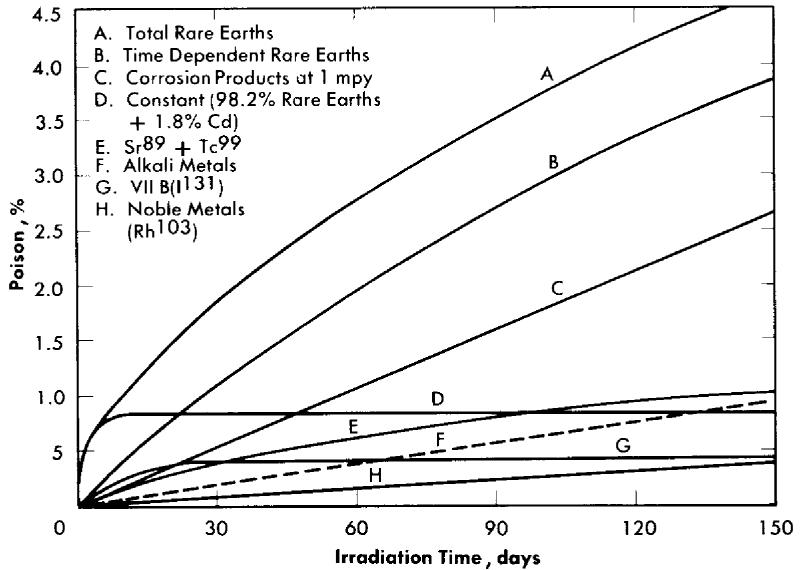  
FIG. 6-1. Poison effect as a function of chemical group in core of two-region thermal breeder.

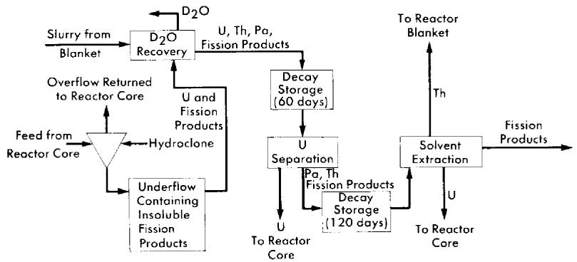  
FIG. 6-2. Conceptual flow diagram for processing fuel and blanket material from a two-region reactor.

The biological hazards associated with a homogeneous reactor are due chiefly to the radioactive rare earths, alkaline earths, and iodine [2]. The importance, as a biological hazard, of any one of these groups or nuclides within the group depends on assumptions made in describing exposure conditions; however, $\Gamma^{131}$ contributes a major fraction of the radiation hazards for any set of conditions. While the accumulation of hazardous materials such as rare earths and alkaline earths will be controlled by the processing methods to be described, less is known about the chemistry of

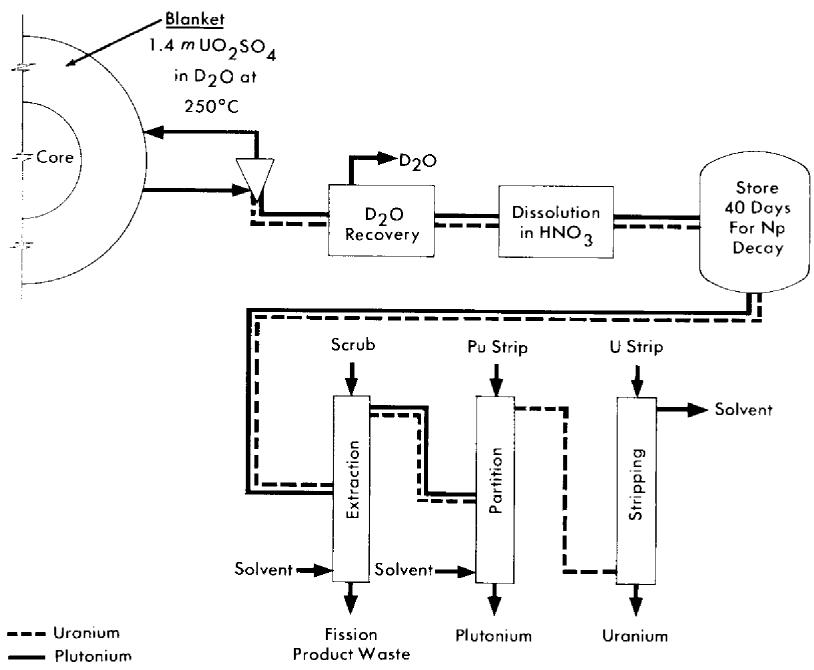  
FIG. 6-3. Conceptual flow diagram for processing blanket material from a two-region plutonium producer.

iodine in the fuel systems and methods for removing it. Existing information on iodine processing is discussed in Section 6-5.

Schematic flowsheets for proposed processing schemes for two types of two-region aqueous homogeneous reactors are shown in Figs. 6-2 and 6-3. In both cases, solids are removed by hydroclones and concentrated into a small volume of solution for further processing. The nature of such processing will be determined by the exact design and purpose of the reactor. Thus, for a two-region plutonium producer, the core and blanket materials would have to be processed separately to avoid isotopic dilution, while for a thorium breeder, core and blanket material could be processed together. However, if an attractive method should be developed for leaching uranium and/or protactinium from a thorium-oxide slurry without seriously altering the physical properties of the slurry, the two materials could be processed separately. In a similar way, the relation between iodine control and fission product gas disposal is such that neither problem can be disassociated from the other. A specific, complete, and feasible chemical processing scheme cannot be proposed for any reactor without an intimate knowledge of all aspects of design and operation of the reactor. However, some of the basic chemical knowledge needed to evaluate various

possible processing methods has been developed and is presented in the following sections.

# 6-2. CORE PROCESSING: SOLIDS REMOVAL

6-2.1 Introduction. Early in the study of the behavior of fission and corrosion products in uranyl sulfate solutions at temperatures in the range 250 to $325^{\circ}\mathrm{C}$ , it was found that many of these elements had only a limited solubility under reactor conditions. Detailed studies of these elements were conducted and devices for separating solids from liquid at high temperature and pressure were constructed and evaluated. Based on this work, a pilot plant to test a processing concept based on solids separation at reactor temperature was installed as an adjunct to the HRE-2. These processing developments are discussed in this section.

6-2.2 Chemistry of insoluble fission and corrosion products. Of the nongaseous fission products, the rare earths contribute the largest amount of neutron poison to a homogeneous reactor after a short period of operation (Fig. 6-1). Therefore, a detailed study of the behavior of these elements

TABLE 6-1   
SOLUBILITY OF LANTHANUM SULFATE IN $0.02m\mathrm{UO}_2\mathrm{SO}_4 - 0.005m\mathrm{H}_2\mathrm{SO}_4$ AS A FUNCTION OF SOLUTION TEMPERATURE  

<table><tr><td rowspan="2">Temperature, °C</td><td colspan="2">mg La2(SO4)3/kg H2O</td></tr><tr><td>True solubility</td><td>Concentration required to initiate precipitation</td></tr><tr><td>190</td><td>250</td><td>760</td></tr><tr><td>210</td><td>130</td><td>360</td></tr><tr><td>230</td><td>54</td><td>167</td></tr><tr><td>250</td><td>25</td><td>77</td></tr><tr><td>270</td><td>12</td><td>36</td></tr></table>

has been made. All the rare earths and yttrium showed a negative temperature coefficient of solubility in all the solutions studied and a strong tendency to supersaturate the solutions, as shown in Table 6-1. With the exception of prascodymium and neodymium, which are reversed, the solubility at a given temperature and uranyl sulfate concentration increased with increasing atomic number, with yttrium falling between neodymium

and samarium, as shown in Table 6-2. Increasing the uranyl sulfate concentration increased the solubility of a given rare-earth sulfate, as shown in Table 6-3.

TABLE 6-2   
SOLUBILITY OF VARIOUS RARE-EARTH SULFATES IN $0.02m\mathrm{UO}_2\mathrm{SO}_4 - 0.005m\mathrm{H}_2\mathrm{SO}_4$ AT $280^{\circ}\mathrm{C}$   
TABLE 6-3   

<table><tr><td>Salt</td><td>Solubility, mg/kg H2O</td><td>Salt</td><td>Solubility, mg/kg H2O</td></tr><tr><td>La2(SO4)3</td><td>10</td><td>Nd2(SO4)3</td><td>110</td></tr><tr><td>Ce2(SO4)3</td><td>50</td><td>Y2(SO4)3</td><td>240</td></tr><tr><td>Pr2(SO4)3</td><td>170</td><td>Sm2(SO4)3</td><td>420</td></tr></table>

EFFECT OF URANYL SULFATE CONCENTRATION ON THE SOLUBILITY OF NEODYMIUM SULFATE AT VARIOUS TEMPERATURES  

<table><tr><td rowspan="2">U, g/kg H2O</td><td colspan="3">Nd2(SO4)3solubility, mg/kg H2O</td></tr><tr><td>250°C</td><td>280°C</td><td>300°C</td></tr><tr><td>5.7</td><td>270</td><td>115</td><td>73</td></tr><tr><td>10.8</td><td>400</td><td>200</td><td>120</td></tr><tr><td>16.6</td><td>770</td><td>300</td><td>180</td></tr><tr><td>22.4</td><td>&gt;1000</td><td>500</td><td>300</td></tr></table>

In a mixture of rare-earth sulfates the solubility of an individual rare earth is less than it would be if it were present alone. For example, the solubility of praseodymium sulfate at $280^{\circ}\mathrm{C}$ is $170\mathrm{mg / kgH_2O}$ with no other rare earths present, as compared with $12\mathrm{mg / kgH_2O}$ in a solution made up with a rare-earth mixture containing $6\%$ praseodymium sulfate. Samples of the precipitating salts isolated from solution at $280^{\circ}\mathrm{C}$ have usually been the sulfates and contained no uranium. However, under special conditions a mixed sulfate salt of neodymium and uranium has been observed [3].

The alkaline earths, barium and strontium, also show a negative temperature coefficient, but not so strongly as do the rare earths; almost no effect can be seen when the temperature of precipitating solutions is in

creased from 250 to $300^{\circ}\mathrm{C}$ . At $295^{\circ}\mathrm{C}$ in $0.02\,m\, \mathrm{UO}_2\mathrm{SO}_4 - 0.005\, m\, \mathrm{H}_2\mathrm{SO}_4$ solution, the solubility of barium sulfate is $7\, \mathrm{mg/kg}\, \mathrm{H}_2\mathrm{O}$ and that of strontium sulfate is $21\, \mathrm{mg/kg}\, \mathrm{H}_2\mathrm{O}$ . Both the alkaline and rare-earth sulfates show a strong tendency to precipitate on and adhere to steel surfaces hotter than the precipitating solutions, and this property can be used to isolate these solids from liquids at high temperatures.

Other fission and corrosion product elements hydrolyze extensively at 250 to $300^{\circ}\mathrm{C}$ and precipitate as oxides, leaving very low concentrations in solution. Iron(III) at $285^{\circ}\mathrm{C}$ has a solubility of 0.5 to $2\mathrm{mgFe / kgH_2O}$ and chromium(III), 2 to $5\mathrm{mg / kgH_2O}$ . At $285^{\circ}\mathrm{C}$ less than $5\mathrm{mg}$ of zirconium or niobium per kilogram of $\mathrm{H}_2\mathrm{O}$ remains in solution.

For other elements of variable valence, such as technetium, the amount of the element in solution is determined by the stable valence state under reactor conditions. In general, the higher valence states better resist hydrolysis and remain in solution. Thus at $275^{\circ}\mathrm{C}$ in $0.02m\mathrm{UO}_2\mathrm{SO}_4$ $\mathrm{Te(VII)}$ is reduced to $\mathrm{Te(IV)}$ if hydrogen is present, and only $12\mathrm{mg / kgH_2O}$ remains in solution. However, a slurry of $\mathrm{TeO_2}$ in the same solution but with oxygen present dissolves to give a solution at $275^{\circ}\mathrm{C}$ with a technetium concentration of more than $9\mathrm{g / kgH_2O}$ . The same qualitative behavior is observed with ruthenium. Selenium and tellurium in the hexapositive state are much more soluble than when in the tetrapositive state [4].

A few elements, e.g., cesium, rubidium, nickel, and manganese, introduced into the fuel solution by fission or by corrosion of the system, are very soluble under reactor conditions. Their removal and control are discussed in Section 6-4.

6-2.3 Experimental study of hydroclone performance. It is evident from the preceding section that the amount of uranium withdrawn from the reactor diminishes if the collection, concentration, and isolation of the insolubles can be effected at high temperature. One device capable of collecting and concentrating solids at high temperature is a solid-liquid cyclone separator called a "hydroclone," or "clone." A diagram of a hydroclone is shown in Fig. 6-4. In operation, a solids-bearing stream of liquid is injected tangentially into the wide portion of a conical vessel. Solids concentrate in a downward-moving layer of liquid and are discharged from the bottom of the clone into the underflow receiver. Partially clarified liquid leaves from the top of the clone through a vortex finder. Use of the underflow receiver eliminates mechanical control of the discharge flow rate and, by proper choice of hydroclone dimensions, any desired ratio of overflow rate to underflow rate can be achieved. The driving force for the system is provided by a mechanical pump.

The factors influencing the design of an effective hydroclone for homogeneous reactor processing use have been studied, and hydroclone designs

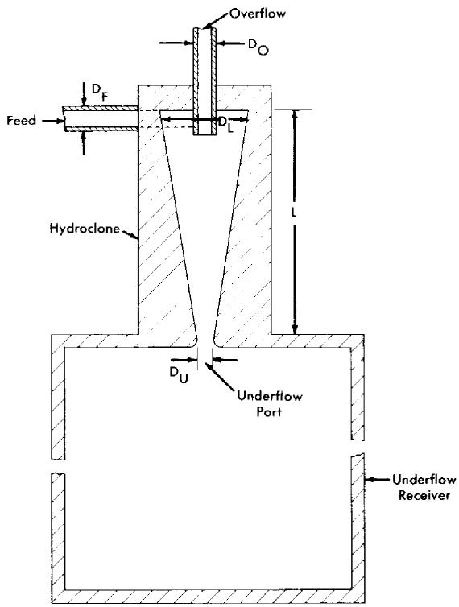  
FIG. 6-4. Schematic diagram of a hydroclone with associated underflow receiver.

based on these studies have been tested in the laboratory and on various circulating loops [5]. All tests have shown conclusively that such hydroclones can separate insoluble sulfates or hydrolyzed materials from liquid streams at 250 to $300^{\circ}\mathrm{C}$ . In the HRE-2 mockup loop a mixture of the sulfates of iron, zirconium, and various rare earths, dissolved in uranyl-sulfate solution at room temperature, precipitated when injected into the loop solution at 250 to $300^{\circ}\mathrm{C}$ . The solids concentrated into the underflow receiver of a hydroclone contained $75\%$ of the precipitated rare-earth sulfates. When the lanthanum-sulfate solubility in the loop solution was exceeded by $10\%$ , the concentration of rare earths in the underflow receiver was four to six times greater than in the rest of the loop system; some accumulation of rare earths was observed in the loop heater. A large fraction of the hydrolyzed iron and zirconium was collected in the gas separator portion of the loop. In the separator the centrifugal motion given to the liquid forced solids to the periphery of the pipe and allowed them to accumulate. Only about $10\%$ of the solids formed in the loop was recovered by the hydroclone, and examination of the loop system disclosed large quantities of solids settled in every horizontal run of pipe.

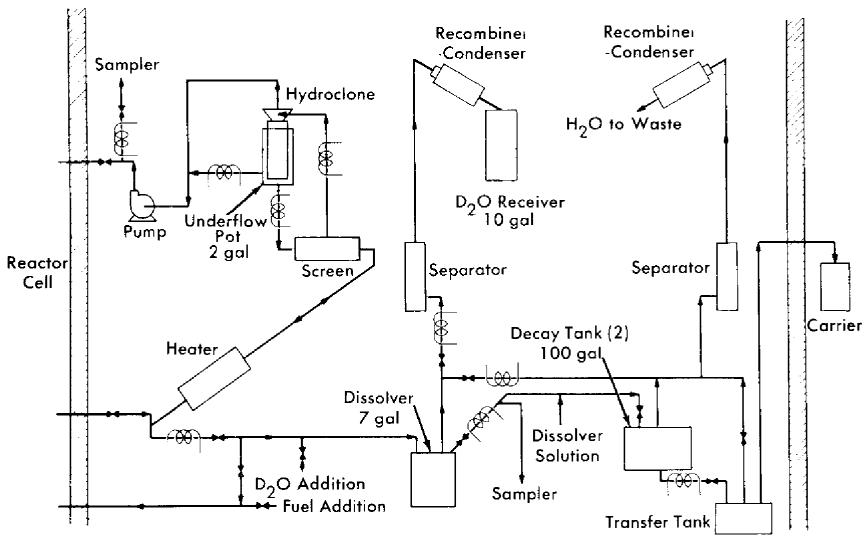  
FIG. 6-5. Schematic flow diagram for the HRE-2 chemical processing plant.

TABLE 6-4   
DIMENSIONS OF HRE-2 HYDROCLONES  

<table><tr><td rowspan="2">Symbol</td><td rowspan="2">Location</td><td colspan="3">Dimension, in.</td></tr><tr><td>0.25-in. hydroclone</td><td>0.40-in. hydroclone</td><td>0.56-in. hydroclone</td></tr><tr><td>DL</td><td>Maximum inside diameter</td><td>0.25</td><td>0.40</td><td>0.56</td></tr><tr><td>L</td><td>Inside length</td><td>1.50</td><td>2.40</td><td>3.20</td></tr><tr><td>DU</td><td>Underflow port diameter</td><td>0.070</td><td>0.100</td><td>0.148</td></tr><tr><td>DO</td><td>Overflow port diameter</td><td>0.053</td><td>0.100</td><td>0.140</td></tr><tr><td>DF</td><td>Feed port effective diameter</td><td>0.051</td><td>0.118</td><td>0.159</td></tr></table>

Samples taken from the loop after addition of preformed solids and without the hydroclone operating showed an exponential decrease in solids concentration with a half-time of $2.5\mathrm{hr}$ ; with the hydroclone operating, the half-time was $1.2\mathrm{hr}$ . In the HRE-2 chemical plant [5], operated with an auxiliary loop to provide a slurry of preformed solids in uranyl sulfate solution as a feed for the plant, the half-times for solids disappearance and removal were $11\mathrm{hr}$ without the hydroclone and $1.5\mathrm{hr}$ with it. The efficiency of the hydroclone for separating the particular solids used in these experiments was about $10\%$ . With gross amounts of solids in the system, concentration factors have been as large as 1700.

Correlation of these data with anticipated reactor chemical plant operating conditions indicates that the HRE-2 chemical plant will hold the amount of solids in the fuel solution to between 10 and $100\mathrm{ppm}$ . If necessary, performance can be improved by increasing the flow through the chemical plant and by eliminating, wherever possible, long runs of horizontal pipe with low liquid velocity and other stagnant areas which serve to accumulate solids.

6-2.4 HRE-2 chemical processing plant.* An experimental facility to test the solids-removal processing concept has been constructed in a cell adjacent to the HRE-2. A schematic flowsheet for this facility is shown in Fig. 6-5.

A 0.75-gpm bypass stream from the reactor fuel system at $280^{\circ}\mathrm{C}$ and 1700 psi is circulated through the high-pressure system, consisting of a heater to make up heat losses, a screen to protect the hydroclone from plugging, the hydroclone with underflow receiver, and a canned-rotor circulating pump to make up pressure losses across the system. The hydroclone is operated with an underflow receiver which is drained after each week of operation, at which time the processing plant is isolated from the reactor system.

At the conclusion of each operating period 10 liters of the slurry in the underflow pot is removed and sampled. The heavy water is evaporated and recovered, and the solids are dissolved in sulfuric acid and sampled again. The solution is then transferred under pressure to one of two 100-gal decay storage tanks. Following a three-month decay period, the solution is transferred to a shielded carrier outside the cell and then to an existing solvent extraction plant at Oak Ridge National Laboratory for uranium decontamination and recovery. The sulfuric acid solution step is incorporated in the HRE-2 chemical plant to ensure obtaining a satisfactory sample. This step would presumably not be necessary in a large-scale plant.

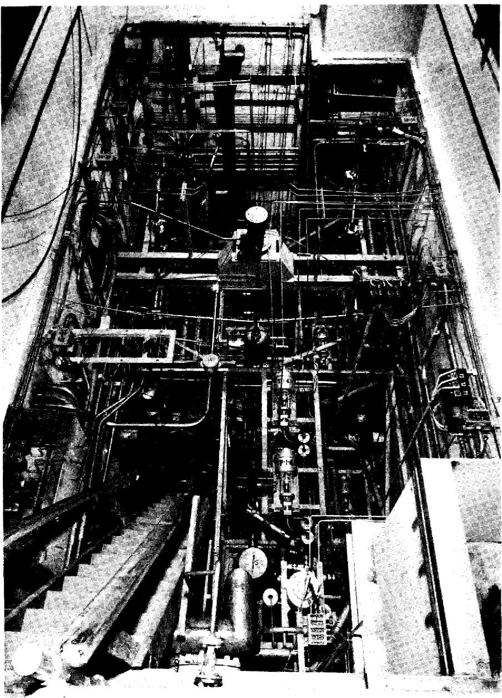  
FIG. 6-6. HRE-2 chemical plant cell with equipment.

All equipment is located in a 12- by 24- by 21-ft underground cell located adjacent to the reactor cell and separated from it by 4 ft of high-density concrete. Other construction features are similar to those of the reactor cell, with provisions for flooding the cell during maintenance periods in order to use water as shielding. Figure 6-6, a photograph of the cell prior to installation of the roof plugs, shows the maze of piping necessitated by the experimental nature of this plant.

Dimensions of the three sizes of hydroclones designed for testing in this plant are shown in Table 6-4. These three hydroclones, which have been

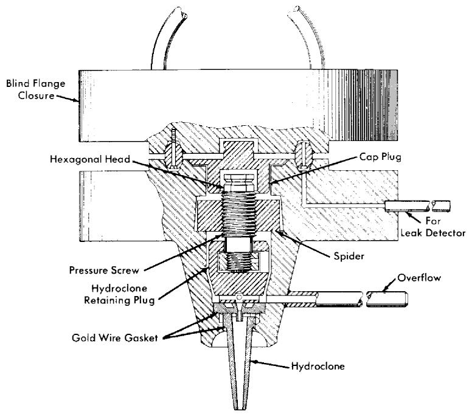  
FIG. 6-7. HRE-2 chemical plant hydroclone container.

selected to handle the range of possible particle sizes, are interchangeable at any time during radioactive operation through a unique, specially machined flange, shown in Fig. 6-7. Removal of the blind closure flange exposes a cap plug and retainer plug. Removal of these with long-handled socket wrenches permits access to the hydroclone itself. This operation has been performed routinely during testing with nonradioactive solutions.

In processing homogeneous reactor fuel, a transition from a heavy- to a natural-water system is desirable if final processing is to be performed in conventional solvent extraction equipment. Such a transition must be accomplished with a minimum loss of $\mathrm{D}_2\mathrm{O}$ and a minimum contamination of

the fuel solution by $\mathrm{H}_2\mathrm{O}$ in recycled fuel. Initial tests of this step in the fuel processing cycle have been carried out [6]. In these experiments a mixture of $5\%$ $\mathrm{D}_2\mathrm{O}$ , $95\%$ $\mathrm{H}_2\mathrm{O}$ was used to simulate reactor fuel liquid. The dissolver system was cycled three times between this liquid and ordinary water, with samples being taken during each portion of each cycle. Isotopic analysis of these samples showed no dilution of the $\mathrm{D}_2\mathrm{O}$ in the enriched solution and no loss of $\mathrm{D}_2\mathrm{O}$ to the ordinary water system.

At expected corrosion rates, approximately $400\mathrm{g}$ of corrosion products will be formed in the reactor system per week, and the underflow receiver was therefore designed to handle this quantity of solids. The adequacy of the design was shown when more than three times this quantity of solids was charged to the underflow receiver and drained in the normal way without difficulty.

Full-scale dissolution procedures have also been tested [6]. To minimize the possibilities of contaminating the reactor fuel solution by foreign ions, a dissolution procedure was developed using only sulfuric acid. This consists of a 4-hr reflux with $10.8\mathrm{M}$ $\mathrm{H}_2\mathrm{SO}_4$ in a tantalum-lined dissolver followed by a 4-hr reflux with $4\mathrm{M}$ $\mathrm{H}_2\mathrm{SO}_4$ , and repeated as required until dissolution is complete. Decay storage tanks and other equipment required to handle the boiling $4\mathrm{M}$ $\mathrm{H}_2\mathrm{SO}_4$ are fabricated of Carpenter-20 stainless steel. Tests have repeatedly demonstrated more than $99.5\%$ dissolution of simulated corrosion and fission products in two such cycles.

The HRE-2 hydroclone system has been operated as an integral part of the reactor system for approximately $600\mathrm{hr}$ and for an additional $1200\mathrm{hr}$ with a temporary pump loop during initial solids-removal tests. During this operating period, in which simulated nonradioactive fuel solutions were used, the performance of the plant was satisfactory in all respects.

# 6-3. FISSION PRODUCT GAS DISPOSAL*

6-3.1 Introduction. To prevent the pollution of the atmosphere by radioactive krypton and xenon isotopes released from the fuel solution, a system of containment must be provided until radioactive decay has reduced their activity level. This is accomplished by a method based on the process of physical adsorption on solid adsorber materials. If the adsorber system is adequately designed, the issuing gas stream will be composed of long-lived $\mathrm{Kr}^{85}$ , oxygen, inert krypton isotopes, inert xenon isotopes, and insignificant amounts of other radioactive krypton and xenon isotopes. In case the activity of the $\mathrm{Kr}^{85}$ is too high for dilution with air and discharge to the atmosphere, the mixture may be stored after removal of the oxygen

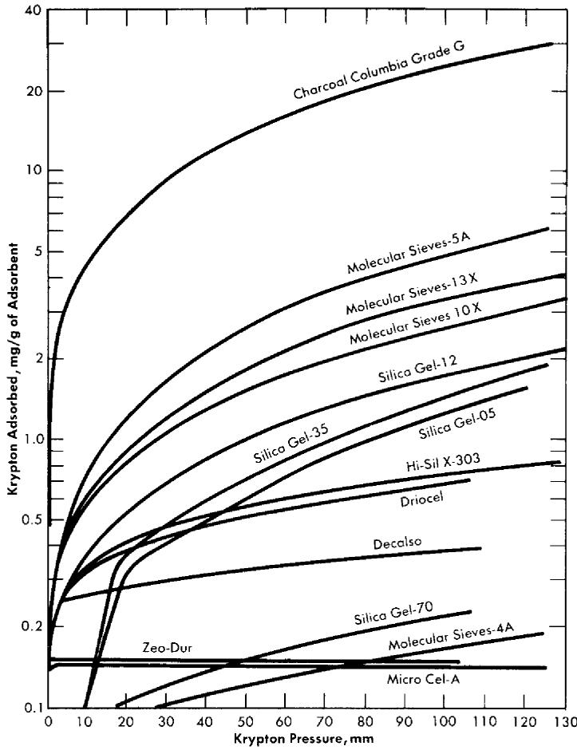  
FIG. 6-8. Adsorption of krypton on various adsorbents at $28^{\circ}\mathrm{C}$ .

or further separated by conventional methods into an inert xenon fraction and a fraction containing $\mathrm{Kr}^{85}$ and inert krypton.

6-3.2 Experimental study of adsorption of fission product gases. Evaluation of various adsorber materials based on experimental measurements of the equilibrium adsorption of krypton or xenon under static conditions is in progress [7]. Results in the form of adsorption isotherms of various solid adsorber materials are presented in Fig. 6-8.

A radioactive-tracer technique was developed to study the adsorption efficiency (holdup time) of small, dynamic, laboratory-scale adsorber systems [8]. This consists of sweeping a brief pulse of $\mathrm{Kr}^{85}$ through an experimental adsorber system with a diluent gas such as oxygen or nitrogen

and monitoring the effluent gases for $\mathrm{Kr}^{85}$ beta activity. The activity in the gas stream versus time after injection of the pulse of $\mathrm{Kr}^{85}$ is recorded. A plot of the data gives an experimental elution curve, such as shown in Fig. 6-9, from which various properties of an adsorber material and adsorber system may be evaluated.

Among the factors which influence the adsorption of fission product gases from a dynamic system are (1) adsorptive capacity of adsorber material, (2) temperature of adsorber material, (3) volume flow rate of gas stream, (4) adsorbed moisture content of adsorber material, (5) composition and moisture content of gas stream, (6) geometry of adsorber system, and (7) particle size of adsorber material. The average time required for the fission product gas to pass through an adsorber system, $t_{\mathrm{max}}$ , is influenced by the first five of the above factors. The shape of the experimental elution curve is affected by the last two.

The temperature of the adsorber material is of prime importance. The lower the temperature the greater will be the adsorption of the fission gases, and therefore longer holdup times per unit mass of adsorber material will result. The dependence of adsorptive capacity, $k$ , on temperature as determined by holdup tests with some solid adsorber materials is shown in Table 6-5.

TABLE 6-5   
ADSORPTIVE CAPACITY OF VARIOUS MATERIALS AS A FUNCTION OF TEMPERATURE  

<table><tr><td rowspan="2">Gas</td><td rowspan="2">Diluent</td><td rowspan="2">Adsorber</td><td colspan="3">cc gas/g adsorbent*</td></tr><tr><td>273°K</td><td>323°K</td><td>373°K</td></tr><tr><td>Xe</td><td>O2</td><td>Charcoal</td><td>4.7 × 103</td><td>4.0 × 102</td><td>80.0</td></tr><tr><td>Kr</td><td>He</td><td>Charcoal</td><td>1.8 × 102</td><td>34</td><td>9.6</td></tr><tr><td>Kr</td><td>O2 or N2</td><td>Charcoal</td><td>68</td><td>24</td><td>11.0</td></tr><tr><td>Kr</td><td>O2</td><td>Linde Molecular Sieve 5A</td><td>23</td><td>9</td><td>4.5</td></tr><tr><td>Kr</td><td>O2</td><td>Linde Molecular Sieve 10X</td><td>11</td><td>5.7</td><td>3.5</td></tr></table>

*Gas volume measured at temperatures indicated.

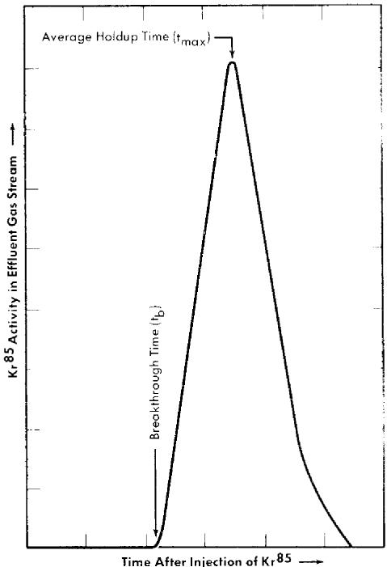  
FIG. 6-9. Experimental $\mathrm{Kr}^{85}$ elution curve.

At a given temperature, the average holdup time, $t_{\mathrm{max}}$ , is inversely proportional to the volume flow rate of the gas stream. If the volume flow rate is doubled, the holdup time will be decreased by a factor of two.

All the solid adsorber materials adsorb moisture to some degree. Any adsorbed moisture reduces the active surface area available to the fission gases and thus reduces the average holdup time.

The geometry of the adsorber system influences the relation between breakthrough time, $t_b$ , and average holdup time, $t_{\mathrm{max}}$ , as shown in Fig. 6-9. Ideally, for fission product gas disposal, a particular atom of fission gas should not emerge from the adsorber system prior to the time $t_{\mathrm{max}}$ . Since this condition cannot be realized in practice, the difference between breakthrough and average holdup times should be made as small as possible. For a given mass of adsorber material a system composed of long, small-diameter pipes will have a small difference between $t_b$ and $t_{\mathrm{max}}$ , whereas a system composed of short, large-diameter pipes will not.

The particle size of the adsorber material is important for ensuring intimate contact between the active surface of the adsorber material and the fission gases. A system filled with large particles will allow some mole

cules of fission gases to penetrate deeper into the system before contact is made with an active surface, while the pressure drop across a long trap filled with small particles may be excessive. Material between 8 and 14 mesh in size is satisfactory from both viewpoints.

6-3.3 Design of a fission product gas adsorber system. The design of an adsorber system will be determined partly by the final disposition of the effluent gas mixture. If ultimate disposal is to be to the atmosphere, the adsorber system should be designed to discharge only $\mathrm{Kr}^{85}$ plus inert krypton and xenon isotopes. If the effluent gases are to be contained and stored, the adsorber system may be designed to allow discharge of other radioactive krypton and xenon isotopes. In the following discussion it is assumed that final disposal of the effluent gas mixture will be to the atmosphere. The following simple relation has been developed which is useful in finding the mass of adsorber material in such an adsorber system:

$$
M = \frac {F}{k} t _ {\max},
$$

where $M =$ mass of adsorber material (grams), $F =$ gas volume flow rate through adsorber system (cc/min), $k =$ adsorptive capacity under dynamic conditions (cc/g), and $t_{\mathrm{max}} =$ average holdup time (min).

The operating characteristics of the reactor will dictate the composition and volume flow rate of the gas stream; $t_{\mathrm{max}}$ will be determined by the allowable concentration of radioactivity in the effluent gas; $k$ values for krypton and xenon must be determined experimentally under conditions simulating these in the full-scale adsorber system. It should be noted (Fig. 6-9) that a portion of the fission gas will emerge from the adsorber system at a time $t_b$ prior to the average holdup time, $t_{\mathrm{max}}$ . The design should ensure that radioactive gas emerging at time $t_b$ has decayed sufficiently that only insignificant amounts of activity other than $\mathrm{Kr}^{85}$ will be discharged from the bed.

The adsorber system should be operated at the lowest convenient temperature because of the dependence of adsorptive capacity on temperature. Beta decay of the fission product gases while passing through the adsorber system will increase the temperature of the adsorber material and reduce the adsorptive capacity. Temperature control is especially critical if the adsorber system uses a combustible adsorber material, such as activated charcoal, with oxygen as the diluent or sweep gas.

6-3.4 HRE-2 fission product gas adsorber system. The HRE-2 uses a fission product gas adsorber system containing Columbia G activated charcoal. Oxygen, contaminated with the fission product gases, is removed

from the reactor, dried, and passed into this system, and the effluent gases are dispersed into the atmosphere through a stack.

The adsorber system contains two activated charcoal-filled units connected in parallel to the gas line from the reactor. Each unit consists of 40 ft of $\frac{1}{2}$ -in. pipe, 40 ft of 1-in. pipe, 40 ft of 2-in. pipe, and 60 ft of 6-in. pipe connected in series. The entire system is contained in a water-filled pit, which is buried underground for gamma shielding purposes. Each unit is filled with approximately 520 lb of Columbia G activated charcoal, 8 to 14 mesh.

The heat due to beta decay of the short-lived krypton and xenon isotopes is diminished by an empty holdup volume composed of 160 ft of 3-in. pipe between the reactor and the charcoal adsorber system. This prevents the temperature of the charcoal in the inlet sections of the adsorber system from exceeding $100^{\circ}\mathrm{C}$ . Excessive oxidation of the charcoal by the oxygen in the gas is further prevented by water-cooling the beds.

Before the adsorber system was placed in service, its efficiency was tested under simulated operating conditions [9]. A pulse of $\mathrm{Kr}^{85}$ (25 millicuries) was injected into each unit of the adsorber system and swept through with a measured flow of oxygen. In this way the krypton holdup time was determined to be 30 days at an oxygen flow rate of $250~\mathrm{cc / min}/$ unit. Based on laboratory data from small adsorber systems, the holdup time for xenon is larger than that for krypton by a factor that varies from 30 to 7 over the temperature range of 20 to $100^{\circ}\mathrm{C}$ . From these data, it is estimated that the maximum temperature of the HRE-2 adsorber system will vary between 20 and $98^{\circ}\mathrm{C}$ after the reactor has been operating at $10\mathrm{Mw}$ power level long enough for the gas composition and charcoal temperature to have reached equilibrium through the entire length of the adsorber unit. The holdup performance of the adsorber system was calculated with corrections for the increased temperature expected from the fission gases. The calculated holdup time was found to be 23 days for krypton and 700 days for xenon; this would permit essentially no $\mathrm{Xe}^{133}$ to escape from the trap.

# 6-4. CORE PROCESSING: SOLUBLES

6-4.1 Introduction. While the solids-removal scheme discussed in Section 6-1 will limit the amount of solids circulating through the reactor system, soluble elements will build up in the fuel solution. Nickel and manganese from the corrosion of stainless steel and fission-produced cesium will not precipitate from fuel solution under reactor conditions until concentrations have been reached which would result in fuel instability and loss of uranium by coprecipitation. Loss of neutrons to these poisons would seriously decrease the probability of the reactor producing more

fuel than it consumes. Therefore, a volume of fuel solution sufficient to process the core solution of the reactor at a desired rate for removal of soluble materials is discharged along with the insoluble materials concentrated into the hydroclone underflow pot. This rate of removal of soluble materials depends on the nature of other chemical processing being done and on the extent of corrosion. For example, operation of an iodine removal plant (Section 6-5) reduces the buildup of cesium in the fuel to an insignificant value by removing cesium precursors.

6-4.2 Solvent extraction. Processing of the core solution of a homogeneous reactor by solvent extraction is the only method presently available which has been thoroughly proved in practice. However, the amount of uranium to be processed daily is so small that operation of a solvent extraction plant just for core solution processing would be unduly expensive. Therefore, the core solution would normally be combined with blanket material from a thermal breeder reactor and be processed through a Thorex plant, but with a plutonium-producing reactor separate processing of core and blanket materials will be needed. These process schemes are discussed in detail in Sections 6-6 and 6-7.

The uranium product from either process would certainly be satisfactory for return to the reactor. Since solid fuel element refabrication is not a problem with homogeneous reactors, decontamination factors of 10 to 100 from various nuclides are adequate and some simplification of present solvent extraction schemes may be possible.

6-4.3 Uranyl peroxide precipitation. A process for decontaminating the uranium for quick return to a reactor has been proposed as a means of reducing core processing costs. A conceptual flowsheet of this process, which depends on the insolubility of $\mathrm{UO_4}$ under controlled conditions for the desired separation from fission and corrosion products, is shown in Fig. 6-10. A prerequisite for use of this scheme is that losses due to the insoluble uranium contained in the solids concentrated in the hydroclone plant be small. However, laboratory data obtained with synthetic solids simulating those expected from reactor operation indicate that the uranium content of the solids will be less than $1\%$ by weight. Verification of the results will be sought during operation of the HRE-2.

In the proposed method, the hydroclone system is periodically isolated from the reactor and allowed to cool to $100^{\circ}\mathrm{C}$ . The hydrolyzed solids remain as such, but the rare-earth sulfate solids concentrated in the underflow pot redissolve upon cooling. The contents of the underflow pot are discharged to a centrifuge where solids are separated from the uranium-containing solution and washed with $\mathrm{D}_2\mathrm{O}$ , the suspension being sent to a waste evaporator for recovery of $\mathrm{D}_2\mathrm{O}$ .

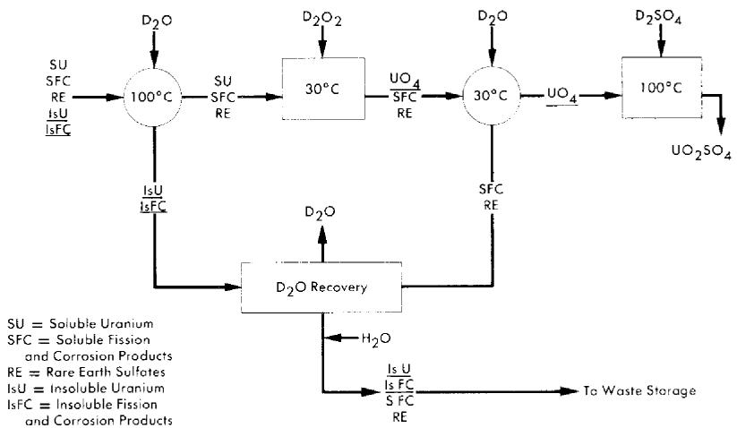  
FIG. 6-10. Schematic flow diagram for decontaminating uranium by uranyl peroxide precipitation.

Uranium in the clarified solution is precipitated by the addition of either $\mathrm{D}_2\mathrm{O}_2$ or $\mathrm{Na}_2\mathrm{O}_2$ . By controlling $\mathfrak{p}\mathbb{D}$ and precipitation conditions, a fast settling precipitate can be obtained with less than $0.1\%$ of the uranium remaining in solution. The $\mathrm{UO_4}$ precipitate is centrifuged or filtered and washed with $\mathrm{D}_2\mathrm{O}$ and dissolved in $50\%$ excess of $\mathrm{D}_2\mathrm{SO}_4$ at $80^{\circ}\mathrm{C}$ before being returned to the reactor.

In laboratory studies uranium losses have been consistently less than $0.1\%$ for this method and decontamination factors from rare earths greater than 10. Decontamination factors from nickel and cesium have been 600 and 40, respectively. It is estimated that the product returned to the reactor would contain about $20~\mathrm{ppm}$ of sodium as the only contaminant introduced during processing. Although either the addition of $\mathrm{D}_2\mathrm{O}_2$ or use of $\mathrm{D}_2\mathrm{O}_2$ generated by radiation from the solution itself appears attractive, acid liberated by the precipitation of $\mathrm{UO_4}$ must be neutralized if uranium losses are to be minimized. Since the entire operation is done in a $\mathrm{D}_2\mathrm{O}$ system, no special precautions to avoid contaminating the reactor with ordinary water are needed.

# 6-5. CORE PROCESSING: IODINE*

6-5.1 Introduction. The removal of iodine from the fuel solution of a homogeneous reactor is desirable from the standpoint of minimizing the biological hazard and neutron poisoning due to iodine and reducing the production of gaseous xenon and its associated problems. Iodine will also

poison platinum catalysts [10] used for radiolytic gas recombination in the reactor low-pressure system and may catalyze the corrosion of metals by the fuel solution. For this reason a considerable effort has been carried out at ORNL and by Vitro [11] to investigate the behavior of iodine in solution and to develop methods for its removal. In this regard, the iodine isotopes of primary interest are 8-day $\mathrm{I}^{131}$ and 6.7-hr $\mathrm{I}^{135}$ .

6-5.2 The chemistry of iodine in aqueous solutions. Iodine in aqueous solution at $25^{\circ}\mathrm{C}$ can exist in several oxidation states. The stable species are iodide ion, $\mathrm{I}^{-}$ ; elemental iodine, $\mathrm{I}_2$ ; iodate, $\mathrm{IO}_3^-$ ; and periodate, $\mathrm{IO}_4^-$ or $\mathrm{H}_5\mathrm{IO}_6$ . The last of these exists only under very strongly oxidizing conditions, and is immediately reduced under the conditions expected for a homogeneous reactor fuel. Iodide ion can be formed from reduction of other states by metals, such as stainless steel, but in the presence of the oxygen necessary in a reactor system it is readily converted to elemental iodine; this conversion is especially rapid above $200^{\circ}\mathrm{C}$ . Thus the only states of concern in reactor fuel solutions are elemental iodine and iodate. Under the conditions found in a high-pressure fuel system the iodine is largely, if not all, in the elemental form.

Volatility of iodine. Since the volatile elemental state of iodine is predominant under reactor conditions, the volatility of iodine from fuel solution is the basis for proposed iodine-removal processes. The vapor-liquid distribution coefficient [11] (ratio of mole fraction of iodine in vapor to that in liquid) for simulated fuel solution and for water at the temperatures expected for both the high-pressure and low-pressure systems of homogeneous reactors is given in Table 6-6.

TABLE 6-6 VAPOR-LIQUID DISTRIBUTION OF IODINE   

<table><tr><td rowspan="2">Solution</td><td colspan="2">Distribution coefficient, vapor/liquid</td></tr><tr><td>High pressure (260-330°C)</td><td>Low pressure (100°C)</td></tr><tr><td rowspan="3">Clean fuel solution (0.02 m UO2SO4-0.005 m H2SO4-0.005 m CuSO4, 1-100 ppm I2Fuel solution with mixed fission and corrosion productsWater (pH 4 to 8, 1-13 ppm I2)</td><td>7.4</td><td>0.34</td></tr><tr><td></td><td>2.4</td></tr><tr><td>0.29</td><td>0.009</td></tr></table>

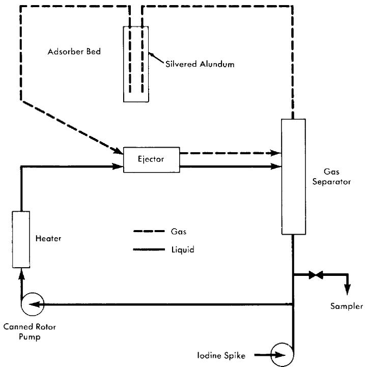  
FIG. 6-11. Vitro iodine test loop.

A number of conclusions are evident from these data. Iodine is much more volatile from fuel solution than from water at either temperature. Fission and corrosion products appear to increase the volatility of iodine from fuel solution at $100^{\circ}\mathrm{C}$ . Increasing the temperature from 100 to $200^{\circ}\mathrm{C}$ increases the volatility of iodine relative to that of water. No systematic variation of iodine volatility has been found with iodine concentration in the range 1 to $100\mathrm{ppm}$ or temperature in the range 260 to $330^{\circ}\mathrm{C}$ .

The volatility of iodine from simulated fuel solution has been verified by experiments in a high-pressure loop, shown schematically in Fig. 6-11 [11]. The circulating solution was contacted with oxygen in the ejector; the separated gas was stripped of iodine by passing through a bed of silvered alundum which was superheated to prevent steam condensation. Potassium iodide solution (containing a radioactive tracer, $\mathrm{I}^{31}$ ) was rapidly injected into the loop to give an iodine concentration of $10~\mathrm{ppm}$ . The iodine concentration decreased exponentially with time in the circulating solution. Table 6-7 gives the half-times for iodine removal and the volatility distribution coefficient, calculated from the removal rate and the flow rates, based on three experiments with clean fuel solution and two with added iron. Within the accuracy of flow rate measurement, the coef

TABLE 6-7   
IODINE REMOVAL FROM A HIGH-PRESSURE LOOP   

<table><tr><td>Solution</td><td>Tempera-ture, ℃</td><td>Iodine removal half-time, min</td><td>Iodine distribution coefficient, vapor/liquid</td></tr><tr><td>Clean fuel solution</td><td>230</td><td>13.0</td><td>7.6</td></tr><tr><td rowspan="2">(0.02 m UO2SO4-0.005 m H2SO4-0.005 m CuSO4)</td><td></td><td>6.5</td><td>16.8</td></tr><tr><td></td><td>13.0</td><td>8.4</td></tr><tr><td>Fuel + 30 ppm Fe3+</td><td>220</td><td>11.0</td><td>10.9</td></tr><tr><td>Fuel + 300 ppm Fe3+</td><td>225</td><td>11.0</td><td>9.5</td></tr></table>

ficient agrees with the average value of 7.4 obtained in numerous static tests over the high-temperature range. Iron appears to have no effect.

Oxidation state of iodine at high temperatures and pressures. While iodate ion is quite stable at room temperature, at elevated temperatures it decomposes according to the equilibrium reaction

$$
4 \mathrm {I O} _ {3} ^ {-} + 4 \mathrm {H} ^ {+} \rightleftharpoons 2 \mathrm {I} _ {2} + 5 \mathrm {O} _ {2} + 2 \mathrm {H} _ {2} \mathrm {O}.
$$

The extent of this decomposition in uranyl-sulfate solutions above $200^{\circ}\mathrm{C}$ is not known with certainty, since all observations have been made on samples that have been withdrawn from the system, cooled, and reduced in pressure before analysis. Although the iodine in such samples is principally elemental, some iodate is always present, possibly because of reversal of the iodate decomposition as the temperature drops in the sample line. Such measurements therefore give an upper limit to the iodate content of the solution. If periodate is introduced into uranyl-sulfate solution at elevated temperatures, it is reduced before a sample can be taken to detect its presence. Iodide similarly disappears if an overpressure of oxygen is present, although iodide to the extent of $40\%$ of the total iodine has been found in the absence of added oxygen [11].

Methods that have been used for determining the iodine/iodate ratio in fuel solutions are (a) analysis of samples taken from an autoclave at $250^{\circ}\mathrm{C}$ at measured intervals after injection of iodine in various states [11], (b) analysis of samples taken from the liquid in liquid-vapor equilibrium studies at 260 to $330^{\circ}\mathrm{C}$ [11], (c) rapid sampling from static bombs at 250 to $300^{\circ}\mathrm{C}$ [12], and (d) continuous injection of iodate-containing fuel solution into the above described ejector loop at $220^{\circ}\mathrm{C}$ and determining

oxidation states in samples withdrawn [11]. The iodine/iodate ratio in these samples has varied from slightly over 1 to about 70, with no apparent relation to variations in temperature, oxygen pressure, and total iodine concentration.

The strongest indication of iodate instability was in the loop experiments, which gave the highest observed iodine/iodate ratio, even though iodine was continuously introduced into the flowing stream as iodate and removed by oxygen scrubbing as elemental iodine. The low iodate content of the samples from these experiments corresponded to a first-order iodate decomposition rate constant of $6.2\mathrm{min}^{-1}$ . Iodate contents averaging about $10\%$ of the total iodine have been observed in $0.04m\mathrm{UO}_2\mathrm{SO}_4 - 0.005m\mathrm{CuSO}_4 - \mathrm{H}_2\mathrm{SO}_4$ solution, rapidly sampled from a static bomb through an ice-cooled titanium sample line. The observed iodate content was unrelated to whether the free sulfuric acid concentration was 0.02 or $0.03m$ , whether the temperature was 250 or $300^{\circ}\mathrm{C}$ , and whether or not the solution was exposed to cobalt gamma radiation at an intensity of 1.7 watts/kg.

Oxidation state of iodine at low temperatures. At $100^{\circ}\mathrm{C}$ the iodate decomposition and iodine oxidation are too slow for equilibrium to be established in reasonable periods of time. Thus both states can persist under similar conditions. In stainless-steel equipment both states are reduced to iodide, which is oxidized to iodine if oxygen or iodate is present [12].

In a radiation field the iodide is oxidized, iodine is oxidized if sufficient oxygen is present, and iodate is reduced [13]. At the start of irradiation, iodate is reduced, but in the presence of sufficient oxygen, iodine is later reoxidized to iodate, probably by radiation-produced hydrogen peroxide which accumulates in the solution. Finally, a steady state is reached with a proportion of iodate to total iodine which is independent of total iodine concentration from $10^{-6}$ to $10^{-5}m$ and temperatures from 100 to $110^{\circ}\mathrm{C}$ , but strongly dependent on uranium and acid concentrations and on the hydrogen/oxygen ratio in the gas phase. When the temperature is increased to $120^{\circ}\mathrm{C}$ there is a marked decrease in iodate stability under all conditions of gas and solution composition. Experimental data on the effects of radiation intensity, temperature, and gas composition for the irradiation of a typical fuel solution containing $0.04m\mathrm{UO}_2\mathrm{SO}_4 - 0.01m\mathrm{H}_2\mathrm{SO}_4 - 0.005m\mathrm{CuSO}_4$ are given in Ref. 13. The steady-state iodate percentages are also given in this reference.

6-5.3 Removal of iodine from aqueous homogeneous reactors. It is clear that under the operating conditions of a power reactor, iodine in the fuel solution is mainly in the volatile elemental state. It can therefore be removed by sweeping it from the solution into a gas phase, stripping

it from the gas stream by trapping it in a solid absorber or by contacting the gas with a liquid.

Numerous experiments have shown that silver supported on alundum is a very effective reagent for removing iodine from gas or vapor systems, although its efficiency is considerably reduced at temperatures below $150^{\circ}\mathrm{C}$ . Silver-plated Yorkmesh packing is very effective for removing iodine from vapor streams in the range 100 to $120^{\circ}\mathrm{C}$ . In one in-pile experiment [14] $90\%$ of the fission-product iodine was concentrated in a silvered-alundum pellet suspended in the vapor above a uranyl-sulfate solution. This method of using a solid iodine absorber, however, would present difficult engineering problems, since xenon resulting from iodine decay would be expected to leave the absorber and return to the core unless the absorbers were isolated after short periods of use and remotely replaced.

Iodine removal by gas stripping requires a continuous fuel letdown. In case this is not desirable, the vapor can be stripped of iodine in the high-pressure system by contacting with a small volume of liquid which is subsequently discharged. Liquids considered include water and aqueous solutions of alkali, sodium sulfite, or silver sulfate [11]. Although the solutions are much more effective iodine strippers than pure water, their use requires elaborate provision for preventing entrainment in the gas and subsequent contamination of the fuel solution. Thus most of the effort in design of iodine-removal systems is based on stripping by pure heavy water.

One possible iodine-removal scheme uses $\mathrm{O}_2$ or $\mathrm{O}_2 + \mathrm{D}_2$ stripping [15]. The iodine is scrubbed from the fuel solution by the gas in one contactor and then stripped from the gas by heavy water in a second contactor. This water would then be let down to low pressure and stored for decay or processed to remove iodine.

In most homogeneous reactors some of the fuel solution is evaporated to provide condensate for purge of the circulating pump and pressurizer. Since iodine is stripped from the fuel by this evaporation this operation can be used for iodine removal. This method, which is illustrated in Fig. 6-12, has been proposed for the HRE-3 [16]. Here a stream of the fuel solution is scrubbed with oxygen in the pressurizer. The steam is condensed and the oxygen recycled. The condensate is distilled to concentrate the iodine into such a small volume that its letdown does not complicate reactor operation.

Iodine removal in the HRE-2. Iodine adsorption on the platinized alumina recombination catalyst, such as that used in the HRE-2, poisons the catalyst severely [10]. Although the catalyst can be restored by operation at $650^{\circ}\mathrm{C}$ , this would not be feasible in HRE-2 operation. A method for removing iodine from the gas stream by contact with alundum or Yorkmesh coated with silver was developed in the HRT mockup. Iodine was introduced into the system and vapor from the letdown stream and dump

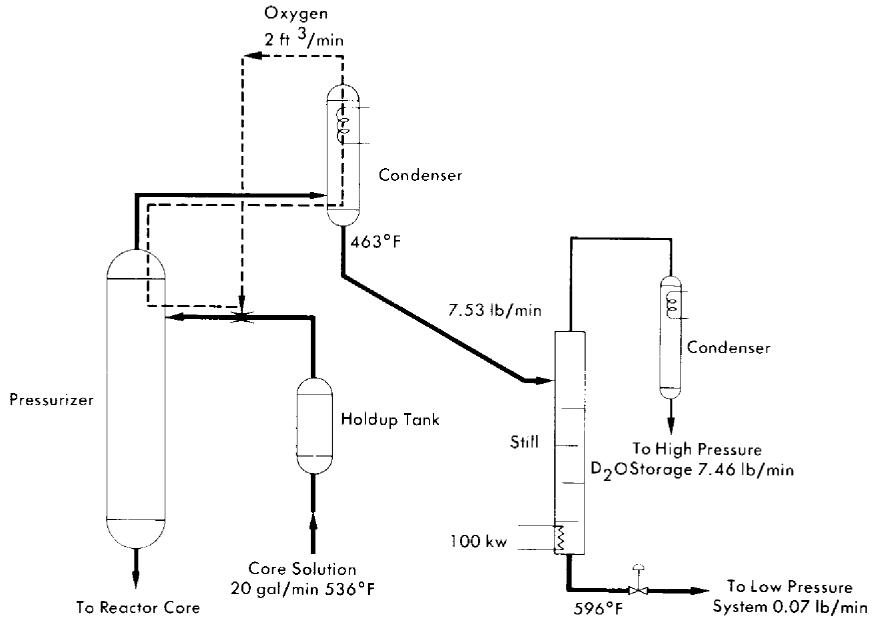  
FIG. 6-12. Iodine removal system proposed for HRE-3.

tank was passed through a silvered alundum bed and the recombiner, and then to a condenser. Condensate was returned to the high-pressure loop through a pressurizer and the circulating pump. After injection, the iodine concentration of the high-pressure loop dropped from $1.8\mathrm{mg / liter}$ to $0.1\mathrm{mg / liter}$ in 2 hr. In similar experiments with silvered Yorkmesh, iodine levels in the condensate and pressurizer were even lower relative to the high-pressure loop. The Yorkmesh efficiency depended strongly on how densely it was packed. The iodine removal efficiencies calculated from these experiments and others are given in Table 6-8. In laboratory experiments with a 1-in.-diameter bed which could not be tightly packed, Yorkmesh efficiencies were consistently poorer than those of silvered alundum.

The ability of a bed of silver-plated Yorkmesh to remove iodine from the reactor system was apparently confirmed during the initial operating period of the HRE-2 [17]. Here the iodine activity in the reactor fuel appeared to be even lower than expected when iodine was removed at the same fractional rate as fuel solution was let down from the high-pressure system. Less than $3\%$ of the iodine produced during 40 Mwh of operation was found in the fuel solution. Experience with the HRT mockup indicates that the iodine not in solution was held on the silvered bed.

TABLE 6-8   
IODINE REMOVAL EFFICIENCY OF SILVERED BEDS IN HRT MockUP   

<table><tr><td>Absorber</td><td>Bed height, in.</td><td>Temperature, °C</td><td>Efficiency, %</td></tr><tr><td rowspan="3">Silvered alundum rings</td><td>8</td><td>150</td><td>97.7</td></tr><tr><td>8</td><td>120</td><td>81.0</td></tr><tr><td>5</td><td>110</td><td>64.0</td></tr><tr><td>Yorkmesh, 22 lb/ft3</td><td>10</td><td>120</td><td>97.0</td></tr><tr><td>Yorkmesh, 29 lb/ft3</td><td>6</td><td>120</td><td>99.6</td></tr></table>

# 6-6. URANYL SULFATE BLANKET PROCESSING*

6-6.1 Introduction. The uranyl sulfate blanket solution of a plutonium producer is processed to remove plutonium and to control the neutron poisoning by corrosion and fission products. Although a modified Purex solvent extraction process can be used for plutonium removal, the method shown schematically in Fig. 6-3, based on the low solubility of plutonium in uranyl sulfate solution at $250^{\circ}\mathrm{C}$ , appears more attractive. A hydroclone similar to that used for reactor core processing is used to produce a concentrated suspension of $\mathrm{PuO_2}$ along with solid corrosion and fission products. The small volume of blanket solution carrying the plutonium is evaporated to recover the heavy water and the solids are dissolved in nitric acid. After storage to allow $\mathrm{Np}^{239}$ to decay, plutonium is decontaminated by solvent extraction.

6-6.2 Plutonium chemistry in uranyl sulfate solution. The amount of plutonium remaining dissolved in $1.4\,m\, \mathrm{UO}_2\mathrm{SO}_4$ at $250^{\circ}\mathrm{C}$ is dependent on a number of variables, including solution acidity, plutonium valence, and initial plutonium concentration. Under properly controlled conditions, less than $3\, \mathrm{mg/kg}\, \mathrm{H}_2\mathrm{O}$ has been obtained. Since plutonium is removed from solution by hydrolysis to $\mathrm{PuO}_2$ , solubilities are increased by increasing the acidity. Table 6-9 summarizes data on the solubility behavior of plutonium for various acidities.

TABLE 6-9   
SOLUBILITY OF TETRAVALENT PLUTONIUM   
IN $1.4m\mathrm{UO}_2\mathrm{SO}_4$ AT $250^{\circ}\mathrm{C}$   

<table><tr><td>Excess sulfuric acid, m</td><td>Pu(IV) solubility, mg/kg H2O</td></tr><tr><td>0</td><td>3.7</td></tr><tr><td>0.1</td><td>17</td></tr><tr><td>0.2</td><td>39</td></tr><tr><td>0.3</td><td>68</td></tr><tr><td>0.4</td><td>105</td></tr></table>

Plutonium behavior is difficult to predict because of its complex valence pattern. In the absence of irradiation, plutonium dissolved in $1.4\mathrm{m}$ $\mathrm{UO}_2\mathrm{SO}_4$ under a stoichiometric mixture of hydrogen and oxygen at $250^{\circ}\mathrm{C}$ exists in the tetrapositive state. However, when dissolved chromium is present or when an overpressure of pure oxygen is used, part of the plutonium is oxidized to the hexapositive state. Experiments indicate that in the presence of $\mathrm{Co}^{60}$ gamma irradiation [18], reducing conditions prevail even under an oxygen pressure and plutonium is held in the tetrapositive state. The valence behavior discussed here is somewhat in question, since actual valence measurements were made at room temperature immediately after cooling from $250^{\circ}\mathrm{C}$ . It is known that tetrapositive plutonium will disproportionate upon heating [19]. The disproportionation in a sulfate system is depressed by the sulfate complex formation with tetrapositive plutonium. These results indicate that plutonium in a reactor will be predominantly in the tetrapositive state.

When the plutonium concentration exceeds the solubility limit, plutonium will hydrolyze to form small particles of $\mathrm{PuO_2}$ about 0.5 micron in diameter and in pyrex, quartz, or gold equipment forms a loose precipitate with negligible amounts adsorbed on the walls. However, if these solutions are contained in type-347 stainless steel, titanium, or Zircaloy, a large fraction of the $\mathrm{PuO_2}$ adsorbs on and becomes incorporated within the oxide corrosion film. Attempts to saturate these metal surfaces with plutonium in small-scale laboratory experiments were unsuccessful even though plutonium adsorption was as much as $1\mathrm{mg/cm^2}$ .

6-6.3 Neptunium chemistry in uranyl sulfate solution. Neptunium dissolved in $1.4\,m\, \mathrm{UO}_2\mathrm{SO}_4$ at $250^{\circ}\mathrm{C}$ under air, stoichiometric mixture hydrogen and oxygen, or oxygen is stable in an oxidized valence state, prob

ably $\mathrm{Np(V)}$ . The solubility is not known, but it is greater than $200~\mathrm{mg / kg}$ $\mathrm{H}_2\mathrm{O}$ . Since the equilibrium concentration is only about $50~\mathrm{mg / kg}~\mathrm{H}_2\mathrm{O}$ , for a $1.4~m~\mathrm{UO}_2\mathrm{SO}_4$ blanket with an average flux of $1.8\times 10^{14}$ neutrons/ $(\mathrm{cm}^2)$ (sec), all the neptunium should remain in solution in most reactor designs.

6-6.4 Plutonium behavior under simulated reactor conditions. Plutonium behavior in actual uranyl sulfate blanket systems has not been studied; however, small-scale static experiments with $100\mathrm{ml}$ of solution and circulating loop experiments with 12 liters of solution have been carried out in the absence of irradiation under conditions similar to those expected in an actual reactor.

In the static experiments, plutonium was added batchwise to $1.4\mathrm{m}$ $\mathrm{UO_2SO_4}$ at a rate of about $6\mathrm{mg / kgH_2O / day}$ . The solution was heated overnight in a pyrex-lined autoclave at $250^{\circ}\mathrm{C}$ under 200 psi hydrogen and 100 psi oxygen. The solution was cooled to room temperature for analysis and for adding more plutonium. This was repeated until a total of $140\mathrm{mg}$ of plutonium per kilogram of water was added. Small disks of type-347 stainless steel were suspended in the solution throughout the experiment to determine the amount of plutonium adsorption. The behavior of plutonium for a stainless-steel surface area/solution volume ratio of $0.6~\mathrm{cm}^2 /\mathrm{ml}$ is shown in Fig. 6-13. As the plutonium concentration was gradually increased to $45\mathrm{mg / kgH_2O}$ , essentially all the plutonium remained in solution as $\mathrm{Pu(VI)}$ . There was a small amount of adsorption, but no precipitation. During the next few additions the amount of plutonium in solution decreased rapidly to about $5\mathrm{mg / kgH_2O}$ . At the same time there was a rapid increase in plutonium adsorption and in the formation of a loose $\mathrm{PuO_2}$ precipitate. All plutonium added after this was either adsorbed or precipitated.

Other experiments were made with surface/volume ratios of 0.2 and $0.4~\mathrm{cm}^2/\mathrm{ml}$ . In all cases, the plutonium remaining in solution and the plutonium adsorption per square centimeter were essentially the same as that shown in Fig. 6-13. Thus, by decreasing the surface/volume ratio, it is possible to increase the amount of plutonium in the loose precipitate. For example, when the total plutonium addition was $130~\mathrm{mg/kg~H_2O}$ , $40\%$ of the plutonium was as a loose precipitate for a surface/volume ratio of $0.6~\mathrm{cm}^2/\mathrm{ml}$ , $60\%$ for a ratio of $0.4~\mathrm{cm}^2/\mathrm{ml}$ , and $68\%$ for a ratio of $0.2~\mathrm{cm}^2/\mathrm{ml}$ .

Plutonium behavior under dynamic conditions was studied by injecting dissolved plutonium sulfate and preformed $\mathrm{PuO_2}$ into a circulating stream of 12 liters of $1.4\mathrm{m}$ $\mathrm{UO}_2\mathrm{SO}_4$ at $250^{\circ}\mathrm{C}$ under 350 psi oxygen. This solution was contained in a type-347 stainless steel loop equipped with a canned rotor pump, a hydroclone, metal adsorption coupon holders, and a small

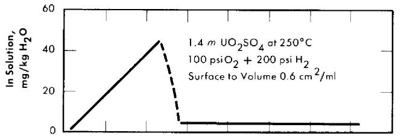

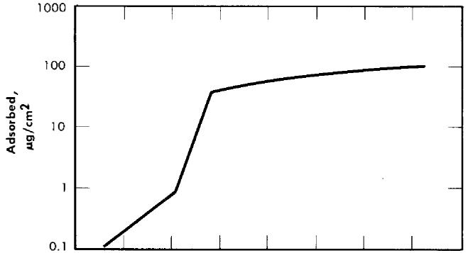

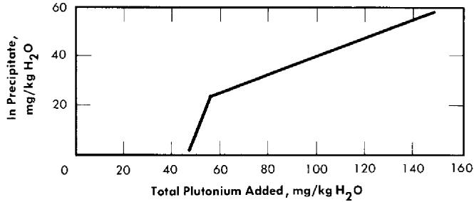  
FIG. 6-13. Plutonium behavior in uranyl sulfate solution contained in type-347 stainless steel.

pressure vessel that could be connected and removed while the loop was in operation. Plutonium was added and circulating-solution samples were taken through this vessel. Tetrapositive plutonium added to the circulating solution was completely oxidized to hexapositive in less than $5\mathrm{min}$ . When $45\mathrm{mg / kgH_2O}$ of dissolved plutonium was added every $8\mathrm{hr}$ , the amount of plutonium circulating in solution increased to a maximum of about $150\mathrm{mg / kgH_2O}$ . As more plutonium was added, it was rapidly adsorbed on the loop walls. After the last addition of plutonium, the loop was operated at $250^{\circ}\mathrm{C}$ for several days. Twelve hours after the last addition the plutonium concentration had decreased to $100\mathrm{mg / kgH_2O}$ , and about $40\mathrm{hr}$ later the amount of plutonium in solution had dropped to an apparent equilibrium value of $60\mathrm{mg / kgH_2O}$ . Essentially all the plutonium removed from solution was adsorbed on equipment walls uniformly throughout the loop. Less than $0.1\%$ of the plutonium was removed in

the hydroclone underflow, and no precipitated solids were circulating. Even when $850\mathrm{mg}$ of plutonium as preformed $\mathrm{PuO_2}$ was injected into the loop, no circulating solids were detected 5 min later. Only $20\%$ of this plutonium was removed by the hydroclone, $35\%$ was adsorbed on the stainless steel, and the rest was distributed throughout the horizontal sections of the loop as loose solids. The hydroclone was effective for removing solids that reached it, but the loop walls and low velocity in horizontal pipes were effective traps for $\mathrm{PuO_2}$ .

There are several differences in conditions between the loop runs and an actual reactor, the most important of which are probably the presence of radiation, the lower surface/volume ratio (0.4 compared with $0.8~\mathrm{cm}^2/\mathrm{ml}$ for the loop), the slower rate of plutonium growth in the reactor (12 to $15\mathrm{mg/kgH_2O/day}$ ) and the probability that a plutonium producer would have to be constructed of titanium and Zircaloy to contain the concentrated uranyl-sulfate solution. Based on these laboratory results, however, it appears that plutonium adsorption on metal walls may be a serious obstacle to processing for removal of precipitated $\mathrm{PuO_2}$ .

6-6.5 Alternate process methods. Because of the problem of plutonium adsorption on metal walls, removal methods based on plutonium concentrations well below the solubility limit have been considered. In a full-scale reactor plutonium will be formed at the rate of up to 12 to 15 $\mathrm{mg/kgH_2O/day}$ . In order to keep the plutonium concentration below $3\mathrm{mg/kgH_2O}$ , the entire blanket solution must be processed at least four to five times a day. By adding $0.4m$ excess $\mathrm{H}_2\mathrm{SO}_4$ (see Table 6-9), the plutonium solubility is increased to greater than $100\mathrm{mg/kgH_2O}$ and the blanket processing rate can be decreased to once every 3 or 4 days. Slightly longer processing cycles can be used if part of the plutonium is removed as neptunium before it decays.

Of the various alternate processes considered, ion exchange and adsorption methods show the most promise. Dowex-50 resin, a strongly acidic sulfonic acid resin loaded with $\mathrm{UO}_2^{+ + }$ , completely removed tetrapositive plutonium from $1.4m\mathrm{UO}_2\mathrm{SO}_4$ containing $20\mathrm{mg}$ of plutonium per liter [20]. The resin capacity under these conditions, however, has not been determined. Because of the high radiation level it may not be feasible to use organic resins. Sorption of plutonium on inorganic materials shows some possibilities as a processing method [21]. Although rather low plutonium/adsorber ratios have been obtained, indications are that capacities will be significantly higher at higher plutonium concentrations. Special preparation of the adsorbers should also increase capacities. Attempts to coprecipitate plutonium with tri- or tetrapositive iodates, sulfates, oxalates, and arsenates were not successful, owing to the high solubilities of these materials in $1.4m\mathrm{UO}_2\mathrm{SO}_4$ .

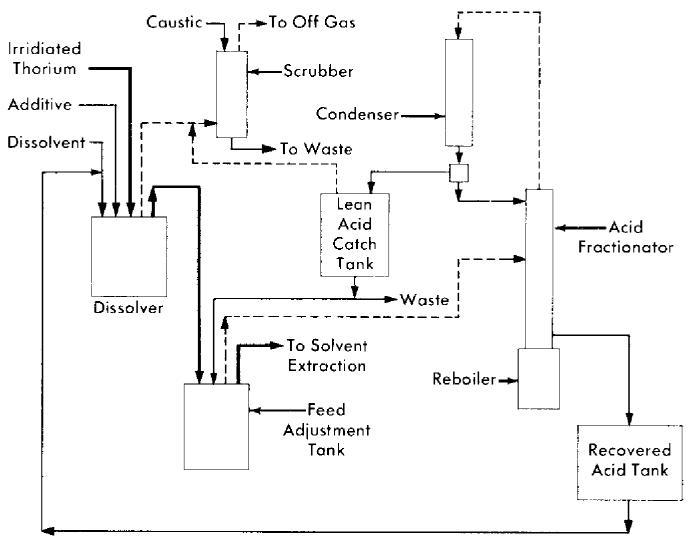  
FIG. 6-14. Thorex process, feed preparation flowsheet.

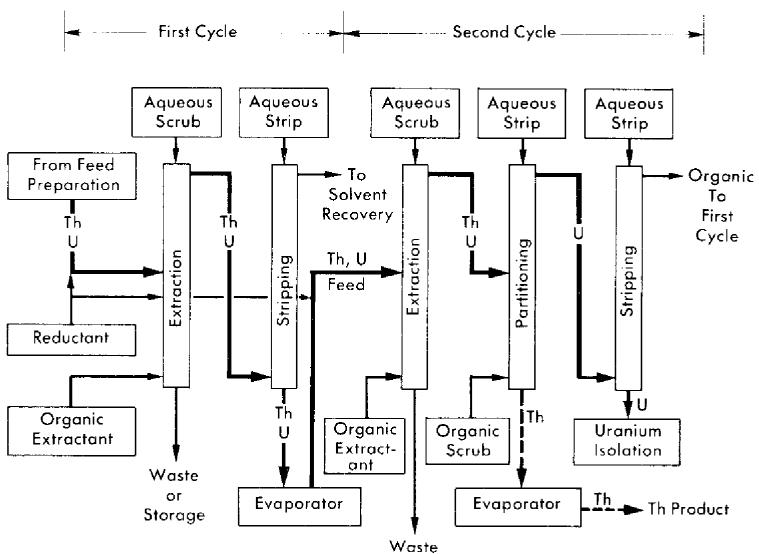  
FIG. 6-15. Thorex process, solvent extraction co-decontamination flowsheet.

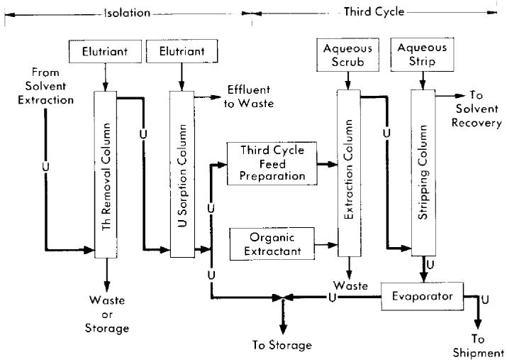  
FIG. 6-16. Thorex process, uranium isolation and third cycle flowsheet.

# 6-7. THORIUM OXIDE BLANKET PROCESSING

6-7.1 Introduction. At the present the only practical method available for processing irradiated thorium-oxide slurry is to convert the oxide to a natural water-thorium nitrate solution and treat by the Thorex process. Although this method is adequate, it is expensive unless one plant can be built to process thorium oxide from several full-scale power reactors. Therefore methods for $\mathrm{ThO_2}$ reprocessing which could be economically incorporated into the design and operation of a single power station have been considered. Alternate methods that have been subjected to only brief scouting-type experimentation are discussed in Article 6-7.3.

6-7.2 Thorex process.* The Thorex process has been developed to separate thorium, $\mathrm{U}^{233}$ , fission product activities, and $\mathrm{Pa}^{233}$ ; to recover the thorium and uranium as aqueous products suitable for further direct handling; and to recover isotopically pure $\mathrm{U}^{233}$ after decay-storage of the $\mathrm{Pa}^{233}$ . The flowsheet includes two solvent-extraction cycles for thorium and three solvent-extraction cycles plus ion exchange for the uranium. Although only irradiated thorium metal has been processed, the process is expected to be satisfactory for recovery of thorium and uranium from homogeneous reactor fuels.

The Thorex process may be divided into three parts: feed preparation,

solvent extraction, and product concentration and purification. These three divisions are shown in Figs. 6-14, 6-15, and 6-16.

In the feed preparation step, uranyl sulfate solution from the reactor core and thorium oxide from the blanket system, freed of $\mathrm{D}_2\mathrm{O}$ and suspended in ordinary water, are fed into the dissolver tank. The dissolvent is $13N$ nitric acid to which has been added catalytic amounts $(0.04N)$ of sodium fluoride. When short-cooled thorium is being processed, potassium iodide is added continuously to the dissolver to provide for isotopic dilution of the large amount of fission-produced $\mathrm{I}^{131}$ which is present. The dissolver solution is continuously sparged with air, and the volatilized iodine is removed from the off-gases in a caustic scrubber.

The dissolver solution is transferred to the feed adjustment tank where aluminum nitrate is added, excess nitric acid recovered, and the resultant solution made slightly acid-deficient by evaporating until a temperature of $155^{\circ}\mathrm{C}$ is reached. During digestion in the feed adjustment tank any silica present is converted to a form that will not cause emulsion problems in pulse columns, and fission products generally are converted to forms less likely to be extracted by the solvent (42% TBP in Amsco).

In the solvent extraction step thorium and uranium are co-extracted in the first cycle; subsequent partitioning of thorium and uranium in the second cycle gives two decontaminating cycles to both products while using only five columns. For short-decayed thorium a reductant, sodium hydrogen sulfite, is continuously added to the feed streams of both cycles to decrease the effect of nitrite formed by irradiation. Without the sulfite addition, the nitrite formed by radiation decomposition of nitrates converts ruthenium to a solvent-extractable form. Acid deficiency in the second cycle feed is achieved by adding dibasic aluminum nitrate (diban).

The spent organic from the second cycle is recycled to the first cycle as the organic extractant. The spent solvent from the first cycle is processed through a solvent-recovery system and reused as the organic extractant in the second cycle.

In the uranium product concentration and purification step (Fig. 6-16), uranium is isolated by ion exchange, using upflow sorption and downflow elution. In this way a concentrated uranium solution in $6N\mathrm{HNO}_3$ is obtained. This solution is stable enough for storage or is suitable as a feed for the third uranium extraction cycle. The third uranium cycle is a standard extraction-stripping solvent-extraction system using $15\%$ TBP-Amsco as the organic extractant. Although installed as a part of the complete Thorex flowsheet, the third cycle may be used separately for reprocessing long-stored uranium to free it of objectionable decay daughters of $\mathbf{U}^{232}$ . When used as an integral part of the Thorex scheme, additional decontamination of the uranium is achieved and the nitrate product is well adapted for extended storage or future reprocessing.

# TABLE 6-10

# AVERAGE DECONTAMINATION FACTORS FOR THORIUM AND URANIUM PRODUCTS IN THE THOREX PILOT PLANT

Thorium irradiated to 3500 grams of mass-233 per ton, two complete cycles for both uranium and thorium, one additional uranium cycle for material decayed only 30 days.

<table><tr><td rowspan="2"></td><td colspan="6">Decontamination factors</td></tr><tr><td>Gross</td><td>Pa</td><td>Ru</td><td>Zr-Nb</td><td>Total rare earths</td><td>I</td></tr><tr><td>Thorium</td><td></td><td></td><td></td><td></td><td></td><td></td></tr><tr><td>400 days decayed</td><td>1 × 105</td><td>1 × 104</td><td>4 × 103</td><td>3 × 105</td><td>2 × 106</td><td>-</td></tr><tr><td>30 days decayed</td><td>4 × 104</td><td>7 × 106</td><td>200</td><td>3 × 104</td><td>2 × 106</td><td>9 × 108</td></tr><tr><td>Uranium-233</td><td></td><td></td><td></td><td></td><td></td><td></td></tr><tr><td>400 days decayed</td><td>3 × 105</td><td>3 × 105</td><td>2 × 105</td><td>8 × 105</td><td>9 × 108</td><td>-</td></tr><tr><td>30 days decayed</td><td>5 × 107</td><td>5 × 1010</td><td>4 × 106</td><td>7 × 106</td><td>3 × 108</td><td>3 × 107</td></tr></table>

For return to an aqueous homogeneous reactor the decontaminated uranium would probably be precipitated as the peroxide, washed free of nitrate, and then dissolved in $\mathrm{D}_2\mathrm{SO}_4$ and $\mathrm{D}_2\mathrm{O}$ . Product thorium would be converted to thorium oxide by methods described in Section 4-3.

The adaptability of the Thorex flowsheet just described to processing thorium irradiated to contain larger amounts of $\mathrm{U}^{233}$ per ton and decayed a short time has been demonstrated in the Thorex Pilot Plant at Oak Ridge National Laboratory [22]. Fifteen hundred pounds of thorium irradiated to 3500 grams of $\mathrm{U}^{233}$ per ton and decayed 30 days was processed through two thorium cycles and three uranium cycles. The decontamination factors for various elements achieved with short-decayed material are compared in Table 6-10 with results obtained with longer-decayed material. While the decontamination factors obtained with the short-decayed material compare favorably with the factors for the long-decayed material, the initial activity in the short-decayed thorium was 1000 times greater than in the long-decayed. Therefore, while the thorium and uranium products did not meet tentative specifications after two complete cycles, the uranium product did meet those specifications after the third uranium cycle. Since the chemical operations necessary to convert these materials to forms suitable for use in a homogeneous reactor can be carried out remotely, the products are satisfactory for return to a homogeneous reactor after two cycles.

6-7.3 Alternate processing method.* Attempts to leach protactinium and uranium produced in $\mathrm{ThO_2}$ particles by neutron irradiation [23] indicate that both are rather uniformly distributed throughout the mass of the $\mathrm{ThO_2}$ particle, and migration of such ions at temperatures up to $300^{\circ}\mathrm{C}$ is extremely slow. Since calculations show that the recoil energy of fragments from $\mathrm{U}^{233}$ fission is sufficiently large to eject most of them from a particle of $\mathrm{ThO_2}$ not larger than 10 microns in diameter, this offers the possibility of separating fission and corrosion products from a slurry of $\mathrm{ThO_2}$ without destroying the oxide particles. Such a separation, however, depends on the ability to remove the elements that are subsequently adsorbed on the surface of the $\mathrm{ThO_2}$ . Adsorption of various cations on $\mathrm{ThO_2}$ and methods for their removal are discussed in the following paragraphs.

Trace quantities of such nuclides as $\mathrm{Zr}^{95}$ , $\mathrm{Nd}^{147}$ , $\mathrm{Y}^{91}$ , and $\mathrm{Ru}^{103}$ when added to a slurry of $\mathrm{ThO}_2$ in water at $250^{\circ}\mathrm{C}$ are rapidly adsorbed on the oxide particles, leaving less than $10^{-4\%}$ of the nuclides in solution. The tracer thus adsorbed cannot be eluted with hot dilute nitric or sulfuric acid. The adsorption of macroscopic amounts of uranium or neodymium on $\mathrm{ThO}_2$ at $250^{\circ}\mathrm{C}$ is less for oxide fired to $1600^{\circ}\mathrm{C}$ than for $650^{\circ}\mathrm{C}$ -fired oxide,

# TABLE 6-11

# EFFECT OF CALCINATION TEMPERATURE ON URANIUM AND NEODYMIUM ADSORPTION ON $\mathrm{THO}_2$ AT $250^{\circ}\mathrm{C}$

$0.5\mathrm{g}$ of $\mathrm{ThO_2}$ slurried at $250^{\circ}\mathrm{C}$ in $10~\mathrm{ml}$ of $0.005m\mathrm{Nd}(\mathrm{NO}_3)_3$ or $0.05m\mathrm{UO}_2\mathrm{SO}_4 - 0.05m\mathrm{H}_2\mathrm{SO}_4.$

<table><tr><td rowspan="2">Calcination temperature, °C</td><td colspan="2">Adsorption, mg/g Th*</td></tr><tr><td>U</td><td>Nd</td></tr><tr><td>650</td><td>3.3-4.4</td><td>7.4</td></tr><tr><td>850</td><td>1.9-2.4</td><td>6.1</td></tr><tr><td>1000</td><td>0.72-1.10</td><td>2.4</td></tr><tr><td>1100</td><td>0.08-0.19</td><td>0.5</td></tr><tr><td>1600</td><td>0.06-0.12</td><td>0.3</td></tr></table>

*Single numbers represent data from single experiments. In other cases the range for several experiments is given.

# TABLE6-12

# USE OF PBO TO DECREASE CATION ADSORPTION ON $\mathrm{THO}_2$

$0.2\mathrm{g}$ of $\mathrm{ThO_2}$ plus various amounts of PbO coslurried in $10~\mathrm{ml}$ of solution at $250^{\circ}\mathrm{C}$ for 8 hr.

<table><tr><td>Solids</td><td>PbO/ThO2wt. ratio</td><td>Solution</td><td>Cation adsorbed on ThO2, ppm</td></tr><tr><td>ThO2</td><td></td><td>0.002 m UO2SO4</td><td>3100</td></tr><tr><td>PbO + ThO2</td><td>0.2</td><td>0.002 m UO2SO4</td><td>220</td></tr><tr><td>ThO2</td><td></td><td>0.001 m Ce(NO3)3</td><td>6200</td></tr><tr><td>PbO + ThO2</td><td>0.2</td><td>0.001 m Ce(NO3)3</td><td>10</td></tr><tr><td>ThO2</td><td></td><td>0.01 m Nd tartrate</td><td>2700</td></tr><tr><td>PbO + ThO2</td><td>0.4</td><td>0.01 m Nd tartrate</td><td>10</td></tr></table>

as illustrated in Table 6-11. This change in amount of adsorption may be almost entirely due to decrease in surface area of $\mathrm{ThO_2}$ with increased firing temperature. The surface area of $1600^{\circ}\mathrm{C}$ -fired $\mathrm{ThO_2}$ is only $1\mathrm{m}^2/\mathrm{g}$ $\mathrm{ThO_2}$ , while the $650^{\circ}\mathrm{C}$ -fired $\mathrm{ThO_2}$ has a surface area of $35\mathrm{m}^2/\mathrm{g}$ $\mathrm{ThO_2}$ .

The cation adsorption on $\mathrm{ThO_2}$ can be decreased by coslurrying some other oxide with the $\mathrm{ThO_2}$ . The added oxide must adsorb fission products much more strongly than $\mathrm{ThO_2}$ and be easily separable from $\mathrm{ThO_2}$ . The effectiveness of $\mathrm{PbO}$ in decreasing cation adsorption on $\mathrm{ThO_2}$ is shown in Table 6-12. When $\mathrm{PbO_2}$ was used, more than $99\%$ of the cations added to the $\mathrm{ThO_2 - PbO}$ slurry was adsorbed on the $\mathrm{PbO_2}$ . However, cations adsorbed on $\mathrm{ThO_2}$ were not transferred to $\mathrm{PbO_2}$ when it was added to slurry in which the cations were already adsorbed on the $\mathrm{ThO_2}$ particles. Addition of dilute nitric acid to the $\mathrm{ThO_2 - PbO}$ coslurry completely dissolved the $\mathrm{PbO}$ and the cations adsorbed on it without disturbing the $\mathrm{ThO_2}$ .

In all cases, cations adsorbed on $\mathrm{ThO_2}$ at $250^{\circ}\mathrm{C}$ are so tightly held that dilute nitric or sulfuric acid, even at boiling temperature, will not remove the adsorbed material. However, the adsorbed ions can be desorbed by refluxing the $\mathrm{ThO_2}$ in suitable reagents under such conditions that only a small amount of $1600^{\circ}\mathrm{C}$ -fired $\mathrm{ThO_2}$ is dissolved. Under the same treatment $\mathrm{ThO_2}$ fired to only $650^{\circ}\mathrm{C}$ would be $90\%$ dissolved.

# REFERENCES

1. A. T. GRESKY and E. D. ARNOLD, Poisoning of the Core of the Two-region Homogeneous Thermal Breeder: Study No. 2, USAEC Report ORNL CF-54-2-208, Oak Ridge National Laboratory, 1954.   
2. E. D. ARNOLD and A. T. GRESKY, Relative Biological Hazards of Radiations Expected in Homogeneous Reactors TBR and HPR, USAEC Report ORNL-1982, Oak Ridge National Laboratory, 1955.   
3. R. A. McNEES and S. PETERSON, in *Homogeneous Reactor Project Quarterly Progress Report for the Period Ending July 31*, 1955, USAEC Report ORNL-1943, Oak Ridge National Laboratory, 1955. (pp. 201-202)   
4. D. E. FERGUSON et al., in *Homogeneous Reactor Project Quarterly Progress Report for the Period Ending Apr. 30, 1956*, USAEC Report ORNL-2096, Oak Ridge National Laboratory, 1956. (p. 118)   
5. P. A. HAAS, Hydraulic Cyclones for Application to Homogeneous Reactor Chemical Processing, USAEC Report ORNL-2301, Oak Ridge National Laboratory, 1957.   
6. W. D. BURCH et al., in Homogeneous Reactor Project Quarterly Progress Report for the Period Ending July 31, 1957, USAEC Report ORNL-2379, Oak Ridge National Laboratory, 1957. (p. 26)   
7. R. A. McNEEs et al., Oak Ridge National Laboratory, in Homogeneous Reactor Project Quarterly Progress Report, USAEC Reports ORNL-2379, 1957 (p. 137); ORNL-2432, 1957 (p. 147); ORNL-2493, 1958.   
8. W. E. BROWNING and C. C. BOLTA, Measurement and Analysis of Holdup of Gas Mixtures by Charcoal Adsorption Traps, USAEC Report ORNL-2116, Oak Ridge National Laboratory, 1956.   
9. W. D. BURCH et al., Oak Ridge National Laboratory, in Homogeneous Reactor Project Quarterly Progress Report, USAEC Report ORNL-2432, 1957 (p. 23); ORNL-2493, 1958.   
10. P. H. HARLEY, HRT Mock-up Iodine Removal and Recombiner Tests, USAEC Report CF-58-1-138, Oak Ridge National Laboratory, 1958.   
11. R. A. Keeler et al., Vitro Laboratories, 1957. Unpublished.   
12. S. PETERSON, unpublished experiments.   
13. D. E. FERGUSON et al., Oak Ridge National Laboratory, in Homogeneous Reactor Project Quarterly Progress Report, USAEC Reports ORNL-2272, 1957 (pp. 133-135); ORNL-2331, 1957 (pp. 142-143, 148-149); ORNL-2379, 1957 (pp. 138-139).   
14. R. A. McNEES et al., in *Homogeneous Reactor Project Quarterly Progress Report for the Period Ending Apr. 30, 1955*, USAEC Report ORNL-1895, Oak Ridge National Laboratory, 1955. (pp. 175-176)   
15. D. E. FERGUSON, Removal of Iodine from Homogeneous Reactors, USAEC Report CF-56-2-81, Oak Ridge National Laboratory, 1956; Preliminary Design of an Iodine Removal System for a 460-Mw Thorium Breeder Reactor, USAEC Report CF-56-7-12, Oak Ridge National Laboratory, 1956.   
16. H. O. WEEREN, Preliminary Design of HRE-3 Iodine Removal System #1, USAEC Report CF-58-2-66 Oak Ridge National Laboratory, 1958.   
17. S. PETERSON, Behavior of Iodine in the HRT, USAEC Report CF-58-3-75, Oak Ridge National Laboratory; 1958.

18. R. E. LEUZE et al., in Homogeneous Reactor Project Quarterly Progress Report for the Period Ending Apr. 30, 1957, USAEC Report ORNL-2331, Oak Ridge National Laboratory, 1957. (p. 151)   
19. R. E. Connick, in The Actinide Elements, National Nuclear Energy Series, Division IV, Volume 14A. New York: McGraw-Hill Book Co., Inc., 1954. (pp. 221, 238-241)   
20. S. S. KIRSLIS, Oak Ridge National Laboratory. Unpublished.   
21. R. E. LEUZE and S. S. KIRSLIS, Oak Ridge National Laboratory, 1957. Unpublished.   
22. W. T. McDUFFEE and O. O. YARBRO, Oak Ridge National Laboratory, 1958. Unpublished.   
23. D. E. FERGUSON et al., in Homogeneous Reactor Project Quarterly Progress Report for the Period Ending July 31, 1955, USAEC Report ORNL-1943. Oak Ridge National Laboratory, 1955. (p. 221)