# CHAPTER 7

# DESIGN AND CONSTRUCTION OF EXPERIMENTAL HOMOGENEOUS REACTORS*

7-1. INTRODUCTION

7-1.1 Need for reactor construction experience. The power reactor development program in the United States is characterized by the construction of a series of experimental reactors which, it is hoped, will lead for each reactor type to an economical full-scale power plant. Outstanding examples of this approach are afforded by the pressurized water reactor and boiling water reactor systems. The development of pressurized water reactors started with the Materials Testing Reactor, followed in turn by the Submarine Thermal Reactor (Mark I), the Nautilus Reactor (Mark II), and the Army Package Power Reactor. Experience obtained from the construction of these reactors was applied to the full-scale plants built by the Westinghouse Electric Company (Shippingport and Yankee Atomic Electric Plants) and Babcock & Wilcox Company (Consolidated Edison Plant).

Although many have argued that the shortest route to economic power will be achieved by eliminating the intermediate-scale plants, most experts believe that eliminating these plants would be more costly in the long run. To quote from a speech by Dr. A. M. Weinberg [1], while discussing large-scale reactor projects: "The reactor experiment—a relatively small-scale reactor embodying some, but not all, the essential features of a full-scale reactor—has become an accepted developmental device for reactor technology."

An alternative to the actual construction of experimental nuclear reactors has been proposed which consists of the development of reactor systems and components in nonnuclear engineering test facilities, zero-power critical experiments, and the testing of fuel elements and coolants in in-pile loops. This approach, although used successfully in the development of various solid-fuel coolant systems, is not completely applicable to circulating-fuel reactors because of the difficulty of simulating actual reactor operating conditions in such experiments. In in-pile loops, for example, the ratio of the volume of the piping system to the volume of the reacting zone is never quite the same as in a reactor, making it impossible to duplicate simultaneously the conditions of fuel concentration, enrichment, and power density. In cases where these variables are important, the in-pile loops

can at best provide information of an exploratory nature which must be verified in an operating fluid-fuel reactor.

A second aspect of circulating-fuel reactors, which precludes relying solely on engineering tests and in-pile loops, is the close interrelation of the nuclear behavior and the operational characteristics of the fuel circulation system, which can be determined only through construction and operation of a reactor. Other aspects of reactor design that can be best determined in an operating homogeneous reactor are continuous removal of fission products produced in the nuclear reaction and remote decontamination and maintenance of reactor equipment and piping.

7-1.2 Sequence of experimental reactors. It is obvious from the foregoing that the construction of a sequence of experimental reactors has been an important factor in the development of homogeneous reactors. In this sequence, which started with nonpower research reactors, seven such reactors have been built (not including duplicates of the water boilers). These are the Low Power Water Boiler (LOPO), the High Power Water Boiler (HYPO), the Super Power Water Boiler (SUPO), the Homogeneous Reactor Experiment (HRE-1), the Homogeneous Reactor Test (HRE-2), and the Los Alamos Power Reactor Experiments (LAPRE-1 and -2). In the sections of this chapter which follow, these reactors are described in detail, and their design, construction, and operating characteristics are compared. Their construction covers the regime of homogeneous reactor technology involving the feasibility of relatively small reactors fueled with aqueous solutions of uranium. Since their construction and operation does not include systems fueled with aqueous suspensions of thorium oxide and or uranium oxides necessary for the development of full-scale homogeneous breeders or converters, additional experimental reactors will undoubtedly be built.

# 7-2. WATER BOILERS*

7-2.1 Description of the LOPO, HYPO, and SUPO [2-4]. Interest in homogeneous reactors fueled with a solution of an enriched-uranium salt was initiated at the Los Alamos Scientific Laboratory in 1943 through an attempt to find a chain-reacting system using a minimum of enriched fuel. The first of a sequence of such reactors, known as LOPO (for low power), went critical at Los Alamos in May 1954 with 565 grams of $\mathrm{U}^{235}$ as uranyl sulfate. The uranium, containing $14.5\%$ $\mathrm{U}^{235}$ , was dissolved in approximately 13 liters of ordinary water contained in a type-347 stainless steel sphere 1 ft in diameter and 1/32 in. in wall thickness. The sphere was sur

rounded by beryllium oxide as reflector in order to minimize the critical mass of the $\mathrm{U}^{235}$ . The lack of a shield and cooling system limited the heat power level of LOPO to 50 milliwatts. A cross-sectional drawing of the LOPO is shown in Fig. 7-1.

Following successful low-power operation of the LOPO, the reactor was provided with a thicker sphere (1/16 in.), integral cooling coils, and a shield to permit operation at $6\mathrm{kw}$ . Also, part of the beryllium oxide reflector was replaced by a graphite thermal column, and holes through the shield and reflector were provided for experiments. The critical mass of the modified reactor was 808 grams of $\mathrm{U}^{235}$ as uranyl nitrate at $14.0\%$ enrichment, contained in 13.65 liters of solution. The change from uranyl sulfate to nitrate was made because an extraction method for the removal of fission products was known only for the latter solution at that time. The modified reactor, called HYPO (high power), went critical in December 1944 and operated at a normal power of $5.5\mathrm{kw}$ , producing an average thermal-neutron flux of $10^{11}$ neutrons/(cm $^2$ )(sec). The temperature of the solution during operation reached $175^{\circ}\mathrm{F}$ with cooling water (50 gal/hr) at $46^{\circ}\mathrm{F}$ .

Since higher neutron fluxes were desired, as well as more research facilities than available from HYPO, the reactor was further modified and renamed SUPO (super power water boiler).

The modifications were made in two parts. The first phase, begun in April 1949 and completed in February 1950, improved the experimental facilities and increased the neutron flux. The second phase, begun in October 1950 and completed in March 1951, increased the thermal neutron irradiation facilities, improved the reactor operation, and removed the explosive hazard in the exhaust gases.

The first group of alterations consisted of the following:

(1) The space around the reactor was increased by enlarging the building so that experiments could be carried out on all four sides instead of only two.   
(2) The construction of a second thermal column was made possible by eliminating a removable portion of the reactor shield. This made available a neutron beam and irradiation facilities on a previously unused face of the reactor.   
(3) The entire spherical core assembly was replaced as follows:

(a) Three 20-ft-long, 1/4-in.-OD, 0.035-in.-wall-thickness stainless steel tubes replaced the former single cooling coil. This increased the operating power level from $5.5\mathrm{kw}$ to a maximum of $45\mathrm{kw}$ .   
(b) A new removable level indicator and exit gas unit was installed in the sphere stack tube. The stack tube itself was made more accessible for future modifications.   
(c) External joints were not welded, but unions of flare fittings were used to simplify the removal of the sphere or permit pipe replacements.

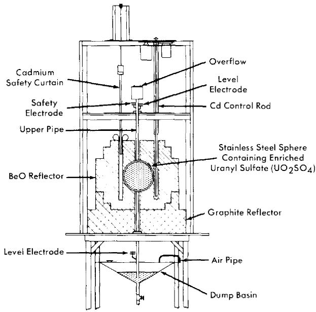  
FIG. 7-1. Cross section of LOPO, the first aqueous solution reactor.

(d) An additional experimental hole was run completely through the reactor tangent to the sphere. This $1\frac{7}{16}$ -in.-ID tube supplemented the 1-in.-ID "glory hole" running through the sphere.   
4 The beryllium portion of the reflector was replaced by graphite. The all-graphite reflector gave a more rapid and complete shutdown of the reactor and eliminated the variable starting source produced by the $(\gamma, n)$ reaction on beryllium. A 200-milleurie RaBe source placed in the reflector was used as a startup neutron source.   
(5) Two additional vertical control rods were added which moved into the sphere in re-entrant thimbles. These consisted of about 120 grams of sintered $\mathrm{B}^{10}$ in the form of $9/16$ -in. rods about 18 in. long. These rods gave the additional control required by the change to an all-graphite reflector. Previously observed shadow effects were eliminated by the internal position of the rods and by the location of the control chambers under the reactor.   
(6) The reactor solution was changed from $15\%$ U $^{235}$ -enriched uranyl nitrate to one of $88.7\%$ enrichment. This made possible the continued use of a low uranium concentration in the solution with the poorer all-graphite reflector. The gas evolution produced by nitric acid decomposition was greatly reduced, due to the lower total nitrogen content.

(7) The entire inner reactor shield was improved to permit higher power operation with a low neutron leakage and also to increase the neutron-to-gamma-ray intensity in the thermal columns. Cadmium was replaced by $\mathrm{B_4C}$ paraffin and additional steel shielding was added.

After operating the reactor with the above modifications for about 10,000 kwh at a power of $30\mathrm{kw}$ , the following (second group) alterations were made:

(1) The original south thermal column was completely rebuilt, with improved shielding to provide many more irradiation facilities.   
(2) A recombination system was constructed to handle the off-gases from the reactor. The use of a closed circulating gas system with a catalyst chamber of platinized alumina removed any explosive hazard in the exhaust gases due to the presence of hydrogen and oxygen. The operating characteristics of the reactor were greatly improved by returning directly back to the reactor as water all but a very small fraction of the gases produced.   
(3) A shielded solution-handling system was constructed to simplify the procedure of routine solution analysis and for the removal or change of the entire reactor solution.

The average neutron flux in the SUPO during operation at $45\mathrm{~kw}$ is about $1.1\times 10^{12}$ neutrons/ $(\mathrm{cm}^2)$ (sec), and the peak thermal flux (in the "glory hole") is $1.7\times 10^{12}$ neutrons/ $(\mathrm{cm}^2)$ (sec). Estimated values for the maximum intermediate and fast fluxes at $45\mathrm{~kw}$ are 2.8 and $1.9\times 10^{12}$ neutrons/ $(\mathrm{cm}^2)$ (sec), respectively. Calculations made from fast beams emerging from the north thermal column at this same power level gave the following fast-flux values above 1 Mev in units of neutrons/ $(\mathrm{cm}^2)$ (sec): (1) at sphere surface, $1.1\times 10^{12}$ ; (2) at bismuth column, $7\times 10^{10}$ ; and (3) at a graphite face 1 ft in front of the bismuth column, $2\times 10^9$ .

The production of hydrogen plus oxygen due to radiation decomposition amounts to approximately 20 liters/min during operation of the reactor at $45\mathrm{kw}$ . These gases leave the reactor core and pass through a reflux condenser which removes much of the water vapor and then through a stainless steel-wool trap for final moisture removal. A blower feeds the gas into one of two interchangeable catalyst chambers containing platinized alumina pellets. These chambers, operating at 370 to $470^{\circ}\mathrm{C}$ , recombine the hydrogen and oxygen, and the gas leaving the catalyst contains the water vapor formed. A second condenser reduces the temperature of the exit gas to that entering the catalyst chamber. A total of 100 liters/min of gas is circulated continuously in the closed gas system at pressures slightly above atmospheric, and the hydrogen concentration is kept below the detonation limit at all points of the system. Excess pressures produced in the gas system can be bled to the atmosphere through a 150-ft-high exhaust stack.

The characteristics of LOPO, HYPO, SUPO, and the North Carolina State College Water Boilers are summarized in Table 7-1.

TABLE7-1 DESIGN CHARACTERISTICS OF WATER BOILERS   

<table><tr><td></td><td>LOPO</td><td>HYPO</td><td>SUPO</td><td>NCSR [5]</td></tr><tr><td>Power level, kw</td><td>\( 5 \times 10^{-5} \)</td><td>5.6</td><td>45</td><td>10</td></tr><tr><td>Solution (in H2O)</td><td>\( \mathrm {U O}_{2}\mathrm {S O}_{4} \)</td><td>\( \mathrm {U O}_{2}(\mathrm {NO}_{3})_{2} \)</td><td>\( \mathrm {U O}_{2}(\mathrm {NO}_{3})_{2} \)</td><td>\( \mathrm {U O}_{2}\mathrm {SO}_{4} \)</td></tr><tr><td>\( U^{235}wt. \), grams</td><td>565</td><td>870</td><td>870</td><td>848</td></tr><tr><td>Solution volume,liters</td><td>13</td><td>13.65</td><td>13.65</td><td>15</td></tr><tr><td>Enrichment, %</td><td>14.6</td><td>14.0</td><td>88.7</td><td>90</td></tr><tr><td>Maximum thermal-neutron flux</td><td>\( 3 \times 10^{6} \)</td><td>\( 2.8 \times 10^{11} \)</td><td>\( 1.7 \times 10^{12} \)</td><td>\( 5 \times 10^{11} \)</td></tr><tr><td>Reflector material</td><td>BeO</td><td>Be and graphite</td><td>Graphite</td><td>Graphite</td></tr><tr><td>Coolant flow rate gal hr</td><td>None</td><td>50</td><td>180</td><td>240</td></tr><tr><td>Solution tempera-ture, °C</td><td>39</td><td>85</td><td>85</td><td>80</td></tr><tr><td>Experimentalfacilities</td><td>None</td><td>1 thermal column</td><td>2 thermalcolumns (&quot;gloryhole&quot; and tangential hole)</td><td>1 thermalcolumn12 exposureports</td></tr></table>

7-2.2 Kinetic experiments in water boilers. In August 1953, experiments were performed on the SUPO by a group of scientists from the Oak Ridge National Laboratory and Los Alamos [6,7] to determine the degree to which a boiling (and nonboiling) homogeneous reactor automatically compensates for suddenly imposed supercritical conditions. Previous boiling experiments in 1951, unreported in the open literature [8], had indicated the stability of SUPO under steady-state boiling conditions;

however, there remained considerable doubt as to the adaptability of a reactor of this type to a sudden introduction of excess reactivity such as might occur with a sudden increase in pressure above the reactor. The tests were performed by suddenly ejecting a neutron poison, consisting of an aluminum rod containing boron carbide at its tip, and simultaneously measuring the neutron flux level with high-speed recorders connected to a boron-coated ionization chamber located in the graphite reflector. The amount of reactivity introduced was determined by the position of a calibrated control rod. Although the experiments were interrupted by frequent accidental scrams, caused by the unsuitability of SUPO to boiling at high solution levels in the sphere, the results indicated that both boiling and nonboiling solution reactors are capable of absorbing reactivity increases of at least $0.4\%$ $k_{\mathrm{eff}}$ added in about 0.1 sec. In both boiling and nonboiling cases, the reactor power was self-regulating, but excursions were terminated more rapidly under boiling conditions. The average lifetime of prompt neutrons in the reactor was calculated from the initial prompt rise in the neutron flux and found to be about $1.7\times 10^{-4}$ sec. Following a reactivity addition, the initial rate of reactivity decrease (0.2 sec after start) was greater than about five times the rate which could be attributed to core-temperature rise and the associated negative temperature coefficient $(0.024\% k_{\mathrm{eff}} / ^{\circ}\mathrm{C})$ . As the gas bubbles left the core region, reactivity decrease due to core-temperature rise increased in relative importance.

More recent experiments with the Kinetic Experiment for Water Boilers (KEWB-1), operated by Atomics International for the U. S. Atomic Energy Commission [9], have verified the self-controlling features of a solution-type reactor. It was found that automatic shutdown due to the temperature increase and formation of gas bubbles in the reactor fuel solution occurs under all abnormal operating conditions tested.

7-2.3 The North Carolina State College research reactor [5]. The simplicity of the Water Boiler reactor has made it of interest as a laboratory tool for experimental work with neutrons and gamma rays and also to provide training in reactor operation, and ten such reactors were in operation or planned in the United States by the end of 1957. The first college-owned nuclear research reactor, which started operating at $10\mathrm{kw}$ in September 1953 at North Carolina State College, Raleigh, North Carolina, was of this type. It was completed after four years of planning, design, and construction, at a cost of $\$130,000$ for the reactor, plus $\$500,000$ for the reactor building and associated laboratory equipment. It differs from the Los Alamos SUPO in that the fuel container is a cylinder 11 in. in diameter and 11 in. high, rather than a sphere. Its experimental facilities include 12 access ports and a thermal column.

In June 1955, the reactor was shut down because of leaks which developed in the fuel container and permitted the radioactive fuel to contaminate the inside of the reactor shield. After a major repair job, operation of the reactor with a new core was resumed in March 1957 at a power level of 500 watts, and the reactor has operated successfully at that level for a year.

7-2.4 Atomics International solution-type research reactors. Several versions of the Water Boiler are being offered commercially by various companies. The major supplier is the Atomics International Division of North American Aviation Company which has built, or is building, 11 such reactors. Low-power reactors are: the 1-watt Water Boiler Neutron Source (WBNS) originally at Downey, California, which was moved to Santa Susana and modified to operate at $2\mathrm{kw}$ ; a new 5-watt laboratory reactor (L-47) for Atomics International; the 100-watt Livermore Research Reactor at Livermore, California; and a 5-watt reactor planned for the Danish Atomic Energy Commission at Risø, Denmark. Higher power Water Boilers, operating at $50\mathrm{kw}$ , include the Kinetic Experiment for Water Boilers (KEWB-1) at Santa Susana; the UCLA Medical Facility at Los Angeles, California; and reactors for the Armour Research Foundation in Chicago, Illinois; the Japan Atomic Energy Research Institute at Tokai, Japan; Farbwerke Hoechst A. G. at the University of Frankfurt,

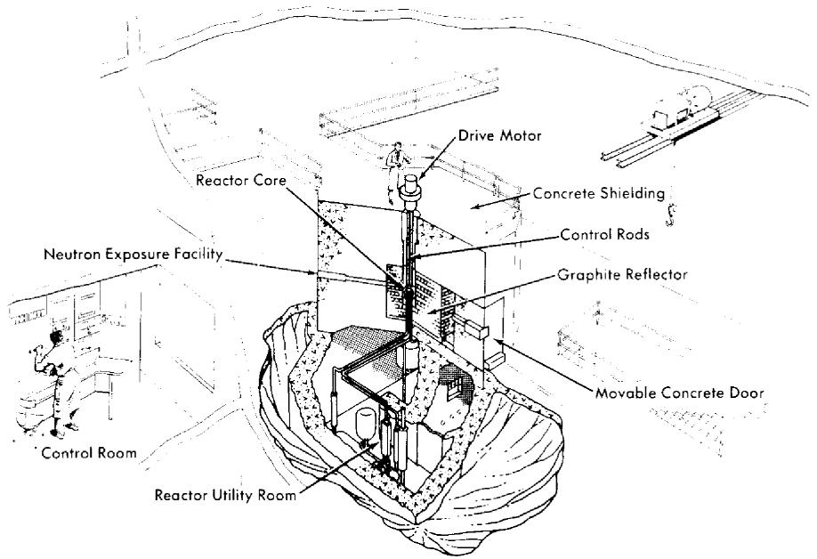  
FIG. 7-2. Armour Research Foundation research reactor (courtesy of Atomics International, a division of North American Aviation Co.)

West Germany; the Senate of West Berlin (Institute for Nuclear Research), Germany; and the Politecnico Enrico Fermi Nuclear Study Center at Milan, Italy.

The first solution-type research reactor for industrial use went into operation in June 1956. The general features of this reactor, which Atomics International built for the Armour Research Foundation at the Illinois Institute of Technology, Chicago, Illinois, are shown in Fig. 7-2.

The exposure facilities include one 6-in.-diameter beam tube extending radially to within 2 ft of the core tank and 4 in. in diameter from there to the core tank; two 4-in. and two 3-in. beam tubes extending radially to the core tank; two 2-in. through-tubes passing tangentially to the core tank; one $1\frac{1}{2}$ -in.-diameter tube passing through the central region of the core; four 4-in. vertical tubes located in the reflector; one 5 ft $\times$ 5 ft graphite thermal column with a 12-in.-square removable section. The tube facilities consist of steel sleeves extending through the concrete shield and aluminum thimbles or liners which reach to the immediate vicinity of the core. Each tube facility is equipped with a graphite reflector plug and a dense concrete-and-steel shielding plug to be installed when the facility is not in use.

The horizontal thermal column is formed by a 5-ft-square column of graphite, in the center of which are nine removable graphite stringers. A large volume which may be used for exposures is provided between the end of the thermal column and the inner face of a movable concrete door. The thermal column access ports open into this volume.

To take advantage of the 50,000 curies of gamma activity produced by the fission-product gases circulating through the gas recombiner tank, exposure facilities are provided which extend from the subpile room into the exposure room and into the valve room. The facilities listed below consist of steel sleeves and aluminum thimbles which extend through the dense concrete walls of the exposure room.

2 gamma ports, 4 in. diameter   
2 gamma ports, 8 in. diameter   
1 rectangular gamma slot, 6 in. $\times 18$ in.

In addition, two 4-in.-diameter gamma ports extend from the subpile room into the valve room. As with the beam tubes, each port is equipped with a plug to be installed for shielding purposes when the port is not in use.

# 7-3. THE HOMOGENEOUS REACTOR EXPERIMENT (HRE-1) [10-13]*

7-3.1 Introduction. In 1950 the Oak Ridge National Laboratory undertook the task of designing, building, and operating a pilot-plant fluid-fuel reactor, the Homogeneous Reactor Experiment (HRE-1), shown in

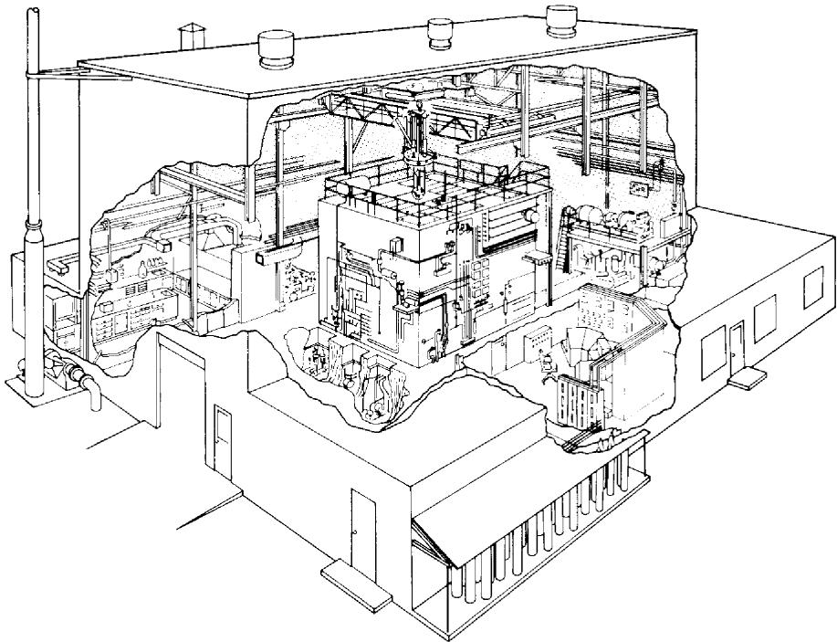  
FIG. 7-3. The homogeneous reactor experiment (HRE-1).

Fig. 7-3. The purpose of this reactor was to investigate the nuclear and chemical characteristics of a circulating uranium solution reactor at temperatures and powers sufficiently high for the production of electricity from the thermal energy released. Specifically, it was designed to operate with a full-power heat release of 0.6 to 3.5 million Btu/hr (200 to 1000 kw of heat), and a maximum fuel-solution temperature of $482^{\circ}\mathrm{F}$ , yielding, after heat exchange, a saturated-steam pressure of about 200 psi.

During the 24-month period in which the reactor was in operation, starting in April 1952, liquid was circulated for a total of about $4500\mathrm{hr}$ . The reactor was critical a total of $1950\mathrm{hr}$ and operated above $100\mathrm{kw}$ for $720\mathrm{hr}$ . The maximum power level attained was $1600\mathrm{kw}$ . The reactor was shut down in the spring of 1954 and dismantled to make room for the Homogeneous Reactor Test (HRE-2), having successfully demonstrated the nuclear stability of a circulating-fuel reactor. The characteristics of the HRE-1 are summarized in Table 7-2.

7-3.2 The reactor fuel system. The reactor core consisted of a stainless steel sphere 18 in. in diameter, through which was circulated 100 to $120\mathrm{gpm}$ of $93\%$ enriched uranyl sulfate dissolved in distilled water. The temperature

TABLE 7-2   
CHARACTERISTICS OF HRE-1   

<table><tr><td>Power, heat</td><td>1000 kw</td></tr><tr><td>Fuel</td><td>\(\mathrm{UO}_{2}\mathrm{SO}_{4}\) (93% enriched) in \(\mathrm{H}_{2}\mathrm{O}\)</td></tr><tr><td>Fuel concentration</td><td>~30 g \(\mathrm{U}^{235}\) per liter (0.17 m \(\mathrm{UO}_{2}\mathrm{SO}_{4}\))</td></tr><tr><td>\(\mathrm{U}^{235}\) in core</td><td>1.5 - 2 kg</td></tr><tr><td>Core</td><td>18 in. diameter, stainless steel</td></tr><tr><td>Pressure vessel</td><td>39 in. ID, 3 in. thick, forged steel</td></tr><tr><td>Reflector</td><td>10 in. \(\mathrm{D}_{2}\mathrm{O}\), pressurized with He</td></tr><tr><td>Specific power</td><td>20 kw/liter</td></tr><tr><td>Fuel inlet temperature</td><td>210°C</td></tr><tr><td>Fuel outlet temperature</td><td>250°C</td></tr><tr><td>System pressure</td><td>1000 psi (430 psi above vapor pressure)</td></tr><tr><td>Gas removal system</td><td>Vortex flow through core</td></tr><tr><td>Radiolytic gas recombination</td><td>\(\mathrm{CuSO}_{4}\) (internal); flame and catalytic recombination (external)</td></tr><tr><td>Control system</td><td>Reflector level, safety plates, temperature control</td></tr><tr><td>Shielding</td><td>7 ft barytes concrete</td></tr><tr><td>Steam temperature</td><td>382°F</td></tr><tr><td>Steam pressure</td><td>200 psi</td></tr><tr><td>Electrical capacity</td><td>140 kw</td></tr></table>

rise of the solution passing through the core was about $72^{\circ}\mathrm{F}$ at a power level of $1000\mathrm{kw}$ . The liquid was discharged from the core at a temperature of $482^{\circ}\mathrm{F}$ , and cooled to $410^{\circ}\mathrm{F}$ by evaporating water from the shell side of a U-tube heat exchanger, thus generating about $3000\mathrm{lb/hr}$ of 200 psi steam. A canned-rotor centrifugal pump returned the fuel to the core to be reheated. The total volume of solution in the high-pressure system was about 90 liters, of which 50 liters were in the core. A schematic flow diagram of HRE-1 is shown in Fig. 7-4.

A total pressure of 1000 psi was maintained in the fuel system by heating a small volume of fuel to $545^{\circ}\mathrm{F}$ in a pressurizer chamber directly above the sphere. The 1000 psi total pressure, which is over 400 psi greater than is required to prevent boiling of the fuel solution, was necessary to minimize the volume of decomposition gases.

7-3.3 The reflector system. The reflector of HRE-1 was a 10-in. layer of heavy water surrounding the core vessel. The heavy water was pressurized with helium to within $\pm 100$ psi of the fuel pressure in order to minimize stresses in the 3/16-in. wall of the spherical fuel container. Both the reflector and the concentric core were contained in an outer pressure vessel

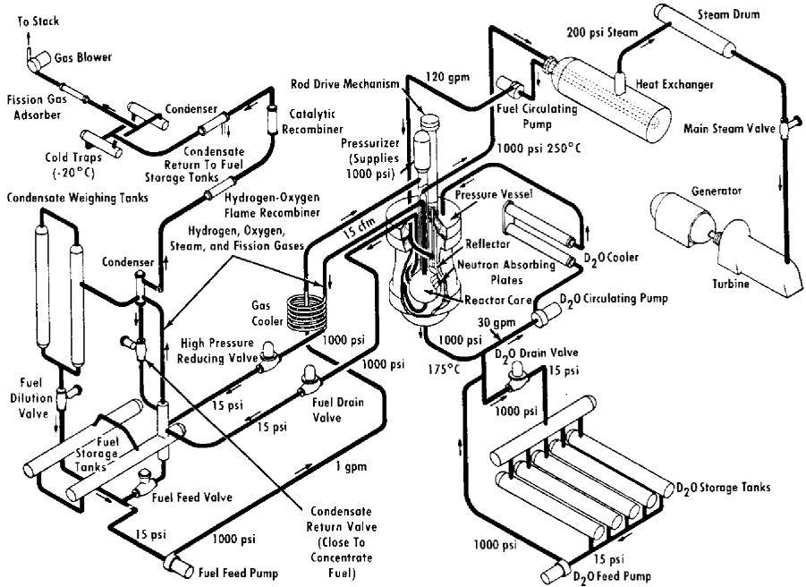  
FIG. 7-4. Schematic flow diagram, HRE-1.

of forged steel, 39 in. in inside diameter, with a 3-in.-thick wall. A 24-in., 1500-psi standard ring-joint flange at the top of the vessel permitted removal of the inner core.

In order to limit thermal stresses and to reduce corrosion of the steel vessel, the reflector temperature was regulated near $350^{\circ}\mathrm{F}$ . About $50\mathrm{~kw}$ of heat conducted from the fuel core to the reflector liquid was removed by circulating the heavy water with a 30-gpm canned-rotor pump through a reflector cooler which acted as a boiler feedwater preheater. A jet was located in this high-pressure circulating loop, the suction of which drew a continuous stream of gas from the vapor space above the reflector to a catalytic recombiner so that the concentration of deuterium and oxygen gases in this vapor space could be kept below explosive limits.

Some measure of nuclear control was obtained by changing the level of the reflector. The level could be lowered by draining liquid through a valve to storage tanks, or raised by starting a feed pump. This pump, which employed a hydraulically driven diaphragm with check valves, had a capacity of approximately $2\mathrm{gpm}$ against $1000\mathrm{psi}$ . Its intake was connected to supply tanks at atmospheric pressure, located below the reactor. These tanks also served as degas chambers for the reflector liquid which was discharged from the pressure vessel. Helium, water vapor, and $\mathrm{D}_2$ and $\mathrm{O}_2$

gas liberated here passed upward through a condenser to a small low-pressure catalytic bed where the $\mathrm{O}_2$ and $\mathrm{D}_2$ gases were recombined to $\mathrm{D}_2\mathrm{O}$ . Cold traps operated at $-20^{\circ}\mathrm{F}$ were included in the reflector-system vent lines to prevent the loss of $\mathrm{D}_2\mathrm{O}$ or its contamination with $\mathrm{H}_2\mathrm{O}$ vapor.

7-3.4 The fuel off-gas system. When the reactor was operating, without copper sulfate in the fuel solution, the fuel solvent $(\mathrm{H}_2\mathrm{O})$ was decomposed by the energy of fission to yield a stoichiometric mixture of hydrogen and oxygen gas at a rate of 0.28 cfm (10 cfm at STP). In addition to this large volume of decomposition gases, there was also produced a very small volume (20 cc/day) of intensely radioactive fission gas. If these gases had not been removed and replaced by more liquid, excessive pressures would soon result, and since virtually all of this gas was liberated within the core, the displacement of fuel solution by the gas would make it impossible for the chain reaction to continue. For this reason, the gas was continuously separated from the fuel in the core by injecting the main circulating stream tangentially near the equator of the sphere, which caused the fluid to rotate and form a vertical cylindrical vortex approximately $1/4$ in. in diameter. The centrifugal action of the rotating fluid served to separate the decomposition and fission gases from the liquid to the vortex, the axis of which was aligned with the fuel outlet. A nozzle with a central opening in the fluid outlet allowed the removal of gas from the vortex. This gas plus about $0.8\mathrm{gpm}$ of the fuel solution was passed through the outer annulus of a countercurrent, concentric-tube heat exchanger, which was partially cooled by $0.8\mathrm{gpm}$ flow of fresh makeup liquid being pumped back to the core. The cooled mixture of gas and liquid was then throttled through a valve into a gas separator which was connected to the fuel-solution storage tanks. The gas-steam mixture rose from the gas separator to a condenser immediately preceding a flame recombiner, so that the gases leaving the condenser were combustible and reunited to water in the flame of the recombiner shown in Fig. 7-4.

The flame recombiner is best described as an oversized Bunsen or Meeker burner enclosed in a water-jacketed cylinder. In the HRE-1 no attempt was made to use this $40\mathrm{~kw}$ of high-temperature heat, although in larger scale reactors this energy might be used to superheat steam about $70^{\circ}\mathrm{F}$ .

The exit gases from the flame recombiner contained only fission products and small amounts of unrecombined hydrogen and oxygen. They were passed through a catalytic recombiner which contained a platinized alumina catalyst to eliminate the traces of hydrogen and oxygen. Also, the catalytic bed was used to react the entire gaseous output at low reactor powers when insufficient gas was being liberated to maintain a steady flame at the burner of the flame recombiner. The catalytic bed was followed by a condenser and cold traps to prevent the loss of water from the system. The gas stream

at this point was composed mainly of excess oxygen plus the highly active fission gases, mainly xenon, krypton, and their decay products. The activity of these gases was many orders of magnitude greater than the activity which can be discharged directly to the atmosphere without the construction of a very expensive stack; therefore it was desirable to provide some inexpensive means of storage for the dissipation of the radioactivity. This was accomplished by passing the gases through cold traps to remove moisture and adsorbing them onto water-cooled activated-carbon beds which were buried underground outside the reactor building. It is estimated that the equilibrium activity of the gases held on the carbon bed was 400,000 curies.*

The adsorption efficiency of the charcoal, even at ground temperature, was good enough to prevent a discharge of activity greater than a few curies per day. However, even this amount of activity had to be diluted so that the atmospheric concentration at ground level was not greater than $10^{-13}$ curies/cc of air. Dilution was accomplished by feeding the active gas into a 1000-cfm ventilating air stream from the reactor shield and then to a 100-ft-high stack. During operation the gaseous activity inside the stack barely exceeded inhalation tolerance.

7-3.5 Fuel concentration control. The condensate which was removed from the vapor-gas mixture upstream of the recombiner was returned either to the fuel storage tanks or to weighed holding tanks. The accumulation of water in the holding tanks provided a means of increasing the concentration of fuel in the storage tanks underneath the reactor. Since fuel was pumped continuously from the storage tanks to the high-pressure system by means of a duplex-diaphragm type pump at a rate of $0.8\mathrm{gpm}$ , it was possible to vary the concentration of the fuel which circulated through the reactor. Figure 7-5 shows how the core temperature varied with fuel concentration, in $\mathrm{g/kgH_2O}$ . Furthermore, since the operating temperature of the core was controlled by the fuel concentration as shown in this figure, the operator had a convenient means of adjusting the solution temperature to the desired level. This feature of variable concentration was employed during startup of the reactor when the concentration had to be changed by large amounts, and also during steady operation for small changes in temperature. When sudden dilution of the fuel was desired, as in the case of a complete shutdown, the condensate holdup tanks were quickly emptied through a drain valve into the fuel-storage tanks, or condensate was pumped directly into the core.

The steep slope of the curve in Fig. 7-5—i.e., the large negative temperature coefficient—was a feature which was extremely important from safety

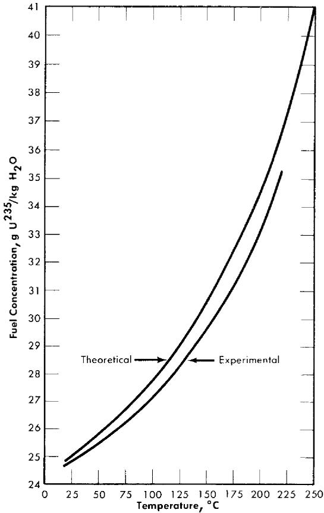  
FIG. 7-5. Dependence of critical fuel concentration on temperature in HRE-1.

and power-demand standpoints. For instance, a temperature rise of only $15^{\circ}\mathrm{C}$ was necessary to overcome a reactivity increase of $1\%$ , an amount considered very dangerous in most solid-fuel reactors.

7-3.6 Power removal. The steam generated in the fuel heat exchanger was fed to a conventional multistage condensing turbine generator rated at $312\mathrm{kva}$ . With the reactor operating at $1000\mathrm{kw}$ and $250^{\circ}\mathrm{C}$ , a sufficient quantity of steam at 200 psi was produced to generate about $140\mathrm{kw}$ of electricity. Steam leaving the heat exchanger was first passed through a time-delay drum with a radioactivity monitor at the inlet and a quick-closing valve at the outlet to prevent the escape of activity into the turbine system in the event of boiler tube failure. Small feed pumps returned the condensate from the turbine to the boiler.

Upon increase in generator load, the turbine governor opened the turbine throttle valves, increasing the steam demand, lowering the steam

pressure and temperature, and reflecting itself into increased cooling of the uranium solution, which automatically increased the reactivity of the core and completely compensated for this increased load.

7-3.7 Internal-recombination experiments. The use of copper dissolved in the reactor fuel for the complete recombination of radiolytic gas was successfully demonstrated in the HRE-1 [14]. Copper ion was added as copper sulfate on four occasions, increasing the copper concentration to 10, 25, 75, and $150\%$ of that necessary for complete recombination (i.e., $6.6\mathrm{g}\mathrm{CuSO}_4/\mathrm{liter}$ ) in a static system at $250^{\circ}\mathrm{C}$ , at 1000 psig total pressure, and at a uniform power density of $20\mathrm{kw}/\mathrm{liter}$ . The investigation was conducted at temperatures from 185 to $260^{\circ}\mathrm{C}$ , at pressures from 765 to 1200 psig, and at power levels as high as $1600\mathrm{kw}$ . In the main, the copper behaved as expected from static bomb tests. The highest power level for which all the gas was internally recombined was $1350\mathrm{kw}$ . In the course of all copper experiments, including $350\mathrm{hr}$ of operation at the highest copper concentration, 0.062 molar, no deleterious effects due to the presence of copper were observed.

7-3.8 Nuclear safety. Although operating experience later verified early predictions of the inherent safety of this reactor, at the time of design it was considered judicious to incorporate conventional safety devices in the reactor for protection against potentially dangerous situations which might arise during low-power operation and until the dynamic stability had been demonstrated by experiment. Safety measures in the order of their automatic action as installed to limit reactor power or power doubling time were:

(1) Two magnetically coupled safety plates, worth about $45\mathrm{g}$ of uranium, which by falling in 0.01 sec caused the reactor temperature to be lowered from $250^{\circ}\mathrm{C}$ to approximately $243^{\circ}\mathrm{C}$ .   
(2)Dumping of the reflector.   
(3) Dilution of the fuel (this was the normal shutdown procedure).   
(4) Stopping of the steam extraction by closing either a steam valve or the turbine governor.   
(5) Draining the fuel solution to the noncritical-geometry tanks below the reactor.

Experiments demonstrated that the reactor was extremely fast-acting with respect to limiting power surges and led to the belief that mechanical control devices were unnecessary [15]. These consisted of a series of kinetic experiments in which the power responses to reactivity increases were observed. First, the entire range of normally available reactivity increases fuel concentration, rod withdrawal, and reflector level—was tested with initial power levels as low as 10 watts and reactivity rates up to $0.05\%$ per

second. Then, in order to provide more drastic tests, the main fuel circulating pump was stopped, the reactor was maintained at a low power and at high temperature, but the heat exchanger was cooled about $100^{\circ}\mathrm{C}$ . When the pump was restarted, the cold fuel from the heat exchanger was rapidly injected into the core, producing a rate of reactivity increase of as much as $0.8\% k_{\mathrm{eff}}$ per second. The results of two experiments in which only the initial powers differed are shown in Fig. 7-6; the power increased in a period as short as 35 msec, reaching a peak of $10\mathrm{Mw}$ in 1 sec, and then approached the equilibrium power demand within 0.2 sec after the peak. The calculated pressure rise associated with the peak power of $10\mathrm{Mw}$ was only 5 psi.

In these experiments the worst combination of circumstances was imposed on the reactor. It was successfully demonstrated that the HRE-1 was sufficiently stable to withstand nuclear transients greater than those expected from operating errors.

7-3.9 Leak prevention. A major problem in the HRE-1 was to maintain absolute leaktightness in all components. The radioactivity of the solution during operation was about 30 curies/cc. Twenty-four hours after shutdown the activity was about 3 curies/cc. With these high activities, the total leakage from the system had to be kept below 1 cc per day. A much better performance than this was attained through the use of canned-rotor pumps, double tube-sheet exchangers, and bellows-sealed valves.

All welded joints were made with extraordinary care and tested by several nondestructive methods before being approved for use. Flanged joints were assembled with stainless steel ring gaskets of oval cross section

TABLE 7-3   
HRE-1 CONSTRUCTION COST SUMMARY*   

<table><tr><td></td><td>Total</td><td>% of total</td></tr><tr><td>Building</td><td>$ 300,000</td><td>27.5</td></tr><tr><td>Fuel and reflector equipment and piping</td><td>420,000</td><td>38.2</td></tr><tr><td>Instrumentation</td><td>190,000</td><td>17.6</td></tr><tr><td>Shield</td><td>110,000</td><td>9.7</td></tr><tr><td>Power system</td><td>80,000</td><td>6.9</td></tr><tr><td>Total construction cost for HRE-1</td><td>$1,100,000</td><td>100.0</td></tr></table>

*These costs include material, labor, and allocated overhead.

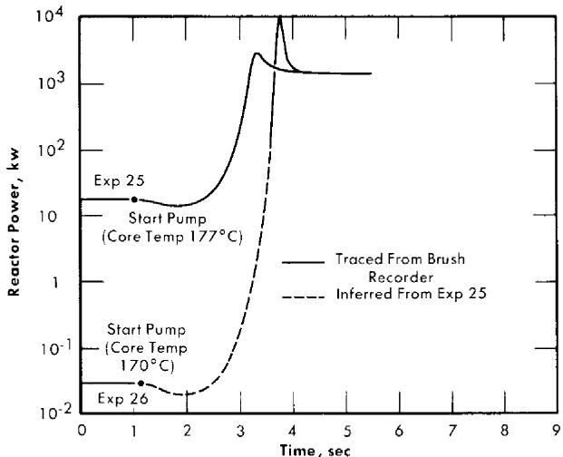  
FIG. 7-6. Power response of HRE-1 during reactivity increase of $0.8\%$ $k_{e}$ /sec.

and each joint contained a leak detection device for constant monitoring (see Fig. 7-13). In addition, the ventilating air which flowed through each equipment compartment was monitored constantly with gamma-radiation detection devices. Although several leaks were experienced in the startup phases, no leakage was found during the final 12-month period.

7-3.10 Shielding. As with all nuclear reactors, personnel had to be protected from the high radiation levels which existed in the vicinity of the reactor core. In the HRE-1 this protection was provided by a 7-ft-thick shielding wall of high-density concrete. An increase in the density of the concrete from 2.3 to $3.5\mathrm{g / cc}$ resulted from the use of barium sulfate ore as the aggregate material. The shield was a departure from most reactor shields in that it was constructed of loosely stacked block with only the outer 16-in. layer of blocks being mortared.

7-3.11 Construction cost. The total construction cost of the reactor was $1,100,000, which did not include the cost of fuel and heavy water. Table 7-3 is a summary showing the cost of various parts of the system.

7-3.12 Maintenance. The maintenance of homogeneous reactors is greatly complicated by the radioactivity of the parts, and in the HRE-1 it was often necessary to decontaminate equipment and to provide temporary protective shielding before repair work could be done. In most cases the repair work had to be done with long-handled tools, which made the job even more difficult. By the use of decontamination, shielding, and extension tools, it was possible, however, to make a number of major

repairs in radiation fields as high as $2000\mathrm{r / hr}$ , without exposing personnel beyond accepted tolerances. In this regard remote viewing devices such as mirrors, binoculars, and a Polaroid Land camera were found to be invaluable tools. The main circulating pump was replaced or repaired three times under such conditions and the diaphragm feed pumps twice. In fact, in no case of a breakdown was it impossible to make the necessary repairs.

7-3.13 Dismantling the HRE-1. After final shutdown of the HRE-1 the reactor was decontaminated in preparation for disassembly. Over a period of 30 days, starting with activity levels of the order of $1000\mathrm{r / hr}$ , the activity was reduced sufficiently to permit dismantling of the system with long-handled tools [16].

The decontamination treatment consisted of repeated washing alternately with $35\%$ $\mathrm{HNO}_3$ and aqueous solutions of $10\%$ sodium hydroxide, $1.5\%$ sodium tartrate, and $1.5\%$ hydrogen peroxide. The over-all decontamination factors were 22 to 25, including decay, but the factor for decontamination with a single reagent was only between 1 and 2.25. Large amounts (of the order of $10^{3}$ curies) of cerium, zirconium, barium, lanthanum, strontium, niobium, and ruthenium were removed. The significant contaminants remaining were zirconium and niobium, which were bound in the oxide film. Although these could have been removed from the system by descaling the oxide corrosion film, which would have given a further decontamination factor of approximately 100, such a treatment would have made it impossible to determine that no significant corrosion had taken place during nuclear operation.

7-3.14 Critique of HRE-1 [17]. After the HRE-1 was put into operation, personnel associated with the Homogeneous Reactor Project were asked to suggest ways in which the design and construction of the reactor and the associated development program might have been improved. More than one hundred specific design changes were recommended, many of which related to the difficulty of operating the reactor on a continuous basis and the need for repairing and/or replacing faulty equipment. Among the many possible improvements recommended were the use of high-pressure catalytic recombination; external gas separation (i.e., nonvortex core flow); spacing of equipment for easier inspection and maintenance; shielded, waterproof instrument lines; instrumentation for more accurate fuel accountability; improved feed pumps; and provision for obtaining meaningful corrosion data.

The general conclusion reached was that the reactor construction schedule (16 months) was too accelerated to allow good design and construction practices to be put fully into effect. The component development and testing program, in particular, suffered by the short time schedule in that

pieces of equipment such as valves and pumps were not completely tested before being used in the reactor.

The thorough analysis of the HRE-1 design provided a basis for the subsequent design of the HRE-2, in which many of the suggested improvements were incorporated. These included: (a) greater accessibility of equipment, (b) provision for flooding cells, (c) better shield construction with metal walls to permit decontamination, (d) more accurate means for measuring fuel inventories, and (e) elimination of screw-type fittings.

7-3.15 Summary of results. As a result of the operation of the HRE-1 and of the extensive experimental program conducted with it, several uncertainties were resolved regarding the nuclear and chemical behavior of aqueous homogeneous reactors at the high temperatures and high pressures required for power generation. Included were demonstrations of (1) a remarkable degree of inherent nuclear stability, a result of the very large negative temperature coefficient of reactivity, (2) the elimination of the need for mechanical control rods as a consequence of this inherent stability, (3) flexibility and simplicity of fuel handling, (4) stability of the fuel, (5) the ability to attain and maintain leaktightness in a small high-pressure reactor system, (6) the safe handling of the hydrogen and oxygen produced by radiation decomposition of the water, and (7) the direct dependence of reactor power upon turbine demand.

# 7-4. THE HOMOGENEOUS REACTOR TEST (HRE-2)*

7-4.1 Objectives. The objectives of the Homogeneous Reactor Test (HRE-2) are (1) to demonstrate that a homogeneous reactor of moderate size can be operated with the continuity required of a power plant, (2) to establish the reliability of engineering materials and components of a size which can be adapted to full-scale power plants, (3) to evaluate equipment modifications which will lead to simplifications and economy, (4) to test simplified maintenance procedures and in particular underwater maintenance, and (5) to develop and test methods for the continuous removal of fission and corrosion contaminants.

7-4.2 Reactor specifications and description [15,18]. The bases for the design of the reactor, which are summarized in Table 7-4, were selected early in 1954 and were intended to take fullest advantage of the progress in chemistry, materials and component development, and the experience

with the HRE-1. In order that the objective of a significant test of the engineering feasibility of a large power station be satisfied, it was necessary that the physical size of the reactor and its auxiliaries be increased appreciably beyond that of HRE-1. To hold the cost within reasonable bounds for an experiment, it was decided to limit the power output and thus the expense for heat-removal equipment, and also to install the reactor in the building which had previously housed HRE-1, permitting the use of many of the existing site facilities. The size of the reactor core represents a compromise between two objectives, attainment of high specific power required for economy in a large plant and evaluation of the fabrication and durability of a zirconium-alloy core tank. The power output was, therefore, set at $5000\mathrm{kw}$ (heat) with the possibility of a maximum $10,000\mathrm{kw}$ , and the core diameter at 32 in. Although these together result in a low specific power of $17\mathrm{kw}/$ liter in the core at $5000\mathrm{kw}$ , this was considered acceptable, since operability at a relatively high specific power of $30\mathrm{kw}/$ liter had been demonstrated in the HRE-1. Another factor affecting the selection of core diameter was the opinion of fabricators that current technology would be exceeded for a zirconium vessel larger than 32 in.

TABLE 7-4   
DESIGN BASES FOR HRE-2   

<table><tr><td>Power, heat</td><td>5000 kw</td></tr><tr><td>Temperature, core outlet</td><td>300°C</td></tr><tr><td>Pressure</td><td>750 psi in excess of vapor pressure (see text)</td></tr><tr><td></td><td>2000 psi maximum total pressure</td></tr><tr><td>Core diameter</td><td>32 in.</td></tr><tr><td>Core solution</td><td>UO2SO4in D2O (~10 g U235 per liter)</td></tr><tr><td>Blanket</td><td>D2O</td></tr><tr><td>Fuel circulation rate</td><td>400 gpm</td></tr><tr><td>Blanket circulation rate</td><td>230 gpm</td></tr><tr><td>Core flow pattern</td><td>Straight-through</td></tr><tr><td>Core construction material</td><td>Zircaloy-2</td></tr><tr><td>System construction material</td><td>Type-347 stainless steel</td></tr><tr><td>Radiolytic-gas removal</td><td>External pipeline separator</td></tr><tr><td>Radiolytic-gas recombination</td><td>Low-pressure system: platinized alumina catalyst</td></tr><tr><td>Fission-product-gas disposal Control</td><td>High-pressure system: CuSO4in solution</td></tr><tr><td>Normal</td><td>Decay on activated carbon</td></tr><tr><td>Safety</td><td>Variable solution concentration</td></tr><tr><td></td><td>Temperature coefficient</td></tr></table>

The increase in fuel temperature from $250^{\circ}\mathrm{C}$ in the HRE-1 to $300^{\circ}\mathrm{C}$ was based upon the more favorable corrosion resistance of both stainless steel and Zircaloy-2 to dilute uranyl sulfate at the higher temperature and the possibility of improved thermal efficiencies. Also the temperature at which the two-liquid phase region appears is higher for the more dilute fuel, permitting this increase.

TABLE 7-5   
HRE-2 DESIGN PARAMETERS   

<table><tr><td></td><td>Core</td><td>Blanket</td></tr><tr><td>Power, heat, kw</td><td>5000</td><td>220</td></tr><tr><td>Pressure, psi</td><td>2000</td><td>2000</td></tr><tr><td>Vessel</td><td></td><td></td></tr><tr><td>Inside diameter, in.</td><td>32</td><td>60</td></tr><tr><td>Thickness, in.</td><td>5/16</td><td>4.4</td></tr><tr><td>Material</td><td>Zircaloy-2</td><td>Stainless-steel-clad carbon steel</td></tr><tr><td>Volume, liters</td><td>290</td><td>1550</td></tr><tr><td>Specific power, kw/liter</td><td>17</td><td>0.14</td></tr><tr><td>Solution</td><td>\( \mathrm {U O}_{2}\mathrm {S O}_{4}-\mathrm {D}_{2}\mathrm {O} \)</td><td>\( \mathrm {D}_{2}\mathrm {O} \)</td></tr><tr><td>Uranium concentration, g of</td><td></td><td></td></tr><tr><td>\( U^{235} \) per kg \( \mathrm {D}_{2}\mathrm {O} \)</td><td>9.6</td><td>0</td></tr><tr><td>Circulation rate, gpm</td><td>400</td><td>230</td></tr><tr><td>Inlet temperature</td><td>256°C</td><td>278°C</td></tr><tr><td>Outlet temperature</td><td>300°C</td><td>282°C</td></tr><tr><td>Volume of gas generated, ft3/sec at STP</td><td>0.96</td><td>0.013</td></tr><tr><td>ft3/sec at 2000 psi, 280°C</td><td>0.015</td><td>----</td></tr></table>

The design pressure of 2000 psi resulted from the necessity for an over-pressure on the system to prevent boiling, to reduce the volume of gas in the core, and to increase the efficiency of the copper catalyst. A maximum pressure of 750 psi was thus provided in excess of the vapor pressure of water of about 1250 psi at $300^{\circ}\mathrm{C}$ .

The thickness of the blanket of 14 in. between the core and pressure vessel was selected as a compromise between neutron leakage and the use of a simple pressure vessel of dimensions within the means of standard fabrication techniques.

The fuel circulation rate of $400\mathrm{gpm}$ was based upon heat-removal requirements and the availability of suitable pumps. Pumps capable of this output had been successfully operated under comparable conditions.

The vortex-type flow through the core of HRE-1 was abandoned in favor of straight-through flow because hydrodynamic experiments demonstrated the pressure drop of the former to be excessive for larger cores. As a result, the extraction of radiolytic gas directly from the core was excluded, and an external gas separator in the exit pipe from the core was used to separate gases produced in the core. The amount of these gases depends on the operating temperature and pressure and the $\mathrm{CuSO_4}$ concentration. The excess gases are recombined at low pressure but by means of a platinized alumina catalyst instead of combustion in a flame-type recombiner as in the HRE-1.

In stagnant fuel lines external to the core, the radiolytically generated oxygen is insufficient to replace the oxygen consumed in reacting with the stainless steel to form metallic oxides. Since an oxygen deficiency induces hydrolytic precipitation of the uranium, approximately 2 liters/min (STP) of gaseous oxygen are injected into the fuel feed stream, maintaining a concentration of approximately $500~\mathrm{ppm}$ in the high-pressure system. The disposal of the fission-product gases which are stripped from the fuel by the excess oxygen and radiolytic gas is accomplished by adsorption and subsequent decay on beds of activated carbon. Experience with this method of disposal was completely satisfactory in the HRE-1.

To reduce the xenon content of the core solution and minimize the catalyst-poisoning effect of fission-product iodine on the recombiners, an iodine-absorption bed of silver-coated wire mesh was installed in the off-gas line between the fuel dump tank and the recombiners. The bed removes over $99\%$ of the iodine passing through it, and will retain the absorbed iodine at temperatures up to $450^{\circ}\mathrm{C}$ .

Type-347 stainless steel was designated as the material of construction for all of the reactor except the Zircaloy-2 core vessel. Titanium was chosen to reinforce certain points of high turbulence, such as the pump impellers and the gas separator. Previous corrosion and welding experience with this grade of stainless steel, also used for HRE-1, has been excellent.

Based on HRE-1 experience, it was decided to eliminate mechanical control devices and depend entirely on varying the fuel concentration for shim control, on temperature coefficient for transient nuclear changes, and on dumping the fuel solution for rapid shutdown when required.

The design parameters of HRE-2 are summarized in Table 7-5.

The flow diagram for the reactor is illustrated in Fig. 7-7. Since the fuel and blanket systems are virtually identical—the only significant differences being the absence of a blanket iodine separator and the larger vessels

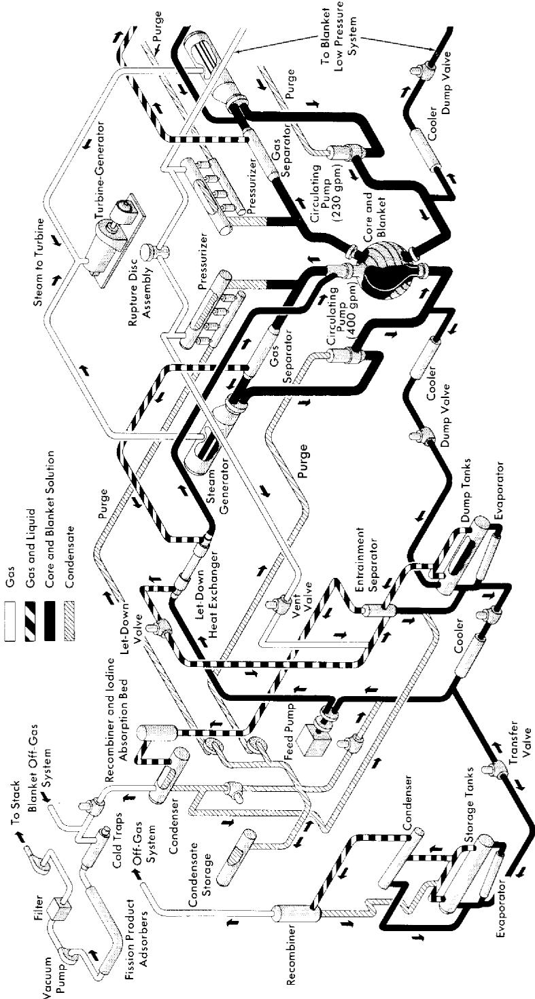  
FIG. 7-7. Flowsheet of HRE-2.

necessary to accommodate the greater volume of blanket fluid—the entire blanket system is not shown. The fuel system is described as follows.

In the high-pressure system the fuel solution is pumped into the bottom of the reactor core at $256^{\circ}\mathrm{C}$ and is heated to $300^{\circ}\mathrm{C}$ as it proceeds upward to the outlet pipe. At the top of the outlet pipe is attached the pressurizer in which condensate is electrically heated to a maximum temperature of $335^{\circ}\mathrm{C}$ to produce 2000-psi steam. The fuel flows past the pressurizer to the gas separator, where directional vanes cause the fluid to rotate sufficiently to separate the radiolytic gas $(\mathrm{D}_2$ and $\mathrm{O}_2)$ , the excess $\mathrm{O}_2$ , and fission-product gas. The separated gas forms a vortex along the axis of the pipe and is bled to the low-pressure system. The reactor solution continues from the gas separator to the U-tube primary heat exchanger, where it is cooled from $300^{\circ}\mathrm{C}$ to $256^{\circ}\mathrm{C}$ by transferring heat to the boiler feedwater surrounding the tube bundle. The $244^{\circ}\mathrm{C}$ , 520-psi steam produced on the shell side of the heat exchanger is bled partially to the small (345-kva output) turbine generator remaining from the HRE-1 and partially to an air-cooled steam condenser. The uranyl sulfate solution flows next to the intake of the 400-gpm canned-motor circulating pump and thence is pumped to the core for reheating. The blanket fluid follows an identical cycle at a flow rate of $230~\mathrm{gpm}$ . This lower flow rate was based on a pump of the same horsepower but designed to circulate a thorium oxide suspension, rather than pure $\mathrm{D}_2\mathrm{O}$ .

The gases and some entrained liquid removed by the gas separator are transferred to the low-pressure system through a "letdown heat exchanger," a jacketed pipe which cools the gas-liquid mixture to $90^{\circ}\mathrm{C}$ . A valve downstream of the heat exchanger throttles the gas-liquid stream to atmospheric pressure. The mixture then discharges into the "dump" tanks, which have sufficient capacity to hold all the reactor liquid. An evaporator built into the dump tanks provides continuous mixing and, more important, steam for dilution of the deuterium and oxygen below the explosive limits. The gas-and-steam mixture flows upward through the iodine bed to the catalytic recombiner, in which the deuterium and oxygen react on a bed of platinized alumina pellets to form water vapor. The heavy water is condensed by the shell-and-tube condenser following the recombiner and normally flows back to the dump tanks. However, the water may be diverted to weighed storage tanks in case it is desired to change the concentration of the fuel solution. Water which is returned to the dump tanks is mixed with the excess fuel solution stored there (approximately 25 gal) and then fed to the intake of a sealed-diaphragm injection pump, which returns the liquid to the high-pressure circulating system at a rate of about 1 gpm, thus constantly replacing the liquid removed via the gas separator.

The small volume of intensely radioactive fission gas plus the excess

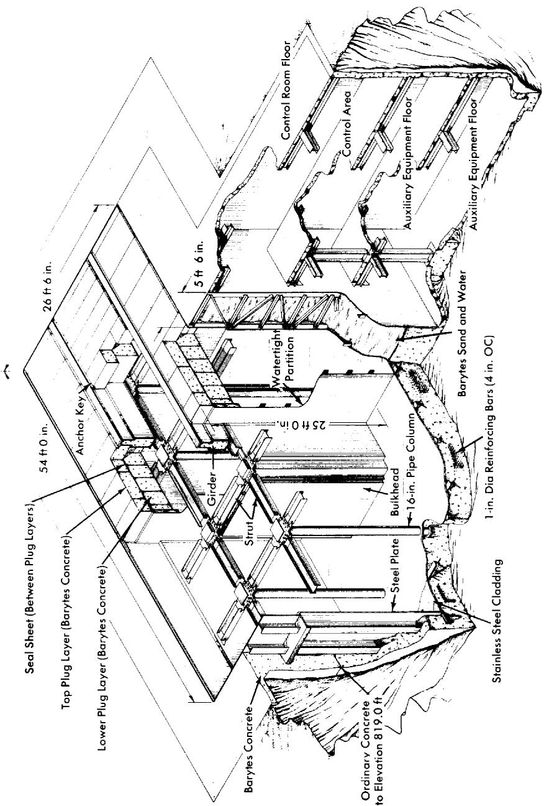  
FIG. 7-8. HRE-2 shield and vapor container.

oxygen remaining after condensation of the re-formed heavy water is dried in cold traps at $-23^{\circ}\mathrm{C}$ and sent to the beds of activated carbon for a period of decay. Gas leaving the bed is diluted with 1400 cfm of air and discharged to the atmosphere from a 100-ft stack.

Samplers are provided to secure small quantities (5 ml) of the fuel and blanket liquids from the high- and low-pressure systems for chemical analysis. These units are located in bypass lines; material circulated through them is trapped by closing the sampler inlet and exit, after which the contents are discharged into a portable container through a drain valve.

All the primary reactor equipment is located in an underground, box-like, steel tank called the "shield pit," shown in Fig. 7-8. The design of the shield pit was influenced by several factors, including a requirement for accessibility and flexibility because of the experimental nature of the installation, provision for complete containment of the contents of the reactor should a leak develop or should the pressure vessel or heat exchangers rupture, efficient utilization of the space within an existing structure, and capability of flooding with water for maintenance or replacement operations.

The reactor shield pit occupies the center high-bay area of the building and is constructed of 3/4-in. welded steel plate reinforced in such a manner that an internal pressure of 30 psi will be contained. This pressure corresponds to the instantaneous adiabatic release of the entire contents of the reactor system. The chemical processing cells, each 12 ft wide by 25 ft long, are designed similarly.

The upper surface of the blocks forming the roof of the shield pit is at ground level. This roof is made of high-density concrete 5 ft in total thickness and consists of two layers of removable slabs with a completely welded steel sheet sandwiched between the layers and extending across the top of the pit to form a gastight lid. The roof blocks are anchored to the girders and supporting columns by means of a slot-and-key arrangement, shown in Fig. 7-8. The vertical columns are embedded in a concrete pad which is 3 ft thick and is heavily reinforced with steel.

The wall between the reactor pit and the control area is a hollow box $5\frac{1}{2}$ ft wide, constructed of 1/2-in. steel plate welded to the north side of the reactor shield tank. It is filled with high-density barytes, sand, and water. The use of the fluid shield between the reactor and control-room areas allows flexibility in the locations of service piping and instrument or electrical conduits. All lines leaving the reactor tank are welded into the shield wall; conduits are connected into junction boxes inside the pit with gastight seals on the individual wires.

The design is such that nowhere outside the shield will the radiation dosage exceed 10 mrep/hr when the reactor is at $10\mathrm{Mw}$ . For the purpose of decreasing the neutron activation of equipment inside the pit, the re

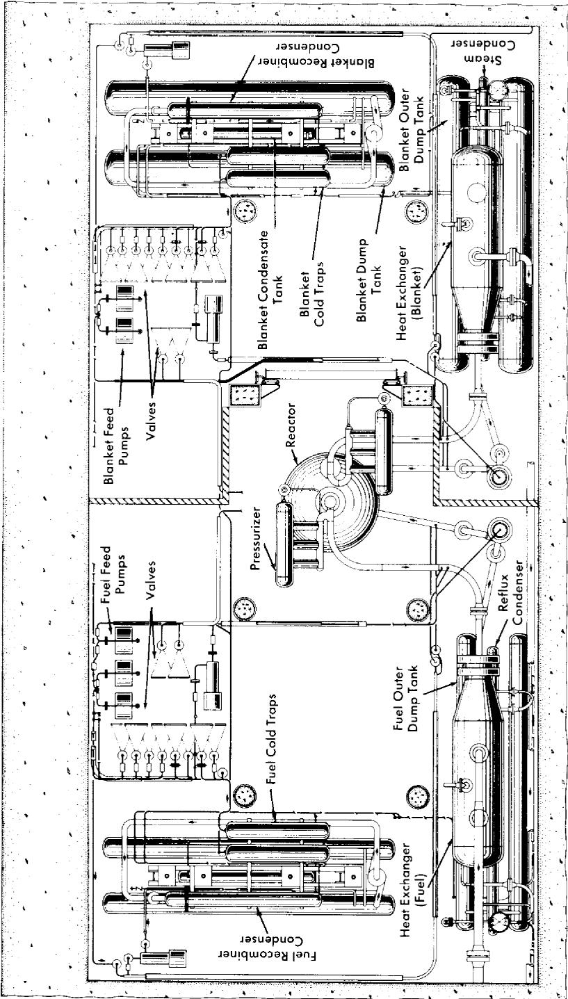  
FIG. 7-9. HRE-2 component arrangement, plan view.

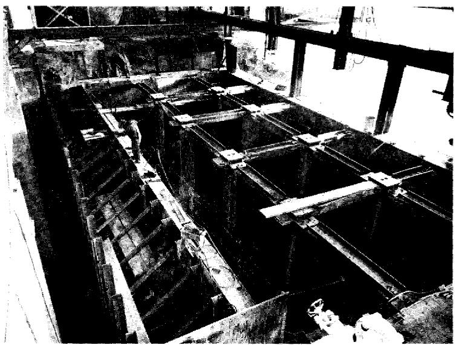  
FIG. 7-10. HRE-2 container looking southeast (at $50\%$ completion).

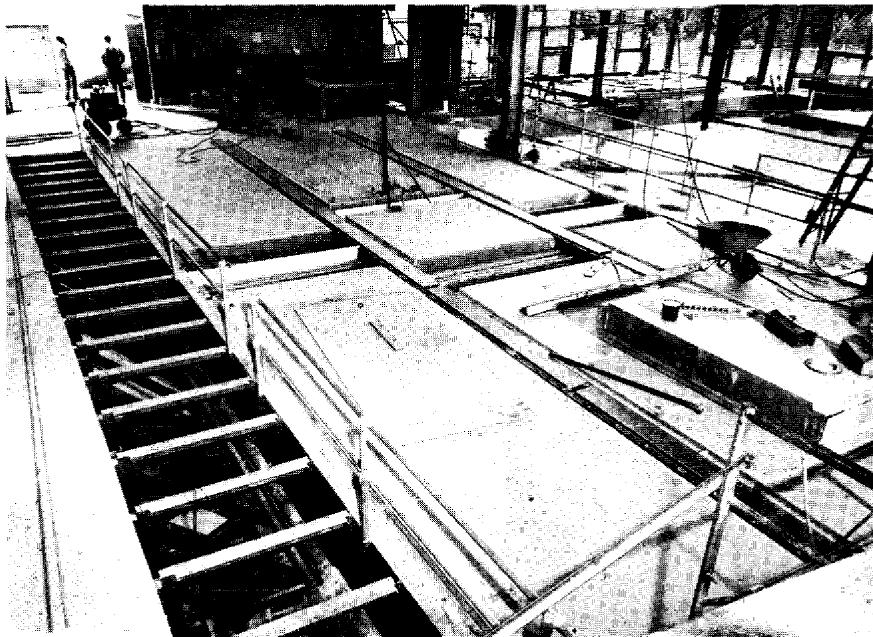  
FIG. 7-11. Reactor tank with shielding plugs in position during hydrostatic test.

actor vessel is surrounded by a thermal neutron shield consisting of a steel tank with a 2-ft-wide annulus filled with boron ore and water.

The arrangement of reactor components within the main reactor pit is shown in Fig. 7-9. The reactor is near the center of the pit, enclosed by the 2-ft-thick thermal shield. To the left of the reactor is all the fuel-system equipment, and to the right is the blanket equipment.

Most of the high-pressure components are located close to the pressure vessel. The pressurizers are positioned directly above the reactor; the gas separators are in the S-shaped outlet lines to the steam generators on the south side of the pit. The areas to the left and right of the reactor in the center bay are reserved for future equipment modifications or additions.

To the far left is grouped all of the fuel low-pressure equipment, including dump tanks, recombiner, condensate tank, and cold traps. These components are assembled on a rigid structural-steel frame; the blanket low-pressure equipment is to the far right.

Insofar as possible, valves are situated close to the control-room wall so that air lines and leak-detector lines can be kept short. The arrangement of the valves is such that all flanges can be easily disconnected from above.

7-4.3 Schedule of construction [19,20]. Construction of the HRE-2 was started in July 1954, immediately after the dismantling of HRE-1. The initial step was the excavation of a large hole beneath the building (which had previously housed the HRE-1) for the large rectangular steel tank (60 ft long, $30\frac{1}{2}$ ft wide, and 25 ft deep) which contains the reactor and its associated equipment. Figure 7-10 shows this tank at approximately $50\%$ completion.

The north wall of the reactor tank, seen to the left in Fig. 7-10, is common to both the reactor tank and the control-room area, and it is through this wall that the many service, instrument, and electrical lines which must interconnect these two areas pass. The next step in the construction was to install the approximately 600 lines which penetrate this $5\frac{1}{2}$ -ft-thick wall.

Figure 7-11 shows the tank after the complete roof structure had been assembled and welded closed as it was prepared for a hydrostatic test. In this test the tank was filled with water and then pressurized to give the equivalent of a 30-lb internal pressure at all points within the tank. Strain gauges were attached at many points so that the complicated stress pattern could be studied in some detail for assurance that the tank was safely within design limits.

While the reactor tank and control-room areas were being constructed, reactor equipment was being procured and constructed at several places. Much of the equipment required in the low-pressure system had been inspected and tested when the container was completed. In November

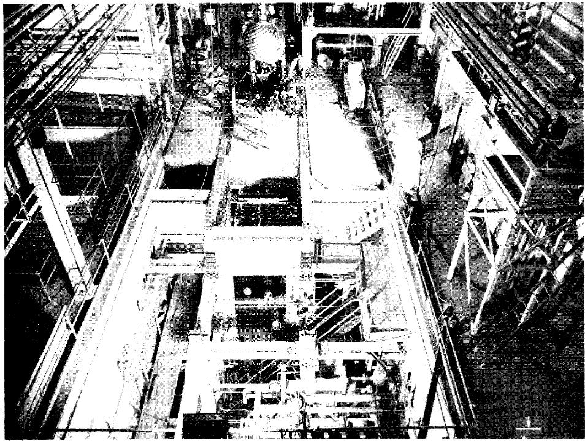  
FIG. 7-12. View of HRE-2 building, main bay.

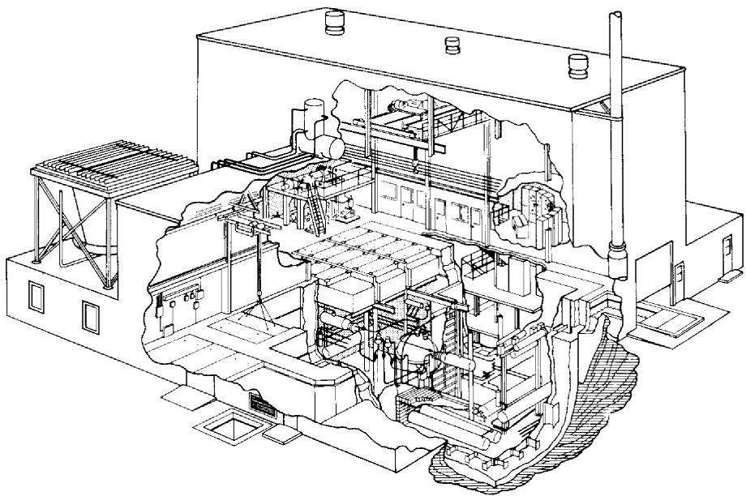  
FIG. 7-13. Artist's concept of homogeneous reactor test, HRE-2.

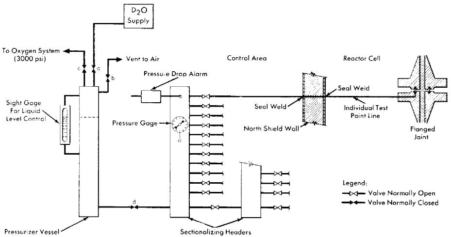  
FIG. 7-14. HRE-2 leak detection system.

1955, these parts and the thermal shield surrounding the reactor pressure vessel were installed. Figure 7-12 shows the reactor core and pressure-vessel assembly just before installation in January 1956.

The heat exchangers were subsequently installed and followed by the main circulating pumps so that the high-pressure piping which connected the pumps, heat exchangers, and pressure vessel could be attached. This work occupied most of the months of February and March. Construction of the reactor was completed in May 1956. Figure 7-13 is an artist's concept of the completed reactor.

7-4.4 Nonnuclear testing and operation. Pretesting, operation of the reactor as a nonnuclear facility, and a lengthy flange-replacement job occupied the period from completion of construction in May 1956 to December 1957. A chronological summary of the events associated with the nonnuclear operation of the reactor during this period is shown in Table 7-6.

From Table 7-6 it can be noted that preoperational testing of HRE-2 was interrupted by stress-corrosion cracking difficulties, which were caused by chloride ion contamination in the stainless steel tubes that are used to detect and prevent leakage of radioactive solution from flanged joints [20]. Figure 7-14 shows how an individual leak-detector line is attached to the groove of the ring-joint flange. The tubes from all the flanges terminate at a valve header station in the control room. Normally this system is kept pressurized with water to a pressure of 300 to 500 psi above the system pressure. A leak in any flange results in leakage of water from the header and a loss in pressure, which actuates an alarm at a fixed level above the fuel or blanket pressure. This is normally a sensitive and satisfactory means

TABLE 7-6   
SUMMARY OF HRE-2 NONNUCLEAR OPERATION  

<table><tr><td>Period</td><td>Test or event</td></tr><tr><td>May 1956</td><td>3000-psig hydrostatic test of high-pressure system and 750-psig test of low-pressure system</td></tr><tr><td>June 1956-July 1956</td><td>Cleaning of piping systems with 3% trisodium phos- phate followed by 5% nitric acid and initial operation of pumps. Tests for dump-tank entrainment and efficiency of catalytic recombiner</td></tr><tr><td>July 1956-August 1956</td><td>Initial tests of equipment removal and underwater maintenance</td></tr><tr><td>August 1956-October 1956</td><td>Flushing of flange leak-detector tubes to remove chloride contamination</td></tr><tr><td>October 1956-November 1956</td><td>Initial nonnuclear operation of reactor at 280°C and 2000 psig. Thermal cycling of flanged joints</td></tr><tr><td>December 1956-January 1957</td><td>Removal of typical flanges for metallographic examination to detect possible stress-corrosion cracks. Further tests of remote-maintenance tools</td></tr><tr><td>January 1957-March 1957</td><td>Further operation of the reactor with water and with depleted uranium at various conditions of temperature and pressure</td></tr><tr><td>April 1957-August 1957</td><td>Removal, inspection, and replacement of flanges and leak-detection tubing</td></tr><tr><td>August 1957-September 1957</td><td>Recleaning of system with trisodium phosphate and nitric acid solutions and hydrostatic testing</td></tr><tr><td>September 1957-October 1957</td><td>Final operation at design conditions with water and with depleted uranium. Final leak test of reactor piping with radioactive tracers</td></tr><tr><td>November 1957-December 1957</td><td>Final insulation of reactor piping; installation of new refrigeration system and new iodine absorption bed, followed by nonnuclear operations with heavy water. Criticality achieved December 27, 1957</td></tr></table>

of preventing the leakage of radioactive liquid from the reactor (the leak-detector fluid leaks out instead) and detecting the leaks when they do occur (by measuring the pressure or volume loss of the leak-detector fluid). Volume changes in the header can be read to $\pm 1$ cc from a graduated scale next to each header sight-glass. By observing level changes at regular intervals, noting which lines are isolated from the header, leaks of less than 2 cc per day can be detected.

Since this system is a secondary portion of the reactor, the leak-detector tubing unfortunately did not receive the same attention from the standpoint of specification and materials control as the stainless steel used in the primary piping. The 1/4-in. type-304 stainless steel had been purchased to standard ASTM tubing specifications, but in 30- to 40-ft lengths instead of the usual 20-ft lengths. The tubing was received and installed without difficulty. It was given a hydrostatic test after installation and put in service with distilled water. After approximately three months it was observed that some of the water drained from the leak-detector system was badly discolored. An analysis revealed the liquid to contain approximately $1000~\mathrm{ppm}$ of chloride. Since conditions of operation up to this point had been relatively mild, it was thought that the chloride might be removed simply by flushing, and approximately six weeks were devoted to disassembling the reactor and washing out all detectable indications of that contaminant.

After discussions with the tubing manufacturer it was concluded that the chloride had originated from a die-drawing compound which had not been removed from the inside of the tubes prior to annealing. The presence of the chloride-containing hydrocarbon caused carbide precipitation at the grain boundaries during annealing and created tiny caves into which the chloride penetrated. The pickling and cleaning treatment which followed did not remove this material; in fact, it was learned that the manufacturer's pickling tanks did not accommodate the full length of the tubing, making it necessary to pickle by dipping approximately half the tubing at a time. The net result was that large quantities of chloride remained inside the tubing to be leached out later when filled with water.

At the time the stress-cracking damage was discovered late in 1956 the reactor had been made ready for a series of engineering tests, and for this reason it was decided to make a brief inspection of the damage resulting from the chloride contamination before proceeding with the planned experimentation. This preliminary inspection provided the basis for a decision to prepare for the replacement of the 259 flanges and the 15,000 ft of leak-detector tubing in the system. It was further decided that engineering tests which had been interrupted could proceed for the period of approximately three months which would be required to procure new flanges and leak-detector tubing.

Dismantling of the system was begun in April, and a very careful inspection of the 259 flanges was made to determine how many should be replaced. The Super-Zyglo dye-penetrant method of flaw detection was chosen as the most sensitive test which could be used practically in the field.

Of the 259 flanges inspected, 167 were found to be acceptable (i.e., as good as new), 67 were rejected because of cracks, pits, or other possible flaws, and 25 were judged questionable. Nearly all of the rejected flanges were in high-temperature portions of the reactor. While the inspection method was selected as the best available, it was not judged to be infallible; e.g., differentiation between mechanical scoring and corrosion pitting was not always clear-cut, and any cracks covered by smeared metal resulting from excessive gasket pressure could not be detected. Hence it was decided to replace all the high-temperature flanges with new flanges or, where this was not possible, to remove 0.02 in. of metal from the flange surfaces. A total of 132 flanges were replaced; 15 were remachined. In addition, the 1/4-in. stainless steel tubing to all the high-pressure flanges (approximately 10,000 ft) was replaced in the leak-detector system. This repair work was completed in August 1957.

To remove any organic material introduced during repairs and to pretreat the fresh metal surfaces incorporated into the system, the reactor piping was subsequently flushed with hot $3\%$ trisodium phosphate solution, followed by water rinses and a $5\%$ nitric acid wash. After hydrostatic testing the reactor was test operated with condensate for $150\mathrm{hr}$ at $280^{\circ}\mathrm{C}$ , then charged with depleted uranyl sulfate solution. Test operation with depleted uranium included: (1) a series of concentration and dilution experiments to study the transient and equilibrium behavior of ions in the system, (2) checking of the inventory-control methods by comparing the fuel analyses and indicated system controls with the quantity originally charged, and (3) observation of the corrosion behavior by analysis of fuel samples during a $159\mathrm{-hr}$ run at temperatures above $250^{\circ}\mathrm{C}$ . At the conclusion of the run the charge was recovered and found to agree well with the computed inventory, although chemical analyses of high-pressure-system samples during operation had indicated a uranium concentration 5 to $10\%$ lower than the amount added would predict. Nickel analyses of the fuel solution pointed to a system corrosion rate of slightly less than $1/2\mathrm{mpy}$ .

Before the reactor was charged with enriched fuel, the piping and shield were subjected to careful leak tests. To obviate the presence of helium in the piping in case further testing with helium became necessary, the reactor was first pressurized to 500 psig with nitrogen, to which was added 40 curies of $\mathrm{Kr}^{85}$ as a tracer gas. The shield was sealed and the reactor allowed to stand pressurized for five days, after which air samples were drawn from the shield and heat-exchanger shells for beta-activity scanning to detect

the presence of any leaking krypton. This test was inconclusive at the time, however, because of difficulties encountered in purifying the samples for counting. Large samples of the air being tested were stored in gas cylinders; then the piping was vented and repressurized with helium. After an additional waiting period the sealed volumes were again checked using helium leak detectors sensitive to $1\mathrm{ppm}$ of helium in air. This test demonstrated that the piping leakage was less than $0.2\mathrm{cc/day}$ of helium, with a pressure differential of 15 psi across the leak. These results were subsequently confirmed by krypton data after analytical difficulties were resolved.

With the integrity of the reactor piping established, the seal pans were welded in place on the shield roof, and the roof plugs were locked in place. By pressurizing the shield and flooding the roof with water, leaks in the seal pan welds were located for subsequent repair. The major shield leak was found to be through a 16-in. valve in the ventilating duct; when this was repaired, the total leakage fell from $25\mathrm{cfm}$ to approximately $1/2\mathrm{cfm}$ . The shield was judged sufficiently tight at this point to proceed with the critical experiments, after which repairs were continued. By painstaking individual checking of all shield penetrations and the use of thermosetting resin to seal the metal lips to which the roof seal pans are welded, the leakage was finally reduced to 4 to $4.5$ liters/min at 15 psig.

7-4.5 Nuclear operation [21]. Fuel charging began on December 24, and criticality was achieved on December 27, 1957, with the core and blanket near room temperature and at a pressure of about 800 psig. Nuclear instrumentation for the test consisted of three fission chambers, viz., two permanent chambers in the instrument tube outside the reactor pressure vessel and a temporary chamber inside the blanket vessel. An antimony-beryllium neutron source was suspended in the thimble in the center of the core (see Fig. 7-18).

The reactor was brought gradually to the critical condition by the injection of enriched uranium into the fuel solution added to the dump tanks in batches of 100 to $400\mathrm{g}$ . Fuel feed pumps and purge pumps were operated continuously to provide mixing between the dump tanks and the high-pressure system. Following each addition the solution concentration in the high-pressure system was allowed to reach steady state, as indicated by a leveling-off of fission count rates. After $2060\mathrm{g}$ of $\mathrm{U}^{235}$ had been added and the temperature of the solution lowered to $29^{\circ}\mathrm{C}$ , the neutron source was withdrawn. At this point, the fission count rates continued to rise, indicating that criticality had been achieved. Raising the temperature of the reactor slightly by pumping warm water through the heat exchangers stopped the nuclear chain reaction. By further varying the temperature and concentration of the fuel solution, it was demonstrated that the nuclear reaction could be easily and safely controlled in this manner.

After the initial critical experiment the neutron source was moved from the core to the blanket thimble, and the reactor was brought to criticality seven times at successively higher temperatures ranging up to $281^{\circ}\mathrm{C}$ . In each experiment the reactor temperature was raised above the desired point by supplying steam to the heat exchangers, and a batch of fuel solution was injected into the dump tanks. After steady count rates showed complete mixing of the new fuel, the temperature was slowly lowered until the critical temperature was reached. It was held at this point for about $1/2\mathrm{hr}$ before proceeding to the next experiment. Figure 7-15 compares the experimental measurements of the HRE-2 critical concentration as a function of temperature with concentrations calculated by various methods. It can be seen that the two-group calculations predicted values about $20\%$ below those observed. The harmonics calculation, which used a convolution of an age and a Yukawa kernel to represent slowing down in $\mathrm{D}_2\mathrm{O}$ , gave quite satisfactory results. The multigroup calculation also gave results in agreement with the experimental data.

The first operation of the reactor at significant power levels took place in February 1958. In April 1958 the power level was raised in steps of $1\mathrm{Mw}$ to the design power level of $5\mathrm{Mw}$ . Operation was exceptionally smooth, and no mechanical difficulties were encountered in the first $500\mathrm{hr}$ after charging the reactor with $\mathbf{U}^{235}$ . Unfortunately, shortly after reaching full-power operation a crack developed in the tapered portion of the zirconium core tank, permitting fuel solution to leak into the blanket. After a series of tests to determine the magnitude of the leakage and calculations to determine the behavior of the reactor with fuel in the blanket, it was decided to operate the reactor as a one-region machine (i.e., identical fuel solution in core and blanket). Operation of the reactor under these conditions was resumed in May 1958.

7-4.6 Operational techniques and special procedures. Reactor startup. As the size of homogeneous reactors increases, the use of control-rod neutron absorption to perform a startup becomes progressively less attractive; e.g., to maintain criticality in HRE-2 while heating from 20 to $280^{\circ}\mathrm{C}$ requires a reactivity increase of more than $25\%$ $\Delta k$ because of the large negative temperature coefficient. It is much more convenient to provide a means of varying the amount of fuel in the core as required to overcome temperature and power coefficients.

During the initial experimental stage of HRE-2 operation, startup was begun by evaporating heavy water from the dump-tank solutions, condensing, and pumping to the core and blanket circulating loops. The filled loops were then pressurized, circulation was initiated by starting the canned-motor pumps, and the circulating stream was preheated to operating temperature with an auxiliary heat source. The concentrated fuel was then pumped from the dump tanks to achieve criticality.

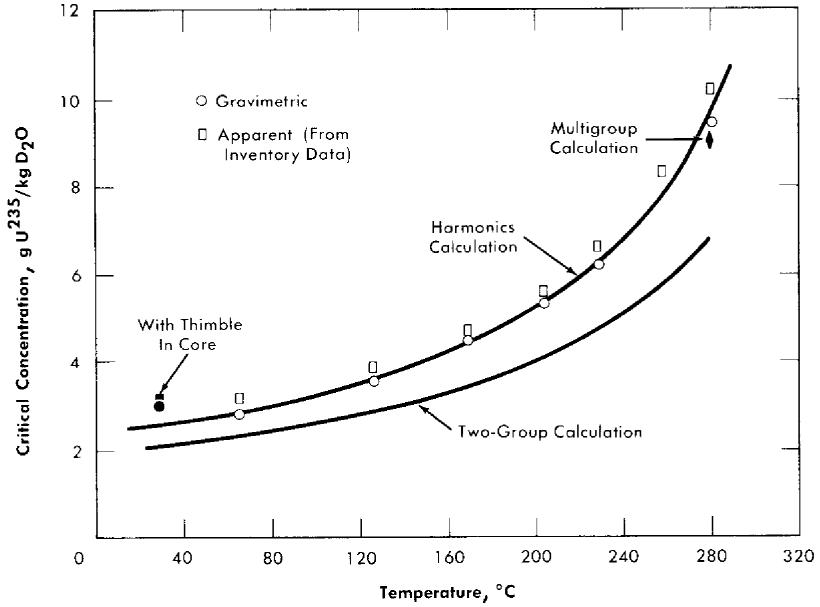  
FIG. 7-15. Critical concentration of HRE-2 as a function of temperature.

An alternate procedure involves starting the reactor without preheating by varying the fuel concentration. When sufficient fuel has been added to raise the reactor temperature to its normal operating level, power withdrawal is begun. Temperature adjustments may be made by removing pure solvent to temporary storage tanks or adding pure solvent to the circulating fuel solution.

A variation of this procedure is to fill the reactor slowly with fuel of the final concentration. In this case the reactor will become chain-reacting at a low temperature with the core tank only partially filled with fuel solution. As the quantity of liquid in the core is slowly increased, the temperature will rise until the desired temperature is attained with the core completely full.

The time required for startup is determined by the rate at which heating can be permitted. The same limitations apply to homogeneous reactors as to other reactors in this respect. Generally, the heating rate of $100^{\circ}\mathrm{F/hr}$ is considered reasonable and unlikely to produce excessive stresses. Probably more important, but more difficult to determine, is the temperature difference which exists across heavy walls. Keeping these temperature differences to less than $100^{\circ}\mathrm{F}$ prevents excessive stresses. Once the temperature limitations are established, the startup rate of fuel addition can be set to match them.

Thus, although aqueous homogeneous systems have been demonstrated to be inherently stable, restrictions are nevertheless placed upon the oper-

ator to prevent excessive power surges and the resultant excessive pressures or heating rates. These restrictions are generally in the form of electrical interlocks in the control circuit. For example, a typical interlock might prevent the operator from concentrating fuel if instruments indicated that an excessive concentration was being reached, or an interlock might stop the addition of fuel solution if the temperature-measuring devices indicated too high a heating rate. Although practically none of these mistakes is serious enough to cause a reactor accident, they are evidence of poor operating technique, and if permitted might result in more serious mistakes which could cause damage in spite of the inherent stability of an aqueous homogeneous system.

The reactor is considered "started up" when the desired operating temperature has been achieved and the reactor is ready for power extraction.

Operation. Except for several preliminary preparations, such as warming-up the steam turbine, power extraction is the simplest part of the reactor startup routine. This involves merely turning steam to the turbine, bringing the turbine up to speed, and making the necessary electrical switching changes to distribute the electrical output. Once the generator is synchronized and feeding into a larger power network, there is little for the operator to do except to see that the equipment is checked routinely for proper performance. For HRE-2 this normally takes a crew which consists of a supervisor, an assistant engineer, and nontechnical helpers. Checks of all continuously operating equipment are made at 1- to 2-hr intervals to verify that the equipment is performing properly. From time to time samples of fuel solution are removed from the high-pressure circulating system to analyze for nickel and other unwanted ions. Samples must also be removed from the steam system to show that boiler feedwater treatment is adequate and that oxygen production is not excessive in the steam generators. Radiation levels must be observed to determine whether there are leaks of fuel solution or weak places in the shield structure.

In addition to these routine service functions, the operating crew must also start up and maintain the chemical processing plant associated with the reactor. One engineer and one technician, in addition to those already mentioned for the reactor proper, are required to operate the HRE-2 chemical plant.

Shutdown. The shutdown of the reactor is normally accomplished in two steps.

The first step in the procedure is cessation of power removal, which involves nothing more than closing the steam throttling valve. This might be accomplished by running the turbine governor down to zero load. Although this action leaves the reactor critical at $280^{\circ}\mathrm{C}$ and does not completely stop heat generation, the power is limited to the normal heat losses from the system (a few hundred kilowatts for HRE-2). Minor repairs or

adjustments to equipment which do not require further cooling can now be made.

The second step is to make the reactor subcritical by diluting the fuel. This type of shutdown normally requires 3 to $5\mathrm{hr}$ , since it is desirable to have the reactor subcritical at the storage temperature of approximately $25^{\circ}\mathrm{C}$ when the reactor is emptied. The rate at which the temperature can be reduced is again determined by the permissible cooling rate of the system components.

Scram. A more rapid shutdown, equivalent to an emergency scram in a solid-fuel system, is the "dump." In this situation the reactor is kept circulating for 2 min to permit recombination of the radiolytic gas in solution during which time the steam valves are closed to reduce power output. Then the pressure in excess of the vapor pressure of the core and blanket is vented to make pressure balancing between core and blanket easier, and the dump valves are opened, permitting the rapid emptying of the core and blanket vessels so that the reactor is shut down within minutes. This type of shutdown is only resorted to in case of emergencies such as excessive pressures or evidence of a leak of radioactive solution from the reactor.

Decontamination of equipment. Conventional methods of decontaminating fuel processing plants have proved to be inadequate for a stainless steel homogeneous reactor system which has been exposed to uranyl sulfate-sulfuric acid-fission product solutions at 250 to $300^{\circ}\mathrm{C}$ . This was demonstrated with HRE-1, which was decontaminated (without descaling) prior to disassembly (Article 7-3.13). Since the HRE decontamination was incomplete, laboratory studies were carried out to explore the nature of the contamination and develop methods of decontaminating the stainless steel. It was found that chromous sulfate, a strong reducing agent, would modify the oxide film and permit dissolution in dilute acids. A $0.4m$ $\mathrm{CrSO_4 - 0.5mH_2SO_4}$ solution has given excellent removal of the film by modifying and dissolving the oxide corrosion film. Decontamination factors of $5\times 10^{3}$ were achieved on specimens from in-pile corrosion loops, where the activity was reduced to the induced activity of the structural material, by contacting for $4\mathrm{hr}$ with the chromous sulfate solution at $85^{\circ}\mathrm{C}$ .

The solution was also tested satisfactorily on four 22-liter uranyl sulfate corrosion loops which had run for 22,000 hr at 200 to $300^{\circ}\mathrm{C}$ . The loops had a very heavy oxide coating such that in thermal cycles large flakes broke off the wall and plugged small lines. After a 4-hr contact with the chromous sulfate-sulfuric acid solution at $85^{\circ}\mathrm{C}$ , the walls of the loop were completely free of all clinging oxide.

The total time involved in the preparation of the chromous sulfate solution, in descending the reactor system, and in disposing of the extremely radioactive scale-waste would probably be at least 48 to $72\mathrm{hr}$ . If one is

considering decontamination as an aid to maintenance, time required for decontamination should be weighed against the reduction in repair time which would result from the lower levels of activity in the working area.

7-4.7 The HRE-2 Mockup [22].* During the design and construction of HRE-2 some of its major pieces of equipment were assembled and operated at design conditions on unenriched uranyl sulfate solution. The purposes of this engineering mockup were (1) to study the behavior and removal of gases in the high-pressure system, (2) to study fuel-solution stability in a circulating system similar to the HRE-2, (3) to establish a reference corrosion rate for the reactor circulating system, (4) to study the behavior and removal of corrosion- and fission-product solids in the system, and (5) to establish the reliability of components, pointing out weaknesses and possible improvements.

The prototype reactor components tested in the mockup include: (1) a Westinghouse canned-rotor centrifugal pump, (2) an electrically heated steam pressurizer, (3) a centrifugal gas separator, (4) a 1/8-scale heat exchanger similar to the HRE-2 steam generator, (5) a letdown heat exchanger to cool the fluid and gas bled from the high-pressure system, (6) a bellows-sealed letdown valve to throttle the fluid and gas from the high-pressure system, (7) a liquid-level controller which adjusts the letdown-valve position, (8) the dump-tank and condensate system for excess fuel solution and storage of condensate for use as purge to the pressurizer and circulating pump, (9) diaphragm feed pumps to return fuel to the high-pressure system from the dump tanks, (10) an oxygen-feed system to maintain oxidizing conditions in the circulating fuel, and (11) an air-injection system for tests of the effectiveness of the gas-separator unit and letdown system.

In May 1956 a corrosion- and fission-product solids-removal system was installed in the mockup, consisting of a 5-gpm canned-rotor ORNL pump, an assembly of a hydroclone and underflow pot, and two 1/2-in. Fulton Sylphon bellows-sealed air-operated valves separating the system from the main circulating stream. A commercial pulsafeeder was used to inject rare earths containing radioactive tracers and corrosion products. In addition, a through-flow bomb was filled with the required solids and connected into the system. Gamma-ray counting equipment was installed to detect any buildup of radioactive tracers on the heat-exchanger surfaces, in the horizontal connecting pipe to the pressurizer, in the gas separator, and in the underflow collection pot. A multichannel gamma counter was used for determining activity levels at the various counting stations. The equipment was removed in November 1956 after demonstrating satisfactory removal of solids from the system.

Operation of the mockup for a total of more than 13,000 hr in the three-year period from February 1955 to February 1958 provided valuable information pertinent to the construction and operation of HRE-2. Items of major importance include: (1) a satisfactory demonstration of the operation of the equipment for removing gases from the high-pressure system, (2) the out-of-pile chemical stability of the uranyl sulfate solution over a long period of time at operating temperatures and pressures, (3) determination of the oxygen injection and excess sulfuric acid requirements to prevent uranium precipitation in the high-pressure loop, (4) detection of an unsatisfactory pressurizer design in which excessive corrosion and precipitation of uranium occurred, and tests of a revised model which proved suitable, (5) a demonstration of the successful removal of injected fission-product solids and insoluble corrosion products by means of a hydroclone, and (6) long-term operability of the circulating pump and other pieces of equipment.

7-4.8 The HRE-2 instrument and control system [23].* The control system for a homogeneous reactor such as the HRE-2 differs drastically from that for solid-fuel reactors because control rods and fast electronic circuitry are not necessary for systems with such large temperature coefficients (nearly $0.3\% \Delta k / ^{\circ}\mathrm{C}$ at $280^{\circ}\mathrm{C}$ for the HRE-2).

Functions similar to those performed by control rods in heterogeneous reactors, but without such exacting speed-of-response requirements, are performed by valves which control the concentration of the fuel, which vary the steam-removal rate from the heat exchangers, or which allow the fuel to be discharged to noncritical low-pressure storage tanks. For these reasons the nuclear control circuits for a homogeneous reactor are designed to limit very rapid changes in fuel concentration and steam-removal rates. Other circuits control the pressures and temperature limits of the circulating liquid fuel, principally to prevent equipment damage.

In addition to these general considerations, the instrument and control system for the HRE-2 includes the following special features:

(a) All instrument lines through the shield wall are blocked by valves on a signal of high shield pressure to prevent the escape of radioactivity. Electrical leads are sealed by glass-to-metal seals.   
(b) Thermocouple, electrical, and air lines may be disconnected by remotely operated tools for equipment repair or removal.   
(c) All critical core- and blanket-system transmitters, except electric level transmitters and thermocouples, are located in two shielded instrument cubicles (5 ft diameter × 15 ft high) located adjacent to, but outside, the main reactor tank. This arrangement was selected to avoid opening the main tank to replace instruments, to provide a location for

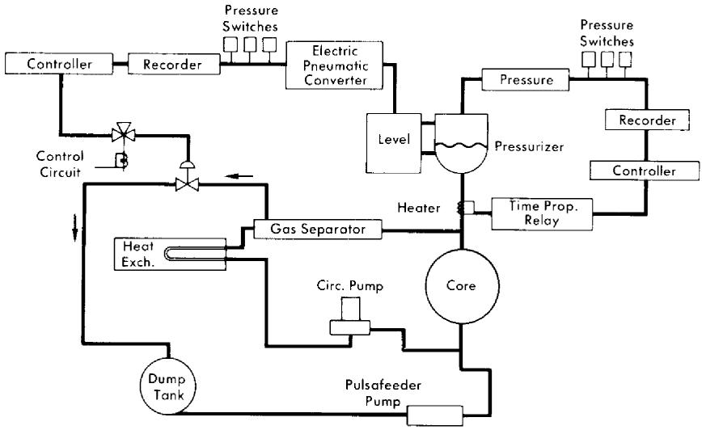  
FIG. 7-16. Key control loops utilizing both pneumatic and electric transmission.

instrument components which could not be easily protected from the water-flooding of the main tank during remote-maintenance operations, and to minimize the radiation exposure of instruments.

(d) The cell air monitors, which provide an alarm in case of a leak of radioactive vapor from the reactor system, are installed in one of these instrument cubicles. Cell air is circulated through a 2-in. pipe from the reactor tank, past the enclosed monitors, and then back to the cell. The blower is sized so that only 5 sec is required for cell air to reach the radiation monitors.

Figure 7-16 indicates several key control loops: (a) The pressure of the core system is controlled from sensed pressure by the proportioning of power to the pressurizer electric heaters; the blanket pressure is similarly controlled by a core-to-blanket differential-pressure signal. (b) The liquid levels in the pressurizers are controlled from sensed levels by pneumatic control of the letdown valves. Pneumatic control actions are derived from transducers which receive signals from electric transmitters. Electric interlock control of the pneumatic signals to final control elements is achieved by the use of solenoid-actuated pilot valves.

Other control loops not illustrated are: (c) The reactor power is controlled by a manual or turbine-governor signal to a valve throttling steam from the core heat exchanger. Because of the large negative temperature coefficient and low heat capacity, this reactor system cannot produce more heat than is being removed, except for very short times. Heat is removed by opening the steam throttling valve, which causes a decrease in the temperature of the fuel leaving the heat exchanger. Because of the nega

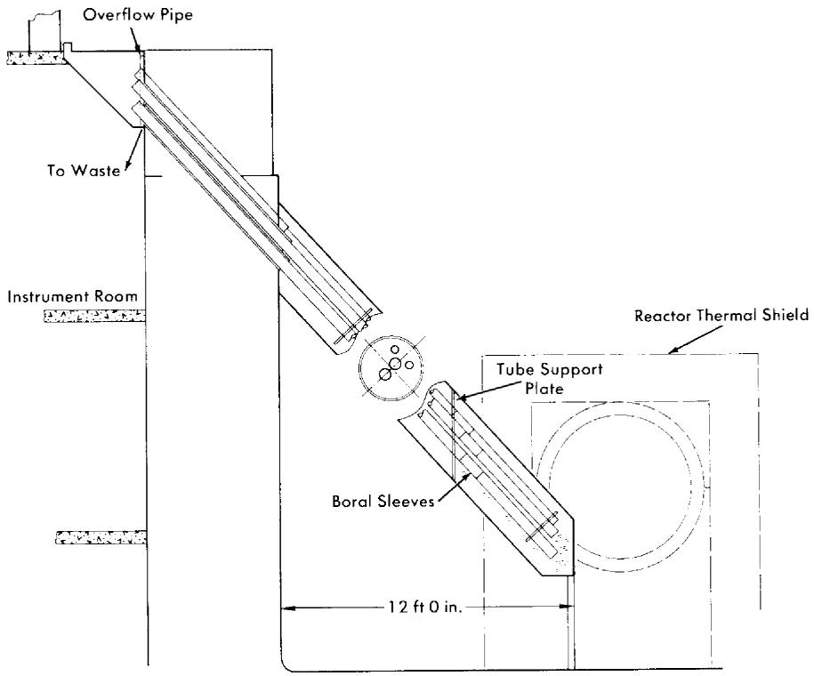  
FIG. 7-17. HRE-2 nuclear instrument thimble.

tive temperature coefficient of the system, the cooler fuel entering the core causes an increase in reactivity and the fuel is reheated until it overcomes the excess reactivity. (d) The average temperature of the core system is controlled by varying the concentration of the fuel solution. The inlet and outlet temperatures will vary with the power extraction, while the average temperature is a function only of fuel concentration. (e) The blanket temperature is controlled by a signal, derived from the difference in average core and blanket temperature, which operates the steam withdrawal valve of the blanket heat exchanger.

Nuclear instrumentation. Neutron level transmitters are two Westinghouse fission chambers and two gamma-compensated ionization chambers designed by the Oak Ridge National Laboratory. Neither type of instrument requires a gas purge, and both are amenable to operation in the water-filled thimbles (Fig. 7-17), which allow the chambers to be positioned or replaced during reactor operation. Varying the distance of the chambers from the reactor core affords a means of sensitivity adjustment, which is needed to accommodate different operating powers.

The gamma-compensated ionization chambers are required to be in a

neutron flux of approximately $10^{10}$ at 5-Mw power to utilize their measuring range of $10^{6}$ . The lower limit of their range of operation is comparable to the maximum desirable flux for proper operation of the fission chambers. Therefore it was possible to install the two types of sensing elements in the same area in the reactor cell. At high fluxes the fission chambers which are required to follow the neutron flux for five decades during start-up are withdrawn into a protective boral shield to limit fission-product buildup in the chamber lining. Proper operation of the compensated ion chambers is ensured by the lead-shot-and-water fill around the thimbles, which reduces the gamma-ray background after power operation from 250,000 r/hr to 250 r/hr.

The fission-chamber signals are fed to conventional preamplifiers, A-1 linear amplifiers, logarithmic count-rate meters and a dual-pen recorder. For initial reactor startup before gamma-neutron reactions provided a sizable neutron source, the fission-chamber output was used to drive a low-range pulse counter.

Control panel. Figure 7-18 shows the main control board and console. Here are located only those instruments necessary for the safe operation of the reactor. These are arranged in a "visual aid" form to reduce operational errors and to facilitate the training of operators. The graphic section is essentially a simplified schematic representation of the chemical process flowsheet with instruments, control switches, and valve-position indicators located in positions corresponding to their location or function in the actual system.

Each annunciator is placed in the control board directly over the instrument or portion of the system on the graphic board with which its signal is associated.

Key measurements are displayed on "full-scale" recorders in the center section of the panel and include the fuel temperature, a multipoint temperature recorder, the multiarea radiation monitoring recorder, the reactor power, the logarithmic neutron-level and count-rate meter signals.

The patch panel on the extreme left is a "jumper board," which is a schematic representation of the electrical control circuits. Provision is made for jumping certain individual contacts in the control circuit with a plug. Lights indicate the position, open or closed, of the contact in the system. The board is valuable for making temporary control-circuit alterations necessary for experiments and makes it unnecessary to use jumper wires which are normally placed behind the panel and if overlooked and not removed might introduce a hazardous condition. The board is also an aid in familiarizing operators with the electrical control circuitry and, since the lights indicate contact position, as an operations aid during startup.

Switches and controls on the console are restricted to those necessary for nuclear startup, steady-state power operation, and emergency.

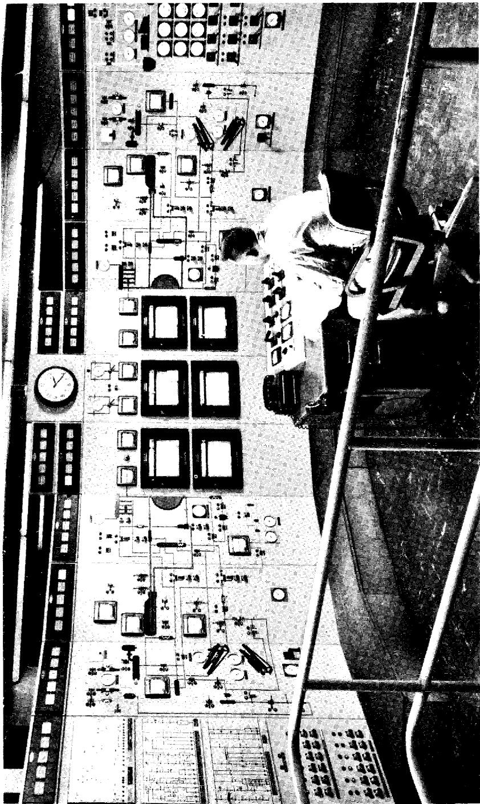  
FIG. 7-18. HRE-2 control room and instrument panel.

Data-collection instruments and the transducers that drive the miniature pneumatic slave recorders on the graphic panel are located in an auxiliary instrument gallery beneath the main control room, as are a 548-point thermocouple patch panel, a relay panel, the nuclear-instrument amplifiers, and the nuclear-instrument power supplies.

Other panels located near their respective equipment elsewhere in the building include the steam control station, the turbine control panel, two sampler control panels, and a control station for the refrigeration system supplying the cold traps. Standard 2-ft-wide modular cabinets and panels are used throughout to facilitate design changes.

Protective interlocking. Extensive protective interlocking of the controls circuits is provided to prevent unsafe operating conditions.

Examples of interlocked systems include the following: (a) The pumping-up of fuel to the reactor core instead of condensate is prevented by several interlocks which keep the fuel-addition valve closed until the core is full of condensate and has been heated to $200^{\circ}\mathrm{C}$ . This prevents power surges and consequent pressure increases. (b) For the same reason the fuel circulating pump is started in reverse to provide a low flow rate as protection against pumping cold fuel too rapidly from the heat exchanger into the core. (c) To avoid dangerous thermal stresses and abrupt reactivity surges, the control circuits do not permit the pumping of cold feedwater into the heat exchangers until the level is above $50\%$ . (d) To give smooth startup, the fuel injection pump can run only at half-speed until a temperature of $250^{\circ}\mathrm{C}$ is reached. (e) The fuel feed valve will be closed and the concentration in the fuel system will be lowered by injecting condensate if the core outlet temperature becomes excessive, if the circulating pump stops, or if the power level exceeds normal. (f) The contents of the high-pressure systems will be automatically emptied to the low-pressure storage tanks through the "dump" valves on a signal of extremely high pressure, or a radiation leak into the steam system. Differential-pressure control between the core and blanket systems during dumps is by throttling control of valves from a differential-pressure signal.

Inventory systems. To obtain an accurate inventory of the fuel and moderator solutions, the storage and condensate tanks are weighed with pneumatic weigh cells. A pneumatic system was selected primarily because taring can be done remotely by balancing air pressures, and components are less susceptible to radiation damage. Piping to the tanks is kept flexible to compensate for the varying loads which result from thermal expansion.

The volumes of the fuel and blanket high-pressure systems have been accurately measured, so that when the pressurizer condensate reservoirs are filled to capacity, the weight of liquid in the high-pressure systems can be computed from the core, blanket, and pressurizer temperatures. These

weights, combined with the respective condensate weights, dump-tank weights, and experimentally observed holdup in the condensate piping, yield the total liquid inventory of the reactor.

7-4.9 Remote maintenance [24]. Maintenance of the equipment in the circulating systems of an aqueous homogeneous reactor is difficult because of the intense radioactivity emanating from the surfaces following prolonged operation at high power levels. This problem, more acute than in the case of heterogeneous reactors because fission-product activities and neutrons are not confined to the reactor core, must be successfully resolved in a practical manner if the homogeneous reactor is to be an economical power producer. Practical systems for maintenance and repair must provide adequate personnel shielding to reduce radiations from activated equipment to tolerable biological values while simultaneously providing access to the equipment.

Equipment activation. Of the two principal methods by means of which the equipment is rendered radioactive, activation by fission-product contamination is the more important in the HRE-2. About $30\mathrm{w / o}$ of the fission products is normally removed from the fuel solution as gases (xenon, krypton, iodine) by stripping with $\mathrm{O}_2$ , $\mathrm{D}_2$ , and steam. Of the remaining fission products, $56\mathrm{w / o}$ are estimated to have sufficiently low solubilities to precipitate from the solution as solids. This is particularly true of the rare earths, which constitute $28\mathrm{w / o}$ of the fission products. Tellurium, technetium, and molybdenum, which contribute $12\mathrm{w / o}$ of the fission products, are assumed to be soluble. Therefore, so far as activation of equipment is concerned, the rare gases ( $\sim 30\%$ ) and the soluble products ( $\sim 12\%$ ), making up $42\mathrm{w / o}$ of the total, may be considered removed or easily removable from the equipment. Some portion of the remaining $58\mathrm{w / o}$ will deposit on hot metallic surfaces or be retained in cracks and crevices. It is possible by statistical analysis to estimate within a factor of two the specific gamma and beta activity of the fuel solution. Methods for calculating this activity have been published [25,26]. The initial fuel activity, after prolonged HRE-2 operation, is of the order of 25 curies/ml.

It should be noted that it is proposed to remove the insoluble fission products continuously with small centrifugal-type separators (hydroclones) in the HRE-2 fuel processing system. The effectiveness of this procedure in competition with absorption on the container walls, however, is as yet unknown.

Induced activation of structural materials by neutron absorption is also an important contributor of radioactivity. During operation of the reactor, a thermal flux exterior to the equipment items will be present because of neutron leakage from the reactor vessel. Also, delayed neutrons will be emitted in the interior of the piping and equipment from fission products

in the fuel solution. These neutron fluxes may be estimated, and knowing the surface areas and material constituents of the equipment, the resulting induced activation may be calculated. Methods of calculating induced activation are reported in the literature [27,28].

The effect of induced activation may be controlled to some extent by attenuating neutron leakage from the reactor through an adequate thermal-neutron shield surrounding the reactor vessel. Also, the constituents of the structural materials in the cell may be specified in such a manner that elements of potentially high neutron activation, such as the cobalt normally present in stainless steels, are minimized. Other materials, such as boron, which has a high neutron-capture cross section and is an alpha emitter rather than a gamma radiator, might be used on equipment surfaces to minimize induced activity.

Radiation dosages. Design criteria followed in the design of shielding and tooling for remote-maintenance operations are based on tolerance radiation levels that are acceptable for normal operations. In continuous working areas, radiation levels as low as $1\mathrm{mr/hr}$ are specified. For certain infrequent operations a level of $7\frac{1}{2}\mathrm{mr/hr}$ is permitted. However, during periods of intense maintenance it may sometimes be permissible to allow personnel to work in an area of higher than normal radiation, but the total weekly radiation dosage must be held to $300\mathrm{mr}$ or less. In some instances it is necessary to work in relays so that no one person receives a higher than permissible weekly dosage.

Proposed maintenance concepts [24]. The concepts which have been proposed for the maintenance of equipment in the HRE-2 have been based on the philosophy of either dry maintenance or underwater maintenance or combinations of the two. In general, it is assumed that the item requiring repair will be replaced with a new item and the faulty component removed to a shielded hot-cell area for maintenance.

Tests of underwater-maintenance procedures proposed for HRE-2 using special tools and equipment have demonstrated the feasibility of removing and replacing equipment. In these tests it was demonstrated that contamination of the heavy-water fuel solution by shielding water could be prevented by freezing a plug of heavy ice in the pipe before disconnecting equipment. Freeze jackets are placed around piping at flange disconnects for this purpose. Also in the HRE-2, the insulation around piping was designed to avoid the retention of water after draining the flooded equipment.

Piping joints. Removal of equipment in the HRE-2 depends on flanged joints adjacent to the equipment which may be disconnected and remade with suitably designed tooling. The joints in the HRE-2 use American Standard stainless-steel ring-joint, weld-neck flanges modified to permit leak detection (Fig. 7-13). These flanges are located so that all bolting is

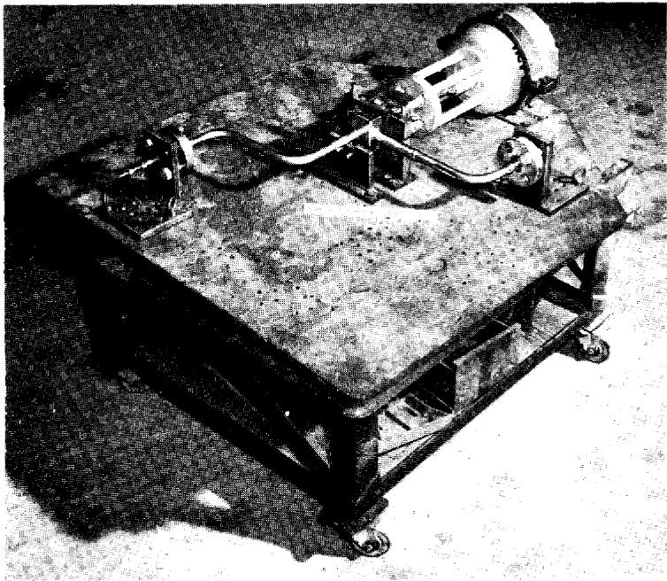  
FIG. 7-19. Universal jig for locating flange positions on HRE-2 replacement high-pressure valves.

accessible to tools operated from above. The number of loose pieces such as bolts, nuts, ferrules, and gaskets is minimized by welding nuts to the flanges such that they become integral with the flange.

Remotely operable tools.* Tools used in the HRE-2 maintenance procedures are generally simple, rugged units mounted on long handles. They include manual, air-operated, and water-operated socket wrenches for turning nuts, hooks for lifting, clamps, knives, magnets, etc. Some typical maintenance devices are illustrated in Figs. 7-19 through 7-22 and described as follows.

The universal high-pressure valve jig shown in Fig. 7-19 is used for manufacturing replacement high-pressure flanges for the HRE-2. By placing brackets in appropriate holes, referenced with respect to the 21 high-pressure HRE-2 valves, the position of the flanged pipe ends for any one of the valves may be accurately determined. With this device, the required number of spare valves for the reactor is minimized, and at the same time any valve which fails can be remotely replaced.

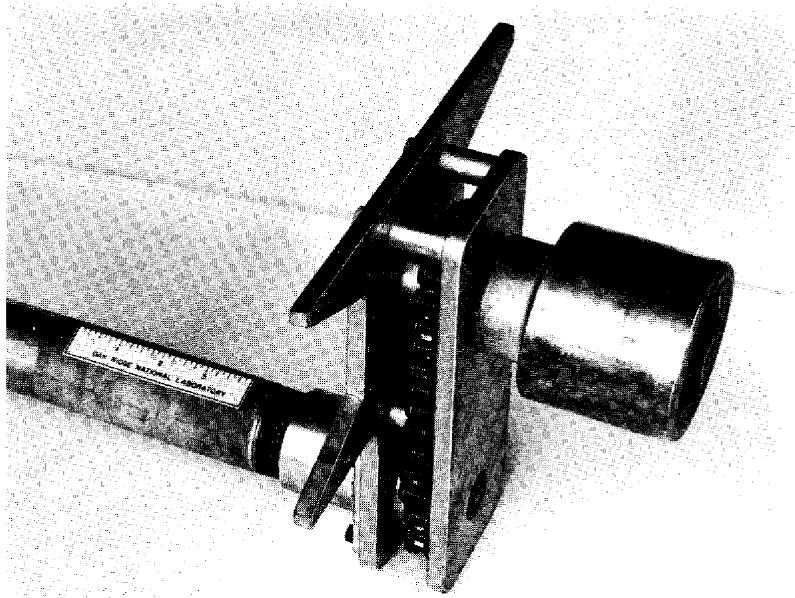  
FIG. 7-20. Spinner wrench for rapid removal of HRE-2 flange bolts.

The spinner wrench in Fig. 7-20 is used for removing bolts quickly after they are loosened with a high-torque wrench, for spinning the bolts snug before final tightening and, by use of a right-angle bevel-gear attachment (not shown), for handling bolts in a horizontal position. It has a chain-drive offset to fit bolts not accessible by direct drive, such as bolts hidden under pipe fittings and bends.

The flange-spreader tool (Fig. 7-21) is required in remote operations to spread low-pressure valve flanges to prevent damage to the ring gasket during removal or insertion of the valves. The tool is shown in place with the flanges spread and the valve assembly moved back on its cell fixture.

The hydraulic torque wrench in Fig. 7-22 is used to tighten or loosen bolts on flanges larger than 2-in. pipe size. This wrench is actuated by a hydraulic (water-operated) cylinder and is capable of applying a 2000 ft-lb force moment.

Even in the relatively short operating history of HRE-2 the concept of underwater repairs with tools such as those described above has been proved to be completely practical. Soon after the reactor attained significant power it was found necessary to replace all the electrical power wiring nearly 4000 ft of wire. This was accomplished in a period of three weeks, with the cell completely flooded. During this period the fuel circulating pump was removed to recover a set of corrosion samples. The removal and replacement of the pump required only $100\mathrm{hr}$ working time, which

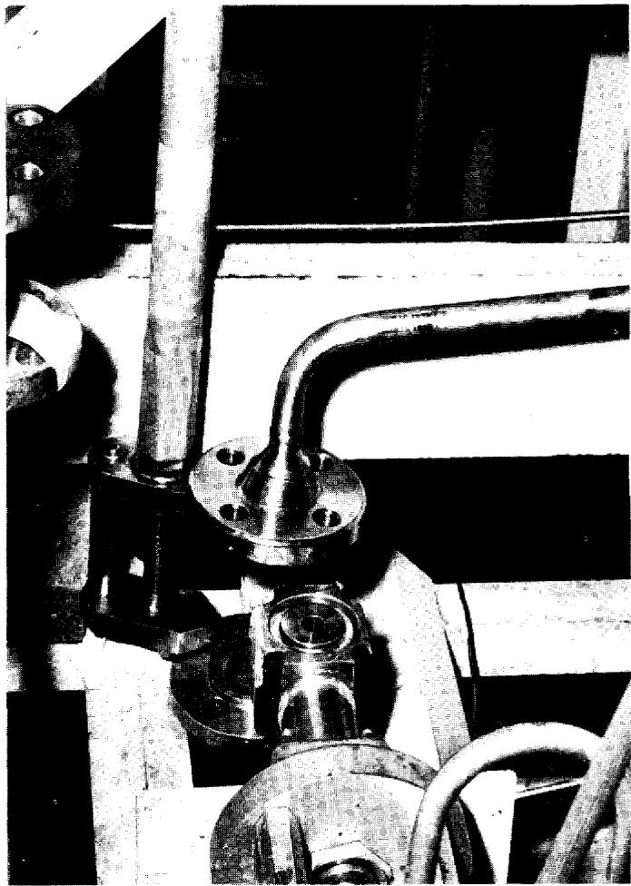  
FIG. 7-21. Flange-spreader tool for preventing damage to gaskets during removal of low-pressure flanges. Shown in place during maintenance operation on HRE-2.

would have been the total shutdown time if the pump replacement alone had been performed. Also, the core inspection flange was removed and the core inner surface inspected by means of a periscope. In these three major underwater-maintenance operations no delay or difficulty was experienced.

7-4.10 Containment methods [29]. In designing for the containment of HRE-2, extremely rigid leakage specifications were set, both for the primary piping system and the shielded tank containing the reactor. In the case of the piping, the leakage specification was based on the minimum leak which could be found with the available mass-spectrometer leak

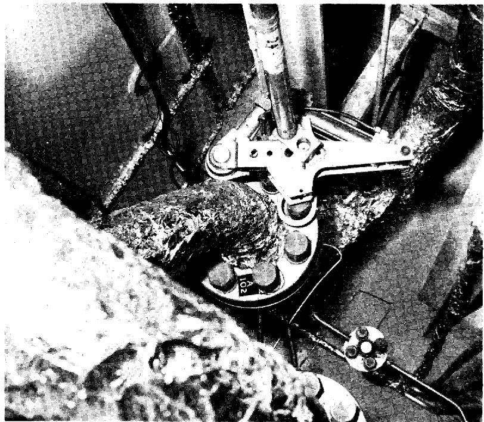  
FIG. 7-22. Hydraulic torque wrench for loosening or tightening flange bolts. Shown in operation on HRE-2.

detection equipment, namely, 0.1 cc helium (STP) per day. Allowing for several such minimum leaks, the equivalent loss of liquid at $300^{\circ}\mathrm{C}$ and at 2000 psig could be as great as 5 cc per day, or a total leakage of approximately 250 curies/day. Because of its volume and surface area, and because of the difficulty in measuring small leakage from very large vessels, the leakage rate for the reactor tank was set at 10 liters/min or less, at a test pressure of 15 psi. As indicated in Article 7-4.4, actual leakages were below this value.

The problem of leakage from the reactor vessels and piping can be catalogued according to the various mechanisms through which leakage might result as follows: (1) excessive stresses, (2) defective materials or workmanship, (3) corrosion, (4) nuclear accidents, (5) hydrogen-oxygen explosions, and (6) brittle fracture. Each possibility is examined in detail in the discussion which follows.

Excessive stresses. There are many possibilities for the development of excessive stresses in a system as complex as the HRE-2. In order to reduce the likelihood of failure as a result of excessive stress, a maximum allowable working stress of 12,000 psi was specified for the type-347 stainless steel

with which the system was fabricated. This permits an additional factor of safety over the 15,000 psi allowed by the ASME boiler code. As required by the ASA code for pressure piping, the reactor piping arrangement was examined for maximum stresses due to pressure, as well as for hoop and bending stresses resulting from thermal expansion. Equipment was also studied for determining the magnitude of thermal stresses caused by radiation heating and temperature cycling. Therefore, in order to keep the combined thermal and pressure stresses below the maximum allowable working stress, the pressure-vessel wall is approximately 2 in. thicker than would be required otherwise. Heating and cooling rates on the entire system have been limited to $100^{\circ}\mathrm{F/hr}$ and $55^{\circ}\mathrm{F/hr}$ , respectively, and the differential temperature across heavy metal walls is kept below $100^{\circ}\mathrm{F}$ . (The cooling rate is held below the heating rate to minimize rate of flange contraction.)

Cyclic temperature stresses at questionable points in the reactor pressure vessel and steam generators were explored experimentally. Mockups were fabricated for the testing of the pressure-vessel nozzle joints and the stainless-steel-to-Zircaloy bolted joint inside the pressure vessel. In each test the temperature was cycled from approximately $250^{\circ}\mathrm{F}$ to approximately $600^{\circ}\mathrm{F}$ in $1/2\mathrm{hr}$ and cooled back to $250^{\circ}\mathrm{F}$ in $1/2\mathrm{hr}$ . After 100 cycles the joints were found to be sound. The main steam generators were also cycled in similar tests. Several tube joints cracked open during the first 50 cycles. They were repaired and the heat exchangers were subjected to an additional 10 cycles before final acceptance.

Defective materials or workmanship. Defective materials and poor workmanship constitute another area which required special attention to prevent failures. All materials for the primary systems of HRE-2 were procured to specifications considerably more rigid than those existing in commercial practice. Optional requirements such as chemical analyses, boiling nitric acid tests, and macroetch tests were exercised in all materials specifications. An additional cost, averaging about $10\%$ , was experienced in the purchase of materials under the more rigid specifications. In some instances, for example with the heat-exchanger tubes, special ultrasonic and magnetic eddy-current flaw detectors were employed to indicate defective parts. Three tubes which might have later failed in operation were thus eliminated. Dye-penetrant tests were applied to tubing bends and to all welds throughout the reactor to detect cracks and pinholes. None was discovered in tubing bends, but many were found in welds, especially in the tube-to-tube-sheet welds.

Special attention was given to the welding of stainless steel butt joints, of which there are approximately 2000 in the entire reactor. The inert-gas, nonconsumable-electrode method was used almost entirely. Welds were inspected to considerably higher standards than required by the ASME code. In addition to being subjected to dye-penetrant inspection, every

weld was x-rayed. Although the inspection standards were very rigid, only $3\%$ of the welds were rejected, necessitating rewelding.

Corrosion. Although corrosion is an ever-present possibility for leakage, the HRE-2 was designed to reduce attack rates so far as possible by keeping velocities below 20 fps, temperatures in the range of 250 to $300^{\circ}\mathrm{C}$ , and lining some surface areas with titanium for additional resistance.

Nuclear accidents. Nuclear accidents are likely to be rare in homogeneous reactors because of the large negative temperature coefficient (0.1 to $0.2\%$ $\Delta k / ^{\circ}\mathrm{C}$ ) [30]. As an example, the worst accident considered in the HRE-2 [31] was one in which all the uranium suddenly collects in the reactor core and results in a reactivity increase of $2.5\%$ $\Delta k/$ see. For this rate, starting at a power of only 0.4 watt, the maximum pressure in the pressure vessel would be approximately 3900 lb, and the pressure stress in the carbon steel shell would be less than 30,000 psi.

Hydrogen-oxygen explosions. Since radiolytic gases (deuterium and oxygen) are produced continuously in the reactor, they are the source of an ever-present hazard. Explosions may be expected whenever the deuterium-oxygen-steam mixture is more than $15\%$ gas. For detonations the required gas fraction is greater. The maximum increase in pressure from an adiabatic explosion of hydrogen and oxygen is only a factor of 3 to 8, whereas for a detonation the factor might be 23 for an undiluted mixture. (It is important to note that detonations can occur only in gas channels that are relatively long and straight.)

In low-pressure areas of HRE-2 the gas was diluted with steam to keep it noncombustible. Furthermore, a pressure of 500 psi is the basis for design of low-pressure (atmospheric) equipment. Even for a detonation the expected peak pressure would be less than the design pressure.

Although an explosion can be tolerated in the high-pressure system with little danger of vessel rupture, a detonation probably could not be. A detonation could occur in the gas separator where the gas channel (the vortex by which the radiolytic gas is collected) is long and straight. It is calculated [32] that a detonation wave traveling longitudinally along the vortex would produce impact pressures of the order of 30,000 psi but that the damage would be limited to the directional vanes inside the separator. Attenuation of the forces by the solution would limit the pressure rise to that resulting from combustion of the gas—10,000 psia, which produces a tolerable wall fiber stress of 35,000 psi. Thus no serious damage is foreseen from explosions or detonations.

Brittle fracture. It is generally known that ferritic steels are subject to the phenomenon of brittle fracture. Although the likelihood of brittle fracture in the HRE-2 pressure vessel was known to be small, an investigation was made [33] in order to determine the consequences of such an accident as a result of the pressure rise and missile damage.

A sudden release of the liquid contents of the fuel and blanket systems—3910 lb of solution at $300^{\circ}\mathrm{C}$ and 2000 psig—would result in a pressure rise of approximately 30 psi inside the reactor shield. Although it is somewhat difficult to design a large (25,000 cu ft) rectangular container such as the HRE-2 container to withstand a 30-psig pressure, it was even more difficult to design it to withstand heavy missiles. Studies indicated that missile velocities of 50 to 150 fps could be expected. With the HRE-2 vessel, which weighs 16,000 lb, 1600-lb fragments might be expected. Such a mass at 100 fps would lift an unrestrained 5-ft-thick concrete shielding plug nearly 1 ft. For this reason a blast shield was placed around the vessel.

The blast shield was designed to withstand the 1250-psig pressure which would result from the $300^{\circ}\mathrm{C}$ liquid, as well as to absorb the energy of the expanding steam. A $1\frac{1}{2}$ -in.-thick wall made of type-304 stainless steel was found to be capable of absorbing $2.85 \times 10^{6}$ ft-lb of energy with $2\%$ elongation. The fragments from the pressure vessel would accumulate this much energy in traveling across an annulus of 4.8 in. To provide an additional factor of safety, the blast shield was constructed to surround the pressure vessel with an annulus not greater than 2 in.

A similar shield made of carbon steel was installed on both fuel and blanket steam generators as a final precaution against an explosion which might damage other equipment and the vapor barrier sufficiently to cause a release of activity. The probability of failure of the steam generator shells would not be affected by the presence of neutron radiation because the generators are located in a low flux region.

The vapor-tight container. If leakage of radioactive solution from the reactor proper occurs through one of the means mentioned above, an all-welded, vapor-tight tank provides a second barrier to the escape of radiation to the atmosphere. Construction details of this tank, which forms the liner for the biological shield, are illustrated in Fig. 7-8. After completion of construction the tank was given a hydrostatic test at an average pressure of 32 psig, and the welded joints were found to be free of leaks. It was then reopened for further installation of reactor equipment. Prior to operation of the reactor at power, the containment vessel was sealed and tested (Article 7-4.4).

7-4.11 Summary of HRE-2 design and construction experience. Following the completion of HRE-2, personnel associated with the project recommended design improvements which might be applied to good advantage in future homogeneous reactors. These recommendations are summarized in the following paragraphs:

(1) There are many components in the HRE-2 system which must operate in conjunction with one another for continuous operation of the reactor. Since a failure of any one of these could cause a shutdown of the

reactor, the probability of shutdown is higher than it would be with components operating independently. In future reactors an attempt should be made to decrease the dependency upon the simultaneous operation of essential components. An example of this is a system which can be operated without continuous letdown from the high-pressure to the low-pressure system, so that failure of the low-pressure system components will not necessarily require shutdown of the entire reactor system.

(2) The reactor cell for the HIRE-2 contains many structural components made of carbon steel. Flooding the cell with water and removing radioactive contamination by use of acids will eventually do serious damage to all these carbon steel surfaces. Wherever possible in future reactors, corrosion-resistant materials should be used for structural components, or those components should be protected by coatings which are resistant to radiation, as well as to acids and water.   
(3) In laying out equipment and piping, provision should be made for walkways, stairs, and ladders to provide convenient access during construction without having to climb on the process and service piping. These walkways, ladders, and stairs may or may not be removable after completion of construction.   
(4) Many items installed inside the reactor cell of the HRE-2 might have been located outside the radioactive area. These include the cold traps, which could be located in one of the shielded waste-system compartments, the space coolers, and a number of other nonradioactive components.   
(5) In the IIRE-2 the sampler is located adjacent to the cell shield, and it is necessary to remove the sample from the sampler and carry it to the analytical laboratory in a shielded carrier. The risk of contamination can be greatly reduced if the hot laboratory is built around the sampler so that samples may be analyzed without removal from the shield; however, this would add to the cost of the facility.   
(6) Access through the containment seal, which consists of welded pans, can be made easier through the use of mechanical seals with organic gaskets. These would not be subject to severe radiation damage since the containment seal is itself shielded from primary radiation.   
(7) Control of all operations affecting the reactor should be located in one central control room. This includes the controls for the chemical processing system, as well as those for the reactor system and all main controls for the steam turbine and steam auxiliaries. This does not mean, however, that all instrumentation must be in the control room, but only those things which are necessary to keep the reactor operator informed and to provide him with primary control of the operation.   
(8) In the HRE-2 refrigeration system a petroleum distillate, "AMSCO 125-82," was circulated inside the reactor cell as a secondary coolant because no primary low-pressure refrigerant could be found which would not

decompose under irradiation to release chlorides or fluorides detrimental to the stainless steel piping. Carbon dioxide was not selected because the piping would have to be designed to withstand about 1500 psi. A solution to this problem would be to use copper for all tubing and equipment in contact with the refrigerant, in which case Freon could be used inside the cell.

7-4.12 HRE-2 construction costs. These costs are summarized in Table 7-7, including that portion of the costs due to the requirement for preventing the possible escape of radioactive material from the reactor to the building or surroundings.

# 7-5. THE LOS ALAMOS POWER REACTOR EXPERIMENTS (LAPRE 1 AND 2) [34, 35]*

7-5.1 Introduction. Homogeneous reactors fueled with uranium oxide dissolved in concentrated aqueous solutions of phosphoric acid have a number of advantages compared with dilute aqueous uranyl solutions for certain power reactor applications. These applications are based on the fact that concentrated phosphoric acid solutions have high thermal stability and low vapor pressures. This makes it possible to operate at relatively high temperatures without creating the excessive pressures encountered with dilute aqueous solutions. These temperatures are high enough to take advantage of the back reaction for recombination of gases produced by radiolytic decomposition and to eliminate the need for an external gas system or an internal catalyst. A phosphoric acid solution reactor, therefore, can be a sealed single vessel with no external components except a circulator for the steam system. In addition, the high hydrogen density and the relatively low neutron-absorption cross sections of the phosphoric acid system permit the construction of small, compact reactors with a low inventory of fuel, which may be ideal for remote package power plants. Other advantages include the possibility of continuous removal of fission-product poisons and a strong negative temperature coefficient of reactivity.

Although the advantages of uranium oxide in concentrated phosphoric acid solutions present a strong case for such a fuel system, the disadvantages, though few in number, are ponderous. In fact, one disadvantage, the highly corrosive nature of the phosphoric acid to most metals, may well outweigh all of the advantages. The only metals known to be suitably resistant to phosphoric acid in the concentration and temperature ranges of interest are gold and platinum. Although with proper design the cost of using such materials in a reactor can be kept within reason, the problem of providing and maintaining an impervious noble-metal barrier between the

Reactor (HRE-2):

TABLE 7-7   
HRE-2 CONSTRUCTION COST* (TO MAY 1956)   

<table><tr><td colspan="2">Design</td></tr><tr><td>Reactor</td><td>$549,000</td></tr><tr><td>Structure and services</td><td>185,000</td></tr><tr><td>Instrumentation</td><td>126,000</td></tr><tr><td>Total design cost (labor OH @ 65%)</td><td>$860,000</td></tr><tr><td colspan="2">Reactor installation</td></tr><tr><td>Building modification</td><td>58,000†</td></tr><tr><td>Reactor cell and shielding</td><td>375,000</td></tr><tr><td>Reactor components and piping</td><td>1,400,000</td></tr><tr><td>Reactor controls (instrumentation and valves)</td><td>470,000</td></tr><tr><td>Reactor steam system and cooling system</td><td>161,000</td></tr><tr><td>Miscellaneous service piping</td><td>69,000</td></tr><tr><td>Maintenance tools</td><td>54,000</td></tr><tr><td>Waste and off-gas system</td><td>78,000</td></tr><tr><td>Miscellaneous and spare parts</td><td>208,000</td></tr><tr><td>Division supervisory labor</td><td>120,000</td></tr><tr><td>Total installation (labor and material)</td><td>$2,993,000</td></tr><tr><td>Total reactor cost</td><td>$3,853,000</td></tr></table>

Containment cost estimate for HRE-2:

1. Additions to shield design, required only to meet containment specification $75,000   
2. Cost of sealing conduits and wiring 7,000   
3. Cost of leak-tight closures on process service lines 23,000   
4. Blast shields on reactor components  
Pressure-vessel $35,000  
Two steam generators 10,000   
5. Radiation monitoring of service lines 10,000
Total cost $160,000

TABLE 7-8   
PROPERTIES OF LAPRE-1 AND LAPRE-2 FUEL SYSTEMS  

<table><tr><td></td><td>LAPRE-1</td><td>LAPRE-2</td></tr><tr><td>Type of uranium oxide</td><td>UO3</td><td>UO2</td></tr><tr><td>Weight percent H3PO4</td><td>53</td><td>95</td></tr><tr><td>Vapor pressure, psig 250°C</td><td>400</td><td>190</td></tr><tr><td>Vapor pressure, psig 350°C</td><td>1800</td><td>300</td></tr><tr><td>Vapor pressure, psig 450°C</td><td>4500</td><td>800</td></tr><tr><td>Overpressure gas</td><td>O2</td><td>H2</td></tr><tr><td>U235 concentration, g/liter</td><td>111</td><td>77</td></tr><tr><td>H concentration, moles/liter (25°C)</td><td>90</td><td>62</td></tr><tr><td>H/U235</td><td>190</td><td>190</td></tr><tr><td>Fuel volume ratio (430°C to 25°C)</td><td>1.33</td><td>1.16</td></tr><tr><td>Temperature coefficient of reactivity (per °C)</td><td>-8 × 10-4</td><td>-5 × 10-4</td></tr></table>

fuel solution and all structural metals with which it might come in contact is extremely difficult to solve. This problem was not solved in the first experimental reactor to use phosphoric acid system, the LAPRE-1; however, considerable improvements in fabrication and testing techniques have been developed for use in the construction of LAPRE-2.

Of the wide range of possible combinations of uranium oxide, phosphoric acid, and water, two systems appear to be of special interest. The first, which consists of $\mathrm{UO}_3$ dissolved in an aqueous solution containing between 30 and $60\mathrm{w / o}$ of phosphoric acid and pressurized with an oxygen overpressure, was used for the first Los Alamos Power Reactor Experiment (LAPRE-1). The properties of this solution are given in Chapter 3 and summarized in Table 7-8. The vapor pressure of this solution at the design operating temperature of LAPRE-1 $(430^{\circ}\mathrm{C})$ is 3600 psi.

The second solution (to be used in LAPRE-2) consists of $\mathrm{UO}_2$ dissolved in a $95\mathrm{w / o}$ phosphoric acid and pressurized with a hydrogen over-pressure. As seen from Table 7-1, the vapor pressure of this solution at $450^{\circ}\mathrm{C}$ is only about 800 psi. Because of its reducing properties, the corrosive behavior of this solution is such that anything below hydrogen in the electromotive series is only slowly attacked. Since the attack rate is proportional to the position of the metals in the series, possible materials in decreasing order of usefulness are platinum, gold, carbon, silver, and copper. Although neither silver nor copper is attacked at a rapid rate, both metals undergo mass transfer, and suitable means for inhibiting this must be found before they can be considered practical for lining the reactor.

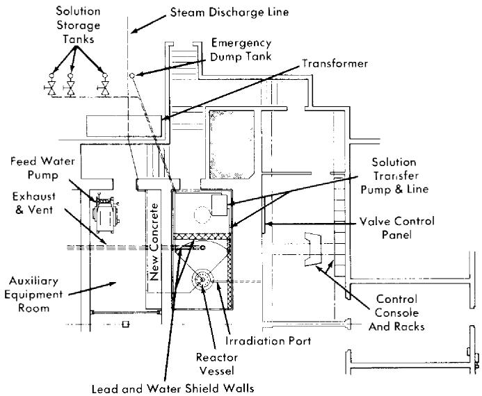  
FIG. 7-23. Plan view of LAPRE-1 reactor area (courtesy of Los Alamos Scientific Laboratories).

7-5.2 Description of LAPRE-1. The first experimental reactor, LAPRE-1, was housed in a cell at the Los Alamos site which had been built previously to handle highly radioactive materials. The cell was modified by supplementing the shielding with additional concrete on one side and lead on the other sides and ceiling. A stainless-steel wall was also put across the reactor end of the cell to permit filling with water for a neutron shield. Equipment such as the solution transfer pump and sampling system were located in the cell outside the water-filled portion, while other auxiliaries were located outside the cell. These included a 12 gpm, 4000-psi feedwater pump, three 6-in.-diameter, 32-ft-long underground solution metering and storage tanks, and an emergency dump tank. Valve controls were located on the wall of the cell. Figure 7-23 shows a plan view of the LAPRE-1 reactor area.

Figure 7-24 shows an artist's sketch of LAPRE-1 in which the essential features of the reactor are indicated. As will be seen from this sketch, the 15-in.-ID cylindrical reactor contains a critical zone above the cooling coils and a reservoir region below. This latter region, which contains a hollow cylinder of boron to prevent criticality, provided a storage place for excess fuel and avoided the necessity for transferring the highly radioactive fuel solution in and out of the reactor as its temperature changed. The

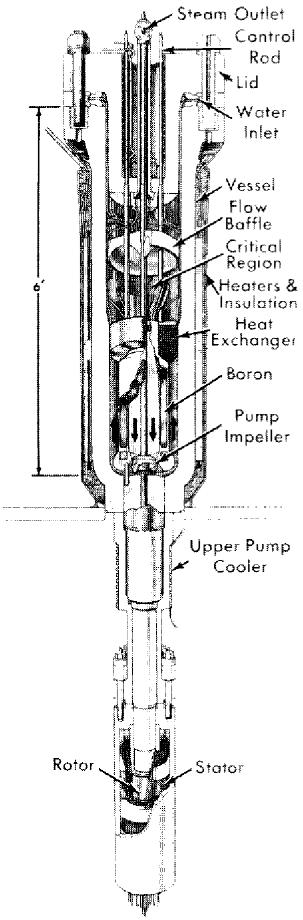  
FIG. 7-24. Los Alamos Power Reactor Experiment No. 1 (courtesy of the Los Alamos Scientific Laboratories).

large negative temperature coefficient of reactivity made it impossible to compensate for the excess reactivity of the cold critical reactor and it was not considered practical to change the fuel concentration as is done in the HRE-2. In the LAPRE-1, shim control was achieved by means of the thermal expansion of the fuel. This was accomplished by initially filling the reactor with the cold phosphoric acid fuel solution to a level about 7 to 8 in. above the cooling coils. At this level the reactor would become critical on removal of the control rods, the solution would heat up, expand, and gradually fill the critical zone. On cooling, the reverse process took place, making the reactor self-compensating. The reactor vessel was so designed that at $430^{\circ}\mathrm{C}$ , the operating temperature, the fluid level would reach a point just above the flow baffle. In the actual experiment the reactor was maintained at zero power while the temperature was raised

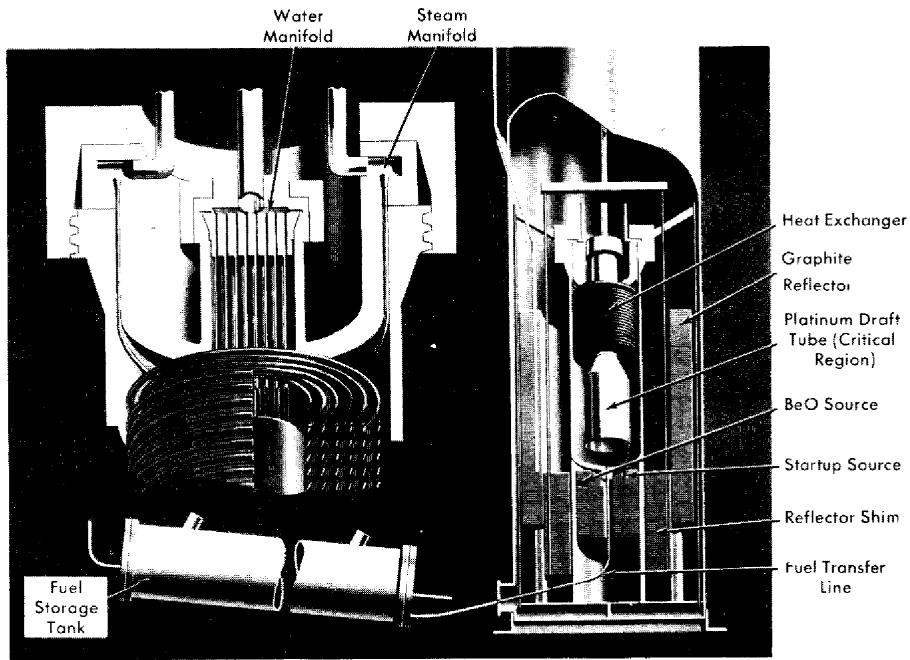  
FIG. 7-25. Los Alamos Power Reactor Experiment No. 2 (courtesy of the Los Alamos Scientific Laboratories).

to $240^{\circ}\mathrm{C}$ by using electrical heaters located around the exterior of the vessel. This was done to minimize the positive reactivity change resulting from starting up the fuel circulating pump, which caused a rapid injection of lower temperature fuel solution from the reservoir into the core.

Heat removal from LAPRE-1 was accomplished by circulating the fuel solution at $600\mathrm{gpm}$ over the cooling coils by means of the centrifugal sealed rotor pump shown in Fig. 7-24. The 12-gpm feed-water stream, heated to $800^{\circ}\mathrm{F}$ in passing through the cooling coils, was simply discharged to the atmosphere through a quick-closing throttling valve and steam silencer as a means of dumping of heat. The possibility of fission products escaping through the steam discharge line was prevented by installing a 70-sec holdup line, suitably monitored for radioactivity, between the reactor and throttling valve.

In case of accidental stoppage of the pump during full-power operation, the reactor could be shut down with the control rods. Provision for discharging the fuel solution by hand or through a rupture disk was included for added safety.

The entire LAPRE-1 vessel and cell components exposed to fuel solution were gold-plated, with the exception of the rod thimbles and draft funnel which were made of, or coated with, platinum to minimize neutron ab

TABLE 7-9 CHARACTERISTICS OF LOS ALAMOS POWER REACTOR EXPERIMENTS   

<table><tr><td></td><td>LAPRE-1</td><td>LAPRE-2</td></tr><tr><td>Power level, Mw heat</td><td>2.0</td><td>0.8</td></tr><tr><td>U235 in core, kg</td><td>4.1</td><td>4.1</td></tr><tr><td>U235 total, kg</td><td>8.5</td><td>6.5</td></tr><tr><td>Fuel temperature, °C</td><td>430</td><td>430</td></tr><tr><td>Fuel pressure, psig</td><td>4000</td><td>700</td></tr><tr><td>Steam temperature, °F</td><td>800</td><td>600</td></tr><tr><td>Steam pressure, psig</td><td>1800</td><td>600</td></tr><tr><td>Cost of components</td><td>$250,000</td><td>$120,000</td></tr></table>

sorption. The 22 stainless steel cooling coils, 50 ft long, were clad with 6 mils of gold.

The characteristics of LAPRE-1 and -2 are summarized in Table 7-9.

7-5.3 Operation of LAPRE-1. Final tests on the LAPRE-1 system were made with a $0.51M\mathrm{UO}_3$ in $7.25M\mathrm{H}_3\mathrm{PO}_4$ fuel solution. Data were obtained at room temperature in terms of control-rod position at delayed critical versus volume of fuel injected into the system,\* and results were interpreted in terms of a simplified calculational model to obtain control rod worths. For the five control rods, four located on a $3_{16}^{7}$ in. radius and one central rod, measurements yielded a total worth of $6.3\%$ . The latter results were in good agreement with period measurements at cold critical. Also inferred from the data was an effective delayed neutron fraction of 0.0091.

With the reactor filled to a predetermined level at room temperature, initial heating of the system was achieved by means of electrical heaters disposed around the outside of the vessel. Heat was applied until a core temperature of $240^{\circ}\mathrm{C}$ was attained; heating by nuclear power was then initiated. With nuclear power a core temperature of $340^{\circ}\mathrm{C}$ was achieved, at which point the circulator was turned on. Only during the forced convection phase of the operation was a uniform temperature distribution established in the fuel solution; previous to starting the circulator, the

average core temperature was higher than the corresponding reservoir temperature.

Data were obtained during the course of the experiment in terms of control rod positions versus core temperature at delayed critical. For the operation without the circulator, thermocouples located at various points in the system provided data from which average core and reservoir temperatures could be estimated. With the circulator in use, the data for control rod position versus temperature were used to infer the temperature of the solution level at the top of the baffle. Above this point a further increase in height did not contribute to the reactivity; hence the system was solely governed by the temperature coefficient of reactivity. Based on the calculated negative temperature coefficient for the system $(\sim 8\times 10^{-4} / ^{\circ}\mathrm{C})$ it was found that the rods were worth 30 to $40\%$ more at $390^{\circ}\mathrm{C}$ than at cold critical.

A maximum temperature of $390^{\circ}\mathrm{C}$ at an operating power of about $150\mathrm{kw}$ was achieved in the experiment. No steam data were obtained during the test because of a failure in the heat-exchanger assembly after a number of hours of operation. Inspection of the assembly after a cooling-off period indicated that a rupture in the gold cladding of two of the lead-in tubes was responsible for the failure. This rupture was probably due to a bonding between the gold cladding of the tubes and the gold plate of the baffle, in conjunction with vibration of the tubes resulting from the operation of the circulator. Although no further tests with LAPRE-1 were conducted after October 1956, careful inspection of the reactor parts after disassembly provided information valuable to the construction of LAPRE-2.

7-5.4 Description of LAPRE-2. The second power reactor experiment, LAPRE-2, was constructed in an underground steel tank 50 in. in diameter and 20 ft long located at a site approximately 100 feet from LAPRE-1. A sketch of the reactor is shown in Fig. 7-25. Because of the lower vapor pressure of the LAPRE-2 fuel solution the design and method of controlling LAPRE-2 differ from LAPRE-1. As shown in the figure, the reactor vessel has a simple autoclave shape with relatively thin (5/8-inch) walls. This compares with the 3-in.-thick vessel required for LAPRE-1. The cooling coils in LAPRE-2 are located above the reactor core, which has the advantage of providing a noncritical region for excess liquid in case of overfilling. Cooling is accomplished by natural convection circulation of fuel solution over the cooling coils. Fuel circulation is aided by an inverted platinum cone in the core region. A 1-ft-thick graphite reflector surrounds the vessel. The inner 6 in. of this reflector can be moved slowly to adjust the reactivity at varying fuel concentrations.

Cold criticality is achieved by slowly filling the reactor with fuel solution

from a water-cooled copper tank pressurized with hydrogen. The line connecting the tank and reactor is gold clad (0.010 in.). After the reactor becomes critical with cold fuel solution, further additions are made until the desired operating temperature of $430^{\circ}\mathrm{C}$ is reached. A separate pancake-shaped cooling coil, located just above the main tube bundle, serves as a level indicator. A thermocouple in the discharge of this coil indicates whether there is power removal and thus if the coil is immersed.

All parts of LAPRE-2 are completely clad with fifteen mils of gold to provide $100\%$ protection of the structural metal from the fuel solution. This gold, as well as the platinum and noble metals used in LAPRE-1, are recoverable after conclusion of the reactor experiments.

The 600-psi, $600^{\circ}\mathrm{F}$ steam produced in the LAPRE-2 is of somewhat lower quality in terms of power production than LAPRE-1 because of the lower operating pressures. However, at a design level of $1.3\mathrm{Mw}$ heat, the reactor could produce $250\mathrm{kw}$ of electricity which is acceptable for a remote power station.

The characteristics of LAPRE-2 are summarized in Table 7-9. Construction of the reactor proceeded through 1957 and was essentially completed in early 1958.

# REFERENCES

1. A. M. WEINBERG, Whither Reactor Development, Inter-American Conference, Brookhaven National Laboratory, May 1957, *Nucleonics* 15(8), 99 (August 1957).   
2. C. P. BAKER et al., Water Boiler, USAEC Report AECD-3063, Los Alamos Scientific Laboratory, Sept. 4, 1944.   
3. F. L. BENTZEN et al., High-power Water Boiler, USAEC Report AECD-3065, Los Alamos Scientific Laboratory, Sept. 19, 1945.   
4. L. D. P. KING, Design and Description of Water Boiler Reactors, in Proceedings of the International Conference on the Peaceful Uses of Atomic Energy, Vol. 2. New York: United Nations, 1956. (p. 372)   
5. C. K. Beck et al., Nuclear Reactor Project at North Carolina State College, Nucleonics 7(6), 5-14 (1950); and Further Design Features of the Nuclear Reactor at North Carolina State College, USAEC Report AECU-1986, North Carolina State College School of Engineering, January 1952.   
6. R. N. Lyon, Preliminary Report on the 1953 Los Alamos Boiling Reactor Experiments, USAEC Report CF-53-11-210, Oak Ridge National Laboratory, Nov. 30, 1953.   
7. J. R. DIETTICH et al., Design and Operating Experience of a Prototype Boiling Water Power Reactor, in Proceedings of the International Conference on the Peaceful Uses of Atomic Energy, Vol. 3. New York: United Nations, 1956. (p. 56)   
8. L. D. P. KING, personal communication, January 1952.   
9. Reactor News, Nucleonics 15(2), R10 (February 1957).   
10. S. E. BEALL and C. E. WINTERS, The Homogeneous Reactor Experiment—A Chemical Engineering Pilot Plant, Chem. Eng. Progr. 50, 256-262 (May 1954).   
11. C. E. WINTERS and A. M. WEINBERG, Homogeneous Reactor Experiment Feasibility Report, USAEC Report ORNL-730, Oak Ridge National Laboratory, July 6, 1950.   
12. C. E. WINTERS and A. M. WEINBERG, A Report on the Safety Aspects of the Homogeneous Reactor Experiment, USAEC Report ORNL-731, Oak Ridge National Laboratory, Aug. 29, 1950.   
13. C. L. SEGASER and F. C. ZAPP, HRE Design Manual, USAEC Report TID-10082, Oak Ridge National Laboratory, Nov. 18, 1952.   
14. S. VISNER and P. N. HAUBENREICH, HRE Experiment on Internal Recombination of Gas with a Homogeneous Catalyst, in *Nuclear Sci. Technol.*, USAEC Report TID-2506(Del.), Oak Ridge National Laboratory, 1955. (pp. 73-90)   
15. R. B. BRIGGS and J. A. SWARTOUT, Aqueous Homogeneous Power Reactors, in Proceedings of the International Conference on the Peaceful Uses of Atomic Energy, Vol. 3. New York: United Nations, 1956 (p. 175). S. E. BEALL and S. VISNER, Oak Ridge National Laboratory, 1955. Unpublished.   
16. D. O. CAMPBELL, Decontamination of the Homogeneous Reactor Experiment, USAEC Report ORNL-1839, Oak Ridge National Laboratory, June 1956.   
17. C. E. WINTERS, Oak Ridge National Laboratory, 1952. Unpublished.   
18. S. E. BEALL, The Homogeneous Reactor Test, in HRP Civilian Power Reactor Conference Held at Oak Ridge, March 21-22, 1956, USAEC Report TID-7524, Oak Ridge National Laboratory, March 1957. (pp. 11-47)

19. S. E. BEALL, The Homogeneous Reactor Test, in HRP Civilian Power Reactor Conference Held at Oak Ridge National Laboratory, May 1-2, 1957, USAEC Report TID-7540, Oak Ridge National Laboratory, July 1957. (pp. 11-46)   
20. S. E. BEALL, Homogeneous Reactor Experiment No. 2, 4th Annual Conference of the Atomic Industrial Forum, October 1957.   
21. S. E. BEALL, in Homogeneous Reactor Project Quarterly Progress Report for the Period Ending Jan. 31, 1958, USAEC Report ORNL-2493, Oak Ridge National Laboratory, 1958.   
22. I. SPIEWAK and H. L. FALKENBERRY, The Homogeneous Reactor Test Mockup, in Proceedings of the Second Nuclear Engineering and Science Conference, Vol. 2, Advances in Nuclear Engineering. New York: Pergamon Press, 1957. (pp. 62-69)   
23. D. S. Toomb, Jr., Instrumentation and Controls for the HRT, *Nucleonics* 15(2), 48-52 (1957).   
24. S. E. BEALL and R. W. JURGENSEN, Direct Maintenance Practices for the Homogeneous Reactor Test, Fourth Nuclear Engineering and Science Conference, March 1958 (Paper 82); and USAEC Report CF-58-4-101, Oak Ridge National Laboratory, April 1958.   
25. T. ROCKWELL III, Reactor Shielding Design Manual. New York: D. Van Nostrand Co., Inc., 1956.   
26. S. GLASSTONE, Principles of Nuclear Reactor Engineering. New York: D. Van Nostrand Co., Inc., 1955.   
27. C. D. Bopp and O. SismAN, How To Calculate Gamma Radiation Induced in Reactor Materials, *Nucleonics* 14(1), 46-50 (January 1956).   
25. S. GLASSTONE, Principles of Nuclear Reactor Engineering. New York: D. Van Nostrand Co., Inc., 1955.   
29. S. E. BEALL, Containment Problems in Aqueous Homogeneous Reactor Systems. USAEC Report ORNL-2091, Oak Ridge National Laboratory, Aug. 8, 1956.   
30. P. R. KASTEN, Operational Safety of the Homogeneous Reactor Test, USAEC Report ORNL-2088, Oak Ridge National Laboratory, July 1956.   
31. S. E. BEALL and S. VISNER, Oak Ridge National Laboratory, 1955. Unpublished.   
32. S. E. BEALL and S. VISNER, Oak Ridge National Laboratory, 1955. Unpublished.   
33. P. M. Wood, A Study of the Possible Blast Effects from HRT Pressure Vessel Rupture, USAEC Report CF-54-12-100, Oak Ridge National Laboratory, Dec. 14, 1954.   
34. D. Froman et al., Los Alamos Power Reactor Experiments, in Proceedings of the International Conference on the Peaceful Uses of Atomic Energy, Vol. 3. New York: United Nations, 1956. (p. 283)   
35. R. P. HAMMOND and L. D. P. KING, Los Alamos Homogeneous Reactor Program, in IRRP Civilian Power Reactor Conference Held at Oak Ridge, March 21-22, 1956, USAEC Report TID-7524, Los Alamos Scientific Laboratory, March 1957. (pp. 168-209)