# CHAPTER 8

# COMPONENT DEVELOPMENT*

# 8-1. INTRODUCTION

The reliability of equipment for handling radioactive fuel solutions and suspensions is considerably more important in homogeneous than in heterogeneous reactors because the residual radioactivity of such equipment after shutdown of the reactor precludes direct maintenance. The possibility of failures of individual components in a homogeneous reactor, moreover, is considerably increased by the corrosive or erosive nature of the media being handled and the temperature fluctuations encountered during startup and shutdown operations. The technical feasibility of circulating-fuel reactors is so dependent on the behavior and reliability of mechanical components that there is little likelihood that large-scale plants will be built before the performance of each piece of equipment has been adequately demonstrated. In this regard, the development of satisfactory valves, feed pumps, mechanical joints, and remote-maintenance equipment for large-scale plants appears to be most difficult.

The component development work at ORNL has been directed primarily toward equipment for use in the Homogeneous Reactor Experiment (HRE-1) and the Homogeneous Reactor Test (HIRE-2). Although the HIRE-2 has both a core and a blanket, most of the components in these two systems are identical and designed for use with solutions rather than suspensions.

Since suspensions, or slurries, have not been used in either of the homogeneous reactors built by ORNL, the slurry equipment problems have received less attention than corresponding solution problems. Much of the solution technology can be applied to slurries, although additional difficulties such as the settling tendency of slurries, their less ideal fluid-flow behavior, and their erosiveness must be taken into consideration.

The following pages give descriptions and illustrations of the aqueous reactor components which have been selected and developed for use at ORNL.

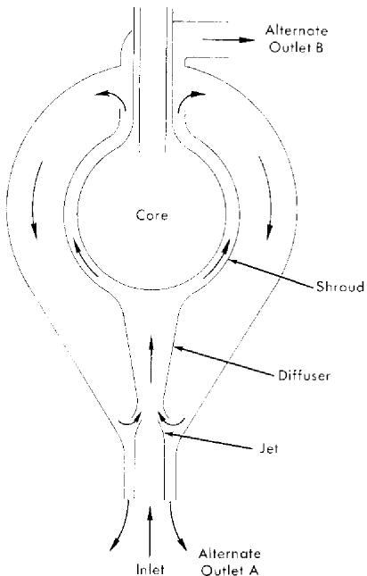  
FIG. 8-1. Conceptual design of two-region reactor with slurry blanket. Arrows indicate directions of slurry flow.

# 8-2. PRIMARY-SYSTEM COMPONENTS

8-2.1 Core and blanket vessel designs. Core hydrodynamics. Flow tests have been conducted on a variety of spherical vessels simulating solution-reactor cores which have been selected to meet the following criteria:

(1) Heat removal from all points must be rapid and orderly to prevent hot spots from being generated.   
(2) Radiolytic gas formed from water decomposition cannot be permitted to collect in the reactor.   
(3) The pressure drop should be low.   
(4) The core tank should be maintained at a low temperature to prevent excessive corrosion rates.

Three geometries which satisfy the above requirements have been investigated. The first, straight-through [1], involves diffusing the inlet flow through screens or perforated plates [2] to achieve slug flow through the sphere. The second, mixed [3], involves generating a great deal of turbulence and mixing with the inlet jet so that the reactor is very nearly isothermal. The third, rotational [4], is somewhat between the first two; the fuel is introduced tangentially to the sphere and withdrawn at the center of a vortex, at the north and south poles.

In the straight-through core, used in HRE-2, the flow enters upward through a conical diffuser containing perforated plates. The number of perforated plates is determined by the ratio of sphere diameter to inlet-pipe diameter. In general, this ratio will be smaller for a larger reactor, resulting in fewer plates and better performance. The velocity distribution leaving the plates can be made to conform approximately to the flux distribution of the reactor. As a result, the isotherms in the core are horizontal, and the temperature rises smoothly toward the outlet at the top. The gas bubbles rise upward at a velocity greater than that of the liquid and are removed with the liquid. The overall pressure drop is about 1.5 to 2.0 inlet-velocity heads. The core tank is cooled by natural convection.

In the mixed core, illustrated in Fig. 8-1, the inlet and outlet are concentric at the top of the sphere. The inlet jet coincides with the vertical axis of the sphere and is broken up when it hits the bottom surface. Except for the cold central jet, the bulk of the core is at outlet temperature. The velocity of eddies is great enough so that the gas bubbles travel along with the liquid. The pressure drop is about 1.0 to 1.5 inlet-velocity heads. The core-tank surface is maintained at a temperature very close to that of the core fluid by the high turbulence.

In the rotational core, used in HRE-1, the flow pattern tends to produce isotherms which are vertical cylinders. These are perturbed by boundary-layer mixing at the sphere walls. The temperature generally increases in the direction of the central axis, which is at outlet temperature. The gas bubbles are centrifuged rapidly into a gas void which forms at the center axis and from which gas can be removed. The gas void is quite stable in cores up to about 2 ft in diameter, but in larger spheres the pumping requirements to stabilize the void are excessive [5]. The pressure drop through a rotational core is a function of the particular system, but is usually above 5 inlet-velocity heads.

Slurry blanket hydrodynamics. The suspension contained in the blanket vessel must be sufficiently well dispersed to assure that a maximum of the core leakage neutrons are absorbed within the blanket, the neutron reflection from the blanket to the core remains steady, and the transport of fluids through regions of high heat generation are sufficient for heat removal. The primary flow is taken through a jet eductor where the flow rate is amplified and forced through a spherical annulus containing the high heat generation region surrounding the core. It appears that amplification gains of 2.5 are attainable. The outlet may be located either (1) concentric with the bottom inlet or (2) at the top. Configuration (1) has the advantage of high circulation rates in the region outside the shroud. Configuration (2) has the advantage of better natural circulation in the event of a circulating-pump stoppage.

Also under consideration is a swirling flow pattern similar to the rotational flow which was described under cores.

Reactor pressure vessels. Three principal types of stresses should be considered in designing the pressure vessels of one- or two-region reactors:

(1) Stresses resulting from the confined pressure.   
(2) Thermal stresses resulting from heat production, and consequent temperature gradients in the metal.   
(3) Stresses introduced by cladding if used. Because of the uncertain residual stresses introduced during fabrication, this factor has not been taken into account in the past.

The construction material can be chosen on the basis of corrosion resistance and structural and thermal properties with little regard for nuclear properties. Carbon steel with a stainless-steel cladding was selected for use in the HRE-2.

Usually the pressure-vessel wall is thin in comparison with the inner radius of the vessel; the "thin-wall" formulas for calculating pressure stresses are then applicable [6]. For precise calculations the general equations [7] for vessels with any wall thickness should be used. Thermal stresses are superposed on the pressure stresses and can be approximated by conventional formulas for hollow cylinders and spheres [8].

Solution of the stress equations depends upon a knowledge of the radial temperature distribution, which, in turn, depends upon the manner in which heat is generated in the metal wall and upon the temperatures at the inner and outer surfaces. Iheat is produced in the metal by the following processes:

(1) The absorption of gamma rays arising from neutron capture, from fission products, and from fission within the vessel.   
(2) The recoil energy from the scattering of fast neutrons in the shell.   
(3) The absorption of gamma rays produced by the inelastic scattering of fast neutrons in the shell.   
(4) The absorption of capture gamma rays produced as neutrons are captured in the shell.

Although it may be possible to obtain the heat-production function for the desired cylindrical or spherical geometry, it is simpler and usually sufficiently accurate to obtain the leakage fluxes of gamma rays and neutrons into the pressure shell for the desired geometry, and then to assume that the heat-production function in the pressure vessel is the same as it would be in a plate of the same material. Methods for obtaining the heat-production function have been summarized by Alexander [9]. The function can usually be described by the sum and difference of several exponentials. For some purposes a single exponential can be used as a satisfactory approximation. The accuracy of the various methods has yet to be determined. To arrive at a conservative design, reasonable methods indicating the greatest amount of heat generation should be used. The surface temperatures of the pressure vessel are estimated from a knowledge of the tem

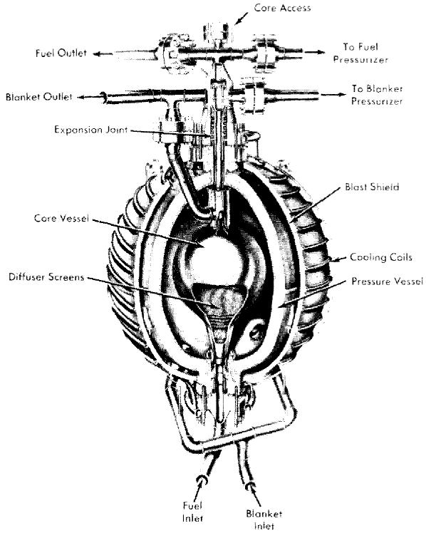  
FIG. 8-2. HRE-2 reactor vessel assembly, fabricated by Newport News Shipbuilding & Dry Dock Company.

peratures of the adjacent fluids and the heat-transfer relationships between metal and fluids.

Chapman [10] has shown in an analysis of thermal stresses in spherical reactor vessels that minimum thermal stresses are obtained when the inner and outer vessel wall temperatures are approximately equal. Pressure stresses decrease and thermal stresses increase as shell thickness is increased; a minimum combined stress occurs at an optimum wall thickness. Often this stress is greater than the permissible design stress; thermal shielding must then be provided between the reactor and pressure vessel to reduce heat production and obtain a reasonable stress.

HRE-2 core and pressure vessel. The HRE-2 reactor-vessel assembly presented a number of special design and fabrication problems [11]. Since it was desired to minimize neutron losses, Zircaloy-2 was selected as material for the core tank, which is 32 in. in diameter and 5/16 in. thick. The main pressure vessel, 60 in. in inside diameter and 4.4 in. thick, was constructed of carbon steel with a cladding of type-347 stainless steel. Because of uncertainties in the long-term irradiation damage of carbon

steel, the pressure vessel was surrounded by a stainless-steel, water-cooled blast shield which will stop any possible missiles from the reactor vessel. Thermal radiation from the pressure vessel to the blast shield permits the pressure vessel to operate at close to an optimum temperature distribution from the thermal-stress standpoint.

A special mechanical joint was developed to join the Zircaloy core tank to the stainless-steel piping system. A bellows expansion joint was used to permit differential thermal expansion between core and pressure vessel. Welding procedures were developed for joining Zircaloy and for making the final girth weld in the clad pressure vessel entirely from the outside.

The HRE-2 core and pressure vessel are illustrated in Fig. 8-2.

8-2.2 Circulating pumps.* Pumps are required in aqueous homogeneous reactors to circulate solutions and slurries at 250 to $300^{\circ}\mathrm{C}$ and 2000 psi pressure, at heads of up to 100 psi. The two main considerations for these pumps are that they must be absolutely leak free and that they must have a long maintenance-free life.

At this time the only pumps considered capable of meeting these requirements are of the hermectically sealed canned-motor centrifugal type. They consist of a centrifugal pump of standard hydraulic design and an electric drive motor, built in an integral unit.

To illustrate, the 400A pump used to circulate fuel solution in the HRE-2 is shown in Fig. 8-3. The HRE-2 blanket pump is identical except for having a lower-output impeller. The hydraulic end of the pump is separated from the motor by the thermal barrier, which is used to restrict the transfer of heat and fluid from the scroll into the motor section of the pump. This minimizes thermal and radiation damage to bearings and motor insulation. The thermal barrier is built with sealed air spaces which aid in thermal insulation. A labyrinth seal around the shaft is used to reduce the fuel mixing into the motor. Water-lubricated hydrodynamic journal bearings and pivoted-shoe-type thrust bearings are used to take the radial and thrust loads, respectively. In the HRE-2, contact of the motor and bearings with radioactive solutions is minimized by feeding distilled water continuously into the motor.

The electric drive is a three-phase squirrel-cage induction motor with the stator and rotor sealed in thin stainless-steel cans which prevent the process fluid from coming in contact with the stator or rotor windings. The cans are supported by the laminations to contain the system pressure of 2000 psi. The motor is enclosed in a heavy pressure vessel which is designed to hold the full system pressure in the event of a can failure. The motor and bearings are cooled by the use of a small auxiliary impeller,

mounted on the rotor shaft, which recirculates motor fluid through a heat exchanger.

In the IIRE-2, it is usually desirable to run the fuel pump at reduced capacity during startups in order to limit reactivity changes. This is accomplished by starting the 400A pump in reverse, which gives about one-half of the normal flow. The ability to do this depends on the design of the impeller and the size of the pump. In larger pumps, it is considered better to use a two-speed motor to obtain the reduced-capacity operation. The two-speed motor has an additional advantage in permitting the system to be heated to operating density at reduced speed, thereby reducing the required motor size and power consumption.

The service life of the 400A pump, based on out-of-pile tests with solutions, is expected to be two years or more [12]. The slurry pumps currently being operated have not proved as reliable as the solution pumps, but runs of up to $3800\mathrm{hr}$ have been obtained [13]. The hydraulic parts of the pump are frequently severely eroded, but there has not been a significant change in the pump output or power requirements during the runs. The pumps will generally continue to run unless a bearing seizes or breaks down. It is expected that improvements in bearings and hydraulic design will make slurry pumps as reliable as solution pumps.

The important problems in solution and slurry circulating pumps are discussed below.

Stators. Pumps have been built with oil-filled stators to improve heat removal from the windings and to balance the pressure across the stator can. These pumps are undesirable for long-term reactor service because the oil is subject to radiation damage and requires frequent replacement. Pressure-balanced stator cans have also proved to be unsatisfactory because of the difficulty in maintaining the proper balance. In pumps of up to $400\mathrm{-gpm}$ capacity, the problem of cooling the stator windings does not seem too severe, and the dry-stator design with the can capable ofwithstanding the full 2000-psi system pressure seems to be the best and most commonly used type. In larger pumps, manufacturers are tending to use a compound of silicone resin and inert filler material to improve heat removal from the windings.

Most manufacturers insulate their motors with class H insulation consisting of Fiberglas cloth impregnated with a silicone varnish binder. This insulation is probably good for several years' operation in circulating-fuel reactors, depending on the radiation level of the pump, but over a period of time the insulation can be expected to fail because of the decrease in resistivity and dielectric strength. Hydrogen, released from the silicone varnish during irradiation, may also build up enough pressure to rupture the stator can when the system pressure is reduced. The HRE-2 is expected to yield much information on motor life. Estimates made for the fuel

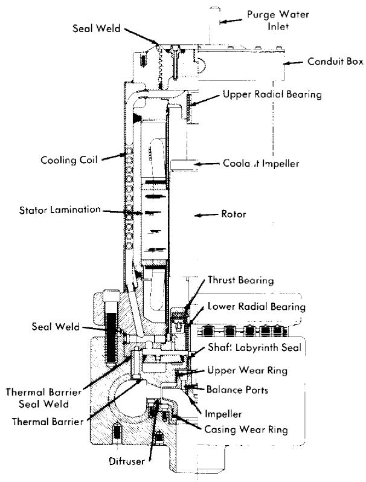  
FIG. 8-3. The Westinghouse 400A pump used to circulate fuel solution through the HRE-2.

circulating pump of the HRE-2 indicated that the insulation will be subject to failure in approximately five years, assuming that the outside of the motor is protected by a 1-in. lead shield and the inside of the motor is kept purged free of fuel solution [14]. Tests are being initiated at the present time to determine the life expectancy more closely by irradiating stators in gamma and gamma-neutron fields.

The ultimate solution to the insulation problem is probably the use of ceramic insulation that would be completely radiation resistant. However, considerably more development work will be required before this type of insulation becomes usable. There are data available which indicate that silicone-resin-bonded reconstituted mica (Isomica, trademark name of Mica Insulator Co.) may have better radiation resistance than Fiberglas and silicone varnish. If this material proves to be better from a radiation-damage standpoint, it can probably be incorporated into a pump at a much earlier date than the ceramic insulation.

**Bearings.** The standard Stellarite-vs-Graphitar hydrodynamic bearings have indicated little or no wear in pressurized-water systems. Presumably their performance in aqueous homogeneous systems would be comparable if the motor can be kept in contact with the water only. In practice, bearing life of $13,000+$ hr has been achieved in actual contact with uranyl sulfate solutions; however, continuous wear was observed, indicating that eventually the bearing surfaces will fail.

Laboratory tests in water and tests on small pumps in solutions have shown that aluminum oxide bearings and journals have superior wear resistance as compared with the Stellar- vs-Graphitar combination. If service tests conducted on larger pumps are successful, the aluminum oxide bearings will be adopted as standard in solution pumps.

There is some doubt whether the hydrodynamic-type bearings currently being used will be suitable for long-life slurry pumps. There have been very few runs completed in which the bearings were not badly worn. However, preliminary tests of small pumps with aluminum oxide bearings have shown promise. It is planned, also, to evaluate the performance of hydrostatic (pressurized-fluid) bearings in dilute slurries.

In some cases, excessive wear has occurred in the thrust-bearing leveling linkages of the 400A-type solution and slurry pumps. In this bearing the thrust load is supported by a linkage system which used $1/8-$ and $1/4$ -in-diameter pins to transfer the load from link to link. It is uncertain whether this wear at the contact point is caused by high stresses or by fretting corrosion. A thrust bearing with line-contact linkages and alternate materials at the contact points will be evaluated in an attempt to correct this problem.

Hydraulic parts. In uranyl sulfate pumps, excellent wear resistance is obtained by using titanium for impellers, wear rings, and diffusers. Stainless-steel hydraulic parts have also been used successfully in many cases [15].

The general design of slurry pumps is similar to that used for uranyl sulfate pumps. The properties of the slurry are such that only a power correction for the higher specific gravity is necessary in the hydraulic design of the impeller. The coefficient of rigidity (viscosity) is generally not high enough to require a correction to the head-capacity curve. A most severe problem in slurry pumps is the combination of corrosive and erosive attack on the hydraulic parts.

The primary difference in the design of a slurry impeller is the use of radial balancing ribs on the top impeller shroud in place of the top wear ring on a conventional pump. In a conventional pump (Fig. 8-3) there are small holes which vent the area within the top wear ring to the pump suction pressure. This is done to balance some of the hydraulic thrust and therefore reduce the load on the thrust bearing. In certain cases these balancing holes have become plugged with slurry [16], which upsets the

thrust balance and causes high thrust-bearing wear. The balancing vanes eliminate one set of wear rings, which are subject to high attack rates, and also tend to centrifuge the slurry particles to the outside, which aids in preventing the slurry from entering the motor through the labyrinth seal.

On the pumps currently in use, the damage to hydraulic parts is usually limited to the wear rings, the tips of the impeller vanes, and to the volute "cut water," which is the point adjacent to the pump discharge where the volute curve starts. The attack at these points can be reduced by proper material choice and by using proper design of the flow passages. The best materials which have been found for the hydraulic parts are Zircaloy-2 and titanium, with Zircaloy being better in laboratory corrosion tests. There are no test results for pumps using Zircaloy parts at this time, but vacuumcast parts have been obtained and placed into service. Other materials are to be given laboratory corrosion tests, and promising materials will be service tested.

The wear rings of the present pumps are being redesigned to provide smooth throttling surfaces rather than the serrated type presently in use. The smooth surfaces should reduce the turbulence and corrosion considerably, with a very small increase in flow through the rings. One service test has shown that the damage to this type of wear ring is decreased considerably [17]. A test is being planned to determine whether radial vanes on the lower impeller shroud similar to the balancing vanes discussed earlier will reduce the attack rate on the lower wear rings. The radial vanes will reduce the pressure drop across the wear rings and may reduce the concentration of slurry flowing through them by centrifugal action.

It is uncertain whether a volute type scroll or a diffuser type scroll is preferable. The volute type scroll has the advantage of having only the cut-water subject to high attack, but has the disadvantage of having a pressure drop across this point, resulting in perpendicular flow across the cut-water. The diffuser has numerous points which could be eroded, but the flow around these points should be smoother than that at the cut-water and may not cause excessive damage.

The surface finish on the hydraulic parts is also very critical and the surface variation should be held to 65 microinches or less. This is especially evident at areas where the impeller surfaces have been ground during the dynamic-balancing operation. If these areas are not properly finished, the scratches will be severely attacked.

Thermal barriers. In pressurized-water pumps, the primary function of the thermal barrier is to retard the transmission of heat into the motor. In solution and slurry pumps, another function, that of preventing fluid mixing from pump to motor, is of critical importance.

This mixing can occur at two places, at the shaft seal and around the

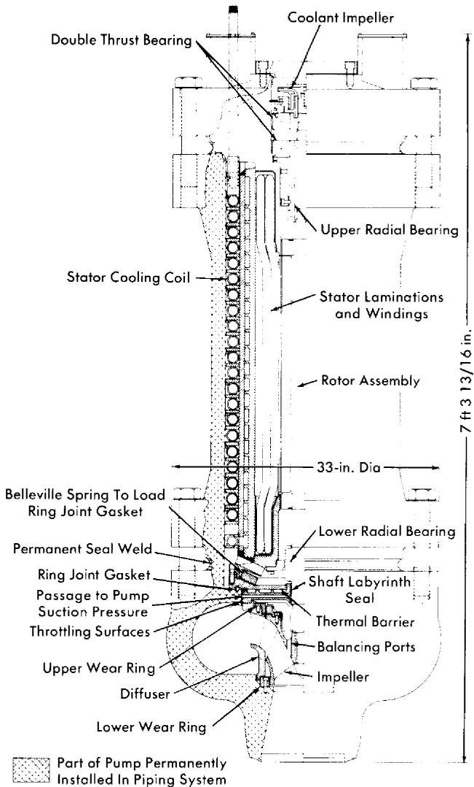  
FIG. 8-4. 6000-gpm top-maintenance pump for circulating solutions through a 50-Mw reactor, being built by Reliance Electric Company.

outer edge of the barrier. In the 400A pump, the mixing rate at the shaft labyrinth seal has been reduced to $3\mathrm{cc / hr}$ by redesign of the seal and by the use of a 5-gph purge flow through the motor [18]. Further improvements in shaft seals are being attempted.

The seal around the outer edge of the 400A thermal barrier was originally a mechanical joint, with the head developed by the pump across it. The purge system did not develop enough pressure to prevent solution leakage

through this joint into the motor. Any small leak was rapidly enlarged by corrosion until excessive motor temperatures were reached. The problem was solved by seal-welding the joint. However, it would have been preferable if the joint had originally been designed for welding.

Pump closures. Conventional canned-rotor pumps, such as those used in the HRE-2, have a large seal-welded closure at the bottom of the stator. Dismantling this closure for pump maintenance is impractical at the present time because of the extremely high level of radiation at the closure.

From a maintenance standpoint, a "top-maintenance" pump appears to be advantageous. Direct-maintenance practices can be used to bolt and unbolt the main flange. The pump casing is a permanent part of the piping system. A top-maintenance pump being developed for the HRE-3 is illustrated in Fig. 8-4.

In a top-maintenance pump, a mechanical thermal-barrier joint cannot be avoided, since the barrier must be removable from the casing. The joint must be loaded using the top closure bolts, and the entire mechanical system must have some flexibility to compensate for differential thermal expansion of the long motor. A venting system, shown in Fig. 8-4, is used to eliminate the pressure drop across the thermal-barrier gasket so that there will not be significant leakage even if the joint is not perfectly tight. In this case, the purge flow should be effective in preventing leakage of process fluid into the motor.

8-2.3 Steam generators. The performance of steam generators required for homogeneous reactor service, measured in terms of undetectable leak-tightness during long-term operation, considerably exceeds that of similar units in conventional plants. Unfortunately, no method has yet been developed of remotely locating and repairing leaks in a radioactive heat exchanger without removing the entire unit. Failure of the steam generator in a homogeneous power reactor, therefore, would lead to excessive shutdown time and must be avoided if at all possible.

HRE-2 steam generators. The heat exchangers used in the HRE-2, shown in Fig. 8-5, place reliance on the careful welding and inspecting of tube-to-tube-sheet joints and the extensive thermal-cycle tests which were carried out prior to actual operation in the reactor. In addition, thermal gradients which would lead to excessive stresses during reactor startup and shutdown are held within specified limits. Although the units fabricated for HRE-2 have been tested with the most advanced inspection methods available for both materials and workmanship and have met initial leaktightness specifications, only through operation of the reactor will it be possible to judge the adequacy of these precautions.

The characteristics of the HRE-2 steam generators, which were manu

TABLE 8-1   
DESIGN DATA FOR THE HRE-2 HEAT EXCHANGER   

<table><tr><td></td><td>Shell side</td><td>Tube side</td></tr><tr><td>Circulation rate, lb/hr</td><td>1.62 × 104</td><td>1.79 × 105</td></tr><tr><td>Temperature in, °F</td><td>180</td><td>572</td></tr><tr><td>Temperature out, °F</td><td>471</td><td>494.5</td></tr><tr><td>Operating pressure, psia</td><td>520</td><td>2000</td></tr><tr><td>Velocity, fps</td><td>67 (in outlet pipe)</td><td>11.3</td></tr><tr><td>Pressure drop, psi</td><td></td><td>18.5</td></tr><tr><td>Heat exchanged, kw</td><td>5000 (1.71 × 107 Btu/hr)</td><td></td></tr><tr><td>Fouled U_F, Btu/(hr)(ft2)(°F)</td><td>670 (based on U_F = 3/4 U_C)</td><td></td></tr><tr><td>Heat-transfer area, ft2</td><td>480</td><td></td></tr><tr><td>Tube outside diameter, in.</td><td>0.375</td><td></td></tr></table>

factured by the Foster Wheeler Company, are summarized in Table 8-1. In fabricating these steam generators, all-welded construction was used on components that were to be exposed to the process solution. Interpass leakage is controlled by use of a gold gasket. Considerable attention was given to obtaining the highest quality tubing, which was inspected by ultrasonic and magnetic flaw detectors capable of detecting imperfections as small as 0.002 in. Following the bending and annealing operations, each tube was inspected for surface defects with a liquid penetrant and subjected to a 4000-psi hydrostatic test. After passing all these tests, the tubes were rolled into the tube sheet and welded by an inert-gas-shielded tungsten-arc process. Quality-control welds were made periodically during the tube-joint welding and were subsequently examined by radiographic and metallographic methods.

After fabrication, the units were subjected to 50 primary-side thermal cycles covering temperature changes more severe than those likely to be encountered in subsequent operation. The units were then helium-leak-tested at atmospheric pressure with mass-spectrometer equipment capable of detecting leakage lower than 0.1 cc of helium at STP per day. Leaks were repaired and the thermal-cycle test and leak test were repeated until no leakage was detectable.

The HRE-2 steam generators were thermal cycled with diphenyl as the heating medium. After the test, extensive carbon deposits were found in the tubes. After considerable difficulty, the deposits were removed by high-temperature flushing with oxygenated water and uranyl sulfate solution. Future thermal-cycle tests will be made with steam as the heating medium.

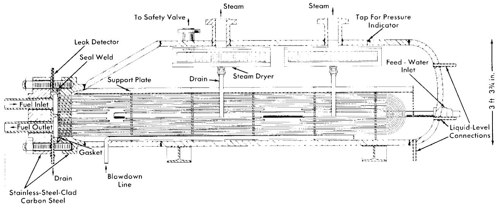  
13 ft $6\frac{1}{4}$ in.   
FIG. 8-5. The HRE-2 main heat exchanger, fabricated by Foster-Wheeler Corporation.

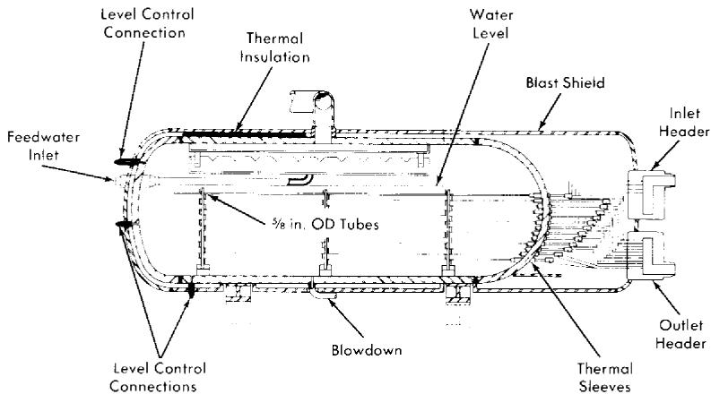  
FIG. 8-6. The HRE-2 spare heat exchanger, fabricated by Babcock & Wilcox Company.

The tube-to-tube-sheet joint is the most damage-sensitive portion of the steam generator. The primary side is subject to corrosive fuels, and the secondary side is subject to crevice corrosion and stress-corrosion cracking. Primary-side corrosion is controlled satisfactorily by maintaining velocities below 15 fps and minimizing high-velocity turbulence in the headers. Secondary-side corrosion is limited by strict control of boiler-water chemistry, particularly chloride content. One method which has been proposed for eliminating the stress-corrosion problem is the use of composite tubing such as stainless steel-Inconel, where the two materials are exposed only to fuel solution and boiler water, respectively.

Another problem in the operation of steam generators in a radioactive environment is the generation of radiolytic oxygen in the boiler water. This oxygen is stripped very rapidly by the steam, which contains about $2\mathrm{ppm}$ of oxygen. Hydrogen is released at the same time. The corrosivity of this mixture is not yet known, but it can be controlled by the use of inhibitors and by proper selection of materials for use in thin metal sections where pitting attack is undesirable.

HRE-2 spare steam generator. The steam generator shown in Fig. 8-6 was constructed as a possible replacement in case of failure of an HRE-2 steam generator. Although the over-all geometry of this unit, fabricated by the Babcock & Wilcox Company, conforms to the space requirements of the present steam generators, the design was changed to minimize the possibility of stress-corrosion cracking of the tubes on the shell side by eliminating crevices in contact with boiler water.

The steam generator contains eighty-eight 5/8-in.-OD, 0.095-in.-thick, type-347 stainless-steel tubes. The tubes have multiple U-bends to provide

the required length for heat-transfer surface. Each tube is brought out through the shell of the exchanger, and then all the tubes are collected in the inlet and outlet headers. Thermal sleeves are utilized at every connection of the stainless tubes to the carbon-steel shell wall. Their function is to prevent high thermal stresses in the tubes by distributing the temperature gradient between shell and tubes along the length of the thermal sleeves. The normal crevice between tubes and tube sheet, which is the site of possible corrosion failures, is eliminated. Each sleeve consists of an austenitic type-347 stainless-steel section which is welded to the tube on one end and to a carbon-steel section of the sleeve on the other. The carbon-steel sleeve is then welded to the carbon-steel shell to seal the secondary side. Only austenitic type-347 stainless steel is exposed to fuel solution.

Slurry steam generators. The mechanical design of heat exchangers for slurry service should not differ greatly from that for solution service. However, the design must assure that

(1) The pressure drop across all tubes is sufficient to maintain the slurry in suspension.   
(2) The headers have no stagnant regions where sediment can accumulate.   
(3) The tube-sheet joints are sufficiently smooth to prevent fretting corrosion by the slurry.   
(4) The headers and tubes drain freely.

From the heat-transfer relationships for Bingham plastic slurries, described in Article 4-4.5, it is evident that for optimum design of steam generators the flow of slurry through the tubes should be turbulent.

Large heat exchangers. The Foster Wheeler Corporation has prepared preliminary designs of 50- and 300-Mw heat exchangers [19]. Both single-drum integral units and units with separate steam drums were considered in the 50-Mw size; only two-drum units were considered in the 300-Mw size. Two-drum units, in general, give operational characteristics superior to those of integral units, but require more shielded volume and reactor space for installation. The two-drum unit has more stable steam generation at power and provides greater assurance of high steam quality. The major problems introduced by increasing size are higher tube-sheet thermal stress and increased difficulty in the manufacture of large forcings.

The 50-Mw design employs approximately 2200 tubes $3/8$ in. in diameter $(5960\mathrm{ft}^2$ of heat-transfer area); the 300-Mw design uses approximately 11,400 tubes of the same size $(32,000\mathrm{ft}^2)$ . Most of the designs have stainless steel clad on steel for tube sheets and heads, and steel for steam shells.

8-2.4 Pressurizers. A pressurizer is required in an aqueous fuel system to provide (1) sufficiently high pressures to reduce bubble formation and

cavitation in the circulating stream, (2) reactor safety by limiting the pressure rise accompanying a sudden increase in reactivity, and (3) a surge chamber for relief of volume changes.

Three general methods of pressurizing have been used in test loops and experimental reactors:

(1) Steam pressurization, such as is used in the HRE-2, where liquid in the pressurizer is maintained at a higher temperature, hence a higher vapor pressure, than that of the circulating system.   
(2) Gas pressurization, where liquid in the pressurizer is at the same temperature as the circulating system but excess gas is added to the vapor above it; if the pressurizing gas is free to diffuse into the circulating liquid, it reduces the solubility of radiolytic deuterium and enhances bubble formation.   
(3) Mechanical pressurization, where pressure is maintained with a pump and relief valve; this system is most satisfactory except that it is difficult to relieve sudden large volume changes following a reactivity change. This system therefore has been limited to nonnuclear test loops.

Solution pressurizers. Solution steam pressurizers must satisfy rather strict chemical criteria. Stainless-steel surfaces in contact with solutions must not exceed temperatures at which heavy-liquid-phase solutions form, giving rise to rapid corrosion [20]. Undesirable reduction of uranium must be avoided by the presence of some dissolved oxygen. Undesirable hydrolysis of uranyl ion must be avoided by control of the chemistry and temperature in pressurizer solutions [21]. The vapor-phase concentration of deuterium should be maintained below the explosive limit. One solution to these problems, used in the HRE-2, is the generation of steam from distilled water rather than from fuel solution. Another solution is the boiling of solutions in corrosion-resistant titanium. A third solution is the use of fission-product heating rather than external heating to reach the desired temperature.

Gas pressurizers using $\mathrm{O_2}$ gas are attractive from the solution-stability standpoint. Care must be exercised to prevent excessive amounts of dissolved oxygen appearing as bubbles in the circulating reactor stream. This can be accomplished either by continuous letdown of fuel solution or by use of a mixed steam-gas pressurizer where gas supplies only a portion of the desired overpressure.

Heat may be supplied to pressurizers by several methods. Electrical heating of pipes, used in the HRE-2, is very convenient but makes control of surface temperature difficult. Heating media such as steam, Dowtherm, liquid metals, etc., simplify the temperature-control problem but introduce costly auxiliaries. Fission-product heating is simple but rather difficult to regulate. Since the heating problem is so complex, selection of an optimum system for a specific application is quite difficult.

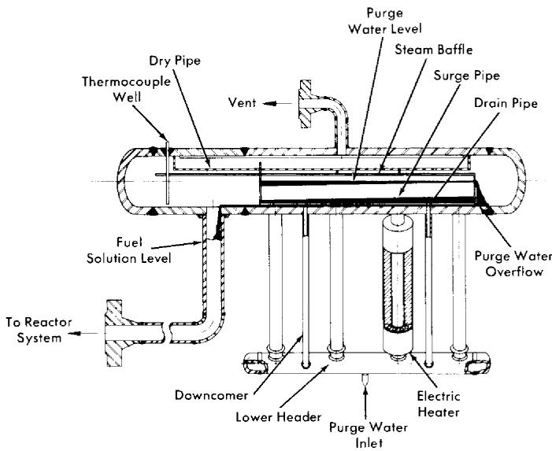  
FIG. 8-7. HRE-2 pressurizer.

Deuterium concentration may be controlled by designing the pressurizer in a manner which makes buildup of gas improbable, by contacting the vapor with solid or solution catalyst, or by venting.

HRE-2 pressurizer. Several design configurations were studied for steam-pressurizing the HRE-2 core system [22]. Both an integral type unit (Fig. 8-7) incorporating a steam generator and fuel surge volume within the same vessel, and a two-unit system utilizing separate steam-generator and surge-volume vessels were considered. The basis of both systems was the vaporization of a stream of "clean" purge water, pumped from the reactor low-pressure system, to obtain the required steam over-pressure.

The integral unit was chosen because of its simpler design and its ability to maintain a very low dissolved-solids concentration in the boiling water. Approximately $60\%$ of the purge water overflows and $40\%$ is vaporized.

In determining the internal configuration of the unit, it was necessary to establish a second basic design criterion. Owing to the nature of the system selected, continuous operation of the purge pump is essential to maintaining steam overpressure. Since this type of pump may fail, it was decided that sufficient water should be stored in the steam generator to maintain full operating pressure for at least 1 hr after a purge-pump failure. This appeared to be adequate time for either emergency repair of faults on the oil side of the purge-pump system or arrangement of an orderly shutdown.

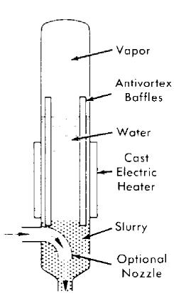  
(a)

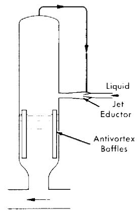  
(b)

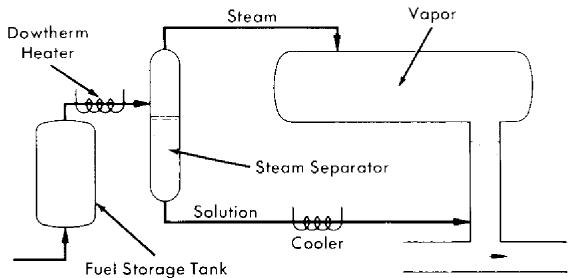  
(c)   
FIG. 8-8. Typical pressurizers. (a) Slurry steam or gas pressurizer. (b) Solution or slurry gas pressurizer. (c) Boiling-solution pressurizer.

A general description of the basic design and system operation follows: The low-pressure condensate, pumped to loop operating pressure by a diaphragm pump, passes through the letdown heat exchanger, where it is preheated to about $280^{\circ}\mathrm{C}$ and then enters the lower header of the steam generator, as shown in Fig. 8-7. Clamshell heaters are attached to four pipes inclined upward at 55 deg. Heat-load calculations indicate that $32\mathrm{kw}$ are required under rapid-startup load conditions; however, at steady state the heat load becomes $12.4\mathrm{kw}$ . Part of the purge water entering the heater legs $(40\mathrm{lb/hr})$ is vaporized to provide the desired steam overpressure. The remainder enters a storage pool in the main pressurizer drum. Natural recirculation of this water occurs through two downcomers.

The storage-pool level is maintained constant by allowing excess purge water to be removed through a series of 1/8-in. orifice holes located in the end plate of the steam generator. A 1/2-in. hole centered 5/8 in. above the orifice holes is provided as an overflow in case the orifice holes become plugged. A method of increasing the surge volume, without changing the

storage pool level, is to insert a pipe from the surge chamber through the storage pool.

A single pipe connects the pressurizer surge chamber to the main core loop. Liquid level in this pipe is maintained at a point about 10 in. below the inside diameter of the pressurizer drum by a liquid-level controller.

The clamshell heaters are carefully machined to fit the heater pipes and strongly clamped to promote contact. There are eight separate Calrod heaters in each clamshell, so that failure of a few heater elements will not affect the pressurizer greatly.

Vapor-phase deuterium is kept under control in that during normal operation it has no way to enter the pressurizer. If a small amount of gas does enter the pressurizer it will be dissolved in purge water overflowing into the reactor system. A large amount of gas would be vented.

Slurry pressurizers. The physical problems of slurry pressurizers are similar to those of solution pressurizers. The chemical problems are fortunately not present. The pressurizer may be designed to promote settling of solids so that pure supernatant water is available as a working fluid. It is necessary, however, that the pressurizer be designed to prevent accumulation of cakes or sludges. This is usually accomplished by flowing all or part of the circulating stream through the bottom of the pressurizer. This must be done carefully in steam pressurizers to prevent mixing of cool circulating fluid with the heated pressurizer fluid above.

Typical pressurizer designs. Several pressurizer designs applicable to test systems or reactors are illustrated in Fig. 8-8.

In the slurry steam or gas pressurizer (a) slurry at circulating temperature sweeps the bottom of the pressurizer tank, preventing the formation of cakes. Two nozzle arrangements are shown. The baffles are used to mini-mimize turbulence and mixing in the system.

In the solution or slurry gas pressurizer (b) a jet is used to contact fuel, which contains a liquid-phase catalyst, with pressurizer vapor. This maintains the vapor at a low $\mathrm{D}_2$ concentration. The high-velocity regions in this system should be constructed of special wear-resistant inserts such as titanium or zirconium.

The boiling-solution pressurizer (c) has a fuel storage tank where solution just out of the reactor is heated by its own fission-product decay and dissolved $\mathrm{D}_2$ recombines nearly quantitatively. Additional heating is supplied, if necessary, by condensing Dowtherm. The mixture of steam and fuel solution is separated; the steam flows into the pressurizer and the fuel is cooled to a chemically acceptable temperature before re-entering the circulating system. The fuel storage tank, Dowtherm heater, steam separator, and solution cooler are made of titanium. High-strength alloy Ti-110-AT is preferred to commercially pure titanium in order to increase the strength of these parts.

8-2.5 Piping and welded joints. The various codes [23] dealing with pressure piping have proved very satisfactory for determining the strength required for reactor piping. Pipes are sized on the basis of experimentally determined maximum velocities for low corrosion and/or erosion rates. The austenitic stainless steels are used for most piping applications.

Because of the fact that the piping system of a homogeneous reactor must be absolutely leaktight throughout its service life, care is exercised in selecting pipe of the highest obtainable quality. The chemical composition and corrosion resistance are checked. Rigid cleanliness is maintained during fabrication to prevent undesirable contaminants.

The design of solution piping systems must eliminate stagnant lines where oxygen depletion may cause solution instability and plugging. Slurry piping systems should be designed to prevent settling, which can cause plugging or make decontamination very difficult.

Piping layouts. In laying out the piping system for an aqueous-fuel homogeneous reactor, sufficient flexibility must be incorporated in the system to absorb thermal expansions without creating excessive stresses in the pipe wall, and to avoid high nozzle reaction loads at the equipment.

Equipment must be located where it will be accessible for maintenance, and the piping adjacent to such equipment must be placed so that it can be disconnected and reassembled remotely. These requirements may result in a piping system of excessive length with resultant high fluid holdup and pressure drop. The final design, therefore, must be a compromise between the various conflicting requirements of flexibility, maintenance, holdup, and pressure loss in the line.

Methods of piping analysis and evaluation as presented by Hanson and Jahsman [24] may be used for analyzing the piping layouts in homogeneous reactor systems. An application of the Kellogg method [25] was used by Lundin [26] to analyze stresses in the HRE-2 system. Specific rules on how to absorb the effects of thermal expansion of a piping system by the provision of a flexible layout are given in the Code for Pressure Piping, ASA B31.1-1942, Sec. 6.

Welded joints. Welded joints are recommended in preference to mechanical joints for reactor piping. Welds are made approximately equal in strength and corrosion resistance to the base metal. Pipe and fittings are designed to utilize full-penetration butt welds throughout the piping system. Welds that are to contact process fluids are inspected thoroughly to ensure that no crevices are present and that penetration is complete. Such defects could result in crevice corrosion leading to leaks.

The first $1/8$ in. on the process side is deposited by use of bare-wire filler metal and inert tungsten-arc welding techniques. The ferrite content of the deposit is controlled to minimize the possibility of cracking. This deposit is inspected visually and with penetrant. If the weld thus far contains

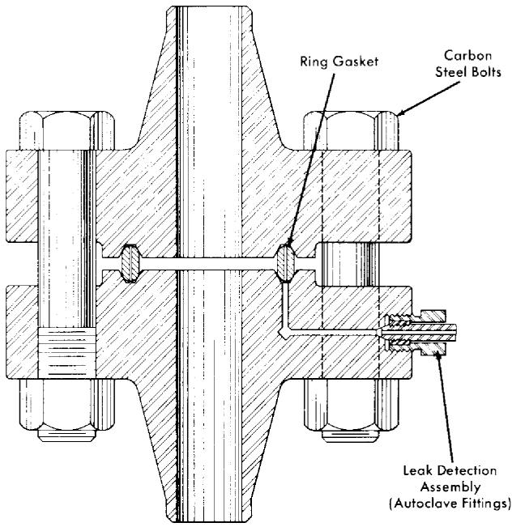  
FIG. 8-9. HRE-2 ring-joint flange, showing leak-detector connection.

no visible defects, it is radiographed to ensure freedom from all defects. The balance of the weld is then deposited from either bare or coated wire. The completed weld is inspected again with dye penetrant and radiography. A small number of inclusions or porosity are permitted in the final layers which contact air.

Although welding techniques for clean piping are very satisfactory, remote-welding procedures for repair of contaminated reactor systems are only in the development stage. It is desirable to develop methods for remote cutting, positioning, welding, and inspection of joints, particularly in large pipes. Possession of these techniques would greatly increase the maintainability of circulating-fuel reactors.

8-2.6 Flange closures. Piping flanges. Because a practical machine for remotely rewelding pipe has not yet been developed, equipment which must be removable from the system for replacement or maintenance must be connected to the system with mechanical joints. Several types of mechanical joints applicable to pressure systems have been described in the literature, but most have been eliminated from consideration for homogeneous reactor service because their reliability with respect to leak-tightness following thermal cycling has not been adequately demonstrated.

The ring-joint flange (Fig. 8-9) incorporating American Standard

welding-neck flanges and ring-joint gaskets, as described in ASA Standard B16.20-1956, was used in the HRE-2 and is considered to be the most reliable closure for reactor piping systems to date. Since there are two sealing surfaces in this type of joint, it is ideal for leak-detector purge systems, described below, which prevent even minute leakage of contaminated fluids into the shield.

To enforce proper dimensions for HRE-2 gaskets and grooves, special master rings and grooves were manufactured to measure dimensions to $\pm 0.0001$ in. Although ASA tolerances of $\pm 0.006$ in. on pitch diameter are acceptable, it was convenient to obtain manufacturing tolerances of $\pm 0.001$ in. by using these gages and masters. The application of these tolerances has permitted greater accuracy in fit-up and assures uniform contact between the ring-joint gasket and the grooves of both mating flanges. Soft oval or octagonal type-304 ELC stainless-steel rings are used against the harder type-347 stainless-steel grooves. Typical leakage experienced in a 4-in. 2500-lb flange is $6\times 10^{-5}\mathrm{g}$ of water per day at service conditions.

The bolting of flanged joints presents a serious problem because the bolts, under thermal cycling, loosen up after only a very few cycles, thus threatening the integrity of the joint. Whereas the flange bolts of a conventional pressure piping system may be retightened after a few cycles, this becomes impractical in a homogeneous reactor system after the reactor has gone critical. In the HRE-2 it was found desirable to initially stress the low-alloy steel flange bolts to an average loading of 45,000 psi, as indicated by a torque wrench. After about three thermal cycles this bolt loading fell to an asymptotic value of approximately 30,000 psi, which was found to be adequate to maintain the integrity of the joint indefinitely throughout further operations; no retightening of the bolts was found to be necessary [27]. Some deformation of flange grooves and ring-joint gaskets was found as a result of these high loadings. However, with the use of flanges and rings machined to the close tolerances noted above, there was no leakage even after test joints had been opened and reassembled ten to a hundred times.

Although bolt torque measurements are usually considered very approximate indications of load, special techniques were developed which gave reproducibility to $\pm 10\%$ . Bolts were lubricated with molybdenum sulfide, and nuts were tightened several times against test blocks which approximated the flange spacing. Nut-and-bolt combinations were accepted for use after reproducible compressive stresses were produced in the test blocks for given torques.

Bolts may be loaded more precisely with the use of pin extensometers. In this technique, a pin is spot-welded into one end of a hole drilled axially through the bolt centerline. A depth gage measures quite precisely the

relative strain between the loaded bolt and the unloaded pin. Since both pin and bolt are at the same temperature, thermal effects are compensated automatically. Extensometers are inconvenient for contaminated maintenance, however.

Because mechanical joints may be expected to leak, some provision must be made to supply pressure greater than reactor system pressure to the undersides of the ring-joint grooves. By this means, leaks may be detected by observations of a drop in pressure in the auxiliary system. At the same time inleakage of a nonradioactive fluid to the reactor system in the event of a leak prevents radioactive spills. In the case of the HRE-2, $\mathrm{D}_2\mathrm{O}$ is supplied to the sealed annuli formed in the gasket grooves at a pressure approximately 500 psi greater than that in the reactor system. A hole is drilled through one flange at each pipe joint to the annulus of the ring groove; the ring-joint gasket is also drilled to interconnect the annuli of the two flanges. Heavy-wall, 1/4-in.-OD stainless-steel tubing connects each flange pair with a header and pressurizer in the control area. ORNL experience has indicated that water is more satisfactory as a leak-detector fluid than gas, because its pressure change is a more sensitive leak indication and because its surface tension reduces the magnitude of small leaks.

Vickers-Anderson joints.* From a remote-maintenance point of view, a flange requiring as few bolts as possible is desirable. Adaptation of the Vickers-Anderson type closure appears to be a possible approach to the problem, since it obtains uniform circumferential tightening with only two bolts. In this type of joint, two split clamshell pieces are pressed together with the two bolts. The clamshells bear on conical flange faces which transform the tangential bolt forces into forces parallel with the pipe centerline.

Usually a pressure-seal type of gasket is used with the above type of closure because it is difficult to exert sufficient axial load to seat a ring-joint gasket. Unfortunately, the present leak-detector concept is not applicable to such a gasket. Therefore, to permit use of Vickers-Anderson joints in a reactor, either a new gasket or a different leak-detector concept would have to be developed.

Bi-metallic joints. A two-region reactor may have the problem of obtaining a leaktight low differential pressure mechanical joint between the two regions. In the HRE-2, the regions are separated by a zirconium vessel that must be joined to stainless-steel piping. At this time, welding and brazing techniques for joining the two materials are unsatisfactory. Conventional flanges are not satisfactory because of the large difference in thermal coefficients of expansion for the two materials. A solution to the problem for the HRE-2 was obtained by using a titanium cylindrical

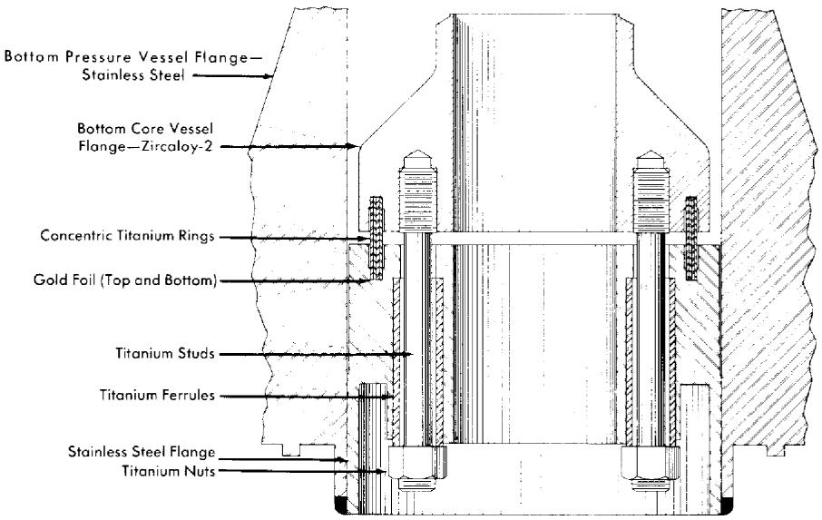  
FIG. 8-10. Zircaloy-2 type-347 stainless steel transition joint for HRE-2 pressure vessel.

sleeve gasket with gold inserts for sealing, shown in Fig. 8-10. The gasket, which consists of four concentric rings, flexes radially to absorb thermal expansion. The gold-capped surfaces of the gasket that make the seal are not permitted to rotate or slide relative to the flanges. The joint is loaded with titanium-alloy bolts.

A ring joint for connecting stainless steel and titanium piping at temperatures up to $650^{\circ}\mathrm{F}$ has also been developed [28] for possible use with titanium letdown heat exchanger in the HRE-2. The different thermal coefficients of expansion of the two materials are bridged by use of a stainless-steel clad carbon-steel flange in the stainless half of the joint. An HRE type of leak detector is placed in the clad flange.

8-2.7 Gas separators. The problem of removing relatively small amounts of gas from a stream of liquid is usually solved by using a settling tank which permits bubbles of gas to rise to a free surface. In applications in which the amount of liquid holdup is critical, this approach has the serious drawback of requiring too much liquid. However, a chamber which imparts centrifugal force to the liquid and "forces" the gas to a free surface before the liquid leaves the chamber offers a possible solution. Of the several types of separators which can be used, one of the most promising is the pipeline or axial gas separator (Fig. 8-11) used in the HRE-2.

The pipeline gas separator consists of stationary vanes or a volute, followed by a section of pipe in which gas is centrifuged into a void which forms at the pipe axis, whence it is removed. The energy of rotation is

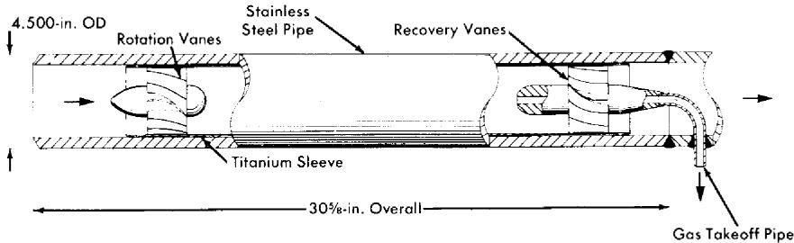  
FIG. 8-11. HRE-2 gas separator.

partially recovered with vanes or a volute at the discharge end of the separator.

A model of the gas separator was built and runs were made to test vanes and volutes of different types for energy conversion and recovery, and for gas-removal efficiency [29]. It was found possible to control the size of the gas void by design of the takeoff nozzle. A separator utilizing vanes was selected for the HRE-2 on the basis of ease of fabrication and because high-efficiency recovery vanes could be designed. Titanium was used as a construction material because of its excellent corrosion resistance under highly turbulent conditions.

The design criteria for vane-type gas separators are discussed in the following paragraphs.

Pressure distribution. The pressure drop of the liquid stream through a well-designed gas separator can be approximated by assuming an efficiency of conversion of pressure to velocity in the rotation system of $90\%$ and a recovery efficiency of $80\%$ . Frictional drop in the vortex will be about three times that which would be predicted if the absolute velocity of the vortex near the wall were in axial flow. The $\Delta p$ across the HRE-2 separator is five inlet-velocity heads or 5 psi.

Length of separator. Length is usually selected to be that necessary to bring a bubble from the periphery into the central void during the time the bubble is moving axially through the separator. For the HRE-2 separator about two pipe diameters are required, but for larger separators the length-to-diameter ratio increases.

Vortex stability. The degree of rotation for stable operation is such that the centrifugal forces on a bubble are greater than the gravitational forces. The dimensionless group expressing the ratio of these forces is $V_{t} / \sqrt{gr}$ , where $V_{t}$ is tangential velocity (ft/sec), $g$ is 32.2 ft/sec², and $r$ is radius (ft). For a stable vortex this ratio must be greater than 1; for best results it should be greater than 4.

Entrainment. The minimum amount of entrainment for a given separator is determined by the void stability and the geometry of the gas takeoff

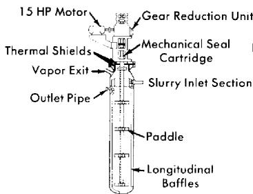  
(a)

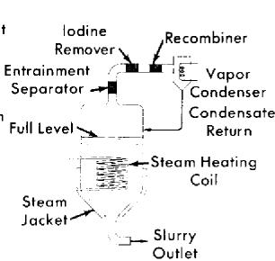  
(b)

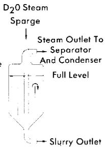  
(c)

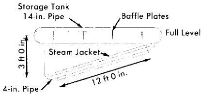  
(d)   
FIG. 8-12. Fuel storage tanks. (a) Mechanically agitated tank (Westinghouse). (b) Boiling tank. (c) Sparged tank. (d) HRE-2 storage tank-evaporator.

nozzle. It is advantageous to have a high stability number. The nozzle should be paraboloid facing the stream and have a small takeoff port. Tests of the HRE-2 separator indicate that entrainment can be limited to $0.1\mathrm{gpm}$ at liquid and gas throughputs of $400\mathrm{gpm}$ and $4\mathrm{gpm}$ , respectively. Tests of a $5000\mathrm{gpm}$ separator with $2\%$ gas gave $1\mathrm{gpm}$ of liquid entrainment, minimum.

Gas-removal efficiency. One hundred percent removal of large gas bubbles has been achieved in test models. Removal of very small bubbles is considerably less efficient for gas separators of normal length.

Although gas has been removed from slurries in an axial separator, the design criteria are not known. The primary difficulty lies in the interaction between small solid particles and bubbles, which may foam. The rates of bubble rise in slurries have not been measured.

# 8-3. SUPPORTING-SYSTEM COMPONENTS

8-3.1 Storage tanks. Solution tank-evaporator. In the HRE-2 the storage tank system has a threefold purpose: (a) it acts as a storage tank for fuel solution during shutdowns and after removal from the high-pressure system during the letdown of gaseous decomposition and fission products, and after emergency dumping; (b) it acts as a generator of diluent steam

to lower the radiolytic $\mathrm{D}_2$ and $\mathrm{O}_2$ concentration to a nonexplosive mixture prior to recombination; and (c) it serves as a purge-c-water generator.

The storage tank-evaporator is designed to furnish the required amount of steam diluent and purge water and also to agitate and mix the solution stored in the tank. The HRE-2 evaporator is shown in Fig. 8-12(d).

To keep the fuel solution well mixed, it was desired that the solution be agitated by recirculation through the tank at a high rate. The recirculation rate is such that the frictional loss in the vaporizing circuit is equal to the hydrostatic driving force on the vaporizing fluid. For the HRE-2 evaporator, a ratio of 176 lb of liquid circulating for every pound of steam generated was obtained [30].

The circulation of liquid through this type of long horizontal tank was found to set up waves which interfered with vapor withdrawal. This interference was minimized by the use of baffle plates, as shown in Fig. 8-12(d).

Slurry storage tanks.* Three approaches are being pursued in the development of slurry drain and storage tanks for reactor use: mechanically agitated tanks, agitation by steam-sparging the tank, and agitation by surface boiling and consequent vapor transport through the tank.

The development of a mechanically agitated tank accepts the problems involved in obtaining the necessary reactor-grade mechanical components of motor, seals, drive shaft, bearings, and agitators. These are related to the circulating-pump problems which have been discussed previously. A conceptual design of a mechanically agitated tank proposed by Westinghouse [31] is shown in Fig. 8-12(a).

Agitation by addition of steam and agitation by addition of heat are essentially similar, since both rely upon the turbulence created by vapor transport to keep solids suspended.

Experimental investigations [32,33] of vapor transport through gas-liquid mixtures have shown that the ratio of vapor to liquid volume may be related to the vapor transport rate in tanks larger than 6 in. in diameter by the relation:

$$
V _ {p} = 5 \left(\frac {f _ {V}}{f _ {s}}\right) ^ {1. 4 1 5}
$$

where $V_{p} =$ superficial vapor velocity in ft/sec, $f_{V} =$ volume fraction of vapor, and $f_{s} =$ volume fraction of slurry. This equation was found applicable for slurries when $V_{p}$ was greater than 0.1 ft/sec and for water when $V_{p}$ was greater than 0.6 ft/sec. The slurries were suspended at these vapor velocities.

Conceptual tank designs based on agitation by vapor transport are shown in Fig. 8-12 (b) and (c).

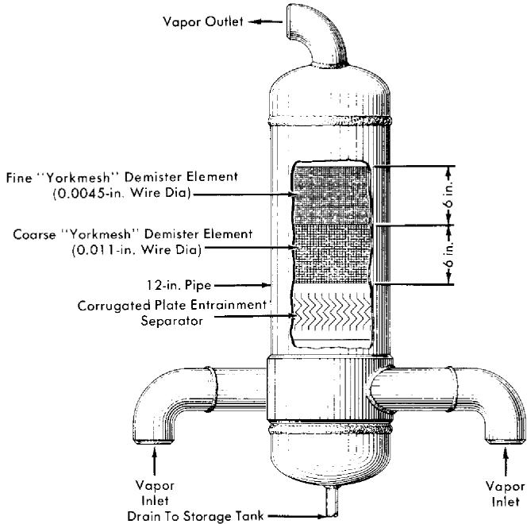  
FIG. 8-13. HRE-2 entrainment separator.

8-3.2 Entrainment separator. In conjunction with the storage tank evaporators, an efficient entrainment separator is required to keep the purity of the condensate at the highest possible level. The entrainment separator must be designed to function well during normal operation and also during the emergency dumping operation of the reactor. From the results of a literature survey and from experimental work, the separator in Fig. 8-13 was designed for the HRE-2 [34].

The HRE-2 design incorporates three modes of entrainment removal: centrifugal separation, corrugated plates, and wire-mesh demister elements. The centrifugal-flow inlet and corrugated plates precede the wire mesh and remove the main portion of the liquid and the larger particles of entrained moisture in the letdown from the gas separator. The wire-mesh demister has a high efficiency for entrainment removal with a very low pressure drop, and is used as the final separator stage. The wire mesh also serves to keep the uranium reaching the recombiner below the maximum desirable limit of $1\mathrm{ppm}$ .

8-3.3 Recombiners. For safety as well as economic reasons, it is desirable to recombine, either at high pressure or at low pressure, the $\mathrm{D}_2$ and $\mathrm{O}_2$ which are formed by the decomposition of water in the fuel solution. In the HRE-2, only low-pressure recombination has been used effectively

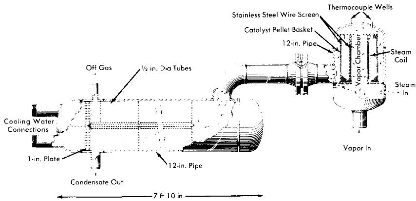  
FIG. 8-14. HRE-2 recombiner and condenser. The recombiner bed is steam heated to keep the surface dry at all times.

for external recombination. The two most promising methods of external recombination are the use of flame and catalytic recombiners.

For catalytic combination of $\mathrm{D}_2$ and $\mathrm{O}_2$ , platinum black has proved to be the most satisfactory catalyst. It has been supported on alumina pellets and on stainless-steel wire mesh. The platinum adheres better to the alumina pellets, but the wire mesh is less liable to mechanical damage.

Design of the catalytic recombiners. The space-velocity method is a very convenient basis for recombiner design. Space velocity is defined as the cubic feet of gas-vapor mixture fed (STP) per cubic foot of catalyst bed per hour. The maximum allowable space velocity for $100\%$ recombination is approximately $4.2 \times 10^{5} \mathrm{hr}^{-1}$ at atmospheric pressure. However, the packed bed should be shaped to ensure against channeling and to get a low pressure drop. The HRE-2 low-pressure recombiner [35] was designed by the space-velocity method with a safety factor of ten. To ensure against channeling and to get as low a pressure drop as possible, an annular cylindrical bed was designed with a 4-in. inside diameter and $9\frac{1}{2}$ -in. outside diameter (Fig. 8-14).

The controlling mechanisms for catalytic reaction rates are outlined by Hougen and Watson [36]. One of the important steps is the mass transfer of the reactant gases to the catalytic surface. Most of the homogeneous-reactor recombination work at ORNL has been done in the range controlled by mass transfer, at temperatures of 250 to $500^{\circ}\mathrm{C}$ .

However, experiments conducted at 50 psi indicated [37] mass-transfer coefficients lower by a factor of three than the expected values based on established mass-transfer correlations. This is explained on the basis of poor bed configuration, channeling, and entrance and exit effects. Tests run at 500 and 1000 psi have shown values about $60\%$ of the theoretical [38]. Standard mass-transfer calculations, with a suitable safety factor,

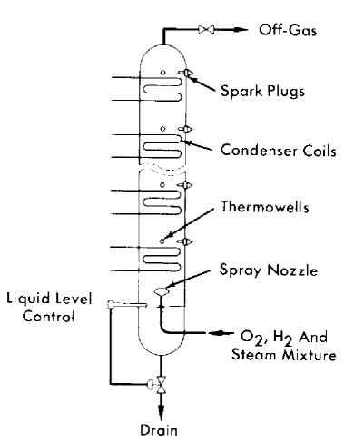  
(a)

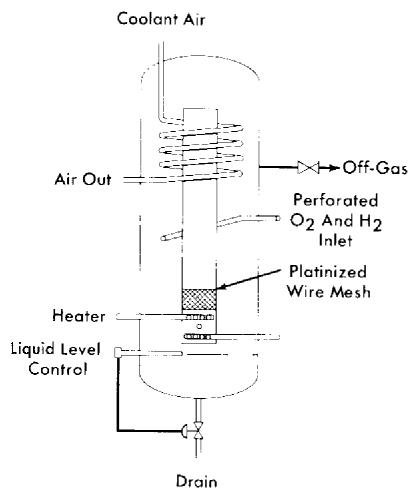  
(b)   
FIG. 8-15. (a) Experimental flame recombiner designed to operate over wide ranges of gas input. (b) Experimental natural-circulation recombiner used to recombine HRE-2 off-gas after shutdown.

are believed to be the most accurate method of designing catalytic recombiners.

Flame recombiners. In a flame recombiner, the $\mathrm{H}_{2}$ (or $\mathrm{D}_{2}$ ) and $\mathrm{O}_{2}$ are actually ignited and burned to form water. The HRE-1 recombiner was of this type. It consisted of a combustion chamber of 10-in. pipe $3\frac{1}{2}$ ft long jacketed by a 12-in. pipe through which cooling water was circulated. The combustible mixture of $\mathrm{H}_{2}$ and $\mathrm{O}_{2}$ was introduced through a many-holed nozzle upon which a spark impinged from two spark plugs located along the periphery of the nozzle. The spark impulse was produced by a magnet, with an ignition transformer on standby. The cooling water removed $70\%$ of the heat of combustion at the design capacity of 15 scfm of $2\mathrm{H}_{2} + \mathrm{O}_{2}$ . The remainder of the heat was removed in the after-condenser. The condensed products of combustion were returned by gravity to the dump tanks, and the excess $\mathrm{O}_{2}$ and fission-product gases were passed into the off-gas system to the cold traps and charcoal adsorbers.

At low flow rates the flame burned too close to the nozzle, resulting in overheating and flashbacks. To prevent flashbacks at low flows, a steamer pot ahead of the flame recombiner added 2 to 3 scfm of steam to the gas stream.

In developing flame recombiners to obtain an explosion-proof automatic load-adjusting unit, the multiple spark-plug model shown schematically in Fig. 8-15(a) was devised [39]. As the steam-gas mixture traveled up past the condenser coils, the mixture eventually lost enough steam to become

combustible. The location at which the mixture became combustible depended on the input concentration of gas.

Natural-circulation recombiner. For some applications it may be desirable to have a catalytic recombiner which will operate satisfactorily without a pump or evaporator to circulate diluent to keep the gases below the explosive limit. The natural-circulation recombiner [40] was developed for such uses (Fig. 8-15b). Electric heaters or steam coils installed below the catalyst start the circulation of the diluent and keep the catalyst dry. A cooling coil located in the annular space around the top of the chimney completes the convective driving circuit.

High-pressure recombination. The use of high-pressure recombination in homogeneous reactors would eliminate the need for continuous letdown of the radiolytic gases and continuous feed-pump operation. To investigate the possibilities of high-pressure recombination, tests [41] were made with a loop built at ORNL.

Recombination rates were quite satisfactory. However, stress-corrosion cracking was a significant problem in operating the stainless-steel loop. Originally, the chloride content of the loop was high (50 ppm) and was thought to be the cause of the stress corrosion. However, after the chloride concentration was lowered to less than 1 ppm, stress corrosion still occurred in the superheated region of the loop. It was established that entrained caustic was a contributing factor.

The cracking problem was solved by substitution of Inconel for austenitic steel; this material would be suitable in a slurry reactor system but not in a uranyl-sulfate system. One of the ferritic stainless steels might be suitable for the latter application.

8-3.4 Condenser. A condenser is required in aqueous low-pressure systems (1) to condense the steam produced in the storage tank-evaporator which is a source of distilled water, (2) to remove the heat of recombination, and (3) to cool the reactor contents during and after an emergency drain. The surface-area requirements are usually determined on the basis of item (3).

All-stainless-steel shell-and-tube condensers of conventional design have been used in this application. The quality of construction from the standpoint of leaktightness should approach that of the main steam generators. However, since the service conditions in the condenser are relatively mild, its life should be indefinite if it passes acceptance tests. The condenser used in the HRE-2 is illustrated in Fig. 8-14.

8-3.5 Cold traps.* Cold traps are usually required on fission-product off-gas lines from homogeneous reactors to conserve $\mathrm{D}_2\mathrm{O}$ and to dry gases

prior to adsorption in charcoal beds. Exit gas temperatures should be between $-10$ and $-30^{\circ}\mathrm{F}$ . Typical evaporating refrigerant temperature in the associated primary refrigeration system should be about $-50$ to $-100^{\circ}\mathrm{F}$ .

The cold traps may be refrigerated either by a direct-expansion system or by circulation of a chilled secondary fluid. The secondary type system offers advantages of the elimination of the expansion valve from the shielded area, and simpler defrosting procedures when using a warm supply of the secondary refrigerant. Use of a primary system eliminates the heat exchanger and circulating pump, and the sacrifice in about $10^{\circ}\mathrm{F}$ temperature difference needed in the heat exchanger, thus affording slightly better coefficients of performance for the refrigeration system.

The HRE-2 cold traps are double-pipe stainless-steel heat exchangers. Flow of refrigerant is countercurrent, with the traps pitched to drain the $\mathrm{D}_2\mathrm{O}$ when defrosting. The insulation is in the form of sealed cans of Santo-Cel $(\mathrm{SiO}_2)$ fitted around the traps, this material having markedly better resistance to radiation damage than the more commonly used low-temperature insulating materials. Cold traps are used in pairs so that icing and defrosting can be conducted simultaneously.

The major heat load on the HRE-2 cold traps was estimated to be the internal heat generation due to radioactivity in the off-gases. For the double-pipe design selected, increasing the heat-transfer surface also increases the mass of metal and the heat generation, so that the size must be optimized. Over-all heat-transfer coefficients in the HRE-2 cold traps, using Amseo as the secondary refrigerant, were calculated to be in the range of 30 to $35\mathrm{Btu / (hr)(ft^2)(}^\circ \mathrm{F})$ . Velocities of the gas stream were kept quite low; less than $5\mathrm{fpm}$ . Design velocities of the chilled coolant through the annulus were from 1 to 2 fps.

8-3.6 Charcoal adsorbers. The oxygen off-gas from a homogeneous reactor contains the krypton and xenon fission products which are let down with the radiolytic gas. It is desired to discharge the oxygen to atmosphere, but the permissible rare-gas discharge is limited by health physics considerations. Charcoal adsorbers are used to hold up krypton and xenon sufficiently to permit their decay to stable or slightly radioactive daughters.

The HRE-2 charcoal beds were designed [42] on the basis of adsorption equilibrium data of krypton and xenon from the literature, with a safety factor of six to compensate for lack of experimental data on the particular conditions. An HRE-2 bed to process $250~\mathrm{cc / min}$ of off-gas oxygen contains $13.3\mathrm{ft}^3$ of 8- to 14-mesh activated coconut charcoal. There are four such beds immersed in a water-cooled underground concrete tank. In the HRE-1, $13.9\mathrm{ft}^3$ of charcoal were used for a design flow rate of $\pm 70~\mathrm{cc / min}$ . The HRE-1 beds operated successfully.

A more complete treatment of charcoal-adsorber design is given by Anderson [43].

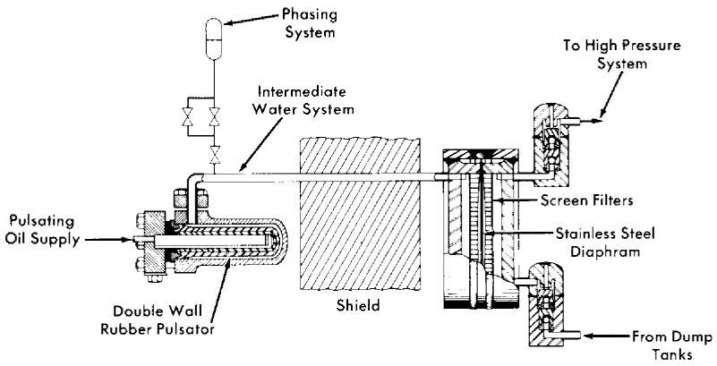  
FIG. 8-16. Sealed diaphragm feed pump with driving pulsator used to pump fluids from low pressure to the high-pressure system in HRE-2.

8-3.7 Feed pumps.* High-pressure low-capacity pumps are required to feed solutions, slurries, and water into aqueous homogeneous reactor systems. In the HRE-2, which operates at 2000 psi, the requirements are for from 0 to $1.5\mathrm{gpm}$ of fuel solution, $0.25\mathrm{gpm}$ of purge water to the pressurizer, and $0.1\mathrm{gpm}$ of purge water to the circulating pump.

The types of pumps which could possibly be made to meet these requirements are the piston or plunger pump, the multistage centrifugal pump, the turbine regenerative pump, and the hydraulically actuated diaphragm pump. The piston and plunger pumps are handicapped because most packing materials are subject to radiation damage and because there is no absolutely leakproof sliding seal. There is no known commercial centrifugal pump available in this high-head low-capacity range, and the development of such a pump appears difficult. The regenerative turbine pump has a more suitable head-capacity range, but again there is no existing multi-stage pump in the range desired. The hydraulically driven diaphragm pump, as shown in Fig. 8-16, was selected for the HRE-2 because it offers the following advantages:

(1) The pump head and check valves are of all-welded construction and are leakproof and maintenance-free for long periods of time.   
(2) The only moving parts inside the shield are the diaphragm and the check valves.   
(3) The drive mechanism is outside the shield, where conventional lubricants and maintenance techniques may be used.   
(4) The pump output is adjustable by changing the output of the drive unit.

(5) In the event of a diaphragm rupture, radioactive fluid is still retained within the piping system.

Subsequent development work has demonstrated that diaphragm pumps will operate satisfactorily for one year or more in this service [44-45].

Construction. The HRE-2 duplex feed pump consists of three main components: the drive unit, the pulsator assembly, and the diaphragm heads. The drive unit and pulsator assembly are commercial products built by Scott & Williams, Inc. The drive unit consists of a high-pressure positive-displacement oil pump and a slide valve which alternately supplies oil to one pulsator and then the other at 78 strokes/min. While one pulsator is being supplied with oil from the pump, the other is being vented back to the oil reservoir tank. During this venting period the elasticity of the rubber pulsator forces the oil back to the tank and provides the energy for the suction stroke of the diaphragm head. Reciprocating oil pumps are used to drive smaller purge pumps on the HRE-2. The oil pulses are transferred to the diaphragm head by the column of $\mathrm{D}_2\mathrm{O}$ filling the intermediate system (Fig. 8-16).

The diaphragm head consists of a stainless-steel diaphragm 0.031 in. thick operating between two heavy flanges which have carefully machined contoured surfaces $10_{4}^{3}$ in. in diameter and 0.10 in. deep forming the diaphragm cavity. The pumped fluid enters the pump through a $3/4$ in. pipe, passes up through the screen tube, and oscillates in and out of the diaphragm cavity through rows of holes in the contoured surface of the flange. The driving and pumping flanges are identical except that the driving flange has only the top pipe connection, since the actuating column of $\mathrm{D}_2\mathrm{O}$ needs only to oscillate. The screen tube is self-cleaning, since the flow through it is oscillating. The two flanges are clamped rigidly together by means of heavy girth welds, which become highly stressed because of shrinkage during fabrication.

The pump is equipped with all-welded, double-ball, gravity-operated suction and discharge check valves. The 1-in. balls operate in close-fitting cages (0.010-in. diametral clearance) which maintain the alignment of the ball and seat and restrict the ball lift to 0.125 in.

Operation. The pump output can be varied from 0 to $2\mathrm{gpm}$ at 2000 psi discharge pressure by changing either speed or displacement of the drive. The pump performance is essentially independent of suction head and temperature so long as cavitation does not occur.

To obtain proper operation of the pump, the amount of water in the intermediate system between the rubber pulsator and the diaphragm must be adjusted to ensure that the diaphragm does not bottom solidly against either contoured face of the head. This procedure, called "phasing," is accomplished manually by adding or venting water as required through the phasing system shown in Fig. 8-16. For a specific pressure, there is a

fairly wide range of phasing in which the pump will operate properly, since only one-third of the displacement volume in the head is used. At 2000 psi, however, the compressibility of the drive and intermediate systems amounts to another third of the displacement volume of the head. This results in only a relatively narrow range of phasing in which the pump will operate properly under all conditions of pressure and capacity.

The volume between the check valves is large compared with the volume of the stroke, so that the pump is subject to gas-binding. An operational error or a leaking discharge check valve that permits oxygenated solution to flow back into the pump may inject sufficient gas so that the head will not resume pumping against a high discharge pressure. A method of venting the gas must therefore be provided.

Diaphragm development. The first heads used had a cavity 0.125 in. deep, a 0.019-in.-thick annealed stainless type-347 diaphragm, and had no screening. These diaphragms suffered early failure due to irregular contour machining and dents caused by the trapping of dirt particles between the contour face and the diaphragm. To reduce the over-all diaphragm stress level and to reduce or eliminate the localized stress risers, the contour depth was reduced to 0.010 in., the machining procedure was changed to produce a smooth, continuous contour, and 40-mesh screens were installed. These changes increased the average diaphragm life to about four and a half months. However, some failures occurred in as little as two months. An intensive program was initiated to develop a head that would function consistently for one year or more.

The first objective of the program was to reduce or eliminate stress risers caused by dirt particles. Substitution of 100-mesh screen tubes for the 40-mesh screens reduced denting observed on test diaphragms by an order of magnitude. A sintered stainless-steel porous tube with 20-micron openings is being evaluated at the present time in an experimental pump to reduce the problem further.

A second objective was to investigate possible improvements in contour in order to minimize diaphragm stress for the desired volumetric displacement. Theoretical and experimental stress analyses showed that the original contour was nearly optimum, and it was retained [46].

A third objective was to determine the nature of the diaphragm motion and improve it if necessary. A special spring-loaded magnetic instrument was built to indicate diaphragm position while operating. Three such indicators were installed in a standard head and recorded simultaneously on a fast multichannel instrument. It was observed that the diaphragm was displaced in a wave motion starting at the top of the head, producing a sharp bend at the bottom where most failures occurred. It was observed also that there was considerable flutter in the diaphragm, so that it was being flexed more frequently than anticipated. By increasing the thickness

of the diaphragm from 0.019 in. to 0.031 in., symmetrical deflections with less flutter were obtained. Changes in the drive system which reduced the noise level were effective in creating smoother diaphragm deflection. These changes were incorporated into later pumps.

The fourth point of the program involved determining the endurance limit of annealed 347 stainless steel and other possible diaphragm materials in fuel solution. A literature review indicated that in a corrosive environment there may be no endurance limit as such, but that the curve of stress versus number of cycles would continue its downward slope indefinitely. The literature also suggested that significant gains in endurance limit may be achieved by cold-working stainless steel, or by using a precipitation hardening steel such as Allegheny-Ludlum AM-350. Standard reverse bending sheet specimens of each material were operated at 2000 cycles/ min in environments of air, distilled water, and fuel solution [47]. Surprisingly, it was found that hardened materials suffered a drastic reduction in endurance limit in fuel solution but not in water, whereas the annealed 347 stainless-steel endurance at $10^{7}$ cycles was 39,000, 36,000, and 34,000 psi, respectively, in air, water, and fuel. None of these media produce appreciable corrosive attack on any of the materials tested.

Check-valve materials. Stellarite balls and seats have been operated in fuel solutions for more than $10,000\mathrm{hr}$ with no sign of damage. It was rather surprising when, during preoperational testing of the HRE-2, four sets of valves failed in oxygenated distilled water in about $500\mathrm{hr}$ . Further testing showed that preconditioning by operation in uranyl sulfate made Stellarite suitable for oxygenated-water use. Armco 17-4 PH stainless steel was also demonstrated to be an excellent seat material in both water and uranyl sulfate.

HRE-2 fuel pumps now contain Stellar Star J balls and Stellar No. 3 seats. Check valves are pre-run in fuel solution before being welded to the pump heads. HRE-2 water pumps contain Stellar Star J balls and 17-4 PH seats.

All the standard metals have failed very quickly in check valves pumping $\mathrm{ThO_2}$ slurry to high pressure. However, some success has been achieved with aluminum oxide and other very hard ceramics.

Welding. Considerable difficulty has been experienced in the design of welds subject to cyclic pressure stresses. Extreme conservatism with regard to metal thickness is helpful in eliminating fatigue failure of welds. Nozzles welded to pump heads have heavy sections at the weld. Full-penetration welds are used throughout, and butt welds are used if possible. The inside surfaces of welds are machined smooth when they are accessible.

Slurry diaphragm pumps. Two methods of pumping slurry with the diaphragm pump are being tested. In the first, the check valves are located several feet below the head and connected thereto by a vertical pipe. By

sizing the vertical leg so as to maintain low oscillatory velocities, a stable slurry-water interface forms, permitting the diaphragm head to operate in relatively pure water while slurry pumps through the check valves. A venting system is necessary. Such a pump has been operated satisfactorily at low pressure and will be tested at high pressure.

The second method uses a diaphragm head having a contour in the driving flange, a recessed cavity in the pumping flange, and an arrangement that permits the diaphragm to operate only from the driving contour to center. This arrangement precludes the possibility of slurry being trapped between the diaphragm and contour, leading to undesirable diaphragm deflection patterns. Such a pump head has been built and will be tested

8-3.8 Valves.* Valves are key components in reactor systems, since they are the means by which process gas and liquid streams are controlled [48,49]. In the HRE-2 system, which has no control rods, temperature and reactivity are controlled by valves that control the concentration of the fuel solution, and the power is controlled by valves that control the rate of steam removal from the heat exchangers. "Dump" valves perform an emergency scream and normal drain function by controlling the flow of fuel solution to low-pressure storage tanks. Other valves perform pressure-control functions, allow noncondensable gases to be bled from the system, or are used to isolate equipment.

Actuators. The problem of radiation damage to hydraulic fluids, elastomers, or electrical insulations is avoided by utilizing pneumatically powered metallic bellows for remote actuation of the valves. The actuator is a simple linear device which can be controlled with standard pneumatic controllers or regulators. The bellows may also be stacked to multiply the forces available. In the HRE-2, pneumatic actuators develop up to 540 lb force.

An actuator capable of developing a thrust of about 12,000 lb was cycled four times per minute at a stroke of $1/2$ in. and a pressure of 80 psig for 265,000 cycles before developing a small leak in the stem sealing bellows. Two and three bellows-spring assemblies from these units have been attached to a common shaft and connected in parallel to a source of air pressure in preliminary tests of an even more powerful actuator.

Handwheel operators, with or without extension handles, have been used successfully in all-welded valves for mildly radioactive service.

Valve designs used in HRE-2. The valve designs used on the HRE-2 are all quite similar. Figure 8-17(a) illustrates the "letdown" valve, which is typical. This valve throttles a mixture of cooled gas and liquid from the 2000-psi high-pressure system to the low-pressure storage tanks. The flow is introduced under the seat to keep the bellows on the low-pressure

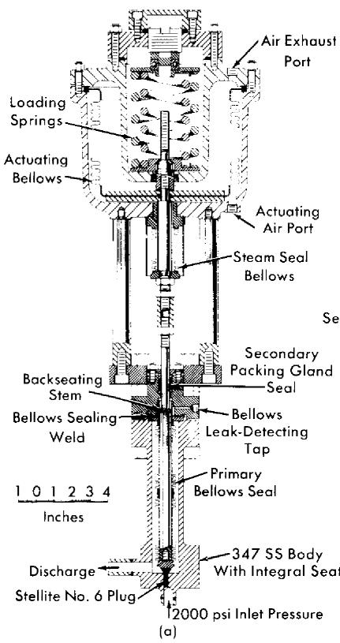

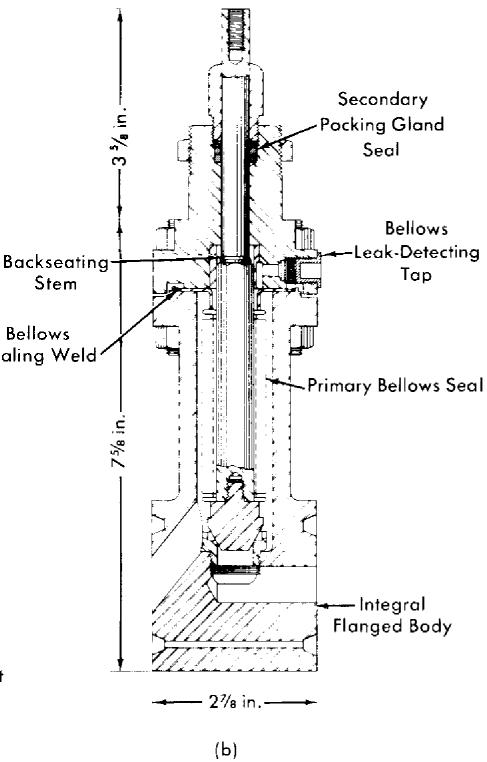  
FIG. 8-17. (a) HRE-2 letdown valve. (b) HRE-2 low-pressure valve.

side of the throttling orifice and thus under less strain. A seat integral with the valve body is used to avoid the difficult problem of leakage around removable seats. Stellar No. 6 and type 17-4 PH stainless steel plugs have been used, since these very hard materials are corrosion resistant in uranyl-sulfate solutions below $100^{\circ}\mathrm{C}$ and resist erosion due to flow impingement. The primary bellows seal, $1\frac{1}{8}$ -in. OD by 7/8-in. ID and $3\frac{3}{4}$ in. long, is mechanically formed of three plies of 0.0085-in. type-347 stainless steel stock. The bellows seal assembly is in two sections, welded together, because the bellows length needed for the 1/2-in. stroke cannot be manufactured in a single section at this time. An average bellows life of 50,000 5/8-in. strokes has been obtained at 500-psi with this assembly. The stem is of hexagonal stock and fits in a similarly shaped guide to prevent a torque from being applied to the bellows. The leak-detecting tap between the bellows and the secondary graphited-asbestos packing seal affords a means of detecting a bellows leak, while the asbestos gland prevents gross leakage of process fluid in case of bellows failure.

The valve, which was supplied by the Fulton Sylphon Division of Robertshaw-Fulton Controls Corporation, is rated for 2500-psi service with the flow introduced under the seat; however, the downstream pressure is limited to 500 psi by the bellows seal. The valve has a $C_v$ (flow coefficient) of 0.1. The reversible-action operator, supplied by The Annin Company, has a $50\mathrm{-in}^2$ effective area. It is rated for a maximum of 60 psi air operating pressure. The action illustrated is spring-closed, air-to-open; however, by a simple interchange of parts, the actuator operation can be reversed. The actuating bellows is made from type-321 stainless steel and was formed by the Stainless Steel Products Company. The stem guide bushing is brass.

The largest valve used in the HRE-2 is the blanket drain valve, which has a 1-in. port and a $C_v$ of 10. The valve and operator were supplied by Fulton-Sylphon. The operator supplies a maximum force of 5440 lb, and the full stroke is 3/4 in.

The only two process valves in the HRE-2 which operate with full system pressure on the bellows seal are those which are used to isolate the reactor from the chemical plant. The bellows used here, supplied by Fulton-Sylphon, are rated at 2000 psi and $300^{\circ}\mathrm{C}$ .

The low-pressure HRE-2 valves are novel in that ring-joint grooves are integral with the valve body, as illustrated in Fig. 8-17(b). Long bolts at the corners of the valve body hold the companion flanges; the valve is replaceable with the disassembly of only one set of bolts.

The main problems encountered in HRE-2 valves have been valve stem misalignment and corrosion of valve plugs.

Valve trim materials. In uranyl sulfate service, stainless steel seats are used with type 17-4 PH stainless steel or Stellarite plugs. The latter material is useful only below $100^{\circ}\mathrm{C}$ and where only a small amount of oxygenated-water service is anticipated with a high pressure differential across the valve.

In slurry service, metallic trims such as those above have been satisfactory for low-pressure valves but unsatisfactory for long life in high-pressure service. Ceramic materials appear promising, but little experience has been obtained to date.

A gold-gasketed valve has been developed for tight shutoff of gases. The gasket is placed into a groove machined in the valve plug, which mates with a tongue machined into the seat. This type of trim has also given excellent results in one hot uranyl-sulfate loop application.

Slurry service valves. In addition to the erosiveness of slurries, other problems are introduced by their tendency to settle out in the primary bellows seal or at stem guiding surfaces, thus interfering with valve action. This may be avoided by purging slurry from the bellows compartment with distilled water. It is likely that the hydrodynamic design of slurry valves

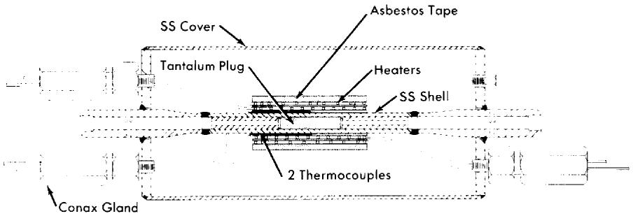  
FIG. 8-18. Differential thermal expansion valve to control gas flow in the HRE-2.

may be revised to make entry of solids into the bellows compartment improbable.

Slurry throttling has been accomplished by use of long tubes or capillaries. These have the disadvantage of fixed orifices, in that continuous flow control is not possible.

Special gas-metering valve. An ORNL-developed* differential thermal-expansion metering valve is used to regulate the flow of oxygen gas to the HRE-2 high-pressure system [50]. The required flow is very small and is difficult to control by conventional mechanical positioning methods. The valve shown in Fig. 8-18 utilizes the difference in thermal coefficient of expansion of tantalum and stainless steel to effect flow control. The tantalum plug is used to avoid any possibility of an ignition reaction between the oxygen gas and the metal, the temperature of which for a flow of 2000 std. cc/min with a 400 psi differential can reach $300^{\circ}\mathrm{C}$ . The design incorporates all-welded construction and is covered with a waterproof protective housing. The resistance heating element and thermocouple are duplicated to ensure continuity of service.

8-3.9 Sampling equipment. Operation of an aqueous homogeneous reactor requires that numerous samples be taken in maintaining control of the chemical composition of the solutions. Because of the radioactivity associated with these fluids, standard sampling equipment must be modified, or entirely new apparatus must be devised for taking the samples. Examples of sampling equipment presented here were designed for use on the HRE-2 at ORNL.

Samples of liquid and suspended solids will be taken from the high- and low-pressure systems of the HRE-2. Solution from the high-pressure system is reduced in temperature and pressure from $300^{\circ}\mathrm{C}$ and 2000 psi to approximately $80^{\circ}\mathrm{C}$ and 1 atm by a cooler and throttling valve before

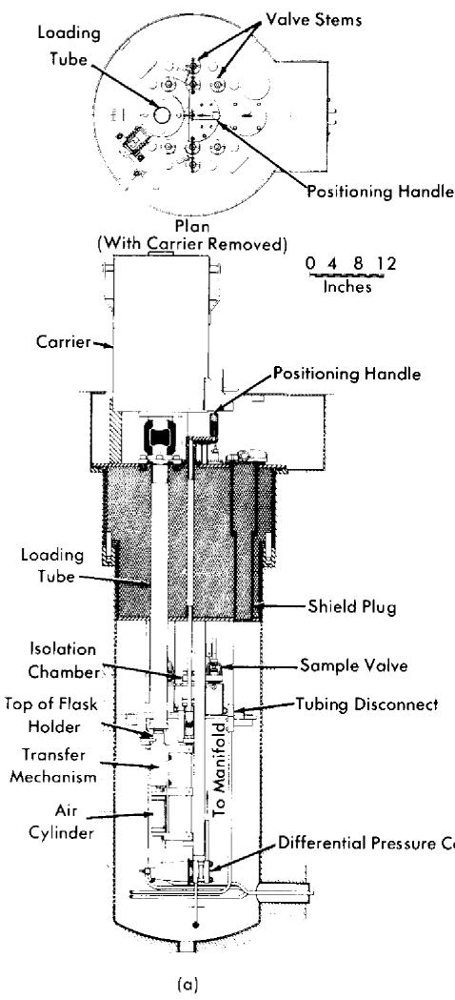

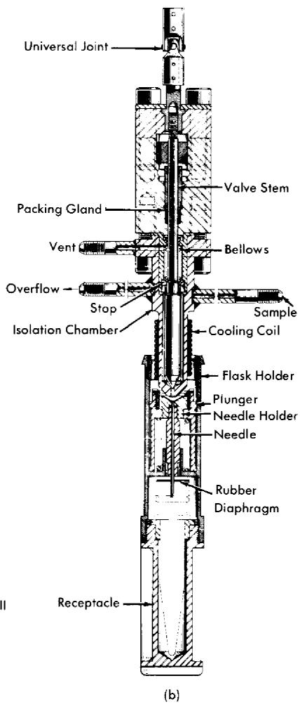  
FIG. 8-19. (a) HRE-2 sampling facility. Flask holder has just been lowered through the loading tube. It is then moved under the isolation chamber by the transfer mechanism. (b) HRE-2 sampler head, shown in the position of transferring sample to the receptacle.

entering the sample station. There, a sample of 4 to $5\mathrm{ml}$ is isolated and removed for analysis [51].

Figure 8-19(a) shows the general assembly of the sampling facility. Virtually all the mechanism is suspended from a shield plug. Personnel shielding is provided by a 2-ft depth of lead shot and water in the plug. The loading tube is sealed by a plug valve to maintain a slight vacuum in the housing. Threaded backup rods extending through the plug are em

ployed to make the final connections with reactor piping after the plug assembly is lowered into its housing. Each sampling facility contains two isolation chambers: one for isolating samples from the high-pressure system and the other for obtaining samples from the low-pressure system. Each chamber in the station is served by a common loading and manipulating device.

When a sample is being taken, solution from the desired system is allowed to flow through its isolation chamber until a representative sample is obtained. The isolation chamber is then valved off. An evacuated sample flask is placed in the holder and lowered through the loading tube to the transfer mechanism. The assembly is then indexed under the proper isolation chamber, where the flask holder is raised by an air cylinder until contact is made between the isolation-chamber nozzle and the inverse cone of the carrier head (Fig. 8-19b). Further lifting of the flask holder causes the hypodermic needle to puncture the rubber diaphragm. The sample is then discharged into the flask by opening the valve on the chamber. When the sample is in the flask the procedures are reversed, and the flask holder is removed into a shielded carrier for transport to the analytical laboratory. Electrical contacts indicate positive positioning of the flask holder under the isolation chamber and closure of the isolation-chamber nozzle.

A third sampling station for the HRE-2, identical to the fuel and blanket facilities except for larger passages and a modified isolation chamber, is employed for sampling a fuel stream in the chemical processing facility. This stream has the order of 50 times the solids concentration of the other streams being sampled.

8-3.10 Letdown heat exchanger. The purpose of the letdown heat exchanger is to conserve the sensible and latent heat of the solution-steam-gas mixture removed in the gas separator prior to discharging it to the dump-tank system. It is necessary also to cool the letdown stream to below $100^{\circ}\mathrm{C}$ before it reaches the letdown valve to minimize corrosion of the valve trim.

The thermal design of the exchanger is conventional [52]. In the HRE-2 stainless-steel triple-pipe unit, 400,000 Btu/hr are removed from the letdown stream into the countercurrent fuel feed stream, the pressurizer purge-water stream, and a cooling-water stream.

The unique feature of the design deals with the flow geometry of the letdown stream [53]. To promote efficient flow of the two-phase mixture through the letdown valve, it is necessary to prevent flow separation of the two phases. This is done by utilizing the annulus of the exchanger, with weld-bead spacers every 3 in. to promote turbulence. The velocity of the letdown stream is not permitted to fall below $5\mathrm{ft / sec}$ for any pipe lengths above 1 ft anywhere between the gas separator takeoff and the letdown valve.

During the transit from reactor operating temperature to $100^{\circ}\mathrm{C}$ in the letdown heat exchanger, fuel solution must go through the temperature range 175 to $225^{\circ}\mathrm{C}$ at which stainless-steel corrosion resistance passes through a minimum. This suggests that after several years leakage would occur between the feed and letdown streams. This problem can be circumvented by substitution of titanium for stainless steel.

8-3.11 Freeze plugs. Several reactor installations have employed freeze plugs on liquid-carrying process lines to assure absolute leaktight shutoff. Lines up to 4 in. in diameter have been frozen with a simple wrap-around coil of copper tubing when there was no flow in the pipe other than the convective currents set up by the freezing process. It is conceivable that leaktightness in very large lines might be achieved by refrigerating the passages of valves to freeze a relatively small amount of liquid at the valve seat. This freezing technique is most helpful in reducing the spread of contamination during maintenance.

The most efficient freeze-jacket design is one which provides an annular space around the process pipe and allows direct contact of the refrigerant with the pipe. This is generally considered undesirable, however, from the standpoint that if process fluid should leak into the refrigerant, activity would be carried outside the shielded area. Freeze jackets consisting of tubing wound around the process pipe perform noticeably better if soldered or welded to the process pipe; filling the interstitial space with poured lead also appears to be a worth-while refinement for lines difficult to freeze. Tubing 5/16-in. in diameter has been used on 1/4- to 1/2-in. standard pipe sizes; 3/8-in. tubing on 3/4- to $1\frac{1}{2}$ -in. pipe sizes, and 1/2-in. tubing on sizes up to 4 in. Clamp-on, or clamshell, types of freeze jackets were developed for the HIRE-2 for temporarily freezing certain lines.

On the HRE-2, stainless-steel refrigerant tubing is used for permanent freeze jackets on lines which normally operate at or above $350^{\circ}\mathrm{F}$ . Copper tubing, which is oxidized more readily in air, is used for lower temperature lines. A jacket length of 3 to 4 pipe diameters has been demonstrated to be optimum.

Freezing times of a few minutes for 1/2-in. and smaller lines and up to several hours for 3- and 4-in. sizes have been observed when the refrigerant temperature is in the $-20$ to $-40^{\circ}\mathrm{F}$ range and with flows through the jacket of 3 to $5\mathrm{gpm}$ . Insulation outside the freeze jacket materially aids in the ability to freeze lines with particularly high heat load, such as those subjected to gamma heating. If the freeze jacket must be operated submerged, such as for underwater maintenance, it has been found that protecting the jacket from convection water currents by means of aluminumfoil wrapping aids materially in the freezing process.

# 8-4. AUXILIARY COMPONENTS

8-4.1 Refrigeration system.* Refrigeration is required in the HRE-2 for operation of freeze plugs and cold traps. The refrigeration system consists of a primary loop, which is not irradiated, and a secondary liquid circulating system which enters the shield.

A two-stage primary mechanical refrigeration system is employed in the HRE-2. Refrigerants commonly used in such a system are the halogenated hydrocarbons, provided that the primary refrigerant remains outside the reactor shield. Breakdown of this series of refrigerants under radiation has been observed to have the serious effects of forming phosgene gas and insoluble tarry polymers, thus creating conditions corrosive to stainless steel. Carbon dioxide is probably the best refrigerant for use in an irradiated direct-expansion system, but it must be used at high pressure.

Choice of a secondary refrigerant to be circulated through radioactive equipment is difficult in that the fluid must not only meet the obviously desirable properties of having a low freezing point, suitable viscosity, low vapor pressure, noncorrosiveness, nontoxicity, and nonflammability, but it must also be resistant to radiation damage, not contain chloride ions which might promote stress-corrosion cracking of stainless steels, and not evaporate to insoluble residues. Miscibility with water would be advantageous if underwater maintenance techniques are employed in that if some refrigerant escapes, there is less impairment of vision and a film is not left on equipment when the water is drained.

After considering many possible secondary refrigerants, Amsco 125-82, an odorless mineral spirit resembling kerosene in its physical properties, was selected for the HRE-2. Its performance to date has been quite satisfactory.

In addition to the primary refrigeration system used to maintain a central supply of chilled Amsco, it was useful for short-term maintenance operations at the HRE-2 to have also a portable rig, consisting of an insulated tank and circulating pump. Chilling was accomplished by floating blocks of $\mathrm{CO}_{2}$ -ice directly in the liquid; secondary refrigerant temperatures of about $-75^{\circ}\mathrm{F}$ were maintained with a circulation rate of about $4\mathrm{~gpm}$ and with an ice consumption rate of 75 to $100\mathrm{~lb/hr}$ .

8-4.2 Oxygen injection equipment. $\dagger$ Oxygen is needed in the high-pressure fuel system to maintain chemical stability of the uranyl-sulfate solution and to reduce corrosion of the stainless steel container. This oxy

gen may be introduced most conveniently into the fuel feed stream, at either the suction or discharge of the feed pump. As a result of operational experience, high-pressure injection has been found to be more flexible and to give better feed-pump performance.

The oxygen system requires a high-pressure gas supply and a metering device. The first supply used in the HRE-2 was a converter manufactured by Cambridge Corp. of Lowell, Mass. This has been replaced by high-pressure cylinders, which have considerably lower operating costs. Oxygen compressors may be desirable to recirculate contaminated oxygen and are being investigated. Metering is accomplished with a thermal valve (described earlier) controlled by a capillary flowmeter.

Oxygen converter. The HRE-2 oxygen generator is designed to convert liquid oxygen to the gaseous state and deliver it to the fuel and blanket high-pressure systems at pressures up to 3000 psig. The capacity of the generator is $0.47\mathrm{ft}^3$ , or $30~\mathrm{lb}$ of oxygen, when $90\%$ filled with liquid. This will permit delivery of approximately $21~\mathrm{lb}$ of oxygen gas at 3000 psig and $70^{\circ}\mathrm{F}$ . This pressure is automatically maintained over a flow range of from 0.01 to $0.7~\mathrm{lb/hr}$ .

The oxygen generator consists of an insulated high-pressure container, with an electric heater and automatic pressure and temperature controls. The high-pressure inner vessel is fabricated of type-304 stainless steel.

Charging of the converter with liquid oxygen is a manual operation. The labor of charging and the inefficient utilization of oxygen are disadvantages of this unit.

High-pressure cylinders. The HRE-2 is now using 300-liter high-pressure cylinders which are commercially charged to 2400 psi and are used down to 2000 psi. A bank of three cylinders will last for about two days of normal operation. This system involves no waste of gas, since the cylinders are recharged from 2000 psi to 2400 psi, with very little operator attention or hazard.

Oxygen compressors. High-pressure low-capacity laboratory-type oxygen compressors have recently become commercially available. Pressure Products Industries, of Hatboro, Pa., produces a compressor having a stainless-steel diaphragm hydraulically actuated in a contoured chamber by a reciprocating drive. A single-stage machine capable of compressing approximately 0.8 scfm of $\mathrm{O}_2$ from 500 psi to 2500 psi has been purchased and placed in service in the HRT mockup. Although there have been some difficulties with the hydraulic plunger packing, it has been generally satisfactory.

A three-stage machine capable of compressing 2 scfm of contaminated oxygen from atmospheric pressure to 2500 psi is being designed. The diaphragm heads will be located remotely with respect to the drive, as is done in diaphragm feed pumps.

# 8-5. INSTRUMENT COMPONENTS*

The instrumentation and controls systems for aqueous homogeneous reactors are similar to those used in modern high-pressure steam power and chemical plants. However, problems attendant on radiation damage to insulations, the difficulty of performing maintenance or replacement operations, the requirement for the absolute leaktightness and the very high reliability of components necessary for safety and plant operability have required considerable development of special components.

8-5.1 Signal transmission systems. In a typical control loop the primary and final control elements are in a radioactive area isolated from the control room by a vapor container and a concrete radiation shield.

Electric. Advantages for electric transmission under these conditions include the ease of readjusting system zeros and spans from the control room and the ability to sense motion from weld-sealed transmitters without the use of flexure seals such as bellows and torque tubes. The speed of information transmission, the ease of switching signals, and the ability of the sensing elements to operate over wide temperature ranges may also be important. Disadvantages of the electrical system include the possible radiation damage to insulations and the present unavailability of a cheap, reliable linear-power actuator for control valves.

Pneumatic. Advantages of a pneumatic system include the utilization of all-metallic radiation-resistant construction for the transmitters and valve actuators by the use of metallic bellows, bourdon tubes, and convoluted diaphragms. The advantages of the high state of commercial development, low cost, reliability, miniaturization, and ease of paralleling of receiving elements are considerable. A disadvantage of the penumatic system is the tubing transmission line, which affords a path out of the radiation enclosure for contaminated fluids or vapors in case of a release of radioactivity coupled with a line break.

HRE-2 system. A combined electric-pneumatic system (described in Article 7-4.8) is used in HRE-2. In the control room, electric signals from primary variable sensing elements (temperature, flow, liquid level, pressure, etc.) are converted by transducers to penumatic signals, and these are used to actuate miniature pneumatic display instruments and pneumatic valves in the reactor. The escape of radioactivity through air lines is prevented by the automatic closure of "block" valves within the vapor-contained area, on a signal of the release of radiation. Radiation damage to primary elements is avoided by the use of inorganic electrical insulations such as glass, ceramics, mica, magnesium oxide, and magnesium silicate. Electric control actions are derived from the pneumatic signals by pressure switches. These switches are simple devices in which diaphragm deflection opens or

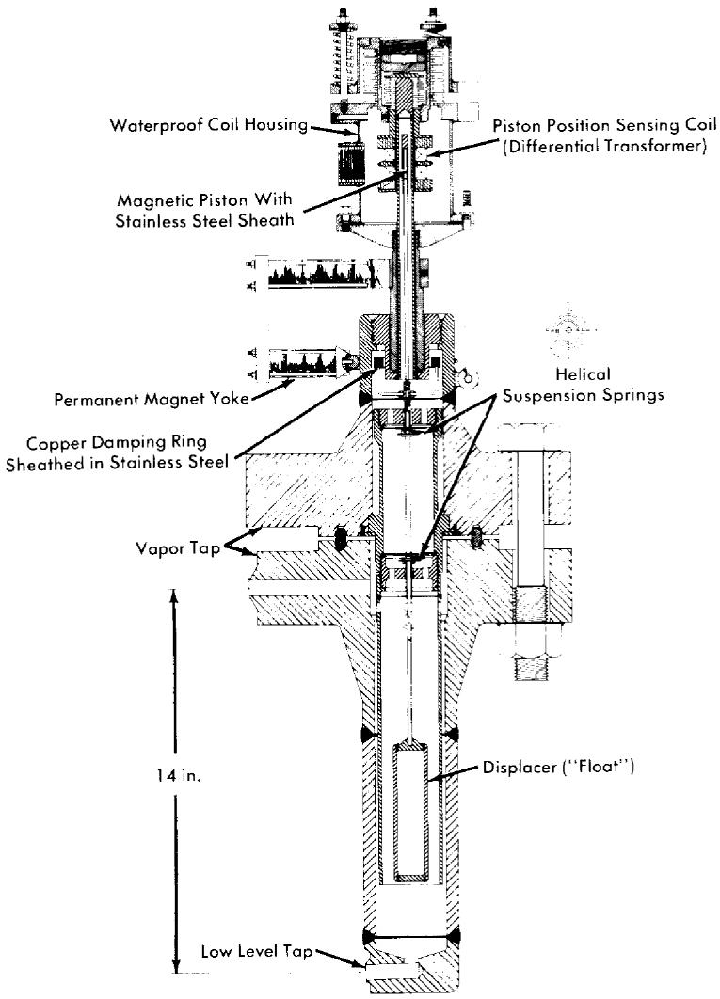  
FIG. 8-20. HRE-2 float-type level indicator (covers a 5-in. range at psi-2000 operating pressure).

closes an electric snap-acting switch. Electric interlock control of the penumatic signals to final control elements is achieved by the use of solenoid-actuated pilot valves.

8-5.2 Primary variable sensing elements. Liquid-level transmitters. Knowledge of liquid levels in reactor systems and loops is critical for maintaining the proper balance of liquid and vapor in pressurizers and storage tanks. It is desired also to be able to maintain accurate inventories of the hazardous and valuable fluids which are contained.

There are a large number of liquid-level sensing devices in use, since no one device has been developed which satisfies all the criteria of precision, rapid response, insensitivity to temperature and pressure, and utility of its signal for control functions. Devices which have been used at ORNL are described in the following paragraphs.

(1) Displacement or Float Transmitters. The ORNL-developed displacement transmitter, used to control HRE-2 pressurizer level, consists of a 5-in.-long displacer suspended by two helical springs (Fig. 8-20). An extension rod above the springs positions a magnetic piston in the center of a differential transformer. Troublesome vibration of the float is damped by the action of the field from permanent magnets on a one-turn copper ring. The only nonwelded closure is the ring-joint flange, which makes the unit easily replaceable.

The differential transformer is a compact, highly sensitive, linear device which is commercially available. The most satisfactory instrument system for the differential transformer is a high-frequency oscillator-amplifier phase-sensitive demodulator carrier system which provides the necessary sensitivity and stability and eliminates phase-motion ambiguity associated with the null voltage.

Float transmitters of this type have also been built with cantilever springs, with floats up to 47 in. long, and with hydraulic damping vanes attached to the bottom of the float in lieu of the magnetic damping [54]. They have given excellent service in continuous control applications. However, the displacement transmitter is quite sensitive to fluid densities, and the springs exhibit some changes in properties with temperature. The best spring material tested to date is Isoelastic spring alloy supplied by John Chatillon and Sons, which may be gold-plated for supplementary corrosion resistance.

Hollow spherical floats, lighter than water, have also been used at pressures below 600 psi. Magnetrol, Inc., makes a unit in which float position is transmitted magnetically. Moore Products Company supplies a level alarm where float position is transmitted mechanically through the all-welded housing by a flexible shaft.

(2) Differential-Pressure Cells. D/P cells have been used successfully in HRE-1 and in loops as level transmitters. The variable liquid leg is compared to a reference level maintained by condensation or liquid addition. Since the density of water is temperature-dependent, the temperature of the primary system and the lines to the D/P cell must be known for accurate level measurement.   
(3) Weigh Systems. For obtaining an accurate inventory of HRE-2 storage tanks, they are weighed with pneumatic weigh cells. This was found to be the only feasible method of measuring the quantity of liquid in long, horizontal storage tanks. Piping to the tanks is kept flexible by

the use of horizontal L and U bends. A pneumatic system is selected primarily because taring can be done remotely with balancing air pressures, and components are less susceptible to radiation damage. The pneumatic load cells, which are supplied by the A. H. Emery Corporation, have an accuracy of $1/10\%$ ; however, when used in a system with solid pipe connections to the weighed vessels, an accuracy of $1\%$ of full load results.

(4) Heated Thermocouple Wells. Heated thermocouple wells have been used for liquid-level alarm or control. The thermocouple junction is normally held a few degrees above the vapor temperature; as the liquid level surrounds the probe, the increased heat transmission to the fluid from the probe lowers the thermocouple signal output [55]. Several wells must be used for control purposes. This system gives rather sluggish response.   
(5) Capacitance Probe. An aluminum oxide capacitance probe, manufactured by Fielden Instrument Division, has been recently received by ORNL but has not yet been evaluated. This instrument senses the dielectric constant of the medium it contacts. Its ceramic-to-metal seal is rated at 2000 psi and $636^{\circ}\mathrm{F}$ . This type of instrument may prove useful in water or slurry service.

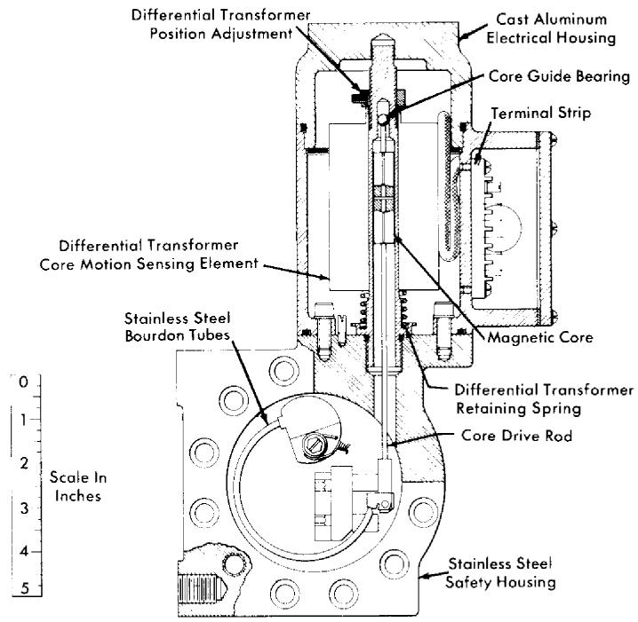  
FIG. 8-21. Bourdon-tube pressure transmitter in safety housing. Sensing element, twin Bourdon tubes; range, 0 to 2500 psi; test pressure, 3750 psi; accuracy, $\pm 1\%$ of range; transmission, electrical; fabricated by the Swartwout Company.

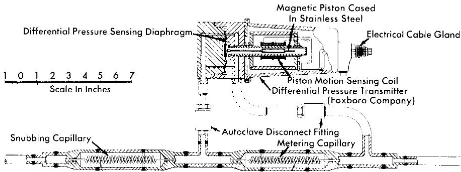  
FIG. 8-22. Capillary flowmeter, used to meter small gas or liquid streams, shown with high-pressure seal-welded differential-pressure transmitter.

(6) Fluid Damping Transmitters. The Dynatrol transmitter, manufactured by Automation Products, Inc., is an interesting possibility for use as a fluid damping transmitter. It contains a vane exposed to the process system and vibrated through a pressure housing by alternating-current excitation of a solenoid. The degree of damping, which is dependent on the area of the vane covered with liquid, is measured by a second sensing coil. No test experience with this transmitter is yet available.

Unusually difficult level-sensing problems are introduced when it is desired to measure or control the true level of a slurry or a boiling liquid. Most proven devices are density-sensitive, and the mean density of two-phase systems is usually unknown. Of the level transmitter types cited above, none appears adequate for continuous-range indication. For spot indication, float, capacitance, and Dynatrol transmitters are promising.

Pressure and differential-pressure measurement. Bourdon tubes of welded-sealed 347 stainless steel are used for pressure transmission in the HRE-2. Most suitable for reactor use are units contained within secondary pressure housings, such as the 2500-psi pressure transmitter shown in Fig. 8-21. Baldwin cells have been widely used for accurate pressure measurement in loops.

Bellows or diaphragm differential-pressure cells have been used to measure pressure differentials with full-scale sensitivity of 25 in. of water to 125 psi. A typical D/P cell with electric transmitter is shown in Fig. 8-22.

Pressure transmitters are usually tied into the steam or water portions of aqueous homogeneous systems to reduce the probability of plugging or other damage. Where it is necessary to connect a D/P cell into a slurry system, the pipe connection is regularly purged with 10 to $30~\mathrm{cc / min}$ of water. Large vertical piping connections with the transmitter mounted above the primary piping have also been used. Diaphragm transmitters mounted flush with the pipe surface are being developed for slurry applications.

Flow transmitters. Flow measurements are made in high-pressure lines by sensing the pressure drop across a calibrated orifice or venturi, or by the transmitting variable-area type of flowmeter. The latter meter resembles a Rotameter with float position transmitted electrically. It has the advantage of being an in-line element but is not readily applicable to large flows.

Another system for metering and controlling small liquid and gas flows in the HRE-2 is illustrated in Fig. 8-22. The pressure drop across the metering capillary is measured by the differential-pressure transmitter and the output signal is calibrated in terms of flow. The "snubbing" capillary is used to prevent the sudden application of pressure to the inlet side of the differential-pressure transmitter, which would cause undesirable zero shift.

A technique widely used in the HRE-2 for metering purge flows is a "heat balance" flowmeter in which a known amount of heat is added or extracted from the process stream and the temperature change noted.

Temperature measurement. The most commonly used method of temperature detection in the HRE-2 is the thermocouple measurement of vessel and pipe wall temperatures; the couples are spot-welded directly to the wall and then covered with insulation. When faster response is desired, thermocouples are spring-loaded into thin thermowells. Chromel-Alumel wire is generally used because its resistance to corrosive attack by moisture is better than that of iron-constantan alloys.

Thermocouple wire insulated by compressed magnesium oxide powder and housed in various alloy tubes is available from the Thermo Electric Company. Another commonly used wire supplied by the Claud S. Gordon Company is insulated as follows: each strand is coated with phenol formaldehyde varnish and Fiberglas-impregnated with a silicone alkyd copolymer, and the entire wire is Fiberglas-impregnated with a silicone alkyd copolymer.

Sound transmitters. Waterproof microphones are attached to pumps to monitor bearing and check-valve noises.

8-5.3 Nuclear instrumentation in the HRE-2. The purpose of the nuclear instrumentation in homogeneous reactors is to provide neutron-level measurement and the gamma monitoring of auxiliary process lines and control areas for the detection of radioactive leaks (see Article 7-4.8).

Gamma radiation measurement. Gamma monitors for detecting process leaks, manufactured by the Victoreen Instrument Company, consist of a simple one-tube, three-decade logarithmic amplifier sealed within the chamber head and a remote-contact-making meter and multipoint recorder. These detectors can be remotely calibrated by exposing a radioactive source on the actuation of a solenoid-operated shielding shutter. All channels are

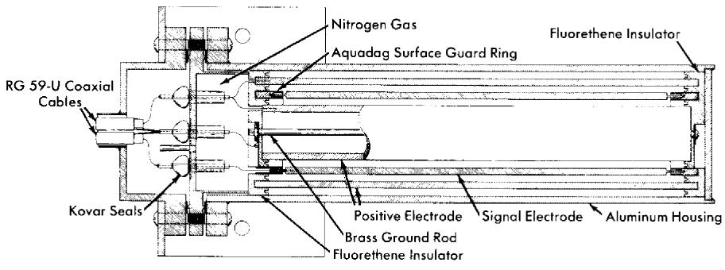

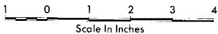  
FIG. 8-23. High-level gamma ionization chamber. Effective volume, $120~\mathrm{cm}^3$ ; electrode spacing, $1/8$ in.; performance, $20~\mu \mathrm{a}$ , chamber saturated at 100 volts at radiation level of $3\times 10^{7}$ r/hr; design temperature, $130^{\circ}\mathrm{F}$ .

duplicated, and control action is initiated only upon a simultaneous signal from both channels to minimize false "scrams." However, a signal from either channel is annihilated. For monitoring control areas for personnel protection, more stable and accurate vibrating-condenser types of electrometers are used.

The cell air monitors, which provide an alarm in case of a leak of radioactive vapor from the reactor system, are installed in an instrument cubicle. Cell air is circulated through a 2-in. pipe from the reactor tank, past the enclosed monitors, and then back to the cell. The blower is sized so that only 5 sec is required for cell air to reach the radiation monitors.

A high-level gamma ionization chamber, developed at ORNL [56], is used to measure cell ambient radiation levels up to $10^{7}\mathrm{r / hr}$ (Fig. 8-23). This measurement is needed to evaluate the effectiveness of shielding, to assay the rate of radiation damage to reactor components, to measure radiation levels during maintenance operations, and to provide data for future reactor designs. The chamber is of inexpensive construction and is discarded upon failure.

8-5.4 Electrical wiring and accessories. Copper-clad compressed magnesium-oxide spaced and insulated electrical cable is very desirable for service in extremely high-temperature, radioactive, or wet areas because no organic material subject to cracking and outgassing is used in the insulation. A waterproof disconnect, designed to be broken remotely to permit the removal of reactor electrical equipment, is used with this type of cable. The electrical connectors are terminated inside the disconnect with a multiple-header ceramic-to-metal seal, voids being filled with magnesium-

oxide powder. The outside guides are tapered to simplify remote maintenance. Long insulators are used on the connecting terminals to minimize leakage currents after submersion. The cable is available in a varied number of conductors and sizes, from single to seven conductors in a copper sheath, as wire sizes No. 16 AWG to $4/0$ AWG, from the General Cable Company. The hermetic end seals are available from the Advanced Vacuum Products Corporation or Permaseal Corporation.

A compression seal designed around an inorganic material, magnesium silicate, is used to seal wires at conduit terminations. These seals are supplied by the Conax Company. A similar device but utilizing a glass-to-metal seal is manufactured by the Stupakoff Ceramic and Manufacturing Company.

For the windings used on the motion-sensing coils of instruments, 30-gage anodized aluminum wire supplied by the Sigmund Cohn Company has successfully withstood temperatures up to $300^{\circ}\mathrm{C}$ and radiation exposure of $6 \times 10^{17}$ nvt fast neutron and $1 \times 10^{8}$ r gamma without failure. The only electrical insulation on the wire is that afforded by the oxide film on the aluminum. This wire must be handled carefully to avoid abrasion and is suitable only for low-voltage use. For lower temperatures, the Ceroe magnet wire available from the Sprague Electric Company has been used very successfully.

# REFERENCES

1. P. H. HARLEY, Straight Through IRT Core Model Test, USAEC Report CF-54-9-129, Oak Ridge National Laboratory, Sept. 22, 1954.   
2. I. SPIEWAK, Preliminary Design of Screens for the Inlet of the ISHR Core, USAEC Report CF-52-10-181, Oak Ridge National Laboratory, Oct. 18, 1952. W. D. BAINES and E. G. PETERSON, Trans. Am. Soc. Mech. Engrs. 73(5), 467 (July 1951).   
3. L. B. LESEM and P. H. HARLEY, Scale-up of Alternate IIRT Core, USAEC Report AECD-3971, Oak Ridge National Laboratory, May 7, 1954. L. B. LESEM and I. SPIEWAK, Alternate Core Proposal for the IIRT, USAEC Report CF-54-1-80, Oak Ridge National Laboratory, Jan. 28, 1954.   
4. F. N. PEEBLES and H. J. GARBER, Studies on the Swirling Motion of Water within a Spherical Vessel, University of Tennessee, Report S-370, January 1956.   
5. L. B. LeSEM et al., Hydrodynamic Studies in an Eight-foot Sphere Utilizing Rotation Flow, USAEC Report CF-53-7-29, Oak Ridge National Laboratory, July 20, 1953.   
6. S. TIMOSHENKO, Strength of Materials, 2nd ed. New York: D. Van Nostrand Co., Inc., 1940. (Part II, pp. 160, 162)   
7. S. TIMOSHENKO and J. N. GOODIER, Theory of Elasticity. 2nd ed. New York: McGraw-Hill Book Co., Inc., 1951. (pp. 59, 359)   
8. S. TIMOSHENKO and J. N. GOODIER, Theory of Elasticity. 2nd ed. New York: McGraw-Hill Book Co., Inc., 1951. (pp. 412, 418)   
9. L. G. ALEXANDER, Estimation of Heat Sources in Nuclear Reactors, A.I. Ch. E. Journal 2: 177 (June 1956).   
10. R. H. CHAPMAN. Analysis of Spherical Pressure Vessel Having an Energy Source Within the Wall, USAEC Report ORNL-1987, Oak Ridge National Laboratory, Oct. 26, 1954.   
11. L. F. BLEDSOE et al., Welding J., N. Y., 35, 997-1006 (October 1956). W. R. GALL, *Nucleonics* **14**(10), pp. 32-33 (October 1956).   
12. J. C. MoYers, Long-term Run of Westinghouse 400.1-1 Pump, USAEC Report CF-57-9-1, Oak Ridge National Laboratory, Sept. 3, 1957.   
13. R. B. Korsmeyer et al., in *Homogeneous Reactor Project Quarterly Progress Report for the Period Ending Jan. 31, 1958*, USAEC Report ORNL-2493. Oak Ridge National Laboratory, 1958.   
14. H. A. RUNDELL et al., Investigation of Effect of Seal Configuration on Mixing Flow and Radiation Damage in HRT-Type Circulating Pumps. USAEC Report CF-57-10-48. Oak Ridge National Laboratory, Oct. 10, 1957.   
15. J. C. Møyers, Long-term Run of Westinghouse 400.4-1 Pump, USAEC Report CF-57-9-1, Oak Ridge National Laboratory, Sept. 3, 1957.   
16. R. B. Korsmeyer et al., in *Homogeneous Reactor Project Quarterly Progress Report for the Period Ending July 31, 1957*, USAEC Report ORNL-2379, Oak Ridge National Laboratory, Oct. 10, 1957. (p. 59)   
17. R. B. Korsmeyer et al., in *Homogeneous Reactor Project Quarterly Progress Report for the Period Ending Jan. 31, 1958*, USAEC Report ORNL-2493, Oak Ridge National Laboratory, 1958.

18. H. A. RUNDELL et al., Investigation of Effect of Seal Configuration on Mixing Flow and Radiation Damage in IIRT-Type Circulating Pumps, USAEC Report CF-57-10-48, Oak Ridge National Laboratory, Oct. 10, 1957.   
19. W. J. FINAN and I. GRANER, Final Reports on Union Carbide Nuclear Company Contract No. W35X-31312, Phase 1, Foster-Wheeler Corp., Nov. 15 and Dec. 15, 1956.   
20. J. C. Griess et al., Solution Corrosion Group Quarterly Report for the Period Ending July 31, 1957, USAEC Report CF-57-7-121, Oak Ridge National Laboratory, July 31, 1957. (p. 33 ff)   
21. C. H. Secoy, *Aqueous Fuel Systems*, CSAEC Report CF-57-2-139, Oak Ridge National Laboratory, Feb. 28, 1957.   
22. C. MICHELSON, HRT Modified Pressurizer Design, USAEC Report CF-56-5-165, Oak Ridge National Laboratory, May 25, 1956.   
23. Boiler Construction Code, Section I, Power Boilers, American Society of Mechanical Engineers (1956); ASA Code for Pressure Piping, B31.1-1955.   
24. K. L. HANSON and W. E. JAHSMAN, An Evaluation of Piping Analysis Methods, USAEC Report KAPL-1384, Knolls Atomic Power Laboratory, Aug. 10, 1955.   
25. M. W. KELLOGG COMPANY, Design of Piping Systems. 2nd ed. New York: John Wiley & Sons, Inc., 1956.   
26. M. I. LUNDIN, HRT High Pressure System Piping Line Deflections and Reactions on Equipment Nozzles, USAEC Report CF-55-8-83, Oak Ridge National Laboratory, Aug. 10, 1955.   
27. W. R. GALL et al., in *Homogeneous Reactor Project Quarterly Progress Report for the Period Ending Apr. 30, 1957*, USAEC Report ORNL-2331, Oak Ridge National Laboratory, Aug. 14, 1957. (pp. 22-25)   
28. B. DRAPER and H. C. ROLLER, Design and Development of a $1\frac{1}{2}$ -in. Titanium to Stainless Flange, USAEC Report CF-57-11-140, Oak Ridge National Laboratory, Nov. 27, 1957.   
29. J. A. HAFFORD, Development of the Pipe-line Gas Separator, USAEC Report ORNL-1602, Oak Ridge National Laboratory, Nov. 2, 1953.   
30. P. H. HARLEY, Performance Tests of HRT Fuel Solution Evaporator and Entrainment Separator, USAEC Report CF-54-10-51, Oak Ridge National Laboratory, Oct. 13, 1954.   
31. WESTINGHOUSE ELECTRIC CORPORATION AND PENNSYLVANIA POWER AND LIGHT COMPANY, 1957. Unpublished.   
32. E. A. FARBER, Bubble and Slug Flow in Gas-Liquid and Gas (Vapor)-Liquid Solid Mixtures, Research Progress Report on Subcontract N.996 to REED of Oak Ridge National Laboratory, 1957.   
33. R. V. BAILEY et al., Transport of Gases Through Liquid-Gas Mixtures, USAEC Report CF-55-12-118, Oak Ridge National Laboratory, Dec. 21, 1955.   
34. C. L. SEGASER, HRT Entrainment Separator Design Study, USAEC Report CF-54-7-122, Oak Ridge National Laboratory, July 23, 1954.   
35. R. E. Aven, HRT Recombiner Condenser Design, USAEC Report CF-54-11-1, Oak Ridge National Laboratory, Nov. 1, 1954.   
36. O. A. HoUGEN and K. M. WAtson, Chemical Process Principles, Vol. III. New York: John Wiley & Sons, Inc., 1947. (pp. 902-910)

37. J. A. RANSOHOFF and I. SPIEWAK, in Development of Hydrogen-Oxygen Recombiners, USAEC Report ORNL-1583, Oak Ridge National Laboratory, Oct. 22, 1953. (p. 40)   
38. P. H. HARLEY, High-pressure Recombination Loop Progress Report, USAEC Report CF-57-1-90, Oak Ridge National Laboratory, Jan. 4, 1957.   
39. J. A. RANSOHOFF and I. SPIEWAK, in Development of IIHydrogen-Oxygen Recombiners, USAEC Report ORNL-1583, Oct. 22, 1953. (pp. 48-56)   
40. I. K. NAMBA, Natural Circulation Recombiner Report, USAEC Report CF-56-9-27, Oak Ridge National Laboratory, Sept. 10, 1956.   
41. P. H. HARLEY. High-pressure Recombination Loop Progress Report, USAEC Report CF-57-1-90, Oak Ridge National Laboratory, Jan. 4, 1957.   
42. T. W. LELAND, Design of Charcoal Adsorbers for the HRT, USAEC Report CF-55-9-12, Oak Ridge National Laboratory, Sept. 6, 1955.   
43. L. B. ANDERSON, Oak Ridge National Laboratory, 1955. Unpublished.   
44. J. S. Culver and C. B. Graham. High-pressure Diaphragm Pumps for Reactors, in Safety Features of Nuclear Reactors; Selected Papers from the 1st Nuclear Engineering Science Congress, December 12-16, 1955, Cleveland, Ohio. New York: Pergamon Press, 1957. (pp. 225-230)   
45. C. H. GABBARD, Diaphragm Feed Pumps for Homogeneous Reactors, 4th Engineering and Science Conference, Held in Chicago, Illinois, March 17-21, 1958. (Preprint 74)   
46. R. BLUMBERG et al., Diaphragm Feed Pump Development Program Progress Report, USAEC Report CF-56-10-114, Oak Ridge National Laboratory, Oct. 29, 1956.   
47. Ohio State University, Union Carbide Nuclear Company, Contract No. 81X-44934.   
48. A. M. BILLINGS, Control Valves for the Homogeneous Reactor Test, 4th Nuclear Engineering and Science Conference, Held in Chicago, Illinois, March 17-21, 1958. (Preprint 149)   
49. A. M. BILLINGS, Life Tests of Stem-sealing Bellows for HRT Valves, USAEC Report CF-58-3-39, Oak Ridge National Laboratory, Mar. 17, 1958.   
50. D. S. Toomb et al., in *Homogeneous Reactor Project Quarterly Progress Report for the Period Ending Jan. 31, 1957*, USAEC Report ORNL-2272, Oak Ridge National Laboratory, Apr. 22, 1957. (p. 34)   
51. B. A. HANNAFORD, IIRT Sampler Development, USAEC Report CF-57-1-87, Oak Ridge National Laboratory, Jan. 22, 1957.   
52. R. VAN WINKLE, Fuel Let-down Heat Exchanger, USAEC Report CF-54-9-143, Oak Ridge National Laboratory, Sept. 20, 1954.   
53. C. D. ZERBY, Design of Smoothly Flowing Gas and Liquid Mixtures, USAEC Report CF-51-10-130, Oak Ridge National Laboratory, Oct. 11, 1951.   
54. D. S. Toomb et al., in *Homogeneous Reactor Project Quarterly Progress Report for Period Ending Apr. 30, 1956*, USAEC Report ORNL-2096, Oak Ridge National Laboratory, May 10, 1956. (p. 32)   
55. D. S. Toomb et al., in *Homogeneous Reactor Project Quarterly Progress Report for Period Ending July 31, 1956*, USAEC Report ORNL-2148(Del.), Oak Ridge National Laboratory, Oct. 3, 1956. (p. 67)

56. D. S. Toomb et al., in *Homogeneous Reactor Project Quarterly Progress Report for Period Ending Jan. 31, 1957*, USAEC Report ORNL-2272, Oak Ridge National Laboratory, Apr. 22, 1957. (p. 35)