# CHAPTER 9

# LARGE-SCALE HOMOGENEOUS REACTOR STUDIES*

# 9-1. INTRODUCTION

9-1.1 The status of large-scale technology. A large number of groups in the national laboratories and in industry have prepared detailed designs of full-scale homogeneous reactors because of the widespread interest in these reactors and the generally accepted conclusion that they have long-term potential for central-station power production and other applications. These designs have, in some cases, been made to compare the economics of power production in homogeneous reactors with other nuclear plants. In other cases, the designs have served as the bases for actual construction proposals. Unfortunately, none of the proposals has yet initiated the construction of a reactor, for it is believed that the gap between the existing technology of small plants and that necessary for a full-scale plant is too great to bridge at the present time. Thus the construction of full-scale plants must await further advances in technology which are expected to be achieved in the development programs now under way. The extensive studies of full-scale plants do, however, constitute a body of information vital to the nuclear industry. It is hoped that the summaries of the large-scale homogeneous reactors given in this chapter will serve as a guide to those contemplating the building of a full-scale nuclear plant.

One of the major problems yet to be solved for a large-scale circulating-fuel reactor is that of remotely repairing and/or replacing highly radioactive equipment which fails during operation of the plant.

The various proposed solutions to this problem fall into two categories:

(1) Underwater maintenance, in which all equipment is installed in a shield which can be filled with water after shutdown of the reactor so that maintenance operations can be performed from above with special tools and with visibility provided through the water.   
(2) Dry maintenance, in which all operations are done by remote methods using special remotely operable tools and remote viewing methods such as periscopes and wired television.

In either case, remote opening and closing of flanged joints or remote cutting and rewelding of piping must be used to remove and replace equipment. A solution of the problem of maintaining flanged joints in a leaktight condition in large sizes has not been attempted, the largest pipe in use to

date being approximately 10 in. in diameter. Remote cutting and rewelding equipment is still in the early stages of development.

The technology of solutions systems is in a more advanced stage of development than that of slurry systems because of the design and operation of two homogeneous reactor experiments and the associated development work. Some of the problems remaining to be solved for large-scale solution reactors include the development of large-scale equipment such as pumps, valves, feed pumps, and heat exchangers; radiation corrosion of materials used in the reactor core; high-pressure recombination of hydrogen and oxygen; and reduction of the number of vital components upon which reactor operation depends. Instruments for measuring temperature in high radiation fields and control of inventory and level are some of the major instrumentation problems for which better solutions are needed.

The achievement of a successful aqueous homogeneous thorium breeder requires a high-pressure thorium-oxide slurry system. Development work has been under way for several years to determine the characteristics of such a system and to develop ways of handling slurries. The technology is not yet advanced to the point where a large-scale breeder reactor of this type can be built and operated. Slurry problems under study include methods of production, circulation through pipes and vessels, storage and resuspension, evaporation, heat removal, flow distribution, particle size degradation, internal recombination of deuterium and oxygen, general information on erosion and corrosion effects, and effects of settling on maintenance operations.

Extrapolation of small-scale technology to large-scale design presents several problems of uncertain magnitude, especially in the design of equipment for handling slurries of thorium oxide such as are specified for one- or two-region breeder reactors. The problems of maintenance of slurry systems are essentially the same as for solutions, but are complicated by the erosive nature of the slurry, its relatively high shear strength, and its tendency to cake or settle in regions of low turbulence.

9-1.2 Summary of design studies. The design studies described in this chapter were made by the national laboratories of the Atomic Energy Commission and by various industrial study groups for the purpose of determining the technological and economic feasibility of aqueous homogeneous reactor systems as applied to central station power, research reactors, and the production of plutonium. In general, the design criteria used in the studies conform as closely as possible to known technology in order to minimize the scope of new developments required to ensure the success of the proposals. In all the studies, the importance of over-all safety and reliability of the reactor complex and individual reactor components has been emphasized. Also, considerable attention has been devoted to the maintenance aspects of the designus.

The large-scale reactor designs described are grouped according to the following categories:

(1) One-region solution reactors, typified by the Wolverine Reactor Study, the Oak Ridge National Laboratory Homogeneous Research Reactor, and the Aeronutronic* Advanced Engineering Test Reactor.   
(2) One-region breeders and converters, such as the Pennsylvania Advanced Reactor reference design by Westinghouse Electric Corporation, the Homogeneous Plutonium Producer Study by Argonne National Laboratory, and the Dual Purpose Feasibility Study by Commonwealth Edison.   
(3) Two-region breeders, represented by the Nuclear Power Group studies, the Babcock & Wilcox Breeder Reactor, and a sequence of conceptual designs by the Oak Ridge National Laboratory Homogeneous Reactor Project.

# 9-2. GENERAL PLANT LAYOUT AND DESIGN

9-2.1 Relation of plant layout to remote-maintenance methods. In laying out a homogeneous reactor plant, the designers, to achieve an optimum arrangement, must simultaneously consider all aspects of the design, including the requirements for remote maintenance. It is usual to start with the high-pressure reactor system (the reactor vessel, circulating pump, steam generator, and surge chamber and pressurizer), since there exists a natural relationship between these items in elevation. The layout will depend primarily on whether a one-region reactor or two-region reactor is involved, since in the latter case special provision for removing the inner core may be necessary. If it is feasible to construct the reactor vessel and core tank as an integral all-welded unit, the layout of the system will be considerably simplified. Otherwise, provisions will have to be built into the reactor vessel and the reactor system to remove the vessel and/or the core tank.

Circulating pumps are vulnerable from the standpoint of long-term reliability, and extreme care must be given to their placement and anchorage in the system layout. Installations and designs to date place the circulating pumps in a position following the steam generator and the gas separator and low in the cell in order to provide as low a temperature and least gas-binding conditions as possible. These pumps, however, will operate at an overpressure considerably in excess of saturation pressure, and if gas binding does not prohibit, it may be desirable to place the circulating pumps at a position more accessible for maintenance.

The placement and design of the steam generators will be dictated to a major degree by the maintenance philosophy adopted. One general

philosophy being considered uses many small steam generators in order to permit easier removal and replacement when necessary. Another philosophy considers the repair of the steam generators in situ, using remotely manipulated tooling. One difficulty with this scheme will be the problem of finding leaky tubes.

The steam generators are usually one of the bulkiest items of equipment installed in the plant and hence will largely determine the size of containment vessel and amount of shielding. Their location should be such that some heat-removal capacity can be obtained by natural convection circulation in the event of failure of the circulating pump.

In considering the layout of the surge chamber (which is normally also the pressurizer) connecting piping must be as short as possible and the diameter of the piping should be large for safe control of the reactor. If a steam generator is used to provide high-pressure $\mathrm{D}_2\mathrm{O}$ or $\mathrm{H}_2\mathrm{O}$ vapor, it should be separated from the surge chamber, and preferably placed in a location separate from the reactor compartment to facilitate maintenance.

9-2.2 Importance of specifications. To ensure that materials such as type-347 stainless steel and titanium and zirconium alloys meet the qualifications required for homogeneous systems, very rigid specifications covering strength, corrosion-resisting properties, impact resistance, etc. must be prepared. To ensure leaktight integrity, specifications describing acceptable weld joints and welding procedures are issued. Such specifications will also describe the welder qualifications required. Since it is imperative that the main process piping system shall be absolutely clean and purged of any material which may poison the reactor or accelerate corrosion, cleaning procedures are a necessary part of the specifications.

9-2.3 Approach to an optimum piping system. The cost of the piping system is one of the major items of expense, and its selection and arrangement constitutes one of the major items of design. However, the pipe diameters are generally determined on a maximum-velocity basis, determined by corrosion rates rather than from economic considerations. The weight classification (i.e., pipe wall thickness) is selected on the basis of pressure, temperature, and corrosion rate for the proposed service life of the reactor system using the appropriate design stresses from the ASME Code for the particular metal used. Other factors influencing piping layouts are (a) provision for drainage, (b) provision for expansion, (c) accessibility and convenience of operation, (d) provision for support, and (e) the thickness of insulation.

Long straight runs of high-temperature, high-pressure piping present the main problem so far as expansion is concerned. Natural anchorages should be noted, and at the same time, possible locations should be sought

for special anchors needed to control expansion in accordance with the design plan. The efficiency of the piping system layout depends largely on the ability of the designer to visualize the over-all situation and to select the best arrangement. The design of a piping system for minimum holdup may be relegated to secondary importance compared with ease of maintainability of the systems.

Piping joints. Piping joints for homogeneous reactor systems must be capable of assembly and disassembly by remote methods and must have essentially zero leakage. The first requirement implies some type of mechanical joint such as used on the HRE-1 and HRE-2. The second specification can only be guaranteed by an all-welded piping system, and consequently an all-welded piping layout may be necessary for large-scale homogeneous reactor systems. However, such a system requires a reliable and easily manipulatable remote cutting and welding machine not yet developed.

9-2.4 Shielding problems in a large-scale plant. Poor shield design can lead to excessive cost and reduced accessibility for maintenance. Practical shield designs are developed through the use of methods in the literature [1] with particular attention to factors pertaining to the shield layout, such as the arrangement of the piping and heat-exchanger system, materials selection, radioactivity of the shutdown system, effect of radiation streaming through openings, and the effect of the geometry of the radiation sources.

A number of proposed designs of large-scale homogeneous reactors use a compartmentalized type of shield. This consists of a primary shield surrounding the reactor pressure vessel to attenuate the neutron flux and reduce the radioactivity of auxiliary equipment, and a secondary shield surrounding the coolant system. From a shielding standpoint, the most highly radioactive sources should be located near the center of the compartment, components of lower source strength should be arranged progressively outward, and equipment with little radioactivity should be located to serve a dual purpose as shielding material where possible. High-intensity sources containing primary coolant, which are poorly located from a shielding standpoint, may be partially shadow-shielded. Equipment requiring little or no maintenance and which can provide shielding should be located around the outside of the secondary shield. Considerable weight can be saved by contouring the secondary (coolant) shield (i.e., varying its thickness over the surface) to give closer conformance with the specified permissible dose pattern. With respect to sample lines which penetrate the coolant shield and contain radioactive materials of short half-lives, the transport time from the primary coolant system to the outside of the shield should be made as long as practical to take advantage of the decay of the coolant activity.

9-2.5 Containment. Because of the possibility of release of highly radioactive fuel solution from a homogeneous reactor, such systems are now being designed to go within a containment vessel or to use doubly contained piping. The containment vessel must be designed to hold the pressure resulting from expansion of the fluid and vapor contents of the equipment. Such pressures may be of the order of 50 psi. Although the best shape of a containment vessel is either a cylinder or a sphere, such configurations present problems with respect to remote maintenance. To prevent the penetration of the containment vessel by flying fragments which may be released on failure of equipment, a blast shield can be placed around the periphery of the containment vessel or relatively close to the equipment.

9-2.6 Steam power cycles for homogeneous reactors.* In common with other pressurized-water types of reactors, homogeneous reactors are handicapped by the high pressures required to prevent boiling in comparatively low-temperature aqueous fluids. Temperatures for steam generation in homogeneous reactor power systems are limited to practical maximums of 500 to $600^{\circ}\mathrm{F}$ , and there are no significant opportunities for superheating the steam with reactor heat. Separately fired superheating equipment, using conventional fuels, may be expedient in some particular circumstances of plant size, load factors, and fuel costs but, in general, superheating by this means is not justified. Use of low-pressure saturated steam limits the thermal efficiency obtainable in the heat-power cycle to maximum values in the range of 25 to $30\%$ .

Homogeneous reactor systems circulate a hot reactor fluid to a steam generator at essentially constant temperature; the temperature of the fluid leaving the exchanger is varied with load by changing the temperature difference for heat transfer by controlling the pressure at which the water boils in the steam generator. Since the steam pressure falls as the turbine control valves open on increased electrical generator loads, the negative temperature coefficient for the reactivity causes the reactor power output to be self-regulating to match the power demand on the plant.

The full-load steam pressure will be in the order of 450 to 600 psia, and the near no-load pressure in excess of 1000 psia. The steam piping and turbine casing must be designed for this maximum pressure rather than the full-load pressure; design pressures of 1500 psia have been used for the steam systems of the HRE-1 and HRE-2.

Turbines designed for operation on saturated steam will cost more per kilowatt of installed capacity than turbines designed for superheated steam (see Chapter 10). The relatively low energy content, high specific volume steam supplied to the saturated steam turbine throttle requires greater

mass flow rates and flow areas for a given power output, adding to the cost of the governor valves and the high-pressure stages. The low-pressure stages, which are the most expensive, also must have more flow area, which may require additional compounding, adding greatly to the cost. The turbine efficiency will be somewhat less in a saturated steam turbine than in one using superheated steam because of the greater amount of entrained moisture in the steam.

Flow delay tanks in the steam supply mains are considered necessary to allow time for a stop valve to close in the event radioactivity is detected in the steam flow from the heat exchangers. Heat losses in this equipment tend to increase the moisture in the steam, and a separator may be required at the turbine inlet. The pressure loss in typical separators is about $5\%$ of the inlet pressure and the leaving quality about $99\%$ . Some method of moisture removal must be provided during the expansion process, either internally in each of the low-pressure stages, or externally in one or more separators located between turbine elements. Studies have indicated that the optimum location for the first stage external moisture separator is at $10\%$ of the throttle pressure. The presence of more moisture in the expanding steam may require that the turbine be an 1800-rpm rather than a 3600-rpm machine.

As with steam power cycles for other reactor types, an emergency bypass will probably be required to send the steam directly to the turbine condenser in event of loss of turbine load. The condenser must be designed to dispose of the full output energy of the reactor plant. The number of stages of feedwater heating economically justified is probably limited to three or four, since the temperature range in the cycle is not great.

Treatment of the water fed to the steam generators is a special problem in that the water should be essentially free of chloride ions to reduce the opportunity for stress-corrosion cracking in stainless steel parts of the system, the water should be deaerated to control corrosion in the steam system, it should be demineralized to reduce the radioactivity pickup of the steam and in the heat exchanger blowdown, and additives may be necessary to control the $\mathsf{pH}$ and to scavenge oxygen formed by radiolytic decomposition of the water. Decomposition of these additives under radiation poses problems not yet fully investigated.

Control of the water level in the steam generator involves much the same problems, due to steam bubbles that are experienced in conventional boilers, with the added complexity that the steam pressure increases as the load on the plant decreases. Sizing of the ports in the feedwater regulating valves must take this into consideration, and the boiler feed pumps must be designed for the no-load, rather than the full-load head requirements.

Although some superheat can be obtained by recombining the decomposition gases, it is doubtful if such a procedure is economical, owing to the relatively small amount $(5\%)$ of superheat obtained, and also because of

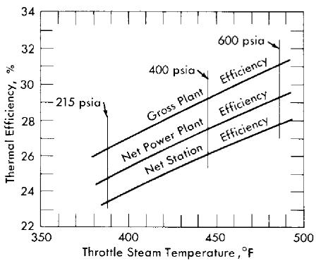  
FIG. 9-1. Effect of steam conditions on turbogenerator plant efficiency.

the desirability of minimizing gas production within the reactor. Unless the superheat is more than $100^{\circ}\mathrm{F}$ , a saturated cycle with moisture separation may be equally as efficient and practical as a cycle using superheated steam, provided that in either case the moisture in the turbine exhaust is kept the same. It is also possible to superheat at the expense of throttle pressure; while superheat normally is considered to increase the thermal efficiency, this is not true if the inlet steam temperature is independent of the amount of superheat. Also, the lower pressure associated with throttling results in increased turbine costs. Superheating by means of a conventional plant does not appear economical.

In studies of homogeneous reactors, saturated steam cycles are assumed in which $12\%$ moisture is permitted in the last stages of the turbine. Thermal efficiencies of such plants are shown in Fig. 9-1 as a function of the steam temperature at the turbine throttle [2].

# 9-3. ONE-REGION U235 BURNER REACTORS

9-3.1 Foster-Wheeler Wolverine Design Study. In response to a request by the Atomic Energy Commission for small-scale power demonstration reactors, the Foster Wheeler Company proposed to construct an aqueous solution reactor for the Wolverine Electric Cooperative in Hersey, Michigan [3]. This proposal was rejected by the Atomic Energy Commission in October 1957 as a basis for negotiation due to increases in the estimated cost of the plant (from $5.5 million to$ 14.4 million). The project was canceled in May 1958 following a review of the design and estimated costs. This review indicated that the cost of generating electricity would be several times as great as that in Wolverine's existing plant.

In December 1957 a group of engineers from the Oak Ridge National Laboratory and Sargent and Lundy, with the help of Foster-Wheeler, redesigned the reactor on the basis of recent advances in homogeneous reactor technology and re-estimated its costs to be $10.7 million [4]. The

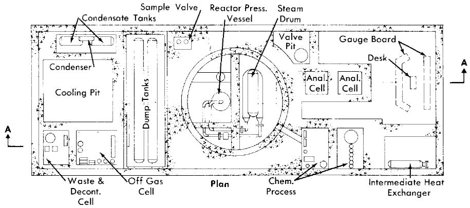

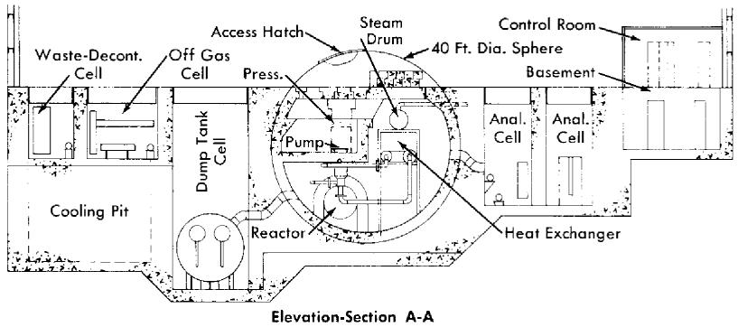  
FIG. 9-2. Plan and sectional elevation of revised Wolverine reactor plant.

following section describes the revised reactor design. Figure 9-2 shows a plan and elevation sketch of the revised concept.

The fuel solution of highly enriched uranyl sulfate in heavy water is circulated by a canned-motor pump located in the cold leg of the primary loop and pressurized to prevent boiling and cavitation in the pump. The steam generated in the heat exchanger is superheated in a gas-fired superheater, and the superheated steam drives conventional turbogenerating equipment for the production of electricity.

The nuclear reactor plant is designed to permit initial operation at $5\mathrm{Mw}$ with a single superheater-turbogenerator unit. By adding a second unit, the capacity can be increased to $10\mathrm{Mw}$ . Doubling the electrical capacity is thus accomplished without making any changes to the reactor other than adjusting the operating temperatures and uranium concentration.

For $10\mathrm{MwE}$ operation, $31,000\mathrm{kw}$ of heat is generated in the reactor under the following conditions: The hot fuel solution leaves the core at $300^{\circ}\mathrm{C}$ , is circulated through a heat exchanger, and returns to the reactor at $260^{\circ}\mathrm{C}$ . The heat generated in the reactor is transferred to boiling water,

TABLE 9-1   
DESIGN DATA FOR THE REVISED WOLVERINE PRIMARY SYSTEM (10-MWE OPERATION)   

<table><tr><td colspan="2">1. Core</td></tr><tr><td>Configuration</td><td>Concentric outlet</td></tr><tr><td>Core diameter: inside thermal shields, ft</td><td>5</td></tr><tr><td>over-all, ft</td><td>6</td></tr><tr><td>Wall thickness, in.</td><td>3</td></tr><tr><td>Liquid volume, liters</td><td>2550</td></tr><tr><td>Power density, kw/liter</td><td></td></tr><tr><td>Core wall (inner thermal shield)</td><td>4</td></tr><tr><td>Average for system</td><td>6</td></tr><tr><td>Maximum</td><td>55</td></tr><tr><td>Initial fuel concentrations (critical at 300°C), m</td><td></td></tr><tr><td>U235</td><td>0.014</td></tr><tr><td>CuSO4</td><td>0.02</td></tr><tr><td>H2SO4</td><td>0.02</td></tr><tr><td>Steady-state fuel concentrations, m</td><td></td></tr><tr><td>U235</td><td>0.030</td></tr><tr><td>Total U</td><td>0.034</td></tr><tr><td>CuSO4</td><td>0.02</td></tr><tr><td>H2SO4</td><td>0.025</td></tr><tr><td>NiSO4</td><td>0.017</td></tr></table>

# 2. Pump

Fuel flow rate, gpm at $260^{\circ}\mathrm{C}$ 2750

Head, ft 65

Approximate pumping power, hp 80

(assumes $50\%$ over-all efficiency)

# 3. Heat exchanger

Shell diameter, in. 29

Tube diameter, in. 1/2

Tube wall thickness, in. 0.065

Number 1120

Approximate inside area wetted by fuel solution, ft² 4100

Steam temperature, $^\circ \mathrm{F}$ 480

Log mean average temperature difference, ${}^{\circ}\mathbf{F}$ 39

Over-all heat transfer coefficient, Btu/(hr)(ft2) 500

# 4. Pressurizer

Inside diameter, in. 56

Wall thickness, in. 3

Length of cylindrical portion 6 ft 9 in.

TABLE 9-1 (Continued)   

<table><tr><td></td><td>Concentric outlet</td></tr><tr><td>Volume of solution at low level, liters</td><td>150</td></tr><tr><td>Net gas volume (liquid at low level), liters</td><td>1400</td></tr><tr><td>Normal operating pressure, psia</td><td>1900</td></tr><tr><td>Normal operating temperature, °F</td><td>570</td></tr></table>

# 5. Piping

<table><tr><td>Nominal diameter, in.</td><td>10</td></tr><tr><td>Wall thickness, in.</td><td>1.125</td></tr><tr><td>Approximate total volume, liters</td><td>950</td></tr><tr><td>Maximum velocity, fps</td><td>17</td></tr></table>

<table><tr><td>6. Estimated power costs (10-MwE plant)</td><td>Mills/kwh</td></tr><tr><td>31-Mw reactor plant ($8,740,000)</td><td></td></tr><tr><td>Fuel burned</td><td>2.83</td></tr><tr><td>Fuel inventory @ 4%</td><td>0.67</td></tr><tr><td>(9000 kg D2O + 36.5 kg U235)</td><td></td></tr><tr><td>Fuel processing</td><td>2.46</td></tr><tr><td>Fuel preparation</td><td>0.62</td></tr><tr><td>D2O losses</td><td>0.30</td></tr><tr><td>Depreciation @ 15%</td><td>18.72</td></tr><tr><td>Operating costs</td><td>1.43</td></tr><tr><td>Maintenance costs</td><td>3.85</td></tr><tr><td>10-MwE superheater-turbine generator plant ($1,940,000)</td><td></td></tr><tr><td>Fuel (oil)</td><td>0.69</td></tr><tr><td>Depreciation @ 15%</td><td>4.17</td></tr><tr><td>Operating costs</td><td>0.29</td></tr><tr><td>Maintenance costs</td><td>0.29</td></tr><tr><td>Total power costs</td><td>36.32</td></tr></table>

producing $116,000\mathrm{lb / hr}$ of steam at 600 psia. For operation at $5\mathrm{MwE}$ , the hot fuel solution would leave the reactor core at $276^{\circ}\mathrm{C}$ and return at $257^{\circ}\mathrm{C}$ , producing $58,000\mathrm{lb / hr}$ of steam at 600 psi.

A pressurizer is connected to the outlet of the heat exchanger to pressurize the system with oxygen to 1900 psia and to provide a location in the primary system for the removal of fission-product and other noncondensable gases. The layout of the primary system is such as to permit heat removal by natural circulation in case of pump failure.

A low-pressure system consisting of dump tanks, condenser, and condensate tanks is incorporated to handle fluid discharged from the primary loop and to furnish heavy water required to purge the canned-motor cir

culating pump. Facilities for adjusting fuel concentration and maintaining a continuous record of fuel inventory are also included.

Design data. Pertinent design information for the reactor systems and components is summarized in Table 9-1 and described in the following paragraphs. Unless otherwise noted, all surfaces in contact with fuel solution are fabricated of type-347 stainless steel.

Equipment and system descriptions. Reactor vessel. The single-region, concentric-inlet and -outlet pressure vessel designed for 2500 psia incorporates two inner concentric thermal shields to reduce gamma heating effects in the outer pressure vessel. The thermal shields are constructed of type-347 stainless steel and are 1 in. and 2 in. thick with inside diameters of 5 ft 0 in., and 5 ft 5 in., respectively. Backflow through the vessel drain line during normal operation provides some cooling of the outer thermal shield.

Primary heat exchanger. The steam generator consists of a horizontal U-shaped shell-and-tube heat exchanger with a separate steam drum. These are interconnected with downcomers and risers to provide natural circulation of the boiling secondary water. Fuel solution is circulated on the tube side of the heat exchanger, and the boiling secondary water is circulated on the shell side. Feedwater is introduced into the liquid region of the steam separating drum. All components in contact with secondary water and steam are to be fabricated from conventional boiler steels.

Fuel circulating pump. A single, constant-speed, water-cooled, canned-motor type pump is provided to maintain fuel circulation in the primary loop. The rotating elements are removable through the top of the unit, and may be removed without disturbing the piping connections to the stator casing or the pump volute. Regions of high fluid velocity in the pump, including the impeller, are titanium or titanium-lined. A purge flow of condensate is fed into the top end of the pump to reduce erosion and corrosion of bearings, as well as to prolong the life of the motor windings by reducing the radiation dose to the electrical installation. In the event of pump failure, the reactor will undergo a routine shutdown and the fission-product decay heat will be removed by natural circulation through the steam generator.

Pressurizer. A small sidestream of fuel solution is continuously directed into the pressurizer, where it spills through a distribution header and drips down through an oxygen gas space to the liquid reservoir in the bottom of the vessel. The pressurizer liquid return line is connected to the suction side of the primary-loop circulating pump. Oxygen is added batchwise to the pressurizer to keep the fuel saturated at all times to prevent precipitation of uranium. As fission-product gases accumulate in the pressurizer, they are vented to the off-gas system, also in a batchwise operation.

Fuel makeup pump. Two diaphragm-type high-head pumps (one for

standby) rated at $3\mathrm{gpm}$ at a pressure of 1900 psi are provided to add uranium to the fuel solution and to fill the primary system with fluid on startup.

Dump tanks. The dump tanks, 48 ft long and 28 in. ID, are designed to remain subcritical while holding the entire contents of the primary system. An evaporator section underneath each of the vessels is provided to concentrate the fuel when necessary, and to aid in mixing the contents of the tank.

Containment. The primary coolant system is enclosed in a 40-ft-diameter spherical carbon-steel vessel, lined with 2 ft of concrete, interconnected with a 12-ft-diameter by 50-ft-long stainless-clad vessel housing the dump tanks. The liner serves the dual functions of missile protection and structural support to withstand the loading of the external concrete. An additional 1/8-in. stainless steel liner is furnished to permit decontamination of the primary cell. Since these vessels provide a net containment volume of approximately $31,000\mathrm{ft}^3$ , the vaporization and release of the reactor contents results in a maximum pressure of approximately 105 psi. Accordingly, the primary-cell containment vessel wall thickness is 15/16 in. and the dump-tank containment vessel wall thickness is 9/16 in. A spray system is incorporated in the design to quickly reduce the pressure within the containment vessel by condensing the water vapor present.

A bolted hatch is provided in the top head of the vessel to allow access and removal of equipment for maintenance. A bolted manway is also provided to permit entrance into the containment vessel without removing the larger auxiliary hatch. In the event of a major maintenance program, however, the top closure would be cut and removed for free access to the primary cell.

Biological shielding. The plant biological shielding is indicated on the general arrangement drawing (Fig. 9-2). The shielding for the primary system, including the reactor core, consists of a 2-ft thickness of ordinary concrete lining the inside of the primary-cell containment vessel and a minimum of 7 ft of concrete surrounding the outside of the vessel, cooled by a series of cooling-water coils located in the 2-ft-thick liner. The top of the primary vessel is shielded with 6 ft of removable blocks of barytes aggregate concrete (average density of approximately $220\mathrm{lb / ft^3}$ ) located beneath the removable portion of the containment vessel.

A 2-ft-thick water-cooled heavy aggregate thermal shield is placed around the reactor vessel to reduce the radiation level to approximately that of the remainder of the primary system. The primary coolant pump access pit, located inside the containment vessel, is constructed of $3\frac{1}{2}$ ft of barytes aggregate concrete to permit pump removal after the primary cell has been filled with water and the system drained and partially decontaminated. During periods of normal operation, the temperature of the

concrete walls and floor of the pit is maintained at $150^{\circ}\mathrm{F}$ by cooling-water coils.

Around each of the analytical and chemical processing cells there will be a minimum of 4 ft of ordinary concrete with a maintenance gallery between these facilities for access to, and operation of, the cells. Each of the two analytical cells will be provided with thick glass windows adequate for shielding. The dump-tank cell will be shielded by a 5-ft thickness of concrete.

Remote maintenance. Both dry and underwater removal methods are proposed for remote maintenance of radioactive components in this system, following practices similar to those developed for HRE-2. All the equipment cells are provided with stainless-steel liners to permit the cells to be filled with ordinary water during maintenance operations. For removal of the large components it is necessary to move the container vessel cover through the west end of the building to a temporary storage area. After the primary vessel cover and top shield are removed, the system components are accessible by crane and operations are performed with specially designed long-handled tools.

9-3.2 Aqueous Homogeneous Research Reactor—feasibility study. A preliminary investigation of the feasibility of an aqueous homogeneous research reactor (HRR) for producing a thermal flux of $5 \times 10^{15}$ neutrons/( $\mathrm{cm}^2$ ) (sec) was completed by the Oak Ridge National Laboratory in the spring of 1957 [5]. The design considered is illustrative of a homogeneous reactor capable of producing high neutron fluxes for research and power for the production of electricity. It consists of a 500-Mw (thermal) single-region reactor with $8\%$ enriched uranium as the fuel in the form of uranyl sulfate ( $10\mathrm{g}$ of total uranium per kilogram of $\mathrm{D}_2\mathrm{O}$ ) with sufficient copper sulfate added to recombine $100\%$ of the radiolytic gases produced and excess sulfuric acid to stabilize the copper sulfate, uranyl sulfate, and corrosion-product nickel.

The system operates at solution temperatures of 225 to $275^{\circ}\mathrm{C}$ , and a total system pressure of 1400 psia. Under these conditions a maximum thermal neutron flux of $6.5 \times 10^{15}$ neutrons/( $\mathrm{cm}^2$ ) (sec) is achieved in a 10-ft-diameter stainless-steel-lined carbon-steel sphere. Approximate power densities are 2 kw/liter at the core wall, 35 kw/liter average, and 110 kw/liter maximum. After correcting for the effect of experiments, a maximum thermal flux of about $3 \times 10^{15}$ neutrons/( $\mathrm{cm}^2$ ) (sec) and a fast neutron flux of about $5 \times 10^{14}$ neutrons/( $\mathrm{cm}^2$ ) (sec) are available.

To minimize corrosion of equipment and piping in the external circuit, all flow velocities are held to values below the critical velocities. Estimated corrosion rates are 70 to $80\mathrm{mpy}$ for the Zircaloy-2 experimental thimbles and about $10\mathrm{mpy}$ for the stainless-steel liner of the reactor vessel (based on a maximum flow velocity of 3 fps).

(ONE UNIT)

TABLE 9-2   
HRR STEAM-GENERATOR SPECIFICATIONS   

<table><tr><td colspan="2">Reactor fluids, forced circulation (tube side)</td></tr><tr><td>Inlet temperature, °F</td><td>527</td></tr><tr><td>Outlet temperature, °F</td><td>437</td></tr><tr><td>Flow rate, lb/hr</td><td>2,730,000</td></tr><tr><td>Pressure, psia</td><td>1400</td></tr><tr><td>Velocity through tubing, fps</td><td>10</td></tr><tr><td colspan="2">Steam, natural recirculation (shell side)</td></tr><tr><td>Generation temperature, °F</td><td>417</td></tr><tr><td>Pressure, psia</td><td>300</td></tr><tr><td>Generation rate, lb/hr</td><td>351,600</td></tr><tr><td>Heat load, Btu/hr</td><td>284,300,000</td></tr><tr><td>Heat load, Mw</td><td>83.3</td></tr><tr><td colspan="2">Steam generator</td></tr><tr><td>Number of 3/8-in. 18 BWG tubes</td><td>3280</td></tr><tr><td>Effective length of tubing, ft</td><td>25.9</td></tr><tr><td>Heat-transfer surface, ft2</td><td>8330</td></tr><tr><td>Shell internal diameter, in.</td><td>381⁄2</td></tr><tr><td>Shell thickness, in.</td><td>17⁄8</td></tr><tr><td>Tube-sheet thickness, in.</td><td>5</td></tr><tr><td colspan="2">Steam drum</td></tr><tr><td>Internal diameter, in.</td><td>36</td></tr><tr><td>Length, ft</td><td>16</td></tr><tr><td>Wall thickness, in.</td><td>13⁄4</td></tr><tr><td>Height above generator, ft</td><td>15</td></tr></table>

Fission- and corrosion-product solids, produced at a rate of approximately 20 lb/day under normal reactor operating conditions, are concentrated into 750 liters of fuel solution by means of hydroclones with self-contained underflow pots and removed from the reactor to limit the buildup of fission and corrosion products. This solution is subsequently treated for recovery of uranium and $\mathrm{D}_2\mathrm{O}$ .

The temperature coefficient of reactivity at $250^{\circ}\mathrm{C}$ is approximately $-2.5\times 10^{-3} / {}^{\circ}\mathrm{C}$ and at $20^{\circ}\mathrm{C}$ is approximately $-9\times 10^{-4} / {}^{\circ}\mathrm{C}$ , which, in combination with fuel-concentration control, is adequate for operation without control rods.

Reactor vessel. The 10-ft-ID spherical pressure vessel is designed according to the ASME Unfired Pressure Vessel Code, with consideration given to

TABLE 9-3   
KEY DESIGN PARAMETERS   

<table><tr><td>Reactor type</td><td>Single-region, circulating-fuel, homogeneous</td></tr><tr><td>Fuel type</td><td>\(\mathrm{UO}_{2}\mathrm{SO}_{4}-\mathrm{D}_{2}\mathrm{O}+\mathrm{CuSO}_{4}+\mathrm{H}_{2}\mathrm{SO}_{4}\)</td></tr><tr><td>Amount of \(\mathrm{U}^{235}\)</td><td>45.8 kg</td></tr><tr><td>Uranium concentration</td><td></td></tr><tr><td>Total uranium</td><td>10 g/liter at 250°C</td></tr><tr><td>\(\mathrm{U}^{235}\)</td><td>0.8 g/liter at 250°C</td></tr><tr><td>\(\mathrm{CuSO}_{4}\) to recombine 100% of gas</td><td>0.02 m</td></tr><tr><td>\(\mathrm{H}_{2}\mathrm{SO}_{4}\) to stabilize uranium and copper</td><td>0.02 m</td></tr><tr><td>Maximum nickel concentration</td><td>0.01 m</td></tr><tr><td>Fuel-solution temperature</td><td></td></tr><tr><td>Minimum (inlet to reactor vessel)</td><td>225°C</td></tr><tr><td>Maximum (outlet of reactor vessel)</td><td>275°C</td></tr><tr><td>Average (system)</td><td>250°C</td></tr><tr><td>Fuel system pressure</td><td>1400 psi</td></tr><tr><td>Neutron flux (experimental)</td><td></td></tr><tr><td>Maximum thermal</td><td>3-4 × 1015 n/(cm2)(sec)</td></tr><tr><td>Maximum fast in 1-in. diameter cylindrical converter</td><td>4 × 1014 to 1 × 1015 n(cm2)(sec)</td></tr><tr><td>Power density</td><td></td></tr><tr><td>Maximum (at reactor center)</td><td>110 kw/liter</td></tr><tr><td>Average</td><td>34 kw/liter</td></tr><tr><td>Minimum (at thermal shield)</td><td>2 kw/liter</td></tr><tr><td>Total heat generated</td><td>500 Mw</td></tr><tr><td>Reactor-vessel key specifications</td><td></td></tr><tr><td>Inside diameter</td><td>10 ft</td></tr><tr><td>Vessel material</td><td>Carbon steel clad with type-347 stainless steel</td></tr><tr><td>Total volume</td><td>14,800 liters</td></tr><tr><td>Net fluid volume (approximate)</td><td>12,000 liters</td></tr><tr><td>Experimental facilities</td><td></td></tr><tr><td>Horizontal</td><td>6</td></tr><tr><td>Vertical</td><td>1</td></tr><tr><td>Maximum inside diameter</td><td>6 in.</td></tr><tr><td>Material</td><td>Zircaloy-2</td></tr><tr><td>Minimum wall thickness</td><td>3/4 in.</td></tr><tr><td>Maximum wall thickness</td><td>1 in.</td></tr><tr><td>External system</td><td></td></tr><tr><td>Material</td><td>Type-347 stainless steel, HRP specifications</td></tr><tr><td>Fluid volume (external system only)</td><td>34,000 liters</td></tr><tr><td>Allowable velocities</td><td></td></tr><tr><td>225°C</td><td>10-15 fps</td></tr><tr><td>250°C</td><td>25-35 fps</td></tr><tr><td>275°C</td><td>30-40 fps</td></tr><tr><td>Reactor control</td><td>Negative temperature coefficient of reactivity, changes in concentration of fuel</td></tr><tr><td>Heat dissipation</td><td>Generation of approximately 125 Mw of electrical power</td></tr></table>

the special problems introduced by the heating of the shell from radiation absorption and by the necessity of penetrating the shell for insertion of experimental thimbles. The proposed vessel is fabricated of a carbon-steel base material with a type-347 stainless steel cladding on all surfaces exposed to fuel solution.

The fuel solution enters the vessel through two 24-in. nozzles, sized for a fluid velocity of 10 to 15 fps, flows upward through the vessel, and exits through two 18-in. nozzle connectors in the top, sized for a fluid velocity of 30 to 40 fps. A diffuser screen, serving also as part of the thermal shield, is placed at the entrance to the reactor vessel.

A stainless steel blast shield is placed around the reactor vessel to contain fragments of the vessel in the event of a brittle failure, and cooling coils are wrapped around the blast shield to control the pressure-vessel temperature.

Heat exchangers (steam generators). Six heat exchangers of $83.3\mathrm{Mw}$ capacity each are required to dissipate the $500\mathrm{Mw}$ of heat generated in the reactor. The design of these consists of a lower vaporizing shell connected to a steam drum at a suitable elevation to promote natural circulation by means of risers and downcomers welded to the shells. Specifications are summarized in Table 9-2.

Pressurizer. The pressurizer surge chamber, constructed of 24-in. schedule-100 pipe provides the necessary 1500 liters of surge volume. Steam is provided in a small high-pressure steam generator physically separated from the pressurizer surge chamber. Space limitations and accessibility problems make this separation desirable.

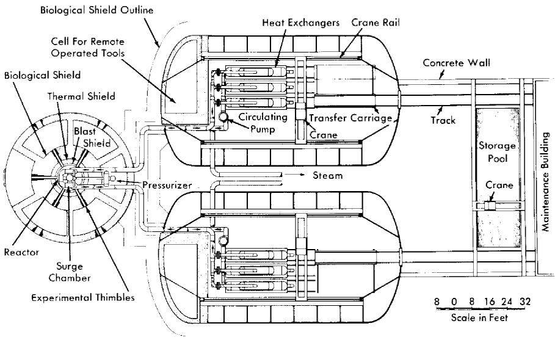  
FIG. 9-3. Homogeneous Research Reactor layout plan view.

System design. Two 17,650-gpm pumps mounted on the outlet pipes of the heat exchanger circulate the reactor solution around the primary circuit. Saturated steam at 300 psia is generated at a rate of $2.11 \times 10^{6} \mathrm{lb/hr}$ and is used to generate $133,000 \mathrm{kw}$ of gross electrical power at a cycle efficiency of $26.5\%$ . A net power generation of $125,000 \mathrm{kw}$ will be delivered at the station bus bars, approximately $6\%$ being required for station auxiliaries. Feedwater, consisting of $\mathrm{D}_2\mathrm{O}$ from the condensate tank, is supplied to the steam generator through an economizer by means of a 0.5-gpm feedwater pump. The reactor does not contain a letdown system for separating and recombining radiolytic gases, since $100\%$ internal recombination will be achieved by means of internal copper catalyst. Key design parameters are summarized in Table 9-3.

Conceptual layouts of reactor complex. Preliminary conceptual layouts showing the relation of the items pertaining to the nuclear reactor components are given by Figs. 9-3 and 9-4.

Figure 9-3 is a plan view of the reactor complex, indicating the general relation of the reactor pressure vessel and its auxiliaries to the heat exchangers and circulating pumps. Shielded cubicles around the reactor provide a means for handling the experimental thimbles. The outer diameter of the containment vessel around the cubicles is approximately 60 ft. Approximately 6 ft of high-density concrete is placed around the reactor area, with an additional 3 ft around the periphery of the containment vessel.

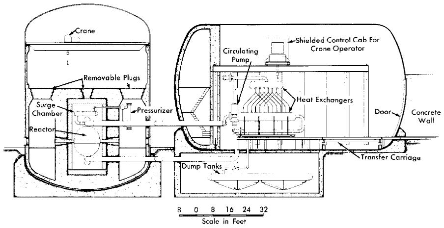  
FIG. 9-4. Homogeneous Research Reactor layout sectional elevation.

A sectional elevation of the reactor complex is shown in Fig. 9-4. The arrangement of the heat exchangers relative to the reactor vessel is such that natural circulation through the system will be promoted in the event of pump failure. Since the centerline of the reactor vessel is located at 30 to 36 in. above the operating-floor level for convenience in experimentation, the containment vessels for the heat exchangers and circulating pumps are above ground. The containment vessel for the reactor is a vertical cylindrical tank. Two separate horizontally mounted containment vessels, each 60 ft in diameter, house the heat-exchanger equipment. The dump tanks are directly below the heat-exchanger containment vessels. Means for limited access to those portions of the dump-tank system which will require periodic maintenance, such as dump valves, is provided.

Unique design features. Five horizontal in-pile thimbles spaced equally on the midplane of the reactor opening into cubicles, and one vertical nozzle, opening from the top of the reactor, are included in the design. Figure 9-5 shows the location of the thimbles relative to the containment vessel and cubicles, and the shield arrangement. As shown by Fig. 9-5, piping to the heat exchangers passes through one of the hot-cell working areas. Consequently, this area is not usable for experiments, but contains the pressurizer and other items which must be adjacent to the reactor but removed far enough from the reactor cell to permit maintenance.

Maintenance concept. Both dry and underwater removal methods have been investigated for the HRR; however, both schemes present difficult design problems. Dry-maintenance philosophy, chosen on a somewhat arbitrary basis, has been followed in the layouts presented herein.

Maintenance of equipment in the reactor compartment is expected to

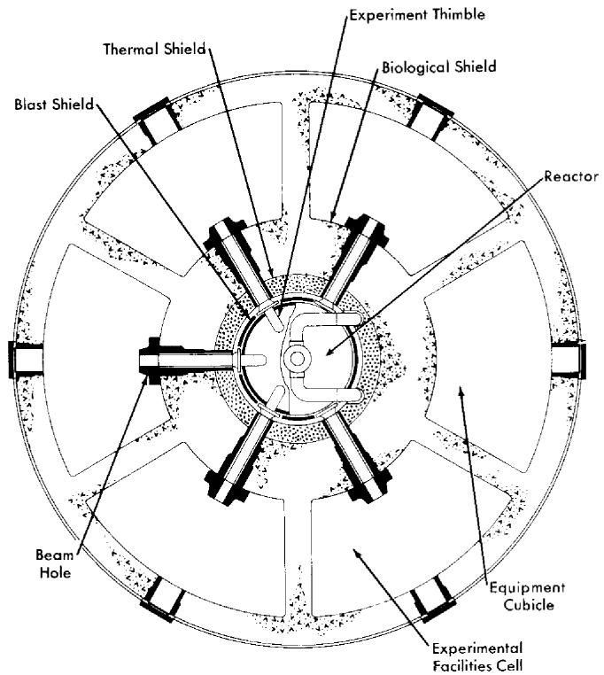  
FIG. 9-5. Plan view of Homogeneous Research Reactor, showing pressure vessel shielding and cells for remote handling of experiments.

be largely confined to the reactor auxiliary equipment and to the experimental thimbles and equipment. The reactor vessel itself is designed for the life of the system with thickness for the pressure-vessel wall and corrosion liner selected accordingly on the basis of existing corrosion data.

The handling equipment in the reactor containment vessel consists of a revolving-type crane with a shielded cab for the operator and provision for remote operation from outside the shielded area using commercial, remotely operated television cameras. Access from above to any part of the area is thus possible and all flanges and pipe disconnects are faced upward to facilitate removal.

A horizontal traveling crane, also with a shielded control cab and remote-operation control, is provided in each of the containment vessels for removal of the heat-exchanger equipment. Flanges connecting the circulating pumps and heat exchangers with the main piping are faced horizontally in these installations. All flanges are grouped at one end of the area and bolts are removed by means of remotely manipulated tools from a shielded cell. The heat exchangers, mounted on wheeled dollies guided by

tracks, can be moved horizontally along the track and onto another track section which can move transversely. From this section, the heat exchanger is moved through a large air-lock type of door at the end of the containment vessel to the maintenance area. The circulating pumps are designed so that the pump impeller and motor windings may be removed vertically without removing the pump casing.

During any part of the maintenance procedure, the system is shut down and drained and the piping and equipment decontaminated as thoroughly as possible. Shutoff valves of a size and type suitable for the piping of the HRR have not been developed.

9-3.3 The Advanced Engineering Test Reactor. A study was completed in March 1957 by Aeronutronic Systems, Inc., to select a reactor system for an advanced engineering test reactor (AETR), with seven major loop facilities providing a thermal-neutron flux $>2\times 10^{15}$ neutrons/ $(\mathrm{cm}^2)$ (sec) [6]. To obtain the required flux level while keeping the power density low, only heavy water-moderated reactors were considered. Comparisons of two heterogeneous and one homogeneous type, and comparison of single and multiple reactor installations, led to the conclusion that a single homogeneous reactor provides the greatest flexibility and is the most economical system for research at high neutron fluxes. A description of the homogeneous AETR reference design by the Aeronutronic group is given below:

Description of reactor. The 500-Mw reactor consists of a large core operating at moderate temperature and pressure and containing a $\mathrm{D}_2\mathrm{O}$ solution of $10\%$ enriched uranyl sulfate (10 g total U/liter). The reactor design, which was based upon the design and operational experience of the HRE-1 and HRE-2 and upon a design study for a homogeneous research reactor by ORNL, features continuous fission-product removal and fuel addition to maintain the total contained excess reactivity at an essentially constant level. In the center, or loop region, the unperturbed thermal-neutron flux is approximately $6\times 10^{15}$ neutrons/( $\mathrm{cm}^2$ ) (sec).

The reactor vessel is a spherical, stainless steel container with an internal diameter of 8 ft and a wall thickness of $3/4$ in., contained in a cylindrical pressure vessel with balanced pressures inside and out. The design is such that the test loop and coolant circuit tubes emerging through the lid of the pressure vessel can be disconnected, the packing glands at the bottom of the pressure vessel removed, and the entire reactor core vessel can be lifted out of the main container. The thin walls of the core vessel give it a low gross weight, enabling it to be lifted conveniently.

The cylindrical pressure vessel, 10 ft in diameter, $12\frac{1}{2}$ ft high, and 3 in. thick, is constructed of carbon steel to the specifications of the unfired pressure vessel code for an internal working pressure of 500 psia.

Operating parameters of the AETR are summarized in Table 9-4.

TABLE 9-4   
KEY DESIGN PARAMETERS (AETR)   

<table><tr><td>Type</td><td>Thermal, homogeneous</td></tr><tr><td>Total heat power</td><td>500 Mw</td></tr><tr><td>Fuel</td><td>Aqueous solution of UO2SO4in D2O</td></tr><tr><td>Fuel content</td><td></td></tr><tr><td rowspan="3">Core</td><td>80 kg uranium, enriched to 10%</td></tr><tr><td>6.5-8.5 kg U235</td></tr><tr><td>7500 liters fuel solution</td></tr><tr><td rowspan="3">System</td><td>375 kg uranium</td></tr><tr><td>37.5 kg U235</td></tr><tr><td>37,500 liters fuel solution</td></tr><tr><td>Fuel temperature: Inlet</td><td>98°C</td></tr><tr><td>Outlet</td><td>153°C</td></tr><tr><td>System pressure</td><td>500 psia</td></tr><tr><td>Flux (no test loops): Maximum thermal</td><td>6 × 1015 n/(cm2)(sec)</td></tr><tr><td>Power density distribution (with no loops): Maximum (center)</td><td>220 kw/liter</td></tr><tr><td>Average</td><td>70 kw/liter</td></tr><tr><td>Minimum (wall)</td><td>4 kw/liter</td></tr></table>

# 9-4. ONE-REGION BREEDERS AND CONVERTERS

9-4.1 The Pennsylvania Advanced Reactor $\mathbf{U}^{233}$ -thorium oxide reference design. The Pennsylvania Power and Light Company and the Westinghouse Electric Corporation joined forces in November 1954 to survey various reactor types for power generation. The results of the survey indicated the potential of the aqueous homogeneous reactor to be exceedingly encouraging and led to the formal establishment of the Pennsylvania Advanced Reactor Project in August 1955 to study the technical and economic feasibility of a large aqueous homogeneous reactor plant for central service application having an electrical output of at least $150,000\mathrm{kw}$ .

Two reactor plant reference designs were completed, and preliminary equipment layouts and cost estimates of these two plants were prepared [7,8]. In the first design it was proposed to use overhead dry maintenance with the equipment housed in a vertical cylinder 124 ft in diameter and 175 ft long. By incorporating shutoff valves in the system, any one of the four main coolant loops could be isolated in case of an equipment failure to permit the remainder of the plant to continue operation. At a convenient time, the plant would be shut down and the defective item removed and replaced with remote equipment such as heavy-duty manipulators, special

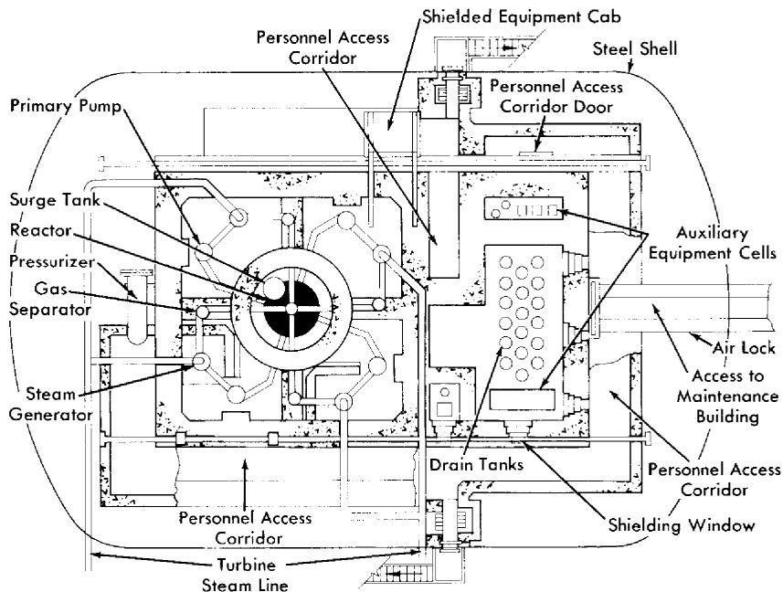  
FIG. 9-6. Plan view of Pennsylvania Advanced Reactor Reference Design No. 1A (courtesy of Westinghouse Electric Corp).

jigs and fixtures, and television viewing equipment lowered into the compartment. However, it was concluded that such a scheme would be extremely expensive. Therefore, a new design (Reference Design 1A) was prepared based on the specifications embodied in the following recommendations:

(1) Elimination of stop valves in each loop and abandonment of the idea of partial plant operation.   
(2) Compartmentalization of equipment depending on type and level of radioactivity.   
(3) Use of semidirect maintenance techniques wherever possible.   
(4) Modification of the vapor container design to permit personnel access in limited areas during plant operation.   
(5) Increased emphasis on design of components to minimize difficulty of maintenance.

Figures 9-6 and 9-7 show a plan and cross-sectional elevation of Reference Design 1A. In this design, a mixed-oxide slurry of a concentration of about $260\mathrm{g / kg}$ of $\mathrm{D}_2\mathrm{O}$ , corresponding to a solids concentration of approximately $3\%$ by volume, is circulated through the reactor vessel releasing $550,000\mathrm{kw}$ of thermal power, which in turn yields $150,000\mathrm{kwE}$ . Leaving the reactor vessel, the slurry branches into four parallel identical loops.

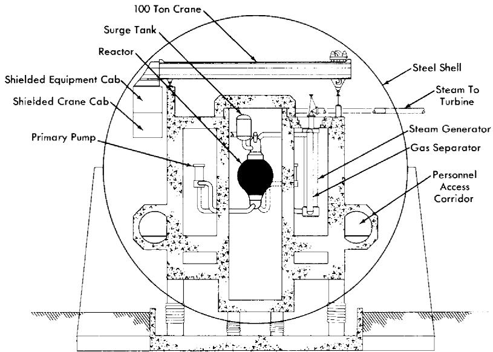  
FIG. 9-7. Cross section through main loops of proposed Pennsylvania Advanced Reactor (courtesy of Westinghouse Electric Corp.).

Each loop contains a circulating pump, a gas separator, and a steam generator. The system is pressurized with 2000 psia steam generated in a $\mathrm{D}_2\mathrm{O}$ steam generator connected to a surge chamber mounted in close-coupled position to the reactor vessel. The major portion of radiolytic gases is recombined internally; the remainder ( $\sim 10\%$ ) is left unrecombined in order to purge the system of xenon and other gaseous fission products. These gases are removed from the main stream by a pipeline gas separator to a catalytic-type recombiner. The recombined heavy water is used to wash the primary-pump bearings and as makeup water to the steam pressurizer.

A small bleed stream is concentrated in the slurry letdown system and delivered to a chemical processing plant where the uranium and thorium are recovered by a thorex solvent extraction process. The chemical plant is designed for a small throughput and low over-all decontamination factors. Although the rates of flow to the auxiliary systems are small compared with the 18,000,000 lb/hr rate of circulation in the primary system, these auxiliary systems contribute the major part of the complexity of the plant and a large fraction of its cost.

The reactor plant layout shown in Figs. 9-6 and 9-7 consists essentially of a horizontal steel cylinder 125 ft in diameter and 132 ft long with 7-ft-thick biological shielding walls completely separate from the vapor con

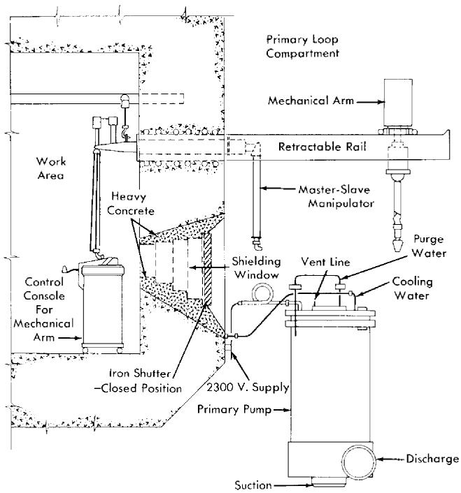  
FIG. 9-8. Primary circulating pump maintenance, Pennsylvania Advanced Reactor (courtesy of Westinghouse Electric Corp.).

tainer. The reactor vessel is shielded separately; however, the four primary coolant loops are contained in one large compartment with no shielding between the separate loops. Auxiliary equipment is contained in separate compartments, the equipment being segregated according to the type and level of radioactivity after shutdown. All four of the primary coolant loops are designed with polar symmetry to permit any component to be used as a replacement part in any of the four loops, and any special equipment required to be equally adaptable to all four loops. In addition, like pieces of equipment have been grouped to permit the use of relatively permanent maintenance facilities designed into that particular area. Personnel access corridors are provided to permit limited access to certain areas inside of the vapor container during full power operation of the reactor.

Dry-maintenance operations are accomplished primarily through the use of a 100-ton, shielded-cab crane which traverses the length of the reactor container. Since the cab can be occupied during operation, the crane serves as a remote tool for handling heavy shield blocks and removing and replacing equipment. The design is based on an all-welded piping system and removal of any item requires a remote cutting and welding machine not yet developed.

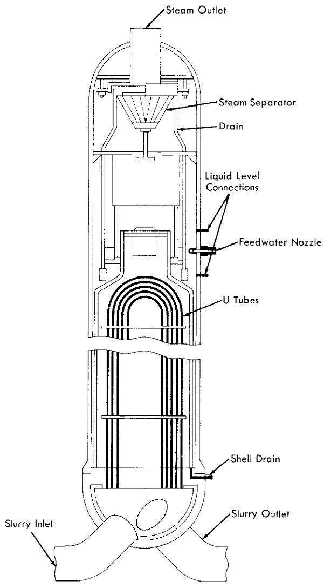  
FIG. 9-9. Steam generator for Pennsylvania Advanced Reactor (courtesy of Westinghouse Electric Corp.).

Because of the vulnerability of the circulating pumps and steam generators, special modifications are provided to permit these items to be repaired in place. A maintenance facility for repair of the primary circulating pumps is shown in Fig. 9-8. This consists of two mechanical master-slave manipulators inserted through the shielding wall adjacent to the pump, and a mechanical arm which may be placed on two retractable rails cantilevered from the shielding wall. Visibility is obtained by a glass shielding

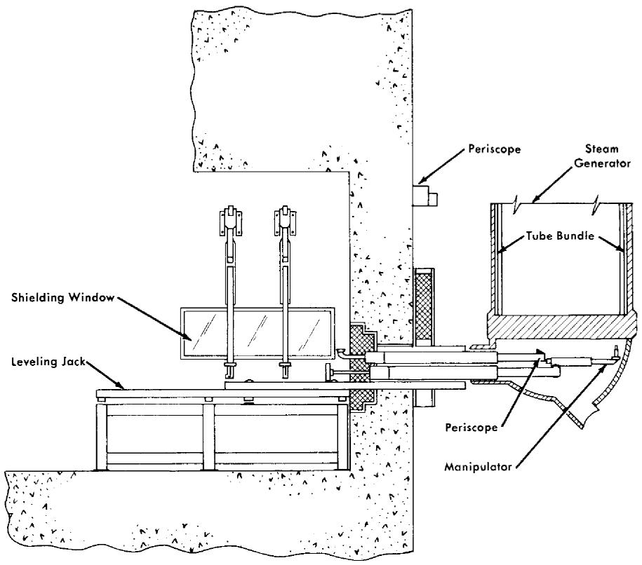  
FIG. 9-10. Facility for remote maintenance of Pennsylvania Advanced Reactor steam generator (courtesy of Westinghouse Electric Corp.).

window located beneath the manipulators. The window is designed to be an effective shield only during plant shutdown, and will be covered by iron shutters during plant operation to provide neutron and thermal shielding. A second shielding wall is located behind the work area to make up for the thin wall at this point.

The pump is provided with flanged joints with bolts and all other connections at the top for easy accessibility. The low-pressure cooling water connections are easily disconnected with the manipulators. The high-pressure purge line and vent lines, however, must be disconnected through flanges or by cutting and rewelding. The large flange bolts on the pump are provided with centrally drilled holes into which electric resistance heaters can be inserted with the mechanical master-slave manipulator. The heated bolts are easily loosened with a power-driven wrench held by the mechanical arm and removed with the master-slave manipulator. A lifting fixture is then lowered from the overhead crane and attached to

the pump flange and pump internals, which are then pulled from the pump volute casing. The pump is reinstalled in reverse order.

The steam generator shown in Fig. 9-9 uses inverted vertical U-tubes and has an integral steam separator. The unit is 6 ft in diameter and has an over-all length of about 40 ft. Because of the physical size and cost, it is not considered practical to use the spare-part replacement philosophy for this component. Instead, the design of the steam generator and the over-all plant layout is such that remote maintenance in place is possible without requiring a prohibitively long shutdown of the plant.

Figure 9-10 illustrates the proposed semiremote method for locating and repairing a leaky boiler tube.

The facility consists of a manipulator unit mounted on a horizontal rack which drives the unit through the shielding wall into access holes in the steam generator head. The manipulator is used to carry and position a detector for locating a leaky tube and the necessary tools for plugging and welding the tube. The faulty tube is prepared for welding by a specially designed grinding machine positioned and supported by the manipulator. The grinder will automatically shape the tube for a plug and the seal weld which will be made with an automatic welder. This equipment can be moved from one cell to another as needed; thus all four steam generator tube sheets can be maintained by semiremote methods.

9-4.2 Large-scale aqueous plutonium-power reactors. Studies of the feasibility and economics of producing plutonium in homogeneous reactors fueled with slightly enriched uranium as $\mathrm{UO}_2\mathrm{SO}_4$ in $\mathrm{D}_2\mathrm{O}$ were carried out by the Oak Ridge National Laboratory [9-11], by the Argonne National Laboratory [12-13], and by others [14-15]. The studies were all based on one-region converters constructed of stainless steel utilizing spherical pressure vessels ranging in size from 15 to 24 ft in diameter. The design and operating characteristics of typical reactors considered in the studies are summarized in Table 9-5.

The general conclusion reached was that aqueous homogeneous reactors are potentially very low-cost plutonium producers; however, considerable development work remains before large-scale reactors can be constructed. The major problem is due to the corrosiveness of the relatively concentrated uranyl sulfate solutions used in such reactors, which requires that all the equipment in contact with high-temperature fuel be made of titanium, or carbon-steel lined, or clad with titanium. The development of suitably strong titanium alloys, bonding methods, or satisfactory steel-titanium joints has not yet proceeded sufficiently to consider the construction of full-scale plutonium producers. Alternate approaches, such as the addition of $\mathrm{Li_2SO_4}$ to reduce the corrosiveness of stainless steel by the fuel solution (see Chap. 5), show promise but also require further development.

TABLE 9-5   
CHARACTERISTICS OF LARGE-SCALE AQUEOUS PLUTONIUM PRODUCERS   

<table><tr><td rowspan="2"></td><td colspan="6">Source of Data</td></tr><tr><td>ORNL-855</td><td>ORNL-1096</td><td>ORNL-CF-52-8-7</td><td>ORNL-1096 Rev. Data</td><td>ANL-4891</td><td>CEPS-1101</td></tr><tr><td>Date</td><td>Oct. 1950</td><td>Dec. 1951</td><td>Aug. 1952</td><td>1955</td><td>Dec. 1952</td><td>May 1952</td></tr><tr><td>Power, Mw (thermal)</td><td>1000</td><td>2000</td><td>1028</td><td>2000</td><td>1028</td><td>1064</td></tr><tr><td>Net electric output, Mw</td><td>230</td><td>470</td><td>228</td><td>435</td><td>211</td><td>211</td></tr><tr><td>Reactor core diameter, ft</td><td>24</td><td>15</td><td>15</td><td>15</td><td>15</td><td>12</td></tr><tr><td>Pressure vessel thickness, in.</td><td>5.3</td><td>4.5</td><td>7</td><td>—</td><td>7</td><td>—</td></tr><tr><td>Fuel concentration, g U/liter</td><td>115</td><td>250</td><td>250</td><td>250</td><td>250</td><td>290</td></tr><tr><td>Initial fuel enrichment, % U235</td><td>0.80</td><td>1.05</td><td>1.075</td><td>1.08</td><td>1.12</td><td>1.2</td></tr><tr><td>Fuel inventory, metric tons</td><td>22</td><td>30</td><td>35</td><td>35</td><td>33</td><td>58</td></tr><tr><td>D2O inventory, metric tons</td><td>208</td><td>130</td><td>105</td><td>150</td><td>155</td><td>160</td></tr><tr><td>Plutonium production rate, g/MwD</td><td>0.97</td><td>1.05</td><td>1.09</td><td>1.05</td><td>1.12</td><td>1.0</td></tr><tr><td>Liquid inlet temperature, °C</td><td>208</td><td>206</td><td>200</td><td>200</td><td>210</td><td>208</td></tr><tr><td>Liquid exit temperature, °C</td><td>250</td><td>250</td><td>250</td><td>250</td><td>250</td><td>250</td></tr><tr><td>System pressure, psi</td><td>1000</td><td>1000</td><td>1000</td><td>1000</td><td>1000</td><td>1000</td></tr><tr><td>Steam conditions, °F/psia</td><td>480*/200</td><td>380/200</td><td>385/210</td><td>380/200</td><td>370/175</td><td>382/200</td></tr><tr><td>Capital cost data ($ millions)</td><td></td><td></td><td></td><td></td><td></td><td></td></tr><tr><td>Reactor plant</td><td>37</td><td>50</td><td>36</td><td>45</td><td>50</td><td>49</td></tr><tr><td>Turbogenerator plant</td><td>15</td><td>37</td><td>31</td><td>60</td><td>47</td><td>39</td></tr><tr><td>Total</td><td>52</td><td>87</td><td>67</td><td>105</td><td>97</td><td>88</td></tr><tr><td>Unit costs, $/kwE</td><td>226</td><td>185</td><td>294</td><td>232</td><td>460</td><td>415</td></tr></table>

*Superheated 100°F

9-4.3 Oak Ridge National Laboratory one-region power reactor studies. Preliminary designs of intermediate and large-scale one-region reactors have been carried out at the Oak Ridge National Laboratory for the purpose of establishing the desirability, relative to two-region reactors, of such plants for producing power [16,17]. A description of the design of a typical large-scale plant with a capacity of approximately 316 net Mw of electricity follows.

The uranium-plutonium or thorium-uranium fuel is pumped at 130,000 gpm through a 15- to 20-ft-diameter core, where the temperature is increased from 213 to $250^{\circ}\mathrm{C}$ . Slurry leaving the core flows through four large gas separators, where $\mathrm{D}_2$ and $\mathrm{O}_2$ are separated and diluted with helium, $\mathrm{O}_2$ , and $\mathrm{D}_2\mathrm{O}$ vapor, and then to eight 160-Mw heat exchangers. The slurry is cooled in the exchangers and returned to the reactor by eight 16,000 gpm, canned-motor pumps.

Gas and entrained liquid from the separators pass through four parallel circuits into high-pressure storage tanks, where the entrained liquid is removed to be returned to the reactor. The $\mathrm{D}_2$ and $\mathrm{O}_2$ are recombined on a platinized alumina catalyst and cooled in $17\mathrm{Mw}$ , tubular heat exchangers which condense the $76\mathrm{gpm}$ of excess $\mathrm{D}_2\mathrm{O}$ . The cooled gases are recirculated to the gas separators, and the condensate returns to the fuel through the rotor cavities of the pumps, the demisters, and the high-pressure storage tanks.

The slurry fuel is expected to contain 100 to $300\mathrm{g}$ /liter of uranium as either oxide or phosphate, and thorium as either oxide or hydroxide suspended in $\mathrm{D}_2\mathrm{O}$ . Estimates of gas generation rates have been based on the use of $\mathrm{UO_3}$ platelet particles 1 micron thick and approximately 1 to 5 microns on a side. The $G_{\mathrm{D_2O}}$ value was taken as 1.3 molecules of $\mathrm{D}_2\mathrm{O}$ disintegrated per 100 ev of energy dissipated in the slurry, postulating that $80\%$ of the fission fragments escape from the oxide particles. It is possible that much lower $G$ -values will be obtained in representative experiments and that the size of the gas system can thereby be reduced considerably.

A 15-ft-diameter sphere operated at 1000 psi and $250^{\circ}\mathrm{C}$ requires a $4\frac{1}{2}$ -in.-thick wall to keep the combined pressure and thermal stress below 15,000 psi. Carbon steel, clad with stainless steel, is specified as the material of construction for the vessel. The thermal shield may be stainless steel or stainless-clad carbon steel, depending on which would be the less costly. The weight of the vessel and thermal shield is 150 tons, while 75 tons of slurry containing $200\mathrm{gU / liter}$ are required to fill the vessel.

The estimated cost of the 316-Mw plant was $14-19 million for the reactor portion and$ 44 million for the power plant section, which corresponds to a unit cost of $185-200/kwE.

TABLE 9-6   
OPERATING CONDITIONS—180 MW ELECTRICAL PLANT   

<table><tr><td></td><td>Core system</td><td>Blanket system</td></tr><tr><td>General</td><td></td><td></td></tr><tr><td>Thermal power, Mw</td><td>360</td><td>280</td></tr><tr><td>Fluid</td><td>UO2SO4-D2O sol.</td><td>ThO2-D2O disp.</td></tr><tr><td>Concentration, g/liter U233</td><td>1.80</td><td>8.00</td></tr><tr><td>Th232</td><td>-</td><td>1000.00</td></tr><tr><td>Primary system—pressure, psia</td><td>1800</td><td>1800</td></tr><tr><td>Reactor inlet temperature, °C</td><td>258</td><td>258</td></tr><tr><td>Reactor outlet temperature, °C</td><td>300</td><td>300</td></tr><tr><td>System volume, liters</td><td>28,760</td><td>41,785</td></tr><tr><td>Maximum fluid velocity, fps</td><td>33.6</td><td>28.7</td></tr><tr><td>Loop head loss, psig</td><td>58</td><td>80</td></tr><tr><td>Fuel</td><td></td><td></td></tr><tr><td>Total fuel in system, kg, U233</td><td>51.8</td><td>334.3</td></tr><tr><td>Th232</td><td>-</td><td>41,785</td></tr><tr><td>Fuel burnup, g/day, U233</td><td>447</td><td>332</td></tr><tr><td>Th232 (consumption)</td><td>-</td><td>828</td></tr><tr><td>Fuel removed</td><td></td><td></td></tr><tr><td>grams U233/day</td><td>210</td><td>498</td></tr><tr><td>kilograms thorium/day</td><td>-</td><td>62.0</td></tr><tr><td>liters/day</td><td>117</td><td>62.0</td></tr><tr><td>Primary circulating pumps</td><td></td><td></td></tr><tr><td>Number</td><td>3</td><td>3</td></tr><tr><td>Capacity, gpm</td><td>11,300</td><td>9600</td></tr><tr><td>Differential pressure, psi</td><td>58</td><td>80</td></tr><tr><td>Estimated efficiency, %</td><td>60</td><td>60</td></tr><tr><td>Horsepower</td><td>650</td><td>750</td></tr></table>

(Continued)

# 9-5. TWO-REGION BREEDERS

9-5.1 Nuclear Power Group aqueous homogeneous reactor. A study of power stations ranging in size from 94 to 1080 megawatts of net electrical generating capacity was carried out by the Nuclear Power Group [18]. The plants considered utilized a two-region Th- $\mathrm{U}^{233}$ reactor. While several plants of different electrical capacities were studied, emphasis was

TABLE 9-6 (Continued)   

<table><tr><td></td><td>Core system</td><td>Blanket system</td></tr><tr><td>Steam generators</td><td></td><td></td></tr><tr><td>Number of units</td><td>3</td><td>3</td></tr><tr><td>Surface sq. ft./unit</td><td>14,800</td><td>12,650</td></tr><tr><td>Feedwater inlet temperature, °F</td><td>405</td><td>405</td></tr><tr><td>Steam temperature, °F</td><td>480</td><td>480</td></tr><tr><td>Steam pressure, psia</td><td>566</td><td>566</td></tr><tr><td>Thermal capacity/unit, Mw</td><td>119</td><td>93</td></tr><tr><td>Gas condenser</td><td></td><td></td></tr><tr><td>Type: Horizontal, straight-tube, single-pass, shell-and-tube ex-changers with internal eliminator</td><td></td><td></td></tr><tr><td>Number of units</td><td>1</td><td>1</td></tr><tr><td>Surface area, ft2</td><td>800</td><td>800</td></tr><tr><td>Feedwater inlet temperature, °F</td><td>405</td><td>405</td></tr><tr><td>Steam temperature, °F</td><td>480</td><td>480</td></tr><tr><td>Steam pressure, psia</td><td>566</td><td>566</td></tr><tr><td>Thermal capacity/unit, Mw</td><td>3.5</td><td>3.5</td></tr></table>

directed toward a plant having a net electrical capacity of 180 MwE.  
Pertinent operating conditions of this plant are listed in Table 9-6.

The reactor consists of a 6-ft-diameter spherical core surrounded by a 2-ft-thick blanket enclosed in an 11 ft 4 in. ID stainless-clad carbon steel pressure vessel with a wall thickness of approximately 6 in. The pressure vessel has a bolted head to permit removal of the concentric-flow core tank if necessary. The fuel solution enters the core through a 24-in. inner pipe and exits through an annulus of equivalent area between two concentric pipes forming the inlet and outlet connections for the core tank. One mechanical joint is required to attach the zirconium core tank to the stainless steel outlet pipe. The slurry enters the blanket through a 24-in. connection in the bottom of the pressure vessel and exits through three 14-in. connections located near the top of the vessel.

Thermal shield. The 4-in.-thick thermal shield to protect the pressure vessel from excessive radiation is provided in the form of two 2-in.-thick stainless steel plates. A 2-in. space is maintained between these plates and between the thermal shield and the pressure vessel. Sufficient flow of the

slurry is maintained between and around the shield segments to ensure proper cooling.

Vessel closure. The bolted head closure utilizes two Flexitallic gaskets (asbestos encased in stainless steel), having a low-pressure leakoff between gaskets. The internal diameter of the closure is slightly greater than 6 ft, to allow for the core tank removal. Similar bolted joints are provided in the inlet and outlet piping connections to the core as well as in the core tank dump line.

Steam generators. Six steam generator units each consisting of two heat exchangers connected to a common steam drum are required, three for the core system and three for the blanket heat removal. By using U-bend tubes in the exchangers, the need for an expansion joint in the shell or in the connection to a floating tube sheet is eliminated. This adds reliability to the unit, since any expansion joint subject to even infrequent work is a potential and likely source of trouble.

Utilizing the compartmentalized concept in the heat exchangers offers added reliability, ease of fabrication, and a means by which maintenance of the units becomes practical. The individual "bottles," consisting of 19 U-tubes attached to their tube sheets in the eccentric pipe reducers by rolling and welding, can be fabricated and tested as units before installation in the exchanger. The drilling of the "bottle" tube sheets presents practically no difficulty because they are only $5\frac{3}{8}$ in. in diameter. Similarly, the drilling of the exchanger head for insertion of the 2-in. inlet and outlet pipes to the "bottles" presents no unusual fabrication problems.

Although the goal is theoretically "leakproof" heat exchangers, provisions are incorporated for maintenance. This has been done in the compartmentalized concept. Should a leak occur, it is practical to seal off the "bottle" in which the leak occurs by plugging the 2-in. inlet and outlet pipe connections, rather than remove an entire heat exchanger.

Primary circulating pumps. The hermetically-sealed-motor, centrifugal pumps required to recirculate the core and blanket fluids are vertical, with the main impeller mounted on the lower end of a shaft on which also is mounted the motor rotor. The motor rotor and bearing chamber are separated from the impeller and volute by means of a labyrinth seal. $\mathrm{D}_2\mathrm{O}$ from the high-pressure condensate tank is injected into the bearing chamber and continuously flushed through the labyrinth, thus minimizing corrosion on the rotor and bearing parts. Both the radial and thrust bearings are of the fluid piston type. The drive motors are induction type, suitable for 3-phase 60-cycle 4160-volt power supply. They have impervious liners in the stator bore for hermetic sealing, and an outer housing totally enclosing the stator as a second safeguard against loss of system fluid. The motor stator windings are cooled by a liquid passing through tubular conductors installed in the stator. All material in contact with the

core solution and $\mathrm{D}_2\mathrm{O}$ is stainless steel, except for the impeller, labyrinth inserts, impeller nut, and wear rings, which are titanium.

By unbolting the top flange, the entire pump mechanism can be removed, leaving only the high-pressure pump casing in the pipeline, thus facilitating maintenance.

Shielding and containment. The reactor plant is housed in a 175-ft-diameter steel sphere. Design pressure is 40 psia, which requires a nominal plate thickness of $3/4$ in. The sphere is buried to a depth of 50 ft, allowing the reactor vessel to be located below grade for natural ground shielding.

Radioactive components are enclosed by a barytes concrete structure which serves both as a biological and as a blast shield. The top of this housing is 35 ft above grade elevation. The side walls are 5 ft thick, and the top shield is 6 ft thick except for an 8-ft-thick section directly over the reactor vessel. Compartment walls are provided within the housing to facilitate flooding of individual component sections. The floor and side walls of each of the compartments are lined with 1/8-in. stainless steel plate to permit decontamination. Stepped plugs are provided in the top shield to permit access to the components. The portion of the shielding around the reactor vessel, which is below grade, is 4 ft thick. A slight negative pressure is maintained within the container by continuously discharging a small quantity of air to a stack for dispersal. The quantity of air removed is regulated to control the ambient temperature in the component compartments.

# Cost analysis

This study indicates that a generating station with a net thermal efficiency of $28.1\%$ might be constructed for approximately $\$240.00/\mathrm{kw}$ and $\$200.00/\mathrm{kw}$ at the 180-Mw and 1080-Mw electrical levels, respectively. These values result in capital expenses of approximately 4.72 and 3.86 mills/kwh.

9-5.2 Single-fluid two-region aqueous homogeneous reactor power plant. The feasibility of a 150,000-kw (electrical) aqueous homogeneous nuclear power plant has been investigated by a joint study team of the Nuclear Power Group and The Babcock & Wileox Company [19]. In this concept, the reactor is a single-fluid two-region design in which the fuel solution circulates through the thoria pellet blanket as the coolant. Components and plant arrangement have been designed to provide maximum overhead accessibility for maintenance. All components in contact with reactor fuel at high pressure are themselves enclosed in close-fitting high-pressure containment envelopes.

General description and operation of plant. The reactor generates 620-psia steam at the rate of $2.13 \times 10^{6} \mathrm{lb/hr}$ .

The reactor system is contained in a building 196 ft long, 131 ft wide, and 50 ft high. The equipment is located in a group of gastight cells measuring 196 ft × 131 ft over-all. These cells are equipped with pressure-tight concrete lids to facilitate overhead maintenance of the various system components and minimize the radiation shielding required above the floor and outside of the building. All components in the reactor plant have been designed in accordance with this overhead maintenance philosophy.

The basic systems comprising the reactor plant are: (1) A primary system, containing the reactor, the main coolant loops, the boiler heat exchangers, the pressurizer, the surge tank, and the standby cooler; (2) the letdown system; (3) the fuel handling and storage system; (4) the off-gas system; and (5) the auxiliary systems containing leak-detection and fuel-sampling facilities.

The blanket consists of 14 cylindrical assemblies arranged around the periphery of the core region. These assemblies contain thorium-oxide pellet beds which are cooled by fuel flowing from a ring header below the reactor vessel. The fuel follows a zigzag path through the pellets and leaves the assemblies through top outlets, flows through the core region, and out the bottom of the vessel. By this means, the usual core-tank corrosion and replacement problems and slurry handling problems are minimized. By means of devices located at the tops of the tubes extending out of the reactor the assemblies are periodically rotated to minimize absorption of neutrons by protactinium and equalize the buildup of $\mathrm{U}^{233}$ in the thorium. Replacement of the assemblies is possible through a smaller closure than would be required for a two-region reactor with a single core tank.

The reactor vessel is surrounded by a high-pressure containment vessel which forms part of the containment system described below. Over-all height of the reactor is 28 ft 6 in. and the outer diameter of the containment shell is 12 ft $1_{4}^{3}$ in.

The boiler heat exchangers are designed so that by removing the head there is direct access for plugging tubes or for removing entire tube bundles if necessary. These exchangers are a once-through type designed to evaporate $95\%$ of the feedwater flow at full load. The reactor fuel flows countercurrently through the shell side of the exchangers. Feedwater enters the baffled heads and passes through the U-tubes where the steam is generated. The steam-water mixture then leaves the exchangers and flows through a cyclone separator and scrubber to the turbine. These components, with their containment, are 34 ft $2\frac{1}{2}$ in. high and 4 ft $3\frac{1}{4}$ in. OD.

All piping and components holding high-pressure reactor fuel are contained in a close-fitting pressurized envelope capable of withstanding the total system pressure. These components and piping are further contained in pressure-tight concrete cells which are vented through rupture disks to a low-pressure gas holder, as shown in Fig. 9-11. This holder has a liquid-

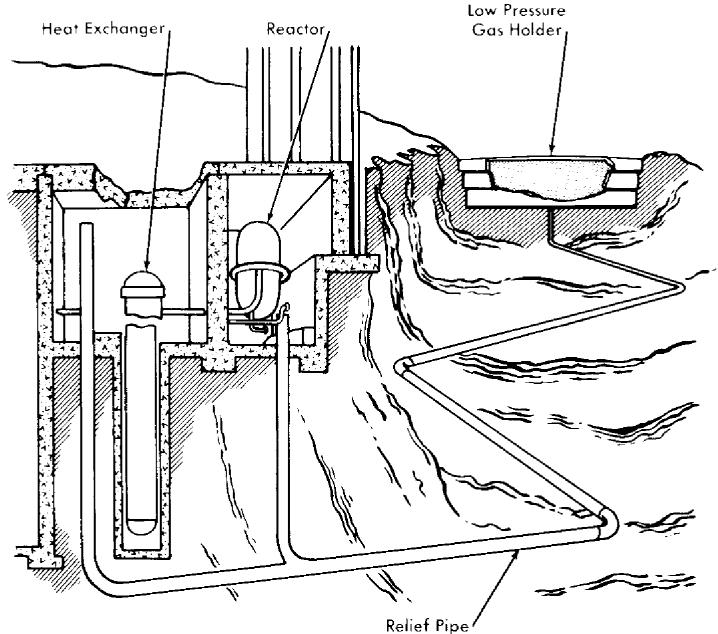  
FIG. 9-11. Schematic illustration of containment system (courtesy of the Nuclear Power Group and the Babcock & Wilcox Co.).

sealed roof which moves up and down in a manner similar to the movement of a conventional gas holder section. The low-pressure components do not have a close-fitting high-pressure envelope but are contained in pressure-tight cells and are vented to the low-pressure gas holders in a manner similar to the high-pressure components.

This type of containment permits operation of components for their full service life, reduces or eliminates missile formation and fuel losses, reduces primary system working stresses, and allows equipment arrangement giving maximum access for maintenance.

Table 9-7 summarizes the characteristics of the proposed plant.

Reactor. The general characteristics of the reactor are illustrated by Fig. 9-12, which shows the annular arrangement of the Zircaloy-2 blanket assemblies around the core region. The thorium-oxide pellets within these assemblies are cooled by the reactor fuel solution, which is pumped up through the packed beds from the supply header. To reduce the pressure drop across the pebble bed, the solution is introduced through a tapered perforated pipe the same length as the assemblies, flows into the bed and by means of baffles is directed back to the center outlet pipe, which is concentric with the inlet.

The vessel has ellipsoidal heads, is 9 ft 11 in. ID, and has a cylindrical shell length of 10 ft 6 in. The upper head contains a 3-ft $3\frac{1}{2}$ -in.-diameter

TABLE 9-7 DESIGN DATA FOR THE SINGLE-FLUID TWO-REGION REACTOR  

<table><tr><td colspan="2">Over-all plant performance</td></tr><tr><td>Thermal power developed in reactor, Mw</td><td>520</td></tr><tr><td>Gross electrical power, Mw</td><td>158</td></tr><tr><td>Net electrical power, Mw</td><td>150</td></tr><tr><td>Station efficiency, %</td><td>28.5</td></tr><tr><td colspan="2">General reactor data</td></tr><tr><td>Fuel solution</td><td>UO2SO4-D2O</td></tr><tr><td>Operating pressure, psia</td><td>1500</td></tr><tr><td>Fuel inlet temperature, °F</td><td>514</td></tr><tr><td>Fuel outlet temperature, °F</td><td>572</td></tr><tr><td>Area of stainless steel (in contact with fuel solution), ft2</td><td>90,000</td></tr><tr><td>Total volume of primary system, ft3</td><td>2,300</td></tr><tr><td>Area of Zircaloy-2 (in contact with fuel solution), ft2</td><td>2,240</td></tr><tr><td colspan="2">Core</td></tr><tr><td>Fuel flow rate, lb/hr</td><td>24.9 × 10^6</td></tr><tr><td>Velocity, fps</td><td>6.3</td></tr><tr><td>Volume of core solution, liters</td><td>67,000</td></tr><tr><td>Letdown rate, gpm</td><td>100</td></tr><tr><td>Thorex cycle time, days</td><td>115</td></tr><tr><td>Hydroclone cycle time, days</td><td>1</td></tr><tr><td>Hydroclone underflow removal rate, liters/day</td><td>583</td></tr><tr><td colspan="2">Blanket</td></tr><tr><td>Assembly diameter, in.</td><td>18</td></tr><tr><td>Fertile material</td><td>ThO2 pellets</td></tr><tr><td>Thorium loading, kg</td><td>17,850</td></tr><tr><td>Thorium irradiation cycle, days</td><td>744</td></tr><tr><td>Thorium processing rate, kg/day</td><td>23</td></tr><tr><td>Processing rate of mass-233 elements, g/day</td><td>350</td></tr></table>

flanged opening to permit removal of the thorium assemblies. The closure is a double-gasketed bolted cover having a monitoring or buffer seal connection to the annulus between the gaskets to detect leakage of the fuel solution. The lower pressure vessel head is penetrated by fourteen 7-in. openings through which fuel flows upward into the blanket assemblies from the toroidal supply header. This head has a 3-ft-diameter fuel outlet. The thermal shielding consists of alternate layers of stainless steel and fuel solution. The total shielding thickness is 8 in. over the cylindrical portion and 12 in. at the head ends of the reactor pressure vessel.

Boiler heat exchangers. The boiler heat exchanger is a U-tube, vertical,

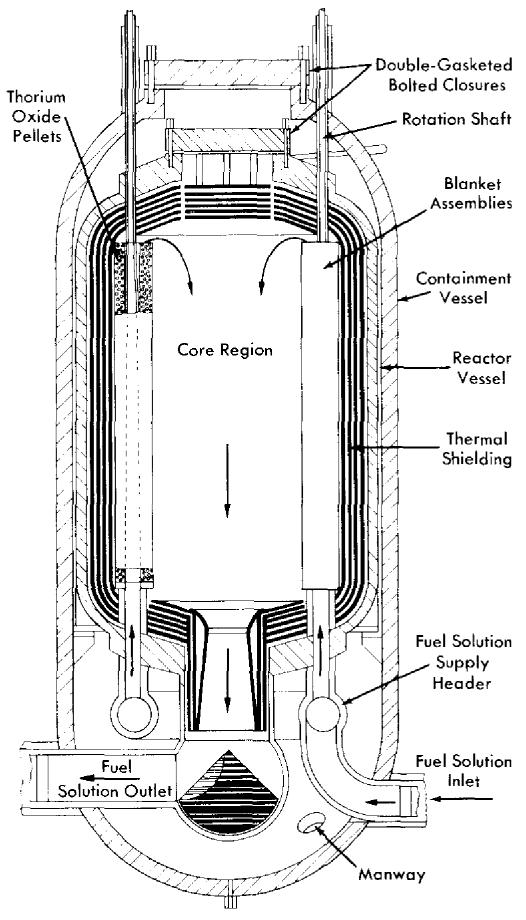  
FIG. 9-12. Single-fluid two-region aqueous reactor (courtesy of the Nuclear Power Group and the Babcock & Wilcox Co.).

forced-circulation design in which reactor fuel flows on the shell side and boiling light water on the tube side.

By placing the reactor fuel on the shell side, the tube sheet acts as its own shield and is subjected to less intense nuclear radiation, minimizing gamma heating and thermal-stress problems. Such a design permits the use of thermal shields which would also serve to protect the tube sheet from thermal shock due to sudden variations of fuel temperatures. In the event of a failure of tubes or tube sheet connections it is necessary to remove only the faulty tube bundle and leave the exchanger shell and flanged connections intact. This is accomplished by removing the bolted head and tube sheet brace and cutting the seal ring weld at the periphery of the tube sheet. The bundle is then lifted out of the shell by the overhead crane.

Reactor building. The building which houses the reactor plant will be airtight and will serve as a containment for radioactive gases which may be released during maintenance. The building air will be monitored and filtered and will be vented to the exhaust stack.

Space is provided outside the reactor plant for an off-gas building stack, gas and vapor holders, gas handling building, hot laboratory and shops, waste handling building, and chemical processing buildings. The hot shops and chemical processing building are located as shown to permit mutual access to a crane bay which extends from the reactor building between the two buildings. Both "hot" components and blanket assemblies are transported from the reactor building to the far end of the bay by a low, U-frame traveling crane. At the end of the bay they are transferred to an overhead crane running perpendicular to the bay, and transported to either of the two buildings. With this arrangement, hot materials may be transferred entirely underwater, thereby eliminating the need for bulky shielding and mobile cooling systems.

Maintenance considerations. A study of the problem of maintenance of a large-scale homogeneous reactor indicated the following. It appears impossible to accomplish some repair operations remotely in place and under 20 ft of water. Experience to date tends to indicate that the repair of radioactive equipment may be so difficult that it will be uneconomical to repair anything except such small components as valves and pumps. The larger defective components must be removed from the system and a replacement installed. The repairs, if possible, can then be made in a "hot machine shop" after the system is back in operation.

Removal of components from the cells will require shielding, such as lead oxads. Further study is necessary to determine the optimum means of performing this operation.

Extensive use of jigs and fixtures in performing maintenance work will be necessary for rapid and safe work. All the jigs and fixtures should be designed and constructed before the plant is put into operation. In many cases it will be advantageous to use the jigs during initial construction to be certain that they will function properly.

The estimated annual maintenance cost for a plant of the size considered is approximately $3,300,000, which includes the capital investment of maintenance equipment. This amounts to about 4 mills/kwh at \(60\%$ capacity factor or $\sim 3$ mills/kwh at $80\%$ capacity factor. The 150,000-kw nuclear power plant described is estimated to cost \)375.00/kw or $56,400,000, excluding $5,000,000 to $10,000,000 for research and development.

9-5.3 Oak Ridge National Laboratory two-region reactor studies. Intermediate-scale homogeneous reactor. In October 1952 design studies were

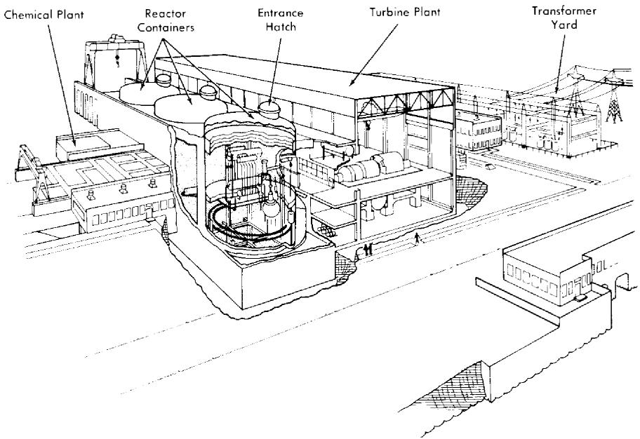  
FIG. 9-13. Artist's concept of Thorium Breeder Reactor Power Station.

started for a two-region multipurpose intermediate-scale homogeneous reactor as an alternate to the single-region reactors previously studied [20-22]. Several suggested core vessel arrangements for two-region converters were presented. In all designs the core shape approximates a 4-ft-diameter sphere, and a central thimble is incorporated to permit startup and shutdown with a full core containing the operating concentration of fuel. The major interest in the design of this type of reactor is the possibility of converting thorium into $\mathrm{U}^{233}$ in the blanket region of the reactor.

The principal system parameters on which the design of the two-region intermediate-scale homogeneous reactor is based are presented in Table 9-8.

Large-scale conceptual designs. Design work on the two-region intermediate-scale homogeneous reactor continued through the fall of 1953, with emphasis being placed on design studies of components and reactor layouts for an optimum design. In the meantime, conceptual designs of large-scale two-region reactors described below were carried out as a basis of feasibility studies.

The first design involved a 1350-Mw (heat) power plant containing three reactors [17]. Each of these operated at $450\mathrm{Mw}$ to produce a net of $105\mathrm{Mw}$ of electricity. The design of this plant, which is reviewed in the following paragraphs, is representative of the technology as of September 1953.

# TABLE 9-8

DESIGN PARAMETERS OF A TWO-REGION INTERMEDIATE SCALE HOMOGENEOUS REACTOR   

<table><tr><td></td><td>Core system</td><td>Blanket system</td></tr><tr><td>Power level, Mw</td><td>48</td><td>9.6</td></tr><tr><td>Fluid</td><td>\( \mathrm {UO}_{2}\mathrm {SO}_{4}-\mathrm {D}_{2}\mathrm {O} \)sol</td><td>\( \mathrm {ThO}_{2}-\mathrm {D}_{2}\mathrm {O} \)slurry</td></tr><tr><td>Concentration, g U/liter</td><td>4.8</td><td>1000</td></tr><tr><td>System pressure, psia</td><td>1000</td><td>1000</td></tr><tr><td>System temperature, °C</td><td>250</td><td>250</td></tr><tr><td>Vessel diameter, ft</td><td>4</td><td>8</td></tr><tr><td>Maximum fluid velocity, fps</td><td>22.3</td><td>12.3</td></tr><tr><td>Pumping requirements, gpm</td><td>5000</td><td>1000</td></tr><tr><td>Steam pressure, psia</td><td>215</td><td>215</td></tr><tr><td>Steam temperature, °F</td><td>388</td><td>388</td></tr><tr><td>Steam generated, lb/sec</td><td>38.7</td><td>8.0</td></tr></table>

In the proposed arrangement, three large cells are provided for the reactors and associated high-pressure equipment and a fourth is provided for the dump tanks and low-pressure equipment. Each reactor cell is divided into compartments for the reactor, heat exchanger, pumps, and gascirculating systems. The low-pressure equipment cell contains compartments for dump tanks, feed equipment, heat and fission-product removal, $\mathrm{D}_2\mathrm{O}$ recovery, and the limited amount of chemical processing that can be included in the reactor circulating system. Radiation from the cells is reduced to tolerable levels under operating conditions by concrete shielding. The individual compartments have sufficient shielding to permit limited access when equipment is being replaced.

Each reactor consists of a 6-ft-diameter spherical core, operated at a power of $320\mathrm{Mw}$ (100 kw/liter), surrounded by a 2-ft-thick blanket which is operated at a power of $130\mathrm{Mw}$ (11 kw/liter). Under equilibrium conditions, a solution containing $1.30\mathrm{g}$ of $\mathrm{U}^{233}$ , $\mathrm{U}^{234}$ , $\mathrm{U}^{235}$ , $\mathrm{U}^{236}$ (as uranyl sulfate dissolved in $\mathrm{D}_2\mathrm{O}$ ) is circulated through the core at a rate of $30,000\mathrm{gpm}$ under a pressure of $1000\mathrm{psia}$ . Fluid enters the core at $213^{\circ}\mathrm{C}$ and leaves at $250^{\circ}\mathrm{C}$ . Decomposition of the $\mathrm{D}_2\mathrm{O}$ moderator by fission fragments yields $240\mathrm{cfm}$ of gas containing $28\mathrm{mole}\% \mathrm{D}_2$ , $14\mathrm{mole}\% \mathrm{O}_2$ , and $58\mathrm{mole}\% \mathrm{D}_2\mathrm{O}$ .

Liquid leaving the core divides into two parallel circuits, each at $15,000\mathrm{gpm}$ , which lead into centrifugal gas separators. There the explosive mixture of deuterium and oxygen is separated from the liquid and

diluted below the explosive limit with a recirculated gas stream which contains oxygen, helium, and $\mathrm{D}_2\mathrm{O}$ . The gas-free liquid circulates through heat exchangers and is returned to the core by canned-motor circulating pumps. Steam is produced in the exchangers at 215 psig and $388^{\circ}\mathrm{F}$ .

The gas streams from the separators are joined and flow into a high-pressure storage tank accompanied by about $500\mathrm{gpm}$ of entrained liquid. After the entrainment is removed in mist separators for return to the liquid system, the $\mathrm{D}_2$ and $\mathrm{O}_2$ are recombined when the gas passes into a catalyst bed containing platinized alumina pellets. Heat liberated in the recombiner increases the temperature of the gas from 250 to $464^{\circ}\mathrm{C}$ . The hot gases are cooled to $250^{\circ}\mathrm{C}$ in a gas condenser which has a capacity of $20\mathrm{Mw}$ and condenses $\mathrm{D}_2\mathrm{O}$ at a rate of about $89\mathrm{gpm}$ . Some of the $\mathrm{D}_2\mathrm{O}$ is used to wash the mist separators and to purge the pump bearings and rotor cavity; the remainder is either returned to the system through the high-pressure storage tank or held in condensate storage tanks during periods when the concentration of reactor solution is being adjusted. The gas is recirculated to the gas separators by an oxygen blower.

Similar gas- and liquid-recirculating systems are used to remove heat from the blanket, which consists of a thorium-oxide slurry in $\mathrm{D}_2\mathrm{O}$ containing 500 to $1000\mathrm{g}$ Th/liter. The slurry is recirculated by means of a 12.400-gpm canned-motor pump through a gas separator and through a 130-Mw heat exchanger.

The reactor is pressurized with a mixture of helium and oxygen which is admitted as required. It is expected that most of the fission-product gases will be retained in the high-pressure gas-circulating systems with only whatever small, daily letdown is required to adjust the pressures. Calculations for a similar system indicate that enough $\mathrm{Xe}^{135}$ will be transferred into the gas stream to reduce the xenon poisoning in the reactor by a factor of 5 to 10.

The two-region thorium breeder reactor. A later design study was completed in the fall of 1954 by the Reactor Experimental Engineering Division of the Oak Ridge National Laboratory [23] for the purpose of delineating the technical and economic problems which would determine the ultimate feasibility of an aqueous homogeneous reactor for producing central station power.

The concept of the reactor chosen for study was based essentially on nuclear considerations and consists of a spherical two-region reactor with dimensions limited by economic considerations.

Table 9-9 presents the principal reactor characteristics for the preliminary design of a 300-Mw station.

The power plant complex, consisting of the reactor plant, the turbogenerator plant, the chemical processing plant, the cooling system, and part of the electrical distribution system, is shown in Fig. 9-13.

# TABLE 9-9

# REACTOR CHARACTERISTICS FOR PRELIMINARY

# DESIGN OF A 300-MW STATION

Electrical capability (each of three reactors), 100 Mw

Gross station efficiency, $27.4\%$

Net station efficiency, $26.0_{/0}^{o}$

Operating pressure, 2000 psia

<table><tr><td></td><td>Core</td><td>Blanket</td></tr><tr><td>Material of construction</td><td>Zircaloy-2</td><td>20% stainless-steel clad carbon steel</td></tr><tr><td>Wall thickness, in.</td><td>0.5</td><td>5.0</td></tr><tr><td>Thermal shield thickness, in.</td><td></td><td>4.0</td></tr><tr><td>Pipe connections</td><td>Concentric</td><td>Straight-through</td></tr><tr><td>Inside diameter, ft</td><td>5</td><td>10½</td></tr><tr><td>Blanket thickness, in.</td><td></td><td>27</td></tr><tr><td>Volume, liters</td><td>1855</td><td>11,600</td></tr><tr><td>Operating temperature, °C</td><td></td><td></td></tr><tr><td>Average</td><td>275</td><td>280</td></tr><tr><td>Inlet</td><td>250</td><td>245</td></tr><tr><td>Outlet</td><td>300</td><td>315</td></tr><tr><td>System volume, liters</td><td>9740</td><td>13,800</td></tr><tr><td>Fluid composition, g/liter D₂O*</td><td>UO₂SO₄-D₂O-CuSO₄</td><td>UO₃ThO₂-D₂O</td></tr><tr><td>U²³³</td><td>1.88</td><td>3.00</td></tr><tr><td>U²³⁴</td><td>1.90</td><td>0.17</td></tr><tr><td>U²³⁵</td><td>0.26</td><td>0.01</td></tr><tr><td>U²³⁶</td><td>3.00</td><td>0.00</td></tr><tr><td>Thorium</td><td></td><td>1000</td></tr><tr><td>Inventory, kg</td><td></td><td></td></tr><tr><td>D₂O</td><td>10,900</td><td>12,000</td></tr><tr><td>U²³₅ + U²³₃</td><td>26.1</td><td>42.9</td></tr><tr><td>Thorium</td><td></td><td>14,300</td></tr><tr><td>Flux at core wall, n/(cm²)(sec)</td><td>1.10 × 10¹⁵</td><td>1 × 10¹⁵</td></tr><tr><td>Power density at core wall, kw/liter</td><td>70.0</td><td></td></tr><tr><td>Mean power density in reactor, kw/liter</td><td>193</td><td>7.0</td></tr><tr><td>Power density in external system, kw/liter</td><td>61</td><td>55</td></tr><tr><td>Reactor power, Mw (heat)</td><td>313</td><td>72</td></tr><tr><td>Circulation rate, gpm</td><td>24,000</td><td></td></tr></table>

*At operating conditions.

The reactor plant consists of a space 80 ft 0 in. wide, 300 ft 0 in. long, and 45 ft 6 in. above ground level. At one end of the structure is located a storage pool for items freshly removed from the shield. A gantry crane services the reactors and its runway extends a distance beyond the shield for access to the pool and to provide lay-down space for a reactor-shield tank dome. Three cylindrical shield tanks are provided to contain each reactor and components.

In the event of a line rupture or equipment failure resulting in gross leakage of reactor fluids from the reactor system, no radioactive material will be released. This is accomplished by placing the reactor and components in a cylindrical tank, 66 ft 0 in. diameter $\times$ 116 ft 0 in. high, capable of withstanding 50 psig. Eight feet of concrete are poured around this tank to a height of 45 ft 0 in. above ground level for biological shielding.

As shown in Fig. 9-13, each of the container buildings has an access hatch. Items such as circulating pumps, pressurizer heater elements, evaporators, etc., for which the probability of maintenance is high, are grouped on one side of the shield and more or less under this hatch for servicing. No specific procedure for repairing or replacing equipment was developed; however, consideration was given to both wet and dry maintenance methods.

Homogeneous reactor experiment No. 3.* In 1957, conceptual design studies of HRE-3, a two-region homogeneous breeder reactor fueled with $\mathrm{U}^{233}$ and thorium, were initiated at the Oak Ridge National Laboratory [24]. This reactor, operating at $60\mathrm{Mw}$ of heat to produce approximately $19\mathrm{Mw}$ of electrical energy, will be designed to provide operational and technical data and to demonstrate the technical feasibility of an intermediate-scale aqueous homogeneous power breeder. The power plant will be a completely integrated facility incorporating (1) the nuclear reactor complex, (2) the electrical generating plant, and (3) the nuclear fuel recycle processing plant. Preliminary design criteria are given in Table 9-10.

As presently conceived, the reactor will be of the two-region type with a heavy-water uranyl-sulfate solution being circulated through the inner (core) region, where $50\mathrm{Mw}$ of heat are produced. A thorium-oxide slurry will be circulated through the outer pressure-retaining (blanket) region, where $10\mathrm{Mw}$ of heat are produced at equilibrium conditions. The fuel solution and slurry will be circulated through separate steam generators by the use of canned-motor pumps. The fuel heat exchanger will provide 195,700 lb/hr of saturated steam at 450 psia $(456^{\circ}\mathrm{F})$ at 50-Mw core power, and the slurry heat exchanger will provide 39,100 lb/hr of saturated steam at 450 psia $(450^{\circ}\mathrm{F})$ at 10-Mw blanket power. The blanket and core regions, operating at 1500 psia and $275^{\circ}\mathrm{C}$ and $280^{\circ}\mathrm{C}$ average temperatures, re

TABLE 9-10   
HRE-3 DESIGN CRITERIA   

<table><tr><td>Type</td><td>Two-region breeder</td></tr><tr><td>Core</td><td>UO2SO4+ CuSO4+ D2SO4in D2O</td></tr><tr><td>Blanket</td><td>ThO2+ UO2+ MoO3in D2O</td></tr><tr><td rowspan="2">Core critical concentration at 50 Mw and equilibrium</td><td>4.8 g U233/kg D2O</td></tr><tr><td>0.45 g U235/kg D2O</td></tr><tr><td rowspan="2">Blanket concentration at 10 Mw and equilibrium</td><td>1000 g Th/kg D2O</td></tr><tr><td>4.02 g U233/kg D2O</td></tr><tr><td>Average core temperature, °C</td><td>280</td></tr><tr><td>Average blanket temperature, °C</td><td>275</td></tr><tr><td rowspan="2">Average core power density for 50 Mw, kw/liter</td><td></td></tr><tr><td>52.6</td></tr><tr><td>Average blanket power density for 10 Mw, kw/liter</td><td>1.04</td></tr><tr><td>Estimated breeding ratio</td><td>1.05 (minimum)</td></tr><tr><td>Saturated steam pressure, psia</td><td>450</td></tr><tr><td>Gross electrical power, Mw</td><td>~19</td></tr></table>

spectively, are interconnected in the vapor region. Inasmuch as oxygen is consumed by mechanisms of corrosion and must be added continuously, it is currently favored as the pressurizing medium to provide the over-pressure necessary to prevent boiling and bubble formation. Sufficient homogeneous catalysts will be provided in the solution and slurry to recombine all the radiolytic gases formed in the circulating system during operation. In this manner it will be unnecessary to operate with continuous letdown of slurry and/or solution. Purge water for use in the high-pressure circulating systems will be produced by condensing a portion of the steam contained in the vapor volume of the pressurizer. Advantage is taken of the beta and gamma decay energy to maintain the pressurizers at a slightly higher temperature than the remaining portion of the system.

The electrical generating plant will be essentially of conventional design. The 20-Mw turbine will operate at $1800\mathrm{rpm}$ on 450 psia saturated steam with moisture separation equipment provided. The condensing water requirements are 31,300 gpm, assuming the water enters at $70^{\circ}\mathrm{F}$ and leaves at $80^{\circ}\mathrm{F}$ . The generating voltage of $13.8\mathrm{kV}$ is sufficient to permit direct connection to an existing distribution system.

The fuel reprocessing for HRE-3 will consist of concentrating insoluble fission and corrosion products in the underflow pots of hydroclone separators, recovery of uranium from the hydroclone underflow by $\mathrm{UO_4}$ precipitation, and recovery of $\mathrm{D}_2\mathrm{O}$ by evaporation. The slurry processing operation will consist of $\mathrm{D}_2\mathrm{O}$ recovery by evaporation and packaging the

irradiated $\mathrm{ThO_2}$ for shipment to the existing Oak Ridge National Laboratory Thorex Pilot Plant, where the uranium and thorium will be separated and reclaimed. The thorium will appear from the Thorex process as a thorium nitrate solution and will be converted to $\mathrm{ThO_2}$ before being returned to the blanket of the reactor.

The maintenance philosophy of the reactor complex has not yet been established. However, it can be said that the reactor system will be designed so that all components and equipment will be capable of being removed and replaced, but with varying degrees of difficulty. The choice of underwater, dry, or combination thereof, maintenance techniques has not been made. The major components of HRE-3 are considered to be in the range of sizes which might be used in a large-scale Thorium Breeder Power Plant. Design, development, fabrication, and operational and reliability data are expected to be gained from HRE-3, in addition to maintenance techniques for large-scale aqueous homogeneous reactors. A very preliminary cost study indicates a cost of about $29,000,000 for the reactor complex, the electrical generating plant, and the fuel reprocessing plant.

# REFERENCES

1. THEODORE ROCKWELL III, Reactor Shielding Design Manual, 1st ed. New York: D. Van Nostrand Company, Inc., 1956.   
2. W. F. TAYLOR, TBR Plant Turbogenerator System Study, USAEC Report CF-56-7-127, Oak Ridge National Laboratory, June 1956.   
3. FOSTER-WHEELER CORPORATION, Wolverine Electric Cooperative Proposal, Feb. 1, 1956, Report FW-56-004; Sargent and Lundy Estimate No. 3800-2, November 1957.   
4. M. I. LUNDIN and R. VAN WINKLE, Conceptual Design and Evaluation Study of 10,000 KWE Aqueous Homogeneous Nuclear Power Plant, USAEC Report CF-57-12-8, Oak Ridge National Laboratory, Dec. 11, 1957.   
5. P. R. KASTEN et al., *Aqueous Homogeneous Research Reactor—Feasibility Study*, USAEC Report ORNL-2256, Oak Ridge National Laboratory, Apr. 10, 1957.   
6. FORD MOTOR COMPANY, A Selection Study for an Advanced Engineering Test Reactor, Document No. U-047, Aeronutronic Systems, Inc., Glendale, Calif., Mar. 29, 1957.   
7. W. E. Johnson et al., The P.A.R. Homogeneous Reactor Project, Mech. Eng. 79, 242-245 (1957).   
8. WESTINGHOUSE ELECTRIC CORPORATION, 1956-1957. Unpublished.   
9. J. A. LANe et al., Oak Ridge National Laboratory, 1950. Unpublished.   
10. J. A. LANE et al., Oak Ridge National Laboratory, 1951. Unpublished.   
11. R. H. BALL et al., Oak Ridge National Laboratory, 1952. Unpublished.   
12. J. J. KATz et al., Argonne National Laboratory, 1952. Unpublished.   
13. L. E. Linck et al., Argonne National Laboratory, 1952. Unpublished.   
14. H. A. OHLGREN and D. J. MALLON, Idaho Operations Office, 1952. Unpublished.   
15. COMMONWEALTH EDISON COMPANY AND PUBLIC SERVICE COMPANY OF NORTHERN ILLINOIS. A Report on the Feasibility of Power Generation Using Nuclear Energy, 1952. Unpublished.   
16. W. E. THOMPSON (Comp.), Homogeneous Reactor Project Quarterly Progress Report for the Period Ending Mar. 15, 1952, USAEC Report ORNL-1280, Oak Ridge National Laboratory, 1952.   
17. R. B. Briggs et al., *Aqueous Homogeneous Reactors for Producing Centralstation Power*, USAEC Report ORNL-1642(Del.), Oak Ridge National Laboratory, 1954.   
18. H. G. CARSON and L. H. LANDRUM (Eds.), Preliminary Design and Cost Estimate for the Production of Central-station Power from an Aqueous Homogeneous Reactor Utilizing Thorium-Uranium-233, USAEC Report NPG-112, Commonwealth Edison Company (Nuclear Power Group), Feb. 1, 1955.   
19. COMMONWEALTH EDISON COMPANY, Single-fluid Two-region Aqueous Homogeneous Reactor Power Plant: Conceptual Design and Feasibility Study, USAEC Report NPG-171, July 1957.   
20. W. E. THOMPSON (Comp.), Homogeneous Reactor Project Quarterly Progress Report for the Period Ending July 1, 1952, USAEC Report ORNL-1318, Oak Ridge National Laboratory, 1952.

21. W. E. THOMPSON (Comp.), Homogeneous Reactor Project Quarterly Progress Report for the Period Ending Oct. 1, 1952, USAEC Report ORNL-1424(Del.), Oak Ridge National Laboratory, 1953.   
22. W. E. THOMPSON (Comp.), Homogeneous Reactor Project Quarterly Progress Report for the Period Ending Jan. 1, 1953, USAEC Report ORNL-1478(Del.), Oak Ridge National Laboratory, 1953.   
23. Oak Ridge National Laboratory, 1954. Unpublished.   
24. J. C. Bolger et al., Preliminary HRE-3 Design Data (Revised to 11-15-57), USAEC Report CF-57-11-74, Oak Ridge National Laboratory, Nov. 29, 1957.