# CHAPTER 10

# HOMOGENEOUS REACTOR COST STUDIES*

10-1. INTRODUCTION

10-1.1 Relation between cost studies and reactor design factors. The power cost associated with a reactor station may be subdivided into fixed charges, operating and maintenance costs, and fuel costs. Fixed charges include interest on investment, depreciation, and taxes; labor, supervision, and maintenance are included in the operating and maintenance costs; fuel costs include both variable and fixed chemical processing costs,† cost of feed materials, and inventory charges. Because of the uncertainty of these items, it is impossible to determine absolute costs for nuclear power until large nuclear plants have been built and operated. However, it is important that a reasonable effort be made to evaluate the cost in order to compare several fuel or reactor systems of equal technological development, to point out areas where substantial improvements are required, and to provide a basis for determining whether economical power can ever be produced.

Aqueous homogeneous reactors have certain features, such as high neutron economy and continuous fission-product removal, which make them appear to be potential economic power producers. However, as with all water-moderated reactors, to attain steam temperatures corresponding to thermal efficiencies of 25 to $30\%$ , circulating aqueous systems require operating pressures between 1000 and 2000 psia. Since thermal efficiency increases relatively slowly with increasing operating pressure, while reactor costs rise relatively sharply above pressures of about 1500 psi, it is unlikely that reactors will be operated at pressures above 2000 psia. In addition, increasing the reactor temperature tends to decrease the breeding ratio, which adversely affects fuel costs. Nearly all reactor systems considered have therefore been assumed to operate at pressures between 1500 and 2000 psia.

In order to optimize the design of a homogeneous reactor of a given power output and pressure, it is necessary to know how both the fixed and operating costs vary with the dimensions of the reactor core and pressure vessel. In this regard, one must take into consideration that the maximum diameter of the pressure vessel will be limited by fabrication problems, and the minimum diameter of the core vessel will be limited by corrosion

problems. For each combination of core- and pressure-vessel diameters within these limits, there will be a minimum fuel cost resulting from a balance of inventory costs, processing costs, and fuel-feed costs; these latter costs are determined by the breeding ratio, which is a function of fuel concentration and processing rate.

Although the fuel-fluid temperature influences power costs, this is normally limited by the properties of the fuel system or by the above-mentioned pressure limitations, rather than by economic considerations. However, the temperature range established on this basis is also close to that which gives minimum fuel costs. In addition, the power level of the reactor is usually assumed to be constant, although it is realized that this is a very important factor influencing the cost of power, since plant investment charges per unit power constitute a large fraction of the power cost and change appreciably with power level. The effect of power level on capital costs is discussed in Section 10-8, and on fuel costs in sections as noted.

The operating and maintenance costs, as well as plant investment costs, are a function of reactor type and method of maintenance. However, the exact form of some of the interrelations between design variables is not known at the present time. For example, the plant investment and maintenance costs are undoubtedly different for a burner-type reactor than for a breeder-type reactor; a cost difference would also exist between one- and two-region systems. However, because of the lack of information, most economic studies do not consider such differences, but assume investment and maintenance charges to be determined primarily by the reactor power level. The results of such studies are still significant if they are considered in the light of the assumptions used; as more cost data are accumulated, the results can be modified as required.

With respect to the fuel cycle costs, established Atomic Energy Commission prices for thorium, natural uranium, $\mathrm{U}^{233}$ , and $\mathrm{Pu}^{239}$ , and the schedule of charges for uranium of varying enrichments [1] provide a basis for cost calculations. Charges for various chemical conversion steps and for processing spent fuel in a multipurpose chemical plant have also been announced [2]. Although these charges are applicable to the processing of aqueous fuels, the possibility of including on-site processing facilities as part of the homogeneous reactor complex must also be considered, since this would have an effect on the reactor design.

10-1.2 Parametric cost studies at ORNL. The homogeneous reactor systems considered include one- and two-region reactors, breeders, converters, and burners. Although no one fuel or type of reactor shows a marked advantage in power cost over all the others, the superior fuel utilization of a thorium breeder system suggests that it is potentially the most economical one for power production. Much effort has been devoted

to two-region systems primarily because of the relatively high breeding ratio and low fuel inventory obtainable.

Economic evaluations discussed in this chapter are for the most part based on a three-reactor station generating a total of $375\mathrm{Mw}$ of electricity, where the required chemical processing facilities are shared by the three reactors. The present choice of reactor dimensions for a given power capability must be based on engineering judgment and the results of fuel-cost studies. Based on fuel-cost studies, one-region reactors must be large (14- to 15-ft diameter) in order to obtain good neutron economy; two-region systems can have good neutron economy in relatively small sizes (9- to 10-ft over-all diameter) but require high concentrations $(1000\mathrm{g / liter})$ of fertile material in the blanket region. Estimates of near-optimum reactor sizes for different homogeneous systems are based on fuel-cost studies in which highly enriched fissionable fuel is valued at $\$16/\mathrm{g}$ and inventory charges are $4\%$ . In all cases it is assumed that the particular fuel system is technologically feasible.

In computing the cost of power, the fixed charges on capital investment of depreciating items are assumed to be $15\%/\mathrm{yr}$ , including depreciation, interest, return on investment, insurance, and taxes. Fixed charges on nondepreciating items are assumed to be $4\%/\mathrm{yr}$ . Fuel, $\mathrm{D}_2\mathrm{O}$ , and fertile materials are assumed to be nondepreciating materials.

# 10-2. BASES FOR COST CALCULATIONS

10-2.1 Fuel costs. The fuel costs associated with electrical power produced from reactors include those charges which are due to replacement of conventional fuels with nuclear fuel. The fuel cost is considered to be the sum of the net cost of nuclear-fuel feed; inventory charges for fertile material, heavy water, and fuel; material losses; variable fuel-processing charges; and fixed charges for fuel processing. Fuel-cost studies are primarily for the purpose of investigating the economic importance of the several parameters; of these parameters the most important are core diameter, blanket thickness, fertile-material concentrations in core and blanket, fuel concentration in the blanket, and poison fraction in the core. In studying fuel costs, aqueous homogeneous power reactors are generally considered to operate at a temperature of $280^{\circ}\mathrm{C}$ , a pressure 1500 to 2000 psia, an $80\%$ load factor, and a net thermal-to-electrical efficiency of about $25\%$ . The thermal power level per reactor is considered to be 450 to 500 Mw. Thorium (as oxide) is valued at $\$5/\mathrm{lb}$ with no significant charge for making $\mathrm{ThO_2 - D_2O}$ slurry. Heavy water is valued at $\$28/\mathrm{lb}$ and highly enriched fissionable uranium at $\$16/\mathrm{g}$ . The amount of heavy water required is estimated on the basis of the total reactor-system volume and the room-temperature density of heavy water. The makeup rate is taken as

$5 \text{‰}$ /yr. The volume of the core circulating system is taken as the volume of the core plus an external volume of 1 liter for each $20\mathrm{kw}$ generated in the core. The blanket external volume (in two-region reactors) is calculated on the basis of 1 liter for each $14\mathrm{kw}$ generated in the blanket. The cost of natural uranium is taken as $\$ 40/\mathrm{kg}$ U either as $\mathrm{UO}_3$ or $\mathrm{UO}_2\mathrm{SO}_4$ . The cost of uranium of various enrichments in $\mathrm{U}^{235}$ is obtained essentially from the AEC price schedule or the equations for an ideal gaseous-diffusion plant [3-5].

Fuel costs are dependent upon the value assigned to plutonium and $\mathrm{U}^{233}$ . In a power-only economy the value of these fissionable materials can be no more or less than their fuel value; in these studies their value was taken to be the same as that for $\mathrm{U}^{235}$ , or $\\(16 / \mathrm{g}$ . However, if $\mathrm{U}^{233}$ and/or plutonium are assigned different values, the fuel costs can be significantly affected. This is shown in the results given for plutonium producers, in which a plutonium value of $\$ 40 / \mathrm{g} \) was assumed (this value is consistent with the ability of homogeneous reactors to produce plutonium containing less than $2\%$ $\mathrm{Pu}^{240}$ , and the AEC guaranteed fair price schedule for plutonium extending until June 30, 1963).

The fuel values used in these studies are slightly different from those announced by the AEC; the main difference is associated with the value used for plutonium. However, the effect of various plutonium values on fuel cost is indicated in the section on plutonium producers. The AEC-announced prices for nuclear materials are given in Table 10-1.

Since the rate of fuel burnup is small with respect to the inventory of fuel required for criticality, the investment and inventory charge for fuel materials can be appreciable. Unless otherwise specified, inventory charges for uranium, thorium, plutonium, and heavy water are assumed to be $4\%$ of their value per year.

An economic consideration in the design of nuclear power plants is the chemical processing requirement of the spent nuclear fuel. Aqueous homogeneous reactor fuels can be processed by either the Purex or the Thorex process. Both involve solvent extraction and require that the fuels be separated from the $\mathrm{D}_2\mathrm{O}$ for economical processing. The Purex process is used for separating plutonium, uranium, and fission-product poisons, while the Thorex process is used for the separation of thorium, uranium, and fission products. Since investment costs in chemical processing plants are presently high, a single processing plant for one good-sized reactor is not economical. Rather, central processing facilities which serve many reactors are usually assumed to be available. In the fuel-cost studies given here, however, the chemical processing plant is considered to serve a single three-reactor station generating about 1440 thermal Mw (total). For this size processing plant, the fixed charges (based on $15\%$ of investment per year) are estimated to be about $\$5500/$ day for either Purex or

TABLE 10-1   
U.S. AEC OFFICIAL PRICE SCHEDULE FOR NUCLEAR MATERIALS [1]   

<table><tr><td colspan="3">(a) Price schedule of U235 as a function of enrichment</td></tr><tr><td>Wt. fraction U235(as UF6)</td><td>$/kg total U</td><td>$/gm U235 content</td></tr><tr><td>0.0072</td><td>40.50</td><td>5.62</td></tr><tr><td>0.010</td><td>75.75</td><td>8.09</td></tr><tr><td>0.020</td><td>220.00</td><td>11.00</td></tr><tr><td>0.030</td><td>375.50</td><td>12.52</td></tr><tr><td>0.10</td><td>1,529.00</td><td>15.29</td></tr><tr><td>0.20</td><td>3,223.00</td><td>16.31</td></tr><tr><td>0.90</td><td>15,361.00</td><td>17.07</td></tr><tr><td colspan="3">(b) Price schedule of Pu as a function of Pu240 content</td></tr><tr><td>% Pu240</td><td colspan="2">Pu price, $/gm</td></tr><tr><td>2</td><td colspan="2">41.50</td></tr><tr><td>4</td><td colspan="2">38.00</td></tr><tr><td>6</td><td colspan="2">34.50</td></tr><tr><td>&gt;8.6</td><td colspan="2">30.00</td></tr><tr><td colspan="3">(c) Chemical conversion costs</td></tr><tr><td colspan="2">Conversion</td><td>Cost, $/kg</td></tr><tr><td colspan="2">Uranyl nitrate → UF6(U containing 5% or less by weight of U235)</td><td>5.60</td></tr><tr><td colspan="2">Uranyl nitrate → UF6(U containing greater than 5% by weight of U235)</td><td>32.00</td></tr><tr><td colspan="2">Plutonium nitrate → metal buttons</td><td>1,500.00</td></tr><tr><td colspan="2">UF6(natural U) to oxide</td><td>zero</td></tr><tr><td colspan="2">(d) Value of U233 (high purity)</td><td>$15/g</td></tr></table>

Thorex (complete decontamination) [6,11]. This corresponds to a power cost due to chemical plant investment of 0.76 mill/kwh (based on a 375-Mw net electrical capacity and an $80\%$ load factor), which will be independent of the amount of material processed daily.

The variable processing charges arising from labor, materials, and other factors dependent on the throughput of fuel and fertile material are represented by Eqs. (10-1) and (10-2) for processing thorium-uranium mixtures and uranium-plutonium mixtures, respectively.

# Thorex process

Variable daily processing cost = $3.00 WTh + 0.50 wU + 0.35 vD2O. (10-1)

# Purex process

Variable daily processing cost = $3.50 W_U + $1.00 w_Pu + 0.35 v_D2O. (10-2) In the above equations:

$$
\begin{array}{l} v _ {\mathrm {D} _ {2} \mathrm {O}} = \text {l i t e r s} \mathrm {D} _ {2} \mathrm {O} \text {r e c o v e r e d / d a y}, \\ w _ {\mathrm {P u}} = \mathrm {g} \mathrm {P u} \text {h a n d l e d s e p a r a t e l y f r o m U p e r d a y}, \\ w _ {U} = g U \text {p r o c e s s e d p e r d a y}, \\ W _ {\mathrm {T h}} = \mathrm {k g} \text {T h p r o c e s s e d p e r d a y}, \\ W _ {U} = k g U \text {c o m p l e t e l y d e c o n t a n i m a t e d p e r d a y}. \\ \end{array}
$$

Thus, for Thorex, the variable processing charge is considered to be $3.00/kg of thorium processed, plus $0.50/g total uranium processed (U highly enriched in U233 + U235), plus $0.35/liter of D2O recovered.

Note that Eqs. (10-1) and (10-2) take into consideration the effect of throughput of fissionable material as well as fertile material on the variable processing charges in a chemical plant of fixed size. This information is necessary in determining the optimum concentrations of fissionable and fertile material in a reactor of specified dimensions.

The total processing cost in an on-site chemical plant, such as that described above, will be 0.76 mills/kwh plus the variable processing charges and minus the credit for any net fissionable material produced. Thus the chemical-plant investment costs exert a strong influence on the fuel costs. These costs are lower if a large multipurpose chemical plant is available to handle the fuel instead of the on-site plant. Fuel processing charges [2] have been announced by the United States Atomic Energy Commission for processing in such a multipurpose plant. These charges amount to \(15,300 per day, and apply to a plant having a daily capacity of 1 ton if slightly enriched uranium (less than \(3\%\) U\(^{235}\) by weight) is processed, or a daily capacity of \(88\mathrm{kg}\) if highly enriched uranium is considered. In terms of cost per gram of U\(^{235}\) processed, the above processing charges are

equivalent to $2.15 per gram of \mathrm{U}^{235}$ for natural uranium, $\$0.51$ per gram of $\mathrm{U}^{235}$ for uranium of $3 \%$ enrichment, and $\$0.37$ per gram of $\mathrm{U}^{235}$ for uranium of $47 \%$ enrichment. These values can be compared with those considered previously, namely: $\$0.50$ per gram of total uranium processed (the enrichment of the uranium in the highly enriched systems is about $50 \%$ ), and $\$3.50$ per kilogram of natural or slightly enriched uranium (equivalent to $\$0.50$ per gram of $\mathrm{U}^{235}$ in natural uranium) plus $\$1.00$ per gram of plutonium. Thus, in most cases, the AEC total processing charges amount to less than the variable processing charges considered here. In case of a central processing plant, however, it would be necessary to include fuel-shipping charges and charges associated with preparing the processing plant for the specific fuel.

In studying the poisoning effect of fission fragments, three groups of fission-product poisons are considered. The first group consists of gases; the second, nongaseous fission fragments having high microscopic cross sections (greater than $\sim 10,000$ barns); and the third is composed of nongaseous fission fragments having low microscopic cross sections, and which transmute to nuclides having the same low cross section. For processing rates which do not cause excessive variable processing costs, only the third group of poisons is affected by chemical processing; the first group is removed by means other than Thorex or Purex, while the second group attains equilibrium through neutron capture.

In processing U-Pu systems, a 20-day cooling period takes place before processing in a Purex plant. Following complete decontamination, the uranium is permitted to cool 100 more days before being re-enriched in a diffusion plant. This 120-day holdup and also a 30-day feed supply are considered in calculating inventory charges. In processing thoria slurries (core region), the holdup time prior to processing is considered to be 95 days, to permit about $90\%$ of the $\mathrm{Pa}^{233}$ to decay to $\mathrm{U}^{233}$ . The processed material is then held for an additional 110 days to permit the remaining $\mathrm{Pa}^{233}$ to decay. For thoria slurries in blanket regions, an initial holdup of 55 days is assumed prior to processing, with an additional 150-day holdup to permit the $\mathrm{Pa}^{233}$ to decay to $\mathrm{U}^{233}$ . Thus the protactinium is held up for 205 days, in which time only about $0.5\%$ has not yet decayed. This holdup time and a 30-day feed supply are considered in calculating material inventories. Protactinium is valued as uranium when outside the reactor, but no inventory charge is placed against the amount contained in the reactor system. This procedure is used to take into account that period of reactor operation between startup and near-equilibrium conditions. Unless otherwise indicated, the results are based on the assumption that equilibrium exists with respect to the nuclei concentrations. The isotope and fuel concentrations are established by means of material-balance equations and the critical equation.

In nearly all cases, fuel concentrations required for criticality are obtained using the two-group model [7], in which all fissions are assumed to occur in the thermal group [see Eqs. (2-7) through (2-10)]. Resonance capture is assumed to occur only in fertile material and only when neutrons are transferred from the fast to the slow group. For the one-region U-Pu systems, a six-group model is used in the nuclear calculations to allow for the resonance absorptions in uranium and plutonium. Unless otherwise specified, the thermal values for the various etas are $\eta (\mathrm{U}^{233}) = 2.25$ , $\eta (\mathrm{U}^{235}) = 2.08$ , $\eta (\mathrm{Pu}^{239}) = 1.93$ , and $\eta (\mathrm{Pu}^{241}) = 2.23$ .

10-2.2 Investment, operating, and maintenance costs. The costs considered here involve capital investment, and those associated with maintaining and operating the nuclear power plant. Because of the lack of knowledge and experience in design, construction, and operation of nuclear power systems, it is difficult to evaluate these costs, and most estimates are based on the expectation that nuclear reactor plants will have lifetimes about as long as those of conventional power plants. A 20-year depreciation rate is assumed for permanent facilities and a 10-year depreciation rate for all equipment associated with the reactor proper. Preparing a realistic estimate of the cost and the required maintenance of a large homogeneous reactor is particularly difficult, since the equipment must handle large amounts of radioactive material. Little experience has been obtained in manufacturing the required equipment, and generally the costs are based upon estimates by manufacturers. These estimated costs of equipment for a specific reactor power are scaled according to the reactor power raised to the 0.6 power to obtain the variation of investment cost with power level. The annual operating and maintenance charges have been estimated by roughly applying the corresponding charges (based on percentage of capital investment) in conventional steam plants; however, these estimates cannot be considered realistic until considerable experience has been obtained by operating actual reactors. These estimates correspond to $3\%$ of the total capital investment per year.

# 10-3. EFFECT OF DESIGN VARIABLES ON THE FUEL COSTS IN $\mathrm{THO_2 - UO_3 - D_2O}$ SYSTEMS [8-10]

10-3.1 Introduction. Fuel costs are given here for spherical two-region reactors with $\mathrm{U}^{233}\mathrm{O}_3\mathrm{-ThO}_2\mathrm{-D}_2\mathrm{O}$ slurry employed in both the core and blanket regions. Results are also given for the case of no thorium in the core and also for one-region reactors. In addition, some results are given for two-region reactors having cylindrical geometry. In the two-region systems, materials from the core and blanket are assumed to be fed to a Thorex plant for chemical processing. Thoria can be returned to both

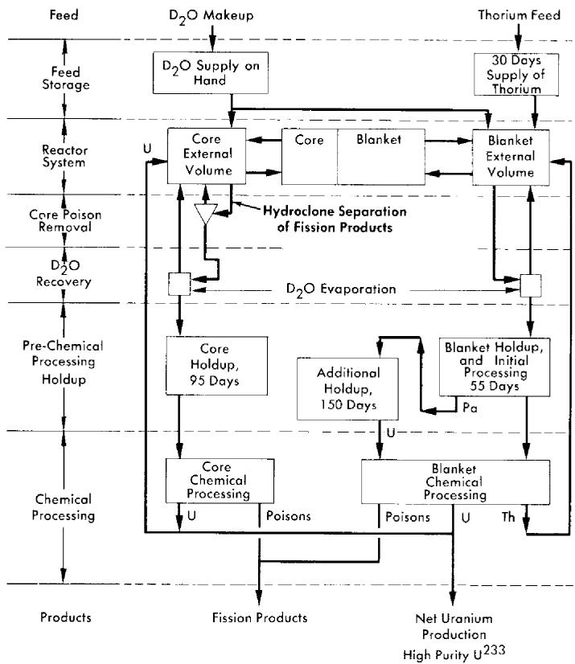  
FIG. 10-1. Schematic fuel-processing flowsheet for a two-region homogeneous thorium breeder reactor.

regions and fuel is returned to the core as needed to maintain criticality; the fissionable material produced in excess of that required is considered to be sold. The fuel product is computed to be a mixture of $\mathrm{U}^{233}$ , $\mathrm{U}^{235}$ , and other uranium isotopes, as determined by the isotope equations and the critical equation. The system is assumed to operate under equilibrium conditions. A schematic flowsheet of the chemical processing cycles for a two-region reactor having a solution-type core region is given in Fig. 10-1. The flowsheet for the one-region system would be similar to that for the blanket of the two-region system, except that processed fuel and thoria would be returned to the single region.

In the processing cycle shown in Fig. 10-1, essentially two methods of removing fission-product poisons are considered. One is the removal of precipitated solids by hydraulic cyclones (hydroclones); by this means the insoluble fission products are removed from the reactor in a cycle time of about a day. The second is the removal of essentially all fission products

by processing the fluid in a Thorex-processing plant. Processing by hydroclones can be done only with solution fuels; the associated cycle time is so short that fission products removed by this method can be considered to be removed from the reactor as soon as they are formed. Thorex processing, although removing all fission products that pass through Thorex, is much more costly than hydroclone processing. Because of this, the associated cycle time is usually several hundreds of days. In what follows, unless specified otherwise, the term fuel processing applies only to Thorex or Purex processing.

The essential difference between the processing cycle shown in Fig. 10-1 and that for solid-fuel reactors is associated with the continuous removal of fission-product gases and of insoluble fission products (in solution reactors). Fuel and fertile material processed by Thorex would undoubtedly be removed from the reactor on a semibatch basis.

The three groups of fission-product poisons considered previously are not all affected by Thorex processing; group-1 poisons (the fission-product gases) are assumed to be physically removed before processing, while group-2 poisons (nongaseous nuclei having high cross sections) are effectively removed by neutron capture within the reactor system ( $\sigma_{a}$ of these nuclei is of the order of 10,000 barns). The macroscopic cross section of these two groups of poisons is taken as $1.8\%$ of the fission cross section. Of this, $0.8\%$ is due to nongaseous high-cross-section nuclei, while $1\%$ is due to the gaseous high-cross-section nuclei. The concentrations of low-cross-section nuclei (third group) are affected by Thorex processing (however, for reactors containing a fuel solution, the nonsoluble group-3 poisons are assumed to be removed by hydroclone separation). The charge for hydroclones operating on a one-day cycle is taken as 0.03 mill/kwh, based upon a charge of $75/day per reactor. For these solution reactors it is assumed that $75\%$ of the group-3 poisons are insoluble and removed by hydroclones; in these circumstances only $25\%$ of the generated group-3 poisons are removed by the Thorex process. With slurry-core reactors, all group-3 poisons which are removed are removed by Thorex processing.

The parameter ranges covered in the spherical reactor calculations are given in Table 10-2. Values used for $\eta^{23}$ and resonance escape probability are presently accepted values; however, in a few cases they were varied in order to estimate how the results are affected by these changes. In the following sections the influence of specific parameters upon fuel cost is discussed.

10-3.2 Two-region spherical reactors [8]. (1) Concentration of $U^{233}$ in blanket and core poison fraction. The optimum values of these variables are found to be largely independent of other parameters; moreover, there is little change in fuel cost with changes in either blanket concentration

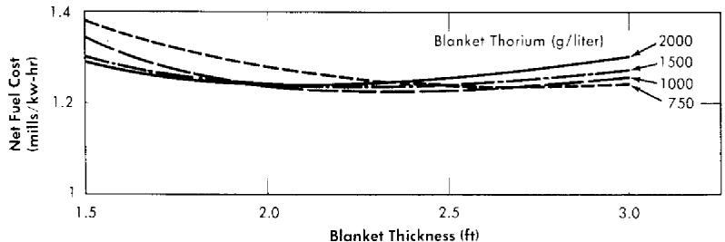  
FIG. 10-2. Fuel cost as a function of blanket thickness for various blanket thorium concentrations. Power per reactor $= 480$ Mw (heat), core diameter $= 5$ ft, core thorium $= 200$ g/liter, core poison fraction $= 0.08$ , blanket $\mathrm{U}^{233} = 4.0$ g/kg Th, $\eta^{23} = 2.25$ .

or core poison fraction. For all slurry-core systems, the optimum poison fraction is about 0.08, independent of the other design parameters. The optimum poison fraction for the solution core is about 0.07. The lowest fuel cost occurs at a blanket $\mathrm{U}^{233}$ concentration of about $4.0\mathrm{g / kg}$ thorium.

TABLE 10-2 PARAMETER VALUES USED IN SLURRY REACTOR STUDIES  

<table><tr><td></td><td>Two-region reactors</td><td>One-region reactors</td></tr><tr><td>Core diameter, ft</td><td>8-15</td><td>8-20</td></tr><tr><td>Blanket thickness, ft</td><td>11/2-3</td><td></td></tr><tr><td>Core thorium concentration, g/liter</td><td>0-300</td><td>0-400</td></tr><tr><td>Core poison fraction, %</td><td>3-20</td><td>4-12</td></tr><tr><td>Blanket thorium concentration, g/liter</td><td>500-2000</td><td></td></tr><tr><td>Blanket U233concentration, g/kg thorium</td><td>1-7</td><td></td></tr></table>

(2) Blanket thickness and blanket thorium concentration. An example of the effects of these parameters on fuel cost is presented in Fig. 10-2 for a slurry-core reactor. Here it is noted that the blanket thorium concentration has relatively little effect on the minimum fuel costs. The blanket thickness giving the lowest fuel cost lies between 2 and 2.5 ft. As is expected, higher thorium loadings are desirable if thin blankets are necessary on the basis of other considerations. Systems having low concentrations of thorium in the core require more heavily loaded blankets to minimize fuel costs. For solution cores, still heavier and thicker blankets are desirable, particularly if the core diameters are small.

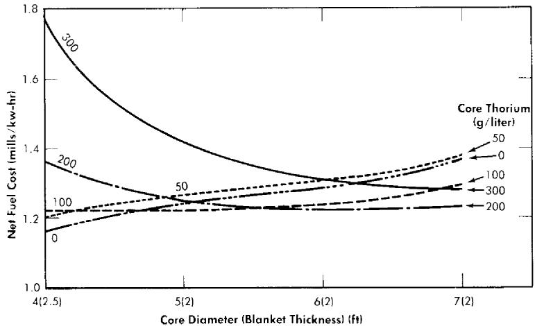  
FIG. 10-3. Fuel cost as function of core diameter and core thorium concentration. Power per reactor $= 480$ Mw (heat), blanket thorium $= 1000$ g/liter, blanket $\mathrm{U}^{233} = 4.0$ g/kg Th, core poison fraction $= 0.08$ , $\eta^{23} = 2.25$ .

(3) Core thorium and core diameter. The effects of these variables upon fuel costs are shown in Fig. 10-3. These results indicate (on the basis of fuel cost alone) that the small solution-core reactors $\mathrm{(ThO_2}$ core concentration equal to zero) have a slight advantage over the slurry reactors. However, the power density at the core wall is between 160 and $300\mathrm{kw / liter}$ for such reactors operating at the given power level of 480 thermal Mw. If larger cores are required because of power-density limitations, the fuel-cost advantage moves to the slurry core. The slurry-core systems yield higher outputs of generated fuel, although all the reactors shown have breeding ratios greater than unity (see Chapter 2). As illustrated in Fig. 10-3, the minimum fuel cost is about 1.2 mills/kwh, independent of core diameter. The fuel cost associated with a core thorium concentration of zero is lower than that associated with a core thorium concentration of $50~\mathrm{g / liter}$ ; this is due to the ability to use hydroclones to remove fission products only when a fuel solution is used. The hydroclone installation adds only 0.03 mill/kwh investment cost to the system, while the variable Thorex processing cost is reduced by two-thirds; this results in the decrease in fuel costs as shown. The relative flatness of the optimum net fuel cost curve in Fig. 10-3 is due to compensating factors; i.e., changes in processing charges and yield of product are offset by accompanying changes in the fuel inventory charge. Similar compensating effects account for the insensitivity of fuel costs to changes in other design parameters.

Table 10-3 presents a breakdown of costs for some typical reactors having low fuel costs. The changes which occur when thorium-oxide slurry is

TABLE 10-3   
COST BREAKDOWN FOR SOME TYPICAL REACTORS   

<table><tr><td>Core diameter, ft</td><td>6</td><td>5</td><td>4</td><td>6</td><td>14</td></tr><tr><td>Blanket thickness, ft</td><td>2</td><td>2</td><td>21/2</td><td>2</td><td></td></tr><tr><td>Core thorium concentration, g/liter</td><td>200</td><td>100</td><td>0</td><td>0</td><td>250</td></tr><tr><td>Blanket thorium concentration, g/liter</td><td>1000</td><td>1000</td><td>1000</td><td>1000</td><td></td></tr><tr><td>Blanket U233concentration, g/kg thorium</td><td>4</td><td>4</td><td>4</td><td>4</td><td></td></tr><tr><td>Core poison fraction</td><td>0.08</td><td>0.08</td><td>0.08</td><td>0.08</td><td>0.08</td></tr><tr><td>Critical concentration, g U233/liter</td><td>9.4</td><td>6.4</td><td>4.1</td><td>1.4</td><td>6.8</td></tr><tr><td>Net breeding ratio</td><td>1.102</td><td>1.081</td><td>1.089</td><td>1.045</td><td>1.012</td></tr><tr><td>Core wall power density, kw/liter</td><td>53</td><td>91</td><td>170</td><td>80</td><td></td></tr><tr><td>Core cycle time, days</td><td>637</td><td>418</td><td>884</td><td>342</td><td>1094</td></tr><tr><td>Blanket cycle time, days</td><td>295</td><td>205</td><td>176</td><td>210</td><td></td></tr><tr><td>Inventory of U233and U235, kg</td><td>368</td><td>272</td><td>200</td><td>148</td><td>522</td></tr><tr><td>Inventory of heavy water, lb</td><td>96,100</td><td>87,400</td><td>89,600</td><td>99,500</td><td>157,000</td></tr><tr><td>Net U233and U235production, g/day</td><td>49</td><td>39</td><td>43</td><td>21</td><td>6</td></tr><tr><td>Grams of U233per g of U produced</td><td>0.67</td><td>0.65</td><td>0.77</td><td>0.72</td><td>0.41</td></tr><tr><td>Estimated cost, mills/kwh</td><td></td><td></td><td></td><td></td><td></td></tr><tr><td>Uranium inventory</td><td>0.27</td><td>0.20</td><td>0.15</td><td>0.11</td><td>0.38</td></tr><tr><td>D2O inventory and losses</td><td>0.27</td><td>0.25</td><td>0.25</td><td>0.29</td><td>0.45</td></tr><tr><td>Thorium inventory and feed</td><td>0.01</td><td>0.01</td><td>0.01</td><td>0.01</td><td>0.01</td></tr><tr><td>Fixed chemical processing</td><td>0.76</td><td>0.76</td><td>0.76</td><td>0.76</td><td>0.76</td></tr><tr><td>Core processing</td><td>0.13</td><td>0.13</td><td>0.07</td><td>0.08</td><td>0.19</td></tr><tr><td>Blanket processing</td><td>0.09</td><td>0.12</td><td>0.18</td><td>0.18</td><td></td></tr><tr><td>Uranium sale, credit</td><td>0.33</td><td>0.26</td><td>0.29</td><td>0.15</td><td>0.04</td></tr><tr><td>Net fuel cost</td><td>1.22</td><td>1.22</td><td>1.16</td><td>1.29</td><td>1.76</td></tr></table>

used in the core can be seen by comparing results for the two 6-ft-core-diameter reactors.

(4) Reactor power. The above results are based on the concept of a three-reactor station of 1440-thermal-Mw capacity, each reactor producing \(125\mathrm{Mw}\) of electricity. The effect of varying power alone is shown in Table 10-4; the fuel cost is found to be a strong function of power capability. The greater part of the change is due to variation in the fixed chemical-processing charge. Since the total fixed processing cost (\(\$5500/day) is assumed to be independent of throughput, this charge on a mills/kwh basis is inversely proportional to the reactor power.

TABLE 10-4 EFFECT OF POWER LEVEL ON FUEL COSTS   

<table><tr><td>Electric power per reactor, Mw</td><td>Net fuel cost, mills/kwh</td><td>Fixed chemical-processing charge, mills/kwh</td></tr><tr><td>80</td><td>1.75</td><td>1.19</td></tr><tr><td>125</td><td>1.22</td><td>0.76</td></tr><tr><td>200</td><td>0.88</td><td>0.48</td></tr></table>

(5) Nuclear parameters. The values of $\eta (\mathrm{U}^{233})$ and the resonance escape probability of thorium-oxide slurries are not known with certainty. Therefore the effects of changes in these parameters on the results were computed in order to examine the reliability of the nuclear calculations. The fuel cost increases by about 0.2 mill/kwh if $\eta^{23}$ is changed from 2.25 to 2.18, and is reduced by about the same amount if the $\eta^{23}$ value is taken to be 2.32 rather than 2.25.

The importance of resonance escape probability for thoria- $\mathrm{D}_2\mathrm{O}$ slurries $(p^{02})$ upon fuel cost was studied by using values for $(1 - p^{02})$ which are $20^{\circ}C$ higher or lower than a standard value. With a core thorium concentration of about $200~\mathrm{g / liter}$ , the changes in $p^{02}$ have a negligible effect upon fuel cost. At lower core thorium concentrations, the changes in $p^{02}$ result in fuel-cost changes of about 0.05 mill/kwh.

(6) Xenon removal. For most of the cases studied, the contribution of xenon to the poison fraction is assumed to be 0.01. To achieve this condition, about $80\%$ of the xenon must be removed before neutron capture occurs. Since xenon-removal systems for slurries have not been demonstrated to date, the effect of operating without xenon removal was studied by increasing the xenon poison fraction to 0.05 (the samarium contribution was held at 0.008). In the systems examined, when the xenon poison fraction was increased by 0.04, the total poison fraction yielding the lowest fuel cost also increased by approximately the same amount. The values in Table 10-5 illustrate this effect by comparing two cases at optimum total poison fraction, but at different xenon poison levels. Thus the variable part of the core poison fraction (and the core processing rate) remains about the same. The higher fuel cost at the higher xenon level appears to be almost entirely a result of the reduction in breeding ratio.

10-3.3 One-region spherical reactors [8]. (1) Poisson fraction. The poison fraction producing the minimum fuel cost for a given system is in the range from 0.06 to 0.10, the exact value depending on the specific di

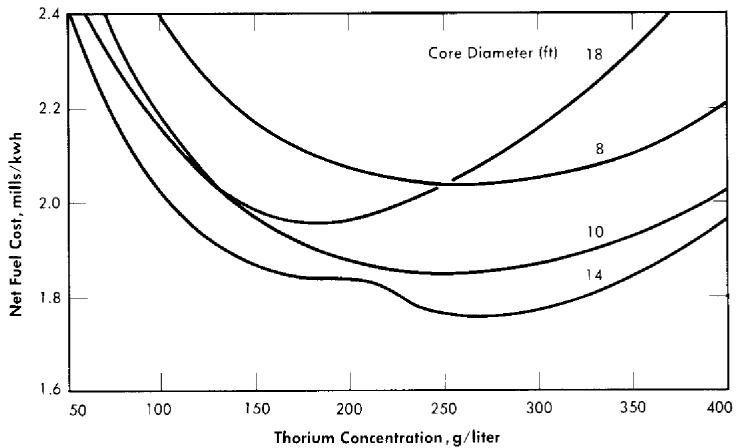  
FIG. 10-4. Fuel cost as function of thorium concentration in one-region reactors. Power per reactor $= 480\mathrm{Mw}$ (heat), poison fraction $= 0.08$ , $\eta^{23} = 2.25$ .

ameter and thorium concentration. However, a value of 0.08 gives costs which are close to the minimum for all cases.

(2) Diameter and thorium concentration. The fuel costs for some of the single-region reactors studied are shown in Fig. 10-4. Detailed information

TABLE 10-5   
EFFECT OF XENON POISON FRACTION ON FUEL COSTS   

<table><tr><td>Xenon poison fraction</td><td>0.01</td><td>0.05</td></tr><tr><td>Optimum total poison fraction</td><td>0.08</td><td>0.12</td></tr><tr><td>Core cycle time, days</td><td>637</td><td>718</td></tr><tr><td>Breeding ratio</td><td>1.102</td><td>1.070</td></tr><tr><td>Fuel inventory charge, mill/kwh</td><td>0.27</td><td>0.29</td></tr><tr><td>Core processing charge, mill/kwh</td><td>0.13</td><td>0.14</td></tr><tr><td>Fuel product (credit), mill/kwh</td><td>0.33</td><td>0.22</td></tr><tr><td>Net fuel cost, mills/kwh</td><td>1.22</td><td>1.35</td></tr></table>

for a typical one-region reactor is given in the last column in Table 10-3. In general, for thorium concentrations less than $400\mathrm{g}$ /liter the reactor diameter must be greater than 10 ft in order to have a breeding ratio greater than unity; the 12-ft-diameter reactor is a breeder (breeding ratio $\geq 1.0$ ) at a thorium concentration of $350\mathrm{g}$ /liter, while at $250\mathrm{g}$ Th/liter the 14-ft-diameter reactor is a breeder. For reactors between 10 and 16 ft in diameter, the thorium concentration yielding the lowest fuel costs is be

tween 200 and $275\mathrm{g}$ /liter. The lowest fuel cost is about 1.76 mills/kwh (for a 14-ft-diameter reactor containing $270\mathrm{g}$ Th/liter). In the curve for the 14-ft reactor, the inflection in the neighborhood of $225\mathrm{g}$ Th/liter is a result of the reactor changing from a breeder to a nonbreeder. This inflection is associated with a marked increase in $\mathrm{U}^{236}$ concentration (concentrations are based on equilibrium conditions), which produces an increase in fuel processing charges (in all cases it is assumed that $\mathrm{U}^{233}$ is fed to the system).

(3) Power and nuclear parameters. The effect of reactor power on the fuel costs of one-region reactors is similar to that mentioned earlier for two-region systems. For example, if the total fuel cost for a three-reactor station is 1.76 mills/kwh at $125\mathrm{Mw}$ of electric capability per reactor, it would be only 1.38 mills/kwh if the output per reactor were increased to $200\mathrm{Mw}$ .

The importance of changes in nuclear parameter is generally the same for the one-region reactors as for the two-region systems, although the effect upon fuel costs of a reduction in $\eta (\mathrm{U}^{233})$ is somewhat greater for the one-region cases.

10-3.4 Cylindrical reactors [9]. The effects of geometry on fuel cost are due to the associated changes in inventory requirements and breeding ratio. Accompanying these effects are changes in the average power densities and the wall power densities within the reactor. Because of corrosion difficulties associated with high power densities, it is desirable to operate with reasonably large reactor volumes. Cylindrical geometry permits reactors to have large volumes without necessitating large reactor diameters.

One-region spherical reactors would have to be large in order to prevent excessive neutron leakage, and so power densities would not be high (average power densities of about $30\mathrm{kw / liter}$ ). Also, closure problems with respect to maintenance of an inside vessel would not exist. Therefore there is little incentive to increase reactor volume by using cylindrical geometry for one-region homogeneous reactors.

For two-region reactors, cylindrical geometry may prove advantageous with respect to feasibility and relative ease of reactor maintenance. However, the associated larger fuel inventories (in comparison to inventories for spherical geometry) will increase fuel costs. Comparison of results for two-region cylindrical reactors with those for spherical two-region reactors shows that cylindrical geometry gives minimum fuel costs about $0.2\mathrm{~mill/kwh}$ greater than does spherical geometry, if in either case there were no restrictions on core-wall power density. The difference is even greater if the core-wall power density influences the reactor size. However, cylindrical geometry does permit low wall power densities in combination with relatively small reactor diameters.

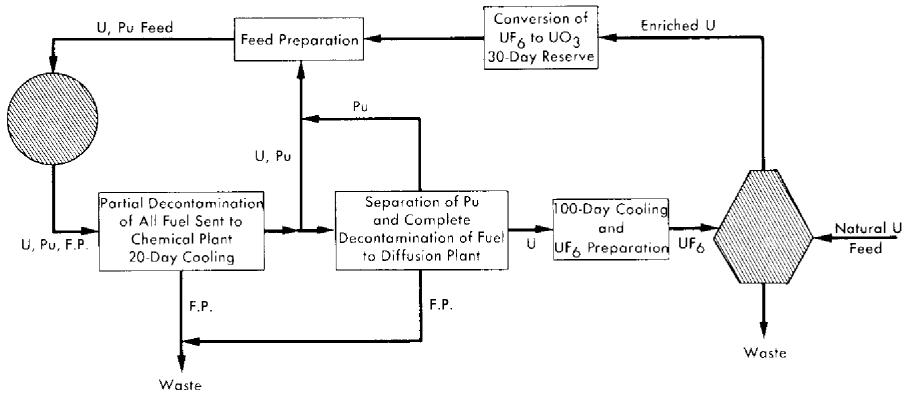  
FIG. 10-5. Fuel cycle for one-region, U-Pu reactor.

# 10-4. EFFECT OF DESIGN VARIABLES ON FUEL COSTS IN URANIUM-PLUTONIUM SYSTEMS

Fuel costs in uranium-plutonium systems will depend on whether the plutonium is removed continually or allowed to remain in the reactor. In the latter case, there is little difference in fuel costs between a $\mathrm{UO}_2\mathrm{SO}_4 - \mathrm{PuO}_2 - \mathrm{D}_2\mathrm{O}$ system and a $\mathrm{UO}_3 - \mathrm{PuO}_2 - \mathrm{D}_2\mathrm{O}$ system. Fuel-cost studies have been made on the basis of either maintaining plutonium uniformly within the reactor or removing the plutonium immediately after its formation by means of hydroclones. In addition, the effect upon fuel costs of $\mathrm{Li}_2^7\mathrm{SO}_4$ addition to $\mathrm{UO}_2\mathrm{SO}_4$ solutions is shown. The additive serves to suppress two-phase separation of the $\mathrm{UO}_2\mathrm{SO}_4$ solution, and permits reactor operation at temperatures higher than would otherwise be feasible.

10-4.1 One-region $\mathrm{PuO_2 - UO_3 - D_2O}$ power reactors [11,12]. Fuel costs of one-region homogeneous power reactors fueled with $\mathrm{PuO_2 - UO_3 - D_2O}$ slurries are given as functions of operating conditions, based on steady-state concentrations of $\mathrm{U}^{235}$ , $\mathrm{U}^{236}$ , $\mathrm{Pu}^{239}$ , $\mathrm{Pu}^{240}$ , and $\mathrm{Pu}^{241}$ . All other higher isotopes are assumed to be removed in the fuel processing step or to have zero absorption cross section. Although large reactors require feed enrichments equal to or less than that of natural uranium, minimum fuel costs are obtained when the reactor wastes are re-enriched in a diffusion plant. In the reactor system considered, the plutonium produced is fed back as reactor fuel after recovery in a Purex plant. The separated uranium is recycled to a diffusion plant for enrichment. Since in all cases the breeding ratio is less than unity, the additional fuel requirement is met by uranium feed of an enrichment dictated by the operating conditions. As a result of the feedback of plutonium, the concentration of plutonium in the reactor is high enough for resonance absorptions and fissions to have an appreciable effect upon fuel concentrations.

The fuel cycle is shown in Fig. 10-5. Slurry is removed from the reactor at the rate required to maintain a specified poison level. The fuel is separated from the $\mathrm{D}_2\mathrm{O}$ , cooled for 20 days while the neptunium decays, and partially decontaminated in a Purex plant. Part of the fuel is then sent directly to the reactor feed-preparation equipment. Plutonium is separated from the remainder of the uranium and added to the reactor feed. The uranium is completely decontaminated, stored for 100 days until the $\mathrm{U}^{237}$ decays, and sent to the diffusion plant. A 30-day reserve of reactor feed is kept on hand.

TABLE 10-6   
COST BREAKDOWNS FOR ONE-REGION $\mathrm{PUO_2 - UO_3 - D_2O}$ REACTORS* HAVING A DIAMETER OF 12 FT   

<table><tr><td colspan="4">Process characteristics:</td></tr><tr><td>U238 concentration, g/liter</td><td>175</td><td>200</td><td>225</td></tr><tr><td>η41</td><td>1.9</td><td>2.2</td><td>2.4</td></tr><tr><td>Reactor poisons, %</td><td>6.0</td><td>6.0</td><td>6.0</td></tr><tr><td>Total system volume, liters</td><td>50,000</td><td></td><td>50,000</td></tr><tr><td>Chemical process cycle time, days</td><td>151</td><td></td><td>138</td></tr><tr><td>Initial enrichment (no Pu), U235/U</td><td>0.011</td><td>0.011</td><td>0.011</td></tr><tr><td>U235 feed, g/day</td><td>579</td><td></td><td>430</td></tr><tr><td>Feed enrichment, % U235</td><td>0.99</td><td>0.70</td><td>0.52</td></tr><tr><td>U235 concentration, g/liter</td><td>1.12</td><td></td><td>0.82</td></tr><tr><td>Pu239 concentration, g/liter</td><td>0.86</td><td></td><td>1.17</td></tr><tr><td>Pu240 concentration, g/liter</td><td>0.49</td><td></td><td>0.62</td></tr><tr><td>Pu241 concentration, g/liter</td><td>0.36</td><td></td><td>0.49</td></tr><tr><td>Np239 concentration, g/liter</td><td>0.03</td><td></td><td>0.03</td></tr><tr><td>U236 concentration, g/liter</td><td>0.10</td><td></td><td>0.06</td></tr><tr><td>Conversion ratio</td><td>0.74</td><td></td><td>0.84</td></tr><tr><td colspan="4">Fuel costs:</td></tr><tr><td>Fuel inventory, mills/kwh (at 4%)</td><td>0.08</td><td></td><td>0.07</td></tr><tr><td>D2O inventory, mills/kwh (at 4%)</td><td>0.15</td><td></td><td>0.15</td></tr><tr><td>D2O losses, mills/kwh (at 5%)</td><td>0.19</td><td></td><td>0.19</td></tr><tr><td>Net uranium feed cost, mills/kwh</td><td>1.15</td><td></td><td>0.48</td></tr><tr><td>Variable chemical processing cost, mills/kwh</td><td>0.27</td><td></td><td>0.32</td></tr><tr><td>Fixed costs for chemical processing†, mills/kwh</td><td>0.76</td><td></td><td>0.76</td></tr><tr><td>Total fuel cost, mills/kwh</td><td>2.60</td><td>2.20</td><td>1.97</td></tr></table>

*Operating at $280^{\circ}\mathrm{C}$ ; 480 thermal Mw, 125 elec. Mw; 80% load factor; optimum poisons, 5-7%.

$\dagger$ Essentially assumes a chemical processing plant servicing three reactors producing 1440 thermal Mw.

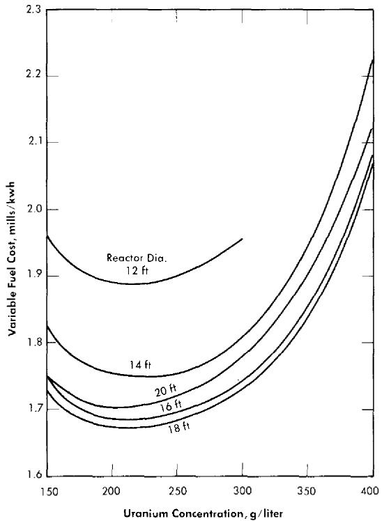  
FIG. 10-6. Effect of uranium concentration and reactor diameter on fuel cost in one-region reactors. $300\mathrm{Mw}$ of electricity, $1000\mathrm{Mw}$ of heat, Avg. reactor temperature $= 330^{\circ}\mathrm{C}$ , $\mathrm{UO_2SO_4 - Li_2SO_4 - D_2O}$ solution with dissolved $\mathrm{Pu}$ , molar ratio of $\mathrm{Li_2SO_4}$ to $\mathrm{UO_2SO_4} = 1$ , optimum poisons $= \sim 5\%$ .

Some typical results are given in Table 10-6 for a 12-ft-diameter reactor, in which different values were assumed for $\eta^{41}$ (the "best value" for $\eta^{41}$ is 2.2; therefore, based on these results, natural uranium is adequate feed material to ensure criticality). Where required, the cost of slightly enriched feed is based on the established schedule of charges by the AEC. Plutonium in the reactor is assumed to have a value of $16/g. Fuel costs were somewhat lower at larger reactor diameters, but a 12-ft diameter corresponds to a more feasible reactor size.

10-4.2 One-region $\mathrm{UO}_2\mathrm{SO}_4 - \mathrm{Li}_2\mathrm{SO}_4 - \mathrm{D}_2\mathrm{O}$ power reactors [13]. For minimum fuel costs, one-region reactors require fertile-material concentrations of several hundred grams per liter. The addition of $\mathrm{Li}_2\mathrm{SO}_4$ in molar concentration equal to that of the uranium increases the temperature at which phase separation appears and also acts as a corrosion inhibitor for stainless steel. Because of the high neutron-capture cross section of natural lithium, high isotopic purity in $\mathrm{Li}^7$ is necessary. Fuel costs for power-only reactor systems fueled by $\mathrm{UO}_2\mathrm{SO}_4 - \mathrm{Li}_2\mathrm{SO}_4 - \mathrm{D}_2\mathrm{O}$ solutions are given here in which

(Minimum fuel costs)

TABLE 10-7   
RESULTS FOR SEVERAL ONE-REGION REACTORS*  
NEAR OPTIMUM CONDITIONS   

<table><tr><td colspan="4">Process characteristics:</td></tr><tr><td>Reactor diameter, ft</td><td>12</td><td>16</td><td>20</td></tr><tr><td>U238concentration, g/liter</td><td>200</td><td>200</td><td>200</td></tr><tr><td>Feed enrichment, w/o U235</td><td>2.11</td><td>1.48</td><td>1.22</td></tr><tr><td>Feed rate, g/day of U235</td><td>1078</td><td>923</td><td>838</td></tr><tr><td>Chemical processing cycle, days</td><td>359</td><td>408</td><td>543</td></tr><tr><td>Poisons, %</td><td>5</td><td>5</td><td>5</td></tr><tr><td>Reactor volume, liters</td><td>25,600</td><td>60,700</td><td>119,000</td></tr><tr><td>Total system volume, liters</td><td>88,000</td><td>127,000</td><td>181,000</td></tr><tr><td>Power density, kw/liter</td><td>39.0</td><td>16.5</td><td>8.4</td></tr><tr><td colspan="4">Isotope concentration, g/liter:</td></tr><tr><td>U235</td><td>2.11</td><td>1.47</td><td>1.21</td></tr><tr><td>U236</td><td>0.37</td><td>0.26</td><td>0.21</td></tr><tr><td>Pu239</td><td>0.97</td><td>0.88</td><td>0.84</td></tr><tr><td>Pu240</td><td>0.51</td><td>0.50</td><td>0.49</td></tr><tr><td>Xp239</td><td>0.03</td><td>0.02</td><td>0.02</td></tr><tr><td>Pu241</td><td>0.52</td><td>0.45</td><td>0.43</td></tr><tr><td>Conversion ratio</td><td>0.67</td><td>0.72</td><td>0.74</td></tr><tr><td colspan="4">Variable fuel cost, mills/kwh:</td></tr><tr><td>Net feed cost</td><td>1.42</td><td>1.12</td><td>0.96</td></tr><tr><td>Variable chemical processing</td><td>0.11</td><td>0.11</td><td>0.10</td></tr><tr><td>Fuel inventory</td><td>0.10</td><td>0.09</td><td>0.10</td></tr><tr><td>D2O inventory</td><td>0.11</td><td>0.16</td><td>0.23</td></tr><tr><td>D2O losses</td><td>0.14</td><td>0.20</td><td>0.29</td></tr><tr><td>Lithium losses and inventory</td><td>0.006</td><td>0.008</td><td>0.011</td></tr><tr><td>Hydroclones</td><td>0.04</td><td>0.04</td><td>0.04</td></tr><tr><td>Total variable fuel cost</td><td>1.93</td><td>1.73</td><td>1.75</td></tr></table>

*1000 Mw (heat); 300 Mw (electrical); ${330}^{ \circ  }\mathrm{C}$ reactor temperature.

all plutonium is assumed to remain either in solution or uniformly suspended throughout the reactor. The plutonium is returned to the reactor following fuel processing, and steady-state conditions are assumed. The same type of fuel cycle as shown in Fig. 10-5 is considered. The results shown in Fig. 10-6 are for spherical reactors operated at an average temperature of $330^{\circ}\mathrm{C}$ , producing $1000\mathrm{Mw}$ of thermal energy, and delivering $300\mathrm{Mw}$ of electricity to a power grid. The variable fuel costs given do not include fixed charges for fuel processing; these fixed charges would add about $0.76\mathrm{mill/kwh}$ to the fuel costs given. Results are based on a $4\%$

TABLE 10-8   
FUEL COSTS FOR BATCH-OPERATED HOMOGENEOUS $\mathrm{UO}_2\mathrm{SO}_4 - \mathrm{D}_2\mathrm{O}$ POWER REACTORS(a)  

<table><tr><td rowspan="3">Case no.</td><td rowspan="3">Hydroclone cycle time (days)</td><td rowspan="3">Additive(b)</td><td colspan="2">Initial uranium concentration, g/liter</td><td colspan="2">Fuel costs,(e) mills/kwh</td></tr><tr><td rowspan="2">U238</td><td rowspan="2">U235</td><td colspan="2">20-year operation</td></tr><tr><td>U and Pu recovered</td><td>No U and Pu recovered</td></tr><tr><td>1</td><td>∞</td><td>None</td><td>100</td><td>2.72</td><td></td><td></td></tr><tr><td>2</td><td>∞</td><td>None</td><td>200</td><td>4.18</td><td>2.61</td><td>2.67</td></tr><tr><td>3</td><td>∞</td><td>None</td><td>300</td><td>5.99</td><td>2.42(d)</td><td>2.48</td></tr><tr><td>4</td><td>∞</td><td>None</td><td>400</td><td>8.32</td><td>2.34</td><td>2.44</td></tr><tr><td>5</td><td>∞</td><td>Li2SO4</td><td>100</td><td>2.99</td><td>2.96</td><td>3.03</td></tr><tr><td>6</td><td>∞</td><td>Li2SO4</td><td>200</td><td>4.82</td><td>2.62</td><td>2.69</td></tr><tr><td>7</td><td>∞</td><td>Li2SO4</td><td>300</td><td>7.21</td><td>2.44(d)</td><td>2.53</td></tr><tr><td>8</td><td>1(e)</td><td>None</td><td>300</td><td>5.99</td><td>2.24</td><td>2.16</td></tr><tr><td>9</td><td>1(e)</td><td>None</td><td>400</td><td>8.32</td><td>2.16</td><td>2.07</td></tr></table>

(a) Average temperature, $280^{\circ}\mathrm{C}$ ; power, 480 thermal Mw, 125 electrical Mw; diameter, 6 ft; system volume, 27,200 liters; fuel solution, $\mathrm{UO_2SO_4 - D_2O}$ .   
(b) Molar concentration of additive was assumed to be equal to the molar concentration of uranium.   
(c) Based on the assumption that the fuel processing plants are servicing enough reactors to make the fixed charges for chemical processing negligible.   
(d) Details in these cases are shown in Table 10-9.   
(e) Plutonium was assumed to be completely soluble and not removed by hydroclones.

inventory charge and \(28/lb \mathrm{D}_2\mathrm{O}\). Table 10-7 gives a breakdown of costs for several reactors near optimum conditions. The \(\mathrm{Li}^7\) cost is assumed to be \)100 lb; at this value the effect of lithium cost upon fuel cost is negligible. However, the added \(\mathrm{Li}_2^5\mathrm{SO}_4\) acts as a neutron poison and diluent which lowers the conversion ratio; these effects increase fuel costs by 0.2 to 0.3 mill kwh over those which would exist if no \(\mathrm{Li}_2^7\mathrm{SO}_4\) were required.

The above results are for equilibrium conditions, with continuous fuel processing. These reactors can also be operated with no fuel processing, in which case nonequilibrium conditions apply. Under such conditions the variable fuel cost would be greater than for the case of continuous fuel processing; therefore any economic advantage associated with batch operation can exist only if fixed charges for fuel processing (or storage) at the end of batch operation are effectively lower than fixed charges associated with continuous processing. Fuel costs are given below for spherical one-region reactors operating on a batch basis, utilizing an initial loading of slightly enriched uranium. In all cases, fuel feed is highly enriched $\mathrm{U}^{235}$ . The total reactor power is 480 thermal Mw (125 electrical Mw), and an 0.8 load factor is considered. Inventory charges are $4\%/\mathrm{yr}$ , cost of $\mathrm{D}_2\mathrm{O}$ is $28 lb, and the cost of uranium as a function of enrichment is based on official prices. A summary of the fuel costs is given in Table 10-8 for 6-ft-diameter reactors. More details for two reactors are given in Table 10-9. Credit for plutonium is based on a fuel value of $16/g; it is assumed that plutonium will remain within the reactor. The shipping costs do not include fixed charges on shipping containers.

For these reactors (6-ft diameter), the addition of $\mathrm{Li_2SO_4}$ ( $99.98\%$ $\mathrm{Li^{7}}$ ) (cases 5, 6, and 7) to the fuel solution raises the fuel cost slightly, the maximum increase being about $0.1\mathrm{~mill/kwh}$ . The use of hydroclones (cases 8 and 9) for partial poison removal (assuming no plutonium removal) for these reactors shows an economic advantage, particularly in the "throw-away" fuel costs (no uranium or plutonium recovery). For these latter costs, the removal of fission-product poisons reduces the fuel costs by 0.3 to $0.4\mathrm{~mill/kwh}$ for 20-year operation. In view of its low solubility, however, plutonium would be extracted along with the fission-product poisons. The economic feasibility of hydroclones in these circumstances, in a power-only economy, is dependent upon the savings effected by posion removal relative to the costs associated with recovery of the plutonium for fuel use. Fuel costs for 10-year operation were 0.1 to $0.2\mathrm{~mill/kwh}$ higher than those for 20-year operation.

10-4.3 Two-region $\mathrm{UO}_3\text{-PuO}_2\text{-D}_2\mathrm{O}$ power reactors [11]. The major advantage associated with two-region reactors is that good neutron economy can be combined with relatively low inventory requirements. None of the uranium-plutonium fueled aqueous homogeneous reactors appear

TABLE 10-9   
ISOTOPE CONCENTRATIONS AND COST BREAKDOWN FOR   
BATCH-OPERATED HOMOGENEOUS REACTORS*  
(20-year operation, no hydroclones, $300\mathrm{gU}^{238}$ /liter)   

<table><tr><td>Initial U235 concentration, g/liter</td><td>5.99</td><td>7.21</td></tr><tr><td>Additive</td><td>0</td><td>Li2SO4</td></tr><tr><td>Average U235 feed rate, kg/yr</td><td>136</td><td>136</td></tr><tr><td>Initial U235 inventory, kg</td><td>163</td><td>196</td></tr><tr><td>Final poison fraction</td><td>0.27</td><td>0.25</td></tr><tr><td>Final isotope concentration, g/liter:</td><td></td><td></td></tr><tr><td>U234</td><td>1.22</td><td>1.28</td></tr><tr><td>U235</td><td>12.2</td><td>13.2</td></tr><tr><td>U236</td><td>13.9</td><td>14.0</td></tr><tr><td>U238</td><td>223</td><td>223</td></tr><tr><td>Np239</td><td>0.03</td><td>0.03</td></tr><tr><td>Pu239</td><td>3.54</td><td>3.95</td></tr><tr><td>Pu240</td><td>3.62</td><td>4.04</td></tr><tr><td>Pu241</td><td>1.24</td><td>1.38</td></tr><tr><td>Estimated fuel costs, mills/kwh:</td><td></td><td></td></tr><tr><td>Uranium inventory</td><td>0.08</td><td>0.11</td></tr><tr><td>D2O inventory and losses</td><td>0.19</td><td>0.19</td></tr><tr><td>Uranium feed</td><td>2.12</td><td>2.12</td></tr><tr><td>Chemical processing</td><td>0.18</td><td>0.18</td></tr><tr><td>Hydroclones</td><td>0.04</td><td>0.04</td></tr><tr><td>Shipping</td><td>0.04</td><td>0.04</td></tr><tr><td>Plutonium sale (credit)</td><td>0.07</td><td>0.08</td></tr><tr><td>Diffusion plant (credit)</td><td>0.12</td><td>0.12</td></tr><tr><td>Total (fuel cost)</td><td>2.42</td><td>2.44</td></tr></table>

*Same conditions as listed in Table 10-8.

capable of producing more fuel than is burned; however, it is possible to operate a two-region reactor with such a low steady-state concentration of $\mathrm{U}^{235}$ in the blanket that natural uranium can be fed to the reactor and the waste discarded.

In a power-converter the plutonium is extracted from the blanket and fed to the core as fuel material. Natural uranium is fed to the blanket, and the plutonium formed is extracted by Purex processing. By adjusting the concentrations of fissionable materials in the blanket, the net rate of production of plutonium in the blanket is made equal to the consumption in the core. The fuel cycle considered for a two-region reactor is shown in Fig. 10-7. Plutonium from the core is processed continuously through a

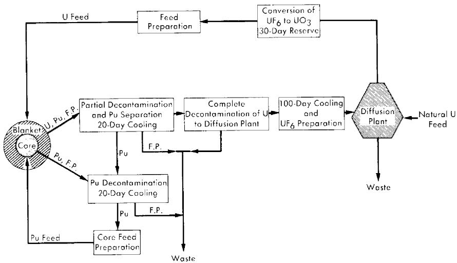  
FIG. 10-7. Fuel cycle for two-region U-Pu reactor.

Purex plant to maintain a constant poison fraction. Uranium from the blanket is also processed through the Purex plant, the rate of processing being governed by the required plutonium feed to the core. Although it is possible to operate the reactors without an enriching plant by using natural-uranium feed to the blanket and discarding the waste, there appears to be a slight cost advantage in operating the reactors in conjunction with an enriching plant.

Table 10-10 gives fuel costs and associated information for a two-region reactor having a core diameter of 6 ft and a 10-ft over-all diameter. The value of $\eta^{41}$ is assumed to be 1.9. (A more recent value of $\eta^{41} = 2.2$ is believed to be more accurate.) Comparison of these costs with those for one-region reactors of 12 to 14 ft diameter indicate that two-region U-Pu reactors have fuel costs about 0.2 to $0.3\mathrm{mil / kwh}$ lower than do one-region reactors.

# 10-5. FUEL COSTS IN DUAL-PURPOSE PLUTONIUM POWER REACTORS

Since plutonium is quite insoluble in $\mathrm{UO}_2\mathrm{SO}_4 - \mathrm{D}_2\mathrm{O}$ solutions and can be removed by hydroclones, it is possible to produce high-quality plutonium ( $\mathrm{Pu}^{240}$ content less than $2\%$ ). Based on the AEC price schedule, this high-quality plutonium has a net value of at least $\$40/\mathrm{g}$ after allowing $\$1.50/\mathrm{g}$ for conversion to metal). At this value it is more economical to recover plutonium than to burn it as fuel. Fuel costs based on recovery of the plutonium are given here for one- and two-region U-Pu reactors.

TABLE 10-10   
FUEL COSTS FOR A TWO-REGION, U-PU POWER REACTOR*   

<table><tr><td>Core diameter, ft</td><td>6</td></tr><tr><td>Core power, thermal Mw</td><td>320</td></tr><tr><td>Core Pu concentration, g/liter</td><td>1.7</td></tr><tr><td>N40/N49in core</td><td>0.99</td></tr><tr><td>N41/N49in core</td><td>0.35</td></tr><tr><td>Blanket thickness, ft</td><td>2</td></tr><tr><td>Blanket power, thermal Mw</td><td>180</td></tr><tr><td>Blanket U concentration, g/liter</td><td>500</td></tr><tr><td>N25/N28in blanket</td><td>0.003</td></tr><tr><td>N49/N28in blanket</td><td>0.001</td></tr><tr><td>N40/N28in blanket</td><td>0.0003</td></tr><tr><td>N41/N28in blanket</td><td>0.00005</td></tr><tr><td>Blanket feed enrichment, N25/Nu</td><td>0.004</td></tr><tr><td>Fraction fissions in U235</td><td>0.27</td></tr><tr><td>Fraction of U consumed</td><td>0.017</td></tr><tr><td>Fuel costs, mills/kwh</td><td></td></tr><tr><td>Core processing (variable)</td><td>0.16</td></tr><tr><td>Blanket processing (variable)</td><td>0.31</td></tr><tr><td>D2O recovery</td><td>0.07</td></tr><tr><td>U + Pu losses</td><td>0.005</td></tr><tr><td>Pu inventory</td><td>0.04</td></tr><tr><td>U inventory</td><td>0.005</td></tr><tr><td>D2O inventory plus losses at 9%/yr</td><td>0.30</td></tr><tr><td>Feed cost minus credit for returned U</td><td>0.62</td></tr><tr><td>Fixed charges for chemical processing†</td><td>0.76</td></tr><tr><td>Total fuel costs, mills/kwh</td><td>2.27</td></tr></table>

*Average temp., $250^{\circ}\mathrm{C}$ ; total power, 500 thermal Mw; net thermal efficiency, $25\%$ ; load factor, $80\%$ ; $\eta^{41} = 1.9$ .

†Assumes chemical-processing plant servicing three reactors.

10-5.1 One-region reactors [14]. Fuel costs are given for $\mathrm{UO_2SO_4 - D_2O}$ and $\mathrm{UO_2SO_4 - Li_2SO_4 - D_2O}$ fuel systems operating at $280^{\circ}\mathrm{C}$ , in which the plutonium is assumed to be removed by means of hydroclones on about a one-day cycle. Characteristics of the assumed systems are presented in Table 10-11.

TABLE 10-11   
CHARACTERISTICS OF REACTOR SYSTEM   

<table><tr><td>Electrical power, Mw</td><td>125</td></tr><tr><td>Heat generation, Mw</td><td>480</td></tr><tr><td>Reactor diameter, ft</td><td>12</td></tr><tr><td>Power density in system external to core, kw/liter</td><td>20</td></tr><tr><td>Average reactor temperature, °C</td><td>280</td></tr><tr><td>Reactor poisons, %</td><td>5</td></tr><tr><td>Chemical processing rate, g U235/day</td><td>1000</td></tr><tr><td>Plutonium removal</td><td>Instantaneous</td></tr><tr><td>Isotopic purity of lithium, %</td><td>99.98</td></tr><tr><td>Processing method</td><td>Purex</td></tr><tr><td>Li7 cost, $/lb</td><td>40</td></tr><tr><td>Inventory charges, %</td><td>4</td></tr><tr><td>D2O losses, % of inventory/yr</td><td>5</td></tr><tr><td>Li losses, % of inventory/yr</td><td>1</td></tr></table>

Because of the high credit for plutonium, the fuel costs are negative even if the fixed charges for chemical processing (0.76 mill/kwh) are included. The total fuel costs obtained are shown in Fig. 10-8. The effect of the $\mathrm{Li_2SO_4}$ addition is to decrease the conversion ratio; because of the relatively high value assigned to plutonium, this causes the $\mathrm{Li_2SO_4}$ addition (added in the same molal concentration as the $\mathrm{UO_2SO_4}$ ) to increase fuel costs by 0.8 mill/kwh over those if no $\mathrm{Li_2SO_4}$ were required.

Calculations indicate that batch-type operation of a plutonium producer is undesirable if plutonium has a value of $40/g$ ; any savings in fuel-processing costs using batch-type operation is more than compensated by a loss in product value associated with the decrease in plutonium production.

10-5.2 Two-region reactors [15]. Since the conversion ratio is greater in a two-region reactor, it is expected that a high plutonium value will cause this reactor type to have lower fuel costs (greater fuel credits) than a one-region reactor. Calculations for a reactor having a 6-ft-diameter core and an over-all diameter of 12 ft, in which the plutonium is recovered with a fuel cycle similar to that given in Fig. 10-7, indicated fuel costs from 0.5 to 0.6 mill/kwh lower than in one-region reactors.

# 10-6. FUEL COSTS IN U235 BURNER REACTORS

A homogeneous reactor fueled with a dilute, highly enriched $\mathrm{UO}_2\mathrm{SO}_4$ solution is potentially capable of operating without removing fission

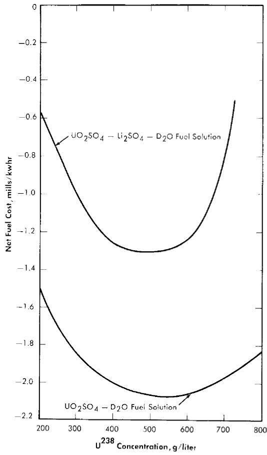  
FIG. 10-8. Effect of $\mathrm{Li}_2\mathrm{SO}_4$ and $\mathrm{U}^{238}$ concentration on fuel cost of a one-region spherical plutonium-producer power reactor. Diameter = 12 ft, avg. reactor temperature = $280^{\circ}\mathrm{C}$ , electrical power = 125 Mw, heat generation = 480 Mw, avg. lithium cross section = 0.2 barn, plutonium credit = $40/g, inventory charge = 4%, molar ratio of $\mathrm{Li}_2\mathrm{SO}_4$ to $\mathrm{UO}_2\mathrm{SO}_4 = 1$ , processing rate = 1000 g $\mathrm{U}^{235}$ /day.

products if additional $\mathbf{U}^{235}$ is continually added to offset the buildup of poisons.

The results of fuel-cost studies [16,17] for spherical one-region reactors containing dilute, highly enriched $\mathrm{UO}_2\mathrm{SO}_4$ in either $\mathrm{D}_2\mathrm{O}$ or $\mathrm{H}_2\mathrm{O}$ are given in Table 10-12. The noble gases are assumed to be removed continuously. The removal of poisons and corrosion products by hydroclones is considered, but the fuel cost is about the same whether hydroclones are used or not (assuming corrosion rates of about $1\mathrm{mil}/\mathrm{year}$ ). The results are for nonsteady-state conditions.

# TABLE 10-12

# ISOTOPE CONCENTRATIONS AND FUEL COST BREAKDOWN FOR SOME U235 BURNERS

(Average temperature- $280^{\circ}\mathrm{C}$ 125 Mw elect.; 6-ft-diameter core)

<table><tr><td>Moderator</td><td>H2O</td><td>H2O</td><td>D2O</td><td>D2O</td></tr><tr><td>Hydroclone cycle time, days</td><td>1</td><td>∞</td><td>1</td><td>∞</td></tr><tr><td>Operating time, days</td><td>2000</td><td>3400</td><td>4200</td><td>4400</td></tr><tr><td>Initial U235 inventory, kg</td><td>353</td><td>353</td><td>34.3</td><td>34.3</td></tr><tr><td>Total system volume, liters</td><td>27,000</td><td>27,000</td><td>27,000</td><td>27,000</td></tr><tr><td>Average U235 feed rate, 
kg/yr</td><td>239</td><td></td><td>233</td><td>237</td></tr><tr><td>U concentration, g/liter*</td><td>24.7</td><td>36</td><td>18.6</td><td>22.8</td></tr><tr><td>Fraction poisons,*</td><td></td><td></td><td></td><td></td></tr><tr><td>Σa(p)/Σf(25)</td><td>0.05</td><td>0.17</td><td>0.23</td><td>0.53</td></tr><tr><td>Estimated costs, mills/kwh</td><td></td><td></td><td></td><td></td></tr><tr><td>Uranium inventory at 4%</td><td>0.29</td><td></td><td>.03</td><td>0.03</td></tr><tr><td>D2O inventory and losses at 
9°C</td><td>0</td><td></td><td>0.19</td><td>0.19</td></tr><tr><td>Uranium feed cost</td><td>3.71</td><td></td><td>3.64</td><td>3.70</td></tr><tr><td>Chemical processing cost 
(variable cost at end of 
operating period)</td><td>0.08</td><td></td><td>0.03</td><td>0.03</td></tr><tr><td>Hydroclone cost</td><td>0.02</td><td></td><td>0.02</td><td>0</td></tr><tr><td>Shipping cost</td><td>0.02</td><td></td><td>0.02</td><td>0.02</td></tr><tr><td>Plutonium sale (credit, 
$16 gm)</td><td>0.0005</td><td></td><td>0.01</td><td>0.0003</td></tr><tr><td>Diffusion plant (credit)</td><td>0.002</td><td></td><td>0.02</td><td>0.08</td></tr><tr><td>Total (fuel cost)†</td><td>4.13</td><td>4.06</td><td>3.91</td><td>3.90</td></tr></table>

*At indicated operating time.   
+Includes no fixed charges for fuel processing.

With $\mathrm{D}_2\mathrm{O}$ reactors, it appears that fuel processing can be economically eliminated if the reactor operating cycle is about 10 years and if the spent fuel is disposed of cheaply at the reactor site. Such a procedure with the $\mathrm{H}_2\mathrm{O}$ -moderated reactor is more expensive because of higher uranium inventory. For low fuel-shipping and -processing charges, the fuel costs are nearly independent of the reactor size and moderator, and are about 4 mills/kwh. If fixed charges associated with fuel processing are greater than $\sim 0.5$ mill/kwh, it may be more economical to store the fuel than to have it processed.

TABLE 10-13   
SUMMARY OF FUEL COSTS OF DIFFERENT SYSTEMS   

<table><tr><td></td><td>mills/kwh</td></tr><tr><td>(1) One-region burner; power only; UO2SO4-D2O solution (for 14-year operation)</td><td>3.93</td></tr><tr><td>(2) One-region burner; power only; UO2SO4-H2O solution (for 7-year operation)</td><td>4.12</td></tr><tr><td>(3) One-region converter; power only; UO3-PuO2-D2O slurry</td><td>2.20</td></tr><tr><td>(4) One-region converter; power-plutonium; UO2SO4-D2O solution</td><td>-2.00</td></tr><tr><td>(5) Two-region converter; power only; core, PuO2-D2O slurry; blanket, UO3-PuO2-D2O slurry</td><td>1.90</td></tr><tr><td>(6) Two-region converter; power-plutonium; UO2SO4-D2O solution</td><td>-2.66</td></tr><tr><td>(7) One-region breeder; power only; UO3-ThO2-D2O slurry</td><td>1.76</td></tr><tr><td>(8) Two-region breeder; power only; UO3-ThO2-D2O slurry</td><td>1.22</td></tr><tr><td>(9) Two-region breeder; power only; core, UO2SO4-D2O solu-tion; blanket, UO3-ThO2-D2O slurry</td><td>1.29</td></tr></table>

# 10-7. SUMMARY OF HOMOGENEOUS REACTOR FUEL-COST CALCULATIONS

10-7.1 Equilibrium operating conditions. Fuel costs in different homogeneous systems are summarized in Table 10-13. Appropriate nuclear data and general reactor characteristics have been given previously.

10-7.2 Nonsteady-state operating conditions [18]. A comparison of fuel costs is given here for several one-region reactor systems, operating under nonsteady-state conditions. The reactors are moderated with either $\mathrm{H}_2\mathrm{O}$ or $\mathrm{D}_2\mathrm{O}$ and fueled with enriched $\mathrm{UO_3}$ plus $\mathrm{ThO_2}$ , or $\mathrm{UO_2SO_4}$ of varying enrichments. The effect of adding $\mathrm{Li_2SO_4}$ to the $\mathrm{UO_2SO_4}$ is also considered. In the $\mathrm{UO_3 + ThO_2}$ system, it is assumed that the initial fuel is $\mathrm{U}^{233}$ and that sufficient $\mathrm{U}^{233}$ is available as feed material.

Cost factors which make only a small contribution to the total fuel cost are fuel processing losses (0.2% of fuel processed), $\mathrm{D}_2\mathrm{O}$ losses (5% of $\mathrm{D}_2\mathrm{O}$ inventory/year), hydroclone costs (\$70/day), 30-day inventory supplies, and shipping charges (it is assumed that the amortization charges for shipping costs are negligible). In all cases the inventory charges are based on the volume of the reactor vessel plus the volume of the external system. This latter volume is calculated on the basis of an average heat-removal

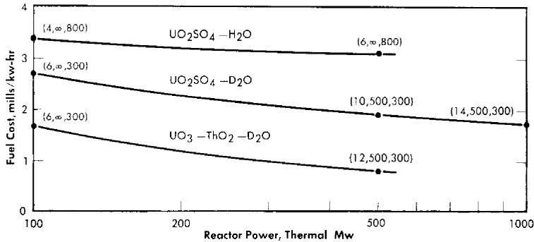  
FIG. 10-9. Fuel costs in single-region reactors as a function of power level. Values in parentheses refer to core diameter (ft), fuel processing cycle time (days), and fertile material concentration (g/liter) at near-optimum conditions. Inventory charge $= 4\%$ , relative chemical processing $= 1$ , relative poisons $= \frac{1}{2}$ , $\eta^{25} = 2.08$ , $\eta^{49} = 1.93$ , $\eta^{23} = 2.25$ .

capability of 20 kw/liter of external volume. The enrichment of the heavy water is assumed to be 99.75% D₂O, and the D₂O cost is taken as $28/lb.

Only the optimum or near-optimum reactor conditions are given in Fig. 10-9. The optimum conditions refer to the diameter, fuel-processing cycle time, and fertile-material concentration which give the minimum fuel cost of all the diameters, cycle times, and fertile-material concentrations studied for the particular case.

A value of unity for relative fuel processing implies a charge of $0.54/g of U233, U234, U235, and U236 processed; $1/g Pu processed; and $3.50/kg fertile material processed. A value of two implies processing charges twice the above values. Fixed charges for chemical processing are not included in the calculation of fuel cost. A relative poisoning of unity implies representation of the fission-product poisons by two effective nuclei having yields of 0.11 and 1.81 atoms/fission, and thermal absorption cross sections of 132 and 13.9 barns, respectively (based on values of Robb et al. [19]). A value of 1/2 implies cross sections 1/2 the above values, corresponding closely to the values of Walker [20].

Fuel costs were calculated for both 10 and 25 years of reactor operation; these costs are usually slightly lower after 25 than after 10 years, but the differences are small, usually between 0 and $0.1 \, \text{mill/kwh}$ . Therefore, only results for 10-year operation are given here.

The reactor system and power level influence the fuel cost as indicated in Fig. 10-9. Changing the power level affects optimum reactor conditions significantly. The variations in relative poisons and relative chemical processing considered here did not change fuel costs to a large degree, the individual effects usually being about $0.1\mathrm{mill / kWh}$ . The influence of reactor composition on fuel cost is due to the values of $\eta$ for the various

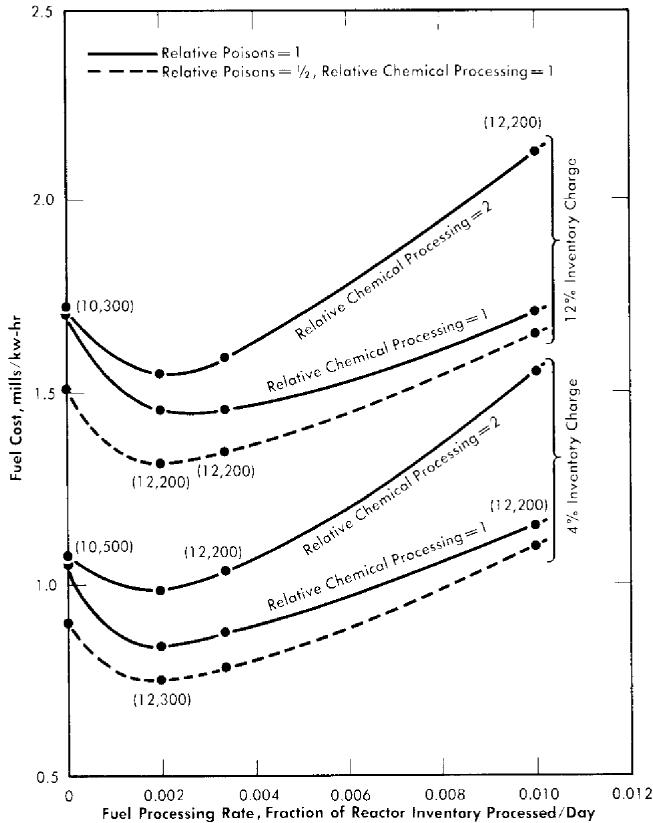  
FIG. 10-10. Effects of fuel-processing rate, fuel-processing charge, and poisoning by fission products upon fuel cost in $\mathrm{UO_3 - ThO_2 - D_2O}$ reactors. Values in parentheses refer to core diameter (ft) and thorium concentration (g/liter) at nearoptimum conditions (independent of relative poisons and relative chemical processing values shown). Reactor power $= 500\mathrm{Mw}$ , $\eta^{23} = 2.25$ ; $\mathrm{U}^{233}$ feed.

fissionable materials and fraction poisons associated with the different systems. Increasing the inventory charge from 4 to $12\%$ increases fuel cost by about 0.5 mill/kwh for the $\mathrm{D}_2\mathrm{O}$ systems. Although not shown, the effect of $\mathrm{Li_2SO_4}$ addition to the $\mathrm{UO_2SO_4 - H_2O}$ system has negligible effect upon fuel cost, owing to the high poison fraction associated with the $\mathrm{H}_2\mathrm{O}$ . The addition in equimolar proportions of $\mathrm{Li_2SO_4}$ to the $\mathrm{UO_2SO_4 - D_2O}$ system increases fuel costs by about 0.1 mill/kwh.

The influences of fuel-processing rate, fuel-processing charge, and fission-product poisoning upon fuel cost are shown in Fig. 10-10 for the $\mathrm{UO_3 - ThO_2 - D_2O}$ system. The fuel-processing rate corresponds to the fraction of the reactor inventory processed per day. It is seen that doubling the fission-product poisoning increases the fuel cost about $0.1\mathrm{mill / kWh}$ for

the fuel-processing rates considered, and that doubling the processing charge increases the fuel cost about 0.1 mill/kwh at optimum conditions.

The fuel costs given in Figs. 10-9 and 10-10 include no fixed charges for fuel processing; the magnitude of these charges would be dependent upon the number of reactors processed by the processing plant. Increasing the fuel-processing charges decreases the optimum fuel-processing rate. Although fuel would undoubtedly be processed at the end of reactor operation (and this was always assumed in obtaining the results), the permissible unit cost for processing at that time is high compared with the permissible unit cost associated with a high processing rate. If the fixed charges for processing correspond only to that period required to process the fuel (for a given processing-plant capacity), then the optimum processing rate is less than the rate obtained on the basis of fixed charges being independent of fuel processing rate.

# 10-8. CAPITAL COSTS FOR LARGE-SCALE PLANTS

The homogeneous reactors that have been built are small and have investment costs of over $1000/electrical kw. The capital costs of large nuclear plants, based largely on paper studies, have been estimated to be 1.2 to 2 times that of conventional power-cost investments. If capital costs are$ 400/kw, corresponding fixed charges are 9 mills/kw at 80% load factor and 12 mills/kw at 60% load factor, considering a 15% annual fixed charge. It follows that one of the conditions necessary for low-cost power is a high load factor. The essential problems are to achieve low fuel costs and to obtain reliability and long plant lifetime. To date, little experience has been obtained in operating power reactors; therefore it is difficult to estimate accurately the lifetime and also the reactor reliability over that lifetime. Although most economic studies are used to measure the relative economic advantage of different types of reactors, this cannot be firmly established so long as the investment and maintenance costs remain uncertain. Consequently, no hard and fast conclusions concerning power costs can be obtained other than what the ultimate power cost might be.

The initial cost of the reactor building and other buildings associated with the plant, as well as the site development costs, are strongly influenced by the philosophy behind the design with regard to such factors as safety and security. Estimates for these costs are usually based on corresponding costs for a large conventional steam power plant. Land costs for nuclear plants areextravagantly high if containment is not assured. The cost of containment vessels has been estimated to be in the range of $10 to$ 40/electrical kw [21]. Equipment costs usually assume that the desired equipment has been developed and all development costs paid for. Even so, the depreciation charges on reactor equipment may be considerably

TABLE 10-14   
PRESENT ESTIMATES OF REACTOR PLANT COSTS FOR A THREE-REACTOR STATION OPERATING AT A TOTAL POWER OF 1350 THERMAL Mw (315 Electrical Mw) [23]  

<table><tr><td></td><td>Min. Cost</td><td>Max. Cost</td></tr><tr><td>High-pressure system for one reactor</td><td></td><td></td></tr><tr><td>Reactor vessel (and core tank)</td><td>530,000</td><td>970,000</td></tr><tr><td>Gas separators (3)</td><td>120,000</td><td>240,000</td></tr><tr><td>Heat exchangers (3)</td><td>2,030,000</td><td>2,680,000</td></tr><tr><td>Fuel and blanket circulating pumps (3)</td><td>670,000</td><td>720,000</td></tr><tr><td>High-pressure storage tank and catalytic recombiner, core system</td><td>110,000</td><td>220,000</td></tr><tr><td>High-pressure storage tank and catalytic recombiner, blanket system</td><td>40,000</td><td>90,000</td></tr><tr><td>20-Mw gas condenser</td><td>40,000</td><td>70,000</td></tr><tr><td>6.5-Mw gas condenser</td><td>20,000</td><td>30,000</td></tr><tr><td>Condensate storage tanks (2)</td><td>10,000</td><td>20,000</td></tr><tr><td>Gas blower for core system</td><td>30,000</td><td>60,000</td></tr><tr><td>Gas blower for blanket system</td><td>20,000</td><td>40,000</td></tr><tr><td>High-pressure process piping and valves</td><td>3,250,000(a)</td><td>6,430,000(a)</td></tr><tr><td>Steam piping, valves and expansion joints in cells</td><td>(c)</td><td>(c)</td></tr><tr><td>Instrumentation</td><td>330,000</td><td>700,000</td></tr><tr><td>Sampling equipment</td><td>(b)</td><td>(b)</td></tr><tr><td>Installation of high-pressure equipment (foundations, supports, erection, etc.)</td><td>1,430,000</td><td>2,210,000</td></tr><tr><td>Subtotal for one reactor</td><td>8,630,000</td><td>14,500,000</td></tr><tr><td>Subtotal for three reactors</td><td>25,900,000</td><td>43,500,000</td></tr></table>

(a) Includes installation, insulation, inspection.   
(b) In low-pressure estimate.   
(c) In steam-system estimate.   
(d) With no contingency.

TABLE 10-14 (continued)   

<table><tr><td></td><td>Min. Cost</td><td>Max. Cost</td></tr><tr><td>Low-pressure system for one reactorDump tanks (6) and associatedequipment. [Condensers (2), condensate tanks (2), recombiners(2), evaporators (2), feed andcirculating pumps, D2O recoveryand fission-product adsorptionsystem]Piping and valves, instrumentation,sampling equipmentInstallation of low-pressure equipmentSubtotal for one reactorSubtotal for three reactorsReactor structureReactor and low-pressure equipmentcellsEquipment transport shield, crane,maintenance handling equipmentControl room, laboratory, and process areaCell ventilation system (coolingwater, waste disposal)Subtotal</td><td>1,260,0001,080,000540,0002,880,0008,640,0003,000,000430,0002,000,000890,000$6,320,000</td><td>1,800,0002,270,000770,0004,840,00014,500,0004,000,000950,0004,000,0001,750,000$10,700,000</td></tr><tr><td>Summary CostDirect costContractor&#x27;s overhead and fees(27%)Engineering and inspection (10%)Total(d)</td><td>$40,900,00011,000,0004,100,00056,000,000</td><td>$68,700,00018,500,0006,900,00094,100,000</td></tr><tr><td>Reactor plant cost, $/thermal kw</td><td>56,000,0001,350,000=41</td><td>94,100,0001,350,000=70</td></tr><tr><td>Reactor plant cost, $/elec. kw</td><td>56,000,000315,000=178</td><td>94,100,000315,000=298</td></tr></table>

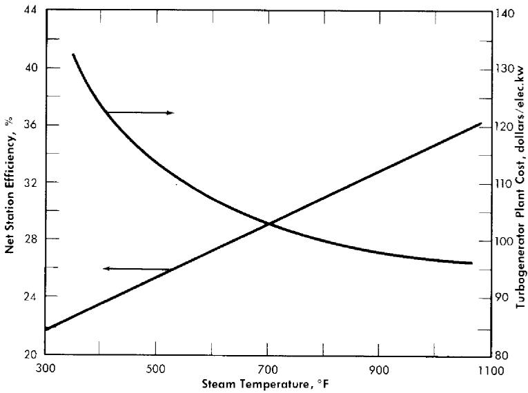  
FIG. 10-11. Turbine plant cost and net station efficiency vs. steam temperature.

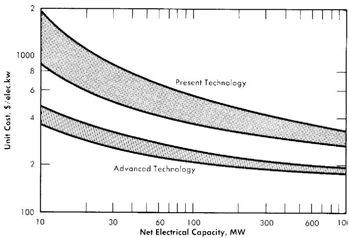  
FIG. 10-12. Capital costs of aqueous homogeneous reactors.

higher than those for conventional power plants. Also, the insurance costs for a nuclear plant may be much higher.

Conceptual designs for one- and two-region homogeneous reactors consider stainless steel and stainless-steel-clad carbon steel as materials of construction. Either type reactor will require pressure vessels, gas separators, steam generators, recombiners, sealed motors, pumps, storage vessels, valves, and piping. Preliminary estimates [11] of capital investments show no significant difference in costs between one- and two-region reactor plants.

Engineering considerations place limits upon the operating pressure and the size of the pressure shell. A spherical reactor shape is desirable, inasmuch as the neutron leakage and the required shell thickness for a given reactor diameter are thus minimized for a given reactor volume. Fabricators of pressure vessels agree that even though very large shells can be made, the smaller diameter vessels are more feasible. Because of the temperature limitation associated with the pressure limitation, saturated steam at relatively low pressures is generated in the heat exchangers (see Chapter 9).

Although analyses of the turbine plant indicate that thermal efficiency improves as throttle pressure increases, the reactor system investment costs rise sharply with increased operating pressure. The effect of saturated-steam temperature upon turbine plant cost and net station efficiencies is given [22] in Fig. 10-11.

In estimating reactor plant costs, it is necessary to determine the cost of the various items of equipment. Present estimates [23] of reactor plant costs for a large reactor station are given in Table 10-14. The equipment costs are based on per-pound costs of HRE-2 equipment, cost estimates obtained from industry, and the assumption that costs are directly proportional to (reactor power) $^{06}$ . The effect of station size upon reactor station costs are estimated [23] in Table 10-15, while the possible effect of technical advances upon capital investment costs is indicated [22] in Fig. 10-12. In all these estimates, a developed and operable system is postulated.

# 10-9. OPERATING AND MAINTENANCE COSTS IN LARGE-SCALE PLANTS

Because of the high level of radioactivity associated with nuclear plants, maintenance and repair of nuclear systems will have to be done remotely. This type of operation is, in general, more time-consuming and expensive than methods used in maintaining conventional coal-fired power plants. To minimize operating and maintenance (O and M) costs, it will be necessary to design reactor plants so as to simplify maintenance problems; however, construction costs associated with such design will be higher than the costs of building a reactor plant in which O and M costs are not so economically significant. These higher costs are associated with the ability

TABLE 10-15   
PRESENT ESTIMATES OF HOMOGENEOUS REACTOR POWER STATION COSTS AS A FUNCTION OF STATION SIZE [23]   

<table><tr><td rowspan="2">Plant size: 
Thermal Mw 
Electrical Mw</td><td colspan="2">1350 
315</td><td colspan="2">240 
60</td><td colspan="2">60 
15</td></tr><tr><td>Min.</td><td>Max.</td><td>Min.</td><td>Max.</td><td>Min.</td><td>Max.</td></tr><tr><td>Direct cost of reactor plant, 
millions of dollars</td><td>41</td><td>69</td><td>16</td><td>27</td><td>7.6</td><td>13.5</td></tr><tr><td>Engineering and design 
(at 15%), 
millions of dollars</td><td>6</td><td>10</td><td>2.4</td><td>4</td><td>1.1</td><td>2.0</td></tr><tr><td>Contractor overhead and 
fees (at 23%), 
millions of dollars</td><td>9</td><td>16</td><td>3.6</td><td>6</td><td>1.8</td><td>3.1</td></tr><tr><td rowspan="2">Total cost reactor plant, 
millions of dollars, 
$/elec. kw</td><td>56</td><td>95</td><td>22</td><td>37</td><td>10.5</td><td>18.6</td></tr><tr><td>180</td><td>300</td><td>370</td><td>620</td><td>700</td><td>1240</td></tr><tr><td rowspan="2">Turbine-generator plant, 
millions of dollars, 
$/elec. kw</td><td colspan="2">33.4</td><td colspan="2">7.0</td><td colspan="2">2.0</td></tr><tr><td colspan="2">100</td><td colspan="2">120</td><td colspan="2">130</td></tr><tr><td rowspan="2">Reactor station total cost, 
millions of dollars, 
$/elec. kw</td><td>90</td><td>128</td><td>29</td><td>44</td><td>12.5</td><td>20.6</td></tr><tr><td>280</td><td>400</td><td>480</td><td>730</td><td>830</td><td>1370</td></tr></table>

to be able to inspect, repair, or replace components in a high radiation field; this requires component compartmentalization and accessibility.

Operating and maintenance costs cannot be predicted accurately because of the lack of knowledge and experience; however, the information available [24] indicates that O and M costs may run as high as 4 mills/kwh in the first plants constructed. Difficulties associated with predicting O and M costs concern predicting component lifetimes, component repair/discard ratio, maintenance procedures, and downtime required for maintenance. Also, detailed design studies of various maintenance schemes are required before these various schemes can be fully evaluated. Based on present

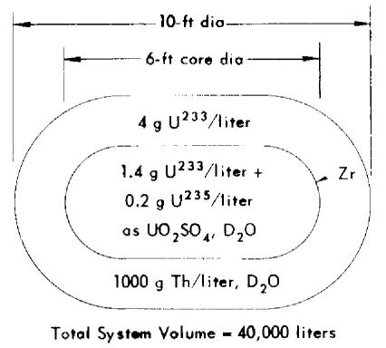

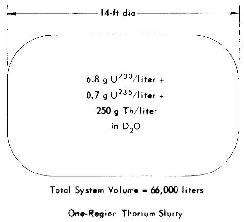  
Two-Region Breeder, Solution Core

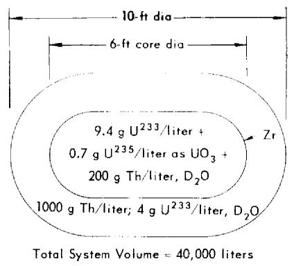

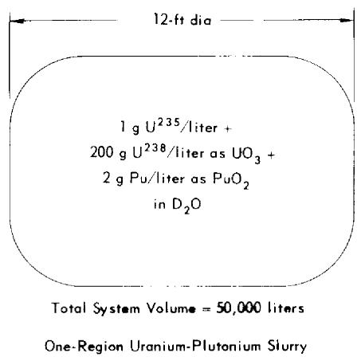  
Two-Region Breeder, Slurry Core

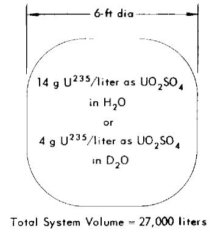  
One-Region U235 Burner (Conc. are for 10-yr opr., no fuel processing)

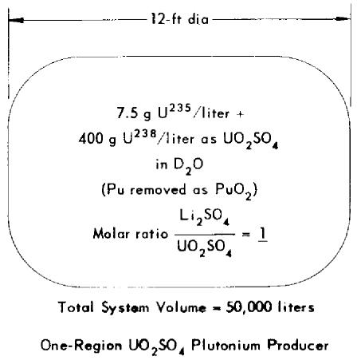  
FIG. 10-13. Equilibrium fuel concentrations and reactor dimensions for homogeneous systems operating at $280^{\circ}\mathrm{C}$ and producing $125\mathrm{Mw}$ electrical power.

# TABLE 10-16

# POWER COSTS IN LARGE-SCALE AQUEOUS HOMOGENEOUS REACTORS

(125 electrical Mw; 500 thermal Mw; $80\%$ load factor; $280^{\circ}\mathrm{C}$ ) [22]

<table><tr><td rowspan="2">Fuel system</td><td colspan="2">Fixed charges at 15%, mills/kwh</td><td rowspan="2">Fuel costs, mills/kwh</td><td colspan="2">O and M,† mills/kwh</td><td colspan="2">Total power costs, mills/kwh</td></tr><tr><td>Present*</td><td>Future</td><td>Present</td><td>Future</td><td>Present</td><td>Future</td></tr><tr><td>Two-region solution core</td><td>7.5-11.0</td><td>4.4-5.0</td><td>1.4</td><td>2-4</td><td>1-2</td><td>10.9-16.4</td><td>6.8-8.4</td></tr><tr><td>Two-region slurry core</td><td>7.5-11.0</td><td>4.4-5.0</td><td>1.3</td><td>2-4</td><td>1-2</td><td>10.8-16.3</td><td>6.7-8.3</td></tr><tr><td>One-region U235 + D2O</td><td>6.5-9.5</td><td>4.0-4.6</td><td>3.9</td><td>2-4</td><td>1-2</td><td>12.4-17.4</td><td>8.9-10.5</td></tr><tr><td>One-region U235 + H2O</td><td>6.5-9.5</td><td>4.0-4.6</td><td>4.1</td><td>2-4</td><td>1-2</td><td>12.6-17.6</td><td>9.1-10.7</td></tr><tr><td>One-region ThO2 slurry</td><td>7.0-10.3</td><td>4.3-4.8</td><td>2.0</td><td>2-4</td><td>1-2</td><td>11.0-16.3</td><td>7.3-8.8</td></tr><tr><td>One-region UO3 slurry</td><td>7.0-10.3</td><td>4.3-4.8</td><td>2.1</td><td>2-4</td><td>1-2</td><td>11.1-16.4</td><td>7.4-8.9</td></tr></table>

*Present: Based on present technology, assuming the fuel systems are feasible. †Operating and maintenance costs.

technology and a feasible reactor system, it is estimated that these costs will be 2 to 4 mills/kwh.

As more experience is gained in maintaining plants and in designing for O and M, it is expected that these costs will decrease; even so, because of the nature of the problems, O and M costs in future plants will probably be 1 to 2 mills/kwh, or about two or three times those associated with a conventional coal-fired plant.

# 10-10. SUMMARY OF ESTIMATED POWER COSTS

The power cost is the sum of the fixed charges on capital investment, fuel costs, and operating and maintenance costs. Figure 10-13 specifies the reactor systems considered, along with typical fuel concentrations and reactor dimensions. Estimates of the power cost for these systems are given in Table 10-16, and are based on operation at $280^{\circ}\mathrm{C}$ and a power level of 125 electrical Mw (500 thermal Mw). Although operating and maintenance costs are undoubtedly different for the various systems, it is assumed that the range considered covers the differences involved.

The design power of a reactor plant will markedly influence power costs, primarily because the investment cost per unit power is a function of power level. Table 10-17 indicates the influence of power level on power costs, by comparing costs for $\mathrm{U}^{235}$ burner-type reactors having power outputs of 125 and 10 electrical Mw, respectively.

TABLE 10-17   
INFLUENCE OF POWER LEVEL UPON "PRESENT" POWER COSTS IN U235 BURNERS (25% THERMAL EFF.; 80% LOAD FACTOR; 280°C)   

<table><tr><td rowspan="2"></td><td colspan="2">Electrical power level, Mw</td></tr><tr><td>10</td><td>125</td></tr><tr><td>Fixed charges at 15%/yr, mills/kwh</td><td>16</td><td>8</td></tr><tr><td>Operating and maintenance, mills/kwh</td><td>5</td><td>3</td></tr><tr><td>Fuel costs, mills/kwh</td><td>5</td><td>4</td></tr><tr><td>Total power costs, mills/kwh</td><td>26</td><td>15</td></tr></table>

# REFERENCES

1. White House press release and AEC press release, Nov. 18, 1956; AEC press release No. 1060, May 18, 1957; AEC press release No. 1245, Dec. 27, 1957; AEC press release A-47, Mar. 12, 1958.   
2. U.S. Federal Register, Mar. 12, 1957, Vol. 22, p. 1591.   
3. K. CoHEN, The Theory of Isotope Separation as Applied to the Large-Scale Production of $U^{235}$ , National Nuclear Energy Series, Division III, Volume 1B. New York: McGraw-Hill Book Co., Inc., 1951.   
4. J. A. LANe, The Economics of Nuclear Power, in Proceedings of the International Conference on the Peaceful Uses of Atomic Energy, Vol. 1. New York: United Nations, 1956. (P 476, p. 309)   
5. M. BENEDICT and T. H. PIGFORD, Nuclear Chemical Engineering. New York: McGraw-Hill Book Co., Inc., 1957. (p. 403)   
6. E. D. ARNOLD et al., Preliminary Cost Estimation: Chemical Processing and Fuel Costs for a Thermal Breeder Reactor Station, USAEC Report ORNL-1761, Oak Ridge National Laboratory, Jan. 27, 1955.   
7. S. GLASSTONE and M. C. EDLUND, The Elements of Nuclear Reactor Theory, New York: D. Van Nostrand Company, Inc., 1957. (p. 238 ff)   
8. M. W. Rosenthal et al., Fuel Costs in Spherical Slurry Reactors, USAEC Report ORNL-2313, Oak Ridge National Laboratory, Sept. 27, 1957.   
9. D. C. HAMILTON and P. R. KASTEN, Some Economic and Nuclear Characteristics of Cylindrical Thorium Breeder Reactors, USAEC Report ORNL-2165, Oak Ridge National Laboratory, Oct. 11, 1956.   
10. H. C. CLAIBORNE and M. TOBIAS, Some Economic Aspects of Thorium Breeder Reactors, USAEC Report ORNL-1810, Oak Ridge National Laboratory, Oct. 27, 1955.   
11. R. B. Briggs, *Aqueous Homogeneous Reactors for Producing Centralstation Power*, USAEC Report ORNL-1642(Del.), Oak Ridge National Laboratory, May 21, 1954.   
12. H. C. CLAIBORNE and T. B. FOWLER, in Homogeneous Reactor Project Quarterly Progress Report for the Period Ending July 31, 1955, USAEC Report ORNL-1943, Oak Ridge National Laboratory, Aug. 9, 1955. (pp. 47-49)   
13. H. C. CLAIBORNE and T. B. FOWLER, Oak Ridge National Laboratory, in *Homogeneous Reactor Project Quarterly Progress Report*, USAEC Reports ORNL-2057(Del.), 1956 (pp. 63-65); ORNL-2148(Del.), 1956 (pp. 41-43).   
14. H. C. CLAIBORNE, in Homogeneous Reactor Project Quarterly Progress Report for the Period Ending Oct. 31, 1955, USAEC Report ORNL-2004(Del.), Oak Ridge National Laboratory, Jan. 31, 1956. (pp. 53-59)   
15. H. C. CLAIBORNE and M. TOBIAS, Oak Ridge National Laboratory, 1954. Unpublished.   
16. H. C. CLAIBORNE and T. B. FOWLER, in Homogeneous Reactor Project Quarterly Progress Report for the Period Ending Apr. 30, 1956, USAEC Report ORNL-2096, Oak Ridge National Laboratory, May 10, 1956. (pp. 57-59)   
17. P. R. KASTEN and H. C. CLAIBORNE, Fuel Costs in Homogeneous U235 Burners, *Nucleonics*, 14(11), 88-91 (1956).

18. P. R. KASTEN et al., Fuel Costs in One-region Homogeneous Power Reactors, USAEC Report ORNL-2341, Oak Ridge National Laboratory, Dec. 3, 1957.   
19. W. L. RoBB et al., Fission--roduct Buildup in Long-burning Thermal Reactors, *Nucleonics* 13(12), 30 (1955).   
20. W. H. WALKER, Fission Product Poisoning, Report CRRP 626, Atomic Energy of Canada, Ltd., Jan. 5, 1956.   
21. J. C. HEAP, Cost Estimates for Reactor Containment, (Reactor Engineering Division) Tech. Memo No. 13 (Revised), Argonne National Laboratory, October 1957.   
22. J. A. LANE, Oak Ridge National Laboratory, personal communication.   
23. M. I. LUNDIN, Oak Ridge National Laboratory, personal communication.   
24. Evaluation of a Homogeneous Reactor, *Nucleonics* 15(10), 64-70 (1957).

# BIBLIOGRAPHY FOR PART I

AERONUTRONIC SYSTEMS, INC., A Selection Study for an Advanced Engineering Test Reactor, USAEC Report AECU-3478, Mar. 29, 1957.   
ARNOLD, E. D. et al., Exploratory Study: Homogeneous Reactors as Gamma Irradiation Sources, USAEC CF-56-6-107, Oak Ridge National Laboratory, July 5, 1956.   
BAKER, C. P. et al., Water Boiler, USAEC Report AECD-3063, Los Alamos Scientific Laboratory, Sept. 4, 1944.   
BEALL, S. E. et al., Status and Objectives--Homogeneous Reactor Project: Summaries of Presentations to the Reactor Sub-committee of the General Advisory Committee. USAEC Report CF-56-1-26(Del.), Oak Ridge National Laboratory, Jan. 10, 1956.   
BEALL, S. E., Decontamination of the Homogeneous Reactor Experiment, USAEC Report ORNL-1839. Oak Ridge National Laboratory, June 12, 1956.   
BEALL, S. E., Containment Problems in Aqueous Homogeneous Reactor Systems, USAEC Report ORNL-2091, Oak Ridge National Laboratory, Aug. 8, 1956.   
BEALL, S. E., Homogeneous Reactor Experiment No. 2, presented at the Fourth Annual Conference of the Atomic Industrial Forum, October 1957.   
BEALL, S. E., and R. W. JURGENSEN, Direct Maintenance Practices for the $HRT$ , presented at the Nuclear Engineering and Science Congress, March 1958; also USAEC Report CF-58-4-101, Oak Ridge National Laboratory, 1958.   
BEALL, S. E., and S. VISNER, Homogeneous Reactor Test. Summary Report for the Advisory Committee on Reactor Safeguards, USAEC Report ORNL-1834, Oak Ridge National Laboratory, January 1955.   
BENTZEN, F. L. et al., High-power Water Boiler, USAEC Report AECD-3065, Los Alamos Scientific Laboratory, Sept. 19, 1945.   
Borkowski, C. J., Design, Review Committee Report on the Homogeneous Reactor Experiment, USAEC Report CF-55-6-53, Oak Ridge National Laboratory, June 7, 1955.   
BRIGGS, R. B., Aqueous Homogeneous Reactors for Producing Central-station Power. USAEC Report ORNL-1642(Del.), Oak Ridge National Laboratory, May 21, 1954.   
BRIGGS, R. B. (omp.), HRP Civilian Power Reactor Conference Held at Oak Ridge National Laboratory May 1-2, 1957, TID-7540, Oak Ridge National Laboratory, July 1957.   
BRIGGS, R. B., and J. A. SWARTOUT, Aqueous Homogeneous Power Reactors, in Proceedings of the International Conference on the Peaceful Uses of Atomic Energy, Vol. 3. New York: United Nations, 1956. (P 496, p. 175)   
BUSEY, H. M., and R. P. HAMMOND, Los Alamos Scientific Laboratory, Test-Tube Reactor, in Nuclear Science and Technology (Extracts from Reactor Science and Technology, Vol. 4), USAEC Report TID-2505(Del.), 1954. (pp. 163-166)   
CARSON, H. G., and L. H. LANDRUM (Eds.), Preliminary Discussion and Cost Estimate for the Production of Central-station Power from an Aqueous Homogeneous Reactor Utilizing Thorium—Uranium-233, USAEC Report NPG-112, Nuclear Power Group, Feb. 1, 1955.

CARTER, WILLIAM L., Design Criteria for the IIRT Chemical Plant, USAEC Report CF-54-11-190, Oak Ridge National Laboratory, Nov. 24, 1954.   
CHRISTY, R. F., Theoretical Discussion of a Small Homogeneous Enriched Reactor, USAEC Report MDDC-72, Los Alamos Scientific Laboratory, June 18, 1946.   
COLLIER, D. M. et al., The HRE Simulator. An Analog Computer for Solving the Kinetic Equations of a Homogeneous Reactor, USAEC Report ORNL-1572, Oak Ridge National Laboratory, Sept. 24, 1954.   
COMMONWEALTH EDISON COMPANY and PUBLIC SERVICE COMPANY, A Third Report on the Feasibility of Power Generation Using Nuclear Energy, USAEC Report CEPS-1121, June 15, 1953.   
CROXTON, F. E., List of References on Homogeneous Reactors, USAEC TID-299, Technical Information Service Extension, AEC, Mar. 15, 1950.   
DRAPER, B. D., Maintenance of Various Reactor Types, USAEC Report CF-57-4-92, Oak Ridge National Laboratory, Apr. 8, 1957.   
FAX, D. H. (Ed.), Proposed 80,000 kw Homogeneous Reactor Plant. Process and Plant Description, USAEC Report WIAP-9, Westinghouse Electric Corporation, Industrial Atomic Power Group. February 1955.   
FROMAN, D. et al., Los Alamos Power Reactor Experiments, in Proceedings of the International Conference on the Peaceful Uses of Atomic Energy, Vol. 3. New York: United Nations, 1956. (P 500, p. 283)   
GENERAL ELECTRIC COMPANY, ATOMIC POWER EQUIPMENT DEPARTMENT, Homogeneous Circulation Fuel Reactor Power Plant: Conceptual Design Study Report, USAEC Report GEAP-2(Del.), May 31, 1955.   
GUERON, J. et al., The Economics of Nuclear Power, Vol. I. London: Pergamon Press, 1956.   
HAUBENREICH, P. N., Calculation for Thorium- and Uranium-fueled Reactors, USAEC Report CF-53-12-1, Oak-Ridge National Laboratory, Feb. 8, 1954.   
HAUBENREICH, P. N., Estimation of Most Economical Velocity in Reactor Circulating Systems, USAEC Report CF-54-5-26, Oak Ridge National Laboratory, May 5, 1954.   
HUB, KENNETH A., Discussion of Homogeneous Reactor Possibilities, USAEC Report AECU-3336, Internuclear Company, May 16, 1956.   
JENKS, G. H., Effect of Radiation on the Corrosion of Zircaloy-2, USAEC Report CF-57-9-11, Oak Ridge National Laboratory, Sept. 30, 1957.   
KASTEN, P. R., Homogeneous Reactor Safety, USAEC Report CF-55-5-51, Oak Ridge National Laboratory, May 9, 1955.   
KASTEN, P. R., Stability of Homogeneous Reactors, USAEC Report CF-55-5-163, Oak Ridge National Laboratory, May 25, 1955.   
KASTEN, P. R., *Dynamics of the Homogeneous Reactor Test*, USAEC Report ORNL-2072, Oak Ridge National Laboratory, June 7, 1956.   
KASTEN, P. R., Time Behavior of Fuel Concentrations in Single-region Reactors Containing U-233, U-235, Th-232, and Fission-product Poisons, USAEC Report CF-57-2-120, Oak Ridge National Laboratory, Feb. 26, 1957.   
KASTEN, P. R. et al., Aqueous Homogeneous Research Reactor—Feasibility Study, USAEC Report ORNL-2256, Oak Ridge National Laboratory, May 9, 1957.

KING, L. D. P. (Comp.), Los Alamos Power Reactor Experiment and its Associated Hazards, USAEC Report LAMS-1611(Del.), Los Alamos Scientific Laboratory, Dec. 2, 1953.   
King, L. D. P., Design and Description of Water Boiler Reactors, in Proceedings of the International Conference on the Peaceful Uses of Atomic Energy, Vol. 2. New York: United Nations, 1956. (P 488, p. 372)   
LANE, J. A., Some Long Range Aspects of Homogeneous Reactors, in *Nuclear Science and Technology* (Extracts from Reactor Science and Technology, Vol. 1, 1951) TID-2502(Del.) (pp. 27-42)   
LANE, J. A. et al., *Aqueous Fuel Systems*, USAEC Report CF-57-12-49, Oak Ridge National Laboratory, December 1957.   
LITTLE, INC., A. D., Gas Pressurization of Homogeneous Reactor Test, USAEC Report AECU-3349, Feb. 14, 1956.   
LOS ALAMOS SCIENTIFIC LABORATORY, An Enriched Homogeneous Nuclear Reactor, USAEC Report AECD-3059, Jan. 25, 1951; also Rev. Sci. Instruments 22, p. 489-499 (1951).   
LUNDIN, M. I., Economics of Power Generation—Homogeneous Research Reactor, USAEC Report CF-56-6-29, Oak Ridge National Laboratory, June 4, 1956.   
MALLON, R. G. et al., Conceptual Design of an Advanced Engineering Test Reactor, USAEC Report NYO-4849, Advanced Scientific Techniques Research Associates, Mar. 1, 1957.   
McBride, J. P., Aqueous Slurries, USAEC Report CF-57-11-120, Oak Ridge National Laboratory, Nov. 26, 1957.   
McDUFFIE, H. F., Corrosion by Aqueous Reactor Fuel Solutions, USAEC Report CF-56-11-72, Oak Ridge National Laboratory, Nov. 14, 1956.   
OAK RIDGE NATIONAL LABORATORY, Homogeneous Reactor Project Quarterly Progress Report: USAEC Reports ORNL-527(Del.), Dec. 28, 1949; ORNL-630, Apr. 21, 1950; ORNL-730, July 6, 1950; ORNL-826, Oct. 24, 1950; ORNL-925, Jan. 30, 1951; ORNL-990, May 18, 1951; ORNL-1057, Oct. 10, 1951; ORNL-1121(Rev.), Jan. 9, 1952; ORNL-1221, Apr. 1, 1952; ORNL-1280, July 14, 1952; ORNL-1318, Sept. 19, 1952; ORNL-1424(Del.), Jan. 10, 1953; ORNL-1478(Del.), Mar. 3, 1953; ORNL-1554, July 10, 1953; ORNL-1605, Oct. 20, 1953; ORNL-1658, Feb. 25, 1954; ORNL-1678, Apr. 15, 1954; ORNL-1753(Del.), Sept. 17, 1954; ORNL-1813(Del.), Dec. 30, 1954; ORNL-1853, Feb. 16, 1955; ORNL-1895, July 14, 1955; ORNL-1943, Aug. 9, 1955; ORNL-2004(Del.), Jan. 31, 1956; ORNL-2057(Del.), Apr. 17, 1956; ORNL-2096, May 10, 1956; ORNL-2148(Del.), Oct. 3, 1956; ORNL-2222, Feb. 7, 1957; ORNL-2272, Apr. 22, 1957; ORNL-2331, Sept. 3, 1957; ORNL-2379, Oct. 10, 1957; ORNL-2432, Jan. 21, 1958; ORNL-2493, 1958.   
OAK RIDGE OPERATIONS OFFICE, RESEARCH AND DEVELOPMENT DIVISION, ATOMIC ENERGY COMMISSION, HRP Civilian Power Reactor Conference Held at Oak Ridge, March 21-22, 1956, USAEC Report TID-7524, March 1956. OAK RIDGE SCHOOL OF REACTOR TECHNOLOGY, Reactor Studies:   
CHAPMAN, R. H., An 80-Megawatt Aqueous Homogeneous Burner Reactor, ORNL-CF-57-8-6, in preparation.   
CLARK, P. R., Homogeneous Reactor for Ship Propulsion, USAEC Report CF-55-8-191, August 1955.

HAUSPURG, A., High-temperature Aqueous Homogeneous Reactor, USAEC Report CF-55-8-191, August 1955.   
KAMACK, H. F., Boiling Homogeneous Reactor for Producing Power and Plutonium, USAEC CF-54-8-238(Del.), August 1954.   
MONTGOMERY, D. W. et al., 10-Megawatt Aqueous Homogeneous Circulating Solution Reactor for Producing Electrical Power in Remote Locations, USAEC Report CF-53-10-22, August 1953.   
PUTNAM, G. et al., Reactor Design and Feasibility Problem; U233 Power Breeder, USAEC Report CF-51-8-213, Aug. 6, 1951.   
RICKERT, R. J. et al., A Preliminary Design Study of a 10-Mw Homogeneous Boiling Reactor Power Package for Use in Remote Locations, USAEC Report CF-53-10-23, Aug. 21, 1953.   
THOMAS, R. A. et al., *Ultimate Homogeneous Reactor*, USAEC Report CF-54-8-239, August 1954.   
Zeitlin, H. R. et al., Boiling Homogeneous Reactor for Power and U-233 Production, USAEC Report CF-54-8-240, August 1954.   
PACIFIC NORTHWEST POWER GROUP, Aqueous Homogeneous Reactors, Second Annual and Final Report to the Atomic Energy Commission, Report PNG-7, February 1956.   
PEEBLES, FRED N., and HAROLD J. GARBER, The Combination of II hydrogen and Oxygen in Platinum Catalyzed Flow Reactors, USAEC Report ORNL-1796, University of Tennessee, Oct. 26, 1954.   
QUARLES, L. R., and W. P. WALKER, A Manual of HRE Control and Instrumentation, USAEC Report ORNL-1094, Oak Ridge National Laboratory, Jan. 23, 1952.   
REACTOR SAFEGUARD COMMITTEE, ATOMIC ENERGY COMMISSION, Report on the Los Alamos Homogeneous Enriched $U^{235}$ Reactor; Meeting Held at Los Alamos on Feb. 1-2, 1949, USAEC Report TID-5428, June 27, 1949.   
ROBERTSON, R. C., Heat-Power Cycles and Prime Movers for Nuclear Power Plants, USAEC Report CF-56-10-77, Oak Ridge National Laboratory, Oct. 10, 1956.   
ROSENTHAL, M. W., Natural Circulation Homogeneous Reactors, USAEC Report CF-56-10-53, Oak Ridge National Laboratory, Oct. 16, 1956.   
ROSENTHAL, M. W., and M. TOBIAS, Nuclear Characteristics of Two-region Slurry Reactors, USAEC Report CF-56-12-82, Oak Ridge National Laboratory, Dec. 20, 1956.   
SCHWARTZ, H., Natural Convection Cooling of Liquid Homogeneous Reactors, North American Aviation, Inc., USAEC Report AECU-706, Dec. 20, 1949.   
SECOY, C. H., Aqueous Fuel Systems, USAEC Report CF-57-2-139, Oak Ridge National Laboratory, Feb. 28, 1957.   
SEGASER, C. L., and F. C. ZAPP, HRE Design Manual, USAEC Report TID-10082, Oak Ridge National Laboratory, Nov. 18, 1952.   
STEIN, J. M., and P. R. KASTEN, Boiling Reactors: A Preliminary Investigation, USAEC Report ORNL-1062, Oak Ridge National Laboratory, Dec. 12, 1951.   
TAYLOR, W. F., TBR Plant Turbogenerator System Study, USAEC Report CF-56-7-127, Oak Ridge National Laboratory, June 27, 1956.

TOBIAS, M., Breeding Reactors, USAEC Report CF-55-6-157, Oak Ridge, National Laboratory, June 7, 1955.   
TOBIAS, M., The HRT and the Walk-Away Problem, in *Nuclear Science and Technology*, Vol. 2A. USAEC Report TID-2509, Oak Ridge National Laboratory, 1956. (pp. 83-96) (June 1956).   
TOMB, D. S., JR., Instrumentation and Controls for the HRT, *Nucleonics* 15(2): 48-52 (1957).   
THOMAS, D. G., Solids Dispersed in Liquids, USAEC Report, CF-56-10-35, Oak Ridge National Laboratory, Oct. 1, 1956.   
THOMAS, T. H. (Ed.), IRE Operations Manual, USAEC Report CF-53-1-94, Oak Ridge National Laboratory, Oct. 9, 1952.   
THOMPSON, W. E. (Ed.), Notes on the IHRP Information Meeting, June 23, 1952, USAEC Reports CF-52-7-104, Oak Ridge National Laboratory, July 21, 1952.   
VISNER, S., and P. J. HAUBENREICH, HRE Experiment on Internal Recombination of Gas with a Homogeneous Catalyst, in *Nuclear Science and Technology*, Vol. 1A. No. 1, USAEC Report TID-2506(Del.), Oak Ridge National Laboratory, 1955. (pp. 73-90)   
Weeren, H. O., HRT Hazards Report, Chemical Processing System, USAEC Report CF-54-12-146, Oak Ridge National Laboratory, Dec. 10, 1954.   
WEINBERG, A. M., Outline of Program for Design of Pilot Model of Homogeneous Power Reactor, USAEC Report CF-49-7-135(Rev.), Oak Ridge National Laboratory, July 15, 1949.   
WESTINGHOUSE ELECTRIC CORPORATION, INDUSTRIAL ATOMIC POWER GROUP, Proposed 80,000 kw Homogeneous Reactor Plant. Cost Estimates, USAEC Report WIAP-11, February 1955.   
WINTERS, C. E. et al., Homogeneous Reactor Preliminary Process Design Report, USAEC Reports AECD-3980 and ORNL-527(Del.), Oak Ridge National Laboratory, Dec. 28, 1949.   
WINTERS, C. E., and A. M. WEINBERG. Homogeneous Reactor Experiment Feasibility Report, USAEC Report ORNL-730, Oak Ridge National Laboratory, July 6, 1950.   
WINTERS, C. E., and A. M. WEINBERG, A Report on The Safety Aspects of the Homogeneous Reactor Experiment, USAEC Report ORNL-731, Oak Ridge National Laboratory, Aug. 29, 1950.   
ZAPP, F. C., and P. N. HAUBENREICH, Design Data for ISHR (2nd ed.), USAEC Report CF-52-11-161, Oak Ridge National Laboratory, Nov. 8, 1952.   
ZMOLA, P. C. et al., Power Removal from Boiling Homogeneous Reactors, in Nuclear Science and Technology (Extracts from Reactor Science and Technology, Vol. 4), USAEC Report TID-2505(Del.), Oak Ridge National Laboratory, 1954. (pp. 47-72).