# CHAPTER 12

# CHEMICAL ASPECTS OF MOLTEN-FLUORIDE-SALT REACTOR FUELS*

The search for a liquid for use at high temperatures and low pressures in a fluid-fueled reactor led to the choice of either fluorides or chlorides because of the requirements of radiation stability and solubility of appreciable quantities of uranium and thorium. The chlorides (based on the $\mathrm{Cl}^{37}$ isotope) are most suitable for fast reactor use, but the low thermal-neutron absorption cross section of fluorine makes the fluorides a uniquely desirable choice for a high-temperature fluid-fueled reactor in the thermal or epithermal neutron region.

Since for most molten-salt reactors considered to date the required concentrations of $\mathrm{UF_4}$ and $\mathrm{ThF_4}$ have been moderately low, the molten-salt mixtures can be considered, to a first approximation, as base or solvent salt mixtures, to which the fissionable or fertile fluorides are added. For the fuel, the relatively small amounts of $\mathrm{UF_4}$ required make the corresponding binary or ternary mixtures of the diluents nearly controlling with regard to physical properties such as the melting point.

# 12-1. CHOICE OF BASE OR SOLVENT SALTS

The temperature dependence of the corrosion of nickel-base alloys by fluoride salts is described in Chapter 13. From the data given there, $1300^{\circ}\mathrm{F}$ $(704^{\circ}\mathrm{C})$ is taken as an upper limit for the molten-salt-to-metal interface temperature. To provide some leeway for radiation heating of the metal walls and to provide a safety margin, the maximum bulk temperature of the molten-salt fuel at the design condition will probably not exceed $1225^{\circ}\mathrm{F}$ . In a circulating-fuel reactor, in which heat is extracted from the fuel in an external heat exchanger, the temperature difference between the inlet and outlet of the reactor will be at least $100^{\circ}\mathrm{F}$ . The provision of a margin of safety of $100^{\circ}\mathrm{F}$ between minimum operating temperature and melting point makes salts with melting points above $1025^{\circ}\mathrm{F}$ of little interest at present, and therefore this discussion is limited largely to salt mixtures having melting points no higher than $1022^{\circ}\mathrm{F}$ $(550^{\circ}\mathrm{C})$ . One of the basic features desired in the molten-salt reactor is a low pressure in the fuel system, so only fluorides with a low vapor pressure at the peak operating temperature $(\sim 700^{\circ}\mathrm{C})$ are considered.

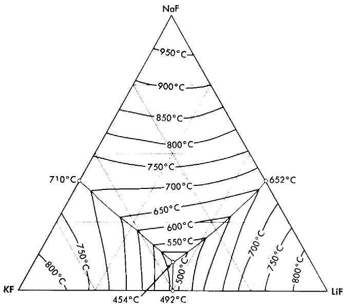  
FIG. 12-1. The system LiF-NaF-KF [A. G. Bergman and E. P. Dergunov, Compt. rend. acad. sci. U.R.S.S., 31, 754 (1941)].

Of the pure fluorides of molten-salt reactor interest, only $\mathrm{BeF}_2$ meets the melting-point requirement, and it is too viscous for use in the pure state. Thus only mixtures of two or more fluoride salts provide useful melting points and physical properties.

The alkali-metal fluorides and the fluorides of beryllium and zirconium have been given the most serious attention for reactor use. Lead and bismuth fluorides, which might otherwise be useful because of their low neutron absorption, have been eliminated because they are readily reduced to the metallic state by structural metals such as iron and chromium.

Binary mixtures of alkali fluorides that have sufficiently low melting points are an equimolar mixture of KF and LiF, which has a melting point of $490^{\circ}\mathrm{C}$ , and a mixture of 60 mole $\%$ RbF with 40 mole $\%$ LiF, which has a melting point of $470^{\circ}\mathrm{C}$ . Up to 10 mole $\%$ UF $_4$ can be added to these alkali fluoride systems without increasing the melting point above the $550^{\circ}\mathrm{C}$ limit. A melting-point diagram for the ternary system LiF-NaF-KF, Fig. 12-1, indicates a eutectic with a lower melting point than the melting points of the simple binary LiF-KF system. This eutectic has interesting properties as a heat-transfer fluid for molten-salt reactor systems, and data on its physical properties are given in Tables 12-1 and 12-2. The KF-LiF and RbF-LiF binaries and their ternary systems with NaF are the only available systems of the alkali-metal fluorides alone which have

# TABLE 12-1

# MELTING POINTS, HEAT CAPACITIES, AND EQUATIONS FOR DENSITY AND VISCOSITY OF TYPICAL MOLTEN FLUORIDES

<table><tr><td rowspan="3">Composition, mole %</td><td rowspan="3">Melting point, °C</td><td colspan="2">Liquid density, g/cc ρ = A - BT(°C)</td><td rowspan="3">Heat capacity at 700°C, cal/gram</td><td colspan="3">Viscosity, centipoise</td></tr><tr><td rowspan="2">A</td><td rowspan="2">B</td><td colspan="2">η = AeB/T(°K)</td><td rowspan="2">At 600°C</td></tr><tr><td>A</td><td>B</td></tr><tr><td>LiF-BeF2(69-31)</td><td>505</td><td>2.16</td><td>40</td><td>0.65</td><td>0.118</td><td>3624</td><td>7.5</td></tr><tr><td>LiF-BeF2(50-50)</td><td>350</td><td>2.46</td><td>40</td><td>0.67</td><td>0.0189</td><td>6174</td><td>22.2</td></tr><tr><td>NaF-BeF2(57-43)</td><td>360</td><td>2.27</td><td>37</td><td>0.52</td><td>0.0346</td><td>5164</td><td>12.8</td></tr><tr><td>NaF-ZrF4(50-50)</td><td>510</td><td>3.79</td><td>93</td><td>0.28</td><td>0.0709</td><td>4168</td><td>8.4</td></tr><tr><td>LiF-NaF-KF(46.5-11.5-42)</td><td>454</td><td>2.53</td><td>73</td><td>0.45</td><td>0.0400</td><td>4170</td><td>4.75</td></tr><tr><td>LiF-NaF-BeF2(35-27-38)</td><td>338</td><td>2.22</td><td>41</td><td>0.59</td><td>0.0338</td><td>4738</td><td>7.8</td></tr></table>

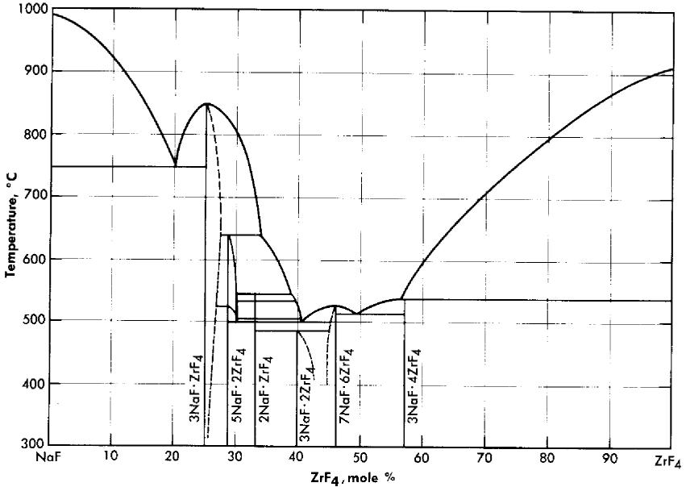  
FIG. 12-2. The system $\mathrm{NaF - ZrF_4}$ .

low melting points at low uranium concentrations. They would have utility as special purpose reactor fuel solvents if no mixtures with better properties were available.

TABLE 12-2   
THERMAL CONDUCTIVITY OF TYPICAL FLUORIDE MIXTURES   

<table><tr><td rowspan="2">Composition, mole %</td><td colspan="2">Thermal conductivity, Btu/(hr)(ft)(°F)</td></tr><tr><td>Solid</td><td>Liquid</td></tr><tr><td>LiF-NaF-KF (46.5-11.5-42) NaF-BeF2(57-43)</td><td>2.7</td><td>2.62.4</td></tr></table>

Mixtures with melting points in the range of interest may be obtained over relatively wide limits of concentration if $\mathrm{ZrF_4}$ or $\mathrm{BeF_2}$ is a component of the system. Phase relationships in the $\mathrm{NaF - ZrF_4}$ system are shown in Fig. 12-2. There is a broad region of low-melting-point compositions that have between 40 and 55 mole $\%$ $\mathrm{ZrF_4}$ .

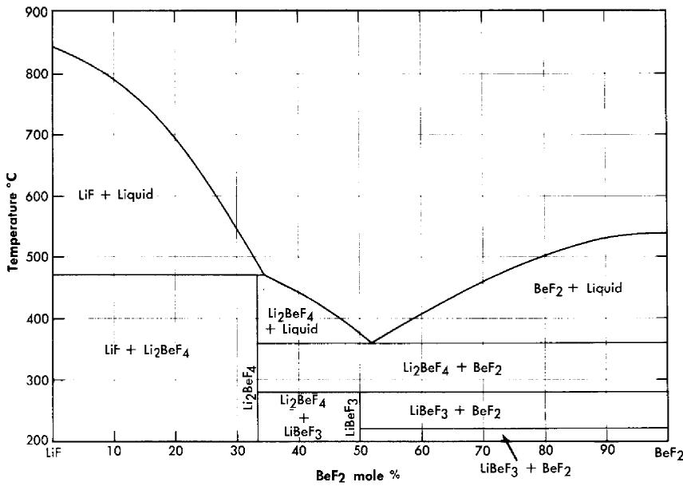  
FIG. 12-3. The system $\mathrm{LiF - BeF_2}$ .

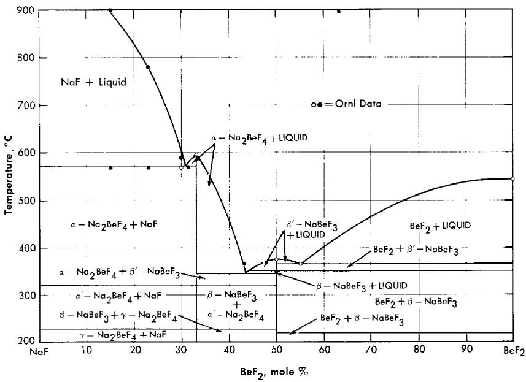  
FIG. 12-4. The system $\mathrm{NaF - BeF_2}$ .

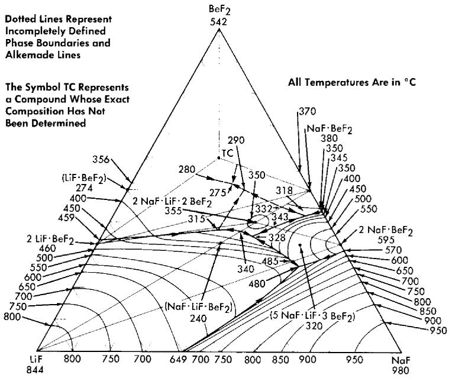  
FIG. 12-5. The system LiF-NaF-BeF $_2$ .

The lowest melting binary systems are those containing $\mathrm{BeF}_2$ and LiF or NaF. Since $\mathrm{BeF}_2$ offers the best cross section of all the useful diluents, fuels based on these binary systems are likely to be of highest interest in thermal reactor designs.

The binary system $\mathrm{LiF - BeF_2}$ has melting points below $500^{\circ}\mathrm{C}$ over the concentration range from 33 to 80 mole $\%$ $\mathrm{BeF_2}$ . The presently accepted $\mathrm{LiF - BeF_2}$ system diagram presented in Fig. 12-3 differs substantially from previously published diagrams [1-3]. It is characterized by a single eutectic between $\mathrm{BeF_2}$ and $2\mathrm{LiF} \cdot \mathrm{BeF_2}$ that freezes at $356^{\circ}\mathrm{C}$ and contains 52 mole $\%$ $\mathrm{BeF_2}$ . The compound $2\mathrm{LiF} \cdot \mathrm{BeF_2}$ melts incongruity to LiF and liquid at $460^{\circ}\mathrm{C}$ ; $\mathrm{LiF} \cdot \mathrm{BeF_2}$ is formed by the reaction of solid $\mathrm{BeF_2}$ and solid $2\mathrm{LiF} \cdot \mathrm{BeF_2}$ below $274^{\circ}\mathrm{C}$ .

The diagram of the $\mathrm{NaF - BeF_2}$ system (Fig. 12-4) is similar to that of the $\mathrm{LiF - BeF_2}$ system. The ternary system combining both $\mathrm{NaF}$ and $\mathrm{LiF}$ with $\mathrm{BeF_2}$ , shown in Fig. 12-5, offers a wide variety of low-melting compositions. Some of these are potentially useful as low-melting heat-transfer liquids, as well as for reactor fuels.

# TABLE 12-3

# MELTING POINTS, HEAT CAPACITIES, AND EQUATIONS FOR DENSITY AND VISCOSITY OF FUEL BEARING SALTS

<table><tr><td rowspan="3">Composition, mole %</td><td rowspan="3">Melting point, °C</td><td colspan="2">Liquid density, g/cc ρ = A - BT(°C)</td><td rowspan="3">Heat capacity at 700°C, cal/gram</td><td colspan="3">Viscosity, centipoise</td></tr><tr><td rowspan="2">A</td><td rowspan="2">B</td><td colspan="2">η = AeB/T(°K)</td><td rowspan="2">At 600°C</td></tr><tr><td>A</td><td>B</td></tr><tr><td>LiF-BeF2-UF4(67-30.5-2.5)</td><td>464</td><td>2.38</td><td>×10-5</td><td>0.57</td><td></td><td></td><td>8.4</td></tr><tr><td>NaF-BeF2-UF4(55.5-42-2.5)</td><td>400</td><td>2.50</td><td>43</td><td>0.46</td><td></td><td></td><td>10.5</td></tr><tr><td>NaF-ZrF4-UF4(50-46-4)</td><td>520</td><td>3.93</td><td>93</td><td>0.26</td><td>0.0981</td><td>3895</td><td>8.5</td></tr></table>

TABLE 12-4   
THERMAL CONDUCTIVITY OF TYPICAL FLUORIDE FUELS   

<table><tr><td rowspan="2">Composition, mole %</td><td colspan="2">Thermal conductivity, Btu/(hr) (ft) (°F)</td></tr><tr><td>Solid</td><td>Liquid</td></tr><tr><td>LiF–NaF–KF–UF4(44.5–10.9–43.5–1.1)</td><td>2.0</td><td>2.3</td></tr><tr><td>NaF–ZrF4–UF4(50–46–4)</td><td>0.5</td><td>1.3</td></tr><tr><td>NaF–ZrF4–UF4(53.5–40–6.5)</td><td></td><td>1.2</td></tr><tr><td>NaF–KF–UF4(46.5–26–27.5)</td><td></td><td>0.5</td></tr></table>

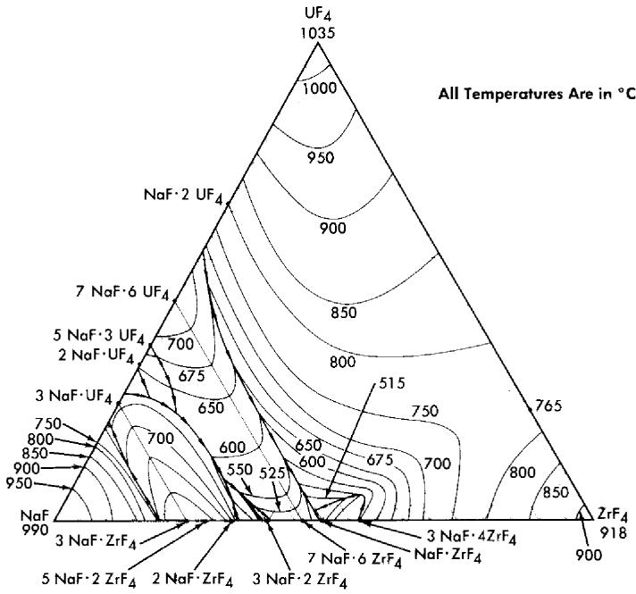  
FIG. 12-6. The system $\mathrm{NaF - ZrF_4 - UF_4}$

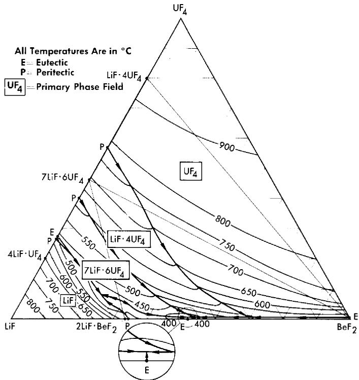  
FIG. 12-7. The system $\mathrm{LiF - BeF_2 - UF_4}$

# 12-2. FUEL AND BLANKET SOLUTIONS

12-2.1 Choice of uranium fluoride. Uranium hexafluoride is a highly volatile compound, and it is obviously unsuitable as a component of a liquid for use at high temperatures. The compound $\mathrm{UO}_2\mathrm{F}_2$ , which is relatively nonvolatile, is a strong oxidant that would be very difficult to contain. Fluorides of pentavalent uranium $(\mathrm{UF}_5,\mathrm{U}_2\mathrm{F}_9,$ etc.) are not thermally stable [4] and would be prohibitively strong oxidants even if they could be stabilized in solution. Uranium trifluoride, when pure and under an inert atmosphere, is stable even at temperatures above $1000^{\circ}\mathrm{C}$ [4,5]; however, it is not so stable in molten fluoride solutions [6]. It disproportionates appreciably in such media by the reaction

$$
4 \mathrm {U F} _ {3} \xleftarrow {\longleftrightarrow} 3 \mathrm {U F} _ {4} + \mathrm {U} ^ {0},
$$

at temperatures below $800^{\circ}\mathrm{C}$ . Small amounts of $\mathrm{UF}_3$ are permissible in the presence of relatively large concentrations of $\mathrm{UF}_4$ and may be beneficial insofar as corrosion is concerned. It is necessary, however, to use $\mathrm{UF}_4$ as the major uraniferous compound in the fuel.

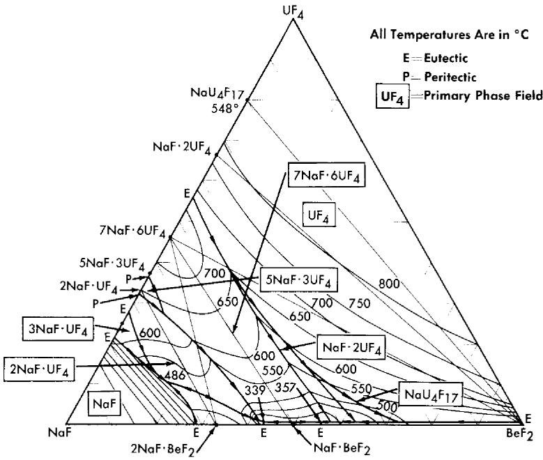  
FIG. 12-8. The system $\mathrm{NaF - BeF_2 - UF_4}$ .

12-2.2 Combination of $\mathrm{UF_4}$ with base salts. The fuel for the Aircraft Reactor Experiment (Chapter 16) was a mixture of $\mathrm{UF_4}$ with the $\mathrm{NaF - ZrF_4}$ base salt. The ternary diagram for this system is shown in Fig. 12-6. The compounds $\mathrm{ZrF_4}$ and $\mathrm{UF_4}$ have very similar unit cell parameters [4] and are isomorphous. They form a continuous series of solid solutions with a minimum melting point of $765^{\circ}\mathrm{C}$ for the solution containing 23 mole $\%$ $\mathrm{UF_4}$ . This minimum is responsible for a broad shallow trough which penetrates the ternary diagram to about the 45 mole $\%$ NaF composition. A continuous series of solid solutions without a maximum or a minimum exists between $\alpha - 3\mathrm{NaF} \cdot \mathrm{UF_4}$ and $3\mathrm{NaF} \cdot \mathrm{ZrF_4}$ ; in this solution series the temperature drops sharply with decreasing $\mathrm{ZrF_4}$ concentration. A continuous solid-solution series without a maximum or a minimum also exists between the isomorphous congruent compounds $7\mathrm{NaF} \cdot 6\mathrm{UF_4}$ and $7\mathrm{NaF} \cdot 6\mathrm{ZrF_4}$ ; the liquidus decreases with increasing $\mathrm{ZrF_4}$ content. These two solid solutions share a boundary curve over a considerable composition range. The predominance of the primary phase fields of the three solid solutions presumably accounts for the complete absence of a ternary eutectic in this complex system. The liquidus surface over the area below 8 mole $\%$ $\mathrm{UF_4}$ and between 60 and 40 mole $\%$ NaF is relatively flat. All fuel compositions within this region have acceptable melting points. Minor

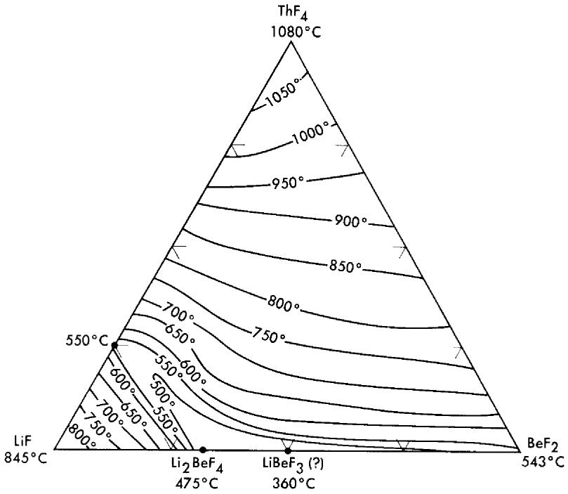  
FIG. 12-9. The system $\mathrm{LiF - BeF_2 - ThF_4}$

advantages in physical and thermal properties accrue from choosing mixtures with minimum $\mathrm{ZrF_4}$ content in this composition range. Typical physical and thermal properties are given in Tables 12-3 and 12-4.

The nuclear studies in Chapter 14 indicate that the combination of $\mathrm{BeF}_2$ with NaF or with LiF (provided the separated Li $^7$ isotope can be used) are more suitable as reactor fuels. The diagram of Fig. 12-7 reveals that melting temperatures below $500^{\circ}\mathrm{C}$ can be obtained over wide composition ranges in the three-component system $\mathrm{LiF - BeF_2 - UF_4}$ . The lack of a low-melting eutectic in the $\mathrm{NaF - UF_4}$ binary system is responsible for melting points below $500^{\circ}\mathrm{C}$ being available over a considerably smaller concentration interval in the $\mathrm{NaF - BeF_2 - UF_4}$ system (Fig. 12-8) than in its $\mathrm{LiF - BeF_2 - UF_4}$ counterpart.

The four-component system $\mathrm{LiF - NaF - BeF_2 - UF_4}$ has not been completely diagrammed. It is obvious, however, from examination of Fig. 12-5 that the ternary solvent $\mathrm{LiF - NaF - BeF_2}$ offers a wide variety of low-melting compositions; it has been established that considerable quantities (up to at least $10\mathrm{mole}\%$ ) of $\mathrm{UF_4}$ can be added to this ternary system without elevation of the melting point to above $500^{\circ}\mathrm{C}$ .

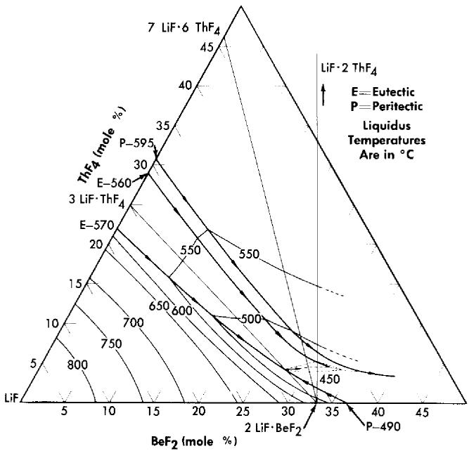  
FIG. 12-10. The system $\mathrm{LiF - BeF_2 - ThF_4}$ in the concentration range 50 to 100 mole $\%$ LiF.

12-2.3 Systems containing thorium fluoride. All the normal compounds of thorium are quadrivalent; accordingly, any use of thorium in molten fluoride melts must be as $\mathrm{ThF_4}$ . A diagram of the $\mathrm{LiF - BeF_2 - ThF_4}$ ternary system, which is based solely on thermal data, is shown as Fig. 12-9. Recent studies in the 50 to 100 mole $\%$ LiF concentration range have demonstrated (Fig. 12-10) that the thermal data are qualitatively correct. Breeder reactor blanket or breeder reactor fuel solvent compositions in which the maximum $\mathrm{ThF_4}$ concentration is restricted to that available in salts having less than a $550^{\circ}\mathrm{C}$ liquidus may be chosen from an area of the phase diagram (Fig. 12-10) in which the upper limits of $\mathrm{ThF_4}$ concentration are obtained in the composition

75 mole % LiF-16 mole % ThF4-9 mole % BeF2,   
69.5 mole $\%$ LiF-21 mole $\%$ ThF $_{4}$ -9.5 mole $\%$ BeF $_{2}$ ,   
68 mole $\%$ LiF-22 mole $\%$ ThF $_{4}$ -10 mole $\%$ BeF $_{2}$ .

12-2.4 Systems containing $\mathbf{Th}_4$ and $\mathbf{UF_4}$ . The $\mathrm{LiF - BeF_2 - UF_4}$ and the $\mathrm{LiF - BeF_2 - ThF_4}$ ternary systems are very similar; the two eutectics in the $\mathrm{LiF - BeF_2 - ThF_4}$ system are at temperatures and compositions virtually identical with those shown by the $\mathbf{UF_4}$ -bearing system. The very great

similarity of these two ternary systems and preliminary examination of the LiF-Bel'2-ThF4-UF4 quaternary system suggests that fractional replacement of UF4 by ThF4 will have little effect on the freezing temperature over the composition range of interest as reactor fuel.

12-2.5 Systems containing $\mathbf{PuF_3}$ . The behavior of plutonium fluorides in molten fluoride mixtures has received considerably less study. Plutonium tetrafluoride will probably prove very soluble, as have $\mathrm{UF_4}$ and $\mathrm{ThF_4}$ , in suitable fluoride-salt diluents, but is likely to prove too strong an oxidant to be compatible with presently available structural alloys. The trifluoride of plutonium dissolves to the extent of 0.25 to 0.45 mole $\%$ in $\mathrm{LiF - BeF_2}$ mixtures containing 25 to 50 mole $\%$ $\mathrm{BeF_2}$ . As indicated in Chapter 14, it is believed that such concentrations are in excess of those required to fuel a high-temperature plutonium burner.

# 12-3. PHYSICAL AND THERMAL PROPERTIES OF FLUORIDE MIXTURES

The melting points, heat capacities, and equations for density and viscosity of a range of molten mixtures of possible interest as reactor fuels are presented above in Tables 12-1 and 12-3, and thermal-conductivity values are given in Tables 12-2 and 12-4; the methods by which the data were obtained are described here. The temperatures above which the materials are completely in the liquid state were determined in phase equilibrium studies. The methods used included (1) thermal analysis, (2) differential-thermal analysis, (3) quenching from high-temperature equilibrium states, (4) visual observation of the melting process, and (5) phase separation by filtration at high temperatures. Measurements of density were made by weighing, with an analytical balance, a plummet suspended in the molten mixture. Enthalpies, heats of fusion, and heat capacities were determined from measurements of heat liberated when samples in capsules of Ni or Inconel were dropped from various temperatures into calorimeters; both ice calorimeters and large copper-block calorimeters were used. Measurements of the viscosities of the molten salts were made with the use of a capillary efflux apparatus and a modified Brookfield rotating-cylinder device; agreement between the measurements made by the two methods indicated that the numbers obtained were within $\pm 10\%$ .

Thermal conductivities of the molten mixtures were measured in an apparatus similar to that described by Lucks and Deem [7], in which the heating plate is movable so that the thickness of the liquid specimen can be varied. The uncertainty in these values is probably less than $\pm 25\%$ . The variation of the thermal conductivity of a molten fluoride salt with temperature is relatively small. The conductivities of solid fluoride mixtures were measured by use of a steady-state technique in which heat was passed through a solid slab.

The vapor pressures of $\mathrm{PuF_3}$ [8], $\mathrm{UF_4}$ [9], and $\mathrm{ThF_4}$ are negligibly small at temperatures that are likely to be practical for reactor operations. Of the fluoride mixtures likely to be of interest as diluents for high-temperature reactor fuels, only $\mathrm{AlF_3}$ , $\mathrm{BeF_2}$ [9], and $\mathrm{ZrF_4}$ [10-12] have appreciable vapor pressures below $700^{\circ}\mathrm{C}$ .

Measurements of total pressure in equilibrium with $\mathrm{NaF - ZrF_4 - UF_4}$ melts between 800 and $1000^{\circ}\mathrm{C}$ with the use of an apparatus similar to that described by Rodebush and Dixon [13] yielded the data shown in Table 12-5. Sense et al. [14], who used a transport method to evaluate partial

TABLE 12-5   
VAPOR PRESSURES OF FLUORIDE MIXTURES CONTAINING $\mathbf{Z}\mathbf{R}\mathbf{F}_{4}$   

<table><tr><td colspan="3">Composition, mole %</td><td colspan="2">Vapor pressure constants*</td><td rowspan="2">Vapor pressure at 900°C, mm Hg</td></tr><tr><td>NaF</td><td>ZrF4</td><td>UF4</td><td>A</td><td>B</td></tr><tr><td></td><td></td><td></td><td></td><td>×103</td><td></td></tr><tr><td></td><td></td><td>100</td><td>7.792</td><td>9.171</td><td>0.9</td></tr><tr><td></td><td>100</td><td></td><td>12.542</td><td>11.360</td><td>617</td></tr><tr><td>57</td><td>43</td><td></td><td>7.340</td><td>7.289</td><td>14</td></tr><tr><td>50</td><td>50</td><td></td><td>7.635</td><td>7.213</td><td>32</td></tr><tr><td>50</td><td>46</td><td>4</td><td>7.888</td><td>7.551</td><td>28</td></tr><tr><td>53</td><td>43</td><td>4</td><td>7.37</td><td>7.105</td><td>21</td></tr></table>

*For the equation $\log P(\mathrm{mmHg}) = A - (B / T)$ , where $T$ is in ${}^{\circ}\mathrm{K}$ .

pressures in the $\mathrm{NaF - ZrF_4}$ system, obtained slightly different values for the vapor pressures and showed that the vapor phase above these liquids is quite complex. The vapor-pressure values obtained from both investigations are less than $2\mathrm{mmHg}$ for the equimolar $\mathrm{NaF - ZrF_4}$ mixture at $700^{\circ}\mathrm{C}$ . However, since the vapor is nearly pure $\mathrm{ZrF_4}$ , and since $\mathrm{ZrF_4}$ does not melt under low pressures of its vapor, even this modest vapor pressure leads to engineering difficulties; all lines, equipment, and connections exposed to the vapor must be protected from sublimed $\mathrm{ZrF_4}$ "snow."

Measurements made with the Rodebush apparatus have shown that the vapor pressure above liquids of analogous composition decreases with increasing size of the alkali cation. All these systems show large negative deviations from Raoult's law, which are a consequence of the large, positive, excess, partial-molal entropies of solution of $\mathrm{ZrF_4}$ . This phenomenon has been interpreted qualitatively as an effect of substituting nonbridging

TABLE 12-6   
VAPOR PRESSURES OF NAF-BEF2 MIXTURES\*   

<table><tr><td rowspan="2" colspan="2">Composition, mole %</td><td rowspan="3">Temperature interval, °C</td><td colspan="6">Vapor pressure constants†</td><td rowspan="3">Vapor pressure at 800°C, mm Hg</td></tr><tr><td colspan="2">NaF</td><td colspan="2">BeF2</td><td colspan="2">NaF-BeF2</td></tr><tr><td>NaF</td><td>BeF2</td><td>A</td><td>B</td><td>A</td><td>B</td><td>A</td><td>B</td></tr><tr><td></td><td></td><td></td><td></td><td>×104</td><td></td><td>×104</td><td></td><td>×104</td><td></td></tr><tr><td>26</td><td>74</td><td>785-977</td><td></td><td></td><td>10.43</td><td>1.096</td><td>9.77</td><td>1.206</td><td>1.69</td></tr><tr><td>41</td><td>59</td><td>802-988</td><td></td><td></td><td>10.06</td><td>1.085</td><td>9.79</td><td>1.187</td><td>0.94</td></tr><tr><td>50</td><td>50</td><td>796-996</td><td></td><td></td><td>9.52</td><td>1.071</td><td>9.82</td><td>1.187</td><td>0.41</td></tr><tr><td>60</td><td>40</td><td>855-1025</td><td>9.392</td><td>1.1667</td><td>9.080</td><td>1.1063</td><td></td><td></td><td>0.09</td></tr><tr><td>75</td><td>25</td><td>857-1035</td><td>9.237</td><td>1.2175</td><td>8.2</td><td>1.12</td><td></td><td></td><td>0.02</td></tr></table>

*Compiled from data obtained by Sense et al. [15].   
†For the equation $\log P(\mathrm{mmHg}) = A - (B / T)$ , where $T$ is in ${}^{\circ}\mathrm{K}$ .

fluoride ions for fluoride bridges between zirconium ions as the alkali fluoride concentration is increased in the melt [12].

Vapor pressure data obtained by the transport method for $\mathrm{NaF - BeF_2}$ mixtures [15] are shown in Table 12-6, which indicates that the vapor phases are not pure $\mathrm{BeF_2}$ . While pressures above $\mathrm{LiF - BeF_2}$ must be expected to be higher than those shown for $\mathrm{NaF - BeF_2}$ mixtures, the values of Table 12-6 suggest that the "snow" problem with $\mathrm{BeF_2}$ mixtures is much less severe than with $\mathrm{ZrF_4}$ melts.

Physical property values indicate that the molten fluoride salts are, in general, adequate heat-transfer media. It is apparent, however, from vapor pressure measurements and from spectrophotometric examination of analogous chloride systems that such melts have complex structures and are far from ideal solutions.

# 12-4. PRODUCTION AND PURIFICATION OF FLUORIDE MIXTURES

Since commercial fluorides that have a low concentration of the usual nuclear poisons are available, the production of fluoride mixtures is largely a purification process designed to minimize corrosion and to ensure the removal of oxides, oxyfluorides, and sulfur, rather than to improve the neutron economy. The fluorides are purified by high-temperature treatment with anhydrous HF and $\mathbf{H}_2$ gases, and are subsequently stored in sealed nickel containers under an atmosphere of helium.

12-4.1 Purification equipment. A schematic diagram of the purification and storage vessels used for preparation of fuel for the Aircraft Reactor Experiment (Chapter 16) is shown in Fig. 12-11. The reaction vessel in which the chemical processing is accomplished and the receiver vessel into which the purified mixture is ultimately transferred are vertical cylindrical containers of high-purity low-carbon nickel. The top of the reactor vessel is pierced by a charging port which is capped well above the heated zone by a Teflon-gasketed flange. The tops of both the receiver and the reaction vessels are pierced by short risers which terminate in Swagelok fittings, through which gas lines, thermowells, etc., can be introduced. A transfer line terminates near the bottom of the reactor vessel and near the top of the receiver; entry of this tube is effected through copper-gasketed flanges on 1-in.-diameter tubes which pierce the tops of both vessels. This transfer line contains a filter of micrometallic sintered nickel and a sampler which collects a specimen of liquid during transfer. Through one of the risers in the receiver a tube extends to the receiver bottom; this tube, which is sealed outside the vessel, serves as a means for transfer of the purified mixture to other equipment.

This assembly is connected to a manifold through which He, H₂, HF, or vacuum can be supplied to either vessel. By a combination of large tube

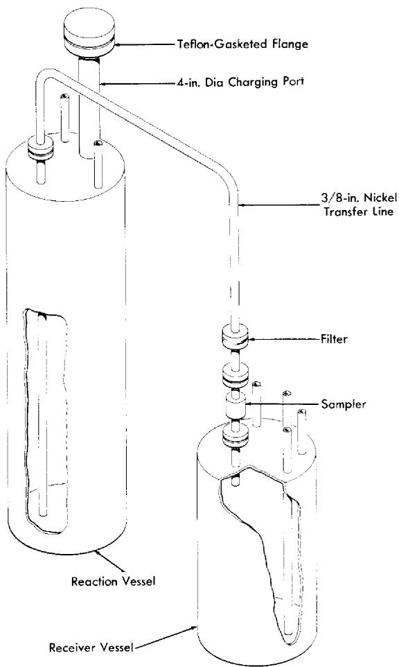  
FIG. 12-11. Diagram of purification and storage system.

furnaces, resistance heaters, and lagging, sections of the apparatus can be brought independently to controlled temperatures in excess of $800^{\circ}\mathrm{C}$ .

12-4.2 Purification processing. The raw materials, in batches of proper composition, are blended and charged into the reaction vessel. The material is melted and heated to $700^{\circ}\mathrm{C}$ under an atmosphere of anhydrous HF to remove $\mathrm{H}_2\mathrm{O}$ with a minimum of hydrolysis. The HF is replaced with $\mathbf{H}_2$ for a period of 1 hr, during which the temperature is raised to $800^{\circ}\mathrm{C}$ , to reduce $\mathrm{U}^{5+}$ and $\mathrm{U}^{6+}$ to $\mathrm{U}^{4+}$ (in the case of simulated fuel mixtures), and sulfur compounds to $\mathrm{S}^{- - }$ , and extraneous oxidants ( $\mathrm{Fe}^{+ + + }$ , for example) to

lower valence states. The hydrogen, as well as all subsequent reagent gases, is fed at a rate of about 3 liters/min to the reaction vessel through the receiver and transfer line and, accordingly, it bubbles up through the molten charge. The hydrogen is then replaced by anhydrous HF, which serves, during a 2- to 3-hr period at $800^{\circ}\mathrm{C}$ , to volatilize $\mathrm{H}_2\mathrm{S}$ and $\mathrm{HCl}$ and to convert oxides and oxyfluorides of uranium and zirconium to tetrafluorides at the expense of dissolution of considerable $\mathrm{NiF}_2$ into the melt through reaction of HF with the container. A final 24- to 30-hr treatment at $800^{\circ}\mathrm{C}$ with $\mathrm{H}_2$ suffices to reduce this $\mathrm{NiF}_2$ and the contained $\mathrm{FeF}_2$ to soluble metals.

At the conclusion of the purification treatment a pressure of helium above the salt in the reactor vessel is used to force the melt through the transfer line with its filter and sampler into the receiver. The metallic iron and nickel are left in the reactor vessel or on the sintered nickel filter. The purified melt is permitted to freeze under an atmosphere of helium in the receiver vessel.

# 12-5. RADIATION STABILITY OF FLUORIDE MIXTURES

When fission of an active constituent occurs in a molten fluoride solution, both electromagnetic radiations and particles of very high energy and intensity originate within the fluid. Local overheating as a consequence of rapid slowing down of fission fragments by the fluid is probably of little consequence in a reactor where the liquid is forced to flow turbulently and where rapid and intimate mixing occurs. Moreover, the bonding in such liquids is essentially completely ionic. Such a solution, which has neither covalent bonds to sever nor a lattice to disrupt, should be quite resistant to damage by particulate or electromagnetic radiation.

More than 100 exposures to reactor radiation of various fluoride mixtures containing $\mathrm{UF_4}$ in capsules of Inconel have been conducted; in these tests the fluid was not deliberately agitated. The power level of each test was fixed by selecting the $\mathrm{U}^{235}$ content of the test mixture. Thermal neutron fluxes have ranged from $10^{11}$ to $10^{14}$ neutrons/( $\mathrm{cm}^2$ ) (sec) and power levels have varied from 80 to $8000\mathrm{w/cm}^3$ . The capsules have, in general, been exposed at $1500^{\circ}\mathrm{F}$ for 300 hr, although several tests have been conducted for 600 to 800 hr. A list of the materials that have been studied is presented in Table 12-7. Methods of examination of the fuels after irradiation have included (1) freezing-point determinations, (2) chemical analysis, (3) examination with a shielded petrographic microscope, (4) assay by mass spectrography, and (5) examination by a gamma-ray spectroscope. The condition of the container was checked with a shielded metallograph.

No changes in the fuel, except for the expected burnup of $\mathrm{U}^{235}$ , have been observed as a consequence of irradiation. Corrosion of the Inconel

TABLE 12-7   
MOLTEN SALTS WHICH HAVE BEEN STUDIED   
IN IN-PILE CAPSULE TESTS   
TABLE 12-8   

<table><tr><td>System</td><td>Composition, mole %</td></tr><tr><td>NaF-KF-UF4</td><td>46.5-26-27.5</td></tr><tr><td>NaF-BeF2-UF4</td><td>25-60-15</td></tr><tr><td>NaF-BeF2-UF4</td><td>47-51-2</td></tr><tr><td>NaF-BeF2-UF4</td><td>50-46-4</td></tr><tr><td>NaF-ZrF4-UF4</td><td>63-25-12</td></tr><tr><td>NaF-ZrF4-UF4</td><td>53.5-40-6.5</td></tr><tr><td>NaF-ZrF4-UF4</td><td>50-48-2</td></tr><tr><td>NaF-ZrF4-UF3</td><td>50-48-2</td></tr></table>

DESCRIPTIONS OF INCONEL FORCED-CIRCULATION LOOPS OPERATED IN THE LITR AND THE MTR  

<table><tr><td rowspan="2"></td><td colspan="3">Loop designation</td></tr><tr><td>LITR Horizontal</td><td>LITR Vertical</td><td>MTR Horizontal</td></tr><tr><td>NaF-ZrF4-UF4composition, mole %</td><td>62.5-12.5-25</td><td>63-25-12</td><td>53.5-40-6.5</td></tr><tr><td>Maximum fission power, w/cm3</td><td>400</td><td>500</td><td>800</td></tr><tr><td>Total power, kw</td><td>2.8</td><td>10</td><td>20</td></tr><tr><td>Dilution factor*</td><td>180</td><td>7.3</td><td>5</td></tr><tr><td>Maximum fuel temperature, °F</td><td>1500</td><td>1600</td><td>1500</td></tr><tr><td>Fuel temperature differential, °F</td><td>30</td><td>250</td><td>155</td></tr><tr><td>Fuel Reynolds number</td><td>6000</td><td>3000</td><td>5000</td></tr><tr><td>Operating time, hr</td><td>645</td><td>332</td><td>467</td></tr><tr><td>Time at full power, hr</td><td>475</td><td>235</td><td>271</td></tr></table>

*Ratio of volume of fuel in system to volume of fuel in reactor core.

capsules to a depth of less than 4 mils in $300\mathrm{hr}$ was found; such corrosion is comparable to that found in unirradiated control specimens [16]. In capsules which suffered accidental excursions in temperatures to above $2000^{\circ}\mathrm{F}$ , grain growth of the Inconel occurred and corrosion to a depth of 12 mils was found. Such increases in corrosion were almost certainly the result of the serious overheating rather than a consequence of the radiation field.

Tests have also been made in which the fissioning fuel is pumped through a system in which a thermal gradient is maintained in the fluid. These tests included the Aircraft Reactor Experiment (described in Chapter 16) and three types of forced-circulation loop tests. A large loop, in which the pump was outside the reactor shield, was operated in a horizontal beam hole of the LITR.* A smaller loop was operated in a vertical position in the LITR lattice with the pump just outside the lattice. A third loop was operated completely within a beam-hole of the MTR. $\dagger$ The operating conditions for these three loops are given in Table 12-8.

The corrosion that occurred in these loop tests, which were of short duration and which provided relatively small temperature gradients, was to a depth of less than 4 mils and, as in the capsule tests, was comparable to that found in similar tests outside the radiation field [16]. Therefore it is concluded that within the obvious limitations of the experience up to the present time there is no effect of radiation on the fuel and no acceleration of corrosion by the radiation field.

# 12-6. BEHAVIOR OF FISSION PRODUCTS

When fission of an active metal occurs in a molten solution of its fluoride, the fission fragments must originate in energy states and ionization levels very far from those normally encountered. These fragments, however, quickly lose energy through collisions in the melt and come to equilibrium as common chemical entities. The valence states which they ultimately assume are determined by the necessity for cation-anion equivalence in the melt and the requirement that redox equilibrium be established among components of the melt and constituents of the metallic container.

Structural metals such as Inconel in contact with a molten fluoride solution are not stable to $\mathrm{F}_2$ , $\mathrm{UF}_5$ , or $\mathrm{UF}_6$ . It is clear, therefore, that when fission of uranium as $\mathrm{UF}_4$ takes place, the ultimate equilibrium must be such that four cation equivalents are furnished to satisfy the fluoride ions released. Thermochemical data, from which the stability of fission-product fluorides in complex dilute solution could be predicted, are lacking in

many cases. No precise definition of the valence state of all fission-product fluorides can be given; it is, accordingly, not certain whether the fission process results in oxidation of the container metal as a consequence of depositing the more noble fission products in the metallic state.

12-6.1 Fission products of well-defined valence. The noble gases. The fission products krypton and xenon can exist only as elements. The solubilities of the noble gases in $\mathrm{NaF - ZrF_4}$ (53-47 mole %) [17], $\mathrm{NaF - ZrF_4 - UF_4}$ (50-46-4 mole %) [17], and LiF-NaF-KF (46.5-11.5-42 mole %) obey Henry's law, increase with increasing temperature, decrease with increasing atomic weight of the solute, and vary appreciably with composition of the solute. The Henry's law constants and the heats of solution for the noble gases in the $\mathrm{NaF - ZrF_4}$ and LiF-NaF-KF mixtures are given in Table 12-9. The solubility of krypton in the $\mathrm{NaF - ZrF_4}$ mixture appears to be about $3\times 10^{-8}$ moles/ $(\mathrm{cm}^3)$ (atm).

TABLE 12-9 SOLUBILITIES AT $600^{\circ}\mathrm{C}$ AND HEATS OF SOLUTION FOR NOBLE GASES IN MOLTEN FLUORIDE MIXTURES   

<table><tr><td rowspan="2">Gas</td><td colspan="2">In NaF-ZrF4(53-47 mole %)</td><td colspan="2">In LiF-NaF-KF(46.5-11.5-42 mole %)</td></tr><tr><td>K*</td><td>Heat of solution, kcal/mole</td><td>K*</td><td>Heat of solution, kcal/mole</td></tr><tr><td rowspan="2">Helium</td><td>×10-8</td><td></td><td>×10-8</td><td></td></tr><tr><td>21.6 ± 1</td><td>6.2</td><td>11.3 ± 0.7</td><td>8.0</td></tr><tr><td>Neon</td><td>11.3 ± 0.3</td><td>7.8</td><td>4.4 ± 0.2</td><td>8.9</td></tr><tr><td>Argon</td><td>5.1 ± 0.15</td><td>8.2</td><td></td><td></td></tr><tr><td>Xenon</td><td>1.94 ± 0.2</td><td>11.1</td><td></td><td></td></tr></table>

*Henry's law constant in moles of gas per cubic centimeter of solvent per atmosphere.

The positive heat of solution ensures that blanketing or sparging of the fuel with helium or argon in a low-temperature region of the reactor cannot lead to difficulty due to decreased solubility and bubble formation in higher temperature regions of the system. Small-scale in-pile tests have revealed that, as these solubility data suggest, xenon at low concentration is retained in a stagnant melt but is readily removed by sparging with helium. Only a very small fraction of the anticipated xenon poisoning was observed

during operation of the Aircraft Reactor Experiment, even though the system contained no special apparatus for xenon removal [18]. It seems certain that krypton and xenon isotopes of reasonable half-life can be readily removed from all practical molten-salt reactors.

Elements of Groups $I - A$ , $II - A$ , $III - B$ , and $IV - B$ . The fission products Rb, Cs, Sr, Ba, Zr, Y, and the lanthanides form very stable fluorides; they should, accordingly, exist in the molten fluoride fuel in their ordinary valence states. High concentrations of $\mathrm{ZrF_4}$ and the alkali and alkaline earth fluorides can be dissolved in LiF-NaF-KF, $\mathrm{LiF_2 - BeF_2}$ , or $\mathrm{NaF - ZrF_4}$ mixtures at $600^{\circ}\mathrm{C}$ . The solubilities at $600^{\circ}\mathrm{C}$ of $\mathrm{YF_3}$ and of selected rare-earth fluorides in $\mathrm{NaF - ZrF_4}$ (53-47 mole %) and $\mathrm{LiF - BeF_2}$ (65-35 mole %) are shown in Table 12-10. For these materials the solubility increases

TABLE 12-10   
SOLUBILITY OF $\mathrm{YF_3}$ AND OF SOME RARE-EARTH FLUORIDES IN $\mathrm{NAF - ZrF_4}$ AND IN $\mathrm{LiF - BEF_2}$ AT $600^{\circ}\mathrm{C}$   

<table><tr><td rowspan="2">Fluoride</td><td colspan="2">Solubility, mole % MF3</td></tr><tr><td>In NaF-ZrF4(57-43 mole %)</td><td>In LiF-BeF2(62-38 mole %)</td></tr><tr><td>YF3</td><td>3.6</td><td></td></tr><tr><td>LaF3</td><td>2.1</td><td></td></tr><tr><td>CeF3</td><td>2.3</td><td>0.48</td></tr><tr><td>SmF3</td><td>2.5</td><td></td></tr></table>

about $0.5\% /^{\circ}\mathrm{C}$ and increases slightly with increasing atomic number in the lanthanide series; the saturating phase is the simple trifluoride. For solutions containing more than one rare earth the primary phase is a solid solution of the rare-earth trifluorides; the ratio of rare-earth cations in the molten solution is virtually identical with the ratio in the precipitated solid solution. Quite high burnups would be required before a molten fluoride reactor could saturate its fuel with any of these fission products.

12-6.2 Fission products of uncertain valence. The valence states assumed by the nonmetallic elements Se, Te, Br, and I must depend strongly on the oxidation potential defined by the container and the fluoride melt, and the states are not at present well defined. The sparse thermochemical data suggest that if they were in the pure state the fluorides of Ge, As, Nb, Mo, Ru, Rh, Pd, Ag, Cd, Sn, and Sb would be reduced to the corresponding metal by the chromium in Inconel. While fluorides of some of

these elements may be stabilized in dilute molten solution in the melt, it is possible that none of this group exists as a compound in the equilibrium mixture. An appreciable, and probably large, fraction of the niobium and ruthenium produced in the Aircraft Reactor Experiment was deposited in or on the Inconel walls of the fluid circuit; a detectable, but probably small, fraction of the ruthenium was volatilized, presumably as $\mathrm{RuF}_5$ , from the melt.

12-6.3 Oxidizing nature of the fission process. The fission of a mole of $\mathrm{UF_4}$ would yield more equivalents of cation than of anion if the noble gas isotopes of half-life greater than $10\mathrm{min}$ were lost and if all other elements formed fluorides of their lowest reported valence state. If this were the case, the system would, presumably, retain cation-anion equivalence by reduction of fluorides of the most noble fission products to metal and perhaps by reduction of some $\mathrm{U}^{4 + }$ to $\mathrm{U}^{3 + }$ . If, however, all the elements of uncertain valence state listed in Article 12-6.2 deposit as metals, the balance would be in the opposite direction. Only about 3.2 equivalents of combined cations result, and since the number of active anion equivalents is a minimum of 4 (from the four fluorines of $\mathrm{UF_4}$ ), the deficiency must be alleviated by oxidation of the container. The evidence from the Aircraft Reactor Experiment, the in-pile loops, and the in-pile capsules has not shown the fission process to cause serious oxidation of the container; it is possible that these experiments burned too little uranium to yield significant results. If fission of $\mathrm{UF_4}$ is shown to be oxidizing, the detrimental effect could be overcome by deliberate and occasional addition of a reducing agent to create a small and stable concentration of soluble $\mathrm{UF_3}$ in the fuel mixture.

# 12-7. FUEL REPROCESSING

Numerous conventional processes such as solvent extraction, selective precipitation, and preferential ion exchange could be readily applied to molten fluoride fuels after solution in water. However, these liquids are readily amenable to remote handling and serve as media in which chemical reactions can be conducted. Most development efforts have, accordingly, been concerned with direct and nonaqueous reprocessing methods.

Recovery of uranium from solid fuel elements by dissolution of the element in a fluoride bath followed by application of anhydrous HF and subsequent volatilization of the uranium as $\mathrm{UF_6}$ has been described [19,20]. The volatilization step accomplishes a good separation from Cs, Sr, and the rare earths, fair separation from Zr, and poor separation from Nb and Ru. The fission products I, Te, and Mo volatilize completely from the melt. The nonvolatile fission products are discarded in the fluoride solvent. Further decontamination of the $\mathrm{UF_6}$ is effected by selective ab

sorption and desorption on beds of NaF. At $100^{\circ}\mathrm{C}$ , $\mathrm{UF}_6$ is absorbed on the bed by the reversible reaction

$$
\mathrm {U F} _ {6} (\mathrm {g}) + 3 \mathrm {N a F} \xrightarrow {\longleftrightarrow} 3 \mathrm {N a F} \cdot \mathrm {U F} _ {6},
$$

which was first reported by Martin, Albers, and Dust [21]. Niobium activity, along with activity attributable to particulate matter, is also absorbed; ruthenium activity, however, largely passes through the bed. Subsequent desorption of the $\mathrm{UF_6}$ at temperatures up to $400^{\circ}\mathrm{C}$ is accomplished without desorption of the niobium. The desorbed $\mathrm{UF_6}$ is passed through a second NaF bed held at $400^{\circ}\mathrm{C}$ as a final step and is subsequently recovered in refrigerated traps. The decontaminations obtained are greater than $10^{6}$ for gross beta and gamma emitters, greater than $10^{7}$ for Cs, Sr, and lanthanides, greater than $10^{5}$ for Nb, and about $10^{4}$ for Ru. Uranium was recovered from the molten-salt fuel of the Aircraft Reactor Experiment by this method, and its utility for molten-fluoride fuel systems or breeder blankets was demonstrated. Recovery of plutonium or thorium, however, is not possible with this process.

There are numerous possible methods for reprocessing molten-salt fuels. The behavior of the rare-earth fluorides indicates that some decontamination of molten-fluoride fuels may be obtained by substitution of $\mathrm{CeF_3}$ or $\mathrm{LaF_3}$ , in a sidestream circuit, for rare earths of higher cross section. It seems likely that $\mathrm{PuF_3}$ can be recovered with the rare-earth fluorides and subsequently separated from them after oxidation to $\mathrm{PuF_4}$ . Further, it appears that both selective precipitation of various fission-product elements and active constituents as oxides, and selective chemisorption of these materials on solid oxide beds are capable of development into valuable separation procedures. Only preliminary studies of these and other possible processes have been made.

# REFERENCES

1. D. N. Roy et al., Fluoride Model Systems: IV. The Systems LiF—BeF $_2$ and $\mathrm{RbF_2}$ — $\mathrm{BeF_2}$ , J. Am. Ceram. Soc. 37, 300 (1954).   
2. A. V. Novoselova et al., Thermal and X-ray Analysis of the Lithium-Beryllium Fluoride System, J. Phys. Chem. USSR 26, 1244 (1952).   
3. W. R. GRIMES et al., Chemical Aspects of Molten Fluoride Reactors, paper to be presented at Second International Conference on Peaceful Uses of Atomic Energy, Geneva, 1958.   
4. J. J. KATZ and E. RABINOWITCH, The Chemistry of Uranium, National Nuclear Energy Series, Division VIII, Volume 5. New York: McGraw-Hill Book Co., Inc., 1951.   
5. W. R. Grimes et al., Oak Ridge National Laboratory. Unpublished.   
6. B. H. CLAMPITT et al., Oak Ridge National Laboratory, 1957. Unpublished.   
7. C. F. LUCKS and H. W. DEEM, Apparatus for Measuring the Thermal Conductivity of Liquid at Elevated Temperatures; Thermal Conductivity of Fused NaOH to $600^{\circ}C$ , Am. Soc. of Mech. Eng. Meeting, June 1956. (Preprint 56SA31)   
8. G. T. SEABORG and J. J. KATZ (Eds.), The Actinide Elements, National Nuclear Energy Series, Division IV, Volume 14A. New York: McGraw-Hill Book Co., Inc., 1953.   
9. W. R. Grimes et al., Fused-salt Systems, Sec. 6 in Reactor Handbook, Vol. 2, Engineering, USAEC Report AECD-3646, 1955. (pp. 799-850)   
10. K. A. SENSE et al., The Vapor Pressure of Zirconium Fluoride, J. Phys. Chem. 58, 995 (1954).   
11. W. Fischer, Institut für Anorganische Chemie, Technische Hochschule, Hannover, personal communication; [Data for equation taken from S. LAUTER, Dissertation, Institut für Anorganische Chemie, Technische Hochschule, Hannover (1948).]   
12. S. CANTOR et al., Vapor Pressures and Derived Thermodynamic Information for the System RbF—ZrF4, J. Phys. Chem. 62, 96 (1958).   
13. W. H. RODEBUSH and A. L. DIXON, The Vapor Pressures of Metals; A New Experimental Method, Phys. Rev. 26, 851 (1925).   
14. K. A. SENSE et al., Vapor Pressure and Derived Information of the Sodium Fluoride-Zirconium Fluoride System. Description of a Method for the Determination of Molecular Complexes Present in the Vapor Phase, J. Phys. Chem. 61, 337 (1957).   
15. K. A. SENSE et al., Vapor Pressure and Equilibrium Studies of the Sodium Fluoride-Beryllium Fluoride System, USAEC Report BMI-1186, Battelle Memorial Institute, May 27, 1957.   
16. W. D. MANLY et al., Metallurgical Problems in Molten Fluoride Systems, paper to be presented at Second International Conference on the Peaceful Uses of Atomic Energy, Geneva, 1958.   
17. W. R. Grimes et al., Solubility of Noble Gases in Molten Fluorides. I. In Mixtures of NaF—ZrF₄ (53–47 mole %) and NaF—ZrF₄—UF₄ (50-46-4 mole %), J. Phys. Chem. (in press).

18. E. S. Berris et al., The Aircraft Reactor Experiment—Operation, Nuclear Sci. and Eng. 2, 841 (1957).   
19. G. I. CATHERs, Uranium Recovery for Spent Fuel by Dissolution in Fused Salt and Fluorination, Nuclear Sci. and Eng. 2, 768 (1957).   
20. F. R. BRUCE et al., in Progress in Nuclear Energy, Series III, Process Chemistry, Vol. I. New York: McGraw-Hill Book Co., Inc., 1956.   
21. Von H. MARTIN et al., Double Fluorides of Uranium Hexafluoride, Z. anorg. u. allgem. Chem. 265, 128 (1951).