# CHAPTER 13

# CONSTRUCTION MATERIALS FOR MOLTEN-SALT REACTORS*

# 13-1. SURVEY OF SUITABLE MATERIALS

A molten-salt reactor system requires structural materials which will effectively resist corrosion by the fluoride salt mixtures utilized in the core and blanket regions. Evaluation tests of various materials in fluoride salt systems have indicated that nickel-base alloys are, in general, superior to other commercial alloys for the containment of these salts under dynamic flow conditions. In order to select the alloy best suited to this application, an extensive program of corrosion tests was carried out on the available commercial nickel-base alloys, particularly Inconel, which typifies the chromium-containing alloys, and Hastelloy B, which is representative of the molybdenum-containing alloys.

Alloys containing appreciable quantities of chromium are attacked by molten salts, mainly by the removal of chromium from hot-leg sections through reaction with $\mathrm{UF_4}$ , if present, and with other oxidizing impurities in the salt. The removal of chromium is accompanied by the formation of subsurface voids in the metal. The depth of void formation depends strongly on the operating temperatures of the system and on the composition of the salt mixture.

On the other hand, Hastelloy B, in which the chromium is replaced with molybdenum, shows excellent compatibility with fluoride salts at temperatures in excess of $1600^{\circ}\mathrm{F}$ . Unfortunately, Hastelloy B cannot be used as a structural material in high-temperature systems because of its age-hardening characteristics, poor fabricability, and oxidation resistance.

The information gained in the testing of Hastelloy B and Inconel led to the development of an alloy, designated INOR-8, which combines the better properties of both alloys for molten-salt reactor construction. The approximate compositions of the three alloys, Inconel, Hastelloy B, and INOR-8, are given in Table 13-1.

INOR-8 has excellent corrosion resistance to molten fluoride salts at temperatures considerably above those expected in molten-salt reactor service; further, no measurable attack has been observed thus far in tests at reactor operating temperatures of 1200 to $1300^{\circ}\mathrm{F}$ . The mechanical properties of INOR-8 at operating temperatures are superior to those of many stainless steels and are virtually unaffected by long-time exposure

TABLE 13-1   
COMPOSITIONS OF POTENTIAL STRUCTURAL MATERIALS   

<table><tr><td rowspan="2">Components</td><td colspan="3">Quantity in alloy, w/o</td></tr><tr><td>Inconel</td><td>INOR-8</td><td>Hastelloy B</td></tr><tr><td>Chromium</td><td>14-17</td><td>6-8</td><td>1 (max)</td></tr><tr><td>Iron</td><td>6-10</td><td>5 (max)</td><td>4-7</td></tr><tr><td>Molybdenum</td><td></td><td>15-18</td><td>26-30</td></tr><tr><td>Manganese</td><td>1 (max)</td><td>0.8 (max)</td><td>1.0 (max)</td></tr><tr><td>Carbon</td><td>0.15 (max)</td><td>0.04-0.08</td><td>0.05 (max)</td></tr><tr><td>Silicon</td><td>0.5</td><td>0.35 (max)</td><td>1.0 (max)</td></tr><tr><td>Sulfur</td><td>0.01</td><td>0.01 (max)</td><td>0.03 (max)</td></tr><tr><td>Copper</td><td>0.5</td><td>0.35 (max)</td><td></td></tr><tr><td>Cobalt</td><td></td><td>0.2 (max)</td><td>2.5 (max)</td></tr><tr><td>Nickel</td><td>72 (min)</td><td>Balance</td><td>Balance</td></tr></table>

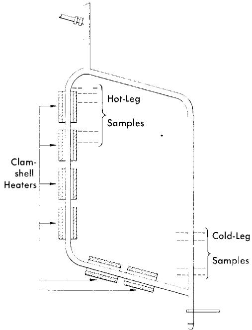  
FIG. 13-1. Diagram of a standard thermal-convection loop, showing locations at which metallographic sections are taken after operation.

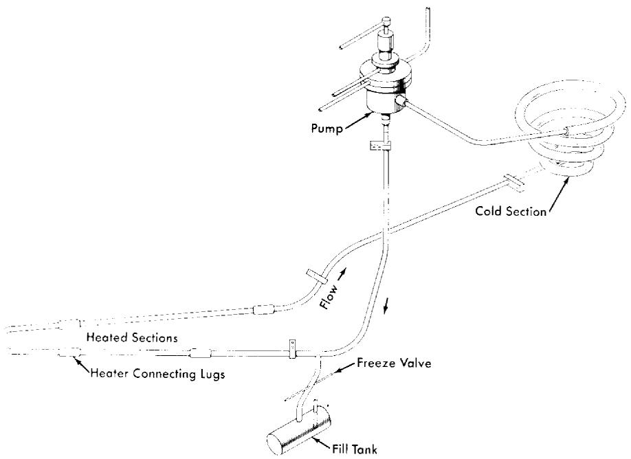  
FIG. 13-2. Diagram of forced-circulation loop for corrosion testing.

to salts. The material is structurally stable in the operating temperature range, and the oxidation rate is less than 2 mils in $100,000\mathrm{hr}$ . No difficulty is encountered in fabricating standard shapes when the commercial practices established for nickel-base alloys are used. Tubing, plates, bars, forgings, and castings of INOR-8 have been made successfully by several major metal manufacturing companies, and some of these companies are prepared to supply it on a commercial basis. Welding procedures have been established, and a good history of reliability of welds exists. The material has been found to be easily weldable with rod of the same composition.

Inconel is, of course, an alternate choice for the primary-circuit structural material, and much information is available on its compatibility with molten salts and sodium. Although probably adequate, Inconel does not have the degree of flexibility that INOR-8 has in corrosion resistance to different salt systems, and its lower strength at reactor operating temperatures would require heavier structural components.

A considerable nuclear advantage would exist in a reactor with an uncanned graphite moderator exposed to the molten salts. Long-time exposure of graphite to a molten salt results in the salt penetrating the available pores, but it is probable, with the "impermeable" types of

graphite now being developed, that the degree of salt penetration encountered can be tolerated. The attack of the graphite by the salt and the carburization of the metal container seem to be negligible if the temperature is kept below $1300^{\circ}\mathrm{F}$ . More tests are needed to finally establish the compatibility of graphite-salt-alloy systems.

Finally, a survey has been made of materials suitable for bearings and valve seats in molten salts. Cermets, ceramics, and refractory metals appear to be promising for this application and are presently being investigated.

# 13-2. CORROSION OF NICKEL-BASE ALLOYS BY MOLTEN SALTS

13-2.1 Apparatus used for corrosion tests. Nickel-base alloys have been exposed to flowing molten salts in both thermal-convection loops and in loops containing pumps for forced circulation of the salts. The thermal-convection loops are designed as shown in Fig. 13-1. When the bottom and an adjacent side of the loop are heated, usually with clamshell heaters, convection forces in the contained fluid establish flow rates of up to $8\mathrm{ft / min}$ depending on the temperature difference between the heated and unheated portions of the loop. The forced-circulation loops are designed as shown in Fig. 13-2. Heat is applied to the hot leg of this type of loop by direct resistance heating of the tubing. Large temperature differences (up to $300^{\circ}\mathrm{F}$ ) are obtained by air-cooling of the cold leg. Reynolds numbers of up to 10,000 are attainable with 1/2-in.-ID tubing, and somewhat higher values can be obtained with smaller tubing.

13-2.2 Mechanism of corrosion. Most of the data on corrosion have been obtained with Inconel, and the theory of the corrosive mechanism was worked out for this alloy. The corrosion of INOR-8 occurs to a lesser degree but follows a pattern similar to that observed for Inconel and presumably the same theory applies.

The formation of subsurface voids is initiated by the oxidation of chromium along exposed surfaces through oxidation-reduction reactions with impurities or constituents of the molten fluoride-salt mixture. As the surface is depleted in chromium, chromium from the interior diffuses down the concentration gradient toward the surface. Since diffusion occurs by a vacancy process and in this particular situation is essentially monodirectional, it is possible to build up an excess number of vacancies in the metal. These precipitate in areas of disregistry, principally at grain boundaries and impurities, to form voids. These voids tend to agglomerate and grow in size with increasing time and temperature. Examinations have demonstrated that the subsurface voids are not interconnected with each other or with the surface. Voids of the same type have been found in Inconel

after high-temperature oxidation tests and high-temperature vacuum tests in which chromium was selectively removed.

The selective removal of chromium by a fluoride-salt mixture depends on various chemical reactions, for example:

1. Impurities in the melt:

$$
\mathrm {F e F} _ {2} + \mathrm {C r} \rightleftharpoons \mathrm {C r F} _ {2} + \mathrm {F e}. \tag {13-1}
$$

2. Oxide films on the metal surface:

$$
2 \mathrm {F e} _ {2} \mathrm {O} _ {3} + 3 \mathrm {C r F} _ {4} \rightleftharpoons 3 \mathrm {C r O} _ {2} + 4 \mathrm {F e F} _ {3}. \tag {13-2}
$$

3. Constituents of the fuel:

$$
\mathrm {C r} + 2 \mathrm {U F} _ {4} \rightleftharpoons 2 \mathrm {U F} _ {3} + \mathrm {C r F} _ {2}. \tag {13-3}
$$

The ferric fluoride formed by the reaction of Eq. (13-2) dissolves in the melt and further attacks the chromium by the reaction of Eq. (13-1).

The time-dependence of void formation in Inconel, as observed both in thermal-convection and forced-circulation systems, indicates that the attack is initially quite rapid but that it then decreases until a straight-line relationship exists between depth of void formation and time. This effect can be explained in terms of the corrosion reactions discussed above. The initial rapid attack found for both types of loops stems from the reaction of chromium with impurities in the melt [reactions (13-1) and (13-2)] and with the $\mathrm{UF_4}$ constituent of the salt [reaction (13-3)] to establish a quasi-equilibrium amount of $\mathrm{CrF_2}$ in the salt. At this point attack proceeds linearly with time and occurs by a mass-transfer mechanism which, although it arises from a different cause, is similar to the phenomenon of temperature-gradient mass transfer observed in liquid metal corrosion.

In molten fluoride-salt systems, the driving force for mass transfer is a result of a temperature dependence of the equilibrium constant for the reaction between chromium and $\mathrm{UF_4}$ (Eq. 13-3). If nickel and iron are considered inert diluents for chromium in Inconel, the process can be simply described. Under rapid circulation, a uniform concentration of $\mathrm{UF_4}$ , $\mathrm{UF_3}$ , and $\mathrm{CrF_2}$ is maintained throughout the fluid; the concentrations must satisfy the equilibrium constant

$$
K _ {a} = K _ {\gamma} \cdot K _ {N} = \frac {\gamma_ {\mathrm {C r F} _ {2}} \cdot \gamma^ {2} _ {\mathrm {U F} _ {3}}}{\gamma_ {\mathrm {C r}} \cdot \gamma^ {2} _ {\mathrm {U F} _ {4}}} \cdot \frac {N _ {\mathrm {C r F} _ {2}} \cdot N ^ {2} _ {\mathrm {U F} _ {3}}}{N _ {\mathrm {C r}} \cdot N ^ {2} _ {\mathrm {U F} _ {4}}} \tag {13-4}
$$

where $N$ represents the mole fraction and $\gamma$ the activity coefficient of the indicated component.

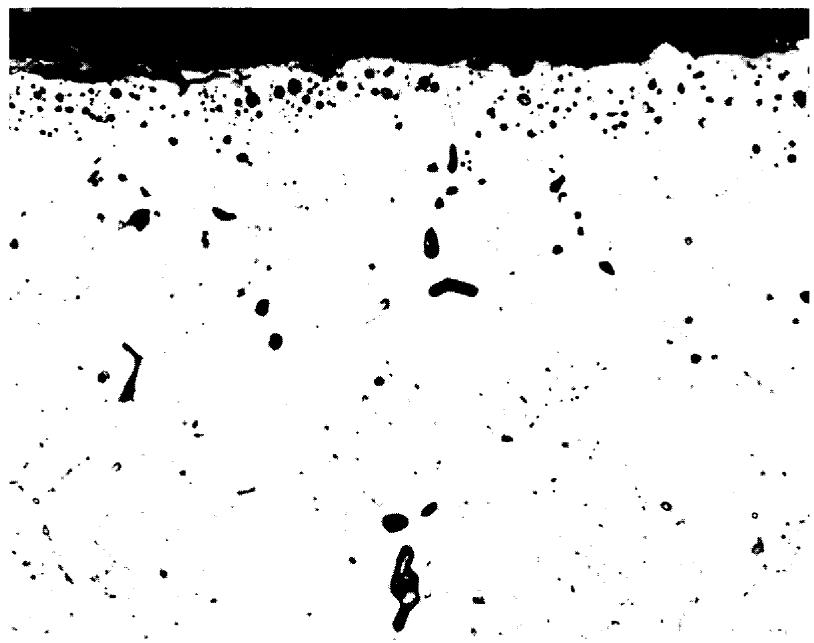  
FIG. 13-3. Hot-leg section from an Inconel thermal-convection loop which circulated the fuel mixture $\mathrm{NaF - ZrF_4 - UF_4}$ (50-46-4 mole $\%$ ) for $1000\mathrm{hr}$ at $1500^{\circ}\mathrm{F}$ . $(250\times)$

Under these steady-state conditions, there exists a temperature $T$ , intermediate between the maximum and minimum temperatures of the loop, at which the initial composition of the structural metal is at equilibrium with the fused salt. Since $K_{N}$ increases with increasing temperature, the chromium concentration in the alloy surface is diminished at temperatures higher than $T$ and is augmented at temperatures lower than $T$ . In some melts, NaF-LiF-KF-UF $_4$ , for example, the equilibrium constant of reaction (13-3) changes sufficiently with temperature under extreme temperature conditions to cause precipitation of pure chromium crystals in the cold zone. In other melts, for example NaF-ZrF $_4$ -UF $_4$ , the temperature-dependence of the corrosion equilibrium is small, and the equilibrium is satisfied at all useful temperatures without the formation of crystalline chromium. In the latter systems the rate of chromium removal from the salt stream at cold-leg regions is dependent on the rate at which chromium can diffuse into the cold-leg wall. If the chromium concentration gradient tends to be small, or if the bulk of the cold-leg surface is held at a relatively low temperature, the corrosion rate in such systems is almost negligible.

It is obvious that addition of the equilibrium concentrations of $\mathrm{UF}_3$ and $\mathrm{CrF}_2$ to molten fluorides prior to circulation in Inconel equipment would minimize the initial removal of chromium from the alloy by reac

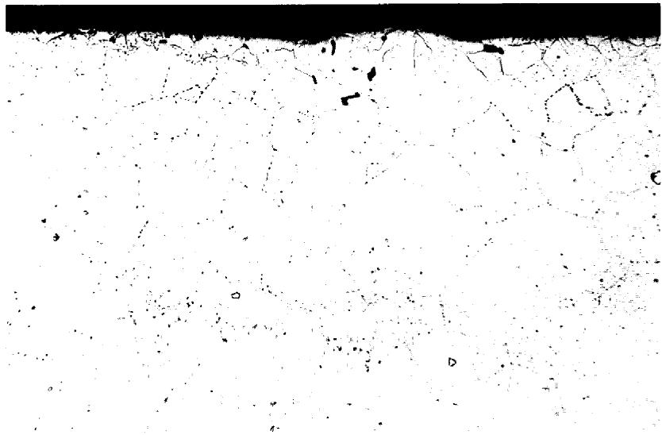  
FIG. 13-4. Hot-leg section of Inconel thermal-convection loop which circulated the fuel mixture $\mathrm{NaF - ZrF_4 - UF_4}$ (55.3-40.7-4 mole $\%$ ) for $1000\mathrm{hr}$ at $1250^{\circ}\mathrm{F}$ .

tion (13-3). (It would not, of course, affect the mass-transfer process which arises as a consequence of the temperature-dependence of this reaction.) Deliberate additions of these materials have not been practiced in routine corrosion tests because (1) the effect at the uranium concentrations normally employed is small, and (2) the experimental and analytical difficulties are considerable. Addition of more than the equilibrium quantity of $\mathrm{UF_3}$ may lead to deposition of some uranium metal in the equipment walls through the reaction

$$
4 \mathrm {U F} _ {4} \rightleftharpoons 3 \mathrm {U F} _ {4} + \mathrm {U} ^ {0}. \tag {13-5}
$$

For ultimate use in reactor systems, however, it may be possible to treat the fuel material with calculated quantities of metallic chromium to provide the proper $\mathrm{UF_3}$ and $\mathrm{CrF_2}$ concentrations at startup.

According to the theory described above, there should be no great difference in the corrosion found in thermal-convection loops and in forced-circulation loops. The data are in general agreement with this conclusion so long as the same maximum metal-salt interface temperature is present in both types of loop. The results of many tests with both types of loop are summarized in Table 13-2 without distinguishing between the two types of loop. The maximum bulk temperature of the salt as it left the heated section of the loop is given. It is known that the actual metal-salt interface temperature was not greater than $1300^{\circ}\mathrm{F}$ in the loops with a

TABLE 13-2   
SUMMARY OF CORROSION DATA OBTAINED IN THERMAL-CONVECTION AND FORCED-CIRCULATION LOOP TESTS OF INCONEL AND INOR-8 EXPOSED TO VARIOUS CIRCULATING SALT MIXTURES   

<table><tr><td>Constituents of base salts</td><td>\( {\mathrm{{UF}}}_{4} \) or \( {\mathrm{{ThF}}}_{4} \) content</td><td>Loop material</td><td>Maximum salt temperature, ℉</td><td>Time of operation, hr</td><td>Depth of subsurface void formation at hottest part of loop, in.</td></tr><tr><td rowspan="6">\( \mathrm{{NaF}} - {\mathrm{{ZrF}}}_{4} \)</td><td>1 mole % UF4</td><td>Inconel</td><td>1250</td><td>1000</td><td>&lt;0 001</td></tr><tr><td>1 mole % UF4</td><td>Inconel</td><td>1270</td><td>6300</td><td>0-0.0025</td></tr><tr><td>4 mole % UF4</td><td>Inconel</td><td>1250</td><td>1000</td><td>0.002</td></tr><tr><td>4 mole % UF4</td><td>Inconel</td><td>1500</td><td>1000</td><td>0.007-0.010</td></tr><tr><td>4 mole % UF4</td><td>INOR-8</td><td>1500</td><td>1000</td><td>0.002-0.003</td></tr><tr><td>0</td><td>Inconel</td><td>1500</td><td>1000</td><td>0.002-0.003</td></tr><tr><td rowspan="4">\( \mathrm{{NaF}} - {\mathrm{{BeF}}}_{2} \)</td><td>1 mole % UF4</td><td>Inconel</td><td>1250</td><td>1000</td><td>0.001</td></tr><tr><td>0</td><td>Inconel</td><td>1500</td><td>500</td><td>0.004-0.010</td></tr><tr><td>3 mole % UF4</td><td>Inconel</td><td>1500</td><td>500</td><td>0.008-0.014</td></tr><tr><td>1 mole % UF4</td><td>INOR-8</td><td>1250</td><td>6300</td><td>0.001</td></tr><tr><td rowspan="3">LiF-BeF2</td><td>1 mole % UF4</td><td>Inconel</td><td>1250</td><td>1000</td><td>0.001-0.002</td></tr><tr><td>3 mole % UF4</td><td>Inconel</td><td>1500</td><td>500</td><td>0.012-0.020</td></tr><tr><td>1 mole % UF4</td><td>INOR-8</td><td>1250</td><td>1000</td><td>0</td></tr><tr><td rowspan="3">\( \mathrm{{NaF}}\;{\mathrm{{LiF}}}^{ - }{\mathrm{{BeF}}}_{2} \)</td><td>0</td><td>Inconel</td><td>1125</td><td>1000</td><td>0.002</td></tr><tr><td>0</td><td>Inconel</td><td>1500</td><td>500</td><td>0.003-0.005</td></tr><tr><td>3 mole % UF4</td><td>Inconel</td><td>1500</td><td>500</td><td>0.008-0.013</td></tr><tr><td rowspan="4">\( \mathrm{{NaF}}\;{\mathrm{{LiF}}}^{ - }\mathrm{{KF}} \)</td><td>0</td><td>Inconel</td><td>1125</td><td>1000</td><td>0.001</td></tr><tr><td>2.5 mole % UF4</td><td>Inconel</td><td>1500</td><td>500</td><td>0.017</td></tr><tr><td>0</td><td>INOR-8</td><td>1250</td><td>1340</td><td>0</td></tr><tr><td>2.5 mole % UF4</td><td>INOR-8</td><td>1500</td><td>1000</td><td>0.001-0.003</td></tr><tr><td>LiF</td><td>29 mole % ThF4</td><td>Inconel</td><td>1250</td><td>1000</td><td>0-0.0015</td></tr><tr><td>\( \mathrm{{NaF}} - {\mathrm{{BeF}}}_{2} \)</td><td>7 mole % ThF4</td><td>INOR-8</td><td>1250</td><td>1000</td><td>0</td></tr></table>

maximum salt temperature of $1250^{\circ}\mathrm{F}$ , and was between 1600 and $1650^{\circ}\mathrm{F}$ for the loop with a maximum salt temperature of $1500^{\circ}\mathrm{F}$ .

The data in Table 13-2 are grouped by types of base salt because the salt has a definite effect on the measured attack of Inconel at $1500^{\circ}\mathrm{F}$ . The salts that contain $\mathrm{BeF}_2$ are somewhat more corrosive than those containing $\mathrm{ZrF}_4$ , and the presence of LiF, except in combination with NaF, seems to accelerate corrosion.

At the temperature of interest in molten-salt reactors, that is, $1250^{\circ}\mathrm{F}$ , the same trend of relative corrosiveness of the different salts may exist for Inconel, but the low rates of attack observed in tests preclude a conclusive decision on this point. Similarly, if there is any preferential effect of the base salts on INOR-8, the small amounts of attack tend to hide it.

As expected from the theory, the corrosion depends sharply on the $\mathrm{UF_4}$ concentration. Studies of the nuclear properties of molten-salt power reactors have indicated (see Chapter 14) that the $\mathrm{UF_4}$ content of the fuel will usually be less than 1 mole $\%$ and therefore the corrosiveness of salts

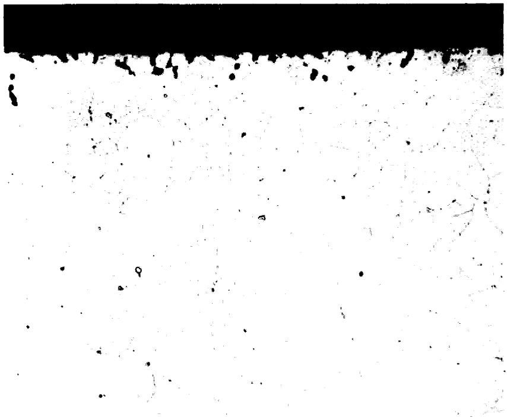  
FIG. 13-5. Hot-leg section of Inconel thermal-convection loop which circulated the fuel mixture $\mathrm{LiF - BeF_2 - UF_4}$ (62-37-1 mole $\%$ ) for $1000\mathrm{hr}$ at $1250^{\circ}\mathrm{F}$ . $(250\times)$

with higher $\mathrm{UF}_4$ concentrations, such as those described in Table 13-2, will be avoided.

The extreme effect of temperature is also clearly indicated in Table 13-2. In general, the corrosion rates are three to six times higher at $1500^{\circ}\mathrm{F}$ than at $1250^{\circ}\mathrm{F}$ . This effect is further emphasized in the photomicrographs presented in Figs. 13-3 and 13-4, which offer a comparison of metallographic specimens of Inconel that were exposed to similar salts of the $\mathrm{NaF}-\mathrm{ZrF}_{4}-\mathrm{UF}_{4}$ system at $1500^{\circ}\mathrm{F}$ and at $1250^{\circ}\mathrm{F}$ . A metallographic specimen of Inconel that was exposed at $1250^{\circ}\mathrm{F}$ to the salt proposed for fueling of the molten-salt power reactor is shown in Fig. 13-5.

The effect of sodium on the structural materials of interest has also been extensively studied, since sodium is proposed for use as the intermediate heat-transfer medium. Corrosion problems inherent in the utilization of sodium for heat-transfer purposes do not involve so much the deterioration of the metal surfaces as the tendency for components of the container material to be transported from hot to cold regions and to form plugs of deposited material in the cold region. As in the case of the corrosion by the salt mixture, the mass transfer in sodium-containing systems is extremely dependent on the maximum system operating temperature. The results of

numerous tests indicate that the nickel-base alloys, such as Inconel and INOR-8, are satisfactory containers for sodium at temperatures below $1300^{\circ}\mathrm{F}$ , and that above $1300^{\circ}\mathrm{F}$ the austenitic stainless steels are preferable.

# 13-3. FABRICATION OF INOR-8

13-3.1 Casting. Normal melting procedures, such as induction or electric furnace melting, are suitable for preparing INOR-8. Specialized techniques, such as melting under vacuum or consumable-electrode melting, have also been used without difficulty. Since the major alloying constituents do not have high vapor pressures and are relatively inert, melting losses are negligible, and thus the specified chemical composition can be obtained through the use of standard melting techniques. Preliminary studies indicate that intricately shaped components can be cast from this material.

13-3.2 Hot forging. The temperature range of forgeability of INOR-8 is 1800 to $2250^{\circ}\mathrm{F}$ . This wide range permits operations such as hammer and press forging with a minimum number of reheats between passes and substantial reductions without cracking. The production of hollow shells for the manufacture of tubing has been accomplished by extruding forged and drilled billets at $2150^{\circ}\mathrm{F}$ with glass as a lubricant. Successful extrusions have been made on commercial presses at extrusion ratios of up to 14:1. Forging recoveries of up to $90\%$ of the ingot weight have been reported by one vendor.

13-3.3 Cold-forming. In the fully annealed condition, the ductility of the alloy ranges between 40 and $50\%$ elongation for a 2-in. gage length. Thus, cold-forming operations, such as tube reducing, rolling, and wire drawing, can be accomplished with normal production schedules. The effects of cold-forming on the ultimate tensile strength, yield strength, and elongation are shown in Fig. 13-6.

Forgeability studies have shown that variations in the carbon content have an effect on the cold-forming of the alloy. Slight variations of other components, in general, have no significant effects. The solid solubility of carbon in the alloy is about $0.01\%$ . Carbon present in excess of this amount precipitates as discrete particles of $(\mathrm{Ni}, \mathrm{Mo})_{6} \mathrm{C}$ throughout the matrix; the particles dissolve sparingly even at the high annealing temperature of $2150^{\circ} \mathrm{F}$ . Thus cold-working of the alloy causes these particles to align in the direction of elongation and, if they are present in sufficient quantity, they form continuous stringers of carbides. The lines of weakness caused by the stringers are sufficient to propagate longitudinal fractures in tubular products during fabrication. The upper limit of the carbon content for tubing is about $0.10\%$ , and for other products it appears to be greater than $0.20\%$ . The carbon content of the alloy is controllable to about $0.02\%$ in the range below $0.10\%$ .

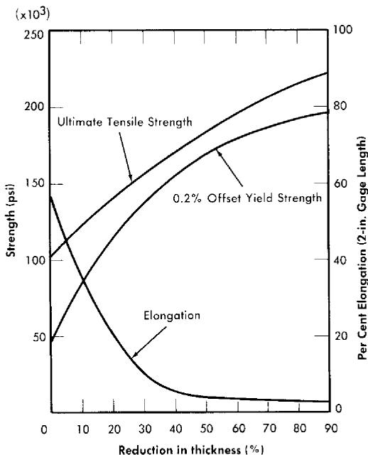  
FIG. 13-6. Work hardening curves for INOR-8 annealed $1\mathrm{hr}$ at $2150^{\circ}\mathrm{F}$ before reduction.

13-3.4 Welding. The parts of the reactor system are joined by welding, and therefore the integrity of the system is in large measure dependent on the reliability of the welds. During the welding of thick sections, the material will be subjected to a high degree of restraint, and consequently both the base metal and the weld metal must not be susceptible to cracking, embrittlement, or other undesirable features.

Extensive tests of weld specimens have been made. The circular-groove test, which accurately predicted the weldability of conventional materials with known welding characteristics, was found to give reliable results for nickel-base alloys. In the circular-groove test, an inert-gas-shielded tungsten-arc weld pass is made by fusion welding (i.e., the weld metal contains no filler metal) in a circular groove machined into a plate of the base metal. The presence or absence of cracks in the weld metal is then observed. Test samples of two heats of INOR-8 alloys, together with samples of four other alloys for comparison, are shown in Fig. 13-7. As may be seen, the restraint of the weld metal caused complete circumferential cracking in INOR-8 heat 8284, which contained $0.04\%$ B, whereas there are no cracks in INOR-8 heat 30-38, which differed from heat 8284 primarily in the

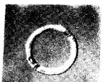  
图1-2  
INOR 8 HEAT 8284

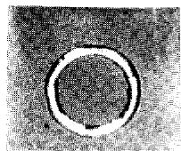  
INOR 8 HEAT 30-38

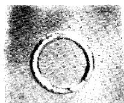  
HASTELLOY B

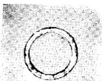  
INCONEL

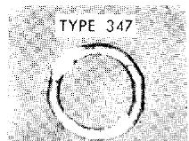  
STAINLESS STEEL

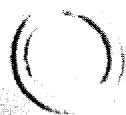  
TYPE 310   
STAINLESS STEEL   
FIG. 13-7. Circular-groove tests of weld metal cracking.

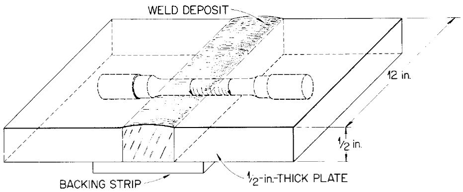  
FIG. 13-8. Weld test plate design showing method of obtaining specimen.

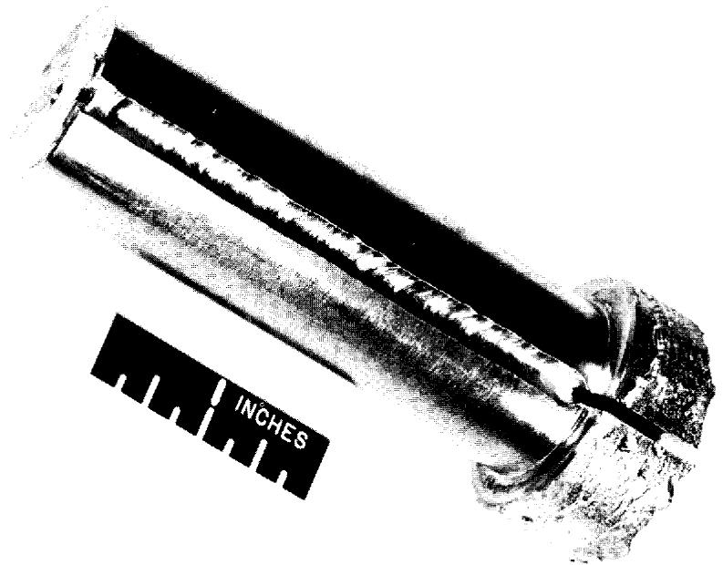  
Fig. 13-9. Weld in slot of vacuum-melted ingot.

absence of boron. Two other INOR-8 heats that did not contain boron similarly did not crack when subjected to the circular-groove test.

In order to further study the effect of boron in INOR-8 heats, several 3-lb vacuum-melted ingots with nominal boron contents of up to $0.10\%$ were prepared, slotted, and welded as shown in Fig. 13-9. All ingots with $0.02\%$ or more boron cracked in this test.

A procedure specification for the welding of INOR-8 tubing is available that is based on the results of these cracking tests and examinations of numerous successful welds. The integrity of a joint, which is a measure of the quality of a weld, is determined through visual, radiographic, and metallographic examinations and mechanical tests at room and service temperatures. It has been established through such examinations and tests that sound joints can be made in INOR-8 tubing that contains less than $0.02\%$ boron.

Weld test plates of the type shown in Fig. 13-8 have also been used for studying the mechanical properties of welded joints. Such test plates were side-bend tested in the apparatus illustrated in Fig. 13-10. The results of the tests, presented in Table 13-3, indicate excellent weld metal ductility. For example, the ductility of heat M-5 material is greater than $40\%$ at temperatures up to and including $1500^{\circ}\mathrm{F}$ .

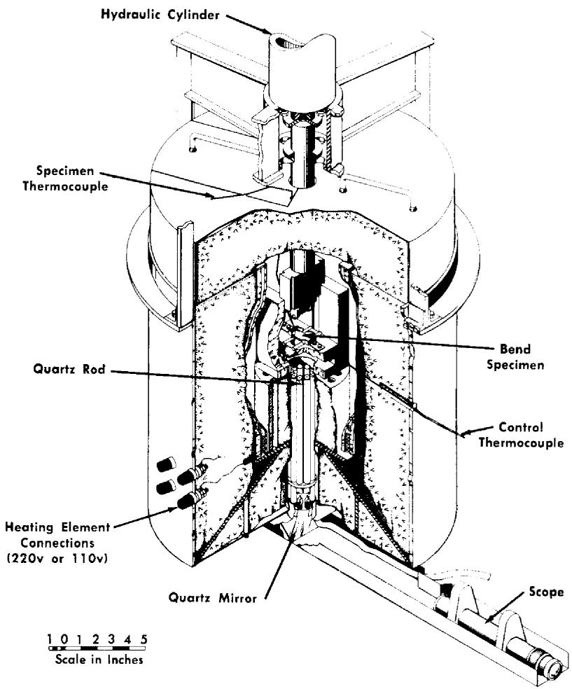  
FIG. 13-10. Apparatus for bend tests at high temperatures.

13-3.5 Brazing. Welded and back-brazed tube-to-tube sheet joints are normally used in the fabrication of heat exchangers for molten salt service. The back-brazing operation serves to remove the notch inherent in conventional tube-to-tube sheet joints, and the braze material minimizes the possibility of leakage through a weld failure that might be created by thermal stresses in service.

The nickel-base brazing alloys listed in Table 13-4 have been shown to be satisfactory in contact with the salt mixture LiF-KF-NaF- $\mathrm{UF_4}$ in tests conducted at $1500^{\circ}\mathrm{F}$ for $100\mathrm{hr}$ . Further, two precious metal-base brazing alloys, $82\%$ Au- $18\%$ Ni and $80\%$ Au- $20\%$ Cu, were unattacked in the LiF-KF-NaF- $\mathrm{UF_4}$ salt after $2000\mathrm{hr}$ at $1200^{\circ}\mathrm{F}$ . These two precious

TABLE 13-3   
RESULTS OF SIDE-BEND TESTS OF AS-WELDED   
INOR-8 AND INCONEL SAMPLES  

<table><tr><td rowspan="3">Test temperature, °F</td><td colspan="6">Filler metal</td></tr><tr><td colspan="2">INOR-8 (Heat M-5)</td><td colspan="2">INOR-8 (Heat SP-19)</td><td colspan="2">Inconel</td></tr><tr><td>Bend angle,* deg</td><td>Elongation† in 1/4 in., %</td><td>Bend angle, deg</td><td>Elongation in 1/4 in., %</td><td>Bend angle, deg</td><td>Elongation in 1/4 in., %</td></tr><tr><td>Room</td><td>&gt;90</td><td>&gt;40</td><td>&gt;90</td><td>&gt;40</td><td>&gt;90</td><td>&gt;40</td></tr><tr><td>1100</td><td>&gt;90</td><td>&gt;40</td><td>&gt;90</td><td>&gt;40</td><td>&gt;90</td><td>&gt;40</td></tr><tr><td>1200</td><td>&gt;90</td><td>&gt;40</td><td>&gt;90</td><td>&gt;40</td><td>&gt;90</td><td>&gt;40</td></tr><tr><td>1300</td><td>&gt;90</td><td>&gt;40</td><td>30</td><td>15</td><td>&gt;90</td><td>&gt;40</td></tr><tr><td></td><td>&gt;90</td><td>&gt;40</td><td>15</td><td>8</td><td>&gt;90</td><td>&gt;40</td></tr><tr><td>1500</td><td>&gt;90</td><td>&gt;40</td><td>15</td><td>8</td><td>15</td><td>8</td></tr><tr><td></td><td>&gt;90</td><td>&gt;40</td><td></td><td></td><td>15</td><td>8</td></tr></table>

*Bend angle recorded is that at which first crack appeared.   
†Elongation recorded is that at outer fiber at time first crack appeared.

TABLE 13-4   
NICKEL-BASE BRAZING ALLOYS FOR USE IN HEAT EXCHANGER FABRICATION   

<table><tr><td rowspan="2">Components</td><td colspan="3">Brazing alloy content, w/o</td></tr><tr><td>Alloy 52</td><td>Alloy 91</td><td>Alloy 93</td></tr><tr><td>Nickel</td><td>91.2</td><td>91.3</td><td>93.3</td></tr><tr><td>Silicon</td><td>4.5</td><td>4.5</td><td>3.5</td></tr><tr><td>Boron</td><td>2.9</td><td>2.9</td><td>1.9</td></tr><tr><td>Iron and carbon</td><td>Balance</td><td>Balance</td><td>Balance</td></tr></table>

metal alloys were also tested in the $\mathrm{LiF - BeF_2 - UF_4}$ mixture and again were not attacked.

13-3.6 Nondestructive testing. An ultrasonic inspection technique is available for the detection of flaws in plate, piping, and tubing. The water-immersed pulsc-echo ultrasound equipment has been adapted to high-speed use. Eddy-current, dye-penetrant, and radiographic inspection methods are also used as required. The inspected materials have included Inconel, austenitic stainless steel, INOR-8, and the Hastelloy and other nickel-molybdenum-base alloys.

Methods are being developed for the nondestructive testing of weldments during initial construction and after replacement by remote means in a high-intensity radiation field, such as that which will be present if maintenance work is required after operation of a molten-salt reactor. The ultrasonic technique appears to be best suited to semiautomatic and remote operation and of any of the applicable methods, it will probably be the least affected by radiation. Studies have indicated that the difficulties encountered due to the high ultrasonic attenuation of the weld structures in the ultrasonic inspection of Inconel welds and welds of some of the austenitic stainless steels are not present in the inspection of INOR-8 welds. In addition, the troublesome large variations in ultrasonic attenuation common to Inconel and austenitic stainless steel welds are less severe in INOR-8 welds. The mechanical equipment designed for the remote welding operation will be useful for the inspection operation.

In the routine inspection of reactor-grade construction materials, a tube, pipe, plate, or rod is rejected if a void is detected that is larger than $5\%$ of the thickness of the part being inspected. In the inspection of a weld, the integrity of the weld must be better than $95\%$ of that of the base metal.

Typical rejection rates for Inconel and INOR-8 are given below:

<table><tr><td rowspan="2">Item</td><td colspan="2">Rejection rate (%)</td></tr><tr><td>Inconel</td><td>INOR-8</td></tr><tr><td>Tubing</td><td>17</td><td>20</td></tr><tr><td>Pipe</td><td>12</td><td>14</td></tr><tr><td>Plate</td><td>8</td><td>8</td></tr><tr><td>Rod</td><td>5</td><td>5</td></tr><tr><td>Welds</td><td>14</td><td>14</td></tr></table>

The rejection rates for INOR-8 are expected to decline as more experience is gained in fabrication.

# 13-4. MECHANICAL AND THERMAL PROPERTIES OF INOR-8

13-4.1 Elasticity. A typical stress-strain curve for INOR-8 at $1200^{\circ}\mathrm{F}$ is shown in Fig. 13-11. Data from similar curves obtained from tests at room temperature up to $1400^{\circ}\mathrm{F}$ are summarized in Fig. 13-12 to show changes in tensile strength, yield strength, and ductility as a function of temperature. The temperature dependence of the Young's modulus of this material is illustrated in Fig. 13-13.

13-4.2 Plasticity. A series of relaxation tests of INOR-8 at 1200 and $1300^{\circ}\mathrm{F}$ has indicated that creep will be an important design consideration for reactors operating in this temperature range. The rate at which the stress must be relaxed in order to maintain a constant elastic strain at $1300^{\circ}\mathrm{F}$ is shown in Fig. 13-14, and similar data for $1200^{\circ}\mathrm{F}$ are presented in Fig. 13-15. The time lapse before the material becomes plastic is about $1\mathrm{hr}$ at $1300^{\circ}\mathrm{F}$ and about $10\mathrm{hr}$ at $1200^{\circ}\mathrm{F}$ . The time period during which the material behaves elastically becomes much longer at lower temperatures, and below some temperature, as yet undetermined, the metal will continue to behave elastically indefinitely.

It is possible to summarize the creep data by comparing the times to $1.0\%$ total strain, as a function of stress, in the data shown in Fig. 13-16. The reproducibility of creep data for this material is indicated by the separate curves shown in Fig. 13-17. It may be seen that quite good correlation between the creep curves is obtained at the lower stress values. Some scatter in time to rupture occurs at 25,000 psi, a stress which corresponds to the $0.2\%$ offset yield strength at this temperature. Such scatter is to be expected at this high stress level.

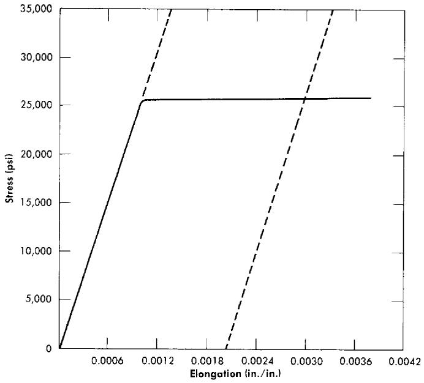  
FIG. 13-11. Stress-strain relationships for INOR-8 at $1200^{\circ}\mathrm{F}$ . Initial slope (represented by dashed line at left) is equivalent to a static modulus of elasticity in tension of 25,200,000 psi. The dashed line at right is the curve for plastic deformation of 0.002 in/in; its intersection with the stress-strain curve indicates a yield strength of 25,800 psi for $0.2\%$ offset. Ultimate tensile strength, 73,895 psi; gage length, 3.25 in.; material used was from heat 3038.

The tensile strengths of several metals are compared with the tensile strength of INOR-8 at $1300^{\circ}\mathrm{F}$ in the following tabulation, and the creep properties of the several alloys at $1.0\%$ strain are compared in Fig. 13-18.

<table><tr><td>Material</td><td>Tensile strength at 1300°F, psi</td></tr><tr><td>18-8 stainless steel</td><td>40,000</td></tr><tr><td>Cr-Mo steel (5% Cr)</td><td>20,000</td></tr><tr><td>Hastelloy B</td><td>70,000</td></tr><tr><td>Hastelloy C</td><td>100,000</td></tr><tr><td>Inconel</td><td>60,000</td></tr><tr><td>INOR-8</td><td>65,000</td></tr></table>

The test results indicate that the elastic and plastic strengths of INOR-8 are near the top of the range of strength properties of the several alloys

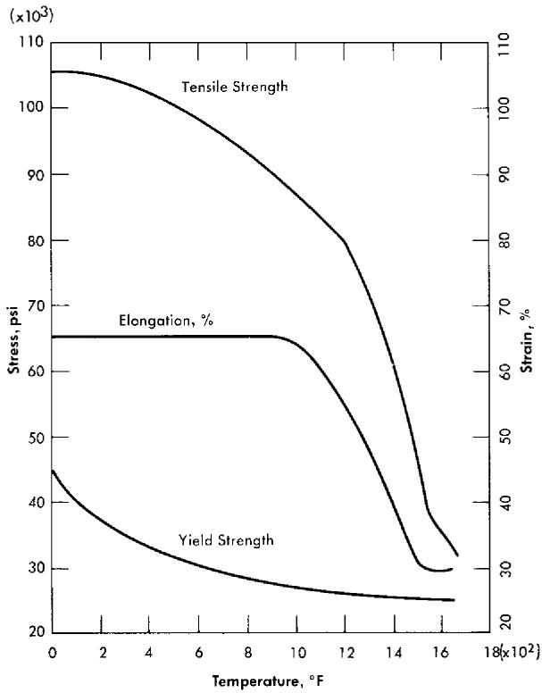  
FIG. 13-12. Tensile properties of INOR-8 as a function of temperature.

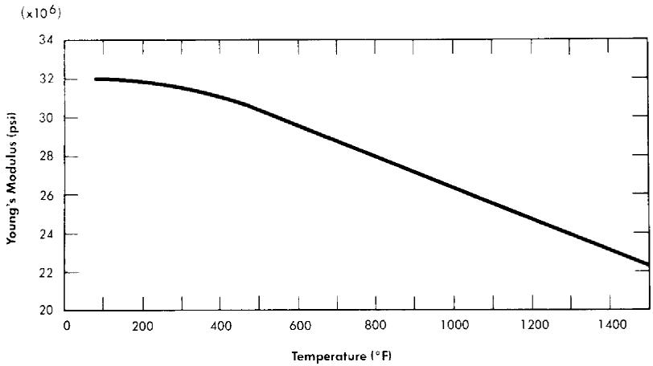  
FIG. 13-13. Young's modulus for INOR-8.

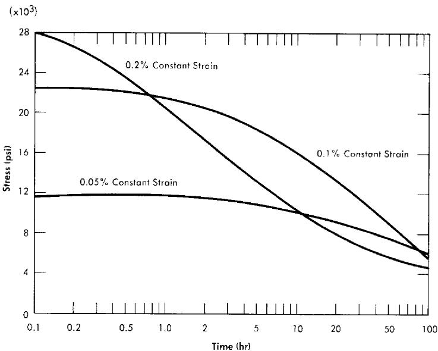  
FIG. 13-14. Relaxation of INOR-8 at $1300^{\circ}\mathrm{F}$ at various constant strains.

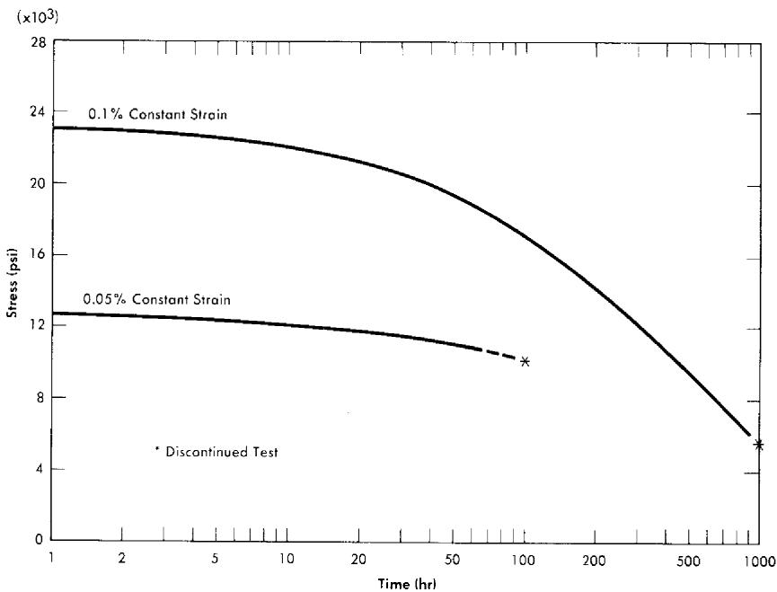  
FIG. 13-15. Relaxation of INOR-8 at $1200^{\circ}\mathrm{F}$ at various constant strains.

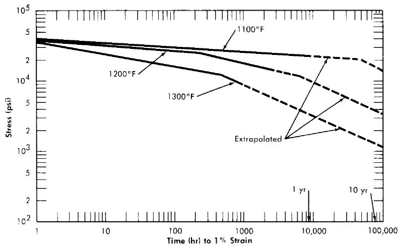  
FIG. 13-16. Creep data for INOR-8.

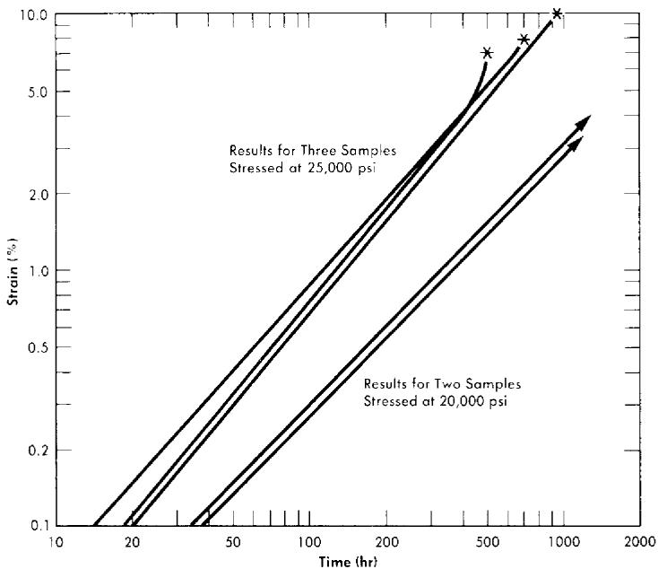  
FIG. 13-17. Creep-rupture data for INOR-8.

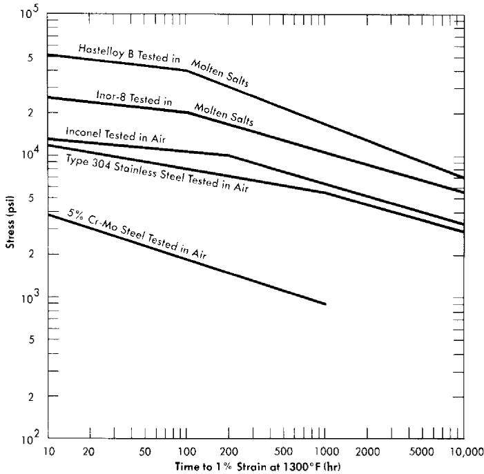  
FIG. 13-18. Comparison of the creep properties of several alloys.

commonly considered for high-temperature use. Since INOR-8 was designed to avoid the defects inherent in these other metals, it is apparent that the undesirable aspects have been eliminated without any serious loss in strength.

13-4.3 Aging characteristics. Numerous secondary phases that are capable of embrittling a nickel-base alloy can exist in the Ni-Mo-Cr-Fe-C system, but no brittle phase exists if the alloy contains less than $20\%$ Mo, $8\%$ Cr, and $5\%$ Fe. INOR-8, which contains only 15 to $18\%$ Mo, consists principally of two phases: the nickel-rich solid solution and a complex carbide with the approximate composition $(\mathrm{Ni}, \mathrm{Mo})_6\mathrm{C}$ . Studies of the effect of the carbides on creep strength have shown that the highest strength exists when a continuous network of carbides surrounds the grains. Tests have shown that carbide precipitation does not cause significant embrittlement at temperatures up to $1480^{\circ}\mathrm{F}$ . Aging for $500\mathrm{hr}$ at various temperatures, as shown in Fig. 13-19, improves the tensile properties of the alloy. The tensile properties at room temperature, as shown in Table 13-5, are virtually unaffected by aging.

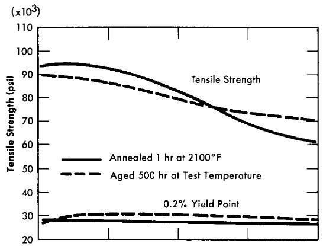

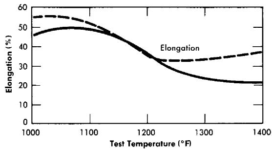  
FIG. 13-19. Effect of aging on high-temperature tensile properties of INOR-8.

TABLE 13-5   
RESULTS OF ROOM-TEMPERATURE EMBRITTLEMENT TESTS OF INOR-8   

<table><tr><td>Heat treatment</td><td>Ultimate tensile strength, psi</td><td>Yield point at 0.2% offset, psi</td><td>Elongation, %</td></tr><tr><td>Annealed*</td><td>114,400</td><td>44,700</td><td>50</td></tr><tr><td>Annealed and aged 500 hr at 1000°F</td><td>112,000</td><td>42,500</td><td>53</td></tr><tr><td>Annealed and aged 500 hr at 1100°F</td><td>112,600</td><td>44,000</td><td>51</td></tr><tr><td>Annealed and aged 500 hr at 1200°F</td><td>112,300</td><td>44,700</td><td>51</td></tr><tr><td>Annealed and aged 500 hr at 1300°F</td><td>112,000</td><td>44,500</td><td>49</td></tr><tr><td>Annealed and aged 500 hr at 1400°F</td><td>112,400</td><td>43,900</td><td>50</td></tr></table>

*0.045-in. sheet, annealed 1 hr at ${2100}^{ \circ  }\mathrm{F}$ and tested at a strain rate of 0.05 in/min.

13-4.4 Thermal conductivity and coefficient of linear thermal expansion. Values of the thermal conductivity and coefficient of linear thermal expansion are given in Tables 13-6 and 13-7.

TABLE 13-6   
COMPARISON OF THERMAL CONDUCTIVITY VALUES FOR INOR-8 AND INCONEL AT SEVERAL TEMPERATURES   

<table><tr><td rowspan="2">Temperature, °F</td><td colspan="2">Thermal conductivity, Btu/(ft2)(sec)(°F/ft)</td></tr><tr><td>INOR-8</td><td>Inconel</td></tr><tr><td>212</td><td>5.56</td><td>9.44</td></tr><tr><td>392</td><td>6.77</td><td>9.92</td></tr><tr><td>572</td><td>11.16</td><td>10.40</td></tr><tr><td>752</td><td>12.10</td><td>10.89</td></tr><tr><td>933</td><td>14.27</td><td>11.61</td></tr><tr><td>1112</td><td>16.21</td><td>12.10</td></tr><tr><td>1292</td><td>18.15</td><td>12.58</td></tr></table>

TABLE 13-7   
COEFFICIENT OF LINEAR EXPANSION OF INOR-8 FOR SEVERAL TEMPERATURE RANGES   

<table><tr><td>Temperature range, °F</td><td>Coefficient of linear expansion, in/(in)(°F)</td></tr><tr><td></td><td>×10-6</td></tr><tr><td>70-400</td><td>5.76</td></tr><tr><td>70-600</td><td>6.23</td></tr><tr><td>70-800</td><td>6.58</td></tr><tr><td>70-1000</td><td>6.89</td></tr><tr><td>70-1200</td><td>7.34</td></tr><tr><td>70-1400</td><td>7.61</td></tr><tr><td>70-1600</td><td>8.10</td></tr><tr><td>70-1800</td><td>8.32</td></tr></table>

# 13-5. OxIDATION RESISTANCE

The oxidation resistance of nickel-molybdenum alloys depends on the service temperature, the temperature cycle, the molybdenum content, and the chromium content. The oxidation rate of the binary nickel-molybdenum alloy passes through a maximum for the alloy containing $15\%$ Mo, and the scale formed by the oxidation is $\mathrm{NiMoO_4}$ and NiO. Upon thermal cycling from above $1400^{\circ}\mathrm{F}$ to below $660^{\circ}\mathrm{F}$ , the $\mathrm{NiMoO_4}$ undergoes a phase transformation which causes the protective scale on the oxidized metal to spall. Subsequent temperature cycles then result in an accelerated oxidation rate. Similarly, the oxidation rate of nickel-molybdenum alloys containing chromium passes through a maximum for alloys containing between 2 and $6\%$ Cr. Alloys containing more than $6\%$ Cr are insensitive to thermal cycling and the molybdenum content because the oxide scale is predominantly stable $\mathrm{Cr_2O_3}$ . An abrupt decrease, by a factor of about 40, in the oxidation rate at $1800^{\circ}\mathrm{F}$ is observed when the chromium content is increased from 5.9 to $6.2\%$ .

The oxidation resistance of INOR-8 is excellent, and continuous operation at temperatures up to $1800^{\circ}\mathrm{F}$ is feasible. Intermittent use at temperatures as high as $1900^{\circ}\mathrm{F}$ could be tolerated. For temperatures up to $1200^{\circ}\mathrm{F}$ , the oxidation rate is not measurable; it is essentially nonexistent after $1000\mathrm{hr}$ of exposure in static air. It is estimated that oxidation of 0.001 to 0.002 in, would occur in $100,000\mathrm{hr}$ of operation at $1200^{\circ}\mathrm{F}$ . The effect of temperature on the oxidation rate of the alloy is shown in Table 13-8.

TABLE 13-8   
OXIDATION RATE OF INOR-8 AT VARIOUS TEMPERATURES*  

<table><tr><td rowspan="2">Test temperature, °F</td><td colspan="2">Weight gain, mg/cm2</td><td rowspan="2">Shape of rate curve</td></tr><tr><td>In 100 hr</td><td>In 1000 hr</td></tr><tr><td>1200</td><td>0.00</td><td>0.00</td><td>Cubic or logarithmic</td></tr><tr><td>1600</td><td>0.25</td><td>0.67†</td><td>Cubic</td></tr><tr><td>1800</td><td>0.48</td><td>1.5†</td><td>Parabolic</td></tr><tr><td>1900</td><td>0.52</td><td>2.0†</td><td>Parabolic</td></tr><tr><td>2000</td><td>2.70</td><td>28.2†</td><td>Linear</td></tr></table>

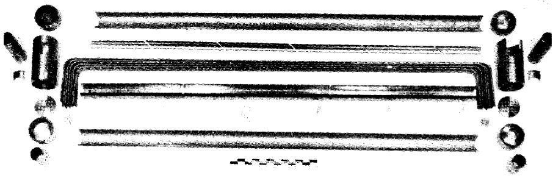  
FIG. 13-20. Components of a duplex heat exchanger fabricated of Inconel clad with type-316 stainless steel.

# 13-6. FABRICATION OF A DUPLEX TUBING HEAT EXCHANGER

The compatibility of INOR-8 and sodium is adequate in the temperature range presently contemplated for molten-salt reactor heat-exchanger operation. At higher temperatures, mass transfer could become a problem, and therefore the fabrication of duplex tubing has been investigated. Satisfactory duplex tubing has been made that consists of Inconel clad with type-316 stainless steel, and components for a duplex heat exchanger have been fabricated, as shown in Fig. 13-20.

The fabrication of duplex tubing is accomplished by coextrusion of billets of the two alloys. The high temperature and pressure used result in the formation of a metallurgical bond between the two alloys. In subsequent reduction steps the bonded composite behaves as one material. The ratios of the alloys that comprise the composite are controllable to within $3\%$ . The uniformity and bond integrity obtained in this process are illustrated in Fig. 13-21.

The problem of welding INOR-8-stainless steel duplex tubing is being studied. Experiments have indicated that proper selection of alloy ratios and weld design will assure welds that will be satisfactory in high-temperature service.

To determine whether interdiffusion of the alloys would result in a continuous brittle layer at the interface, tests were made in the temperature range 1300 to $1800^{\circ}\mathrm{F}$ . As expected, a new phase appeared at the interface between INOR-8 and the stainless steel which increased in depth along the grain boundaries with increases in the temperature. The interface of a duplex sheet held at $1300^{\circ}\mathrm{F}$ for $500\mathrm{hr}$ is shown in Fig. 13-22. Tests of this sheet showed an ultimate tensile strength of 94,400 psi, a $0.2\%$ offset yield strength of 36,800 psi, and an elongation of $51\%$ . Creep tests of the

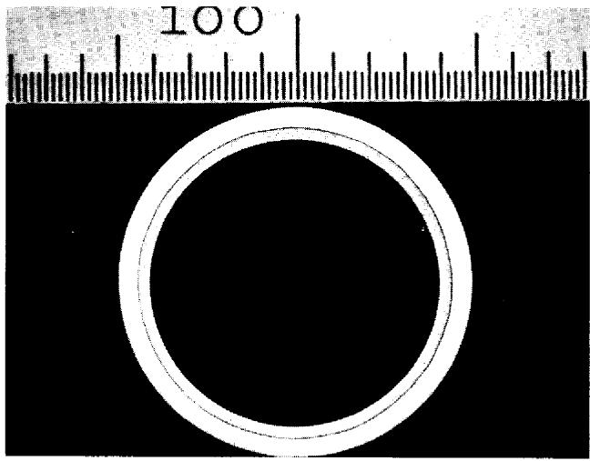

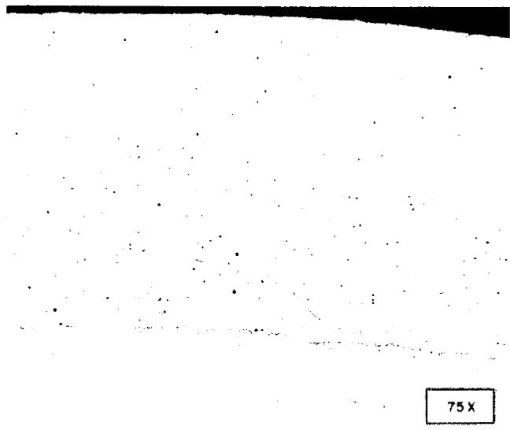  
FIG. 13-21. Duplex tubing consisting of Inconel over type-316 stainless steel. Etchant: glyceria regia.

sheet showed that the diffusion resulted in an increase in the creep resistance with no significant loss of ductility.

Thus no major difficulties would be expected in the construction of an INOR-8-stainless steel heat exchanger. The construction experience thus far has involved only the 20-tube heat exchanger shown in Fig. 13-20.

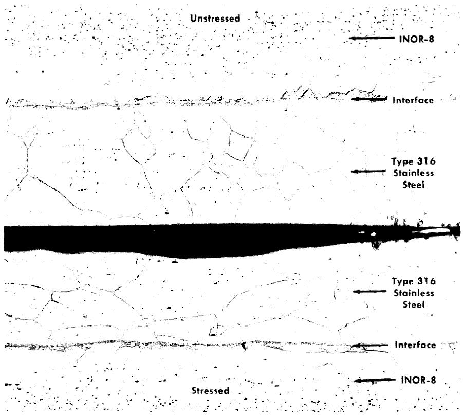  
FIG. 13-22. Unstressed and stressed specimens of INOR-8 clad with type-316 stainless steel after $500\mathrm{hr}$ at $1300^{\circ}\mathrm{F}$ . Etchant: electrolytic $\mathrm{H}_2\mathrm{SO}_4$ ( $2\%$ solution). $(100\times)$

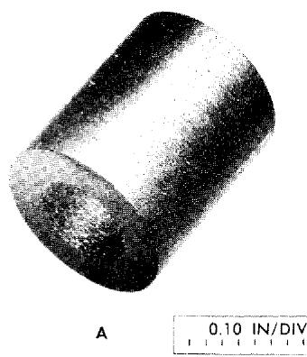

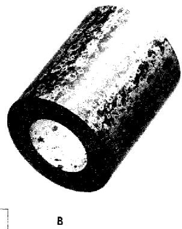  
FIG. 13-23. CCN graphite (A) before and (B) after exposure for $1000\mathrm{hr}$ to $\mathrm{NaF - }$ $\mathrm{ZrF_4 - UF_4}$ (50-46-4 mole $\%$ ) at $1300^{\circ}\mathrm{F}$ as an insert in the hot leg of a thermalconvection loop. Nominal bulk density of graphite specimen: $1.9~\mathrm{g / cm^3}$

# 13-7. AVAILABILITY OF INOR-8

Two production heats of INOR-8 of 10,000 lb each and numerous smaller heats of up to 5000 lb have been melted and fabricated into various shapes by normal production methods. Evaluation of these commercial products has shown them to have properties similar to those of the laboratory heats prepared for material selection. Purchase orders are filled by the vendors in one to six months, and the costs range from $2.00 per pound in ingot form to$ 10.00 per pound for cold-drawn welding wire. The costs of tubing, plate, and bar products depend to a large extent on the specifications of the finished products.

# 13-8. COMPATIBILITY OF GRAPHITE WITH MOLTEN SALTS AND NICKEL-BASE ALLOYS

If graphite could be used as a moderator in direct contact with a molten salt, it would make possible a molten-salt reactor with a breeding ratio in excess of one (see Chapter 14). Problems that might restrict the usefulness of this approach are possible reactions of graphite and the fuel salt, penetration of the pores of the graphite by the fuel, and carburization of the nickel-alloy container.

Many molten fluoride salts have been melted and handled in graphite crucibles, and in these short-term uses the graphite is inert to the salt. Tests at temperatures up to $1800^{\circ}\mathrm{F}$ with the ternary salt mixture $\mathrm{NaF - ZrF_4 - UF_4}$ gave no indication of the decomposition of the fluoride and no gas evolution so long as the graphite was free from a silicon impurity.

Longer-time tests of graphite immersed in fluoride salts have shown greater indications of penetration of the graphite by salts, and it must be assumed that the salt will eventually penetrate the available pores in the graphite. The "impermeable" grades of graphite available experimentally show greatly reduced penetration, and a sample of high-density, bonded, natural graphite (Degussa) showed very little penetration. Although quantitative figures are not available, it is likely that the extent of penetration of "impermeable" graphite grades can be tolerated.

Although these penetration tests showed no visible effects of attack of the graphite by the salt, analyses of the salt for carbon showed that at $1500^{\circ}\mathrm{F}$ more than $1\%$ carbon may be picked up in $100\mathrm{hr}$ . The carbon pickup appears to be sensitive to temperature, however, inasmuch as only $0.025\%$ carbon was found in the salt after a 1000-hr exposure at $1300^{\circ}\mathrm{F}$ .

In some instances coatings have been found on the graphite after exposure to the salt in Inconel containers, as illustrated in Fig. 13-23. A cross section through the coating is shown in Fig. 13-24. The coating was

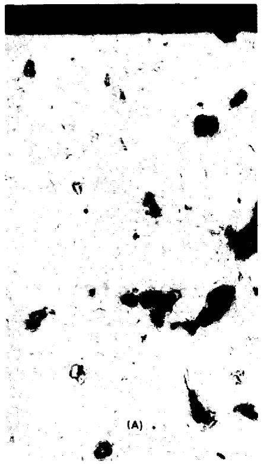

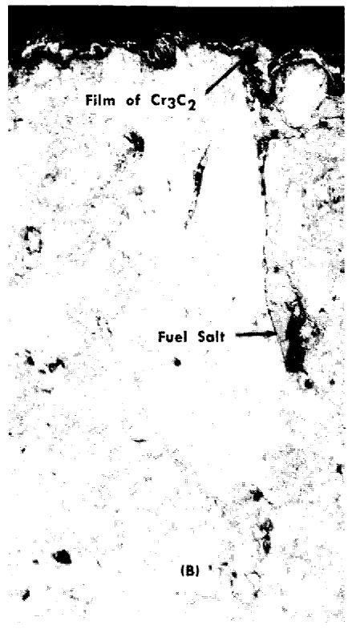  
FIG. 13-24. Cross sections of samples shown in Fig. 13-23. (A) Before exposure; (B) after exposure. Note the thin film of $\mathrm{Cr_3C_2}$ on the surface in (B). The black areas in (A) are pores. In (B) the pores are filled with salt. $(100\times)$

found to be nearly pure chromium carbide, $\mathrm{Cr_3C_2}$ . The source of the chromium was the Inconel container.

In the tests run thus far, no positive indication has been found of carburization of the nickel-alloy containers exposed to molten salts and graphite at the temperatures at present contemplated for power reactors $(< 1300^{\circ}\mathrm{F})$ . The carburization effect seems to be quite temperature sensitive, however, since tests at $1500^{\circ}\mathrm{F}$ showed carburization of Hastelloy B to a depth of 0.003 in. in 500 hr of exposure to $\mathrm{NaF - ZrF_4 - UF_4}$ containing graphite. A test of Inconel and graphite in a thermal-convection loop in which the maximum bulk temperature of the fluoride salt was $1500^{\circ}\mathrm{F}$ gave a maximum carburization depth of 0.05 in. in 500 hr. In this case, however, the temperature of the metal-salt interface where the carburization occurred was considerably higher than $1500^{\circ}\mathrm{F}$ , probably about $1650^{\circ}\mathrm{F}$ .

A mixture of sodium and graphite is known to be a good carburizing agent, and tests with it have confirmed the large effect of temperature on the carburization of both Inconel and INOR-8, as shown in Table 13-9.

# TABLE 13-9

EFFECT OF TEMPERATURE ON CARBURIZATION OF INCONEL AND INOR-8 IN 100 HR  

<table><tr><td>Alloy</td><td>Temperature, °F</td><td>Depth of carburization, in.</td></tr><tr><td rowspan="2">Inconel</td><td>1500</td><td>0.009</td></tr><tr><td>1200</td><td>0</td></tr><tr><td rowspan="2">INOR-8</td><td>1500</td><td>0.010</td></tr><tr><td>1200</td><td>0</td></tr></table>

Many additional tests are being performed with a variety of molten fluoride salts to measure both penetration of the graphite and carburization of INOR-8. The effects of carburization on the mechanical properties will be determined.

# 13-9. MATERIALS FOR VALVE SEATS AND BEARING SURFACES

Nearly all metals, alloys, and hard-facing materials tend to undergo solid-phase bonding when held together under pressure in molten fluoride salts at temperatures above $1000^{\circ}\mathrm{F}$ . Such bonding tends to make the startup of hydrodynamic bearings difficult or impossible, and it reduces the chance of opening a valve that has been closed for any length of time. Screening tests in a search for nonbonding materials that will stand up under the molten salt environment have indicated that the most promising materials are TiC-Ni and WC-Co types of cermets with nickel or cobalt contents of less than 35 w/o, tungsten, and molybdenum. The tests, in general, have been of less than 1000-hr duration, so the useful lives of these materials have not yet been determined.

# 13-10. SUMMARY OF MATERIAL PROBLEMS

Although much experimental work remains to be done before the construction of a complete power reactor system can begin, it is apparent that considerable progress has been achieved in solving the material problems of the reactor core. A strong, stable, and corrosion-resistant alloy with good welding and forming characteristics is available. Production techniques have been developed, and the alloy has been produced in commercial quantities by several alloy vendors. Finally, it appears that even at the peak operating temperature, no serious effect on the alloy occurs when the molten salt it contains is in direct contact with graphite.