# CHAPTER 14

# NUCLEAR ASPECTS OF MOLTEN-SALT REACTORS*

The ability of certain molten salts to dissolve uranium and thorium salts in quantities of reactor interest made possible the consideration of fluid-fueled reactors with thorium in the fuel, without the danger of nuclear accidents as a result of the settling of a slurry. This additional degree of freedom has been exploited in the study of molten-salt reactors.

Mixtures of the fluorides of alkali metals and zirconium or beryllium, as discussed in Chapter 12, possess the most desirable combination of low neutron absorption, high solubility of uranium and thorium compounds, chemical inertness at high temperatures, and thermal and radiation stability. The following comparison of the capture cross sections of the alkali metals reveals that $\mathrm{Li^{7}}$ containing $0.01\%$ $\mathrm{Li^{6}}$ has a cross section at 0.0795 ev and $1150^{\circ}\mathrm{F}$ that is a factor of 4 lower than that of sodium, which also has a relatively low cross section:

<table><tr><td>Element</td><td>Cross section, barns</td></tr><tr><td>Li7 (containing 0.01% Li6)</td><td>0.073</td></tr><tr><td>Sodium</td><td>0.290</td></tr><tr><td>Potassium</td><td>1.13</td></tr><tr><td>Rubidium</td><td>0.401</td></tr><tr><td>Cesium</td><td>29</td></tr></table>

The capture cross section of beryllium is also satisfactorily low at all neutron energies, and therefore mixtures of LiF and $\mathrm{BeF}_2$ , which have satisfactory melting points, viscosities, and solubilities for $\mathrm{UF_4}$ and $\mathrm{ThF_4}$ , were selected for investigation in the reactor physics study.

Mixtures of $\mathrm{NaF}$ , $\mathrm{ZrF_4}$ , and $\mathrm{UF_4}$ were studied previously, and such a fuel was successfully used in the Aircraft Reactor Experiment (see Chapters 12 and 16). Inconel was shown to be reasonably resistant to corrosion by this mixture at $1500^{\circ}\mathrm{F}$ , and there is reason to expect that Inconel equipment would have a life of at least several years at $1200^{\circ}\mathrm{F}$ . As a fuel for a central-station power reactor, however, the $\mathrm{NaF - ZrF_4}$ system has several serious disadvantages. The sodium capture cross section is less favorable than that of Li7. More important, recent data [1] indicate that the capture cross section of zirconium is quite high in the epithermal and intermediate neutron energy ranges. In comparison with the $\mathrm{LiF - BeF_2}$ system, the $\mathrm{NaF - ZrF_4}$ system has inferior heat-transfer characteristics.

Finally, the INOR alloys (see Chapter 13) show promise of being as resistant to the beryllium salts as to the zirconium salts, and therefore there is no compelling reason for selecting the $\mathrm{NaF - ZrF_4}$ system.

Reactor calculations were performed by means of the Univac* program Ocusol [2], a modification of the Eyewash program [3], and the Oracle† program Sorghum. Ocusol is a 31-group, multiregion, spherically symmetric, age-diffusion code. The group-averaged cross sections for the various elements of interest that were used were based on the latest available data [4]. Where data were lacking, reasonable interpolations based on resonance theory were made. The estimated cross sections were made to agree with measured resonance integrals where available. Saturation and Doppler broadening of the resonances in thorium as a function of concentration were estimated. Inelastic scattering in thorium and fluorine was taken into account crudely by adjusting the value of $\xi \sigma_{t}$ ; however, the Ocusol code does not provide for group skipping or anisotropy of scattering.

Sorghum is a 31-group, two-region, zero-dimensional, burnout code. The group-diffusion equations were integrated over the core to remove the spatial dependency. The spectrum was computed, in terms of a space-averaged group flux, from group scattering and leakage parameters taken from an Ocusol calculation. A critical calculation requires about $1\mathrm{min}$ on the Oracle; changes in concentration of 14 elements during a specified time can then be computed in about 1 sec. The major assumption involved is that the group scattering and leakage probabilities do not change appreciably with changes in core composition as burnup progresses. This assumption has been verified to a satisfactory degree of approximation.

The molten salts may be used as homogeneous moderators or simply as fuel carriers in heterogeneous reactors. Although, as discussed below, graphite-moderated heterogeneous reactors have certain potential advantages, their technical feasibility depends upon the compatibility of fuel, graphite, and metal, which has not as yet been established. For this reason, the homogeneous reactors, although inferior in nuclear performance, have been given greatest attention.

A preliminary study indicated that if the integrity of the core vessel could be guaranteed, the nuclear economy of two-region reactors would probably be superior to that of bare and reflected one-region reactors. The two-region reactors were, accordingly, studied in detail. Although entrance and exit conditions dictate other than a spherical shape, it was necessary, for the calculations, to use a model comprising the following concentric

spherical regions: (1) the core, (2) an INOR-8 core vessel 1/3 in. thick, (3) a blanket approximately 2 ft thick, and (4) an INOR-8 reactor vessel 2/3 in. thick. The diameter of the core and the concentration of thorium in the core were selected as independent variables. The primary dependent variables were the critical concentration of the fuel $(\mathrm{U}^{235}, \mathrm{U}^{233}$ , or $\mathrm{Pu}^{239})$ and the distribution of the neutron absorptions among the various atomic species in the reactor. From these, the critical mass, critical inventory, regeneration ratio, burnup rate, etc. can be readily calculated, as described in the following section.

# 14-1. HOMOGENEOUS REACTORS FUELED WITH $\mathbf{U}^{235}$

While the isotope $\mathrm{U}^{233}$ would be a superior fuel in molten fluoride-salt reactors (see Section 14-2), it is unfortunately not available in quantity. Any realistic appraisal of the immediate capabilities of these reactors must be based on the use of $\mathrm{U}^{235}$ .

The study of homogeneous reactors was divided into two phases: (1) the mapping of the nuclear characteristics of the initial (i.e., "clean") states as a function of core diameter and thorium concentration, and (2) the analysis of the subsequent performance of selected initial states with various processing schemes and rates. The detailed results of these studies are given in the following paragraphs. Briefly, it was found that regeneration ratios of up to 0.65 can be obtained with moderate investment in $\mathrm{U}^{235}$ (less than $1000\mathrm{kg}$ ) and that, if the fission products are removed (Article 14-1.2) at a rate such that the equilibrium inventory is equal to one year's production, the regeneration ratio can be maintained above 0.5 for at least 20 years.

14-1.1 Initial states. A complete parametric study of molten fluoride-salt reactors having diameters in the range of 4 to 10 ft and thorium concentrations in the fuel ranging from 0 to 1 mole $\%$ ThF $_4$ was performed. In these reactors, the basic fuel salt (fuel salt No. 1) was a mixture of 31 mole $\%$ BeF $_2$ and 69 mole $\%$ LiF, which has a density of about $2.0~\mathrm{g / cc}$ at $1150^{\circ}\mathrm{F}$ . The core vessel was composed of INOR-8. The blanket fluid (blanket salt No. 1) was a mixture of 25 mole $\%$ ThF $_4$ and 75 mole $\%$ LiF, which has a density of about $4.3~\mathrm{g / cc}$ at $1150^{\circ}\mathrm{F}$ . In order to shorten the calculations in this series, the reactor vessel was neglected, since the resultant error was small. These reactors contained no fission products or nonfissionable isotopes of uranium other than U $^{238}$ .

A summary of the results is presented in Table 14-1, in which the neutron balance is presented in terms of neutrons absorbed in a given element per neutron absorbed in $\mathrm{U}^{235}$ (both by fission and the $\mathfrak{n}-\gamma$ reaction). The sum of the absorptions is therefore equal to $\eta$ , the number of neutrons produced by fission per neutron absorbed in fuel. Further, the sum of the

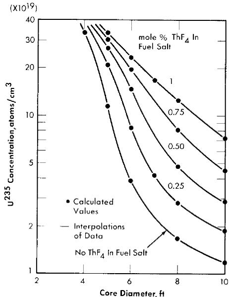  
FIG. 14-1. Initial critical concentration of $\mathbf{U}^{235}$ in two-region, homogeneous, molten fluoride-salt reactors.

absorptions in $\mathbf{U}^{238}$ and thorium in the fuel, and in thorium in the blanket salt gives directly the regeneration ratio. The losses to other elements are penalties imposed on the regeneration ratio by these poisons; i.e., if the core vessel could be constructed of some material with a negligible cross section, the regeneration ratio could be increased by the amount listed for capture in the core vessel.

The inventories in these reactors depend in part on the volume of the fuel in the pipes, pumps, and heat exchangers in the external portion of the fuel circuit. The inventories listed in Table 14-1 are for systems having a volume of $339\mathrm{ft}^3$ external to the core, which corresponds approximately to a power level of $600\mathrm{Mw}$ of heat. In these calculations it was assumed that the heat was transferred to an intermediate coolant composed of the fluorides of Li, Be, and Na before being transferred to sodium metal. In more recent designs (see Chapter 17), this intermediate salt loop has been replaced by a sodium loop, and the external volumes are somewhat less because of the improved equipment design and layout.

Critical concentration, mass, inventory, and regeneration ratio. The data in Table 14-1 are more easily comprehended in the form of graphs, such as Fig. 14-1, which presents the critical concentration in these reactors as a function of core diameter and thorium concentration in the fuel salt. The data points represent calculated values, and the lines are reasonable interpolations. The maximum concentration calculated, about $35 \times 10^{19}$

# TABLE 14-1

# INITIAL-STATE NUCLEAR CHARACTERISTICS OF TWO-REGION, HOMOGENEOUS, MOLTEN FLUORIDE-SALT REACTORS FUELED WITH U235

Fuel salt No. 1: 31 mole $\%$ BeF $_2$ + 69 mole $\%$ LiF + UF $_4$ + ThF $_4$ . Blanket salt No. 1: 25 mole $\%$ ThF $_4$ + 75 mole $\%$ LiF. Total power: 600 Mw (heat). External fuel volume: 339 ft $^3$ .

<table><tr><td>Case number</td><td>1</td><td>2</td><td>3</td><td>4</td><td>5</td><td>6</td><td>7</td></tr><tr><td>Core diameter, ft</td><td>4</td><td>5</td><td>5</td><td>5</td><td>5</td><td>5</td><td>6</td></tr><tr><td>ThF4in fuel salt, mole %</td><td>0</td><td>0</td><td>0.25</td><td>0.5</td><td>0.75</td><td>1</td><td>0</td></tr><tr><td>U235in fuel salt, mole %</td><td>0.952</td><td>0.318</td><td>0.561</td><td>0.721</td><td>0.845</td><td>0.938</td><td>0.107</td></tr><tr><td>U235atom density*</td><td>33.8</td><td>11.3</td><td>20.1</td><td>25.6</td><td>30.0</td><td>33.3</td><td>3.80</td></tr><tr><td>Critical mass, kg of U235</td><td>124</td><td>81.0</td><td>144</td><td>183</td><td>215</td><td>239</td><td>47.0</td></tr><tr><td>Critical inventory, kg of U235</td><td>1380</td><td>501</td><td>891</td><td>1130</td><td>1330</td><td>1480</td><td>188</td></tr><tr><td>Neutron absorption ratios†</td><td></td><td></td><td></td><td></td><td></td><td></td><td></td></tr><tr><td>U235(fissions)</td><td>0.7023</td><td>0.7185</td><td>0.7004</td><td>0.6996</td><td>0.7015</td><td>0.7041</td><td>0.7771</td></tr><tr><td>U235(n-γ)</td><td>0.2977</td><td>0.2815</td><td>0.2996</td><td>0.3004</td><td>0.2985</td><td>0.2959</td><td>0.2229</td></tr><tr><td>Be-Li-F in fuel salt</td><td>0.0551</td><td>0.0871</td><td>0.0657</td><td>0.0604</td><td>0.0581</td><td>0.0568</td><td>0.1981</td></tr><tr><td>Core vessel</td><td>0.0560</td><td>0.0848</td><td>0.0577</td><td>0.0485</td><td>0.0436</td><td>0.0402</td><td>0.1353</td></tr><tr><td>Li-F in blanket salt</td><td>0.0128</td><td>0.0138</td><td>0.0108</td><td>0.0098</td><td>0.0093</td><td>0.0090</td><td>0.0164</td></tr><tr><td>Leakage</td><td>0.0229</td><td>0.0156</td><td>0.0147</td><td>0.0143</td><td>0.0141</td><td>0.0140</td><td>0.0137</td></tr><tr><td>U238in fuel salt</td><td>0.0430</td><td>0.0426</td><td>0.0463</td><td>0.0451</td><td>0.0431</td><td>0.0412</td><td>0.0245</td></tr><tr><td>Th in fuel salt</td><td></td><td></td><td>0.0832</td><td>0.1289</td><td>0.1614</td><td>0.1873</td><td></td></tr><tr><td>Th in blanket salt</td><td>0.5448</td><td>0.5309</td><td>0.4516</td><td>0.4211</td><td>0.4031</td><td>0.3905</td><td>0.5312</td></tr><tr><td>Neutron yield, η</td><td>1.73</td><td>1.77</td><td>1.73</td><td>1.73</td><td>1.73</td><td>1.74</td><td>1.92</td></tr><tr><td>Median fission energy, ev</td><td>270</td><td>15.7</td><td>105</td><td>158</td><td>270</td><td>425</td><td>0.18</td></tr><tr><td>Thermal fissions, %</td><td>0.052</td><td>6.2</td><td>0.87</td><td>0.22</td><td>0.87</td><td>0.040</td><td>35</td></tr><tr><td>n-γ capture-to-fission ratio, α</td><td>0.42</td><td>0.39</td><td>0.43</td><td>0.43</td><td>0.43</td><td>0.4203</td><td>0.28</td></tr><tr><td>Regeneration ratio</td><td>0.59</td><td>0.57</td><td>0.58</td><td>0.60</td><td>0.61</td><td>0.62</td><td>0.56</td></tr><tr><td>Case number</td><td>S</td><td>9</td><td>10</td><td>11</td><td>12</td><td>13</td><td>14</td></tr><tr><td>Core diameter, ft</td><td>6</td><td>6</td><td>6</td><td>6</td><td>7</td><td>8</td><td>8</td></tr><tr><td>ThF4in fuel salt, mole %</td><td>0.25</td><td>0.5</td><td>0.75</td><td>1</td><td>0.25</td><td>0</td><td>0.25</td></tr><tr><td>U235in fuel salt, mole %</td><td>0.229</td><td>0.408</td><td>0.552</td><td>0.662</td><td>0.114</td><td>0.047</td><td>0.078</td></tr><tr><td>U235atom density*</td><td>8.13</td><td>14.5</td><td>19.6</td><td>23.5</td><td>4.05</td><td>1.66</td><td>2.77</td></tr><tr><td>Critical mass, kg of U235</td><td>101</td><td>179</td><td>243</td><td>291</td><td>79.6</td><td>48.7</td><td>81.3</td></tr><tr><td>Critical inventory, kg of U235</td><td>404</td><td>716</td><td>972</td><td>1160</td><td>230</td><td>110</td><td>184</td></tr><tr><td>Neutron absorption ratios†</td><td></td><td></td><td></td><td></td><td></td><td></td><td></td></tr><tr><td>U235(fissions)</td><td>0.7343</td><td>0.7082</td><td>0.7000</td><td>0.7004</td><td>0.7748</td><td>0.8007</td><td>0.7930</td></tr><tr><td>U235(n-γ)</td><td>0.2657</td><td>0.2918</td><td>0.3000</td><td>0.2996</td><td>0.2252</td><td>0.1993</td><td>0.2070</td></tr><tr><td>Be-Li-F in fuel salt</td><td>0.1082</td><td>0.0770</td><td>0.0669</td><td>0.0631</td><td>0.1880</td><td>0.4130</td><td>0.2616</td></tr><tr><td>Core vessel</td><td>0.0795</td><td>0.0542</td><td>0.0435</td><td>0.0388</td><td>0.0951</td><td>0.1491</td><td>0.1032</td></tr><tr><td>Li-F in blanket salt</td><td>0.0116</td><td>0.0091</td><td>0.0081</td><td>0.0074</td><td>0.0123</td><td>0.0143</td><td>0.0112</td></tr><tr><td>Leakage</td><td>0.0129</td><td>0.0122</td><td>0.0119</td><td>0.0116</td><td>0.0068</td><td>0.0084</td><td>0.0082</td></tr><tr><td>U238in fuel salt</td><td>0.0375</td><td>0.0477</td><td>0.0467</td><td>0.0452</td><td>0.0254</td><td>0.0143</td><td>0.0196</td></tr><tr><td>Th in fuel salt</td><td>0.1321</td><td>0.1841</td><td>0.2142</td><td>0.2438</td><td>0.1761</td><td></td><td>0.2045</td></tr><tr><td>Th in blanket salt</td><td>0.4318</td><td>0.3683</td><td>0.3378</td><td>0.3202</td><td>0.4098</td><td>0.4073</td><td>0.3503</td></tr><tr><td>Neutron yield, η</td><td>1.82</td><td>1.75</td><td>1.73</td><td>1.73</td><td>1.91</td><td>2.00</td><td>1.96</td></tr><tr><td>Median fission energy, ev</td><td>5.6</td><td>38</td><td>100</td><td>120</td><td>0.16</td><td>Thermal</td><td>0.10</td></tr><tr><td>Thermal fissions, %</td><td>13</td><td>3</td><td>0.56</td><td>0.48</td><td>33</td><td>59</td><td>45</td></tr><tr><td>n-γ capture-to-fission ratio, α</td><td>0.36</td><td>0.41</td><td>0.42</td><td>0.42</td><td>0.29</td><td>0.25</td><td>0.26</td></tr><tr><td>Regeneration ratio</td><td>0.61</td><td>0.60</td><td>0.60</td><td>0.61</td><td>0.61</td><td>0.42</td><td>0.57</td></tr></table>

*Atoms (× 10-19)/cc.   
†Neutrons absorbed per neutron absorbed in U $^{235}$ .   
continued

TABLE 14-1 (continued)   

<table><tr><td>Case number</td><td>15</td><td>16</td><td>17</td><td>18</td><td>19</td><td>20</td><td>21</td><td>22</td></tr><tr><td>Core diameter, ft</td><td>8</td><td>8</td><td>8</td><td>10</td><td>10</td><td>10</td><td>10</td><td>10</td></tr><tr><td>ThF4in fuel salt, mole %</td><td>0.5</td><td>0.75</td><td>1</td><td>0</td><td>0.25</td><td>0.5</td><td>0.75</td><td>1</td></tr><tr><td>U235in fuel salt, mole %</td><td>0.132</td><td>0.226</td><td>0.349</td><td>0.033</td><td>0.052</td><td>0.081</td><td>0.127</td><td>0.205</td></tr><tr><td>U235atom density*</td><td>4.67</td><td>8.03</td><td>12.4</td><td>1.175</td><td>1.86</td><td>2.88</td><td>4.50</td><td>7.28</td></tr><tr><td>Critical mass, kg of U235</td><td>137</td><td>236</td><td>364</td><td>67.3</td><td>107</td><td>165</td><td>258</td><td>417</td></tr><tr><td>Critical inventory, kg of U235</td><td>310</td><td>535</td><td>824</td><td>111</td><td>176</td><td>272</td><td>425</td><td>687</td></tr><tr><td>Neutron absorption ratios†</td><td></td><td></td><td></td><td></td><td></td><td></td><td></td><td></td></tr><tr><td>U235(fissions)</td><td>0.7671</td><td>0.7362</td><td>0.7146</td><td>0.8229</td><td>0.7428</td><td>0.7902</td><td>0.7693</td><td>0.7428</td></tr><tr><td>U235(n-γ)</td><td>0.2329</td><td>0.2638</td><td>0.2854</td><td>0.1771</td><td>0.2572</td><td>0.2098</td><td>0.2307</td><td>0.2572</td></tr><tr><td>Be-Li-F in fuel salt</td><td>0.1682</td><td>0.1107</td><td>0.0846</td><td>0.5713</td><td>0.3726</td><td>0.2486</td><td>0.1735</td><td>0.1206</td></tr><tr><td>Core vessel</td><td>0.0722</td><td>0.0500</td><td>0.0373</td><td>0.1291</td><td>0.0915</td><td>0.0669</td><td>0.0497</td><td>0.0363</td></tr><tr><td>Li-F in blanket salt</td><td>0.0089</td><td>0.0071</td><td>0.0057</td><td>0.0114</td><td>0.0089</td><td>0.0073</td><td>0.0060</td><td>0.0049</td></tr><tr><td>Leakage</td><td>0.0080</td><td>0.0077</td><td>0.0074</td><td>0.0061</td><td>0.0060</td><td>0.0059</td><td>0.0057</td><td>0.0055</td></tr><tr><td>U238in fuel salt</td><td>0.0272</td><td>0.0368</td><td>0.0428</td><td>0.0120</td><td>0.0153</td><td>0.0209</td><td>0.0266</td><td>0.0343</td></tr><tr><td>Th in fuel salt</td><td>0.3048</td><td>0.3397</td><td>0.3515</td><td></td><td>0.2409</td><td>0.3691</td><td>0.4324</td><td>0.4506</td></tr><tr><td>Th in blanket salt</td><td>0.3056</td><td>0.2664</td><td>0.2356</td><td>0.3031</td><td>0.2617</td><td>0.2332</td><td>0.2063</td><td>0.1825</td></tr><tr><td>Neutron yield, η</td><td>1.89</td><td>1.82</td><td>1.76</td><td>2.03</td><td>2.00</td><td>1.95</td><td>1.90</td><td>1.83</td></tr><tr><td>Median fission energy, ev</td><td>0.17</td><td>5.3</td><td>27</td><td>Thermal</td><td>Thermal</td><td>0.100</td><td>0.156</td><td>1.36</td></tr><tr><td>Thermal fissions, %</td><td>29</td><td>13</td><td>5</td><td>66</td><td>56</td><td>43</td><td>30</td><td>16</td></tr><tr><td>n-γ capture-to-fission ratio, α</td><td>0.30</td><td>0.36</td><td>0.40</td><td>0.21</td><td>0.24</td><td>0.26</td><td>0.30</td><td>0.35</td></tr><tr><td>Regeneration ratio</td><td>0.64</td><td>0.64</td><td>0.63</td><td>0.32</td><td>0.52</td><td>0.62</td><td>0.67</td><td>0.67</td></tr></table>

\*Atoms $(\times 10^{-19}) / \mathrm{cc}$   
†Neutrons absorbed per neutron absorbed in $\mathbf{U}^{235}$ .

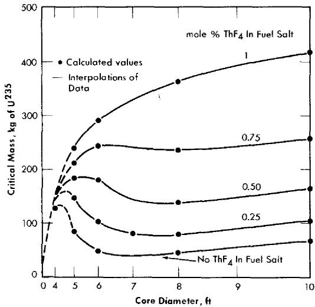  
FIG. 14-2. Initial critical masses of $\mathbf{U}^{235}$ in two-region, homogeneous, molten fluoride-salt reactors.

atoms of $\mathrm{U}^{235}$ per cubic centimeter of fuel salt, or about 1 mole $\%$ $\mathrm{UF_4}$ , is an order of magnitude smaller than the maximum permissible concentration (about 10 mole $\%$ ).

The corresponding critical masses are graphed in Fig. 14-2. As may be seen, the critical mass is a rather complex function of the diameter and the thorium concentration. The calculated points are shown here also, and the solid lines represent, it is felt, reliable interpolations. The dashed lines were drawn where insufficient numbers of points were calculated to define the curves precisely; however, they are thought to be qualitatively correct. Since reactors having diameters less than 6 ft are not economically attractive, only one case with a 4-ft-diameter core was computed.

The critical masses obtained in this study ranged from 40 to $400\mathrm{kg}$ of $\mathbf{U}^{235}$ . However, the critical inventory in the entire fuel circuit is of more interest to the reactor designer than is the critical mass. The critical inventories corresponding to an external fuel volume of $339\mathrm{ft}^3$ are therefore shown in Fig. 14-3. Inventories for other external volumes may be computed from the relation

$$
I = M \Bigl (1 + \frac {6 V _ {e}}{D ^ {3}} \Bigr),
$$

where $D$ is the core diameter in feet, $M$ is the critical mass taken from Fig. 14-2, $V_{e}$ is the volume of the external system in cubic feet, and $I$ is the inventory in kilograms of $\mathbf{U}^{235}$ . The inventories plotted in Fig. 14-3

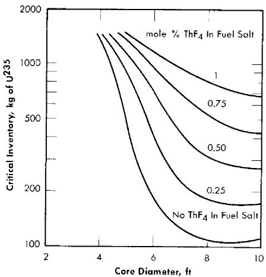  
FIG. 14-3. Initial critical inventories of $\mathbf{U}^{235}$ in two-region, homogeneous, molten fluoride-salt reactors. External fuel volume, 339 ft $^3$ .

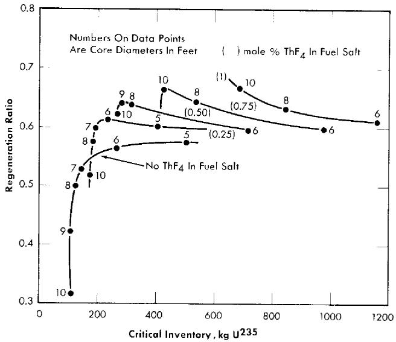  
FIG. 14-4. Initial fuel regeneration in two-region, homogeneous, molten fluoride-salt reactors fueled with $\mathbf{U}^{235}$ . Total power, $600\mathrm{Mw}$ (heat); external fuel volume, $339\mathrm{ft}^3$ ; core and blanket salts No. 1.

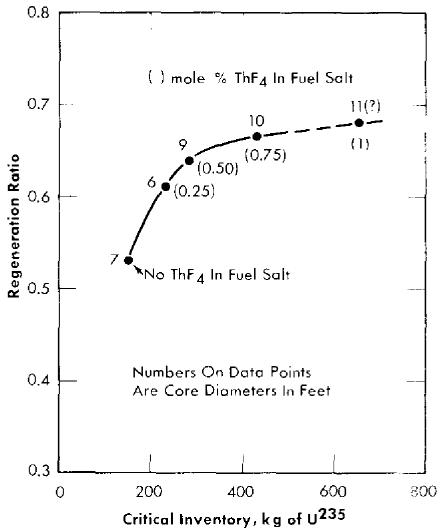  
FIG. 14-5. Maximum initial regeneration ratios in two-region, homogeneous, molten fluoride-salt reactors fueled with $\mathbf{U}^{235}$ . Total power, $600\mathrm{Mw}$ (heat); external fuel volume, $339\mathrm{ft}^3$ .

range from slightly above $100\mathrm{kg}$ in an 8-ft-diameter core with no thorium present to $1500\mathrm{kg}$ in a 5-ft-diameter core with 1 mole $\%$ $\mathrm{ThF_4}$ present.

The optimum combination of core diameter and thorium concentration is, qualitatively, that which minimizes the sum of inventory charges (including charges on Li $^7$ , Be, and Th) and fuel reprocessing costs. The fuel costs are directly related to the regeneration ratio, and this varies in a complex manner with inventory of $\mathrm{U}^{235}$ and thorium concentration, as shown in Fig. 14-4. It may be seen that at a given thorium concentration, the regeneration ratio (with one exception) passes through a maximum as the core diameter is varied between 5 and 10 ft. These maxima increase with increasing thorium concentration, but the inventory values at which they occur also increase.

Plotting the maximum regeneration ratio versus critical inventory generates the curve shown in Fig. 14-5. It may be seen that a small investment in $U^{235}$ (200 kg) will give a regeneration ratio of 0.58, that 400 kg will give a ratio of 0.66, and that further increases in fuel inventory have little effect.

The effects of changes in the compositions of the fuel and blanket salts are indicated in the following description of the results of a series of calculations for which salts with more favorable melting points and viscosities were assumed. The $\mathrm{BeF}_2$ content was raised to 37 mole $\%$ in the fuel salt

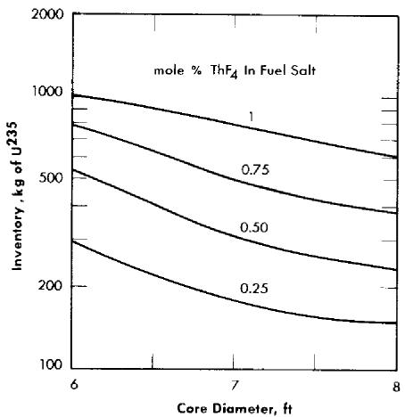  
FIG. 14-6. Initial critical inventories of $\mathbf{U}^{235}$ in two-region, homogeneous, molten fluoride-salt reactors. Total power, $600\mathrm{Mw}$ (heat); external fuel volume, $339\mathrm{ft}^3$ ; core and blanket salts No. 2.

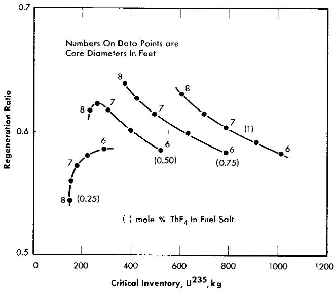  
FIG. 14-7. Initial fuel regeneration in two-region, homogeneous, molten fluoride-salt reactors fueled with $\mathbf{U}^{235}$ . Total power, $600\mathrm{Mw}$ (heat); external fuel volume, $339\mathrm{ft}^3$ ; core and blanket salts No. 2.

(fuel salt No. 2), and the blanket composition (blanket salt No. 2) was fixed at 13 mole $\%$ ThF $_4$ , 16 mole $\%$ BeF $_2$ , and 71 mole $\%$ LiF. Blanket salt No. 2 is a somewhat better reflector than No. 1, and fuel salt No. 2 a somewhat better moderator. As a result, at a given core diameter and thorium concentration in the fuel salt, both the critical concentration and the regeneration ratio are somewhat lower for the No. 2 salts.

Reservations concerning the feasibility of constructing and guaranteeing the integrity of core vessels in large sizes (10 ft and over), together with preliminary consideration of inventory charges for large systems, led to the conclusion that a feasible reactor would probably have a core diameter lying in the range between 6 and 8 ft. Accordingly, a parametric study in this range with the No. 2 fuel and blanket salts was performed. In this study the presence of an outer reactor vessel consisting of $2/3$ in. of INOR-8 was taken into account. The results are presented in Table 14-2 and Figs. 14-6 and 14-7. In general, the nuclear performance is somewhat better with the No. 2 salt than with the No. 1 salt.

Neutron balances and miscellaneous details. The distributions of the neutron captures are given in Tables 14-1 and 14-2, where the relative hardness of the neutron spectrum is indicated by the median fission energies and the percentages of thermal fissions. It may be seen that losses to Li, Be, and F in the fuel salt and to the core vessel are substantial, especially in the more thermal reactors (e.g., Case No. 18). However, in the thermal reactors, losses by radiative capture in $\mathrm{U}^{235}$ are relatively low. Increasing the hardness decreases losses to salt and core vessel sharply (Case No. 5), but increases the loss to the $n - \gamma$ reaction. It is these opposing trends which account for the complicated relation between regeneration ratio and critical inventory exhibited in Figs. 14-4 and 14-7. The numbers given for capture in the Li and F in the blanket show that these elements are well shielded by the thorium in the blanket, and the leakage values show that leakage from the reactor is less than 0.01 neutron per neutron absorbed in $\mathrm{U}^{235}$ in reactors over 6 ft in diameter. The blanket contributes substantially to the regeneration of fuel, accounting for not less than one-third of the total even in the 10-ft-diameter core containing 1 mole $\%$ $\mathrm{ThF_4}$ .

Effect of substitution of sodium for $Li^7$ . In the event that $Li^7$ should prove not to be available in quantity, it would be possible to operate the reactor with mixtures of sodium and beryllium fluorides as the basic fuel salt. The penalty imposed by sodium in terms of critical inventory and regeneration ratio is shown in Fig. 14-8, where typical Na-Be systems are compared with the corresponding Li-Be systems. With no thorium in the core, the use of sodium increases the critical inventory by a factor of 1.5 (to about $300\mathrm{kg}$ ) and lowers the regeneration ratio by a factor of 2. The regeneration penalty is less severe, percentagewise, with 1 mole % ThF4 in the fuel salt; in an 8-ft-diameter core, the inventory rises from $800\mathrm{kg}$ to $1100\mathrm{kg}$

# TABLE 14-2

# INITIAL-STATE NUCLEAR CHARACTERISTICS OF TWO-REGION, HOMOGENEOUS, MOLTEN FLUORIDE-SALT REACTORS FUELED WITH U235

Fuel salt No. 2: 37 mole $\%$ BeF $_2$ + 63 mole $\%$ LiF + UF $_4$ + ThF $_4$ .

Blanket salt No. 2: 13 mole % ThF $_4$ + 16 mole % BeF $_2$ + 71 mole % LiF.

Total power: 600 Mw (heat). External fuel volume: 339 ft³.

<table><tr><td>Case number</td><td>23</td><td>24</td><td>25</td><td>26</td><td>27</td><td>28</td></tr><tr><td>Core diameter, ft</td><td>6</td><td>6</td><td>6</td><td>6</td><td>7</td><td>7</td></tr><tr><td>ThF4in fuel salt, mole %</td><td>0.25</td><td>0.5</td><td>0.75</td><td>1</td><td>0.25</td><td>0.5</td></tr><tr><td>U235in fuel salt, mole %</td><td>0.169</td><td>0.310</td><td>0.423</td><td>0.580</td><td>0.084</td><td>0.155</td></tr><tr><td>U235atom density*</td><td>5.87</td><td>10.91</td><td>15.95</td><td>20.49</td><td>3.13</td><td>5.38</td></tr><tr><td>Critical mass, kg of U235</td><td>72.7</td><td>135</td><td>198</td><td>254</td><td>61.5</td><td>106</td></tr><tr><td>Critical inventory, kg of U235</td><td>291</td><td>540</td><td>790</td><td>1010</td><td>178</td><td>306</td></tr><tr><td>Neutron absorption ratios†</td><td></td><td></td><td></td><td></td><td></td><td></td></tr><tr><td>U235(fissions)</td><td>0.7516</td><td>0.7174</td><td>0.7044</td><td>0.6958</td><td>0.7888</td><td>0.7572</td></tr><tr><td>U235(n-γ)</td><td>0.2484</td><td>0.2826</td><td>0.2956</td><td>0.3042</td><td>0.2112</td><td>0.2428</td></tr><tr><td>Be-Li-F in fuel salt</td><td>0.1307</td><td>0.0900</td><td>0.0763</td><td>0.0692</td><td>0.2147</td><td>0.1397</td></tr><tr><td>Core vessel</td><td>0.1098</td><td>0.0726</td><td>0.0575</td><td>0.0473</td><td>0.1328</td><td>0.0905</td></tr><tr><td>Li-F in blanket salt</td><td>0.0214</td><td>0.0159</td><td>0.0132</td><td>0.0117</td><td>0.0215</td><td>0.0167</td></tr><tr><td>Outer vessel</td><td>0.0024</td><td>0.0021</td><td>0.0021</td><td>0.0019</td><td>0.0019</td><td>0.0018</td></tr><tr><td>Leakage</td><td>0.0070</td><td>0.0065</td><td>0.0064</td><td>0.0061</td><td>0.0052</td><td>0.0050</td></tr><tr><td>U238in fuel salt</td><td>0.0325</td><td>0.0426</td><td>0.0452</td><td>0.0477</td><td>0.0214</td><td>0.0307</td></tr><tr><td>Th in fuel salt</td><td>0.1360</td><td>0.1902</td><td>0.2212</td><td>0.2387</td><td>0.1739</td><td>0.2565</td></tr><tr><td>Th in blanket salt</td><td>0.4165</td><td>0.3521</td><td>0.3178</td><td>0.2962</td><td>0.3770</td><td>0.3294</td></tr><tr><td>Neutron yield, η</td><td>1.86</td><td>1.77</td><td>1.74</td><td>1.72</td><td>1.95</td><td>1.87</td></tr><tr><td>Median fission energy, cv</td><td>0.480</td><td>10.47</td><td>58.10</td><td>76.1</td><td>0.1223</td><td>0.415</td></tr><tr><td>Thermal fissions, %</td><td>21</td><td>7</td><td>2.8</td><td>0.84</td><td>43</td><td>24</td></tr><tr><td>n-γ capture-to-fission ratio, α</td><td>0.33</td><td>0.39</td><td>0.42</td><td>0.44</td><td>0.37</td><td>0.32</td></tr><tr><td>Regeneration ratio</td><td>0.59</td><td>0.58</td><td>0.58</td><td>0.58</td><td>0.57</td><td>0.62</td></tr></table>

continued

TABLE 14-2 (continued)   

<table><tr><td>Case number</td><td>29</td><td>30</td><td>31</td><td>32</td><td>33</td><td>34</td></tr><tr><td>Core diameter, ft</td><td>7</td><td>7</td><td>8</td><td>8</td><td>8</td><td>8</td></tr><tr><td>ThF4in fuel salt, mole %</td><td>0.75</td><td>1</td><td>0.25</td><td>0.5</td><td>0.75</td><td>1</td></tr><tr><td>U235in fuel salt, mole %</td><td>0.254</td><td>0.366</td><td>0.064</td><td>0.099</td><td>0.163</td><td>0.254</td></tr><tr><td>U235atom density*</td><td>8.70</td><td>13.79</td><td>2.24</td><td>3.51</td><td>5.62</td><td>9.09</td></tr><tr><td>Critical mass, kg of U235</td><td>171</td><td>271</td><td>65.7</td><td>103</td><td>165</td><td>267</td></tr><tr><td>Critical inventory, kg of U235</td><td>494</td><td>783</td><td>149</td><td>233</td><td>374</td><td>604</td></tr><tr><td>Neutron absorption ratios†</td><td></td><td></td><td></td><td></td><td></td><td></td></tr><tr><td>U235(fissions)</td><td>0.7282</td><td>0.7094</td><td>0.8014</td><td>0.7814</td><td>0.7536</td><td>0.7288</td></tr><tr><td>U235(n-γ)</td><td>0.2718</td><td>0.2906</td><td>0.1986</td><td>0.2186</td><td>0.2464</td><td>0.2712</td></tr><tr><td>Be-Li-F in fuel salt</td><td>0.1010</td><td>0.0824</td><td>0.2769</td><td>0.1945</td><td>0.1354</td><td>0.1016</td></tr><tr><td>Core vessel</td><td>0.0644</td><td>0.0497</td><td>0.1308</td><td>0.0967</td><td>0.0696</td><td>0.0518</td></tr><tr><td>Li-F in blanket salt</td><td>0.0131</td><td>0.0108</td><td>0.0198</td><td>0.0162</td><td>0.0130</td><td>0.0105</td></tr><tr><td>Outer vessel</td><td>0.0016</td><td>0.0015</td><td>0.0017</td><td>0.0016</td><td>0.0014</td><td>0.0013</td></tr><tr><td>Leakage</td><td>0.0048</td><td>0.0045</td><td>0.0045</td><td>0.0043</td><td>0.0042</td><td>0.0040</td></tr><tr><td>U238in fuel salt</td><td>0.0392</td><td>0.0447</td><td>0.0177</td><td>0.0233</td><td>0.0315</td><td>0.0392</td></tr><tr><td>Th in fuel salt</td><td>0.2880</td><td>0.3022</td><td>0.1978</td><td>0.3043</td><td>0.3501</td><td>0.3637</td></tr><tr><td>Th in blanket salt</td><td>0.2866</td><td>0.2566</td><td>0.3240</td><td>0.2892</td><td>0.2561</td><td>0.2280</td></tr><tr><td>Neutron yield, η</td><td>1.80</td><td>1.75</td><td>1.97</td><td>1.93</td><td>1.86</td><td>1.80</td></tr><tr><td>Median fission energy, ev</td><td>7.61</td><td>25.65</td><td>51% thermal</td><td>0.136</td><td>0.518</td><td>7.75</td></tr><tr><td>Thermal fissions, %</td><td>11</td><td>4.3</td><td>51</td><td>38</td><td>23</td><td>11</td></tr><tr><td>n-γ capture-to-fission ratio, α</td><td>0.37</td><td>0.41</td><td>0.25</td><td>0.28</td><td>0.33</td><td>0.37</td></tr><tr><td>Regeneration ratio</td><td>0.61</td><td>0.60</td><td>0.54</td><td>0.62</td><td>0.64</td><td>0.63</td></tr></table>

\*Atoms $(\times 10^{-19}) / \mathrm{cc}$   
†Neutrons absorbed per neutron absorbed in U $^{235}$ .

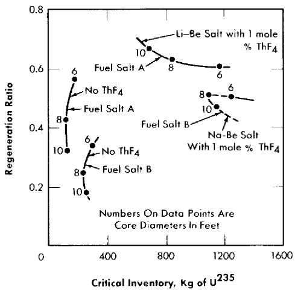  
FIG. 14-8. Comparison of regeneration ratio and critical inventory in two-region, homogeneous, molten fluoride-salt reactors fueled with $\mathrm{U}^{235}$ . Fuel salt $A$ : 37 mole $\%$ $\mathrm{BeF}_2$ plus 63 mole $\%$ Li $^7$ F. Fuel salt $B$ : 46 mole $\%$ $\mathrm{BeF}_2$ plus 54 mole $\%$ NaF.

and the regeneration ratio falls from 0.62 to 0.50. Details of the neutron balances are given in Table 14-3.

Reactivity coefficients. By means of a series of calculations in which the thermal base, the core radius, and the density of the fuel salt are varied independently, the components of the temperature coefficient of reactivity of a reactor can be estimated as illustrated below for a core 8 ft in diameter and a thorium concentration of $0.75\mathrm{mole}\%$ in the fuel salt at $1150^{\circ}\mathrm{F}$ . From the expression

$$
k = f (T, \rho , R),
$$

where $k$ is the multiplication constant, $T$ is the mean temperature in the core, $\rho$ is the mean density of the fuel salt in the core, and $R$ is the core radius, it follows that

$$
\frac {1}{k} \frac {d k}{d T} = \frac {1}{k} \left(\frac {\partial k}{\partial T}\right) _ {\rho , R} + \frac {1}{k} \left(\frac {\partial k}{\partial R}\right) _ {\rho , T} \frac {d R}{d T} + \frac {1}{k} \left(\frac {\partial k}{\partial \rho}\right) _ {R, T} \frac {d \rho}{d T}, \tag {14-1}
$$

where the term $(1 / k)(\partial k / \partial T)_{\rho ,R}$ represents the fractional change in $k$ due to a change in the thermal base for slowing down of neutrons, the term $(1 / k)(\partial k / \partial \rho)_{R,T}$ represents the change due to expulsion of fuel from the core by thermal expansion of the fluid, and the term $(1 / k)(\partial k / \partial R)_{\rho ,T}$ represents the change due to an increase in core volume and fuel holding

# TABLE 14-3

INITIAL NUCLEAR CHARACTERISTICS OF TWO-REGION, HOMOGENEOUS, MOLTEN SODIUM-BERYLLIUM FLUORIDE REACTORS FUELED WITH U235

Fuel salt: 53 mole $\%$ NaF + 46 mole $\%$ BcF $_2$ + 1 mole $\%$ (ThF $_4$ + UF $_4$ ).

Blanket salt: 58 mole % NaF + 35 mole % BeF $_2$ + 7 mole % ThF $_4$ .

Total power: 600 Mw (heat). External fuel volume: 339 ft3.

<table><tr><td>Case number</td><td>35</td><td>36</td><td>37</td><td>38</td><td>39</td><td>40</td></tr><tr><td>Core diameter, ft</td><td>6</td><td>6</td><td>8</td><td>8</td><td>10</td><td>10</td></tr><tr><td>ThF4in fuel salt, mole %</td><td>0</td><td>1</td><td>0</td><td>1</td><td>0</td><td>1</td></tr><tr><td>U235in fuel salt, mole %</td><td>0.174</td><td>0.7014</td><td>0.091</td><td>0.465</td><td>0.070</td><td>0.282</td></tr><tr><td>U235atom density*</td><td>6.17</td><td>24.9</td><td>3.24</td><td>16.5</td><td>2.47</td><td>124.0</td></tr><tr><td>Critical mass, kg of U235</td><td>76.4</td><td>308</td><td>95.1</td><td>484</td><td>142</td><td>710</td></tr><tr><td>Critical inventory, kg of U235</td><td>306</td><td>1230</td><td>215</td><td>1100</td><td>234</td><td>1170</td></tr><tr><td>Neutron absorption ratios†</td><td></td><td></td><td></td><td></td><td></td><td></td></tr><tr><td>U235(fissions)</td><td>0.7417</td><td>0.6986</td><td>0.7737</td><td>0.7011</td><td>0.7862</td><td>0.7081</td></tr><tr><td>U235(n-γ)</td><td>0.2583</td><td>0.3014</td><td>0.2263</td><td>0.2989</td><td>0.2138</td><td>0.2919</td></tr><tr><td>Na-Be-F in fuel salt</td><td>0.2731</td><td>0.1153</td><td>0.4755</td><td>0.1411</td><td>0.6119</td><td>0.2306</td></tr><tr><td>Core vessel</td><td>0.1181</td><td>0.0476</td><td>0.1125</td><td>0.0392</td><td>0.0917</td><td>0.2306</td></tr><tr><td>Na-Be-F in blanket salt</td><td>0.0821</td><td>0.0431</td><td>0.0660</td><td>0.0315</td><td>0.0495</td><td>0.2306</td></tr><tr><td>Leakage</td><td>0.0222</td><td>0.0182</td><td>0.0145</td><td>0.0116</td><td>0.0105</td><td>0.2306</td></tr><tr><td>U238in fuel salt</td><td>0.0360</td><td>0.0477</td><td>0.0263</td><td>0.0484</td><td>0.0232</td><td>0.0467</td></tr><tr><td>Th in fuel salt</td><td></td><td>0.2418</td><td></td><td>0.3150</td><td></td><td>0.3670</td></tr><tr><td>Th in blanket salt</td><td>0.3004</td><td>0.2120</td><td>0.2163</td><td>0.1450</td><td>0.1550</td><td>0.1048</td></tr><tr><td>Neutron yield, η</td><td>1.83</td><td>1.73</td><td>1.91</td><td>1.73</td><td>1.94</td><td>1.75</td></tr><tr><td>Median fission energy, ev</td><td>1.3</td><td>190</td><td>0.20</td><td>36</td><td>0.087</td><td></td></tr><tr><td>Thermal fissions, %</td><td>17</td><td>0.42</td><td>34</td><td>1.4</td><td>4.1</td><td></td></tr><tr><td>n-γ capture-to-fission ratio, α</td><td>0.25</td><td>0.43</td><td>0.29</td><td>0.43</td><td>0.27</td><td>0.41</td></tr><tr><td>Regeneration ratio</td><td>0.34</td><td>0.50</td><td>0.24</td><td>0.51</td><td>0.18</td><td>0.52</td></tr></table>

\*Atoms $(\times 10^{-19}) / \mathrm{cc}$   
†Neutrons absorbed per neutron absorbed in U $^{235}$ .

capacity. The coefficient $dR / dT$ may be related to the coefficient for linear expansion, $\alpha$ , of INOR-8, viz:

$$
\frac {d R}{d T} = R \alpha .
$$

Likewise the term $\frac{d\rho}{dT}$ may be related to the coefficient of cubical expansion, $\beta$ , of the fuel salt:

$$
\frac {d \rho}{d T} = - \rho \beta .
$$

From the nuclear calculations, the components of the temperature coefficient were estimated, as follows:

$$
\frac {1}{k} \left(\frac {\partial k}{\partial T}\right) _ {\rho , R} = - (0. 1 3 \pm 0. 0 2) \times 1 0 ^ {- 5} / ^ {\circ} \mathrm {F},
$$

$$
\frac {R}{k} \left(\frac {\partial k}{\partial R}\right) _ {\rho , T} = + 0. 4 1 2 \pm 0. 0 0 0 5,
$$

$$
\frac {\rho}{k} \left(\frac {\partial k}{\partial \rho}\right) _ {R, T} = - 0. 4 0 5 \pm 0. 0 0 0 5.
$$

The linear coefficient of expansion, $\alpha$ , of INOR-8 was estimated to be $(8.0 \pm 0.5) \times 10^{-6} / {}^{\circ}\mathrm{F}$ [5], and the coefficient of cubical expansion, $\beta$ , of the fuel was estimated to be $(9.889 \pm 0.005) \times 10^{-5} / {}^{\circ}\mathrm{F}$ from a correlation of the density given by Powers [6]. Substitution of these values in Eq. (14-1) gives

$$
\frac {1}{k} \frac {d k}{d T} = - (3. 8 0 \pm 0. 0 4) \times 1 0 ^ {- 5} / ^ {\circ} \mathrm {F}
$$

for the temperature coefficient of reactivity of the fuel. In this calculation, the effects of changes with temperature in Doppler broadening and saturation of the resonances in Th and $\mathrm{U}^{235}$ were not taken into account. Since the effective widths of the resonances would be increased at higher temperatures, the thorium would contribute a reactivity decrease and the $\mathrm{U}^{235}$ an increase. These effects are thought to be small, and they tend to cancel each other.

Additional coefficients of interest are those for $\mathbf{U}^{235}$ and thorium. For the 8-ft-diameter cores,

$$
\frac {N \left(\mathrm {U} ^ {2 3 5}\right)}{k} \left(\frac {\partial k}{\partial N \left(\mathrm {U} ^ {2 3 5}\right)}\right) _ {N (\mathrm {T h})} = \frac {1 + \left[ 0 . 1 7 N _ {c} \left(\mathrm {U} ^ {2 3 5}\right) \times 1 0 ^ {- 1 9} \right]}{2 . 4 7 N _ {c} \left(\mathrm {U} ^ {2 3 5}\right) \times 1 0 ^ {- 1 9}}
$$

and

$$
\frac {N (\mathrm {T h})}{k} \left(\frac {\partial k}{\partial N (\mathrm {T h})}\right) _ {N (\mathrm {U} ^ {2 3 5})} = \frac {N (\mathrm {T h})}{k} \left(\frac {\partial k}{\partial N (\mathrm {U} ^ {2 3 5})}\right) _ {N (\mathrm {T h})} \frac {d N _ {c} (\mathrm {U} ^ {2 3 5})}{d N (\mathrm {T h})},
$$

where

$$
\frac {d N _ {c} (\mathrm {U} ^ {2 3 5})}{d N (\mathrm {T h})} = 0. 0 8 0 5 e ^ {0. 0 5 9 5 N (\mathrm {T h}) \times 1 0 ^ {- 1 9}}.
$$

In these equations, $N(\mathrm{U}^{235})$ represents the atomic density of $\mathrm{U}^{235}$ in atoms per cubic centimeter, $N_{c}(\mathrm{U}^{235})$ is the critical density of $\mathrm{U}^{235}$ , and $N(\mathrm{Th})$ is the density of thorium atoms.

Heat release in core vessel and blanket. The core vessel of a molten-salt reactor is heated by gamma radiation emanating from the core and blanket and from within the core vessel itself. Estimates of the gamma heating can be obtained by detailed analyses of the type illustrated by Alexander and Mann [7]. The gamma-ray heating in the core vessel of a reactor with an 8-ft-diameter core and $0.5\mathrm{mole}\% \mathrm{ThF_4}$ in the fuel salt has been estimated to be the following:

<table><tr><td>Source</td><td>Heat release rate, w/cm3</td></tr><tr><td>Radioactive decay in core</td><td>1.4</td></tr><tr><td>Fission, n-γ capture, and inelastic scattering in core</td><td>5.2</td></tr><tr><td>n-γ capture in core vessel</td><td>4.5</td></tr><tr><td>n-γ capture in blanket</td><td>0.3</td></tr><tr><td>Total</td><td>11.4</td></tr></table>

Estimates of gamma-ray source strengths can be used to provide a crude estimate of the gamma-ray current entering the blanket. For the 8-ft-diameter core, the core contributes $45.3\mathrm{~w}$ of gamma energy per square centimeter to the blanket, and the core vessel contributes $6.8\mathrm{~w/cm^2}$ , which, multiplied by the surface area of the core vessel, gives a total energy escape into the blanket of $9.7\mathrm{Mw}$ . Some of this energy will be reflected into the core, of course, and some will escape from the reactor vessel, and

therefore the value of $9.7\mathrm{Mw}$ is an upper limit. To this may be added the heat released by capture of neutrons in the blanket. From the Ocusol-A calculation for the 8-ft-diameter core and a fuel salt containing $0.5\mathrm{mole}\%$ $\mathrm{ThF_4}$ it was found that 0.176 of the neutrons would be captured in the blanket. If an energy release of $7\mathrm{MeV}/$ capture is assumed, the heat release at a power level of $600\mathrm{Mw}$ (heat) is estimated to be $8.6\mathrm{Mw}$ . The total is thus $18.3\mathrm{Mw}$ or, say, $20\pm 5\mathrm{Mw}$ , to allow for errors.

No allowance was made for fissions in the blanket. These would add 6 Mw for each $1\%$ of the fissions occurring in the blanket. Thus it appears that the heat release rate in the blanket might range up to 50 Mw.

14-1.2 Intermediate states. Without reprocessing of fuel salt. The nuclear performance of a homogeneous molten-salt reactor changes during operation at power because of the accumulation of fission products and nonfissionable isotopes of uranium. It is necessary to add $\mathrm{U}^{235}$ to the fuel salt to overcome these poisons and, as a result, the neutron spectrum is hardened and the regeneration ratio decreases because of the accompanying decrease in $\eta$ for $\mathrm{U}^{235}$ and the increased competition for neutrons by the poisons relative to thorium. The accumulation of the superior fuel $\mathrm{U}^{233}$ compensates for these effects only in part. The decline in the regeneration ratio and the increase in the critical inventory during the first year of operation of three reactors having 8-ft-diameter cores charged, respectively, with 0.25, 0.75, and 1 mole $\%$ $\mathrm{ThF_4}$ are illustrated in Fig. 14-9. The critical inventory increases by about $300\mathrm{kg}$ , and the regeneration ratio falls about $16\%$ . The gross burnup of fuel in the reactor charged with 1 mole $\%$ $\mathrm{ThF_4}$ and operated at $600\mathrm{Mw}$ with a load factor of $0.80\%$ amounts to about $0.73\mathrm{kg/day}$ . The $\mathrm{U}^{235}$ burnup falls from this value as $\mathrm{U}^{233}$ assumes part of the load. During the first month of operation, the $\mathrm{U}^{235}$ burnup averages $0.69\mathrm{kg/day}$ . Overcoming the poisons requires $1.53\mathrm{kg}$ more and brings the feed rate to $2.22\mathrm{kg/day}$ . The initial rate is high because of the holdup of bred fuel in the form of $\mathrm{Pa}^{233}$ . As the concentration of this isotope approaches equilibrium, the $\mathrm{U}^{235}$ feed rate falls rapidly. At the end of the first year the burnup rate has fallen to $0.62\mathrm{kg/day}$ and the feed rate to $1.28\mathrm{kg/day}$ . At this time $\mathrm{U}^{233}$ contributes about $12\%$ of the fissions. The reactor contains $893\mathrm{kg}$ of $\mathrm{U}^{235}$ , $70\mathrm{kg}$ of $\mathrm{U}^{233}$ , $7\mathrm{kg}$ of $\mathrm{Pu}^{239}$ , $62\mathrm{kg}$ of $\mathrm{U}^{236}$ , and $181\mathrm{kg}$ of fission products. The $\mathrm{U}^{236}$ and the fission products capture 1.8 and $3.8\%$ of all neutrons and impair the regeneration ratio by 0.10 units. Details of the inventories and concentrations are given in Table 14-4.

With reprocessing of fuel salt. If the fission products were allowed to accumulate indefinitely, the fuel inventory would become prohibitively large and the neutron economy would become very poor. However, if the fission products are removed, as described in Chapter 12, at a rate such that the

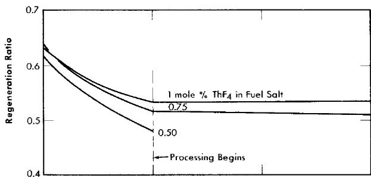

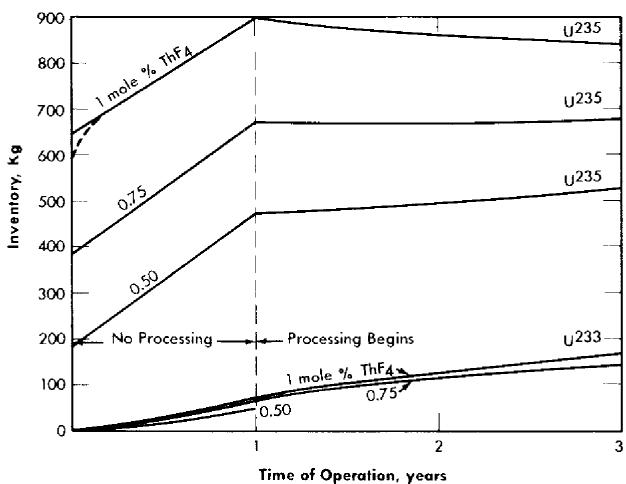  
FIG. 14-9. Operating performance of two-region, homogeneous, molten fluoridesalt reactors fueled with $\mathbf{U}^{235}$ . Core diameter, 8 ft; total power, 600 Mw (heat); load factor, 0.80.

equilibrium inventory is, for example, equal to the first year's production, then the increase in $\mathbf{U}^{235}$ inventory and the decrease in regeneration ratio are effectively arrested, as shown in Fig. 14-10. The fuel-addition rate drops immediately from 1.28 to $0.73\mathrm{kg / day}$ when processing is started. At the end of two years, the addition rate is down to $0.50\mathrm{kg / day}$ , and it continues to decline slowly to $0.39\mathrm{kg / day}$ after 20 years of operation. The nonfissionable isotopes of uranium continue to accumulate, of course, but these are nearly compensated by the ingrowth of $\mathbf{U}^{233}$ . As shown in Fig. 14-10, the inventory of $\mathbf{U}^{235}$ actually decreases for several years in a typical case, and then increases only moderately during a lifetime of 20 years.

The rapid increase in critical inventory of $\mathbf{U}^{235}$ during the first year can be avoided by partial withdrawal of thorium. In Fig. 14-10 the dashed lines indicate the course of events when thorium is removed at the rate of $1/900$ per day. Burnup reduces the thorium concentration by another

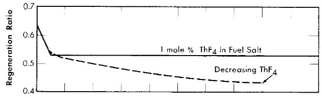

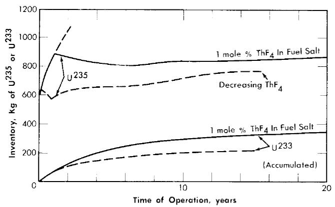  
FIG. 14-10. Long-term nuclear performance of typical two-region, homogeneous, molten fluoride-salt reactors fueled with $\mathbf{U}^{235}$ . Core diameter, 8 ft; total power, 600 Mw (heat); load factor, 0.80.

1/4300 per day. The $\mathrm{U}^{235}$ inventory rises to 826 kg and then falls, at the end of eight months, to 587 kg. At this time, the processing rate is increased to 1/240 per day (eight-month cycle), but the thorium is returned to the core and the thorium concentration falls thereafter only by burnup. It may be seen that the $\mathrm{U}^{235}$ inventory creeps up slowly and that the regeneration ratio falls slowly. The increase in $\mathrm{U}^{235}$ inventory could have been prevented by withdrawing thorium at a small rate; however, the regeneration ratio would have fallen somewhat more rapidly, and more $\mathrm{U}^{235}$ feed would have been required to compensate for burnup.

# 14-2. HOMOGENEOUS REACTORS FUELED WITH $\mathbf{U}^{233}$

Uranium-233 is a superior fuel for use in molten fluoride-salt reactors in almost every respect. The fission cross section in the intermediate range of neutron energies is greater than the fission cross sections of $\mathbf{U}^{235}$ and $\mathrm{Pu}^{239}$ . Thus initial critical inventories are less, and less additional fuel is required to override poisons. Also, the parasitic cross section is substantially less, and fewer neutrons are lost to radiative capture. Further, the radiative captures result in the immediate formation of a fertile iso

# TABLE 14-4

NUCLEAR PERFORMANCE OF A TWO-REGION, HOMOGENEOUS, MOLTEN FLUORIDE-SALT REACTOR FUELED WITH U235 AND CONTAINING 1 MOLE % THF4 IN THE FUEL SALT

Core diameter: 8 ft.

External fuel volume: 339 ft3.

Total power: 600 Mw (heat).

Load factor: 0.8.

<table><tr><td rowspan="2"></td><td colspan="3">Initial state</td><td colspan="3">After 1 year</td></tr><tr><td>Inventory, kg</td><td>Absorptions, %</td><td>Fissions, %</td><td>Inventory, kg</td><td>Absorptions, %</td><td>Fissions, %</td></tr><tr><td colspan="7">Core elements</td></tr><tr><td>Th232</td><td>2,100</td><td>20.3</td><td></td><td>2,100</td><td>16.7</td><td></td></tr><tr><td>Pa233</td><td></td><td></td><td></td><td>8.2</td><td>0.3</td><td></td></tr><tr><td>U233</td><td></td><td></td><td></td><td>61.0</td><td>5.9</td><td>12.5</td></tr><tr><td>U234</td><td></td><td></td><td></td><td>1.9</td><td>0.0</td><td></td></tr><tr><td>U235</td><td>604</td><td>55.4</td><td>100</td><td>893</td><td>49.3</td><td>86.3</td></tr><tr><td>U236</td><td></td><td></td><td></td><td>62.2</td><td>1.8</td><td></td></tr><tr><td>Np237</td><td></td><td></td><td></td><td>4.2</td><td>0.2</td><td></td></tr><tr><td>U238</td><td>45.3</td><td>2.2</td><td></td><td>57.9</td><td>2.0</td><td></td></tr><tr><td>Pu239</td><td></td><td></td><td></td><td>6.8</td><td>0.8</td><td>1.2</td></tr><tr><td colspan="7">Fission fragments</td></tr><tr><td>Li7</td><td>3,920</td><td>1.9</td><td></td><td>181</td><td>3.8</td><td></td></tr><tr><td>Be9</td><td>3,008</td><td>0.6</td><td></td><td>3,920</td><td>0.9</td><td></td></tr><tr><td>F19</td><td>24,000</td><td>3.2</td><td></td><td>3,008</td><td>0.5</td><td></td></tr><tr><td colspan="7">Blanket element</td></tr><tr><td>U233</td><td></td><td></td><td></td><td>8.7</td><td></td><td></td></tr><tr><td>Total fuel</td><td>604</td><td></td><td></td><td>963</td><td></td><td></td></tr><tr><td>U235 burnup rate, kg/day</td><td>0.69</td><td></td><td></td><td>0.62</td><td></td><td></td></tr><tr><td>U235 feed rate, kg/day</td><td>2.22</td><td></td><td></td><td>1.28-0.73</td><td></td><td></td></tr><tr><td>Regeneration ratio</td><td>0.64</td><td></td><td></td><td>0.53</td><td></td><td></td></tr><tr><td rowspan="2"></td><td colspan="3">After 2 years</td><td colspan="3">After 5 years</td></tr><tr><td>Inventory, kg</td><td>Absorptions, %</td><td>Fissions, %</td><td>Inventory, kg</td><td>Absorptions, %</td><td>Fissions, %</td></tr><tr><td colspan="7">Core elements</td></tr><tr><td>Th232</td><td>2,100</td><td>16.3</td><td></td><td>2,100</td><td>15.4</td><td></td></tr><tr><td>Pa233</td><td>7.9</td><td>0.2</td><td></td><td>7.5</td><td>0.2</td><td></td></tr><tr><td>U233</td><td>110</td><td>9.7</td><td>20.8</td><td>201</td><td>15.3</td><td>33.0</td></tr><tr><td>U234</td><td>6.5</td><td>0.1</td><td></td><td>27.1</td><td>0.4</td><td></td></tr><tr><td>U235</td><td>863</td><td>44.3</td><td>77.4</td><td>818</td><td>36.9</td><td>64.1</td></tr><tr><td>U236</td><td>115</td><td>3.1</td><td></td><td>222</td><td>5.2</td><td></td></tr><tr><td>Np237</td><td>0.8</td><td>0.4</td><td></td><td>1.8</td><td>0.8</td><td></td></tr><tr><td>U238</td><td>69.7</td><td>2.3</td><td></td><td>9.0</td><td>2.7</td><td></td></tr><tr><td>Pu239</td><td>12.0</td><td>1.3</td><td>1.8</td><td>24.3</td><td>2.0</td><td>2.9</td></tr><tr><td>Fission fragments</td><td>181</td><td>3.6</td><td></td><td>181</td><td>3.1</td><td></td></tr><tr><td>Li7</td><td>3,920</td><td>0.8</td><td></td><td>3,920</td><td>0.6</td><td></td></tr><tr><td>Be9</td><td>3,008</td><td>0.5</td><td></td><td>3,008</td><td>0.5</td><td></td></tr><tr><td>F19</td><td>24,000</td><td>3.0</td><td></td><td>24,000</td><td>3.0</td><td></td></tr><tr><td colspan="7">Blanket element</td></tr><tr><td>U233</td><td>16</td><td></td><td></td><td>24</td><td></td><td></td></tr><tr><td>Total fuel</td><td>990</td><td></td><td></td><td>1,045</td><td></td><td></td></tr><tr><td>U235 burnup rate, kg/day</td><td>0.58</td><td></td><td></td><td>0.47</td><td></td><td></td></tr><tr><td>U235 feed rate, kg/day</td><td>0.50</td><td></td><td></td><td>0.45</td><td></td><td></td></tr><tr><td>Regeneration ratio</td><td>0.53</td><td></td><td></td><td>0.54</td><td></td><td></td></tr><tr><td rowspan="2"></td><td colspan="3">After 10 years</td><td colspan="3">After 20 years</td></tr><tr><td>Inventory, kg</td><td>Absorptions, %</td><td>Fissions, %</td><td>Inventory, kg</td><td>Absorptions, %</td><td>Fissions, %</td></tr><tr><td colspan="7">Core elements</td></tr><tr><td>Th232</td><td>2,100</td><td>14.6</td><td></td><td>2,100</td><td>13.7</td><td></td></tr><tr><td>Pa233</td><td>7.1</td><td>0.2</td><td></td><td>6.7</td><td>0.2</td><td></td></tr><tr><td>U233</td><td>266</td><td>17.6</td><td>38.3</td><td>322</td><td>18.8</td><td>41.0</td></tr><tr><td>U234</td><td>64.4</td><td>0.8</td><td></td><td>124</td><td>1.4</td><td></td></tr><tr><td>U235</td><td>831</td><td>33.5</td><td>58.2</td><td>872</td><td>31.7</td><td>54.9</td></tr><tr><td>U236</td><td>328</td><td>6.7</td><td></td><td>450</td><td>7.9</td><td></td></tr><tr><td>Np237</td><td>2.6</td><td>0.9</td><td></td><td>3.2</td><td>1.0</td><td></td></tr><tr><td>U238</td><td>10.8</td><td>2.9</td><td></td><td>12.9</td><td>3.0</td><td></td></tr><tr><td>Pu239</td><td>37.3</td><td>2.4</td><td>3.5</td><td>52.6</td><td>2.8</td><td>4.1</td></tr><tr><td>Fission fragments</td><td>181</td><td>2.7</td><td></td><td>181</td><td>2.4</td><td></td></tr><tr><td>Li7</td><td>3,920</td><td>0.5</td><td></td><td>3,920</td><td>0.4</td><td></td></tr><tr><td>Be9</td><td>3,008</td><td>0.5</td><td></td><td>3,008</td><td>0.5</td><td></td></tr><tr><td>F19</td><td>24,000</td><td>3.0</td><td></td><td>24,000</td><td>3.0</td><td></td></tr><tr><td colspan="7">Blanket element</td></tr><tr><td>U233</td><td>28</td><td></td><td></td><td>33</td><td></td><td></td></tr><tr><td>Total fuel</td><td>1,129</td><td></td><td></td><td>1,232</td><td></td><td></td></tr><tr><td>U235 burnup rate, kg/day</td><td>0.41</td><td></td><td></td><td>0.38</td><td></td><td></td></tr><tr><td>U235 feed rate, kg/day</td><td>0.44</td><td></td><td></td><td>0.39</td><td></td><td></td></tr><tr><td>Regeneration ratio</td><td>0.533</td><td></td><td></td><td>0.530</td><td></td><td></td></tr></table>

tope, $\mathrm{U}^{234}$ . The rate of accumulation of $\mathrm{U}^{236}$ is orders of magnitude smaller than with $\mathrm{U}^{235}$ as a fuel, and buildup of $\mathrm{Np}^{237}$ and $\mathrm{Pu}^{239}$ is negligible.

The mean neutron energy is rather nearer to thermal in these reactors than it is in the corresponding $\mathrm{U}^{235}$ cases. Consequently, losses to core vessel and to core salt tend to be higher. Both losses will be reduced substantially at higher thorium concentrations.

14-2.1 Initial states. Results from a parametric study of the nuclear characteristics of two-region, homogeneous, molten fluoride-salt reactors fueled with $\mathrm{U}^{233}$ are given in Table 14-5. The core diameters considered range from 3 to 10 ft, and the thorium concentrations range from 0.25 to 1 mole %. Although the regeneration ratios are less than unity, they are very good compared with those obtained with $\mathrm{U}^{235}$ . With 1 mole % $\mathrm{ThF_4}$ in an 8-ft-diameter core, the $\mathrm{U}^{233}$ inventory was only $196\mathrm{kg}$ , and the regeneration ratio was 0.91.

The regeneration ratios and fuel inventories of reactors of various diameters containing 0.25 mole $\%$ thorium and fueled with $\mathrm{U}^{235}$ or $\mathrm{U}^{233}$ are compared in Fig. 14-11. The superiority of $\mathrm{U}^{233}$ is obvious.

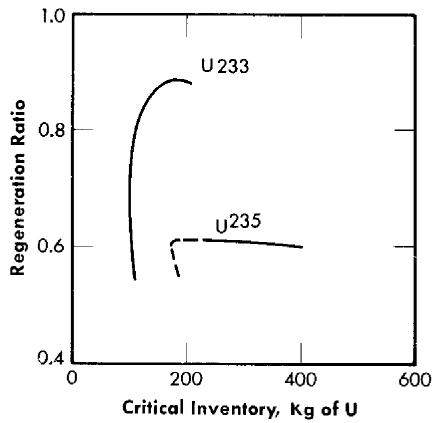  
FIG. 14-11. Comparison of regeneration ratios in molten-salt reactors containing 0.25 mole $\%$ ThF $_4$ and U $^{235}$ -enriched fuel.

14-2.2 Intermediate states. Calculations of the long-term performance of one reactor (Case 51, Table 14-5) with $\mathrm{U}^{233}$ as the fuel are described below. The core diameter used was 8 ft and the thorium concentration was $0.75\mathrm{~mol}\%$ . The changes in inventory of $\mathrm{U}^{233}$ and regeneration ratio are listed in Table 14-6. During the first year of operation, the inventory rises from 129 to $199\mathrm{kg}$ , and the regeneration ratio falls from 0.82 to 0.71. If the reprocessing required to hold the concentration of fission products

Core diameter: 8 ft.  
External fuel volume: 339 ft3.

Total power: 600 Mw (heat). Load factor: 0.8.

TABLE 14-5   
NUCLEAR CHARACTERISTICS OF TWO-REGION, HOMOGENEOUS, MOLTEN FLUORIDE-SALT REACTORS FUELED WITH U233   

<table><tr><td>Case number</td><td>41</td><td>42</td><td>43</td><td>44</td><td>45</td><td>46</td></tr><tr><td>Fuel and blanket salts*</td><td>1</td><td>1</td><td>1</td><td>1</td><td>1</td><td>1</td></tr><tr><td>Core diameter, ft</td><td>3</td><td>4</td><td>4</td><td>5</td><td>6</td><td>6</td></tr><tr><td>ThF4in fuel salt, mole %</td><td>0</td><td>0</td><td>0.25</td><td>0</td><td>0.25</td><td>0.25</td></tr><tr><td>U233 in fuel salt, mole %</td><td>0.592</td><td>0.158</td><td>0.233</td><td>0.106</td><td>0.048</td><td>0.066</td></tr><tr><td>U233 atom density†</td><td>21.0</td><td>6.09</td><td>8.26</td><td>3.75</td><td>1.66</td><td>2.36</td></tr><tr><td>Critical mass, kg of U233</td><td>64.9</td><td>22.3</td><td>30.3</td><td>26.9</td><td>20.5</td><td>29.2</td></tr><tr><td>Critical inventory, kg of U233</td><td>1620</td><td>248</td><td>337</td><td>166</td><td>82.0</td><td>117</td></tr><tr><td>Neutron absorption ratios‡</td><td></td><td></td><td></td><td></td><td></td><td></td></tr><tr><td>U233 (fissions)</td><td>0.8754</td><td>0.8706</td><td>0.8665</td><td>0.8725</td><td>0.8814</td><td>0.8779</td></tr><tr><td>U233 (n-γ)</td><td>0.1246</td><td>0.1294</td><td>0.1335</td><td>0.1275</td><td>0.1186</td><td>0.1221</td></tr><tr><td>Be-Li-F in fuel salt</td><td>0.0639</td><td>0.1061</td><td>0.0860</td><td>0.1472</td><td>0.3180</td><td>0.2297</td></tr><tr><td>Core vessel</td><td>0.0902</td><td>0.1401</td><td>0.1093</td><td>0.1380</td><td>0.1983</td><td>0.1508</td></tr><tr><td>Li-Be-F in blanket salt</td><td>0.0233</td><td>0.0234</td><td>0.0203</td><td>0.0196</td><td>0.0215</td><td>0.0179</td></tr><tr><td>Leakage</td><td>0.0477</td><td>0.0310</td><td>0.0306</td><td>0.0193</td><td>0.0160</td><td>0.0157</td></tr><tr><td>Th in fuel salt</td><td></td><td></td><td>0.1095</td><td>0.1593</td><td></td><td>0.1973</td></tr><tr><td>Th in blanket salt</td><td>0.9722</td><td>0.8857</td><td>0.8193</td><td>0.7066</td><td>0.6586</td><td>0.5922</td></tr><tr><td>Neutron yield, η</td><td>2.20</td><td>2.19</td><td>2.18</td><td>2.19</td><td>2.21</td><td>2.20</td></tr><tr><td>Median fission energy, ev</td><td>174</td><td>14</td><td>19</td><td>2.9</td><td>0.33</td><td>1.2</td></tr><tr><td>Thermal fissions, %</td><td>0.053</td><td>8.0</td><td>2.3</td><td>16</td><td>38</td><td>29</td></tr><tr><td>n-γ capture-to-fission ratio, α</td><td>0.14</td><td>0.15</td><td>0.15</td><td>0.15</td><td>0.13</td><td>0.14</td></tr><tr><td>Regeneration ratio</td><td>0.97</td><td>0.89</td><td>0.93</td><td>0.87</td><td>0.66</td><td>0.79</td></tr></table>

TABLE 14-5 (continued)   

<table><tr><td>Case number</td><td>47</td><td>48</td><td>49</td><td>50</td><td>51</td></tr><tr><td>Fuel and blanket salts*</td><td>1</td><td>1</td><td>1</td><td>1</td><td>2</td></tr><tr><td>Core diameter, ft</td><td>8</td><td>8</td><td>10</td><td>10</td><td>8</td></tr><tr><td>ThF4in fuel salt, mole %</td><td>0.25</td><td>1</td><td>0.25</td><td>1</td><td>0.75</td></tr><tr><td>U233in fuel salt, mole %</td><td>0.039</td><td>0.078</td><td>0.031</td><td>0.063</td><td>0.0597</td></tr><tr><td>U233atom density†</td><td>1.40</td><td>2.95</td><td>1.10</td><td>2.29</td><td>1.97</td></tr><tr><td>Critical mass, kg of U233</td><td>41.1</td><td>86.6</td><td>63.0</td><td>131</td><td>58.8</td></tr><tr><td>Critical inventory, kg of U233</td><td>93.1</td><td>196</td><td>104</td><td>216</td><td>129</td></tr><tr><td>Neutron absorption ratios‡</td><td></td><td></td><td></td><td></td><td></td></tr><tr><td>U233(fissions)</td><td>0.8850</td><td>0.8755</td><td>0.8881</td><td>0.8781</td><td>0.8809</td></tr><tr><td>U233(n-γ)</td><td>0.1150</td><td>0.1245</td><td>0.1119</td><td>0.1219</td><td>0.1191</td></tr><tr><td>Be-Li-F in fuel salt</td><td>0.3847</td><td>0.1899</td><td>0.5037</td><td>0.2360</td><td>0.2458</td></tr><tr><td>Core vessel</td><td>0.1406</td><td>0.0778</td><td>0.1168</td><td>0.0629</td><td>0.1168</td></tr><tr><td>Li-Be-F in blanket salt</td><td>0.0141</td><td>0.0095</td><td>0.0108</td><td>0.0071</td><td>0.0187</td></tr><tr><td>Leakage</td><td>0.0095</td><td>0.0090</td><td>0.0068</td><td>0.0065</td><td>0.0050</td></tr><tr><td>Th in fuel salt</td><td>0.2513</td><td>0.5768</td><td>0.2852</td><td>0.6507</td><td>0.4903</td></tr><tr><td>Th in blanket salt</td><td>0.4211</td><td>0.3344</td><td>0.3058</td><td>0.2408</td><td>0.3325</td></tr><tr><td>Neutron yield, η</td><td>2.22</td><td>2.20</td><td>2.23</td><td>2.20</td><td>2.21</td></tr><tr><td>Median fission energy, ev</td><td>0.20</td><td>1.1</td><td>50% Th</td><td>3.2</td><td>0.68</td></tr><tr><td>Thermal fissions, %</td><td>43</td><td>24</td><td>50</td><td>30</td><td>34</td></tr><tr><td>n-γ capture-to-fission ratio, α</td><td>0.13</td><td>0.14</td><td>0.13</td><td>0.14</td><td>0.14</td></tr><tr><td>Regeneration ratio</td><td>0.67</td><td>0.91</td><td>0.59</td><td>0.89</td><td>0.82</td></tr></table>

*Fuel salt No. 1: 31 mole % BeF $_2$ + 69 mole % LiF + UF $_4$ + ThF $_4$   
Blanket salt No. 1: 25 mole % ThF₄ + 75 mole % LiF   
Fuel salt No. 2: 37 mole $\%$ BeF $_2$ + 63 mole $\%$ LiF + UF $_4$ + ThF $_4$   
Blanket salt No. 2: 13 mole % ThF₄ + 16 mole % BeF₂ + 71 mole % LiF

†Atoms (× 10-19)/cc.

$\ddagger$ Neutrons absorbed per absorption in $\mathbf{U}^{233}$

NUCLEAR PERFORMANCE OF A TWO-REGION, HOMOGENEOUS, MOLTEN FLUORIDE-SALT REACTOR FUELED WITH U²³³ AND CONTAINING 0.75 MOLE % THF₄ IN THE FUEL SALT

Core diameter: 8 ft.  
External fuel volume: 339 ft3.

Total power: 600 Mw (heat). Load factor: 0.8.

TABLE 14-6   

<table><tr><td rowspan="2"></td><td colspan="3">Initial state</td><td colspan="3">After 1 year</td></tr><tr><td>Inventory, kg</td><td>Absorptions, %</td><td>Fissions, %</td><td>Inventory, kg</td><td>Absorptions, %</td><td>Fissions, %</td></tr><tr><td>Core elements Th232</td><td>1,572</td><td>22.2</td><td></td><td>1,572</td><td>19.1</td><td></td></tr><tr><td>Pa233</td><td></td><td></td><td></td><td>9.4</td><td>0.5</td><td></td></tr><tr><td>U233</td><td>129</td><td>45.2</td><td>100</td><td>199</td><td>45.3</td><td>99.5</td></tr><tr><td>U234</td><td></td><td></td><td></td><td>23.3</td><td>0.9</td><td></td></tr><tr><td>U235</td><td></td><td></td><td></td><td>1.9</td><td>0.3</td><td>0.5</td></tr><tr><td>U236</td><td></td><td></td><td></td><td>0.1</td><td>0.1</td><td></td></tr><tr><td>Np237</td><td></td><td></td><td></td><td></td><td></td><td></td></tr><tr><td>U238</td><td></td><td></td><td></td><td></td><td></td><td></td></tr><tr><td>Pu239</td><td></td><td></td><td></td><td></td><td></td><td></td></tr><tr><td>Fission fragments</td><td></td><td></td><td></td><td>181</td><td>7.9</td><td></td></tr><tr><td>Li6</td><td>3,920</td><td>6.5</td><td></td><td>3,920</td><td>3.4</td><td></td></tr><tr><td>Be9</td><td>3,004</td><td>0.8</td><td></td><td>3,008</td><td>0.7</td><td></td></tr><tr><td>F19</td><td>24,000</td><td>4.0</td><td></td><td>24,000</td><td>3.5</td><td></td></tr><tr><td>Blanket element U233</td><td></td><td></td><td></td><td>8.6</td><td></td><td></td></tr><tr><td>Total fuel</td><td>129</td><td></td><td></td><td>210</td><td></td><td></td></tr><tr><td>U233 feed rate, kg/day</td><td>0.790</td><td></td><td></td><td>0.370-0.189</td><td></td><td></td></tr><tr><td>Regeneration ratio</td><td>0.82</td><td></td><td></td><td>0.71</td><td></td><td></td></tr><tr><td rowspan="2"></td><td colspan="3">After 2 years</td><td colspan="3">After 5 years</td></tr><tr><td>Inventory, kg</td><td>Absorptions, %</td><td>Fissions, %</td><td>Inventory, kg</td><td>Absorptions, %</td><td>Fissions, %</td></tr><tr><td colspan="7">Core elements</td></tr><tr><td>Th232</td><td>1,572</td><td>18.9</td><td></td><td>1,572</td><td>18.3</td><td></td></tr><tr><td>Pa233</td><td>9.0</td><td>0.5</td><td></td><td>8.9</td><td>0.4</td><td></td></tr><tr><td>U233</td><td>204</td><td>44.9</td><td>98.5</td><td>216</td><td>43.7</td><td>95.6</td></tr><tr><td>U234</td><td>44.0</td><td>1.7</td><td></td><td>89</td><td>3.1</td><td></td></tr><tr><td>U235</td><td>5.4</td><td>0.8</td><td>1.5</td><td>17.7</td><td>2.3</td><td>4.4</td></tr><tr><td>U236</td><td>0.6</td><td>0.3</td><td></td><td>4.2</td><td>0.2</td><td></td></tr><tr><td>Np237</td><td>0.1</td><td>0.1</td><td></td><td>0.5</td><td>0.1</td><td></td></tr><tr><td>U238</td><td></td><td></td><td></td><td>0.3</td><td></td><td></td></tr><tr><td>Pu239</td><td></td><td></td><td></td><td></td><td></td><td></td></tr><tr><td>Fission fragments</td><td>181</td><td>7.7</td><td></td><td>181</td><td>7.2</td><td></td></tr><tr><td>Li6</td><td>3,920</td><td>3.3</td><td></td><td>3,920</td><td>2.8</td><td></td></tr><tr><td>Be9</td><td>3,008</td><td>0.6</td><td></td><td>3,008</td><td>0.6</td><td></td></tr><tr><td>F19</td><td>24,000</td><td>3.4</td><td></td><td>24,000</td><td>3.3</td><td></td></tr><tr><td colspan="7">Blanket element</td></tr><tr><td>U233</td><td>10.7</td><td></td><td></td><td>16.2</td><td></td><td></td></tr><tr><td>Total fuel</td><td>220</td><td></td><td></td><td>250</td><td></td><td></td></tr><tr><td>U233 feed rate, kg/day</td><td>0.188</td><td></td><td></td><td>0.181</td><td></td><td></td></tr><tr><td>Regeneration ratio</td><td>0.72</td><td></td><td></td><td>0.73</td><td></td><td></td></tr></table>

continued

TABLE 14.6 (continued)   

<table><tr><td rowspan="2"></td><td colspan="3">After 10 years</td><td colspan="3">After 20 years</td></tr><tr><td>Inventory, kg</td><td>Absorptions, %</td><td>Fissions, %</td><td>Inventory, kg</td><td>Absorptions, %</td><td>Fissions, %</td></tr><tr><td colspan="7">Core elements</td></tr><tr><td>Th232</td><td>1,572</td><td>17.8</td><td></td><td>1,572</td><td>17.2</td><td></td></tr><tr><td>Pa233</td><td>8.6</td><td>0.4</td><td></td><td>8.4</td><td>0.4</td><td></td></tr><tr><td>U233</td><td>231</td><td>42.5</td><td>92.8</td><td>247</td><td>41.5</td><td>90.5</td></tr><tr><td>U234</td><td>132</td><td>4.2</td><td></td><td>172</td><td>5.0</td><td></td></tr><tr><td>U235</td><td>32.5</td><td>3.7</td><td>7.1</td><td>47</td><td>4.8</td><td>9.0</td></tr><tr><td>U236</td><td>12.5</td><td>0.6</td><td></td><td>24</td><td>1.1</td><td></td></tr><tr><td>Np237</td><td>1.7</td><td>0.2</td><td></td><td>3.4</td><td>0.3</td><td></td></tr><tr><td>U238</td><td>1.7</td><td>0.1</td><td></td><td>5.1</td><td>0.3</td><td></td></tr><tr><td>Pu239</td><td>0.2</td><td>0.1</td><td>0.1</td><td>0.8</td><td>0.3</td><td>0.5</td></tr><tr><td>Fission fragments</td><td>181</td><td>6.7</td><td></td><td>181</td><td>6.3</td><td></td></tr><tr><td>Li6</td><td>3,920</td><td>2.5</td><td></td><td>3,920</td><td>2.1</td><td></td></tr><tr><td>Be9</td><td>3,008</td><td>0.6</td><td></td><td>3,008</td><td>0.6</td><td></td></tr><tr><td>F19</td><td>24,000</td><td>3.3</td><td></td><td>24,000</td><td>3.3</td><td></td></tr><tr><td colspan="7">Blanket element</td></tr><tr><td>U233</td><td>22.2</td><td></td><td></td><td>31.6</td><td></td><td></td></tr><tr><td>Total fuel</td><td>282</td><td></td><td></td><td>295</td><td></td><td></td></tr><tr><td>U233 feed rate, kg/day</td><td>0.171</td><td></td><td></td><td>0.168</td><td></td><td></td></tr><tr><td>Regeneration ratio</td><td>0.73</td><td></td><td></td><td>0.73</td><td></td><td></td></tr></table>

and $\mathrm{Np}^{237}$ constant is begun at this time, the inventory of $\mathbf{U}^{233}$ increases slowly to $247\mathrm{kg}$ and the regeneration ratio rises slightly to 0.73 during the next 19 years. This constitutes a substantial improvement over the performance with $\mathbf{U}^{235}$ .

# 14-3. HOMOGENEOUS REACTORS FUELED WITH PLUTONIUM

It may be feasible to burn plutonium in molten fluoride-salt reactors. The solubility of $\mathrm{PuF_3}$ in mixtures of LiF and $\mathrm{BeF_2}$ is considerably less than that of $\mathrm{UF_4}$ , but is reported to be over 0.2 mole % [8], which may be sufficient for criticality even in the presence of fission fragments and nonfissionable isotopes of plutonium but probably limits severely the amount of $\mathrm{ThF_4}$ that can be added to the fuel salt. This limitation, coupled with the condition that $\mathrm{Pu^{239}}$ is an inferior fuel in intermediate reactors, will result in a poor neutron economy in comparison with that of $\mathrm{U^{233}}$ -fueled reactors. However, the advantages of handling plutonium in a fluid fuel system may make the plutonium-fueled molten-salt reactor more desirable than other possible plutonium-burning systems.

14-3.1 Initial states. Critical concentration, mass, inventory, and regeneration ratio. The results of calculations of a plutonium-fueled reactor having a core diameter of 8 ft and no thorium in the fuel salt are described below. The critical concentration was 0.013 mole $\%$ $\mathrm{PuF_3}$ , which is an order of magnitude smaller than the solubility limits in the fluoride salts of interest. The critical mass was $13.7\mathrm{kg}$ and the critical inventory in a 600-Mw system (339 ft³ of external fuel volume) was only $31.2\mathrm{kg}$ .

The core was surrounded by the Li-Be-Th fluoride blanket mixture No. 2 $(13\% \mathrm{ThF}_4)$ . Slightly more than $19\%$ of all neutrons were captured in the thorium to give a regeneration ratio of 0.35. By employing smaller cores and larger investments in $\mathrm{Pu}^{239}$ , however, it should be possible to increase the regeneration ratio substantially.

Neutron balance and miscellaneous details. Details of the neutron economy of a reactor fueled with plutonium are given in Table 14-7. Parasitic captures in $\mathrm{Pu}^{239}$ are relatively high; $\eta$ is 1.84, compared with a $\nu$ of 2.9. The neutron spectrum is relatively soft; almost $60\%$ of all fissions are caused by thermal neutrons and, as a result, absorptions in lithium are high.

14-3.2 Intermediate states. On the basis of the average value of $\alpha$ of $\mathrm{Pu}^{239}$ , it is estimated that $\mathrm{Pu}^{240}$ will accumulate in the system until it captures, at equilibrium, about half as many neutrons as $\mathrm{Pu}^{239}$ . While these captures are not wholly parasitic, inasmuch as the product, $\mathrm{Pu}^{241}$ , is fissionable, the added competition for neutrons will necessitate an increase in the concentration of the $\mathrm{Pu}^{239}$ . Likewise, the ingrowth of fission products

will necessitate the addition of more $\mathrm{Pu}^{239}$ . Further, the rare earths among the fission products may exert a common-ion influence on the plutonium and reduce its solubility. On the credit side, however, is the $\mathrm{U}^{233}$ produced in the blanket. If this is added to the core it may compensate for the ingrowth of $\mathrm{Pu}^{240}$ and reduce the $\mathrm{Pu}^{239}$ requirement to below the solubility limit, and it may be possible to operate indefinitely, as with the $\mathrm{U}^{235}$ -fueled reactors.

# 14-4. HETEROGENEOUS GRAPHITE-MODERATED REACTORS

The use of a moderator in a heterogeneous lattice with molten-salt fuels is potentially advantageous. First, the approach to a thermal neutron spectrum improves the neutron yield, $\eta$ , attainable, especially with $\mathrm{U}^{235}$

TABLE 14-7 INITIAL-STATE NUCLEAR CHARACTERISTICS OF A TYPICAL MOLTEN FLUORIDE-SALT REACTOR FUELED WITH $\mathbf{P}\mathbf{u}^{239}$   

<table><tr><td>Core diameter:</td><td>8 ft.</td></tr><tr><td>External fuel volume:</td><td>339 ft3.</td></tr><tr><td>Total power:</td><td>600 Mw (heat).</td></tr><tr><td>Load factor:</td><td>0.8.</td></tr><tr><td>Critical inventory:</td><td>31.2 kg of Pu239.</td></tr><tr><td>Critical concentration:</td><td>0.013 mole % Pu239.</td></tr></table>

<table><tr><td></td><td>Neutrons absorbed per neutrons absorbed in Pu239</td></tr><tr><td>Neutron absorbers</td><td></td></tr><tr><td>Pu239 (fissions)</td><td>0.630</td></tr><tr><td>Pu239 (n-γ)</td><td>0.372</td></tr><tr><td>Li6 and Li7 in fuel salt</td><td>0.202</td></tr><tr><td>Be9 in fuel salt</td><td>0.022</td></tr><tr><td>F19 in fuel salt</td><td>0.086</td></tr><tr><td>Core vessel</td><td>0.145</td></tr><tr><td>Th in blanket salt</td><td>0.352</td></tr><tr><td>Li-Be-F in blanket salt</td><td>0.024</td></tr><tr><td>Reactor vessel</td><td>0.004</td></tr><tr><td>Leakage</td><td>0.003</td></tr><tr><td>Neutron yield, η</td><td>1.84</td></tr><tr><td>Thermal fissions, %</td><td>59</td></tr><tr><td>Regeneration ratio</td><td>0.352</td></tr></table>

TABLE 14-8   
COMPARISON OF GRAPHITE-MODERATED MOLTEN-SALT   
AND LIQUID-METAL-FUELED REACTORS   

<table><tr><td></td><td>LMFR</td><td>MSFR-1</td><td>MSFR-2</td></tr><tr><td>Total power, Mw (heat)</td><td>580</td><td>600</td><td>600</td></tr><tr><td>Over-all radius, in.</td><td>75</td><td>75</td><td>72</td></tr><tr><td>Critical mass, kg of U233</td><td>9.9</td><td>9.6</td><td>27.7</td></tr><tr><td>Critical inventory, kg of U233*</td><td>467</td><td>77.8</td><td>213</td></tr><tr><td>Regeneration ratio</td><td>1.107</td><td>0.83</td><td>1.07</td></tr><tr><td>Core</td><td></td><td></td><td></td></tr><tr><td>Radius, in.</td><td>33</td><td>33</td><td>34.8</td></tr><tr><td>Graphite, vol %</td><td>45</td><td>45</td><td>45</td></tr><tr><td>Fuel fluid, vol %</td><td>55</td><td>55</td><td>55</td></tr><tr><td>Fuel components, mole %</td><td></td><td></td><td></td></tr><tr><td>Bi</td><td>~100</td><td></td><td></td></tr><tr><td>LiF</td><td></td><td>69</td><td>61</td></tr><tr><td>BeF2</td><td></td><td>31</td><td>36.5</td></tr><tr><td>ThF4</td><td></td><td></td><td>2.5</td></tr><tr><td>Unmoderated blanket</td><td></td><td></td><td></td></tr><tr><td>Thickness, in.</td><td>6</td><td>6</td><td>13.2</td></tr><tr><td>Composition, mole %</td><td></td><td></td><td></td></tr><tr><td>Bi</td><td>90</td><td></td><td></td></tr><tr><td>Th</td><td>10 (Th)</td><td>10 (ThF4)</td><td>13 (ThF4)</td></tr><tr><td>LiF</td><td></td><td>70</td><td>71</td></tr><tr><td>BeF2</td><td></td><td>20</td><td>16</td></tr><tr><td>U233</td><td>0.015</td><td>0.014</td><td></td></tr><tr><td>Moderated blanket</td><td></td><td></td><td></td></tr><tr><td>Thickness, in.</td><td>36</td><td>36</td><td>24</td></tr><tr><td>Composition, vol %</td><td></td><td></td><td></td></tr><tr><td>Graphite</td><td>66.6</td><td>66.6</td><td>100</td></tr><tr><td>Blanket fluid†</td><td>33.4</td><td>33.4</td><td></td></tr><tr><td>Neutron absorption ratio‡</td><td></td><td></td><td></td></tr><tr><td>Th in fuel fluid</td><td></td><td></td><td>0.566</td></tr><tr><td>U233 in fuel fluid</td><td>0.918</td><td>0.925</td><td>1.000</td></tr><tr><td>Other components of fuel fluid</td><td>0.081</td><td>0.324</td><td>0.106</td></tr><tr><td>Th in blanket fluid</td><td>1.110</td><td>0.825</td><td>0.490</td></tr><tr><td>U233 in blanket fluid</td><td>0.083</td><td>0.071</td><td></td></tr><tr><td>Other components of blanket fluid</td><td>0.040</td><td>0.092</td><td>0.038</td></tr><tr><td>Leakage</td><td>0.012</td><td>0.004</td><td>0.014</td></tr><tr><td>Neutron yield, η</td><td>2.24</td><td>2.24</td><td>2.21</td></tr></table>

*With bismuth, the external volume indicated in Ref. 10 was used. The molten-salt systems are calculated for $339\mathrm{ft}^3$ external volumes.

†Same as unmoderated blanket fluid.

$\ddagger$ Neutrons absorbed per neutron absorbed in $\mathrm{U}^{233}$ .

and $\mathrm{Pu}^{239}$ . Second, in a heterogeneous system, the fuel is partially shielded from neutrons of intermediate energy, and a further improvement in effective neutron yield, $\eta$ , results. Further, the optimum systems may prove to have smaller volumes of fuel in the core than the corresponding fluorinmoderated, homogeneous reactors and, consequently, higher concentrations of fuel and thorium in the melt. This may substantially reduce parasitic losses to components of the carrier salt. On the other hand, these higher concentrations tend to increase the inventory in the circulating-fuel system external to the core. The same considerations apply to fission products and to nonfissionable isotopes of uranium.

Possible moderators for molten-salt reactors include beryllium, BeO, and graphite. The design and performance of the Aircraft Reactor Experiment, a beryllium-oxide moderated, sodium-zirconium fluoride salt, one-region, $\mathrm{U}^{235}$ -fueled burner reactor has been reported (see Chapter 16). Since beryllium and BeO and molten salts are not chemically compatible, it was necessary to line the fuel circuit with Inconel. It is easily estimated that the presence of Inconel, or any other prospective containment metal in a heterogeneous thermal reactor would seriously impair the regeneration ratio of a converter-breeder. Consequently, beryllium and BeO are eliminated from consideration.

Preliminary evidence indicates that uranium-bearing molten salts may be compatible with some grades of graphite and that the presence of the graphite will not carburize metallic portions of the fuel circuit seriously [9]. It therefore becomes of interest to explore the capabilities of the graphite-moderated systems. The principal independent variables of interest are the core diameter, fuel channel diameter, lattice spacing, and thorium concentration.

14-4.1 Initial states. Two cases of graphite-moderated molten-salt reactors have been calculated for the same geometry and graphite-to-fluid volume ratio as those for the reference-design LMFR [10]. The results for these two cases, together with those for the liquid bismuth case, are summarized in Table 14-8. Only the initial states are considered, and a metallic shell to separate core and blanket fluids has not been included. With no thorium in the core fluid, the molten-salt-fueled reactor has a significantly lower regeneration ratio than that of the liquid-metal-fueled reactor, with only a slightly lower critical mass. Adding 2.5 mole $\%$ ThF $_4$ to the core fluid increases the initial regeneration ratio to about 1.07, with a critical mass and a corresponding total fuel inventory that are acceptably low.

# REFERENCES

1. R. L. MACKLIN, Neutron Activation Cross Sections with Sb-Be Neutrons, Phys. Rev. 107, 504-508 (1957).   
2. L. G. ALEXANDER et al., Operating Instructions for the Univac Program Ocusol-1, A Modification of the Eyewash Program, USAEC Report CF-57-6-4, Oak Ridge National Laboratory, 1957.   
3. J. H. ALEXANDER and N. D. GIVEN, A Machine Multigroup Calculation. The Eyewash Program for Univac, USAEC Report ORNL-1925, Oak Ridge National Laboratory, 1955.   
4. J. T. ROBERTS and L. G. ALEXANDER, Cross Sections for the Ocusol-A Program, USAEC Report CF-57-6-5, Oak Ridge National Laboratory, 1957.   
5. B. W. KINYON, Oak Ridge National Laboratory, 1958, personal communication.   
6. W. D. Powers, Oak Ridge National Laboratory, 1958, personal communication.   
7. L. G. ALEXANDER and L. A. MANN, First Estimate of the Gamma Heating in the Core Vessel of a Molten Fluoride Converter, USAEC Report CF-57-12-77, Oak Ridge National Laboratory, 1957.   
8. C. J. BARTON, Solubility and Stability of $\mathsf{PuF}_3$ in Fused Alkali Fluoride-Beryllium Fluoride, USAEC Report ORNL-2530, Oak Ridge National Laboratory, 1958.   
9. F. KERTESZ, Oak Ridge National Laboratory, 1958, personal communication.   
10. BABCOCK AND WILCOX Co., Liquid Metal Fuel Reactor, Technical Feasibility Report, USAEC Report BAW-2(Del.), 1955.