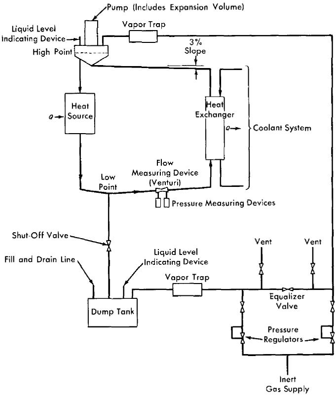
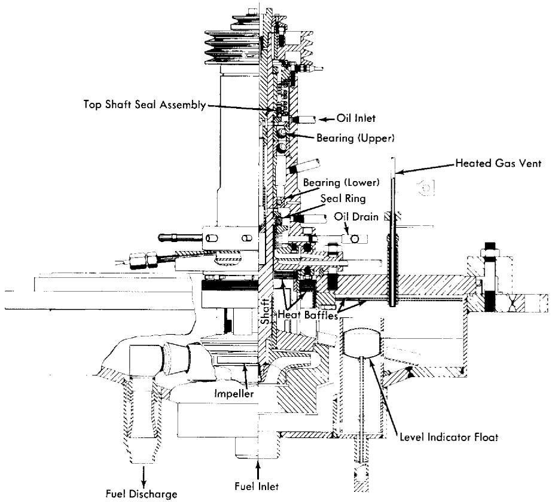
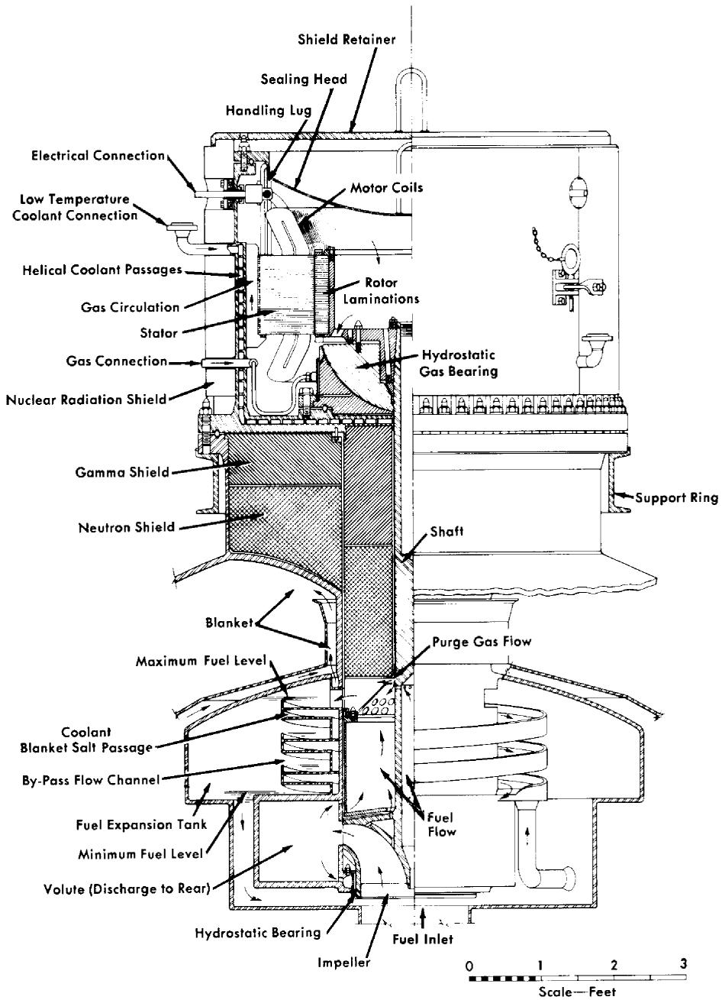
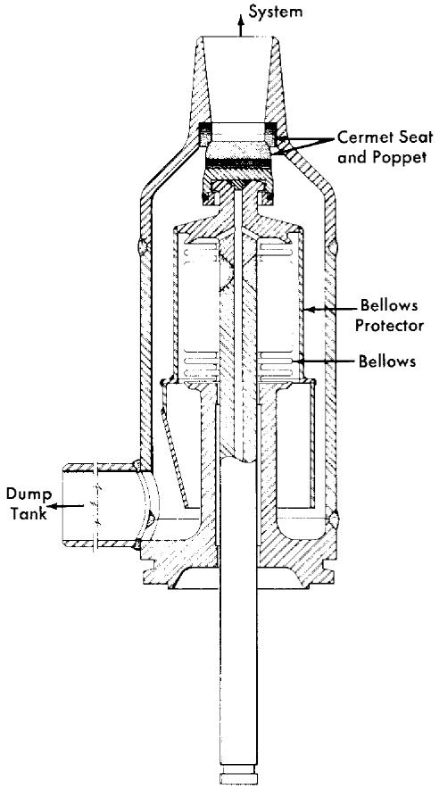
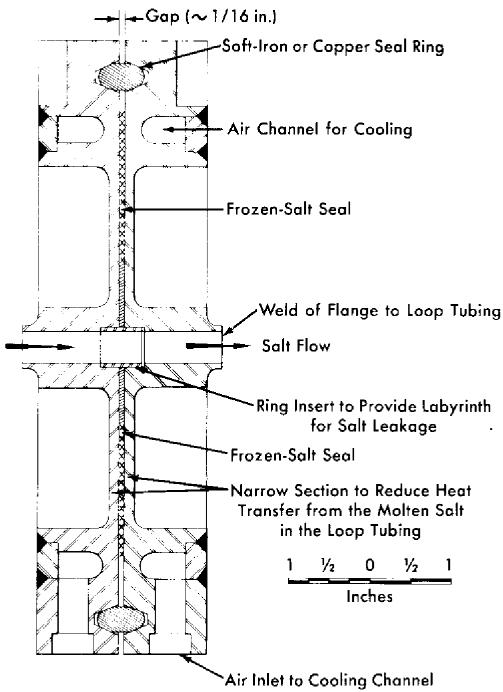
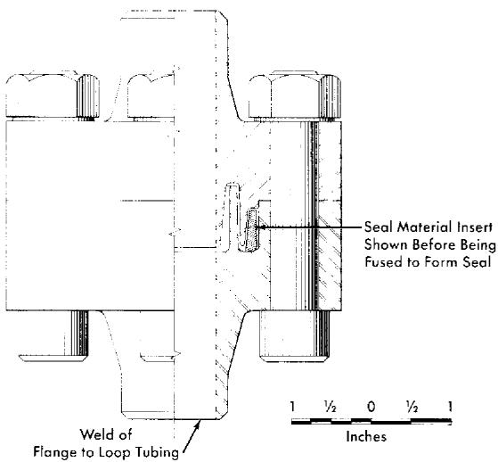
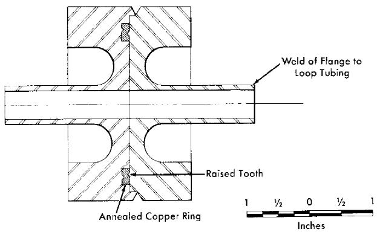

# CHAPTER 15

# EQUIPMENT FOR MOLTEN-SALT REACTOR HEAT-TRANSFER SYSTEMS*

The equipment required in the heat-transfer circuits of a molten-salt reactor consists of the components needed to contain, circulate, cool, heat, and control molten salts at temperatures up to $1300^{\circ}\mathrm{F}$ . Included in such systems are pumps, heat exchangers, piping, expansion tanks, storage vessels, valves, devices for sensing operating variables, and other auxiliary equipment.

Pumps for the fuel and blanket salts differ from standard centrifugal pumps for operation at high temperatures in that provisions must be made to exclude oxidants and lubricants from the salts, to prevent uncontrolled escape of salts and gases, and to minimize heating and irradiation of the drive motors. Heat is transferred from both the fuel and the blanket salts to sodium in shell-and-tube heat exchangers designed to maximize heat transfer per unit volume and to minimize the contained volume of salt, especially the fuel salt.

Seamless piping is used, where possible, to minimize flaws. Thermal expansion is accommodated by prestressing the pipe and by using expansion loops and joints. Heaters and thermal insulation are provided on all components that contain salt or sodium for preheating and for maintaining the circuits at temperatures above the freezing points of the liquids and to minimize heat losses. Devices are provided for sensing flow rates, pressures, temperatures, and liquid levels. The devices include venturi tubes, pressure transmitters, thermocouples, electrical probes, and floats. Inert gases are used over free-liquid surfaces to prevent oxidation and to apply appropriate base pressures for suppressing cavitation or moving liquid or gas from one vessel to another.

The deviations from standard practice required to adapt the various components to the molten-salt system are discussed below. The schematic diagram of a molten-salt heat-transfer system presented in Fig. 15-1 indicates the relative positions of the various components. For nuclear operation, an off-gas system is supplied, as described in Chapter 17. The vapor condensation trap indicated in Fig. 15-1 is required only on systems that contain $\mathrm{ZrF_4}$ or a comparably volatile fluoride as a component of the molten salt.

  
FIG. 15-1. A molten-salt heat-transfer system.

# 15-1. PUMPS FOR MOLTEN SALTS

Centrifugal pumps with radial or mixed-flow types of impeller have been used successfully to circulate molten-salt fuels. The units built thus far and those currently being developed have a vertical shaft which carries the impeller at its lower end. The shaft passes through a free surface of liquid to isolate the motor, the seals, and the upper bearings from direct contact with the molten salt. Uncontrolled escape of fission gases or entry of undesirable contaminants to the cover gas above the free-liquid surface in the pump are prevented either by the use of mechanical shaft seals or hermetic enclosure of the pump and, if necessary, the motor. Thermal and radiation shields or barriers are provided to assure acceptable temperature and radiation levels in the motor, seal, and bearing areas. Liquid cooling of internal pump surfaces is provided to remove heat induced by gamma and beta radiation.

  
FIG. 15-2. Sump-type centrifugal pump developed for the Aircraft Reactor Experiment.

The principles used in the design of pumps for normal liquids are applicable to the hydraulic design of a molten-salt pump. Experiments have shown that the cavitation performance of molten-salt pumps can be predicted from tests made with water at room temperature. In addition to stresses induced by normal thermal effects, stresses due to radiation must be taken into account in all phases of design.

The pump shown in Fig. 15-2 was developed for 2000-hr durability at very low irradiation levels and was used in the Aircraft Reactor Experiment for circulating molten salts and sodium at flow rates of 50 to $150\mathrm{gpm}$ , at heads up to 250 ft, and at temperatures up to $1550^{\circ}\mathrm{F}$ . These pumps have been virtually trouble-free in operation, and many units in addition to those used in the Aircraft Reactor Experiment have been used in developmental tests of various components of molten-salt systems.

The bearings, seals, shaft, and impeller form a cartridge-type subassembly that is removable from the pump tank after opening a single, gasketed

joint above the liquid level. The volute, suction, and discharge connections form parts of the pump tank subassembly into which the removable cartridge is inserted. The upper portion of the shaft and a toroidal area in the lower part of the bearing housing are cooled by circulating oil. Heat losses during operation are reduced by thermal insulation.

In all the units built thus far nickel-chrome alloys have been used in the construction of all the high-temperature wetted parts of the pump to minimize corrosion. The relatively low thermal conductivity and high strength of such alloys permitted close spacing of the impeller and bearings and high thermal gradients in the shaft.

Thrust loads are carried at the top of the shaft by a matched pair of preloaded angular-contact ball bearings mounted face-to-face in order to provide the flexibility required to avoid binding and to accommodate thermal distortions. Either single-row ball bearings or a journal bearing can be used successfully for the lower bearing.

The upper lubricant-to-air and the lower lubricant-to-inert-gas seals are similar, rotary, mechanical face-type seals consisting of a stationary graphite member operating in contact with a hardened-steel rotating member. The seals are oil-lubricated, and the leakage of oil to the process side is approximately 1 to $5\mathrm{cc/day}$ . This oil is collected in a catch basin and removed from the pump by gas-pressure sparging or by gravity.

The accumulation of some 200,000 hr of relatively trouble-free test operation in the temperature range of 1200 to $1500^{\circ}\mathrm{F}$ with molten salts and liquid metals as the circulated fluids has proved the adequacy of this basic pump design with regard to the major problem of thermally induced distortions. Four different sizes and eight models of pumps have been used to provide flows in the range of 5 to $1500\mathrm{gpm}$ . Several individual pumps have operated for periods of 6000 to $8000\mathrm{hr}$ , consecutively, without maintenance.

15-1.1 Improvements desired for power reactor fuel pump. The basic pump described above has bearings and seals that are oil-lubricated and cooled, and in some of the pumps elastomers have been used as seals between parts. The pump of this type that was used in the ARE was designed for a relatively low level of radiation and received an integrated dose of less than $5 \times 10^{8} \mathrm{r}$ . Under these conditions both the lubricants and elastomers used proved to be entirely satisfactory.

The fuel pump for a power reactor, however, must last for many years. The radiation level anticipated at the surface of the fuel is $10^{5}$ to $10^{6}\mathrm{r / hr}$ . Beta- and gamma-emitting fission gases will permeate all available gas space above the fuel, and the daughter fission products will be deposited on all exposed surfaces. Under these conditions, the simple pump described above would fail within a few thousand hours.

Considerable improvement in the resistance of the pump and motor to radiation can be achieved by relatively simple means. Lengthening the shaft between the impeller and the lower motor bearing and inserting additional shielding material will reduce the radiation from the fuel to a low level at the lower motor bearing and the motor. Hollow, metal O-rings or another metal gasket arrangement can be used to replace the elastomer seals. The sliding seal just below the lower motor bearing, which prevents escape of fission-product gases or inleakage of the outside atmosphere, must be lubricated to ensure continued operation. If oil lubrication is used, radiation may quickly cause coking. Various phenyls, or mixtures of them, are much less subject to formation of gums and cokes under radiation and could be used as lubricant for the seal and for the lower motor bearing. This bearing would be of the friction type, for radial and thrust loads. These modifications would provide a fuel pump with an expected life of the order of a year. With suitable provisions for remote maintenance and repair, these simple and relatively sure improvements would probably suffice for power reactor operation.

Three additional improvements, now being studied, should make possible a fuel pump that will operate trouble-free throughout a very long life. The first of these is a pilot bearing for operation in the fuel salt. Such a bearing, whether of hydrostatic or hydrodynamic design, would be completely unaffected by radiation and would permit use of a long shaft so that the motor could be well shielded. A combined radial and thrust bearing just below the motor rotor would be the only other bearing required. The second improvement is a labyrinth type of gas seal to prevent escape of fission gases up the shaft. There are no rubbing surfaces and hence no need for lubricants, so there can be no radiation damage. The third innovation is a hemispherical gas-cushioned bearing to act as a combined thrust and radial bearing. It would have the advantage of requiring no auxiliary lubrication supply, and it would combine well with the labyrinth type of gas seal. It would, of course, be unaffected by radiation.

15-1.2 A proposed fuel pump. A pump design embodying these last three features is shown in Fig. 15-3. It is designed for operation at a temperature of $1200^{\circ}\mathrm{F}$ , a flow rate of $24,000\mathrm{gpm}$ , and a head of $70\mathrm{ft}$ of fluid. The lower bearing is of the hydrostatic type and is lubricated by the molten-salt fuel. The upper bearing, which is also of the hydrostatic type, is cushioned by helium and serves also as a barrier against passage of gaseous fission products into the motor. This bearing is hemispherical to permit accommodation of thermally induced distortions in the over-all pump structure.

The principal radiation shielding is that provided between the source and the area of the motor windings. Layers of beryllium and boron for

  
FIG. 15-3. Improved molten-salt fuel pump designed for power reactor use. Operating temperature, $1200^{\circ}\mathrm{F}$ ; flow rate, 24,000 gpm; head, 70 ft of fluid.

neutron shielding and a heavy metal for gamma-radiation shielding are proposed. The motor is totally enclosed, to eliminate the need for a shaft seal. A coolant is circulated in the area outside the stator windings and between the upper bearing and the shielding. Molten-salt fuel is circulated over the surfaces of those parts of the pump which are in contact with the gaseous fission products to remove heat generated in the metal.

# 15-2. HEAT EXCHANGERS, EXPANSION TANKS, AND DRAIN TANKS

The heat exchangers, expansion tanks, and drain tanks must be especially designed to fit the particular reactor system chosen. The design data of items suitable for a specific reactor plant are described in Chapter 17. The special problems encountered are the need for preheating all salt- and sodium-containing components, for cooling the exposed metal surfaces in the expansion tank, and for removing afterheat from the drain tanks. It has been found that the molten salts behave as normal fluids during pumping and flow and that the heat-transfer coefficients can be predicted from the physical properties of the salts.

# 15-3. VALVES

The problems associated with valves for molten-salt fuels are the consistent alignment of parts during transitions from room temperature to $1200^{\circ}\mathrm{F}$ , the selection of materials for mating surfaces which will not fuse-bond in the salt and cause the valve to stick in the closed position, and the provision of a gastight seal. Bellows-sealed, mechanically operated, poppet valves of the type shown in Fig. 15-4 have given reliable service in test systems.

A number of corrosion and fusion-bond resistant materials for high-temperature use were found through extensive screening tests. Molybdenum against tungsten or copper and several titanium or tungsten carbidenickel cermets mating with each other proved to be satisfactory. Valves with very accurately machined cermet seats and poppets have operated satisfactorily in 2-in. molten-salt lines at $1300^{\circ}\mathrm{F}$ with leakage rates of less than 2 cc hr. Consistent positioning of the poppet and seat to assure leaktightness is achieved by minimizing transmission of valve-body distortions to the valve stem and poppet.

If rapid valve operation is not required, a simple "freeze" valve may be used to ensure a leaktight seal. The freeze valve consists of a section of pipe, usually flattened, that is fitted with a device to cool and freeze a salt plug and another means of subsequently heating and melting the plug.

  
FIG. 15-4. Bellows-sealed, mechanically operated poppet valve for molten-salt service.

# 15-4. SYSTEM HEATING

Molten-salt systems must be heated to prevent thermal shock during filling and to prevent freezing of the salt when the reactor is not operating to produce power. Straight pipe sections are normally heated by an electric tube-furnace type of heater formed of exposed Nichrome V wire in a ceramic shell (clamshell heaters). A similar type of heater with the Nichrome V wire installed in flat ceramic blocks can be used to heat flat surfaces or large components, such as dump tanks, etc. In general, these heaters are satisfactory for continuous operation at $1800^{\circ}\mathrm{F}$ . Pipe bends, irregular shapes, and small components, such as valves and pressure-measuring devices, are usually heated with tubular heaters (e.g., General Electric Company "Calrods") which can be shaped to fit the component or pipe bend. In general, this type of heater should be limited to service at

$1500^{\circ}\mathrm{F}$ . Care must be exercised in the installation of tubular heaters to avoid failure due to a hot spot caused by insulation in direct contact with the heater. This type of failure can be avoided by installing a thin sheet of metal (shim stock) between the heater and the insulation.

Direct resistance heating in which an electric current is passed directly through a section of the molten-salt piping has also been used successfully. Operating temperatures of this type of heater are limited only by the corrosion and strength limitations of the metal as the temperature is increased. Experience has indicated that heating of pipe bends by this method is usually not uniform and can be accompanied by hot spots caused by nonuniformity of liquid flow in the bend.

# 15-5. JOINTS

Failures of some system components may be expected during the desired operating life, say 20 years, of a molten-salt power-producing reactor; consequently, provisions must be made for servicing or removing and replacing such components. Remotely controlled manipulations will be required because there will be a high level of radiation within the primary shield. Repair work on or preparations for disposal of components that fail will be carried out in separate hot-cell facilities.

The components of the system are interconnected by piping, and flanged connections or welded joints may be used. In breaking connections between a component and the piping, the cleanliness of the system must be preserved, and in remaking a connection, proper alignment of parts must be re-established. The reassembled system must conform to the original leaktightness specifications. Special tools and handling equipment will be needed to separate components from the piping and to transport parts within the highly radioactive regions of the system. While an all-welded system provides the highest structural integrity, remote cutting of welds, remote welding, and inspection of such welds are difficult operations. Special tools are being developed for these tasks, but they are not yet generally available. Flanged connections, which are attractive from the point of view of tooling, present problems of permanence of their leaktightness.

Three types of flanged joints are being tested that show promise. One is a freeze-flange joint that consists of a conventional flanged-ring joint with a cooled annulus between the ring and the process fluid. The salt that enters the annulus freezes and provides the primary seal. The ring provides a backup seal against salt and gas leakage. The annulus between the ring and frozen material can be monitored for fission product or other gas leakage. The design of this joint is illustrated in Fig. 15-5.

  
Between Flange Faces Indicate Region of Frozen-Salt Seal; ZZZZZ Indicate Region of Transition from Liquid to Solid Salt

  
FIG. 15-5. Freeze-flange joint for $1/2$ -in.-OD tubing.   
FIG. 15-6. Cast-metal-sealed flanged joint.

  
FIG. 15-7. Indented-seal flange.

A cast-metal-sealed flanged joint is also being tested for use in vertical runs of pipe. As shown in Fig. 15-6, this joint includes a seal which is cast in place in an annulus provided to contain it. When the connection is to be made or broken the seal is melted. Mechanical strength is supplied by clamps or bolts.

A flanged joint containing a gasket (Fig. 15-7) is the third type of joint being considered. In this joint the flange faces have sharp, circular, mating ridges. The opposing ridges compress a soft metal gasket to form the seal between the flanges.

# 15-6. INSTRUMENTS

Sensing devices are required in molten-salt systems for the measurement of flow rates, pressures, temperatures, and liquid levels. Devices for these services are evaluated according to the following criteria: (1) they must be of leaktight, preferably all-welded, construction, (2) they must be capable of operating at the maximum temperature of the fluid system, (3) their accuracies must be relatively unaffected by changes in the system temperature, (4) they should provide lifetimes at least as great as the lifetime of the reactor, (5) each must be constructed so that, if the sensing element fails, only the measurement supplied by it is lost. The fluid system to which the instrument is attached must not be jeopardized by failure of the sensing element.

15-6.1 Flow measurements. Flow rates are measured in molten-salt systems with orifice or venturi elements. The pressures developed across the sensing element are measured by comparing the outputs of two pressure-measuring devices. Magnetic flowmeters are not at present sufficiently sensitive for molten-salt service because of the poor electrical conductivity of the salts.

15-6.2 Pressure measurements. Measurements of system pressures require that transducers operate at a safe margin above the melting point of the salt, and thus the minimum transducer operating temperature is usually about $1200^{\circ}\mathrm{F}$ . The pressure transducers that are available are of two types: (1) a pneumatic force-balanced unit and (2) a displacement unit in which the pressure is sensed by displacement of a Bourdon tube or diaphragm. The pneumatic force-balanced unit has the disadvantages that loss of the instrument gas supply (usually air) can result in loss of the measurement, and that failure of the bellows or diaphragm would open the process system to the air supply or to the atmosphere. The displacement unit, on the other hand, makes use of an isolating fluid to transfer the sensed pressure hydrostatically to an isolated low-temperature output element. Thus, in the event of a failure of the primary diaphragm, the process fluid would merely mix with the isolating fluid and the closure of the system would be unaffected.   
15-6.3 Temperature measurements. Temperatures in the range of 800 to $1300^{\circ}\mathrm{F}$ are commonly measured with Chromel-Alumel or platinum-platinum-rhodium thermocouples. The accuracy and life of a thermocouple in the temperature range of interest are functions of the wire size and, in general, the largest possible thermocouple should be used. Either beaded thermocouples or the newer, magnesium oxide-insulated thermocouples may be used.   
15-6.4 Liquid-level measurements. Instruments are available for both on-off and continuous level measurements. On-off measurements are made with modified automotive-type spark plugs in which a long rod is used in place of the normal center conductor of the spark plug. To obtain a continuous level measurement, the fluid head is measured with a differential pressure instrument. The pressure required to bubble a gas into the fluid is compared with the pressure above the liquid to obtain the fluid head. Resistance probe and float types of level indicators are available for use in liquid-metal systems.   
15-6.5 Nuclear sensors. Nuclear sensors for molten-salt reactors are similar to those of other reactors and are not required to withstand high temperatures. Existing and well-tested fission, ionization, and boron trifluoride thermal-neutron detection chambers are available for installation at all points essential to reactor operation. Their disadvantages of limited life can be countered only by duplication or replacement, and provisions can be made for this. It should be pointed out that the relatively large, negative temperature coefficients of reactivity provided by most circulating-fuel reactors make these instruments unessential to the routine operation of the reactor.