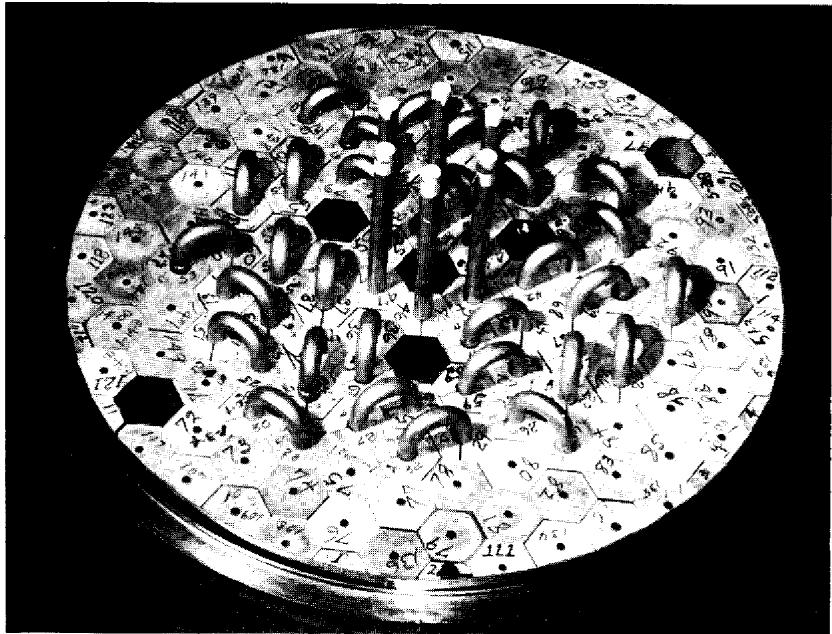
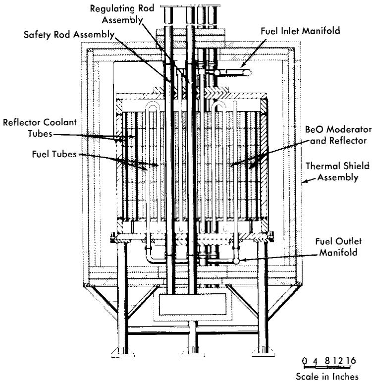
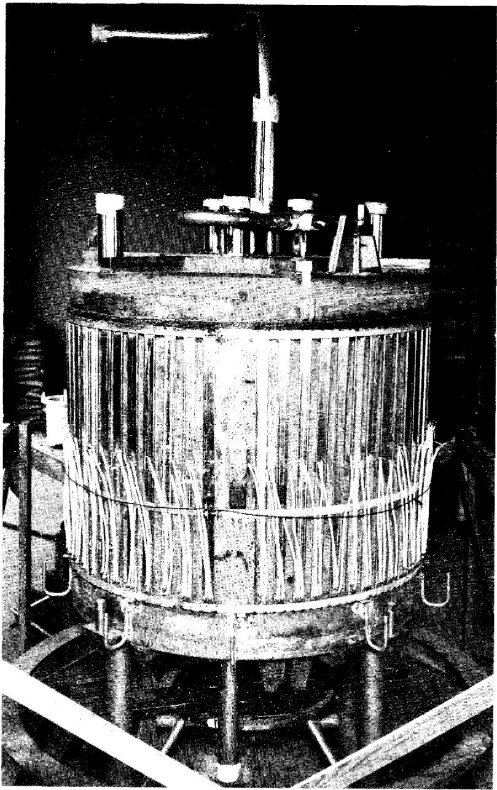
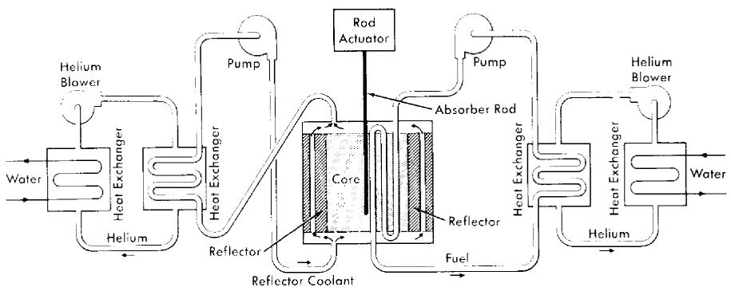
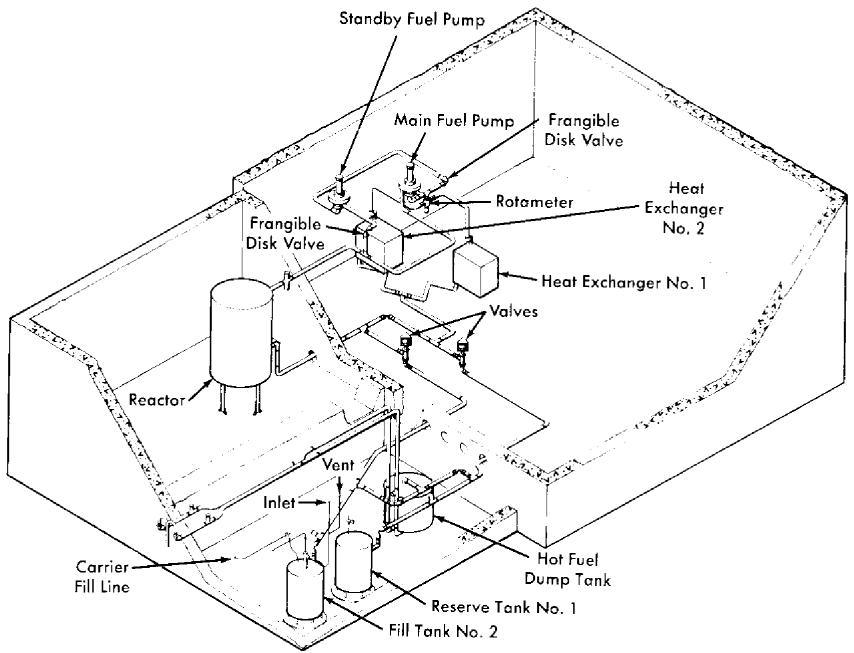
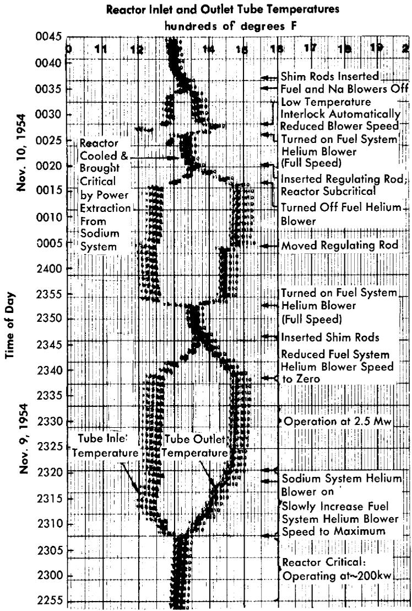

# CHAPTER 16

# AIRCRAFT REACTOR EXPERIMENT*

The feasibility of the operation of a molten-salt-fueled reactor at a truly high temperature was demonstrated in 1954 in experiments with a reactor constructed at ORNL. The temperature of the fuel exiting from the core of this reactor was about $1500^{\circ}\mathrm{F}$ , and the temperature of the fuel at the inlet to the core was about $1200^{\circ}\mathrm{F}$ . The reactor was constructed before the mechanism and control of corrosion by molten salts had been fully explored, and therefore the experimental operation of the reactor was of short duration. Since the work was supported by the Aircraft Reactors Branch of the Atomic Energy Commission, the reactor was called the Aircraft Reactor Experiment (ARE).†

The ARE was a thermal reactor in which moderation was accomplished by BeO blocks through which the fluoride fuel was circulated in Inconel tubes arranged in a symmetrical, heterogeneous matrix. The Inconel vessel containing the core was essentially a right cylinder, approximately 52 in. OD and 44 in. in height, with 2-in.-thick walls. The fuel passages consisted of 1-in.-diameter Inconel tubes arranged in six parallel circuits, and each circuit, by the use of reverse bends at top and bottom of the core, made eleven passes through the core. The fuel passages did not traverse the peripheral BeO blocks which served as a reflector around the core of the reactor. A top view of the BeO blocks and the Inconel tubes is shown in Fig. 16-1. The moderator and reflector blocks were cooled by circulating liquid sodium from the bottom to the top of the pressure vessel. The sodium permeated all interstices of the BeO and flowed rapidly through 1/2-in. vertical holes in the reflector sections of the BeO. An elevation drawing of the reactor which illustrates these features is presented in Fig. 16-2, and a photograph of the reactor vessel that was taken before assembly of the thermal shield is shown in Fig. 16-3.

Since the purpose of the operation of this experimental reactor was to study the behavior of the circulating-fluoride-fuel system and to identify the problems associated therewith, the power output of the reactor was not utilized but, rather, was simply dumped as heat. The heat-removal system is shown schematically in Fig. 16-4. The fuel was circulated through a finned-tube radiator type of heat exchanger. This radiator was located within a sheet-metal housing of a toroidal shape. In another part of the toroidal housing there was a second finned-tube radiator through

  
FIG. 16-1. Top view of the reactor core of the ARE. Hexagonal beryllium oxide blocks serve as the moderator. Inconel tubes pass through the moderator blocks to carry the molten-salt fuel.

which plant water flowed. A large centrifugal blower circulated the coolant gas (helium) in the toroidal loop so that heat was picked up from the fuel radiator and dumped into the water radiator.

An identical arrangement of radiators and blower was used for cooling the sodium used as the moderator-reflector coolant. In the interest of safety (for removal of afterheat in the event of a pump failure), the sodium circuit was installed in duplicate so that an entire sodium cooling system was available as a spare. These two sodium loops were operated alternately during the experiment in an effort to keep a check on the operability of each loop. Had one loop failed to operate, the experiment would have been terminated for lack of a spare cooling system.

The control system of the reactor was based on conventional practice. The three safety shim rods were actuated by electrically driven lead screws which moved electromagnets in a vertical plane. When these magnets were driven to their lowest extremity, an armature was engaged to which the shim (poison) rods were attached. Loss of current in the electromagnets would allow the rods to fall under the action of gravity into thimbles in the central region of the core. The regulating rod was a simple stainless-steel pipe which was rigidly attached to a rack driven by a reversible elec

  
FIG. 16-2. Elevative section of the Aircraft Reactor Experiment.

tric motor through a pinion. Fission chambers located in the reflector, as well as ionization chambers located outside the pressure shell of the reactor, furnished the neutron and gamma-ray signals for the control system.

The shim and control rods which entered the hot reactor core had to be cooled to prevent overheating from neutron capture and gamma-ray absorption. This cooling was effected by circulating helium in a closed loop that included a water-cooled radiator, as in the case of the fuel and sodium circuits. This helium circuit was integral with a helium-filled monitoring annulus which surrounded all fuel and sodium piping in the system. This annulus was formed by putting a continuous stainless-steel sleeve around all hot piping, and the helium circulated in the annulus performed two functions: (1) it kept the hot lines at essentially an even temperature during the warmup period when the system was heated by means of electrical heating units placed on the outer surface of the annulus, and (2) the helium was monitored to ensure that the fuel and sodium piping was leaktight.

Large, heated reservoir tanks were connected to the system through isolation valves so that the sodium and the fused fluoride mixture could

  
FIG. 16-3. View of the ARE Vessel before addition of the thermal shield. The external strip heaters with their electrical leads are shown in place.

  
FIG. 16-4. Schematic diagram of the heat-removal system for the ARE.

be pressurized from the tanks into the system and could be drained back into the tanks after the experiment was over. Dry helium was used for operating penumatic instruments and for pressurizing the liquids into the system from the tanks.

Pumps for both the sodium and the molten-fluoride mixture consisted of sump-type centrifugal pumps with overhanging shafts. The pumps were mounted vertically, and a gas space was provided between the liquid level and the upper bearings of the pump. The pumps were located so that the free-liquid surface in the sump tank was the high point in both the fuel and the sodium circuits. The sump tank of the pump also served as an expansion tank for the liquid. The isometric drawing of the fuel system presented in Fig. 16-5 indicates the relative levels of the components.

Both of the liquid systems, fuel and sodium, were fabricated entirely of Inconel, and all closures were made by inert-gas-shielded electric-arc (Heliarc) welding. The welding procedure was adopted after extensive experimental research and developmental work, and meticulous care was exercised in all welding operations. The entire reactor system, that is, the reactor vessel, heat exchangers, pumps, dump tanks, piping, and auxiliary equipment (with the exception of control rod drives), was located in concrete pits below ground level. After the reactor was brought to criticality by manual fuel injection, concrete blocks were placed on top of the pits to complete the shielding of the system as required during power operation.

Fuel was added as a molten mixture of NaF and UF $_4$ (enriched in $\mathrm{U}^{235}$ ) after the sodium system had been heated and filled with sodium and the fuel system had been heated and filled with fuel carrier—a molten mixture of NaF and $\mathrm{ZrF_4}$ . The fuel additions were made into the sump of the fuel pump through the use of a temporary enrichment system that was capable of injecting (by manual operation) a few hundred grams of fuel mixture

  
FIG. 16-5. Layout of the fuel system components for the ARE.

at a time. This method of fuel addition was laborious and time-consuming, but it effectively and safely enriched the reactor to a critical concentration.

The reactor was taken to criticality essentially without incident. The total amount of $\mathrm{U}^{235}$ added to the system to make the reactor critical was approximately $61\mathrm{kg}$ , but small amounts of fuel were withdrawn from the system for sampling and in trimming the pump level. The uranium concentration at criticality was $384\mathrm{g / liter}$ of fluoride mixture. The calculated volume of the core was 38.8 liters at $1300^{\circ}\mathrm{F}$ , and thus the clean critical mass of the reactor was $14.9\mathrm{kg}$ of $\mathrm{U}^{235}$ .

It was demonstrated that the reactor had an over-all temperature coefficient of reactivity of $-6 \times 10^{-5} (\Delta k / k) / {}^{\circ}\mathrm{F}$ . As was anticipated, the fast negative temperature coefficient of reactivity (associated with the fuel expansion coefficient) served to stabilize the reactor power level. From a power lever of $200\mathrm{kw}$ upward, the temperature coefficient controlled the system so precisely that the reactor responded to load demands in a thoroughly reliable manner.

The response of the reactor was demonstrated in a number of experiments, one of which is described in Fig. 16-6. The abscissa, to be read from right to left, is the time in minutes, and the print-outs from recorders giving the reactor inlet and outlet temperatures are the ordinate. Initially, in this experiment, the reactor was operating at low power. Then the heat

  
FIG. 16-6. Chart of inlet and outlet temperatures for the ARE as influenced by various experimental procedures.

extraction from the fuel was slowly increased and there was, first, a resultant decrease in the temperature of the fuel which reached the reactor inlet from the heat exchanger. This increased the reactivity and the reactor power, as indicated by the temperature rise at the reactor outlet. The spread of inlet and outlet temperatures corresponds to a power level of $2.5\mathrm{Mw}$ . When the heat extraction was reduced, the inlet temperature

rose and the outlet temperature fell until the two temperatures became nearly coincident. As may be seen, the control rods did not determine the power output; they only influenced the average temperature. Insertion of the shim rods decreased the temperature. Another rapid increase in the power demand on the fuel system again spread apart the inlet and outlet temperature recordings, and full insertion and full withdrawal of the regulating rod depressed and then raised both temperatures simultaneously. Next, the power extraction was stopped and the regulating rod was inserted to make the reactor subcritical.

The third spread of the temperatures in Fig. 16-6 was a result of a demonstration which showed that the reactor could be brought to criticality, without use of the rods, by the power demand alone. Power extraction from the sodium system cooled the reactor to make it critical, and power extraction from the fuel again caused the spread of inlet and outlet temperatures.

The remarkable stability of the system made it unexpectedly possible to demonstrate that no more than $5\%$ of the $\mathrm{Xe}^{135}$ was retained in the molten fuel. It had been computed that the xenon poisoning after 27 hr of operation at full power would amount to $2\times 10^{-3}$ in $\Delta k / k$ if all the xenon formed stayed in the fuel until it decayed. This level of poisoning was less than would be expected from the usual equations, partly because the fuel spent only one-fourth of the time in the core and was thus effectively only subjected to one-fourth of the flux, and partly because many of the neutrons had energies above the large $\mathrm{Xe}^{135}$ absorption resonance. As little as $5\%$ of this computed poisoning would have been detectable, but none was found.

There was a small leakage from the gas volume above the liquid surface of the fuel pumps which made operation at a high power level somewhat awkward, but danger to operating personnel was circumvented by operating with the reactor pit at a subatmospheric pressure and remotely exhausting the pit gases to the atmosphere at a location where they were adequately dispersed.

The entire program of experiments that had been planned for the reactor was completed satisfactorily. The reactor was shut down after a total power production of $96\mathrm{Mwh}$ , and it was later dismantled. The fuel and sodium systems had been in operation for a total of 462 and $635\mathrm{hr}$ , respectively, including $221\mathrm{hr}$ of nuclear operation, with the final $74\mathrm{hr}$ of operation in the megawatt range.