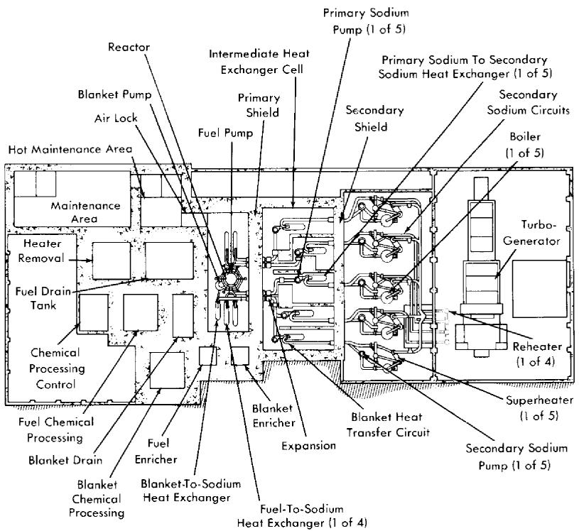
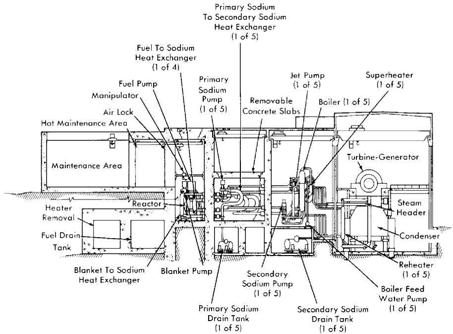
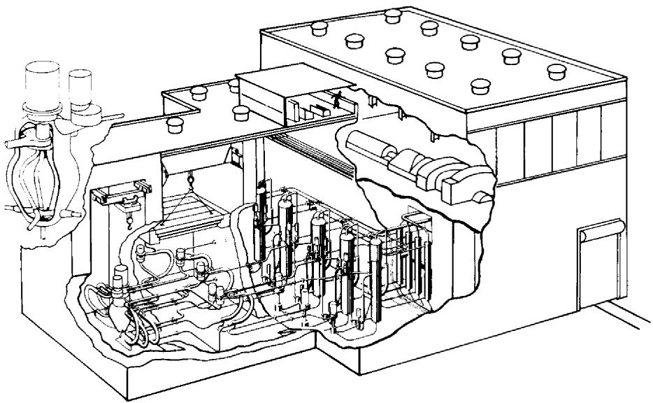
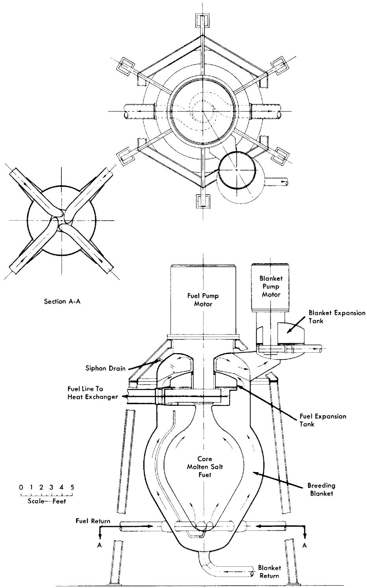
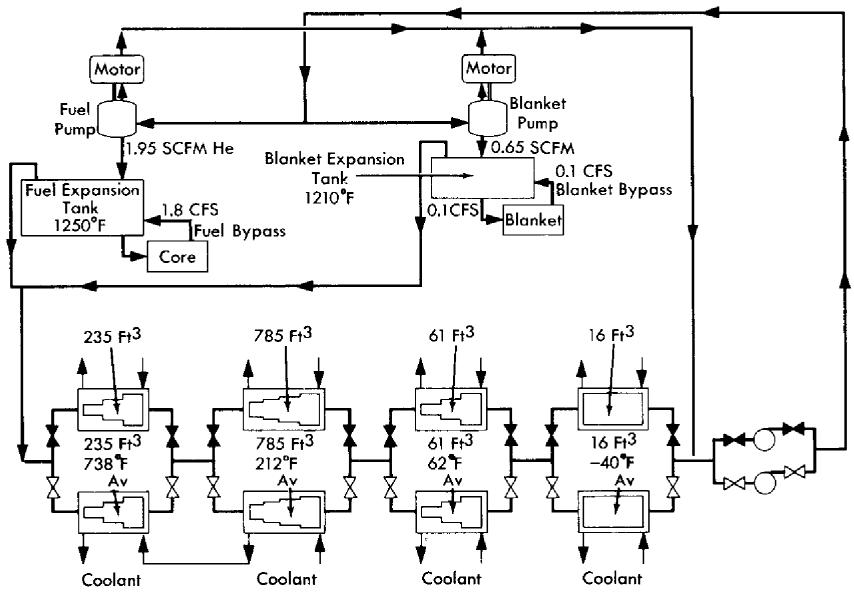
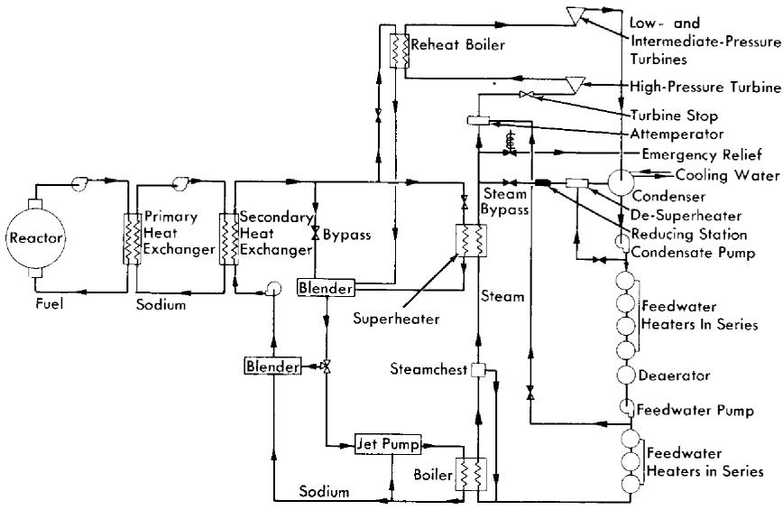
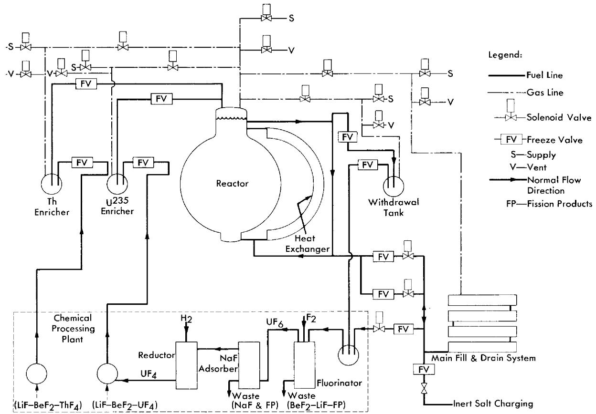
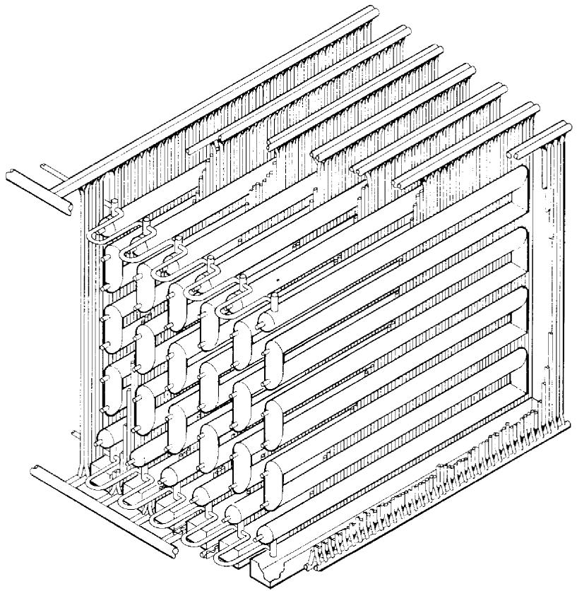

# CHAPTER 17

# CONCEPTUAL DESIGN OF A POWER REACTOR*

The design of a homogeneous molten-salt reactor of the type discussed in the preceding chapters is described below. The choice of the power level for this design is arbitrary, since the 8-ft-diameter reactor core, chosen from nuclear considerations, is capable of operating at power levels up to $1900\mathrm{Mw}$ (thermal) without excessive power densities in the core. An electrical generator of $275\mathrm{Mw}$ capacity was chosen, since this is in the size range that a number of power companies have used in recent years. It is estimated that about $6\%$ of the power would be used in the station, and thus the net power to the system would be about $260\mathrm{Mw}$ .

Two sodium circuits in series were chosen as the heat-transfer system between the fuel salt and the steam. Delayed neutrons from the circulating fuel will activate the primary heat exchangers and the sodium passing through them. A secondary heat-exchanger system in which the heat will transfer from the radioactive sodium to nonradioactive sodium will serve to prevent radioactivity at the steam generators, superheaters, and reheaters. The fuel flow from the core is distributed among four primary heat exchangers which serve as the first elements of the four parallel paths for heat transfer to the steam. A single primary heat exchanger and path is provided for the blanket circuit.

Plan and elevation views of the reactor plant are shown in Figs. 17-1 and 17-2, and an isometric drawing showing the piping of the heat-transfer systems is shown in Fig. 17-3. The reactor and the primary heat exchangers are contained in a large rectangular reactor cell, sealed to contain any leakage of fission-product gases. All operations in the cell must be carried out remotely after the reactor has operated at power. The principal characteristics of the plant are listed in Table 17-1.

# 17-1. FUEL AND BLANKET SYSTEMS

17-1.1 Reactor vessel. The reactor vessel and the fuel and blanket pumps are a closely coupled assembly (Fig. 17-4) which is suspended from a flange on the fuel pump barrel. The vessel itself has two regions—one for the fuel and one for the blanket salt. The fuel region consists of the reactor core surmounted by an expansion chamber, which contains the single fuel pump. The blanket region completely surrounds the fuel region, and the blanket salt cools the walls of the expansion chamber gas space and shields the pump motor. The floor of the expansion chamber is

  
FIG. 17-1. Plan view of molten salt power reactor plant.

a flat disk, 3/8 in. thick, which serves as a diaphragm to absorb differential thermal expansion between the core and the outer shells.

17-1.2 Fuel pump. The fuel pump is of the type illustrated in Chapter 15 (Fig. 15-3) and is designed to have a capacity of $24,000\mathrm{gpm}$ . It is driven by a 1000-hp motor with a shaft speed of $700\mathrm{rpm}$ . This pump incorporates three major advanced features that are being developed, but which are not present in any molten-salt pump operated to date. These are a hydrostatic lower bearing to be operated in the molten salt, a labyrinth type of gas seal to prevent escape of fission-product gases up the shaft, and a hemispherical gas-cushioned upper bearing to act as a combined thrust and radial bearing. These advanced features are intended to provide a pump with greater resistance to radiation damage and less complex auxiliary equipment than necessary for pumps presently used for molten salts.

17-1.3 System for removal of fission-product gases. About $3.5\%$ of the fuel passing through the fuel pump is diverted from the main stream,

  
FIG. 17-2. Elevation view of molten salt power reactor plant.

  
FIG. 17-3. Isometric view of molten salt power reactor plant.

  
FIG. 17-4. Reactor vessel and pump assembly.

TABLE 17-1   
REACTOR PLANT CHARACTERISTICS   

<table><tr><td>Fuel</td><td>&gt;90% U235F4</td></tr><tr><td>Fuel carrier</td><td>62 mole % LiF, 37 mole % BeF2, 1 mole % ThF4</td></tr><tr><td>Neutron energy</td><td>Intermediate</td></tr><tr><td>Moderator</td><td>LiF BeF2</td></tr><tr><td>Primary coolant</td><td>Circulating fuel solution, 23,800 gpm</td></tr><tr><td>Power</td><td></td></tr><tr><td>Electric (net)</td><td>260 Mw</td></tr><tr><td>Heat</td><td>640 Mw</td></tr><tr><td>Regeneration ratio</td><td></td></tr><tr><td>Clean</td><td>0.63</td></tr><tr><td>Average (20 yr)</td><td>0.50</td></tr><tr><td>Blanket salt</td><td>71 mole % LiF, 16 mole % BeF2, 13 mole % ThF4</td></tr><tr><td>Refueling cycle at full power</td><td>Semicontinuous</td></tr><tr><td>Shielding</td><td>Concrete room walls, 9 ft thick</td></tr><tr><td>Control</td><td>Temperature and fuel concentration</td></tr><tr><td>Plant efficiency</td><td>44.3%</td></tr><tr><td>Exit fuel temperature</td><td>1210°F at approximately 83 psia</td></tr><tr><td>Steam</td><td></td></tr><tr><td>Temperature</td><td>1000°F, with 1000°F reheat</td></tr><tr><td>Pressure</td><td>1800 psia</td></tr><tr><td>Second loop fluid</td><td>Sodium</td></tr><tr><td>Third loop fluid</td><td>Sodium</td></tr><tr><td>Structural materials</td><td></td></tr><tr><td>Fuel circuit</td><td>INOR-8</td></tr><tr><td>Secondary loop</td><td>Type-316 stainless steel</td></tr><tr><td>Tertiary loop</td><td>5% Cr, 1% Si steel</td></tr><tr><td>Steam boiler</td><td>2.5% Cr, 1% Mo steel</td></tr><tr><td>Steam superheater</td><td>5% Cr, 1% Si steel</td></tr><tr><td>Active-core dimensions</td><td></td></tr><tr><td>Fuel equivalent diameter</td><td>8 ft</td></tr><tr><td>Blanket thickness</td><td>2 ft</td></tr><tr><td>Temperature coefficient, (Δk/k)/°F</td><td>-(3.8 ± 0.04) × 10-5</td></tr><tr><td>Specific power</td><td>1000 kw/kg</td></tr><tr><td>Power density</td><td>80 kw/liter</td></tr><tr><td>Fuel inventory</td><td></td></tr><tr><td>Initial (clean)</td><td>604 kg of U235</td></tr><tr><td>Average (20 yr)</td><td>1000 kg of U235</td></tr><tr><td>Clean critical mass</td><td>267 kg of U235</td></tr><tr><td>Burnup</td><td>Unlimited</td></tr></table>

  
FIG. 17-5. Schematic flow diagram for continuous removal of fission-product gases.

mixed with helium from the pump-shaft labyrinth seal, and sprayed into the reactor expansion tank. The mixing and spraying provides a large fuel-to-purge-gas interface, which promotes the establishment of low equilibrium fission gas concentrations in the fuel. The expansion tank provides a liquid surface area of approximately $26\mathrm{ft}^2$ for removal of the entrained purge and fission gas mixture. The gas removal is effected by the balance between the difference in the density of the fuel and the gas bubbles and the drag of the opposing fuel velocity. The downward surface velocity in the expansion tank is less than 1 in/sec, which should allow all bubbles larger than 0.008 in. in radius to come to the surface and escape. In the Aircraft Reactor Experiment at least $97\%$ of the fission-product gases were continuously purged by similar techniques.

With a fuel purge gas rate of 5 cfm, approximately $350\mathrm{kw}$ of beta heating from the decay of the fission-product gases and their daughters is deposited in the fuel and on metal surfaces of the fuel expansion tank. This heat is partly removed by the bypass fuel circuits and the balance is transferred through the expansion tank walls to the blanket salt.

The mixture of fission-product gases, decay products, and purge helium leaves the expansion tank through the off-gas line, which is located in the top of the tank, and joins with a similar stream from the blanket expansion tank (see Fig. 17-5). The combined flow is delayed approximately $50\mathrm{min}$ in a cooled volume to allow a large fraction of the shorter-lived fission products to decay before entering the cooled activated-carbon beds. The

capacity of the carbon beds will hold krypton from passing through for approximately 6 days, and xenon for much longer times.

The purge gases, essentially free from activity, leave the carbon beds to join the gases from the gas-lubricated bearings of the pumps. The gases are then compressed and returned to the reactor to repeat the cycle. Approximately every four days the gas stream is diverted from one set of carbon beds to the other. The inactive bed is then regenerated by warming it to expel the $\mathrm{Kr}^{85}$ and other long-lived fission products. It will probably be economical to recover some of these gases; others may be expelled to the stack.

# 17-2. HEAT-TRANSFER CIRCUITS AND TURBINE GENERATOR

The primary heat exchangers are designed to have the fuel on the shell side and sodium inside the tubes. This arrangement makes full use of the superior properties of sodium as a heat-transfer fluid and appears to yield the lowest fuel volume.

The heat exchangers, which are of semicircular construction, as shown in Fig. 17-3, provide convenient piping to the top and bottom of the reactor. The thermal characteristics of the primary heat exchanger, together with the characteristics of other heat exchangers of the reactor system, are listed in Table 17-2.

The sodium in the intermediate heat-transfer system (see Fig. 17-6) is heated by the fuel in the primary heat exchanger and is pumped out of the reactor cell and through the reactor cell shield to adjacent cells, which contain the secondary sodium-to-sodium heat exchangers and the pump. No control of intermediate sodium flow is required, so there are no valves and a constant speed centrifugal pump is used. To permit the sodium to be at a lower pressure than the fuel in the primary heat exchanger, the pump for the intermediate sodium is in the higher temperature side of the circuit. The secondary heat exchangers are of the U-tube in U-shell, counterflow design, with the intermediate sodium in the tubes and the final sodium on the shell side.

The final sodium circuit, except for the secondary exchanger, is outside the shielded area and thus available for adjustment and maintenance at all times. The principal problems in this circuit are concerned with the adjustment of sodium temperature. Excessive thermal strains are prevented in the steam generator by limiting the temperature of the sodium entering it, and in the intermediate heat exchanger by the regulation of sodium flows so that too cold sodium is never returned to it. The hot sodium from the secondary exchanger is split into three streams with regulating valves for control of the relative flows. One stream bypasses the steam system and goes directly to a blender; the flow in it is, of course, greatest at low power

TABLE 17-2   
DATA FOR HEAT EXCHANGERS   

<table><tr><td></td><td colspan="2">Primary</td><td colspan="2">Secondary</td></tr><tr><td>Fuel and sodium-to-sodium exchangers</td><td></td><td></td><td></td><td></td></tr><tr><td>Number required</td><td colspan="2">4</td><td colspan="2">4</td></tr><tr><td>Fluid</td><td>Fuel salt</td><td>Primary sodium</td><td>Primary sodium</td><td>Secondary sodium</td></tr><tr><td>Fluid location</td><td>Shell</td><td>Tubes</td><td>Tubes</td><td>Shell</td></tr><tr><td>Type of exchanger</td><td colspan="2">U-tube in U-shell, counterflow</td><td colspan="2">U-tube in U-shell, counterflow</td></tr><tr><td>Temperatures</td><td></td><td></td><td></td><td></td></tr><tr><td>Hot end, °F</td><td>1210</td><td>1120</td><td>1120</td><td>1080</td></tr><tr><td>Cold end, °F</td><td>1075</td><td>925</td><td>925</td><td>825</td></tr><tr><td>Tube data</td><td></td><td></td><td></td><td></td></tr><tr><td>Material</td><td colspan="2">INOR-8</td><td colspan="2">Type-316 stainless steel</td></tr><tr><td>Outside diameter, in.</td><td colspan="2">1.000</td><td colspan="2">0.750</td></tr><tr><td>Wall thickness, in.</td><td colspan="2">0.058</td><td colspan="2">0.049</td></tr><tr><td>Length, ft</td><td colspan="2">23.7</td><td colspan="2">21.5</td></tr><tr><td>Number</td><td colspan="2">515</td><td colspan="2">1440</td></tr><tr><td>Pitch (Δ), in.</td><td colspan="2">1.144</td><td colspan="2">0.898</td></tr><tr><td>Bundle diameter, in.</td><td colspan="2">28</td><td colspan="2">36</td></tr><tr><td>Heat transfer capacity, Mw</td><td colspan="2">144</td><td colspan="2">144</td></tr><tr><td>Heat transfer area, ft2</td><td colspan="2">2800</td><td colspan="2">5200</td></tr><tr><td>Average heat flux, 1000 Btu/(hr) (ft2)</td><td colspan="2">175</td><td colspan="2">95</td></tr><tr><td>Flow rate, cfps</td><td>13.4</td><td>46.1</td><td>46.1</td><td>33.6</td></tr><tr><td>Fluid velocity, fps</td><td>10.8</td><td>19.7</td><td>13.9</td><td>13.2</td></tr><tr><td>Pressure drop, psi</td><td>40</td><td>15.5</td><td>10</td><td>14.8</td></tr></table>

TABLE 17-2 (continued)   

<table><tr><td></td><td colspan="2">Steam Generator</td><td colspan="2">Superheater</td><td colspan="2">Reheater</td></tr><tr><td>Sodium-to-steam exchanger</td><td></td><td></td><td></td><td></td><td></td><td></td></tr><tr><td>Number required</td><td colspan="2">4</td><td colspan="2">4</td><td colspan="2">4</td></tr><tr><td>Fluid</td><td>Secondary sodium</td><td>Water</td><td>Secondary sodium</td><td>Steam</td><td>Secondary sodium</td><td>Steam</td></tr><tr><td>Fluid location</td><td>Shell</td><td>Tubes</td><td>Shell</td><td>Tubes</td><td>Shell</td><td>Tubes</td></tr><tr><td>Type of exchanger</td><td colspan="2">Bayonet, counterflow</td><td colspan="2">U-tube in U-shell, counterflow</td><td colspan="2">Straight, counterflow</td></tr><tr><td>Temperatures</td><td></td><td></td><td></td><td></td><td></td><td></td></tr><tr><td>Hot end, °F</td><td>825</td><td>621</td><td>1080</td><td>1000</td><td>1080</td><td>1000</td></tr><tr><td>Cold end, °F</td><td>740</td><td>621</td><td>930</td><td>621</td><td>1000</td><td>640</td></tr><tr><td>Tube data</td><td></td><td></td><td></td><td></td><td></td><td></td></tr><tr><td>Material</td><td colspan="2">2.5% Cr, 1% Mo Alloy</td><td colspan="2">5% Cr, 1% Si Alloy</td><td colspan="2">5% Cr, 1% Si Alloy</td></tr><tr><td>Outside diameter, in.</td><td colspan="2">2</td><td colspan="2">0.750</td><td colspan="2">0.750</td></tr><tr><td>Wall thickness, in.</td><td colspan="2">0.180</td><td colspan="2">0.095</td><td colspan="2">0.065</td></tr><tr><td>Length, ft</td><td colspan="2">18</td><td colspan="2">25</td><td colspan="2">16.5</td></tr><tr><td>Number</td><td colspan="2">362</td><td colspan="2">480</td><td colspan="2">800</td></tr><tr><td>Pitch (Δ), in.</td><td colspan="2">2.75</td><td colspan="2">1.00</td><td colspan="2">1.00</td></tr><tr><td>Bundle diameter, in.</td><td colspan="2">55</td><td colspan="2">23</td><td colspan="2">29.7</td></tr><tr><td>Heat transfer capacity, Mw</td><td colspan="2">82.2</td><td colspan="2">39.2</td><td colspan="2">22.6</td></tr><tr><td>Heat transfer area, ft2</td><td colspan="2">2800</td><td colspan="2">1760</td><td colspan="2">2200</td></tr><tr><td>Average heat flux, 1000 Btu/(hr)(ft2)</td><td colspan="2">100</td><td colspan="2">76</td><td colspan="2">35</td></tr><tr><td>Flow rate, cfps</td><td colspan="2">57.5</td><td colspan="2">15.5</td><td colspan="2">16.8</td></tr><tr><td>or 1000 lb/hr</td><td colspan="2">410</td><td colspan="2">406</td><td colspan="2">399</td></tr><tr><td>Fluid velocity, fps</td><td colspan="2">5.6</td><td>9.3</td><td>61</td><td>7.9</td><td>137</td></tr><tr><td>Pressure drop, psi</td><td colspan="2">5.7 (jet pump)</td><td>6.9</td><td>10.3</td><td>3.2</td><td>10.4</td></tr></table>

  
FIG. 17-6. Schematic diagram of heat-transfer system.

levels. The other two streams go to the superheater and the reheater, and are then combined with the bypass flow in the blender. On leaving the blender, the sodium stream is split again by a three-way valve into two streams; one enters a second bypass and goes directly to the main pump and the other enters a jet pump that keeps a large sodium flow recirculating through the boiler, which is of the Lewis type. The three-way valve is adjusted, at design point, so that about two-thirds of the flow goes to the jet pump and one-third bypasses the boiler. At low power levels the valve would be adjusted to give very low flows to the boiler.

The centrifugal pump in this circuit has two speeds, full speed and one-fourth of full speed. The low-speed operation provides for better regulation of the sodium flow at very low power levels.

The turbine selected uses 1800-psia steam at $1000^{\circ}\mathrm{F}$ with reheat to $1000^{\circ}\mathrm{F}$ and is rated at $275\mathrm{Mw}$ . It is a 3600-rpm single-shaft machine with three exhaust ends. The turbine heat rate is estimated to be $7700\mathrm{Btu / kwh}$ , or $44.3\%$ cycle efficiency, while 7860 and 8360 Btu/kwh are the generator and station heat rates, respectively. With $6\%$ of generator output used for station auxiliaries, $260\mathrm{Mw}$ is supplied to the bus bar.

# 17-3. REMOTE MAINTENANCE PROVISIONS

Remotely controlled mechanized tools and viewing devices are provided in the reactor cell for making minor repairs and for removing and re

placing any component in the cell. The tools will be able to handle any pump, heat exchanger, pipe, heater for pipe and equipment, instrument, and even the reactor vessel, and, correspondingly, the components will be designed and located for accessibility and separation.

The removal and replacement of components requires a reliable method of making and breaking joints in the pipe. Cutting and welding of pipe sections can be used, but in the low-pressure molten-salt system it is believed that a flanged-pipe joint (see Section 15-5) may be satisfactory.

All equipment and pipe joints in the reactor cell are laid out so that they are accessible from above. Directly above the equipment is a traveling bridge on which can be mounted one or more remotely operated manipulators. At the top of the cell is another traveling bridge for a remotely operated crane. At one end of the cell is an air lock that connects with the maintenance area. The crane can move from the bridge in the cell to a monorail in the air lock.

Closed-circuit television equipment is provided for viewing the maintenance operation in the cell. A number of cameras are mounted to show the operation from different angles, and a periscope gives a direct view of the entire cell.

# 17-4. MOLTEN-SALT TRANSFER EQUIPMENT

The fuel-transfer systems are shown schematically in Fig. 17-7. Salt freeze valves (see Section 15-3) are used to isolate the individual components in the fuel-transfer lines and to isolate the chemical plant from the components in the reactor cell. With the exception of the reactor draining operation, which is described below, the liquid is transferred from one vessel to another by a differential gas pressure. By this means, fuel may be added to, or withdrawn from, the reactor during power operation.

The fuel added to the reactor will have a high concentration of $\mathrm{UF_4}$ with respect to the process fuel, so that additions to overcome burnup will require transfer of only a small volume; similarly, thorium-bearing molten salt may be added at any time to the fuel system. The thorium, in addition to being a design constituent of the fuel salt, may be added in amounts required to serve as a nuclear poison.

For the main fuel drain circuit, bellows-sealed, mechanically operated, poppet valves (see Section 15-3) will be placed in series with the freeze valves to establish a stagnant liquid suitable for freezing. Normally these mechanical valves will be left open. By melting the plug in the freeze line and opening gas-evaluation valves, the liquid in the reactor will flow by gravity to the drain tank, and the gas in the drain tank will be transferred to the reactor system. Thus gas will not have to be added to, or vented from, the primary system.

  
FIG. 17-7. Schematic diagram of fuel salt transfer system.

# 17-5. FUEL DRAIN TANK

For the drain vessel design calculations, it was assumed that at $1200^{\circ}\mathrm{F}$ the fuel system volume would be $600\mathrm{ft}^3$ . The design capacity of the drain vessel was therefore set at $750\mathrm{ft}^3$ in order to allow for temperature excursions and for a residual inventory. An array of 12-in.-diameter pipes was selected as the primary containment vessel of the drain system in order to obtain a large surface area-to-volume ratio for heat-transfer efficiency and to provide a large amount of nuclear poison material. Forty-eight 20-ft lengths of pipe are arranged in six vertical banks connected on alternate ends with mitered joints (see Fig. 17-8). The six banks of pipe are connected at the bottom with a common drain line that connects with the fuel system. The drain system is preheated and maintained at the desired temperature with electric heaters installed in small-diameter pipes located axially inside main pipes. These bayonet-type heaters can be removed or installed from one face of the pipe array to facilitate maintenance. The entire system is installed in an insulated room or furnace to minimize heat losses.

The removal of the fuel afterheat is accomplished by filling boiler tubes installed between 12-in.-diameter fuel-containing pipes with water from headers that are normally filled. The boiler tubes will normally be dry and at the ambient temperature of about $950^{\circ}\mathrm{F}$ . Cooling will be accomplished by slowly flooding or "quenching" the tubes, which then furnish a heat sink for radiant heat transfer between the fuel-containing pipes and the low-pressure, low-temperature boiler tubes. For the peak afterheat load, a flow of about $150\mathrm{gpm}$ of water is required to supply the boiler tubes.

The design criteria for this fill-and-drain system are that it always be in a standby condition immediately available for drainage of the fuel, that it be capable of adequately handling the fuel afterheat, and that it provide double containment for the fuel. The heat-removal scheme is essentially self-regulating in that the amount of heat removed is determined by the radiant exchange between the vessels and water wall. Both the water and the fuel systems are at low pressure, and a double failure would be required for the two fluids to be mixed. The drain system cell may be easily enclosed and sealed from the atmosphere because there are no large gas-cooling ducts or other major external systems connected to it.

# 17-6. CHEMICAL REPROCESSING METHOD

In this plant it is assumed that the core and blanket salts will be reprocessed by the fluoride volatility process [1] to remove $\mathrm{UF_6}$ . The $\mathrm{UF_6}$ will be reduced by a fluorine-hydrogen flame process [2] and returned to the reactor core. The blanket salt with its $\mathrm{U}^{233}$ removed will be returned to the blanket, since the buildup of fission products in the blanket salt will

  
FIG. 17-8. Drain and storage tank for fuel salt of molten salt power reactor.

not be an appreciable poison for many years. For purposes of the cost study, it is assumed that the spent fuel salt with its contained fission products will be discarded after each processing, and new fuel salt will be provided. Since several means of recovering the fuel salt appear to be feasible, this is a conservative assumption. The chemical processing is assumed to be an integral part of this reactor plant.

# 17-7. COST ESTIMATES

All the costs were calculated for a 260-Mw net-electrical-output plant operated at a load factor of 0.80. An annual charge of $14\%$ was made for all capital items, other than the uranium inventory, for which a $4\%$ annual charge was made. It is assumed that the reactor plant components will have been engineered and developed with separate funds not included in this estimate.

Table 17-3 gives the fuel cycle costs separately from the other reactor costs, so that a comparison can be made with comparable costs for solid-fuel-element reactors.

TABLE 17-3 FUEL CYCLE COSTS   

<table><tr><td>Operating costs (fuel cycle only)</td><td>$/year</td><td>mills/kwh</td></tr><tr><td>U235 consumed</td><td>2,260,000</td><td>1.24</td></tr><tr><td>Fuel salt makeup (or recovery cost)</td><td>760,000</td><td>0.42</td></tr><tr><td>Chemical plant operation (listed as part of Operation and Maintenance in Table 17-5)</td><td>500,000</td><td>0.28</td></tr><tr><td></td><td>3,520,000</td><td>1.94</td></tr><tr><td>Capital charges (fuel cycle only)</td><td></td><td></td></tr><tr><td>U233 and U235 inventory, 1000 kg at 4%</td><td>680,000</td><td>0.37</td></tr><tr><td>Chemical plant and equipment $3,000,000 at 14% (included in capital costs in Table 17-4 and fixed cost in Table 17-5)</td><td>420,000</td><td>0.23</td></tr><tr><td></td><td>1,100,000</td><td>0.60</td></tr><tr><td>Total fuel cycle cost</td><td>4,620,000</td><td>2.54</td></tr></table>

An estimate of the capital costs for the reactor plant is given in Table 17-4. This breakdown leads to the estimated power costs in Table 17-5.

TABLE 17-4 CAPITAL COSTS   

<table><tr><td>Land and land rights</td><td>$500,000</td></tr><tr><td>Structures and improvements</td><td>7,500,000</td></tr><tr><td>Reactor system (including chemical plant)</td><td>20,039,000</td></tr><tr><td>Steam system</td><td>3,750,000</td></tr><tr><td>Turbine-generator plant</td><td>11,750,000</td></tr><tr><td>Accessory electrical equipment</td><td>4,600,000</td></tr><tr><td>Miscellaneous power plant equipment</td><td>1,250,000</td></tr><tr><td>Direct costs subtotal</td><td>49,389,000</td></tr><tr><td>Contingency subtotal</td><td>10,216,000</td></tr><tr><td>General expense</td><td>7,500,000</td></tr><tr><td>Design costs</td><td>2,450,000</td></tr><tr><td>Total cost</td><td>$69,555,000</td></tr></table>

Note that in Table 17-5 the chemical plant capital and operating costs listed in Table 17-3 are part of the fixed cost and operation and maintenance, respectively, so that the amount listed for fuel charges is only 2.03

TABLE 17-5   
POWER COSTS   

<table><tr><td>Item</td><td>Annual charge</td><td>mills/kwh</td></tr><tr><td>Fixed cost</td><td>$9,738,000</td><td>5.34</td></tr><tr><td>Operation and maintenance</td><td>2,700,000</td><td>1.48</td></tr><tr><td>Fuel charges</td><td>3,700,000</td><td>2.03</td></tr><tr><td>Total annual charge</td><td>$16,138,000</td><td></td></tr><tr><td>Total power cost</td><td></td><td>8.85</td></tr></table>

mills/kwh. This breakdown is in keeping with the philosophy of regarding the chemical reprocessing as an integral part of the reactor plant. The difference in cost between having the reactor on standby and having it on the line is less than 2 mills/kwh.

# REFERENCES

1. G. I. CATHERs, Uranium Recovery for Spent Fuel by Dissolution in Fused Salt and Fluorination, Nuclear Sci. and Eng. 2, 767 (1957).   
2. S. H. SMILEY and D. C. BRATER, Conversion of Uranium Hexafluoride to Uranium Tetrafluoride, Progress in Nuclear Energy, Series III, Process Chemistry, Vol. II. New York: Pergamon Press, in preparation.

# BIBLIOGRAPHY FOR PART II

Conceptual design studies of molten-salt power reactors:   
BULMER, J. J. et al., *Fused Salt Fast Breeder*, USAEC Report CF-56-8-204(Del.), Oak Ridge National Laboratory, 1956.   
DAVIDSON, J. K. and W. L. ROBB, A Mollen-salt Thorium Converter for Power Production, USAEC Report KAPL-M-JKD-10, Knolls Atomic Power Laboratory, 1956.   
DAVIES, R. W. et al., 600 Mw Fused Salt Homogeneous Reactor Power Plant, USAEC Report CF-56-8-208(Del.), Oak Ridge National Laboratory, 1956.   
WEHMeyer, D. B. et al., Study of a Fused Salt Breeder Reactor for Power Production, USAEC Report CF-53-10-25, Oak Ridge National Laboratory, 1953.