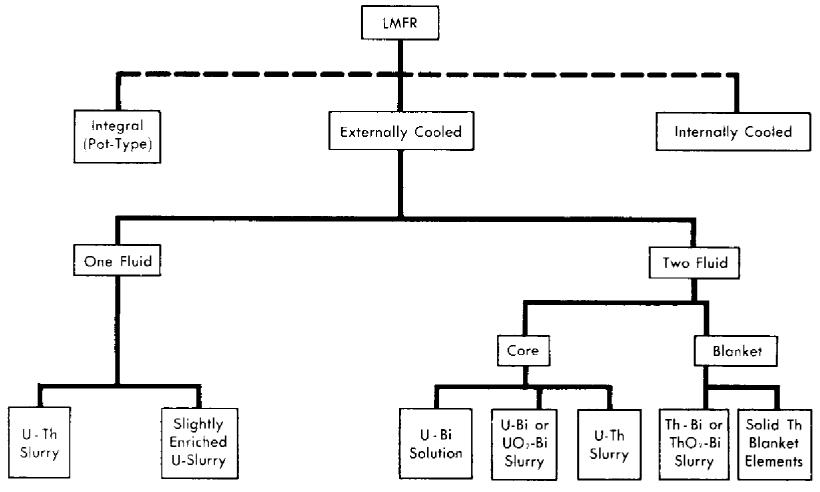
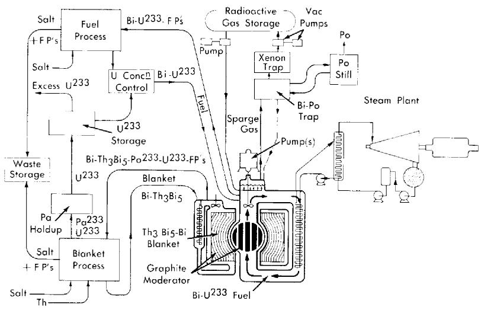

# Part III

# LIQUID-METAL FUEL REACTORS

FRANK MASLAN, Editor Brookhaven National Laboratory

18. Liquid-Metal Fuel Reactors   
19. Reactor Physics for Liquid-Metal Reactor Design   
20. Composition and Properties of Liquid-Metal Fuels   
21. Materials of Construction--Metallurgy   
22. Chemical Processing   
23. Engineering Design   
24. Liquid-Metal Fuel Reactor Design Study   
25. Additional Liquid-Metal Reactors

# CONTRIBUTORS

R. BOURDEAU   
M. B. BRODSKY   
J. S. BRYNER   
J. CHERNICK   
J.G.Y.CHOW   
O.E.DWYER   
W.P.EATHERLY   
J.J.EGAN   
A.M. ESHAYA   
W.S.GINELL   
L. GREEN   
R.J.ISLER   
D. H. GURINKSY   
D. HALL   
F. B. HILL

M. JANES   
O.F.KAMMERER   
C.J.KLAMUT   
R.M.KIEHN   
R. L. MANSFIELD   
R.A.MEYER   
F. T. MILES   
C. RASEMAN   
W. ROBBA   
D.G.SCHWEITZER   
T.V.SHEEHAN   
H. SUSSKIND   
C. WAIDE   
J. R. WEEKS   
R.H.WISWALL

# PREFACE

This is the most extensive discussion of liquid-metal fuel reactor development yet published in the United States. Emphasis has been placed on the Liquid Metal Fuel Reactor being developed by Brookhaven National Laboratory and Babcock & Wilcox Co. because it is the most advanced project. Work on various phases of liquid-metal fuel reactors is being carried out by Los Alamos Scientific Laboratory, Raytheon Manufacturing Co., Argonne National Laboratory, Ames Laboratory, and Atomics International. The editor would like to have given more coverage to work at the last three locations but was unable to because time was lacking.

The liquid-metal fuel reactor development at Brookhaven started as an organized program in 1951. Before that, work had been conducted on bismuth-uranium fuel and other components. In 1954, Babcock & Wilcox Co., in collaboration with representatives of sixteen other companies, prepared a reference design and report. In 1956, Babcock & Wilcox contracted with the Atomic Energy Commission to design, build, and operate a low-power experimental reactor (LMFR Experiment No. 1). Research, development, and design studies are being carried on concurrently by B & W and Brookhaven. LMFR Experiment No. 1, on which construction is scheduled to start in 1960, is intended to demonstrate feasibility and provide information on the physics, metallurgy, chemistry, and mechanical aspects of this type of reactor.

The editor expresses appreciation to many of his colleagues at Brookhaven and Babcock & Wilcox for working with him on these chapters. He wishes particularly to thank those whose material he drew upon, also C. Williams, O. E. Dwyer, D. Gurinsky, H. Kouts, F. T. Miles, and T. V. Sheehan, of Brookhaven National Laboratory; R. T. Schoemer, H. H. Poor, and J. Happell, of Babcock & Wilcox Co.; R. Rebholz and G. Goring, of Union Carbide Corp.; D. Hall, of Los Alamos Scientific Laboratory; and W. Robba, of Raytheon Manufacturing Co. Special appreciation is due Miss Gloria Ministeri for her laborious and prolonged secretarial work and Miss Dolores Del Castillo for coming to our aid in emergencies.

Upton, New York June 1958

Frank Maslan, Editor

# CHAPTER 18

# LIQUID METAL FUEL REACTORS

# 18-1. BACKGROUND

Liquid metal fuel reactors have received attention since the early days of reactor technology. The concept of a high-temperature fluid fuel which could be circulated for both heat exchange and chemical processing has been an intriguing one [1-4].

This type of reactor was first suggested in 1941 but received little research and development attention until approximately 1947. At this time the Nuclear Engineering Department at Brookhaven National Laboratory began its Liquid Metal Fuel Reactor (LMFR) development. A solution of uranium in bismuth was suggested because of the low melting point and low neutron-capture cross section of bismuth. Coupled with these factors is the very high boiling point of bismuth, which makes possible the high-temperature operation of a bismuth-cooled reactor at relatively low pressures.

Modern steam power plants have a thermodynamic efficiency of approximately $40\%$ . For a nuclear system to achieve comparable efficiencies, the working fluid will have to have a reactor outlet temperature in the neighborhood of $500^{\circ}\mathrm{C}$ . The LMFR is one of the new types of nuclear reactors having this desirable characteristic. Thus, it is one of the few with potentialities for producing power competitive with the best of the present steam systems.

18-1.1 Work at Brookhaven National Laboratory. In 1948, an appraisal of various low-melting alloys was made at Brookhaven. Attention was also given to metallic slurries consisting of uranium in the form of intermetallic compounds suspended in liquid metal carriers. The uranium-bismuth system appeared to show considerable promise. Preliminary solubility studies were completed by 1950 and a start was made on fuel processing investigations.

Since that time the project has steadily accelerated. Chemical aspects of the fuel and fuel-processing systems have been and are being investigated in considerable detail. Metallurgical studies of corrosion, mass transfer, and stability of fuel systems have advanced from short-time crucible tests to circulating loops of alloy steel operated for many thousands of hours. Consideration has also been given to the design of such various reactor components as pumps, piping, valves, heat exchangers, and instruments.

18-1.2. Work of study groups. In common with other reactor concepts, the LMFR has been evaluated from time to time as part of the general Atomic Energy Commission Reactor Development Program. During the summer of 1953, the LMFR was evaluated under Project Dynamo, and it was concluded that it was an extremely attractive concept if proven technically feasible. In 1955 an industrial study group, under the direction of Babcock & Wilcox, made a detailed appraisal and design of the LMFR concept [19], and reported that it could be proved technically feasible in the near future and that it appears attractive from an economic point of view. In 1957, the Babcock & Wilcox Company re-evaluated the LMFR and found the outlook as good as indicated previously [21]. Of course, the development of a new reactor concept of this kind is a long-range program.

Present plans call for a buildup of knowledge through the construction and operation of several LMFR experiments. The first of these is currently being designed by Babcock & Wilcox.

# 18-2. GENERAL CHARACTERISTICS OF LIQUID METAL FUEL REACTORS*

18-2.1 Comparison of fluid- and solid-fuel reactors. In order to better understand the development and characteristics of the Liquid Metal Fuel Reactor, fluid- and solid-fuel reactors should be compared, and a distinction should be made between the features of fluid fuels in general and those of liquid metal fuels in particular.

A reactor using a fluid fuel may have the following advantages over one with solid-fuel elements:

(1) Simple structure. A fluid fuel can be cooled in an external heat exchanger separate from the reactor core. Thus the nuclear requirements (of the core) and the heat flow requirements (of the exchanger) need not both be satisfied at the same place. This may allow design for very high specific power. For example, material of high cross section, such as tungsten or tantalum, which could not be used in the core, could be used in the heat exchanger.   
(2) Easy fuel handling.   
(3) Simplified reprocessing. The reduction to metal, fabrication, canning, and dissolving steps are eliminated. Because manual steps in refabrication are unnecessary, decontamination need not be complete. The cooling time could be made much shorter, resulting in a smaller holdup of fissionable material.   
(4) Simplified waste disposal.   
(5) Continuous removal of fission products. The removal of poisons would improve neutron economy and permit higher burnup. With a lower

inventory of radioactive material, the potential hazard would be decreased; this might reduce the size of the exclusion area required for safety.

(6) Inherent safety and ease of control. Any liquid fuel which expands on heating gives an immediate negative temperature coefficient of reactivity. This effect is not delayed by any heat-transfer process. The rate of expansion is limited only by the speed of sound (shockwave) in the liquid. This instantaneous effect tends to make the reactor self-regulating. Adjustment of fuel concentration can be used as an operating control.

Disadvantages of fluid fuels are listed below:

(1) Possible fluctuations of reactivity caused by density or concentration changes in the fuel, e.g., bubbling.   
(2) Loss of delayed neutrons in the fuel leaving the core.   
(3) External holdup of fissionable material.   
(4) Induced activity in pumps and heat exchangers and possible deposition of fuel and fission products.   
(5) Corrosion and erosion problems. Each fuel system has its particular corrosion problems. These differ greatly from one system to another, but in every case corrosion is a critical problem which must be solved.   
(6) IIhigh radiation levels in the reactor and in the component piping require development of remote maintenance techniques.

18-2.2 Advantages and disadvantages of LMFR. Comparing one liquid fuel system with another involves relative advantages and disadvantages. Liquid metal solution systems (in particular, solutions of uranium in bismuth) [5-12] have the following advantages over aqueous systems:

(1) Metals can be operated at high temperatures without high pressures.   
(2) Metal solutions are free from radiation damage and do not give off bubbles. By using liquid metals, therefore, two factors that may limit the specific power of aqueous systems are avoided.   
(3) Liquid metals have better heat-transfer properties than water.   
(4) Metal systems do not have inherent moderating properties and can be used for fast and intermediate reactors as well as for thermal reactors, provided the critical mass requirements are not excessive.   
(5) Liquid metals can be circulated by electromagnetic pumps if desired, although the efficiency may be poor, as with bismuth.   
(6) Some suitable metals, e.g., bismuth, are cheaper than $\mathrm{D}_2\mathrm{O}$ .   
(7) Polonium, formed from bismuth by neutron capture, may be a valuable by-product.

Liquid-metal systems have the following disadvantages in comparison with aqueous systems:

(1) The heat capacity is less than with water.   
(2) The higher density may be a disadvantage.   
(3) Liquid metals are more difficult to pump.

(4) The absorption cross sections of the best metals (e.g., bismuth $\sigma_{a} = 0.032$ barn) are inferior to $\mathrm{D}_2\mathrm{O}$ , although better than $\mathrm{H}_2\mathrm{O}$ . The cross section of bismuth may be low enough, however, to allow breeding of $\mathrm{U}^{233}$ from thorium by means of thermal neutrons.   
(5) For a thermal reactor, moderator must be supplied.   
(6) The limited solubility of uranium in bismuth necessitates the use of enriched $\mathrm{U}^{235}$ or $\mathrm{U}^{233}$ as fuel. Uranium-238 or thorium cannot be held in solution in sufficient concentration to give internal breeding.   
(7) Because of items (4) and (5) above, liquid metal fuel reactors are at least 2 ft in diameter [13] and cannot be scaled down as far as aqueous reactors can.   
(8) The high melting point of most metals makes the startup of a reactor difficult.   
(9) Polonium may represent an additional hazard. However, if the polonium remains with the fission products, it should not add to the problems already present.

# 18-3. LIQUID METAL FUEL REACTOR TYPES

As a solvent for liquid-metal fuels, bismuth is a natural choice because it dissolves uranium and has a low cross section for thermal neutrons. As a result, research work at Brookhaven National Laboratory has centered on bismuth-uranium fuels. Other possible liquid-metal fuels are the Los Alamos Molten Plutonium System (LAMPRE) [14] and dispersions of uranium oxide in liquid metals, NaK [15] or bismuth [16]. The limited solubility of uranium in bismuth is troublesome in some designs. More concentrated fuels can be obtained by using slurries or dispersions of solid uranium compounds in bismuth. Among the solids which have been suggested are intermetallic compounds [10] uranium oxide [16], uranium carbide, and uranium fluoride. Use of a dispersion avoids the limited concentration but introduces other problems of concentration control, stability, and erosion.

Liquid metal fuel reactors would appear to be most useful for large central station power plants [6,11,17-20] where the integrated chemical processing, one of the attractive features of an LMFR system, would be important.

The uranium-bismuth fuel system is flexible and can be used in many designs. Although other types of liquid-metal systems are certainly possible, the LMFR at Brookhaven is being designed as a thermal reactor in which the fuel is dissolved or suspended in a liquid heavy-metal carrier. Ordinarily, the liquid metal is bismuth for highest neutron economy, but other systems such as lead or lead-bismuth eutectic may be used. The moderator is graphite, although beryllium oxide has also been considered.

  
FIG. 18-1. Classification of Liquid Metal Fuel Reactors.

Liquid metal fuel reactors are classified on the basis of their heat-transfer characteristics (Fig. 18-1) [21]. If heat is transferred within the core the reactor is said to be internally cooled. If heat is transported by the fuel to the primary heat exchanger external to the core, the reactor is externally cooled. The term "integral reactor" implies an externally cooled system, but one so compact that the reactor and primary heat exchangers can be placed in the same container.

Externally cooled LMFR's can be divided into two classes, single-fluid and two-fluid. In the single-fluid reactor the fissionable and fertile materials are combined in a single fluid carrier, bismuth. This type of reactor has no separate blanket, and conversion or breeding takes place within the core fluid itself. The conversion ratio can be made to approach unity with the proper choice of such parameters as core size, graphite-to-fuel ratio, and thorium concentration. However, the most economic design is not necessarily the one having the highest conversion ratio (see Chapter 24). If no fertile material is mixed with the fuel, the concept reduces to the simple burner.

The two-fluid externally cooled LMFR (Fig. 18-2) is somewhat more complex because it has a physically separate core and blanket, but higher conversion ratios are possible. The blanket can be made in a variety of ways, making use of either solid or liquid blanket materials. In exploiting the LMFR concept to the full, a fluid blanket consisting of a slurry of $\mathrm{ThBi}_2$ or $\mathrm{ThO}_2$ in bismuth is used.

A variety of fuels is also possible. In the two-region reactor, critical concentrations of uranium in bismuth could be below solubility limits;

  
FIG. 18-2. Schematic diagram of LMFR, showing reactor, steam plant, and chemical processing.

therefore solution fuels are possible. Such a fuel for the single-region reactors is possible only for small thorium loadings or for burners. Higher fuel concentrations can be utilized only through the use of slurries. On the basis of experiments, a maximum slurry content of $10\mathrm{w / o}$ (weight percent) of either uranium or thorium as bismuthide compounds in bismuth can be assumed. If an oxide slurry is used, approximately $20\mathrm{w / o}$ can be carried by the bismuth. So far only fuels of $\mathrm{U}^{233}$ and $\mathrm{U}^{235}$ have been investigated in the LMFR program.

# 18-4. LMFR PROGRAM

In the following chapters detailed discussions of the liquid metal fuels research, development, and engineering work are given. Practically all the LMFR work is in the research and development stage. In the first group of chapters, the physics, chemistry, and engineering design of the LMFR are discussed. In the last chapters, several liquid metal fuel reactor designs, based on current research and development, are presented. It should be understood that these are design studies and it is expected that more than one liquid metal fuel experimental reactor will have to be built and operated before a final commercial design is evolved.

# REFERENCES

1. H. HALBAN and L. KOWARSKI, Cambridge University, England, Cavendish Laboratory, 1941. Unpublished.   
2. M. E. Lee, Fairehild Engine & Airplane Corp., NEPA Division, 1950. Unpublished.   
3. E. P. Wigner et al., Argonne National Laboratory, 1944. Unpublished.   
4. G. Young, Outline of a Liquid Metal Pile, USAEC Report MonP-264, Oak Ridge National Laboratory, Mar. 5, 1947.   
5. O. E. Dwyer, Heat Transfer in a Liquid-Metal-Fuel Reactor for Power, in Chemical Engineering Progress Symposium Series, Vol. 50, No. 11. New York: American Institute of Chemical Engineers, 1954. (pp. 75-91)   
6. C. WILLIAMS and F. T. MILES, Liquid Metal Fuel Reactor Systems for Power, ibid., No. 11. (pp. 244-252)   
7. J. E. Atherton et al., Studies in the Uranium-Bismuth Fuel System, ibid., No. 12. (p. 23)   
S. C. J. RASEMAN and J. WEISMAN, Liquid-Metal-Fuel Reactor Processing Loops, ibid., No. 12. (p. 153)   
9. D. W. BAREIS et al., Processing of Liquid Bismuth Alloys by Fused Salts, ibid., No. 12. (p. 228)   
10. R. J. TEitel et al., Liquid-Metal Fuels and Liquid-Metal Breeder Blankets, ibid., No. 13. (p. 11)   
11. NUCLEAR ENGINEERING DEPARTMENT, BROOKHAVEN NATIONAL LABORATORY, Liquid Metal Fuel Reactor Systems, a collection of seven papers, *Nucleonics* 12(7), 11-12 (1954).   
12. O. E. Dwyer et al., Liquid Bismuth As a Fuel Solvent and Heat Transport Medium for Nuclear Reactors, paper presented at the Nuclear Engineering and Science Congress at Cleveland, Ohio, Dec. 12-16, 1955. (Preprint 50)   
13. J. CHERNICK, Small Liquid Metal Fueled Reactor Systems, Nuclear Sci. and Eng. 1, 135-155 (1956).   
14. R. M. KIEHN, A Molten Plutonium Reactor Concept—LAMPRE, USAEC Report LA-2112, Los Alamos Scientific Laboratory, January 1957: Los Alamos Molten Plutonium Reactor Equipment (LAMPRE), Nucleonics 14(2), 14 (February 1956); Molten Plutonium Reactors, in Radiation Safety and Major Activities in the Atomic Energy Programs, July-December 1956, U. S. Atomic Energy Commission. Washington, D. C.: Government Printing Office, January 1957. (p. 43)   
15. B. M. ABRAHAM et al., $\mathrm{UO_2}$ -NaK Slurry Studies in Loops to $600^{\circ}\mathrm{C}$ , Nuclear Sci. and Eng. 2, 501-512 (1951).   
16. J. K. DAVIDSON et al., A $UO_{2}$ -Liquid Metal Slurry for Economic Power, paper presented before the American Nuclear Society at Washington, D. C., Dec. 10-12, 1956.   
17. F. T. MILES and C. WILLIAMS, Liquid Metal Fuel Reactor, in Proceedings of the International Conference on the Peaceful Uses of Atomic Energy, Vol. 3. New York: United Nations, 1956. (P/494, p. 125)

18. D. J. SENGSTAKEN and E. DURHAM, Liquid Metal Fuel Reactor for Central Station Power, paper presented at the Nuclear Engineering and Science Congress at Cleveland, Ohio, Dec. 12-16, 1955. (Preprint 39)   
19. BABCOCK & WILCOX Co., Liquid Metal Fuel Reactor; Technical Feasibility Report, USAEC Report BAW-2(Del.), June 30, 1955.   
20. D. MARS et al., Preliminary Design of an LMFR Power Plant, Nuclear Sci. and Eng., in preparation.   
21. BABCOCK & WILCOX Co., 1958. Unpublished.