# CHAPTER 20

# COMPOSITION AND PROPERTIES OF LIQUID-METAL FUELS*

# 20-1. CORE FUEL COMPOSITION

In Chapter 18, the advantages and disadvantages of liquid metal fuels were discussed in a general way. The point was made that a liquid-metal fuel has no theoretical limitation of burnup, suffers no radiation damage, and is easily handled for fission-product poison removal. In this chapter, the results of research and development on various liquid-metal fuels are presented. This work has been largely concentrated on uranium dissolved in bismuth.

At the contemplated operating temperatures of approximately $500^{\circ}\mathrm{C}$ , it was found that uranium has adequate solubility in bismuth when present by itself. However, as the work progressed, it soon became evident that other materials would have to be added to the solution in order to obtain a usable fuel. The present fuel system contains uranium as the fuel, zirconium as a corrosion inhibitor, and magnesium as an oxygen getter.

An LMFR operating on the contemplated $\mathrm{Th}^{232}$ to $\mathrm{U}^{233}$ breeding cycle can be designed with an initial $\mathrm{U}^{233}$ concentration of 700 to $1000~\mathrm{ppm}$ in bismuth. The actual figure, of course, is dependent upon the specific design and materials used. In Chapter 24, in the design studies, such figures are given. The concentrations of zirconium and magnesium are each approximately $300~\mathrm{ppm}$ . It is contemplated that these concentrations will have to be varied depending upon desired operating conditions. In their use as corrosion inhibitor and antioxidant there is enough leeway for this purpose.

The fuel described in the previous paragraph is the clean fuel which would be charged initially. During reactor operation, however, fission products will build up in the fuel and would be maintained at a level dictated by the economics of the chemical reprocessing system used. It has been found that the fission products and other additives to the bismuth have an important effect on the solubility of uranium in bismuth. These have been carefully investigated in order to permit selection of reactor temperatures that will ensure that all the uranium remains in solution during reactor operation. Likewise, the solubility of steel corrosion products has been investigated to determine their effect on uranium solubility in bismuth.

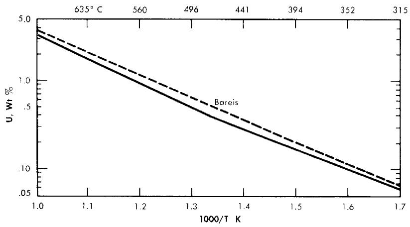  
FIG. 20-1. Solubility of uranium in bismuth.

It is important to note that although the basic fuel is a simple one, the uranium used for liquid metal fuel reactors using the Th- $\mathrm{U}^{233}$ cycle must be almost completely enriched 233 or 235 in the initial charge. Further, since the concentrations are measured in parts per million by weight, it is not an easy matter to maintain a strict accounting of all fuel. When dealing with such small amounts, losses due to reaction of uranium with carbon and adsorption of uranium on steel and graphite walls can be significant.

The fuel for the LMFR is still under extensive study. At present, most of the major information for the design of an LMFR experiment is at hand. This information is primarily solubility data and other fuel information, presented in the following pages.

# 20-2. SOLUBILITIES IN BISMUTH

20-2.1 Uranium. The experimental techniques used to measure solubilities in liquid bismuth have been described previously [1,2]. Several workers [3-7] have investigated the solubility of uranium and bismuth. Recently, with improvements in analytical techniques, redetermination of the solubility curve has been undertaken. The latest results are at variance with the older work of Bareis [5], as shown in Fig. 20-1. It can be seen that the recent data obtained at Brookhaven National Laboratory are, at some temperatures, as much as 20 to $25\%$ lower than those obtained some years ago.

This variance in solubility determinations may be due to several factors, but it is believed that the improved techniques are more reliable, and that the newer values are consequently more precise. The presence of such

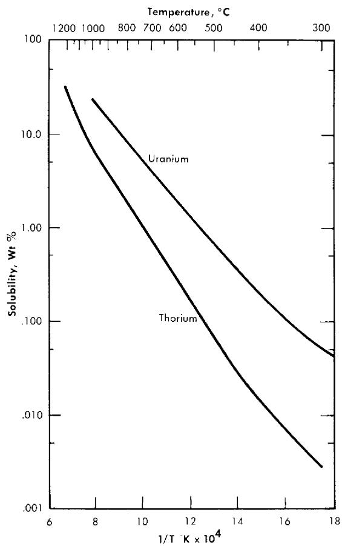  
FIG. 20-2. Solubility of uranium and thorium in bismuth.

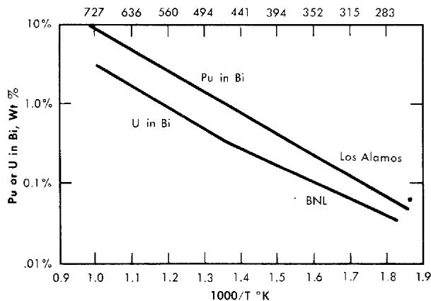  
FIG. 20-3. Solubility of plutonium and uranium in bismuth.

other materials as nickel, copper, manganese, etc., in the bismuth in quantities large enough to affect the uranium solubility still remains to be investigated. For example, nickel has been shown to markedly reduce the uranium solubility in bismuth [1].

It is obvious that even slight variations of the solubility of uranium in bismuth might be of considerable importance in LMFR reactor design. The solubility of uranium, according to the preferred data (the solid curve in Fig. 20-1), allows a rather small leeway in uranium concentration in the reactor cycle when the lowest temperature of $400^{\circ}\mathrm{C}$ in the heat exchangers is taken into account.

20-2.2 Thorium and plutonium. The solubility of thorium in bismuth, as determined by Bryner, is compared with the solubility of uranium in Fig. 20-2. In the temperature range 400 to $500^{\circ}\mathrm{C}$ , the solubility of thorium is markedly lower than that of uranium. In fact, it is so low that a breeding cycle using only thorium in solution with bismuth cannot be carried out.

To fill out the information on fissionable fuel solubility in bismuth, Fig. 20-3 shows the solubility of plutonium in bismuth, as determined at the Los Alamos National Laboratory. In comparing plutonium with uranium, it is seen that plutonium is significantly more soluble.

20-2.3 Fission-product solubility. The solubilities of most of the important fission products have been determined, and are shown in Fig. 20-4. In general, all the fission products are soluble enough so that they will stay in solution throughout the reactor cycle. This is not true of molybdenum however. Attempts at determining the solubility of Mo have indicated that it is less than $1\mathrm{ppm}$ (the limit of detection) at temperatures below $800^{\circ}\mathrm{C}$ . Since a fair amount of the Mo is produced by fission, this means that a sludge might form during reactor operation. (Beryllium presents similar difficulties, since at temperatures below $800^{\circ}\mathrm{C}$ the solubility of Be has been shown to be less than $10\mathrm{ppm}$ .)

20-2.4 Magnesium and zirconium. The solubility of magnesium in bismuth in the temperature range 400 to $500^{\circ}\mathrm{C}$ is approximately 5 wt. $\%$ which is considerably higher than the amounts of magnesium being considered in this work (300 ppm). Little work has been done on this particular determination at Brookhaven.

The solubility of zirconium in bismuth has been determined and is shown in Fig. 20-5. This information is important in showing that the saturation solubility of zirconium is very close to the amounts desired for corrosion inhibition in the temperature range 400 to $500^{\circ}\mathrm{C}$ .

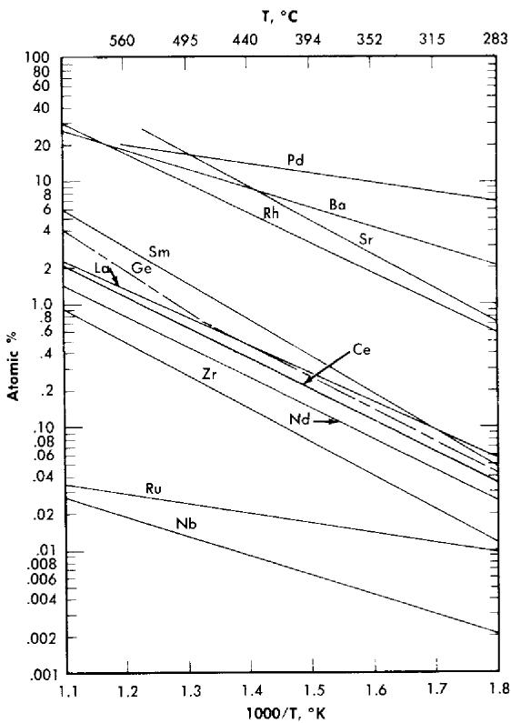  
FIG. 20-4. Solubility of fission products in bismuth.

20-2.5 Solubility of corrosion products in bismuth. An alloy steel is contemplated as the tube material for containing the circulating fuel in the LMFR. Hence it has been pertinent to determine the solubility of alloy steel constituents in bismuth. Figure 20-6 shows the solubilities of iron, chromium, nickel, and manganese, all of whose solubilities are fairly high from a corrosion point of view. Nickel and manganese are particularly high.

The solubility of titanium is shown in Fig. 20-7. It has been shown [8] that titanium will reduce the mass-transfer corrosion of steels by liquid bismuth.

20-2.6 Solubilities of combination of elements in bismuth. The effect of $\mathrm{Zr}$ on the $U$ solubility. The mutual solubilities of uranium and zirconium in bismuth have been measured over the temperature range 325 to $700^{\circ}\mathrm{C}$ . The data are plotted in Fig. 20-5. When bismuth is saturated with zirconium, the uranium solubility is appreciably decreased. On the other

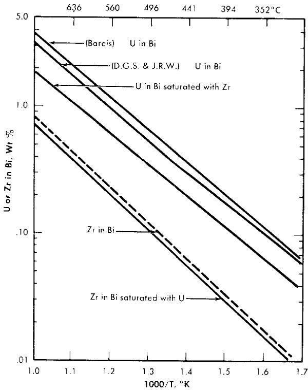  
FIG. 20-5. Mutual solubility of uranium and zirconium in bismuth.

hard, only a slight decrease is noted in the $\mathbf{Z}\mathbf{r}$ solubility. The addition of $1000~\mathrm{ppm}$ magnesium had no effect on either the uranium or zirconium solubility. This, of course, is in considerable excess of the quantity of magnesium contemplated for use in the fuel.

The mutual solubility effects were further studied by determining the ternary system U-Zr-Bi at three temperatures, 375, 400, and $425^{\circ}\mathrm{C}$ . These are shown in Fig. 20-8.

The effect of fission products on the solubility of $U - Bi$ . Considerable work has been done on determining the mutual solubility effect of fission products on uranium and bismuth. A good typical example is shown in Fig. 20-9, which shows that the solubility of uranium and bismuth is affected by $250~\mathrm{ppm}$ Zr, $350~\mathrm{Mg}$ , $60~\mathrm{Nd}$ , $15~\mathrm{Sm}$ , $15~\mathrm{Sr}$ , $10~\mathrm{Cs}$ , and $8~\mathrm{Ru}$ . There is little doubt that this small amount of fission products, $120~\mathrm{ppm}$ , has a small but definite effect on uranium solubility.

Effects of additives on solubility of corrosion products in liquid bismuth. The ordinary concentrations of zirconium (250 to 300 ppm) do not affect the equilibrium iron solubility at temperatures from 500 to $700^{\circ}\mathrm{C}$ . For

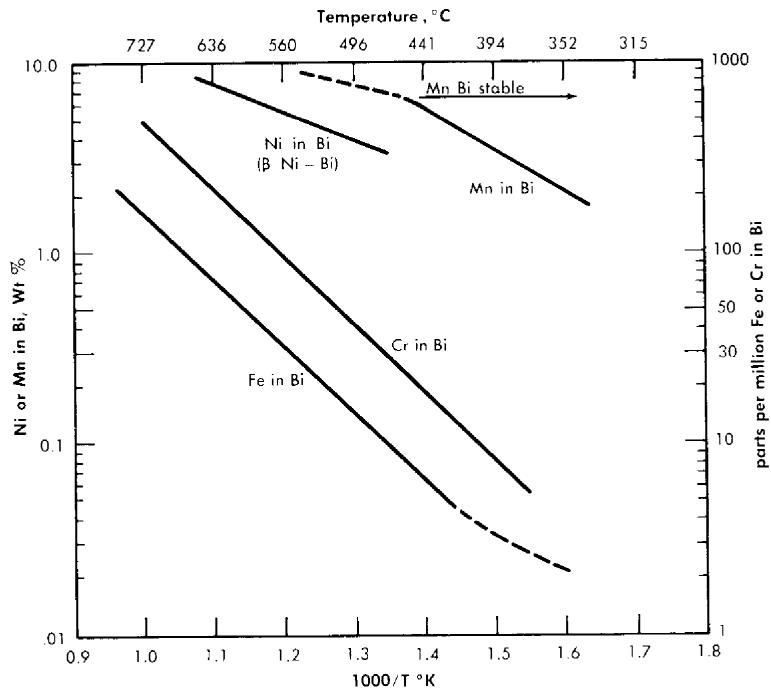  
FIG. 20-6. Solubility of Fe, Cr, Ni, and Mn in bismuth.

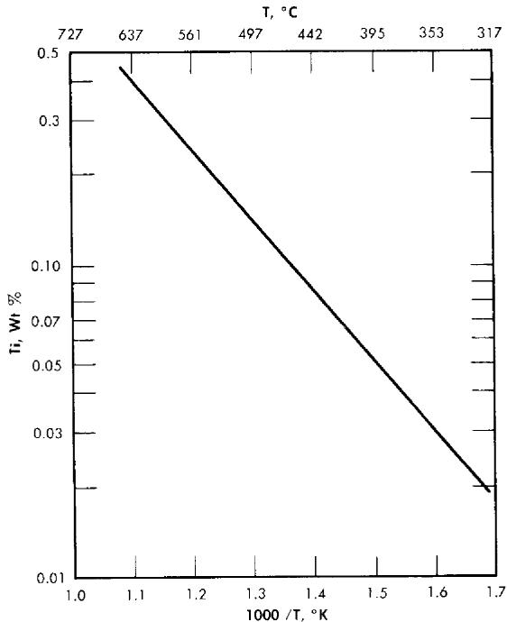  
FIG. 20-7. Solubility of titanium in bismuth.

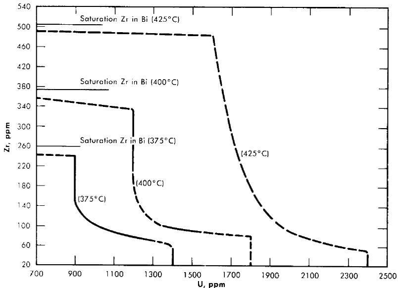  
FIG. 20-8. The U-Zr-Bi ternary system: liquidus curves at 375, 400, and $425^{\circ}\mathrm{C}$ .

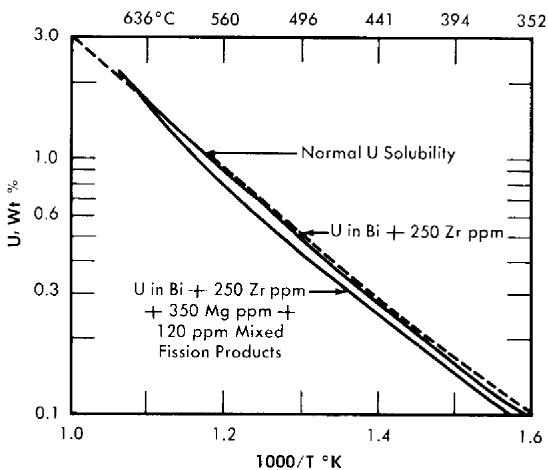  
FIG. 20-9. Solubility of U in Bi + 250 ppm Zr, and in Bi + 250 ppm Zr + 350 ppm Mg + 120 ppm mixed fission products. Original alloys $3.9\%$ U and $3\%$ U, respectively.

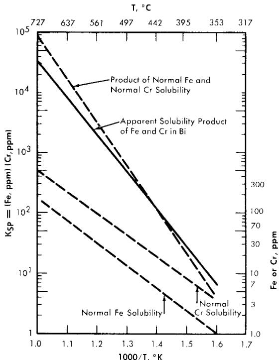  
FIG. 20-10. Effect of Cr on the solubility of Fe in Bi.

higher concentrations (above 700 ppm zirconium), the iron solubility is increased in this same temperature range.

Zirconium in all concentrations up to saturation does not affect the solubility of chromium in bismuth.

Uranium, with magnesium additions up to 2000 ppm, does not affect the solubility of iron in bismuth. The possible effects on chromium solubility are not known at this time.

Chromium has a marked effect on the solubility of iron, whereas the chromium solubility itself is not affected. An apparent solubility product is observed as is shown in Fig. 20-10 by the line titled "Apparent solubility product. Below $450^{\circ}\mathrm{C}$ , the iron solubility appears to be increased by saturating the solution with chromium. Above that temperature, the iron solubility is markedly reduced by chromium.

Titanium, at concentrations greater than $100~\mathrm{ppm}$ , has been found to reduce the iron solubility in the temperature range 475 to $685^{\circ}\mathrm{C}$ [9].

20-2.7 Salts. In some of the contemplated chemical fuel processing methods the liquid bismuth fuel will be brought in contact with chloride

and fluoride salts. A typical chloride salt is the eutectic mixture of $\mathrm{NaCl - KCl - MgCl_2}$ . It is important that none of the salts dissolve in the bismuth and get carried over into the core, since chlorine is a neutron poison. Preliminary investigations at BNL indicate that the solubility of these chloride salts is less than the detectable amount, $1\mathrm{ppm}$ .

# 20-3. PHYSICAL PROPERTIES OF SOLUTIONS

20-3.1 Bismuth properties. The physical properties of bismuth are listed in Table 23-1.

20-3.2 Solution properties. Little work has been done on determining physical properties of the solutions. The available results indicate that the small amount of dissolved material does not appreciably affect the physical properties of density, viscosity, heat capacity, and vapor pressure. For design purposes, the properties of pure bismuth can probably be used with safety.

20-3.3 Gas solubilities in bismuth. The question of the solubility of the fission-product gases xenon and krypton in bismuth is of extreme importance. In particular, $\mathrm{Xe}^{135}$ , a strong neutron poison, must be removed from the system as fast as it is formed in order to have a good neutron economy.

Attempts at measuring and calculating the solubility of these gases in bismuth have proved extremely difficult, because of the extremely small solubilities. Mitra and Bonilla [10] have measured the solubility of xenon in bismuth at $492^{\circ}\mathrm{C}$ as $8 \times 10^{-7}$ atom fraction at atmospheric pressure. On the other hand, McMillan [11] has calculated the solubility as $10^{-12}$ atom fraction at $300^{\circ}\mathrm{C}$ . It is probable that the amount of gases produced in the reactor lies between these two determinations. At present, the question of xenon and krypton solubility in bismuth is open to more intensive research.

# 20-4. FUEL PREPARATION

Fuel has been prepared at BNL by simply dissolving the solid uranium, magnesium, and zirconium in molten bismuth. The solids are usually in the form of small chips and are placed in a small metal basket which is then suspended in the bismuth.

# 20-5. FUEL STABILITY

It is essential to maintain a homogeneous fuel and to prevent the uranium from concentrating in any particular region of the reactor. Stability tests have been conducted to determine conditions necessary for keeping the

uranium in solution by preventing its reaction with the steel and graphite of the system. Measurements have also been made of the rate of oxidation of uranium in the liquid fuel stream. This study indicates the effect of an accidental air leak during the reactor operation.

20-5.1 Losses of uranium from bismuth by reaction with container materials. Early attempts to make up uranium-bismuth solutions resulted in about a $50\%$ loss of uranium even though very high-purity bismuth $(99.99\%)$ was used. Apparently the uranium reacted with the few impurities in bismuth or adsorbed on the walls of steel containers. Sand-blasting and acid-pickling of the container walls, deoxidizing the bismuth by hydrogen firing, and adding $250~\mathrm{ppm}$ Zr and $350~\mathrm{ppm}$ Mg before introduction of U reduced this loss to about $5\%$ . It is possible that even this $5\%$ loss may not be real, but is attributable to analytical and sampling techniques.

Only small decreases in the zirconium and magnesium concentrations have been observed, and in tests where titanium was used as an oxygen scavenger, no loss of U was observed.

When the fuel solution is brought in contact with graphite, usually 10 to $15\%$ of the uranium is lost from the solution. Apparently it reacts with the graphite or impurities present in the graphite. Research on this is under way at present. However, it is proving to be extremely difficult since the amounts of materials involved are so small.

Since zirconium reacts with graphite to form zirconium carbide in preference to uranium forming uranium carbide, addition of zirconium to the solution should help prevent loss of uranium. This effect has been observed.

Generally it has been found that zirconium concentration will initially drop and then maintain a constant level throughout the exposure of the fuel solution to graphite.

20-5.2 Reaction of fuel solution with air. Should an air leak occur in the LMFR, the uranium, magnesium, and zirconium will all tend to oxidize in preference to the bismuth. Figure 20-11 shows the results of an experiment in which air was bubbled through fuel kept at a temperature of $405^{\circ}\mathrm{C}$ . These results indicate that the preference of oxidation is in the order magnesium, uranium, zirconium.

The reaction data indicate that the uranium oxidation rate is one-half order dependent on the $\mathrm{UO_2}$ present. The magnesium oxidation rate, in general, is first order with respect to magnesium concentration. Other experiments show that if additional amounts of magnesium are added to the solution after the oxidation, most of the $\mathrm{UO_2}$ can be reduced back to uranium. These data are given in Table 20-1.

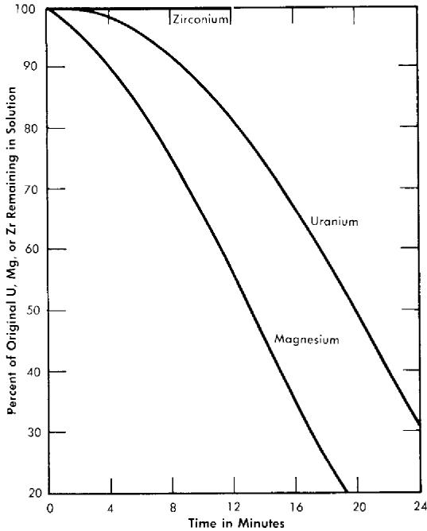  
FIG. 20-11. Concurrent oxidation of U, Zr, and Mg from Bi containing 750 ppm U, 284 ppm Mg, and 280 ppm Zr.

TABLE 20-1   
REDUCTION OF $\mathrm{UO}_2$ BY Mg IN Bi   

<table><tr><td>T°C</td><td>U (ppm) as UO2before addition of Mg</td><td>U (ppm) present in solution before addition of Mg</td><td>Mg (ppm) added</td><td>Time after Mg addition</td><td>U (ppm) in solution after Mg added</td><td>% UO2* reduced</td></tr><tr><td>405</td><td>960</td><td>10</td><td>6600</td><td>25 min</td><td>710</td><td>75-100</td></tr><tr><td>400</td><td>150</td><td>530</td><td>5000</td><td>48 hr</td><td>660</td><td>90</td></tr><tr><td>360</td><td>510</td><td>310</td><td>2500</td><td>10 hr</td><td>460</td><td>30</td></tr><tr><td>360</td><td>550</td><td>10</td><td>1000</td><td>48 hr</td><td>290</td><td>50</td></tr></table>

*The values listed as $\%$ $\mathrm{UO_2}$ reduced are probably lower than equilibrium values, since the samples were taken at arbitrary times after the Mg was added.

Work on fuel stability is obviously of great importance, and is being continued. Very little has been done so far on observation of stability under neutron bombardment. A program is getting underway for the study of radiation effects on the fuel concurrently with a study of corrosion effects. For this purpose the Brookhaven Pile will be used together with Radiation Effects Loop No. 1.

# 20-6. THORIUM BISMUTHIDE BLANKET SLURRY

20-6.1 Status of development. In developing a blanket system for the LMFR, it has seemed logical to select one which is as similar as possible to the core fuel. After considerable evaluation the principal emphasis has been placed upon a bismuth fluid containing thorium bismuthide in the form of very small particles. This is commonly called the thorium bismuthide slurry system.

Since this fluid has practically the same physical properties as that of the core, it would be possible to balance pressures across the graphite wall separating the blanket from the core and, in the event of mixing the core and blanket fluids, no violent reactions would ensue. Furthermore, from a chemical processing point of view, an all-metallic blanket system offers considerable advantage when pyrometallurgical processing techniques are used.

This does not mean that other types of blankets are not being studied. Work is concurrently under way on thorium oxide-bismuth slurries. Also, thorium carbide, thorium fluoride, and thorium sulphide slurries are under consideration.

At the Ames Laboratory (Iowa State College) the solution of thorium in magnesium has received considerable attention in the past few years. This is a true solution, and certainly offers another possibility for a blanket fluid. However, unless an absolute method for keeping the magnesium solution separate from the core bismuth solution is found, this system would be hazardous when used with the contemplated uranium-bismuth core fluid, since magnesium and bismuth will react violently and cause a marked temperature rise.

20-6.2 Chemical composition of thorium bismuthide. The thorium bismuthide intermetallic compound discussed in this section has the chemical formula $\mathrm{ThBi}_2$ . This compound is $35.7\mathrm{w / o}$ thorium. A second compound, $\mathrm{Th}_3\mathrm{Bi}_4$ , also can exist and has been observed in alloys containing greater than 50 to $55\mathrm{w / o}$ thorium.

20-6.3 Crystal chemistry of thorium bismuthide. $\mathrm{ThBi}_2$ has a tetragonal crystal structure (with $a_0 = 4.942\mathrm{A}$ , and $c_{0} = 9.559\mathrm{A}$ ) containing two thorium atoms and two bismuth atoms per unit cell. The density as determined

by x-ray measurement, is $11.50\mathrm{g / cc}$ at $25^{\circ}\mathrm{C}$ . It is estimated to be approximately $11.4\mathrm{g / cc}$ at $550^{\circ}\mathrm{C}$ .

$\mathrm{Th}_{3}\mathrm{Bi}_{4}$ has a body-centered cubic structure ( $a_{0} = 9.559 \, \text{A}$ ) containing 12 thorium atoms and 16 bismuth atoms in the unit cell. The density is $11.65 \, \text{g/cc}$ .

Ordinarily, when thorium bismuthide is prepared at $500^{\circ}\mathrm{C}$ , very small equiaxed particles (less than 0.5 micron) are formed. These equiaxed particles grow until they reach the average size of 50 to 60 microns, and under certain conditions they can grow to considerably larger dimensions.

When a 5 to $10\mathrm{w / o}$ thorium bismuthide slurry is cooled from a temperature of complete solution (above $1000^{\circ}\mathrm{C}$ ), $\mathrm{ThBi_2}$ precipitates in the form of platelets having diameter-to-thickness ratios greater than 50:1. The plane of the platelet is parallel to the 001 plane of the crystal. Platelet diameters up to $1\mathrm{cm}$ have been observed in alloys cooled at moderate rates. The diameters can be decreased by increasing the cooling rate.

Whereas equiaxed particles tend to grow equally in all three dimensions, it has been found that the platelets, when heated isothermally at temperatures above $300^{\circ}\mathrm{C}$ , tend to grow faster in thickness than in diameter. The solid particles thus tend to approach an equiaxed shape. The rate of approach to equiaxiality increases as the temperature of isothermic treatment is increased.

Considerable work has been carried out on control of crystal structure and size. The addition of tolerable amounts of Li, Be, Mg, Al, Si, Ca, Ti, Cr, Mn, Fe, Co, Ni, Cu, Zn, Zr, Mo, Pd, Ag, Sn, Sb, Te, Pa, La, Ce, Tr, Nd, Ta, W, Pt, Pb, and U has little effect on the mode of thorium bismuthide when it is precipitated. It has been found, however, that tellurium inhibits the thorium bismuthide particle growth, agglomeration, and deposition during thermal cycling. The platelet mode of bismuthide precipitation is not modified by addition of tellurium. The amount of tellurium used in these experiments has been 0.10 w/o.

The mechanisms by which tellurium additions inhibit $\mathrm{ThBi_2}$ particle growth, agglomeration, and deposition are as yet uncertain. Although additions of tellurium in larger concentrations decrease the solubility of thorium in bismuth markedly, the concentration of tellurium required for inhibition decreases the solubility only slightly. These small amounts of tellurium appear to be associated with the solid phase rather than the liquid phase. They do not appear to alter the crystal structure.

It has been observed that under certain conditions $\mathrm{ThBi}_2$ particles suspended in liquid bismuth can be pressure-welded to one another and to container materials by the forces of impact. This pressure-welding phenomenon has been observed at $525^{\circ}\mathrm{C}$ and higher temperatures. Since this phenomenon might cause plugging by agglomeration at points of high impact, it will be necessary to take this factor into account in the design of slurry circulation systems.

20-6.4 Thorium-bismuth slurry preparation. Dispersions of small equiaxed particles of $\mathrm{ThBi_2}$ in bismuth can be prepared by heating finely divided thorium, in the form of powder or chips, in contact with liquid bismuth at 500 to $600^{\circ}\mathrm{C}$ under an inert atmosphere. The intermetallic compound is formed by an exothermic reaction at the thorium-bismuth interface, when the convex radius of curvature of the thorium surface is suitably small. The compound exfoliates into the liquid as agglomerates of very small particles (less than 0.5 micron). These small particles grow very rapidly, the larger at the expense of the smaller, as equiaxed single crystals of $\mathrm{ThBi_2}$ . Rapid growth ceases when the maximum crystal dimensions approach approximately 50 to 60 microns. The time necessary for complete reaction varies with the dimensions of the thorium. For example, 325-mesh thorium powder reacts completely in 5 min at $500^{\circ}\mathrm{C}$ , thorium chips $1/2'' \times 1/8'' \times 0.010''$ require 2 hr at $500^{\circ}\mathrm{C}$ , and thorium chips $3/4'' \times 3/16'' \times 0.020''$ require 13 hr at $500^{\circ}\mathrm{C}$ . The thorium dimensions have only a slight effect upon the ultimate particle size. The reaction can be accelerated by raising the temperature. Higher temperatures, however, increase both the particle size and the tendency to form sintered agglomerates rather than single crystals.

If thorium powder is added to the liquid bismuth surface at the reaction temperature, it is necessary to stir the thorium into the liquid. Otherwise a crust of intermetallic compound forms on the surface which is rigid enough to support subsequent additions, thus preventing contact between the thorium and the bismuth.

During the reaction, evolution of an unidentified gas (possibly hydrogen from thorium hydride) has been observed. It is necessary to stir the slurry under vacuum to remove the undesirable trapped bubbles of this gas.

A photomicrograph of a typical slurry produced by the exfoliation method is shown in Fig. 20-12. The dark $\mathrm{ThBi}_2$ particles appear in a white matrix of solidified bismuth. The method has been used to prepare 90-lb batches of slurry and may readily be adapted to tonnage-scale preparation. The method is suitable for preparation of the initial blanket charge, but would probably not be used for slurry reconstitution during subsequent blanket processing.

A modification of this method has been studied in which finely divided thorium from a supernatant mixture of fused chlorides is electrolytically deposited on a molten bismuth cathode at the desired temperature [13]. The thorium must be stirred through the interface. Slurries that are satisfactory with respect to thorium content and particle size and shape have been produced by the electrolytic method in batches of up to $10\mathrm{lb}$ . No evolution of gas has been detected during the thorium-bismuth reaction. Unfortunately, the necessary stirring introduces chloride inclusions which are difficult to remove completely. Since these inclusions would decrease

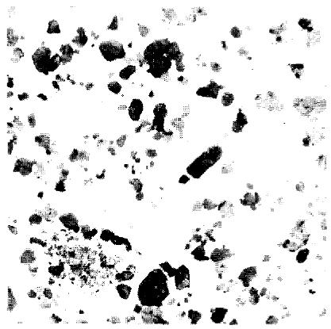  
FIG. 20-12. 5 w/o Th-95 w/o Bi. Dispersion of equiaxed ThBi $_2$ particles in Bi Produced by heating Th chips in Bi at $500^{\circ}\mathrm{C}$ for 2 hr. (150×)

the efficiency of neutron utilization in a breeder blanket because of the high cross section of chlorine, the electrolytic method of slurry preparation must, at present, be considered unsatisfactory.

Another preparation method for thorium-bismuth slurry is by quenching and heat treatment. In this method a solution of thorium, for example 5 w/o, is very rapidly cooled from about $1000^{\circ}\mathrm{C}$ down to about $600^{\circ}\mathrm{C}$ . This can be accomplished by pouring a hot solution into a container having a sufficiently high heat capacity or by pouring the hot solution into an equal volume of liquid bismuth heated just above the melting point. When this is done tiny platelets are formed.

As will be discussed in the following section, the platelet form of crystal is unsatisfactory from a fluidity point of view. When these fine platelets are heat-treated for $20\mathrm{min}$ at $800^{\circ}\mathrm{C}$ , or for $5\mathrm{min}$ at $900^{\circ}\mathrm{C}$ , dispersions of $\mathrm{ThBi}_2$ particles having maximum dimensions less than 100 microns and diameter-to-thickness ratios equal to or less than 5 to 1 are produced. Platelet formation during cooling is avoided by agitating the slurry to suspend the particles.

Figure 20-13 shows the fine platelets produced by the quenching and Fig. 20-14 shows the larger particles produced from these fine platelets by the heat treatment at $800^{\circ}\mathrm{C}$ for $20\mathrm{min}$ . Such a slurry exhibits high fluidity after concentration to $10\mathrm{w/o}$ thorium by removal of excess liquid phase, and is suitable for use in the reactor blanket.

Other possible ways for reconstituting a satisfactory slurry after heating to complete solution involve the use of ultrasonic energy [14]. It has been demonstrated that application of ultrasonic energy to a thorium-bismuth solution during cooling causes the formation of essentially equiaxed particles rather than platelets. It has also been demonstrated that application of

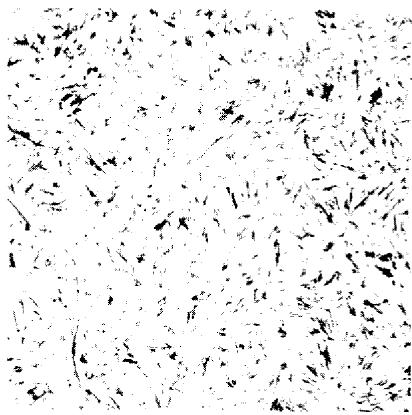  
FIG. 20-13. 5 w/o Th-95 w/o Bi. Dispersion of ThBi₂ platelets in Bi. Alloy heated to $1000^{\circ}\mathrm{C}$ and quenched by pouring into graphite crucible at $25^{\circ}\mathrm{C}$ . (150×)

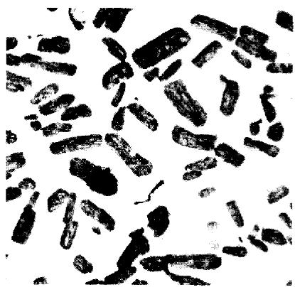  
FIG. 20-14. 10 w/o Th-90 w/o Bi. Dispersion of reconstituted ThBi $_2$ particles in Bi. Produced by heating fine-platelet dispersion to $800^{\circ}\mathrm{C}$ for 20 min. (150×)

ultrasonic energy to platelet dispersions causes the platelets to break up into essentially equiaxed fragments.

20-6.5 Engineering studies of slurries. The intermetallic compound $\mathrm{ThBi}_2$ is quite soft, having a Rockwell 15-T hardness of approximately 60 at room temperature. It is brittle at room temperature but appears to exhibit some ductility at $400^{\circ}\mathrm{C}$ . The compound is pyrophoric and must be protected against oxidation.

When slurries of equiaxed bismuthide in bismuth are prepared, they are fluid at temperatures above the melting point of bismuth, $271^{\circ}\mathrm{C}$ . In these slurries the solid phase is in thermodynamic equilibrium with the

liquid phase and is perfectly wetted by it. At the proposed reactor temperatures (350 to $550^{\circ}\mathrm{C}$ ) practically all the thorium in the slurry appears in the solid phase, since the solubility in the liquid is very low.

The ideal slurry composition represents a balance between a desire for a high thermal neutron utilization factor (i.e., a high thorium content) and the necessity for high fluidity. Fluidity studies have shown that the upper limit of thorium concentration for high fluidity at reactor temperatures is approximately $10\mathrm{w / o}$ of thorium. This corresponds to $24.9\%$ by volume of $\mathrm{ThBi}_2$ , and a thermal neutron utilization factor of 0.957. Although the viscosity of Th-Bi slurries has not been measured, calculations based on the viscosity of liquid bismuth and the behavior of similar systems indicate that at $550^{\circ}\mathrm{C}$ the viscosity of a $10\mathrm{w / o}$ Th suspension of 50-micron, equiaxed $\mathrm{ThBi}_2$ particles should be approximately 2.5 centipoises. It has been observed that increasing the thorium content beyond $10\mathrm{w / o}$ Th causes a disproportionately large increase in the viscosity, so that the consistency approaches that of a mud or paste. The maximum thorium concentration for high fluidity decreases when the $\mathrm{ThBi}_2$ particle shape departs significantly from an equiaxed shape.

The density of liquid bismuth varies from 9.97 at $350^{\circ}\mathrm{C}$ to 9.72 at $550^{\circ}\mathrm{C}$ , and should not be changed appreciably by the small amount of thorium dissolved at these temperatures. Therefore the solid particles should sink in the liquid. Although settling rates have not been measured, the magnitude of expected settling rates can be calculated. The settling rate for 100-micron spheres at $550^{\circ}\mathrm{C}$ , as calculated by Stokes' Law, is 0.030 fps. The settling rate in a $10\mathrm{w / o}$ Th-Bi dispersion of 100-micron spheres at $550^{\circ}\mathrm{C}$ , as calculated by the hindered settling equation, is 0.0026 fps.

It has been observed in small systems that equiaxed $\mathrm{ThBi}_2$ particles settle to a relatively stable layer in which the thorium concentration is approximately $15\mathrm{w / o}$ Th. Such layers can be redispersed by mild agitation of the supernatant liquid. When the thorium concentration in the settled layer is increased to 18 to $20\mathrm{w / o}$ Th (by centrifugation, for example), the viscosity of the layer is so high that mechanical agitation of the layer itself is necessary to redisperse the particles.

Experiments have shown that the viscosity of a $10\mathrm{w / o}$ Th slurry, using platelets of 50- to 100-micron size, is so high as to make the slurry completely unsuitable for use.

Slurry behavior under conditions of reactor blanket operation. It is anticipated that the slurry would be contained in a low-permeability graphite within the reactor blanket. For heat removal and processing, the slurry would be circulated externally through pipes and heat exchangers fabricated of low-chromium steel or comparable material. During circulation for heat removal, the slurry would be subjected to thermal cycling between a probable maximum temperature of $550^{\circ}\mathrm{C}$ in the blanket and a possible

minimum of $350^{\circ}\mathrm{C}$ in the heat exchangers. Capsule and pumped-loop experiments have been carried out to study the behavior of the slurry under conditions of thermal cycling and flow.

In the capsule experiments, small specimens of slurry are caused to flow back and forth at 6 cycles/min in periodically tilted tubes fabricated of the container material under test. The tubes, which are sealed under vacuum, are heated to a higher temperature at one end than at the other. When specimens of slurry containing $10\mathrm{w / o}$ Th, with and without additions of $0.025\mathrm{w / o}$ zirconium, were cycled between 350 and $550^{\circ}\mathrm{C}$ in $24\%$ $\mathrm{Cr - 1\%}$ Mo steel tubes, nearly all the $\mathrm{ThBi_2}$ was deposited-in the cooler ends of the tubes in less than $500\mathrm{hr}$ . Examination of the deposits disclosed that a deposit due to mass transfer of the steel had formed on the tube walls prior to deposition of the $\mathrm{ThBi_2}$ . This suggested that mass transfer of the steel may have been instrumental in starting the $\mathrm{ThBi_2}$ deposition, perhaps by roughening the walls or perhaps by altering the composition of the tube surface.

Specimens of $5\mathrm{w / o}$ Th slurries have been cycled for $500\mathrm{hr}$ between 350 and $580^{\circ}\mathrm{C}$ in graphite tubes with no evidence of plug formation. In these experiments, a relatively rapid increase in $\mathrm{ThBi}_2$ particle size (from 50 to 225 microns in $500\mathrm{hr}$ ) was observed. This increase was due to particle agglomeration rather than growth of single crystals. No evidence of graphite erosion was observed.

Specimens of slurries containing $10\mathrm{w / o}$ thorium and $0.10\mathrm{w / o}$ tellurium have been cycled between 350 and $580^{\circ}\mathrm{C}$ in graphite, and between 350 and $550^{\circ}\mathrm{C}$ in $2\frac{1}{4}\%$ Cr- $1\%$ Mo steel for 500 hr with no evidence of $\mathrm{ThBi}_2$ plug formation or mass transfer of the steel. The specimens showed no increase in the maximum particle dimension and no particle agglomeration. When a specimen of slurry containing $10\mathrm{w / o}$ Th, $0.10\mathrm{w / o}$ Te was cycled at higher temperatures in a $2\frac{1}{4}\%$ Cr- $1\%$ Mo steel tube, mass transfer of steel and deposition of $\mathrm{ThBi}_2$ in the cooler end were observed after less than $100\mathrm{hr}$ .

Slurries containing up to $7\mathrm{w / o}$ Th and minor additions of zirconium have been circulated through small $2\frac{1}{4}\%$ $\mathrm{Cr - 1\%}$ Mo steel loops by means of a propeller pump. Isothermal circulation at $450^{\circ}\mathrm{C}$ has been carried out for more than $450\mathrm{hr}$ at velocities between 0.3 and 1.5 fps, with no difficulty in circulation or maintaining suspension. Attempts to circulate these slurries through a temperature differential, however, have resulted in the formation of $\mathrm{ThBi_2}$ deposits in the coldest section of the loop. In a modified loop containing a graphite liner in the finned-cooler section, isothermal circulation was maintained without difficulty. $\mathrm{ThBi_2}$ , however, again deposited in the finned-cooler section when a temperature differential was applied.

When a slurry containing 7 w/o Th. 0.025 w/o Zr, and 0.10 w/o Te was

circulated in a $21\%$ Cr- $1\%$ Mo steel loop through a temperature differential, $\mathrm{ThBi}_2$ deposited in the finned-cooler section. The rate of buildup of the deposit was markedly less than in the case of slurries containing no tellurium.

The problem of $\mathrm{ThBi}_2$ deposition during circulation through a temperature differential is one which must be solved before the Th-Bi slurry is acceptable as a fluid breeder-blanket material. The favorable results obtained by tellurium additions in the capsule experiments offer hope that the problem can be solved.

# 20-7. THORIUM COMPOUND SLURRIES

20-7.1 Thorium oxide. Probably the best blanket material, next to the thorium bismuthide slurry, is the suspension of thorium oxide in bismuth. The thorium-oxide slurry should be compatible with the graphite and steel in the reactor structure. Experiments have shown that $\mathrm{ThO_2}$ is wetted by the liquid bismuth if some zirconium or thorium is dissolved in the bismuth. Slurries of $10\mathrm{w / o}$ thorium oxide have been prepared.

The separation of thorium oxide from the liquid bismuth for processing could be achieved by mechanical means, and the oxide could then be processed by the existing Thorex process.

The thorium-oxide blanket slurry is gaining increased attention. A loop of several pounds per minute capacity has been completed for forced circulation of the oxide slurries at BNL and an 800 lb/min loop is ready at Babcock & Wilcox.

20-7.2 Other thorium compounds. A small amount of attention has been directed toward $\mathrm{ThC_2}$ , ThS, and $\mathrm{ThF_4}$ slurries in bismuth. However, the major effort is on the thorium bismuthide and thorium-oxide slurries.

# REFERENCES

1. J. R. WEEKS et al., Corrosion Problems with Bismuth-Uranium Fuels, in Proceedings of the First International Conference on the Peaceful Uses of Atomic Energy, Vol. 9. New York: United Nations, 1956. (P/118, pp. 341-355); D. H. GURINSKY and G. J. DIENS, Nuclear Fuels. Princeton, N. J.: D. Van Nostrand Co., Inc., 1956. (Chap. XIII); J. R. WEEKS, Metallurgical Studies on Liquid Bismuth and Bismuth Alloys for Reactor Fuels or Coolants, in Progress in Nuclear Energy, Series IV, Technology and Engineering, Vol. I. New York: Pergamon Press, 1956. (pp. 378-408)   
2. J. E. Atherton et al., Studies in the Uranium-Bismuth Fuel System, in Chemical Engineering Progress Symposium Series, Vol. 50, No. 12. New York: American Institute of Chemical Engineers, 1954. (pp. 23-37); *Nucleonics* 4(7), 40-42 (1954).   
3. D. H. AHMANN and R. R. BALDWIN, The Uranium-Bismuth System, USAEC Report CT-2961, Iowa State College, 1945.   
4. MASSACHUSETTS INSTITUTE OF TECHNOLOGY, Progress Report for the Month of October 1946, USAEC Report CT-3718.   
5. D. W. BAREIS, Liquid Reactor Fuels: Bismuth-Uranium System, USAEC Report BNL-75, Brookhaven National Laboratory, 1950.   
6. R. J. TEitel, Uranium-Bismuth System, J. Metals 9, 131-136 (1957).   
7. G. W. GREENWOOD, personal communication to J. R. Weeks, Aug. 29, 1957.   
8. O. J. ELGERT and C. J. EGAN, Dynamic Corrosion of Steel by Liquid Bismuth, USAEC Report MTA-12, California Research and Development Co., 1953.   
9. J. R. WEEKS and D. H. GURINSKY, Solid Metal-Liquid Metal Reactions in Bismuth and Sodium, in ASM Symposium on Liquid Metals and Solidification, ed. by B. Chalmers. Cleveland, Ohio: The American Society for Metals, 1958.   
10. C. R. MITRA and C. F. BONILLA, Solubility and Stripping of Rare Gases in Molten Metals, USAEC Report BNL-3337, Columbia University Department of Chemical Engineering, June 30, 1955.   
11. W. G. McMillan, Estimates of the Solubility and Diffusion Constant of Xenon in Liquid Bismuth, USAEC Report BNL-353, Brookhaven National Laboratory, June 1955.   
12. M. E. SeIBERT, Investigation of Methods for Preparation of Thorium Bismuthide Dispersions in Liquid Bismuth, Final Progress Report, Horizons, Inc., Oct. 31, 1956.   
13. AEROPROJECTS, INC., Applications of Ultrasonic Energy, Progress Report No. 4, USAEC Report NY0-7918, 1957.