# CHAPTER 21

# MATERIALS OF CONSTRUCTION—METALLURGY*

21-1. LMFR MATERIALS

21-1.1 Metals. Alloy steel. For maximum power production, it is desirable to operate an LMFR at the highest possible temperature consistent with the mechanical properties and corrosion resistance of the materials of construction. A maximum temperature of $500^{\circ}\mathrm{C}$ or higher is deemed desirable for economically attractive operation of the reactor. No materials have yet been found that are mechanically strong at these temperatures, readily fabricable, and also completely resistant to corrosion by the U-Bi fuel.

This does not mean that there is no hope for obtaining a good material for holding bismuth fuel. On the contrary, very significant advances have been made in the past few years. It must be realized that before work was started on liquid metal fuel reactors, very little was known about the solubility and corrosion characteristics of liquid bismuth with reference to containing materials. There is general optimism that continuing research and development will lead to suitable materials for containing the U-Bi fuel system.

The low-alloy steels offer a good compromise for use in the heat exchanger, piping, and reactor vessel, particularly since their corrosion resistance can be greatly improved by the addition to the fuel of $\mathrm{Zr + Mg}$ as corrosion inhibitors. Nickel-containing stainless steels cannot be used, despite their good high-temperature mechanical properties, because of the high solubility of Ni in Bi, and the greatly lowered U solubility in the presence of this dissolved Ni. Extensive engineering and fundamental studies have been made on the corrosion of the low alloy steels by inhibited U-Bi, as well as the mechanism of corrosion inhibition. Radiation effects are currently being investigated.

Of course, besides steels, there are other materials, notably the rarer metals, which have characteristics making them suitable for certain uses in a liquid-metal system. However, unless the cost and ability to fabricate these materials can be improved significantly, heavy dependence will have to be placed upon alloy steels for the main containment problem.

21-1.2 Graphite. In the LMFR, graphite is considered as the principal choice for the moderating material because of its availability, cost, and knowledge of its characteristics under radiation. However, there are additional special requirements for the graphite in the LMFR system. It not only is the moderator, but is also the container material for the U-Bi solution in the reactor. Hence it should be impervious to the liquid metal and mechanically strong.

Experimental work at BNL has shown that graphite can be used directly in contact with the fuel stream without danger of corrosion. By preferentially reacting to form $\mathrm{ZrC}$ at the fuel-graphite interface, the $\mathrm{Zr}$ corrosion inhibitor also prevents reaction of the U and fission products with the graphite. Special grades of graphite are being developed that appear to have the desired mechanical strength and low porosity required for use as moderator and reflector in the reactor. Reactions of graphite with the fuel, and the possible effects of pile radiation on these reactions, are described in the following sections.

# 21-2. STEELS

21-2.1 Static tests. In order to attack the steel corrosion problem in a basic manner, solubilities of the various components and combinations have been determined. Most of these solubilities are given in Chapter 20. However, more solubility work, important from a corrosion point of view, is discussed here.

Solubility of steel components and inhibiting additives in liquid Bi. Iron. The solubilities of iron in Bi, $\mathrm{Bi} + 0.1\% \mathrm{Mg}$ , $\mathrm{Bi} + 0.2\% \mathrm{U} + 0.1\% \mathrm{Mg}$ , and $\mathrm{Bi} + 0.1\% \mathrm{Mg} +$ saturation $\mathrm{Zr}$ are given in Fig. 21-1. Uranium and $\mathrm{Mg}$ , in the quantities added, have no effect on the iron solubility over the temperature range 400 to $700^{\circ}\mathrm{C}$ . Zirconium increases iron solubility slightly at temperatures above $500^{\circ}\mathrm{C}$ . Titanium (which might be present as a corrosion inhibitor) has been found to decrease the iron solubility at temperatures above $450^{\circ}\mathrm{C}$ , the extent of this decrease being proportional (but not linearly) to the amount of Ti in the liquid. Below $400^{\circ}\mathrm{C}$ , there appears to be a considerable increase in the iron solubility. For example, Bi containing $1600~\mathrm{ppm}$ Ti dissolved only $30\%$ as much iron as pure Bi at $690^{\circ}\mathrm{C}$ , while Bi containing $300~\mathrm{ppm}$ Ti (saturation) at $350^{\circ}\mathrm{C}$ dissolved more than ten times as much iron as pure Bi.

Zirconium. The solubility of $\mathrm{Zr}$ in Bi is given in Fig. 20-5. This appears to be unaffected by the presence of $\mathrm{Mg}$ , $\mathrm{Cr}$ , or $\mathrm{Fe}$ in the liquid metal.

Chromium. The solubility of Cr in Bi is given in Fig. 20-6. This also appears to be unaffected by the presence of Mg, Zr or Fe in the liquid bismuth. However, the presence of Cr in Bi causes a marked reduction in the iron solubility.

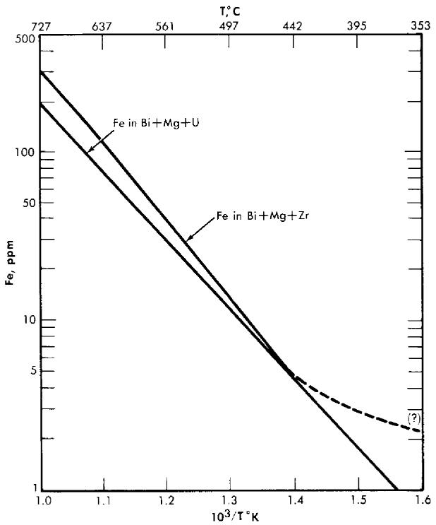  
FIG. 21-1. Solubility of Fe in Bi alloys.

Miscellaneous data. The Fe-Zr intermetallic compound $\mathrm{ZrFe_2}$ appears to decompose when added to Bi, Zr dissolving approximately to its normal saturation and Fe somewhat in excess of its normal solubility in the presence of Zr. The amount of excess Fe present in the liquid metal can possibly be attributed to a finite solubility of the undissociated intermetallic compound $\mathrm{ZrFe_2}$ .

The solubility of Ta in Bi is estimated to be less than 0.01 ppm (detection limit) at $500^{\circ}\mathrm{C}$ .

The solubility of Ni in Bi is close to $5\%$ at $500^{\circ}\mathrm{C}$ and probably greater than $1_{\%}^{c}$ at $400^{\circ}\mathrm{C}$ .

The solubility of $\mathrm{Mg}$ in Bi is close to $4\%$ at $500^{\circ}\mathrm{C}$ and $2\%$ at $400^{\circ}\mathrm{C}$ .

Surface reactions. Experimental evidence has shown that the corrosion resistance of steels in Bi is in part due to the formation of insoluble films on the steel surfaces. The effect of these films on the corrosion behavior of different steels is not readily determined by thermal convection loop experiments because of the relatively low temperatures (400 to $550^{\circ}\mathrm{C}$ ) and long times associated with such tests. The comparative behavior of different

stels and different films is more easily obtained from high-temperature (600 to $850^{\circ}\mathrm{C}$ ), short-time, static contact tests.

Steel specimens approximately $1/2$ in. wide, 2 in. long, and $1/8$ in. thick are cleaned and given various surface treatments, such as sandblasting, chemical etches, polishes, etc. Six to ten different materials are then placed in a vacuum furnace, heat-treated as desired, and immersed in a Bi alloy containing the desired additives. The crucible used to contain the liquid metal is either a material inert to Bi, such as Mo or graphite, or the same material as the specimen. After contacting, the samples are removed from the solution at temperature and allowed to cool in He or in vacuum. The adherent Bi is removed from the steel by immersing in $\mathrm{Hg}$ at $200^{\circ}\mathrm{C}$ in a vacuum or inert atmosphere. After rinsing, the residual adherent $\mathrm{Hg}$ is completely removed by vacuum distillation at 100 to $200^{\circ}\mathrm{C}$ . The cleaned surfaces are examined by x-ray reflection techniques, utilizing a North American Phillips High Angle Diffractometer.

Surface reaction of zirconium, titanium, and magnesium. When pure iron was contacted with bismuth containing radioactive zirconium tracer for $1\mathrm{hr}$ at $450^{\circ}\mathrm{C}$ , a Langmuir type adsorption of the zirconium on the iron crucible surface was obtained. Increasing the temperature to $520^{\circ}\mathrm{C}$ and the contact time as much as $24\mathrm{hr}$ showed an increased amount of reaction. The structure of this deposit is not known. On the other hand, when pure iron is contacted in saturated solutions of zirconium in bismuth for times ranging from 100 to 300 hours at 500 to $750^{\circ}\mathrm{C}$ neither corrosion nor x-ray detectable surface deposits occur. At concentrations of zirconium below saturation value, pure iron is extensively attacked.

A tightly adherent, thick, uniform, metallic deposit was found on the surfaces of pure Fe dipsticks contacted with liquid Bi saturated with Ti at 650 to $790^{\circ}\mathrm{C}$ . In all cases the x-ray patterns were the same but could not be identified. The 15- to 25-micron layers were carefully scraped off and chemically analyzed. The results corresponded to a compound having the composition $\mathrm{FeTi_4Bi_2}$ .

Pure Fe and $214\%$ $\mathrm{Cr - 1\%}$ Mo steel samples contacted with $2.5\mathrm{w / oMg}$ in Bi at $700^{\circ}\mathrm{C}$ for $250\mathrm{hr}$ showed no deposit detectable by x-ray diffraction. Slight uniform intergranular attack was observed on all the samples. Pure Fe samples contacted with Bi solutions containing $0.56\%$ $\mathrm{Mg}$ $+170~\mathrm{ppmZr}$ , and $0.23\%$ $\mathrm{Mg} + 325\mathrm{ppmZr}$ at $700^{\circ}\mathrm{C}$ were not attacked and did not have detectable surface films. These solutions acted similarly to those saturated with $\mathrm{Zr}$ .

Reactions of steels with UBi solutions. Uranium nitride (UN) deposits have been identified on the surfaces of $5\%$ $\mathrm{Cr - 1 / 2\%}$ Mo, $2\frac{1}{4}\%$ $\mathrm{Cr - 1\%}$ Mo, Bessemer, and mild steels, after these samples were contacted with Bi solutions containing U or $\mathrm{U + Mg}$ . Extensive attack always accompanied UN formation, indicating that this film is not protective. Nitrogen analyses

made on these contacted specimens show that depletion of the $\mathbf{N}$ in the steel is much more rapid than it is when the same steels are contacted with solutions containing $\mathrm{Zr}$ .

Reactions of steels with Bi solutions containing combinations of $\mathrm{Zr}$ , $\mathrm{Mg}$ , $\mathrm{U}$ , $\mathrm{Th}$ , and $\mathrm{Ti}$ . Deposits of $\mathrm{ZrN}$ , $\mathrm{ZrC}$ , and mixtures of the two have been identified on many different steels contacted with Bi solutions containing $\mathrm{Zr}$ with or without combination of $\mathrm{Mg}$ , $\mathrm{U}$ , and $\mathrm{Th}$ . No corrosion has ever been observed on such samples contacted at 600 to $850^{\circ}\mathrm{C}$ for 20 to 550 hr, nor have films other than $\mathrm{ZrN}$ or $\mathrm{ZrC}$ been found. When a mild steel was contacted with Bi containing 1000 ppm $\mathrm{Zr}$ and 200 ppm Ti at $650^{\circ}\mathrm{C}$ , x-ray examination showed strong lines for TiN and a less intense pattern of TiC.

Considerable difficulty was experienced in establishing the correct unit cell dimension for the nitrides and carbides of $\mathrm{Zr}$ and Ti. Many different values may be found in the literature. The inconsistency in the data probably can be attributed to the existence of varying amounts of C, O, or $\mathbf{X}$ in the samples. Table 21-1 gives the parameters determined by a number of investigators. The values of $a_0$ used in this research were those given by Duwez and Odell [1]. These compared favorably with the values found on test specimens, powdered compact samples, and $\mathrm{ZrN}$ prepared by heating $\mathrm{Zr}$ in purified $\mathrm{N}_2$ at $1000^{\circ}\mathrm{C}$ for $20\mathrm{hr}$ .

A nondestructive x-ray method of measuring film thickness has been developed for this research [2]. The x-rays pass through the film and are diffracted by the substrate back to a counter. The intensity is reduced by the absorption of the film. Unknown conditions of the substrate are eliminated by measuring the intensity of two orders of reflection or by measuring the intensity of a reflection using two different radiations. The method is accurate to about $20\%$ .

TABLE 21-1   
PUBLISHED X-RAY PARAMETERS FOR THE UNIT CELLS OF ZRC, TIC, ZRN, AND TIN (CUBIC, NACI-TYPE)   

<table><tr><td></td><td>Becker and Ebert [20]</td><td>Van Arkel [21]</td><td>Kovalskii and Umanskii [22]</td><td>Dawihl and Rix [23]</td><td>Duwez and Odell [24]</td></tr><tr><td>ZrC</td><td>4.76</td><td>4.73</td><td>4.6734</td><td></td><td>4.685</td></tr><tr><td>TiC</td><td>4.60</td><td>4.26</td><td>4.4442</td><td>4.31</td><td>4.32</td></tr><tr><td>ZrN</td><td>4.63</td><td>4.61</td><td></td><td></td><td>4.567</td></tr><tr><td>TiN</td><td>4.40</td><td>4.23</td><td>4.234</td><td>4.236</td><td>4.237</td></tr></table>

TABLE 21-2   
ORIGINAL ANALYSES AND FILMS FORMED ON SPECIAL STEELS USED IN STATIC TESTS   

<table><tr><td>Material</td><td>% Al (Sol)</td><td>%N (Tot)</td><td>EHN*</td><td>% N as EHN</td><td>Film formed</td></tr><tr><td>5Cr-1/2Mo</td><td>0.016</td><td>0.023</td><td>0.0002</td><td>1.0</td><td>ZrN</td></tr><tr><td>21/4Cr-1Mo</td><td>0.003</td><td>0.042</td><td>0.0001</td><td>0</td><td>”</td></tr><tr><td>21/4Cr-1Mo</td><td>0.055</td><td>0.050</td><td>—</td><td>—</td><td>”</td></tr><tr><td>21/4Cr-1Mo</td><td>0.003</td><td>0.01</td><td>—</td><td>—</td><td>”</td></tr><tr><td>21/4Cr-1Mo</td><td>0.06</td><td>0.047</td><td>0.0003</td><td>1.0</td><td>”</td></tr><tr><td>21/4Cr-1Mo</td><td>0.009</td><td>0.013</td><td>0.0001</td><td>1.0</td><td>”</td></tr><tr><td>Bessemer</td><td>0.003</td><td>0.009</td><td>0.0002</td><td>2.0</td><td>”</td></tr><tr><td>Carbon</td><td>0.007</td><td>0.005</td><td>0.0001</td><td>2.0</td><td>”</td></tr><tr><td>21/4Cr-1Mo</td><td></td><td>0.015</td><td>0.015</td><td>100</td><td>ZrC</td></tr><tr><td>21/4Cr-1Mo</td><td>0.44</td><td>0.054</td><td>0.025</td><td>50</td><td>”</td></tr><tr><td>21/4Cr-1Mo</td><td>0.014</td><td>0.013</td><td>0.009</td><td>70</td><td>”</td></tr><tr><td>21/4Cr-1Mo</td><td>0.022</td><td>0.015</td><td>0.010</td><td>70</td><td>”</td></tr><tr><td>21/4Cr-1Mo</td><td>0.02</td><td>0.015</td><td>0.011</td><td>75</td><td>”</td></tr><tr><td>11/4Cr-1/2Mo</td><td>0.02</td><td>0.014</td><td>0.010.</td><td>70</td><td>”</td></tr><tr><td>RH 1081 (0.3 Ti)</td><td></td><td></td><td></td><td></td><td>”</td></tr></table>

*EHN: Ester-halogen insoluble nitrogen. This is believed to be an indication of the nitrogen combined as AlN or TiN in steels [26].

Effect of steel composition and heat treatment. It has been found experimentally that some steels with very similar over-all compositions behave quite differently in the same static corrosion tests. Films that form on these materials range from pure $\mathrm{ZrN}$ to pure $\mathrm{ZrC}$ . Table 21-2 gives typical analyses selected from the more than 100 steels run in static corrosion tests, and identifies the surface films. After contacting, the only changes in analyses were found in the total nitrogen remaining and the amount of ester halogen insoluble nitrogen (EHN) present in the steels. The only significant difference in analyses between nitride-formers and carbide-formers in Table 21-2 is found in the relative amounts of EHN. The carbide-formers have more than $50\%$ of the total nitrogen combined as EHN, while the nitride-formers have only a few percent of the total nitrogen combined. At present, the relationship between the N, Al, Cr, and the Mo contents of the steels and their film-forming properties is not obvious. Some excellent nitride-formers have very low nitrogen content, while some carbide-formers have high nitrogen content. The same holds true for the

Al, Cr, and Mo contents of the steels. The EHN content of a steel can be readily changed by short-time heat treatment at $700^{\circ}\mathrm{C}$ and higher [3], so that this variable is controllable within limits.

To a first approximation, the corrosion resistance of a particular steel is enhanced by high "inhibitor" concentrations and/or the presence of insoluble adherent films formed on the steel surface. The first of these conditions is neither desirable nor practical in a solution-type fuel reactor because of the adverse effect of $\mathrm{Zr}$ on the U solubility. At present, work is being done to measure quantitatively the effects of different alloying constituents on the activities of N and C in steels. Consider the following reactions:

$$
\mathrm {Z r} _ {\left(\mathrm {B i}\right)} + \mathrm {N} _ {\left(\text {s t e c l}\right)} \xrightarrow {\rightarrow} \mathrm {Z r N} _ {\left(\text {f i l m}\right)}, \tag {21-1}
$$

$$
\mathrm {Z r} _ {\left(\mathrm {B i}\right)} + \mathrm {C} _ {\left(\text {s t e e l}\right)} \xrightarrow {} \mathrm {Z r C} _ {\left(\text {f i l m}\right)}. \tag {21-2}
$$

Assuming that the films are insoluble in Bi, then at equilibrium

$$
K _ {(\mathrm {Z r N})} = \frac {1}{\left(a _ {\mathrm {Z r}}\right) \left(a _ {\mathrm {N}}\right)} \text {, a n d} K _ {(\mathrm {Z r C})} = \frac {1}{\left(a _ {\mathrm {Z r}}\right) \left(a _ {\mathrm {C}}\right)} \cdot \tag {21-3}
$$

If the products of the $\mathrm{Zr}$ activity in the Bi with the activities of the $\mathbf{N}$ and C in the steel are not sufficient to satisfy the respective equilibrium constants, the reactions will not occur, and the steel will not form $\mathrm{ZrC}$ or $\mathrm{ZrN}$ films. If the activity products are greater than the constants, $K_{(\mathrm{ZrC})}$ or $K_{(\mathrm{ZrN})}$ , the reactions will proceed until the activities are lowered to these values. Thus, for a fixed $\mathrm{Zr}$ activity, the activities of $\mathbf{N}$ and $\mathbf{C}$ in the steel determine whether the carbide and nitride film-producing reactions should occur. The excess of $\mathbf{N}$ or $\mathbf{C}$ above these equilibrium values should be a measure of the driving force of reactions (21-1) and (21-2) to the right.

Solution rate tests. The solution rates of Fe into Bi, and $\mathrm{Bi} + \mathrm{Zr}$ and $\mathrm{Mg}$ , were measured in crucibles of a carbon steel, a $2\frac{1}{4}\%$ Cr-1% Mo, a $5\%$ Cr-1. $2^{C_7}$ Mo, and an AISI type-410 steel. The crucible, Bi, and additives were equilibrated at 400 to $425^{\circ}\mathrm{C}$ , the temperature rapidly raised to $600^{\circ}\mathrm{C}$ , and the concentration of Fe in solution measured as a function of time. Results are shown in Fig. 21-2. In the presence of $\mathrm{Zr} + \mathrm{Mg}$ , the $5\%$ Cr-1. $2^{C_7}$ Mo and the AISI type-410 steels dissolved at approximately the same rate, while the $2\frac{1}{4}\%$ Cr-1% Mo steel dissolved more slowly. No detectable dissolution of Fe from the carbon steel was measured in 44 hr at $610^{\circ}\mathrm{C}$ . These results are parallel to the thermal convection loop results, and consistent with the film-formation studies in that the measured solution rates are inversely proportional to the ability and rate at which the steels form ZrN films. At present no data are available on rates of solution for ZrC-forming steels.

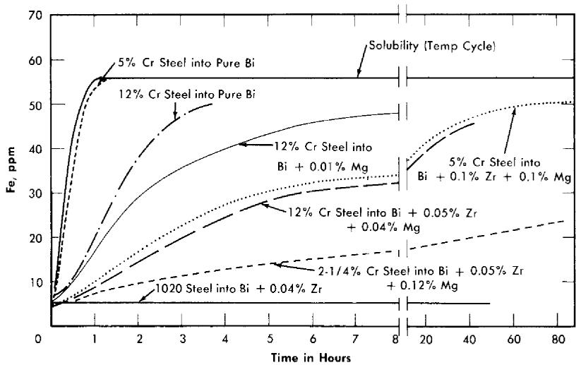  
FIG. 21-2. Dissolution of Fe into Bi (plus additives) at $600^{\circ}\mathrm{C}$ from steel crucible.

Rates of precipitation. The rate of precipitation of iron from bismuth in a pure iron steel crucible is very rapid. Iron precipitated from bismuth, saturated at $615^{\circ}\mathrm{C}$ , as rapidly as the temperature could be lowered to $425^{\circ}\mathrm{C}$ . The addition of $\mathrm{Zr}$ plus $\mathrm{Mg}$ to liquid metal did not change the rapid precipitation of most of the iron from the bismuth under these same conditions, but produced a marked delay in the precipitation of the last amount of iron in excess of equilibrium solubility. An apparently stable supersaturation ratio of 2.0 was observed for more than 7 hr at $425^{\circ}\mathrm{C}$ in a pure iron crucible containing $\mathrm{Bi} + 1000\mathrm{ppm}\mathrm{Mg} + 500\mathrm{ppm}\mathrm{Zr}$ , and 1.7 for more than 48 hr at $450^{\circ}\mathrm{C}$ . In a $5\%$ Cr steel crucible, a supersaturation ratio of iron in $\mathrm{Bi} + \mathrm{Mg} + \mathrm{Zr}$ of 2.9 was observed after 24 hr at $425^{\circ}\mathrm{C}$ . This phenomenon may be due to the ability of the formed surface deposits to poison the effectiveness of the iron surface as a nucleation promotor or catalyst, the different supersaturations observed being due to the relative abilities of a $\mathrm{Zr - Fe}$ intermetallic compound or of $\mathrm{ZrN}$ to promote nucleation of iron. This observed supersaturation suggests that mass transfer should be nearly eliminated in a circulating system in which the solubility ratio due to the temperature gradient does not exceed the measured "stable supersaturation" at the cold-leg temperature.

Precipitation rate experiments made in AISI type-410 steel crucibles show that $\mathrm{Zr + Mg}$ stabilize Cr supersaturations of 2.0 to 3.0 for more than $24\mathrm{hr}$ . However, no Cr supersaturation was found during precipitation rate experiments made in pure Cr crucibles when $\mathrm{Zr + Mg}$ were present in the melt [4]. The measured supersaturations should therefore be due to the films present on the steel surfaces.

21-2.2 Corrosion testing on steels. The research effort on materials for containment of the LMFR has been concerned mainly with low-alloy steels having constituents which have low solubilities in Bi, such as C, Cr, and Mo. Although the solubilities of Fe and Cr are only 28 and $80~\mathrm{ppm}$ respectively at the intended maximum temperature of operation, severe corrosion and mass transfer are encountered when pure Bi or a U-Bi solution is circulated through a temperature differential in a steel loop. This results from the continuous solution of the pipe material in the hot portion of the system and subsequent precipitation from the supersaturated solution in the colder portions. Zirconium additions to U-Bi greatly reduce this corrosion and mass transfer.

The behavior of steels in U-Bi is studied in three types of tests. Thermal convection loops are used to test materials under dynamic conditions. In these, the fuel solution is continuously circulated through a temperature differential in a closed loop of pipe. Variables such as material composition, maximum temperature, temperature differential, and additive concentrations are studied in this test. More than sixty such loops have now been run at BNL. The principal limitation in these tests is that the velocities obtained by thermal pumping are extremely low when compared with the LMFR design conditions.

Forced circulation loops are used to study materials under environments more closely approximating LMFR conditions. Three such loops are now in operation at BNL and two more are under construction. A very large loop (4 in. ID) which will circulate U-Bi at 360 U.S. gpm and transfer about $2\frac{1}{2} \times 10^{6}$ watts of heat, is now under construction and is expected to go into operation late this year.

Static tests, as discussed previously, in which steels are isothermally immersed in high-temperature U-Bi containing various additives, are used to study their corrosion resistance and the inhibition process as a function of additive concentration and steel composition. Most of the tests have been performed on a $21\%$ Cr-1% Mo steel (Table 21-3). However, some tests have also been made with higher Cr steels, $14\%$ Cr-1/2% Mo, $1.2\%$ Cr-1/2% Mo, and carbon steels.

21-2.3 Thermal convection loop tests at BNL. A typical thermal convection loop that has been used at BNL is shown in Fig. 21-3. The loop is provided with a double-valve air lock at the top of the vertical section which permits taking liquid metal samples while the loop is running without contaminating the protective atmosphere. The hot leg is insulated and heat is supplied to that section of the loop while the cold leg is exposed and two small blowers are utilized to extract heat. The hottest point in the loop is at the "tec" at the upper end of the insulated section, and the coldest in the bottom of the exposed section. The total height of the loop proper is

TABLE 21-3   
COMPOSITION OF STEELS TESTED   

<table><tr><td>Steel</td><td>C</td><td>Mn</td><td>Si</td><td>P(max)</td><td>S(max)</td><td>Cr</td><td>Mo</td><td>Others</td></tr><tr><td>Carbon Steel</td><td>0.08</td><td>0.85</td><td>0.01</td><td>0.09</td><td>0.27</td><td>-</td><td>-</td><td>-</td></tr><tr><td>Bessemer</td><td>0.07</td><td>0.42</td><td>0.009</td><td>0.056</td><td>0.022</td><td>-</td><td>-</td><td>-</td></tr><tr><td>RH 1081</td><td>0.31</td><td>0.12</td><td>0.14</td><td>0.018</td><td>0.020</td><td>-</td><td>-</td><td>0 30 Ti</td></tr><tr><td>1/2Cr-1/2Mo*</td><td>0.10-0.20</td><td>0.3-0.61</td><td>0.1-0.3</td><td>0.045</td><td>0.045</td><td>0.5-0.81</td><td>0.45-0.66</td><td>-</td></tr><tr><td>1¼Cr-1/2Mo*</td><td>0.15</td><td>0.3-0.6</td><td>0.5-0.1</td><td>0.045</td><td>0.045</td><td>1.0-1.5</td><td>0.45-0.66</td><td>-</td></tr><tr><td>2¼Cr-1Mo*</td><td>0.15</td><td>0.3-0.6</td><td>0.50</td><td>0.045</td><td>0.030</td><td>1.9-2.6</td><td>0.87-1.13</td><td>-</td></tr><tr><td>5Cr-1/2Mo*</td><td>0.15</td><td>0.3-0.6</td><td>0.50</td><td>0.045</td><td>0.030</td><td>4-6</td><td>0.45-0.65</td><td>-</td></tr><tr><td>5Cr-Si*</td><td>0.15</td><td>0.3-0.6</td><td>1.0-2.0</td><td>0.045</td><td>0.03</td><td>4-6</td><td>0.45-0.65</td><td>-</td></tr><tr><td>9Cr-1Mo*</td><td>0.15</td><td>0.3-0.6</td><td>0.25-1.0</td><td>0.045</td><td>0.03</td><td>8-10</td><td>0.9-1.1</td><td>-</td></tr><tr><td>AISI Type 410*</td><td>0.15 max</td><td>1.00</td><td>0.75</td><td>0.030</td><td>0.030</td><td>11.5-13.5</td><td>-</td><td>Ni 0.50 max</td></tr><tr><td>18Cr-8Ni</td><td>0.08 max</td><td>2.00 max</td><td>0.75</td><td>0.030</td><td>0.030</td><td>18-20</td><td>-</td><td>Ni 8-11</td></tr><tr><td>AISI Type 304*</td><td></td><td></td><td></td><td></td><td></td><td></td><td></td><td></td></tr><tr><td>AISI 4130*</td><td>0.28-0.33</td><td>0.4-0.6</td><td>0.2-0.35</td><td>0.04</td><td>0.04</td><td>0.8-1.1</td><td>0.15-0.25</td><td></td></tr><tr><td>Rex AA*</td><td>0.73</td><td></td><td></td><td></td><td></td><td>4.0</td><td></td><td>V 1.15; W 18 Bal Fe</td></tr><tr><td>Stellite 90*</td><td>2.75</td><td></td><td></td><td></td><td></td><td>27.0</td><td></td><td>Fe balance</td></tr></table>

*Nominal composition.

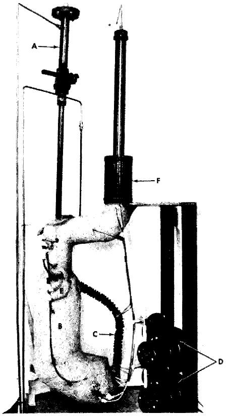  
FIG. 21-3. Thermal convection loop. A. Air lock. B. Hot leg. C. Cold leg. D. Fans. E. "Tee" connection. F. Melt tank with AISI type-410 steel filter bottom.

approximately 15 in. and the total length of the loop is approximately 40 in. With this configuration, the flow rate is approximately 0.05 fps when Bi is circulated with a $100^{\circ}\mathrm{C}$ temperature differential. Temperature differentials ranging from 40 to $150^{\circ}\mathrm{C}$ can be conveniently applied to the loop. Radiographic inspection of the loop while in operation is periodically made to monitor it for corrosion at the hottest section and deposition at the coldest section. The inside of the steel pipe for the loop is either acid-cleaned or grit-blasted. The pipe is then cold-bent to the desired shape, and welded at the "tee" by the inert-gas shielded-arc process.

The general procedure for running the loop is as follows: (1) Solid Bi is charged into the melt tank. (2) The entire system is leak-checked with a mass spectrometer. (3) The Bi is melted and introduced into the uniformly heated $(550^{\circ}\mathrm{C})$ , fully insulated loop through a 35-micron AISI

# TABLE 21-4

# SUMMARY OF THERMAL CONVECTION LOOP DATA

All loops were fabricated from 1/2 IPS Sch 40 pipe of the steel indicated

<table><tr><td rowspan="2">Test no.</td><td rowspan="2">Steel</td><td rowspan="2">Welding rod</td><td colspan="4">Additives, nominal composition, ppm</td><td colspan="3">Liquid metal temperature, °C</td><td rowspan="2">Duration of test, hr</td><td rowspan="2">Results</td></tr><tr><td>U</td><td>Mg</td><td>Zr</td><td>Others</td><td>Max</td><td>Min</td><td>Diff.</td></tr><tr><td>1</td><td>21Cr-1Mo</td><td>5Cr-1/2Mo</td><td>1000</td><td>—</td><td>—</td><td>—</td><td>550</td><td>510</td><td>40</td><td>405</td><td>Plugged</td></tr><tr><td>2</td><td>”</td><td>”</td><td>1000</td><td>—</td><td>—</td><td>—</td><td>550</td><td>475</td><td>75</td><td>310</td><td>Plugged</td></tr><tr><td>3</td><td>”</td><td>”</td><td>1000</td><td>—</td><td>—</td><td>—</td><td>550</td><td>432</td><td>118</td><td>260</td><td>Plugged</td></tr><tr><td>4</td><td>”</td><td>”</td><td>1000</td><td>350</td><td>250</td><td>—</td><td>550</td><td>460</td><td>90</td><td>13,550</td><td>No corr.; no deposition</td></tr><tr><td>5</td><td>”</td><td>”</td><td>1000</td><td>350</td><td>250</td><td>—</td><td>550</td><td>450</td><td>100</td><td>11,673*</td><td>Weld corr. (5Cr-1/2Mo); moderate deposition</td></tr><tr><td>6</td><td>”</td><td>”</td><td>1000</td><td>350</td><td>250</td><td>—</td><td>550</td><td>450</td><td>100</td><td>10,928</td><td>Weld (5Cr-1/2Mo) and pipe corr.; moderate deposition</td></tr><tr><td>7</td><td>”</td><td>”</td><td>1000</td><td>350</td><td>250</td><td>—</td><td>525</td><td>425</td><td>100</td><td>9,834*</td><td>Pipe corr.; slight deposition</td></tr><tr><td>8</td><td>”</td><td>”</td><td>1000</td><td>350</td><td>250</td><td>—</td><td>500</td><td>400</td><td>100</td><td>10,869*</td><td>No corr.; slight deposition</td></tr><tr><td>9</td><td>”</td><td>”</td><td>1000</td><td>350</td><td>250</td><td>—</td><td>600</td><td>550</td><td>50</td><td>5,643</td><td></td></tr><tr><td></td><td></td><td></td><td></td><td></td><td></td><td></td><td>600</td><td>525</td><td>75</td><td>2,686</td><td></td></tr><tr><td></td><td></td><td></td><td></td><td></td><td></td><td></td><td>600</td><td>500</td><td>100</td><td>4,152*</td><td>Weld corr. (5Cr-1/2Mo) moderate deposition</td></tr><tr><td>10</td><td>”</td><td>”</td><td>1000</td><td>350</td><td>325</td><td>—</td><td>500</td><td>400</td><td>100</td><td>5,295*</td><td>Weld (21Cr-1Mo) and pipe corr.; slight deposition</td></tr><tr><td></td><td>Normalized and tempered</td><td></td><td></td><td></td><td></td><td></td><td></td><td></td><td></td><td></td><td></td></tr><tr><td>11</td><td>21Cr-1Mo
Be insert</td><td>21Cr-Mo</td><td>1000</td><td>350</td><td>325</td><td>-</td><td>500</td><td>400</td><td>100</td><td>1,631*</td><td>No corr.; slight deposition</td></tr><tr><td>12</td><td>21Cr-1Mo
graphite insert</td><td>5Cr-1/2Mo</td><td>1000</td><td>350</td><td>350</td><td>-</td><td>550</td><td>440</td><td>110</td><td>15,086</td><td>Severe corr.; moderate deposition</td></tr><tr><td>13</td><td>21Cr-1Mo</td><td>”</td><td>1000</td><td>350</td><td>250</td><td>-</td><td>550</td><td>440</td><td>110</td><td>16,906</td><td>Corroded through at weld (5Cr-1/2Mo); moderate deposition</td></tr><tr><td>14</td><td>21Cr-1Mo</td><td>”</td><td>1000</td><td>350</td><td>250</td><td>-</td><td>525</td><td>400</td><td>125</td><td>10,649*</td><td>Weld corr.(5Cr-1/2Mo); moderate deposition</td></tr><tr><td>15</td><td>21Cr-1Mn
nitrided after welding</td><td>”</td><td>1000</td><td>350</td><td>250</td><td>-</td><td>550</td><td>425</td><td>125</td><td>10,425*</td><td>No corr.; slight deposition</td></tr><tr><td>16</td><td>21Cr-1Mo</td><td>”</td><td>1000</td><td>350</td><td>250</td><td>-</td><td>550</td><td>420</td><td>130</td><td>5,323</td><td>Heavy pipe corr.; heavy deposition</td></tr><tr><td>17</td><td>21Cr-1Mo</td><td>”</td><td>1000</td><td>350</td><td>250</td><td>-</td><td>650</td><td>500</td><td>150</td><td>1,180</td><td>Plugged; severe corrosion</td></tr><tr><td>18</td><td>Bessemer
Carbon steel</td><td>Carbon steel</td><td>1000</td><td>350</td><td>250</td><td>-</td><td>550</td><td>415</td><td>135</td><td>12,356</td><td>No corr.; no deposition</td></tr><tr><td>19</td><td>RH1081</td><td>RH1081</td><td>1000</td><td>350</td><td>250</td><td>-</td><td>450</td><td>415</td><td>135</td><td>8,231*</td><td>No corr.; no deposition</td></tr><tr><td>20</td><td>1/2Cr-1/2Mo</td><td>1/4Cr-1/2Mo</td><td>1000</td><td>350</td><td>325</td><td>-</td><td>500</td><td>405</td><td>95</td><td>8,538*</td><td>No corr.; no deposition</td></tr><tr><td>21</td><td>1/4Cr-1/2Mo</td><td>1/4Cr-1/2Mo</td><td>1000</td><td>350</td><td>400</td><td>-</td><td>525</td><td>425</td><td>100</td><td>9,194*</td><td>No corr.; slight deposition</td></tr><tr><td>22</td><td>1/4Cr-1/2Mo</td><td>1/4Cr-1/2Mo</td><td>1000</td><td>350</td><td>325</td><td>-</td><td>500</td><td>400</td><td>100</td><td>963</td><td>No corr.; slight deposition</td></tr><tr><td>23</td><td>5Cr-Si</td><td>5Cr-1/2Mo</td><td>1000</td><td>350</td><td>250</td><td>-</td><td>550</td><td>440</td><td>100</td><td>6,240*</td><td>Slight corr.; some deposition</td></tr><tr><td>24</td><td>9Cr-1Mo</td><td>9Cr-1Mo</td><td>1000</td><td>350</td><td>250</td><td>-</td><td>550</td><td>420</td><td>130</td><td>3,340</td><td>Severe corr.; very heavy deposition</td></tr><tr><td rowspan="2">Test no.</td><td rowspan="2">Steel</td><td rowspan="2">Welding rod</td><td colspan="4">Additives, nominal composition, ppm</td><td colspan="3">Liquid metal temperature, °C</td><td rowspan="2">Duration of test, hr</td><td rowspan="2">Results</td></tr><tr><td>U</td><td>Mg</td><td>Zr</td><td>Others</td><td>Max.</td><td>Min.</td><td>Diff.</td></tr><tr><td>25</td><td>18Cr-8Ni</td><td>18Cr-8Ni</td><td>1000</td><td>350</td><td>250</td><td>—</td><td>550</td><td>400</td><td>150</td><td>630</td><td>Plugged; severe corr.</td></tr><tr><td>26</td><td>21/4Cr-1Mo</td><td>5Cr-1/2Mo</td><td>—</td><td>—</td><td>—</td><td>450Th</td><td>550</td><td>500-480</td><td>50-70</td><td>1,294</td><td>Plugged; severe corr.</td></tr><tr><td>27</td><td>21/4Cr-1Mo</td><td>5Cr-1/2Mo</td><td>1000</td><td>—</td><td>400</td><td>400Th</td><td>550</td><td>435</td><td>115</td><td>8,567</td><td>Severe corr.; very heavy precipitation</td></tr><tr><td>28</td><td>21/4Cr-1Mo</td><td>5Cr-1/2Mo</td><td>1000</td><td>350</td><td>—</td><td>1000Ti</td><td>550</td><td>445</td><td>105</td><td>6,413</td><td>Plugged; severe corr.</td></tr><tr><td>29</td><td>21/4Cr-1Mo</td><td>5Cr-1/2Mo</td><td>1000</td><td>—</td><td>250</td><td>500Ca</td><td>550</td><td>450</td><td>100</td><td>2,374</td><td>Plugged</td></tr></table>

type-410 stainless-steel filter. (4) $\mathrm{Zr}$ and $\mathrm{Mg}$ are introduced into the loop through the air lock. (5) The Bi in the loop is sampled, using a graphite sample extractor, to check for additive concentration. (6) Uranium is added if additive concentrations are as desired; if necessary, additive concentrations are adjusted prior to U addition. (7) The temperature differential is obtained by removing the insulation from the cold leg and starting the fans. The temperature differential is usually applied in two steps, first $40^{\circ}\mathrm{C}$ and then the differential at which the loop is to operate. (8) The entire loop is radiographed every $750\mathrm{hr}$ . (9) The liquid metal is sampled at regular intervals. (10) After completion of the test the entire loop is sectioned longitudinally and transversely for metallographic examination.

In Table 21-4, data from 29 thermal convection loop experiments at BNL are summarized. The first three loops were fabricated from $2\frac{1}{4}\%$ Cr- $1\%$ Mo steel pipe and the U-Bi solution was not inhibited. Loops No. 4 to 17 inclusive were made with $2\frac{1}{4}\%$ Cr- $1\%$ Mo steel and inhibited with $\mathrm{Mg}$ and Zr. Loops No. 18 to 25 inclusive were fabricated from various types of steels, ranging from Bessemer to $18\%$ Cr- $8\%$ Ni austenitic steels. Loops No. 26 to 29 were made from $2\frac{1}{4}\%$ Cr- $1\%$ Mo steel pipe. The purpose of these tests was to study the effectiveness of Ca, Th, and Ti as inhibitors.

It can be seen from the first three tests that deposition in the cold legs of uninhibited loops after a few hundred hours is sufficient to stop flow. These tests show conclusively that uninhibited U-Bi solution causes serious mass transfer of this steel even at a temperature differential as low as $40^{\circ}\mathrm{C}$ . Metallographic examination of the hot legs of these loops showed a generalized intergranular attack.

The data from loops inhibited with $350~\mathrm{ppm}$ of $\mathrm{Mg}$ and 250 to $350~\mathrm{ppm}$ $\mathrm{Zr}$ (loops No. 4 to 17) show that mass-transfer rate can be decreased considerably by the introduction of these additives. This effect is attributed to the formation of a $\mathrm{ZrN}$ film on the steel surface [4,5]. The data demonstrate, however, that this film is not completely protective in $2\frac{1}{4}\%$ $\mathrm{Cr - 1\%}$ Mo steel system. Test No. 4 indicates that for a differential in the order of $90^{\circ}\mathrm{C}$ , the film was sufficiently protective to prevent corrosion or deposition in $13,550~\mathrm{hr}$ of test. For temperature differentials of $100^{\circ}\mathrm{C}$ or higher, incipient corrosion can be expected in about 5000 to 6000 hr. Some of the $2\frac{1}{4}\mathrm{Cr - 1Mo}$ loop sections were joined with $5\mathrm{Cr - 1 / 2Mo}$ welding rod. This higher chromium material has lower resistance to inhibited U-Bi than the pipe, so that corrosion generally starts at these welds. Increasing the temperature of the hot leg seems to increase the rate of corrosion, as illustrated by the results of loops No. 5 to 9 inclusive, which were all tested at $100^{\circ}\mathrm{C}$ temperature differential.

Loop No. 10, which was normalized from $954^{\circ}\mathrm{C}$ and tempered at $732^{\circ}\mathrm{C}$ after welding, stood up poorly when compared with other tests. The heat-treating was done in an argon atmosphere, and no subsequent alteration was made to the surface left by the heat treatment. This heat treatment was thought, from some observations in the pumped loops, to improve corrosion resistance. It is believed that the poor results of test No. 10 are due to alteration of the surface during the heat treatment and not to the metallurgical structure of the steel. Loops No. 11 and 12 had Be and graphite inserts in the hot leg to study their effect on mass transfer and also the stability of U, Mg, and Zr concentrations. No detrimental effects on either have been observed.

Loop No. 15, made of a $2_{4}^{1}\mathrm{Cr - 1}$ Mo steel that was internally nitrided to a depth of 0.015 inch, appears to be standing up much better than other $2_{4}^{1}\mathrm{Cr - 1}$ Mo loops tested at a $125^{\circ}\mathrm{C}$ temperature differential. The added nitrogen in the steel probably promoted the formation of the $\mathrm{ZrN}$ film. A slight loss in $\mathrm{Zr}$ has been observed in this test, but other additive concentrations have remained constant.

Results of tests No. 18 to 25 show that higher-alloyed steels are inferior to the carbon steels in inhibited U-Bi. Loop No. 18, fabricated from Bessemer carbon steel, showed exceptional resistance to U-Bi. Metallographic examination of this loop indicated no evidence of corrosion or deposition after $12,356\mathrm{hr}$ of operation at $135^{\circ}\mathrm{C}$ temperature differential. X-ray diffraction studies of a polished insert in this loop indicated that a $\mathrm{ZrN}$ film was present; however, no film was detected on the pipe surface. Considerable evidence of structural instability in the form of grain coarsening and graphitization of the Bessemer steel was found in the metallographic examination of the loop. A medium carbon steel containing Ti, Rh-1081, also exhibited good resistance to U-Bi corrosion. The lower chromium steels, such as $1/2\%$ Cr-1/2% Mo and $1\frac{1}{4}\%$ Cr-1/2% Mo (tests No. 20, 21, and 22), also seem to be standing up well to inhibited U-Bi. The testing of these steels will be increased.

Loops No. 26 to 29 were run to study the effectiveness of Th, $\mathrm{Th} + \mathrm{Zr}$ , $\mathrm{Ti} + \mathrm{Mg}$ , and $\mathrm{Ca} + \mathrm{Zr}$ as inhibitors. It can be seen from these tests that these inhibitors were much inferior to $\mathrm{Mg}$ and $\mathrm{Zr}$ combinations. In tests No. 27 and 29 it was found that a slow but continuous loss of $\mathrm{Zr}$ , Th, and Ca occurred. Horsley [6] also ran Bi loops containing $\mathrm{Ca}$ and $\mathrm{Zr}$ as inhibitors. He reported similarly that the loops plugged, and that $\mathrm{Ca}$ and $\mathrm{Zr}$ were lost from the melt. The results of loop No. 28 indicate that $\mathrm{Mg}$ and Ti provide some inhibition, but are not nearly as effective as $\mathrm{Mg}$ and $\mathrm{Zr}$ . Metallographic examination of this loop shows that the corrosion was uniform and that most of the attack took place 4 to 6 in downstream from the "tee," in an area which is normally somewhat lower in temperature than the "tee."

Metallographic examinations of $24\%$ Cr-1% Mo loops inhibited by Mg and Zr show that corrosion starts in the form of a pit. After the pit has penetrated about 0.020 or 0.025 in. into the pipe, the progress of corrosion generally proceeds laterally on the pipe, widening the pit rather than deepening it. A typical pitted area formed by U-Zr-Mg-Bi in $24\%$ Cr-1% Mo steel is shown in Fig. 21-4. The attack is transgranular throughout the pitted area. Horsley [6] reported intergranular attack at the bottom of pits formed in a similar steel by $\mathrm{Zr - Ca - Bi}$ . Metallographic examination of plugged thermal convection loops shows the deposit to be very flaky and not tightly adherent to the loop walls. Chemical analysis of the deposition in a $24\%$ Cr-1% Mo steel loop indicated it to be about $95\%$ Fe and $2\%$ Cr. ZrN films have been positively identified by x-ray reflection in only two thermal convection loops: Bessemer steel loop, and one $24\%$ Cr-1% Mo steel loop. The protective film is possibly so thin that it can be identified only under ideal conditions.

21-2.4 High-velocity tests. Although thermal convection loops are convenient for extensive corrosion testing under dynamic conditions, the velocity is not large enough to give design data for actual operating conditions. These data must be obtained by operating loops in which the bismuth solution is pumped at considerably higher linear velocities through suitably designed test sections.

Attainment of higher flow velocities complicates corrosion testing methods. Large heat inputs are necessary to obtain temperature differentials comparable to those readily attained in thermal convection loops. Special equipment is required to measure flow. Pumps must be designed leaktight to maintain absolute system purity. The U-Bi must be prevented from freezing in the piping.

Some important features of the BNL loops are (1) the systems are completely sealed and operate under a purified inert-gas blanket, (2) samples of the liquid metal can be taken at any time during operation without contamination, (3) radiography permits nondestructive examination of test samples so that long runs are possible, and (4) the safety control system is designed to prevent the freezing of the U-Bi (and subsequent bursting) in the piping.

In corrosion loops (HVL I and II) at BNL [7], no valves are used to hold the fluid up in the system, and flow is measured with a submerged orifice located in the sample tank. Piping in these loops is 3/4-in. schedule-40 except in the test sections. A GE G-6 electromagnetic pump is used in HVL I, while Callery 25-20 electromagnetic pump is used in HVL II. Flows in the order of 1 to $2\mathrm{gpm}$ are achieved with both pumps. An intermediate heat exchanger does about $50\%$ of the heating and cooling. Resistance furnaces provide the heat. The head developed is sufficient to

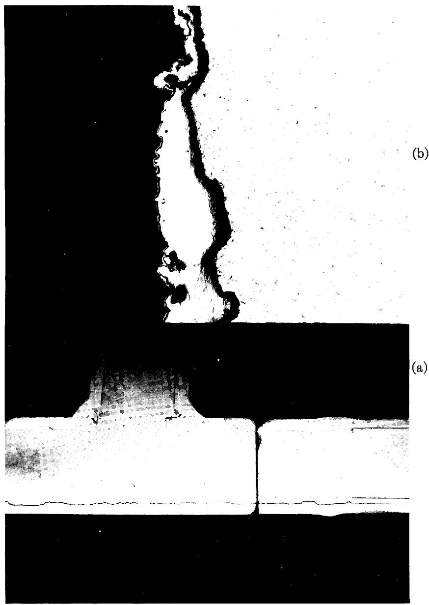  
FIG. 21-4. Pitted area at "tee" in Loop #12. (a) Macrograph. (b) Micrograph (original $250 \times$ ) of pitted areas.

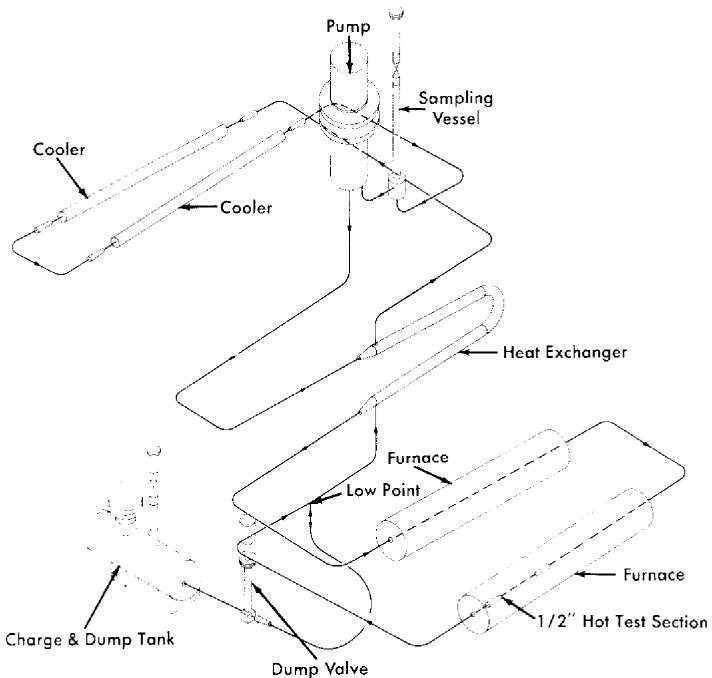  
FIG. 21-5. High-velocity pump test loop.

allow the use of short small-diameter test sections in which velocities up to 8 fps are attained.

A third corrosion loop (loop G) uses a canned centrifugal pump to circulate the U-Bi, permitting flows up to $4.8\mathrm{gpm}$ and velocities up to 14 fps to be attained. Engineering devices such as bellows-sealed valves and pressure transmitters are being tested in this loop, as well as materials for high-velocity corrosion resistance. Heating and cooling is the same as in HVL I and II. The loop is fabricated for the most part of $2\frac{1}{4}\% \mathrm{Cr - }1\%$ Mo steel. 1-in. schedule-40 piping.

Two more loops (HVL III and IV), similar to loop G, are now under construction. These are shown in Fig. 21-5. Flow rates up to $12\mathrm{gpm}$ velocities up to 25 fps, and temperature differentials of $150^{\circ}\mathrm{C}$ will be attainable in these loops. HVL III will be fabricated of $2\frac{1}{4}\%$ Cr-1% Mo steel, while HVL IV will be of $1\frac{1}{4}\%$ Cr-1/2% Mo steel.

While the basic material of construction of these loops is a Cr-Mo steel, test sections are usually made up of a variety of steels and weldments. All welds are made by the inert arc process. Cleaning, for the most part, is done by grit-blasting.

# TABLE 21-5

# RESULTS FROM HIGH VELOCITY LOOPS

<table><tr><td rowspan="2">Loop no.</td><td rowspan="2">Material*</td><td colspan="2">Temp. (Bulk), °C</td><td colspan="2">Temp. Film, °C</td><td colspan="3">Additive conc.</td><td rowspan="2">Time of test, hr</td><td rowspan="2">Flow, gpm</td><td rowspan="2">Remarks</td></tr><tr><td>Max</td><td>Min</td><td>Max</td><td>Min</td><td>Mg</td><td>Zr</td><td>U</td></tr><tr><td>HVL I: 
Run 1</td><td>214Cr-1Mo</td><td>520</td><td>414</td><td>525</td><td>400</td><td>350</td><td>300</td><td>920</td><td>1026</td><td>1.20</td><td>No corrosion</td></tr><tr><td>Run 2</td><td>214Cr-1Mo</td><td>520</td><td>414</td><td>525</td><td>400</td><td>350</td><td>350</td><td>1000</td><td>1026</td><td>1.20</td><td>Cavitation pits in high velocity test section</td></tr><tr><td>Run 3</td><td>214Cr-1Mo</td><td>520</td><td>414</td><td>525</td><td>400</td><td>350</td><td>300</td><td>1000</td><td>1006</td><td>1.25</td><td>No cavitation</td></tr><tr><td>Run 4</td><td>214Cr-1Mo</td><td>544</td><td>417</td><td>550</td><td>400</td><td>350</td><td>250</td><td>1000</td><td>2591</td><td>1.1</td><td>Severe pits and mass transfer; loop sectioned</td></tr><tr><td>Run 5</td><td>114Cr-12Mo 
(loop refabri-cated)</td><td>520</td><td>445</td><td>525</td><td>428</td><td>350</td><td>250</td><td>1000</td><td>4000†</td><td></td><td>No corrosion; some transfer after 4000 hr</td></tr><tr><td>HVL II: 
Run 1</td><td>214Cr-1Mo</td><td>520</td><td>445</td><td>522</td><td>427</td><td>350</td><td>350</td><td>1000</td><td>7400†</td><td></td><td>Slight pit corr. in welds; transferr detected after 2500 hr at ΔT; loop still in operation 7000 hr</td></tr><tr><td>Loop G: 
Run 1</td><td>214Cr-1Mo</td><td>525</td><td>473</td><td>529</td><td>458</td><td>350</td><td>350</td><td>1000</td><td>938</td><td>4.0</td><td>Pt. corr. of 4-6 Cr-1Mo welds; corr. of AISI 410 SS.</td></tr><tr><td>Run 2</td><td>214Cr-1Mo</td><td>525</td><td>450</td><td>526</td><td>435</td><td>350</td><td>250</td><td>900</td><td>2500†</td><td>4.8</td><td>No corr. after 2500 hr</td></tr></table>

*This is the major material of construction. The actual test section is a composite of many materials.†Still in operation. Test time as of 3/15/58.

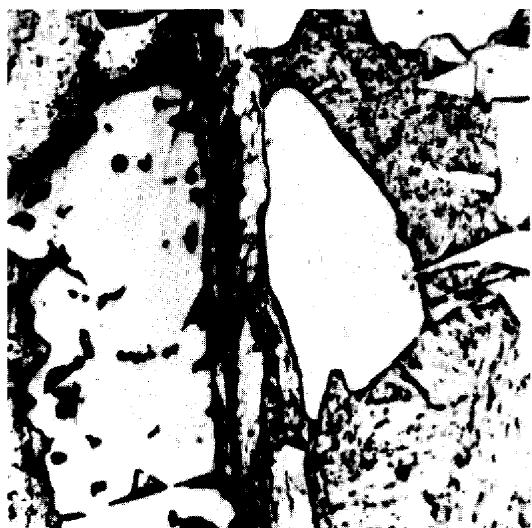  
FIG. 21-6. Precipitation of Fe-Cr alloy in high-velocity cold-leg test section (HVL I-Run 1).

Results obtained thus far with the pumped loops are shown in Table 21-5. In most cases a run consists of a test on a particular test section rather than on the entire loop. The exception is Run 4 of HVL I, which was continued until the loop plugged, at which time the entire loop was dismantled and refabricated of $1\frac{1}{4}\% \mathrm{Cr - }1 / 2\%$ Mo steel. The film temperature reported is the calculated liquid-steel interface temperature. In all tests $\mathrm{Zr}$ and $\mathrm{Mg}$ were used as inhibitors.

The purpose of Run 1 on HVL I was to study the effect of velocity on the material deposited in the cold portions of the system. It was felt that a high flow rate might dislodge the loose precipitated crystals and circulate them to the hot sections, where they would redissolve in preference to the pipe wall. The high-velocity section was placed at the region of the coldest bulk liquid. All test specimens were fabricated of $2\frac{1}{4}\%$ Cr-1% Mo steel and welds were performed with a $5\%$ Cr-1/2% Mo bare filler rod.

Examination of the test sections after 1026 hr of test showed that no corrosion had taken place in the hot sections. A one-grain, adherent layer of precipitated Fe-Cr alloy was found in the high-velocity cold section (Fig. 21-6).

To test the effect of impact on the inhibiting film, a right-angle, high-velocity section was inserted in the hot leg of HVL I-Run 2. The section was about 5 in. long, 0.355-in. ID and contained a graphite insert specimen and an annealed and hardened $2\frac{1}{4}\% \mathrm{Cr - }1\%$ Mo steel specimen. All welds were made with $5\%$ Cr-1/2% Mo bare filler rod. The flow through the

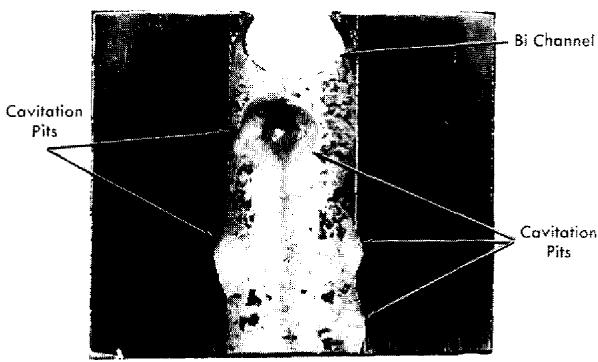  
FIG. 21-7. Cavitation-erosion on downstream side of right-angle bend in HVL I-Run 2.

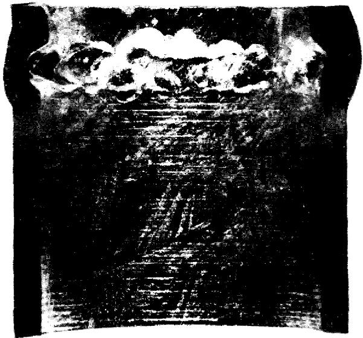  
FIG. 21-8. Preferential attack on $5\%$ Cr- $\frac{1}{2}\%$ Mo Weld in HVL I-Run 4.

small diameter was 5 fps. Physically, the right-angle section was located just outside the furnace. Polished bushings and tab samples were also placed in the furnace leg. Temperature conditions were identical to Run 1.

This run was terminated after 1026 hr of $\Delta T$ operation, and samples were removed for metallographic examination. No corrosion was detected on the polished samples located in the furnace. No erosion or corrosion was observed on any of the graphite samples. Again a very small amount of deposition was found in the cold section, this time between the pipe wall and the cold sample bushing inserts. Large pits, some about 1/2-in. diameter and 1/8-in. deep, were found on the steel samples located in the exit side of a right-angle bend (Fig. 21-7). If a vortexing of the fluid (therefore a locally increased velocity) is assumed to have occurred after the change of direction in the right-angle bend, then a condition for cavitation may have existed, i.e., the static head at this point (7 psi gauge) may have been exceeded by the dynamic head.

Run 3 of HVL I was a duplicate of Run 2 except that the static head at the right-angle bend was doubled. Examination of the specimen after the 1000-hr run showed that the cavitation pitting was eliminated.

Run 4 of HVL I was intended to test the inhibiting film under an increased temperature gradient $(150^{\circ}\mathrm{C})$ with the maximum temperature raised to $550^{\circ}\mathrm{C}$ . The test section consisted of samples of $21\%$ Cr-1% Mo steel (both annealed, and normalized and tempered), mild steel, and several grades of graphite. All welds were made with $5\%$ Cr-1/2% Mo bare filler rod. This run was terminated after 2591 hr of operation because of extensive pitting in the hot section and plugging in the finned cooler section, as revealed by radiographs. Attempts to drain the loop completely were unsuccessful. Upon sectioning, localized masses of intermetallic compounds were found, which probably developed when the system was cooled. These formations did not redissolve on heating because of the lack of good mixing, and were viscous enough to prevent the bismuth from draining.

The entire loop was sectioned and examined. A severe pit-type corrosion was found in the hot sections; welds (Fig. 21-8) as well as parent material (Fig. 21-9) were grossly attacked; $24\%$ Cr-1% Mo steel in the normalized and tempered condition was less corroded than the same material in the annealed condition; carbon steel samples showed little or no attack. Corrosion occurred in crevices between the samples and pipe walls. The mass-transfer plugs occurred in the region of the coldest film temperature rather than the coldest bulk temperature. Velocity did not sweep away the deposited material, but rather a plug of high density was produced (Fig. 21-10).

The minimum film temperature for this run may possibly have been as much as $25^{\circ}\mathrm{C}$ lower than the $400^{\circ}\mathrm{C}$ reported because of an error involved in selecting the actual cooling area.

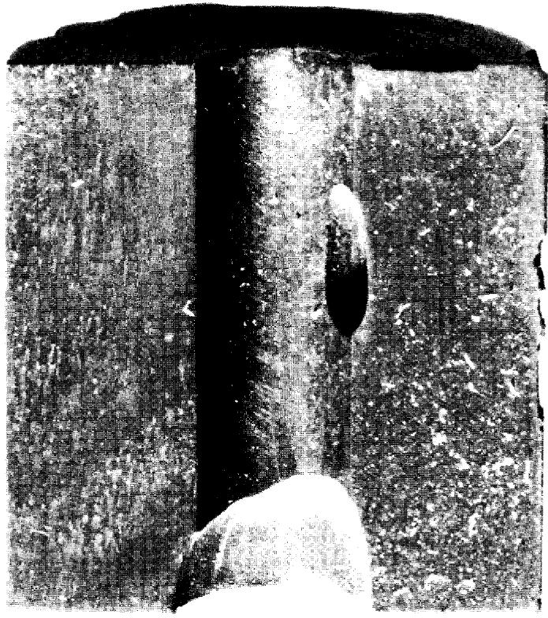  
FIG. 21-9. Attack on annealed $21\%$ Cr-1% Mo hot test specimen in HVL I-Run 4.

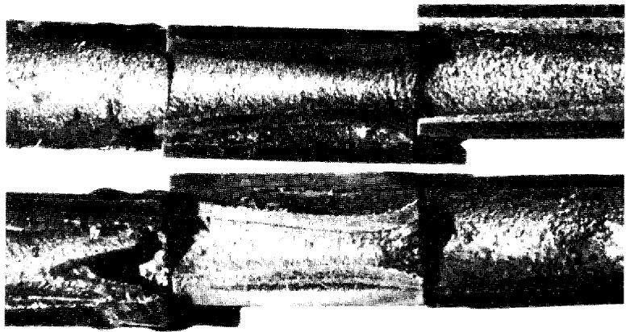  
FIG. 21-10. Cross section of deposited Fe-Cr alloy in finned-cooler section of HVL I-Run 4.

Loop G-Run 1, had a hot-leg test section consisting of specimens of $2\frac{1}{4}\% \mathrm{Cr - }1\%$ Mo, $1\frac{1}{4}\% \mathrm{Cr - }1 / 2\%$ Mo, AISI type-410, and Bessemer steels, joined with welds made with $2\frac{1}{4}\% \mathrm{Cr - }1\%$ Mo, $1\frac{1}{4}\% \mathrm{Cr - }1 / 2\%$ Mo, $5\%$ $\mathrm{Cr - }1 / 2\%$ Mo, AISI type-410, and mild steel bare filler rods. This run was terminated after 938 hr of operation at a $75^{\circ}\mathrm{C}$ film gradient and a flow of 4 fps in the test section. Examination of the test section showed that welds made with a $5\%$ $\mathrm{Cr - }1 / 2\%$ Mo rod were severely attacked, while those made with a $2\frac{1}{4}\% \mathrm{Cr - }1\%$ Mo rod and a $1\frac{1}{4}\% \mathrm{Cr - }1 / 2\%$ Mo rod were not attacked. The only other corrosion observed in this run was some slight attack on welds and base material of AISI type-410 steel. Cavitation pits were also observed on the pump impeller.

Loop G-Run 2, HVL I-Run 5, and HVL II-Run 1 are still under test. In these loops are specimens of $21\%$ Cr-1% Mo and $14\%$ Cr-1/2% Mo steels having various heat treatments, AISI type-410 and Bessemer steels, and welds made with $14\%$ Cr-1/2% Mo, $21\%$ Cr-1% Mo, $5\%$ Cr-1/2% Mo, AISI type-410 and mild steel bare filler rods. No corrosion has been detected radiographically in the loop G test section after 2500 hr of operation. No corrosion has been detected in the HVL I-Run 5 test section; however, slight deposition has been detected in the finned cooler. This precipitate was first observed after 1400 hr of operation but is still not serious after 4000 hr.

Pitting of welds made with $5\% \mathrm{Cr - 1 / 2\%}$ Mo rod and possible corrosion of a $24\%$ $\mathrm{Cr - 1\%}$ Mo weld have been detected in Run 1 of HVL II. This loop first operated 2500 hr with a film $\Delta T$ of $75^{\circ}\mathrm{C}$ (500 to $425^{\circ}\mathrm{C}$ film) with no radiographically detectable corrosion and little or no mass transfer. The temperature differential was then increased to $75^{\circ}\mathrm{C}$ bulk (522 to $427^{\circ}\mathrm{C}$ film). After 100 hr at this new differential, deposition in the cooler was observed. Pitting of the $5\%$ $\mathrm{Cr - 1 / 2\%}$ Mo weld was detected after 2000 hr at the new differential. However, after a total of 7400 hr of temperature gradient operation, the amount of pitting and transferred material was not serious enough to stop loop operation.

The effect of velocity on corrosion and mass transfer is not apparent at this time. This is mainly due to a lack of tests in which velocity is the only variable. Correlation between the pump loops and thermal convection loops suggests that velocity has little effect on mass transfer other than on the type of plug formed, provided conditions for cavitation do not exist. However, results from tests now under way should definitely evaluate this variable.

21-2.5 Rapid oxidation of $2\frac{1}{4}\%$ Cr-1% Mo steel. In a pumped Bi loop containing $\mathrm{Mg + Zr}$ , the $2\frac{1}{4}\%$ Cr-1% Mo steel adjacent to a pinhole leak was found to be severely oxidized. The appearance of the oxide scale was very similar to that reported by Leslie and Fontana [8]. These investigators

found that rapid oxidation of a $16\%$ $\mathrm{Cr - 25\%}$ Ni- $6 \%$ Mo steel will occur in a stagnant atmosphere, and that $\mathrm{MoO_3}$ catalyzed the rapid oxidation of this steel. They also reported that $\mathrm{Bi}_2\mathrm{O}_3$ could produce a similar effect.

A test simulating a leak in a loop was made to study this phenomenon. A $2\frac{1}{4}\%$ Cr- $1\%$ Mo steel pipe was filled with Bi containing 1000 ppm U, 350 ppm Mg, and 250 ppm Zr. A 1/32-in. hole was drilled in the pipe below the Bi level. A patch of asbestos tape 2 in. in diameter was put over the hole. The tube was then heated to $594^{\circ}\mathrm{C}$ and pressurized to 5 psi to force out a small amount of Bi. The pressure was dropped as soon as some Bi had leaked out and the tube was then heated at $594^{\circ}\mathrm{C}$ for 1025 hr. The appearance of the pipe underneath the asbestos tape patch and a cross section of the oxidized area are shown in Fig. 21-11. A complete oxidation through the pipe wall has occurred in the area adjacent to the leak.

Tests run at 738 and $816^{\circ}\mathrm{C}$ in covered crucibles show that chemically pure $\mathrm{Bi}_{2}\mathrm{O}_{3}$ can promote rapid oxidation in $2\frac{1}{4}\%$ Cr- $1\%$ Mo, $1\frac{1}{4}\%$ Cr- $1/2\%$ Mo, and carbon steels. Tube tests and crucible tests are being continued to determine the minimum temperature at which rapid oxidation is a problem.

21-2.6 Radiation effects on steels. Since steel will be in direct contact with the liquid U-Bi fuel, it is important to determine the effects of fission recoils and fast neutrons on the rate of corrosion or erosion. If corrosion inhibition is achieved by a layer of $\mathrm{ZrN}$ between the Bi and the steel, there is concern that fission recoil particles might destroy this film. Local heating, resulting from the stopping of the particles, may cause a differential expansion between the layer and the steel. Consequently, the layer may break away from the steel, leaving the surface exposed to Bi attack. On the other hand, neutrons should not be detrimental to a thin $\mathrm{ZrN}$ layer, per se.

Effects of neutrons must also be determined on the mechanical properties of the steels at reactor temperatures. Radiation-induced increases in tensile strength and elastic modulus may not anneal out at LMFR operating temperatures. A decrease in the impact strength is not considered too probable at these temperatures, although the possibility must be investigated.

To study the radiation effects on materials, a capsule test has been developed. The capsules, in which samples are inserted in a highly enriched $\mathrm{U - Bi}$ solution containing $\mathrm{Mg}$ and $\mathrm{Zr}$ inhibitors, are exposed in the BNL reactor and irradiated to the desired level. The test has the advantage of attaining high temperatures $(700^{\circ}\mathrm{C})$ and a high fission recoil density.

Samples of $14\%$ Cr- $1 / 2\%$ Mo and $24\%$ Cr- $1\%$ Mo have been placed in one of these capsules with Bi containing $4000~\mathrm{ppm}$ U, $2500~\mathrm{ppm}$ Zr, and $3500~\mathrm{ppm}$ Mg. The exposure was approximately $2.2\times 10^{19}$ nvt. Sectioning of this capsule has shown no corrosion of the samples. A second capsule

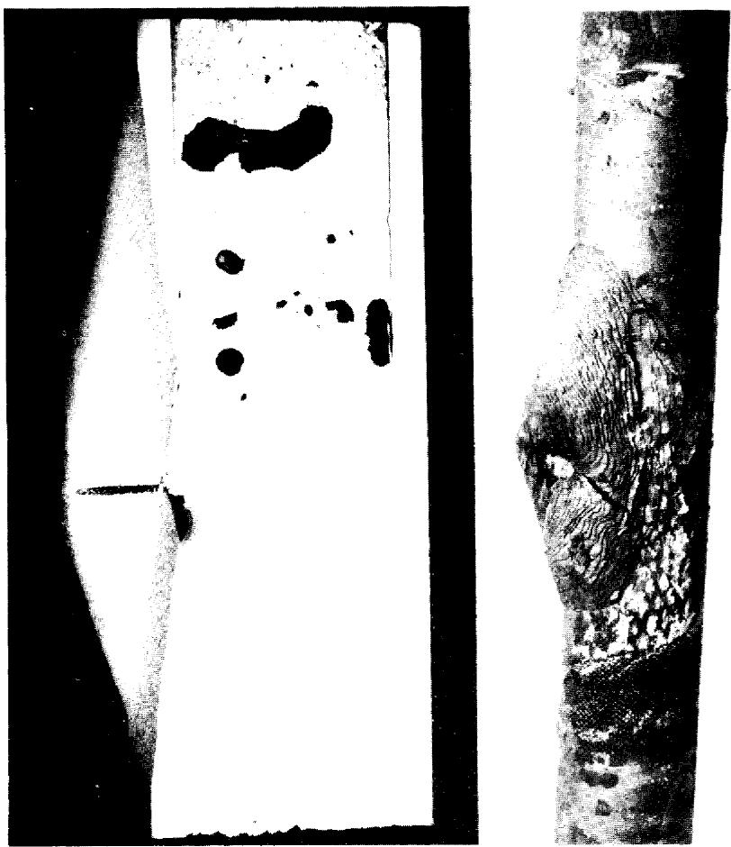  
FIG. 21-11. Rapid oxidation of $21\%$ G-1% Mo steel pipe after 1025 hr at $594^{\circ}\mathrm{C}$ at pinhole leak.

has been put in the BNL pile containing samples of $1\frac{10}{4}\%$ Cr-1/2% Mo and mild steels. Results are not yet available.

Dynamic tests of the reaction between Bi and steel in the presence of a radiation field must be completed before a final selection can be made of materials for the LMFR. The effect of velocity on corrosion is not certain from the out-of-pile studies, so that no exact analogy can be made between out-of-pile forced circulation loops and in-pile capsules. There has been limited work done at Harwell [6] with thermal convection loops in and out of a radiation field. These loops had no U but did contain Ca and Zr inhibitors. The data suggest that pile radiation may have induced some acceleration of mass transfer.

An in-pile, forced-circulation loop has been built at BNL and two others at Babcock & Wilcox Research Laboratory to test the corrosion stability of LMFR materials under conditions to be expected in the reactor experiment. In this loop, Bi containing approximately $1500\mathrm{ppm}$ of $\mathrm{U}^{235}$ , $180\mathrm{ppm}$ $\mathrm{Zr}$ , and $350\mathrm{ppm}$ $\mathrm{Mg}$ will be pumped at a rate of 5 to $7\mathrm{gpm}$ . The bulk $\Delta T$ will be approximately $75^{\circ}\mathrm{C}$ , with a maximum temperature of $500^{\circ}\mathrm{C}$ . There are three sample sections in the loop: one, containing samples of $1\frac{1}{4}\%$ $\mathrm{Cr - 1 / 2\%}$ Mo steel, $2\frac{1}{4}\%$ $\mathrm{Cr - 1\%}$ Mo steel, Be, and graphite, will be at the center of the reactor and will be in a flux of approximately $3\times 10^{13}$ thermal neutrons; one within the shield will see delayed neutrons at a temperature of $500^{\circ}\mathrm{C}$ ; and the third section will be outside the reactor at a temperature of $425^{\circ}\mathrm{C}$ . This test is presently being assembled, and will be operating late in 1958.

# 21-3. NONFERROUS METALS

Several nonferrous metals are receiving attention as container materials, principally because of their low solubility in bismuth. At this time only a small amount of work has been done on testing these metals. The following is a brief discussion of some of the most important of them.

21-3.1 Beryllium. In the Liquid Metals Handbook, beryllium has been reported to have a good resistance to attack by liquid bismuth at $500^{\circ}\mathrm{C}$ and probably also at $1000^{\circ}\mathrm{C}$ . Recent work at Harwell has shown that beryllium has good resistance to mass transfer by liquid bismuth circulating through a temperature gradient of $500^{\circ}\mathrm{C}$ , with a base temperature of $300^{\circ}\mathrm{C}$ . Recent advances in the production technology of beryllium metal have improved its mechanical properties sufficiently so that it is now possible to consider this metal for reactor core vessel or moderator. However, no data on reaction between beryllium and uranium additives and fission products dissolved in a liquid metal fuel are available. Since uranium is known to form a stable intermetallic compound with beryllium, the possibility of such a reaction must be investigated before beryllium can be recommended as a moderator in contact with a liquid-metal fuel. Static tests on the resistance of Be to attack by U-Bi at 550 and $650^{\circ}\mathrm{C}$ showed some (but not conclusive) evidence of a slight attack (less than 1 mil/yr average penetration). A slight attack on Be was noted by Brasunas by a $2\%$ U-Bi alloy after 4 hr at $1000^{\circ}\mathrm{C}$ .

21-3.2 Tantalum. Recent work at the Ames Laboratory indicates that tantalum is an excellent material to contain U-Bi. A 5 w/o U in Bi solution was circulated through a 3/4-in. OD by 0.030-in. wall tantalum loop at a rate of $800\mathrm{lb / min}$ . The U-Bi was circulated with an electromagnetic pump and the temperature differential was $100^{\circ}\mathrm{C}$ (950 to $850^{\circ}\mathrm{C}$ ).

Liquid metal samples taken during operation showed that the Ta concentration never exceeded 6 ppm. After 5250 hr of operation, the loop was shut down and examined metallographically. No transferred material was detected in the cold leg and the corrosion was less than 1 mil. The tantalum remained shiny and ductile throughout the experiment.

Even though the above results are hopeful, the use of tantalum as a container material for a U-Bi reactor system is limited by (1) its poor air oxidation resistance, (2) difficulty of fabrication, (3) cost.

21-3.3 Molybdenum. Molybdenum is also known to be highly resistant to U-Bi. However, its use as a container material is hampered by its poor oxidation resistance and difficult fabrication.

Some success has been obtained, however, with Mo applied as a coating on low-chrome steel. The process was developed by the Vitro Corporation and is described in detail in KLX-10009. Essentially, the coating is applied by first electrophoretically depositing $80\%$ $\mathrm{Mo} + 20\%$ $\mathrm{MoO_3}$ on the steel. The coating is then pressed, reduced in a $\mathrm{H}_{2}$ atmosphere, repressed and sintered in an $\mathrm{H}_{2} + \mathrm{HCl}$ atmosphere.

These specimens have been subjected to static Bi which was temperature cycled at 550 to $400^{\circ}\mathrm{C}$ . Filtered liquid metal samples of the Bi were taken and analyzed for the presence of Fe and Cr. The Bi was allowed to stay at the $550^{\circ}\mathrm{C}$ temperature overnight before a liquid metal sample was taken. After 4300 hr at temperature and some 17,000 cycles, the concentration of Fe was $6.9\mathrm{ppm}$ and $\mathrm{Cr}2\mathrm{ppm}$ . By comparison, the solubilities of Fe and Cr at $550^{\circ}\mathrm{C}$ were $30\mathrm{ppm}$ and $80\mathrm{ppm}$ respectively.

On the basis of their low solubility in U-Bi such materials as tungsten, tantalum, molybdenum, and beryllium could be classified as container materials. Their practical use, however, is governed by their poor air oxidation resistance, fabrication difficulties, availability, and cost.

# 21-4. BEARING MATERIALS

The relative bearing properties of materials for use as valve seats, disks, and guides are being determined in Bi containing Mg and Zr. Testing is done under a boundary lubrication condition.

The test apparatus consists of a main test chamber and a sump tank to facilitate easy handling of the liquid Bi and to permit periodic sampling of the liquid metal. The main test chamber, containing the samples and the sample loading mechanism, is shown in the cutaway of Fig. 21-12. The method of transmitting the load with air pistons through flexible bellows can be clearly seen. A second chamber mounted on top of the main test chamber contains a dc Thymotrol motor which rotates the cylindrical specimen. The power input versus torque characteristics of the motor when

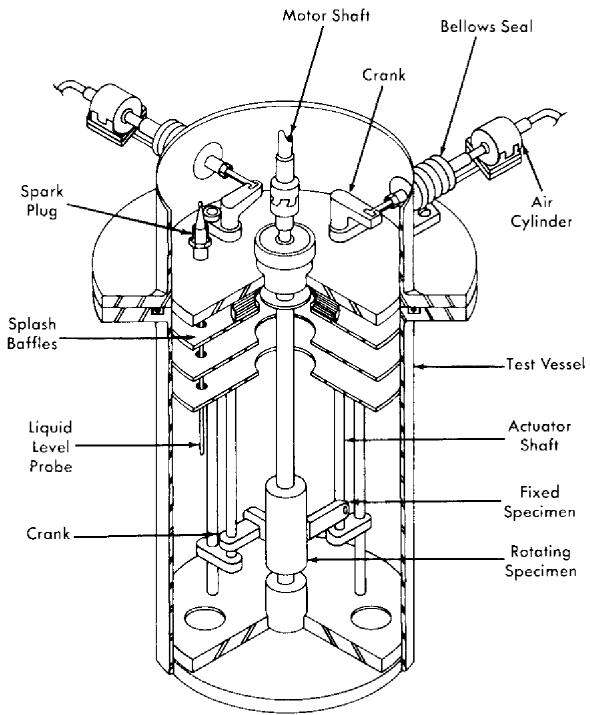  
FIG. 21-12. Bearing materials test apparatus.

operated in a helium atmosphere using "high-altitude" aircraft brushes has been determined.

A test consists of contacting the rotating cylindrical specimen with a flat specimen under a constant force for a set period of time under set conditions. After the contact run, the Bi is removed from the specimen. The degree and kind of scoring, galling, material transfer, and depth of wear on the surface were noted. Surface roughness measurements are made with a profilometer. Hardness measurements are made. Coefficients of friction are calculated from the measured torque data by the equation

$$
f = \frac {T}{P r}, \tag {21-4}
$$

where $f =$ the coefficient of friction, $P =$ the applied load (lb), $r =$ the radius of sleeve (ft), and $T =$ the torque (ft-lb).

In general, the hard-to-hard material combinations have shown good wear resistance except for some scoring. The best hard material tested thus far is $\mathrm{Al}_{2}\mathrm{O}_{3}$ flame-coated on AISI 4130 steel. When this material was contacted against itself, no wear or scoring could be detected. This ma

terial will be thermally cycled and exposed to inhibited U-Bi for long times to evaluate its utility. Stellar 90 and Rex AA also behaved well. Contacts made with common die steels and low-alloy steels have exhibited severe scoring and wear. Corrosion has also been detected on these samples. Of the cemented carbides, only TiC with either a mild steel or $2\frac{1}{4}\%$ Cr-1% Mo binder has been tested. This material did not show good wear properties and also exhibited some pitting corrosion.

Graphitar versus tool steel and Mo versus Rex AA or Stellarite 90 have shown the best results of the hard versus soft combinations tested. The results have been good in that the wear has been very smooth; however, the wear has been excessive. The use of these combinations would be limited to very low-load applications.

# 21-5. SALT CORROSION

In earlier chapters, it was pointed out that one of the chief advantages of the LMFR lies in the possibility of easy chemical processing. Several processing techniques have been studied, most of which are based on pyrometallurgical processes. The two chief pyrometallurgical methods under consideration are the chloride process, in which the bismuth fuel is contacted with a ternary mixture of molten chloride salts, and the fluoride process, in which the bismuth fuel is contacted with molten fluoride salts containing hydrogen fluoride. As may be imagined, the construction material problem for these plants is very difficult.

A corrosion test program is actively under way at BNL and Argonne National Laboratory on the chloride and fluoride processes respectively. At BNL, these tests have consisted principally of rocking furnace and tab exposure tests.

In the rocking furnace test, a piece of tubing approximately 12 in. long and 1.2 in. ID, containing a charge of either salt or a mixture of salt and bismuth, is placed on a rocking rack in a furnace. This rack alternately tilts to one end for a period of $1\mathrm{min}$ and then to the other end for a like amount of time. The two ends of the furnace are kept at 450 and $500^{\circ}\mathrm{C}$ in order to give a temperature differential and thus induce mass-transfer corrosion. The standard test period has been $1000\mathrm{hr}$ . These tests are part of the initial screening program. When they are completed, the metals which have given the best performance will be further evaluated in test loops and pilot-plant equipment.

At present, only molybdenum has been satisfactorily tested against a mixture of salt and bismuth fuel. However, the results are definitely encouraging. It has been found that the ternary salt, $\mathrm{MgCl_2 - NaCl - KCl}$ , with or without zirconium and uranium chlorides, can be contained fairly well in austenitic stainless steels, particularly 347 stainless steel. When a

mixture of bismuth fuel and the ternary salt containing less than $1\%$ $\mathrm{BiCl}_3$ was tested, the ferritic stainless steels were the best materials. These include 410, 430, and 446 stainless steels. Probably the best of the ferrities is the $2\frac{1}{4}\%$ Cr- $1\%$ Mo stainless steel.

During one step in the chloride chemical process, it is necessary to have the ternary salt, containing more than $1\%$ $\mathrm{BiCl}_3$ , in contact with bismuth fuel. For this mixture only molybdenum has been satisfactory. However, considerably more testing is required before this can be considered a satisfactory material.

The experience in handling salt with larger-sized equipment is quite limited. A small loop built of 347 stainless steel has been operated satisfactorily for a fairly short time. A much larger loop, loop "N," is now being constructed at BNL. This will contact the chloride salt and the bismuth fuel. The salt part of the loop is constructed of 347 stainless steel. The bismuth fuel section of the unit is constructed of $2\frac{1}{4}\% \mathrm{Cr - }1\%$ Mo steel. The actual contacting units are constructed of both 347 and the low-chrome steels. This pilot plant, when placed in operation, should furnish considerable information on the corrosion characteristics of the molten chloride salt.

The fluoride process also presents difficulties with materials of construction. The mixture of the molten fluoride salts, containing HF, with the bismuth fuel is extremely corrosive. Pure nickel has been found to stand up fairly well to the molten fluoride salts alone. However, the combination of the three materials has proved to be very corrosive even to nickel. The extensive development program to investigate the materials of construction for the fluoride process is continuing.

# 21-6. GRAPHITE

21-6.1 Mechanical properties. In the proposed LMFR system, the moderator, graphite, is also employed as the container material. Therefore, the graphite should have good physical properties such as strength, hardness, and resistance to shock. Since graphite is to be the container material for the bismuth solution, it should theoretically be completely impervious to the solution. For this reason, special graphites, more impervious than the usual reactor grades, have been developed and are under development. Physical properties of typical examples of these graphites are given in Table 21-6. In comparison with the usual reactor grade, AGOT, having a compressive strength of 6000 psi, these impervious grades have a strength of 6500 to 9700 psi.

Another special requirement for the graphite is that it withstand erosion or pitting by the flowing fuel. Test sections of accurately bored graphite were placed in test loops where the flow velocity of bismuth was 6 to 8 fps. No observable effect was noted after $1000\mathrm{hr}$ of test at $550^{\circ}\mathrm{C}$ .

Although tests so far have been on rather small samples, the mechanical properties of these improved graphites appear sufficiently good for use in LMFR systems. These new graphites must be manufactured in large sizes in order to conveniently make up the core of an LMFR. The graphite industry in the United States is now developing manufacturing techniques for making such large sizes.

21-6.2 Graphite-to-metal seals. Leaktight joints of steel to graphite are required at several places in the core of an LMFR. These seals must withstand an average of 125 psi at approximately $550^{\circ}\mathrm{C}$ . This is done by joining finely machined steel and graphite surfaces under sufficient spring loading to prevent bismuth leaking across the seal.

Tests were run by Markert at the Babcock & Wilcox Research Center to evaluate such pressure seals. Three-inch and six-inch steel pipes $(2_{4}^{16}\mathrm{Ccr - 16Mo})$ with machined ends were pressed against a flat surface of a block of MH4LM graphite (Great Lakes Carbon Co., density $1.9\mathrm{g / cc}$ ). The graphite surface had been prepared by sanding and polishing with No.000 emery paper. A seal was effected against Bi at $438^{\circ}$ with a pressure differential across the seal of 100 psi, and with 1500 psi stress between the graphite and the steel. The minimum stress that may be used without visible Bi leakage at this pressure differential was found to be as low as 600 psi. It was not necessary to resort to complicated interface configurations to obtain a seal. These initial results are very encouraging, and further development work is being directed toward more complicated seals.

21-6.3 Graphite reactions. If graphite is to be in direct contact with the U-Bi fuel, it should be inert to the various fuel constituents and also to fission products and corrosion products. Work has been done at various locations on these reactions. Thermodynamic data on chemical equilibrium, when available, have proved to be extremely valuable in guiding the experiments.

Uranium-graphite reactions. The reaction between uranium and graphite is probably the most important one to consider in the LMFR. Mallett, Gerds, and Nelson [11] reported that uranium forms three stable carbides: $\mathrm{UC}$ , $\mathrm{UC}_2$ , and $\mathrm{U}_2\mathrm{C}_3$ . Further work on this subject [7,12] indicates that when less than $1\%$ U is present in bismuth, it does not react with graphite to form carbides at temperatures below $1200^{\circ}\mathrm{C}$ .

However, the nitride of uranium, UN, has been identified on graphite contacted with $0.05\%$ U in Bi at $850^{\circ}\mathrm{C}$ for 28 hr. This nitrogen was undoubtedly adsorbed on the surface of the graphite and had not been dislodged by outgassing at high temperatures and vacuum.

When zirconium and magnesium are present with uranium in the bismuth, zirconium reacts preferentially with the graphite to form $\mathrm{ZrC}$ . This

# TABLE 21-6

# GENERAL PHYSICAL PROPERTIES OF GRAPHITE AT $20^{\circ}\mathrm{C}$

<table><tr><td rowspan="2">Grade</td><td colspan="3">Base grades</td><td colspan="4">Impregnated grades</td><td rowspan="2">Units</td></tr><tr><td>R-0013</td><td>R-0018</td><td>ATJ</td><td>R-0025</td><td>R-0020</td><td>ATJ-82</td><td>MHI4LM-90</td></tr><tr><td>Manufacturer Max. production size*</td><td>National Carbon Company 40&#x27;&#x27; dia.</td><td>40&#x27;&#x27; dia.</td><td>20&#x27;&#x27; × 24&#x27;&#x27; × 8&#x27;&#x27;</td><td>National Carbon Company 40&#x27;&#x27; dia.</td><td>40&#x27;&#x27; dia.</td><td>20&#x27;&#x27; × 24&#x27;&#x27; × 8&#x27;&#x27;</td><td>Great Lakes Carbon Co. 48&#x27;&#x27; dia.</td><td></td></tr><tr><td>Density Electrical resistivity w a</td><td>1.85</td><td>1.85</td><td>1.73</td><td>1.90</td><td>1.90</td><td>1.88</td><td>1.90</td><td rowspan="9">g/cc mΩ-cm mΩ-cm cal (sec)(cm)(°C) cal (sec)(cm)(°C) psi psi psi psi</td></tr><tr><td>Thermal conductivity w a</td><td>1.16</td><td>1.53</td><td>1.16</td><td>1.21</td><td>1.49</td><td>1.12</td><td>0.64</td></tr><tr><td>Flexural strength w a</td><td>1.40</td><td>1.77</td><td>1.43</td><td>1.48</td><td>1.64</td><td>1.48</td><td>0.69</td></tr><tr><td rowspan="6">Compressive strength w a</td><td>0.28</td><td>0.21</td><td>0.30</td><td>0.27</td><td>0.22</td><td>0.31</td><td>0.45</td></tr><tr><td>0.23</td><td>0.17</td><td>0.22</td><td>0.23</td><td>0.21</td><td>0.22</td><td>0.46</td></tr><tr><td>3250</td><td>3400</td><td>3300</td><td>4000</td><td>4100</td><td>4600</td><td>2750</td></tr><tr><td>3000</td><td>3200</td><td>3300</td><td>3900</td><td>3900</td><td>4600</td><td>2900</td></tr><tr><td>7500</td><td>8700</td><td>8400</td><td>8600</td><td>9100</td><td>9700</td><td>6650</td></tr><tr><td>7500</td><td>8700</td><td>8500</td><td>8500</td><td>9000</td><td>9700</td><td>6250</td></tr><tr><td rowspan="2">Coefficient of thermal expansion w a</td><td>2.1</td><td>2.3</td><td>2.3</td><td>2.4</td><td>2.4</td><td>2.1</td><td>2.5</td><td>×10-6/°C</td></tr><tr><td>2.5</td><td>2.5</td><td>2.8</td><td>2.9</td><td>2.6</td><td>2.5</td><td>2.7</td><td>×10-6/°C</td></tr><tr><td rowspan="2">Helium flow at &lt; p&gt; = 2.7 atm w Δp=1 atm a</td><td>240</td><td></td><td></td><td>3.2</td><td>1.7</td><td>0.16</td><td>0.88</td><td rowspan="2">ml/min through 1 cm cube</td></tr><tr><td></td><td>3.9</td><td>160</td><td>1.7</td><td>1.7</td><td>0.12</td><td>0.43</td></tr></table>

TABLE 21-6 (continued)   

<table><tr><td colspan="2">Grade</td><td>CCN</td><td>ATL-82</td><td>Graphite-G</td><td>Graphite-A</td><td>R 4</td><td>CEY</td><td>AGOT</td><td>Units</td></tr><tr><td colspan="2">Manufacturer Max. production size*</td><td>National Carbon Company 40&quot; dia.</td><td>53&quot; dia.</td><td>Graphite Specialties Corporation 7&quot; dia.</td><td>35&quot; dia.</td><td>40&quot; dia.</td><td>NCC 2&quot; dia.</td><td>NCC 16&quot; × 16&quot;</td><td></td></tr><tr><td colspan="2">Density</td><td>1.92</td><td>1.88</td><td>1.88</td><td>1.93</td><td>1.98</td><td>1.90</td><td>1.70</td><td>g/cc</td></tr><tr><td rowspan="2">Electrical resistivity</td><td>w</td><td>1.14</td><td>1.20</td><td>0.89</td><td>1.07</td><td>1.12</td><td>1.51</td><td>0.73</td><td>mΩ-cm</td></tr><tr><td>a</td><td>1.20</td><td>1.25</td><td>1.04</td><td>1.17</td><td>1.14</td><td></td><td>0.94</td><td>mΩ-cm</td></tr><tr><td rowspan="2">Thermal conductivity</td><td>w</td><td>0.30</td><td>0.29</td><td>0.38</td><td>0.34</td><td>0.35</td><td>0.13</td><td>0.53</td><td>cal/(sec)(cm)(°C)</td></tr><tr><td>a</td><td>0.27</td><td>0.26</td><td>0.31</td><td>0.30</td><td>0.30</td><td></td><td>0.33</td><td>cal/(sec)(cm)(°C)</td></tr><tr><td rowspan="2">Flexural strength</td><td>w</td><td>2400</td><td>2800</td><td>4400</td><td>4800</td><td>3850</td><td></td><td>2400</td><td>psi</td></tr><tr><td>a</td><td>2050</td><td>2400</td><td>3900</td><td>4000</td><td>3550</td><td></td><td>2000</td><td>psi</td></tr><tr><td rowspan="2">Compressive strength</td><td>w</td><td>7500</td><td>6500</td><td>7400</td><td>8500</td><td>6900</td><td></td><td>6000</td><td>psi</td></tr><tr><td>a</td><td>6500</td><td>6200</td><td>8500</td><td>9000</td><td>7200</td><td></td><td>6000</td><td>psi</td></tr><tr><td rowspan="2">Coefficient of thermal expansion</td><td>w</td><td>2.2</td><td>2.3</td><td>3.1</td><td>3.3</td><td>3.2</td><td>2.5</td><td>2.2</td><td>×10-6/°C</td></tr><tr><td>a</td><td>2.2</td><td>2.7</td><td>3.7</td><td>3.8</td><td>3.8</td><td></td><td>3.8</td><td>×10-6/°C</td></tr><tr><td rowspan="2">Helium flow at &lt; p&gt; = 2.7 atm Δp=1 atm</td><td>w</td><td>5.7</td><td>1.7</td><td></td><td>0.21</td><td></td><td></td><td>300</td><td>ml/min through 1 cm cube</td></tr><tr><td>a</td><td></td><td></td><td>0.042†</td><td>0.055†</td><td>0.021†</td><td>0.00040</td><td></td><td></td></tr></table>

\*As specified at present time by the individual manufacturers. Processed and measured as small samples.

is predictable from the chemical thermodynamic data. An experiment in which graphite was contacted with $1000\mathrm{ppm}$ U, $50~\mathrm{ppm}$ $\mathrm{Zr}$ , and $300~\mathrm{ppm}$ $\mathrm{Mg}$ in Bi at $1000^{\circ}\mathrm{C}$ for $8\mathrm{hr}$ showed only a single intense x-ray diffraction line corresponding to the most intense line for $\mathrm{ZrC}$ . The x-ray analysis was carried out after the adherent bismuth was removed from the samples by mercury rinsing.

These experiments indicate that the reaction of uranium with graphite is not likely to occur under the LMFR operational conditions and can be prevented by the addition of zirconium to the bismuth.

Zirconium and titanium reactions with graphite. Since zirconium and possibly some titanium will be present in the bismuth, reactions of these materials with graphite have been investigated. As described above, zirconium reacts to form the carbide with a strong negative free energy. At temperatures around $550^{\circ}\mathrm{C}$ , $\mathrm{ZrC}$ and solid solutions of $\mathrm{ZrC}$ and $\mathrm{ZrN}$ have been identified on graphite surfaces contacted with bismuth solutions containing $130~\mathrm{ppm}$ $\mathrm{Zr}$ .

On the other hand, no reaction between graphite and $1600\mathrm{ppm}$ Ti in Bi solutions has been observed up to $800^{\circ}\mathrm{C}$ for contact times up to $170\mathrm{hr}$ . A strong TiC x-ray pattern and a less intense $\mathrm{ZrC - ZrN}$ solution pattern were observed on graphite contacted with approximately $0.2\%$ Ti and $0.2\%$ Zr in Bi at $1250^{\circ}\mathrm{C}$ for $44\mathrm{hr}$ .

When steel samples are reacted with U-Bi fuels containing zirconium and magnesium, the x-ray patterns of the surface are those for pure or very nearly pure nitrides or carbides. When graphite is contacted with the fuel, however, solid solutions of the carbide and nitride are often found. The unit cells vary from $4.567\mathrm{Kx}^*$ to $4.685\mathrm{Kx}$ for the zirconium compounds and from $4.237\mathrm{Kx}$ to $4.320\mathrm{Kx}$ for the titanium compounds. These parameters are low for complete carbon carbide structures.

Parameters for carbon-deficient carbide structures have been reported in the literature [13]. For $\mathrm{ZrC}$ the reported $a_0$ varied from 4.376 Kx at 20 atomic percent C to 4.67 Kx at 50 atomic percent C. However, up to the present time no evidence of carbon deficient structures has been observed in studying the graphite-fuel experiments. The low parameters are instead believed due to nitrogen replacing the carbon atoms in the carbide lattice (NaCl-type). Parameters for such solid carbide-nitride solutions are described by Duwez and Odell [1].

Fission product-graphite reactions. The products of uranium fission may also react chemically with graphite to form carbides. A series of experiments have shown that materials such as cerium will definitely react with graphite. When $25\mathrm{ppm}$ Ce in bismuth was placed in contact with graphite at $700^{\circ}\mathrm{C}$ for $110\mathrm{hr}$ , $\mathrm{CeC_2}$ was identified as a film on the graphite. Graphite contacted with $140\mathrm{ppm}$ Sm in bismuth at $800^{\circ}\mathrm{C}$ for $140\mathrm{hr}$ , on

the other hand, gave an x-ray diffraction pattern of the graphite surface which could not be identified or indexed. Under similar reaction conditions, neodymium, barium, or beryllium in bismuth solutions have no reaction product. However, Miller [12] has shown by an autoradiograph technique that $180~\mathrm{ppm}$ irradiated Nd in bismuth reacts with graphite at $1100^{\circ}\mathrm{C}$ in $100\mathrm{hr}$ , concentrating the radioactive Nd at the graphite-liquid metal interface. When the same experiment was repeated with the addition of $100~\mathrm{ppm}~\mathrm{Zr}$ to the solution, no Nd was identified at the graphite surface.

This experiment indicates that zirconium will probably form the carbide and nitride preferentially to most fission products. However, further research is required to determine whether a zirconium carbide-nitride layer on the graphite can be depended upon to prevent the adhesion of the fission products to the graphite surface. This point is not only important from the chemical and graphite surface point of view, but is also important from the neutron economy point of view. To obtain the highest breeding ratio, the fission products, which are all fairly good neutron adsorbers, must be removed from the graphite core soon after their formation. This is especially true of samarium, which has a very high neutron absorption cross section. Therefore, the experiments reported above on zirconium are quite encouraging in that there is no trace of a samarium film on the graphite.

21-6.4 Radiation effects on graphite. The graphite core, in order to serve as moderator and container for the flowing fuel, must be stable to radiation. Fission recoils may cause spalling and reduction in the thermal conductivity that might increase the thermal stresses within the core structure. The graphite must not adsorb large quantities of U or fission products.

A capsule test has been developed in which samples are irradiated in a highly enriched U-Bi solution containing $\mathrm{Mg}$ and $\mathrm{Zr}$ inhibitors for study of radiation effects on materials. The test has the advantage of attaining high temperatures $(700^{\circ}\mathrm{C})$ and a high fission recoil density.

Graphite samples have been exposed in these capsules under conditions given in Table 21-7. Metallographic examination of these graphite samples indicates that there is no excessive spalling or corrosion.

However, some samples were treated with Bi containing $\mathrm{Zr}$ at $1300^{\circ}\mathrm{C}$ to obtain 10- to 30-micron $\mathrm{ZrN - ZrC}$ layers on the graphite prior to irradiation, and postirradiation examination indicated some change of this layer. The cause of these effects is still being determined.

The effect of neutrons on the growth and thermal conductivity properties of special low-permeability grades of graphite has been measured. Three sets of samples have been irradiated to exposures as great as $5 \times 10^{20}$ thermal neutrons/ $\mathrm{cm}^2$ in the temperature range 400 to $475^{\circ}\mathrm{C}$ . Results of these tests are listed in Table 21-8. The change in physical length of the graphite is primarily contraction and should not present a major engineering problem.

TABLE 21-7   
URANIUM SOLUTION CAPSULE CONDITIONS ON GRAPHITE   

<table><tr><td rowspan="2">Capsule</td><td rowspan="2">Type of sample</td><td rowspan="2"></td><td colspan="3">Sol. concentration, ppm</td><td rowspan="2">Exposure, nvt</td><td rowspan="2">Max. irradian. temp., C</td><td rowspan="2">Observations</td></tr><tr><td>U-235</td><td>Zr</td><td>Mg</td></tr><tr><td>6</td><td>Graphite</td><td>(AGHT)</td><td>4000</td><td>200</td><td>350</td><td>12.8 × 1018</td><td>392</td><td>Zrn layer not evident after irradiation</td></tr><tr><td>8</td><td>”</td><td>”</td><td>3250</td><td>200</td><td>350</td><td>6.36</td><td>320</td><td>No spalling</td></tr><tr><td>10</td><td>”</td><td>”</td><td>3750</td><td>180</td><td>700</td><td>12.3</td><td>320</td><td>No spalling</td></tr><tr><td>15</td><td>”</td><td>”</td><td>4450</td><td>1500</td><td>1900</td><td>13.1</td><td>420</td><td>No spalling</td></tr></table>

# TABLE 21-8

# PHYSICAL PROPERTY CHANGES IN LOW PERMEABILITY GRAPHITES INDUCED BY NEUTRON IRRADIATION AT ELEVATED TEMPERATURES*

<table><tr><td rowspan="2">Graphite type</td><td rowspan="2">Exposure nvt</td><td rowspan="2">Irrad., T°C</td><td colspan="2">Thermal conductivity at 50°C, cal/(cm)(°C)(sec)</td><td rowspan="2">Gross growth, %</td><td colspan="2">Electrical resistivity, ohm-cm × 10-5</td></tr><tr><td>Preirrad.</td><td>Postirrad.</td><td>Preirrad.</td><td>Postirrad.</td></tr><tr><td>A†</td><td>1.8 × 1020</td><td>475</td><td>0.290</td><td>0.198</td><td>0.01</td><td>9.51</td><td>18.21</td></tr><tr><td>G†</td><td>1.8</td><td>475</td><td>0.393</td><td>0.286</td><td>0.002</td><td>7.18</td><td>16.31</td></tr><tr><td>ATL-82‡</td><td>1.8</td><td>475</td><td>0.253</td><td>0.163</td><td>0.02</td><td>11.9</td><td>24.43</td></tr><tr><td>R-0025‡</td><td>1.8</td><td>475</td><td>0.217</td><td>0.127</td><td>0.02</td><td>13.3</td><td>25.84</td></tr><tr><td>G-3†</td><td>10</td><td>475</td><td>0.308</td><td>0.137</td><td>—</td><td>11.2</td><td>19.4</td></tr><tr><td>G-7†</td><td>10</td><td>475</td><td>0.329</td><td>0.131</td><td>—</td><td>8.2</td><td>18.4</td></tr><tr><td>G-12†</td><td>10</td><td>475</td><td>0.347</td><td>0.141</td><td>—</td><td>7.4</td><td>17.8</td></tr></table>

* Irradiations and measurements were made at the Hanford Atomic Products Operation of the General Electric Company.   
$\dagger$ Graphite Specialties Company.   
$\ddagger$ National Carbon Company.

On the other hand, the neutrons reduced the thermal conductivity by 25 to $35\%$ of the preirradiation value. Moreover, some of these graphites had a preirradiation conductivity only $65\%$ that of the usual reactor-grade graphite. The combination of low permeability and neutron irradiation therefore reduces the thermal conductivity to $50\%$ that of the usual reactor-grade graphites.

Bismuth penetration into graphite permits the diffusion of some uranium into the graphite. The resulting fission recoil particles may further reduce the thermal conductivity of graphite. Tests are now under way to determine the degree of damage produced.

21-6.5 Bismuth permeation and diffusion into graphite. Early in the work on the Liquid Metal Fuel Reactor it was recognized that a special type of graphite was required if it were to be both a moderator and a container for the reactor fluid. Such an impermeable graphite would have not only the usual advantages of being both structural material and moderator, but would also not hold up quantities of coolant or fuel, with resulting decreased neutron efficiency and control. Besides these characteristics, because the design fluxes are of the order of $10^{15} \, \mathrm{n/cm^2}$ (sec) it is necessary that the graphite have a high degree of resistance to radiation damage, specifically to physical growth and reduction in thermal conductivity.

In considering impermeable graphite, two characteristics of the graphite are concerned: liquid pickup and permeability. Liquid pickup refers to the amount of fluid which is held in the interior pore volume of the graphite in the manner of a sponge. Permeability is the rate at which a fluid can be made to flow through the graphite. Both these properties depend primarily on the accessible void volume and the pore spectrum.

In research work on graphite, it is customary to divide the size of pores into two categories: macropores larger than 1 micron and averaging 2.5 microns in radius, and micropores with radii less than 1 micron and predominantly below 0.5 micron.

The development of new types of "impermeable" graphite has necessitated an examination and improvement of manufacturing processes concurrent with experiments on bismuth uptake [14].

The classic process of graphite manufacture is based on cokes and pitch binders, baking and pitch reimpregnations, and finally graphitization. Around this scheme has evolved a complex technology involving careful particle and flour sizing to obtain optimum compaction, elaborate baking and graphitizing schedules, and extremes of pressure vacuum treatments. The production of the new relatively impermeable grades was made possible by three significant advances over the older technology: (1) the ability to use raw materials of more advanced form, including graphites and blacks of various types, (2) impregnation techniques now span a variety of resins

with various viscosity and wetting properties, and (3) new forming techniques permit much more uniform and finer-grained artificial graphites. This last includes, in particular, the development of pressure baking, where heat is applied by passing electric current through the carbon in the mold and under pressure.

The conventional pitch-type impregnation has the effect of increasing density without markedly reducing permeability. This is apparently due to the tendency of the pitch to coke out only in the voids of large effective pore radius. Conversely, the newer impregnating materials, with their lower viscosities and increased wetting, tend to block the pores themselves as well as the larger open volumes. Consequently, there is no general relationship between density and permeability. Several conclusions may be drawn: (1) The newer impregnates primarily attack the macropore distribution and shift it from the 1- to 5-micron range into the submicron range. (2) Optimum particle packing in the original base material is, in general, not an advantage upon reimpregnation. (3) It is essential to use base materials in which the long tail at high pore radii is missing. The relatively minor effect of the present impregnates upon the micropore distribution demonstrates that the present materials, markedly improved as they are, do not as yet represent the achievable ultimate.

The amount of bismuth uptake in graphite is probably the most important property concerned in evaluating the graphite, and was one of the first investigated. For this purpose, a simple pot arrangement is used to hold samples of graphite in molten bismuth at pressures from vacuum to 550 psi and at temperatures from $550^{\circ}\mathrm{C}$ . The graphite samples (0.5-in. OD and 1.75-in. long) are outgassed in a vacuum at $550^{\circ}\mathrm{C}$ and then submerged in the bismuth. Helium pressure is then applied to the molten bismuth. The amount of bismuth uptake into the graphite is determined by the difference in the density of the sample before and after submersion. The accuracy of this measurement is within $0.01\mathrm{g}$ bismuth per cc graphite.

The degree of bismuth uptake by graphite as a function of time, determined at a pressure of 250 psi at $550^{\circ}\mathrm{C}$ , is shown in Fig. 21-13. As was mentioned above, there is no correlation between uptake and graphite density. The densities of these graphites range from 1.73 to $1.92\mathrm{g / cc}$ . The total percent of void volumes in the impregnated grades varies from 16.0 to $19.0\%$ of the bulk volume. Of these totals, the inaccessible volumes range from 6 to $10\%$ . Although samples EY-9 and ATL-82 have nearly the same density, the bismuth absorption differs by as much as a factor of 3 because of the difference in pore spectrum.

As can be seen from the figure, the amount of bismuth uptake varies as a function of time. This behavior was obtained using separate samples for each point on a curve and also by measuring the same sample at various time intervals. In making determinations, considerable oscillation about

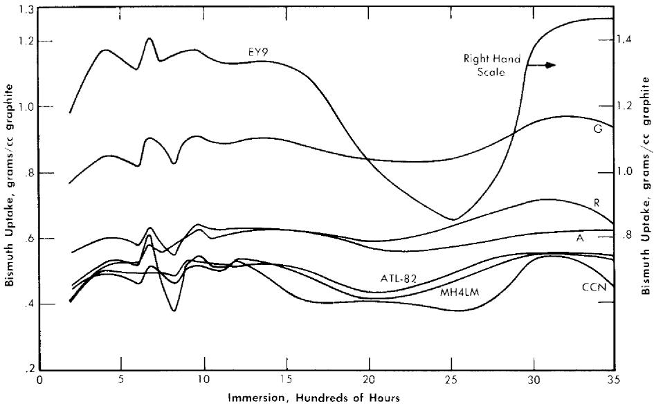  
FIG. 21-13. Bi penetration; successive immersion of same specimen. Temperature $= 550^{\circ}\mathrm{C}$ , pressure $= 250$ psi, outgassed $550^{\circ}\mathrm{C}$ for $20\mathrm{hr}$ .

a mean value is found for investigations extended to as much as $3500\mathrm{hr}$ . Evidently these variances are caused by outgassing by the graphite over the time interval of the experiment. Outgassing the graphite at $900^{\circ}\mathrm{C}$ instead of at $550^{\circ}\mathrm{C}$ reduced the amplitude of the excursions, but the mean value remained from 0.425 to $0.525\mathrm{g}$ bismuth per cc graphite for most of the types investigated. When the outgassing temperature was increased to $900^{\circ}\mathrm{C}$ , the saturation or maximum value of uptake was reached in some cases within $2.5\mathrm{hr}$ .

The rate of bismuth penetration into graphite was determined in order to estimate the effect of an unexpected pressure excursion in the reactor. Samples were subjected to 250 psi for times varying from 5 sec to 5 min, as shown in Fig. 21-14. This time span far exceeds that expected for a reactor pressure surge. The test conditions were 250 psi at $550^{\circ}\mathrm{C}$ after an outgassing period of 20 hr at $550^{\circ}\mathrm{C}$ . The data indicate that the practical maximum uptake is reached in about 10 sec for all graphites except types A and G. These graphites, which are essentially coatings instead of bulk impregnations, have their uptake increased continuously with time. In a long-term test their equilibrium values were not reached until after some 800 hr of submersion.

Since the core of the reactor will be subjected to various pressures, a study was made of the effect of pressure on the absorption of bismuth by graphite. Long-term tests covering hundreds of hours were conducted at

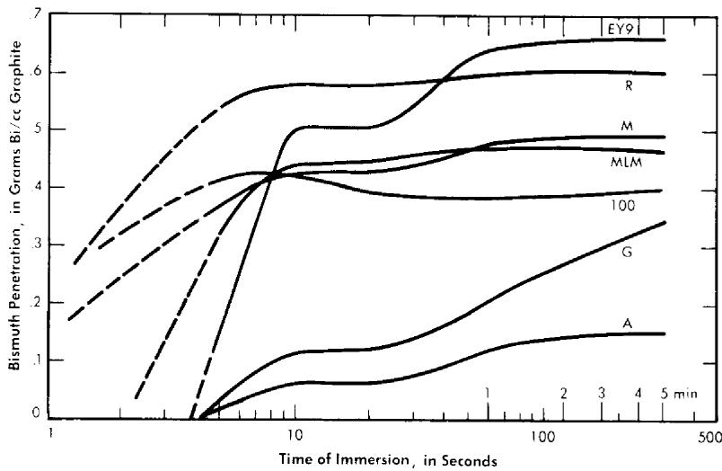  
FIG. 21-14. Short-time Bi penetration. Temperature $= 550^{\circ}\mathrm{C}$ , He pressure $= 250$ psi, outgassed $550^{\circ}\mathrm{C}$ for 20 hr.

125 psi to duplicate the test discussed above. It was found that the bismuth uptake is approximately the same as for the 250-psi pressure and the relative absorption remain the same between the different grades of graphite.

In another series of tests, samples were immersed for $20\mathrm{hr}$ at $550^{\circ}\mathrm{C}$ at varying pressures, as shown in Fig. 21-15. The samples for each curve were first evacuated for $20\mathrm{hr}$ at $550^{\circ}\mathrm{C}$ before being immersed in bismuth. With each type of graphite, the bismuth uptake at 450 psi corresponds approximately to the values attained at 250 psi for longer periods of submersion. Type R, CCN, HLM, and ATL-82 are insensitive to pressure increases beyond 200 psi. The remaining three types, A, G, EY-9, do increase continuously in bismuth uptake and furthermore show a threshold pressure below which no bismuth penetrates the graphite for the 20-hr duration of the test.

However, results of long term tests at 125 psi showed that graphites having a threshold pressure at 20 hr do absorb bismuth after several hundred hours.

After a pressure surge in the reactor core, the operating pressure will return to approximately 120 psi, and the amount of bismuth in the graphite might decrease. To investigate this, samples impregnated at 450 psi were resubmerged in bismuth at 25 and at 100 psi to determine what quantity of bismuth might leave the graphite. The dotted lines in Fig. 21-15 connect these points. It can be seen that there is no significant reduction of the bismuth contained in each type of sample.

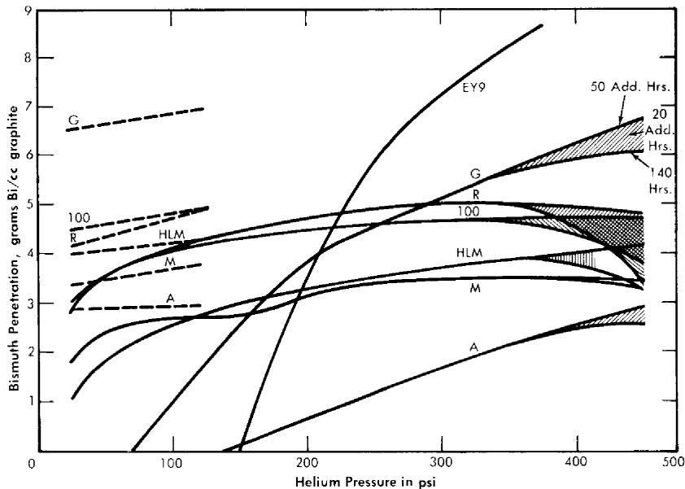  
FIG. 21-15. Effect of pressure on Bi penetration; successive immersions of 20 hr. Temperature $= 550^{\circ}\mathrm{C}$ , outgassed $550^{\circ}\mathrm{C}$ for 20 hr. Dashed lines for reduced pressure after 450-psi impregnation.

Calculations of the percent of voids filled with bismuth were made for the maximum bismuth uptake obtained in the experiments shown in Fig. 21-15. Table 21-9 gives these calculated values for the approximate saturation level reached. In this table, the last graphite, AGOT, is the conventional reactor graphite. The $100\%$ filling of the voids is obviously a good check of the assumption that it is quite permeable. All the other graphites are impermeable grades under development by various companies. The percent voids filled for these graphites do not represent total saturation of the accessible voids. Rather, these values show that about $1/3$ to $1/2$ of the accessible void volumes have been filled in these experiments.

In studying threshold penetration effect, surface tensions of bismuth on various surfaces of graphite were measured (Table 21-10). Although differing from the accepted values, these determinations probably represent more closely the actual circumstances in a reactor core. In none of the four cases was wetting of the graphite obtained by the bismuth or bismuth solution.

Uranium diffusion into bismuth in graphite pores. Since a certain amount of fuel absorption will have to be tolerated with the graphites now available, it is essential to measure the diffusion of uranium into graphite by

TABLE 21-9   
VOIDS FILLED AT 450 PSI AFTER 20 HR.   

<table><tr><td>Graphite type</td><td>Voids filled with Bi, %</td></tr><tr><td>100</td><td>37</td></tr><tr><td>EY-9</td><td>44</td></tr><tr><td>A</td><td>17</td></tr><tr><td>G</td><td>37</td></tr><tr><td>HLM</td><td>32</td></tr><tr><td>M</td><td>23</td></tr><tr><td>R</td><td>32</td></tr><tr><td>AGOT</td><td>100</td></tr></table>

TABLE 21-10   
SURFACE TENSIONS   

<table><tr><td>Graphite surface</td><td>Constituents</td><td>Time after contact, min</td><td>Wetting properties</td><td>Surface tension, dynes/cm</td></tr><tr><td rowspan="3">Smooth</td><td rowspan="3">Bi</td><td>1</td><td>None</td><td>276</td></tr><tr><td>29</td><td></td><td>257</td></tr><tr><td>78</td><td></td><td>241</td></tr><tr><td rowspan="2">Rough and loose particles</td><td rowspan="2">Bi</td><td>5</td><td>None</td><td>153</td></tr><tr><td>60</td><td></td><td>142</td></tr><tr><td rowspan="2">Polished</td><td rowspan="2">Bi + 350 ppm Mg</td><td>15</td><td>None</td><td>66</td></tr><tr><td>90</td><td></td><td>66</td></tr><tr><td rowspan="4">Polished</td><td rowspan="4">Bi + 350 ppm Zr</td><td>15</td><td>None</td><td>285</td></tr><tr><td>120</td><td></td><td>275</td></tr><tr><td>240</td><td></td><td>282</td></tr><tr><td>360</td><td></td><td>283</td></tr></table>

means of the bismuth solution. Experiments to measure this effect have been made. This was done by first impregnating graphite with bismuth solution containing magnesium and/or zirconium. After bismuth impregnation at a given pressure, uranium was added to the solution and the graphite allowed to soak in the bismuth solution for a period of time. The amount of uranium which diffused into the graphite was measured by sectioning the graphite and analyzing for uranium concentration as a function of distance from the surface of the sample. These experiments were run at $550^{\circ}\mathrm{C}$ with a pressure of 200 psi. The graphite was first allowed to soak in the bismuth solution for 90 hr; then the uranium was added and the conditions were maintained for the duration of the experiment. Results of two experiments are given in Table 21-11. In the first experiment, the bismuth contained 390 ppm Mg and 1000 ppm U. The uranium concentration in the graphite specimen was found to be less than in the melt solution and decreased from the sample face inwards.

The second experiment was performed exactly like the first except that no magnesium was present. The graphite specimen (Great Lakes Type HLM) absorbs less bismuth than the EY-9 graphite used in the first experiment. However, the uranium concentration near the surface of the specimen built up to an amount considerably greater than that initially in the solution, and the concentration gradient is much steeper than was found when magnesium was present in the solution. This high value for the uranium-to-bismuth ratio near the interface may be explained by assuming that uranium reacted with impurities present on the graphite surfaces. Apparently when magnesium is present in the solution it reacts preferentially with these impurities.

These experiments definitely show that uranium and other solutes present in the bismuth can be expected to diffuse into the graphite as far as the bismuth has penetrated. For the graphites now at hand, this means diffusion through the entire thickness of the graphite for the long-term exposures contemplated in a reactor core. Of course, since the diffusion of uranium itself takes considerable time, fission will convert it to other products before it has an opportunity to diffuse many inches into the graphite. The effect of diffusion of the various solutes and fuel into graphite on neutron economy and reactor operational characteristics is recognized, and studies have to be made in large-scale experiments.

In general, it is believed that the graphites at hand will meet the requirements for the first experiment of an LMFR reactor. It is already possible to produce some of these in sizes as large as 40 to 60 in. in diameter. As this development progresses, graphites of greater impermeability will be produced. Improvements in graphite have taken place steadily, and markedly improved materials are anticipated in the future.

TABLE 21-11   
URANIUM DIFFUSION INTO GRAPHITE   

<table><tr><td>Specimen no.</td><td>Distance, in.</td><td>Bi, %</td><td>Mg, ppm</td><td>U, ppm</td></tr><tr><td colspan="5">A. EY-9 Graphite</td></tr><tr><td>1</td><td>0.0312</td><td>32.2</td><td>1150</td><td>900</td></tr><tr><td>2</td><td>0.0937</td><td>30.5</td><td>1050</td><td>840</td></tr><tr><td>3</td><td>0.1562</td><td>29.6</td><td>750</td><td>810</td></tr><tr><td>4</td><td>0.250</td><td>28.0</td><td>800</td><td>760</td></tr><tr><td>5</td><td>0.500</td><td>26.0</td><td>820</td><td>740</td></tr><tr><td colspan="5">B. HLM Graphite</td></tr><tr><td>1</td><td>0.0312</td><td>16.35</td><td></td><td>5600</td></tr><tr><td>2</td><td>0.0937</td><td>16.87</td><td></td><td>2630</td></tr><tr><td>3</td><td>0.1562</td><td>16.38</td><td></td><td>460</td></tr><tr><td>4</td><td>0.250</td><td>16.78</td><td></td><td>70</td></tr><tr><td>5</td><td>0.500</td><td>17.78</td><td></td><td>30</td></tr></table>

# REFERENCES

1. P. Duwez and F. ODELL, Phase Relationships in the Binary Systems of Nitrides and Carbides of Zirconium, Columbium, Titanium, and Vanadium, J. Electrochem. Soc. 97, 299-304 (1950).   
2. D. T. KEATING and O. F. KAMMERER, Film Thickness Determination from Substrate X-ray Reflections, Rev. Sci. Instr. 29, 34 (1958).   
3. L. S. DARKEN et al., Solubility of Nitrogen in Gamma Iron and the Effect of Alloying Constituents—Aluminum Nitride Precipitation, J. Metals 3, 1174-1179 (1951).   
4. J. R. WEEKS and D. H. GURINSKY, Solid Metal-Liquid Metal Reactions in Bismuth and Sodium, in ASM Symposium on Liquid Metals and Solidification, ed. by B. Chalmers. Cleveland, Ohio: The American Society for Metals, 1958.   
5. O. F. KAMMERER et al., Zirconium and Titanium Inhibit Corrosion and Mass Transfer of Steels by Liquid Heavy Metals, Trans. Met. Soc. AIME 212, 20-25 (1958).   
6. G. W. HORSLEY and J. T. MASKREY, The Corrosion of $2\frac{1}{4}\%$ Cr-1% Mo Steel by Liquid Bismuth, Report AERE M/R-2343, Great Britain, Atomic Energy Research Establishment, 1957.   
7. J. R. WEEKS et al., Corrosion Problems with Bismuth-Uranium Fuels, in Proceedings of the International Conference on the Peaceful Uses of Atomic Energy, Vol. 9. New York: United Nations, 1956 (P/118, pp. 341-355); D. H. GURINSKY and G. J. DIENES (Eds.), Nuclear Fuels. Princeton, N. J.: D. Van Nostrand Co., Inc., 1956. (Chap. XIII); J. R. WEEKS, Metallurgical Studies on Liquid Bismuth and Bismuth Alloys for Reactor Fuels or Coolants, in Progress in Nuclear Energy, Series IV, Technology and Engineering, Vol. I. New York: Pergamon Press, 1956. (pp. 378-408)   
8. W. C. LESLIE and M. G. FONTANA, Mechanism of the Rapid Oxidation of High Temperature, High Strength Alloys Containing Molybdenum, Trans. Am. Soc. Metals 41, 1213 (1949).   
9. L. S. MARKS (Ed.), Mechanical Engineers Handbook. 4th ed. New York: McGraw-Hill Book Company, Inc., 1941. (p. 232)   
10. W. E. MARKERT, JR., personal communication to J. R. Weeks, Mar. 20, 1958.   
11. M. W. MALLETT et al., The Uranium-Carbon System, USAEC Report AECD-3226, Battelle Memorial Institute, 1951; The Reactor Handbook, Vol. 3, General Properties of Materials, USAEC Report AECD-3647, 1955. (p. 316)   
12. W. E. MILLER and J. R. WEEKS, *Reactions between LMFR Fuel and Its Container Materials*, USAEC Report BNL-2913, Brookhaven National Laboratory, 1956.   
13. G. V. SAMSONOV and N. S. ROZINOVA, Some Physicochemical Properties of Zirconium-Carbon Alloys, Izvest. Sektora Fiz.-Khim. Anal. Inst. Obshchei, Neorg. Khim. Akad. Nauk. S.S.S.R. 27, 126-132 (1956).   
14. W. P. EATHERLY et al., Physical Properties of New Graphite Materials for Special Nuclear Applications, paper prepared for the Second International Conference on the Peaceful Uses of Atomic Energy, Geneva, 1958.