# CHAPTER 22

# CHEMICAL PROCESSING*

# 22-1. INTRODUCTION

The Liquid Metal Fuel Reactor offers the opportunity for continuous removal of fission products from the fluid fuel by chemical and physical processing. By this procedure the poisoning effect of the fission products may be kept to a low level, and thus make possible a good breeding ratio in this thermal reactor. In this chapter, the various chemical and physical processes for removing the fission products are discussed.

To simplify the discussion, the fission products are classified into four basic groups as follows:

(1) Gaseous elements or compounds that are volatile at reactor operating temperature. This group is ordinarily abbreviated FPV.   
(2) Nonvolatile elements forming compounds more stable than the corresponding uranium compound. The abbreviation for this group is FPS.   
(3) Nonvolatile elements forming compounds that are less stable than the corresponding uranium compound and more stable than the corresponding bismuth compound. The abbreviation for this group is FPN.   
(4) Nonvolatile elements forming compounds less stable than the corresponding bismuth compounds. The abbreviation for this group is NFPN.

In the FPV group there are four elements: bromine, iodine, krypton, and xenon. Of these, 6.7-hr $\mathbf{I}^{135}$ and its daughter 9.13-hr $\mathrm{Xe}^{135}$ are the important ones. $\mathrm{Xe}^{135}$ is by far the most important because of its cross section. 2.700,000 barns. Since this is so large, it is necessary to remove most of the iodine and xenon as soon as formed.

The other major poisons occur in the FPS group. In calculating the average atomic weight and cross section of these groups, it is convenient to use the fission yield in milliatoms. Normally, it is assumed that two atoms of fission products are produced by the splitting of one atom of uranium. Thus, 2000 milliatoms of fission products are produced by fission of one atom of uranium, and $1\%$ yield is equal to 10 milliatoms. On this basis, Table 22-1 presents the FPS nuclides with the important information on their poisoning effect. As can be seen, $\mathrm{Sm}^{149}$ is the most important element to be dealt with in this group.

The last group, commonly called the noble fission products, represents a combination of groups (3) and (4) in the above classification. The important poisoning information on all these nuclides is given in Table 22-2

Precursors have half-lives less than 5 days.

TABLE 22-1   
FUSED-SALT SOLUBLE FISSION PRODUCTS [1]   

<table><tr><td>Nuclide</td><td>Half-life</td><td>Fission yield y, milliatoms*</td><td>Cross section σ, barns (at0.025ev)†</td><td>yσ</td><td>Type poison‡</td></tr><tr><td>Rb85</td><td>Stable</td><td>20</td><td>0.90</td><td>18</td><td>3</td></tr><tr><td>Rb86</td><td>19d</td><td>36</td><td>1.0</td><td>36</td><td>3</td></tr><tr><td>Rb87</td><td>6.2 × 1010y</td><td>46</td><td>0.14</td><td>6.4</td><td>3</td></tr><tr><td>Sr88</td><td>Stable</td><td>54</td><td>0.005</td><td>0.25</td><td>3</td></tr><tr><td>Sr89</td><td>54d</td><td>61</td><td>110</td><td>6,700</td><td>2</td></tr><tr><td>Sr90</td><td>20y</td><td>64</td><td>1.0</td><td>64.0</td><td>3</td></tr><tr><td>Y→Zr91</td><td>61d; (stable)</td><td>66</td><td>1.52</td><td>100.0</td><td>3</td></tr><tr><td>Xe→Cs133</td><td>5.27d (stable)</td><td>66</td><td>29.0</td><td>1,920</td><td>3</td></tr><tr><td>Cs135</td><td>3 × 106y</td><td>70.5</td><td>15.0</td><td>1,060</td><td>3</td></tr><tr><td>Cs137</td><td>37y</td><td>71.5</td><td>2.0</td><td>143</td><td>3</td></tr><tr><td>Ba138</td><td>Stable</td><td>71.1</td><td>0.6</td><td>43</td><td>3</td></tr><tr><td>La139</td><td>Stable</td><td>70.5</td><td>8.4</td><td>590</td><td>3</td></tr><tr><td>Ba→La→Ce140</td><td>12.8d; 40h (stable)</td><td>68.5</td><td>0.63</td><td>43</td><td>3</td></tr><tr><td>Ce→Pr141</td><td>32d (stable)</td><td>61.5</td><td>11.2</td><td>688</td><td>3</td></tr><tr><td>Ce142</td><td>Stable</td><td>55.0</td><td>1.8</td><td>99</td><td>3</td></tr><tr><td>Pr→Nd143</td><td>13.5d (stable)</td><td>45.5</td><td>290.0</td><td>13,200</td><td>2</td></tr><tr><td>Ce→Pr→Nd144</td><td>280d; 17m (stable)</td><td>36.0</td><td>4.8</td><td>173</td><td>3</td></tr><tr><td>Nd145</td><td>Stable</td><td>27.0</td><td>52.0</td><td>1,400</td><td>2</td></tr><tr><td>Nd146</td><td>Stable</td><td>20.0</td><td>9.8</td><td>196</td><td>3</td></tr><tr><td>Nd→Pm→Sm147</td><td>11.6d; 2.6y (stable)</td><td>14.0</td><td>60.0</td><td>840</td><td>2</td></tr><tr><td>Nd148</td><td>Stable</td><td>10.0</td><td>3.3</td><td>33</td><td>3</td></tr><tr><td>Sm149</td><td>Stable</td><td>7.0</td><td>47,000</td><td>329,000</td><td>1</td></tr><tr><td>Nd150</td><td>Stable</td><td>5.0</td><td>2.9</td><td>14.5</td><td>3</td></tr><tr><td>Sm151</td><td>73y</td><td>2.6</td><td>7,200</td><td>18,700</td><td>1</td></tr><tr><td>Sm152</td><td>Stable</td><td>1.6</td><td>150</td><td>240</td><td>2</td></tr><tr><td>Eu153</td><td>Stable</td><td>0.9</td><td>420</td><td>378</td><td>2</td></tr><tr><td>Sm154</td><td>Stable</td><td>0.5</td><td>5.5</td><td>2.8</td><td>3</td></tr><tr><td>Eu155</td><td>1.7y</td><td>0.3</td><td>13,000</td><td>3,900</td><td>1</td></tr><tr><td>Eu→Gd156</td><td>15d (stable)</td><td>0.2</td><td>750</td><td>150</td><td>2</td></tr><tr><td>Gd157</td><td>Stable</td><td>0.1</td><td>160,000</td><td>16,000</td><td>1</td></tr><tr><td>Total 30 nuclides</td><td></td><td>1052.3</td><td></td><td>394,010</td><td></td></tr></table>

TABLE 22-2   
FUSED-SALT INSOLUBLE FISSION PRODUCTS [1]   

<table><tr><td>Nuclide</td><td>Half-life</td><td>Fission yield y, milliatoms</td><td>Cross section σ, barns (at 0.025 ev)†</td><td>yσ</td><td>Type poison</td></tr><tr><td>Se77</td><td>Stable</td><td>0.4</td><td>40</td><td>16</td><td>2</td></tr><tr><td>Se78</td><td>Stable</td><td>1.1</td><td>0.4</td><td>4.4</td><td>2</td></tr><tr><td>Se79</td><td>6 × 104y</td><td>2.0</td><td></td><td></td><td></td></tr><tr><td>Se80</td><td>Stable</td><td>2.8</td><td>0.53</td><td>1.5</td><td>2</td></tr><tr><td>Se82</td><td>Stable</td><td>5.5</td><td>0.055</td><td>0.3</td><td>2</td></tr><tr><td>Zr92</td><td>Stable</td><td>67.5</td><td>0.25</td><td>17</td><td>2</td></tr><tr><td>Zr93</td><td>5 × 106y</td><td>68.0</td><td>3</td><td>204</td><td>2</td></tr><tr><td>Zr94</td><td>Stable</td><td>67.5</td><td>0.08</td><td>5.4</td><td>2</td></tr><tr><td>Zr→Nb95</td><td>65d; 37d</td><td>66.0</td><td>13.4</td><td>880</td><td>2</td></tr><tr><td>Zr96</td><td>Stable</td><td>64.0</td><td>0.05</td><td>3.2</td><td>2</td></tr><tr><td>Mo97</td><td>Stable</td><td>59.0</td><td>2.10</td><td>124</td><td>2</td></tr><tr><td>Mo98</td><td>Stable</td><td>56.0</td><td>0.13</td><td>7.2</td><td>2</td></tr><tr><td>Te40</td><td>2.1 × 105y</td><td>48.0</td><td>100</td><td>4,800</td><td>1</td></tr><tr><td>Mo300</td><td>Stable</td><td>35.0</td><td>0.2</td><td>7.0</td><td>2</td></tr><tr><td>Ru101</td><td>Stable</td><td>26.0</td><td>12</td><td>312</td><td>2</td></tr><tr><td>Ru102</td><td>Stable</td><td>24.0</td><td>1.2</td><td>29</td><td>2</td></tr><tr><td>Ru103</td><td>40d</td><td>8.8</td><td>150</td><td>1,320</td><td>1</td></tr><tr><td>Ru104 N.I.*</td><td>Stable</td><td>6.2</td><td>0.7</td><td>4</td><td>2</td></tr><tr><td>Pd105</td><td>Stable</td><td>4.6</td><td>18</td><td>83</td><td>2</td></tr><tr><td>Ru106</td><td>1.0y</td><td>3.3</td><td>(15)‡</td><td>(50)</td><td>(2)</td></tr><tr><td>Pd107</td><td>5 × 106y</td><td>2.2</td><td>750</td><td>1,650</td><td>1</td></tr><tr><td>Pd108</td><td>Stable</td><td>1.3</td><td>11.1</td><td>14</td><td>2</td></tr><tr><td>Ag109</td><td>Stable</td><td>0.9</td><td>84</td><td>75</td><td>2</td></tr><tr><td>Pd110 N.I.</td><td>Stable</td><td>0.4</td><td>0.4</td><td>0.2</td><td>2</td></tr><tr><td>Cd111</td><td>Stable</td><td>0.3</td><td>750</td><td>225</td><td>1</td></tr><tr><td>Cd112</td><td>Stable</td><td>0.2</td><td>0.03</td><td>0.01</td><td>2</td></tr><tr><td>Cd113</td><td>Stable</td><td>0.2</td><td>25,000</td><td>5,000</td><td>1</td></tr><tr><td>Sb114</td><td>Stable</td><td>0.2</td><td>3.86</td><td>0.76</td><td>2</td></tr><tr><td>Sn114 N.I.</td><td>Stable</td><td>0.4</td><td>0.2</td><td>0.08</td><td>2</td></tr><tr><td>Sn-Sb-Te125</td><td>10d; 2.7y (stable)</td><td>0.6</td><td>1.5</td><td>0.90</td><td>2</td></tr><tr><td>Te126</td><td>Stable</td><td>0.9</td><td>0.8</td><td>0.72</td><td>2</td></tr><tr><td>Te128</td><td>Stable</td><td>5.7</td><td>0.16</td><td>0.91</td><td>2</td></tr><tr><td>Te130</td><td>Stable</td><td>25.0</td><td>0.31</td><td>7.8</td><td>2</td></tr><tr><td>Total 33</td><td></td><td>654.0</td><td></td><td>14,843.38</td><td></td></tr></table>

under the group heading FPN. As can be seen by examining the column headed $y\sigma$ , none of these nuclides is a very important poison, compared with xenon and samarium.

From the data given in these tables, it is possible to calculate the poison level in an LMFR as a function of time of operation. Besides the characteristics of the fission products themselves, the poison level is dependent mainly on the core fuel volume, the total fuel system volume, and the average core flux. In Fig. 22-1, the poison level is given as a function of days of operation for a 500-Mw LMFR reference design [1] with 600 ppm $\mathrm{U}^{233}$ in Bi. It is assumed that the volatile poisons, FPV, can be removed in a steady-state operation and the poisoning level kept to $1\%$ . The other two classes, of course, steadily increase, based on the assumption of no chemical processing of the core. After a certain poisoning level is reached, the continuous chemical processing will serve to keep the poisoning at a constant value. This level must be chosen by a careful economic optimization procedure.

Figure 22-1 shows that while the FPS group is the most important, assuming that the volatiles can be removed as desired, the FPN group does gradually accumulate, and after about 400 days of operation has a $1\%$ poisoning effect. Hence, over long-term operation, processing of all the groups becomes desirable if a low poison level is to be maintained.

The poisoning in a $\mathrm{U}^{235}$ -fueled reactor is expected to be 10 to $20\%$ higher than in a $\mathrm{U}^{233}$ -fueled reactor [2,3] depending on the average residence time of the fission products in the fuel. This is due to a shift in the fission product spectrum toward higher cross section nuclides. The cumulative poisoning effect of the higher uranium isotopes is also slightly higher for $\mathrm{U}^{235}$ .

In connection with this last point, the higher isotopes of uranium gradually build up throughout the operation of the reactor. In the calculations used in the reference design of Chapter 24 and in BAW-2 [1], the poisoning effect of the higher uranium isotopes has been assumed as $2\%$ for a $\mathrm{U}^{233}$ fuel. Since these higher isotopes are chemically the same as the fuel, no provision can be made for a chemical separation from the $\mathrm{U}^{233}$ . The gradual buildup of the higher uranium isotope poisons can actually be tolerated over a number of years before becoming important in the economics of the reactor operation, as is shown in Chapter 24.

In all the foregoing discussions, it is assumed that corrosion products contribute very little to the poisoning in the reactor. However, this may not be so. As was described in Chapters 20 and 21, the corrosion rate of the containing metals by the bismuth fuel is rather high. Corrosion products such as iron and chromium at a concentration of $300~\mathrm{ppm}$ in bismuth would contribute a poisoning effect of about $1\%$ . However, the same processes which remove the FPS and FPN will also remove all the corrosion products.

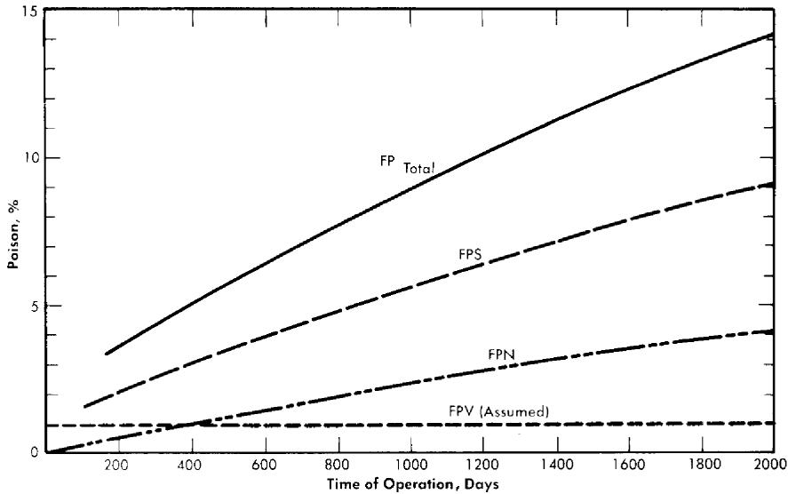  
FIG. 22-1. Poison level after startup vs. time of operation for all fission products. Core fuel volume, $1800\mathrm{ft}^3$

# 22-2. VOLATILE FISSION PRODUCT REMOVAL [20]

22-2.1 Xenon and iodine removal. For a $1\%$ poisoning level, assuming no Xe adsorbed on, or absorbed by, the graphite moderator, the concentrations of 9.13-hr $\mathrm{Xe}^{135}$ and total Xe in the fuel are calculated to be 1.5 and 12.9 ppb, respectively. Compared with the 9.13-hr $\mathrm{Xe}^{135}$ , the combined poisoning effect of all the other FPV's is negligible, so that the problem of FPV removal is really one of $\mathrm{Xe}^{135}$ removal. Some typical statistics on the FPV's are summarized in Table 22-3. These figures are based on three assumptions: (a) that Xe buildup on the graphite is negligible, (b) that negligible amounts of Br and I are volatilized with the FPV's, and (c) that Kr and Xe have the same removal characteristics.

In Article 20-3.3 it was shown that the actual solubility of xenon in bismuth may well be in the ppb range; McMillan calculated the solubility as $10^{-4}$ . Since the amount of xenon generated is probably larger than its solubility in bismuth, it is necessary to determine the behavior of the gas in relation to the surfaces of the reactor core and fuel conduits, as it will have a strong tendency to escape from solution.

Since the xenon is the decay daughter of $\mathbf{I}^{135}$ , it is born not only in the reactor core but throughout the fuel system wherever $\mathbf{I}^{135}$ is present. Therefore the chemical and kinetic behavior of I, its decay precursor, is important. The $\mathrm{Xe}^{135}$ removal problem might be solved by desorption of $\mathbf{I}^{135}$ ; however, it is found that the $\mathbf{I}^{135}$ decays so rapidly that at least $75^{\circ}C$ of the $\mathbf{I}^{135}$ would have to be removed with the FPV's in

TABLE 22-3 STATISTICS ON FPV'S UNDER CONDITIONS OF $1\%$ REACTOR POISONING FOR A 500-MW REACTOR $1000~\mathrm{ppm}~\mathrm{U}^{233}$ ; 150 tons of Bi   

<table><tr><td colspan="2">1. Concentrations, ppb</td></tr><tr><td>(a) Kr</td><td>2.8</td></tr><tr><td>(b) 9.13-hr Xe135</td><td>1.46</td></tr><tr><td>(c) Total Xe</td><td>12.9</td></tr><tr><td>(d) Total FPV&#x27;s</td><td>15.7</td></tr><tr><td colspan="2">2. Removal rates, g/day</td></tr><tr><td>(a) Kr</td><td>23.1</td></tr><tr><td>(b) 9.13-hr Xe135</td><td>12.0</td></tr><tr><td>(c) Total Xe</td><td>106.0</td></tr><tr><td>(d) Total FPV&#x27;s</td><td>129.1</td></tr><tr><td>3. Per cent, by weight, total fission products</td><td>23.8</td></tr><tr><td>4. Average atomic weight of FPV&#x27;s</td><td>122.3</td></tr><tr><td>5. Rate of radiant energy release, kw/g</td><td>605</td></tr></table>

order to significantly reduce the amount of $\mathrm{Xe}^{135}$ formed. This is probably too much to be hoped for. Experimental results indicate that such a large fraction of the I cannot be volatilized from U-Bi fuel. Thermodynamic analysis indicates that the I, for the most part, should react with the Rb, Sr, Cs, and Ba fission products to form monoiodides with about $70\%$ of the I going to CsI.

These alkali and alkaline-earth iodides would presumably have low solubilities in Bi and, as a result, have a tendency to leave the U-Bi fuel and collect on unwetted solid surfaces. These iodides also transfer heavily to the salt in the FPS-removal process, but the rate of processing would be too slow to extract significant quantities of $\mathrm{I}^{135}$ and, in fact, most of the other iodine nuclides. Thus there appear to be two predominant modes by which I departs from the fuel: physical expulsion in the form of iodides and radioactive decay.

22-2.2 Xenon and iodine adsorption on graphite and steel. Graphite is not wet by the fuel; moreover, it has a void volume of almost $20\%$ , largely composed of interconnected cells. These facts suggest the possibility of Xe buildup in an LMFR core.

A factor in this problem is the behavior of iodine in the LMFR fuel. The iodine may form rather insoluble iodides, then adsorb on unwetted surfaces, and there decay to Xe. Both kinetic and thermodynamic analyses indicate that this may be a real possibility.

In 1956, an in-pile loop [4] was operated at Brookhaven in which fission products were generated in U-Bi fuel, where the natural U concentration was $800~\mathrm{ppm}$ . The concentrations of fission products were therefore several orders of magnitude below those for an LMFR. Two steel rods, $1/2$ in. in diameter and $4$ in. long, were suspended vertically in the gas space of the surge tank, $2$ in. above the liquid metal level. One was exposed for a period of $60~\mathrm{hr}$ and showed an $\mathrm{I}^{133}$ concentration of $9.0\times 10^{7}$ atoms/ $\mathrm{cm}^2$ at time of removal; the other, exposed for $85~\mathrm{hr}$ , showed $1.6\times 10^{7}$ atoms/ $\mathrm{cm}^2$ . The corresponding $\mathrm{I}^{133}$ concentration in the flowing metal was $1.1\times 10^{9}$ atoms/ $\mathrm{cm}^3$ , which means that for every 100 atoms of $\mathrm{I}^{133}$ per cc of fuel there were roughly 1 to $8\mathrm{I}^{133}$ atoms/ $\mathrm{cm}^2$ of exposed surface in the gas space. The temperatures of the rods and liquid metal were the same, $500^{\circ}\mathrm{C}$ .

Several steel tabs immersed for extended periods in the flowing metal showed $\mathrm{I}^{133}$ concentrations on their surfaces roughly 100 times those found on the rods suspended in the gas phase. Moreover, it was estimated that less than half the I in the system was in the Bi; about $60\%$ was found on the container walls contacting the Bi and about $1\%$ on the gas walls. The tabs were, for the most part, unwetted by the Bi.

The loop had a degassing chamber in which the metal flowed in a thin layer over a baffled plate. Samples of gas taken from this chamber showed I concentrations too small to measure, even radiochemically.

To get a better understanding of this general problem, a two-part experimental program is underway at BNL. In the first part, capsule scale experiments are being carried out to determine the action of iodine and xenon on graphite and steel capsules containing U-Bi fuel. These capsules are irradiated in the BNL pile and then examined for iodine, xenon, and radioactivity across the radius of the specimen. The second part of the program is a kinetic study of the removal of iodine and xenon in degassing equipment.

In-pill capsule experiments. In one series of experiments, capsules made of $2\frac{1}{4} C_{\mathrm{f}}^{\prime \prime}\mathrm{Cr - 1}^{\prime \prime}\mathrm{Mo}$ steel and graphite were filled with Bi containing 500 to $1000~\mathrm{ppm}$ of natural U, $350~\mathrm{ppm}$ Mg, and $350~\mathrm{ppm}$ Zr. The capsules were degassed under vacuum for $3\mathrm{hr}$ at $800^{\circ}\mathrm{C}$ before being filled. They had the dimensions $1.27\mathrm{cm}$ ID, $1.60~\mathrm{cm}$ OD, and $10~\mathrm{cm}$ long. The capsules were irradiated in a flux of $2\times 10^{12} / (\mathrm{cm}^2)(\mathrm{sec})$ , with the U-Bi mixture frozen, for periods up to $2\mathrm{wk}$ . After irradiation, the capsules were held at $500^{\circ}\mathrm{C}$ for periods ranging from $10\mathrm{min}$ to $117\mathrm{hr}$ . They were then cooled quickly to room temperature and sectioned into 10 disks for radiochemical analysis. The concentrations of $\mathrm{Xe}^{133}$ $\mathrm{I}^{133}$ ,and U were measured at the center of each disk and in a $1\mathrm{-mm}$ ring on the periphery of the Bi. The results are summarized in Table 22-4.

These experiments are exploratory. They were carried out to determine

TABLE 22-4   
RESULTS OF IN-PILE STUDIES ON THE BEHAVIOR OF IODINE AND XENON IN LMFR FUEL   

<table><tr><td rowspan="2">Sample number</td><td rowspan="2">Container material</td><td colspan="2">Concentration of I133, atoms/g Bi</td><td colspan="2">Concentration of Xe133, atoms/g Bi</td><td rowspan="2">Agitated during equilibration time</td></tr><tr><td>Core</td><td>Periphery</td><td>Core</td><td>Periphery</td></tr><tr><td>S-010</td><td>steel</td><td>5 × 108</td><td>5 × 1011</td><td>7 × 107</td><td>6 × 1011</td><td>No</td></tr><tr><td>S-020</td><td>”</td><td>7 × 108</td><td>2 × 1011</td><td>2 × 1011</td><td>7 × 1011</td><td>”</td></tr><tr><td>G-010</td><td>graphite</td><td>2 × 1010</td><td>6 × 1011</td><td>—</td><td>—</td><td>”</td></tr><tr><td>G-020</td><td>”</td><td>2 × 109</td><td>1 × 1011</td><td>2 × 109</td><td>2 × 1010</td><td>”</td></tr><tr><td>G-030</td><td>”</td><td>4 × 108</td><td>2 × 109</td><td>1 × 109</td><td>2 × 109</td><td>”</td></tr><tr><td>G-040</td><td>”</td><td>3 × 109</td><td>3 × 1011</td><td>1 × 1010</td><td>4 × 1010</td><td>”</td></tr><tr><td>G-080</td><td>”</td><td>5 × 1010</td><td>3 × 1011</td><td>2 × 109</td><td>7 × 109</td><td>Yes</td></tr><tr><td>G-150</td><td>”</td><td>7 × 1010</td><td>6 × 1011</td><td>1 × 109</td><td>7 × 109</td><td>”</td></tr></table>

roughly the extent to which iodine and xenon concentrate on interfaces. However, in spite of the limitations of the experiments, the following conclusions are warranted.

When the concentration of iodine generated by fission reaches a level of about $10^{11}$ to $10^{12}$ atoms/g Bi (capsules S-010, S-020, G-010, G-020), the iodine concentrates at the interface between the Bi and the container wall. The concentration at the interface is about 1000 times higher than that in the bulk of the Bi for the steel capsules, and about 100 times higher than that for the graphite capsules.

When the concentration of Xe reaches a level of about $10^{11}$ to $10^{12}$ atoms/g Bi (capsules S-010, S-020, G-010, G-020), its concentration near the Bi-steel interface is about 10,000 times that in the Bi. This ratio for graphite, $G$ , is only 10 (G-020). The difference between the steel and graphite capsules is believed to be due to the fact that Xe diffuses into the latter. This penetration by fission-product gases has been found in other experiments and confirmed by autoradiographs and material balances.

When the concentrations of iodine and Xe are lower, i.e., about $10^{9}$ atoms/g, the differences between interface and core concentrations are much smaller, though still statistically significant (Xe in G-040, iodine in G-030 and G-040). For iodine the concentration ratios vary slightly from less than 10 for G-030 to 100 for G-040. For Xe the ratio is only about 3 for G-040, and no significant separation was observed in G-030. These

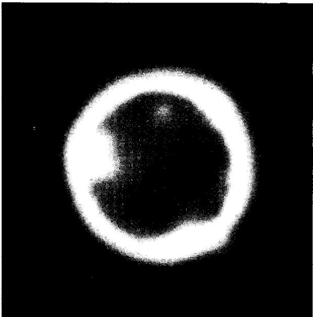  
FIG. 22-2. In-pile capsule experiment with molten bismuth fuel, showing xenon and iodine diffusion into graphite.

lower Xe ratios are again attributed to the loss of Xe from the interface to the graphite.

Samples G-080 and G-150 were agitated (by rotating them at 15 rpm around an axis passing at right angles through the middle of the capsule) while being equilibrated at $500^{\circ}\mathrm{C}$ for $75\mathrm{hr}$ . It is seen that in the case of the agitated samples Xe segregation was unaffected but I separation was appreciably reduced. However, the great bulk of the I was still found on the outer layer of the Bi.

Besides these experiments, another series was carried out in which the bismuth, containing uranium, was molten during irradiation, so that the xenon and iodine had a chance to escape as soon as formed. Figure 22-2 is an example of a typical experiment. In the figure, the central dark area is the bismuth core. The bright band is that part of the graphite into which xenon and iodine have diffused at $500^{\circ}\mathrm{C}$ . This band is about $1.5\mathrm{mm}$ , since the picture represents a magnification of 4 times. The conditions for this particular experiment are given in Table 22-5. The irregularities observed in the photograph are in accordance with the heterogeneity of graphite.

It should be noted that fission products other than iodine and xenon may be and possibly are involved in the formation of the high-intensity

# TABLE 22-5

# CAPSULE TESTS WITH MOLTEN FUEL

$1000~\mathrm{ppm}~\mathrm{U}^{235}$ in $\mathrm{Bi} + 350~\mathrm{ppm}~\mathrm{Mg} + 350~\mathrm{ppm}~\mathrm{Zr}$ . Irradiated for 15 days at a flux $2\times 10^{12}\mathrm{n / (cm^2)}$ -sec) at $500^{\circ}\mathrm{C}$ . Graphite $G$ capsule

<table><tr><td colspan="6">Xe133 concentration in graphite about 1 × 1013 atoms/g of graphite</td></tr><tr><td>Xe133</td><td>”</td><td>” bulk</td><td>”</td><td>3 × 109atoms/g of Bi</td><td></td></tr><tr><td>I131</td><td>”</td><td>” graphite</td><td>”</td><td>5 × 1013atoms/g of graphite</td><td></td></tr><tr><td>I131</td><td>”</td><td>” bulk</td><td>”</td><td>3 × 1010atoms/g of Bi</td><td></td></tr></table>

regions. The penetrations in the graphite appear to be due to radioactive gases exclusively.

The results of all these experiments show that I and Xe concentrate very heavily on surfaces in contact with the U-Bi fuel. There is evidence that Xe and radioactive gases penetrate the graphite and are immobilized therein. This may present a very serious problem in keeping the LMFR fission-product poisoning to the low levels required for economic breeding. The reported experiments, however, have been limited by the available neutron flux of the BNL pile to concentration levels about 1/1000 those anticipated in an LMFR breeder. Extrapolation of the present results to the LMFR levels is not justified, since it is conceivable that because of saturation effects the concentrations at the interfaces may not increase proportionately. However, the penetration of Xe in the graphite, as contrasted to its accumulation at interfaces, is a potentially serious problem because of the large surfaces available inside the graphite.

The results of these experiments clearly indicate that the removal of the FPV's is not a simple degassing operation. An increased research program is under way to learn more about the release and movement of the FPV's in both the reactor core and in the fuel streams. While degassing equipment designed to afford a large fluid surface for escape of the gases will probably be the best kind of equipment, the volatiles may very well never arrive at the degasser at all. Instead, they may adhere to the graphite walls and to the steel walls. Operation of the LMFR Experiment No. I should give extremely valuable information on this particular question.

22-2.3 Design of equipment for FPV removal. In the LMFR, the fuel would flow continuously through several parallel loops to external heat exchangers for cooling. Degassing equipment would, in all probability, be located in each of these loops. For a 500-Mw reactor, if all heat-exchange

streams were processed continuously, the fraction of FPV in the fuel removed per pass would only be about 0.004. Since the solubilities of Kr and Xe in Bi increase with temperature, the degassing equipment should preferably be located in the coldest part of the system, but since the fuel flow through the reactor is upward, and since the degassers must be located at the top of the system because of hydrostatic pressure, it is not very practical to locate them at the coldest point.

The main objective would be to prevent excessive amounts of Xe from being adsorbed on, or absorbed in, the graphite moderator. To achieve this, two conditions are necessary: first, the relative amount of I settling on the graphite must be kept low, and second, the degassers must be very efficient. The problem is not so much one of desorbing Xe from a Bi solution as it is one of controlling the accumulation of I and Xe on unwetted surfaces. To minimize I buildup on the graphite, the fuel velocity in the core should be as high as practical and there should be solid surfaces located somewhere between the core and the degassers to collect I.

On the basis of present knowledge, the degassers should be so designed that a large interfacial area is provided and that the liquid metal surface is as turbulent as possible. Theoretically, a degasser should work with good efficiency. A theoretical analysis by McMillan (BNL-353) showed that xenon has a tremendous tendency to concentrate on liquid bismuth surfaces. For a spherical volume, the number of xenon atoms on the surface was estimated to be about $10^{8}$ times the number dissolved in bismuth at $300^{\circ}\mathrm{C}$ . At $500^{\circ}\mathrm{C}$ this ratio came close to $10^{5}$ .

A sieve-plate column, in which the fuel descends in fine streams, would be such a degasser. It is felt that sparging of an inert gas into the fuel is not necessary to promote gas desorption, since Xe is so insoluble. However, depending on the gas pressure in the degasser, the use of an inert carrier gas may be desirable. The effluent fission gases would be collected in refrigerated charcoal beds.

# 22-3. FUSED CHLORIDE SALT PROCESS

In processing the molten bismuth for the removal of fission-product poisons, the ideal process would be a pyrometallurgical one operating at substantially the same temperature as the fuel. Furthermore, this process should either leave the uranium fuel in the bismuth or treat it in such a manner that it is relatively easy to recharge it as a metal into the bismuth stream for reuse. The LMFR thus offers an excellent opportunity for the application of pyrometallurgical chemical reprocessing methods. From a procedural point of view, such methods should inherently be cheaper than presently known aqueous processing methods. It will be necessary, however,

to await an economic comparison of the aqueous and pyrometallurgical processes before one is finally chosen for use with an LMFR.

However, since the LMFR offers such an excellent opportunity for the application of cheap pyrometallurgical processing, this path has been explored quite extensively. In this section a fused chloride salt process for the removal of fission poisons is described. In following sections a fluoride volatility process and a noble fission product removal process are described.

22-3.1 Equilibrium distribution. Chemistry. The FPS group consists of the lanthanides and the elements in groups IA, IIA, and IIIA of the Periodic Table. Within this group the lanthanides account for about $94\%$ of the total poisoning effect of the FPS elements. In the case of a typical 500-Mw reactor [1] the concentration of FPS elements in the bismuth amounts to about $17~\mathrm{ppm}$ . To reduce this concentration to acceptable levels, a process has been developed whereby the FPS elements are oxidized by and then extracted into a fused salt.

Following the original suggestion by Winsche that fission products might be extractable from a liquid U-Bi fuel by molten salts in a manner similar to solvent extraction, experiments were conducted by Bareis using the LiCl-KCl eutectic and lanthanide-bismuth alloys [6]. If the mechanism was indeed one of liquid-liquid extraction, then the lanthanide distribution should follow a simple distribution law and as such be independent of total concentration. Experimentally, this was not the case, and it was subsequently shown by Wiswall [7,8] and later independently by Cubicciotti [9] that the results could be explained by assuming that a chemical reaction had occurred as follows:

$$
3 \mathrm {L i C l} _ {\text {(s a l t)}} + \mathrm {L a} _ {\left(\mathrm {B i}\right)} \xrightarrow {\longleftrightarrow} \mathrm {L a C l} _ {3 (\text {(s a l t)}} + 3 \mathrm {L i} _ {\left(\mathrm {B i}\right)}. \tag {22-1}
$$

From the free energies of formation of the halides involved (Table 22-6) we may calculate $\Delta F^{\infty} = +33.6\mathrm{kcal}$ for Eq. (22-1). From this and the relationship $\Delta F^{0} = -RT\ln K_{\mathrm{eq}}$ , the equilibrium constant, $K_{\mathrm{eq}}$ is found to be $3.2\times 10^{-10}$ . Obviously, the equilibrium will be displaced far to the left. However, if we assume an initial La concentration in the bismuth equal to $17~\mathrm{ppm}$ , equal volumes of eutectic (KCl considered here as inert) and bismuth, and that activities are equal to mole fractions, then the ratio of moles of lanthanum in the salt to moles of lanthanum in the bismuth at equilibrium will be 146. Essentially, therefore, all the lanthanum will be transferred to the salt phase.

On the other hand, for the analogous reaction with uranium:

$$
3 \mathrm {L i C l} + \mathrm {U} \rightleftharpoons \mathrm {U C l} _ {3} + 3 \mathrm {L i} \tag {22-2}
$$

TABLE 22-6   
$\Delta F_{\mathrm{OF}}$ CERTAIN HALIDES AT $773^{\circ}\mathrm{K}$ [10]   

<table><tr><td>Compound</td><td>Free energy of formation F, kcal/atom Cl</td></tr><tr><td>KCl</td><td>88.6</td></tr><tr><td>SmCl2</td><td>84.1</td></tr><tr><td>LiCl</td><td>82.6</td></tr><tr><td>NaCl</td><td>81.4</td></tr><tr><td>LaCl3</td><td>71.4</td></tr><tr><td>CeCl3</td><td>69.8</td></tr><tr><td>NdCl3</td><td>67.4</td></tr><tr><td>MgCl2</td><td>61.7</td></tr><tr><td>UCl3</td><td>57.5</td></tr></table>

the standard free energy change is $+75.3\mathrm{kcal}$ , and $K_{\mathrm{eq}} = 5.2 \times 10^{-22}$ . At equilibrium, assuming the initial uranium concentration in the bismuth $= 1000\mathrm{ppm}$ , the ratio of the mole fraction of U in salt to the mole fraction of U in Bi will be equal to $6.8 \times 10^{-4}$ . Thus, in principle, a selective oxidation of the lanthanides may be achieved in the presence of uranium. Of course, the assumption that activities are equal to mole fractions is only an approximation.

Ternary salt. As a consequence of these reactions, lithium metal builds up in the bismuth phase and, in view of its high thermal neutron cross section, replacement of the lanthanide by lithium offers no advantage in terms of neutron economy.

Therefore another low-melting salt, the ternary eutectic of $\mathrm{MgCl}_2(50\mathrm{~mol}\%)$ , KCl ( $20\%$ ), and NaCl ( $30\%$ ) (MP $396^{\circ}\mathrm{C}$ ) was investigated. In this system, the free energy of formation of $\mathrm{MgCl}_2$ is intermediate between those of the lanthanide chlorides on one hand and uranium trichloride on the other and a satisfactory, although not complete, separation should be achieved.* Furthermore, the low neutron cross section of $\mathrm{Mg}$ is more favorable than that of lithium, and a low concentration of $\mathrm{Mg}$ in the fuel ( $250\mathrm{ppm}$ ) appears to be necessary in order to minimize corrosion and mass transfer in the steel equipment. The magnesium concentration in the bismuth will therefore control the extent of the reaction:

$$
3 \mathrm {M g C l} _ {2 (\text {s a l t})} + 2 \mathrm {L a} _ {(\mathrm {B i})} \xrightarrow {\leftarrow} 2 \mathrm {L a C l} _ {3 (\text {s a l t})} + 3 \mathrm {M g} _ {(\mathrm {B i})}, \quad \Delta F ^ {0} = - 5 8. 2 \text {k e a l}, \tag {22-3}
$$

$$
3 \mathrm {M g C l} _ {2 (\text {s a l t})} + 2 \mathrm {U} _ {(\mathrm {B i})} \xleftarrow {\quad} 2 \mathrm {U C l} _ {3 (\text {s a l t})} + 3 \mathrm {M g} _ {(\mathrm {B i})}, \quad \Delta F ^ {0} = + 2 5. 2 \mathrm {k c a l}, \tag {22-4}
$$

but will not influence the degree of separation which may be achieved.

Thermodynamics of FPS transfer and distribution data. The equilibrium constant for reaction (22-3), in which lanthanum is taken as being representative of lanthanides in the $+3$ oxidation state, is given by

$$
K _ {\mathrm {e q}} = \frac {a _ {\mathrm {L a C l} _ {3}} ^ {2} a _ {\mathrm {M g}} ^ {3}}{a _ {\mathrm {L a}} ^ {2} a _ {\mathrm {M g C l} _ {2}} ^ {3}}. \tag {22-5}
$$

Expressed in terms of mole fractions, Eq. (22-5) becomes

$$
K _ {\mathrm {e q}} = \frac {X _ {\mathrm {L a C l} _ {3}} ^ {2} X _ {\mathrm {M g}} ^ {3}}{X _ {\mathrm {L a}} ^ {2} X _ {\mathrm {M g C l} _ {2}} ^ {3}} \cdot \frac {\left(f _ {\mathrm {L a C l} _ {3}} ^ {\infty}\right) ^ {2} \left(f _ {\mathrm {M g}} ^ {\infty}\right) ^ {3}}{\left(f _ {\mathrm {L a}} ^ {\infty}\right) ^ {2} \left(f _ {\mathrm {M g C l} _ {2}}\right) ^ {3}}. \tag {22-6}
$$

In the above, $a =$ thermodynamic activity, $X =$ mole fraction, and $f$ and $f^{\infty}$ are activity coefficients. $f^{\infty}$ is the limiting activity coefficient at infinite dilution, which is assumed to be independent of concentration at the concentrations encountered in this investigation. It is equivalent to the Henry's law constant [11].

Solved for the experimentally determinable quantity $X_{\mathrm{LaCl}_3} / X_{\mathrm{La}}$ , Eq. (22-6) becomes

$$
\frac {X _ {\mathrm {L a C l} _ {3}}}{X _ {\mathrm {L a}}} = \left(\frac {K _ {e q} X _ {\mathrm {M g C l} _ {2}} ^ {3}}{K _ {f} X _ {\mathrm {M g}} ^ {3}}\right) ^ {1 / 2}, \tag {22-7}
$$

where

$$
K _ {f} = \frac {(f _ {\mathrm {L a C l} _ {3}} ^ {\infty}) ^ {2} (f _ {\mathrm {M g}} ^ {\infty}) ^ {3}}{(f _ {\mathrm {L a}} ^ {\infty}) ^ {2} (f _ {\mathrm {M g C l} _ {2}}) ^ {3}}.
$$

In logarithmic form, (22-7) may be written

$$
\log \frac {X _ {\mathrm {L a C l} _ {3}}}{X _ {\mathrm {L a}}} = - \frac {3}{2} \log X _ {\mathrm {M g}} + \frac {1}{2} \log \frac {K _ {\mathrm {e q}} \left(X _ {\mathrm {M g C l} _ {2}}\right) ^ {3}}{K _ {f}}, \tag {22-8}
$$

whereupon, a plot of $\log X_{\mathrm{LaCl_3}} / X_{\mathrm{La}}$ versus $\log X_{\mathrm{Mg}}$ should result in a straight line of slope $= -3 / 2$ . Figure 22-3 is a plot for most of the FPS, uranium, and zirconium based on the best experimental data. In the case of La, the best line has a slope of $-3 / 2$ . From the position of the line, the constant term of Eq. (22-8) may be calculated by

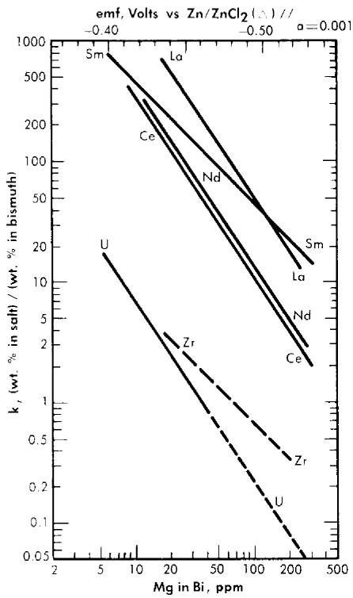  
FIG. 22-3. Distribution of solutes between $\mathrm{MgCl_2}$ -NaCl-KCl and Bi-Mg.

$$
B (\text {c o n s t a n t}) = \frac {1}{2} \log \frac {K _ {\mathrm {e q}} \left(X _ {\mathrm {M g C l} _ {2}}\right) ^ {3}}{K _ {f}}. \tag {22-9}
$$

Experimental values of these constants are given in Table 22-7.

Comparison of theory and experiment. In order to compare theory with experiment, $K_{\mathrm{eq}}$ , $X_{\mathrm{MgCl_2}}$ , and the activity coefficients of the pertinent substances in each phase must be known. $K_{\mathrm{eq}}$ is easily calculated from the $\Delta F^{\infty}$ for the appropriate reaction by means of the relation $\Delta F^{\infty} = -RT \ln K_{\mathrm{eq}}$ ; $X_{\mathrm{MgCl_2}}$ may be considered essentially constant and equal to 0.5, since $\mathrm{MgCl_2}$ is present in the salt phase in large excess over the other reactants and its concentration changes only very slightly during the reaction. An exact calculation of $K_f$ is not possible at this time, owing to the paucity of information regarding activity coefficients in fused salts and in liquid bismuth. However, in one case, that of cerium, it is possible to estimate $K_f$ from measured activity coefficients if one assumption is allowed. Recently Egan [12,15] has measured the partial molar free energy of mixing, $\overline{\Delta F}$ , of magnesium in bismuth and cerium in bismuth by galvanic cell methods. From $\overline{\Delta F_{\mathrm{Mg}}}$ and $\overline{\Delta F_{\mathrm{Ce}}}$ , it was possible to calculate $f_{\mathrm{Mg}}^{\infty}$ and $f_{\mathrm{Ce}}^{\infty}$ . The activity coefficients at infinite dilution, in bismuth at $500^{\circ}\mathrm{C}$ . These values are estimated to be $f_{\mathrm{Mg}}^{\infty} = 2 \times 10^{-3}$ and $f_{\mathrm{Ce}}^{\infty} = 3 \times 10^{-14}$

TABLE 22-7   
VALUES OF $B$ (CONSTANT)   

<table><tr><td>Reaction</td><td>-ΔF0</td><td>Keq</td><td>-B</td><td>-B&#x27;</td><td>Kf</td><td>f∞</td></tr><tr><td>2La + 3MgCl2 ⇌ 2LaCl3 + 3Mg</td><td>58.2</td><td>2.84 × 1016</td><td>3.2924</td><td>—</td><td>1.36 × 1022</td><td>4 × 10-16</td></tr><tr><td>2Ca + 3MgCl2 ⇌ 2CeCl3 + 3Mg</td><td>48.6</td><td>5.49 × 1013</td><td>3.9586</td><td>—</td><td>5.67 × 1020</td><td>2 × 10-15</td></tr><tr><td>2Nd + 3MgCl2 ⇌ 2NdCl3 + 3Mg</td><td>34.2</td><td>4.66 × 109</td><td>3.8873</td><td>—</td><td>3.49 × 1016</td><td>2 × 10-13</td></tr><tr><td>Sm + MgCl2 ⇌ SmCl2 + Mg</td><td>44.8</td><td>4.62 × 1012</td><td>—</td><td>1.8097</td><td>1.49 × 1014</td><td>4 × 10-13</td></tr><tr><td>2U + 3MgCl2 ⇌ 2UCl3 + 3Mg</td><td>-25.2</td><td>7.52 × 10-8</td><td>—</td><td>—</td><td>—</td><td>—</td></tr></table>

(Table 22-8). Neil [13] by similar galvanic cell techniques, has measured the activity coefficient of $\mathrm{MgCl}_2$ in the ternary salt eutectic $\mathrm{MgCl}_2$ -KCl-NaCl at $500^{\circ}$ . The best value to date is $f_{\mathrm{MgCl}_2} = 0.34$ . If it is assumed that $f_{\mathrm{CeCl}_3}^{\infty} = 0.1$ in the ternary salt (and this value appears reasonable), then $K_f$ for cerium is given by

$$
K _ {f} = \frac {\left(f _ {\mathrm {C e C l} _ {3}} ^ {\infty}\right) ^ {2} \left(f _ {\mathrm {M g}} ^ {\infty}\right) ^ {3}}{\left(f _ {\mathrm {C e}} ^ {\infty}\right) ^ {2} \left(f _ {\mathrm {M g C l} _ {2}}\right) ^ {3}} = \frac {(1 0 ^ {- 1}) ^ {2} (2 \times 1 0 ^ {- 3}) ^ {3}}{(3 \times 1 0 ^ {- 1 4}) ^ {2} (0 . 3 4) ^ {3}} = 2. 3 \times 1 0 ^ {1 8}.
$$

The experimental value of $K_{f}$ , $5.6 \times 10^{20}$ , leads to a value of $2 \times 10^{-15}$ for $f_{\mathrm{CeCl}_3}^{\infty}$ . The agreement is considered satisfactory, in view of the exponential character of the equations and the uncertainties in the available data.

For example, the entire difference between the experimental value and calculated value of $K_{f}$ may be reconciled if one assumes an error of 1.4 kcal atom Cl in the $\Delta F$ of formation of $\mathrm{CeCl}_3$ . Such an error is well within the limits with which the standard free energies of formation are known at these temperatures. The estimated activity coefficients of metals in bismuth may also be in error by as much as a factor of 2 to 3.

The experimental values of the constant $B_{\mathrm{La}}$ and $B_{\mathrm{Nd}}$ (Table 22-7) may be used to calculate the activity coefficients of lanthanum and neodymium in the bismuth if it is assumed, as in the case of cerium, that $f_{\mathrm{LaCl}_3}^{\infty} = f_{\mathrm{NdCl}_3}^{\infty} = 0.1$ . The values so obtained, $f_{\mathrm{La}}^{\infty} = 4 \times 10^{-16}$ and $f_{\mathrm{Nd}}^{\infty} = 2 \times 10^{-13}$ , are quite low, and are in general agreement with the measured $f_{\mathrm{Ce}}^0$ .

In the case of samarium, $\mathrm{SmCl}_2$ is thermodynamically more stable than $\mathrm{SmCl}_3$ by $14.6\mathrm{kcal / atom}$ of Cl at $500^{\circ}\mathrm{C}$ , and hence the equilibrium reaction is

$$
\mathrm {S m} _ {\left(\mathrm {B i}\right)} + \mathrm {M g C l} _ {2 (\text {s a l t})} \xrightarrow {\longleftrightarrow} \mathrm {S m C l} _ {2 (\text {s a l t})} + \mathrm {M g} _ {(\mathrm {B i})}. \tag {22-10}
$$

In a manner analogous to the treatment of the trivalent lanthanides, we obtain

$$
\log \frac {X _ {\mathrm {S m C l} _ {2}}}{X _ {\mathrm {S m}}} = - \log X _ {\mathrm {M g}} + B ^ {\prime}, \tag {22-11}
$$

where

$$
B ^ {\prime} = \log \frac {K _ {\mathrm {e q}} X _ {\mathrm {M g C l _ {2}}}}{K _ {f}} \qquad \text {a n d} \qquad K _ {f} ^ {\prime} = \frac {f _ {\mathrm {S m C l _ {2}}} ^ {\infty} f _ {\mathrm {M g}} ^ {\infty}}{f _ {\mathrm {S m}} ^ {\infty} f _ {\mathrm {M g C l _ {2}}}}.
$$

# TABLE 22-8

# ACTIVITY COEFFICIENTS AT

# INFINITE DILUTION

<table><tr><td>System</td><td>Temperature, °C</td><td>fM∞</td></tr><tr><td>Ce-Bi</td><td>500</td><td>3 × 10-14</td></tr><tr><td>Mg-Bi</td><td>500</td><td>2 × 10-3</td></tr><tr><td>U-Bi</td><td>500</td><td>1 × 10-5</td></tr><tr><td>Li-Bi</td><td>450</td><td>1 × 10-5</td></tr><tr><td>Na-Bi</td><td>500</td><td>8.5 × 10-5</td></tr><tr><td>Zr-Bi</td><td>700</td><td>7 × 10-4</td></tr></table>

Equation (22-11) predicts that a plot of $\log X_{\mathrm{SmCl_2}} / X_{\mathrm{Sm}}$ versus $\log X_{\mathrm{Mg}}$ should yield a straight line of slope $-1$ . The curve is shown in Fig. 22-3 and the line is drawn with a slope of $-1$ . This line yields the value of $B'$ given in Table 22-7. With the assumption that $f_{\mathrm{SmCl_2}}^{\infty} = 0.1$ , the estimated activity coefficient at infinite dilution of samarium in bismuth is $f_{\mathrm{Sm}}^{\infty} = 3 \times 10^{-18}$ .

The validity of Eq. (22-6) is dependent upon the assumption that side reactions, such as the oxidation of bismuth by the salt, are negligible. Since $\Delta F^0$ for these reactions are large positive numbers, it is reasonable to consider bismuth as inert in this respect. Bismuth, of course, interacts with the lanthanides and magnesium very strongly, but this is taken into account by the use of activity coefficients.

It is also assumed that the reactions

$$
3 \mathrm {N a C l} + \mathrm {L a} \xrightarrow {\quad} \mathrm {L a C l} _ {3} + 3 \mathrm {N a}, \quad \Delta F ^ {0} = + 3 0. 0 \mathrm {k c a l},
$$

$$
3 \mathrm {K C l} + \mathrm {L a} \xrightarrow {\longleftrightarrow} \mathrm {L a C l} _ {3} + 3 \mathrm {K}, \quad \Delta F ^ {0} = + 5 1. 6 \mathrm {k c a l},
$$

do not contribute significantly to the transfer of lanthanides to the salt phase, in view of the large positive free energy change. This approximation was checked experimentally by determining the concentrations of Na and K in the bismuth phase after an equilibration experiment. No detectable amounts of alkali metals were found in the bismuth. This result also indicates that salt solubility in bismuth is negligibly low. Analysis of the salt phase for bismuth yielded low, erratic results, possibly due to the slight solubility of bismuth in $1\mathrm{N}$ HCl which occurred during the aqueous separation of salt and metallic phases. It is highly improbable that bismuth would be soluble in a salt of this type.

Another assumption made in this analysis involves the reversibility of the oxidation of the lanthanides by $\mathrm{MgCl_2}$ . This point was checked by equilibrating a series of Mg-Bi alloys with a salt eutectic containing $\mathrm{Ce^{143}Cl_3}$ . The distribution data of cerium as a function of $\mathrm{Mg}$ concentration in the bismuth derived from the reduction of $\mathrm{CeCl_3}$ by $\mathrm{Mg}$ shows the reaction is reversible within an experimental error of $10\%$ [14].

Included in Fig. 22-3 are Nd distribution data obtained in the presence of $0.1\mathrm{w / o}$ uranium and $0.03\mathrm{w / o}$ zirconium in the bismuth. (Zirconium will normally be present in the LMFR fuel as a corrosion inhibitor.) Within this concentration range, zirconium and uranium do not affect the Nd distribution.

Data for process design. It will be noted from the relative positions of the lines of Fig. 22-3 that it is not possible to assume, a priori, that the order of the lanthanide distributions will be directly predictable from free energy of formation data. For example, from Table 22-6 the order of decreasing stability of the chlorides is Sm, La, Ce, and Nd, whereas at constant $X_{\mathrm{Mg}}$ the experimental order is La, Sm, Nd, and Ce. The difference in order is apparently due to the large variation of the activity coefficients of the lanthanides in bismuth.

The results of the lanthanide distribution experiments have provided a basis for the design of a countercurrent, salt-metal extraction process [2]. Results of uranium distribution studies indicate that in small-scale experiments, a satisfactory separation of lanthanides from uranium may be achieved in a single equilibrium contacting stage. The experimental value of the distribution coefficient, $K_{s}$ , was found to be of the order of 20 to 50, where $K_{s}$ is defined as

$$
\frac {X _ {\mathrm {L a C l} _ {3}} / X _ {\mathrm {L a B i}}}{X _ {\mathrm {U C l} _ {3}} / X _ {\mathrm {U B i}}}.
$$

Multistage extraction should ensure efficient removal of the fission-product poisons from the bismuth fuel stream.

22-3.2 Pilot plant equilibrium experiments. A pilot plant equilibrium program is under way at BNL to investigate the salt bismuth-fuel equilibria on a larger scale under conditions more closely simulating those in an actual plant. The contacting vessels, made of 347 stainless steel, have a capacity of about 2 liters. They can be fitted with liners of other metals in order to study the effect of surfaces and corrosion. Each contacter is equipped with connections through which materials can be added and removed without admitting air, a sightport, gas and vacuum connections, heaters, and thermocouples. Liquid salt and metal phases are equilibrated in quantities large enough to allow multiple analyses, so that the effect of

changes in conditions can be directly determined by before-and-after analyses on a single system.

The most significant results of this pilot plant program are those from experiments for which an apparatus of large capacity alone could serve. These are studies of the stability of the solutions for long periods and of the changes in equilibrium distribution resulting from addition of various reagents. In general, the distribution coefficients obtained in this equipment confirm those found in the small-scale work. However, the precision of the results is less.

In carrying out experiments in these equilibrium vessels, a stability sufficient for most practical purposes can be achieved, given the right operating conditions, but there are still unsolved problems. A solution of Bi, U, Mg, rare earth, and Zr can be kept at $500^{\circ}\mathrm{C}$ under helium in a stainless-steel vessel indefinitely without change of composition. If then a quantity of pretreated salt* is added to the system, a significant drop occurs in the U concentration in the metal, e.g., from 1000 to 900 ppm. Some U appears in the salt phase, but not in an amount equivalent to the loss from the metal. Thereafter, the U concentration remains constant but the $\mathrm{Mg}$ in the metal suffers a slow decline, losing between 1 and 10 ppm per day. As its concentration decreases, the distribution of elements such as the rare earths changes in about the way which would be predicted from the results of the gram-scale experiments. The U remains nearly constant unless the $\mathrm{Mg}$ is allowed to drop below about 20 ppm, in which case U begins to transfer to the salt.

From some of these systems a solid material has been recovered which gives the x-ray pattern of uranium nitride, and it is possible that nitrogen from the container walls is somehow involved in the mysterious behavior of U and Mg. Since very small quantities of the various materials are involved in these reactions, it is quite possible that solid surface adsorption effects are also playing a part in the instability of composition.

In a second series of experiments, the change in equilibrium distribution from the addition of reagents is being studied. In the FPS extraction process, a sequence of columns operated at different oxidation potentials is proposed. Most of these changes in equilibrium are controlled by the addition of $\mathrm{BiCl}_3$ or $\mathrm{Mg}$ to the system at appropriate points. Experiments have been done in which these reagents have been added to a salt-metal system at equilibrium. The results of two such experiments will illustrate the behavior of these systems. In the first, an initial equilibrium was established in which the metal phase contained a fairly high concentration

of $\mathrm{Mg}$ . Its approximate value, together with those of the other constituents, are given in the first row of Table 22-9, Run 1. In view of difficulties in sampling and analysis, these figures may be in error by 10 to $20\%$ . A quantity of $\mathrm{BiCl}_3$ which was more than equivalent to all the $\mathrm{Mg}$ was then added. When a new equilibrium had been reached, it was found that all the $\mathrm{Mg}$ and much of the $\mathrm{Zr}$ and U had been removed from the metal phase; the second row gives the analytical figures. Metallic $\mathrm{Mg}$ was then added to reverse the reaction; and the final equilibrium situation is given by the figures in the last row. It can be seen that the U was restored to its original concentration in the metal. It is of interest that this occurred even though the final $\mathrm{Mg}$ concentration was much less than the original; that is, the U distribution coefficient was insensitive to the $\mathrm{Mg}$ concentration when the latter's value was $100\mathrm{ppm}$ or more. This agrees with the laboratory experiments discussed previously. Additional confirmation was obtained in Run 2, in which an amount of $\mathrm{BiCl}_3$ was added which was less than equivalent to the $\mathrm{Mg}$ . The results are given in Table 22-9, Run 2. Here, when the $\mathrm{Mg}$ concentration was lowered from 320 to $140\mathrm{ppm}$ , the Ce distribution coefficient increased, as one would expect, but the U remained unchanged.

22-3.3 Reaction rates. Previously, the equilibrium for the salt-metal reactions was discussed. It was shown that most probably more than one equilibrium contact will be required to remove the FPS. This means that some kind of contacting between two flowing streams will be required in

TABLE 22-9   

<table><tr><td></td><td>Concen-tration, mole %</td><td colspan="7">Concentration, ppm</td></tr><tr><td rowspan="2"></td><td rowspan="2">Mg Salt</td><td rowspan="2">Mg Metal</td><td colspan="2">Zr</td><td colspan="2">U</td><td colspan="2">Ce</td></tr><tr><td>Salt</td><td>Metal</td><td>Salt</td><td>Metal</td><td>Salt</td><td>Metal</td></tr><tr><td>Run No. 1</td><td></td><td></td><td></td><td></td><td></td><td></td><td></td><td></td></tr><tr><td>Initial equilibrium</td><td>50</td><td>440</td><td>20</td><td>240</td><td>10</td><td>800</td><td>15</td><td>11</td></tr><tr><td>After BiCl3addition</td><td>50</td><td>10</td><td>20</td><td>160</td><td>1070</td><td>330</td><td>73</td><td>0.1</td></tr><tr><td>After Mg addition</td><td>50</td><td>110</td><td>20</td><td>210</td><td>17</td><td>810</td><td>56</td><td>4</td></tr><tr><td>Run No. 2</td><td></td><td></td><td></td><td></td><td></td><td></td><td></td><td></td></tr><tr><td>Initial equilibrium</td><td>50</td><td>320</td><td>—</td><td>200</td><td>20</td><td>790</td><td>28</td><td>9</td></tr><tr><td>After BiCl3addition</td><td>50</td><td>140</td><td>—</td><td>—</td><td>30</td><td>790</td><td>58</td><td>5</td></tr></table>

the over-all chemical processing, using the fused chloride salt method. Therefore, an examination of the reaction rates is important. When several equilibrium contacting stages are required, and it is desired to do this in a flowing countercurrent system, it is necessary for the mass transfer rates to be fast.

In this reaction there are at least three stages: transport of the reactants to the salt-metal interface, the reaction proper, involving exchange of electrons, and transport of the products away from the interface. Situations are conceivable in which any of these could be rate-limiting. In investigating so complex a situation experimentally, it is often possible to order things so that one or more stages are fast relative to the others, thus permitting the kinetics of the latter to be studied alone. If, for example, the reaction is made to go under conditions which are far from equilibrium, i.e., the reverse reaction proceeding to only a negligible extent, the transport kinetics of certain species can be excluded from consideration.

A series of experiments of this type was carried out in which $2.2\mathrm{-mm}$ drops of Bi containing $200~\mathrm{ppm}$ $\mathrm{Sm}^{153}$ fell through $31~\mathrm{cm}$ of molten ternary salt eutectic. At the bottom, the drops were drawn off and analyzed. The salt phase was initially free of rare carths, and its volume was 500 times that of the total Bi which fell through, so transport of species in the salt phase should not be rate-limiting. The contact time for each drop was about 0.6 sec. Analysis showed that $75\%$ of the Sm was extracted into the salt. If we calculate the amount that would have been extracted had the rate been limited by diffusion of solute to the surface of a spherical drop, assuming rapid reaction at the interface, a smaller figure results. It may be concluded that some turbulence exists within the drop, assisting the diffusion process, and that the interface reaction is indeed fast.

Although further rate studies are required, the results at hand show that considerable latitude is available to the process engineer in designing the over-all process using these equilibrium and rate data. These possible designs may range from straight batch type contacting to completely automated countercurrent contacting.

22-3.4 FPS removal process. In the process design described [20], the oxidant is $\mathrm{BiCl}_3$ and the carrier salt is the ternary eutectic $\mathrm{NaCl - KCl - MgCl_2}$ , which melts at $396^{\circ}\mathrm{C}$ . Sufficient oxidant is added to the salt to remove the FPS, leaving the U for the most part behind. The FPS form chlorides, which are considerably more stable than $\mathrm{UCl}_3$ , the most stable chloride of U.

Equilibrium partition coefficients for Ce, Zr, and U, as functions of Mg concentration, are shown in Fig. 22-3. For a particular Mg concentration, the ratio of the Ce coefficient to that of U is a direct measure of how difficult it is to achieve a given degree of separation between the two solutes.

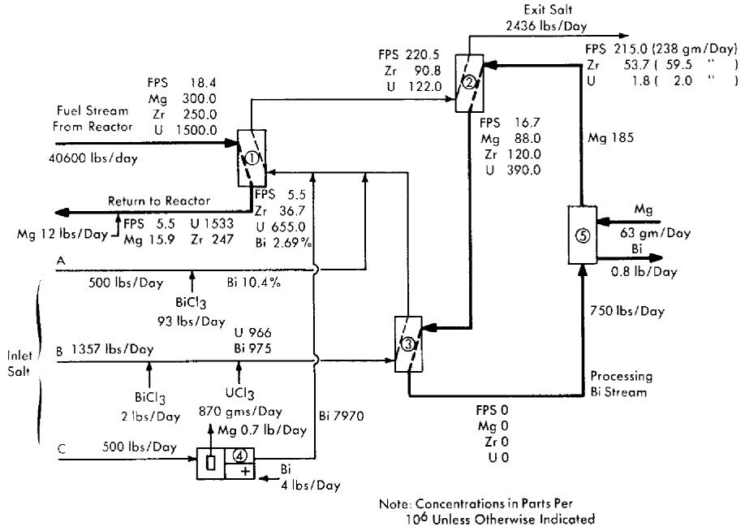  
FIG. 22-4. Flowsheet for the removal of FPS and Zr fission products from an LMFR fuel.

Ce is one of the least stable of the FPS chlorides, but in the treatment which follows, FPS salt-metal equilibrium coefficients are taken to be the same as that of Ce, that is, they are conservative. The slope of the Ce and U lines in Fig. 22-3 is $-1.5$ , signifying trivalency in the salt phase, while that of the Zr is shown as $-1$ , signifying divalency. The Zr line is drawn dashed because experimental results are still preliminary, and the slope of $-1$ was assumed rather than being firmly established by experiment. Unfortunately, the data available at this writing were obtained over a rather short range of Mg concentration. Of the FPS, Rb and Cs are univalent and Ba, Sr, and Sm are divalent, but all of these lie well above the Ce line and would, therefore, be more easily extracted.

The total energy release per fission in the LMFR is estimated to be $194\mathrm{MeV}$ . For a reactor having a heat rate of $500\mathrm{Mw}$ , this means that $542\mathrm{g}$ of $\mathrm{U}^{235}$ would be fissioned per day. Since the FPS represent about $44^{\circ}$ of the total fission products by weight, $238\mathrm{g}$ of FPS's must be removed per day to maintain a steady concentration in the fuel. (See Table 22-10.) The Zr concentration is kept at about $250~\mathrm{ppm}$ for purposes of corrosion inhibition, and the steady-state removal rate of this fission product will be approximately $59\mathrm{g/day}$ . It is interesting to note that about $11\%$ of the fission products end up as Zr. For a reactor with a heat rate of $500\mathrm{Mw}$ and a total fuel inventory of 150 tons, a fission-product Zr con

# TABLE 22-10

# STATISTICS ON VARIOUS FISSION-PRODUCT GROUPS

For a 500-Mw reactor having a 150-ton Bi inventory containing $1000\mathrm{ppm}$ $\mathbf{U}^{233}$ .

<table><tr><td>Group</td><td>Typical concentrations</td><td>Approximate reactor poisoning, %</td><td>Removal rate, g/day</td><td>Weight fraction of total fission products produced</td></tr><tr><td>FPS</td><td>18 ppm</td><td>0.8</td><td>238</td><td>0.44</td></tr><tr><td>Zr</td><td>250 ppm</td><td>0.1</td><td>59</td><td>0.11</td></tr><tr><td>FPN</td><td>2 ppm</td><td>0.8</td><td>0.6</td><td>0.0011</td></tr><tr><td>N FPN (less Mo)</td><td>174 ppm</td><td></td><td>59</td><td>0.110</td></tr><tr><td>Mo</td><td>1 ppm</td><td>0.0</td><td>54</td><td>0.10</td></tr><tr><td>FPV</td><td>16 ppb</td><td>1.0</td><td>129</td><td>0.24</td></tr></table>

centration of 250 ppm corresponds to a 590-day average residence time in the fuel and gives a reactor poisoning effect of slightly less than $0.1\%$ .

Figure 22-4 is a simplified flowsheet showing how the FPS may be removed from an LMFR fuel of a $500 - \mathrm{Mw}$ reactor. The high concentration of $\mathrm{Mg}$ makes it difficult to extract the FPS, but the high concentration of $\mathrm{Zr}$ makes it easier to extract that particular element. The high $\mathrm{Mg}$ concentration rules out the possibility of using a buffer method and necessitates the use of a stoichiometric method in the FPS removal step. Sufficient oxidizing agent (in this case $\mathrm{BiCl}_3$ ) is added to the salt to remove the required fractions of FPS and $\mathrm{Zr}$ . At the same time, most of the $\mathrm{Mg}$ in the fuel is unavoidably oxidized.

After a suitable holdup period, the fuel flows at the rate of $0.34\mathrm{gpm}$ through column 1, the removal column. This column, as shown, has a separative capacity equivalent to two equilibrium stages. The separative capacity of the column is illustrated in Fig. 22-5, where concentrations, relative flow rates, and equilibrium partition coefficients are shown. The bottom stage operates under oxidizing conditions, while the top one operates under reducing conditions. This brings about relatively high concentrations in the middle of the column. The increase in the U concentration in the fuel, in passing through the column, is to provide the necessary U makeup for the reactor. The principal effects of increasing the number of stages to three would be to lower slightly the $\mathrm{Mg}$ concentration in the exit fuel stream, to increase considerably the FPS/U ratio in the exit salt, and to decrease appreciably the $\mathrm{Zr / U}$ ratio in the exit salt. The first of these by itself would be of little consequence, the second would be very

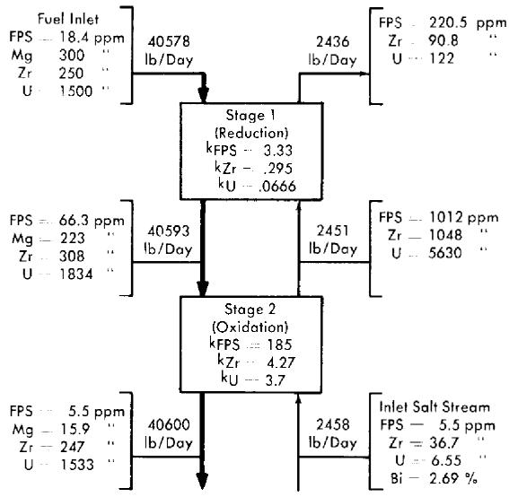  
FIG. 22-5. Typical concentrations in an FPS removal column with two equilibrium stages.

desirable, and the third would be undesirable. The last effect is actually controlling, which means that a three-stage separation is not as good as a two-stage separation. Going in the other direction, a one-stage separation gives very much lower FPS/U and $\mathrm{Zr / U}$ ratios in the exit salt, thereby increasing the difficulty of subsequent U recovery. However, certain advantages result from a single-stage operation—higher Mg concentration in the exit fuel allows easier control of the process, and higher $\mathrm{Zr}$ concentration in the exit salt makes it easier to remove the $\mathrm{Zr}$ . The optimum number of equilibrium stages probably lies between one and two.

In column 2, the U in the salt stream from column 1 is recovered by extracting it into a second Bi stream. This column operates under the buffer system, even though the $\mathrm{Mg}$ concentration in the metal stream drops $52\%$ . The separative capacity of this column is equivalent to four equilibrium stages, and the variations of solute concentrations throughout the column are shown in Fig. 22-6. The U losses in the exit salt stream were set arbitrarily at $2\mathrm{~g/day}$ , for purposes of illustration. Obviously, in actual practice this quantity would be determined by economic considerations, i.e., it would be at such a value that the cost per gram of recovering any additional U would be more than it is worth. The process design of column 2 is controlled by the fact that the concentration of $\mathrm{Zr}$ in the exit salt stream has to be $54\mathrm{ppm}$ for a salt flow rate of $2436\mathrm{lb/day}$ and a reactor with a $500-\mathrm{Mw}$ heat rate, i.e., $59\mathrm{~g}$ of fission-product $\mathrm{Zr}$ must be removed per

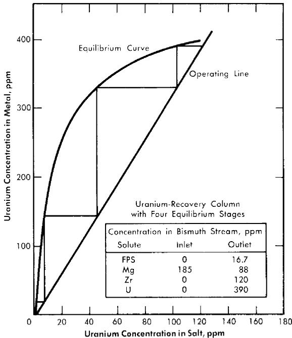  
FIG. 22-6. Uranium recovery column with four equilibrium stages.

day. When the $\mathrm{Zr}$ concentration in the exit salt stream is fixed, the concentration of the FPS is also fixed, for the ratio $\mathrm{FPS} / \mathrm{Zr}$ in the exit salt stream must be the same ratio in which these materials are generated in the fuel. The concentration of the FPS in the inlet fuel stream to column 1 was varied while the $\mathrm{Zr}$ concentration was held constant, until this condition was achieved. The concentration of $18.4\mathrm{ppm}$ for the FPS's corresponds to a total FPS poisoning effect of about $0.8\%$ .

The processing Bi stream, column 2, contains $185~\mathrm{ppm}$ Mg but no other solutes. In passing through the column, the Mg concentration in the Bi drops to $88~\mathrm{ppm}$ , which means that the oxidation reduction potential between the salt and Bi phases changes appreciably throughout the column.

The fission products, $\mathrm{Mg}$ and U in the Bi stream from column 2, are all oxidized completely into incoming salt stream $B$ in vessel 3. The stripped Bi, after addition of $185~\mathrm{ppm}$ $\mathrm{Mg}$ , is then returned to column 2 to repeat its cycle. The $\mathrm{Mg - Bi}$ stream is so small that a few days' supply could be prepared on a batch basis if continuous addition of $\mathrm{Mg}$ to the recirculating Bi stream proved difficult to control.

Vessel 3, conditions in which are highly oxidative, could be a short column; its only function is to provide good single-stage contact between the Bi and salt streams. The U makeup for the reactor, shown added as

$\mathrm{UCl}_3$ to the salt stream entering this vessel, is transferred to the fuel in column 1. Alternatively, the bred U from the blanket could be transferred from a Bi solution to the incoming salt. This Bi stream would be joined to that from column 2 and later separated from it after leaving vessel 3, or it could be contacted with the incoming salt in a separate vessel.

The exit salt from column 2 can be treated with a Ba-Bi or Ca-Bi solution to remove the FPS and U, thus making it possible to recirculate the salt. The FPS's and U could then be slugged out of the Bi into a low-cost salt mixture for storage.

The flowsheet in Fig. 22-4, for the sake of simplicity, does not show holdup and storage tanks, instrumentation, pumps, or heat exchangers. There are several possible variations of this flowsheet but, for the most part, they include the three types of operations described above.

Owing to the fact that the oxidation-reduction potential varies considerably throughout the FPS removal column, it may be preferable to operate it with concurrent flow within each stage and countercurrent flow between stages. Alternatively, two separate concurrent columns could be used. The U recovery column, on the other hand, would clearly be operated with countercurrent flow because, chemically, conditions are reductive throughout the column.

Design of extraction columns. The mechanical design of a proposed extraction column is shown in Fig. 22-7. Fuel enters at the top of the column and is dispersed by the slots in each tray as it falls through the column. The flow paths are indicated by arrows. Coalescence of the fuel drops occurs on each tray. Salt, as the continuous phase, may flow either concurrently with or countercurrently to the fuel. Fuel coalescence promotes thorough local mixing in the fuel and at the same time tends to minimize axial dispersion in each phase.

Columns of the type shown in Fig. 22-7, about 3 to 6 ft long and 3 to 4 in. in diameter, are expected to have satisfactory performance characteristics. Such columns have not yet been tested under conditions simulating actual practice, although their fluid dynamical behavior has been studied with $\mathrm{H}_2\mathrm{O}$ and $\mathrm{Hg}$ as substitutes for salt and Bi.

22-3.5 Process control of fused chloride process. The object of the process described above is to remove $59\mathrm{g}$ of fission-product $\mathrm{Zr}$ and $238\mathrm{g}$ of FPS from the fuel per day, at the same time losing only $2\mathrm{g}$ of U. For this, careful control of the process is required. Continuous measurement of the U concentrations in the salt streams from columns 1 and 2 will be required. The U concentrations in these streams are good indicators of column operation, i.e., if the U concentrations are correct, those of the $\mathrm{Zr}$ and FPS should also be correct. Assuming constancy of fuel composition and all flow rates, the two operating variables affecting the process are,

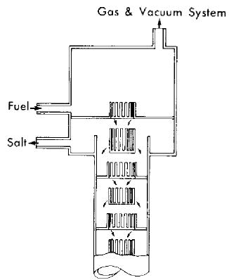

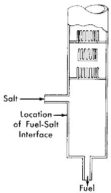  
FIG. 22-7. Extraction column.

first, the $\mathrm{BiCl}_3$ concentration in the inlet salt stream to column 1 and the $\mathrm{Mg}$ concentration in the inlet Bi stream to column 2. Each of these must be controlled to give the proper concentrations of U in the salt leaving columns 1 and 2. The operation of column 1 is the more difficult to control. There are three inlet salt streams which eventually merge into the single stream entering column 1. Stream $A$ contains about $92\%$ of the total $\mathrm{BiCl}_3$ requirements, $B$ contains about $2\%$ , and $C$ contains the remainder. Streams $A$ and $B$ are separated because of difference in corrosiveness, and stream $C$ provides fine control of the total $\mathrm{BiCl}_3$ addition. At least one day's supply of each stream would be prepared in advance.

The $\mathrm{Mg}$ concentration in the exit fuel is a sensitive indication of the rate of $\mathrm{BiCl}_3$ addition to the column and, consequently, of the U concentration in the exit salt. Thus controlling the rate of addition of $\mathrm{BiCl}_3$ to column 1 by this $\mathrm{Mg}$ concentration would be more satisfactory than controlling it by the U concentration in the exit salt, because of the much quicker response of the $\mathrm{Mg}$ concentration to changes in the rate of $\mathrm{BiCl}_3$ addition. The damping effect of the column should then result in a fairly uniform U concentration in the exit salt.

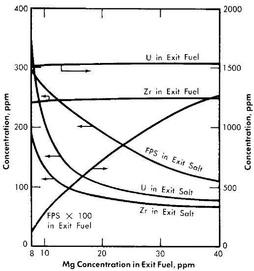  
FIG. 22-8. Effect of $\mathbf{Mg}$ concentration in exit fuel on the compositions of the exit streams from the FPS removal column.

Figure 22-8 shows the effect of variation in the $\mathrm{Mg}$ concentration in the exit fuel stream of column 1 on the steady-state concentrations of FPS, $\mathrm{Zr}$ , and $\mathrm{U}$ in the exit fuel and salt streams. It is seen that changes in $\mathrm{Mg}$ concentration have less effect the higher the $\mathrm{Mg}$ concentration; e.g., in the case shown, the column would be much easier to control at an exit $\mathrm{Mg}$ concentration of 25 than at one of 15.

The results of studies at Brookhaven indicate that it should be possible to measure continuously the $\mathrm{Mg}$ concentration in the exit fuel by means of a galvanic cell. For this, Marsland [17] has used the following type of cell:

Zn $\mathrm{ZnCl}_2(1\%)$ solution in NaCl-KCl-MgCl2eut)Pyrex/

$$
\mathrm {N a C l} - \mathrm {K C l} - \mathrm {M g C l} _ {2} \text {e u t} / \mathrm {M g} (\mathrm {B i}).
$$

The emf from such a cell would control the voltage to another, large electrochemical cell. This second cell, shown in the flowsheet, would add $\mathrm{BiCl}_3$ to inlet salt stream $C$ , the rate depending on the demand from the controlling cell.

The control of column 2 should be much less of a problem. The Mg concentration in the inlet Bi stream must be kept within certain limits to maintain the desired concentration of U in the exit salt. Actually, column 2 can, to a considerable degree, correct for malfunctioning of column 1.

In the event that control of the process described in Fig. 22-4 should turn out to be difficult, several steps which can be taken to correct the difficulty: (a) decreasing the separative capacity of column 1, (b) increasing

the salt flow rate, and (c) inserting a holdup tank between columns 1 and 2 to assure uniform composition of the salt entering column 2. As an extreme measure, the first column could be replaced by equilibration vessels, but this would appear to be an unlikely eventuality. The magnitude of the problem is defined by the continuous processing requirements, namely, maintaining close control of very low uranium and fission product concentrations in streams of three interdependent contacting towers.

22-3.6 Processing to reduce radiation hazard. The continuous process described above is based on an FPS concentration of approximately $18~\mathrm{ppm}$ , and calls for a processing rate of $0.45~\mathrm{gpm}$ . These conditions were chosen on the basis of poisoning considerations. If, however, safety considerations were the determining factor, the processing rate would be greatly increased. If the whole fuel stream were processed daily for removal of FPS, the concentrations of $\mathrm{Sr}^{90}$ and $\mathrm{Cs}^{137}$ , the two worst fission nuclides from the standpoint of biological hazard, could each be kept down to about $0.1~\mathrm{ppm}$ . This might well be a very desirable objective, and the processing rate would still be only about $3~\mathrm{gpm}$ .

22-3.7 Pilot plant program for fused chloride process. Plans for an extensive pilot plant program for the fused chloride process are currently being made. Some work on mechanical component development and materials of construction has already started. Several small loops are in operation at BNL, circulating fused salt. In these loops, mechanical components such as pumps, valves, and control instruments are under development and test. Concurrently, a corrosion test program is under way, as was discussed in Section 21-5. A full-sized prototype pilot plant for the testing and operation of a single extraction column is now being fabricated and constructed (Loop N). This pilot plant has been designed to circulate quantities of bismuth fuel and fused salt comparable to those for a full-sized reactor, as discussed previously in this chapter. In this pilot plant it is planned to obtain operational data which will lead to a full-scale processing plant.

22-3.8 Heat generation by fission products. The problem of heat removal is an important consideration in the design of processes and equipment for handling radioactive fission products. This is particularly true in the present case, because of the relatively short age of the fission products at the time of their extraction from the fuel. However, heat removal from fused salts does not present a difficult problem.

Figure 22-9 shows a family of curves giving the specific heat rates for the FPS as a function of average residence time in the reactor and time after removal therefrom [2,16]. The curves were calculated from fission

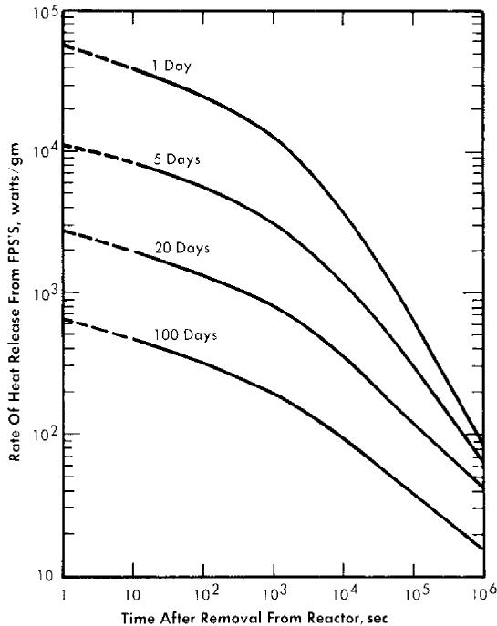  
FIG. 22-9. Energy release from FPS.

product heat-release data obtained from the Argonne National Laboratory. Extrapolations to short decay times were made with the aid of the Way-Wigner expression for fission product decay heat.

The energy will be divided about equally between beta and gamma radiation. For this fused chloride process, the heat release will, of course, depend on the poison concentrations, but will probably range from 100,000 to 500,000 Btu/(hr) (ft $^3$ of salt).

# 22-4. FLUORIDE VOLATILITY PROCESS FOR FISSION PRODUCTS

As an alternative to the fused chloride process, a pyrometallurgical process based on the volatility of $\mathrm{UF_6}$ has been suggested by the Argonne National Laboratory. A schematic flowsheet is given in Chapter 24 as Fig. 24-18. This process would be operated batchwise.

In this process a batch of molten salt made up of $50\%$ $\mathrm{ZrF_4}$ and $50\%$ NaF is poured into the graphite hydrofluorinator and heated to $600^{\circ}\mathrm{C}$ . The fused salt is then sparged with HF gas, dissolving approximately 3 w/o. After the HF gas is cut off, bismuth-uranium core fluid containing FPS is introduced at the top of the vessel. Salt-metal contacting time is long enough to permit hydrofluorination of the FPS, FPN, and U in the core fluid and subsequent extraction of the resulting fluorides into the fused

salt melt. Excess HF is sent to a scrub tower not shown in the figure. The stripped bismuth is continuously withdrawn from the bottom of the column into a storage tank, leaving enough Bi for a liquid seal. The fluoride salt containing all the poisons and $\mathrm{UF_4}$ is then routed to a nickel fluorination vessel in which $\mathrm{UF_4}$ is fluorinated to $\mathrm{UF_6}$ by direct contacting with fluorine gas. Other salts, such as $\mathrm{MoF_6}$ , $\mathrm{TeF_6}$ , $\mathrm{RuF_6}$ , $\mathrm{AsF_3}$ , $\mathrm{IF_5}$ and $\mathrm{MbF_5}$ [18], are also formed in this step, since they are present as fission poisons. Since all of these materials are volatile, they will leave the fluoride melt with the excess fluorine, and will then be condensed in a cold trap maintained at approximately $-40^{\circ}\mathrm{C}$ . An NaF trap removes traces of $\mathrm{TeF_6}$ , $\mathrm{AsF_5}$ , and $\mathrm{Ruf_8}$ from the fluorine before it is recycled. These volatile fluorides are then sublimed from the cold trap by heating to about $100^{\circ}\mathrm{C}$ , and distilled in order to complete the separation and purification of $\mathrm{UF_6}$ from the other volatile fluorides.

The gaseous $\mathrm{UF_6}$ is reduced by bubbling it with an excess of hydrogen through fresh molten fluoride salt. The resultant $\mathrm{UF_4}$ is trapped in this clean salt melt. As shown in Fig. 24-18, the salt containing $\mathrm{UF_4}$ is next contacted with the stripped bismuth stream in an electrochemical reduction step. In this step, the $\mathrm{UF_4}$ is reduced to metal at a flowing bismuth cathode while fluorine gas is released at the anode. The resultant bismuth-uranium alloy, to which $\mathrm{Mg}$ and $\mathrm{Zr}$ have previously been added, is ready for re-entry to the core.

As an alternative to this last electrochemical step, the $\mathrm{UF}_4$ can be reduced in the salt by direct contact with $\mathrm{Mg - Bi}$ .

Although the development work on this process is not as far advanced as on the fused chloride process, enough work has been done so that the process appears feasible. Small-scale laboratory work has indicated that the hydrofluorination step can be carried out successfully. Previous work in other areas of the atomic energy program has supplied considerable information on the direct fluorination step and the volatile fluoride distillation step. In the other areas of this process, less information is currently available.

The chief advantages of the fluoride volatility process is that it will be operated batchwise and will give a complete, clean separation between the uranium and all the fission products. This allows comparatively easy control of the cleanup of the fuel and preparation of new fuel for the reactor. Since each step of this process is batch, the instrumentation would be comparatively simple and the operators would have complete independent control of each step.

On the other hand, there are many difficult problems being encountered in developing this process further. One of them is the severe corrosion encountered in the various steps. The chemistry of the hydrofluorination in the first step has to be proven out conclusively. It is believed that by

close temperature control the oxidation of bismuth can be prevented. However, the free energy of formation of bismuth fluoride is rather close to those of some of the fission products. From an economic point of view, some means will probably have to be found for cutting down the cost of fluoride salts sent to waste. Zirconium fluoride is quite expensive and could be an important item in the total expense of the program.

# 22-5. NOBLE FISSION PRODUCT REMOVAL

22-5.1 Characteristics of FPN poisoning. Owing to the fact that they include no nuclides which are particularly high neutron absorbers, the FPN can be allowed to build up to relatively high concentrations in the fuel. The two worst poisons are $\mathrm{Te}^{99}$ with a 19-barn thermal cross section, and stable $\mathrm{Rh}^{103}$ with 150. For the reactor conditions described earlier, the poisoning effect of the FPN (less Mo) is essentially proportional to their concentration or average residence time in the fuel. The relationship is

Percent poisoning $= 0.0020$ (average residence time in days).

Table 22-11 shows the concentrations of the FPN and NFPN elements after a 400-day operating period. It is seen that the FPN group represents only about $1\%$ of the total soluble FPN.

TABLE 22-11   
FPX CONCENTRATIONS AFTER 400 DAYS OF OPERATION  

<table><tr><td colspan="2">FPN group</td><td colspan="2">NFPN group</td></tr><tr><td>Element</td><td>ppm</td><td>Element</td><td>ppm</td></tr><tr><td>Ag</td><td>0.21</td><td>Se</td><td>0.75</td></tr><tr><td>Cd</td><td>0.44</td><td>Nb</td><td>5.0</td></tr><tr><td>In</td><td>0.07</td><td>Te</td><td>39.0</td></tr><tr><td>Sn</td><td>0.58</td><td>Mo*</td><td>1</td></tr><tr><td>Sb</td><td>0.42</td><td>Te</td><td>23.0</td></tr><tr><td></td><td></td><td>Ru</td><td>80.0</td></tr><tr><td>Total</td><td>1.72</td><td>Rh</td><td>17.0</td></tr><tr><td></td><td></td><td>Pd</td><td>9.2</td></tr><tr><td></td><td></td><td>Total</td><td>175.0</td></tr></table>

*Solubility of Mo is less than 1 ppm; if solubility had not been exceeded, its concentration would be 146 ppm.

The FPN group, minus Mo, represents $11\mathrm{a / o}$ of the total fission products. With practically all the Mo out of solution, a 400-day residence time gives an FPN concentration of 177 ppm with a reactor poisoning effect of about $0.8\%$ for a 500-Mw reactor. To maintain that concentration, the fuel would have to be processed at the rate of only 9.2 gal/day, assuming complete removal of the FPN's. The size of the batches, and therefore the frequency of processing, would be determined by economic factors. Processing would begin probably after 400 days of full-power operation.

22-5.2 Chemistry of NFPN removal by zinc drossing. The process adopted for the NFPN fission products is basically the same as the Parkes [19] process for desilvering Bi. Experiments conducted by the American Smelting and Refining Co., under a research subcontract with the Brookhaven National Laboratory, and by Argonne National Laboratory have given very encouraging results. A few results are given in Tables 22-12 and 22-13 to illustrate the high efficiency of the process. In a series of experiments, Ru, Pd, and Te were dissolved in Bi at $500^{\circ}\mathrm{C}$ . Zn was added in three concentrations, 1, 2, and $3\%$ . In each case, the mixture was agitated and then cooled to $400^{\circ}\mathrm{C}$ . The concentrations of the original solutes, both in the filtered Bi solution and in the skimmed-off dross, are shown in Table 22-12.

TABLE 22-12 REMOVAL OF NFPN METALS FROM BI WITH ZN   

<table><tr><td colspan="7">Concentrations at 400°C, ppm</td></tr><tr><td rowspan="2">Amount of Zn added, %</td><td colspan="3">Metal</td><td colspan="3">Dross</td></tr><tr><td>Ru</td><td>Pd</td><td>Te</td><td>Ru</td><td>Pd</td><td>Te</td></tr><tr><td>0</td><td>15</td><td>62</td><td>25</td><td>18</td><td>64</td><td>357</td></tr><tr><td>1</td><td>3</td><td>22</td><td>1.5</td><td>324</td><td>1280</td><td>610</td></tr><tr><td>2</td><td>0.6</td><td>5.3</td><td>1.0</td><td>216</td><td>1038</td><td>320</td></tr><tr><td>3</td><td>&lt; 0.5</td><td>1.9</td><td>&lt; 0.1</td><td>187</td><td>847</td><td>213</td></tr></table>

As shown by the results in Table 22-13, the amount of Zn required decreases as the precipitation temperature is lowered. The less Zn added, the less to be extracted later.

TABLE 22-13   
REMOVAL OF NFPN METALS FROM BI WITH $0.5\%$ ZN AT VARIOUS TEMPERATURES  

<table><tr><td rowspan="2">Temperature, °C</td><td colspan="4">Concentrations in Bi, ppm</td></tr><tr><td>Ru</td><td>Pd</td><td>Rh</td><td>Te</td></tr><tr><td>Original solution, 500</td><td>44</td><td>26</td><td>12</td><td>100</td></tr><tr><td>Zn added, 450</td><td>31</td><td>31</td><td>9.5</td><td>8</td></tr><tr><td>400</td><td>12</td><td>11</td><td>1.2</td><td>0.6</td></tr><tr><td>350</td><td>2.4</td><td>4</td><td>0.5</td><td>0.6</td></tr><tr><td>300</td><td>1.5</td><td>1.6</td><td>0.5</td><td>0.6</td></tr><tr><td>Freezing point</td><td>1</td><td>0.9</td><td>0.5</td><td>0.6</td></tr></table>

22-5.3 FPN removal for the fused chloride process. The zinc drossing process has been modified for use with either the fused chloride or the fluoride volatility process. In this article, the modification for the fused chloride process is discussed, and in the next, that for fluoride volatility will be described. In both cases, the NFPN removal is essentially the same.

Flowsheet. The proposed process is represented in Fig. 22-10. From the FPS-removal plant, the fuel is charged to vessel 1, which is an equilibration tank having both agitation and heat-removal facilities. Here it is contacted with ternary chloride salt and just enough $\mathrm{BiCl}_3$ to oxidize the FPS, $\mathrm{Mg}$ , $\mathrm{Zr}$ , and $\mathrm{U}$ into the salt. The fuel stream is then fed into vessel 3, where practically all the FPN fission products are removed from the Bi with $\mathrm{Zn}$ . The more noble fission products form intermetallic compounds with $\mathrm{Zn}$ , which are skimmed off the top of the Bi after cooling it close to its freezing point. Thus far, it is known that Se, Nb, Te, Ru, Rh, and Pd of the NFPN group and Ag of the FPN group can be removed from Bi by $\mathrm{Zn}$ treatment. It is a general observation that all elements more noble than Bi are removable by $\mathrm{Zn}$ . The extents to which the FPN elements Cd, In, Sn, and Sb and the NFPN element Tc are removed by $\mathrm{Zn}$ have not yet been determined. It is probable that both In and Sn will not be appreciably removed.

The concentration of Zn required is less than $0.5\%$ , which is well below its solubility limit at $500^{\circ}\mathrm{C}$ . The Bi from vessel 3 is charged to vessel 4, where the residual Zn and FPN are removed by oxidizing them to chlorides with ternary chloride salt containing $\mathrm{BiCl}_3$ (Cl sparging could also be used). The stripped Bi is then fed to vessel 2, where it is contacted with the salt from vessel 1. Sufficient Mg is added to the Bi in the vessel to transfer all

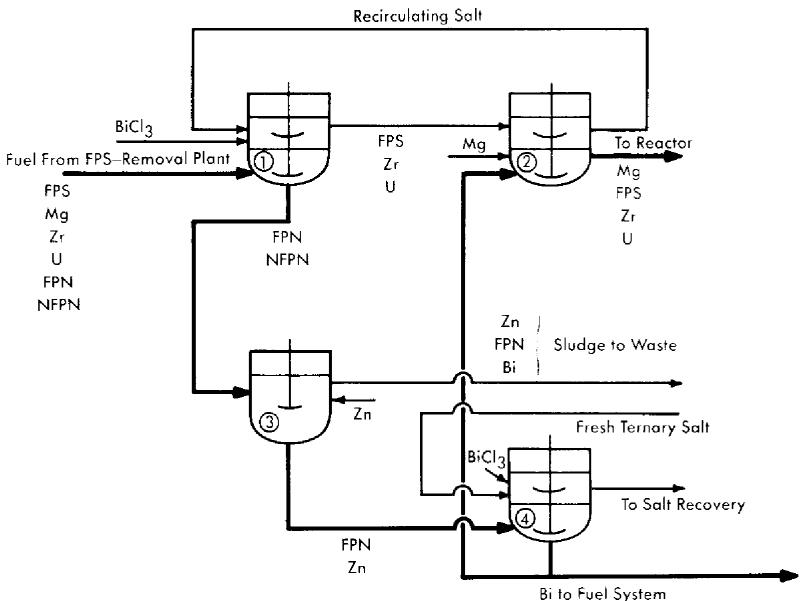  
FIG. 22-10. Flowsheet for the removal of FPN fission products from an LMFR fuel.

the FPS, Zr, and U in the salt back into the metal and still leave about 300 ppm Mg in the Bi as it is returned to the reactor. In vessel 2, the Fe and Cr concentrations in the Bi should be brought back up to those in the incoming fuel.

A portion of the stripped Bi from vessel 4 may be sent directly to a holdup tank and used for fuel-adjustment purposes. Similarly, a concentrated solution of U in Bi may be made in vessel 2, also for fuel adjustment purposes.

Vessel 2 can be eliminated and its function taken over by vessel 1. The two vessels were included in Fig. 22-10 for convenience in explaining the process. All vessels are similar in design and equal in size. To handle 275 gal (one month's accumulation) of metal, they should have a total volume of about 350 gal. The operations in vessels 1 and 2 should be conducted in $\mathrm{O}_2$ -free atmospheres, but this condition is not necessary for the operations carried out in vessels 3 and 4.

Molybdenum removal. Mo is really a special member of the NFPN group. Its solubility at $375^{\circ}\mathrm{C}$ , probably the coldest fuel temperature, is estimated to be less than 1 ppm. Moreover, it is produced at a rate equivalent to 0.38 ppm/day. Thus, probably the most feasible way to remove Mo would be to precipitate it out of solution onto cold fingers immersed in the circulating fuel. The precipitation rate for a 500-Mw reactor would be 54 g/day, most of which would be stable Mo. Even with cold traps, some Mo will

very likely precipitate throughout the fuel system where it is generated. Information on this will be obtained in the LMFR Experiment No. 1.

Polonium removal. The behavior of Po in the FPS and FPN removal processes described above is not clear. Chemically, it is more noble than Bi and should not form an intermetallic compound with Zn, indicating that it should always remain with the Bi. In preliminary equilibration experiments with chloride salt mixtures, it was found that about $1\%$ of the Po transferred to the salt, but whether this was due to chemical oxidation or volatilization is not presently known.

Heat generation rates. The maximum rate of heat removal from the charge in vessel 1 is estimated to be about $290\mathrm{kw}$ (250 from the fission products and 40 from the Po) and from vessel 3 about $240\mathrm{kw}$ (200 from the fission products and 40 from the Po). These values can be greatly reduced by allowing the 275 gal of fuel to "cool off" for several days before processing. The rate of heat removal can be kept sufficiently low so that cooling the vessels does not present too much of a problem.

The worst heat-removal problem arises when the NFPN's are concentrated in the $\mathrm{Zn,Bi - NFPN}$ sludge; but the generated heat can be removed satisfactorily by leaving the intermetallic sludge in contact with some molten Bi in the "extraction" vessel for a short while until it can be skimmed off and sent to waste without danger of excessive heating.

22-5.4 FPN removal process for the fluoride volatility process. The flow-sheet for this proposed process is given in Fig. 24-20. The feed stream for the FPN fission product removal plant is taken from the fluoride volatility plant after the bismuth is free of all the uranium and FPS. This bismuth stream now contains only FPN. In a batch vessel, it is brought in contact with a small amount of zinc (approximately $0.5\mathrm{w / o}$ ). As the contents are cooled, the zinc forms intermetallics with the FPN and NFPN elements, as described previously. This zinc dross floats to the top, is skimmed off and sent to the zinc waste. From the bottom of the vessel, the bismuth stream containing some zinc is sent to a zinc crystallizer, where the temperature is further decreased. Some of the zinc crystallizes and is removed from the top for recycle back to the first vessel. It is proposed to remove the remaining zinc by a distillation operation shown on the flow-sheet as Still. The bismuth from the Still is ready for return to the volatility plant for the addition of uranium, magnesium, and zirconium.

The entire FPN plant would be operated batchwise. The quantity of material handled would probably be about the same as for the previous process, about 275 gal. The heating problem for this process also would be about the same as for the process described previously.

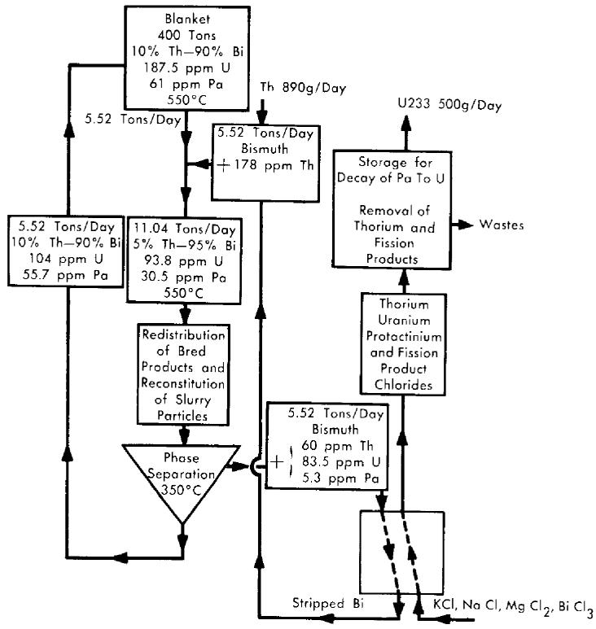  
FIG. 22-11. Flow diagram for processing a $10\mathrm{w / o}$ Th-Bi breeder-blanket slurry to remove $\mathbf{Pa}^{233}$ and $\mathbf{U}^{233}$ .

# 22-6. BLANKET CHEMICAL PROCESSING

As is pointed out in Chapter 20, the easiest blanket to handle in the LMFR would be a $10\mathrm{w / o}$ thorium-bismuthide slurry in bismuth. Chemical processing of this blanket would be very similar to the core processes already described. The major problem consists in transferring the bred uranium and protactinium from the solid thorium bismuthide to the liquid bismuth phase, so that they can then be chemically processed. Two examples of proposed processes are shown in Fig. 22-11, which shows a process that can be used with the fused chloride salt FPS removal process, and in Fig. 24-19, which shows a flowsheet for a process to be used with the fluoride volatility process.

In the process of Fig. 22-11, a typical two-fluid 500-Mw LMFR would have a blanket of about 400 tons of material containing approximately $10\%$ Th and $90\%$ Bi. The material balance shows that 5.52 tons/day would be withdrawn and processed. In the first step, an additional 5.52 tons/day of bismuth containing fresh thorium is added to the stream,

primarily to dilute the thorium bismuthide to half its first value. This slurry is then raised in temperature until a complete solution is obtained. When this is done, all the uranium and protactinium as well as fission products dissolve in bismuth. In the next step, the thorium bismuthide is reconstituted by cooling methods such as described in Chapter 20. The U, Pa, and fission products will remain in solution in the bismuth. Then a phase separation at $350^{\circ}\mathrm{C}$ can be carried out. This gives a recycle stream of 5.52 tons/day containing $10\%$ Th going back to the blanket and 5.52 tons/day of Bi with about $95\%$ of the original U and Pa dissolved in it.

This stream then goes to column 1 of the fused chloride salt FPS removal system, where all the Th, U, Pa, and FPS are transferred to the ternary chloride salt. Meanwhile, the stripped Bi is returned to dilute more blanket thorium bismuthide.

In the last step, the $\mathrm{Pa}$ is allowed to decay to U for about 130 days. At the end of this time, practically all $(99.5\%)$ of the $\mathrm{Pa}$ would be converted to U, and the U would be separated from the Th and FPS by the methods previously described. As shown on the flowsheet, this would result in the production of approximately $500\mathrm{g/day}$ of $\mathrm{U}^{233}$ for charging into the core fluid.

The flowsheet for the bismuthide slurry head-processing shown in Fig. 24-19 shows a similar technique for handling the transfer of U and Pa from the intermetallic solid to the liquid bismuth.

As yet neither of these processes has been tried in the laboratory. As work progresses on the bismuthide blanket system, further work on the chemical processing will be carried out.

# 22-7. ECONOMICS OF CHEMICAL PROCESSING

Basically, in evaluating the economies of chemical processing, the cost of neutrons in the form of uranium fuel wasted to fission-product poisoning must be balanced against the cost of operating the chemical processing units for removal of the fission-product poisons. In the over-all operation of an LMFR reactor and its auxiliary chemical processing plant, the attainment of the highest breeding ratio will not necessarily give the lowest cost power. When the price of fuel is fixed as it is now by the U.S. Government, or by general market conditions, then the cost of the chemical processing becomes the variable which must be operated upon in order to justify a high breeding ratio.

As is shown in Chapter 24, the chemical processes now available and under development are so expensive relative to the cost of fuel that optimization of the reactor conditions for a two-region reactor indicates a most economic breeding ratio of about 0.86, and for a single region reactor about 0.75. These figures can be increased toward one or better by de

creasing the cost of chemical processing. However, it must be kept in mind that the fission products are not the only neutron poisons present in the LMFR. Such other neutron poisons as the bismuth, the structural materials, and the higher uranium isotopes will be present even though the fission and corrosion products levels are kept to zero percent.

# REFERENCES

1. BABCOCK & WILCOX Co., Liquid Metal Fuel Reactor; Technical Feasibility Report, USAEC Report BAW-2(Del.), June 30, 1955.   
2. O. E. Dwyer, A.I.Ch.E. Journal 2, 163-168 (June 1956).   
3. J. B. SAMPSON et al., Poisoning in Thermal Reactors Due to Stable Fission Products, USAEC Report KAPL-1226, Knolls Atomic Power Laboratory, Oct. 4. 1954.   
4. C. J. RASEMAN et al., Continuous Removal of Fission Products from Liquid Metal Fuel, Chem. Eng. Progr. 53(2), 86-F (1957).   
5. R. W. REBHOZ et al., Chemical Reprocessing Studies for the Liquid Metal Fuel Reactor Experiment, USAEC Report UCN-42, Union Carbide Nuclear Co., June 28, 1957.   
6. D. W. BAREIS, A Continuous Fission Product Separation Process. I. Removal of the Rare Earths (Lanthanum, Cerium, Praseodymium, and Neodymium) from a Typical Liquid Bismuth—Uranium Reactor Fuel by Contact with Fused LiCl-KCl Mixture, USAEC Report BNL-125, Brookhaven National Laboratory, 1951.   
7. R. H. WISWALL, JR., The Distribution of Elements in Salt-Metal Systems with Special Reference to the Data of D. W. Bareis, USAEC Report BNL-201, Brookhaven National Laboratory, Sept. 30, 1952.   
8. D. W. BAREIS et al., Fused Salts for Removing Fission Products from U-Bi Fuels, *Nucleonics* 12(7), 16-19 (1954).   
9. D. Cubicciorti, An Explanation of the Effect of Added Metals on the Distribution of Rare Earths between Liquid Bismuth and KCl-LiCl, USAEC Report NAA-SR-202, North American Aviation, Inc., 1953.   
10. A. GLASSNER, The Thermochemical Properties of the Oxides, Fluorides, and Chlorides to $2500^{\circ}\mathrm{K}$ , USAEC Report ANL-5750, Argonne National Laboratory, 1957.   
11. O. KUBASCHEWSKI and E. EVANS, Metallurgical Thermochemistry. New York: Pergamon Press, 1956. (pp. 42-43)   
12. JAMES J. EGAN and R. H. WISWALL, JR., Applying Thermodynamics to Liquid-Metal-Fuel Reactor Technology, *Nucleonics* 15(7), 104-106 (1957).   
13. D. NeIL, personal communication.   
14. W. S. GINELL, paper presented at San Francisco Meeting, American Chemical Society, April 1958.

15. R. H. WISWALL, JR., et al., Recent Advances in the Chemistry of Liquid Metal Fuel Reactors, paper prepared for the Second International Conference on the Peaceful Uses of Atomic Energy, Geneva, 1958.   
16. O. E. Dwyer et al., High Temperature Processing Systems for Liquid Metal Fuels and Breeder Blankets, in Proceedings of the International Conference on the Peaceful Uses of Atomic Energy, Vol. 9. New York: United Nations, 1956. (P/550, pp. 604-612)   
17. D. B. MARSLAND, A Reference Electrode for Fused-Salt Studies, PH.D. thesis, Cornell University, Ithaca, N. Y., 1958.   
18. S. LAWROSKI, Survey of Separations Processes, in Proceedings of the International Conference on the Peaceful Uses of Atomic Energy, Vol. 9. New York: United Nations, 1956. (P/823, pp. 575-582)   
19. D. M. LIDDELL (Ed.), Handbook of Non-ferrous Metallurgy, Vol. II. New York: McGraw-Hill Book Company, Inc., 1945. (p. 201)   
20. O. E. Dwyer, A. M. Eshaya, and F. B. Hill, Removal of Fission Products from Uranium-Bismuth Fuel, paper prepared for the Second International Conference on the Peaceful Uses of Atomic Energy, Geneva, 1958.