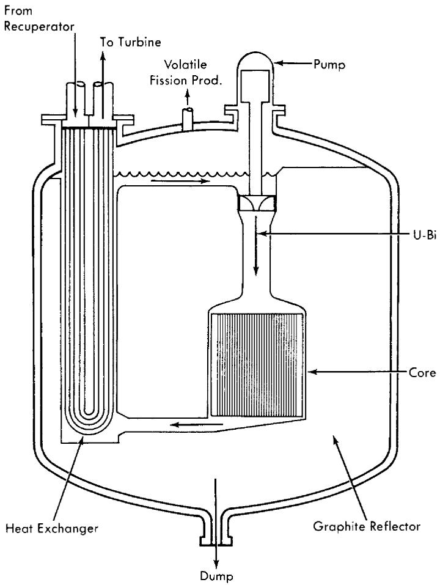
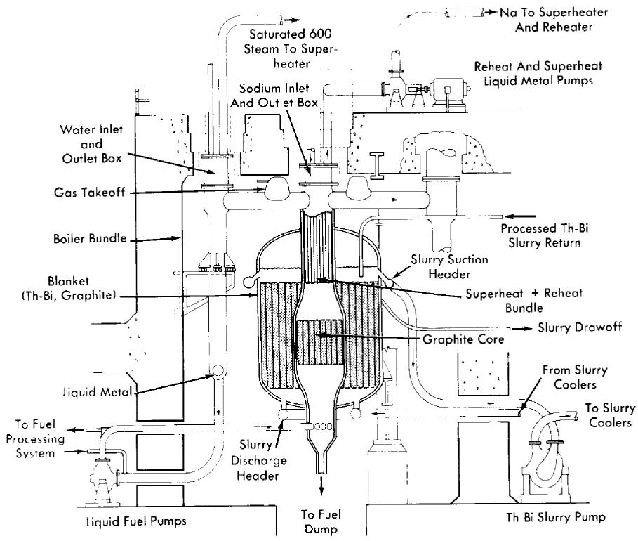
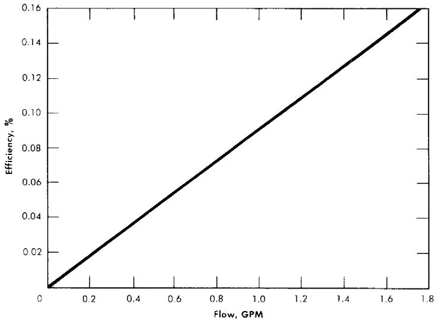
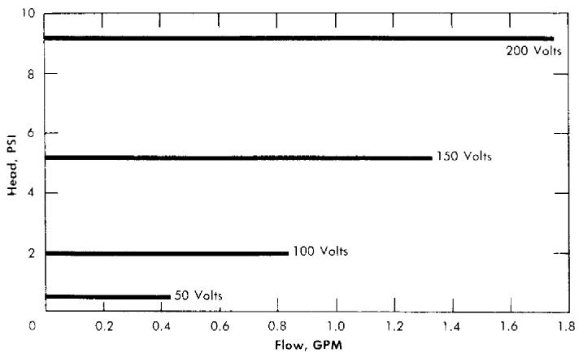
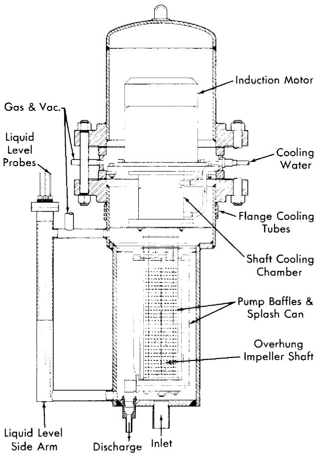
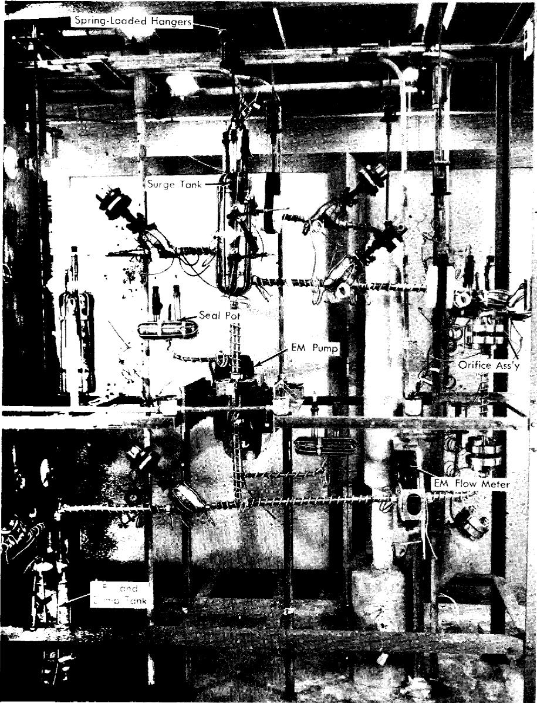
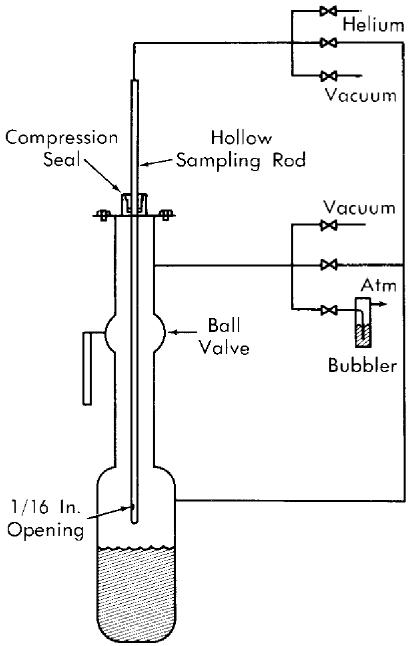
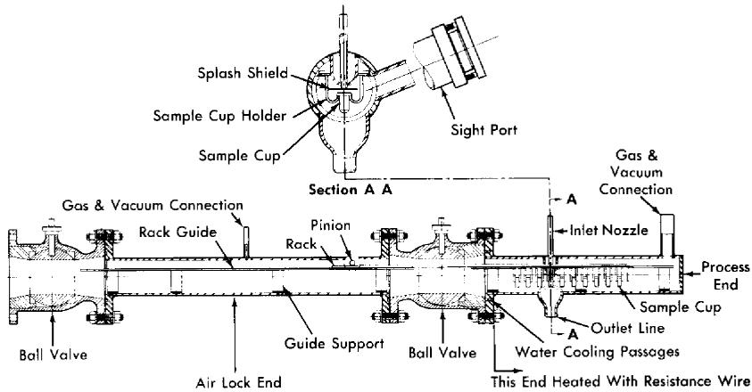
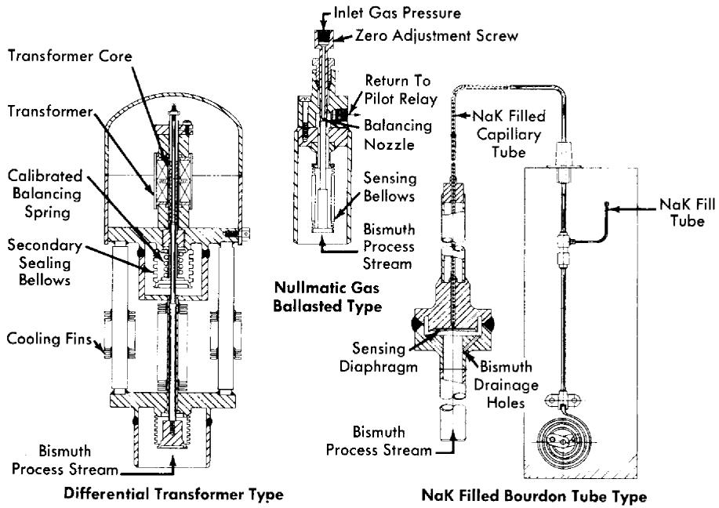

# CHAPTER 23

# ENGINEERING DESIGN

# 23-1. REACTOR DESIGN*

The LMFR readily lends itself to a wide variety of designs and arrangements. The concepts proposed to date may be classified according to type as being internally or externally cooled and either compact or open arrangement of cycle. Such classification has been brought about in an attempt to present designs which minimize bismuth and uranium inventories.

If we assume the cost of U235 to be $20/g and that of bismuth to be $2.25/lb, a U-Bi solution of 700 ppm uranium by weight would cost approximately $6000/ft3. This high volume cost makes it very important to design the LMFR with the minimum possible holdup.

In addition to the variety of cycle arrangements, several different coolants are possible. The U-Bi may be used directly to produce steam, or a secondary fluid such as NaK or sodium may be used. The LMFR has also been proposed as the heat source for a closed-cycle, gas-turbine power plant [2].

23-1.1 Externally cooled LMFR. In an externally cooled LMFR the fuel is circulated through the core to an external heat exchanger, where the heat is removed by the secondary fluid. This type provides the simplest core design, requiring simply an assembly of graphite pierced with holes for circulation of liquid-metal fuel. The major problems of heat transfer are essentially removed from the core design.

23-1.2 Internally cooled LMFR. The internally cooled LMFR is designed so that the liquid fuel remains in the reactor core. The core thus acts as a heat exchanger in which the heat is transferred to a secondary fluid flowing through it to an external heat exchanger or steam generator.

The internally cooled design offers a means of substantially reducing the U-Bi inventory of the system, but considerably complicates the design of the core. The core must be designed to accommodate two fluids and sufficient surface for transferring heat from one to the other. The introduction of a secondary fluid in the core requires a greater uranium concentration than in the externally cooled system, which has only U-Bi and graphite in the core. The required concentration cannot be achieved with U-Bi so

  
FIG. 23-1. Externally cooled compact arrangement LMFR for closed-cycle gas turbine.

lutions, since these concentrations approach the solubility limits for the temperatures presently being considered (400 to $550^{\circ}\mathrm{C}$ ).

23-1.3 Compact arrangements. The compact arrangement may best be described as an integral or "pot type" design and may be internally or externally cooled. In such a design [1] the fluid fuel remains in the core except for small amounts which are withdrawn for reprocessing. The breeding fluid acts as a coolant by circulating through blanket and core and thence through heat exchangers which are also contained within the primary reactor vessel.

Figure 23-1 shows a concept of an externally cooled compact reactor

arrangement for a closed-cycle, gas-turbine power plant [2]. In this arrangement the fuel is circulated through the core and heat exchanger, which are contained inside the same vessel. The compact arrangement offers a means of reducing the U-Bi inventory over a particular reactor designed with an open-cycle arrangement. It does, however, increase the problems associated with design of the core, blanket, and reactor vessel. The compacting of all the equipment into a single vessel reduces the flexibility of mechanical design which the open arrangement allows, as well as intensifying the problems of thermal expansion. The reactor vessel not only becomes larger, but the number of openings is also increased, both of which complicate the vessel design. Nevertheless, as operating experience with materials and equipment becomes available, the compact arrangement may provide a means of improving the economics of the LMFR system.

23-1.4 Open arrangements. The open arrangement is the type receiving the most consideration at present because of the flexibility and simplicity of design it affords the system components. Figure 23-2 shows one concept of an externally cooled LMFR using the open-cycle arrangement [3]. In this design both blanket and core fluids are circulated to heat ex-changers located outside the reactor vessel. This type of arrangement also allows greater freedom of design for maintenance of equipment. Means must be provided for removal and/or maintenance of system components under radioactive conditions. The open arrangement makes it easier to provide such facilities. The major disadvantage of this arrangement is the high U-Bi inventory.

The open-cycle arrangement may also be employed in an internally cooled LMFR to reduce fuel inventory, but it introduces those problems peculiar to internally cooled systems.

23-1.5 Containment and safety requirements. The high negative temperature coefficient and low amount of excess reactivity available make the LMFR inherently stable and safe. However, any rupture of the primary system, whether by reactor excursion or otherwise, would release fission products and polonium to the surrounding atmosphere. The primary system must therefore be surrounded with a secondary vessel for containment of radioactivity in case of such a failure. Since all materials in the reactor core have very low vapor pressures, the containment vessel need not be designed to withstand any appreciable pressure. The containment problem in the LMFR is one of containing the high-temperature liquid metal together with fission products, and such containment can be accomplished by lining the reactor and primary circuit cells with a gastight steel membrane. This containment vessel also acts as a catch basin for recovery of U-Bi in case of leaks.

  
FIG. 23-2. Externally cooled open-cycle arrangement LMFR.

The arrangement of the containment vessel also depends on the heat-removal design. If an intermediate heat-transfer fluid such as sodium or NaK is used, the containment may be handled as above. If a direct U-Bi to steam cycle is used, a double-wall heat exchanger must be used to maintain double containment, unless the entire building is constructed to act as the second containment barrier.

In the event of a leak in the system, the U-Bi would be drained to a dump tank. This tank would be provided with adequate cooling to remove the decay heat from fission products.

23-1.6 Design methods. The vessels in an LMFR are designed in accordance with the Code for Unfired Pressure Vessels [4]. Vessels would be of welded construction with all seams radiographed and stress-relieved.

The design temperature used can be as high as $1100^{\circ}\mathrm{F}$ . For $21\%$ Cr-1% Mo steel, this gives allowable stresses of 4200 psi for normal operating conditions and 9200 psi for emergency, short-duration conditions. These figures correspond to $1\%$ creep strength for 100,000 hr and 10,000 hr, respectively.

23-1.7 Maintenance and repair provisions. Provisions for maintenance and repair of the LMFR raise several problems. It is anticipated that a substantial level of activity will be induced in the system by the circulating fuel. This means that the system should be designed so that it can be maintained despite the high radiation level. Several approaches, not mutually exclusive, to this problem are being considered:

(1) If maintenance or repair to a component is required, the entire component will be removed from the system and a new one inserted.   
(2) All connections between components will be made in one area, fully biologically shielded from the components themselves. When a component is to be removed, its connections are shielded from adjacent connections by portable shielding if the work is to be done directly rather than remotely. The connections are broken and the shielding is removed above the pipes leading to the component in question. The component is removed with the overhead crane and a new one set in place. The shielding is replaced, and the connections are remade. The connections are accessible and pipes do not overlay each other so as to prevent removal of any disconnected component. Unfortunately, placing all connections in one channel increases the fuel inventory since the piping for this arrangement is somewhat longer than that required for a more conventional arrangement.   
(3) Both mechanical and welded connections are being studied, with a view toward the ease with which connections can be made and broken both directly and remotely.   
(4) Remote methods of performing maintenance tasks (welding and cutting pipe, making and breaking flanged joints and closures) are being studied, since direct maintenance will not be possible in some areas.   
(5) Fluidized powders, shot, and liquids are being studied as possible portable shielding media.

# 23-2. HEAT TRANSFER*

In the open-cycle externally cooled, two-fluid LMFR, the bismuth-uranium solution serves as the primary coolant as well as the fuel. In the reactor itself, there is no actual heat transfer. Instead, the solution acts as a transporter of heat to an external heat exchanger. In evaluating bismuth as a primary coolant, it is helpful to make a comparison between it and three other coolants: sodium, a typical alkali metal coolant; LiCl-KCl eutectic, a typical alkali halide salt mixture; and water. (The salt eutectic used here would not be a suitable primary coolant for a thermal reactor. Its heat transfer properties, however, are typical of salt coolants.)

The ideal primary coolant for a nuclear power reactor should have the following characteristics:

(1) High heat-transfer rates.   
(2) Good gamma absorptivity.   
(3) Low pumping power requirements.   
(4) Low melting point.   
(5) Low vapor pressure.   
(6) Low corrosion rate.   
(7) Low chemical reactivity.   
(8) Low neutron absorption.   
(9) Low induced radioactivity.   
(10) Low cost.

In order to have the above characteristics, the coolant should have the following physical properties in either a high or low amount:

(1) Density (high): affects pumping power requirements, heat-transfer characteristics, and gamma shielding requirements.   
(2) Thermal conductivity (high): affects heat-transfer characteristics.   
(3) Specific heat (high): affects heat-transfer characteristics and coolant flow rate.   
(4) Viscosity (low): affects pumping power requirements and heat-transfer characteristics.   
(5) Melting point (low): affects auxiliary heating requirements.   
(6) Vapor pressure (low): affects mechanical design of reactor and system components.   
(7) Volume change on fusion (low): affects startup and shutdown procedures.   
(8) Coefficient of volumetric expansion (high): affects thermal pumping capacity and, where primary coolant is also the fuel, reactor reactivity.   
(9) Electrical resistivity (low): affects applicability of electromagnetic pumps.

Table 23-1 summarizes the physical properties of bismuth which are relevant to nuclear reactor design and in the temperature range of practical interest from the standpoint of electrical power generation [5,6].

23-2.1 Nuclear aspects of coolants. From the nuclear standpoint, five important characteristics of primary reactor coolants are their capacities for (1) absorbing thermal neutrons, (2) slowing down neutrons to the thermal energy level, (3) absorbing gamma radiation, (4) developing induced radioactivity, and (5) resisting radiation damage.

In Table 23-2 the thermal neutron absorption cross section and neutron-slowing-down power of Bi are compared with those of Na and $\mathbf{H}_2\mathbf{O}$ . Bis

TABLE 23-1 PHYSICAL PROPERTIES OF BISMUTH  

<table><tr><td>Atomic weight</td><td>209</td><td></td><td></td><td></td></tr><tr><td>Melting point</td><td>271.0°C (520°F)</td><td></td><td></td><td></td></tr><tr><td>Boiling point</td><td>1477°C (2691°F)</td><td></td><td></td><td></td></tr><tr><td>Volume change on fusion</td><td>-3.32%</td><td></td><td></td><td></td></tr><tr><td>Temperature, °C</td><td>300</td><td>400</td><td>500</td><td>600</td></tr><tr><td>Temperature, °F</td><td>572</td><td>752</td><td>932</td><td>1112</td></tr><tr><td>Vapor pressure, mm Hg</td><td>10-9(1)</td><td>3.5 × 10-5*</td><td>2.3 × 10-4</td><td>6.3 × 10-4</td></tr><tr><td>Density, g/cm3</td><td>10.03</td><td>9.91</td><td>9.79</td><td>9.66</td></tr><tr><td>Specific heat, cal/(gm)(°C)</td><td>0.0343</td><td>0.0354</td><td>0.0365</td><td>0.0376</td></tr><tr><td>Viscosity, centipoises</td><td>1.66</td><td>1.37</td><td>1.16</td><td>1.00</td></tr><tr><td>Thermal conductivity, Btu/(hr)(ft)(°F)</td><td>9.9</td><td>9.0</td><td>9.0</td><td>9.0</td></tr><tr><td>Electrical resistivity, ohms</td><td>128.9</td><td>134.2</td><td>139.8</td><td>145.2</td></tr><tr><td>U solubility, ppm</td><td>480</td><td>1850</td><td>5100</td><td>13000</td></tr></table>

*Extrapolated results.

muth with a macroscopic cross section of $9.0 \times 10^{-4} \mathrm{~cm}^{-1}$ at $450^{\circ} \mathrm{C}$ has the lowest neutron absorption characteristic of any practical coolant, with the exception of $\mathrm{D}_{2} \mathrm{O}$ and certain gases. Its "reactor poisoning" effect is at least an order of magnitude below those of sodium and water. The slowing-down power of Bi is very low, however, which means that when it is used as the primary coolant in a thermal reactor it contributes very little moderating capacity. The term $\xi N \sigma_{s}$ in Table 23-2 represents the decrease in the natural logarithm of the neutron energy per centimeter of travel through coolant.

The gamma absorption coefficient, $\mu$ , is defined by the equation

$$
d I = - \mu I d x \tag {23-1}
$$

and has the units of $\mathrm{cm}^{-1}$ . Values of $\mu$ for $450^{\circ}\mathrm{C}$ Bi at several gamma energies are shown in Table 23-3, along with those for Na and $\mathrm{H}_2\mathrm{O}$ . Bismuth, because of its high density, is an excellent absorber of gamma radiation, which means that it provides considerable internal shielding. The values presented in Table 23-3 are estimates based on the theoretical calculations of Davission and Evans [8].

TABLE 23-2 SOME NUCLEAR PROPERTIES OF VARIOUS REACTOR COOLANTS  

<table><tr><td>Coolant</td><td>Temp., °C</td><td>Thermal neutron cross section [7], σa, barns</td><td>Macroscopic cross section [7], Naσ, cm-1</td><td>Density ρ, g/cm3</td><td>Thermal scattering cross section, σs, barns</td><td>ξ* dimension-less</td><td>Slowing-down power, ξNs, cm-1</td></tr><tr><td>Bi</td><td>450</td><td>0.032</td><td>0.00090</td><td>9.82</td><td>9</td><td>0.0095</td><td>0.0024</td></tr><tr><td>Na</td><td>450</td><td>0.505</td><td>0.011</td><td>0.841</td><td>4.0</td><td>0.084</td><td>0.0074</td></tr><tr><td>H2O</td><td>250</td><td>—</td><td>0.018</td><td>0.802</td><td>—</td><td>—</td><td>1.23</td></tr></table>

*Average decrease in the natural logarithm of the neutron energy per collision.

TABLE 23-3   
VALUES OF $\mu$ , THE GAMMA ABSORPTION COEFFICIENT, FOR VARIOUS REACTOR COOLANTS AS A FUNCTION OF ENERGY   

<table><tr><td rowspan="2">Coolant</td><td rowspan="2">Temp., °C</td><td colspan="5">Energy, Mev</td></tr><tr><td>0.5</td><td>1.0</td><td>1.5</td><td>2.0</td><td>3.0</td></tr><tr><td>Bi</td><td>450</td><td>1.57</td><td>0.70</td><td>0.52</td><td>0.44</td><td>0.41</td></tr><tr><td>Na</td><td>450</td><td>0.070</td><td>0.051</td><td>0.042</td><td>0.036</td><td>0.029</td></tr><tr><td>H2O</td><td>250</td><td>0.078</td><td>0.057</td><td>0.046</td><td>0.039</td><td>0.032</td></tr></table>

Regarding the tendency for developing induced radioactivity, Bi has a serious disadvantage, owing to the formation of $\mathrm{Po}^{210}$ , a very energetic alpha emitter with a 138.3-day half-life. Its formation and decay can be represented as follows:

$$
\mathrm {B i} ^ {n (1 9 \mathrm {m b})} \longrightarrow \mathrm {B i} ^ {2 1 0} \xrightarrow [ 5 \mathrm {d} ]{- \beta} \mathrm {P o} ^ {2 1 0} \xrightarrow [ 1 3 8. 3 \mathrm {d} ]{\alpha} \mathrm {P b} ^ {2 0 6}.
$$

$\mathrm{Po}^{210}$ is one of the most poisonous materials known, the maximum allowable concentration in air being $7 \times 10^{-11} \mu \mathrm{c} / \mathrm{ml}$ or $3.75 \times 10^{-8} \mathrm{ppm}$ . Another troublesome feature of $\mathrm{Po}^{210}$ is its tendency to scatter throughout

any accessible volume, due to recoil from its high-energy alpha emission. Thus, spillage of solutions containing $\mathrm{Po}^{210}$ constitutes a most serious physiological hazard. In the LMFR, however, it is not believed that the presence of $\mathrm{Po}^{210}$ in the fuel stream creates a more serious radioactivity problem than already exists as a result of the fission products.

Sodium is not free of the radioactivity problem either, but as a primary coolant it is not as bad in this respect as Bi. Water is comparatively free of induced radioactivity after short holdup times. For the same flux conditions, Na will give over 20,000 times as much radioactivity, on a roentgen basis, as $\mathrm{H}_2\mathrm{O}$ .

Liquid metals, because of their simple atomic structure, suffer no radiation damage.

23-2.2 Pumping-power requirements. An important criterion for assessing the relative merits of different coolants is the amount of pumping power required for a fixed rate of heat removal in a given application. The three main pressure drops in the primary coolant circuit are those in the reactor, the external heat exchanger, and the interconnecting piping. A comparison of the four different types of coolants will now be made on the basis of their relative pumping-power requirements, with respect to the interconnecting piping and the heat exchangers. The physical properties of the coolants are listed in Table 23-4. The properties of the first three are evaluated at $450^{\circ}\mathrm{C}$ , as a typical average primary coolant temperature for such coolants, and those for water at $250^{\circ}\mathrm{C}$ .

TABLE 23-4   
PHYSICAL PROPERTIES OF SOME TYPICAL REACTOR COOLANTS  

<table><tr><td>Property</td><td>Bi 450°C</td><td>Na 450°C</td><td>KCl-LiCl 450°C</td><td>H2O 250°C</td></tr><tr><td>Melting point, °F</td><td>520</td><td>208</td><td>664</td><td>32</td></tr><tr><td>Boiling point, °F</td><td>2691</td><td>1621</td><td>-</td><td>212</td></tr><tr><td>Density, lb/ft3</td><td>615</td><td>52.5</td><td>103</td><td>50.0</td></tr><tr><td>Specific heat, Btu/(lb)(°F)</td><td>0.036</td><td>0.304</td><td>0.31</td><td>1.16</td></tr><tr><td>Heat capacity, Btu/(ft3)(°F)</td><td>22.1</td><td>15.95</td><td>31.9</td><td>57.8</td></tr><tr><td>Thermal conductivity, Btu/(hr)(ft)(°F)</td><td>8.95</td><td>39.5</td><td>1.47</td><td>0.357</td></tr><tr><td>Viscosity, cp</td><td>1.28</td><td>0.245</td><td>3.4</td><td>0.110</td></tr><tr><td>Prandtl number, Cp μ/k</td><td>0.0125</td><td>0.00454</td><td>1.7</td><td>0.863</td></tr></table>

The pumping power required to circulate the coolant through the piping system per unit rate of heat transport for a fixed temperature rise in the coolant has been shown [9] to be

$$
\phi_ {p} = \frac {\mathrm {p u m p i n g p o w e r}}{\mathrm {h e a t l o a d}} = (\mathrm {a c o n s t a n t}) \frac {\mu^ {0 2}}{\rho^ {2} C _ {p} ^ {2 8}}. \tag {23-2}
$$

The quantity $\mu^{0.2} / \rho^2 C_p^{2.8}$ , represented here by the symbol $X$ , is an index of the pumping power required to circulate a coolant through a fixed piping system, for a given heat load. Table 23-5 gives relative values of $X$ for the four typical coolants mentioned above. The units and values of the physical properties used in evaluating $X$ are the same as those given in Table 23-4.

TABLE 23-5   
RELATIVE VALUES OF $X$ FOR VARIOUS COOLANTS FLOWING THROUGH A FIXED PIPING SYSTEM   

<table><tr><td>Coolant</td><td>Temp., °C</td><td>X × 104</td></tr><tr><td>Bi</td><td>450</td><td>308</td></tr><tr><td>Na</td><td>450</td><td>77</td></tr><tr><td>LiCl-KCl eutectic</td><td>450</td><td>32</td></tr><tr><td>H2O</td><td>250</td><td>1.7</td></tr></table>

The very large spread in pumping-power requirements is striking. Bismuth has about four times the pumping-power requirements of sodium and both have manifold greater requirements than that of water, which has the least of any known liquid. The tremendous superiority of water as a heat-transport medium is due to its low viscosity and very high volumetric heat capacity.

23-2.3 Heat transfer for LMFR. So far as is known, no heat-transfer data have been obtained for liquid bismuth. However, several investigators [10-14] have published experimental heat-transfer results on the bismuth lead eutectic and on mercury. For these results the Lubarski and Koffman equation [15] expresses the results most closely:

$$
\frac {h D}{k} = 0. 6 2 5 \left(D V _ {p} C _ {p} / k\right) ^ {0. 4}. \tag {23-3}
$$

This equation may be used for turbulent flow in round tubes or for turbulent flow outside round tubes.

In obtaining the heat-transfer coefficients for comparison with bismuth, the sodium coefficients were calculated from the Martinelli-Lyon relationship. The coefficients for molten salt and water were calculated from the conventional Dittus-Boelter equation.

Using the above relationships and assuming (1) total fixed heat load, (2) fixed diameter of tubes, (3) fixed inlet and outlet temperatures, (4) average bulk temperature of coolants same as in Table 23-4, and (5) combined heat-transfer resistance of tube wall and second fluid equals 0.001, a typical value for 1-in. ID alloy steel tubes with 0.1 in. wall, the values in Tables 23-6 and 23-7 were calculated. Although the heat-transfer characteristics of bismuth are slightly inferior to those for sodium, it is clear from these two sets of calculations that all four coolants behave similarly.

The heat-transport capability of bismuth are simply related to its volumetric heat capacity. The values of this property are given in Table 23-4. Bismuth is definitely superior to sodium but inferior to the fused salt and water.

To achieve good thermal contact between bismuth and a solid metal surface, the surface must be cleaned to a high polish, the bismuth must be free of oxide and dissolved gases, and the system must be filled under a high vacuum. Gases or oxides on the heat-transfer surface can greatly reduce the heat-transfer coefficient for bismuth. Bismuth has a less stable oxide than the oxides of iron, chromium, and nickel which may be present on the tube surfaces. Hence the bismuth would have a tendency to non-wet the walls.

Good wetting of alloyed steels by bismuth may be achieved by adding small amounts of alkali or alkaline earth metals, by heating to high tem-

TABLE 23-6   
COMPARISON OF COOLANTS IN HEAT-EXCHANGER DESIGN WHEN NUMBER OF TUBES IN PARALLEL IS FIXED   

<table><tr><td>Coolant</td><td>Velocity of flow, ft/sec</td><td>h, Btu/(hr)(ft)2(°F)</td><td>U, Btu/(hr)(ft)2(°F)</td><td>Relative size of heat exchangers</td></tr><tr><td>Bi</td><td>15</td><td>2700</td><td>730</td><td>1.00</td></tr><tr><td>Na</td><td>20.8</td><td>10230</td><td>910</td><td>0.87</td></tr><tr><td>LiCl-KCl eutectic</td><td>10.4</td><td>2400</td><td>706</td><td>1.12</td></tr><tr><td>H2O</td><td>5.73</td><td>2360</td><td>703</td><td>1.12</td></tr></table>

peratures (above $1200^{\circ}\mathrm{F}$ ), or by both. For good heat transfer with bismuth extreme care must be taken to ensure oxide- and gas-free systems.

23-2.4 Heat-exchanger design. In a commercial liquid-metal fuel system, the primary bismuth coolant would probably exchange heat with a secondary metal coolant before generating steam. Typical conditions for a 5-Mw countercurrent bismuth-sodium heat exchanger are given in Table 23-8.

# 23-3. COMPONENT DESIGN*

This section discusses the design and development experience obtained on components required in LMFR systems. Besides the requirements for these systems, considerable component development is needed in the research and development program for experimental apparatus. Both kinds of components are treated here in detail and by case histories.

23-3.1 Pumps. In the case of liquid-metal pumps, which can be classified as mechanical or electromagnetic, a good deal of preliminary development work has been done by the Fairchild Engine and Airplane Corporation Nuclear Energy for Propulsion of Aircraft Division (NEPA), the Allis-Chalmers Co., the Babcock & Wilcox Co., and the Government Laboratories, KAPL, ORNL and ANL [19].

TABLE 23-7 COMPARISON OF COOLANTS IN HEAT-EXCHANGER DESIGN AT FIXED LINEAR VELOCITYOF15FT/SEC   

<table><tr><td>Cond.</td><td>Relative number of tubes in parallel</td><td>Temp., °C</td><td>h, Btu/(hr)(ft)2(°F)</td><td>l&#x27;, Btu/(hr)(ft)2(°F)</td><td>Relative size of heat exchangers</td></tr><tr><td>Bi</td><td>n</td><td>450</td><td>2770</td><td>730</td><td>1.00</td></tr><tr><td>Na</td><td>1.38n</td><td>450</td><td>8810</td><td>897</td><td>0.88</td></tr><tr><td>LiCl-KCl eutectic</td><td>0.69n</td><td>450</td><td>3200</td><td>762</td><td>1.03</td></tr><tr><td>H2O</td><td>0.42n</td><td>250</td><td>5150</td><td>837</td><td>0.94</td></tr></table>

TABLE 23-8   
TYPICAL CONDITIONS IN A COUNTERCURRENT, BI-NA HEAT EXCHANGER   

<table><tr><td>Tube material</td><td>Low Cr-Steel</td></tr><tr><td>Thermal conductivity of tube, Btu/(hr)(ft)(°F)</td><td>15.8</td></tr><tr><td>Tube inside diameter, in.</td><td>0.70</td></tr><tr><td>Tube thickness, in.</td><td>0.100</td></tr><tr><td>Tube spacing (triangular), in.</td><td>0.250</td></tr><tr><td>Bi temperature (bulk), °F</td><td>850</td></tr><tr><td>Bi velocity (outside tubes), ft/sec</td><td>15.0</td></tr><tr><td>Bi heat transfer coefficient, Btu/(hr)(ft)2(°F)</td><td>3,390</td></tr><tr><td>Na temperature (bulk), °F</td><td>750</td></tr><tr><td>Na velocity (inside tubes), ft/sec</td><td>25.5</td></tr><tr><td>Na heat transfer coefficient, Btu/(hr)(ft)2(°F)</td><td>12,300</td></tr><tr><td>Over-all heat transfer coefficient, Btu/(hr)(ft)2(°F)</td><td>1,015</td></tr><tr><td>Fraction of resistance offered by tube wall</td><td>0.60</td></tr><tr><td>Heat flux (outside tube surface), Btu/(hr)(ft)2</td><td>101,500</td></tr><tr><td>Power density, Btu/(hr)(ft)3</td><td>510,000</td></tr><tr><td>Bi, ft3/mw heat</td><td>0.56</td></tr><tr><td>Na inventory, ft3/mw heat</td><td>0.45</td></tr></table>

Electromagnetic pumps. In the early days of the LMFR project, a magnetic pump for Bi was described by B. Feld and L. Szilard [20,21]. The Fuel Processing Group of Brookhaven National Laboratory required pilot-plant pumps that would circulate uranium-bismuth fuel with absolutely no leakage. The U-Bi fuel was eventually to be circulated through an experimental hole in the Brookhaven reactor where fission products and polonium would be generated. Since a small flow rate of approximately 1 gpm was desired and efficiency was of little concern, it was decided to use an electromagnetic pump.

An experimental loop [22] was set up to circulate nonradioactive U-Bi by means of a General Electric Model G-3 AC (Faraday) electromagnetic pump. This loop ran continuously for $2400\mathrm{hr}$ . During the first 160 hr the rig was operated isothermally at a temperature of $645^{\circ}\mathrm{F}$ ; during the remainder of the time, the loop was run isothermally at $840^{\circ}\mathrm{F}$ . The U-Bi solution was circulated for most of this period at a rate of $1\mathrm{gpm}$ . There was no sign of plugging or flow restriction.

The General Electric G-3 ac pump was calibrated (Figs. 23-3 and 23-4) in another AISI type-347 stainless steel liquid bismuth loop at $930^{\circ}\mathrm{F}$ [22]. It was operated continuously for over 13,000 hr.

  
FIG. 23-3. AC electromagnetic pump efficiency. Molten bismuth in AISI type-347 stainless steel cell. (Manufactured by General Electric Co.)

  
FIG. 23-4. AC electromagnetic pump characteristics. Molten bismuth in AISI type-347 stainless steel cell. (Manufactured by General Electric Co.)

The same pump was used to circulate bismuth at $930^{\circ}\mathrm{F}$ in a $2\frac{1}{4}\%$ $\mathrm{Cr - 1\%}$ Mo steel loop. The efficiency and characteristic curves were somewhat lower than those obtained in a stainless steel loop. This is probably due to short-circuiting of magnetic flux in the ferritic steel walls.

A theoretical study [23] was prepared by the Atomic Energy Research Establishment at Harwell, England, for linear-induction pumping of bismuth. The report indicates the feasibility of using this type of pump. Linear-induction pumps have been built and successfully used at Ames

Laboratory to circulate $\mathrm{Mg}$ -Th eutectic (37 w/o Th) and Bi-U alloy (5 w/o U) in an Inconel-enclosed tantalum loop [24,25]. The pump operated successfully in the $\mathrm{Mg}$ -Th system for 2000 hr at $1470^{\circ}\mathrm{F}$ with a temperature differential of $250^{\circ}\mathrm{F}$ , and in Bi-U for 5250 hours at $1740^{\circ}\mathrm{F}$ with a temperature differential of $210^{\circ}\mathrm{F}$ . For calibration, about 1 gpm of Bi-U was pumped at $750^{\circ}\mathrm{F}$ against a head of 0.5 in., with an efficiency of $0.16\%$ .

Mechanical pumps. Most pump development work has been aimed at pumping sodium or sodium-potassium alloys. The most serious problem relative to the design of a mechanical liquid-metal pump appears to be that of suitable bearings and seals.

Bismuth was pumped by NEPA in 1950 [26]. The system was operated for $37\mathrm{hr}$ , the maximum flow rate measured was $2\mathrm{gpm}$ , the maximum head developed was $66\mathrm{psi}$ , and the maximum bismuth temperature reached was $1765^{\circ}\mathrm{F}$ . The pump was a modified Browne and Sharpe No. 206, machine-tool-coolant pump.

In another experiment [27] NEPA circulated bismuth with a 50-gpm centrifugal pump for $100\mathrm{hr}$ at a mean temperature of $1500^{\circ}\mathrm{F}$ with a temperature differential of $500^{\circ}\mathrm{F}$ . An accumulation in the sump of a residue high in oxide content and dissolved elements reduced the flow and forced suspension of operation. This residue probably resulted from an impure inert atmosphere above the liquid metal. The container material selected was AISI type-347 stainless steel which had shown some promise in bismuth solubility tests at temperatures up to $1800^{\circ}\mathrm{F}$ .

The California Research and Development Corporation made a survey of the various types of pumps that might be used for liquid bismuth and came to the conclusion that a centrifugal pump would best fit the need. A test unit was built that operated for 1037 hr, and a report [28] stated that the centrifugal pump proved to be a very satisfactory means for circulating bismuth in an isothermal system at 700 to $750^{\circ}\mathrm{F}$ . This pump and its driver are on a common shaft, the shaft being top-suspended with all bearings in the motor chamber. Space was provided for a labyrinth to separate the pump chamber from the motor chamber, although no seal was used during operation. This pump has also been used to circulate mercury in a test loop at BNL. It has been run successfully for an accumulated time of over 4000 hr.

Brookhaven has developed a totally canned overhung-impeller centrifugal pump. Figure 23-5 shows the major design features of this pump. These units pump 5 to $25\mathrm{gpm}$ Bi against heads up to 30 ft while operating at $525^{\circ}\mathrm{C}$ . These sump-type pumps run with no bearings in the liquid metal and have proved reliable so long as sufficient internal baffling is included to stop surface splashing.

There are several centrifugal pumps that have been used to circulate

  
FIG. 23-5. Canned-motor centrifugal pump developed at Brookhaven.

lead-bismuth eutectic [29,30]. They are all vertically mounted sump pumps with overhung shafts and impellers. All would require a can around the motor and shaft for a hermetic seal.

The University of California has used a double-volute pump which is rated at $30\mathrm{gpm}$ and a 40-ft head at $1000^{\circ}\mathrm{F}.$ The lower bearing is 2 ft above the liquid metal. The pump utilizes a packing gland (Johns-Manville Super Seal No. 6) adjusted to allow helium at 2 psig to leak out of the system at a rate of about $10\mathrm{ft}^3 /\mathrm{hr}$ .

The pump used at North American Aviation, Inc. [30] is made of cast steel. The lower bearing is cooled with a water jacket and a graphite seal

minimizes gas leakage from the casing. A flow of 0.82 gpm at 400-rpm shaft speed and a temperature of $700^{\circ}\mathrm{F}$ was maintained until oxide dross forced shutdown of the pump after 496 hr.

A completely canned, modified Series T-34 MD Duval stainless steel pump was used at the University of California to circulate mercury [31]. The packing gland was replaced with a bushing and any metal leakage was drained to a reservoir. The pump was driven by a 5-hp, 3-phase induction motor at a shaft speed of $1200\mathrm{rpm}$ .

North American Aviation, Inc. has circulated tin with a graphite pump at $2\mathrm{gpm}$ against a head of 22.5 psi at $1830^{\circ}\mathrm{F}$ [32]. The pump has a 4-in.-diameter impeller and is driven by a variable speed (20 to 2000 rpm) dc compound-wound motor mounted outside the gastight enclosure to avoid the high temperatures. A rotating Graphitar bushing on hardened steel provides the gas seal. The spindle bearings are in a cooled housing. The pump was operated for $500\mathrm{hr}$ in one run; this was followed by additional runs. To overcome differential thermal expansion, a molybdenum adapter joins the graphite shaft to the stainless steel spindle.

A miniature canned centrifugal pump to circulate bismuth, ideally suited for in-pile work, has been developed by the Atomic Energy Research Establishment at Harwell, England. The over-all pump dimensions are $3_{4}^{3}$ -in.-diameter by $24\frac{1}{8}$ in. long, with a 2-in.-diameter impeller. The bismuth flow is $1.5\mathrm{gpm}$ with a head of 9 ft. The motor rating is $0.75\mathrm{hp}$ and $2800\mathrm{rpm}$ . Two gas-lubricated bearings are utilized. The material of construction is $2\frac{1}{4}\mathrm{Cr - 1Mo}$ steel.

The Allis-Chalmers Manufacturing Co. has built a canned rotor centrifugal pump with fluid piston-type bearings to pump bismuth at $1050^{\circ}\mathrm{F}$ . The pump is rated at 10 gpm and a head of 25 ft, with an efficiency of $10\%$ . Those parts of the pump in contact with the bismuth are made from AISI type-410 steel. The pump was used in loop G at BNL to pump bismuth at $1020^{\circ}\mathrm{F}$ with a temperature differential of $300^{\circ}\mathrm{F}$ . After 15.5 hr the pump failed, due to scoring of the bearings and seizure of the can by the rotor.

23-3.2 Valves. The standard-stem packed gate valves used in early NEPA bismuth tests [26] proved that special valves would be required for successful liquid-bismuth operation. High leakage rates through the packing caused maintenance difficulties throughout the tests.

A $1\frac{1}{2}$ -in. Fulton-Sylphon bellows-type stainless steel valve was cycled 1000 times at the rate of 77 times/min against bismuth at a temperature of $1000^{\circ}\mathrm{F}$ and a pressure of 25 psig. No failure of the bellows or other valve parts occurred. NEPA also checked valves for metal-to-metal self-welding effects [33]. Tests of valve operation reached $1500^{\circ}\mathrm{F}$ with liquid bismuth on Standard Stellar-faced poppets and seats without indication of self-welding effects.

The two types of valves which have seen extensive service up to $1050^{\circ}\mathrm{F}$ in liquid-metal fuel systems are standard Y pattern globe valves and needle valves. Due to the stringent requirements of zero gas leakage (into or out of the metal systems), the only acceptable stem seal has been a steel bellows. Packings are unacceptable.

Brookhaven National Laboratory has used both types of valves extensively [22,34]. The 1/2-in. IPS 150-lb Y pattern globe valves constructed from AISI type-347 stainless steel for all parts in contact with bismuth (including bellows, stem, and disk) have been used continuously for over 8000 hr at $930^{\circ}\mathrm{F}$ without mishap. Similar valves with mild carbon steel disks (instead of type-347 stainless steel) have been used at $930^{\circ}\mathrm{F}$ for over 13,000 hr without failure or extensive corrosion.

A high-velocity loop operating with bismuth at $1020^{\circ}\mathrm{F}$ at BNL uses 1-in. IPS 150-lb Y pattern globe valves made from $241\%$ Cr-1% Mo steel, AISI type-430 steel bellows and disk, and AISI type-416 steel stem.

Needle valves (1.8-in. IPS AISI type-347 stainless steel construction, including the bellows) have been in use for intermittent service (i.e., drain valves).

As an additional safety measure, 1/2-in. IPS globe valves used in an in-pile loop at Brookhaven National Laboratory have utilized two sets of bellows [34]. The space between the two bellows was pressurized with inert gas which was continually monitored to detect pressure changes (thus indicating a valve leak). None was detected.

The valve drives have been modified to facilitate remote operation. The globe valve handwheels are replaced by gears and these are, in turn, connected to extension rods projecting through the enclosures. Extension rods are welded directly to the needle valve bellows. Universal joints and right-angle gear drives are used for changes in direction between valve and operator. When relatively gastight enclosures are desired, as in in-pile loops, the extension rods project through rubber-gasketed compression seals.

Oak Ridge National Laboratory has reported on the use of special high-temperature packing [35] for valve stems. This packing consists of successive layers of Inconel braid, graphite, nickel powder, and another layer of Inconel braid.

It has been shown at practically all AEC installations that two sections of a circulation system can be isolated from each other by freezing a short section of connecting pipe. This plug can be remelted and flow resumed after a short wait. This type of seal is undesirable for uranium-bismuth solutions, however, since the uranium will deposit at the cold surface.

23-3.3 Piping. Layout features. The most important considerations in designing piping for a liquid-metal fuel system are the considerable thermal

expansion of the pipe when heated from room temperature to operating temperature, and the expansion of bismuth upon freezing $(3\%)$ . The former condition prescribes the type of supports required, while the latter determines the methods and techniques for freezing the metal.

In general, it is desirable to hang pipe from overhead supports, preferably spring-loaded hangers with straps around the pipe insulation. Heavy vessels may be anchored to hangers by brackets welded to the wall. Care should be taken to see that these brackets do not act as a large heat sink. If the system is supported from below, heavy vessels should "float" by locating them on freely moving bearing raceways.

Freezing the liquid metal in the system, especially in components with bellows, should be avoided. However, in case of emergency, the metal should be frozen towards the free surface. For this reason, a system should always contain a surge (or expansion) tank, located at the highest elevation.

The use of an integral fill tank, located at the lowest point in the system to permit charging the loop with metal through a pipe "dip leg" completely immersed in the metal, is recommended. The application of gas pressure on the fill tank will transfer the metal slowly into the loop. By charging the metal from the bottom, into a previously evacuated system, gas entrainment will be minimized. A sintered metallic filter should be used to remove oxide and other scum from the metal while filling the loop. This filter should always be located outside the fill tank, since this will facilitate removal of the filter when it becomes clogged and will prevent cracking of the pores if the contents of the fill tank freeze.

The loop may be drained into a vessel which can be either the fill tank or a separate drain tank. Piping lines should be sloped to facilitate drainage; undrainable pockets should be provided with separate drain lines or, if possible, eliminated. A typical liquid-bismuth loop layout is shown in Fig. 23-6.

Bellows. Several types of metal bellows have been used at Brookhaven National Laboratory in bismuth systems at $930^{\circ}\mathrm{F}$ . AISI type-347 stainless steel welded bellows have been used continuously in 1/2-in. IPS globe valves for periods as long as 13,000 hr. The bellows have not, however, been extensively cycled in bismuth. Their dimensions are $2\frac{1}{2}$ in. OD by 1-in. ID by 0.018-in. thick and contain 32 convolutions. Two AISI type-410 steel welded bellows have been bench cycled 32,000 and 120,000 times, respectively, in bismuth at $1020^{\circ}\mathrm{F}$ and should, therefore, be satisfactory. They are used in pressure transmitters, and are $1\frac{1}{4}$ in. OD by 3/8-in. ID by 0.009-in. thick and contain 22 convolutions. At this time, one AISI type-430 steel hydraulically formed bellows, used in 1/2-in. IPS globe valves, has been bench-cycled with helium over 200,000 times at $1020^{\circ}\mathrm{F}$ without failure. Its dimensions are $1\frac{3}{8}$ in. OD by 7/8-in. ID by 0.008-in. thick (two-ply).

Bellows tests at Argonne National Laboratory [36] have yielded the following data:

(1) Failures have generally occurred at a weld; therefore bellows with the least number of welds are favored. However, mechanically formed bellows should be examined for cracks and other flaws that may be introduced in the forming.   
(2) There was no evidence that corrosion played a part in the failure of any bellows.   
(3) One predominant factor determining bellows life is the relative amount of travel.   
(4) Other factors affecting bellows life are temperature and the relative distribution between compression and extension. It was found that the outer bellows failed before the inner bellows which operated at a higher temperature.   
(5) Some bellows designs had not failed up to $10^{6}$ cycles, at which point the test was stopped.

Joints. Metal systems. In general, in these metal systems, all joints should be welded for tightness and structural soundness. All weld joints are made by standard inert-arc procedures. Complete procedure specifications have been prepared by BNL for inert-arc welding of AISI type-347 stainless steel pipe, fittings, and vessels for use with liquid metals. This procedure was developed through the cooperation of the Metallurgy Division of Oak Ridge National Laboratory. Specifications have, likewise, been prepared at BNL for welding $2\frac{1}{4}\% \mathrm{Cr - 1\%}$ Mo steel. AISI type-502 steel welding rods are used in welding $2\frac{1}{4}\% \mathrm{Cr - 1\%}$ Mo steel pipe. A procedure for welding 0.030-in.-thick tantalum tubing, as well as AISI type-316 stainless steel to tantalum, has been prepared at Ames Laboratory [24,25].

Experimental and operating procedures, however, often make it advantageous to have removable joints. These have been successfully used at a number of installations. An oval cross-sectional ring for a flanged joint was used by NEPA [37] in a bismuth system between 520 and $660^{\circ}\mathrm{F}$ at 300 p-tg. and by the California Research and Development Corporation [2S] on $1\frac{1}{2}$ -in. piping containing bismuth at 700 to $750^{\circ}\mathrm{F}$ .

Standard metallic ring-joint flanged connections have also been satisfactorily used at the University of California and Brookhaven National Laboratory [22,29]. The rings were of soft iron (in lead-bismuth systems) and AISI type-347 stainless steel (in bismuth systems). At a temperature of $930^{\circ}\mathrm{F}$ , the AISI type-347 stainless steel joint has been found to be helium leaktight to a mass spectrometer.

The ability of liquid metals and liquid salts to leak through extremely small openings has made the use of helium mass-spectrometer leak testers a specified test step. Halogen leak testers should never be used because of the absorbed halogen which remains in the surfaces after the tests.

Graphite system. Several graphite loops have been operated with bismuth at a maximum temperature of $2550^{\circ}\mathrm{F}$ [38] and with tin at temperatures up to $2730^{\circ}\mathrm{F}$ [32]. Spherical joints held together with steel flanges and bolts, or tapered joints threaded for assembly under tension, have been the best. In addition, the joints may be fused to reduce leakage by coating furfural on one face and hydrochloric acid on the other. However, even with all these precautions, the systems were not absolutely tight to bismuth or tin.

Sight ports. Sight ports have been used to facilitate viewing the liquid metal inside a closed system at the University of California [29] and at Brookhaven National Laboratory. A satisfactory port consists of a glass plate at the end of a steel bellows welded to the pipe. A normally closed butterfly valve isolates the glass from lead or bismuth vapors. The valve is moved by an externally mounted magnet or a handle projecting through a Teflon-packed gland.

23-3.4 Heating equipment. Flexible Nichrome heater wire consisting of a Nichrome inner wire, asbestos and glass insulation, and a flexible stainless steel protective braid, is extremely useful for maintaining systems at temperatures up to $1100^{\circ}\mathrm{F}$ for periods of time in excess of 10,000 hr [22]. Figure 23-6 shows the application of this type of heater in loop work. Strip and tubular heaters have been in in-pile service for over 8000 hr [34]. A resistance heater has also been used as an internal heater submerged in a lead-bismuth eutectic system [29].

Induction heating has been used on bismuth with good results [27]. A heating transformer in which the metal stream is the secondary circuit has been used at Ames Laboratory in magnesium-thorium and uranium-bismuth systems at temperatures up to $1740^{\circ}\mathrm{F}$ for periods of up to 5000 hr [24].

The use of graphite as a resistance heater in graphite loops has been successful at temperatures up to $2700^{\circ}\mathrm{F}$ for short times (about 500 hr) [32,38].

23-3.5 Insulation. Samples of 26 insulating materials were tested for possible reaction with molten bismuth [51]. In general, results indicated that little or no reaction occurred when molten bismuth at $1832^{\circ}\mathrm{F}$ came into contact with the unheated materials, but that none of the materials would withstand contact with the bismuth for more than a few hours when both were at $1832^{\circ}\mathrm{F}$ .

At BNL, Johns-Manville Co. Superex preformed pipe insulation and Carborundum Co. Fiberfrax bulk insulation have been used extensively.

23-3.6 System preparation. Cleaning of equipment. Owing to the corrosive nature of most bismuth compounds and the necessity for maintain

  
FIG. 23-6. Typical liquid bismuth loop.

ing definite concentrations of additives in the fuel systems, the type of container employed and the condition of the container-liquid interface is of great importance. The presence of oxygen and other impurities in soluble or insoluble form can accelerate the attack upon the container material. As a result, it is desirable to remove all foreign material from liquid-metal fuel systems before charging. Cleaning techniques for the more important liquid-metal container materials are summarized as follows.

Stainless steels. The committee of stainless steel producers of the American Iron and Steel Institute [40] recommend several techniques, depending upon the type of impurity to be removed. In addition to these methods, BNL has found electropolishing to be useful in removing surface oxides [34]. In all cases, after the use of cleaning solutions the material is rinsed thoroughly with water and dried by allowing a final alcohol or acetone rinse to evaporate.

Low-chrome steels. Several methods have been used for cleaning metals of this type. One method is described [30] for PbBi systems in which boiling detergent solution is used to remove dirt and scale, followed by a distilled water rinse and drying under conditions of heat and vacuum. The same reference describes the following cleaning procedure:

(1) Inhibitor: $10\%$ HCl for $12\mathrm{hr}$ .   
(2) Neutralization of HCl with $\mathrm{Na}_2\mathrm{CO}_3$   
(3) Water rinse.   
(4) $10\%$ phosphoric acid wash.   
(5) Drying with heat and vacuum.

The following technique has been developed at BNL for use with large vessels:

(1) Degrease with trichlorethylene.   
(2) $3\%$ $\mathrm{HNO}_3 - 17\%$ HCl solution for $30\mathrm{min}$ at room temperature.   
(3) Flush with water.   
(4) Repeat steps (2) and (3).   
(5) Add $20\%$ HCl solution for 5 min at room temperature.   
(6) Rinse with water.   
(7)Rinse with alcohol.   
(8) Dry with inert gas blast.

Leak testing. Liquid-metal fuel systems which involve solutions containing uranium and oxygen-sensitive additives (such as the magnesium used in LMFR systems) require that precautions be taken to prevent air leakage into equipment. In general, a sequence of leak detection is followed in which gross leakage and structural faults are first eliminated by pressure testing. Suspected leaks can be verified by application of soap solution.

The helium mass-spectrometer leak detector has been found to be the most useful as a final test. Systems found leaktight to helium are acceptable for use in uranium-bismuth systems.

Preheating. A procedure for preheating equipment has been used at BNL and elsewhere [34,41] in which the equipment is first evacuated to less than 100 microns pressure and then heated, at a rate slow enough to prevent pressure surges above 100 microns, to operating temperature. This procedure has the advantage of removing condensables from the container walls before they can react with the wall at elevated temperatures.

With the equipment at or above operating temperature, purified hydrogen may be introduced to reduce any surface oxide that might be present. This step is frequently done with the liquid metal present in the charging vessel in order to reduce oxides present in the charge.

Charging procedures. The procedures described here are specific for the preparation of LMFR fuel solutions, but they are at the same time somewhat typical of the handling techniques necessary for other liquid-metal fuel systems that have been suggested. Basically, the procedures result from the need for maintaining system cleanliness, stability of additives, minimum oxygen contamination, and uniformity of solutions.

Bismuth preparation. Bismuth ingots are cut to a size suitable for loading and surface oxide deposits are mechanically removed. The metal is then charged to a melt tank and heated to the charging temperature under vacuum. Zirconium and magnesium, in the appropriate amounts, are suspended in the melt to establish the proper concentrations of additives. Samples are taken to verify this. When the concentrations of the additives are stable, the bismuth is considered satisfactory for charging to the test equipment.

Equipment charging. The bismuth from the charging vessel is forced, by inert-gas pressure, through a porous metal filter to remove oxides, and into a sump tank in the test equipment. From this tank the metal can be raised by gas pressure into the operating sections of the equipment.

Addition to flowing bismuth. The addition of uranium, magnesium, and zirconium to flowing streams is accomplished by inserting a steel basket containing the additive into the bismuth stream through a sampling port. Initial uranium additions to a system are not made until sampling has shown that the concentrations of magnesium and zirconium are stable.

23-3.7 Operation and handling. Blanket gas. The blanketing of bismuth with inert gases is necessary to provide protection against oxidation. In many cases it has been found necessary to purify commercial grades of gas to meet system requirements. A survey of active metals for use in the purification of rare gases has been made at Ames [42].

Several methods are in use for the determination of oxygen in gases in the

  
FIG. 23-7. Thief-type sampler.

ppm range of concentration. KAPL [43] and Oak Ridge [44] have developed techniques for this analysis and commercial units have also been developed for use in this range. At BNL, the purity of gas is checked by passing it over a polished uranium chip at 550 to $600^{\circ}\mathrm{C}$ . If the chip is not tarnished, the gas is considered suitable for use.

Conditioning operation. In addition to the system preparation steps described in previous sections, it has been found desirable to provide a period of system operation in which a corrosion-inhibiting layer of zirconium nitride can be formed on the container walls. In general, this is done by charging the system with bismuth to which zirconium and magnesium have already been added and then operating the system isothermally until analyses have shown the additive concentrations to be stable.

Sampling. Thief-type samplers have been used almost exclusively for liquid-metal fuel systems. Sampling in this manner is accomplished by inserting a sample tube into the metal through an airlock mounted above the vessel. The airlock is separated from the vessel chamber by a full-opening ball valve. By bubbling helium through a hole near the bottom of the sample tube, it is possible to control the depth at which the sample is taken. At the time of sampling the pressure inside and outside the tube is equalized and the liquid enters the tube, which is then withdrawn [22].

  
FIG. 23-8. In-line bismuth sampler.

This method is shown in Fig. 23-7. A variation of this technique has been adapted for taking filtered samples; an inverted sample cup, which has been closed at one end by a filter, is lowered into the metal stream and filled by increasing the system pressure. Another variation involves the use of a sliding valve on the sample tube. This valve is opened and closed by a rotary bellows-sealed drive that controls the time at which the sample is taken. Radioactive samples have been taken using thief-sampler techniques. The activity levels encountered were not high enough to require remote manipulation, but drybox techniques were necessary to protect against alpha contamination.

Corrosion study samples are used extensively in developmental systems and consist of carefully prepared and examined metal or graphite pieces which are included in the system piping during fabrication and removed after each experimental run. Samples have also been inserted into flowing streams through thief-sampler airlocks to study corrosion effects and interactions between the sample and fuel stream components.

A line-type sampler, in which the liquid-metal stream is drawn through a sample line to a sample container, is shown in Fig. 23-8. In this device, small cups may be filled in succession and then withdrawn through the airlock. The sampler is manipulated externally by the pinion gear.

High-temperature radiography. Techniques for radiographing operating bismuth systems at elevated temperatures have been developed to study plug formation, gross corrosion effects, and operating characteristics such as liquid levels and gas entrainment. Gamma-ray sources are used in this work [45].

Repair techniques. In making repairs on systems which have contained liquid-metal fuels it is essential to observe certain precautions:

(1) Whenever possible, the system should be thermally cold.   
(2) Blanket gas should always be maintained on the inside of the system. When the system is opened, a flow of gas from the system should be maintained.   
(3) In making welds, any surface deposit of bismuth must be removed before a successful weld can be assured. Removal of a part of the inner pipe wall by reaming has been found necessary. Cooling coils placed on the pipe at the end of the reamed section will keep bismuth from melting and flowing into the weld.   
(4) In cases where bismuth fuels have undergone neutron irradiation, proper protection against polonium contamination must be provided. It has been found that polonium and nonvolatile fission products contained in solid bismuth can be handled without little difficulty, since they are largely immobilized by the bismuth. Repairs of contaminated equipment, including welding operations, have been made without hazard [34].

23-3.8 Instrumentation. Liquid level measurement. Determination of liquid levels in a closed metallic system, such as that generally encountered in liquid-metal work, can be approached either as a single-level problem or as a continuously indicating level problem. The requirements for the former are:

(1) A metallic probe, preferably of the same material as the metallic container.   
(2) High-temperature insulation between the probe and the vessel in which the liquid level is to be determined.   
(3) A gastight seal between insulation and both adjacent metallic parts.   
(4) An appropriate external circuit to note the attainment of the particular level.

Experience at Brookhaven National Laboratory [22] has shown that the most successful method for providing both good insulation and a satisfactory high-temperature seal in a single-level probe is by the use of automotive spark plugs. It is suggested that the seal be removed from direct contact with the heat source by means of an appropriate pipe extension. A probe can be welded to the spark plug after removal of the bent side electrode. The probes may be made from AISI types-347 and 502 steel for bismuth systems or of tungsten in a tin system [32]. The external circuit consists of a transformer, relay, and indicating lights. By the use of two probes and interlocked relays, it is possible to indicate a level beneath the lower probe, between probes, or above the upper probe.

There are two general types of continuous level indicators: a manually adjustable resistance probe, and a variable inductance probe.

The movable probe, consisting of the proper metal rod or tube, is adjusted through a suitable compression fitting. Modified Parker fittings [29] and Wilson fittings with Teflon packing glands are recommended. The liquid level is determined by comparing the probe height with a previously calibrated scale.

The variable inductance probe consists of a doubly wound coil in a ceramic form [22]. The coil is inserted into a pipe well inside the tank and, as the liquid-metal level rises, the inductance of the coil changes. The change of inductance is detected in a bridge circuit, with the degree of unbalance being a measure of the level. This method has the advantage, especially important in handling radioactive fluids, that the system is hermetically sealed at all times.

If it is not possible to utilize the fluid itself for level indication, the liquid level may be obtained in a roundabout manner by means of a stainless-steel float. A stainless-steel tube long enough to protrude from the tank is attached to the float. A short length of cold-rolled steel rod is contained in the uppermost section, which is completely enclosed so that no liquid can come in contact with it. The liquid level is obtained by locating the position of the cold-rolled steel rod with a search coil wound about a tube concentric with the one protruding from the tank.

Pressure measurement. Several methods are available for measuring the pressure exerted by liquid-metal fuels. These include seal pots, gas- or spring-balanced nullmatic transmitters, and bourdon-type gauges.

The seal pot measuring devices are simple to construct and have been used most extensively [22,29,30] in this work. The pressure is transmitted from the metal to a trapped inert gas that is monitored by a conventional gas-pressure gauge. This inert gas maintains a constant metal level in the seal pots, as determined by means of a float [29] or spark plug probes [22,30]. The float (with an extension rod) or the High-Low spark plug probes actuate solenoid valves connected to gas supply and vent lines. The probe separation is 1/4-in., thereby regulating the liquid level to $\pm 1/8$ in. Since there is no barrier between metal and gas, metal may splash into the gas space and freeze the gas lines. This may be partly alleviated by providing long vertical gas lines, a means of heating these lines, and baffles.

A variation consists of measuring the relative height of a column of bismuth, backed up by gas pressure in a steel pipe [25]. The level is determined by radiography with an $\mathrm{Ir}^{192}$ source. This method finds special application in measuring differential pressure heads (i.e., orifice).

The gas-balanced [46,47] or spring-balanced [48] nullmatic pressure transmitters provide a metal bellows or diaphragm seal between the liquid

  
FIG. 23-9. Pressure transmitters.

metal and a gas or mechanical pressure balance; this balancing pressure is then measured. Figure 23-9 illustrates the basic design of three types of these transmitters.

The nullmatic pilot-operated pressure transmitter can be made to be very sensitive, with rapid response. A thin metallic bellows seals the unit and is the sensing element. The full-range bellows movement is only a few thousands of an inch. The backing gas is nitrogen and the sensing system is adjusted to maintain a maximum differential of 10 psig across the bellows. One of the difficulties with this type of element is the incomplete drainage of Bi from the convolutions of the bellows. This trapped Bi may rupture the bellows when it freezes. Another disadvantage is its large consumption of instrument gas.

Another type of pressure transmitter utilizes a bellows-sealed differential transformer. The sensing element of this transmitter is similar to that of the previous unit and consists of a metallic bellows. The very slight movement of the bellows during a pressure change is transmitted to a differential transformer by a rod with a secondary bellows seal. A matching transformer installed in a bridge circuit allows a calibrated instrument to indicate or record the actual pressure in the system.

The diaphragm-sealed, NaK-filled bourdon-tube type of pressure transmitter has been used with two different styles of diaphragms. A thin, 0.010- to 0.015-in.-thick metallic diaphragm is used to separate the Bi system

from a NaK capillary system that extends from the diaphragm chamber to a bourdon tube in a conventional pressure transmitter. Capillary lengths up to 20 ft allow the transmitter to be placed remotely with respect to the system. The other diaphragm style consists of two thin sheets of metal welded together to form an envelope. The inside of the envelope contains NaK and is connected to a bourdon element by a length of capillary tubing. The envelope diaphragm is suspended in the Bi in an all-welded container. This type of transmitter has proved to be reliable in the pressure range between 10 and 175 psig.

Flow measurement. Orifice. Flow of liquid-metal fuels, much like flows of water or other liquids, is most commonly measured with standard orifices [22,25,30]. Work done at the Engineering Research Center, University of California [39,50] has demonstrated that an orifice may be calibrated with water, and the calibration may then be used directly for heavy metal (Bi or Pb-Bi) flow metering. The error introduced in this manner is only between 3 and $5\%$ .

Orifice assemblies have generally been installed in the piping systems with ring-joint and flange connections; one-piece orifice plate and metallic O-rings are used. Either flange or vena contracta taps are used and the pressure is measured as indicated in the previous section. Mild steel orifice plates with sharp-edged holes are satisfactory for use in lead-bismuth systems [29,30]. After $500\mathrm{hr}$ at $350^{\circ}\mathrm{F}$ , and a throat velocity of 1.5 fps, there was no detectable erosion in one such orifice.

A rounded-edge orifice (with flange taps) made from AISI type-347 stainless steel gave very satisfactory service at Brookhaven National Laboratory in a 1/2-in. IPS bismuth loop for $13,500\mathrm{hr}$ at $930^{\circ}\mathrm{F}$ [22]. The flow was 5.5 fps through the throat. Upon examination, the hole diameter had increased by $3\%$ (from 0.2662 in.) during loop operation.

A submerged orifice made from $2\frac{1}{4}\%$ Cr-1 Mo steel has been successfully used at Brookhaven National Laboratory in over 4000 hr of operation with bismuth at $1020^{\circ}\mathrm{F}$ . Its special appeal lies in the fact that liquid levels (heads) instead of pressures are measured. Ordinary liquid level probes are used.

Electromagnetic flowmeter. An electromagnetic flowmeter has been designed and analyzed theoretically by General Electric Company and by Babcock & Wilcox. A permanent magnet is mounted around the pipe through which molten metal is flowing, with the faces of the magnet creating a field perpendicular to the pipe. Two leads are welded to the pipe wall, mutually perpendicular to both the pipe and magnetic flux. The emf generated by the molten metal when cutting the lines of flux is picked up by these leads and can be transmitted to any potential-sensitive instrument. The theoretical analysis of this type of flowmeter agrees within $6\%$ with experimental results.

The electromagnetic flowmeter has been successfully used to meter bismuth flows in AISI type-347 stainless steel at Brookhaven National Laboratory [22]. The measured flow agreed within $10\%$ with the theoretically determined value.

Preliminary results have shown that these flowmeters may also be used in a $2\frac{1}{4}\%$ Cr-1% Mo steel system. However, corrections must be made for the short-circuiting of magnetic flux in the ferritic steel pipe walls. One way of minimizing this correction might be to use a bimetallic cell, that is, a thin (0.010 in.) liner of $2\frac{1}{4}\%$ Cr-1% Mo steel surrounded by an AISI type-347 stainless-steel pipe to provide structural strength.

Temperature measurement. The temperature of liquid metal fuels is usually measured with thermocouples of duplex Chromel-Alumel, No. 20 BWG gauge. Each wire is individually insulated with fiberglass and asbestos and each pair is covered again with insulation.

The best and most accurate service in low-chrome or stainless-steel systems is obtained by welding the thermocouple junction directly to the outside of the pipe wall. The difference between the temperature on the pipe wall and the bulk bismuth at $930^{\circ}\mathrm{F}$ is no greater than $10^{\circ}\mathrm{F}$ . If required, thermocouples located in wells have also been used in bismuth systems.

In graphite systems the thermocouples are inserted in drilled holes, and then cemented in place with alumina cement [32].

Temperature control for isothermal loops is obtained as follows [22]. The various parts of the loop are heated by means of individual heater circuits. Since the current demand varies, depending on the position of the heater in the loop, the current to the heaters is adjusted by means of individual autotransformers on each circuit. The entire heater group is supplied from a single line whose voltage varies according to the signal supplied to a controller by a single, centrally located thermocouple. The voltage is varied by means of a transformer whose primary is in the feed line. While the loop temperature remains within the neutral band around the set point of the controller, the secondary coil circuit is closed. If the temperature drops below the neutral band, the relay opens the secondary coil circuit, thus decreasing the inductance of the primary, and increases the voltage to the heaters. If the temperature rises above the neutral band, the controller relay opens the main circuit breaker and cuts off current to the heaters.

By proper adjustment of the individual Variacs it is possible to maintain the temperatures around the loop within $20^{\circ}$ of the desired value and to operate so that the main circuit breakers are rarely opened.

# REFERENCES

1. R. J. TEitel, An Internally Cooled Liquid Metal Fuel Reactor Design, in Proceedings of the First Nuclear Engineering and Science Congress, Vol. 1, Problems in Nuclear Engineering. New York: Pergamon Press, 1957. (pp. 292-301)   
2. T. V. SHEEHAN and L. D. STOUGHTON, The Liquid Metal Fuel Reactor Closed-Cycle Gas Turbine Power Plant, Mech. Eng. 78, 699-702 (1956).   
3. C. WILLIAMS and F. T. MILES, Liquid-Metal-Fuel Reactor Systems for Power, in Chemical Engineering Progress Symposium Series, Vol. 50, No. 11. New York: American Institute of Chemical Engineers, 1954. (p. 245)   
4. FRANK W. DAVIS, Feasibility Study of Pressure Vessels for Nuclear Power Generating Reactors, USAEC Report AECU-3062, Division of Reactor Development, AEC, December 1955. (pp. 5-6)   
5. C. WILLIAMS and F. T. MILES, Liquid-Metal-Fuel Reactor Systems for Power, in Chemical Engineering Progress Symposium Series, Vol. 50, No. 11. New York: American Institute of Chemical Engineers, 1954. (pp. 245-252)   
6. R. N. Lyon et al., Liquid Metals Handbook, U. S. Atomic Energy Commission and U. S. Navy. 2nd ed. Washington, D. C.: U. S. Government Printing Office, 1952.   
7. D. J. HUGHES and J. A. HARVEY, Neutron Cross Sections, USAEC Report BNL-325. Brookhaven National Laboratory, May 1955.   
S. C. M. DAVISSON and R. D. EVANS, Gamma-Ray Absorption Coefficients, Rev. Modern Phys. 24(2), 79-107 (1952).   
9. O. E. Dwyer et al., Liquid Bismuth As a Fuel Solvent and Heat Transport Medium for Nuclear Reactors, USAEC Report BNL-2432, Brookhaven National Laboratory, 1955.   
10. L. M. TREFETHAN, Heat Transfer Properties of Liquid Metals, Cambridge University, England, Christ's College, July 1, 1950.   
11. S. E. ISAKOFF and T. B. Drew, Heat and Momentum Transfer in Turbulent Flow of Mercury, in Proceedings of the General Discussion on Heat Transfer. Institution of Mechanical Engineers (London) and American Society of Mechanical Engineers, 1951. (pp. 405-409)   
12. W. K. STROMQUIST, Effect of Wetting on Heat Transfer Characteristics of Liquid Metals (thesis), USAEC Report ORO-93, University of Tennessee, March 1953.   
13. H. A. Johnson et al., Heat Transfer to Mercury in Turbulent Pipe Flow, USAEC Report AECU-2627, University of California, Berkeley, Institute of Engineering Research, July 1953.   
14. H. A. Johnson et al., Heat Transfer to Molten Lead-Bismuth Eutectic in Turbulent Pipe Flow, Trans. Am. Soc. Mech. Engrs. 75(6), 1191-1198 (1953).   
15. B. LUBARsKY and S. J. KAUFMAN, Review of Experimental Investigations of Liquid-Metal Heat Transfer, Report NACA-TN-336, Lewis Flight Propulsion Laboratory, March 1955.   
16. R. N. Lyon, Liquid-Metal Heat Transfer Coefficients, Chem. Eng. Progr. 47(2), 75-79 (1951).

17. R. C. MARTINELLI, Heat Transfer to Molten Metals, Trans. Am. Soc. Mech. Engrs. 69(8), 947-959 (1947).   
18. O. E. DwyER, Heat Exchanger in LMF Power Reactor Systems, *Nucleonics* 12(7), 30-39 (1954).   
19. R. L. MORGAN, Technical Information Service, AEC, 1952. Unpublished.   
20. B. FELD and L. SZILARD, A Magnetic Pump for Liquid Bismuth, USAEC Report CE-279, Argonne National Laboratory, 1942.   
21. B. FELD, More Calculations in the Bismuth Pump, USAEC Report CP-326, Argonne National Laboratory, Oct. 17, 1942.   
22. C. J. RASEMAN and J. WEISMAN, Liquid Metal Fuel Reactor (LMFR) Processing Loops. Part I. Design, Construction, and Corrosion Data, USAEC Report BNL-322, Brookhaven National Laboratory, June 1954.   
23. D. A. WATT, A Study in Design of Traveling Field Electromagnetic Pumps for Liquid Metals, Report AERE-ED/R-1696, Great Britain Atomic Energy Research Establishment, June 12, 1955.   
24. G. R. WINDERS and R. W. FISHER, An Electro-magnetic Pump and Heating Transformer for High Temperature Liquid Metals, USAEC Report ISC-547, Iowa State College, Dec. 6, 1954.   
25. R. W. FISHER and G. R. WINDERS, High Temperature Loop for Circulating Liquid Metals, in Chemical Engineering Progress Symposium Series, Vol. 53, No. 20. New York: American Institute of Chemical Engineers, 1957. (pp. 1-6)   
26. R. S. WINGARD, Jr., Fairchild Engine & Airplane Corp., NEPA Division, 1950. Unpublished.   
27. J. F. Collins, Fairchild Engine & Airplane Corp., NEPA Division, 1950. Unpublished.   
28. J. E. WALKey, California Research Corporation, 1951. Unpublished.   
29. H. A. JOHNSON et al., The Design and Operation of a 30 Gpm 40 Kw Pb-Bi Eutectic Heat Transfer System, USAEC Report AECU-2848, University of California, Berkeley, Institute of Engineering Research, February 1954.   
30. R. Cygan, Circulation of Lead-Bismuth Eutectic at Intermediate Temperatures, USAEC Report NAA-SR-253, North American Aviation, Inc., Oct. 1, 1953.   
31. H. A. Johnson et al., Heat Transfer to Mercury in Turbulent Pipe Flow, USAEC Report AECU-2627, University of California, Berkeley, Institute of Engineering Research, July 1953.   
32. R. D. KeEN, High Temperature Liquid Metal Circulating System, USAEC Report NAA-SR-985, North American Aviation, Inc., Aug. 1, 1954.   
33. T. A. Simms, Fairchild Engine & Airplane Corp., NEPA Division, 1950. Unpublished.   
34. C. J. RASEMAN et al., Liquid Metal Fuel Reactor In-pile Fuel Processing Loop (Loop B); Construction, Operation, Experimental Results, USAEC Report BNL-403, Brookhaven National Laboratory, January 1957.   
35. W. B. COTTRELL, Oak Ridge National Laboratory, 1952. Unpublished.   
36. W. P. BIGLER, Reactor Engineering Quarterly Report for March 1, 1950, Through May 31, 1950, USAEC Report ANL-4481, Argonne National Laboratory, July 1, 1950.   
37. R. POTTER et al., Fairchild Engine & Airplane Corp., NEPA Division, 1950. Unpublished.

38. W. J. Hallett et al., Dynamic Corrosion of Graphite by Liquid Bismuth, USAEC Report NAA-SR-188, North American Aviation, Inc., Sept. 22, 1952.   
39. R. A. SeBAN et al., Flow Metering of Molten Lead-Bismuth Eutectic, at University of California, Berkeley, California. University of California, Berkeley, Institute of Engineering Research, April 25, 1949.   
40. Am. Machinist, Nov. 12, 1951.   
41. O. J. ELGERT et al., Dynamic Corrosion of Steel by Liquid Bismuth, USAEC Report LWS-24891, California Research and Development Co., Aug. 29, 1952.   
42. D. S. Gibbs et al., Purification of Rare Gases. I. A Comparison of Active Metals in the Purification of Rare Gases, USAEC Report ISC-560, Iowa State College, Dec. 30, 1954.   
43. L. P. PePKOWITZ and E. L. SHIRLEY, Quantitative Determination of Oxygen in Gases, Anal. Chem. 25, 1718-1720 (November 1953).   
44. LELAND A. MANN, Oak Ridge National Laboratory, personal communication.   
45. J. C. AUSTIN and P. RICHARDS, Radiography As a Hot Lab Service, *Nuclonics* 12(11), 78 (1954).   
46. P. W. TAYLOR, Moore Pressure Transmitter Test Summary, USAEC Report CF-53-1-260. Oak Ridge National Laboratory, Jan. 22, 1953.   
47. M. T. MORGAN, Hermetically Sealed High-Temperature Pressure Transmitter and Hermetically Sealed High-Temperature Liquid Level Probe, USAEC Report ORNL-1939, Oak Ridge National Laboratory, Sept. 15, 1955.   
48. E. C. KING and V. K. HECKEL, High Temperature Pressure Gauge, Technical Report No. 45, Mine Safety Appliances Co., Jan. 5, 1956.   
49. E. A. LUEBKE, Knolls Atomic Power Laboratory, 1952. Unpublished.   
50. H. A. JOHNSON et al., Orifice Metering Coefficients for Lead-Bismuth Electrode, USAEC Report AECU-2798, University of California, Berkeley, Institute of Engineering Research, December 1953.   
51. W. S. FLESHMAN and C. G. COLLINS, The Effect of Molten Bismuth on Insulation Materials, Report NEPA-1306, Fairchild Engine & Airplane Corp., NEPA Division, Feb. 9, 1950.   
52. R. CYGAN, Lead-Bismuth Eutectic Thermal Convection Loop. USAEC Report NAA-SR-1060, North American Aviation, Inc., Oct. 15, 1954.