# CHAPTER 24

# LIQUID METAL FUEL REACTOR DESIGN STUDY*

# 24-1. COMPARISON OF TWO-FLUID AND SINGLE-FLUID LMFR DESIGNS

In Chapter 18, the two-fluid and the single-fluid externally cooled LMFR concepts were discussed in a general way. It was pointed out that the two-fluid design has the better breeding possibilities but is somewhat more complex than the single-fluid reactor. In this chapter a complete design study of a two-fluid full-sized LMFR reactor is described and discussed, and a shorter discussion of a single-fluid design study follows. This does not mean that one design is necessarily favored over the other. In fact both of these designs are being studied very extensively.

# 24-2. TWO-FLUID REACTOR DESIGN

24-2.1 General description. The two-fluid externally cooled LMFR concept consists of a relatively small core surrounded, for the most part, by a blanket containing fertile material. The core is composed of high-density, impervious graphite through which vertical channels are drilled to allow circulation of the fuel coolant. The fuel in the core is dissolved $\mathrm{U}^{233}$ or $\mathrm{U}^{233}$ dissolved and suspended in liquid bismuth. The fluid fuel also acts as coolant for the core system. The required coolant to moderator ratio is obtained by proper size and spacing of the fuel coolant channels.

The blanket is constructed of high-density graphite through which flows a liquid bismuth slurry containing the bred $\mathrm{U}^{233}$ fuel and thorium, the fertile material. In this study, thorium is assumed to be suspended in bismuth as thorium bismuthide, although thorium oxide particles could be used. The blanket is wrapped around the core as completely as possible for good neutron economy. An important economic consideration is the degree of end blanketing which can be achieved while keeping coolant velocities below the allowable limit. Several blanket designs were investigated, but a complete study for obtaining the best end blanket design has not yet been carried out.

24-2.2 General specifications. Unless otherwise noted, the specifications listed below are common to all calculations performed in this design.

<table><tr><td>Total power</td><td>825 mw (thermal)</td></tr><tr><td></td><td>315,000 kw (electrical)</td></tr><tr><td>Coolant to moderator ratio in core, VBi/Vc</td><td>1.22</td></tr><tr><td>Coolant to moderator ratio in blanket, Vshurry/Vc</td><td>0.50</td></tr><tr><td>Core-blanket barrier material</td><td>graphite</td></tr><tr><td>Blanket thickness</td><td>3.0 ft</td></tr><tr><td>Blanket slurry composition:</td><td></td></tr><tr><td>Bismuth</td><td>90 w/o</td></tr><tr><td>Thorium, as Th3Bi5</td><td>10 w/o</td></tr><tr><td>Coolant inlet temperature</td><td>750°F</td></tr><tr><td>Coolant outlet temperature</td><td>1050°F</td></tr></table>

Nuclear calculations utilizing latest cross sections and multigroup diffusion theory indicate that the values 1.22 and 0.50 listed above are close to the optimum.

The several factors which dictated the choice of a bismuth-to-carbon volume ratio merit some attention. There are some losses of neutrons due to capture in graphite. Hence, one would wish to use only enough graphite to sufficiently thermalize the reactor. If too little graphite is used, the critical mass will be large. It is suspected that the $\eta$ value for $\mathrm{U}^{233}$ may be lower in the epithermal than in the thermal energy range. This would make it desirable to keep the reactor thermal. It was found that bismuth-to-carbon volume ratios in the range of 0.5 to 2.0 satisfy these various requirements quite well. It may be further observed by referring to Fig. 24-1 that breeding improves with an increase in the bismuth-to-carbon volume ratio. However, the maximum bismuth-to-carbon volume ratio acceptable on the basis of structural limitations was 1.22, and consequently this core diameter is $155.7\mathrm{cm}$ (61 in.) at a bismuth-to-carbon volume ratio of 1.22, assuming a cylinder with its height equal to diameter.

Blanket slurry-to-graphite volume ratio and blanket thickness. A series of calculations were made to estimate the most economical parameter values for the blanket. Blanket slurry-to-graphite volume ratio and blanket thickness were varied to give the best breeding ratio consistent with reasonable bismuth holdup. Figures 24-2 and 24-3 demonstrate the effects of varying blanket composition and thickness on breeding ratio. The slurry-to-graphite volume ratio was set at 0.5 and the blanket thickness was set at 3.0 ft.

Study of design parameters. The parameters investigated in the following analysis are (1) end blanket design, (2) power fraction in the blanket, and (3) fission product poison level in the core.

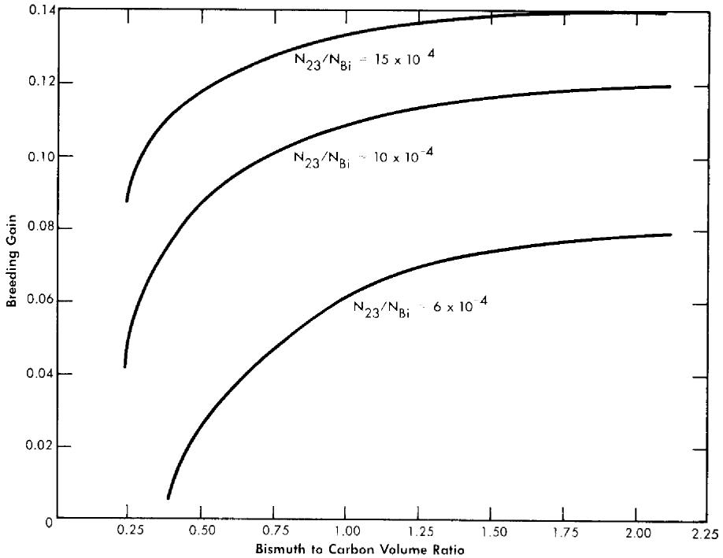  
FIG. 24-1. Breeding gain vs. bismuth-to-carbon volume ratio in core.

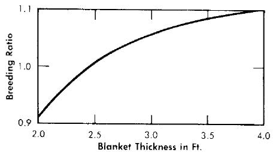  
FIG. 24-2. Breeding vs. blanket thickness for slurry-to-carbon volume ratio $= 1.00$ and bismuth to carbon volume ratio in core $= 1.00$ .

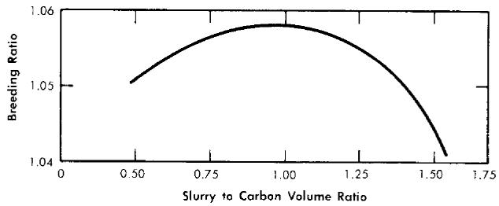  
FIG. 24.3. Breeding vs. slurry-to-carbon volume ratio in blanket for bismuth to carbon volume ratio = 1.00 and blanket thickness = 3 ft.

24-2.3 End blanket effects. A series of nuclear calculations were performed to determine the effects of end blanket design upon breeding ratio and critical fuel concentration. Two extreme blanket designs were considered. In the most optimistic case, a spherical core, equivalent to a 61-in.-diameter cylinder, was surrounded by a 3-ft spherical blanket. The pessimistic calculations assumed a cylindrical core with a diameter of 61 in., height equal to 1.5 times the diameter, a 3-ft radial blanket, and no end blanket. Critical values of fuel concentrations and breeding ratio were calculated for four power fractions in the blanket for each design.

All calculations were performed for hot, clean conditions with an average temperature of $900^{\circ}\mathrm{F}$ . A two-group, multiregion code was used to solve the diffusion equations, and a 37-group spectral code was used to determine the two-group nuclear constants. The results of these calculations are tabulated in Table 24-1. The breeding ratio is decreased 0.20 to 0.25 by completely eliminating the end blankets. This is due primarily to the added neutron leakage out the ends of the core, despite the fact that the core height is increased. Although the critical mass of fuel in the core is higher without end blankets, the fuel concentration is somewhat lower due to the increased core volume.

TABLE 24-1   
CRITICAL CALCULATIONS FOR TWO-FLUID LMFR WITH AND WITHOUT END BLANKETS   

<table><tr><td rowspan="2">Case</td><td colspan="2">N23/NBi×106</td><td rowspan="2">Ratio of blanket power to total power</td><td rowspan="2">Breeding ratio</td><td rowspan="2">Blanket thickness, ft</td><td rowspan="2">Geometry</td></tr><tr><td>Core</td><td>Blanket</td></tr><tr><td>I</td><td>559</td><td>152</td><td>0.0665</td><td>1.053</td><td>3.0</td><td>Full blanket</td></tr><tr><td>II</td><td>530</td><td>534</td><td>0.205</td><td>1.051</td><td>3.0</td><td>” ”</td></tr><tr><td>III</td><td>461</td><td>1600</td><td>0.445</td><td>1.039</td><td>3.0</td><td>” ”</td></tr><tr><td>IV</td><td>436</td><td>2100</td><td>0.515</td><td>1.033</td><td>3.0</td><td>” ”</td></tr><tr><td>V</td><td>403</td><td>1050</td><td>0.272</td><td>0.80</td><td>3.0</td><td>No end blanket</td></tr><tr><td>VI</td><td>366</td><td>2100</td><td>0.425</td><td>0.82</td><td>3.0</td><td>” ”</td></tr><tr><td>VII</td><td>347</td><td>2808</td><td>0.492</td><td>0.83</td><td>3.0</td><td>” ”</td></tr><tr><td>VIII</td><td>403</td><td>1050</td><td>0.272</td><td>-</td><td>4.0</td><td>” ”</td></tr></table>

The actual core and blanket design is between the two extremes assumed in these calculations. The blanket can be extended beyond the end boundaries of the core, and a graphite reflector can cover the ends of the core except for the coolant inlet and outlet. Cooling becomes a serious design

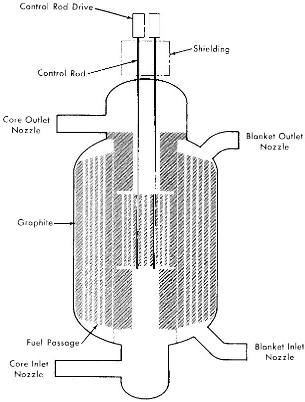  
FIG. 24-4. Two-region, externally cooled liquid metal fuel reactor.

problem, if the end reflector is replaced with blanket material. The design in Fig. 24-4 is a substantial improvement over no end blanket or reflector. However, further improvement in breeding ratio could be achieved with even better end blanket designs.

24-2.4 Power level in the blanket. For a given geometry, coolant-to-moderator ratio, and thorium concentration in the blanket, specification of the fraction of total fissions generated in the blanket establishes a unique set of values for fuel concentration in the blanket, fuel concentration in the core, and fissions generated in the core. For simplicity, the power generated in a region is assumed directly proportional to the fissions in that region. The data in Table 24-1 indicate that breeding ratio changes very little with large changes in the fraction of total power generated in the blanket. This increase in blanket power results in an increased ratio of resonance to thermal absorptions, a phenomenon which tends to offset the additional fast neutron leakage out of the blanket as blanket power increases.

An economic analysis of the effects of changing the blanket power fraction was performed to determine the optimum core-blanket power split under equilibrium operating conditions. The parameters affecting this choice are (1) fission-product poison levels in the blanket, (2) fission-product poison levels in the core, and (3) chemical processing costs.

Fission-product poisons in the blanket. The chemical processing of the blanket slurry accomplishes two things:

(1) The removal of bred $\mathrm{U}^{233}$ from the blanket system at a rate necessary to maintain the $\mathrm{U}^{233}$ concentration in the blanket slurry at some equilibrium value corresponding to the desired blanket power fraction.   
(2) The removal of fission products from the blanket slurry.

If the blanket processing cycle is determined by the minimum removal rate of $\mathrm{U}^{233}$ for steady-state operation, a corresponding poison level in the blanket is automatically set. If the blanket chemical processing cycle is determined by the poison level and is less than the cycle determined by the above criteria, the bred fuel removed from the blanket must be fed back into both core and blanket to maintain steady-state fuel concentrations. In this analysis the blanket processing cycle in all cases was assumed to be based on the minimum removal rate to maintain steady-state $\mathrm{U}^{233}$ concentrations without feeding fuel into the blanket system.

Chemical processing cycle for blanket slurry. The chemical processing was assumed to be performed continuously on the reactor site. Unless otherwise specified, the fluoride volatility process is utilized as described in Article 24-3.16. The chemical processing cycle for the blanket may be calculated [3] from the equation

$$
T _ {B} = \frac {Z _ {u} M _ {2 3} ^ {B} \left[ 1 + (Z _ {1 3 /} Z _ {u}) (b / a) \right]}{\beta P _ {t} \left[ (\mathrm {B R}) - \left(\frac {P _ {B}}{I _ {t} ^ {\prime}}\right) \right]},
$$

where

$T_{B} =$ blanket processing cycle, days,

$Z_{u} =$ removal efficiency for uranium $= 0.25$

$Z_{13} =$ removal efficiency for protactinium $= 0.04$

$M_{23}^{\mathrm{R}} = \mathrm{mass}$ of fuel in blanket system, kg,

$b_{i}a =$ ratio of $\mathrm{Pa^{233}}$ to $\mathrm{U}^{233}$ in blanket,

$\beta = \mathrm{kg}$ of fuel burned per Mwd $= 1.05(1 + \alpha_{23})$

$P_{t} =$ total power, $825\mathrm{Mw}$

$\mathrm{BR} =$ breeding ratio,

$P_B =$ blanket power, $\mathrm{Mw}$

and

$$
\frac {b}{a} = \frac {\sigma_ {a} ^ {2 3} (\text {e f f}) \phi_ {2} ^ {\mathrm {B S}} + \frac {Z _ {u}}{T _ {B}}}{\gamma_ {1 3}},
$$

where

$$
\begin{array}{r l} & {\sigma_ {a} ^ {2 3} \left(\mathrm {e f f}\right) = \mathrm {a n e f f e c t i v e a b s o r p t i o n c r o s s s e c t i o n t o a c c o u n t f o r r e s o n a n c e}} \\ & {\qquad \mathrm {a n d t h e r m a l a b s o r p t i o n i n U ^ {2 3 3}},} \end{array}
$$

$$
\begin{array}{l} \phi_ {2} ^ {\mathrm {B S}} = \text {a v e r a g e t h e r m a l f l u x o v e r t h e b l a n k e t s y s t e m}, \\ \gamma_ {1 3} \quad = \text {d e c a y c o n s t a n t f o r P a} ^ {2 3 3}. \\ \end{array}
$$

The poison level in the blanket depends upon $T_B$ , and $T_B$ is a function of $M_{23}^{\mathrm{B}}$ , $b / a$ , breeding ratio, and power fraction in the blanket. All these variables are interrelated. The ratio $b / a$ is a function of $T_B$ , but $T_B$ is a slowly varying function of $b / a$ due to the low value of $Z_{13} / Z_u$ (0.16). Breeding ratio is a slowly varying function of fission-product levels in the blanket due to the heavy loading of fuel and thorium in that region. The breeding ratio is sensitive to the poison level, and thus to the chemical processing rate, in the core fuel solution. An iterative calculation procedure was required to arrive at optimum values of $T_B$ , fission-product poison level in the blanket, and the power fraction in the blanket.

For a given chemical processing rate in the blanket, the fission-product poison level was determined from the data in KAPL 1226 [4]. Relative poisoning, RP, is defined as the absorptions in fission products per thermal fission in fuel, while the fission-product poison fraction is the absorptions in fission products per total absorption in fuel. Xenon and samarium are treated separately and are not included in the term fission products. The burnup, $F$ , in a region is defined as the atoms of fuel fissioned per atom present in the region. The burnup $F$ at time $T$ in the blanket is calculated from

$$
F = \frac {0 . 8 6 6 T (P _ {B /} / P _ {t})}{M _ {2 3} ^ {B}}.
$$

Using this relation, the relative poisoning in the blanket was determined for each processing cycle from a graph of RP versus $F$ [4]. The RP curve used is based upon high cross sections of all fission products with the exception of a low value for $\mathrm{Zr}^{93}$ .

Xenon in the blanket. Xenon is removed from the blanket by the degasser. Although the removal rate of fission-product gases cannot be determined until experimental information becomes available, a poison fraction of 0.01 was assumed for $\mathrm{Xe}^{135}$ .

Samarium in the blanket. The removal rate of samarium by chemical processing was neglected. The steady-state ratio of $\Sigma_{a}^{\mathrm{Sm}} / \Sigma_{a}^{233}$ , using appropriate thermal absorption cross sections, is determined by the relation

$$
\frac {\sum_ {a} ^ {\mathrm {S m}}}{\sum_ {a} ^ {2 3 3}} = 1. 4 2 \times 1 0 ^ {- 1 6} \overline {{\phi}} + 0. 0 1 2 6,
$$

where $\overline{\phi} =$ average thermal flux in the region of interest.

Fission-product poisons in the core. The level of fission products, FP, other than xenon and samarium, in the core is determined by the chemical processing cycle for the core fuel solution. The steady-state value of FP poisons in the core should be established by an economic balance between the value of improved breeding ratio and increased chemical processing costs. The relationship between the core processing cycle, $T_{c}$ , and the relative poison, RP, in the core may be expressed as

$$
\frac {d (\mathrm {R P})}{d F} = \frac {\mathrm {R P}}{F}
$$

and

$$
F = \frac {0 . 8 6 6 T _ {c} (P _ {e} / P _ {t})}{M _ {2 3} ^ {c}},
$$

where

$$
\frac {d (\mathrm {R P})}{d F} \text {i s} F [ 4 ],
$$

$$
M _ {2 3} ^ {c} = \mathrm {t o t a l m a s s o f U ^ {2 3 3}} \mathrm {i n t h e c o r e s y s t e m}.
$$

The xenon and samarium poisons in the core are determined as described for the blanket.

Economic optimization. An optimization study was performed to determine the most economic power split between core and blanket systems and fission-product poison level for the core during equilibrium operation. The fuel cost items which vary with these two parameters are (1) bismuth inventory, (2) fuel inventory, (3) fuel burnup, (4) thorium amortization, (5) thorium burnup, and (6) chemical processing. Nuclear calculations specified the fuel concentrations for both core and blanket and breeding ratios. These values were then used to determine the chemical processing cycle for the blanket and the pertinent costs.

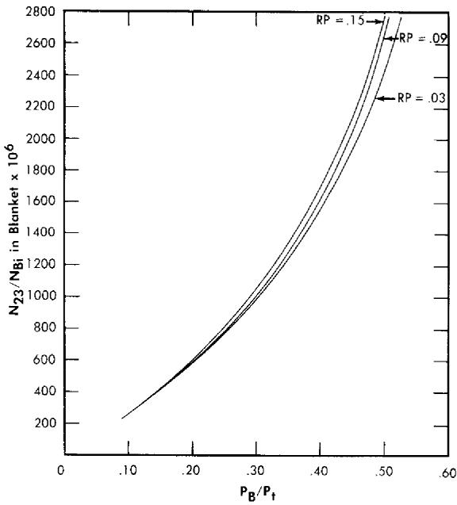  
FIG. 24-5. Fuel concentration in blanket vs. $P_B / P_t$ for two-fluid LMFR fully blanketed sphere.

Nuclear calculations. The values of the parameters investigated were

$$
R P (c o r e) = 0. 0 3, 0. 0 9, 0. 1 5,
$$

$$
{P _ {B} / P _ {t}} {= 0. 1 0 - 0. 5 0.}
$$

Since only a relative comparison was needed, all calculations were made with a spherical core and complete 3-ft spherical blanket. The xenon poison fraction was taken as 0.01, and the samarium steady-state value was computed for each region in each case.

The fission-product poison level in the blanket cannot be determined without first knowing the blanket processing cycle. As a first approach, the breeding ratio for the hot clean conditions was used to determine the cycle time from which the RP in the blanket was calculated as described previously. The relative poison levels determined on this basis were as follows:

<table><tr><td>\( \frac{{P}_{B}}{{P}_{t}} \)</td><td>RP (blanket)</td></tr><tr><td>10%</td><td>0.029</td></tr><tr><td>25%</td><td>0.048</td></tr><tr><td>50%</td><td>0.155</td></tr></table>

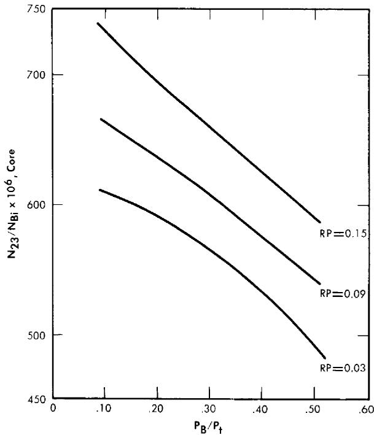  
FIG. 24-6. Fuel concentration in core vs. $P_B / P_t$ for two-fluid LMFR fully blanketed sphere.

All criticality calculations were performed using the specifications outlined in Article 24-2.2. Two-group diffusion theory was employed, and a two-group, multiregion code was used for solving the diffusion equations. As previously mentioned a 37-group spectral code was used to generate the two-group coefficients. The critical concentration of fuel in the core and blanket, breeding ratio, and neutron losses were determined for several power splits for each relative poison level in the core. The blanket power fraction values of 10, 33.3, and $50\%$ were used as reference values for comparison, and the important nuclear parameters were determined from a set of parametric curves for these precise values. (Cases actually calculated corresponded very closely to the desired blanket power in most calculations.)

The nuclear parameters corresponding to these power splits are summarized in Table 24-2. Figures 24-5 and 24-6 show the variation of $N_{23} \cdot N_{\mathrm{Bi}}$ in both the core and blanket as the blanket power fraction changes. This atom ratio of $\mathbf{U}^{233}$ to bismuth in the blanket ranges from $255 \times 10^{-6}$ to $2420 \times 10^{-6}$ for $P_B / P_t = 0.10$ to 0.50. In the core the $N_{23} \cdot N_{\mathrm{Bi}}$ ratio decreases approximately $20\%$ over the same range. The

TABLE 24-2   
RESULTS OF NUCLEAR CALCULATIONS FOR VARIOUS POWER SPLITS   

<table><tr><td>Case</td><td>PB/Pt</td><td>Relative poison in core</td><td>Relative poison in blanket</td><td>BR</td><td>1+α23</td><td>N23/NBi×106(core)</td><td>M23, kg</td><td>N23/NBi×106(blanket)</td><td>MB23, kg</td><td>Average thermal flux in core system</td><td>Average thermal flux in blanket system</td></tr><tr><td>I (a)</td><td>0.10</td><td>0.03</td><td>0.029</td><td>1.0256</td><td>1.132</td><td>620</td><td>368.7</td><td>255</td><td>53.2</td><td>5.77×1013</td><td>5.20×1013</td></tr><tr><td>(b)</td><td></td><td>0.09</td><td></td><td>1.007</td><td>1.132</td><td>664</td><td>395</td><td>255</td><td>53.2</td><td>5.15</td><td>4.97</td></tr><tr><td>(c)</td><td></td><td>0.15</td><td></td><td>0.978</td><td>1.132</td><td>732</td><td>435.4</td><td>255</td><td>53.2</td><td>4.425</td><td>467</td></tr><tr><td>II (a)</td><td>0.3333</td><td>0.03</td><td>0.0475</td><td>1.007</td><td>1.132</td><td>554</td><td>215.8</td><td>1150</td><td>317</td><td>7.13×1013</td><td>2.61×1013</td></tr><tr><td>(b)</td><td></td><td>0.09</td><td></td><td>0.993</td><td>1.132</td><td>599</td><td>233.5</td><td>1190</td><td>328</td><td>6.40</td><td>2.39</td></tr><tr><td>(c)</td><td></td><td>0.15</td><td></td><td>0.978</td><td>1.132</td><td>667</td><td>260</td><td>1230</td><td>334</td><td>5.71</td><td>2.23</td></tr><tr><td>III (a)</td><td>0.50</td><td>0.03</td><td>0.155</td><td>0.980</td><td>1.135</td><td>494</td><td>154.8</td><td>2420</td><td>834</td><td>7.62×1013</td><td>1.28×1013</td></tr><tr><td>(b)</td><td></td><td>0.09</td><td></td><td>0.959</td><td>1.135</td><td>542</td><td>170</td><td>2670</td><td>920</td><td>6.72</td><td>1.01</td></tr><tr><td>(c)</td><td></td><td>0.15</td><td></td><td>0.945</td><td>1.135</td><td>590</td><td>185</td><td>2760</td><td>951</td><td>6.19</td><td>0.97</td></tr></table>

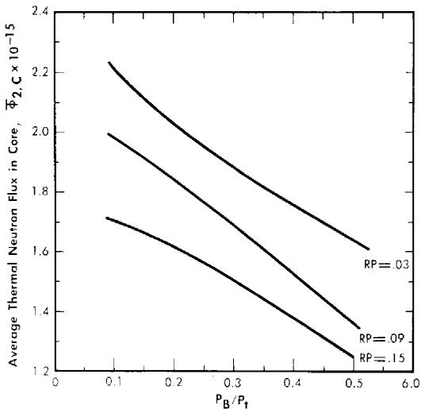  
FIG. 24-7. Average thermal flux in core vs. $P_B / P_t$ for two-fluid LMFR based on a fully blanketed sphere at 825 Mw.

values of the average thermal neutron flux in the core and blanket are graphed in Figs. 24-7 and 24-8, and BR in Fig. 24-9.

Bismuth inventory. The primary system volumes for $P_B / P_t = 0.33$ and 0.50 are based on a six-loop capsule design. Each loop contains a bismuth inventory of $245\mathrm{ft}^3$ . If $50\%$ of the power is generated in the blanket, three loops contain blanket slurry and three contain U-Bi core solution. If one-third of the power originates in the blanket, two loops are devoted to the blanket system and four to the core system. If only $10\%$ of the total power is generated in the blanket, a three-loop design is assumed for the core system, and two small loops of $125\mathrm{ft}^3$ each are used for the blanket. The reactor holdup has been estimated from the reactor drawing in Fig. 24-4. Fuel inventory volumes are summarized in Table 24-3.

Using the value of $2.25 / lb$ of bismuth, $12\%$ annual fixed charges, and a density of 613.5 lb/ft³ (9.83 g/cc), the annual bismuth inventory charges are

$$
C _ {1} (\mathrm {S y r}) = 1 6 5. 6 (V _ {\mathrm {c s}} + V _ {\mathrm {b s}}),
$$

where

$$
\begin{array}{l} \mathrm {l} _ {\mathrm {c s}} = \text {i n v e n t o r y v o l u m e o f c o r e s y s t e m , f t} ^ {3}, \\ V _ {\mathrm {b s}} = \text {i n v e n t o r y v o l u m e o f b l a n k e t s y s t e m}, \mathrm {f t} ^ {3}. \\ \end{array}
$$

Fuel inventory. Five days' holdup of fuel from both blanket and core is assumed for the chemical processing plant. $\mathrm{Pa}^{233}$ is held up for 135 days to allow for decay to $\mathrm{U}^{233}$ . Approximately $3\%$ of the $\mathrm{Pa}^{233}$ remains after 135 days and is discarded with the fission-product waste. This loss, while

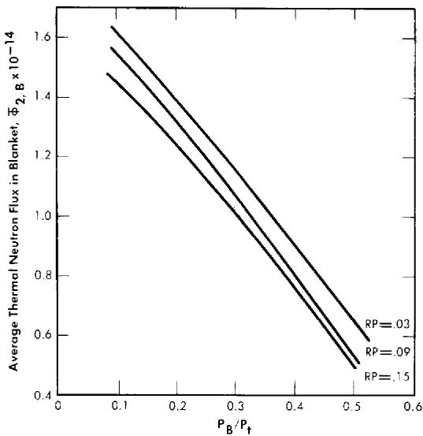  
FIG. 24-8. Average thermal flux in blanket vs. $P_B / P_t$ for two-fluid LMFR based on a fully blanketed sphere at 825 Mw.

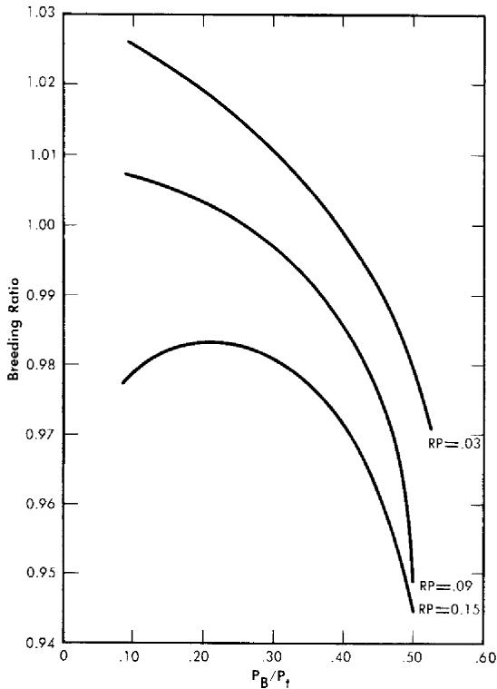  
FIG. 24-9. Breeding ratio vs. $P_B / P_t$ for two-fluid LMFR fully blanketed sphere.

TABLE 24-3 INVENTORY VOLUMES IN TWO-FLUID LMFR   

<table><tr><td></td><td>PB/Pt=0.10</td><td>Pt/Pc=0.333</td><td>Pt/Pc=0.50</td></tr><tr><td>Core system:</td><td></td><td></td><td></td></tr><tr><td>Reactor</td><td>275 ft3</td><td>275 ft3</td><td>275 ft3</td></tr><tr><td>External system</td><td>1640</td><td>980</td><td>735</td></tr><tr><td>Subtotal</td><td>1915</td><td>1255</td><td>1010</td></tr><tr><td>Blanket system:</td><td></td><td></td><td></td></tr><tr><td>Reactor</td><td>495</td><td>495</td><td>495</td></tr><tr><td>External system</td><td>250</td><td>490</td><td>735</td></tr><tr><td>Subtotal</td><td>745</td><td>985</td><td>1230</td></tr><tr><td>Total</td><td>2660</td><td>2240</td><td>2240</td></tr></table>

quite small, has been included with the fuel inventory charges, which may be expressed as

$$
\begin{array}{l} C _ {2} (\mathrm {S y r}) = 6 2 6 M _ {2 3} ^ {c} \left(1 + \frac {5}{T _ {c}}\right) + M _ {2 3} ^ {B} \left(1 + \frac {5}{T _ {w}}\right) + \frac {b}{a} M _ {2 3} ^ {B} \\ \left(1 + \frac {1 3 5 Z _ {1 3}}{T _ {B}}\right) + 3 0 + 1 3 2, 0 0 0 \frac {b}{a} \frac {M _ {2 3} ^ {B} Z _ {1 3}}{T _ {B}}. \\ \end{array}
$$

This equation assumes a 30-kg inventory of U233 feed material external to the reactor. The economic assumptions used in this equation are 4% fuel lease charges and a U233 price of $15.65/g.

Fuel burnup. The annual cost of the net $\mathrm{U}^{233}$ fuel burned in an 825-Mw reactor, assuming an $80\%$ plant factor, is

$$
C _ {3} (\$ / \mathrm {y r}) = 3. 9 6 \times 1 0 ^ {6} (1 + \alpha_ {2 3}) (1 - \mathrm {B R}).
$$

Thorium amortization charges. Assuming a cost of \(42/kg for thorium and an annual amortization rate of \(15\%\) based on a 20-yr life, the annual amortization charges for the thorium are

$$
C _ {4} (\$ / \mathrm {y r}) = 6. 3 M _ {0 2}.
$$

Thorium burnup. The thorium replacement costs due to burnup are calculated according to the equation

$$
C _ {5} (\$ / \mathrm {y r}) = 1 0, 6 2 0 (1 + \alpha_ {2 3}) \mathrm {B R}.
$$

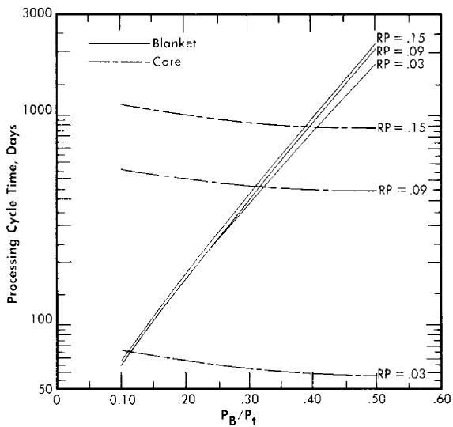  
FIG. 24-10. Chemical processing cycles vs. blanket power, based on a blanketed sphere with total reactor power of $825\mathrm{Mw}$ and the removal efficiencies of $Z_{u} = 0.25$ , $Z_{13} = 0.04$ , $Z_{\mathbf{FP}}^{\mathbf{B}} = 0.10$ , $Z_{\mathbf{FP}}^{\mathbf{C}} = 1.00$ .

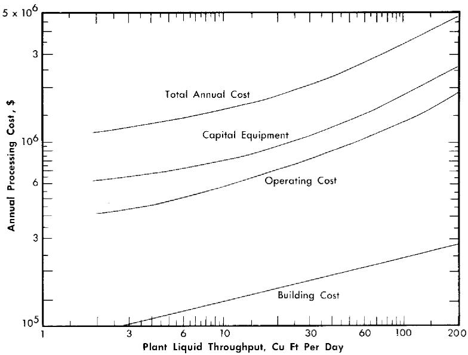  
FIG. 24-11. Annual fluoride volatility processing cost vs. plant throughput for 825-Mw-two-fluid LMFR.

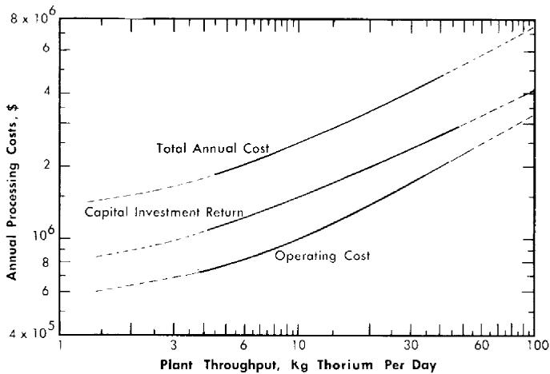  
FIG. 24-12. Annual aqueous processing costs vs. plant throughput for 825-Mw-two-fluid LMFR.

Chemical processing costs. The chemical processing cycle time for the blanket is determined by the $P_B / P_t$ ratio and the breeding ratio, as discussed in previous paragraphs. The processing rate for the core system is determined by the method also described previously; see Fig. 24-10. The total throughput to the fluoride volatility chemical separations plant is simply:

$$
\mathrm {T h r o u g h p u t (f t ^ {3} / d a y)} = \frac {V _ {\mathrm {c s}}}{T _ {c}} + \frac {V _ {\mathrm {b s}}}{T _ {B}}.
$$

The annual processing charges based on fluoride volatility can be read directly from Fig. 24-11, a plot of annual charges versus plant throughput.

As a matter of comparison, the chemical processing charges were also computed for each case, assuming on-site aqueous processing methods. The capacity and cost of an aqueous processing plant are determined by the amount of thorium per day which must be processed. The core solution processing does not enter into the cost unless the ratio of fuel to thorium presents criticality problems in the process equipment. This situation is likely to occur for the higher power levels in the blanket. This analysis did not take this possibility into account, however, and annual aqueous processing costs were taken directly from Fig. 24-12. This design plant capacity is $35\mathrm{kg}$ day of thorium feed.

Results of optimization. The bismuth inventory is slightly greater for the case of $P_B$ $P_t = 0.10$ than for the other two cases, because of the added primary system volume. Fuel inventory charges are not very sensitive to

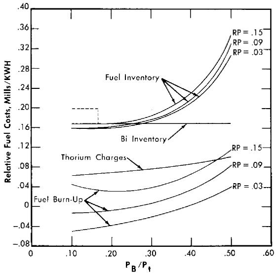  
FIG. 24-13. Relative fuel costs vs. blanket power for two-fluid LMFR based on a fully blanketed sphere operating at 825-Mw with a plant factor of $80\%$ .

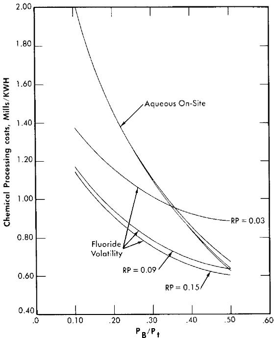  
FIG. 24-14. Chemical processing costs vs. blanket power. The cycle times are based on a blanketed spherical reactor with a total heat power of 825-Mw.

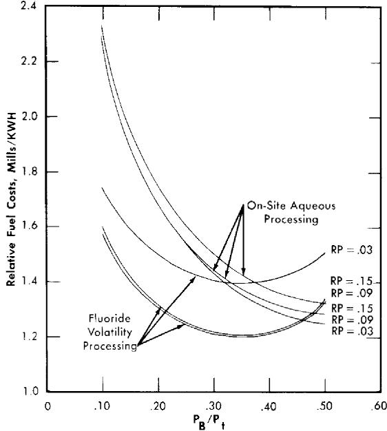  
FIG. 24-15. Relative fuel costs vs. blanket power for a blanketed spherical reactor operating at a total power of $825\mathrm{Mw}$ with a plant factor of $80\%$ .

the relative poison level in the core, but they increase sharply with an increase in power level (Fig. 24-13). Thorium charges increase linearly with blanket system slurry volume, and fuel burnup charges increase as $P_B / P_t$ increases, as shown in Fig. 24-13.

Chemical processing costs drop rapidly as the power fraction in the blanket increases. The increased processing rate required to maintain a steady-state fission-product relative poison level in the core of 0.03 results in a processing cost much higher than required for RP values greater than 0.09. The aqueous processing costs appear to become essentially equal to fluoride volatility costs at a value of $50\%$ for $P_B / P_t$ . Further analysis would be required to determine the validity of the aqueous processing cost curve for low throughput and high $N_{23} / N_{02}$ ratios encountered in the cases of high blanket power. The chemical processing costs are tabulated in Table 24-4 and shown graphically in Fig. 24-14.

The results of the economic comparisons are summarized in Table 24-5 and are graphed in Fig. 24-15. (RP on the graphs refers to the relative poison level of the fission products in the core.) Figure 24-15 shows that for all values of RP a minimum fuel cost occurs for a $P_B / P_t$ of approximately 0.33.

24-2.5 Selection of a reference design. The optimization study indicated that the most economic reactor design should produce one-third of

# TABLE 24-4

# CHEMICAL PROCESSING COSTS TWO-FLUID LMFR

<table><tr><td>Case</td><td>PB/Pt</td><td>Blanket process cycle, days</td><td>Slurry flow rate to chemical plant, ft3/day, Vbs/ TB</td><td>RP (core)</td><td>Tc, days</td><td>U-Bi flow to chemical plant, ft3/day, Vcs/ Tc</td><td>Chemical plant thru-output, ft3/day,</td><td>Fluoride volatility costs, $/yr × 10-6</td><td>Fluoride volatility costs, mills/kwh</td><td>TB(Zu=1)</td><td>Th/day to chemical plant, M02/ TB</td><td>Aqueous processing cost, $/yr × 10-6</td><td>Aqueous processing cost, mills/kwh</td></tr><tr><td>I (a)</td><td>0.10</td><td>16.26</td><td>45.8</td><td>0.03</td><td>75.8</td><td>25.3</td><td>71.1</td><td>3.03</td><td>1.37</td><td>65</td><td>325</td><td>4.20</td><td>1.90</td></tr><tr><td>(b)</td><td></td><td>16.59</td><td>44.9</td><td>0.09</td><td>557</td><td>3.44</td><td>48.3</td><td>2.57</td><td>1.17</td><td>66</td><td>320</td><td>4.15</td><td>1.88</td></tr><tr><td>(c)</td><td></td><td>17.08</td><td>43.6</td><td>0.15</td><td>1116</td><td>1.71</td><td>45.3</td><td>2.51</td><td>1.14</td><td>68</td><td>310</td><td>4.10</td><td>1.86</td></tr><tr><td>II (a)</td><td>0.3333</td><td>122.3</td><td>8.05</td><td>0.03</td><td>60</td><td>20.9</td><td>29.0</td><td>2.15</td><td>0.974</td><td>489</td><td>57.1</td><td>2.10</td><td>0.951</td></tr><tr><td>(b)</td><td></td><td>129</td><td>7.64</td><td>0.09</td><td>446</td><td>2.81</td><td>10.5</td><td>1.65</td><td>0.747</td><td>516</td><td>54.1</td><td>2.08</td><td>0.937</td></tr><tr><td>(c)</td><td></td><td>136.3</td><td>7.23</td><td>0.15</td><td>900</td><td>1.39</td><td>8.62</td><td>1.58</td><td>0.716</td><td>525</td><td>53.1</td><td>2.06</td><td>0.933</td></tr><tr><td>III (a)</td><td>0.50</td><td>444.5</td><td>2.77</td><td>0.03</td><td>56.5</td><td>17.9</td><td>20.7</td><td>1.95</td><td>0.883</td><td>1778</td><td>19.6</td><td>1.38</td><td>0.625</td></tr><tr><td>(b)</td><td></td><td>513</td><td>2.40</td><td>0.09</td><td>432</td><td>2.34</td><td>4.74</td><td>1.40</td><td>0.634</td><td>2052</td><td>17.0</td><td>1.32</td><td>0.598</td></tr><tr><td>(c)</td><td></td><td>547</td><td>2.25</td><td>0.15</td><td>854</td><td>1.18</td><td>3.43</td><td>1.33</td><td>0.602</td><td>2188</td><td>15.9</td><td>1.30</td><td>0.589</td></tr></table>

# TABLE 24.5

# RELATIVE FUEL COST FOR TWO-FLUID LMFR

# (WITH POISONS-BLANKETED SPHERE)

<table><tr><td rowspan="2">Case</td><td rowspan="2">PB/Pt</td><td rowspan="2">Bismuth 
inven-
tory, 
C1×10-3$/yr</td><td rowspan="2">Fuel 
inven-
tory, 
C2×10-3$/yr</td><td rowspan="2">Fuel 
burnup, 
C3×10-3$/yr</td><td rowspan="2">Thorium 
inven-
tory, 
C4×10-3$/yr</td><td rowspan="2">Thorium 
burnup, 
C5×10-3$/yr</td><td rowspan="2">Fluoride 
volatility 
process-
ing costs, 
Cp×10-3$/yr</td><td colspan="2">Total costs incl. 
fluoride vol.
proc.</td><td rowspan="2">Aqueous 
proc.
costs, 
Cp×10-3$/yr</td><td colspan="2">Total costs incl.
aqueous pro-
 cessing</td></tr><tr><td>Ct×10-3$/yr</td><td>Ct mills
kwh</td><td>Ct×10-3$/yr</td><td>Ct mills
kwh</td></tr><tr><td>I (a)</td><td>0.10</td><td>440</td><td>353</td><td>-116.5</td><td>133</td><td>12.3</td><td>3031</td><td>3852</td><td>1.75</td><td>4200</td><td>5022</td><td>2.28</td></tr><tr><td>(b)</td><td></td><td>440</td><td>353</td><td>-31.4</td><td>133</td><td>12.1</td><td>2570</td><td>3477</td><td>1.58</td><td>4150</td><td>5057</td><td>2.29</td></tr><tr><td>(c)</td><td></td><td>440</td><td>369</td><td>98.6</td><td>133</td><td>11.8</td><td>2510</td><td>3562</td><td>1.61</td><td>4100</td><td>5152</td><td>2.33</td></tr><tr><td>II (a)</td><td>0.3333</td><td>371</td><td>399</td><td>-31.4</td><td>176</td><td>12.1</td><td>2150</td><td>3077</td><td>1.39</td><td>2100</td><td>3027</td><td>1.37</td></tr><tr><td>(b)</td><td></td><td>371</td><td>407</td><td>31.4</td><td>176</td><td>11.9</td><td>1650</td><td>2647</td><td>1.20</td><td>2070</td><td>3067</td><td>1.39</td></tr><tr><td>(c)</td><td></td><td>371</td><td>429</td><td>98.6</td><td>176</td><td>11.8</td><td>1580</td><td>2666</td><td>1.21</td><td>2060</td><td>3146</td><td>1.44</td></tr><tr><td>III (a)</td><td>0.50</td><td>371</td><td>678</td><td>89.8</td><td>220</td><td>11.8</td><td>1950</td><td>3311</td><td>1.50</td><td>1380</td><td>2741</td><td>1.25</td></tr><tr><td>(b)</td><td></td><td>371</td><td>731</td><td>184.5</td><td>220</td><td>11.6</td><td>1400</td><td>2918</td><td>1.32</td><td>1320</td><td>2838</td><td>1.29</td></tr><tr><td>(c)</td><td></td><td>371</td><td>766</td><td>247</td><td>220</td><td>11.4</td><td>1330</td><td>2945</td><td>1.33</td><td>1300</td><td>2915</td><td>1.32</td></tr></table>

the total power in the blanket system and that the relative poison in the core due to fission products should be approximately 0.09. However, several effects must be considered in relating the optimum reactor to the actual operating reactor. A geometry more realistic than the fully blanketed sphere must be considered in establishing new specifications; effects of higher uranium isotopes, $\mathrm{Pa}$ losses, and control rods on breeding ratio must be taken into account; and a new chemical processing cycle for the blanket, along with a new fission-product poison level in the blanket, must be calculated based upon the adjusted breeding ratio.

Geometry effects. The inability to wrap a blanket around the ends of the core requires an adjustment to the parameters for the reference design based on the calculations with a full blanket. The axial leakage out of a bare ended core and a blanket with a height 1.5 times its diameter was calculated to be 0.18 neutron per absorption in fuel. An extension of the blanket length and the addition of partial end graphite reflectors are estimated to reduce the end leakage to one-half this value. The total neutron leakage, both fast and thermal, out of the partially blanketed reactor is estimated at 0.17 neutron per absorption in fuel.

The added length of core and blanket will slightly increase the critical mass, but the required $N_{23} / N_{\mathrm{Bi}}$ ratio will decrease slightly. In order to be conservative in the fuel inventory costs, however, the critical values of $N_{23} / N_{\mathrm{Bi}}$ for the fully blanketed sphere are assumed for both core and blanket.

Breeding ratio. Higher uranium isotopes. The higher uranium isotopes, primarily $\mathrm{U}^{234}$ , $\mathrm{U}^{235}$ , and $\mathrm{U}^{236}$ , continue to build up in both the core and blanket fuels throughout reactor life, since they cannot be separated in the chemical plant. The relative poison due to these isotopes, however, rises rapidly at first with the buildup of $\mathrm{U}^{236}$ but increases very slowly thereafter. The return from $\mathrm{U}^{235}$ fissions almost balances for losses to $\mathrm{U}^{234}$ and $\mathrm{U}^{236}$ [4]. An average poison fraction of 0.01 for the reactor is used for the reference design.

Protactinium losses. The equilibrium $\mathrm{Pa}^{233}$ concentration can be computed from the relationship

$$
N _ {1 3} ^ {B} = \frac {b}{a} N _ {2 3} ^ {B},
$$

using an effective thermal absorption cross section of $\mathrm{Pa}^{233}$ based on the calculated neutron spectrum in the blanket. The relative absorptions of the $\mathrm{Pa}^{233}$ are very small (0.005), but they are included.

Control rods. The self-regulating properties of an LMFR have not been established at this time. An allowance of 0.01 in relative absorptions is included to account for the possibility of using a regulating rod and a small

# REFERENCE DESIGN SPECIFICATIONS

# SPECIFICATIONS FOR EQUILIBRIUM OPERATION

Core:   

<table><tr><td>Thermal power</td><td>550 Mw</td></tr><tr><td>Electric power</td><td>210,000 kw</td></tr><tr><td>Diameter, inches</td><td>61</td></tr><tr><td>Height, inches</td><td>91.5</td></tr><tr><td>Fuel</td><td>U233</td></tr><tr><td>VBi/VC</td><td>1.22</td></tr><tr><td>N23/NBi</td><td>600 × 10-6</td></tr><tr><td>Mass of U233in system, kg</td><td>234</td></tr><tr><td>Total volume of fuel, ft3</td><td>1255</td></tr><tr><td>Breeding ratio, over-all</td><td>0.86</td></tr><tr><td>Chemical processing cycle, days</td><td>446</td></tr><tr><td>Volume flow rate through chemical plant, ft3/day</td><td>2.81</td></tr><tr><td>Mass flow rate through chemical plant, g U233/day</td><td>525</td></tr><tr><td>Average thermal flux in active core</td><td>1.6 × 1015</td></tr><tr><td>Average thermal flux in core system</td><td>6.4 × 1013</td></tr></table>

Blanket:   

<table><tr><td>Thermal power</td><td>275 Mw</td></tr><tr><td>Electric power</td><td>105,000 kw</td></tr><tr><td>Thickness, ft</td><td>3</td></tr><tr><td>Vsharry Vc</td><td>0.5</td></tr></table>

Surry content:   

<table><tr><td>Thorium (as Th3Bi5)</td><td>10% wt</td></tr><tr><td>Bi-muth</td><td>90% wt</td></tr><tr><td>N23-NBi (atom ratio)</td><td>1190×10-6</td></tr></table>

Mass of $\mathrm{[^{-233}~in}$ system, kg 328

Mass of thorium in system, kg 27,900

Total volume of fuel, ft3 985

Chemical processing cycle, days 200

Volume flow rate through chemical plant, ft3/day 4.91

Mass flow rate through chemical plant, kg of Th/day 140

amount of shim control for normal operation. Safety rods are included in the reference design but do not affect neutron economy.

Fission-product poisons. The adjustment of breeding ratio to correspond to the effects outlined above changes the required chemical processing cycle for the blanket system. This change in $T_{B}$ also changes the equilibrium

value of fission products in the blanket. Proper adjustments result in a blanket processing cycles of 200 days (assuming $Z_{u} = 0.25$ ) and a fission-product poison fraction in the blanket of 0.039 (RP in blanket $= 0.15$ ).

Neutron balance. The neutron losses proportional to one absorption in $\mathrm{C}^{233}$ are listed below:

<table><tr><td>Absorptions in: U233</td><td>1.000</td></tr><tr><td>Th</td><td>0.860</td></tr><tr><td>C</td><td>0.025</td></tr><tr><td>Bi</td><td>0.050</td></tr><tr><td>Xe135</td><td>0.010</td></tr><tr><td>Sm149</td><td>0.017</td></tr><tr><td>Fission products</td><td>0.073</td></tr><tr><td>Higher isotopes</td><td>0.010</td></tr><tr><td>Control rod</td><td>0.010</td></tr><tr><td>Pa233</td><td>0.005</td></tr><tr><td>Leakage</td><td>0.170</td></tr><tr><td>Total</td><td>2.230</td></tr></table>

# 24-3. SYSTEMS DESIGN

24-3.1 General. Systems design covers all of the reactor plant external to the reactor, except for chemical processing. The reactor plant includes the steam generator, but not the steam system or its auxiliaries. The principal purpose of the systems is to transport heat from the reactor and generate steam. They also provide supporting functions, such as shield cooling, uranium addition, etc.

The primary system consists of six heat transport loops, each consisting of a pump, a heat exchanger, check valve, and interconnecting piping. The hot-leg temperature is $1050^{\circ}\mathrm{F}$ ; the cold-leg temperature $750^{\circ}\mathrm{F}$ . In each of the intermediate heat exchangers, heat is transferred from the bismuth to the intermediate fluid, sodium. There are six intermediate heat transport loops, each containing a pump, steam generator, and interconnecting piping. The hot-leg temperature is $1010^{\circ}\mathrm{F}$ ; the cold-leg temperature $680^{\circ}\mathrm{F}$ . Steam is produced at 2100 psia, $1000^{\circ}\mathrm{F}$ .

Selection of the above parameters was a problem involving consideration of the steam plant as well as the reactor plant. The primary system temperatures were first fixed by using the largest $\Delta T$ considered likely to prove practical.

The temperature approach of the intermediate heat exchanger was set at $40^{\circ}\mathrm{F}$ , resulting in a sodium hot-leg temperature of $1010^{\circ}\mathrm{F}$ . To provide the close approach necessary for steam temperature stability, the steam temperature was set at $1000^{\circ}\mathrm{F}$ . A steam pressure of 2100 psig was picked to correspond with $1000^{\circ}\mathrm{F}$ .

Shifting the sodium cold-leg temperature redistributes heat-transfer surface between the intermediate heat exchanger and the steam generator. However, it seems desirable to favor making the intermediate heat exchanger small to cut down on fuel inventory. For this reason, the sodium cold-leg temperature was established at $680^{\circ}\mathrm{F}$ .

24-3.2 Plant arrangement. Plant arrangement starts with positioning the primary system relative to the reactor, and this is determined by seven principal considerations: (1) reactor design, (2) plant operation, (3) maintenance, (4) operational limitations of major components, (5) structural integrity of piping, (6) economics, and (7) safety.

A preliminary analysis of the two reactor concepts, single-fluid and two-fluid, resulted in the decision to use three external loops for the single-fluid and six for the two-fluid reactor. For both these alternates the maintenance philosophy selected was that of removal and replacement by horizontal transfer of a complete primary loop upon failure of any major component in the loop [5]. Thus, for arrangement purposes, the primary loops assume the shape of a rail-mounted horizontal containment vessel, or capsule, sized to contain all loop components. The height of the capsules relative to the reactor is dictated by an economic balance between height or elevation costs and pump net positive suction head.

The arrangement for the two-fluid reactor with six primary loops is shown in Figs. 24-16 and 24-17.

In plan, the primary loops were located radially around the reactor, Fig. 24-16. A minimum length of interconnecting pipe between the reactor and the loops was used because of high fuel inventory costs. This latter consideration ruled out shielding of any appreciable thickness between the reactor and the loops. Maintenance access doors and other shielding around the outside of the loops was sized for source conditions 6 to 8 hr after shutdown of the reactor to permit access by maintenance personnel at that time into the annular area.

With the primary loop arrangement established, the next problem was location of the intermediate system. Since this system is the connecting link between the primary systems and the steam turbines, it must be located between them. The turbine is above ground level for gravity drainage of condenser cooling water, and the primary loops are below ground level for economy of shield costs. The path taken by the intermediate system can be either a high-level path, immediately up from the primary system, or a low-level path, immediately down from the primary system, and then horizontally to an area outside the primary system area.

The intermediate system in this arrangement follows the high-level route to the steam plant. Sodium lines are brought straight up to an annular area around the reactor maintenance chamber. Since access to

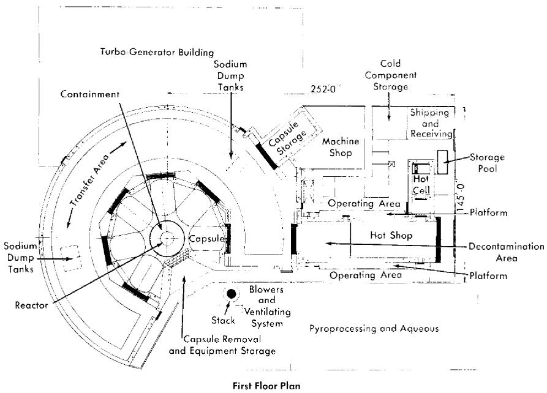  
FIG. 24-16. LMFR-6: Capsulate loop conceptual plant layout.

this chamber will not be permitted during reactor operation, a heavy shield wall is not required around the chamber.

Within this annulus are the sodium pumps and the steam generators. Final layout of this equipment will require considerable ingenuity, but it is feasible. Steam lines will cross the roof of the reactor building to the turbine building.

Because the primary loop hot maintenance shop for this concept serves such specialized functions, its usefulness for maintenance of chemical processing equipment is doubtful. Accordingly, the chemical processing facilities for this two-fluid six-loop plant, together with its supporting hot and conventional laboratories, fuel addition and other systems, are located in a separate building.

The turbine building is of conventional construction and will be in all essential respects identical for both plants.

Startup heating switch gear, gas heating and cooling systems for the reactor and dump tanks, inert gas storage systems, control rooms, and other auxiliaries are located relative to the above systems as logically as possible in the light of their functional requirements.

With respect to contamination control the basic philosophy is (1) controlled access to areas having different order of magnitude activity levels and (2) controlled circulation of ventilating air to assure flow from low-

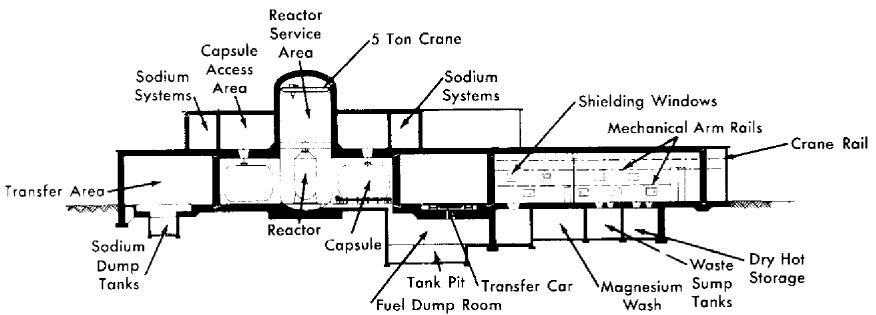  
FIG. 24-17. LMFR-6: Capsulate loop conceptual plant elevation.

to high-level activity areas. For guidance in achieving these objectives a rough scale of activity levels has been proposed, as follows:

Class $\neq 1$ conventional steam turbine plant, personnel monitored.

Class $\neq 2$ uncontaminated areas of nuclear plant, personnel monitored.

Class #3—potentially contaminated areas, personnel closely monitored; e.g., shield cooling, reactor and dump tank heating and cooling, hot shop operating area.

Class #4—low activity, accessible by closely monitored personnel only under favorable conditions; e.g., exhaust blower room, hot chemical laboratory.

Class #5—medium to high activity, accessible by closely monitored personnel only after executing standard decontamination procedures; e.g., hot maintenance shop.

Class #6—high activity, no access during life of plant except after extended shutdown and special decontamination; e.g., chemical processing and chemical hot cell.

Class #7—very high activity, no access by personnel during or after life of the plant; e.g., primary loop and reactor areas.

24-3.3 Primary system. The LMFR primary system is designed to remove up to $825\mathrm{Mw}$ of heat from the reactor. The primary system consists of six separate heat transport loops.

The fuel stream enters the bottom portion of the reactor vessel at a minimum bulk temperature of $750^{\circ}\mathrm{F}$ , and flows upward through the core, where fissions within the fuel cause the fluid to undergo a temperature rise of $300^{\circ}\mathrm{F}$ , resulting in a maximum fuel temperature of $1050^{\circ}\mathrm{F}$ . Upon leaving the core, the fluid passes upward to a degassing area, where volatile fission products are removed from the fuel stream. The reactor discharge consists of a header which splits the fuel flow into the primary heat-transport loops.

The primary loop piping, 20 in. in diameter, is sized to obtain a maximum fuel velocity of 10 fps.

From the degassing area discharge, each fuel stream flows to the suction of a variable speed centrifugal sump type pump. Each pump is designed to deliver about $9000\mathrm{gpm}$ at 20-ft head of pumped fluid. To obtain a reasonable pump speed, the net positive suction head requirement is 11.5 ft. A gas pressure (helium) is maintained over the pump sump to prevent flooding of upper parts (motor windings, cooling system, etc.) of the pump.

From pump discharge the fuel stream flows to the tube side of a U-tube U-shell intermediate heat exchanger in which the fuel stream gives up heat to the intermediate fluid, sodium. Upon discharge from the intermediate heat exchanger, the fuel solution flows into the reactor.

To meet safety requirements, the reactor and the major components of the primary loops are enclosed within containment vessels. The containment vessel which houses the pump and heat exchanger of each primary loop is a cylindrical capsule, 20 ft in diameter by 30 ft long, including 2:1 elliptical heads. The capsule is equipped with access holes such that certain maintenance operations may be performed [5]. The reactor containment vessel is a right circular cylinder 30 ft in diameter, with a hemispherical top head and a flat bottom head. Access holes are provided in the vessel for maintenance operations.

Each heat-transport loop is provided with four dump tanks which receive the loop and a portion of the reactor volumes. The tanks are sized and arranged to prevent a fast chain reaction. The primary loops are filled from the dump tanks by means of small electromagnetic pumps. These pumps also promise a means for agitation of the fuel.

Two dump lines, each with a maintainable valve, connect each loop with the dump tanks.

The bismuth charge system consists of a bismuth melt tank, filter, valves, and piping to the dump tanks.

The proposed material of construction exposed to primary fluid is $21\%$ Cr-1% Mo steel.

24-3.4 Intermediate system. The intermediate system, which also consists of six separate heat-transfer loops, utilizes sodium as the heat-transfer medium. All material of construction of the intermediate system, except the steam generator, is $2\frac{1}{4}\% \mathrm{Cr - 1\% Mo}$ steel. The steam generator, which is designed for high-pressure, high-temperature service, is constructed of type-304 stainless steel. The intermediate piping (12-in. schedule-30) is sized for a maximum sodium velocity of 17 fps.

Sodium flowing at 11,000 gpm enters the shell side of the intermediate heat exchanger (which is a U-tube, U-shell unit containing 2400 5/8-in.-OD

tubes with an average length of 21 ft) at $680^{\circ}\mathrm{F}$ , flows countercurrent to the fuel stream, and exits from the heat exchanger. Sodium flows to the suction of a variable speed centrifugal sump type pump. Each intermediate pump is designed to deliver 11,000 gpm at 180-ft head.

From pump discharge sodium flows to the shell side of the steam generator. The steam generator is a U-tube, U-shell "once-through" type unit which is constructed of type-304 stainless steel. The unit consists of 530 1/2-in.-OD tubes with an average length of 65 ft. The shell OD is 29 in. and the over-all length is 68 ft.

Sodium flows countercurrent to superheated steam, boiling water, and feedwater in the steam generator and gives up heat which produces $1,100,000\mathrm{lb/hr}$ of superheated steam at 2250 psig and $1000^{\circ}\mathrm{F}$ .

From the steam generator sodium flows to the intermediate heat exchanger inlet to complete the cycle.

In addition to the components listed above, auxiliary components are necessary to obtain proper function of the intermediate system. An expansion tank is located at the highest point of each intermediate loop. This tank serves as a cushion for pressure surges, a surge vessel for thermal expansion of sodium, and suction head for the pumps. The lowest point of each intermediate loop is connected by pipe and dump valves to a sodium dump tank which receives the inventory of the respective loop. Sodium is replaced in the loop by a small electromagnetic pump which takes suction from the bottom of the dump tank. A plugging indicator and a cold trap are provided to determine sodium oxide concentration and to maintain the oxide concentration at low levels.

In the event fission-product "hangup" occurs in the intermediate heat exchanger, fission product activity will generate heat within the metal. To prevent excessive metal temperatures, cooling must be provided when the unit is drained. This cooling is accomplished by providing removable sections of insulation which, when removed, will permit heat to be dissipated by radiation, conduction, and convection heat transfer. Flow control of the intermediate system will be by the variable speed pump drives. This method of control should provide a reasonably constant steam temperature and pressure.

24-3.5 Reactor heating and cooling system. The reactor must be preheated prior to operation and for outgassing purposes. The required temperature for outgassing the graphite is $1000^{\circ}\mathrm{F}$ . To achieve preheating, hot helium gas will be circulated through the close-fitting jacket or double containment which creates an annulus surrounding the reactor vessel. During the preheating phase, helium gas will be pumped from one of two blowers, pass through an electric resistance heater, be introduced at the bottom of the annulus, pass up around the reactor vessel giving up its

transported heat to the cooler surface, and return by ducting from the upper end of the containment to the blower suction.

When, for any reason, it becomes desirable to shut down the reactor and dump the primary system, reactor cooling must be provided to remove decay heat generated by fission-product hangup within the reactor after dump. This is necessary to prevent internal temperatures from exceeding design limits. The system as just described provides cooling by opening a valve to bring a finned tube helium-to-water heat exchanger into the cycle and by closing a stop valve to remove the gas heater from the gas flow path.

Helium system design pressure and temperature will be 5 psig and $1050^{\circ}\mathrm{F}$ . The entire loop is of all-welded construction to minimize helium leakage and leakage of volatile fission products should a rupture of the reactor vessel or piping give volatile fission products access to this loop.

24-3.6 Dump tank heating and cooling. When fuel is drained from the primary system into the dump tanks, fission-product decay produces heat within the fuel which must be removed to prevent dump tank metal temperatures from exceeding design limits.

Cooling is accomplished by circulating helium at 140 psig through a narrow annulus around each dump tank. Helium which has removed heat from the dump tanks passes through a finned-tube heat exchanger and gives up heat to river water. Circulation of helium is provided by six 14,000 cfm blowers, each rated to provide a head of 18-in. water. Three standby blowers are also provided. Helium piping is arranged such that four dump tanks are serviced by one blower.

To preheat the dump tanks and to maintain their temperature at a level such that fuel precipitation does not occur, electric heaters are paralleled with the heat exchanger such that the same piping system serves for heating or cooling. The heaters or heat exchangers may be brought into or taken off the cycle by valving.

24-3.7 Startup heating system. Prior to power operation, the LMFR heat-transport system must be preheated to about $800^{\circ}\mathrm{F}$ . The reactor and the primary dump tanks are preheated by electric furnaces and circulating helium. The remainder of the heat-transport systems, i.e., primary pipe, intermediate heat exchanger, intermediate piping, dump tanks, expansion tanks, steam generator, and the steam system pipe and components, are preheated by induction heaters.

Since $2\frac{1}{4}$ Croloy and stainless steel are nonmagnetic, a thin sheet of carbon steel will be required under areas where induction heaters are applied.

24-3.8 Primary inert gas system. Inert gas is used in the LMFR primary system to cover all free liquid metal surfaces and to provide a gas seal within the pumps.

Helium, by virtue of its very low activation cross section and inertness, is utilized as the cover and seal gas for the primary system. It is stored at 200 psig in a storage tank and is piped via pressure-reducing valves to the pump, dump tanks, and reactor. Since relatively small quantities of helium will be used, it is expected that waste helium will be discharged via the off-gas system to the stack.

Since commercial helium is sufficiently pure for use in an LMFR, no purification will be required.

24-3.9 Intermediate inert gas system. Nitrogen is used in the LMFR intermediate system to cover all free sodium surfaces and to provide a gas seal in the pump. It is stored at 200 psig in a storage tank and is piped via pressure-reducing valves to the pumps, expansion tanks, and the dump tanks. Used nitrogen is discharged to the stack.

Commercial nitrogen must be purified prior to use in the intermediate system. Purification is accomplished by bubbling nitrogen through several tanks containing NaK.

24-3.10 Shield cooling. The concrete surrounding the primary cells serves as a shield from the neutrons and gammas leaving the primary fluid. In the absorption of these neutrons and gammas, considerable heat is generated within the concrete. To hold temperatures and thermal gradients within the concrete to reasonable limits, a cooling system must be utilized. This cooling system consists of panel coils embedded about 6 in. within the concrete shield. High-purity water, flowing inside the panel coils, removes heat from the concrete and prevents temperature damage to the concrete.

The closed, high-purity loop which rejects heat to river water is designed for a maximum heat load of $6\mathrm{Mw}$ . One pump of 900-gpm capacity provides circulation for the closed water loop. Flow control valves proportion the flow to the various panels such that panel coil outlet temperatures are equal.

A dump tank for the closed loop (about $300\mathrm{ft}^3$ ) is located beneath the panel coils, so that the coils may be gravity drained. Water is returned to the closed loop by means of gas pressure. In the event it is necessary to dispose of the water in the closed loop, it may be drained from the dump tank to the radioactive waste disposal system.

24-3.11 Reactor cell cooling. Instruments located within the reactor containment vessel must be kept at a relatively low ambient temperature. To maintain the ambient temperature, a "fin fan" cooling unit is attached

to the containment vessel. Helium, which fills the containment vessel, is circulated by a blower located within the cooling unit. The circulating helium removes heat from the containment vessel and transports it to the finned coil, where it is transferred to water which is taken from and returned to the closed shield cooling circuit.

24-3.12 Capsule and reactor room cooling. The containment capsules and the reactor are located in a large room. The ventilation requirements of this area are dependent upon heat losses from the primary loop containment capsules.

Ventilation is provided by locating air intake louvers at several points around the room. An air fan provides circulation of air around the capsules and removes heat, which is discharged to the stack. A radiation monitor continuously monitors the air discharge. In the event radiation tolerance levels are exceeded by the air discharge, the cooling air will be recirculated to the reactor and capsule room until the source of radiation is determined.

24-3.13 Raw water system. The raw water system is the final waste heat sink for the entire plant. River water, which is screened and treated, is piped beneath the turbine-generator building. The systems which require river water, i.e., turbine condenser, shield cooling, reactor cooling, dump tank and pump cooling, take suction from this pipe and discharge to a similar one which returns the heated water to the river. Where possible, river water flows tube side in heat exchangers, to facilitate cleaning.

24-3.14 Instrumentation and control. The purpose of the control system in this plant is to provide safe and stable operation while following the loads imposed by the utility system. The plant follows the turbo generator. Loads on the turbo generator are set by the utility.

A load change will appear in the steam system as a change in throttle valve position and, therefore, a change in steam flow and pressure. The feedwater controllers at the inlet to the steam generators will sense these changes and operate to maintain steam pressure constant. The steam flow could also provide an anticipatory signal to the primary and intermediate system pumps to change their speed to suit the load.

The reactor will have a negative temperature coefficient of reactivity. Thus, it will try to maintain its average temperature constant during load changes. The temperature will change from time to time as reactivity changes. To take advantage of the negative temperature coefficient, the average temperature of the reactor will be set at a constant value.

Programming of flow rate in the primary and intermediate loop is uncertain. Cost estimates for pumps and control equipment were based on the premise that speed of the pumps would be varied. This might be necessary to avoid thermal stresses during transients.

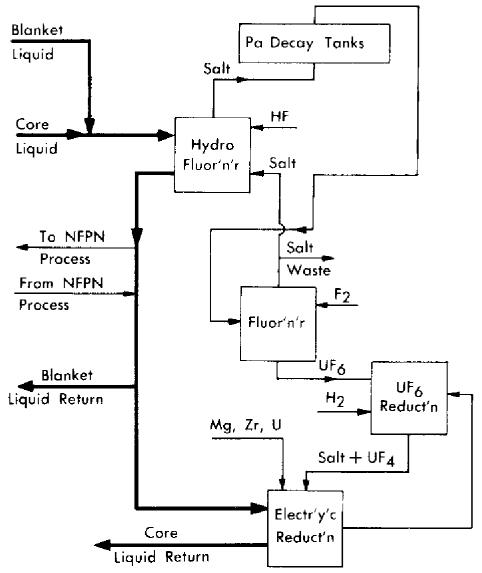  
FIG. 24-18. Fluoride volatility processing of core and blanket.

24-3.15 Maintenance. The maintenance of the reactor and primary system components will be completely remote, because of the high levels of radioactivity of the circulating fuel. The entire plant and reactor system are arranged for remote maintenance [5].

24-3.16 Chemical processing. The pyro process chosen for this economic study is the fluoride volatility method applied to a two-region reactor. Work of adapting this process to bismuth fuel processing is presently under way at Argonne National Laboratory. Figure 24-18 presents the main steps in this process. As shown, the process may be used for either blanket or core liquid. When the plant is processing core liquid the basic steps in this process are (1) hydrofluorination to oxidize uranium and some fission products, (2) transfer of the oxidized material to a fused salt phase, (3) fluorination of the salt carrying the uranium and fission products for separation of uranium as volatile $\mathrm{UF_6}$ , (4) reduction of the $\mathrm{UF_6}$ to $\mathrm{UF_4}$ by $\mathrm{H_2}$ in a fused salt phase, and (5) reduction of $\mathrm{UF_4}$ to uranium metal and transfer into the metal phase (bismuth).

The volatility method can be conveniently used to process a thorium bismuthide blanket. The process must be preceded by a phase separation step which separates the thorium bismuthide solids from the liquid carrier bismuth (Fig. 24-19). The modification of the core liquid process flowsheet is as follows: (1) salt effluent from the hydrofluorination step must be stored in order to achieve Pa decay to uranium, and (2) the bismuth liquid is returned to the blanket head end process without the addition of uranium.

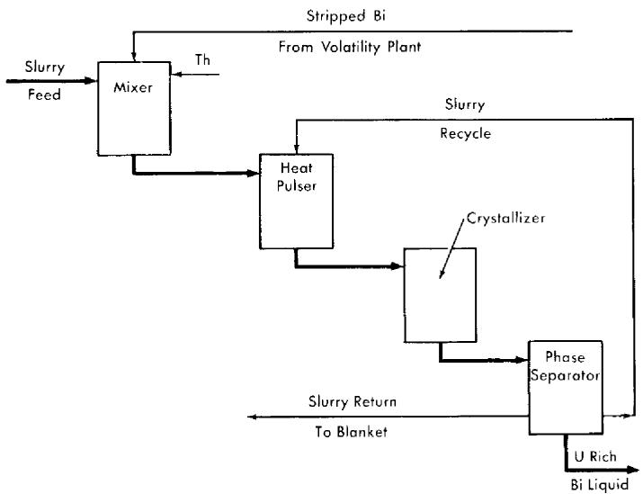  
FIG. 24-19. Head end processing, bismuthide slurry.

Certain of the fission products are not removed by volatility processing. These may be removed by zinc precipitation (Fig. 24-20). This process requires that the bismuth feed be free of uranium, and the volatility plant provides such a bismuth feed stream.

The head end process transfers bred uranium, protactinium, and fission products out of the solid phase portion of the slurry and into the liquid phase. After this step the two phases are partially separated. A liquid portion transferred to the volatility plant carries bred uranium, protactinium, and fission products with it for stripping with HF. The stripped liquid bismuth is returned to the head end plant for mixing with fresh slurry feed. The head end process is not $100\%$ efficient; i.e., the uranium and protactinium are not completely removed from the slurry before reconstitution and return to the blanket region. This problem has been examined in some detail and was taken into account in determining economics.

24-3.17 Turbine generator plant. A flow of 3,330,000 lb/hr of superheated steam at 2100 psi and $1000^{\circ}\mathrm{F}$ is delivered to the turbine. The generator has a gross output of 333,000 electrical kw, and the condenser removes $1.677 \times 10^{9}$ Btu/hr at 1.5 in. of mercury absolute, thus giving a gross heat rate of 8450 Btu/kwh. About 18,000 kw of electrical power is used for the various pumps and auxiliary systems in the plant, making the net output 315,000 kw. Therefore, the net heat rate is 8940 Btu/kwh, which corresponds to an efficiency of $38.2\%$ .

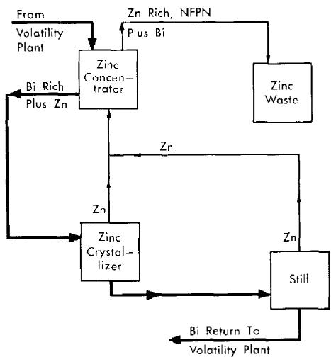  
FIG. 24-20. NFPN fission-product removal.

At full load there are 1,825,500 lb/hr of steam leaving the turbine and being condensed in the condenser. Also, 113,800 lb/hr of water from various parts of the cycle are being cooled by the condenser. The total head load on the condenser is $1.677 \times 10^{9}$ Btu/hr. The condenser cooling water enters one water box at $70^{\circ}\mathrm{F}$ and leaves the other at $80^{\circ}\mathrm{F}$ .

24-3.18 Off-gas system. The actual design and efficiency of any conceptual degasser are as yet unknown quantities, and a knowledge of these important details will have to wait until in-pile loops have provided sufficient data.

The off-gas system will consist of a cooler followed by a series of storage bottles. Gaseous fission products that have been separated from the liquid bismuth in the degasser are first sent through a cooler which offers a residence time of about a day, or enough for most of the short-lived isotopes to decay. From the cooler, the gasses are compressed into storage bottles, each capable of holding 30 days' accumulation. The storage bottles will each be $4.25\mathrm{ft}^3$ in volume, and at $212^{\circ}\mathrm{F}$ and 60 psia at the time of disconnection from the compressor.

Some sweep gas may be included in the above gas stream, but the present design philosophy indicates that no extra sweep gas should be required; however, if some sweep gas is required for efficient degasser operation, this gas could be obtained by a recycle of previously removed gas. This recycle sweep stream would most probably be taken from the storage bottles after sufficient cooling.

The gas in the storage bottles may be vented to the atmosphere after 90 days of storage, since then only the $\mathrm{Kr}^{85}$ activity is still present in appreciable amounts, and this can be released provided there is sufficient dilution. However, the most probable course of action will be to process the stored off-gas through a gas separation system, where the valuable $\mathrm{Kr}^{85}$ will be recovered.

# 24-4. SINGLE-FLUID REACTOR DESIGN

24-4.1 General description. The single-fluid LMFR concept has been investigated to determine the characteristics and economic attractiveness of this design. In general, the core consists of a large array of solid moderator blocks stacked to provide the desirable geometry of a cylinder. Vertical cylindrical channels are drilled through the moderator to allow circulation of the liquid metal slurry containing both the fuel and fertile material. The fission heat generated in the fuel-coolant stream is transported by forced convection to heat exchangers external to the reactor vessel. The unique feature of this concept is that only one coolant, the slurry, is used for removing heat from all parts of the reactor. The desired slurry-to-moderator ratio is achieved by selecting the appropriate combination of channel size and spacing.

24-4.2 General specifications. The general specifications for the system affecting reactor design are tabulated below:

<table><tr><td>Power</td><td>825 Mw (thermal)</td></tr><tr><td></td><td>315 Mw (electrical)</td></tr><tr><td>Slurry temperature:</td><td></td></tr><tr><td>Tin</td><td>750°F</td></tr><tr><td>Tout</td><td>1050°F</td></tr><tr><td>Maximum slurry velocity</td><td>10 fps</td></tr><tr><td>Fuel</td><td>U235 or U233</td></tr><tr><td>Fertile material</td><td>Thorium</td></tr><tr><td>Moderator material</td><td>Graphite or BeO</td></tr><tr><td>Slurry carrier</td><td>Bismuth or lead</td></tr><tr><td>Slurry-to-moderator ratio</td><td>Variable</td></tr><tr><td>Fertile material content in slurry</td><td>Variable</td></tr><tr><td>Core geometry</td><td>Cylinder</td></tr><tr><td>Core size</td><td>Variable</td></tr></table>

24-4.3 Parametric study. A parametric study was performed to determine the optimum nuclear parameters for a single-fluid concept. The variable parameters investigated and their range of values are:

Slurry-to-graphite ratio, $V_{s} / V_{c} = 0.05$ to 1.0,

Fertile material content, $\mathrm{g / kg}$ of $\mathrm{Bi} = 0$ to 80,

Equivalent bare reactor diameter, $D$ , ft = 10 to 20.

The choice of fuel for the first full-scale LMFR will depend upon the availability of $\mathrm{U}^{233}$ , which is much more attractive than $\mathrm{U}^{235}$ because of better neutron economy, and a sufficient quantity for fueling an LMFR may be available in 10 to 15 yr. In the early stages of this study, however, $\mathrm{U}^{235}$ was arbitrarily chosen as the fuel for the parametric study. The selection of the reference design should be valid for either fuel.

In each case the critical concentration and conversion ratio were determined by multigroup diffusion theory, using 37 neutron energy groups. To handle the large number of calculations, a digital computer was used once the range of values for the parameters was established by a series of criticality calculations by hand.

The use of BeO as a moderator has the advantage of reducing the core size because of improved slowing-down power compared with graphite. Critical size, fuel concentration, and breeding ratio were determined for one case, using BeO as moderator.

Since the cost of bismuth as a primary coolant is between $3,000,000 and $4,000,000, the inventory charges are a significant fraction of the total fuel costs. One case was calculated using lead as a coolant in order to compare the increase in inventory charges due to the use of bismuth with the loss in conversion ratio due to the absorptions in the lead.

Basis of nuclear calculations. To obtain comparative results, the following specifications were assumed for all cases:

Average temperature

862°F

Graphite density

1.80 g/cc

Bismuth density

9.83 g/cc

Geometry

Cylinder $(H = D)$

For consistency and ease of comparison, all calculations used equivalent bare reactor dimensions, except the calculation of reflector savings as a function of reflector thickness.

TABLE 24-6   
SUMMARY OF SINGLE-FLUID NUCLEAR CALCULATIONS   

<table><tr><td>Case</td><td>Thorium, g/kg Bi, W02</td><td>Vs/Vc</td><td>Bare equiv. core size, D = H, ft</td><td>Initial conversion ratio</td><td>N25/NBi, ×106</td></tr><tr><td>11144</td><td>0</td><td>0.5</td><td>14</td><td>0.00</td><td>153</td></tr><tr><td>11154</td><td>0</td><td>0.7</td><td>14</td><td>0.00</td><td>134</td></tr><tr><td>11164</td><td>0</td><td>1.0</td><td>14</td><td>0.00</td><td>120</td></tr><tr><td>11234</td><td>15</td><td>0.3</td><td>14</td><td>0.53</td><td>458</td></tr><tr><td>11232</td><td>15</td><td>0.3</td><td>10</td><td>0.43</td><td>621</td></tr><tr><td>11244</td><td>15</td><td>0.5</td><td>14</td><td>0.608</td><td>451</td></tr><tr><td>11254</td><td>15</td><td>0.7</td><td>14</td><td>0.65</td><td>481</td></tr><tr><td>11324</td><td>30</td><td>0.2</td><td>14</td><td>0.625</td><td>774</td></tr><tr><td>11325</td><td>30</td><td>0.2</td><td>17</td><td>0.666</td><td>706</td></tr><tr><td>11326</td><td>30</td><td>0.2</td><td>20</td><td>0.695</td><td>666</td></tr><tr><td>11334</td><td>30</td><td>0.3</td><td>14</td><td>0.692</td><td>772</td></tr><tr><td>11335</td><td>30</td><td>0.3</td><td>17</td><td>0.733</td><td>708</td></tr><tr><td>11336</td><td>30</td><td>0.3</td><td>20</td><td>0.760</td><td>671</td></tr><tr><td>11342</td><td>30</td><td>0.5</td><td>10</td><td>0.63</td><td>1181</td></tr><tr><td>11344</td><td>30</td><td>0.5</td><td>14</td><td>0.746</td><td>870</td></tr><tr><td>11345</td><td>30</td><td>0.5</td><td>17</td><td>0.788</td><td>794</td></tr><tr><td>11346</td><td>30</td><td>0.5</td><td>20</td><td>0.814</td><td>751</td></tr><tr><td>11424</td><td>50</td><td>0.2</td><td>14</td><td>0.735</td><td>1199</td></tr><tr><td>11425</td><td>50</td><td>0.2</td><td>17</td><td>0.780</td><td>1099</td></tr><tr><td>11426</td><td>50</td><td>0.2</td><td>20</td><td>0.801</td><td>1054</td></tr><tr><td>11434</td><td>50</td><td>0.3</td><td>14</td><td>0.788</td><td>1304</td></tr><tr><td>11435</td><td>50</td><td>0.3</td><td>17</td><td>0.817</td><td>1203</td></tr><tr><td>11436</td><td>50</td><td>0.3</td><td>20</td><td>0.843</td><td>1144</td></tr><tr><td>11444</td><td>50</td><td>0.5</td><td>14</td><td>0.787</td><td>1757</td></tr><tr><td>11445</td><td>50</td><td>0.5</td><td>17</td><td>0.827</td><td>1598</td></tr><tr><td>11446</td><td>50</td><td>0.5</td><td>20</td><td>0.854</td><td>1504</td></tr><tr><td>11514</td><td>80</td><td>0.05</td><td>14</td><td>0.565</td><td>2099</td></tr><tr><td>11524</td><td>80</td><td>0.2</td><td>14</td><td>0.804</td><td>1990</td></tr><tr><td>11525</td><td>80</td><td>0.2</td><td>17</td><td>0.840</td><td>1853</td></tr><tr><td>11526</td><td>80</td><td>0.2</td><td>20</td><td>0.865</td><td>1769</td></tr><tr><td>11534</td><td>80</td><td>0.3</td><td>14</td><td>0.816</td><td>2452</td></tr><tr><td>11535</td><td>80</td><td>0.3</td><td>17</td><td>0.849</td><td>2274</td></tr><tr><td>11536</td><td>80</td><td>0.3</td><td>20</td><td>0.875</td><td>2160</td></tr><tr><td>11544</td><td>80</td><td>0.5</td><td>14</td><td>0.747</td><td>4471</td></tr><tr><td>11545</td><td>80</td><td>0.5</td><td>17</td><td>0.788</td><td>3959</td></tr><tr><td>11546</td><td>80</td><td>0.5</td><td>20</td><td>0.851</td><td>3684</td></tr><tr><td>11435*</td><td>50</td><td>0.3</td><td>17</td><td>0.720</td><td>1531</td></tr><tr><td>11431†</td><td>50</td><td>0.3</td><td>8</td><td>0.680</td><td>1223</td></tr><tr><td>11433†</td><td>50</td><td>0.3</td><td>12</td><td>0.765</td><td>1032</td></tr><tr><td>11344‡</td><td>30</td><td>0.5</td><td>14</td><td>0.880</td><td>678</td></tr></table>

The resonance integral of the fertile material is a function of the scattering per atom, size of fuel channel, and lattice spacing. The channel size and lattice spacing, however, are not specified; therefore, the lattice resonance parameters are not known. A maximum value of the effective resonance integral is the homogeneous value based on the scattering in the core mixture per atom of fertile material. A minimum value of the resonance integral is the homogeneous value based on scattering in the slurry per fertile atom. For the cases using thorium, a value of $R_{02}$ (effective resonance integral) was chosen between the maximum and minimum values, and the calculated uncertainties are $\pm 20\%$ in the $N_{25} / N_{\mathrm{Bi}}$ ratio and $\pm 3.3\%$ in the conversion ratio.

Results of nuclear calculations. The results of the parametric study are summarized in Table 24-6 for all cases. The critical concentrations and conversion ratios for the cases using thorium as the fertile material are graphed in Figs. 24-21 through 24-25.

The notation used on all graphs have the following definitions:

$N_{25^{\circ}} / N_{\mathrm{Bi}} =$ atom ratio of $\mathrm{U}^{235}$ to bismuth.

$W_{02}$ $=$ thorium concentration in grams of $\mathrm{Th}^{232} / \mathrm{gBi}$ .

$V_{s}$ $V_{c} =$ volume ratio of slurry to graphite in core.

$D$ = the equivalent bare core diameter in feet.

In all cases, the fuel concentration increases with an increase in fertile material, $W_{02}$ (Fig. 24-24). An increase in $V_{s} / V_{c}$ increases the thorium content, reduces the slowing-down power, increases the average energy of the neutron spectrum in the core, and increases the thorium absorptions. As a result of these effects, the critical fuel concentration in the fluid fuel, $N_{25}$ , $N_{\mathrm{Bi}}$ ratio, increases as $V_{s} / V_{c}$ increases (Fig. 24-25).

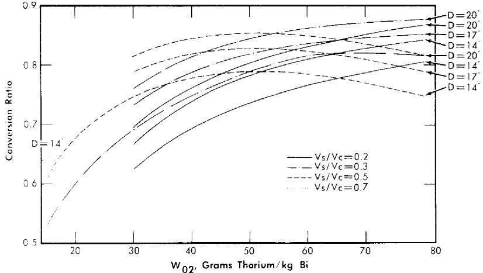  
FIG. 24-21. Conversion ratio vs. thorium concentration for a single-fluid LMFR.

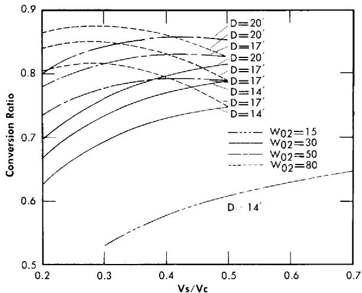  
FIG. 24-22. Conversion ratio vs. slurry-to-graphite volume ratio for a single-fluid LMFR.

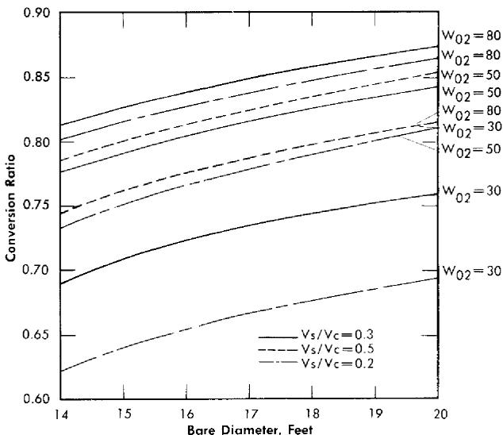  
FIG. 24-23. Conversion ratio vs. diameter for a bare single-fluid LMFR.

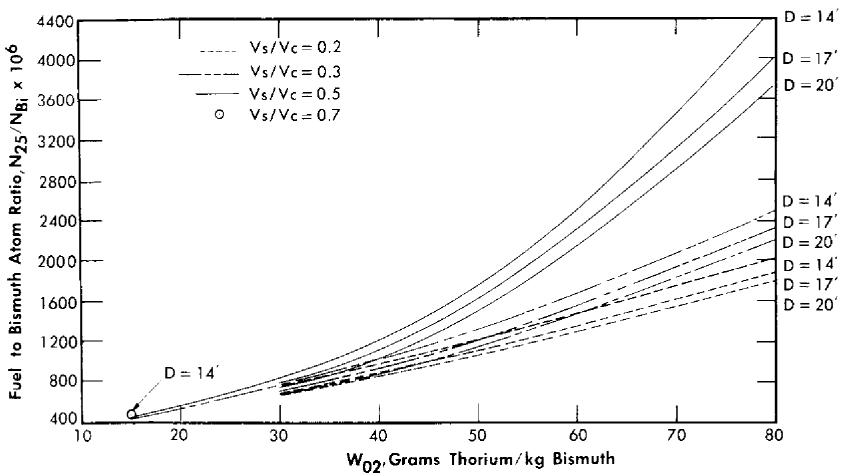  
FIG. 24-24. Critical fuel concentration vs. thorium concentration for single-fluid LMFR.

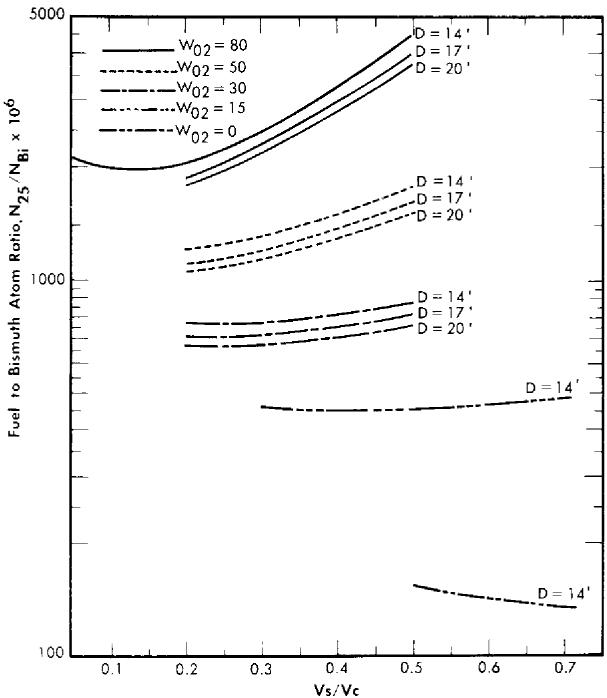  
FIG. 24-25. Critical fuel concentration vs. slurry-to-graphite volume ratio for a single-fluid LMFR.

The conversion ratio is highly dependent upon the $N_{02} / N_{25}$ ratio, the average energy of the neutron spectrum, and the reactor size. Figure 24-21 shows that for larger values of $V_{s} / V_{c}$ , the conversion ratio passes through a maximum as thorium concentration increases; however, for smaller values of $V_{s} / V_{c}$ , the conversion ratio increases continuously as $V_{s} / V_{c}$ increases over the range of interest; i.e., the maximum value of the conversion ratio shifts to higher values of $W_{02}$ as the $V_{s} / V_{c}$ ratio decreases. Likewise, the curves of conversion ratio versus $V_{s} / V_{c}$ go through a maximum, with the maximum value occurring at increasingly higher values of $V_{s} / V_{c}$ as $W_{02}$ increases (Fig. 24-22).

An increase in core diameter simply reduces the neutron leakage. As a result, the conversion ratio increases as the diameter increases. An increase in $D$ from 14 to 20 ft increases the CR approximately 0.09 (Fig. 24-23).

Case 11435 was recalculated using lead instead of bismuth as the coolant fluid. The conversion ratio decreased by 0.10, and the critical $N_{25} / N_{\mathrm{Bi}}$ ratio increased from $1203 \times 10^{-6}$ to $1531 \times 10^{-6}$ .

Beryllium oxide, BeO, was used as moderator in another variation of Case 11435. This calculation, case 11433, for a diameter of 12 ft, requires an $N_{25} / N_{\mathrm{Bi}}$ ratio of $1032 \times 10^{-6}$ and yields the slightly lower conversion ratio of 0.77.

The worth of a pure graphite reflector was calculated for Case 11-435. The reflector savings as a function of reflector thickness are shown in Fig. 24-26. The reflector savings are approximately equal to the reflector thicknesses for reflectors less than 2 ft thick.

The values of conversion ratio and $N_{25} / N_{\mathrm{Bi}}$ ratio calculated in this parametric study are for hot, clean reactor conditions, and they are used for comparative purposes only. The effects of fission-product poisons, control rods, and $\mathrm{Pa}^{233}$ losses have not been included.

24-4.4 Economic optimization. The selection of parameters for a reference design must be based upon economics. An economic optimization was accomplished by computing relative energy costs based on those variable costs which depend upon the parameters selected. The costs which are dependent upon the nuclear parameters are (1) bismuth inventory, (2) fuel inventory, (3) fuel burnup, (4) thorium inventory, (5) thorium burnup, (6) reactor core and vessel, and (7) chemical processing costs.

Reactor cost. Since the range of reactor sizes varies from 10 to 20 ft, reactor cost is an important variable. Reactor vessel, graphite, and erection costs have been estimated for several sizes; to these is added $167,000 for three control rods and miscellaneous hardware. Contingency and engineering of $44\%$ were also assumed. A breakdown of these costs is listed in Table 24-7.

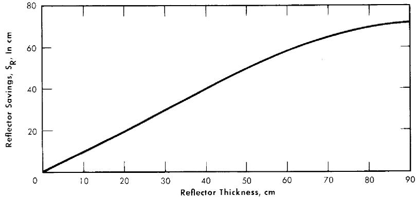  
FIG. 24-26. Reflector savings vs. reflector thickness for a single-fluid LMFR. These data are obtained from case 11435, where $V_{s}V_{c} = 0.3$ , $W_{02} = 50\mathrm{g / kg}$ , and $D_{B} = 17$ .

TABLE 24-7 ESTIMATED SINGLE-FLUID REACTOR COST  

<table><tr><td>Size, ft</td><td>Reactor</td><td>Graphite</td><td>Misc.</td><td>Erection</td><td>Total</td><td>Total cost</td><td>$/yr</td></tr><tr><td>10</td><td>160,000</td><td>350,000</td><td>167,000</td><td>24,000</td><td>701,000</td><td>1,009,440</td><td>151,400</td></tr><tr><td>14</td><td>380,000</td><td>970,000</td><td>167,000</td><td>30,000</td><td>1,547,000</td><td>2,227,680</td><td>334,152</td></tr><tr><td>17</td><td>570,000</td><td>1,700,000</td><td>167,000</td><td>35,000</td><td>2,472,000</td><td>3,559,680</td><td>533,952</td></tr><tr><td>20</td><td>900,000</td><td>2,800,000</td><td>167,000</td><td>40,000</td><td>3,907,000</td><td>5,627,080</td><td>843,912</td></tr></table>

Bismuth inventory charges. The bismuth inventory is determined by the primary system volume external to the reactor vessel, the volume of bismuth in the core, the volume of bismuth external to the core but inside the reactor vessel, and the holdup external to the reactor system. The primary system external to the reactor vessel is made up of three heat-exchanger loops containing a total volume of $1640\mathrm{ft}^3$ . The volume of bismuth in the core is

$$
V _ {\mathrm {B i}} ^ {c} = V _ {r} \frac {V _ {s} / V _ {c}}{1 + V _ {s} / V _ {c}}, \text {w h e r e} V _ {r} = \text {c o r e v o l u m e}
$$

The volume of bismuth external to the core and inside the reactor vessel is tabulated in Table 24-8.

No additional holdup is included to account for temperature expansion during startup, fuel feed system, and other sources of bismuth inventory. The assumption used throughout this study that the volume of bismuth is equal to the volume of slurry accounts for an additional 3 to $10\%$ excess bismuth due to the $\mathrm{ThO_2}$ content of the slurry.

TABLE 24-8 BISMUTH INVENTORY IN REACTOR VESSEL EXTERNAL TO CORE   

<table><tr><td>Core diameter, ft</td><td>Bi inventory, ft3</td></tr><tr><td>10</td><td>550</td></tr><tr><td>14</td><td>600</td></tr><tr><td>17</td><td>650</td></tr><tr><td>20</td><td>700</td></tr></table>

The density of bismuth is taken as $9.83\mathrm{g / cc}$ , and the price is assumed to be $\$2.25/$ lb. Bismuth is a nondepreciating capital investment with a $12\%$ annual amortization rate. The annual bismuth inventory charges may be represented by the equation

$$
C _ {1} (\mathrm {\S / y r}) = 0. 1 2 (2. 2 5) \left[ V _ {r} \frac {V _ {s} / V _ {c}}{1 + V _ {s} / V _ {c}} + V _ {p} \right] \rho_ {\mathrm {B i}},
$$

where

$$
V _ {p} = \text {t o t a l p r i m a r y s y s t e m v o l u m e e x c e p t c o r e , f t} ^ {3},
$$

$$
\rho_ {\mathrm {B i}} = \text {d e n s i t y} \mathrm {b i s m u t h}, \mathrm {l b / f t ^ {3}}.
$$

Fuel inventory charges. The annual lease charges on the $\mathrm{U}^{235}$ are assumed to be $4\%$ . Treating $\mathrm{Pa}^{233}$ as fuel, the annual fuel inventory charges can be expressed as

$$
C _ {2} (\$ / \mathrm {y r}) = 0. 0 4 V _ {2 5} \bar {M} _ {2 5} + V _ {2 3} \bar {M} _ {2 3} + V _ {1 3} \bar {M} _ {1 3},
$$

where

$$
V _ {2 3} = V _ {1 3} = \text {v a l u e o f} U ^ {2 3 3} \text {a s f u e l},
$$

$$
V _ {2 5} = \text {v a l u e o f U} ^ {2 3 5} \text {a s f u e l}, \S 1 7, 7 6 0 / \mathrm {k g},
$$

$$
\begin{array}{c} \overline {{M}} _ {j} = \text {a v e r a g e m a s s o f e l e m e n t j i n e n t i r e r e a c t o r s y s t e m} \\ \text {d u r i n g l i f e o f p l a n t}. \end{array}
$$

To simplify the work in the absence of information concerning average values of fuel mass, the total mass of fuel was considered to be the hot, clean critical loading at startup. The value of $\overline{M}_{25}$ is taken as the initial value with $\overline{M}_{23}$ and $\overline{M}_{13}$ taken as zero.

Fuel burnup costs. Using U235 as fuel, the yearly burnup costs are

$$
C _ {3} (\mathrm {s} / \mathrm {y r}) = 1 7. 7 6 (2 9 2) P \beta (1 - \overline {{\mathrm {C R}}}),
$$

where

$$
P = \text {p o w e r}, 8 2 5 \mathrm {M w},
$$

$$
\beta = \text {g r a m s} \quad \text {f u e l} \quad \text {b u r n e d p e r M w D}, 1. 2 5,
$$

$$
\overline {{\mathrm {C R}}} = \text {a v e r a g e c o n v e r s i o n r a t i o}.
$$

The initial value of the conversion ratio is used, since only relative costs are needed.

Thorium burnup costs. Thorium is periodically replenished in the reactor to maintain the desired concentration in the slurry. The thorium burnup costs may be expressed as

$$
C _ {4} (\mathbb {S} / \mathrm {y r}) = V _ {0 2} P \beta \overline {{{\mathrm {C R}}}} (2 9 2),
$$

where V02 = value of thorium, $42/kg. These costs are very small, approximately $10,000/yr, and are neglected.

Chemical processing costs. The chemical processing is assumed to use solvent extraction aqueous chemistry in a central processing plant. The irradiated fuel is removed from the reactor on a batch processing cycle. The processing costs are represented by

$$
C _ {P} = 2 9 2 \left[ 9 5. 8 7 5 \frac {M _ {0 2}}{T} + 4 7 9 5 \frac {M _ {2 3} ^ {*} (T)}{T} + \frac {2 5 0 , 0 0 0}{T} + 5 9 6 \right],
$$

where

$$
M _ {0 2} = \text {t o t a l}
$$

$$
M _ {2 3} ^ {*} (T) = M _ {2 3} + M _ {1 3} \text {a t t i m e} T \text {a f t e r l o a d i n g o f f u e l c h a r g e , k g},
$$

$$
T = \text {c h e m i c a l p r o c e s s i n g c y c l e t i m e , d a y s}.
$$

Results of economic optimization. Since chemical processing costs are very sensitive to the chemical processing cycle time and the optimum cycle time may vary with reactor design, the relative energy cost of each reactor design was determined neglecting the chemical processing costs. The results of this study are tabulated in Table 24-9 and are shown graphically in Figs. 24-27 and 24-28.

The pure burner, $W_{02} = 0$ , shows costs more than twice as high as several of the more attractive concepts (Fig. 24-28). In general, the minimum

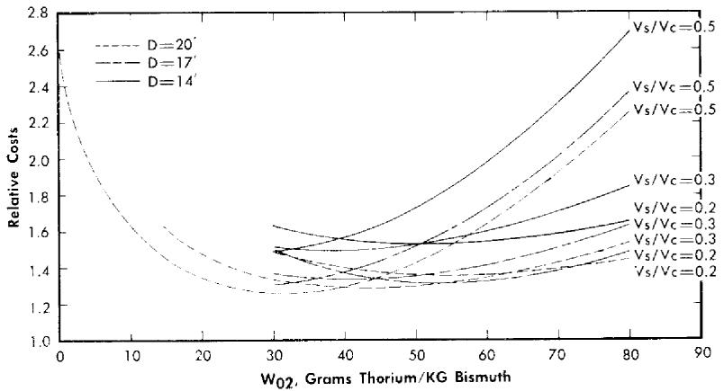  
FIG. 24-27. Relative cost vs. thorium concentration for a single-fluid LMFR.

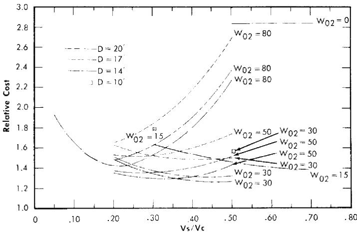  
FIG. 24-28. Relative cost vs. slurry-to-graphite volume ratio for a single-fluid LMFR.

costs are achieved with thorium loadings corresponding to $W_{02} = 20$ to $50 \, \mathrm{g/kg}$ . The most attractive designs do not have the highest values of conversion ratio.

In many cases the additional fuel inventory charges and reactor vessel costs corresponding to higher conversion ratios more than offset the reduction in fuel burnup costs. The economically optimum reactor is neither a burner nor a converter with maximum conversion ratio, but somewhat between these extremes.

Using a cost of $18\phi/\mathrm{lb}$ for lead as a coolant, comparisons of lead versus Bi as a coolant were made for Case 11435. The annual fixed charges on lead were only $\$44,000$ compared with $\$478,000$ for bismuth in this case;

however, the increased fuel burnup and inventory charges associated with the lead coolant resulted in a net increase of \(288,000/yr or 0.14 mills/kwh in the fuel cost. BeO is not feasible as a moderator material for this concept because of its high cost. Fixed charges on the BeO alone add almost a mill/kwh to the fuel cost.

The six most attractive cases were selected and the chemical processing costs computed for several processing cycle times. The total costs tabulated in Table 24-10 are based on a 3000-day cycle time, and other costs are from Table 24-9. Since the aqueous processing costs are dependent upon the total thorium inventory to be processed, chemical processing costs penalize the designs with heavy thorium loadings. In Tables 24-9 and 24-10, the total costs are reduced to mills/kwh by using an electrical power output of 315 Mw with an $80\%$ plant factor.

24-4.5 Selection of a reference design. Using the data presented in Table 24-40, a design was selected for further study. It is important to realize that when chemical processing costs are included in the comparison of energy costs, there is little difference in the cheapest four or five cases. The relative attractiveness of these cases depends very heavily on the economic ground rules. Even a change in chemical processing cycle may change the relative order of the cases. With the wide range of freedom for choice of nuclear parameters in this concept, the economic optimum can be chosen to correspond to any set of basic assumptions on economies. For example, an increase in fuel price would emphasize higher conversion ratios. The design selected for further study was Case 11344.

Time study. The nuclear performance of the reference design, Case 11344, was determined using a thorium lifetime program written for the digital computer. These calculations provided information concerning the variations of fission-product poisons, breeding ratio, and critical fuel mass as functions of reactor operating time. This information then made possible the choice of an optimum fuel processing cycle and the determination of overall fuel cost for the operating reactor.

Basis of time study. The reference design calculations used U $^{233}$ as fuel for both the initial charge and feed material. Since the contemplated construction date for an LMFR is 10 yr in the future, the assumption that U $^{233}$ fuel will be available seems reasonable, and data based on U $^{233}$ allows comparison with previous work [2].

The reference design on which the time studies were based has a graphite side reflector 1.5 ft thick, an active core diameter of 11 ft, and a core height of 14 ft. The average core temperature is $900^{\circ}\mathrm{F}$ . The nuclear constants used in the two-group criticality and isotope buildup calculations were determined by using a 40-group spectral code.

TABLE 24-9   
RELATIVE ENERGY COSTS FOR SINGLE FLUID LMFR  

<table><tr><td>Case</td><td>Initial conversion ratio</td><td>N25/NBi, ×106</td><td>W02</td><td>Vs/Vc</td><td>D(bare), ft</td><td>Bismuth inventory, C1×10-3,S/yr</td><td>Fuel inventory, C2×10-3,S/yr</td><td>Fuel burnup, C3×10-3,S/yr</td><td>Thorium inventory, C4×10-3,S/yr</td><td>Reactor core and vessel, C6×10-3,S/yr</td><td>CT×10-3,S/yr</td><td>CT,mills/kwh</td></tr><tr><td>11144</td><td>0</td><td>153</td><td>0</td><td>0.5</td><td>14</td><td>444</td><td>91</td><td>5348</td><td>0</td><td>334</td><td>6217</td><td>2.82</td></tr><tr><td>11154</td><td>0</td><td>134</td><td>0</td><td>0.7</td><td>14</td><td>461</td><td>83</td><td>5348</td><td>0</td><td>334</td><td>6226</td><td>2.82</td></tr><tr><td>11164</td><td>0</td><td>120</td><td>0</td><td>1.0</td><td>14</td><td>480</td><td>77</td><td>5348</td><td>0</td><td>334</td><td>6240</td><td>2.83</td></tr><tr><td>11232</td><td>0.432</td><td>621</td><td>15</td><td>0.3</td><td>10</td><td>377</td><td>310</td><td>3039</td><td>60</td><td>151</td><td>3937</td><td>1.78</td></tr><tr><td>11234</td><td>0.530</td><td>458</td><td>15</td><td>0.3</td><td>14</td><td>421</td><td>256</td><td>2516</td><td>67</td><td>334</td><td>3594</td><td>1.63</td></tr><tr><td>11244</td><td>0.609</td><td>451</td><td>15</td><td>0.5</td><td>14</td><td>444</td><td>265</td><td>2093</td><td>71</td><td>334</td><td>3207</td><td>1.45</td></tr><tr><td>11254</td><td>0.647</td><td>481</td><td>15</td><td>0.7</td><td>14</td><td>461</td><td>293</td><td>1890</td><td>73</td><td>334</td><td>3052</td><td>1.38</td></tr><tr><td>11324</td><td>0.625</td><td>774</td><td>30</td><td>0.2</td><td>14</td><td>407</td><td>411</td><td>2007</td><td>130</td><td>334</td><td>3289</td><td>1.49</td></tr><tr><td>11325</td><td>0.666</td><td>706</td><td>30</td><td>0.2</td><td>17</td><td>451</td><td>415</td><td>1784</td><td>143</td><td>534</td><td>3327</td><td>1.51</td></tr><tr><td>11326</td><td>0.695</td><td>666</td><td>30</td><td>0.2</td><td>20</td><td>512</td><td>445</td><td>1632</td><td>163</td><td>844</td><td>3596</td><td>1.63</td></tr><tr><td>11334</td><td>0.692</td><td>772</td><td>30</td><td>0.3</td><td>14</td><td>421</td><td>424</td><td>1645</td><td>134</td><td>334</td><td>3958</td><td>1.34</td></tr><tr><td>11335</td><td>0.733</td><td>708</td><td>30</td><td>0.3</td><td>17</td><td>478</td><td>442</td><td>1427</td><td>152</td><td>534</td><td>3033</td><td>1.37</td></tr><tr><td>11336</td><td>0.760</td><td>671</td><td>30</td><td>0.3</td><td>20</td><td>560</td><td>490</td><td>1284</td><td>178</td><td>844</td><td>3356</td><td>1.52</td></tr><tr><td>11342</td><td>0.628</td><td>1181</td><td>30</td><td>0.5</td><td>10</td><td>421</td><td>256</td><td>2516</td><td>67</td><td>151</td><td>3411</td><td>1.55</td></tr><tr><td>11344</td><td>0.746</td><td>870</td><td>30</td><td>0.5</td><td>14</td><td>444</td><td>504</td><td>1358</td><td>141</td><td>334</td><td>2780</td><td>1.26</td></tr><tr><td>11345</td><td>0.788</td><td>794</td><td>30</td><td>0.5</td><td>17</td><td>523</td><td>541</td><td>1136</td><td>166</td><td>534</td><td>2901</td><td>1.31</td></tr><tr><td>11346</td><td>0.814</td><td>751</td><td>30</td><td>0.5</td><td>20</td><td>478</td><td>736</td><td>977</td><td>254</td><td>844</td><td>3303</td><td>1.50</td></tr><tr><td>11424</td><td>0.735</td><td>1199</td><td>50</td><td>0.2</td><td>14</td><td>407</td><td>624</td><td>1417</td><td>216</td><td>334</td><td>2998</td><td>1.36</td></tr><tr><td>11425</td><td>0.780</td><td>1099</td><td>50</td><td>0.2</td><td>17</td><td>451</td><td>633</td><td>1179</td><td>239</td><td>534</td><td>3036</td><td>1.38</td></tr><tr><td>11426</td><td>0.801</td><td>1054</td><td>50</td><td>0.2</td><td>20</td><td>512</td><td>690</td><td>1064</td><td>272</td><td>844</td><td>3381</td><td>1.53</td></tr><tr><td>11434</td><td>0.778</td><td>1304</td><td>50</td><td>0.3</td><td>14</td><td>421</td><td>702</td><td>1187</td><td>223</td><td>334</td><td>2868</td><td>1.30</td></tr><tr><td>11435</td><td>0.817</td><td>1203</td><td>50</td><td>0.3</td><td>17</td><td>478</td><td>736</td><td>977</td><td>254</td><td>534</td><td>2979</td><td>1.35</td></tr><tr><td>11436</td><td>0.843</td><td>1144</td><td>50</td><td>0.3</td><td>20</td><td>560</td><td>820</td><td>839</td><td>297</td><td>844</td><td>3359</td><td>1.52</td></tr><tr><td>11444</td><td>0.787</td><td>1757</td><td>50</td><td>0.5</td><td>14</td><td>444</td><td>997</td><td>1139</td><td>235</td><td>334</td><td>3149</td><td>1.43</td></tr><tr><td>11445</td><td>0.827</td><td>1508</td><td>50</td><td>0.5</td><td>17</td><td>523</td><td>1068</td><td>927</td><td>277</td><td>534</td><td>3330</td><td>1.51</td></tr><tr><td>11446</td><td>0.854</td><td>1504</td><td>50</td><td>0.5</td><td>20</td><td>637</td><td>1226</td><td>783</td><td>338</td><td>843</td><td>3828</td><td>1.73</td></tr><tr><td>11514</td><td>0.565</td><td>2099</td><td>80</td><td>0.05</td><td>14</td><td>381</td><td>993</td><td>2325</td><td>323</td><td>334</td><td>4256</td><td>1.93</td></tr><tr><td>11524</td><td>0.804</td><td>1990</td><td>80</td><td>0.2</td><td>14</td><td>407</td><td>1007</td><td>1051</td><td>345</td><td>334</td><td>3144</td><td>1.42</td></tr><tr><td>11525</td><td>0.840</td><td>1853</td><td>80</td><td>0.2</td><td>17</td><td>451</td><td>1038</td><td>857</td><td>382</td><td>534</td><td>3263</td><td>1.48</td></tr><tr><td>11526</td><td>0.865</td><td>1769</td><td>80</td><td>0.2</td><td>20</td><td>512</td><td>1126</td><td>724</td><td>434</td><td>844</td><td>3640</td><td>1.65</td></tr><tr><td>11534</td><td>0.816</td><td>2452</td><td>80</td><td>0.3</td><td>14</td><td>421</td><td>1284</td><td>986</td><td>357</td><td>334</td><td>3382</td><td>1.53</td></tr><tr><td>11535</td><td>0.850</td><td>2274</td><td>80</td><td>0.3</td><td>17</td><td>478</td><td>1352</td><td>803</td><td>406</td><td>534</td><td>3574</td><td>1.62</td></tr><tr><td>11536</td><td>0.875</td><td>2160</td><td>80</td><td>0.3</td><td>20</td><td>560</td><td>1504</td><td>671</td><td>475</td><td>844</td><td>4053</td><td>1.84</td></tr><tr><td>11544</td><td>0.747</td><td>4471</td><td>80</td><td>0.5</td><td>14</td><td>444</td><td>2462</td><td>1356</td><td>376</td><td>334</td><td>4972</td><td>2.25</td></tr><tr><td>11545</td><td>0.788</td><td>3959</td><td>80</td><td>0.5</td><td>17</td><td>523</td><td>2569</td><td>1132</td><td>444</td><td>534</td><td>5201</td><td>2.36</td></tr><tr><td>11546</td><td>0.815</td><td>3684</td><td>80</td><td>0.5</td><td>20</td><td>637</td><td>2912</td><td>990</td><td>541</td><td>844</td><td>5924</td><td>2.68</td></tr></table>

24-4]

SINGLE-FLUID REACTOR DESIGN

# TABLE 24-10

# RELATIVE FUEL COSTS INCLUDING CHEMICAL PROCESSING SINGLE FLUID LMFR

Assumed processing cycle $= 3000$ days

<table><tr><td>Case No.</td><td>W02</td><td>Initial CR</td><td>Vs/Vc</td><td>D(bare), ft</td><td>M02, kg</td><td>M25, kg</td><td>Chemical processing cost, CP×10-3/yr</td><td>Other cost, CT×10-3/yr</td><td>Total costs, 10-3/yr</td><td>Total costs, mills/kwh</td></tr><tr><td>11254</td><td>15</td><td>0.65</td><td>0.7</td><td>14</td><td>11,640</td><td>413</td><td>504</td><td>3052</td><td>3556</td><td>1.61</td></tr><tr><td>11334</td><td>30</td><td>0.69</td><td>0.3</td><td>14</td><td>21,268</td><td>597</td><td>681</td><td>2958</td><td>3639</td><td>1.65</td></tr><tr><td>11344</td><td>30</td><td>0.75</td><td>0.5</td><td>14</td><td>22,407</td><td>709</td><td>745</td><td>2780</td><td>3525</td><td>1.60</td></tr><tr><td>11345</td><td>30</td><td>0.79</td><td>0.5</td><td>17</td><td>26,407</td><td>762</td><td>808</td><td>2901</td><td>3709</td><td>1.68</td></tr><tr><td>11434</td><td>50</td><td>0.78</td><td>0.3</td><td>14</td><td>35,447</td><td>989</td><td>1000</td><td>2868</td><td>3868</td><td>1.75</td></tr><tr><td>11435</td><td>50</td><td>0.82</td><td>0.3</td><td>17</td><td>40,275</td><td>1036</td><td>1068</td><td>2979</td><td>4047</td><td>1.83</td></tr></table>

The neutron poisons due to fission products and higher uranium isotopes were calculated using the data by W. L. Robba et al. [4]. The xenon poisoning (absorptions in $\mathrm{Xe}^{135}$ to absorptions in fuel) was held at 0.01 throughout life, and $\mathrm{Sm}^{149}$ was allowed to reach steady state. The other fission-product poisoning corresponds to poison data labeled "less Xe and Sm with high cross sections except low $\mathrm{Zr}^{93}$ ." Due to lack of information, no resonance absorption by the fission products was considered. The neutron flux averaged over the entire primary system volume was used in all isotope and poison buildup computation, since this is a circulating fuel reactor.

Fuel was added at frequent time intervals to maintain $k_{\mathrm{eff}} \approx 1.01$ (assuming $1\%$ rod holddown). Thorium was added to the core with the fuel to maintain a constant thorium loading.

Results of time study. The study was carried to 2000 days of full-power operation. The mass of $\mathrm{U}^{233}$ fuel and the buildup of $\mathrm{Pa}^{233}$ are shown in Fig. 24-29, and the buildup of fission product poisons (other than $\mathrm{Xe}^{135}$ and $\mathrm{Sm}^{149}$ ) along with breeding ratio are graphed in Fig. 24-30. The fission-product poisons vary in an almost linear manner for burnups corresponding to 2000 to 6000 days. Other calculations have indicated that extrapolations (represented by dashed lines on Figs. 24-29 and 24-30) to 5840 days, the expected life of the plant, are reasonable.

The quantities necessary to evaluate the chemical processing costs for various processing cycles are average values of fuel mass and breeding ratio $(\overline{M}_{23}, \overline{M}_{13}$ , and $\overline{\mathrm{BR}})$ . The average value of $\overline{M}_{13}$ is approximately the steady-state value; $\overline{M}_{23}$ and $\overline{\mathrm{BR}}$ are shown in Figs. 24-29 and 24-30.

Selection of chemical processing cycle. The fuel costs which are dependent upon the chemical processing cycle are fuel inventory, fuel burnup, and processing charges. These charges were computed using formulas similar to those described in Article 24-4.4 but using data appropriate to $\mathbf{U}^{233}$ fuel. Equations giving costs in dollars per full power day are

Fuel inventory: $C_2$ (\$/day) = 2.143 ( $\overline{M}_{23} + \overline{M}_{13}$ )

Fuel burnup: $C_3$ (\$/day) = 15,250 (1 - BR)

Chemical processing:

$$
C _ {P} (\$ / \text {d a y}) = 9 5. 8 7 5 \frac {M _ {0 2}}{T} + 4 7 9 5 \frac {M _ {2 3} ^ {*} (T)}{T} + \frac {2 5 0 , 0 0 0}{T} + 5 9 6.
$$

The results of these calculations are tabulated in Table 24-11 and graphed in Fig. 24-31. This analysis indicates an economic optimum processing cycle of approximately 4000 full-power days. However, only a small penalty of slightly more than $200/day (less than 0.03 mills/kwh) is incurred by operating the reactor for its complete life (5840 full-power days) before sending the fuel to a chemical separations plant.

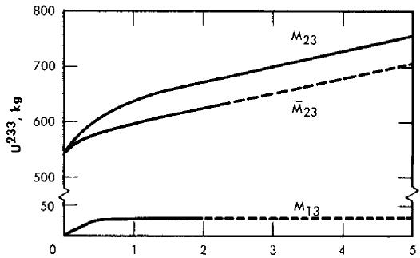  
Reactor Operating Time, In Full Power Days x 10-3   
FIG. 24-29. Mass of $\mathbf{U}^{233}$ vs. reactor operating time for a single-fluid reactor operating at $825\mathrm{Mw}$ .

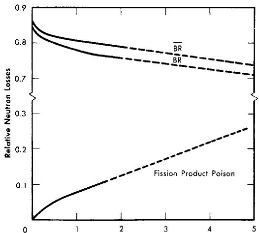  
FIG. 24-30. Neutron losses vs. reactor operating time for a single-fluid reactor operating at $825\mathrm{Mw}$   
Reactor Operating Time, In Full Power Days x 10-3

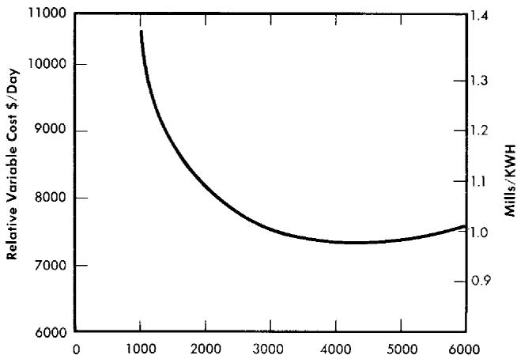  
Cycle Time, T, Full Power Days   
Mills/KWH   
FIG. 24-31. Variable fuel cost for 825-Mw single fluid LMFR vs. chemical processing cycle (aqueous batch process).

# TABLE 24-11

# VARIABLE FUEL COST FOR AN 825-MW LMFR

For various processing cycles

<table><tr><td>Chem. proc. cycle, days</td><td>M23(T)</td><td>M13(T)</td><td>M23(T)</td><td>M13(T)</td><td>M*23(T)</td><td>BR(T)</td><td>Fuel inven-tory charges, $/day</td><td>Fuel burnup costs, $/day</td><td>Chem. proc. costs, $/day</td><td>Total vari-able cost, $/day</td></tr><tr><td>6000</td><td>780</td><td>30</td><td>730</td><td>30</td><td>760</td><td>0.722</td><td>1690</td><td>4240</td><td>1,627</td><td>7,557</td></tr><tr><td>4000</td><td>725</td><td>30</td><td>675</td><td>30</td><td>705</td><td>0.755</td><td>1510</td><td>3738</td><td>2,101</td><td>7,349</td></tr><tr><td>2000</td><td>671</td><td>30</td><td>623</td><td>30</td><td>653</td><td>0.787</td><td>1400</td><td>3230</td><td>3,575</td><td>8,105</td></tr><tr><td>1000</td><td>635</td><td>30</td><td>595</td><td>30</td><td>625</td><td>0.807</td><td>1340</td><td>2943</td><td>6,184</td><td>10,470</td></tr><tr><td>500</td><td>603</td><td>30</td><td>578</td><td>30</td><td>608</td><td>0.820</td><td>1303</td><td>2746</td><td>16,467</td><td>15,500</td></tr></table>

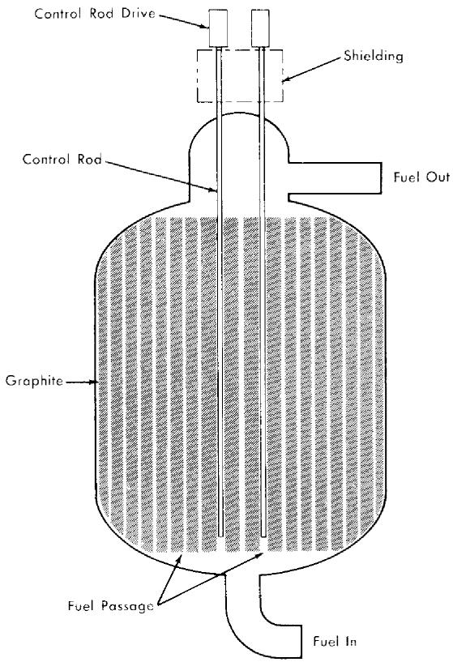  
FIG. 24-32. Single-region, externally cooled liquid metal fuel reactor.

Specifications of reference design. The single-region reactor design is illustrated in Fig. 24-32. The core is constructed of large blocks of high density reimpregnated graphite, with 1.5- to 2.0-in.-diameter axial holes for the passage of fuel slurry. The graphite is supported by a number of compensated molybdenum rods and a bottom support plate. Provision is made for three or four liquid metal control rods, if experience indicates they are necessary.

The reactor vessel is constructed of $2\frac{1}{4}\% \mathrm{Cr - 1\%}$ Mo steel, $2\frac{1}{4}$ inches thick, designed for a temperature of $1150^{\circ}\mathrm{F}$ and maximum pressure of 120 psi. Three 28-in.-diameter pipes carry the fluid into the reactor at the bottom and leave at the top. The entire reactor vessel is doubly contained by a relatively thin-walled containment vessel. A drain line to the fuel dump tanks is also provided. The free space above the reactor core is used as the degasser to remove volatile fission products. The reference core design has the following specifications:

# Power:

Thermal power 825 Mw

Net electrical power 315,000 kw

Station efficiency 38.2%

# Materials:

Fuel U233

Fertile material Thorium

Moderator High-den

Reflector High-density graphite

Coolant $\mathrm{UO_2 - ThO_2 - Bi}$ Slurry Coolant-to-moderator ratio, $V_{s} / V_{c}$ 0.5

Thorium concentration, $W_{02}$ 30 g/kg Bi

# Geometry:

Core radius 5.5 ft

Core height 14.0 ft

Reflector thickness 1.5 ft

Number of primary coolant loops 3

Fuel-slurry volume:

Coolant loops 1640 ft3

Reactor core 443

Reactor vessel 600

Total 2683 ft3

Chemical processing cycle 4000 days

# Nuclear data:

<table><tr><td></td><td>Startup</td><td>4000 days</td><td>Average</td></tr><tr><td>Mass U233</td><td>546 kg</td><td>725 kg</td><td>675 kg</td></tr><tr><td>Mass Pa233</td><td>0</td><td>30</td><td>30</td></tr><tr><td>Mass 233</td><td>546</td><td>755</td><td>705</td></tr><tr><td>Initial average core thermal flux</td><td></td><td></td><td>3 × 1014</td></tr><tr><td>Breeding ratio</td><td>0.87</td><td>0.725</td><td>0.75</td></tr><tr><td>Poison fraction</td><td>0</td><td>0.216</td><td></td></tr><tr><td>Mass of bismuth</td><td>1,646,000 lb</td><td></td><td></td></tr><tr><td>Mass of thorium</td><td>22,400 kg</td><td></td><td></td></tr></table>

# 24-5. ECONOMICS

Economic considerations were essential to the optimization studies required to establish the reference designs presented in Sections 24-2 and 24-4. An important objective of this study is the economic comparison of energy costs for the single-fluid and the two-fluid externally cooled LMFR. A brief summary of energy costs for the optimum design in each concept is presented in Table 24-12.

TABLE 24-12 ENERGY COST $(80\%)$ PLANT FACTOR)   

<table><tr><td rowspan="2"></td><td colspan="2">Mills/kwh</td></tr><tr><td>Single-fluid LMFR</td><td>Two-fluid LMFR</td></tr><tr><td>Fixed charges on total capital investment</td><td>4.09</td><td>4.31</td></tr><tr><td>Nuclear fuel and inventory costs</td><td>1.24</td><td>1.41</td></tr><tr><td>Maintenance</td><td>1.18</td><td>1.05</td></tr><tr><td>Operation</td><td>0.38</td><td>0.38</td></tr><tr><td>Interest on working capital</td><td>0.04</td><td>0.04</td></tr><tr><td>Total energy cost, mills/kwh</td><td>6.9</td><td>7.2</td></tr></table>

24-5.1 Fixed charges on capital investment. Direct construction costs. The estimated costs of equipment, installation of equipment, and construction are based on the plant layouts for the two reference designs evaluated in this study. Construction and erection costs of all items, as well as direct materials costs for those components manufactured by the Babcock & Wilcox Company, were developed by B&W estimators. Delivered costs of equipment supplied by manufacturers other than B&W were taken from vendors' quotations.

A summary of direct construction costs for each reference design is tabulated in Tables 24-13 and 24-14.

Total capital investment. The total capital investments are summarized according to account numbers in Tables 24-15 and 24-16.

24-5.2 Maintenance and operation. In computing energy costs, the fixed charges on maintenance equipment and spare parts are included in the maintenance costs, while fixed charges on buildings used for maintenance are included in fixed charges on capital investment.

24-5.3 Fuel costs. The fuel costs as presented in this report include (1) bismuth inventory, (2) fuel inventory, (3) fuel burnup, (4) thorium inventory, (5) thorium burnup, and (6) chemical processing. Sodium inventory is not included, since it is used as coolant fluid for the intermediate system and does not contain fuel. Fuel costs are summarized in Table 24-17.   
24-5.4 Summary of energy costs. The energy costs in mills/kwh, based upon an electric output of 315,000 kw and a plant factor of $80\%$ , are tabulated in Table 24-18 for various categories.

# TABLE 24-13

SUMMARY OF DIRECT CONSTRUCTION COSTS FOR SINGLE-FLUID LMFR  

<table><tr><td>Account no.</td><td></td><td>Direct labor</td><td>Direct materials</td><td>Direct construction cost</td></tr><tr><td rowspan="2">310</td><td>Land and land rights</td><td></td><td></td><td></td></tr><tr><td>Direct site</td><td></td><td>$500,000</td><td>$500,000</td></tr><tr><td rowspan="5">311</td><td>Structures and improvements</td><td></td><td></td><td></td></tr><tr><td>Improvements and miscellaneous structures</td><td>$78,000</td><td>126,000</td><td>204,000</td></tr><tr><td>Nuclear steam generator building</td><td>2,981,000</td><td>3,535,000</td><td>6,516,000</td></tr><tr><td>Accessory buildings</td><td>51,000</td><td>84,000</td><td>135,000</td></tr><tr><td>Total</td><td>3,110,000</td><td>3,745,000</td><td>6,855,000</td></tr><tr><td rowspan="13">312</td><td>Nuclear Steam Generator and Chemical Plant Equipment</td><td></td><td></td><td></td></tr><tr><td>Reactor</td><td>60,000</td><td>2,028,000</td><td>2,088,000</td></tr><tr><td>Primary and blanket system</td><td>309,000</td><td>1,470,000</td><td>1,779,000</td></tr><tr><td>Blanket system</td><td></td><td></td><td></td></tr><tr><td>Intermediate system</td><td>279,000</td><td>2,778,000</td><td>3,057,000</td></tr><tr><td>Steam system</td><td>125,000</td><td>1,629,000</td><td>1,754,000</td></tr><tr><td>Primary inert gas system (He)</td><td>5,000</td><td>22,000</td><td>27,000</td></tr><tr><td>Intermediate gas system (N2)</td><td>6,000</td><td>24,000</td><td>30,000</td></tr><tr><td>Reactor heating and cooling system</td><td>21,000</td><td>84,000</td><td>105,000</td></tr><tr><td>Dump tank heating and cooling systems</td><td>100,000</td><td>149,000</td><td>249,000</td></tr><tr><td>Primary system capsule area ventilating system</td><td>1,000</td><td>2,000</td><td>3,000</td></tr><tr><td>Primary system reactor cell cooling system</td><td>3,000</td><td>3,000</td><td>6,000</td></tr><tr><td>Shield cooling system</td><td>18,000</td><td>21,000</td><td>39,000</td></tr><tr><td></td><td>Water cooling system</td><td>3,000</td><td>7,000</td><td>10,000</td></tr><tr><td></td><td>Offgaz system</td><td>20,000</td><td>50,000</td><td>70,000</td></tr><tr><td></td><td>Feedwater heating system</td><td>286,000</td><td>2,541,000</td><td>2,827,000</td></tr><tr><td></td><td>Instrumentation and controls</td><td>599,000</td><td>1,236,000</td><td>1,835,000</td></tr><tr><td></td><td>Spare parts</td><td>110,000</td><td>2,666,000</td><td>2,776,000</td></tr><tr><td></td><td>Miscellaneous equipment</td><td>315,000</td><td>588,000</td><td>903,000</td></tr><tr><td></td><td>Inventorics</td><td></td><td>4,680,000</td><td>4,680,000</td></tr><tr><td></td><td>Chemical plant equipment</td><td>156,000</td><td>403,000</td><td>559,000</td></tr><tr><td></td><td>Total</td><td>2,416,000</td><td>20,381,000</td><td>22,797,000</td></tr><tr><td>314</td><td>Turbine Generator Equipment</td><td></td><td></td><td></td></tr><tr><td></td><td>Turbine and condensing</td><td>828,000</td><td>13,382,000</td><td>14,210,000</td></tr><tr><td>315</td><td>Accessory electrical equipment</td><td>400,000</td><td>2,484,000</td><td>2,884,000</td></tr><tr><td>316</td><td>Miscellaneous power plant equipment</td><td></td><td></td><td></td></tr><tr><td></td><td>Transmission structures</td><td>50,000</td><td>130,000</td><td>180,000</td></tr><tr><td></td><td>Maintenance equipment</td><td>172,000</td><td>2,921,000</td><td>3,093,000</td></tr><tr><td></td><td>Total</td><td>222,000</td><td>3,051,000</td><td>3,273,000</td></tr><tr><td>342-343</td><td>Station equipment</td><td>189,000</td><td>1,246,000</td><td>1,435,000</td></tr><tr><td></td><td>Total Direct Construction Cost</td><td></td><td></td><td>$51,954,000</td></tr></table>

TABLE 24-14   
SUMMARY OF DIRECT CONSTRUCTION COSTS FOR TWO-FLUID LMFR   

<table><tr><td>Account no.</td><td></td><td>Direct labor</td><td>Direct materials</td><td>Direct cost construction</td></tr><tr><td rowspan="2">310</td><td>Land and land rights</td><td></td><td></td><td></td></tr><tr><td>Direct site</td><td></td><td>$500,000</td><td>$500,000</td></tr><tr><td rowspan="5">311</td><td>Structures and improvements</td><td></td><td></td><td></td></tr><tr><td>Improvements and miscellaneous structures</td><td>$78,000</td><td>126,000</td><td>204,000</td></tr><tr><td>Nuclear steam generator building</td><td>3,184,000</td><td>4,035,000</td><td>7,219,000</td></tr><tr><td>Accessory buildings</td><td>51,000</td><td>84,000</td><td>135,000</td></tr><tr><td>Total</td><td>3,313,000</td><td>4,245,000</td><td>7,558,000</td></tr><tr><td rowspan="12">312</td><td>Steam generator and chemical plant equipment</td><td></td><td></td><td></td></tr><tr><td>Reactor</td><td>50,000</td><td>1,531,000</td><td>1,581,000</td></tr><tr><td>Primary and blanket system</td><td>436,000</td><td>1,788,000</td><td>2,224,000</td></tr><tr><td>Intermediate system</td><td>295,000</td><td>3,365,000</td><td>3,660,000</td></tr><tr><td>Steam system</td><td>250,000</td><td>1,949,000</td><td>2,199,000</td></tr><tr><td>Primary inert gas system (He)</td><td>8,000</td><td>34,000</td><td>42,000</td></tr><tr><td>Intermediate gas system (N2)</td><td>8,000</td><td>40,000</td><td>48,000</td></tr><tr><td>Reactor heating and cooling system</td><td>21,000</td><td>84,000</td><td>105,000</td></tr><tr><td>Dump tank heating and cooling systems</td><td>100,000</td><td>149,000</td><td>249,000</td></tr><tr><td>Primary system capsule area ventilating system</td><td>1,000</td><td>2,000</td><td>3,000</td></tr><tr><td>Primary system reactor cell cooling system</td><td>3,000</td><td>3,000</td><td>6,000</td></tr><tr><td>Shield cooling system</td><td>18,000</td><td>21,000</td><td>39,000</td></tr><tr><td></td><td>Water cooling system</td><td>3,000</td><td>7,000</td><td>10,000</td></tr><tr><td></td><td>Offgaz system</td><td>20,000</td><td>50,000</td><td>70,000</td></tr><tr><td></td><td>Feedwater heating system</td><td>290,000</td><td>2,546,000</td><td>2,836,000</td></tr><tr><td></td><td>Instrumentation and controls</td><td>765,000</td><td>1,547,000</td><td>2,312,000</td></tr><tr><td></td><td>Spare parts</td><td>72,000</td><td>2,000,000</td><td>2,072,000</td></tr><tr><td></td><td>Miscellaneous equipment and inventories</td><td>273,000</td><td>564,000</td><td>837,000</td></tr><tr><td></td><td>Inventories</td><td></td><td>4,289,000</td><td>4,289,000</td></tr><tr><td></td><td>Chemical plant equipment</td><td>540,000</td><td>1,461,000</td><td>2,001,000</td></tr><tr><td></td><td>Total</td><td>3,153,000</td><td>21,430,000</td><td>24,583,000</td></tr><tr><td>314</td><td>Turbine generator equipment</td><td></td><td></td><td></td></tr><tr><td></td><td>Turbine and condensers</td><td>828,000</td><td>13,382,000</td><td>14,210,000</td></tr><tr><td>315</td><td>Accessory electrical equipment</td><td>401,000</td><td>2,503,000</td><td>2,904,000</td></tr><tr><td>316</td><td>Miscellaneous power plant equipment</td><td></td><td></td><td></td></tr><tr><td></td><td>Transmission structure</td><td>50,000</td><td>130,000</td><td>180,000</td></tr><tr><td></td><td>Maintenance equipment</td><td>173,000</td><td>2,274,000</td><td>2,447,000</td></tr><tr><td></td><td>Total</td><td>223,000</td><td>2,404,000</td><td>2,627,000</td></tr><tr><td>342-343</td><td>Station equipment</td><td>189,000</td><td>1,246,000</td><td>1,435,000</td></tr><tr><td></td><td>Total Direct Construction Cost</td><td>$8,107,000</td><td>$45,710,000</td><td>$53,817,000</td></tr></table>

TABLE 24-15   
SUMMARY OF CAPITAL INVESTMENT FOR SINGLE-FLUID LMFR   

<table><tr><td>Account no.</td><td></td><td>Direct construction costs</td><td>Contingency</td><td>Miscellaneous charges*</td><td>Total capital investment</td></tr><tr><td>310</td><td>Land and land rights</td><td>$500,000</td><td>$0</td><td>$0</td><td>$500,000</td></tr><tr><td>311</td><td>Structures and improvements</td><td></td><td></td><td></td><td></td></tr><tr><td></td><td>Nuclear and turbogenerator plant</td><td>6,697,000</td><td>1,479,000</td><td>3,158,000</td><td>11,334,000</td></tr><tr><td></td><td>Chemical plant</td><td>158,000</td><td>34,000</td><td>71,000</td><td>263,000</td></tr><tr><td>312</td><td>Nuclear steam generating and chemical plant equipment</td><td></td><td></td><td></td><td></td></tr><tr><td></td><td>Nuclear plant equipment</td><td>14,782,000</td><td>2,733,000</td><td>3,436,000</td><td>20,951,000</td></tr><tr><td></td><td>Chemical plant equipment</td><td>559,000</td><td>112,000</td><td>188,000</td><td>859,000</td></tr><tr><td></td><td>Spare parts</td><td>2,776,000</td><td>479,000</td><td>418,000</td><td>3,673,000</td></tr><tr><td></td><td>Inventories</td><td>4,680,000</td><td>0</td><td>0</td><td>4,680,000</td></tr><tr><td>314</td><td>Turbine generator equipment</td><td>14,210,000</td><td>2,483,000</td><td>2,346,000</td><td>19,039,000</td></tr><tr><td>315</td><td>Accessory electrical equipment</td><td>2,884,000</td><td>531,000</td><td>655,000</td><td>4,070,000</td></tr><tr><td>316</td><td>Miscellaneous power plant equipment</td><td></td><td></td><td></td><td></td></tr><tr><td></td><td>Transmission structures</td><td>180,000</td><td>36,000</td><td>61,000</td><td>277,000</td></tr><tr><td></td><td>Maintenance equipment</td><td>3,093,000</td><td>539,000</td><td>505,000</td><td>4,137,000</td></tr><tr><td>342-343</td><td>Station equipment</td><td>1,435,000</td><td>263,000</td><td>318,000</td><td>2,016,000</td></tr><tr><td></td><td>Total</td><td>$51,954,000</td><td>$8,689,000</td><td>$11,156,000</td><td>$71,799,000</td></tr></table>

*Includes indirect construction cost, interest, and engineering charges.

# TABLE 24-16

SUMMARY OF CAPITAL INVESTMENT FOR TWO-FLUID LMFR   

<table><tr><td>Account no.</td><td></td><td>Direct construction costs</td><td>Contingency</td><td>Miscellaneous charges</td><td>Total capital investment</td></tr><tr><td>310</td><td>Land and land rights</td><td>$500,000</td><td>$0</td><td>$0</td><td>$500,000</td></tr><tr><td>311</td><td>Structures and improvements</td><td></td><td></td><td></td><td></td></tr><tr><td></td><td>Nuclear and turbogenerator plant</td><td>7,010,000</td><td>1,538,000</td><td>3,223,000</td><td>11,771,000</td></tr><tr><td></td><td>Chemical plant</td><td>548,000</td><td>119,000</td><td>247,000</td><td>914,000</td></tr><tr><td>312</td><td>Nuclear steam generating and chemical plant equipment</td><td></td><td></td><td></td><td></td></tr><tr><td></td><td>Nuclear plant equipment</td><td>16,221,000</td><td>2,930,000</td><td>3,915,000</td><td>23,066,000</td></tr><tr><td></td><td>Chemical plant equipment</td><td>2,001,000</td><td>401,000</td><td>658,000</td><td>3,060,000</td></tr><tr><td></td><td>Spare parts</td><td>2,072,000</td><td>360,000</td><td>301,000</td><td>2,733,000</td></tr><tr><td></td><td>Inventories</td><td>4,289,000</td><td></td><td></td><td>4,289,000</td></tr><tr><td>314</td><td>Turbine generator equipment</td><td>14,210,000</td><td>2,483,000</td><td>2,346,000</td><td>19,039,000</td></tr><tr><td>315</td><td>Accessory electrical equipment</td><td>2,904,000</td><td>534,000</td><td>659,000</td><td>4,097,000</td></tr><tr><td>316</td><td>Miscellaneous power plant equipment</td><td></td><td></td><td></td><td></td></tr><tr><td></td><td>Transmission structures</td><td>180,000</td><td>36,000</td><td>61,000</td><td>277,000</td></tr><tr><td></td><td>Maintenance equipment</td><td>2,447,000</td><td>432,000</td><td>427,000</td><td>3,306,000</td></tr><tr><td>342-343</td><td>Station equipment</td><td>1,435,000</td><td>263,000</td><td>318,000</td><td>2,016,000</td></tr><tr><td></td><td>Total</td><td>$53,817,000</td><td>$9,096,000</td><td>$12,155,000</td><td>$75,068,000</td></tr></table>

# TABLE 24-17

# SUMMARY OF FUEL COSTS

315 Mw (elec.); plant factor = 80%

<table><tr><td rowspan="2">Item</td><td colspan="2">Capital investment</td><td colspan="2">Annual cost, $/yr</td><td colspan="2">Energy cost, mills/kwh</td></tr><tr><td>Single-fluid</td><td>Two-fluid</td><td>Single-fluid</td><td>Two-fluid</td><td>Single-fluid</td><td>Two-fluid</td></tr><tr><td>Bismuth inventory</td><td>$3,704,000</td><td>$3,090,000</td><td>$444,000</td><td>$371,000</td><td>0.201</td><td>0.168</td></tr><tr><td>Fuel inventory</td><td></td><td></td><td>455,000</td><td>396,000</td><td>0.206</td><td>0.179</td></tr><tr><td>Fuel burnup</td><td></td><td></td><td>1,091,000</td><td>627,000</td><td>0.494</td><td>0.284</td></tr><tr><td>Thorium inventory</td><td>941,000</td><td>1,171,000</td><td>141,000</td><td>176,000</td><td>0.064</td><td>0.080</td></tr><tr><td>Thorium burnup</td><td></td><td></td><td>9,000</td><td>10,000</td><td>0.004</td><td>0.005</td></tr><tr><td>Chemical processing:</td><td></td><td></td><td></td><td></td><td></td><td></td></tr><tr><td>Offsite processing</td><td></td><td></td><td>144,000</td><td></td><td>0.063</td><td></td></tr><tr><td>Buildings</td><td>263,000</td><td>941,000</td><td>35,000</td><td>127,000</td><td>0.016</td><td>0.058</td></tr><tr><td>Equipment</td><td>859,000</td><td>3,060,000</td><td>116,000</td><td>744,000</td><td>0.053</td><td>0.337</td></tr><tr><td>Operating costs</td><td></td><td></td><td>18,000</td><td>530,000</td><td>0.008</td><td>0.240</td></tr><tr><td>Shipping charges</td><td></td><td></td><td>6,000</td><td></td><td>0.002</td><td></td></tr><tr><td>Thorium inventory</td><td></td><td></td><td>13,000</td><td></td><td>0.006</td><td></td></tr><tr><td>Fuel inventory</td><td></td><td></td><td>44,000</td><td></td><td>0.020</td><td></td></tr><tr><td>Fuel depreciation</td><td></td><td></td><td>222,000</td><td>124,000</td><td>0.101</td><td>0.056</td></tr><tr><td>Total</td><td>$5,767,000</td><td>$8,262,000</td><td>$2,744,000</td><td>$3,105,000</td><td>1.24</td><td>1.41</td></tr></table>

TABLE 24-18   
UNIT ENERGY COSTS   

<table><tr><td rowspan="2">Item</td><td colspan="2">Cost, mills/kwh</td></tr><tr><td>Single-fluid</td><td>Two-fluid</td></tr><tr><td>Land and land rights</td><td>0.03</td><td>0.03</td></tr><tr><td>Structures and improvements (less chemical processing facilities)</td><td>0.69</td><td>0.72</td></tr><tr><td>Equipment (less maintenance equipment and spares):</td><td></td><td></td></tr><tr><td>Reactor vessel and internals</td><td>0.19</td><td>0.14</td></tr><tr><td>Primary and blanket system</td><td>0.21</td><td>0.27</td></tr><tr><td>Intermediate system</td><td>0.36</td><td>0.44</td></tr><tr><td>Feedwater heating system</td><td>0.26</td><td>0.27</td></tr><tr><td>Instrumentation and controls</td><td>0.29</td><td>0.36</td></tr><tr><td>Miscellaneous equipment and Na inventory</td><td>0.11</td><td>0.10</td></tr><tr><td>Auxiliary systems</td><td>0.22</td><td>0.27</td></tr><tr><td>Station equipment</td><td>0.14</td><td>0.14</td></tr><tr><td>Accessory electric equipment</td><td>0.28</td><td>0.28</td></tr><tr><td>Turbine generator equipment</td><td>1.29</td><td>1.29</td></tr><tr><td>Miscellaneous power plant equipment</td><td>0.02</td><td>0.02</td></tr><tr><td>Fuel costs (includes chemical processing facilities)</td><td>1.24</td><td>1.41</td></tr><tr><td>Plant operation</td><td>0.38</td><td>0.38</td></tr><tr><td>Maintenance (includes maintenance equipment and spares)</td><td>1.18</td><td>1.05</td></tr><tr><td>Interest on working capital</td><td>0.04</td><td>0.04</td></tr><tr><td>Total</td><td>6.93</td><td>7.21</td></tr></table>

# REFERENCES

1. BABCOCK & WILCOX Co., 1958. USAEC Report BAW-1046.   
2. BABCOCK & WILCOX Co., Liquid Metal Fuel Reactor; Technical Feasibility Report. USAEC Report BAW-2(Del.), June 30, 1955.   
3. BARCOCK & WILCOX Co., 1958. USAEC Report BAW-1048.   
4. W. L. ROBBA et al., Fission-product Buildup in Long-burning Thermal Reactors. *Nucleonics* 13(12), 30-33 (1955).   
5. BABCOCK & WILCOX Co., A Review and Evaluation of Maintenance Concepts for Liquid Metal Fuel Reactors, USAEC Report BAW-1047, March 1958.