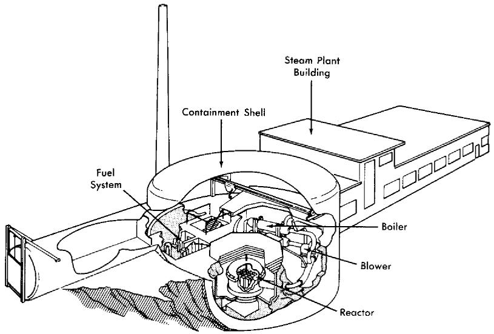
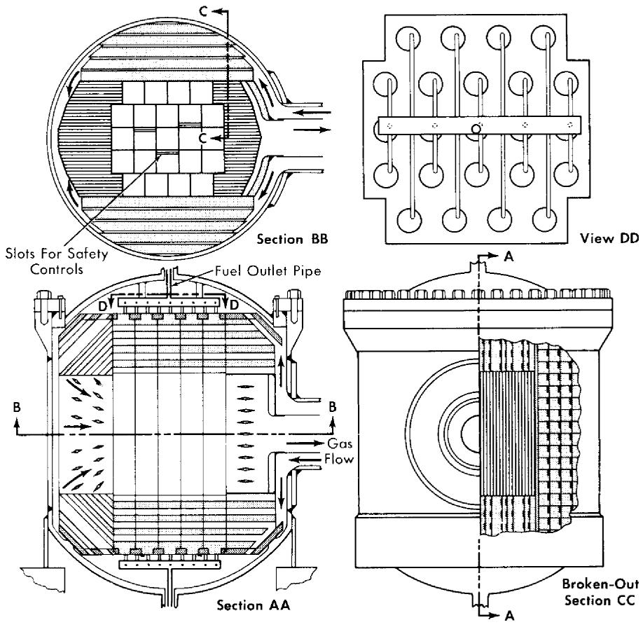
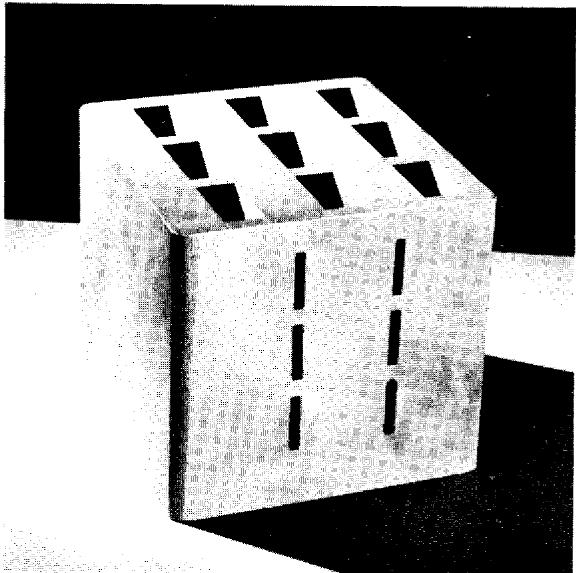
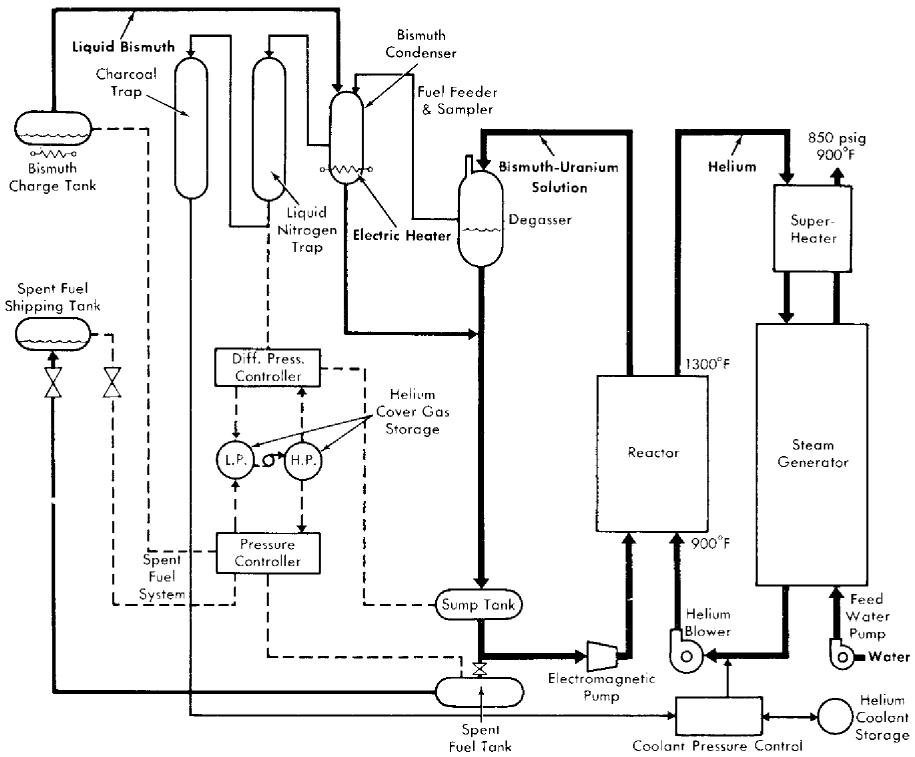
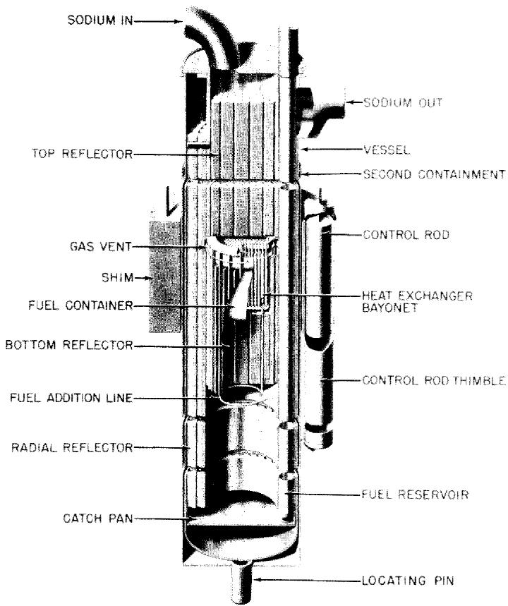

# CHAPTER 25

# ADDITIONAL LIQUID METAL REACTORS

In this chapter three other types of Liquid Metal Fuel Reactors will be discussed. The first of these is the Liquid Metal Fuel Gas-Cooled Reactor. In principle this reactor is similar to the LMFR previously discussed, but it has many features that are different; for example, it has a noncirculating fuel, and the heat is removed by cooling with helium under pressure. Advantages and disadvantages of this design over the circulating fuel LMFR will be discussed in the following pages.

The second reactor discussed in this chapter is the LAMPRE. This is a molten plutonium fueled reactor which is under development at the Los Alamos Scientific Laboratory. Although only in its beginning stages of development, it is conceived as a high temperature $(650^{\circ}\mathrm{C})$ fast breeder reactor utilizing plutonium as the fuel.

The third type of reactor is based on a liquid metal- $\mathrm{UO_2}$ slurry fuel.

# 25-1. LIQUID METAL FUEL GAS-COOLED REACTOR*

25-1.1 Introduction and objectives of concept. The Liquid Metal Fuel Gas-Cooled Reactor (LMF-GCR) design is unique in that it combines inert gas cooling with the advantageous liquid fuel approach. The LMF-GCR concept has a high degree of design flexibility. It is a high-temperature, high-efficiency system that may be designed as a thermal converter, uranium thermal breeder, or plutonium fast breeder; that may produce heat, electric energy, or propulsive power; and that may power either a steam or a gas turbine.

The fundamental principle of the LMF-GCR is the utilization of an internally cooled fixed moderator-heat exchanger element with fluid fuel center. The fuel is circulated slowly through the core to assure proper mixing and to facilitate fuel addition. The core is cooled by gas that is pumped through it in passages that are separated by a suitable high-temperature material from the fuel channels. The many well-known advantages of fluid fuels are thereby gained without the penalties of circulating great quantities of corrosive, highly radioactive fuel-coolant solution and of tying up large amounts of expensive fuel outside the core.

25-1.2 Reference design characteristics of an LMF-GCR. Materials. Internal gas cooling avoids the corrosion and material problems encountered in reactor concepts that require the circulation of liquid fuels or coolants as a heat-transport medium. Helium has been selected as the gas coolant because it is inert and has better heat-transfer properties than other inert gases. Graphite has been chosen for the moderator and core element structural material in a thermal reactor, because of its excellent moderating and high-temperature properties. Its resistance to corrosion by bismuth has been fairly well established, and the operating temperature is high enough so that energy storage in the graphite should not be a problem.

Reference design. A reference design of an LMF-GCR nuclear power station has been produced. A summary of the design parameters is given in Table 25-1. It is a graphite-moderated thermal reactor employing highly enriched uranium-bismuth fuel and helium coolant. The coolant leaves the core at $1300^{\circ}\mathrm{F}$ and is circulated through a superheater and steam generator, where it produces steam at 850 psig, $900^{\circ}\mathrm{F}$ . Since it is inherently self-regulating, has little excess reactivity, and is cooled by inert helium, it is extremely safe.

In order that the capital cost of the first plant be low, the reference design is for a small plant producing approximately $16,000\mathrm{kw}$ net electrical output. However, it is large enough to demonstrate the practicability of an LMF-GCR and provide operational experience applicable to commercial-size plants. By assuming the feasibility of constructing a 13-ft diameter pressure vessel for a design pressure of $1000\mathrm{psi}$ , it appears possible to design a gas-cooled reactor plant having an electrical capacity of 240 MW.

A U $^{235}$ -fueled thermal reactor was chosen for the design because it will demonstrate the practicability of the LMF-GCR concept in a relatively simple reactor. A breeder is more complicated because it requires two similar systems for fuel and blanket solutions.

The reactor building and the general arrangement of components as conceived in the reference design are shown in Fig. 25-1. The reactor, primary coolant system, fuel system, and steam generator are enclosed in a gastight steel containment shell.

The reactor core, reflector, internal fuel and gas piping, and pressure vessel are shown in Fig. 25-2. The core, consisting of an array of graphite elements, has an active length of 56 in. and a cross section approximating a circle of 56-in. diameter. Fig 25-3 is a picture of a sample section of the core element. The larger rectangular holes are vertical fuel channels that would be 56 in. long in the reactor. The small crosswise slots are for helium cookout flow. This graphite element, which separates the two fluids, is similar to a heat exchanger that conducts heat from the fuel to the gas

  
FIG. 25-1. Artist's concept of LMF-GCR nuclear power station.

channel surface, where it is removed by convection into the coolant stream. The principal problem associated with the LMF-GCR is the development of an impervious graphite core material that will prevent significant leakage of bismuth or fission-product gases into the coolant stream, or of helium into the fuel.

The machining operations required to produce the core section of the element have been demonstrated to be feasible. The reflector is made up of various machined graphite shapes. The fuel piping completes the core and the reactor assembly.

By volume, the core region is approximately $65\%$ graphite, $25\%$ fuel, and $10\%$ void space for coolant. The fuel solution contains fully enriched uranium dissolved in bismuth. With these proportions of fuel and moderator, the minimum critical dimensions as calculated for a cylindrical reactor are height and diameter of approximately 42 in. For this application, a larger core size is required in order to have sufficient heat-transfer area. Since the graphite core elements are a permanent part of the reactor and are not changed in routine refueling procedure, it is not required that they be interchangeable. A considerable amount of design flexibility is thereby achieved, and variations of the fuel channel, moderator, and gas channel geometry provide control over the nuclear and heat processes.

For the reactor described above, it is calculated that 900 atomic parts of $\mathrm{U}^{235}$ per million parts of bismuth are necessary for criticality, if there is no poisoning of the reactor. However, if the effect of xenon and samarium

  
FIG. 25-2. Reactor and pressure vessel assembly.

equilibrium poisoning is included, 1010 ppm of $\mathbf{U}^{235}$ will be required for criticality.

The buildup of fission products and uranium isotopes as a function of time was calculated to determine the fuel concentration necessary for criticality after various time periods of operation. Since the solubility of uranium in bismuth is limited to $6560~\mathrm{ppm}$ at $965^{\circ}\mathrm{F}$ , the lowest fuel temperature in the LMF-GCR, the reactor fuel must be replaced or processed after the poisons build up to such a level that this solubility limit is exceeded by criticality requirements. With the total fuel inventory in the system equal to 1.2 times the fuel in the core, the fuel lifetime will be 220 megawatt-years. This corresponds to an operating period of 4.8 years with a plant utilization factor of $80\%$ .

At the end of the fuel lifetime, the fuel solution will contain 3370 ppm

  
FIG. 25-3. Model section of nuclear core element for LMF-GCR liquid metal fuel gas-cooled reactor.

  
FIG. 25-4. Over-all plant flow diagram.

of $\mathrm{U}^{235}$ , 1960 ppm of $\mathrm{U}^{236}$ , and 1230 ppm of $\mathrm{U}^{238}$ , which make up the 6560 ppm of uranium allowed by the solubility limit.

In producing the $220\mathrm{Mw}$ -yr of heat, $98.7\mathrm{kg}$ of $\mathrm{U}^{235}$ will be either fissioned or transmuted into $\mathrm{U}^{236}$ . Since $23.8\mathrm{kg}$ of $\mathrm{U}^{235}$ remain in the reactor at the end of fuel lifetime, approximately $80\%$ of the total amount of $\mathrm{U}^{235}$ added to the reactor during its operation will have been "burned."

The systems required in the plant are shown by the flowsheet of Fig. 25-4. The heat is removed from the reactor by helium at 500 psia, which leaves the reactor at $1300^{\circ}\mathrm{F}$ and returns at $900^{\circ}\mathrm{F}$ . This heat is removed from the helium in a steam generator that produces superheated steam at 850 psig, $900^{\circ}\mathrm{F}$ . The steam is utilized by a standard turbine generator plant.

A steam-cycle generating plant was incorporated, since it is highly developed. A closed-cycle gas turbine, the most probable alternative, has not yet been developed sufficiently for general utility application, but may be advantageously combined with the LMF-GCR at some later time. In such a system, the reactor coolant would serve also as the cycle working fluid, eliminating the intermediate heat exchanger.

Although the reference LMF-GCR is envisioned as a high-enrichment reactor, it is possible, by changing the parameters, to use fuel of only $20\%$ enrichment. This low-enrichment reactor would have the advantage of producing a sizeable fraction of its own fuel by creating $\mathrm{Pu}^{239}$ through neutron absorption in $\mathrm{U}^{238}$ .

Parametric calculations of low-enrichment reactors have been made using a two-group, two-region spherical geometry computer code developed for the IBM 650 digital computer. The results show that to have a fuel lifetime long enough (about 1 yr) to be of practical value, the dimensions of the reactor core should be equivalent to a sphere at least 6 ft in diameter.

25-1.3 Fuel and fuel system. Fuel system. The fuel system is completely separate from the heat-removal system. The main fuel loop flow rate is approximately 2 to $4\mathrm{gpm}$ , which is sufficient to provide for uranium makeup and for gas separation in the degasser.

Fuel flows upward through the reactor core and into the degasser. From there, the flow goes down into the sump tank and back into the reactor inlet. The fuel is pumped electromagnetically and flow is measured by an orifice or an electromagnetic flow meter.

The sump tank acts as a receiver for all the fuel in the loop when the core is to be drained. To keep the sump tank nearly empty during operation, the pressure differential between the helium cover gas in the sump tank and the degasser must be kept equal to the bismuth static head. The fuel is automatically drained into the sump tank when the pump is de-energized and the two cover gas lines are connected together. Thus there are no valves in the primary fuel loop which must be operated in order to drain the reactor.

TABLE 25-1 SUMMARY OF DESIGN PARAMETERS   

<table><tr><td colspan="2">Over-all plant performance</td></tr><tr><td>Reactor core thermal power</td><td>57,000 kw</td></tr><tr><td>Helium blower power</td><td>5,530 kw</td></tr><tr><td>Net electric power generated</td><td>16,470 kw</td></tr><tr><td>Plant efficiency</td><td>28.9%</td></tr><tr><td>Thermal data on reactor at full power</td><td></td></tr><tr><td>Helium pressure</td><td>500 psia</td></tr><tr><td>Coolant inlet temperature</td><td>900°F</td></tr><tr><td>Coolant exit temperature</td><td>1300°F</td></tr><tr><td>Coolant flow rate</td><td>389,000 lb/hr</td></tr><tr><td>Coolant velocity in core</td><td>≈560 fps</td></tr><tr><td>Number of flow passes</td><td>1</td></tr><tr><td>Average thermal power density</td><td>0.714 Mw/ft3</td></tr><tr><td>Peak thermal power density</td><td>≈0.922 Mw/ft3</td></tr><tr><td>Peak to average heat flux ratio (average over life)</td><td>≈1.29</td></tr><tr><td>Design heat output</td><td>1.94 × 108Btu/hr</td></tr><tr><td>Maximum graphite temperature</td><td>1650°F</td></tr><tr><td>Maximum fuel temperature</td><td>1755°F</td></tr><tr><td>ΔP/P through reactor</td><td>4.3%</td></tr><tr><td>Steam plant data</td><td></td></tr><tr><td>Pressure</td><td>850 psig</td></tr><tr><td>Temperature</td><td>900°F</td></tr><tr><td>Flow rate</td><td>188,300 lb/hr</td></tr><tr><td>Number of extractions</td><td>4</td></tr><tr><td>Turbine heat rate</td><td>9,645 Btu/kwh</td></tr><tr><td>Condenser pressure</td><td>1.5 in. Hg</td></tr><tr><td>Turbine speed</td><td>3600 rpm</td></tr><tr><td>Gross turbine output</td><td>22,000 kw</td></tr><tr><td>Pressure vessel</td><td></td></tr><tr><td>Material</td><td>Stainless steel</td></tr><tr><td>Outside diameter</td><td>94 in.</td></tr><tr><td>Thickness</td><td>2 in.</td></tr><tr><td>Over-all length</td><td>123 in.</td></tr><tr><td>Weight</td><td>30,000 lb.</td></tr><tr><td>Type of closure</td><td>Bolted</td></tr><tr><td>Insulation</td><td>4 in. of diatom- 
ceous earth</td></tr><tr><td>Core</td><td></td></tr><tr><td>Neutron energy</td><td>Thermal</td></tr><tr><td>Fuel, clean</td><td>900 ppm of U235</td></tr><tr><td></td><td>93.5% en- 
riched U in Bi</td></tr><tr><td>Fuel lifetime</td><td>220 Mw-yr</td></tr><tr><td>Reprocessing interval (0.8 plant factor)</td><td>4.8 yr</td></tr><tr><td>Fuel burnup</td><td>80% of U235</td></tr><tr><td>Moderator</td><td>1.9 g/cc graphite</td></tr><tr><td>Bismuth in core</td><td>11,400 lb</td></tr><tr><td>Bismuth volume fraction</td><td>25%</td></tr><tr><td>Graphite volume fraction</td><td>65%</td></tr><tr><td>Void (helium) fraction</td><td>10%</td></tr><tr><td>Average core radius</td><td>28 in.</td></tr><tr><td>Core height</td><td>56 in.</td></tr><tr><td>Core volume</td><td>79.8 ft3</td></tr><tr><td>Power</td><td>57 Mw</td></tr><tr><td>Specific power, average over fuel lifetime</td><td>~3700 kw/kg</td></tr><tr><td>Power density (based on core volume in liters)</td><td>25.2 kw/liter</td></tr><tr><td>Average thermal flux (clean)</td><td>5.9 × 1014</td></tr><tr><td>Average thermal flux (average over life)</td><td>~3 × 1014</td></tr><tr><td>Average fast flux (clean)</td><td>~6 × 1014</td></tr><tr><td>Average moderator temperature</td><td>800°C</td></tr><tr><td>Temperature coefficient, average over fuel lifetime</td><td>~0.5 × 10-4δk/°C</td></tr><tr><td>Critical mass (clean, enriched U)</td><td>5.6 kg</td></tr><tr><td>Critical mass (xenon at equilibrium, enriched U)</td><td>6.3 kg</td></tr><tr><td>Inventory (xenon at equilibrium, enriched U)</td><td>7.6 kg</td></tr><tr><td>Inventory volume = 1.2 core volume of bismuth</td><td>24 ft3</td></tr><tr><td>U235 in system at end of fuel lifetime</td><td>23.8 kg</td></tr><tr><td>Reflector</td><td>1.9 g/cc graphite</td></tr><tr><td>Reflector thickness</td><td>1.5 ft</td></tr><tr><td>Reflector void fraction</td><td>5%</td></tr></table>

Fuel. Uranium makeup is added to the fuel solution on a day-to-day basis, thus keeping excess reactivity to a minimum. The operating lifetime of the fuel is nearly 5 yr at full power and $80\%$ plant utilization factor. Fuel burnup may be as much as $80\%$ , and total $\mathrm{U}^{235}$ inventory varies from about $7\mathrm{kg}$ at the beginning of fuel life to about $24\mathrm{kg}$ at the end of fuel life.

The LMF-GCR tends to be self-regulating. Under the influence of its negative temperature coefficient, the reactor will tend to operate at the same average moderator temperature at all power levels. This temperature will be maintained by controlling the uranium fuel solution concentration.

Spent fuel. After 4 to 5 yr, nonvolatile fission-product poisons and nonfissionable isotopes of uranium accumulate to such an extent that a new fuel charge is required. The used fuel is drained into the spent fuel tank and the reactor fuel loop is then ready to receive a new fuel charge. The spent fuel is transferred into a number of small, shielded shipping tanks for shipment to a chemical processing plant.

25-1.4 Reactor materials. The critical problem associated with the LMF-GCR is the development of a core element. As a basic core element material graphite is extremely attractive because it is a very good moderator, possesses excellent high-temperature strength, has unexcelled resistance to thermal shock, is not attacked by bismuth, has a low neutron absorption cross section, possesses a satisfactorily high thermal conductivity, and shows evidence that radiation damage is rapidly annealed at high temperature. Presently available graphite is not impermeable to bismuth or gases, as the core element material of the LMF-GCR must be in order to separate the fuel and coolant satisfactorily. However, recent developments indicate a chance for success in this area.

The other aspect of core element development is to find a suitable means for joining the graphite to the upper and lower fuel system headers. The graphite-to-metal bond must have adequate mechanical strength and be resistant to corrosion, thermal cycling, and radiation damage. Bonds of this type have been prepared by means of high-temperature brazing techniques, and the work has shown that numerous additional bonding agents are available. Preliminary work is encouraging and indicates that with improvements in bond design, bond techniques, and test methods, solutions to the bonding problem may be achieved.

Alternate materials as the basic core element structural material are under investigation as a backup to the graphite development. These include KT silicon carbide, molybdenum, molybdenum carbide, niobium, niobium carbide, zirconium carbide, tantalum, and tantalum carbide, all of which have properties indicating promise for LMF-GCR application.

25-1.5 Plant operation and maintenance. The LMF-GCR is primarily self-regulating, having a temperature coefficient of approximately $-0.5 \times 10^{-4} / ^{\circ}\mathrm{C}$ . Large changes in power output are controlled by varying coolant flow rate while keeping the gas temperatures approximately constant. Coolant flow rate will be varied by controlling the helium blower speed, and by changing the coolant gas density (pressure) with the compressor and accumulator system.

The main plant and reactor control room will be outside the reactor containment shell in the steam plant generator building. A full thickness of shielding wall separates the boiler and blower compartments from the reactor, and operating personnel will be able to conduct maintenance and inspection of these items while the reactor is in operation. This wall is penetrated by the concentric piping which carries the primary gas into and out of the reactor. To attenuate radiation streaming through the pipe, a turn is made within the shield.

The core and pressure vessel assembly have been designed so that the core, and also the reflector if necessary, may be replaced in the event of a

failure. During operation, the core and reflector are supported at the bottom of the pressure vessel. However, the core assembly is attached to the pressure vessel head so that the two will be lifted together when the head is removed. The reflector is also constructed with a metal support structure so that it can be lifted out of the pressure vessel as a unit.

The fuel loop components and piping are arranged so that maintenance can be carried out in a safe and reliable manner. Since the parts are relatively inexpensive, it will probably be cheaper to replace than repair them.

25-1.6 Plant capital and power cost. For a 16,000-kw (electrical) LMF-GCR plant, the cost of power, at an $80\%$ plant utilization factor, is estimated at 14.6 mills/kwh, made up of 8.6 mills/kwh for fixed charges, 2.7 mills/kwh for operation and maintenance, and 3.3 mills/kwh for fuel. The total power cost using a $60\%$ plant utilization factor is 18.4 mills/kwh. A fixed charge rate of $15\%$ was used.

The capital cost for a 16,000-kw LMF-GCR nuclear plant has been estimated at $409/kw$ of installed capacity. These cost figures are based on estimates for the important equipment in the plant, and on recent AEC fuel prices.

# 25-2. MOLTEN PLUTONIUM FUEL REACTOR*

25-2.1 Introduction. The long-range utility of nuclear power based on uranium fission depends upon the development of a plutonium-fueled reactor capable of being refueled by an integral, or associated, breeding cycle. If full utilization of the energy content in the world's supply of uranium is to be accomplished, the more abundant $\mathrm{U}^{238}$ must be converted into the easily fissionable isotopes of plutonium. The need for this full utilization is apparent when it is realized that the economically recoverable $\mathrm{U}^{235}$ content of uranium ores [1,2] is sufficient to supply projected world power requirements for only a few decades. Breeding on the plutonium cycle extends fission power capabilities by a factor of 140, yielding thousands, instead of tens, of years of world energy reserves.

The high values of the capture-to-fission ratio at thermal and epithermal neutron energies for the plutonium isotopes preclude these types of reactors from an integral plutonium breeding cycle system. To obtain an appreciable breeding gain, a plutonium-fueled reactor must be either a fast or a fast-intermediate neutron spectrum device where breeding ratios of the order of 1.7 may be expected from suitably designed systems. One of the power-producing reactors of the future must logically be a fast plutonium breeder.

In order to maintain a fast-neutron spectrum, fuel densities in a plutonium breeder will be high, and coolants must be either molten metals or salts. The latter characteristic will permit large amounts of power to be extracted from relatively small volumes, thus obtaining a large specific power. Hydrogenous and organic coolants are eliminated because of their attendant neutron moderation properties, high vapor pressures at high temperatures, and relatively poor resistance to radiation damage. For efficiency reasons the system temperature should be as high as is compatible with a long operating life. Therefore, to be in step with modern electrical generation techniques, this would imply coolant outlet temperatures of the order of $650^{\circ}\mathrm{C}$ .

25-2.2 Basic components. Before discussing the Los Alamos Molten Plutonium Reactor (LAMPRE) proposal in detail, the following resume will treat some of the possibilities for the three basic components of a power reactor: the fuel, the container, and the coolant.

Molten plutonium fuels. Plutonium metal melts at $640^{\circ}\mathrm{C}$ , a temperature that is somewhat high, but not beyond the bounds of utility. Fortunately, some alloys of plutonium have significantly lower melting temperatures. Specifically, eutectic alloys of plutonium with iron, nickel, and cobalt all have melting temperatures in the vicinity of 400 to $450^{\circ}\mathrm{C}$ . Ternary and quaternary alloying agents will further lower these melting temperatures by a few percent. One characteristic of these transition metal alloys is that they do not dilute the fuel volumetrically to a great extent in their eutectic compositions.

Other alloys of plutonium which are more dilute in fuel and have not too unreasonable melting temperatures are the magnesium-plutonium and bismuth-plutonium alloys. The spatial dilution of fuel atoms alleviates the high power density problem but, unfortunately, these alloys have melting temperatures significantly higher than the transition metal alloys.

A compilation of the interesting fuel alloys, their melting points, and eutectic compositions appears in Table 25-2.

Container materials. A material capable of being fabricated into various shapes and resistant to high-temperature corrosion by the fuel alloy is a necessity if practical use is to be made of the low melting temperature plutonium alloys. Since the transition metals readily form low melting point alloys with plutonium, the normal constructional materials, steels and nickel alloys, are eliminated.

The next alternatives, the refractory metals, have been used with measurable success to contain the various alloys of plutonium. Tungsten and tantalum have been somewhat better containers than molybdenum and niobium and much better than chromium, vanadium, and titanium. The requirement of fabricability eliminates several of the refractory metals, such

as tungsten and molybdenum, because of the poor state of their peculiar welding art.

The limitations of metallurgical knowledge at present lead to the conclusion that tantalum will be one of the best container materials for these plutonium alloys. The high-temperature strength properties and the heat-transfer properties of tantalum are excellent; moreover, it is weldable. The parasitic capture cross section of tantalum would be intolerable in an epithermal or thermal power breeder reactor and, although relatively large in a fast spectrum, its effect on neutron economy in a fast reactor can be made small, if not minor, by careful design.

Dynamic corrosion tests indicate that tantalum's resistance to corrosion by molten sodium, a possible coolant, will be adequate. Long-term static corrosion tests (9000 hr at $650^{\circ}\mathrm{C}$ ) indicate that the fuel is compatible with tantalum at proposed operating temperatures.

Coolant. The desire to obtain a high power density at high temperatures and low pressures in a high radiation field dictates the use of molten metal or salt coolant. The list of possibilities is topped by sodium and bismuth. A few words about the properties of these coolants are probably appropriate at this point.

Sodium is advantageous because of its low melting point, good heat-transfer properties, low pumping power requirement, and because there has been considerable engineering experience with it. Its poor long-term corrosion properties when in contact with the better container materials such as tantalum and its explosive burning property when exposed to water or moist air are distinct disadvantages.

Bismuth, on the other hand, does not react explosively with water, nor does it burn in air. Pumping power requirements some five times larger than for sodium, its higher melting temperature, and the polonium buildup problems are disadvantageous factors of a bismuth coolant. However,

TABLE 25-2   
FUEL ALLOYS   

<table><tr><td>Alloy</td><td>Eutectic composition, a/o</td><td>Melting point, °C</td><td>Approximate density, g/cc</td></tr><tr><td>Pu-Fe</td><td>9.5 Fe</td><td>410</td><td>16.8</td></tr><tr><td>Pu-Co</td><td>10 Co</td><td>405</td><td>16</td></tr><tr><td>Pu-Ni</td><td>12.5 Ni</td><td>465</td><td>16</td></tr><tr><td>Pu-Mg</td><td>85 Mg</td><td>552</td><td>3.4</td></tr><tr><td>Pu-Bi</td><td>Noneutectic</td><td>271-900</td><td></td></tr></table>

the corrosion resistance of tantalum in dynamic, high-temperature bismuth is excellent, according to the Ames experiments [3].

25-2.3 LAMPRE. A first step in solving the plutonium power reactor problem is to prove the feasibility of operating and maintaining a molten plutonium power reactor core. To this end, the reactor assembly known as LAMPRE I has been devised. The LAMPRE system has the following essential features:

Fuel alloy: Molten plutonium-iron (eutectic composition, $9.5\mathrm{a}_{\mathrm{i}} / 0$ Fe)

Container: Tantalum

Reflector: Steel

Shield: Graphite, iron, concrete

Coolant: Sodium

Power: 1 Mw heat

Heat transfer: Internally cooled core Tube-shell Heat exchanger Heat rejected to air

Breeding No breeding blanket

Core. The LAMPRE core consists of three parts: fuel alloy, container, and coolant. A proposed design, described in detail below, yields a structure which is approximately $50\%$ by volume fuel alloy, $15\%$ structure, and $35\%$ coolant. The minimum tube separation is slightly under 1/16 in. At reasonable heat-transfer rates, this configuration is capable of developing a specific power of better than 250 watts/g. More efficient systems can utilize a similar structure but must dilute the fuel volumetrically to obtain a larger heat-transfer surface per unit of contained fuel. The larger area-to-volume ratio can be obtained by going to smaller diameter tubes and/or closer spacing of the tube array. In the tube-shell arrangement, the fuel is located on the outside of the tubes and the coolant flows through the tubes. Such a scheme preserves the volumetric integrity of the fuel. Other radiator-type schemes, which also preserve fuel integrity, are conceivable.

The over-all assembly will be designed so that the core will be completely filled during operating conditions. The estimated core height is 6.5 in.

Tantalum expansion, filling, and draining tubes will be attached to the core structure. A reference core assembly would be:

Container

Tantalium

Tubes (547)

3/16-in. OD, 0.015-in. wall, hexagonal array

Cage shape

Right cylinder, 6.25-in. OD, 6.5-in. height

Headers and shell

0.040 to 0.080 in.

Critical mass

$26\mathrm{kg}$ plutonium alloy

Reflector. No attempt to breed will be carried out in the first LAMPRE concept. Although the over-all coolant container will be made of stainless steel, the fast-neutron reflector will be made of steel and will be cooled by the main sodium stream. The thickness of the radial steel reflector will be adjusted to be thin enough, neutronwise, to obtain adequate external reflector control, but will be too thick to allow the thermalized neutrons returning from the graphite shield to build up a power spike at the core surface. The core, although slightly coupled to the reflector and shield, will have a mean fission energy greater than 500 kev, ensuring a high possible breeding gain. The top and bottom stainless-steel reflector slugs will also be sodium-cooled and will be essentially "infinitely" thick to fast neutrons. The coolant channels will be drilled or machined into solid slug or disk castings.

Control. The control of LAMPRE will be effected by reflector-type mechanisms. An annular shim control displacing the innermost 4 in. of shield with aluminum will be used as a coarse criticality adjustment mechanism. Several replacement cylinders, replacing the inner portions of aluminum with void, will be used as fine controls. A rotating control cylinder will be built into the system in anticipation of safety and neutron kinetics experiments.

The radial thickness of the steel fast-neutron reflector is adjusted so that the fast and intermediate neutrons returning to the core from the aluminum reflector and graphite are worth approximately $10\%$ to the core critical mass. Displacement of the aluminum reflector effectively reduces the neutron reflection back to the core, yielding an external, large-effect control mechanism adequately cooled by aluminum conduction and air convention.

The LAMPRE critical experiments have proved that aluminum-void replacement mechanisms are effective and operable. The annular shim has been shown to be almost ineffective at distances greater than 2 in.

  
FIG. 25-5. The Los Alamos Molten Plutonium Reactor Experiment.

above or below the core height for the geometry. These results have been incorporated into the LAMPRE design as presented in Fig. 25-5.

# 25-3. LIQUID METAL-URANIUM OXIDE SLURRY REACTORS

There has been some work done at other locations on uranium oxide slurry reactors. At Knolls Atomic Power Laboratory, a uranium oxide-bismuth slurry reactor has been explored [4]. In this reactor, the fuel, consisting of uranium oxide suspension and liquid bismuth, is pumped through a moderator matrix and then through an external heat exchanger. The reader will recognize that this is the same as the single-region LMFR described in the preceding chapter.

The studies at KAPL were encouraging. A small amount of experimental work indicated that dispersions of uranium oxide and bismuth can be made. These workers found that at 500 to $600^{\circ}\mathrm{C}$ titanium is the best additive for promoting the wetting of $\mathrm{UO}_2$ by bismuth. An $8\mathrm{w / o}$ $\mathrm{UO}_2$ -bismuth slurry was actually pumped with an electromagnetic pump at $450^{\circ}\mathrm{C}$ .

At Argonne National Laboratory, uranium oxide-NaK slurries have been studied as possible reactor fuels [5]. This fuel would be suitable for a fast-breeder reactor. Investigations have been carried out at a maximum concentration of 4.3 vol. $\%$ $\mathrm{UO_2}$ in eutectic NaK. Two loops have been operated at temperatures ranging from 450 to $600^{\circ}\mathrm{C}$ . A slurry with 4.3 vol. $\%$ actually has a very high weight percent, $36.0\mathrm{w / o}$ .

The tests in the two loops indicated uniform suspension at flow rates of 2 fps.

The $\mathrm{UO_2}$ dropped out of suspension at temperatures above $500^{\circ}\mathrm{C}$ but would resuspend at lower temperatures. When a very small amount of uranium metal was added to the slurry, better wetting of the particles was obtained and no further settling above $500^{\circ}\mathrm{C}$ was observed.

Work on the uranium oxide slurries is continuing, and the incorporation of these results into liquid metal fuel reactors can be expected.

# REFERENCES

1. S. GLASSTONE, Principles of Nuclear Reactor Engineering. Princeton, N. J.: D. Van Nostrand Co., Inc., 1955. (pp. 1-2)   
2. P. C. PUTNAM, Energy in the Future. Princeton, N. J.: D. Van Nostrand Co., Inc., 1953. (p. 214)   
3. R. W. FISHER and G. R. WINDERS, High Temperature Loop for Circulating Liquid Metals, in Chemical Engineering Progress Symposium Series, Vol. 53, No. 20. New York: American Institute of Chemical Engineers, 1957. (pp. 1-6)   
4. D. H. Ahmann et al., A $UO_2$ -Bismuth System As a Reactor Fuel, USAEC Report KAPL-1877, Knolls Atomic Power Laboratory, July 1, 1957.   
5. B. M. ABRAHAM et al., $\mathrm{UO}_2$ -NaK Slurry Studies in Loops to $600^{\circ}\mathrm{C}$ , *Nuclear Sci. and Eng.* 2, 501-512 (1957).