# Part I

# AQUEOUS HOMOGENEOUS REACTORS

JAMES A. LANE, Editor

Oak Ridge National Laboratory

1. Homogeneous Reactors and Their Development   
2. Nuclear Characteristics of One- and Two-Region Homogeneous Reactors   
3. Properties of Aqueous Fuel Solutions   
4. Technology of Aqueous Suspensions   
5. Integrity of Metals in Homogeneous Reactor Media   
6. Chemical Processing   
7. Design and Construction of Experimental Homogeneous Reactors   
8. Component Development   
9. Large-Scale Homogeneous Reactor Studies

10. Homogeneous Reactor Cost Studies

# AUTHORS

E.G. BOHLMANN

P. R. KASTEN

J.A.LANE

J.P.MCBRIDE

D. G. THOMAS

H. F. McDUFFIE

R.A.McNEES

C. L. SEGASER

I. SPIEWAK

# CONTRIBUTORS

B. M. ADAMSON

S.E.BEALL

W.E.BROWNING

W.D.BURCH

R. D. CHEVERTON

E. L. COMPERE

C. H. GABBARD

J.C.GRIESS

D. B. HALL

E.C.HISE

G. H. JENKS

J. C. WILSON

S. I. KAPLAN

N. A. KROHN

C. G. LAWSON

R.E.LEUZE

R.N.Lyon

W.T.MCDUFFEE

L. E. MORSE

S. PETERSON

R.C. ROBERTSON

H.C.SAVAGE

D. S. ToOMB

# PREFACE

This compilation of information related to aqueous homogeneous reactors summarizes the results of more than ten years of research and development by Oak Ridge National Laboratory and other organizations. Some 1500 technical man-years of effort have been devoted to this work, the cost of which totals more than $50 million. A summary of a program of this magnitude must necessarily be devoted primarily to the main technical approaches pursued, with less attention to alternate approaches. For more complete coverage, the reader is directed to the selected bibliography at the end of Part I.

Although research in other countries has contributed to the technology of aqueous homogeneous reactors, this review is limited to work in the United States. In a few instances, however, data and references pertaining to work carried on outside the United States are included for continuity.

Responsibility for the preparation of Part I was shared by the members of the Oak Ridge National Laboratory as given on the preceding page and at the beginning of each chapter.

Review of the manuscript by others of the Oak Ridge Laboratory staff and by scientists and engineers of Argonne National Laboratory and Westinghouse Electric Corporation have improved clarity and accuracy. Suggestions by R. B. Briggs, director of the Homogeneous Reactor Project at the Oak Ridge Laboratory, and S. McLain, consultant to the Argonne Laboratory, were particularly helpful.

Others at Oak Ridge who assisted in the preparation of this part include W. D. Reel, who checked all chapters for style and consistency, W. C. Colwell, who was in charge of the execution of the drawings, and H. B. Whetsel, who prepared the subject index.

Oak Ridge, Tennessee June 1958

James A. Lane, Editor

# CHAPTER 1

# HOMOGENEOUS REACTORS AND THEIR DEVELOPMENT*

# 1-1. BACKGROUND†

1-1.1 Work prior to the Manhattan Project. Nuclear reactors fueled with a solution or homogeneous mixture of fuel and moderator were among the first nuclear systems to be investigated experimentally following the discovery of uranium fission. In fact, it was only slightly more than a year after this discovery that Halban and Kowarski at the Cavendish Laboratory in England performed experiments which indicated to them that a successful self-sustaining chain reaction could be achieved with a slurry of uranium oxide $(\mathrm{U}_{3}\mathrm{O}_{8})$ in heavy water.

In these experiments, reported in December 1940 [1], 112 liters of heavy water mixed with varying amounts of $\mathrm{U}_{3}\mathrm{O}_{8}$ powder were used inside an aluminum sphere $60~\mathrm{cm}$ in diameter, which was immersed in about one ton of heavy mineral oil to serve as a reflector. (Mineral oil was chosen to avoid contamination of the $\mathrm{D}_2\mathrm{O}$ in case of a leak in the sphere.) By measuring neutron fluxes at varying distances from a neutron source located in the center of the sphere, Halban and Kowarski calculated a multiplication factor of $1.18 \pm 0.07$ for this system when the ratio of deuterium atoms to uranium atoms was 380 to 1, and $1.09 \pm 0.03$ when the D/U ratio was 160 to 1.

Other experiments conducted at the same time by Halban and Kowarski [1], using $\mathrm{U}_3\mathrm{O}_8$ and paraffin wax, indicated that with a heterogeneous lattice arrangement it would be possible to achieve multiplication factors as high as 1.37 in a system containing about 100 atoms of deuterium per atom of uranium.

It is interesting to note that the $\mathrm{D}_2\mathrm{O}$ supply used in the experiments had been evacuated from France. The $\mathrm{D}_2\mathrm{O}$ originally came from the laboratories of the Norwegian Hydroelectric Company, and with the destruction of this plant and its $\mathrm{D}_2\mathrm{O}$ stockpile in 1942, this was the sole remaining supply of purified $\mathrm{D}_2\mathrm{O}$ . However, it was not enough to allow a self-sustaining chain reaction to be established with natural uranium.

Even earlier (in 1939) Halban and Kowarski, as well as other experimentalists, had fairly well established that self-sustaining chain reactions with $\mathrm{U}_3\mathrm{O}_8$ and ordinary water are not possible [2,3,4]. Homogeneous systems of uranium with carbon, helium, beryllium, or oxygen were also considered, and were rejected as not feasible either for nuclear, chemical, or engineering reasons.

In November 1942, Kowarski, with Fenning and Seligman, reported more refined experiments which led to the conclusion that neither homogeneous nor heterogeneous mixtures of $\mathrm{U}_3\mathrm{O}_8$ with ordinary water would lead to self-sustaining chain reactions, the highest values of the multiplication factor being 0.79 for the homogeneous system and 0.85 for the heterogeneous system.

Because it was clear even by early 1942 that the only feasible homogeneous reactor using natural uranium would be one moderated with $\mathrm{D}_2\mathrm{O}$ , and because no $\mathrm{D}_2\mathrm{O}$ was available at that time for use in reactors, interest in homogeneous reactor systems was purely academic. The atomic energy program, which was then getting well under way, devoted its attention to heterogeneous reactors. By using a heterogeneous lattice arrangement with a core of uranium metal slugs spaced inside graphite blocks and a periphery containing $\mathrm{U}_3\mathrm{O}_8$ slugs (used after the supply of uranium metal ran out) spaced inside the graphite, the first successful self-sustaining chain reaction was achieved on December 2, 1942.

1-1.2 Early homogeneous reactor development programs at Columbia and Chicago universities. Interest in homogeneous reactors lagged until early in 1943, when it became clear that American and Canadian efforts to produce large quantities of heavy water would be successful. At that time the group under H. C. Urey at Columbia University directed its attention to the development of slurried reactors utilizing uranium oxide and $\mathbf{D}_2\mathbf{O}$ .

In March 1943, Urey and Fermi held a conference to review the situation with respect to homogeneous reactors. They noted the value of 1.18 that Halban and Kowarski had obtained for the multiplication factor in a $\mathrm{U}_3\mathrm{O}_8 - \mathrm{D}_2\mathrm{O}$ slurry reactor and pointed out that the value calculated from theory was only 1.02. They realized, however, that neither the theory nor the experiment was free from serious objections, and that insufficient data were available to allow a trustworthy conclusion to be reached as to the feasibility of homogeneous systems.

If the results of Halban and Kowarski were correct, then a homogeneous system containing a few tons of heavy water would be chain reacting. On the other hand, if the theoretical estimates were correct, the order of 100 tons of $\mathrm{D}_2\mathrm{O}$ would be required.

Urey and Fermi recommended [5] that the earlier $\mathrm{U}_3\mathrm{O}_8 - \mathrm{D}_2\mathrm{O}$ experiments be repeated with the improved techniques then known, and that

consideration be given to incorporating a mixture of uranium and heavy water into the pile at Chicago to determine its effect on the pile reactivity.

From the theoretical considerations of E. P. Wigner and others, it appeared that the most favorable arrangement for a $\mathrm{U}_3\mathrm{O}_8 - \mathrm{D}_2\mathrm{O}$ reactor would be one in which the slurry was pumped through a lattice of tubes immersed in $\mathrm{D}_2\mathrm{O}$ moderator. This was especially true because the neutron absorption cross section assigned to heavy water at that time made it appear that more than 200 tons of $\mathrm{D}_2\mathrm{O}$ would be required to reach criticality in an entirely homogeneous system in which the $\mathrm{U}_3\mathrm{O}_8$ and moderator were mixed. With a heterogeneous system it seemed likely that a much smaller quantity of $\mathrm{D}_2\mathrm{O}$ would suffice and every effort was directed toward preparing a design that would require about 50 tons of $\mathrm{D}_2\mathrm{O}$ [6].

It was estimated by E. P. Wigner that the uranium concentration in the slurry would have to be 2.5 to 3 grams per cubic centimeter of slurry. It became apparent immediately that no aqueous solution of a uranium compound could be made with such a density. With pure $\mathrm{UF}_{6}$ , 2.48 grams of uranium per cubic centimeter could be obtained, and piles utilizing this compound were considered. However, the corrosion problems in such a system were believed to be so severe that the development of a reactor to operate at a high power level would be extremely difficult, if not impossible.

Other compounds, such as uranyl nitrate dissolved in $\mathrm{D}_2\mathrm{O}$ , were excluded because in the case of nitrate the neutron absorption of nitrogen was too high and in other cases sufficient densities could not be obtained. Thus the initial phase of the research at Columbia was directed toward the development of high-density slurries [6].

The reactor visualized by the Columbia group was one in which an extremely dense suspension of uranium in $\mathrm{D}_2\mathrm{O}$ would be pumped through a large number of pipes arranged inside a heavy-water moderator. It was planned that both the slurry and the moderator would be circulated through heat exchangers for cooling [6].

Then, in July of 1943, the experiments of Langsdorf [7] were completed, giving a much lower cross section for deuterium than was known earlier. As a result, the homogeneous reactor became much more attractive, since the critical size (neglecting external holdup) could then be reduced to about 30 tons of $\mathrm{D}_2\mathrm{O}$ with about 6 tons of uranium as oxide in an unreflected sphere [8]. This favorable development allowed emphasis to be shifted to less dense slurries, greatly simplifying the problems of maintaining a suspension of dense slurry, pumping it, and protecting against erosion. Experiments were directed toward developing a reactor design which would permit operation without continuous processing of the slurry to maintain its density [6].

By the end of 1943 preliminary designs had been developed at the University of Chicago Metallurgical Laboratory for several types of heavy-

water reactors, all using slurry fuel but differing in that one was completely homogeneous [9], one was a light-water-cooled heterogeneous arrangement [10], and another was a $\mathrm{D}_2\mathrm{O}$ -cooled heterogeneous reactor [11]. These reactors were proposed for operation at power levels of $500\mathrm{Mw}$ or more (depending on external power-removal systems) and were intended as alternates to the Hanford piles for plutonium production in case satisfactory operation of the graphite-natural uranium, water-cooled piles could not be achieved.

At this point one might ask why it was that homogeneous solution reactors were not given more serious consideration, especially in view of the newly discovered cross section for deuterium, which permitted considerably lower concentrations of uranium. The answer is that the only known soluble salts of uranium which had a sufficiently low cross section to enable the design of a reactor of feasible size and $\mathrm{D}_2\mathrm{O}$ requirement were uranyl fluoride and uranium hexafluoride. (Enriched uranium was not then available.) These were considered, but rejected principally because of corrosion and instability under radiation. A second factor was the evidence that $\mathrm{D}_2\mathrm{O}$ decomposition would be more severe in a solution reactor where fission fragments would be formed in intimate contact with the $\mathrm{D}_2\mathrm{O}$ rather than inside a solid particle as in the case of a slurry.

Research on homogeneous reactors was undertaken at Columbia University in May 1943, and continued with diminishing emphasis until the end of 1943, at which time most of the members of the homogeneous reactor group were transferred to Chicago, where they continued their work under the Metallurgical Laboratory.

At the Metallurgical Laboratory, the principal motivation of interest in homogeneous reactors was to develop alternate plutonium production facilities to be used in the event that the Hanford reactors did not operate successfully on a suitable large scale, and studies were continued through 1944. With the successful operation of the Hanford reactors, however, interest in homogeneous plutonium producers diminished, and by the end of 1944 very nearly all developmental research had been discontinued. The results of this work are summarized in a book by Kirschenbaum [12].

1-1.3 The first homogeneous reactors and the Los Alamos program. During the summer of 1943 a group at Los Alamos, under the leadership of D. W. Kerst, designed a "power-boiler" homogeneous reactor, having as its fuel a uranyl sulfate-water solution utilizing the enriched uranium which was expected to become available from the electromagnetic process. However, this design was put aside in favor of a low-power homogeneous reactor designed by R. F. Christy. The low-power homogeneous reactor was built and used during the spring and summer of 1944 for the first of a series of integral experiments with enriched material (see Chapter 7).

There were two reasons for choosing $\mathrm{UO}_2\mathrm{SO}_4$ instead of uranyl nitrate as the fuel: there is less neutron absorption in the sulfate than in the nitrate, and the sulfate was thought to be more soluble. The latter reason was considered important because it was feared that with the maximum-enrichment material from the electromagnetic process, it might be difficult to dissolve the critical mass in the desired volume [13]. These objections to the use of uranyl nitrate, however, were subsequently found to be invalid.

After gaining experience in operating the low-power reactor, "LOPO," the Los Alamos group revised its plans for the higher power homogeneous reactor, known as the "HYPO," and after extensive modification of the design, the reactor was built and put into operation in December 1944 with uranyl nitrate as the fuel.

In April 1949, rather extensive alterations to the HYPO were begun in order to make the reactor a more useful and safer experimental tool. The modified reactor, known as "SUPO," is still in operation. The present SUPO model reached local boiling during initial tests, due to the high power density. A slight increase in power density above the design level produces local boiling between cooling coils, even though the average solution temperature does not exceed $85^{\circ}\mathrm{C}$ .

Interest in solution reactors continued at Los Alamos, and improved designs of the Water Boiler (SUPO Model II) were proposed [14]. These, however, have not yet been constructed at Los Alamos, although similar designs have been built for various universities [15].

The work on water boilers at Los Alamos led to the design of power reactor versions as possible package power reactors for remote locations. Construction of these reactors, known as Los Alamos Power Reactor Experiments No. 1 and No. 2 (LAPRE-1 and LAPRE-2), started in early 1955. To achieve high-temperature operation at relatively low pressures, LAPRE-1 and -2 were fueled with solutions of enriched uranium oxide in concentrated phosphoric acid. The first experiment reached criticality in March 1956 and was operated at $20\mathrm{kw}$ for about $5\mathrm{hr}$ . At that time radioactivity was noted in the steam system, and the reactor was shut down and dismantled. It was discovered that the gold plating on the stainless steel cooling coils had been damaged during assembly and the phosphoric acid fuel solution had corroded through the stainless steel. The cooling coils were replaced and operations were resumed in October 1956. However, similar corrosion difficulties were encountered, and it was decided to discontinue operations. In the meantime, work on LAPRE-2 continued, and construction of the reactor and its facilities was completed during the early part of 1958. The details of these reactors are given in Chapter 7.

1-1.4 Early homogeneous reactor development at Clinton Laboratories (now Oak Ridge National Laboratory). With the availability of enriched uranium in 1944, the possibility of constructing a homogeneous reactor became more attractive because, by using enriched uranium, the $\mathrm{D}_2\mathrm{O}$ requirement could be greatly reduced, or even ordinary water could be used. The chemists at Clinton Laboratories (now ORNL), notably C. D. Coryell, A. Turkevich, S. G. English, and H. S. Brown, became interested in enriched-uranium homogeneous reactors primarily as a facility for producing other radioisotopes in larger amounts, and a number of reports on the subject were issued by various members of the Chemistry Division (D. E. Koshland, Jr., W. J. Knox, and L. B. Werner).

In August 1944 Coryell and Turkevich prepared a memorandum [16] recommending the construction of a 50-kw homogeneous reactor containing $5\mathrm{kg}$ of uranium enriched to $12\frac{1}{2}\% \mathrm{U}^{235}$ or about $500\mathrm{g}$ of plutonium. The fuel proposed was to be in the form of salt solution in ordinary water. The following valuable uses of such a reactor were listed in this memorandum and enlarged upon in a later memorandum by Coryell and Brown [17]:

(1) The preparation of large quantities of radioactive tracers.   
(2) The preparation of intense radioactive sources.   
(3) Studies in the preparation and extraction of $\mathbf{U}^{233}$ .   
(4) The preparation of active material for Hanford process research.   
(5) Study of chemical radiation effects at high power levels.   
(6) Accumulation of data on the operating characteristics, chemical stability, and general feasibility of homogeneous reactors.

The physicists were also interested in the homogeneous reactor, particularly as a research facility which would provide a high neutron flux for various experimental uses. The desirability of studying, or demonstrating, if possible, the process of breeding had been made especially attractive by the recent data indicating that $\mathrm{U}^{233}$ emitted more neutrons for each one absorbed than either $\mathrm{U}^{235}$ or $\mathrm{Pu}^{239}$ , and the physicists were quick to point out the possibility of establishing a $\mathrm{U}^{233}$ -thorium breeding cycle which would create more $\mathrm{U}^{233}$ from the thorium than was consumed in the reactor. These potentialities were very convincingly presented in November 1944 by L. W. Nordheim in a report entitled "The Case for an Enriched Pile" (ORNL-CF-44-11-236).

The power output of such a breeder with a three-year doubling time is about $10,000\mathrm{kw}$ , and this was established as a new goal for the homogeneous reactor. The reactor, then, was conceived to be a prototype homogeneous reactor and thermal breeder; in addition, it was conceived as an all-purpose experimental tool with a neutron flux higher than any other reactor.

Work on the 10,000-kw homogeneous reactor was pursued vigorously through 1945; however, at the end of that year there were still several

basic problems which had not been solved. Perhaps the most serious of these was the formation of bubbles in the homogeneous solution. These bubbles appear as a result of the decomposition of water into hydrogen and oxygen by fission fragments and other energetic particles. Because the bubbles cause fluctuations in the density of the fuel solution, they make it difficult to control the operating level of the reactor. Nuclear physics calculations made at the time indicated that under certain conditions it might be possible to set up a power oscillation which, instead of being damped, would get larger with each cycle until the reactor went completely out of control. Minimizing the bubble problem by operating at elevated temperature and pressure was not considered seriously for two reasons: first, beryllium, aluminum, and lead were the only possible tank materials then known to have sufficiently low neutron-absorption characteristics to be useful in a breeder reactor. Of these metals, only lead was acceptable because of corrosion, and lead is not strong enough to sustain elevated temperatures and high pressures. Second, there had been essentially no previous experience in handling highly radioactive materials under pressure, and consequently the idea of constructing a completely new type of reactor to operate under high pressure was not considered attractive.

Other major unsolved problems at the end of 1945 were those of corrosion, solution stability, and large external holdup of fissionable material. Because it appeared that the solution of these problems would require extensive research and development at higher neutron fluxes than were then available, it was decided to return to the earlier idea of a heterogeneous reactor proposed by E. P. Wigner and his associates at the Metallurgical Laboratory. Experimental investigations in this reactor, it was hoped, would yield data which would enable the homogeneous reactor problems to be solved. The extensive effort on this latter reactor (later built as the Materials Testing Reactor in Idaho) forced a temporary cessation of design and development activities related to homogeneous breeder reactors, although basic research on aqueous uranium systems continued.

1-1.5 The homogeneous reactor program at the Oak Ridge National Laboratory. Early in 1949, A. M. Weinberg, Research Director of Oak Ridge National Laboratory, proposed that the over-all situation with respect to homogeneous reactors be reviewed and their feasibility be re-evaluated in the light of knowledge and experience gained since the end of 1945. Dr. Weinberg informally suggested to a few chemists, physicists, and engineers that they reconsider the prospects for homogeneous reactors and hold a series of meetings to discuss their findings.

At the meeting held by this group during the month of March 1949, it was agreed that the outlook for homogeneous reactors was considerably

brighter than in 1945 and that effort directed toward the design of a small experimental reactor should be resumed. By July 1949, interest in homogeneous reactors had increased further as a result of the preliminary studies which had been started, and it was decided to establish a small development effort on homogeneous reactors. A Homogeneous Reactor Committee, under the direction of C. E. Winters, was formed and reactor physics and design studies were undertaken on a somewhat expanded scale. By the latter part of August 1949, a preliminary design of the major components had been developed.

Construction of the reactor (Homogeneous Reactor Experiment No. 1) was started in September 1950, and completed in January 1952. After a period of nonnuclear testing with a natural-uranium fuel solution, HRE-1 reached criticality on April 15, 1952. Early in 1954 it was dismantled after successfully demonstrating the nuclear and chemical stability of a moderately high-power-density circulating-fuel reactor, fueled with a solution of enriched uranyl sulfate.

During the period of construction and operation of HRE-1, conceptual design studies were completed for a boiling reactor experiment (BRE) operating at $150\mathrm{kw}$ of heat and a 58-Mw (heat) intermediate-scale homogeneous reactor (ISHR). Further work on these reactors was deferred late in 1953, however, when it became evident from HRE-1 and the associated development program that construction of a second homogeneous reactor experiment would be a more suitable course of action.

The main reason for this decision was that HRE-1 did not demonstrate all the engineering features of a homogeneous reactor required for continuous operation of a nuclear power plant. Thus a second experimental reactor (Homogeneous Reactor Test, HRE-2), also fueled with uranyl sulfate, was constructed on the HRE-1 site to test the reliability of materials and equipment for long-term continuous operation of a homogeneous reactor, remote-maintenance procedures, and methods for the continuous removal of fission products and insoluble corrosion products. Construction of the reactor was completed late in 1956 and was followed by a period of nonnuclear operation to determine the engineering characteristics of the reactor. This testing program was interrupted for six to nine months by the need for replacing flanges and leak-detection tubing in which small cracks had developed, owing to stress corrosion induced by chloride contamination of the tubing. The reactor was brought to criticality on December 27, 1957, and reached full-power operation at 5 Mw on April 4, 1958. Shortly thereafter, a crack in the core tank developed which permitted fuel solution to leak into the $\mathrm{D}_2\mathrm{O}$ blanket. After consideration of the nuclear behavior of the reactor with fuel in both the core and blanket, operation was resumed under these conditions in May 1958.

TABLE 1-1 LEVELS OF EFFORT ON HOMOGENEOUS REACTOR DEVELOPMENT AT ORNL   

<table><tr><td>Fiscal year</td><td>Millions of dollars</td><td>Man-years (technical)</td></tr><tr><td>1949</td><td>0.15</td><td>5</td></tr><tr><td>1950</td><td>0.54</td><td>15</td></tr><tr><td>1951</td><td>2.2</td><td>75</td></tr><tr><td>1952</td><td>4.1</td><td>127</td></tr><tr><td>1953</td><td>3.4</td><td>119</td></tr><tr><td>1954</td><td>3.9</td><td>133</td></tr><tr><td>1955</td><td>7.7</td><td>219</td></tr><tr><td>1956</td><td>9.1</td><td>238</td></tr><tr><td>1957</td><td>10.0</td><td>316</td></tr><tr><td>1958</td><td>11.5</td><td>333</td></tr></table>

The ten-year growth of the ORNL effort on homogeneous reactors is indicated by Table 1-1, which summarizes the costs and man-years devoted to the program through fiscal year 1958.

Following the completion of construction and beginning of operation of HRE-2, the ORNL Homogeneous Reactor Project directed its attention to the design of a 60-Mw (heat) experimental aqueous thorium breeder reactor, designated as HRE-3, with the objective of completing the conceptual design during the summer of 1958. Work on slurry development and component development was accelerated to provide the information necessary for the start of construction of HRE-3 at the earliest possible date.

1-1.6 Industrial participation in homogeneous reactor development. Industrial participation in the homogeneous reactor program started with a number of studies to evaluate the economic potential of such reactors for large-scale power production [18-22]. The opinion of some who compared homogeneous breeder reactors with solid-fuel converters is reflected in the following excerpts from Ref. 19: "The two reactor types that offer the greatest possibilities for economic production of central station power are the thermal $\mathbf{U}^{233}$ breeders of the circulating fuel type and fast plutonium breeders containing fuel easily adaptable to a simple processing system . . . The self-regulating features of fluid-fuel reactors and low fission-product inventory due to continuous chemical processing give these reactors the greatest possibility of safe and reliable operation . . . Both the pressurized

water and sodium-graphite systems suffer from the inability to consume (in a single cycle) a large fraction of the uranium necessary to result in low fuel costs that are attainable with breeder systems."

During late 1954 and early 1955, Westinghouse and Pennsylvania Power and Light Company, operating under Study Agreements with the Atomic Energy Commission, made a joint study [21] aimed at determining the economic feasibility of aqueous homogeneous-type reactor plants. The study indicated that a two-region solution-slurry plant and a single-region slurry plant appeared to have excellent long-range possibilities for producing competitive electric power. The study also indicated, however, that considerable development work would be required before the technical feasibility of either type of plant could be determined with any degree of certainty. The results of this and other continuing studies led the two companies to set up the Pennsylvania Advanced Reactor Project in August 1955. An initial proposal to build a 150-Mw (electric) power station financed with private funds was made to the A.E.C. by the Pennsylvania Advanced Reactor group at that time. This proposal was later modified and resubmitted as part of the power demonstration reactor program.

In spite of the formidable development program which appeared to be associated with the construction of a full-scale homogeneous reactor power plant, a second industrial group proposed building a homogeneous reactor as part of the power demonstration program in cooperation with the government. This proposal (made in response to a request by the Atomic Energy Commission for small-scale reactors) by the Foster Wheeler and Worthington Corporations in January 1956, considered construction of an aqueous homogeneous burner reactor. Plans were for a reactor and associated oil-fired superheater with a net electrical capacity of $10,000\mathrm{kw}$ for the Wolverine Electric Cooperative, Hersey, Michigan. Although this proposal was accepted in principle by the Atomic Energy Commission in April 1956, and money was appropriated by Congress for carrying out the project, in May 1958 the Atomic Energy Commission announced that plans had been canceled due to increases in the estimated cost of the plant (from $5.5 million to between $10.7 and $14.4 million).

The second proposal submitted to the Atomic Energy Commission jointly by the Pennsylvania Power and Light Company and Westinghouse Electric Corporation was determined by the Commission on February 26, 1958, as acceptable as a basis for negotiation of a contract but was later recalled, following a review by the Joint Congressional Committee on Atomic Energy. The proposal called for the construction of a reactor of the homogeneous type with a net electrical output of 70,000 to 150,000 kw to be operated on the Pennsylvania Power and Light Company system. The reactor would use a thorium-uranium fuel as a slurry in heavy water. Under the proposal, the Atomic Energy Commission would assume the

cost of research and development planned for 1958 and 1959, at which time a decision would be made either to begin actual construction of a plant or terminate the project. The cost of the project, scheduled for completion by December 1963, was estimated at $108 million. The Westinghouse and Pennsylvania Power and Light Company's share of the cost included$ 5.5 million for research since 1955, $57 million for plant construction, and $16 million for excess operating costs during the first five years of operation. The Atomic Energy Commission was asked to provide the additional $29 million, including $7 million for research and development in 1958-1959, $18 million for research and development following a decision to construct the plant, and $4 million for fuel charges during the first five years of operation.

# 1-2. GENERAL CHARACTERISTICS OF HOMOGENEOUS REACTORS

1-2.1 Types of systems and their applications. Because of the large number of possible combinations of mechanical systems and compounds of uranium and thorium which may be dissolved or dispersed in $\mathrm{H}_2\mathrm{O}$ or $\mathrm{D}_2\mathrm{O}$ , there exists in principle an entire spectrum of aqueous homogeneous reactors. These may be classified according to (a) the type of fissionable material burned and produced ( $\mathrm{U}^{235}$ burners, converters, breeders), (b) the geometry or disposition of the fuel and fertile material (one-region, two-region), or (c) the method of heat removal (boiling, circulating fuel, and fluidized suspension reactors). The possible materials which can be used in these various reactor types are given in Table 1-2; all combinations are not compatible.

TABLE 1-2 HOMOGENEOUS REACTOR MATERIALS   

<table><tr><td>Fuel</td><td>Fertile material</td><td>Moderator coolant</td><td>Corrosion-resistant metals of primary interest</td></tr><tr><td>UO2SO4 + H2SO4</td><td>U238 salt</td><td>D2O</td><td>Austenitic stainless steels</td></tr><tr><td>UO2F2 + HF</td><td rowspan="7">U238 oxide</td><td rowspan="7">H2O</td><td>Zircaloy-2 Titanium</td></tr><tr><td>UO2N15O3 + HNO3</td><td rowspan="6">Platinum Gold</td></tr><tr><td>UO2SO4 + Li2SO4</td></tr><tr><td>UO3 + alkali oxide + CO2</td></tr><tr><td>UO3 + H3PO4, UO2 + H3PO4</td></tr><tr><td>UO3 + H2CrO4</td></tr><tr><td>UO2, UO3, U3O8</td></tr></table>

TABLE 1-3   
HOMOGENEOUS REACTOR TYPES AND APPLICATIONS   

<table><tr><td>Reactor designation</td><td>Power level range, Mw heat</td><td>Fuel solution or suspension</td><td>Application</td></tr><tr><td>Water boiler</td><td>0-0.05</td><td>Enriched \(\mathrm{UO}_{2}\mathrm{SO}_{4}\) or \(\mathrm{UO}_{2}(\mathrm{NO}_{3})_{2}\) in \(\mathrm{H}_{2}\mathrm{O}\)</td><td>University nuclear research and training</td></tr><tr><td>Homogeneous research reactors</td><td>800-2000</td><td>Enriched \(\mathrm{UO}_{2}\mathrm{SO}_{4}\) in \(\mathrm{D}_{2}\mathrm{O}\)</td><td>Nuclear research at ultra-high thermal-neutron fluxes</td></tr><tr><td>\(\mathrm{U}^{235}\)burners</td><td>40-500</td><td>Enriched \(\mathrm{UO}_{2}\mathrm{SO}_{4}\) in \(\mathrm{H}_{2}\mathrm{O}\) or \(\mathrm{D}_{2}\mathrm{O}\)</td><td>Small- to large-scale power plants in high-fuel-cost locations; mobile power plants</td></tr><tr><td>LAPRE type power reactors</td><td>1-100</td><td>Enriched \(\mathrm{UO}_{3}\) dissolved in 60 w/o phosphoric acidEnriched \(\mathrm{UO}_{2}\) dissolved in 95 w/o phosphoric acid</td><td>Remotely located small- and intermediate-scale power plants</td></tr><tr><td>One-region power converters</td><td>500-1000</td><td>Slightly enriched \(\mathrm{UO}_{3}\) in \(\mathrm{D}_{2}\mathrm{O}\)</td><td>Large-scale power production</td></tr><tr><td>One-region Pu producer</td><td>1000-2000</td><td>Slightly enriched \(\mathrm{UO}_{2}\mathrm{SO}_{4}\) in \(\mathrm{D}_{2}\mathrm{O}\) [with or without added \(\mathrm{Li}_{2}^{7}(\mathrm{SO}_{4})\) ]</td><td>Dual-purpose power plus plutonium production</td></tr><tr><td>Two-region Pu producer</td><td>500-1500</td><td>Enriched \(\mathrm{UO}_{2}\mathrm{SO}_{4}\) in \(\mathrm{D}_{2}\mathrm{O}\) (core)Depleted \(\mathrm{UO}_{2}\mathrm{SO}_{4}\) in \(\mathrm{D}_{2}\mathrm{O}\) (blanket)</td><td>Dual-purpose power plus plutonium production</td></tr><tr><td>Single-region thorium breeder</td><td>500-1500</td><td>Enriched \(\mathrm{U}^{235}\) or \(\mathrm{U}^{233}\) oxide plus \(\mathrm{ThO}_{2}\) in \(\mathrm{D}_{2}\mathrm{O}\)</td><td>Large-scale power production</td></tr><tr><td>Two-region thorium breeder, solution core</td><td>200-1000</td><td>Enriched \(\mathrm{U}^{235}\) or \(\mathrm{U}^{233}\) as \(\mathrm{UO}_{2}\mathrm{SO}_{4}\) in \(\mathrm{D}_{2}\mathrm{O}\) (core) plus \(\mathrm{ThO}_{2}\) in \(\mathrm{D}_{2}\mathrm{O}\) (blanket)</td><td>Large-scale power production and \(\mathrm{U}^{233}\) breeding or \(\mathrm{U}^{235}\) to \(\mathrm{U}^{233}\) conversion</td></tr><tr><td>Two-region thorium breeder, slurry core</td><td>200-1000</td><td>Enriched \(\mathrm{U}^{235}\) or \(\mathrm{U}^{233}\) oxide plus \(\mathrm{ThO}_{2}\) in \(\mathrm{D}_{2}\mathrm{O}\) (core) plus \(\mathrm{ThO}_{2}\) in \(\mathrm{D}_{2}\mathrm{O}\) (blanket)</td><td>Large-scale power production and \(\mathrm{U}^{233}\) breeding or \(\mathrm{U}^{235}\) to \(\mathrm{U}^{233}\) conversion</td></tr></table>

The terms used in classifying homogeneous reactors may be defined as follows: Burner reactors are those in which fissionable fuel is consumed but virtually no new fuel is generated. To this class belong the water boilers, homogeneous research reactors, $\mathbf{U}^{235}$ burners, and LAPRE-type reactors. Converter reactors produce a different fissionable fuel than is destroyed in the fission process, such as in the dual-purpose plutonium producers or single-region converters, while breeder reactors produce the same fissionable fuel as that which is consumed. One-region reactors contain a homogeneous mixture of fissionable and fertile materials in a moderator. Generally, these have large reactor diameters, in order to minimize neutron losses, and contain fuel plus fertile material in concentrations of 100 to $300\mathrm{g}$ of uranium or thorium per liter of solution or slurry. Two-region reactors are characterized by a core containing fissionable materials in the moderator surrounded by a blanket of fertile material in moderator. These reactors may have comparatively small diameters with dilute core-fuel concentrations (1 to $5\mathrm{g}$ of uranium per liter) and a blanket containing 500 to $2000\mathrm{g}$ of fertile material per liter. Boiling reactors are reactors in which boiling takes place in the core and/or blanket and heat is removed by separating the steam from the solution or suspension. Fluidized suspension reactors are those in which solid particles of fuel and fertile material are fluidized in the core and/or blanket, but are not circulated through the cooling system external to the reactor pressure vessel.

A summary of homogeneous reactor types and the primary application of each is given in Table 1-3.

1-2.2 Advantages and disadvantages of aqueous fuel systems. Aqueous fuel systems possess certain advantages which make them particularly attractive for numerous nuclear-reactor applications ranging from small reactors (for mobile units or package-power plants) to large, high-power reactors (for large-scale production of plutonium, $\mathbf{U}^{233}$ , and/or power). These advantages stem partly from the fluid nature of the fuel and partly from the homogeneous mixture of the fuel and moderator; i.e., an aqueous homogeneous reactor combines the attributes of liquid-fuel heterogeneous reactors with those of water-moderated heterogeneous reactors. If practical methods for handling a radioactive aqueous fuel system are developed, the inherent simplicity of this type of reactor should result in considerable economic gains in the production of nuclear power and fissionable material.

However, many apparently formidable practical problems are associated with continued operation and maintenance of systems involving radioactive fuel solutions. It is believed, therefore, that extensive experience in a series of small- to large-scale reactor installations will be required to demonstrate the reliability of aqueous homogeneous reactors; this will necessitate a long-range development program. In addition, the choice of

water as the fuel-bearing medium limits both the fuel concentration and operating temperature to values which may be less than optimum for production of power and fissionable material.

The principal advantages of aqueous fuel systems are:

(1) High power density. Because of the homogeneous nature of the reactor fuel-fluid, virtually no heat-transfer barrier exists between the fuel and coolant. Thus reactor power densities of 50 to $200\mathrm{kw / liter}$ may be possible, being limited by considerations other than heat transfer, such as radiation-induced corrosion and chemical reactions.   
(2) High burnup of fuel. In heterogeneous reactors, burnup is limited by radiation damage to fuel elements or loss of reactivity. In liquid-fuel reactors, continual removal of poisons is possible, as well as continual additions of new fuel, thereby permitting unlimited burnup.   
(3) Continuous plutonium recovery. Continuous removal of neptunium or plutonium is possible in a liquid-fuel reactor. This yields a product with a low $\mathrm{Pu}^{240}$ content and increases the value of the plutonium [23].   
(4) Simple fuel preparation and reprocessing. The use of aqueous fuel solutions or slurries eliminates the expensive fuel-element fabrication step and simplifies the reprocessing of depleted fuel.   
(5) Continuous addition or removal of fuel. Charging and discharging fuel can be accomplished without shutting down the reactor and without the use of solid-fuel charging machines.   
(6) High neutron economy. Neutron economy is improved by eliminating absorption of neutrons by cladding and structural material within the reactor core. Also, there is the possibility of continuously removing $\mathrm{Xe}^{135}$ and other fission-product poisons. In addition, an aqueous fuel system lends itself readily to a spherical core geometry, which minimizes neutron leakage.   
(7) Simple control system. Density changes in the moderator create a sensitive, negative temperature coefficient of reactivity which makes this system self-stabilizing. This eliminates the need for mechanically driven regulating rods. In addition, shim control can be achieved by changing the fuel concentration.   
(8) Wide range of core sizes. Depending on concentration and enrichment, critical $\mathrm{H}_2\mathrm{O}$ and $\mathrm{D}_2\mathrm{O}$ homogeneous reactors range from $1\frac{1}{2}$ ft to as large as is practicable. Correspondingly, there is a wide range of application for these reactor systems.

The principal problems of aqueous fuel systems are:

(1) Corrosion or erosion of equipment. The acidity of fuel solutions and abrasiveness of slurries at high flow rates creates corrosion and erosion

problems in the reactor and its associated equipment. Special provisions must therefore be made for maintaining equipment.

(2) Radiation-induced corrosion. The presence of fission radiation increases the rate of corrosion of exposed metal surfaces. This limits the permissible wall power density, which in turn restricts the average power density within the reactor.   
(3) External circulation of fuel solution. Removal of the heat from the reactor core by circulating fuel solution, rather than coolant only, through external heat exchangers increases the total amount of fuel in the system and greatly complicates the problems of containment of radioactivity and accountability of fissionable material. The release of delayed neutrons in the fuel solution outside of the reactor core reduces the neutron economy of the reactor and causes induced radioactivity in the external equipment, resulting in the need for remote maintenance.   
(4) Nuclear safety. The safety of homogeneous reactors is associated with the negative density coefficient of reactivity in such systems; however, by virtue of this coefficient, relatively large reactivity additions are possible through heat-exchanger mishaps and abrupt changes in fuel circulation rate. In boiling reactors changes in the volume of vapor within the reactor core may lead to excessive reactivity changes.   
(5) Limited uranium concentration. In solution reactors, uranium concentration is limited by solubility or corrosion effects, and in slurries, by the effective viscosity and settling characteristics. In $\mathrm{H}_2\mathrm{O}$ -moderated reactors, in particular, a high uranium or thorium concentration is necessary for a high conversion ratio. Concentrations up to $1000\mathrm{g / liter}$ , however, may be considered for solutions and up to $4000\mathrm{g / liter}$ for fluidized beds.   
(6) Limited operating temperatures. At the present time the operating temperatures of aqueous solution systems appear limited because of corrosion problems at $\sim 225^{\circ}\mathrm{C}$ and phase stability problems above $300^{\circ}\mathrm{C}$ . Pressures encountered at higher temperatures are also a problem.   
(7) Explosive decomposition product. Radiation-induced decomposition of the moderator can produce an explosive mixture of hydrogen and oxygen in the reactor system. This hazard means that special precautionary design measures must be taken. To prevent excessive gas formation and reduce the requirement for large recombiners, a recombination catalyst such as cupric ion may be added. Disadvantages associated with this addition are the neutron poisoning effects and changes in chemical equilibria which occur.

A comparison of the advantages and disadvantages of specific homogeneous reactors is given in Table 1-4.

TABLE 1-4   
COMPARISON OF HOMOGENEOUS REACTOR TYPES   

<table><tr><td>Reactor types</td><td>Advantages</td><td>Disadvantages</td></tr><tr><td>One-region U235burner, H2O or D2O moderator</td><td>Possible elimination of chemical processing plant Elimination of D2O requirement (H2O moderator) Low fissile-material inventory (D2O moderator)</td><td>Relatively high fuel costs (due to burning of enriched uranium with no regeneration) compared to homogeneous breeders and converters</td></tr><tr><td>Two-region breeder, solution or slurry core</td><td>High neutron economy and low fuel costs Low fissile-material inventory Possible fission-product removal from core solution High neutron economy and low fuel costs Elimination of zirconium as a construction material</td><td>Radiation corrosion of zirconium core tank limits power density (may be more serious with solution core compared with slurry core) Slurry handling problems</td></tr><tr><td>One-region ThO2slurry</td><td></td><td>Startup and shutdown of reactor may be difficult Slurry handling problems</td></tr><tr><td>One-region UO3slurry</td><td>Relatively low fissile- and fertile-material inventory</td><td>Startup and shutdown problems</td></tr><tr><td>One-region UO2SO4solution</td><td>Elimination of zirconium problems Elimination of slurry handling problems</td><td>Slurry handling problems May require all-titanium system Plutonium does not stay in solution and may deposit on walls of equipment</td></tr></table>

# 1-3. U235 BURNER REACTORS

1-3.1 Dilute solution systems and their applications. One-region reactors fueled with a dilute solution of highly enriched uranium or "burner reactors" are ideal as a concentrated source of neutrons, since the critical mass and size of the core of this type of reactor can be very small. Many low-power research reactors are in operation which use this fuel system, and very-high-flux research reactors of this type are being considered [24]. The principal advantages of solution reactors for this latter application are the small amount of $\mathrm{U}^{235}$ required for criticality and the ability to add fuel continually.

One-region burner reactors are applicable for both small- and large-scale nuclear power plants. Such plants can operate for very long periods of time (20 years or more) without necessity for removal of all the fission products. Corrosion product buildup, however, must be limited to prevent uranium precipitation. The fuel concentration would be dilute, increasing with time of reactor operation if no fuel processing is carried out. Either light or heavy water can be used as the moderator-coolant; the fuel concentrations would always be higher for the light-water-moderated reactors. An advantage of these systems is that they utilize fuel in the concentration range which has been studied most extensively. Experience in circulating such solutions, however, indicates that careful control of operating conditions and the concentrations of the various fuel constituents, such as $\mathrm{H}_2\mathrm{SO}_4$ , $\mathrm{CuSO}_4$ , $\mathrm{NiSO}_4$ , $\mathrm{H}_2\mathrm{O}_2$ , $\mathrm{O}_2$ , etc., is necessary to avoid problems of two-phase separation, uranium hydrolysis, and oxygen-depletion precipitation of uranium.

For power production, homogeneous burner reactors can be considered as possible competitors to the highly enriched solid-fuel reactors, such as the Submarine Thermal Reactor and the Army Package Power Reactor. By eliminating fuel-element fabrication, fuel costs in homogeneous burners with either $\mathrm{D}_2\mathrm{O}$ or $\mathrm{H}_2\mathrm{O}$ as the coolant-moderator are in the range of 4 mills/kwh at present Atomic Energy Commission prices for enriched uranium [25].

Possible fuel systems for the dilute, highly enriched burner-type reactors are $\mathrm{UO}_2\mathrm{SO}_4$ in $\mathrm{H}_2\mathrm{SO}_4$ , $\mathrm{UO}_2(\mathrm{NO}_3)_2$ in $\mathrm{HNO}_3$ , $\mathrm{UO}_2\mathrm{F}_2$ in HF, and $\mathrm{UO}_3$ -alkali metal oxide- $\mathrm{CO}_2$ in $\mathrm{H}_2\mathrm{O}$ . These fuel systems are compared in Chapter 3.

1-3.2 High-temperature systems. Fuel systems of enriched uranium dissolved in highly concentrated phosphoric acid have been suggested for homogeneous power reactors because of the high thermal stability and low vapor pressure of such systems. This permits operation at higher temperatures than is possible with dilute acids, with accompanying higher thermal efficiencies. Fuel systems of this type include $\mathrm{UO}_3$ in 30 to $60\mathrm{w / o}$ (weight

percent) phosphoric acid, $\mathrm{UO}_2$ in 90 to $100\mathrm{w / o}$ phosphoric acid, and $\mathrm{UO_3}$ in concentrated chromic acid. The $\mathrm{UO_3 - H_3PO_4}$ system, used in the Los Alamos Power Reactor Experiment No. 1 (LAPRE-1), must be pressurized with oxygen to prevent uranium reduction. Solutions containing phosphate-to-uranium ratios of $4 / 1$ to $10 / 1$ are stable up to $450^{\circ}\mathrm{C}$ . However, the neutron economy is poor and these solutions are corrosive to all metals except platinum and gold. The $\mathrm{UO_2 - H_3PO_4}$ systems, pressurized with hydrogen, have somewhat better corrosion characteristics and copper may be used at least in regions which are kept below $250^{\circ}\mathrm{C}$ .

# 1-4. CONVERTER REACTORS

1-4.1 Purpose of converters. In converter reactors, $\mathbf{U}^{235}$ is burned to produce $\mathbf{U}^{233}$ or $\mathbf{Pu}^{239}$ by absorption of excess neutrons in fertile material. Thus the purpose of converter reactors is the production of power, fissionable material, or both. Since homogeneous reactors have to operate at temperatures above $225^{\circ}\mathrm{C}$ and pressures above 1000 psi because of problems of corrosion and gas production, homogeneous converters are thought of as dual-purpose reactors for the production of power and fissionable material or power-only reactors. Such reactors are also considered mainly in connection with the $\mathbf{U}^{235}-\mathbf{U}^{238}-\mathbf{Pu}^{239}$ fuel cycle, whereas the homogeneous breeder reactors are associated with the thorium fuel cycle.

1-4.2 One-region converters. One-region converter reactors may be fueled with a relatively concentrated solution (100 to $300\mathrm{g / literD_2O}$ ) of slightly enriched uranium for plutonium and power production or with a suspension of slightly enriched uranium oxide for power production only.* The principal advantage of the solution-type converter for plutonium production is the insolubility of plutonium in the high-temperature uranium sulfate system (see Chapter 6). This opens the possibility of separating the plutonium by centrifugation rather than by a solvent extraction or absorption process. The costs of this method of recovering the plutonium, which contains only small amounts of $\mathrm{Pu}^{240}$ , should be considerably less than is possible with solid-fuel reactors and conventional processing techniques. Indications are, however, that the plutonium formed in the fuel solution is preferentially adsorbed on hot metal surfaces in contact with the solution and is difficult to remove (see Chapter 6). Other problems with the solution-type converter are the highly corrosive nature of concentrated uranyl sulfate solutions and the lower temperature at which the two liquid phases separate. An all-titanium high-pressure system may be

necessary to contain these solutions, which will lead to considerably higher equipment and piping costs. The addition of lithium sulfate to the solution would reduce corrosion and raise the phase-separation temperature so that it might be possible to use stainless steel; however, the neutron economy with normal lithium is poorer and separated Li $^7$ would be costly.

A single-region converter fueled with natural or slightly enriched uranium oxide as a suspension avoids the problems of plutonium precipitation, phase separation, and corrosion mentioned above. The advantage of such a converter reactor for power production is the elimination of radiation damage and fuel burnup problems encountered with solid-fuel elements; however, the problem of radiation damage to the reactor pressure vessel must be considered.

1-4.3 Two-region converters. Two-region homogeneous converters may also be fueled with either $\mathrm{D}_2\mathrm{O}$ solutions or slurries; in these reactors, however, the $\mathrm{U}^{235}$ is in the core and the fertile material in the blanket. Converters of this type become breeders if the bred fuel is subsequently burned in the core and there is a net gain in the production of fuel. A two-region converter with a dilute enriched-uranium core solution and a concentrated depleted-uranium blanket solution shows promise of producing more economical power and plutonium than the one-region converter reactors mentioned previously. [26] because of the lower inventory charges and the better neutron economy. Although the power density at the wall of the titanium-lined pressure vessel is lower in the case of the two-region machine, which minimizes the possibility of accelerated corrosion rates, there is some evidence [27] that titanium corrosion will not be severe in any case. The major materials problem in the dilute-solution core converter will be that of zirconium corrosion, which may be above 30 mils/year at power densities necessary for economic production of power and fissionable material.

Two-region converters fueled with a uranium oxide slurry in the core may be a possibility as an alternative to the solution-slurry system; however, not much is known about the corrosion resistance of zirconium in contact with fissioning uranium oxide or about the engineering behavior of such a slurry.

# 1-5. BREEDER REACTORS

1-5.1 The importance of breeding. If present projections [28] for the growth of the nuclear power industry in the United States are correct, the installed capacity of nuclear electric plants in 1980 may be as much as 227 million kilowatts and may be increasing by 37 million kilowatts annually. Even assuming optimistic figures for fuel burned in then-existing plants and fuel plus fertile material for inventories in new plants [29],

the annual requirement of fissionable material will be approximately $420,000\mathrm{kg}$ in 1980. This fissionable material will have to come from natural sources (i.e., uranium mined from the ground) or be produced from neutrons absorbed in fertile material in a reactor (i.e., breeding or conversion). Since presently known reserves of high-grade ores of uranium and thorium in the United States [30] contain 148,000 tons of uranium and 60,000 tons of thorium, respectively, and these in turn contain only $10^{6}\mathrm{kg}$ of fissionable material, it is obvious that conversion of a significant fraction of the fertile material contained in the reserves will be necessary.

Although such a conversion will not reduce the inventory requirement of fuel and fertile material for new plants starting up, this amounts to only about $25\%$ of the burnup requirement. On this basis, the goal of nuclear industry should be to develop reactor designs and associated fuel systems which achieve a consumption of at least $5\%$ to $10\%$ of the total fertile material, as well as the initial fissionable material. At this point the annual burnup requirement would become small compared with the inventory requirement. This corresponds to a total burnup of about 50,000 Mwd/ton. Although such a fuel consumption might be obtained in high-neutron-economy converter reactors through recycling of the fuel, it seems likely that even the best such reactor may fall short of this goal and that both fast and thermal breeders will be needed.

In the long term, therefore, the development of breeding systems is a must. In the short term, where emphasis is on fuel costs rather than on neutron economy and fertile-material utilization, converters rather than breeders may predominate.

1-5.2 One-region thorium breeders. Since $\mathbf{U}^{233}$ does not occur in nature, homogeneous thorium breeder reactors will probably start out as converters, with $\mathbf{U}^{235}$ as the fuel and thorium as the fertile material. One-region reactors of this type utilize a suspension of 100 to $300\mathrm{g}$ per liter of thorium oxide plus enriched $\mathbf{U}^{235}$ as oxide and $\mathbf{D}_2\mathbf{O}$ as the moderator. In order to maintain a breeding ratio greater than 1, fuel processing is necessary to remove fission-product poisons. Also, to reduce losses due to neutron leakage, the diameter of the reactor should be at least 12 ft.

1-5.3 Two-region breeder reactors. Two-region breeder reactors would have thorium oxide suspensions (500 to $1500\mathrm{g}$ /liter) in the blanket region and could have either a highly enriched uranyl sulfate solution (1 to $10\mathrm{g}$ /liter) or a thorium oxide-uranium oxide slurry ( $200\mathrm{g}\mathrm{ThO}_2/$ liter and $10\mathrm{g}\mathrm{UO}_3/$ liter) in the core region. Use of a solution-type core permits the continuous removal of insoluble fission-product poisons by means of hydroclones, while a slurry-type core leads to higher breeding ratios. Because of these compensating factors, estimated fuel costs are

approximately the same in both types of reactors (see Chapter 10). While the use of a suspension in the core may minimize the problem of radiation-induced corrosion of the zirconium, not much is yet known about the behavior of zirconium in a thorium-uranium slurry-fueled reactor. Calculations summarized in Chapter 10 show that both solution- and slurry-fueled two-region breeders have higher breeding ratios and lower fuel costs than one-region breeders.

Numerous studies of large-scale two-region breeder reactors have been carried out [20,26,31-42], some of which are described in detail in Chapter 9.

# 1-6. MISCELLANEOUS HOMOGENEOUS TYPES

1-6.1 Boiling reactors. In May 1951, following completion of the construction of HRE-1, a group at the Oak Ridge National Laboratory focused its attention on the possibility of removing heat from a homogeneous reactor by boiling, rather than by circulating the fuel solution, in recognition of the advantages of a boiling reactor. These are: (a) more rapid response to sudden reactivity increases, minimizing power excursions, (b) elimination of fuel circulating pumps, (c) increase in the temperature of steam delivered to the turbine for a given reactor operating pressure, and (d) reduction or elimination of problems of corrosion and induced radioactivity associated with the circulation of fuel and fertile material through an external heat-removal system. However, at that time, questions of the nuclear stability of a boiling, liquid-fuel reactor and the maximum specific power, in terms of kilowatts per liter, that could be extracted from a given size core remained to be answered.

Experiments on bulk boiling at atmospheric pressures in a 1-ft-diameter cylindrical tank indicated that power densities up to $5\mathrm{kw / liter}$ might be achieved. It soon became apparent, however, that high-pressure power-density measurements would be required, and the design of a boiling reactor experiment (BRE) called the "Teapot" was initiated. To answer the question of the nuclear stability of such a reactor, a combined group from the Oak Ridge National Laboratory and Los Alamos operated the SUPO under boiling conditions in October 1951. The reactor was operated at a total power of $6\mathrm{kw}$ and solution power densities of $0.5\mathrm{kw / liter}$ were obtained.

This removed one of the important obstacles to the construction of an experimental boiling reactor, and in January 1952, the Oak Ridge National Laboratory made a proposal to the Atomic Energy Commission to construct the Boiling Reactor Experiment (BRE) to answer the question of maximum specific power at higher pressures and to investigate the operating characteristics of boiling reactors. The proposed reactor was to operate at a power level of $250\mathrm{kw}$ of heat and pressures up to 150 psi. The re

actor was estimated to cost approximately $300,000, including the building to house it. A one-year effort involving nuclear and engineering calculations, completion of the BRE conceptual design, and experiments on bubble nucleation in the presence of radiation resulted from the proposal. In January 1953, however, the problem of maintaining sufficient oxidizing conditions to prevent reduction and precipitation of the uranium in a boiling uranyl sulfate solution became apparent, and construction of the reactor was deferred pending outcome of solution-stability experiments. These experiments, completed in October 1953, indicated that at oxygen concentrations likely to be encountered in a boiling reactor (6 to 7 ppm), reduction of the uranium would occur in solutions in contact with stainless steel.* Since the metallurgy of titanium or zirconium was not sufficiently advanced to construct a reactor using these alternate metals, it was decided to abandon the BRE itself and continue experimental work on the problems of solution stability, steam separation, and power densities at high pressure. Work on steam separators and experimental measurements of the movement of air and steam through heated solutions at high pressures were carried out under contract by the Babcock & Wilcox Company [44]. These results and theoretical calculations of the power removal from boiling reactors [45,46] provide a basis for estimating the obtainable power density of such reactors under varying core heights, operating pressures, and moderator density decreases. Values range from 10 to $40\mathrm{kw / liter}$ with an average of $18.5\mathrm{kw / liter}$ for a 15-ft-high core, operating at 2000 psi, and a density decrease due to steam of 0.4. Although the effect of such a void fraction on nuclear stability is not known, if tolerable, boiling reactors may be able to achieve average power densities comparable to those estimated for large-scale nonboiling circulating-fuel reactors operating under a similar pressure [47]. In this latter case, the holdup of solution in the external circulating system lowers the power density of the core only, to an average of about 10 to $20\mathrm{kw / liter}$ . The two systems are comparable, therefore, in terms of obtainable power densities, and boiling reactors cannot be excluded on this basis.

The various applications of boiling as a method of heat removal from homogeneous reactors include a one-region boiling solution or slurry reactor, a two-region reactor with a nonboiling core and a boiling blanket, and a two-region reactor with a boiling core and a boiling blanket. The problem of maintaining a sufficiently oxidizing solution in a boiling uranyl sulfate- $\mathrm{D}_2\mathrm{O}$ reactor, although serious in a stainless-steel system, can be eliminated if all surfaces in contact with the solution are made of titanium and oxygen is supplied continuously. Solutions containing $10\mathrm{g}$ of uranium

per liter have been successfully boiled at $325^{\circ}\mathrm{C}$ in titanium-lined pipe [48]. Experiments have not yet been carried out with higher uranium concentrations in titanium. Continued interest in boiling homogeneous reactors has led to a number of studies of large-scale reactors of this type [33,36,37,49-51]. The actual construction of a boiling slurry reactor is under way in the USSR [52].

Use of boiling as a method for removal of power from the $\mathrm{ThO_2}$ slurry blanket of large two-region homogeneous reactors appears to present no major difficulties [53]. The apparent advantages are that no circulating pump would be required to handle slurry, containment of the highly active slurry in the reactor vessel, and the possibility of operating the blanket at the core pressure and using the blanket power for heating the secondary steam [54]. One major problem is that of keeping the slurry suspended during startup.

1-6.2 Gaseous homogeneous reactors. Although this book deals primarily with aqueous systems, some mention should be made of other types of fluid-fuel homogeneous reactors in which the fuel and moderator are mixed and can be circulated. The existence of $\mathrm{UF}_6$ , which has a low parasitic capture cross section and is a gas at ordinary temperatures, makes possible the consideration of gaseous reactors. $\mathrm{UF}_6$ boils at $56.4^{\circ}\mathrm{C}$ at atmospheric pressure and has a critical temperature of $252^{\circ}\mathrm{C}$ at 720 psi. Although $\mathrm{UF}_6$ is corrosive to most metals, it can be contained in nickel and monel. However, the effect of radiation on the integrity of the protective film has not been studied. Considerable experience has been gained in the handling of $\mathrm{UF}_6$ in metal containers at high temperatures and pressures.

Pure $\mathrm{UF}_6$ is not a practical possibility for a gaseous homogeneous reactor because fluorine is not a good enough moderator. Addition of helium makes such a reactor possible, and calculations by D. E. Hull in a report, "Possible Application of $\mathrm{UF}_6$ in Piles" [55], show that the critical mass of a graphite-reflected, $\mathrm{He} + \mathrm{UF}_6$ , reactor is $84\mathrm{kg}$ of $\mathrm{U}^{235}$ . About 15 tons of helium in a 60-ft-diameter core would be required. In a recent investigation [56] of reflector-moderated gaseous reactors (Plasma Fission Reactor), the critical mass of gaseous $\mathrm{U}^{235}$ in a 2-ft-diameter cavity surrounded by $\mathrm{D}_2\mathrm{O}$ was calculated to be less than $1\mathrm{kg}$ . Such reactors would have to operate at extremely high temperatures ( $3000^{\circ}\mathrm{K}$ ) which many feel are beyond the realm of present technology.

Mixed $\mathrm{UF}_6$ gas and dispersions of solid moderators such as beryllium or graphite have been suggested, as well as beds of moderator particles fluidized with circulating $\mathrm{UF}_6$ [55]. However, these proposals have no apparent advantages compared with gas- or liquid-cooled fluidized systems described in the following section.

1-6.3 Fluidized systems. A variant of the fixed-bed or solid-moderator homogeneous reactors consists of subdividing the fuel and/or moderator to the point where the particles can be fluidized by the flowing gas or liquid. Gas-cooled reactors of this type have received considerable attention because of the higher heat-transfer rates obtainable compared with fixed-bed reactors. A number of studies of gas-fluidized reactors have been carried out by ORSORT groups at the Oak Ridge National Laboratory [57,58] and by other groups [59,60].

In an Oak Ridge study [61] various types of fluidized-bed reactors were compared. Systems investigated were (a) a sodium-cooled fast reactor, (b) a gas-cooled system, (c) an organic-moderated reactor, (d) a heavy-water-moderated reactor, and (e) a light-water system. A detailed study of this latter system was carried out to compare its characteristics and performance with solid-fuel heterogeneous pressurized-water reactors. The results indicated that both the light-water-moderated and organic-moderated fluidized reactors showed promise, while the gas-cooled, the $\mathrm{D}_2\mathrm{O}$ -cooled, and the fast (unmoderated) reactors were found to be less satisfactory for application of the fluidized-bed technique.

Systems using $\mathrm{ThO}_2$ , fluidized by gas or $\mathrm{D}_2\mathrm{O}$ , were described by the Dutch at the Geneva Conference on Atomic Energy in 1955 [62,63].

Calculations show that a typical, one-region, 400 thermal Mw reactor having a core diameter of 15 ft and a temperature rise of $50^{\circ}\mathrm{C}$ would require particles in the 40- to 60-micron range [64], whereas a two-region reactor with a liquid-fluidized blanket would require particles in the 200-to 600-micron range [65], and if the particles were confined to a 6-in. annulus next to the core the particle size required would be in the 0.10-to 1.5-cm range [65].

The disadvantages that may be observed with fluidized suspension systems include the possibility of particle attrition [65], and instabilities due to channeling during steady-state operation and due to settling if a circulating pump failed.

Room-temperature attrition tests using 0.1-in.-diameter $\times$ 0.1-in.-long $\mathrm{ThO_2}$ and $\mathrm{ThO_2} + 0.5\%$ CaO cylinders (cylinders prepared by calcination at temperatures of both 1650 and $1800^{\circ}\mathrm{C}$ ) fluidized in water gave an attrition rate of 12 to $15\%$ weight loss per week [66]. However, circulation tests using 10- to 20-micron $\mathrm{ThO_2}$ spheres (calcined at $1600^{\circ}\mathrm{C}$ ) in toroids at superficial velocities up to 26 ft/sec and water temperatures of $250^{\circ}\mathrm{C}$ showed essentially no attrition for periods up to 200 hr [67].

This appears to indicate that attrition rate is at least a function of particle size, without giving any indication as to the effect of void fraction, slip velocity, particle shape and density.

# REFERENCES

1. H. HALBAN and L. KOWARSKI, Cambridge University, March 1941. Unpublished.   
2. H. HALBAN et al., Number of Neutrons Liberated in the Nuclear Fission of Uranium, Nature 43, 680 (1939).   
3. H. L. ANDERSON et al., Neutron Production and Adsorption in Uranium, Phys. Rev. 56, 248 (1939).   
4. H. HALBAN et al., Mise en Evidence d'une Reaction Nuclaire en Chaine au Sein d'une Masse Uranifère, J. phys. radium 10, 428 (1939).   
5. E. FERMI and H. C. UREY, Memorandum of Conference Between Prof. E. Fermi and Prof. H. C. Urey on March 6, 7, and 8, 1943, USAEC Report A-554, Columbia University, Mar. 8, 1943.   
6. C. F. HisKEY and M. L. EIDINOFF, The Heavy-Water Homogeneous Pile: A Review of Chemical Researches and Problems, USAEC Report CC-1383, Argonne National Laboratory, Feb. 28, 1944.   
7. A. LANGSDORF, Slow Neutron Cross Section of Deuterium, USAEC Report CP-902, Argonne National Laboratory, Aug. 30, 1943.   
8. I. KAPLAN, Theory and Calculations of Homogeneous $P$ -9 Files, USAEC Report A-1203, Columbia University, Sept. 10, 1943.   
9. L. A. OHLINGER, Argonne National Laboratory, 1943. Unpublished.   
10. L. A. OHLINGER, Design Features of Pile for Light-Water Cooled Power Plant, USAEC Report CE-805, Argonne National Laboratory, July 16, 1943.   
11. H. D. SMITH et al., Argonne National Laboratory, 1943. Unpublished.   
12. I. KIRSHENBAUM et al. (Eds.), Utilization of Heavy Water, USAEC Report TID-5226, Columbia University, 1957.   
13. C. P. BAKER et al., Water Boiler, USAEC Report AECD-3063, Los Alamos Scientific Laboratory, Sept. 4, 1944.   
14. L. D. P. KING, Proceedings of the International Conference on the Peaceful Uses of Atomic Energy, Vol. 3. New York: United Nations, 1956. (P/488)   
15. J. W. CHASTAIN (Ed.), U. S. Research Reactors, USAEC Report TID-7013, Battelle Memorial Institute, August 1957.   
16. C. D. CORYELL and A. TURKEVICH, Oak Ridge National Laboratory, 1944. Unpublished.   
17. C. D. CORYELL and H. S. BROWN, Oak Ridge National Laboratory, 1944. Unpublished.   
18. COMMONWEALTH EDISON COMPANY (NUCLEAR POWER GROUP) AND PUBLIC SERVICE COMPANY OF NORTHERN ILLINOIS, 1952. Unpublished.   
19. A Survey of Reactor Systems for Central Station Power Production, USAEC Report NEA-5301(Del.), Foster Wheeler Corporation—Pioneer Service and Engineering Company, October 1953.   
20. H. G. CARSON and L. H. LANDRUM (Eds.), Preliminary Design and Cost Estimate for the Production of Central Station Power from a Homogeneous Reactor Utilizing Thorium—Uranium-233, USAEC Report NPG-112, Commonwealth Edison Company (Nuclear Power Group), February 1955.   
21. WESTINGHOUSE ELECTRIC CORPORATION and PENNSYLVANIA POWER AND LIGHT COMPANY, 1955. Unpublished.

22. Single-fluid Two-region Aqueous Homogeneous Reactor Power Plant—Conceptual Design and Feasibility Study, USAEC Report NPG-171, Commonwealth Edison Company (Nuclear Power Group) and Babcock & Wilcox Company, July 1957.   
23. AEC Plutonium Price Schedule, AEC Release, June 1957, Federal Register, June 6, 1957.   
24. P. R. KASTEN et al., Aqueous Homogeneous Research Reactor—Feasibility Study, USAEC Report ORNL-2256, Oak Ridge National Laboratory, April 1957.   
25. AEC Price Schedule for Enriched Uranium, *Nucleonics* 14(12), (1956).   
26. R. B. Briggs et al., Oak Ridge National Laboratory, 1954. Unpublished.   
27. H. F. McDUFFIE, Corrosion by Aqueous Reactor Fuel Solutions, USAEC Report CF-56-11-72, Oak Ridge National Laboratory, November 1956.   
28. W. K. DAVIS and L. H. RODDIS, AEC's Fast Reactor Program, *Nucleonics* 15(4), 67 (1957).   
29. J. A. LANE, Determining Nuclear Fuel Requirements for Large Scale Industrial Power, *Nucleonics* 12(10), 65-67 (1954).   
30. J. C. JOHNSON, Uranium Production To Match Needs, Chem. Eng. News 35, No. 48, 70-75 (1957).   
31. J. A. LANE et al., Oak Ridge National Laboratory, 1950. Unpublished.   
32. J. A. LANE et al., Oak Ridge National Laboratory, 1951. Unpublished.   
33. L. C. WIDDOES et al., Oak Ridge National Laboratory, 1951. Unpublished.   
34. G. PUTNAM et al., Reactor Design and Feasibility Problem; U-233 Power Breeder, USAEC Report CF-51-8-213, Oak Ridge National Laboratory, 1951.   
35. H. F. KAMACK et al., Boiling Homogeneous Reactor for Producing Power and Plutonium, USAEC Report CF-54-8-238(Del.), Oak Ridge National Laboratory, 1954.   
36. H. C. CLAIBORNE and M. TOBIAS, Some Economic Aspects of Thorium Breeder Reactors, USAEC Report ORNL-1810, Oak Ridge National Laboratory, October 1955.   
37. D. C. HAMILTON and P. R. KASTEN, Some Economic and Nuclear Characteristics of Cylindrical Thorium Breeder Reactors, USAEC Report ORNL-2165, Oak Ridge National Laboratory, October 1956.   
38. M. F. DURET and I. L. WILSON, A Two-zone Slurry Reactor, Report of AECL-249, Atomic Energy of Canada Limited, December 1953.   
39. COMMONWEALTH EDISON COMPANY (NUCLEAR POWER GROUP), A THIRD Report on the Feasibility of Power Generation Using Nuclear Energy, USAEC Report CEPS-1121(Del.), June 1953.   
40. PACIFIC NORTHWEST POWER GROUP, Aqueous Homogeneous Reactors, USAEC Report PNG-7, February 1956.   
41. COMMONWEALTH EDISON COMPANY (NUCLEAR POWER GROUP) AND BABCOCK & WILCOX COMPANY, Evaluation of a Homogeneous Reactor, *Nucleonics* 15(10), 64-71 (1957).   
42. American Standard and Sanitary Corporation.   
43. J. C. GRIESS and H. C. SAVAGE, in Homogeneous Reactor Project Quarterly Progress Report for the Period Ending July 31, 1956, USAEC Report ORNL-2148(Del.), Oak Ridge National Laboratory, 1956. (p. 77)   
44. T. A. HUGHES, Steam-Water Mixture Density Studies in a Natural Circula

tion High-pressure System, USAEC Report BW-5435, Babcock & Wilcox Company, February 1958.   
45. P. C. ZMOLA and R. V. BAILEY, Power Removal from Boiling Nuclear Reactors, USAEC Report CF-55-7-43, Oak Ridge National Laboratory, 1955.   
46. L. G. ALEXANDER and S. JAYE, A Parametric Study of Rate of Power Removal from Homogeneous Boiling Reactors, USAEC Report CF-55-9-172, Oak Ridge National Laboratory, 1955.   
47. J. A. LANE et al., *Aqueous Fuel Systems*, USAEC Report CF-57-12-49, Oak Ridge National Laboratory, 1957.   
48. I. SPIEWAK, in Homogeneous Reactor Project Quarterly Progress Report for the Period Ending Oct. 31, 1957, USAEC Report ORNL-2432, Oak Ridge National Laboratory, 1957. (p. 14)   
49. J. M. STEIN and P. R. KASTEN, Boiling Reactors: A Preliminary Investigation, USAEC Report ORNL-1062, Oak Ridge National Laboratory, December 1951.   
50. R. J. RICKERT et al., A Preliminary Design Study of a 10-Mw Homogeneous Boiling Reactor Power Package for use in Remote Locations, USAEC Report CF-53-10-23, Oak Ridge National Laboratory, 1953.   
51. H. R. ZEITLIN et al., Boiling Homogeneous Reactor for Power and U-233 Production, USAEC Report CF-55-8-240, Oak Ridge National Laboratory, August 1954.   
52. A. I. ALICHANOW et al., A Boiling Homogeneous Nuclear Reactor for Power, in Proceedings of the International Conference on the Peaceful Uses of Atomic Energy, Vol. 3. New York: United Nations, 1956. (p. 169)   
53. P. C. ZMOLA, Comments on Boiling Slurry Blankets for Homogeneous Reactors, USAEC Report CF-55-9-125, Oak Ridge National Laboratory, Sept. 27, 1955.   
54. P. C. ZMOLA, Boiling Blanket for TBR-Power Utilization, USAEC Report CF-55-3-57, Oak Ridge National Laboratory, Mar. 9, 1955.   
55. D. E. HULL, Possible Applications of $UF_6$ , USAEC Report MonN-336, Oak Ridge National Laboratory, 1947.   
56. S. A. COLGATE and R. L. AAMODT, Plasma Reactor Promises Direct Electric Power, *Nucleonics* 15(8), 50-55 (1957).   
57. R. R. HALIK et al., Oak Ridge National Laboratory, 1952. Unpublished.   
58. H. W. GRAVES et al., Oak Ridge National Laboratory, 1953. Unpublished.   
59. C. C. SILVERSTEIN, Fluidized Bed Reactor Cores, *Nucleonics* 15(3), 101 (1957).   
60. J. B. Morris et al., The Application of Fluidization Techniques to Nuclear Reactors, Trans. Inst. Chem. Engrs. London 34, 168-194 (1956).   
61. C. L. Teeter et al., Fluidized Bed Reactor Study, USAEC Report CF-57-8-14, Oak Ridge National Laboratory, August 1957.   
62. J. J. WENT and H. DE BRUYN, The Design of a Small Scale Prototype of a Homogeneous Power Reactor Fueled with Uranium Oxide Suspension, in Proceedings of the International Conference on the Peaceful Uses of Atomic Energy, Vol. 3. New York: United Nations, 1956. (P/936)   
63. J. J. WENT and H. DE BRUYN, Power Reactors Fueled with "Dry" Suspensions of Uranium Oxide, in Proceedings of the International Conference on the

Peaceful Uses of Atomic Energy, Vol. 3. New York: United Nations, 1956 (P/938)   
64. J. A. LANE, Oak Ridge National Laboratory, personal communication Oct. 22, 1957.   
65. P. R. CRowley and A. S. KITZES, Feasibility of a Fluidized Thorium Oxide Blanket, USAEC Report CF-53-9-94, Oak Ridge National Laboratory, Sept. 2, 1953.   
66. I. SPIEWAK and J. A. HAFFORD, Abrasion Test of Thoria Pellets, USAEC Report CF-54-3-44, Oak Ridge National Laboratory, Mar. 9, 1954.   
67. S. A. REED, Summary of Toroid Run No. 153: Circulation of Slurries of Thoria Spheres at $250^{\circ}\mathrm{C}$ and 26 Fps Using Pins of Type 347 S.S., SA-2120-B Steel, Titanium-75A, and Zircaloy-3A, USAEC Report CF-57-11-46, Oak Ridge National Laboratory, Nov. 11, 1957.

# CHAPTER 2

# NUCLEAR CHARACTERISTICS OF ONE- AND TWO-REGION HOMOGENEOUS REACTORS*

Nuclear characteristics refer to the conditions and material concentrations under which reactor systems will remain critical, the relative changes in concentration of materials within the system as a function of reactor operation, and the time behavior of variables in the reactor system which occur when deviations from criticality take place. The material concentrations are closely connected with fuel costs in power reactors, while reactor behavior under noncritical conditions is closely related to the safety and control of the reactor system. These nuclear characteristics are determined from the results obtained from so-called "reactor criticality" and "reactor kinetic" calculations. In such studies, certain parameter values pertaining to nuclei concentrations and reaction probabilities are used; for convenience some of these are listed in Section 2-2.

# 2-1. CRITICALITY CALCULATIONS

Criticality studies are also termed "reactor-statics studies." In these studies the concentration of the various nuclei present can vary with time, but it is assumed that the condition of criticality will be maintained.

The statics of chain reactions in aqueous-homogeneous reactors are of interest primarily in connection with the estimation of the inventory of fuel and fertile material, power density at the wall, the flux distribution inside the reactor, and the rate of production of fissionable isotopes. These enter into economic calculations pertaining to fuel costs in power reactors and also into criteria specifying the design of the system. The most important factors determining criticality are geometry; nature, concentration, and enrichment of the fuel; nature and distribution of other components in the reactor; and operating temperature and pressure. The production of fissionable isotopes depends primarily on the neutron economy of the system and will be a function of the relative competition for neutrons between the fertile material and the various other absorbers. The latter include materials of construction, moderator, fuel components, fission products, and various nonfissionable nuclei formed by parasitic neutron capture in the fuel. In designing a reactor for the production of

fissionable isotopes, it is therefore important to choose materials (other than fuel and fertile material) which have low neutron-capture cross sections. This, in turn, leads to the selection of $\mathbf{D}_2\mathbf{O}$ as the moderator in nearly all cases.

Although criticality is assumed at all times, the concentration of fuel isotopes can change appreciably with time owing to the relative competition between isotope formation, decay, and neutron-absorption processes. In many studies it has been assumed that the reactor has operated for such times that the steady-state conditions apply with regard to the nuclei concentrations. This simplifies the isotope equations but may not always give an adequate picture of the actual concentrations which would be present in an operating reactor.

2-1.1 Calculation methods. Since both light and heavy water are excellent moderators, the energy of fission neutrons is rapidly degraded, with the result that most of the fissions are produced by thermal neutrons. Under these conditions either the modified one-group or the two-group diffusion equations are usually applicable for criticality calculations. For simplicity, this discussion will be limited to spherical reactors.

For a bare, spherical reactor the criticality condition (assuming Fermi age theory) is given by

$$
1 = \nu \left\{\frac {\sum_ {f} ^ {\mathrm {t h}} p _ {\mathrm {t h}} e ^ {- B ^ {2} \tau_ {\mathrm {t h}}}}{\sum_ {a} ^ {\mathrm {t h}} + D _ {\mathrm {t h}} B ^ {2}} + \int_ {0} ^ {u _ {\mathrm {t h}}} \frac {\sum_ {f} (u ^ {\prime})}{\xi \sum_ {t} (u ^ {\prime})} [ p (u ^ {\prime}) e ^ {- B ^ {2} \tau (u ^ {\prime})} ] d u ^ {\prime} \right\}, \tag {2-1}
$$

where $B^2 = (\pi /R)^2$

$D_{\mathrm{th}} =$ thermal diffusion coefficient,

$D(u) =$ diffusion coefficient as a function of lethargy,

$p_{\mathrm{th}} =$ resonance escape probability to thermal energy,

$p(u) =$ resonance escape probability to lethargy $u,$

$R$ = radius of reactor plus extrapolation distance,

$u$ $=$ lethargy of neutrons,

$u_{\mathrm{th}} = u$ evaluated at thermal energy,

$\nu$ =neutrons emitted per fission,

$\xi$ = average lethargy increment per neutron collision,

$\Sigma$ = macroscopic cross section; superscript th refers to thermal value; subscripts $f, a,$ and $t$ refer to fission, absorption, and total cross sections, respectively; $\Sigma(u)$ refers to $\Sigma$ evaluated as a function of lethargy,

$\pmb{\tau}_{\mathrm{th}}$ =Fermi age to thermal energy,

$$
\tau (u) = \text {F e r m i a g e t o l e t h a r g y} u = \int_ {0} ^ {u} \frac {D \left(u ^ {\prime}\right) d u ^ {\prime}}{\xi \Sigma_ {t} \left(u ^ {\prime}\right)} \cdot
$$

By introducing $\epsilon$ , the "fast fission factor," where

$$
\epsilon \equiv \frac {\text {t o t a l f i s s i o n s}}{\text {t h e r m a l f i s s i o n s}} = \frac {\frac {\sum_ {f} ^ {\mathrm {t h}} p _ {\mathrm {t h}} e ^ {- B ^ {2} \tau_ {\mathrm {t h}}}}{\sum_ {a} ^ {\mathrm {t h}} + D _ {\mathrm {t h}} B ^ {2}} + \int_ {0} ^ {u _ {\mathrm {t h}}} \frac {\sum_ {f} (u ^ {\prime})}{\xi \Sigma_ {t} (u ^ {\prime})} p \left(u ^ {\prime}\right) e ^ {- B ^ {2} \tau \left(u ^ {\prime}\right)} d u ^ {\prime}}{\frac {\sum_ {f} ^ {\mathrm {t h}} p _ {\mathrm {t h}} e ^ {- B ^ {2} \tau_ {\mathrm {t h}}}}{\sum_ {a} ^ {\mathrm {t h}} + D _ {\mathrm {t h}} B ^ {2}}}, \tag {2-2}
$$

Eq. (2-1) becomes

$$
1 = \frac {k e ^ {- B ^ {2} \tau_ {\mathrm {t h}}}}{1 + B ^ {2} L _ {\mathrm {t h}} ^ {2}}, \tag {2-3}
$$

where $k = \eta \epsilon p_{\mathrm{th}} f_{\mathrm{th}} =$ infinite multiplication constant,

$\eta$ =neutrons emitted per neutron absorption in fuel,

$f_{\mathrm{th}} =$ fraction of thermal neutrons absorbed in fuel,

$$
L _ {\mathrm {t h}} ^ {2} = \frac {D _ {\mathrm {t h}}}{\Sigma_ {a} ^ {\mathrm {t h}}} = \frac {\text {t h e r m a l d i f f u s i o n c o e f f i c i e n t}}{\text {m a c r o s c o p i c t h e r m a l a b s o r p t i o n c r o s s s e c t i o n}}.
$$

Replacing the exponential term in Eq. (2-3) by $(1/1 + B^{2}\tau_{\mathrm{th}})$ , the two-group criticality condition is obtained as

$$
k = \left(1 + B ^ {2} \tau_ {\mathrm {t h}}\right) \left(1 + B ^ {2} L _ {\mathrm {t h}} ^ {2}\right). \tag {2-4}
$$

Although Eqs. (2-1), (2-3), and (2-4) imply that resonance fissions in the fuel are considered, in usual practice Eqs. (2-3) and (2-4) are used on the basis that $(\epsilon p)_{\mathrm{fuel}}$ is equal to unity. Using this assumption, the values of $\epsilon$ and $p$ to be used in evaluating $k$ are those associated with the fertile material. In the subsequent results and discussion, calculations based on Eqs. (2-3) and (2-4) consider that $(\epsilon p)_{\mathrm{fuel}}$ is equal to unity, while calculations based on Eq. (2-1) explicitly consider resonance absorptions and fissions in fuel based on a $1 / E$ resonance-energy flux distribution.

The breeding ratio (BR) is defined as the number of fuel atoms formed per fuel atom destroyed for the reactor system. For a bare reactor, assuming that the resonance flux is independent of lethargy and that absorptions in fertile material produce new fuel, the BR is given by

$$
\mathrm {B R} = \frac {\sum_ {\text {f e r t i l e}} ^ {\mathrm {t h}} \left[ 1 - \nu \int_ {0} ^ {u _ {\mathrm {t h}}} \frac {\sum_ {f} e ^ {- B ^ {2} \tau} p d u}{\xi \Sigma_ {t}} \right] + \nu \sum_ {f} ^ {\mathrm {t h}} \int_ {0} ^ {u _ {\mathrm {t h}}} \frac {\sum_ {\text {f e r t i l e}} p e ^ {- B ^ {2} \tau} d u}{\xi \Sigma_ {t}}}{\sum_ {a} ^ {\mathrm {t h}} (\text {f u e l}) \left[ 1 - \nu \int_ {0} ^ {u _ {\mathrm {t h}}} \frac {\sum_ {f} e ^ {- B ^ {2} \tau} p d u}{\xi \Sigma_ {t}} \right] + \nu \sum_ {f} ^ {\mathrm {t h}} \int_ {0} ^ {u _ {\mathrm {t h}}} \frac {\sum_ {a} (\text {f u e l}) p e ^ {- B ^ {2} \tau} d u}{\xi \Sigma_ {t}}}, \tag {2-5}
$$

where $\Sigma_{\text{fertile}}^{\text{th}} =$ thermal absorption cross section of fertile material,

$\Sigma_{\text{fertile}} = \text{absorption cross section of fertile material at lethargy } u,$

$\Sigma_{a}(\text{fuel}) = \text{fuel absorption cross section at lethargy } u.$

If resonance absorptions in fuel are neglected, the conventional two-group formula is obtained as

$$
\mathrm {B R} = \frac {\sum_ {\text {f e r t i l e}} ^ {\mathrm {t h}}}{\sum_ {a} ^ {\mathrm {t h}} (\text {f u e l})} + \frac {\eta \left(1 - p _ {\text {f e r t i l e}}\right)}{1 + B ^ {2} \tau_ {\mathrm {t h}}} \cdot \tag {2-6}
$$

In the subsequent discussion, reference to one-region, two-group calculations implies use of Eqs. (2-4) and (2-6) to calculate critical mass and breeding ratio, respectively.

The two-group diffusion equations were used for two-region reactor calculations. The effect of a thin shell between the two regions upon reactor criticality and breeding ratio was taken into account by considering the shell absorptions by means of a boundary condition; the effect of a pressure-vessel wall was taken into account by using an "effective" extrapolation distance in specifying the radius at which the flux was assumed to be zero. The two-group equations were written as:

$$
D _ {f c} \nabla^ {2} \phi_ {f c} - \Sigma_ {f c} \phi_ {f c} + \frac {k _ {c}}{p _ {c}} \Sigma_ {s c} \phi_ {s c} = 0, \tag {2-7}
$$

$$
D _ {s c} \nabla^ {2} \phi_ {s c} - \Sigma_ {s c} \phi_ {s c} + p _ {c} \Sigma_ {f c} \phi_ {f c} = 0, \tag {2-8}
$$

$$
D _ {f b} \nabla^ {2} \phi_ {f b} - \Sigma_ {f b} \phi_ {f b} + \frac {k _ {b}}{p _ {b}} \Sigma_ {s b} \phi_ {f b} = 0, \tag {2-9}
$$

$$
D _ {s b} \nabla^ {2} \phi_ {s b} - \Sigma_ {s b} \phi_ {s b} + p _ {b} \Sigma_ {f b} \phi_ {f b} = 0. \tag {2-10}
$$

The subscripts $f, s, c$ , and $b$ refer, respectively, to the fast flux, slow flux, core region, and blanket region; $D$ is the diffusion coefficient; $\phi$ is the neutron flux; $\Sigma_f$ refers to the effective cross section for removing neutrons from the fast group; and $\Sigma_s$ refers to the thermal absorption cross section. Other symbols have the same meaning given previously, with $k$ calculated on the basis that $(\epsilon p)_{\mathrm{fuel}} = 1$ .

The boundary conditions used assume that the fast flux has the same value on the core side of the core-tank wall as on the blanket side; the same is also true of the slow flux. It is also specified that the fast flux and slow flux become zero at some extrapolated reactor radius. At the core-tank wall, the net fast-neutron current on the blanket side is assumed equal to that on the core side, while the net slow-neutron current on the core side is assumed equal to the flux rate of neutron absorptions in the core tank plus the net slow-neutron current on the blanket side.

A multigroup formulation can be obtained by adding neutron groups with energies intermediate between the fast and slow groups specified in Eqs. (2-7) through (2-10). These intermediate groups would be essentially of the form

$$
D _ {i} \nabla^ {2} \phi_ {i} - \Sigma_ {i} \phi_ {i} + p _ {i - 1} \Sigma_ {i - 1} \phi_ {i - 1} = 0, \tag {2-11}
$$

where $i$ represents the $i$ th group of neutrons, and $i$ increases with decreas-

ing neutron energy. Boundary conditions analogous to those specified above would apply. Such a formulation assumes that neutrons in the $i$ th group are always slowed down into the $i + 1$ group, corresponding to a relatively small number of fast groups. Using about 30 groups or more, multigroup methods [1] used in homogeneous reactor calculations consider that fast neutrons are born in the various fast groups in accordance with the fraction of fission neutrons generated in the particular group; that for all materials but hydrogen, neutrons are "slowed down" from one energy group to the group immediately below; and that with hydrogen, the possibility exists for a neutron to pass from one group to any group below as a result of one scattering collision. Other multigroup methods [2] of calculation have been devised which consider that a scattering collision degrades a neutron into the groups below in accordance with the probability for degradation into a particular group.

2-1.2 Results obtained for one-region reactors. The majority of critical calculations for large one-region reactors have been based on Eqs. (2-3) and (2-4), in which all the fissions are effectively assumed to take place in the thermal group [3]. However, if the effective value of $\eta(\text{fuel})$ for the resonance region is less than the value for the thermal region, the above models may not be adequate. Some multigroup calculations [4] have been done for uranium-water systems at an average temperature of $260^{\circ}\text{C}$ ; in Fig. 2-1 are shown critical-mass requirements for light water-uranium sys

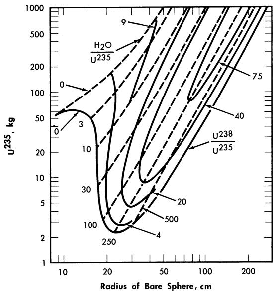  
FIG. 2-1. $\mathbf{U}^{235}$ mass and critical size of uranium light-water mixtures at $260^{\circ}\mathrm{C}$ . Assumed densities: $\mathrm{U}^{235} = 18.5\mathrm{g/cm^3}$ , $\mathrm{U}^{238} = 18.9\mathrm{g/cm^3}$ , $\mathrm{H}_2\mathrm{O} = 0.8\mathrm{g/cm^3}$ .

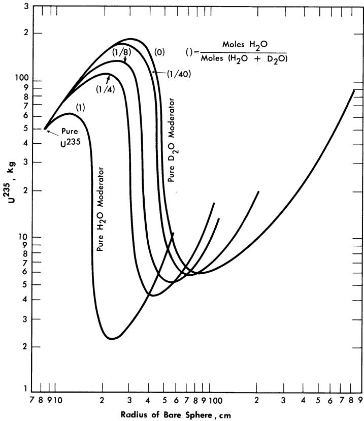  
FIG. 2-2. $\mathbf{U}^{235}$ mass and critical size of bare spherical reactors moderated by $\mathrm{H}_2\mathrm{O}-\mathrm{D}_2\mathrm{O}$ mixtures at $260^{\circ}\mathrm{C}$ . Assumed densities: $\mathrm{U}^{235} = 18.5\mathrm{g/cm^3}$ , $\mathrm{H}_2\mathrm{O} = 0.8\mathrm{g/cm^3}$ , $\mathrm{D}_2\mathrm{O} = 0.89\mathrm{g/cm^3}$ .

tems, while Fig. 2-2 gives the critical-mass requirements for $\mathrm{U}^{235}-\mathrm{D}_2\mathrm{O}-\mathrm{H}_2\mathrm{O}$ systems. Initial conversion ratios for light-water systems are given in Ref. [4].

Nuclear calculations have also been performed [5] using Eqs. (2-1) and (2-5), with the $1 / E$ component of the flux starting at energies of $6kT$ . The calculations were for single-region reactors containing only $\mathrm{ThO}_2$ , $\mathrm{U}^{233}\mathrm{O}_2$ , and $\mathrm{D}_2\mathrm{O}$ at $300^{\circ}\mathrm{C}$ with the value of $\eta^{23}$ in the resonance region considered to be a parameter. Critical concentrations thus calculated are given in Fig. 2-3 for zero neutron leakage. The value for $\eta^{23}$ in the thermal energy region was taken as 2.25. The value for $\eta^{23}$ in the resonance region has not been firmly established; based on available data, $\eta_{\mathrm{res}}^{23} / \eta_{\mathrm{th}}^{23}$ lies between 0.9 and 1.

When the neutron leakage is not negligible and $\eta_{\mathrm{res}}^{23} / \eta_{\mathrm{th}}^{23}$ is less than 1, a finite thorium concentration exists for which the breeding ratio is a maximum. This is indicated in Fig. 2-4, in which the initial breeding ratio is

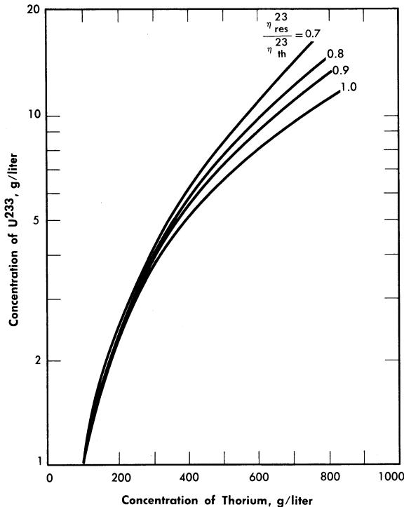  
FIG. 2-3. Fuel concentration as a function of thorium concentration and value of $\eta_{\mathrm{res}} / \eta_{\mathrm{th}}$ for an infinite reactor.

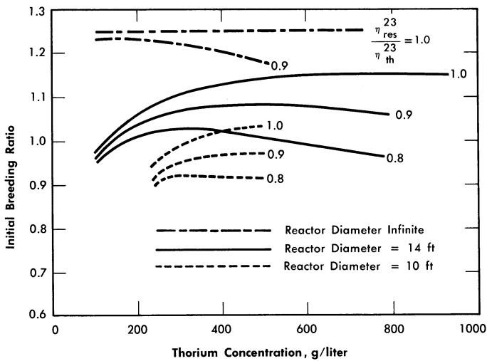  
FIG. 2-4. Breeding ratio as a function of thorium concentration and $\eta_{\mathrm{res}}^{23} / \eta_{\mathrm{th}}^{23}$ in a one-region reactor. Reactor temperature $= 300^{\circ}\mathrm{C}$ , $\eta_{\mathrm{th}}^{23} = 2.25$ .

given as a function of thorium concentration, reactor diameter, and relative value of $\eta^{23}$ . The breeding ratio goes through a maximum owing to the increase in resonance absorption in fuel as the thorium concentration is increased.

If the above reactors were fueled initially with $\mathbf{U}^{235}$ , the initial breeding ratio would have a maximum value of 1.08 rather than 1.25; however, the curves would have about the same shape as those presented in Fig. 2-4, and the value for $\eta_{\mathrm{res}}^{25} / \eta_{\mathrm{th}}^{25}$ would be between 0.8 and 0.9.

Comparison of the above results with those obtained using a two-group model shows that if $\eta_{\mathrm{res}} / \eta_{\mathrm{th}}$ is equal to 1, the breeding ratio obtained by the two methods is about the same; however, the critical concentration is about $30\%$ higher when the two-group model is used. If $\eta_{\mathrm{res}}^{23} / \eta_{\mathrm{th}}^{23} < 1$ , the value for the breeding ratio obtained using the two-group model will tend to be higher than the actual value; however, if the fertile-material concentration is low (about $200\mathrm{g}$ /liter or less) and the reactor size large, little resonance absorption occurs in fuel. Under these conditions the two-group model should be adequate for obtaining the breeding ratio and conservative with respect to estimating the critical concentration.

2-1.3 Results obtained for two-region reactors. Most two-region reactors have been calculated on the basis of the two-group model. Results have also been obtained using multigroup calculations which indicate that the two-group method is valid so long as the value of $\eta(\text{fuel})$ is independent (or nearly so) of energy, or so long as nearly all the fissions are due to absorption of thermal neutrons.

To compare results obtained by different calculational methods, breeding ratios and critical fuel concentrations were obtained [6] for some two-region, $\mathrm{D}_2\mathrm{O}$ -moderated thorium-blanket breeder reactors using a multigroup, multiregion Univac program ("Eyewash") [1] and a two-group, two-region Oracle program [7]. In these calculations operation at $280^{\circ}\mathrm{C}$ was assumed; a $\frac{1}{2}$ -in.-thick Zircaloy-2 core tank separated the core from the blanket; a 6-in.-thick iron pressure vessel contained the reactor; and absorptions occurred only in $\mathrm{U}^{233}$ and thorium in the core and in thorium in the blanket. Twenty-seven fast groups, one thermal group, and four regions (core, Zircaloy-2 core tank, blanket, and pressure vessel) were employed in the multigroup model. The two-group parameters were computed from the multigroup cross sections by numerical integration [8]. In the two-group, two-region calculations a "thin-shell" approximation [9] was used to estimate core-tank absorptions, while the effect of the pressure vessel was simulated by adding an extrapolation distance to the blanket thickness.

In the multigroup studies, various values for $\eta^{23}$ in the resonance region were considered. In one case the value of $\eta_{\mathrm{res}}^{23}$ was assumed to be constant

and equal to the thermal value.* In another the variation of $\eta^{23}$ in the resonance region was based on cross sections used by Roberts and Alexander [10], which resulted in an $\eta_{\mathrm{res}}^{23} / \eta_{\mathrm{th}}^{23}$ of about 0.95; in the third case the effective value for $\eta^{23}$ in the resonance region was assumed to be essentially 0.8 of the thermal value of 2.30.

The initial breeding ratios and $\mathbf{U}^{233}$ critical concentrations obtained from the Eyewash and two-group, two-region calculations are given in Fig. 2-5 for slurry-core reactors (zero core thorium concentration also corresponds to a solution-core reactor). With solution-core reactors the effect of the value of $\eta_{\mathrm{res}}^{23}$ upon breeding ratio was less pronounced than for slurry-core reactors, since fewer resonance absorptions take place with the lower fuel concentrations. The blanket thorium concentration had little influence upon the above effect for blanket thorium concentrations greater than $250~\mathrm{g / liter}$ .

As indicated in Fig. 2-5, the breeding ratio is rather dependent upon the value of $\eta^{23}$ ; the loss in breeding ratio due to a reduced value of $\eta^{23}$ in the resonance region is most marked for the slurry-core systems. For these reactors, relatively more fissions take place in the resonance-energy region as the core loading is increased, owing to the "hardening" of the neutron spectrum. Figure 2-5 also shows that the two-group model gives breeding ratios which are in good agreement with those obtained from the multigroup model, so long as $\eta_{\mathrm{res}}^{23}$ does not deviate significantly from $\eta_{\mathrm{th}}^{23}$ . Reported measurements [11-13] of $\eta^{23}$ as a function of energy indicate that for the reactors considered here, the value of $\eta_{\mathrm{res}}^{23} / \eta_{\mathrm{th}}^{23}$ would be about 0.95; the results given by curve "a" in Fig. 2-5 are based effectively on such a value of $\eta_{\mathrm{res}}^{23} / \eta_{\mathrm{th}}^{23}$ and indicate that two-group results are valid.

In general, for the cases studied it was found that for a heavily loaded blanket (or core), the two-group values of total neutron leakage were larger than the total leakages obtained from the multigroup calculation (the multigroup model allowed for competition between fast absorptions in fuel and fast leakage, while the two-group model assumed that fast leakage occurred before any resonance absorption occurred). The multi-group results were also used to calculate the fast effect, $\epsilon$ , previously defined in Eq. (2-2). It was found that resonance fissions accounted for $10\%$ to $40\%$ of the total fissions in those reactors containing from 0 to $300\mathrm{g}$ Th/liter in the core region. With no thorium in the core region, changing from a 4-9 reactor (4-ft-diameter core and a 9-ft-diameter pressure vessel) to a 6-10 reactor decreased core resonance fissions from about $14\%$ to $10\%$ .

If the reactor core size is small, the two-group method does not adequately treat leakage of fast neutrons; for this case two-group results may

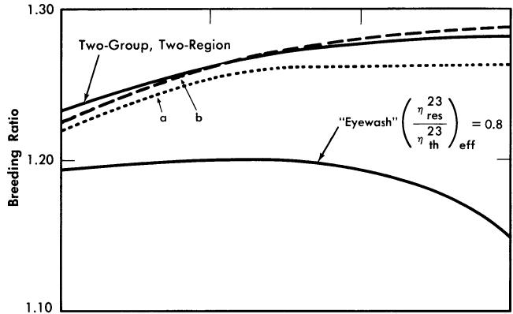

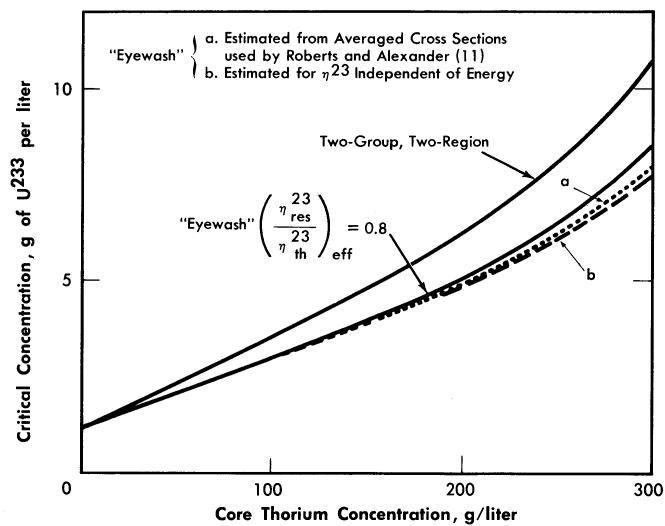  
FIG. 2-5. Breeding gain and critical concentration for slurry-core reactors vs. core thorium concentration. Core diameter $= 6.0$ ft, pressure vessel diameter $= 10.0$ ft, blanket thorium concentration $= 1000\mathrm{g / liter}$ , blanket $\mathbf{U}^{233}$ concentration $= 3.0$ g/kg of Th.

not be adequate even though $\eta_{\mathrm{res}}$ is equal to $\eta_{\mathrm{th}}$ . This is indicated by the experimental [14] and calculated results for the HRE-2 given in Fig. 7-15. As illustrated, there is excellent agreement between the experimental data and the data calculated by a multigroup method and by a "harmonics" method, but not with the results from the two-group model. The harmonics calculation [15] referred to in Fig. 7-15 does not take into account fast fissions but does treat the slowing-down of neutrons in a more realistic manner than does the two-group calculation. The multigroup result [16] indicated that about $13\%$ of the fissions were due to neutrons having energies above thermal.

A comparison [15] of the $\mathbf{U}^{235}$ critical concentrations predicted by the

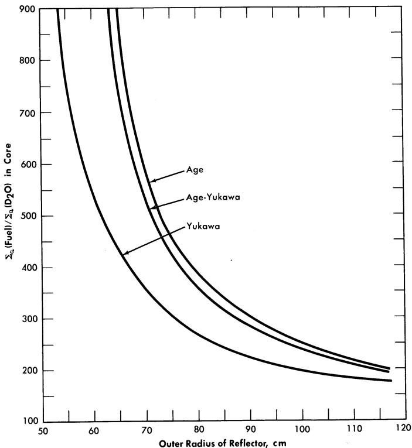  
FIG. 2-6. Comparison of critical concentrations obtained for various slowing-down kernels in $\mathrm{D}_2\mathrm{O}$ . Core radius $= 39~\mathrm{cm}$ , total age $= 237~\mathrm{cm}^2$ for all kernels, diffusion length of pure moderator, $\mathrm{L_0}^2 = 40,200~\mathrm{cm}^2$ . Fuel only in core.

use of different slowing-down kernels in $\mathrm{D}_2\mathrm{O}$ -moderated reactors is shown in Fig. 2-6. In the age-Yukawa kernel [given by $(e^{-r^2 /4\tau_1} / (4\pi \tau_1)^{3 / 2})\times$ $(e^{-r / \sqrt{\tau_2}} / 4\pi \tau_2r))$ , the "age" parameters were taken to be $158~\mathrm{cm^2}$ for $\pmb{\tau}_{1}$ and $79~\mathrm{cm^2}$ for $\pmb{\tau}_{2}$ . For both the age kernel (given by $e^{-r^2 /4\tau} / (4\pi \tau)^{3 / 2}$ ) and the Yukawa kernel (given by $e^{-r / \sqrt{\tau}} / 4\pi \tau r$ ), $\pmb{\tau}$ was taken to be $237~\mathrm{cm^2}$ . The results show that in small reactors the calculated critical concentration obtained using the two-group method (Yukawa kernel) is substantially lower than that obtained using either an age-Yukawa or an age kernel to represent the neutron distribution during the slowing-down process. Since the age-Yukawa kernel is believed to be the proper one to use for $\mathrm{D}_2\mathrm{O}$ , and the HRT is a "small" reactor (in a nuclear sense), it is not surprising that the two-group results given in Fig. 7-15 are appreciably different from the experimental results.

# 2-2. NUCLEAR CONSTANTS USED IN CRITICALITY CALCULATIONS

In obtaining the nuclear characteristics of reactors, it is necessary to know the probabilities with which different events occur. These reaction

probabilities are usually given on an atomic basis in terms of cross sections [17]. Because of their diverse applications, it is necessary to present reaction probabilities in this manner; however, in calculating the nuclear characteristics of homogeneous reactors, it is convenient to combine fundamental data concerning atomic density and reaction probabilities so as to facilitate critical calculations. This has been done to a limited extent in this section. Listed here are some nuclear data and physical properties of uranium isotopes, uranyl sulfate, heavy water, thorium oxide, and Zircaloy-2 used in two-group calculations for thorium breeder reactors [18].

TABLE 2-1 THERMAL MICROSCOPIC ABSORPTION CROSS SECTIONS AT VARIOUS TEMPERATURES   
(Corrected for Maxwell-Boltzmann distribution and also non- $(1 / v)$ correction)   

<table><tr><td>Element</td><td>Neutron velocity, 2200 m/sec</td><td>20°C</td><td>100°C</td><td>280°C</td></tr><tr><td colspan="5">σa,barns [17]</td></tr><tr><td>U233</td><td>588</td><td>526</td><td>460</td><td>376</td></tr><tr><td>U234</td><td>92</td><td>82</td><td>72</td><td>59</td></tr><tr><td>U235</td><td>689</td><td>595</td><td>515</td><td>411</td></tr><tr><td>U236</td><td>6</td><td>5.3</td><td>4.7</td><td>3.9</td></tr><tr><td>U238</td><td>2.73</td><td>2.42</td><td>2.15</td><td>1.76</td></tr><tr><td>Pa233* [19]</td><td>60</td><td>130</td><td>130</td><td>130</td></tr><tr><td>Th232</td><td>7.45</td><td>6.60</td><td>5.85</td><td>4.81</td></tr><tr><td>Pu239</td><td>1025</td><td>975</td><td>905</td><td>950</td></tr><tr><td>Pu240*</td><td>250</td><td>600</td><td>700</td><td>1000</td></tr><tr><td>Pu241</td><td>1399</td><td>1240</td><td>1118</td><td>952</td></tr><tr><td>S</td><td>0.49</td><td>0.43</td><td>0.39</td><td>0.32</td></tr><tr><td>Li7 (99.98%) [20]</td><td>0.23</td><td>0.20</td><td>0.18</td><td>0.15</td></tr><tr><td colspan="5">σf,barns [17]</td></tr><tr><td>U233</td><td>532</td><td>472</td><td>412</td><td>337</td></tr><tr><td>U235</td><td>582</td><td>506</td><td>438</td><td>350</td></tr><tr><td>Pu239</td><td>748</td><td>711</td><td>660</td><td>693</td></tr><tr><td>Pu241</td><td>970</td><td>860</td><td>776</td><td>660</td></tr></table>

*Estimates of the effective cross section in typical homogeneous-reactor neutron spectrums (except for $2200\mathrm{m / sec}$ value); these values include contributions due to resonance absorptions. (Although these values were not used in the calculations presented, they are believed to be more accurate than the ones employed. Values used for $\mathrm{Pa}^{233}$ were 133, 118, and 97 barns at 20, 100, and $280^{\circ}\mathrm{C}$ , respectively.)

2-2.1 Nuclear data. Table 2-1 lists thermal microscopic absorption and fission cross sections for various elements and for various temperatures. Table 2-2 lists thermal macroscopic absorption cross sections for $\mathrm{H}_2\mathrm{O}$ , $\mathrm{D}_2\mathrm{O}$ , and Zircaloy-2, and the density of $\mathrm{H}_2\mathrm{O}$ and $\mathrm{D}_2\mathrm{O}$ at the various

# TABLE 2-2

# THERMAL MACROSOCOPIC ABSORPTION CROSS SECTIONS AND DENSITIES AT VARIOUS TEMPERATURES [18]

(Corrected for Maxwell-Boltzmann distribution on basis of $1 / v$ cross section)

<table><tr><td>Element</td><td>20°C</td><td>100°C</td><td>280°C</td></tr><tr><td>Σa(H2O)</td><td>0.0196</td><td>0.0167</td><td>0.0107</td></tr><tr><td>Σa(99.75% D2O)</td><td>8.02 × 10-5</td><td>6.85 × 10-5</td><td>4.44 × 10-5</td></tr><tr><td>Σa(Zircaloy-2)</td><td>0.00674</td><td>0.00598</td><td>0.00491</td></tr><tr><td>ρ(D2O)</td><td>1.105</td><td>1.062</td><td>0.828</td></tr><tr><td>ρ(H2O)</td><td>1.000</td><td>0.962</td><td>0.749</td></tr></table>

temperatures. All cross sections listed under the columns headed by $^\circ \mathrm{C}$ have been corrected for a Maxwell-Boltzmann flux distribution.

Values of $\eta$ and $\nu$ for the various fuels, and the fast and slow diffusion coefficients for Zircaloy are given in Table 2-3.

# TABLE 2-3

# SOME NUCLEAR CONSTANTS FOR URANIUM, PLUTONIUM, AND ZIRCALOY-2

Values of $\eta$ and $\pmb{\nu}$ for U and Pu [21]

<table><tr><td>Element</td><td>η.</td><td>ν</td></tr><tr><td>U233</td><td>2.25</td><td>2.50</td></tr><tr><td>U235</td><td>2.08</td><td>2.46</td></tr><tr><td>Pu239</td><td>1.93</td><td>3.08</td></tr><tr><td>Pu241</td><td>2.23</td><td>3.21</td></tr><tr><td colspan="3">Diffusion coefficients for Zircaloy-2: [22] 
D1=D2=0.98 for all temperatures, 
where D1=fast diffusion coefficient, 
D2=slow diffusion coefficient.</td></tr></table>

Data for two-group calculations are summarized in Table 2-4 for $\pmb{\tau}$ , $D_{1}$ , $D_{2}$ , and $p$ as functions of fertile-material concentration in mixtures of

TABLE 2-4   
TWO-GROUP NUCLEAR CONSTANTS* FOR $\mathrm{D}_2\mathrm{O}$ -MODERATED SYSTEMS AT $280^{\circ}\mathrm{C}$ [18]   

<table><tr><td>Fertile-material concentration, g/liter</td><td>τ, cm2</td><td>D1, cm</td><td>D2, cm</td><td>p</td></tr><tr><td>Th (in ThO2-D2O)</td><td></td><td></td><td></td><td></td></tr><tr><td>0</td><td>212</td><td>1.64</td><td>1.24</td><td>1.000</td></tr><tr><td>100</td><td>212</td><td>1.62</td><td>1.23</td><td>0.909</td></tr><tr><td>250</td><td>213</td><td>1.60</td><td>1.22</td><td>0.825</td></tr><tr><td>500</td><td>213</td><td>1.56</td><td>1.20</td><td>0.718</td></tr><tr><td>1000</td><td>215</td><td>1.50</td><td>1.16</td><td>0.554</td></tr><tr><td>U238 (in UO2SO4-D2O)</td><td></td><td></td><td></td><td></td></tr><tr><td>0</td><td>212</td><td>1.64</td><td>1.24</td><td>1.000</td></tr><tr><td>100</td><td>200</td><td>1.57</td><td>1.20</td><td>0.875</td></tr><tr><td>250</td><td>189</td><td>1.49</td><td>1.15</td><td>0.801</td></tr><tr><td>500</td><td>179</td><td>1.40</td><td>1.10</td><td>0.720</td></tr><tr><td>1000</td><td>173</td><td>1.28</td><td>1.04</td><td>0.595</td></tr><tr><td>U238 (in UO2SO4-Li2SO4-D2O)†</td><td></td><td></td><td></td><td></td></tr><tr><td>0</td><td>212</td><td>1.64</td><td>1.24</td><td>1.000</td></tr><tr><td>100</td><td>198</td><td>1.55</td><td>1.19</td><td>0.873</td></tr><tr><td>250</td><td>185</td><td>1.45</td><td>1.13</td><td>0.797</td></tr><tr><td>500</td><td>173</td><td>1.33</td><td>1.07</td><td>0.705</td></tr><tr><td>1000</td><td>165</td><td>1.18</td><td>0.99</td><td>0.525</td></tr></table>

$^{*}\tau =$ Fermi age; $D_{1} =$ fast diffusion coefficient; $D_{2} =$ slow diffusion coefficient; $p =$ resonance escape probability.   
$\dagger \mathrm{Li}_{2}\mathrm{SO}_{4}$ molar concentration equal to $\mathrm{UO}_{2}\mathrm{SO}_{4}$ molar concentration.

fertile material and heavy water $(99.75\% \mathrm{D}_2\mathrm{O})$ at $280^{\circ}\mathrm{C}$ . Materials considered are $\mathrm{ThO_2 - D_2O}$ , $\mathrm{UO_2SO_4 - D_2O}$ , and $\mathrm{UO_2SO_4 - Li_2SO_4 - D_2O}$ where the molar concentration of $\mathrm{Li_2SO_4}$ is the same as the $\mathrm{UO_2SO_4}$ molar concentration. Reference [18] gives corresponding data at other temperatures and also gives some values for the case of $\mathrm{H}_2\mathrm{O}$ as the moderator.

The diffusion coefficients and ages were calculated by a numerical integration procedure [8]. The fast diffusion constant, $D_{1}$ , and the Fermi age, $\tau$ , are based on a $1 / E$ flux distribution, and the slow diffusion constant, $D_{2}$ , is based on a Maxwellian flux distribution.

2-2.2 Resonance integrals. Formulas used in calculating resonance integrals (RI) are given below.

For $\mathbf{U}^{238}$

$$
\mathrm {R I} = 2. 6 9 \left(\frac {\sum_ {s}}{N ^ {2 8}}\right) ^ {0. 4 7 1}, \quad 0 \leq \frac {\sum_ {s}}{N ^ {2 8}} \leq 4 \times 1 0 ^ {3}, \tag {2-12}
$$

$$
\ln \mathrm {R I} = 5. 6 4 - \frac {1 6 3}{\left(\Sigma_ {s} / N ^ {2 8}\right) ^ {0 . 6 5}}, \quad \frac {\Sigma_ {s}}{N ^ {2 8}} > 4 \times 1 0 ^ {3}, \tag {2-13}
$$

$$
\operatorname {R I} (\infty) = 2 8 0 \text {b a r n s}. \tag {2-14}
$$

For Th232:

$$
\mathrm {R I} = 8. 3 3 \left(\frac {\sum_ {s}}{N ^ {0 2}}\right) ^ {0. 2 5 3}, \quad 0 \cong \frac {\sum_ {s}}{N ^ {0 2}} \cong 4 5 0 0, \tag {2-15}
$$

$$
\mathrm {R I} = 7 0 \text {b a r n s}, \quad \frac {\sum_ {s}}{N ^ {0 2}} > 4 5 0 0, \tag {2-16}
$$

$$
\operatorname {R I} (\infty) = 7 0 \text {b a r n s}. \tag {2-17}
$$

# 2-3. FUEL CONCENTRATIONS AND BREEDING RATIOS UNDER INITIAL AND STEADY-STATE CONDITIONS

The relationships between breeding ratio and reactor-system inventory determine the fuel costs in homogeneous reactors. The breeding ratio depends on neutron leakage as well as relative absorptions in fuel fertile material and other materials present, while material inventory is a function of reactor size and fuel and fertile-material concentrations; thus a range of parameter values must be considered to aid in understanding the above relationships. Based on results given in Section 1-1.3, it appears that the two-group method gives satisfactory results for critical concentration and breeding ratio for most of the aqueous-homogeneous systems of interest. This permits survey-type calculations to be performed in a relatively short time interval. The results given below are based on the conventional two-group model.

In steady-state operation, the concentration of the various nuclides within the reactor system does not change with time. During the initial period of reactor operation this situation is not true, but is approached after some time interval if neutron poisons are removed by fuel processing. Under steady-state operation it is necessary to consider the equilibrium isotope relationships. In thorium breeder reactors this involves rate material balances on Th, $\mathrm{Pa}^{233}$ , $\mathrm{U}^{233}$ , $\mathrm{U}^{234}$ , $\mathrm{U}^{235}$ , $\mathrm{U}^{236}$ , fission-product poisons, and corrosion products. (The uranium isotope chain is normally cut off at $\mathrm{U}^{236}$ since this is a low-cross-section isotope, and neutrons lost to the successors of $\mathrm{U}^{236}$ would tend to be compensated for by fission neutrons gen-

erated by some succeeding members of the chain.) In uranium-plutonium reactors, steady-state rate material balances were made on $\mathbf{U}^{235}$ , $\mathbf{U}^{236}$ , $\mathbf{U}^{238}$ , $\mathbf{Pu}^{239}$ , $\mathbf{Pu}^{240}$ , and $\mathbf{Pu}^{241}$ ; all other higher isotopes were assumed either to be removed in the fuel-processing step or to have a negligible effect upon the nuclear characteristics of the reactor.

Although equilibrium results give the isotope ratios which would be approached in a reactor system, much of the desired nuclear information can be obtained by considering "clean" reactors, i.e., reactors in which zero poisons exist, corresponding to initial conditions, or to criticality conditions at reactor startup. This is a result of the rather simple relationships which exist between breeding ratio, critical concentration, and fraction poisons, and the ability to represent the higher isotopes by their fraction-poison equivalent.

2-3.1 Two-region reactors. In order to estimate the minimum fuel costs in a two-region thorium breeder reactor, it is important to determine the relation between breeding ratio and the concentrations of fuel $(\mathrm{U}^{233})$ and fertile material $(\mathrm{Th}^{232})$ in the core and blanket. Similar considerations apply to uranium-plutonium converter reactors. The breeding or conversion ratio will depend on neutron leakage as well as relative neutron absorptions in fuel, fertile material, and the core-tank wall; therefore a range of core and pressure-vessel sizes must be considered.

Since fabrication problems and the associated cost of pressure vessels capable of operating at 2000 psi increase rapidly for diameters above 12 ft, and since the effect of larger diameters on the nuclear characteristics of the two-region reactors is relatively small, 12 ft has been taken as the limiting diameter value. Actually, in most of the calculations discussed here, the inside diameter of the pressure vessel has been held at 10 ft and the core diameter allowed to vary over the range of 3 to 9 ft.

In addition to the limitation on the maximum diameter of the pressure vessel, there will also be a limitation, for a given total power output, on the minimum diameter of the core vessel. This minimum diameter is determined by the power density at the core wall, since high power densities at the wall will lead to intolerable corrosion of the wall material (Zircaloy-2). In order to take this factor into consideration, the power densities, as well as critical concentrations and breeding ratios, were calculated for the various reactors.

2-3.2 Two-region thorium breeder reactors evaluated under initial conditions. The results given here are for reactors at startup; although the trends indicated apply to reactors in steady-state operation, the values given here for the breeding ratio and fuel concentration would be somewhat different than those for steady-state conditions.

Calculations of breeding ratio, the power density at the inside core wall, and the maximum power density were carried out for some spherical reactors with $200\mathrm{g}$ Th/liter in the core. The blanket materials considered were heavy water $(99.75\% \mathrm{D}_2\mathrm{O})$ , beryllium, and $\mathrm{ThO_2}$ -heavy water suspensions. The inside diameter of the pressure vessel was fixed at 10 ft for one set of calculations and at 12 ft for a second set; core diameters ranged from 6 to 9 ft in the first set and from 6 to 11 ft in the second set. The average temperature of all systems was taken as $280^{\circ}\mathrm{C}$ , and for the purpose of calculating power densities at the core wall, the total thermal power was taken as $100\mathrm{Mw}$ . A $\frac{1}{2}$ -in-thick Zircaloy-2 core tank was assumed to separate the core and blanket in all reactors, and the value of $\eta^{23}$ was taken as 2.32. (A more accurate value of $\eta^{23}$ is presently considered to be $\eta = 2.25$ .) No account was taken of fission-product-poison buildup, protactinium losses, or fuel buildup in the blanket. The results obtained [23] indicate that the breeding ratio increases for any core diameter by replacing either a $\mathrm{D}_2\mathrm{O}$ or Be blanket with one containing $\mathrm{ThO_2}$ ; no significant increase in breeding ratio is obtained by increasing the blanket thorium concentration above $2\mathrm{kg}$ Th/liter; for reactors with fertile material in the blanket, the breeding ratio and wall power density increase with decreasing core diameter.

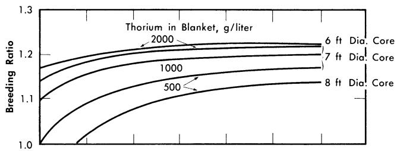

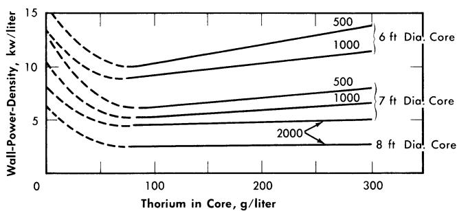  
FIG. 2-7. Effect of core thorium concentration on breeding ratio and wall power density of two-region slurry reactors. $\eta = 2.25$ , total reactor power $= 100$ Mw (heat), pressure vessel $= 10$ ft ID, $\mathrm{U}^{233}$ in blanket $= 3$ g/liter, poison fraction $= 0$ , temperature $= 280^{\circ}\mathrm{C}$ .

Additional results [24] obtained on the same bases given above except that $\eta^{23}$ was considered to be 2.25, and that the $\mathrm{U}^{233}$ concentration in the blanket region was varied, are given in Figs. 2-7 through 2-9. Results were obtained for 10-ft-diameter pressure vessels and for core diameters of 6, 7, and 8 ft; the blanket thorium concentration was 500, 1000, or $2000\mathrm{g / liter}$ , while the core thorium concentration was 0, 100, 200, or $300\mathrm{g / liter}$ . Generally, the results in Figs. 2-7 through 2-9 are complete for the 7-ft-diameter-core reactors, while for the 6- and 8-ft-diameter-core reactors results are shown only for the parameter-value extremes. The variation of results with parameter value is practically the same for all three core diameters, and so all the essential results are presented in the figures.

In all cases slurries of $\mathrm{D}_2\mathrm{O}-\mathrm{ThO}_2-\mathrm{U}^{233}\mathrm{O}_3$ are assumed in both the core and blanket regions, and all power densities are based on the assumption that the total reactor power is 100 thermal Mw. Whenever the power density on the blanket side of the core-tank wall was greater than that on the core side (owing to a fuel concentration which was higher in the blanket than in the core), the greater value was plotted. This situation is indicated by the dashed lines in Fig. 2-7.

Typical information obtained for these slurry reactors is given in Table 2-5 for two of the cases considered. The values of breeding ratio for

TABLE 2-5 SLURRY-REACTOR CHARACTERISTICS  

<table><tr><td>Pressure-vessel inside diameter, ft</td><td>10</td><td>10</td></tr><tr><td>Core inside diameter, ft</td><td>7</td><td>7</td></tr><tr><td>Core thorium concentration, g/liter</td><td>100</td><td>200</td></tr><tr><td>Blanket thorium concentration, g/liter</td><td>1000</td><td>2000</td></tr><tr><td>Blanket U233 concentration, g/liter</td><td>3</td><td>5</td></tr><tr><td>Total power, Mw</td><td>100</td><td>100</td></tr><tr><td>Blanket power, Mw</td><td>8.5</td><td>4.2</td></tr><tr><td>Critical core concentration, g U233/liter</td><td>3.0</td><td>6.0</td></tr><tr><td>Breeding ratio</td><td>1.18</td><td>1.21</td></tr><tr><td>Power density at core center, kw/liter</td><td>43</td><td>45</td></tr><tr><td>Power density at core wall, kw/liter</td><td>5.4</td><td>4.9</td></tr><tr><td>Flux at core center × 10-14</td><td>5.5</td><td>2.9</td></tr><tr><td>Neutron absorptions in core wall, %</td><td>0.7</td><td>0.3</td></tr></table>

the two-region reactors given may be compared with those in Table 2-6 for a one-region reactor having the same size and same diameter pressure vessel. These results indicate that for a given size, two-region reactors have significantly higher breeding ratios than do one-region reactors.

TABLE 2-6   
BREEDING RATIO IN 10-FT-DIAMETER ONE-REGION REACTORS (ZERO POISONS)   

<table><tr><td>Thorium concentration, g/liter</td><td>Breeding ratio</td></tr><tr><td>100</td><td>0.875</td></tr><tr><td>200</td><td>0.993</td></tr><tr><td>300</td><td>1.037</td></tr></table>

For all reactors having thorium concentrations of at least $100\mathrm{g}$ /liter in the core and $500\mathrm{g}$ /liter in the blanket, the neutron absorption by the core-tank wall was less than $1\%$ of the total absorptions. The variations of breeding ratio and wall power density with core size, thorium concentration, and blanket $\mathrm{U}^{233}$ concentration are plotted in Figs. 2-7 and 2-8 for reactors of 10-ft over-all diameter. The variations of critical concentration, fraction of total power generated in the blanket region, and the ratio of fuel to thorium required in the core for criticality are given in Fig. 2-9 for different thorium concentrations and blanket fuel concentrations. The curves for the ratio of $\mathrm{U}^{233} / \mathrm{Th}$ versus core thorium concentration are of value in determining the reactivity which would occur if there were a rapid change in core thorium concentration. If the reactor operating conditions

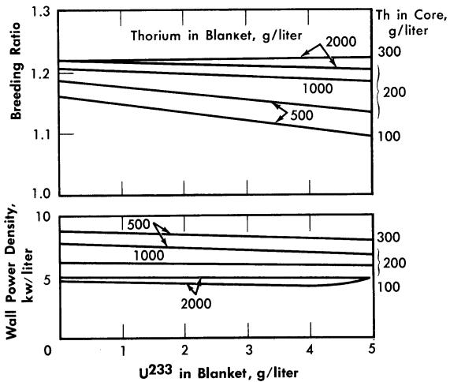  
FIG. 2-8. Effect of blanket $\mathbf{U}^{233}$ concentration on breeding ratio and wall power density of two-region slurry reactors. $\eta = 2.25$ , total reactor power $= 100$ Mw (heat), pressure vessel $= 10$ ft ID, core diameter $= 7$ ft, poison fraction $= 0$ , temperature $= 280^{\circ}\mathrm{C}$ .

were such that the flat region of the appropriate curve applied, small uniform changes in core thorium concentration would have a negligible effect upon reactor criticality. The location of the minimum in these curves did not vary appreciably with changes in blanket thickness, blanket thorium concentration, and blanket fuel concentration. The results given in Figs. 2-7 through 2-9 indicate that for large spherical reactors the breeding ratio increases when the core size decreases, when the blanket $\mathbf{U}^{233}$ concentration decreases, and when the thorium concentration is increased in either the core or blanket region. The core-wall power density decreases when the thorium concentration is increased in the blanket region and when the core size increases, but is relatively insensitive to changes in the blanket fuel concentration for thorium concentrations greater than 100 and $500\mathrm{g / liter}$ in the core and blanket, respectively. The critical concentration of $U^{233}$ in the core decreases with decreasing core thorium concentration and with increasing core diameter, and varies only slightly with changes in blanket thickness, blanket $\mathbf{U}^{233}$ concentration, and blanket thorium

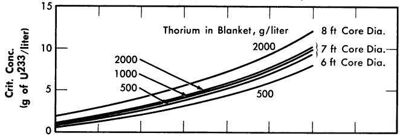

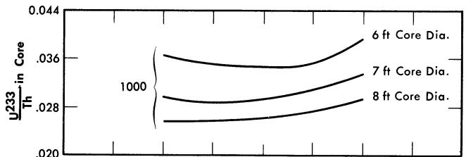

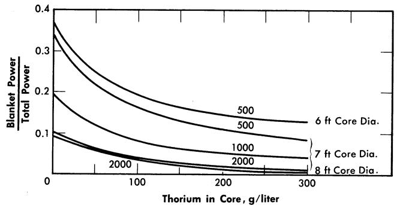  
FIG. 2-9. Effect of core thorium concentration on $\mathbf{U}^{233}$ critical concentration, ratio of $\mathbf{U}^{233}$ to Th required for criticality, and fraction of total power generated in blanket for some two-region slurry reactors. $\eta^{23} = 2.25$ , pressure vessel $= 10$ ft ID, poison fraction $= 0$ , $\mathbf{U}^{233}$ in blanket $= 3\mathrm{g / liter}$ , temperature $= 280^{\circ}\mathrm{C}$ .

concentration. The fraction of total power generated in the blanket increases nearly linearly with increasing blanket $\mathrm{U}^{233}$ concentration, increases with decreasing core diameter, and also increases with decreasing core and blanket thorium concentrations. Finally, the $U^{233}$ -to-thorium ratio required in the core for criticality passes through a minimum when the core thorium concentration is permitted to vary. These variations show that desirable features are always accompanied by some undesirable ones. For example, increasing either the core or blanket thorium concentrations results in an increase in breeding ratio, but there is also an accompanying increase in inventory requirements; decreasing the core radius increases breeding ratio and possibly decreases inventory requirements but increases wall power density. These types of variations illustrate that minimum fuel costs will result only by compromise between various reactor features.

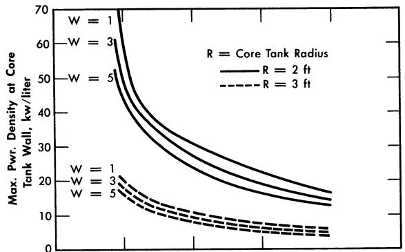

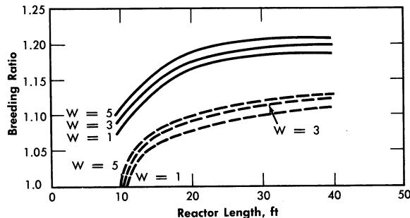  
FIG. 2-10. Gross breeding ratio and maximum power density at core wall for two-region cylindrical reactors. $W = \mathrm{g}$ of $\mathrm{U}^{233} / \mathrm{kg}$ of $\mathrm{Th}^{232}$ in blanket, blanket radius $= 5$ ft, power $= 450$ Mw (heat).

The breeding ratio, the power density at the core wall for a given total power, and the required fuel concentration have also been evaluated for cylindrical reactors [25]. The results, plotted in Fig. 2-10, are based on two-group calculations for cylindrical reactors; the diameter of the pressure vessel was assumed to be 10 ft, the total reactor power $450\mathrm{Mw}$ , the reactor

temperature $300^{\circ}\mathrm{C}$ , and the core diameter either 4 or 6 ft. The Zircaloy-2 core tank was assumed to be $\frac{1}{2}$ -in. thick when the core diameter was 4 ft, and $\frac{3}{4}$ in. when the core diameter was 6 ft. The reactors were assumed to contain $\mathrm{D}_2\mathrm{O}$ , $\mathrm{U}^{233}$ , and $6\%$ fraction poisons in the core region and $\mathrm{D}_2\mathrm{O}$ , $\mathrm{U}^{233}$ , and $1000\mathrm{g}$ Th/liter in the blanket region. Figure 2-10 gives the breeding ratio and the maximum power density at the core wall (core side) as a function of reactor length for different core radii and blanket fuel concentrations. The highest breeding ratios are associated with small core radii, thick blankets, and long reactors; however, these reactors also have relatively high power densities at the core wall. Increasing the reactor length increases the breeding ratio and decreases the wall power density and the critical fuel concentration but appreciably increases the inventory of material.

In other studies [26] of cylindrical reactors, results were obtained which indicated that breeding ratios for cylindrical reactors of interest were about the same as those obtained for spherical reactors. The required fuel concentrations were higher, as expected, so that the average flux was lower for the cylindrical geometry. Although the maximum core-wall power density decreased with increasing cylinder diameter, it was always higher than the wall power density obtained for the spherical reactors of equal volume. The results of these calculations are given in Table 2-7. These reactors were assumed to be at $280^{\circ}\mathrm{C}$ with $7\%$ core poisons, $3\mathrm{g}$ of $\mathrm{U}^{233}$ per liter and $1000\mathrm{g}$ of Th per liter (as $\mathrm{ThO}_2$ ) in heavy water in the blanket, and operated at a total power of $60\mathrm{Mw}$ . A cylindrical core was assumed to be positioned within a cylindrical pressure vessel such that a 2-ft blanket thickness surrounded the core.

The results given in Table 2-7 show that increasing the reactor height had only a slight effect on breeding ratio; also, although the critical concentration declined with increasing height, the corresponding total fuel inventory increased. While not shown, the ratio of blanket power to core power did not vary significantly with reactor height. Increasing the core volume caused a pronounced decrease in core-wall power density and an increase in fuel inventory. Thus, for a 3-ft-diameter core, increasing the core length from 4.8 to 8 ft decreased the power density by $36\%$ . However, the blanket and core fuel inventory increased by about $40\%$ .

2-3.3 Nuclear characteristics of two-region thorium breeder reactors under equilibrium conditions. Results [27] of some nuclear computations associated with the conceptual design of HRE-3 are given below for spherical two-region reactors in which the following conditions were specified:

(1) The reactor system is at equilibrium with regard to nuclei concentrations.

TABLE 2-7   
BREEDING RATIOS, CORE-WALL POWER DENSITY, AND CRITICAL U233 CONCENTRATION FOR CYLINDRICAL REACTORS OF VARIOUS HEIGHTS   

<table><tr><td rowspan="3">Height of core, ft</td><td colspan="9">Core diameter, ft</td></tr><tr><td colspan="3">21/2</td><td colspan="3">3</td><td colspan="3">31/2</td></tr><tr><td>U233, g/liter</td><td>Breeding ratio</td><td>Power density, * kw/liter</td><td>U233, g/liter</td><td>Breeding ratio</td><td>Power density, * kw/liter</td><td>U233, g/liter</td><td>Breeding ratio</td><td>Power density, * kw/liter</td></tr><tr><td>3.5</td><td></td><td></td><td></td><td></td><td></td><td></td><td>4.1</td><td>1.10</td><td>25</td></tr><tr><td>4.8</td><td></td><td></td><td></td><td>4.6</td><td>1.12</td><td>29</td><td></td><td></td><td></td></tr><tr><td>6.0</td><td></td><td></td><td></td><td>4.2</td><td>1.12</td><td>24</td><td>3.0</td><td>1.12</td><td>16</td></tr><tr><td>6.8</td><td>6.5</td><td>1.13</td><td>36</td><td></td><td></td><td></td><td></td><td></td><td></td></tr><tr><td>8</td><td>6.2</td><td>1.13</td><td>31</td><td>3.9</td><td>1.13</td><td>18</td><td>2.7</td><td>1.12</td><td>12</td></tr><tr><td>10</td><td>6.0</td><td>1.13</td><td>26</td><td>3.7</td><td>1.13</td><td>15</td><td>2.6</td><td>1.12</td><td>10</td></tr><tr><td>12</td><td>5.8</td><td>1.13</td><td>21</td><td>3.6</td><td>1.13</td><td>13</td><td>2.5</td><td>1.12</td><td>8</td></tr></table>

*Core-wall power density, based on total reactor power of 60 Mw (heat).

(2) Hydroclone separation of poisons from the core system is employed in addition to Thorex processing.   
(3) The core Thorex cycle time is a dependent function of the specified total poison fraction; the blanket cycle time is a function of the blanket $\mathbf{U}^{233}$ concentration.

TABLE 2-8   
CHARACTERISTICS OF INTERMEDIATE-SCALE (HRE-3)   
TWO-REGION REACTORS (EQUILIBRIUM CONDITIONS)   

<table><tr><td>Core diameter, ft</td><td>4</td><td>4</td><td>4</td><td>4</td><td>5</td></tr><tr><td>Pressure vessel ID, ft</td><td>8</td><td>8</td><td>9</td><td>9</td><td>9</td></tr><tr><td>Blanket thorium, g/liter</td><td>500</td><td>1000</td><td>500</td><td>1000.</td><td>1000</td></tr><tr><td>Blanket U233, g/kg Th</td><td>3.0</td><td>3.0</td><td>3.0</td><td>3.0</td><td>3.0</td></tr><tr><td>Core poison fraction</td><td>0.07</td><td>0.07</td><td>0.07</td><td>0.07</td><td>0.07</td></tr><tr><td>Concentration of U233, g/liter (core)</td><td>3.68</td><td>4.04</td><td>3.63</td><td>4.02</td><td>2.19</td></tr><tr><td>Concentration of U235, g/liter (core)</td><td>0.41</td><td>0.39</td><td>0.37</td><td>0.37</td><td>0.21</td></tr><tr><td>Breeding ratio</td><td>1.041</td><td>1.094</td><td>1.086</td><td>1.123</td><td>1.089</td></tr><tr><td>Core-wall power density (inside), kw/liter</td><td>27</td><td>23</td><td>27</td><td>23</td><td>10</td></tr><tr><td>Core cycle time, days</td><td>833</td><td>901</td><td>817</td><td>893</td><td>616</td></tr><tr><td>Blanket cycle time, days</td><td>220</td><td>371</td><td>288</td><td>504</td><td>486</td></tr><tr><td>Core power, Mw (heat)</td><td>51.5</td><td>51.9</td><td>51.0</td><td>51.7</td><td>51.2</td></tr><tr><td>Blanket power, Mw (heat)</td><td>10.0</td><td>9.6</td><td>10.5</td><td>9.9</td><td>10.3</td></tr><tr><td colspan="6">Neutron absorptions and leakages per 100 absorptions in fuel</td></tr><tr><td>Absorptions in core by:</td><td></td><td></td><td></td><td></td><td></td></tr><tr><td>U233</td><td>74.7</td><td>76.4</td><td>74.6</td><td>76.4</td><td>75.3</td></tr><tr><td>U234</td><td>9.2</td><td>8.2</td><td>8.4</td><td>7.8</td><td>8.2</td></tr><tr><td>U235</td><td>9.1</td><td>8.1</td><td>8.3</td><td>7.6</td><td>8.0</td></tr><tr><td>U236</td><td>0.7</td><td>0.4</td><td>0.4</td><td>0.3</td><td>0.4</td></tr><tr><td>Poisons</td><td>5.2</td><td>5.3</td><td>5.2</td><td>5.3</td><td>5.2</td></tr><tr><td>Heavy water</td><td>0.9</td><td>0.8</td><td>0.9</td><td>0.8</td><td>1.6</td></tr><tr><td>Absorptions in core tank</td><td>2.1</td><td>1.6</td><td>2.1</td><td>1.6</td><td>2.4</td></tr><tr><td>Absorptions in blanket by:</td><td></td><td></td><td></td><td></td><td></td></tr><tr><td>U233</td><td>16.2</td><td>15.5</td><td>17.1</td><td>16.0</td><td>16.6</td></tr><tr><td>U234, U235, U236</td><td>0.1</td><td>0.1</td><td>0.1</td><td>0.1</td><td>0.1</td></tr><tr><td>Th</td><td>95.8</td><td>101.7</td><td>100.9</td><td>104.8</td><td>101.0</td></tr><tr><td>Pa233</td><td>0.9</td><td>0.5</td><td>0.7</td><td>0.4</td><td>0.4</td></tr><tr><td>Poisons</td><td>0.4</td><td>0.4</td><td>0.4</td><td>0.4</td><td>0.4</td></tr><tr><td>Heavy water</td><td>0.5</td><td>0.2</td><td>0.5</td><td>0.2</td><td>0.2</td></tr><tr><td>Fast leakage</td><td>4.3</td><td>3.6</td><td>2.2</td><td>1.6</td><td>3.0</td></tr><tr><td>Slow leakage</td><td>3.4</td><td>0.9</td><td>1.7</td><td>0.4</td><td>0.8</td></tr></table>

(4) The poison fraction due to samarium is $0.8\%$ ; that due to xenon is $1\%$ [poison fraction is the ratio of $\Sigma_{a}(\text{poison}) / \Sigma_{f}(\text{fuel})$ ].   
(5) The external core system has 1.0 liter of volume for every $20\mathrm{kw}$ of core power; the blanket external system has 1.0 liter for every $14\mathrm{kw}$ of blanket power.   
(6) The total reactor power is 61.5 thermal Mw.   
(7) The average core and blanket temperatures are $280^{\circ}\mathrm{C}$ .

The breeding ratio for the reactor variables considered is plotted in Fig. 2-11 as a function of pressure-vessel size for 4- and 5-ft-diameter cores with several blanket thorium concentrations. More extensive results, including neutron balances, are given in Table 2-8 for selected reactors. The neutron

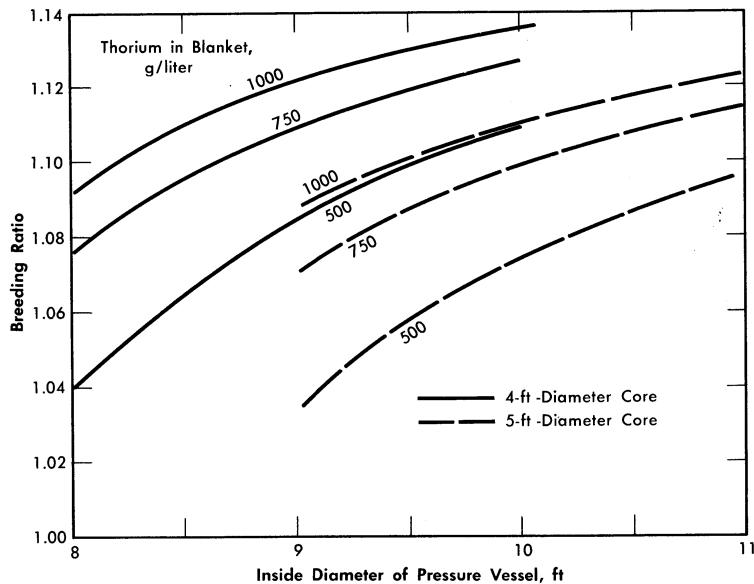  
FIG. 2-11. Breeding ratio as function of pressure vessel size for various core diameters and blanket thorium concentrations. Core poison fraction $= 0.07$ , corrosion products $= 0$ , copper concentration $= 0$ , blanket $\mathrm{U}^{233} = 3.0~\mathrm{g / kg}$ of Th, $\eta^{23} = 2.25$ , mean temperature $= 280^{\circ}\mathrm{C}$ , equilibrium isotope concentrations.

balances are normalized to 100 absorptions in $\mathrm{U}^{233}$ and $\mathrm{U}^{235}$ ; therefore the numerical values represent approximately the percentage effects of the various items on the breeding ratio (however, the effect of $\mathrm{Pa}^{233}$ losses on breeding ratio would be obtained by doubling the values given).

Some of the materials which act as neutron poisons can be altered by reactor-system design; these include fission-product poisons, core-tank material, contaminants such as $\mathrm{H}_2\mathrm{O}$ , and additives such as the cupric ion. The effect of these on breeding ratio is discussed below.

Fission-product poisons. The effect of total core poison fraction, $f_{pc}$ (ratio of absorption cross section of poisons to fission cross section of fuel),

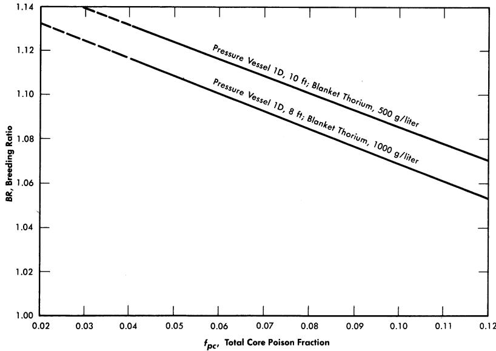  
FIG. 2-12. Effect of core poison fraction on breeding ratio. Core diameter $= 4$ ft, blanket $\mathrm{U}^{233} = 3.0\mathrm{g / kg}$ of Th, $\eta^{23} = 2.25$ , mean temperature $= 280^{\circ}\mathrm{C}$ , equilibrium isotope concentrations.

on breeding ratio is shown in Fig. 2-12. The results indicate that for these reactors the change in breeding ratio with change in poison fraction can be estimated from the relation

$$
\Delta \mathrm {B R} = - 0. 7 5 \Delta f _ {p c}. \tag {2-18}
$$

Achievement of a xenon poison fraction of 0.01, as postulated in the computations for Fig. 2-11 and Table 2-8, requires the removal of most of the xenon or its iodine precursor before neutron capture occurs. If there is no fast-cycle system for iodine or xenon removal, the poison fraction resulting from xenon will be about 0.05. According to Eq. (2-18), the breeding ratio would be reduced by about 0.03 below the values given in Fig. 2-11 if all xenon were retained in the core system.

Core-tank absorptions. The thickness of the Zircaloy core tank was taken as 0.42 in. for the 5-ft core and 0.33 in. for the 4-ft vessel. As shown in Table 2-8, neutron captures in the core tank reduce the breeding ratio about 0.02 in the 4-ft core and 0.03 in the 5-ft core. If the core-tank thickness were altered, the losses would be changed proportionately.

Absorptions in copper. Copper can be added to act as a recombination catalyst for decomposed water. No allowance for neutron absorptions in the copper recombination catalyst was made in these computations. The poison fraction attributable to copper in various concentrations and the effects on breeding ratio (ΔBR) are estimated in Table 2-9. For other copper concentrations the poisoning effects would be proportionate to the values in Table 2-9.

TABLE 2-9 EFFECT OF COPPER ADDITION ON BREEDING RATIO  

<table><tr><td>Core diameter, ft</td><td>Copper concentration, g-mole/liter</td><td>Poison fraction</td><td>ΔBR</td></tr><tr><td>4</td><td>0.01</td><td>0.004</td><td>-0.003</td></tr><tr><td>5</td><td>0.01</td><td>0.008</td><td>-0.006</td></tr></table>

The copper concentration required for $100\%$ recombination in a 4-ft core at $61.5\mathrm{Mw}$ has been estimated to be $0.018\mathrm{g}$ -mole/liter. For this core size and copper concentration, the loss of neutrons to copper would reduce the breeding ratio by 0.005.

$H_{2}O$ contamination. Any $\mathrm{H}_{2}\mathrm{O}$ contained in the heavy-water moderator will act as a poison and reduce the breeding ratio. The above results are based on the use of heavy water containing $0.25\% \mathrm{H}_2\mathrm{O}$ . Neutron captures in the moderator in a 4-ft-core reactor (see Table 2-8) were found to be about 0.009 per absorption in fuel, of which about $60\%$ were in $\mathrm{H}_{2}$ . Thus $0.25\% \mathrm{H}_{2}\mathrm{O}$ , which is 9 liters in a 3600-liter system, reduced the breeding ratio by 0.005. Other values are given in Table 2-10. Different concentrations of $\mathrm{H}_{2}\mathrm{O}$ would cause changes in breeding ratio proportionate to the values in Table 2-10.

TABLE 2-10 EFFECT OF $\mathbf{H}_2\mathbf{O}$ CONCENTRATION ON BREEDING RATIO   

<table><tr><td>Core diameter, ft</td><td>H2O concentration</td><td>ΔBR</td></tr><tr><td>4</td><td>1.0% (36 liters)</td><td>-0.02</td></tr><tr><td>5</td><td>1.0% (44 liters)</td><td>-0.04</td></tr></table>

A specified volume of $\mathrm{H}_2\mathrm{O}$ added to the blanket has much less effect on breeding ratio than the same amount added to the core. This is a result of both the lower flux in the blanket region and the larger volume of the system.

Corrosion products. Assuming the surface area of stainless steel in the core high-pressure system to be $6000\mathrm{ft}^2$ , corrosion to an average depth of 0.001 in. would remove 250 lb of metal. If this were distributed uniformly throughout the fuel solution, the poison fraction resulting from it would be

about 0.18 in a 4-ft core and 0.36 in a 5-ft core. However, iron and chromium would precipitate and be removed by hydroclones. If the hydroclones were operated on a fast cycle time (several days), neutron capture in iron and chromium would be unimportant. Nevertheless, the absorption cross section of the nickel and manganese (which probably remain in solution) amount to about $15\%$ and $9\%$ , respectively, of the total absorption cross section of type-347 stainless steel. Thus, from 0.001 in. of corrosion, the nickel and manganese would yield a poison fraction of about 0.04 $(\Delta \mathrm{BR} = 0.03)$ in a 4-ft core, and 0.08 $(\Delta \mathrm{BR} = 0.06)$ in a 5-ft core.

The actual value of the poison fraction from corrosion products would depend on the corrosion rate and the chemical processing rate. If the corrosion products are assumed to change to isotopes of the same cross section upon neutron capture, the following relations are obtained under equilibrium conditions:

$$
f _ {p} = 0. 0 4 \times R \times \left(T _ {c} / 3 6 5\right) \quad \text {(C o r e I D = 4 f t)}, \tag {2-19}
$$

$$
f _ {p} = 0. 0 8 \times R \times \left(T _ {c} / 3 6 5\right) \quad \text {(C o r e I D = 5 f t)}, \tag {2-20}
$$

where $f_{p}$ is the equilibrium core poison fraction from corrosion products, $R$ the mean corrosion rate in mils/yr, and $T_{c}$ the core cycle time in days.

An additional point of concern resulting from corrosion of stainless steel is the adverse effect of high corrosion-product concentrations on the stability of fuel solution. The concentration of nickel resulting from 0.001 in. of corrosion would be $0.052\mathrm{g}$ -mole/liter, and that of manganese would be $0.011\mathrm{g}$ -mole/liter. Unless adjustments were made to the acid concentration, the fuel solution would probably form a second phase before the above concentration of nickel was attained.

The corrosion products from the Zircaloy-2 core vessel would not appreciably affect the breeding ratio, even if they remained in suspension. Owing to the dilution effect associated with the large external volume, corrosion of the core tank would result in a slight increase in the breeding ratio.

2-3.4 Equilibrium results for two-region uranium-plutonium reactors. Initial reactor-fuel materials which have been considered [28] in uranium-plutonium systems are $\mathrm{UO_2SO_4 - D_2O}$ , $\mathrm{UO_2(NO_3)_2 - D_2O}$ , and $\mathrm{UO_3 - D_2O}$ . Of these, the system which gives the highest conversion ratio is the one containing $\mathrm{UO_3 - D_2O}$ . However, because of the relatively low values for $\eta (\mathrm{U}^{235})$ and $\eta (\mathrm{Pu}^{239})$ , it is presently considered that the attainment of a conversion ratio as great as unity under equilibrium conditions is impractical because of the high fuel-processing rates and the large reactor sizes that would be required. However, many uranium-plutonium reactor systems which will operate on either natural-uranium feed or on fuel of lower enrichment than natural uranium appear feasible. A two-region reactor can be operated by feeding natural uranium (or uranium of lower

enrichment in $\mathbf{U}^{235}$ ) into the blanket region, and plutonium (obtained by processing the blanket) into the core region.

The reactor system considered here is one containing $\mathrm{UO}_3$ , $\mathrm{PuO}_2$ , and $\mathrm{D}_2\mathrm{O}$ ; steady-state concentrations of $\mathrm{U}^{235}$ , $\mathrm{U}^{236}$ , $\mathrm{U}^{238}$ , $\mathrm{Pu}^{239}$ , $\mathrm{Pu}^{240}$ , and $\mathrm{Pu}^{241}$ are considered. Fuel is removed and processed at a rate required to maintain a specified poison level. The reactor consists of a core region in which plutonium is burned and of a blanket region containing uranium and plutonium. Under equilibrium conditions the net rate of production of plutonium in the blanket is equal to the plutonium consumption in the core. In Table 2-11 are given [29] some of the nuclear characteristics for

TABLE 2-11   
DATA FOR TWO-REGION, $\mathrm{UO}_3\text{-PuO}_2\text{-D}_2\mathrm{O}$ REACTORS OPERATING AT $250^{\circ}\mathrm{C}$ , HAVING A CORE DIAMETER OF 6 FT, A BLANKET THICKNESS OF 3 FT, AND VARIABLE BLANKET-FUEL ENRICHMENT  

<table><tr><td>U235/U238 in blanket</td><td>0.0026</td><td>0.0035</td><td>0.0040</td></tr><tr><td>Blanket U conc., g/liter</td><td>500</td><td>500</td><td>500</td></tr><tr><td>Pu239/U238 in blanket</td><td>0.0010</td><td>0.0018</td><td>0.0022</td></tr><tr><td>Pu240/U238 in blanket</td><td>0.00013</td><td>0.00041</td><td>0.00060</td></tr><tr><td>Pu241/U238 in blanket</td><td>0.00002</td><td>0.00007</td><td>0.00011</td></tr><tr><td>Feed enrichment, U235/U</td><td>0.0031</td><td>0.0047</td><td>0.0058</td></tr><tr><td>Blanket power, Mw</td><td>247</td><td>411</td><td>519</td></tr><tr><td>Core power, Mw</td><td>320</td><td>320</td><td>320</td></tr><tr><td>Core Pu conc., g/liter</td><td>1.66</td><td>1.48</td><td>1.40</td></tr><tr><td>Pu240/Pu249 in core</td><td>0.99</td><td>0.99</td><td>0.99</td></tr><tr><td>Pu241/Pu249 in core</td><td>0.35</td><td>0.35</td><td>0.35</td></tr><tr><td>Fraction of fissions in U235</td><td>0.25</td><td>0.28</td><td>0.30</td></tr><tr><td>Fraction of U consumed</td><td>0.017</td><td>0.016</td><td>0.015</td></tr><tr><td>Total power, Mw (heat)</td><td>567</td><td>731</td><td>839</td></tr></table>

two-region, $\mathrm{UO}_3\mathrm{-PuO}_2\mathrm{-D}_2\mathrm{O}$ reactors having a core diameter of 6 ft and an over-all diameter of 12 ft, and having various $\mathrm{U}^{235} / \mathrm{U}^{238}$ ratios in the blanket region.

2-3.5 One-region reactors. Single-region reactors have simpler designs than two-region reactors by virtue of having only a single fuel region; also, fuel processing costs for one-region reactors are generally lower than for two-region systems. However, to attain breeding or conversion ratios comparable to those in a 10-ft-diameter two-region reactor, the diameter of a one-region reactor has to be about 15 ft or greater. The construction

of pressure vessels of such diameters is difficult, and relatively little experience on such construction has been obtained to date.

In the succeeding sections some equilibrium results are given for the nuclear characteristics of one-region breeder and converter reactors.

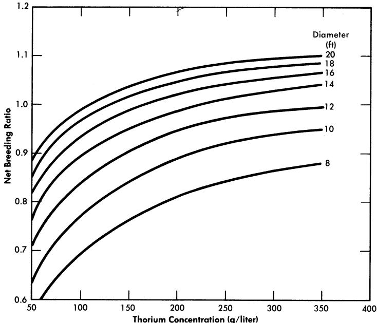  
FIG. 2-13. Breeding ratio vs. thorium concentration for one-region reactors of various diameters. Poison fraction $= 0.08$ , $\eta^{23} = 2.25$ .

2-3.6 Equilibrium results for one-region thorium breeder reactors. Results have been obtained [30] for one-region thorium breeder reactors operating under equilibrium conditions. Critical concentrations and breeding ratios were obtained by means of Eqs. (2-4) and (2-6). Figure 2-13 gives the breeding ratio as a function of thorium concentration and reactor diameter. Comparison of these results with those obtained for two-region reactors illustrates that reactor diameter influences breeding ratio to a greater extent in one-region systems than in two-region systems. Also, increasing the reactor diameter increases the breeding ratio significantly even for 14-ft-diameter reactors. Although breeding ratio can be increased by increasing the thorium concentration, there is an accompanying increase in fuel inventory. To keep inventory charges at a reasonably low level and yet permit a breeding ratio of unity to be attained requires thorium concentrations between 200 and $300\mathrm{g}$ /liter and reactor diameters of about 14 ft.

The equilibrium isotope concentrations as a function of thorium concentration for a 14-ft-diameter reactor are given in Fig. 2-14. This diameter

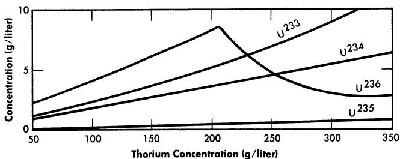  
FIG. 2-14. Uranium isotope concentrations under equilibrium conditions vs. thorium concentration in a one-region reactor of 14-ft diameter.

value has been chosen because it represents the diameter which gives minimum fuel costs, although it is realized that construction of the corresponding vessel may be beyond present technology. The fuel-processing cycle time which minimized fuel cost was that which corresponded to a poison fraction (due to fission products) of about 0.08, and so this is the value used for poison fraction in the results given here. Absorptions in higher isotopes contributed an additional poison fraction of about 0.03.

2-3.7 Equilibrium results for one-region uranium-plutonium reactors. The fertile-material concentrations and reactor diameters have essentially the same effects on conversion ratio and fuel inventory for one-region uranium-plutonium systems as they do for thorium breeder systems; however, since the $\eta$ 's for $\mathrm{U}^{235}$ and $\mathrm{Pu}^{239}$ are lower than for $\mathrm{U}^{233}$ , it is more difficult to attain a conversion ratio of unity in U-Pu systems than it is in $\mathrm{U}^{233}-\mathrm{Th}$ systems. It is still possible, though, for $\mathrm{UO}_3-\mathrm{PuO}_2-\mathrm{D}_2\mathrm{O}$ systems to operate on natural-uranium feed, as evidenced by the results for two-region reactors. Minimum fuel costs (based on $\eta^{41} = 1.9$ ; a more accurate value is now believed to be 2.2) for one-region reactors, however, occur when the uranium feed is slightly enriched in $\mathrm{U}^{235}$ [32]. Table 2-12 gives results [32] of some nuclear calculations for these one-region systems operating under equilibrium conditions. The reactor diameter was taken to be 15 ft; the fuel-processing rate was such as to maintain a poison fraction of $7\%$ in the reactor core. Fuel feed was considered to be obtained from an isotope-enrichment diffusion plant. The results indicate that the uranium feed for these reactors would have to contain between 1 and $1.5\% \mathrm{U}^{235}$ .

# 2-4. UNSTEADY-STATE FUEL CONCENTRATIONS AND BREEDING RATIOS

2-4.1 Two-region reactors. During the period following reactor startup, there is a buildup of fission-product poisons and higher isotopes with time, which results in varying nuclear characteristics. This section presents some calculations relative to the HRE-3 conceptual design for the initial period of reactor operation.

TABLE 2-12 REACTOR CHARACTERISTICS FOR SOME ONE-REGION, $\mathrm{UO_3 - PuO_2 - D_2O}$ REACTORS\* OPERATING UNDER EQUILIBRIUM CONDITIONS  

<table><tr><td>Reactor temperature, °C</td><td>250</td><td>250</td><td>250</td><td>300</td></tr><tr><td>U conc., g/liter</td><td>334</td><td>253</td><td>170</td><td>183</td></tr><tr><td>U235conc., g/liter</td><td>2.65</td><td>1.47</td><td>0.83</td><td>1.35</td></tr><tr><td>U236conc., g/liter</td><td>0.39</td><td>0.22</td><td>0.12</td><td>0.20</td></tr><tr><td>Pu239conc., g/liter</td><td>3.43</td><td>1.74</td><td>0.84</td><td>1.08</td></tr><tr><td>Pu240conc., g/liter</td><td>3.39</td><td>1.72</td><td>0.83</td><td>1.17</td></tr><tr><td>Pu241conc., g/liter</td><td>1.21</td><td>0.61</td><td>0.30</td><td>0.41</td></tr><tr><td>Initial enrichment (no Pu), U235/U (total)</td><td>0.0116</td><td>0.0106</td><td>0.0098</td><td>0.0140</td></tr><tr><td>Steady-state enrichment, U235/U (total)</td><td>0.0081</td><td>0.0059</td><td>0.0050</td><td>0.0073</td></tr><tr><td>Steady-state feed enrichment, U235/U (total)</td><td>0.0153</td><td>0.0113</td><td>0.0096</td><td>0.0136</td></tr><tr><td>Fraction of fissions in U235</td><td>0.24</td><td>0.25</td><td>0.29</td><td>0.31</td></tr><tr><td>Fraction of U consumed</td><td>0.018</td><td>0.017</td><td>0.015</td><td>0.014</td></tr></table>

*Reactor diameter = 15 ft; poison fraction = 7%; reactor fuel returned to diffusion plant for re-enrichment; tails from diffusion plant are assumed to have $\mathrm{U}^{235}$ content of $\mathrm{U}^{235} / \mathrm{U} = 0.0025$ ; processing losses are neglected.

Computations have been performed for several spherical reactors using an Oracle code [31] for two-region, time-dependent, thorium breeder systems. The variation with time of the breeding ratio and the concentrations of $\mathrm{U}^{233}$ , $\mathrm{U}^{234}$ , $\mathrm{U}^{235}$ , $\mathrm{U}^{236}$ , $\mathrm{Pa}^{233}$ , and fission-product poisons were obtained. Calculations were first confined [32] to solution-core reactors initially containing either $\mathrm{U}^{233}$ or $\mathrm{U}^{235}$ , and generating a core power of $50\mathrm{Mw}$ . Core and blanket Thorex processing was considered only when the initial fuel was $\mathrm{U}^{233}$ . The use of centrifugal separation (hydroclones) for core-solution processing was assumed in all cases. The time dependence of the concentrations of xenon, the samarium group of poisons, and the poisons removable by hydroclone processing were neglected, since the time required for these poisons to reach near-equilibrium conditions is relatively short. Account has been taken of their presence by the use of fixed poison fractions. The effect of copper added for internal gas recombination was also included in this way. Core diameters of 4 and 5 ft, pressure-vessel diameters of 8 and 9 ft and thorium blanket concentrations of 500 and $1000\mathrm{g}/\mathrm{liter}$ were considered. Fixed core poisons in terms of percentage of

core fission cross section were: samarium group, $0.8\%$ ; xenon group, $1\%$ ; copper, $0.8\%$ ; poisons removable by hydroclones, $1\%$ . Fixed blanket poisons were: samarium group, $0.8\%$ ; xenon, $1\%$ . It was assumed that the core solution was processed both by hydroclones and by the Thorex process described in Chapter 6; the blanket slurry of thorium oxide in heavy water was processed by Thorex only, and fuel produced in the blanket was drawn off from the Thorex plant and returned to the core at a rate sufficient to maintain criticality.

The system was assumed to start "clean," except for the poisons mentioned, with either $\mathrm{U}^{233}$ or $\mathrm{U}^{235}$ in the core. Makeup fuel (same as initial fuel) was fed as needed while the concentration of fuel in the blanket was increasing. When the blanket fuel concentration reached a predetermined level, blanket processing was initiated at the rate which would be required if the reactor were at equilibrium; however, for the $\mathrm{U}^{235}$ -fueled reactors, calculations were performed only up to the time at which processing would start. At the start of processing, the fuel feed for the core was assumed to come from the processed blanket stream. When the core poison level built up to a predetermined point ( $8\%$ for the $\mathrm{U}^{233}$ reactors), processing of the core solution was started. The processed core-fuel stream was considered mixed with the processed blanket stream; part of the mixture was used as core feed while the excess was drawn off as excess fuel. The calculations were continued until most of the concentrations approached equilibrium values. Time lags due to chemical processing holdups were neglected. The chemical processing rates employed were those calculated earlier for equilibrium reactors [27].

The curves in Fig. 2-15 show results for some representative $\mathrm{U}^{233}$ -fueled reactors. As shown in Fig. 2-15(a), with $1000\mathrm{g}$ Th/liter in the blanket region, the breeding ratio falls steadily for about 900 days until core processing starts. Although blanket processing, begun at 490 days, arrests the growth of $\mathrm{U}^{233}$ in the blanket rather suddenly, the slope of the breeding-ratio curve does not change markedly because the buildup of core poisons is controlling the breeding ratio. When core processing interrupts the growth of core poisons, the breeding ratio levels off sharply. The variation of relative leakage and poison losses with time and the variation of blanket power with time are illustrated in Fig. 2-15(b) for the case of a blanket thorium concentration of $500\mathrm{g}/\mathrm{liter}$ .

In all cases the time required to reach the $8\%$ core poison level was of the order of two years. The average breeding ratio during this period was about 0.02 higher than the equilibrium value. The effect of poisoning due to buildup of corrosion products is not included in this estimate.

While the above statements concerning breeding ratio are characteristic of $\mathbf{U}^{233}$ -fueled reactors, $\mathbf{U}^{235}$ reactors show quite a different variation of breeding ratio with time, due to changes in the effective $\eta$ for the system.

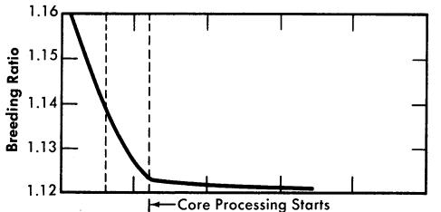

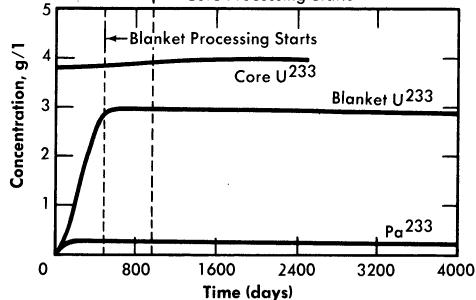  
(a) Breeding Ratio, Blanket Conc. of U233 and $\mathrm{Pq}233$ and Core Conc. of U233 (Blanket Conc. $= 1000\mathrm{g}$ Th/l).

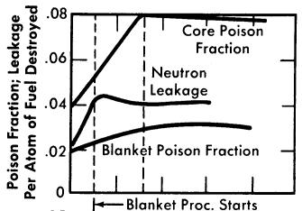

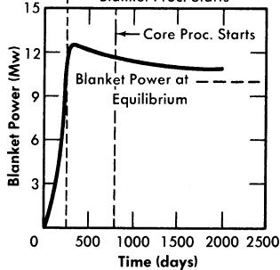  
(b) Neutron Leakage, Poisson Fraction and Blanket Power (Blanket Conc. $= 500\mathrm{g}$ Th/1).   
FIG. 2-15. Nuclear characteristics of a 60-Mw (heat) two-region $\mathbf{U}^{233}$ breeder during initial operating period. Core diameter $= 4$ ft, pressure vessel diameter $= 9$ ft, $280^{\circ}\mathrm{C}$ , solution core.

Such reactors have appreciably lower breeding ratios than do $\mathrm{U}^{233}$ -fueled systems. This is primarily due to the relatively low value of $\eta^{25}$ compared to $\eta^{23}$ ( $\eta^{23} = 2.25$ while $\eta^{25} = 2.08$ ). As $\mathrm{U}^{233}$ builds up in the blanket of a $\mathrm{U}^{235}$ -fueled reactor, the average value of $\eta$ for the reactor as a whole increases. This helps compensate for the increase in core poison fraction and causes the breeding ratio, which initially drops from 1.008 to 1.002 during the first 200 days of operation, to rise again. A maximum of 1.005 in the breeding ratio is reached at about 600 days, after which a slow decrease follows.

Three types of isotope growth were obtained in this study. First, the concentration of the main isotope, $\mathrm{U}^{233}$ or $\mathrm{U}^{235}$ , remained relatively constant despite sizeable changes in other concentrations. Second, the protactinium concentration-time curve was found to "knee-over" even before processing started. This behavior was due to the radioactive decay rate being several times larger than the chemical processing rates employed. Third, the concentration of the heavier isotopes of uranium built up slowly with time for the assumed power level; even after 10 years' operation their concentrations were much less than the equilibrium values. The total core concentration of uranium was thus significantly less than the equilibrium value. The isotope concentrations after various operating times are shown in Table 2-13, along with equilibrium values.

# TABLE 2-13

# CORE CONCENTRATION OF URANIUM ISOTOPES

AS A FUNCTION OF TIME FOR A U233-FUELED REACTOR

AND FOR A U²³⁵-FUELED REACTOR

(Core diameter = 4 ft; pressure-vessel diameter = 9 ft; $\mathrm{ThO_2}$ concentration in blanket = 1000 g/liter; solution core, total power = 60 Mw of heat)

<table><tr><td>Time, days</td><td>U233</td><td>U234</td><td>U235</td><td>U236</td><td>U total</td></tr><tr><td colspan="6">Concentrations of isotopes for U233 fuel, g/liter</td></tr><tr><td>0</td><td>3.75</td><td>-</td><td>-</td><td>-</td><td>3.75</td></tr><tr><td>200</td><td>3.77</td><td>0.33</td><td>0.02.</td><td>-</td><td>4.12</td></tr><tr><td>500</td><td>3.74</td><td>0.74</td><td>0.07</td><td>0.01</td><td>4.56</td></tr><tr><td>920</td><td>3.91</td><td>1.29</td><td>0.14</td><td>0.04</td><td>5.38</td></tr><tr><td>2000</td><td>3.98</td><td>2.06</td><td>0.26</td><td>0.18</td><td>6.48</td></tr><tr><td>3000</td><td>4.02</td><td>2.40</td><td>0.31</td><td>0.34</td><td>7.07</td></tr><tr><td>Equilibrium</td><td>4.02</td><td>2.74</td><td>0.37</td><td>1.57</td><td>8.07</td></tr><tr><td colspan="6">Concentrations of isotopes for U235 fuel, g/liter</td></tr><tr><td>0</td><td>-</td><td>-</td><td>4.21</td><td>-</td><td>4.21</td></tr><tr><td>200</td><td>-</td><td>-</td><td>4.19</td><td>0.57</td><td>4.76</td></tr><tr><td>500</td><td>-</td><td>-</td><td>4.12</td><td>1.43</td><td>5.55</td></tr><tr><td>900</td><td>-</td><td>-</td><td>4.03</td><td>2.54</td><td>6.57</td></tr></table>

While chemical processing sharply discontinues the growth of $\mathbf{U}^{233}$ in the blanket, the power level in the blanket may markedly overshoot the equilibrium level, as shown in Fig. 2-15(b). An overshoot is obtained when the blanket- $\mathbf{U}^{233}$ concentration reaches its maximum value before core processing starts. Table 2-14 shows the peak values of blanket power computed for the reactors studied, along with the equilibrium values.

Results similar to those given above have also been obtained [33] for two-region breeders having various concentrations of thorium in the core. The core diameter was set at 4 ft, the pressure-vessel diameter at 9 ft, and the blanket thorium concentration at $1000\mathrm{g}$ Th/liter. The core thorium concentrations studied were 100, 150, and $200\mathrm{g}$ Th/liter. As before, the moderator was heavy water in both core and blanket volumes, and both regions operated at a mean temperature of $280^{\circ}\mathrm{C}$ ; the Zircaloy-2 core tank was 0.33 in. thick. Calculations were performed at a constant total power of 60 thermal Mw. The same chemical processing conditions were assumed

# TABLE 2-14

# PEAK AND EQUILIBRIUM VALUES OF BLANKET POWER COMPUTED FOR U233-FUELED REACTORS

(Reactor power $= 60$ thermal Mw)

<table><tr><td>Core dia., ft</td><td>Reactor dia., ft</td><td>Blanket Conc., g Th/liter</td><td>Equilibrium value of blanket power, Mw</td><td>Peak value of blanket power Mw</td><td>Time at which peak value occurs, days</td></tr><tr><td>4</td><td>9</td><td>1000</td><td>9.6</td><td>10.8</td><td>520</td></tr><tr><td>4</td><td>9</td><td>500</td><td>10.4</td><td>12.5</td><td>350</td></tr><tr><td>4</td><td>8</td><td>1000</td><td>9.3</td><td>10.8</td><td>380</td></tr><tr><td>5</td><td>9</td><td>1000</td><td>10.0</td><td>11.5</td><td>490</td></tr></table>

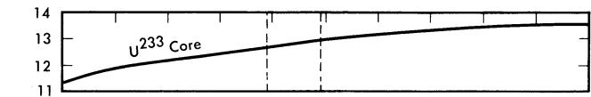

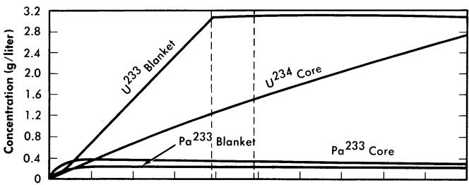

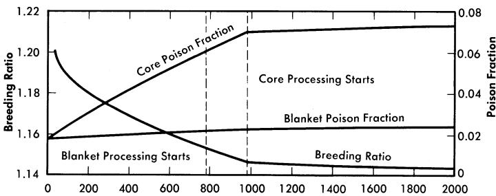  
Time (days)   
FIG. 2-16. Variation with time of $\mathbf{U}^{233}$ , $\mathbf{U}^{234}$ , and $\mathrm{Pa}^{233}$ in the core, $\mathbf{U}^{233}$ and $\mathrm{Pa}^{233}$ in the blanket, breeding ratio, and core and blanket poison fractions as functions of time for a two-region 60-Mw thorium breeder reactor. Core thorium concentration $= 150\mathrm{g}$ Th/liter, blanket thorium concentration $= 1000\mathrm{g}$ Th/liter, temperature $= 280^{\circ}\mathrm{C}$ .

as before, with the important exception that no hydroclone processing was employed for the slurry-core cases.

Results given in Fig. 2-16 are for a core thorium concentration of $150\mathrm{g}$ Th/liter and are typical of all cases studied in their important features. As with solution-core reactors, there is a small but relatively rapid initial drop in breeding ratio during the first 100 days following reactor startup. This is due to the neutron captures in protactinium as its concentration rises and approaches equilibrium conditions. The buildup of protactinium is quite similar to the behavior seen in the solution-core cases. Equilibrium protactinium levels are reached in both core and blanket long before chemical processing is started. This period is followed by a more or less linear fall in breeding ratio with time, due to core poison-fraction buildup. Initiation of blanket processing produces a relatively minor change in slope of the breeding ratio-time curve, in contrast to the sharp break caused by the start of core processing. Linear buildups with time of the poison fractions and the higher isotopes are also observed, with $\mathrm{U}^{234}$ in the core being the most important higher isotope. Other isotope concentrations are comparatively low even at 1500 days.

Figure 2-17 lists some results for the various cases considered (except for the case already considered in Fig. 2-16). Comparison of the results shows that the time at which core processing is initiated increases with increasing core thorium concentration (except for the solution-core case); this is due to the higher $\mathrm{U}^{233}$ critical concentration associated with higher thorium concentration, resulting in a longer period to build up to a specified core poison fraction. For the solution-core case, hydroclone processing was assumed, so that $75\%$ of the poisons were removed by means other than by Thorex processing of the core (the time specified for core processing to begin in Fig. 2-17 corresponds to the initiation of Thorex processing). It is interesting to note that with slurry cores, despite the absence of hydroclone separation, the core poison fraction still takes two or more years to reach a $7\%$ level.

In these calculations there was no allowance for the poisoning effect of accumulated corrosion products. Absence of hydroclone processing would result in retention of all corrosion products in the core system, and for the same corrosion rate the cross section of corrosion products is about four times as great as in a solution-core system using hydroclones. However, the higher critical concentrations in slurry-core systems compensate for this, and the poison fraction in the core with $200\mathrm{g}$ Th/liter could be about the same as in a solution-core reactor.

The critical concentration of $\mathbf{U}^{233}$ in the core displays a small but steady rise; this contrasts with solution-core reactors, where the critical core concentration is found to be strikingly constant. Solution-core reactors, because of their longer thermal diffusion length, are more sensitive to the

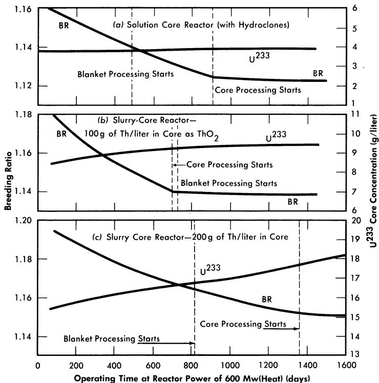  
FIG. 2-17. Comparison of breeding ratios and $\mathbf{U}^{233}$ core concentrations for two-region breeder reactors with various core-thorium concentrations. Core diameter $= 4$ ft, reactor diameter $= 9$ ft, $280^{\circ}\mathrm{C}$ , blanket thorium concentration $= 1000$ g/liter, blanket processing started when $\mathbf{U}^{233}$ blanket concentration reached $3\mathrm{g / liter}$ , core processing started when core poison fraction reached $7\%$ ( $8\%$ for solution-core case).

growth of fuel in the blanket than slurry-core machines. The latter have less thermal leakage from core to blanket, and core-poison and higher-isotope growth are less well compensated by the rise of fuel level in the blanket.

2-4.2 One-region reactors. The critical equation for one-region reactors is not so involved as that for two-region systems, and so the mathematical system analogous to the one used above for two-region systems is comparatively simple. However, relatively few nuclear results for one-region, time-dependent systems have been obtained specifically. Some results are given in Reference [29] for a 15-ft-diameter reactor containing $200\mathrm{g}$ of uranium per liter and operating at a constant power of $1350\mathrm{Mw}$ (heat) at $250^{\circ}\mathrm{C}$ . Concentrations of $\mathrm{U}^{235}$ , $\mathrm{Pu}^{239}$ , $\mathrm{Pu}^{240}$ , and $\mathrm{Pu}^{241}$ , and the fraction of fissions due to $\mathrm{U}^{235}$ were obtained as functions of time.

Under certain conditions the mathematical system involving nuclide concentrations, criticality, and fuel processing can be solved analytically [34]; the solutions obtained have been used to calculate fuel costs directly, but they could also be used to calculate breeding ratio and critical fuel concentrations explicitly.

# 2-5. SAFETY AND STABILITY OF HOMOGENEOUS REACTORS FOLLOWING REACTIVITY ADDITIONS

Reactor kinetic studies are usually broken down into investigations of reactor safety and reactor stability. Both safety and stability are determined by the generalized equations of motion involved. The two categories are considered, however, because the time scales in safety studies are usually much shorter than those involved in stability studies; hence, the generalized equations of motion can be simplified in accordance with the specified study. As used here, safety refers to the events which happen as a result of the initial power excursion following a reactivity addition; stability refers to the events which occur as a result of subsequent power surges. By these definitions, it is possible that a reactor can safely withstand the first power surge following a reactivity addition, but still not be stable; under these conditions, the reactor would be safe with respect to the first power surge but would not be safe to subsequent power surges. On the other hand, a reactor system can be stable and still not be safe; i.e., permissible changes in reactor variables can be exceeded as a result of the first power surge, even though the system would have reached a new equilibrium condition had it been able to withstand the first power surge.

The majority of work on the kinetics of homogeneous reactors has concerned circulating, pressurized-type systems, and the discussion below pertains primarily to those systems. There has been relatively little effort devoted to boiling homogeneous reactors; for these reactors the control and safety problems may be more difficult than for the nonboiling reactors [35]. In boiling systems, the most important parameters are those associated with vapor formation and bubble growth, vapor removal from the system, and the control system. With regard to control, boiling reactors have the disadvantage of producing more power when less power is demanded unless a control system is used in which an increase in reactor pressure leads to ejection of fuel from the core region. Alternatively, power-demand control can be obtained by permitting the boiling process to generate only a fraction of the total reactor power, the remainder being removed by fuel fluid which is circulated through a heat exchanger.

2-5.1 Homogeneous reactor safety. The nuclear safety of homogeneous reactors will be a function of the maximum permissible reactivity addition

and the possible reactivity additions. Despite the inherent safety associated with a large negative temperature coefficient of reactivity, it cannot be stated a priori that homogeneous reactors will be safe under all operating conditions. The limiting feature with respect to reactivity addition is the permissible pressure rise within the reactor system. This is usually either the maximum permissible core pressure rise (two-region reactor) or the maximum permissible pressure rise within the pressure vessel (one-region reactor).

With a given limit on the maximum permissible pressure rise, it is possible to specify the maximum permissible reactivity addition which can be added to the reactor. Reactor operations can then be restricted by design, so that reactivity additions associated with physical events will not exceed the maximum permissible reactivity addition.

The potential reactivity available in homogeneous systems is inherently large, because a high operating temperature is coupled with a high negative temperature coefficient of reactivity. However, all reactivity additions involve a time element. Since it appears desirable to allow continuity of physical operations, the safety design criteria should be applicable to continuous, linear rates of reactivity addition. Specifically, the maximum permissible linear rate of reactivity addition should specify what restrictions are necessary on the physical system so that this rate is not exceeded.

Equations of motion. The neutron density is the fundamental variable in homogeneous reactor safety and is influenced primarily by the temperature and density of the moderator and by the operational changes which effect a reactivity change. So long as the reactor is not far above prompt critical, the neutron density is given by the conventional equations of motion. These may also be used when larger reactivity additions are considered, if the prompt-neutron lifetime is assumed to be that associated with the region in which the neutron density is rising most rapidly with time. Under this condition, the over-all rate of increase in neutron density is overestimated, so that a safety factor will exist in reactor designs based upon these equations.

Reactivity additions which involve homogeneous reactor safety are considerably in excess of that required for prompt criticality, and for these cases the reactor power reaches a maximum value in times of the order of tenths of seconds. Such time intervals are short compared with the average half-life of the delayed-neutron precursors, and so only a small fraction of the precursors formed during the power rise decay during that time interval. The delayed neutrons from these precursors therefore contribute little to the reactor power while the power is rising; rather, they are formed following the time of peak power and exert a powerful damping influence on the power oscillation, leading to a single, damped power surge. For these safety calculations, the delayed-neutron density can be considered

constant, and so the neutron-density equations can be combined into one equation. In terms of reactor power, this equation is

$$
\frac {d P}{d t} = \left[ \frac {k _ {e} (1 - \beta) - 1}{l} \right] P + \frac {\beta}{l} P _ {0}, \tag {2-21}
$$

where $k_{e} =$ effective multiplication constant,

$P =$ reactor power,

$P_0 = P$ evaluated under initial conditions,

$t = \mathrm{time},$

$\beta =$ effective fraction of fission neutrons which are delayed,

$l =$ average lifetime of prompt neutrons.

The appropriate value for $\beta$ is determined on the basis of the time spent inside and outside the reactor core vessel by a fluid particle.

To complete the mathematical system, the relation between $k_{e}$ and $P$ is required, which requires intermediate relations. For aqueous systems operating above $200^{\circ}\mathrm{C}$ , $k_{e}$ is influenced primarily by fluid-density effects, insofar as inherent reactivity changes are concerned. Since reactivity can also be added by physical operations, $k_{e}$ can be considered to be given by

$$
k _ {e} = 1 + \Delta + b t + \frac {\partial k _ {e}}{\partial \rho} (\rho - \rho_ {0}), \tag {2-22}
$$

where $b =$ linear rate of reactivity addition to reactor, $\Delta k_{e} / \mathrm{sec}$ ,

$\frac{\partial k_e}{\partial\rho} =$ density coefficient of reactivity,

$\Delta =$ instantaneous reactivity addition,

$\rho - \rho_0 =$ deviation of the average density of fuel fluid from its initial value.

The core fluid density is determined from the hydrodynamic equations of continuity and motion, in conjunction with the equation of state for the fluid. In most studies to date, a one-dimensional flow model is assumed, gas effects are neglected, the core tank is considered to be rigid, and the core inlet fluid velocity is considered to be constant. The equation for the change in fluid density is then

$$
\frac {d \rho}{d t} = - \frac {A}{V _ {c}} \rho_ {0} (U - U _ {0}), \tag {2-23}
$$

where $A =$ cross-sectional area of relief pipe,

$V_{c} =$ volume of core region,

$U - U_{0} =$ deviation of the fluid velocity in core-relief piping from its initial value.

Assuming that the resistance to fluid flow between the core and pressurizer is proportional to the square of the average fluid velocity, and that the fluid is incompressible, the one-dimensional hydrodynamic equation of motion is given by

$$
\left[ \frac {\rho_ {0} A}{g _ {c}} \int_ {0} ^ {L} \frac {d x}{A (x)} \right] \frac {d}{d t} (U - U _ {0}) = p _ {c} - p _ {p} - \frac {n _ {f} \rho_ {0}}{2 g _ {c}} | U | U, \tag {2-24}
$$

where $n_f =$ resistance coefficient associated with velocity $U$ ,

$A(x) =$ cross-sectional area of relief pipe,

$g_{c}$ $=$ dimensional constant,

$p_{c}$ $=$ core pressure,

$p_{p}$ = pressurizer pressure,

$U$ = average velocity of fluid in relief piping of cross-sectional area $A$ ,

$L$ = length of relief piping from core to pressurizer.

Use of the absolute value of $U$ in Eq. (2-24) ensures that fluid friction will always oppose fluid flow.

The relation between pressure, temperature, and density of the fluid is given by the equation of state:

$$
p = \frac {d p}{d \rho} \left[ \left(T - T _ {0}\right) \left(- \frac {\partial \rho}{\partial T}\right) + \rho - \rho_ {0} \right], \tag {2-25}
$$

where $p =$ pressure rise in core,

$T - T_{0} =$ deviation of the average core-fluid temperature from its initial value.

Relations are still needed between $T$ and $P$ and between $p_p$ and $\rho$ . Assuming isentropic compression within the pressurizer, $p_p$ is approximated by

$$
p _ {p} - p _ {0} = n p _ {0} \frac {\rho_ {0} - \rho}{\rho_ {0}} \frac {V _ {c}}{V _ {p}}, \tag {2-26}
$$

where $V_{p} =$ volume of pressurizing fluid,

$p_{p} - p_{0} =$ deviation of the pressurizer pressure from its initial value, $n =$ ratio of heat capacity at constant pressure to heat capacity at constant volume for pressurizing fluid.

The relation between $T$ and $P$ is obtained from an energy rate balance on the core fluid. Since the rate of energy transport associated with fluid

flow and thermal diffusion is small during times of interest, the energy rate balance is approximated by

$$
S _ {c} \frac {d T}{d t} = P - P _ {0}, \tag {2-27}
$$

where $S_{c} =$ volume heat capacity of the core fluid.

The mathematical system is now complete, and consists of Eqs. (2-21) through (2-27). Since an analytic solution to the above system has not been obtained, numerical integration of the above equations is necessary in general.

Calculation of reactor pressure rise. The variable of interest is the maximum value of core pressure for a given set of parameter values. Although not exact, an analytic expression for the maximum pressure rise, $p_{\mathrm{max}}$ , can be derived [36] for the case of an instantaneous reactivity addition. This is given by

$$
p _ {\max } = \frac {m ^ {2} \bar {F}}{2 \omega_ {h} ^ {2} \gamma_ {2}} \left[ 0. 3 8 5 m + \gamma_ {f} \left(1 + \frac {m ^ {2} \bar {F}}{4 \gamma_ {3}}\right) \right] + \frac {C _ {2} m}{\gamma_ {2}}, \tag {2-28}
$$

where $C_2 = \frac{p_0}{\rho_0}\frac{nV_c}{V_p}\left(\frac{d\rho}{dp}\right),$

measure of effect of pressurizer volume upon core pressure rise, dimensionless,

$$
\bar {F} = 1 + \frac {1}{2} \left[ C _ {2} + \frac {\left(\gamma_ {f} + m\right) m}{\omega_ {h} ^ {2}} \right],
$$

$m = \frac{\Delta - \beta}{l} =$ instantaneous prompt reactivity addition divided by $l,\sec^{-1},$

$p_{\mathrm{max}} =$ maximum pressure rise, lb-force/ft2,

$\gamma_{f} = \frac{n_{f}U_{0}}{A\int_{0}^{L}\frac{dx}{A(x)}}$ normalized friction coefficient in core relief line, $\sec^{-1},$

$\gamma_{2} = \frac{1}{l}\left(\frac{d\rho}{dp}\right)\left(\frac{\partial k_{e}}{\partial\rho}\right),$ normalized conversion factor between net core density change and core pressure rise, ft²/sec-lb force,

$$
\gamma_ {3} = \frac {U _ {0} A \rho_ {0}}{V _ {c} l} \left(\frac {\partial k _ {e}}{\partial \rho}\right), \sec^ {- 2}, \quad \omega_ {h} ^ {2} = \frac {g _ {c} (d p / d \rho)}{V _ {c} \int_ {0} ^ {L} \frac {d x}{A (x)}}, \sec^ {- 2}.
$$

Results obtained from Eq. (2-28) have compared favorably with numerical integration of Eqs. (2-21) through (2-27) [36].

Although Eq. (2-28) is based on an instantaneous reactivity addition, it can be applied to rate additions of reactivity in certain circumstances. For rate additions normally encountered in homogeneous systems, it appears that the most dangerous amounts of reactivity can be added when the initial reactor power is low. In these circumstances, reactivity is added during an interval which is much greater than the time interval in which the reactivity is decreased as a result of fluid density changes. A simplified mathematical model can then be used [36] to relate a linear rate of reactivity addition, $b$ , to its equivalent instantaneous reactivity addition, $\Delta k_{\mathrm{eq}}$ . This relationship is given by the following equation:

$$
1 + \frac {\xi}{\omega_ {n p} ^ {2}} = \frac {m _ {e} ^ {2} / 2 \omega_ {n p} ^ {2}}{\ln \left(m _ {e} ^ {2} / 2 \omega_ {n p} ^ {2}\right)}, \tag {2-29}
$$

where $\omega_{np}^2 = \omega_n^2 x_{pc}$ , $\sec^{-2}$

$$
\omega_ {n} ^ {2} = \frac {1}{l} \left(- \frac {\partial k _ {e}}{\partial T}\right) \frac {P _ {0}}{S _ {c}}, \sec^ {- 2},
$$

$x_{pc} =$ reactor power at prompt critical relative to initial power level,

$$
{m _ {e}} {= \frac {\Delta k _ {\mathrm {e q}} - \beta}{l}, \sec^ {- 1},}
$$

$\Delta k_{\mathrm{eq}} =$ equivalent instantaneous $\Delta k_{e}$ associated with rate of reactivity addition,

$$
\xi = b / l, \sec^ {- 2}.
$$

The value for $x_{pc}$ is obtained from the equation

$$
x _ {p c} = e ^ {- M _ {s} ^ {2} / 2 \xi} + \sqrt {\pi} \frac {M _ {s}}{\sqrt {2 \xi}} \operatorname {e r f} \left(\frac {M _ {s}}{\sqrt {2 \xi}}\right), \tag {2-30}
$$

where $M_{s} = \frac{1 - k_{e}(0) + \beta}{l}$ ,

$$
k _ {e} (0) = \text {i n i t i a l v a l u e o f} k _ {e}.
$$

Equations (2-29) and (2-30) are plotted in Figs. 2-18 and 2-19 and give the particular combinations of initial power level and rate of reactivity addition corresponding to a given equivalent prompt reactivity addition.

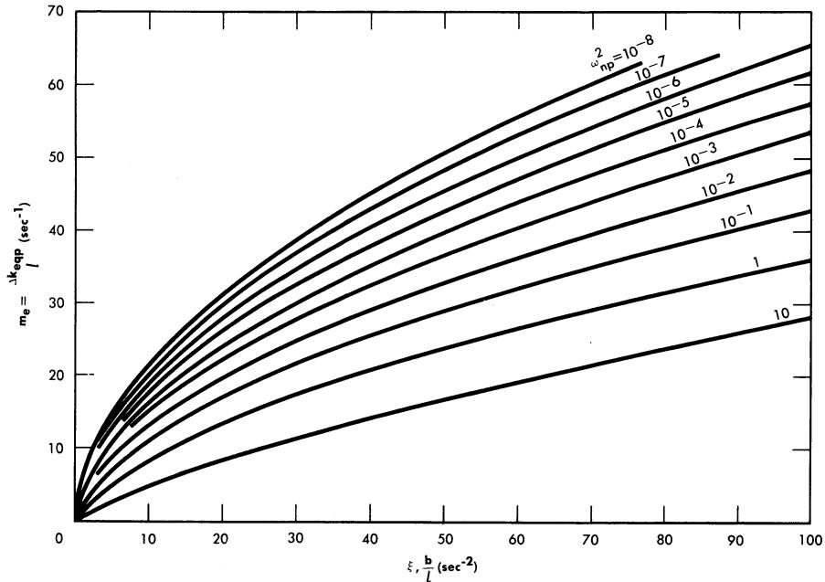

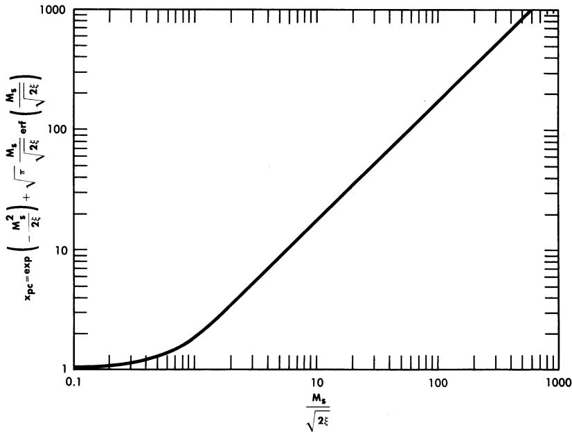  
FIG. 2-18. Relation between equivalent prompt reactivity and rate of reactivity addition. $\Delta k_{\mathrm{eqp}} =$ equivalent prompt reactivity, $l =$ mean lifetime of prompt neutrons, $b =$ rate of reactivity addition, $\omega_{\mathrm{np}}^2 =$ modified nuclear frequency.   
FIG. 2-19. Neutron power at prompt critical relative to initial power for different rates of reactivity addition.

Having determined the equivalent prompt reactivity addition, the maximum pressure rise can be calculated by using Eq. (2-28) with $m$ replaced by $m_e$ . To check the validity of the derived relations, values of $p_{\mathrm{max}}$ obtained analytically were compared [36] with those obtained by numerical integration of Eqs. (2-21) through (2-27). The results obtained by numerical integration were used to establish the relationship between rate of reactivity addition and equivalent instantaneous reactivity addition on the basis of equal pressure rise. Thus, for a given rate of reactivity addition and initial reactor power level, a particular maximum pressure was obtained. The amount of prompt reactivity added instantaneously which gave the same maximum pressure was termed the equivalent prompt reactivity addition corresponding to a given rate addition and initial power level. For a given rate of reactivity addition, good agreement was obtained between the equivalent prompt reactivity addition obtained by numerical integration and that obtained by use of Eqs. (2-29) and (2-30).

Reactivity additions. Homogeneous reactors usually have relatively large, negative temperature coefficients of reactivity. A high negative value for the temperature coefficient is usually associated with a high degree of reactor safety; however, this is true only if reactivity is introduced by means other than the temperature coefficient itself. If reactivity is added by adding cold fuel to the reactor core, e.g., by means of a heat-exchanger accident, then the smaller the value of the temperature coefficient the smaller the reactivity addition. From this viewpoint, a small temperature coefficient is desirable if the most hazardous reactivity addition occurs as a result of introduction of cold fluid into the reactor. On the other hand, a large negative temperature coefficient is desirable to compensate for reactivity added by means other than that associated with decreasing the core fluid temperature.

Reactivity changes can also occur as a result of changes in fuel concentration or distribution. In slurry reactors, large changes in reactivity can result from settling of the fertile material. The results [37] of two-group, two-dimensional, two-region calculations are shown in Table 2-15 for a cylindrical reactor containing highly enriched $\mathrm{UO}_2\mathrm{SO}_4$ in a 5-ft-diameter core region, and $\mathrm{ThO}_2$ in a $2\frac{1}{4}$ -ft-thick blanket region. The average temperature was assumed to be $280^{\circ}\mathrm{C}$ , and the height was assumed to be equal to the diameter for both core and pressure vessel.

Although the calculated reactivity additions associated with slurry settling were quite large, such additions would not occur instantaneously; rather, they would be a function of time, the rate of reactivity addition being controlled by the rate at which the slurry settled. Settling data for slurries containing 1000 or $500\mathrm{g}$ Th/liter correspond to rates of reactivity addition of less than $0.02\% \Delta k_{e} / \mathrm{sec}$ . These rates are well within permissible rates of reactivity addition; however, if settling took place over a period

TABLE 2-15 REACTIVITY CHANGE AS A FUNCTION OF SLURRY SETTLING  

<table><tr><td>Initial thorium concentration in blanket, g/liter</td><td>Percentage of reactor height slurry has settled</td><td>Calculated reactivity change, % Δke</td></tr><tr><td>1000</td><td>30</td><td>+2.8</td></tr><tr><td>1000</td><td>50</td><td>10.2</td></tr><tr><td>500</td><td>30</td><td>2.1</td></tr><tr><td>500</td><td>50</td><td>8.7</td></tr></table>

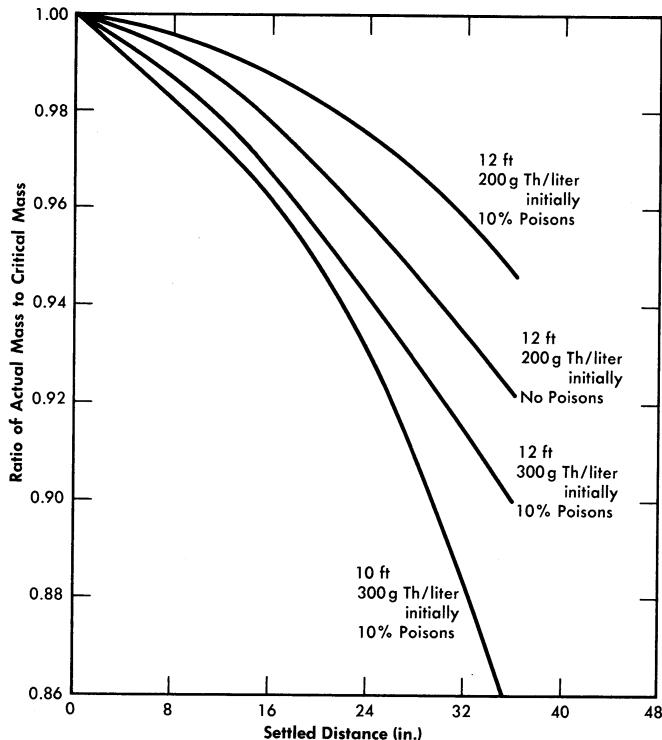  
FIG. 2-20. Effect of settling on critical mass requirements in one-region reactors.

of time, the reactor temperature and pressure would eventually reach the point where the fuel system would have to be diluted or dumped.

Settling of fuel and fertile material in large single-region reactors may cause the reactor to become subcritical. The results [38] of two-group calculations for $\mathrm{D}_2\mathrm{O}-\mathrm{ThO}_2-\mathrm{U}^{233}\mathrm{O}_3$ reactors 10 and 12 ft in diameter and containing 200 and $300\mathrm{g}$ Th/liter are given in Fig. 2-20. Cylindrical

geometry was assumed, with height/diameter ratio equal to one; the slurry was assumed to be homogeneously distributed in the bottom portion of the reactor, with a $\mathrm{D}_2\mathrm{O}$ reflector on top. In Fig. 2-20 the amount of fuel required for criticality (after settling) is compared with the amount of fuel initially required (before settling). Based on these two-group results, it appears that large one-region reactors become subcritical following slurry settling.

In the previous analytical presentation, the effect of decomposition gases upon reactor safety has been tacitly neglected. However, the generation of hydrogen and oxygen from the decomposition of water represents a possible explosion hazard. If the fuel contains no catalyst for recombination, gas bubbles will form and contain an explosive mixture of hydrogen, oxygen, and water vapor. Explosions might occur in the core, gas separator, recombiner system, or connecting piping. If an explosion occurs outside the reactor core, reactivity can be added to the reactor, resulting in an undesirably high power surge. Under these conditions, not only must the gas explosion be considered but also the possible reactivity addition associated with the explosion. If the gas explosion occurs in the core, however, no reactivity addition should be involved, and only the pressure associated with the explosion need be considered. If no explosion occurs, the presence of gases will still influence the compressibility of the fuel fluid, and this effect can be considered in the evaluation of fluid compressibility. Neglect of gas formation in evaluating reactor safety is justified if complete recombination of the decomposed gases is achieved within the reactor, or if the reactor is initially operating at a power so low that decomposition gases are not formed (corresponding to absorption of the decomposition gases by the fuel solution). If the reactor is at low power and reactivity is added to the system, then neglect of gas formation is conservative with respect to safety evaluation, since in this case the formation of gases helps in decreasing the reactivity of the system. If the initial power is so high that undissolved gases are initially present within the core region, then the effect of these gases must be considered in evaluating fluid compressibility. The presence of undissolved gases would tend to lower the permissible reactivity addition; however, an increase in gas volume would imply an increase in initial reactor power, which aids reactor safety if reactivity can be added as a rate function only.

The number of fission neutrons which are delayed usually is considered as an important factor in reactor safety. However, if reactivity is added as a linear rate function at low initial reactor power, the delayed neutrons have little influence upon the reactivity addition above prompt critical. They will influence the stability and steady-state operational behavior of the reactor, though, and are necessary to damp the power oscillation following a reactivity addition.

Reactor safety also involves events which are not directly associated with reactivity additions; e.g., if the circulating pump failed or if there were sudden cessation of heat removal in the heat exchanger, after-heat effects may raise the temperature (and pressure) of the system to undesirably high values. The possibility of an instantaneous rupture of a high pressure steam line, however, is remote, based on experience in conventional plants.*

2-5.2 Homogeneous reactor stability. The purpose of stability studies is to determine whether the reactor power will return to a stable equilibrium condition following a system disturbance. Although inherently connected with safety, stability studies usually treat small reactivity additions and concern time intervals long in comparison with those involved in safety studies. The general stability problem can be broken into simpler problems by eliminating those parts of the physical system which have only a small influence upon the time behavior of the variable of interest.

The most familiar of stability studies concerns the reactor core-pressurizer system, and will be referred to as "nuclear stability" studies. These consider the high-pressure system alone and assume that the power demand is constant. This is a valid assumption, since changes in power demand and changes in variables resulting from fluid flowing between the low- and high-pressure systems initiate only low-frequency nuclear power oscillations in comparison with those sustained by the pressurizer-core system.

Reactor instabilities can also arise due to interactions between the reactor primary system, heat-removal system, and fuel-storage system. These are associated with the method of reactor operation, and are discussed under the heading of Operational Stability.

Under certain conditions it may be desirable to operate reactors with fission gases retained within the system; in these circumstances the buildup of $\mathrm{Xe}^{135}$ during periods of low-power operation may influence subsequent reactor operation. Although no stability problem is involved, a long time scale is associated with controlling the reactor in these circumstances. Reactivity effects and required fuel-concentration changes associated with $\mathrm{Xe}^{135}$ buildup and burnup are discussed below under the appropriate heading.

Nuclear stability. In studying nuclear stability, the equations of motion for a single-region reactor system are normally used. These should be adequate if the reactor behavior is controlled by a single region; however, it should be remembered that the mean lifetime of prompt neutrons should be that for the reactor as a whole. The general mathematical system is too complicated to handle analytically, so that it is necessary either to resort

to numerical integration of specific cases or to linearize the equations so that they can be treated analytically. The linearized approach is valid for very small power oscillations; since the nonlinear effects appear to introduce damping of the power surges, the reactor system should be stable if the stability criteria for the linearized equations are satisfied. Not meeting the linearized stability criteria may not necessarily result in the buildup of pressure oscillations to proportions where reactor safety is concerned; satisfying the criteria should aid in eliminating the small pressure surges which may physically weaken the system if they occur in a repetitive manner.

The conventional equations of motion given in Eqs. (2-21) through (2-27) are used, except that the delayed-neutron precursors are assumed to decay in accordance with a single effective decay constant, and fluid-flow effects are considered in which the average fuel-fluid temperature is the linear average of the core inlet and outlet temperatures. Heat-exchanger behavior will also affect the temperature of the fuel fluid and is to be considered. The resulting linearized equations [36] lead to an equation defining the criteria for stability of the reactor system. If only the reactor core and pressurizer system are considered, corresponding to a relatively large residence time for fluid in the core, the stability criteria reduces to

$$
\gamma_ {f} \frac {\beta}{l} \left[ \omega_ {h} ^ {2} \left(1 + C _ {2}\right) + \frac {\beta}{l} \left(\gamma_ {f} + \frac {\beta}{l}\right) \right] > \left(\gamma_ {f} + \frac {\beta}{l}\right) ^ {2} \frac {\omega_ {n} ^ {2}}{1 + C _ {2}} > 0. \tag {2-31}
$$

Since all quantities are positive, the last inequality is always satisfied. By replacing the other inequality with an equal sign and fixing all parameters but one, the value of the remaining parameter (which barely fails to satisfy the inequality) can be obtained. By this procedure, the results given in Fig. 2-21 were obtained for a specific value of $\gamma_{f}$ . Stable operating conditions are those lying above the appropriate curve.

The above treatment neglects any effects that fluid transport and heat-exchanger behavior might have upon the temperature of the fluid entering the reactor. Results of studies [36] in which these effects were considered indicate that the resulting stability criteria are less stringent than those for systems in which fluid transport and heat-exchanger behavior are neglected. On this basis, the results given in Fig. 2-21 form reasonable bases for safe design.

A one-region reactor will operate at a power density lower than that at which the corresponding two-region reactor is operated, if the physical size of the one-region reactor is large. Based on the stability criteria given in Fig. 2-21, about the same degree of stability will result if the product of $\omega_h^2\omega_n^2$ remains constant in going from a one- to a two-region reactor. On the basis of fuel-cost studies, the optimum two-region and one-region

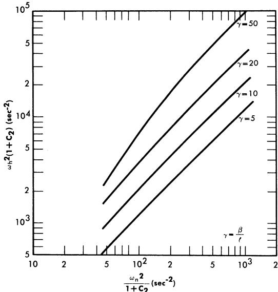  
FIG. 2-21. Stability criteria for homogeneous circulating reactors. $\gamma_{f} =$ normalized friction coefficient $= 0.5$ .

reactors do have $\omega_h^2\omega_n^2$ which are roughly equal, with the one-region reactor being somewhat more stable. However, there appears to be no distinct advantage of one type over the other as regards nuclear stability, since both normally will operate well within the stable region.

Operational Stability. Other types of stability which might be considered concern the response of the reactor to changes in load demand and to changes in rates of flow between the low- and high-pressure systems. These usually involve power oscillations whose frequencies are much lower than those sustained by the core-pressurizer system. In these circumstances the general equations of motion can be simplified; however, load-demand studies will concern the particular characteristics of the heat exchanger under consideration.

Changes in fluid flow rates between the high- and low-pressure systems in reactors can also influence reactor stability. During operation of the HRE-1, it was noticed that under certain conditions the temperature and power of the reactor would rise with time. This effect was termed the "walkaway" phenomenon [39]. It was associated with a slow rate of reactivity addition produced by an increase in core fuel concentration, leading to an increase in operating power and temperature. This increase in fuel concentration resulted when water was removed from the core (as a result of decomposition-gas formation and accompanying vaporization of water) at a faster rate than it was returned from the low-pressure system. This process continued until it was stopped by the operator.

TABLE 2-16   
EFFECT OF Xe135 UPON REACTOR CONDITIONS FOLLOWING SHUTDOWN AND RETURN TO POWER   

<table><tr><td>Reactor diameter, ft</td><td>(a) φ0</td><td>(b) P/P0</td><td>(c) - 1/N dN/sec-1</td><td>(d) dk_e/dt, sec-1</td><td>(e) Δk_e, %</td><td>(f) ΔT, °C</td><td>(g) tmin, hr</td></tr><tr><td>4</td><td>1013</td><td>0</td><td>3.0 × 10-6</td><td>7.4 × 10-7</td><td>0.86</td><td>2</td><td>10</td></tr><tr><td>4</td><td>1014</td><td>0.1</td><td>6.8 × 10-5</td><td>1.7 × 10-5</td><td>9.0</td><td>20</td><td>5</td></tr><tr><td>4</td><td>1014</td><td>0</td><td>8.5 × 10-5</td><td>2.1 × 10-5</td><td>13.</td><td>30</td><td>5</td></tr><tr><td>4</td><td>1015</td><td>0.1</td><td>6.9 × 10-4</td><td>1.7 × 10-4</td><td>17.</td><td>60</td><td>1</td></tr><tr><td>4</td><td>1015</td><td>0</td><td>3.5 × 10-4</td><td>8.6 × 10-5</td><td>33.</td><td>v. large</td><td>3</td></tr><tr><td>∞</td><td>1015</td><td>0</td><td>6.9 × 10-4</td><td>3.6 × 10-4</td><td>52.</td><td>v. large</td><td>2</td></tr></table>

(a) Initial value of thermal flux before shutdown; averaged over high-pressure system; neutrons/cm²·sec.   
(1) $\mathrm{P}$ _____；  
(b) Power during shutdown relative to power before and after shutdown.   
(c) Relative rate of change in $\mathbf{U}^{235}$ concentration required to maintain criticality at time of return to power (no change in fluid temperature).   
(d) Rate of reactivity addition due to xenon but   
(e) Estimate of reactivity associated with removal of $\mathbf{Xe}^{135}$ at time of maximum xenon concentration.   
(f) Estimate of fluid temperature decrease if reactivity addition associated with xenon buildup were compensated by fall in reactor temperature.   
(g) Estimate of the time required for xenon concentration to reach a minimum value following return to power.

The above type of phenomenon is a function of fuel flow rates between the low- and high-pressure system and can therefore be controlled. Using the applicable linearized equations of motion, the criteria for stability toward walkaway can be obtained. This has been done for the HRE-2 [40]. Design parameters such as operating conditions, fluid-flow rates, vessel volumes, recombination rate of decomposition gases, and other conditions will influence the degree of stability. Walkaway will not occur if decomposition gases are not formed. If gas is formed, a paramount cause of instability is insufficient overpressure. Increasing the fuel feed-pump rate or the ratio of solution volume in the high-pressure system to that in the low-pressure system, or decreasing the reactor temperature or power will tend to increase reactor stability against walkaway. Walkaway can also be prevented by automatic control devices which influence the behavior of the heat exchanger. Walkaway conditions can be instigated by reducing overpressure or by increasing the rate of gas formation.

Effect of $Xe^{135}$ upon reactor behavior. If reactors are operated with complete recombination of the decomposition gases and no letdown from the high-pressure system, there will be virtually complete retention of the fission fragments and the fission-product gases within the reactor system. Under such conditions, partial or total reactor shutdown will lead to an increase in $Xe^{135}$ concentration, which might, in turn, lead to difficulties in maintaining criticality or reaching criticality upon subsequent power demand. To investigate the above effect, calculations were performed [41] for a 4-ft-diameter spherical reactor operating at $280^{\circ}\mathrm{C}$ , containing $U^{235}$ , heavy water, $I^{135}$ , and $Xe^{135}$ , and operating at initial fluxes of $10^{13}$ to $10^{15}$ neutrons/( $\mathrm{cm}^2$ ) (sec). For these cases the reactor power was reduced either to zero or to one-tenth the initial value, and the fuel concentration required for criticality was obtained for times following the power reduction. At the time that the xenon concentration reached a maximum value, the power was returned to its original level, and at this point the maximum rate of reactivity addition associated with xenon burnout was obtained. The rate of change in fuel concentration required to maintain criticality at this point was also obtained. In addition, the time required for the xenon concentration to reach a minimum value following return to power was evaluated. The maximum change in xenon concentration was used to estimate the total reactivity addition associated with xenon buildup and was interpreted in terms of fluid temperature changes required to maintain criticality if the fuel concentration were maintained constant. Table 2-16 summarizes the results obtained and, for comparison purposes, also includes results for a reactor of infinite diameter. As shown in Table 2-16, the maximum rate of reactivity addition associated with xenon burnout was less than $10^{-3} \Delta k_{e} / \mathrm{sec}$ , which does not appear to constitute a dangerous rate. However, at an operating flux of $10^{15}$ the increase in fuel concentra

tion or the decrease in temperature required to maintain criticality following partial or total shutdown is so large that provisions should be made for elimination of xenon by external means. At $10^{14}$ average flux it appears that xenon poisoning may be compensated by decreasing the reactor temperature.

# REFERENCES

1. J. H. ALEXANDER and N. D. GIVEN, A Machine Multigroup Calculation: The Eyewash Program for Univac, USAEC Report ORNL-1925, Oak Ridge National Laboratory, Sept. 15, 1955.   
2. G. SAFONOV, Notes on Multigroup Techniques for the Investigation of Neutron Diffusion, in Reactor Science and Technology, USAEC Report TID-2503(Del.), The Rand Corporation, December 1952. (pp. 249-272)   
3. S. VISNER, Critical Calculations, Chap. 4.2, in The Reactor Handbook, Vol. 2, Engineering, USAEC Report AECD-3646, 1955. (pp. 511-533)   
4. G. SAFOV, The Rand Corporation, 1955. Unpublished.   
5. S. JAYE, Oak Ridge National Laboratory, in Homogeneous Reactor Project Quarterly Progress Report, USAEC Reports ORNL-2222, 1957 (p. 43); ORNL-2272, 1957. (p. 51)   
6. B. E. PRINCE, Breeding Ratio in Thorium Breeder Reactors, in Homogeneous Reactor Project Quarterly Progress Report for the Period Ending Jan. 31, 1958, USAEC Report ORNL-2493, Oak Ridge National Laboratory, 1958.   
7. T. B. FOWLER, Oracle Code for a General Two-region, Two-group Spherical Reactor Calculation, USAEC Report CF-55-9-133, Oak Ridge National Laboratory, Sept. 22, 1955.   
8. M. ToBIAs, Oak Ridge National Laboratory, 1956. Unpublished.   
9. M. TOBIAS, A "Thin-shell" Approximation for Two-group, Two-region Spherical Reactor Calculations, USAEC Report CF-54-6-135, Oak Ridge National Laboratory, June 1954.   
10. J. T. ROBERTS and L. G. ALEXANDER, Cross Sections for Ocusol-A-Program, USAEC Report CF-57-6-5, Oak Ridge National Laboratory, July 11, 1957.   
11. I. V. KURCHATOV, Some Aspects of Atomic-power Development in the USSR, USSR Academy of Sciences, Moscow. (Talk presented at Harwell, England, 1956.)   
12. E. H. MAGLEBY et al., Energy Dependence of Eta for U-233 in the Region 0.1 to 8.0 Ev, USAEC Report IDO-16366, Phillips Petroleum Co., Nov. 19, 1956.   
13. D. E. McMILLAN et al., in Report of the Physics Section for June, July, August 1956, USAEC Report KAPL-1611(Del.), Knolls Atomic Power Laboratory, Dec. 14, 1956. (pp. 14-15)   
14. P. N. HAUBENREICH, in Homogeneous Reactor Project Quarterly Progress Report for the Period Ending Jan. 31, 1958, USAEC Report ORNL-2493, Oak Ridge National Laboratory, 1958.   
15. M. C. EDLUND and P. M. Wood, Physics of the Homogeneous Reactor Test-Statics, USAEC Report ORNL-1780(Del.), Oak Ridge National Laboratory, Aug. 27, 1954.   
16. B. E. PRINCE and C. W. NESTOR, JR., in Homogeneous Reactor Project

Quarterly Progress Report for the Period Ending Oct. 31, 1957, USAEC Report ORNL-2432, Oak Ridge National Laboratory, 1958. (p. 17)   
17. D. J. HUGHES and R. B. SCHWARTZ, Neutron Cross Sections, USAEC Report BNL-325, Brookhaven National Laboratory, Jan. 1, 1957.   
18. T. B. FowLER and M. TOBIAS, Two-group Constants for Aqueous Homogeneous Reactor Calculations, USAEC Report CF-58-1-79, Oak Ridge National Laboratory, Jan. 22, 1958.   
19. J. HALPERIN et al., Capture Cross Section of Pa-233 for Thermal Reactor Neutrons, in Reactor Science and Technology, USAEC Report TID-2504(Del.), Oak Ridge National Laboratory, 1953. (pp. 345-348)   
20. H. C. CLAIBORNE and T. B. FOWLER, *Fuel Cost of Power Reactors Fueled by UO₂SO₄-Li₂SO₄-D₂O Solution*, USAEC Report CF-56-1-145, Oak Ridge National Laboratory, Jan. 30, 1956.   
21. D. E. McMILLAN et al., A Measurement of Eta and Other Fission Parameters for U-233, Pu-239, Pu-241, Relative to U-235 at Sub-Cadmium Neutron Energies, USAEC Report KAPL-1464, Knolls Atomic Power Laboratory, Dec. 15, 1955.   
22. M. TOBIAS, Certain Nuclear Data and Physical Properties to Be Used in the Study of Thorium Breeders, USAEC Report CF-54-8-179, Oak Ridge National Laboratory, Aug. 26, 1954.   
23. C. W. NESTOR, JR., and M. W. ROSENTHAL, in Homogeneous Reactor Project Quarterly Progress Report for the Period Ending Apr. 30, 1956, USAEC Report ORNL-2096, Oak Ridge National Laboratory, 1956. (pp. 60-62)   
24. M. W. ROSENTHAL and M. TOBIAS, Nuclear Characteristics of Two-region Slurry Reactors, USAEC Report CF-56-12-82, Oak Ridge National Laboratory, Dec. 20, 1956.   
25. D. C. HAMILTON and P. R. KASTEN, Some Economic and Nuclear Characteristics of Cylindrical Thorium Breeder Reactors, USAEC Report ORNL-2165, Oak Ridge National Laboratory, Sept. 27, 1956.   
26. M. TOBIAS, Oak Ridge National Laboratory, in *Homogeneous Reactor Project Quarterly Progress Report*, USAEC Reports ORNL-2379, 1957 (p. 43); ORNL-2432, 1958. (p. 46)   
27. M. W. ROSENTHAL and T. B. FOWLER, in Homogeneous Reactor Project Quarterly Progress Report for Period Ending July 31, 1957, USAEC Report ORNL-2379, Oak Ridge National Laboratory, 1957. (p. 37)   
28. J. A. LANE et al., Oak Ridge National Laboratory, 1951. Unpublished.   
29. R. B. Briggs, Aqueous Homogeneous Reactors for Producing Centralstation Power, USAEC Report ORNL-1642(Del.), Oak Ridge National Laboratory, May 4, 1954.   
30. M. W. ROSENTHAL et al., Fuel Costs in Spherical Slurry Reactors, USAEC Report ORNL-2313, Oak Ridge National Laboratory, Sept. 11, 1957.   
31. T. B. FOWLER, in *Homogeneous Reactor Project Quarterly Progress Report for the Period Ending July 31*, 1957, USAEC Report ORNL-2379, Oak Ridge National Laboratory, 1957. (p. 44)   
32. M. TOBIAS et al., in Homogeneous Reactor Project Quarterly Progress Report for the Period Ending Oct. 31, 1957, USAEC Report ORNL-2432, Oak Ridge National Laboratory, 1958. (p. 42)

33. M. TOBIAS, in Homogeneous Reactor Project Quarterly Progress Report for Period Ending Jan. 31, 1958, USAEC Report ORNL-2493, Oak Ridge National Laboratory, 1958.   
34. P. R. KASTEN et al., *Fuel Costs in Single-region Homogeneous Power Reactors*, USAEC Report ORNL-2341, Oak Ridge National Laboratory, Nov. 18, 1957. (pp. 42-50)   
35. J. M. STEIN and P. R. KASTEN, Boiling Reactors: A Preliminary Investigation, USAEC Report ORNL-1062, Oak Ridge National Laboratory, Nov. 23, 1951. W. MARTIN et al., Density Transients in Boiling Liquid Systems; Interim Report, USAEC Report AECU-2169, Department of Engineering, University of California, Los Angeles, Calif., July 1952; Studies on Density Transients in Volume-heated Boiling Systems, USAEC Report AECU-2950, Department of Engineering, University of California, Los Angeles, Calif., July 1953. M. L. GREENFIELD et al., Studies on Density Transients in Volume-heated Boiling Systems, USAEC Report AECU-2950, Department of Engineering, University of California, Los Angeles, Calif., October 1954. P. R. KASTEN, Boiling Reactor Kinetics, Chap. 4.2, in The Reactor Handbook, Vol. 2, Engineering, USAEC Report AECD-3646, 1955 (pp. 551-552); Operation of Boiling Reactors: Part I—Power Demand Response, USAEC Report CF-53-1-140, Oak Ridge National Laboratory, Jan. 14, 1953; Boiling Reactor Operation: Part II—Reactor Governors, USAEC Report CF-53-2-112, Oak Ridge National Laboratory, Feb. 12, 1953.   
36. P. R. KASTEN, Dynamics of the Homogeneous Reactor Test, USAEC Report ORNL-2072, Oak Ridge National Laboratory, June 7, 1956.   
37. H. C. CLAIBORNE and P. R. KASTEN, in Homogeneous Reactor Project Quarterly Progress Report for the Period Ending Jan. 31, 1956, USAEC Report ORNL-2057(Del.), Oak Ridge National Laboratory, 1956. (pp. 68-69)   
38. H. C. CLAIBORNE, in Homogeneous Reactor Project Quarterly Progress Report for the Period Ending July 31, 1955, USAEC Report ORNL-1943, Oak Ridge National Laboratory, 1955. (p. 44 ff)   
39. S. VISNER, in Homogeneous Reactor Project Quarterly Progress Report for the Period Ending Jan. 31, 1954, USAEC Report ORNL-1678, Oak Ridge National Laboratory, 1954. (p. 9 ff)   
40. M. ToBIAs, Oak Ridge National Laboratory, in Homogeneous Reactor Project Quarterly Progress Report, USAEC Reports ORNL-1853, 1955 (pp. 23-27); ORNL-1895, 1955. (pp. 27-29)   
41. M. ToBIAs, in Homogeneous Reactor Project Quarterly Progress Report for the Period Ending July 31, 1956, USAEC Report ORNL-2148(Del.), Oak Ridge National Laboratory, 1956. (p. 41 ff)

# CHAPTER 3

# PROPERTIES OF AQUEOUS FUEL SOLUTIONS*

# 3-1. INTRODUCTION

The chemical and physical properties of aqueous fuel solutions are important because they affect the design, construction, operation, and safety of homogeneous reactors in which they are used. This chapter will discuss primarily those chemical and physical properties, except corrosion, which are important for reactor design and operation. Special attention will be given to the properties of solutions of uranyl sulfate, since such solutions have been the most extensively studied, and at present appear the most attractive for ultimate usefulness in homogeneous reactors.

Solubility relationships are discussed first, with data for uranyl sulfate followed by information concerning other fissile and fertile materials. The effects of radiation on water, the decomposition of water by fission fragments, the recombination of radiolytic hydrogen-oxygen gas, the decomposition of peroxide in reactor solutions, and the effects of radiation on nitrate solutes are then presented. Finally, tables of relevant physical properties are given for light and heavy water, for uranyl sulfate solutions, for other solutions of potential reactor interest, and for the hydrogen-oxygen-steam mixtures which occur as vapor phases in contact with reactor solutions.

3-2. SOLUBILITY RELATIONSHIPS OF FISSILE AND FERTILE MATERIALS†

3-2.1 General. For the most part, studies of aqueous solutions of fissile materials for use in homogeneous reactors have dealt with hexavalent uranium salts of the strong mineral acids. Hexavalent uranium in aqueous solutions appears as the divalent uranyl ion, $\mathrm{UO}_2^{+ + }$ . Tetravalent uranium salts in aqueous solutions are relatively unstable, being oxidized to the hexavalent condition in the presence of air. Other valence states of uranium either disproportionate or form very insoluble compounds and have not been seriously proposed as fuel solutes.

Uranyl salts are generally very soluble in water at relatively low temperatures (below $200^{\circ}\mathrm{C}$ ). At higher temperatures, miscibility gaps appear in the system. These are manifested by the appearance of a basic salt solid

phase from dilute solutions and by the appearance of a uranium-rich second liquid phase from more concentrated solutions. In both the salt and the second liquid phase, the uranium-to-sulfate ratio is found to be greater than in the system at lower temperature; this suggests that hydrolysis of the uranyl ion is responsible for the immiscibility in each instance. Hydrolysis can be repressed effectively by increasing the acidity of the solution or, alternatively, by the addition of a suitable complexing agent for the uranyl ion. Even the anions of the solute itself may be considered to accomplish this to some degree, since very dilute solutions hydrolyze much more extensively than more concentrated solutions.

Primary emphasis has been placed on the study of uranyl sulfate solutions because of the superiority of the sulfate over other anions with respect to thermal and radiation stability, absorption cross section for neutrons, ease of chemical processing, and corrosive properties. Other uranyl salts which have either been used in reactors or studied for possible use include the nitrate, phosphate, fluoride, chromate, and carbonate. It has been found possible to improve the solubility characteristics of uranyl salt solutions at elevated temperatures by the addition of acids or salts of the chosen anion.

The marked differences between light water and heavy water with respect to moderating ability and thermal neutron absorption cross section make solutions in both solvents of interest for reactor use. Generally speaking, the upper temperature limit of solution stability occurs about $10^{\circ}\mathrm{C}$ lower in heavy-water solutions than in light-water solutions.

Tetravalent uranium can be stabilized by increasing the reduction potential of the solution. However, tetravalent uranium is more readily hydrolyzed at elevated temperatures than hexavalent uranium, and it probably cannot be kept in solution except by the use of otherwise excessively high concentrations of acid.

Plutonium, the other fissile material, also forms salts which can be dissolved in water. The possibility of using such solutions in aqueous homogeneous reactor systems has been examined, and limited experimental studies have been directed toward this goal but without substantial success (see Article 6-6.3).

Uranium-238 and thorium, the fertile materials, have been considered for use in converter or breeder reactor systems. The solubility of uranium is such that satisfactory aqueous solutions of uranium can be obtained for use in the conversion of $\mathrm{U}^{238}$ to plutonium. Substantial efforts have been made to develop solutions of thorium which could be used as a blanket in a two-region breeder reactor system.

Thorium appears to be stable in the tetravalent form but has a strong tendency toward hydrolysis at elevated temperatures. Insoluble thorium dioxide is ultimately formed as the hydrolysis product. Thorium nitrate

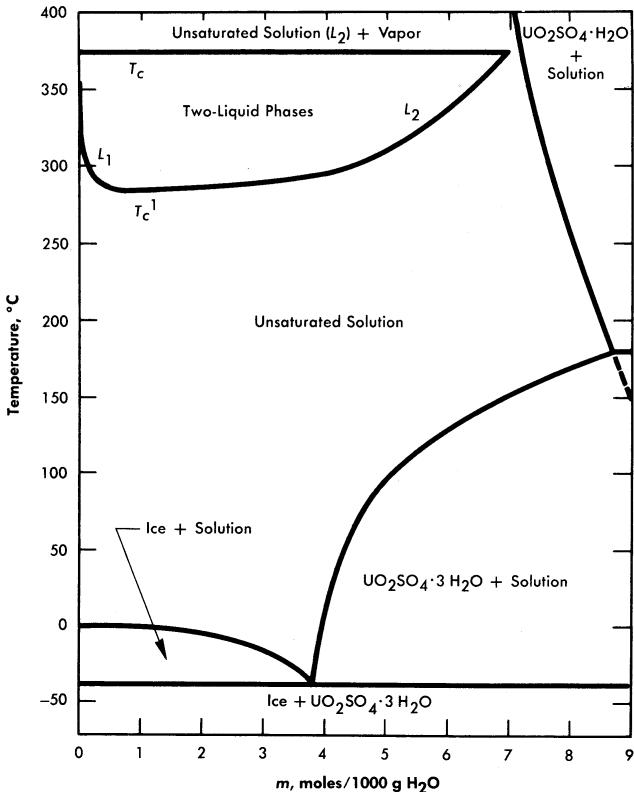  
FIG. 3-1. Phase diagram for the system $\mathrm{UO}_2\mathrm{SO}_4 - \mathrm{H}_2\mathrm{O}$ .

and thorium phosphate can be maintained in solution at satisfactory concentrations by the use of substantial concentrations of nitric or phosphoric acids to inhibit hydrolysis. However, in the nitrate system an acceptable breeding ratio could only be obtained by using $\mathbf{N}^{15}$ . Thorium phosphate solutions containing the necessary amount of phosphoric acid are extremely corrosive to all but the noble metals.

Neptunium and protactinium complete the listing of fissile and fertile materials, since these are intermediates in the production of plutonium and $\mathbf{U}^{233}$ from $\mathbf{U}^{238}$ and thorium. Limited exploratory studies of their solubilities have been carried out primarily in connection with the development of processes for their continuous removal from blanket systems.

3-2.2 Uranyl sulfate. The solubility of uranyl sulfate in water and the characteristics of the phase relationships at elevated temperatures, displayed in the form of a binary system, $\mathrm{UO}_2\mathrm{SO}_4 - \mathrm{H}_2\mathrm{O}$ , are shown in Fig. 3-1 [1]. It is necessary, however, to study the ternary system, $\mathrm{UO}_3 - \mathrm{SO}_3 - \mathrm{H}_2\mathrm{O}$ , in order to understand the hydrolytic precipitation of the

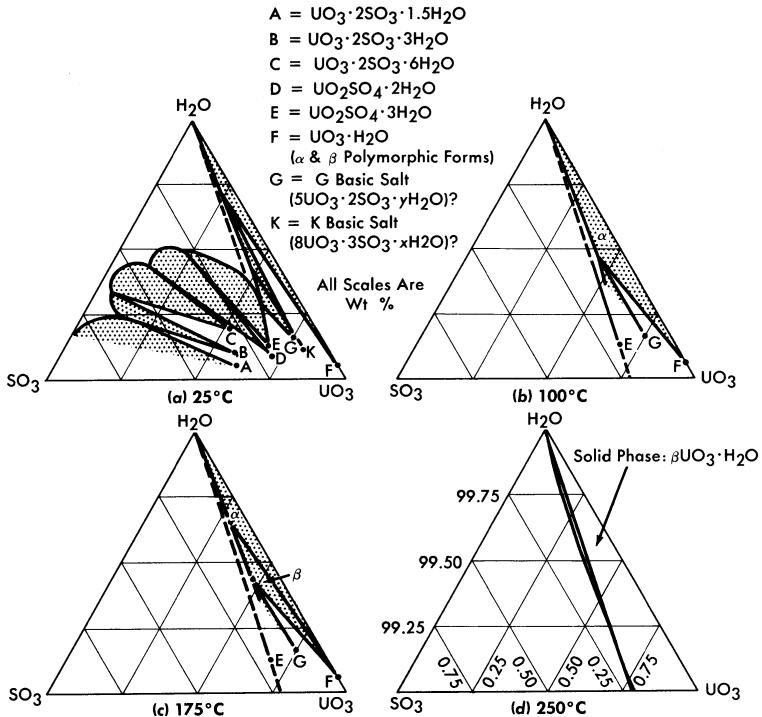  
FIG. 3-2. The system $\mathrm{UO}_3\mathrm{-SO}_3\mathrm{-H}_2\mathrm{O}$ .

basic solid phase, $\beta\text{-}\mathrm{UO}_3\cdot \mathrm{H}_2\mathrm{O}$ , which occurs in very dilute solutions at elevated temperatures, and the position of the tie lines in the liquid-liquid miscibility gap. Figure 3-2 shows portions of the ternary isotherms at 25, 100, 175, and $250^{\circ}\mathrm{C}$ [2,3]. A point of special significance in these diagrams is that the solubility of $\mathrm{UO}_3$ in uranyl sulfate solutions decreases with increasing temperature to the extent that at $250^{\circ}\mathrm{C}$ excess acid is required to maintain homogeneity in solutions of low concentration. Excess acid also has a marked effect on the liquid-liquid miscibility gap, as shown by the curves in Fig. 3-3 [4]. In very dilute solutions the surface formed by these curves intersects the surface representing the liquid compositions in equilibrium with the hydrolytically precipitated solid phase, $\beta\text{-}\mathrm{UO}_3\cdot \mathrm{H}_2\mathrm{O}$ . Figure 3-4 shows this intersection and three paths on the liquidus surface at fixed $\mathrm{SO}_3/\mathrm{UO}_3$ mole ratios [5].

Figure 3-5 shows, from the data of Jones and Marshall [6], how the two-liquid-phase separation temperature is lowered when the solvent is changed from light water to heavy water. Scattered experiments suggest that the temperatures for solid-phase separation through hydrolytic precipitation are also somewhat lower in heavy-water systems than in systems containing light water as the solvent.

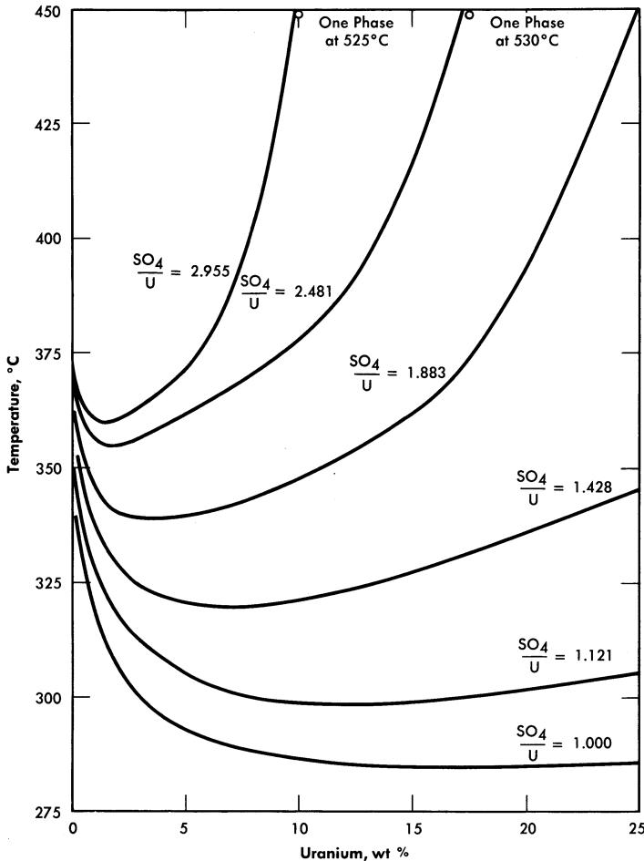  
FIG. 3-3. Coexistence curves for two liquid phases in the system $\mathrm{UO}_2\mathrm{SO}_4\text{-H}_2\mathrm{SO}_4\text{-H}_2\mathrm{O}$ .

Figure 3-6 shows the liquidus composition isotherms from 150 to $290^{\circ}\mathrm{C}$ for dilute sulfuric acid solutions saturated with $\mathrm{UO}_3$ [7].

Study of the data leads to the following general conclusions with respect to the stability of uranyl sulfate solutions of reactor interest:

(1) Stoichiometric uranyl sulfate solutions in light and heavy water are unstable at temperatures of $280^{\circ}\mathrm{C}$ and above because of hydrolysis.   
(2) Stability up to approximately $325^{\circ}\mathrm{C}$ is provided at uranium concentrations up to 2.5 w/o by the addition of a 50 mole $\%$ excess of sulfuric acid.   
(3) Stability up to as high as $400^{\circ}\mathrm{C}$ is provided at uranium concentrations above 20 w/o by the addition of a 100 mole $\%$ excess of sulfuric acid.

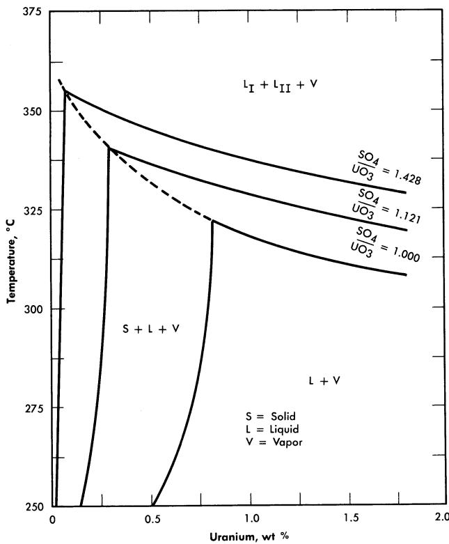  
FIG. 3-4. Effect of excess $\mathbf{H}_2\mathbf{SO}_4$ on the phase equilibria in very dilute $\mathbf{UO}_2\mathbf{SO}_4$ solutions.

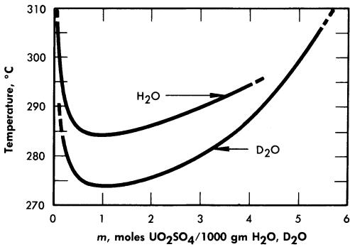  
FIG. 3-5. Two-liquid phase region of uranyl sulfate in ordinary and heavy water.

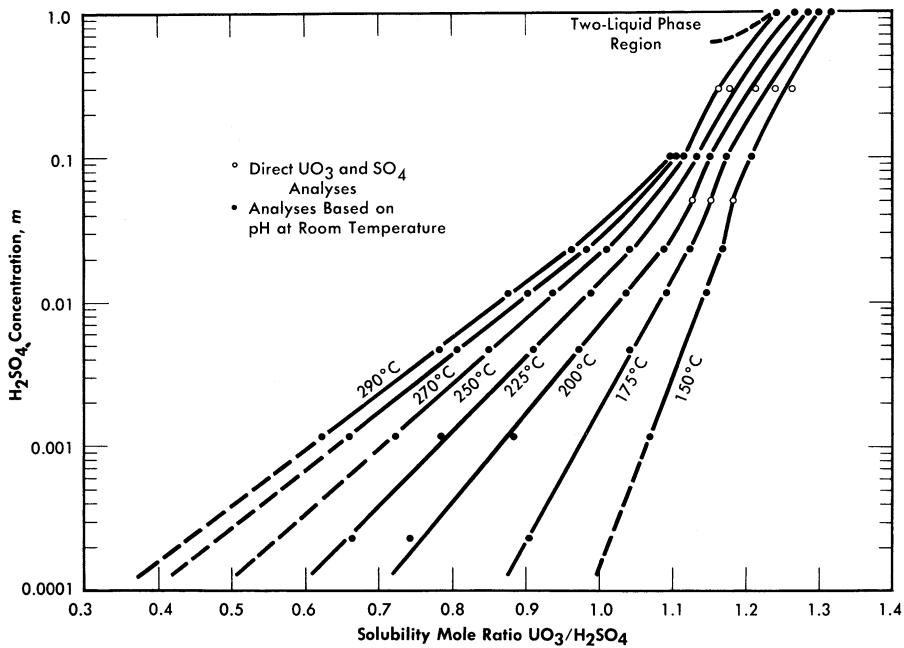

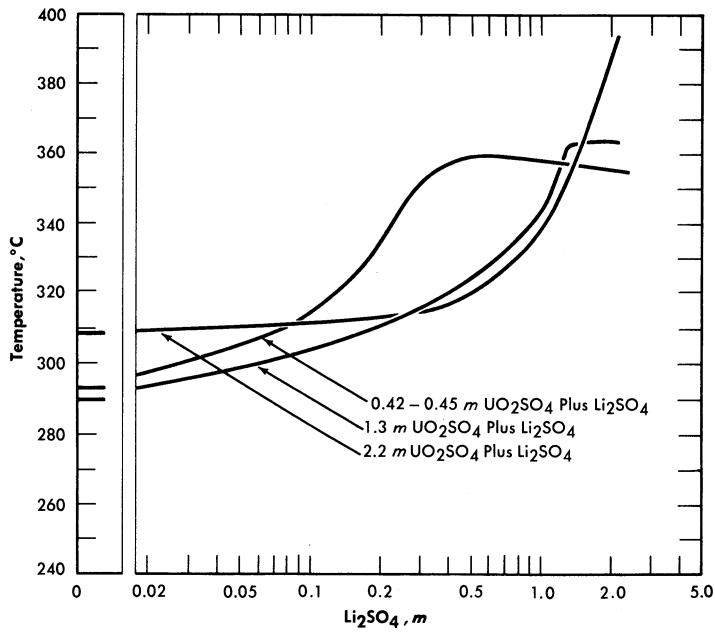  
FIG. 3-6. Solubility of $\mathrm{UO_3}$ in $\mathrm{H}_2\mathrm{SO}_4$ - $\mathrm{H}_2\mathrm{O}$ mixtures.   
FIG. 3-7. Second-liquid phase temperature of $\mathrm{UO_2SO_4 - Li_2SO_4}$ solutions. Concentrations are uncorrected for loss of water to vapor phase at elevated temperatures.

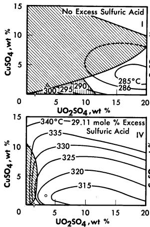

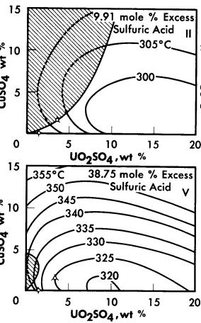

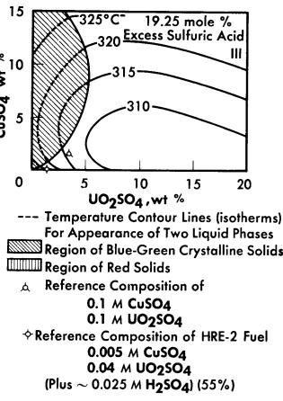  
FIG. 3-8. Phase transition temperatures in solutions containing cupric sulfate, uranyl sulfate, and sulfuric acid.

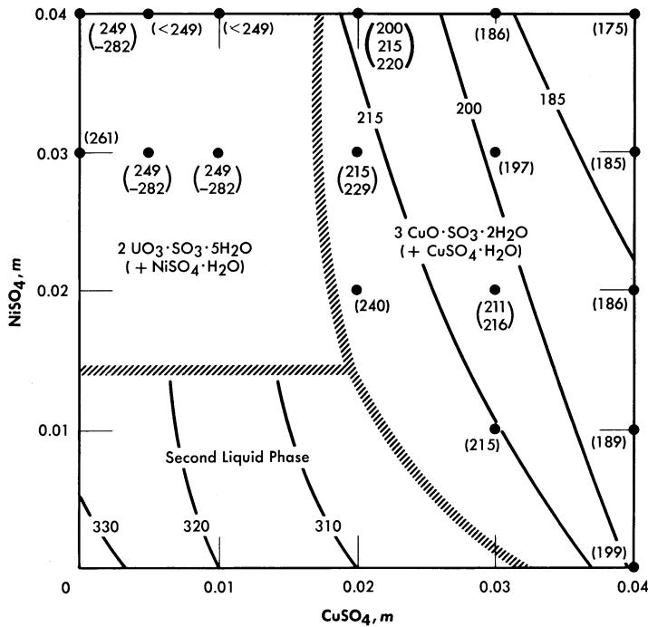  
FIG. 3-9. The effect of $\mathrm{CuSO_4}$ and $\mathrm{NiSO_4}$ on phase transition temperatures $(0.04\,m\, \mathrm{UO}_2\mathrm{SO}_4; 0.01\, m\, \mathrm{H}_2\mathrm{SO}_4)$ .

The addition of lithium sulfate or beryllium sulfate to uranyl sulfate solutions has been found to elevate the temperatures at which the second liquid phase appears [8]. Figure 3-7 shows the effect of $\mathrm{Li_2SO_4}$ additions on the second liquid phase temperature for three uranyl sulfate solutions. In very dilute uranyl sulfate solutions excess acid must also be added to prevent hydrolytic precipitation.

The solubility relationships in uranyl sulfate solutions containing cupric copper are also of interest (see Article 3-3.4). Copper sulfate solutions, like uranyl sulfate, undergo hydrolytic precipitation at elevated temperatures [9]. Even though the required concentration of cupric ion may be quite low, its presence influences the phase relationships. This influence is most significant in dilute uranyl sulfate solutions. A complete phase diagram for the four-component system, $\mathrm{CuO - UO_3 - SO_3 - H_2O}$ , has not been determined, but regions of special interest have been studied. Figure 3-8 shows the phase transition temperatures in solutions containing copper sulfate, uranyl sulfate, and sulfuric acid. The solid phase which appears at the higher $\mathrm{CuSO_4}$ concentrations has been shown to be at least in part the basic copper sulfate, $3\mathrm{CuO}\cdot \mathrm{SO}_3\cdot 2\mathrm{H}_2\mathrm{O}$ [10].

In uranyl sulfate solutions in contact with austenitic stainless steels it is important to know the effect of the corrosion products upon the solubility relationships. Under most conditions iron and chromium appear as insoluble hydrolytic products, but nickel appears as a soluble contaminant of the solution. Studies have been made of the precipitation temperatures for dilute solutions in the system $\mathrm{UO_2SO_4 - CuSO_4 - NiSO_4 - H_2SO_4 - H_2O}$ , and the solid phases have been identified [11]. Figure 3-9 summarizes the information for systems having compositions approximately that of the fuel solution of the HRE-2. In this preliminary study the tests were limited to short time intervals (15 minutes or less of exposure to the elevated temperatures). When solutions containing $0.01m\mathrm{CuSO}_4$ plus $0.01m\mathrm{NiSO}_4$ , or $0.02m\mathrm{CuSO}_4$ with no $\mathrm{NiSO}_4$ were heated for longer periods of time at 300 to $310^{\circ}\mathrm{C}$ (just below the temperature for the formation of two liquid phases) green solids were deposited. Thus the results pictured in Fig. 3-9 should be applied to practical situations with considerable reservation until experiments with the exact composition of interest have been conducted.

3-2.3 Other uranium compounds. Uranyl nitrate. A phase diagram for the system uranyl nitrate-water [12] is shown in Fig. 3-10. Although uranyl nitrate remains very soluble at the elevated temperatures of interest for power-reactor operation, the nitrate group in such solutions decomposes to yield oxides of nitrogen which appear in the vapor phase. Although this situation is reversible with the lowering of temperature, it does introduce corrosion problems with respect to the vapor phase. The

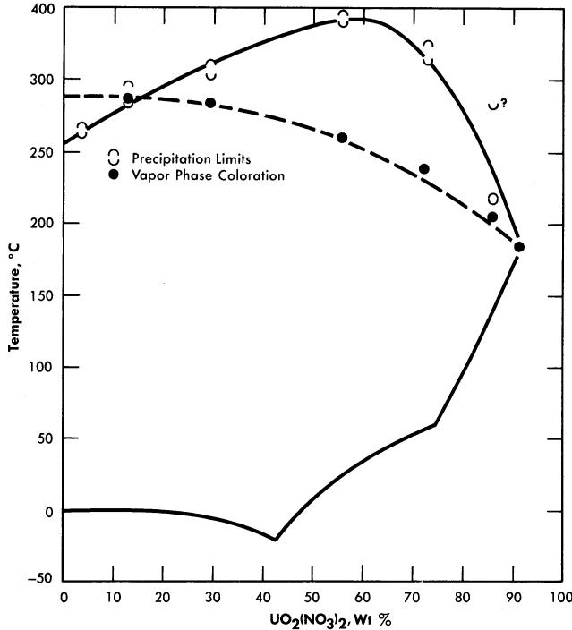

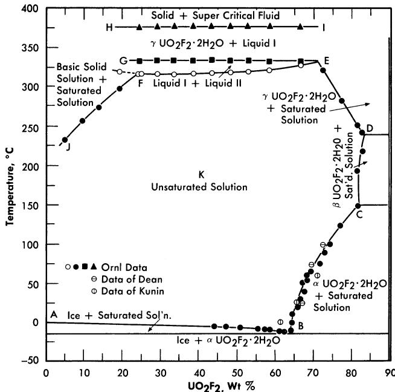  
FIG. 3-10. The $\mathrm{UO}_2(\mathrm{NO}_3)_2$ - $\mathrm{H}_2\mathrm{O}$ system.   
FIG. 3-11. Phase equilibria of aqueous solutions of $\mathrm{UO}_3$ and HF in stoichiometric concentrations.

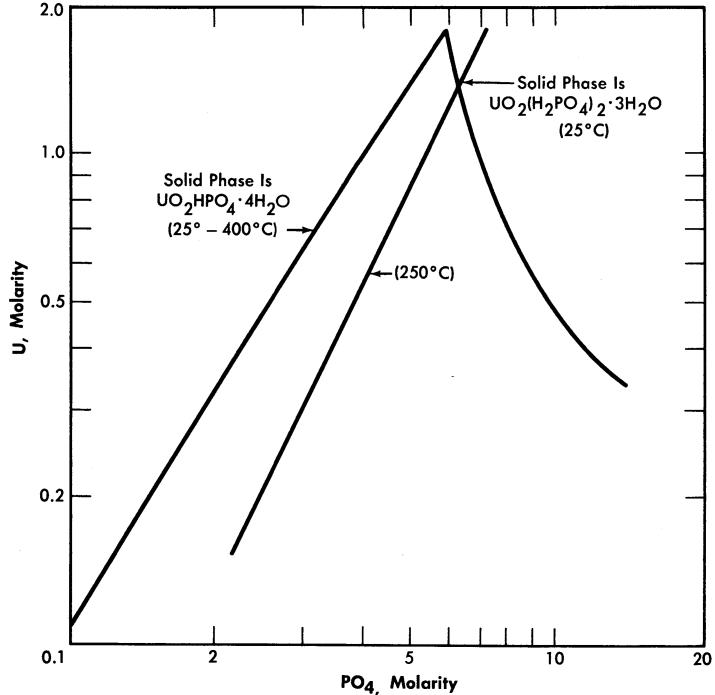  
FIG. 3-12. Solubility of $\mathrm{UO}_3$ in $\mathrm{H}_3\mathrm{PO}_4$ solution.

nitrate ion is, moreover, not completely stable in fissioning solutions; elemental nitrogen is one of the products of radiation decomposition. Although uranyl nitrate solutions have proved quite satisfactory in low-power water-boiler type research reactors, where makeup nitric acid can be added as needed [13], they do not appear attractive for high-temperature, high-power aqueous homogeneous reactors.

Uranyl fluoride. Uranyl fluoride is a very attractive fuel solute because of the low neutron capture cross-section of fluorine. However, at high temperatures it undergoes hydrolysis, which means that excess HF would be required to maintain homogeneity. Hydrogen fluoride is also a component of the vapor phase. Both liquid and vapor are very corrosive toward zirconium and titanium, but less corrosive toward stainless steel (see Article 5-3.3). Figure 3-11 shows the phase relationships in this system [14].

Uranium phosphate. Neither hexavalent nor tetravalent uranium phosphate is sufficiently soluble in water to be of reactor interest, but both $\mathrm{UO_2}$ and $\mathrm{UO_3}$ are quite soluble in moderately strong phosphoric acid. These solutions have been the subject of considerable study at the Los Alamos Scientific Laboratory [15]. The solubility of $\mathrm{UO_3}$ in phosphoric acid is illustrated by Fig. 3-12 [16]. Although the solubilities of uranyl

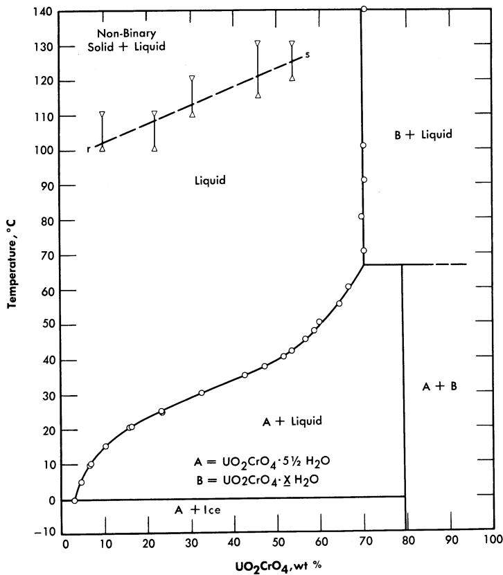  
FIG. 3-13. The system $\mathrm{UO}_2\mathrm{CrO}_4 - \mathrm{H}_2\mathrm{O}$ .

phosphate and uranyl sulfate in water are quite different, their respective solubilities in concentrated phosphoric acid and concentrated sulfuric acid are analogous; in either case temperatures as high as $450^{\circ}\mathrm{C}$ can be obtained with no phase separation. Phosphorus has an advantage over sulfur in possessing a somewhat lower neutron absorption cross section, but both anions appear to be stable under radiation. Both the phosphate and sulfate solutions in concentrated acid at temperatures of $450^{\circ}\mathrm{C}$ are extremely corrosive toward most metals and alloys except the noble metals. Attempts to operate experimental high-temperature reactors using uranium phosphate-phosphoric acid fuel solutions have failed because of catastrophic corrosion rates due to imperfections in noble metal plating or cladding of the reactor core and heat-exchanger tubing [17] (see Section 7-5).

Uranyl chromate. Uranyl chromate solutions also suffer from hydrolysis at elevated temperatures; excess chromic acid is required for stability [18]. This system is, however, not unattractive insofar as corrosion of stainless and carbon steels is concerned. The conditions of acidity and oxidation-

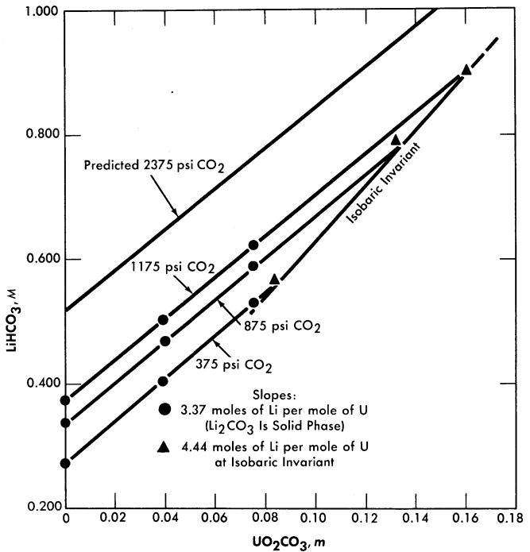  
FIG. 3-14. Variation of $\mathrm{Li}_2\mathrm{CO}_3$ solubility with $\mathrm{UO}_2\mathrm{CO}_3$ concentration at constant $\mathrm{CO}_2$ pressure $(250^{\circ}\mathrm{C})$ .

reduction potential determine the valence state of the chromium, but present knowledge is not adequate to specify required conditions for reliable behavior at elevated temperatures and under reactor radiation. Figure 3-13 shows the phase diagram insofar as it has been established.

Uranyl carbonate. Uranium trioxide is quite soluble in alkali carbonate solutions. This solubility can be attributed to the complexing of $\mathrm{UO}_3$ or uranyl ion by the bicarbonate ion to form uranium-containing anions. In any event, one would not expect the solubility of uranium to be retained at high temperature unless the carbonate content of the aqueous phase were kept high. This can be accomplished by retaining an adequately high partial pressure of $\mathrm{CO}_2$ over the solution. The solubility of $\mathrm{UO}_3$ in $\mathrm{Li}_2\mathrm{CO}_3$ solutions at $250^{\circ}\mathrm{C}$ has been studied [19], and the significant results are shown in Figs. 3-14 and 3-15. Referring to Fig. 3-14, we see that at a constant $\mathrm{CO}_2$ pressure the concentration of uranium increases linearly with the lithium concentration until a limit is reached at the isobaric invariant. The uranium concentration cannot be increased further unless the $\mathrm{CO}_2$ pressure is increased. Figure 3-15 is a projection of the compositions of solutions saturated with respect to lithium and uranium at $250^{\circ}\mathrm{C}$ and at a constant total pressure $(\mathrm{CO}_2 + \text{steam})$ of 1500 psi. The projection

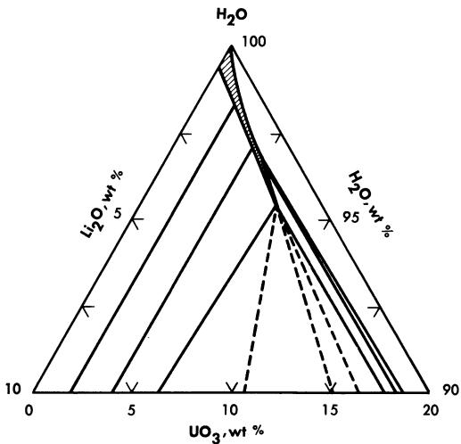  
FIG. 3-15. The system $\mathrm{Li}_2\mathrm{O - UO}_3\mathrm{-CO}_2\mathrm{-H}_2\mathrm{O}$ at $250^{\circ}\mathrm{C}$ and 1500 psi.

figure gives no information concerning the concentration of carbonate in the liquid phase. The region in which a single homogeneous liquid phase exists is the very narrow shaded region near the $\mathrm{H}_2\mathrm{O}$ apex. Although the scope of this region is small, there should be no difficulty in maintaining a homogeneous liquid phase if an adequate pressure of $\mathrm{CO}_{2}$ is kept on the system and an appropriate composition is selected in preparing the solution.

3-2.4 Solubilities of nonuranium compounds. Thorium. Thorium solutions having concentrations as high as $0.5\,m$ would be useful for one-region breeder reactors. For the breeder blanket of a two-region reactor concentrations of about $6.0\,m$ thorium appear to be optimal, although somewhat lower concentrations would be of interest. At the present time only thorium nitrate or phosphate solutions in the presence of excess acid have been demonstrated to have the required solubilities at elevated temperatures; both of these solutions have substantial disadvantages. Thorium chloride would be expected, by analogy, to show substantial solubility at elevated temperatures, but this system has not been investigated in detail. Complex organic salts, such as thorium acetylacetonate, have high solubilities at relatively low temperatures, but these have not been investigated for use in aqueous solutions at temperatures above $100^{\circ}\mathrm{C}$ .

Data from the literature on the solubility of thorium sulfate at low temperatures both alone and in the presence of other solutes [20] indicate that such solutions will probably not be satisfactory at elevated temperatures.

Thorium phosphate (or thorium oxide) is very soluble in concentrated phosphoric acid. Solutions containing up to $1100\mathrm{g}$ Th/liter with $\mathrm{PO_4 / Th}$

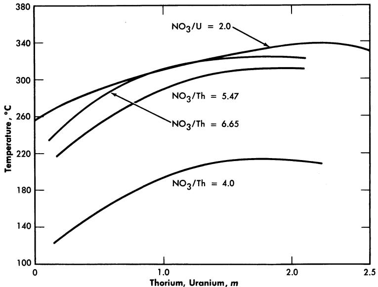  
FIG. 3-16. Hydrolytic stability of thorium nitrate and uranyl nitrate solutions.

ratios of 5 and 7 could be prepared and appeared to be thermally stable but had high viscosities. Solutions containing $400\mathrm{g}$ Th/liter at $\mathrm{PO_4 / Th}$ ratios of 10 were thermally stable at 250 to $300^{\circ}\mathrm{C}$ with viscosities little higher than that of concentrated phosphoric acid. Efforts to improve the properties of thorium phosphate-phosphoric acid systems by the inclusion of HF, $\mathrm{HNO}_3$ , $\mathrm{H}_2\mathrm{SO}_4 = \mathrm{SeO}_4 = \mathrm{SO}_4$ , $\mathrm{Li^{+}}$ , or $\mathrm{Mg}^{+ + }$ , alone or in combination, have not proved encouraging [21].

The thorium nitrate-water system has been reported [22] as having considerable solubility up to about $225^{\circ}\mathrm{C}$ , at which point hydrolytic precipitation occurs. Further investigation [23] revealed a maximal stability for the $80\mathrm{w / o}$ material (to around $255^{\circ}\mathrm{C}$ ). Increasing the acidity of the solutions (increasing the $\mathrm{NO}_3^-$ /Th ratio) suppresses hydrolysis and increases the stability of the solutions as indicated by Figure 3-16, which shows the precipitation temperatures for various solutions [24]. The intensity of vapor phase coloration at elevated temperatures (rapidly reversible) increased as the nitrate/thorium ratio was raised above 4.0.

Plutonium. A considerable investigation of the chemistry of plutonium in aqueous uranyl sulfate solutions has been directed, not toward the achievement of solubility, but toward the achievement of insolubility in order to provide the basis for continuous processing of a $\mathrm{U}^{238}$ blanket solution for plutonium production [25] (see Chapter 6).

The possible use of aqueous solutions of plutonium in homogeneous reactors has been reviewed by Glanville and Grant [26] in order to determine

TABLE 3-1   
THE SOLUBILITY OF PLUTONIUM COMPOUNDS AT ROOM TEMPERATURE  

<table><tr><td></td><td>PuIII</td><td>PuIV</td><td>PuVI</td></tr><tr><td>Fluoride</td><td>Soluble in presence of fluoride complexing ions; e.g., Zr</td><td>Soluble in presence of fluoride complexing ions; e.g., Zr or Al</td><td>&gt;40 g Pu/liter in 19 M HF</td></tr><tr><td>Chloride</td><td>Soluble in water and dilute acids</td><td>Of the order of 50 g Pu/liter in 6 M HCl</td><td>~350 g Pu/liter</td></tr><tr><td>Bromide</td><td>Soluble in water</td><td>Of the order of 1 g Pu/liter in 5 M HBr</td><td>No information</td></tr><tr><td>Bromate</td><td>No information</td><td>&gt;8 g Pu/liter in 1.5 M H2SO4, 0.15 M KBrO4</td><td>No information</td></tr><tr><td>Iodate</td><td>1.5 mg Pu/liter in 0.0017 M KIO3, 0.17 M H2SO4</td><td>Max. reported is 94.5 mg Pu/liter in 0.1 M KIO3, 6 M HNO3</td><td>0.6 g Pu/liter in 0.2 M KIO3</td></tr><tr><td>Perchlorate</td><td>Of the order of grams of Pu/liter in dilute HClO4</td><td>Of the order of grams of Pu/liter in dilute HClO4</td><td>Of the order of grams of Pu/liter in dilute HClO4</td></tr><tr><td>Nitrate</td><td>&gt;7.7 g Pu/liter in 0.9 M HNO3</td><td>500 g Pu/liter in 2 M HNO3</td><td>≈500 g Pu/liter</td></tr><tr><td>Sulfate</td><td>125 g Pu/liter in 0.1 M H2SO4</td><td>&gt;125 g Pu/liter in 0.1 M H2SO4</td><td>No information</td></tr><tr><td>Chromate</td><td>No information</td><td>Soluble in 10 M HNO3, 0.25 g Pu/liter in 0.1 M Na2Cr2O7, 0.1 M HNO3</td><td>No information</td></tr><tr><td>Phosphate</td><td>Max. reported is 3.89 g Pu/liter in 0.8 M H3PO4, 0.9 M HCl</td><td>0.55 g Pu/liter in 1 M H2SO4</td><td>&gt;0.7 g Pu/liter in 0.6 M H3PO4, 0.1 M HNO3</td></tr><tr><td>Carbonate</td><td>Soluble in 45% K2CO3</td><td>0.1 g Pu/liter in 0.2 M Na2CO3, 0.2 M CH3COONa</td><td>&gt;8.4 g Pu/liter in 0.02 M Na2CO3</td></tr><tr><td>Oxalate</td><td>0.46 g Pu/liter in 0.5 M H2C2O4, 3.7 M H+</td><td>Max. reported is &gt;0.244 g Pu/liter in 0.1 M H2C2O4, 1 M HNO3, 1 M HF</td><td>Of the order of grams of Pu/liter</td></tr><tr><td>Benzoate</td><td>Very soluble</td><td>Very soluble</td><td>No information</td></tr></table>

which compounds of plutonium appear most worthy of experimental study as fuel solutes. Table 3-1 summarizes the available low-temperature solubility information for three valence states of plutonium in the presence of different anions.

Limited experimental work has been performed in which the solubilities of plutonium carbonates, sulfates, and phosphates have been determined at temperatures up to $300^{\circ}\mathrm{C}$ [27]. No substantial solubilities have been established at temperatures above $200^{\circ}\mathrm{C}$ .

Protactinium. No efforts have been made to achieve high solubilities of protactinium in order to use it as a component of reactor fuel solutions. Rather, the chemistry of protactinium has been examined in order to devise processes for removing $\mathrm{Pa}^{233}$ continuously from thorium breeder blanket systems. A project was undertaken by the Mound Laboratories [28] to separate gram quantities of the longer-lived $\mathrm{Pa}^{231}$ which could be used in studies of the chemistry of protactinium.

Considerable information concerning the low-temperature chemical behavior of Pa has accumulated as a by-product of the development of chemical processes for the separation of $\mathbf{U}^{233}$ from irradiated thorium materials [29].

Neptunium. $\mathrm{Np}^{239}$ is in a class with $\mathrm{Pa}^{233}$ ; no efforts have been made to use it as a fuel solute, but consideration has been given to its formation in and removal from blanket solutions of $\mathrm{U}^{238}$ [30a]. The chemistry of neptunium has been reviewed by Hindman et al. [30b], and the hydrolytic behavior has been reviewed by Kraus [30c]. Continuous separation of $\mathrm{Np}^{239}$ would provide a $\mathrm{Pu}^{239}$ product of high purity by radioactive decay, whereas plutonium recovered from long-term irradiation of $\mathrm{U}^{238}$ usually contains appreciable amounts of $\mathrm{Pu}^{240}$ . Spectrophotometric cells for use at elevated temperatures and pressures in the study of the chemistry of neptunium (and other materials) have recently been developed by Wagener [30d] and have been used to measure the absorption spectra of dilute neptunium perchlorate in its six-, five-, four-, and three-valence states, using heavy water as the solvent. Dilute solutions of neptunyl nitrate in nitric acid have been so studied at temperatures up to $250^{\circ}\mathrm{C}$ ; the pentavalent state was found to be stable under the test conditions [30e].

# 3-3. RADIATION EFFECTS*

3-3.1 Introduction. Any aqueous reactor fuel solution will be subjected to intense fluxes of high-energy radiations. The action of these radiations both on the water and on the solute is of considerable importance in

reactor design and operation. Energy will be dissipated in a fuel solution by the stopping of fast charged particles. These include mainly the fission recoil particles, the recoil particles such as protons produced by elastic neutron scattering, and the fast electrons resulting from the absorption of gamma rays and from the decay of radioactive fission products. The extent to which each contributes to the total energy absorbed in the fuel solution depends upon the design of the reactor and the composition of the solution.

Water is decomposed by all types of high-energy radiations to give hydrogen, hydrogen peroxide, and oxygen [31]. If the decomposition products are confined in solution, a radiation-induced back reaction will occur and, eventually, steady-state concentrations (pressures) of products will be attained. The rate of decomposition, the rate of the back reaction, and hence the steady-state concentrations are sensitive to the conditions of the system, such as the nature of the radiation, the type and concentration of solutes present, and the temperature. In particular, the addition of hydrogen suppresses the decomposition of pure water.

The solutes may also be acted upon by direct absorption of the energy of the radiations (or by transfer of energy from the solvent) and also by reactions with the intermediate reactive species produced by the decomposition of the water.

3-3.2 Primary and secondary reactions in pure water. The fast charged particles give up energy to the electronic systems of the molecules of the medium, thereby producing various excited and ionized states. In liquid water, the ionized and excited molecules are rapidly transformed into the free radicals H and OH. These are formed in relatively high concentrations along the tracks of the fission recoils or other charged particles. As a result, many of the radicals combine before they can diffuse apart, thereby producing the stable molecules $\mathrm{H}_2\mathrm{O}$ , $\mathrm{H}_2$ , and $\mathrm{H}_2\mathrm{O}_2$ . The primary chemical species are therefore considered to be H, OH, $\mathrm{H}_2$ , and $\mathrm{H}_2\mathrm{O}_2$ ; their yields per 100 ev of energy absorbed are expressed as $G(\mathrm{H})$ , $G(\mathrm{OH})$ , $G(\mathrm{H}_2)$ , and $G(\mathrm{H}_2\mathrm{O}_2)$ . The primary chemical reaction can be written:

$$
3 \mathrm {H} _ {2} \mathrm {O} \longrightarrow \mathrm {H} + \mathrm {O H} + \mathrm {H} _ {2} + \mathrm {H} _ {2} \mathrm {O} _ {2}. \tag {3-1}
$$

Some minor subtleties emerging from recent studies of the radiolysis of aqueous solutions are: (a) although stoichiometry demands that $G(\mathrm{H}) + 2G(\mathrm{H}_2) = G(\mathrm{OH}) + 2G(\mathrm{H}_2\mathrm{O}_2)$ , the yields of H and OH and also the yields of $\mathrm{H}_{2}$ and $\mathrm{H}_2\mathrm{O}_2$ are not necessarily equal to each other [32]; (b) the yields of $\mathrm{H}_{2}$ and $\mathrm{H}_2\mathrm{O}_2$ are lowered by solutes which scavenge the precursors in the particle tracks [33]; (c) $\mathrm{HO_2}$ may be another "primary" chemical species produced in small yield in the particle tracks [34].

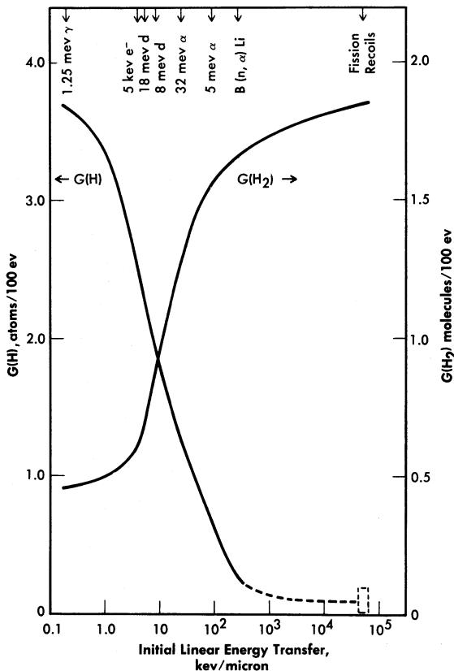  
FIG. 3-17. Yields of atomic and molecular hydrogen from the decomposition of water by various ionizing radiations.

The yields of the primary chemical species depend markedly on the type of radiation or, more specifically, on the energy transferred to the solution per unit length along the track of the charged particle. The linear energy transfer (LET) parameter varies from $5 \times 10^{4}$ kev per micron of path for fission recoils to $0.2\mathrm{kev} / \mathrm{micron}$ for fast electrons. The yields $G(\mathrm{H}_2)$ and $G(\mathrm{H}_2\mathrm{O}_2)$ are largest for radiations such as fission recoils with large LET, while the yields $G(\mathrm{H})$ and $G(\mathrm{OH})$ are largest for radiations such as fast electrons with small LET [31]. This is illustrated in Fig. 3-17, where the yields [35] $G(\mathrm{H}_2)$ and $G(\mathrm{H})$ are plotted as a function of LET.

The free radicals which escape immediate combination and diffuse into the bulk of the solution may react with solutes present, including the $\mathrm{H}_{2}$ and $\mathrm{H}_{2} \mathrm{O}_{2}$ . In water with no added solutes, the principal back reactions of the free radicals are believed to be:

$$
\mathrm {H} + \mathrm {H} _ {2} \mathrm {O} _ {2} \longrightarrow \mathrm {H} _ {2} \mathrm {O} + \mathrm {O H}, \tag {3-2}
$$

$$
\mathrm {O H} + \mathrm {H} _ {2} \longrightarrow \mathrm {H} _ {2} \mathrm {O} + \mathrm {H}, \tag {3-3}
$$

$$
\mathrm {O H} + \mathrm {H} _ {2} \mathrm {O} _ {2} \longrightarrow \mathrm {H} _ {2} \mathrm {O} + \mathrm {H O} _ {2}, \tag {3-4}
$$

$$
2 \mathrm {H O} _ {2} \longrightarrow \mathrm {H} _ {2} \mathrm {O} _ {2} + \mathrm {O} _ {2}, \tag {3-5}
$$

$$
\mathrm {H} + \mathrm {O} _ {2} \longrightarrow \mathrm {H O} _ {2}, \tag {3-6}
$$

$$
\mathrm {H O} _ {2} + \mathrm {H} _ {2} \mathrm {O} _ {2} \longrightarrow \mathrm {H} _ {2} \mathrm {O} + \mathrm {O H} + \mathrm {O} _ {2}. \tag {3-7}
$$

Reactions (3-2) and (3-3) provide a chain mechanism for the back reaction of $\mathrm{H}_{2}$ and $\mathrm{H}_{2}\mathrm{O}_{2}$ to reform water [36], thereby leading to steady-state concentrations of decomposition products. The steady-state concentration will depend on the relative yields of molecular products and free radicals in reaction (3-1). For gamma rays, which produce the free radicals in high yield and the molecular decomposition products in low yield, the steady state in pure water is essentially zero. For fission recoils, which produce essentially no free radicals to promote the back reaction, the steady-state concentration (pressure) is very high (several thousand psi). Reactions (3-4) and (3-5) provide a mechanism for decomposing $\mathrm{H}_{2}\mathrm{O}_{2}$ to $\mathrm{O}_{2}$ , and reactions (3-3), (3-5), (3-6), and (3-7) provide a mechanism for combining $\mathrm{H}_{2}$ and $\mathrm{O}_{2}$ to form water at higher temperatures [37].

Dissolved materials may be oxidized or reduced. In general, H atoms usually reduce the solute and OH radicals reoxidize it. Assuming equal numbers of H and OH, the net result depends on the action of the $\mathrm{H}_2\mathrm{O}_2$ . The peroxide may act in either way (depending on the oxidation-reduction potentials) but usually oxidation is favored. In the presence of $\mathrm{O}_2$ , the H-atom may be converted to $\mathrm{HO}_2$ , which usually acts as an oxidizing agent.

3-3.3 Decomposition of water in uranium solutions. In Table 3-2 are listed the hydrogen yields from the decomposition of solutions of various uranyl salts [38]. The yield depends on the type of radiation and on the solute concentration, but is independent of temperature. Figure 3-18 shows how the yield of hydrogen produced by fission recoil decomposition, and by gamma-ray decomposition, decreases with increasing uranium concentration. This decrease may result from scavenging of H-atoms in the particle tracks by the uranyl ions. Decomposition by fission recoil particles produces mostly $\mathrm{H}_{2}$ (and an equivalent amount of $\mathrm{H}_{2}\mathrm{O}_{2}$ plus $\mathrm{O}_{2}$ ); the yields $G(\mathrm{H})$ and $G(\mathrm{OH})$ are very small, probably in the range 0 to 0.1 per 100 ev.

In an aqueous homogeneous reactor fuel solution, the water is decomposed by fission recoils, proton recoils, and fast electrons. The rate of hydrogen formation, in moles per liter per minute, can be expressed by the equation:

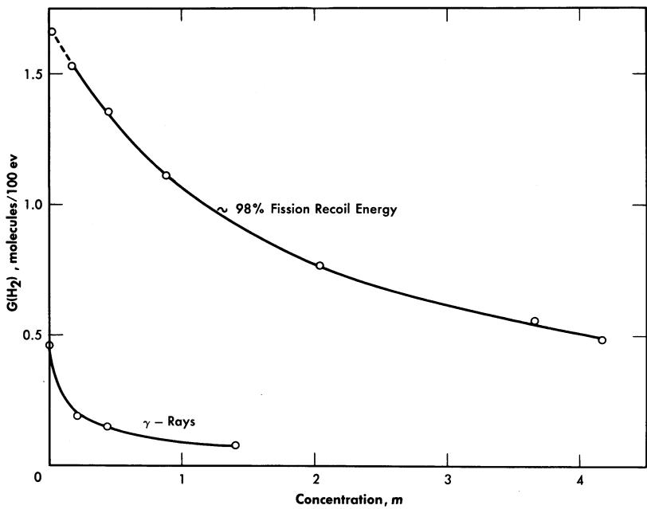  
FIG. 3-18. The effects of uranium concentration and type of radiation on the initial $\mathbf{H}_2$ yield from irradiated $\mathrm{UO_2SO_4}$ solutions.

$$
\frac {d (\mathrm {H} _ {2})}{d t} = 0. 0 0 6 2 2 [ G _ {f} \times W _ {f} + G _ {p} \times W _ {p} + G _ {e} \times W _ {e} ], \qquad (3 - 8)
$$

where $G$ is the hydrogen yield in molecules per 100 ev absorbed; and $W$ is the power density in kilowatts per liter. The subscripts $f, p,$ and $e$ refer to the values for fission recoil particles; protons produced by neutron scattering, and electrons produced by gamma-ray absorption and by radioactive decay of fission products. For an operating homogeneous reactor, about $96\%$ of the hydrogen gas produced in solution is due to the fission recoil particles, $2\%$ to the neutrons, and $2\%$ to the gamma rays. Therefore the last two terms in Eq. (3-8) are usually neglected. The fraction due to recoils is usually above 0.96, since part of the energy of the prompt neutrons, gamma rays, and radioactive decay escapes from the solution. The value of $G_{f}$ for a given solute concentration can be obtained from Fig. 3-17 and the value for $W_{f}$ can be calculated from the neutron flux, the concentration of fissionable atoms, the fission cross section, and the kinetic energy of the fission recoils.

Along with the hydrogen, an equivalent amount of oxidant (either peroxide or $\mathrm{O}_2$ ) will be formed.

TABLE 3-2   
INITIAL RATES OF $\mathbf{H}_2$ GAS PRODUCTION FROM REACTOR-IRRADIATED URANIUM SOLUTIONS   

<table><tr><td rowspan="2">Solute</td><td colspan="2">Concentration</td><td rowspan="2">Fission energy total energy</td><td rowspan="2">pH</td><td rowspan="2">G(H2)</td></tr><tr><td>g U/liter</td><td>g U235/liter</td></tr><tr><td rowspan="19">UO2SO4</td><td>0.399</td><td>0.372</td><td>0.688</td><td></td><td>1.61</td></tr><tr><td>4.03</td><td>3.76</td><td>0.957</td><td>3.26</td><td>1.66</td></tr><tr><td>18.6</td><td>1.63</td><td>0.906</td><td>2.90</td><td>1.48</td></tr><tr><td>38.1</td><td>0.274</td><td>0.619</td><td></td><td>0.95</td></tr><tr><td>40.7</td><td>37.9</td><td>0.995</td><td>2.42</td><td>1.53</td></tr><tr><td>102.1</td><td>37.4</td><td>0.995</td><td>2.00</td><td>1.35</td></tr><tr><td>105.2</td><td>38.9</td><td>0.995</td><td>0.10*</td><td>1.20</td></tr><tr><td>108.4</td><td>40.1</td><td>0.995</td><td></td><td>1.35</td></tr><tr><td>202.3</td><td>0.063</td><td>0.273</td><td></td><td>0.69</td></tr><tr><td>202.5</td><td>37.6</td><td>0.995</td><td>1.61</td><td>1.11</td></tr><tr><td>203.4</td><td>189.6</td><td>0.999</td><td></td><td>1.11</td></tr><tr><td>227.0</td><td>1.63</td><td>0.906</td><td></td><td>0.98</td></tr><tr><td>310.4</td><td>0.096</td><td>0.364</td><td></td><td>0.62</td></tr><tr><td>386.0</td><td>1.63</td><td>0.906</td><td></td><td>0.80</td></tr><tr><td>431.3</td><td>37.8</td><td>0.995</td><td>1.32</td><td>0.77</td></tr><tr><td>436.8</td><td>3.10</td><td>0.949</td><td></td><td>0.73</td></tr><tr><td>477.2</td><td>0.148</td><td>0.467</td><td></td><td>0.56</td></tr><tr><td>713.5</td><td>33.5</td><td>0.995</td><td></td><td>0.56</td></tr><tr><td>796.0</td><td>37.4</td><td>0.995</td><td>1.03</td><td>0.49</td></tr><tr><td rowspan="6">UO2F2</td><td>4.25</td><td>3.96</td><td>0.959</td><td>4.25</td><td>1.63</td></tr><tr><td>40.1</td><td>37.3</td><td>0.995</td><td>3.32</td><td>1.58</td></tr><tr><td>118.8</td><td>37.1</td><td>0.995</td><td>2.98</td><td>1.36</td></tr><tr><td>272.0</td><td>37.2</td><td>0.995</td><td>2.64</td><td>1.11</td></tr><tr><td>377.0</td><td>39.3</td><td>0.996</td><td>1.35*</td><td>0.84</td></tr><tr><td>405.7</td><td>42.3</td><td>0.996</td><td>2.41</td><td>0.95</td></tr><tr><td rowspan="4">UO2(NO3)2</td><td>4.24</td><td>3.95</td><td>0.960</td><td></td><td>1.63</td></tr><tr><td>42.3</td><td>39.4</td><td>0.995</td><td>2.05</td><td>1.5</td></tr><tr><td>318.0</td><td>2.29</td><td>0.932</td><td>1.03</td><td>0.6</td></tr><tr><td>420.1</td><td>36.9</td><td>0.994</td><td>0.60</td><td>0.55</td></tr><tr><td rowspan="3">U(SO4)2</td><td>42.2</td><td>39.3</td><td>0.995</td><td>1.95</td><td>1.45</td></tr><tr><td>92.5</td><td>35.1</td><td>0.996</td><td>0.1</td><td>1.25</td></tr><tr><td>350.0</td><td>32.0</td><td>0.995</td><td>0.1</td><td>0.75</td></tr></table>

\*pH adjusted by adding acid.

3-3.4 Recombination in uranium solutions. For fission recoil particles the radiation-induced back reaction of $\mathrm{H}_2$ , $\mathrm{O}_2$ , and $\mathrm{H}_2\mathrm{O}_2$ is relatively slow. Also, the thermal recombination rate in the absence of added catalyst is relatively slow and, as a result, the steady-state pressure of gases is very high; e.g. at $250^{\circ}\mathrm{C}$ the pressure is of the order of thousands of psi.

Certain solutes, notably copper salts, have been shown to act as homogeneous catalysts [39] in the thermal combination of hydrogen and oxygen in aqueous uranium solutions. This provides a convenient method for recombining the radiolytic hydrogen and oxygen gases.

The reaction rate is first order in hydrogen and in copper concentration, and independent of the oxygen concentration. The rate-determining step is the reaction of hydrogen with the catalyst, and the activation energy is about 24 kcal/mole. For a particular uranium solution, the rate of hydrogen removal, in moles/liter/min, can be expressed by

$$
\frac {- d \left(\mathrm {H} _ {2}\right)}{d t} = k _ {\mathrm {C u}} (\mathrm {C u}) (\mathrm {H} _ {2}), \tag {3-9}
$$

where $k_{\mathrm{Cu}}$ is the catalytic constant in liters/mole/min, and concentrations are given as moles/liter. Some selected values of $k_{\mathrm{Cu}}$ are listed in Table 3-3. Increasing the concentration of uranyl sulfate or of sulfuric acid decreases the catalytic activity of the copper somewhat, possibly as a result of complexing. Also, the rate of reaction with $\mathbf{D}_2$ is about 0.6 that with $\mathbf{H}_2$ .

TABLE 3-3   
SELECTED VALUES OF $k_{\mathrm{Cu}}$ AT SEVERAL TEMPERATURES AND URANIUM CONCENTRATIONS (Cu = 10-3M)   

<table><tr><td>Uranium concentration, M</td><td>Temperature, °C</td><td>kCu, liters/mole/min</td><td>103kCu/S, psi-1/min</td></tr><tr><td>0.17</td><td>190</td><td>4.3</td><td>0.28</td></tr><tr><td>0.17</td><td>220</td><td>26.6</td><td>2.3</td></tr><tr><td>0.17</td><td>250</td><td>90.0</td><td>12.</td></tr><tr><td>0.00</td><td>250</td><td>83.0*</td><td>11.</td></tr><tr><td>0.01 to 0.1</td><td>250</td><td>133</td><td>18.</td></tr><tr><td>0.01 to 0.1</td><td>275</td><td>380</td><td>61</td></tr><tr><td>0.01 to 0.1</td><td>295</td><td>850</td><td>149</td></tr></table>

*With $10^{-3}M\mathrm{Cu(ClO_4)_2}$ plus $\mathrm{HClO_4}$ in concentrations ranging from 0.005 M to 0.05 M.

The concentration (solubility) [40] of $\mathbf{H}_2$ is related to the partial pressure of hydrogen by the proportionality factor

$$
S = \frac {P _ {\mathrm {H} _ {2}}}{\left(\mathrm {H} _ {2}\right)}, \tag {3-10}
$$

where $P_{\mathbf{H}_2}$ is given in psi, $(\mathbf{H}_2)$ in moles/liter, and $S$ in psi/liter/mole. Equation (3-9) can then be written

$$
\frac {- d \left(\mathrm {H} _ {2}\right)}{d t} = k _ {\mathrm {C u}} (\mathrm {C u}) \frac {P _ {\mathrm {H} _ {2}}}{S} \tag {3-11}
$$

At the steady state, the rates of formation and removal of hydrogen are equal, and from Eqs. (3-8) and (3-11), the steady-state pressure is given by

$$
P _ {(\mathrm {H} _ {2}) \mathrm {s s}} = \frac {0 . 0 0 6 2 \times G _ {f} \times W _ {f} \times S}{(\mathrm {C u}) k _ {\mathrm {C u}}} \cdot \tag {3-12}
$$

Application of copper sulfate catalyst to the suppression of gas evolution during the operation of the Homogeneous Reactor Experiment was discussed by Visner and Haubenreich [41]. Design calculations for use of copper catalysts in the HRE-2 and in other reactors have been reported [42]. The use of internal recombination catalysts in homogeneous reactors is also discussed in Article 7-3.7.

3-3.5 Peroxide decomposition in uranium solutions. The hydrogen peroxide produced by decomposition of the water can undergo several secondary reactions: (a) It can react with uranyl ion to form the slightly soluble peroxide $\mathrm{UO_4}$ according to the reaction

$$
\mathrm {U O} _ {2} ^ {+ +} + \mathrm {H} _ {2} \mathrm {O} _ {2} \xrightarrow {\rightleftarrows} \mathrm {U O} _ {4} + 2 \mathrm {H} ^ {+}. \tag {3-13}
$$

The $\mathrm{UO_4}$ will precipitate if its solubility $(\sim 10^{-3}M)$ is exceeded. (b) It (or the $\mathrm{UO_4}$ ) can decompose by a radiation-induced reaction via the free radicals H and OH produced by decomposition of the water. (c) In a reactor operating at high temperatures the $\mathrm{H}_2\mathrm{O}_2$ will decompose thermally at an appreciable rate according to the over-all reaction:

$$
\mathrm {H} _ {2} \mathrm {O} _ {2} \longrightarrow \mathrm {H} _ {2} \mathrm {O} + 1 / 2 \mathrm {O} _ {2} \tag {3-14}
$$

and the $\mathrm{UO_4}$ will decompose thermally according to the reactions

$$
\mathrm {U O} _ {4} \longrightarrow \mathrm {U O} _ {3} + 1 / 2 \mathrm {O} _ {2}, \tag {3-15}
$$

$$
\mathrm {U O} _ {3} + 2 \mathrm {H} ^ {+} \longrightarrow \mathrm {U O} _ {2} ^ {+ +} + \mathrm {H} _ {2} \mathrm {O}. \tag {3-16}
$$

Studies of the kinetics of the thermal decomposition of peroxide in uranyl sulfate solutions [43] have shown the rate to be first order with respect to peroxide concentration in the range from 0.4 to $5 \times 10^{-3} M$ , independent of uranium concentration in the range from $4.5 \times 10^{-3}$ to $0.65 M$ , and independent of the acidity from $\mathrm{pH} 1.6$ to 3.3. Traces of certain ions showed pronounced catalytic effects. The rate of decomposition could be expressed by

$$
\frac {- d \left(\mathrm {H} _ {2} \mathrm {O} _ {2}\right)}{d t} = k \left(\mathrm {H} _ {2} \mathrm {O} _ {2}\right) + k _ {\text {c a t}} (\text {C a t}) \left(\mathrm {H} _ {2} \mathrm {O} _ {2}\right), \tag {3-17}
$$

where $(\mathrm{H}_2\mathrm{O}_2)$ represents total peroxide concentration $(\mathrm{UO_4 + H_2O_2})$ in moles per liter at time $t$ , $k$ is the molar rate constant in the absence of catalyst, $k_{\mathrm{cat}}$ is the catalytic constant, and (Cat) is the concentration of catalyst in moles per liter.

Values of $k$ for uranyl sulfate solutions $(4.5 \times 10^{-3} M$ to $0.65 M$ ) with no added catalyst depended upon the adventitious impurities present, and were in the ranges as listed in Table 3-4. The indicated activation energy is $25.5 \, \text{kcal/mole}$ . For pure water, the rate constant at $78^{\circ}\text{C}$ was $4.5 \times 10^{-4}$ per minute.

Catalytic constants, $k_{\mathrm{cat}}$ , for various ions added are listed in Table 3-5.

The net rate of peroxide formation is the difference between the rate of production and the rate of decomposition. At the steady state the two rates are equal. The rate of formation of peroxide in an operating reactor in terms of moles per liter per minute can be expressed in terms of the yield, $G$ , in molecules per 100 ev of fission recoil energy, and the average fission recoil power density of the reactor, $W$ , in kilowatts per liter, by the equation:

$$
\frac {d \left(\mathrm {H} _ {2} \mathrm {O} _ {2}\right)}{d t} = 0. 0 0 6 2 \times G \times W \times 0. 9 6. \tag {3-18}
$$

The maximum value of $G$ for the particular solution used is that given for the $\mathbf{H}_2$ yield in Fig. 3-18. During reactor operation the radiation-induced decomposition of peroxide is negligible, and the rate of decomposition is essentially the thermal rate given by Eq. (3-17). At the steady state the peroxide concentration is given by

$$
\left(\mathrm {H} _ {2} \mathrm {O} _ {2}\right) _ {\mathrm {s s}} = \frac {0 . 0 0 6 2 \times G \times W \times 0 . 9 6}{k + k _ {\mathrm {c a t}} (\mathrm {C a t})}. \tag {3-19}
$$

TABLE 3-4   
MOLAR RATE CONSTANTS FOR PEROXIDE DECOMPOSITION IN $\mathrm{UO_2SO_4}$ SOLUTIONS   
TABLE 3-5   

<table><tr><td>Temperature, °C</td><td>k, min-1</td></tr><tr><td>53</td><td>1.2 × 10-3to 12 × 10-3</td></tr><tr><td>78</td><td>1.8 × 10-2to 14 × 10-2</td></tr><tr><td>100</td><td>1.8 × 10-1to 12 × 10-1</td></tr></table>

CATALYTIC CONSTANTS AT $100^{\circ}\mathrm{C}$ FOR PEROXIDE DECOMPOSITION BY VARIOUS IONS ADDED TO $\mathrm{UO_2SO_4}$ SOLUTION   

<table><tr><td>Catalyst</td><td>kcat(liters/mole/min)</td></tr><tr><td>Fe2+</td><td>135,000</td></tr><tr><td>Ru4+</td><td>121,000</td></tr><tr><td>Ag+1</td><td>4,500</td></tr><tr><td>Ni2+</td><td>2,600</td></tr><tr><td>Cu2+</td><td>1,200</td></tr><tr><td>Fe2+2(promoted</td><td>502,000</td></tr><tr><td>by 793 ppm Cu+2)</td><td></td></tr></table>

The maximum allowable power density, $W_{\max}$ , before precipitation of uranium peroxide occurs is given by

$$
W _ {\max } = \frac {(\mathrm {H} _ {2} \mathrm {O} _ {2}) \operatorname {s o l} [ k + k _ {\text {c a t}} (\text {C a t}) ]}{0 . 0 0 6 2 \times G \times 0 . 9 6}. \tag {3-20}
$$

For example, in $0.17M\mathrm{UO}_2\mathrm{SO}_2$ solution at $100^{\circ}\mathrm{C}$ with no added catalyst, the peroxide solubility is $\approx 4\times 10^{-3}M$ , $k\approx 1\mathrm{min}^{-1}$ , and $G\approx 1.5$ , then $W_{\max}\approx 0.4\mathrm{kw / liter}$ .

Following reactor shutdown, peroxide formation and decomposition will result from the delayed neutrons and from the $\beta^{-}$ and $\gamma$ radiation of the fission products. The yield for peroxide formation will be essentially that for $\gamma$ -rays, $G = 0.46$ . The yield for radiation-induced decomposition [37] may be as high as 4.5, but will depend in a complicated way on the amount of oxygen, hydrogen, and other solutes such as fission products, corrosion products, etc., present.

3-3.6 Decomposition of water in thorium solutions. Under radiation thorium nitrate solutions decompose [44] to give $\mathrm{H}_2$ , $\mathrm{H}_2\mathrm{O}_2$ , and $\mathrm{O}_2$ from decomposition of the water, and $\mathrm{O}_2$ , $\mathrm{N}_2$ , and oxides of nitrogen from decomposition of the nitrate. Yields of $\mathrm{H}_2$ and $\mathrm{N}_2$ for several types of radiation, and for several concentrations of thorium nitrate, are given in Table 3-6. The hydrogen yield decreases with increasing solute concentration, the same as for uranium solutions. The nitrogen yield increases with increasing nitrate concentration. The $\mathrm{N}_2$ is presumably formed by direct action of radiation on the nitrate. The $\mathrm{N}_2$ yield is greater for radiations of greater LET. The $\mathrm{N}_2$ yield is independent of temperature, and little or no radiation-induced back reaction takes place.

Uranyl nitrate solution also decomposes to give $\mathbf{N}_2$ in yield comparable to that for thorium nitrate solution.

TABLE 3-6   
THE EFFECTS OF CONCENTRATION AND TYPE OF RADIATION ON THE YIELDS OF $\mathbf{N}_2$ AND $\mathbf{H}_2$ IN THE DECOMPOSITION OF THORIUM NITRATE SOLUTIONS   

<table><tr><td rowspan="2">Th(NO3)4, molality</td><td rowspan="2">G(H2) Fission recoils*</td><td colspan="3">G(N2)</td></tr><tr><td>Fission recoils*</td><td>ORNL graphite pile radiation</td><td>Gamma rays</td></tr><tr><td>0.26</td><td>1.11</td><td>0.002</td><td>0.003</td><td>0.04 × 10-3</td></tr><tr><td>0.55</td><td>0.93</td><td>0.016</td><td>0.003</td><td>0.5 × 10-3</td></tr><tr><td>1.5</td><td>0.51</td><td>0.047</td><td>0.005</td><td>1.5 × 10-3</td></tr><tr><td>2.7</td><td>0.33</td><td>0.063</td><td>0.006</td><td>1.1 × 10-3</td></tr><tr><td>7.2</td><td>~0.08†</td><td>0.16</td><td></td><td></td></tr></table>

*0.14 molal enriched $\mathrm{UO}_2\mathrm{SO}_4$ added to make the energy contributed by fission recoils $>95\%$ of the total energy absorbed.   
$\dagger$ Estimated by extrapolation.

# 3-4. PHYSICAL PROPERTIES

3-4.1 Introduction. Knowledge of the physical properties of aqueous solutions of reactor fuel materials is required for nuclear physics calculations and analysis of reactor performance, for engineering design, and, ultimately, for effective reactor operation. The scarcity of information available in 1951 concerning the properties of uranium salt solutions prompted the Homogeneous Reactor Program at ORNL to sponsor a physical properties research program at Mound Laboratory beginning in

July 1951 and carrying through December 1954. The progress of this effort is discussed in regular reports [45] and in a number of topical reports dealing with techniques, apparatus, and summarized data [46-56].

A number of compilations of physical properties data for aqueous reactor solutions have appeared, among which are included those of Van Winkle [57], Tobias [58], and sections by Briggs, Day, Secoy, and Marshall in The Reactor Handbook [59].

The properties of light and heavy water are discussed by Lottes [60] as they relate to reactor heat-transfer problems. Other properties of water are found in standard reference works [61-62].

The remainder of this section is devoted to particular properties of reactor solutions which are of interest and to some properties of the vapor phase above reactor solutions which are important for aqueous homogeneous reactors.

TABLE 3-7 LIQUID AND VAPOR DENSITIES OF $\mathbf{D}_2\mathbf{O}$   

<table><tr><td rowspan="2">T, °C</td><td colspan="2">Density, g/cc</td></tr><tr><td>Vapor</td><td>Liquid</td></tr><tr><td>175</td><td>0.004</td><td>0.989</td></tr><tr><td>180</td><td>0.005</td><td>0.983</td></tr><tr><td>190</td><td>0.006</td><td>0.970</td></tr><tr><td>200</td><td>0.007</td><td>0.957</td></tr><tr><td>210</td><td>0.009</td><td>0.943</td></tr><tr><td>220</td><td>0.010</td><td>0.929</td></tr><tr><td>230</td><td>0.013</td><td>0.913</td></tr><tr><td>240</td><td>0.016</td><td>0.898</td></tr><tr><td>250</td><td>0.020</td><td>0.881</td></tr><tr><td>260</td><td>0.024</td><td>0.864</td></tr><tr><td>270</td><td>0.029</td><td>0.847</td></tr><tr><td>280</td><td>0.034</td><td>0.829</td></tr><tr><td>290</td><td>0.040</td><td>0.809</td></tr><tr><td>300</td><td>0.048</td><td>0.787</td></tr><tr><td>310</td><td>0.058</td><td>0.763</td></tr><tr><td>320</td><td>0.070</td><td>0.735</td></tr><tr><td>330</td><td>0.087</td><td>0.705</td></tr><tr><td>340</td><td>0.105</td><td>0.668</td></tr><tr><td>350</td><td>0.129</td><td>0.626</td></tr><tr><td>360</td><td>0.163</td><td>0.573</td></tr><tr><td>370</td><td>0.248</td><td>0.462</td></tr><tr><td>371.5</td><td>0.363</td><td>0.363*</td></tr></table>

*Critical point.

3-4.2 Density of heavy water and uranyl sulfate solutions. The density of heavy water has been measured up to $250^{\circ}\mathrm{C}$ at Mound Laboratory by a direct method making use of a Jolly balance [51,54]. An indirect method for determining the density of heavy-water liquid and vapor has been used to extend the data up to the critical temperature [63]. Table 3-7 gives density values at convenient temperature intervals. The densities of uranyl sulfate solutions from 20 to $90^{\circ}\mathrm{C}$ and at concentrations up to 4.0 molal were measured by Jegart, Heiks, and Orban at Mound Laboratory [47,56]. The densities of uranyl sulfate solutions were measured by Barnett et al., of Mound Laboratory [55] at temperatures up to $250^{\circ}\mathrm{C}$ for concentrations (at room temperature) of 60.6 and $101.0\mathrm{gU / liter}$ of solution in light water and for uranium concentrations (room temperature) of 20.3, 40.4, and $61.2\mathrm{g / liter}$ in heavy water. Their data are presented in Table 3-8.

TABLE 3-8   
DENSITIES OF LIGHT- AND HEAVY-WATER SOLUTIONS OF URANYL SULFATE   

<table><tr><td rowspan="3">T, °C</td><td colspan="7">Density, g/ml</td></tr><tr><td colspan="2">\(\mathrm{UO}_{2}\mathrm{SO}_{4}\) in \(\mathrm{H}_{2}\mathrm{O},\mathrm{g}\) U/liter</td><td colspan="5">\(\mathrm{UO}_{2}\mathrm{SO}_{4}\) in \(\mathrm{D}_{2}\mathrm{O},\mathrm{g}\) U/liter</td></tr><tr><td>60.6</td><td>101.0</td><td>20.3</td><td>\(\mathrm{O}_{2}\),\(\mathrm{psi}^{*}\)</td><td>40.4</td><td>\(\mathrm{O}_{2}\),\(\mathrm{psi}^{*}\)</td><td>61.2</td></tr><tr><td rowspan="2">30</td><td></td><td>1.1340</td><td>1.300</td><td></td><td>1.1567</td><td></td><td>1.1842</td></tr><tr><td></td><td></td><td>1.318</td><td>300</td><td>1.1598</td><td>280</td><td></td></tr><tr><td rowspan="2">45</td><td>1.0715</td><td>1.1275</td><td>1.1245</td><td></td><td>1.1509</td><td></td><td>1.1781</td></tr><tr><td></td><td></td><td>1.1263</td><td>305</td><td>1.1540</td><td>280</td><td></td></tr><tr><td rowspan="2">60</td><td>1.0649</td><td>1.1199</td><td>1.1170</td><td></td><td>1.1433</td><td></td><td>1.1704</td></tr><tr><td></td><td></td><td>1.1198</td><td>325</td><td>1.1472</td><td>300</td><td></td></tr><tr><td>75</td><td>1.0562</td><td>1.1111</td><td>1.1120</td><td>340</td><td>1.1388</td><td>325</td><td>1.1628</td></tr><tr><td>90</td><td>1.0468</td><td>1.1008</td><td>1.1026</td><td>360</td><td>1.1297</td><td>350</td><td>1.1545</td></tr><tr><td>100</td><td>1.0395</td><td>1.0952</td><td>1.0954</td><td>380</td><td>1.1228</td><td>365</td><td>1.1476</td></tr><tr><td>125</td><td>1.0203</td><td>1.0742</td><td>1.0751</td><td>415</td><td>1.1037</td><td>410</td><td>1.1278</td></tr><tr><td>150</td><td>0.9984</td><td>1.0528</td><td>1.0505</td><td>480</td><td>1.0822</td><td>480</td><td>1.1053</td></tr><tr><td>175</td><td>0.9735</td><td>1.0293</td><td>1.0221</td><td>560</td><td>1.0572</td><td>530</td><td>1.0805</td></tr><tr><td>200</td><td>0.9460</td><td>1.0030</td><td>0.9920</td><td>680</td><td>1.0280</td><td>670</td><td>1.0540</td></tr><tr><td>225</td><td>0.9156</td><td>0.9745</td><td>0.9578</td><td>830</td><td>0.9973</td><td>840</td><td></td></tr><tr><td>250</td><td></td><td>0.9440</td><td>0.9224</td><td>1090</td><td>0.9610</td><td>1080</td><td></td></tr></table>

*Overpressure of oxygen gas as indicated. Otherwise solutions were in contact with their own vapor.

The densities of light-water solutions of uranyl sulfate were found by Marshall [64] to fit the relationship

$$
d _ {s} = \frac {1}{(7 8 . 6 5 / \mathrm {U}) - 1 . 0 4 6} + d _ {\mathrm {H} _ {2} \mathrm {O}},
$$

where $d_{s}$ is the density of the solution in $\mathbf{g} / \mathbf{cc}$ , $\mathbf{U}$ is the weight percent uranium, and $d_{\mathrm{H_2O}}$ is the density of water at the same temperature and pressure as the solution. The accuracy of this formula is believed to be:

$$
\begin{array}{l} \pm 0.5 \% \text{from} 25 \text{to} 300^{\circ} \mathrm{C} \text{for} 0 - 10 \% \mathrm{U}, \\ \pm 1.0 \% \text{from} 120 \text{to} 250^{\circ} \mathrm{C} \text{for} 10 - 50 \% \mathrm{U}, \\ \pm 2.0 \% \text{from} 25 \text{to} 125^{\circ} \mathrm{C} \text{for} 10 - 50 \% \mathrm{U}, \\ \pm 2.0 \% \text{from} 250 \text{to} 280^{\circ}\mathrm{C} \text{for} 10 - 50 \% \mathrm{U}. \\ \end{array}
$$

The density of heavy-water solutions of uranyl sulfate may be estimated from an analogous formula:

$$
d _ {s} = \frac {1}{(7 1 . 0 / U) - 0 . 9 4 4} + d _ {\mathrm {D} _ {2} \mathrm {O}}.
$$

The densities of heavy-water solutions of uranyl sulfate reported in Table 3-8 were found to be within $3\%$ of values calculated by this formula.

Similar formulas were devised by Tobias [58] for application to the determination of the densities of solutions of mixed solutes such as uranyl sulfate-beryllium sulfate and uranyl sulfate-lithium sulfate.

Density information for other uranium salts and for thorium nitrate solutions was compiled by Day, Secoy, and Marshall [59].

3-4.3 Viscosity of $\mathbf{D}_2\mathbf{O}$ and uranium solutions. The viscosity of heavy water was measured from 30 to $250^{\circ}\mathrm{C}$ by Heiks et al. [54]. Good agreement with four values reported by Hardy and Cottingham [65] was found. The apparatus used has been described by Heiks et al. [51] and the electronic instrumentation for measuring the time of fall of a plummet containing a radioactive pellet has been described by Rogers et al. [52].

Van Winkle [57] discussed the viscosity of light and heavy water and the early data for solutions of uranyl sulfate in heavy water.

Heiks and Jegart of Mound Laboratory [50,56] measured the viscosity of uranyl sulfate solutions in light water over a concentration range of 0.176 to 2.865 molal and over a temperature range of 20 to $90^{\circ}\mathrm{C}$ by the use of Ostwald capillary viscometers. Using the falling-body viscometer referred to above, Barnett et al. of Mound Laboratory have measured the viscosities of light- and heavy-water solutions of uranyl sulfate at temperatures up to $250^{\circ}\mathrm{C}$ [55]. Table 3-9 presents a comparison of viscosities

TABLE 3-9 VISCOSITIES OF LIGHT- AND HEAVY-WATER SOLUTIONS OF URANYL SULFATE  

<table><tr><td rowspan="3">T, °C</td><td colspan="10">Viscosity, cp</td></tr><tr><td colspan="6">\(\mathrm{UO}_{2}\mathrm{SO}_{4}\) in \(\mathrm{H}_{2}\mathrm{O},\mathrm{g}\) U/liter</td><td colspan="4">\(\mathrm{UO}_{2}\mathrm{SO}_{4}\) in \(\mathrm{D}_{2}\mathrm{O},\mathrm{g}\) U/liter</td></tr><tr><td>20.2</td><td>59.7</td><td>100.4</td><td>201.4</td><td>301.1</td><td>400.7</td><td>0</td><td>20.3</td><td>40.4</td><td>61.2</td></tr><tr><td>30</td><td>0.857</td><td>0.946</td><td>1.04</td><td>1.40</td><td>1.97</td><td>3.04</td><td>0.969</td><td>-</td><td>-</td><td>-</td></tr><tr><td>45</td><td>0.629</td><td>0.701</td><td>0.773</td><td>1.05</td><td>1.39</td><td>1.98</td><td>0.713</td><td>0.773</td><td>0.789</td><td>0.827</td></tr><tr><td>60</td><td>0.492</td><td>0.536</td><td>0.605</td><td>0.820</td><td>1.06</td><td>1.41</td><td>0.552</td><td>0.586</td><td>0.608</td><td>0.638</td></tr><tr><td>75</td><td>0.403</td><td>0.436</td><td>0.483</td><td>0.638</td><td>0.821</td><td>1.10</td><td>0.445</td><td>0.467</td><td>0.487</td><td>0.513</td></tr><tr><td>90</td><td>0.329</td><td>0.365</td><td>0.399</td><td>0.517</td><td>0.675</td><td>0.884</td><td>0.365</td><td>0.384</td><td>0.397</td><td>0.415</td></tr><tr><td>100</td><td>0.292</td><td>0.327</td><td>0.351</td><td>0.454</td><td>0.589</td><td>0.767</td><td>0.323</td><td>0.342</td><td>0.350</td><td>0.365</td></tr><tr><td>125</td><td>0.238</td><td>0.264</td><td>0.273</td><td>0.347</td><td>0.442</td><td>0.543</td><td>0.252</td><td>0.263</td><td>0.269</td><td>0.287</td></tr><tr><td>150</td><td>0.194</td><td>0.213</td><td>0.223</td><td>0.275</td><td>0.335</td><td>0.437</td><td>0.208</td><td>0.216</td><td>0.222</td><td>0.233</td></tr><tr><td>175</td><td>0.164</td><td>0.178</td><td>0.188</td><td>0.226</td><td>0.269</td><td>0.360</td><td>0.175</td><td>0.182</td><td>0.187</td><td>0.196</td></tr><tr><td>200</td><td>0.142</td><td>0.153</td><td>0.158</td><td>0.192</td><td>0.230</td><td>0.298</td><td>0.151</td><td>0.154</td><td>0.160</td><td>0.169</td></tr><tr><td>225</td><td></td><td>0.136</td><td>0.141</td><td></td><td>0.209</td><td>0.264</td><td>0.135</td><td>0.138</td><td>0.144</td><td>0.151</td></tr><tr><td>250</td><td></td><td>0.125</td><td>0.130</td><td></td><td>0.190</td><td>0.238</td><td>0.124</td><td>0.125</td><td>0.133</td><td>0.137</td></tr></table>

of light- and heavy-water solutions for selected temperatures and uranium concentrations.

The viscosity of uranyl nitrate solutions is discussed by Day and Secoy [59].

3-4.4 Heat capacity of uranyl sulfate solutions. Van Winkle [57] estimated the heat capacity of dehydrated uranyl sulfate by comparison with uranyl nitrate and with salts of other metals and has estimated the heat capacity of solutions of uranyl sulfate in heavy water and in light water. The effect of temperature on the heat capacity of solutions was assumed to be the same, percentagewise, as the effect on the heat capacity of the pure solvent. Table 3-10 shows the influence of uranyl sulfate concentration upon the heat capacity of solutions at 25 and $250^{\circ}\mathrm{C}$ . No experimental measurements have been reported for temperatures above $103^{\circ}\mathrm{C}$ ; values below this temperature differ from the estimates by as much as $10\%$ [57].

3-4.5 Vapor pressure of uranyl sulfate solutions. The vapor pressures of uranyl sulfate solutions have been measured over the temperature range 24 to $100^{\circ}\mathrm{C}$ and at uranium concentrations up to 4.8 molal by Day [66]. The ratio of the vapor pressure of the solution to that of pure water at the

Estimated Heat Capacity, cal/g $\cdot^{\circ}\mathrm{C}$

TABLE 3-10   
ESTIMATED HEAT CAPACITIES OF URANYL SULFATE SOLUTIONS   

<table><tr><td rowspan="2">\( \mathrm {U O}_{2}\mathrm {S O}_{4},\mathrm {w}/\mathrm {o} \)</td><td colspan="2">\( \mathrm {H}_{2}\mathrm {O} \) solutions</td><td>\( \mathrm {D}_{2}\mathrm {O} \) solutions</td></tr><tr><td>\( 25^{\circ}\mathrm {C} \)</td><td>\( 250^{\circ}\mathrm {C} \)</td><td>\( 25^{\circ}\mathrm {C} \)</td></tr><tr><td>0</td><td>0.998</td><td>1.166</td><td>1.005</td></tr><tr><td>10</td><td>0.905</td><td>1.070</td><td>0.916</td></tr><tr><td>20</td><td>0.809</td><td>0.975</td><td>0.830</td></tr><tr><td>30</td><td>0.714</td><td>0.875</td><td>0.745</td></tr><tr><td>40</td><td>0.619</td><td>0.770</td><td>0.658</td></tr><tr><td>50</td><td>0.523</td><td>0.665</td><td>0.568</td></tr><tr><td>60</td><td>0.428</td><td>0.550</td><td>0.474</td></tr><tr><td>70</td><td>0.333</td><td>0.425</td><td>0.370</td></tr><tr><td>80</td><td>0.238</td><td>0.290</td><td>0.252</td></tr><tr><td>85.9\( (U O_{2}S O_{4}\cdot 3D_{2}O) \)</td><td>-</td><td>-</td><td>0.174</td></tr><tr><td>87.2\( (U O_{2}S O_{4}\cdot 3H_{2}O) \)</td><td>0.170</td><td>-</td><td>-</td></tr></table>

same temperature is almost independent of temperature but markedly dependent upon the solute concentration over this range. Table 3-11 shows the effect of uranium concentration upon the ratios at temperatures up to $100^{\circ}\mathrm{C}$ . Vapor pressure measurements have been made for light-water solutions of uranyl sulfate at temperatures up to approximately $200^{\circ}\mathrm{C}$ and uranium concentrations (room temperature) of 400 and $500\mathrm{g}/\mathrm{liter}$ . Data have, however, not yet been published [45]. Other vapor pressure measurements are being made at the Oak Ridge National Laboratory. The vapor pressure lowering in uranyl sulfate solutions containing added lithium or beryllium sulfate was stated to be approximately in accord with Raoult's law [8b].

The vapor pressures of three solutions of $\mathrm{UO}_3$ in phosphoric acid are shown in Table 3-12 [17], based on values read from the published curve.

3-4.6 Surface tension of uranyl sulfate solutions. The capillary rise method was adapted to conditions prevailing at elevated temperatures and pressures for measurements made at Mound Laboratory by Heiks et al. [51,54]. Briggs [59] has compiled information on the surface tension of aqueous solutions of uranyl sulfate, including the relationships established by Van Winkle.

TABLE 3-11   
RATIOS OF VAPOR PRESSURES OF URANYL SULFATE SOLUTIONS TO THAT OF PURE $\mathbf{H}_2\mathbf{O}$   
TABLE 3-12   

<table><tr><td rowspan="2">\( \mathrm {U O}_{2}\mathrm {S O}_{4},M \)</td><td colspan="4">\( p/p_{0} \) (at given temperature)</td></tr><tr><td>\( 25^{\circ}\mathrm {C} \)</td><td>\( 50^{\circ}\mathrm {C} \)</td><td>\( 80^{\circ}\mathrm {C} \)</td><td>\( 100^{\circ}\mathrm {C} \)</td></tr><tr><td>0.59166</td><td>0.990</td><td>0.990</td><td>0.991</td><td>0.993</td></tr><tr><td>1.14545</td><td>.979</td><td>.981</td><td>.984</td><td></td></tr><tr><td>3.17433</td><td>.911</td><td>.920</td><td>.935</td><td></td></tr><tr><td>4.1821</td><td>.863</td><td>.881</td><td>.900</td><td></td></tr></table>

VAPOR PRESSURES OF $\mathrm{UO_3}$ SOLUTIONS IN $\mathrm{H}_3\mathrm{PO}_4^*$   

<table><tr><td rowspan="2">Temperature, °C</td><td colspan="3">Vapor pressure, lb/in2</td></tr><tr><td>0.76 M UO3 in 0.56 M H3PO4</td><td>0.309 M UO3 in 2.90 M H3PO4</td><td>0.75 M UO3 in 7.5 M H3PO4</td></tr><tr><td>110</td><td>23</td><td>21</td><td>21</td></tr><tr><td>150</td><td>66</td><td>64</td><td>64</td></tr><tr><td>200</td><td>200</td><td>200</td><td>200</td></tr><tr><td>250</td><td>460</td><td>500</td><td>500</td></tr><tr><td>300</td><td>1000</td><td>1150</td><td>1150</td></tr><tr><td>350</td><td>1700</td><td>2100</td><td>2100</td></tr><tr><td>400</td><td>2900</td><td>3600</td><td>3700</td></tr><tr><td>450</td><td>4600</td><td>5600</td><td>6600</td></tr><tr><td>500</td><td>6600</td><td>8000</td><td>-</td></tr></table>

*Plotted and extrapolated from Los Alamos data.

Barnett and Jegart of Mound Laboratory [53] reported the surface tension of uranyl sulfate solutions in light water at temperatures up to $75^{\circ}\mathrm{C}$ and concentrations up to 2.34 molal.

Barnett et al. [55], using the apparatus described by Heiks et al. [51] for capillary rise technique at elevated temperatures and pressures, measured the surface tension of light- and heavy-water solutions of uranyl sulfate at temperatures up to $250^{\circ}\mathrm{C}$ .

TABLE 3-13   
THE pH OF $\mathrm{UO_3 - H_2SO_4 - H_2O}$ SOLUTIONS AT $25.00^{\circ}\mathrm{C}^{*}$   

<table><tr><td rowspan="2">Molarity H2SO4</td><td colspan="6">Molar ratio, UO3/SO4</td></tr><tr><td>0.7006</td><td>0.8017</td><td>0.9024</td><td>1.0029</td><td>1.1042</td><td>1.202</td></tr><tr><td>0.02432</td><td>1.995</td><td>2.151</td><td>2.425</td><td>3.043</td><td>3.612</td><td>3.823</td></tr><tr><td>0.01214</td><td>2.259</td><td>2.422</td><td>2.692</td><td>3.267</td><td>3.731</td><td>3.922</td></tr><tr><td>0.004866</td><td>2.619</td><td>2.784</td><td>3.046</td><td>3.526</td><td>3.874</td><td>4.038</td></tr><tr><td>0.003656</td><td>2.730</td><td>2.900</td><td>3.155</td><td>3.604</td><td>3.913</td><td>4.074</td></tr><tr><td>0.002437</td><td>2.905</td><td>3.065</td><td>3.321</td><td>3.708</td><td>3.977</td><td>4.124</td></tr><tr><td>0.001216</td><td>3.174</td><td>3.348</td><td>3.592</td><td>3.906</td><td>4.093</td><td>4.214</td></tr><tr><td>0.0004850</td><td>3.587</td><td>3.715</td><td>3.903</td><td>4.130</td><td>4.250</td><td>4.354</td></tr><tr><td>0.0003646</td><td>3.671</td><td>3.822</td><td>3.996</td><td>4.201</td><td>4.304</td><td>4.395</td></tr><tr><td>0.0002424</td><td>3.851</td><td>4.004</td><td>4.127</td><td>4.326</td><td>4.411</td><td>4.500</td></tr></table>

*These values are based on a determined pH of 2.075 for 0.01000 molar HCl, 0.900 molar KCl. For pH's relative to the analytical concentration of HCl subtract 0.075 pH unit from each of the above values.

TABLE 3-14   
THE pH VALUES OF HCl, $\mathbf{H}_2\mathbf{SO}_4$ AND $\mathrm{UO_2SO_4}$ SOLUTION AS A FUNCTION OF TEMPERATURE  

<table><tr><td></td><td>M</td><td>t°C</td><td>pH</td><td>t°C</td><td>pH</td></tr><tr><td>HCl</td><td>0.0100</td><td>30</td><td>2.13</td><td>130</td><td>2.17</td></tr><tr><td>H2SO4</td><td>0.00490</td><td>30</td><td>1.76</td><td>180</td><td>1.93</td></tr><tr><td>”</td><td>0.04615</td><td>30</td><td>1.28</td><td>180</td><td>1.62</td></tr><tr><td>”</td><td>0.09740</td><td>30</td><td>0.96</td><td>180</td><td>1.21</td></tr><tr><td>UO2SO4†</td><td>0.04</td><td>30</td><td>2.80</td><td>150</td><td>2.58</td></tr><tr><td>”</td><td>0.17</td><td>30</td><td>2.20</td><td>180</td><td>2.20</td></tr><tr><td>”</td><td>1.1</td><td>30</td><td>1.76</td><td>180</td><td>1.81</td></tr><tr><td>UO2SO4* + H2SO4</td><td></td><td>30</td><td>1.22</td><td>180</td><td>1.83</td></tr></table>

$\mathrm{^*UO_2SO_4}$ solution which read $\mathsf{pH}2.68$ at $30^{\circ}\mathrm{C}$ , to which was added sufficient $\mathrm{H}_2\mathrm{SO}_4$ to bring the $\mathsf{pH}$ reading down to 1.22 at $30^{\circ}\mathrm{C}$ .

†Reported values modified and extended by personal communication with M. H. Lietzke, April 1958.

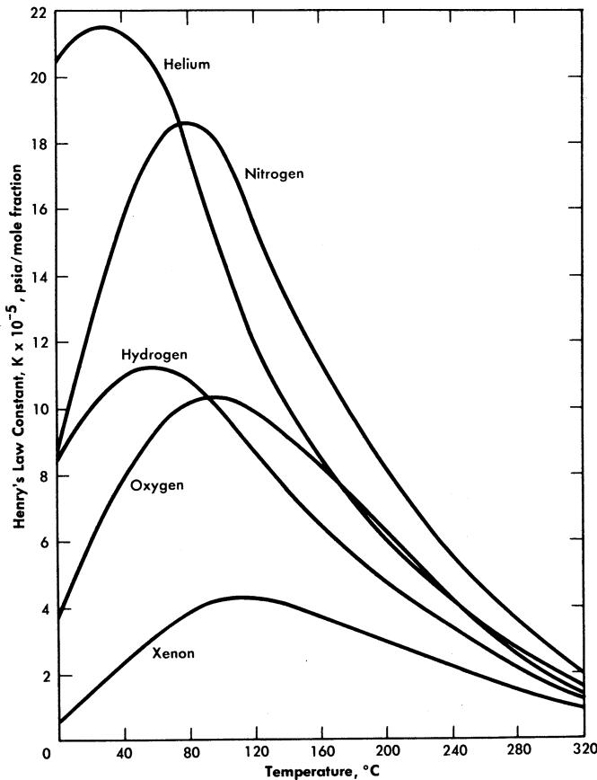  
FIG. 3-19. Solubility of gases in water.

3-4.7 Hydrogen ion concentration (pH). Orban of Mound Laboratory [48,56] studied the acidity of uranyl sulfate solutions from 25 to $60^{\circ}\mathrm{C}$ . Orban has also reported the $\mathsf{pH}$ values for uranyl sulfate solutions containing excess $\mathrm{UO_3}$ at temperatures up to $60^{\circ}\mathrm{C}$ [49,56]. Secoy has compiled information concerning the effects of uranium sulfate concentration upon $\mathsf{pH}$ as reported by a number of investigators [59]. Marshall has utilized the relationship between $\mathsf{pH}$ and concentration to determine the solubility of $\mathrm{UO_3}$ in sulfuric acid at elevated temperatures [7]. Table 3-13 shows the effect of sulfate concentration on $\mathsf{pH}$ at $25.00^{\circ}\mathrm{C}$ for various ratios of $\mathrm{UO_3}$ to sulfate as found by Marshall.

The direct measurement of $\mathsf{pH}$ at elevated temperatures and pressures has been made possible through the development by Ingruber of high-temperature electrode systems for use in the sulphite pulping process of the paper industry [68]. Lietzke and Tarrant have demonstrated the applicability of Ingruber's electrode system to the measurement of the $\mathsf{pH}$ of

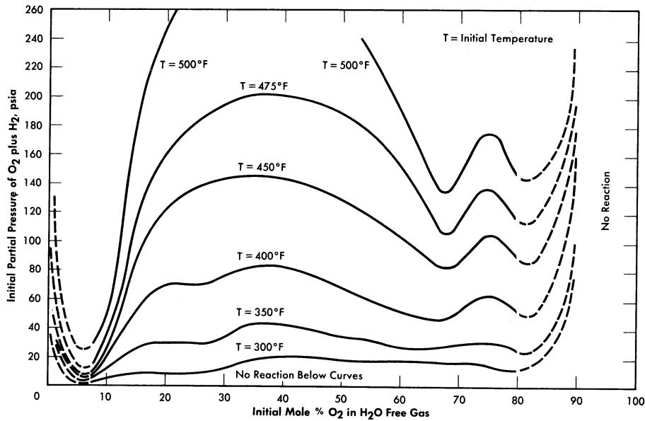  
FIG. 3-20. Approximate explosion limits of spark-ignited gaseous mixtures of $\mathbf{O}_2$ and $\mathbf{H}_2$ saturated with $\mathbf{H}_2\mathbf{O}$ vapor in $1\frac{1}{2}$ -in. bomb.

solutions of HCl, $\mathrm{UO}_2\mathrm{SO}_4$ , and $\mathrm{H}_2\mathrm{SO}_4$ at temperatures as high as $180^{\circ}\mathrm{C}$ [69]. Table 3-14 lists the values reported. Lietzke has reported the properties of the hydrogen electrode-silver chloride electrode system at high temperatures and pressures [70].

3-4.8 Solubility of gases. The solubilities of various gases in water and in reactor solutions are indicated by Fig. 3-19 [71,72].

Composition and PVT data [73,74]. Dalton's Law of additive partial pressures has been determined to correlate the $P - PVT$ relationships of steam-oxygen and steam-helium mixtures in the pressure range of interest (up to 2500 psi) to within $1\%$ .

For approximate calculations the perfect gas laws can be applied when dealing with the permanent gases under reactor conditions, but values for the properties of water vapor and $\mathrm{D}_2\mathrm{O}$ vapor should be obtained from experimental data or standard tables [62].

The compositions of saturated steam-gas mixtures are predictable in a similar manner, in that the partial density of each constituent is equal to that of the pure constituent at its partial pressure.

3-4.9 Reaction limits and pressures. Stephen et al. [75] measured the effect of temperature and $\mathrm{H}_2 / \mathrm{O}_2$ ratio on the lower reaction limits of the $\mathrm{H}_2 - \mathrm{O}_2$ -steam system in a small 1.5-in.-diameter autoclave. Their investi

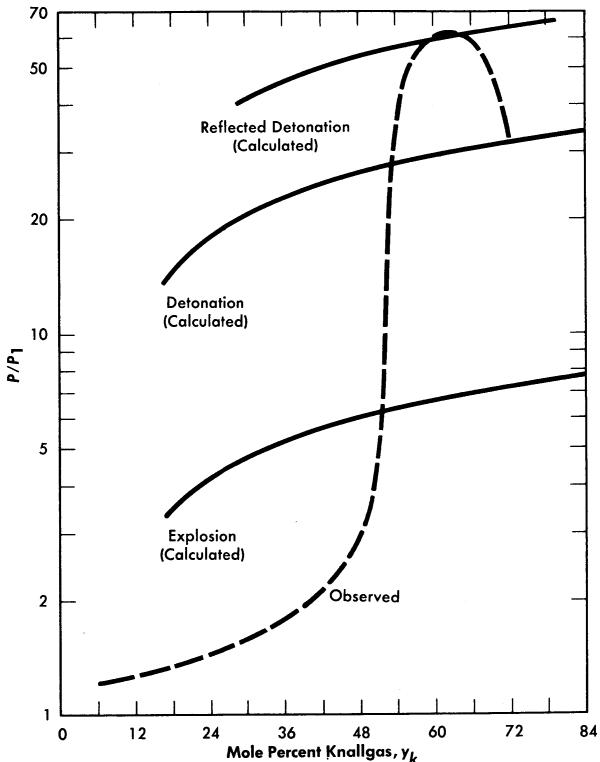  
FIG. 3-21. Ratio of peak reaction pressure to initial mixture pressure vs. composition of Knallgas saturated with water vapor at $100^{\circ}\mathrm{C}$ . Tube diameter = 0.957 in., spark ignition energy = 180 millijoules.

gation indicated that the composition (mol basis) of the mixture at the lower limit was not temperature dependent at constant $\mathrm{H}_2 / \mathrm{O}_2$ . Figure 3-20 is a plot of Stephan's data showing variation in $\mathrm{H}_2 / \mathrm{O}_2$ [76].

Syracuse University is investigating [77] further the effects of geometry, temperature, and method of ignition on the reaction and detonation limits of $\mathrm{H}_2\mathrm{O} - (2\mathrm{H}_2 + \mathrm{O}_2)$ . Reaction pressures are also measured. Figure 3-21 shows their reported results in a long 0.957-in.-diameter tube at $100^{\circ}\mathrm{C}$ ; these are typical of results obtained at $300^{\circ}\mathrm{C}$ . It is interesting to note that their lower reaction limit is $6\%$ Knallgas,\* as compared with $20\%$ Knallgas observed by Stephan.

# REFERENCES

1. C. H. Secoy, J. Am. Chem. Soc. 72, 3343 (1950).   
2. C. H. Secoy, Survey of Homogeneous Reactor Chemical Problems, in Proceedings of the International Conference on the Peaceful Uses of Atomic Energy, Vol. 9. New York: United Nations, 1956. (P/821, p. 377)   
3. J. S. GILL et al., in *Homogeneous Reactor Project Quarterly Progress Report for the Period Ending October 31, 1953*, USAEC Report ORNL-1658, Oak Ridge National Laboratory, Feb. 25, 1954. (p. 87)   
4. H. W. WRIGHT et al., in Homogeneous Reactor Program Quarterly Progress Report for the Period Ending Oct. 1, 1952, USAEC Report ORNL-1424(Del.), Oak Ridge National Laboratory, Jan. 10, 1953. (p. 108)   
5. W. L. MARSHALL and C. H. SECOY, Oak Ridge National Laboratory, 1954. Unpublished.   
6. E. V. JONES and W. L. MARSHALL, in Homogeneous Reactor Project Quarterly Progress Report for the Period Ending Mar. 15, 1952, USAEC Report ORNL-1280, Oak Ridge National Laboratory, July 14, 1952. (p. 180)   
7. W. L. MARSHALL, The pH of $UO_{3} - H_{2}SO_{4} - H_{2}O$ Mixtures at $25^{\circ}C$ and Its Application to the Determination of the Solubility of $UO_{3}$ in Sulfuric Acid at Elevated Temperature, USAEC Report ORNL-1797, Oak Ridge National Laboratory, Nov. 1, 1954.   
8. (a) R. S. GREELEY, Oak Ridge National Laboratory, 1956, personal communication. (b) R. S. GREELEY et al., High Temperature Behavior of Aqueous Uranyl Sulfate—Lithium Sulfate and Uranyl Sulfate—Beryllium Sulfate Solutions, paper presented at the 2nd winter meeting of the American Nuclear Society, New York, Oct. 28, 1957.   
9. E. POSNJAK and G. TUNELL, Am. J. Sci. 218, 1 (1929).   
10. F. E. CLARK et al., in Homogeneous Reactor Project Quarterly Progress Report for the Period Ending Apr. 30, 1956, USAEC Report ORNL-2096, Oak Ridge National Laboratory, May 10, 1956. (p. 130)   
11. C. H. Secoy et al., in *Homogeneous Reactor Project Quarterly Progress Report for the Period Ending July 31, 1957*, USAEC Report ORNL-2379, Oak Ridge National Laboratory, Oct. 10, 1957 (p. 163); F. MoSELEY, *Core Solution Stability in the Homogeneous Aqueous Reactor: The Effect of Corrosion Product and Copper Concentrations*, Report HARD(C)/P-41, Gt. Brit. Atomic Energy Research Establishment, May 1957.   
12. W. L. MARSHALL et al., J. Am. Chem. Soc. 73, 1867 (1951).   
13. L. D. P. KING, Design and Description of Water Boiler Reactors, in Proceedings of the International Conference on the Peaceful Uses of Atomic Energy, Vol. 2. New York: United Nations, 1956. (P/488, p. 372)   
14. W. L. MARSHALL et al., J. Am. Chem. Soc. 76, 4279 (1954).   
15. B. J. THAMER et al., The Properties of Phosphoric Acid Solutions of Uranium as Fuels for Homogeneous Reactors, USAEC Report LA-2043, Los Alamos Scientific Laboratory, Mar. 6, 1956. D. FROMAN et al., Los Alamos Power Reactor Experiments, in Proceedings of the International Conference on the Peaceful Uses of Atomic Energy, Vol. 3. New York: United Nations, 1956 (P/500, p. 283). L. D. P. KING, Los Alamos Power Reactor Experiment and Its Associated Hazards,

USAEC Report LAMS-1611(Del.), Los Alamos Scientific Laboratory, Dec. 2, 1953; A Brief Description of a One Megawatt Convection-cooled Homogeneous Reactor—LAPRE II, USAEC Report LA-1942, Los Alamos Scientific Laboratory, Apr. 13, 1955. R. P. HAMMOND, Los Alamos Homogeneous Reactor Program, in HRP Civilian Power Reactor Conference Held at Oak Ridge, March 21-22, 1956, USAEC Report TID-7524, Los Alamos Scientific Laboratory, March 1957. (pp. 168-176)   
16. Figure 3-12 was supplied by R. B. BRIGGS, Oak Ridge National Laboratory. Unpublished.   
17. L. D. P. KING, Los Alamos Homogeneous Reactor Program, in HRP Civilian Power Reactor Conference Held at Oak Ridge, March 21-22, 1956, USAEC Report TID-7524, Los Alamos Scientific Laboratory, March 1951. (pp. 177-209)   
18. FRANK J. LOPREST et al., J. Am. Chem. Soc. 77, 4705 (1955).   
19. F. J. LOPREST et al., Homogeneous Reactor Project Quarterly Progress Report for the Period Ending July 31, 1955, USAEC Report ORNL-1943, Oak Ridge National Laboratory, Aug. 9, 1955 (p. 227). W. L. MARSHALL et al., Homogeneous Reactor Project Quarterly Progress Report for the Period Ending Jan. 31, 1956, USAEC Report ORNL-2057(Del.), Oak Ridge National Laboratory, Apr. 17, 1956 (p. 131). C. A. BLAKE et al., J. Am. Chem. Soc. 78, 5978 (1956).   
20. W. C. WAGGENER, Oak Ridge National Laboratory, 1953, personal communication.   
21. M. H. Lietzke and W. L. Marshall, Present Status of the Investigation of Aqueous Solutions Suitable for Use in a Thorium Breeder Blanket, USAEC Report ORNL-1711, Oak Ridge National Laboratory, June 1954.   
22. W. L. MARSHALL et al., J. Am. Chem. Soc. 73, 4991 (1951). JOHN R. FERRARO et al., J. Am. Chem. Soc. 76, 909 (1954).   
23. P. G. JONES and R. G. SOWDEN, Thorium Nitrate Solution as a Breeder Blanket in the H.A.R., Report AERE-C/M-298, Part I. Thermal Stability, Gt. Brit. Atomic Energy Research Establishment, 1956.   
24. W. L. MARSHALL and C. H. SECOY, Preliminary Exploration of the $\mathrm{Th(NO_3)_4}$ -HNO $_3$ -H $_2$ O System at Elevated Temperature, in Homogeneous Reactor Project Quarterly Progress Report for the Period Ending Oct. 31, 1954, USAEC Report ORNL-1658, Oak Ridge National Laboratory, Feb. 25, 1954. (pp. 93-96)   
25. R. E. LEUZE, Chemistry of Plutonium in Uranyl Sulfate Solutions, in HRP Civilian Power Reactor Conference Held at Oak Ridge National Laboratory, May 1-2, 1957, USAEC Report TID-7540, Oak Ridge National Laboratory, July 1957. (pp. 221-231)   
26. D. E. GLANVILLE and D. W. GRANT, *Gt. Brit. Atomic Energy Research Establishment*, 1956. Unpublished.   
27. Mound Laboratory, Interim Monthly Reports, 1957-1958.   
28. L. V. JONES et al., Isolation of Protactinium-231, in Homogeneous Reactor Project Quarterly Progress Report for the Period Ending July 21, 1956, USAEC Report ORNL-2148(Del.), Oak Ridge National Laboratory, Oct. 3, 1956. (pp. 144-145)   
29. A. T. GRESKY, Separation of $\mathbf{U}^{233}$ and Thorium from Fission Products by Solvent Extraction, in Progress in Nuclear Energy—Series 3; Process Chem-

istry, by F. R. Bruce et al., New York: McGraw-Hill Book Co., Inc., 1956; Thorex Process Summary, February 1956, USAEC Report CF-56-2-157, Oak Ridge National Laboratory, Apr. 25, 1956. A. T. GRESKY et al., Laboratory Development of the Thorex Process: Progress Report, Oct. 1, 1952 to Jan. 31, 1953, USAEC Report ORNL-1518, Oak Ridge National Laboratory, Aug. 4, 1953. E. D. ARNOLD et al., Preliminary Cost Estimation: Chemical Processing and Fuel Costs for a Thermal Breeder Reactor Power Station, USAEC Report ORNL-1761, Oak Ridge National Laboratory, Feb. 23, 1955. R. E. ELSON, The Chemistry of Protactinium, in The Actinide Elements, ed. by G. T. SEABORG and J. J. KATZ, National Nuclear Energy Series, Division IV, Volume 14A. New York: McGraw-Hill Book Co., Inc., 1953. (Chap. 5, p. 103)   
30. D. E. FERGUSON, Homogeneous Plutonium Producer Chemical Processing, in HRP Civilian Power Reactor Conference Held at Oak Ridge March 21-22, 1956, USAEC Report TID-7524, Oak Ridge National Laboratory (pp. 224-232). J. C. HINDMAN et al., Some Recent Developments in the Chemistry of Neptunium, in Proceedings of the International Conference on the Peaceful Uses of Atomic Energy, Vol. 7. New York: United Nations, 1956 (P/736, p. 345). K. A. KRAUS, Hydrolytic Behavior of the Heavy Elements, in Proceedings of the International Conference on the Peaceful Uses of Atomic Energy, Vol. 7, New York: United Nations, 1956. (P/731, p. 245). W. C. WAGGENER and R. W. STOUGHTON, Spectrophotometry of Aqueous Solutions, in Chemistry Division Annual Progress Report for the Period Ending June 20, 1957, USAEC Report ORNL-2386, Oak Ridge National Laboratory, (pp. 64-71). W. C. WAGGENER, in Chemistry Division Seminar—1958, Oak Ridge National Laboratory (to be published).   
31. A. O. ALLEN, J. Phys. & Colloid Chem. 52, 479 (1948). C. J. HOCHANADEL, Radiation Stability of Aqueous Fuel Systems, USAEC Report CF-56-11-54, Oak Ridge National Laboratory, November 1956.   
32. F. S. DAINTON and H. C. SUTTON, Trans. Faraday Soc. 49, 1011 (1953).   
33. T. J. Sworski, J. Am. Chem. Soc. 76, 4687 (1954).   
34. E. J. HART, Radiation Research 2, 33 (1955).   
35. Selected values from several literature references.   
36. A. O. ALLEN et al., J. Phys. Chem. 56, 575 (1952). C. J. HOCHANADEL, J. Phys. Chem. 56, 587 (1952).   
37. C. J. HOCHANADEL, Radiation Induced Reactions in Water, in Proceedings of the International Conference on the Peaceful Uses of Atomic Energy, Vol. 7. New York: United Nations, 1956. (P/739, p. 521)   
38. J. W. Boyle et al., Nuclear Engineering and Science Congress, Held in New York in 1955, American Institute of Chemical Engineers (Preprint 222). H. F. McDUFFIE, Aqueous Fuel Solutions, Chap. 4.3, in Reactor Handbook, Vol. 2, Engineering, USAEC Report AECD-3646, Oak Ridge National Laboratory, 1955. (p. 571)   
39. H. F. McDUFFIE et al., The Radiation Chemistry of Homogeneous Reactor Systems: III—Homogeneous Catalysis of the Hydrogen-Oxygen Reaction, USAEC Report CF-54-1-122, Oak Ridge National Laboratory, 1954.   
40. For solubilities of $\mathbf{H}_2$ and $\mathrm{O_2}$ in water and in $\mathrm{UO_2SO_4}$ solutions at high temperatures see: H. A. H. PRAY et al., Ind. Eng. Chem. 14, 1146 (1952); E. F. STEPHAN et al., The Solubilities of Gases in Water and in Aqueous Uranyl Salt

Solutions at Elevated Temperatures and Pressures, USAEC Report BMI-1067 Battelle Memorial Institute 1956; see also Sec. 4, this chapter.   
41. S. VISNER and P. N. HAUBENREICH, HRE Experiments on Internal Recombination of Gas with a Homogeneous Catalyst, USAEC Report CF-55-1-166, Oak Ridge National Laboratory, Jan. 21, 1955.   
42. R. E. Aven and M. C. LAWRENCE, Calculation of Effects of Copper Catalyst in the HRT, USAEC Report CF-56-4-4, Oak Ridge National Laboratory, Apr. 10, 1956.   
43. M. D. SILVERMAN et al., Ind. Eng. Chem. 48, 1238 (1956).   
44. J. W. BOYLE and H. A. MAHLMAN, paper presented at the 2nd Annual Meeting of the American Nuclear Society, Chicago, 1956.   
45. M. M. HARRING, Mound Laboratory, Uranium Salts Research Progress Reports, USAEC Report MLM-628, 1951. E. ORBAN, Mound Laboratory, Uranium Salts Research Progress Reports, USAEC Reports MLM-663, 1952; MLM-680, 1952; MLM-710, 1952; MLM-755, 1952; MLM-790, 1952; MLM-825, 1953; MLM-863, 1953; MLM-928, 1953.   
46. E. ORBAN, Mound Laboratory, 1952. Unpublished.   
47. J. S. JEGART et al., The Densities of Uranyl Sulfate Solutions Between $20^{\circ}$ and $90^{\circ}C$ , USAEC Report MLM-728, Mound Laboratory, Oct. 10, 1952.   
48. E. ORBAN, The pH Measurement of Uranyl Sulfate Solutions from $25^{\circ}$ to $60^{\circ}C$ , USAEC Report MLM-729, Mound Laboratory, Aug. 1, 1952.   
49. E. ORBAN, The pH of Uranyl Sulfate-Uranium Trioxide Solutions, USAEC Report AECD-3580, Mound Laboratory, Aug. 14, 1952.   
50. J. R. HEIKS and J. S. JEGART, The Viscosity of Uranyl Sulfate Solutions $20^{\circ}$ to $90^{\circ}C$ , USAEC Report MLM-788(Rev.), Mound Laboratory, Feb. 22, 1954.   
51. J. R. HEIKs et al., Apparatus for Determining the Physical Properties of Solutions at Elevated Temperatures and Pressures, USAEC Report MLM-799, Mound Laboratory, Jan. 14, 1953.   
52. A. J. Rogers et al., An Instrument for the Measurement of the Time of Fall of a Plummet in a Pressure Vessel, USAEC Report MLM-805, Mound Laboratory, Feb. 27, 1952.   
53. M. K. BARNETT and J. JEGART, The Surface Tension of Aqueous Uranyl Sulfate Solutions Between $20^{\circ}$ and $75^{\circ}C$ , USAEC Report AECD-3581, Mound Laboratory, Feb. 15, 1953.   
54. J. R. HEIKs et al., The Physical Properties of Heavy Water From Room Temperature to $250^{\circ}C$ , USAEC Report MLM-934, Mound Laboratory, Jan. 12, 1954.   
55. M. K. BARNETT et al., The Density, Viscosity, and Surface Tension of Light and Heavy Water Solutions of Uranyl Sulfate at Temperatures to $250^{\circ}C$ , USAEC Report MLM-1021, Mound Laboratory, Dec. 6, 1954.   
56. E. ORBAN et al., Physical Properties of Aqueous Uranyl Sulfate Solutions from $20^{\circ}$ to $90^{\circ}$ , J. Phys. Chem. 60, 413 (1956).   
57. R. VAN WINKLE, Some Physical Properties of $UO_{2}SO_{4} - D_{2}O$ Solutions, USAEC Report CF-52-1-124, Oak Ridge National Laboratory, Jan. 18, 1952.   
58. M. TOBIAS, Certain Physical Properties of Aqueous Homogeneous Reactor Materials, USAEC Report CF-56-11-135, Oak Ridge National Laboratory, Nov. 23, 1956.

59. J. A. LANe et al., Properties of Aqueous Solution Systems, Chap. 4.3 in The Reactor Handbook, Vol. 2, Engineering, USAEC Report AECD-3646, Oak Ridge National Laboratory, 1955.   
60. P. A. Lotres, Physical and Thermodynamic Properties of Light and Heavy Water, Chap. 1.3 in The Reactor Handbook, Vol. 2, Engineering, USAEC Report AECD-3646, Argonne National Laboratory, 1955. (pp. 21-42)   
61. N. E. Dorsey, Properties of Ordinary Water-Substance, New York: Reinhold Publishing Corp., 1940.   
62. J. H. KeENAN and F. G. KEYES, Thermodynamic Properties of Steam, New York: John Wiley & Sons, Inc., 1936.   
63. G. M. HeBERT et al., The Densities of Heavy-Water Liquid and Saturated Vapor at Elevated Temperatures, J. Phys. Chem. 62, 431 (1958).   
64. W. L. MARSHALL, Density—Weight Percent—Molarity Conversion Equations for Uranyl Sulfate—Water Solutions at $25.0^{\circ}C$ and Between $100 - 300^{\circ}C$ , USAEC Report CF-52-1-93, Oak Ridge National Laboratory, Jan. 15, 1952.   
65. R. C. HARDY and R. L. COTTINGTON, J. Research Nat. Bur. Standards 42, 573 (1949).   
66. H. O. DAY and C. H. Secoy, Oak Ridge National Laboratory. Unpublished data.   
67. W. L. MARSHALL, Oak Ridge National Laboratory, March 1958, personal communication.   
68. O. V. INGRUBER, The Direct Measurement of pH at Elevated Temperature and Pressure during Sulphite Pulping, *Pulp Paper Can.* 55 (10), 124-131 (1954).   
69. M. H. LIETZKE and J. R. TARRANT, Preliminary Report on the Model 904 High-temperature pH Meter, USAEC Report CF-57-11-87, Oak Ridge National Laboratory.   
70. M. H. LIETZKE, The Hydrogen Electrode—Silver Chloride Electrode System at High Temperatures and Pressures, J. Am. Chem. Soc. 77, 1344 (1955).   
71. E. F. STEPHAN et al., The Solubility of Gases in Water and in Aqueous Uranyl Salt Solutions at Elevated Temperatures and Pressures, USAEC Report BMI-1067, Battelle Memorial Institute, 1956.   
72. H. A. PRAY et al., The Solubility of Hydrogen, Oxygen, Nitrogen, and Helium in Water at Elevated Temperatures, Ind. Eng. Chem. 44, 1146 (1952).   
73. J. A. LUKER and THOMAS GNIEWEK, Saturation Composition of Steam—Helium—Water Mixtures PVT Data and Heat Capacity of Superheated Steam—Helium Mixtures, USAEC Report AECU-3299, Syracuse University Research Institute, July 29, 1955.   
74. J. A. LUKER and THOMAS GNIEWEK, Determination of PVT Relationships and Heat Capacity of Steam—Oxygen Mixtures, USAEC Report AECU-3300, Syracuse University Research Institute, Aug. 2, 1955.   
75. E. F. STEPHAN et al., Ignition Reactions in the Hydrogen-Oxygen-Water System at Elevated Temperatures, USAEC Report BMI-1138, Battelle Memorial Institute, Oct. 2, 1956.   
76. T. W. LELAND, Evaluation of Data from Battelle Memorial Institute on Solubility of $H_{2}$ and $O_{2}$ in Solutions of $UO_{2}SO_{4}$ and $UO_{2}F_{2}$ in Water and on Explosion Limits in Gaseous Mixtures of $H_{2}$ , $O_{2}$ and $H_{2}O$ and in $H_{2}, O_{2}, He$ ,

and $H_{2}O$ , USAEC Report CF-54-8-215, Oak Ridge National Laboratory, Aug. 23, 1954.   
77. IRVIN M. MACAFEE, JR., Detonation, Explosion, and Reaction Limits of Saturated Stoichiometric Hydrogen—Oxygen—Water Mixtures, USAEC Report AECU-3302, Syracuse University, Research Institute, July 1, 1956. PAUL L. McGILL and JAMES A. LUKER, Detonation Pressures of Stoichiometric Hydrogen—Oxygen Mixtures Saturated with Water at High Initial Temperatures and Pressures, USAEC Report AECU-3429, Syracuse University, Research Institute, Dec. 3, 1956.

# CHAPTER 4

# TECHNOLOGY OF AQUEOUS SUSPENSIONS*

# 4-1. SUSPENSIONS AND THEIR APPLICATIONS IN REACTORS†

4-1.1 Introduction. With the inception of the aqueous homogeneous power reactor program at Oak Ridge National Laboratory in 1949, the primary choice of fuel was highly enriched $\mathrm{UO}_2\mathrm{SO}_4$ solution. Use of enriched uranium alleviated to some extent the need for strict neutron economy, but it was found that at high temperature (250 to $300^{\circ}\mathrm{C}$ ) $\mathrm{UO}_2\mathrm{SO}_4$ solutions were more corrosive than pure water and were subject to a high-temperature instability. As a result, a secondary development effort was initiated at ORNL to determine the potentialities of suspensions of solid uranium compounds as reactor fuels. The principal efforts were directed at forms of $\mathrm{UO}_3$ , because it was believed that under reactor operating conditions the trioxide would be the stable oxidation state. Considerable progress was made in studies of the oxide and its slurries, and in development of equipment for circulating the slurries at concentrations of several hundred grams per liter in 100-gpm loops at $250^{\circ}\mathrm{C}$ . In addition, a criticality study was carried out with enriched $\mathrm{UO}_3\cdot \mathrm{H}_2\mathrm{O}$ in water to obtain assurance that local fluctuations in concentration or settling would not unduly affect nuclear stability [1].

In 1955, the $\mathrm{UO}_3$ work was set aside so that effort could be concentrated on $\mathrm{ThO}_2$ suspensions, which are at the present time believed to be the only suitable fluid homogeneous fertile material for use in an aqueous homogeneous thorium breeder. The ultimate of this effort at ORNL has been set at a two-region, $\mathrm{ThO}_2$ , homogeneous, power breeder.

In the following sections of this chapter a detailed account is given of the studies on $\mathrm{UO}_3$ slurries and $\mathrm{ThO}_2$ slurries, and a description of the present state of knowledge of their production, properties, and utilization. The discussion will be based largely on work done in the United States, but it should be kept in mind that studies on fuel- and fertile-material suspensions have been conducted in other countries—in particular, in the Netherlands and in Great Britain—and that exchanges of concepts and data have aided the U.S. efforts.

4-1.2 Types of suspensions and their settled beds. Two-phase systems of solids in liquids may be classified in several ways. On the basis of size of particle a, phase is said to be colloidal when it is sufficiently finely divided to permit the surface attraction forces of the particles to exert a strong influence on the mechanical properties of the material as a whole. If, in addition, the particles are dispersed in a liquid and are sufficiently small so they diffuse throughout the liquid due to their Brownian motion in a normal gravitational field, they are referred to as sols. Sols are not resolved in an ordinary microscope but are usually recognizable in an ultramicroscope. The particles of a sol are usually less than 0.5 micron in length for materials of density near that of water, while particles in a $\mathrm{ThO_2}$ sol are usually less than 0.05 micron. Particles in a sol may join to form a random network of some strength having a semisolid appearance and called a gel, or they may coalesce into loose and relatively independent clouds of joined particles referred to as flocs. Suspensions of flocs or of particles which are large enough to settle are referred to as slurries.

In some sols the particles are stabilized by the preferential attraction of the suspending liquid to the particles' surface. These are referred to as lyophillic sols. In other sols the thermodynamically stable condition is a flocculated or a gelled state, but the particles are held apart by electrostatic forces produced by ions which collect on and near the surface of the particles. Sols of elements, oxides, and salts (including the oxides of uranium and thorium) are generally of the latter type and are referred to as lyophobic sols.

Although dispersions having particle sizes greater than 0.5 micron do not form sols, since they are too large and have too large a mass to be appreciably affected by Brownian motion, the particle surfaces may exhibit some colloidal properties which are most pronounced when the particles are very close together. The magnitude of these forces is such that spherical particles of $\mathrm{ThO_2}$ which are 10 to 15 microns in diameter appear to show only slight tendency to flocculate, while cubic or platelet forms of $\mathrm{ThO_2}$ and $\mathrm{UO_3\cdot H_2O}$ of 1 or 2 microns on a side do show a marked tendency to flocculate.

When slurries having particles that are either relatively large or have a high ionic charge on their surface (and hence have little tendency to flocculate) settle, the settled bed density approaches about 50 to $70\%$ of the particle density. The bed resuspend only slowly and is not easily deformed rapidly. An example of such a bed is settled sand. In general, such beds may exhibit dilatancy, which means that the bed must expand to be deformed, and the apparent viscosity of the bed increases as the rate of shear increases. $\mathrm{ThO_2}$ spheres of more than 5 to 10 microns settle to beds of this type.

Flocculated slurries settle to a concentration at which the flocs become

joined, and from that point the particles are in part supported by indirect contact with the walls and bottom of the container through the floc structure. The resulting settled bed may continue to compact indefinitely at a slower and slower rate. Such beds behave more or less in a plastic fashion, and may even exhibit a pronounced yield stress (i.e., shear stress required before an appreciable deformation rate is initiated).

In $\mathrm{UO}_3\cdot \mathrm{H}_2\mathrm{O}$ slurries of concentrations up to several hundred grams per liter, the yield stress is less than $0.1~\mathrm{lb / ft^2}$ and the slurries are almost of Newtonian character. A breeding blanket requires $\mathrm{ThO_2}$ slurries containing 500 to 1500 grams of thorium per liter, and in these concentrations the yield stress varies from 0 to well over $1\mathrm{lb / ft^2}$ , depending in part on the concentration, on the shape and form of the oxide particle, and on the presence or absence of certain additives. Settled beds of both $\mathrm{ThO_2}$ and $\mathrm{UO_3}\cdot \mathrm{H_2O}$ may be either colloidal and plastic, or much more dense, noncolloidal, and apparently dilatant.

4-1.3 Engineering problems associated with colloidal properties. The colloidal behavior of some slurries offers three types of problems: high yield stress, caking, and sphere-forming tendencies. To these may be added a general instability in the colloidal behavior which changes with time, chemical treatment, and general previous history. A high yield stress, in turn, offers three main engineering problems: high velocity required to produce turbulence, a tendency to plug tubes, and a tendency to increase the difficulty of mixing in a large blanket or reactor vessel.

A cake is defined as an accumulation of particles on part of the surface of the system in so dense and rigid a form that it cannot be deformed without fracture. A mud is a similar dense accumulation of greater yield strength than the circulating slurry but which can be deformed without fracture of the accumulation.

Caking and mud formation have occurred occasionally in circulation loops, causing plugging of tubes, hydraulic or mechanical unbalance in a centrifugal pump, and drastic reduction in heat transfer to or from the walls. These phenomena appear to be due to compaction of flocculated slurry under the influence of stresses due to flow. The rigidity of a cake or mud appears to be inversely related to the particle size.

Muds have been observed in both $\mathrm{ThO_2}$ and $\mathrm{UO_3\cdot H_2O}$ platelet slurries. Cakes have been observed in $\mathrm{ThO_2}$ slurries. In one case, a $\frac{1}{4}$ - to $\frac{3}{8}$ -in. layer of $\mathrm{ThO_2}$ cake was built up on essentially all parts of a 3-in. 200-gpm circulating system. The cake resembled chalk in strength and consistency. It had a density of about $5.5~\mathrm{g / cc}$ .

Sphere formation occurs when a circulating slurry contains very fine particles and appears to resemble the formation of a popcorn ball [2]. Spheres ranging in size from about five to several hundred microns in

diameter have been made. Prolonged circulation causes an equilibrium size to be reached which depends on the circulating conditions and the starting material. Spheres have been formed from certain types of $\mathrm{ThO_2}$ in suspension, but no spheres or cakes have been observed in circulating $\mathrm{UO_3\cdot H_2O}$ . This may be due to the fact that the greater solubility of $\mathrm{UO_3\cdot H_2O}$ prevents its remaining as extremely fine particles.

Since cake, mud, and sphere formations appear to be a result of colloidal behavior, effective control of the colloidal behavior of a slurry will probably control the formation of such aggregates.

Plastic materials which exhibit a high yield stress require a high velocity before they become turbulent. It is not uncommon for $\mathrm{ThO_2}$ slurries to require 30 to 40 ft/sec velocity for the onset of turbulence. (It is of interest to note that velocity by itself appears to be the most important criterion for whether a given plastic will be in laminar or turbulent flow [3]—as opposed to the product of tube diameter and velocity, which is the corresponding criterion for a given Newtonian liquid.) Turbulence is, of course, important in maintaining the suspension and in providing good heat transfer.

Control or elimination of colloidal, flocculating properties of slurries can be accomplished by additives, particle-size control, or particle-shape control. Electrolyte additives which attach to particle surfaces may provide so strong a charge that particles cannot approach to form a floc or gel. In true lyophobic sols, the most effective additives are often those which produce ions of atoms or radicals of the same type as those composing the particle. For example, $\mathrm{ThO_2}$ or $\mathrm{Th(OH)_4}$ sols of up to 4000-g/liter concentration are easily made by the addition of $\mathrm{Th(NO_3)_4}$ solution to freshly prepared $\mathrm{Th(OH)_4}$ . On a somewhat similar basis, additives which may form partially ionized or lyophilic surface compounds are often effective. Very small additions of $\mathrm{H_2C_2O_4}$ , $\mathrm{Na_2SiO_3}$ , $\mathrm{Na_3PO_4}$ , and $\mathrm{NaAlO_2}$ have been found effective at room temperatures in producing free-flowing Newtonian slurries from high-yield-stress $\mathrm{ThO_2}$ muds. In most cases the effect is lost at elevated temperatures. However, coating of the particles with a silicone compound and firing to convert it to $\mathrm{SiO_2}$ has produced slurries which appear to remain unflocculated at temperatures up to $300^{\circ}\mathrm{C}$ [4].

$\mathrm{Na_2HPO_4}$ or $\mathrm{NaH_2PO_4}$ added to $\mathrm{UO_3\cdot H_2O}$ platelet slurries has prevented the formation of mugs in regions where they normally form. The latter additive is preferred, since $\mathrm{Na_2HPO_4}$ solution appears to attack stainless steel in the presence of oxygen at elevated temperatures [5].

Evidence indicates that as the particle size increases the colloidal effects become reduced. In the case of $\mathrm{UO}_3\cdot \mathrm{H}_2\mathrm{O}$ an equilibrium size is reached due to the continuous abrasion of the particles and subsequent recrystallization. In $\mathrm{ThO}_2$ , and probably in $\mathrm{UO}_2$ slurries, the crystals are much more

resistant to abrasion, but at the same time the recrystallization in solution is essentially nil. $\mathrm{ThO_2}$ produced by calcination of a plate or cube form of $\mathrm{Th(C_2O_4)_2}$ retains the plate or cube form, but the particle is composed of smaller crystals of $\mathrm{ThO_2}$ . Violent agitation causes crystals in the particles to break apart, after which they are free to exhibit the colloidal behavior of the finer particles. The higher the calcination temperature, the larger the $\mathrm{ThO_2}$ crystals. By calcination at $1600^{\circ}\mathrm{C}$ , crystals in excess of 0.25 micron are produced, whereas calcination at $650^{\circ}\mathrm{C}$ gives crystals of 50 to 100 A. In both cases, the over-all particle size may be of the order of 0.5 to 5 microns. Even the material calcined at the higher temperature exhibits a discouragingly high yield stress, however, at the preferred concentration for a two-region breeder blanket ( $\sim 1500$ g/liter at room temperature). Part of the difficulty may be due to a possible systematic arrangement of charges on the particle surface which causes actual attraction and binding of particles into an unusually strong floc in a preferred orientation [6].

If spherical particles are used, the amount of possible common surface between particles is limited and the permanence of mutual attachment is correspondingly limited. In addition, if the surface is essentially uniform, the charge arrangement might tend to repel rather than attract other particles. Furthermore, a spherical shape permits the particles to be larger without excessive abrasion.

Spheres made in circulating systems, as mentioned above, exhibit Newtonian flow properties at concentrations up to about 3500 to 4000 g/liter at room temperature. At the present time they are rather friable, although their density is of the order of 8.5. Calcining the spheres at very high temperatures in furnaces, oxyacetylene flames, or electric arcs gives them considerably greater integrity while retaining their noncolloidal properties. However, at high firing temperatures (1800°C) a tendency of the spheres to break up, owing presumably to internal stresses, has been noted [7]. Dense spheres have been produced in small quantity by spraying a $\mathrm{Th(OH)_4}$ gel which is subsequently hardened, dried, and fired.

Thus it appears that the colloidal behavior of $\mathrm{ThO_2}$ slurries may be minimized through the use of spherical particles, larger particles, coating the particles with silica or some other compound, or by the use of some as-yet-unperfected additive.

4-1.4 Engineering problems not associated with colloidal properties. Sedimentation. One of the principal noncolloidal problems encountered with suspensions or slurries is sedimentation which, in a flowing system, is offset by any upward component of liquid velocity. By definition, in idealized laminar flow in a horizontal conduit there is no upward velocity component and the rate of settling should proceed at the same rate as in a

stagnant vessel. In a vertical tube with laminar flow, particles tend to be more concentrated near the center of the tube [8]. One possible explanation may be that the particles spin in the velocity gradient near the wall in a direction which would cause them to move toward the center of the tube as the liquid moves past them. It appears possible that a similar effect could reduce the sedimentation rate in a horizontal tube. In an inclined tube the solids will collect on the lower side of the tube, while a channel of low solids content will appear along the upper side. The resulting radial variation in density and possibly in viscosity distorts the normal parabolic velocity profile and complicates computation of the local sedimentation rate.

In turbulent flow, fluctuating radial velocities will tend to cause diffusion from more concentrated regions to regions of lower concentration in competition with the settling due to gravity. Although a relatively strong diffusion tendency exists across the bulk of the conduit, the diffusion rather suddenly begins to be damped near the wall, although some random radial velocity fluctuations may occur essentially up to the wall. The distance from the wall at which damping begins to become pronounced is of the order of about $1\mathrm{mm}$ for water for velocities at 1 ft/sec, in tubes larger than about $\frac{1}{4}$ to $\frac{1}{2}$ in. in diameter, and it is generally recognized by hydrodynamicists as being approximately proportional to $\nu / u_{m}$ where $u_{m}$ is the mean velocity of the fluid and $\nu$ is the kinematic viscosity, about $10^{-5}\mathrm{ft}^2/\mathrm{sec}$ . Since particles in the slurries under discussion are of micron size, rather than large fractions of millimeters, those particles which find themselves well inside this layer above a horizontal surface may tend to build up a sediment which becomes the solid surface from which the more or less damped layer must be measured. This process can continue until the diameter and velocity are reduced to the point where flow becomes laminar and the tube is choked off completely, or until the local shear stress becomes high enough to drag the particles along and an equilibrium bed thickness is approached. At a given distance from the wall in the damped region the local velocity of the liquid is proportional roughly to the square of the mean velocity through the conduit, and the radial velocity fluctuations in the damped regions vary in about the same proportion. Therefore the mean stream velocity at which sediment tends to accumulate is rather sharply defined for a given slurry.

It follows directly that a slurry which is flowing horizontally cannot keep its particles in suspension unless the flow is turbulent, or unless it is an extremely stiff flocculated mud, and even in turbulent flow a minimum velocity may be required to prevent the accumulation of a sediment along the bottom of a tube or conduit. Such sedimentation can occur in a reactor blanket vessel in regions where the net velocity is extremely low.

Abrasion. A second problem is that of abrasion, which is more serious

in the case of thorium slurries than uranium slurries. $\mathrm{UO}_3\cdot \mathrm{H}_2\mathrm{O}$ crystals are relatively soft, and when they strike a stainless-steel wall, they tend to break without damaging the surface of the wall. $\mathrm{ThO}_2$ particles, on the other hand, appear to be sufficiently hard to abrade the protective oxide film on stainless steel and perhaps to abrade the base metal. Continuous removal of the film exposes the bare metal to corrosive attack by the hot water and, in some cases, causes very serious attack. The attack is most severe in local recirculation regions associated with flow separation and in regions of sudden acceleration and direction change, such as in orifices, pump impellers, and pump seal rings. Materials such as zirconium and titanium, which form very hard oxide films, and essentially noncorrodrible metals such as gold and platinum show more resistance to $\mathrm{ThO}_2$ slurries than do stainless steels. Reduction of particle size, use of round particles rather than sharp-cornered particles, and design of components and piping to avoid regions of high velocity or high acceleration will reduce attack.

4-1.5 Systems and components for using slurries in reactors. The preceding discussion implies several general conclusions regarding systems and components for using slurries. For example, the over-all system should be kept as free of extraneous circuits and secondary lines as possible. If possible, the system should always tend to drain into a sump whenever circulation stops, to prevent plugging by settled beds. Smaller side lines should, where possible, be attached to the top of a horizontal run of the main system to allow solids to settle into the main stream, and a minimum size for smaller lines should be established based on the expected strength of any reasonably conceivable settled bed. In $\mathrm{ThO_2}$ or $\mathrm{UO_2}$ systems, all elbows should be of at least moderately large radius, and sudden constrictions such as orifices should be avoided.

Mechanical pumps for $\mathrm{ThO_2}$ or $\mathrm{UO_2}$ must be leaktight, and should be capable of handling the hard abrasive particles; this includes adequate hydraulic design, the use of particularly resistant materials in regions of high fluid acceleration or high velocity, and either very abrasion-resistant bearings or essentially complete isolation of the bearings from the slurry. Valves must be designed to operate in spite of the abrasive nature and the settling or compacting properties of the solids; they must be leaktight to the outside. The trim must be unusually abrasion- and corrosion-resistant to ensure continued internal leaktightness.

Pressure-sensing instruments should not, in general, include long blind passages of small diameters, which might easily become plugged; in $\mathrm{ThO_2}$ slurries, flowmeters should not include rapidly moving parts in contact with slurries, unless bearings which are not affected by the abrasive action of the solids are used.

All vessels should be provided with a means of resuspending solids which have settled to the bottom. In some vessels, a simple mechanical agitator is sufficient. In others, steam or gas sparging can be used. In still other cases, more sophisticated systems may be required involving, for example, injection of an external liquid or slurry stream to induce strong internal recirculation currents.

The following sections of this chapter represent a brief, condensed progress and status report of the work on suspensions. This effort is continuing at an accelerated rate as their potentialities are becoming more clearly recognized and as the problems and difficulties are becoming more rapidly overcome.

# 4-2. URANIUM OXIDE SLURRIES*

4-2.1 Introduction. Preliminary studies on uranium oxide slurries for use in a plutonium-producer reactor were carried out in the period 1940-1944 by Vernon, Hickey, Huffman, and others, first at Columbia University and later at the University of Chicago as a part of the Manhattan Project. This program was discontinued before the feasibility of uranium oxide slurries could be established, but a large backlog of information on the properties and slurry behavior of the uranium oxides was obtained. These studies are reported in detail by Kirschenbaum, Murphy, and Urey [9] in a still secret volume of the National Nuclear Energy Series (III, 4-B) which should soon be declassified. In 1951 work on the development of uranium oxide slurries was revived, primarily at the Oak Ridge National Laboratory. These studies were terminated in 1953 before a satisfactory slurry was developed. The results are reported by Blomeke [10] and, in a 1955 Geneva paper, by Kitzes and Lyon [11]. Since 1953, emphasis on a slurry fuel has centered on the development of a thorium-uranium oxide slurry [12,13].

4-2.2 Chemical stability of uranium oxides. Both the early Manhattan Project work [9] and the ORNL work [10] indicated that uranium trioxide would be the probable stable form of uranium oxide under the radiolytic gas formed by the radiation-induced decomposition of water in a reactor. Uranium dioxide in an aqueous slurry at $250^{\circ}\mathrm{C}$ was oxidized to uranium trioxide in the presence of oxygen overpressure and even in the presence of excess hydrogen gas. The extent of this oxidation depended on the oxygen pressure, and seemed to be independent of the partial pressure of hydrogen (Table 4-1). The extent of oxidation of $\mathrm{U}_{3}\mathrm{O}_{8}$ to uranium trioxide depended on both temperature and oxygen pressure. The presence

TABLE 4-1   
OXIDATION OF $\mathrm{UO_2}$ SLURRIES UPON HEATING UNDER VARYING PARTIAL PRESSURE OF HYDROGEN AND OXYGEN  
TABLE 4-2   

<table><tr><td colspan="2">Heating conditions</td><td colspan="2">Gas pressure</td><td rowspan="2">Uranium oxidized, %</td></tr><tr><td>Temp., °C</td><td>Time, hr</td><td>H2, psi</td><td>O2, psi</td></tr><tr><td>200</td><td>48</td><td>63.5</td><td>31.8</td><td>64.9</td></tr><tr><td>250</td><td>16</td><td></td><td>202</td><td>74.5</td></tr><tr><td></td><td>16</td><td></td><td>378</td><td>82.2</td></tr><tr><td></td><td>24</td><td>70</td><td>61.5</td><td>78.4</td></tr><tr><td></td><td>24</td><td>70</td><td>175</td><td>91.4</td></tr></table>

REDUCTION OF $\mathrm{UO}_3$ SLURRIES AT $250^{\circ}\mathrm{C}$ UNDER VARYING PARTIAL PRESSURES OF HYDROGEN AND OXYGEN  

<table><tr><td rowspan="2">Heating time, hr</td><td colspan="2">Gas pressure</td><td rowspan="2">Uranium reduced, %</td></tr><tr><td>H2, psi</td><td>O2, psi</td></tr><tr><td>20</td><td>263</td><td>26.3</td><td>0.5</td></tr><tr><td>2</td><td>378</td><td>-</td><td>1.39</td></tr><tr><td>24</td><td>70</td><td>35</td><td>0</td></tr><tr><td>68</td><td>527</td><td>26.3</td><td>0.4</td></tr></table>

of a partial pressure of hydrogen did not seem to markedly inhibit the oxidation (Table 4-2). When a slurry of $\mathrm{UO}_3\cdot \mathrm{H}_2\mathrm{O}$ rods prepared by thermal decomposition of uranium peroxide in water was heated at $250^{\circ}\mathrm{C}$ under varying pressures of hydrogen and oxygen, it was unchanged in the presence of a stoichiometric mixture of hydrogen and oxygen in the ratio of water. It was only very slightly reduced by a tenfold excess of hydrogen over the stoichiometric (Table 4-3). Reduction of the $\mathrm{UO}_3$ and $\mathrm{U}_3\mathrm{O}_8$ under pure hydrogen atmospheres was quite slow, although freshly oxidized uranium species formed by treatment of $\mathrm{UO}_2$ with peroxide were rather readily reduced with hydrogen [9].

4-2.3 Crystal chemistry of $\mathbf{UO}_3$ . Uranium trioxide in an aqueous slurry can exist as one of three hydrates, depending on the temperature at which it

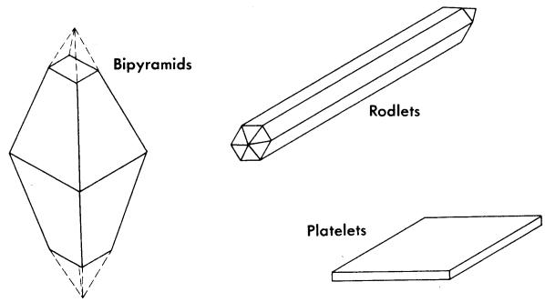  
FIG. 4-1. $\mathrm{UO_8 - H_2O}$ crystal habits.

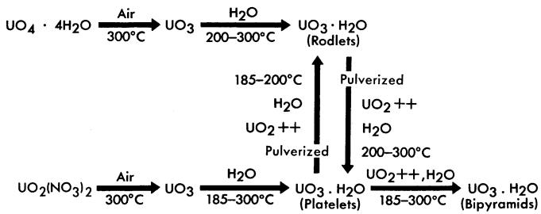  
FIG. 4-2. Preparation of $\mathrm{UO}_3\text{-H}_2\mathrm{O}$ .

is maintained. In the earlier work [Ref. 9, pp. 45-49, 127-131] the monohydrate was shown to be the stable form between 100 and $300^{\circ}\mathrm{C}$ . Four crystalline modifications of the monohydrate were described: the $\alpha$ form, "large six-sided orthorhombic tablets"; $\beta$ , "small six-sided orthorhombic tablets"; $\gamma$ , "rhombic(?) hexagonal rods"; and $\delta$ , "triclinic crystals with a very complicated x-ray pattern." The $\alpha$ and $\beta$ were stable in water below $185^{\circ}\mathrm{C}$ and the $\gamma$ and $\delta$ above $185^{\circ}\mathrm{C}$ .

ORNL studies on preparation of uranium oxide hydrates agreed in general with those reported in Ref. 9. The most important exception was the inability to prepare a triclinic crystal resembling the $\delta\text{-}\mathrm{UO}_3\cdot \mathrm{H}_2\mathrm{O}$ . Attempts to prepare this modification resulted in the formation of bipyramids or platelets, depending on the conditions. Three allomorphic modifications of the monohydrate were obtained, depending on the mode of preparation and treatment (Figs. 4-1 and 4-2). A rodlet form of $\mathrm{UO}_3\cdot \mathrm{H}_2\mathrm{O}$ was produced when the anhydrous trioxide, formed by heating uranium peroxide at $300^{\circ}\mathrm{C}$ , was heated in water at 185 to $300^{\circ}\mathrm{C}$ (Fig. 4-2). The rodlets were also prepared by autoclaving at $250^{\circ}\mathrm{C}$ for at least 16 hr a slurry of uranium peroxide containing less than 50 ppm uranyl nitrate as an impurity. A platelet form of $\mathrm{UO}_3\cdot \mathrm{H}_2\mathrm{O}$ appeared when the trioxide, made

# TABLE 4-3

# OXIDATION OF $\mathrm{U}_{3}\mathrm{O}_{8}$ SLURRIES ON HEATING FOR 24 HOURS UNDER VARYING PARTIAL PRESSURES OF HYDROGEN AND OXYGEN

<table><tr><td rowspan="2">Temp., °C</td><td colspan="2">Gas pressure</td><td rowspan="2">Uranium oxidized, %</td></tr><tr><td>H2, psi</td><td>O2, psi</td></tr><tr><td>150</td><td>51.8</td><td>25.9</td><td>63.2</td></tr><tr><td>170</td><td>59.5</td><td>29.8</td><td>71.7</td></tr><tr><td>200</td><td>63.5</td><td>31.8</td><td>90.1</td></tr><tr><td>225</td><td>67</td><td>33.5</td><td>92.6</td></tr><tr><td>250</td><td>—</td><td>35</td><td>88.0</td></tr><tr><td>250</td><td>175</td><td>35</td><td>85.1</td></tr><tr><td>250</td><td>70</td><td>17.5</td><td>75.2</td></tr><tr><td>250</td><td>70</td><td>175</td><td>96.8</td></tr></table>

by decomposition of uranyl nitrate at 300 to $400^{\circ}\mathrm{C}$ , was hydrated at 185 to $300^{\circ}\mathrm{C}$ . Pulverized uranium trioxide rodlets digested at 200 to $250^{\circ}\mathrm{C}$ converted to the platelet form, whereas pulverized uranium trioxide platelets digested at 150 to $200^{\circ}\mathrm{C}$ transformed into rodlets. Crystals which resemble truncated bipyramids were formed when either rodlets or platelets were heated with water containing several hundred parts per million of uranyl ions.

The rodlets were bright yellow in color, normally 1 to 5 microns in diameter and 10 to 30 microns long; the platelets were pale yellow in color, 6 to 50 microns on edge and about 1 micron thick; the bipyramids were also pale yellow in color and several hundred microns along each edge.

The rodlets appeared to be the same material as a $\gamma\text{-}\mathrm{UO}_3\cdot \mathrm{H}_2\mathrm{O}$ reported in Ref. 9 as having an orthorhombic structure. Unfortunately, cell dimensions were not given in this reference, and it was impossible to establish the identity without question. Zachariasen [14] reported the cell dimensions of two different $\mathrm{UO}_3\cdot \mathrm{H}_2\mathrm{O}$ crystals but gave no information concerning the chemical history of his samples. He indexed both of these structures as orthorhombic and called them $\alpha-$ and $\beta\text{-}\mathrm{UO}_3\cdot \mathrm{H}_2\mathrm{O}$ , independently of the nomenclature of Ref. 9. From the cell dimensions given by Zachariasen the positions of all possible lines in the x-ray diffraction patterns were calculated, thus permitting a comparison to be made with material prepared in the present studies. It was established from this that the rods gave the same x-ray diffraction pattern as Zachariasen's $\alpha\text{-}\mathrm{UO}_3\cdot \mathrm{H}_2\mathrm{O}$ and that the platelets had the structure of his $\beta\text{-}\mathrm{UO}_3\cdot \mathrm{H}_2\mathrm{O}$ .

4-2.4 $\mathbf{UO}_3\cdot \mathbf{H}_2\mathbf{O}$ slurry characteristics. Easily suspended slurries were prepared of both the rodlets and platelets. On the other hand, the bipyramids, because of their size, required violent agitation to keep them in suspension. With rodlets or platelets, slurries could be prepared which were dispersed and kept in suspension, by mild agitation, at both room temperature and at higher temperatures, even though settling occurred in stagnant water.

Slurries of the rodlets were pumped satisfactorily at temperatures below $200^{\circ}\mathrm{C}$ [15]. Slurries of the platelets, although easily pumped, had a tendency to form soft cakes on the pipe walls at temperatures above $200^{\circ}\mathrm{C}$ [16]. The influence of the trace quantities of nitrate impurities which remained in the "purified" oxides was not investigated, however.

The solubility of pure $\mathrm{UO}_3\cdot \mathrm{H}_2\mathrm{O}$ in pure water is less than $10~\mathrm{ppm}$ at room temperature and is also low at high temperatures. As a result, pure $\mathrm{UO}_3\cdot \mathrm{H}_2\mathrm{O}$ slurries were essentially neutral. The presence of soluble uranyl salts of strong acids lowered the $\mathsf{pH}$ of the slurry, however, and increased the solubility of the oxide. In the preparation of $\mathrm{UO}_3$ by the pyrolysis of $\mathrm{UO}_2(\mathrm{NO}_3)_2$ , for example, residual nitrate could not readily be removed by a simple washing step, and slurries of such oxides released nitrate when the crystals were broken down in a pumping system. Under extreme conditions the increased uranyl ion concentration in the supernate caused serious crystal growth and the formation of hard cakes in stagnant regions [17].

4-2.5 Zero-power reactor tests. The microscopic inhomogeneity of enriched rodlet slurry fuel was found to offer no serious difficulty in the operation of a zero-power homogeneous slurry reactor [9]. In this reactor, suspension was established by a propeller type of mixer located near the bottom of the vessel. The reactor was extremely stable at any given stirrer speed. Changing the stirrer speed produced a change in nuclear reactivity which was attributed to a redistribution of the oxide when the stirrer was moving slowly, and to a change in the shape of a vortex type of concavity in the slurry when the stirrer was moving rapidly.

# 4-3. PREPARATION AND CHARACTERIZATION OF THORIUM OXIDE AND ITS AQUEOUS SUSPENSIONS*

4-3.1 Selected properties of thorium oxide. Thorium oxide is a white, granular, slightly hygroscopic solid with a fluorite structure (lattice constant $-5.5859 \pm 0.0005$ ) [18] and an x-ray density of 10.06. The Chemical Rubber Handbook of Chemistry and Physics [19] gives 10.03 as the density of thoria. Foex [20] gives pycnometric densities for thorium

powders, prepared by firing the hydroxide, which increased with increasing firing temperature (8.6 at $450^{\circ}\mathrm{C}$ ; 9.4 at $725^{\circ}\mathrm{C}$ ; 9.7 at $910^{\circ}\mathrm{C}$ ), approaching the x-ray density asymptotically. Foex also noted that the density of a compacted bed of the thoria powder ( $3000\mathrm{kg/cm}^2$ pressures) increased with firing temperature but remained much lower than the actual powder densities, the ratio of pycnometric density to bed density changing from 1.46 to 1.40 over the firing-temperature range of 250 to $1000^{\circ}\mathrm{C}$ . Thoria powders obtained from oxalate thermal decomposition had pycnometric densities almost identical with those prepared from the hydroxide for the same firing temperature [21]. The melting point of thorium oxide has been reported [22] to be $3050 \pm 25^{\circ}\mathrm{C}$ , and the boiling point has been estimated [23] at $4400^{\circ}\mathrm{C}$ .

The bibliographies of reports available from the AEC on thorium oxide in the list appended to this chapter provide sources of more detailed information.

4-3.2 Preparation of thorium oxide. The principal method of preparing thorium oxide for use in aqueous slurries has been the thermal decomposition of the oxalate. Thorium oxalate, precipitated from thorium nitrate solution, is crystalline, easy to wash and filter, and the oxide product is readily dispersed as a slurry. In addition, the oxide particle resulting from oxalate thermal decomposition retains the relic structure of the oxalate, and hence the particulate properties are determined by the precipitation conditions. The mechanism by which the thermal decomposition takes place has been quite widely investigated [24-26]. The following is proposed by D'Eye and Sellman [26] for the thermal decomposition:

$$
\begin{array}{c} \mathrm {T h} (\mathrm {C} _ {2} \mathrm {O} _ {4}) _ {2} \xrightarrow [ > 3 0 0 ^ {\circ} \mathrm {C} ]{\triangle} \mathrm {T h} _ {\mathrm {C O} _ {3}) _ {2}} + 2 \mathrm {C O} \\ \mathrm {T h} _ {\mathrm {C O} _ {3}) _ {2}} + 2 \mathrm {C O} \\ \mathrm {T h} _ {\mathrm {O} _ {2}} + 2 \mathrm {C O} _ {2} \end{array}
$$

Properties of thorium oxide prepared by the thermal decomposition of oxalate are discussed in detail in Articles 4-3.3 and 4-3.4.

A satisfactory oxide has also been prepared by the hydrothermal decomposition of thorium oxalate as an aqueous slurry in a closed autoclave at

$$
3 0 0 ^ {\circ} \mathrm {C} [ 2 7 ]:
$$

Unidentified organic

and inorganic gases

$$
\begin{array}{c} \mathrm {T h} (\mathrm {C} _ {2} \mathrm {O} _ {4}) _ {2} + \text {e x c e s s} \mathrm {H} _ {2} \mathrm {O} \xrightarrow {\mathrm {> 1 7 5 ^ {\circ} C}} \mathrm {T h} (\mathrm {O H}) _ {4} + 2 \mathrm {H} _ {2} \mathrm {C} _ {2} \mathrm {O} _ {4} \\ \mathrm {T h O} _ {2} \cdot 2 \mathrm {H} _ {2} \mathrm {O} \end{array}
$$

This preparation is characterized by a very small particle size, approximately 0.02 micron, and low bulk density, and very closely resembles the oxide from the thermal decomposition of oxalate after the latter has been pumped at elevated temperatures.

A third method for the preparation of slurry oxide is the thermal decomposition of thorium formate [28]. In this procedure, thorium nitrate in solution is decomposed on adding it to concentrated formic acid at $95^{\circ}\mathrm{C}$ [29,30]. The precipitated thorium formate is washed free of excess acid and decomposed by calcination at 500 to $800^{\circ}\mathrm{C}$ . The oxide from the formate procedure is similar in its slurry behavior to that produced by thorium oxalate thermal decomposition; however, less is known about its handling characteristics. Because of this, the oxalate preparation method is preferred at the present time.

Experience on the preparation of oxide by the direct calcination of $\mathrm{Th(NO_3)_4}$ is limited. The nitrate decomposes at about $250^{\circ}\mathrm{C}$ , but firing to $500^{\circ}\mathrm{C}$ is necessary to remove the last traces of nitrogen oxide decomposition products. The hydrated salt goes through a plastic stage during calcination, and the resulting oxide is sandlike and difficult to slurry. In the absence of a grinding and size-classification step, direct calcination of the nitrate in a batch process does not appear to be a promising preparation method for preparing oxide for slurry.

An interesting method for producing submicron-size thorium oxide directly from thorium nitrate is that developed by Hansen and Minturn [31]. Their method consisted of the combustion of an atomized solution of thorium nitrate in an ethanol-acetone mixture and collection of the resulting thorium oxide smoke.

Micron-size thorium oxide may also be prepared by the hydrothermal decomposition of a thorium nitrate solution at $300^{\circ}\mathrm{C}$ . The product from the preparation is a free-flowing powder [32]. At temperatures much below $300^{\circ}\mathrm{C}$ the rate of hydrolysis is quite slow.

Brief studies made with thorium hydroxide indicated [33] that it is probably not a good source material for the production of slurry oxide. As precipitated from nitrate solution, the hydroxide formed a bulky precipitate which was hard to filter and wash, was amorphous to x-rays, and contained considerable nitrate impurity. Drying at 300 to $500^{\circ}\mathrm{C}$ yielded a crystalline oxide product which was difficult to slurry. Autoclaving a slurry of the hydroxide (without previous drying) at $250^{\circ}\mathrm{C}$ gave a bulky slurry (settled volume 300 to $500\mathrm{g}$ Th/liter) exhibiting a characteristic $\mathrm{ThO_2}$ x-ray diffraction pattern.

4-3.3 Large-scale preparation of thorium oxide. In the present method (Fig. 4-3) [34] for making thorium oxide in a pilot plant operated by the Chemical Technology Division at Oak Ridge National Laboratory, $1M$

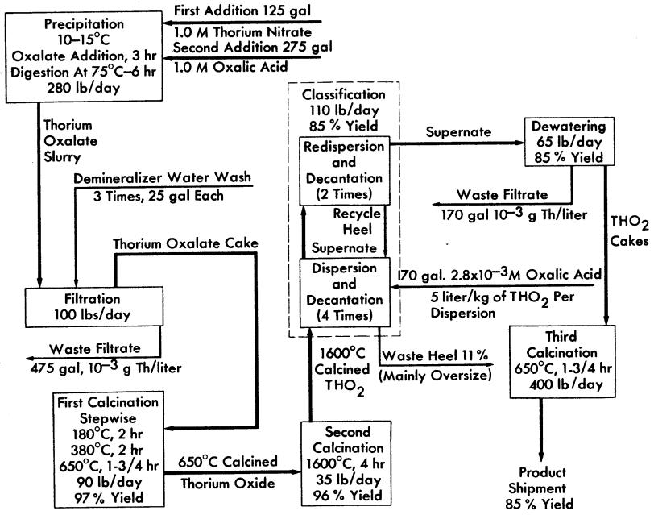  
FIG. 4-3. Thorium oxide pilot plant chemical flowsheet. Percent yields based on initial thorium input.

solutions of thorium nitrate and oxalic acid are mixed in an agitated tank with controlled temperature, addition rate, and order of addition. In the first step, all the thorium nitrate is added to the precipitator, after which the oxalic-acid solution is added over a period of 3 hr with the reagents held at $10^{\circ}\mathrm{C}$ by external cooling. The slurry of precipitated thorium oxalate is digested for 6 hr at $75^{\circ}\mathrm{C}$ and then pumped to a vacuum filter where the solid is separated from the mother liquor and washed three times with demineralized water. The oxalate cake on the filter is air-dried and is then loaded on trays for the first calcination.

In the first calcination the air-dried thorium oxalate is heated successively at $180^{\circ}\mathrm{C}$ for 2 hr, at $380^{\circ}\mathrm{C}$ for 2 hr, and at $650^{\circ}\mathrm{C}$ for 1.75 hr. The material is then packed on a tray for the second calcination, and heated at $1600^{\circ}\mathrm{C}$ for 4 hr.

The $1600^{\circ}\mathrm{C}$ -calcined thorium oxide normally contains about $10\%$ of particles larger than desired ( $>5$ microns). These oversize particles are removed by classification, i.e., by suspension of the thorium oxide in oxalic acid solution $(\mathrm{pH}2.6)$ to a $\mathrm{ThO}_2$ concentration of 100 to $200\mathrm{g}/\mathrm{liter}$ . The suspension is stirred, and the mixture is then allowed to stand for $5\mathrm{min}$

before the supernate is decanted. Coarse material (5 to 7 microns) is separated by setting the supernate withdrawal rate at 0.5 in./min liquid level drop. The withdrawn thorium oxide is dispersed and decanted again twice to ensure removal of oversized particles. The thorium oxide that settles to the bottom is also redispersed and decanted three more times to separate the considerable fraction of the fine particles that settle with the heel or are imperfectly dispersed. This procedure removes nearly all the thorium oxide smaller than 5 microns, and the final product contains only 1 or $2\%$ of particles greater than 5 microns. This material is then refired at $650^{\circ}\mathrm{C}$ to decompose the oxalic-acid dispersant before being used in engineering studies.

Oxide prepared in this way has an average particle size of 1 to 3 microns and has handled well in high-temperature engineering loop tests at slurry concentrations as high as $1500\mathrm{g}$ Th/kg $\mathrm{H}_2\mathrm{O}$ . Removal of the oversize particles has decreased the erosive attack on loop components to essentially what would be observed with water alone (see Section 6-7). At $1500\mathrm{g}$ Th/kg $\mathrm{H}_2\mathrm{O}$ , slurries of average particle sizes $\leq 1$ micron have moderately high yield stresses (0.5 to $1\mathrm{lb} / \mathrm{ft}^2$ ). Lower-yield-stress slurries are obtained with the larger particles.

Previous engineering experience with slurries of oxide prepared similarly but with final firings at 650 and $800^{\circ}\mathrm{C}$ [35] showed them to possess an extremely high yield stress at concentrations greater than $750\mathrm{g}\mathrm{Th} / \mathrm{kg}\mathrm{H}_2\mathrm{O}$ , and an occasionally bad caking characteristic [36]. Firing at $1600^{\circ}\mathrm{C}$ appears to have in large part removed or substantially diminished the caking tendency [37].

4-3.4 Characterization of thorium oxide products. Although thorium oxide is a very refractory substance, it is well known that such properties as its density, catalytic activity, and chemical inertness depend on the conditions of its formation. With particular references to preparation from the oxalate, the firing temperature has a marked effect on the ease of formation of colloids [38]. Beckett and Winfield [25] concluded from electron micrographs of oxide residues that the initial oxalate crystal imposes on the residual oxide a mosaic structure of thin, spongy, microcrystalline laminae all oriented in very nearly the same direction. Foex [20], investigating the rate of change in density as a function of the firing temperature for oxide prepared from the hydrous oxide, associated the density change with crystallite growth among closely joined crystallites and observed that no sintering of particles seemed to take place below $1000^{\circ}\mathrm{C}$ .

Oxide products from thorium oxalate decomposition are normally characterized by their behavior as slurries. In addition, they have been characterized by means of electron micrograph pictures, their nitrogen adsorption surface areas, particulate properties as measured by sedimenta

tion* [39], and average x-ray crystallite size by x-ray diffraction line broadening† [41].

Effect of preparation variables on the particulate properties of thorium oxide. The effects of thorium oxalate precipitation temperature, calcination temperature, and calcination time on oxide properties were initially investigated by Allred, Buxton, and McBride [42]. Oxalate was precipitated at 10, 40, 70, and $100^{\circ}\mathrm{C}$ from a $1M$ thorium-nitrate solution by dropwise addition of oxalic-acid solution and vigorous stirring. The precipitates were fired at $400^{\circ}\mathrm{C}$ for 16 hr and successively at 500, 650, 750, and $900^{\circ}\mathrm{C}$ for 24 hr. Electron micrographs of the oxide products showed particles of the approximate size and shape of the original oxalate particles from which they were formed. The particles of oxide prepared from $10^{\circ}\mathrm{C}$ -precipitated material were approximately 1 micron in size and appeared quite uniform; those from the $40^{\circ}\mathrm{C}$ material were 1 to 2 microns in size and less uniform. A marked increase in particle size was observed for the oxide particles prepared from the $70^{\circ}\mathrm{C}$ and $100^{\circ}\mathrm{C}$ -precipitated materials, which were 4 to 7 microns in size. There was no change in particle shape or average particle size and no evidence of sintering as the firing temperature was increased from 400 to $900^{\circ}\mathrm{C}$ . Micrographs of shadow-cast oxides showed that the particles prepared from oxalate precipitated at $10^{\circ}\mathrm{C}$ were almost cubic in shape, with an edge-to-thickness ratio of about 3:2, and that those from the $100^{\circ}\mathrm{C}$ material were platelets with an edge-to-thickness ratio of 6:1 (Fig. 4-4). The mean particle sizes determined by sedimentation particle-size analyses were in good agreement with the data from the electron micrographs (Fig. 4-4).

Table 4-4 shows typical data obtained with the $10^{\circ}\mathrm{C}$ -precipitated material. Included in Table 4-4 are the results of additional firings up to $1600^{\circ}\mathrm{C}$ . No increase in average particle size was noted even up to $1600^{\circ}\mathrm{C}$ . However, in all oxide preparations, there was about 10 w/o above 5 microns in particle size.

*A radioactivation method for sedimentation particle-size analysis of ThO₂ was developed at ORNL [39]. The oxide was activated by neutron irradiation, dispersed at < 0.5 w/o concentration in a 0.001 to 0.005 M Na₄P₂O₇ solution and allowed to settle past a scintillation counter connected to a count-rate meter and a recorder. The scintillation activity, being proportional to thoria concentration, was analyzed in the usual manner, using Stokes' law, to give the size distribution data. Independently, an analogous method for use with UO₂ powders was developed at Argonne National Laboratory [40].

†The x-ray crystallite (as opposed to the actual oxide particle, which may be composed of a great many crystallites in an ordered or disordered pattern) is defined as the smallest subdivision of the solid which scatters x-rays coherently. The crystallite size can, in principle, be determined from the width of the x-ray diffraction peak, the width being greater the smaller the average crystallite size [41].

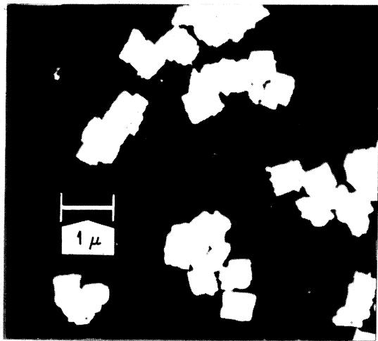

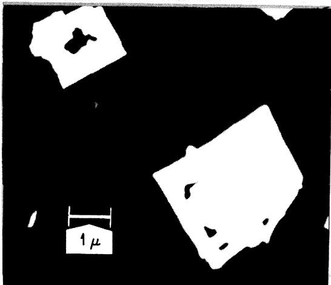  
(a) Cubic Shape From $10^{\circ}\mathrm{C}$ Precipitated Oxalate   
(b) Platelet Shape From $70^{\circ}C$ Precipitated Oxalate   
FIG. 4-4. Particle shapes of thorium oxide prepared from oxalate thermal decomposition.

Additional studies on the effects of the chemical and physical variables of the batch oxalate precipitation step on the particulate properties of thorium oxide from oxalate thermal decomposition were carried out by Pearson, et al. [34,43]. In addition to precipitation temperature, the effect of reagent concentration, stirring rate, reagent addition rate, and digestion time were investigated. Most of the precipitations were made by adding oxalic-acid solution to the thorium nitrate solution, which appeared to give an oxide product of smaller average size and fewer oversize particles than the reverse. Rather than being added dropwise, the oxalic acid was

# TABLE 4-4

# CHARACTERISTIC PROPERTIES OF THORIUM OXIDE FROM OXALATE THERMAL DECOMPOSITION

(Precipitation temperature $10^{\circ}\mathrm{C}$ . Average particle size for all firings was between 1.1 and 1.4 microns.)

<table><tr><td>Final firing temperature, °C</td><td>Firing time, hr</td><td>Average x-ray crystallite size, A</td><td>Specific surface area, m2/g</td></tr><tr><td>400</td><td>16</td><td>61</td><td>35.0</td></tr><tr><td>500</td><td>24</td><td>78</td><td>40.0</td></tr><tr><td>650</td><td>24</td><td>143</td><td>25.0</td></tr><tr><td>750</td><td>24</td><td>250</td><td>13.0</td></tr><tr><td>900</td><td>24</td><td>550</td><td>6.3</td></tr><tr><td>1000</td><td>12</td><td>803</td><td>4.3</td></tr><tr><td>1200</td><td>12</td><td>1100</td><td>3.0</td></tr><tr><td>1400</td><td>12</td><td>2000</td><td>2.4</td></tr><tr><td>1600</td><td>12</td><td>2000</td><td>1.0</td></tr></table>

introduced under pressure into the thorium nitrate solution through a capillary tube projecting beneath the surface of the nitrate solution, the tube exit being directly above the agitator blades.

In these experiments [34,43] it was found that the conditions for producing oxide with uniform* particles of 1 micron average size and a low percentage of particles greater than 5 microns were $1M\mathrm{Th}(\mathrm{NO}_3)_4$ and $\mathrm{H_2C_2O_4}$ concentrations, a $10^{\circ}\mathrm{C}$ precipitation temperature, a high rate of oxalic-acid addition, and vigorous stirring. A draft tube with a variable opening placed around the stirrer permitted a further control over the average particle size, larger particles (2 to 4 microns) being produced by increasing the rate of recirculation of the precipitating system through the

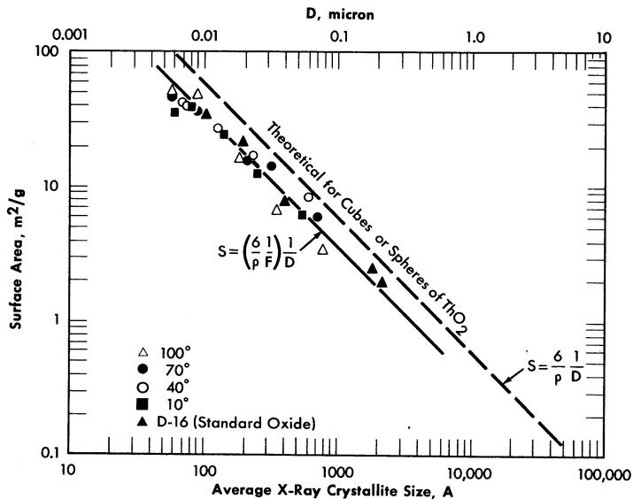  
FIG. 4-5. Relationship between average crystallite size and specific surface area for thorium oxide prepared by the thermal decomposition of thorium oxalate (400 to $900^{\circ}\mathrm{C}$ firings).

draft tube. Decreasing the concentration of the oxalic-acid solution increased the average particle size (0.7 to 0.8 micron at $1.5M$ and 2 to 3 microns at $0.5M$ ) but did not affect the size distribution, which appeared to be primarily temperature-dependent. The shape also changed, with decreasing reagent concentration, from a cube to a platelet. Only the particles about 1 micron in size were cubic in shape. Long digestion times seemed to reduce localized sintering effects in high-fired oxides (1400, $1600^{\circ}\mathrm{C}$ ) and hence lowered the fraction of oversize particles.

Effect of preparation variables on $x$ -ray crystallite size and specific surface areas of thorium oxide from oxalate thermal decomposition. Specific surface areas of oxide prepared from oxalate thermal decomposition were much larger than could be anticipated from the particle size, and decreased with increasing firing temperatures (Table 4-4). Crystallite sizes as measured by $x$ -ray diffraction line broadening increased with increasing firing temperature and corresponded very closely to the particle sizes estimated from the specific surface areas (Fig. 4-5) [42]. The product of the surface area in $\mathrm{m}^2/\mathrm{g}$ and the crystallite diameter in angstroms, at least for oxide fired at $\leq 900^\circ\mathrm{C}$ , was approximately constant and equal to $3.6 \times 10^3$ .

While the crystallite size was determined primarily by the firing temperature, a relationship between crystallite size and firing time was also

established [42]. Log-log plots of crystallite size versus firing time for oxides at various firing temperatures fit an equation of the form

$$
D = t ^ {\alpha} e ^ {(A - B / T)},
$$

where $D$ is the crystallite diameter, $t$ the time, and $T$ the absolute temperature; $\alpha$ , $A$ , and $B$ are constants. The constant $\alpha$ appears to be characteristic of oxide prepared by the thermal decomposition of thorium oxalate. For $D$ in angstroms and $t$ in hours, the equation becomes

$$
D = t ^ {0. 1 4} e ^ {(1 0. 3 5 1 5 - 5 4 8 2 / T)}.
$$

The temperature-dependent function, $e^{(A - B / T)}$ , is typical for rate processes requiring an energy of activation, the constant $B$ being equal to $\Delta H / R$ where $\Delta H$ is the heat of activation. The heat of activation was determined to be 10.97 kcal/g-mole [42].

Oxides from the hydrothermal decomposition of thorium oxalate. Oxides prepared by the hydrothermal decomposition of the oxalate [27] at $300^{\circ}\mathrm{C}$ in a closed autoclave were found to be markedly different in their characteristic properties from the thermally prepared materials. The precipitation temperature of the oxalate had no effect on the final shape or size, and all evidence of the original oxalate structure had disappeared. Sedimentation particle-size analyses indicated particle sizes between 0.5 and 1 micron.

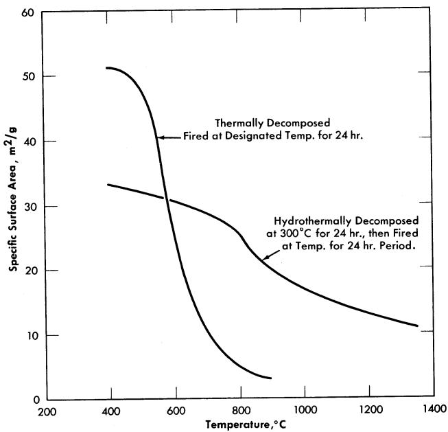  
FIG. 4-6. Effect of oxalate decomposition method on thorium oxide surface area. (Prepared from oxalate precipitated at $100^{\circ}\mathrm{C}$ .)

The hydrothermal oxides were composed of crystallites 200 A in size which did not grow on subsequent firing at temperatures up to $900^{\circ}\mathrm{C}$ . Furthermore, the specific surface area of the hydrothermally prepared oxide decreased less with increasing firing temperature than did the surface area of the oxide from oxalate thermal decomposition, and was much larger for the higher firing temperatures (Fig. 4-6).

Effect of high-temperature water on oxide properties. Experiments have been carried out [45-48] which show that treatment with high-temperature water has practically no effect on the characteristic properties of oxide itself. Prolonged heating in water at temperatures up to $300^{\circ}\mathrm{C}$ did not change the crystallite size, bulking properties, or abrasiveness of thorium hydroxide calcined at 500 and $650^{\circ}\mathrm{C}$ [45], and tests showed no evidence of hydrate formation [46,47]. Lack of crystallite growth probably indicates an extremely low solubility of thorium oxide in water at $300^{\circ}\mathrm{C}$ . When slurries of oxide calcined at 650, 750, 900, and $1000^{\circ}\mathrm{C}$ were heated overnight at $300^{\circ}\mathrm{C}$ in the presence and absence of as much as 10,000 ppm of $\mathrm{SO}_4$ (pH about 2), there was no increase in the average sedimentation particle size or x-ray crystallite size [49].

Effect of pumping on oxide properties. Oxides with particle size much greater than 1 micron are degraded to an average particle size much less than 1 micron on pumping at elevated temperatures,\* while oxides composed of cubic particles of about 1 micron show little change [50]. Surface area increases of from $16\mathrm{m}^2/\mathrm{g}$ to $30\mathrm{m}^2/\mathrm{g}$ have been noted for some pumped oxides, the latter figure being almost the theoretical maximum for the measured x-ray crystallite size [51].

Pumping does not affect the average x-ray crystallite size of slurry oxides [52]. Also, oxides which have been pumped as slurries, dried, and then calcined, show relatively little crystallite growth. From these considerations it would seem that the crystallite size as measured by x-ray diffraction line broadening represents the ultimate limit of the attrition process due to pumping.

# 4-3.5 Sedimentation characteristics of thorium oxide slurries. All thorium oxide-water slurries, except the very dilute suspensions, in the absence

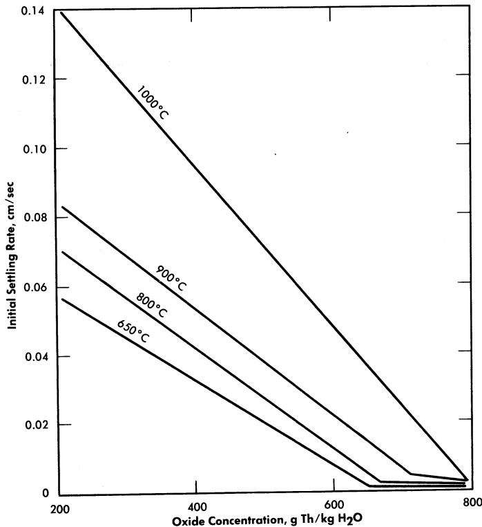  
FIG. 4-7. Effect of oxide calcination temperature and slurry concentration on the room temperature settling rates of aqueous thorium oxide slurries.

of a dispersing agent exhibit "hindered" settling. All particles settle at a constant rate, and there is a well-defined interface between the suspended particle and the supernatant. This form of settling is called "hindered" because there is mutual interference of the particles in their motion, and Stokes' law does not apply to the settling of each particle.

Usually three zones of settling are observed: the initial zone during which the motion of the interface from its initial level is uniform (hindered settling) and rapid; a compressive zone during which the motion of the interface is also uniform, but much slower; and a final stationary state. The first settling zone terminates when the interface reaches the settled mass of flocs. The slurry concentration (grams of thorium per liter) at the point of transition between the initial settling zone and the compressive zone is termed the critical density or the critical concentration. The slurry concentration in the final stationary state is called the settled concentration (sometimes the bulk density). The compressive zone is characteristic of a flocculated material and shows the rate of compaction of the settled bed

under the force of gravity. With discrete particles, or with $\mathrm{ThO_2}$ in the presence of a dispersing agent (0.005 M Na $_4$ P $_2$ O $_7$ ), the particles settle directly into a permanently settled bed, and there is no compressive zone.

Room-temperature sedimentation characteristics. The room-temperature hindered-settling rates (for a given slurry concentration), critical concentrations, and settled concentrations of thorium oxide slurries (unpumped) all increased with increasing firing temperature up to $1000^{\circ}\mathrm{C}$ of the oxide. In addition, the hindered-settling rates also increased with decreasing slurry concentration (see Fig. 4-7) [53]. It should be noted in Fig. 4-7 that all slurries are in compaction in the 500 to $800\mathrm{g}$ $\mathrm{Th / kgH_2O}$ concentration range.

Table 4-5 shows the combined effects of slurry temperature and oxide calcination temperature on the hindered-settling rate, $\mathrm{U}_0[50]$ . From theoretical considerations the product $\mathrm{U}_0\mu$ , where $\mu$ is the viscosity of water, should remain constant for an oxide over a series of settling temperatures, provided that no change has occurred in the particulate or dispersive characteristics of the oxide. $\mathrm{U}_0\mu$ does remain fairly constant over the temperature range 27 to $98^{\circ}\mathrm{C}$ . That changes do occur in oxide properties, however, with increasing calcination temperatures up to $1000^{\circ}\mathrm{C}$ is shown by the increase in the $\mathrm{U}_0\mu$ product with calcination temperature. The trend appears to reverse with the $1300^{\circ}\mathrm{C}$ -fired material, which also shows a larger change in the $\mathrm{U}_0\mu$ product with temperature than do the lower-fired materials.

High-temperature sedimentation characteristics. Slurry settling rates at temperatures in excess of $100^{\circ}\mathrm{C}$ have been obtained in quartz tube $8\mathrm{mm}$ in diameter [54]. These data, obtained with a slurry of thorium oxide prepared by a $650^{\circ}\mathrm{C}$ calcination of thorium formate [55], indicated that the slurry was already in the compaction zone of settling above $500\mathrm{gTh / kgH_2O}$ at 200 to $300^{\circ}\mathrm{C}$ . At a concentration of $1000\mathrm{gTh / kgH_2O}$ , no settling occurred at temperatures above $100^{\circ}\mathrm{C}$ . The small diameter of the tube probably affected the concentration at which the slurry went into compaction.

Data on the sedimentation characteristics of thorium oxide slurries at elevated temperatures in stainless-steel autoclaves, $\frac{3}{4}$ in. in inside diameter,\* have been obtained by an x-ray adsorption technique [56]. Standard x-ray film was transported at a controlled speed past a vertical slot in a lead shield behind which a bomb containing the settling slurry and an x-ray source were placed. A typical radiograph of a settling slurry at an initial concentration of $250\mathrm{gTh / kgH_2O}$ at $205^{\circ}\mathrm{C}$ is shown in Fig. 4-8.

TABLE 4-5   
EFFECT OF SLURRY TEMPERATURE AND OXIDE CALCINATION
TEMPERATURE ON SETTLING CHARACTERISTICS OF THO₂ SLURRIES, 500 g Th/kg H₂O $(U_{0} = \text{hindered settling rate}, \text{cm/sec})$   

<table><tr><td rowspan="3">Slurry temp., °C</td><td rowspan="3">Viscosity μ of H2O, centipoise</td><td colspan="10">Settling characteristics of oxides calcined at indicated temperature</td></tr><tr><td colspan="2">650°C</td><td colspan="2">800°C</td><td colspan="2">900°C</td><td colspan="2">1000°C</td><td colspan="2">1300°C</td></tr><tr><td>U0</td><td>U0μ</td><td>U0</td><td>U0μ</td><td>U0</td><td>U0μ</td><td>U0</td><td>U0μ</td><td>U0</td><td>U0μ</td></tr><tr><td>27</td><td>0.8545</td><td>0.031</td><td>0.029</td><td>0.038</td><td>0.032</td><td>0.06</td><td>0.05</td><td>0.10</td><td>0.08</td><td>0.03</td><td>0.03</td></tr><tr><td>50</td><td>0.5494</td><td>0.045</td><td>0.025</td><td>0.07</td><td>0.036</td><td>0.09</td><td>0.047</td><td>0.15</td><td>0.08</td><td>0.07</td><td>0.04</td></tr><tr><td>75</td><td>0.3799</td><td>0.07</td><td>0.027</td><td>0.12</td><td>0.044</td><td>0.12</td><td>0.044</td><td>0.27</td><td>0.10</td><td>0.16</td><td>0.06</td></tr><tr><td>98</td><td>0.2899</td><td>0.10</td><td>0.028</td><td>0.16</td><td>0.048</td><td>0.15</td><td>0.042</td><td>0.34</td><td>0.10</td><td>0.20</td><td>0.06</td></tr></table>

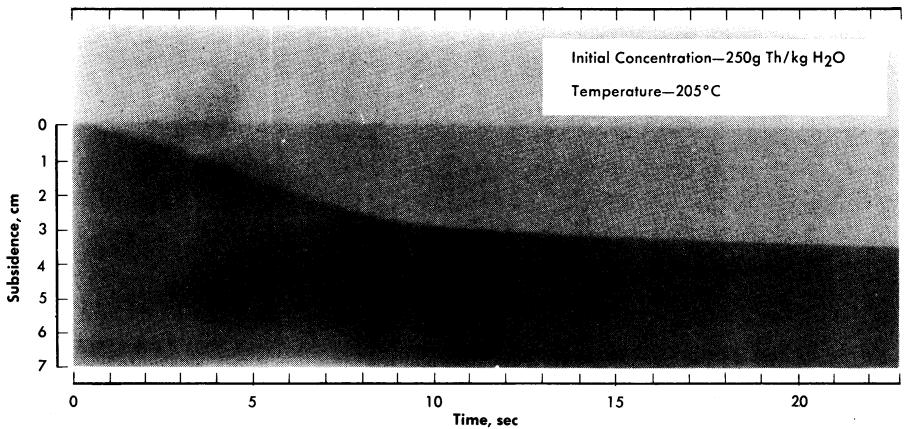  
FIG. 4-8. Typical high-temperature settling curve obtained with x-ray apparatus.

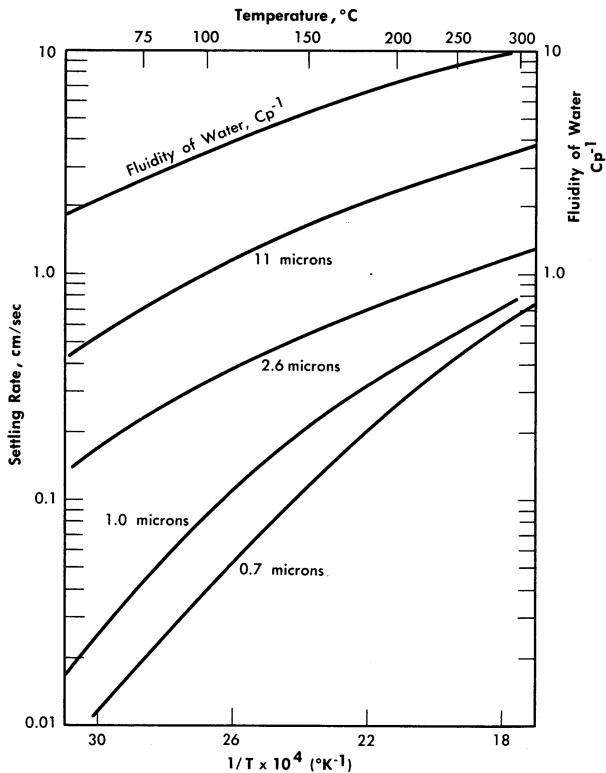  
FIG. 4-9. Temperature-particle size effects on the settling rate of thorium oxide slurries: $250\mathrm{g}$ Th/kg $\mathrm{H}_2\mathrm{O}$ .

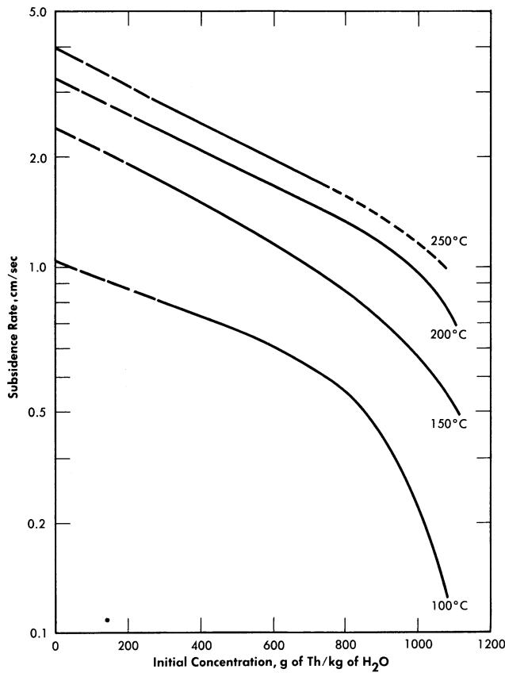  
FIG. 4-10. Effect of slurry concentration on settling rate.

The combined effects of temperature and particle size on slurry settling rates for $250\mathrm{g}$ $\mathrm{Th / kgH_2O}$ slurries of oxides fired at 800 to $900^{\circ}\mathrm{C}$ are shown in Fig. 4-9. Since the systems were flocculated, the hindered-settling rates are much greater than those predicted from the mean particle sizes by a simple application of Stokes' law. The settling rate-temperature dependence curve for the slurries containing the larger particles closely paralleled the curve for the fluidity of water. Hence it may be assumed that for these slurries little or no change occurred in the flocculating characteristics with increasing slurry temperature. For the slurries containing the smaller particles the curve is steeper, showing an apparent increase in agglomerate size or density with increasing temperature.

The effect of slurry concentration on the settling characteristics of a slurry at elevated temperatures is illustrated in Fig. 4-10. The bulk of this slurry $(>80\mathrm{w / o})$ was made up of spherical agglomerates 10 to 15 microns in size. The data indicate that the slurry settling rate is an exponential function of the concentration and has the form

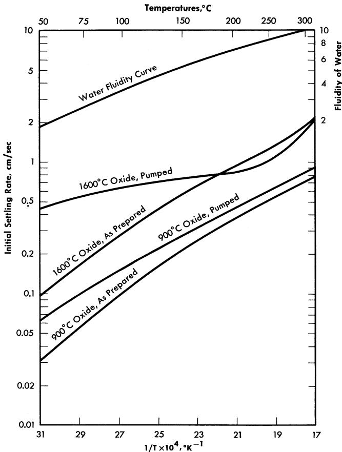  
FIG. 4-11. Effect of firing temperature on high-temperature settling rates. $250\mathrm{g}$ Th/kg $\mathrm{H}_2\mathrm{O}$ ; particle size 1 micron; prepared from $10^{\circ}\mathrm{C}$ precipitated oxalate.

$$
\ln \frac {U _ {0}}{U _ {s}} = a C,
$$

where $U_{0}$ is the measured sedimentation rate, $U_{s}$ is the settling rate at infinite dilution where Stokes' law should govern the particulate settling, $C$ is the slurry concentration, and $a$ is the slope of the logarithmic settling rate-slurry concentration curve. Extrapolating the straight-line portion of the curves to zero concentration and assuming an agglomerate density of $5.0\mathrm{g / cc}$ , Stokes' law particle diameters were calculated at the various temperatures and were found to be approximately the same, again illustrating a lack of change in slurry flocculation characteristics with increasing slurry temperature. The calculated particle diameters at 100, 150, 200, and $250^{\circ}\mathrm{C}$ were 40, 45, 45, and 44 microns, respectively, far greater than those obtained by sedimentation particle-size analysis in dilute suspension.

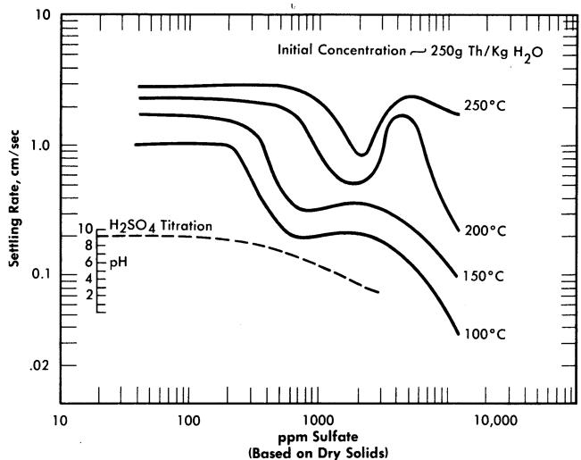  
FIG. 4-12. Effect of thorium sulfate on hindered settling rates of oxide slurries.

The effects of oxide firing temperatures of 900 and $1600^{\circ}\mathrm{C}$ on slurry settling rates at elevated temperatures are shown in Fig. 4-11. Slurry concentrations were $250\mathrm{g}$ Th/kg $\mathrm{H}_2\mathrm{O}$ , and the oxide was prepared from the $10^{\circ}\mathrm{C}$ -precipitated oxalate (cubic particles, $\sim 1$ micron). Settling data obtained on the slurries after they had been pumped at elevated temperatures are also included. The slurry of higher-fired material shows much higher settling rates. Pumping does not greatly affect the settling rates of slurries of either oxide above $150^{\circ}\mathrm{C}$ . The temperature dependence of settling rates roughly follows the change in water fluidity, but the curve for the $1600^{\circ}\mathrm{C}$ -fired pumped material deviates considerably below $150^{\circ}\mathrm{C}$ and is much flatter.

Effect of additives on settling rates. The fluidity of concentrated non-Newtonian slurries can be increased by the use of additives. Of particular importance is a knowledge of the effect of temperature on the action of such additives. Both sulfate and sodium silicate additions, either as thorium sulfate or sulfuric acid, were investigated and found to change markedly the settling rates and handling characteristics [50] of thoria slurries, the relative effect of any additive concentration on a given slurry depending on the slurry temperature.

Sodium silicate is a well-known deagglomerator, as well as a wetting agent. Its addition to thick concentrated slurries at room temperature increases their fluidity to that approaching water. It also markedly improves their heat-transfer properties for certain flow conditions [58].

The effect of thorium sulfate additions on the high-temperature sedimentation properties of a thoria slurry (250 g Th/kg $\mathbf{H}_2\mathbf{O}$ ) composed of spherical agglomerates approximately 15 microns in average size is shown in

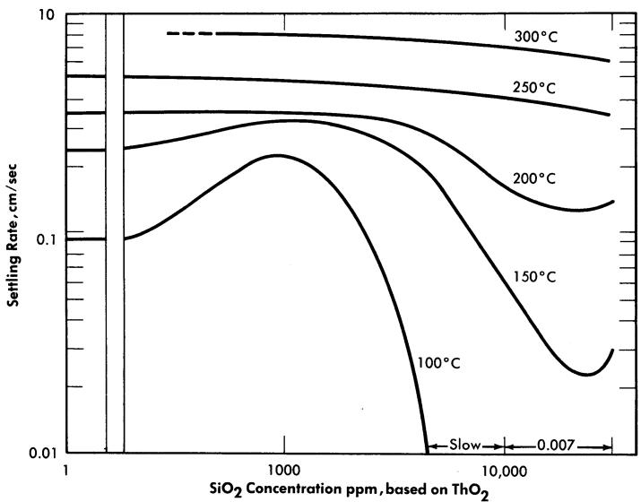  
FIG. 4-13. Effect of sodium silicate on the hindered settling rates of oxide slurries. $250\mathrm{g}$ Th/kg $\mathrm{H}_2\mathrm{O}$ , $d_{g} = 1$ micron.

Fig. 4-12. An abnormal increase in the hindered-settling rate in the temperature region of 150 to $200^{\circ}\mathrm{C}$ was obtained upon the addition of between 500 and $1000\mathrm{ppm}$ of sulfate (based on $\mathrm{ThO_2}$ ) and again at about $5000\mathrm{ppm}$ of sulfate. The concentration region of 2000 to $3000\mathrm{ppm}$ of sulfate appears to be one of a relatively low settling rate and good temperature stability. It is of interest to note that in the operation of a high-temperature loop, abnormal pump power demands at $200^{\circ}\mathrm{C}$ were observed when pumping slurry containing $1000\mathrm{ppm}$ , and that increasing the sulfate concentration to between 2000 and $3000\mathrm{ppm}$ removed the difficulty and permitted operation at $300^{\circ}\mathrm{C}$ [54].

Also appearing in Fig. 4-12 is the sulfuric acid titration curve obtained with the standard slurry. It should be noted that the sulfate concentration regions of temperature instability bracket the break in the pH curve and the region of temperature stability occurs between pH 6 and 7.

Figure 4-13 shows the effect of sodium metasilicate additions on the settling rate at elevated temperatures of a $250\mathrm{g}$ $\mathrm{Th / kgH_2O}$ slurry of $800^{\circ}\mathrm{C}$ -fired oxide which had been micropulverized to an average particle size of 1 micron. At silica concentrations of 5000 to 30,000 parts $\mathrm{SiO_2}$ per million $\mathrm{ThO_2}$ , the settling rates are reduced (by comparison with the pure slurry) at all temperatures up to $250^{\circ}\mathrm{C}$ , but the effect is more pronounced at the lower temperatures.

It would appear from the studies carried out so far that the relative dispersion effect for any additive concentration depends markedly on the

slurry temperature. The more pronounced effects are observed at temperatures below $200^{\circ}\mathrm{C}$ . Above $250^{\circ}\mathrm{C}$ the effect of the additive becomes less pronounced and sometimes even negligible from the point of view of its effect on the settling rate. It may be, however, that at high temperatures the additive could change the viscous properties of the slurry in a dynamic system and not affect its settling rate in a quiescent state (essentially zero shear stress) at the same temperature.

4-3.6 Status of laboratory development of thorium oxide slurries. Thorium oxide prepared by the thermal decomposition of thorium oxalate appears suitable for a reactor slurry at concentrations up to $1500\mathrm{g}$ $\mathrm{Th / kgH_2O}$ . Study of the preparation variables has indicated that a considerable control can be exercised over the properties of the slurry oxide. Little is known as to what physical and chemical properties of thorium oxide are important in determining its handling characteristics in water at high temperatures, and studies are being made to determine these properties. Sulfate and silicate additives have been shown in settling studies to have a marked effect on the dispersion characteristics of slurries at temperatures below $200^{\circ}\mathrm{C}$ , but at reactor temperatures the effect of the additive on the settling rate diminishes and may be negligible. The effect of additives on the rheological properties of slurries at reactor temperatures has not yet been determined. Attempts are being made to obtain slurries of ideal rheological characteristics by the preparation of oxide of controlled particle size, shape, and surface activity.

# 4-4. ENGINEERING PROPERTIES*

4-4.1 Introduction. The major difference in descriptions of the engineering properties of aqueous suspensions (compared with aqueous solutions) arises from the fact that suspensions may exhibit either Newtonian or non-Newtonian laminar-flow characteristics. The consequences of the possibility of these two different types of behavior modify conventional heat transfer, fluid flow, and sedimentation correlations, and are important in the design of large systems for handling slurries.

The magnitude of the effects that can be observed with non-Newtonian slurries is illustrated in Fig. 4-14, where the critical velocity for the onset of turbulence is shown to be a strong function of the slurry yield stress and almost independent of coefficient of rigidity and pipe diameter [59]. The usefulness of laminar-flow measurements in characterizing different suspensions, as well as the application of these constants to a variety of correlations, will be given in the following sections.

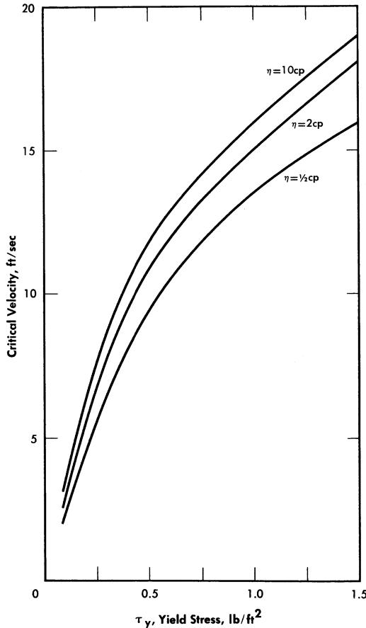  
FIG. 4-14. Effect of slurry physical properties on velocity for onset of turbulence $\rho = 100\mathrm{lb / ft^3}$ , $D = 1$ to 24 in.

$$
\left(C _ {p} = a + \left(b \times 1 0 ^ {- 3}\right) T + c \times 1 0 ^ {5} / T ^ {2}\right)
$$

TABLE 4-6 SPECIFIC-HEAT CONSTANTS FOR THE OXIDES OF URANIUM AND THORIUM [61]   

<table><tr><td>Material</td><td>a</td><td>b</td><td>c</td><td>Temp. range, °K</td></tr><tr><td>H2O</td><td>11.2</td><td>7.17</td><td>-</td><td>-</td></tr><tr><td>ThO2</td><td>16.45</td><td>2.346</td><td>-2.124</td><td>to 1970</td></tr><tr><td>UO2</td><td>19.20</td><td>1.62</td><td>-3.957</td><td>to 1500</td></tr><tr><td>U3O8</td><td>(65)</td><td>(7.5)</td><td>(-10.9)</td><td>-</td></tr><tr><td>UO3</td><td>22.09</td><td>2.54</td><td>-2.973</td><td>to 900</td></tr></table>

4-4.2 Physical properties. The heat capacity of suspensions of solids is commonly taken as the sum of the heat capacities on a weight basis of the liquid and the solid at the bulk mean suspension temperature, each multiplied by its respective weight fraction in the suspension [60]. Specific-heat values for pure thorium and uranium oxides are given in Table 4-6.

Thermal conductivity data for mixtures of solids have been correlated [62] using Maxwell's [63] equation:

$$
k _ {s} = k _ {0} \frac {2 k _ {0} + k _ {p} - 2 \phi \left(k _ {0} - k _ {p}\right)}{2 k _ {0} + k _ {p} + \phi \left(k _ {0} - k _ {p}\right)} \tag {4-1}
$$

for the electrical conductivity of a two-phase system. This equation was subsequently used to correlate conductivity data for suspensions of solids in a gel [64]. However, the thermal conductivity of suspensions has not been shown to be independent of the rate of shear [65]. The thermal conductivity of sintered thorium oxide having a bulk density of $8.16\mathrm{g / cc}$ was found to decrease from 6.0 to 2.5 Btu/(hr) (ft) $(^{\circ}\mathbf{F})$ as the temperature was increased from 140 to $500^{\circ}\mathrm{C}$ [66,67].

Suspensions of solids in liquids may be either Newtonian or non-Newtonian, depending primarily on particle size and electrolyte atmosphere around the particles [68]. Newtonian and non-Newtonian materials are classified and compared by means of shear diagrams in which the rate of shearing strain, $dv_{r} / dr$ , is plotted against the shear stress, $\pmb{\tau}$ . Newtonian fluids are characterized by a shear diagram in which the rate of shearing strain is directly proportional to the shear stress, as shown in Fig. 4-15, the viscosity being given by:

$$
\mu = - g _ {c} \tau / \left(d v _ {r} / d r\right), \tag {4-2}
$$

where the coefficient of viscosity, $\mu$ , is independent of the rate of shearing strain. On the other hand, non-Newtonian fluids have a variable viscosity that is a function of the rate of shear and in some cases of the duration of shear. Detailed discussions of non-Newtonian materials are available elsewhere [69-72].

Einstein [73] has shown that the viscosity of dilute suspensions of rigid spherical particles is a function of the volume fraction of solids in the suspension and is independent of particle size, as shown in Eq. (4-3):

$$
\mu_ {s} = \mu (1 + 2. 5 \phi), \tag {4-3}
$$

where $\phi$ is the volume fraction of solids in the suspension. It was assumed that the system was incompressible, that there was no slip between the particles and the liquid, no turbulence, and no inertia effects, and that the macroscopic hydrodynamic equations held in the immediate neighborhood

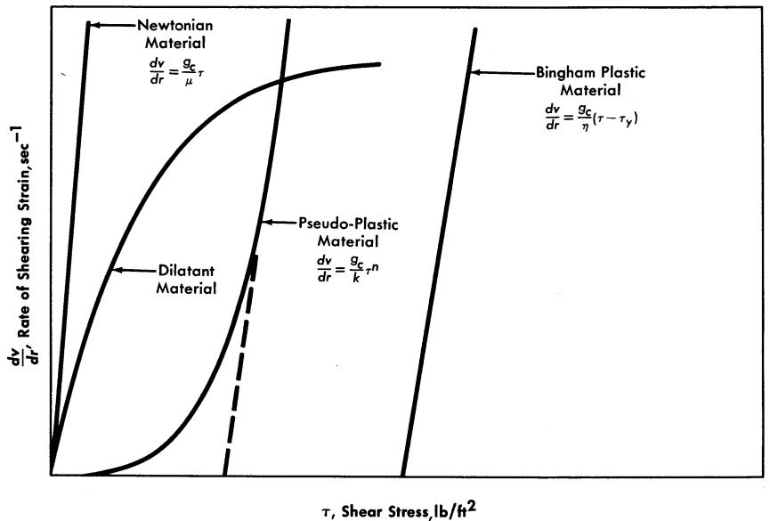  
FIG. 4-15. Classification of Newtonian and non-Newtonian materials by shear diagram.

of the particles. Einstein's treatment for dilute suspensions has been extended by Guth and Simha [74], Simha [75], de Bruyn [76], Saito [77], Vand [78], and Happel [79] to suspensions of higher concentrations. In all these treatments the hydrodynamic interaction between particles was considered, the extension usually taking the form of terms proportional to $\phi^2$ and $\phi^3$ , the terms to be added to the Einstein term $2.5\phi$ . These results are summarized in Table 4-7.

Theoretical treatments have also included such nonspherical particles as ellipsoids [85] and dumbbells [86] and an empirical relationship has been determined for rod-shaped particles [80]:

$$
\mu_ {s} = \mu (1 + 2. 5 F \phi + 8 F ^ {2} \phi^ {2} + 4 0 F ^ {3} \phi^ {3}), \tag {4-4}
$$

where $F$ is dependent upon the axial ratio, but not upon size or concentration of the rods. Values of $F$ , determined with a Couette viscosimeter, are given in Table 4-8.

The viscosities of suspensions of $\mathrm{UO}_3\cdot \mathrm{H}_2\mathrm{O}$ rods and platelets with uranium concentrations of up to $250~\mathrm{g / liter}$ were measured [87] with a modified Saybolt viscosimeter at temperatures from 30 to $75^{\circ}\mathrm{C}$ . There was no detectable difference in viscosity between the slurries of rods and those of platelets at these uranium concentrations. The viscosity values given in

# TABLE 4-7

COMPARISON OF THEORETICAL AND EMPIRICAL EXTENSION OF THE EINSTEIN RELATION TO HIGHER CONCENTRATIONS (All relations are of the form $\mu_{s} = \mu (1 + A_{1}\phi +A_{2}\phi^{2} + A_{3}\phi^{3})$

<table><tr><td>Author</td><td>Refer-ence</td><td>A1</td><td>A2</td><td>A3</td><td>Comments</td></tr><tr><td>Vand</td><td>[78]</td><td>1.5</td><td>7.349</td><td>0</td><td>Considered mutual hydrodynamic interaction and collisions between particles and pairs of particles</td></tr><tr><td>Guth and Simha</td><td>[74]</td><td>2.5</td><td>14.1</td><td>0</td><td>Considered mutual hydrodynamic interaction; neglected formation of pairs</td></tr><tr><td>de Bruyn</td><td>[76]</td><td>2.5</td><td>2.5</td><td>2.5</td><td>Considered only mutual hydrodynamic interaction</td></tr><tr><td>Saito</td><td>[77]</td><td>2.5</td><td>2.5</td><td>2.5</td><td>Considered only mutual hydrodynamic interaction</td></tr><tr><td>Gosting and Morris</td><td>[84]</td><td>3.35</td><td>0</td><td>0</td><td>Very dilute</td></tr><tr><td>Oden</td><td>[83]</td><td>2.5</td><td>30 to 60</td><td>0</td><td>Sulfur sols</td></tr><tr><td>Boutaric and Vuillaume</td><td>[82]</td><td>2.5</td><td>75</td><td>0</td><td>As2S3sols</td></tr><tr><td>Eirich</td><td>[80]</td><td>2.5</td><td>9 to 13</td><td>0</td><td>Glass spheres in water</td></tr><tr><td>Vand</td><td>[81]</td><td>2.5</td><td>7.17</td><td>16.2</td><td>Glass spheres in ZnI2-water-glycerol solutions</td></tr><tr><td>Happel</td><td>[79]</td><td>5.5ψ*</td><td>—</td><td>—</td><td>Each particle confined to a cell of fluid bounded by frictionless envelope</td></tr></table>

$^{*}\psi =$ Interaction factor, 1.00 at $\phi = 0$ ; 4.071 at $\phi = 0.50$

# TABLE 4-8

VALUES OF CORRECTION FACTOR, $F$ , FOR EFFECT OF AXIAL RATIO OF RODS IN VISCOSITY OF SUSPENSIONS   

<table><tr><td>L/D</td><td>F</td></tr><tr><td>5</td><td>2.1</td></tr><tr><td>11</td><td>2.25</td></tr><tr><td>17</td><td>2.60</td></tr><tr><td>23</td><td>4.20</td></tr><tr><td>25</td><td>5.60</td></tr><tr><td>32</td><td>7.0</td></tr><tr><td>50</td><td>11.0</td></tr><tr><td>75</td><td>22</td></tr><tr><td>100</td><td>32</td></tr><tr><td>140</td><td>50</td></tr></table>

Ref. 87 were used to determine the value of the shape factor $F$ in Eq. (4-4), which was derived for rod-shaped particles. The value of $F$ for the $\mathrm{UO}_3 \cdot \mathrm{H}_2\mathrm{O}$ data is $2.4 \pm 0.7$ , corresponding to an $L / D$ of about 14 (from Table 4-8). This agrees very well with the dimensions reported for the rodlets of from 1 to 5 microns diameter and 10 to 30 microns long [87]. (The dimensions for platelets were 6 to 50 microns on edge and about 1 micron thick.)

Powell and Eyring [88] have applied the theory of absolute reaction rates to arrive at a suggested general relation between the shear stress and the shear rate for non-Newtonian fluids:

$$
\tau = \frac {1}{c} \frac {d v}{d r} + \frac {1}{b} \sinh^ {- 1} \left(\frac {1}{a} \frac {d v}{d r}\right). \tag {4-5}
$$

It is found that in the range of most common interest, $10^{3} < (dv / dr) < 10^{5}$ , $\sinh^{-1}[(1 / a)(dv / dr)] = 6.4 \pm 3.5$ for a variety of $\mathrm{ThO}_2$ slurries [89] and does not change rapidly with changes in $dv / dr$ . Thus $1 / b \sinh^{-1}[(1 / a)(dv / dr)]$ is in effect $\tau_y$ in the Bingham equation [90] for an idealized plastic:

$$
\frac {d v}{d r} = \frac {g _ {c}}{\eta} (\tau - \tau_ {y}). \tag {4-6}
$$

For convenience, the apparent yield stress, $\tau_{y}$ , and the coefficient of rigidity, $\eta$ , will be used to characterize different uranium and thorium oxide slurries [72].

If it is assumed that the particles in a flocculated non-Newtonian slurry stick together in the form of loose, irregular, three-dimensional clusters in which the original particles can still be recognized, and further that the yield stress is a manifestation of the breaking of these particle-particle bonds, then for constant isotropic bond strength the yield stress should be proportional to the cube of the volume fraction solids. Since the shear forces are exerted in a plane, the yield stress should also be proportional to the number of particles per unit area, and hence, for constant volume fraction solids, the yield stress should be proportional to the reciprocal of the square of the particle diameter.

Data on the yield stress and coefficient of rigidity as a function of concentration for three particular uranium oxide preparations [91] are summarized in Table 4-9. The yield stress-volume fraction solids data may be expressed by a relation of the form

$$
\tau_ {y} = k _ {1} \phi^ {4}. \tag {4-7}
$$

Values of $k_{1}$ for the three different oxides are shown in Table 4-9. The data for the coefficient of rigidity may be fitted by a relation of the form

$$
\eta = \mu \exp \left[ k _ {2} \phi \right], \tag {4-8}
$$

using values of $k_{2}$ given in Table 4-9.

TABLE 4-9   
RHEOLOGIC PROPERTIES OF NON-NEWTONIAN URANIUM OXIDE SLURRIES  

<table><tr><td rowspan="2">Oxide</td><td colspan="2">Particle-size distribution</td><td rowspan="2">k2=ln(η/μ)/φ</td><td rowspan="2">k1=τy/φ4, lb/ft2</td></tr><tr><td>σ</td><td>Dp, microns</td></tr><tr><td>UO2</td><td>1.7</td><td>1.4</td><td>1.8</td><td>150</td></tr><tr><td>U3O8</td><td>2.0</td><td>1.3</td><td>2.2</td><td>230</td></tr><tr><td>UO3H2O</td><td>1.9</td><td>1.2</td><td>2.2</td><td>430</td></tr></table>

TABLE 4-10   
RHEOLOGIC PROPERTIES OF NON-NEWTONIAN THORIUM OXIDE SLURRIES  

<table><tr><td colspan="5">Oxide designation</td><td rowspan="2" colspan="2">Particle-size distribution</td><td rowspan="3">k4=ln(η/μ)/φ</td><td rowspan="3">k3=τy/φ3, lb/ft2</td></tr><tr><td></td><td rowspan="2">Calcination temperature, °C</td><td colspan="3">Agitation</td></tr><tr><td></td><td>Method</td><td>Duration, hr</td><td>Temp., °C</td><td>σ</td><td>Dp, microns</td></tr><tr><td>S-59</td><td>650</td><td>Pump</td><td>325</td><td>290</td><td>2.7</td><td>0.030</td><td>2.4</td><td>1100</td></tr><tr><td>200A-1</td><td>800</td><td>Pump</td><td>234</td><td>300</td><td>2.9</td><td>0.58</td><td>1.8</td><td>470</td></tr><tr><td>200A-11</td><td>800</td><td>Pump</td><td>900-1800</td><td>300</td><td>2.8</td><td>0.75</td><td>1.4</td><td>550</td></tr><tr><td>W-30</td><td>1600</td><td>Waring blender</td><td>0.5</td><td>50</td><td>1.9</td><td>1.0</td><td>1.5</td><td>145</td></tr><tr><td>LO-25-S</td><td>1600</td><td>None</td><td>—</td><td>—</td><td>1.5</td><td>1.6</td><td>1.2</td><td>100</td></tr><tr><td>200A-14</td><td>1600</td><td>Pump</td><td>3787</td><td>300</td><td>1.8</td><td>1.4</td><td>0.8</td><td>60</td></tr><tr><td>LO-25-1</td><td>1600</td><td>None</td><td>—</td><td>—</td><td>1.7</td><td>2.0</td><td>1.0</td><td>44</td></tr><tr><td>LO-22</td><td>1600</td><td>Mikro-pulverizer</td><td>4 passes</td><td>30</td><td>1.7</td><td>2.4</td><td>1.2</td><td>33</td></tr></table>

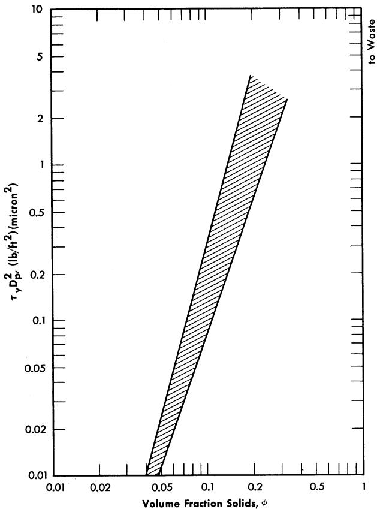  
FIG. 4-16. Effect of particle diameter and volume fraction solids on $\mathrm{ThO}_2$ slurry yield stress.

The yield stress and coefficient of rigidity as a function of volume fraction solids for a variety of different $\mathrm{ThO_2}$ slurries [89] are given in Table 4-10. The yield stress-volume fraction solids curves can be fitted by a relation of the form

$$
\tau_ {y} = k _ {3} \phi^ {3}. \tag {4-9}
$$

The coefficient of rigidity-volume fraction solids curves can be fitted by a relation of the form

$$
\eta = \mu \exp (k _ {4} \phi). \tag {4-10}
$$

The data given in Table 4-10 were obtained with $\mathrm{ThO_2}$ slurries having a pH less than 6 and whose rheological constants were relatively insensi

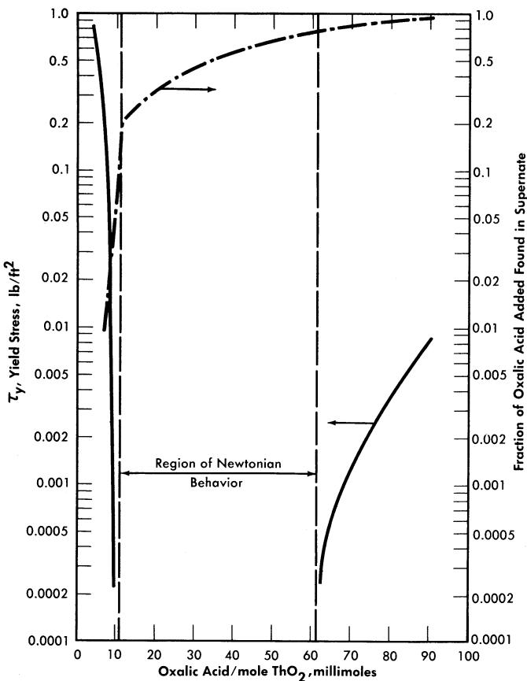  
FIG. 4-17. Effect of electrolyte on $\mathrm{ThO_2}$ slurry yield stress.

tive to dilution and reconcentration and therefore could be considered as having a similar and reproducible electrolyte atmosphere associated with the particles [89]. On the basis of the above considerations a plot of $k_{3}$ (Eq. 4-9) versus mean particle diameter was found to fall on a line of slope minus two on a log-log plot, as suggested by the plausibility arguments given above. Therefore the data of Table 4-10 were plotted as $\tau_{y}D_{p}^{2}$ versus volume fraction solids. All points fell within the two lines shown in Fig. 4-16. It is believed that the spread of data is largely due to effects of the electrolyte atmosphere [89], since the deviations from the mean particle size were similar. The influence of small quantities of electrolyte on the yield stress of a particular $\mathrm{ThO_2}$ slurry [92] is shown in Fig. 4-17. Similar behavior for particulate systems has been described elsewhere [68,93].

Preliminary measurements [94] of rheologic properties of $\mathrm{ThO_2}$ slurries at temperatures up to $290^{\circ}\mathrm{C}$ indicate that the yield stress is essentially independent of temperature $(\pm 30\%)$ , whereas the coefficient of rigidity decreases with temperature, although not to the same extent as water.

4-4.3 Fluid flow. The pressure drop due to friction for viscous flow of Newtonian fluids through pipes is given by the Poiseuille equation:

$$
\Delta p = 3 2 \mu L V / g _ {c} D ^ {2}. \tag {4-11}
$$

The same equation may be used for non-Newtonian suspensions, provided that the "apparent" viscosity, $\mu_{a}$ , is substituted for the viscosity.

Buckingham [95] has presented a mathematical relationship for the flow of Bingham plastics in circular pipe:

$$
8 V / g _ {c} D = (1 / \eta) \left(\tau_ {w} - (4 / 3) \tau_ {y} + (1 / 3) \tau_ {y} ^ {4} / \tau_ {w} ^ {3}\right). \tag {4-12}
$$

For large values of $\tau_w$ , the last term of Eq. (4-12) becomes small, and the resulting expression for the shear stress at the wall, $\tau_w$ , when combined with Eq. (4-13),

$$
\tau_ {w} = D \Delta p / 4 L, \tag {4-13}
$$

gives

$$
\Delta p = 3 2 \eta L V / g _ {c} D ^ {2} + (1 6 / 3) \tau_ {y} L / D \tag {4-14}
$$

for the pressure drop of a Bingham plastic in laminar flow.

Hedstrom [96] has proposed a simple criterion to distinguish between laminar and turbulent flow of Bingham plastic materials. The Reynolds number at which turbulence sets in is determined by the intersection of a parametric curve, defined by

$$
N _ {\mathrm {H e}} = g _ {c} \rho \tau_ {y} D ^ {2} / \eta^ {2}, \tag {4-15}
$$

$$
\frac {1}{N _ {\mathrm {R e}}} = \frac {f}{1 6} - \frac {1}{6} \frac {N _ {\mathrm {H e}}}{(N _ {\mathrm {R e}}) ^ {2}} + \frac {1}{3} \frac {N _ {\mathrm {H e}} ^ {4}}{f ^ {3} (N _ {\mathrm {R e}}) ^ {8}}, \tag {4-16}
$$

and the turbulent Newtonian friction curve on a Fanning friction factor-Reynolds number plot, provided that the Reynolds number is defined as $DV\rho /\eta$ . The usefulness of the Hedstrom concept has been demonstrated by several investigators [97,98]. Figure 4-18 is a plot of the solution of Eqs. (4-15) and (4-16) superimposed on a friction factor-Reynolds number diagram for Newtonian fluids flowing in smooth tubes.

In general, non-Newtonian fluids behave similarly to Newtonian fluids in the turbulent flow region in that they exhibit relatively constant ap

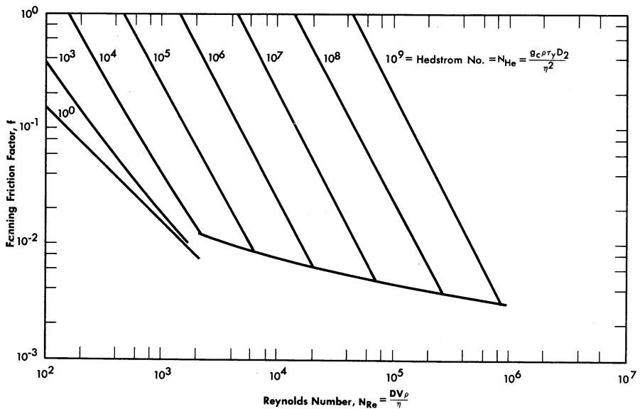  
FIG. 4-18. Friction factor-Reynolds number diagram for Bingham plastic slurries in smooth pipes.

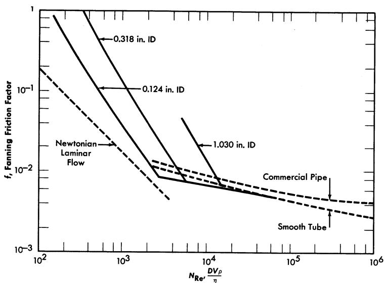  
FIG. 4-19. Friction factor-Reynolds number data for $\mathrm{ThO_2}$ slurries in turbulent flow. $\tau_{y} = 0.075\mathrm{lb / ft^2}$ , $\eta = 2.9$ cp.

parent viscosity. Alves, Boucher, and Pigford [69] indicate that, in the absence of data, the conventional friction-factor plot may be used to predict turbulent pressure drop to within $\pm 25\%$ , provided that the Reynolds number is evaluated by using the coefficient of rigidity or viscosity at infinite shear and that the density is taken as that of the slurry. However, it has been shown that a large amount of turbulent pressure-drop data taken with both Newtonian and non-Newtonian slurries can be correlated using the usual friction factor-Reynolds number plot provided the density is taken as that of the slurry and the viscosity as that of the suspending medium [99-105]. Data obtained [106] with two different $\mathrm{ThO_2}$ slurries using three different tubes are shown in Fig. 4-19. As can be seen, the turbulent friction-factor line is below the smooth-tube Newtonian line at low Reynolds numbers and approaches the smooth-tube line at high Reynolds numbers.

Vanoni [107], who reviewed the literature on sedimentation transportation mechanics through 1953, has pointed out that although a quantitative description of the phenomena was unavailable at that time, it was clear that sediment movement is intimately associated with turbulence. Subsequent work either has been largely of an empirical nature [108-110] or has unquestioningly accepted and used [111-113] generalized flow relations which have been developed for homogeneous Newtonian fluids [114]. Undoubtedly the presence of particulate matter in the flowing stream will exert a perturbing influence on the flow pattern at velocities near drop-out, and a quantitative solution to the problem must include at least an estimate of this effect [115].

It has been proposed [116] that the velocity below which particulate matter will be deposited on the bottom of horizontal pipes from a Bingham plastic suspension corresponds to the critical velocity for the onset of turbulence. This velocity may be calculated approximately by setting the modified Reynolds number (obtained by using the apparent viscosity $\mu_{a} = \eta (1 + g_{c}D\tau_{y} / 6\eta V)$ from Eq. 4-14 instead of viscosity as usually defined) equal to 2100 and solving for the velocity:

$$
V _ {c} = \frac {2 1 0 0 \eta}{2 D \rho} + \frac {1}{2} \sqrt {\left(\frac {2 1 0 0 \eta}{D \rho}\right) ^ {2} + \frac {(4) (2 1 0 0) g _ {c} \tau_ {y}}{6 \rho}} \tag {4-17}
$$

Resuspension velocities* for one particular slurry [117] in a $\frac{3}{4}$ -in. glass pipe are given in Table 4-11 together with the rheological properties [118] and the critical Reynolds number calculated with the resuspension velocity.

TABLE 4-11 RESUSPENSION VELOCITY FOR BINGHAM PLASTIC $\mathsf{THO}_2$ SLURRIES  

<table><tr><td>ρ, g/cc</td><td>Concentration, g Th /kg H2O</td><td>τy, lb/ft2</td><td>η, cp</td><td>Resuspension velocity, Vc, fps</td><td>Critical Reynolds number, D Vcp/η[1 + (gcD τy/6ηVc)]</td></tr><tr><td>2.44</td><td>1645</td><td>0.48</td><td>5.9</td><td>7.4</td><td>2220</td></tr><tr><td>2.29</td><td>1490</td><td>0.35</td><td>5.5</td><td>6.3</td><td>2040</td></tr><tr><td>2.17</td><td>1325</td><td>0.25</td><td>5.1</td><td>5.5</td><td>2050</td></tr><tr><td>2.05</td><td>1180</td><td>0.19</td><td>4.6</td><td>5.2</td><td>2240</td></tr><tr><td>1.94</td><td>1030</td><td>0.12</td><td>4.2</td><td>4.5</td><td>2380</td></tr><tr><td>1.84</td><td>910</td><td>0.098</td><td>3.9</td><td>3.7</td><td>1920</td></tr><tr><td>1.76</td><td>825</td><td>0.065</td><td>3.6</td><td>3.5</td><td>2350</td></tr><tr><td>1.65</td><td>690</td><td>0.040</td><td>3.1</td><td>3.7</td><td>3460</td></tr></table>

As can be seen, the critical Reynolds number is very close to the proposed value [116] of 2100. Additional data on a variety of slurries and different tube diameters are being obtained [119] to further substantiate Eq. (4-17).

4-4.4 Hindered-settling systematics. The hindered-settling velocity of slurries may be expressed as a coefficient times the Stokes' law settling rate. Table 4-12 summarizes [120] typical coefficients obtained in theoretical and empirical investigations. A plot of these coefficients versus porosity showed that they are substantially in agreement. Steinour [121] introduced the concept of immobilized water in his treatment of flocculated suspensions and showed that by defining

$$
\alpha = \frac {\text {i m m o b i l i z e d f l u i d v o l u m e}}{\text {s o l i d v o l u m e}} \tag {4-18}
$$

and making appropriate corrections to the volume fraction solids term in his empirical equations, a good correlation could be obtained for all materials that were studied. Typical values of $\alpha$ for flocculated [120,121] $\mathrm{ThO}_2$ slurries are $\alpha \sim 1$ to 25, which corresponds to floc densities of from 1.3 to $\sim 6g / cc$ .

Hindered-settling studies [120] with $\mathrm{ThO_2}$ slurries having yield-stress characterization constants, $k_{3}$ , from 50 to 500, in containers having diameters from 1.6 to $10.25\mathrm{cm}$ , showed that for containers having depth greater than six times the diameter, the onset of compaction was a function of the

TABLE 4-12   
HINDERED SETTLING OF SUSPENSIONS   
$U_{0} = \frac{D_{p}^{2}(\rho_{p} - \rho)g_{c}}{18\mu},\qquad U_{s} = CU_{0}$   

<table><tr><td rowspan="2">C*</td><td rowspan="2">Porosity range</td><td rowspan="2">Origin of C</td><td colspan="2">Reference</td></tr><tr><td>Author</td><td>No.</td></tr><tr><td>ε4.65</td><td>0.33-1.0</td><td>(a)</td><td>Richardson, Zaki (1954)</td><td>[123]</td></tr><tr><td>ε210-1.82(1-ε)</td><td>0.65-1.0</td><td>(a)</td><td>Steinour (1944)</td><td>[122]</td></tr><tr><td>1/8 ∫01/(a/R)2-(4/3)(a/R)2-(4/3ln(R/a)) dh</td><td>0.5-0.95</td><td>(b)</td><td>Richardson, Zaki (1954)</td><td>[124]</td></tr><tr><td>1/1+6.875(1-ε)</td><td>0.8-1.0</td><td>(c)</td><td>Burgers (1942)</td><td>[125]</td></tr><tr><td>ε2exp[-2.5(1-ε)/1-3/4(1-ε)]</td><td>0.5-1.0</td><td>(c)</td><td>Hawksley (1950)</td><td>[126]</td></tr><tr><td>1+(3/4)(1-ε)[1-8/1-ε-3]</td><td>0.5-1.0</td><td>(b)</td><td>Brinkman (1947)</td><td>[127]</td></tr><tr><td>0.106 ε3/(1-ε)</td><td>0.5-0.8</td><td>(d)</td><td>DallaValle et al. (1957)</td><td>[128]</td></tr><tr><td>0.123 ε3/(1-ε)</td><td>0.5-0.785</td><td>(d)</td><td>Steinour (1944)</td><td>[122]</td></tr><tr><td>ε3(1-ε)[2k+ε2/1-ε]</td><td>0.5-1.0</td><td>(d)</td><td>Loeffler, Ruth (1953)</td><td>[129]</td></tr><tr><td>0.10 (ε-wi)3/1-ε</td><td></td><td>(e)</td><td>Powers (1939)</td><td>[130]</td></tr><tr><td>0.123(ε-wi)3/(1-wi)2(1-ε)</td><td>0.5-0.82 wi=0.27 to 0.35 for variety of emery powders</td><td>(e)</td><td>Steinour (1944)</td><td>[131]</td></tr></table>

\*The term $\pmb{\epsilon}$ refers to volume fraction liquid. (a) Experimental settling rate. (b) Drag theory. (c) Stokes' law using physical properties of suspension for $\pmb{\rho}$ and $\pmb{\mu}$ (d) Empirical - hydraulic radius. (e) Empirical - hydraulic radius for flocculated systems.

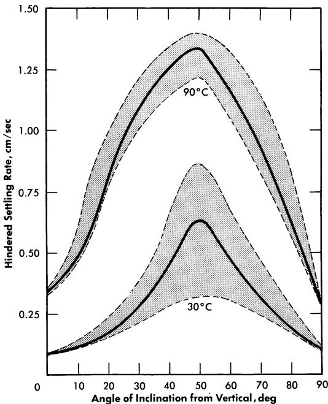  
FIG. 4-20. Effect of angle of container inclination on $\mathrm{ThO_2}$ slurry hindered settling rate. Slurry concentration $300\mathrm{g}$ Th/kg $\mathrm{H}_2\mathrm{O}$ , container diameter 1.63 in.

slurry yield stress, slurry concentration, and container diameter, the particular relation being

$$
D = (0. 0 7 \pm 0. 0 2) k _ {3} \frac {\phi_ {c} ^ {2}}{1 - (1 - \phi_ {c}) ^ {3 . 6 5}}, \tag {4-19}
$$

where the concentration term, $\phi_{c}$ , is the value for the onset of compaction. Settling-rate data obtained [122] in inclined tubes showed a maximum at an angle of about $50^{\circ}$ from the vertical, with typical results being given in Fig. 4-20. The spread in the data is largely due to the difficulty in discerning an interface due to supernate rushing upward as the thoria settles out.

4-4.5 Heat transfer. Grigull [131] has presented a theoretical treatment of heat transfer to pseudoplastic and Bingham plastic non-Newtonian fluids for laminar flow through tubes. Theoretical treatments of laminar heat transfer to pseudoplastic materials have been given for a variety of boundary conditions [132-134]. Pigford [135] has shown that, for Bingham plastics, the laminar isothermal coefficient should increase less rapidly than the 1/3 power of the mass flow rate and the magnitude of these

coefficients should be increased by the factor $[1 + (1/9)(\tau_w / \tau_y)]$ , approximately. Bailey [136] substituted Eqs. (4-13) and (4-14) into Eq. (4-6) to obtain an approximate expression for the velocity gradient and then substituted that expression into Leveque's solution [137] for the case of constant wall temperature and uniform fluid temperature at the entrance to the tube, to obtain:

$$
\frac {h D}{k} = 1. 6 1 5 \left(\frac {V \rho_ {c} D ^ {2}}{k L}\right) ^ {1 / 3} \left(1 + \frac {g \tau_ {y} D}{2 4 \eta V}\right) ^ {1 / 3}. \tag {4-20}
$$

Experimental data [106] are in substantial agreement with Eq. (4-20).

The principal uncertainty in non-Newtonian heat transfer in the transition and turbulent region is the criterion for the onset of turbulence and range of the transition region. Data taken in fully developed turbulent flow with a variety of solid-liquid suspensions may be correlated satisfactorily with the Dittus-Boelter equation (or variations of it), with some uncertainty about the best viscosity to use in the correlation [138-142].

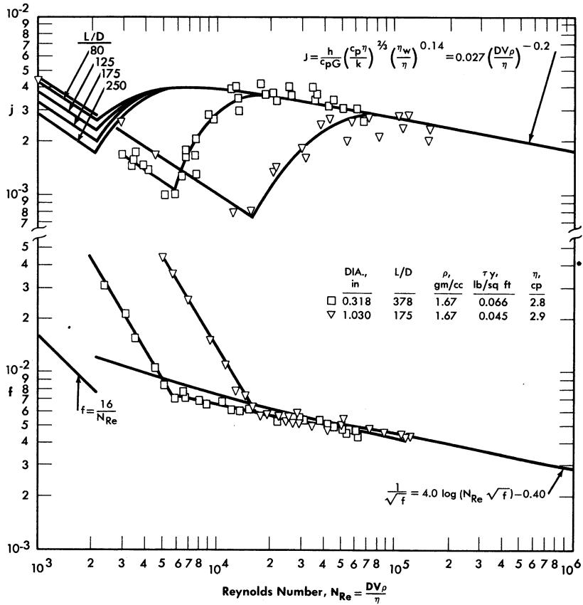  
FIG. 4-21. Heat-transfer and fluid flow characteristics of $\mathrm{ThO_2}$ slurries.

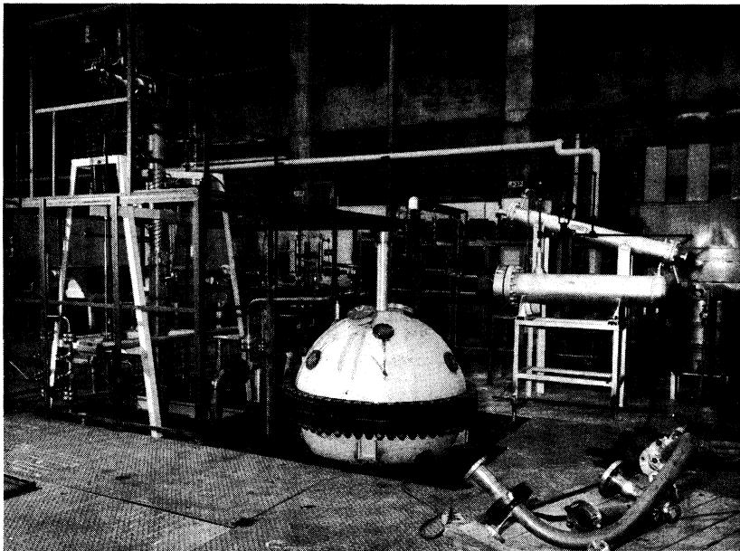  
FIG. 4-22. Slurry blanket mockup.

Figure 4-21 gives experimental data [106] for heat transfer to the $\mathrm{ThO_2}$ slurry with which the pressure-drop measurements of Fig. 4-19 were made. Comparison of the heat-transfer and pressure-drop data shows that although the onset of turbulence in heat transfer occurs at Reynolds numbers greater than the 2100 expected for Newtonian fluids, it corresponds exactly with the experimental critical Reynolds number for the onset of turbulence obtained from the pressure-drop measurement (which can be predicted approximately by the Hedstrom criterion). The transition region then extends to Reynolds numbers a factor of four or five greater than the critical, as is the case with Newtonian materials. Heat transfer to $\mathrm{ThO_2}$ slurries in fully developed turbulent flow is the same as that predicted by the usual Newtonian correlations [143] to within the precision of the experimental data. The very interesting question as to whether a suspension has more desirable heat-transfer characteristics than a pure liquid, as indicated by the results of Orr and DallaValle [139], or whether the yield stress of a Bingham plastic decreases the heat transfer coefficient, as suggested by Lawson [142], remains unanswered by these results [106] on $\mathrm{ThO_2}$ slurries.

# 4-5. OPERATING EXPERIENCE WITH THE HRE-2 SLURRY BLANKET TEST FACILITY*

4-5.1 Introduction. The purpose of constructing the HRE-2 slurry blanket test facility was to determine whether the blanket system installed in the HRE-2 for use with solutions could be used with slurry and, if so, what modifications would be required. The facility, often referred to as the blanket mockup, was a full-scale replica of the HRT blanket circulating system with respect to the reactor-vessel dimensions, piping size, circulating pump, and heat-exchanger tubing size. The pressurizer and piping configurations were not the same, and the high-pressure heat exchanger contained only one-fifth as many tubes as the HRE-2 heat exchanger. A general view during the last stages of constructions [144] is shown in Fig. 4-22.

The system was divided into a high-pressure and a low-pressure section, since the reactor vessel available was a steel prototype, good for only a few hundred psi, and could not be used during circulation and heat-transfer tests at high pressure. A schematic drawing [145] of the slurry blanket mockup system is given in Fig. 4-23. The slurry stream entered the 60-in.-diameter mockup pressure vessel (which contained a stainless steel replica of the HRE-2 core) through two inlet nozzles arranged to direct the flow in opposite directions on either side of the core inlet, with the expectation [146,147] that the flow pattern in the blanket would consist of two vortices which would rotate in opposite directions in parallel vertical planes, thus preventing deposition of sediment on the bottom of the pressure vessel. The slurry was removed at the top of the vessel by putting a shroud around the core outlet and removing the fluid through this shroud. It was also expected [146,147] that as the slurry moved across the top of the core vessel to the shrouded outlet, the rotating motion produced by the inlet nozzles would set up a free vortex in a horizontal plane, the accompanying increase in angular velocity of the fluid as it moved toward the axis tending to sweep the top of the core vessel free of solids. The design of the inlet and outlet nozzles was based on successful tests with an 18-in. model of the vessel [146]. Slurry leaving the pressure vessel flowed to the circulating pump, a Westinghouse type 230A canned-motor pump having a design point of $230\mathrm{gpm}$ at 50-ft head and a working pressure of 2000 psi which produced a pipeline velocity of 10 ft/sec at its nominal capacity. From the pump, the slurry stream entered the pressurizer, a 6-in. schedule-160 vertical pipe, with an over-all height of 14 ft 0 in. above the inlet. Entering flow was directed down and out of the pressurizer with a reducing tee, and

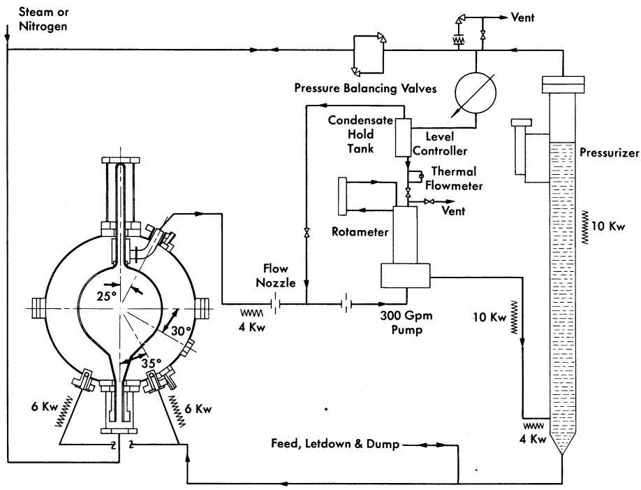  
FIG. 4-23. Slurry blanket test system.

baffles were installed above the inlet to damp out any vortices. System pressure was maintained by a 10-kw heater located just below the liquid line on the top of the pressurizer. Slurry flowed to the bottom of the mockup pressure vessel from the pressurizer. The main loop auxiliaries consisted of a slurry feed system and a letdown and dump system, which provided system versatility during startup and shutdown. A detailed description of the system is given in reference [145].

4-5.2 Operation of blanket pressure vessel mockup system. Initial experiments [145] in the 60-in.-diameter vessel (duplicating the HRE-2) at 170 and $200^{\circ}\mathrm{C}$ showed that a scale-up based on maintaining equal superficial vertical velocity at the equator and equal inlet nozzle velocities was inadequate to maintain a uniform suspension. At $170^{\circ}\mathrm{C}$ , a sharp concentration gradient was found, and above $180^{\circ}\mathrm{C}$ most of the slurry charge remained essentially stagnant in the blanket, with quite dilute slurry circulating through the piping loop. The increase in settling rate with temperature is believed to account for the effect of temperature on slurry distribution.

As a result of the initial tests the following changes were made in the mockup system [148,149]:

(1) The circulating pump was reassembled with a 300-gpm stainless-steel impeller.   
(2) The blanket inlet nozzles were redesigned, with the nozzle diameter being reduced from 2.16 in. to 1.50 in.   
(3) A steam sparging system was installed just above the inlet nozzles to aid in maintaining the slurry in suspension during a dump.

Although these changes are relatively minor in nature, they resulted in significant improvement in blanket operation [150]. Hydraulic measurements with water showed that the loop flow was increased from 230 to $350\mathrm{~gpm}$ , the head developed was increased from 50 to 56 ft of fluid, the pressure drop through the blanket went from 7.3 to 33 ft of fluid, and the loss across the blanket inlet nozzles went from 5.5 to 25 ft of fluid. During system operation at $200^{\circ}\mathrm{C}$ with a slurry made from $\mathrm{ThO_2}$ calcined at $800^{\circ}\mathrm{C}$ , samples were withdrawn from 36 different locations in the blanket vessel. The mean value of the concentration was $610\mathrm{~g~}\mathrm{Th/kg~H_2O}$ with a deviation at the $95\%$ level of $75\mathrm{~g~}\mathrm{Th/kg~H_2O}$ . The average concentration of the loop circulating stream was $647\mathrm{~g~}\mathrm{Th/kg~H_2O}$ , and an average blanket vessel concentration of $655\mathrm{~g~}\mathrm{Th/kg~H_2O}$ was obtained from a gamma-ray transmission scan of the vessel. Only about $40\mathrm{~kg}$ (out of a total charge of $1000\mathrm{~kg}$ ) was unaccounted for by inventory on the system at this time. This material appeared to be more or less stagnant in the blanket region on top of the core vessel and at the bottom of the pressure vessel. The evidence for this was as follows:

(1) The blanket samples indicated high-concentration regions on the top of the core vessel and on the bottom wall of the pressure vessel.   
(2) Gamma-ray transmission scans of the blanket vessel indicated the highest concentration at the top of the core vessel.   
(3) Addition of uranium tracer to the circulating stream indicated that 10 to $15\mathrm{kg}$ of $\mathrm{ThO_2}$ was immobilized in the blanket and was only slowly mixing with the circulating stream; this was supported by examination of the slurry remaining in the system at the conclusion of the test, when a pure white layer containing no uranium was found to be partially covered over with a yellow layer containing a substantial quantity of uranium, both layers being found on the top of the core vessel.

During this operation at a flow rate of $350\mathrm{gpm}$ the temperature of the system was raised and lowered at will between 150 and $200^{\circ}\mathrm{C}$ with no significant change in circulating concentration. That this marked improvement in operating characteristics over the initial tests was due to the small system changes and not due to a change in slurry properties was indicated by the results from operation with the electrical frequency of the pump motor reduced from the normal 60 cycles to a value giving pump flow

characteristics similar to those in the initial tests. Reduction of the frequency to 42 cycles with a blanket temperature of $190^{\circ}\mathrm{C}$ gave a circulating concentration of 265 versus $625\mathrm{gTh / kgH_2O}$ charged. The blanket samples averaged $495\mathrm{gTh / kgH_2O}$ . These results are quite similar to those observed in the initial tests.

Operation of the steam sparging system during the dumping operation at the end of the run allowed recovery of all but 50 liters of the slurry from the blanket (total blanket volume, 1600 liters), compared with about 200 liters remaining at the end of the dump after the initial tests.

During operation with redesigned inlet nozzles, a number of experiments were run in which the pump was shut down for periods up to $3\mathrm{hr}$ . In every case the slurry settled rapidly to a concentration of approximately $800\mathrm{g}$ Th/liter and then gradually compacted to a concentration of approximately $1500\mathrm{g}$ Th/liter. On restarting the pump, no difficulty was experienced in resuspending the slurry, and the original slurry distribution was re-established in approximately $2\mathrm{min}$ . This proved to be one advantage of operating with a highly flocculated $\mathrm{ThO}_2$ slurry compared with operation with a deflocculated slurry that would settle to much more dense beds that are correspondingly more difficult to resuspend.

Among the problems that have been more clearly defined as a result of the tests on the blanket mockup are:

(1) The necessity of establishing the effect of settling rate on the slurry distribution.   
(2) Determination of the scale-up laws for applying small- or intermediate-scale results to full-scale systems.   
(3) Evaluation of the danger of possible boiling at the core wall due to high heat flux and low fluid velocities.

# 4-6. RADIATION STABILITY OF THORIUM OXIDE SLURRIES*

4-6.1 Introduction. Experiments have been carried out at the Oak Ridge National Laboratory as part of a continuing program to determine the effect of radiation on the physical properties of aqueous suspensions of thorium oxide. Since changes in particle size, surface properties, and viscosity of the suspension might have a deleterious effect on the operability of a homogeneous-reactor slurry system, these properties were examined in detail.

Suspensions of thorium oxide and thorium oxide containing 0.5 mole % of either natural or highly enriched $\mathrm{UO}_3$ were irradiated in the Low Intensity Test Reactor (LITR) at a thermal-neutron flux of $2.7 \times 10^{13}$ neutrons/( $\mathrm{cm}^2$ ) (sec). Although more than 40 irradiations were carried out, no significant changes in the properties studied were noted [151].

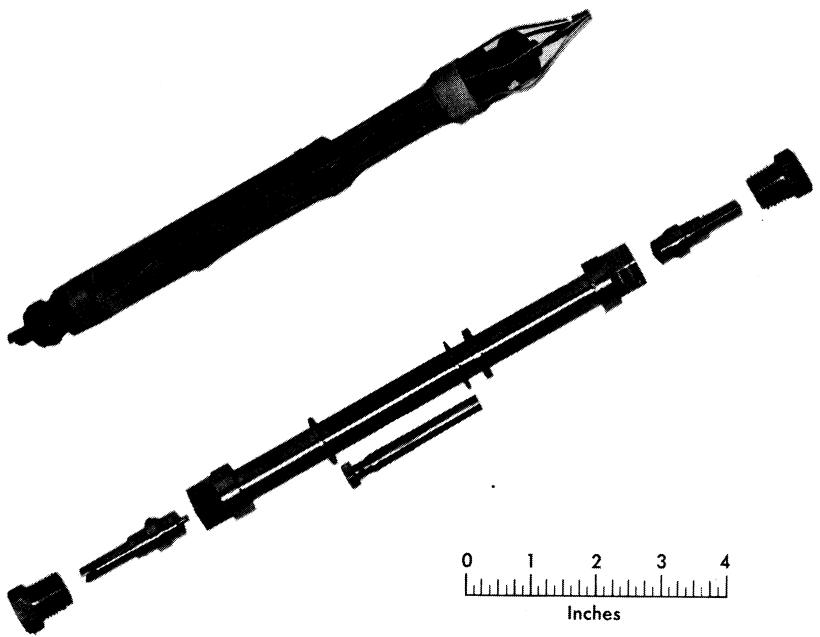  
FIG. 4-24. Parts and assembly of in-pile autoclave for slurry irradiations.

4-6.2 Experimental technique. The experiments were carried out in small, cylindrical, stainless steel autoclaves such as shown in Fig. 4-24. Thermocouples welded into the bottom closure and a 20-mil-ID steel capillary in the top permitted a continuous measurement of temperature and pressure. Continuous stirring was accomplished by means of a dashpot type stirrer of Armco iron clad with stainless steel, with a stainless steel stirring head. The capacity of the autoclave with stirrer was approximately $14\mathrm{ml}$ .

The stirrer was made to reciprocate at 3 to 4 cycles/sec by alternately energizing two solenoid coils of double glass-insulated aluminum wire wrapped around the autoclave body. The timing unit consisted of a multivibrator circuit whose frequency of oscillation and cycle time division could be controlled by varying resistances in the circuit. The timer unit, in turn, controlled the grids of two pairs of thyatronns which furnished power to the solenoids. Stirrer operation was monitored by a tickler coil connected to an oscilloscope.

The radiation facility consisted of a double-walled aluminum tube $\sim 7/8$ in. in inside diameter which extended from the top of the LITR through approximately 20 ft of water into the reactor core. The autoclave was lowered into this tube on a bundle of wires containing the electrical leads,

thermocouples, and pressure capillary. During reactor shutdown the autoclaves were maintained at $300^{\circ}\mathrm{C}$ by the heat generated by the stirring coils. Heat was removed during reactor operation by air which flowed down the tube, over the autoclave, and back through the annulus provided by the double-walled tube.

The uranium-bearing oxides were prepared by wet-autoclaving mixtures of $\mathrm{ThO_2}$ and $\mathrm{UO_3}$ (about $90\%$ enriched uranium) at $300^{\circ}\mathrm{C}$ or by coprecipitating thorium and uranous oxalates and calcining to the oxide. The autoclaves were loaded with $5\mathrm{ml}$ of slurry at room temperature, which expanded to fill half of the autoclave at $300^{\circ}\mathrm{C}$ . When uranium-bearing slurries were irradiated, either palladium oxide or molybdenum oxide was added to catalyze the recombination of radiolytic hydrogen and oxygen (see Section 4-7). In some experiments an oxygen overpressure of 200 to 250 psi was added at room temperature.

Viscosity measurement. The versatility of the timing device described above made possible the measurement of relative slurry viscosity both in-pile and out-of-pile. It was found that the time it takes the stirrer to reach its maximum height for a fixed solenoid current is dependent on the viscosity of the autoclave contents. The "rise time" was determined by adjusting the frequency and load division so that the upper solenoid was de-energized the instant the oscilloscope indicated that the stirrer had reached the top of its travel. The rise time in seconds was then obtained by dividing the load division by the frequency.

Calibration curves of rise time versus viscosity were made using a silicone oil of known viscosity at various temperatures. Low viscosity points were obtained using water and air.

4-6.3 Irradiation results. Viscosities, x-ray crystallite sizes, particle size, and settled concentrations appeared unaffected by the irradiation, as indicated by the data shown in Table 4-13. Measurements made on irradiated and nonirradiated materials were the same within the limits of error. The mean particle sizes were in general not changed significantly; however, in two cases, involving samples cooled for 10 and 11 months, a large increase in mean particle size was observed. It is possible that the long cooling period allowed hard agglomerates to form which were not broken up by the brief shaking prior to opening of the autoclaves. One experiment cooled 12 months did not show an agglomeration effect. In general, the irradiated slurries poured readily from the autoclave, and no tendency toward caking was observed even on samples irradiated in settled condition for 10 days.

Chemical and radiochemical analyses of both phases of the irradiated slurries showed the bulk of the fission products, protactinium, and uranium to be associated with the solids. Only cesium appeared in the supernatant

Conditions: $300^{\circ}\mathrm{C}$ , $2.7 \times 10^{13}$ neutrons/( $\mathrm{cm}^2$ ) (sec)

TABLE 4-13   
EFFECT OF RADIATION ON THE PROPERTIES OF THORIUM OXIDE SLURRIES  

<table><tr><td>Property</td><td>ThO2</td><td>ThO2+0.5% nat. UO3(a)</td><td>ThO2+0.5% U235O3(b)</td></tr><tr><td>Precipitation temp., °C</td><td>40</td><td>40</td><td>10</td></tr><tr><td>Calcination temp., °C</td><td>900</td><td>900</td><td>900</td></tr><tr><td>Radiation time, hr.</td><td>175-300</td><td>151-172</td><td>168-314</td></tr><tr><td>Slurry concentration, g Th/kg H2O</td><td>750</td><td>750</td><td>750</td></tr><tr><td>Viscosity, centistokes</td><td></td><td></td><td></td></tr><tr><td>Control</td><td>16</td><td>—</td><td>4-7</td></tr><tr><td>During irradiation</td><td>16</td><td>—</td><td>5</td></tr><tr><td>X-ray crystallite size, A</td><td></td><td></td><td></td></tr><tr><td>Original</td><td>350-464</td><td>350</td><td>—</td></tr><tr><td>Irradiated</td><td>315-540</td><td>295-350</td><td>—</td></tr><tr><td>Settled conc., g Th/liter</td><td></td><td></td><td></td></tr><tr><td>Control</td><td>1100</td><td>1500</td><td>1400</td></tr><tr><td>Irradiated</td><td>1400</td><td>1600-1700</td><td>1400-1500</td></tr><tr><td>Mean particle size, microns(c)</td><td></td><td></td><td></td></tr><tr><td>Control</td><td>1-2</td><td>2.8</td><td>2.1-2.3</td></tr><tr><td>Irradiated and cooled up to 6 months</td><td>1-1.8</td><td>1.1-314</td><td>1.8</td></tr><tr><td>Irradiated and cooled 10-12 months</td><td>—</td><td>—</td><td>15(d)</td></tr></table>

(a) $650^{\circ}\mathrm{C}$ -fired $\mathrm{ThO_2}$ wet-autoclaved at $300^{\circ}\mathrm{C}$ with $\mathrm{UO_3} \cdot \mathrm{H_2O}$ ; mixtures refired at $900^{\circ}\mathrm{C}$ .   
(b) Prepared as in (a) and also by thermal decomposition of the coprecipitated thorium-uranous oxalates.   
(c) Measured by sedimentation in dilute suspension dispersed with 0.005 $M$ $\mathrm{Na}_4\mathrm{P}_2\mathrm{O}_7$ .   
(d) The result in two experiments; a third test showed no change in average particle size.

in significant amounts. Strontium appeared to absorb less on the higher-fired materials. The ruthenium analyses were inconsistent, the probable result of the perchloric acid dissolution treatment used.

Total corrosion-product pickup was similar to that obtained in out-of-pile experiments except with the slurries containing sulfate, which showed higher corrosion-product pickup under irradiation. All of the iron and most of the nickel and chromium were associated with the slurry solids. The greater part of the corrosion-product pickup resulted from abrasive attack by the slurry solids under the action of the stirrer.

# 4-7. CATALYTIC RECOMBINATION OF RADIOLYTIC GASES IN AQUEOUS THORIUM OXIDE SLURRIES*

4-7.1 Introduction. Radiolytic decomposition of the aqueous phase of a thorium oxide slurry blanket will produce a stoichiometric mixture of deuterium and oxygen which must be recombined. Total recombination may be accomplished external to the blanket system by suitable methods. It would be advantageous, however, to recombine the gases internally to minimize both reactor control problems accompanying bubble formation and engineering problems associated with external recombination. The magnitude of the internal-recombination reaction desired may be judged from the estimate that an aqueous thorium oxide-uranium slurry breeding blanket may produce from 2 to 3 moles of $\mathrm{H}_{2}$ and 1 to 1.5 moles of $\mathrm{O}_{2}$ per hour per liter of slurry by radiolytic decomposition, assuming a $G$ -value of $1\dagger$ and an average blanket flux of $6\times 10^{13}$ neutrons/( $\mathrm{cm}^2$ ) $(\mathrm{sec})$ . This is within a factor of 2 of the decomposition one would expect for a solution at the same power density.

Work on the development of a catalyst for use in thorium oxide slurries to recombine the radiolytic gases has been carried out as a part of the Homogeneous Reactor Project at the Oak Ridge National Laboratory [152]. More recently, Westinghouse (Pennsylvania Advanced Reactor Project) undertook similar studies. The experimental approach at both laboratories has been similar, and the results are in reasonable agreement. While sufficient data have been obtained to assure that a catalyst can be used in both thorium and thorium-uranium oxide slurries for complete internal radiolytic-gas recombination, specific conditions for the most efficient catalyst preparation and use have not as yet been established.

4-7.2 Experimental techniques and method of analysis. The out-of-pile tests were carried out in $\sim 15\mathrm{-ml}$ stainless-steel autoclaves provided with a thermocouple well and a capillary pressure connection through the top closure. The autoclaves were approximately half filled with the slurry containing an appropriate catalyst, closed, and charged with 550 psi oxygen and then 900 psi hydrogen from regular high-pressure cylinders. To minimize corrosive attack at temperature, the oxygen charged was in excess of the stoichiometric $1:2$ ratio to hydrogen. The autoclaves were raised to temperature in an appropriate furnace, mechanically agitated, and the decrease in pressure with time was followed continuously by appropriate instrumentation.

For a stoichiometric mixture of hydrogen and oxygen, the rate of pressure decrease was proportional to the total gas pressure in excess of a certain minimum pressure (i.e., steam and inert gases). A plot of pressure data in the differential form, $\Delta P / \Delta t$ versus $P$ , resulted in a straight line, the slope of which, $k_{\pi}$ , was a measure of the experimentally observed first-order reaction rate.

While the experimental data are insufficient to establish firmly that the reaction rate is first order, it is convenient to present the data in this form and assume a first-order dependence on hydrogen partial pressure:\*

$$
\frac {d P _ {\mathrm {H} _ {2}}}{d t} = k _ {\pi} P _ {\mathrm {H} _ {2}},
$$

where $P_{\mathrm{H_2}}$ is the hydrogen partial pressure, $t$ the time in hours, and $k_{\pi}$ the observed reaction rate constant $(\mathrm{hr}^{-1})$ . The moles of $\mathbf{H}_2$ reacted per hour per liter of slurry, $dn/dt$ , for any given hydrogen partial pressure may be calculated, assuming the ideal gas law, from

$$
\frac {d n}{d t} = \frac {k _ {\pi} P _ {\mathrm {H} 2}}{R T} \frac {V _ {g}}{V _ {s}},
$$

where $V_{g}$ and $V_{s}$ are the gas and slurry volumes and $R$ and $T$ are the gas constant and absolute temperature. The recombination rates calculated in this way are conservative in that only the hydrogen removed from the gas phase is taken into account, and dissolved and adsorbed gases are ignored. The method of analysis is convenient, however, and permits the evaluation of the relative activity of the various slurry and catalyst systems.

The results of the out-of-pile tests were evaluated on the ability to attain a reaction rate equivalent to the consumption of 2 moles of $\mathrm{H}_{2}$ per hour per liter of slurry at $280^{\circ}\mathrm{C}$ and a hydrogen partial pressure of 100 psi.

4-7.3 Catalytic activity of thorium and thorium-uranium oxide slurries. Experiments with several different samples of $\mathrm{ThO_2}$ alone showed that none of the aqueous slurries prepared with the pure oxide possessed the desired degree of catalytic activity for the stoichiometric gas mixture. Reaction rates in the region of $300^{\circ}\mathrm{C}$ were equivalent to less than 0.1 mole of $\mathrm{H}_2$ consumed per hour per liter of slurry at a partial pressure of 100 psi $\mathrm{H}_{2}$ . The higher reaction rates appeared to be associated with the slurries prepared with oxides having higher surface areas.

A small catalytic effect for the stoichiometric gas reaction was obtained by incorporating uranium in the aqueous $\mathrm{ThO_2}$ slurries; however, the reaction rates remained much too slow to be useful. These tests were carried out with aqueous slurries of simple oxide mixtures, as well as with a mixed oxide prepared by calcining the coprecipitated thorium-uranous oxalates. Heating the slurry of the latter preparation under a small hydrogen partial pressure at $280^{\circ}\mathrm{C}$ produced a marked but temporary increase in catalytic activity which progressively diminished as further gas-recombination experiments were carried out at higher temperatures [that is, $dn/dt$ (at $P_{\mathrm{H_2}} = 100\mathrm{psi}) = 1.42$ at $137^{\circ}\mathrm{C}$ ; 0.65 at $154^{\circ}\mathrm{C}$ ; 0.08 at $282^{\circ}\mathrm{C}]$ .

4-7.4 Survey of possible catalysts. The primary criterion, other than a satisfactory catalytic activity, for a catalyst to be used in an aqueous thorium oxide slurry blanket is that it have a low thermal-neutron absorption cross section. A convenient estimate of the allowable concentration is provided by the rule that the total cross section of elements other than thorium which are in the blanket slurry should be less than $10\%$ of that of the thorium itself.

On this basis, scouting experiments were carried out with copper sulfate, copper chromite, copper oxide, copper and nickel powders, silver carbonate (reduces to metal at elevated temperature), vanadium oxide, ceric oxide, palladium oxide, and molybdenum oxide. Of these only the silver, vanadium, palladium, and molybdenum oxide showed sufficient activity at reasonable concentrations. Silver and vanadium were rejected because of their higher thermal-neutron cross section; palladium appeared susceptible to poisoning, particularly at lower temperatures, $< 120^{\circ}\mathrm{C}$ , and subsequent development effort was concentrated on molybdenum oxide.

The preliminary catalyst evaluation was carried out with slurries of thorium oxide fired at $900^{\circ}\mathrm{C}$ . Subsequent experience with molybdenum oxide has indicated that it is inactive with low-fired oxides, and its activity at least at low concentrations is decreased by the presence of uranium oxide (see the following discussion). Hence in slurry systems using low-fired thorium oxide or thorium-uranium oxides, silver, palladium, and platinum, which are active in these slurries, may prove to be useful [154].

4-7.5 Molybdenum oxide as a catalyst. The molybdenum oxide catalyst used in the initial scouting studies of its catalytic activity was prepared by calcining ammonium paramolybdate at $480^{\circ}\mathrm{C}$ for 16 hr. It was added to the slurry by dry-mixing $900^{\circ}\mathrm{C}$ -fired $\mathrm{ThO}_2$ , $\mathrm{UO}_3 \cdot \mathrm{H}_2\mathrm{O}$ , and the $\mathrm{MoO}_3$ and then slurrying the mixture in water. Prior to its use in recombination experiments, the slurry was heated under $\mathrm{O}_2$ at $280^{\circ}\mathrm{C}$ . Recombination data obtained with slurries prepared in this way indicated that reaction rates in the range of 1 to 6 moles of $\mathrm{H}_2$ per hour per liter were obtained in slurries which were heated for 1 hr at $280^{\circ}\mathrm{C}$ with hydrogen at as low a concentration as $0.025\,m\,MoO_3$ . Lower reaction rates (0.03 to 1.8 moles of $\mathrm{H}_2$ per hour per liter) were measured for slurries not treated with $\mathrm{H}_2$ .

It was found that the catalytic activities of the activated slurries were independent of the method used to prepare $\mathrm{MoO_3}$ . Also, experiments with $\mathrm{MoO_2}$ indicated that it was not stable under the experimental conditions and that this form of the oxide is not the very active catalytic species produced when the slurries were heated with $\mathrm{H}_{2}$ .

The addition of sulfate up to $10,000\mathrm{ppmSO_4}^{\mathrm{=}}$ (based on thorium) did not appear to impair the catalytic activity of the above slurry containing $0.05m\mathrm{MoO}_3$ . Corrosion products resulting from the attack on the reaction vessel at the highest sulfate concentration greatly decreased the recombination rate. Similar slurries to which a ferric oxychloride sol (1500 to $1600\mathrm{ppmFe / Th}$ ) was added showed decreased catalytic activities (approximately one-tenth the iron-free rate), but reducing the iron by treatment with hydrogen gave catalytic activities equal to or greater than those of the iron-free systems. The addition of $634\mathrm{ppm}$ rare-earth oxides (based on $\mathrm{Th})^{*}$ had no effect on the catalytic activity.

Subsequent experiments indicated that in slurries of mixed thorium-uranium oxides, the order of addition of the slurry solids, the method of incorporating the uranium, and particularly the oxide firing temperature and time were important. It was necessary in some cases to fire mixed oxides containing 0.5 mole $\%$ uranium as high as $1000^{\circ}\mathrm{C}$ for as long as 16 hr to give an active slurry with the molybdenum oxide. Lower firing temperatures or a shorter firing time at $1000^{\circ}\mathrm{C}$ did not give an active slurry.

Oxides fired above $1000^{\circ}\mathrm{C}$ (4 hr at 1200 or $1600^{\circ}\mathrm{C}$ ) gave very active slurries. Table 4-14 gives the data obtained with slurries of simple mixtures of $1600^{\circ}\mathrm{C}$ -fired thorium oxide and $\mathrm{UO}_3\cdot \mathrm{H}_2\mathrm{O}$ and with a $1600^{\circ}\mathrm{C}$ -fired mixed oxide prepared from the coprecipitated oxalates. Both preparations gave excellent combination results at $0.05m\mathrm{MoO}_3$ both before and

TABLE 4-14 REACTION RATES OF STOICHOMETRIC $\mathbf{H}_2\text{-}\mathbf{O}_2$ MIXTURES IN THORIUM OXIDE-URANIUM OXIDE SLURRIES  

<table><tr><td rowspan="2">Oxide used for makeup of 500 g Th/kg H2O slurry</td><td colspan="2">Reaction rate, moles H2/hr (liter)*</td></tr><tr><td>Slurry as prepared</td><td>H2-activated slurry†</td></tr><tr><td colspan="3">Reaction temperature, 250°C</td></tr><tr><td>10°C coprecipitated oxalates (U/Th=0.005) calcined at 1600°C for 24 hr</td><td>0.2</td><td>0.2</td></tr><tr><td>MoO3 additions, m:</td><td></td><td></td></tr><tr><td>0.012</td><td>6.86</td><td>11.0</td></tr><tr><td>0.024</td><td>6.40</td><td>11.0</td></tr><tr><td>0.036</td><td>11.5</td><td>18.1</td></tr><tr><td>0.048</td><td>15.3</td><td>17.1</td></tr><tr><td>0.06</td><td>15.2</td><td>15.0</td></tr><tr><td colspan="3">Reaction temperature, 291°C</td></tr><tr><td>ThO2 calcined at 1600°C for 4 hr</td><td>0.02</td><td>0.02</td></tr><tr><td>0.5 mole % U added as UO3·H2O</td><td>0.02</td><td>0.40</td></tr><tr><td>MoO3 additions, m:</td><td></td><td></td></tr><tr><td>0.012</td><td>0.08</td><td>0.05</td></tr><tr><td>0.024</td><td>0.10</td><td>0.05</td></tr><tr><td>0.036</td><td>0.24</td><td>0.62</td></tr><tr><td>0.048</td><td>1.04</td><td>3.46</td></tr><tr><td>0.06</td><td>2.53</td><td>4.16</td></tr></table>

*At 100 psi partial pressure of hydrogen.   
†Slurry heated with hydrogen (250 psi at $25^{\circ}\mathrm{C}$ ) for 2 hr at $270^{\circ}\mathrm{C}$ .

after treatment with $\mathbf{H}_2$ , but at low molybdate concentrations the simple mixture showed lower activity. Apparent over-all activation energies of 13 to $16\mathrm{kcal / mole}$ were calculated for the hydrogen-treated slurries containing $0.05m\mathrm{MoO_3}$ from an Arrhenius plot of the observed reaction rate constants.

Investigations of $\mathrm{MoO_3}$ chemistry by the Houdry Process Corporation [156] (for the PAR Project) have shown that $\mathrm{MoO_3}$ reacts in high-temperature water with $650^{\circ}\mathrm{C}$ -fired thorium oxide and uranium oxide. The failure of some lower-fired material and thorium-uranium mixtures

to give active slurries may be the result of chemical reaction of the molybdenum oxide to form catalytically inactive species.

4-7.6 In-pile studies.* Radiolytic-gas production and recombination rates were determined in the ORNL Graphite Reactor using a slurry of $\mathrm{ThO_2}$ containing approximately $2.8\%$ uranium which was approximately $93\%$ enriched in $\mathbf{U}^{235}$ . The mixed oxide was prepared by coprecipitation of thorium and uranous oxalates at $10^{\circ}\mathrm{C}$ followed by calcination at $650^{\circ}\mathrm{C}$ .

Gas production rates were calculated from the initial pressure rise observed in the autoclave at low temperatures, where the reverse reaction rate could be neglected. The measured production rates were $1.6 \times 10^{-4}$ , $3.3 \times 10^{-4}$ , and $4.9 \times 10^{-4}$ moles of $\mathrm{H}_{2}$ per hour, respectively, for slurry concentrations of 250, 500, and $750\mathrm{g}$ $\mathrm{Th/kgH_2O}$ . The $G$ -value for water decomposition, assuming an average neutron flux of $4.2 \times 10^{11}$ neutrons $/(\mathrm{cm}^2)(\mathrm{sec})$ , an energy deposition in the slurry of 170 Mev/fission, and a fission cross section of 580 barns, was 0.8 molecule per 100 ev.

Gas recombination rates were measured by determining the equilibrium pressures in excess of steam for various temperatures (Fig. 4-25). Table 4-15 lists rate constants, $k_{\pi}$ ( $\mathrm{hr}^{-1}$ ), calculated from the equilibrium pressures and gas production rates, assuming first-order dependence, and making the necessary corrections for volume changes with temperature. From an Arrhenius plot an apparent activation energy of 16.2 kcal/mole was obtained. There is some evidence which indicates that the action of the stirrer increases the reaction rate either by forming catalytically active corrosion products or by providing reactive steel surfaces.

TABLE 4-15 GAS RECOMBINATION RATE CONSTANTS FROM EQUILIBRIUM PRESSURES IN AN IRRADIATED THORIUM-URANIUM OXIDE SLURRY   

<table><tr><td>Temperature, °C</td><td>kπ, hr-1</td></tr><tr><td>282</td><td>0.45</td></tr><tr><td>275</td><td>0.26</td></tr><tr><td>250</td><td>0.15</td></tr><tr><td>235</td><td>0.10</td></tr><tr><td>200</td><td>0.03</td></tr></table>

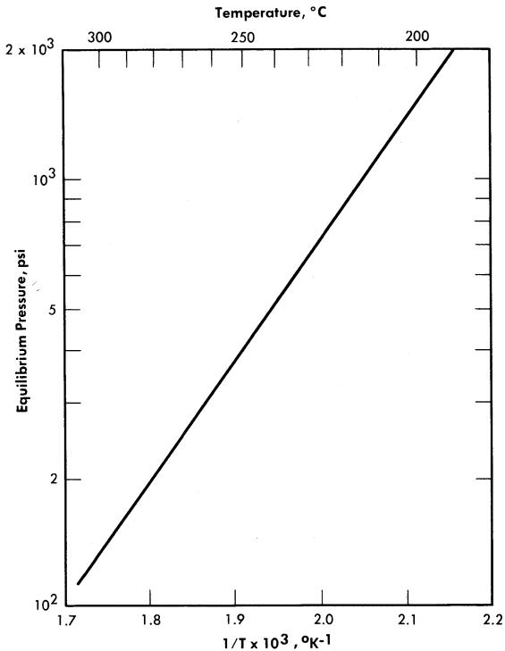  
FIG. 4-25. Equilibrium radiolytic gas pressure, excluding steam pressure, in irradiated thorium oxide slurries.

In all the slurry stability tests in the Low Intensity Test Reactor (see Section 4-6) where enriched uranium was present, sufficient catalyst was added to prevent any net radiolytic-gas production. Both $\mathrm{PdO}$ and $\mathrm{MoO_3}$ were used for this purpose. No radiolytic gas ( $<25$ psi) in excess of steam pressure was observed in these experiments. In the tests where only $\mathrm{ThO_2}$ was used, no catalyst was necessary.

In an LITR experiment [157] carried out with a $1000 \, \text{g} \, \text{Th/kg} \, \text{H}_2\text{O}$ slurry of $1300^{\circ}\text{C}$ -fired thorium-uranium oxide $(\mathrm{U}^{235} / \mathrm{Th} = 0.005)$ , sufficient catalyst $(0.02 \, \text{mMoO}_3)$ was added to give a small partial pressure of radiolytic gas. A $G$ -value (calculated as above) for gas production of 0.6 molecule of $\text{H}_2$ per 100 ev was obtained. From the equilibrium gas pressures at 250 and $280^{\circ}\text{C}$ , first-order rate constants for gas recombination of 4.98 and $7.14 \, \text{hr}^{-1}$ were calculated. These values compare well with rate constants of 4.95 and $8.75 \, \text{hr}^{-1}$ obtained in out-of-pile gas-recombination experiments made with a similar slurry of the same oxide at the indicated temperatures.

# BIBLIOGRAPHY

# Thorium and Thorium Oxide

Thorium, A Bibliography of Unclassified Report Literature, USAEC Report TID-3309, Technical Information Service Extension, AEC, October 1956.   
DAVID, LORE S. (Comp.), Thorium, A Bibliography of Unclassified Literature, USAEC Report TID-3044, Technical Information Service Extension, AEC, November 1953.   
PRATER, W. D. et al. (Comps.), Thorium, A Bibliography of Published Literature, ed. by R. A. Allen, USAEC Report TID-3044 (Suppl. 1), Mound Laboratory, June 1955.   
SACHS, FRANCES (Comp.), Literature Search on Selected Properties of Thorium Oxide, USAEC Report AECD-3423, Union Carbide Nuclear Co., 1952.   
SWEETON, F. H. (Comp.), Thorium Oxide, Literature Survey of Preparation and Properties of, USAEC Report CF-55-8-11, Oak Ridge National Laboratory, 1955.

# Thorium and Thorium-Oxide Chemistry

RODDEN, C. J. and WARF, J. C., Thorium, in Analytical Chemistry of the Manhattan Project, ed. by C. J. Rodden, National Nuclear Energy Series, Division VIII, Volume 1. New York: McGraw-Hill Book Co., Inc., 1950. (Chap. 2, p. 160)

# REFERENCES

1. D. F. CRONIN and DIXON CALLIHAN, Critical Mass Studies. Part VII. Aqueous Uranium Slurries, USAEC Report ORNL-1726, Oak Ridge National Laboratory, 1954.   
2. R. N. Lyon, The Choice in Thorium Oxide Slurries for the Prevention of Caking in Circulating Systems, USAEC Report CF-57-4-77, Oak Ridge National Laboratory, 1957.   
3. D. G. THOMAs, paper presented at the 3rd Annual Meeting of the American Nuclear Society, Pittsburgh, Pa., June 1957. (Paper 14-3)   
4. JOHN P. McBride, personal communication, December 1957.   
5. A. S. KITZES et al., Uranium Slurry Loops, in *Homogeneous Reactor Project Quarterly Progress Report for the Period Ending Mar. 31*, 1953, USAEC Report ORNL-1554, Oak Ridge National Laboratory, 1953. (p. 123)   
6. R. K. Schofield and H. R. Samson, Flocculation of Kaolinite Due to the Attraction of Oppositely Charged Crystal Faces, *Discussions of Faraday Soc.* No. 18, 135-145 (1955).   
7. SHERMAN A. REED, Oak Ridge National Laboratory, personal communication, April 1958.   
8. J. HAPPEL and H. BRENNER, A.I.Ch.E. Journal 3, 506-513 (1957). H. E. WOLFE and G. MURPHY, *Flow of an Aqueous Slurry through a Vertical Tube*, USAEC Report ISC-874, Iowa State College, 1957.

9. I. KIRSCHENBAUN et al. (Eds.), Utilization of Heavy Water, USAEC Report TID-5226, Columbia University, Substitute Alloy Materials Labs., 1951.   
10. J. O. BLOMEKE, Aqueous Uranium Slurries, USAEC Report ORNL-1904, Oak Ridge National Laboratory, 1955.   
11. A. S. KITZES and R. N. LYON, Aqueous Uranium and Thorium Slurries, in Proceedings of the International Conference on the Peaceful Uses of Atomic Energy, Vol. 9. New York: United Nations, 1956. (P/811, p. 414) (cf. Progress in Nuclear Engineering. Series IV. Technology and Engineering. New York: McGraw-Hill Book Co., Inc., and Pergamon Press, 1956. (p. 317)   
12. R. B. BRIGGS, Aqueous Homogeneous Reactors for Producing Central-station Power, USAEC Report CF-55-11-35, Oak Ridge National Laboratory, 1955; (paper delivered at the annual meeting of American Society of Mechanical Engineers, November 1955).   
13. Pennsylvania Advanced Reactor (PAR) Project under joint contract between Westinghouse Electric Corporation and Pennsylvania Power and Light Co., Pittsburgh, Pennsylvania.   
14. W. H. ZACHARIASEN, The Crystal Structure of $\beta\text{-}\mathrm{UO}_3\cdot\mathrm{H}_2\mathrm{O}$ , in Report for July 1 to Dec. 31, 1946, of Mass Spectroscopy and Crystal Structure Division, USAEC Report CP-3774, Argonne National Laboratory, 1947. (p. 20)   
15. R. N. Lyon et al., in *Homogeneous Reactor Project Quarterly Progress Report for the Period Ending Mar. 15, 1952*, USAEC Report ORNL-1280, Oak Ridge National Laboratory, 1952. (p. 83)   
16. R. N. Lyon et al., in *Homogeneous Reactor Project Quarterly Progress Report for the Period Ending Mar. 31, 1953*, USAEC Report ORNL-1554, Oak Ridge National Laboratory, 1953. (p. 122)   
17. R. N. Lyon et al., in *Homogeneous Reactor Project Quarterly Progress Report for the Period Ending Oct. 1, 1952*, USAEC Report ORNL-1424, Oak Ridge National Laboratory, 1952. (p. 24)   
18. W. H. ZACHARIASEN, Phys. Rev. 73, 1104-1105 (1948).   
19. C. D. HODGMAN (Ed.), Handbook of Chemistry and Physics, 36th ed. Cleveland, Ohio: Chemical Rubber Publishing Co., 1954.   
20. M. Foex, Soc. Chim. (France) 55(16), 231-237 (1949).   
21. D. E. FERGUSON et al., in Homogeneous Reactor Project Quarterly Progress Report for the Period Ending Oct. 31, 1953, USAEC Report ORNL-1658, Oak Ridge National Laboratory, 1954. (p. 116)   
22. O. RUFF et al., Z. anorg. u. allgem. Chem. 180, 252-256 (1929).   
23. W. R. Mott, Trans. Am. Electrochem. Soc. 50, 165-175 (1926).   
24. C. L. DuVAL, Inorganic Thermogravimetric Analysis. New York: Elsevier Publishing Co., Inc., 1953. (p. 546)   
25. R. BEcKETT and M. E. WINFIELD, Australian J. Sci. Research Ser. (A) 4, 644-650 (1951).   
26. R. W. M. D'Eye and P. G. Sellman, J. Inorg. & Nuclear Chem. 1, 143-148 (1955).   
27. V. D. ALLRED and J. P. McBRIDE, in *Homogeneous Reactor Project Quarterly Progress Report for the Period Ending Oct. 31*, 1955, USAEC Report ORNL-2004(Del.), Oak Ridge National Laboratory, 1956. (p. 172) (cf. paper delivered at the 2nd Annual Meeting of the American Nuclear Society, Chicago, Ill., June 1956.)

28. R. N. Lyon et al., in *Homogeneous Reactor Project Quarterly Progress Report for the Period Ending Apr. 30, 1954*, USAEC Report ORNL-1753(Del.), Oak Ridge National Laboratory, 1954. (pp. 169-170)   
29. J. E. SAVOLAINEN, Oak Ridge National Laboratory, private communication.   
30. D. E. FERGUSON et al., in *Homogeneous Reactor Project Quarterly Progress Report for the Period Ending Jan. 31, 1954*, USAEC Report ORNL-1678, Oak Ridge National Laboratory, 1954. (pp. 88-89)   
31. R. S. HANSEN and R. E. MINTURN, Iowa State College, 1951. Unpublished.   
32. J. P. McBride et al., Preparation and Properties of Aqueous Thorium-Uranium Oxide Slurries, paper presented at the 2nd Nuclear Engineering and Science Conference, Philadelphia, Pa., March 1957. (Paper 57)   
33. F. R. Bruce et al., in *Homogeneous Reactor Project Quarterly Progress Report for the Period Ending July 31, 1953*, USAEC Report ORNL-1605, Oak Ridge National Laboratory, 1953. (p. 138)   
34. R. L. PeARson et al., Preparation of Thorium Oxide for Homogeneous Reactor Blanket Use, USAEC Report ORNL-2509, Oak Ridge National Laboratory, 1958.   
35. W. H. CARR, *Pilot Plant Preparation of Thorium Oxide*, USAEC Report CF-56-1-50, 1956; see also in *Homogeneous Reactor Project Quarterly Progress Report for the Period Ending July 31*, 1955, USAEC Report ORNL-1943, Oak Ridge National Laboratory, 1955. (p. 198)   
36. D. G. THOMAs, Engineering Properties of Slurries, in HRP Civilian Power Reactor Conference Held at Oak Ridge National Laboratory May 1-2, 1957, USAEC Report TID-7540, Oak Ridge National Laboratory, 1957.   
37. E. L. COMPERE and S. A. REED, in Homogeneous Reactor Project Quarterly Progress Report for the Period Ending Jan. 31, 1958, USAEC Report ORNL-2493, Oak Ridge National Laboratory, 1958.   
38. V. KOHLsCHUTTER and A. FREY, Z. Elektrochem. 22, 145-161 (1916); J. Soc. Chem. Ind. (London) 35, 668 (1916).   
39. G. W. LEDDICOTTE et al., Oak Ridge National Laboratory, to be issued (cf. Analytical Chemistry Semiannual Progress Report for Oct. 20, 1954, USAEC Report ORNL-1788, Oak Ridge National Laboratory, 1954). (p. 21)   
40. B. M. ABRAHAM et al., Particle Size Determination by Radioactivation, Anal. Chem. 7, 1058 (1957).   
41. H. P. KLUG and L. E. ALEXANDER, X-Ray Diffraction Procedures for Polycrystalline and Amorphous Materials, New York: John Wiley & Son, Inc., 1954. (Chap. IX, p. 491)   
42. V. D. ALLRED et al., J. Phys. Chem. 61, 117 (1957).   
43. J. P. McBride et al., in *Homogeneous Reactor Project Quarterly Progress Report for the Period Ending Jan. 31, 1958*, USAEC Report ORNL-2493, Oak Ridge National Laboratory, 1958.   
44. J. M. DALLAVALLE, Micromeritics, 2nd ed. New York: Pitman Publishing Co., 1948.   
45. D. E. FERGUSON, Oak Ridge National Laboratory, 1954. Unpublished.   
46. D. E. FERGUSON et al., in Homogeneous Reactor Project Quarterly Progress Report for the Period Ending Oct. 31, 1958, USAEC Report ORNL-1658, Oak Ridge National Laboratory, 1954. (p. 114)

47. D. M. RICHARDSON, Adsorption of $\mathrm{H}_2\mathrm{O}$ by $\mathrm{ThO}_2$ at High Temperatures, USAEC Report CF-56-1-109, Oak Ridge National Laboratory, 1956.   
48. V. D. ALLRED et al., in *Homogeneous Reactor Project Quarterly Progress Report for the Period Ending July 31, 1956*, USAEC Report ORNL-2148, Oak Ridge National Laboratory, 1956. (p. 126)   
49. E. V. JONES, in Homogeneous Reactor Project Quarterly Progress Report for the Period Ending July 31, 1955, USAEC Report ORNL-1943, Oak Ridge National Laboratory, 1955. (p. 192)   
50. V. D. ALLRED et al., in *Homogeneous Reactor Project Quarterly Progress Report for the Period Ending Jan. 31, 1956*, USAEC Report ORNL-2057(Del.), Oak Ridge National Laboratory, 1956. (pp. 115-120)   
51. D. E. FERGUSON et al., in Homogeneous Reactor Project Quarterly Progress Report for the Period Ending Oct. 31, 1956, USAEC Report ORNL-2222, Oak Ridge National Laboratory, 1957. (p. 151)   
52. C. E. SCHILLING, in Homogeneous Reactor Project Quarterly Progress Report for the Period Ending Oct. 31, 1955, USAEC Report ORNL-2004(Del.), Oak Ridge National Laboratory, 1956. (p. 179)   
53. E. V. JONES, in *Homogeneous Reactor Project Quarterly Progress Report for the Period Ending Oct. 31*, 1955, USAEC Report ORNL-2004(Del.), Oak Ridge National Laboratory, 1956. (p. 176)   
54. S. A. REED and P. R. CRowLEy, Nuclear Sci. and Eng. 1, 511-521 (1956).   
55. S. A. REED, in Homogeneous Reactor Project Quarterly Progress Report for the Period Ending Apr. 30, 1955, USAEC Report ORNL-1895, Oak Ridge National Laboratory, 1955. (p. 93)   
56. V. D. ALLRED et al., in *Homogeneous Reactor Project Quarterly Progress Report for the Period Ending Apr. 30, 1956*, USAEC Report ORNL-2096, Oak Ridge National Laboratory, 1956. (p. 112)   
57. R. B. KORSMEYER et al., in Homogeneous Reactor Project Quarterly Progress Report for the Period Ending July 31, 1956, USAEC Report ORNL-2148(Del.), Oak Ridge National Laboratory, 1956. (p. 58)   
58. C. G. LAWSON, Heat Transfer to Bingham Plastics, $\mathrm{ThO}_2$ Slurries Flowing Turbulently in Tubes: An Exploratory Study, USAEC Report CF-56-9-132, Oak Ridge National Laboratory, 1956.   
59. D. G. THOMAs, paper presented at 3rd Annual Meeting of the American Nuclear Society Held in Pittsburgh, Pennsylvania, June 1957. (Paper 14-3)   
60. CLYDE ORR, Jr., and J. M. DALLAVALLE, Heat Transfer Properties of Liquid-Solid Suspensions, in Chemical Engineering Progress Symposium Series, Vol. 50, No. 9, 29-45 (1954).   
61. ALVIN GLASSNER, The Thermochemical Properties of the Oxides, Fluorides, and Chlorides to $2500^{\circ}K$ , USAEC Report ANL-5750, Argonne National Laboratory, 1957.   
62. B. M. TAREEF, Colloid J. (USSR) 6, 545 (1940).   
63. J. C. MAXWELL, Scientific Papers, ed. by W. D. Niven. New York: Dover Publications, 1952.   
64. CLYDE ORR, Jr., and J. M. DALLAVALLE, Heat Transfer Properties of Liquid-Solid Suspensions, in Chemical Engineering Progress Symposium Series, Vol. 50, No. 9, 29-45 (1954).

65. S. E. CRAIG, JR., Fellowship Progress Report, National Science Foundation Grant: G1616, July 23, 1957.   
66. F. H. NORTON and W. D. KINGERLY, The Measurement of Thermal Conductivity of Refractory Materials; Technical Progress Report, USAEC Report NYO-601, Massachusetts Institute of Technology, 1952.   
67. K. L. JOHNSON et al., Thermal Conductivity of Hot-pressed Thorium Oxide, USAEC Report M-3475, Battelle Memorial Institute, 1946.   
68. H. R. Kruyt, Colloid Science, Vol. 1. Amsterdam: Elsevier Publishing Co., Inc., 1952.   
69. G. E. ALVES et al., Chem. Eng. Prog. 48, 385-393 (1952).   
70. C. E. LAPPLE et al., Fluid and Particle Mechanics. Newark, Delaware: University of Delaware Press, 1954.   
71. A. B. METZNER, in Advances in Chemical Engineering, ed. by T. B. Drew and J. W. Hoopes, Jr. New York: Academic Press, 1956.   
72. D. G. THOMAS, Solids Dispersed in Liquids, USAEC Report CF-56-10-35, 1956.   
73. A. EINSTEIN, Ann. phys. 19, (1906); 34, 591 (1911); Kolloid-Z. 27, 137 (1920).   
74. E. Guth and R. Simha, Kolloid-Z 74, 266 (1936).   
75. R. SIMHA, J. Research Natl. Bur. Standards 42, 409 (1949).   
76. H. DE BRUYN, Proc. Intern. Congr. Rheol. (Amsterdam) Pt. 2, 95 (1949).   
77. N. SAITO, J. Phys. Soc. (Japan) 5, 4 (1950).   
78. V. VAND, J. Phys. & Colloid Chem. 52, 277 (1948).   
79. J. HAPPEL, J. Appl. Phys. 28, 1288-1292 (1957).   
80. F. EIRICH et al., Kolloid-Z. 75, 20 (1936).   
81. V. VAND, J. Phys. & Colloid Chem. 52, 300 (1948).   
82. A. BOUTARIC and M. VUILLAUME, J. Chem. Phys. 21, 247 (1924).   
83. S. O'Den, Der Colloide Schwefel, Nova Acta Regiae Soc. Sci. Upsaliensis, 4, 3 (1913).   
84. L. J. GOSTING and M. S. MORRIS, J. Am. Chem. Soc. 71, 2005 (1949).   
85. F. EIRICH and R. SIMHA, Monatsh. 71, 67 (1937).   
86. R. SIMHA, J. Colloid Sci. 5, 386 (1950).   
87. L. E. Morse, in *Homogeneous Reactor Project Quarterly Progress Report for the Period Ending July 1*, 1952, USAEC Report ORNL-1318, Oak Ridge National Laboratory, 1952. (pp. 82-84)   
88. R. E. POWELL and H. EYRING, Nature 154, 427-428 (1944).   
89. D. G. THOMAs, USAEC Report CF-58-6-3, Oak Ridge National Laboratory. (In preparation)   
90. E. C. BINGHAM, Fluidity and Plasticity. New York: McGraw-Hill Book Co., Inc., 1922.   
91. I. KIRSHENBAUM et al., eds., Utilization of Heavy Water, USAEC Report TID-5226, Columbia University, Substitute Alloy Materials Labs., 1951.   
92. D. G. THOMAs, in Homogeneous Reactor Project Quarterly Progress Report for the Period Ending July 31, 1954, USAEC Report ORNL-1813(Del.), Oak Ridge National Laboratory, 1954. (p. 125)   
93. J. N. MUKHERJEE et al., J. Phys. Chem. 47, 553-577 (1943).   
94. C. H. GIBSON, Oak Ridge National Laboratory. (In preparation)

95. E. BUCKINGHAM, Am. Soc. Testing Materials, Proc. 21, 1154 (1921).   
96. B. O. A. HEDSTROM, Ind. Eng. Chem. 44, 651-656 (1952).   
97. Y. OYAMO and S. Ito, J. Sci. Research Inst. (Tokyo) 48, 1369-1375 (1954).   
98. R. N. WELTMAN, An Evaluation of Non-Newtonian Flow in Pipe Lines, National Advisory Committee for Aeronautics Report NACA-TN-3397, Lewis Flight Propulsion Lab., Cleveland, 1955.   
99. D. H. CALDWELL and H. E. BABBITT, Trans. Am. Inst. Chem. Inst. 37, 237 (1941).   
100. G. W. HOWARD, Proc. Am. Soc. Civil Engrs. 64, 1377 (1938).   
101. A. P. YUFIN, Izvest. Akad. Nauk S.S.S.R., Otdel. Tekh. Nauk, No. 8, 1146 (1949).   
102. M. P. O'BRIEN and R. G. Folsom, Univ. of Calif. (Berkeley) Publ. Eng. 3(7), 343 (1937).   
103. A. HAZEN and E. D. HARDY, Trans. Am. Soc. Civil Engrs. 57, 307 (1906).   
104. N. S. BLATCH, Trans. Am. Soc. Civil Engrs. 57, 400 (1906).   
105. H. C. WARD and J. M. DALLAVALLE, in Chemical Engineering Progress Symposium Series, Vol. 50, No. 10. New York: American Institute of Chemical Engineers, 1954.   
106. D. G. THOMAS and P. H. HAYES, Heat-transfer Characteristics of Aqueous $\mathrm{ThO}_2$ Slurries, USAEC Report ORNL-2504, Oak Ridge National Laboratory. (In preparation)   
107. V. A. VANONI, A Summary of Sediment Transportation Mechanics, 3rd Midwestern Conference on Fluid Mechanics. Minneapolis, Minn.: University of Minnesota Press, 1953. (pp. 129-160)   
108. D. M. Newitt et al., Hydraulic Conveying of Solids in Horizontal Pipes, Trans. Inst. Chem. Engrs. (London) 33, 93-113 (1955).   
109. K. E. SPELLs, Correlations for Use in Transport of Aqueous Suspensions of Fine Solids Through Pipes, Trans. Inst. Chem. Engrs. (London) 33, 79-84 (1955).   
110. R. A. SMITH, Experiments on the Flow of Sand-Water Slurries in Horizontal pipes, Trans. Inst. Chem. Engrs. (London) 33, 85-92 (1955).   
111. A. W. MARRIS, Fluid Turbulence and Suspended Sediment, Can. J. Technol. 33, 470-493 (1955).   
112. R. J. BURIAN and GLENN MURPHY, Ratio of Solid Velocity to Mixture Velocity in Slurry Flow, USAEC Report ISC-586, Iowa State College, 1955.   
113. S. L. Soo, Statistical Properties of Momentum Transfer in Two-Phase Flow, Chem. Eng. Sci. 5, 57-67 (1956).   
114. B. A. BAKHMETEFF, The Mechanics of Turbulent Flow. New Jersey: Princeton University Press, 1941.   
115. E. M. LAURSEN et al., Proc. Am. Soc. Civil Engineers 78, D56 (1952).   
116. R. J. ATKINS et al., Some Rheological and Engineering Aspects of Non-Newtonian Slurries, paper presented at the 3rd Annual American Nuclear Society Meeting, Pittsburgh, Pa., June 1957. (Paper 14.6)   
117. J. D. PERRET, in Homogeneous Reactor Project Quarterly Progress Report for the Period Ending Oct. 31, 1955, USAEC Report ORNL-2004(Del.), Oak Ridge National Laboratory, 1955. (p. 71)   
118. J. D. PERRET, Data Book No. 1, Oak Ridge National Laboratory, Oct. 3, 1955. (pp. 91-99)

119. D. G. THOMAS, Atmospheric Pressure System for Determining Resuspension Velocity of Thorium Oxide Slurries in Round Horizontal Pipes, USAEC Report CF-56-10-136, Oak Ridge National Laboratory, 1956.   
120. D. G. THOMAS and R. M. SUMMERS, Hindered Settling of Flocculated Slurries. I. Container Wall Effects, USAEC Report ORNL-2541, Oak Ridge National Laboratory. (In preparation)   
121. H. H. STEINOUR, Ind. Eng. Chem. 36, 618-624 (1944).   
122. J. F. RICHARDSON and W. W. ZAKI, Trans. Inst. Chem. Engrs. (London) 32, 35-53 (1954).   
123. J. F. RICHARDSON and W. N. ZAKI, Chem. Eng. Sci. 3, 65B (1954).   
124. J. M. BURGERS, Proc. Koninkl. Ned. Akad. Wetenschap. 45, 126 (1942).   
125. P. G. W. HAWKSLEY, Some Aspects of Fluid Flow. New York: Arnold Press, 1950.   
126. H. C. BRINKMAN, App. Sci. Research A1, 27-81 (1947).   
127. J. M. DALLAVALLE et al., Application of Hindered Settling to Particle Size Measurement, personal communication, 1956.   
128. A. L. LOEFFLER, JR., and B. F. RUTH, Mechanism of Hindered Settling and Fluidization, USAEC Report ISC-468, Iowa State College, 1953.   
129. T. C. Powers, Research and Develop. Labs. Portland Cement Assoc., Research Dept. Bull. 2 (1939).   
130. H. H. STEINOUR, Ind. Eng. Chem. 36, 840-847 (1944).   
131. U. GRIGULL, Heat Transfer to Non-Newtonian Fluids for Laminar Flow Through Tubes, Chem.-Ingr.-Tech. 28, (8/9), 553-556 (1956).   
132. B. C. Lyche and R. B. Bird, The Graetz-Nussett Problem for a Power Law Non-Newtonian Fluid, Chem. Eng. Sci. 6, 35-41 (1956).   
133. R. E. GEE and J. B. Lyon, Non-Isothermal Flow of Viscous Non-Newtonian Fluids, Ind. Eng. Chem. 49, 956-960 (1957).   
134. A. B. METZNER et al., Heat Transfer to Non-Newtonian Fluids, A.I.Ch.E. Journal 3, 92-100 (1957).   
135. R. L. PIGFORD, Non-Isothermal Flow and Heat Transfer Inside Vertical Tubes, in Chemical Engineering Progress Symposium Series, Vol. 51, No. 17. New York: American Institute of Chemical Engineers, 1955. (pp. 79-92)   
136. R. V. BAILEY, Forced Convection Heat Transfer to Slurries in Tubes, USAEC Report CF-52-11-189, Oak Ridge National Laboratory, 1952.   
137. M. A. LEVEQUE, Ann. mines 13, 2 (1928).   
138. C. F. BONILLA et al., Heat Transfer to Slurries in Pipe, Chalk and Water in Turbulent Flow, in Chemical Engineering Progress Symposium Series, Vol. 49, No. 5. New York: American Institute of Chemical Engineers, 1953. (pp. 127-135)   
139. C. ORR, JR., and J. M. DALLAVALLE, Heat-Transfer Properties of Liquid-Solid Suspensions, in Chemical Engineering Progress Symposium Series, Vol. 50, No. 9. New York: American Institute of Chemical Engineers, 1954. (pp. 29-45)   
140. J. C. Chu et al., Heat Transfer Coefficients of Pseudo-Plastic Fluids, Ind. Eng. Chem. 45, 1686-1696 (1953).   
141. J. J. SALAMONE and M. NEWMAN, Heat Transfer Design Data, Water Suspensions of Solids, Ind. Eng. Chem. 47, 283-288 (1955).   
142. C. G. LAWSON, Heat Transfer to Bingham Plastics, $\mathrm{ThO_2}$ Slurries Flowing Turbulently in Tubes: An Exploratory Study, USAEC Report CF-56-9-132, Oak Ridge National Laboratory, 1956.

143. W. M. McADAMS, Heat Transmission, 3rd ed. New York: McGraw-Hill Book Co., Inc., 1953.   
144. R. N. Lyon, in Homogeneous Reactor Project Quarterly Progress Report for the Period Ending Oct. 31, 1955, USAEC Report ORNL-2004(Del.), Oak Ridge National Laboratory, 1955. (p. 76)   
145. L. F. PARSLY, Jr. et al., Report of Slurry Blanket Test Run SM-2, USAEC Report CF-57-4-87, Oak Ridge National Laboratory, 1957.   
146. C. G. LAWSON, in Homogeneous Reactor Project Quarterly Progress Report for the Period Ending Apr. 30, 1955, USAEC Report ORNL-1895, Oak Ridge National Laboratory, 1955. (pp. 149-150)   
147. R. N. LyON, in HRP Civilian Power Reactor Conference Held at Oak Ridge March 21-22, 1956, USAEC Report TID-7524, Research and Development Division, AEC, 1956. (p. 90)   
148. R. B. KORSMEYER et al., in Homogeneous Reactor Project Quarterly Progress Report for the Period Ending July 31, 1957, USAEC Report ORNL-2379, Oak Ridge National Laboratory, 1957. (pp. 59-63)   
149. R. B. KORSMEYER et al., in *Homogeneous Reactor Project Quarterly Progress Report for the Period Ending Oct. 31, 1957*, USAEC Report ORNL-2432, Oak Ridge National Laboratory, 1957. (pp. 62-69)   
150. R. B. KORSMEYER et al., in *Homogeneous Reactor Project Quarterly Progress Report for the Period Ending Jan. 31, 1958*, USAEC Report ORNL-2493, Oak Ridge National Laboratory, 1958.   
151. N. A. Krohn, Radiation Studies of Thorium Oxide Slurries, in HRP Civilian Power Reactor Conference Held at Oak Ridge National Laboratory, May 1-2, 1957, USAEC Report TID-7540, Oak Ridge National Laboratory, 1957. (pp. 128-142)   
152. L. E. Morgen, Catalytic Recombination of Radiolytic Gases in Aqueous Thorium Oxide Slurries, in HRP Civilian Power Reactor Conference Held at Oak Ridge National Laboratory, May 1-2, 1957, USAEC Report TID-7540, Oak Ridge National Laboratory, 1957. (pp. 143-154)   
153. H. F. McDUFFIE et al., The Radiation Chemistry of Aqueous Reactor Solutions. Part 3. Homogeneous Catalysis of the Hydrogen-Oxygen Reaction, in Nuclear Science and Technology (Extracts from Reactor Science and Technology, Vol. 4), 1954, USAEC Report TID-2505(Del.). (pp. 13-32)   
154. W. D. FLETCHER and D. E. BYRNES, Westinghouse Electric Corporation and Pennsylvania Power and Light Company, 1957. Unpublished.   
155. A. T. GRESKY and E. D. ARNOLD, Products Produced in the Continuous Irradiation of Thorium, USAEC Report ORNL-1817, Oak Ridge National Laboratory, 1956.   
156. W. D. FLETCHER et al., Internal Gas Recombination, in Pennsylvania Advanced Reactor Project Quarterly Progress Report, August 31, 1957, Report WCAP-668, Westinghouse Electric Corporation and Pennsylvania Power and Light Company, 1957.   
157. E. L. COMPERE and L. F. Woo, In-Pile Experiment-L6Z-1225, in Homogeneous Reactor Project Quarterly Progress Report for the Period Ending Apr. 30, 1958, Oak Ridge National Laboratory, 1958. (In preparation)

# CHAPTER 5

# INTEGRITY OF METALS IN HOMOGENEOUS REACTOR MEDIA*

# 5-1. INTRODUCTION

The materials problems of aqueous fluid-fuel reactors are among the most challenging in modern technology. The temperatures of interest alone involve considerable departures from those areas for which scientific data and techniques for obtaining such data are available. However, these difficulties are minor compared with those encountered in the actual environment ultimately to be dealt with in an operating nuclear reactor. The radiation which results from the nuclear reactions may profoundly alter the chemistry of the fluids through the formation and decomposition of various chemical species; similarly, the corrosion and physical behavior of materials may be changed by radiation damage and transmutation. Consequently, materials for reactor construction cannot be adequately specified until their behavior in the ultimate reactor environment has been evaluated through in-pile radiation experiments. Such experiments can, however, be safely and meaningfully carried out only after extensive, careful out-of-pile investigation of the systems of interest. Thus a comprehensive experimental program is required involving facilities ranging from conventional laboratory apparatus to complex in-pile experiments with associated remote-handling and evaluation equipment.

The comprehensive character of the program is further justified by the high cost associated with reactor component failure. This high cost stems from the problems involved in repairing or replacing highly contaminated equipment. These problems are, of course, magnified by a failure which results in a release of radioactivity from the reactor, even though this release is only to a leaktight reactor containment chamber. Thus considerable effort to assure unusual reliability of the reactor system is appropriate.

The corrosion behavior of materials in the fluids of interest has also appreciably increased the scope of the program. Corrosion rates showing complex time dependence for as long as the first several hundred hours result from changes in fluid characteristics with time and/or the necessity of forming a protective oxide film. During this period the rate decreases with time in a quasi-exponential fashion. The corrosion rate then usually

becomes linear and when the materials and environment are compatible is normally a few orders of magnitude lower than rates for the initial period. Flow conditions are also very important variables and so must be considered in all phases of the program; pump loops have fulfilled this requirement admirably. This time dependence of the corrosion rate complicates the interpretation of the data because it is a function of fluid flow, temperature, and fluid composition. Where tests are run long enough to get good incremental measurements, the resultant linear rates provide a good basis for evaluating the effects of different variables on corrosion. However, meaningful corrosion rates cannot be obtained in short-term runs, in which case a better comparison can be made on the basis of the unit weight loss over the period. This variable is normally selected for comparing results in runs less than 200 hr.

# 5-2. EXPERIMENTAL EQUIPMENT FOR DETERMINING CORROSION RATES*

5-2.1 Out-of-pile equipment. Static autoclaves. A variety of experimental equipment is required to determine the integrity of metals in aqueous homogeneous reactor media. The simplest apparatus consists of a glass flask in which various materials may be exposed to reactor fuel solutions at temperatures up to the atmospheric boiling point. At elevated temperatures and pressures, a static autoclave designed to withstand the temperature and pressure requirements is used with conventional or specially designed furnaces. A large number of tests may be rapidly and economically made in autoclaves prior to more extensive testing in dynamic corrosion test loops. The static autoclaves are used primarily for solution corrosion tests. Slurry corrosion tests are usually better conducted in equipment which provides agitation or forced circulation in order to prevent the slurry from settling into a dense bed.

Toroids. The toroid apparatus or rotator [1,2] provides a method of circulating fluids, as required to obtain data on the effect of fluid flow on corrosion rates, without the use of a pump. The toroid itself consists of a length of pipe bent into a circle with its ends joined. Pin-type corrosion specimens as well as a thermocouple well are inserted into the toroid through openings around the circumference. Each pin specimen is held firmly in a fitting, which also seals the opening in the pipe wall. When the environment is compatible, a Teflon (plastic) bushing is used to assist in holding the specimen as well as to insulate it from the holder. Continuous pressure measurements may also be taken during operation by means of small-diameter tubing connecting the toroid to a pressure gauge or recorder.

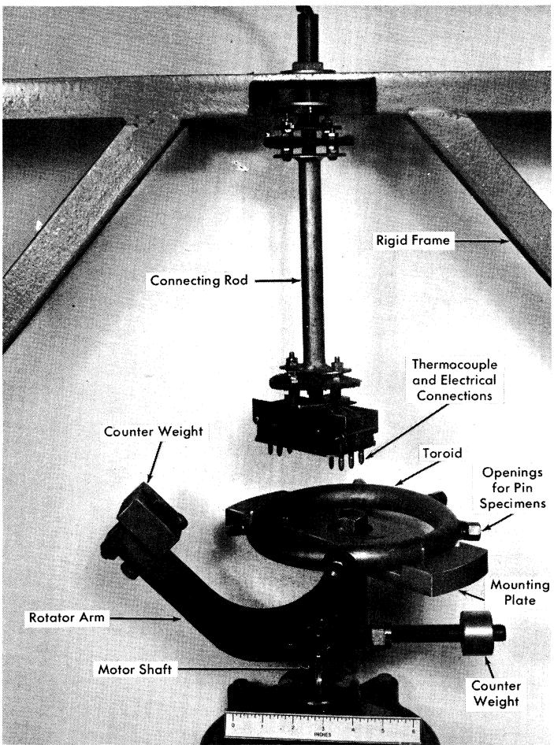  
FIG. 5-1. Photograph of toroid rotator.

The fluid medium in the partially filled toroid is circulated by imparting a motion to the toroid similar to that by which liquid may be caused to swirl in a flask.

To attain the necessary circular motion, the toroid is attached to a horizontal mounting plate which, in turn, is attached at its center (by means of a bearing) to the vertical shaft of a rotator arm. The rotator arm is, in turn, mounted on the shaft of a variable-speed motor, as shown in Fig. 5-1. The toroid is prevented from rotating about its own axis by means of a connecting rod installed between the toroid plate and an external rigid frame. Dynamic balancing of the unit is required for operation at high speeds (500 to $1000\mathrm{rpm}$ ), and a counterweight is provided for this

purpose. Flow velocities up to 30 fps are obtained in the unit now in use. A heating system, which consists of electric heating wire or elements wrapped around the toroid, provides for operation at elevated temperature and pressure. The entire apparatus is relatively inexpensive and fills the need for a laboratory-scale dynamic corrosion test.

In view of the fractional filling of the toroid, which results in "slug flow," corrosion attack rates based on the elapsed time of operation may be corrected to account for the time of immersion in the circulating fluid. This is usually required when corrosion rates obtained in a toroid are being compared with those obtained in the dynamic corrosion test loops described below.

The toroid rotator can be used in the study of solutions and slurries. It has been particularly useful for slurries because of the small amount of material required. The exploration of many slurry variables has been possible with amounts of material (50 to $100\mathrm{g}$ ) easily prepared in the laboratory.

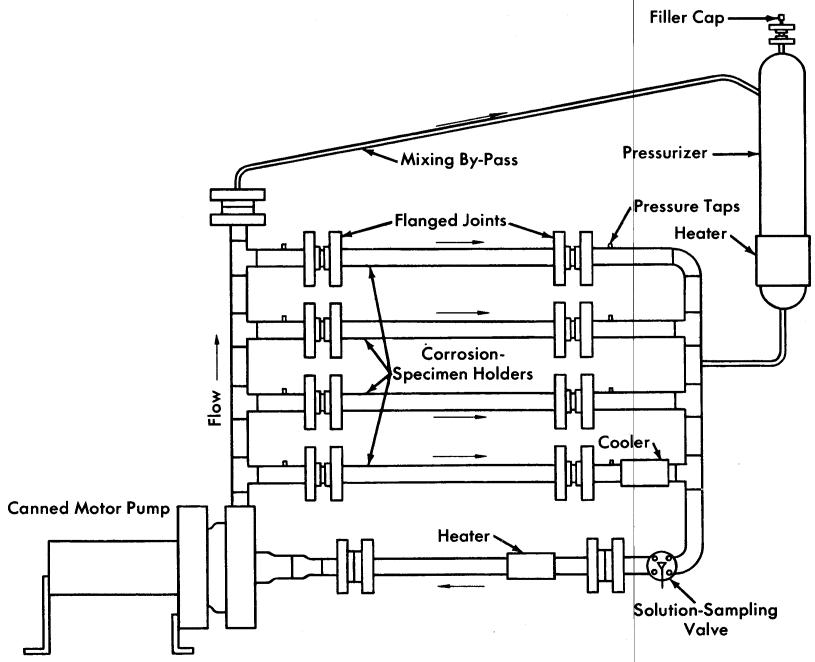  
FIG. 5-2. Dynamic solution corrosion test loop.

Dynamic corrosion test loops. Dynamic solution corrosion test loops designed to operate under the various conditions proposed for homogeneous reactor operation are the principal experimental equipment used for out-of-pile tests. One such loop is shown diagrammatically in Fig. 5-2, in

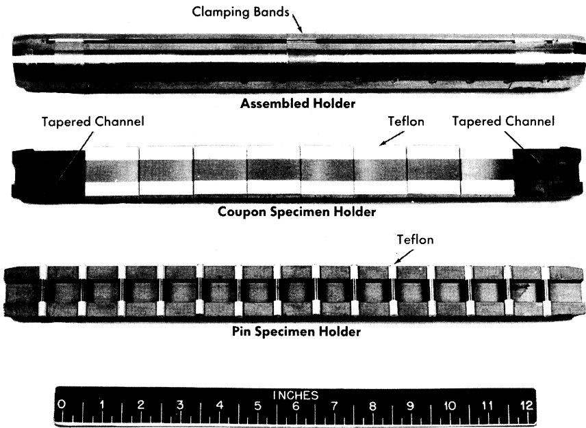  
FIG. 5-3. Pin and coupon specimen holders.

which the flow is divided between a number of parallel channels in which corrosion test specimens can be exposed. Several sets of specimens may be exposed to several flow conditions or a larger variety of specimens to a given set of flow and solution conditions. Loops of various designs have been constructed for other specific purposes [3,4].

The test loop consists of a circulating pump, pipe loop, and a pressurizer. The circulating pump is a Westinghouse model 100A canned-motor centrifugal type [5]. This pump delivers $100\mathrm{gpm}$ at a 250-ft-head and is constructed for operation at pressures up to $2500\mathrm{psi}$ . The loop and pressurizer are heated by means of electric elements cast in aluminum around the outside of the piping.

The loops are usually constructed of $1\frac{1}{2}$ -in. schedule-80 pipe. Flanged joints are used liberally in the loop construction to provide easy access for inspection and for connection of special experimental equipment. For simplicity, economy, and elimination of crevices, a simple butt joint using lap-joint flanges, bearing rings, and a metal gasket [6] is generally used. The test specimens are exposed in split-channel holders inserted in flanged-pipe sections as shown.

The pressurizer, which consists of a vertically mounted section of 4- to 6-in.-diameter pipe, serves several functions. It provides system over-pressure, contains space for solution expansion in the loop during heatup,

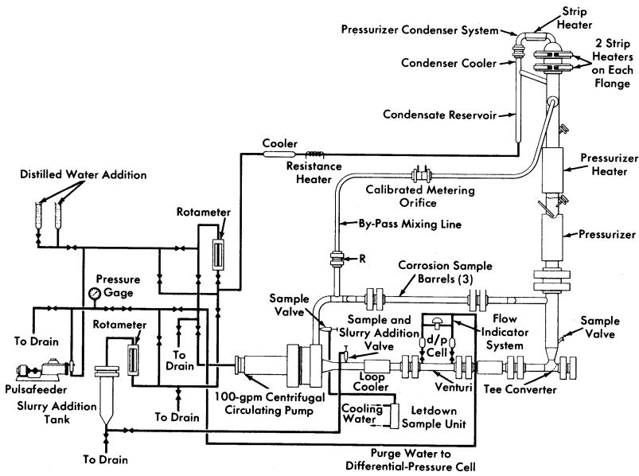  
FIG. 5-4. Dynamic slurry corrosion test loop.

contains space for gas that may be required for solution stability and/or corrosion studies, and serves as a reservoir for excess solution for samples removed during operation.

Two types of holders used for exposure of test specimens in the loop are shown in Fig. 5-3. The pin specimen holder shown is used to test a variety of materials at a uniform bulk fluid flow velocity. Pin-type specimens inserted in the holes are exposed to the solution flowing through the channel when the holder is assembled. Teflon sleeves on the ends of the pins serve as compressible gaskets to keep the specimens from rattling in the holder during the test and to insulate the specimens from the holder. Figure 5-3 also shows the specimens and holder used in determining the effect of velocity on corrosion. In this holder, flat coupon specimens form a continuous septum down the center of the tapered channel, so the bulk fluid flow velocity increases as the solution traverses the holder. Velocity-effect data thus obtained may be used in the design of reactor piping systems if the data are confirmed by loop experience.

In the dynamic slurry corrosion test loop [7], shown in Fig. 5-4, the pump discharge flow is directed through the bottom portion of the pressurizer to minimize settling and accumulation of slurry particles which would occur in this region if the pressurizer were connected as in the solution test loop. As shown in this figure, a condenser is installed in the

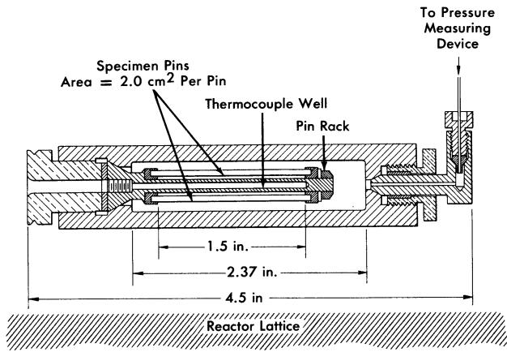  
(a) Type I Autoclave Containing Pin Type Corrosion Specimens

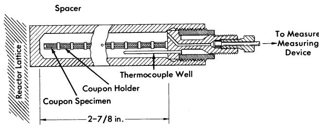  
(b) Type II Autoclave Containing Coupon Type Corrosion Specimens   
FIG. 5-5. In-pile rocking autoclaves.

pressurizer vapor space to supply clean condensate required to continuously purge the pump bearings and prevent slurry accumulation, which would result in excessive bearing wear. The flow of steam or steam-gas mixture through the condenser is by thermal convection. The condensate thus produced flows to the rear of the pump as a result of the static pressure difference between these two points in the system.

A slurry addition device is also incorporated in the loop so that slurry may be charged at elevated temperature and pressure. This device consists of a reservoir tank connected at its bottom to the main loop piping. The slurry may be added batchwise to the tank and, after the top flange is closed, may be forced into the loop by differential pressure, with the slurry being replaced by an equal volume of water from the condensate system. A high-pressure rotometer and regulating valve are provided in the addition system for metering and adjusting this flow of condensate so that flow

to the pump bearings is maintained. To ensure purge-water feed to the pump bearings and to provide positive feed of condensate for the slurry addition system in the event of a loss of static pressure differential, a pulsafeeder pump is incorporated in the condensate circuit and may be used as required.

As an aid in monitoring the density and thus the concentration of the circulating slurry, venturi type flowmeters with high-pressure-differential pressure cells are used in the slurry loop.

5-2.2 In-pile equipment. Rocking autoclaves. To obtain information on the behavior of fuels and materials under reactor conditions, experiments have been carried out in the Graphite Reactor and Low Intensity Test Reactor at ORNL and in the Materials Testing Reactor at NRTS [8-12] using small autoclaves or bombs. The autoclaves used for such tests are shown in Fig. 5-5 [9]. The autoclave, in a specially designed container can and shield plug assembly, is rocked by the mechanism at the face of the reactor shield. The rocking is designed to keep the solution mixed, to maintain equilibrium between liquid and vapor phases, and to keep all surfaces wet. The latter provision prevents the formation of local hot spots by the high gamma fluxes or localized recombination reaction with resultant explosive reaction of the hydrogen and oxygen formed by radiolytic decomposition of water. The assembly is so designed that the autoclave can be retracted into a cadmium cylinder, thereby substantially reducing the flux exposure. This minimizes the necessity for reactor shutdowns in case of minor experimental difficulties and is useful for obtaining data. The necessary electrical and cooling lines are carried to the face of the reactor shield through the container can and a shield plug. In addition, a capillary tube, filled with water, connects the autoclave to a pressure transducer gauge. By this means a continuous record of the pressure in the autoclave is obtained. In cases where a quantitative relationship exists between the corrosion reaction and consumption or production of a gas, the pressure measurements, suitably corrected, provide a measure of the generalized corrosion rate.

Pump loops. An in-pile loop [13] is similar to all forced-circulation loops; it consists of a pump, pressurizer, circulating lines, heaters and coolers, and associated control and process equipment. The circulating pump, designed at ORNL [14-16], is a canned-rotor type which delivers 5 gpm at a 40-ft head at pressures up to 2000 psig.

The loop assembly and 7-ft-long container are shown in Fig. 5-6. Some of the physical data for a typical loop are summarized in Table 5-1 [17]. The loop components are usually constructed of type-347 stainless steel, although one loop has been constructed in which the core section was made of titanium and another was made entirely of titanium. The loop con

TABLE 5-1 PHYSICAL DATA FOR TYPICAL IN-PILE LOOP

# I. Loop volume

1. Pump rotor chamber 160 cc   
2. Pump scroll 107cc   
3. Core 300 cc   
4. Loop pipe (3/8 in. Sch. 40) 440 cc   
5. Pressurizer (1-1/2 in. Sch. 80) 750 cc

Total 1757 cc

# II. Pipe size

1. Main loop 3/8 in. Sch. 40   
2. Core 2 in. Sch. 80   
3. Pressurizer 1-1/2 in. Sch. 80   
4. Pressurizer bypass line 1/4 in. $\times 0.049$ in. wall tubing   
5. Pump drain line 0.090 in. OD-0.050 in. ID tubing   
6. Loop drain line 0.090 in. OD-0.050 in. 1D tubing   
7. Gas addition line (pressurizer) 0.060 in. OD-0.020 in. ID tubing   
8. Pressure transmitting line 0.080 in. OD-0.040 in. ID tubing (pressurizer)

# III. Flow rates

1. Main loop 5 gpm (8.5 fps)   
2. Pressurizer bypass line 6 cc/sec (1.2 fps)   
3. Pressurizer 6 cc/sec (0.034 fps)   
4. Tapered channel coupon holder 5 gpm (variable: 10-45 fps)

# IV. Capacities* of loop heaters and coolers

1. Main loop heater 3000 watts   
2. Main loop cooler 6000 watts   
3. Pressurizer preheater 1500 watts   
4. Pressurizer jacket heater 400 watts

tainer, 7 ft long, is 6 in. in diameter at the core end and 8 in. at the pump end and is designed to withstand a pressure surge of 500 psi in case of a sudden failure of a loop component. All electrical and process lines are carried through the pump end of the container through sealed connectors and then through the shield plug to the "valve boxes" at the face of the reactor. These valve boxes are sealed, shielded containers in which are located process lines and vessels, valves, samplers, and sensing devices for

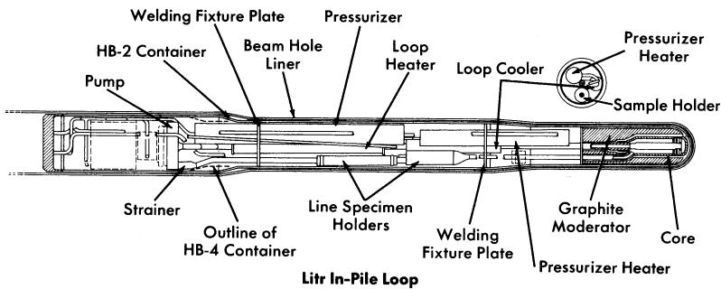  
FIG. 5-6. In-pile loop assembly drawing.

the instrumentation [13]. The equipment in the boxes is used with successive loops, whereas each loop is built for a single experiment and completely dismantled by hot-cell techniques thereafter [18]. Samples of the circulating solution for analysis are withdrawn through a capillary line during operation, and reagent additions can also be made if desired. A capillary connection to the pressurizer is used to follow pressure changes in the loop and to make gas additions when necessary. As in the case of the in-pile autoclaves, previously described, the pressure data can be used to follow a generalized average corrosion rate for all the materials in the loop as the operation proceeds.

Specimens can be exposed in the pressurizer, in holders in the line just beyond the pump outlet, and in the core. The specimens in the core inside the tapered-channel holder and in the annulus around it are exposed to the solution in which fissioning is taking place and to direct pile radiation. Duplicate specimens in the in-line holders are exposed to the same solution in the absence of the fissioning and direct pile radiation. As in the out-of-pile loops discussed previously, the tapered-channel coupon holders are used to study velocity effects. The core specimen holder is shown in place in Fig. 5-7. Figure 5-8 is a photograph of a core corrosion specimen assembly in which can be seen coupled coupons on a rod assembly, as well as coupons in the tapered-channel holder and stress specimens in the core annulus. Although not shown, impact and tensile specimens are also sometimes exposed in the core annulus.

The loops must be adequately instrumented [19] to provide accurate measurements of loop temperatures, pressurizer temperatures, and pressures within the loop. The quantity of oxygen and hydrogen in the pressurizer is obtained from the pressurizer temperature and pressure measurements. Electrical power demands of the loop heater furnish a measure of over-all fission power and gamma heating within the loop. Since the loop, in effect, becomes a small homogeneous reactor operating subcritically, when enriched fuel solution is being circulated many automatic

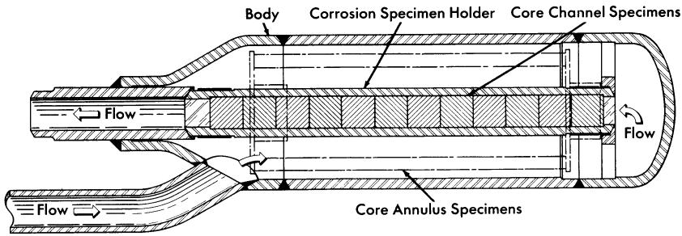  
FIG. 5-7. Core holder for coupon specimens.

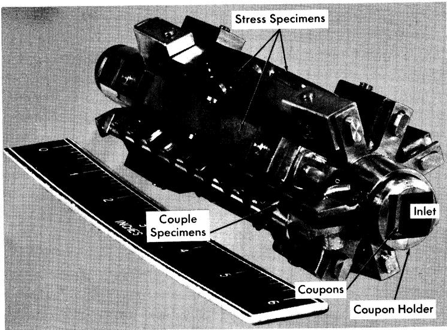  
FIG. 5-8. Core specimen array.

safety interlocks are used to prevent the possible release of radioactive material.

Remote-handling equipment. After exposure in the reactor, dismantling of the loops [18] and autoclaves [20], and subsequent examination of the test specimens and component parts must be done in hot cells with remote-handling equipment. Prior to removal from the reactor, the fuel solution is drained from the loop or autoclave and all radioactive gas is vented. The loop or autoclave is then withdrawn into a shielded carrier and separated from its shield plug to facilitate handling. It is then removed to the hot cell facilities for dismantling and examination.

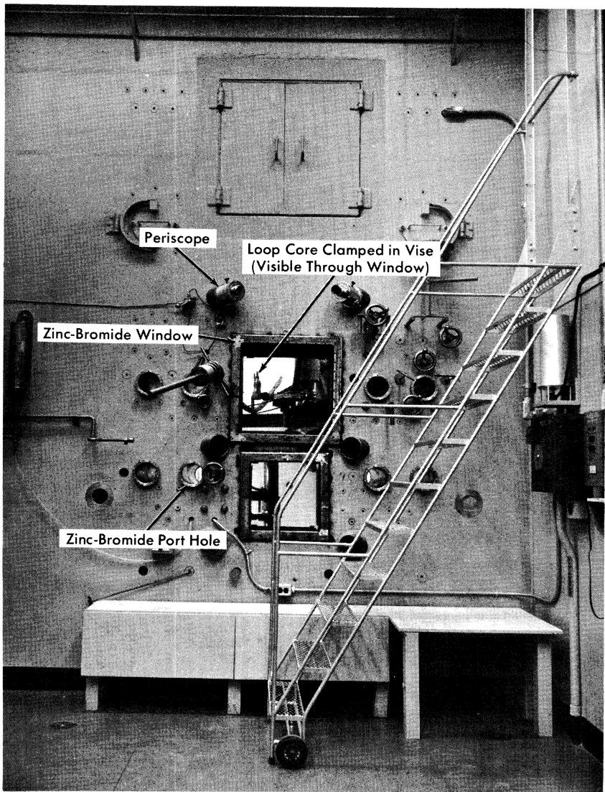  
FIG. 5-9. Exterior view of in-pile loop dismantling facility.

The operating face of the hot cell for dismantling an in-pile loop is shown in Fig. 5-9. An abundance of 1- and 2-in-diameter sleeves are included for insertion of remote-handling tools; two large zinc-bromide windows, eight 6-in. zinc-bromide portholes, and six periscope holes are provided for viewing. The usual hot-cell services, such as hot drain, metal-recovery drain, hot exhaust, vacuum, air, water, and electricity, are provided.

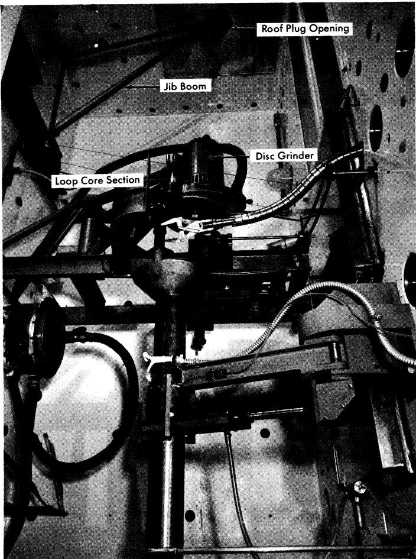  
FIG. 5-10. Interior view of in-pile loop dismantling facility.

The loop in its container can is lowered from its carrier, through a roofplug opening, into the cell, where it is clamped in a chuck which rotates the assembly while a disk grinder cuts off the rear section of the container. A jib boom is used to withdraw the loop from the container, and various sections of the loop are then cut out by means of a disk grinder. Figure 5-10 is a photograph of the dismantling equipment in the hot cell.

The severed loop sections are then removed to a remote-examination facility [21] where the more exacting tasks of removing, examining, and photographing loop components, as well as weighing individual test specimens, required to determine corrosion damage, are carried out. Hot-cell techniques are again used, with the aid of specially designed remote-handling equipment.

# 5-3. SURVEY OF MATERIALS*

5-3.1 Introduction. To determine the corrosion resistance of many different materials to uranium-containing solutions, a large number of screening tests have been performed. These tests were carried out either in pyrex flasks at the boiling point of the solution or in stainless steel autoclaves or loops at $250^{\circ}\mathrm{C}$ . Oxygen or air was bubbled through the atmospheric boiling solutions, whereas at $250^{\circ}\mathrm{C}$ the test solutions were pressurized with 100 to 200 psi oxygen. The corrosion rates of the materials were determined from weight losses of test specimens after the corrosion products had been removed from their surfaces by an electrolytic descaling process [22]. The results of the tests are presented in the following sections. All tests were carried out in the absence of radiation.

The stainless steel designations are those of the American Iron and Steel Institute. The composition of most of the other materials is listed in Engineering Alloys [23] and those not so listed are included in Table 5-2. All the materials were tested in the annealed condition except in the cases where parentheses follow the alloy designation, in Table 5-3. The number thus enclosed is the hardness of the material on either the Rockwell C (RC) or Rockwell B (RB) scale.

5-3.2 Corrosion tests in uranyl carbonate solutions. Since uranium trioxide is more soluble in lithium carbonate solutions at high temperatures than in solutions of other carbonates, the corrosion resistance of the materials was determined only in the lithium carbonate system. All corrosion tests were carried out in stainless steel loops at $250^{\circ}\mathrm{C}$ . The test solution was prepared by dissolving 0.03 moles of uranium trioxide per liter of $0.17\,m\,Li_2CO_3$ and passing carbon dioxide through the solution until the uranium was in solution. The solution was then circulated for 200 hr in a loop pressurized with 700 psi carbon dioxide and 200 psi oxygen. The flow rate of the solution was 20 fps. Table 5-3 shows the materials that were tested and the ranges of corrosion rates that were observed.

Thus the corrosion resistance of all the metals and alloys tested was good with the exception of aluminum, copper, and most of the nickel- or cobalt-base alloys. The acceptable alloys developed films that would have prevented further corrosion had the tests been continued longer. Data presented elsewhere [24] show that even the carbon steels and iron would be satisfactory materials in carbonate systems. The fact that the carbonate solution is approximately neutral is undoubtedly the reason for the nonaggressive nature of the solution.

TABLE 5-2   
THE COMPOSITION OF SEVERAL MATERIALS TESTED FOR CORROSION RESISTANCE   

<table><tr><td rowspan="2">Alloy designation</td><td colspan="6">Composition, w/o</td></tr><tr><td>Cr</td><td>Ni</td><td>C</td><td>Fe</td><td>Mn</td><td>Other</td></tr><tr><td>202</td><td>17-19</td><td>4-6</td><td>0.15 max</td><td>bal.</td><td>7.5-10</td><td></td></tr><tr><td>309 SCb</td><td>22-26</td><td>12-15</td><td>0.08 max</td><td>bal.</td><td>2.0 max - 2.5 max</td><td>Nb 8 × C min</td></tr><tr><td>318</td><td>17-19</td><td>13-15</td><td>0.08 max</td><td>bal.</td><td></td><td>Nb 10 × C min</td></tr><tr><td>SRF 1132</td><td>12</td><td>13</td><td></td><td>bal.</td><td></td><td>Cu 5.5, Mo 7</td></tr><tr><td>Carpenter 20Cb</td><td>20</td><td>29</td><td>0.07 max</td><td>bal.</td><td>0.75</td><td>Nb/Ta 8 × C min</td></tr><tr><td></td><td></td><td></td><td></td><td></td><td></td><td>Cu 3, Mo 2</td></tr><tr><td>Croloy 1515 N</td><td>14.7-18.0</td><td>13.5-16.5</td><td>0.15 max</td><td>bal.</td><td>2.0 max</td><td>Mo 1.25-1.85, W 1.00-1.85, Nb/Ta 0.08-0.13</td></tr><tr><td>322 W</td><td>17</td><td>7</td><td>0.07</td><td>bal.</td><td>0.5</td><td>Ti 0.7, Al 0.2</td></tr><tr><td>329</td><td>25-30</td><td>3-5</td><td>0.10 max</td><td>bal.</td><td></td><td>Mo 1-1.5</td></tr><tr><td>CD4MCu</td><td>25-27</td><td>4.75-6.00</td><td>0.04 max</td><td>bal.</td><td>1.0</td><td>Mo 1.75-2.75</td></tr><tr><td></td><td></td><td></td><td></td><td></td><td></td><td>Cu 2.75-3.25</td></tr><tr><td>Croloy 16-1</td><td>14.5-16.5</td><td>0.80-1.25</td><td>0.03 max</td><td>bal.</td><td></td><td>Mo 2.75</td></tr><tr><td>Allegheny 350</td><td>17</td><td>4.2</td><td>0.08</td><td>bal.</td><td>0.60</td><td>W 17, Co 44</td></tr><tr><td>Rexalloy 33</td><td>33</td><td></td><td>2.25</td><td>2 max</td><td></td><td></td></tr><tr><td>Armco GT-45</td><td></td><td></td><td>0.17</td><td>bal.</td><td></td><td></td></tr><tr><td>Titanium 45 A</td><td></td><td></td><td></td><td></td><td></td><td>Ti 99+</td></tr><tr><td>Titanium AC</td><td></td><td></td><td></td><td></td><td></td><td>Al 3, Cr 5, bal. Ti</td></tr><tr><td>Titanium AM</td><td></td><td></td><td></td><td></td><td></td><td>Al 4, Mn 4, bal. Ti</td></tr><tr><td>Titanium AT</td><td></td><td></td><td></td><td></td><td></td><td>Al 5, Sn 2.5, bal. Ti</td></tr><tr><td>Titanium AV</td><td></td><td></td><td></td><td></td><td></td><td>Al 6, V 4, bal. Ti</td></tr><tr><td>Titalloy X</td><td></td><td></td><td>0.02</td><td></td><td></td><td>Al 1.6, V 1.9, bal. Ti</td></tr><tr><td>Titalloy Y</td><td></td><td></td><td>0.02</td><td></td><td></td><td>Al 1.2, bal. Ti</td></tr><tr><td>Titalloy Z</td><td></td><td></td><td>0.01</td><td></td><td></td><td>Al 2.4, bal. Ti</td></tr><tr><td>Zircaloy 1</td><td></td><td></td><td></td><td></td><td></td><td>Sn 2.5, bal. Zr</td></tr><tr><td>Zircaloy 2</td><td></td><td></td><td></td><td></td><td></td><td>Sn 1.5, Fe 0.07-0.2, Cr 0.02-0.15, Ni 0.03-0.08</td></tr><tr><td></td><td></td><td></td><td></td><td></td><td></td><td>Sn 5, bal. Zr</td></tr><tr><td>Zirconium-tin</td><td></td><td></td><td></td><td></td><td></td><td></td></tr></table>

# TABLE 5-3

CORROSION RATES OF SEVERAL ALLOYS IN A SOLUTION OF $0.17\mathrm{mLi_2CO_3}$ CONTAINING $0.03\mathrm{mUO_3}$ AT $250^{\circ}\mathrm{C}$

Pressurizing gases: 700 psi $\mathrm{CO}_{2}$ and 200 psi $\mathrm{O}_{2}$ .

Time: 200 hr. Flow rate: 20 fps.

<table><tr><td>Metal or alloy</td><td>Range of avg. corrosion rates, mpy</td></tr><tr><td>Austenitic stainless steels</td><td></td></tr><tr><td>202, 302B, 304, 304L, 309SCb, 310S, 316, 318, 321, 347</td><td>0.8-2.6</td></tr><tr><td>Carpenter 20, Carpenter 20Cb, Incoloy, Worthite</td><td>2.4-4.0</td></tr><tr><td>Ferritic and martensitic stainless steels</td><td></td></tr><tr><td>322 W, 410, 410 (cast), 414, 416, 420, 430, 431, 440C, 446, 17-7 PH</td><td>0.8-2.4</td></tr><tr><td>416 (36 RC), 440C (56 RC)</td><td>3.6-5.3</td></tr><tr><td>Titanium alloys</td><td></td></tr><tr><td>55A, 75A, 100A, 150A, AC, AM, AT, AV</td><td>0.3-0.6</td></tr><tr><td>Other metals and alloys</td><td></td></tr><tr><td>Zirconium and Zircaloy-2</td><td>&lt;0.1</td></tr><tr><td>Hastelloy C, Nionel, gold, niobium, platinum</td><td>0-0.9</td></tr><tr><td>Armco Iron, AISI-C-1010, AISI-C-1016</td><td>6.4-7.8</td></tr><tr><td>Inconel, Inconel X, nickel,stellite 1, 2, 3, 98M2, Haynes Alloy 25, copper</td><td>16-90</td></tr><tr><td>Aluminum</td><td>&gt;1000</td></tr></table>

5-3.3 Corrosion tests in uranyl fluoride solutions. In contrast to uranyl carbonate solutions, uranyl fluoride solutions are acid, and in general the corrosivity of the fluoride solutions is much greater than that of the carbonate solutions. To determine the relative corrosion resistances of many different metals and alloys, a $0.17\mathrm{m}$ $\mathrm{UO}_2\mathrm{F}_2$ solution was used. Tests were performed at 100 and $250^{\circ}\mathrm{C}$ in static systems and at $250^{\circ}\mathrm{C}$ in loops. The static tests were continued for periods up to 1000 and 2000 hr. The dynamic tests lasted for 200 hr, and the flow rate of the solution past the specimens was 10 to 15 fps. The results of the dynamic tests are shown in Table 5-4.

# TABLE 5-4

# THE CORROSION RATES OF SEVERAL ALLOYS IN

# 0.17 m UO₂F₂ AT 250°C

Pressurizing gas: 200 psi $\mathrm{O_2}$

Time: 200 hr. Flow rate: 10 to 15 fps.

<table><tr><td>Metal or alloy</td><td>Range of avg. corrosion rates, mpy</td></tr><tr><td>Austenitic stainless steels</td><td></td></tr><tr><td>304, 304L, 309SCb, 310, 316, 316L, 318, 321, 347</td><td>4-13</td></tr><tr><td>Ferritic and martensitic stainless steels</td><td></td></tr><tr><td>322W, 430, 443, 17-4 PH</td><td>3.5-5.0</td></tr><tr><td>416</td><td>&gt;2000</td></tr><tr><td>Titanium and zirconium alloys</td><td></td></tr><tr><td>55A, 70A, 100A, 150A</td><td>0.01-0.25</td></tr><tr><td>AC, AM, AT</td><td>5.6-7.7</td></tr><tr><td>Zirconium, Zircaloy-2</td><td>&gt;2000</td></tr><tr><td>Other metals</td><td></td></tr><tr><td>Gold, platinum</td><td>&lt;0.5</td></tr><tr><td>Niobium</td><td>&gt;1000</td></tr></table>

All the stainless steels except type 416 showed low corrosion rates under the conditions of test. Other experiments showed that most of the corrosion occurred in about the first $100\mathrm{hr}$ of exposure, during which time a protective coating formed on the steel. After the coating formed, corrosion rates in the range of $0.1\mathrm{mpy}$ or less were observed (provided the flow rate was not too high). The static corrosion tests of longer duration verified the dynamic results. Thus, had the dynamic tests reported in Table 5-4 lasted for $1000\mathrm{hr}$ , the average corrosion rates would have been approximately one-fifth of those shown.

At high temperatures, all the stainless steels corrode at high constant rates if the flow rate of the solution exceeds a certain value which depends on the concentration of the solution and the temperature (to be discussed in the next section). In $0.17 \, m\, \mathrm{UO}_2\mathrm{F}_2$ at $250^{\circ}\mathrm{C}$ this critical value is 20 to 25 fps.

As expected, zirconium and zirconium alloys showed no resistance to attack by uranyl fluoride solutions at high temperatures. In fact, other tests have shown that as little as 50 ppm fluoride ions in uranyl sulfate solutions leads to appreciable attack of zirconium [25]. On the other hand, titanium demonstrated high resistance to uranyl fluoride solutions. Tests with more highly concentrated uranyl fluoride solutions have shown the corrosion rate of titanium to be low. The titanium alloys showed higher rates, ranging from 5 to 8 mph. However, in crevices where oxygen depletion occurs, titanium and its alloys are severely attacked [26].

No nickel- or cobalt-base alloys were tested under dynamic conditions. Those tested at $250^{\circ}\mathrm{C}$ in autoclaves include D Nickel, Chromel P, Stellar 98M2, and nickel; all showed rates in excess of 18 mpy during 1000- to 2000-hr tests. At $100^{\circ}\mathrm{C}$ nickel corroded at a rate greater than 100 mpy and Monel corroded at 7 mpy; the other above-listed materials, Elgiloy, Hastelloys C and D, Illium R, and Inconel, corroded at rates less than 1.5 mpy.

Gold, platinum, and tantalum were practically unattacked by the uranyl fluoride at $250^{\circ}\mathrm{C}$ ; the resistance of tantalum was unexpected. Niobium was heavily attacked.

It is seen from the foregoing that several metals, including most of the stainless steels, have adequate corrosion resistance to uranyl fluoride solutions if the flow rate of the solution is not too great. Uranyl fluoride cannot be used in a two-region reactor, however, because zirconium and uranyl fluoride solutions are incompatible. Another possible difficulty of uranyl fluoride solutions in any system is the fact that the vapor above the acid uranyl fluoride system may contain some. hydrofluoric acid which, if present, would present a serious corrosion problem.

5-3.4 Corrosion tests in uranyl sulfate solutions. Many corrosion tests discussed in detail in HRP progress reports [27] have been carried out in uranyl sulfate solutions under different conditions of temperature, uranium concentration, flow rate, etc. Table 5-5 shows representative corrosion rates of a number of materials obtained in $0.17\mathrm{m}\mathrm{UO}_2\mathrm{SO}_4$ at $250^{\circ}\mathrm{C}$ in stainless-steel loops during a 200-hr. exposure. The flow rate of the solution past the specimens was 10 to 15 fps. Static tests, the results of which are not included in the table, have also been carried out at 100 and $250^{\circ}\mathrm{C}$ and generally lasted for 1000 to 2000 hr. The results obtained in static systems generally confirmed the dynamic results, although the corrosion rates observed in static systems were less than those measured in dynamic systems.

The data presented in Table 5-5 show only the relative corrosion resistance of different classes of alloys and need further clarification. From the results reported in the table, and from many other static and dynamic

Pressurizing gas: 200 psi $\mathrm{O_2}$

Time: 200 hr. Flow rate: 10 to 15 fps.

TABLE 5-5   
THE CORROSION RATES OF SEVERAL ALLOYS IN   
0.17 m $\mathrm{UO}_2\mathrm{SO}_4$ AT $250^{\circ}\mathrm{C}$   

<table><tr><td>Metal or alloy</td><td>Range of avg. corrosion rates, mpy</td></tr><tr><td>Austenitic stainless steels</td><td></td></tr><tr><td>202, 302, 302B, 303, 304, 304L, 309SCb, 310S, 316, 316L, 318, 321, 347, Carpenter Alloys 10, 20, 20Cb, Croloy 1515N, Durimet, Incoloy, Multimet, Timken 16-25-6, Worthite</td><td>14-65</td></tr><tr><td>SRF 1132</td><td>190</td></tr><tr><td>Ferritic and martensitic stainless steels</td><td></td></tr><tr><td>Armco 17-4 PH (37 RC), Armco 17-7 PH (43 RC)</td><td>3.1-4.9</td></tr><tr><td>322W, 322W (27-38 RC), 329, 430, 431, 431 (43 RC), 446, Armco 17-4 PH, CD4MCu, Allegheny 350, Allegheny 350 (38-43 RC), Croloy 16-1, Frogalloy</td><td>6-35</td></tr><tr><td>410, 410 (43 RC), 414, 416, 416 (37 RC), 420, Armco 17-7 PH</td><td>46-81</td></tr><tr><td>420 (52 RC), 440 C</td><td>100-430</td></tr><tr><td>Titanium and zirconium alloys</td><td></td></tr><tr><td>45A, 55A, 75A, 100A, 150A, AM, Titalloy X, Y, and Z</td><td>0.01</td></tr><tr><td>AC, AT, AV</td><td>0.03-0.12</td></tr><tr><td>Zircaloy-1 and -2, zirconium, zirconium-tin</td><td>&lt;0.01</td></tr><tr><td>Nickel and cobalt alloys</td><td></td></tr><tr><td>Hastelloy R-235, Inconel X, Stellite 1</td><td>77-88</td></tr><tr><td>Hastelloy C and X, Haynes Alloy 25, Inconel, Stellite 3, 6, and 98M2</td><td>120-340</td></tr><tr><td>Other materials</td><td></td></tr><tr><td>Gold, platinum</td><td>&lt;0.1</td></tr><tr><td>Niobium</td><td>6.7</td></tr><tr><td>Sapphire</td><td>17</td></tr><tr><td>Quartz</td><td>58</td></tr><tr><td>Pyrex glass</td><td>730</td></tr></table>

tests of longer duration, the following conclusions can be drawn. All the austenitic stainless steels except SRF 1132, 316, and 316L behaved essentially alike; all corroded rapidly and uniformly for about the first $100\mathrm{hr}$ , during which time a protective coating formed (provided the flow rate was less than 20 fps). Once the film formed, corrosion rates less than 0.1 mpy were observed. The extent of attack during film formation varied somewhat from run to run, and there was no consistent difference from one austenitic stainless steel to the other. Thus, even though the rates reported in Table 5-5 are high, the continuing rates are very low; as a class, the austenitic stainless steels are satisfactory materials for containing uranyl-sulfate solutions at reasonable flow rates. Types 316 and 316L showed a tendency toward intergranular attack, and SRF 1132 did not develop a highly protective coating.

Of the ferritic and martensitic stainless steels, types 410, 416, 420, and 440C in all heat-treated conditions were completely unsatisfactory. The corrosion rates of these alloys were nearly constant with time, and the attack was very irregular. Although the precipitation-hardenable steels, 322W, 17-4 PH, and 17-7 PH, showed very low corrosion rates after the formation of the protective film, all displayed a tendency toward stress-corrosion cracking in their fully hardened conditions. Croloy 16-1 demonstrated reasonable corrosion resistance in short-term tests, but long static tests showed the material to be susceptible to intergranular attack in uranyl sulfate solutions. The other ferritic and martensitic stainless steels corroded in the same fashion as did the austenitic stainless steels; that is, after a protective film formed the corrosion rates were in the range of 0.1 mpy. From a corrosion standpoint these materials have adequate corrosion resistance for use in high-temperature uranyl sulfate solutions.

Titanium, zirconium, and all of their alloys were extremely resistant to attack by uranyl sulfate solutions at all concentrations, temperatures, and flow rates. In fact, corrosion damage was so small that it was difficult to detect weight changes of the specimens with a standard analytical balance. These alloys will be discussed further in Sections 5-5 and 5-6.

Most of the nickel- and cobalt-base alloys listed in Table 5-5 were rapidly attacked by high-temperature uranyl sulfate solutions. The two exceptions were Hastelloy R-235 and Elgiloy. Hastelloy R-235 resembled an austenitic stainless steel in that it developed a film and corroded practically no further. Although Elgiloy corroded only slightly, it was extremely susceptible to stress-corrosion cracking in high-temperature uranyl-sulfate solutions. Thus, of the alloys listed, only Hastelloy R-235 could be considered for use in high-temperature uranyl sulfate solutions. On the other hand, most of the alloys were resistant to uranyl sulfate solutions at $100^{\circ}\mathrm{C}$ ; corrosion rates less than a few tenths of a mpy were observed. It is particularly significant that many of the very hard alloys,

such as thestellites,are resistant at the lower temperature;in many applications,such as pump bearings,temperatures no greater than $100^{\circ}\mathrm{C}$ are required.

In dynamic tests platinum and gold were resistant to attack under all conditions, but niobium corroded at an appreciable rate, about 7 mpy at 15 fps. The corrosion rate of niobium depended on the flow rate of the solution, and at higher flow rates somewhat higher corrosion rates were observed. Static tests showed that tantalum and chromium are corroded only slightly under most conditions. If the solution contained dissolved hydrogen, tantalum was seriously embrittled; highly oxygenated uranyl-sulfate solutions at temperatures above $250^{\circ}\mathrm{C}$ oxidized chromium to the soluble hexavalent state, and under these conditions the rate of attack was several mils per year.

A number of nonmetallic substances were statically tested in $0.17 \, m \, \mathrm{UO}_2\mathrm{SO}_4$ at $100^{\circ}\mathrm{C}$ . Those tested included various grades of sintered alumina and graphite, sapphire, silicon carbide, sintered titania and zirconia, and quartz. All corroded at rates of less than 3 mph, except for one very impure grade of sintered alumina which corroded at 124 mph. In fact, the corrosion resistance of the sintered alumina was higher, the higher the purity. In static tests at $250^{\circ}\mathrm{C}$ in $0.17 \, m \, \mathrm{UO}_2\mathrm{SO}_4$ , the corrosion rate of pure sintered alumina was 3 mph; sapphire corroded at the rate of 3.6 mph. In dynamic tests under the same conditions, sapphire corroded at 17 mph, quartz at 58 mph, and Pyrex glass at 730 mph. The high corrosion rates of quartz and Pyrex glass show why glass-lined equipment cannot be used for high-temperature experimental work. In addition to the attack on the glass, the resultant silicates cause precipitation of uranium.

5-3.5 Conclusions. Type-347 stainless steel has been the basic material of construction in most homogeneous reactor programs. It has serious limitations, particularly from the corrosion standpoint, but in consideration of the additional important factors of cost, availability, and experience with its use, it appears a suitable material. The excellent corrosion resistance of titanium and several of its alloys makes them very useful in special applications, particularly where the limitations of the stainless alloys make their use impractical. Cost, availability, and a recently observed autoignition reaction in oxygen-containing environments are serious limitations to the use of titanium in pressure-containing equipment (see Article 5-8.5). Zirconium and zirconium-rich alloys are unique materials for the core vessel of a two-region breeder.

The behavior of these materials in homogeneous reactor fluids is described in detail in subsequent sections of this chapter.

# 5-4. CORROSION OF TYPE-347 STAINLESS STEEL IN URANYL SULFATE SOLUTIONS*

5-4.1 Introduction. The decision to use type-347 stainless steel as the major material of construction and a uranyl sulfate solution as the fuel for HRE-1 and HRE-2 was based, at least in part, on the demonstrated compatibility of the two components and on the fact that the technology of the austenitic stainless steels was well developed. Articles 5-4.2 through 5-4.7 present the results of an extensive investigation of the corrosion of type-347 stainless steel in uranyl sulfate solutions in the absence of ionizing radiation, and in Article 5-4.8 the effect of ionizing radiation on the corrosion of stainless steel is discussed. Further details are reported in the HRP quarterly progress reports [28].

All the results reported in this section were obtained with solutions containing between 50 and $1000~\mathrm{ppm}$ oxygen to prevent reduction and precipitation of uranium; the precipitation of uranium as $\mathrm{U}_3\mathrm{O}_8$ leads to the formation of sulfuric acid which attacks stainless steel at a very high rate at the temperatures of interest. A consequence of these phenomena is the possibility of localized attack in crevices where oxygen depletion can occur.† Other forms of localized attack have been investigated, but except for stress-corrosion cracking in the presence of chloride ions (discussed in Section 5-9) no serious problems have arisen. Thus, even with unstabilized stainless steels that have been sensitized by appropriate heat treatment, no severe intergranular attack in uranyl-sulfate solutions occurs. The coupling of such noble metals as gold and platinum to type-347 stainless steel does not result in accelerated attack of the stainless steel.

5-4.2 Effect of temperature. When type-347 stainless steel is placed in a uranyl-sulfate solution at temperatures up to $100^{\circ}\mathrm{C}$ , the steel retains its metallic luster, and only after long periods of time does it develop a very thin tarnish film. At higher and higher temperatures the film becomes progressively heavier, and in the temperature range 175 to $200^{\circ}\mathrm{C}$ a quite heavy black scale forms on the surface of the steel in about 100 hr. Up to about $175^{\circ}\mathrm{C}$ the film that forms is nonprotective, and the corrosion rate is dependent on the composition of the solution and independent of the flow rate past the steel surface. Some typical corrosion rates in this temperature range are presented in Table 5-6.

TABLE 5-6   
CORROSION RATE OF TYPE-347 STAINLESS STEEL IN URANYL SULFATE SOLUTIONS AT 100 TO $175^{\circ}\mathrm{C}$   

<table><tr><td>Solution composition</td><td>Temperature, °C</td><td>Corrosion rate, mpy</td></tr><tr><td>0.02 m UO2SO4</td><td>100</td><td>0.25</td></tr><tr><td>0.006 m H2SO4</td><td>150</td><td>0.96</td></tr><tr><td>0.04 m UO2SO4</td><td>150</td><td>0.87</td></tr><tr><td>0.006 m H2SO4</td><td>175</td><td>5.4</td></tr><tr><td>0.005 m CuSO4</td><td></td><td></td></tr><tr><td>1.3 m UO2SO4</td><td>100</td><td>0.40</td></tr><tr><td></td><td>125</td><td>0.80</td></tr><tr><td></td><td>150</td><td>2.8</td></tr><tr><td></td><td>175</td><td>18.0</td></tr></table>

The heavy film that forms in the temperature range 175 to $225^{\circ}\mathrm{C}$ offers some protection to the underlying steel, but in most cases the protection is poor. At higher temperatures a heavy scale forms fairly rapidly on the stainless steel, and once it has been established it affords essentially complete protection against further corrosion, provided the flow rate of the solution is not too great.

The protectiveness of the film appears to be related to its composition. At temperatures up to $175^{\circ}\mathrm{C}$ the scale, as determined by x-ray diffraction, is composed of mixed hydrated ferric and chromic oxides. At higher temperatures the amount of hydrated oxide decreases, and the amount of anhydrous alpha ferric oxide containing chromic oxide in solid solution increases. At $250^{\circ}\mathrm{C}$ and higher, only the anhydrous oxide is found in the protective scale.

The amount of metal that dissolves during the period of film formation depends primarily on the flow rate, the composition of the solution, the temperature, and the presence of additives. If the other variables remain constant, increasing the temperature decreases the amount of metal that is corroded during the formation of the protective coating and reduces the velocity effect.

5-4.3 Effect of solution flow rate. From room temperature to about $175^{\circ}\mathrm{C}$ the solution flow rate has essentially no effect on the corrosion rate of the stainless steel. However, at temperatures of $200^{\circ}\mathrm{C}$ and above, the corrosion rate is profoundly influenced by flow rate. Figure 5-11 shows

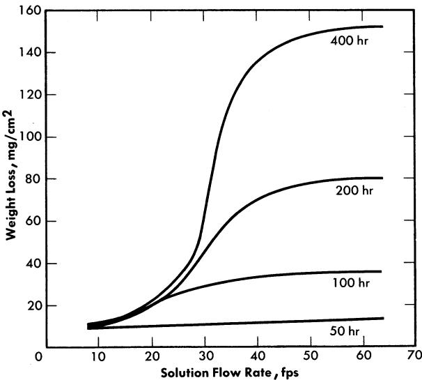  
FIG. 5-11. Corrosion of type-347 stainless steel in $0.17 \, m \, \mathrm{UO}_2\mathrm{SO}_4$ at $250^{\circ}\mathrm{C}$ as a function of the flow rate.

typical results obtained using a tapered-channel specimen holder in a stainless steel loop. The data were obtained from a series of runs in which $0.17 \, m \, \mathrm{UO}_2\mathrm{SO}_4$ was circulated at $250^{\circ}\mathrm{C}$ for various times. Since at low flow rates the corrosion rate depends on time, weight loss rather than corrosion rate is used as the ordinate.

At flow rates up to about 20 to 25 fps all weight losses were nearly the same regardless of exposure time. Between 25 and 35 fps weight losses increased sharply, and at still higher flow rates the weight loss of the specimens was proportional to the exposure time. An examination of the specimens revealed that up to about 20 fps the specimens were completely covered with a black, relatively heavy, tenacious scale which, after it formed, practically prevented further corrosion. In the region of 25 to 35 fps there were areas of the specimens that remained free of scale. At flow rates greater than 40 fps the specimens did not develop any visible scale, and upon removal from the holder the specimens had the appearance of severely etched steel.

Although the results presented in Fig. 5-11 are for only one concentration of uranyl sulfate, a similar velocity effect is observed at all uranyl-sulfate concentrations and at all temperatures above $200^{\circ}\mathrm{C}$ . The temperature of $200^{\circ}\mathrm{C}$ is in the middle of the transition region below which velocity is unimportant and above which a velocity effect is observed. Therefore, at $200^{\circ}\mathrm{C}$ a velocity effect is observed but is not well defined. Usually all specimens, even at the highest flow rate, develop a black coating which

gives partial protection. In addition, the extent of the velocity effect is dependent on the exposure time.

The velocity below which a completely protective scale forms is defined as the critical velocity. The weight loss of stainless-steel specimens above this velocity increases linearly with time, and the corrosion rate is constant. Below the critical velocity the stainless steel corrodes initially at the same rate as at the high velocities, but the rate decreases as the protective coating forms and, generally, after about 100 hr very little, if any, corrosion occurs. In fact, some specimens have been exposed continuously at flow rates less than the critical velocity for periods of time as long as 20,000 hr and the amount of metal corroded was no greater than after 100 hr [29].

5-4.4 Effect of uranyl sulfate and sulfuric acid concentration. All uranyl-sulfate solutions are acid, and the more concentrated the solution, the lower the pH as measured at room temperature. The acidity is further increased by adding sulfuric acid to dilute uranyl sulfate solutions to prevent hydrolytic precipitation of copper and uranium at high temperature.

Generally, the higher the concentration of uranyl sulfate or free acid in solution, the greater the extent of metal dissolution during film formation below the critical velocity, the lower the critical velocity, and the higher the film-free corrosion rate above the critical velocity. Table 5-7 shows how the above three regions change with uranyl-sulfate concentrations at $250^{\circ}\mathrm{C}$ .

TABLE 5-7   
THE CORROSION OF TYPE-347 STAINLESS STEEL IN URANYL SULFATE SOLUTIONS AT $250^{\circ}\mathrm{C}$   

<table><tr><td>Concentration of UO2SO4, m</td><td>Wt. loss at 10 fps, mg/cm2</td><td>Critical velocity, fps</td><td>Corrosion rate at 60 fps, mpy</td></tr><tr><td>0.02</td><td>1-2</td><td>&gt;50</td><td>~10</td></tr><tr><td>0.11</td><td>2-3</td><td>25-30</td><td>190</td></tr><tr><td>0.17</td><td>12</td><td>20-25</td><td>190</td></tr><tr><td>0.43</td><td>20</td><td>10-20</td><td>400</td></tr><tr><td>0.84</td><td>37</td><td>10-20</td><td>680</td></tr><tr><td>1.3</td><td>50</td><td>10-20</td><td>1400</td></tr></table>

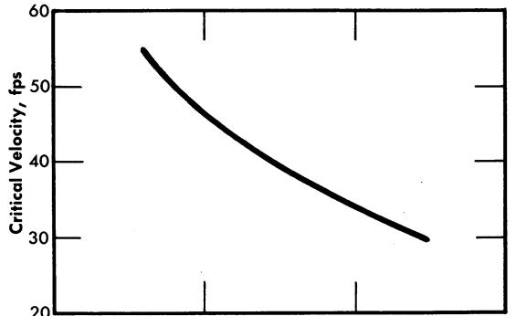

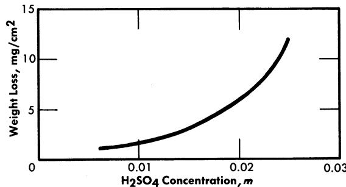  
FIG. 5-12. The effect of sulfuric acid concentration on the critical velocity and on the extent of corrosion at low flow rates at $250^{\circ}\mathrm{C}$ . Solution composition: $0.04\,m\, \mathrm{UO}_2\mathrm{SO}_4$ and $0.005\,m\, \mathrm{CuSO}_4$ .

Figure 5-12 shows the effect of sulfuric acid added to $0.04 \, \text{m} \, \text{UO}_2\text{SO}_4$ containing $0.005 \, \text{m} \, \text{CuSO}_4$ , on the amount of metal dissolved during film formation and on the critical velocity of the system. The effect of adding sulfuric acid is qualitatively the same at all uranyl sulfate concentrations and at all temperatures above $200^{\circ}\text{C}$ and produces a result similar to that of increasing the uranyl sulfate concentration. Thus it can be concluded that the acidity of the solution determines, at least in part, how much metal dissolves before a protective coating forms, and the critical velocity of the solution. It has been found that low concentrations of copper sulfate in uranyl sulfate solutions have no significant effect on the corrosion of type-347 stainless steel.

5-4.5 Temperature dependence of flow effects. It has been stated that increasing the flow rate of the solution generally produces a detrimental effect on the corrosion of type-347 stainless steel. This effect is temperature-dependent, as shown in Fig. 5-13. Although the results are based on a $0.17\mathrm{m}$ $\mathrm{UO}_2\mathrm{SO}_4$ solution, an increase in temperature has a similar effect at all concentrations. With a given solution composition (i.e., constant

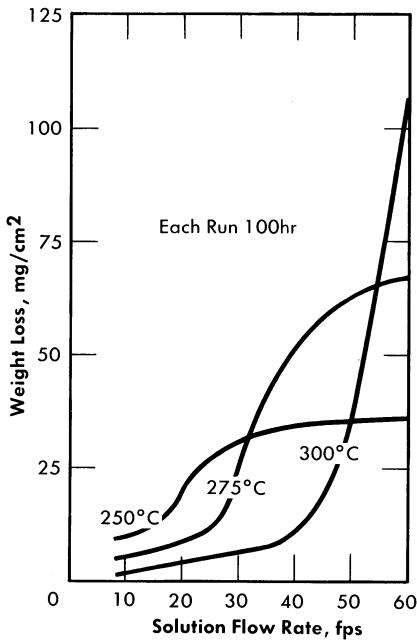  
FIG. 5-13. The corrosion of type-347 stainless steel in $0.17 \, \text{m} \, \text{UO}_2\text{SO}_4$ at different temperatures.

uranyl sulfate and sulfuric acid concentrations), increasing the temperature decreases the amount of metal that dissolves during film formation, increases the critical velocity, and increases the film-free corrosion rate of the stainless steel. The reasons for these effects are discussed in Article 5-4.7.

5-4.6 Effect of corrosion inhibitors. The number of substances that can be added to uranyl sulfate solutions to serve as corrosion inhibitors is limited for two reasons: (1) all organic inhibitors are oxidized to carbon dioxide in high-temperature oxygenated uranyl sulfate solutions, and (2) many inorganic compounds are insoluble in uranyl sulfate solutions. In spite of the second limitation, a number of inorganic salts have been added to uranyl sulfate solutions to determine their effectiveness in reducing the corrosion of type-347 stainless steel. Those substances that have been tested include: $\mathrm{Li_2SO_4}$ , $\mathrm{Na_2SO_4}$ , $\mathrm{BeSO_4}$ , $\mathrm{MgSO_4}$ , $\mathrm{Ag_2SO_4}$ , $\mathrm{CuSO_4}$ , $\mathrm{Cr_2(SO_4)_3}$ , $\mathrm{NiSO_4}$ , $\mathrm{FeSO_4}$ , $\mathrm{MnSO_4}$ , $\mathrm{Ce(SO_4)_2}$ , $[\mathrm{Ru(NO)}]_2(\mathrm{SO}_4)_3$ , $\mathrm{NaNO}_3$ , $\mathrm{Na_2WO_4}$ , $\mathrm{Na_2SiO_3}$ , $\mathrm{NaBiO_3}$ , $\mathrm{H_2MoO_4}$ , $\mathrm{H_3SbO_4}$ , $\mathrm{H_7P(MoO_4)_{12}}$ , $\mathrm{As_2O_5}$ , $(\mathrm{UO}_2)_3(\mathrm{PO}_4)_2$ , $\mathrm{NH_4TcO_4}$ , and $\mathrm{K_2Cr_2O_7}$ .

Of the compounds listed, only potassium dichromate and certain of the sulfate salts of the alkali and alkaline earth metals have been effective.

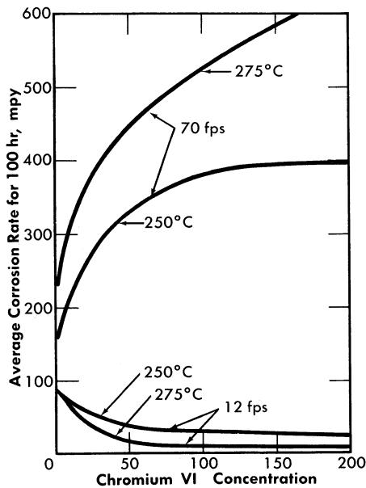  
FIG. 5-14. The effect of $\mathrm{Cr(VI)}$ in $0.17m\mathrm{UO}_2\mathrm{SO}_4$ on the corrosion of type-347 stainless steel.

Chromium(VI) was effective even at very low concentrations, whereas the sulfate salts had to be present in amounts nearly equal in molality to the uranyl sulfate.

The addition of chromium(VI) to high-temperature uranyl sulfate solutions reduces the amount of metal corroded during film formation, greatly increases the critical velocity, but materially increases the corrosion rate of the stainless steel at flow rates in excess of the critical velocity. Results obtained using coupon-type corrosion specimens in a loop through which $0.17 \, m\, \mathrm{UO}_2\mathrm{SO}_4$ was circulated at $250^{\circ}\mathrm{C}$ indicated that 200 ppm chromium(VI) increased the critical velocity from 20 to 25 fps to between 50 and 60 fps [30]. Other tests were carried out in which two pin-type specimens were exposed for 100 hr at flow rates both above and below the critical velocity in $0.17 \, m\, \mathrm{UO}_2\mathrm{SO}_4$ . The results are presented in Fig. 5-14. The corrosion rates at 70 fps are true rates which would not change on continued exposure; those at 12 fps are average rates for the 100-hr exposures and would decrease. Had the exposure been for 200 hr, the rates would have been approximately half those shown. It should be noted that as the film-free corrosion rate increased, the average corrosion rate at the low flow rate decreased.

It has been found that the presence of added sulfate salts in nearly equimolar concentration appreciably reduced the corrosion by concentrated

uranyl sulfate solutions. The salts that have been studied the most are beryllium sulfate, lithium sulfate, and magnesium sulfate. The phase stability [31] of the above solutions has been reported, as have the corrosion results [32-34]. For example, the weight loss for a 200-hr exposure of stainless steel in $2.0\mathrm{m}$ $\mathrm{UO}_2\mathrm{SO}_4$ containing $2.0\mathrm{m}$ $\mathrm{Li}_2\mathrm{SO}_4$ at $200^{\circ}\mathrm{C}$ was only $5\mathrm{mg/cm}^2$ for velocities up to 60 fps. This may be compared with $100\mathrm{mg/cm}^2$ for exposure to a $1.3\mathrm{m}$ $\mathrm{UO}_2\mathrm{SO}_4$ solution under similar conditions. The effect of lithium sulfate was less pronounced at $250^{\circ}\mathrm{C}$ and high velocities; at $250^{\circ}\mathrm{C}$ and 50 fps, weight losses were approximately 70 and $400\mathrm{mg/cm}^2$ , respectively, for solutions of these same concentrations. For flow velocities less than 30 to 40 fps initial weight losses were found to be in the range of 5 to $15\mathrm{mg/cm}^2$ for equimolar concentrations of uranyl sulfate and lithium sulfate up to $4.4\mathrm{m}$ and temperatures up to $350^{\circ}\mathrm{C}$ .

In dilute uranyl sulfate solutions the addition of sulfate salts also reduces the corrosion of stainless steel, but at temperatures of $250^{\circ}\mathrm{C}$ and higher the solutions are chemically unstable and complex hydrolytic precipitates form. At lower uranyl sulfate concentrations (0.04 to $0.17\,m$ ) the solutions demonstrating the greatest stability are those containing beryllium sulfate, and of the three sulfates most investigated, the least stable of the solutions were those with lithium sulfate. Sulfuric acid can be included in such solutions to prevent precipitation, but in so doing some of the effectiveness of the sulfate salt is lost. However, addition of both lithium sulfate and sulfuric acid to dilute uranyl sulfate solutions has been found to result in improved corrosion resistance of zirconium alloys on in-pile exposure [35].

5-4.7 Qualitative mechanism of the corrosion of stainless steel in uranyl-sulfate solutions. Although any proposed mechanism for the corrosion of stainless steel in uranyl sulfate solutions at high temperatures must be considered qualitative, from a study of the effects of several variables on corrosion and from visual observation of high-temperature solutions sealed in quartz tubes, certain conclusions can be drawn and the over-all reaction processes determined.

The austenitic stainless steels and most other metals and alloys of practical importance in large-scale homogeneous reactors are thermodynamically unstable in aqueous solutions and depend on protective films for their corrosion resistance. Fortunately, when austenitic stainless steels are oxidized in high-temperature uranyl sulfate solutions, the steel oxidizes uniformly so that no element (or elements) is leached preferentially from the alloy. However, not all the alloying elements contribute to film formation.

The oxidation and reduction processes of the corrosion reaction can be considered separately, with the oxidation reactions (considering only the major alloying elements) represented in the following manner:

$$
\mathrm {F e}, \mathrm {C r}, \mathrm {N i} \longrightarrow \mathrm {F e} (\mathrm {I I}) + \mathrm {C r} (\mathrm {I I I}) + \mathrm {N i} (\mathrm {I I}) + \mathrm {e} ^ {-}, \tag {5-1}
$$

$$
\mathrm {F e} (\mathrm {I I}) \longrightarrow \mathrm {F e} (\mathrm {I I I}) + \mathrm {e} ^ {-}. \tag {5-2}
$$

Both iron(II) and nickel(II) are soluble in uranyl sulfate solutions to an appreciable extent at high temperature, but if an oxidizing agent more powerful than uranyl ions is present, the reaction indicated by Eq. (5-2) takes place. [Manganese(II) also remains in solution.]

The half-reaction for the reduction can be any of the following, depending on the conditions:

$$
\mathrm {O} _ {2} + 4 \mathrm {H} ^ {+} + 4 \mathrm {e} ^ {-} \longrightarrow 2 \mathrm {H} _ {2} \mathrm {O}, \tag {5-3}
$$

$$
\mathrm {U O} _ {2} (\mathrm {I I}) + 4 \mathrm {H} ^ {+} + 2 \mathrm {e} ^ {-} \longrightarrow \mathrm {U} (\mathrm {I V}) + 2 \mathrm {H} _ {2} \mathrm {O}, \tag {5-4}
$$

$$
2 \mathrm {H} ^ {+} + 2 \mathrm {e} ^ {-} \longrightarrow \mathrm {H} _ {2}. \tag {5-5}
$$

In most concentrations of uranyl sulfate at temperatures greater than $200^{\circ}\mathrm{C}$ (and probably even at somewhat lower temperatures), iron (III), chromium(III), and uranium(IV) are present in solution only briefly before hydrolyzing in the following manner:

$$
2 \mathrm {F e} (\mathrm {I I I}) + 3 \mathrm {H} _ {2} \mathrm {O} \longrightarrow \mathrm {F e} _ {2} \mathrm {O} _ {3} + 6 \mathrm {H} ^ {+}, \tag {5-6}
$$

$$
2 \mathrm {C r} (\mathrm {I I I}) + 3 \mathrm {H} _ {2} \mathrm {O} \longrightarrow \mathrm {C r} _ {2} \mathrm {O} _ {3} + 6 \mathrm {H} ^ {+}, \tag {5-7}
$$

$$
2 \mathrm {U O} _ {2} (\mathrm {I I}) + \mathrm {U} (\mathrm {I V}) + 4 \mathrm {H} _ {2} \mathrm {O} \longrightarrow \mathrm {U} _ {3} \mathrm {O} _ {8} + 8 \mathrm {H} ^ {+}. \tag {5-8}
$$

In a system containing oxygen the total reduction process is represented by Eq. (5-3), although it is highly probable that other ions enter into the reaction mechanism. Only in the absence of oxygen is either $\mathrm{U}_{3}\mathrm{O}_{8}$ or hydrogen found in the system.

If we examine the equations as written, it is apparent that the over-all corrosion of stainless steel in uranyl sulfate solutions containing oxygen can be represented by the sum of Eqs. (5-1), (5-2), (5-3), (5-6), and (5-7), taking into account the percentage of each element in the alloy. From the over-all reaction it can be seen that the amount of oxygen consumed can be used to measure the quantity of stainless steel corroded. In addition, since the nickel originating from the corrosion process remains soluble, the total quantity of stainless steel oxidized can be determined from a knowledge of the nickel content of the uranyl sulfate solution. Measurements of nickel content and oxygen consumption have been found to agree well with weight loss for determining total corrosion. Since the nickel remains soluble and replaces hydrogen ions, the pH of the solution slowly increases as corrosion proceeds.

In a system depleted in oxygen, uranium is reduced and precipitated as $\mathrm{U}_3\mathrm{O}_8$ , producing hydrogen ions while ferrous ions remain soluble. Consequently, a pH measurement gives an indirect measure of the presence or absence of oxygen in the system. Similarly, the presence of ferrous ions even in very small amounts indicates a deficiency of oxygen and that uranium is beginning to precipitate from the solution.

Once an anhydrous protective coating has formed on the surface of the stainless steel, the steel corrodes at an extremely slow rate. However, since the oxide coatings are thick, it is probable that they are under stress, and fine cracks or imperfections form. When the film-free metal at the base of the crack is exposed to the solution, the metal again corrodes actively until the corrosion products repair the crack. During extended periods of testing, this process is probably repeated many times over the surface of the specimen, with the net observable result being a uniform attack of the specimen.

In the proposed mechanism of film formation, both iron and chromium form ions before undergoing hydrolysis and crystallization on the surface of the stainless steel. This mechanism can account for the existence of a critical velocity, since ions and hydrolyzed particles can diffuse into the circulating stream before forming the film if the diffusion layer is too thin. Since the diffusion-layer thickness depends on the flow rate or turbulence, the process of film formation is, in essence, in competition with diffusion and turbulence. The critical velocity, then, is that flow rate (or turbulence) at which the diffusion layer is reduced to such an extent that most of the corrosion products get into the main circulating stream before they can form on the surface of the stainless steel. Under conditions where the rates of dissolution and hydrolysis are fast, the critical velocity would be expected to be relatively high.

It has been mentioned that solutions of uranyl sulfate are acid and that the higher the uranyl sulfate concentration, the lower the pH of the solution. Also, data have been presented to show that the higher the uranium concentration, the greater the corrosion rate of film-free stainless steel. These two factors essentially work against each other with regard to film formation; that is, a high corrosion rate would introduce relatively large concentrations of corrosion products into the solution in the immediate region of the stainless steel surface, a factor which should facilitate the formation of a protective film. But even though more corrosion products are present, the hydrogen ion concentration is also substantially greater. Since hydrolysis reactions are very dependent on the hydrogen ion concentration, the rate of film formation is actually retarded, so that the net result is the dissolution of more stainless steel at high uranyl sulfate concentrations than at lower concentrations before a protective film is formed. Because the process of film formation is slower the higher the uranyl sulfate concentration, the critical velocity is also lower the higher the uranyl sulfate concentration.

Since the presence of sulfuric acid in uranyl sulfate solutions also decreases the rate of hydrolysis, the addition of sulfuric acid has about the same effect as increasing the uranyl sulfate concentration.

The effect of temperature on the formation of a protective coating can

be accounted for by considering the effect of temperature on the rate at which the corrosion products are formed and on their rates of hydrolysis. Increasing the temperature increases the rate at which corrosion products enter the solution and also the rate of hydrolysis, with the net result that films form faster and that the critical velocity is increased. Because the initial corrosion rate and the rate of precipitation are fast, it would be expected that the crystallite size of the oxide would be smaller than the higher the temperature of formation, and this has been found to be true. Apparently a compact layer of small crystals forms a more protective and adherent coating than one composed of large crystals.

It is probable, though seemingly paradoxical, that chromium(VI) serves as a corrosion inhibitor, at least under certain conditions, because it accelerates the film-free corrosion rate of stainless steel. In this respect, the effect of adding chromium(VI) to uranyl sulfate solutions is similar to that of increasing the temperature. Because of the increased corrosion rate, large quantities of corrosion products are formed near the surface of the stainless steel, and hence the solubility limit of the oxides is exceeded rapidly and many small crystals form on the surface of the stainless steel. Even though the rate of hydrolysis is not increased as it is at the higher temperatures, the diffusion rate is slower, so that the corrosion products are in the vicinity of the stainless steel longer. Because the film forms faster, the critical velocity is higher in the presence of chromium(VI) than in its absence, other variables remaining the same.

The reason why the addition of relatively large quantities of inert sulfate salts to uranyl sulfate solutions reduces the corrosiveness of the resulting solutions is not known, but may be due to one of a number of factors, such as the formation of stable complexes, reduction of acidity, changes in oxidizing power, increased viscosity and density, or changes in colloidal properties of the oxide.

5-4.8 Radiation effects.* The effect of radiation on the corrosion behavior of stainless steel is important in relation to the use of this material in construction of the fuel-circulating system and reactor pressure vessel of a homogeneous reactor. The radiation levels thus encountered, however, are considerably less than for the zirconium core tank. For example, the fission power density of the solution in contact with the stainless steel in the HRE-2 will not exceed $1\mathrm{kw / liter}$ for operation at $10\mathrm{Mw}$ , and in a large-scale two-region breeder or single-region burner reactor would not be more than $5\mathrm{kw / liter}$ . These values may be compared with fission power densities of up to $50\mathrm{kw / liter}$ at the surface of the zirconium core tank.

The corrosion behavior of type-347 stainless steel in uranyl-sulfate solutions under irradiation at high temperature has been studied in a

number of in-pile loop and in-pile autoclave experiments. A few scouting type experiments of the effect of van de Graaff electrons on steel corrosion have also been carried out. Although most of the information for the radiation effect on steel has its source in these experiments (in particular, the loop experiments), information of a general nature has been derived from the performance of the stainless steel portion of the HRE-1.

With loop experiments, specimens were located in the core portion of the loop and in portions of the loop external to the core and out of the high-flux region [36], as shown in Fig. 5-6 (Article 5-2.2). Coupons and other specimens exposed in these latter positions are designated "in-line specimens." Specimen preparation, in general, comprised only cleaning after machining. However, prior to radiation exposure, each experimental system, including the specimens, was exposed first to water, with or without oxygen, and then to oxygenated uranyl sulfate solution at a temperature near the test temperature [37]. Corrosion attack of a specimen was determined from weight-loss measurements, visual inspection, and metallographic examination. The course of corrosion of the system during exposure in both loops and autoclaves was followed by measuring the rate of oxygen consumption. The approximate operating conditions and other experimental information for the loop tests are shown in Table 5-9 (Article 5-5.3). All the loops contained steel specimens except those otherwise indicated. Experiment L-2-14 contained only a few steel coupons. A detailed description of methods and procedures employed with the in-pile tests is presented in Article 5-5.3.

The behavior of steel under exposure to a solution in which fissioning is occurring in the immediate neighborhood of the surface appears to change appreciably with changes in experimental conditions. No comprehensive picture of the behavior is available as yet, and only the general features of the experimental results can be reported. Pits of 1 to 2 mils in depth, which appear to spread laterally and merge (with increasing attack), are usually found on the surfaces of specimens which have suffered appreciable attack [38]. After the merging of pits, the attack appears to proceed fairly uniformly over a surface.

Average corrosion rates which have been determined for core specimens in $0.17\,m\, \mathrm{UO}_2\mathrm{SO}_4$ solution plus varying amounts of $\mathrm{H}_2\mathrm{SO}_4$ and $\mathrm{CuSO}_4$ varied between 0.1 and $>180\, \mathrm{mpy}$ for solution power densities up to $5\, \mathrm{kw/liter}$ and for solution velocities up to 45 fps [39]. These rate values for specimens and the other rates quoted below are based on exposed specimen areas and radiation time.

With the exception of the results of two experiments, the rates observed at power densities below $2\mathrm{kw / liter}$ were less than 2 mpy. In one of the experiments, L-4-8, for which the results are an exception of this generalization, a specimen exposed to a solution power density of about $2\mathrm{kw / liter}$

and an average solution velocity of about 40 fps exhibited a rate of 40 mph. The pattern of the results in this case indicated that the high solution velocity was, in part, responsible for the high rate. In the other experiment, DD, rates varying from 2.5 to 57 mph at solution power densities from 0.3 to $1.7\mathrm{kw}$ /liter and solution velocities from 10 to 40 fps were observed. This experiment was the first of the series of loop experiments. The higher rates in this loop may have been associated with the exceptional solution conditions. Only a small amount of excess acid was added initially, and it was estimated that this excess was consumed in the solution of nickel produced in corrosion during the course of the experiment. This solution condition was not repeated in subsequent experiments [40].

No significant acceleration of corrosion has been observed with specimens exposed at in-line positions in the loops; that is, at positions in which the sample is not exposed to neutrons but is exposed to solution which has passed through the core. Average corrosion rates for in-line specimens were less than 2.3 mpy for all cases considered. These in-line specimens were exposed to solution velocities in the range of 10 to 40 fps, but no significant effect of velocity on the corrosion rate was observed [41]. However, in one experiment, L-4-12, a single pit was observed in the surface of the recessed shoulder of the volute inlet of the pump, a high-velocity region [42]. It should be noted that the rates mentioned are based on the loss in weight of a specimen during exposure as measured after a cathodic defilmimg treatment. The oxide is not always removed quantitatively in this treatment. Weight gains were frequently observed for in-line specimens, and in these cases the rate of attack was assumed to be zero.

The results of the experiments with van de Graaff electrons have not shown any significant effect of electron irradiation on the corrosion of type-347 stainless steel by uranyl sulfate solutions at the high temperatures. One of these experiments, carried out in a type-347 stainless steel thermal siphon loop, was with an oxygenated $0.17 \, \text{m} \, \text{UO}_2\text{SO}_4$ solution at $250^{\circ}\text{C}$ . The intensity of electron irradiation was such that the estimated power density from absorption of electron energy in solution adjacent to the specimen was 20 to $30 \, \text{kw/liter}$ . Two exposures, each of 50-hr duration, were made, and no significant difference was observed between the attack of irradiated and nonirradiated specimens [43]. The other experiment was conducted in a titanium thermal loop with an oxygenated solution, $0.04 \, \text{m} \, \text{UO}_2\text{SO}_4$ , $0.025 \, \text{m} \, \text{H}_2\text{SO}_4$ , and $0.01 \, \text{m} \, \text{CuSO}_4$ at $280^{\circ}\text{C}$ . The estimated power density due to absorption of electron energy adjacent to the specimen was about $60 \, \text{kw/liter}$ . Again no significant difference between the attack of irradiated and nonirradiated specimens was noted in a 50-hr exposure [44].

It has been suggested that chemical changes in solution due to fissioning and/or the radiation from fission-product decay, both of which would be

proportional to the total fission power averaged over the total solution volume of the high-pressure system, might have an adverse effect on the behavior of the stainless steel located in the regions external to the core. In loop experiments at average power densities up to $1.5\mathrm{kw / liter}$ , no such effect was apparent. The only available information on the corrosion of type-347 stainless steel at higher average power densities is that from the HRE-1. In this case the maximum average power density was about $14\mathrm{kw / liter}$ , and the over-all stainless steel corrosion rates (including the core tank) were 6 to 8 mpy as judged from data for total nickel in solution [45].*

The influences of some of the variables on the corrosion behavior of stainless steel under exposure to a fissioning solution, as indicated by the results to date, are listed and summarized as follows:

Fission power density. Corrosion is accelerated by exposure to fissioning uranyl sulfate solution, and the degree of acceleration increases with increasing fission power density in solution. In several experiments, reasonably good proportionality was found between the fission power density to which a specimen was exposed and the logarithm of the average corrosion rate of the specimen during exposure.

Excess $H_{2}SO_{4}$ . One interpretation of some of the results is that the optimum concentration of excess $H_{2}SO_{4}$ is between 0.01 and $0.02m$ , and that concentrations above and below these limits may have an adverse effect on in-pile corrosion.

Velocity of solution at specimen. There is some evidence that the in-pile rate increases with increasing solution velocity.

Radiolytic-gas pressure. A possible interpretation of some of the results is that the in-pile rate is diminished as the concentration of radiolytic gas in solution increases.

Galvanic effects. The possibility of galvanic effects on corrosion under some in-pile conditions has not been ruled out.

Temperature. In general, the attack observed at $250^{\circ}\mathrm{C}$ was greater and less predictable than that observed at $280^{\circ}\mathrm{C}$ .

# 5-5. RADIATION-INDUCED CORROSION OF ZIRCALOY-2 AND ZIRCONIUM†

5-5.1 Introduction. Crystal-bar zirconium and Zircaloy-2 have been tested at elevated temperatures in uranyl sulfate solutions under dynamic and static conditions in the absence and in the presence of radiation. Both

the metal and alloy are very corrosion resistant in the absence of radiation. However, under exposure to nuclear radiations, particularly those from fissioning uranium solution, corrosion rates may be appreciably greater than those observed out-of-radiation. Although most of this section will be concerned with the in-pile studies, some of the out-of-pile tests will also be described.

5-5.2 Corrosion of Zircaloy-2 and zirconium in uranyl sulfate solutions in the absence of radiation. Most of the radiation-free experiments were of the type in which specimens of the metal to be tested were exposed in autoclaves or loops constructed of stainless steel or titanium. The uranyl sulfate solutions were oxygenated and usually contained excess $\mathrm{H}_2\mathrm{SO}_4$ . $\mathrm{CuSO}_4$ was also added in some tests. Cleaned, as-machined specimens were employed. Under exposure to the uranyl sulfate solutions at high temperature, the specimens generally formed a black, tightly adhering film within 100 hr. These films could not be removed without damage to the metal, and the amount of corrosion was estimated from the weight of a specimen together with the oxide.

Zirconium and Zircaloy-2 specimens exposed in solutions circulating in stainless steel systems collected some of the stainless steel corrosion products (iron and chromium oxides) in an outer layer of scale. This outer layer could be removed partially by a cathodic defilmng operation. A sodium hydride bath treatment was required for complete removal. Table 5-8 lists values for long-term average corrosion rates observed in a solution $0.04m$ in $\mathrm{UO}_2\mathrm{SO}_4$ , $0.02m$ in $\mathrm{H}_2\mathrm{SO}_4$ , and $0.005m$ in $\mathrm{CuSO}_4$ at 200, 250, and $300^{\circ}\mathrm{C}$ .

TABLE 5-8 LONG-TERM CORROSION RATES OF ZIRCONIUM AND ZIRCALOY-2 IN URANYL SULFATE SOLUTIONS   

<table><tr><td rowspan="2">Material</td><td colspan="3">Corrosion rate, mpy</td></tr><tr><td>200°C</td><td>250°C</td><td>300°C</td></tr><tr><td>Crystal-bar zirconium</td><td>&lt;0.01</td><td>&lt;0.01</td><td>0.13</td></tr><tr><td>Zircaloy-2</td><td>&lt;0.01</td><td>&lt;0.01</td><td>0.04</td></tr></table>

These rate values were calculated from the decrease in weight of defilmed specimens as measured following an initial exposure period of several days. Other tests gave similar results at uranyl sulfate concentrations from

0.02 to $1.3m$ . No evidence for appreciable acceleration of attack during exposure was observed during tests of up to 20,000 hr.

A few experiments with Zircaloy-2 were carried out in autoclaves similar to the in-pile type [46] described in Article 5-2.2. In these experiments, the autoclave was constructed of Zircaloy-2 and was charged with the test solution, oxygen gas, and specimens. The test surfaces were as-machined and cleaned. Corrosion during exposure was determined by measuring the rate of oxygen loss within the system. The results of two of these experiments, H-54 and H-55, are shown graphically in Fig. 5-15, where the thickness of the layer of metal which was converted to oxide or removed by oxidation is plotted on a log-log plot versus the exposure time.

Data reported by Thomas [47] on the behavior of Zircaloy-2 in deaerated water at temperatures of 290 and $315^{\circ}\mathrm{C}$ , when converted into values for the thickness of the layer of oxidized metal, are similar to those for H-54 and H-55. The water data at $315^{\circ}\mathrm{C}$ are illustrated in Fig. 5-15 by the dotted line. From these results, it appears that the out-of-pile behavior of Zircaloy-2 in oxygenated uranyl sulfate solutions is similar to that in deaerated water in the temperature region investigated.

5-5.3 Methods and procedures employed with in-pile tests. In-pile investigations were carried out with autoclaves and loops (described in Article 5-2.2). A majority of the autoclave experiments and all the loop experiments were conducted in the Low Intensity Test Reactor at ORNL. The maximum thermal-neutron flux available for these experiments was about $2 \times 10^{13}$ neutrons/( $\mathrm{cm}^2$ ) (sec).

For most experiments, the autoclave and the corrosion specimens were constructed of the metal to be studied. The autoclave was partly filled with the solution to be tested, pressurized with oxygen, and stirred by rocking. Measurements of the oxygen pressure in the system during exposure provided information regarding the course of corrosion.

Most of the in-pile loops were constructed of type-347 stainless steel; however, in one experiment the loop was of titanium, and in another the core portion only was of titanium. Corrosion specimens were placed in the core and in a portion of the loop which is outside the region of appreciable neutron flux. The specimens in the latter position were usually duplicates of the core specimens. The over-all corrosion behavior during exposure was followed by measuring the rate of oxygen consumption within the system, and by chemical analysis of solution samples which were withdrawn from time to time. Specimen examination included visual and metallographic inspection, and weight measurements. The exposure conditions and composition of test solution which prevailed for each of the in-pile loop experiments are listed in Table 5-9. Unless otherwise noted, all tests were run with a light-water solution of $0.17\mathrm{m}$ $\mathrm{UO_2SO_4}$ in a type-347

TABLE 5-9   
APPROXIMATE OPERATING CONDITIONS FOR IN-PILE LOOP EXPERIMENTS  

<table><tr><td rowspan="2">Loop number</td><td colspan="2">Excess H2SO4</td><td rowspan="2">Estimated radiolytic gas, main stream (cc/liter,STP)</td><td rowspan="2">Temp. main stream, °C</td><td colspan="2">Fission power density</td><td colspan="2">Time</td></tr><tr><td>Range, m</td><td>Mean, m</td><td>Range adjacent to core specimens, kw/liter</td><td>Average in total loop solution, kw/liter</td><td>Total operating time at temperature, hr</td><td>Time of irradiation at full power, hr</td></tr><tr><td>DD (a)</td><td>0.008–0</td><td>0.003</td><td>120</td><td>250</td><td>1.7–0.3</td><td>0.50</td><td>550</td><td>280</td></tr><tr><td>FF (f)</td><td>.021–0.040</td><td>.028</td><td>170</td><td>250</td><td>3.7–0.7</td><td>.55</td><td>816</td><td>467</td></tr><tr><td>GG (f)</td><td>.015–.043</td><td>.026</td><td>220</td><td>250</td><td>4.8–1.3</td><td>.75</td><td>1169</td><td>897</td></tr><tr><td>EE</td><td>.004–.008</td><td>.006</td><td>170</td><td>250</td><td>5.7–1.0</td><td>.48</td><td>757</td><td>537</td></tr><tr><td>L-4-8</td><td>.017–.044</td><td>.023</td><td>170</td><td>250</td><td>5.1–0.7</td><td>.55</td><td>1729</td><td>1459</td></tr><tr><td>L-4-11</td><td>.008–.040</td><td>.022</td><td>220</td><td>250</td><td>7.0–1.3</td><td>.62</td><td>1203</td><td>725</td></tr><tr><td>L-4-12 (d)</td><td>.027–.044</td><td>.031</td><td>180</td><td>250</td><td>4.8–0.9</td><td>.67</td><td>2173</td><td>1462</td></tr><tr><td>L-2-10 (b)</td><td>.014–.021</td><td>.018</td><td>170</td><td>280</td><td>4.2–0.8</td><td>.41</td><td>1869</td><td>1255</td></tr><tr><td>L-4-13 (c)</td><td>.010–.021</td><td>.015</td><td>280</td><td>250</td><td>6.3–1.1</td><td>.55</td><td>1212</td><td>787</td></tr><tr><td>L-2-15</td><td>.027–.030</td><td>.028</td><td>370</td><td>278</td><td>19.8–4.6</td><td>1.70</td><td>831</td><td>544</td></tr><tr><td>L-4-16</td><td>.022–.026</td><td>.024</td><td>110</td><td>280</td><td>5.7–1.3</td><td>.45</td><td>1200</td><td>775</td></tr><tr><td>L-2-14 (e-g)</td><td>.37–.42</td><td>.40</td><td>50</td><td>280</td><td>20.8–4.3</td><td>1.80</td><td>1034</td><td>510</td></tr><tr><td>L-2-17 (h)</td><td>.024–.028</td><td>.024</td><td>140</td><td>300</td><td>6.7–1.4</td><td>.48</td><td>1333</td><td>875</td></tr><tr><td>L-4-18 (c)</td><td>.018–.020</td><td>.019</td><td>200</td><td>235</td><td>5.2–1.1</td><td>.52</td><td>1021</td><td>642</td></tr></table>

(a) Stainless steel specimens only. (b) $0.04m\mathrm{UO}_2\mathrm{SO}_4,\mathrm{O}_2$ pressure 310-90 psi. (c) $\mathbf{D}_2\mathbf{O}$ solvent. (d) Ti-75A core, 347 S.S. body. (e) All Ti-75A loop. (f) No stainless steel specimens. (g) $0.15m\mathrm{CuSO}_4.$ (h) $0.04m\mathrm{UO}_2\mathrm{SO}_4.$

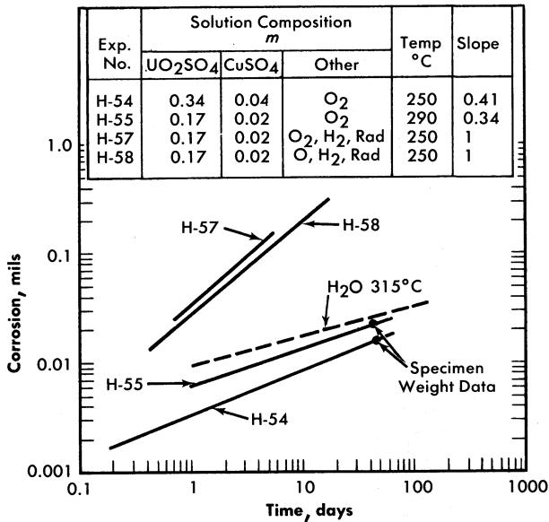  
FIG. 5-15. Comparison of Zircaloy-2 corrosion in various environments.

stainless steel loop. $\mathrm{CuSO_4}$ concentrations from $0.008\textbf{m}$ to $0.07\textbf{m}$ were employed. Oxygen pressures ranged from highs of 140 to 195 psi to lows of 35 to 90 psi. Pressurizer temperatures were normally 15 to $30^{\circ}\mathrm{C}$ higher than the temperature of the main stream.

The solution compositions for a majority of the autoclave experiments are summarized in Table 5-10. In the usual experiment, the fission power

TABLE 5-10   
SUMMARY OF SOLUTION COMPOSITION FOR AUTOCLAVE RADIATION CORROSION EXPERIMENTS WITH ZIRCALOY-2   

<table><tr><td>Component</td><td>Concentration</td></tr><tr><td>\( \mathrm {U O}_{2}\mathrm {SO}_{4} (90\% enriched uranium) \)</td><td>0.17 m</td></tr><tr><td>\( \mathrm {CuSO}_{4} \)</td><td>0.01-0.04 m</td></tr><tr><td>\( \mathrm {H}_{2}\mathrm {SO}_{4} \)</td><td>0-0.04 m</td></tr><tr><td>Excess \( \mathrm {O}_{2} \)</td><td>900-20 psi</td></tr><tr><td>Radiolytic gas</td><td>0-500 psi</td></tr></table>

density was $20\mathrm{w / ml}$ or less. In a few exceptional autoclave experiments, power densities considerably greater than $20\mathrm{w / ml}$ were achieved [48].

Operating temperatures ranged from 225 to $300^{\circ}\mathrm{C}$ , with most experiments at 250 or $280^{\circ}\mathrm{C}$ .

The method of filling and sealing many of the early autoclave experiments included air at atmospheric pressure within the system. Solution analyses after irradiation indicated that most of the nitrogen from this air was fixed in solution in some oxidized form with possible concentrations (if all $\mathrm{NO}_3^-$ ) up to or about $0.05\,m$ [49].

The usual preparation of specimen surfaces consisted of cleaning after machining. Before exposure to radiation, the systems, with specimens, were first subjected to high-temperature water, with or without oxygen, and then to the uranyl sulfate solution at temperatures near the test temperature. The loop systems were exposed to solutions of normal uranyl sulfate before the exposure to the $\mathrm{U}^{235}$ -enriched uranyl sulfate solutions.

The thermal neutron flux to which a Zircaloy-2 specimen was exposed while in-pile was determined by measuring and comparing the amount of the induced activities, $\mathrm{Zr}^{95}-\mathrm{Nb}^{95}$ , in the specimen and in a control sample of Zircaloy-2. The latter was irradiated together with a cobalt monitor in a separate experiment in which the specimen and cobalt did not contact solution. For some experiments which contained steel specimens, similar measurements were made utilizing the $\mathrm{Cr}^{51}$ activity. The fission power density in the uranium solution adjacent to a specimen was calculated from the resulting value for the thermal flux together with the value for the fission cross section of uranium, assuming 200 Mev per fission.

Recently, comparisons have been made between values for the flux indicated by cobalt monitors within the test system and by Zircaloy-2 within the same system. The flux values determined from the cobalt were about $25\%$ less than those from Zircaloy-2. The cobalt values may be more valid, but the consistency between Zircaloy-2 results has been good, and the Zircaloy-2 values are employed throughout in presenting the results [50].

Experimental conditions other than those summarized above have been employed, and some of these will be mentioned later.

5-5.4 Results of in-pile tests with Zircaloy-2 and zirconium. The results of autoclave experiments have demonstrated that the corrosion rate of Zircaloy-2 under irradiation at a given set of exposure conditions does not change with the time of exposure, in contrast to out-of-pile behavior. Two in-pile autoclave experiments, H-57 and H-58, plotted in Fig. 5-15, illustrate this [51]. The lines through the plotted points for tests under radiation exhibit a slope of 1, and those for out-of-pile experiments, a slope of about 0.4. In both cases the values for penetration are those calculated from the results of oxygen consumption measurements. It was assumed in the calculations that corrosion of the exposed surfaces in the autoclave

was uniform and that oxygen was lost only in the formation of $\mathrm{ZrO_2}$ . These assumptions appear to be generally valid for the in-pile cases. The corrosion penetration calculated from weight changes of specimens was usually in near agreement with the penetration calculated from oxygen data. A pitting type attack was detected in only one of the numerous specimens which have been exposed [52]. The cause of pitting in this case is unknown.

The time scale which is employed for the radiation experiments is cumulative time with the reactor at power. During exposure of a given experiment, the reactor was frequently at zero power for appreciable periods. It has been observed in autoclave experiments that a penetration of from 0.005 to 0.01 mil takes place after shutdown and that, following this, corrosion essentially stops until power operation is resumed. The corrosion which takes place during shutdown appears to delay the onset of attack when irradiation is reinstituted; the amount of delay about balances off the additional attack which occurs during shutdown. In view of this behavior, the practice has been adopted of using radiation time only in calculating corrosion rates [53].

The oxide which is found on Zircaloy-2 surfaces under irradiation is markedly different from that formed outside of radiation. The in-pile specimens which are removed from the autoclaves are covered with a relatively heavy brass-colored scale. This scale cracks and flakes off to some extent upon drying. When a specimen is immersed in acetone and then air-dried at $100^{\circ}\mathrm{C}$ , the scale flakes off almost quantitatively [54]; remaining scale can be removed by cathodic defilmimg. The specimen surfaces after defilmimg generally exhibit a dark-gray color and, in some cases, interference colors. In-pile loop specimens, on the other hand, appear to be free of heavy scale of the type found in autoclaves. There is usually a dark-brown-colored scale on the surfaces, the amount of which is greatest for specimens exposed at the lowest power densities. The scale, of unknown composition, can be removed in a cathodic defilmimg operation [55].

Chemical analyses of heavy scale on autoclave specimens revealed that they contain several percent by weight of uranium and copper in addition to zirconium. Sulfate is found in some scales [56]. Core specimens from loop experiment L-2-17 have been analyzed for uranium as removed from the loop. Twenty micrograms of uranium per square centimeter were found on the surface of a specimen exposed in a location at which the solution velocity was about 1 fps. Five micrograms per square centimeter were found on a specimen exposed at a solution velocity of about 30 fps [57].

Average corrosion rates during exposure to radiation have been calculated from the observed loss in weight and the exposed specimen area, not including areas in close contact with adjacent specimens or covered by the

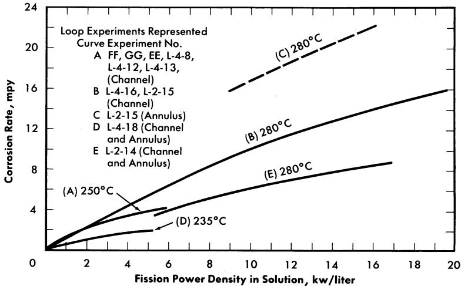  
FIG. 5-16. Radiation corrosion of Zircaloy-2 in $0.17 \, m \, \mathrm{UO}_2\mathrm{SO}_4$ solutions. Loop results at 235, 250, and $280^{\circ}\mathrm{C}$ .

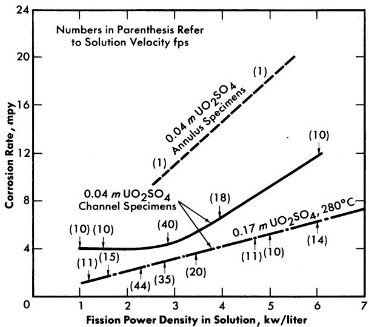  
FIG. 5-17. Radiation corrosion of Zircaloy-2 solutions. Loop results at 280 and $300^{\circ}\mathrm{C}$ .

specimen holder. In some cases, where specimens had different ratios of total to exposed areas, results indicated that the rate of attack of the covered areas was nearly the same as that of the exposed areas. However, use of only the exposed area gives more conservative values. For most of the loop specimens, the ratio of total to exposed area was about 1.6, and in autoclaves the ratio was nearly 1.

Loop results obtained with $0.17m\mathrm{UO}_2\mathrm{SO}_4$ solutions but with other conditions varying are illustrated in Fig. 5-16 [58]. Except for relatively minor variations, the solutions for the experiments represented by curves $A$ , $B$ , and $C$ were the same. Experiment L-2-14, curve $E$ , was with a solution containing $0.4m\mathrm{H}_2\mathrm{SO}_4$ and $0.15m\mathrm{CuSO}_4$ as additives. Experiment L-4-18, curve $D$ , was with a $\mathrm{D}_2\mathrm{O}$ solution. Channel specimens were exposed to solution velocities in the range 10 to 40 fps; annulus specimens to velocities of about 1 fps. Where annulus type specimens were employed, they usually exhibited rates somewhat greater than the channel specimens. The annulus type specimens in loop L-2-15 (curve $C$ ) represent the maximum difference observed in $0.17m\mathrm{UO}_2\mathrm{SO}_4$ solutions. No difference between channel and annulus specimens was observed in experiments L-4-18 and L-2-14 (curves $D$ and $E$ ). The $280^{\circ}\mathrm{C}$ data represented by line $B$ follows the equation

$$
R = 1. 0 4 P \left(1 - e ^ {- 9 5 / R ^ {1. 5}}\right), \tag {5-9}
$$

where $R =$ rate in mpy, and $P =$ power density in kw/liter. The data for $250^{\circ}\mathrm{C}$ (line $A$ ) follow the equation

$$
R = 1. 2 5 P \left(1 - e ^ {- 6. 5 / R ^ {1. 5}}\right). \tag {5-10}
$$

The derivation of an equation of this general form is given in Article 5-5.6. Data represented by the other curves are considered insufficient to justify representation by specific equations.

Results obtained with loop experiments with $0.04m\mathrm{UO}_2\mathrm{SO}_4$ solution (L-2-10 and L-2-17) are illustrated by the curves in Fig. 5-17 [59]. A portion of line $B$ from Fig. 5-16 is included in Fig. 5-17 for comparison. Corrosion rates for channel specimens in this solution are greater at the same power density than those for specimens in $0.17m\mathrm{UO}_2\mathrm{SO}_4$ solutions. The shape of the curve through the channel data is also different. As will be discussed later, these channel data may be interpreted in terms of a beneficial effect of solution velocity on corrosion. The approximate locations of specimens in the channel with respect to the power density to which the specimen was exposed and the average velocity of solution at the specimen are indicated in Fig. 5-17. The annulus specimens, which were exposed at low solution velocities, corroded at higher rates than the channel specimens.

The results of autoclave experiments at $250^{\circ}\mathrm{C}$ (curve $A$ , Fig. 5-16) with solutions of the same general compositions as those listed in Table 5-9, but with $0.04m$ excess $\mathrm{H}_2\mathrm{SO}_4$ [60], followed Eq. (5-10), developed for $250^{\circ}\mathrm{C}$ loop data. The rates obtained in autoclave experiments with similar solutions at $280^{\circ}\mathrm{C}$ [60] followed the equation

$$
R = 1. 3 6 P \left(1 - e ^ {- 9 5 / R ^ {1. 5}}\right), \tag {5-11}
$$

which illustrates that the rates were somewhat greater than those obtained with loop channel specimens at $280^{\circ}\mathrm{C}$ (curve $B$ , Fig. 5-16). In autoclave experiments with solutions of the same general composition but with no excess $\mathrm{H}_2\mathrm{SO}_4$ , the data at $250^{\circ}\mathrm{C}$ [60] followed the equation

$$
R = 2. 9 P \left(1 - e ^ {- 6. 5 / R ^ {1. 5}}\right), \tag {5-12}
$$

and the data at $280^{\circ}\mathrm{C}$ followed the equation

$$
R = 2. 4 5 P \left(1 - e ^ {- 9 5 / R ^ {1, 5}}\right). \tag {5-13}
$$

Rates obtained with $0.04m\mathrm{UO}_2\mathrm{SO}_4$ solutions in autoclaves were in approximate agreement with the values observed for annulus coupons in loop experiments with $0.04m$ solutions (Fig. 5-17) [60]. The effects of changes in some other variables on the in-pile rate are described below:

Time. As mentioned previously, the rates under irradiation appear to remain fairly constant with time.

Oxygen and hydrogen. No effect has been noted of changing the pressure of hydrogen within the test limits, 0 to 350 psi, and of oxygen within 150 to 900 psi.

$\mathrm{CuSO}_4$ . $\mathrm{CuSO}_4$ concentration apparently has little effect on the rate. The results of one autoclave experiment, Z-17, in which no copper was employed confirmed this behavior [61].

Nitrogen. The presence or absence of air at atmospheric pressure in the autoclave when sealed apparently has little effect on the rate [62].

Other solution variables. The presence of $\mathrm{Li_2SO_4}$ as an additive in the uranyl-sulfate solution has resulted in a decreased radiation effect in some autoclave experiments [63]. No appreciable effect on the rate has been noted for other solution additives such as $\mathrm{CrO_3}$ and $\mathrm{KTcO_4}$ [64]. An experiment to which $\mathrm{MoO_3}$ was added indicated an adverse effect for this material in solutions [64].

Other materials. Crystal-bar zirconium was tested in several loop and autoclave experiments. Observed corrosion rates were in near agreement with those for Zircaloy-2.

Chemically polished* specimens of Zircaloy-2 and crystal-bar zirconium corroded at rates about $10\%$ lower than the as-machined specimens.

Other zirconium alloys have been tested in some experiments, but only one of these alloys, $\mathrm{Zr - 15\%}$ Nb, has exhibited appreciably better resistance than Zircaloy-2. This niobium alloy has been tested in several loop and autoclave experiments. In the beta-quenched condition, it corroded at rates lower than those observed for Zircaloy-2 by factors of from 3 (run L-4-11) to 1.5 (run L-2-17) [65].

Zircaloy-2 autoclave experiments in the LITR and MTR reactors with solutions which contained $\mathrm{UO}_2\mathrm{SO}_4$ depleted of $\mathrm{U}^{235}$ have exhibited an acceleration of corrosion over that expected out-of-radiation. In these tests, absorption of fast neutron and gamma rays gave rise to a power density in solution of about $6\mathrm{kw / liter}$ in MTR experiments and 0.6 kw/liter in the LITR experiments. In each reactor, about one-half of the power was from gamma-ray and one-half from fast-neutron absorption. At 280 to $300^{\circ}\mathrm{C}$ the observed rates were about 1 and 4 mpy at the lower and higher powers, respectively [66].

5-5.5 Tests of the effect of fast-electron irradiation on Zircaloy-2 corrosion. The effect of fast electrons from a van de Graaff accelerator on the corrosion of Zircaloy-2 by uranyl sulfate solutions has been tested in experiments at 250 and $300^{\circ}\mathrm{C}$ . In both cases the specimens were mounted in a small thermal siphon loop constructed of titanium. Employing electrons with an initial energy of $1.5\mathrm{MeV}$ and currents in the neighborhood of $2\times 10^{14} / (\mathrm{cm}^2)(\mathrm{sec})$ , the experimental arrangement was such that an electron traversed approximately one-half of its range before impinging on the specimen. The estimated power density due to absorption of beta-ray energy in the solution adjacent to the specimen was 60 to $90~\mathrm{kw / liter}$ in each experiment. The duration of exposure was $40\mathrm{hr}$ at $250^{\circ}\mathrm{C}$ and $60\mathrm{hr}$ at $300^{\circ}\mathrm{C}$ . No significant acceleration of the corrosion due to irradiation was found in either case [67].

5-5.6 Discussion of results of radiation corrosion experiments. The results of the radiation experiments presented above suggest that the radiation effect on the corrosion of Zircaloy-2 by uranyl-sulfate solution is not directly associated with changes in solution under irradiation. If the radiation chemistry of these solutions at high temperature is not greatly different from that of acid solutions near room temperature, the yield of H-atoms and OH radicals in solution from beta and gamma radiation is at least as great as that from heavy particles [68]. Since radicals produce marked changes in reactions, rather than the molecular products $\mathrm{H}_{2}$ and

$\mathrm{O}_2$ , corrosion effects due to changes in solution would be as pronounced for beta-gamma radiation as for heavy particles. However, no effect of beta radiation was observed. It was also mentioned that no effect has been observed of varying $\mathbf{H}_2$ and $\mathrm{O}_2$ pressures in in-pile autoclave experiments. Thus the primary action of the radiation is in the metal or its protective oxide film, or both, probably through the formation of interstitials and vacancies by heavy nuclear particles. Beta-gamma radiations can also produce interstitials in such materials, but with considerably less efficiency. The number of such defects produced by an electron in the energy range employed in the van de Graaff experiments may be expected to be a factor of 100 or more less than the number produced by a 1-Mev neutron [69]. Hence the rate of defect formation by the electrons was small compared with the rate of formation by fast neutrons in the depleted $\mathrm{UO}_2\mathrm{SO}_4$ in-pile tests.

On the basis of these considerations and of the various experimental observations, a qualitative model of the radiation corrosion of Zircaloy-2 has been developed, from which an equation relating fission power density in solution and corrosion rate has been derived [70]. The equation has the general form

$$
R = A P \left(1 - e ^ {- B / R ^ {1. 5}}\right), \tag {5-14}
$$

where $R$ is the corrosion rate, $P$ is the fission power density, and $A$ and $B$ are constants. This equation is derived as follows.

Under exposure to heavy-particle radiation, the protective oxide film forms on the metal as it does out-of-radiation, and the kinetics of the protective oxide formation are about the same in and out of radiation. Under irradiation, however, the film does not continue to increase in thickness. Radiation produces defects of unspecified nature in the protective oxide, and in the presence of these defects, the oxide breaks up and/or reacts with the solution to form a nonprotective scale. The rate at which the protective oxide breaks up is proportional to the concentration of defects in the oxide at the oxide-solution interface. Under these conditions, a steady state is established in which oxide is removed at a rate equal to the rate of formation and in which a steady-state thickness of film results. The corrosion rate is determined by the rate of transfer of reagents across this film. The defects are produced at a rate proportional to the intensity of radiation and are removed by thermal annealing at a rate proportional to the concentration of defects. In the derivation of the general equation, it was assumed that the rate of oxidation of the metal, $R$ , at a given protective film thickness, $X$ , is given by

$$
R = C / X ^ {2}, \tag {5-15}
$$

where $C$ is a constant.

In considering the effect of solution composition and flow velocity on the radiation corrosion of Zircaloy-2, a number of interesting phenomena, related apparently to the sorption of uranium on or near the protective film, were observed. Some of these effects are illustrated in Fig. 5-17, based on data from runs L-2-10, L-2-17, L-4-16, and L-2-15 listed in Table 5-9. As shown in Fig. 5-17, at a given solution power density the corrosion rate was greater in $0.04\,m\, \mathrm{UO}_2\mathrm{SO}_4$ than in $0.17\,m\, \mathrm{UO}_2\mathrm{SO}_4$ , and the degree of difference was less in high-velocity regions (30 to 40 fps) than in low-velocity regions (10 fps). The low-velocity (1-fps) annulus specimens in the $0.04\,m$ solutions were attacked at markedly higher rates than the channel specimens. The addition of $0.04\,m$ excess $\mathrm{H}_2\mathrm{SO}_4$ to the $0.17\,m\, \mathrm{UO}_2\mathrm{SO}_4$ solutions in autoclave experiments had a beneficial effect at a given solution power density. The addition of a greater amount of excess $\mathrm{H}_2\mathrm{SO}_4$ ( $0.4\,m$ ) to the $0.17\,m\, \mathrm{UO}_2\mathrm{SO}_4$ in loop experiment L-2-14 also produced a beneficial effect.

It appears likely that most of these solution and velocity effects are associated with the sorption of uranium on the surface of the test specimens. As mentioned previously, uranium is usually found in the scale from specimens exposed in autoclave experiments. The amount of this uranium is less for specimens exposed to solution with $0.04\,m$ excess $\mathrm{H}_2\mathrm{SO}_4$ than for those exposed to solutions with no acid. One to two per cent uranium by weight is usually found for specimens exposed under the former conditions, and 5 to $6\%$ under the latter condition. It has been found that the autoclave results in the different solutions can be intercorrelated as well as correlated with the loop results if a corrected power density, $P_c$ , rather than the power density in solution is employed [71]. In this correlation, which is empirical, the corrected power density is assumed to be given by the expression

$$
P _ {c} = P _ {s} + K ^ {\prime} N U _ {f}, \tag {5-16}
$$

where $\mathrm{U}_f$ is the percentage uranium in the scale, $N$ is the thermal neutron flux, $P_s$ is the power density in solution, and $K'$ is a constant. Since $P_s$ is related to $N$ through the uranium concentration in solution, $\mathrm{U}_s$ , the equation may be written:

$$
P _ {c} = P _ {s} \left(1 + \frac {K U _ {f}}{U _ {s}}\right) \cdot \tag {5-17}
$$

The curve expressed by Eq. (5-9) was assumed for the relationship between power density in solution and corrosion rate in the absence of scale at $280^{\circ}\mathrm{C}$ . The constant $K$ in Eq. (5-17) was evaluated from the best fit of the $280^{\circ}\mathrm{C}$ autoclave data to the curve. The same value of the constant was found to apply in fitting the $250^{\circ}\mathrm{C}$ -autoclave data to Eq. (5-10),

which represents the line drawn through the results of the $250^{\circ}\mathrm{C}$ -loop experiments. On the basis of these correlations—that is, when the corrected power density is employed—it appears that there is no appreciable difference between the corrosion rate in autoclave solutions containing $0.04\,m\,\mathrm{H}_2\mathrm{SO}_4$ and in those free of excess acid. There is also no difference between $0.17\,m$ and $0.04\,m\,\mathrm{UO}_2\mathrm{SO}_4$ solutions in autoclave experiments.

The fact that the autoclave data can be correlated with the loop data represented by Eqs. (5-9) and (5-10) is of questionable significance, since it is not known whether the rates in the $0.17 \, m \, \mathrm{UO}_2\mathrm{SO}_4$ loop experiments were influenced by sorbed surface uranium. As mentioned previously, the loop specimens are usually free of heavy scale of the type found in autoclaves. However, uranium was found on specimens from the L-2-17 experiment, which was with a solution $0.04 \, m \, \mathrm{UO}_2\mathrm{SO}_4$ , and it appears likely that uranium sorption on a given Zircaloy-2 specimen was responsible for an appreciable fraction of the total corrosion attack on the given specimen both in this experiment and in experiment L-2-10 [72]. Since a greater amount of uranium was found on the surface of the low-velocity annulus specimen than on the high-velocity core channel specimen, it is also likely that differences in the amount of uranium which is sorbed at different velocities resulted in the apparent beneficial effect of increasing solution velocity [72] in these $0.04 \, m \, \mathrm{UO}_2\mathrm{SO}_4$ experiments.

# 5-6. CORROSION BEHAVIOR OF TITANIUM AND TITANIUM ALLOYS IN URANYL SULFATE SOLUTIONS*

5-6.1 Introduction. The corrosion behavior of commercially pure titanium and of titanium alloys has been tested at elevated temperatures in uranyl-sulfate solutions under dynamic and static conditions in the absence and in the presence of radiation. The equipment and testing procedures employed were identical with those employed in tests of Zircaloy-2 and type-347 stainless steel described previously.

Of the various in-pile loop experiments listed in Table 5-9, all but those designated DD, GG, and FF were concerned in part with titanium corrosion. In addition to the in-pile tests, one scouting-type experiment was made of the effect of fast electrons from a van de Graaff accelerator on the corrosion of titanium-75A in a small thermal siphon loop constructed of titanium.

5-6.2 Corrosion of titanium and titanium alloys in uranyl sulfate solutions in the absence of radiation. The commercially pure titanium and the titanium alloys developed a tightly adhering film under exposure which exhibited interference colors ranging from tan to deep blue or black, depending upon the alloy and upon conditions and length of exposure. This film could not be removed without damaging the metal. Titanium specimens exposed in uranyl sulfate solutions circulating in stainless steel loops collected some of the stainless steel corrosion products (iron and chromium oxides) in an outer layer of scale which could be removed electrochemically.

The average corrosion rates of commercially pure titanium alloys (45A, RC-55, 75A, 100A, 150A) in a solution $0.04\mathrm{m}$ $\mathrm{UO}_2\mathrm{SO}_4$ , $0.02\mathrm{mH_2SO_4}$ , and $0.005\mathrm{mCuSO_4}$ at 200, 250, and $300^{\circ}\mathrm{C}$ in the absence of radiation were less than $0.1\mathrm{mpy}$ . Under similar conditions, high-strength titanium alloys (containing $5\%$ Al, $2\frac{1}{2}\%$ Sn; $3\%$ Al, $5\%$ Cr; $6\%$ Al, $4\%$ V; $4\%$ Al, $4\%$ Mn) exhibited corrosion rates up to $0.4\mathrm{mpy}$ ; one alloy $(\mathrm{Ti} + 8\% \mathrm{Mn})$ showed only $0.05\mathrm{mpy}$ at $300^{\circ}\mathrm{C}$ . These rate values were calculated from the decrease in weight of specimens as measured in long-term tests following an initial exposure period of several days. The specimen in each case was descaled electrochemically prior to the final weighing but, as described above, some film remained on the specimen. As shown by the results, the commercially pure titanium is very resistant to attack. The high-strength titanium alloys are slightly less resistant, and corrosion rates increased with increasing temperature. Other tests have shown similar corrosion rates at uranyl sulfate concentrations from $0.02$ to $1.3\mathrm{m}$ .

5-6.3 Corrosion of titanium and titanium alloys in uranyl sulfate solution under irradiation. Specimens exposed in the core of in-pile loops were coated with an adherent bronze-colored film which could not be removed without damage to the metal. In some loop experiments, the bronze film was overlaid with a dark-brown scale similar to that found on Zircaloy-2 specimens and was thickest for those specimens exposed at the lowest fission power densities [73] as for Zircaloy-2. This scale was partly removed from the titanium and alloys by a cathodic defilming operation prior to final weighing. The value for the corrosion rate of a core specimen was calculated from the loss in weight during exposure as indicated by final weighing, the exposed area, and the radiation time (see Articles 5-5.3 and 5-5.4).

The results obtained with core specimens from in-pile loop experiments shown in Fig. 5-18 [74] indicate the spread of experimental data over the range of conditions investigated (Table 5-9). Some of the available experimental values at low power density and low corrosion rates have been omitted from Fig. 5-18. Most of the data shown were obtained with Ti-55A. For this material, the results indicate that the corrosion rate

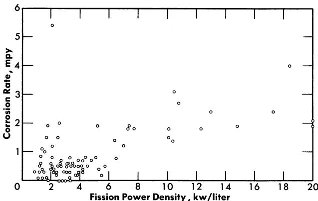  
FIG. 5-18. Radiation corrosion of titanium, loop results.

in-pile is greater than that expected out-of-pile and that the in-pile rate increases slightly with increasing fission power density. There is no significant effect of exposure temperature within the range investigated. A few results suggest that high solution velocities had an adverse effect on the in-pile corrosion, but other results show no such adverse effect. It is possible that fretting between specimens and holder was responsible for the additional weight loss of those specimens which indicated the adverse velocity effect. It should be noted that the amount of scale retained by a specimen after descaling can and may affect the apparent corrosion rate of the specimen, and differences in the amount of scale retained by different specimens may influence the apparent corrosion behavior with respect to the variables power density, velocity, and temperature. The few results available for titanium alloys indicate that, with the exception of the Ti-6% Al-4% V in experiment L-2-14, these materials corroded at rates which are about the same or only slightly greater than those for Ti-55A under the same conditions. The rates for the Ti-6% Al-4% V in L-2-14 were about double those for Ti-55A.

The corrosion rate of Ti-55A in in-line positions outside the radiation field was found to be in the range of 0 to $2.5\mathrm{mpy}$ [74]. These results indicate that, in general, the corrosion of titanium exposed in in-line positions of a loop is greater than expected in the absence of radiation, which out-of-pile tests showed to be about $0.03\mathrm{mpy}$ or less. The rates determined from specimen weights were generally less than those observed with specimens exposed in the core, although in some experiments the maximum rate observed for in-line specimens was about the same as that observed for core specimens. Differences between the amount of scale retained by in-line and core specimens after descending may account, in part, for the apparently lower rates of in-line specimens.

The results of in-pile autoclave experiments indicated corrosion rates under irradiation which are in general agreement with those determined in in-pile loop experiments. The oxygen pressure measurements in autoclave experiments indicate that the rate of attack remains constant at a given set of in-pile conditions [75].

The van de Graaff experiment employed a solution $0.04\,m\, \mathrm{UO}_2\mathrm{SO}_4$ , $0.02\,m$ in excess $\mathrm{H}_2\mathrm{SO}_4$ , and $0.01\,m\, \mathrm{CuSO}_4$ at a temperature of $300^{\circ}\mathrm{C}$ . Exposure to fast electrons was for a period of 50 hr and at an intensity such that the estimated power density due to electron absorption was about $60\, \mathrm{kw/liter}$ in solution adjacent to the specimen. No evidence was apparent that the corrosion of the Ti-75A was accelerated appreciably during the irradiation [76].

# 5-7. AQUEOUS SLURRY CORROSION*

The studies reported in this section indicate that corrosion-erosion problems of high-temperature (250 to $300^{\circ}\mathrm{C}$ ) aqueous oxide slurry systems may be satisfactorily controlled. However, under unfavorable conditions very aggressive attack has been noted.

Aqueous slurry corrosion problems in nuclear reactors were studied in the early days of the Manhattan Project, as reported by Hiskey [77] and Kirshenbaum [78]; in Great Britain's Harwell laboratory [79]; and in the Netherlands's KEMA laboratory [79]. Slurry corrosion problems are now being studied for the Pennsylvania Advanced Reactor by Westinghouse Corporation [80], and at Oak Ridge National Laboratory [81-85].

Most of the work described below has been done at the Oak Ridge National Laboratory and is summarized in the reports cited above. Most of the circulating corrosion tests have been carried out at temperatures of approximately 250 to $300^{\circ}\mathrm{C}$ in stainless steel equipment.

5-7.1 Nature of attack. Factors involved in the corrosion-erosion problem. Slurry attack may be regarded as simultaneous abrasion and high-temperature water corrosion. Information on the high-temperature corrosion of materials by water in nuclear reactors is discussed in the Corrosion and Wear Handbook [86], by L. Scheib [87], and for other systems in the Corrosion Handbook [88]. This serves as a basis for the consideration of similar aspects of attack by aqueous slurries.

For the practical utilization of circulating aqueous slurries, a suitable balance must be made between corrosion-erosion attack of materials of construction and handling properties of the slurry, including viscosity, heat transfer, settling, resuspension, and caking characteristics. The materials of construction, operating conditions, slurry characteristics, and

properties of the thoria or other material used to prepare the slurry all exert important influences on the corrosion-erosion problem. All these factors are important in certain circumstances, and their effect has frequently been found to depend strongly on the presence or level of other factors. Considerations of such interactions should not be neglected; however, the strongest factors in attack by aqueous slurries appear to be particle size, abrasiveness, and degradation susceptibility, flow velocity and pattern, and metal composition. Important secondary factors include temperature, atmosphere, slurry concentration, and additives. The effect of radiation, particularly fissioning, is expected to interact strongly with such other variables as flow and type of gaseous atmosphere.

Materials of interest. The materials of interest in aqueous slurry systems for nuclear reactors include many of those considered for high-purity aqueous high-temperature systems in the Corrosion and Wear Handbook [86]. Although materials found to be unsatisfactory in the purely aqueous system are usually not suitable for slurry systems, the order of excellence and the relative importance of different variables has been found to be altered in slurry systems. Most of the materials and alloys investigated were the same as tested in aqueous uranyl sulfate solutions described previously. Results for classes of materials are summarized as follows:

The austenitic stainless steels represent the most useful class of construction material for slurry systems. Of the various types available, type-347 has been tested most. Differences between various types do not appear to be significant.

It appears possible to reach corrosion rates considerably below 1 mpy with flows of 20 fps. The most severe attack of stainless steel has been localized attack noted on pump impellers and housings, orifice restrictors, and test specimens in high-velocity regions.

Ferritic and martensitic stainless steels are attractive for certain operating parts because of their hardness properties. The corrosion resistance of these materials is about the same as that of the austenitic stainless steels and slightly better in a number of cases. Because certain alloys of this class do not appear to be susceptible to stress-corrosion cracking as are austenitic stainless steels, they remain potentially a very useful class of materials.

Carbon steels or low-alloy steels are of interest because of their low cost. Results based on corrosion specimens in systems at high oxygen concentrations, or with hydrogen added, indicate comparatively high attack rates decreasing with time, and it is possible that acceptable rates will be achieved. However, pitting problems and potential embrittlement by hydrogen or alkali have not been explored. The effect of chromate from corrosion of stainless steel by slurries with high oxygen concentrations in a combined carbon steel-stainless steel system has not yet been determined.

Nickel alloys appear to perform somewhat better in hydrogenated systems but generally are not so corrosion resistant as the austenitic stainless steels in oxygenated slurries. Inconel and Inconel X appear to give results approaching austenitic stainless steel in some circumstances.

Stellites have performed best in hydrogenated systems. Attack by high-temperature oxygenated slurry appears to be due to simple aqueous corrosion.

Titanium and its alloys in oxygenated slurry have shown approximately the same corrosion rates as the austenitic stainless steels. In alkaline systems with hydrogen atmosphere, very severe attack has been noted.

Zirconium alloys, especially Zircaloy-2, have shown extremely good corrosion resistance relative to other materials. Fairly severe attack in a high-velocity wake region by a very abrasive thoria slurry has been noted.

Noble metals have been tested along with other types to assist in evaluating the effects of pure erosion. To a rough approximation the ratio of attack rates on the platinum and gold is constant over a wide range of conditions, as suggested by Hiskey [89].

Tantalum, in one test at 21 fps, gave results comparable to platinum. Bronze and aluminum were severely attacked by high-temperature aqueous slurries. Synthetic sapphire and aluminum oxide were severely attacked at high flow velocities by high-temperature aqueous thoria slurries, and pins of thoria densified by the addition of $0.5\%$ CaO disintegrated under similar conditions.

Types and mechanisms of attack. The attack by aqueous slurries on metals under nuclear reactor conditions may be treated as a succession of stages: (a) collision of slurry particles with the surface, (b) damage to the surface, and (c) reaction of the underlying metal with the aqueous phase. Particles may be caused to strike the surface by impingement, by eddy action, or by shear forces.

Impingement attack, which is noticed on upstream surfaces of objects in line of flow, in piping elbows, etc., is visualized as resulting from a breakthrough of flow lines by slurry particles as the direction of flow is changed on meeting an object. Attack primarily results from impact of the larger slurry particles with the surface. An example is shown in Fig. 5-19.

Impingement target efficiency [90-93] is estimated as a function of the dimensionless separation number $V_{0}D_{p}^{2}(\rho_{s} - \rho) / 18\mu D_{b}$ , where $V_{0}$ is relative slurry velocity, $D_{b}$ is dimension of obstructing body, $D_{p}$ is particle diameter, $\mu$ is fluid viscosity, $\rho_{s}$ is solid density, and $\rho$ is slurry density. A sigmoid curve of target efficiency versus the logarithm of separation number was obtained for various shapes with 55 to $80\%$ target efficiency at a separation number of 1, and with a limiting value of separation number, 0.06 for cylinders, below which impingement does not occur. Application

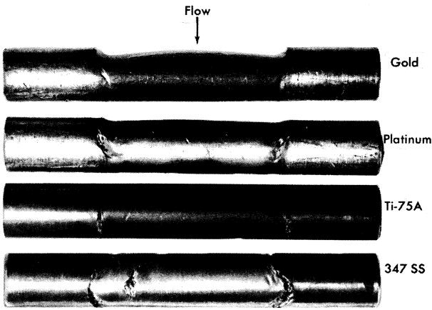  
FIG. 5-19. Impingement erosion of pin specimens by flowing thoria slurry.

of this concept by Thomas [94] to aqueous thoria slurry at $250^{\circ}\mathrm{C}$ indicated that flow at 26 fps past a cylinder of 0.1 in. diameter would result in no impingement by particles below about 3 microns.

Corrosion rate would by this model be proportional to concentration, velocity, target efficiency, and erosivity [95] (the mass of metal removed per unit mass of particles striking the metal surface). Erosivity would be expected to be a function of the flow characteristics, particle energy and abrasiveness, and other properties of the particle and the metal, although a general formula for it has not been developed.

The results of the impingement concept should apply to attack on all surfaces obstructing flow lines of the slurry. This type of attack will be sensitive to equipment size effects.

Eddy attack is noted on pump impellers and housings, high-velocity test specimens, pipe walls, and other similar regions. It is characterized by relatively deep-gouged pits in the direction of flow, quite smooth on the bottom, or by a deep general polishing. The pits are frequently undercut to the downstream side so that they feel smooth in the direction of flow and rasplike in the reverse direction. Attack due to wakes, cavitation, or flow separation is more localized. It is frequently possible to associate the localization of the attack with some change in the flow pattern. It has been observed downstream from protruding weld beads, on the downstream side of pin test specimens, on the rim of pump impeller shrouds, on pipe walls downstream from a flow interruption, between adjoining coupon test specimens, etc. An illustration of such attack on a pump impeller is given in Fig. 5-20.

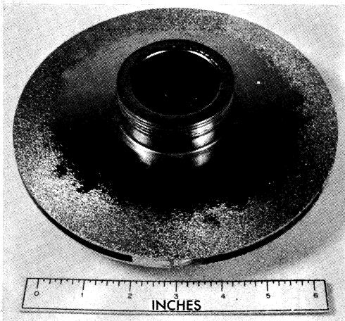

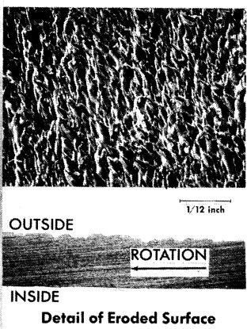  
FIG. 5-20. Eddy corrosion of stainless-steel pump impeller by thoria slurry.

Pits resulting from eddy attack may become quite deep, with depths of 100 mils having developed in a stainless steel pump-impeller shroud edge (not shown) in 1000 hr.

Eddies can be caused by high velocity, high rates of shear, cavitation, wake effects, and flow separation and may result in breakthrough of the flow boundary layer [96-97].

It would appear that in some sense the impingement model above might still apply to eddy erosion, with larger particles being thrown to the outer circumference of an eddy. The edge velocity of the eddy would be at least equal to the fluid velocity at the point of eddy origin. The postulation of a lower limit on eddy size has been noted [98]. Small eddies might become trapped in surface imperfections, leading to continuing localized attack. Wake effects are similar to the cavitation erosion studied in water tunnels by Shalnev [99], in which the initiation of cavitation in the wake of circular objects is attributed to eddies. Eddy attack will be very sensitive to equipment shape and streamlining effects.

Low shear attack is a relatively gentle, low-velocity attack such as might be observed on pipe walls, coupon specimen surfaces parallel to the direction of flow, etc. It is presumed to result from a reduction in thickness of the protecting boundary layer as flow velocity increases. As indicated by Johnstone and Thring [100], this type of attack would be sensitive to scale-up effects, becoming less severe at equivalent Reynolds number as the flow-channel dimensions are increased. It is also likely to be sensitive to water corrosion effects.

Relatively thin colored films (less than $1\mathrm{mg/cm^2}$ ) characteristic of

water corrosion are normally observed in aqueous slurry systems. In many cases, especially when a substantial quantity of electrolyte is present, a bright polished surface has been observed. With slurries having particle sizes near their degradation minimum, there appeared to be no decrease in corrosion rate with time, which implies that the outer portions of the protective oxide film were being removed by the flowing slurry as fast as it was formed.

Factors involved in surface damage to oxide film or metal proper by impinging particles are complicated. Hardness, elasticity, strength of the oxide film or metal, and the nature of the metal-to-oxide bond are important. Impact energy, its localization by particle sharpness, and its transfer due to particle hardness and strength, are also important. Rosenberg and others [101-103] noted that sharp sand was about four times as erosive to steel (in an air blast) as larger, more rounded sand. For many slurries in toroid or pump loop tests the most severe attack of metal surfaces is noted concurrently with the most rapid degradation in the size of the slurry particles [104].

For all metals of interest, except the most noble, the destruction of a protective oxide film exposes reactive metal to the aqueous medium. The rate of reaction is very high, and the rate of film re-formation will control this reaction rate and the net amount of metal consumed. Changes in the chemical environment and pH via gaseous atmosphere, additives, or ingrowing corrosion or fission products will strongly affect the rate of metal reaction and oxide re-formation.

Methods of test. The relative abrasiveness of slurries may be determined in a laboratory jet-impingement test device developed by McBride [105] in which a slurry spray is jetted against a thin metal strip and penetration time noted.

To obtain accurate slurry corrosion data, toroids, pump loops, and in-pile autoclaves have been used for high-temperature tests with aqueous slurries. This equipment is described in Section 5-2.

In toroid tests, information is obtained as to corrosion rate of several metals, slurry particle degradation, and qualitative slurry handling characteristics by examination of metal pin specimens and analysis of the withdrawn slurry.

In pump loops, a larger amount of quantitative information is obtained at several different velocities and flow patterns from an examination of loop components, as well as specimens. Generalized incremental loop corrosion rates and slurry properties are obtained at suitable intervals from analysis of withdrawn samples.

By use of rocking in-pile autoclaves, tests at negligible flow velocities have been made at neutron fluxes approaching $10^{13}$ to evaluate corrosion rates and rates of production and recombination of radiolytic gas.

# TABLE 5-11

# THE ATTACK OF VARIOUS MATERIALS BY $1600^{\circ}\mathrm{C}$ - FIRED THORIUM OXIDE SLURY (PUMP-LOOP TESTS)

Loop-piping generalized corrosion rate except pump: 0.9 mpy at $\sim 10$ fps. Pump-impeller (7.8 in. dia) wt. loss: $27\mathrm{g}$ at 90 fps (50-100 mil rim pits)

<table><tr><td colspan="3">Pin-specimen corrosion rates, mpy:</td></tr><tr><td>Velocity</td><td>20 fps</td><td>40 fps</td></tr><tr><td>Austenitic stainless steels</td><td>2</td><td>25</td></tr><tr><td>Titanium alloys</td><td>2</td><td>6</td></tr><tr><td>Zircaloy-2</td><td>0.1</td><td>1</td></tr><tr><td>Gold</td><td>0.2</td><td>4</td></tr><tr><td>Platinum</td><td>1</td><td>12</td></tr></table>

5-7.2 Slurry materials. Uranium dioxide. Uranium-dioxide slurry and quartz slurries were tested in small-scale loops and spinning cylinder systems in the early days of the Manhattan Project. It was observed [106-107] that erosion was proportional to the square or cube of the velocity, varied strongly with particle size, decreased with time as particle size degradation took place, and exhibited a constant ratio for different materials under the same conditions. Uranium dioxide has a Moh scale hardness of 6.1 [108] and to a certain extent would be expected to resemble thoria under a hydrogen atmosphere, as described later.

Uranium trioxide. The attack of stainless steel pump-loop components by uranium trioxide slurries at $250^{\circ}\mathrm{C}$ was essentially nil in tests extended for thousands of hours, even on pump impellers with a tip velocity of 120 fps [109]. The lack of attack by circulating uranium trioxide slurries under conditions in which impingement certainly occurred is attributed to the relative softness of the uranium trioxide particles.

Thorium oxide. The major portion of studies on corrosion-erosion characteristics of high-temperature aqueous slurries has been carried out using thorium oxide [110-111]. Most preparations have used the calcination product of thorium oxalate precipitated under various conditions, with calcination temperatures from 450 to $1600^{\circ}\mathrm{C}$ having been used. Thoria prepared by other procedures, such as formate precipitation, has also been examined. Thoria calcined at temperatures in the vicinity of $1600^{\circ}\mathrm{C}$ has low surface area, crystallite sizes approaching particle size, less tendency to degrade, and exhibits a greater tendency to produce abrasive sintered particles; consequently, certain of such thoria products have been

TABLE 5-12 REDUCTION IN THORIUM OXIDE SLURRY CORROSION BY PARTICLE SIZE CONTROL (Pump-loop tests on same batch)   

<table><tr><td></td><td colspan="2">Unclassified</td><td colspan="2">Classified</td></tr><tr><td>Temperature, °C</td><td colspan="2">200</td><td colspan="2">280</td></tr><tr><td>Duration, hr</td><td colspan="2">5</td><td colspan="2">309</td></tr><tr><td>Concentration, g Th/kg H2O</td><td colspan="2">443</td><td colspan="2">323</td></tr><tr><td>Atmosphere</td><td colspan="2">O2</td><td colspan="2">O2</td></tr><tr><td>pH (slurry, 25°C)</td><td colspan="2">7.5</td><td colspan="2">5.5</td></tr><tr><td>Thoria calcination temperature, °C</td><td colspan="2">1600</td><td colspan="2">1600</td></tr><tr><td>Particle size</td><td></td><td></td><td></td><td></td></tr><tr><td>Average, μ</td><td colspan="2">1.3</td><td colspan="2">1.7</td></tr><tr><td>Maximum</td><td colspan="2">28% &gt; 10 μ</td><td colspan="2">2% &gt; 5 μ</td></tr><tr><td>Average crystallite size (x-ray), μ</td><td colspan="2">&gt; 0.25</td><td colspan="2">&gt; 0.25</td></tr><tr><td>Specific surface (N2adsorption), m2/g</td><td colspan="2">1.2</td><td colspan="2">1.7</td></tr><tr><td>Loop-piping generalized corrosion rate, mpy</td><td colspan="2">63</td><td colspan="2">1.5</td></tr><tr><td>Pump-impeller (7.8 in. dia) wt. loss, g</td><td colspan="2">11</td><td colspan="2">1.5</td></tr><tr><td colspan="5">Pin-specimen corrosion rates, mpy</td></tr><tr><td>Velocity</td><td>25 fps</td><td>40 fps</td><td>22 fps</td><td>44 fps</td></tr><tr><td>Austenitic stainless steels</td><td>27-57</td><td>150-320</td><td>0.8</td><td>8</td></tr><tr><td>Ferritic stainless steel</td><td>34-110</td><td>120-180</td><td>1</td><td>4</td></tr><tr><td>Titanium alloys</td><td>63</td><td>240</td><td>0.5</td><td>4</td></tr><tr><td>Zirconium alloys</td><td>8-97</td><td>310-700</td><td>0</td><td>1</td></tr><tr><td>Gold</td><td>120</td><td>630</td><td>0</td><td>2</td></tr><tr><td>Platinum</td><td>96</td><td>650</td><td>0.5</td><td>7</td></tr></table>

classified, using sedimentation procedures, to remove unduly large particles. Thoria calcined at 650 to $900^{\circ}\mathrm{C}$ because of its properties was considerably degraded by continued pumping and was reported [112] to show greatly reduced corrosion rates as this occurred.

The hardness of thoria minerals has been reported as 6.5 on the Moh scale. The hardness of thoria densified with $0.5\%$ CaO is 6.8 [113], and laboratory preparations of thoria have been observed with hardness greater than 7. The hardness of many mineral oxides, of a composition similar to the protective film on metals, lies between 6 and 6.5. However, sapphire attacked by high-temperature aqueous thoria slurry has a hardness of 9.

To evaluate materials under conditions expected for a reactor, pin speci

TABLE 5-13   
COMPARATIVE PIN-CORROSION RATES AND PARTICLE DEGRADATION AT $300^{\circ}\mathrm{C}$ ; SAME THORIA BATCH (THORIUM OXALATE CALCINED AT $800^{\circ}\mathrm{C}$ ), OXYGEN ATMOSPHERE, PUMP-LOOP TESTS   

<table><tr><td>Thoria</td><td colspan="3">Unpumped</td><td colspan="3">Unpumped</td><td colspan="3">Prev. pumped</td></tr><tr><td>Hours</td><td colspan="3">49</td><td colspan="3">301</td><td colspan="3">266</td></tr><tr><td>g Th/kg H2O (avg.)</td><td colspan="3">543</td><td colspan="3">348</td><td colspan="3">346</td></tr><tr><td>fps</td><td>11</td><td>21</td><td>41</td><td>10</td><td>22</td><td>41</td><td>13</td><td>22</td><td>43</td></tr><tr><td></td><td colspan="9">Corrosion rate, mpy</td></tr><tr><td>Gold</td><td>0.4</td><td>0.4</td><td>4</td><td>0.1</td><td>0.1</td><td>0.6</td><td>0.03</td><td>0.08</td><td>0.9</td></tr><tr><td>Zircaloy-2</td><td>0.1</td><td>1</td><td>6</td><td>0.1</td><td>0.1</td><td>2</td><td>0</td><td>0</td><td>1</td></tr><tr><td>Titanium</td><td>1</td><td>4</td><td>9</td><td>0.2</td><td>2</td><td>6</td><td>0.1</td><td>1</td><td>5</td></tr><tr><td>Stainless steel</td><td>3</td><td>7</td><td>21</td><td>1</td><td>3</td><td>8</td><td>0.5</td><td>0.5</td><td>3</td></tr><tr><td>Loop</td><td colspan="3">4.5</td><td colspan="3">1.5</td><td colspan="3">0.8</td></tr><tr><td></td><td colspan="9">Particle-size distribution, w/o</td></tr><tr><td>Size, μ</td><td>&gt;3</td><td>1-3</td><td>&lt;1</td><td>&gt;3</td><td>1-3</td><td>&lt;1</td><td>&gt;3</td><td>1-3</td><td>&lt;1</td></tr><tr><td>0 hr</td><td>48</td><td>27</td><td>25</td><td>59</td><td>26</td><td>15</td><td>3</td><td>32</td><td>65</td></tr><tr><td>5 hr</td><td>8</td><td>25</td><td>67</td><td>—</td><td>—</td><td>—</td><td>—</td><td>—</td><td>—</td></tr><tr><td>30 hr</td><td>5</td><td>21</td><td>74</td><td>7</td><td>25</td><td>69</td><td>7</td><td>28</td><td>65</td></tr><tr><td>Final</td><td>—</td><td>—</td><td>—</td><td>3</td><td>32</td><td>65</td><td>2</td><td>21</td><td>77</td></tr></table>

mens of various materials were exposed for $1000\mathrm{hr}$ to a slurry of $1500\mathrm{g}$ $\mathrm{Th / kgH_2O}$ at $280^{\circ}\mathrm{C}$ in a pump loop pressurized with steam plus $200~\mathrm{psi}~\mathrm{O}_2$ . The $1600^{\circ}\mathrm{C}$ -calcined thoria had an average particle size of 1.7 microns, with $3\%$ of the particles greater than 3 microns, and the slurry had a $\mathsf{pH}$ of 5.8 measured at $25^{\circ}\mathrm{C}$ . The results of the test are summarized in Table 5-11.

5-7.3 Effect of slurry characteristics. Particle size. Two effects relating to particle size have been distinguished. These are the effects of largeness of particles and of particle degradation. Large particles cause erosion-corrosion. This is in agreement with the impingement model of slurry attack. Tables 5-12 and 5-13 show comparisons of pump-loop corrosion tests in which, in the respective tables, the larger-particle-size slurry shows more aggressive attack.

The removal of large sintered particles resulted in a substantial reduction in corrosion rate for all materials in the tests shown in Table 5-12. This effect for thoria produced by high-temperature calcination was sufficient to justify including similar classification in the regular production procedure. Particles of large crystallite size ( $>0.25$ micron) from which the sintered particles had been removed by classification were shown to produce comparatively low corrosion rates. Particles composed of large crystallites are not much degraded by continued circulation, and consequently corrosion rates do not diminish much with time.

Low-crystallite-size materials (calcined at relatively low temperatures, e.g., $800^{\circ}\mathrm{C}$ ) become degraded as circulation proceeds, and aggressiveness is diminished. Thus, a shorter test showed a higher rate of corrosion, and a test using previously pumped material showed a lower rate of attack. This, and the change of particle size with time, is illustrated in Table 5-13.

Effect of calcination temperature. The major effect of increased calcination temperature is to cause growth of larger crystallites, and under adverse circumstances, sintered particles. Sintered particles, of course, would cause increased attack. However, unless sintering occurred, particles have not appeared to increase in size on calcination. At constant particle size, calcination temperature has not exhibited a direct effect on corrosion rate. Indirectly, lower calcination temperatures result in lower crystallite sizes and particles may be more readily degraded to smaller, less erosive sizes. Table 5-14 illustrates these points [114]. Except for the unaccountably increased attack by material calcined at $800^{\circ}\mathrm{C}$ , there appears to be no general effect of calcination temperature on attack rates in these short-term tests. It is also noted that the material calcined at higher temperatures is less degraded. In longer tests this would be expected to result in maintaining the original corrosion rate, rather than resulting in a decrease in rate when the particle size becomes smaller.

As crystallite size becomes larger, surface area is reduced. This reduces the adsorptive capacity of the thoria and thus influences the action of additives on corrosion. Handling properties are also changed.

Effect of concentration. In general, corrosion-erosion by slurries has been observed to increase with concentration [115-116], and roughly is indicated to be directly proportional to concentration, in concentration ranges of reactor interest. As concentration is increased, the effect of rheological properties on flow characteristics becomes more pronounced, and the effect on corrosion would become altered.

Effect of atmosphere. It is possible to distinguish between the effects of different atmospheres resulting from high oxygen concentration, low oxygen concentration, dissolved hydrogen, or other dissolved gases.

High oxygen concentration [117-119] in pump loop and toroid tests has appeared to result in less aggressive attack on type-347 stainless steel than

# TABLE 5-14

# EFFECT OF THORIA CALCINATION TEMPERATURE ON SLURRY CORROSION AND PARTICLE DEGRADATION AT VARIOUS CIRCULATION VELOCITIES

$\mathrm{ThO_2}$ from thorium oxalate.

Avg. dia., 2.6 $\mu$ after calcination.

$1000\mathrm{g}$ Th/kg water.

$250^{\circ}\mathrm{C}$ , toroid tests.

100 psi oxygen.

Test duration: 100-300 hr.

<table><tr><td rowspan="2">Circulation velocity, fps</td><td rowspan="2">Maximum calcination temperature, °C</td><td rowspan="2">Average diameter after circulation, μ</td><td colspan="3">Average attack rate, mpy</td></tr><tr><td>347 SS</td><td>Ti</td><td>Zr-2</td></tr><tr><td rowspan="3">5</td><td>650</td><td>1.2</td><td>0.4</td><td>0.4</td><td>-</td></tr><tr><td>800</td><td>1.5</td><td>0.8</td><td>1.0</td><td>+</td></tr><tr><td>1200</td><td>2.2</td><td>0.4</td><td>0.6</td><td>+</td></tr><tr><td rowspan="4">15</td><td>650</td><td>0.8</td><td>5</td><td>2</td><td>-</td></tr><tr><td>800</td><td>1.0</td><td>4</td><td>6</td><td>4</td></tr><tr><td>1200</td><td>1.3</td><td>3</td><td>4</td><td>0.2</td></tr><tr><td>1600</td><td>2.1</td><td>4</td><td>2</td><td>1</td></tr><tr><td rowspan="6">26</td><td>650</td><td>0.7</td><td>7</td><td>4</td><td>3</td></tr><tr><td>800</td><td>0.6</td><td>14</td><td>16</td><td>4</td></tr><tr><td>1000</td><td>1.1</td><td>7</td><td>3</td><td>3</td></tr><tr><td>1200</td><td>1.0</td><td>9</td><td>6</td><td>3</td></tr><tr><td>1400</td><td>1.0</td><td>8</td><td>6</td><td>2</td></tr><tr><td>1600</td><td>1.2</td><td>7</td><td>6</td><td>3</td></tr><tr><td colspan="6">Average attack rates at given velocity:</td></tr><tr><td>5</td><td colspan="2"></td><td>0.6</td><td>0.8</td><td>+</td></tr><tr><td>15</td><td colspan="2"></td><td>4</td><td>3</td><td>2</td></tr><tr><td>26</td><td colspan="2"></td><td>8</td><td>8</td><td>3</td></tr></table>

tests which used no added oxygen. Oxygen concentrations of $250~\mathrm{ppm}$ $(160~\mathrm{cc / kg}~\mathrm{H}_2\mathrm{O})$ appear sufficient to protect stainless steel. Toroid tests [120] in which the oxygen was consumed resulted in more aggressive attack of this metal. Corrosion products were black rather than tan-brown in color and were found to contain $\mathrm{Fe_3O_4}$ . In systems having hydrogen

atmosphere, stainless steel was attacked somewhat (perhaps threefold) more aggressively than in the presence of sufficient oxygen.

These data are presumably valid also for ferritic and martensitic stainless steels.

The corrosion resistance of carbon steel is improved under hydrogen atmosphere. Rates in some cases have approached those observed for stainless steels in the same experiment. Less localized attack is noted under hydrogen atmosphere.

Titanium appears to be equally corrosion resistant in oxygenated and hydrogenated systems, provided the slurry is not strongly alkaline. At $150^{\circ}\mathrm{C}$ titanium is more readily abraded by slurry with hydrogen atmosphere. In alkaline systems with hydrogen atmosphere, a very aggressive attack has been noted, as would be anticipated from the interpretation of Schmets and Pourbaix [121].

Zirconium alloys appear to be little affected by atmosphere. They are possibly more easily abraded under hydrogen atmosphere.

Nickel alloys and alsostellites appear, in agreement with Douglas [122], to be substantially more corrosion resistant under hydrogen atmosphere, and several nickel alloys have appeared to be more resistant than stainless steel when exposed with it in experiments under hydrogen atmosphere.

The nature of the atmosphere also affects the oxidation state and solubility of certain corrosion products and through these may affect the properties of the slurry. Under an oxygen atmosphere iron exists as $\mathrm{Fe_2O_3}$ , and chromium as soluble, acidic $\mathrm{CrO_3}$ . Under hydrogen atmosphere, iron is in the form of $\mathrm{Fe_3O_4}$ , and chromium is insoluble $\mathrm{Cr_2O_3}$ .

Effect of additives. Additives include the unavoidable corrosion products and fission products; the necessary, or difficultly avoidable, recombination catalysts; uranium inclusions in the particle and certain impurities; and optional materials added to modify the properties of the slurry.

Corrosion products have not been observed to affect the course of corrosion in oxygenated systems, although they have built up to levels of a few grams per liter in certain lengthy tests. Soluble chromic acid may affect the corrosion rate of such material as carbon steel. No experimental results are available on the effect of fission products.

Molybdenum oxide (a potential recombination catalyst) has shown a mild corrosion-inhibiting action. Uranium inclusions in the thoria have not been found to increase corrosion rates. Certain impurities, i.e., carbonate and sulfate carried through the production process, have not been found to affect corrosion rates except when added in large quantity, as described below. Chloride, which can cause stress-corrosion cracking of stainless steel, is undesirable in any quantity, as is fluoride.

Certain materials have been found to impart desirable handling properties to slurries at lower temperatures and have been of interest to test at

higher temperatures (e.g., $280^{\circ}\mathrm{C}$ ). These have included sulfates (thorium, sodium, calcium, hydrogen), phosphates (sodium monobasic, dibasic, tribasic, pyro-), silicates (sodium meta- and more acid compositions), and fluorides (thorium). In general it has been found that additives imparting acidity [e.g., $\mathrm{H}_2\mathrm{SO}_4$ , $\mathrm{Th}(\mathrm{SO}_4)_2$ ] tend to attack ferrous-based materials, especially under low oxygen or reducing atmosphere. There is less effect of moderate concentrations with oxygen atmospheres. Alkaline materials tend to increase attack of titanium under reducing atmosphere and to affect the performance of other metals. Complexing or reacting additives (e.g., alkaline phosphate with titanium, fluorides with zirconium) tend to destroy protective films and thereby increase attack rates.

All soluble ionic additives appear initially to be adsorbed on the thoria surface. Their effect on corrosion is much greater after surface capacity is exceeded. Surface capacity varies with different thoria preparations, primarily with surface area.

5-7.4 Effect of operation conditions. Flow velocity is a very important factor in corrosion by slurries. Corrosion rate appears to be approximately proportional to the square of velocity at moderate velocities and possibly to a somewhat higher power at higher velocities. The effect of velocity is shown in Table 5-14 and in Table 5-15.

In addition to increasing regularly with velocity, greater attack in entrance regions and at the highest velocities was noted. The more severe attack on cylindrical pins is attributed to greater turbulence effects for this shape.

Velocity effects are also shown on the pump impeller in Fig. 5-20. Velocity increased radially from the hub, and attack was most severe at the rim. However, the vanes and inner shroud surface were polished, which indicates the importance of boundary-layer considerations in the study of such effects.

Cavitation also may be an important factor in the high-velocity attack. Attack on pump impellers has been found to be more severe in experiments in which gas bubbles were believed to have been entrained in the slurry. Erosion patterns similar to those observed by Shalnev [123] have been found on pin-specimen-holder channel walls, with most severe points of attack a few pin diameters downstream from a pin. Although this agrees with Shalnev's observations, it is not clear whether the effect is due to cavitation or simply high eddy density at this point.

Shape effects. The importance of shape effects in corrosion by flowing slurries may be very great, and the most severe attack has been observed to be a result of eddy erosion-corrosion associated with shape effects. The attack in some cases has appeared to be self-accelerating as pits develop. The importance of shape effects will depend strongly on velocity and also on particle characteristics and chemical environment.

TABLE 5-15 EFFECT OF VELOCITY ON ATTACK OF DIFFERENT SHAPES   
182-hr circulation at $300^{\circ}\mathrm{C}$ , $\mathrm{O}_2$ , 617 g Th/kg $\mathrm{H}_2\mathrm{O}$ Thoria calcined $800^{\circ}\mathrm{C}$   

<table><tr><td rowspan="3">Velocity, fps</td><td colspan="3">Stainless steel attack rate, mpy</td></tr><tr><td colspan="2">Flat coupon</td><td rowspan="2">Cylindrical pins across straight channel</td></tr><tr><td>Tapered channel</td><td>Straight channel</td></tr><tr><td>8</td><td>1 (entrance)</td><td></td><td></td></tr><tr><td>10</td><td>0.8</td><td></td><td></td></tr><tr><td>13</td><td>1</td><td></td><td></td></tr><tr><td>16</td><td>2</td><td>2</td><td>5</td></tr><tr><td>24</td><td>3</td><td></td><td></td></tr><tr><td>31</td><td>4</td><td></td><td></td></tr><tr><td>36</td><td>6</td><td></td><td>9</td></tr><tr><td>41</td><td>8</td><td></td><td></td></tr><tr><td>50</td><td>10</td><td></td><td>21</td></tr><tr><td>64</td><td>50, pitted</td><td></td><td></td></tr></table>

Design considerations are quite important. Streamlining of all sensitive parts and regions should be practiced to the maximum extent possible, in order to avoid impingement or wake effects. Surface irregularities such as rough finish, crevices, or protrusions should be avoided. The interior design of flow channels should be carefully considered in order to avoid impingement, flow separation, and wakes insofar as possible. Conditions conducive to cavitation should be avoided, since vigorous attack would be anticipated under such conditions.

Temperature. In general, temperature effects are associated with the reaction between water and the metal. Those materials most sensitive to water corrosion (e.g.,stellites in oxygenated aqueous systems) exhibit stronger temperature effects.

For many materials, corrosion rate has appeared to double for every 30 to $60^{\circ}\mathrm{C}$ increase in temperature.

Time. Changes in attack rate with time generally are not observed after the slurry has reached its equilibrium condition. Until this condition is reached, the slurry particle size may be larger than its degradation minimum. Consequently, more aggressive attack is usually observed in the early exposure period.

Localized attack which created eddy erosion pits could become more rapid as these pits developed.

Carbon steel has appeared in oxygenated systems to form its protective film rather slowly. Diminishing attack rates were observed over a period of at least $700\mathrm{hr}$ .

5-7.5 Radiation. Autoclave tests. Data are available [124] on the attack of Zircaloy-2 under radiation by thoria slurries in gently agitated autoclaves. No radiation data are available under flow conditions. Comparison of unirradiated control experiments with tests conducted in a reactor radiation field having a slow-neutron flux of 0.5 to $1.0 \times 10^{13}$ have indicated that both experiments had an initial rate of approximately 1 mpy with thoria slurries in $\mathrm{D}_2\mathrm{O}$ at $280^{\circ}\mathrm{C}$ (oxygenated). However, no reduction in rate with time was noted under radiation, while the rate decreased significantly with time in a longer unirradiated control. Similar results were obtained on pure $\mathrm{D}_2\mathrm{O}$ under radiation. Inclusion of enriched uranium in a thoria preparation permitted an experiment in which a fission power density of 0.5 to 1 watt/ml was achieved. Only a slight increase in rate, several tenths of a mill per year, was noted as a result under these conditions.

If radiation affects the protective oxide film, it is likely that more severe effects will be observed in the presence of radiation with slurry under sufficiently vigorous flow conditions.

# 5-8. HOMOGENEOUS REACTOR METALLURGY*

5-8.1 Introduction. Although many other materials are used for special applications in homogeneous reactors, in the following section only zirconium, titanium, austenitic stainless steels, and pressure-vessel steel are considered.

Zircaloy-2 (1.5% Sn, 0.1% Fe, 0.1% Cr, 0.005% Ni) used in the present reactors is the only commercially available zirconium alloy. It is a single-phase alloy with moderately good mechanical properties, is not heat treatable, and is stable under operating conditions.

Of the possible types of titanium and its alloys commercially available in the United States, only unalloyed titanium and one alpha alloy A-110AT (5.0% Al, 2.5% Sn) are satisfactory for homogeneous reactor applications. Beta alloys are not yet available and alpha-beta alloys, often structurally unstable under high stress and high temperature, cannot be welded without subsequent heat treatment. Although A-110AT has high strength and is stable and weldable, it is unavailable as pipe or tubing and

is difficult to fabricate. For such applications, so called "unalloyed" titanium (A-40 and A-55) is used. These high-purity grades are readily weldable in contrast to the stronger grades, are stable, and are available in all forms. Their disadvantage is their low strength at elevated temperatures which, except as linings, makes their use for large high-pressure, high-temperature equipment doubtful. Extensive use of titanium for homogeneous reactor use will probably depend upon the eventual development of a fabricable high-strength alpha alloy.

The pressure vessel for HRE-2 is constructed of A-212 grade B steel clad with 347 stainless steel. The serious possibility of radiation damage is the most important metallurgical limitation of this material. This problem is discussed in Article 5-8.8.

5-8.2 Fabrication and morphology of Zircaloy-2. When work was started on the HRE-2 core tank, very little was known about the physical metallurgy and fabrication of zirconium alloys. A procedure was available for the fabrication of zirconium fuel elements, but the variables of fabrication had not been investigated in detail. Since this core tank was a vital portion of the reactor system and was needed early in order to proceed with the pressure-vessel fabrication, it was built to a time schedule that permitted only a limited amount of development work. As a result, much of the present-day understanding of the physical metallurgy of Zircaloy-2 was not obtained in time to be used. During the development work for the tank, many variations were found in the available Zircaloy-2 plate. These included variations in mechanical properties, in bend radii, and in the amount of laminations and stringers.

Fabrication practice for the core-tank plate was based upon procedures developed by Westinghouse Atomic Power Division [125], but modified by increased cross-rolling to reduce the preferred orientation. The fabrication procedure for the core tank* is discussed in detail in Refs. 126 and 127.

This procedure resulted in the fine-grained, equiaxed, but oriented structure shown by the anodized sample [128] in Fig. 5-21. Two disadvantages of this material were the stringers found in the structure and the preferred orientation as shown by uneven extinction in rotation in polarized light.

Since it was suspected that the stringers were responsible for some of the variation in mechanical properties, they were examined in considerable detail in the morphological study. The two types of stringers prevalent in Zircaloy-2 are an intermetallic stringer, usually found in the alpha grain

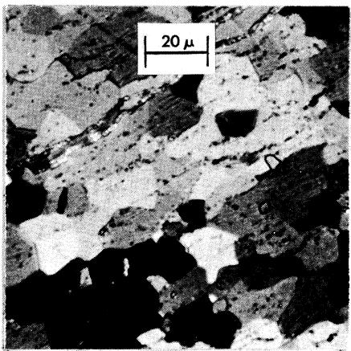  
Plate 1 (Core Tank)

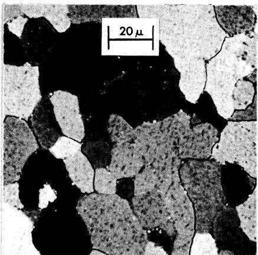  
Plate 3 (Present Practice)   
FIG. 5-21. Microstructures of as-received Zircaloy-2 plates fabricated by different schedules. Chemically polished, anodized, polarized light, $500 \times$ .

boundaries, as shown in Fig. 5-21, and an elongated void within the grains, caused by trapped gases. The latter type was found rarely in HRE-2 core-tank metal, but a small one may be noted in the photomicrograph of the developed material. This type may be largely eliminated by vacuum melting of the original ingots. It has been determined that the intermetallic stringers were formed during fabrication. While the upper fabrication temperature of $850^{\circ}\mathrm{C}$ was thought to have been in the all-alpha region, this is now known to be in error. The correct temperature for the alpha to alpha-plus-beta transition is $810^{\circ}\mathrm{C}$ and that for the beta to beta-plus-alpha transition is $970^{\circ}\mathrm{C}$ [129]. These temperatures will vary slightly with ingot composition. Holding at a temperature just above the lower boundary of the two-phase region resulted in the presence of small amounts of beta in the grain corners. By quenching samples held at $840^{\circ}\mathrm{C}$ , it was shown that approximately $15\%$ of the material had been beta phase at that temperature and that the beta phase had been present in the grain corners. Iron, nickel, and chromium are beta stabilizers and will partition to the beta phase, which will be strung out during rolling. On cooling, the beta phase decomposes, precipitating the alpha zirconium on the neighboring grains and leaving the intermetallic stringers will dissolve on reheating to $1000^{\circ}\mathrm{C}$ while the stringers formed by the trapped gases will not.

While mechanical property tests of the core-tank material (see Article 5-8.3) indicated uniform properties in the longitudinal and transverse directions, it was noted that the fractures were not round but were oval,

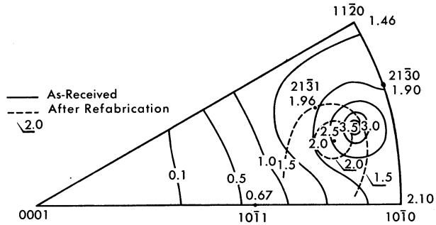

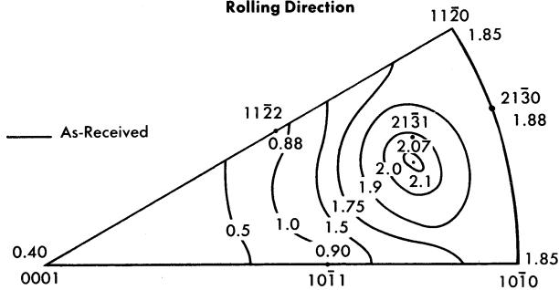  
Inverse Pole Figure Rolling Direction   
Inverse Pole Figure Transverse Direction

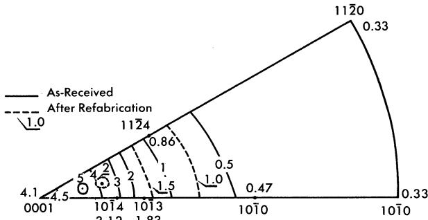  
Inverse Pole Figure Normal Direction   
FIG. 5-22. Inverse pole figures from HRT core tank Zircaloy-2 before and after refabrication. Solid lines as-received, dotted lines after refabrication.

indicating anisotropic properties. This was confirmed by a polarized-light examination. The actual orientation of the material was determined using a special x-ray diffraction technique [130], with the data being reported in the form of inverse pole figures [131] shown in Fig. 5-22. Since variations were found in the intensity of the pole concentrations, it is evident that the core-tank plate had preferred orientation in all three directions. Quantitative calculations indicated that the plate had adequate ductility

and nearly isotropic properties in the rolling plane but very little ductility in the normal direction to the plate, since in this direction few deformation systems were available for slip or twinning.

To improve the quality of Zircaloy-2 and to predict what structures would be encountered in weldments, a study of the effect of heat treatment and fabrication practice was initiated. Representative photomicrographs of structures resulting from these studies are presented in Fig. 5-23. The fine "basket-weave" alpha structure observed in beta-quenched samples appeared to offer the most likely starting point. Recrystallization of this structure by annealing at temperatures between 700 and $800^{\circ}\mathrm{C}$ resulted in the formation of very large alpha grains, without stringers or intermetallic precipitates. Cold-working of the "basket-weave" structure, $15\%$ or less before annealing, also resulted in the production of large grains; however, if the amount of cold-working exceeded $20\%$ , improvement in the form of fine grains (ASTM 6 to 8) with a more nearly random structure resulted.

Scrap from the core-tank plate was heat treated by beta quenching, cold-worked $20\%$ , and alpha annealed. The diffraction results after this treatment are also shown on the diagrams in Fig. 5-22. The intensity of the peaks has been decreased by a factor of two and the peaks shifted 20 deg from the original position. These changes indicate an increase in ductility in the normal direction.

The results of the morphological study were used to outline an improved fabrication schedule for Zircaloy-2 [132]. This schedule* has been used successfully by commercial fabricators while more complete fabrication studies are being made. The material obtained from this procedure has a microstructure such as that shown in Fig. 5-21. It is essentially free of stringers, contains little or no intermetallic precipitate, and has small equiaxed grains with essentially a random orientation as seen under polarized light.

5-8.3 Mechanical properties of zirconium and titanium. The use of titanium and zirconium for pressure-containing equipment is complicated by the fact that both metals are hexagonal, rather than cubic, making preferred orientation a severe problem. The larger variations of mechanical properties with crystal orientation make it difficult to achieve the uniformity in all directions which is desirable in a pressure vessel. In addition, the determination of the mechanical properties of hexagonal metals, using standard tests developed for cubic metals, is questionable because the suita

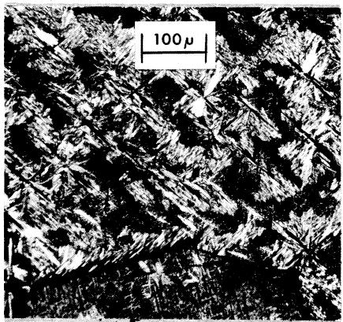  
(a) Beta Quenched $+1000^{\circ}C$ 30 min Water Quenched

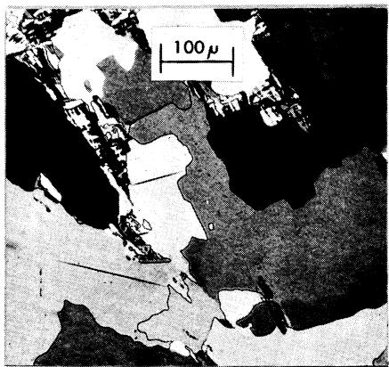  
(b) Beta Quenched + Annealed $800^{\circ}C$ 15 min

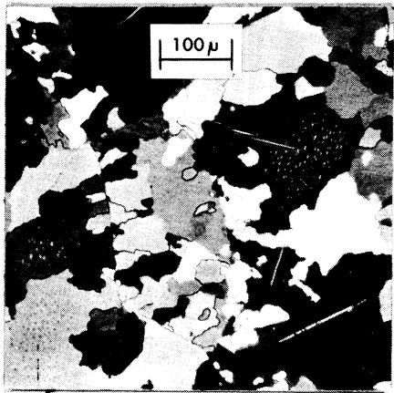  
(c) Beta Quenched + Cold Worked 10%, Annealed $800^{\circ}\mathrm{C}$ 15 min

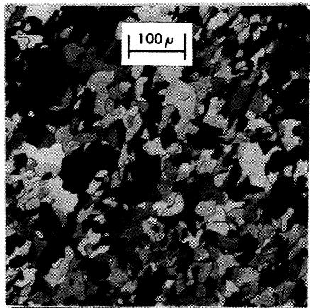  
(d) Beta Quenched + Cold Worked 20%, Annealed $800^{\circ}\mathrm{C}15$ min   
FIG. 5-23. Microstructure of heat-treated Zircaloy-2. Chemically polished, anodized, polarized light, $100 \times$ .

bility of such tests and the correct interpretation of results have not been demonstrated.

Zirconium. The anisotropy of Zircaloy-2 is not defined by the usual tensile test data, given in Table 5-16. Tensile data from both longitudinal and transverse subsize specimens cut from plates fabricated by various procedures are given in this table. With the exception of the commercial plate, the difference in tensile strengths both at room temperature and $300^{\circ}\mathrm{C}$ are within the experimental limits. Anisotropy in the material is illustrated, however, by the three columns which tabulate the percentage reduction in length of both the major and minor axes of the elliptical

TABLE 5-16   
TENSILE PROPERTIES OF ZIRCALOY-2  

<table><tr><td rowspan="2">Plate* source</td><td rowspan="2">Specimen direction</td><td rowspan="2">Ultimate strength, psi</td><td rowspan="2">Yield strength, psi</td><td rowspan="2">Elongation, %</td><td colspan="3">Percentage reduction</td><td rowspan="2">Isotropic ratio, long./normal</td></tr><tr><td>Area</td><td>Long. or trans. direction</td><td>Normal direction</td></tr><tr><td colspan="9">Room temperature</td></tr><tr><td rowspan="2">Core Tank</td><td>Long.</td><td>61400</td><td>52300</td><td>30.7</td><td>60.6</td><td>56.6</td><td>10.0</td><td>5.7</td></tr><tr><td>Trans.</td><td>63300</td><td>59000</td><td>24.5</td><td>62.1</td><td>57.8</td><td>10.0</td><td>5.8</td></tr><tr><td rowspan="2">Commercial</td><td>Long.</td><td>64900</td><td>54800</td><td>31.1</td><td>47.7</td><td>45.5</td><td>4.4</td><td>10.4</td></tr><tr><td>Trans.</td><td>69000</td><td>58300</td><td>25.8</td><td>43.3</td><td>40.6</td><td>3.3</td><td>13.7</td></tr><tr><td rowspan="2">Experimental 1</td><td>Long.</td><td>73200</td><td>63300</td><td>31.0</td><td>46.4</td><td>35.5</td><td>16.7</td><td>2.1</td></tr><tr><td>Trans.</td><td>75200</td><td>59400</td><td>29.1</td><td>44.0</td><td>28.4</td><td>21.6</td><td>1.3</td></tr><tr><td rowspan="2">Experimental 2</td><td>Long.</td><td>73800</td><td>66400</td><td>32.2</td><td>46.0</td><td>37.2</td><td>14.4</td><td>2.6</td></tr><tr><td>Trans.</td><td>74200</td><td>48400</td><td>32.7</td><td>44.3</td><td>25.5</td><td>25.5</td><td>1.0</td></tr><tr><td rowspan="2">Plate* source</td><td rowspan="2">Specimen direction</td><td rowspan="2">Ultimate strength, psi</td><td rowspan="2">Yield strength, psi</td><td rowspan="2">Elongation, %</td><td colspan="3">Percentage reduction</td><td rowspan="2">Isotropic ratio, long/normal</td></tr><tr><td>Area</td><td>Long. or trans. direction</td><td>Normal direction</td></tr><tr><td colspan="9">300°C</td></tr><tr><td rowspan="2">Core Tank</td><td>Long.</td><td>28400</td><td>22200</td><td>38.8</td><td>77.6</td><td>68.9</td><td>27.2</td><td>2.5</td></tr><tr><td>Trans.</td><td>32200</td><td>29600</td><td>27.9</td><td>76.2</td><td>71.1</td><td>17.8</td><td>4.0</td></tr><tr><td rowspan="2">Commercial</td><td>Long.</td><td>32600</td><td>25500</td><td>35.5</td><td>43.5</td><td>38.4</td><td>7.8</td><td>4.9</td></tr><tr><td>Trans.</td><td>29300</td><td>21200</td><td>29.3</td><td>68.4</td><td>65.5</td><td>13.3</td><td>4.9</td></tr><tr><td rowspan="2">Experimental 1</td><td>Long.</td><td>38600</td><td>31400</td><td>30.4</td><td>64.5</td><td>52.2</td><td>24.4</td><td>2.1</td></tr><tr><td>Trans.</td><td>37600</td><td>29000</td><td>31.5</td><td>61.5</td><td>43.8</td><td>31.6</td><td>1.4</td></tr><tr><td rowspan="2">Experimental 2</td><td>Long.</td><td>32800</td><td>27800</td><td>32.9</td><td>76.5</td><td>63.3</td><td>35.5</td><td>1.8</td></tr><tr><td>Trans.</td><td>35000</td><td>25100</td><td>32.1</td><td>68.7</td><td>48.3</td><td>39.4</td><td>1.2</td></tr></table>

*Core tank: scrap material from HRE-2 core-tank fabrication; see Article 5-8.2.   
Commercial plate: commercial plate similar to above but only straight rolled.   
Experimental plate 1: fabricated commercially by developed procedure in Article 5-8.2, except inert-gas melted.   
Experimental plate 2: same plate as item 3 but refabricated in laboratory using same procedure.

fracture and the ratio between them. In isotropic material the percentage reduction would be the same in both directions and the ratio would therefore be one. As shown, some reduction in anisotropy was obtained by the use of the developed procedure described previously.

Anisotropy of these materials may also be shown by V-notch Charpy impact tests. Since size effects are known to be critical in this type test, standard size specimens were used, thereby eliminating the thin core tank plate. Charpy V impact energy curves obtained with specimens and notches cut from various orientations from commercial plate and from a plate fabricated by the developed procedure are shown in Fig. 5-24 [133]. Differences in both the energy values and transition temperatures are apparent for the various orientations. These differences are reduced by the developed fabrication procedure.

With Zircaloy-2 the fracture appearance of the impact samples was not obviously indicative of the properties, as with steels. Shear lips, which are normally a mark of a ductile fracture, were found on samples from some orientations regardless of breaking temperature, but on specimens from other orientations from the same plate, shear lips were not found at any temperature.

The effects of notches and cracks in zirconium were studied using the drop-weight test as developed for steels by Pellini and others [134] at the Naval Research Laboratories. This test determines the highest temperature at which a crack will propagate through a specimen undergoing limited deformation. For steels this temperature is distinct and reproducible and has been labeled the NDT (nil ductility transition) temperature. Commercial Zircaloy-2 showed surprisingly good properties from this test. The NDT temperature was $-160^{\circ}\mathrm{C}$ for the longitudinal direction and between $-100$ and $-150^{\circ}\mathrm{C}$ for the transverse direction. However, contrary to the definition, when the fracture faces were examined, shear lips were found even at very low temperatures. The NDT temperature was well below the lower break in the Charpy V impact curve on the flat portion of the curve.

Titanium. Data available from manufacturers on the mechanical properties of titanium are generally adequate for present limited uses.

The NDT temperature for A-55 titanium was measured at ORNL on several plates and found to be below $-200^{\circ}\mathrm{C}$ . Incomplete fractures were found at this temperature for both longitudinal and transverse specimens.

As a portion of the brittle fracture study a plate of A-70 titanium containing 400 ppm of hydrogen was tested. The results from this plate gave impact curves that were not affected by orientation and had a sharp break similar to steels. The NDT temperature for this brittle plate was $100^{\circ}\mathrm{C}$ and was located at the lower break of the impact curve. With this

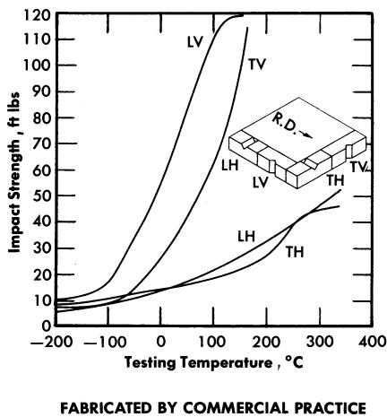

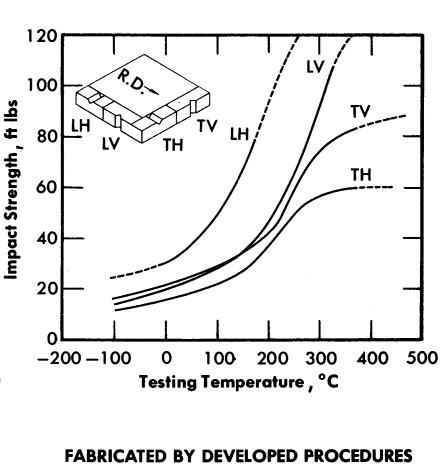  
FIG. 5-24. Impact energy curves for Zircaloy-2 fabricated by two techniques.

material, the transition region appears to be a function of hydrogen solution in the alloy.

Irradiated metals. In spite of the many questions that have been raised about the adequacy of mechanical property tests for hexagonal metals, the difficulties of which are magnified in testing irradiated samples, some mechanical property tests of irradiated samples have been attempted. Subsize tensile and impact specimens of Zircaloy-2, crystal-bar zirconium, and A-40 titanium have been irradiated in fissioning uranyl-sulfate solution, in in-pile corrosion loops, at temperatures of 250 to $280^{\circ}\mathrm{C}$ , to total fast fluxes $(>1\mathrm{MeV})$ of up to $3\times 10^{19}$ nvt for zirconium and $10^{19}$ for titanium [133]. Zirconium appears to be resistant to radiation damage under these conditions. The only changes noted have been small changes in yield point. Titanium seems to undergo some embrittlement. The tensile and yield strengths for titanium increased while the reduction in area decreased. The changes were by about $10\%$ of the unirradiated values.

5-8.4 Welding of titanium and zirconium. The welding of titanium and zirconium and their alloys is complicated by the fact that at elevated temperatures they will react to form brittle alloys with oxygen, nitrogen, hydrogen, water vapor, and carbon dioxide. Successful welding is, therefore, dependent upon protecting the molten metal and adjacent area from all contaminants. Prior to the construction of the HRE-2 core tank, the only method used for welding zirconium was fusion welding, with the necessary protection achieved by conducting the operations inside inert-atmosphere boxes [135]. The use of 5/16- and 3/8-in. plate for the HRE-2 core required

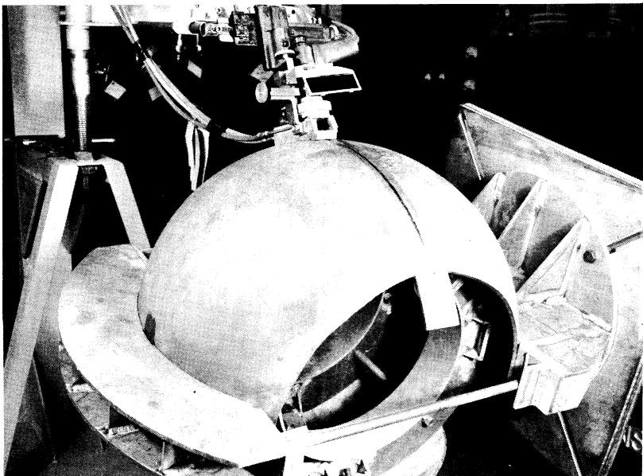  
FIG. 5-25. Typical setup of HRE-2 core tank Zircaloy-2 weldment.

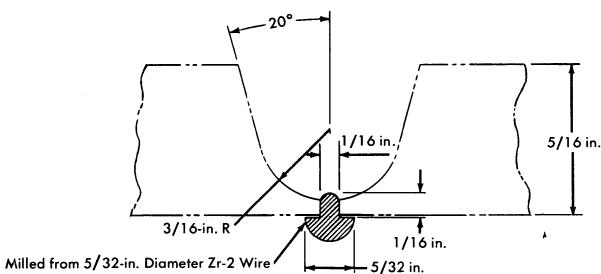  
Zircaloy-2 Trailer Weldment

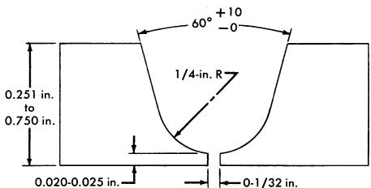  
Titanium Air Weldment   
FIG. 5-26. Joint configuration for HRE-2 core tank Zircaloy-2 trailer and titanium air weldments.

the development of multipass welding techniques, while the large size of the vessel made the use of atmosphere boxes impractical.

In a joint effort, the Newport News Shipbuilding & Dry Dock Company and Oak Ridge National Laboratory developed a machine for multipass welding of Zircaloy-2 in which the face protection was achieved by the use of trailers attached to the torch [127]. Root protection was achieved either by special backup devices or, where possible, by purging closed systems. In this device, a standard Heliarc torch was mounted on a small metal box, or trailer, Fig. 5-25. Both the method of supporting the trailer and its shape were varied with the configuration of the part being welded. The underside of the trailer was open and the lower edges of the sides were contoured to closely match the shape of the part being welded. Inert gas was distributed through the box by internal copper tubes along both sides. For all these welds, the torch and trailer were held fixed by a device which positioned the torch and spring loaded it against the work. The work pieces were moved under the torch, which remained fixed in a vertical position. The welding, with all the necessary adjustments and controls, required two operators.

The joint configuration of a typical Zircaloy-2 weld is shown in Fig. 5-26. All root passes were made using the preplaced insert which had been machined from swaged Zircaloy-2 wire. The inserts were tacked into place with a hand torch before the machine welding was started. The first filler metal pass was made with either $3/32$ - or $1/8$ -in. wire and all others with $1/8$ -in. Careful wire brushing with a stainless steel brush was required after every pass. Welding details for a typical joint are tabulated in Table 5-17; detailed procedures are given in Ref. 27.

In both this work and that which subsequently developed out of it, one of the major problems has been to determine the quality of the weld. Welds were examined visually, with liquid penetrants, and usually with radiography; however, none of these provided information about the degree of contamination. Measurement of the average microhardness of a prepared sample has proved to be an acceptable and sensitive indication of contamination. While this is a destructive test, it has been adopted as a standard test for this work. In the actual production welding, reliance had to be placed upon the strict adherence to procedures previously shown to be satisfactory by the destructive tests. Average hardnesses of over 500 DPH (diamond pyramid hardness) are found in lightly contaminated welds and increase to approximately a thousand diamond pyramid hardness numbers in contaminated metal. With this welding procedure average hardnesses of less than 200 DPH were consistently obtained. The absence of contamination was confirmed by vacuum fusion analyses of weld sections.

Although this welding procedure was slow and awkward, it was used successfully for the fabrication of the HRE-2 core tank. Many satis

TABLE 5-17   
SUMMARY OF CONDITIONS FOR MAKING TITANIUM AND ZIRCONIUM WELDMENTS   

<table><tr><td></td><td>Zircaloy-2 core tank</td><td>Titanium</td></tr><tr><td>Current, dc, single phase, amp</td><td></td><td></td></tr><tr><td>Tacks</td><td>80-100</td><td>40-55</td></tr><tr><td>Root pass</td><td>110</td><td>35-50</td></tr><tr><td>Filler pass (2)</td><td>150</td><td>35-90</td></tr><tr><td>Other filler passes</td><td>185</td><td>60-90</td></tr><tr><td>Voltage</td><td>19-23</td><td>10-16</td></tr><tr><td>Filler wire</td><td>1/8&#x27;&#x27;</td><td>3/32&#x27;&#x27;</td></tr><tr><td>Welding speed, in/min</td><td>4-6</td><td>1-2</td></tr><tr><td>Gas flow, cfh</td><td></td><td></td></tr><tr><td>Torch</td><td>40, helium</td><td>10-18, argon</td></tr><tr><td>Backup helium</td><td></td><td></td></tr><tr><td>First pass</td><td>40</td><td>30-60</td></tr><tr><td>Others</td><td>75</td><td>30-60</td></tr><tr><td>Trailer helium</td><td>65</td><td>—</td></tr></table>

factory multipass welds were completed in the assembly of the Zircaloy-2 tank.

Construction of a titanium circulating system for a homogeneous reactor requires many welds of all sizes, some of which must be made in place. While the procedure discussed above for zirconium can also be used for titanium, it is impractical for field welding of equipment and piping of varying sizes and shapes.

It has been found possible to make acceptable weldments in unalloyed titanium using only conventional tungsten, inert gas, arc-welding equipment [136]. By welding an A-55 base plate (average hardness of about 160 DPH for the annealed plate) with a filler rod of A-40, it is possible to consistently obtain welds with average hardnesses of less than 190 DPH $(10\mathrm{kg})$ for plates 1/4-in. and less in thickness. Hardnesses of less than 220 DPH are achieved for heavier plates requiring more passes. On the basis of tensile and bend tests, a hardness as high as 240 DPH would be acceptable.

The recommended conditions and configuration for a typical titanium weldment are shown in Fig. 5-26 and Table 5-17. A comparison of the recommended joint design and welding conditions for air welding of titanium with those used for trailer welding of Zircaloy-2 or for welding of

austenitic stainless steels shows an obvious trend to lower heat inputs and the use of small molten pools. The reduced size and temperature of the pool minimizes the possibilities of contamination during welding and also permits more rapid cooling after the weld is completed. These changes reduce the welding speed and thereby make this a precision welding method rather than a high-speed production procedure. Details of the procedure, including a comparison with welds made in atmosphere boxes, a discussion of adequate inert gas coverage, and the use of surface discoloration as an inspection method, are given in Ref. 136. In an effort to simplify and make more versatile the procedures used for welding Zircaloy-2 an attempt was made to adopt the inert gas procedures successfully developed for titanium. Under similar conditions it was, however, found to be more difficult to prevent contamination in Zircaloy-2 than it had been with titanium. Where multipass welds in titanium had resulted in hardness increases of 20 to 30 DPH numbers, similar welds in Zircaloy-2 increased by 50 to 100 numbers. It was also necessary to increase the radius used on the bend tests of the weldments from twice the plate thickness with titanium to four times the thickness with Zircaloy, primarily because of the lower ductility of the base metal. While multipass welds of this quality would be acceptable for many applications, additional improvement will be necessary to make them generally acceptable.

5-8.5 Combustion of zirconium and titanium. After several equipment failures in which evidences of melted titanium were found under operating temperatures not exceeding $250^{\circ}\mathrm{C}$ , a study of the ignition and combustion of titanium and zirconium was started. This work has been done by Stanford Research Institute under the direction of E. M. Kinderman [137].

Two types of tests were developed for studying the ignition reactions; in one, a thin metal disk was fractured either by gas pressure or by a plunger, while in the other, either a thin sheet or a 1/4-in. rod was broken in a tensile manner. In either test, both the composition and pressure of the atmosphere could be varied. With both types of tests, it proved to be surprisingly easy to initiate combustion of titanium. Ignition and complete consumption of both disks and rods occurred when titanium was ruptured, even at room temperature, in a high pressure of pure oxygen.

The limiting conditions for the ignition of A-55 titanium varied with the total pressure, the percentage of oxygen and the gas velocity. Under dynamic conditions in pure oxygen, ignition occurred at total pressures as low as 50 psi but with $50\%$ oxygen the total pressure required was 700 psi with the reaction curve becoming asymptotic with the pressure axis at about $35\%$ oxygen, showing no ignition would occur at any total pressure with this or lower oxygen concentrations. The corresponding values for static systems are 350 psi $(100\% \mathrm{O}_2)$ , 1900 psi $(50\% \mathrm{O}_2)$ , and $45\%$ oxygen

(no ignition at any pressure). Similar results were obtained whether the oxygen was diluted with steam or with helium. In no case was a reaction noted when samples were fractured under oxygenated water.

As might be expected, lower critical oxygen pressures were required for the propagation of the combustion than for the ignition. If the molten spot was formed by an external means, propagation and consumption of the entire sample occurred with about $20\%$ oxygen.

Because of the autoignition of titanium, various metals and alloys such as stainless steel, aluminum, magnesium, iron, tantalum, columbium, molybdenum, Zircaloy-2, and alloys of titanium were tested with oxygen pressures up to 2000 psi. Only the titanium alloys and Zircaloy-2 reacted. Within the limits of accuracy of these studies $(\pm 50$ psi) no differences were found in the behavior of the various titanium alloys.

While zirconium is similar to titanium in that autoignition can occur, the critical oxygen pressures appear to be considerably higher. Whereas, under dynamic conditions, titanium ignited with 50 psi oxygen, a zirconium disk required 500 psi. Under static conditions a 0.015-in. thick strip of titanium ignited at a pressure of 350 psi but a similar strip of zirconium required 750 psi. A 1/4-in. titanium rod ignited under the same conditions as the strip, but a zirconium rod did not ignite at 1500 psi oxygen.

5-8.6 Development of new zirconium alloys. An alloy development program was started at ORNL to find a radiation-corrosion-resistant zirconium-base alloy with satisfactory metallurgical properties. These include weldability, strength, ductility, formability and stability.

A wide variety of binary zirconium alloys was exposed in autoclaves and in in-pile loops to uranyl-sulfate solutions (see Section 5-5); however, only alloys of zirconium with niobium, palladium, or platinum showed greater corrosion resistance than Zircaloy-2. With the exception of the phase diagrams and a few mechanical property tests on low-niobium alloys [138], no information on any of these systems was available in the open literature. The few results for the mechanical property tests indicated very brittle alloys.

Two phase diagrams for the zirconium-niobium system are in the literature [139,140]. A cursory check of the diagram by determining the eutectoid temperature and approximate composition confirmed the first of these [139]. A few preliminary transformation specimens, with near-eutectoid compositions, revealed complicated and embrittling transformation structures. Since the zirconium-niobium alloy system showed promise from a corrosion viewpoint, these alloys with niobium contents varying from 2 to 33 w/o and many ternary alloys with small additions to the Zr-15Nb base were studied with the objective of eliminating the undesirable properties. Information obtained includes the transformation kinetics and

products, morphologies, in-pile corrosion resistance, fabrication techniques, metallographic procedures, and some mechanical properties [141]. At least three transformation reactions occur in the zirconium-niobium binary system. The transformation sequence is quite complex, with the only straightforward transformation being a eutectoidal transformation occurring close to the eutectoid temperature. The most troublesome transformation is the formation of an omega phase which occurs in beta-quenched and reheated samples. Time-temperature-hardness studies for material heat treated in this manner showed very high hardnesses in short times with low temperature aging treatments. Aging times of three weeks did not result in over-aging and softening of such material. This transformation would make multipass welding of this material very difficult.

Because of the hardness and slow transformations of the binary zirconium-niobium alloys, ternary additions to the $\mathrm{Zr - 15Nb}$ base of up to $5\mathrm{w / oMo}$ , Pd, and Pt, up to $2\%$ Fe, Ni, Cr, Al, Ag, V, Ta, and Th and $0.5\%$ Cu have been studied. In general, the primary effects of the addition of small amounts of the ternary substitutional alloying elements are the lowering of the maximum temperature at which the hardening reaction can occur, an increase in incubation time for the beginning of the hardening reactions, a lowering of the temperature for the most rapid rate of hardening, and an increase in rate for the higher-temperature conventional hypoeutectoid reaction [142]. Of the ternary additions, Fe, Ni, and Cr have the least effect, Pt and Pd an intermediate effect, and Mo the largest. The additions of Cu and Al drastically reduced the maximum temperature at which the hardening transformation took place and reduced the temperature at which the hardening transformation took place at the maximum rate, but did not increase the incubation period for the reaction sufficiently to prevent excessive hardening in the heat-affected zone of a weldment. The addition of $5\mathrm{w / oTa}$ to the $\mathrm{Zr - 15Nb}$ base alloy resulted in the formation of a completely martensitic structure on quenching from the beta field, and the addition of oxygen by the use of sponge $\mathrm{Zr}$ resulted in an increase in the rate of all transformations. The addition of $2\%$ Pd or Pt to $\mathrm{Zr - 15Nb}$ delays the hardening sufficiently to make welding possible; however, it would be necessary to follow it by a stabilizing heat treatment.

Cursory fabrication studies have been performed during the course of the alloy development program in the preparation of sheet specimens for studies of the transformation kinetics [143]. All the $\mathrm{Zr - Nb - X}$ alloys have been hot-rolled from $800^{\circ}\mathrm{C}$ quite successfully. A sponge-base $\mathrm{Zr - 15Nb}$ arc casting has been successfully extruded at $950^{\circ}\mathrm{C}$ to form rods. While the fabrication techniques developed are adequate for the production of specimen material, they are not necessarily optimum for the commercial production of plate, sheet, bar, rod, and wire in these alloys.

An ultimate tensile strength of Zr-15Nb at room temperature of 200,000

psi, with no elongation was obtained on specimens beta-quenched and aged at $400^{\circ}\mathrm{C}$ for 2 hr. Similar specimens aged at $500^{\circ}\mathrm{C}$ for 2 weeks and measured at room temperature had an ultimate strength of 150,000 psi, a yield strength of 135,000 psi, and an elongation of $10\%$ . At $300^{\circ}\mathrm{C}$ this material had an ultimate strength of 105,000 psi, a yield of 90,000 psi, and an elongation of $16\%$ in one inch.

While the $\mathrm{Zr - 15Nb}$ base ternary alloys are still of interest primarily for their potential improvement in corrosion resistance, they show promise of a wider, general use as structural material. These are the first zirconium alloys that may be heat-treated to high strength and yet are weldable and fabricable.

5-8.7 Inspection of metals by nondestructive testing methods. Of the several methods of nondestructive inspection, a visual examination, aided by contrast dye or fluorescent penetrant, can be used to detect very fine surface cracks or other surface flaws [144]. Radiography with penetrating radiation is used, especially for weldments, to inspect the interior of materials [145]. Such tests are limited in that unfavorably oriented cracks and laminations are very difficult to detect and the methods are slow and expensive. Ultrasonic methods are not subject to the same limitations as radiography. Defects which are oriented unfavorably for radiography are often readily detected by pulse-echo ultrasonic inspection.

An immersed, pulse-echo, ultrasonic technique developed in the Nondestructive Test Development Laboratory for inspecting tubular products [146] utilizes water as a coupling medium for the ultrasound. A very short pulse of 5-megacycle ultrasonic energy is directed through the water and into the wall of the tube under inspection. The tube is rotated while the source of the ultrasound, a lithium-sulfate transducer, is moved along the tube. The angle at which the sound is incident upon the tube wall is carefully adjusted, and echoes from defects are amplified and processed with commercial equipment. This instrumentation includes an "A scan," which is a cathode-ray tube presentation of echo amplitude on a horizontal time base, and a "B scan" which presents time on the vertical sweep, the horizontal sweep representing the rotation of the tubing being inspected, and the echo amplitude being indicated by brilliance. The "B scan" presentation is used as a visual aid in the interpretation of the ultrasonic reflections. These echoes are compared with the echoes from internal and external notches of known depth in identical tubing in order to estimate the depth of the flaw which causes the echo.

A remote ultrasonic technique is used to monitor the thickness of the HRE-2 core vessel without the necessity for access to both sides of the vessel wall. The method consists of introducing a swept-frequency beam of ultrasound into the wall of the vessel, which is thereby induced into

vibration at its resonant frequency and harmonics thereof. The resonances are sensed by the exciting transducer, and the signals from the resonances are amplified, processed, and displayed on a cathode-ray tube. In most cases layers of corrosion products inside the vessel are not included in the thickness measured and, therefore, the measurement represents the thickness of sound, uncorroded metal. However, a slight increase (3 to 6 mils) has been noted in the tank thickness since it was installed and the reactor operated. It is not known whether this is due to experimental inaccuracies, to changes in the metal, or to the presence of scale.

Simple shapes such as small-diameter tubing can be tested very rapidly by eddy-current methods. Such methods have been developed and used at ORNL to identify and sort various metals, to determine the thickness of clad or plated layers, to make rapid dimensional measurements of tubing, and to detect flaws in thin metal sections. Because of the large number of variables which affect eddy-current inspections, the results of these tests must be very carefully evaluated [147].

5-8.8 Radiation effects in pressure vessel steels.* The fast-neutron dose experienced by an aqueous homogeneous reactor pressure vessel during its lifetime may be greater than $5 \times 10^{18}$ neutrons/cm². Fast-neutron doses of this magnitude are capable of causing significant changes in the mechanical properties of pressure vessel steels, such as loss of tensile ductility, rise in the ductile-brittle transition temperature, and loss of energy absorption in the notch-impact test at temperatures at which the irradiated steel is ductile.

For several years the Homogeneous Reactor Project has supported investigations of an exploratory nature to determine the influence of radiation effects on pressure vessel steels [148, 149, 150]. Although it is not yet possible to give definitive answers to many of the questions posed, it has become apparent that radiation effects in steels depend upon a large number of factors, and the unusual properties of irradiated metals may force a reappraisal of the usual standards for predicting service performance from mechanical property data.

Table 5-18 lists the tensile properties of a number of irradiated pressure vessel steels and one weld. At doses of $5 \times 10^{18}$ fast neutrons/ $\mathrm{cm}^2$ appreciable changes in tensile properties are observed. At doses of $1 \times 10^{20}$ fast neutrons/ $\mathrm{cm}^2$ very large changes in properties are observed, and the steels seem unsuited for use in pressure vessels in this condition because of the limited ductility. Uniform elongation has been used as a measure of tensile ductility because irradiation reduces the uniform elongation much more drastically than the necking elongation. In some cases yielding and necking occur at the same stress or, in some cases, the yield strength exceeds

TABLE 5-18   
TENSILE PROPERTIES OF IRRADIATED STEELS  

<table><tr><td rowspan="2">Line</td><td rowspan="2">Alloy</td><td rowspan="2">Dose, fast neutrons/cm2</td><td rowspan="2">Temp. of irradiation, °F</td><td>Yield strength</td><td>Tensile strength</td><td rowspan="2">Uniform elongation, %</td></tr><tr><td colspan="2">Thousands of psi</td></tr><tr><td>1</td><td>A-106</td><td>0</td><td>—</td><td>40</td><td>76</td><td>18</td></tr><tr><td>2</td><td>fine</td><td>2 × 1019</td><td>580</td><td>81</td><td>102</td><td>8</td></tr><tr><td>3</td><td>grain</td><td>2 × 1019</td><td>680</td><td>55</td><td>87</td><td>11</td></tr><tr><td>4</td><td>0.24% C</td><td>2 × 1019</td><td>760</td><td>48</td><td>82</td><td>12</td></tr><tr><td>5</td><td></td><td>8 × 1019</td><td>580</td><td>79</td><td>106*</td><td>6</td></tr><tr><td>6</td><td></td><td>8 × 1019</td><td>780</td><td>47</td><td>79</td><td>11</td></tr><tr><td>7</td><td></td><td>1 × 1020</td><td>175</td><td>97</td><td>102</td><td>4</td></tr><tr><td>8</td><td>A-106</td><td>0</td><td>—</td><td>46</td><td>80</td><td>14</td></tr><tr><td>9</td><td>coarse grain</td><td>2 × 1019</td><td>580</td><td>93</td><td>115</td><td>8</td></tr><tr><td>10</td><td>0.24% C</td><td>2 × 1019</td><td>680</td><td>67</td><td>98</td><td>9</td></tr><tr><td>11</td><td></td><td>2 × 1019</td><td>760</td><td>43</td><td>84</td><td>14</td></tr><tr><td>12</td><td></td><td>7 × 1019</td><td>580</td><td>87</td><td>103*</td><td>3</td></tr><tr><td>13</td><td></td><td>7 × 1019</td><td>780</td><td>64</td><td>94</td><td>11</td></tr><tr><td>14</td><td></td><td>1 × 1020</td><td>175</td><td>116</td><td>121</td><td>2</td></tr><tr><td>15</td><td>A-212</td><td>0</td><td>—</td><td>40</td><td>75</td><td>25</td></tr><tr><td>16</td><td>0.2% C</td><td>2 × 1019</td><td>175</td><td>92</td><td>98</td><td>6</td></tr><tr><td>17</td><td></td><td>2 × 1019</td><td>560</td><td>76</td><td>102</td><td>9</td></tr><tr><td>18</td><td></td><td>2 × 1019</td><td>680</td><td>61</td><td>90</td><td>12</td></tr><tr><td>19</td><td></td><td>2 × 1019</td><td>760</td><td>56</td><td>84</td><td>14</td></tr><tr><td>20</td><td></td><td>6 × 1019</td><td>700</td><td>82</td><td>105*</td><td>6</td></tr><tr><td>21</td><td></td><td>6 × 1019</td><td>780</td><td>59</td><td>81</td><td>13</td></tr><tr><td>22</td><td></td><td>1 × 1020</td><td>175</td><td>109</td><td>116</td><td>4</td></tr><tr><td>32</td><td>E-7016</td><td>0</td><td>—</td><td>59</td><td>73</td><td>16</td></tr><tr><td>33</td><td>weld</td><td>5 × 1018</td><td>175</td><td>69</td><td>78</td><td>11</td></tr><tr><td>34</td><td>metal</td><td>5 × 1018</td><td>600</td><td>61</td><td>77</td><td>17</td></tr><tr><td>35</td><td></td><td>2 × 1019</td><td>175</td><td>108</td><td>108</td><td>0</td></tr><tr><td>36</td><td></td><td>6 × 1019</td><td>700</td><td>83</td><td>94</td><td>12</td></tr><tr><td>37</td><td></td><td>6 × 1019</td><td>740</td><td>77</td><td>85</td><td>12</td></tr><tr><td>38</td><td></td><td>6 × 1019</td><td>780</td><td>69</td><td>77</td><td>15</td></tr><tr><td>39</td><td></td><td>1 × 1020</td><td>175</td><td>115</td><td>115</td><td>0</td></tr></table>

*Broke without necking; work-hardening rate greater than for unirradiated specimen.

# TABLE 5-19

# NOTCH-IMPACT (SUBSIZE IZOD)

# PROPERTIES OF STEELS AND WELDS

<table><tr><td>Steel</td><td>Heat treatment*</td><td>Irradiation temp., °F</td><td>Dose, fast neutrons/cm2</td><td>Increase in transition temp., °F</td><td>Decrease in &quot;ductile&quot; energy, %</td></tr><tr><td rowspan="3">A-212 B (No. 18)</td><td rowspan="3">N</td><td>175</td><td>5 × 1018</td><td>45</td><td>0</td></tr><tr><td>575</td><td>5 × 1018</td><td>15</td><td>0</td></tr><tr><td>175</td><td>5 × 1019</td><td>100</td><td>35</td></tr><tr><td rowspan="2">A-212 B (No. 43)</td><td rowspan="2">HR</td><td>175</td><td>5 × 1018</td><td>45</td><td>20</td></tr><tr><td>175</td><td>5 × 1019</td><td>272</td><td>50</td></tr><tr><td rowspan="2">A-212 B (No. 65)</td><td rowspan="2">N &amp; SR HAZ</td><td>175</td><td>5 × 1019</td><td>220</td><td>30</td></tr><tr><td>175</td><td>8 × 1019</td><td>350</td><td>60</td></tr><tr><td rowspan="2">E-7016 Weld</td><td rowspan="2">SR Q &amp; T</td><td>175</td><td>2 × 1019</td><td>210</td><td>40</td></tr><tr><td>175</td><td>8 × 1019</td><td>360</td><td>55</td></tr><tr><td rowspan="3">Carilloy T-1</td><td rowspan="3">Q &amp; T</td><td>175</td><td>5 × 1018</td><td>175</td><td>20</td></tr><tr><td>575</td><td>5 × 1018</td><td>100</td><td>0</td></tr><tr><td>175</td><td>7 × 1019</td><td>450</td><td>50</td></tr><tr><td rowspan="2">81/2% Nickel</td><td rowspan="2">S</td><td>175</td><td>5 × 1018</td><td>100</td><td>20</td></tr><tr><td>175</td><td>7 × 1019</td><td>500</td><td>60</td></tr><tr><td rowspan="2">A-106 (Fine grain)</td><td rowspan="2">N</td><td>175</td><td>5 × 1019</td><td>85</td><td>0</td></tr><tr><td>175</td><td>8 × 1019</td><td>250</td><td>30</td></tr><tr><td rowspan="2">A-106 (Coarse grain)</td><td rowspan="2">N</td><td>175</td><td>5 × 1019</td><td>30</td><td>—</td></tr><tr><td>175</td><td>8 × 1019</td><td>300</td><td>55</td></tr></table>

\* $\mathbf{N} =$ Normalized   
$\mathrm{SR} =$ Stress relieved   
Q & T = Quenched and tempered   
$\mathbf{S} =$ Special heat treatment   
HAZ = Heat-affected zone near weld

the tensile strength. The loss of uniform elongation is more severe in ferritic steels of lower carbon content (less than $0.10\%$ ).

The effect of elevated irradiation temperatures is to reduce the yield stress increase, but the tensile strength increase may be greater under the higher temperature conditions. The uniform elongation is usually greater for elevated temperatures of irradiation. In some cases the reduction of area is drastically reduced by elevated temperature irradiations, and fracture has occurred without necking. Thus it is not clear whether elevated irradiation temperatures are always beneficial.

Table 5-19 lists selected data on the effects of irradiation on the notch-impact properties of a number of steels. The increase in transition temperature and the percentage of loss of energy absorption are shown as a function of neutron dose. The data were obtained on subsize Izod impact specimens. Limited information on full size Charpy V-notch specimens has indicated that at doses of the order of $5 \times 10^{18}$ fast neutrons/ $\mathrm{cm}^2$ , larger transition temperature shifts (by about a factor or two) are observed than with subsize Izod specimens. Thus there may be a size effect to be considered.

Preliminary results indicate that elevated irradiation temperatures invariably reduce the extent of radiation effects on the notch-impact properties, although the amount of reduction varies greatly between different steels of similar composition and heat treatment.

The following suggestions and recommendations for the selection of pressure vessel steels that will be irradiated in service are based upon the data obtained:

(1) On the basis of tensile ductility (uniform elongation) steels of carbon content greater than about $0.2\%$ are preferable.   
(2) The steel should be aluminum killed to secure a fine-grain material, but it is not certain that a small grain size per se is preferable to a large grain size.   
(3) The processing and heat treatment should be carried out to attain the lowest possible transition temperature before the steel is put into service.   
(4) There is some tendency for alloy steels (particularly when heat-treated to obtain a structure that is not pearlitic) to show more severe radiation effects than pearlitic steels. This is not to say that alloy steels are unsuitable; but there are insufficient data to choose between the various alloy steels.   
(5) The radiation effects in steels depend both in kind and degree on the temperature of irradiation in a very sensitive manner in the temperature ranges in which steels will be used in reactor vessels.   
(6) The effects of static and cyclic stresses during irradiation on dynamic and static properties have not yet been determined, and it is impossible to perform a realistic evaluation of engineering properties until some information is available.

(7) In the range of neutron doses to be expected in reactor vessels, the properties of irradiated steels are extremely sensitive to dose (and perhaps to dose rate). One of the greatest uncertainties is the comparison of the effectiveness of test reactor fluxes and fluxes to be encountered in service. Also, nothing is known about the rate of self-annealing at the temperature of operation.

Currently ASTM type A-212 grade B steel made to satisfy the low-temperature ductility requirements of ASTM A-300 specification is regarded as a good choice for reactor vessels. It is by no means certain that this is the best grade of steel to use, but there are other types that seem to be much less desirable.

# 5-9. STRESS-CORROSION CRACKING*

5-9.1 Introduction. Early in the Homogeneous Reactor Project the susceptibility of the austenitic stainless steels to failure by stress-corrosion cracking was recognized. As a result, test exposures of stress specimens of various kinds have been carried out in laboratory glassware, high temperature autoclaves, 100-gpm dynamic loops, and in-pile loops. These investigations, as well as a great deal of experience with the fluids of interest in the engineering development programs, have indicated that stress-corrosion cracking of type-347 stainless steel is not a serious problem in these environments in the absence of $(< 5\mathrm{ppm})$ chloride ions. However, investigations carried out with added chloride ions, and some failures which have been encountered where the fluids under test were inadvertently contaminated with chloride ions, have shown that the several oxygenated aqueous environments present in an operating two-region breeder can stress-crack the austenitic stainless alloys when the chloride ions are present. The presence of iodide and bromide ions has also resulted in localized attack in some tests [151,152]. However, bromide ions are an unlikely contaminant and are produced in very low yield in fission, and the iodide formed can be removed by a silver bed [153]. Whether chloride and bromide ions are also removed by the silver bed under reactor operating conditions has not been established.

Thus, the successful utilization of austenitic stainless steels in homogeneous reactor construction is dependent on the control of localized attack, particularly stress-corrosion cracking, by the rigid exclusion or continuous removal of halide ions. Space does not permit a review of the many complex factors which influence stress-corrosion cracking by chloride ions in homogeneous reactor fluids; however, some of the specific data and experience

which emphasize the necessity for halide control in homogeneous reactor fluids contained in type-347 stainless steel are presented. In general, the effects of the presence of chloride ions are similar to those encountered in high-temperature water. Stress-corrosion cracking problems in such environments in water-cooled reactors has been comprehensively reviewed in the Corrosion and Wear Handbook [154] and so will not be considered in any detail here.

Titanium and zirconium alloys have been tested in many aggressive aqueous stress corrodents without ever showing susceptibility to attack.

5-9.2 Fuel systems. An early investigation of stress-corrosion cracking in boiling uranyl-sulfate solutions involved exposure of stress specimens in a small, atmospheric pressure, total reflux test evaporator [155] constructed of type-347 stainless steel. Four constant-strain type-347 stainless-steel specimens stressed to 20,000 psi by three point loading were exposed in the solution and vapor phase. The evaporator was run without aeration other than that resulting from the fact that the condenser was open to the atmosphere.

No cracking of any of the specimens was observed during the 7630-hr exposure in HRE-2 composition (0.04 m $\mathrm{UO}_2\mathrm{SO}_4 - 0.004 - 0.015$ m $\mathrm{H}_2\mathrm{SO}_4 - 0.005$ m $\mathrm{CuSO_4}$ ) solution. This solution contained less than 1 ppm chloride. Two of the specimens, one from the liquid and one from the vapor phase, were replaced with new specimens and the test was continued, but with 60 ppm of chloride added to the solution as sodium chloride. On examination of the specimens after 500-hr exposure in this environment, several small cracks were found in the area of maximum stress of the new solution-exposed specimen. No cracks were found on the new vapor-exposed specimen nor on any of the carryover specimens. These results were unchanged after an additional 1880-hr exposure to the same solution except that the cracks in the solution-exposed specimen were larger. Thus it was apparent that stress-corrosion cracking of type-347 stainless steel at $100^{\circ}\mathrm{C}$ in uranyl sulfate solutions containing chloride ions may be profoundly affected by pretreatment.

Further investigations of this pretreatment effect in boiling uranyl sulfate solutions in glass equipment with elastically stressed U-bend specimens have confirmed the results obtained in the evaporator test [156]. Table 5-20 summarizes some of the information which has been obtained on the effect of pretreatment in a nonchloride-containing uranyl sulfate solution on the resistance to cracking of stress specimens in subsequent exposure to an environment which is an aggressive crack producer in new specimens. Thus pretreatment for a period as short as $50\mathrm{hr}$ has an appreciable effect; also, stressing the specimen after pretreatment does not destroy the efficacy of the solution pretreatment. A similar beneficial

effect was not produced by a pretreatment consisting of heating the stressed U-bends in air for 1 hr at $677^{\circ}\mathrm{C}$ .

The results of some laboratory studies on the effect of chloride concentration on stress-corrosion cracking of type-347 stainless steel, not pretreated, in aerated, boiling uranyl sulfate solutions are summarized in Table 5-21 [157]. Under these conditions no cracking of simple beam-type

TABLE 5-20   
EFFECT OF PRETREATMENT(a) ON STRESS CORROSION CRACKING OF TYPE-347 STAINLESS STEEL IN BOILING URANYL SULFATE SOLUTION(b) CONTAINING CHLORIDE  

<table><tr><td>Pretreatment time, hr</td><td>No. of specimens</td><td>Time in test solution (b), hr</td><td>Specimens cracked, %</td></tr><tr><td>50</td><td>3</td><td>500</td><td>0</td></tr><tr><td>200</td><td>3</td><td>500</td><td>0</td></tr><tr><td>500</td><td>3</td><td>500</td><td>0</td></tr><tr><td>500</td><td>4</td><td>2500</td><td>0</td></tr><tr><td>500</td><td>4(c)</td><td>2500</td><td>0</td></tr><tr><td>0</td><td>50</td><td>400</td><td>85(d)</td></tr></table>

(a) Pretreatment solution: $0.04 \, \text{m} \, \text{UO}_2\text{SO}_4$ , $0.02 \, \text{m} \, \text{H}_2\text{SO}_4$ , $0.005 \, \text{m} \, \text{CuSO}_4$ . (b) Test solution: as in (a) plus $50 \, \text{ppm}$ chloride. (c) Stressed after pretreatment. (d) $75\%$ of the specimens cracked in $< 50 \, \text{hr}$ .

specimens was observed with chloride concentrations of 10 ppm or less over a period of 2500 hr. However, cracking was encountered at chloride concentrations of 25 to 500 ppm. The exposure-time intervals, after which microscope examination revealed the first evidence of cracking, ranged from 100 to 200 hr at 25 ppm to 2000 to 2500 hr at 100 ppm. Results of a few experiments with added bromide and iodide ions are also given. The bromide results are suggestive of a relatively unusual stress-accelerated corrosion rather than cracking.

Other tests [158,159] carried out in autoclaves with oxygen overpressure have indicated that chloride concentrations as low as 5 to $10~\mathrm{ppm}$ can cause stress-corrosion cracking of vapor phase specimens at temperatures of 100 and $250^{\circ}\mathrm{C}$ . Similar specimens exposed in the solution phase suffered no comparable attack even with chloride concentrations ranging up to 90 ppm. The quite different results obtained with changes in test condi

TABLE 5-21   
STRESS-CORROSION BEHAVIOR OF TYPE-347 STAINLESS STEEL IN BOILING AND AERATED $0.04m\mathrm{UO}_2\mathrm{SO}_4 - 0.02m\mathrm{H}_2\mathrm{SO}_4 - 0.005m$ $\mathrm{CuSO_4}$ SOLUTION CONTAINING CHLORIDE, BROMIDE, AND IODIDE ADDITIONS  

<table><tr><td rowspan="2">Test no.</td><td colspan="2">Additive</td><td rowspan="2">Total hr</td><td rowspan="2">Applied stress, psi</td><td rowspan="2">Incidence of cracking</td></tr><tr><td>Species</td><td>Conc., ppm</td></tr><tr><td rowspan="2">P-9</td><td rowspan="2">None</td><td rowspan="2">0</td><td rowspan="2">2500</td><td>15,000</td><td>None</td></tr><tr><td>30,000</td><td>None</td></tr><tr><td rowspan="2">P-10</td><td rowspan="2">Cl-</td><td rowspan="2">5</td><td rowspan="2">2500</td><td>15,000</td><td>None</td></tr><tr><td>30,000</td><td>None</td></tr><tr><td rowspan="2">P-11</td><td rowspan="2">Cl-</td><td rowspan="2">10</td><td rowspan="2">2500</td><td>15,000</td><td>None</td></tr><tr><td>30,000</td><td>None</td></tr><tr><td rowspan="2">P-12</td><td rowspan="2">Cl-</td><td rowspan="2">25</td><td rowspan="2">1000</td><td>15,000</td><td>Cracked (100–200 hr) (c)</td></tr><tr><td>30,000</td><td>Cracked (100–200 hr)</td></tr><tr><td rowspan="2">P-13</td><td rowspan="2">Cl-</td><td rowspan="2">50</td><td rowspan="2">1000</td><td>15,000</td><td>Cracked (100–200 hr)</td></tr><tr><td>30,000</td><td>Cracked (100–200 hr)</td></tr><tr><td rowspan="2">P-14</td><td rowspan="2">Cl-</td><td rowspan="2">100</td><td rowspan="2">2500</td><td>15,000</td><td>Cracked (2000–2500 hr)</td></tr><tr><td>30,000</td><td>None</td></tr><tr><td rowspan="2">S-25</td><td rowspan="2">Cl-</td><td rowspan="2">200</td><td rowspan="2">1500</td><td>15,000</td><td>Cracked (200–500 hr)</td></tr><tr><td>30,000</td><td>Cracked (200–500 hr)</td></tr><tr><td rowspan="2">S-26</td><td rowspan="2">Cl-</td><td rowspan="2">500</td><td rowspan="2">1500</td><td>15,000</td><td>Cracked (200–500 hr)</td></tr><tr><td>30,000</td><td>Cracked (200–500 hr) (a)</td></tr><tr><td rowspan="2">S-27</td><td rowspan="2">Br-</td><td rowspan="2">50</td><td rowspan="2">1500</td><td>15,000</td><td>No localized attack</td></tr><tr><td>30,000</td><td>No localized attack</td></tr><tr><td rowspan="2">P-15</td><td rowspan="2">Br-</td><td rowspan="2">100</td><td rowspan="2">2500</td><td>15,000</td><td>Severe subsurface pitting</td></tr><tr><td>30,000</td><td>No localized attack</td></tr><tr><td rowspan="2">S-28</td><td rowspan="2">Br-</td><td rowspan="2">200</td><td rowspan="2">1500</td><td>15,000</td><td>Severe subsurface pitting</td></tr><tr><td>30,000</td><td>Severe subsurface pitting</td></tr><tr><td rowspan="2">P-16</td><td rowspan="2">I-</td><td rowspan="2">100(b)</td><td rowspan="2">2500</td><td>15,000</td><td>No localized attack</td></tr><tr><td>30,000</td><td>No localized attack</td></tr></table>

(a) No cracking on stress specimen; cracks occurred on stress specimen support plate stressed at an undetermined value.   
(b) Initial iodide concentration adjusted to 100 ppm at start of each 500-hr run; iodide level at end of 500-hr runs approximately 10 ppm and less.   
(c) Times given represent exposure interval.

tions are similar to experience with the phenomenon in other aqueous environments.

A further seeming inconsistency is the large number of hours ( $>300,000$ ) of operating experience accumulated on 100-gpm dynamic loops without experiencing a failure due to stress-corrosion cracking, in spite of the fact that a few ppm of chloride was often present in the solution. In a number of instances 50 to 200 ppm chloride ion was deliberately added to the solution used in a particular run. The same loops were run for many thousands of hours subsequently without stress-cracking failure. Also, in long-term loop tests with solutions of the same composition as HRE-2 fuel, stress specimens were exposed in liquid and vapor at 200, 250, and $300^{\circ}\mathrm{C}$ for 12,000 to 14,000 hr. No evidence of stress cracking was found by subsequent microscopic and metallographic examinations [160].

However, as more complex equipment has been operated in connection with the component development programs a few stress-cracking failures have been encountered. These were usually associated with crevices stemming either from the design or formed by accumulations of solid corrosion products. Comparison of these failures with the lack of difficulty encountered in the loop experience suggested that the presence of high concentrations of oxygen helped prevent stress-corrosion cracking by uranyl sulfate solutions containing chloride ions and that the cracking encountered in the more complex systems was related to oxygen exhaustion in the crevices.

To test this hypothesis, two series of loop runs were carried out to study the effect of oxygen concentration [161].

In the first of these, at $250^{\circ}\mathrm{C}$ , two sets of five stress specimens, one set pretreated in situ 98 hr with chloride-free solution, the other set in the as-machined, degreased condition, were exposed in the loop pressurizer. The specimens were arranged so the topmost specimen was exposed to vapor only, the next two were in the solution spray from the pressurizer bypass, and the bottom two were immersed in the liquid phase. No effect ascribable to exposure position was observed. Pretreated specimens were not included in the second series of runs at $200^{\circ}\mathrm{C}$ . Table 5-22 summarizes the conditions used in the runs and the results obtained:

At $250^{\circ}\mathrm{C}$ no cracks were produced in the specimens by varying conditions from high oxygen concentration to oxygen exhaustion with consequent uranium precipitation. At $200^{\circ}\mathrm{C}$ and high oxygen concentration, a crack was observed underneath the head of a bolt used to fasten the specimen to a holder instead of in the area of maximum tensile stress. The probability that this was the crevice-type attack which had been hypothesized was borne out by the results of the subsequent oxygen exhaustion run. After this run all the specimens showed transgranular cracks. However, the cracks were not characteristically related to the pattern of applied stress.

TABLE 5-22   
CONDITIONS OF RUNS TO INVESTIGATE STRESS-CORROSION CRACKING IN CHLORIDE-CONTAINING URANYL SULFATE SOLUTION   

<table><tr><td>Run no.</td><td>Time, hr</td><td>Temp., °C</td><td>\( \mathrm {UO}_{2}\mathrm {SO}_{4}, m \)</td><td>Chloride, ppm</td><td>Oxygen, ppm</td><td>Remarks</td><td>Cracking results</td></tr><tr><td>H-103</td><td>98</td><td>250</td><td>0.17</td><td>0</td><td>1000</td><td>Pretreatment</td><td>-</td></tr><tr><td>H-104a</td><td>143</td><td>250</td><td>0.17</td><td>40</td><td>1500-1800</td><td rowspan="2">Same solution as H-104a</td><td>No cracks</td></tr><tr><td>H-104b</td><td>250</td><td>250</td><td>0.17</td><td>40</td><td>1500-1800</td><td>No cracks</td></tr><tr><td>H-104c</td><td>260</td><td>250</td><td>0.17</td><td>60</td><td>20-170</td><td>New solution</td><td>No cracks</td></tr><tr><td>H-104d</td><td>111</td><td>250</td><td>0.17</td><td>50</td><td>0-40</td><td>Oxygen exhaustion occurred and U precipitated</td><td>Pits, but no cracks</td></tr><tr><td>H-105a</td><td>211</td><td>200</td><td>0.17</td><td>50</td><td>1000-3000</td><td></td><td>One crevice crack</td></tr><tr><td>H-105b</td><td>200</td><td>200</td><td>0.17</td><td>50</td><td>0-25</td><td>Oxygen exhaustion occurred and U precipitated</td><td>All five specimens cracked</td></tr></table>

Several of the cracks were parallel rather than normal to the applied tensile stress, and most were in the regions where the identification numbers were stamped on the specimens rather than in the areas of maximum elastic stress.

The aggressive stress cracking encountered in the oxygen exhaustion run at $200^{\circ}\mathrm{C}$ raised the question whether similar effects might be produced in the absence of chloride. Consequently, oxygen exhaustion studies were carried out in loop runs with $0.17M$ uranyl sulfate solutions containing $< 3\mathrm{ppm}$ of chloride ions. Stress specimens exposed in such runs at 200, 250, and $280^{\circ}\mathrm{C}$ showed no stress-corrosion cracks on metallographic examination [162].

In-pile experience has of necessity been substantially less extensive; however, the results have been consistent with the negative experience encountered with out-of-pile loops. Over a period of $2\frac{1}{2}$ years, about 17,000 operating hours have been accumulated in fifteen type-347 stainless-steel in-pile loop experiments without encountering evidence of stress cracking. Also, stress specimens were exposed in the pressurizer vapor and liquid locations in one 1700-hr experiment. Subsequent microscopic and metallographic examination revealed no evidence of cracks. Stress speci

mens exposed in the core during a 630-hr experiment also showed no stress cracks.

Thus, a great deal of experience and the results of many specific investigations indicate stress-corrosion cracking of austenitic stainless alloys is not a problem in uranyl sulfate solution environments free of chloride. However, contrariwise, it also seems clear that stress-corrosion cracking failures will be a problem if these solutions become contaminated with chloride.

5-9.3 Slurry systems. Substantially less experience with aqueous slurries than with uranyl sulfate solutions has been accumulated in austenitic stainless steel equipment. However, it appears that stress-corrosion cracking failures manifest themselves about as one might expect from high-temperature water results. Thus the presence or absence and the concentration of chloride in the slurry are major factors in stress-cracking incidence.

Stress cracking has been encountered in toroids [163] and loops [164] operated with oxygenated thorium-oxide slurries containing chloride. No estimate of the concentration of chloride which is tolerable in oxygenated slurries can be made from available data. Williams and Eckel [165] have reported an apparent relationship between oxygen and chloride content for the development of cracks by alkaline-phosphate treated boiler water. These data indicate that maintenance of oxygen at concentrations of less than 0.5 to $1\mathrm{ppm}$ will provide reasonable assurance against stress-corrosion cracking at appreciable (10 to $\sim 100~\mathrm{ppm}$ ) chloride concentrations. As a result it has been suggested that elimination of oxygen from slurry systems by maintenance of a hydrogen overpressure on the system may be a solution to the stress-cracking problems. A few test results indicate that this may indeed be true under some out-of-pile conditions [166,167]; however, it is not likely to be effective under all environmental conditions encountered in an operating reactor. Thus, it is not clear that a hydrogen overpressure over the radioactive aqueous fluids encountered in an operating reactor will entirely repress the formation of oxygen by radiolytic decomposition of the water or that other species resulting from radiation effects cannot carry out the function of the oxygen in the stress-cracking mechanism(s) if the oxygen is eliminated.

As with the uranyl sulfate solutions discussed above, there have been some indications that stress-corrosion cracking of austenitic alloys in oxygenated slurry use is more likely to occur in crevices under accumulations of oxide [168].

5-9.4 Secondary systems. Boiler water. Chemical treatment of the water in the steam side of a fluid fuel reactor heat exchanger is a major

unresolved question in the operation of such reactors. McLain [169] has reviewed the problems attendant on the use of conventional boiler water treatment. These problems stem from very large radiation fluxes associated with the radioactive fuel circulating in the primary side of the exchanger. Radiation decomposition of inhibitors such as hydrazine and sulfite and the consequent and perhaps unpreventable production of some oxygen by water decomposition introduce completely novel factors to a long-standing problem. Thus stress-corrosion cracking failures originating on the secondary side of the type-347 heat-exchanger tubes are of concern unless rigid chloride exclusion can be maintained. The effectiveness of inhibitors in preventing production of appreciable oxygen in the secondary side water of a fluid fuel heat exchanger is one of the investigational objectives of the HRE-2. During this period rigid chloride exclusion is the only evident preventive measure which can be taken, although the successful accumulation of 700 Mwh experience on the HRE-1 fuel heat exchanger may be evidence of some cathodic protection by the carbon steel in the shell and tube sheet. It is probable, however, that in the future duplex 347-Inconel tubing, with the Inconel in contact with the secondary water environment, will be used in this application. The comprehensive investigation of stress-corrosion cracking in chloride-containing boiler water environments carried out in connection with the Naval Pressurized Water Reactor program has shown that Inconel is not susceptible to cracking failure.

Other secondary systems. Chloride should also be excluded from other aqueous environments in contact with the austenitic stainless equipment not easily replaceable. Thus, failures have been encountered in using chlorinated, potable water as cooling water [170] and the presence of marking ink containing from 3000 to $18,000~\mathrm{ppm}$ chloride on the surface of stress U-bend specimen has been shown to induce cracking on exposure to saturated oxygenated steam at $300^{\circ}\mathrm{C}$ [171]. The importance of the exclusion of chloride from aqueous environments contained in austenitic alloys was clearly demonstrated by the encounter with stress-corrosion cracking in the HRE-2 leak detector system. The undetected chloride contamination during manufacture of some of the tubing used in fabrication of the system resulted in a rapid succession of failures in parts of the system during shakedown operation. Subsequent penetrant and metallographic examination of the O-ring flanges to which the system was connected revealed stress-corrosion cracks in many of those exposed to high temperatures. As a result, all the high-temperature flanges were replaced before the reactor operation schedule could be continued [172,173].

# REFERENCES

1. L. G. DESMOND and D. R. MOSHER, Lewis Flight Propulsion Laboratory, National Advisory Committee for Aeronautics, 1951. Unpublished.   
2. J. R. Cossey and R. LITTLEWOOD, Feasibility Tests on the Use of Toroids for Dynamic Corrosion Testing In-pile, Report AERE C/M 281, Gt. Brit. Atomic Energy Research Establishment, June 1956.   
3. H. C. SAVAGE et al., in Homogeneous Reactor Project Quarterly Progress Report for the Period Ending Mar. 15, 1952, USAEC Report ORNL-1280, Oak Ridge National Laboratory, July 14, 1952. (p. 43)   
4. H. C. SAVAGE et al., in Homogeneous Reactor Project Quarterly Progress Report for the Period Ending Mar. 31, 1953, USAEC Report ORNL-1554, Oak Ridge National Laboratory, July 10, 1953. (p. 46)   
5. C. L. SEGASER and F. C. ZAPP, HRE Design Manual, USAEC Report TID-10082, Oak Ridge National Laboratory, Nov. 18, 1952.   
6. H. C. SAVAGE et al., in Homogeneous Reactor Project Quarterly Progress Report for the Period Ending Mar. 15, 1952, USAEC Report ORNL-1280, Oak Ridge National Laboratory, July 14, 1952. (pp. 43)   
7. E. L. COMPERE et al., HRP Dynamic Slurry Corrosion Studies: Quarter Ending April 30, 1957, USAEC Report CF-57-4-139, Oak Ridge National Laboratory, Apr. 30, 1957. (pp. 9-16)   
8. F. H. SWEETON et al., The Effect of Irradiation on the Corrosion of Type 347 Stainless Steel by Uranyl Sulfate Solution, USAEC Report ORNL-2284, Oak Ridge National Laboratory, Apr. 1, 1957.   
9. K. S. WARREN and R. J. DAVIS, In-reactor Autoclave Corrosion Studies—LITR. Outline of Methods and Procedures, USAEC Report CF-57-5-110, Oak Ridge National Laboratory, May 22, 1957.   
10. See Bibliography following Chapter 10 for Homogeneous Reactor Project reports.   
11. G. H. JENKS et al., in *Homogeneous Reactor Project Quarterly Progress Report for Period Ending Jan. 31, 1955*, USAEC Report ORNL-1853, Oak Ridge National Laboratory, Feb. 16, 1955. (p. 115)   
12. T. L. TRENT and A. F. ZULLINGER, Experimental Facilities for Multiple In-Pile Corrosion Tests, in Proceedings of the Fifth Hot Laboratory Operation and Equipment Conference, Vol. III. New York: Pergamon Press, 1957. (pp. 253-257)   
13. G. H. JENKS et al., Circulating In-reactor Loops, in Proceedings of the Fifth Hot Laboratory Operation and Equipment Conference, Vol. III. New York: Pergamon Press, 1957. (pp. 237-244)   
14. G. H. JENKS et al., in Homogeneous Reactor Project Quarterly Progress Report for the Period Ending Oct. 31, 1955, USAEC Report ORNL-2004(Del.), Oak Ridge National Laboratory, Jan. 31, 1956. (p. 124, Fig. 12.4)   
15. A. WEITZBERG and H. C. SAVAGE, Performance Test of 220-V Three-phase Stator for Use with 5-gpm In-pile Loop Pump, USAEC Report CF-57-10-24, Oak Ridge National Laboratory, Oct. 4, 1957.   
16. H. C. SAVAGE, Sintered Alumina as a Pump Bearing and Journal Material, USAEC Report CF-57-11-122, Oak Ridge National Laboratory, Nov. 26, 1957.

17. G. H. JENKS et al., USAEC Report ORNL-2408, Oak Ridge National Laboratory, to be issued.   
18. D. T. Jones et al., In-pile Circulating Loop Is Dismantled in This Equipment, *Nucleonics* 12(11), 76 (November 1954).   
19. J. A. RUSSELL, Jr., Instrumentation for Solution-loop Experiments Inside a Nuclear Pile, ISA Journal 9, 390 (September 1957).   
20. H. G. Duggan and D. T. Jones, Corrosion Testing Facility and Disassembly Equipment, in Fourth Annual Symposium on Hot Laboratories and Equipment, Held in Washington, D. C., Sept. 29 and 30, 1955, USAEC Report TID-5280, Oak Ridge National Laboratory, September 1955. (pp. 64-77)   
21. A. M. TRIPP and D. T. JONES, Facility for Underwater Sample Preparation, in Fourth Annual Symposium on Hot Laboratories and Equipment, Held in Washington, D. C., Sept. 29 and 30, 1955, USAEC Report TID-5280, Oak Ridge National Laboratory, September 1955. (pp. 154-172)   
22. F. A. CHAMPION, Corrosion Testing Procedures, New York: John Wiley & Sons, Inc., 1952. (p. 185)   
23. N. E. WOLDMAN, Engineering Alloys, 3rd ed. Cleveland: American Society for Metals, 1954.   
24. J. C. GRIESS et al., in *Homogeneous Reactor Project Quarterly Progress Report for the Period Ending Apr. 30, 1956*, USAEC Report ORNL-2096, Oak Ridge National Laboratory, May 10, 1956. (pp. 82-83)   
25. J. L. ENGLISH et al., in *Homogeneous Reactor Project Quarterly Progress Report for the Period Ending Apr. 30, 1954*, USAEC Report ORNL-1753(Del.), Oak Ridge National Laboratory, Sept. 17, 1954. (pp. 97-102)   
26. J. C. GRIESS et al., in *Homogeneous Reactor Project Quarterly Progress Report for the Period Ending July 31, 1956*, USAEC Report ORNL-2148(Del.), Oct. 3, 1956. (pp. 77-78)   
27. See Bibliography following Chap. 10 for Homogeneous Reactor Project reports.   
28. See Bibliography following Chap. 10 for Homogeneous Reactor Project reports.   
29. J. C. Griess et al., in Homogeneous Reactor Project Quarterly Progress Report for the Period Ending July 31, 1957, USAEC Report ORNL-2379, Oak Ridge National Laboratory, Oct. 10, 1957. (pp. 72-73)   
30. J. C. GRIESS et al., Oak Ridge National Laboratory, 1954. Unpublished.   
31. J. C. GRIESS et al., HRP Dynamic Corrosion Studies for Quarter Ending July 31, 1956, USAEC Report CF-56-7-52, Oak Ridge National Laboratory, July 31, 1956. (pp. 28-36)   
32. J. C. GRIESS et al., in *Homogeneous Reactor Project Quarterly Progress Report for the Period Ending Oct. 31, 1955*, USAEC Report ORNL-2004(Del.), Oak Ridge National Laboratory, Jan. 31, 1956. (pp. 98-101)   
33. J. C. GRIESS et al., Solution Corrosion Group Quarterly Report for the Period Ending Jan. 31, 1956, USAEC Report CF-56-1-167, Oak Ridge National Laboratory, Jan. 31, 1956. (pp. 29-33)   
34. J. C. GRIESS et al., Solution Corrosion Group Quarterly Report for the Period Ending Apr. 30, 1956, USAEC Report CF-56-4-138, Oak Ridge National Laboratory, Apr. 30, 1956. (pp. 17-20)

35. G. H. JENKS et al., in Homogeneous Reactor Project Quarterly Progress Report for the Period Ending Oct. 31, 1956, USAEC Report ORNL-2222, Oak Ridge National Laboratory, Feb. 7, 1957. (pp. 107-111)   
36. J. E. BAKER et al., HRP Radiation Corrosion Studies: In-pile Loop L-4-8, USAEC Report ORNL-2042, Oak Ridge National Laboratory, Aug. 21, 1956. (p. 1)   
37. G. H. JENKS et al., in Homogeneous Reactor Project Quarterly Progress Report for the Period Ending Oct. 31, 1955, USAEC Report ORNL-2004(Del.), Oak Ridge National Laboratory, Jan. 31, 1956. (p. 126)   
38. G. H. JENKS et al., Oak Ridge National Laboratory, in Homogeneous Reactor Project Quarterly Progress Report, USAEC Reports ORNL-2379, 1957 (p. 110); ORNL-2493, 1958.   
39. G. H. JENKS et al., in *Homogeneous Reactor Project Quarterly Progress Report for the Period Ending July 31*, 1957, USAEC Report ORNL-2379, Oak Ridge National Laboratory, Oct. 10, 1957. (p. 112)   
40. G. H. JENKS et al., in *Homogeneous Reactor Project Quarterly Progress Report for the Period Ending Jan. 31, 1955*, USAEC Report ORNL-1853, Oak Ridge National Laboratory, Feb. 16, 1955. (pp. 89, 95)   
41. G. H. JENKS et al., Oak Ridge National Laboratory, in *Homogeneous Reactor Project Quarterly Progress Report*, USAEC Reports ORNL-1853, 1955 (p. 102); ORNL-1895, 1955 (p. 115); ORNL-2004(Del.), 1956 (p. 140); ORNL-2057(Del.), 1956 (p. 95); ORNL-2148(Del.), 1956 (p. 97); ORNL-2222, 1957 (p. 105); ORNL-2272, 1957 (p. 107); ORNL-2331, 1957 (p. 116); ORNL-2379, 1957 (pp. 106-107); ORNL-2493, 1958.   
42. G. H. JENKS et al., in Homogeneous Reactor Project Quarterly Progress Report for the Period Ending Oct. 31, 1956, USAEC Report ORNL-2222, Oak Ridge National Laboratory, Feb. 7, 1957. (p. 103)   
43. J. A. GHORMLEY and C. J. HOCHANADEL, in Chemistry Division Semiannual Progress Report for the Period Ending Dec. 20, 1953, USAEC Report ORNL-1674, Oak Ridge National Laboratory, Apr. 9, 1954. (p. 76)   
44. G. H. JENKS et al., in *Homogeneous Reactor Project Quarterly Progress Report for the Period Ending Jan. 31, 1958*, USAEC Report ORNL-2493, Oak Ridge National Laboratory, 1958.   
45. S. E. BEALL et al., in *Homogeneous Reactor Project Quarterly Progress Report for the Period Ending Jan. 31, 1954*, USAEC Report ORNL-1678, Oak Ridge National Laboratory, Apr. 15, 1954. (p. 5)   
46. G. H. JENKS et al., in *Homogeneous Reactor Project Quarterly Progress Report for the Period Ending Oct. 31, 1954*, USAEC Report ORNL-1813(Del.), Oak Ridge National Laboratory, Nov. 10, 1954. (pp. 81-82)   
47. D. E. THOMAS, in Metallurgy of Zirconium, ed. by B. Lustman and F. Kerze, Jr., National Nuclear Energy Series, Division VII, Volume 4. New York: McGraw-Hill Book Co., Inc., 1955. (p. 634)   
48. G. H. JENKS et al., in *Homogeneous Reactor Project Quarterly Progress Report for the Period Ending Apr. 30, 1957*, USAEC Report ORNL-2331, Oak Ridge National Laboratory, Sept. 3, 1957. (pp. 120-122)   
49. G. H. JENKS et al., Oak Ridge National Laboratory, in *Homogeneous Reactor Project Quarterly Progress Report*, USAEC Reports ORNL-2272, 1957 (p. 110); ORNL-2379, 1957 (pp. 119-121); ORNL-2222, 1957. (pp. 107-109)

50. G. H. JENKS et al., in *Homogeneous Reactor Project Quarterly Progress Report for the Period Ending Jan. 31, 1958*, USAEC Report ORNL-2493, Oak Ridge National Laboratory, 1958.   
51. G. H. JENKS et al., in *Homogeneous Reactor Project Quarterly Progress Report for the Period Ending Oct. 31, 1954*, USAEC Report ORNL-1813(Del.), Oak Ridge National Laboratory, Nov. 10, 1954. (pp. 82-86)   
52. G. H. JENKS et al., in Homogeneous Reactor Project Quarterly Progress Report for the Period Ending Jan. 31, 1956, USAEC Report ORNL-2057(Del.), Oak Ridge National Laboratory, Apr. 17, 1956. (pp. 96-98)   
53. G. H. JENKS et al., in *Homogeneous Reactor Project Quarterly Progress Report for the Period Ending Oct. 31, 1954*, USAEC Report ORNL-1813(Del.), Oak Ridge National Laboratory, Nov. 10, 1954. (pp. 83-84)   
54. G. H. JENKS et al., in Homogeneous Reactor Project Quarterly Progress Report for the Period Ending Jan. 31, 1955, USAEC Report ORNL-1853, Oak Ridge National Laboratory, Feb. 16, 1956. (pp. 113-114)   
55. G. H. JENKS et al., Oak Ridge National Laboratory, in *Homogeneous Reactor Project Quarterly Progress Report*, USAEC Reports ORNL-1895, 1955 (pp. 109-115); ORNL-2004(Del.), 1956 (pp. 131-145); ORNL-2057(Del.), 1956 (p. 94); ORNL-2148(Del.), 1956 (p. 96); ORNL-2222, 1957 (pp. 102-103); ORNL-2272, 1957 (pp. 105-106); ORNL-2331, 1957 (p. 115). J. E. BAKER et al., *HRP Radiation Corrosion Studies: In-pile Loop L-4-8*, USAEC Report ORNL-2042, Oak Ridge National Laboratory, Aug. 21, 1956. (pp. 16-17)   
56. G. H. JENKS et al., in Homogeneous Reactor Project Quarterly Progress Report for the Period Ending Jan. 31, 1955, USAEC Report ORNL-1853, Oak Ridge National Laboratory, Feb. 16, 1956. (p. 113)   
57. G. H. JENKS et al., in *Homogeneous Reactor Project Quarterly Progress Report for the Period Ending Jan. 31, 1958*, USAEC Report ORNL-2493, Oak Ridge National Laboratory, 1958.   
58. G. H. JENKS et al., Oak Ridge National Laboratory, in *Homogeneous Reactor Project Quarterly Progress Report*, USAEC Reports ORNL-2379, 1957 (p. 109); ORNL-2432, 1958 (p. 116); ORNL-2004(Del.), 1956 (pp. 146-149); ORNL-1895, 1955 (pp. 115-118); ORNL-1943, 1955 (pp. 121-124); ORNL-2057(Del.), 1956 (p. 94); ORNL-2148(Del.), 1956 (p. 96); ORNL-2222, 1957 (pp. 103-104); ORNL-2331, 1957 (pp. 116-118). J. E. BAKER et al., *HRP Radiation Corrosion Studies: In-pile Loop L-4-8*, USAEC Report ORNL-2042, Oak Ridge National Laboratory, Aug. 21, 1956. (pp. 19-20)   
59. G. H. JENKS et al., Oak Ridge National Laboratory, in Homogeneous Reactor Project Quarterly Progress Report, USAEC Reports ORNL-2272, 1957 (pp. 107-108); ORNL-2493, 1958.   
60. G. H. JENKS et al., in Homogeneous Reactor Project Quarterly Progress Report for the Period Ending Oct. 31, 1957, USAEC Report ORNL-2432, Oak Ridge National Laboratory, Jan. 21, 1958. (pp. 120-129)   
61. G. H. JENKS et al., Oak Ridge National Laboratory, in *Homogeneous Reactor Project Quarterly Progress Report*, USAEC Reports ORNL-2222, 1957 (pp. 107-111); ORNL-2096, 1956 (pp. 92-94); ORNL-2148(Del.), 1956 (pp. 98-103); ORNL-2057(Del.), 1956. (pp. 96-98)   
62. G. H. JENKS et al., Oak Ridge National Laboratory, in Homogeneous

Reactor Project Quarterly Progress Report, USAEC Reports ORNL-2222, 1957 (pp. 107-109); ORNL-2432, 1958. (pp. 120-129)   
63. G. H. JENKS et al., Oak Ridge National Laboratory, in Homogeneous Reactor Project Quarterly Progress Report, USAEC Reports ORNL-2222, 1957 (pp. 107-111); ORNL-2493, 1958.   
64. G. H. JENKS et al., in *Homogeneous Reactor Project Quarterly Progress Report for the Period Ending Oct. 31, 1957*, USAEC Report ORNL-2432, Oak Ridge National Laboratory, Jan. 21, 1958. (pp. 124-126)   
65. G. H. JENKS et al., Oak Ridge National Laboratory, in Homogeneous Reactor Project Quarterly Progress Report, USAEC Reports ORNL-2148(Del.), 1956 (pp. 93-96); ORNL-2432, 1958. (pp. 115-116)   
66. G. H. JENKS et al., Oak Ridge National Laboratory, in Homogeneous Reactor Project Quarterly Progress Report, USAEC Reports ORNL-1943, 1955 (pp. 126-131); ORNL-2331, 1957. (pp. 120-123)   
67. G. H. JENKS et al., Oak Ridge National Laboratory, in Homogeneous Reactor Quarterly Progress Report, USAEC Reports ORNL-2432, 1958 (p. 130); ORNL-2222, 1957. (p. 112)   
68. C. H. HOCHANADEL, Radiation Stability of Aqueous Fuel Systems, USAEC Report Cf-56-11-54, Oak Ridge National Laboratory, 1956.   
69. G. H. KINCHIN and R. S. PEASE, Repts. Progr. in Phys. 18, 1 (1955).   
70. G. H. JENKS, Effects of Radiation on the Corrosion of Zircaloy-2, USAEC Report CF-57-9-11, Oak Ridge National Laboratory, 1957.   
71. G. H. JENKS et al., in *Homogeneous Reactor Project Quarterly Progress Report for the Period Ending Oct. 31, 1957*, USAEC Report ORNL-2432, Oak Ridge National Laboratory, Jan. 21, 1958. (pp. 120-126)   
72. G. H. JENKS et al., in Homogeneous Reactor Project Quarterly Progress Report for the Period Ending Jan. 31, 1958, USAEC Report ORNL-2493, Oak Ridge National Laboratory, 1958.   
73. G. H. JENKS et al., Oak Ridge National Laboratory, in Homogeneous Reactor Project Quarterly Progress Report, USAEC Reports ORNL-2004(Del.), 1956 (p. 134); ORNL-2222, 1957. (p. 102)   
74. G. H. JENKS et al., Oak Ridge National Laboratory, in *Homogeneous Reactor Project Quarterly Progress Report*, USAEC Reports ORNL-2004(Del.), 1956 (p. 137); ORNL-2148(Del.), 1956 (p. 97); ORNL-2222, 1957 (p. 103); ORNL-2272, 1957 (p. 107); ORNL-2379, 1957 (pp. 106-107); ORNL-2432, 1958 (p. 116); ORNL-2493, 1958. J. E. BAKER et al., *HRP Radiation Corrosion Studies: In-pile Loop L-4-8*, USAEC Report ORNL-2042, Oak Ridge National Laboratory, Aug. 21, 1956. (pp. 21-23)   
75. G. H. JENKS et al., Oak Ridge National Laboratory, in Homogeneous Reactor Project Quarterly Progress Report, USAEC Reports ORNL-1895, 1955 (pp. 120-122); ORNL-2148(Del.), 1956. (pp. 99-103)   
76. G. H. JENKS et al., in Homogeneous Reactor Project Quarterly Progress Report for the Period Ending Oct. 31, 1957, USAEC Report ORNL-2432, Oak Ridge National Laboratory, Jan. 21, 1958. (p. 130)   
77. C. F. HISKEY, Chemical Research. The Heavy-water Homogeneous Pile: A Review of Chemical Researches and Problems, USAEC Report CC-1383, Argonne National Laboratory, 1944.

78. I. KIRSHENBAUM et al., (Eds.), Utilization of Heavy Water, USAEC Report TID-5226, Columbia University, Substitute Alloy Material Labs., 1951.   
79. No corrosion data are available to the writer from this source.   
80. J. E. KENTON, Nucleonics 15(9), 166-184 (September 1957).   
81. A. S. KITZES and R. N. LYON, Aqueous Uranium and Thorium Slurries, in Proceedings of the International Conference on the Peaceful Uses of Atomic Energy, Vol. 9. New York: United Nations, 1956. (P/811, p. 414)   
82. H. F. McDUFFIE, Corrosion by Aqueous Reactor Fuel Slurries, USAEC Report CF-57-4-51, Oak Ridge National Laboratory, 1957.   
83. E. L. COMPERE, in HRP Civilian Power Reactor Conference Held at Oak Ridge National Laboratory, May 1-2, 1957, USAEC Report TID-7540, Oak Ridge National Laboratory, 1957. (pp. 249-265)   
84. E. L. COMPERE et al., Oak Ridge National Laboratory, in Homogeneous Reactor Project Quarterly Progress Report, USAEC Reports ORNL-990, 1951; ORNL-1121(Rev.), 1952; ORNL-1221, 1952; ORNL-1280, 1952; ORNL-1318, 1952; ORNL-1424(Del.), 1953; ORNL-1478(Del.), 1953; ORNL-1554, 1953; ORNL-1605, 1953; ORNL-1813(Del.), 1954; ORNL-1853, 1955; ORNL-1943, 1955; ORNL-2004(Del.), 1956; ORNL-2057(Del.), 1956; ORNL-2148(Del.), 1956; ORNL-2222, 1957; ORNL-2272, 1957; ORNL-2331, 1957; ORNL-2379, 1957; ORNL-2432, 1958.   
85. G. E. MOORE and E. L. COMPERE, Small-scale Dynamic Corrosion Studies in Toroids. *Aqueous Thorium Oxide Slurries*, USAEC Report ORNL-2502, Oak Ridge National Laboratory, to be issued.   
86. D. J. DEPAUL (Ed.), Corrosion and Wear Handbook for Water Cooled Reactors, USAEC Report TID-7006, Westinghouse Electric Corp., 1957.   
87. L. SCHEIB, Investigation of Materials for a Water-cooled and -moderated Reactor, USAEC Report ORNL-1915(Del.), Oak Ridge National Laboratory, 1954. (pp. 28-29)   
88. H. H. UHLIG (Ed.), Corrosion Handbook, New York: J. Wiley & Sons, 1948.   
89. C. F. Hiskey, see reference 77.   
90. J. H. PERRY (Ed.), Chemical Engineers Handbook, 3rd ed. New York: McGraw-Hill Book Co., Inc., 1950. (p. 1022)   
91. D. G. THOMAS, Comments on the Erosiveness of $ThO_{2}$ Slurries, USAEC Report CF-55-4-36, Oak Ridge National Laboratory, 1955; Attack of Circulating Aqueous $ThO_{2}$ Slurries on Stainless Steel Systems, USAEC Report CF-56-1-21, Oak Ridge National Laboratory, 1956.   
92. H. F. McDUFFIE, see reference 82.   
93. R. V. BAILEY, Erosion Due to Particle Impingement upon Bends in Circular Conduits, USAEC Report ORNL-1071, Oak Ridge National Laboratory, 1951.   
94. D. G. THOMAS, Comments on the Erosiveness of $ThO_2$ Slurries, USAEC Report CF-55-4-36, Oak Ridge National Laboratory, 1955.   
95. R. V. BAiley, see reference 93.   
96. L. PRANDTL, Essentials of Fluid Dynamics, English translation. New York: Hafner Publishing Co., Inc., 1952. (pp. 136, 349)   
97. J. M. CouLson and J. F. RICHARDSON, Chemical Engineering, Vol. 1. New York: McGraw-Hill Book Co., Inc., 1954. (Chap. 9)   
98. R. J. HUGHES, Ind. Eng. Chem. 49, 947-955 (1957).

99. K. K. SHALNEV, Experimental Studies of the Intensity of Erosion Due to Cavitation, in Proceedings of Symposium on Cavitation in Hydrodynamics Held at the National Physical Laboratory on Sept. 14-17, 1955. London: H. M. Stationery Office, 1956. (Paper 22)   
100. R. E. JOHNSTONE and M. W. THRING, Pilot Plants, Models, and Scale-Up Methods in Chemical Engineering, New York: McGraw-Hill Book Co., Inc., 1957. (p. 247)   
101. S. J. ROSENBERG, J. Research Natl. Bur. Standards 5, 553 (1930).   
102. R. V. BAILEY, see reference 93.   
103. R. L. STOKER, Ind. Eng. Chem. 41, 1196-1199 (1949).   
104. G. E. MOORE and E. L. COMPERE, see reference 85.   
105. J. P. McBride, The Abrasive Properties of Thorium Oxide, USAEC Report CF-53-8-149, Oak Ridge National Laboratory, 1953; and unpublished work.   
106. C. F. HIsKey, see reference 77.   
107. H. DE Bruyn et al., Homogeneous Oxide Suspension Reactor, in Proceedings of the International Conference on the Peaceful Uses of Atomic Energy, Vol. 3. New York: United Nations, 1956. (P/936, p. 116)   
108. C. E. CURTIS, Oak Ridge National Laboratory, personal communication.   
109. A. S. KITZES and R. N. Lyon, Aqueous Uranium and Thorium Slurries, in Proceedings of the International Conference on the Peaceful Uses of Atomic Energy, Vol. 9. New York: United Nations, 1956 (P/811, p. 414). A. S. KITZES and R. N. Lyon, Oak Ridge National Laboratory, in Homogeneous Reactor Project Quarterly Progress Report, USAEC Reports ORNL-990, 1951 (p. 143); ORNL-1121(Rev.), 1952 (p. 160); ORNL-1221, 1952 (p. 131); ORNL-1280, 1952 (p. 83); ORNL-1318, 1952 (p. 88); ORNL-1424(Del.), 1953 (pp. 35-38); ORNL-1478(Del.), 1953 (p. 107); ORNL-1554, 1953 (p. 122); ORNL-1605, 1953 (pp. 150-153). J. O. BLOMEKE, Aqueous Uranium Slurry Studies, USAEC Report ORNL-1904, Oak Ridge National Laboratory, 1955.   
110. E. L. COMPERE et al., Oak Ridge National Laboratory, in Homogeneous Reactor Project Quarterly Progress Report, USAEC Reports ORNL-990, 1951; ORNL-1121(Rev.), 1952; ORNL-1221, 1952; ORNL-1280, 1952; ORNL-1318, 1952; ORNL-1424(Del.), 1953; ORNL-1478(Del.), 1953; ORNL-1554, 1953; ORNL-1605, 1953; ORNL-1813(Del.), 1954; ORNL-1853, 1955; ORNL-1895, 1955; ORNL-1943, 1955; ORNL-2004(Del.), 1956; ORNL-2057(Del.), 1956; ORNL-2148(Del.), 1956; ORNL-2222, 1957; ORNL-2331, 1957; ORNL-2379, 1957; ORNL-2432, 1958.   
111. G. E. MOORE and E. L. COMPERE, see reference 85.   
112. J. D. KENTON, Nucleonics 15(9), 166-184 (September 1957).   
113. C. E. CURTIS, Oak Ridge National Laboratory, personal communication.   
114. G. E. MOORE and E. L. COMPERE, see reference 85.   
115. E. L. COMPERE and S. A. REED, in Homogeneous Reactor Project Quarterly Progress Report for the Period Ending Jan. 31, 1956, USAEC Report ORNL-2057(Del.), Oak Ridge National Laboratory, Apr. 17, 1956. (p. 89). G. E. MOORE and E. L. COMPERE, USAEC Report ORNL-2502, see reference 85.   
116. H. F. McDUFFIE, see reference 82. D. G. THOMAS, Attack of Circulating Aqueous-ThO₂ Slurries on Stainless Steel Systems, USAEC Report CF-56-1-21, Oak Ridge National Laboratory, Jan. 5, 1956.

117. G. E. MOORE and E. L. COMPERE, Oak Ridge National Laboratory, in *Homogeneous Reactor Project Quarterly Progress Report*, USAEC Reports ORNL-1813(Del.), 1954 (p. 100); ORNL-1853, 1955. (p. 126)   
118. D. G. THOMAS, Attack of Circulating Aqueous-ThO₂ Slurries on Stainless Steel Systems, USAEC Report CF-56-1-21, Oak Ridge National Laboratory, Jan. 5, 1956.   
119. H. F. McDUFFIE, see reference 82.   
120. G. E. MOORE and E. L. COMPERE, see reference 85.   
121. J. SCHMETS and M. POURBAIX, Corrosion of Titanium, Proc. 6th Meeting Intern. Comm. Electrochem. Thermodynam. and Kinetics, 1955. (pp. 167-179)   
122. D. J. DEPAUL (Ed.), Corrosion and Wear Handbook, USAEC Report TID-7006, Westinghouse Electric Corp., 1957. (p. 17)   
123. K. K. SHALNEV, see reference 99.   
124. E. L. COMPERE, in Homogeneous Reactor Project Quarterly Progress Report for the Period Ending Jan. 31, 1958, USAEC Report ORNL-2493, Oak Ridge National Laboratory, 1958.   
125. RICHARDS et al., Melting and Fabrication of Zircaloy, in Proceedings of the 2nd International Conference on the Peaceful Uses of Atomic Energy, Geneva, 1958.   
126. L. F. BLEDSOE et al., Fabrication of the Homogeneous Reactor Test Vessel Assembly, Welding J. 35, 997-1005 (October 1956).   
127. G. E. ELDER et al., First Zirconium Vessel for HRT Reactor, J. Metals 8, 648-650 (1956).   
128. M. L. PICKLESIMER, Anodizing as a Metallographic Technique for Zirconium Base Alloys, USAEC Report ORNL-2296, Oak Ridge National Laboratory, 1957.   
129. G. M. ADAMSON and M. L. PICKKLESIMER, in Homogeneous Reactor Project Quarterly Progress Report for the Period Ending Jan. 31, 1956, USAEC Report ORNL-2057(Del.), Oak Ridge National Laboratory, Apr. 17, 1956. (pp. 101-104)   
130. L. K. JETTER and B. S. BORIE, Jr., A Method for the Qualitative Determination of Preferred Orientation, J. Appl. Phys. 24, No. 5, 532-535 (May 1953).   
131. L. K. JETTER et al., A Method of Presenting Preferred Orientation Data, J. Appl. Phys. 27, No. 4, 368-374 (April 1956).   
132. M. L. PICKLESIMER and G. M. ADAMSON, Development of a Fabrication Procedure for Zircaloy-2, USAEC Report CF-56-11-115, Oak Ridge National Laboratory, Nov. 21, 1956.   
133. G. M. ADAMSON and J. J. PRISINGER, in Homogeneous Reactor Project Quarterly Progress Report for the Period Ending Jan. 31, 1958, USAEC Report ORNL-2493, Oak Ridge National Laboratory, 1958: See also Homogeneous Reactor Project Quarterly Progress Report for the Period Ending Apr. 31, 1958.   
134. P. P. PUZAK et al., Crack-Starter Tests of Ship Fracture and Project Steels, Welding J. Res. Supplement 33, 433s-441s (September 1954).   
135. B. LUSTMAN and F. KERZE, Metallurgy of Zirconium, National Nuclear Energy Series, Division VII, Volume 4. New York: McGraw-Hill Book Co., Inc., 1955. (pp. 307-320)   
136. G. M. ADAMSON and W. J. LEONARD, Inert Gas Tungsten Arc Welding of Titanium for the Nuclear and Chemical Industries, Welding J. (N.Y.) (to be published).

137. F. E. Littman, Stanford Research Institute, *Reactions of Titanium with Water and Aqueous Solutions*, Quarterly Report 1 (AECU-3581), 1957; Quarterly Report 2 (AECU-3582); see also Quarterly Reports 3 and 4.   
138. G. L. MILLER, Metallurgy of the Rarer Metals-2-Zirconium, New York: Academic Press, Inc., 1954. (pp. 157-158)   
139. B. A. ROGERS and D. F. ATKINS, The Zirconium-Columbium Phase Diagram, J. Metals 7, 1034 (1955).   
140. Yu Bychkov et al., Some Properties of Alloys of Zirconium with Niobium, Soviet Journal of Atomic Energy (English Translation) 2(2), 165-170 (1957).   
141. G. M. ADAMSON and M. L. PICKLESIMER, In Homogeneous Reactor Project Quarterly Progress Report for the Period Ending July 31, 1957, USAEC Report ORNL-2379, Oak Ridge National Laboratory, Oct. 10, 1957. (pp. 122-126)   
142. G. M. ADAMSON and M. L. PICKLESIMER, in Homogeneous Reactor Project Quarterly Progress Report for the Period Ending Jan. 31, 1958, USAEC Report ORNL-2493, Oak Ridge National Laboratory, 1958.   
143. G. M. ADAMSON and P. L. RITTENHOUSE, in Homogeneous Reactor Project Quarterly Progress Report for the Period Ending Apr. 30, 1957, USAEC Report ORNL-2331, Oak Ridge National Laboratory, Sept. 3, 1957. (pp. 127-128)   
144. Inspection of Material—Fluorescent and Dye-Penetrant Method, U.S. Air Force Technical Order No. 33B1-2-1-2, U.S. Air Force, June 15, 1955.   
145. Radiography in Modern Industry. Rochester, N. Y.: Eastman Kodak Co., 1957.   
146. R. B. OLIVER et al., Immersed Ultrasonic Inspection of Pipe and Tubing, J. Soc. Non-Destructive Testing 15, No. 3, 140-144 (May-June 1957).   
147. J. W. ALLEN and R. B. OLIVER, Inspection of Small Diameter Tubing by Eddy-Current Methods, J. Soc. Non-Destructive Testing 15, No. 2, 104-109 (March-April 1957).   
148. J. C. WILSON and R. G. BERGGREN, Effects of Neutron Irradiation in Steel, Am. Soc. Testing Materials 55, 689 (1955).   
149. R. G. BERGGREN and J. C. WILSON, Recent Data on the Effects of Neutron Irradiation on Structural Metals in Alloys, USAEC Report CF-56-11-1, Oak Ridge National Laboratory, 1957.   
150. R. G. BERGGREN and J. C. WILSON, in Solid State Semiannual Progress Report for Period Ending Aug. 31, 1957, USAEC Report ORNL-2413, Oak Ridge National Laboratory, 1957. (p. 75)   
151. G. E. MOORE, The Solution and Vapor Phase Corrosion of Type 347 Stainless Steel, Titanium 75A and Zircolay-2 Exposed to $0.14\mathrm{m}$ Uranyl Sulfate in the Absence and Presence of Chlorine or Iodine, USAEC Report CF-55-12-70, Oak Ridge National Laboratory, Dec. 12, 1955.   
152. J. C. Griess et al., Solution Corrosion Group Quarterly Report for the Period Ending July 31, 1957, USAEC Report CF-57-7-121, Oak Ridge National Laboratory, July 31, 1957.   
153. I. SPIEWAK et al., in Homogeneous Reactor Project Quarterly Progress Report for the Period Ending Oct. 31, 1957, USAEC Report ORNL-2432, Oak Ridge National Laboratory, Jan. 21, 1958. (p. 15)   
154. D. J. DEPAUL, see reference 86.

155. E. L. COMPERE and J. L. ENGLISH, Oak Ridge National Laboratory, 1954. Unpublished.   
156. J. C. GRIESS et al., Quarterly Report of the Solution Corrosion Group for the Period Ending Jan. 31, 1958, USAEC Report CF-58-1-72, Oak Ridge National Laboratory, Jan. 31, 1958.   
157. J. C. GRIESS et al., Quarterly Report of the Solution Corrosion Group for the Period Ending Apr. 30, 1957, USAEC Report CF-57-4-55, Oak Ridge National Laboratory, Apr. 30, 1957. (p. 30)   
158. G. E. MoORE, see reference 151.   
159. T. M. KEGLEY, Jr., Metallographic Examination of Type-347 Stainless Steel and Titanium 75A Corrosion Specimens Exposed to Vapor Above Oxygenated $0.14\mathrm{m}$ $\mathrm{UO_2SO_4}$ Containing Chlorine or Iodine, USAEC Report CF-56-7-56, Oak Ridge National Laboratory, July 16, 1956.   
160. J. C. Griess et al., see Reference 156.   
161. J. C. GRIESS et al., Quarterly Report of the Solution Corrosion Group for the Period Ending Apr. 30, 1957, USAEC Report CF-57-4-55 Oak Ridge National Laboratory, Apr. 30, 1957. (p. 19)   
162. J. C. GRIESS et al., Quarterly Report of the Solution Corrosion Group for the Period Ending July 31, 1957, USAEC Report CF-57-7-121 Oak Ridge National Laboratory, 1957. (p. 27)   
163. E. L. COMPERE et al., Homogeneous Reactor Project Dynamic Slurry Corrosion Studies: Quarter Ending Jan. 31, 1957, USAEC Report CF-57-1-146, Oak Ridge National Laboratory, 1957. (p. 23)   
164. L. MARTI-BALAYNER, Westinghouse Electric Corporation, Commercial Atomic Power, 1957. Unpublished.   
165. W. L. WILLIAMS and J. F. ECKEL, Stress-Corrosion of Austenitic Stainless Steels in High-temperature Waters, J. Am. Soc. Naval Engrs. 68(1), 93-103 (1956).   
166. J. C. GRIESS et al., see reference 156.   
167. L. MARTI-BALAYNER, see reference 164.   
168. L. MARTI-BALAYNER, see reference 164.   
169. H. A. McLAIN, Treatment of HRT Steam System Water, USAEC Report CF-56-11-132, Oak Ridge National Laboratory, Nov. 29, 1956.   
170. J. C. GRIESS et al., Quarterly Report of the Solution Corrosion Group for the Period Ending Jan. 31, 1957, USAEC Report CF-57-1-144, Oak Ridge National Laboratory, 1957. (p. 35)   
171. J. C. GRIESS et al., Quarterly Report of the Solution Corrosion Group for the Period Ending Oct. 31, 1957, USAEC Report CF-57-10-80, Oak Ridge National Laboratory, 1957. (p. 31)   
172. E. G. BOHLMANN and G. M. ADAMSON, Stress-Corrosion Cracking Problems in the Homogeneous Reactor Test, USAEC Report CF-57-1-143, Oak Ridge National Laboratory, Jan. 31, 1957.   
173. G. M. ADAMSON et al., Metallurgical Examination of HRT Leak Detector Tubing and Flanges, USAEC Report CF-57-1-109, Oak Ridge National Laboratory, Jan. 31, 1957.

# CHAPTER 6

# CHEMICAL PROCESSING*

# 6-1. INTRODUCTION

One of the principal advantages of fluid fuel reactors is the possibility of continually processing the fuel and blanket material for the removal of fission products and other poisons and the recovery of fissionable material produced. Such continuous processing accomplishes several desirable objectives: (a) improvement of the neutron economy sufficiently that the reactor breeds more fissionable material than it consumes, (b) minimization of the hazards associated with the operation of the reactor by maintaining a low concentration of radioactive material in the fuel, and (c) improvement of the life of equipment and stability of the fuel solution by removing deleterious fission and corrosion products. The performance and operability of a homogeneous reactor are considerably more dependent on the processing cycle than are those of a solid fuel reactor, although the objectives of processing are similar.

The neutron poisoning in a homogeneous reactor from which fission product gases are removed continuously is largely due to rare earths [1], as shown in Fig. 6-1. In Fig. 6-1 the rare earths contributing to reactor poisoning are divided into two groups. The time-dependent rare earths are those of high yield and intermediate cross section, such as $\mathrm{Nd}^{143}$ and $\mathrm{Nd}^{145}$ , $\mathrm{Pr}^{141}$ , and $\mathrm{Pm}^{147}$ , which over a period of several months could accumulate in the reactor and result in a poisoning of about $20\%$ . The constant rare-earth poison fraction is due primarily to $\mathrm{Sm}^{149}$ and $\mathrm{Sm}^{151}$ , which have very large cross sections for neutron absorption but low yield, and therefore reach their equilibrium level in only a few days' operation. Poisoning due to corrosion of the stainless-steel reactor system was calculated for a typical reactor containing $15,500\mathrm{ft}^2$ of steel corroding at a rate of $1\mathrm{mpy}$ . It is assumed that only the nickel and manganese contribute to the poisoning, since iron and chromium will hydrolyze and precipitate and be removed from the reactor system; otherwise, corrosion product poisoning would be four times greater than indicated in Fig. 6-1. The control of rare earths and corrosion product elements is discussed in subsequent sections of this chapter. Removal of solids from the fuel solution also improves the performance of the reactor by diminishing the deposition of scale on heat-transfer surfaces and reducing the possibility of erosion of pump impellers, bearing surfaces, and valve seats.

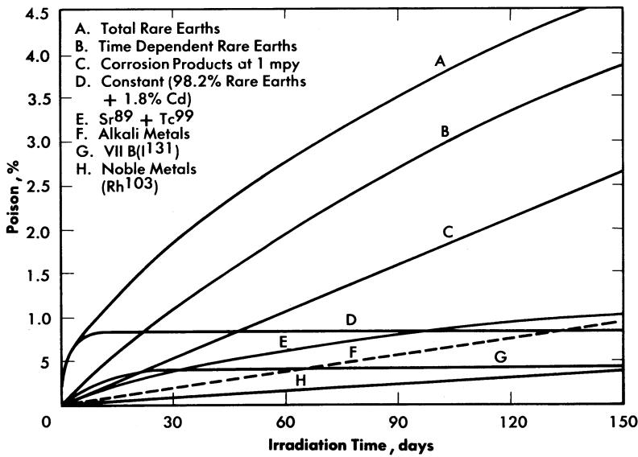  
FIG. 6-1. Poison effect as a function of chemical group in core of two-region thermal breeder.

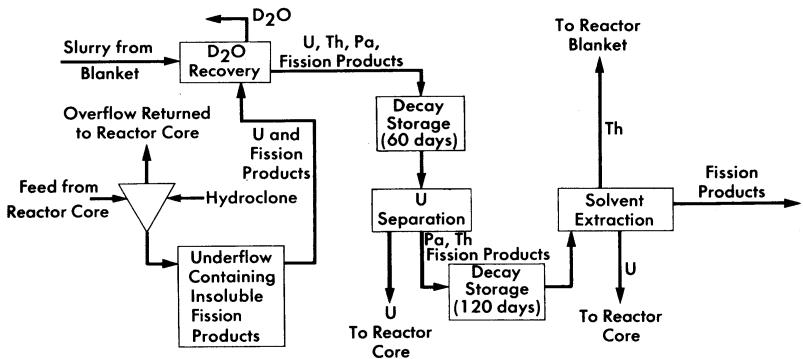  
FIG. 6-2. Conceptual flow diagram for processing fuel and blanket material from a two-region reactor.

The biological hazards associated with a homogeneous reactor are due chiefly to the radioactive rare earths, alkaline earths, and iodine [2]. The importance, as a biological hazard, of any one of these groups or nuclides within the group depends on assumptions made in describing exposure conditions; however, $\mathbf{I}^{131}$ contributes a major fraction of the radiation hazards for any set of conditions. While the accumulation of hazardous materials such as rare earths and alkaline earths will be controlled by the processing methods to be described, less is known about the chemistry of

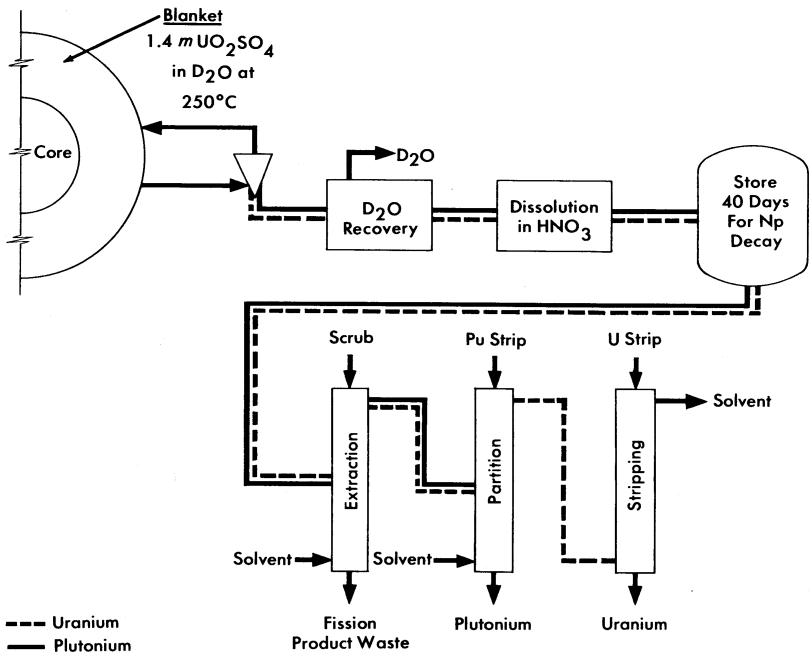  
FIG. 6-3. Conceptual flow diagram for processing blanket material from a two-region plutonium producer.

iodine in the fuel systems and methods for removing it. Existing information on iodine processing is discussed in Section 6-5.

Schematic flowsheets for proposed processing schemes for two types of two-region aqueous homogeneous reactors are shown in Figs. 6-2 and 6-3. In both cases, solids are removed by hydroclones and concentrated into a small volume of solution for further processing. The nature of such processing will be determined by the exact design and purpose of the reactor. Thus, for a two-region plutonium producer, the core and blanket materials would have to be processed separately to avoid isotopic dilution, while for a thorium breeder, core and blanket material could be processed together. However, if an attractive method should be developed for leaching uranium and/or protactinium from a thorium-oxide slurry without seriously altering the physical properties of the slurry, the two materials could be processed separately. In a similar way, the relation between iodine control and fission product gas disposal is such that neither problem can be disassociated from the other. A specific, complete, and feasible chemical processing scheme cannot be proposed for any reactor without an intimate knowledge of all aspects of design and operation of the reactor. However, some of the basic chemical knowledge needed to evaluate various

possible processing methods has been developed and is presented in the following sections.

# 6-2. CORE PROCESSING: SOLIDS REMOVAL

6-2.1 Introduction. Early in the study of the behavior of fission and corrosion products in uranyl sulfate solutions at temperatures in the range 250 to $325^{\circ}\mathrm{C}$ , it was found that many of these elements had only a limited solubility under reactor conditions. Detailed studies of these elements were conducted and devices for separating solids from liquid at high temperature and pressure were constructed and evaluated. Based on this work, a pilot plant to test a processing concept based on solids separation at reactor temperature was installed as an adjunct to the HRE-2. These processing developments are discussed in this section.

6-2.2 Chemistry of insoluble fission and corrosion products. Of the nongaseous fission products, the rare earths contribute the largest amount of neutron poison to a homogeneous reactor after a short period of operation (Fig. 6-1). Therefore, a detailed study of the behavior of these elements

TABLE 6-1   
SOLUBILITY OF LANTHANUM SULFATE IN 0.02 m $\mathrm{UO_2SO_4}$ —0.005 m $\mathrm{H_2SO_4}$ AS A FUNCTION OF SOLUTION TEMPERATURE  

<table><tr><td rowspan="2">Temperature, °C</td><td colspan="2">mg La2(SO4)3/kg H2O</td></tr><tr><td>True solubility</td><td>Concentration required to initiate precipitation</td></tr><tr><td>190</td><td>250</td><td>760</td></tr><tr><td>210</td><td>130</td><td>360</td></tr><tr><td>230</td><td>54</td><td>167</td></tr><tr><td>250</td><td>25</td><td>77</td></tr><tr><td>270</td><td>12</td><td>36</td></tr></table>

has been made. All the rare earths and yttrium showed a negative temperature coefficient of solubility in all the solutions studied and a strong tendency to supersaturate the solutions, as shown in Table 6-1. With the exception of praseodymium and neodymium, which are reversed, the solubility at a given temperature and uranyl sulfate concentration increased with increasing atomic number, with yttrium falling between neodymium

and samarium, as shown in Table 6-2. Increasing the uranyl sulfate concentration increased the solubility of a given rare-earth sulfate, as shown in Table 6-3.

TABLE 6-2   
SOLUBILITY OF VARIOUS RARE-EARTH SULFATES IN $0.02m\mathrm{UO}_2\mathrm{SO}_4 - 0.005m\mathrm{H}_2\mathrm{SO}_4$ AT $280^{\circ}\mathrm{C}$   
TABLE 6-3   

<table><tr><td>Salt</td><td>Solubility, mg/kg H2O</td><td>Salt</td><td>Solubility, mg/kg H2O</td></tr><tr><td>La2(SO4)3</td><td>10</td><td>Nd2(SO4)3</td><td>110</td></tr><tr><td>Ce2(SO4)3</td><td>50</td><td>Y2(SO4)3</td><td>240</td></tr><tr><td>Pr2(SO4)3</td><td>170</td><td>Sm2(SO4)3</td><td>420</td></tr></table>

EFFECT OF URANYL SULFATE CONCENTRATION ON THE SOLUBILITY OF NEODYMIUM SULFATE AT VARIOUS TEMPERATURES  

<table><tr><td rowspan="2">U, g/kg H2O</td><td colspan="3">Nd2(SO4)3solubility, mg/kg H2O</td></tr><tr><td>250°C</td><td>280°C</td><td>300°C</td></tr><tr><td>5.7</td><td>270</td><td>115</td><td>73</td></tr><tr><td>10.8</td><td>400</td><td>200</td><td>120</td></tr><tr><td>16.6</td><td>770</td><td>300</td><td>180</td></tr><tr><td>22.4</td><td>&gt;1000</td><td>500</td><td>300</td></tr></table>

In a mixture of rare-earth sulfates the solubility of an individual rare earth is less than it would be if it were present alone. For example, the solubility of praseodymium sulfate at $280^{\circ}\mathrm{C}$ is $170\mathrm{mg / kgH_2O}$ with no other rare earths present, as compared with $12\mathrm{mg / kgH_2O}$ in a solution made up with a rare-earth mixture containing $6\%$ praseodymium sulfate. Samples of the precipitating salts isolated from solution at $280^{\circ}\mathrm{C}$ have usually been the sulfates and contained no uranium. However, under special conditions a mixed sulfate salt of neodymium and uranium has been observed [3].

The alkaline earths, barium and strontium, also show a negative temperature coefficient, but not so strongly as do the rare earths; almost no effect can be seen when the temperature of precipitating solutions is in-

creased from 250 to $300^{\circ}\mathrm{C}$ . At $295^{\circ}\mathrm{C}$ in $0.02m\mathrm{UO}_2\mathrm{SO}_4 - 0.005m\mathrm{H}_2\mathrm{SO}_4$ solution, the solubility of barium sulfate is $7\mathrm{mg / kgH_2O}$ and that of strontium sulfate is $21\mathrm{mg / kgH_2O}$ . Both the alkaline and rare-earth sulfates show a strong tendency to precipitate on and adhere to steel surfaces hotter than the precipitating solutions, and this property can be used to isolate these solids from liquids at high temperatures.

Other fission and corrosion product elements hydrolyze extensively at 250 to $300^{\circ}\mathrm{C}$ and precipitate as oxides, leaving very low concentrations in solution. Iron(III) at $285^{\circ}\mathrm{C}$ has a solubility of 0.5 to $2\mathrm{mgFe / kgH_2O}$ and chromium(III), 2 to $5\mathrm{mg / kgH_2O}$ . At $285^{\circ}\mathrm{C}$ less than $5\mathrm{mg}$ of zirconium or niobium per kilogram of $\mathbf{H}_2\mathbf{O}$ remains in solution.

For other elements of variable valence, such as technetium, the amount of the element in solution is determined by the stable valence state under reactor conditions. In general, the higher valence states better resist hydrolysis and remain in solution. Thus at $275^{\circ}\mathrm{C}$ in $0.02\mathrm{mUO}_2\mathrm{SO}_4$ $\mathrm{Tc(VII)}$ is reduced to $\mathrm{Tc(IV)}$ if hydrogen is present, and only $12\mathrm{mg / kgH_2O}$ remains in solution. However, a slurry of $\mathrm{TcO_2}$ in the same solution but with oxygen present dissolves to give a solution at $275^{\circ}\mathrm{C}$ with a technetium concentration of more than $9\mathrm{g / kgH_2O}$ . The same qualitative behavior is observed with ruthenium. Selenium and tellurium in the hexapositive state are much more soluble than when in the tetrapositive state [4].

A few elements, e.g., cesium, rubidium, nickel, and manganese, introduced into the fuel solution by fission or by corrosion of the system, are very soluble under reactor conditions. Their removal and control are discussed in Section 6-4.

6-2.3 Experimental study of hydroclone performance. It is evident from the preceding section that the amount of uranium withdrawn from the reactor diminishes if the collection, concentration, and isolation of the insolubles can be effected at high temperature. One device capable of collecting and concentrating solids at high temperature is a solid-liquid cyclone separator called a "hydroclone," or "clone." A diagram of a hydroclone is shown in Fig. 6-4. In operation, a solids-bearing stream of liquid is injected tangentially into the wide portion of a conical vessel. Solids concentrate in a downward-moving layer of liquid and are discharged from the bottom of the clone into the underflow receiver. Partially clarified liquid leaves from the top of the clone through a vortex finder. Use of the underflow receiver eliminates mechanical control of the discharge flow rate and, by proper choice of hydroclone dimensions, any desired ratio of overflow rate to underflow rate can be achieved. The driving force for the system is provided by a mechanical pump.

The factors influencing the design of an effective hydroclone for homogeneous reactor processing use have been studied, and hydroclone designs

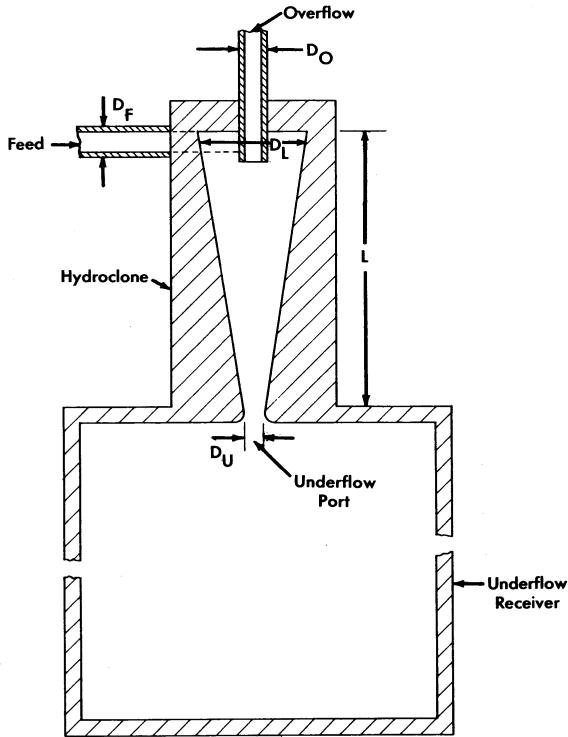  
FIG. 6-4. Schematic diagram of a hydroclone with associated underflow receiver.

based on these studies have been tested in the laboratory and on various circulating loops [5]. All tests have shown conclusively that such hydroclones can separate insoluble sulfates or hydrolyzed materials from liquid streams at 250 to $300^{\circ}\mathrm{C}$ . In the HRE-2 mockup loop a mixture of the sulfates of iron, zirconium, and various rare earths, dissolved in uranyl-sulfate solution at room temperature, precipitated when injected into the loop solution at 250 to $300^{\circ}\mathrm{C}$ . The solids concentrated into the underflow receiver of a hydroclone contained $75\%$ of the precipitated rare-earth sulfates. When the lanthanum-sulfate solubility in the loop solution was exceeded by $10\%$ , the concentration of rare earths in the underflow receiver was four to six times greater than in the rest of the loop system; some accumulation of rare earths was observed in the loop heater. A large fraction of the hydrolyzed iron and zirconium was collected in the gas separator portion of the loop. In the separator the centrifugal motion given to the liquid forced solids to the periphery of the pipe and allowed them to accumulate. Only about $10\%$ of the solids formed in the loop was recovered by the hydroclone, and examination of the loop system disclosed large quantities of solids settled in every horizontal run of pipe.

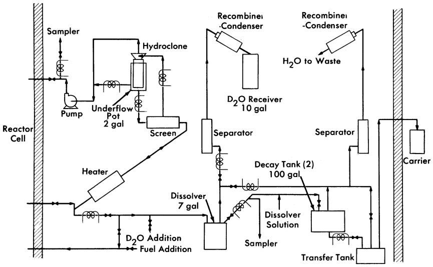  
FIG. 6-5. Schematic flow diagram for the HRE-2 chemical processing plant.

TABLE 6-4 DIMENSIONS OF HRE-2 HYDROCLONES  

<table><tr><td rowspan="2">Symbol</td><td rowspan="2">Location</td><td colspan="3">Dimension, in.</td></tr><tr><td>0.25-in. hydroclone</td><td>0.40-in. hydroclone</td><td>0.56-in. hydroclone</td></tr><tr><td>DL</td><td>Maximum inside diameter</td><td>0.25</td><td>0.40</td><td>0.56</td></tr><tr><td>L</td><td>Inside length</td><td>1.50</td><td>2.40</td><td>3.20</td></tr><tr><td>DU</td><td>Underflow port diameter</td><td>0.070</td><td>0.100</td><td>0.148</td></tr><tr><td>DO</td><td>Overflow port diameter</td><td>0.053</td><td>0.100</td><td>0.140</td></tr><tr><td>DF</td><td>Feed port effective diameter</td><td>0.051</td><td>0.118</td><td>0.159</td></tr></table>

Samples taken from the loop after addition of preformed solids and without the hydroclone operating showed an exponential decrease in solids concentration with a half-time of $2.5\mathrm{hr}$ ; with the hydroclone operating, the half-time was $1.2\mathrm{hr}$ . In the HRE-2 chemical plant [5], operated with an auxiliary loop to provide a slurry of preformed solids in uranyl sulfate solution as a feed for the plant, the half-times for solids disappearance and removal were $11\mathrm{hr}$ without the hydroclone and $1.5\mathrm{hr}$ with it. The efficiency of the hydroclone for separating the particular solids used in these experiments was about $10\%$ . With gross amounts of solids in the system, concentration factors have been as large as 1700.

Correlation of these data with anticipated reactor chemical plant operating conditions indicates that the HRE-2 chemical plant will hold the amount of solids in the fuel solution to between 10 and $100~\mathrm{ppm}$ . If necessary, performance can be improved by increasing the flow through the chemical plant and by eliminating, wherever possible, long runs of horizontal pipe with low liquid velocity and other stagnant areas which serve to accumulate solids.

6-2.4 HRE-2 chemical processing plant.* An experimental facility to test the solids-removal processing concept has been constructed in a cell adjacent to the HRE-2. A schematic flowsheet for this facility is shown in Fig. 6-5.

A 0.75-gpm bypass stream from the reactor fuel system at $280^{\circ}\mathrm{C}$ and 1700 psi is circulated through the high-pressure system, consisting of a heater to make up heat losses, a screen to protect the hydroclone from plugging, the hydroclone with underflow receiver, and a canned-rotor circulating pump to make up pressure losses across the system. The hydroclone is operated with an underflow receiver which is drained after each week of operation, at which time the processing plant is isolated from the reactor system.

At the conclusion of each operating period 10 liters of the slurry in the underflow pot is removed and sampled. The heavy water is evaporated and recovered, and the solids are dissolved in sulfuric acid and sampled again. The solution is then transferred under pressure to one of two 100-gal decay storage tanks. Following a three-month decay period, the solution is transferred to a shielded carrier outside the cell and then to an existing solvent extraction plant at Oak Ridge National Laboratory for uranium decontamination and recovery. The sulfuric acid solution step is incorporated in the HRE-2 chemical plant to ensure obtaining a satisfactory sample. This step would presumably not be necessary in a large-scale plant.

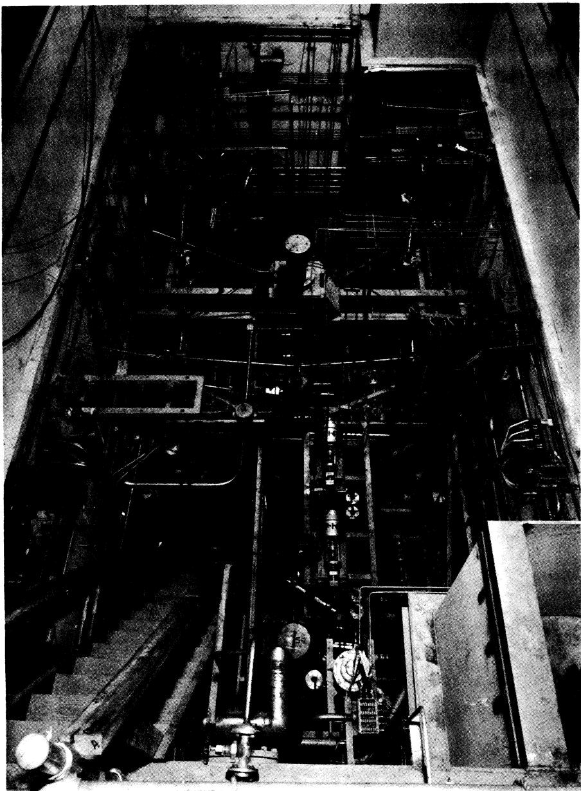  
FIG. 6-6. HRE-2 chemical plant cell with equipment.

All equipment is located in a 12- by 24- by 21-ft underground cell located adjacent to the reactor cell and separated from it by 4 ft of high-density concrete. Other construction features are similar to those of the reactor cell, with provisions for flooding the cell during maintenance periods in order to use water as shielding. Figure 6-6, a photograph of the cell prior to installation of the roof plugs, shows the maze of piping necessitated by the experimental nature of this plant.

Dimensions of the three sizes of hydroclones designed for testing in this plant are shown in Table 6-4. These three hydroclones, which have been

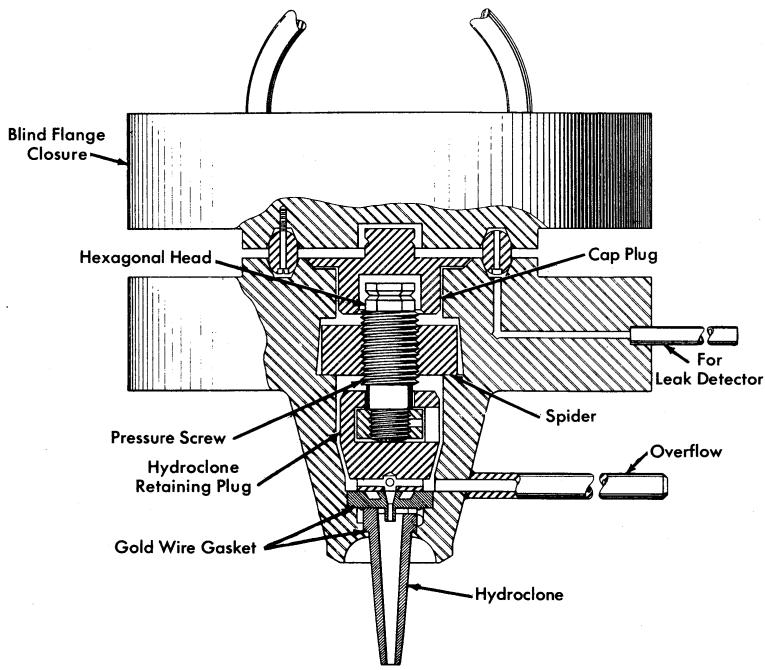  
FIG. 6-7. HRE-2 chemical plant hydroclone container.

selected to handle the range of possible particle sizes, are interchangeable at any time during radioactive operation through a unique, specially machined flange, shown in Fig. 6-7. Removal of the blind closure flange exposes a cap plug and retainer plug. Removal of these with long-handled socket wrenches permits access to the hydroclone itself. This operation has been performed routinely during testing with nonradioactive solutions.

In processing homogeneous reactor fuel, a transition from a heavy- to a natural-water system is desirable if final processing is to be performed in conventional solvent extraction equipment. Such a transition must be accomplished with a minimum loss of $\mathrm{D}_2\mathrm{O}$ and a minimum contamination of

the fuel solution by $\mathrm{H}_2\mathrm{O}$ in recycled fuel. Initial tests of this step in the fuel processing cycle have been carried out [6]. In these experiments a mixture of $5\%$ $\mathrm{D}_2\mathrm{O}$ , $95\%$ $\mathrm{H}_2\mathrm{O}$ was used to simulate reactor fuel liquid. The dissolver system was cycled three times between this liquid and ordinary water, with samples being taken during each portion of each cycle. Isotopic analysis of these samples showed no dilution of the $\mathrm{D}_2\mathrm{O}$ in the enriched solution and no loss of $\mathrm{D}_2\mathrm{O}$ to the ordinary water system.

At expected corrosion rates, approximately $400\mathrm{g}$ of corrosion products will be formed in the reactor system per week, and the underflow receiver was therefore designed to handle this quantity of solids. The adequacy of the design was shown when more than three times this quantity of solids was charged to the underflow receiver and drained in the normal way without difficulty.

Full-scale dissolution procedures have also been tested [6]. To minimize the possibilities of contaminating the reactor fuel solution by foreign ions, a dissolution procedure was developed using only sulfuric acid. This consists of a 4-hr reflux with $10.8M\mathrm{H}_2\mathrm{SO}_4$ in a tantalum-lined dissolver followed by a 4-hr reflux with $4M\mathrm{H}_2\mathrm{SO}_4$ , and repeated as required until dissolution is complete. Decay storage tanks and other equipment required to handle the boiling $4M\mathrm{H}_2\mathrm{SO}_4$ are fabricated of Carpenter-20 stainless steel. Tests have repeatedly demonstrated more than $99.5\%$ dissolution of simulated corrosion and fission products in two such cycles.

The HRE-2 hydroclone system has been operated as an integral part of the reactor system for approximately 600 hr and for an additional 1200 hr with a temporary pump loop during initial solids-removal tests. During this operating period, in which simulated nonradioactive fuel solutions were used, the performance of the plant was satisfactory in all respects.

# 6-3. FISSION PRODUCT GAS DISPOSAL*

6-3.1 Introduction. To prevent the pollution of the atmosphere by radioactive krypton and xenon isotopes released from the fuel solution, a system of containment must be provided until radioactive decay has reduced their activity level. This is accomplished by a method based on the process of physical adsorption on solid adsorber materials. If the adsorber system is adequately designed, the issuing gas stream will be composed of long-lived $\mathrm{Kr}^{85}$ , oxygen, inert krypton isotopes, inert xenon isotopes, and insignificant amounts of other radioactive krypton and xenon isotopes. In case the activity of the $\mathrm{Kr}^{85}$ is too high for dilution with air and discharge to the atmosphere, the mixture may be stored after removal of the oxygen

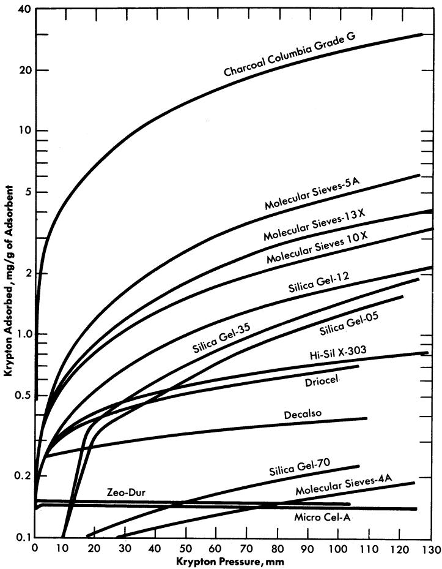  
FIG. 6-8. Adsorption of krypton on various adsorbents at $28^{\circ}\mathrm{C}$ .

or further separated by conventional methods into an inert xenon fraction and a fraction containing $\mathrm{Kr^{85}}$ and inert krypton.

6-3.2 Experimental study of adsorption of fission product gases. Evaluation of various adsorber materials based on experimental measurements of the equilibrium adsorption of krypton or xenon under static conditions is in progress [7]. Results in the form of adsorption isotherms of various solid adsorber materials are presented in Fig. 6-8.

A radioactive-tracer technique was developed to study the adsorption efficiency (holdup time) of small, dynamic, laboratory-scale adsorber systems [8]. This consists of sweeping a brief pulse of $\mathrm{Kr}^{85}$ through an experimental adsorber system with a diluent gas such as oxygen or nitrogen

and monitoring the effluent gases for $\mathrm{Kr}^{85}$ beta activity. The activity in the gas stream versus time after injection of the pulse of $\mathrm{Kr}^{85}$ is recorded. A plot of the data gives an experimental elution curve, such as shown in Fig. 6-9, from which various properties of an adsorber material and adsorber system may be evaluated.

Among the factors which influence the adsorption of fission product gases from a dynamic system are (1) adsorptive capacity of adsorber material, (2) temperature of adsorber material, (3) volume flow rate of gas stream, (4) adsorbed moisture content of adsorber material, (5) composition and moisture content of gas stream, (6) geometry of adsorber system, and (7) particle size of adsorber material. The average time required for the fission product gas to pass through an adsorber system, $t_{\mathrm{max}}$ , is influenced by the first five of the above factors. The shape of the experimental elution curve is affected by the last two.

The temperature of the adsorber material is of prime importance. The lower the temperature the greater will be the adsorption of the fission gases, and therefore longer holdup times per unit mass of adsorber material will result. The dependence of adsorptive capacity, $k$ , on temperature as determined by holdup tests with some solid adsorber materials is shown in Table 6-5.

TABLE 6-5   
ADSORPTIVE CAPACITY OF VARIOUS MATERIALS AS A FUNCTION OF TEMPERATURE  

<table><tr><td rowspan="2">Gas</td><td rowspan="2">Diluent</td><td rowspan="2">Adsorber</td><td colspan="3">cc gas/g adsorbent*</td></tr><tr><td>273°K</td><td>323°K</td><td>373°K</td></tr><tr><td>Xe</td><td>O2</td><td>Charcoal</td><td>4.7 × 103</td><td>4.0 × 102</td><td>80.0</td></tr><tr><td>Kr</td><td>He</td><td>Charcoal</td><td>1.8 × 102</td><td>34</td><td>9.6</td></tr><tr><td>Kr</td><td>O2 or N2</td><td>Charcoal,</td><td>68</td><td>24</td><td>11.0</td></tr><tr><td>Kr</td><td>O2</td><td>Linde Molecular Sieve 5A</td><td>23</td><td>9</td><td>4.5</td></tr><tr><td>Kr</td><td>O2</td><td>Linde Molecular Sieve 10X</td><td>11</td><td>5.7</td><td>3.5</td></tr></table>

*Gas volume measured at temperatures indicated.

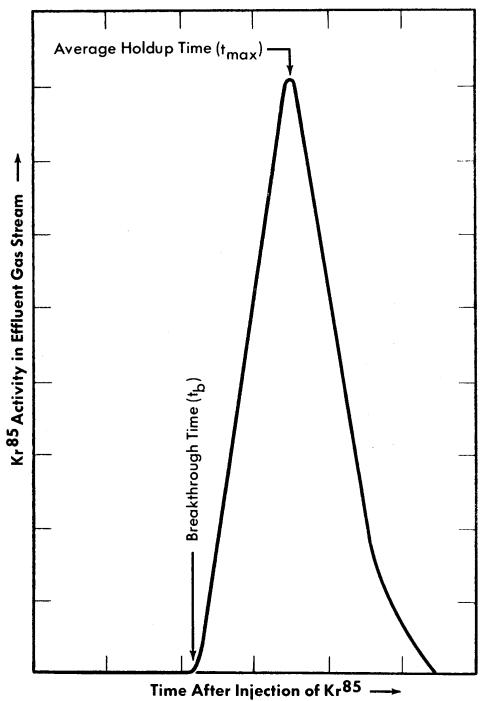  
FIG. 6-9. Experimental Kr85 elution curve.

At a given temperature, the average holdup time, $t_{\mathrm{max}}$ , is inversely proportional to the volume flow rate of the gas stream. If the volume flow rate is doubled, the holdup time will be decreased by a factor of two.

All the solid adsorber materials adsorb moisture to some degree. Any adsorbed moisture reduces the active surface area available to the fission gases and thus reduces the average holdup time.

The geometry of the adsorber system influences the relation between breakthrough time, $t_b$ , and average holdup time, $t_{\mathrm{max}}$ , as shown in Fig. 6-9. Ideally, for fission product gas disposal, a particular atom of fission gas should not emerge from the adsorber system prior to the time $t_{\mathrm{max}}$ . Since this condition cannot be realized in practice, the difference between breakthrough and average holdup times should be made as small as possible. For a given mass of adsorber material a system composed of long, small-diameter pipes will have a small difference between $t_b$ and $t_{\mathrm{max}}$ , whereas a system composed of short, large-diameter pipes will not.

The particle size of the adsorber material is important for ensuring intimate contact between the active surface of the adsorber material and the fission gases. A system filled with large particles will allow some mole

cules of fission gases to penetrate deeper into the system before contact is made with an active surface, while the pressure drop across a long trap filled with small particles may be excessive. Material between 8 and 14 mesh in size is satisfactory from both viewpoints.

6-3.3 Design of a fission product gas adsorber system. The design of an adsorber system will be determined partly by the final disposition of the effluent gas mixture. If ultimate disposal is to be to the atmosphere, the adsorber system should be designed to discharge only $\mathrm{Kr}^{85}$ plus inert krypton and xenon isotopes. If the effluent gases are to be contained and stored, the adsorber system may be designed to allow discharge of other radioactive krypton and xenon isotopes. In the following discussion it is assumed that final disposal of the effluent gas mixture will be to the atmosphere. The following simple relation has been developed which is useful in finding the mass of adsorber material in such an adsorber system:

$$
M = \frac {F}{k} t _ {\max},
$$

where $M =$ mass of adsorber material (grams), $F =$ gas volume flow rate through adsorber system (cc/min), $k =$ adsorptive capacity under dynamic conditions (cc/g), and $t_{\max} =$ average holdup time (min).

The operating characteristics of the reactor will dictate the composition and volume flow rate of the gas stream; $t_{\mathrm{max}}$ will be determined by the allowable concentration of radioactivity in the effluent gas; $k$ values for krypton and xenon must be determined experimentally under conditions simulating these in the full-scale adsorber system. It should be noted (Fig. 6-9) that a portion of the fission gas will emerge from the adsorber system at a time $t_b$ prior to the average holdup time, $t_{\mathrm{max}}$ . The design should ensure that radioactive gas emerging at time $t_b$ has decayed sufficiently that only insignificant amounts of activity other than $\mathrm{Kr}^{85}$ will be discharged from the bed.

The adsorber system should be operated at the lowest convenient temperature because of the dependence of adsorptive capacity on temperature. Beta decay of the fission product gases while passing through the adsorber system will increase the temperature of the adsorber material and reduce the adsorptive capacity. Temperature control is especially critical if the adsorber system uses a combustible adsorber material, such as activated charcoal, with oxygen as the diluent or sweep gas.

6-3.4 HRE-2 fission product gas adsorber system. The HRE-2 uses a fission product gas adsorber system containing Columbia G activated charcoal. Oxygen, contaminated with the fission product gases, is removed

from the reactor, dried, and passed into this system, and the effluent gases are dispersed into the atmosphere through a stack.

The adsorber system contains two activated charcoal-filled units connected in parallel to the gas line from the reactor. Each unit consists of 40 ft of $\frac{1}{2}$ -in. pipe, 40 ft of 1-in. pipe, 40 ft of 2-in. pipe, and 60 ft of 6-in. pipe connected in series. The entire system is contained in a water-filled pit, which is buried underground for gamma shielding purposes. Each unit is filled with approximately 520 lb of Columbia G activated charcoal, 8 to 14 mesh.

The heat due to beta decay of the short-lived krypton and xenon isotopes is diminished by an empty holdup volume composed of 160 ft of 3-in. pipe between the reactor and the charcoal adsorber system. This prevents the temperature of the charcoal in the inlet sections of the adsorber system from exceeding $100^{\circ}\mathrm{C}$ . Excessive oxidation of the charcoal by the oxygen in the gas is further prevented by water-cooling the beds.

Before the adsorber system was placed in service, its efficiency was tested under simulated operating conditions [9]. A pulse of $\mathrm{Kr}^{85}$ (25 millicuries) was injected into each unit of the adsorber system and swept through with a measured flow of oxygen. In this way the krypton holdup time was determined to be 30 days at an oxygen flow rate of $250~\mathrm{cc / min}/$ unit. Based on laboratory data from small adsorber systems, the holdup time for xenon is larger than that for krypton by a factor that varies from 30 to 7 over the temperature range of 20 to $100^{\circ}\mathrm{C}$ . From these data, it is estimated that the maximum temperature of the HRE-2 adsorber system will vary between 20 and $98^{\circ}\mathrm{C}$ after the reactor has been operating at $10\mathrm{Mw}$ power level long enough for the gas composition and charcoal temperature to have reached equilibrium through the entire length of the adsorber unit. The holdup performance of the adsorber system was calculated with corrections for the increased temperature expected from the fission gases. The calculated holdup time was found to be 23 days for krypton and 700 days for xenon; this would permit essentially no $\mathrm{Xe}^{133}$ to escape from the trap.

# 6-4. CORE PROCESSING: SOLUBLES

6-4.1 Introduction. While the solids-removal scheme discussed in Section 6-1 will limit the amount of solids circulating through the reactor system, soluble elements will build up in the fuel solution. Nickel and manganese from the corrosion of stainless steel and fission-produced cesium will not precipitate from fuel solution under reactor conditions until concentrations have been reached which would result in fuel instability and loss of uranium by coprecipitation. Loss of neutrons to these poisons would seriously decrease the probability of the reactor producing more

fuel than it consumes. Therefore, a volume of fuel solution sufficient to process the core solution of the reactor at a desired rate for removal of soluble materials is discharged along with the insoluble materials concentrated into the hydroclone underflow pot. This rate of removal of soluble materials depends on the nature of other chemical processing being done and on the extent of corrosion. For example, operation of an iodine removal plant (Section 6-5) reduces the buildup of cesium in the fuel to an insignificant value by removing cesium precursors.

6-4.2 Solvent extraction. Processing of the core solution of a homogeneous reactor by solvent extraction is the only method presently available which has been thoroughly proved in practice. However, the amount of uranium to be processed daily is so small that operation of a solvent extraction plant just for core solution processing would be unduly expensive. Therefore, the core solution would normally be combined with blanket material from a thermal breeder reactor and be processed through a Thorex plant, but with a plutonium-producing reactor separate processing of core and blanket materials will be needed. These process schemes are discussed in detail in Sections 6-6 and 6-7.

The uranium product from either process would certainly be satisfactory for return to the reactor. Since solid fuel element refabrication is not a problem with homogeneous reactors, decontamination factors of 10 to 100 from various nuclides are adequate and some simplification of present solvent extraction schemes may be possible.

6-4.3 Uranyl peroxide precipitation. A process for decontaminating the uranium for quick return to a reactor has been proposed as a means of reducing core processing costs. A conceptual flowsheet of this process, which depends on the insolubility of $\mathrm{UO_4}$ under controlled conditions for the desired separation from fission and corrosion products, is shown in Fig. 6-10. A prerequisite for use of this scheme is that losses due to the insoluble uranium contained in the solids concentrated in the hydroclone plant be small. However, laboratory data obtained with synthetic solids simulating those expected from reactor operation indicate that the uranium content of the solids will be less than $1\%$ by weight. Verification of the results will be sought during operation of the HRE-2.

In the proposed method, the hydroclone system is periodically isolated from the reactor and allowed to cool to $100^{\circ}\mathrm{C}$ . The hydrolyzed solids remain as such, but the rare-earth sulfate solids concentrated in the underflow pot redissolve upon cooling. The contents of the underflow pot are discharged to a centrifuge where solids are separated from the uranium-containing solution and washed with $\mathrm{D}_2\mathrm{O}$ , the suspension being sent to a waste evaporator for recovery of $\mathrm{D}_2\mathrm{O}$ .

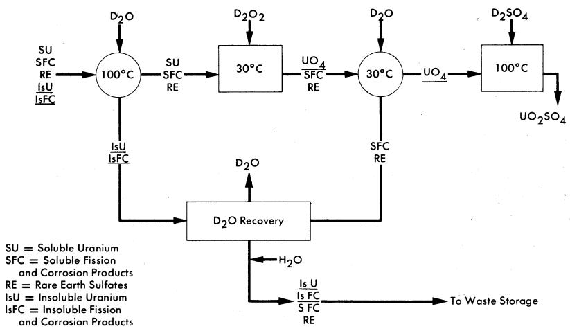  
FIG. 6-10. Schematic flow diagram for decontaminating uranium by uranyl peroxide precipitation.

Uranium in the clarified solution is precipitated by the addition of either $\mathrm{D}_2\mathrm{O}_2$ or $\mathrm{Na}_2\mathrm{O}_2$ . By controlling $\mathfrak{p}\mathbf{D}$ and precipitation conditions, a fast settling precipitate can be obtained with less than $0.1\%$ of the uranium remaining in solution. The $\mathrm{UO_4}$ precipitate is centrifuged or filtered and washed with $\mathrm{D}_2\mathrm{O}$ and dissolved in $50\%$ excess of $\mathrm{D}_2\mathrm{SO}_4$ at $80^{\circ}\mathrm{C}$ before being returned to the reactor.

In laboratory studies uranium losses have been consistently less than $0.1\%$ for this method and decontamination factors from rare earths greater than 10. Decontamination factors from nickel and cesium have been 600 and 40, respectively. It is estimated that the product returned to the reactor would contain about 20 ppm of sodium as the only contaminant introduced during processing. Although either the addition of $\mathrm{D}_2\mathrm{O}_2$ or use of $\mathrm{D}_2\mathrm{O}_2$ generated by radiation from the solution itself appears attractive, acid liberated by the precipitation of $\mathrm{UO_4}$ must be neutralized if uranium losses are to be minimized. Since the entire operation is done in a $\mathrm{D}_2\mathrm{O}$ system, no special precautions to avoid contaminating the reactor with ordinary water are needed.

# 6-5. CORE PROCESSING: IODINE*

6-5.1 Introduction. The removal of iodine from the fuel solution of a homogeneous reactor is desirable from the standpoint of minimizing the biological hazard and neutron poisoning due to iodine and reducing the production of gaseous xenon and its associated problems. Iodine will also

poison platinum catalysts [10] used for radiolytic gas recombination in the reactor low-pressure system and may catalyze the corrosion of metals by the fuel solution. For this reason a considerable effort has been carried out at ORNL and by Vitro [11] to investigate the behavior of iodine in solution and to develop methods for its removal. In this regard, the iodine isotopes of primary interest are 8-day $\mathrm{I}^{131}$ and 6.7-hr $\mathrm{I}^{135}$ .

6-5.2 The chemistry of iodine in aqueous solutions. Iodine in aqueous solution at $25^{\circ}\mathrm{C}$ can exist in several oxidation states. The stable species are iodide ion, $\mathrm{I}^{-}$ ; elemental iodine, $\mathrm{I}_2$ ; iodate, $\mathrm{IO}_3^-$ ; and periodate, $\mathrm{IO}_4^-$ or $\mathrm{H}_5\mathrm{IO}_6$ . The last of these exists only under very strongly oxidizing conditions, and is immediately reduced under the conditions expected for a homogeneous reactor fuel. Iodide ion can be formed from reduction of other states by metals, such as stainless steel, but in the presence of the oxygen necessary in a reactor system it is readily converted to elemental iodine; this conversion is especially rapid above $200^{\circ}\mathrm{C}$ . Thus the only states of concern in reactor fuel solutions are elemental iodine and iodate. Under the conditions found in a high-pressure fuel system the iodine is largely, if not all, in the elemental form.

Volatility of iodine. Since the volatile elemental state of iodine is predominant under reactor conditions, the volatility of iodine from fuel solution is the basis for proposed iodine-removal processes. The vapor-liquid distribution coefficient [11] (ratio of mole fraction of iodine in vapor to that in liquid) for simulated fuel solution and for water at the temperatures expected for both the high-pressure and low-pressure systems of homogeneous reactors is given in Table 6-6.

TABLE 6-6 VAPOR-LIQUID DISTRIBUTION OF IODINE   

<table><tr><td rowspan="2">Solution</td><td colspan="2">Distribution coefficient, vapor/liquid</td></tr><tr><td>High pressure (260-330°C)</td><td>Low pressure (100°C)</td></tr><tr><td rowspan="2">Clean fuel solution (0.02 m UO2SO4-0.005 m H2SO4-0.005 m CuSO4, 1-100 ppm I2Fuel solution with mixed fission and corrosion productsWater (pH 4 to 8, 1-13 ppm I2)</td><td>7.4</td><td>0.34</td></tr><tr><td>0.29</td><td>2.40.009</td></tr></table>

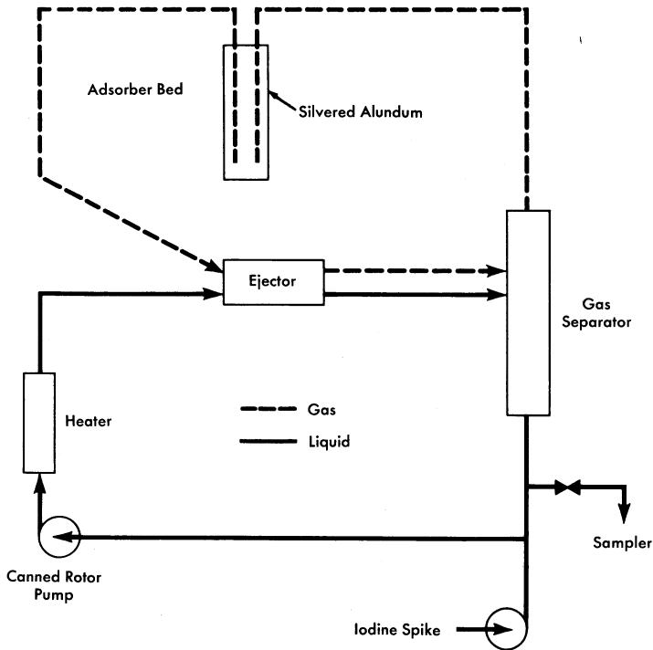  
FIG. 6-11. Vitro iodine test loop.

A number of conclusions are evident from these data. Iodine is much more volatile from fuel solution than from water at either temperature. Fission and corrosion products appear to increase the volatility of iodine from fuel solution at $100^{\circ}\mathrm{C}$ . Increasing the temperature from 100 to $200^{\circ}\mathrm{C}$ increases the volatility of iodine relative to that of water. No systematic variation of iodine volatility has been found with iodine concentration in the range 1 to $100\mathrm{ppm}$ or temperature in the range 260 to $330^{\circ}\mathrm{C}$ .

The volatility of iodine from simulated fuel solution has been verified by experiments in a high-pressure loop, shown schematically in Fig. 6-11 [11]. The circulating solution was contacted with oxygen in the ejector; the separated gas was stripped of iodine by passing through a bed of silvered alundum which was superheated to prevent steam condensation. Potassium iodide solution (containing a radioactive tracer, $\mathrm{I}^{131}$ ) was rapidly injected into the loop to give an iodine concentration of $10~\mathrm{ppm}$ . The iodine concentration decreased exponentially with time in the circulating solution. Table 6-7 gives the half-times for iodine removal and the volatility distribution coefficient, calculated from the removal rate and the flow rates, based on three experiments with clean fuel solution and two with added iron. Within the accuracy of flow rate measurement, the coef

TABLE 6-7   
IODINE REMOVAL FROM A HIGH-PRESSURE LOOP   

<table><tr><td>Solution</td><td>Tempera-ture, ℃</td><td>Iodine removal half-time, min</td><td>Iodine distribution coefficient, vapor/liquid</td></tr><tr><td>Clean fuel solution</td><td>230</td><td>13.0</td><td>7.6</td></tr><tr><td rowspan="2">(0.02 m UO2SO4-0.005 m H2SO4-0.005 m CuSO4)</td><td></td><td>6.5</td><td>16.8</td></tr><tr><td></td><td>13.0</td><td>8.4</td></tr><tr><td>Fuel + 30 ppm Fe3+</td><td>220</td><td>11.0</td><td>10.9</td></tr><tr><td>Fuel + 300 ppm Fe3+</td><td>225</td><td>11.0</td><td>9.5</td></tr></table>

ficient agrees with the average value of 7.4 obtained in numerous static tests over the high-temperature range. Iron appears to have no effect.

Oxidation state of iodine at high temperatures and pressures. While iodate ion is quite stable at room temperature, at elevated temperatures it decomposes according to the equilibrium reaction

$$
4 \mathrm {I O} _ {3} ^ {-} + 4 \mathrm {H} ^ {+} \xleftarrow {} 2 \mathrm {I} _ {2} + 5 \mathrm {O} _ {2} + 2 \mathrm {H} _ {2} \mathrm {O}.
$$

The extent of this decomposition in uranyl-sulfate solutions above $200^{\circ}\mathrm{C}$ is not known with certainty, since all observations have been made on samples that have been withdrawn from the system, cooled, and reduced in pressure before analysis. Although the iodine in such samples is principally elemental, some iodate is always present, possibly because of reversal of the iodate decomposition as the temperature drops in the sample line. Such measurements therefore give an upper limit to the iodate content of the solution. If periodate is introduced into uranyl-sulfate solution at elevated temperatures, it is reduced before a sample can be taken to detect its presence. Iodide similarly disappears if an overpressure of oxygen is present, although iodide to the extent of $40\%$ of the total iodine has been found in the absence of added oxygen [11].

Methods that have been used for determining the iodine/iodate ratio in fuel solutions are (a) analysis of samples taken from an autoclave at $250^{\circ}\mathrm{C}$ at measured intervals after injection of iodine in various states [11], (b) analysis of samples taken from the liquid in liquid-vapor equilibrium studies at 260 to $330^{\circ}\mathrm{C}$ [11], (c) rapid sampling from static bombs at 250 to $300^{\circ}\mathrm{C}$ [12], and (d) continuous injection of iodate-containing fuel solution into the above described ejector loop at $220^{\circ}\mathrm{C}$ and determining

oxidation states in samples withdrawn [11]. The iodine/iodate ratio in these samples has varied from slightly over 1 to about 70, with no apparent relation to variations in temperature, oxygen pressure, and total iodine concentration.

The strongest indication of iodate instability was in the loop experiments, which gave the highest observed iodine/iodate ratio, even though iodine was continuously introduced into the flowing stream as iodate and removed by oxygen scrubbing as elemental iodine. The low iodate content of the samples from these experiments corresponded to a first-order iodate decomposition rate constant of $6.2\mathrm{min}^{-1}$ . Iodate contents averaging about $10\%$ of the total iodine have been observed in $0.04m\mathrm{UO}_2\mathrm{SO}_4 - 0.005m\mathrm{CuSO}_4 - \mathrm{H}_2\mathrm{SO}_4$ solution, rapidly sampled from a static bomb through an ice-cooled titanium sample line. The observed iodate content was unrelated to whether the free sulfuric acid concentration was 0.02 or $0.03m$ , whether the temperature was 250 or $300^{\circ}\mathrm{C}$ , and whether or not the solution was exposed to cobalt gamma radiation at an intensity of 1.7 watts/kg.

Oxidation state of iodine at low temperatures. At $100^{\circ}\mathrm{C}$ the iodate decomposition and iodine oxidation are too slow for equilibrium to be established in reasonable periods of time. Thus both states can persist under similar conditions. In stainless-steel equipment both states are reduced to iodide, which is oxidized to iodine if oxygen or iodate is present [12].

In a radiation field the iodide is oxidized, iodine is oxidized if sufficient oxygen is present, and iodate is reduced [13]. At the start of irradiation, iodate is reduced, but in the presence of sufficient oxygen, iodine is later reoxidized to iodate, probably by radiation-produced hydrogen peroxide which accumulates in the solution. Finally, a steady state is reached with a proportion of iodate to total iodine which is independent of total iodine concentration from $10^{-6}$ to $10^{-5}$ m and temperatures from 100 to $110^{\circ}\mathrm{C}$ , but strongly dependent on uranium and acid concentrations and on the hydrogen/oxygen ratio in the gas phase. When the temperature is increased to $120^{\circ}\mathrm{C}$ there is a marked decrease in iodate stability under all conditions of gas and solution composition. Experimental data on the effects of radiation intensity, temperature, and gas composition for the irradiation of a typical fuel solution containing $0.04$ m $\mathrm{UO}_2\mathrm{SO}_4 - 0.01$ m $\mathrm{H}_2\mathrm{SO}_4 - 0.005$ m $\mathrm{CuSO}_4$ are given in Ref. 13. The steady-state iodate percentages are also given in this reference.

6-5.3 Removal of iodine from aqueous homogeneous reactors. It is clear that under the operating conditions of a power reactor, iodine in the fuel solution is mainly in the volatile elemental state. It can therefore be removed by sweeping it from the solution into a gas phase, stripping

it from the gas stream by trapping it in a solid absorber or by contacting the gas with a liquid.

Numerous experiments have shown that silver supported on alundum is a very effective reagent for removing iodine from gas or vapor systems, although its efficiency is considerably reduced at temperatures below $150^{\circ}\mathrm{C}$ . Silver-plated Yorkmesh packing is very effective for removing iodine from vapor streams in the range 100 to $120^{\circ}\mathrm{C}$ . In one in-pile experiment [14] $90\%$ of the fission-product iodine was concentrated in a silvered-alundum pellet suspended in the vapor above a uranyl-sulfate solution. This method of using a solid iodine absorber, however, would present difficult engineering problems, since xenon resulting from iodine decay would be expected to leave the absorber and return to the core unless the absorbers were isolated after short periods of use and remotely replaced.

Iodine removal by gas stripping requires a continuous fuel letdown. In case this is not desirable, the vapor can be stripped of iodine in the high-pressure system by contacting with a small volume of liquid which is subsequently discharged. Liquids considered include water and aqueous solutions of alkali, sodium sulfite, or silver sulfate [11]. Although the solutions are much more effective iodine strippers than pure water, their use requires elaborate provision for preventing entrainment in the gas and subsequent contamination of the fuel solution. Thus most of the effort in design of iodine-removal systems is based on stripping by pure heavy water.

One possible iodine-removal scheme uses $\mathrm{O}_2$ or $\mathrm{O}_2 + \mathrm{D}_2$ stripping [15]. The iodine is scrubbed from the fuel solution by the gas in one contactor and then stripped from the gas by heavy water in a second contactor. This water would then be let down to low pressure and stored for decay or processed to remove iodine.

In most homogeneous reactors some of the fuel solution is evaporated to provide condensate for purge of the circulating pump and pressurizer. Since iodine is stripped from the fuel by this evaporation this operation can be used for iodine removal. This method, which is illustrated in Fig. 6-12, has been proposed for the HRE-3 [16]. Here a stream of the fuel solution is scrubbed with oxygen in the pressurizer. The steam is condensed and the oxygen recycled. The condensate is distilled to concentrate the iodine into such a small volume that its letdown does not complicate reactor operation.

Iodine removal in the HRE-2. Iodine adsorption on the platinized alumina recombination catalyst, such as that used in the HRE-2, poisons the catalyst severely [10]. Although the catalyst can be restored by operation at $650^{\circ}\mathrm{C}$ , this would not be feasible in HRE-2 operation. A method for removing iodine from the gas stream by contact with alundum or Yorkmesh coated with silver was developed in the HRT mockup. Iodine was introduced into the system and vapor from the letdown stream and dump

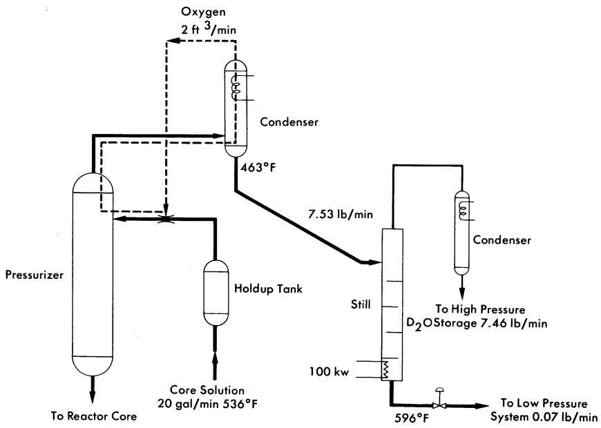  
FIG. 6-12. Iodine removal system proposed for HRE-3.

tank was passed through a silvered alundum bed and the recombiner, and then to a condenser. Condensate was returned to the high-pressure loop through a pressurizer and the circulating pump. After injection, the iodine concentration of the high-pressure loop dropped from $1.8\mathrm{mg}$ /liter to $0.1\mathrm{mg}$ /liter in 2 hr. In similar experiments with silvered Yorkmesh, iodine levels in the condensate and pressurizer were even lower relative to the high-pressure loop. The Yorkmesh efficiency depended strongly on how densely it was packed. The iodine removal efficiencies calculated from these experiments and others are given in Table 6-8. In laboratory experiments with a 1-in.-diameter bed which could not be tightly packed, Yorkmesh efficiencies were consistently poorer than those of silvered alundum.

The ability of a bed of silver-plated Yorkmesh to remove iodine from the reactor system was apparently confirmed during the initial operating period of the HRE-2 [17]. Here the iodine activity in the reactor fuel appeared to be even lower than expected when iodine was removed at the same fractional rate as fuel solution was let down from the high-pressure system. Less than $3\%$ of the iodine produced during 40 Mwh of operation was found in the fuel solution. Experience with the HRT mockup indicates that the iodine not in solution was held on the silvered bed.

TABLE 6-8   
IODINE REMOVAL EFFICIENCY OF SILVERED BEDS IN HRT MockUP   

<table><tr><td>Absorber</td><td>Bed height, in.</td><td>Temperature, °C</td><td>Efficiency, %</td></tr><tr><td rowspan="3">Silvered alundum rings</td><td>8</td><td>150</td><td>97.7</td></tr><tr><td>8</td><td>120</td><td>81.0</td></tr><tr><td>5</td><td>110</td><td>64.0</td></tr><tr><td>Yorkmesh, 22 lb/ft3</td><td>10</td><td>120</td><td>97.0</td></tr><tr><td>Yorkmesh, 29 lb/ft3</td><td>6</td><td>120</td><td>99.6</td></tr></table>

# 6-6. URANYL SULFATE BLANKET PROCESSING*

6-6.1 Introduction. The uranyl sulfate blanket solution of a plutonium producer is processed to remove plutonium and to control the neutron poisoning by corrosion and fission products. Although a modified Purex solvent extraction process can be used for plutonium removal, the method shown schematically in Fig. 6-3, based on the low solubility of plutonium in uranyl sulfate solution at $250^{\circ}\mathrm{C}$ , appears more attractive. A hydroclone similar to that used for reactor core processing is used to produce a concentrated suspension of $\mathrm{PuO_2}$ along with solid corrosion and fission products. The small volume of blanket solution carrying the plutonium is evaporated to recover the heavy water and the solids are dissolved in nitric acid. After storage to allow $\mathrm{Np}^{239}$ to decay, plutonium is decontaminated by solvent extraction.

6-6.2 Plutonium chemistry in uranyl sulfate solution. The amount of plutonium remaining dissolved in $1.4\,m\, \mathrm{UO}_2\mathrm{SO}_4$ at $250^{\circ}\mathrm{C}$ is dependent on a number of variables, including solution acidity, plutonium valence, and initial plutonium concentration. Under properly controlled conditions, less than $3\, \mathrm{mg/kg}\, \mathrm{H}_2\mathrm{O}$ has been obtained. Since plutonium is removed from solution by hydrolysis to $\mathrm{PuO}_2$ , solubilities are increased by increasing the acidity. Table 6-9 summarizes data on the solubility behavior of plutonium for various acidities.

TABLE 6-9 SOLUBILITY OF TETRAVALENT PLUTONIUM IN $1.4m\mathrm{UO}_2\mathrm{SO}_4$ AT $250^{\circ}\mathrm{C}$   

<table><tr><td>Excess sulfuric acid, m</td><td>Pu(IV) solubility, mg/kg H2O</td></tr><tr><td>0</td><td>3.7</td></tr><tr><td>0.1</td><td>17</td></tr><tr><td>0.2</td><td>39</td></tr><tr><td>0.3</td><td>68</td></tr><tr><td>0.4</td><td>105</td></tr></table>

Plutonium behavior is difficult to predict because of its complex valence pattern. In the absence of irradiation, plutonium dissolved in $1.4 \, m \, \mathrm{UO}_2\mathrm{SO}_4$ under a stoichiometric mixture of hydrogen and oxygen at $250^{\circ}\mathrm{C}$ exists in the tetrapositive state. However, when dissolved chromium is present or when an overpressure of pure oxygen is used, part of the plutonium is oxidized to the hexapositive state. Experiments indicate that in the presence of $\mathrm{Co}^{60}$ gamma irradiation [18], reducing conditions prevail even under an oxygen pressure and plutonium is held in the tetrapositive state. The valence behavior discussed here is somewhat in question, since actual valence measurements were made at room temperature immediately after cooling from $250^{\circ}\mathrm{C}$ . It is known that tetrapositive plutonium will disproportionate upon heating [19]. The disproportionation in a sulfate system is depressed by the sulfate complex formation with tetrapositive plutonium. These results indicate that plutonium in a reactor will be predominantly in the tetrapositive state.

When the plutonium concentration exceeds the solubility limit, plutonium will hydrolyze to form small particles of $\mathrm{PuO_2}$ about 0.5 micron in diameter and in pyrex, quartz, or gold equipment forms a loose precipitate with negligible amounts adsorbed on the walls. However, if these solutions are contained in type-347 stainless steel, titanium, or Zircaloy, a large fraction of the $\mathrm{PuO_2}$ adsorbs on and becomes incorporated within the oxide corrosion film. Attempts to saturate these metal surfaces with plutonium in small-scale laboratory experiments were unsuccessful even though plutonium adsorption was as much as $1\mathrm{mg/cm^2}$ .

6-6.3 Neptunium chemistry in uranyl sulfate solution. Neptunium dissolved in $1.4\,m\, \mathrm{UO}_2\mathrm{SO}_4$ at $250^{\circ}\mathrm{C}$ under air, stoichiometric mixture hydrogen and oxygen, or oxygen is stable in an oxidized valence state, prob

ably $\mathrm{Np(V)}$ . The solubility is not known, but it is greater than $200\mathrm{mg / kg}$ $\mathbf{H}_2\mathbf{O}$ . Since the equilibrium concentration is only about $50\mathrm{mg / kg}$ $\mathbf{H}_2\mathbf{O}$ , for a $1.4m\mathrm{UO}_2\mathrm{SO}_4$ blanket with an average flux of $1.8\times 10^{14}$ neutrons/ $(\mathrm{cm}^2)(\mathrm{sec})$ , all the neptunium should remain in solution in most reactor designs.

6-6.4 Plutonium behavior under simulated reactor conditions. Plutonium behavior in actual uranyl sulfate blanket systems has not been studied; however, small-scale static experiments with $100\mathrm{ml}$ of solution and circulating loop experiments with 12 liters of solution have been carried out in the absence of irradiation under conditions similar to those expected in an actual reactor.

In the static experiments, plutonium was added batchwise to $1.4 \, m$ $\mathrm{UO}_2\mathrm{SO}_4$ at a rate of about $6 \, \mathrm{mg/kg} \, \mathrm{H}_2\mathrm{O/day}$ . The solution was heated overnight in a pyrex-lined autoclave at $250^{\circ}\mathrm{C}$ under 200 psi hydrogen and 100 psi oxygen. The solution was cooled to room temperature for analysis and for adding more plutonium. This was repeated until a total of $140 \, \mathrm{mg}$ of plutonium per kilogram of water was added. Small disks of type-347 stainless steel were suspended in the solution throughout the experiment to determine the amount of plutonium adsorption. The behavior of plutonium for a stainless-steel surface area/solution volume ratio of $0.6 \, \mathrm{cm}^2/\mathrm{ml}$ is shown in Fig. 6-13. As the plutonium concentration was gradually increased to $45 \, \mathrm{mg/kg} \, \mathrm{H}_2\mathrm{O}$ , essentially all the plutonium remained in solution as $\mathrm{Pu(VI)}$ . There was a small amount of adsorption, but no precipitation. During the next few additions the amount of plutonium in solution decreased rapidly to about $5 \, \mathrm{mg/kg} \, \mathrm{H}_2\mathrm{O}$ . At the same time there was a rapid increase in plutonium adsorption and in the formation of a loose $\mathrm{PuO}_2$ precipitate. All plutonium added after this was either adsorbed or precipitated.

Other experiments were made with surface/volume ratios of 0.2 and $0.4~\mathrm{cm}^2/\mathrm{ml}$ . In all cases, the plutonium remaining in solution and the plutonium adsorption per square centimeter were essentially the same as that shown in Fig. 6-13. Thus, by decreasing the surface/volume ratio, it is possible to increase the amount of plutonium in the loose precipitate. For example, when the total plutonium addition was $130~\mathrm{mg/kg~H_2O}$ , $40\%$ of the plutonium was as a loose precipitate for a surface/volume ratio of $0.6~\mathrm{cm}^2/\mathrm{ml}$ , $60\%$ for a ratio of $0.4~\mathrm{cm}^2/\mathrm{ml}$ , and $68\%$ for a ratio of $0.2~\mathrm{cm}^2/\mathrm{ml}$ .

Plutonium behavior under dynamic conditions was studied by injecting dissolved plutonium sulfate and preformed $\mathrm{PuO_2}$ into a circulating stream of 12 liters of $1.4\textbf{m}$ $\mathrm{UO}_2\mathrm{SO}_4$ at $250^{\circ}\mathrm{C}$ under 350 psi oxygen. This solution was contained in a type-347 stainless steel loop equipped with a canned rotor pump, a hydroclone, metal adsorption coupon holders, and a small

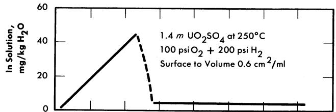

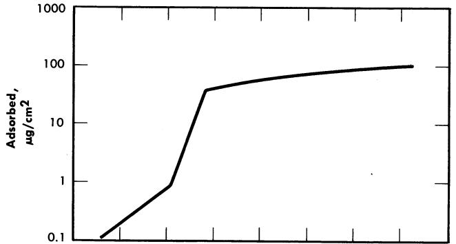

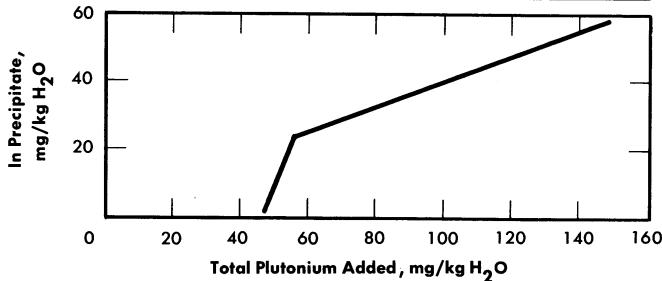  
FIG. 6-13. Plutonium behavior in uranyl sulfate solution contained in type-347 stainless steel.

pressure vessel that could be connected and removed while the loop was in operation. Plutonium was added and circulating-solution samples were taken through this vessel. Tetrapositive plutonium added to the circulating solution was completely oxidized to hexapositive in less than $5\mathrm{min}$ . When $45\mathrm{mg/kgH_2O}$ of dissolved plutonium was added every $8\mathrm{hr}$ , the amount of plutonium circulating in solution increased to a maximum of about $150\mathrm{mg/kgH_2O}$ . As more plutonium was added, it was rapidly adsorbed on the loop walls. After the last addition of plutonium, the loop was operated at $250^{\circ}\mathrm{C}$ for several days. Twelve hours after the last addition the plutonium concentration had decreased to $100\mathrm{mg/kgH_2O}$ , and about $40\mathrm{hr}$ later the amount of plutonium in solution had dropped to an apparent equilibrium value of $60\mathrm{mg/kgH_2O}$ . Essentially all the plutonium removed from solution was adsorbed on equipment walls uniformly throughout the loop. Less than $0.1\%$ of the plutonium was removed in

the hydroclone underflow, and no precipitated solids were circulating. Even when $850\mathrm{mg}$ of plutonium as preformed $\mathrm{PuO_2}$ was injected into the loop, no circulating solids were detected 5 min later. Only $20\%$ of this plutonium was removed by the hydroclone, $35\%$ was adsorbed on the stainless steel, and the rest was distributed throughout the horizontal sections of the loop as loose solids. The hydroclone was effective for removing solids that reached it, but the loop walls and low velocity in horizontal pipes were effective traps for $\mathrm{PuO_2}$ .

There are several differences in conditions between the loop runs and an actual reactor, the most important of which are probably the presence of radiation, the lower surface/volume ratio (0.4 compared with $0.8~\mathrm{cm}^2/\mathrm{ml}$ for the loop), the slower rate of plutonium growth in the reactor (12 to $15\mathrm{mg/kgH_2O/day}$ ) and the probability that a plutonium producer would have to be constructed of titanium and Zircaloy to contain the concentrated uranyl-sulfate solution. Based on these laboratory results, however, it appears that plutonium adsorption on metal walls may be a serious obstacle to processing for removal of precipitated $\mathrm{PuO_2}$ .

6-6.5 Alternate process methods. Because of the problem of plutonium adsorption on metal walls, removal methods based on plutonium concentrations well below the solubility limit have been considered. In a full-scale reactor plutonium will be formed at the rate of up to 12 to 15 mg/kg H₂O/day. In order to keep the plutonium concentration below 3 mg/kg H₂O, the entire blanket solution must be processed at least four to five times a day. By adding 0.4 m excess H₂SO₄ (see Table 6-9), the plutonium solubility is increased to greater than 100 mg/kg H₂O and the blanket processing rate can be decreased to once every 3 or 4 days. Slightly longer processing cycles can be used if part of the plutonium is removed as neptunium before it decays.

Of the various alternate processes considered, ion exchange and adsorption methods show the most promise. Dowex-50 resin, a strongly acidic sulfonic acid resin loaded with $\mathrm{UO}_2^{++}$ , completely removed tetrapositive plutonium from $1.4\,m\,\mathrm{UO}_2\mathrm{SO}_4$ containing $20\,mg$ of plutonium per liter [20]. The resin capacity under these conditions, however, has not been determined. Because of the high radiation level it may not be feasible to use organic resins. Sorption of plutonium on inorganic materials shows some possibilities as a processing method [21]. Although rather low plutonium/adsorber ratios have been obtained, indications are that capacities will be significantly higher at higher plutonium concentrations. Special preparation of the adsorbers should also increase capacities. Attempts to coprecipitate plutonium with tri- or tetrapositive iodates, sulfates, oxalates, and arsenates were not successful, owing to the high solubilities of these materials in $1.4\,m\,\mathrm{UO}_2\mathrm{SO}_4$ .

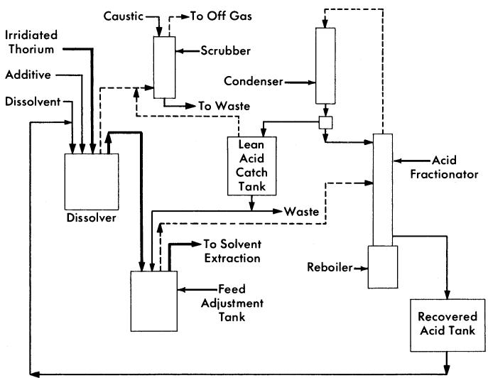  
FIG. 6-14. Thorex process, feed preparation flowsheet.

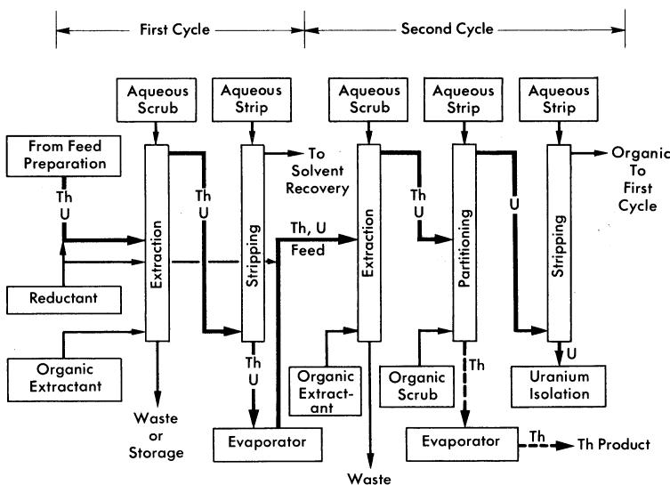  
FIG. 6-15. Thorex process, solvent extraction co-decontamination flowsheet.

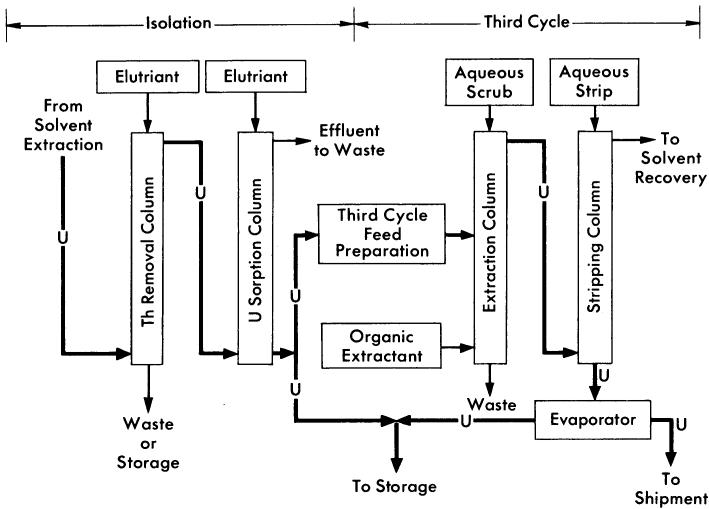  
FIG. 6-16. Thorex process, uranium isolation and third cycle flowsheet.

# 6-7. THORIUM OXIDE BLANKET PROCESSING

6-7.1 Introduction. At the present the only practical method available for processing irradiated thorium-oxide slurry is to convert the oxide to a natural water-thorium nitrate solution and treat by the Thorex process. Although this method is adequate, it is expensive unless one plant can be built to process thorium oxide from several full-scale power reactors. Therefore methods for $\mathrm{ThO_2}$ reprocessing which could be economically incorporated into the design and operation of a single power station have been considered. Alternate methods that have been subjected to only brief scouting-type experimentation are discussed in Article 6-7.3.

6-7.2 Thorex process.* The Thorex process has been developed to separate thorium, $\mathbf{U}^{233}$ , fission product activities, and $\mathrm{Pa}^{233}$ ; to recover the thorium and uranium as aqueous products suitable for further direct handling; and to recover isotopically pure $\mathbf{U}^{233}$ after decay-storage of the $\mathrm{Pa}^{233}$ . The flowsheet includes two solvent-extraction cycles for thorium and three solvent-extraction cycles plus ion exchange for the uranium. Although only irradiated thorium metal has been processed, the process is expected to be satisfactory for recovery of thorium and uranium from homogeneous reactor fuels.

The Thorex process may be divided into three parts: feed preparation,

solvent extraction, and product concentration and purification. These three divisions are shown in Figs. 6-14, 6-15, and 6-16.

In the feed preparation step, uranyl sulfate solution from the reactor core and thorium oxide from the blanket system, freed of $\mathrm{D}_2\mathrm{O}$ and suspended in ordinary water, are fed into the dissolver tank. The dissolvent is $13N$ nitric acid to which has been added catalytic amounts $(0.04N)$ of sodium fluoride. When short-cooled thorium is being processed, potassium iodide is added continuously to the dissolver to provide for isotopic dilution of the large amount of fission-produced $\mathbf{I}^{131}$ which is present. The dissolver solution is continuously sparged with air, and the volatilized iodine is removed from the off-gases in a caustic scrubber.

The dissolver solution is transferred to the feed adjustment tank where aluminum nitrate is added, excess nitric acid recovered, and the resultant solution made slightly acid-deficient by evaporating until a temperature of $155^{\circ}\mathrm{C}$ is reached. During digestion in the feed adjustment tank any silica present is converted to a form that will not cause emulsion problems in pulse columns, and fission products generally are converted to forms less likely to be extracted by the solvent (42% TBP in Amsco).

In the solvent extraction step thorium and uranium are co-extracted in the first cycle; subsequent partitioning of thorium and uranium in the second cycle gives two decontaminating cycles to both products while using only five columns. For short-decayed thorium a reductant, sodium hydrogen sulfite, is continuously added to the feed streams of both cycles to decrease the effect of nitrite formed by irradiation. Without the sulfite addition, the nitrite formed by radiation decomposition of nitrates converts ruthenium to a solvent-extractable form. Acid deficiency in the second cycle feed is achieved by adding dibasic aluminum nitrate (diban).

The spent organic from the second cycle is recycled to the first cycle as the organic extractant. The spent solvent from the first cycle is processed through a solvent-recovery system and reused as the organic extractant in the second cycle.

In the uranium product concentration and purification step (Fig. 6-16), uranium is isolated by ion exchange, using upflow sorption and downflow elution. In this way a concentrated uranium solution in $6N\mathrm{HNO}_3$ is obtained. This solution is stable enough for storage or is suitable as a feed for the third uranium extraction cycle. The third uranium cycle is a standard extraction-stripping solvent-extraction system using $15\%$ TBP-Amsco as the organic extractant. Although installed as a part of the complete Thorex flowsheet, the third cycle may be used separately for reprocessing long-stored uranium to free it of objectionable decay daughters of $\mathbf{U}^{232}$ . When used as an integral part of the Thorex scheme, additional decontamination of the uranium is achieved and the nitrate product is well adapted for extended storage or future reprocessing.

Thorium irradiated to 3500 grams of mass-233 per ton, two complete cycles for both uranium and thorium, one additional uranium cycle for material decayed only 30 days.

TABLE 6-10   
AVERAGE DECONTAMINATION FACTORS FOR THORIUM AND URANIUM PRODUCTS   
IN THE THOREX PILOT PLANT   

<table><tr><td rowspan="2"></td><td colspan="6">Decontamination factors</td></tr><tr><td>Gross</td><td>Pa</td><td>Ru</td><td>Zr-Nb</td><td>Total rare earths</td><td>I</td></tr><tr><td>Thorium400 days decayed30 days decayed</td><td>1 × 1054 × 104</td><td>1 × 1047 × 106</td><td>4 × 103200</td><td>3 × 1053 × 104</td><td>2 × 1062 × 106</td><td>—9 × 108</td></tr><tr><td>Uranium-233400 days decayed30 days decayed</td><td>3 × 1055 × 107</td><td>3 × 1055 × 1010</td><td>2 × 1054 × 106</td><td>8 × 1057 × 106</td><td>9 × 1083 × 108</td><td>—3 × 107</td></tr></table>

For return to an aqueous homogeneous reactor the decontaminated uranium would probably be precipitated as the peroxide, washed free of nitrate, and then dissolved in $\mathrm{D}_2\mathrm{SO}_4$ and $\mathrm{D}_2\mathrm{O}$ . Product thorium would be converted to thorium oxide by methods described in Section 4-3.

The adaptability of the Thorex flowsheet just described to processing thorium irradiated to contain larger amounts of $\mathrm{U}^{233}$ per ton and decayed a short time has been demonstrated in the Thorex Pilot Plant at Oak Ridge National Laboratory [22]. Fifteen hundred pounds of thorium irradiated to 3500 grams of $\mathrm{U}^{233}$ per ton and decayed 30 days was processed through two thorium cycles and three uranium cycles. The decontamination factors for various elements achieved with short-decayed material are compared in Table 6-10 with results obtained with longer-decayed material. While the decontamination factors obtained with the short-decayed material compare favorably with the factors for the long-decayed material, the initial activity in the short-decayed thorium was 1000 times greater than in the long-decayed. Therefore, while the thorium and uranium products did not meet tentative specifications after two complete cycles, the uranium product did meet those specifications after the third uranium cycle. Since the chemical operations necessary to convert these materials to forms suitable for use in a homogeneous reactor can be carried out remotely, the products are satisfactory for return to a homogeneous reactor after two cycles.

6-7.3 Alternate processing method.* Attempts to leach protactinium and uranium produced in $\mathrm{ThO_2}$ particles by neutron irradiation [23] indicate that both are rather uniformly distributed throughout the mass of the $\mathrm{ThO_2}$ particle, and migration of such ions at temperatures up to $300^{\circ}\mathrm{C}$ is extremely slow. Since calculations show that the recoil energy of fragments from $\mathrm{U}^{233}$ fission is sufficiently large to eject most of them from a particle of $\mathrm{ThO_2}$ not larger than 10 microns in diameter, this offers the possibility of separating fission and corrosion products from a slurry of $\mathrm{ThO_2}$ without destroying the oxide particles. Such a separation, however, depends on the ability to remove the elements that are subsequently adsorbed on the surface of the $\mathrm{ThO_2}$ . Adsorption of various cations on $\mathrm{ThO_2}$ and methods for their removal are discussed in the following paragraphs.

Trace quantities of such nuclides as $\mathbf{Zr}^{95}$ , $\mathrm{Nd}^{147}$ , $\mathbf{Y}^{91}$ , and $\mathrm{Ru}^{103}$ when added to a slurry of $\mathrm{ThO}_2$ in water at $250^{\circ}\mathrm{C}$ are rapidly adsorbed on the oxide particles, leaving less than $10^{-4}\%$ of the nuclides in solution. The tracer thus adsorbed cannot be eluted with hot dilute nitric or sulfuric acid. The adsorption of macroscopic amounts of uranium or neodymium on $\mathrm{ThO}_2$ at $250^{\circ}\mathrm{C}$ is less for oxide fired to $1600^{\circ}\mathrm{C}$ than for $650^{\circ}\mathrm{C}$ -fired oxide,

TABLE 6-11

EFFECT OF CALCINATION TEMPERATURE ON URANIUM AND NEODYMIUM ADSORPTION ON $\mathbf{THO}_2$ AT $250^{\circ}\mathrm{C}$

$0.5\mathrm{g}$ of $\mathrm{ThO_2}$ slurried at $250^{\circ}\mathrm{C}$ in $10~\mathrm{ml}$ of $0.005m\mathrm{Nd}(\mathrm{NO}_3)_3$ or $0.05m\mathrm{UO}_2\mathrm{SO}_4 - 0.05m\mathrm{H}_2\mathrm{SO}_4.$

TABLE 6-12   

<table><tr><td rowspan="2">Calcination temperature, °C</td><td colspan="2">Adsorption, mg/g Th*</td></tr><tr><td>U</td><td>Nd</td></tr><tr><td>650</td><td>3.3-4.4</td><td>7.4</td></tr><tr><td>850</td><td>1.9-2.4</td><td>6.1</td></tr><tr><td>1000</td><td>0.72-1.10</td><td>2.4</td></tr><tr><td>1100</td><td>0.08-0.19</td><td>0.5</td></tr><tr><td>1600</td><td>0.06-0.12</td><td>0.3</td></tr></table>

*Single numbers represent data from single experiments. In other cases the range for several experiments is given.

USE OF PBO TO DECREASE CATION ADSORPTION ON $\mathrm{THO}_2$

$0.2\mathrm{g}$ of $\mathrm{ThO_2}$ plus various amounts of PbO coslurried in $10~\mathrm{ml}$ of solution at $250^{\circ}\mathrm{C}$ for 8 hr.

<table><tr><td>Solids</td><td>PbO/ThO2wt. ratio</td><td>Solution</td><td>Cation adsorbed on ThO2, ppm</td></tr><tr><td>ThO2</td><td></td><td>0.002 m UO2SO4</td><td>3100</td></tr><tr><td>PbO + ThO2</td><td>0.2</td><td>0.002 m UO2SO4</td><td>220</td></tr><tr><td>ThO2</td><td></td><td>0.001 m Ce(NO3)3</td><td>6200</td></tr><tr><td>PbO + ThO2</td><td>0.2</td><td>0.001 m Ce(NO3)3</td><td>10</td></tr><tr><td>ThO2</td><td></td><td>0.01 m Nd tartrate</td><td>2700</td></tr><tr><td>PbO + ThO2</td><td>0.4</td><td>0.01 m Nd tartrate</td><td>10</td></tr></table>

as illustrated in Table 6-11. This change in amount of adsorption may be almost entirely due to decrease in surface area of $\mathrm{ThO_2}$ with increased firing temperature. The surface area of $1600^{\circ}\mathrm{C}$ -fired $\mathrm{ThO_2}$ is only $1\mathrm{m}^2/\mathrm{g}$ $\mathrm{ThO_2}$ , while the $650^{\circ}\mathrm{C}$ -fired $\mathrm{ThO_2}$ has a surface area of $35\mathrm{m}^2/\mathrm{g}$ $\mathrm{ThO_2}$ .

The cation adsorption on $\mathrm{ThO_2}$ can be decreased by coslurrying some other oxide with the $\mathrm{ThO_2}$ . The added oxide must adsorb fission products much more strongly than $\mathrm{ThO_2}$ and be easily separable from $\mathrm{ThO_2}$ . The effectiveness of PbO in decreasing cation adsorption on $\mathrm{ThO_2}$ is shown in Table 6-12. When $\mathrm{PbO_2}$ was used, more than $99\%$ of the cations added to the $\mathrm{ThO_2 - PbO}$ slurry was adsorbed on the $\mathrm{PbO_2}$ . However, cations adsorbed on $\mathrm{ThO_2}$ were not transferred to $\mathrm{PbO_2}$ when it was added to slurry in which the cations were already adsorbed on the $\mathrm{ThO_2}$ particles. Addition of dilute nitric acid to the $\mathrm{ThO_2 - PbO}$ coslurry completely dissolved the PbO and the cations adsorbed on it without disturbing the $\mathrm{ThO_2}$ .

In all cases, cations adsorbed on $\mathrm{ThO_2}$ at $250^{\circ}\mathrm{C}$ are so tightly held that dilute nitric or sulfuric acid, even at boiling temperature, will not remove the adsorbed material. However, the adsorbed ions can be desorbed by refluxing the $\mathrm{ThO_2}$ in suitable reagents under such conditions that only a small amount of $1600^{\circ}\mathrm{C}$ -fired $\mathrm{ThO_2}$ is dissolved. Under the same treatment $\mathrm{ThO_2}$ fired to only $650^{\circ}\mathrm{C}$ would be $90\%$ dissolved.

# REFERENCES

1. A. T. GRESKY and E. D. ARNOLD, Poisoning of the Core of the Two-region Homogeneous Thermal Breeder: Study No. 2, USAEC Report ORNL CF-54-2-208, Oak Ridge National Laboratory, 1954.   
2. E. D. ARNOLD and A. T. GRESKY, Relative Biological Hazards of Radiations Expected in Homogeneous Reactors TBR and HPR, USAEC Report ORNL-1982, Oak Ridge National Laboratory, 1955.   
3. R. A. McNEES and S. PETERSON, in *Homogeneous Reactor Project Quarterly Progress Report for the Period Ending July 31*, 1955, USAEC Report ORNL-1943, Oak Ridge National Laboratory, 1955. (pp. 201-202)   
4. D. E. FERGUSON et al., in *Homogeneous Reactor Project Quarterly Progress Report for the Period Ending Apr. 30, 1956*, USAEC Report ORNL-2096, Oak Ridge National Laboratory, 1956. (p. 118)   
5. P. A. HAAS, Hydraulic Cyclones for Application to Homogeneous Reactor Chemical Processing, USAEC Report ORNL-2301, Oak Ridge National Laboratory, 1957.   
6. W. D. BURCH et al., in Homogeneous Reactor Project Quarterly Progress Report for the Period Ending July 31, 1957, USAEC Report ORNL-2379, Oak Ridge National Laboratory, 1957. (p. 26)   
7. R. A. McNEES et al., Oak Ridge National Laboratory, in Homogeneous Reactor Project Quarterly Progress Report, USAEC Reports ORNL-2379, 1957 (p. 137); ORNL-2432, 1957 (p. 147); ORNL-2493, 1958.   
8. W. E. BROWNING and C. C. BOLTA, Measurement and Analysis of Holdup of Gas Mixtures by Charcoal Adsorption Traps, USAEC Report ORNL-2116, Oak Ridge National Laboratory, 1956.   
9. W. D. Burch et al., Oak Ridge National Laboratory, in Homogeneous Reactor Project Quarterly Progress Report, USAEC Report ORNL-2432, 1957 (p. 23); ORNL-2493, 1958.   
10. P. H. HARLEY, HRT Mock-up Iodine Removal and Recombiner Tests, USAEC Report CF-58-1-138, Oak Ridge National Laboratory, 1958.   
11. R. A. Keeler et al., Vitro Laboratories, 1957. Unpublished.   
12. S. PETERSON, unpublished experiments.   
13. D. E. FERGUSON et al., Oak Ridge National Laboratory, in Homogeneous Reactor Project Quarterly Progress Report, USAEC Reports ORNL-2272, 1957 (pp. 133-135); ORNL-2331, 1957 (pp. 142-143, 148-149); ORNL-2379, 1957 (pp. 138-139).   
14. R. A. McNEEs et al., in *Homogeneous Reactor Project Quarterly Progress Report for the Period Ending Apr. 30, 1955*, USAEC Report ORNL-1895, Oak Ridge National Laboratory, 1955. (pp. 175-176)   
15. D. E. FERGUSON, Removal of Iodine from Homogeneous Reactors, USAEC Report CF-56-2-81, Oak Ridge National Laboratory, 1956; Preliminary Design of an Iodine Removal System for a 460-Mw Thorium Breeder Reactor, USAEC Report CF-56-7-12, Oak Ridge National Laboratory, 1956.   
16. H. O. WEEREN, Preliminary Design of HRE-3 Iodine Removal System #1, USAEC Report CF-58-2-66 Oak Ridge National Laboratory, 1958.   
17. S. PETERSON, Behavior of Iodine in the HRT, USAEC Report CF-58-3-75, Oak Ridge National Laboratory, 1958.

18. R. E. LEUZE et al., in Homogeneous Reactor Project Quarterly Progress Report for the Period Ending Apr. 30, 1957, USAEC Report ORNL-2331, Oak Ridge National Laboratory, 1957. (p. 151)   
19. R. E. Connick, in The Actinide Elements, National Nuclear Energy Series, Division IV, Volume 14A. New York: McGraw-Hill Book Co., Inc., 1954. (pp. 221, 238-241)   
20. S. S. KIRSLIS, Oak Ridge National Laboratory. Unpublished.   
21. R. E. LEUZE and S. S. KIRSLIS, Oak Ridge National Laboratory, 1957. Unpublished.   
22. W. T. McDUFFEE and O. O. YARBRO, Oak Ridge National Laboratory, 1958. Unpublished.   
23. D. E. FERGUSON et al., in Homogeneous Reactor Project Quarterly Progress Report for the Period Ending July 31, 1955, USAEC Report ORNL-1943. Oak Ridge National Laboratory, 1955. (p. 221)

# CHAPTER 7

# DESIGN AND CONSTRUCTION OF EXPERIMENTAL HOMOGENEOUS REACTORS*

7-1. INTRODUCTION

7-1.1 Need for reactor construction experience. The power reactor development program in the United States is characterized by the construction of a series of experimental reactors which, it is hoped, will lead for each reactor type to an economical full-scale power plant. Outstanding examples of this approach are afforded by the pressurized water reactor and boiling water reactor systems. The development of pressurized water reactors started with the Materials Testing Reactor, followed in turn by the Submarine Thermal Reactor (Mark I), the Nautilus Reactor (Mark II), and the Army Package Power Reactor. Experience obtained from the construction of these reactors was applied to the full-scale plants built by the Westinghouse Electric Company (Shippingport and Yankee Atomic Electric Plants) and Babcock & Wilcox Company (Consolidated Edison Plant).

Although many have argued that the shortest route to economic power will be achieved by eliminating the intermediate-scale plants, most experts believe that eliminating these plants would be more costly in the long run. To quote from a speech by Dr. A. M. Weinberg [1], while discussing large-scale reactor projects: "The reactor experiment—a relatively small-scale reactor embodying some, but not all, the essential features of a full-scale reactor—has become an accepted developmental device for reactor technology."

An alternative to the actual construction of experimental nuclear reactors has been proposed which consists of the development of reactor systems and components in nonnuclear engineering test facilities, zero-power critical experiments, and the testing of fuel elements and coolants in in-pile loops. This approach, although used successfully in the development of various solid-fuel coolant systems, is not completely applicable to circulating-fuel reactors because of the difficulty of simulating actual reactor operating conditions in such experiments. In in-pile loops, for example, the ratio of the volume of the piping system to the volume of the reacting zone is never quite the same as in a reactor, making it impossible to duplicate simultaneously the conditions of fuel concentration, enrichment, and power density. In cases where these variables are important, the in-pile loops

can at best provide information of an exploratory nature which must be verified in an operating fluid-fuel reactor.

A second aspect of circulating-fuel reactors, which precludes relying solely on engineering tests and in-pile loops, is the close interrelation of the nuclear behavior and the operational characteristics of the fuel circulation system, which can be determined only through construction and operation of a reactor. Other aspects of reactor design that can be best determined in an operating homogeneous reactor are continuous removal of fission products produced in the nuclear reaction and remote decontamination and maintenance of reactor equipment and piping.

7-1.2 Sequence of experimental reactors. It is obvious from the foregoing that the construction of a sequence of experimental reactors has been an important factor in the development of homogeneous reactors. In this sequence, which started with nonpower research reactors, seven such reactors have been built (not including duplicates of the water boilers). These are the Low Power Water Boiler (LOPO), the High Power Water Boiler (HYPO), the Super Power Water Boiler (SUPO), the Homogeneous Reactor Experiment (HRE-1), the Homogeneous Reactor Test (HRE-2), and the Los Alamos Power Reactor Experiments (LAPRE-1 and -2). In the sections of this chapter which follow, these reactors are described in detail, and their design, construction, and operating characteristics are compared. Their construction covers the regime of homogeneous reactor technology involving the feasibility of relatively small reactors fueled with aqueous solutions of uranium. Since their construction and operation does not include systems fueled with aqueous suspensions of thorium oxide and/or uranium oxides necessary for the development of full-scale homogeneous breeders or converters, additional experimental reactors will undoubtedly be built.

# 7-2. WATER BOILERs*

7-2.1 Description of the LOPO, HYPO, and SUPO [2-4]. Interest in homogeneous reactors fueled with a solution of an enriched-uranium salt was initiated at the Los Alamos Scientific Laboratory in 1943 through an attempt to find a chain-reacting system using a minimum of enriched fuel. The first of a sequence of such reactors, known as LOPO (for low power), went critical at Los Alamos in May 1954 with 565 grams of $\mathrm{U}^{235}$ as uranyl sulfate. The uranium, containing $14.5\%$ $\mathrm{U}^{235}$ , was dissolved in approximately 13 liters of ordinary water contained in a type-347 stainless steel sphere 1 ft in diameter and 1/32 in. in wall thickness. The sphere was sur

rounded by beryllium oxide as reflector in order to minimize the critical mass of the $\mathrm{U}^{235}$ . The lack of a shield and cooling system limited the heat power level of LOPO to 50 milliwatts. A cross-sectional drawing of the LOPO is shown in Fig. 7-1.

Following successful low-power operation of the LOPO, the reactor was provided with a thicker sphere (1/16 in.), integral cooling coils, and a shield to permit operation at 6 kw. Also, part of the beryllium oxide reflector was replaced by a graphite thermal column, and holes through the shield and reflector were provided for experiments. The critical mass of the modified reactor was 808 grams of $\mathrm{U}^{235}$ as uranyl nitrate at $14.0\%$ enrichment, contained in 13.65 liters of solution. The change from uranyl sulfate to nitrate was made because an extraction method for the removal of fission products was known only for the latter solution at that time. The modified reactor, called HYPO (high power), went critical in December 1944 and operated at a normal power of $5.5\mathrm{kw}$ , producing an average thermal-neutron flux of $10^{11}$ neutrons/(cm $^2$ )(sec). The temperature of the solution during operation reached $175^{\circ}\mathrm{F}$ with cooling water (50 gal/hr) at $46^{\circ}\mathrm{F}$ .

Since higher neutron fluxes were desired, as well as more research facilities than available from HYPO, the reactor was further modified and renamed SUPO (super power water boiler).

The modifications were made in two parts. The first phase, begun in April 1949 and completed in February 1950, improved the experimental facilities and increased the neutron flux. The second phase, begun in October 1950 and completed in March 1951, increased the thermal neutron irradiation facilities, improved the reactor operation, and removed the explosive hazard in the exhaust gases.

The first group of alterations consisted of the following:

(1) The space around the reactor was increased by enlarging the building so that experiments could be carried out on all four sides instead of only two.   
(2) The construction of a second thermal column was made possible by eliminating a removable portion of the reactor shield. This made available a neutron beam and irradiation facilities on a previously unused face of the reactor.   
(3) The entire spherical core assembly was replaced as follows:

(a) Three 20-ft-long, 1/4-in.-OD, 0.035-in.-wall-thickness stainless steel tubes replaced the former single cooling coil. This increased the operating power level from $5.5\mathrm{kw}$ to a maximum of $45\mathrm{kw}$ .   
(b) A new removable level indicator and exit gas unit was installed in the sphere stack tube. The stack tube itself was made more accessible for future modifications.   
(c) External joints were not welded, but unions of flare fittings were used to simplify the removal of the sphere or permit pipe replacements.

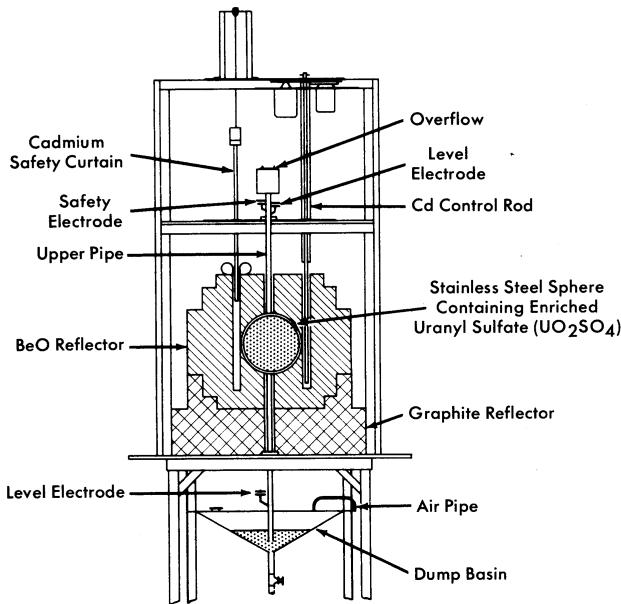  
FIG. 7-1. Cross section of LOPO, the first aqueous solution reactor.

(d) An additional experimental hole was run completely through the reactor tangent to the sphere. This $1\frac{7}{16}$ -in.-ID tube supplemented the 1-in.-ID "glory hole" running through the sphere.   
(4) The beryllium portion of the reflector was replaced by graphite. The all-graphite reflector gave a more rapid and complete shutdown of the reactor and eliminated the variable starting source produced by the $(\gamma, n)$ reaction on beryllium. A 200-millicurie RaBe source placed in the reflector was used as a startup neutron source.   
(5) Two additional vertical control rods were added which moved into the sphere in re-entrant thimbles. These consisted of about 120 grams of sintered $\mathbf{B}^{10}$ in the form of 9/16-in. rods about 18 in. long. These rods gave the additional control required by the change to an all-graphite reflector. Previously observed shadow effects were eliminated by the internal position of the rods and by the location of the control chambers under the reactor.   
(6) The reactor solution was changed from $15\%$ U $^{235}$ -enriched uranyl nitrate to one of $88.7\%$ enrichment. This made possible the continued use of a low uranium concentration in the solution with the poorer all-graphite reflector. The gas evolution produced by nitric acid decomposition was greatly reduced, due to the lower total nitrogen content.

(7) The entire inner reactor shield was improved to permit higher power operation with a low neutron leakage and also to increase the neutron-to-gamma-ray intensity in the thermal columns. Cadmium was replaced by $\mathrm{B_4C}$ paraffin and additional steel shielding was added.

After operating the reactor with the above modifications for about 10,000 kwh at a power of $30\mathrm{kw}$ , the following (second group) alterations were made:

(1) The original south thermal column was completely rebuilt, with improved shielding to provide many more irradiation facilities.   
(2) A recombination system was constructed to handle the off-gases from the reactor. The use of a closed circulating gas system with a catalyst chamber of platinized alumina removed any explosive hazard in the exhaust gases due to the presence of hydrogen and oxygen. The operating characteristics of the reactor were greatly improved by returning directly back to the reactor as water all but a very small fraction of the gases produced.   
(3) A shielded solution-handling system was constructed to simplify the procedure of routine solution analysis and for the removal or change of the entire reactor solution.

The average neutron flux in the SUPO during operation at $45\mathrm{kw}$ is about $1.1\times 10^{12}$ neutrons/ $(\mathrm{cm}^2)(\mathrm{sec})$ , and the peak thermal flux (in the "glory hole") is $1.7\times 10^{12}$ neutrons/ $(\mathrm{cm}^2)(\mathrm{sec})$ . Estimated values for the maximum intermediate and fast fluxes at $45\mathrm{kw}$ are 2.8 and $1.9\times 10^{12}$ neutrons/ $(\mathrm{cm}^2)(\mathrm{sec})$ , respectively. Calculations made from fast beams emerging from the north thermal column at this same power level gave the following fast-flux values above 1 Mev in units of neutrons/ $(\mathrm{cm}^2)(\mathrm{sec})$ .. (1) at sphere surface, $1.1\times 10^{12}$ ; (2) at bismuth column, $7\times 10^{10}$ ; and (3) at a graphite face 1 ft in front of the bismuth column, $2\times 10^{9}$

The production of hydrogen plus oxygen due to radiation decomposition amounts to approximately 20 liters/min during operation of the reactor at $45\mathrm{kw}$ . These gases leave the reactor core and pass through a reflux condenser which removes much of the water vapor and then through a stainless steel-wool trap for final moisture removal. A blower feeds the gas into one of two interchangeable catalyst chambers containing platinized alumina pellets. These chambers, operating at 370 to $470^{\circ}\mathrm{C}$ , recombine the hydrogen and oxygen, and the gas leaving the catalyst contains the water vapor formed. A second condenser reduces the temperature of the exit gas to that entering the catalyst chamber. A total of 100 liters/min of gas is circulated continuously in the closed gas system at pressures slightly above atmospheric, and the hydrogen concentration is kept below the detonation limit at all points of the system. Excess pressures produced in the gas system can be bled to the atmosphere through a 150-ft-high exhaust stack.

The characteristics of LOPO, HYPO, SUPO, and the North Carolina State College Water Boilers are summarized in Table 7-1.

TABLE 7-1   
DESIGN CHARACTERISTICS OF WATER BOILERS   

<table><tr><td></td><td>LOPO</td><td>HYPO</td><td>SUPO</td><td>NCSR [5]</td></tr><tr><td>Power level, kw</td><td>\( 5 \times 10^{-5} \)</td><td>5.6</td><td>45</td><td>10</td></tr><tr><td>Solution (in H2O)</td><td>\( \mathrm {U O}_{2}\mathrm {SO}_{4} \)</td><td>\( \mathrm {U O}_{2}(\mathrm {NO}_{3})_{2} \)</td><td>\( \mathrm {U O}_{2}(\mathrm {NO}_{3})_{2} \)</td><td>\( \mathrm {U O}_{2}\mathrm {SO}_{4} \)</td></tr><tr><td>\( U^{235}wt.,grams \)</td><td>565</td><td>870</td><td>870</td><td>848</td></tr><tr><td>Solution volume,liters</td><td>13</td><td>13.65</td><td>13.65</td><td>15</td></tr><tr><td>Enrichment, %</td><td>14.6</td><td>14.0</td><td>88.7</td><td>90</td></tr><tr><td>Maximum thermal-neutron flux</td><td>\( 3 \times 10^{6} \)</td><td>\( 2.8 \times 10^{11} \)</td><td>\( 1.7 \times 10^{12} \)</td><td>\( 5 \times 10^{11} \)</td></tr><tr><td>Reflector material</td><td>BeO</td><td>Be and graphite</td><td>Graphite</td><td>Graphite</td></tr><tr><td>Coolant flow rate gal/hr</td><td>None</td><td>50</td><td>180</td><td>240</td></tr><tr><td>Solution tempera-ture, °C</td><td>39</td><td>85</td><td>85</td><td>80</td></tr><tr><td>Experimentalfacilities</td><td>None</td><td>1 thermal column</td><td>2 thermalcolumns (&quot;gloryhole&quot; and tangential hole)</td><td>1 thermalcolumn12 exposureports</td></tr></table>

7-2.2 Kinetic experiments in water boilers. In August 1953, experiments were performed on the SUPO by a group of scientists from the Oak Ridge National Laboratory and Los Alamos [6,7] to determine the degree to which a boiling (and nonboiling) homogeneous reactor automatically compensates for suddenly imposed supercritical conditions. Previous boiling experiments in 1951, unreported in the open literature [8], had indicated the stability of SUPO under steady-state boiling conditions;

however, there remained considerable doubt as to the adaptability of a reactor of this type to a sudden introduction of excess reactivity such as might occur with a sudden increase in pressure above the reactor. The tests were performed by suddenly ejecting a neutron poison, consisting of an aluminum rod containing boron carbide at its tip, and simultaneously measuring the neutron flux level with high-speed recorders connected to a boron-coated ionization chamber located in the graphite reflector. The amount of reactivity introduced was determined by the position of a calibrated control rod. Although the experiments were interrupted by frequent accidental scams, caused by the unsuitability of SUPO to boiling at high solution levels in the sphere, the results indicated that both boiling and nonboiling solution reactors are capable of absorbing reactivity increases of at least $0.4\%$ $k_{\mathrm{eff}}$ added in about 0.1 sec. In both boiling and nonboiling cases, the reactor power was self-regulating, but excursions were terminated more rapidly under boiling conditions. The average lifetime of prompt neutrons in the reactor was calculated from the initial prompt rise in the neutron flux and found to be about $1.7\times 10^{-4}$ sec. Following a reactivity addition, the initial rate of reactivity decrease (0.2 sec after start) was greater than about five times the rate which could be attributed to core-temperature rise and the associated negative temperature coefficient $(0.024\% k_{\mathrm{eff}} / ^{\circ}\mathrm{C})$ . As the gas bubbles left the core region, reactivity decrease due to core-temperature rise increased in relative importance.

More recent experiments with the Kinetic Experiment for Water Boilers (KEWB-1), operated by Atomics International for the U. S. Atomic Energy Commission [9], have verified the self-controlling features of a solution-type reactor. It was found that automatic shutdown due to the temperature increase and formation of gas bubbles in the reactor fuel solution occurs under all abnormal operating conditions tested.

7-2.3 The North Carolina State College research reactor [5]. The simplicity of the Water Boiler reactor has made it of interest as a laboratory tool for experimental work with neutrons and gamma rays and also to provide training in reactor operation, and ten such reactors were in operation or planned in the United States by the end of 1957. The first college-owned nuclear research reactor, which started operating at $10\mathrm{kw}$ in September 1953 at North Carolina State College, Raleigh, North Carolina, was of this type. It was completed after four years of planning, design, and construction, at a cost of $\$130,000$ for the reactor, plus $\$500,000$ for the reactor building and associated laboratory equipment. It differs from the Los Alamos SUPO in that the fuel container is a cylinder 11 in. in diameter and 11 in. high, rather than a sphere. Its experimental facilities include 12 access ports and a thermal column.

In June 1955, the reactor was shut down because of leaks which developed in the fuel container and permitted the radioactive fuel to contaminate the inside of the reactor shield. After a major repair job, operation of the reactor with a new core was resumed in March 1957 at a power level of 500 watts, and the reactor has operated successfully at that level for a year.

7-2.4 Atomics International solution-type research reactors. Several versions of the Water Boiler are being offered commercially by various companies. The major supplier is the Atomics International Division of North American Aviation Company which has built, or is building, 11 such reactors. Low-power reactors are: the 1-watt Water Boiler Neutron Source (WBNS) originally at Downey, California, which was moved to Santa Susana and modified to operate at $2\mathrm{kw}$ ; a new 5-watt laboratory reactor (L-47) for Atomics International; the 100-watt Livermore Research Reactor at Livermore, California; and a 5-watt reactor planned for the Danish Atomic Energy Commission at Risø, Denmark. Higher power Water Boilers, operating at $50\mathrm{kw}$ , include the Kinetic Experiment for Water Boilers (KEWB-1) at Santa Susana; the UCLA Medical Facility at Los Angeles, California; and reactors for the Armour Research Foundation in Chicago, Illinois; the Japan Atomic Energy Research Institute at Tokai, Japan; Farbwerke Hoechst A. G. at the University of Frankfurt,

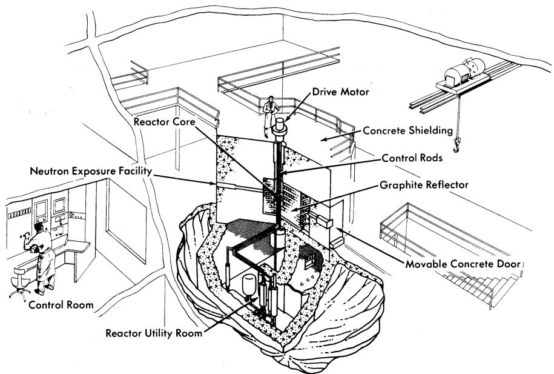  
FIG. 7-2. Armour Research Foundation research reactor (courtesy of Atomics International, a division of North American Aviation Co.)

West Germany; the Senate of West Berlin (Institute for Nuclear Research), Germany; and the Politecnico Enrico Fermi Nuclear Study Center at Milan, Italy.

The first solution-type research reactor for industrial use went into operation in June 1956. The general features of this reactor, which Atomics International built for the Armour Research Foundation at the Illinois Institute of Technology, Chicago, Illinois, are shown in Fig. 7-2.

The exposure facilities include one 6-in.-diameter beam tube extending radially to within 2 ft of the core tank and 4 in. in diameter from there to the core tank; two 4-in. and two 3-in. beam tubes extending radially to the core tank; two 2-in. through-tubes passing tangentially to the core tank; one $1\frac{1}{2}$ -in.-diameter tube passing through the central region of the core; four 4-in. vertical tubes located in the reflector; one 5 ft × 5 ft graphite thermal column with a 12-in.-square removable section. The tube facilities consist of steel sleeves extending through the concrete shield and aluminum thimbles or liners which reach to the immediate vicinity of the core. Each tube facility is equipped with a graphite reflector plug and a dense concrete-and-steel shielding plug to be installed when the facility is not in use.

The horizontal thermal column is formed by a 5-ft-square column of graphite, in the center of which are nine removable graphite stringers. A large volume which may be used for exposures is provided between the end of the thermal column and the inner face of a movable concrete door. The thermal column access ports open into this volume.

To take advantage of the 50,000 curies of gamma activity produced by the fission-product gases circulating through the gas recombiner tank, exposure facilities are provided which extend from the subpile room into the exposure room and into the valve room. The facilities listed below consist of steel sleeves and aluminum thimbles which extend through the dense concrete walls of the exposure room.

2 gamma ports, 4 in. diameter   
2 gamma ports, 8 in. diameter   
1 rectangular gamma slot, 6 in. $\times 18$ in.

In addition, two 4-in.-diameter gamma ports extend from the subpile room into the valve room. As with the beam tubes, each port is equipped with a plug to be installed for shielding purposes when the port is not in use.

# 7-3. THE HOMOGENEOUS REACTOR EXPERIMENT (HRE-1) [10-13]*

7-3.1 Introduction. In 1950 the Oak Ridge National Laboratory undertook the task of designing, building, and operating a pilot-plant fluid-fuel reactor, the Homogeneous Reactor Experiment (HRE-1), shown in

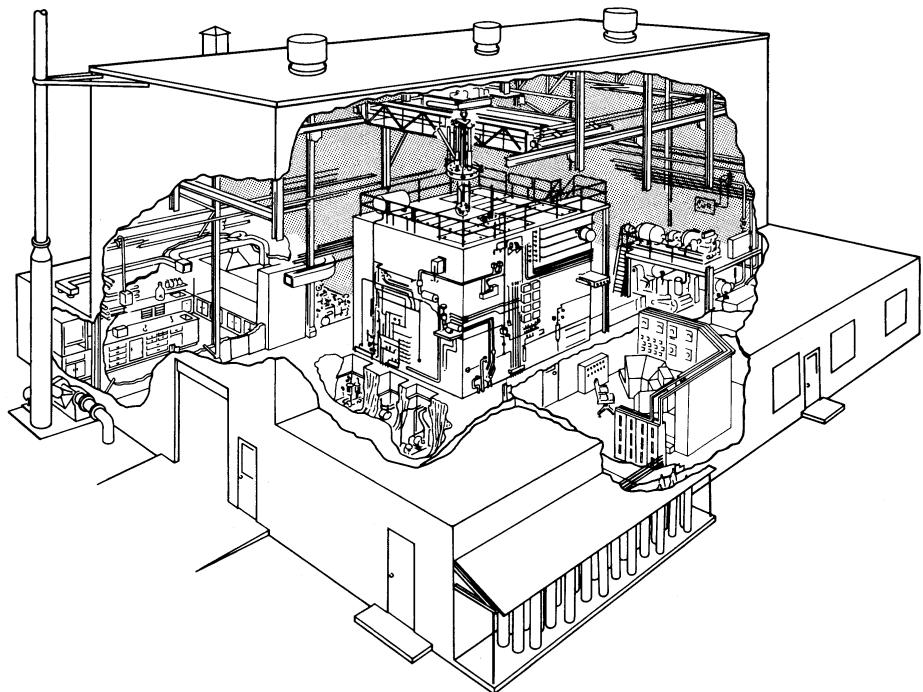  
FIG. 7-3. The homogeneous reactor experiment (HRE-1).

Fig. 7-3. The purpose of this reactor was to investigate the nuclear and chemical characteristics of a circulating uranium solution reactor at temperatures and powers sufficiently high for the production of electricity from the thermal energy released. Specifically, it was designed to operate with a full-power heat release of 0.6 to 3.5 million Btu/hr (200 to 1000 kw of heat), and a maximum fuel-solution temperature of $482^{\circ}\mathrm{F}$ , yielding, after heat exchange, a saturated-steam pressure of about 200 psi.

During the 24-month period in which the reactor was in operation, starting in April 1952, liquid was circulated for a total of about $4500\mathrm{hr}$ . The reactor was critical a total of $1950\mathrm{hr}$ and operated above $100\mathrm{kw}$ for $720\mathrm{hr}$ . The maximum power level attained was $1600\mathrm{kw}$ . The reactor was shut down in the spring of 1954 and dismantled to make room for the Homogeneous Reactor Test (HRE-2), having successfully demonstrated the nuclear stability of a circulating-fuel reactor. The characteristics of the HRE-1 are summarized in Table 7-2.

7-3.2 The reactor fuel system. The reactor core consisted of a stainless steel sphere 18 in. in diameter, through which was circulated 100 to $120\mathrm{gpm}$ of $93\%$ enriched uranyl sulfate dissolved in distilled water. The temperature

# TABLE 7-2

# CHARACTERISTICS OF HRE-1

<table><tr><td>Power, heat</td><td>1000 kw</td></tr><tr><td>Fuel</td><td>\( \mathrm {UO}_{2}\mathrm {SO}_{4} \) (93% enriched) in \( \mathrm {H}_{2}\mathrm {O} \)</td></tr><tr><td>Fuel concentration</td><td>~30 g \( U^{235} \)per liter (0.17 m \( \mathrm {UO}_{2}\mathrm {SO}_{4} \))</td></tr><tr><td>\( U^{235} \)in core</td><td>1.5 - 2 kg</td></tr><tr><td>Core</td><td>18 in. diameter,stainless steel</td></tr><tr><td>Pressure vessel</td><td>39 in. ID, 3 in. thick, forged steel</td></tr><tr><td>Reflector</td><td>10 in. \( \mathrm {D}_{2}\mathrm {O} \), pressurized with He</td></tr><tr><td>Specific power</td><td>20 kw/liter</td></tr><tr><td>Fuel inlet temperature</td><td>210°C</td></tr><tr><td>Fuel outlet temperature</td><td>250°C</td></tr><tr><td>System pressure</td><td>1000 psi (430 psi above vapor pressure)</td></tr><tr><td>Gas removal system</td><td>Vortex flow through core</td></tr><tr><td>Radiolytic gas recombination</td><td>\( CuSO_{4} \)(internal); flame and catalytic re- combination (external)</td></tr><tr><td>Control system</td><td>Reflector level,safety plates,temperature control</td></tr><tr><td>Shielding</td><td>7 ft barytes concrete</td></tr><tr><td>Steam temperature</td><td>382°F</td></tr><tr><td>Steam pressure</td><td>200 psi</td></tr><tr><td>Electrical capacity</td><td>140 kw</td></tr></table>

rise of the solution passing through the core was about $72^{\circ}\mathrm{F}$ at a power level of $1000\mathrm{kw}$ . The liquid was discharged from the core at a temperature of $482^{\circ}\mathrm{F}$ , and cooled to $410^{\circ}\mathrm{F}$ by evaporating water from the shell side of a U-tube heat exchanger, thus generating about $3000\mathrm{lb/hr}$ of $200\mathrm{psi}$ steam. A canned-rotor centrifugal pump returned the fuel to the core to be reheated. The total volume of solution in the high-pressure system was about 90 liters, of which 50 liters were in the core. A schematic flow diagram of HRE-1 is shown in Fig. 7-4.

A total pressure of 1000 psi was maintained in the fuel system by heating a small volume of fuel to $545^{\circ}\mathrm{F}$ in a pressurizer chamber directly above the sphere. The 1000 psi total pressure, which is over 400 psi greater than is required to prevent boiling of the fuel solution, was necessary to minimize the volume of decomposition gases.

7-3.3 The reflector system. The reflector of HRE-1 was a 10-in. layer of heavy water surrounding the core vessel. The heavy water was pressurized with helium to within $\pm 100$ psi of the fuel pressure in order to minimize stresses in the 3/16-in. wall of the spherical fuel container. Both the reflector and the concentric core were contained in an outer pressure vessel

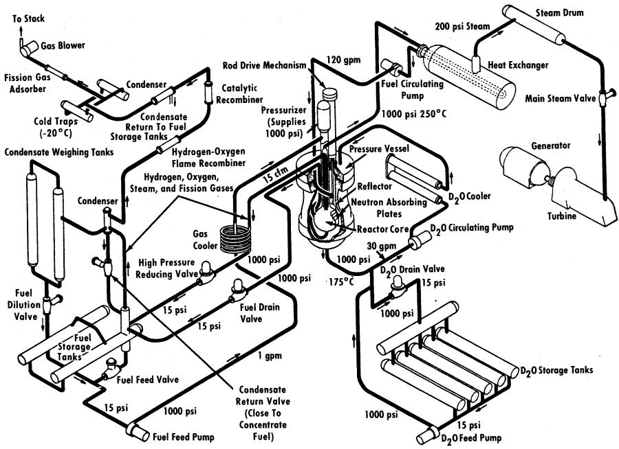  
FIG. 7-4. Schematic flow diagram, HRE-1.

of forged steel, 39 in. in inside diameter, with a 3-in.-thick wall. A 24-in., 1500-psi standard ring-joint flange at the top of the vessel permitted removal of the inner core.

In order to limit thermal stresses and to reduce corrosion of the steel vessel, the reflector temperature was regulated near $350^{\circ}\mathrm{F}$ . About 50 kw of heat conducted from the fuel core to the reflector liquid was removed by circulating the heavy water with a 30-gpm canned-rotor pump through a reflector cooler which acted as a boiler feedwater preheater. A jet was located in this high-pressure circulating loop, the suction of which drew a continuous stream of gas from the vapor space above the reflector to a catalytic recombiner so that the concentration of deuterium and oxygen gases in this vapor space could be kept below explosive limits.

Some measure of nuclear control was obtained by changing the level of the reflector. The level could be lowered by draining liquid through a valve to storage tanks, or raised by starting a feed pump. This pump, which employed a hydraulically driven diaphragm with check valves, had a capacity of approximately 2 gpm against 1000 psi. Its intake was connected to supply tanks at atmospheric pressure, located below the reactor. These tanks also served as degas chambers for the reflector liquid which was discharged from the pressure vessel. Helium, water vapor, and $\mathrm{D}_2$ and $\mathrm{O}_2$

gas liberated here passed upward through a condenser to a small low-pressure catalytic bed where the $\mathrm{O}_2$ and $\mathrm{D}_2$ gases were recombined to $\mathrm{D}_2\mathrm{O}$ . Cold traps operated at $-20^{\circ}\mathrm{F}$ were included in the reflector-system vent lines to prevent the loss of $\mathrm{D}_2\mathrm{O}$ or its contamination with $\mathrm{H}_2\mathrm{O}$ vapor.

7-3.4 The fuel off-gas system. When the reactor was operating, without copper sulfate in the fuel solution, the fuel solvent $(\mathrm{H}_2\mathrm{O})$ was decomposed by the energy of fission to yield a stoichiometric mixture of hydrogen and oxygen gas at a rate of 0.28 cfm (10 cfm at STP). In addition to this large volume of decomposition gases, there was also produced a very small volume (20 cc/day) of intensely radioactive fission gas. If these gases had not been removed and replaced by more liquid, excessive pressures would soon result, and since virtually all of this gas was liberated within the core, the displacement of fuel solution by the gas would make it impossible for the chain reaction to continue. For this reason, the gas was continuously separated from the fuel in the core by injecting the main circulating stream tangentially near the equator of the sphere, which caused the fluid to rotate and form a vertical cylindrical vortex approximately $1/4$ in. in diameter. The centrifugal action of the rotating fluid served to separate the decomposition and fission gases from the liquid to the vortex, the axis of which was aligned with the fuel outlet. A nozzle with a central opening in the fluid outlet allowed the removal of gas from the vortex. This gas plus about $0.8\mathrm{gpm}$ of the fuel solution was passed through the outer annulus of a countercurrent, concentric-tube heat exchanger, which was partially cooled by $0.8\mathrm{gpm}$ flow of fresh makeup liquid being pumped back to the core. The cooled mixture of gas and liquid was then throttled through a valve into a gas separator which was connected to the fuel-solution storage tanks. The gas-steam mixture rose from the gas separator to a condenser immediately preceding a flame recombiner, so that the gases leaving the condenser were combustible and reunited to water in the flame of the recombiner shown in Fig. 7-4.

The flame recombiner is best described as an oversized Bunsen or Meeker burner enclosed in a water-jacketed cylinder. In the HRE-1 no attempt was made to use this $40\mathrm{kw}$ of high-temperature heat, although in larger scale reactors this energy might be used to superheat steam about $70^{\circ}\mathrm{F}$ .

The exit gases from the flame recombiner contained only fission products and small amounts of unrecombined hydrogen and oxygen. They were passed through a catalytic recombiner which contained a platinized alumina catalyst to eliminate the traces of hydrogen and oxygen. Also, the catalytic bed was used to react the entire gaseous output at low reactor powers when insufficient gas was being liberated to maintain a steady flame at the burner of the flame recombiner. The catalytic bed was followed by a condenser and cold traps to prevent the loss of water from the system. The gas stream

at this point was composed mainly of excess oxygen plus the highly active fission gases, mainly xenon, krypton, and their decay products. The activity of these gases was many orders of magnitude greater than the activity which can be discharged directly to the atmosphere without the construction of a very expensive stack; therefore it was desirable to provide some inexpensive means of storage for the dissipation of the radioactivity. This was accomplished by passing the gases through cold traps to remove moisture and adsorbing them onto water-cooled activated-carbon beds which were buried underground outside the reactor building. It is estimated that the equilibrium activity of the gases held on the carbon bed was 400,000 curies.*

The adsorption efficiency of the charcoal, even at ground temperature, was good enough to prevent a discharge of activity greater than a few curies per day. However, even this amount of activity had to be diluted so that the atmospheric concentration at ground level was not greater than $10^{-13}$ curies/cc of air. Dilution was accomplished by feeding the active gas into a 1000-cfm ventilating air stream from the reactor shield and then to a 100-ft-high stack. During operation the gaseous activity inside the stack barely exceeded inhalation tolerance.

7-3.5 Fuel concentration control. The condensate which was removed from the vapor-gas mixture upstream of the recombiner was returned either to the fuel storage tanks or to weighed holding tanks. The accumulation of water in the holding tanks provided a means of increasing the concentration of fuel in the storage tanks underneath the reactor. Since fuel was pumped continuously from the storage tanks to the high-pressure system by means of a duplex-diaphragm type pump at a rate of $0.8\mathrm{gpm}$ , it was possible to vary the concentration of the fuel which circulated through the reactor. Figure 7-5 shows how the core temperature varied with fuel concentration, in $\mathrm{g/kgH_2O}$ . Furthermore, since the operating temperature of the core was controlled by the fuel concentration as shown in this figure, the operator had a convenient means of adjusting the solution temperature to the desired level. This feature of variable concentration was employed during startup of the reactor when the concentration had to be changed by large amounts, and also during steady operation for small changes in temperature. When sudden dilution of the fuel was desired, as in the case of a complete shutdown, the condensate holdup tanks were quickly emptied through a drain valve into the fuel-storage tanks, or condensate was pumped directly into the core.

The steep slope of the curve in Fig. 7-5—i.e., the large negative temperature coefficient—was a feature which was extremely important from safety

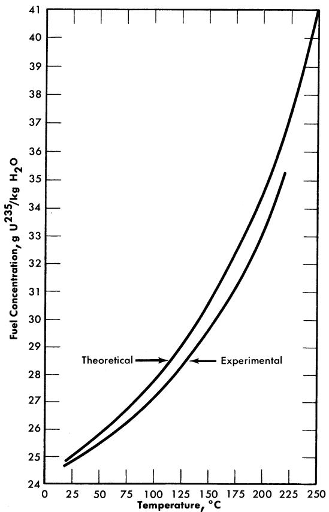  
FIG. 7-5. Dependence of critical fuel concentration on temperature in HRE-1.

and power-demand standpoints. For instance, a temperature rise of only $15^{\circ}\mathrm{C}$ was necessary to overcome a reactivity increase of $1\%$ , an amount considered very dangerous in most solid-fuel reactors.

7-3.6 Power removal. The steam generated in the fuel heat exchanger was fed to a conventional multistage condensing turbine generator rated at $312\mathrm{kva}$ . With the reactor operating at $1000\mathrm{kw}$ and $250^{\circ}\mathrm{C}$ , a sufficient quantity of steam at 200 psi was produced to generate about $140\mathrm{kw}$ of electricity. Steam leaving the heat exchanger was first passed through a time-delay drum with a radioactivity monitor at the inlet and a quick-closing valve at the outlet to prevent the escape of activity into the turbine system in the event of boiler tube failure. Small feed pumps returned the condensate from the turbine to the boiler.

Upon increase in generator load, the turbine governor opened the turbine throttle valves, increasing the steam demand, lowering the steam

pressure and temperature, and reflecting itself into increased cooling of the uranium solution, which automatically increased the reactivity of the core and completely compensated for this increased load.

7-3.7 Internal-recombination experiments. The use of copper dissolved in the reactor fuel for the complete recombination of radiolytic gas was successfully demonstrated in the HRE-1 [14]. Copper ion was added as copper sulfate on four occasions, increasing the copper concentration to 10, 25, 75, and $150\%$ of that necessary for complete recombination (i.e., $6.6\mathrm{g}\mathrm{CuSO}_4/\mathrm{liter}$ ) in a static system at $250^{\circ}\mathrm{C}$ , at 1000 psig total pressure, and at a uniform power density of $20\mathrm{kw}/\mathrm{liter}$ . The investigation was conducted at temperatures from 185 to $260^{\circ}\mathrm{C}$ , at pressures from 765 to 1200 psig, and at power levels as high as $1600\mathrm{kw}$ . In the main, the copper behaved as expected from static bomb tests. The highest power level for which all the gas was internally recombined was $1350\mathrm{kw}$ . In the course of all copper experiments, including $350\mathrm{hr}$ of operation at the highest copper concentration, 0.062 molar, no deleterious effects due to the presence of copper were observed.

7-3.8 Nuclear safety. Although operating experience later verified early predictions of the inherent safety of this reactor, at the time of design it was considered judicious to incorporate conventional safety devices in the reactor for protection against potentially dangerous situations which might arise during low-power operation and until the dynamic stability had been demonstrated by experiment. Safety measures in the order of their automatic action as installed to limit reactor power or power doubling time were:

(1) Two magnetically coupled safety plates, worth about $45\mathrm{g}$ of uranium, which by falling in 0.01 sec caused the reactor temperature to be lowered from $250^{\circ}\mathrm{C}$ to approximately $243^{\circ}\mathrm{C}$ .   
(2)Dumping of the reflector.   
(3) Dilution of the fuel (this was the normal shutdown procedure).   
(4) Stopping of the steam extraction by closing either a steam valve or the turbine governor.   
(5) Draining the fuel solution to the noncritical-geometry tanks below the reactor.

Experiments demonstrated that the reactor was extremely fast-acting with respect to limiting power surges and led to the belief that mechanical control devices were unnecessary [15]. These consisted of a series of kinetic experiments in which the power responses to reactivity increases were observed. First, the entire range of normally available reactivity increases —fuel concentration, rod withdrawal, and reflector level—was tested with initial power levels as low as 10 watts and reactivity rates up to $0.05\%$ per

second. Then, in order to provide more drastic tests, the main fuel circulating pump was stopped, the reactor was maintained at a low power and at high temperature, but the heat exchanger was cooled about $100^{\circ}\mathrm{C}$ . When the pump was restarted, the cold fuel from the heat exchanger was rapidly injected into the core, producing a rate of reactivity increase of as much as $0.8\%$ $k_{\mathrm{eff}}$ per second. The results of two experiments in which only the initial powers differed are shown in Fig. 7-6; the power increased in a period as short as 35 msec, reaching a peak of $10\mathrm{Mw}$ in 1 sec, and then approached the equilibrium power demand within 0.2 sec after the peak. The calculated pressure rise associated with the peak power of $10\mathrm{Mw}$ was only 5 psi.

In these experiments the worst combination of circumstances was imposed on the reactor. It was successfully demonstrated that the HRE-1 was sufficiently stable to withstand nuclear transients greater than those expected from operating errors.

7-3.9 Leak prevention. A major problem in the HRE-1 was to maintain absolute leaktightness in all components. The radioactivity of the solution during operation was about 30 curies/cc. Twenty-four hours after shutdown the activity was about 3 curies/cc. With these high activities, the total leakage from the system had to be kept below 1 cc per day. A much better performance than this was attained through the use of canned-rotor pumps, double tube-sheet exchangers, and bellows-sealed valves.

All welded joints were made with extraordinary care and tested by several nondestructive methods before being approved for use. Flanged joints were assembled with stainless steel ring gaskets of oval cross section

TABLE 7-3   
HRE-1 CONSTRUCTION COST SUMMARY*   

<table><tr><td></td><td>Total</td><td>% of total</td></tr><tr><td>Building</td><td>$ 300,000</td><td>27.5</td></tr><tr><td>Fuel and reflector equipment and piping</td><td>420,000</td><td>38.2</td></tr><tr><td>Instrumentation</td><td>190,000</td><td>17.6</td></tr><tr><td>Shield</td><td>110,000</td><td>9.7</td></tr><tr><td>Power system</td><td>80,000</td><td>6.9</td></tr><tr><td>Total construction cost for HRE-1</td><td>$1,100,000</td><td>100.0</td></tr></table>

*These costs include material, labor, and allocated overhead.

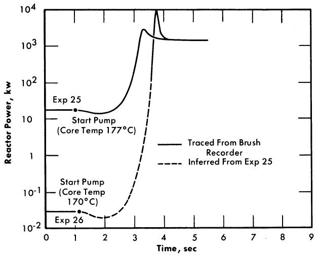  
FIG. 7-6. Power response of HRE-1 during reactivity increase of $0.8\%$ $k_{\mathrm{e}}/$ sec.

and each joint contained a leak detection device for constant monitoring (see Fig. 7-13). In addition, the ventilating air which flowed through each equipment compartment was monitored constantly with gamma-radiation detection devices. Although several leaks were experienced in the startup phases, no leakage was found during the final 12-month period.

7-3.10 Shielding. As with all nuclear reactors, personnel had to be protected from the high radiation levels which existed in the vicinity of the reactor core. In the HRE-1 this protection was provided by a 7-ft-thick shielding wall of high-density concrete. An increase in the density of the concrete from 2.3 to $3.5\mathrm{g / cc}$ resulted from the use of barium sulfate ore as the aggregate material. The shield was a departure from most reactor shields in that it was constructed of loosely stacked block with only the outer 16-in. layer of blocks being mortared.

7-3.11 Construction cost. The total construction cost of the reactor was $1,100,000, which did not include the cost of fuel and heavy water. Table 7-3 is a summary showing the cost of various parts of the system.

7-3.12 Maintenance. The maintenance of homogeneous reactors is greatly complicated by the radioactivity of the parts, and in the HRE-1 it was often necessary to decontaminate equipment and to provide temporary protective shielding before repair work could be done. In most cases the repair work had to be done with long-handled tools, which made the job even more difficult. By the use of decontamination, shielding, and extension tools, it was possible, however, to make a number of major

repairs in radiation fields as high as $2000\mathrm{r / hr}$ , without exposing personnel beyond accepted tolerances. In this regard remote viewing devices such as mirrors, binoculars, and a Polaroid Land camera were found to be invaluable tools. The main circulating pump was replaced or repaired three times under such conditions and the diaphragm feed pumps twice. In fact, in no case of a breakdown was it impossible to make the necessary repairs.

7-3.13 Dismantling the HRE-1. After final shutdown of the HRE-1 the reactor was decontaminated in preparation for disassembly. Over a period of 30 days, starting with activity levels of the order of $1000\mathrm{r / hr}$ , the activity was reduced sufficiently to permit dismantling of the system with long-handled tools [16].

The decontamination treatment consisted of repeated washing alternately with $35\%$ $\mathrm{HNO}_3$ and aqueous solutions of $10\%$ sodium hydroxide, $1.5\%$ sodium tartrate, and $1.5\%$ hydrogen peroxide. The over-all decontamination factors were 22 to 25, including decay, but the factor for decontamination with a single reagent was only between 1 and 2.25. Large amounts (of the order of $10^{3}$ curies) of cerium, zirconium, barium, lanthanum, strontium, niobium, and ruthenium were removed. The significant contaminants remaining were zirconium and niobium, which were bound in the oxide film. Although these could have been removed from the system by descending the oxide corrosion film, which would have given a further decontamination factor of approximately 100, such a treatment would have made it impossible to determine that no significant corrosion had taken place during nuclear operation.

7-3.14 Critique of HRE-1 [17]. After the HRE-1 was put into operation, personnel associated with the Homogeneous Reactor Project were asked to suggest ways in which the design and construction of the reactor and the associated development program might have been improved. More than one hundred specific design changes were recommended, many of which related to the difficulty of operating the reactor on a continuous basis and the need for repairing and/or replacing faulty equipment. Among the many possible improvements recommended were the use of high-pressure catalytic recombination; external gas separation (i.e., nonvortex core flow); spacing of equipment for easier inspection and maintenance; shielded, waterproof instrument lines; instrumentation for more accurate fuel accountability; improved feed pumps; and provision for obtaining meaningful corrosion data.

The general conclusion reached was that the reactor construction schedule (16 months) was too accelerated to allow good design and construction practices to be put fully into effect. The component development and testing program, in particular, suffered by the short time schedule in that

pieces of equipment such as valves and pumps were not completely tested before being used in the reactor.

The thorough analysis of the HRE-1 design provided a basis for the subsequent design of the HRE-2, in which many of the suggested improvements were incorporated. These included: (a) greater accessibility of equipment, (b) provision for flooding cells, (c) better shield construction with metal walls to permit decontamination, (d) more accurate means for measuring fuel inventories, and (e) elimination of screw-type fittings.

7-3.15 Summary of results. As a result of the operation of the HRE-1 and of the extensive experimental program conducted with it, several uncertainties were resolved regarding the nuclear and chemical behavior of aqueous homogeneous reactors at the high temperatures and high pressures required for power generation. Included were demonstrations of (1) a remarkable degree of inherent nuclear stability, a result of the very large negative temperature coefficient of reactivity, (2) the elimination of the need for mechanical control rods as a consequence of this inherent stability, (3) flexibility and simplicity of fuel handling, (4) stability of the fuel, (5) the ability to attain and maintain leaktightness in a small high-pressure reactor system, (6) the safe handling of the hydrogen and oxygen produced by radiation decomposition of the water, and (7) the direct dependence of reactor power upon turbine demand.

# 7-4. THE HOMOGENEOUS REACTOR TEST (HRE-2)*

7-4.1 Objectives. The objectives of the Homogeneous Reactor Test (HRE-2) are (1) to demonstrate that a homogeneous reactor of moderate size can be operated with the continuity required of a power plant, (2) to establish the reliability of engineering materials and components of a size which can be adapted to full-scale power plants, (3) to evaluate equipment modifications which will lead to simplifications and economy, (4) to test simplified maintenance procedures and in particular underwater maintenance, and (5) to develop and test methods for the continuous removal of fission and corrosion contaminants.

7-4.2 Reactor specifications and description [15,18]. The bases for the design of the reactor, which are summarized in Table 7-4, were selected early in 1954 and were intended to take fullest advantage of the progress in chemistry, materials and component development, and the experience

with the HRE-1. In order that the objective of a significant test of the engineering feasibility of a large power station be satisfied, it was necessary that the physical size of the reactor and its auxiliaries be increased appreciably beyond that of HRE-1. To hold the cost within reasonable bounds for an experiment, it was decided to limit the power output and thus the expense for heat-removal equipment, and also to install the reactor in the building which had previously housed HRE-1, permitting the use of many of the existing site facilities. The size of the reactor core represents a compromise between two objectives, attainment of high specific power required for economy in a large plant and evaluation of the fabrication and durability of a zirconium-alloy core tank. The power output was, therefore, set at $5000\mathrm{kw}$ (heat) with the possibility of a maximum $10,000\mathrm{kw}$ , and the core diameter at 32 in. Although these together result in a low specific power of $17\mathrm{kw / liter}$ in the core at $5000\mathrm{kw}$ , this was considered acceptable, since operability at a relatively high specific power of $30\mathrm{kw / liter}$ had been demonstrated in the HRE-1. Another factor affecting the selection of core diameter was the opinion of fabricators that current technology would be exceeded for a zirconium vessel larger than 32 in.

TABLE 7-4   
DESIGN BASES FOR HRE-2   

<table><tr><td>Power, heat</td><td>5000 kw</td></tr><tr><td>Temperature, core outlet</td><td>300°C</td></tr><tr><td>Pressure</td><td>750 psi in excess of vapor pressure (see text)</td></tr><tr><td></td><td>2000 psi maximum total pressure</td></tr><tr><td>Core diameter</td><td>32 in.</td></tr><tr><td>Core solution</td><td>UO2SO4in D2O (~10 g U235 per liter)</td></tr><tr><td>Blanket</td><td>D2O</td></tr><tr><td>Fuel circulation rate</td><td>400 gpm</td></tr><tr><td>Blanket circulation rate</td><td>230 gpm</td></tr><tr><td>Core flow pattern</td><td>Straight-through</td></tr><tr><td>Core construction material</td><td>Zircaloy-2</td></tr><tr><td>System construction material</td><td>Type-347 stainless steel</td></tr><tr><td>Radiolytic-gas removal</td><td>External pipeline separator</td></tr><tr><td>Radiolytic-gas recombination</td><td>Low-pressure system: platinized alumina catalyst</td></tr><tr><td></td><td>High-pressure system: CuSO4in solution</td></tr><tr><td>Fission-product-gas disposal Control</td><td>Decay on activated carbon</td></tr><tr><td>Normal</td><td>Variable solution concentration</td></tr><tr><td>Safety</td><td>Temperature coefficient</td></tr></table>

The increase in fuel temperature from $250^{\circ}\mathrm{C}$ in the HRE-1 to $300^{\circ}\mathrm{C}$ was based upon the more favorable corrosion resistance of both stainless steel and Zircaloy-2 to dilute uranyl sulfate at the higher temperature and the possibility of improved thermal efficiencies. Also the temperature at which the two-liquid phase region appears is higher for the more dilute fuel, permitting this increase.

TABLE 7-5   
HRE-2 DESIGN PARAMETERS   

<table><tr><td></td><td>Core</td><td>Blanket</td></tr><tr><td>Power, heat, kw</td><td>5000</td><td>220</td></tr><tr><td>Pressure, psi</td><td>2000</td><td>2000</td></tr><tr><td>Vessel</td><td></td><td></td></tr><tr><td>Inside diameter, in.</td><td>32</td><td>60</td></tr><tr><td>Thickness, in.</td><td>5/16</td><td>4.4</td></tr><tr><td>Material</td><td>Zircaloy-2</td><td>Stainless-steel-clad carbon steel</td></tr><tr><td>Volume, liters</td><td>290</td><td>1550</td></tr><tr><td>Specific power, kw/liter</td><td>17</td><td>0.14</td></tr><tr><td>Solution</td><td>UO2SO4-D2O</td><td>D2O</td></tr><tr><td>Uranium concentration, g of U235 per kg D2O</td><td>9.6</td><td>0</td></tr><tr><td>Circulation rate, gpm</td><td>400</td><td>230</td></tr><tr><td>Inlet temperature</td><td>256°C</td><td>278°C</td></tr><tr><td>Outlet temperature</td><td>300°C</td><td>282°C</td></tr><tr><td>Volume of gas generated, ft3/sec at STP</td><td>0.96</td><td>0.013</td></tr><tr><td>ft3/sec at 2000 psi, 280°C</td><td>0.015</td><td>—</td></tr></table>

The design pressure of 2000 psi resulted from the necessity for an over-pressure on the system to prevent boiling, to reduce the volume of gas in the core, and to increase the efficiency of the copper catalyst. A maximum pressure of 750 psi was thus provided in excess of the vapor pressure of water of about 1250 psi at $300^{\circ}\mathrm{C}$ .

The thickness of the blanket of 14 in. between the core and pressure vessel was selected as a compromise between neutron leakage and the use of a simple pressure vessel of dimensions within the means of standard fabrication techniques.

The fuel circulation rate of 400 gpm was based upon heat-removal requirements and the availability of suitable pumps. Pumps capable of this output had been successfully operated under comparable conditions.

The vortex-type flow through the core of HRE-1 was abandoned in favor of straight-through flow because hydrodynamic experiments demonstrated the pressure drop of the former to be excessive for larger cores. As a result, the extraction of radiolytic gas directly from the core was excluded, and an external gas separator in the exit pipe from the core was used to separate gases produced in the core. The amount of these gases depends on the operating temperature and pressure and the $\mathrm{CuSO_4}$ concentration. The excess gases are recombined at low pressure but by means of a platinized alumina catalyst instead of combustion in a flame-type recombiner as in the HRE-1.

In stagnant fuel lines external to the core, the radiolytically generated oxygen is insufficient to replace the oxygen consumed in reacting with the stainless steel to form metallic oxides. Since an oxygen deficiency induces hydrolytic precipitation of the uranium, approximately 2 liters/min (STP) of gaseous oxygen are injected into the fuel feed stream, maintaining a concentration of approximately 500 ppm in the high-pressure system. The disposal of the fission-product gases which are stripped from the fuel by the excess oxygen and radiolytic gas is accomplished by adsorption and subsequent decay on beds of activated carbon. Experience with this method of disposal was completely satisfactory in the HRE-1.

To reduce the xenon content of the core solution and minimize the catalyst-poisoning effect of fission-product iodine on the recombiners, an iodine-absorption bed of silver-coated wire mesh was installed in the off-gas line between the fuel dump tank and the recombiners. The bed removes over $99\%$ of the iodine passing through it, and will retain the absorbed iodine at temperatures up to $450^{\circ}\mathrm{C}$ .

Type-347 stainless steel was designated as the material of construction for all of the reactor except the Zircaloy-2 core vessel. Titanium was chosen to reinforce certain points of high turbulence, such as the pump impellers and the gas separator. Previous corrosion and welding experience with this grade of stainless steel, also used for HRE-1, has been excellent.

Based on HRE-1 experience, it was decided to eliminate mechanical control devices and depend entirely on varying the fuel concentration for shim control, on temperature coefficient for transient nuclear changes, and on dumping the fuel solution for rapid shutdown when required.

The design parameters of HRE-2 are summarized in Table 7-5.

The flow diagram for the reactor is illustrated in Fig. 7-7. Since the fuel and blanket systems are virtually identical—the only significant differences being the absence of a blanket iodine separator and the larger vessels

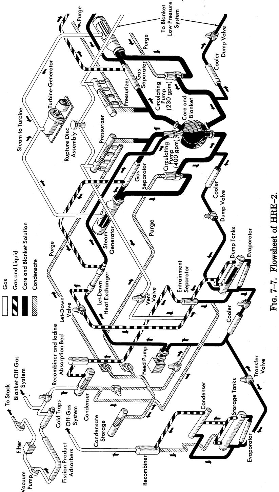

necessary to accommodate the greater volume of blanket fluid—the entire blanket system is not shown. The fuel system is described as follows.

In the high-pressure system the fuel solution is pumped into the bottom of the reactor core at $256^{\circ}\mathrm{C}$ and is heated to $300^{\circ}\mathrm{C}$ as it proceeds upward to the outlet pipe. At the top of the outlet pipe is attached the pressurizer in which condensate is electrically heated to a maximum temperature of $335^{\circ}\mathrm{C}$ to produce 2000-psi steam. The fuel flows past the pressurizer to the gas separator, where directional vanes cause the fluid to rotate sufficiently to separate the radiolytic gas $(\mathrm{D}_2$ and $\mathrm{O}_2)$ , the excess $\mathrm{O}_2$ , and fission-product gas. The separated gas forms a vortex along the axis of the pipe and is bled to the low-pressure system. The reactor solution continues from the gas separator to the U-tube primary heat exchanger, where it is cooled from $300^{\circ}\mathrm{C}$ to $256^{\circ}\mathrm{C}$ by transferring heat to the boiler feedwater surrounding the tube bundle. The $244^{\circ}\mathrm{C}$ , 520-psi steam produced on the shell side of the heat exchanger is bled partially to the small (345-kva output) turbine generator remaining from the HRE-1 and partially to an air-cooled steam condenser. The uranyl sulfate solution flows next to the intake of the 400-gpm canned-motor circulating pump and thence is pumped to the core for reheating. The blanket fluid follows an identical cycle at a flow rate of $230~\mathrm{gpm}$ . This lower flow rate was based on a pump of the same horsepower but designed to circulate a thorium oxide suspension, rather than pure $\mathrm{D}_2\mathrm{O}$ .

The gases and some entrained liquid removed by the gas separator are transferred to the low-pressure system through a "letdown heat exchanger," a jacketed pipe which cools the gas-liquid mixture to $90^{\circ}\mathrm{C}$ . A valve downstream of the heat exchanger throttles the gas-liquid stream to atmospheric pressure. The mixture then discharges into the "dump" tanks, which have sufficient capacity to hold all the reactor liquid. An evaporator built into the dump tanks provides continuous mixing and, more important, steam for dilution of the deuterium and oxygen below the explosive limits. The gas-and-steam mixture flows upward through the iodine bed to the catalytic recombiner, in which the deuterium and oxygen react on a bed of platinized alumina pellets to form water vapor. The heavy water is condensed by the shell-and-tube condenser following the recombiner and normally flows back to the dump tanks. However, the water may be diverted to weighed storage tanks in case it is desired to change the concentration of the fuel solution. Water which is returned to the dump tanks is mixed with the excess fuel solution stored there (approximately 25 gal) and then fed to the intake of a sealed-diaphragm injection pump, which returns the liquid to the high-pressure circulating system at a rate of about 1 gpm, thus constantly replacing the liquid removed via the gas separator.

The small volume of intensely radioactive fission gas plus the excess

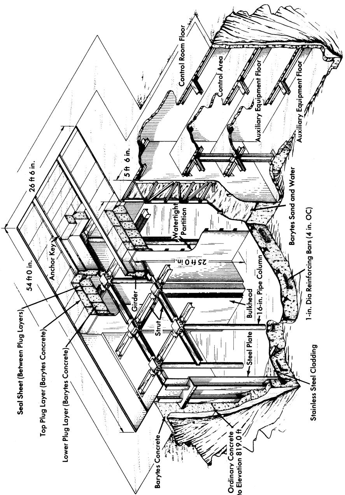  
FIG. 7-8. HRE-2 shield and vapor container.

oxygen remaining after condensation of the re-formed heavy water is dried in cold traps at $-23^{\circ}\mathrm{C}$ and sent to the beds of activated carbon for a period of decay. Gas leaving the bed is diluted with 1400 cfm of air and discharged to the atmosphere from a 100-ft stack.

Samplers are provided to secure small quantities (5 ml) of the fuel and blanket liquids from the high- and low-pressure systems for chemical analysis. These units are located in bypass lines; material circulated through them is trapped by closing the sampler inlet and exit, after which the contents are discharged into a portable container through a drain valve.

All the primary reactor equipment is located in an underground, box-like, steel tank called the "shield pit," shown in Fig. 7-8. The design of the shield pit was influenced by several factors, including a requirement for accessibility and flexibility because of the experimental nature of the installation, provision for complete containment of the contents of the reactor should a leak develop or should the pressure vessel or heat exchangers rupture, efficient utilization of the space within an existing structure, and capability of flooding with water for maintenance or replacement operations.

The reactor shield pit occupies the center high-bay area of the building and is constructed of 3/4-in. welded steel plate reinforced in such a manner that an internal pressure of 30 psi will be contained. This pressure corresponds to the instantaneous adiabatic release of the entire contents of the reactor system. The chemical processing cells, each 12 ft wide by 25 ft long, are designed similarly.

The upper surface of the blocks forming the roof of the shield pit is at ground level. This roof is made of high-density concrete 5 ft in total thickness and consists of two layers of removable slabs with a completely welded steel sheet sandwiched between the layers and extending across the top of the pit to form a gastight lid. The roof blocks are anchored to the girders and supporting columns by means of a slot-and-key arrangement, shown in Fig. 7-8. The vertical columns are embedded in a concrete pad which is 3 ft thick and is heavily reinforced with steel.

The wall between the reactor pit and the control area is a hollow box $5\frac{1}{2}$ ft wide, constructed of 1/2-in. steel plate welded to the north side of the reactor shield tank. It is filled with high-density barytes, sand, and water. The use of the fluid shield between the reactor and control-room areas allows flexibility in the locations of service piping and instrument or electrical conduits. All lines leaving the reactor tank are welded into the shield wall; conduits are connected into junction boxes inside the pit with gastight seals on the individual wires.

The design is such that nowhere outside the shield will the radiation dosage exceed 10 mrep/hr when the reactor is at $10\mathrm{Mw}$ . For the purpose of decreasing the neutron activation of equipment inside the pit, the re

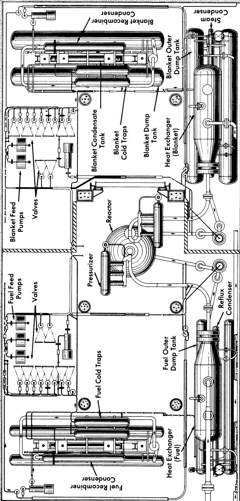  
FIG. 7-9. HRE-2 component arrangement, plan view.

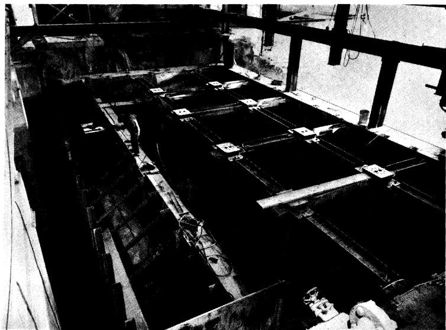  
FIG. 7-10. HRE-2 container looking southeast (at $50\%$ completion).

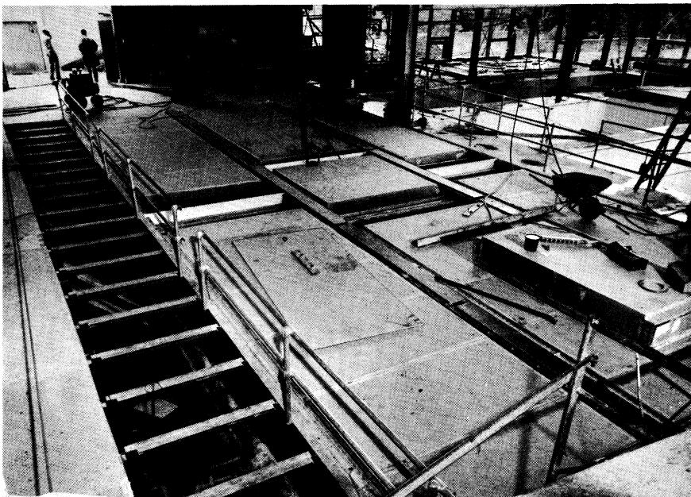  
FIG. 7-11. Reactor tank with shielding plugs in position during hydrostatic test.

actor vessel is surrounded by a thermal neutron shield consisting of a steel tank with a 2-ft-wide annulus filled with boron ore and water.

The arrangement of reactor components within the main reactor pit is shown in Fig. 7-9. The reactor is near the center of the pit, enclosed by the 2-ft-thick thermal shield. To the left of the reactor is all the fuel-system equipment, and to the right is the blanket equipment.

Most of the high-pressure components are located close to the pressure vessel. The pressurizers are positioned directly above the reactor; the gas separators are in the S-shaped outlet lines to the steam generators on the south side of the pit. The areas to the left and right of the reactor in the center bay are reserved for future equipment modifications or additions.

To the far left is grouped all of the fuel low-pressure equipment, including dump tanks, recombiner, condensate tank, and cold traps. These components are assembled on a rigid structural-steel frame; the blanket low-pressure equipment is to the far right.

Insofar as possible, valves are situated close to the control-room wall so that air lines and leak-detector lines can be kept short. The arrangement of the valves is such that all flanges can be easily disconnected from above.

7-4.3 Schedule of construction [19,20]. Construction of the HRE-2 was started in July 1954, immediately after the dismantling of HRE-1. The initial step was the excavation of a large hole beneath the building (which had previously housed the HRE-1) for the large rectangular steel tank (60 ft long, $30\frac{1}{2}$ ft wide, and 25 ft deep) which contains the reactor and its associated equipment. Figure 7-10 shows this tank at approximately $50\%$ completion.

The north wall of the reactor tank, seen to the left in Fig. 7-10, is common to both the reactor tank and the control-room area, and it is through this wall that the many service, instrument, and electrical lines which must interconnect these two areas pass. The next step in the construction was to install the approximately 600 lines which penetrate this $5\frac{1}{2}$ -ft-thick wall.

Figure 7-11 shows the tank after the complete roof structure had been assembled and welded closed as it was prepared for a hydrostatic test. In this test the tank was filled with water and then pressurized to give the equivalent of a 30-lb internal pressure at all points within the tank. Strain gauges were attached at many points so that the complicated stress pattern could be studied in some detail for assurance that the tank was safely within design limits.

While the reactor tank and control-room areas were being constructed, reactor equipment was being procured and constructed at several places. Much of the equipment required in the low-pressure system had been inspected and tested when the container was completed. In November

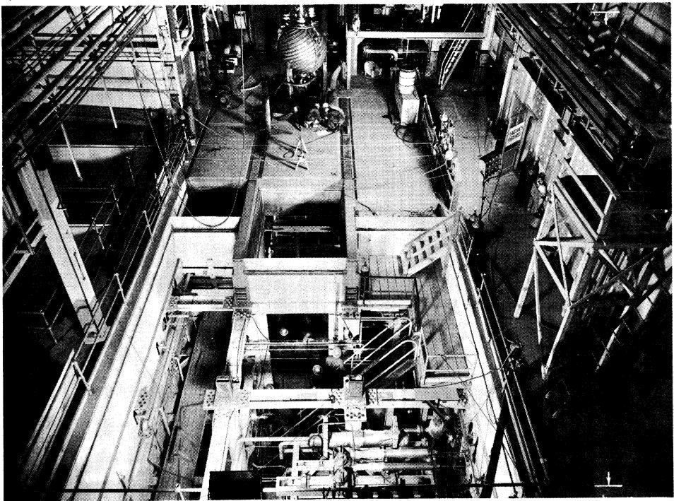  
FIG. 7-12. View of HRE-2 building, main bay.

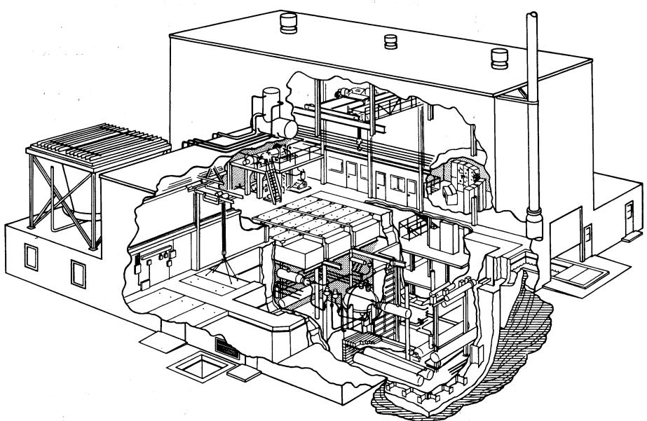  
Fig. 7-13. Artist's concept of homogeneous reactor test, HRE-2.

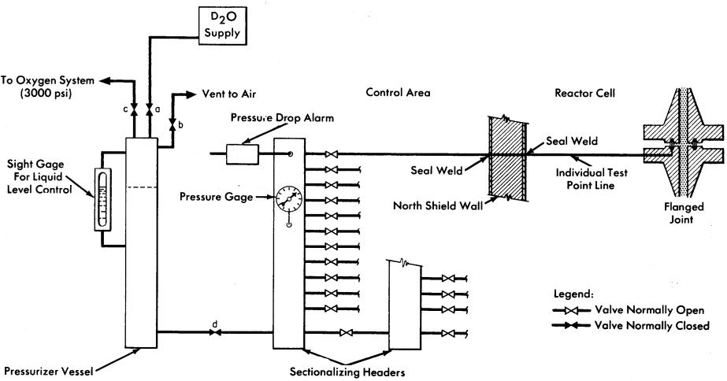  
FIG. 7-14. HRE-2 leak detection system.

1955, these parts and the thermal shield surrounding the reactor pressure vessel were installed. Figure 7-12 shows the reactor core and pressure-vessel assembly just before installation in January 1956.

The heat exchangers were subsequently installed and followed by the main circulating pumps so that the high-pressure piping which connected the pumps, heat exchangers, and pressure vessel could be attached. This work occupied most of the months of February and March. Construction of the reactor was completed in May 1956. Figure 7-13 is an artist's concept of the completed reactor.

7-4.4 Nonnuclear testing and operation. Pretesting, operation of the reactor as a nonnuclear facility, and a lengthy flange-replacement job occupied the period from completion of construction in May 1956 to December 1957. A chronological summary of the events associated with the nonnuclear operation of the reactor during this period is shown in Table 7-6.

From Table 7-6 it can be noted that preoperational testing of HRE-2 was interrupted by stress-corrosion cracking difficulties, which were caused by chloride ion contamination in the stainless steel tubes that are used to detect and prevent leakage of radioactive solution from flanged joints [20]. Figure 7-14 shows how an individual leak-detector line is attached to the groove of the ring-joint flange. The tubes from all the flanges terminate at a valve header station in the control room. Normally this system is kept pressurized with water to a pressure of 300 to 500 psi above the system pressure. A leak in any flange results in leakage of water from the header and a loss in pressure, which actuates an alarm at a fixed level above the fuel or blanket pressure. This is normally a sensitive and satisfactory means

TABLE 7-6   
SUMMARY OF HRE-2 NONNUCLEAR OPERATION  

<table><tr><td>Period</td><td>Test or event</td></tr><tr><td>May 1956</td><td>3000-psig hydrostatic test of high-pressure system and 750-psig test of low-pressure system</td></tr><tr><td>June 1956-July 1956</td><td>Cleaning of piping systems with 3% trisodium phos- phate followed by 5% nitric acid and initial operation of pumps. Tests for dump-tank entrainment and efficiency of catalytic recombiner</td></tr><tr><td>July 1956-August 1956</td><td>Initial tests of equipment removal and underwater maintenance</td></tr><tr><td>August 1956-October 1956</td><td>Flushing of flange leak-detector tubes to remove chloride contamination</td></tr><tr><td>October 1956-November 1956</td><td>Initial nonnuclear operation of reactor at 280°C and 2000 psig. Thermal cycling of flanged joints</td></tr><tr><td>December 1956-January 1957</td><td>Removal of typical flanges for metallographic examination to detect possible stress-corrosion cracks. Further tests of remote-maintenance tools</td></tr><tr><td>January 1957-March 1957</td><td>Further operation of the reactor with water and with depleted uranium at various conditions of temperature and pressure</td></tr><tr><td>April 1957-August 1957</td><td>Removal, inspection, and replacement of flanges and leak-detection tubing</td></tr><tr><td>August 1957-September 1957</td><td>Recleaning of system with trisodium phosphate and nitric acid solutions and hydrostatic testing</td></tr><tr><td>September 1957-October 1957</td><td>Final operation at design conditions with water and with depleted uranium. Final leak test of reactor piping with radioactive tracers</td></tr><tr><td>November 1957-December 1957</td><td>Final insulation of reactor piping; installation of new refrigeration system and new iodine absorption bed, followed by nonnuclear operations with heavy water. Criticality achieved December 27, 1957</td></tr></table>

of preventing the leakage of radioactive liquid from the reactor (the leak-detector fluid leaks out instead) and detecting the leaks when they do occur (by measuring the pressure or volume loss of the leak-detector fluid). Volume changes in the header can be read to $\pm 1$ cc from a graduated scale next to each header sight-glass. By observing level changes at regular intervals, noting which lines are isolated from the header, leaks of less than $2\mathrm{cc}$ per day can be detected.

Since this system is a secondary portion of the reactor, the leak-detector tubing unfortunately did not receive the same attention from the standpoint of specification and materials control as the stainless steel used in the primary piping. The 1/4-in. type-304 stainless steel had been purchased to standard ASTM tubing specifications, but in 30- to 40-ft lengths instead of the usual 20-ft lengths. The tubing was received and installed without difficulty. It was given a hydrostatic test after installation and put in service with distilled water. After approximately three months it was observed that some of the water drained from the leak-detector system was badly discolored. An analysis revealed the liquid to contain approximately 1000 ppm of chloride. Since conditions of operation up to this point had been relatively mild, it was thought that the chloride might be removed simply by flushing, and approximately six weeks were devoted to disassembling the reactor and washing out all detectable indications of that contaminant.

After discussions with the tubing manufacturer it was concluded that the chloride had originated from a die-drawing compound which had not been removed from the inside of the tubes prior to annealing. The presence of the chloride-containing hydrocarbon caused carbide precipitation at the grain boundaries during annealing and created tiny caves into which the chloride penetrated. The pickling and cleaning treatment which followed did not remove this material; in fact, it was learned that the manufacturer's pickling tanks did not accommodate the full length of the tubing, making it necessary to pickle by dipping approximately half the tubing at a time. The net result was that large quantities of chloride remained inside the tubing to be leached out later when filled with water.

At the time the stress-cracking damage was discovered late in 1956 the reactor had been made ready for a series of engineering tests, and for this reason it was decided to make a brief inspection of the damage resulting from the chloride contamination before proceeding with the planned experimentation. This preliminary inspection provided the basis for a decision to prepare for the replacement of the 259 flanges and the 15,000 ft of leak-detector tubing in the system. It was further decided that engineering tests which had been interrupted could proceed for the period of approximately three months which would be required to procure new flanges and leak-detector tubing.

Dismantling of the system was begun in April, and a very careful inspection of the 259 flanges was made to determine how many should be replaced. The Super-Zyglo dye-penetrant method of flaw detection was chosen as the most sensitive test which could be used practically in the field.

Of the 259 flanges inspected, 167 were found to be acceptable (i.e., as good as new), 67 were rejected because of cracks, pits, or other possible flaws, and 25 were judged questionable. Nearly all of the rejected flanges were in high-temperature portions of the reactor. While the inspection method was selected as the best available, it was not judged to be infallible; e.g., differentiation between mechanical scoring and corrosion pitting was not always clear-cut, and any cracks covered by smeared metal resulting from excessive gasket pressure could not be detected. Hence it was decided to replace all the high-temperature flanges with new flanges or, where this was not possible, to remove 0.02 in. of metal from the flange surfaces. A total of 132 flanges were replaced; 15 were remachined. In addition, the 1/4-in. stainless steel tubing to all the high-pressure flanges (approximately 10,000 ft) was replaced in the leak-detector system. This repair work was completed in August 1957.

To remove any organic material introduced during repairs and to pretreat the fresh metal surfaces incorporated into the system, the reactor piping was subsequently flushed with hot $3\%$ trisodium phosphate solution, followed by water rinses and a $5\%$ nitric acid wash. After hydrostatic testing the reactor was test operated with condensate for $150\mathrm{hr}$ at $280^{\circ}\mathrm{C}$ , then charged with depleted uranyl sulfate solution. Test operation with depleted uranium included: (1) a series of concentration and dilution experiments to study the transient and equilibrium behavior of ions in the system, (2) checking of the inventory-control methods by comparing the fuel analyses and indicated system controls with the quantity originally charged, and (3) observation of the corrosion behavior by analysis of fuel samples during a $159\mathrm{-hr}$ run at temperatures above $250^{\circ}\mathrm{C}$ . At the conclusion of the run the charge was recovered and found to agree well with the computed inventory, although chemical analyses of high-pressure-system samples during operation had indicated a uranium concentration 5 to $10\%$ lower than the amount added would predict. Nickel analyses of the fuel solution pointed to a system corrosion rate of slightly less than $1/2\mathrm{mpy}$ .

Before the reactor was charged with enriched fuel, the piping and shield were subjected to careful leak tests. To obviate the presence of helium in the piping in case further testing with helium became necessary, the reactor was first pressurized to 500 psig with nitrogen, to which was added 40 curies of $\mathrm{Kr}^{85}$ as a tracer gas. The shield was sealed and the reactor allowed to stand pressurized for five days, after which air samples were drawn from the shield and heat-exchanger shells for beta-activity scanning to detect

the presence of any leaking krypton. This test was inconclusive at the time, however, because of difficulties encountered in purifying the samples for counting. Large samples of the air being tested were stored in gas cylinders; then the piping was vented and repressurized with helium. After an additional waiting period the sealed volumes were again checked using helium leak detectors sensitive to 1 ppm of helium in air. This test demonstrated that the piping leakage was less than $0.2\mathrm{cc/day}$ of helium, with a pressure differential of 15 psi across the leak. These results were subsequently confirmed by krypton data after analytical difficulties were resolved.

With the integrity of the reactor piping established, the seal pans were welded in place on the shield roof, and the roof plugs were locked in place. By pressurizing the shield and flooding the roof with water, leaks in the seal pan welds were located for subsequent repair. The major shield leak was found to be through a 16-in. valve in the ventilating duct; when this was repaired, the total leakage fell from 25 cfm to approximately $1/2$ cfm. The shield was judged sufficiently tight at this point to proceed with the critical experiments, after which repairs were continued. By painstaking individual checking of all shield penetrations and the use of thermosetting resin to seal the metal lips to which the roof seal pans are welded, the leakage was finally reduced to 4 to 4.5 liters/min at 15 psig.

7-4.5 Nuclear operation [21]. Fuel charging began on December 24, and criticality was achieved on December 27, 1957, with the core and blanket near room temperature and at a pressure of about 800 psig. Nuclear instrumentation for the test consisted of three fission chambers, viz., two permanent chambers in the instrument tube outside the reactor pressure vessel and a temporary chamber inside the blanket vessel. An antimony-beryllium neutron source was suspended in the thimble in the center of the core (see Fig. 7-18).

The reactor was brought gradually to the critical condition by the injection of enriched uranium into the fuel solution added to the dump tanks in batches of 100 to $400\mathrm{g}$ . Fuel feed pumps and purge pumps were operated continuously to provide mixing between the dump tanks and the high-pressure system. Following each addition the solution concentration in the high-pressure system was allowed to reach steady state, as indicated by a leveling-off of fission count rates. After $2060\mathrm{g}$ of $\mathrm{U}^{235}$ had been added and the temperature of the solution lowered to $29^{\circ}\mathrm{C}$ , the neutron source was withdrawn. At this point, the fission count rates continued to rise, indicating that criticality had been achieved. Raising the temperature of the reactor slightly by pumping warm water through the heat exchangers stopped the nuclear chain reaction. By further varying the temperature and concentration of the fuel solution, it was demonstrated that the nuclear reaction could be easily and safely controlled in this manner.

After the initial critical experiment the neutron source was moved from the core to the blanket thimble, and the reactor was brought to criticality seven times at successively higher temperatures ranging up to $281^{\circ}\mathrm{C}$ . In each experiment the reactor temperature was raised above the desired point by supplying steam to the heat exchangers, and a batch of fuel solution was injected into the dump tanks. After steady count rates showed complete mixing of the new fuel, the temperature was slowly lowered until the critical temperature was reached. It was held at this point for about $1/2\mathrm{hr}$ before proceeding to the next experiment. Figure 7-15 compares the experimental measurements of the HRE-2 critical concentration as a function of temperature with concentrations calculated by various methods. It can be seen that the two-group calculations predicted values about $20\%$ below those observed. The harmonics calculation, which used a convolution of an age and a Yukawa kernel to represent slowing down in $\mathrm{D}_2\mathrm{O}$ , gave quite satisfactory results. The multigroup calculation also gave results in agreement with the experimental data.

The first operation of the reactor at significant power levels took place in February 1958. In April 1958 the power level was raised in steps of $1\mathrm{Mw}$ to the design power level of $5\mathrm{Mw}$ . Operation was exceptionally smooth, and no mechanical difficulties were encountered in the first $500\mathrm{hr}$ after charging the reactor with $\mathbf{U}^{235}$ . Unfortunately, shortly after reaching full-power operation a crack developed in the tapered portion of the zirconium core tank, permitting fuel solution to leak into the blanket. After a series of tests to determine the magnitude of the leakage and calculations to determine the behavior of the reactor with fuel in the blanket, it was decided to operate the reactor as a one-region machine (i.e., identical fuel solution in core and blanket). Operation of the reactor under these conditions was resumed in May 1958.

7-4.6 Operational techniques and special procedures. Reactor startup. As the size of homogeneous reactors increases, the use of control-rod neutron absorption to perform a startup becomes progressively less attractive; e.g., to maintain criticality in HRE-2 while heating from 20 to $280^{\circ}\mathrm{C}$ requires a reactivity increase of more than $25\%$ $\Delta k$ because of the large negative temperature coefficient. It is much more convenient to provide a means of varying the amount of fuel in the core as required to overcome temperature and power coefficients.

During the initial experimental stage of HRE-2 operation, startup was begun by evaporating heavy water from the dump-tank solutions, condensing, and pumping to the core and blanket circulating loops. The filled loops were then pressurized, circulation was initiated by starting the canned-motor pumps, and the circulating stream was preheated to operating temperature with an auxiliary heat source. The concentrated fuel was then pumped from the dump tanks to achieve criticality.

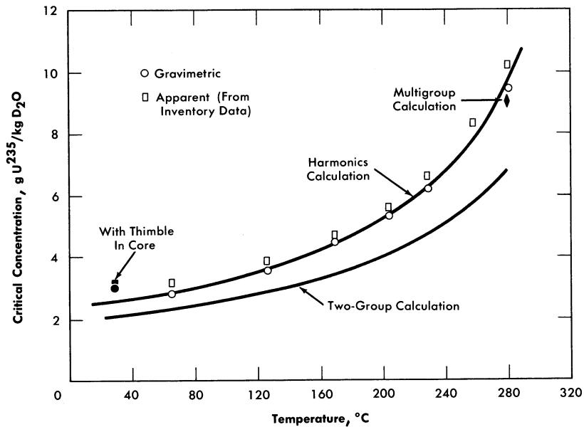  
FIG. 7-15. Critical concentration of HRE-2 as a function of temperature.

An alternate procedure involves starting the reactor without preheating by varying the fuel concentration. When sufficient fuel has been added to raise the reactor temperature to its normal operating level, power withdrawal is begun. Temperature adjustments may be made by removing pure solvent to temporary storage tanks or adding pure solvent to the circulating fuel solution.

A variation of this procedure is to fill the reactor slowly with fuel of the final concentration. In this case the reactor will become chain-reacting at a low temperature with the core tank only partially filled with fuel solution. As the quantity of liquid in the core is slowly increased, the temperature will rise until the desired temperature is attained with the core completely full.

The time required for startup is determined by the rate at which heating can be permitted. The same limitations apply to homogeneous reactors as to other reactors in this respect. Generally, the heating rate of $100^{\circ}\mathrm{F/hr}$ is considered reasonable and unlikely to produce excessive stresses. Probably more important, but more difficult to determine, is the temperature difference which exists across heavy walls. Keeping these temperature differences to less than $100^{\circ}\mathrm{F}$ prevents excessive stresses. Once the temperature limitations are established, the startup rate of fuel addition can be set to match them.

Thus, although aqueous homogeneous systems have been demonstrated to be inherently stable, restrictions are nevertheless placed upon the oper-

ator to prevent excessive power surges and the resultant excessive pressures or heating rates. These restrictions are generally in the form of electrical interlocks in the control circuit. For example, a typical interlock might prevent the operator from concentrating fuel if instruments indicated that an excessive concentration was being reached, or an interlock might stop the addition of fuel solution if the temperature-measuring devices indicated too high a heating rate. Although practically none of these mistakes is serious enough to cause a reactor accident, they are evidence of poor operating technique, and if permitted might result in more serious mistakes which could cause damage in spite of the inherent stability of an aqueous homogeneous system.

The reactor is considered "started up" when the desired operating temperature has been achieved and the reactor is ready for power extraction.

Operation. Except for several preliminary preparations, such as warming-up the steam turbine, power extraction is the simplest part of the reactor startup routine. This involves merely turning steam to the turbine, bringing the turbine up to speed, and making the necessary electrical switching changes to distribute the electrical output. Once the generator is synchronized and feeding into a larger power network, there is little for the operator to do except to see that the equipment is checked routinely for proper performance. For HRE-2 this normally takes a crew which consists of a supervisor, an assistant engineer, and nontechnical helpers. Checks of all continuously operating equipment are made at 1- to 2-hr intervals to verify that the equipment is performing properly. From time to time samples of fuel solution are removed from the high-pressure circulating system to analyze for nickel and other unwanted ions. Samples must also be removed from the steam system to show that boiler feedwater treatment is adequate and that oxygen production is not excessive in the steam generators. Radiation levels must be observed to determine whether there are leaks of fuel solution or weak places in the shield structure.

In addition to these routine service functions, the operating crew must also start up and maintain the chemical processing plant associated with the reactor. One engineer and one technician, in addition to those already mentioned for the reactor proper, are required to operate the HRE-2 chemical plant.

Shutdown. The shutdown of the reactor is normally accomplished in two steps.

The first step in the procedure is cessation of power removal, which involves nothing more than closing the steam throttling valve. This might be accomplished by running the turbine governor down to zero load. Although this action leaves the reactor critical at $280^{\circ}\mathrm{C}$ and does not completely stop heat generation, the power is limited to the normal heat losses from the system (a few hundred kilowatts for HRE-2). Minor repairs or

adjustments to equipment which do not require further cooling can now be made.

The second step is to make the reactor subcritical by diluting the fuel. This type of shutdown normally requires 3 to $5\mathrm{hr}$ , since it is desirable to have the reactor subcritical at the storage temperature of approximately $25^{\circ}\mathrm{C}$ when the reactor is emptied. The rate at which the temperature can be reduced is again determined by the permissible cooling rate of the system components.

Scram. A more rapid shutdown, equivalent to an emergency scram in a solid-fuel system, is the "dump." In this situation the reactor is kept circulating for 2 min to permit recombination of the radiolytic gas in solution during which time the steam valves are closed to reduce power output. Then the pressure in excess of the vapor pressure of the core and blanket is vented to make pressure balancing between core and blanket easier, and the dump valves are opened, permitting the rapid emptying of the core and blanket vessels so that the reactor is shut down within minutes. This type of shutdown is only resorted to in case of emergencies such as excessive pressures or evidence of a leak of radioactive solution from the reactor.

Decontamination of equipment. Conventional methods of decontaminating fuel processing plants have proved to be inadequate for a stainless steel homogeneous reactor system which has been exposed to uranyl sulfate-sulfuric acid-fission product solutions at 250 to $300^{\circ}\mathrm{C}$ . This was demonstrated with HRE-1, which was decontaminated (without descaling) prior to disassembly (Article 7-3.13). Since the HRE decontamination was incomplete, laboratory studies were carried out to explore the nature of the contamination and develop methods of decontaminating the stainless steel. It was found that chromous sulfate, a strong reducing agent, would modify the oxide film and permit dissolution in dilute acids. A $0.4m$ $\mathrm{CrSO_4 - 0.5mH_2SO_4}$ solution has given excellent removal of the film by modifying and dissolving the oxide corrosion film. Decontamination factors of $5\times 10^{3}$ were achieved on specimens from in-pile corrosion loops, where the activity was reduced to the induced activity of the structural material, by contacting for 4 hr with the chromous sulfate solution at $85^{\circ}\mathrm{C}$ .

The solution was also tested satisfactorily on four 22-liter uranyl sulfate corrosion loops which had run for 22,000 hr at 200 to $300^{\circ}\mathrm{C}$ . The loops had a very heavy oxide coating such that in thermal cycles large flakes broke off the wall and plugged small lines. After a 4-hr contact with the chromous sulfate-sulfuric acid solution at $85^{\circ}\mathrm{C}$ , the walls of the loop were completely free of all clinging oxide.

The total time involved in the preparation of the chromous sulfate solution, in descending the reactor system, and in disposing of the extremely radioactive scale-waste would probably be at least 48 to $72\mathrm{hr}$ . If one is

considering decontamination as an aid to maintenance, time required for decontamination should be weighed against the reduction in repair time which would result from the lower levels of activity in the working area.

7-4.7 The HRE-2 Mockup [22].* During the design and construction of HRE-2 some of its major pieces of equipment were assembled and operated at design conditions on unenriched uranyl sulfate solution. The purposes of this engineering mockup were (1) to study the behavior and removal of gases in the high-pressure system, (2) to study fuel-solution stability in a circulating system similar to the HRE-2, (3) to establish a reference corrosion rate for the reactor circulating system, (4) to study the behavior and removal of corrosion- and fission-product solids in the system, and (5) to establish the reliability of components, pointing out weaknesses and possible improvements.

The prototype reactor components tested in the mockup include: (1) a Westinghouse canned-rotor centrifugal pump, (2) an electrically heated steam pressurizer, (3) a centrifugal gas separator, (4) a 1/8-scale heat exchanger similar to the HRE-2 steam generator, (5) a letdown heat exchanger to cool the fluid and gas bled from the high-pressure system, (6) a bellows-sealed letdown valve to throttle the fluid and gas from the high-pressure system, (7) a liquid-level controller which adjusts the letdown-valve position, (8) the dump-tank and condensate system for excess fuel solution and storage of condensate for use as purge to the pressurizer and circulating pump, (9) diaphragm feed pumps to return fuel to the high-pressure system from the dump tanks, (10) an oxygen-feed system to maintain oxidizing conditions in the circulating fuel, and (11) an air-injection system for tests of the effectiveness of the gas-separator unit and letdown system.

In May 1956 a corrosion- and fission-product solids-removal system was installed in the mockup, consisting of a 5-gpm canned-rotor ORNL pump, an assembly of a hydroclone and underflow pot, and two 1/2-in. Fulton Sylphon bellows-sealed air-operated valves separating the system from the main circulating stream. A commercial pulsafeeder was used to inject rare earths containing radioactive tracers and corrosion products. In addition, a through-flow bomb was filled with the required solids and connected into the system. Gamma-ray counting equipment was installed to detect any buildup of radioactive tracers on the heat-exchanger surfaces, in the horizontal connecting pipe to the pressurizer, in the gas separator, and in the underflow collection pot. A multichannel gamma counter was used for determining activity levels at the various counting stations. The equipment was removed in November 1956 after demonstrating satisfactory removal of solids from the system.

Operation of the mockup for a total of more than 13,000 hr in the three-year period from February 1955 to February 1958 provided valuable information pertinent to the construction and operation of HRE-2. Items of major importance include: (1) a satisfactory demonstration of the operation of the equipment for removing gases from the high-pressure system, (2) the out-of-pile chemical stability of the uranyl sulfate solution over a long period of time at operating temperatures and pressures, (3) determination of the oxygen injection and excess sulfuric acid requirements to prevent uranium precipitation in the high-pressure loop, (4) detection of an unsatisfactory pressurizer design in which excessive corrosion and precipitation of uranium occurred, and tests of a revised model which proved suitable, (5) a demonstration of the successful removal of injected fission-product solids and insoluble corrosion products by means of a hydroclone, and (6) long-term operability of the circulating pump and other pieces of equipment.

7-4.8 The HRE-2 instrument and control system [23].* The control system for a homogeneous reactor such as the HRE-2 differs drastically from that for solid-fuel reactors because control rods and fast electronic circuitry are not necessary for systems with such large temperature coefficients (nearly $0.3\% \Delta k / ^{\circ}\mathrm{C}$ at $280^{\circ}\mathrm{C}$ for the HRE-2).

Functions similar to those performed by control rods in heterogeneous reactors, but without such exacting speed-of-response requirements, are performed by valves which control the concentration of the fuel, which vary the steam-removal rate from the heat exchangers, or which allow the fuel to be discharged to noncritical low-pressure storage tanks. For these reasons the nuclear control circuits for a homogeneous reactor are designed to limit very rapid changes in fuel concentration and steam-removal rates. Other circuits control the pressures and temperature limits of the circulating liquid fuel, principally to prevent equipment damage.

In addition to these general considerations, the instrument and control system for the HRE-2 includes the following special features:

(a) All instrument lines through the shield wall are blocked by valves on a signal of high shield pressure to prevent the escape of radioactivity. Electrical leads are sealed by glass-to-metal seals.   
(b) Thermocouple, electrical, and air lines may be disconnected by remotely operated tools for equipment repair or removal.   
(c) All critical core- and blanket-system transmitters, except electric level transmitters and thermocouples, are located in two shielded instrument cubicles (5 ft diameter × 15 ft high) located adjacent to, but outside, the main reactor tank. This arrangement was selected to avoid opening the main tank to replace instruments, to provide a location for

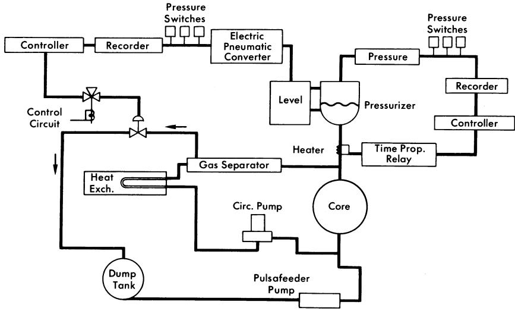  
FIG. 7-16. Key control loops utilizing both pneumatic and electric transmission.

instrument components which could not be easily protected from the water-flooding of the main tank during remote-maintenance operations, and to minimize the radiation exposure of instruments.

(d) The cell air monitors, which provide an alarm in case of a leak of radioactive vapor from the reactor system, are installed in one of these instrument cubicles. Cell air is circulated through a 2-in. pipe from the reactor tank, past the enclosed monitors, and then back to the cell. The blower is sized so that only 5 sec is required for cell air to reach the radiation monitors.

Figure 7-16 indicates several key control loops: (a) The pressure of the core system is controlled from sensed pressure by the proportioning of power to the pressurizer electric heaters; the blanket pressure is similarly controlled by a core-to-blanket differential-pressure signal. (b) The liquid levels in the pressurizers are controlled from sensed levels by pneumatic control of the letdown valves. Pneumatic control actions are derived from transducers which receive signals from electric transmitters. Electric interlock control of the pneumatic signals to final control elements is achieved by the use of solenoid-actuated pilot valves.

Other control loops not illustrated are: (c) The reactor power is controlled by a manual or turbine-governor signal to a valve throttling steam from the core heat exchanger. Because of the large negative temperature coefficient and low heat capacity, this reactor system cannot produce more heat than is being removed, except for very short times. Heat is removed by opening the steam throttling valve, which causes a decrease in the temperature of the fuel leaving the heat exchanger. Because of the nega-

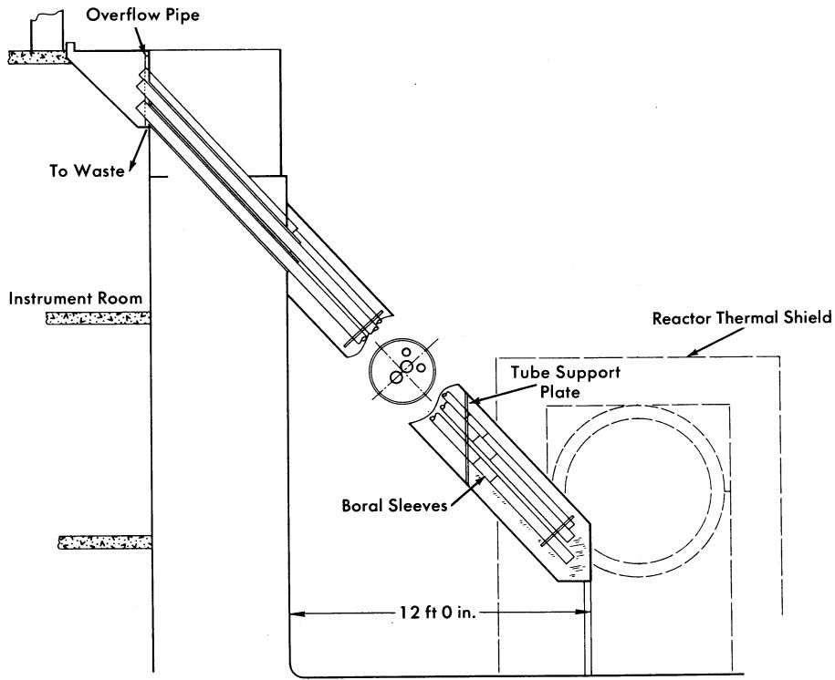  
Fig. 7-17. HRE-2 nuclear instrument thimble.

tive temperature coefficient of the system, the cooler fuel entering the core causes an increase in reactivity and the fuel is reheated until it overcomes the excess reactivity. (d) The average temperature of the core system is controlled by varying the concentration of the fuel solution. The inlet and outlet temperatures will vary with the power extraction, while the average temperature is a function only of fuel concentration. (e) The blanket temperature is controlled by a signal, derived from the difference in average core and blanket temperature, which operates the steam withdrawal valve of the blanket heat exchanger.

Nuclear instrumentation. Neutron level transmitters are two Westinghouse fission chambers and two gamma-compensated ionization chambers designed by the Oak Ridge National Laboratory. Neither type of instrument requires a gas purge, and both are amenable to operation in the water-filled thimbles (Fig. 7-17), which allow the chambers to be positioned or replaced during reactor operation. Varying the distance of the chambers from the reactor core affords a means of sensitivity adjustment, which is needed to accommodate different operating powers.

The gamma-compensated ionization chambers are required to be in a

neutron flux of approximately $10^{10}$ at 5-Mw power to utilize their measuring range of $10^{6}$ . The lower limit of their range of operation is comparable to the maximum desirable flux for proper operation of the fission chambers. Therefore it was possible to install the two types of sensing elements in the same area in the reactor cell. At high fluxes the fission chambers which are required to follow the neutron flux for five decades during start-up are withdrawn into a protective boral shield to limit fission-product buildup in the chamber lining. Proper operation of the compensated ion chambers is ensured by the lead-shot-and-water fill around the thimbles, which reduces the gamma-ray background after power operation from 250,000 r/hr to 250 r/hr.

The fission-chamber signals are fed to conventional preamplifiers, A-1 linear amplifiers, logarithmic count-rate meters and a dual-pen recorder. For initial reactor startup before gamma-neutron reactions provided a sizable neutron source, the fission-chamber output was used to drive a low-range pulse counter.

Control panel. Figure 7-18 shows the main control board and console. Here are located only those instruments necessary for the safe operation of the reactor. These are arranged in a "visual aid" form to reduce operational errors and to facilitate the training of operators. The graphic section is essentially a simplified schematic representation of the chemical process flowsheet with instruments, control switches, and valve-position indicators located in positions corresponding to their location or function in the actual system.

Each annunciator is placed in the control board directly over the instrument or portion of the system on the graphic board with which its signal is associated.

Key measurements are displayed on "full-scale" recorders in the center section of the panel and include the fuel temperature, a multipoint temperature recorder, the multiarea radiation monitoring recorder, the reactor power, the logarithmic neutron-level and count-rate meter signals.

The patch panel on the extreme left is a "jumper board," which is a schematic representation of the electrical control circuits. Provision is made for jumping certain individual contacts in the control circuit with a plug. Lights indicate the position, open or closed, of the contact in the system. The board is valuable for making temporary control-circuit alterations necessary for experiments and makes it unnecessary to use jumper wires which are normally placed behind the panel and if overlooked and not removed might introduce a hazardous condition. The board is also an aid in familiarizing operators with the electrical control circuitry and, since the lights indicate contact position, as an operations aid during startup.

Switches and controls on the console are restricted to those necessary for nuclear startup, steady-state power operation, and emergency.

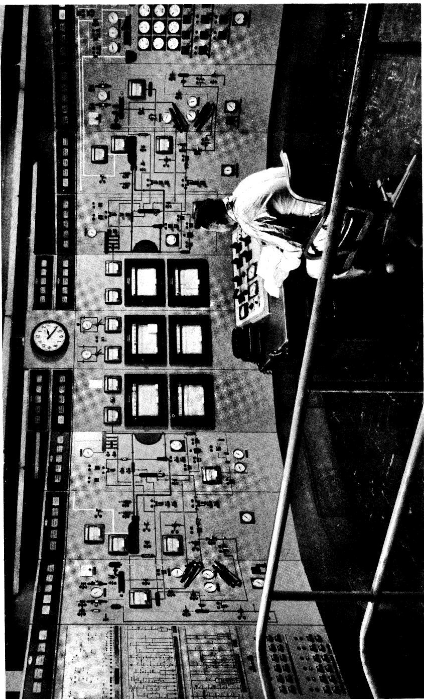  
FIG. 7-18. HRE-2 control room and instrument panel.

Data-collection instruments and the transducers that drive the miniature pneumatic slave recorders on the graphic panel are located in an auxiliary instrument gallery beneath the main control room, as are a 548-point thermocouple patch panel, a relay panel, the nuclear-instrument amplifiers, and the nuclear-instrument power supplies.

Other panels located near their respective equipment elsewhere in the building include the steam control station, the turbine control panel, two sampler control panels, and a control station for the refrigeration system supplying the cold traps. Standard 2-ft-wide modular cabinets and panels are used throughout to facilitate design changes.

Protective interlocking. Extensive protective interlocking of the controls circuits is provided to prevent unsafe operating conditions.

Examples of interlocked systems include the following: (a) The pumping-up of fuel to the reactor core instead of condensate is prevented by several interlocks which keep the fuel-addition valve closed until the core is full of condensate and has been heated to $200^{\circ}\mathrm{C}$ . This prevents power surges and consequent pressure increases. (b) For the same reason the fuel circulating pump is started in reverse to provide a low flow rate as protection against pumping cold fuel too rapidly from the heat exchanger into the core. (c) To avoid dangerous thermal stresses and abrupt reactivity surges, the control circuits do not permit the pumping of cold feedwater into the heat exchangers until the level is above $50\%$ . (d) To give smooth startup, the fuel injection pump can run only at half-speed until a temperature of $250^{\circ}\mathrm{C}$ is reached. (e) The fuel feed valve will be closed and the concentration in the fuel system will be lowered by injecting condensate if the core outlet temperature becomes excessive, if the circulating pump stops, or if the power level exceeds normal. (f) The contents of the high-pressure systems will be automatically emptied to the low-pressure storage tanks through the "dump" valves on a signal of extremely high pressure, or a radiation leak into the steam system. Differential-pressure control between the core and blanket systems during dumps is by throttling control of valves from a differential-pressure signal.

Inventory systems. To obtain an accurate inventory of the fuel and moderator solutions, the storage and condensate tanks are weighed with pneumatic weigh cells. A pneumatic system was selected primarily because taring can be done remotely by balancing air pressures, and components are less susceptible to radiation damage. Piping to the tanks is kept flexible to compensate for the varying loads which result from thermal expansion.

The volumes of the fuel and blanket high-pressure systems have been accurately measured, so that when the pressurizer condensate reservoirs are filled to capacity, the weight of liquid in the high-pressure systems can be computed from the core, blanket, and pressurizer temperatures. These

weights, combined with the respective condensate weights, dump-tank weights, and experimentally observed holdup in the condensate piping, yield the total liquid inventory of the reactor.

7-4.9 Remote maintenance [24]. Maintenance of the equipment in the circulating systems of an aqueous homogeneous reactor is difficult because of the intense radioactivity emanating from the surfaces following prolonged operation at high power levels. This problem, more acute than in the case of heterogeneous reactors because fission-product activities and neutrons are not confined to the reactor core, must be successfully resolved in a practical manner if the homogeneous reactor is to be an economical power producer. Practical systems for maintenance and repair must provide adequate personnel shielding to reduce radiations from activated equipment to tolerable biological values while simultaneously providing access to the equipment.

Equipment activation. Of the two principal methods by means of which the equipment is rendered radioactive, activation by fission-product contamination is the more important in the HRE-2. About $30\mathrm{w / o}$ of the fission products is normally removed from the fuel solution as gases (xenon, krypton, iodine) by stripping with $\mathrm{O_2}$ , $\mathrm{D}_2$ , and steam. Of the remaining fission products, $56\mathrm{w / o}$ are estimated to have sufficiently low solubilities to precipitate from the solution as solids. This is particularly true of the rare earths, which constitute $28\mathrm{w / o}$ of the fission products. Tellurium, technetium, and molybdenum, which contribute $12\mathrm{w / o}$ of the fission products, are assumed to be soluble. Therefore, so far as activation of equipment is concerned, the rare gases ( $\sim 30\%$ ) and the soluble products ( $\sim 12\%$ ), making up $42\mathrm{w / o}$ of the total, may be considered removed or easily removable from the equipment. Some portion of the remaining $58\mathrm{w / o}$ will deposit on hot metallic surfaces or be retained in cracks and crevices. It is possible by statistical analysis to estimate within a factor of two the specific gamma and beta activity of the fuel solution. Methods for calculating this activity have been published [25,26]. The initial fuel activity, after prolonged HRE-2 operation, is of the order of 25 curies/ml.

It should be noted that it is proposed to remove the insoluble fission products continuously with small centrifugal-type separators (hydroclones) in the HRE-2 fuel processing system. The effectiveness of this procedure in competition with absorption on the container walls, however, is as yet unknown.

Induced activation of structural materials by neutron absorption is also an important contributor of radioactivity. During operation of the reactor, a thermal flux exterior to the equipment items will be present because of neutron leakage from the reactor vessel. Also, delayed neutrons will be emitted in the interior of the piping and equipment from fission products

in the fuel solution. These neutron fluxes may be estimated, and knowing the surface areas and material constituents of the equipment, the resulting induced activation may be calculated. Methods of calculating induced activation are reported in the literature [27,28].

The effect of induced activation may be controlled to some extent by attenuating neutron leakage from the reactor through an adequate thermal-neutron shield surrounding the reactor vessel. Also, the constituents of the structural materials in the cell may be specified in such a manner that elements of potentially high neutron activation, such as the cobalt normally present in stainless steels, are minimized. Other materials, such as boron, which has a high neutron-capture cross section and is an alpha emitter rather than a gamma radiator, might be used on equipment surfaces to minimize induced activity.

Radiation dosages. Design criteria followed in the design of shielding and tooling for remote-maintenance operations are based on tolerance radiation levels that are acceptable for normal operations. In continuous working areas, radiation levels as low as $1\mathrm{mr/hr}$ are specified. For certain infrequent operations a level of $7\frac{1}{2}\mathrm{mr/hr}$ is permitted. However, during periods of intense maintenance it may sometimes be permissible to allow personnel to work in an area of higher than normal radiation, but the total weekly radiation dosage must be held to $300\mathrm{mr}$ or less. In some instances it is necessary to work in relays so that no one person receives a higher than permissible weekly dosage.

Proposed maintenance concepts [24]. The concepts which have been proposed for the maintenance of equipment in the HRE-2 have been based on the philosophy of either dry maintenance or underwater maintenance or combinations of the two. In general, it is assumed that the item requiring repair will be replaced with a new item and the faulty component removed to a shielded hot-cell area for maintenance.

Tests of underwater-maintenance procedures proposed for HRE-2 using special tools and equipment have demonstrated the feasibility of removing and replacing equipment. In these tests it was demonstrated that contamination of the heavy-water fuel solution by shielding water could be prevented by freezing a plug of heavy ice in the pipe before disconnecting equipment. Freeze jackets are placed around piping at flange disconnects for this purpose. Also in the HRE-2, the insulation around piping was designed to avoid the retention of water after draining the flooded equipment.

Piping joints. Removal of equipment in the HRE-2 depends on flanged joints adjacent to the equipment which may be disconnected and remade with suitably designed tooling. The joints in the HRE-2 use American Standard stainless-steel ring-joint, weld-neck flanges modified to permit leak detection (Fig. 7-13). These flanges are located so that all bolting is

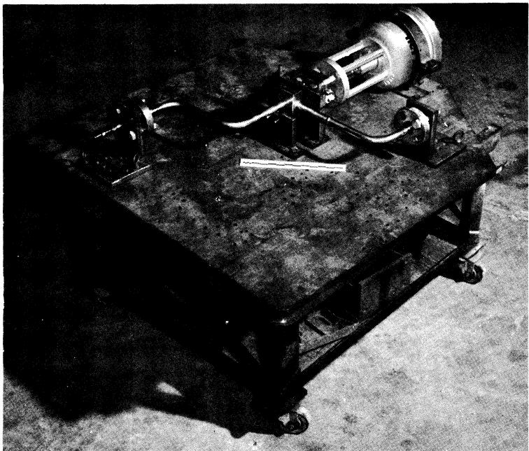  
FIG. 7-19. Universal jig for locating flange positions on HRE-2 replacement high-pressure valves.

accessible to tools operated from above. The number of loose pieces such as bolts, nuts, ferrules, and gaskets is minimized by welding nuts to the flanges such that they become integral with the flange.

Remotely operable tools.* Tools used in the HRE-2 maintenance procedures are generally simple, rugged units mounted on long handles. They include manual, air-operated, and water-operated socket wrenches for turning nuts, hooks for lifting, clamps, knives, magnets, etc. Some typical maintenance devices are illustrated in Figs. 7-19 through 7-22 and described as follows.

The universal high-pressure valve jig shown in Fig. 7-19 is used for manufacturing replacement high-pressure flanges for the HRE-2. By placing brackets in appropriate holes, referenced with respect to the 21 high-pressure HRE-2 valves, the position of the flanged pipe ends for any one of the valves may be accurately determined. With this device, the required number of spare valves for the reactor is minimized, and at the same time any valve which fails can be remotely replaced.

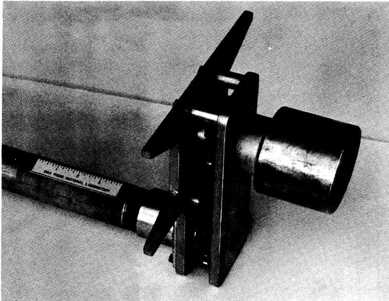  
FIG. 7-20. Spinner wrench for rapid removal of HRE-2 flange bolts.

The spinner wrench in Fig. 7-20 is used for removing bolts quickly after they are loosened with a high-torque wrench, for spinning the bolts snug before final tightening and, by use of a right-angle bevel-gear attachment (not shown), for handling bolts in a horizontal position. It has a chain-drive offset to fit bolts not accessible by direct drive, such as bolts hidden under pipe fittings and bends.

The flange-spreader tool (Fig. 7-21) is required in remote operations to spread low-pressure valve flanges to prevent damage to the ring gasket during removal or insertion of the valves. The tool is shown in place with the flanges spread and the valve assembly moved back on its cell fixture.

The hydraulic torque wrench in Fig. 7-22 is used to tighten or loosen bolts on flanges larger than 2-in. pipe size. This wrench is actuated by a hydraulic (water-operated) cylinder and is capable of applying a 2000 ft-lb force moment.

Even in the relatively short operating history of HRE-2 the concept of underwater repairs with tools such as those described above has been proved to be completely practical. Soon after the reactor attained significant power it was found necessary to replace all the electrical power wiring—nearly 4000 ft of wire. This was accomplished in a period of three weeks, with the cell completely flooded. During this period the fuel circulating pump was removed to recover a set of corrosion samples. The removal and replacement of the pump required only $100\mathrm{hr}$ working time, which

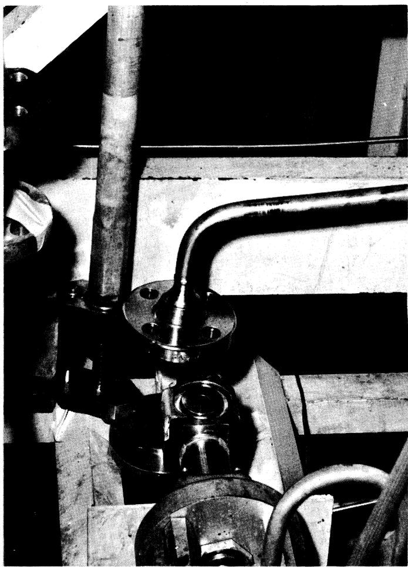  
FIG. 7-21. Flange-spreader tool for preventing damage to gaskets during removal of low-pressure flanges. Shown in place during maintenance operation on HRE-2.

would have been the total shutdown time if the pump replacement alone had been performed. Also, the core inspection flange was removed and the core inner surface inspected by means of a periscope. In these three major underwater-maintenance operations no delay or difficulty was experienced.

7-4.10 Containment methods [29]. In designing for the containment of HRE-2, extremely rigid leakage specifications were set, both for the primary piping system and the shielded tank containing the reactor. In the case of the piping, the leakage specification was based on the minimum leak which could be found with the available mass-spectrometer leak

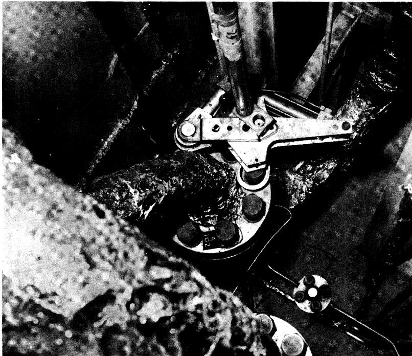  
FIG. 7-22. Hydraulic torque wrench for loosening or tightening flange bolts. Shown in operation on HRE-2.

detection equipment, namely, 0.1 cc helium (STP) per day. Allowing for several such minimum leaks, the equivalent loss of liquid at $300^{\circ}\mathrm{C}$ and at 2000 psig could be as great as 5 cc per day, or a total leakage of approximately 250 curies/day. Because of its volume and surface area, and because of the difficulty in measuring small leakage from very large vessels, the leakage rate for the reactor tank was set at 10 liters/min or less, at a test pressure of 15 psi. As indicated in Article 7-4.4, actual leakages were below this value.

The problem of leakage from the reactor vessels and piping can be catalogued according to the various mechanisms through which leakage might result as follows: (1) excessive stresses, (2) defective materials or workmanship, (3) corrosion, (4) nuclear accidents, (5) hydrogen-oxygen explosions, and (6) brittle fracture. Each possibility is examined in detail in the discussion which follows.

Excessive stresses. There are many possibilities for the development of excessive stresses in a system as complex as the HRE-2. In order to reduce the likelihood of failure as a result of excessive stress, a maximum allowable working stress of 12,000 psi was specified for the type-347 stainless steel

with which the system was fabricated. This permits an additional factor of safety over the 15,000 psi allowed by the ASME boiler code. As required by the ASA code for pressure piping, the reactor piping arrangement was examined for maximum stresses due to pressure, as well as for hoop and bending stresses resulting from thermal expansion. Equipment was also studied for determining the magnitude of thermal stresses caused by radiation heating and temperature cycling. Therefore, in order to keep the combined thermal and pressure stresses below the maximum allowable working stress, the pressure-vessel wall is approximately 2 in. thicker than would be required otherwise. Heating and cooling rates on the entire system have been limited to $100^{\circ}\mathrm{F/hr}$ and $55^{\circ}\mathrm{F/hr}$ , respectively, and the differential temperature across heavy metal walls is kept below $100^{\circ}\mathrm{F}$ . (The cooling rate is held below the heating rate to minimize rate of flange contraction.)

Cyclic temperature stresses at questionable points in the reactor pressure vessel and steam generators were explored experimentally. Mockups were fabricated for the testing of the pressure-vessel nozzle joints and the stainless-steel-to-Zircaloy bolted joint inside the pressure vessel. In each test the temperature was cycled from approximately $250^{\circ}\mathrm{F}$ to approximately $600^{\circ}\mathrm{F}$ in $1/2\mathrm{hr}$ and cooled back to $250^{\circ}\mathrm{F}$ in $1/2\mathrm{hr}$ . After 100 cycles the joints were found to be sound. The main steam generators were also cycled in similar tests. Several tube joints cracked open during the first 50 cycles. They were repaired and the heat exchangers were subjected to an additional 10 cycles before final acceptance.

Defective materials or workmanship. Defective materials and poor workmanship constitute another area which required special attention to prevent failures. All materials for the primary systems of HRE-2 were procured to specifications considerably more rigid than those existing in commercial practice. Optional requirements such as chemical analyses, boiling nitric acid tests, and macroetch tests were exercised in all materials specifications. An additional cost, averaging about $10\%$ , was experienced in the purchase of materials under the more rigid specifications. In some instances, for example with the heat-exchanger tubes, special ultrasonic and magnetic eddy-current flaw detectors were employed to indicate defective parts. Three tubes which might have later failed in operation were thus eliminated. Dye-penetrant tests were applied to tubing bends and to all welds throughout the reactor to detect cracks and pinholes. None was discovered in tubing bends, but many were found in welds, especially in the tube-to-tube-sheet welds.

Special attention was given to the welding of stainless steel butt joints, of which there are approximately 2000 in the entire reactor. The inert-gas, nonconsumable-electrode method was used almost entirely. Welds were inspected to considerably higher standards than required by the ASME code. In addition to being subjected to dye-penetrant inspection, every

weld was x-rayed. Although the inspection standards were very rigid, only $3\%$ of the welds were rejected, necessitating rewelding.

Corrosion. Although corrosion is an ever-present possibility for leakage, the HRE-2 was designed to reduce attack rates so far as possible by keeping velocities below 20 fps, temperatures in the range of 250 to $300^{\circ}\mathrm{C}$ , and lining some surface areas with titanium for additional resistance.

Nuclear accidents. Nuclear accidents are likely to be rare in homogeneous reactors because of the large negative temperature coefficient (0.1 to $0.2\% \Delta k / ^{\circ}\mathrm{C}$ ) [30]. As an example, the worst accident considered in the HRE-2 [31] was one in which all the uranium suddenly collects in the reactor core and results in a reactivity increase of $2.5\% \Delta k/\mathrm{sec}$ . For this rate, starting at a power of only 0.4 watt, the maximum pressure in the pressure vessel would be approximately 3900 lb, and the pressure stress in the carbon steel shell would be less than 30,000 psi.

Hydrogen-oxygen explosions. Since radiolytic gases (deuterium and oxygen) are produced continuously in the reactor, they are the source of an ever-present hazard. Explosions may be expected whenever the deuterium-oxygen-steam mixture is more than $15\%$ gas. For detonations the required gas fraction is greater. The maximum increase in pressure from an adiabatic explosion of hydrogen and oxygen is only a factor of 3 to 8, whereas for a detonation the factor might be 23 for an undiluted mixture. (It is important to note that detonations can occur only in gas channels that are relatively long and straight.)

In low-pressure areas of HRE-2 the gas was diluted with steam to keep it noncombustible. Furthermore, a pressure of 500 psi is the basis for design of low-pressure (atmospheric) equipment. Even for a detonation the expected peak pressure would be less than the design pressure.

Although an explosion can be tolerated in the high-pressure system with little danger of vessel rupture, a detonation probably could not be. A detonation could occur in the gas separator where the gas channel (the vortex by which the radiolytic gas is collected) is long and straight. It is calculated [32] that a detonation wave traveling longitudinally along the vortex would produce impact pressures of the order of 30,000 psi but that the damage would be limited to the directional vanes inside the separator. Attenuation of the forces by the solution would limit the pressure rise to that resulting from combustion of the gas—10,000 psia, which produces a tolerable wall fiber stress of 35,000 psi. Thus no serious damage is foreseen from explosions or detonations.

Brittle fracture. It is generally known that ferritic steels are subject to the phenomenon of brittle fracture. Although the likelihood of brittle fracture in the HRE-2 pressure vessel was known to be small, an investigation was made [33] in order to determine the consequences of such an accident as a result of the pressure rise and missile damage.

A sudden release of the liquid contents of the fuel and blanket systems—3910 lb of solution at $300^{\circ}\mathrm{C}$ and 2000 psig—would result in a pressure rise of approximately 30 psi inside the reactor shield. Although it is somewhat difficult to design a large (25,000 cu ft) rectangular container such as the HRE-2 container to withstand a 30-psig pressure, it was even more difficult to design it to withstand heavy missiles. Studies indicated that missile velocities of 50 to 150 fps could be expected. With the HRE-2 vessel, which weighs 16,000 lb, 1600-lb fragments might be expected. Such a mass at 100 fps would lift an unrestrained 5-ft-thick concrete shielding plug nearly 1 ft. For this reason a blast shield was placed around the vessel.

The blast shield was designed to withstand the 1250-psig pressure which would result from the $300^{\circ}\mathrm{C}$ liquid, as well as to absorb the energy of the expanding steam. A $1\frac{1}{2}$ -in.-thick wall made of type-304 stainless steel was found to be capable of absorbing $2.85 \times 10^{6}$ ft-lb of energy with $2\%$ elongation. The fragments from the pressure vessel would accumulate this much energy in traveling across an annulus of 4.8 in. To provide an additional factor of safety, the blast shield was constructed to surround the pressure vessel with an annulus not greater than 2 in.

A similar shield made of carbon steel was installed on both fuel and blanket steam generators as a final precaution against an explosion which might damage other equipment and the vapor barrier sufficiently to cause a release of activity. The probability of failure of the steam generator shells would not be affected by the presence of neutron radiation because the generators are located in a low flux region.

The vapor-tight container. If leakage of radioactive solution from the reactor proper occurs through one of the means mentioned above, an all-welded, vapor-tight tank provides a second barrier to the escape of radiation to the atmosphere. Construction details of this tank, which forms the liner for the biological shield, are illustrated in Fig. 7-8. After completion of construction the tank was given a hydrostatic test at an average pressure of 32 psig, and the welded joints were found to be free of leaks. It was then reopened for further installation of reactor equipment. Prior to operation of the reactor at power, the containment vessel was sealed and tested (Article 7-4.4).

7-4.11 Summary of HRE-2 design and construction experience. Following the completion of HRE-2, personnel associated with the project recommended design improvements which might be applied to good advantage in future homogeneous reactors. These recommendations are summarized in the following paragraphs:

(1) There are many components in the HRE-2 system which must operate in conjunction with one another for continuous operation of the reactor. Since a failure of any one of these could cause a shutdown of the

reactor, the probability of shutdown is higher than it would be with components operating independently. In future reactors an attempt should be made to decrease the dependency upon the simultaneous operation of essential components. An example of this is a system which can be operated without continuous letdown from the high-pressure to the low-pressure system, so that failure of the low-pressure system components will not necessarily require shutdown of the entire reactor system.

(2) The reactor cell for the HRE-2 contains many structural components made of carbon steel. Flooding the cell with water and removing radioactive contamination by use of acids will eventually do serious damage to all these carbon steel surfaces. Wherever possible in future reactors, corrosion-resistant materials should be used for structural components, or those components should be protected by coatings which are resistant to radiation, as well as to acids and water.   
(3) In laying out equipment and piping, provision should be made for walkways, stairs, and ladders to provide convenient access during construction without having to climb on the process and service piping. These walkways, ladders, and stairs may or may not be removable after completion of construction.   
(4) Many items installed inside the reactor cell of the HRE-2 might have been located outside the radioactive area. These include the cold traps, which could be located in one of the shielded waste-system compartments, the space coolers, and a number of other nonradioactive components.   
(5) In the HRE-2 the sampler is located adjacent to the cell shield, and it is necessary to remove the sample from the sampler and carry it to the analytical laboratory in a shielded carrier. The risk of contamination can be greatly reduced if the hot laboratory is built around the sampler so that samples may be analyzed without removal from the shield; however, this would add to the cost of the facility.   
(6) Access through the containment seal, which consists of welded pans, can be made easier through the use of mechanical seals with organic gaskets. These would not be subject to severe radiation damage since the containment seal is itself shielded from primary radiation.   
(7) Control of all operations affecting the reactor should be located in one central control room. This includes the controls for the chemical processing system, as well as those for the reactor system and all main controls for the steam turbine and steam auxiliaries. This does not mean, however, that all instrumentation must be in the control room, but only those things which are necessary to keep the reactor operator informed and to provide him with primary control of the operation.   
(8) In the HRE-2 refrigeration system a petroleum distillate, "AMSCO 125-82," was circulated inside the reactor cell as a secondary coolant because no primary low-pressure refrigerant could be found which would not

decompose under irradiation to release chlorides or fluorides detrimental to the stainless steel piping. Carbon dioxide was not selected because the piping would have to be designed to withstand about 1500 psi. A solution to this problem would be to use copper for all tubing and equipment in contact with the refrigerant, in which case Freon could be used inside the cell.

7-4.12 HRE-2 construction costs. These costs are summarized in Table 7-7, including that portion of the costs due to the requirement for preventing the possible escape of radioactive material from the reactor to the building or surroundings.

# 7-5. THE LOS ALAMOS POWER REACTOR EXPERIMENTS (LAPRE 1 AND 2) [34, 35]*

7-5.1 Introduction. Homogeneous reactors fueled with uranium oxide dissolved in concentrated aqueous solutions of phosphoric acid have a number of advantages compared with dilute aqueous uranyl solutions for certain power reactor applications. These applications are based on the fact that concentrated phosphoric acid solutions have high thermal stability and low vapor pressures. This makes it possible to operate at relatively high temperatures without creating the excessive pressures encountered with dilute aqueous solutions. These temperatures are high enough to take advantage of the back reaction for recombination of gases produced by radiolytic decomposition and to eliminate the need for an external gas system or an internal catalyst. A phosphoric acid solution reactor, therefore, can be a sealed single vessel with no external components except a circulator for the steam system. In addition, the high hydrogen density and the relatively low neutron-absorption cross sections of the phosphoric acid system permit the construction of small, compact reactors with a low inventory of fuel, which may be ideal for remote package power plants. Other advantages include the possibility of continuous removal of fission-product poisons and a strong negative temperature coefficient of reactivity.

Although the advantages of uranium oxide in concentrated phosphoric acid solutions present a strong case for such a fuel system, the disadvantages, though few in number, are ponderous. In fact, one disadvantage, the highly corrosive nature of the phosphoric acid to most metals, may well outweigh all of the advantages. The only metals known to be suitably resistant to phosphoric acid in the concentration and temperature ranges of interest are gold and platinum. Although with proper design the cost of using such materials in a reactor can be kept within reason, the problem of providing and maintaining an impervious noble-metal barrier between the

Reactor (HRE-2):

TABLE 7-7   
HRE-2 CONSTRUCTION COST* (TO MAY 1956)   

<table><tr><td colspan="2">Design</td></tr><tr><td>Reactor</td><td>$549,000</td></tr><tr><td>Structure and services</td><td>185,000</td></tr><tr><td>Instrumentation</td><td>126,000</td></tr><tr><td>Total design cost (labor OH@ 65%)</td><td>$860,000</td></tr><tr><td colspan="2">Reactor installation</td></tr><tr><td>Building modification</td><td>58,000†</td></tr><tr><td>Reactor cell and shielding</td><td>375,000</td></tr><tr><td>Reactor components and piping</td><td>1,400,000</td></tr><tr><td>Reactor controls (instrumentation and valves)</td><td>470,000</td></tr><tr><td>Reactor steam system and cooling system</td><td>161,000</td></tr><tr><td>Miscellaneous service piping</td><td>69,000</td></tr><tr><td>Maintenance tools</td><td>54,000</td></tr><tr><td>Waste and off-gas system</td><td>78,000</td></tr><tr><td>Miscellaneous and spare parts</td><td>208,000</td></tr><tr><td>Division supervisory labor</td><td>120,000</td></tr><tr><td>Total installation (labor and material)</td><td>$2,993,000</td></tr><tr><td>Total reactor cost</td><td>$3,853,000</td></tr><tr><td colspan="2">Containment cost estimate for HRE-2:</td></tr><tr><td>1. Additions to shield design, required only to meet containment specification</td><td>$75,000</td></tr><tr><td>2. Cost of sealing conduits and wiring</td><td>7,000</td></tr><tr><td>3. Cost of leak-tight closures on process service lines</td><td>23,000</td></tr><tr><td>4. Blast shields on reactor components</td><td></td></tr><tr><td>Pressure-vessel $35,000</td><td></td></tr><tr><td>Two steam generators 10,000</td><td>45,000</td></tr><tr><td>5. Radiation monitoring of service lines</td><td>10,000</td></tr><tr><td>Total cost</td><td>$160,000</td></tr></table>

TABLE 7-8 PROPERTIES OF LAPRE-1 AND LAPRE-2 FUEL SYSTEMS  

<table><tr><td></td><td>LAPRE-1</td><td>LAPRE-2</td></tr><tr><td>Type of uranium oxide</td><td>\( \mathrm {U O}_{3} \)</td><td>\( \mathrm {U O}_{2} \)</td></tr><tr><td>Weight percent \( \mathrm {H}_{3}\mathrm {PO}_{4} \)</td><td>53</td><td>95</td></tr><tr><td>Vapor pressure, psig 250°C</td><td>400</td><td>190</td></tr><tr><td>Vapor pressure, psig 350°C</td><td>1800</td><td>300</td></tr><tr><td>Vapor pressure, psig 450°C</td><td>4500</td><td>800</td></tr><tr><td>Overpressure gas</td><td>\( \mathrm {O}_{2} \)</td><td>\( \mathrm {H}_{2} \)</td></tr><tr><td>\( \mathrm {U}^{235}concentration,g/liter \)</td><td>111</td><td>77</td></tr><tr><td>H concentration, moles/liter (25°C)</td><td>90</td><td>62</td></tr><tr><td>\( \mathrm {H}/\mathrm {U}^{235} \)</td><td>190</td><td>190</td></tr><tr><td>Fuel volume ratio (430°C to 25°C)</td><td>1.33</td><td>1.16</td></tr><tr><td>Temperature coefficient of reactivity (per °C)</td><td>\( -8\times 10^{-4} \)</td><td>\( -5\times 10^{-4} \)</td></tr></table>

fuel solution and all structural metals with which it might come in contact is extremely difficult to solve. This problem was not solved in the first experimental reactor to use phosphoric acid system, the LAPRE-1; however, considerable improvements in fabrication and testing techniques have been developed for use in the construction of LAPRE-2.

Of the wide range of possible combinations of uranium oxide, phosphoric acid, and water, two systems appear to be of special interest. The first, which consists of $\mathrm{UO}_3$ dissolved in an aqueous solution containing between 30 and $60\mathrm{w / o}$ of phosphoric acid and pressurized with an oxygen overpressure, was used for the first Los Alamos Power Reactor Experiment (LAPRE-1). The properties of this solution are given in Chapter 3 and summarized in Table 7-8. The vapor pressure of this solution at the design operating temperature of LAPRE-1 $(430^{\circ}\mathrm{C})$ is 3600 psi.

The second solution (to be used in LAPRE-2) consists of $\mathrm{UO}_2$ dissolved in a 95 w/o phosphoric acid and pressurized with a hydrogen over-pressure. As seen from Table 7-1, the vapor pressure of this solution at $450^{\circ}\mathrm{C}$ is only about 800 psi. Because of its reducing properties, the corrosive behavior of this solution is such that anything below hydrogen in the electromotive series is only slowly attacked. Since the attack rate is proportional to the position of the metals in the series, possible materials in decreasing order of usefulness are platinum, gold, carbon, silver, and copper. Although neither silver nor copper is attacked at a rapid rate, both metals undergo mass transfer, and suitable means for inhibiting this must be found before they can be considered practical for lining the reactor.

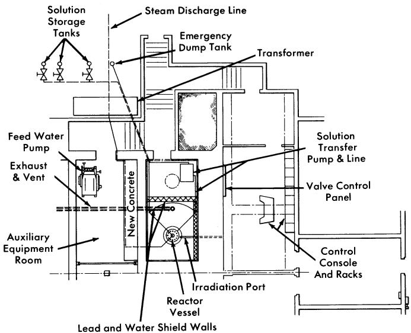  
FIG. 7-23. Plan view of LAPRE-1 reactor area (courtesy of Los Alamos Scientific Laboratories).

7-5.2 Description of LAPRE-1. The first experimental reactor, LAPRE-1, was housed in a cell at the Los Alamos site which had been built previously to handle highly radioactive materials. The cell was modified by supplementing the shielding with additional concrete on one side and lead on the other sides and ceiling. A stainless-steel wall was also put across the reactor end of the cell to permit filling with water for a neutron shield. Equipment such as the solution transfer pump and sampling system were located in the cell outside the water-filled portion, while other auxiliaries were located outside the cell. These included a 12 gpm, 4000-psi feed-water pump, three 6-in.-diameter, 32-ft-long underground solution metering and storage tanks, and an emergency dump tank. Valve controls were located on the wall of the cell. Figure 7-23 shows a plan view of the LAPRE-1 reactor area.

Figure 7-24 shows an artist's sketch of LAPRE-1 in which the essential features of the reactor are indicated. As will be seen from this sketch, the 15-in.-ID cylindrical reactor contains a critical zone above the cooling coils and a reservoir region below. This latter region, which contains a hollow cylinder of boron to prevent criticality, provided a storage place for excess fuel and avoided the necessity for transferring the highly radioactive fuel solution in and out of the reactor as its temperature changed. The

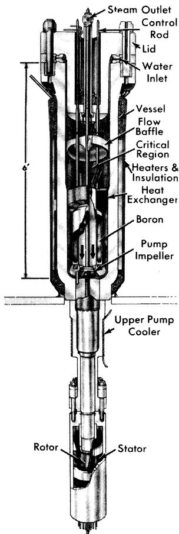  
FIG. 7-24. Los Alamos Power Reactor Experiment No. 1 (courtesy of the Los Alamos Scientific Laboratories).

large negative temperature coefficient of reactivity made it impossible to compensate for the excess reactivity of the cold critical reactor and it was not considered practical to change the fuel concentration as is done in the HRE-2. In the LAPRE-1, shim control was achieved by means of the thermal expansion of the fuel. This was accomplished by initially filling the reactor with the cold phosphoric acid fuel solution to a level about 7 to 8 in. above the cooling coils. At this level the reactor would become critical on removal of the control rods, the solution would heat up, expand, and gradually fill the critical zone. On cooling, the reverse process took place, making the reactor self-compensating. The reactor vessel was so designed that at $430^{\circ}\mathrm{C}$ , the operating temperature, the fluid level would reach a point just above the flow baffle. In the actual experiment the reactor was maintained at zero power while the temperature was raised

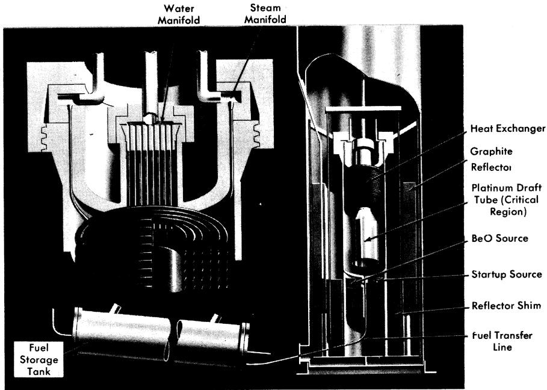  
FIG. 7-25. Los Alamos Power Reactor Experiment No. 2 (courtesy of the Los Alamos Scientific Laboratories).

to $240^{\circ}\mathrm{C}$ by using electrical heaters located around the exterior of the vessel. This was done to minimize the positive reactivity change resulting from starting up the fuel circulating pump, which caused a rapid injection of lower temperature fuel solution from the reservoir into the core.

Heat removal from LAPRE-1 was accomplished by circulating the fuel solution at $600\mathrm{gpm}$ over the cooling coils by means of the centrifugal sealed rotor pump shown in Fig. 7-24. The 12-gpm feed-water stream, heated to $800^{\circ}\mathrm{F}$ in passing through the cooling coils, was simply discharged to the atmosphere through a quick-closing throttling valve and steam silencer as a means of dumping of heat. The possibility of fission products escaping through the steam discharge line was prevented by installing a 70-sec holdup line, suitably monitored for radioactivity, between the reactor and throttling valve.

In case of accidental stoppage of the pump during full-power operation, the reactor could be shut down with the control rods. Provision for discharging the fuel solution by hand or through a rupture disk was included for added safety.

The entire LAPRE-1 vessel and cell components exposed to fuel solution were gold-plated, with the exception of the rod thimbles and draft funnel which were made of, or coated with, platinum to minimize neutron ab

TABLE 7-9 CHARACTERISTICS OF LOS ALAMOS POWER REACTOR EXPERIMENTS   

<table><tr><td></td><td>LAPRE-1</td><td>LAPRE-2</td></tr><tr><td>Power level, Mw heat</td><td>2.0</td><td>0.8</td></tr><tr><td>U235 in core, kg</td><td>4.1</td><td>4.1</td></tr><tr><td>U235 total, kg</td><td>8.5</td><td>6.5</td></tr><tr><td>Fuel temperature, °C</td><td>430</td><td>430</td></tr><tr><td>Fuel pressure, psig</td><td>4000</td><td>700</td></tr><tr><td>Steam temperature, °F</td><td>800</td><td>600</td></tr><tr><td>Steam pressure, psig</td><td>1800</td><td>600</td></tr><tr><td>Cost of components</td><td>$250,000</td><td>$120,000</td></tr></table>

sorption. The 22 stainless steel cooling coils, 50 ft long, were clad with 6 mils of gold.

The characteristics of LAPRE-1 and -2 are summarized in Table 7-9.

7-5.3 Operation of LAPRE-1. Final tests on the LAPRE-1 system were made with a $0.51M\mathrm{UO}_3$ in $7.25M\mathrm{H}_3\mathrm{PO}_4$ fuel solution. Data were obtained at room temperature in terms of control-rod position at delayed critical versus volume of fuel injected into the system,\* and results were interpreted in terms of a simplified calculational model to obtain control rod worths. For the five control rods, four located on a $3_{16}^{7}$ -in. radius and one central rod, measurements yielded a total worth of $6.3\%$ . The latter results were in good agreement with period measurements at cold critical. Also inferred from the data was an effective delayed neutron fraction of 0.0091.

With the reactor filled to a predetermined level at room temperature, initial heating of the system was achieved by means of electrical heaters disposed around the outside of the vessel. Heat was applied until a core temperature of $240^{\circ}\mathrm{C}$ was attained; heating by nuclear power was then initiated. With nuclear power a core temperature of $340^{\circ}\mathrm{C}$ was achieved, at which point the circulator was turned on. Only during the forced convection phase of the operation was a uniform temperature distribution established in the fuel solution; previous to starting the circulator, the

average core temperature was higher than the corresponding reservoir temperature.

Data were obtained during the course of the experiment in terms of control rod positions versus core temperature at delayed critical. For the operation without the circulator, thermocouples located at various points in the system provided data from which average core and reservoir temperatures could be estimated. With the circulator in use, the data for control rod position versus temperature were used to infer the temperature of the solution level at the top of the baffle. Above this point a further increase in height did not contribute to the reactivity; hence the system was solely governed by the temperature coefficient of reactivity. Based on the calculated negative temperature coefficient for the system $(\sim 8\times 10^{-4} / ^{\circ}\mathrm{C})$ it was found that the rods were worth 30 to $40\%$ more at $390^{\circ}\mathrm{C}$ than at cold critical.

A maximum temperature of $390^{\circ}\mathrm{C}$ at an operating power of about $150\mathrm{kw}$ was achieved in the experiment. No steam data were obtained during the test because of a failure in the heat-exchanger assembly after a number of hours of operation. Inspection of the assembly after a cooling-off period indicated that a rupture in the gold cladding of two of the lead-in tubes was responsible for the failure. This rupture was probably due to a bonding between the gold cladding of the tubes and the gold plate of the baffle, in conjunction with vibration of the tubes resulting from the operation of the circulator. Although no further tests with LAPRE-1 were conducted after October 1956, careful inspection of the reactor parts after disassembly provided information valuable to the construction of LAPRE-2.

7-5.4 Description of LAPRE-2. The second power reactor experiment, LAPRE-2, was constructed in an underground steel tank 50 in. in diameter and 20 ft long located at a site approximately 100 feet from LAPRE-1. A sketch of the reactor is shown in Fig. 7-25. Because of the lower vapor pressure of the LAPRE-2 fuel solution the design and method of controlling LAPRE-2 differ from LAPRE-1. As shown in the figure, the reactor vessel has a simple autoclave shape with relatively thin (5/8-inch) walls. This compares with the 3-in.-thick vessel required for LAPRE-1. The cooling coils in LAPRE-2 are located above the reactor core, which has the advantage of providing a noncritical region for excess liquid in case of overfilling. Cooling is accomplished by natural convection circulation of fuel solution over the cooling coils. Fuel circulation is aided by an inverted platinum cone in the core region. A 1-ft-thick graphite reflector surrounds the vessel. The inner 6 in. of this reflector can be moved slowly to adjust the reactivity at varying fuel concentrations.

Cold criticality is achieved by slowly filling the reactor with fuel solution

from a water-cooled copper tank pressurized with hydrogen. The line connecting the tank and reactor is gold clad (0.010 in.). After the reactor becomes critical with cold fuel solution, further additions are made until the desired operating temperature of $430^{\circ}\mathrm{C}$ is reached. A separate pancake-shaped cooling coil, located just above the main tube bundle, serves as a level indicator. A thermocouple in the discharge of this coil indicates whether there is power removal and thus if the coil is immersed.

All parts of LAPRE-2 are completely clad with fifteen mils of gold to provide $100\%$ protection of the structural metal from the fuel solution. This gold, as well as the platinum and noble metals used in LAPRE-1, are recoverable after conclusion of the reactor experiments.

The 600-psi, $600^{\circ}\mathrm{F}$ steam produced in the LAPRE-2 is of somewhat lower quality in terms of power production than LAPRE-1 because of the lower operating pressures. However, at a design level of $1.3\mathrm{Mw}$ heat, the reactor could produce $250\mathrm{kw}$ of electricity which is acceptable for a remote power station.

The characteristics of LAPRE-2 are summarized in Table 7-9. Construction of the reactor proceeded through 1957 and was essentially completed in early 1958.

# REFERENCES

1. A. M. WEINBERG, Whither Reactor Development, Inter-American Conference, Brookhaven National Laboratory, May 1957, *Nucleonics* 15(8), 99 (August 1957).   
2. C. P. BAKER et al., Water Boiler, USAEC Report AECD-3063, Los Alamos Scientific Laboratory, Sept. 4, 1944.   
3. F. L. BENTZEN et al., High-power Water Boiler, USAEC Report AECD-3065, Los Alamos Scientific Laboratory, Sept. 19, 1945.   
4. L. D. P. KING, Design and Description of Water Boiler Reactors, in Proceedings of the International Conference on the Peaceful Uses of Atomic Energy, Vol. 2. New York: United Nations, 1956. (p. 372)   
5. C. K. Beck et al., Nuclear Reactor Project at North Carolina State College, Nucleonics 7(6), 5-14 (1950); and Further Design Features of the Nuclear Reactor at North Carolina State College, USAEC Report AECU-1986, North Carolina State College School of Engineering, January 1952.   
6. R. N. LyON, Preliminary Report on the 1953 Los Alamos Boiling Reactor Experiments, USAEC Report CF-53-11-210, Oak Ridge National Laboratory, Nov. 30, 1953.   
7. J. R. DiEeTICH et al., Design and Operating Experience of a Prototype Boiling Water Power Reactor, in Proceedings of the International Conference on the Peaceful Uses of Atomic Energy, Vol. 3. New York: United Nations, 1956. (p. 56)   
8. L. D. P. KING, personal communication, January 1952.   
9. Reactor News, Nucleonics 15(2), R10 (February 1957).   
10. S. E. BEALL and C. E. WINTERS, The Homogeneous Reactor Experiment—A Chemical Engineering Pilot Plant, Chem. Eng. Progr. 50, 256-262 (May 1954).   
11. C. E. WINTERS and A. M. WEINBERG, Homogeneous Reactor Experiment Feasibility Report, USAEC Report ORNL-730, Oak Ridge National Laboratory, July 6, 1950.   
12. C. E. WINTERS and A. M. WEINBERG, A Report on the Safety Aspects of the Homogeneous Reactor Experiment, USAEC Report ORNL-731, Oak Ridge National Laboratory, Aug. 29, 1950.   
13. C. L. SEGASER and F. C. ZAPP, HRE Design Manual, USAEC Report TID-10082, Oak Ridge National Laboratory, Nov. 18, 1952.   
14. S. VISNER and P. N. HAUBENREICH, HRE Experiment on Internal Recombination of Gas with a Homogeneous Catalyst, in *Nuclear Sci. Technol.*, USAEC Report TID-2506(Del.), Oak Ridge National Laboratory, 1955. (pp. 73-90)   
15. R. B. BRIGGS and J. A. SWARTOUT, Aqueous Homogeneous Power Reactors, in Proceedings of the International Conference on the Peaceful Uses of Atomic Energy, Vol. 3. New York: United Nations, 1956 (p. 175). S. E. BEALL and S. VISNER, Oak Ridge National Laboratory, 1955. Unpublished.   
16. D. O. CAMPBELL, Decontamination of the Homogeneous Reactor Experiment, USAEC Report ORNL-1839, Oak Ridge National Laboratory, June 1956.   
17. C. E. WINTERS, Oak Ridge National Laboratory, 1952. Unpublished.   
18. S. E. BEALL, The Homogeneous Reactor Test, in HRP Civilian Power Reactor Conference Held at Oak Ridge, March 21-22, 1956, USAEC Report TID-7524, Oak Ridge National Laboratory, March 1957. (pp. 11-47)

19. S. E. BEALL, The Homogeneous Reactor Test, in HRP Civilian Power Reactor Conference Held at Oak Ridge National Laboratory, May 1-2, 1957, USAEC Report TID-7540, Oak Ridge National Laboratory, July 1957. (pp. 11-46)   
20. S. E. BEALL, Homogeneous Reactor Experiment No. 2, 4th Annual Conference of the Atomic Industrial Forum, October 1957.   
21. S. E. BEALL, in Homogeneous Reactor Project Quarterly Progress Report for the Period Ending Jan. 31, 1958, USAEC Report ORNL-2493, Oak Ridge National Laboratory, 1958.   
22. I. SPIEWAK and H. L. FALKENBERRY, The Homogeneous Reactor Test Mockup, in Proceedings of the Second Nuclear Engineering and Science Conference, Vol. 2, Advances in Nuclear Engineering. New York: Pergamon Press, 1957. (pp. 62-69)   
23. D. S. Toomb, Jr., Instrumentation and Controls for the HRT, *Nucleonics* 15(2), 48-52 (1957).   
24. S. E. BEALL and R. W. JURGENSEN, Direct Maintenance Practices for the Homogeneous Reactor Test, Fourth Nuclear Engineering and Science Conference, March 1958 (Paper 82); and USAEC Report CF-58-4-101, Oak Ridge National Laboratory, April 1958.   
25. T. ROCKWELL III, Reactor Shielding Design Manual. New York: D. Van Nostrand Co., Inc., 1956.   
26. S. GLASSTONE, Principles of Nuclear Reactor Engineering. New York: D. Van Nostrand Co., Inc., 1955.   
27. C. D. BOPP and O. SISMAN, How To Calculate Gamma Radiation Induced in Reactor Materials, *Nucleonics* 14(1), 46-50 (January 1956).   
28. S. GLASSTONE, Principles of Nuclear Reactor Engineering. New York: D. Van Nostrand Co., Inc., 1955.   
29. S. E. BEALL, Containment Problems in Aqueous Homogeneous Reactor Systems, USAEC Report ORNL-2091, Oak Ridge National Laboratory, Aug. 8, 1956.   
30. P. R. KASTEN, Operational Safety of the Homogeneous Reactor Test, USAEC Report ORNL-2088, Oak Ridge National Laboratory, July 1956.   
31. S. E. BEALL and S. VISNER, Oak Ridge National Laboratory, 1955. Unpublished.   
32. S. E. BEALL and S. VISNER, Oak Ridge National Laboratory, 1955. Unpublished.   
33. P. M. Wood, A Study of the Possible Blast Effects from HRT Pressure Vessel Rupture, USAEC Report CF-54-12-100, Oak Ridge National Laboratory, Dec. 14, 1954.   
34. D. FROMAN et al., Los Alamos Power Reactor Experiments, in Proceedings of the International Conference on the Peaceful Uses of Atomic Energy, Vol. 3. New York: United Nations, 1956. (p. 283)   
35. R. P. HAMMOND and L. D. P. KING, Los Alamos Homogeneous Reactor Program, in HRP Civilian Power Reactor Conference Held at Oak Ridge, March 21-22, 1956, USAEC Report TID-7524, Los Alamos Scientific Laboratory, March 1957. (pp. 168-209)

# CHAPTER 8

# COMPONENT DEVELOPMENT*

# 8-1. INTRODUCTION

The reliability of equipment for handling radioactive fuel solutions and suspensions is considerably more important in homogeneous than in heterogeneous reactors because the residual radioactivity of such equipment after shutdown of the reactor precludes direct maintenance. The possibility of failures of individual components in a homogeneous reactor, moreover, is considerably increased by the corrosive or erosive nature of the media being handled and the temperature fluctuations encountered during startup and shutdown operations. The technical feasibility of circulating-fuel reactors is so dependent on the behavior and reliability of mechanical components that there is little likelihood that large-scale plants will be built before the performance of each piece of equipment has been adequately demonstrated. In this regard, the development of satisfactory valves, feed pumps, mechanical joints, and remote-maintenance equipment for large-scale plants appears to be most difficult.

The component development work at ORNL has been directed primarily toward equipment for use in the Homogeneous Reactor Experiment (HRE-1) and the Homogeneous Reactor Test (HRE-2). Although the HRE-2 has both a core and a blanket, most of the components in these two systems are identical and designed for use with solutions rather than suspensions.

Since suspensions, or slurries, have not been used in either of the homogeneous reactors built by ORNL, the slurry equipment problems have received less attention than corresponding solution problems. Much of the solution technology can be applied to slurries, although additional difficulties such as the settling tendency of slurries, their less ideal fluid-flow behavior, and their erosiveness must be taken into consideration.

The following pages give descriptions and illustrations of the aqueous reactor components which have been selected and developed for use at ORNL.

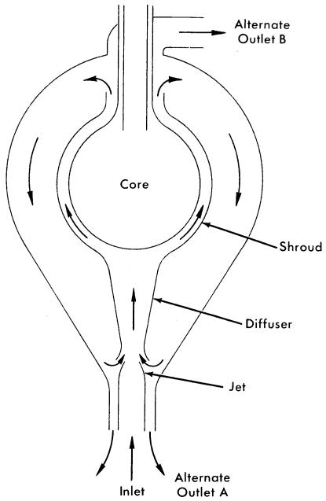  
FIG. 8-1. Conceptual design of two-region reactor with slurry blanket. Arrows indicate directions of slurry flow.

# 8-2. PRIMARY-SYSTEM COMPONENTS

8-2.1 Core and blanket vessel designs. Core hydrodynamics. Flow tests have been conducted on a variety of spherical vessels simulating solution-reactor cores which have been selected to meet the following criteria:

(1) Heat removal from all points must be rapid and orderly to prevent hot spots from being generated.   
(2) Radiolytic gas formed from water decomposition cannot be permitted to collect in the reactor.   
(3) The pressure drop should be low.   
(4) The core tank should be maintained at a low temperature to prevent excessive corrosion rates.

Three geometries which satisfy the above requirements have been investigated. The first, straight-through [1], involves diffusing the inlet flow through screens or perforated plates [2] to achieve slug flow through the sphere. The second, mixed [3], involves generating a great deal of turbulence and mixing with the inlet jet so that the reactor is very nearly isothermal. The third, rotational [4], is somewhat between the first two; the fuel is introduced tangentially to the sphere and withdrawn at the center of a vortex, at the north and south poles.

In the straight-through core, used in HRE-2, the flow enters upward through a conical diffuser containing perforated plates. The number of perforated plates is determined by the ratio of sphere diameter to inlet-pipe diameter. In general, this ratio will be smaller for a larger reactor, resulting in fewer plates and better performance. The velocity distribution leaving the plates can be made to conform approximately to the flux distribution of the reactor. As a result, the isotherms in the core are horizontal, and the temperature rises smoothly toward the outlet at the top. The gas bubbles rise upward at a velocity greater than that of the liquid and are removed with the liquid. The over-all pressure drop is about 1.5 to 2.0 inlet-velocity heads. The core tank is cooled by natural convection.

In the mixed core, illustrated in Fig. 8-1, the inlet and outlet are concentric at the top of the sphere. The inlet jet coincides with the vertical axis of the sphere and is broken up when it hits the bottom surface. Except for the cold central jet, the bulk of the core is at outlet temperature. The velocity of eddies is great enough so that the gas bubbles travel along with the liquid. The pressure drop is about 1.0 to 1.5 inlet-velocity heads. The core-tank surface is maintained at a temperature very close to that of the core fluid by the high turbulence.

In the rotational core, used in HRE-1, the flow pattern tends to produce isotherms which are vertical cylinders. These are perturbed by boundary-layer mixing at the sphere walls. The temperature generally increases in the direction of the central axis, which is at outlet temperature. The gas bubbles are centrifuged rapidly into a gas void which forms at the center axis and from which gas can be removed. The gas void is quite stable in cores up to about 2 ft in diameter, but in larger spheres the pumping requirements to stabilize the void are excessive [5]. The pressure drop through a rotational core is a function of the particular system, but is usually above 5 inlet-velocity heads.

Slurry blanket hydrodynamics. The suspension contained in the blanket vessel must be sufficiently well dispersed to assure that a maximum of the core leakage neutrons are absorbed within the blanket, the neutron reflection from the blanket to the core remains steady, and the transport of fluids through regions of high heat generation are sufficient for heat removal. The primary flow is taken through a jet eductor where the flow rate is amplified and forced through a spherical annulus containing the high heat generation region surrounding the core. It appears that amplification gains of 2.5 are attainable. The outlet may be located either (1) concentric with the bottom inlet or (2) at the top. Configuration (1) has the advantage of high circulation rates in the region outside the shroud. Configuration (2) has the advantage of better natural circulation in the event of a circulating-pump stoppage.

Also under consideration is a swirling flow pattern similar to the rotational flow which was described under cores.

Reactor pressure vessels. Three principal types of stresses should be considered in designing the pressure vessels of one- or two-region reactors:

(1) Stresses resulting from the confined pressure.   
(2) Thermal stresses resulting from heat production, and consequent temperature gradients in the metal.   
(3) Stresses introduced by cladding if used. Because of the uncertain residual stresses introduced during fabrication, this factor has not been taken into account in the past.

The construction material can be chosen on the basis of corrosion resistance and structural and thermal properties with little regard for nuclear properties. Carbon steel with a stainless-steel cladding was selected for use in the HRE-2.

Usually the pressure-vessel wall is thin in comparison with the inner radius of the vessel; the "thin-wall" formulas for calculating pressure stresses are then applicable [6]. For precise calculations the general equations [7] for vessels with any wall thickness should be used. Thermal stresses are superposed on the pressure stresses and can be approximated by conventional formulas for hollow cylinders and spheres [8].

Solution of the stress equations depends upon a knowledge of the radial temperature distribution, which, in turn, depends upon the manner in which heat is generated in the metal wall and upon the temperatures at the inner and outer surfaces. Heat is produced in the metal by the following processes:

(1) The absorption of gamma rays arising from neutron capture, from fission products, and from fission within the vessel.   
(2) The recoil energy from the scattering of fast neutrons in the shell.   
(3) The absorption of gamma rays produced by the inelastic scattering of fast neutrons in the shell.   
(4) The absorption of capture gamma rays produced as neutrons are captured in the shell.

Although it may be possible to obtain the heat-production function for the desired cylindrical or spherical geometry, it is simpler and usually sufficiently accurate to obtain the leakage fluxes of gamma rays and neutrons into the pressure shell for the desired geometry, and then to assume that the heat-production function in the pressure vessel is the same as it would be in a plate of the same material. Methods for obtaining the heat-production function have been summarized by Alexander [9]. The function can usually be described by the sum and difference of several exponentials. For some purposes a single exponential can be used as a satisfactory approximation. The accuracy of the various methods has yet to be determined. To arrive at a conservative design, reasonable methods indicating the greatest amount of heat generation should be used. The surface temperatures of the pressure vessel are estimated from a knowledge of the tem

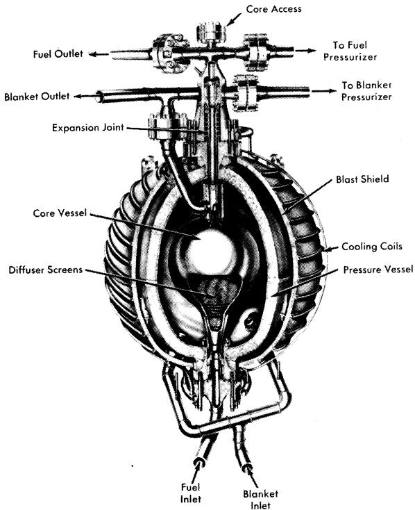  
FIG. 8-2. HRE-2 reactor vessel assembly, fabricated by Newport News Shipbuilding & Dry Dock Company.

peratures of the adjacent fluids and the heat-transfer relationships between metal and fluids.

Chapman [10] has shown in an analysis of thermal stresses in spherical reactor vessels that minimum thermal stresses are obtained when the inner and outer vessel wall temperatures are approximately equal. Pressure stresses decrease and thermal stresses increase as shell thickness is increased; a minimum combined stress occurs at an optimum wall thickness. Often this stress is greater than the permissible design stress; thermal shielding must then be provided between the reactor and pressure vessel to reduce heat production and obtain a reasonable stress.

HRE-2 core and pressure vessel. The HRE-2 reactor-vessel assembly presented a number of special design and fabrication problems [11]. Since it was desired to minimize neutron losses, Zircaloy-2 was selected as material for the core tank, which is 32 in. in diameter and 5/16 in. thick. The main pressure vessel, 60 in. in inside diameter and 4.4 in. thick, was constructed of carbon steel with a cladding of type-347 stainless steel. Because of uncertainties in the long-term irradiation damage of carbon

steel, the pressure vessel was surrounded by a stainless-steel, water-cooled blast shield which will stop any possible missiles from the reactor vessel. Thermal radiation from the pressure vessel to the blast shield permits the pressure vessel to operate at close to an optimum temperature distribution from the thermal-stress standpoint.

A special mechanical joint was developed to join the Zircaloy core tank to the stainless-steel piping system. A bellows expansion joint was used to permit differential thermal expansion between core and pressure vessel. Welding procedures were developed for joining Zircaloy and for making the final girth weld in the clad pressure vessel entirely from the outside.

The HRE-2 core and pressure vessel are illustrated in Fig. 8-2.

8-2.2 Circulating pumps.* Pumps are required in aqueous homogeneous reactors to circulate solutions and slurries at 250 to $300^{\circ}\mathrm{C}$ and 2000 psi pressure, at heads of up to 100 psi. The two main considerations for these pumps are that they must be absolutely leak free and that they must have a long maintenance-free life.

At this time the only pumps considered capable of meeting these requirements are of the hermetically sealed canned-motor centrifugal type. They consist of a centrifugal pump of standard hydraulic design and an electric drive motor, built in an integral unit.

To illustrate, the 400A pump used to circulate fuel solution in the HRE-2 is shown in Fig. 8-3. The HRE-2 blanket pump is identical except for having a lower-output impeller. The hydraulic end of the pump is separated from the motor by the thermal barrier, which is used to restrict the transfer of heat and fluid from the scroll into the motor section of the pump. This minimizes thermal and radiation damage to bearings and motor insulation. The thermal barrier is built with sealed air spaces which aid in thermal insulation. A labyrinth seal around the shaft is used to reduce the fuel mixing into the motor. Water-lubricated hydrodynamic journal bearings and pivoted-shoe-type thrust bearings are used to take the radial and thrust loads, respectively. In the HRE-2, contact of the motor and bearings with radioactive solutions is minimized by feeding distilled water continuously into the motor.

The electric drive is a three-phase squirrel-cage induction motor with the stator and rotor sealed in thin stainless-steel cans which prevent the process fluid from coming in contact with the stator or rotor windings. The cans are supported by the laminations to contain the system pressure of 2000 psi. The motor is enclosed in a heavy pressure vessel which is designed to hold the full system pressure in the event of a can failure. The motor and bearings are cooled by the use of a small auxiliary impeller,

mounted on the rotor shaft, which recirculates motor fluid through a heat exchanger.

In the HRE-2, it is usually desirable to run the fuel pump at reduced capacity during startups in order to limit reactivity changes. This is accomplished by starting the 400A pump in reverse, which gives about one-half of the normal flow. The ability to do this depends on the design of the impeller and the size of the pump. In larger pumps, it is considered better to use a two-speed motor to obtain the reduced-capacity operation. The two-speed motor has an additional advantage in permitting the system to be heated to operating density at reduced speed, thereby reducing the required motor size and power consumption.

The service life of the 400A pump, based on out-of-pile tests with solutions, is expected to be two years or more [12]. The slurry pumps currently being operated have not proved as reliable as the solution pumps, but runs of up to $3800\mathrm{hr}$ have been obtained [13]. The hydraulic parts of the pump are frequently severely eroded, but there has not been a significant change in the pump output or power requirements during the runs. The pumps will generally continue to run unless a bearing seizes or breaks down. It is expected that improvements in bearings and hydraulic design will make slurry pumps as reliable as solution pumps.

The important problems in solution and slurry circulating pumps are discussed below.

Stators. Pumps have been built with oil-filled stators to improve heat removal from the windings and to balance the pressure across the stator can. These pumps are undesirable for long-term reactor service because the oil is subject to radiation damage and requires frequent replacement. Pressure-balanced stator cans have also proved to be unsatisfactory because of the difficulty in maintaining the proper balance. In pumps of up to 400-gpm capacity, the problem of cooling the stator windings does not seem too severe, and the dry-stator design with the can capable ofwithstanding the full 2000-psi system pressure seems to be the best and most commonly used type. In larger pumps, manufacturers are tending to use a compound of silicone resin and inert filler material to improve heat removal from the windings.

Most manufacturers insulate their motors with class H insulation consisting of Fiberglas cloth impregnated with a silicone varnish binder. This insulation is probably good for several years' operation in circulating-fuel reactors, depending on the radiation level of the pump, but over a period of time the insulation can be expected to fail because of the decrease in resistivity and dielectric strength. Hydrogen, released from the silicone varnish during irradiation, may also build up enough pressure to rupture the stator can when the system pressure is reduced. The HRE-2 is expected to yield much information on motor life. Estimates made for the fuel

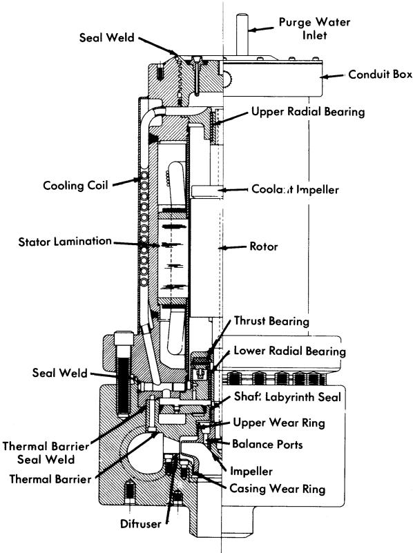  
FIG. 8-3. The Westinghouse 400A pump used to circulate fuel solution through the HRE-2.

circulating pump of the HRE-2 indicated that the insulation will be subject to failure in approximately five years, assuming that the outside of the motor is protected by a 1-in. lead shield and the inside of the motor is kept purged free of fuel solution [14]. Tests are being initiated at the present time to determine the life expectancy more closely by irradiating stators in gamma and gamma-neutron fields.

The ultimate solution to the insulation problem is probably the use of ceramic insulation that would be completely radiation resistant. However, considerably more development work will be required before this type of insulation becomes usable. There are data available which indicate that silicone-resin-bonded reconstituted mica (Isomica, trademark name of Mica Insulator Co.) may have better radiation resistance than Fiberglas and silicone varnish. If this material proves to be better from a radiation-damage standpoint, it can probably be incorporated into a pump at a much earlier date than the ceramic insulation.

Bearings. The standard Stellar-vs-Graphitar hydrodynamic bearings have indicated little or no wear in pressurized-water systems. Presumably their performance in aqueous homogeneous systems would be comparable if the motor can be kept in contact with the water only. In practice, bearing life of $13,000+$ hr has been achieved in actual contact with uranyl sulfate solutions; however, continuous wear was observed, indicating that eventually the bearing surfaces will fail.

Laboratory tests in water and tests on small pumps in solutions have shown that aluminum oxide bearings and journals have superior wear resistance as compared with the Stellar- vs-Graphitar combination. If service tests conducted on larger pumps are successful, the aluminum oxide bearings will be adopted as standard in solution pumps.

There is some doubt whether the hydrodynamic-type bearings currently being used will be suitable for long-life slurry pumps. There have been very few runs completed in which the bearings were not badly worn. However, preliminary tests of small pumps with aluminum oxide bearings have shown promise. It is planned, also, to evaluate the performance of hydrostatic (pressurized-fluid) bearings in dilute slurries.

In some cases, excessive wear has occurred in the thrust-bearing leveling linkages of the 400A-type solution and slurry pumps. In this bearing the thrust load is supported by a linkage system which used $1/8-$ and $1/4$ -in-diameter pins to transfer the load from link to link. It is uncertain whether this wear at the contact point is caused by high stresses or by fretting corrosion. A thrust bearing with line-contact linkages and alternate materials at the contact points will be evaluated in an attempt to correct this problem.

Hydraulic parts. In uranyl sulfate pumps, excellent wear resistance is obtained by using titanium for impellers, wear rings, and diffusers. Stainless-steel hydraulic parts have also been used successfully in many cases [15].

The general design of slurry pumps is similar to that used for uranyl sulfate pumps. The properties of the slurry are such that only a power correction for the higher specific gravity is necessary in the hydraulic design of the impeller. The coefficient of rigidity (viscosity) is generally not high enough to require a correction to the head-capacity curve. A most severe problem in slurry pumps is the combination of corrosive and erosive attack on the hydraulic parts.

The primary difference in the design of a slurry impeller is the use of radial balancing ribs on the top impeller shroud in place of the top wear ring on a conventional pump. In a conventional pump (Fig. 8-3) there are small holes which vent the area within the top wear ring to the pump suction pressure. This is done to balance some of the hydraulic thrust and therefore reduce the load on the thrust bearing. In certain cases these balancing holes have become plugged with slurry [16], which upsets the

thrust balance and causes high thrust-bearing wear. The balancing vanes eliminate one set of wear rings, which are subject to high attack rates, and also tend to centrifuge the slurry particles to the outside, which aids in preventing the slurry from entering the motor through the labyrinth seal.

On the pumps currently in use, the damage to hydraulic parts is usually limited to the wear rings, the tips of the impeller vanes, and to the volute "cut water," which is the point adjacent to the pump discharge where the volute curve starts. The attack at these points can be reduced by proper material choice and by using proper design of the flow passages. The best materials which have been found for the hydraulic parts are Zircaloy-2 and titanium, with Zircaloy being better in laboratory corrosion tests. There are no test results for pumps using Zircaloy parts at this time, but vacuumcast parts have been obtained and placed into service. Other materials are to be given laboratory corrosion tests, and promising materials will be service tested.

The wear rings of the present pumps are being redesigned to provide smooth throttling surfaces rather than the serrated type presently in use. The smooth surfaces should reduce the turbulence and corrosion considerably, with a very small increase in flow through the rings. One service test has shown that the damage to this type of wear ring is decreased considerably [17]. A test is being planned to determine whether radial vanes on the lower impeller shroud similar to the balancing vanes discussed earlier will reduce the attack rate on the lower wear rings. The radial vanes will reduce the pressure drop across the wear rings and may reduce the concentration of slurry flowing through them by centrifugal action.

It is uncertain whether a volute type scroll or a diffuser type scroll is preferable. The volute type scroll has the advantage of having only the cut-water subject to high attack, but has the disadvantage of having a pressure drop across this point, resulting in perpendicular flow across the cut-water. The diffuser has numerous points which could be eroded, but the flow around these points should be smoother than that at the cut-water and may not cause excessive damage.

The surface finish on the hydraulic parts is also very critical and the surface variation should be held to 65 microinches or less. This is especially evident at areas where the impeller surfaces have been ground during the dynamic-balancing operation. If these areas are not properly finished, the scratches will be severely attacked.

Thermal barriers. In pressurized-water pumps, the primary function of the thermal barrier is to retard the transmission of heat into the motor. In solution and slurry pumps, another function, that of preventing fluid mixing from pump to motor, is of critical importance.

This mixing can occur at two places, at the shaft seal and around the

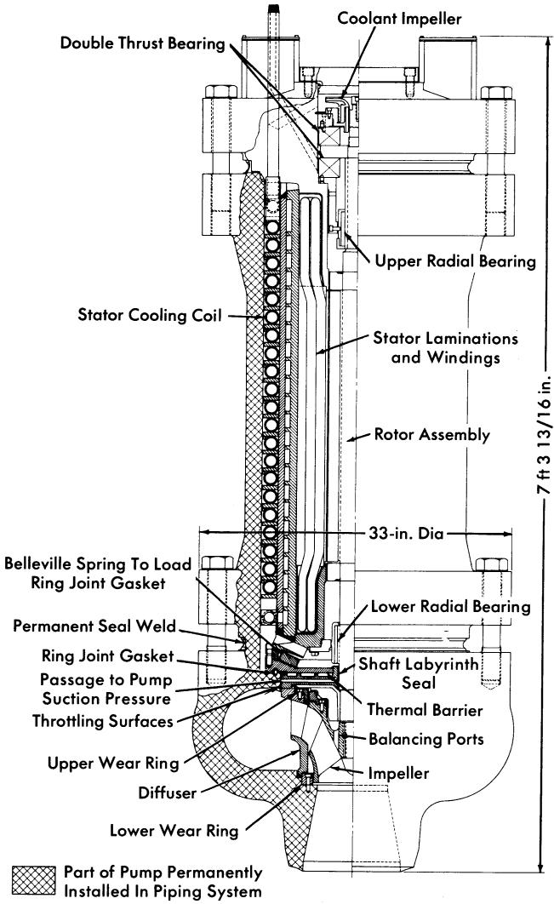  
FIG. 8-4. 6000-gpm top-maintenance pump for circulating solutions through a 50-Mw reactor, being built by Reliance Electric Company.

outer edge of the barrier. In the 400A pump, the mixing rate at the shaft labyrinth seal has been reduced to $3\mathrm{cc / hr}$ by redesign of the seal and by the use of a 5-gph purge flow through the motor [18]. Further improvements in shaft seals are being attempted.

The seal around the outer edge of the 400A thermal barrier was originally a mechanical joint, with the head developed by the pump across it. The purge system did not develop enough pressure to prevent solution leakage

through this joint into the motor. Any small leak was rapidly enlarged by corrosion until excessive motor temperatures were reached. The problem was solved by seal-welding the joint. However, it would have been preferable if the joint had originally been designed for welding.

Pump closures. Conventional canned-rotor pumps, such as those used in the HRE-2, have a large seal-welded closure at the bottom of the stator. Dismantling this closure for pump maintenance is impractical at the present time because of the extremely high level of radiation at the closure.

From a maintenance standpoint, a "top-maintenance" pump appears to be advantageous. Direct-maintenance practices can be used to bolt and unbolt the main flange. The pump casing is a permanent part of the piping system. A top-maintenance pump being developed for the HRE-3 is illustrated in Fig. 8-4.

In a top-maintenance pump, a mechanical thermal-barrier joint cannot be avoided, since the barrier must be removable from the casing. The joint must be loaded using the top closure bolts, and the entire mechanical system must have some flexibility to compensate for differential thermal expansion of the long motor. A venting system, shown in Fig. 8-4, is used to eliminate the pressure drop across the thermal-barrier gasket so that there will not be significant leakage even if the joint is not perfectly tight. In this case, the purge flow should be effective in preventing leakage of process fluid into the motor.

8-2.3 Steam generators. The performance of steam generators required for homogeneous reactor service, measured in terms of undetectable leak-tightness during long-term operation, considerably exceeds that of similar units in conventional plants. Unfortunately, no method has yet been developed of remotely locating and repairing leaks in a radioactive heat exchanger without removing the entire unit. Failure of the steam generator in a homogeneous power reactor, therefore, would lead to excessive shutdown time and must be avoided if at all possible.

HRE-2 steam generators. The heat exchangers used in the HRE-2, shown in Fig. 8-5, place reliance on the careful welding and inspecting of tube-to-tube-sheet joints and the extensive thermal-cycle tests which were carried out prior to actual operation in the reactor. In addition, thermal gradients which would lead to excessive stresses during reactor startup and shutdown are held within specified limits. Although the units fabricated for HRE-2 have been tested with the most advanced inspection methods available for both materiais and workmanship and have met initial leaktightness specifications, only through operation of the reactor will it be possible to judge the adequacy of these precautions.

The characteristics of the HRE-2 steam generators, which were manu

TABLE 8-1   
DESIGN DATA FOR THE HRE-2 HEAT EXCHANGER   

<table><tr><td></td><td>Shell side</td><td>Tube side</td></tr><tr><td>Circulation rate, lb/hr</td><td>1.62 × 104</td><td>1.79 × 105</td></tr><tr><td>Temperature in, °F</td><td>180</td><td>572</td></tr><tr><td>Temperature out, °F</td><td>471</td><td>494.5</td></tr><tr><td>Operating pressure, psia</td><td>520</td><td>2000</td></tr><tr><td>Velocity, fps</td><td>67 (in outlet pipe)</td><td>11.3</td></tr><tr><td>Pressure drop, psi</td><td></td><td>18.5</td></tr><tr><td>Heat exchanged, kw</td><td>5000 (1.71 × 107 Btu/hr)</td><td></td></tr><tr><td>Fouled U_F, Btu/(hr)(ft^2)(°F)</td><td>670 (based on U_F = 3/4 U_C)</td><td></td></tr><tr><td>Heat-transfer area, ft^2</td><td>480</td><td></td></tr><tr><td>Tube outside diameter, in.</td><td>0.375</td><td></td></tr></table>

factured by the Foster Wheeler Company, are summarized in Table 8-1. In fabricating these steam generators, all-welded construction was used on components that were to be exposed to the process solution. Interpass leakage is controlled by use of a gold gasket. Considerable attention was given to obtaining the highest quality tubing, which was inspected by ultrasonic and magnetic flaw detectors capable of detecting imperfections as small as 0.002 in. Following the bending and annealing operations, each tube was inspected for surface defects with a liquid penetrant and subjected to a 4000-psi hydrostatic test. After passing all these tests, the tubes were rolled into the tube sheet and welded by an inert-gas-shielded tungsten-arc process. Quality-control welds were made periodically during the tube-joint welding and were subsequently examined by radiographic and metallographic methods.

After fabrication, the units were subjected to 50 primary-side thermal cycles covering temperature changes more severe than those likely to be encountered in subsequent operation. The units were then helium-leak-tested at atmospheric pressure with mass-spectrometer equipment capable of detecting leakage lower than $0.1\mathrm{cc}$ of helium at STP per day. Leaks were repaired and the thermal-cycle test and leak test were repeated until no leakage was detectable.

The HRE-2 steam generators were thermal cycled with diphenyl as the heating medium. After the test, extensive carbon deposits were found in the tubes. After considerable difficulty, the deposits were removed by high-temperature flushing with oxygenated water and uranyl sulfate solution. Future thermal-cycle tests will be made with steam as the heating medium.

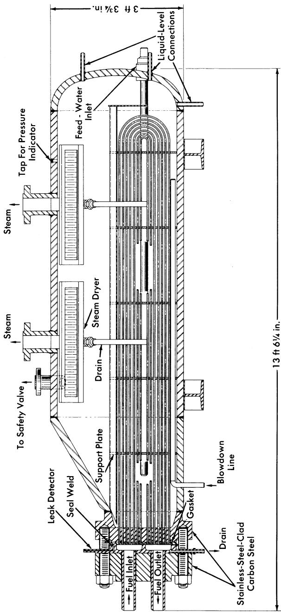  
FIG. 8-5. The HRE-2 main heat exchanger, fabricated by Foster-Wheeler Corporation.

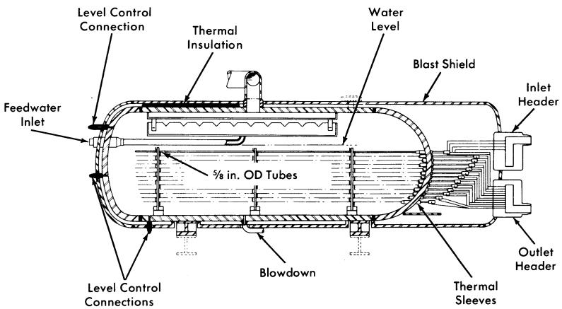  
FIG. 8-6. The HRE-2 spare heat exchanger, fabricated by Babcock & Wilcox Company.

The tube-to-tube-sheet joint is the most damage-sensitive portion of the steam generator. The primary side is subject to corrosive fuels, and the secondary side is subject to crevice corrosion and stress-corrosion cracking. Primary-side corrosion is controlled satisfactorily by maintaining velocities below 15 fps and minimizing high-velocity turbulence in the headers. Secondary-side corrosion is limited by strict control of boiler-water chemistry, particularly chloride content. One method which has been proposed for eliminating the stress-corrosion problem is the use of composite tubing such as stainless steel-Inconel, where the two materials are exposed only to fuel solution and boiler water, respectively.

Another problem in the operation of steam generators in a radioactive environment is the generation of radiolytic oxygen in the boiler water. This oxygen is stripped very rapidly by the steam, which contains about 2 ppm of oxygen. Hydrogen is released at the same time. The corrosivity of this mixture is not yet known, but it can be controlled by the use of inhibitors and by proper selection of materials for use in thin metal sections where pitting attack is undesirable.

HRE-2 spare steam generator. The steam generator shown in Fig. 8-6 was constructed as a possible replacement in case of failure of an HRE-2 steam generator. Although the over-all geometry of this unit, fabricated by the Babcock & Wilcox Company, conforms to the space requirements of the present steam generators, the design was changed to minimize the possibility of stress-corrosion cracking of the tubes on the shell side by eliminating crevices in contact with boiler water.

The steam generator contains eighty-eight 5/8-in.-OD, 0.095-in.-thick, type-347 stainless-steel tubes. The tubes have multiple U-bends to provide

the required length for heat-transfer surface. Each tube is brought out through the shell of the exchanger, and then all the tubes are collected in the inlet and outlet headers. Thermal sleeves are utilized at every connection of the stainless tubes to the carbon-steel shell wall. Their function is to prevent high thermal stresses in the tubes by distributing the temperature gradient between shell and tubes along the length of the thermal sleeves. The normal crevice between tubes and tube sheet, which is the site of possible corrosion failures, is eliminated. Each sleeve consists of an austenitic type-347 stainless-steel section which is welded to the tube on one end and to a carbon-steel section of the sleeve on the other. The carbon-steel sleeve is then welded to the carbon-steel shell to seal the secondary side. Only austenitic type-347 stainless steel is exposed to fuel solution.

Slurry steam generators. The mechanical design of heat exchangers for slurry service should not differ greatly from that for solution service. However, the design must assure that

(1) The pressure drop across all tubes is sufficient to maintain the slurry in suspension.   
(2) The headers have no stagnant regions where sediment can accumulate.   
(3) The tube-sheet joints are sufficiently smooth to prevent fretting corrosion by the slurry.   
(4) The headers and tubes drain freely.

From the heat-transfer relationships for Bingham plastic slurries, described in Article 4-4.5, it is evident that for optimum design of steam generators the flow of slurry through the tubes should be turbulent.

Large heat exchangers. The Foster Wheeler Corporation has prepared preliminary designs of 50- and 300-Mw heat exchangers [19]. Both single-drum integral units and units with separate steam drums were considered in the 50-Mw size; only two-drum units were considered in the 300-Mw size. Two-drum units, in general, give operational characteristics superior to those of integral units, but require more shielded volume and reactor space for installation. The two-drum unit has more stable steam generation at power and provides greater assurance of high steam quality. The major problems introduced by increasing size are higher tube-sheet thermal stress and increased difficulty in the manufacture of large forcings.

The 50-Mw design employs approximately 2200 tubes 3/8 in. in diameter (5960 ft² of heat-transfer area); the 300-Mw design uses approximately 11,400 tubes of the same size (32,000 ft²). Most of the designs have stainless steel clad on steel for tube sheets and heads, and steel for steam shells.

8-2.4 Pressurizers. A pressurizer is required in an aqueous fuel system to provide (1) sufficiently high pressures to reduce bubble formation and

cavitation in the circulating stream, (2) reactor safety by limiting the pressure rise accompanying a sudden increase in reactivity, and (3) a surge chamber for relief of volume changes.

Three general methods of pressurizing have been used in test loops and experimental reactors:

(1) Steam pressurization, such as is used in the HRE-2, where liquid in the pressurizer is maintained at a higher temperature, hence a higher vapor pressure, than that of the circulating system.   
(2) Gas pressurization, where liquid in the pressurizer is at the same temperature as the circulating system but excess gas is added to the vapor above it; if the pressurizing gas is free to diffuse into the circulating liquid, it reduces the solubility of radiolytic deuterium and enhances bubble formation.   
(3) Mechanical pressurization, where pressure is maintained with a pump and relief valve; this system is most satisfactory except that it is difficult to relieve sudden large volume changes following a reactivity change. This system therefore has been limited to nonnuclear test loops.

Solution pressurizers. Solution steam pressurizers must satisfy rather strict chemical criteria. Stainless-steel surfaces in contact with solutions must not exceed temperatures at which heavy-liquid-phase solutions form, giving rise to rapid corrosion [20]. Undesirable reduction of uranium must be avoided by the presence of some dissolved oxygen. Undesirable hydrolysis of uranyl ion must be avoided by control of the chemistry and temperature in pressurizer solutions [21]. The vapor-phase concentration of deuterium should be maintained below the explosive limit. One solution to these problems, used in the HRE-2, is the generation of steam from distilled water rather than from fuel solution. Another solution is the boiling of solutions in corrosion-resistant titanium. A third solution is the use of fission-product heating rather than external heating to reach the desired temperature.

Gas pressurizers using $\mathrm{O}_2$ gas are attractive from the solution-stability standpoint. Care must be exercised to prevent excessive amounts of dissolved oxygen appearing as bubbles in the circulating reactor stream. This can be accomplished either by continuous letdown of fuel solution or by use of a mixed steam-gas pressurizer where gas supplies only a portion of the desired overpressure.

Heat may be supplied to pressurizers by several methods. Electrical heating of pipes, used in the HRE-2, is very convenient but makes control of surface temperature difficult. Heating media such as steam, Dowtherm, liquid metals, etc., simplify the temperature-control problem but introduce costly auxiliaries. Fission-product heating is simple but rather difficult to regulate. Since the heating problem is so complex, selection of an optimum system for a specific application is quite difficult.

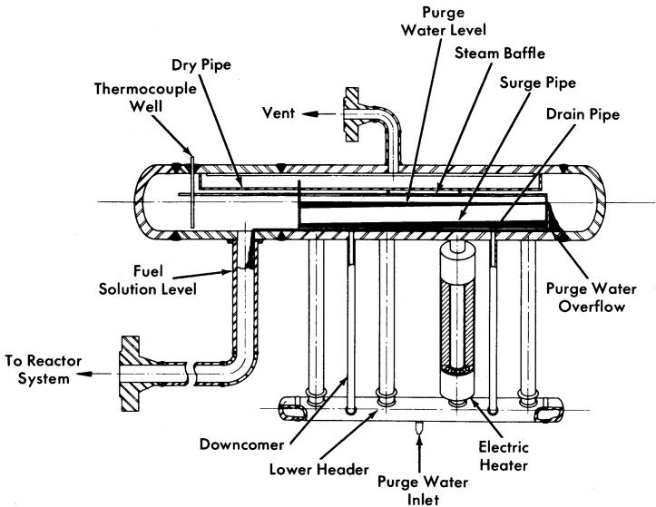  
FIG. 8-7. HRE-2 pressurizer.

Deuterium concentration may be controlled by designing the pressurizer in a manner which makes buildup of gas improbable, by contacting the vapor with solid or solution catalyst, or by venting.

HRE-2 pressurizer. Several design configurations were studied for steam-pressurizing the HRE-2 core system [22]. Both an integral type unit (Fig. 8-7) incorporating a steam generator and fuel surge volume within the same vessel, and a two-unit system utilizing separate steam-generator and surge-volume vessels were considered. The basis of both systems was the vaporization of a stream of "clean" purge water, pumped from the reactor low-pressure system, to obtain the required steam over-pressure.

The integral unit was chosen because of its simpler design and its ability to maintain a very low dissolved-solids concentration in the boiling water. Approximately $60\%$ of the purge water overflows and $40\%$ is vaporized.

In determining the internal configuration of the unit, it was necessary to establish a second basic design criterion. Owing to the nature of the system selected, continuous operation of the purge pump is essential to maintaining steam overpressure. Since this type of pump may fail, it was decided that sufficient water should be stored in the steam generator to maintain full operating pressure for at least 1 hr after a purge-pump failure. This appeared to be adequate time for either emergency repair of faults on the oil side of the purge-pump system or arrangement of an orderly shutdown.

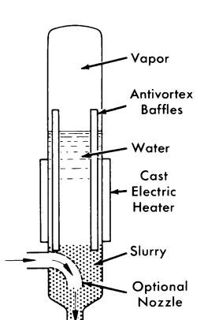  
(a)

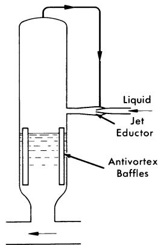  
(b)

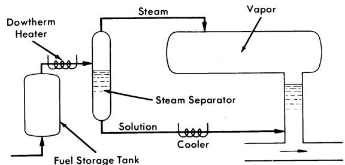  
(c)   
FIG. 8-8. Typical pressurizers. (a) Slurry steam or gas pressurizer. (b) Solution or slurry gas pressurizer. (c) Boiling-solution pressurizer.

A general description of the basic design and system operation follows: The low-pressure condensate, pumped to loop operating pressure by a diaphragm pump, passes through the letdown heat exchanger, where it is preheated to about $280^{\circ}\mathrm{C}$ and then enters the lower header of the steam generator, as shown in Fig. 8-7. Clamshell heaters are attached to four pipes inclined upward at 55 deg. Heat-load calculations indicate that $32\mathrm{kw}$ are required under rapid-startup load conditions; however, at steady state the heat load becomes $12.4\mathrm{kw}$ . Part of the purge water entering the heater legs (40 lb/hr) is vaporized to provide the desired steam overpressure. The remainder enters a storage pool in the main pressurizer drum. Natural recirculation of this water occurs through two downcomers.

The storage-pool level is maintained constant by allowing excess purge water to be removed through a series of 1/8-in. orifice holes located in the end plate of the steam generator. A 1/2-in. hole centered 5/8 in. above the orifice holes is provided as an overflow in case the orifice holes become plugged. A method of increasing the surge volume, without changing the

storage pool level, is to insert a pipe from the surge chamber through the storage pool.

A single pipe connects the pressurizer surge chamber to the main core loop. Liquid level in this pipe is maintained at a point about 10 in. below the inside diameter of the pressurizer drum by a liquid-level controller.

The clamshell heaters are carefully machined to fit the heater pipes and strongly clamped to promote contact. There are eight separate Calrod heaters in each clamshell, so that failure of a few heater elements will not affect the pressurizer greatly.

Vapor-phase deuterium is kept under control in that during normal operation it has no way to enter the pressurizer. If a small amount of gas does enter the pressurizer it will be dissolved in purge water overflowing into the reactor system. A large amount of gas would be vented.

Slurry pressurizers. The physical problems of slurry pressurizers are similar to those of solution pressurizers. The chemical problems are fortunately not present. The pressurizer may be designed to promote settling of solids so that pure supernatant water is available as a working fluid. It is necessary, however, that the pressurizer be designed to prevent accumulation of cakes or sludges. This is usually accomplished by flowing all or part of the circulating stream through the bottom of the pressurizer. This must be done carefully in steam pressurizers to prevent mixing of cool circulating fluid with the heated pressurizer fluid above.

Typical pressurizer designs. Several pressurizer designs applicable to test systems or reactors are illustrated in Fig. 8-8.

In the slurry steam or gas pressurizer (a) slurry at circulating temperature sweeps the bottom of the pressurizer tank, preventing the formation of cakes. Two nozzle arrangements are shown. The baffles are used to minimize turbulence and mixing in the system.

In the solution or slurry gas pressurizer (b) a jet is used to contact fuel, which contains a liquid-phase catalyst, with pressurizer vapor. This maintains the vapor at a low $\mathbf{D}_2$ concentration. The high-velocity regions in this system should be constructed of special wear-resistant inserts such as titanium or zirconium.

The boiling-solution pressurizer (c) has a fuel storage tank where solution just out of the reactor is heated by its own fission-product decay and dissolved $\mathrm{D}_2$ recombines nearly quantitatively. Additional heating is supplied, if necessary, by condensing Dowtherm. The mixture of steam and fuel solution is separated; the steam flows into the pressurizer and the fuel is cooled to a chemically acceptable temperature before re-entering the circulating system. The fuel storage tank, Dowtherm heater, steam separator, and solution cooler are made of titanium. High-strength alloy Ti-110-AT is preferred to commercially pure titanium in order to increase the strength of these parts.

8-2.5 Piping and welded joints. The various codes [23] dealing with pressure piping have proved very satisfactory for determining the strength required for reactor piping. Pipes are sized on the basis of experimentally determined maximum velocities for low corrosion and/or erosion rates. The austenitic stainless steels are used for most piping applications.

Because of the fact that the piping system of a homogeneous reactor must be absolutely leaktight throughout its service life, care is exercised in selecting pipe of the highest obtainable quality. The chemical composition and corrosion resistance are checked. Rigid cleanliness is maintained during fabrication to prevent undesirable contaminants.

The design of solution piping systems must eliminate stagnant lines where oxygen depletion may cause solution instability and plugging. Slurry piping systems should be designed to prevent settling, which can cause plugging or make decontamination very difficult.

Piping layouts. In laying out the piping system for an aqueous-fuel homogeneous reactor, sufficient flexibility must be incorporated in the system to absorb thermal expansions without creating excessive stresses in the pipe wall, and to avoid high nozzle reaction loads at the equipment.

Equipment must be located where it will be accessible for maintenance, and the piping adjacent to such equipment must be placed so that it can be disconnected and reassembled remotely. These requirements may result in a piping system of excessive length with resultant high fluid holdup and pressure drop. The final design, therefore, must be a compromise between the various conflicting requirements of flexibility, maintenance, holdup, and pressure loss in the line.

Methods of piping analysis and evaluation as presented by Hanson and Jahsman [24] may be used for analyzing the piping layouts in homogeneous reactor systems. An application of the Kellogg method [25] was used by Lundin [26] to analyze stresses in the HRE-2 system. Specific rules on how to absorb the effects of thermal expansion of a piping system by the provision of a flexible layout are given in the Code for Pressure Piping, ASA B31.1-1942, Sec. 6.

Welded joints. Welded joints are recommended in preference to mechanical joints for reactor piping. Welds are made approximately equal in strength and corrosion resistance to the base metal. Pipe and fittings are designed to utilize full-penetration butt welds throughout the piping system. Welds that are to contact process fluids are inspected thoroughly to ensure that no crevices are present and that penetration is complete. Such defects could result in crevice corrosion leading to leaks.

The first 1/8 in. on the process side is deposited by use of bare-wire filler metal and inert tungsten-arc welding techniques. The ferrite content of the deposit is controlled to minimize the possibility of cracking. This deposit is inspected visually and with penetrant. If the weld thus far contains

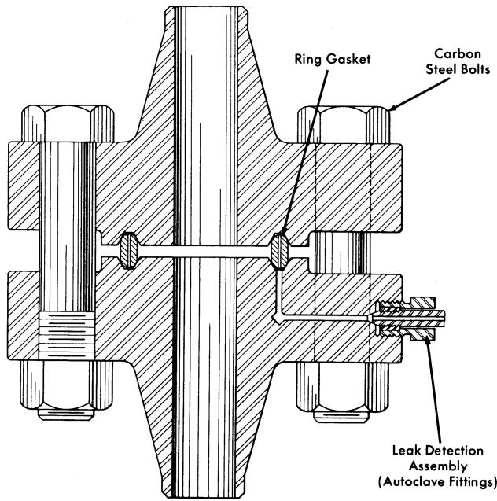  
FIG. 8-9. HRE-2 ring-joint flange, showing leak-detector connection.

no visible defects, it is radiographed to ensure freedom from all defects. The balance of the weld is then deposited from either bare or coated wire. The completed weld is inspected again with dye penetrant and radiography. A small number of inclusions or porosity are permitted in the final layers which contact air.

Although welding techniques for clean piping are very satisfactory, remote-welding procedures for repair of contaminated reactor systems are only in the development stage. It is desirable to develop methods for remote cutting, positioning, welding, and inspection of joints, particularly in large pipes. Possession of these techniques would greatly increase the maintainability of circulating-fuel reactors.

8-2.6 Flange closures. Piping flanges. Because a practical machine for remotely rewelding pipe has not yet been developed, equipment which must be removable from the system for replacement or maintenance must be connected to the system with mechanical joints. Several types of mechanical joints applicable to pressure systems have been described in the literature, but most have been eliminated from consideration for homogeneous reactor service because their reliability with respect to leak-tightness following thermal cycling has not been adequately demonstrated.

The ring-joint flange (Fig. 8-9) incorporating American Standard

welding-neck flanges and ring-joint gaskets, as described in ASA Standard B16.20-1956, was used in the HRE-2 and is considered to be the most reliable closure for reactor piping systems to date. Since there are two sealing surfaces in this type of joint, it is ideal for leak-detector purge systems, described below, which prevent even minute leakage of contaminated fluids into the shield.

To enforce proper dimensions for HRE-2 gaskets and grooves, special master rings and grooves were manufactured to measure dimensions to $\pm 0.0001$ in. Although ASA tolerances of $\pm 0.006$ in. on pitch diameter are acceptable, it was convenient to obtain manufacturing tolerances of $\pm 0.001$ in. by using these gages and masters. The application of these tolerances has permitted greater accuracy in fit-up and assures uniform contact between the ring-joint gasket and the grooves of both mating flanges. Soft oval or octagonal type-304 ELC stainless-steel rings are used against the harder type-347 stainless-steel grooves. Typical leakage experienced in a 4-in. 2500-lb flange is $6 \times 10^{-5} \mathrm{~g}$ of water per day at service conditions.

The bolting of flanged joints presents a serious problem because the bolts, under thermal cycling, loosen up after only a very few cycles, thus threatening the integrity of the joint. Whereas the flange bolts of a conventional pressure piping system may be retightened after a few cycles, this becomes impractical in a homogeneous reactor system after the reactor has gone critical. In the HRE-2 it was found desirable to initially stress the low-alloy steel flange bolts to an average loading of 45,000 psi, as indicated by a torque wrench. After about three thermal cycles this bolt loading fell to an asymptotic value of approximately 30,000 psi, which was found to be adequate to maintain the integrity of the joint indefinitely throughout further operations; no retightening of the bolts was found to be necessary [27]. Some deformation of flange grooves and ring-joint gaskets was found as a result of these high loadings. However, with the use of flanges and rings machined to the close tolerances noted above, there was no leakage even after test joints had been opened and reassembled ten to a hundred times.

Although bolt torque measurements are usually considered very approximate indications of load, special techniques were developed which gave reproducibility to $\pm 10\%$ . Bolts were lubricated with molybdenum sulfide, and nuts were tightened several times against test blocks which approximated the flange spacing. Nut-and-bolt combinations were accepted for use after reproducible compressive stresses were produced in the test blocks for given torques.

Bolts may be loaded more precisely with the use of pin extensometers. In this technique, a pin is spot-welded into one end of a hole drilled axially through the bolt centerline. A depth gage measures quite precisely the

relative strain between the loaded bolt and the unloaded pin. Since both pin and bolt are at the same temperature, thermal effects are compensated automatically. Extensometers are inconvenient for contaminated maintenance, however.

Because mechanical joints may be expected to leak, some provision must be made to supply pressure greater than reactor system pressure to the undersides of the ring-joint grooves. By this means, leaks may be detected by observations of a drop in pressure in the auxiliary system. At the same time inleakage of a nonradioactive fluid to the reactor system in the event of a leak prevents radioactive spills. In the case of the HRE-2, $\mathrm{D}_2\mathrm{O}$ is supplied to the sealed annuli formed in the gasket grooves at a pressure approximately 500 psi greater than that in the reactor system. A hole is drilled through one flange at each pipe joint to the annulus of the ring groove; the ring-joint gasket is also drilled to interconnect the annuli of the two flanges. Heavy-wall, $1/4$ -in.-OD stainless-steel tubing connects each flange pair with a header and pressurizer in the control area. ORNL experience has indicated that water is more satisfactory as a leak-detector fluid than gas, because its pressure change is a more sensitive leak indication and because its surface tension reduces the magnitude of small leaks.

Vickers-Anderson joints.* From a remote-maintenance point of view, a flange requiring as few bolts as possible is desirable. Adaptation of the Vickers-Anderson type closure appears to be a possible approach to the problem, since it obtains uniform circumferential tightening with only two bolts. In this type of joint, two split clamshell pieces are pressed together with the two bolts. The clamshells bear on conical flange faces which transform the tangential bolt forces into forces parallel with the pipe centerline.

Usually a pressure-seal type of gasket is used with the above type of closure because it is difficult to exert sufficient axial load to seat a ring-joint gasket. Unfortunately, the present leak-detector concept is not applicable to such a gasket. Therefore, to permit use of Vickers-Anderson joints in a reactor, either a new gasket or a different leak-detector concept would have to be developed.

Bi-metallic joints. A two-region reactor may have the problem of obtaining a leaktight low differential pressure mechanical joint between the two regions. In the HRE-2, the regions are separated by a zirconium vessel that must be joined to stainless-steel piping. At this time, welding and brazing techniques for joining the two materials are unsatisfactory. Conventional flanges are not satisfactory because of the large difference in thermal coefficients of expansion for the two materials. A solution to the problem for the HRE-2 was obtained by using a titanium cylindrical

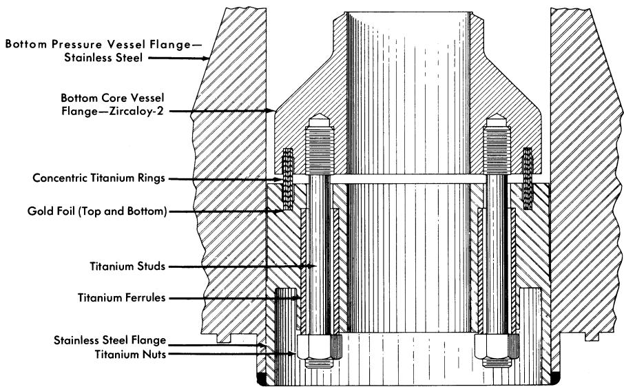  
FIG. 8-10. Zircaloy-2 type-347 stainless steel transition joint for HRE-2 pressure vessel.

sleeve gasket with gold inserts for sealing, shown in Fig. 8-10. The gasket, which consists of four concentric rings, flexes radially to absorb thermal expansion. The gold-capped surfaces of the gasket that make the seal are not permitted to rotate or slide relative to the flanges. The joint is loaded with titanium-alloy bolts.

A ring joint for connecting stainless steel and titanium piping at temperatures up to $650^{\circ}\mathrm{F}$ has also been developed [28] for possible use with titanium letdown heat exchanger in the HRE-2. The different thermal coefficients of expansion of the two materials are bridged by use of a stainless-steel clad carbon-steel flange in the stainless half of the joint. An HRE type of leak detector is placed in the clad flange.

8-2.7 Gas separators. The problem of removing relatively small amounts of gas from a stream of liquid is usually solved by using a settling tank which permits bubbles of gas to rise to a free surface. In applications in which the amount of liquid holdup is critical, this approach has the serious drawback of requiring too much liquid. However, a chamber which imparts centrifugal force to the liquid and "forces" the gas to a free surface before the liquid leaves the chamber offers a possible solution. Of the several types of separators which can be used, one of the most promising is the pipeline or axial gas separator (Fig. 8-11) used in the HRE-2.

The pipeline gas separator consists of stationary vanes or a volute, followed by a section of pipe in which gas is centrifuged into a void which forms at the pipe axis, whence it is removed. The energy of rotation is

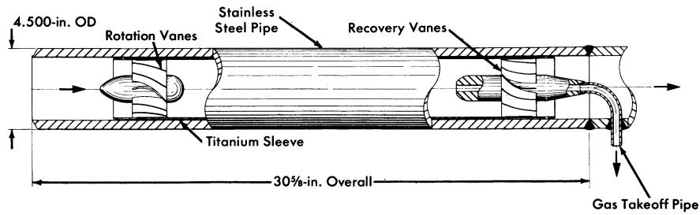  
FIG. 8-11. HRE-2 gas separator.

partially recovered with vanes or a volute at the discharge end of the separator.

A model of the gas separator was built and runs were made to test vanes and volutes of different types for energy conversion and recovery, and for gas-removal efficiency [29]. It was found possible to control the size of the gas void by design of the takeoff nozzle. A separator utilizing vanes was selected for the HRE-2 on the basis of ease of fabrication and because high-efficiency recovery vanes could be designed. Titanium was used as a construction material because of its excellent corrosion resistance under highly turbulent conditions.

The design criteria for vane-type gas separators are discussed in the following paragraphs.

Pressure distribution. The pressure drop of the liquid stream through a well-designed gas separator can be approximated by assuming an efficiency of conversion of pressure to velocity in the rotation system of $90\%$ and a recovery efficiency of $80\%$ . Frictional drop in the vortex will be about three times that which would be predicted if the absolute velocity of the vortex near the wall were in axial flow. The $\Delta p$ across the HRE-2 separator is five inlet-velocity heads or 5 psi.

Length of separator. Length is usually selected to be that necessary to bring a bubble from the periphery into the central void during the time the bubble is moving axially through the separator. For the HRE-2 separator about two pipe diameters are required, but for larger separators the length-to-diameter ratio increases.

Vortex stability. The degree of rotation for stable operation is such that the centrifugal forces on a bubble are greater than the gravitational forces. The dimensionless group expressing the ratio of these forces is $V_{t} / \sqrt{gr}$ , where $V_{t}$ is tangential velocity (ft/sec), $g$ is 32.2 ft/sec², and $r$ is radius (ft). For a stable vortex this ratio must be greater than 1; for best results it should be greater than 4.

Entrainment. The minimum amount of entrainment for a given separator is determined by the void stability and the geometry of the gas takeoff

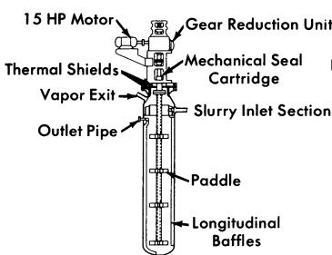  
(a)

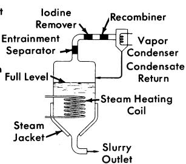  
(b)

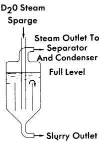  
(c)

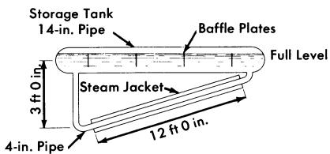  
(d)   
FIG. 8-12. Fuel storage tanks. (a) Mechanically agitated tank (Westinghouse). (b) Boiling tank. (c) Sparged tank. (d) HRE-2 storage tank-evaporator.

nozzle. It is advantageous to have a high stability number. The nozzle should be paraboloid facing the stream and have a small takeoff port. Tests of the HRE-2 separator indicate that entrainment can be limited to 0.1 gpm at liquid and gas throughputs of 400 gpm and 4 gpm, respectively. Tests of a 5000-gpm separator with $2\%$ gas gave 1 gpm of liquid entrainment, minimum.

Gas-removal efficiency. One hundred percent removal of large gas bubbles has been achieved in test models. Removal of very small bubbles is considerably less efficient for gas separators of normal length.

Although gas has been removed from slurries in an axial separator, the design criteria are not known. The primary difficulty lies in the interaction between small solid particles and bubbles, which may foam. The rates of bubble rise in slurries have not been measured.

# 8-3. SUPPORTING-SYSTEM COMPONENTS

8-3.1 Storage tanks. Solution tank-evaporator. In the HRE-2 the storage tank system has a threefold purpose: (a) it acts as a storage tank for fuel solution during shutdowns and after removal from the high-pressure system during the letdown of gaseous decomposition and fission products, and after emergency dumping; (b) it acts as a generator of diluent steam

to lower the radiolytic $\mathrm{D}_2$ and $\mathrm{O}_2$ concentration to a nonexplosive mixture prior to recombination; and (c) it serves as a purge-water generator.

The storage tank-evaporator is designed to furnish the required amount of steam diluent and purge water and also to agitate and mix the solution stored in the tank. The HRE-2 evaporator is shown in Fig. 8-12(d).

To keep the fuel solution well mixed, it was desired that the solution be agitated by recirculation through the tank at a high rate. The recirculation rate is such that the frictional loss in the vaporizing circuit is equal to the hydrostatic driving force on the vaporizing fluid. For the HRE-2 evaporator, a ratio of 176 lb of liquid circulating for every pound of steam generated was obtained [30].

The circulation of liquid through this type of long horizontal tank was found to set up waves which interfered with vapor withdrawal. This interference was minimized by the use of baffle plates, as shown in Fig. 8-12(d).

Slurry storage tanks.* Three approaches are being pursued in the development of slurry drain and storage tanks for reactor use: mechanically agitated tanks, agitation by steam-sparging the tank, and agitation by surface boiling and consequent vapor transport through the tank.

The development of a mechanically agitated tank accepts the problems involved in obtaining the necessary reactor-grade mechanical components of motor, seals, drive shaft, bearings, and agitators. These are related to the circulating-pump problems which have been discussed previously. A conceptual design of a mechanically agitated tank proposed by Westinghouse [31] is shown in Fig. 8-12(a).

Agitation by addition of steam and agitation by addition of heat are essentially similar, since both rely upon the turbulence created by vapor transport to keep solids suspended.

Experimental investigations [32,33] of vapor transport through gas-liquid mixtures have shown that the ratio of vapor to liquid volume may be related to the vapor transport rate in tanks larger than 6 in. in diameter by the relation:

$$
V _ {p} = 5 \left(\frac {f _ {V}}{f _ {s}}\right) ^ {1. 4 1 5}
$$

where $V_{p} =$ superficial vapor velocity in ft/sec, $f_{V} =$ volume fraction of vapor, and $f_{s} =$ volume fraction of slurry. This equation was found applicable for slurries when $V_{p}$ was greater than 0.1 ft/sec and for water when $V_{p}$ was greater than 0.6 ft/sec. The slurries were suspended at these vapor velocities.

Conceptual tank designs based on agitation by vapor transport are shown in Fig. 8-12 (b) and (c).

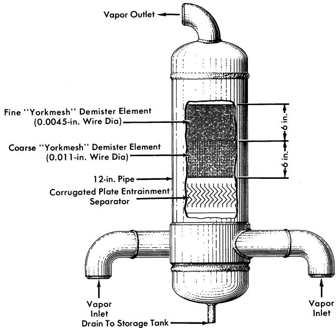  
FIG. 8-13. HRE-2 entrainment separator.

8-3.2 Entrainment separator. In conjunction with the storage tank-evaporators, an efficient entrainment separator is required to keep the purity of the condensate at the highest possible level. The entrainment separator must be designed to function well during normal operation and also during the emergency dumping operation of the reactor. From the results of a literature survey and from experimental work, the separator in Fig. 8-13 was designed for the HRE-2 [34].

The HRE-2 design incorporates three modes of entrainment removal: centrifugal separation, corrugated plates, and wire-mesh demister elements. The centrifugal-flow inlet and corrugated plates precede the wire mesh and remove the main portion of the liquid and the larger particles of entrained moisture in the letdown from the gas separator. The wire-mesh demister has a high efficiency for entrainment removal with a very low pressure drop, and is used as the final separator stage. The wire mesh also serves to keep the uranium reaching the recombiner below the maximum desirable limit of 1 ppm.

8-3.3 Recombiners. For safety as well as economic reasons, it is desirable to recombine, either at high pressure or at low pressure, the $\mathbf{D}_2$ and $\mathrm{O}_2$ which are formed by the decomposition of water in the fuel solution. In the HRE-2, only low-pressure recombination has been used effectively

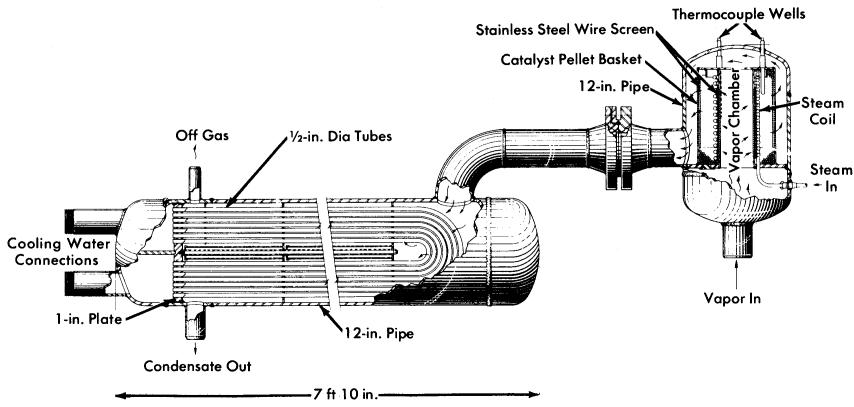  
FIG. 8-14. HRE-2 recombiner and condenser. The recombiner bed is steam heated to keep the surface dry at all times.

for external recombination. The two most promising methods of external recombination are the use of flame and catalytic recombiners.

For catalytic combination of $\mathrm{D}_2$ and $\mathrm{O}_2$ , platinum black has proved to be the most satisfactory catalyst. It has been supported on alumina pellets and on stainless-steel wire mesh. The platinum adheres better to the alumina pellets, but the wire mesh is less liable to mechanical damage.

Design of the catalytic recombiners. The space-velocity method is a very convenient basis for recombiner design. Space velocity is defined as the cubic feet of gas-vapor mixture fed (STP) per cubic foot of catalyst bed per hour. The maximum allowable space velocity for $100\%$ recombination is approximately $4.2 \times 10^{5} \mathrm{hr}^{-1}$ at atmospheric pressure. However, the packed bed should be shaped to ensure against channeling and to get a low pressure drop. The HRE-2 low-pressure recombiner [35] was designed by the space-velocity method with a safety factor of ten. To ensure against channeling and to get as low a pressure drop as possible, an annular cylindrical bed was designed with a 4-in. inside diameter and $9\frac{1}{2}$ -in. outside diameter (Fig. 8-14).

The controlling mechanisms for catalytic reaction rates are outlined by Hougen and Watson [36]. One of the important steps is the mass transfer of the reactant gases to the catalytic surface. Most of the homogeneous-reactor recombination work at ORNL has been done in the range controlled by mass transfer, at temperatures of 250 to $500^{\circ}\mathrm{C}$ .

However, experiments conducted at 50 psi indicated [37] mass-transfer coefficients lower by a factor of three than the expected values based on established mass-transfer correlations. This is explained on the basis of poor bed configuration, channeling, and entrance and exit effects. Tests run at 500 and 1000 psi have shown values about $60\%$ of the theoretical [38]. Standard mass-transfer calculations, with a suitable safety factor,

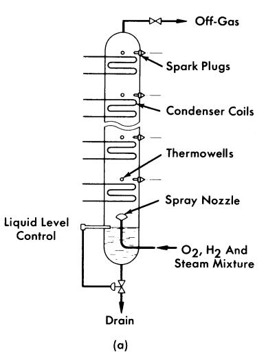

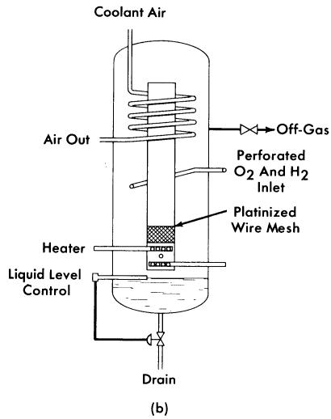  
FIG. 8-15. (a) Experimental flame recombiner designed to operate over wide ranges of gas input. (b) Experimental natural-circulation recombiner used to recombine HRE-2 off-gas after shutdown.

are believed to be the most accurate method of designing catalytic recombiners.

Flame recombiners. In a flame recombiner, the $\mathrm{H}_{2}$ (or $\mathrm{D}_{2}$ ) and $\mathrm{O}_{2}$ are actually ignited and burned to form water. The HRE-1 recombiner was of this type. It consisted of a combustion chamber of 10-in. pipe $3\frac{1}{2}$ ft long jacketed by a 12-in. pipe through which cooling water was circulated. The combustible mixture of $\mathrm{H}_{2}$ and $\mathrm{O}_{2}$ was introduced through a many-holed nozzle upon which a spark impinged from two spark plugs located along the periphery of the nozzle. The spark impulse was produced by a magnet, with an ignition transformer on standby. The cooling water removed $70\%$ of the heat of combustion at the design capacity of 15 scfm of $2\mathrm{H}_{2} + \mathrm{O}_{2}$ . The remainder of the heat was removed in the after-condenser. The condensed products of combustion were returned by gravity to the dump tanks, and the excess $\mathrm{O}_{2}$ and fission-product gases were passed into the off-gas system to the cold traps and charcoal adsorbers.

At low flow rates the flame burned too close to the nozzle, resulting in overheating and flashbacks. To prevent flashbacks at low flows, a steamer pot ahead of the flame recombiner added 2 to 3 scfm of steam to the gas stream.

In developing flame recombiners to obtain an explosion-proof automatic load-adjusting unit, the multiple spark-plug model shown schematically in Fig. 8-15(a) was devised [39]. As the steam-gas mixture traveled up past the condenser coils, the mixture eventually lost enough steam to become

combustible. The location at which the mixture became combustible depended on the input concentration of gas.

Natural-circulation recombiner. For some applications it may be desirable to have a catalytic recombiner which will operate satisfactorily without a pump or evaporator to circulate diluent to keep the gases below the explosive limit. The natural-circulation recombiner [40] was developed for such uses (Fig. 8-15b). Electric heaters or steam coils installed below the catalyst start the circulation of the diluent and keep the catalyst dry. A cooling coil located in the annular space around the top of the chimney completes the convective driving circuit.

High-pressure recombination. The use of high-pressure recombination in homogeneous reactors would eliminate the need for continuous letdown of the radiolytic gases and continuous feed-pump operation. To investigate the possibilities of high-pressure recombination, tests [41] were made with a loop built at ORNL.

Recombination rates were quite satisfactory. However, stress-corrosion cracking was a significant problem in operating the stainless-steel loop. Originally, the chloride content of the loop was high (50 ppm) and was thought to be the cause of the stress corrosion. However, after the chloride concentration was lowered to less than 1 ppm, stress corrosion still occurred in the superheated region of the loop. It was established that entrained caustic was a contributing factor.

The cracking problem was solved by substitution of Inconel for austenitic steel; this material would be suitable in a slurry reactor system but not in a uranyl-sulfate system. One of the ferritic stainless steels might be suitable for the latter application.

8-3.4 Condenser. A condenser is required in aqueous low-pressure systems (1) to condense the steam produced in the storage tank-evaporator which is a source of distilled water, (2) to remove the heat of recombination, and (3) to cool the reactor contents during and after an emergency drain. The surface-area requirements are usually determined on the basis of item (3).

All-stainless-steel shell-and-tube condensers of conventional design have been used in this application. The quality of construction from the standpoint of leaktightness should approach that of the main steam generators. However, since the service conditions in the condenser are relatively mild, its life should be indefinite if it passes acceptance tests. The condenser used in the HRE-2 is illustrated in Fig. 8-14.

8-3.5 Cold traps.* Cold traps are usually required on fission-product off-gas lines from homogeneous reactors to conserve $\mathrm{D}_2\mathrm{O}$ and to dry gases

prior to adsorption in charcoal beds. Exit gas temperatures should be between $-10$ and $-30^{\circ}\mathrm{F}$ . Typical evaporating refrigerant temperature in the associated primary refrigeration system should be about $-50$ to $-100^{\circ}\mathrm{F}$ .

The cold traps may be refrigerated either by a direct-expansion system or by circulation of a chilled secondary fluid. The secondary type system offers advantages of the elimination of the expansion valve from the shielded area, and simpler defrosting procedures when using a warm supply of the secondary refrigerant. Use of a primary system eliminates the heat exchanger and circulating pump, and the sacrifice in about $10^{\circ}\mathrm{F}$ temperature difference needed in the heat exchanger, thus affording slightly better coefficients of performance for the refrigeration system.

The HRE-2 cold traps are double-pipe stainless-steel heat exchangers. Flow of refrigerant is countercurrent, with the traps pitched to drain the $\mathrm{D}_2\mathrm{O}$ when defrosting. The insulation is in the form of sealed cans of Santo-Cel $(\mathrm{SiO}_2)$ fitted around the traps, this material having markedly better resistance to radiation damage than the more commonly used low-temperature insulating materials. Cold traps are used in pairs so that icing and defrosting can be conducted simultaneously.

The major heat load on the HRE-2 cold traps was estimated to be the internal heat generation due to radioactivity in the off-gases. For the double-pipe design selected, increasing the heat-transfer surface also increases the mass of metal and the heat generation, so that the size must be optimized. Over-all heat-transfer coefficients in the HRE-2 cold traps, using Amsco as the secondary refrigerant, were calculated to be in the range of 30 to 35 Btu/(hr)(ft²)(°F). Velocities of the gas stream were kept quite low; less than 5 bpm. Design velocities of the chilled coolant through the annulus were from 1 to 2 fps.

8-3.6 Charcoal adsorbers. The oxygen off-gas from a homogeneous reactor contains the krypton and xenon fission products which are let down with the radiolytic gas. It is desired to discharge the oxygen to atmosphere, but the permissible rare-gas discharge is limited by health physics considerations. Charcoal adsorbers are used to hold up krypton and xenon sufficiently to permit their decay to stable or slightly radioactive daughters.

The HRE-2 charcoal beds were designed [42] on the basis of adsorption equilibrium data of krypton and xenon from the literature, with a safety factor of six to compensate for lack of experimental data on the particular conditions. An HRE-2 bed to process $250~\mathrm{cc / min}$ of off-gas oxygen contains $13.3\mathrm{ft}^3$ of 8- to 14-mesh activated coconut charcoal. There are four such beds immersed in a water-cooled underground concrete tank. In the HRE-1, $13.9\mathrm{ft}^3$ of charcoal were used for a design flow rate of $470~\mathrm{cc / min}$ . The HRE-1 beds operated successfully.

A more complete treatment of charcoal-adsorber design is given by Anderson [43].

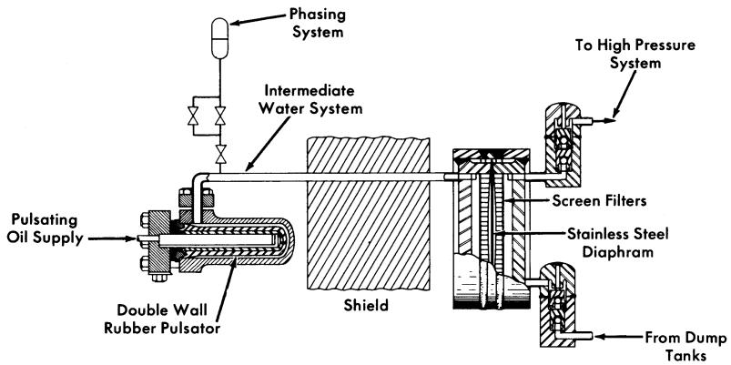  
FIG. 8-16. Sealed diaphragm feed pump with driving pulsator used to pump fluids from low pressure to the high-pressure system in HRE-2.

8-3.7 Feed pumps.* High-pressure low-capacity pumps are required to feed solutions, slurries, and water into aqueous homogeneous reactor systems. In the HRE-2, which operates at 2000 psi, the requirements are for from 0 to $1.5\mathrm{gpm}$ of fuel solution, $0.25\mathrm{gpm}$ of purge water to the pressurizer, and $0.1\mathrm{gpm}$ of purge water to the circulating pump.

The types of pumps which could possibly be made to meet these requirements are the piston or plunger pump, the multistage centrifugal pump, the turbine regenerative pump, and the hydraulically actuated diaphragm pump. The piston and plunger pumps are handicapped because most packing materials are subject to radiation damage and because there is no absolutely leakproof sliding seal. There is no known commercial centrifugal pump available in this high-head low-capacity range, and the development of such a pump appears difficult. The regenerative turbine pump has a more suitable head-capacity range, but again there is no existing multistage pump in the range desired. The hydraulically driven diaphragm pump, as shown in Fig. 8-16, was selected for the HRE-2 because it offers the following advantages:

(1) The pump head and check valves are of all-welded construction and are leakproof and maintenance-free for long periods of time.   
(2) The only moving parts inside the shield are the diaphragm and the check valves.   
(3) The drive mechanism is outside the shield, where conventional lubricants and maintenance techniques may be used.   
(4) The pump output is adjustable by changing the output of the drive unit.

(5) In the event of a diaphragm rupture, radioactive fluid is still retained within the piping system.

Subsequent development work has demonstrated that diaphragm pumps will operate satisfactorily for one year or more in this service [44-45].

Construction. The HRE-2 duplex feed pump consists of three main components: the drive unit, the pulsator assembly, and the diaphragm heads. The drive unit and pulsator assembly are commercial products built by Scott & Williams, Inc. The drive unit consists of a high-pressure positive-displacement oil pump and a slide valve which alternately supplies oil to one pulsator and then the other at 78 strokes/min. While one pulsator is being supplied with oil from the pump, the other is being vented back to the oil reservoir tank. During this venting period the elasticity of the rubber pulsator forces the oil back to the tank and provides the energy for the suction stroke of the diaphragm head. Reciprocating oil pumps are used to drive smaller purge pumps on the HRE-2. The oil pulses are transferred to the diaphragm head by the column of $\mathrm{D}_2\mathrm{O}$ filling the intermediate system (Fig. 8-16).

The diaphragm head consists of a stainless-steel diaphragm 0.031 in. thick operating between two heavy flanges which have carefully machined contoured surfaces $10\frac{3}{4}$ -in. in diameter and 0.10 in. deep forming the diaphragm cavity. The pumped fluid enters the pump through a 3/4-in. pipe, passes up through the screen tube, and oscillates in and out of the diaphragm cavity through rows of holes in the contoured surface of the flange. The driving and pumping flanges are identical except that the driving flange has only the top pipe connection, since the actuating column of $\mathrm{D}_2\mathrm{O}$ needs only to oscillate. The screen tube is self-cleaning, since the flow through it is oscillating. The two flanges are clamped rigidly together by means of heavy girth welds, which become highly stressed because of shrinkage during fabrication.

The pump is equipped with all-welded, double-ball, gravity-operated suction and discharge check valves. The 1-in. balls operate in close-fitting cages (0.010-in. diametral clearance) which maintain the alignment of the ball and seat and restrict the ball lift to 0.125 in.

Operation. The pump output can be varied from 0 to $2\mathrm{gpm}$ at 2000 psi discharge pressure by changing either speed or displacement of the drive. The pump performance is essentially independent of suction head and temperature so long as cavitation does not occur.

To obtain proper operation of the pump, the amount of water in the intermediate system between the rubber pulsator and the diaphragm must be adjusted to ensure that the diaphragm does not bottom solidly against either contoured face of the head. This procedure, called "phasing," is accomplished manually by adding or venting water as required through the phasing system shown in Fig. 8-16. For a specific pressure, there is a

fairly wide range of phasing in which the pump will operate properly, since only one-third of the displacement volume in the head is used. At 2000 psi, however, the compressibility of the drive and intermediate systems amounts to another third of the displacement volume of the head. This results in only a relatively narrow range of phasing in which the pump will operate properly under all conditions of pressure and capacity.

The volume between the check valves is large compared with the volume of the stroke, so that the pump is subject to gas-binding. An operational error or a leaking discharge check valve that permits oxygenated solution to flow back into the pump may inject sufficient gas so that the head will not resume pumping against a high discharge pressure. A method of venting the gas must therefore be provided.

Diaphragm development. The first heads used had a cavity 0.125 in. deep, a 0.019-in.-thick annealed stainless type-347 diaphragm, and had no screening. These diaphragms suffered early failure due to irregular contour machining and dents caused by the trapping of dirt particles between the contour face and the diaphragm. To reduce the over-all diaphragm stress level and to reduce or eliminate the localized stress risers, the contour depth was reduced to 0.010 in., the machining procedure was changed to produce a smooth, continuous contour, and 40-mesh screens were installed. These changes increased the average diaphragm life to about four and a half months. However, some failures occurred in as little as two months. An intensive program was initiated to develop a head that would function consistently for one year or more.

The first objective of the program was to reduce or eliminate stress risers caused by dirt particles. Substitution of 100-mesh screen tubes for the 40-mesh screens reduced denting observed on test diaphragms by an order of magnitude. A sintered stainless-steel porous tube with 20-micron openings is being evaluated at the present time in an experimental pump to reduce the problem further.

A second objective was to investigate possible improvements in contour in order to minimize diaphragm stress for the desired volumetric displacement. Theoretical and experimental stress analyses showed that the original contour was nearly optimum, and it was retained [46].

A third objective was to determine the nature of the diaphragm motion and improve it if necessary. A special spring-loaded magnetic instrument was built to indicate diaphragm position while operating. Three such indicators were installed in a standard head and recorded simultaneously on a fast multichannel instrument. It was observed that the diaphragm was displaced in a wave motion starting at the top of the head, producing a sharp bend at the bottom where most failures occurred. It was observed also that there was considerable flutter in the diaphragm, so that it was being flexed more frequently than anticipated. By increasing the thickness

of the diaphragm from 0.019 in. to 0.031 in., symmetrical deflections with less flutter were obtained. Changes in the drive system which reduced the noise level were effective in creating smoother diaphragm deflection. These changes were incorporated into later pumps.

The fourth point of the program involved determining the endurance limit of annealed 347 stainless steel and other possible diaphragm materials in fuel solution. A literature review indicated that in a corrosive environment there may be no endurance limit as such, but that the curve of stress versus number of cycles would continue its downward slope indefinitely. The literature also suggested that significant gains in endurance limit may be achieved by cold-working stainless steel, or by using a precipitation hardening steel such as Allegheny-Ludlum AM-350. Standard reverse bending sheet specimens of each material were operated at 2000 cycles/min in environments of air, distilled water, and fuel solution [47]. Surprisingly, it was found that hardened materials suffered a drastic reduction in endurance limit in fuel solution but not in water, whereas the annealed 347 stainless-steel endurance at $10^{7}$ cycles was 39,000, 36,000, and 34,000 psi, respectively, in air, water, and fuel. None of these media produce appreciable corrosive attack on any of the materials tested.

Check-valve materials. Stellar balls and seats have been operated in fuel solutions for more than 10,000 hr with no sign of damage. It was rather surprising when, during preoperational testing of the HRE-2, four sets of valves failed in oxygenated distilled water in about 500 hr. Further testing showed that preconditioning by operation in uranyl sulfate made Stellar suitable for oxygenated-water use. Armco 17-4 PH stainless steel was also demonstrated to be an excellent seat material in both water and uranyl sulfate.

HRE-2 fuel pumps now contain Stellar Star J balls and Stellar No. 3 seats. Check valves are pre-run in fuel solution before being welded to the pump heads. HRE-2 water pumps contain Stellar Star J balls and 17-4 PH seats.

All the standard metals have failed very quickly in check valves pumping $\mathrm{ThO_2}$ slurry to high pressure. However, some success has been achieved with aluminum oxide and other very hard ceramics.

Welding. Considerable difficulty has been experienced in the design of welds subject to cyclic pressure stresses. Extreme conservatism with regard to metal thickness is helpful in eliminating fatigue failure of welds. Nozzles welded to pump heads have heavy sections at the weld. Full-penetration welds are used throughout, and butt welds are used if possible. The inside surfaces of welds are machined smooth when they are accessible.

Slurry diaphragm pumps. Two methods of pumping slurry with the diaphragm pump are being tested. In the first, the check valves are located several feet below the head and connected thereto by a vertical pipe. By

sizing the vertical leg so as to maintain low oscillatory velocities, a stable slurry-water interface forms, permitting the diaphragm head to operate in relatively pure water while slurry pumps through the check valves. A venting system is necessary. Such a pump has been operated satisfactorily at low pressure and will be tested at high pressure.

The second method uses a diaphragm head having a contour in the driving flange, a recessed cavity in the pumping flange, and an arrangement that permits the diaphragm to operate only from the driving contour to center. This arrangement precludes the possibility of slurry being trapped between the diaphragm and contour, leading to undesirable diaphragm deflection patterns. Such a pump head has been built and will be tested

8-3.8 Valves.* Valves are key components in reactor systems, since they are the means by which process gas and liquid streams are controlled [48,49]. In the HRE-2 system, which has no control rods, temperature and reactivity are controlled by valves that control the concentration of the fuel solution, and the power is controlled by valves that control the rate of steam removal from the heat exchangers. "Dump" valves perform an emergency scram and normal drain function by controlling the flow of fuel solution to low-pressure storage tanks. Other valves perform pressure-control functions, allow noncondensable gases to be bled from the system, or are used to isolate equipment.

Actuators. The problem of radiation damage to hydraulic fluids, elastomers, or electrical insulations is avoided by utilizing pneumatically powered metallic bellows for remote actuation of the valves. The actuator is a simple linear device which can be controlled with standard pneumatic controllers or regulators. The bellows may also be stacked to multiply the forces available. In the HRE-2, pneumatic actuators develop up to 5440 lb force.

An actuator capable of developing a thrust of about 12,000 lb was cycled four times per minute at a stroke of $1/2$ in. and a pressure of 80 psig for 265,000 cycles before developing a small leak in the stem sealing bellows. Two and three bellows-spring assemblies from these units have been attached to a common shaft and connected in parallel to a source of air pressure in preliminary tests of an even more powerful actuator.

Handwheel operators, with or without extension handles, have been used successfully in all-welded valves for mildly radioactive service.

Valve designs used in HRE-2. The valve designs used on the HRE-2 are all quite similar. Figure 8-17(a) illustrates the "letdown" valve, which is typical. This valve throttles a mixture of cooled gas and liquid from the 2000-psi high-pressure system to the low-pressure storage tanks. The flow is introduced under the seat to keep the bellows on the low-pressure

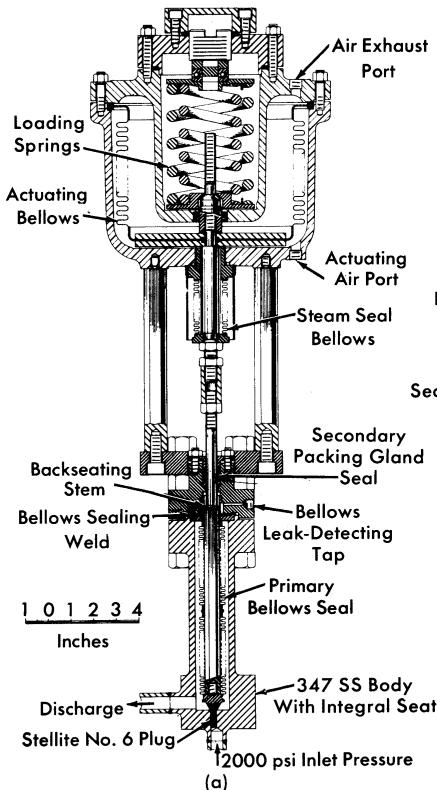

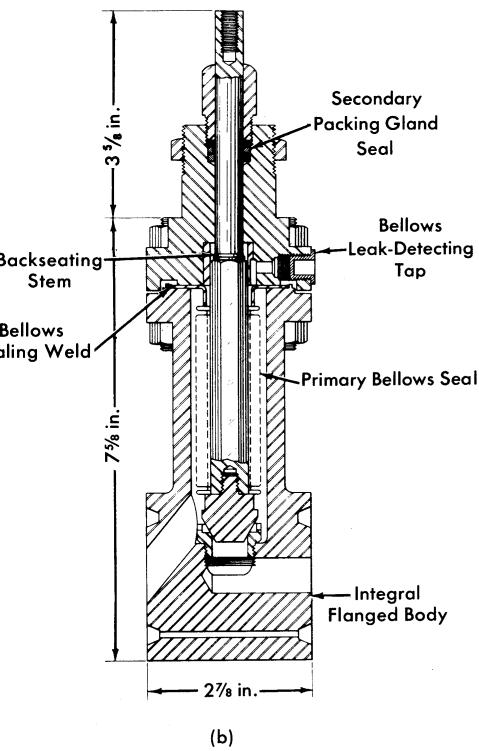  
FIG. 8-17. (a) HRE-2 letdown valve. (b) HRE-2 low-pressure valve.

side of the throttling orifice and thus under less strain. A seat integral with the valve body is used to avoid the difficult problem of leakage around removable seats. Stellar No. 6 and type 17-4 PH stainless steel plugs have been used, since these very hard materials are corrosion resistant in uranyl-sulfate solutions below $100^{\circ}\mathrm{C}$ and resist erosion due to flow impingement. The primary bellows seal, $1\frac{1}{8}$ -in. OD by 7/8-in. ID and $3\frac{3}{4}$ in. long, is mechanically formed of three plies of 0.0085-in. type-347 stainless steel stock. The bellows seal assembly is in two sections, welded together, because the bellows length needed for the 1/2-in. stroke cannot be manufactured in a single section at this time. An average bellows life of 50,000 5/8-in. strokes has been obtained at 500-psi with this assembly. The stem is of hexagonal stock and fits in a similarly shaped guide to prevent a torque from being applied to the bellows. The leak-detecting tap between the bellows and the secondary graphited-asbestos packing seal affords a means of detecting a bellows leak, while the asbestos gland prevents gross leakage of process fluid in case of bellows failure.

The valve, which was supplied by the Fulton Sylphon Division of Robertshaw-Fulton Controls Corporation, is rated for 2500-psi service with the flow introduced under the seat; however, the downstream pressure is limited to 500 psi by the bellows seal. The valve has a $C_v$ (flow coefficient) of 0.1. The reversible-action operator, supplied by The Annin Company, has a $50\mathrm{-in}^2$ effective area. It is rated for a maximum of 60 psi air operating pressure. The action illustrated is spring-closed, air-to-open; however, by a simple interchange of parts, the actuator operation can be reversed. The actuating bellows is made from type-321 stainless steel and was formed by the Stainless Steel Products Company. The stem guide bushing is brass.

The largest valve used in the HRE-2 is the blanket drain valve, which has a 1-in. port and a $C_v$ of 10. The valve and operator were supplied by Fulton-Sylphon. The operator supplies a maximum force of 5440 lb, and the full stroke is 3/4 in.

The only two process valves in the HRE-2 which operate with full system pressure on the bellows seal are those which are used to isolate the reactor from the chemical plant. The bellows used here, supplied by Fulton-Sylphon, are rated at 2000 psi and $300^{\circ}\mathrm{C}$ .

The low-pressure HRE-2 valves are novel in that ring-joint grooves are integral with the valve body, as illustrated in Fig. 8-17(b). Long bolts at the corners of the valve body hold the companion flanges; the valve is replaceable with the disassembly of only one set of bolts.

The main problems encountered in HRE-2 valves have been valve stem misalignment and corrosion of valve plugs.

Valve trim materials. In uranyl sulfate service, stainless steel seats are used with type 17-4 PH stainless steel or Stellarite plugs. The latter material is useful only below $100^{\circ}\mathrm{C}$ and where only a small amount of oxygenated-water service is anticipated with a high pressure differential across the valve.

In slurry service, metallic trims such as those above have been satisfactory for low-pressure valves but unsatisfactory for long life in high-pressure service. Ceramic materials appear promising, but little experience has been obtained to date.

A gold-gasketed valve has been developed for tight shutoff of gases. The gasket is placed into a groove machined in the valve plug, which mates with a tongue machined into the seat. This type of trim has also given excellent results in one hot uranyl-sulfate loop application.

Slurry service valves. In addition to the erosiveness of slurries, other problems are introduced by their tendency to settle out in the primary bellows seal or at stem guiding surfaces, thus interfering with valve action. This may be avoided by purging slurry from the bellows compartment with distilled water. It is likely that the hydrodynamic design of slurry valves

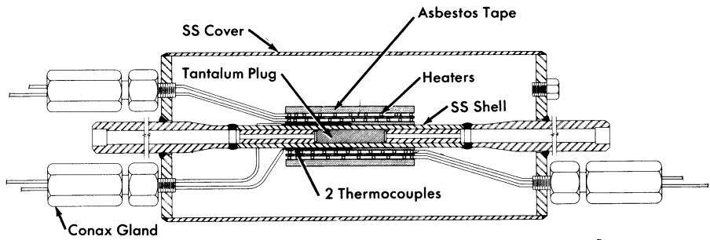  
FIG. 8-18. Differential thermal expansion valve to control gas flow in the HRE-2.

may be revised to make entry of solids into the bellows compartment improbable.

Slurry throttling has been accomplished by use of long tubes or capillaries. These have the disadvantage of fixed orifices, in that continuous flow control is not possible.

Special gas-metering valve. An ORNL-developed* differential thermal-expansion metering valve is used to regulate the flow of oxygen gas to the HRE-2 high-pressure system [50]. The required flow is very small and is difficult to control by conventional mechanical positioning methods. The valve shown in Fig. 8-18 utilizes the difference in thermal coefficient of expansion of tantalum and stainless steel to effect flow control. The tantalum plug is used to avoid any possibility of an ignition reaction between the oxygen gas and the metal, the temperature of which for a flow of 2000 std. cc/min with a 400 psi differential can reach $300^{\circ}\mathrm{C}$ . The design incorporates all-welded construction and is covered with a waterproof protective housing. The resistance heating element and thermocouple are duplicated to ensure continuity of service.

8-3.9 Sampling equipment. Operation of an aqueous homogeneous reactor requires that numerous samples be taken in maintaining control of the chemical composition of the solutions. Because of the radioactivity associated with these fluids, standard sampling equipment must be modified, or entirely new apparatus must be devised for taking the samples. Examples of sampling equipment presented here were designed for use on the HRE-2 at ORNL.

Samples of liquid and suspended solids will be taken from the high- and low-pressure systems of the HRE-2. Solution from the high-pressure system is reduced in temperature and pressure from $300^{\circ}\mathrm{C}$ and 2000 psi to approximately $80^{\circ}\mathrm{C}$ and 1 atm by a cooler and throttling valve before

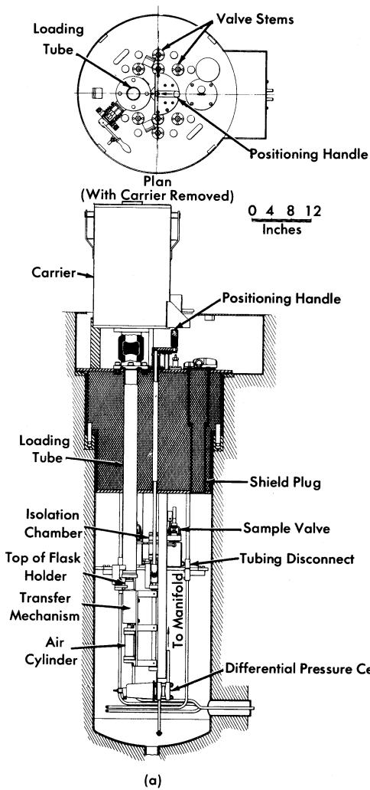

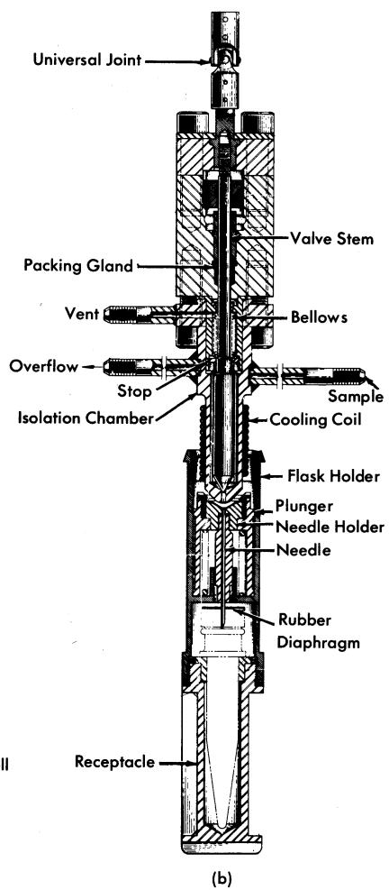  
FIG. 8-19. (a) HRE-2 sampling facility. Flask holder has just been lowered through the loading tube. It is then moved under the isolation chamber by the transfer mechanism. (b) HRE-2 sampler head, shown in the position of transferring sample to the receptacle.

entering the sample station. There, a sample of 4 to $5\mathrm{ml}$ is isolated and removed for analysis [51].

Figure 8-19(a) shows the general assembly of the sampling facility. Virtually all the mechanism is suspended from a shield plug. Personnel shielding is provided by a 2-ft depth of lead shot and water in the plug. The loading tube is sealed by a plug valve to maintain a slight vacuum in the housing. Threaded backup rods extending through the plug are em

ployed to make the final connections with reactor piping after the plug assembly is lowered into its housing. Each sampling facility contains two isolation chambers: one for isolating samples from the high-pressure system and the other for obtaining samples from the low-pressure system. Each chamber in the station is served by a common loading and manipulating device.

When a sample is being taken, solution from the desired system is allowed to flow through its isolation chamber until a representative sample is obtained. The isolation chamber is then valved off. An evacuated sample flask is placed in the holder and lowered through the loading tube to the transfer mechanism. The assembly is then indexed under the proper isolation chamber, where the flask holder is raised by an air cylinder until contact is made between the isolation-chamber nozzle and the inverse cone of the carrier head (Fig. 8-19b). Further lifting of the flask holder causes the hypodermic needle to puncture the rubber diaphragm. The sample is then discharged into the flask by opening the valve on the chamber. When the sample is in the flask the procedures are reversed, and the flask holder is removed into a shielded carrier for transport to the analytical laboratory. Electrical contacts indicate positive positioning of the flask holder under the isolation chamber and closure of the isolation-chamber nozzle.

A third sampling station for the HRE-2, identical to the fuel and blanket facilities except for larger passages and a modified isolation chamber, is employed for sampling a fuel stream in the chemical processing facility. This stream has the order of 50 times the solids concentration of the other streams being sampled.

8-3.10 Letdown heat exchanger. The purpose of the letdown heat exchanger is to conserve the sensible and latent heat of the solution-steam-gas mixture removed in the gas separator prior to discharging it to the dump-tank system. It is necessary also to cool the letdown stream to below $100^{\circ}\mathrm{C}$ before it reaches the letdown valve to minimize corrosion of the valve trim.

The thermal design of the exchanger is conventional [52]. In the HRE-2 stainless-steel triple-pipe unit, 400,000 Btu/hr are removed from the letdown stream into the countercurrent fuel feed stream, the pressurizer purge-water stream, and a cooling-water stream.

The unique feature of the design deals with the flow geometry of the letdown stream [53]. To promote efficient flow of the two-phase mixture through the letdown valve, it is necessary to prevent flow separation of the two phases. This is done by utilizing the annulus of the exchanger, with weld-bead spacers every 3 in. to promote turbulence. The velocity of the letdown stream is not permitted to fall below 5 ft/sec for any pipe lengths above 1 ft anywhere between the gas separator takeoff and the letdown valve.

During the transit from reactor operating temperature to $100^{\circ}\mathrm{C}$ in the letdown heat exchanger, fuel solution must go through the temperature range 175 to $225^{\circ}\mathrm{C}$ at which stainless-steel corrosion resistance passes through a minimum. This suggests that after several years leakage would occur between the feed and letdown streams. This problem can be circumvented by substitution of titanium for stainless steel.

8-3.11 Freeze plugs. Several reactor installations have employed freeze plugs on liquid-carrying process lines to assure absolute leaktight shutoff. Lines up to 4 in. in diameter have been frozen with a simple wrap-around coil of copper tubing when there was no flow in the pipe other than the convective currents set up by the freezing process. It is conceivable that leaktightness in very large lines might be achieved by refrigerating the passages of valves to freeze a relatively small amount of liquid at the valve seat. This freezing technique is most helpful in reducing the spread of contamination during maintenance.

The most efficient freeze-jacket design is one which provides an annular space around the process pipe and allows direct contact of the refrigerant with the pipe. This is generally considered undesirable, however, from the standpoint that if process fluid should leak into the refrigerant, activity would be carried outside the shielded area. Freeze jackets consisting of tubing wound around the process pipe perform noticeably better if soldered or welded to the process pipe; filling the interstitial space with poured lead also appears to be a worth-while refinement for lines difficult to freeze. Tubing 5/16-in. in diameter has been used on 1/4- to 1/2-in. standard pipe sizes; 3/8-in. tubing on 3/4- to $1\frac{1}{2}$ -in. pipe sizes, and 1/2-in. tubing on sizes up to 4 in. Clamp-on, or clamshell, types of freeze jackets were developed for the HRE-2 for temporarily freezing certain lines.

On the HRE-2, stainless-steel refrigerant tubing is used for permanent freeze jackets on lines which normally operate at or above $350^{\circ}\mathrm{F}$ . Copper tubing, which is oxidized more readily in air, is used for lower temperature lines. A jacket length of 3 to 4 pipe diameters has been demonstrated to be optimum.

Freezing times of a few minutes for 1/2-in. and smaller lines and up to several hours for 3- and 4-in. sizes have been observed when the refrigerant temperature is in the $-20$ to $-40^{\circ}\mathrm{F}$ range and with flows through the jacket of 3 to $5\mathrm{gpm}$ . Insulation outside the freeze jacket materially aids in the ability to freeze lines with particularly high heat load, such as those subjected to gamma heating. If the freeze jacket must be operated submerged, such as for underwater maintenance, it has been found that protecting the jacket from convection water currents by means of aluminumfoil wrapping aids materially in the freezing process.

# 8-4. AUXILIARY COMPONENTS

8-4.1 Refrigeration system.* Refrigeration is required in the HRE-2 for operation of freeze plugs and cold traps. The refrigeration system consists of a primary loop, which is not irradiated, and a secondary liquid circulating system which enters the shield.

A two-stage primary mechanical refrigeration system is employed in the HRE-2. Refrigerants commonly used in such a system are the halogenated hydrocarbons, provided that the primary refrigerant remains outside the reactor shield. Breakdown of this series of refrigerants under radiation has been observed to have the serious effects of forming phosgene gas and insoluble tarry polymers, thus creating conditions corrosive to stainless steel. Carbon dioxide is probably the best refrigerant for use in an irradiated direct-expansion system, but it must be used at high pressure.

Choice of a secondary refrigerant to be circulated through radioactive equipment is difficult in that the fluid must not only meet the obviously desirable properties of having a low freezing point, suitable viscosity, low vapor pressure, noncorrosiveness, nontoxicity, and nonflammability, but it must also be resistant to radiation damage, not contain chloride ions which might promote stress-corrosion cracking of stainless steels, and not evaporate to insoluble residues. Miscibility with water would be advantageous if underwater maintenance techniques are employed in that if some refrigerant escapes, there is less impairment of vision and a film is not left on equipment when the water is drained.

After considering many possible secondary refrigerants, Amso 125-82, an odorless mineral spirit resembling kerosene in its physical properties, was selected for the HRE-2. Its performance to date has been quite satisfactory.

In addition to the primary refrigeration system used to maintain a central supply of chilled Amsco, it was useful for short-term maintenance operations at the HRE-2 to have also a portable rig, consisting of an insulated tank and circulating pump. Chilling was accomplished by floating blocks of $\mathrm{CO}_{2}$ -ice directly in the liquid; secondary refrigerant temperatures of about $-75^{\circ}\mathrm{F}$ were maintained with a circulation rate of about $4\mathrm{gpm}$ and with an ice consumption rate of $75$ to $100\mathrm{lb/hr}$ .

8-4.2 Oxygen injection equipment.† Oxygen is needed in the high-pressure fuel system to maintain chemical stability of the uranyl-sulfate solution and to reduce corrosion of the stainless steel container. This oxy

gen may be introduced most conveniently into the fuel feed stream, at either the suction or discharge of the feed pump. As a result of operational experience, high-pressure injection has been found to be more flexible and to give better feed-pump performance.

The oxygen system requires a high-pressure gas supply and a metering device. The first supply used in the HRE-2 was a converter manufactured by Cambridge Corp. of Lowell, Mass. This has been replaced by high-pressure cylinders, which have considerably lower operating costs. Oxygen compressors may be desirable to recirculate contaminated oxygen and are being investigated. Metering is accomplished with a thermal valve (described earlier) controlled by a capillary flowmeter.

Oxygen converter. The HRE-2 oxygen generator is designed to convert liquid oxygen to the gaseous state and deliver it to the fuel and blanket high-pressure systems at pressures up to 3000 psig. The capacity of the generator is $0.47\mathrm{ft}^3$ , or $30\mathrm{lb}$ of oxygen, when $90\%$ filled with liquid. This will permit delivery of approximately $21\mathrm{lb}$ of oxygen gas at 3000 psig and $70^{\circ}\mathrm{F}$ . This pressure is automatically maintained over a flow range of from 0.01 to $0.7\mathrm{lb/hr}$ .

The oxygen generator consists of an insulated high-pressure container, with an electric heater and automatic pressure and temperature controls. The high-pressure inner vessel is fabricated of type-304 stainless steel.

Charging of the converter with liquid oxygen is a manual operation. The labor of charging and the inefficient utilization of oxygen are disadvantages of this unit.

High-pressure cylinders. The HRE-2 is now using 300-liter high-pressure cylinders which are commercially charged to 2400 psi and are used down to 2000 psi. A bank of three cylinders will last for about two days of normal operation. This system involves no waste of gas, since the cylinders are recharged from 2000 psi to 2400 psi, with very little operator attention or hazard.

Oxygen compressors. High-pressure low-capacity laboratory-type oxygen compressors have recently become commercially available. Pressure Products Industries, of Hatboro, Pa., produces a compressor having a stainless-steel diaphragm hydraulically actuated in a contoured chamber by a reciprocating drive. A single-stage machine capable of compressing approximately 0.8 scfm of $\mathrm{O}_2$ from 500 psi to 2500 psi has been purchased and placed in service in the HRT mockup. Although there have been some difficulties with the hydraulic plunger packing, it has been generally satisfactory.

A three-stage machine capable of compressing 2 scfm of contaminated oxygen from atmospheric pressure to 2500 psi is being designed. The diaphragm heads will be located remotely with respect to the drive, as is done in diaphragm feed pumps.

# 8-5. INSTRUMENT COMPONENTS*

The instrumentation and controls systems for aqueous homogeneous reactors are similar to those used in modern high-pressure steam power and chemical plants. However, problems attendant on radiation damage to insulations, the difficulty of performing maintenance or replacement operations, the requirement for the absolute leaktightness and the very high reliability of components necessary for safety and plant operability have required considerable development of special components.

8-5.1 Signal transmission systems. In a typical control loop the primary and final control elements are in a radioactive area isolated from the control room by a vapor container and a concrete radiation shield.

Electric. Advantages for electric transmission under these conditions include the ease of readjusting system zeros and spans from the control room and the ability to sense motion from weld-sealed transmitters without the use of flexure seals such as bellows and torque tubes. The speed of information transmission, the ease of switching signals, and the ability of the sensing elements to operate over wide temperature ranges may also be important. Disadvantages of the electrical system include the possible radiation damage to insulations and the present unavailability of a cheap, reliable linear-power actuator for control valves.

Pneumatic. Advantages of a pneumatic system include the utilization of all-metallic radiation-resistant construction for the transmitters and valve actuators by the use of metallic bellows, bourdon tubes, and convoluted diaphragms. The advantages of the high state of commercial development, low cost, reliability, miniaturization, and ease of paralleling of receiving elements are considerable. A disadvantage of the penumatic system is the tubing transmission line, which affords a path out of the radiation enclosure for contaminated fluids or vapors in case of a release of radioactivity coupled with a line break.

HRE-2 system. A combined electric-pneumatic system (described in Article 7-4.8) is used in HRE-2. In the control room, electric signals from primary variable sensing elements (temperature, flow, liquid level, pressure, etc.) are converted by transducers to penumatic signals, and these are used to actuate miniature pneumatic display instruments and pneumatic valves in the reactor. The escape of radioactivity through air lines is prevented by the automatic closure of "block" valves within the vapor-contained area, on a signal of the release of radiation. Radiation damage to primary elements is avoided by the use of inorganic electrical insulations such as glass, ceramics, mica, magnesium oxide, and magnesium silicate. Electric control actions are derived from the pneumatic signals by pressure switches. These switches are simple devices in which diaphragm deflection opens or

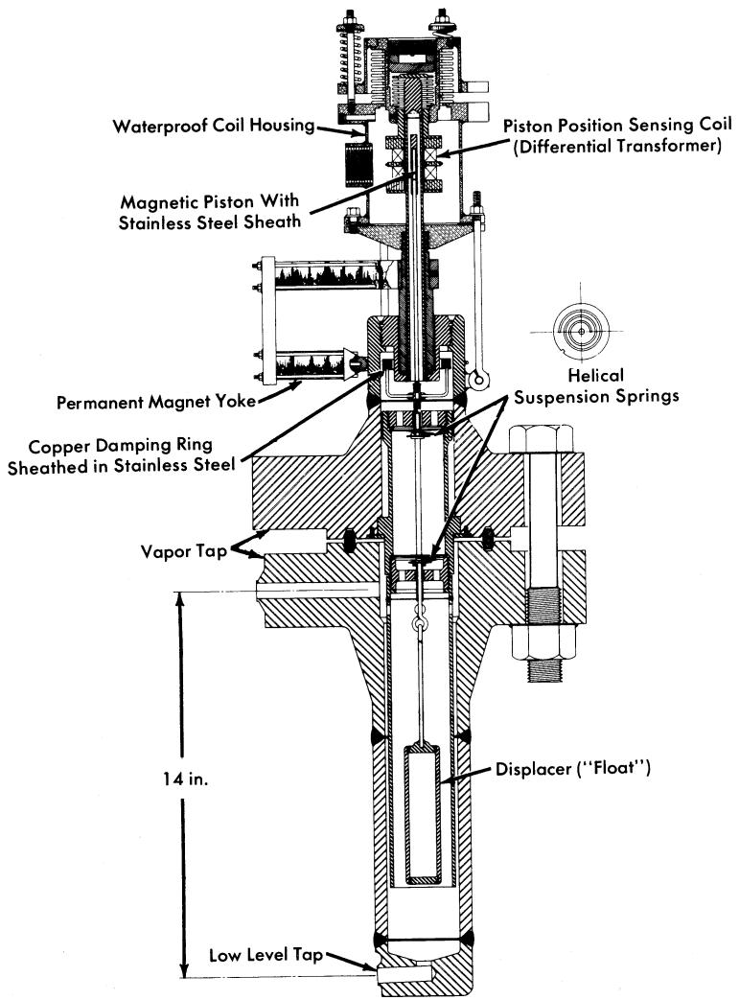  
FIG. 8-20. HRE-2 float-type level indicator (covers a 5-in. range at psi-2000 operating pressure).

closes an electric snap-acting switch. Electric interlock control of the penumatic signals to final control elements is achieved by the use of solenoid-actuated pilot valves.

8-5.2 Primary variable sensing elements. Liquid-level transmitters. Knowledge of liquid levels in reactor systems and loops is critical for maintaining the proper balance of liquid and vapor in pressurizers and storage tanks. It is desired also to be able to maintain accurate inventories of the hazardous and valuable fluids which are contained.

There are a large number of liquid-level sensing devices in use, since no one device has been developed which satisfies all the criteria of precision, rapid response, insensitivity to temperature and pressure, and utility of its signal for control functions. Devices which have been used at ORNL are described in the following paragraphs.

(1) Displacement or Float Transmitters. The ORNL-developed displacement transmitter, used to control HRE-2 pressurizer level, consists of a 5-in.-long displacer suspended by two helical springs (Fig. 8-20). An extension rod above the springs positions a magnetic piston in the center of a differential transformer. Troublesome vibration of the float is damped by the action of the field from permanent magnets on a one-turn copper ring. The only nonwelded closure is the ring-joint flange, which makes the unit easily replaceable.

The differential transformer is a compact, highly sensitive, linear device which is commercially available. The most satisfactory instrument system for the differential transformer is a high-frequency oscillator-amplifier phase-sensitive demodulator carrier system which provides the necessary sensitivity and stability and eliminates phase-motion ambiguity associated with the null voltage.

Float transmitters of this type have also been built with cantilever springs, with floats up to 47 in. long, and with hydraulic damping vanes attached to the bottom of the float in lieu of the magnetic damping [54]. They have given excellent service in continuous control applications. However, the displacement transmitter is quite sensitive to fluid densities, and the springs exhibit some changes in properties with temperature. The best spring material tested to date is Isoelastic spring alloy supplied by John Chatillon and Sons, which may be gold-plated for supplementary corrosion resistance.

Hollow spherical floats, lighter than water, have also been used at pressures below 600 psi. Magnetrol, Inc., makes a unit in which float position is transmitted magnetically. Moore Products Company supplies a level alarm where float position is transmitted mechanically through the allwelded housing by a flexible shaft.

(2) Differential-Pressure Cells. D/P cells have been used successfully in HRE-1 and in loops as level transmitters. The variable liquid leg is compared to a reference level maintained by condensation or liquid addition. Since the density of water is temperature-dependent, the temperature of the primary system and the lines to the D/P cell must be known for accurate level measurement.   
(3) Weigh Systems. For obtaining an accurate inventory of HRE-2 storage tanks, they are weighed with pneumatic weigh cells. This was found to be the only feasible method of measuring the quantity of liquid in long, horizontal storage tanks. Piping to the tanks is kept flexible by

the use of horizontal L and U bends. A pneumatic system is selected primarily because taring can be done remotely with balancing air pressures, and components are less susceptible to radiation damage. The pneumatic load cells, which are supplied by the A. H. Emery Corporation, have an accuracy of $1/10\%$ ; however, when used in a system with solid pipe connections to the weighed vessels, an accuracy of $1\%$ of full load results.

(4) Heated Thermocouple Wells. Heated thermocouple wells have been used for liquid-level alarm or control. The thermocouple junction is normally held a few degrees above the vapor temperature; as the liquid level surrounds the probe, the increased heat transmission to the fluid from the probe lowers the thermocouple signal output [55]. Several wells must be used for control purposes. This system gives rather sluggish response.   
(5) Capacitance Probe. An aluminum oxide capacitance probe, manufactured by Fielden Instrument Division, has been recently received by ORNL but has not yet been evaluated. This instrument senses the dielectric constant of the medium it contacts. Its ceramic-to-metal seal is rated at 2000 psi and $636^{\circ}\mathrm{F}$ . This type of instrument may prove useful in water or slurry service.

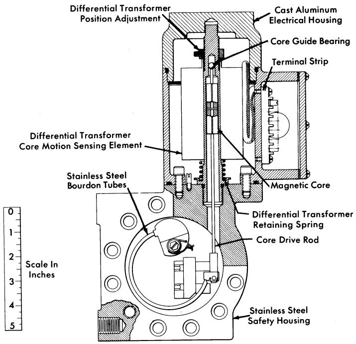  
FIG. 8-21. Bourdon-tube pressure transmitter in safety housing. Sensing element, twin Bourdon tubes; range, 0 to 2500 psi; test pressure, 3750 psi; accuracy, $\pm 1\%$ of range; transmission, electrical; fabricated by the Swartwout Company.

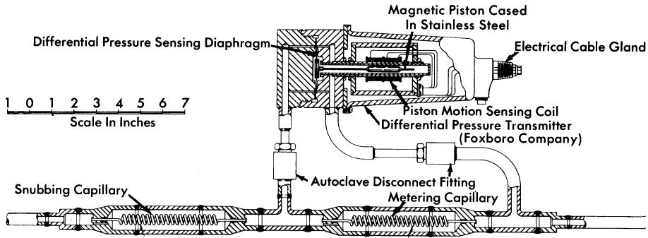  
FIG. 8-22. Capillary flowmeter, used to meter small gas or liquid streams, shown with high-pressure seal-welded differential-pressure transmitter.

(6) Fluid Damping Transmitters. The Dynatrol transmitter, manufactured by Automation Products, Inc., is an interesting possibility for use as a fluid damping transmitter. It contains a vane exposed to the process system and vibrated through a pressure housing by alternating-current excitation of a solenoid. The degree of damping, which is dependent on the area of the vane covered with liquid, is measured by a second sensing coil. No test experience with this transmitter is yet available.

Unusually difficult level-sensing problems are introduced when it is desired to measure or control the true level of a slurry or a boiling liquid. Most proven devices are density-sensitive, and the mean density of two-phase systems is usually unknown. Of the level transmitter types cited above, none appears adequate for continuous-range indication. For spot indication, float, capacitance, and Dynatrol transmitters are promising.

Pressure and differential-pressure measurement. Bourdon tubes of welded sealed 347 stainless steel are used for pressure transmission in the HRE-2. Most suitable for reactor use are units contained within secondary pressure housings, such as the 2500-psi pressure transmitter shown in Fig. 8-21. Baldwin cells have been widely used for accurate pressure measurement in loops.

Bellows or diaphragm differential-pressure cells have been used to measure pressure differentials with full-scale sensitivity of 25 in. of water to 125 psi. A typical D/P cell with electric transmitter is shown in Fig. 8-22.

Pressure transmitters are usually tied into the steam or water portions of aqueous homogeneous systems to reduce the probability of plugging or other damage. Where it is necessary to connect a D/P cell into a slurry system, the pipe connection is regularly purged with 10 to $30~\mathrm{cc / min}$ of water. Large vertical piping connections with the transmitter mounted above the primary piping have also been used. Diaphragm transmitters mounted flush with the pipe surface are being developed for slurry applications.

Flow transmitters. Flow measurements are made in high-pressure lines by sensing the pressure drop across a calibrated orifice or venturi, or by the transmitting variable-area type of flowmeter. The latter meter resembles a Rotameter with float position transmitted electrically. It has the advantage of being an in-line element but is not readily applicable to large flows.

Another system for metering and controlling small liquid and gas flows in the HRE-2 is illustrated in Fig. 8-22. The pressure drop across the metering capillary is measured by the differential-pressure transmitter and the output signal is calibrated in terms of flow. The "snubbing" capillary is used to prevent the sudden application of pressure to the inlet side of the differential-pressure transmitter, which would cause undesirable zero shift.

A technique widely used in the HRE-2 for metering purge flows is a "heat balance" flowmeter in which a known amount of heat is added or extracted from the process stream and the temperature change noted.

Temperature measurement. The most commonly used method of temperature detection in the HRE-2 is the thermocouple measurement of vessel and pipe wall temperatures; the couples are spot-welded directly to the wall and then covered with insulation. When faster response is desired, thermocouples are spring-loaded into thin thermowells. Chromel-Alumel wire is generally used because its resistance to corrosive attack by moisture is better than that of iron-constantan alloys.

Thermocouple wire insulated by compressed magnesium oxide powder and housed in various alloy tubes is available from the Thermo Electric Company. Another commonly used wire supplied by the Claud S. Gordon Company is insulated as follows: each strand is coated with phenol formaldehyde varnish and Fiberglas-impregnated with a silicone alkyd copolymer, and the entire wire is Fiberglas-impregnated with a silicone alkyd copolymer.

Sound transmitters. Waterproof microphones are attached to pumps to monitor bearing and check-valve noises.

8-5.3 Nuclear instrumentation in the HRE-2. The purpose of the nuclear instrumentation in homogeneous reactors is to provide neutron-level measurement and the gamma monitoring of auxiliary process lines and control areas for the detection of radioactive leaks (see Article 7-4.8).

Gamma radiation measurement. Gamma monitors for detecting process leaks, manufactured by the Victoreen Instrument Company, consist of a simple one-tube, three-decade logarithmic amplifier sealed within the chamber head and a remote-contact-making meter and multipoint recorder. These detectors can be remotely calibrated by exposing a radioactive source on the actuation of a solenoid-operated shielding shutter. All channels are

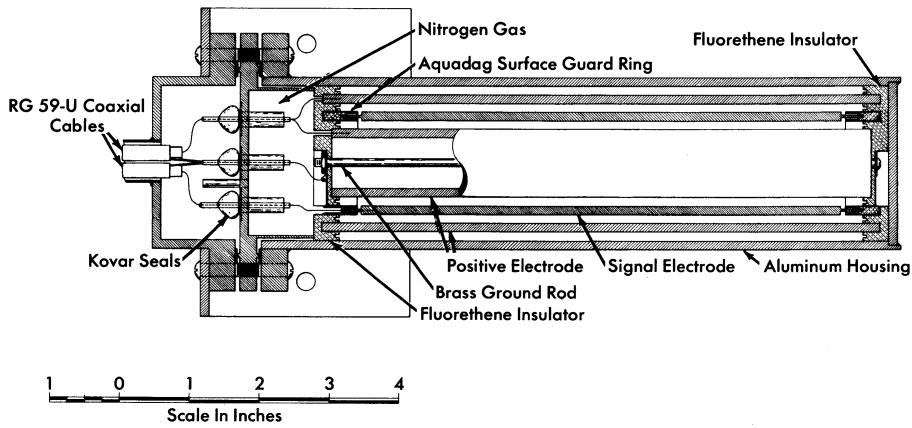  
FIG. 8-23. High-level gamma ionization chamber. Effective volume, $120~\mathrm{cm}^3$ ; electrode spacing, $1/8$ in.; performance, $20~\mu \mathrm{a}$ , chamber saturated at $100$ volts at radiation level of $3\times 10^{7}$ r/hr; design temperature, $130^{\circ}\mathrm{F}$ .

duplicated, and control action is initiated only upon a simultaneous signal from both channels to minimize false "scrams." However, a signal from either channel is annihilated. For monitoring control areas for personnel protection, more stable and accurate vibrating-condenser types of electrometers are used.

The cell air monitors, which provide an alarm in case of a leak of radioactive vapor from the reactor system, are installed in an instrument cubicle. Cell air is circulated through a 2-in. pipe from the reactor tank, past the enclosed monitors, and then back to the cell. The blower is sized so that only 5 sec is required for cell air to reach the radiation monitors.

A high-level gamma ionization chamber, developed at ORNL [56], is used to measure cell ambient radiation levels up to $10^{7}\mathrm{r / hr}$ (Fig. 8-23). This measurement is needed to evaluate the effectiveness of shielding, to assay the rate of radiation damage to reactor components, to measure radiation levels during maintenance operations, and to provide data for future reactor designs. The chamber is of inexpensive construction and is discarded upon failure.

8-5.4 Electrical wiring and accessories. Copper-clad compressed magnesium-oxide spaced and insulated electrical cable is very desirable for service in extremely high-temperature, radioactive, or wet areas because no organic material subject to cracking and outgassing is used in the insulation. A waterproof disconnect, designed to be broken remotely to permit the removal of reactor electrical equipment, is used with this type of cable. The electrical connectors are terminated inside the disconnect with a multiple-header ceramic-to-metal seal, voids being filled with magnesium-

oxide powder. The outside guides are tapered to simplify remote maintenance. Long insulators are used on the connecting terminals to minimize leakage currents after submersion. The cable is available in a varied number of conductors and sizes, from single to seven conductors in a copper sheath, as wire sizes No. 16 AWG to 4/0 AWG, from the General Cable Company. The hermetic end seals are available from the Advanced Vacuum Products Corporation or Permaseal Corporation.

A compression seal designed around an inorganic material, magnesium silicate, is used to seal wires at conduit terminations. These seals are supplied by the Conax Company. A similar device but utilizing a glass-to-metal seal is manufactured by the Stupakoff Ceramic and Manufacturing Company.

For the windings used on the motion-sensing coils of instruments, 30-gage anodized aluminum wire supplied by the Sigmund Cohn Company has successfully withstood temperatures up to $300^{\circ}\mathrm{C}$ and radiation exposure of $6 \times 10^{17}$ nvt fast neutron and $1 \times 10^{8}$ r gamma without failure. The only electrical insulation on the wire is that afforded by the oxide film on the aluminum. This wire must be handled carefully to avoid abrasion and is suitable only for low-voltage use. For lower temperatures, the Ceroc magnet wire available from the Sprague Electric Company has been used very successfully.

# REFERENCES

1. P. H. HARLEY, Straight Through HRT Core Model Test, USAEC Report CF-54-9-129, Oak Ridge National Laboratory, Sept. 22, 1954.   
2. I. SPIEWAK, Preliminary Design of Screens for the Inlet of the ISHR Core, USAEC Report CF-52-10-181, Oak Ridge National Laboratory, Oct. 18, 1952. W. D. BAINES and E. G. PETERSON, Trans. Am. Soc. Mech. Engrs. 73(5), 467 (July 1951).   
3. L. B. LESEM and P. H. HARLEY, Scale-up of Alternate HRT Core, USAEC Report AECD-3971, Oak Ridge National Laboratory, May 7, 1954. L. B. LESEM and I. SPIEWAK, Alternate Core Proposal for the HRT, USAEC Report CF-54-1-80, Oak Ridge National Laboratory, Jan. 28, 1954.   
4. F. N. Peebles and H. J. GARBER, Studies on the Swirling Motion of Water within a Spherical Vessel, University of Tennessee, Report S-370, January 1956.   
5. L. B. LeSEM et al., Hydrodynamic Studies in an Eight-foot Sphere Utilizing Rotation Flow, USAEC Report CF-53-7-29, Oak Ridge National Laboratory, July 20, 1953.   
6. S. TIMOSHENKO, Strength of Materials, 2nd ed. New York: D. Van Nostrand Co., Inc., 1940. (Part II, pp. 160, 162)   
7. S. TIMOSHENKO and J. N. GOODIER, Theory of Elasticity. 2nd ed. New York: McGraw-Hill Book Co., Inc., 1951. (pp. 59, 359)   
8. S. TIMOSHENKO and J. N. GOODIER, Theory of Elasticity. 2nd ed. New York: McGraw-Hill Book Co., Inc., 1951. (pp. 412, 418)   
9. L. G. ALEXANDER, Estimation of Heat Sources in Nuclear Reactors, A.I. Ch. E. Journal 2: 177 (June 1956).   
10. R. H. CHAPMAN, Analysis of Spherical Pressure Vessel Having an Energy Source Within the Wall, USAEC Report ORNL-1987, Oak Ridge National Laboratory, Oct. 26, 1954.   
11. L. F. BLEDSOE et al., Welding J., N. Y., 35, 997-1006 (October 1956). W. R. GALL, *Nucleonics* **14**(10), pp. 32-33 (October 1956).   
12. J. C. MOYERS, Long-term Run of Westinghouse 400A-1 Pump, USAEC Report CF-57-9-1, Oak Ridge National Laboratory, Sept. 3, 1957.   
13. R. B. Korsmeyer et al., in *Homogeneous Reactor Project Quarterly Progress Report for the Period Ending Jan. 31, 1958*, USAEC Report ORNL-2493, Oak Ridge National Laboratory, 1958.   
14. H. A. RUNDELL et al., Investigation of Effect of Seal Configuration on Mixing Flow and Radiation Damage in HRT-Type Circulating Pumps, USAEC Report CF-57-10-48, Oak Ridge National Laboratory, Oct. 10, 1957.   
15. J. C. MOYERS, Long-term Run of Westinghouse 400A-1 Pump, USAEC Report CF-57-9-1, Oak Ridge National Laboratory, Sept. 3, 1957.   
16. R. B. Korsmeyer et al., in *Homogeneous Reactor Project Quarterly Progress Report for the Period Ending July 31, 1957*, USAEC Report ORNL-2379, Oak Ridge National Laboratory, Oct. 10, 1957. (p. 59)   
17. R. B. Korsmeyer et al., in *Homogeneous Reactor Project Quarterly Progress Report for the Period Ending Jan. 31, 1958*, USAEC Report ORNL-2493, Oak Ridge National Laboratory, 1958.

18. H. A. RUNDELL et al., Investigation of Effect of Seal Configuration on Mixing Flow and Radiation Damage in HRT-Type Circulating Pumps, USAEC Report CF-57-10-48, Oak Ridge National Laboratory, Oct. 10, 1957.   
19. W. J. FINAN and I. GRANET, Final Reports on Union Carbide Nuclear Company Contract No. W35X-31312, Phase 1, Foster-Wheeler Corp., Nov. 15 and Dec. 15, 1956.   
20. J. C. GRIESS et al., Solution Corrosion Group Quarterly Report for the Period Ending July 31, 1957, USAEC Report CF-57-7-121, Oak Ridge National Laboratory, July 31, 1957. (p. 33 ff)   
21. C. H. Secoy, *Aqueous Fuel Systems*, USAEC Report CF-57-2-139, Oak Ridge National Laboratory, Feb. 28, 1957.   
22. C. MICHELSON, HRT Modified Pressurizer Design, USAEC Report CF-56-5-165, Oak Ridge National Laboratory, May 25, 1956.   
23. Boiler Construction Code, Section I, Power Boilers, American Society of Mechanical Engineers (1956); ASA Code for Pressure Piping, B31.1-1955.   
24. K. L. HANSON and W. E. JAHSMAN, An Evaluation of Piping Analysis Methods, USAEC Report KAPL-1384, Knolls Atomic Power Laboratory, Aug. 10, 1955.   
25. M. W. KELLOGG COMPANY, Design of Piping Systems. 2nd ed. New York: John Wiley & Sons, Inc., 1956.   
26. M. I. LUNDIN, HRT High Pressure System Piping Line Deflections and Reactions on Equipment Nozzles, USAEC Report CF-55-8-83, Oak Ridge National Laboratory, Aug. 10, 1955.   
27. W. R. GALL et al., in Homogeneous Reactor Project Quarterly Progress Report for the Period Ending Apr. 30, 1957, USAEC Report ORNL-2331, Oak Ridge National Laboratory, Aug. 14, 1957. (pp. 22-25)   
28. B. DRAPER and H. C. ROLLER, Design and Development of a $\frac{1}{2}$ -in. Titanium to Stainless Flange, USAEC Report CF-57-11-140, Oak Ridge National Laboratory, Nov. 27, 1957.   
29. J. A. HAFFORD, Development of the Pipe-line Gas Separator, USAEC Report ORNL-1602, Oak Ridge National Laboratory, Nov. 2, 1953.   
30. P. H. HARLEY, Performance Tests of HRT Fuel Solution Evaporator and Entrainment Separator, USAEC Report CF-54-10-51, Oak Ridge National Laboratory, Oct. 13, 1954.   
31. WESTINGHOUSE ELECTRIC CORPORATION AND PENNSYLVANIA POWER AND LIGHT COMPANY, 1957. Unpublished.   
32. E. A. FARBER, Bubble and Slug Flow in Gas-Liquid and Gas (Vapor)-Liquid Solid Mixtures, Research Progress Report on Subcontract N.996 to REED of Oak Ridge National Laboratory, 1957.   
33. R. V. BAILEY et al., Transport of Gases Through Liquid-Gas Mixtures, USAEC Report CF-55-12-118, Oak Ridge National Laboratory, Dec. 21, 1955.   
34. C. L. SEGASER, HRT Entrainment Separator Design Study, USAEC Report CF-54-7-122, Oak Ridge National Laboratory, July 23, 1954.   
35. R. E. Aven, HRT Recombiner Condenser Design, USAEC Report CF-54-11-1, Oak Ridge National Laboratory, Nov. 1, 1954.   
36. O. A. HoUGEN and K. M. WAtson, Chemical Process Principles, Vol. III. New York: John Wiley & Sons, Inc., 1947. (pp. 902-910)

37. J. A. RANSOHOFF and I. SPIEWAK, in Development of Hydrogen-Oxygen Recombiners, USAEC Report ORNL-1583, Oak Ridge National Laboratory, Oct. 22, 1953. (p. 40)   
38. P. H. HARLEY, High-pressure Recombination Loop Progress Report, USAEC Report CF-57-1-90, Oak Ridge National Laboratory, Jan. 4, 1957.   
39. J. A. RANSOHOFF and I. SPIEWAK, in Development of Hydrogen-Oxygen Recombiners, USAEC Report ORNL-1583, Oct. 22, 1953. (pp. 48-56)   
40. I. K. NAMBA, Natural Circulation Recombiner Report, USAEC Report CF-56-9-27, Oak Ridge National Laboratory, Sept. 10, 1956.   
41. P. H. HARLEY, High-pressure Recombination Loop Progress Report, USAEC Report CF-57-1-90, Oak Ridge National Laboratory, Jan. 4, 1957.   
42. T. W. LELAND, Design of Charcoal Adsorbers for the HRT, USAEC Report CF-55-9-12, Oak Ridge National Laboratory, Sept. 6, 1955.   
43. L. B. ANDERSON, Oak Ridge National Laboratory, 1955. Unpublished.   
44. J. S. Culver and C. B. Graham, High-pressure Diaphragm Pumps for Reactors, in Safety Features of Nuclear Reactors; Selected Papers from the 1st Nuclear Engineering Science Congress, December 12-16, 1955, Cleveland, Ohio. New York: Pergamon Press, 1957. (pp. 225-230)   
45. C. H. GABBARD, Diaphragm Feed Pumps for Homogeneous Reactors, 4th Engineering and Science Conference, Held in Chicago, Illinois, March 17-21, 1958. (Preprint 74)   
46. R. BLUMBERG et al., Diaphragm Feed Pump Development Program Progress Report, USAEC Report CF-56-10-114, Oak Ridge National Laboratory, Oct. 29, 1956.   
47. Ohio State University, Union Carbide Nuclear Company, Contract No. 81X-44934.   
48. A. M. BILLINGS, Control Valves for the Homogeneous Reactor Test, 4th Nuclear Engineering and Science Conference, Held in Chicago, Illinois, March 17-21, 1958. (Preprint 149)   
49. A. M. BILLINGS, Life Tests of Stem-sealing Bellows for HRT Valves, USAEC Report CF-58-3-39, Oak Ridge National Laboratory, Mar. 17, 1958.   
50. D. S. Toomb et al., in *Homogeneous Reactor Project Quarterly Progress Report for the Period Ending Jan. 31, 1957*, USAEC Report ORNL-2272, Oak Ridge National Laboratory, Apr. 22, 1957. (p. 34)   
51. B. A. HANNAFORD, HRT Sampler Development, USAEC Report CF-57-1-87, Oak Ridge National Laboratory, Jan. 22, 1957.   
52. R. VAN WINKLE, *Fuel Let-down Heat Exchanger*, USAEC Report CF-54-9-143, Oak Ridge National Laboratory, Sept. 20, 1954.   
53. C. D. ZERBY, Design of Smoothly Flowing Gas and Liquid Mixtures, USAEC Report CF-51-10-130, Oak Ridge National Laboratory, Oct. 11, 1951.   
54. D. S. Toomb et al., in *Homogeneous Reactor Project Quarterly Progress Report for Period Ending Apr. 30, 1956*, USAEC Report ORNL-2096, Oak Ridge National Laboratory, May 10, 1956. (p. 32)   
55. D. S. Toomb et al., in Homogeneous Reactor Project Quarterly Progress Report for Period Ending July 31, 1956, USAEC Report ORNL-2148(Del.), Oak Ridge National Laboratory, Oct. 3, 1956. (p. 67)

56. D. S. Toomb et al., in *Homogeneous Reactor Project Quarterly Progress Report for Period Ending Jan. 31, 1957*, USAEC Report ORNL-2272, Oak Ridge National Laboratory, Apr. 22, 1957. (p. 35)

# CHAPTER 9

# LARGE-SCALE HOMOGENEOUS REACTOR STUDIES*

# 9-1. INTRODUCTION

9-1.1 The status of large-scale technology. A large number of groups in the national laboratories and in industry have prepared detailed designs of full-scale homogeneous reactors because of the widespread interest in these reactors and the generally accepted conclusion that they have long-term potential for central-station power production and other applications. These designs have, in some cases, been made to compare the economics of power production in homogeneous reactors with other nuclear plants. In other cases, the designs have served as the bases for actual construction proposals. Unfortunately, none of the proposals has yet initiated the construction of a reactor, for it is believed that the gap between the existing technology of small plants and that necessary for a full-scale plant is too great to bridge at the present time. Thus the construction of full-scale plants must await further advances in technology which are expected to be achieved in the development programs now under way. The extensive studies of full-scale plants do, however, constitute a body of information vital to the nuclear industry. It is hoped that the summaries of the large-scale homogeneous reactors given in this chapter will serve as a guide to those contemplating the building of a full-scale nuclear plant.

One of the major problems yet to be solved for a large-scale circulating-fuel reactor is that of remotely repairing and/or replacing highly radioactive equipment which fails during operation of the plant.

The various proposed solutions to this problem fall into two categories:

(1) Underwater maintenance, in which all equipment is installed in a shield which can be filled with water after shutdown of the reactor so that maintenance operations can be performed from above with special tools and with visibility provided through the water.   
(2) Dry maintenance, in which all operations are done by remote methods using special remotely operable tools and remote viewing methods such as periscopes and wired television.

In either case, remote opening and closing of flanged joints or remote cutting and rewelding of piping must be used to remove and replace equipment. A solution of the problem of maintaining flanged joints in a leaktight condition in large sizes has not been attempted, the largest pipe in use to

date being approximately 10 in. in diameter. Remote cutting and rewelding equipment is still in the early stages of development.

The technology of solutions systems is in a more advanced stage of development than that of slurry systems because of the design and operation of two homogeneous reactor experiments and the associated development work. Some of the problems remaining to be solved for large-scale solution reactors include the development of large-scale equipment such as pumps, valves, feed pumps, and heat exchangers; radiation corrosion of materials used in the reactor core; high-pressure recombination of hydrogen and oxygen; and reduction of the number of vital components upon which reactor operation depends. Instruments for measuring temperature in high radiation fields and control of inventory and level are some of the major instrumentation problems for which better solutions are needed.

The achievement of a successful aqueous homogeneous thorium breeder requires a high-pressure thorium-oxide slurry system. Development work has been under way for several years to determine the characteristics of such a system and to develop ways of handling slurries. The technology is not yet advanced to the point where a large-scale breeder reactor of this type can be built and operated. Slurry problems under study include methods of production, circulation through pipes and vessels, storage and resuspension, evaporation, heat removal, flow distribution, particle size degradation, internal recombination of deuterium and oxygen, general information on erosion and corrosion effects, and effects of settling on maintenance operations.

Extrapolation of small-scale technology to large-scale design presents several problems of uncertain magnitude, especially in the design of equipment for handling slurries of thorium oxide such as are specified for one- or two-region breeder reactors. The problems of maintenance of slurry systems are essentially the same as for solutions, but are complicated by the erosive nature of the slurry, its relatively high shear strength, and its tendency to cake or settle in regions of low turbulence.

9-1.2 Summary of design studies. The design studies described in this chapter were made by the national laboratories of the Atomic Energy Commission and by various industrial study groups for the purpose of determining the technological and economic feasibility of aqueous homogeneous reactor systems as applied to central station power, research reactors, and the production of plutonium. In general, the design criteria used in the studies conform as closely as possible to known technology in order to minimize the scope of new developments required to ensure the success of the proposals. In all the studies, the importance of over-all safety and reliability of the reactor complex and individual reactor components has been emphasized. Also, considerable attention has been devoted to the maintenance aspects of the designs.

The large-scale reactor designs described are grouped according to the following categories:

(1) One-region solution reactors, typified by the Wolverine Reactor Study, the Oak Ridge National Laboratory Homogeneous Research Reactor, and the Aeronutronic* Advanced Engineering Test Reactor.   
(2) One-region breeders and converters, such as the Pennsylvania Advanced Reactor reference design by Westinghouse Electric Corporation, the Homogeneous Plutonium Producer Study by Argonne National Laboratory, and the Dual Purpose Feasibility Study by Commonwealth Edison.   
(3) Two-region breeders, represented by the Nuclear Power Group studies, the Babcock & Wilcox Breeder Reactor, and a sequence of conceptual designs by the Oak Ridge National Laboratory Homogeneous Reactor Project.

# 9-2. GENERAL PLANT LAYOUT AND DESIGN

9-2.1 Relation of plant layout to remote-maintenance methods. In laying out a homogeneous reactor plant, the designers, to achieve an optimum arrangement, must simultaneously consider all aspects of the design, including the requirements for remote maintenance. It is usual to start with the high-pressure reactor system (the reactor vessel, circulating pump, steam generator, and surge chamber and pressurizer), since there exists a natural relationship between these items in elevation. The layout will depend primarily on whether a one-region reactor or two-region reactor is involved, since in the latter case special provision for removing the inner core may be necessary. If it is feasible to construct the reactor vessel and core tank as an integral all-welded unit, the layout of the system will be considerably simplified. Otherwise, provisions will have to be built into the reactor vessel and the reactor system to remove the vessel and/or the core tank.

Circulating pumps are vulnerable from the standpoint of long-term reliability, and extreme care must be given to their placement and anchorage in the system layout. Installations and designs to date place the circulating pumps in a position following the steam generator and the gas separator and low in the cell in order to provide as low a temperature and least gas-binding conditions as possible. These pumps, however, will operate at an overpressure considerably in excess of saturation pressure, and if gas binding does not prohibit, it may be desirable to place the circulating pumps at a position more accessible for maintenance.

The placement and design of the steam generators will be dictated to a major degree by the maintenance philosophy adopted. One general

philosophy being considered uses many small steam generators in order to permit easier removal and replacement when necessary. Another philosophy considers the repair of the steam generators in situ, using remotely manipulated tooling. One difficulty with this scheme will be the problem of finding leaky tubes.

The steam generators are usually one of the bulkiest items of equipment installed in the plant and hence will largely determine the size of containment vessel and amount of shielding. Their location should be such that some heat-removal capacity can be obtained by natural convection circulation in the event of failure of the circulating pump.

In considering the layout of the surge chamber (which is normally also the pressurizer) connecting piping must be as short as possible and the diameter of the piping should be large for safe control of the reactor. If a steam generator is used to provide high-pressure $\mathrm{D}_2\mathrm{O}$ or $\mathrm{H}_2\mathrm{O}$ vapor, it should be separated from the surge chamber, and preferably placed in a location separate from the reactor compartment to facilitate maintenance.

9-2.2 Importance of specifications. To ensure that materials such as type-347 stainless steel and titanium and zirconium alloys meet the qualifications required for homogeneous systems, very rigid specifications covering strength, corrosion-resistant properties, impact resistance, etc. must be prepared. To ensure leaktight integrity, specifications describing acceptable weld joints and welding procedures are issued. Such specifications will also describe the welder qualifications required. Since it is imperative that the main process piping system shall be absolutely clean and purged of any material which may poison the reactor or accelerate corrosion, cleaning procedures are a necessary part of the specifications.

9-2.3 Approach to an optimum piping system. The cost of the piping system is one of the major items of expense, and its selection and arrangement constitutes one of the major items of design. However, the pipe diameters are generally determined on a maximum-velocity basis, determined by corrosion rates rather than from economic considerations. The weight classification (i.e., pipe wall thickness) is selected on the basis of pressure, temperature, and corrosion rate for the proposed service life of the reactor system using the appropriate design stresses from the ASME Code for the particular metal used. Other factors influencing piping layouts are (a) provision for drainage, (b) provision for expansion, (c) accessibility and convenience of operation, (d) provision for support, and (e) the thickness of insulation.

Long straight runs of high-temperature, high-pressure piping present the main problem so far as expansion is concerned. Natural anchorages should be noted, and at the same time, possible locations should be sought

for special anchors needed to control expansion in accordance with the design plan. The efficiency of the piping system layout depends largely on the ability of the designer to visualize the over-all situation and to select the best arrangement. The design of a piping system for minimum holdup may be relegated to secondary importance compared with ease of maintainability of the systems.

Piping joints. Piping joints for homogeneous reactor systems must be capable of assembly and disassembly by remote methods and must have essentially zero leakage. The first requirement implies some type of mechanical joint such as used on the HRE-1 and HRE-2. The second specification can only be guaranteed by an all-welded piping system, and consequently an all-welded piping layout may be necessary for large-scale homogeneous reactor systems. However, such a system requires a reliable and easily manipulatable remote cutting and welding machine not yet developed.

9-2.4 Shielding problems in a large-scale plant. Poor shield design can lead to excessive cost and reduced accessibility for maintenance. Practical shield designs are developed through the use of methods in the literature [1] with particular attention to factors pertaining to the shield layout, such as the arrangement of the piping and heat-exchanger system, materials selection, radioactivity of the shutdown system, effect of radiation streaming through openings, and the effect of the geometry of the radiation sources.

A number of proposed designs of large-scale homogeneous reactors use a compartmentalized type of shield. This consists of a primary shield surrounding the reactor pressure vessel to attenuate the neutron flux and reduce the radioactivity of auxiliary equipment, and a secondary shield surrounding the coolant system. From a shielding standpoint, the most highly radioactive sources should be located near the center of the compartment, components of lower source strength should be arranged progressively outward, and equipment with little radioactivity should be located to serve a dual purpose as shielding material where possible. High-intensity sources containing primary coolant, which are poorly located from a shielding standpoint, may be partially shadow-shielded. Equipment requiring little or no maintenance and which can provide shielding should be located around the outside of the secondary shield. Considerable weight can be saved by contouring the secondary (coolant) shield (i.e., varying its thickness over the surface) to give closer conformance with the specified permissible dose pattern. With respect to sample lines which penetrate the coolant shield and contain radioactive materials of short half-lives, the transport time from the primary coolant system to the outside of the shield should be made as long as practical to take advantage of the decay of the coolant activity.

9-2.5 Containment. Because of the possibility of release of highly radioactive fuel solution from a homogeneous reactor, such systems are now being designed to go within a containment vessel or to use doubly contained piping. The containment vessel must be designed to hold the pressure resulting from expansion of the fluid and vapor contents of the equipment. Such pressures may be of the order of 50 psi. Although the best shape of a containment vessel is either a cylinder or a sphere, such configurations present problems with respect to remote maintenance. To prevent the penetration of the containment vessel by flying fragments which may be released on failure of equipment, a blast shield can be placed around the periphery of the containment vessel or relatively close to the equipment.

9-2.6 Steam power cycles for homogeneous reactors.* In common with other pressurized-water types of reactors, homogeneous reactors are handicapped by the high pressures required to prevent boiling in comparatively low-temperature aqueous fluids. Temperatures for steam generation in homogeneous reactor power systems are limited to practical maximums of 500 to $600^{\circ}\mathrm{F}$ , and there are no significant opportunities for superheating the steam with reactor heat. Separately fired superheating equipment, using conventional fuels, may be expedient in some particular circumstances of plant size, load factors, and fuel costs but, in general, superheating by this means is not justified. Use of low-pressure saturated steam limits the thermal efficiency obtainable in the heat-power cycle to maximum values in the range of 25 to $30\%$ .

Homogeneous reactor systems circulate a hot reactor fluid to a steam generator at essentially constant temperature; the temperature of the fluid leaving the exchanger is varied with load by changing the temperature difference for heat transfer by controlling the pressure at which the water boils in the steam generator. Since the steam pressure falls as the turbine control valves open on increased electrical generator loads, the negative temperature coefficient for the reactivity causes the reactor power output to be self-regulating to match the power demand on the plant.

The full-load steam pressure will be in the order of 450 to 600 psia, and the near no-load pressure in excess of 1000 psia. The steam piping and turbine casing must be designed for this maximum pressure rather than the full-load pressure; design pressures of 1500 psia have been used for the steam systems of the HRE-1 and HRE-2.

Turbines designed for operation on saturated steam will cost more per kilowatt of installed capacity than turbines designed for superheated steam (see Chapter 10). The relatively low energy content, high specific volume steam supplied to the saturated steam turbine throttle requires greater

mass flow rates and flow areas for a given power output, adding to the cost of the governor valves and the high-pressure stages. The low-pressure stages, which are the most expensive, also must have more flow area, which may require additional compounding, adding greatly to the cost. The turbine efficiency will be somewhat less in a saturated steam turbine than in one using superheated steam because of the greater amount of entrained moisture in the steam.

Flow delay tanks in the steam supply mains are considered necessary to allow time for a stop valve to close in the event radioactivity is detected in the steam flow from the heat exchangers. Heat losses in this equipment tend to increase the moisture in the steam, and a separator may be required at the turbine inlet. The pressure loss in typical separators is about $5\%$ of the inlet pressure and the leaving quality about $99\%$ . Some method of moisture removal must be provided during the expansion process, either internally in each of the low-pressure stages, or externally in one or more separators located between turbine elements. Studies have indicated that the optimum location for the first stage external moisture separator is at $10\%$ of the throttle pressure. The presence of more moisture in the expanding steam may require that the turbine be an 1800-rpm rather than a 3600-rpm machine.

As with steam power cycles for other reactor types, an emergency bypass will probably be required to send the steam directly to the turbine condenser in event of loss of turbine load. The condenser must be designed to dispose of the full output energy of the reactor plant. The number of stages of feedwater heating economically justified is probably limited to three or four, since the temperature range in the cycle is not great.

Treatment of the water fed to the steam generators is a special problem in that the water should be essentially free of chloride ions to reduce the opportunity for stress-corrosion cracking in stainless steel parts of the system, the water should be deaerated to control corrosion in the steam system, it should be demineralized to reduce the radioactivity pickup of the steam and in the heat exchanger blowdown, and additives may be necessary to control the pH and to scavenge oxygen formed by radiolytic decomposition of the water. Decomposition of these additives under radiation poses problems not yet fully investigated.

Control of the water level in the steam generator involves much the same problems, due to steam bubbles that are experienced in conventional boilers, with the added complexity that the steam pressure increases as the load on the plant decreases. Sizing of the ports in the feedwater regulating valves must take this into consideration, and the boiler feed pumps must be designed for the no-load, rather than the full-load head requirements.

Although some superheat can be obtained by recombining the decomposition gases, it is doubtful if such a procedure is economical, owing to the relatively small amount $(5\%)$ of superheat obtained, and also because of

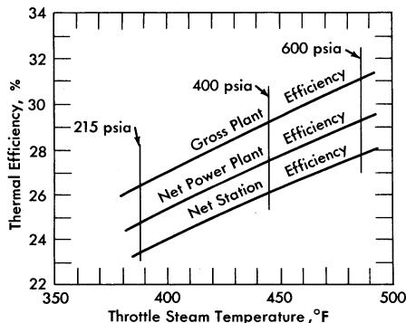  
FIG. 9-1. Effect of steam conditions on turbogenerator plant efficiency.

the desirability of minimizing gas production within the reactor. Unless the superheat is more than $100^{\circ}\mathrm{F}$ , a saturated cycle with moisture separation may be equally as efficient and practical as a cycle using superheated steam, provided that in either case the moisture in the turbine exhaust is kept the same. It is also possible to superheat at the expense of throttle pressure; while superheat normally is considered to increase the thermal efficiency, this is not true if the inlet steam temperature is independent of the amount of superheat. Also, the lower pressure associated with throttling results in increased turbine costs. Superheating by means of a conventional plant does not appear economical.

In studies of homogeneous reactors, saturated steam cycles are assumed in which $12\%$ moisture is permitted in the last stages of the turbine. Thermal efficiencies of such plants are shown in Fig. 9-1 as a function of the steam temperature at the turbine throttle [2].

# 9-3. ONE-REGION U235 BURNER REACTORS

9-3.1 Foster-Wheeler Wolverine Design Study. In response to a request by the Atomic Energy Commission for small-scale power demonstration reactors, the Foster Wheeler Company proposed to construct an aqueous solution reactor for the Wolverine Electric Cooperative in Hersey, Michigan [3]. This proposal was rejected by the Atomic Energy Commission in October 1957 as a basis for negotiation due to increases in the estimated cost of the plant (from $5.5 million to$ 14.4 million). The project was canceled in May 1958 following a review of the design and estimated costs. This review indicated that the cost of generating electricity would be several times as great as that in Wolverine's existing plant.

In December 1957 a group of engineers from the Oak Ridge National Laboratory and Sargent and Lundy, with the help of Foster-Wheeler, redesigned the reactor on the basis of recent advances in homogeneous reactor technology and re-estimated its costs to be $10.7 million [4]. The

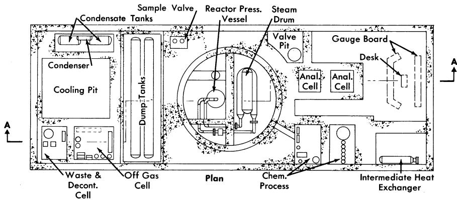

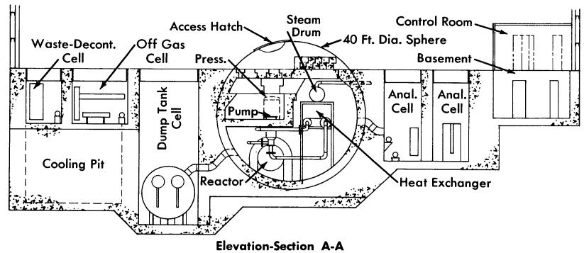  
FIG. 9-2. Plan and sectional elevation of revised Wolverine reactor plant.

following section describes the revised reactor design. Figure 9-2 shows a plan and elevation sketch of the revised concept.

The fuel solution of highly enriched uranyl sulfate in heavy water is circulated by a canned-motor pump located in the cold leg of the primary loop and pressurized to prevent boiling and cavitation in the pump. The steam generated in the heat exchanger is superheated in a gas-fired superheater, and the superheated steam drives conventional turbogenerating equipment for the production of electricity.

The nuclear reactor plant is designed to permit initial operation at $5\mathrm{Mw}$ with a single superheater-turbogenerator unit. By adding a second unit, the capacity can be increased to $10\mathrm{Mw}$ . Doubling the electrical capacity is thus accomplished without making any changes to the reactor other than adjusting the operating temperatures and uranium concentration.

For 10 MwE operation, $31,000\mathrm{kw}$ of heat is generated in the reactor under the following conditions: The hot fuel solution leaves the core at $300^{\circ}\mathrm{C}$ , is circulated through a heat exchanger, and returns to the reactor at $260^{\circ}\mathrm{C}$ . The heat generated in the reactor is transferred to boiling water,

TABLE 9-1   
DESIGN DATA FOR THE REVISED WOLVERINE PRIMARY SYSTEM (10-MWE OPERATION)   

<table><tr><td colspan="2">1. Core</td></tr><tr><td>Configuration</td><td>Concentric outlet</td></tr><tr><td>Core diameter: inside thermal shields, ft</td><td>5</td></tr><tr><td>over-all, ft</td><td>6</td></tr><tr><td>Wall thickness, in.</td><td>3</td></tr><tr><td>Liquid volume, liters</td><td>2550</td></tr><tr><td>Power density, kw/liter</td><td></td></tr><tr><td>Core wall (inner thermal shield)</td><td>4</td></tr><tr><td>Average for system</td><td>6</td></tr><tr><td>Maximum</td><td>55</td></tr><tr><td>Initial fuel concentrations (critical at 300°C), m</td><td></td></tr><tr><td>U235</td><td>0.014</td></tr><tr><td>CuSO4</td><td>0.02</td></tr><tr><td>H2SO4</td><td>0.02</td></tr><tr><td>Steady-state fuel concentrations, m</td><td></td></tr><tr><td>U235</td><td>0.030</td></tr><tr><td>Total U</td><td>0.034</td></tr><tr><td>CuSO4</td><td>0.02</td></tr><tr><td>H2SO4</td><td>0.025</td></tr><tr><td>NiSO4</td><td>0.017</td></tr><tr><td colspan="2">2. Pump</td></tr><tr><td>Fuel flow rate, gpm at 260°C</td><td>2750</td></tr><tr><td>Head, ft</td><td>65</td></tr><tr><td>Approximate pumping power, hp</td><td>80</td></tr><tr><td>(assumes 50% over-all efficiency)</td><td></td></tr><tr><td colspan="2">3. Heat exchanger</td></tr><tr><td>Shell diameter, in.</td><td>29</td></tr><tr><td>Tube diameter, in.</td><td>1/2</td></tr><tr><td>Tube wall thickness, in.</td><td>0.065</td></tr><tr><td>Number</td><td>1120</td></tr><tr><td>Approximate inside area wetted by fuel solution, ft2</td><td>4100</td></tr><tr><td>Steam temperature, °F</td><td>480</td></tr><tr><td>Log mean average temperature difference, °F</td><td>39</td></tr><tr><td>Over-all heat transfer coefficient, Btu/(hr)(ft2)</td><td>500</td></tr><tr><td colspan="2">4. Pressurizer</td></tr><tr><td>Inside diameter, in.</td><td>56</td></tr><tr><td>Wall thickness, in.</td><td>3</td></tr><tr><td>Length of cylindrical portion</td><td>6 ft 9 in.</td></tr><tr><td></td><td>Concentric outlet</td></tr><tr><td>Volume of solution at low level, liters</td><td>150</td></tr><tr><td>Net gas volume (liquid at low level), liters</td><td>1400</td></tr><tr><td>Normal operating pressure, psia</td><td>1900</td></tr><tr><td>Normal operating temperature, °F</td><td>570</td></tr><tr><td colspan="2">5. Piping</td></tr><tr><td>Nominal diameter, in.</td><td>10</td></tr><tr><td>Wall thickness, in.</td><td>1.125</td></tr><tr><td>Approximate total volume, liters</td><td>950</td></tr><tr><td>Maximum velocity, fps</td><td>17</td></tr><tr><td>6. Estimated power costs (10-MwE plant)</td><td>Mills/kwh</td></tr><tr><td colspan="2">31-Mw reactor plant ($8,740,000)</td></tr><tr><td>Fuel burned</td><td>2.83</td></tr><tr><td>Fuel inventory @ 4%</td><td>0.67</td></tr><tr><td colspan="2">(9000 kg D2O + 36.5 kg U235)</td></tr><tr><td>Fuel processing</td><td>2.46</td></tr><tr><td>Fuel preparation</td><td>0.62</td></tr><tr><td>D2O losses</td><td>0.30</td></tr><tr><td>Depreciation @ 15%</td><td>18.72</td></tr><tr><td>Operating costs</td><td>1.43</td></tr><tr><td>Maintenance costs</td><td>3.85</td></tr><tr><td colspan="2">10-MwE superheater-turbine generator plant ($1,940,000)</td></tr><tr><td>Fuel (oil)</td><td>0.69</td></tr><tr><td>Depreciation @ 15%</td><td>4.17</td></tr><tr><td>Operating costs</td><td>0.29</td></tr><tr><td>Maintenance costs</td><td>0.29</td></tr><tr><td>Total power costs</td><td>36.32</td></tr></table>

producing 116,000 lb/hr of steam at 600 psia. For operation at 5 MwE, the hot fuel solution would leave the reactor core at $276^{\circ}\mathrm{C}$ and return at $257^{\circ}\mathrm{C}$ , producing 58,000 lb/hr of steam at 600 psi.

A pressurizer is connected to the outlet of the heat exchanger to pressurize the system with oxygen to 1900 psia and to provide a location in the primary system for the removal of fission-product and other noncondensable gases. The layout of the primary system is such as to permit heat removal by natural circulation in case of pump failure.

A low-pressure system consisting of dump tanks, condenser, and condensate tanks is incorporated to handle fluid discharged from the primary loop and to furnish heavy water required to purge the canned-motor cir

culating pump. Facilities for adjusting fuel concentration and maintaining a continuous record of fuel inventory are also included.

Design data. Pertinent design information for the reactor systems and components is summarized in Table 9-1 and described in the following paragraphs. Unless otherwise noted, all surfaces in contact with fuel solution are fabricated of type-347 stainless steel.

Equipment and system descriptions. Reactor vessel. The single-region, concentric-inlet and -outlet pressure vessel designed for 2500 psia incorporates two inner concentric thermal shields to reduce gamma heating effects in the outer pressure vessel. The thermal shields are constructed of type-347 stainless steel and are 1 in. and 2 in. thick with inside diameters of 5 ft 0 in., and 5 ft 5 in., respectively. Backflow through the vessel drain line during normal operation provides some cooling of the outer thermal shield.

Primary heat exchanger. The steam generator consists of a horizontal U-shaped shell-and-tube heat exchanger with a separate steam drum. These are interconnected with downcomers and risers to provide natural circulation of the boiling secondary water. Fuel solution is circulated on the tube side of the heat exchanger, and the boiling secondary water is circulated on the shell side. Feedwater is introduced into the liquid region of the steam separating drum. All components in contact with secondary water and steam are to be fabricated from conventional boiler steels.

Fuel circulating pump. A single, constant-speed, water-cooled, canned-motor type pump is provided to maintain fuel circulation in the primary loop. The rotating elements are removable through the top of the unit, and may be removed without disturbing the piping connections to the stator casing or the pump volute. Regions of high fluid velocity in the pump, including the impeller, are titanium or titanium-lined. A purge flow of condensate is fed into the top end of the pump to reduce erosion and corrosion of bearings, as well as to prolong the life of the motor windings by reducing the radiation dose to the electrical installation. In the event of pump failure, the reactor will undergo a routine shutdown and the fission-product decay heat will be removed by natural circulation through the steam generator.

Pressurizer. A small sidestream of fuel solution is continuously directed into the pressurizer, where it spills through a distribution header and drips down through an oxygen gas space to the liquid reservoir in the bottom of the vessel. The pressurizer liquid return line is connected to the suction side of the primary-loop circulating pump. Oxygen is added batchwise to the pressurizer to keep the fuel saturated at all times to prevent precipitation of uranium. As fission-product gases accumulate in the pressurizer, they are vented to the off-gas system, also in a batchwise operation.

Fuel makeup pump. Two diaphragm-type high-head pumps (one for

standby) rated at 3 gpm at a pressure of 1900 psi are provided to add uranium to the fuel solution and to fill the primary system with fluid on startup.

Dump tanks. The dump tanks, 48 ft long and 28 in. ID, are designed to remain subcritical while holding the entire contents of the primary system. An evaporator section underneath each of the vessels is provided to concentrate the fuel when necessary, and to aid in mixing the contents of the tank.

Containment. The primary coolant system is enclosed in a 40-ft-diameter spherical carbon-steel vessel, lined with 2 ft of concrete, interconnected with a 12-ft-diameter by 50-ft-long stainless-clad vessel housing the dump tanks. The liner serves the dual functions of missile protection and structural support to withstand the loading of the external concrete. An additional 1/8-in. stainless steel liner is furnished to permit decontamination of the primary cell. Since these vessels provide a net containment volume of approximately $31,000\mathrm{ft}^3$ , the vaporization and release of the reactor contents results in a maximum pressure of approximately 105 psi. Accordingly, the primary-cell containment vessel wall thickness is 15/16 in. and the dump-tank containment vessel wall thickness is 9/16 in. A spray system is incorporated in the design to quickly reduce the pressure within the containment vessel by condensing the water vapor present.

A bolted hatch is provided in the top head of the vessel to allow access and removal of equipment for maintenance. A bolted manway is also provided to permit entrance into the containment vessel without removing the larger auxiliary hatch. In the event of a major maintenance program, however, the top closure would be cut and removed for free access to the primary cell.

Biological shielding. The plant biological shielding is indicated on the general arrangement drawing (Fig. 9-2). The shielding for the primary system, including the reactor core, consists of a 2-ft thickness of ordinary concrete lining the inside of the primary-cell containment vessel and a minimum of 7 ft of concrete surrounding the outside of the vessel, cooled by a series of cooling-water coils located in the 2-ft-thick liner. The top of the primary vessel is shielded with 6 ft of removable blocks of barytes aggregate concrete (average density of approximately $220\mathrm{lb / ft^3}$ ) located beneath the removable portion of the containment vessel.

A 2-ft-thick water-cooled heavy aggregate thermal shield is placed around the reactor vessel to reduce the radiation level to approximately that of the remainder of the primary system. The primary coolant pump access pit, located inside the containment vessel, is constructed of $3\frac{1}{2}$ ft of barytes aggregate concrete to permit pump removal after the primary cell has been filled with water and the system drained and partially decontaminated. During periods of normal operation, the temperature of the

concrete walls and floor of the pit is maintained at $150^{\circ}\mathrm{F}$ by cooling-water coils.

Around each of the analytical and chemical processing cells there will be a minimum of 4 ft of ordinary concrete with a maintenance gallery between these facilities for access to, and operation of, the cells. Each of the two analytical cells will be provided with thick glass windows adequate for shielding. The dump-tank cell will be shielded by a 5-ft thickness of concrete.

Remote maintenance. Both dry and underwater removal methods are proposed for remote maintenance of radioactive components in this system, following practices similar to those developed for HRE-2. All the equipment cells are provided with stainless-steel liners to permit the cells to be filled with ordinary water during maintenance operations. For removal of the large components it is necessary to move the container vessel cover through the west end of the building to a temporary storage area. After the primary vessel cover and top shield are removed, the system components are accessible by crane and operations are performed with specially designed long-handled tools.

9-3.2 Aqueous Homogeneous Research Reactor—feasibility study. A preliminary investigation of the feasibility of an aqueous homogeneous research reactor (HRR) for producing a thermal flux of $5 \times 10^{15}$ neutrons/( $\mathrm{cm}^2$ ) (sec) was completed by the Oak Ridge National Laboratory in the spring of 1957 [5]. The design considered is illustrative of a homogeneous reactor capable of producing high neutron fluxes for research and power for the production of electricity. It consists of a 500-Mw (thermal) single-region reactor with $8\%$ enriched uranium as the fuel in the form of uranyl sulfate ( $10\mathrm{g}$ of total uranium per kilogram of $\mathrm{D}_2\mathrm{O}$ ) with sufficient copper sulfate added to recombine $100\%$ of the radiolytic gases produced and excess sulfuric acid to stabilize the copper sulfate, uranyl sulfate, and corrosion-product nickel.

The system operates at solution temperatures of 225 to $275^{\circ}\mathrm{C}$ , and a total system pressure of 1400 psia. Under these conditions a maximum thermal neutron flux of $6.5 \times 10^{15}$ neutrons/( $\mathrm{cm}^2$ ) (sec) is achieved in a 10-ft-diameter stainless-steel-lined carbon-steel sphere. Approximate power densities are 2 kw/liter at the core wall, 35 kw/liter average, and 110 kw/liter maximum. After correcting for the effect of experiments, a maximum thermal flux of about $3 \times 10^{15}$ neutrons/( $\mathrm{cm}^2$ ) (sec) and a fast neutron flux of about $5 \times 10^{14}$ neutrons/( $\mathrm{cm}^2$ ) (sec) are available.

To minimize corrosion of equipment and piping in the external circuit, all flow velocities are held to values below the critical velocities. Estimated corrosion rates are 70 to 80 mpy for the Zircaloy-2 experimental thimbles and about 10 mpy for the stainless-steel liner of the reactor vessel (based on a maximum flow velocity of 3 fps).

TABLE 9-2 HRR STEAM-GENERATOR SPECIFICATIONS (ONE UNIT)   

<table><tr><td colspan="2">Reactor fluids, forced circulation (tube side)</td></tr><tr><td>Inlet temperature, °F</td><td>527</td></tr><tr><td>Outlet temperature, °F</td><td>437</td></tr><tr><td>Flow rate, lb/hr</td><td>2,730,000</td></tr><tr><td>Pressure, psia</td><td>1400</td></tr><tr><td>Velocity through tubing, fps</td><td>10</td></tr><tr><td colspan="2">Steam, natural recirculation (shell side)</td></tr><tr><td>Generation temperature, °F</td><td>417</td></tr><tr><td>Pressure, psia</td><td>300</td></tr><tr><td>Generation rate, lb/hr</td><td>351,600</td></tr><tr><td>Heat load, Btu/hr</td><td>284,300,000</td></tr><tr><td>Heat load, Mw</td><td>83.3</td></tr><tr><td colspan="2">Steam generator</td></tr><tr><td>Number of 3/8-in. 18 BWG tubes</td><td>3280</td></tr><tr><td>Effective length of tubing, ft</td><td>25.9</td></tr><tr><td>Heat-transfer surface, ft2</td><td>8330</td></tr><tr><td>Shell internal diameter, in.</td><td>381⁄2</td></tr><tr><td>Shell thickness, in.</td><td>17⁄8</td></tr><tr><td>Tube-sheet thickness, in.</td><td>5</td></tr><tr><td colspan="2">Steam drum</td></tr><tr><td>Internal diameter, in.</td><td>36</td></tr><tr><td>Length, ft</td><td>16</td></tr><tr><td>Wall thickness, in.</td><td>13⁄4</td></tr><tr><td>Height above generator, ft</td><td>15</td></tr></table>

Fission- and corrosion-product solids, produced at a rate of approximately 20 lb/day under normal reactor operating conditions, are concentrated into 750 liters of fuel solution by means of hydroclones with self-contained underflow pots and removed from the reactor to limit the buildup of fission and corrosion products. This solution is subsequently treated for recovery of uranium and $\mathrm{D}_2\mathrm{O}$ .

The temperature coefficient of reactivity at $250^{\circ}\mathrm{C}$ is approximately $-2.5 \times 10^{-3} / {}^{\circ}\mathrm{C}$ and at $20^{\circ}\mathrm{C}$ is approximately $-9 \times 10^{-4} / {}^{\circ}\mathrm{C}$ , which, in combination with fuel-concentration control, is adequate for operation without control rods.

Reactor vessel. The 10-ft-ID spherical pressure vessel is designed according to the ASME Unfired Pressure Vessel Code, with consideration given to

TABLE 9-3   
KEY DESIGN PARAMETERS   

<table><tr><td>Reactor type</td><td>Single-region, circulating-fuel, homogeneous</td></tr><tr><td>Fuel type</td><td>UO2SO4-D2O+CuSO4+H2SO4</td></tr><tr><td>Amount of U235</td><td>45.8 kg</td></tr><tr><td>Uranium concentration</td><td></td></tr><tr><td>Total uranium</td><td>10 g/liter at 250°C</td></tr><tr><td>U235</td><td>0.8 g/liter at 250°C</td></tr><tr><td>CuSO4to recombine 100% of gas</td><td>0.02 m</td></tr><tr><td>H2SO4to stabilize uranium and copper</td><td>0.02 m</td></tr><tr><td>Maximum nickel concentration</td><td>0.01 m</td></tr><tr><td>Fuel-solution temperature</td><td></td></tr><tr><td>Minimum (inlet to reactor vessel)</td><td>225°C</td></tr><tr><td>Maximum (outlet of reactor vessel)</td><td>275°C</td></tr><tr><td>Average (system)</td><td>250°C</td></tr><tr><td>Fuel system pressure</td><td>1400 psi</td></tr><tr><td>Neutron flux (experimental)</td><td></td></tr><tr><td>Maximum thermal</td><td>3-4 × 1015 n/(cm2)(sec)</td></tr><tr><td>Maximum fast in 1-in. diameter cylindrical converter</td><td>4 × 1014 to 1 × 1015 n(cm2)(sec)</td></tr><tr><td>Power density</td><td></td></tr><tr><td>Maximum (at reactor center)</td><td>110 kw/liter</td></tr><tr><td>Average</td><td>34 kw/liter</td></tr><tr><td>Minimum (at thermal shield)</td><td>2 kw/liter</td></tr><tr><td>Total heat generated</td><td>500 Mw</td></tr><tr><td>Reactor-vessel key specifications</td><td></td></tr><tr><td>Inside diameter</td><td>10 ft</td></tr><tr><td>Vessel material</td><td>Carbon steel clad with type-347 stainless steel</td></tr><tr><td>Total volume</td><td>14,800 liters</td></tr><tr><td>Net fluid volume (approximate)</td><td>12,000 liters</td></tr><tr><td>Experimental facilities</td><td></td></tr><tr><td>Horizontal</td><td>6</td></tr><tr><td>Vertical</td><td>1</td></tr><tr><td>Maximum inside diameter</td><td>6 in.</td></tr><tr><td>Material</td><td>Zircaloy-2</td></tr><tr><td>Minimum wall thickness</td><td>3/4 in.</td></tr><tr><td>Maximum wall thickness</td><td>1 in.</td></tr><tr><td>External system</td><td></td></tr><tr><td>Material</td><td>Type-347 stainless steel, HRP specifications</td></tr><tr><td>Fluid volume (external system only)</td><td>34,000 liters</td></tr><tr><td>Allowable velocities</td><td></td></tr><tr><td>225°C</td><td>10-15 fps</td></tr><tr><td>250°C</td><td>25-35 fps</td></tr><tr><td>275°C</td><td>30-40 fps</td></tr><tr><td>Reactor control</td><td>Negative temperature coefficient of reactivity, changes in concentration of fuel</td></tr><tr><td>Heat dissipation</td><td>Generation of approximately 125 Mw of electrical power</td></tr></table>

the special problems introduced by the heating of the shell from radiation absorption and by the necessity of penetrating the shell for insertion of experimental thimbles. The proposed vessel is fabricated of a carbon-steel base material with a type-347 stainless steel cladding on all surfaces exposed to fuel solution.

The fuel solution enters the vessel through two 24-in. nozzles, sized for a fluid velocity of 10 to 15 fps, flows upward through the vessel, and exits through two 18-in. nozzle connectors in the top, sized for a fluid velocity of 30 to 40 fps. A diffuser screen, serving also as part of the thermal shield, is placed at the entrance to the reactor vessel.

A stainless steel blast shield is placed around the reactor vessel to contain fragments of the vessel in the event of a brittle failure, and cooling coils are wrapped around the blast shield to control the pressure-vessel temperature.

Heat exchangers (steam generators). Six heat exchangers of 83.3 Mw capacity each are required to dissipate the 500 Mw of heat generated in the reactor. The design of these consists of a lower vaporizing shell connected to a steam drum at a suitable elevation to promote natural circulation by means of risers and downcomers welded to the shells. Specifications are summarized in Table 9-2.

Pressurizer. The pressurizer surge chamber, constructed of 24-in. schedule-100 pipe provides the necessary 1500 liters of surge volume. Steam is provided in a small high-pressure steam generator physically separated from the pressurizer surge chamber. Space limitations and accessibility problems make this separation desirable.

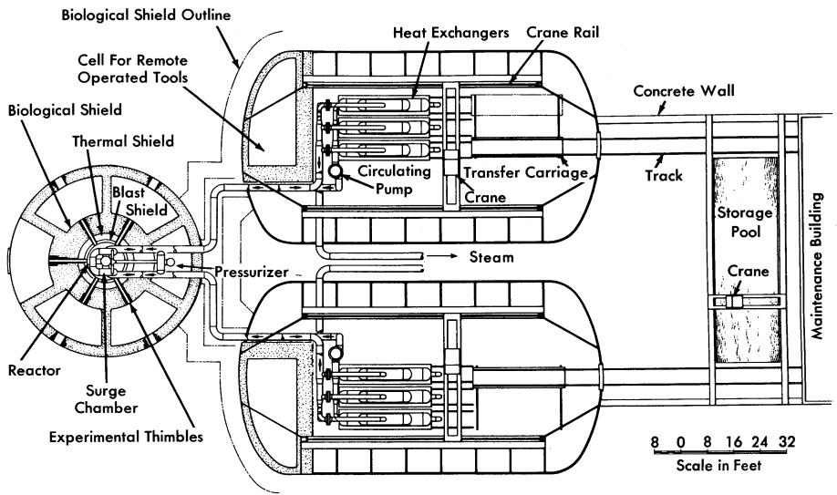  
FIG. 9-3. Homogeneous Research Reactor layout plan view.

System design. Two 17,650-gpm pumps mounted on the outlet pipes of the heat exchanger circulate the reactor solution around the primary circuit. Saturated steam at 300 psia is generated at a rate of $2.11 \times 10^{6} \mathrm{lb/hr}$ and is used to generate $133,000 \mathrm{kw}$ of gross electrical power at a cycle efficiency of $26.5\%$ . A net power generation of $125,000 \mathrm{kw}$ will be delivered at the station bus bars, approximately $6\%$ being required for station auxiliaries. Feedwater, consisting of $\mathrm{D}_{2} \mathrm{O}$ from the condensate tank, is supplied to the steam generator through an economizer by means of a 0.5-gpm feedwater pump. The reactor does not contain a letdown system for separating and recombining radiolytic gases, since $100\%$ internal recombination will be achieved by means of internal copper catalyst. Key design parameters are summarized in Table 9-3.

Conceptual layouts of reactor complex. Preliminary conceptual layouts showing the relation of the items pertaining to the nuclear reactor components are given by Figs. 9-3 and 9-4.

Figure 9-3 is a plan view of the reactor complex, indicating the general relation of the reactor pressure vessel and its auxiliaries to the heat exchangers and circulating pumps. Shielded cubicles around the reactor provide a means for handling the experimental thimbles. The outer diameter of the containment vessel around the cubicles is approximately 60 ft. Approximately 6 ft of high-density concrete is placed around the reactor area, with an additional 3 ft around the periphery of the containment vessel.

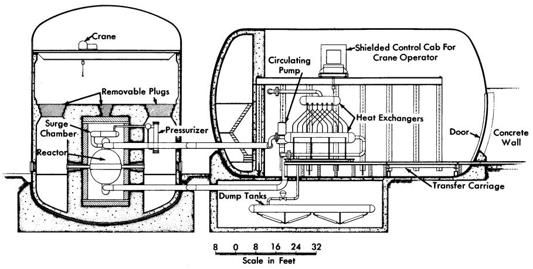  
FIG. 9-4. Homogeneous Research Reactor layout sectional elevation.

A sectional elevation of the reactor complex is shown in Fig. 9-4. The arrangement of the heat exchangers relative to the reactor vessel is such that natural circulation through the system will be promoted in the event of pump failure. Since the centerline of the reactor vessel is located at 30 to 36 in. above the operating-floor level for convenience in experimentation, the containment vessels for the heat exchangers and circulating pumps are above ground. The containment vessel for the reactor is a vertical cylindrical tank. Two separate horizontally mounted containment vessels, each 60 ft in diameter, house the heat-exchanger equipment. The dump tanks are directly below the heat-exchanger containment vessels. Means for limited access to those portions of the dump-tank system which will require periodic maintenance, such as dump valves, is provided.

Unique design features. Five horizontal in-pile thimbles spaced equally on the midplane of the reactor opening into cubicles, and one vertical nozzle, opening from the top of the reactor, are included in the design. Figure 9-5 shows the location of the thimbles relative to the containment vessel and cubicles, and the shield arrangement. As shown by Fig. 9-5, piping to the heat exchangers passes through one of the hot-cell working areas. Consequently, this area is not usable for experiments, but contains the pressurizer and other items which must be adjacent to the reactor but removed far enough from the reactor cell to permit maintenance.

Maintenance concept. Both dry and underwater removal methods have been investigated for the HRR; however, both schemes present difficult design problems. Dry-maintenance philosophy, chosen on a somewhat arbitrary basis, has been followed in the layouts presented herein.

Maintenance of equipment in the reactor compartment is expected to

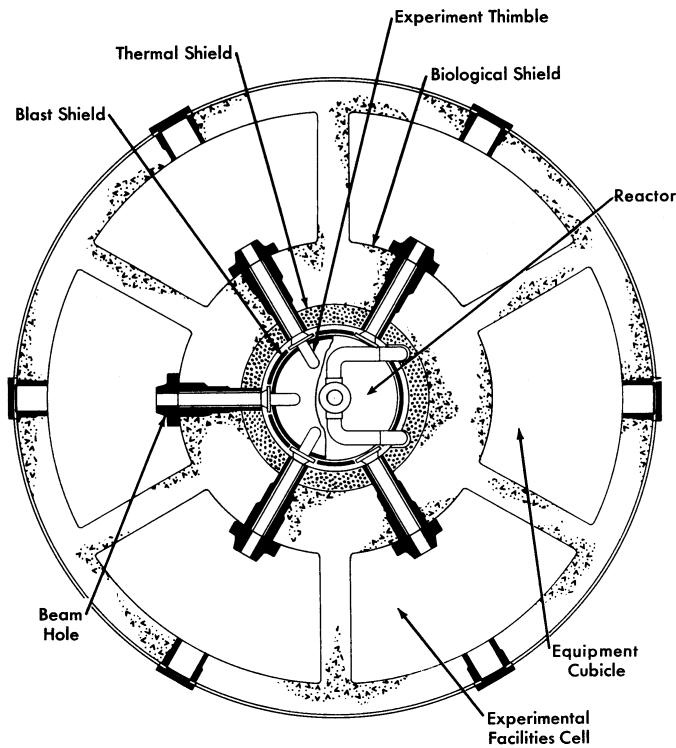  
FIG. 9-5. Plan view of Homogeneous Research Reactor, showing pressure vessel shielding and cells for remote handling of experiments.

be largely confined to the reactor auxiliary equipment and to the experimental thimbles and equipment. The reactor vessel itself is designed for the life of the system with thickness for the pressure-vessel wall and corrosion liner selected accordingly on the basis of existing corrosion data.

The handling equipment in the reactor containment vessel consists of a revolving-type crane with a shielded cab for the operator and provision for remote operation from outside the shielded area using commercial, remotely operated television cameras. Access from above to any part of the area is thus possible and all flanges and pipe disconnects are faced upward to facilitate removal.

A horizontal traveling crane, also with a shielded control cab and remote-operation control, is provided in each of the containment vessels for removal of the heat-exchanger equipment. Flanges connecting the circulating pumps and heat exchangers with the main piping are faced horizontally in these installations. All flanges are grouped at one end of the area and bolts are removed by means of remotely manipulated tools from a shielded cell. The heat exchangers, mounted on wheeled dollies guided by

tracks, can be moved horizontally along the track and onto another track section which can move transversely. From this section, the heat exchanger is moved through a large air-lock type of door at the end of the containment vessel to the maintenance area. The circulating pumps are designed so that the pump impeller and motor windings may be removed vertically without removing the pump casing.

During any part of the maintenance procedure, the system is shut down and drained and the piping and equipment decontaminated as thoroughly as possible. Shutoff valves of a size and type suitable for the piping of the HRR have not been developed.

9-3.3 The Advanced Engineering Test Reactor. A study was completed in March 1957 by Aeronutronic Systems, Inc., to select a reactor system for an advanced engineering test reactor (AETR), with seven major loop facilities providing a thermal-neutron flux $>2 \times 10^{15}$ neutrons/( $\mathrm{cm}^2$ ) (sec) [6]. To obtain the required flux level while keeping the power density low, only heavy water-moderated reactors were considered. Comparisons of two heterogeneous and one homogeneous type, and comparison of single and multiple reactor installations, led to the conclusion that a single homogeneous reactor provides the greatest flexibility and is the most economical system for research at high neutron fluxes. A description of the homogeneous AETR reference design by the Aeronutronic group is given below:

Description of reactor. The 500-Mw reactor consists of a large core operating at moderate temperature and pressure and containing a $\mathrm{D}_2\mathrm{O}$ solution of $10\%$ enriched uranyl sulfate (10 g total U/liter). The reactor design, which was based upon the design and operational experience of the HRE-1 and HRE-2 and upon a design study for a homogeneous research reactor by ORNL, features continuous fission-product removal and fuel addition to maintain the total contained excess reactivity at an essentially constant level. In the center, or loop region, the unperturbed thermal-neutron flux is approximately $6\times 10^{15}$ neutrons/( $\mathrm{cm}^2$ ) (sec).

The reactor vessel is a spherical, stainless steel container with an internal diameter of 8 ft and a wall thickness of $3/4$ in., contained in a cylindrical pressure vessel with balanced pressures inside and out. The design is such that the test loop and coolant circuit tubes emerging through the lid of the pressure vessel can be disconnected, the packing glands at the bottom of the pressure vessel removed, and the entire reactor core vessel can be lifted out of the main container. The thin walls of the core vessel give it a low gross weight, enabling it to be lifted conveniently.

The cylindrical pressure vessel, 10 ft in diameter, $12\frac{1}{2}$ ft high, and 3 in. thick, is constructed of carbon steel to the specifications of the unfired pressure vessel code for an internal working pressure of 500 psia.

Operating parameters of the AETR are summarized in Table 9-4.

TABLE 9-4   
KEYDESIGNPARAMETERS (AETR)   

<table><tr><td>Type</td><td>Thermal, homogeneous</td></tr><tr><td>Total heat power</td><td>500 Mw</td></tr><tr><td>Fuel</td><td>Aqueous solution of UO2SO4in D2O</td></tr><tr><td>Fuel content</td><td></td></tr><tr><td>Core</td><td>80 kg uranium, enriched to 10%</td></tr><tr><td></td><td>6.5–8.5 kg U235</td></tr><tr><td></td><td>7500 liters fuel solution</td></tr><tr><td>System</td><td>375 kg uranium</td></tr><tr><td></td><td>37.5 kg U235</td></tr><tr><td></td><td>37,500 liters fuel solution</td></tr><tr><td>Fuel temperature: Inlet</td><td>98°C</td></tr><tr><td>Outlet</td><td>153°C</td></tr><tr><td>System pressure</td><td>500 psia</td></tr><tr><td>Flux (no test loops): Maximum thermal</td><td>6 × 1015n/(cm2)(sec)</td></tr><tr><td>Power density distribution (with no loops): Maximum (center)</td><td>220 kw/liter</td></tr><tr><td>Average</td><td>70 kw/liter</td></tr><tr><td>Minimum (wall)</td><td>4 kw/liter</td></tr></table>

# 9-4. ONE-REGION BREEDERS AND CONVERTERS

9-4.1 The Pennsylvania Advanced Reactor $\mathbf{U}^{233}$ -thorium oxide reference design. The Pennsylvania Power and Light Company and the Westinghouse Electric Corporation joined forces in November 1954 to survey various reactor types for power generation. The results of the survey indicated the potential of the aqueous homogeneous reactor to be exceedingly encouraging and led to the formal establishment of the Pennsylvania Advanced Reactor Project in August 1955 to study the technical and economic feasibility of a large aqueous homogeneous reactor plant for central service application having an electrical output of at least $150,000\mathrm{kw}$ .

Two reactor plant reference designs were completed, and preliminary equipment layouts and cost estimates of these two plants were prepared [7,8]. In the first design it was proposed to use overhead dry maintenance with the equipment housed in a vertical cylinder 124 ft in diameter and 175 ft long. By incorporating shutoff valves in the system, any one of the four main coolant loops could be isolated in case of an equipment failure to permit the remainder of the plant to continue operation. At a convenient time, the plant would be shut down and the defective item removed and replaced with remote equipment such as heavy-duty manipulators, special

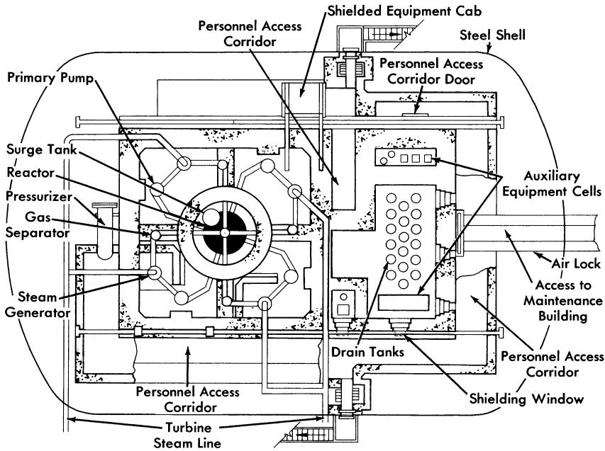  
FIG. 9-6. Plan view of Pennsylvania Advanced Reactor Reference Design No. 1A (courtesy of Westinghouse Electric Corp).

jigs and fixtures, and television viewing equipment lowered into the compartment. However, it was concluded that such a scheme would be extremely expensive. Therefore, a new design (Reference Design 1A) was prepared based on the specifications embodied in the following recommendations:

(1) Elimination of stop valves in each loop and abandonment of the idea of partial plant operation.   
(2) Compartmentalization of equipment depending on type and level of radioactivity.   
(3) Use of semidirect maintenance techniques wherever possible.   
(4) Modification of the vapor container design to permit personnel access in limited areas during plant operation.   
(5) Increased emphasis on design of components to minimize difficulty of maintenance.

Figures 9-6 and 9-7 show a plan and cross-sectional elevation of Reference Design 1A. In this design, a mixed-oxide slurry of a concentration of about $260\mathrm{g / kg}$ of $\mathbf{D}_2\mathbf{O}$ , corresponding to a solids concentration of approximately $3\%$ by volume, is circulated through the reactor vessel releasing $550,000\mathrm{kw}$ of thermal power, which in turn yields $150,000\mathrm{kwE}$ . Leaving the reactor vessel, the slurry branches into four parallel identical loops.

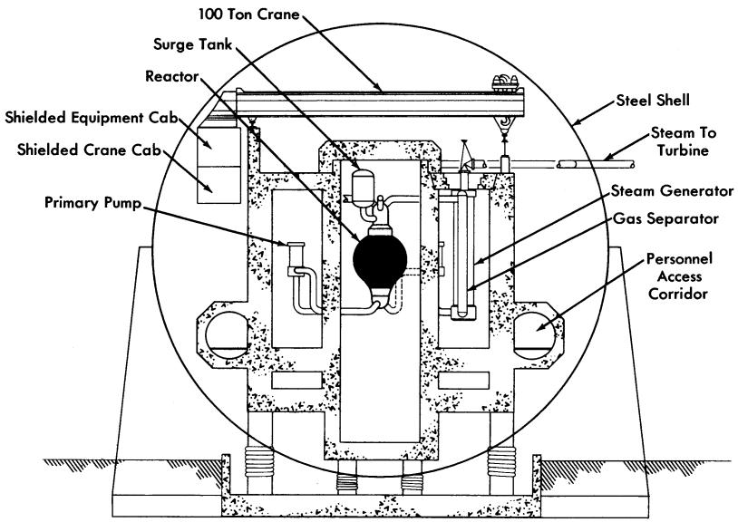  
FIG. 9-7. Cross section through main loops of proposed Pennsylvania Advanced Reactor (courtesy of Westinghouse Electric Corp.).

Each loop contains a circulating pump, a gas separator, and a steam generator. The system is pressurized with 2000 psia steam generated in a $\mathrm{D}_2\mathrm{O}$ steam generator connected to a surge chamber mounted in close-coupled position to the reactor vessel. The major portion of radiolytic gases is recombined internally; the remainder ( $\sim 10\%$ ) is left unrecombined in order to purge the system of xenon and other gaseous fission products. These gases are removed from the main stream by a pipeline gas separator to a catalytic-type recombiner. The recombined heavy water is used to wash the primary-pump bearings and as makeup water to the steam pressurizer.

A small bleed stream is concentrated in the slurry letdown system and delivered to a chemical processing plant where the uranium and thorium are recovered by a thorex solvent extraction process. The chemical plant is designed for a small throughput and low over-all decontamination factors. Although the rates of flow to the auxiliary systems are small compared with the 18,000,000 lb/hr rate of circulation in the primary system, these auxiliary systems contribute the major part of the complexity of the plant and a large fraction of its cost.

The reactor plant layout shown in Figs. 9-6 and 9-7 consists essentially of a horizontal steel cylinder 125 ft in diameter and 132 ft long with 7-ft-thick biological shielding walls completely separate from the vapor con

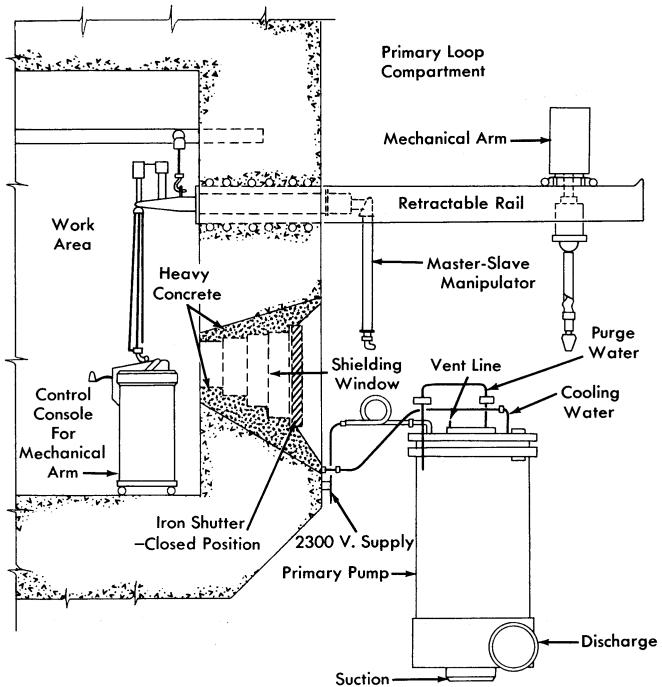  
FIG. 9-8. Primary circulating pump maintenance, Pennsylvania Advanced Reactor (courtesy of Westinghouse Electric Corp.).

tainer. The reactor vessel is shielded separately; however, the four primary coolant loops are contained in one large compartment with no shielding between the separate loops. Auxiliary equipment is contained in separate compartments, the equipment being segregated according to the type and level of radioactivity after shutdown. All four of the primary coolant loops are designed with polar symmetry to permit any component to be used as a replacement part in any of the four loops, and any special equipment required to be equally adaptable to all four loops. In addition, like pieces of equipment have been grouped to permit the use of relatively permanent maintenance facilities designed into that particular area. Personnel access corridors are provided to permit limited access to certain areas inside of the vapor container during full power operation of the reactor.

Dry-maintenance operations are accomplished primarily through the use of a 100-ton, shielded-cab crane which traverses the length of the reactor container. Since the cab can be occupied during operation, the crane serves as a remote tool for handling heavy shield blocks and removing and replacing equipment. The design is based on an all-welded piping system and removal of any item requires a remote cutting and welding machine not yet developed.

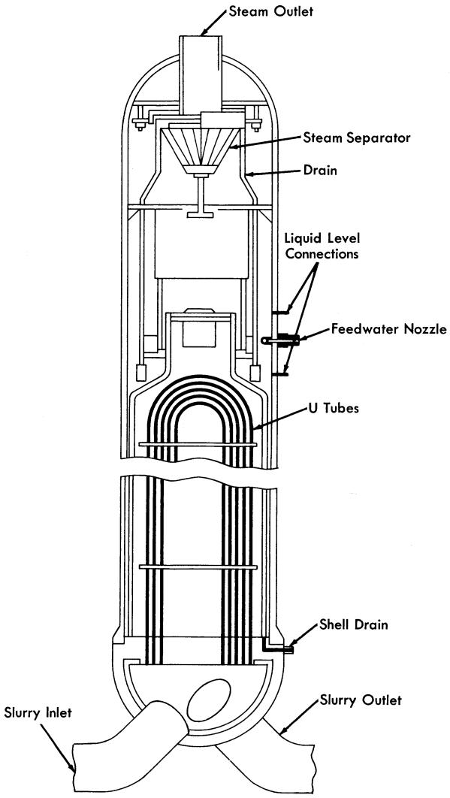  
FIG. 9-9. Steam generator for Pennsylvania Advanced Reactor (courtesy of Westinghouse Electric Corp.).

Because of the vulnerability of the circulating pumps and steam generators, special modifications are provided to permit these items to be repaired in place. A maintenance facility for repair of the primary circulating pumps is shown in Fig. 9-8. This consists of two mechanical master-slave manipulators inserted through the shielding wall adjacent to the pump, and a mechanical arm which may be placed on two retractable rails cantilevered from the shielding wall. Visibility is obtained by a glass shielding

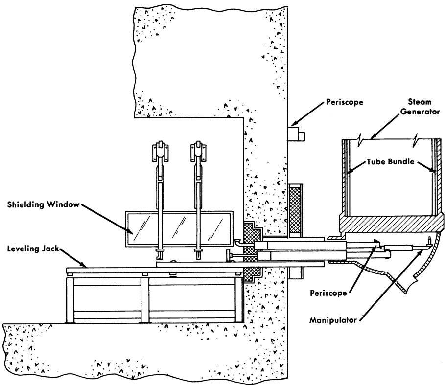  
FIG. 9-10. Facility for remote maintenance of Pennsylvania Advanced Reactor steam generator (courtesy of Westinghouse Electric Corp.).

window located beneath the manipulators. The window is designed to be an effective shield only during plant shutdown, and will be covered by iron shutters during plant operation to provide neutron and thermal shielding. A second shielding wall is located behind the work area to make up for the thin wall at this point.

The pump is provided with flanged joints with bolts and all other connections at the top for easy accessibility. The low-pressure cooling water connections are easily disconnected with the manipulators. The high-pressure purge line and vent lines, however, must be disconnected through flanges or by cutting and rewelding. The large flange bolts on the pump are provided with centrally drilled holes into which electric resistance heaters can be inserted with the mechanical master-slave manipulator. The heated bolts are easily loosened with a power-driven wrench held by the mechanical arm and removed with the master-slave manipulator. A lifting fixture is then lowered from the overhead crane and attached to

the pump flange and pump internals, which are then pulled from the pump volute casing. The pump is reinstalled in reverse order.

The steam generator shown in Fig. 9-9 uses inverted vertical U-tubes and has an integral steam separator. The unit is 6 ft in diameter and has an over-all length of about 40 ft. Because of the physical size and cost, it is not considered practical to use the spare-part replacement philosophy for this component. Instead, the design of the steam generator and the over-all plant layout is such that remote maintenance in place is possible without requiring a prohibitively long shutdown of the plant.

Figure 9-10 illustrates the proposed semiremote method for locating and repairing a leaky boiler tube.

The facility consists of a manipulator unit mounted on a horizontal rack which drives the unit through the shielding wall into access holes in the steam generator head. The manipulator is used to carry and position a detector for locating a leaky tube and the necessary tools for plugging and welding the tube. The faulty tube is prepared for welding by a specially designed grinding machine positioned and supported by the manipulator. The grinder will automatically shape the tube for a plug and the seal weld which will be made with an automatic welder. This equipment can be moved from one cell to another as needed; thus all four steam generator tube sheets can be maintained by semiremote methods.

9-4.2 Large-scale aqueous plutonium-power reactors. Studies of the feasibility and economics of producing plutonium in homogeneous reactors fueled with slightly enriched uranium as $\mathrm{UO}_2\mathrm{SO}_4$ in $\mathrm{D}_2\mathrm{O}$ were carried out by the Oak Ridge National Laboratory [9-11], by the Argonne National Laboratory [12-13], and by others [14-15]. The studies were all based on one-region converters constructed of stainless steel utilizing spherical pressure vessels ranging in size from 15 to 24 ft in diameter. The design and operating characteristics of typical reactors considered in the studies are summarized in Table 9-5.

The general conclusion reached was that aqueous homogeneous reactors are potentially very low-cost plutonium producers; however, considerable development work remains before large-scale reactors can be constructed. The major problem is due to the corrosiveness of the relatively concentrated uranyl sulfate solutions used in such reactors, which requires that all the equipment in contact with high-temperature fuel be made of titanium, or carbon-steel lined, or clad with titanium. The development of suitably strong titanium alloys, bonding methods, or satisfactory steel-titanium joints has not yet proceeded sufficiently to consider the construction of full-scale plutonium producers. Alternate approaches, such as the addition of $\mathrm{Li_2SO_4}$ to reduce the corrosiveness of stainless steel by the fuel solution (see Chap. 5), show promise but also require further development.

TABLE 9-5   
CHARACTERISTICS OF LARGE-SCALE AQUEOUS PLUTONIUM PRODUCERS   

<table><tr><td rowspan="2"></td><td colspan="6">Source of Data</td></tr><tr><td>ORNL-855</td><td>ORNL-1096</td><td>ORNL-CF-52-8-7</td><td>ORNL-1096 Rev. Data</td><td>ANL-4891</td><td>CEPS-1101</td></tr><tr><td>Date</td><td>Oct. 1950</td><td>Dec. 1951</td><td>Aug. 1952</td><td>1955</td><td>Dec. 1952</td><td>May 1952</td></tr><tr><td>Power, Mw (thermal)</td><td>1000</td><td>2000</td><td>1028</td><td>2000</td><td>1028</td><td>1064</td></tr><tr><td>Net electric output, Mw</td><td>230</td><td>470</td><td>228</td><td>435</td><td>211</td><td>211</td></tr><tr><td>Reactor core diameter, ft</td><td>24</td><td>15</td><td>15</td><td>15</td><td>15</td><td>12</td></tr><tr><td>Pressure vessel thickness, in.</td><td>5.3</td><td>4.5</td><td>7</td><td>—</td><td>7</td><td>—</td></tr><tr><td>Fuel concentration, g U/liter</td><td>115</td><td>250</td><td>250</td><td>250</td><td>250</td><td>290</td></tr><tr><td>Initial fuel enrichment, % U235</td><td>0.80</td><td>1.05</td><td>1.075</td><td>1.08</td><td>1.12</td><td>1.2</td></tr><tr><td>Fuel inventory, metric tons</td><td>22</td><td>30</td><td>35</td><td>35</td><td>33</td><td>58</td></tr><tr><td>D2O inventory, metric tons</td><td>208</td><td>130</td><td>105</td><td>150</td><td>155</td><td>160</td></tr><tr><td>Plutonium production rate, g/MwD</td><td>0.97</td><td>1.05</td><td>1.09</td><td>1.05</td><td>1.12</td><td>1.0</td></tr><tr><td>Liquid inlet temperature, °C</td><td>208</td><td>206</td><td>200</td><td>200</td><td>210</td><td>208</td></tr><tr><td>Liquid exit temperature, °C</td><td>250</td><td>250</td><td>250</td><td>250</td><td>250</td><td>250</td></tr><tr><td>System pressure, psi</td><td>1000</td><td>1000</td><td>1000</td><td>1000</td><td>1000</td><td>1000</td></tr><tr><td>Steam conditions, °F/psia</td><td>480*/200</td><td>380/200</td><td>385/210</td><td>380/200</td><td>370/175</td><td>382/200</td></tr><tr><td>Capital cost data ($ millions)</td><td></td><td></td><td></td><td></td><td></td><td></td></tr><tr><td>Reactor plant</td><td>37</td><td>50</td><td>36</td><td>45</td><td>50</td><td>49</td></tr><tr><td>Turbogenerator plant</td><td>15</td><td>37</td><td>31</td><td>60</td><td>47</td><td>39</td></tr><tr><td>Total</td><td>52</td><td>87</td><td>67</td><td>105</td><td>97</td><td>88</td></tr><tr><td>Unit costs, $/kwE</td><td>226</td><td>185</td><td>294</td><td>232</td><td>460</td><td>415</td></tr></table>

*Superheated 100°F

9-4.3 Oak Ridge National Laboratory one-region power reactor studies. Preliminary designs of intermediate and large-scale one-region reactors have been carried out at the Oak Ridge National Laboratory for the purpose of establishing the desirability, relative to two-region reactors, of such plants for producing power [16,17]. A description of the design of a typical large-scale plant with a capacity of approximately 316 net Mw of electricity follows.

The uranium-plutonium or thorium-uranium fuel is pumped at 130,000 gpm through a 15- to 20-ft-diameter core, where the temperature is increased from 213 to $250^{\circ}\mathrm{C}$ . Slurry leaving the core flows through four large gas separators, where $\mathrm{D}_2$ and $\mathrm{O}_2$ are separated and diluted with helium, $\mathrm{O}_2$ , and $\mathrm{D}_2\mathrm{O}$ vapor, and then to eight 160-Mw heat exchangers. The slurry is cooled in the exchangers and returned to the reactor by eight 16,000 gpm, canned-motor pumps.

Gas and entrained liquid from the separators pass through four parallel circuits into high-pressure storage tanks, where the entrained liquid is removed to be returned to the reactor. The $\mathrm{D}_2$ and $\mathrm{O}_2$ are recombined on a platinized alumina catalyst and cooled in $17\mathrm{Mw}$ , tubular heat exchangers which condense the $76\mathrm{gpm}$ of excess $\mathrm{D}_2\mathrm{O}$ . The cooled gases are recirculated to the gas separators, and the condensate returns to the fuel through the rotor cavities of the pumps, the demisters, and the high-pressure storage tanks.

The slurry fuel is expected to contain 100 to $300\mathrm{g}$ /liter of uranium as either oxide or phosphate, and thorium as either oxide or hydroxide suspended in $\mathrm{D}_2\mathrm{O}$ . Estimates of gas generation rates have been based on the use of $\mathrm{UO}_3$ platelet particles 1 micron thick and approximately 1 to 5 microns on a side. The $G_{\mathrm{D_2O}}$ value was taken as 1.3 molecules of $\mathrm{D}_2\mathrm{O}$ disintegrated per 100 ev of energy dissipated in the slurry, postulating that $80\%$ of the fission fragments escape from the oxide particles. It is possible that much lower $G$ -values will be obtained in representative experiments and that the size of the gas system can thereby be reduced considerably.

A 15-ft-diameter sphere operated at 1000 psi and $250^{\circ}\mathrm{C}$ requires a $4\frac{1}{2}$ -in.-thick wall to keep the combined pressure and thermal stress below 15,000 psi. Carbon steel, clad with stainless steel, is specified as the material of construction for the vessel. The thermal shield may be stainless steel or stainless-clad carbon steel, depending on which would be the less costly. The weight of the vessel and thermal shield is 150 tons, while 75 tons of slurry containing $200\mathrm{gU / liter}$ are required to fill the vessel.

The estimated cost of the 316-Mw plant was $14-19 million for the reactor portion and $44 million for the power plant section, which corresponds to a unit cost of $185-200/kwE.

TABLE 9-6 OPERATING CONDITIONS—180 MW ELECTRICAL PLANT   

<table><tr><td></td><td>Core system</td><td>Blanket system</td></tr><tr><td>General</td><td></td><td></td></tr><tr><td>Thermal power, Mw</td><td>360</td><td>280</td></tr><tr><td>Fluid</td><td>UO2SO4-D2O sol.</td><td>ThO2-D2O disp.</td></tr><tr><td>Concentration, g/liter U233</td><td>1.80</td><td>8.00</td></tr><tr><td>Th232</td><td>-</td><td>1000.00</td></tr><tr><td>Primary system—pressure, psia</td><td>1800</td><td>1800</td></tr><tr><td>Reactor inlet temperature, °C</td><td>258</td><td>258</td></tr><tr><td>Reactor outlet temperature, °C</td><td>300</td><td>300</td></tr><tr><td>System volume, liters</td><td>28,760</td><td>41,785</td></tr><tr><td>Maximum fluid velocity, fps</td><td>33.6</td><td>28.7</td></tr><tr><td>Loop head loss, psig</td><td>58</td><td>80</td></tr><tr><td>Fuel</td><td></td><td></td></tr><tr><td>Total fuel in system, kg, U233</td><td>51.8</td><td>334.3</td></tr><tr><td>Th232</td><td>-</td><td>41,785</td></tr><tr><td>Fuel burnup, g/day, U233</td><td>447</td><td>332</td></tr><tr><td>Th232 (consumption)</td><td>-</td><td>828</td></tr><tr><td>Fuel removed</td><td></td><td></td></tr><tr><td>grams U233/day</td><td>210</td><td>498</td></tr><tr><td>kilograms thorium/day</td><td>-</td><td>62.0</td></tr><tr><td>liters/day</td><td>117</td><td>62.0</td></tr><tr><td>Primary circulating pumps</td><td></td><td></td></tr><tr><td>Number</td><td>3</td><td>3</td></tr><tr><td>Capacity, gpm</td><td>11,300</td><td>9600</td></tr><tr><td>Differential pressure, psi</td><td>58</td><td>80</td></tr><tr><td>Estimated efficiency, %</td><td>60</td><td>60</td></tr><tr><td>Horsepower</td><td>650</td><td>750</td></tr></table>

(Continued)

# 9-5. TWO-REGION BREEDERS

9-5.1 Nuclear Power Group aqueous homogeneous reactor. A study of power stations ranging in size from 94 to 1080 megawatts of net electrical generating capacity was carried out by the Nuclear Power Group [18]. The plants considered utilized a two-region Th- $\mathrm{U}^{233}$ reactor. While several plants of different electrical capacities were studied, emphasis was

TABLE 9-6 (Continued)   

<table><tr><td></td><td>Core system</td><td>Blanket system</td></tr><tr><td>Steam generators</td><td></td><td></td></tr><tr><td>Number of units</td><td>3</td><td>3</td></tr><tr><td>Surface sq. ft./unit</td><td>14,800</td><td>12,650</td></tr><tr><td>Feedwater inlet temperature, °F</td><td>405</td><td>405</td></tr><tr><td>Steam temperature, °F</td><td>480</td><td>480</td></tr><tr><td>Steam pressure, psia</td><td>566</td><td>566</td></tr><tr><td>Thermal capacity/unit, Mw</td><td>119</td><td>93</td></tr><tr><td>Gas condenser</td><td></td><td></td></tr><tr><td>Type: Horizontal, straight-tube, single-pass, shell-and-tube ex-changers with internal eliminator</td><td></td><td></td></tr><tr><td>Number of units</td><td>1</td><td>1</td></tr><tr><td>Surface area, ft2</td><td>800</td><td>800</td></tr><tr><td>Feedwater inlet temperature, °F</td><td>405</td><td>405</td></tr><tr><td>Steam temperature, °F</td><td>480</td><td>480</td></tr><tr><td>Steam pressure, psia</td><td>566</td><td>566</td></tr><tr><td>Thermal capacity/unit, Mw</td><td>3.5</td><td>3.5</td></tr></table>

directed toward a plant having a net electrical capacity of 180 MwE.  
Pertinent operating conditions of this plant are listed in Table 9-6.

The reactor consists of a 6-ft-diameter spherical core surrounded by a 2-ft-thick blanket enclosed in an 11 ft 4 in. ID stainless-clad carbon steel pressure vessel with a wall thickness of approximately 6 in. The pressure vessel has a bolted head to permit removal of the concentric-flow core tank if necessary. The fuel solution enters the core through a 24-in. inner pipe and exits through an annulus of equivalent area between two concentric pipes forming the inlet and outlet connections for the core tank. One mechanical joint is required to attach the zirconium core tank to the stainless steel outlet pipe. The slurry enters the blanket through a 24-in. connection in the bottom of the pressure vessel and exits through three 14-in. connections located near the top of the vessel.

Thermal shield. The 4-in.-thick thermal shield to protect the pressure vessel from excessive radiation is provided in the form of two 2-in.-thick stainless steel plates. A 2-in. space is maintained between these plates and between the thermal shield and the pressure vessel. Sufficient flow of the

slurry is maintained between and around the shield segments to ensure proper cooling.

Vessel closure. The bolted head closure utilizes two Flexitallic gaskets (asbestos encased in stainless steel), having a low-pressure leakoff between gaskets. The internal diameter of the closure is slightly greater than 6 ft, to allow for the core tank removal. Similar bolted joints are provided in the inlet and outlet piping connections to the core as well as in the core tank dump line.

Steam generators. Six steam generator units each consisting of two heat exchangers connected to a common steam drum are required, three for the core system and three for the blanket heat removal. By using U-bend tubes in the exchangers, the need for an expansion joint in the shell or in the connection to a floating tube sheet is eliminated. This adds reliability to the unit, since any expansion joint subject to even infrequent work is a potential and likely source of trouble.

Utilizing the compartmentalized concept in the heat exchangers offers added reliability, ease of fabrication, and a means by which maintenance of the units becomes practical. The individual "bottles," consisting of 19 U-tubes attached to their tube sheets in the eccentric pipe reducers by rolling and welding, can be fabricated and tested as units before installation in the exchanger. The drilling of the "bottle" tube sheets presents practically no difficulty because they are only $5\frac{3}{8}$ in. in diameter. Similarly, the drilling of the exchanger head for insertion of the 2-in. inlet and outlet pipes to the "bottles" presents no unusual fabrication problems.

Although the goal is theoretically "leakproof" heat exchangers, provisions are incorporated for maintenance. This has been done in the compartmentalized concept. Should a leak occur, it is practical to seal off the "bottle" in which the leak occurs by plugging the 2-in. inlet and outlet pipe connections, rather than remove an entire heat exchanger.

Primary circulating pumps. The hermetically-sealed-motor, centrifugal pumps required to recirculate the core and blanket fluids are vertical, with the main impeller mounted on the lower end of a shaft on which also is mounted the motor rotor. The motor rotor and bearing chamber are separated from the impeller and volute by means of a labyrinth seal. $\mathrm{D}_2\mathrm{O}$ from the high-pressure condensate tank is injected into the bearing chamber and continuously flushed through the labyrinth, thus minimizing corrosion on the rotor and bearing parts. Both the radial and thrust bearings are of the fluid piston type. The drive motors are induction type, suitable for 3-phase 60-cycle 4160-volt power supply. They have impervious liners in the stator bore for hermetic sealing, and an outer housing totally enclosing the stator as a second safeguard against loss of system fluid. The motor stator windings are cooled by a liquid passing through tubular conductors installed in the stator. All material in contact with the

core solution and $\mathrm{D}_2\mathrm{O}$ is stainless steel, except for the impeller, labyrinth inserts, impeller nut, and wear rings, which are titanium.

By unbolting the top flange, the entire pump mechanism can be removed, leaving only the high-pressure pump casing in the pipeline, thus facilitating maintenance.

Shielding and containment. The reactor plant is housed in a 175-ft-diameter steel sphere. Design pressure is 40 psia, which requires a nominal plate thickness of $3/4$ in. The sphere is buried to a depth of 50 ft, allowing the reactor vessel to be located below grade for natural ground shielding.

Radioactive components are enclosed by a barytes concrete structure which serves both as a biological and as a blast shield. The top of this housing is 35 ft above grade elevation. The side walls are 5 ft thick, and the top shield is 6 ft thick except for an 8-ft-thick section directly over the reactor vessel. Compartment walls are provided within the housing to facilitate flooding of individual component sections. The floor and side walls of each of the compartments are lined with 1/8-in. stainless steel plate to permit decontamination. Stepped plugs are provided in the top shield to permit access to the components. The portion of the shielding around the reactor vessel, which is below grade, is 4 ft thick. A slight negative pressure is maintained within the container by continuously discharging a small quantity of air to a stack for dispersal. The quantity of air removed is regulated to control the ambient temperature in the component compartments.

# Cost analysis

This study indicates that a generating station with a net thermal efficiency of $28.1\%$ might be constructed for approximately $\$240.00/\mathrm{kw}$ and $\$200.00/\mathrm{kw}$ at the 180-Mw and 1080-Mw electrical levels, respectively. These values result in capital expenses of approximately 4.72 and 3.86 mills/kwh.

9-5.2 Single-fluid two-region aqueous homogeneous reactor power plant. The feasibility of a 150,000-kw (electrical) aqueous homogeneous nuclear power plant has been investigated by a joint study team of the Nuclear Power Group and The Babcock & Wilcox Company [19]. In this concept, the reactor is a single-fluid two-region design in which the fuel solution circulates through the thoria pellet blanket as the coolant. Components and plant arrangement have been designed to provide maximum overhead accessibility for maintenance. All components in contact with reactor fuel at high pressure are themselves enclosed in close-fitting high-pressure containment envelopes.

General description and operation of plant. The reactor generates 620-psia steam at the rate of $2.13 \times 10^{6} \mathrm{lb/hr}$ .

The reactor system is contained in a building 196 ft long, 131 ft wide, and 50 ft high. The equipment is located in a group of gastight cells measuring $196\mathrm{ft}\times 131$ ft over-all. These cells are equipped with pressure-tight concrete lids to facilitate overhead maintenance of the various system components and minimize the radiation shielding required above the floor and outside of the building. All components in the reactor plant have been designed in accordance with this overhead maintenance philosophy.

The basic systems comprising the reactor plant are: (1) A primary system, containing the reactor, the main coolant loops, the boiler heat ex-changers, the pressurizer, the surge tank, and the standby cooler; (2) the letdown system; (3) the fuel handling and storage system; (4) the off-gas system; and (5) the auxiliary systems containing leak-detection and fuel-sampling facilities.

The blanket consists of 14 cylindrical assemblies arranged around the periphery of the core region. These assemblies contain thorium-oxide pellet beds which are cooled by fuel flowing from a ring header below the reactor vessel. The fuel follows a zigzag path through the pellets and leaves the assemblies through top outlets, flows through the core region, and out the bottom of the vessel. By this means, the usual core-tank corrosion and replacement problems and slurry handling problems are minimized. By means of devices located at the tops of the tubes extending out of the reactor the assemblies are periodically rotated to minimize absorption of neutrons by protactinium and equalize the buildup of $\mathrm{U}^{233}$ in the thorium. Replacement of the assemblies is possible through a smaller closure than would be required for a two-region reactor with a single core tank.

The reactor vessel is surrounded by a high-pressure containment vessel which forms part of the containment system described below. Over-all height of the reactor is 28 ft 6 in. and the outer diameter of the containment shell is 12 ft $1\frac{3}{4}$ in.

The boiler heat exchangers are designed so that by removing the head there is direct access for plugging tubes or for removing entire tube bundles if necessary. These exchangers are a once-through type designed to evaporate $95\%$ of the feedwater flow at full load. The reactor fuel flows countercurrently through the shell side of the exchangers. Feedwater enters the baffled heads and passes through the U-tubes where the steam is generated. The steam-water mixture then leaves the exchangers and flows through a cyclone separator and scrubber to the turbine. These components, with their containment, are 34 ft $2\frac{1}{2}$ in. high and 4 ft $3\frac{1}{4}$ in. OD.

All piping and components holding high-pressure reactor fuel are contained in a close-fitting pressurized envelope capable of withstanding the total system pressure. These components and piping are further contained in pressure-tight concrete cells which are vented through rupture disks to a low-pressure gas holder, as shown in Fig. 9-11. This holder has a liquid-

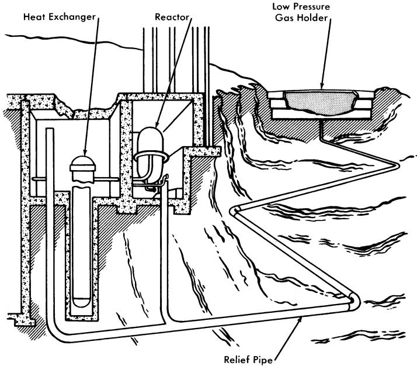  
FIG. 9-11. Schematic illustration of containment system (courtesy of the Nuclear Power Group and the Babcock & Wilcox Co.).

sealed roof which moves up and down in a manner similar to the movement of a conventional gas holder section. The low-pressure components do not have a close-fitting high-pressure envelope but are contained in pressure-tight cells and are vented to the low-pressure gas holders in a manner similar to the high-pressure components.

This type of containment permits operation of components for their full service life, reduces or eliminates missile formation and fuel losses, reduces primary system working stresses, and allows equipment arrangement giving maximum access for maintenance.

Table 9-7 summarizes the characteristics of the proposed plant.

Reactor. The general characteristics of the reactor are illustrated by Fig. 9-12, which shows the annular arrangement of the Zircaloy-2 blanket assemblies around the core region. The thorium-oxide pellets within these assemblies are cooled by the reactor fuel solution, which is pumped up through the packed beds from the supply header. To reduce the pressure drop across the pebble bed, the solution is introduced through a tapered perforated pipe the same length as the assemblies, flows into the bed and by means of baffles is directed back to the center outlet pipe, which is concentric with the inlet.

The vessel has ellipsoidal heads, is 9 ft 11 in. ID, and has a cylindrical shell length of 10 ft 6 in. The upper head contains a 3-ft $3\frac{1}{2}$ -in.-diameter

TABLE 9-7 DESIGN DATA FOR THE SINGLE-FLUID TWO-REGION REACTOR  

<table><tr><td colspan="2">Over-all plant performance</td></tr><tr><td>Thermal power developed in reactor, Mw</td><td>520</td></tr><tr><td>Gross electrical power, Mw</td><td>158</td></tr><tr><td>Net electrical power, Mw</td><td>150</td></tr><tr><td>Station efficiency, %</td><td>28.5</td></tr><tr><td colspan="2">General reactor data</td></tr><tr><td>Fuel solution</td><td>UO2SO4-D2O</td></tr><tr><td>Operating pressure, psia</td><td>1500</td></tr><tr><td>Fuel inlet temperature, °F</td><td>514</td></tr><tr><td>Fuel outlet temperature, °F</td><td>572</td></tr><tr><td>Area of stainless steel (in contact with fuel solution), ft2</td><td>90,000</td></tr><tr><td>Total volume of primary system, ft3</td><td>2,300</td></tr><tr><td>Area of Zircaloy-2 (in contact with fuel solution), ft2</td><td>2,240</td></tr><tr><td colspan="2">Core</td></tr><tr><td>Fuel flow rate, lb/hr</td><td>24.9 × 106</td></tr><tr><td>Velocity, fps</td><td>6.3</td></tr><tr><td>Volume of core solution, liters</td><td>67,000</td></tr><tr><td>Letdown rate, gpm</td><td>100</td></tr><tr><td>Thorex cycle time, days</td><td>115</td></tr><tr><td>Hydroclone cycle time, days</td><td>1</td></tr><tr><td>Hydroclone underflow removal rate, liters/day</td><td>583</td></tr><tr><td colspan="2">Blanket</td></tr><tr><td>Assembly diameter, in.</td><td>18</td></tr><tr><td>Fertile material</td><td>ThO2pellets</td></tr><tr><td>Thorium loading, kg</td><td>17,850</td></tr><tr><td>Thorium irradiation cycle, days</td><td>744</td></tr><tr><td>Thorium processing rate, kg/day</td><td>23</td></tr><tr><td>Processing rate of mass-233 elements, g/day</td><td>350</td></tr></table>

flanged opening to permit removal of the thorium assemblies. The closure is a double-gasketed bolted cover having a monitoring or buffer seal connection to the annulus between the gaskets to detect leakage of the fuel solution. The lower pressure vessel head is penetrated by fourteen 7-in. openings through which fuel flows upward into the blanket assemblies from the toroidal supply header. This head has a 3-ft-diameter fuel outlet. The thermal shielding consists of alternate layers of stainless steel and fuel solution. The total shielding thickness is 8 in. over the cylindrical portion and 12 in. at the head ends of the reactor pressure vessel.

Boiler heat exchangers. The boiler heat exchanger is a U-tube, vertical,

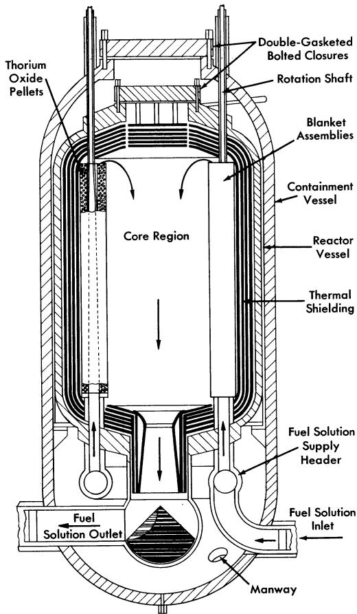  
FIG. 9-12. Single-fluid two-region aqueous reactor (courtesy of the Nuclear Power Group and the Babcock & Wilcox Co.).

forced-circulation design in which reactor fuel flows on the shell side and boiling light water on the tube side.

By placing the reactor fuel on the shell side, the tube sheet acts as its own shield and is subjected to less intense nuclear radiation, minimizing gamma heating and thermal-stress problems. Such a design permits the use of thermal shields which would also serve to protect the tube sheet from thermal shock due to sudden variations of fuel temperatures. In the event of a failure of tubes or tube sheet connections it is necessary to remove only the faulty tube bundle and leave the exchanger shell and flanged connections intact. This is accomplished by removing the bolted head and tube sheet brace and cutting the seal ring weld at the periphery of the tube sheet. The bundle is then lifted out of the shell by the overhead crane.

Reactor building. The building which houses the reactor plant will be airtight and will serve as a containment for radioactive gases which may be released during maintenance. The building air will be monitored and filtered and will be vented to the exhaust stack.

Space is provided outside the reactor plant for an off-gas building stack, gas and vapor holders, gas handling building, hot laboratory and shops, waste handling building, and chemical processing buildings. The hot shops and chemical processing building are located as shown to permit mutual access to a crane bay which extends from the reactor building between the two buildings. Both "hot" components and blanket assemblies are transported from the reactor building to the far end of the bay by a low, U-frame traveling crane. At the end of the bay they are transferred to an overhead crane running perpendicular to the bay, and transported to either of the two buildings. With this arrangement, hot materials may be transferred entirely underwater, thereby eliminating the need for bulky shielding and mobile cooling systems.

Maintenance considerations. A study of the problem of maintenance of a large-scale homogeneous reactor indicated the following. It appears impossible to accomplish some repair operations remotely in place and under 20 ft of water. Experience to date tends to indicate that the repair of radioactive equipment may be so difficult that it will be uneconomical to repair anything except such small components as valves and pumps. The larger defective components must be removed from the system and a replacement installed. The repairs, if possible, can then be made in a "hot machine shop" after the system is back in operation.

Removal of components from the cells will require shielding, such as lead oaks. Further study is necessary to determine the optimum means of performing this operation.

Extensive use of jigs and fixtures in performing maintenance work will be necessary for rapid and safe work. All the jigs and fixtures should be designed and constructed before the plant is put into operation. In many cases it will be advantageous to use the jigs during initial construction to be certain that they will function properly.

The estimated annual maintenance cost for a plant of the size considered is approximately $3,300,000, which includes the capital investment of maintenance equipment. This amounts to about 4 mills/kwh at \(60\%$ capacity factor or $\sim 3$ mills/kwh at $80\%$ capacity factor. The 150,000-kw nuclear power plant described is estimated to cost \)375.00/kw or $56,400,000, excluding $5,000,000 to $10,000,000 for research and development.

9-5.3 Oak Ridge National Laboratory two-region reactor studies. Intermediate-scale homogeneous reactor. In October 1952 design studies were

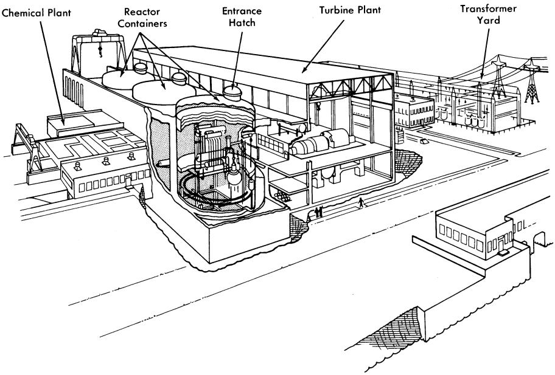  
FIG. 9-13. Artist's concept of Thorium Breeder Reactor Power Station.

started for a two-region multipurpose intermediate-scale homogeneous reactor as an alternate to the single-region reactors previously studied [20-22]. Several suggested core vessel arrangements for two-region converters were presented. In all designs the core shape approximates a 4-ft-diameter sphere, and a central thimble is incorporated to permit startup and shutdown with a full core containing the operating concentration of fuel. The major interest in the design of this type of reactor is the possibility of converting thorium into $\mathrm{U}^{233}$ in the blanket region of the reactor.

The principal system parameters on which the design of the two-region intermediate-scale homogeneous reactor is based are presented in Table 9-8.

Large-scale conceptual designs. Design work on the two-region intermediate-scale homogeneous reactor continued through the fall of 1953, with emphasis being placed on design studies of components and reactor layouts for an optimum design. In the meantime, conceptual designs of large-scale two-region reactors described below were carried out as a basis of feasibility studies.

The first design involved a 1350-Mw (heat) power plant containing three reactors [17]. Each of these operated at $450\mathrm{Mw}$ to produce a net of $105\mathrm{Mw}$ of electricity. The design of this plant, which is reviewed in the following paragraphs, is representative of the technology as of September 1953.

TABLE 9-8   
DESIGN PARAMETERS OF A TWO-REGION INTERMEDIATE SCALE HOMOGENEOUS REACTOR   

<table><tr><td></td><td>Core system</td><td>Blanket system</td></tr><tr><td>Power level, Mw</td><td>48</td><td>9.6</td></tr><tr><td>Fluid</td><td>\( \mathrm {UO}_{2}\mathrm {SO}_{4}-\mathrm {D}_{2}\mathrm {O} \)sol</td><td>\( \mathrm {ThO}_{2}-\mathrm {D}_{2}\mathrm {O} \)slurry</td></tr><tr><td>Concentration, g U/liter</td><td>4.8</td><td>1000</td></tr><tr><td>System pressure, psia</td><td>1000</td><td>1000</td></tr><tr><td>System temperature, °C</td><td>250</td><td>250</td></tr><tr><td>Vessel diameter, ft</td><td>4</td><td>8</td></tr><tr><td>Maximum fluid velocity, fps</td><td>22.3</td><td>12.3</td></tr><tr><td>Pumping requirements, gpm</td><td>5000</td><td>1000</td></tr><tr><td>Steam pressure, psia</td><td>215</td><td>215</td></tr><tr><td>Steam temperature, °F</td><td>388</td><td>388</td></tr><tr><td>Steam generated, lb/sec</td><td>38.7</td><td>8.0</td></tr></table>

In the proposed arrangement, three large cells are provided for the reactors and associated high-pressure equipment and a fourth is provided for the dump tanks and low-pressure equipment. Each reactor cell is divided into compartments for the reactor, heat exchanger, pumps, and gas-circulating systems. The low-pressure equipment cell contains compartments for dump tanks, feed equipment, heat and fission-product removal, $\mathrm{D}_2\mathrm{O}$ recovery, and the limited amount of chemical processing that can be included in the reactor circulating system. Radiation from the cells is reduced to tolerable levels under operating conditions by concrete shielding. The individual compartments have sufficient shielding to permit limited access when equipment is being replaced.

Each reactor consists of a 6-ft-diameter spherical core, operated at a power of $320\mathrm{Mw}$ (100 kw/liter), surrounded by a 2-ft-thick blanket which is operated at a power of $130\mathrm{Mw}$ (11 kw/liter). Under equilibrium conditions, a solution containing $1.30\mathrm{g}$ of $\mathrm{U}^{233}$ , $\mathrm{U}^{234}$ , $\mathrm{U}^{235}$ , $\mathrm{U}^{236}$ (as uranyl sulfate dissolved in $\mathrm{D}_2\mathrm{O}$ ) is circulated through the core at a rate of $30,000\mathrm{gpm}$ under a pressure of $1000\mathrm{psia}$ . Fluid enters the core at $213^{\circ}\mathrm{C}$ and leaves at $250^{\circ}\mathrm{C}$ . Decomposition of the $\mathrm{D}_2\mathrm{O}$ moderator by fission fragments yields $240\mathrm{cfm}$ of gas containing $28\mathrm{mole}\% \mathrm{D}_2$ , $14\mathrm{mole}\% \mathrm{O}_2$ , and $58\mathrm{mole}\% \mathrm{D}_2\mathrm{O}$ .

Liquid leaving the core divides into two parallel circuits, each at $15,000\mathrm{gpm}$ , which lead into centrifugal gas separators. There the explosive mixture of deuterium and oxygen is separated from the liquid and

diluted below the explosive limit with a recirculated gas stream which contains oxygen, helium, and $\mathrm{D}_2\mathrm{O}$ . The gas-free liquid circulates through heat exchangers and is returned to the core by canned-motor circulating pumps. Steam is produced in the exchangers at 215 psig and $388^{\circ}\mathrm{F}$ .

The gas streams from the separators are joined and flow into a high-pressure storage tank accompanied by about 500 gpm of entrained liquid. After the entrainment is removed in mist separators for return to the liquid system, the $\mathrm{D}_2$ and $\mathrm{O}_2$ are recombined when the gas passes into a catalyst bed containing platinized alumina pellets. Heat liberated in the recombiner increases the temperature of the gas from 250 to $464^{\circ}\mathrm{C}$ . The hot gases are cooled to $250^{\circ}\mathrm{C}$ in a gas condenser which has a capacity of 20 Mw and condenses $\mathrm{D}_2\mathrm{O}$ at a rate of about 89 gpm. Some of the $\mathrm{D}_2\mathrm{O}$ is used to wash the mist separators and to purge the pump bearings and rotor cavity; the remainder is either returned to the system through the high-pressure storage tank or held in condensate storage tanks during periods when the concentration of reactor solution is being adjusted. The gas is recirculated to the gas separators by an oxygen blower.

Similar gas- and liquid-recirculating systems are used to remove heat from the blanket, which consists of a thorium-oxide slurry in $\mathrm{D}_2\mathrm{O}$ containing 500 to $1000\mathrm{g}$ Th/liter. The slurry is recirculated by means of a 12,400-gpm canned-motor pump through a gas separator and through a 130-Mw heat exchanger.

The reactor is pressurized with a mixture of helium and oxygen which is admitted as required. It is expected that most of the fission-product gases will be retained in the high-pressure gas-circulating systems with only whatever small, daily letdown is required to adjust the pressures. Calculations for a similar system indicate that enough $\mathrm{Xe}^{135}$ will be transferred into the gas stream to reduce the xenon poisoning in the reactor by a factor of 5 to 10.

The two-region thorium breeder reactor. A later design study was completed in the fall of 1954 by the Reactor Experimental Engineering Division of the Oak Ridge National Laboratory [23] for the purpose of delineating the technical and economic problems which would determine the ultimate feasibility of an aqueous homogeneous reactor for producing central station power.

The concept of the reactor chosen for study was based essentially on nuclear considerations and consists of a spherical two-region reactor with dimensions limited by economic considerations.

Table 9-9 presents the principal reactor characteristics for the preliminary design of a 300-Mw station.

The power plant complex, consisting of the reactor plant, the turbogenerator plant, the chemical processing plant, the cooling system, and part of the electrical distribution system, is shown in Fig. 9-13.

# TABLE 9-9

# REACTOR CHARACTERISTICS FOR PRELIMINARY

# DESIGN OF A 300-MW STATION

Electrical capability (each of three reactors), 100 Mw

Gross station efficiency, $27.4\%$

Net station efficiency, $26.0\%$

Operating pressure, 2000 psia

<table><tr><td></td><td>Core</td><td>Blanket</td></tr><tr><td>Material of construction</td><td>Zircaloy-2</td><td>20% stainless-steel clad carbon steel</td></tr><tr><td>Wall thickness, in.</td><td>0.5</td><td>5.0</td></tr><tr><td>Thermal shield thickness, in.</td><td></td><td>4.0</td></tr><tr><td>Pipe connections</td><td>Concentric</td><td>Straight-through</td></tr><tr><td>Inside diameter, ft</td><td>5</td><td>101/2</td></tr><tr><td>Blanket thickness, in.</td><td></td><td>27</td></tr><tr><td>Volume, liters</td><td>1855</td><td>11,600</td></tr><tr><td>Operating temperature, °C</td><td></td><td></td></tr><tr><td>Average</td><td>275</td><td>280</td></tr><tr><td>Inlet</td><td>250</td><td>245</td></tr><tr><td>Outlet</td><td>300</td><td>315</td></tr><tr><td>System volume, liters</td><td>9740</td><td>13,800</td></tr><tr><td>Fluid composition, g/liter D2O*</td><td>UO2SO4-D2O-CuSO4</td><td>UO3ThO2-D2O</td></tr><tr><td>U233</td><td>1.88</td><td>3.00</td></tr><tr><td>U234</td><td>1.90</td><td>0.17</td></tr><tr><td>U235</td><td>0.26</td><td>0.01</td></tr><tr><td>U236</td><td>3.00</td><td>0.00</td></tr><tr><td>Thorium</td><td></td><td>1000</td></tr><tr><td>Inventory, kg</td><td></td><td></td></tr><tr><td>D2O</td><td>10,900</td><td>12,000</td></tr><tr><td>U235 + U233</td><td>26.1</td><td>42.9</td></tr><tr><td>Thorium</td><td></td><td>14,300</td></tr><tr><td>Flux at core wall, n/(cm2)(sec)</td><td>1.10 × 1015</td><td>1 × 1015</td></tr><tr><td>Power density at core wall, kw/liter</td><td>70.0</td><td></td></tr><tr><td>Mean power density in reactor, kw/liter</td><td>193</td><td>7.0</td></tr><tr><td>Power density in external system, kw/liter</td><td>61</td><td>55</td></tr><tr><td>Reactor power, Mw (heat)</td><td>313</td><td>72</td></tr><tr><td>Circulation rate, gpm</td><td>24,000</td><td></td></tr></table>

*At operating conditions.

The reactor plant consists of a space 80 ft 0 in. wide, 300 ft 0 in. long, and 45 ft 6 in. above ground level. At one end of the structure is located a storage pool for items freshly removed from the shield. A gantry crane services the reactors and its runway extends a distance beyond the shield for access to the pool and to provide lay-down space for a reactor-shield tank dome. Three cylindrical shield tanks are provided to contain each reactor and components.

In the event of a line rupture or equipment failure resulting in gross leakage of reactor fluids from the reactor system, no radioactive material will be released. This is accomplished by placing the reactor and components in a cylindrical tank, 66 ft 0 in. diameter × 116 ft 0 in. high, capable of withstanding 50 psig. Eight feet of concrete are poured around this tank to a height of 45 ft 6 in. above ground level for biological shielding.

As shown in Fig. 9-13, each of the container buildings has an access hatch. Items such as circulating pumps, pressurizer heater elements, evaporators, etc., for which the probability of maintenance is high, are grouped on one side of the shield and more or less under this hatch for servicing. No specific procedure for repairing or replacing equipment was developed; however, consideration was given to both wet and dry maintenance methods.

Homogeneous reactor experiment No. 3.* In 1957, conceptual design studies of HRE-3, a two-region homogeneous breeder reactor fueled with $\mathbf{U}^{233}$ and thorium, were initiated at the Oak Ridge National Laboratory [24]. This reactor, operating at $60\mathrm{Mw}$ of heat to produce approximately $19\mathrm{Mw}$ of electrical energy, will be designed to provide operational and technical data and to demonstrate the technical feasibility of an intermediate-scale aqueous homogeneous power breeder. The power plant will be a completely integrated facility incorporating (1) the nuclear reactor complex, (2) the electrical generating plant, and (3) the nuclear fuel recycle processing plant. Preliminary design criteria are given in Table 9-10.

As presently conceived, the reactor will be of the two-region type with a heavy-water uranyl-sulfate solution being circulated through the inner (core) region, where $50\mathrm{Mw}$ of heat are produced. A thorium-oxide slurry will be circulated through the outer pressure-retaining (blanket) region, where $10\mathrm{Mw}$ of heat are produced at equilibrium conditions. The fuel solution and slurry will be circulated through separate steam generators by the use of canned-motor pumps. The fuel heat exchanger will provide 195,700 lb/hr of saturated steam at 450 psia $(456^{\circ}\mathrm{F})$ at 50-Mw core power, and the slurry heat exchanger will provide 39,100 lb/hr of saturated steam at 450 psia $(450^{\circ}\mathrm{F})$ at 10-Mw blanket power. The blanket and core regions, operating at 1500 psia and $275^{\circ}\mathrm{C}$ and $280^{\circ}\mathrm{C}$ average temperatures, re

TABLE 9-10   
HRE-3 DESIGN CRITERIA   

<table><tr><td>Type</td><td>Two-region breeder</td></tr><tr><td>Core</td><td>\( \mathrm {UO}_{2}\mathrm {SO}_{4}+\mathrm {CuSO}_{4}+\mathrm {D}_{2}\mathrm {SO}_{4} \) in \( \mathrm {D}_{2}\mathrm {O} \)</td></tr><tr><td>Blanket</td><td>\( \mathrm {ThO}_{2}+\mathrm {UO}_{2}+\mathrm {MoO}_{3} \) in \( \mathrm {D}_{2}\mathrm {O} \)</td></tr><tr><td rowspan="2">Core critical concentration at 50 Mw and equilibrium</td><td>4.8 g \( \mathrm {U}^{233}/\mathrm {kg}\mathrm {D}_{2}\mathrm {O} \)</td></tr><tr><td>0.45 g \( \mathrm {U}^{235}/\mathrm {kg}\mathrm {D}_{2}\mathrm {O} \)</td></tr><tr><td rowspan="2">Blanket concentration at 10 Mw and equilibrium</td><td>1000 g Th/kg \( \mathrm {D}_{2}\mathrm {O} \)</td></tr><tr><td>4.02 g \( \mathrm {U}^{233}/\mathrm {kg}\mathrm {D}_{2}\mathrm {O} \)</td></tr><tr><td>Average core temperature, °C</td><td>280</td></tr><tr><td>Average blanket temperature, °C</td><td>275</td></tr><tr><td rowspan="2">Average core power density for 50 Mw, kw/liter</td><td></td></tr><tr><td>52.6</td></tr><tr><td rowspan="2">Average blanket power density for 10 Mw, kw/liter</td><td></td></tr><tr><td>1.04</td></tr><tr><td>Estimated breeding ratio</td><td>1.05 (minimum)</td></tr><tr><td>Saturated steam pressure, psia</td><td>450</td></tr><tr><td>Gross electrical power, Mw</td><td>~19</td></tr></table>

spectively, are interconnected in the vapor region. Inasmuch as oxygen is consumed by mechanisms of corrosion and must be added continuously, it is currently favored as the pressurizing medium to provide the over-pressure necessary to prevent boiling and bubble formation. Sufficient homogeneous catalysts will be provided in the solution and slurry to recombine all the radiolytic gases formed in the circulating system during operation. In this manner it will be unnecessary to operate with continuous letdown of slurry and/or solution. Purge water for use in the high-pressure circulating systems will be produced by condensing a portion of the steam contained in the vapor volume of the pressurizer. Advantage is taken of the beta and gamma decay energy to maintain the pressurizers at a slightly higher temperature than the remaining portion of the system.

The electrical generating plant will be essentially of conventional design. The 20-Mw turbine will operate at $1800\mathrm{rpm}$ on 450 psia saturated steam with moisture separation equipment provided. The condensing water requirements are $31,300\mathrm{gpm}$ , assuming the water enters at $70^{\circ}\mathrm{F}$ and leaves at $80^{\circ}\mathrm{F}$ . The generating voltage of $13.8\mathrm{kV}$ is sufficient to permit direct connection to an existing distribution system.

The fuel reprocessing for HRE-3 will consist of concentrating insoluble fission and corrosion products in the underflow pots of hydroclone separators, recovery of uranium from the hydroclone underflow by $\mathrm{UO_4}$ precipitation, and recovery of $\mathrm{D}_2\mathrm{O}$ by evaporation. The slurry processing operation will consist of $\mathrm{D}_2\mathrm{O}$ recovery by evaporation and packaging the

irradiated $\mathrm{ThO}_2$ for shipment to the existing Oak Ridge National Laboratory Thorex Pilot Plant, where the uranium and thorium will be separated and reclaimed. The thorium will appear from the Thorex process as a thorium nitrate solution and will be converted to $\mathrm{ThO}_2$ before being returned to the blanket of the reactor.

The maintenance philosophy of the reactor complex has not yet been established. However, it can be said that the reactor system will be designed so that all components and equipment will be capable of being removed and replaced, but with varying degrees of difficulty. The choice of underwater, dry, or combination thereof, maintenance techniques has not been made. The major components of HRE-3 are considered to be in the range of sizes which might be used in a large-scale Thorium Breeder Power Plant. Design, development, fabrication, and operational and reliability data are expected to be gained from HRE-3, in addition to maintenance techniques for large-scale aqueous homogeneous reactors. A very preliminary cost study indicates a cost of about $29,000,000 for the reactor complex, the electrical generating plant, and the fuel reprocessing plant.

# REFERENCES

1. THEODORE ROCKWELL III, Reactor Shielding Design Manual, 1st ed. New York: D. Van Nostrand Company, Inc., 1956.   
2. W. F. TAYLOR, TBR Plant Turbogenerator System Study, USAEC Report CF-56-7-127, Oak Ridge National Laboratory, June 1956.   
3. FOSTER-WHEELER CORPORATION, Wolverine Electric Cooperative Proposal, Feb. 1, 1956, Report FW-56-004; Sargent and Lundy Estimate No. 3800-2, November 1957.   
4. M. I. LUNDIN and R. VAN WINKLE, Conceptual Design and Evaluation Study of 10,000 KWE Aqueous Homogeneous Nuclear Power Plant, USAEC Report CF-57-12-8, Oak Ridge National Laboratory, Dec. 11, 1957.   
5. P. R. KASTEN et al., *Aqueous Homogeneous Research Reactor—Feasibility Study*, USAEC Report ORNL-2256, Oak Ridge National Laboratory, Apr. 10, 1957.   
6. FORD MOTOR COMPANY, A Selection Study for an Advanced Engineering Test Reactor, Document No. U-047, Aeronutronic Systems, Inc., Glendale, Calif., Mar. 29, 1957.   
7. W. E. JOHNSON et al., The P.A.R. Homogeneous Reactor Project, Mech. Eng. 79, 242-245 (1957).   
8. WESTINGHOUSE ELECTRIC CORPORATION, 1956-1957. Unpublished.   
9. J. A. LANE et al., Oak Ridge National Laboratory, 1950. Unpublished.   
10. J. A. LANE et al., Oak Ridge National Laboratory, 1951. Unpublished.   
11. R. H. BALL et al., Oak Ridge National Laboratory, 1952. Unpublished.   
12. J. J. KATz et al., Argonne National Laboratory, 1952. Unpublished.   
13. L. E. Link et al., Argonne National Laboratory, 1952. Unpublished.   
14. H. A. OHLGREN and D. J. MALLON, Idaho Operations Office, 1952. Unpublished.   
15. COMMONWEALTH EDISON COMPANY AND PUBLIC SERVICE COMPANY OF NORTHERN ILLINOIS, A Report on the Feasibility of Power Generation Using Nuclear Energy, 1952. Unpublished.   
16. W. E. THOMPSON (Comp.), Homogeneous Reactor Project Quarterly Progress Report for the Period Ending Mar. 15, 1952, USAEC Report ORNL-1280, Oak Ridge National Laboratory, 1952.   
17. R. B. BRIGGS et al., Aqueous Homogeneous Reactors for Producing Centralstation Power, USAEC Report ORNL-1642(Del.), Oak Ridge National Laboratory, 1954.   
18. H. G. CARSON and L. H. LANDRUM (Eds.), Preliminary Design and Cost Estimate for the Production of Central-station Power from an Aqueous Homogeneous Reactor Utilizing Thorium-Uranium-233, USAEC Report NPG-112, Commonwealth Edison Company (Nuclear Power Group), Feb. 1, 1955.   
19. COMMONWEALTH EDISON COMPANY, Single-fluid Two-region Aqueous Homogeneous Reactor Power Plant: Conceptual Design and Feasibility Study, USAEC Report NPG-171, July 1957.   
20. W. E. THOMPSON (Comp.), Homogeneous Reactor Project Quarterly Progress Report for the Period Ending July 1, 1952, USAEC Report ORNL-1318, Oak Ridge National Laboratory, 1952.

21. W. E. THOMPSON (Comp.), Homogeneous Reactor Project Quarterly Progress Report for the Period Ending Oct. 1, 1952, USAEC Report ORNL-1424(Del.), Oak Ridge National Laboratory, 1953.   
22. W. E. THOMPSON (Comp.), Homogeneous Reactor Project Quarterly Progress Report for the Period Ending Jan. 1, 1953, USAEC Report ORNL-1478(Del.), Oak Ridge National Laboratory, 1953.   
23. Oak Ridge National Laboratory, 1954. Unpublished.   
24. J. C. Bolger et al., Preliminary HRE-3 Design Data (Revised to 11-15-57), USAEC Report CF-57-11-74, Oak Ridge National Laboratory, Nov. 29, 1957.

# CHAPTER 10

# HOMOGENEOUS REACTOR COST STUDIES*

# 10-1. INTRODUCTION

10-1.1 Relation between cost studies and reactor design factors. The power cost associated with a reactor station may be subdivided into fixed charges, operating and maintenance costs, and fuel costs. Fixed charges include interest on investment, depreciation, and taxes; labor, supervision, and maintenance are included in the operating and maintenance costs; fuel costs include both variable and fixed chemical processing costs, $\dagger$ cost of feed materials, and inventory charges. Because of the uncertainty of these items, it is impossible to determine absolute costs for nuclear power until large nuclear plants have been built and operated. However, it is important that a reasonable effort be made to evaluate the cost in order to compare several fuel or reactor systems of equal technological development, to point out areas where substantial improvements are required, and to provide a basis for determining whether economical power can ever be produced.

Aqueous homogeneous reactors have certain features, such as high neutron economy and continuous fission-product removal, which make them appear to be potential economic power producers. However, as with all water-moderated reactors, to attain steam temperatures corresponding to thermal efficiencies of 25 to $30\%$ , circulating aqueous systems require operating pressures between 1000 and 2000 psia. Since thermal efficiency increases relatively slowly with increasing operating pressure, while reactor costs rise relatively sharply above pressures of about 1500 psi, it is unlikely that reactors will be operated at pressures above 2000 psia. In addition, increasing the reactor temperature tends to decrease the breeding ratio, which adversely affects fuel costs. Nearly all reactor systems considered have therefore been assumed to operate at pressures between 1500 and 2000 psia.

In order to optimize the design of a homogeneous reactor of a given power output and pressure, it is necessary to know how both the fixed and operating costs vary with the dimensions of the reactor core and pressure vessel. In this regard, one must take into consideration that the maximum diameter of the pressure vessel will be limited by fabrication problems, and the minimum diameter of the core vessel will be limited by corrosion

problems. For each combination of core- and pressure-vessel diameters within these limits, there will be a minimum fuel cost resulting from a balance of inventory costs, processing costs, and fuel-feed costs; these latter costs are determined by the breeding ratio, which is a function of fuel concentration and processing rate.

Although the fuel-fluid temperature influences power costs, this is normally limited by the properties of the fuel system or by the above-mentioned pressure limitations, rather than by economic considerations. However, the temperature range established on this basis is also close to that which gives minimum fuel costs. In addition, the power level of the reactor is usually assumed to be constant, although it is realized that this is a very important factor influencing the cost of power, since plant investment charges per unit power constitute a large fraction of the power cost and change appreciably with power level. The effect of power level on capital costs is discussed in Section 10-8, and on fuel costs in sections as noted.

The operating and maintenance costs, as well as plant investment costs, are a function of reactor type and method of maintenance. However, the exact form of some of the interrelations between design variables is not known at the present time. For example, the plant investment and maintenance costs are undoubtedly different for a burner-type reactor than for a breeder-type reactor; a cost difference would also exist between one- and two-region systems. However, because of the lack of information, most economic studies do not consider such differences, but assume investment and maintenance charges to be determined primarily by the reactor power level. The results of such studies are still significant if they are considered in the light of the assumptions used; as more cost data are accumulated, the results can be modified as required.

With respect to the fuel cycle costs, established Atomic Energy Commission prices for thorium, natural uranium, $\mathrm{U}^{233}$ , and $\mathrm{Pu}^{239}$ , and the schedule of charges for uranium of varying enrichments [1] provide a basis for cost calculations. Charges for various chemical conversion steps and for processing spent fuel in a multipurpose chemical plant have also been announced [2]. Although these charges are applicable to the processing of aqueous fuels, the possibility of including on-site processing facilities as part of the homogeneous reactor complex must also be considered, since this would have an effect on the reactor design.

10-1.2 Parametric cost studies at ORNL. The homogeneous reactor systems considered include one- and two-region reactors, breeders, converters, and burners. Although no one fuel or type of reactor shows a marked advantage in power cost over all the others, the superior fuel utilization of a thorium breeder system suggests that it is potentially the most economical one for power production. Much effort has been devoted

to two-region systems primarily because of the relatively high breeding ratio and low fuel inventory obtainable.

Economic evaluations discussed in this chapter are for the most part based on a three-reactor station generating a total of $375\mathrm{Mw}$ of electricity, where the required chemical processing facilities are shared by the three reactors. The present choice of reactor dimensions for a given power capability must be based on engineering judgment and the results of fuel-cost studies. Based on fuel-cost studies, one-region reactors must be large (14- to 15-ft diameter) in order to obtain good neutron economy; two-region systems can have good neutron economy in relatively small sizes (9- to 10-ft over-all diameter) but require high concentrations $(1000\mathrm{g}/\mathrm{liter})$ of fertile material in the blanket region. Estimates of near-optimum reactor sizes for different homogeneous systems are based on fuel-cost studies in which highly enriched fissionable fuel is valued at $\$16/\mathrm{g}$ and inventory charges are $4\%$ . In all cases it is assumed that the particular fuel system is technologically feasible.

In computing the cost of power, the fixed charges on capital investment of depreciating items are assumed to be $15\%/\mathrm{yr}$ , including depreciation, interest, return on investment, insurance, and taxes. Fixed charges on nondepreciating items are assumed to be $4\%/\mathrm{yr}$ . Fuel, $\mathbf{D}_2\mathbf{O}$ , and fertile materials are assumed to be nondepreciating materials.

# 10-2. BASES FOR COST CALCULATIONS

10-2.1 Fuel costs. The fuel costs associated with electrical power produced from reactors include those charges which are due to replacement of conventional fuels with nuclear fuel. The fuel cost is considered to be the sum of the net cost of nuclear-fuel feed; inventory charges for fertile material, heavy water, and fuel; material losses; variable fuel-processing charges; and fixed charges for fuel processing. Fuel-cost studies are primarily for the purpose of investigating the economic importance of the several parameters; of these parameters the most important are core diameter, blanket thickness, fertile-material concentrations in core and blanket, fuel concentration in the blanket, and poison fraction in the core. In studying fuel costs, aqueous homogeneous power reactors are generally considered to operate at a temperature of $280^{\circ}\mathrm{C}$ , a pressure 1500 to 2000 psia, an $80\%$ load factor, and a net thermal-to-electrical efficiency of about $25\%$ . The thermal power level per reactor is considered to be 450 to 500 Mw. Thorium (as oxide) is valued at $\$5/\mathrm{lb}$ with no significant charge for making $\mathrm{ThO_2 - D_2O}$ slurry. Heavy water is valued at $\$28/\mathrm{lb}$ and highly enriched fissionable uranium at $\$16/\mathrm{g}$ . The amount of heavy water required is estimated on the basis of the total reactor-system volume and the room-temperature density of heavy water. The makeup rate is taken as

$5\%/\mathrm{yr}$ . The volume of the core circulating system is taken as the volume of the core plus an external volume of 1 liter for each $20\mathrm{kw}$ generated in the core. The blanket external volume (in two-region reactors) is calculated on the basis of 1 liter for each $14\mathrm{kw}$ generated in the blanket. The cost of natural uranium is taken as $\$40/kg$ U either as $\mathrm{UO}_3$ or $\mathrm{UO}_2\mathrm{SO}_4$ . The cost of uranium of various enrichments in $\mathrm{U}^{235}$ is obtained essentially from the AEC price schedule or the equations for an ideal gaseous-diffusion plant [3-5].

Fuel costs are dependent upon the value assigned to plutonium and $\mathrm{U}^{233}$ . In a power-only economy the value of these fissionable materials can be no more or less than their fuel value; in these studies their value was taken to be the same as that for $\mathrm{U}^{235}$ , or $\$16 / \mathrm{g}$ . However, if $\mathrm{U}^{233}$ and/or plutonium are assigned different values, the fuel costs can be significantly affected. This is shown in the results given for plutonium producers, in which a plutonium value of $\$40 / \mathrm{g}$ was assumed (this value is consistent with the ability of homogeneous reactors to produce plutonium containing less than $2\%$ $\mathrm{Pu}^{240}$ , and the AEC guaranteed fair price schedule for plutonium extending until June 30, 1963).

The fuel values used in these studies are slightly different from those announced by the AEC; the main difference is associated with the value used for plutonium. However, the effect of various plutonium values on fuel cost is indicated in the section on plutonium producers. The AEC-announced prices for nuclear materials are given in Table 10-1.

Since the rate of fuel burnup is small with respect to the inventory of fuel required for criticality, the investment and inventory charge for fuel materials can be appreciable. Unless otherwise specified, inventory charges for uranium, thorium, plutonium, and heavy water are assumed to be $4\%$ of their value per year.

An economic consideration in the design of nuclear power plants is the chemical processing requirement of the spent nuclear fuel. Aqueous homogeneous reactor fuels can be processed by either the Purex or the Thorex process. Both involve solvent extraction and require that the fuels be separated from the $\mathrm{D}_2\mathrm{O}$ for economical processing. The Purex process is used for separating plutonium, uranium, and fission-product poisons, while the Thorex process is used for the separation of thorium, uranium, and fission products. Since investment costs in chemical processing plants are presently high, a single processing plant for one good-sized reactor is not economical. Rather, central processing facilities which serve many reactors are usually assumed to be available. In the fuel-cost studies given here, however, the chemical processing plant is considered to serve a single three-reactor station generating about 1440 thermal Mw (total). For this size processing plant, the fixed charges (based on $15\%$ of investment per year) are estimated to be about $\$5500/$ day for either Purex or

TABLE 10-1   
U.S. AEC OFFICIAL PRICE SCHEDULE FOR NUCLEAR MATERIALS [1]   

<table><tr><td colspan="3">(a) Price schedule of U235 as a function of enrichment</td></tr><tr><td>Wt. fraction U235(as UF6)</td><td>$/kg total U</td><td>$/gm U235 content</td></tr><tr><td>0.0072</td><td>40.50</td><td>5.62</td></tr><tr><td>0.010</td><td>75.75</td><td>8.09</td></tr><tr><td>0.020</td><td>220.00</td><td>11.00</td></tr><tr><td>0.030</td><td>375.50</td><td>12.52</td></tr><tr><td>0.10</td><td>1,529.00</td><td>15.29</td></tr><tr><td>0.20</td><td>3,223.00</td><td>16.31</td></tr><tr><td>0.90</td><td>15,361.00</td><td>17.07</td></tr><tr><td colspan="3">(b) Price schedule of Pu as a function of Pu240 content</td></tr><tr><td>% Pu240</td><td colspan="2">Pu price, $/gm</td></tr><tr><td>2</td><td colspan="2">41.50</td></tr><tr><td>4</td><td colspan="2">38.00</td></tr><tr><td>6</td><td colspan="2">34.50</td></tr><tr><td>&gt;8.6</td><td colspan="2">30.00</td></tr><tr><td colspan="3">(c) Chemical conversion costs</td></tr><tr><td colspan="2">Conversion</td><td>Cost, $/kg</td></tr><tr><td colspan="2">Uranyl nitrate → UF6(U containing 5% or less by weight of U235)</td><td>5.60</td></tr><tr><td colspan="2">Uranyl nitrate → UF6(U containing greater than 5% by weight of U235)</td><td>32.00</td></tr><tr><td colspan="2">Plutonium nitrate → metal buttons</td><td>1,500.00</td></tr><tr><td colspan="2">UF6(natural U) to oxide</td><td>zero</td></tr><tr><td colspan="2">(d) Value of U233 (high purity)</td><td>$15/g</td></tr></table>

Thorex (complete decontamination) [6,11]. This corresponds to a power cost due to chemical plant investment of 0.76 mill/kwh (based on a 375-Mw net electrical capacity and an $80\%$ load factor), which will be independent of the amount of material processed daily.

The variable processing charges arising from labor, materials, and other factors dependent on the throughput of fuel and fertile material are represented by Eqs. (10-1) and (10-2) for processing thorium-uranium mixtures and uranium-plutonium mixtures, respectively.

# Thorex process

Variable daily processing cost = $3.00 $W_{\mathrm{Th}} + 0.50 w_{\mathrm{U}} + 0.35 v_{\mathrm{D_2O}}$ . (10-1)

# Purex process

Variable daily processing cost = $3.50 W_U + $1.00 w_P_u + 0.35 v_D2O. (10-2) In the above equations:

$$
\begin{array}{l} v _ {\mathrm {D} _ {2} \mathrm {O}} = \text {l i t e r s} \mathrm {D} _ {2} \mathrm {O} \text {r e c o v e r e d / d a y}, \\ w _ {\mathrm {P u}} = \mathrm {g} \mathrm {P u} \text {h a n d l e d s e p a r a t e l y f r o m U p e r d a y}, \\ w _ {\mathrm {U}} = \mathrm {g} \mathrm {U} \text {p r o c e s s e d p e r d a y}, \\ W _ {\mathrm {T h}} = \mathrm {k g} \text {T h p r o c e s s e d p e r d a y}, \\ W _ {\mathrm {U}} = \mathrm {k g} \mathrm {U} \text {c o m p l e t e l y d e c o n t a m i n a t e d p e r d a y}. \\ \end{array}
$$

Thus, for Thorex, the variable processing charge is considered to be $3.00/kg of thorium processed, plus $0.50/g total uranium processed (U highly enriched in U233 + U235), plus $0.35/liter of D2O recovered.

Note that Eqs. (10-1) and (10-2) take into consideration the effect of throughput of fissionable material as well as fertile material on the variable processing charges in a chemical plant of fixed size. This information is necessary in determining the optimum concentrations of fissionable and fertile material in a reactor of specified dimensions.

The total processing cost in an on-site chemical plant, such as that described above, will be 0.76 mills/kwh plus the variable processing charges and minus the credit for any net fissionable material produced. Thus the chemical-plant investment costs exert a strong influence on the fuel costs. These costs are lower if a large multipurpose chemical plant is available to handle the fuel instead of the on-site plant. Fuel processing charges [2] have been announced by the United States Atomic Energy Commission for processing in such a multipurpose plant. These charges amount to \(15,300 per day, and apply to a plant having a daily capacity of 1 ton if slightly enriched uranium (less than \(3\%\) \(\mathrm{U}^{235}\) by weight) is processed, or a daily capacity of \(88\mathrm{kg}\) if highly enriched uranium is considered. In terms of cost per gram of \(\mathrm{U}^{235}\) processed, the above processing charges are

equivalent to $2.15 per gram of \mathrm{U}^{235}$ for natural uranium, $\$0.51$ per gram of $\mathrm{U}^{235}$ for uranium of $3 \%$ enrichment, and $\$0.37$ per gram of $\mathrm{U}^{235}$ for uranium of $47 \%$ enrichment. These values can be compared with those considered previously, namely: $\$0.50$ per gram of total uranium processed (the enrichment of the uranium in the highly enriched systems is about $50 \%$ ), and $\$3.50$ per kilogram of natural or slightly enriched uranium (equivalent to $\$0.50$ per gram of $\mathrm{U}^{235}$ in natural uranium) plus $\$1.00$ per gram of plutonium. Thus, in most cases, the AEC total processing charges amount to less than the variable processing charges considered here. In case of a central processing plant, however, it would be necessary to include fuel-shipping charges and charges associated with preparing the processing plant for the specific fuel.

In studying the poisoning effect of fission fragments, three groups of fission-product poisons are considered. The first group consists of gases; the second, nongaseous fission fragments having high microscopic cross sections (greater than $\sim 10,000$ barns); and the third is composed of nongaseous fission fragments having low microscopic cross sections, and which transmute to nuclides having the same low cross section. For processing rates which do not cause excessive variable processing costs, only the third group of poisons is affected by chemical processing; the first group is removed by means other than Thorex or Purex, while the second group attains equilibrium through neutron capture.

In processing U-Pu systems, a 20-day cooling period takes place before processing in a Purex plant. Following complete decontamination, the uranium is permitted to cool 100 more days before being re-enriched in a diffusion plant. This 120-day holdup and also a 30-day feed supply are considered in calculating inventory charges. In processing thoria slurries (core region), the holdup time prior to processing is considered to be 95 days, to permit about $90\%$ of the $\mathrm{Pa}^{233}$ to decay to $\mathrm{U}^{233}$ . The processed material is then held for an additional 110 days to permit the remaining $\mathrm{Pa}^{233}$ to decay. For thoria slurries in blanket regions, an initial holdup of 55 days is assumed prior to processing, with an additional 150-day holdup to permit the $\mathrm{Pa}^{233}$ to decay to $\mathrm{U}^{233}$ . Thus the protactinium is held up for 205 days, in which time only about $0.5\%$ has not yet decayed. This holdup time and a 30-day feed supply are considered in calculating material inventories. Protactinium is valued as uranium when outside the reactor, but no inventory charge is placed against the amount contained in the reactor system. This procedure is used to take into account that period of reactor operation between startup and near-equilibrium conditions. Unless otherwise indicated, the results are based on the assumption that equilibrium exists with respect to the nuclei concentrations. The isotope and fuel concentrations are established by means of material-balance equations and the critical equation.

In nearly all cases, fuel concentrations required for criticality are obtained using the two-group model [7], in which all fissions are assumed to occur in the thermal group [see Eqs. (2-7) through (2-10)]. Resonance capture is assumed to occur only in fertile material and only when neutrons are transferred from the fast to the slow group. For the one-region U-Pu systems, a six-group model is used in the nuclear calculations to allow for the resonance absorptions in uranium and plutonium. Unless otherwise specified, the thermal values for the various etas are $\eta (\mathrm{U}^{233}) = 2.25$ , $\eta (\mathrm{U}^{235}) = 2.08$ , $\eta (\mathrm{Pu}^{239}) = 1.93$ , and $\eta (\mathrm{Pu}^{241}) = 2.23$ .

10-2.2 Investment, operating, and maintenance costs. The costs considered here involve capital investment, and those associated with maintaining and operating the nuclear power plant. Because of the lack of knowledge and experience in design, construction, and operation of nuclear power systems, it is difficult to evaluate these costs, and most estimates are based on the expectation that nuclear reactor plants will have lifetimes about as long as those of conventional power plants. A 20-year depreciation rate is assumed for permanent facilities and a 10-year depreciation rate for all equipment associated with the reactor proper. Preparing a realistic estimate of the cost and the required maintenance of a large homogeneous reactor is particularly difficult, since the equipment must handle large amounts of radioactive material. Little experience has been obtained in manufacturing the required equipment, and generally the costs are based upon estimates by manufacturers. These estimated costs of equipment for a specific reactor power are scaled according to the reactor power raised to the 0.6 power to obtain the variation of investment cost with power level. The annual operating and maintenance charges have been estimated by roughly applying the corresponding charges (based on percentage of capital investment) in conventional steam plants; however, these estimates cannot be considered realistic until considerable experience has been obtained by operating actual reactors. These estimates correspond to $3\%$ of the total capital investment per year.

# 10-3. EFFECT OF DESIGN VARIABLES ON THE FUEL COSTS IN $\mathrm{THO}_2$ - $\mathrm{UO}_3$ - $\mathrm{D}_2\mathrm{O}$ SYSTEMS [8-10]

10-3.1 Introduction. Fuel costs are given here for spherical two-region reactors with $\mathrm{U}^{233}\mathrm{O}_3$ - $\mathrm{ThO}_2$ - $\mathrm{D}_2\mathrm{O}$ slurry employed in both the core and blanket regions. Results are also given for the case of no thorium in the core and also for one-region reactors. In addition, some results are given for two-region reactors having cylindrical geometry. In the two-region systems, materials from the core and blanket are assumed to be fed to a Thorex plant for chemical processing. Thoria can be returned to both

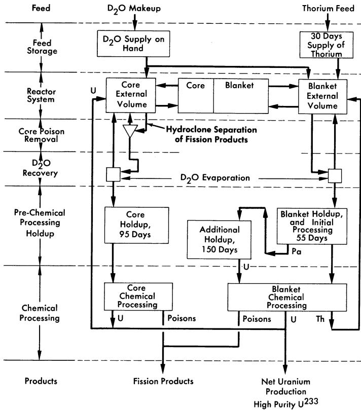  
FIG. 10-1. Schematic fuel-processing flowsheet for a two-region homogeneous thorium breeder reactor.

regions and fuel is returned to the core as needed to maintain criticality; the fissionable material produced in excess of that required is considered to be sold. The fuel product is computed to be a mixture of $\mathrm{U}^{233}$ , $\mathrm{U}^{235}$ , and other uranium isotopes, as determined by the isotope equations and the critical equation. The system is assumed to operate under equilibrium conditions. A schematic flowsheet of the chemical processing cycles for a two-region reactor having a solution-type core region is given in Fig. 10-1. The flowsheet for the one-region system would be similar to that for the blanket of the two-region system, except that processed fuel and thoria would be returned to the single region.

In the processing cycle shown in Fig. 10-1, essentially two methods of removing fission-product poisons are considered. One is the removal of precipitated solids by hydraulic cyclones (hydroclones); by this means the insoluble fission products are removed from the reactor in a cycle time of about a day. The second is the removal of essentially all fission products

by processing the fluid in a Thorex-processing plant. Processing by hydroclones can be done only with solution fuels; the associated cycle time is so short that fission products removed by this method can be considered to be removed from the reactor as soon as they are formed. Thorex processing, although removing all fission products that pass through Thorex, is much more costly than hydroclone processing. Because of this, the associated cycle time is usually several hundreds of days. In what follows, unless specified otherwise, the term fuel processing applies only to Thorex or Purex processing.

The essential difference between the processing cycle shown in Fig. 10-1 and that for solid-fuel reactors is associated with the continuous removal of fission-product gases and of insoluble fission products (in solution reactors). Fuel and fertile material processed by Thorex would undoubtedly be removed from the reactor on a semibatch basis.

The three groups of fission-product poisons considered previously are not all affected by Thorex processing; group-1 poisons (the fission-product gases) are assumed to be physically removed before processing, while group-2 poisons (nongaseous nuclei having high cross sections) are effectively removed by neutron capture within the reactor system ( $\sigma_{a}$ of these nuclei is of the order of 10,000 barns). The macroscopic cross section of these two groups of poisons is taken as $1.8\%$ of the fission cross section. Of this, $0.8\%$ is due to nongaseous high-cross-section nuclei, while $1\%$ is due to the gaseous high-cross-section nuclei. The concentrations of low-cross-section nuclei (third group) are affected by Thorex processing (however, for reactors containing a fuel solution, the nonsoluble group-3 poisons are assumed to be removed by hydroclone separation). The charge for hydroclones operating on a one-day cycle is taken as 0.03 mill/kwh, based upon a charge of $75/day per reactor. For these solution reactors it is assumed that $75\%$ of the group-3 poisons are insoluble and removed by hydroclones; in these circumstances only $25\%$ of the generated group-3 poisons are removed by the Thorex process. With slurry-core reactors, all group-3 poisons which are removed are removed by Thorex processing.

The parameter ranges covered in the spherical reactor calculations are given in Table 10-2. Values used for $\eta^{23}$ and resonance escape probability are presently accepted values; however, in a few cases they were varied in order to estimate how the results are affected by these changes. In the following sections the influence of specific parameters upon fuel cost is discussed.

10-3.2 Two-region spherical reactors [8]. (1) Concentration of $U^{233}$ in blanket and core poison fraction. The optimum values of these variables are found to be largely independent of other parameters; moreover, there is little change in fuel cost with changes in either blanket $U^{233}$ concentration

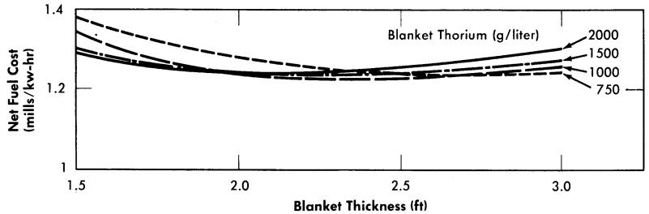  
FIG. 10-2. Fuel cost as a function of blanket thickness for various blanket thorium concentrations. Power per reactor $= 480 \, \text{Mw}$ (heat), core diameter $= 5$ ft, core thorium $= 200 \, \text{g/liter}$ , core poison fraction $= 0.08$ , blanket $\mathrm{U}^{233} = 4.0 \, \text{g/kg}$ Th, $\eta^{23} = 2.25$ .

or core poison fraction. For all slurry-core systems, the optimum poison fraction is about 0.08, independent of the other design parameters. The optimum poison fraction for the solution core is about 0.07. The lowest fuel cost occurs at a blanket $\mathbf{U}^{233}$ concentration of about $4.0\mathrm{g / kg}$ thorium.

TABLE 10-2 PARAMETER VALUES USED IN SLURRY REACTOR STUDIES  

<table><tr><td></td><td>Two-region reactors</td><td>One-region reactors</td></tr><tr><td>Core diameter, ft</td><td>8-15</td><td>8-20</td></tr><tr><td>Blanket thickness, ft</td><td>11/2-3</td><td></td></tr><tr><td>Core thorium concentration, g/liter</td><td>0-300</td><td>0-400</td></tr><tr><td>Core poison fraction, %</td><td>3-20</td><td>4-12</td></tr><tr><td>Blanket thorium concentration, g/liter</td><td>500-2000</td><td></td></tr><tr><td>Blanket U233concentration, g/kg thorium</td><td>1-7</td><td></td></tr></table>

(2) Blanket thickness and blanket thorium concentration. An example of the effects of these parameters on fuel cost is presented in Fig. 10-2 for a slurry-core reactor. Here it is noted that the blanket thorium concentration has relatively little effect on the minimum fuel costs. The blanket thickness giving the lowest fuel cost lies between 2 and 2.5 ft. As is expected, higher thorium loadings are desirable if thin blankets are necessary on the basis of other considerations. Systems having low concentrations of thorium in the core require more heavily loaded blankets to minimize fuel costs. For solution cores, still heavier and thicker blankets are desirable, particularly if the core diameters are small.

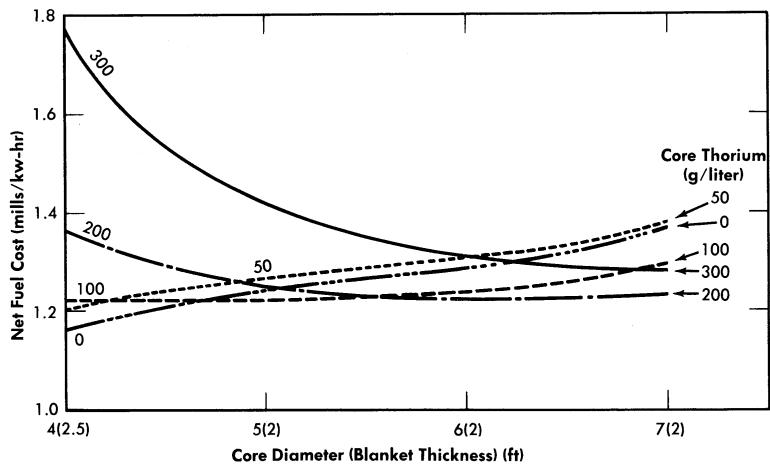  
FIG. 10-3. Fuel cost as function of core diameter and core thorium concentration. Power per reactor $= 480 \, \text{Mw}$ (heat), blanket thorium $= 1000 \, \text{g/liter}$ , blanket $\mathbf{U}^{233} = 4.0 \, \text{g/kg}$ Th, core poison fraction $= 0.08$ , $\eta^{23} = 2.25$ .

(3) Core thorium and core diameter. The effects of these variables upon fuel costs are shown in Fig. 10-3. These results indicate (on the basis of fuel cost alone) that the small solution-core reactors $(\mathrm{ThO}_2$ core concentration equal to zero) have a slight advantage over the slurry reactors. However, the power density at the core wall is between 160 and $300\mathrm{kw}$ /liter for such reactors operating at the given power level of 480 thermal Mw. If larger cores are required because of power-density limitations, the fuel-cost advantage moves to the slurry core. The slurry-core systems yield higher outputs of generated fuel, although all the reactors shown have breeding ratios greater than unity (see Chapter 2). As illustrated in Fig. 10-3, the minimum fuel cost is about 1.2 mills/kwh, independent of core diameter. The fuel cost associated with a core thorium concentration of zero is lower than that associated with a core thorium concentration of $50\mathrm{g}$ /liter; this is due to the ability to use hydroclones to remove fission products only when a fuel solution is used. The hydroclone installation adds only 0.03 mill/kwh investment cost to the system, while the variable Thorex processing cost is reduced by two-thirds; this results in the decrease in fuel costs as shown. The relative flatness of the optimum net fuel cost curve in Fig. 10-3 is due to compensating factors; i.e., changes in processing charges and yield of product are offset by accompanying changes in the fuel inventory charge. Similar compensating effects account for the insensitiveness of fuel costs to changes in other design parameters.

Table 10-3 presents a breakdown of costs for some typical reactors having low fuel costs. The changes which occur when thorium-oxide slurry is

TABLE 10-3   
COST BREAKDOWN FOR SOME TYPICAL REACTORS   

<table><tr><td>Core diameter, ft</td><td>6</td><td>5</td><td>4</td><td>6</td><td>14</td></tr><tr><td>Blanket thickness, ft</td><td>2</td><td>2</td><td>21/2</td><td>2</td><td></td></tr><tr><td>Core thorium concentration, g/liter</td><td>200</td><td>100</td><td>0</td><td>0</td><td>250</td></tr><tr><td>Blanket thorium concentration, g/liter</td><td>1000</td><td>1000</td><td>1000</td><td>1000</td><td></td></tr><tr><td>Blanket U233concentration, g/kg thorium</td><td>4</td><td>4</td><td>4</td><td>4</td><td></td></tr><tr><td>Core poison fraction</td><td>0.08</td><td>0.08</td><td>0.08</td><td>0.08</td><td>0.08</td></tr><tr><td>Critical concentration, g U233/liter</td><td>9.4</td><td>6.4</td><td>4.1</td><td>1.4</td><td>6.8</td></tr><tr><td>Net breeding ratio</td><td>1.102</td><td>1.081</td><td>1.089</td><td>1.045</td><td>1.012</td></tr><tr><td>Core wall power density, kw/liter</td><td>53</td><td>91</td><td>170</td><td>80</td><td></td></tr><tr><td>Core cycle time, days</td><td>637</td><td>418</td><td>884</td><td>342</td><td>1094</td></tr><tr><td>Blanket cycle time, days</td><td>295</td><td>205</td><td>176</td><td>210</td><td></td></tr><tr><td>Inventory of U233and U235, kg</td><td>368</td><td>272</td><td>200</td><td>148</td><td>522</td></tr><tr><td>Inventory of heavy water, lb</td><td>96,100</td><td>87,400</td><td>89,600</td><td>99,500</td><td>157,000</td></tr><tr><td>Net U233and U235production, g/day</td><td>49</td><td>39</td><td>43</td><td>21</td><td>6</td></tr><tr><td>Grams of U233per g of U produced</td><td>0.67</td><td>0.65</td><td>0.77</td><td>0.72</td><td>0.41</td></tr><tr><td>Estimated cost, mills/kwh</td><td></td><td></td><td></td><td></td><td></td></tr><tr><td>Uranium inventory</td><td>0.27</td><td>0.20</td><td>0.15</td><td>0.11</td><td>0.38</td></tr><tr><td>D2O inventory and losses</td><td>0.27</td><td>0.25</td><td>0.25</td><td>0.29</td><td>0.45</td></tr><tr><td>Thorium inventory and feed</td><td>0.01</td><td>0.01</td><td>0.01</td><td>0.01</td><td>0.01</td></tr><tr><td>Fixed chemical processing</td><td>0.76</td><td>0.76</td><td>0.76</td><td>0.76</td><td>0.76</td></tr><tr><td>Core processing</td><td>0.13</td><td>0.13</td><td>0.07</td><td>0.08</td><td>0.19</td></tr><tr><td>Blanket processing</td><td>0.09</td><td>0.12</td><td>0.18</td><td>0.18</td><td></td></tr><tr><td>Uranium sale, credit</td><td>0.33</td><td>0.26</td><td>0.29</td><td>0.15</td><td>0.04</td></tr><tr><td>Net fuel cost</td><td>1.22</td><td>1.22</td><td>1.16</td><td>1.29</td><td>1.76</td></tr></table>

used in the core can be seen by comparing results for the two 6-ft-core-diameter reactors.

(4) Reactor power. The above results are based on the concept of a three-reactor station of 1440-thermal-Mw capacity, each reactor producing \(125\mathrm{Mw}\) of electricity. The effect of varying power alone is shown in Table 10-4; the fuel cost is found to be a strong function of power capability. The greater part of the change is due to variation in the fixed chemical-processing charge. Since the total fixed processing cost (\(\$5500/day) is assumed to be independent of throughput, this charge on a mills/kwh basis is inversely proportional to the reactor power.

TABLE 10-4 EFFECT OF POWER LEVEL ON FUEL COSTS   

<table><tr><td>Electric power per reactor, Mw</td><td>Net fuel cost, mills/kwh</td><td>Fixed chemical-processing charge, mills/kwh</td></tr><tr><td>80</td><td>1.75</td><td>1.19</td></tr><tr><td>125</td><td>1.22</td><td>0.76</td></tr><tr><td>200</td><td>0.88</td><td>0.48</td></tr></table>

(5) Nuclear parameters. The values of $\eta (\mathrm{U}^{233})$ and the resonance escape probability of thorium-oxide slurries are not known with certainty. Therefore the effects of changes in these parameters on the results were computed in order to examine the reliability of the nuclear calculations. The fuel cost increases by about $0.2\mathrm{mil / kwh}$ if $\eta^{23}$ is changed from 2.25 to 2.18, and is reduced by about the same amount if the $\eta^{23}$ value is taken to be 2.32 rather than 2.25.

The importance of resonance escape probability for thoria- $\mathrm{D}_2\mathrm{O}$ slurries $(p^{02})$ upon fuel cost was studied by using values for $(1 - p^{02})$ which are $20\%$ higher or lower than a standard value. With a core thorium concentration of about $200\mathrm{g / liter}$ , the changes in $p^{02}$ have a negligible effect upon fuel cost. At lower core thorium concentrations, the changes in $p^{02}$ result in fuel-cost changes of about $0.05\mathrm{mill / kWh}$ .

(6) Xenon removal. For most of the cases studied, the contribution of xenon to the poison fraction is assumed to be 0.01. To achieve this condition, about $80\%$ of the xenon must be removed before neutron capture occurs. Since xenon-removal systems for slurries have not been demonstrated to date, the effect of operating without xenon removal was studied by increasing the xenon poison fraction to 0.05 (the samarium contribution was held at 0.008). In the systems examined, when the xenon poison fraction was increased by 0.04, the total poison fraction yielding the lowest fuel cost also increased by approximately the same amount. The values in Table 10-5 illustrate this effect by comparing two cases at optimum total poison fraction, but at different xenon poison levels. Thus the variable part of the core poison fraction (and the core processing rate) remains about the same. The higher fuel cost at the higher xenon level appears to be almost entirely a result of the reduction in breeding ratio.

10-3.3 One-region spherical reactors [8]. (1) Poisson fraction. The poison fraction producing the minimum fuel cost for a given system is in the range from 0.06 to 0.10, the exact value depending on the specific di

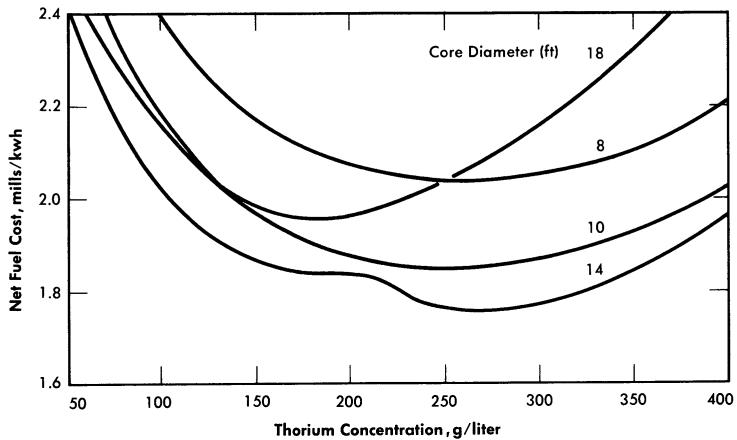  
FIG. 10-4. Fuel cost as function of thorium concentration in one-region reactors. Power per reactor $= 480 \, \text{Mw}$ (heat), poison fraction $= 0.08$ , $\eta^{23} = 2.25$ .

ameter and thorium concentration. However, a value of 0.08 gives costs which are close to the minimum for all cases.

(2) Diameter and thorium concentration. The fuel costs for some of the single-region reactors studied are shown in Fig. 10-4. Detailed information

TABLE 10-5   
EFFECT OF XENON POISON FRACTION ON FUEL COSTS   

<table><tr><td>Xenon poison fraction</td><td>0.01</td><td>0.05</td></tr><tr><td>Optimum total poison fraction</td><td>0.08</td><td>0.12</td></tr><tr><td>Core cycle time, days</td><td>637</td><td>718</td></tr><tr><td>Breeding ratio</td><td>1.102</td><td>1.070</td></tr><tr><td>Fuel inventory charge, mill/kwh</td><td>0.27</td><td>0.29</td></tr><tr><td>Core processing charge, mill/kwh</td><td>0.13</td><td>0.14</td></tr><tr><td>Fuel product (credit), mill/kwh</td><td>0.33</td><td>0.22</td></tr><tr><td>Net fuel cost, mills/kwh</td><td>1.22</td><td>1.35</td></tr></table>

for a typical one-region reactor is given in the last column in Table 10-3. In general, for thorium concentrations less than $400\mathrm{g}$ /liter the reactor diameter must be greater than 10 ft in order to have a breeding ratio greater than unity; the 12-ft-diameter reactor is a breeder (breeding ratio $\geq 1.0$ ) at a thorium concentration of $350\mathrm{g}$ /liter, while at $250\mathrm{g}$ Th/liter the 14-ft-diameter reactor is a breeder. For reactors between 10 and 16 ft in diameter, the thorium concentration yielding the lowest fuel costs is be

tween 200 and $275\mathrm{g}$ /liter. The lowest fuel cost is about 1.76 mills/kwh (for a 14-ft-diameter reactor containing $270\mathrm{g}$ Th/liter). In the curve for the 14-ft reactor, the inflection in the neighborhood of $225\mathrm{g}$ Th/liter is a result of the reactor changing from a breeder to a nonbreeder. This inflection is associated with a marked increase in $\mathbf{U}^{236}$ concentration (concentrations are based on equilibrium conditions), which produces an increase in fuel processing charges (in all cases it is assumed that $\mathbf{U}^{233}$ is fed to the system).

(3) Power and nuclear parameters. The effect of reactor power on the fuel costs of one-region reactors is similar to that mentioned earlier for two-region systems. For example, if the total fuel cost for a three-reactor station is 1.76 mills/kwh at $125\mathrm{Mw}$ of electric capability per reactor, it would be only 1.38 mills/kwh if the output per reactor were increased to $200\mathrm{Mw}$ .

The importance of changes in nuclear parameter is generally the same for the one-region reactors as for the two-region systems, although the effect upon fuel costs of a reduction in $\eta (\mathrm{U}^{233})$ is somewhat greater for the one-region cases.

10-3.4 Cylindrical reactors [9]. The effects of geometry on fuel cost are due to the associated changes in inventory requirements and breeding ratio. Accompanying these effects are changes in the average power densities and the wall power densities within the reactor. Because of corrosion difficulties associated with high power densities, it is desirable to operate with reasonably large reactor volumes. Cylindrical geometry permits reactors to have large volumes without necessitating large reactor diameters.

One-region spherical reactors would have to be large in order to prevent excessive neutron leakage, and so power densities would not be high (average power densities of about $30\mathrm{kw / liter}$ ). Also, closure problems with respect to maintenance of an inside vessel would not exist. Therefore there is little incentive to increase reactor volume by using cylindrical geometry for one-region homogeneous reactors.

For two-region reactors, cylindrical geometry may prove advantageous with respect to feasibility and relative ease of reactor maintenance. However, the associated larger fuel inventories (in comparison to inventories for spherical geometry) will increase fuel costs. Comparison of results for two-region cylindrical reactors with those for spherical two-region reactors shows that cylindrical geometry gives minimum fuel costs about 0.2 mill/kwh greater than does spherical geometry, if in either case there were no restrictions on core-wall power density. The difference is even greater if the core-wall power density influences the reactor size. However, cylindrical geometry does permit low wall power densities in combination with relatively small reactor diameters.

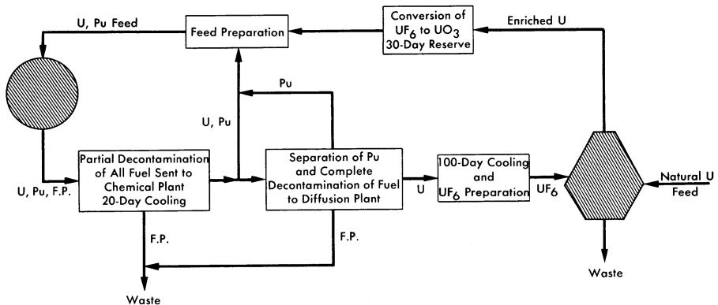  
FIG. 10-5. Fuel cycle for one-region, U-Pu reactor.

# 10-4. EFFECT OF DESIGN VARIABLES ON FUEL COSTS IN URANIUM-PLUTONIUM SYSTEMS

Fuel costs in uranium-plutonium systems will depend on whether the plutonium is removed continually or allowed to remain in the reactor. In the latter case, there is little difference in fuel costs between a $\mathrm{UO}_2\mathrm{SO}_4 - \mathrm{PuO}_2 - \mathrm{D}_2\mathrm{O}$ system and a $\mathrm{UO}_3 - \mathrm{PuO}_2 - \mathrm{D}_2\mathrm{O}$ system. Fuel-cost studies have been made on the basis of either maintaining plutonium uniformly within the reactor or removing the plutonium immediately after its formation by means of hydroclones. In addition, the effect upon fuel costs of $\mathrm{Li}_2^7\mathrm{SO}_4$ addition to $\mathrm{UO}_2\mathrm{SO}_4$ solutions is shown. The additive serves to suppress two-phase separation of the $\mathrm{UO}_2\mathrm{SO}_4$ solution, and permits reactor operation at temperatures higher than would otherwise be feasible.

10-4.1 One-region $\mathrm{PuO_2 - UO_3 - D_2O}$ power reactors [11,12]. Fuel costs of one-region homogeneous power reactors fueled with $\mathrm{PuO_2 - UO_3 - D_2O}$ slurries are given as functions of operating conditions, based on steady-state concentrations of $\mathrm{U}^{235}$ , $\mathrm{U}^{236}$ , $\mathrm{Pu}^{239}$ , $\mathrm{Pu}^{240}$ , and $\mathrm{Pu}^{241}$ . All other higher isotopes are assumed to be removed in the fuel processing step or to have zero absorption cross section. Although large reactors require feed enrichments equal to or less than that of natural uranium, minimum fuel costs are obtained when the reactor wastes are re-enriched in a diffusion plant. In the reactor system considered, the plutonium produced is fed back as reactor fuel after recovery in a Purex plant. The separated uranium is recycled to a diffusion plant for enrichment. Since in all cases the breeding ratio is less than unity, the additional fuel requirement is met by uranium feed of an enrichment dictated by the operating conditions. As a result of the feedback of plutonium, the concentration of plutonium in the reactor is high enough for resonance absorptions and fissions to have an appreciable effect upon fuel concentrations.

The fuel cycle is shown in Fig. 10-5. Slurry is removed from the reactor at the rate required to maintain a specified poison level. The fuel is separated from the $\mathrm{D}_2\mathrm{O}$ , cooled for 20 days while the neptunium decays, and partially decontaminated in a Purex plant. Part of the fuel is then sent directly to the reactor feed-preparation equipment. Plutonium is separated from the remainder of the uranium and added to the reactor feed. The uranium is completely decontaminated, stored for 100 days until the $\mathrm{U}^{237}$ decays, and sent to the diffusion plant. A 30-day reserve of reactor feed is kept on hand.

TABLE 10-6   
COST BREAKDOWNS FOR ONE-REGION $\mathrm{PUO_2 - UO_3 - D_2O}$ REACTORS* HAVING A DIAMETER OF 12 FT   

<table><tr><td colspan="4">Process characteristics:</td></tr><tr><td>U238concentration, g/liter</td><td>175</td><td>200</td><td>225</td></tr><tr><td>η41</td><td>1.9</td><td>2.2</td><td>2.4</td></tr><tr><td>Reactor poisons, %</td><td>6.0</td><td>6.0</td><td>6.0</td></tr><tr><td>Total system volume, liters</td><td>50,000</td><td></td><td>50,000</td></tr><tr><td>Chemical process cycle time, days</td><td>151</td><td></td><td>138</td></tr><tr><td>Initial enrichment (no Pu), U235/U</td><td>0.011</td><td>0.011</td><td>0.011</td></tr><tr><td>U235feed, g/day</td><td>579</td><td></td><td>430</td></tr><tr><td>Feed enrichment, % U235</td><td>0.99</td><td>0.70</td><td>0.52</td></tr><tr><td>U235concentration, g/liter</td><td>1.12</td><td></td><td>0.82</td></tr><tr><td>Pu239concentration, g/liter</td><td>0.86</td><td></td><td>1.17</td></tr><tr><td>Pu240concentration, g/liter</td><td>0.49</td><td></td><td>0.62</td></tr><tr><td>Pu241concentration, g/liter</td><td>0.36</td><td></td><td>0.49</td></tr><tr><td>Np239concentration, g/liter</td><td>0.03</td><td></td><td>0.03</td></tr><tr><td>U236concentration, g/liter</td><td>0.10</td><td></td><td>0.06</td></tr><tr><td>Conversion ratio</td><td>0.74</td><td></td><td>0.84</td></tr><tr><td colspan="4">Fuel costs:</td></tr><tr><td>Fuel inventory, mills/kwh (at 4%)</td><td>0.08</td><td></td><td>0.07</td></tr><tr><td>D2O inventory, mills/kwh (at 4%)</td><td>0.15</td><td></td><td>0.15</td></tr><tr><td>D2O losses, mills/kwh (at 5%)</td><td>0.19</td><td></td><td>0.19</td></tr><tr><td>Net uranium feed cost, mills/kwh</td><td>1.15</td><td></td><td>0.48</td></tr><tr><td>Variable chemical processing cost, mills/kwh</td><td>0.27</td><td></td><td>0.32</td></tr><tr><td>Fixed costs for chemical processing†, mills/kwh</td><td>0.76</td><td></td><td>0.76</td></tr><tr><td>Total fuel cost, mills/kwh</td><td>2.60</td><td>2.20</td><td>1.97</td></tr></table>

*Operating at $280^{\circ}\mathrm{C}$ ; 480 thermal Mw, 125 elec. Mw; $80\%$ load factor; optimum poisons, $5 - 7\%$ .

$\dagger$ Essentially assumes a chemical processing plant servicing three reactors producing 1440 thermal Mw.

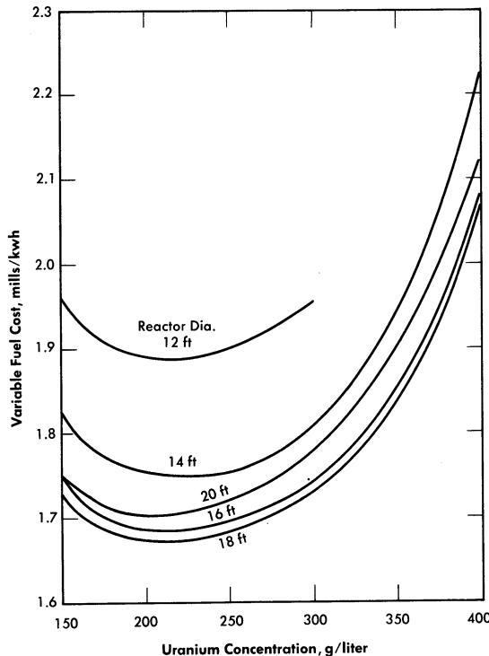  
FIG. 10-6. Effect of uranium concentration and reactor diameter on fuel cost in one-region reactors. $300\mathrm{Mw}$ of electricity, $1000\mathrm{Mw}$ of heat, Avg. reactor temperature $= 330^{\circ}\mathrm{C}$ , $\mathrm{UO_2SO_4 - Li_2SO_4 - D_2O}$ solution with dissolved $\mathrm{Pu}$ , molar ratio of $\mathrm{Li_2SO_4}$ to $\mathrm{UO_2SO_4} = 1$ , optimum poisons $= \sim 5\%$ .

Some typical results are given in Table 10-6 for a 12-ft-diameter reactor, in which different values were assumed for $\eta^{41}$ (the "best value" for $\eta^{41}$ is 2.2; therefore, based on these results, natural uranium is adequate feed material to ensure criticality). Where required, the cost of slightly enriched feed is based on the established schedule of charges by the AEC. Plutonium in the reactor is assumed to have a value of $16/g. Fuel costs were somewhat lower at larger reactor diameters, but a 12-ft diameter corresponds to a more feasible reactor size.

10-4.2 One-region $\mathrm{UO}_2\mathrm{SO}_4 - \mathrm{Li}_2\mathrm{SO}_4 - \mathrm{D}_2\mathrm{O}$ power reactors [13]. For minimum fuel costs, one-region reactors require fertile-material concentrations of several hundred grams per liter. The addition of $\mathrm{Li}_2\mathrm{SO}_4$ in molar concentration equal to that of the uranium increases the temperature at which phase separation appears and also acts as a corrosion inhibitor for stainless steel. Because of the high neutron-capture cross section of natural lithium, high isotopic purity in $\mathrm{Li}^7$ is necessary. Fuel costs for power-only reactor systems fueled by $\mathrm{UO}_2\mathrm{SO}_4 - \mathrm{Li}_2\mathrm{SO}_4 - \mathrm{D}_2\mathrm{O}$ solutions are given here in which

(Minimum fuel costs)

TABLE 10-7   
RESULTS FOR SEVERAL ONE-REGION REACTORS*  
NEAR OPTIMUM CONDITIONS   

<table><tr><td>Process characteristics:</td><td></td><td></td><td></td></tr><tr><td>Reactor diameter, ft</td><td>12</td><td>16</td><td>20</td></tr><tr><td>U238concentration, g/liter</td><td>200</td><td>200</td><td>200</td></tr><tr><td>Feed enrichment, w/o U235</td><td>2.11</td><td>1.48</td><td>1.22</td></tr><tr><td>Feed rate, g/day of U235</td><td>1078</td><td>923</td><td>838</td></tr><tr><td>Chemical processing cycle, days</td><td>359</td><td>408</td><td>543</td></tr><tr><td>Poisons, %</td><td>5</td><td>5</td><td>5</td></tr><tr><td>Reactor volume, liters</td><td>25,600</td><td>60,700</td><td>119,000</td></tr><tr><td>Total system volume, liters</td><td>88,000</td><td>127,000</td><td>181,000</td></tr><tr><td>Power density, kw/liter</td><td>39.0</td><td>16.5</td><td>8.4</td></tr><tr><td>Isotope concentration, g/liter:</td><td></td><td></td><td></td></tr><tr><td>U235</td><td>2.11</td><td>1.47</td><td>1.21</td></tr><tr><td>U236</td><td>0.37</td><td>0.26</td><td>0.21</td></tr><tr><td>Pu239</td><td>0.97</td><td>0.88</td><td>0.84</td></tr><tr><td>Pu240</td><td>0.51</td><td>0.50</td><td>0.49</td></tr><tr><td>Np239</td><td>0.03</td><td>0.02</td><td>0.02</td></tr><tr><td>Pu241</td><td>0.52</td><td>0.45</td><td>0.43</td></tr><tr><td>Conversion ratio</td><td>0.67</td><td>0.72</td><td>0.74</td></tr><tr><td>Variable fuel cost, mills/kwh:</td><td></td><td></td><td></td></tr><tr><td>Net feed cost</td><td>1.42</td><td>1.12</td><td>0.96</td></tr><tr><td>Variable chemical processing</td><td>0.11</td><td>0.11</td><td>0.10</td></tr><tr><td>Fuel inventory</td><td>0.10</td><td>0.09</td><td>0.10</td></tr><tr><td>D2O inventory</td><td>0.11</td><td>0.16</td><td>0.23</td></tr><tr><td>D2O losses</td><td>0.14</td><td>0.20</td><td>0.29</td></tr><tr><td>Lithium losses and inventory</td><td>0.006</td><td>0.008</td><td>0.011</td></tr><tr><td>Hydroclones</td><td>0.04</td><td>0.04</td><td>0.04</td></tr><tr><td>Total variable fuel cost</td><td>1.93</td><td>1.73</td><td>1.75</td></tr></table>

*1000 Mw (heat); 300 Mw (electrical); ${330}^{ \circ  }\mathrm{C}$ reactor temperature.

all plutonium is assumed to remain either in solution or uniformly suspended throughout the reactor. The plutonium is returned to the reactor following fuel processing, and steady-state conditions are assumed. The same type of fuel cycle as shown in Fig. 10-5 is considered. The results shown in Fig. 10-6 are for spherical reactors operated at an average temperature of $330^{\circ}\mathrm{C}$ , producing $1000\mathrm{Mw}$ of thermal energy, and delivering $300\mathrm{Mw}$ of electricity to a power grid. The variable fuel costs given do not include fixed charges for fuel processing; these fixed charges would add about $0.76\mathrm{mill/kwh}$ to the fuel costs given. Results are based on a $4\%$

TABLE 10-8   
FUEL COSTS FOR BATCH-OPERATED HOMOGENEOUS $\mathrm{UO}_2\mathrm{SO}_4 - \mathrm{D}_2\mathrm{O}$ POWER REACTORS(a)  

<table><tr><td rowspan="3">Case no.</td><td rowspan="3">Hydroclone cycle time (days)</td><td rowspan="3">Additive(b)</td><td rowspan="2" colspan="2">Initial uranium concentration, g/liter</td><td colspan="2">Fuel costs,(c) mills/kwh</td></tr><tr><td colspan="2">20-year operation</td></tr><tr><td>U238</td><td>U235</td><td>U and Pu recovered</td><td>No U and Pu recovered</td></tr><tr><td>1</td><td>∞</td><td>None</td><td>100</td><td>2.72</td><td></td><td></td></tr><tr><td>2</td><td>∞</td><td>None</td><td>200</td><td>4.18</td><td>2.61</td><td>2.67</td></tr><tr><td>3</td><td>∞</td><td>None</td><td>300</td><td>5.99</td><td>2.42(d)</td><td>2.48</td></tr><tr><td>4</td><td>∞</td><td>None</td><td>400</td><td>8.32</td><td>2.34</td><td>2.44</td></tr><tr><td>5</td><td>∞</td><td>Li2SO4</td><td>100</td><td>2.99</td><td>2.96</td><td>3.03</td></tr><tr><td>6</td><td>∞</td><td>Li2SO4</td><td>200</td><td>4.82</td><td>2.62</td><td>2.69</td></tr><tr><td>7</td><td>∞</td><td>Li2SO4</td><td>300</td><td>7.21</td><td>2.44(d)</td><td>2.53</td></tr><tr><td>8</td><td>1(e)</td><td>None</td><td>300</td><td>5.99</td><td>2.24</td><td>2.16</td></tr><tr><td>9</td><td>1(e)</td><td>None</td><td>400</td><td>8.32</td><td>2.16</td><td>2.07</td></tr></table>

(a) Average temperature, $280^{\circ}\mathrm{C}$ ; power, 480 thermal Mw, 125 electrical Mw; diameter, 6 ft;   
system volume, 27,200 liters; fuel solution, $\mathrm{UO_2SO_4 - D_2O}$   
(b) Molar concentration of additive was assumed to be equal to the molar concentration of   
uranium.   
(c) Based on the assumption that the fuel processing plants are servicing enough reactors to make the fixed charges for chemical processing negligible.   
(d) Details in these cases are shown in Table 10-9.   
(e) Plutonium was assumed to be completely soluble and not removed by hydroclones.

inventory charge and $28/lb \mathrm{D}_2\mathrm{O}$ . Table 10-7 gives a breakdown of costs for several reactors near optimum conditions. The $\mathbf{Li}^7$ cost is assumed to be $\$100/lb$ ; at this value the effect of lithium cost upon fuel cost is negligible. However, the added $\mathbf{Li}_2^7\mathbf{SO}_4$ acts as a neutron poison and diluent which lowers the conversion ratio; these effects increase fuel costs by 0.2 to 0.3 mill/kwh over those which would exist if no $\mathbf{Li}_2^7\mathbf{SO}_4$ were required.

The above results are for equilibrium conditions, with continuous fuel processing. These reactors can also be operated with no fuel processing, in which case nonequilibrium conditions apply. Under such conditions the variable fuel cost would be greater than for the case of continuous fuel processing; therefore any economic advantage associated with batch operation can exist only if fixed charges for fuel processing (or storage) at the end of batch operation are effectively lower than fixed charges associated with continuous processing. Fuel costs are given below for spherical one-region reactors operating on a batch basis, utilizing an initial loading of slightly enriched uranium. In all cases, fuel feed is highly enriched $\mathrm{U}^{235}$ . The total reactor power is 480 thermal Mw (125 electrical Mw), and an 0.8 load factor is considered. Inventory charges are $4\%/\mathrm{yr}$ , cost of $\mathrm{D}_2\mathrm{O}$ is $\$28/\mathrm{lb}$ , and the cost of uranium as a function of enrichment is based on official prices. A summary of the fuel costs is given in Table 10-8 for 6-ft-diameter reactors. More details for two reactors are given in Table 10-9. Credit for plutonium is based on a fuel value of $\$16/\mathrm{g}$ ; it is assumed that plutonium will remain within the reactor. The shipping costs do not include fixed charges on shipping containers.

For these reactors (6-ft diameter), the addition of $\mathrm{Li_2SO_4}$ ( $99.98\%$ Li $^7$ ) (cases 5, 6, and 7) to the fuel solution raises the fuel cost slightly, the maximum increase being about $0.1\mathrm{~mill/kwh}$ . The use of hydroclones (cases 8 and 9) for partial poison removal (assuming no plutonium removal) for these reactors shows an economic advantage, particularly in the "throw-away" fuel costs (no uranium or plutonium recovery). For these latter costs, the removal of fission-product poisons reduces the fuel costs by 0.3 to $0.4\mathrm{~mill/kwh}$ for 20-year operation. In view of its low solubility, however, plutonium would be extracted along with the fission-product poisons. The economic feasibility of hydroclones in these circumstances, in a power-only economy, is dependent upon the savings effected by posion removal relative to the costs associated with recovery of the plutonium for fuel use. Fuel costs for 10-year operation were 0.1 to $0.2\mathrm{~mill/kwh}$ higher than those for 20-year operation.

10-4.3 Two-region $\mathbf{UO}_3\text{-}\mathbf{PuO}_2\text{-}\mathbf{D}_2\mathbf{O}$ power reactors [11]. The major advantage associated with two-region reactors is that good neutron economy can be combined with relatively low inventory requirements. None of the uranium-plutonium fueled aqueous homogeneous reactors appear

TABLE 10-9   
ISOTOPE CONCENTRATIONS AND COST BREAKDOWN FOR BATCH-OPERATED HOMOGENEOUS REACTORS* (20-year operation, no hydroclones, 300 g U $^{238}$ /liter)   

<table><tr><td>Initial U235 concentration, g/liter</td><td>5.99</td><td>7.21</td></tr><tr><td>Additive</td><td>0</td><td>Li2SO4</td></tr><tr><td>Average U235 feed rate, kg/yr</td><td>136</td><td>136</td></tr><tr><td>Initial U235 inventory, kg</td><td>163</td><td>196</td></tr><tr><td>Final poison fraction</td><td>0.27</td><td>0.25</td></tr><tr><td>Final isotope concentration, g/liter:</td><td></td><td></td></tr><tr><td>U234</td><td>1.22</td><td>1.28</td></tr><tr><td>U235</td><td>12.2</td><td>13.2</td></tr><tr><td>U236</td><td>13.9</td><td>14.0</td></tr><tr><td>U238</td><td>223</td><td>223</td></tr><tr><td>Np239</td><td>0.03</td><td>0.03</td></tr><tr><td>Pu239</td><td>3.54</td><td>3.95</td></tr><tr><td>Pu240</td><td>3.62</td><td>4.04</td></tr><tr><td>Pu241</td><td>1.24</td><td>1.38</td></tr><tr><td>Estimated fuel costs, mills/kwh:</td><td></td><td></td></tr><tr><td>Uranium inventory</td><td>0.08</td><td>0.11</td></tr><tr><td>D2O inventory and losses</td><td>0.19</td><td>0.19</td></tr><tr><td>Uranium feed</td><td>2.12</td><td>2.12</td></tr><tr><td>Chemical processing</td><td>0.18</td><td>0.18</td></tr><tr><td>Hydroclones</td><td>0.04</td><td>0.04</td></tr><tr><td>Shipping</td><td>0.04</td><td>0.04</td></tr><tr><td>Plutonium sale (credit)</td><td>0.07</td><td>0.08</td></tr><tr><td>Diffusion plant (credit)</td><td>0.12</td><td>0.12</td></tr><tr><td>Total (fuel cost)</td><td>2.42</td><td>2.44</td></tr></table>

*Same conditions as listed in Table 10-8.

capable of producing more fuel than is burned; however, it is possible to operate a two-region reactor with such a low steady-state concentration of $\mathbf{U}^{235}$ in the blanket that natural uranium can be fed to the reactor and the waste discarded.

In a power-converter the plutonium is extracted from the blanket and fed to the core as fuel material. Natural uranium is fed to the blanket, and the plutonium formed is extracted by Purex processing. By adjusting the concentrations of fissionable materials in the blanket, the net rate of production of plutonium in the blanket is made equal to the consumption in the core. The fuel cycle considered for a two-region reactor is shown in Fig. 10-7. Plutonium from the core is processed continuously through a

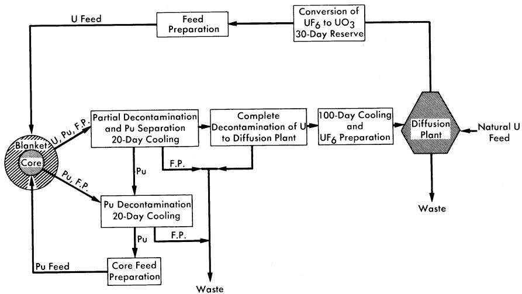  
FIG. 10-7. Fuel cycle for two-region U-Pu reactor.

Purex plant to maintain a constant poison fraction. Uranium from the blanket is also processed through the Purex plant, the rate of processing being governed by the required plutonium feed to the core. Although it is possible to operate the reactors without an enriching plant by using natural-uranium feed to the blanket and discarding the waste, there appears to be a slight cost advantage in operating the reactors in conjunction with an enriching plant.

Table 10-10 gives fuel costs and associated information for a two-region reactor having a core diameter of 6 ft and a 10-ft over-all diameter. The value of $\eta^{41}$ is assumed to be 1.9. (A more recent value of $\eta^{41} = 2.2$ is believed to be more accurate.) Comparison of these costs with those for one-region reactors of 12 to 14 ft diameter indicate that two-region U-Pu reactors have fuel costs about 0.2 to 0.3 mill/kwh lower than do one-region reactors.

# 10-5. FUEL COSTS IN DUAL-PURPOSE PLUTONIUM POWER REACTORS

Since plutonium is quite insoluble in $\mathrm{UO}_2\mathrm{SO}_4 - \mathrm{D}_2\mathrm{O}$ solutions and can be removed by hydroclones, it is possible to produce high-quality plutonium ( $\mathrm{Pu}^{240}$ content less than $2\%$ ). Based on the AEC price schedule, this high-quality plutonium has a net value of at least $\$40/\mathrm{g}$ after allowing $\$1.50/\mathrm{g}$ for conversion to metal). At this value it is more economical to recover plutonium than to burn it as fuel. Fuel costs based on recovery of the plutonium are given here for one- and two-region U-Pu reactors.

TABLE 10-10   
FUEL COSTS FOR A TWO-REGION, U-PU POWER REACTOR*   

<table><tr><td>Core diameter, ft</td><td>6</td></tr><tr><td>Core power, thermal Mw</td><td>320</td></tr><tr><td>Core Pu concentration, g/liter</td><td>1.7</td></tr><tr><td>N40/N49 in core</td><td>0.99</td></tr><tr><td>N41/N49 in core</td><td>0.35</td></tr><tr><td>Blanket thickness, ft</td><td>2</td></tr><tr><td>Blanket power, thermal Mw</td><td>180</td></tr><tr><td>Blanket U concentration, g/liter</td><td>500</td></tr><tr><td>N25/N28 in blanket</td><td>0.003</td></tr><tr><td>N49/N28 in blanket</td><td>0.001</td></tr><tr><td>N40/N28 in blanket</td><td>0.0003</td></tr><tr><td>N41/N28 in blanket</td><td>0.00005</td></tr><tr><td>Blanket feed enrichment, N25/Nu</td><td>0.004</td></tr><tr><td>Fraction fissions in U235</td><td>0.27</td></tr><tr><td>Fraction of U consumed</td><td>0.017</td></tr><tr><td>Fuel costs, mills/kwh</td><td></td></tr><tr><td>Core processing (variable)</td><td>0.16</td></tr><tr><td>Blanket processing (variable)</td><td>0.31</td></tr><tr><td>D2O recovery</td><td>0.07</td></tr><tr><td>U + Pu losses</td><td>0.005</td></tr><tr><td>Pu inventory</td><td>0.04</td></tr><tr><td>U inventory</td><td>0.005</td></tr><tr><td>D2O inventory plus losses at 9%/yr</td><td>0.30</td></tr><tr><td>Feed cost minus credit for returned U</td><td>0.62</td></tr><tr><td>Fixed charges for chemical processing†</td><td>0.76</td></tr><tr><td>Total fuel costs, mills/kwh</td><td>2.27</td></tr></table>

*Average temp., $250^{\circ}\mathrm{C}$ ; total power, 500 thermal Mw; net thermal efficiency, $25\%$ ; load factor, $80\%$ ; $\eta^{41} = 1.9$ .   
†Assumes chemical-processing plant servicing three reactors.

10-5.1 One-region reactors [14]. Fuel costs are given for $\mathrm{UO}_2\mathrm{SO}_4 - \mathrm{D}_2\mathrm{O}$ and $\mathrm{UO}_2\mathrm{SO}_4 - \mathrm{Li}_2^2\mathrm{SO}_4 - \mathrm{D}_2\mathrm{O}$ fuel systems operating at $280^{\circ}\mathrm{C}$ , in which the plutonium is assumed to be removed by means of hydroclones on about a one-day cycle. Characteristics of the assumed systems are presented in Table 10-11.

TABLE 10-11 CHARACTERISTICS OF REACTOR SYSTEM   

<table><tr><td>Electrical power, Mw</td><td>125</td></tr><tr><td>Heat generation, Mw</td><td>480</td></tr><tr><td>Reactor diameter, ft</td><td>12</td></tr><tr><td>Power density in system external to core, kw/liter</td><td>20</td></tr><tr><td>Average reactor temperature, °C</td><td>280</td></tr><tr><td>Reactor poisons, %</td><td>5</td></tr><tr><td>Chemical processing rate, g U235/day</td><td>1000</td></tr><tr><td>Plutonium removal</td><td>Instantaneous</td></tr><tr><td>Isotopic purity of lithium, %</td><td>99.98</td></tr><tr><td>Processing method</td><td>Purex</td></tr><tr><td>Li7cost, $/lb</td><td>40</td></tr><tr><td>Inventory charges, %</td><td>4</td></tr><tr><td>D2O losses, % of inventory/yr</td><td>5</td></tr><tr><td>Li losses, % of inventory/yr</td><td>1</td></tr></table>

Because of the high credit for plutonium, the fuel costs are negative even if the fixed charges for chemical processing (0.76 mill/kwh) are included. The total fuel costs obtained are shown in Fig. 10-8. The effect of the $\mathrm{Li_2SO_4}$ addition is to decrease the conversion ratio; because of the relatively high value assigned to plutonium, this causes the $\mathrm{Li_2SO_4}$ addition (added in the same molal concentration as the $\mathrm{UO_2SO_4}$ ) to increase fuel costs by 0.8 mill/kwh over those if no $\mathrm{Li_2SO_4}$ were required.

Calculations indicate that batch-type operation of a plutonium producer is undesirable if plutonium has a value of $40/g$ ; any savings in fuel-processing costs using batch-type operation is more than compensated by a loss in product value associated with the decrease in plutonium production.

10-5.2 Two-region reactors [15]. Since the conversion ratio is greater in a two-region reactor, it is expected that a high plutonium value will cause this reactor type to have lower fuel costs (greater fuel credits) than a one-region reactor. Calculations for a reactor having a 6-ft-diameter core and an over-all diameter of 12 ft, in which the plutonium is recovered with a fuel cycle similar to that given in Fig. 10-7, indicated fuel costs from 0.5 to 0.6 mill/kwh lower than in one-region reactors.

# 10-6. FUEL COSTS IN $\mathbf{U}^{235}$ BURNER REACTORS

A homogeneous reactor fueled with a dilute, highly enriched $\mathrm{UO}_2\mathrm{SO}_4$ solution is potentially capable of operating without removing fission

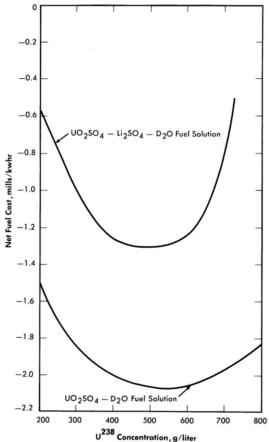  
FIG. 10-8. Effect of $\mathrm{Li_2SO_4}$ and $\mathbf{U}^{238}$ concentration on fuel cost of a one-region spherical plutonium-producer power reactor. Diameter = 12 ft, avg. reactor temperature = 280°C, electrical power = 125 Mw, heat generation = 480 Mw, avg. lithium cross section = 0.2 barn, plutonium credit = $40/g, inventory charge = 4%, molar ratio of $\mathrm{Li_2SO_4}$ to $\mathrm{UO_2SO_4} = 1$ , processing rate = 1000 g $\mathrm{U}^{235}$ /day.

products if additional $\mathbf{U}^{235}$ is continually added to offset the buildup of poisons.

The results of fuel-cost studies [16,17] for spherical one-region reactors containing dilute, highly enriched $\mathrm{UO}_2\mathrm{SO}_4$ in either $\mathrm{D}_2\mathrm{O}$ or $\mathrm{H}_2\mathrm{O}$ are given in Table 10-12. The noble gases are assumed to be removed continuously. The removal of poisons and corrosion products by hydroclones is considered, but the fuel cost is about the same whether hydroclones are used or not (assuming corrosion rates of about $1\mathrm{mil}/\mathrm{year}$ ). The results are for nonsteady-state conditions.

(Average temperature- $280^{\circ}\mathrm{C}$ 125 Mw elect.; 6-ft-diameter core)

TABLE 10-12   
ISOTOPE CONCENTRATIONS AND FUEL COST BREAKDOWN FOR SOME U235 BURNERS   

<table><tr><td>Moderator</td><td>H2O</td><td>H2O</td><td>D2O</td><td>D2O</td></tr><tr><td>Hydroclone cycle time, days</td><td>1</td><td>∞</td><td>1</td><td>∞</td></tr><tr><td>Operating time, days</td><td>2000</td><td>3400</td><td>4200</td><td>4400</td></tr><tr><td>Initial U235 inventory, kg</td><td>353</td><td>353</td><td>34.3</td><td>34.3</td></tr><tr><td>Total system volume, liters</td><td>27,000</td><td>27,000</td><td>27,000</td><td>27,000</td></tr><tr><td>Average U235 feed rate, 
kg/yr</td><td>239</td><td></td><td>233</td><td>237</td></tr><tr><td>U concentration, g/liter*</td><td>24.7</td><td>36</td><td>18.6</td><td>22.8</td></tr><tr><td>Fraction poisons,*</td><td></td><td></td><td></td><td></td></tr><tr><td>Σa(p)/Σf(25)</td><td>0.05</td><td>0.17</td><td>0.23</td><td>0.53</td></tr><tr><td>Estimated costs, mills/kwh</td><td></td><td></td><td></td><td></td></tr><tr><td>Uranium inventory at 4%</td><td>0.29</td><td></td><td>.03</td><td>0.03</td></tr><tr><td>D2O inventory and losses at 
9%</td><td>0</td><td></td><td>0.19</td><td>0.19</td></tr><tr><td>Uranium feed cost</td><td>3.71</td><td></td><td>3.64</td><td>3.70</td></tr><tr><td>Chemical processing cost 
(variable cost at end of 
operating period)</td><td>0.08</td><td></td><td>0.03</td><td>0.03</td></tr><tr><td>Hydroclone cost</td><td>0.02</td><td></td><td>0.02</td><td>0</td></tr><tr><td>Shipping cost</td><td>0.02</td><td></td><td>0.02</td><td>0.02</td></tr><tr><td>Plutonium sale (credit, 
$16/gm)</td><td>0.0005</td><td></td><td>0.01</td><td>0.0003</td></tr><tr><td>Diffusion plant (credit)</td><td>0.002</td><td></td><td>0.02</td><td>0.08</td></tr><tr><td>Total (fuel cost)†</td><td>4.13</td><td>4.06</td><td>3.91</td><td>3.90</td></tr></table>

*At indicated operating time.   
†Includes no fixed charges for fuel processing.

With $\mathrm{D}_2\mathrm{O}$ reactors, it appears that fuel processing can be economically eliminated if the reactor operating cycle is about 10 years and if the spent fuel is disposed of cheaply at the reactor site. Such a procedure with the $\mathrm{H}_2\mathrm{O}$ -moderated reactor is more expensive because of higher uranium inventory. For low fuel-shipping and -processing charges, the fuel costs are nearly independent of the reactor size and moderator, and are about 4 mills/kwh. If fixed charges associated with fuel processing are greater than $\sim 0.5$ mill/kwh, it may be more economical to store the fuel than to have it processed.

TABLE 10-13   
SUMMARY OF FUEL COSTS OF DIFFERENT SYSTEMS   

<table><tr><td></td><td>mills/kwh</td></tr><tr><td>(1) One-region burner; power only; UO2SO4-D2O solution (for 14-year operation)</td><td>3.93</td></tr><tr><td>(2) One-region burner; power only; UO2SO4-H2O solution (for 7-year operation)</td><td>4.12</td></tr><tr><td>(3) One-region converter; power only; UO3-PuO2-D2O slurry</td><td>2.20</td></tr><tr><td>(4) One-region converter; power-plutonium; UO2SO4-D2O solution</td><td>-2.00</td></tr><tr><td>(5) Two-region converter; power only; core, PuO2-D2O slurry; blanket, UO3-PuO2-D2O slurry</td><td>1.90</td></tr><tr><td>(6) Two-region converter; power-plutonium; UO2SO4-D2O solution</td><td>-2.66</td></tr><tr><td>(7) One-region breeder; power only; UO3-ThO2-D2O slurry</td><td>1.76</td></tr><tr><td>(8) Two-region breeder; power only; UO3-ThO2-D2O slurry</td><td>1.22</td></tr><tr><td>(9) Two-region breeder; power only; core, UO2SO4-D2O solu-tion; blanket, UO3-ThO2-D2O slurry</td><td>1.29</td></tr></table>

# 10-7. SUMMARY OF HOMOGENEOUS REACTOR FUEL-COST CALCULATIONS

10-7.1 Equilibrium operating conditions. Fuel costs in different homogeneous systems are summarized in Table 10-13. Appropriate nuclear data and general reactor characteristics have been given previously.

10-7.2 Nonsteady-state operating conditions [18]. A comparison of fuel costs is given here for several one-region reactor systems, operating under nonsteady-state conditions. The reactors are moderated with either $\mathrm{H}_2\mathrm{O}$ or $\mathrm{D}_2\mathrm{O}$ and fueled with enriched $\mathrm{UO}_3$ plus $\mathrm{ThO}_2$ , or $\mathrm{UO}_2\mathrm{SO}_4$ of varying enrichments. The effect of adding $\mathrm{Li}_2\mathrm{SO}_4$ to the $\mathrm{UO}_2\mathrm{SO}_4$ is also considered. In the $\mathrm{UO}_3 + \mathrm{ThO}_2$ system, it is assumed that the initial fuel is $\mathrm{U}^{233}$ and that sufficient $\mathrm{U}^{233}$ is available as feed material.

Cost factors which make only a small contribution to the total fuel cost are fuel processing losses (0.2% of fuel processed), $\mathrm{D}_2\mathrm{O}$ losses (5% of $\mathrm{D}_2\mathrm{O}$ inventory/year), hydroclone costs ( $\$70/day$ ), 30-day inventory supplies, and shipping charges (it is assumed that the amortization charges for shipping costs are negligible). In all cases the inventory charges are based on the volume of the reactor vessel plus the volume of the external system. This latter volume is calculated on the basis of an average heat-removal

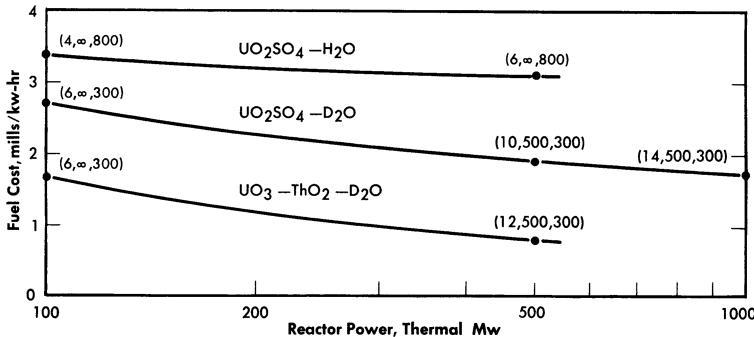  
FIG. 10-9. Fuel costs in single-region reactors as a function of power level. Values in parentheses refer to core diameter (ft), fuel processing cycle time (days), and fertile material concentration (g/liter) at near-optimum conditions. Inventory charge $= 4\%$ , relative chemical processing $= 1$ , relative poisons $= \frac{1}{2}$ , $\eta^{25} = 2.08$ , $\eta^{49} = 1.93$ , $\eta^{23} = 2.25$ .

capability of 20 kw/liter of external volume. The enrichment of the heavy water is assumed to be $99.75\%$ $\mathrm{D}_2\mathrm{O}$ , and the $\mathrm{D}_2\mathrm{O}$ cost is taken as $28/lb.

Only the optimum or near-optimum reactor conditions are given in Fig. 10-9. The optimum conditions refer to the diameter, fuel-processing cycle time, and fertile-material concentration which give the minimum fuel cost of all the diameters, cycle times, and fertile-material concentrations studied for the particular case.

A value of unity for relative fuel processing implies a charge of $0.54/g of U233, U234, U235, and U236 processed; $1/g Pu processed; and $3.50/kg fertile material processed. A value of two implies processing charges twice the above values. Fixed charges for chemical processing are not included in the calculation of fuel cost. A relative poisoning of unity implies representation of the fission-product poisons by two effective nuclei having yields of 0.11 and 1.81 atoms/fission, and thermal absorption cross sections of 132 and 13.9 barns, respectively (based on values of Robb et al. [19]). A value of 1/2 implies cross sections 1/2 the above values, corresponding closely to the values of Walker [20].

Fuel costs were calculated for both 10 and 25 years of reactor operation; these costs are usually slightly lower after 25 than after 10 years, but the differences are small, usually between 0 and $0.1 \, \text{mill/kwh}$ . Therefore, only results for 10-year operation are given here.

The reactor system and power level influence the fuel cost as indicated in Fig. 10-9. Changing the power level affects optimum reactor conditions significantly. The variations in relative poisons and relative chemical processing considered here did not change fuel costs to a large degree, the individual effects usually being about 0.1 mill/kwh. The influence of reactor composition on fuel cost is due to the values of $\eta$ for the various

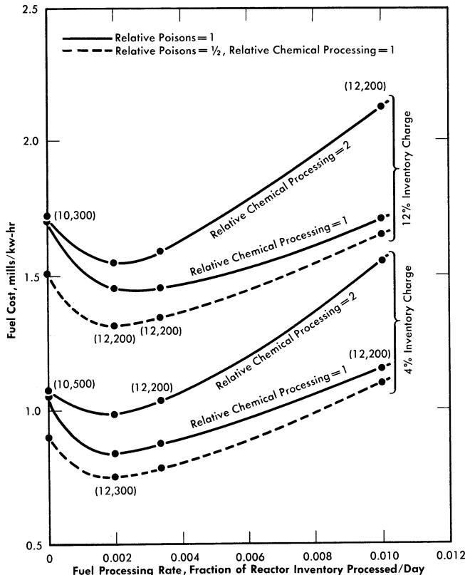  
FIG. 10-10. Effects of fuel-processing rate, fuel-processing charge, and poisoning by fission products upon fuel cost in $\mathrm{UO_3 - ThO_2 - D_2O}$ reactors. Values in parentheses refer to core diameter (ft) and thorium concentration (g/liter) at nearoptimum conditions (independent of relative poisons and relative chemical processing values shown). Reactor power $= 500\mathrm{Mw}$ , $\eta^{23} = 2.25$ ; $\mathbf{U}^{233}$ feed.

fissionable materials and fraction poisons associated with the different systems. Increasing the inventory charge from 4 to $12\%$ increases fuel cost by about 0.5 mill/kwh for the $\mathrm{D}_2\mathrm{O}$ systems. Although not shown, the effect of $\mathrm{Li}_2\mathrm{SO}_4$ addition to the $\mathrm{UO}_2\mathrm{SO}_4 - \mathrm{H}_2\mathrm{O}$ system has negligible effect upon fuel cost, owing to the high poison fraction associated with the $\mathrm{H}_2\mathrm{O}$ . The addition in equimolar proportions of $\mathrm{Li}_2\mathrm{SO}_4$ to the $\mathrm{UO}_2\mathrm{SO}_4 - \mathrm{D}_2\mathrm{O}$ system increases fuel costs by about 0.1 mill/kwh.

The influences of fuel-processing rate, fuel-processing charge, and fission-product poisoning upon fuel cost are shown in Fig. 10-10 for the $\mathrm{UO_3 - ThO_2 - D_2O}$ system. The fuel-processing rate corresponds to the fraction of the reactor inventory processed per day. It is seen that doubling the fission-product poisoning increases the fuel cost about $0.1\mathrm{mil / kWh}$ for

the fuel-processing rates considered, and that doubling the processing charge increases the fuel cost about 0.1 mill/kwh at optimum conditions.

The fuel costs given in Figs. 10-9 and 10-10 include no fixed charges for fuel processing; the magnitude of these charges would be dependent upon the number of reactors processed by the processing plant. Increasing the fuel-processing charges decreases the optimum fuel-processing rate. Although fuel would undoubtedly be processed at the end of reactor operation (and this was always assumed in obtaining the results), the permissible unit cost for processing at that time is high compared with the permissible unit cost associated with a high processing rate. If the fixed charges for processing correspond only to that period required to process the fuel (for a given processing-plant capacity), then the optimum processing rate is less than the rate obtained on the basis of fixed charges being independent of fuel processing rate.

# 10-8. CAPITAL COSTS FOR LARGE-SCALE PLANTS

The homogeneous reactors that have been built are small and have investment costs of over \(1000/electrical\ kw.\) The capital costs of large nuclear plants, based largely on paper studies, have been estimated to be 1.2 to 2 times that of conventional power-cost investments. If capital costs are \)400/kw, corresponding fixed charges are 9 mills/kw at 80% load factor and 12 mills/kw at 60% load factor, considering a 15% annual fixed charge. It follows that one of the conditions necessary for low-cost power is a high load factor. The essential problems are to achieve low fuel costs and to obtain reliability and long plant lifetime. To date, little experience has been obtained in operating power reactors; therefore it is difficult to estimate accurately the lifetime and also the reactor reliability over that lifetime. Although most economic studies are used to measure the relative economic advantage of different types of reactors, this cannot be firmly established so long as the investment and maintenance costs remain uncertain. Consequently, no hard and fast conclusions concerning power costs can be obtained other than what the ultimate power cost might be.

The initial cost of the reactor building and other buildings associated with the plant, as well as the site development costs, are strongly influenced by the philosophy behind the design with regard to such factors as safety and security. Estimates for these costs are usually based on corresponding costs for a large conventional steam power plant. Land costs for nuclear plants areextravagantly high if containment is not assured. The cost of containment vessels has been estimated to be in the range of $10 to $40/electrical kw [21]. Equipment costs usually assume that the desired equipment has been developed and all development costs paid for. Even so, the depreciation charges on reactor equipment may be considerably

TABLE 10-14   
PRESENT ESTIMATES OF REACTOR PLANT COSTS FOR A THREE-REACTOR STATION OPERATING AT A TOTAL POWER OF 1350 THERMAL Mw (315 Electrical Mw) [23]  

<table><tr><td></td><td>Min. Cost</td><td>Max. Cost</td></tr><tr><td>High-pressure system for one reactor</td><td></td><td></td></tr><tr><td>Reactor vessel (and core tank)</td><td>530,000</td><td>970,000</td></tr><tr><td>Gas separators (3)</td><td>120,000</td><td>240,000</td></tr><tr><td>Heat exchangers (3)</td><td>2,030,000</td><td>2,680,000</td></tr><tr><td>Fuel and blanket circulating pumps (3)</td><td>670,000</td><td>720,000</td></tr><tr><td>High-pressure storage tank and catalytic recombiner, core system</td><td>110,000</td><td>220,000</td></tr><tr><td>High-pressure storage tank and catalytic recombiner, blanket system</td><td>40,000</td><td>90,000</td></tr><tr><td>20-Mw gas condenser</td><td>40,000</td><td>70,000</td></tr><tr><td>6.5-Mw gas condenser</td><td>20,000</td><td>30,000</td></tr><tr><td>Condensate storage tanks (2)</td><td>10,000</td><td>20,000</td></tr><tr><td>Gas blower for core system</td><td>30,000</td><td>60,000</td></tr><tr><td>Gas blower for blanket system</td><td>20,000</td><td>40,000</td></tr><tr><td>High-pressure process piping and valves</td><td>3,250,000(a)</td><td>6,430,000(a)</td></tr><tr><td>Steam piping, valves and expansion joints in cells</td><td>(c)</td><td>(c)</td></tr><tr><td>Instrumentation</td><td>330,000</td><td>700,000</td></tr><tr><td>Sampling equipment</td><td>(b)</td><td>(b)</td></tr><tr><td>Installation of high-pressure equipment (foundations, supports, erection, etc.)</td><td>1,430,000</td><td>2,210,000</td></tr><tr><td>Subtotal for one reactor</td><td>8,630,000</td><td>14,500,000</td></tr><tr><td>Subtotal for three reactors</td><td>25,900,000</td><td>43,500,000</td></tr></table>

(a) Includes installation, insulation, inspection.   
(b) In low-pressure estimate.   
(c) In steam-system estimate.   
(d) With no contingency.

TABLE 10-14 (continued)   

<table><tr><td></td><td>Min. Cost</td><td>Max. Cost</td></tr><tr><td>Low-pressure system for one reactorDump tanks (6) and associated equipment. [Condensers (2), condensate tanks (2), recombiners (2), evaporators (2), feed and circulating pumps, D2O recovery and fission-product adsorption system]Piping and valves, instrumentation, sampling equipmentInstallation of low-pressure equipmentSubtotal for one reactorSubtotal for three reactorsReactor structureReactor and low-pressure equipment cellsEquipment transport shield, crane, maintenance handling equipmentControl room, laboratory, and process areaCell ventilation system (cooling water, waste disposal)Subtotal</td><td>1,260,0001,080,000540,0002,880,0008,640,0003,000,000430,0002,000,000890,000$6,320,000</td><td>1,800,0002,270,000770,0004,840,00014,500,0004,000,000950,0004,000,0001,750,000$10,700,000</td></tr><tr><td>Summary CostDirect costContractor&#x27;s overhead and fees(27%)Engineering and inspection (10%)Total(d)</td><td>$40,900,00011,000,0004,100,00056,000,000</td><td>$68,700,00018,500,0006,900,00094,100,000</td></tr><tr><td>Reactor plant cost, $/thermal kw</td><td>$6,000,0001,350,000=41</td><td>$94,100,0001,350,000=70</td></tr><tr><td>Reactor plant cost, $/elec. kw</td><td>$56,000,000315,000=178</td><td>$94,100,000315,000=298</td></tr></table>

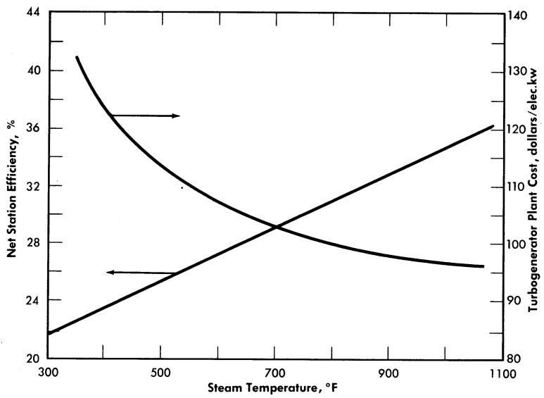  
FIG. 10-11. Turbine plant cost and net station efficiency vs. steam temperature.

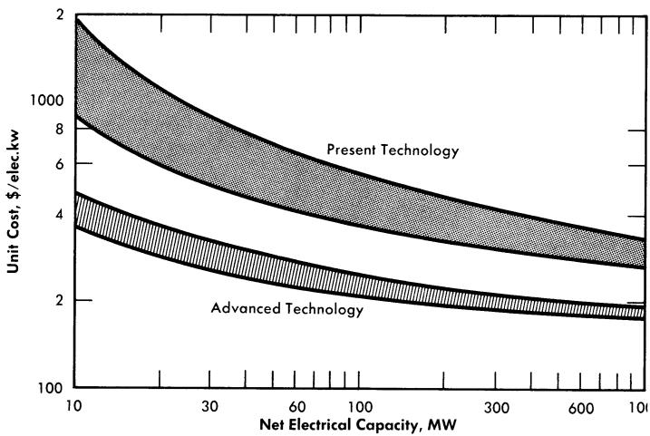  
FIG. 10-12. Capital costs of aqueous homogeneous reactors.

higher than those for conventional power plants. Also, the insurance costs for a nuclear plant may be much higher.

Conceptual designs for one- and two-region homogeneous reactors consider stainless steel and stainless-steel-clad carbon steel as materials of construction. Either type reactor will require pressure vessels, gas separators, steam generators, recombiners, sealed motors, pumps, storage vessels, valves, and piping. Preliminary estimates [11] of capital investments show no significant difference in costs between one- and two-region reactor plants.

Engineering considerations place limits upon the operating pressure and the size of the pressure shell. A spherical reactor shape is desirable, inasmuch as the neutron leakage and the required shell thickness for a given reactor diameter are thus minimized for a given reactor volume. Fabricators of pressure vessels agree that even though very large shells can be made, the smaller diameter vessels are more feasible. Because of the temperature limitation associated with the pressure limitation, saturated steam at relatively low pressures is generated in the heat exchangers (see Chapter 9).

Although analyses of the turbine plant indicate that thermal efficiency improves as throttle pressure increases, the reactor system investment costs rise sharply with increased operating pressure. The effect of saturated-steam temperature upon turbine plant cost and net station efficiencies is given [22] in Fig. 10-11.

In estimating reactor plant costs, it is necessary to determine the cost of the various items of equipment. Present estimates [23] of reactor plant costs for a large reactor station are given in Table 10-14. The equipment costs are based on per-pound costs of HRE-2 equipment, cost estimates obtained from industry, and the assumption that costs are directly proportional to (reactor power)06. The effect of station size upon reactor station costs are estimated [23] in Table 10-15, while the possible effect of technical advances upon capital investment costs is indicated [22] in Fig. 10-12. In all these estimates, a developed and operable system is postulated.

# 10-9. OPERATING AND MAINTENANCE COSTS IN LARGE-SCALE PLANTS

Because of the high level of radioactivity associated with nuclear plants, maintenance and repair of nuclear systems will have to be done remotely. This type of operation is, in general, more time-consuming and expensive than methods used in maintaining conventional coal-fired power plants. To minimize operating and maintenance (O and M) costs, it will be necessary to design reactor plants so as to simplify maintenance problems; however, construction costs associated with such design will be higher than the costs of building a reactor plant in which O and M costs are not so economically significant. These higher costs are associated with the ability

TABLE 10-15   
PRESENT ESTIMATES OF HOMOGENEOUS REACTOR POWER STATION COSTS AS A FUNCTION OF STATION SIZE [23]   

<table><tr><td rowspan="2">Plant size: 
Thermal Mw 
Electrical Mw</td><td colspan="2">1350 
315</td><td colspan="2">240 
60</td><td colspan="2">60 
15</td></tr><tr><td>Min.</td><td>Max.</td><td>Min.</td><td>Max.</td><td>Min.</td><td>Max.</td></tr><tr><td>Direct cost of reactor plant, 
millions of dollars</td><td>41</td><td>69</td><td>16</td><td>27</td><td>7.6</td><td>13.5</td></tr><tr><td>Engineering and design 
(at 15%), 
millions of dollars</td><td>6</td><td>10</td><td>2.4</td><td>4</td><td>1.1</td><td>2.0</td></tr><tr><td>Contractor overhead and 
fees (at 23%), 
millions of dollars</td><td>9</td><td>16</td><td>3.6</td><td>6</td><td>1.8</td><td>3.1</td></tr><tr><td rowspan="2">Total cost reactor plant, 
millions of dollars, 
$/elec. kw</td><td>56</td><td>95</td><td>22</td><td>37</td><td>10.5</td><td>18.6</td></tr><tr><td>180</td><td>300</td><td>370</td><td>620</td><td>700</td><td>1240</td></tr><tr><td rowspan="2">Turbine-generator plant, 
millions of dollars, 
$/elec. kw</td><td colspan="2">33.4</td><td colspan="2">7.0</td><td colspan="2">2.0</td></tr><tr><td colspan="2">100</td><td colspan="2">120</td><td colspan="2">130</td></tr><tr><td rowspan="2">Reactor station total cost, 
millions of dollars, 
$/elec. kw</td><td>90</td><td>128</td><td>29</td><td>44</td><td>12.5</td><td>20.6</td></tr><tr><td>280</td><td>400</td><td>480</td><td>730</td><td>830</td><td>1370</td></tr></table>

to be able to inspect, repair, or replace components in a high radiation field; this requires component compartmentalization and accessibility.

Operating and maintenance costs cannot be predicted accurately because of the lack of knowledge and experience; however, the information available [24] indicates that O and M costs may run as high as 4 mills/kwh in the first plants constructed. Difficulties associated with predicting O and M costs concern predicting component lifetimes, component repair/discard ratio, maintenance procedures, and downtime required for maintenance. Also, detailed design studies of various maintenance schemes are required before these various schemes can be fully evaluated. Based on present

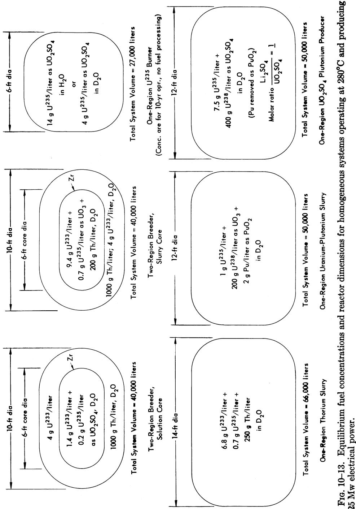

TABLE 10-16   
POWER COSTS IN LARGE-SCALE AQUEOUS HOMOGENEOUS REACTORS   
(125 electrical Mw; 500 thermal Mw; $80\%$ load factor; $280^{\circ}\mathrm{C}$ ) [22]   

<table><tr><td rowspan="2">Fuel system</td><td colspan="2">Fixed charges at 15%, mills/kwh</td><td rowspan="2">Fuel costs, mills/kwh</td><td colspan="2">O and M,† mills/kwh</td><td colspan="2">Total power costs, mills/kwh</td></tr><tr><td>Present*</td><td>Future</td><td>Present</td><td>Future</td><td>Present</td><td>Future</td></tr><tr><td>Two-region solution core</td><td>7.5-11.0</td><td>4.4-5.0</td><td>1.4</td><td>2-4</td><td>1-2</td><td>10.9-16.4</td><td>6.8-8.4</td></tr><tr><td>Two-region slurry core</td><td>7.5-11.0</td><td>4.4-5.0</td><td>1.3</td><td>2-4</td><td>1-2</td><td>10.8-16.3</td><td>6.7-8.3</td></tr><tr><td>One-region U235 + D2O</td><td>6.5-9.5</td><td>4.0-4.6</td><td>3.9</td><td>2-4</td><td>1-2</td><td>12.4-17.4</td><td>8.9-10.5</td></tr><tr><td>One-region U235 + H2O</td><td>6.5-9.5</td><td>4.0-4.6</td><td>4.1</td><td>2-4</td><td>1-2</td><td>12.6-17.6</td><td>9.1-10.7</td></tr><tr><td>One-region ThO2 slurry</td><td>7.0-10.3</td><td>4.3-4.8</td><td>2.0</td><td>2-4</td><td>1-2</td><td>11.0-16.3</td><td>7.3-8.8</td></tr><tr><td>One-region UO3 slurry</td><td>7.0-10.3</td><td>4.3-4.8</td><td>2.1</td><td>2-4</td><td>1-2</td><td>11.1-16.4</td><td>7.4-8.9</td></tr></table>

*Present: Based on present technology, assuming the fuel systems are feasible.   
†Operating and maintenance costs.

technology and a feasible reactor system, it is estimated that these costs will be 2 to 4 mills/kwh.

As more experience is gained in maintaining plants and in designing for O and M, it is expected that these costs will decrease; even so, because of the nature of the problems, O and M costs in future plants will probably be 1 to 2 mills/kwh, or about two or three times those associated with a conventional coal-fired plant.

# 10-10. SUMMARY OF ESTIMATED POWER COSTS

The power cost is the sum of the fixed charges on capital investment, fuel costs, and operating and maintenance costs. Figure 10-13 specifies the reactor systems considered, along with typical fuel concentrations and reactor dimensions. Estimates of the power cost for these systems are given in Table 10-16, and are based on operation at $280^{\circ}\mathrm{C}$ and a power level of 125 electrical Mw (500 thermal Mw). Although operating and maintenance costs are undoubtedly different for the various systems, it is assumed that the range considered covers the differences involved.

The design power of a reactor plant will markedly influence power costs, primarily because the investment cost per unit power is a function of power level. Table 10-17 indicates the influence of power level on power costs, by comparing costs for $\mathrm{U}^{235}$ burner-type reactors having power outputs of 125 and 10 electrical Mw, respectively.

TABLE 10-17   
INFLUENCE OF POWER LEVEL UPON "PRESENT" POWER COSTS IN U235 BURNERS (25% THERMAL EFF. ; 80% LOAD FACTOR; 280°C)   

<table><tr><td rowspan="2"></td><td colspan="2">Electrical power level, Mw</td></tr><tr><td>10</td><td>125</td></tr><tr><td>Fixed charges at 15%/yr, mills/kwh</td><td>16</td><td>8</td></tr><tr><td>Operating and maintenance, mills/kwh</td><td>5</td><td>3</td></tr><tr><td>Fuel costs, mills/kwh</td><td>5</td><td>4</td></tr><tr><td>Total power costs, mills/kwh</td><td>26</td><td>15</td></tr></table>

# REFERENCES

1. White House press release and AEC press release, Nov. 18, 1956; AEC press release No. 1060, May 18, 1957; AEC press release No. 1245, Dec. 27, 1957; AEC press release A-47, Mar. 12, 1958.   
2. U. S. Federal Register, Mar. 12, 1957, Vol. 22, p. 1591.   
3. K. COHEN, The Theory of Isotope Separation as Applied to the Large-Scale Production of $U^{235}$ , National Nuclear Energy Series, Division III, Volume 1B. New York: McGraw-Hill Book Co., Inc., 1951.   
4. J. A. LANe, The Economics of Nuclear Power, in Proceedings of the International Conference on the Peaceful Uses of Atomic Energy, Vol. 1. New York: United Nations, 1956. (P 476, p. 309)   
5. M. BENEDICT and T. H. PIGFORD, Nuclear Chemical Engineering. New York: McGraw-Hill Book Co., Inc., 1957. (p. 403)   
6. E. D. ARNOLD et al., Preliminary Cost Estimation: Chemical Processing and Fuel Costs for a Thermal Breeder Reactor Station, USAEC Report ORNL-1761, Oak Ridge National Laboratory, Jan. 27, 1955.   
7. S. GLASSTONE and M. C. EDLUND, The Elements of Nuclear Reactor Theory, New York: D. Van Nostrand Company, Inc., 1957. (p. 238 ff)   
8. M. W. Rosenthal et al., *Fuel Costs in Spherical Slurry Reactors*, USAEC Report ORNL-2313, Oak Ridge National Laboratory, Sept. 27, 1957.   
9. D. C. HAMILTON and P. R. KASTEN, Some Economic and Nuclear Characteristics of Cylindrical Thorium Breeder Reactors, USAEC Report ORNL-2165, Oak Ridge National Laboratory, Oct. 11, 1956.   
10. H. C. CLAIBORNE and M. TOBIAS, Some Economic Aspects of Thorium Breeder Reactors, USAEC Report ORNL-1810, Oak Ridge National Laboratory, Oct. 27, 1955.   
11. R. B. BRIGGS, Aqueous Homogeneous Reactors for Producing Centralstation Power, USAEC Report ORNL-1642(Del.), Oak Ridge National Laboratory, May 21, 1954.   
12. H. C. CLAIBORNE and T. B. FOWLER, in Homogeneous Reactor Project Quarterly Progress Report for the Period Ending July 31, 1955, USAEC Report ORNL-1943, Oak Ridge National Laboratory, Aug. 9, 1955. (pp. 47-49)   
13. H. C. CLAIBORNE and T. B. FOWLER, Oak Ridge National Laboratory, in *Homogeneous Reactor Project Quarterly Progress Report*, USAEC Reports ORNL-2057(Del.), 1956 (pp. 63-65); ORNL-2148(Del.), 1956 (pp. 41-43).   
14. H. C. CLAIBORNE, in Homogeneous Reactor Project Quarterly Progress Report for the Period Ending Oct. 31, 1955, USAEC Report ORNL-2004(Del.), Oak Ridge National Laboratory, Jan. 31, 1956. (pp. 53-59)   
15. H. C. CLAIBORNE and M. TOBIAS, Oak Ridge National Laboratory, 1954. Unpublished.   
16. H. C. CLAIBORNE and T. B. FOWLER, in Homogeneous Reactor Project Quarterly Progress Report for the Period Ending Apr. 30, 1956, USAEC Report ORNL-2096, Oak Ridge National Laboratory, May 10, 1956. (pp. 57-59)   
17. P. R. KASTEN and H. C. CLAIBORNE, Fuel Costs in Homogeneous U $^{235}$ Burners, *Nucleonics*, 14(11), 88-91 (1956).

18. P. R. KASTEN et al., Fuel Costs in One-region Homogeneous Power Reactors, USAEC Report ORNL-2341, Oak Ridge National Laboratory, Dec. 3, 1957.   
19. W. L. RoBB et al., Fission—roduct Buildup in Long-burning Thermal Reactors, *Nucleonics* 13(12), 30 (1955).   
20. W. H. WALKER, Fission Product Poisoning, Report CRRP 626, Atomic Energy of Canada, Ltd., Jan. 5, 1956.   
21. J. C. HEAP, Cost Estimates for Reactor Containment, (Reactor Engineering Division) Tech. Memo No. 13 (Revised), Argonne National Laboratory, October 1957.   
22. J. A. LANE, Oak Ridge National Laboratory, personal communication.   
23. M. I. LUNDIN, Oak Ridge National Laboratory, personal communication.   
24. Evaluation of a Homogeneous Reactor, *Nucleonics* 15(10), 64-70 (1957).

# BIBLIOGRAPHY FOR PART I

AERONUTRONIC SYSTEMS, INC., A Selection Study for an Advanced Engineering Test Reactor, USAEC Report AECU-3478, Mar. 29, 1957.   
ARNOLD, E. D. et al., Exploratory Study: Homogeneous Reactors as Gamma Irradiation Sources, USAEC CF-56-6-107, Oak Ridge National Laboratory, July 5, 1956.   
BAKER, C. P. et al., Water Boiler, USAEC Report AECD-3063, Los Alamos Scientific Laboratory, Sept. 4, 1944.   
BEALL, S. E. et al., Status and Objectives—Homogeneous Reactor Project: Summaries of Presentations to the Reactor Sub-committee of the General Advisory Committee. USAEC Report CF-56-1-26(Del.), Oak Ridge National Laboratory, Jan. 10, 1956.   
BEALL, S. E., Decontamination of the Homogeneous Reactor Experiment, USAEC Report ORNL-1839, Oak Ridge National Laboratory, June 12, 1956.   
BEALL, S. E., Containment Problems in Aqueous Homogeneous Reactor Systems, USAEC Report ORNL-2091, Oak Ridge National Laboratory, Aug. 8, 1956.   
BEALL, S. E., Homogeneous Reactor Experiment No. 2, presented at the Fourth Annual Conference of the Atomic Industrial Forum, October 1957.   
BEALL, S. E., and R. W. JURGENSEN, Direct Maintenance Practices for the HRT, presented at the Nuclear Engineering and Science Congress, March 1958; also USAEC Report CF-58-4-101, Oak Ridge National Laboratory, 1958.   
BEALL, S. E., and S. VISNER, Homogeneous Reactor Test. Summary Report for the Advisory Committee on Reactor Safeguards, USAEC Report ORNL-1834, Oak Ridge National Laboratory, January 1955.   
BENTZEN, F. L. et al., High-power Water Boiler, USAEC Report AECD-3065, Los Alamos Scientific Laboratory, Sept. 19, 1945.   
Borkowski, C. J., Design. Review Committee Report on the Homogeneous Reactor Experiment, USAEC Report CF-55-6-53, Oak Ridge National Laboratory, June 7, 1955.   
BRIGGS, R. B., Aqueous Homogeneous Reactors for Producing Central-station Power, USAEC Report ORNL-1642(Del.), Oak Ridge National Laboratory, May 21, 1954.   
BRIGGS, R. B. (omp.), HRP Civilian Power Reactor Conference Held at Oak Ridge National Laboratory May 1-2, 1957, TID-7540, Oak Ridge National Laboratory, July 1957.   
BRIGGS, R. B., and J. A. SWARTOUT, Aqueous Homogeneous Power Reactors, in Proceedings of the International Conference on the Peaceful Uses of Atomic Energy, Vol. 3. New York: United Nations, 1956. (P 496, p. 175)   
BUSEY, H. M., and R. P. HAMMOND, Los Alamos Scientific Laboratory, Test-Tube Reactor, in Nuclear Science and Technology (Extracts from Reactor Science and Technology, Vol. 4), USAEC Report TID-2505(Del.), 1954. (pp. 163-166)   
CARSON, H. G., and L. H. LANDRUM (Eds.), Preliminary Discussion and Cost Estimate for the Production of Central-station Power from an Aqueous Homogeneous Reactor Utilizing Thorium—Uranium-233, USAEC Report NPG-112, Nuclear Power Group, Feb. 1, 1955.

CARTER, WILLIAM L., Design Criteria for the HRT Chemical Plant, USAEC Report CF-54-11-190, Oak Ridge National Laboratory, Nov. 24, 1954.   
CHRISTY, R. F., Theoretical Discussion of a Small Homogeneous Enriched Reactor, USAEC Report MDDC-72, Los Alamos Scientific Laboratory, June 18, 1946.   
COLLIER, D. M. et al., The HRE Simulator. An Analog Computer for Solving the Kinetic Equations of a Homogeneous Reactor, USAEC Report ORNL-1572, Oak Ridge National Laboratory, Sept. 24, 1954.   
COMMONWEALTH EDISON COMPANY and PUBLIC SERVICE COMPANY, A Third Report on the Feasibility of Power Generation Using Nuclear Energy, USAEC Report CEPS-1121, June 15, 1953.   
CROXTON, F. E., List of References on Homogeneous Reactors, USAEC TID-299, Technical Information Service Extension, AEC, Mar. 15, 1950.   
DRAPER, B. D., Maintenance of Various Reactor Types, USAEC Report CF-57-4-92, Oak Ridge National Laboratory, Apr. 8, 1957.   
FAX, D. H. (Ed.), Proposed 80,000 kw Homogeneous Reactor Plant. Process and Plant Description, USAEC Report WIAP-9, Westinghouse Electric Corporation, Industrial Atomic Power Group. February 1955.   
FROMAN, D. et al., Los Alamos Power Reactor Experiments, in Proceedings of the International Conference on the Peaceful Uses of Atomic Energy, Vol. 3. New York: United Nations, 1956. (P 500, p. 283)   
GENERAL ELECTRIC COMPANY, ATOMIC POWER EQUIPMENT DEPARTMENT, Homogeneous Circulation Fuel Reactor Power Plant: Conceptual Design Study Report, USAEC Report GEAP-2(Del.), May 31, 1955.   
GUERON, J. et al., The Economics of Nuclear Power, Vol. I. London: Pergamon Press, 1956.   
HAUBENREICH, P. N., Calculation for Thorium- and Uranium-fueled Reactors, USAEC Report CF-53-12-1, Oak-Ridge National Laboratory, Feb. 8, 1954.   
HAUBENREICH, P. N., Estimation of Most Economical Velocity in Reactor Circulating Systems, USAEC Report CF-54-5-26, Oak Ridge National Laboratory, May 5, 1954.   
HUB, KENNETH A., Discussion of Homogeneous Reactor Possibilities, USAEC Report AECU-3336, Internuclear Company, May 16, 1956.   
JENKS, G. H., Effect of Radiation on the Corrosion of Zircaloy-2, USAEC Report CF-57-9-11, Oak Ridge National Laboratory, Sept. 30, 1957.   
KASTEN, P. R., Homogeneous Reactor Safety, USAEC Report CF-55-5-51, Oak Ridge National Laboratory, May 9, 1955.   
KASTEN, P. R., Stability of Homogeneous Reactors, USAEC Report CF-55-5-163, Oak Ridge National Laboratory, May 25, 1955.   
KASTEN, P. R., *Dynamics of the Homogeneous Reactor Test*, USAEC Report ORNL-2072, Oak Ridge National Laboratory, June 7, 1956.   
KASTEN, P. R., Time Behavior of Fuel Concentrations in Single-region Reactors Containing U-233, U-235, Th-232, and Fission-product Poisons, USAEC Report CF-57-2-120, Oak Ridge National Laboratory, Feb. 26, 1957.   
KASTEN, P. R. et al., Aqueous Homogeneous Research Reactor—Feasibility Study, USAEC Report ORNL-2256, Oak Ridge National Laboratory, May 9, 1957.

KING, L. D. P. (Comp.), Los Alamos Power Reactor Experiment and its Associated Hazards, USAEC Report LAMS-1611(Del.), Los Alamos Scientific Laboratory, Dec. 2, 1953.   
KING, L. D. P., Design and Description of Water Boiler Reactors, in Proceedings of the International Conference on the Peaceful Uses of Atomic Energy, Vol. 2. New York: United Nations, 1956. (P 488, p. 372)   
LANe, J. A., Some Long Range Aspects of Homogeneous Reactors, in Nuclear Science and Technology (Extracts from Reactor Science and Technology, Vol. 1, 1951) TID-2502(Del.) (pp. 27-42)   
LANE, J. A. et al., *Aqueous Fuel Systems*, USAEC Report CF-57-12-49, Oak Ridge National Laboratory, December 1957.   
LITTLE, INC., A. D., Gas Pressurization of Homogeneous Reactor Test, USAEC Report AECU-3349, Feb. 14, 1956.   
LOS ALAMOS SCIENTIFIC LABORATORY, An Enriched Homogeneous Nuclear Reactor, USAEC Report AECD-3059, Jan. 25, 1951; also Rev. Sci. Instruments 22, p. 489-499 (1951).   
LUNDIN, M. I., Economics of Power Generation—Homogeneous Research Reactor, USAEC Report CF-56-6-29, Oak Ridge National Laboratory, June 4, 1956.   
MALLON, R. G. et al., Conceptual Design of an Advanced Engineering Test Reactor, USAEC Report NYO-4849, Advanced Scientific Techniques Research Associates, Mar. 1, 1957.   
McBRIDE, J. P., Aqueous Slurries, USAEC Report CF-57-11-120, Oak Ridge National Laboratory, Nov. 26, 1957.   
McDUFFIE, H. F., Corrosion by Aqueous Reactor Fuel Solutions, USAEC Report CF-56-11-72, Oak Ridge National Laboratory, Nov. 14, 1956.   
OAK RIDGE NATIONAL LABORATORY, Homogeneous Reactor Project Quarterly Progress Report: USAEC Reports ORNL-527(Del.), Dec. 28, 1949; ORNL-630, Apr. 21, 1950; ORNL-730, July 6, 1950; ORNL-826, Oct. 24, 1950; ORNL-925, Jan. 30, 1951; ORNL-990, May 18, 1951; ORNL-1057, Oct. 10, 1951; ORNL1121(Rev.), Jan. 9, 1952; ORNL-1221, Apr. 1, 1952; ORNL-1280, July 14, 1952; ORNL-1318, Sept. 19, 1952; ORNL-1424(Del.), Jan. 10, 1953; ORNL-1478(Del.), Mar. 3, 1953; ORNL-1554, July 10, 1953; ORNL-1605, Oct. 20, 1953; ORNL1658, Feb. 25, 1954; ORNL-1678, Apr. 15, 1954; ORNL-1753(Del.), Sept. 17, 1954; ORNL-1813(Del.), Dec. 30, 1954; ORNL-1853, Feb. 16, 1955; ORNL-1895, July 14, 1955; ORNL-1943, Aug. 9, 1955; ORNL-2004(Del.), Jan. 31, 1956; ORNL-2057(Del.), Apr. 17, 1956; ORNL-2096, May 10, 1956; ORNL-2148(Del.), Oct. 3, 1956; ORNL-2222, Feb. 7, 1957; ORNL-2272, Apr. 22, 1957; ORNL-2331, Sept. 3, 1957; ORNL-2379, Oct. 10, 1957; ORNL-2432, Jan. 21, 1958; ORNL2493, 1958.   
OAK RIDGE OPERATIONS OFFICE, RESEARCH AND DEVELOPMENT DIVISION, ATOMIC ENERGY COMMISSION, HRP Civilian Power Reactor Conference Held at Oak Ridge, March 21-22, 1956, USAEC Report TID-7524, March 1956.   
OAK RIDGE SCHOOL OF REACTOR TECHNOLOGY, Reactor Studies:  
CHAPMAN, R. H., An 80-Megawatt Aqueous Homogeneous Burner Reactor, ORNL-CF-57-8-6, in preparation.   
CLARK, P. R., Homogeneous Reactor for Ship Propulsion, USAEC Report CF-55-8-191, August 1955.

HAUSPURG, A., High-temperature Aqueous Homogeneous Reactor, USAEC Report CF-55-8-191, August 1955.   
KAMACK, H. F., Boiling Homogeneous Reactor for Producing Power and Plutonium, USAEC CF-54-8-238(Del.), August 1954.   
MONTGOMERY, D. W. et al., 10-Megawatt Aqueous Homogeneous Circulating Solution Reactor for Producing Electrical Power in Remote Locations, USAEC Report CF-53-10-22, August 1953.   
PUTNAM, G. et al., Reactor Design and Feasibility Problem; $U^{233}$ Power Breeder, USAEC Report CF-51-8-213, Aug. 6, 1951.   
RICKERT, R. J. et al., A Preliminary Design Study of a 10-Mw Homogeneous Boiling Reactor Power Package for Use in Remote Locations, USAEC Report CF-53-10-23, Aug. 21, 1953.   
THOMAS, R. A. et al., *Ultimate Homogeneous Reactor*, USAEC Report CF-54-8-239, August 1954.   
ZEITLIN, H. R. et al., Boiling Homogeneous Reactor for Power and U-233 Production, USAEC Report CF-54-8-240, August 1954.   
PACIFIC NORTHWEST POWER GROUP, Aqueous Homogeneous Reactors, Second Annual and Final Report to the Atomic Energy Commission, Report PNG-7, February 1956.   
PEEBLES, FRED N., and HAROLD J. GARBER, The Combination of Hydrogen and Oxygen in Platinum Catalyzed Flow Reactors, USAEC Report ORNL-1796, University of Tennessee, Oct. 26, 1954.   
QUARLES, L. R., and W. P. WALKER, A Manual of HRE Control and Instrumentation, USAEC Report ORNL-1094, Oak Ridge National Laboratory, Jan. 23, 1952.   
REACTOR SAFEGUARD COMMITTEE, ATOMIC ENERGY COMMISSION, Report on the Los Alamos Homogeneous Enriched $U^{235}$ Reactor; Meeting Held at Los Alamos on Feb. 1-2, 1949, USAEC Report TID-5428, June 27, 1949.   
ROBERTSON, R. C., Heat-Power Cycles and Prime Movers for Nuclear Power Plants, USAEC Report CF-56-10-77, Oak Ridge National Laboratory, Oct. 10, 1956.   
ROSENTHAL, M. W., Natural Circulation Homogeneous Reactors, USAEC Report CF-56-10-53, Oak Ridge National Laboratory, Oct. 16, 1956.   
ROSENTHAL, M. W., and M. TOBIAS, Nuclear Characteristics of Two-region Slurry Reactors, USAEC Report CF-56-12-82, Oak Ridge National Laboratory, Dec. 20, 1956.   
SCHWARTZ, H., Natural Convection Cooling of Liquid Homogeneous Reactors, North American Aviation, Inc., USAEC Report AECU-706, Dec. 20, 1949.   
SECOY, C. H., Aqueous Fuel Systems, USAEC Report CF-57-2-139, Oak Ridge National Laboratory, Feb. 28, 1957.   
SEGASER, C. L., and F. C. ZAPP, HRE Design Manual, USAEC Report TID-10082, Oak Ridge National Laboratory, Nov. 18, 1952.   
STEIN, J. M., and P. R. KASTEN, Boiling Reactors: A Preliminary Investigation, USAEC Report ORNL-1062, Oak Ridge National Laboratory, Dec. 12, 1951.   
TAYLOR, W. F., TBR Plant Turbogenerator System Study, USAEC Report CF-56-7-127, Oak Ridge National Laboratory, June 27, 1956.

TOBIAS, M., Breeding Reactors, USAEC Report CF-55-6-157, Oak Ridge, National Laboratory, June 7, 1955.   
TOBIAS, M., The HRT and the Walk-Away Problem, in *Nuclear Science and Technology*, Vol. 2A. USAEC Report TID-2509, Oak Ridge National Laboratory, 1956. (pp. 83-96) (June 1956).   
TOMB, D. S., JR., Instrumentation and Controls for the HRT, *Nucleonics* 15(2): 48-52 (1957).   
THOMAS, D. G., Solids Dispersed in Liquids, USAEC Report, CF-56-10-35, Oak Ridge National Laboratory, Oct. 1, 1956.   
THOMAS, T. H. (Ed.), HRE Operations Manual, USAEC Report CF-53-1-94, Oak Ridge National Laboratory, Oct. 9, 1952.   
THOMPSON, W. E. (Ed.), Notes on the HRP Information Meeting, June 23, 1952, USAEC Reports CF-52-7-104, Oak Ridge National Laboratory, July 21, 1952.   
VISNER, S., and P. J. HAUBENREICH, HRE Experiment on Internal Recombination of Gas with a Homogeneous Catalyst, in *Nuclear Science and Technology*, Vol. 1A, No. 1, USAEC Report TID-2506(Del.), Oak Ridge National Laboratory, 1955. (pp. 73-90)   
WEEREN, H. O., HRT Hazards Report, Chemical Processing System, USAEC Report CF-54-12-146, Oak Ridge National Laboratory, Dec. 10, 1954.   
WEINBERG, A. M., Outline of Program for Design of Pilot Model of Homogeneous Power Reactor, USAEC Report CF-49-7-135(Rev.), Oak Ridge National Laboratory, July 15, 1949.   
WESTINGHOUSE ELECTRIC CORPORATION, INDUSTRIAL ATOMIC POWER GROUP, Proposed 80,000 kw Homogeneous Reactor Plant. Cost Estimates, USAEC Report WIAP-11, February 1955.   
WINTERS, C. E. et al., Homogeneous Reactor Preliminary Process Design Report, USAEC Reports AECD-3980 and ORNL-527(Del.), Oak Ridge National Laboratory, Dec. 28, 1949.   
WINTERS, C. E., and A. M. WEINBERG, Homogeneous Reactor Experiment Feasibility Report, USAEC Report ORNL-730, Oak Ridge National Laboratory, July 6, 1950.   
WINTERS, C. E., and A. M. WEINBERG, A Report on The Safety Aspects of the Homogeneous Reactor Experiment, USAEC Report ORNL-731, Oak Ridge National Laboratory, Aug. 29, 1950.   
ZAPP, F. C., and P. N. HAUBENREICH, Design Data for ISHR (2nd ed.), USAEC Report CF-52-11-161, Oak Ridge National Laboratory, Nov. 8, 1952.   
ZMOLA, P. C. et al., Power Removal from Boiling Homogeneous Reactors, in Nuclear Science and Technology (Extracts from Reactor Science and Technology, Vol. 4), USAEC Report TID-2505(Del.), Oak Ridge National Laboratory, 1954. (pp. 47-72).

