# Part II

# MOLTEN-SALT REACTORS

H. G. MacPHERSON, Editor

Oak Ridge National Laboratory

11. Introduction   
12. Chemical Aspects of Molten-Fluoride-Salt Reactor Fuels   
13. Construction Materials for Molten-Salt Reactors   
14. Nuclear Aspects of Molten-Salt Reactors   
15. Equipment for Molten-Salt Reactor Heat-Transfer Systems   
16. Aircraft Reactor Experiment   
17. Conceptual Design of a Power Reactor

# CONTRIBUTORS

L.G.ALEXANDER   
J.W.ALEN   
E. S. BettiS   
F. F. BLANKENSHIP   
W.F. BOUDREAU   
E.J.BREEDING   
W.G.CoBB   
W. H. Cook   
D.R.CUNEO   
J.H.DEVANN   
D. A. DOUGLAS   
W. K. ERGEN   
W. R. GRIMES   
H. INOUYE   
D. H. JANSEN   
G.W. KEILHOLTZ   
B.W.KINYON   
M. E. LACKEY

H. G. MACPHERSON   
W. D. MANLY   
L.A.MANN   
W.B.McDONALD   
H.J.METZ   
P. PATRIARCA   
H. F. POPPENDIEK   
J. T. ROBERTS   
M. T. ROBINSON   
T. K. ROCHE   
H. W. SAVAGE   
G. M. SLAUGHTER   
E. STORTO   
A. TABOADA   
G. M. TOLSON   
F.C.VONDERLAGE   
G. D. WHITMAN   
J.ZASLER

# PAUL ERSKINE BROWN

# PREFACE

The Oak Ridge National Laboratory, under the sponsorship of the U. S. Atomic Energy Commission, has engaged in research on molten salts as materials for use in high-temperature reactors for a number of years. The technology developed by this work was incorporated in the Aircraft Reactor Experiment and made available for purposes of civilian application. This earlier technology and the new information found in the civilian power reactor effort is summarized in this part.

So many present and former members of the Laboratory staff have contributed directly or indirectly to the molten salt work that it should be regarded as a contribution from the entire Laboratory. The technical direction of the work was provided by A. M. Weinberg, R. C. Briant, W. H. Jordan, and S. J. Cromer. In addition to the contributors listed for the various chapters, the editor would like to acknowledge the efforts of the following people who are currently engaged in the work reported: R. G. Affel, J. C. Amos, C. J. Barton, C. C. Beusman, W. E. Browning, S. Cantor, D. O. Campbell, G. I. Cathers, B. H. Clampitt, J. A. Conlin, M. H. Cooper, J. L. Crowley, J. Y. Estabrook, H. A. Friedman, P. A. Gnadt, A. G. Grindell, H. W. Hoffman, H. Insley, S. Langer, R. E. MacPherson, R. E. Moore, G. J. Nessle, R. F. Newton, W. R. Osborn, F. E. Romie, C. F. Sales, J. H. Shaffer, G. P. Smith, N. V. Smith, P. G. Smith, W. L. Snapp, W. K. Stair, R. A. Strehlow, C. D. Susano, R. E. Thoma, D. B. Trauger, J. J. Tudor, W. T. Ward, G. M. Watson, J. C. White, and H. C. Young.

The technical reviews at Argonne National Laboratory and Westinghouse Electric Corporation aided in achieving clarity.

The editor and contributors of this part wish to express their appreciation to A. W. Savolainen for her assistance in preparing the text in its final form.

Oak Ridge, Tennessee

June 1958

H. G. MacPherson, Editor

# CHAPTER 11

# INTRODUCTION*

The potential utility of a fluid-fueled reactor that can operate at a high temperature but with a low-pressure system has been recognized for a long time. Some years ago, R. C. Briant of the Oak Ridge National Laboratory suggested the use of the molten mixture of $\mathrm{UF_4}$ and $\mathrm{ThF_4}$ , together with the fluorides of the alkali metals and beryllium or zirconium, as the fluid fuel. Laboratory work with such mixtures led to the operation, in 1954, of an experimental reactor, which was designated the Aircraft Reactor Experiment (ARE).

Fluoride-salt mixtures suitable for use in power reactors have melting points in the temperature range 850 to $950^{\circ}\mathrm{F}$ and are sufficiently compatible with certain nickel-base alloys to assure long life for reactor components at temperatures up to $1300^{\circ}\mathrm{F}$ . Thus the natural, optimum operating temperature for a molten-salt-fueled reactor is such that the molten salt is a suitable heat source for a modern steam power plant. The principal advantages of the molten-salt system, other than high temperature, in comparison with one or more of the other fluid-fuel systems are (1) low-pressure operation, (2) stability of the liquid under radiation, (3) high solubility of uranium and thorium (as fluorides) in molten-salt mixtures, and (4) resistance to corrosion of the structural materials that does not depend on oxide or other film formation.

The molten-salt system has the usual benefits attributed to fluid-fuel systems. The principal advantages over solid-fuel-element systems are (1) a high negative temperature coefficient of reactivity, (2) a lack of radiation damage that can limit fuel burnup, (3) the possibility of continuous fission-product removal, (4) the avoidance of the expense of fabricating new fuel elements, and (5) the possibility of adding makeup fuel as needed, which precludes the need for providing excess reactivity. The high negative temperature coefficient and the lack of excess reactivity make possible a reactor, without control rods, which automatically adjusts its power in response to changes of the electrical load. The lack of excess reactivity also leads to a reactor that is not endangered by nuclear power excursions.

One of the attractive features of the molten-salt system is the variety of reactor types that can be considered to cover a range of applications. The present state of the technology suggests that homogeneous reactors which use a molten salt composed of $\mathrm{BeF}_2$ and either Li7F or NaF, with $\mathrm{UF_4}$ for fuel and $\mathrm{ThF_4}$ for a fertile material, are most suitable for early construction.

These reactors can be either one or two region and, depending on the size of the reactor core and the thorium fluoride concentration, can cover a wide range of fuel inventories, breeding ratios, and fuel reprocessing schedules. The chief virtues of this class of molten-salt reactor are that the design is based on a well-developed technology and that the use of a simple fuel cycle contributes to reduced costs.

With further development, the same base salt, that is, the mixture of $\mathrm{BeF}_2$ and $\mathrm{Li}^{7}\mathrm{F}$ , can be combined with a graphite moderator in a heterogeneous arrangement to provide a self-contained $\mathrm{Th - U^{233}}$ system with a breeding ratio of one. The chief advantage of the molten-salt system over other liquid systems in pursuing this objective is that it is the only system in which a soluble thorium compound can be used, and thus the problem of slurry handling is avoided. The possibility of placing thorium in the core obviates the necessity of using graphite as a core-shell material.

Plutonium is being investigated as an alternate fuel for the molten-salt reactor. Although it is too early to describe a plutonium-fueled reactor in detail, it is highly probable that a suitable $\mathrm{PuF_3}$ -fueled reactor can be constructed and operated.

The high melting temperature of the fluoride salts is the principal difficulty in their use. Steps must be taken to preheat equipment and to keep the equipment above the melting point of the salt at all times. In addition, there is more parasitic neutron capture in the salts of the molten-salt reactor than there is in the heavy water of the heavy-water-moderated reactors, and thus the breeding ratios are lower. The poorer moderating ability of the salts requires larger critical masses for molten-salt reactors than for the aqueous systems. Finally, the molten-salt reactor shares with all fluid-fuel reactors the problems of certain containment of the fuel, the reliability of components, and the necessity for techniques of making repairs remotely. The low pressure of the molten-salt fuel system should be beneficial with regard to these engineering problems, but to evaluate them properly will require operating experience with experimental reactors.

# CHAPTER 12

# CHEMICAL ASPECTS OF MOLTEN-FLUORIDE-SALT REACTOR FUELS*

The search for a liquid for use at high temperatures and low pressures in a fluid-fueled reactor led to the choice of either fluorides or chlorides because of the requirements of radiation stability and solubility of appreciable quantities of uranium and thorium. The chlorides (based on the $\mathrm{Cl}^{37}$ isotope) are most suitable for fast reactor use, but the low thermal-neutron absorption cross section of fluorine makes the fluorides a uniquely desirable choice for a high-temperature fluid-fueled reactor in the thermal or epithermal neutron region.

Since for most molten-salt reactors considered to date the required concentrations of $\mathrm{UF_4}$ and $\mathrm{ThF_4}$ have been moderately low, the molten-salt mixtures can be considered, to a first approximation, as base or solvent salt mixtures, to which the fissionable or fertile fluorides are added. For the fuel, the relatively small amounts of $\mathrm{UF_4}$ required make the corresponding binary or ternary mixtures of the diluents nearly controlling with regard to physical properties such as the melting point.

# 12-1. CHOICE OF BASE OR SOLVENT SALTS

The temperature dependence of the corrosion of nickel-base alloys by fluoride salts is described in Chapter 13. From the data given there, $1300^{\circ}\mathrm{F}$ $(704^{\circ}\mathrm{C})$ is taken as an upper limit for the molten-salt-to-metal interface temperature. To provide some leeway for radiation heating of the metal walls and to provide a safety margin, the maximum bulk temperature of the molten-salt fuel at the design condition will probably not exceed $1225^{\circ}\mathrm{F}$ . In a circulating-fuel reactor, in which heat is extracted from the fuel in an external heat exchanger, the temperature difference between the inlet and outlet of the reactor will be at least $100^{\circ}\mathrm{F}$ . The provision of a margin of safety of $100^{\circ}\mathrm{F}$ between minimum operating temperature and melting point makes salts with melting points above $1025^{\circ}\mathrm{F}$ of little interest at present, and therefore this discussion is limited largely to salt mixtures having melting points no higher than $1022^{\circ}\mathrm{F}$ $(550^{\circ}\mathrm{C})$ . One of the basic features desired in the molten-salt reactor is a low pressure in the fuel system, so only fluorides with a low vapor pressure at the peak operating temperature $(\sim 700^{\circ}\mathrm{C})$ are considered.

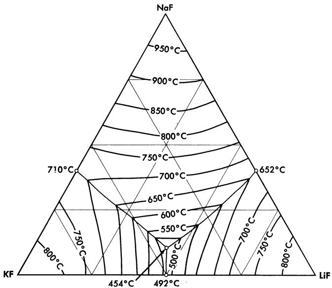  
FIG. 12-1. The system LiF-NaF-KF [A. G. Bergman and E. P. Dergunov, Compt. rend. acad. sci. U.R.S.S., 31, 754 (1941)].

Of the pure fluorides of molten-salt reactor interest, only $\mathrm{BeF}_2$ meets the melting-point requirement, and it is too viscous for use in the pure state. Thus only mixtures of two or more fluoride salts provide useful melting points and physical properties.

The alkali-metal fluorides and the fluorides of beryllium and zirconium have been given the most serious attention for reactor use. Lead and bismuth fluorides, which might otherwise be useful because of their low neutron absorption, have been eliminated because they are readily reduced to the metallic state by structural metals such as iron and chromium.

Binary mixtures of alkali fluorides that have sufficiently low melting points are an equimolar mixture of KF and LiF, which has a melting point of $490^{\circ}\mathrm{C}$ , and a mixture of 60 mole $\%$ RbF with 40 mole $\%$ LiF, which has a melting point of $470^{\circ}\mathrm{C}$ . Up to 10 mole $\%$ UF $_4$ can be added to these alkali fluoride systems without increasing the melting point above the $550^{\circ}\mathrm{C}$ limit. A melting-point diagram for the ternary system LiF-NaF-KF, Fig. 12-1, indicates a eutectic with a lower melting point than the melting points of the simple binary LiF-KF system. This eutectic has interesting properties as a heat-transfer fluid for molten-salt reactor systems, and data on its physical properties are given in Tables 12-1 and 12-2. The KF-LiF and RbF-LiF binaries and their ternary systems with NaF are the only available systems of the alkali-metal fluorides alone which have

TABLE 12-1   
MELTING POINTS, HEAT CAPACITIES, AND EQUATIONS FOR DENSITY AND VISCOSITY OF TYPICAL MOLTEN FLUORIDES   

<table><tr><td rowspan="3">Composition,mole %</td><td rowspan="3">Melting point, ℃</td><td colspan="2">Liquid density,g/ccρ = A - BT(℃)</td><td rowspan="3">Heat capacity at 700°C,cal/gram</td><td colspan="3">Viscosity, centipoise</td></tr><tr><td rowspan="2">A</td><td rowspan="2">B</td><td colspan="2">η = AeB/T(℃)</td><td rowspan="2">At 600°C</td></tr><tr><td>A</td><td>B</td></tr><tr><td>LiF-BeF2(69-31)</td><td>505</td><td>2.16</td><td>40</td><td>0.65</td><td>0.118</td><td>3624</td><td>7.5</td></tr><tr><td>LiF-BeF2(50-50)</td><td>350</td><td>2.46</td><td>40</td><td>0.67</td><td>0.0189</td><td>6174</td><td>22.2</td></tr><tr><td>NaF-BeF2(57-43)</td><td>360</td><td>2.27</td><td>37</td><td>0.52</td><td>0.0346</td><td>5164</td><td>12.8</td></tr><tr><td>NaF-ZrF4(50-50)</td><td>510</td><td>3.79</td><td>93</td><td>0.28</td><td>0.0709</td><td>4168</td><td>8.4</td></tr><tr><td>LiF-NaF-KF(46.5-11.5-42)</td><td>454</td><td>2.53</td><td>73</td><td>0.45</td><td>0.0400</td><td>4170</td><td>4.75</td></tr><tr><td>LiF-NaF-BeF2(35-27-38)</td><td>338</td><td>2.22</td><td>41</td><td>0.59</td><td>0.0338</td><td>4738</td><td>7.8</td></tr></table>

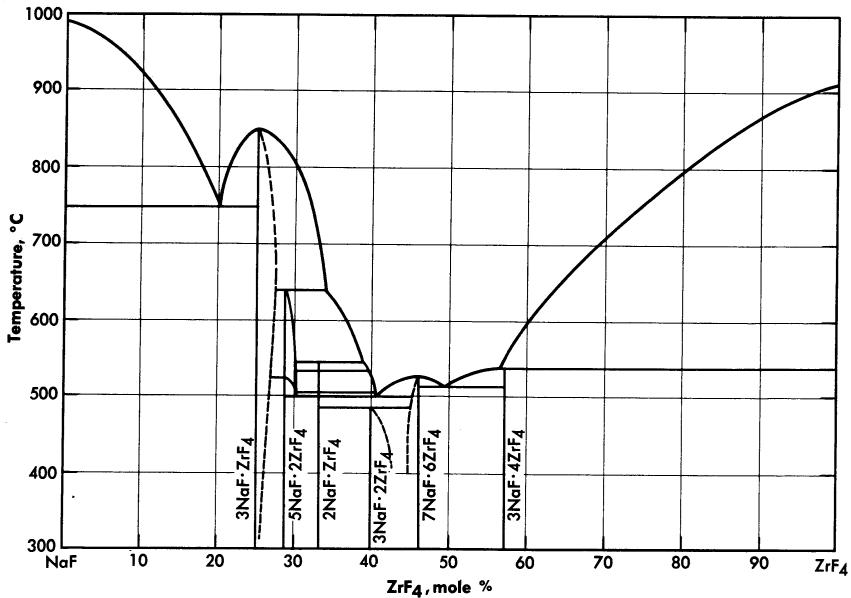  
FIG. 12-2. The system NaF-ZrF $_4$ .

low melting points at low uranium concentrations. They would have utility as special purpose reactor fuel solvents if no mixtures with better properties were available.

TABLE 12-2 THERMAL CONDUCTIVITY OF TYPICAL FLUORIDE MIXTURES   

<table><tr><td rowspan="2">Composition, mole %</td><td colspan="2">Thermal conductivity, Btu/(hr)(ft)(°F)</td></tr><tr><td>Solid</td><td>Liquid</td></tr><tr><td>LiF-NaF-KF (46.5-11.5-42) NaF-BeF2 (57-43)</td><td>2.7</td><td>2.6 2.4</td></tr></table>

Mixtures with melting points in the range of interest may be obtained over relatively wide limits of concentration if $\mathrm{ZrF_4}$ or $\mathrm{BeF_2}$ is a component of the system. Phase relationships in the NaF-ZrF $_4$ system are shown in Fig. 12-2. There is a broad region of low-melting-point compositions that have between 40 and 55 mole $\%$ $\mathrm{ZrF_4}$ .

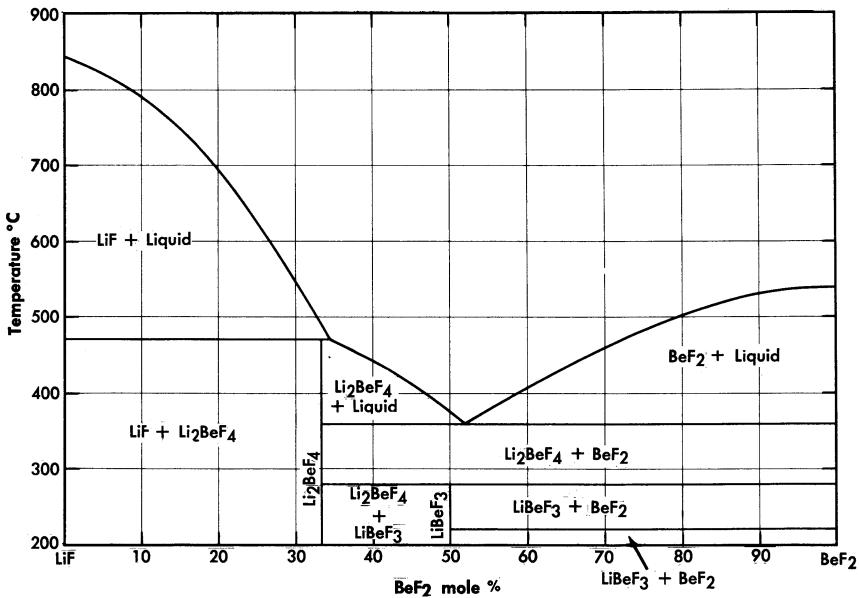  
FIG. 12-3. The system $\operatorname{LiF - BeF}_2$ .

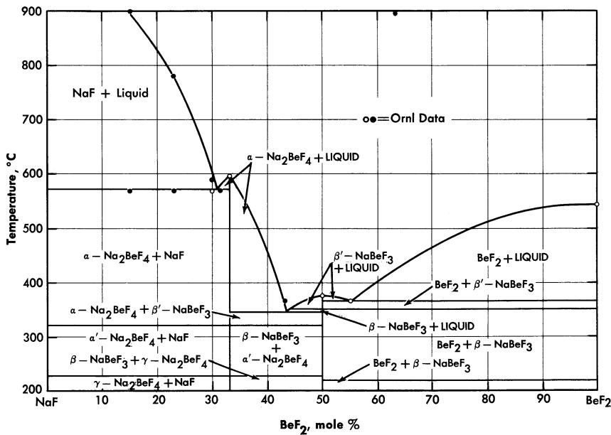  
FIG. 12-4. The system $\mathrm{NaF - BeF_2}$ .

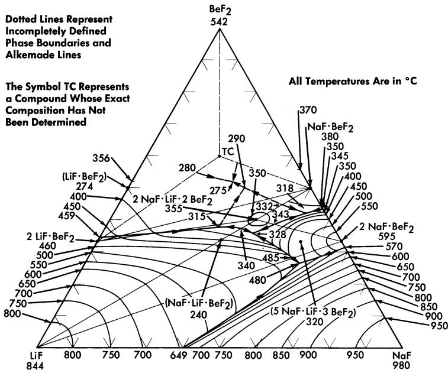  
FIG. 12-5. The system LiF-NaF-BeF $_2$ .

The lowest melting binary systems are those containing $\mathrm{BeF}_2$ and LiF or NaF. Since $\mathrm{BeF}_2$ offers the best cross section of all the useful diluents, fuels based on these binary systems are likely to be of highest interest in thermal reactor designs.

The binary system $\mathrm{LiF - BeF_2}$ has melting points below $500^{\circ}\mathrm{C}$ over the concentration range from 33 to 80 mole $\%$ $\mathrm{BeF_2}$ . The presently accepted $\mathrm{LiF - BeF_2}$ system diagram presented in Fig. 12-3 differs substantially from previously published diagrams [1-3]. It is characterized by a single eutectic between $\mathrm{BeF_2}$ and $2\mathrm{LiF} \cdot \mathrm{BeF_2}$ that freezes at $356^{\circ}\mathrm{C}$ and contains 52 mole $\%$ $\mathrm{BeF_2}$ . The compound $2\mathrm{LiF} \cdot \mathrm{BeF_2}$ melts incongruity to LiF and liquid at $460^{\circ}\mathrm{C}$ ; LiF $\cdot \mathrm{BeF_2}$ is formed by the reaction of solid $\mathrm{BeF_2}$ and solid $2\mathrm{LiF} \cdot \mathrm{BeF_2}$ below $274^{\circ}\mathrm{C}$ .

The diagram of the $\mathrm{NaF - BeF_2}$ system (Fig. 12-4) is similar to that of the $\mathrm{LiF - BeF_2}$ system. The ternary system combining both NaF and LiF with $\mathrm{BeF_2}$ , shown in Fig. 12-5, offers a wide variety of low-melting compositions. Some of these are potentially useful as low-melting heat-transfer liquids, as well as for reactor fuels.

TABLE 12-3   
MELTING POINTS, HEAT CAPACITIES, AND EQUATIONS FOR DENSITY   
AND VISCOSITY OF FUEL BEARING SALTS   

<table><tr><td rowspan="3">Composition, mole %</td><td rowspan="3">Melting point, °C</td><td colspan="2">Liquid density, g/cc ρ = A - BT(°C)</td><td rowspan="3">Heat capacity at 700°C, cal/gram</td><td colspan="3">Viscosity, centipoise</td></tr><tr><td rowspan="2">A</td><td rowspan="2">B</td><td colspan="2">η = AeB/T(°K)</td><td rowspan="2">At 600°C</td></tr><tr><td>A</td><td>B</td></tr><tr><td>LiF-BeF2-UF4(67-30.5-2.5)</td><td>464</td><td>2.38</td><td>×10-5</td><td>0.57</td><td></td><td></td><td>8.4</td></tr><tr><td>NaF-BeF2-UF4(55.5-42-2.5)</td><td>400</td><td>2.50</td><td>43</td><td>0.46</td><td></td><td></td><td>10.5</td></tr><tr><td>NaF-ZrF4-UF4(50-46-4)</td><td>520</td><td>3.93</td><td>93</td><td>0.26</td><td>0.0981</td><td>3895</td><td>8.5</td></tr></table>

TABLE 12-4   
THERMAL CONDUCTIVITY OF TYPICAL FLUORIDE FUELS   

<table><tr><td rowspan="2">Composition, mole %</td><td colspan="2">Thermal conductivity, Btu/(hr)(ft)(°F)</td></tr><tr><td>Solid</td><td>Liquid</td></tr><tr><td>LiF-NaF-KF-UF4(44.5-10.9-43.5-1.1)</td><td>2.0</td><td>2.3</td></tr><tr><td>NaF-ZrF4-UF4(50-46-4)</td><td>0.5</td><td>1.3</td></tr><tr><td>NaF-ZrF4-UF4(53.5-40-6.5)</td><td></td><td>1.2</td></tr><tr><td>NaF-KF-UF4(46.5-26-27.5)</td><td></td><td>0.5</td></tr></table>

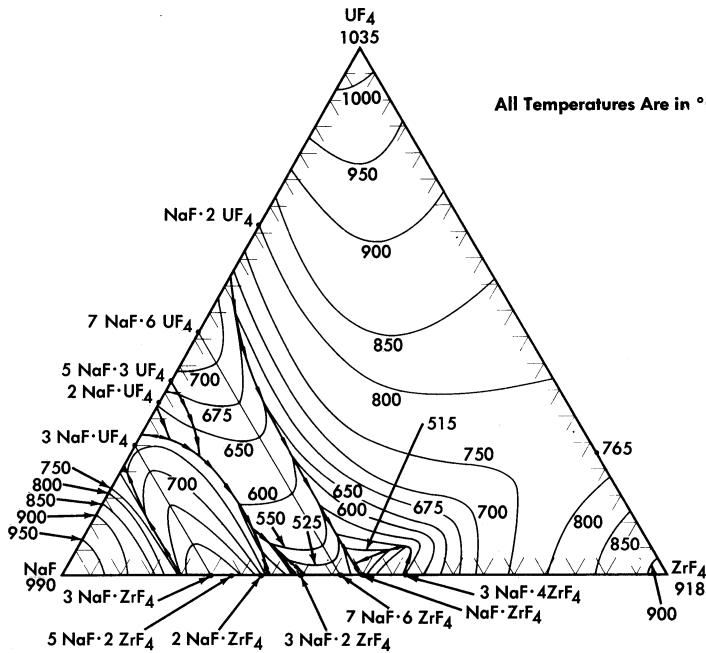  
FIG. 12-6. The system $\mathrm{NaF - ZrF_4 - UF_4}$

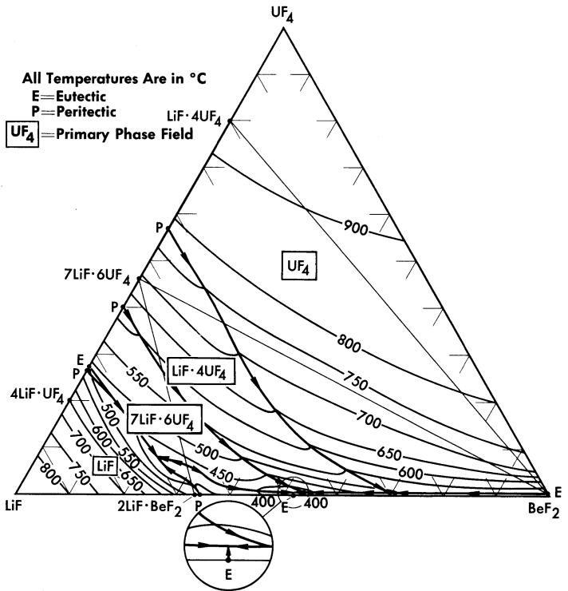  
FIG. 12-7. The system $\mathrm{LiF - BeF_2 - UF_4}$

# 12-2. FUEL AND BLANKET SOLUTIONS

12-2.1 Choice of uranium fluoride. Uranium hexafluoride is a highly volatile compound, and it is obviously unsuitable as a component of a liquid for use at high temperatures. The compound $\mathrm{UO}_2\mathrm{F}_2$ , which is relatively nonvolatile, is a strong oxidant that would be very difficult to contain. Fluorides of pentavalent uranium ( $\mathrm{UF}_5,\mathrm{U}_2\mathrm{F}_9$ , etc.) are not thermally stable [4] and would be prohibitively strong oxidants even if they could be stabilized in solution. Uranium trifluoride, when pure and under an inert atmosphere, is stable even at temperatures above $1000^{\circ}\mathrm{C}$ [4,5]; however, it is not so stable in molten fluoride solutions [6]. It disproportionates appreciably in such media by the reaction

$$
4 \mathrm {U F} _ {3} \xleftarrow {\longleftrightarrow} 3 \mathrm {U F} _ {4} + \mathrm {U} ^ {0},
$$

at temperatures below $800^{\circ}\mathrm{C}$ . Small amounts of $\mathrm{UF}_3$ are permissible in the presence of relatively large concentrations of $\mathrm{UF}_4$ and may be beneficial insofar as corrosion is concerned. It is necessary, however, to use $\mathrm{UF}_4$ as the major uraniferous compound in the fuel.

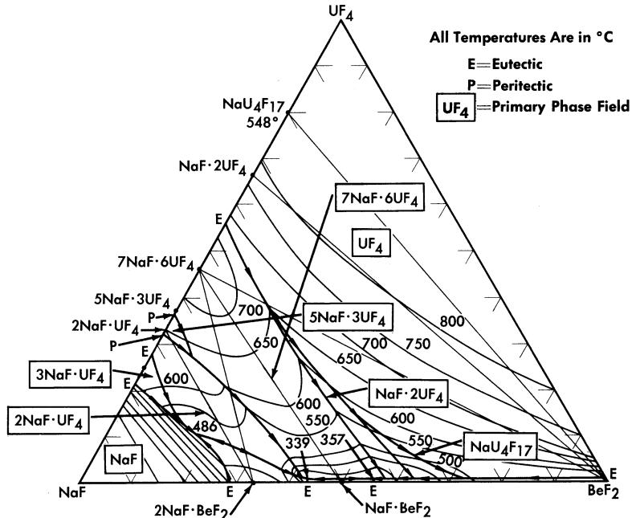  
FIG. 12-8. The system $\mathrm{NaF - BeF_2 - UF_4}$

12-2.2 Combination of $\mathbf{U}\mathbf{F}_4$ with base salts. The fuel for the Aircraft Reactor Experiment (Chapter 16) was a mixture of $\mathrm{UF_4}$ with the $\mathrm{NaF - ZrF_4}$ base salt. The ternary diagram for this system is shown in Fig. 12-6. The compounds $\mathrm{ZrF_4}$ and $\mathrm{UF_4}$ have very similar unit cell parameters [4] and are isomorphous. They form a continuous series of solid solutions with a minimum melting point of $765^{\circ}\mathrm{C}$ for the solution containing 23 mole $\%$ $\mathrm{UF_4}$ . This minimum is responsible for a broad shallow trough which penetrates the ternary diagram to about the 45 mole $\%$ NaF composition. A continuous series of solid solutions without a maximum or a minimum exists between $\alpha$ -3NaF $\cdot$ UF $_4$ and 3NaF $\cdot$ $\mathrm{ZrF_4}$ ; in this solution series the temperature drops sharply with decreasing $\mathrm{ZrF_4}$ concentration. A continuous solid-solution series without a maximum or a minimum also exists between the isomorphous congruent compounds 7NaF $\cdot$ 6UF $_4$ and 7NaF $\cdot$ 6ZrF $_4$ ; the liquidus decreases with increasing $\mathrm{ZrF_4}$ content. These two solid solutions share a boundary curve over a considerable composition range. The predominance of the primary phase fields of the three solid solutions presumably accounts for the complete absence of a ternary eutectic in this complex system. The liquidus surface over the area below 8 mole $\%$ UF $_4$ and between 60 and 40 mole $\%$ NaF is relatively flat. All fuel compositions within this region have acceptable melting points. Minor

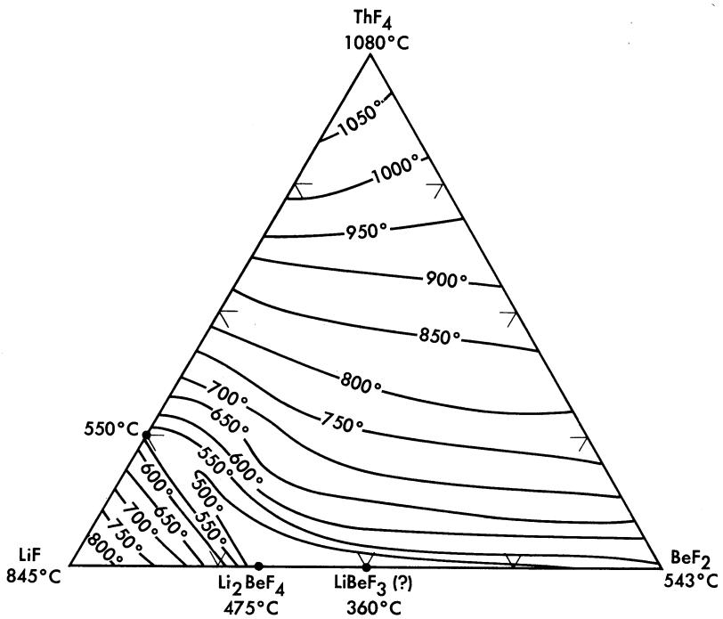  
FIG. 12-9. The system $\mathrm{LiF - BeF_2 - ThF_4}$

advantages in physical and thermal properties accrue from choosing mixtures with minimum $\mathbf{ZrF_4}$ content in this composition range. Typical physical and thermal properties are given in Tables 12-3 and 12-4.

The nuclear studies in Chapter 14 indicate that the combination of $\mathrm{BeF}_2$ with NaF or with LiF (provided the separated $\mathrm{Li}^7$ isotope can be used) are more suitable as reactor fuels. The diagram of Fig. 12-7 reveals that melting temperatures below $500^{\circ}\mathrm{C}$ can be obtained over wide composition ranges in the three-component system $\mathrm{LiF - BeF_2 - UF_4}$ . The lack of a low-melting eutectic in the $\mathrm{NaF - UF_4}$ binary system is responsible for melting points below $500^{\circ}\mathrm{C}$ being available over a considerably smaller concentration interval in the $\mathrm{NaF - BeF_2 - UF_4}$ system (Fig. 12-8) than in its $\mathrm{LiF - BeF_2 - UF_4}$ counterpart.

The four-component system $\mathrm{LiF - NaF - BeF_2 - UF_4}$ has not been completely diagrammed. It is obvious, however, from examination of Fig. 12-5 that the ternary solvent $\mathrm{LiF - NaF - BeF_2}$ offers a wide variety of low-melting compositions; it has been established that considerable quantities (up to at least $10\mathrm{mole}\%$ ) of $\mathrm{UF_4}$ can be added to this ternary system without elevation of the melting point to above $500^{\circ}\mathrm{C}$ .

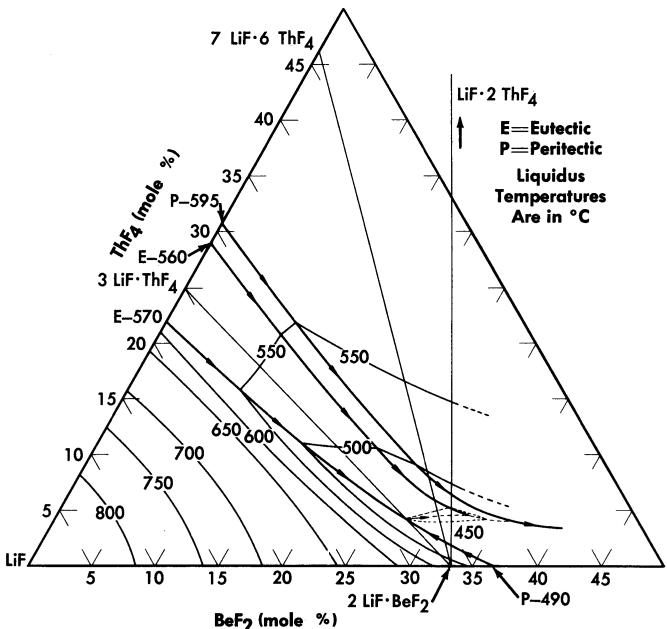  
FIG. 12-10. The system $\mathrm{LiF - BeF_2 - ThF_4}$ in the concentration range 50 to 100 mole $\%$ LiF.

12-2.3 Systems containing thorium fluoride. All the normal compounds of thorium are quadrivalent; accordingly, any use of thorium in molten fluoride melts must be as $\mathrm{ThF_4}$ . A diagram of the $\mathrm{LiF - BeF_2 - ThF_4}$ ternary system, which is based solely on thermal data, is shown as Fig. 12-9. Recent studies in the 50 to 100 mole $\%$ LiF concentration range have demonstrated (Fig. 12-10) that the thermal data are qualitatively correct. Breeder reactor blanket or breeder reactor fuel solvent compositions in which the maximum $\mathrm{ThF_4}$ concentration is restricted to that available in salts having less than a $550^{\circ}\mathrm{C}$ liquidus may be chosen from an area of the phase diagram (Fig. 12-10) in which the upper limits of $\mathrm{ThF_4}$ concentration are obtained in the composition

75 mole % LiF-16 mole % ThF $_{4}$ -9 mole % BeF $_{2}$ ,

69.5 mole % LiF-21 mole % ThF4-9.5 mole % BeF2,

68 mole % LiF-22 mole % ThF $_4$ -10 mole % BeF $_2$ .

12-2.4 Systems containing $\mathbf{Th}_4$ and $\mathbf{UF_4}$ . The $\mathrm{LiF - BeF_2 - UF_4}$ and the $\mathrm{LiF - BeF_2 - ThF_4}$ ternary systems are very similar; the two eutectics in the $\mathrm{LiF - BeF_2 - ThF_4}$ system are at temperatures and compositions virtually identical with those shown by the $\mathbf{UF_4}$ -bearing system. The very great

similarity of these two ternary systems and preliminary examination of the $\mathrm{LiF - BeF_2 - ThF_4 - UF_4}$ quaternary system suggests that fractional replacement of $\mathrm{UF_4}$ by $\mathrm{ThF_4}$ will have little effect on the freezing temperature over the composition range of interest as reactor fuel.

12-2.5 Systems containing $\mathbf{PuF_3}$ . The behavior of plutonium fluorides in molten fluoride mixtures has received considerably less study. Plutonium tetrafluoride will probably prove very soluble, as have $\mathrm{UF_4}$ and $\mathrm{ThF_4}$ , in suitable fluoride-salt diluents, but is likely to prove too strong an oxidant to be compatible with presently available structural alloys. The trifluoride of plutonium dissolves to the extent of 0.25 to 0.45 mole % in LiF-BeF $_2$ mixtures containing 25 to 50 mole % BeF $_2$ . As indicated in Chapter 14, it is believed that such concentrations are in excess of those required to fuel a high-temperature plutonium burner.

# 12-3. PHYSICAL AND THERMAL PROPERTIES OF FLUORIDE MIXTURES

The melting points, heat capacities, and equations for density and viscosity of a range of molten mixtures of possible interest as reactor fuels are presented above in Tables 12-1 and 12-3, and thermal-conductivity values are given in Tables 12-2 and 12-4; the methods by which the data were obtained are described here. The temperatures above which the materials are completely in the liquid state were determined in phase equilibrium studies. The methods used included (1) thermal analysis, (2) differential-thermal analysis, (3) quenching from high-temperature equilibrium states, (4) visual observation of the melting process, and (5) phase separation by filtration at high temperatures. Measurements of density were made by weighing, with an analytical balance, a plummet suspended in the molten mixture. Enthalpies, heats of fusion, and heat capacities were determined from measurements of heat liberated when samples in capsules of Ni or Inconel were dropped from various temperatures into calorimeters; both ice calorimeters and large copper-block calorimeters were used. Measurements of the viscosities of the molten salts were made with the use of a capillary efflux apparatus and a modified Brookfield rotating-cylinder device; agreement between the measurements made by the two methods indicated that the numbers obtained were within $\pm 10\%$ .

Thermal conductivities of the molten mixtures were measured in an apparatus similar to that described by Lucks and Deem [7], in which the heating plate is movable so that the thickness of the liquid specimen can be varied. The uncertainty in these values is probably less than $\pm 25\%$ . The variation of the thermal conductivity of a molten fluoride salt with temperature is relatively small. The conductivities of solid fluoride mixtures were measured by use of a steady-state technique in which heat was passed through a solid slab.

The vapor pressures of $\mathrm{PuF_3}$ [8], $\mathrm{UF_4}$ [9], and $\mathrm{ThF_4}$ are negligibly small at temperatures that are likely to be practical for reactor operations. Of the fluoride mixtures likely to be of interest as diluents for high-temperature reactor fuels, only $\mathrm{AlF_3}$ , $\mathrm{BeF_2}$ [9], and $\mathrm{ZrF_4}$ [10-12] have appreciable vapor pressures below $700^{\circ}\mathrm{C}$ .

Measurements of total pressure in equilibrium with $\mathrm{NaF - ZrF_4 - UF_4}$ melts between 800 and $1000^{\circ}\mathrm{C}$ with the use of an apparatus similar to that described by Rodebush and Dixon [13] yielded the data shown in Table 12-5. Sense et al. [14], who used a transport method to evaluate partial

TABLE 12-5   
VAPOR PRESSURES OF FLUORIDE MIXTURES CONTAINING $\mathbf{Z}\mathbf{R}\mathbf{F}_{4}$   

<table><tr><td colspan="3">Composition, mole %</td><td colspan="2">Vapor pressure constants*</td><td rowspan="2">Vapor pressure at 900°C, mm Hg</td></tr><tr><td>NaF</td><td>ZrF4</td><td>UF4</td><td>A</td><td>B</td></tr><tr><td></td><td></td><td></td><td></td><td>×103</td><td></td></tr><tr><td></td><td></td><td>100</td><td>7.792</td><td>9.171</td><td>0.9</td></tr><tr><td></td><td>100</td><td></td><td>12.542</td><td>11.360</td><td>617</td></tr><tr><td>57</td><td>43</td><td></td><td>7.340</td><td>7.289</td><td>14</td></tr><tr><td>50</td><td>50</td><td></td><td>7.635</td><td>7.213</td><td>32</td></tr><tr><td>50</td><td>46</td><td>4</td><td>7.888</td><td>7.551</td><td>28</td></tr><tr><td>53</td><td>43</td><td>4</td><td>7.37</td><td>7.105</td><td>21</td></tr></table>

*For the equation $\log P(\mathrm{mmHg}) = A - (B / T)$ , where $T$ is in ${}^{\circ}\mathbf{K}$ .

pressures in the $\mathrm{NaF - ZrF_4}$ system, obtained slightly different values for the vapor pressures and showed that the vapor phase above these liquids is quite complex. The vapor-pressure values obtained from both investigations are less than $2\mathrm{mmHg}$ for the equimolar $\mathrm{NaF - ZrF_4}$ mixture at $700^{\circ}\mathrm{C}$ . However, since the vapor is nearly pure $\mathrm{ZrF_4}$ , and since $\mathrm{ZrF_4}$ does not melt under low pressures of its vapor, even this modest vapor pressure leads to engineering difficulties; all lines, equipment, and connections exposed to the vapor must be protected from sublimed $\mathrm{ZrF_4}$ "snow."

Measurements made with the Rodebush apparatus have shown that the vapor pressure above liquids of analogous composition decreases with increasing size of the alkali cation. All these systems show large negative deviations from Raoult's law, which are a consequence of the large, positive, excess, partial-molal entropies of solution of $\mathrm{ZrF_4}$ . This phenomenon has been interpreted qualitatively as an effect of substituting nonbridging

TABLE 12-6   
VAPOR PRESSURES OF NAF- $\mathbf{BEF}_2$ MIXTURES\*   

<table><tr><td rowspan="2" colspan="2">Composition, mole %</td><td rowspan="3">Temperature interval, °C</td><td colspan="6">Vapor pressure constants†</td><td rowspan="3">Vapor pressure at 800°C, mm Hg</td></tr><tr><td colspan="2">NaF</td><td colspan="2">BeF2</td><td colspan="2">NaF-BeF2</td></tr><tr><td>NaF</td><td>BeF2</td><td>A</td><td>B</td><td>A</td><td>B</td><td>A</td><td>B</td></tr><tr><td></td><td></td><td></td><td></td><td>×104</td><td></td><td>×104</td><td></td><td>×104</td><td></td></tr><tr><td>26</td><td>74</td><td>785-977</td><td></td><td></td><td>10.43</td><td>1.096</td><td>9.77</td><td>1.206</td><td>1.69</td></tr><tr><td>41</td><td>59</td><td>802-988</td><td></td><td></td><td>10.06</td><td>1.085</td><td>9.79</td><td>1.187</td><td>0.94</td></tr><tr><td>50</td><td>50</td><td>796-996</td><td></td><td></td><td>9.52</td><td>1.071</td><td>9.82</td><td>1.187</td><td>0.41</td></tr><tr><td>60</td><td>40</td><td>855-1025</td><td>9.392</td><td>1.1667</td><td>9.080</td><td>1.1063</td><td></td><td></td><td>0.09</td></tr><tr><td>75</td><td>25</td><td>857-1035</td><td>9.237</td><td>1.2175</td><td>8.2</td><td>1.12</td><td></td><td></td><td>0.02</td></tr></table>

*Compiled from data obtained by Sense et al. [15].   
†For the equation $\log P(\mathrm{mmHg}) = A - (B / T)$ , where $T$ is in ${}^{\circ}\mathrm{K}$ .

fluoride ions for fluoride bridges between zirconium ions as the alkali fluoride concentration is increased in the melt [12].

Vapor pressure data obtained by the transport method for $\mathrm{NaF - BeF_2}$ mixtures [15] are shown in Table 12-6, which indicates that the vapor phases are not pure $\mathrm{BeF_2}$ . While pressures above $\mathrm{LiF - BeF_2}$ must be expected to be higher than those shown for $\mathrm{NaF - BeF_2}$ mixtures, the values of Table 12-6 suggest that the "snow" problem with $\mathrm{BeF_2}$ mixtures is much less severe than with $\mathrm{ZrF_4}$ melts.

Physical property values indicate that the molten fluoride salts are, in general, adequate heat-transfer media. It is apparent, however, from vapor pressure measurements and from spectrophotometric examination of analogous chloride systems that such melts have complex structures and are far from ideal solutions.

# 12-4. PRODUCTION AND PURIFICATION OF FLUORIDE MIXTURES

Since commercial fluorides that have a low concentration of the usual nuclear poisons are available, the production of fluoride mixtures is largely a purification process designed to minimize corrosion and to ensure the removal of oxides, oxyfluorides, and sulfur, rather than to improve the neutron economy. The fluorides are purified by high-temperature treatment with anhydrous HF and $\mathbf{H}_2$ gases, and are subsequently stored in sealed nickel containers under an atmosphere of helium.

12-4.1 Purification equipment. A schematic diagram of the purification and storage vessels used for preparation of fuel for the Aircraft Reactor Experiment (Chapter 16) is shown in Fig. 12-11. The reaction vessel in which the chemical processing is accomplished and the receiver vessel into which the purified mixture is ultimately transferred are vertical cylindrical containers of high-purity low-carbon nickel. The top of the reactor vessel is pierced by a charging port which is capped well above the heated zone by a Teflon-gasketed flange. The tops of both the receiver and the reaction vessels are pierced by short risers which terminate in Swagelok fittings, through which gas lines, thermowells, etc., can be introduced. A transfer line terminates near the bottom of the reactor vessel and near the top of the receiver; entry of this tube is effected through copper-gasketed flanges on 1-in.-diameter tubes which pierce the tops of both vessels. This transfer line contains a filter of micrometallic sintered nickel and a sampler which collects a specimen of liquid during transfer. Through one of the risers in the receiver a tube extends to the receiver bottom; this tube, which is sealed outside the vessel, serves as a means for transfer of the purified mixture to other equipment.

This assembly is connected to a manifold through which He, H₂, HF, or vacuum can be supplied to either vessel. By a combination of large tube

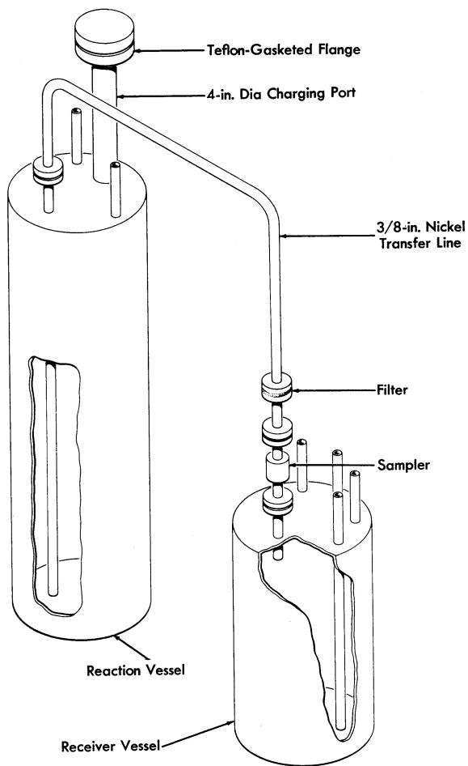  
FIG. 12-11. Diagram of purification and storage system.

furnaces, resistance heaters, and lagging, sections of the apparatus can be brought independently to controlled temperatures in excess of $800^{\circ}\mathrm{C}$ .

12-4.2 Purification processing. The raw materials, in batches of proper composition, are blended and charged into the reaction vessel. The material is melted and heated to $700^{\circ}\mathrm{C}$ under an atmosphere of anhydrous HF to remove $\mathrm{H}_2\mathrm{O}$ with a minimum of hydrolysis. The HF is replaced with $\mathbf{H}_{2}$ for a period of 1 hr, during which the temperature is raised to $800^{\circ}\mathrm{C}$ , to reduce $\mathrm{U}^{5+}$ and $\mathrm{U}^{6+}$ to $\mathrm{U}^{4+}$ (in the case of simulated fuel mixtures), and sulfur compounds to $\mathrm{S}^{- - }$ , and extraneous oxidants ( $\mathrm{Fe}^{+ + + }$ , for example) to

lower valence states. The hydrogen, as well as all subsequent reagent gases, is fed at a rate of about 3 liters/min to the reaction vessel through the receiver and transfer line and, accordingly, it bubbles up through the molten charge. The hydrogen is then replaced by anhydrous HF, which serves, during a 2- to 3-hr period at $800^{\circ}\mathrm{C}$ , to volatilize $\mathbf{H}_2\mathbf{S}$ and HCl and to convert oxides and oxyfluorides of uranium and zirconium to tetrafluorides at the expense of dissolution of considerable $\mathrm{NiF_2}$ into the melt through reaction of HF with the container. A final 24- to 30-hr treatment at $800^{\circ}\mathrm{C}$ with $\mathbf{H}_2$ suffices to reduce this $\mathrm{NiF_2}$ and the contained $\mathrm{FeF_2}$ to soluble metals.

At the conclusion of the purification treatment a pressure of helium above the salt in the reactor vessel is used to force the melt through the transfer line with its filter and sampler into the receiver. The metallic iron and nickel are left in the reactor vessel or on the sintered nickel filter. The purified melt is permitted to freeze under an atmosphere of helium in the receiver vessel.

# 12-5. RADIATION STABILITY OF FLUORIDE MIXTURES

When fission of an active constituent occurs in a molten fluoride solution, both electromagnetic radiations and particles of very high energy and intensity originate within the fluid. Local overheating as a consequence of rapid slowing down of fission fragments by the fluid is probably of little consequence in a reactor where the liquid is forced to flow turbulently and where rapid and intimate mixing occurs. Moreover, the bonding in such liquids is essentially completely ionic. Such a solution, which has neither covalent bonds to sever nor a lattice to disrupt, should be quite resistant to damage by particulate or electromagnetic radiation.

More than 100 exposures to reactor radiation of various fluoride mixtures containing $\mathrm{UF_4}$ in capsules of Inconel have been conducted; in these tests the fluid was not deliberately agitated. The power level of each test was fixed by selecting the $\mathrm{U}^{235}$ content of the test mixture. Thermal neutron fluxes have ranged from $10^{11}$ to $10^{14}$ neutrons/( $\mathrm{cm}^2$ ) (sec) and power levels have varied from 80 to $8000\mathrm{w/cm}^3$ . The capsules have, in general, been exposed at $1500^{\circ}\mathrm{F}$ for 300 hr, although several tests have been conducted for 600 to 800 hr. A list of the materials that have been studied is presented in Table 12-7. Methods of examination of the fuels after irradiation have included (1) freezing-point determinations, (2) chemical analysis, (3) examination with a shielded petrographic microscope, (4) assay by mass spectrography, and (5) examination by a gamma-ray spectroscope. The condition of the container was checked with a shielded metallograph.

No changes in the fuel, except for the expected burnup of $\mathbf{U}^{235}$ , have been observed as a consequence of irradiation. Corrosion of the Inconel

TABLE 12-7   
MOLTEN SALTS WHICH HAVE BEEN STUDIED IN IN-PILE CAPSULE TESTS   
TABLE 12-8   

<table><tr><td>System</td><td>Composition, mole %</td></tr><tr><td>NaF-KF-UF4</td><td>46.5-26-27.5</td></tr><tr><td>NaF-BeF2-UF4</td><td>25-60-15</td></tr><tr><td>NaF-BeF2-UF4</td><td>47-51-2</td></tr><tr><td>NaF-BeF2-UF4</td><td>50-46-4</td></tr><tr><td>NaF-ZrF4-UF4</td><td>63-25-12</td></tr><tr><td>NaF-ZrF4-UF4</td><td>53.5-40-6.5</td></tr><tr><td>NaF-ZrF4-UF4</td><td>50-48-2</td></tr><tr><td>NaF-ZrF4-UF3</td><td>50-48-2</td></tr></table>

DESCRIPTIONS OF INCONEL FORCED-CIRCULATION LOOPS OPERATED IN THE LITR AND THE MTR  

<table><tr><td rowspan="2"></td><td colspan="3">Loop designation</td></tr><tr><td>LITR Horizontal</td><td>LITR Vertical</td><td>MTR Horizontal</td></tr><tr><td>NaF-ZrF4-UF4composition, mole %</td><td>62.5-12.5-25</td><td>63-25-12</td><td>53.5-40-6.5</td></tr><tr><td>Maximum fission power, w/cm3</td><td>400</td><td>500</td><td>800</td></tr><tr><td>Total power, kw</td><td>2.8</td><td>10</td><td>20</td></tr><tr><td>Dilution factor*</td><td>180</td><td>7.3</td><td>5</td></tr><tr><td>Maximum fuel temperature, °F</td><td>1500</td><td>1600</td><td>1500</td></tr><tr><td>Fuel temperature differential, °F</td><td>30</td><td>250</td><td>155</td></tr><tr><td>Fuel Reynolds number</td><td>6000</td><td>3000</td><td>5000</td></tr><tr><td>Operating time, hr</td><td>645</td><td>332</td><td>467</td></tr><tr><td>Time at full power, hr</td><td>475</td><td>235</td><td>271</td></tr></table>

*Ratio of volume of fuel in system to volume of fuel in reactor core.

capsules to a depth of less than 4 mils in $300\mathrm{hr}$ was found; such corrosion is comparable to that found in unirradiated control specimens [16]. In capsules which suffered accidental excursions in temperatures to above $2000^{\circ}\mathrm{F}$ , grain growth of the Inconel occurred and corrosion to a depth of 12 mils was found. Such increases in corrosion were almost certainly the result of the serious overheating rather than a consequence of the radiation field.

Tests have also been made in which the fissioning fuel is pumped through a system in which a thermal gradient is maintained in the fluid. These tests included the Aircraft Reactor Experiment (described in Chapter 16) and three types of forced-circulation loop tests. A large loop, in which the pump was outside the reactor shield, was operated in a horizontal beam hole of the LITR.* A smaller loop was operated in a vertical position in the LITR lattice with the pump just outside the lattice. A third loop was operated completely within a beam-hole of the MTR. $\dagger$ The operating conditions for these three loops are given in Table 12-8.

The corrosion that occurred in these loop tests, which were of short duration and which provided relatively small temperature gradients, was to a depth of less than 4 mils and, as in the capsule tests, was comparable to that found in similar tests outside the radiation field [16]. Therefore it is concluded that within the obvious limitations of the experience up to the present time there is no effect of radiation on the fuel and no acceleration of corrosion by the radiation field.

# 12-6. BEHAVIOR OF FISSION PRODUCTS

When fission of an active metal occurs in a molten solution of its fluoride, the fission fragments must originate in energy states and ionization levels very far from those normally encountered. These fragments, however, quickly lose energy through collisions in the melt and come to equilibrium as common chemical entities. The valence states which they ultimately assume are determined by the necessity for cation-anion equivalence in the melt and the requirement that redox equilibrium be established among components of the melt and constituents of the metallic container.

Structural metals such as Inconel in contact with a molten fluoride solution are not stable to $\mathbf{F}_2$ , $\mathrm{UF_5}$ , or $\mathrm{UF_6}$ . It is clear, therefore, that when fission of uranium as $\mathrm{UF_4}$ takes place, the ultimate equilibrium must be such that four cation equivalents are furnished to satisfy the fluoride ions released. Thermochemical data, from which the stability of fission-product fluorides in complex dilute solution could be predicted, are lacking in

many cases. No precise definition of the valence state of all fission-product fluorides can be given; it is, accordingly, not certain whether the fission process results in oxidation of the container metal as a consequence of depositing the more noble fission products in the metallic state.

12-6.1 Fission products of well-defined valence. The noble gases. The fission products krypton and xenon can exist only as elements. The solubilities of the noble gases in $\mathrm{NaF - ZrF_4}$ (53-47 mole %) [17], $\mathrm{NaF - ZrF_4 - UF_4}$ (50-46-4 mole %) [17], and LiF-NaF-KF (46.5-11.5-42 mole %) obey Henry's law, increase with increasing temperature, decrease with increasing atomic weight of the solute, and vary appreciably with composition of the solute. The Henry's law constants and the heats of solution for the noble gases in the $\mathrm{NaF - ZrF_4}$ and LiF-NaF-KF mixtures are given in Table 12-9. The solubility of krypton in the $\mathrm{NaF - ZrF_4}$ mixture appears to be about $3\times 10^{-8}$ moles/( $\mathrm{cm}^3$ ) (atm).

TABLE 12-9   
SOLUBILITIES AT $600^{\circ}\mathrm{C}$ AND HEATS OF SOLUTION FOR NOBLE GASES IN MOLTEN FLUORIDE MIXTURES   

<table><tr><td rowspan="2">Gas</td><td colspan="2">In NaF-ZrF4(53-47 mole %)</td><td colspan="2">In LiF-NaF-KF(46.5-11.5-42 mole %)</td></tr><tr><td>K*</td><td>Heat of solution, kcal/mole</td><td>K*</td><td>Heat of solution, kcal/mole</td></tr><tr><td rowspan="2">Helium</td><td>×10-8</td><td></td><td>×10-8</td><td></td></tr><tr><td>21.6 ± 1</td><td>6.2</td><td>11.3 ± 0.7</td><td>8.0</td></tr><tr><td>Neon</td><td>11.3 ± 0.3</td><td>7.8</td><td>4.4 ± 0.2</td><td>8.9</td></tr><tr><td>Argon</td><td>5.1 ± 0.15</td><td>8.2</td><td></td><td></td></tr><tr><td>Xenon</td><td>1.94 ± 0.2</td><td>11.1</td><td></td><td></td></tr></table>

*Henry's law constant in moles of gas per cubic centimeter of solvent per atmosphere.

The positive heat of solution ensures that blanketing or sparging of the fuel with helium or argon in a low-temperature region of the reactor cannot lead to difficulty due to decreased solubility and bubble formation in higher temperature regions of the system. Small-scale in-pile tests have revealed that, as these solubility data suggest, xenon at low concentration is retained in a stagnant melt but is readily removed by sparging with helium. Only a very small fraction of the anticipated xenon poisoning was observed

during operation of the Aircraft Reactor Experiment, even though the system contained no special apparatus for xenon removal [18]. It seems certain that krypton and xenon isotopes of reasonable half-life can be readily removed from all practical molten-salt reactors.

Elements of Groups I-A, II-A, III-B, and IV-B. The fission products Rb, Cs, Sr, Ba, Zr, Y, and the lanthanides form very stable fluorides; they should, accordingly, exist in the molten fluoride fuel in their ordinary valence states. High concentrations of $\mathrm{ZrF_4}$ and the alkali and alkaline earth fluorides can be dissolved in LiF-NaF-KF, $\mathrm{LiF_2 - BeF_2}$ , or $\mathrm{NaF - ZrF_4}$ mixtures at $600^{\circ}\mathrm{C}$ . The solubilities at $600^{\circ}\mathrm{C}$ of $\mathrm{YF_3}$ and of selected rare-earth fluorides in $\mathrm{NaF - ZrF_4}$ (53-47 mole %) and $\mathrm{LiF - BeF_2}$ (65-35 mole %) are shown in Table 12-10. For these materials the solubility increases

TABLE 12-10   
SOLUBILITY OF $\mathrm{YF}_3$ AND OF SOME RARE-EARTH FLUORIDES IN $\mathrm{NaF - ZrF_4}$ AND IN $\mathrm{LiF - BEF_2}$ AT $600^{\circ}\mathrm{C}$   

<table><tr><td rowspan="2">Fluoride</td><td colspan="2">Solubility, mole % MF3</td></tr><tr><td>In NaF-ZrF4(57-43 mole %)</td><td>In LiF-BeF2(62-38 mole %)</td></tr><tr><td>YF3LaF3CeF3SmF3</td><td>3.62.12.32.5</td><td>0.48</td></tr></table>

about $0.5\% / \mathrm{^\circ C}$ and increases slightly with increasing atomic number in the lanthanide series; the saturating phase is the simple trifluoride. For solutions containing more than one rare earth the primary phase is a solid solution of the rare-earth trifluorides; the ratio of rare-earth cations in the molten solution is virtually identical with the ratio in the precipitated solid solution. Quite high burnups would be required before a molten fluoride reactor could saturate its fuel with any of these fission products.

12-6.2 Fission products of uncertain valence. The valence states assumed by the nonmetallic elements Se, Te, Br, and I must depend strongly on the oxidation potential defined by the container and the fluoride melt, and the states are not at present well defined. The sparse thermochemical data suggest that if they were in the pure state the fluorides of Ge, As, Nb, Mo, Ru, Rh, Pd, Ag, Cd, Sn, and Sb would be reduced to the corresponding metal by the chromium in Inconel. While fluorides of some of

these elements may be stabilized in dilute molten solution in the melt, it is possible that none of this group exists as a compound in the equilibrium mixture. An appreciable, and probably large, fraction of the niobium and ruthenium produced in the Aircraft Reactor Experiment was deposited in or on the Inconel walls of the fluid circuit; a detectable, but probably small, fraction of the ruthenium was volatilized, presumably as $\mathrm{RuF}_5$ , from the melt.

12-6.3 Oxidizing nature of the fission process. The fission of a mole of $\mathrm{UF_4}$ would yield more equivalents of cation than of anion if the noble gas isotopes of half-life greater than $10\mathrm{min}$ were lost and if all other elements formed fluorides of their lowest reported valence state. If this were the case, the system would, presumably, retain cation-anion equivalence by reduction of fluorides of the most noble fission products to metal and perhaps by reduction of some $\mathrm{U}^{4+}$ to $\mathrm{U}^{3+}$ . If, however, all the elements of uncertain valence state listed in Article 12-6.2 deposit as metals, the balance would be in the opposite direction. Only about 3.2 equivalents of combined cations result, and since the number of active anion equivalents is a minimum of 4 (from the four fluorines of $\mathrm{UF_4}$ ), the deficiency must be alleviated by oxidation of the container. The evidence from the Aircraft Reactor Experiment, the in-pile loops, and the in-pile capsules has not shown the fission process to cause serious oxidation of the container; it is possible that these experiments burned too little uranium to yield significant results. If fission of $\mathrm{UF_4}$ is shown to be oxidizing, the detrimental effect could be overcome by deliberate and occasional addition of a reducing agent to create a small and stable concentration of soluble $\mathrm{UF_3}$ in the fuel mixture.

# 12-7. FUEL REPROCESSING

Numerous conventional processes such as solvent extraction, selective precipitation, and preferential ion exchange could be readily applied to molten fluoride fuels after solution in water. However, these liquids are readily amenable to remote handling and serve as media in which chemical reactions can be conducted. Most development efforts have, accordingly, been concerned with direct and nonaqueous reprocessing methods.

Recovery of uranium from solid fuel elements by dissolution of the element in a fluoride bath followed by application of anhydrous HF and subsequent volatilization of the uranium as $\mathrm{UF}_6$ has been described [19,20]. The volatilization step accomplishes a good separation from Cs, Sr, and the rare earths, fair separation from Zr, and poor separation from Nb and Ru. The fission products I, Te, and Mo volatilize completely from the melt. The nonvolatile fission products are discarded in the fluoride solvent. Further decontamination of the $\mathrm{UF}_6$ is effected by selective ab

sorption and desorption on beds of NaF. At $100^{\circ}\mathrm{C}$ , $\mathbf{U}\mathbf{F}_6$ is absorbed on the bed by the reversible reaction

$$
\mathrm {U F} _ {6} (\mathrm {g}) + 3 \mathrm {N a F} \xleftarrow {} 3 \mathrm {N a F} \cdot \mathrm {U F} _ {6},
$$

which was first reported by Martin, Albers, and Dust [21]. Niobium activity, along with activity attributable to particulate matter, is also absorbed; ruthenium activity, however, largely passes through the bed. Subsequent desorption of the $\mathrm{UF}_6$ at temperatures up to $400^{\circ}\mathrm{C}$ is accomplished without desorption of the niobium. The desorbed $\mathrm{UF}_6$ is passed through a second NaF bed held at $400^{\circ}\mathrm{C}$ as a final step and is subsequently recovered in refrigerated traps. The decontaminations obtained are greater than $10^{6}$ for gross beta and gamma emitters, greater than $10^{7}$ for Cs, Sr, and lanthanides, greater than $10^{5}$ for Nb, and about $10^{4}$ for Ru. Uranium was recovered from the molten-salt fuel of the Aircraft Reactor Experiment by this method, and its utility for molten-fluoride fuel systems or breeder blankets was demonstrated. Recovery of plutonium or thorium, however, is not possible with this process.

There are numerous possible methods for reprocessing molten-salt fuels. The behavior of the rare-earth fluorides indicates that some decontamination of molten-fluoride fuels may be obtained by substitution of $\mathrm{CeF_3}$ or $\mathrm{LaF_3}$ , in a sidestream circuit, for rare earths of higher cross section. It seems likely that $\mathrm{PuF_3}$ can be recovered with the rare-earth fluorides and subsequently separated from them after oxidation to $\mathrm{PuF_4}$ . Further, it appears that both selective precipitation of various fission-product elements and active constituents as oxides, and selective chemisorption of these materials on solid oxide beds are capable of development into valuable separation procedures. Only preliminary studies of these and other possible processes have been made.

# REFERENCES

1. D. N. Roy et al., Fluoride Model Systems: IV. The Systems LiF—BeF $_2$ and $\mathrm{RbF}_2$ — $\mathrm{BeF}_2$ , J. Am. Ceram. Soc. 37, 300 (1954).   
2. A. V. NovoseLOva et al., Thermal and X-ray Analysis of the Lithium-Beryllium Fluoride System, J. Phys. Chem. USSR 26, 1244 (1952).   
3. W. R. GRIMES et al., Chemical Aspects of Molten Fluoride Reactors, paper to be presented at Second International Conference on Peaceful Uses of Atomic Energy, Geneva, 1958.   
4. J. J. KATZ and E. RABINOWITCH, The Chemistry of Uranium, National Nuclear Energy Series, Division VIII, Volume 5. New York: McGraw-Hill Book Co., Inc., 1951.   
5. W. R. GRIMES et al., Oak Ridge National Laboratory. Unpublished.   
6. B. H. CLAMPITT et al., Oak Ridge National Laboratory, 1957. Unpublished.   
7. C. F. Lucks and H. W. Deem, Apparatus for Measuring the Thermal Conductivity of Liquid at Elevated Temperatures; Thermal Conductivity of Fused NaOH to $600^{\circ}C$ , Am. Soc. of Mech. Eng. Meeting, June 1956. (Preprint 56SA31)   
8. G. T. SEABORG and J. J. KATZ (Eds.), The Actinide Elements, National Nuclear Energy Series, Division IV, Volume 14A. New York: McGraw-Hill Book Co., Inc., 1953.   
9. W. R. GRIMES et al., Fused-salt Systems, Sec. 6 in Reactor Handbook, Vol. 2, Engineering, USAEC Report AECD-3646, 1955. (pp. 799-850)   
10. K. A. SENSE et al., The Vapor Pressure of Zirconium Fluoride, J. Phys. Chem. 58, 995 (1954).   
11. W. FISCHER, Institut für Anorganische Chemie, Technicshe Hochschule, Hannover, personal communication; [Data for equation taken from S. LAUTER, Dissertation, Institut für Anorganische Chemie, Technische Hochschule, Hannover (1948).]   
12. S. CANTOR et al., Vapor Pressures and Derived Thermodynamic Information for the System RbF—ZrF₄, J. Phys. Chem. 62, 96 (1958).   
13. W. H. Rodebush and A. L. Dixon, The Vapor Pressures of Metals; A New Experimental Method, Phys. Rev. 26, 851 (1925).   
14. K. A. SENSE et al., Vapor Pressure and Derived Information of the Sodium Fluoride-Zirconium Fluoride System. Description of a Method for the Determination of Molecular Complexes Present in the Vapor Phase, J. Phys. Chem. 61, 337 (1957).   
15. K. A. SENSE et al., Vapor Pressure and Equilibrium Studies of the Sodium Fluoride-Beryllium Fluoride System, USAEC Report BMI-1186, Battelle Memorial Institute, May 27, 1957.   
16. W. D. MANLY et al., Metallurgical Problems in Molten Fluoride Systems, paper to be presented at Second International Conference on the Peaceful Uses of Atomic Energy, Geneva, 1958.   
17. W. R. GRIMES et al., Solubility of Noble Gases in Molten Fluorides. I. In Mixtures of NaF—ZrF₄ (53-47 mole %) and NaF—ZrF₄—UF₄ (50-46-4 mole %), J. Phys. Chem. (in press).

18. E. S. Betti et al., The Aircraft Reactor Experiment—Operation, Nuclear Sci. and Eng. 2, 841 (1957).   
19. G. I. CATHERs, Uranium Recovery for Spent Fuel by Dissolution in Fused Salt and Fluorination, Nuclear Sci. and Eng. 2, 768 (1957).   
20. F. R. Bruce et al., in Progress in Nuclear Energy, Series III, Process Chemistry, Vol. I. New York: McGraw-Hill Book Co., Inc., 1956.   
21. Von H. MARTIN et al., Double Fluorides of Uranium Hexafluoride, Z. anorg. u. allgem. Chem. 265, 128 (1951).

# CHAPTER 13

# CONSTRUCTION MATERIALS FOR MOLTEN-SALT REACTORS*

# 13-1. SURVEY OF SUITABLE MATERIALS

A molten-salt reactor system requires structural materials which will effectively resist corrosion by the fluoride salt mixtures utilized in the core and blanket regions. Evaluation tests of various materials in fluoride salt systems have indicated that nickel-base alloys are, in general, superior to other commercial alloys for the containment of these salts under dynamic flow conditions. In order to select the alloy best suited to this application, an extensive program of corrosion tests was carried out on the available commercial nickel-base alloys, particularly Inconel, which typifies the chromium-containing alloys, and Hastelloy B, which is representative of the molybdenum-containing alloys.

Alloys containing appreciable quantities of chromium are attacked by molten salts, mainly by the removal of chromium from hot-leg sections through reaction with $\mathrm{UF_4}$ , if present, and with other oxidizing impurities in the salt. The removal of chromium is accompanied by the formation of subsurface voids in the metal. The depth of void formation depends strongly on the operating temperatures of the system and on the composition of the salt mixture.

On the other hand, Hastelloy B, in which the chromium is replaced with molybdenum, shows excellent compatibility with fluoride salts at temperatures in excess of $1600^{\circ}\mathrm{F}$ . Unfortunately, Hastelloy B cannot be used as a structural material in high-temperature systems because of its age-hardening characteristics, poor fabricability, and oxidation resistance.

The information gained in the testing of Hastelloy B and Inconel led to the development of an alloy, designated INOR-8, which combines the better properties of both alloys for molten-salt reactor construction. The approximate compositions of the three alloys, Inconel, Hastelloy B, and INOR-8, are given in Table 13-1.

INOR-8 has excellent corrosion resistance to molten fluoride salts at temperatures considerably above those expected in molten-salt reactor service; further, no measurable attack has been observed thus far in tests at reactor operating temperatures of 1200 to $1300^{\circ}\mathrm{F}$ . The mechanical properties of INOR-8 at operating temperatures are superior to those of many stainless steels and are virtually unaffected by long-time exposure

TABLE 13-1   
COMPOSITIONS OF POTENTIAL STRUCTURAL MATERIALS   

<table><tr><td rowspan="2">Components</td><td colspan="3">Quantity in alloy, w/o</td></tr><tr><td>Inconel</td><td>INOR-8</td><td>Hastelloy B</td></tr><tr><td>Chromium</td><td>14-17</td><td>6-8</td><td>1 (max)</td></tr><tr><td>Iron</td><td>6-10</td><td>5 (max)</td><td>4-7</td></tr><tr><td>Molybdenum</td><td></td><td>15-18</td><td>26-30</td></tr><tr><td>Manganese</td><td>1 (max)</td><td>0.8 (max)</td><td>1.0 (max)</td></tr><tr><td>Carbon</td><td>0.15 (max)</td><td>0.04-0.08</td><td>0.05 (max)</td></tr><tr><td>Silicon</td><td>0.5</td><td>0.35 (max)</td><td>1.0 (max)</td></tr><tr><td>Sulfur</td><td>0.01</td><td>0.01 (max)</td><td>0.03 (max)</td></tr><tr><td>Copper</td><td>0.5</td><td>0.35 (max)</td><td></td></tr><tr><td>Cobalt</td><td></td><td>0.2 (max)</td><td>2.5 (max)</td></tr><tr><td>Nickel</td><td>72 (min)</td><td>Balance</td><td>Balance</td></tr></table>

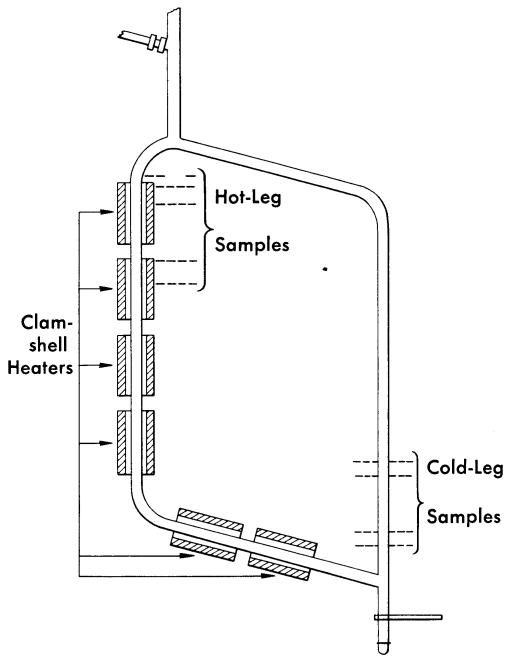  
FIG. 13-1. Diagram of a standard thermal-convection loop, showing locations at which metallographic sections are taken after operation.

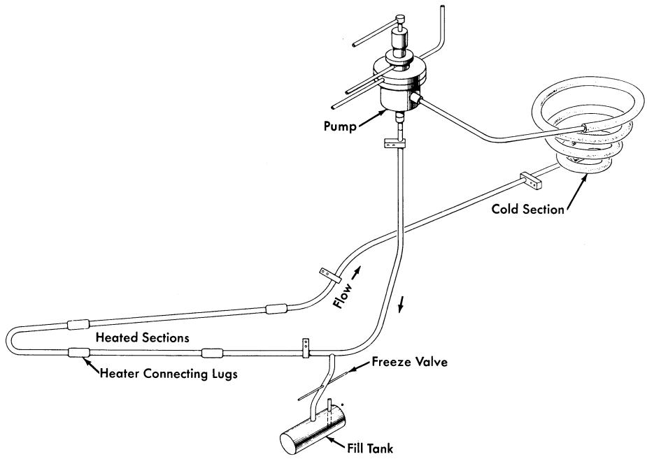  
FIG. 13-2. Diagram of forced-circulation loop for corrosion testing.

to salts. The material is structurally stable in the operating temperature range, and the oxidation rate is less than 2 mils in $100,000\mathrm{hr}$ . No difficulty is encountered in fabricating standard shapes when the commercial practices established for nickel-base alloys are used. Tubing, plates, bars, forgings, and castings of INOR-8 have been made successfully by several major metal manufacturing companies, and some of these companies are prepared to supply it on a commercial basis. Welding procedures have been established, and a good history of reliability of welds exists. The material has been found to be easily weldable with rod of the same composition.

Inconel is, of course, an alternate choice for the primary-circuit structural material, and much information is available on its compatibility with molten salts and sodium. Although probably adequate, Inconel does not have the degree of flexibility that INOR-8 has in corrosion resistance to different salt systems, and its lower strength at reactor operating temperatures would require heavier structural components.

A considerable nuclear advantage would exist in a reactor with an uncanned graphite moderator exposed to the molten salts. Long-time exposure of graphite to a molten salt results in the salt penetrating the available pores, but it is probable, with the "impermeable" types of

graphite now being developed, that the degree of salt penetration encountered can be tolerated. The attack of the graphite by the salt and the carburization of the metal container seem to be negligible if the temperature is kept below $1300^{\circ}\mathrm{F}$ . More tests are needed to finally establish the compatibility of graphite-salt-alloy systems.

Finally, a survey has been made of materials suitable for bearings and valve seats in molten salts. Cermets, ceramics, and refractory metals appear to be promising for this application and are presently being investigated.

# 13-2. CORROSION OF NICKEL-BASE ALLOYS BY MOLTEN SALTS

13-2.1 Apparatus used for corrosion tests. Nickel-base alloys have been exposed to flowing molten salts in both thermal-convection loops and in loops containing pumps for forced circulation of the salts. The thermal-convection loops are designed as shown in Fig. 13-1. When the bottom and an adjacent side of the loop are heated, usually with clamshell heaters, convection forces in the contained fluid establish flow rates of up to $8\mathrm{ft / min}$ , depending on the temperature difference between the heated and unheated portions of the loop. The forced-circulation loops are designed as shown in Fig. 13-2. Heat is applied to the hot leg of this type of loop by direct resistance heating of the tubing. Large temperature differences (up to $300^{\circ}\mathrm{F}$ ) are obtained by air-cooling of the cold leg. Reynolds numbers of up to 10,000 are attainable with 1/2-in.-ID tubing, and somewhat higher values can be obtained with smaller tubing.

13-2.2 Mechanism of corrosion. Most of the data on corrosion have been obtained with Inconel, and the theory of the corrosive mechanism was worked out for this alloy. The corrosion of INOR-8 occurs to a lesser degree but follows a pattern similar to that observed for Inconel and presumably the same theory applies.

The formation of subsurface voids is initiated by the oxidation of chromium along exposed surfaces through oxidation-reduction reactions with impurities or constituents of the molten fluoride-salt mixture. As the surface is depleted in chromium, chromium from the interior diffuses down the concentration gradient toward the surface. Since diffusion occurs by a vacancy process and in this particular situation is essentially monodirectional, it is possible to build up an excess number of vacancies in the metal. These precipitate in areas of disregistry, principally at grain boundaries and impurities, to form voids. These voids tend to agglomerate and grow in size with increasing time and temperature. Examinations have demonstrated that the subsurface voids are not interconnected with each other or with the surface. Voids of the same type have been found in Inconel

after high-temperature oxidation tests and high-temperature vacuum tests in which chromium was selectively removed.

The selective removal of chromium by a fluoride-salt mixture depends on various chemical reactions, for example:

1. Impurities in the melt:

$$
\mathrm {F e F} _ {2} + \mathrm {C r} \rightleftharpoons \mathrm {C r F} _ {2} + \mathrm {F e}. \tag {13-1}
$$

2. Oxide films on the metal surface:

$$
2 \mathrm {F e} _ {2} \mathrm {O} _ {3} + 3 \mathrm {C r F} _ {4} \rightleftharpoons 3 \mathrm {C r O} _ {2} + 4 \mathrm {F e F} _ {3}. \tag {13-2}
$$

3. Constituents of the fuel:

$$
\mathrm {C r} + 2 \mathrm {U F} _ {4} \xrightarrow {\rightleftarrows} 2 \mathrm {U F} _ {3} + \mathrm {C r F} _ {2}. \tag {13-3}
$$

The ferric fluoride formed by the reaction of Eq. (13-2) dissolves in the melt and further attacks the chromium by the reaction of Eq. (13-1).

The time-dependence of void formation in Inconel, as observed both in thermal-convection and forced-circulation systems, indicates that the attack is initially quite rapid but that it then decreases until a straight-line relationship exists between depth of void formation and time. This effect can be explained in terms of the corrosion reactions discussed above. The initial rapid attack found for both types of loops stems from the reaction of chromium with impurities in the melt [reactions (13-1) and (13-2)] and with the $\mathrm{UF_4}$ constituent of the salt [reaction (13-3)] to establish a quasi-equilibrium amount of $\mathrm{CrF_2}$ in the salt. At this point attack proceeds linearly with time and occurs by a mass-transfer mechanism which, although it arises from a different cause, is similar to the phenomenon of temperature-gradient mass transfer observed in liquid metal corrosion.

In molten fluoride-salt systems, the driving force for mass transfer is a result of a temperature dependence of the equilibrium constant for the reaction between chromium and $\mathrm{UF_4}$ (Eq. 13-3). If nickel and iron are considered inert diluents for chromium in Inconel, the process can be simply described. Under rapid circulation, a uniform concentration of $\mathrm{UF_4}$ , $\mathrm{UF_3}$ , and $\mathrm{CrF_2}$ is maintained throughout the fluid; the concentrations must satisfy the equilibrium constant

$$
K _ {a} = K _ {\gamma} \cdot K _ {N} = \frac {\gamma_ {\mathrm {C r F} _ {2}} \cdot \gamma^ {2} _ {\mathrm {U F} _ {3}}}{\gamma_ {\mathrm {C r}} \cdot \gamma^ {2} _ {\mathrm {U F} _ {4}}} \cdot \frac {N _ {\mathrm {C r F} _ {2}} \cdot N ^ {2} _ {\mathrm {U F} _ {3}}}{N _ {\mathrm {C r}} \cdot N ^ {2} _ {\mathrm {U F} _ {4}}} \tag {13-4}
$$

where $N$ represents the mole fraction and $\gamma$ the activity coefficient of the indicated component.

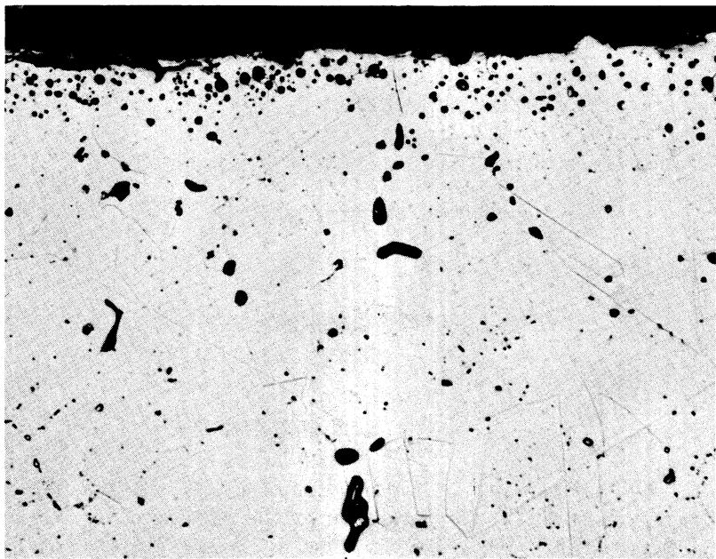  
FIG. 13-3. Hot-leg section from an Inconel thermal-convection loop which circulated the fuel mixture $\mathrm{NaF - ZrF_4 - UF_4}$ (50-46-4 mole %) for 1000 hr at $1500^{\circ}\mathrm{F}$ . $(250\times)$

Under these steady-state conditions, there exists a temperature $T$ , intermediate between the maximum and minimum temperatures of the loop, at which the initial composition of the structural metal is at equilibrium with the fused salt. Since $K_{N}$ increases with increasing temperature, the chromium concentration in the alloy surface is diminished at temperatures higher than $T$ and is augmented at temperatures lower than $T$ . In some melts, NaF-LiF-KF-UF $_4$ , for example, the equilibrium constant of reaction (13-3) changes sufficiently with temperature under extreme temperature conditions to cause precipitation of pure chromium crystals in the cold zone. In other melts, for example NaF-ZrF $_4$ -UF $_4$ , the temperature-dependence of the corrosion equilibrium is small, and the equilibrium is satisfied at all useful temperatures without the formation of crystalline chromium. In the latter systems the rate of chromium removal from the salt stream at cold-leg regions is dependent on the rate at which chromium can diffuse into the cold-leg wall. If the chromium concentration gradient tends to be small, or if the bulk of the cold-leg surface is held at a relatively low temperature, the corrosion rate in such systems is almost negligible.

It is obvious that addition of the equilibrium concentrations of $\mathrm{UF}_3$ and $\mathrm{CrF}_2$ to molten fluorides prior to circulation in Inconel equipment would minimize the initial removal of chromium from the alloy by reac

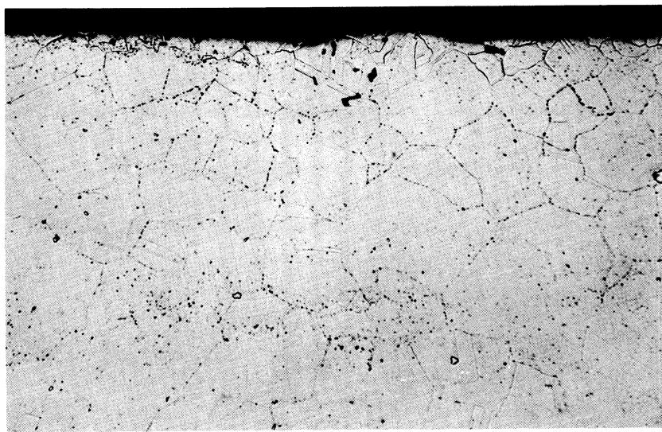  
FIG. 13-4. Hot-leg section of Inconel thermal-convection loop which circulated the fuel mixture $\mathrm{NaF - ZrF_4 - UF_4}$ (55.3-40.7-4 mole %) for 1000 hr at $1250^{\circ}\mathrm{F}$ . $(250\times)$

tion (13-3). (It would not, of course, affect the mass-transfer process which arises as a consequence of the temperature-dependence of this reaction.) Deliberate additions of these materials have not been practiced in routine corrosion tests because (1) the effect at the uranium concentrations normally employed is small, and (2) the experimental and analytical difficulties are considerable. Addition of more than the equilibrium quantity of $\mathrm{UF}_3$ may lead to deposition of some uranium metal in the equipment walls through the reaction

$$
4 \mathrm {U F} _ {4} \longleftrightarrow 3 \mathrm {U F} _ {4} + \mathrm {U} ^ {0}. \tag {13-5}
$$

For ultimate use in reactor systems, however, it may be possible to treat the fuel material with calculated quantities of metallic chromium to provide the proper $\mathrm{UF}_3$ and $\mathrm{CrF}_2$ concentrations at startup.

According to the theory described above, there should be no great difference in the corrosion found in thermal-convection loops and in forced-circulation loops. The data are in general agreement with this conclusion so long as the same maximum metal-salt interface temperature is present in both types of loop. The results of many tests with both types of loop are summarized in Table 13-2 without distinguishing between the two types of loop. The maximum bulk temperature of the salt as it left the heated section of the loop is given. It is known that the actual metal-salt interface temperature was not greater than $1300^{\circ}\mathrm{F}$ in the loops with a

TABLE 13-2   
SUMMARY OF CORROSION DATA OBTAINED IN THERMAL-CONVECTION AND FORCED-CIRCULATION LOOP TESTS OF INCONEL AND INOR-8 EXPOSED TO VARIOUS CIRCULATING SALT MIXTURES   

<table><tr><td>Constituents of base salts</td><td>\( UF_4 \) or \( ThF_4 \) content</td><td>Loop material</td><td>Maximum salt temperature, °F</td><td>Time of operation, hr</td><td>Depth of subsurface void formation at hottest part of loop, in.</td></tr><tr><td rowspan="6">\( NaF-ZrF_4 \)</td><td>1 mole % \( UF_4 \)</td><td>Inconel</td><td>1250</td><td>1000</td><td>&lt;0.001</td></tr><tr><td>1 mole % \( UF_4 \)</td><td>Inconel</td><td>1270</td><td>6300</td><td>0-0.0025</td></tr><tr><td>4 mole % \( UF_4 \)</td><td>Inconel</td><td>1250</td><td>1000</td><td>0.002</td></tr><tr><td>4 mole % \( UF_4 \)</td><td>Inconel</td><td>1500</td><td>1000</td><td>0.007-0.010</td></tr><tr><td>4 mole % \( UF_4 \)</td><td>INOR-8</td><td>1500</td><td>1000</td><td>0.002-0.003</td></tr><tr><td>0</td><td>Inconel</td><td>1500</td><td>1000</td><td>0.002-0.003</td></tr><tr><td rowspan="4">\( NaF-BeF_2 \)</td><td>1 mole % \( UF_4 \)</td><td>Inconel</td><td>1250</td><td>1000</td><td>0.001</td></tr><tr><td>0</td><td>Inconel</td><td>1500</td><td>500</td><td>0.004-0.010</td></tr><tr><td>3 mole % \( UF_4 \)</td><td>Inconel</td><td>1500</td><td>500</td><td>0.008-0.014</td></tr><tr><td>1 mole % \( UF_4 \)</td><td>INOR-8</td><td>1250</td><td>6300</td><td>0.001</td></tr><tr><td rowspan="3">\( LiF-BeF_2 \)</td><td>1 mole % \( UF_4 \)</td><td>Inconel</td><td>1250</td><td>1000</td><td>0.001-0.002</td></tr><tr><td>3 mole % \( UF_4 \)</td><td>Inconel</td><td>1500</td><td>500</td><td>0.012-0.020</td></tr><tr><td>1 mole % \( UF_4 \)</td><td>INOR-8</td><td>1250</td><td>1000</td><td>0</td></tr><tr><td rowspan="3">\( NaF-LiF-BeF_2 \)</td><td>0</td><td>Inconel</td><td>1125</td><td>1000</td><td>0.002</td></tr><tr><td>0</td><td>Inconel</td><td>1500</td><td>500</td><td>0.003-0.005</td></tr><tr><td>3 mole % \( UF_4 \)</td><td>Inconel</td><td>1500</td><td>500</td><td>0.008-0.013</td></tr><tr><td rowspan="4">\( NaF-LiF-KF \)</td><td>0</td><td>Inconel</td><td>1125</td><td>1000</td><td>0.001</td></tr><tr><td>2.5 mole % \( UF_4 \)</td><td>Inconel</td><td>1500</td><td>500</td><td>0.017</td></tr><tr><td>0</td><td>INOR-8</td><td>1250</td><td>1340</td><td>0</td></tr><tr><td>2.5 mole % \( UF_4 \)</td><td>INOR-8</td><td>1500</td><td>1000</td><td>0.001-0.003</td></tr><tr><td>LiF</td><td>29 mole % \( ThF_4 \)</td><td>Inconel</td><td>1250</td><td>1000</td><td>0-0.0015</td></tr><tr><td>\( NaF-BeF_2 \)</td><td>7 mole % \( ThF_4 \)</td><td>INOR-8</td><td>1250</td><td>1000</td><td>0</td></tr></table>

maximum salt temperature of $1250^{\circ}\mathrm{F}$ , and was between 1600 and $1650^{\circ}\mathrm{F}$ for the loop with a maximum salt temperature of $1500^{\circ}\mathrm{F}$ .

The data in Table 13-2 are grouped by types of base salt because the salt has a definite effect on the measured attack of Inconel at $1500^{\circ}\mathrm{F}$ . The salts that contain $\mathrm{BeF}_2$ are somewhat more corrosive than those containing $\mathrm{ZrF}_4$ , and the presence of LiF, except in combination with NaF, seems to accelerate corrosion.

At the temperature of interest in molten-salt reactors, that is, $1250^{\circ}\mathrm{F}$ , the same trend of relative corrosiveness of the different salts may exist for Inconel, but the low rates of attack observed in tests preclude a conclusive decision on this point. Similarly, if there is any preferential effect of the base salts on INOR-8, the small amounts of attack tend to hide it.

As expected from the theory, the corrosion depends sharply on the $\mathrm{UF_4}$ concentration. Studies of the nuclear properties of molten-salt power reactors have indicated (see Chapter 14) that the $\mathrm{UF_4}$ content of the fuel will usually be less than 1 mole $\%$ , and therefore the corrosiveness of salts

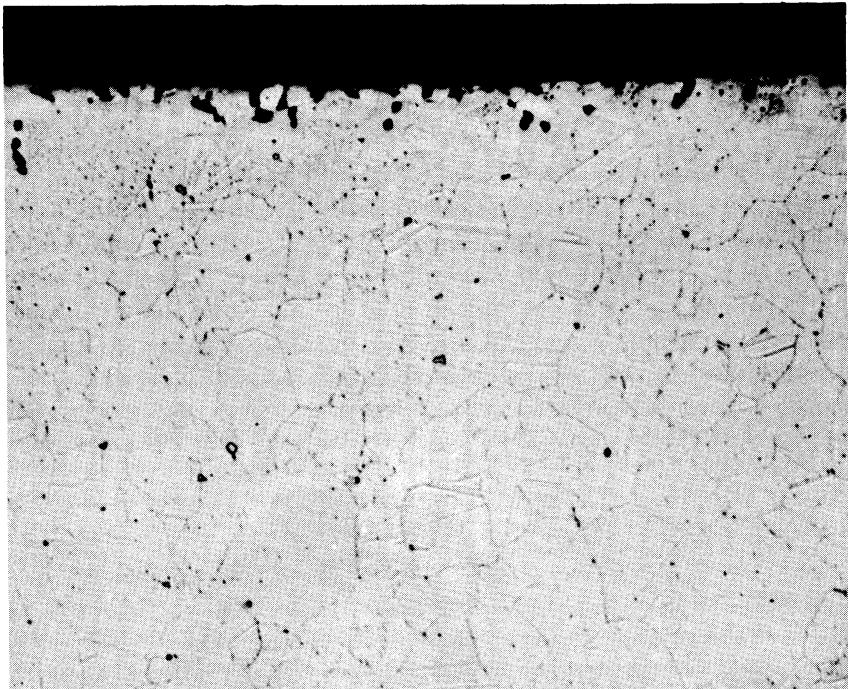  
FIG. 13-5. Hot-leg section of Inconel thermal-convection loop which circulated the fuel mixture $\mathrm{LiF - BeF_2 - UF_4}$ (62-37-1 mole %) for $1000\mathrm{hr}$ at $1250^{\circ}\mathrm{F}$ . $(250\times)$

with higher $\mathbf{U}\mathbf{F}_4$ concentrations, such as those described in Table 13-2, will be avoided.

The extreme effect of temperature is also clearly indicated in Table 13-2. In general, the corrosion rates are three to six times higher at $1500^{\circ}\mathrm{F}$ than at $1250^{\circ}\mathrm{F}$ . This effect is further emphasized in the photomicrographs presented in Figs. 13-3 and 13-4, which offer a comparison of metallographic specimens of Inconel that were exposed to similar salts of the $\mathrm{NaF}-\mathrm{ZrF}_{4}-\mathrm{UF}_{4}$ system at $1500^{\circ}\mathrm{F}$ and at $1250^{\circ}\mathrm{F}$ . A metallographic specimen of Inconel that was exposed at $1250^{\circ}\mathrm{F}$ to the salt proposed for fueling of the molten-salt power reactor is shown in Fig. 13-5.

The effect of sodium on the structural materials of interest has also been extensively studied, since sodium is proposed for use as the intermediate heat-transfer medium. Corrosion problems inherent in the utilization of sodium for heat-transfer purposes do not involve so much the deterioration of the metal surfaces as the tendency for components of the container material to be transported from hot to cold regions and to form plugs of deposited material in the cold region. As in the case of the corrosion by the salt mixture, the mass transfer in sodium-containing systems is extremely dependent on the maximum system operating temperature. The results of

numerous tests indicate that the nickel-base alloys, such as Inconel and INOR-8, are satisfactory containers for sodium at temperatures below $1300^{\circ}\mathrm{F}$ , and that above $1300^{\circ}\mathrm{F}$ the austenitic stainless steels are preferable.

# 13-3. FABRICATION OF INOR-8

13-3.1 Casting. Normal melting procedures, such as induction or electric furnace melting, are suitable for preparing INOR-8. Specialized techniques, such as melting under vacuum or consumable-electrode melting, have also been used without difficulty. Since the major alloying constituents do not have high vapor pressures and are relatively inert, melting losses are negligible, and thus the specified chemical composition can be obtained through the use of standard melting techniques. Preliminary studies indicate that intricately shaped components can be cast from this material.

13-3.2 Hot forging. The temperature range of forgeability of INOR-8 is 1800 to $2250^{\circ}\mathrm{F}$ . This wide range permits operations such as hammer and press forging with a minimum number of reheats between passes and substantial reductions without cracking. The production of hollow shells for the manufacture of tubing has been accomplished by extruding forged and drilled billets at $2150^{\circ}\mathrm{F}$ with glass as a lubricant. Successful extrusions have been made on commercial presses at extrusion ratios of up to 14:1. Forging recoveries of up to $90\%$ of the ingot weight have been reported by one vendor.

13-3.3 Cold-forming. In the fully annealed condition, the ductility of the alloy ranges between 40 and $50\%$ elongation for a 2-in. gage length. Thus, cold-forming operations, such as tube reducing, rolling, and wire drawing, can be accomplished with normal production schedules. The effects of cold-forming on the ultimate tensile strength, yield strength, and elongation are shown in Fig. 13-6.

Forgeability studies have shown that variations in the carbon content have an effect on the cold-forming of the alloy. Slight variations of other components, in general, have no significant effects. The solid solubility of carbon in the alloy is about $0.01\%$ . Carbon present in excess of this amount precipitates as discrete particles of $(\mathrm{Ni}, \mathrm{Mo})_{6} \mathrm{C}$ throughout the matrix; the particles dissolve sparingly even at the high annealing temperature of $2150^{\circ} \mathrm{F}$ . Thus cold-working of the alloy causes these particles to align in the direction of elongation and, if they are present in sufficient quantity, they form continuous stringers of carbides. The lines of weakness caused by the stringers are sufficient to propagate longitudinal fractures in tubular products during fabrication. The upper limit of the carbon content for tubing is about $0.10\%$ , and for other products it appears to be greater than $0.20\%$ . The carbon content of the alloy is controllable to about $0.02\%$ in the range below $0.10\%$ .

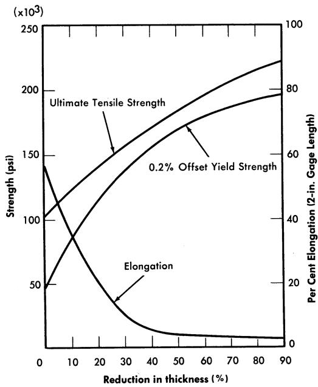  
FIG. 13-6. Work hardening curves for INOR-8 annealed 1 hr at $2150^{\circ}\mathbf{F}$ before reduction.

13-3.4 Welding. The parts of the reactor system are joined by welding, and therefore the integrity of the system is in large measure dependent on the reliability of the welds. During the welding of thick sections, the material will be subjected to a high degree of restraint, and consequently both the base metal and the weld metal must not be susceptible to cracking, embrittlement, or other undesirable features.

Extensive tests of weld specimens have been made. The circular-groove test, which accurately predicted the weldability of conventional materials with known welding characteristics, was found to give reliable results for nickel-base alloys. In the circular-groove test, an inert-gas-shielded tungsten-arc weld pass is made by fusion welding (i.e., the weld metal contains no filler metal) in a circular groove machined into a plate of the base metal. The presence or absence of cracks in the weld metal is then observed. Test samples of two heats of INOR-8 alloys, together with samples of four other alloys for comparison, are shown in Fig. 13-7. As may be seen, the restraint of the weld metal caused complete circumferential cracking in INOR-8 heat 8284, which contained $0.04\%$ B, whereas there are no cracks in INOR-8 heat 30-38, which differed from heat 8284 primarily in the

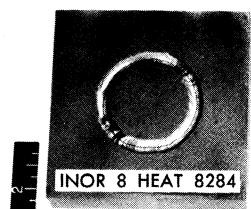

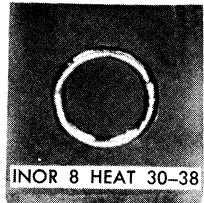

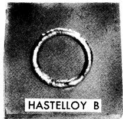

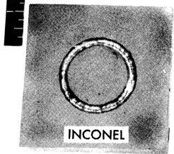

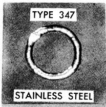

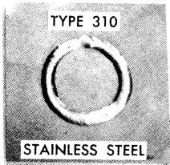  
FIG. 13-7. Circular-groove tests of weld metal cracking.

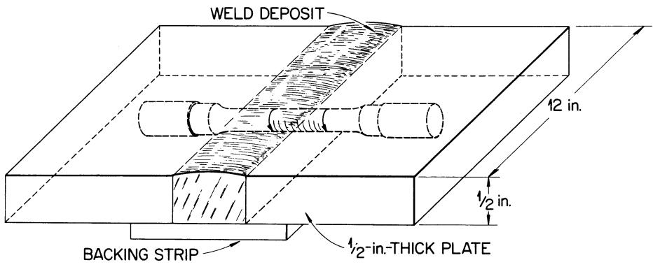  
FIG. 13-8. Weld test plate design showing method of obtaining specimen.

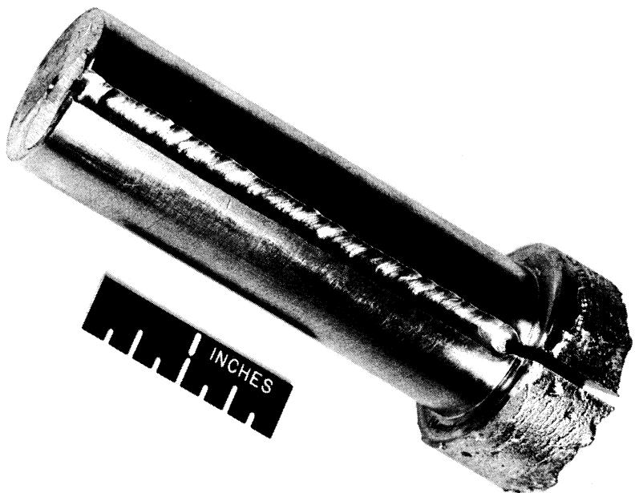  
FIG. 13-9. Weld in slot of vacuum-melted ingot.

absence of boron. Two other INOR-8 heats that did not contain boron similarly did not crack when subjected to the circular-groove test.

In order to further study the effect of boron in INOR-8 heats, several 3-lb vacuum-melted ingots with nominal boron contents of up to $0.10\%$ were prepared, slotted, and welded as shown in Fig. 13-9. All ingots with $0.02\%$ or more boron cracked in this test.

A procedure specification for the welding of INOR-8 tubing is available that is based on the results of these cracking tests and examinations of numerous successful welds. The integrity of a joint, which is a measure of the quality of a weld, is determined through visual, radiographic, and metallographic examinations and mechanical tests at room and service temperatures. It has been established through such examinations and tests that sound joints can be made in INOR-8 tubing that contains less than $0.02\%$ boron.

Weld test plates of the type shown in Fig. 13-8 have also been used for studying the mechanical properties of welded joints. Such test plates were side-bend tested in the apparatus illustrated in Fig. 13-10. The results of the tests, presented in Table 13-3, indicate excellent weld metal ductility. For example, the ductility of heat M-5 material is greater than $40\%$ at temperatures up to and including $1500^{\circ}\mathrm{F}$ .

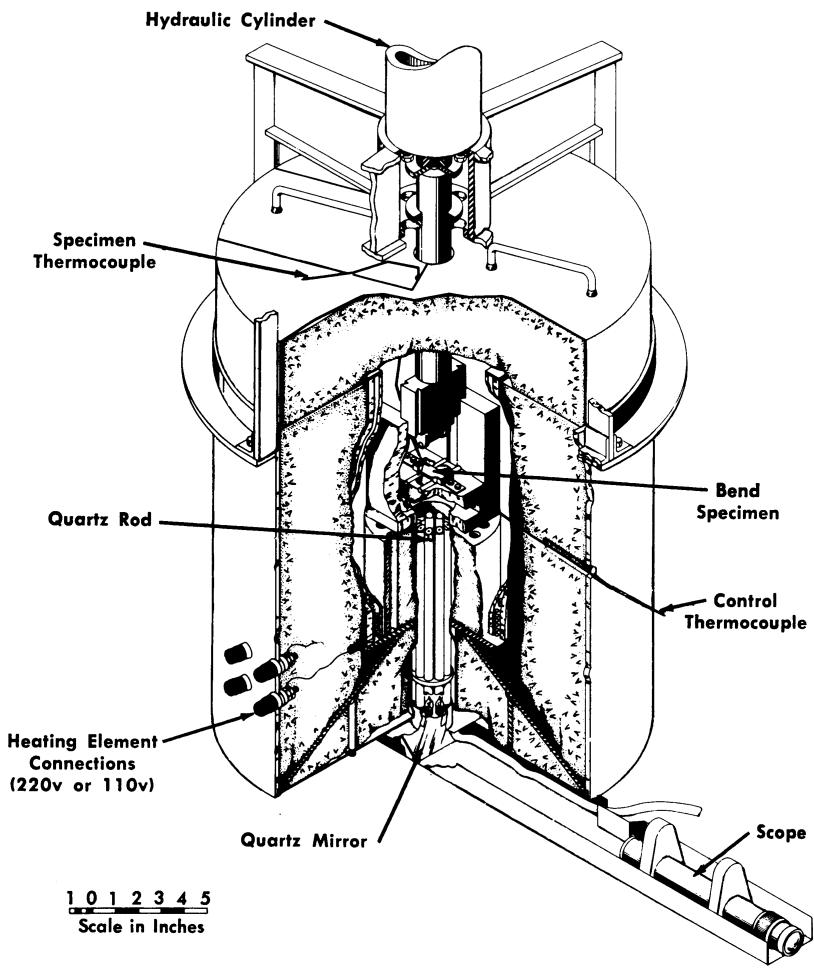  
FIG. 13-10. Apparatus for bend tests at high temperatures.

13-3.5 Brazing. Welded and back-brazed tube-to-tube sheet joints are normally used in the fabrication of heat exchangers for molten salt service. The back-brazing operation serves to remove the notch inherent in conventional tube-to-tube sheet joints, and the braze material minimizes the possibility of leakage through a weld failure that might be created by thermal stresses in service.

The nickel-base brazing alloys listed in Table 13-4 have been shown to be satisfactory in contact with the salt mixture LiF-KF-NaF-UF $_4$ in tests conducted at $1500^{\circ}\mathrm{F}$ for 100 hr. Further, two precious metal-base brazing alloys, $82\%$ Au- $18\%$ Ni and $80\%$ Au- $20\%$ Cu, were unattacked in the LiF-KF-NaF-UF $_4$ salt after 2000 hr at $1200^{\circ}\mathrm{F}$ . These two precious

TABLE 13-3   
RESULTS OF SIDE-BEND TESTS OF AS-WELDED INOR-8 AND INCONEL SAMPLES   

<table><tr><td rowspan="3">Test temperature, °F</td><td colspan="6">Filler metal</td></tr><tr><td colspan="2">INOR-8 (Heat M-5)</td><td colspan="2">INOR-8 (Heat SP-19)</td><td colspan="2">Inconel</td></tr><tr><td>Bend angle,* deg</td><td>Elongation† in 1/4 in., %</td><td>Bend angle, deg</td><td>Elongation in 1/4 in., %</td><td>Bend angle, deg</td><td>Elongation in 1/4 in., %</td></tr><tr><td>Room</td><td>&gt;90</td><td>&gt;40</td><td>&gt;90</td><td>&gt;40</td><td>&gt;90</td><td>&gt;40</td></tr><tr><td>1100</td><td>&gt;90</td><td>&gt;40</td><td>&gt;90</td><td>&gt;40</td><td>&gt;90</td><td>&gt;40</td></tr><tr><td>1200</td><td>&gt;90</td><td>&gt;40</td><td>&gt;90</td><td>&gt;40</td><td>&gt;90</td><td>&gt;40</td></tr><tr><td>1300</td><td>&gt;90</td><td>&gt;40</td><td>30</td><td>15</td><td>&gt;90</td><td>&gt;40</td></tr><tr><td></td><td>&gt;90</td><td>&gt;40</td><td>15</td><td>8</td><td>&gt;90</td><td>&gt;40</td></tr><tr><td>1500</td><td>&gt;90</td><td>&gt;40</td><td>15</td><td>8</td><td>15</td><td>8</td></tr><tr><td></td><td>&gt;90</td><td>&gt;40</td><td></td><td></td><td>15</td><td>8</td></tr></table>

*Bend angle recorded is that at which first crack appeared.  
†Elongation recorded is that at outer fiber at time first crack appeared.

# TABLE 13-4

# NICKEL-BASE BRAZING ALLOYS FOR USE IN HEAT EXCHANGER FABRICATION

<table><tr><td rowspan="2">Components</td><td colspan="3">Brazing alloy content, w/o</td></tr><tr><td>Alloy 52</td><td>Alloy 91</td><td>Alloy 93</td></tr><tr><td>Nickel</td><td>91.2</td><td>91.3</td><td>93.3</td></tr><tr><td>Silicon</td><td>4.5</td><td>4.5</td><td>3.5</td></tr><tr><td>Boron</td><td>2.9</td><td>2.9</td><td>1.9</td></tr><tr><td>Iron and carbon</td><td>Balance</td><td>Balance</td><td>Balance</td></tr></table>

metal alloys were also tested in the LiF-BeF $_2$ -UF $_4$ mixture and again were not attacked.

13-3.6 Nondestructive testing. An ultrasonic inspection technique is available for the detection of flaws in plate, piping, and tubing. The water-immersed pulse-echo ultrasound equipment has been adapted to high-speed use. Eddy-current, dye-penetrant, and radiographic inspection methods are also used as required. The inspected materials have included Inconel, austenitic stainless steel, INOR-8, and the Hastelloy and other nickel-molybdenum-base alloys.

Methods are being developed for the nondestructive testing of weldments during initial construction and after replacement by remote means in a high-intensity radiation field, such as that which will be present if maintenance work is required after operation of a molten-salt reactor. The ultrasonic technique appears to be best suited to semiautomatic and remote operation and of any of the applicable methods, it will probably be the least affected by radiation. Studies have indicated that the difficulties encountered due to the high ultrasonic attenuation of the weld structures in the ultrasonic inspection of Inconel welds and welds of some of the austenitic stainless steels are not present in the inspection of INOR-8 welds. In addition, the troublesome large variations in ultrasonic attenuation common to Inconel and austenitic stainless steel welds are less severe in INOR-8 welds. The mechanical equipment designed for the remote welding operation will be useful for the inspection operation.

In the routine inspection of reactor-grade construction materials, a tube, pipe, plate, or rod is rejected if a void is detected that is larger than $5\%$ of the thickness of the part being inspected. In the inspection of a weld, the integrity of the weld must be better than $95\%$ of that of the base metal.

Typical rejection rates for Inconel and INOR-8 are given below:

<table><tr><td rowspan="2">Item</td><td colspan="2">Rejection rate (%)</td></tr><tr><td>Inconel</td><td>INOR-8</td></tr><tr><td>Tubing</td><td>17</td><td>20</td></tr><tr><td>Pipe</td><td>12</td><td>14</td></tr><tr><td>Plate</td><td>8</td><td>8</td></tr><tr><td>Rod</td><td>5</td><td>5</td></tr><tr><td>Welds</td><td>14</td><td>14</td></tr></table>

The rejection rates for INOR-8 are expected to decline as more experience is gained in fabrication.

# 13-4. MECHANICAL AND THERMAL PROPERTIES OF INOR-8

13-4.1 Elasticity. A typical stress-strain curve for INOR-8 at $1200^{\circ}\mathrm{F}$ is shown in Fig. 13-11. Data from similar curves obtained from tests at room temperature up to $1400^{\circ}\mathrm{F}$ are summarized in Fig. 13-12 to show changes in tensile strength, yield strength, and ductility as a function of temperature. The temperature dependence of the Young's modulus of this material is illustrated in Fig. 13-13.

13-4.2 Plasticity. A series of relaxation tests of INOR-8 at 1200 and $1300^{\circ}\mathrm{F}$ has indicated that creep will be an important design consideration for reactors operating in this temperature range. The rate at which the stress must be relaxed in order to maintain a constant elastic strain at $1300^{\circ}\mathrm{F}$ is shown in Fig. 13-14, and similar data for $1200^{\circ}\mathrm{F}$ are presented in Fig. 13-15. The time lapse before the material becomes plastic is about $1\mathrm{hr}$ at $1300^{\circ}\mathrm{F}$ and about $10\mathrm{hr}$ at $1200^{\circ}\mathrm{F}$ . The time period during which the material behaves elastically becomes much longer at lower temperatures, and below some temperature, as yet undetermined, the metal will continue to behave elastically indefinitely.

It is possible to summarize the creep data by comparing the times to $1.0\%$ total strain, as a function of stress, in the data shown in Fig. 13-16. The reproducibility of creep data for this material is indicated by the separate curves shown in Fig. 13-17. It may be seen that quite good correlation between the creep curves is obtained at the lower stress values. Some scatter in time to rupture occurs at 25,000 psi, a stress which corresponds to the $0.2\%$ offset yield strength at this temperature. Such scatter is to be expected at this high stress level.

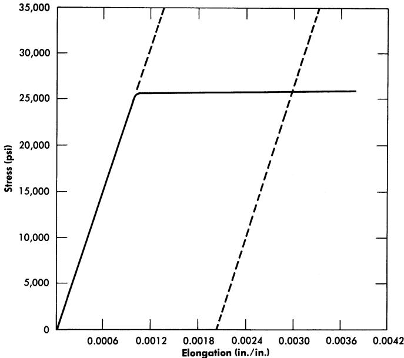  
FIG. 13-11. Stress-strain relationships for INOR-8 at $1200^{\circ}\mathrm{F}$ . Initial slope (represented by dashed line at left) is equivalent to a static modulus of elasticity in tension of 25,200,000 psi. The dashed line at right is the curve for plastic deformation of 0.002 in/in; its intersection with the stress-strain curve indicates a yield strength of 25,800 psi for $0.2\%$ offset. Ultimate tensile strength, 73,895 psi; gage length, 3.25 in.; material used was from heat 3038.

The tensile strengths of several metals are compared with the tensile strength of INOR-8 at $1300^{\circ}\mathrm{F}$ in the following tabulation, and the creep properties of the several alloys at $1.0\%$ strain are compared in Fig. 13-18.

<table><tr><td>Material</td><td>Tensile strength at 1300°F, psi</td></tr><tr><td>18-8 stainless steel</td><td>40,000</td></tr><tr><td>Cr-Mo steel (5% Cr)</td><td>20,000</td></tr><tr><td>Hastelloy B</td><td>70,000</td></tr><tr><td>Hastelloy C</td><td>100,000</td></tr><tr><td>Inconel</td><td>60,000</td></tr><tr><td>INOR-8</td><td>65,000</td></tr></table>

The test results indicate that the elastic and plastic strengths of INOR-8 are near the top of the range of strength properties of the several alloys

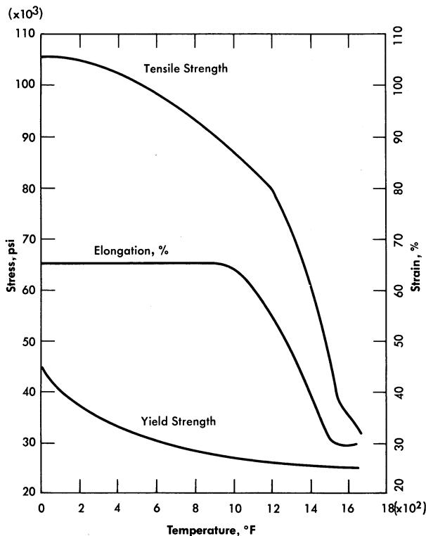  
FIG. 13-12. Tensile properties of INOR-8 as a function of temperature.

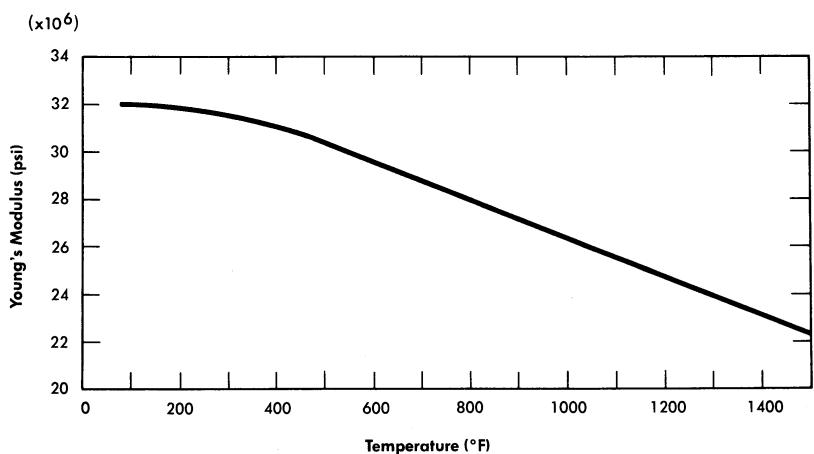  
FIG. 13-13. Young's modulus for INOR-8.

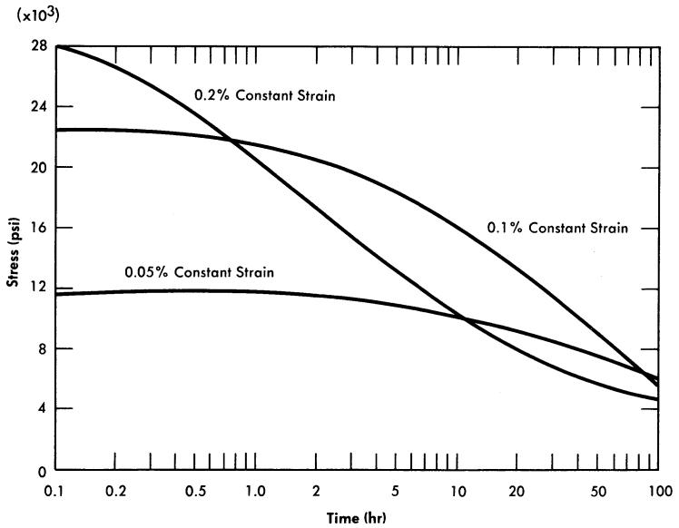  
FIG. 13-14. Relaxation of INOR-8 at $1300^{\circ}\mathrm{F}$ at various constant strains.

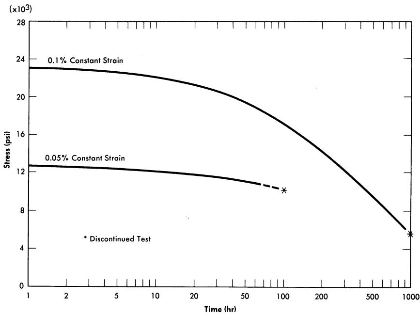  
FIG. 13-15. Relaxation of INOR-8 at $1200^{\circ}\mathrm{F}$ at various constant strains.

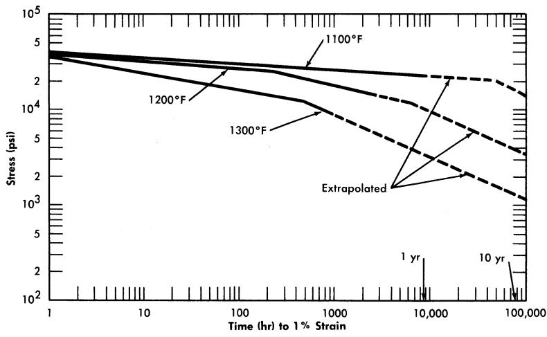  
FIG. 13-16. Creep data for INOR-8.

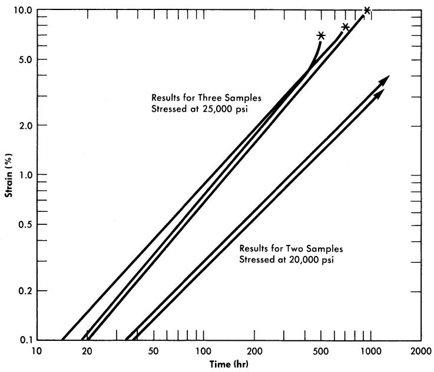  
Fig. 13-17. Creep-rupture data for INOR-8.

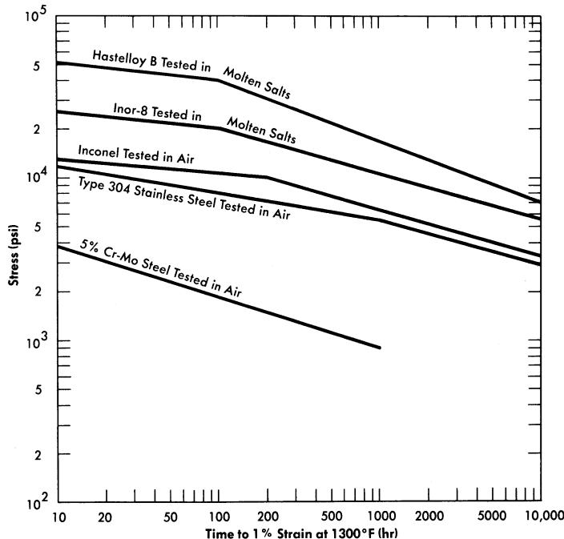  
FIG. 13-18. Comparison of the creep properties of several alloys.

commonly considered for high-temperature use. Since INOR-8 was designed to avoid the defects inherent in these other metals, it is apparent that the undesirable aspects have been eliminated without any serious loss in strength.

13-4.3 Aging characteristics. Numerous secondary phases that are capable of embrittling a nickel-base alloy can exist in the Ni-Mo-Cr-Fe-C system, but no brittle phase exists if the alloy contains less than $20\%$ Mo, $8\%$ Cr, and $5\%$ Fe. INOR-8, which contains only 15 to $18\%$ Mo, consists principally of two phases: the nickel-rich solid solution and a complex carbide with the approximate composition $(\mathrm{Ni}, \mathrm{Mo})_6\mathrm{C}$ . Studies of the effect of the carbides on creep strength have shown that the highest strength exists when a continuous network of carbides surrounds the grains. Tests have shown that carbide precipitation does not cause significant embrittlement at temperatures up to $1480^{\circ}\mathrm{F}$ . Aging for 500 hr at various temperatures, as shown in Fig. 13-19, improves the tensile properties of the alloy. The tensile properties at room temperature, as shown in Table 13-5, are virtually unaffected by aging.

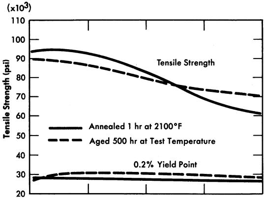

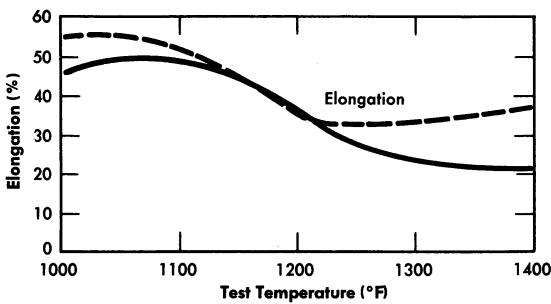  
FIG. 13-19. Effect of aging on high-temperature tensile properties of INOR-8.

TABLE 13-5   
RESULTS OF ROOM-TEMPERATURE EMBRITTLEMENT TESTS OF INOR-8   

<table><tr><td>Heat treatment</td><td>Ultimate tensile strength, psi</td><td>Yield point at 0.2% offset, psi</td><td>Elongation, %</td></tr><tr><td>Annealed*</td><td>114,400</td><td>44,700</td><td>50</td></tr><tr><td>Annealed and aged 500 hr at 1000°F</td><td>112,000</td><td>42,500</td><td>53</td></tr><tr><td>Annealed and aged 500 hr at 1100°F</td><td>112,600</td><td>44,000</td><td>51</td></tr><tr><td>Annealed and aged 500 hr at 1200°F</td><td>112,300</td><td>44,700</td><td>51</td></tr><tr><td>Annealed and aged 500 hr at 1300°F</td><td>112,000</td><td>44,500</td><td>49</td></tr><tr><td>Annealed and aged 500 hr at 1400°F</td><td>112,400</td><td>43,900</td><td>50</td></tr></table>

*0.045-in. sheet, annealed 1 hr at $2100^{\circ}\mathrm{F}$ and tested at a strain rate of 0.05 in/min.

13-4.4 Thermal conductivity and coefficient of linear thermal expansion. Values of the thermal conductivity and coefficient of linear thermal expansion are given in Tables 13-6 and 13-7.

TABLE 13-6   
COMPARISON OF THERMAL CONDUCTIVITY VALUES FOR INOR-8 AND INCONEL AT SEVERAL TEMPERATURES   

<table><tr><td rowspan="2">Temperature, ℉</td><td colspan="2">Thermal conductivity, Btu/(ft2)(sec)(°F/ft)</td></tr><tr><td>INOR-8</td><td>Inconel</td></tr><tr><td>212</td><td>5.56</td><td>9.44</td></tr><tr><td>392</td><td>6.77</td><td>9.92</td></tr><tr><td>572</td><td>11.16</td><td>10.40</td></tr><tr><td>752</td><td>12.10</td><td>10.89</td></tr><tr><td>933</td><td>14.27</td><td>11.61</td></tr><tr><td>1112</td><td>16.21</td><td>12.10</td></tr><tr><td>1292</td><td>18.15</td><td>12.58</td></tr></table>

TABLE 13-7   
COEFFICIENT OF LINEAR EXPANSION OF INOR-8 FOR SEVERAL TEMPERATURE RANGES   

<table><tr><td>Temperature range, °F</td><td>Coefficient of linear expansion, in/(in)(°F)</td></tr><tr><td></td><td>×10-6</td></tr><tr><td>70-400</td><td>5.76</td></tr><tr><td>70-600</td><td>6.23</td></tr><tr><td>70-800</td><td>6.58</td></tr><tr><td>70-1000</td><td>6.89</td></tr><tr><td>70-1200</td><td>7.34</td></tr><tr><td>70-1400</td><td>7.61</td></tr><tr><td>70-1600</td><td>8.10</td></tr><tr><td>70-1800</td><td>8.32</td></tr></table>

# 13-5. OXIDATION RESISTANCE

The oxidation resistance of nickel-molybdenum alloys depends on the service temperature, the temperature cycle, the molybdenum content, and the chromium content. The oxidation rate of the binary nickel-molybdenum alloy passes through a maximum for the alloy containing $15\%$ Mo, and the scale formed by the oxidation is $\mathrm{NiMoO_4}$ and NiO. Upon thermal cycling from above $1400^{\circ}\mathrm{F}$ to below $660^{\circ}\mathrm{F}$ , the $\mathrm{NiMoO_4}$ undergoes a phase transformation which causes the protective scale on the oxidized metal to spall. Subsequent temperature cycles then result in an accelerated oxidation rate. Similarly, the oxidation rate of nickel-molybdenum alloys containing chromium passes through a maximum for alloys containing between 2 and $6\%$ Cr. Alloys containing more than $6\%$ Cr are insensitive to thermal cycling and the molybdenum content because the oxide scale is predominantly stable $\mathrm{Cr_2O_3}$ . An abrupt decrease, by a factor of about 40, in the oxidation rate at $1800^{\circ}\mathrm{F}$ is observed when the chromium content is increased from 5.9 to $6.2\%$ .

The oxidation resistance of INOR-8 is excellent, and continuous operation at temperatures up to $1800^{\circ}\mathrm{F}$ is feasible. Intermittent use at temperatures as high as $1900^{\circ}\mathrm{F}$ could be tolerated. For temperatures up to $1200^{\circ}\mathrm{F}$ , the oxidation rate is not measurable; it is essentially nonexistent after $1000\mathrm{hr}$ of exposure in static air. It is estimated that oxidation of 0.001 to 0.002 in. would occur in $100,000\mathrm{hr}$ of operation at $1200^{\circ}\mathrm{F}$ . The effect of temperature on the oxidation rate of the alloy is shown in Table 13-8.

TABLE 13-8 OXIDATION RATE OF INOR-8 AT VARIOUS TEMPERATURES\*  

<table><tr><td rowspan="2">Test temperature, °F</td><td colspan="2">Weight gain, mg/cm2</td><td rowspan="2">Shape of rate curve</td></tr><tr><td>In 100 hr</td><td>In 1000 hr</td></tr><tr><td>1200</td><td>0.00</td><td>0.00</td><td>Cubic or logarithmic</td></tr><tr><td>1600</td><td>0.25</td><td>0.67†</td><td>Cubic</td></tr><tr><td>1800</td><td>0.48</td><td>1.5†</td><td>Parabolic</td></tr><tr><td>1900</td><td>0.52</td><td>2.0†</td><td>Parabolic</td></tr><tr><td>2000</td><td>2.70</td><td>28.2†</td><td>Linear</td></tr></table>

*3.7 mg/cm² = 0.001 in. of oxidation.   
†Extrapolated from data obtained after 170 hr at temperature.

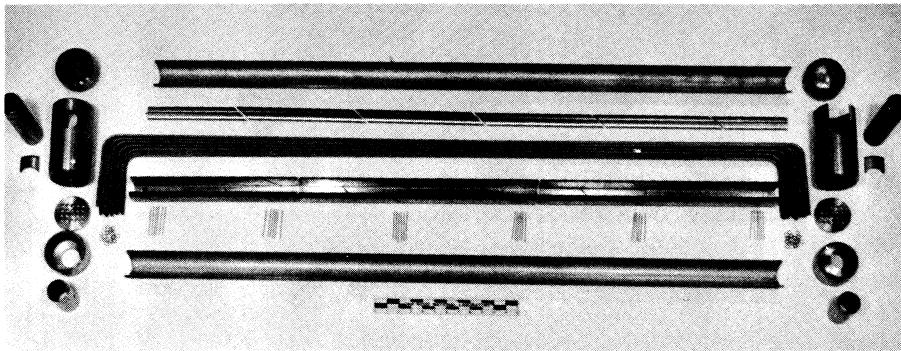  
FIG. 13-20. Components of a duplex heat exchanger fabricated of Inconel clad with type-316 stainless steel.

# 13-6. FABRICATION OF A DUPLEX TUBING HEAT EXCHANGER

The compatibility of INOR-8 and sodium is adequate in the temperature range presently contemplated for molten-salt reactor heat-exchanger operation. At higher temperatures, mass transfer could become a problem, and therefore the fabrication of duplex tubing has been investigated. Satisfactory duplex tubing has been made that consists of Inconel clad with type-316 stainless steel, and components for a duplex heat exchanger have been fabricated, as shown in Fig. 13-20.

The fabrication of duplex tubing is accomplished by coextrusion of billets of the two alloys. The high temperature and pressure used result in the formation of a metallurgical bond between the two alloys. In subsequent reduction steps the bonded composite behaves as one material. The ratios of the alloys that comprise the composite are controllable to within $3\%$ . The uniformity and bond integrity obtained in this process are illustrated in Fig. 13-21.

The problem of welding INOR-8-stainless steel duplex tubing is being studied. Experiments have indicated that proper selection of alloy ratios and weld design will assure welds that will be satisfactory in high-temperature service.

To determine whether interdiffusion of the alloys would result in a continuous brittle layer at the interface, tests were made in the temperature range 1300 to $1800^{\circ}\mathrm{F}$ . As expected, a new phase appeared at the interface between INOR-8 and the stainless steel which increased in depth along the grain boundaries with increases in the temperature. The interface of a duplex sheet held at $1300^{\circ}\mathrm{F}$ for $500\mathrm{hr}$ is shown in Fig. 13-22. Tests of this sheet showed an ultimate tensile strength of 94,400 psi, a $0.2\%$ offset yield strength of 36,800 psi, and an elongation of $51\%$ . Creep tests of the

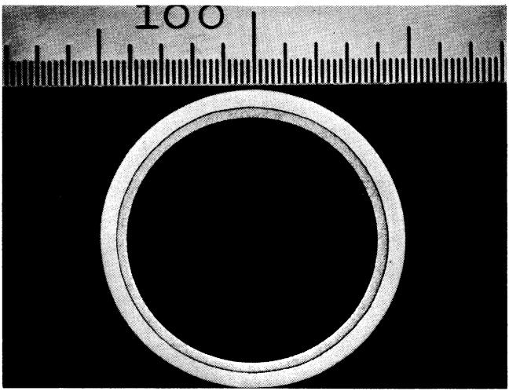

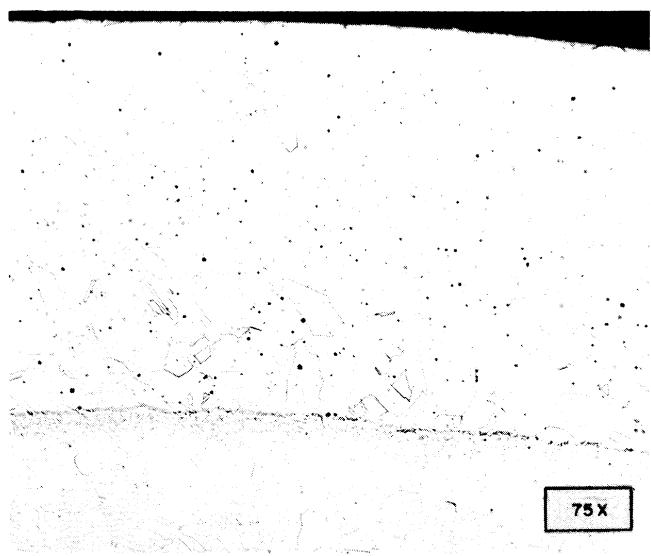  
FIG. 13-21. Duplex tubing consisting of Inconel over type-316 stainless steel. Etchant: glyceria regia.

sheet showed that the diffusion resulted in an increase in the creep resistance with no significant loss of ductility.

Thus no major difficulties would be expected in the construction of an INOR-8-stainless steel heat exchanger. The construction experience thus far has involved only the 20-tube heat exchanger shown in Fig. 13-20.

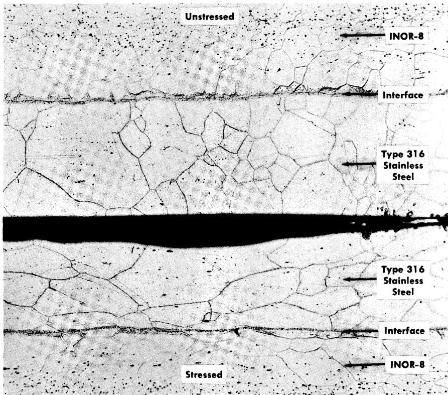  
FIG. 13-22. Unstressed and stressed specimens of INOR-8 clad with type-316 stainless steel after $500\mathrm{hr}$ at $1300^{\circ}\mathrm{F}$ . Etchant: electrolytic $\mathrm{H}_2\mathrm{SO}_4$ ( $2\%$ solution). $(100\times)$

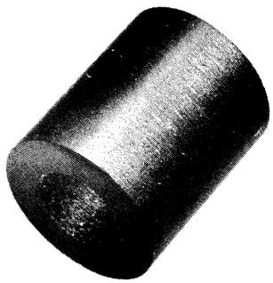  
A

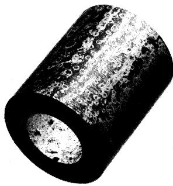  
B   
FIG. 13-23. CCN graphite (A) before and (B) after exposure for 1000 hr to NaF $\mathrm{ZrF_4 - UF_4}$ (50-46-4 mole $\%$ ) at $1300^{\circ}\mathrm{F}$ as an insert in the hot leg of a thermal-convection loop. Nominal bulk density of graphite specimen: $1.9~\mathrm{g / cm^3}$ .

# 13-7. AVAILABILITY OF INOR-8

Two production heats of INOR-8 of 10,000 lb each and numerous smaller heats of up to 5000 lb have been melted and fabricated into various shapes by normal production methods. Evaluation of these commercial products has shown them to have properties similar to those of the laboratory heats prepared for material selection. Purchase orders are filled by the vendors in one to six months, and the costs range from $2.00 per pound in ingot form to$ 10.00 per pound for cold-drawn welding wire. The costs of tubing, plate, and bar products depend to a large extent on the specifications of the finished products.

# 13-8. COMPATIBILITY OF GRAPHITE WITH MOLTEN SALTS AND NICKEL-BASE ALLOYS

If graphite could be used as a moderator in direct contact with a molten salt, it would make possible a molten-salt reactor with a breeding ratio in excess of one (see Chapter 14). Problems that might restrict the usefulness of this approach are possible reactions of graphite and the fuel salt, penetration of the pores of the graphite by the fuel, and carburization of the nickel-alloy container.

Many molten fluoride salts have been melted and handled in graphite crucibles, and in these short-term uses the graphite is inert to the salt. Tests at temperatures up to $1800^{\circ}\mathrm{F}$ with the ternary salt mixture $\mathrm{NaF - ZrF_4 - UF_4}$ gave no indication of the decomposition of the fluoride and no gas evolution so long as the graphite was free from a silicon impurity.

Longer-time tests of graphite immersed in fluoride salts have shown greater indications of penetration of the graphite by salts, and it must be assumed that the salt will eventually penetrate the available pores in the graphite. The "impermeable" grades of graphite available experimentally show greatly reduced penetration, and a sample of high-density, bonded, natural graphite (Degussa) showed very little penetration. Although quantitative figures are not available, it is likely that the extent of penetration of "impermeable" graphite grades can be tolerated.

Although these penetration tests showed no visible effects of attack of the graphite by the salt, analyses of the salt for carbon showed that at $1500^{\circ}\mathrm{F}$ more than $1\%$ carbon may be picked up in $100\mathrm{hr}$ . The carbon pickup appears to be sensitive to temperature, however, inasmuch as only $0.025\%$ carbon was found in the salt after a 1000-hr exposure at $1300^{\circ}\mathrm{F}$ .

In some instances coatings have been found on the graphite after exposure to the salt in Inconel containers, as illustrated in Fig. 13-23. A cross section through the coating is shown in Fig. 13-24. The coating was

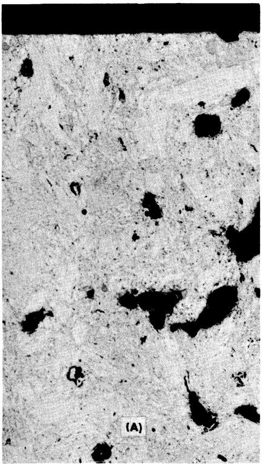

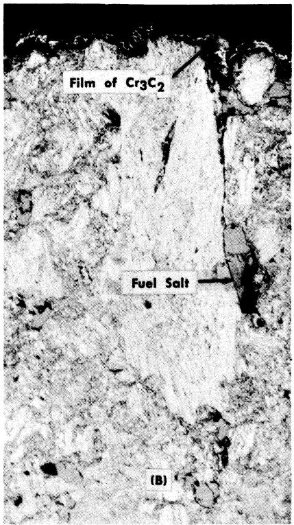  
FIG. 13-24. Cross sections of samples shown in Fig. 13-23. (A) Before exposure; (B) after exposure. Note the thin film of $\mathrm{Cr}_3\mathrm{C}_2$ on the surface in (B). The black areas in (A) are pores. In (B) the pores are filled with salt. $(100\times)$

found to be nearly pure chromium carbide, $\mathrm{Cr_3C_2}$ . The source of the chromium was the Inconel container.

In the tests run thus far, no positive indication has been found of carburization of the nickel-alloy containers exposed to molten salts and graphite at the temperatures at present contemplated for power reactors $(< 1300^{\circ}\mathrm{F})$ . The carburization effect seems to be quite temperature sensitive, however, since tests at $1500^{\circ}\mathrm{F}$ showed carburization of Hastelloy B to a depth of 0.003 in. in 500 hr of exposure to $\mathrm{NaF - ZrF_4 - UF_4}$ containing graphite. A test of Inconel and graphite in a thermal-convection loop in which the maximum bulk temperature of the fluoride salt was $1500^{\circ}\mathrm{F}$ gave a maximum carburization depth of 0.05 in. in 500 hr. In this case, however, the temperature of the metal-salt interface where the carburization occurred was considerably higher than $1500^{\circ}\mathrm{F}$ , probably about $1650^{\circ}\mathrm{F}$ .

A mixture of sodium and graphite is known to be a good carburizing agent, and tests with it have confirmed the large effect of temperature on the carburization of both Inconel and INOR-8, as shown in Table 13-9.

TABLE 13-9   
EFFECT OF TEMPERATURE ON CARBURIZATION OF INCONEL AND INOR-8 IN 100 HR  

<table><tr><td>Alloy</td><td>Temperature, °F</td><td>Depth of carburization, in.</td></tr><tr><td rowspan="2">Inconel</td><td>1500</td><td>0.009</td></tr><tr><td>1200</td><td>0</td></tr><tr><td rowspan="2">INOR-8</td><td>1500</td><td>0.010</td></tr><tr><td>1200</td><td>0</td></tr></table>

Many additional tests are being performed with a variety of molten fluoride salts to measure both penetration of the graphite and carburization of INOR-8. The effects of carburization on the mechanical properties will be determined.

# 13-9. MATERIALS FOR VALVE SEATS AND BEARING SURFACES

Nearly all metals, alloys, and hard-facing materials tend to undergo solid-phase bonding when held together under pressure in molten fluoride salts at temperatures above $1000^{\circ}\mathrm{F}$ . Such bonding tends to make the startup of hydrodynamic bearings difficult or impossible, and it reduces the chance of opening a valve that has been closed for any length of time. Screening tests in a search for nonbonding materials that will stand up under the molten salt environment have indicated that the most promising materials are TiC-Ni and WC-Co types of cermets with nickel or cobalt contents of less than 35 w/o, tungsten, and molybdenum. The tests, in general, have been of less than 1000-hr duration, so the useful lives of these materials have not yet been determined.

# 13-10. SUMMARY OF MATERIAL PROBLEMS

Although much experimental work remains to be done before the construction of a complete power reactor system can begin, it is apparent that considerable progress has been achieved in solving the material problems of the reactor core. A strong, stable, and corrosion-resistant alloy with good welding and forming characteristics is available. Production techniques have been developed, and the alloy has been produced in commercial quantities by several alloy vendors. Finally, it appears that even at the peak operating temperature, no serious effect on the alloy occurs when the molten salt it contains is in direct contact with graphite.

# CHAPTER 14

# NUCLEAR ASPECTS OF MOLTEN-SALT REACTORS*

The ability of certain molten salts to dissolve uranium and thorium salts in quantities of reactor interest made possible the consideration of fluid-fueled reactors with thorium in the fuel, without the danger of nuclear accidents as a result of the settling of a slurry. This additional degree of freedom has been exploited in the study of molten-salt reactors.

Mixtures of the fluorides of alkali metals and zirconium or beryllium, as discussed in Chapter 12, possess the most desirable combination of low neutron absorption, high solubility of uranium and thorium compounds, chemical inertness at high temperatures, and thermal and radiation stability. The following comparison of the capture cross sections of the alkali metals reveals that $\mathrm{Li^{7}}$ containing $0.01\%$ $\mathrm{Li^{6}}$ has a cross section at 0.0795 ev and $1150^{\circ}\mathrm{F}$ that is a factor of 4 lower than that of sodium, which also has a relatively low cross section:

<table><tr><td>Element</td><td>Cross section, barns</td></tr><tr><td>Li7 (containing 0.01% Li6)</td><td>0.073</td></tr><tr><td>Sodium</td><td>0.290</td></tr><tr><td>Potassium</td><td>1.13</td></tr><tr><td>Rubidium</td><td>0.401</td></tr><tr><td>Cesium</td><td>29</td></tr></table>

The capture cross section of beryllium is also satisfactorily low at all neutron energies, and therefore mixtures of LiF and $\mathrm{BeF}_2$ , which have satisfactory melting points, viscosities, and solubilities for $\mathrm{UF_4}$ and $\mathrm{ThF_4}$ , were selected for investigation in the reactor physics study.

Mixtures of NaF, $\mathrm{ZrF_4}$ , and $\mathrm{UF_4}$ were studied previously, and such a fuel was successfully used in the Aircraft Reactor Experiment (see Chapters 12 and 16). Inconel was shown to be reasonably resistant to corrosion by this mixture at $1500^{\circ}\mathrm{F}$ , and there is reason to expect that Inconel equipment would have a life of at least several years at $1200^{\circ}\mathrm{F}$ . As a fuel for a central-station power reactor, however, the $\mathrm{NaF - ZrF_4}$ system has several serious disadvantages. The sodium capture cross section is less favorable than that of Li7. More important, recent data [1] indicate that the capture cross section of zirconium is quite high in the epithermal and intermediate neutron energy ranges. In comparison with the $\mathrm{LiF - BeF_2}$ system, the $\mathrm{NaF - ZrF_4}$ system has inferior heat-transfer characteristics.

Finally, the INOR alloys (see Chapter 13) show promise of being as resistant to the beryllium salts as to the zirconium salts, and therefore there is no compelling reason for selecting the NaF-ZrF $_4$ system.

Reactor calculations were performed by means of the Univac* program Ocusol [2], a modification of the Eyewash program [3], and the Oracle† program Sorghum. Ocusol is a 31-group, multiregion, spherically symmetric, age-diffusion code. The group-averaged cross sections for the various elements of interest that were used were based on the latest available data [4]. Where data were lacking, reasonable interpolations based on resonance theory were made. The estimated cross sections were made to agree with measured resonance integrals where available. Saturation and Doppler broadening of the resonances in thorium as a function of concentration were estimated. Inelastic scattering in thorium and fluorine was taken into account crudely by adjusting the value of $\xi \sigma_{t}$ ; however, the Ocusol code does not provide for group skipping or anisotropy of scattering.

Sorghum is a 31-group, two-region, zero-dimensional, burnout code. The group-diffusion equations were integrated over the core to remove the spatial dependency. The spectrum was computed, in terms of a space-averaged group flux, from group scattering and leakage parameters taken from an Ocusol calculation. A critical calculation requires about $1\mathrm{min}$ on the Oracle; changes in concentration of 14 elements during a specified time can then be computed in about 1 sec. The major assumption involved is that the group scattering and leakage probabilities do not change appreciably with changes in core composition as burnup progresses. This assumption has been verified to a satisfactory degree of approximation.

The molten salts may be used as homogeneous moderators or simply as fuel carriers in heterogeneous reactors. Although, as discussed below, graphite-moderated heterogeneous reactors have certain potential advantages, their technical feasibility depends upon the compatibility of fuel, graphite, and metal, which has not as yet been established. For this reason, the homogeneous reactors, although inferior in nuclear performance, have been given greatest attention.

A preliminary study indicated that if the integrity of the core vessel could be guaranteed, the nuclear economy of two-region reactors would probably be superior to that of bare and reflected one-region reactors. The two-region reactors were, accordingly, studied in detail. Although entrance and exit conditions dictate other than a spherical shape, it was necessary, for the calculations, to use a model comprising the following concentric

spherical regions: (1) the core, (2) an INOR-8 core vessel 1/3 in. thick, (3) a blanket approximately 2 ft thick, and (4) an INOR-8 reactor vessel 2/3 in. thick. The diameter of the core and the concentration of thorium in the core were selected as independent variables. The primary dependent variables were the critical concentration of the fuel $(\mathrm{U}^{235}, \mathrm{U}^{233}$ , or $\mathrm{Pu}^{239})$ and the distribution of the neutron absorptions among the various atomic species in the reactor. From these, the critical mass, critical inventory, regeneration ratio, burnup rate, etc. can be readily calculated, as described in the following section.

# 14-1. HOMOGENEOUS REACTORS FUELED WITH $\mathbf{U}^{235}$

While the isotope $\mathbf{U}^{233}$ would be a superior fuel in molten fluoride-salt reactors (see Section 14-2), it is unfortunately not available in quantity. Any realistic appraisal of the immediate capabilities of these reactors must be based on the use of $\mathbf{U}^{235}$ .

The study of homogeneous reactors was divided into two phases: (1) the mapping of the nuclear characteristics of the initial (i.e., "clean") states as a function of core diameter and thorium concentration, and (2) the analysis of the subsequent performance of selected initial states with various processing schemes and rates. The detailed results of these studies are given in the following paragraphs. Briefly, it was found that regeneration ratios of up to 0.65 can be obtained with moderate investment in $\mathbf{U}^{235}$ (less than $1000\mathrm{kg}$ ) and that, if the fission products are removed (Article 14-1.2) at a rate such that the equilibrium inventory is equal to one year's production, the regeneration ratio can be maintained above 0.5 for at least 20 years.

14-1.1 Initial states. A complete parametric study of molten fluoride-salt reactors having diameters in the range of 4 to 10 ft and thorium concentrations in the fuel ranging from 0 to 1 mole $\%$ ThF $_4$ was performed. In these reactors, the basic fuel salt (fuel salt No. 1) was a mixture of 31 mole $\%$ BeF $_2$ and 69 mole $\%$ LiF, which has a density of about $2.0~\mathrm{g / cc}$ at $1150^{\circ}\mathrm{F}$ . The core vessel was composed of INOR-8. The blanket fluid (blanket salt No. 1) was a mixture of 25 mole $\%$ ThF $_4$ and 75 mole $\%$ LiF, which has a density of about $4.3~\mathrm{g / cc}$ at $1150^{\circ}\mathrm{F}$ . In order to shorten the calculations in this series, the reactor vessel was neglected, since the resultant error was small. These reactors contained no fission products or nonfissionable isotopes of uranium other than $\mathbf{U}^{238}$ .

A summary of the results is presented in Table 14-1, in which the neutron balance is presented in terms of neutrons absorbed in a given element per neutron absorbed in $\mathbf{U}^{235}$ (both by fission and the $\mathfrak{n}-\gamma$ reaction). The sum of the absorptions is therefore equal to $\eta$ , the number of neutrons produced by fission per neutron absorbed in fuel. Further, the sum of the

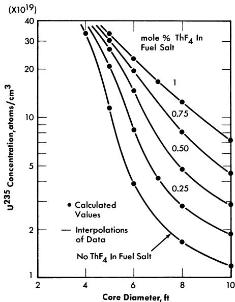  
FIG. 14-1. Initial critical concentration of $\mathbf{U}^{235}$ in two-region, homogeneous, molten fluoride-salt reactors.

absorptions in $\mathbf{U}^{238}$ and thorium in the fuel, and in thorium in the blanket salt gives directly the regeneration ratio. The losses to other elements are penalties imposed on the regeneration ratio by these poisons; i.e., if the core vessel could be constructed of some material with a negligible cross section, the regeneration ratio could be increased by the amount listed for capture in the core vessel.

The inventories in these reactors depend in part on the volume of the fuel in the pipes, pumps, and heat exchangers in the external portion of the fuel circuit. The inventories listed in Table 14-1 are for systems having a volume of $339\mathrm{ft}^3$ external to the core, which corresponds approximately to a power level of $600\mathrm{Mw}$ of heat. In these calculations it was assumed that the heat was transferred to an intermediate coolant composed of the fluorides of Li, Be, and Na before being transferred to sodium metal. In more recent designs (see Chapter 17), this intermediate salt loop has been replaced by a sodium loop, and the external volumes are somewhat less because of the improved equipment design and layout.

Critical concentration, mass, inventory, and regeneration ratio. The data in Table 14-1 are more easily comprehended in the form of graphs, such as Fig. 14-1, which presents the critical concentration in these reactors as a function of core diameter and thorium concentration in the fuel salt. The data points represent calculated values, and the lines are reasonable interpolations. The maximum concentration calculated, about $35 \times 10^{19}$

Fuel salt No. 1: 31 mole $\%$ BeF $_2$ + 69 mole $\%$ LiF + UF $_4$ + ThF $_4$ .

Blanket salt No. 1: 25 mole % ThF₄ + 75 mole % LiF.

Total power: 600 Mw (heat). External fuel volume: 339 ft3.

TABLE 14-1   
INITIAL-STATE NUCLEAR CHARACTERISTICS OF TWO-REGION, HOMOGENEOUS, MOLTEN FLUORIDE-SALT REACTORS FUELED WITH U235   

<table><tr><td>Case number</td><td>1</td><td>2</td><td>3</td><td>4</td><td>5</td><td>6</td><td>7</td></tr><tr><td>Core diameter, ft</td><td>4</td><td>5</td><td>5</td><td>5</td><td>5</td><td>5</td><td>6</td></tr><tr><td>ThF4in fuel salt, mole %</td><td>0</td><td>0</td><td>0.25</td><td>0.5</td><td>0.75</td><td>1</td><td>0</td></tr><tr><td>U235in fuel salt, mole %</td><td>0.952</td><td>0.318</td><td>0.561</td><td>0.721</td><td>0.845</td><td>0.938</td><td>0.107</td></tr><tr><td>U235atom density*</td><td>33.8</td><td>11.3</td><td>20.1</td><td>25.6</td><td>30.0</td><td>33.3</td><td>3.80</td></tr><tr><td>Critical mass, kg of U235</td><td>124</td><td>81.0</td><td>144</td><td>183</td><td>215</td><td>239</td><td>47.0</td></tr><tr><td>Critical inventory, kg of U235</td><td>1380</td><td>501</td><td>891</td><td>1130</td><td>1330</td><td>1480</td><td>188</td></tr><tr><td>Neutron absorption ratios†</td><td></td><td></td><td></td><td></td><td></td><td></td><td></td></tr><tr><td>U235(fissions)</td><td>0.7023</td><td>0.7185</td><td>0.7004</td><td>0.6996</td><td>0.7015</td><td>0.7041</td><td>0.7771</td></tr><tr><td>U235(n-γ)</td><td>0.2977</td><td>0.2815</td><td>0.2996</td><td>0.3004</td><td>0.2985</td><td>0.2959</td><td>0.2229</td></tr><tr><td>Be-Li-F in fuel salt</td><td>0.0551</td><td>0.0871</td><td>0.0657</td><td>0.0604</td><td>0.0581</td><td>0.0568</td><td>0.1981</td></tr><tr><td>Core vessel</td><td>0.0560</td><td>0.0848</td><td>0.0577</td><td>0.0485</td><td>0.0436</td><td>0.0402</td><td>0.1353</td></tr><tr><td>Li-F in blanket salt</td><td>0.0128</td><td>0.0138</td><td>0.0108</td><td>0.0098</td><td>0.0093</td><td>0.0090</td><td>0.0164</td></tr><tr><td>Leakage</td><td>0.0229</td><td>0.0156</td><td>0.0147</td><td>0.0143</td><td>0.0141</td><td>0.0140</td><td>0.0137</td></tr><tr><td>U238in fuel salt</td><td>0.0430</td><td>0.0426</td><td>0.0463</td><td>0.0451</td><td>0.0431</td><td>0.0412</td><td>0.0245</td></tr><tr><td>Th in fuel salt</td><td></td><td></td><td>0.0832</td><td>0.1289</td><td>0.1614</td><td>0.1873</td><td></td></tr><tr><td>Th in blanket salt</td><td>0.5448</td><td>0.5309</td><td>0.4516</td><td>0.4211</td><td>0.4031</td><td>0.3905</td><td>0.5312</td></tr><tr><td>Neutron yield, η</td><td>1.73</td><td>1.77</td><td>1.73</td><td>1.73</td><td>1.73</td><td>1.74</td><td>1.92</td></tr><tr><td>Median fission energy, ev</td><td>270</td><td>15.7</td><td>105</td><td>158</td><td>270</td><td>425</td><td>0.18</td></tr><tr><td>Thermal fissions, %</td><td>0.052</td><td>6.2</td><td>0.87</td><td>0.22</td><td>0.87</td><td>0.040</td><td>35</td></tr><tr><td>n-γ capture-to-fission ratio, α</td><td>0.42</td><td>0.39</td><td>0.43</td><td>0.43</td><td>0.43</td><td>0.4203</td><td>0.28</td></tr><tr><td>Regeneration ratio</td><td>0.59</td><td>0.57</td><td>0.58</td><td>0.60</td><td>0.61</td><td>0.62</td><td>0.56</td></tr></table>

continued

TABLE 14-1 (continued)   

<table><tr><td>Case number</td><td>8</td><td>9</td><td>10</td><td>11</td><td>12</td><td>13</td><td>14</td></tr><tr><td>Core diameter, ft</td><td>6</td><td>6</td><td>6</td><td>6</td><td>7</td><td>8</td><td>8</td></tr><tr><td>ThF4in fuel salt, mole %</td><td>0.25</td><td>0.5</td><td>0.75</td><td>1</td><td>0.25</td><td>0</td><td>0.25</td></tr><tr><td>U235in fuel salt, mole %</td><td>0.229</td><td>0.408</td><td>0.552</td><td>0.662</td><td>0.114</td><td>0.047</td><td>0.078</td></tr><tr><td>U235atom density*</td><td>8.13</td><td>14.5</td><td>19.6</td><td>23.5</td><td>4.05</td><td>1.66</td><td>2.77</td></tr><tr><td>Critical mass, kg of U235</td><td>101</td><td>179</td><td>243</td><td>291</td><td>79.6</td><td>48.7</td><td>81.3</td></tr><tr><td>Critical inventory, kg of U235</td><td>404</td><td>716</td><td>972</td><td>1160</td><td>230</td><td>110</td><td>184</td></tr><tr><td>Neutron absorption ratios†</td><td></td><td></td><td></td><td></td><td></td><td></td><td></td></tr><tr><td>U235(fissions)</td><td>0.7343</td><td>0.7082</td><td>0.7000</td><td>0.7004</td><td>0.7748</td><td>0.8007</td><td>0.7930</td></tr><tr><td>U235(n-γ)</td><td>0.2657</td><td>0.2918</td><td>0.3000</td><td>0.2996</td><td>0.2252</td><td>0.1993</td><td>0.2070</td></tr><tr><td>Be-Li-F in fuel salt</td><td>0.1082</td><td>0.0770</td><td>0.0669</td><td>0.0631</td><td>0.1880</td><td>0.4130</td><td>0.2616</td></tr><tr><td>Core vessel</td><td>0.0795</td><td>0.0542</td><td>0.0435</td><td>0.0388</td><td>0.0951</td><td>0.1491</td><td>0.1032</td></tr><tr><td>Li-F in blanket salt</td><td>0.0116</td><td>0.0091</td><td>0.0081</td><td>0.0074</td><td>0.0123</td><td>0.0143</td><td>0.0112</td></tr><tr><td>Leakage</td><td>0.0129</td><td>0.0122</td><td>0.0119</td><td>0.0116</td><td>0.0068</td><td>0.0084</td><td>0.0082</td></tr><tr><td>U238in fuel salt</td><td>0.0375</td><td>0.0477</td><td>0.0467</td><td>0.0452</td><td>0.0254</td><td>0.0143</td><td>0.0196</td></tr><tr><td>Th in fuel salt</td><td>0.1321</td><td>0.1841</td><td>0.2142</td><td>0.2438</td><td>0.1761</td><td></td><td>0.2045</td></tr><tr><td>Th in blanket salt</td><td>0.4318</td><td>0.3683</td><td>0.3378</td><td>0.3202</td><td>0.4098</td><td>0.4073</td><td>0.3503</td></tr><tr><td>Neutron yield, η</td><td>1.82</td><td>1.75</td><td>1.73</td><td>1.73</td><td>1.91</td><td>2.00</td><td>1.96</td></tr><tr><td>Median fission energy, ev</td><td>5.6</td><td>38</td><td>100</td><td>120</td><td>0.16</td><td>Thermal</td><td>0.10</td></tr><tr><td>Thermal fissions, %</td><td>13</td><td>3</td><td>0.56</td><td>0.48</td><td>33</td><td>59</td><td>45</td></tr><tr><td>n-γ capture-to-fission ratio, α</td><td>0.36</td><td>0.41</td><td>0.42</td><td>0.42</td><td>0.29</td><td>0.25</td><td>0.26</td></tr><tr><td>Regeneration ratio</td><td>0.61</td><td>0.60</td><td>0.60</td><td>0.61</td><td>0.61</td><td>0.42</td><td>0.57</td></tr></table>

continued   
†Neutrons absorbed per neutron absorbed in U $^{235}$ .   
\*Atoms $(\times 10^{-19}) / \mathrm{cc}$

TABLE 14-1 (continued)   

<table><tr><td>Case number</td><td>15</td><td>16</td><td>17</td><td>18</td><td>19</td><td>20</td><td>21</td><td>22</td></tr><tr><td>Core diameter, ft</td><td>8</td><td>8</td><td>8</td><td>10</td><td>10</td><td>10</td><td>10</td><td>10</td></tr><tr><td>ThF4in fuel salt, mole %</td><td>0.5</td><td>0.75</td><td>1</td><td>0</td><td>0.25</td><td>0.5</td><td>0.75</td><td>1</td></tr><tr><td>U235in fuel salt, mole %</td><td>0.132</td><td>0.226</td><td>0.349</td><td>0.033</td><td>0.052</td><td>0.081</td><td>0.127</td><td>0.205</td></tr><tr><td>U235atom density*</td><td>4.67</td><td>8.03</td><td>12.4</td><td>1.175</td><td>1.86</td><td>2.88</td><td>4.50</td><td>7.28</td></tr><tr><td>Critical mass, kg of U235</td><td>137</td><td>236</td><td>364</td><td>67.3</td><td>107</td><td>165</td><td>258</td><td>417</td></tr><tr><td>Critical inventory, kg of U235</td><td>310</td><td>535</td><td>824</td><td>111</td><td>176</td><td>272</td><td>425</td><td>687</td></tr><tr><td colspan="9">Neutron absorption ratios†</td></tr><tr><td>U235(fissions)</td><td>0.7671</td><td>0.7362</td><td>0.7146</td><td>0.8229</td><td>0.7428</td><td>0.7902</td><td>0.7693</td><td>0.7428</td></tr><tr><td>U235(n-γ)</td><td>0.2329</td><td>0.2638</td><td>0.2854</td><td>0.1771</td><td>0.2572</td><td>0.2098</td><td>0.2307</td><td>0.2572</td></tr><tr><td>Be-Li-F in fuel salt</td><td>0.1682</td><td>0.1107</td><td>0.0846</td><td>0.5713</td><td>0.3726</td><td>0.2486</td><td>0.1735</td><td>0.1206</td></tr><tr><td>Core vessel</td><td>0.0722</td><td>0.0500</td><td>0.0373</td><td>0.1291</td><td>0.0915</td><td>0.0669</td><td>0.0497</td><td>0.0363</td></tr><tr><td>Li-F in blanket salt</td><td>0.0089</td><td>0.0071</td><td>0.0057</td><td>0.0114</td><td>0.0089</td><td>0.0073</td><td>0.0060</td><td>0.0049</td></tr><tr><td>Leakage</td><td>0.0080</td><td>0.0077</td><td>0.0074</td><td>0.0061</td><td>0.0060</td><td>0.0059</td><td>0.0057</td><td>0.0055</td></tr><tr><td>U238in fuel salt</td><td>0.0272</td><td>0.0368</td><td>0.0428</td><td>0.0120</td><td>0.0153</td><td>0.0209</td><td>0.0266</td><td>0.0343</td></tr><tr><td>Th in fuel salt</td><td>0.3048</td><td>0.3397</td><td>0.3515</td><td></td><td>0.2409</td><td>0.3691</td><td>0.4324</td><td>0.4506</td></tr><tr><td>Th in blanket salt</td><td>0.3056</td><td>0.2664</td><td>0.2356</td><td>0.3031</td><td>0.2617</td><td>0.2332</td><td>0.2063</td><td>0.1825</td></tr><tr><td>Neutron yield, η</td><td>1.89</td><td>1.82</td><td>1.76</td><td>2.03</td><td>2.00</td><td>1.95</td><td>1.90</td><td>1.83</td></tr><tr><td>Median fission energy, ev</td><td>0.17</td><td>5.3</td><td>27</td><td>Thermal</td><td>Thermal</td><td>0.100</td><td>0.156</td><td>1.36</td></tr><tr><td>Thermal fissions, %</td><td>29</td><td>13</td><td>5</td><td>66</td><td>56</td><td>43</td><td>30</td><td>16</td></tr><tr><td>n-γ capture-to-fission ratio, α</td><td>0.30</td><td>0.36</td><td>0.40</td><td>0.21</td><td>0.24</td><td>0.26</td><td>0.30</td><td>0.35</td></tr><tr><td>Regeneration ratio</td><td>0.64</td><td>0.64</td><td>0.63</td><td>0.32</td><td>0.52</td><td>0.62</td><td>0.67</td><td>0.67</td></tr></table>

\*Atoms $(\times 10^{-19}) / \mathrm{cc}$   
†Neutrons absorbed per neutron absorbed in U235.

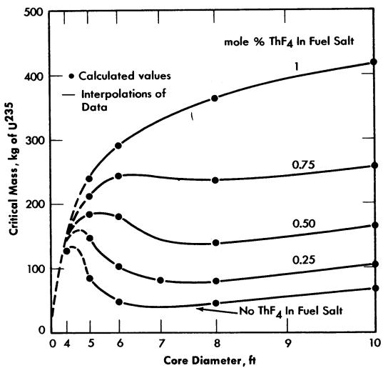  
FIG. 14-2. Initial critical masses of $\mathbf{U}^{235}$ in two-region, homogeneous, molten fluoride-salt reactors.

atoms of $\mathrm{U}^{235}$ per cubic centimeter of fuel salt, or about 1 mole $\%$ $\mathrm{UF}_4$ , is an order of magnitude smaller than the maximum permissible concentration (about 10 mole $\%$ ).

The corresponding critical masses are graphed in Fig. 14-2. As may be seen, the critical mass is a rather complex function of the diameter and the thorium concentration. The calculated points are shown here also, and the solid lines represent, it is felt, reliable interpolations. The dashed lines were drawn where insufficient numbers of points were calculated to define the curves precisely; however, they are thought to be qualitatively correct. Since reactors having diameters less than 6 ft are not economically attractive, only one case with a 4-ft-diameter core was computed.

The critical masses obtained in this study ranged from 40 to $400\mathrm{kg}$ of $\mathbf{U}^{235}$ . However, the critical inventory in the entire fuel circuit is of more interest to the reactor designer than is the critical mass. The critical inventories corresponding to an external fuel volume of $339\mathrm{ft}^3$ are therefore shown in Fig. 14-3. Inventories for other external volumes may be computed from the relation

$$
I = M \left(1 + \frac {6 V _ {e}}{D ^ {3}}\right),
$$

where $D$ is the core diameter in feet, $M$ is the critical mass taken from Fig. 14-2, $V_{e}$ is the volume of the external system in cubic feet, and $I$ is the inventory in kilograms of $\mathbf{U}^{235}$ . The inventories plotted in Fig. 14-3

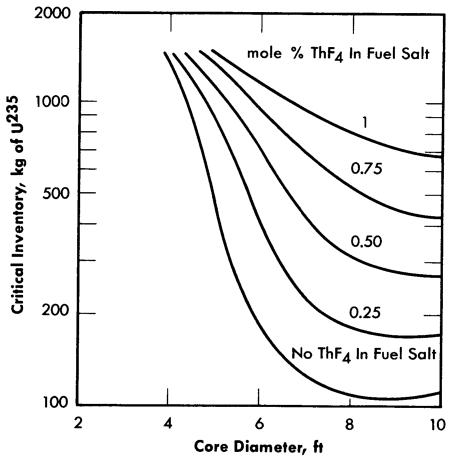  
FIG. 14-3. Initial critical inventories of $\mathbf{U}^{235}$ in two-region, homogeneous, molten fluoride-salt reactors. External fuel volume, $339\mathrm{ft}^3$

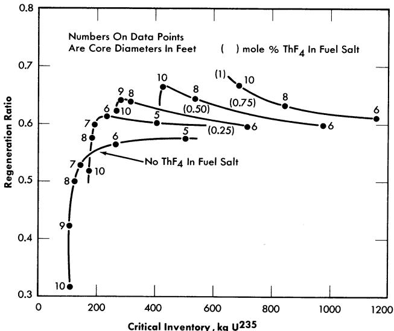  
FIG. 14-4. Initial fuel regeneration in two-region, homogeneous, molten fluoridesalt reactors fueled with $\mathbf{U}^{235}$ . Total power, $600\mathrm{Mw}$ (heat); external fuel volume, $339\mathrm{ft}^3$ ; core and blanket salts No. 1.

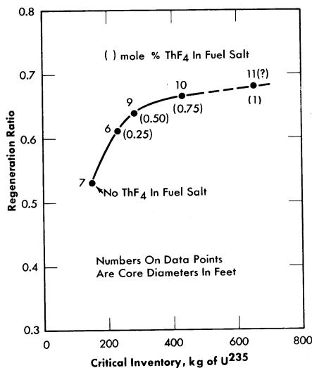  
FIG. 14-5. Maximum initial regeneration ratios in two-region, homogeneous, molten fluoride-salt reactors fueled with $\mathbf{U}^{235}$ . Total power, $600\mathrm{Mw}$ (heat); external fuel volume, $339\mathrm{ft}^3$ .

range from slightly above $100\mathrm{kg}$ in an 8-ft-diameter core with no thorium present to $1500\mathrm{kg}$ in a 5-ft-diameter core with 1 mole $\%$ $\mathrm{ThF_4}$ present.

The optimum combination of core diameter and thorium concentration is, qualitatively, that which minimizes the sum of inventory charges (including charges on $\mathbf{Li}^{7}$ , Be, and Th) and fuel reprocessing costs. The fuel costs are directly related to the regeneration ratio, and this varies in a complex manner with inventory of $\mathbf{U}^{235}$ and thorium concentration, as shown in Fig. 14-4. It may be seen that at a given thorium concentration, the regeneration ratio (with one exception) passes through a maximum as the core diameter is varied between 5 and 10 ft. These maxima increase with increasing thorium concentration, but the inventory values at which they occur also increase.

Plotting the maximum regeneration ratio versus critical inventory generates the curve shown in Fig. 14-5. It may be seen that a small investment in $\mathrm{U}^{235}$ (200 kg) will give a regeneration ratio of 0.58, that 400 kg will give a ratio of 0.66, and that further increases in fuel inventory have little effect.

The effects of changes in the compositions of the fuel and blanket salts are indicated in the following description of the results of a series of calculations for which salts with more favorable melting points and viscosities were assumed. The $\mathrm{BeF}_2$ content was raised to 37 mole $\%$ in the fuel salt

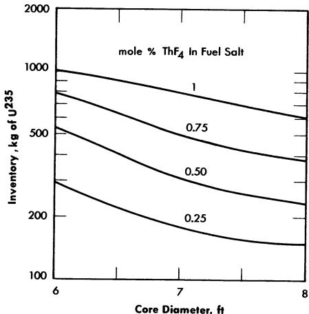  
FIG. 14-6. Initial critical inventories of $\mathbf{U}^{235}$ in two-region, homogeneous, molten fluoride-salt reactors. Total power, $600\mathrm{Mw}$ (heat); external fuel volume, $339\mathrm{ft}^3$ ; core and blanket salts No. 2.

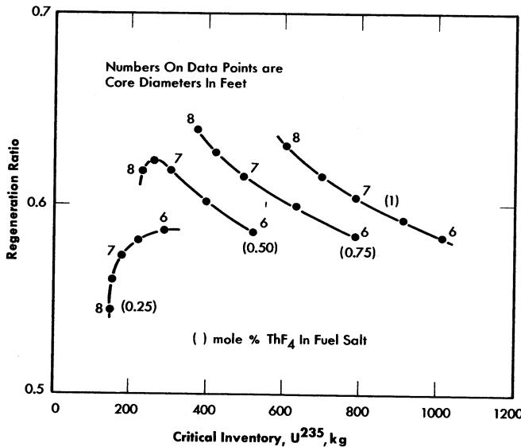  
FIG. 14-7. Initial fuel regeneration in two-region, homogeneous, molten fluoride-salt reactors fueled with $\mathbf{U}^{235}$ . Total power, $600\mathrm{Mw}$ (heat); external fuel volume, $339\mathrm{ft}^3$ ; core and blanket salts No. 2.

(fuel salt No. 2), and the blanket composition (blanket salt No. 2) was fixed at 13 mole $\%$ ThF $_4$ , 16 mole $\%$ BeF $_2$ , and 71 mole $\%$ LiF. Blanket salt No. 2 is a somewhat better reflector than No. 1, and fuel salt No. 2 a somewhat better moderator. As a result, at a given core diameter and thorium concentration in the fuel salt, both the critical concentration and the regeneration ratio are somewhat lower for the No. 2 salts.

Reservations concerning the feasibility of constructing and guaranteeing the integrity of core vessels in large sizes (10 ft and over), together with preliminary consideration of inventory charges for large systems, led to the conclusion that a feasible reactor would probably have a core diameter lying in the range between 6 and 8 ft. Accordingly, a parametric study in this range with the No. 2 fuel and blanket salts was performed. In this study the presence of an outer reactor vessel consisting of $2/3$ in. of INOR-8 was taken into account. The results are presented in Table 14-2 and Figs. 14-6 and 14-7. In general, the nuclear performance is somewhat better with the No. 2 salt than with the No. 1 salt.

Neutron balances and miscellaneous details. The distributions of the neutron captures are given in Tables 14-1 and 14-2, where the relative hardness of the neutron spectrum is indicated by the median fission energies and the percentages of thermal fissions. It may be seen that losses to Li, Be, and F in the fuel salt and to the core vessel are substantial, especially in the more thermal reactors (e.g., Case No. 18). However, in the thermal reactors, losses by radiative capture in $\mathrm{U}^{235}$ are relatively low. Increasing the hardness decreases losses to salt and core vessel sharply (Case No. 5), but increases the loss to the $n - \gamma$ reaction. It is these opposing trends which account for the complicated relation between regeneration ratio and critical inventory exhibited in Figs. 14-4 and 14-7. The numbers given for capture in the Li and F in the blanket show that these elements are well shielded by the thorium in the blanket, and the leakage values show that leakage from the reactor is less than 0.01 neutron per neutron absorbed in $\mathrm{U}^{235}$ in reactors over 6 ft in diameter. The blanket contributes substantially to the regeneration of fuel, accounting for not less than one-third of the total even in the 10-ft-diameter core containing 1 mole $\%$ $\mathrm{ThF_4}$ .

Effect of substitution of sodium for $Li^{7}$ . In the event that $Li^{7}$ should prove not to be available in quantity, it would be possible to operate the reactor with mixtures of sodium and beryllium fluorides as the basic fuel salt. The penalty imposed by sodium in terms of critical inventory and regeneration ratio is shown in Fig. 14-8, where typical Na-Be systems are compared with the corresponding Li-Be systems. With no thorium in the core, the use of sodium increases the critical inventory by a factor of 1.5 (to about $300\mathrm{kg}$ ) and lowers the regeneration ratio by a factor of 2. The regeneration penalty is less severe, percentagewise, with 1 mole % $\mathrm{ThF_4}$ in the fuel salt; in an 8-ft-diameter core, the inventory rises from $800\mathrm{kg}$ to $1100\mathrm{kg}$

TABLE 14-2   
INITIAL-STATE NUCLEAR CHARACTERISTICS OF TWO-REGION, HOMOGENEOUS.   
MOLTEN FLUORIDE-SALT REACTORS FUELED WITH U²³⁵ Fuel salt No. 2: 37 mole % BeF₂ + 63 mole % LiF + UF₄ + ThF₄. Blanket salt No. 2: 13 mole % ThF₄ + 16 mole % BeF₂ + 71 mole % LiF. Total power: 600 Mw (heat). External fuel volume: 339 ft³.   

<table><tr><td>Case number</td><td>23</td><td>24</td><td>25</td><td>26</td><td>27</td><td>28</td></tr><tr><td>Core diameter, ft</td><td>6</td><td>6</td><td>6</td><td>6</td><td>7</td><td>7</td></tr><tr><td>ThF4in fuel salt, mole %</td><td>0.25</td><td>0.5</td><td>0.75</td><td>1</td><td>0.25</td><td>0.5</td></tr><tr><td>U235in fuel salt, mole %</td><td>0.169</td><td>0.310</td><td>0.423</td><td>0.580</td><td>0.084</td><td>0.155</td></tr><tr><td>U235atom density*</td><td>5.87</td><td>10.91</td><td>15.95</td><td>20.49</td><td>3.13</td><td>5.38</td></tr><tr><td>Critical mass, kg of U235</td><td>72.7</td><td>135</td><td>198</td><td>254</td><td>61.5</td><td>106</td></tr><tr><td>Critical inventory, kg of U235</td><td>291</td><td>540</td><td>790</td><td>1010</td><td>178</td><td>306</td></tr><tr><td>Neutron absorption ratios†</td><td></td><td></td><td></td><td></td><td></td><td></td></tr><tr><td>U235(fissions)</td><td>0.7516</td><td>0.7174</td><td>0.7044</td><td>0.6958</td><td>0.7888</td><td>0.7572</td></tr><tr><td>U235(n-γ)</td><td>0.2484</td><td>0.2826</td><td>0.2956</td><td>0.3042</td><td>0.2112</td><td>0.2428</td></tr><tr><td>Be-Li-F in fuel salt</td><td>0.1307</td><td>0.0900</td><td>0.0763</td><td>0.0692</td><td>0.2147</td><td>0.1397</td></tr><tr><td>Core vessel</td><td>0.1098</td><td>0.0726</td><td>0.0575</td><td>0.0473</td><td>0.1328</td><td>0.0905</td></tr><tr><td>Li-F in blanket salt</td><td>0.0214</td><td>0.0159</td><td>0.0132</td><td>0.0117</td><td>0.0215</td><td>0.0167</td></tr><tr><td>Outer vessel</td><td>0.0024</td><td>0.0021</td><td>0.0021</td><td>0.0019</td><td>0.0019</td><td>0.0018</td></tr><tr><td>Leakage</td><td>0.0070</td><td>0.0065</td><td>0.0064</td><td>0.0061</td><td>0.0052</td><td>0.0050</td></tr><tr><td>U238in fuel salt</td><td>0.0325</td><td>0.0426</td><td>0.0452</td><td>0.0477</td><td>0.0214</td><td>0.0307</td></tr><tr><td>Th in fuel salt</td><td>0.1360</td><td>0.1902</td><td>0.2212</td><td>0.2387</td><td>0.1739</td><td>0.2565</td></tr><tr><td>Th in blanket salt</td><td>0.4165</td><td>0.3521</td><td>0.3178</td><td>0.2962</td><td>0.3770</td><td>0.3294</td></tr><tr><td>Neutron yield, η</td><td>1.86</td><td>1.77</td><td>1.74</td><td>1.72</td><td>1.95</td><td>1.87</td></tr><tr><td>Median fission energy, ev</td><td>0.480</td><td>10.47</td><td>58.10</td><td>76.1</td><td>0.1223</td><td>0.415</td></tr><tr><td>Thermal fissions, %</td><td>21</td><td>7</td><td>2.8</td><td>0.84</td><td>43</td><td>24</td></tr><tr><td>n-γ capture-to-fission ratio, α</td><td>0.33</td><td>0.39</td><td>0.42</td><td>0.44</td><td>0.37</td><td>0.32</td></tr><tr><td>Regeneration ratio</td><td>0.59</td><td>0.58</td><td>0.58</td><td>0.58</td><td>0.57</td><td>0.62</td></tr><tr><td>Case number</td><td>29</td><td>30</td><td>31</td><td>32</td><td>33</td><td>34</td></tr><tr><td>Core diameter, ft</td><td>7</td><td>7</td><td>8</td><td>8</td><td>8</td><td>8</td></tr><tr><td>ThF4in fuel salt, mole %</td><td>0.75</td><td>1</td><td>0.25</td><td>0.5</td><td>0.75</td><td>1</td></tr><tr><td>U235in fuel salt, mole %</td><td>0.254</td><td>0.366</td><td>0.064</td><td>0.099</td><td>0.163</td><td>0.254</td></tr><tr><td>U235atom density*</td><td>8.70</td><td>13.79</td><td>2.24</td><td>3.51</td><td>5.62</td><td>9.09</td></tr><tr><td>Critical mass, kg of U235</td><td>171</td><td>271</td><td>65.7</td><td>103</td><td>165</td><td>267</td></tr><tr><td>Critical inventory, kg of U235</td><td>494</td><td>783</td><td>149</td><td>233</td><td>374</td><td>604</td></tr><tr><td>Neutron absorption ratios†</td><td></td><td></td><td></td><td></td><td></td><td></td></tr><tr><td>U235(fissions)</td><td>0.7282</td><td>0.7094</td><td>0.8014</td><td>0.7814</td><td>0.7536</td><td>0.7288</td></tr><tr><td>U235(n-γ)</td><td>0.2718</td><td>0.2906</td><td>0.1986</td><td>0.2186</td><td>0.2464</td><td>0.2712</td></tr><tr><td>Be-Li-F in fuel salt</td><td>0.1010</td><td>0.0824</td><td>0.2769</td><td>0.1945</td><td>0.1354</td><td>0.1016</td></tr><tr><td>Core vessel</td><td>0.0644</td><td>0.0497</td><td>0.1308</td><td>0.0967</td><td>0.0696</td><td>0.0518</td></tr><tr><td>Li-F in blanket salt</td><td>0.0131</td><td>0.0108</td><td>0.0198</td><td>0.0162</td><td>0.0130</td><td>0.0105</td></tr><tr><td>Outer vessel</td><td>0.0016</td><td>0.0015</td><td>0.0017</td><td>0.0016</td><td>0.0014</td><td>0.0013</td></tr><tr><td>Leakage</td><td>0.0048</td><td>0.0045</td><td>0.0045</td><td>0.0043</td><td>0.0042</td><td>0.0040</td></tr><tr><td>U238in fuel salt</td><td>0.0392</td><td>0.0447</td><td>0.0177</td><td>0.0233</td><td>0.0315</td><td>0.0392</td></tr><tr><td>Th in fuel salt</td><td>0.2880</td><td>0.3022</td><td>0.1978</td><td>0.3043</td><td>0.3501</td><td>0.3637</td></tr><tr><td>Th in blanket salt</td><td>0.2866</td><td>0.2566</td><td>0.3240</td><td>0.2892</td><td>0.2561</td><td>0.2280</td></tr><tr><td>Neutron yield, η</td><td>1.80</td><td>1.75</td><td>1.97</td><td>1.93</td><td>1.86</td><td>1.80</td></tr><tr><td>Median fission energy, ev</td><td>7.61</td><td>25.65</td><td>51% thermal</td><td>0.136</td><td>0.518</td><td>7.75</td></tr><tr><td>Thermal fissions, %</td><td>11</td><td>4.3</td><td>51</td><td>38</td><td>23</td><td>11</td></tr><tr><td>n-γ capture-to-fission ratio, α</td><td>0.37</td><td>0.41</td><td>0.25</td><td>0.28</td><td>0.33</td><td>0.37</td></tr><tr><td>Regeneration ratio</td><td>0.61</td><td>0.60</td><td>0.54</td><td>0.62</td><td>0.64</td><td>0.63</td></tr></table>

†Neutrons absorbed per neutron absorbed in U $^{235}$ .   
$^{*}$ Atoms $(\times 10^{-19}) / \mathrm{cc}$ .

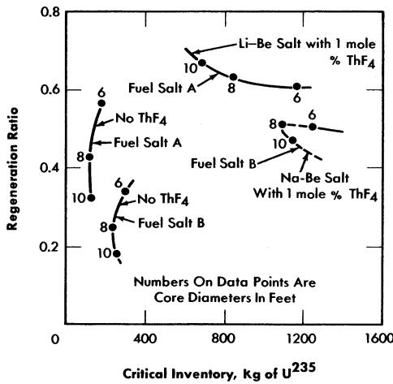  
FIG. 14-8. Comparison of regeneration ratio and critical inventory in two-region, homogeneous, molten fluoride-salt reactors fueled with $\mathbf{U}^{235}$ . Fuel salt $A$ : 37 mole $\% \mathrm{BeF}_2$ plus 63 mole $\% \mathrm{Li}^7\mathrm{F}$ . Fuel salt $B$ : 46 mole $\% \mathrm{BeF}_2$ plus 54 mole $\% \mathrm{NaF}$ .

and the regeneration ratio falls from 0.62 to 0.50. Details of the neutron balances are given in Table 14-3.

Reactivity coefficients. By means of a series of calculations in which the thermal base, the core radius, and the density of the fuel salt are varied independently, the components of the temperature coefficient of reactivity of a reactor can be estimated as illustrated below for a core 8 ft in diameter and a thorium concentration of $0.75\mathrm{mole}\%$ in the fuel salt at $1150^{\circ}\mathrm{F}$ . From the expression

$$
k = f (T, \rho , R),
$$

where $k$ is the multiplication constant, $T$ is the mean temperature in the core, $\rho$ is the mean density of the fuel salt in the core, and $R$ is the core radius, it follows that

$$
\frac {1}{k} \frac {d k}{d T} = \frac {1}{k} \left(\frac {\partial k}{\partial T}\right) _ {\rho , R} + \frac {1}{k} \left(\frac {\partial k}{\partial R}\right) _ {\rho , T} \frac {d R}{d T} + \frac {1}{k} \left(\frac {\partial k}{\partial \rho}\right) _ {R, T} \frac {d \rho}{d T}, \tag {14-1}
$$

where the term $(1 / k)(\partial k / \partial T)_{\rho ,R}$ represents the fractional change in $k$ due to a change in the thermal base for slowing down of neutrons, the term $(1 / k)(\partial k / \partial \rho)_{R,T}$ represents the change due to expulsion of fuel from the core by thermal expansion of the fluid, and the term $(1 / k)(\partial k / \partial R)_{\rho ,T}$ represents the change due to an increase in core volume and fuel holding

TABLE 14-3   
INITIAL NUCLEAR CHARACTERISTICS OF TWO-REGION, HOMOGENEOUS, MOLTEN SODIUM-BERYLLIUM FLUORIDE REACTORS FUELED WITH U235   
Fuel salt: 53 mole % NaF + 46 mole % BeF $_2$ + 1 mole % (ThF $_4$ + UF $_4$ ). Blanket salt: 58 mole % NaF + 35 mole % BeF $_2$ + 7 mole % ThF $_4$ . Total power: 600 Mw (heat). External fuel volume: 339 ft $^3$ .   

<table><tr><td>Case number</td><td>35</td><td>36</td><td>37</td><td>38</td><td>39</td><td>40</td></tr><tr><td>Core diameter, ft</td><td>6</td><td>6</td><td>8</td><td>8</td><td>10</td><td>10</td></tr><tr><td>ThF4in fuel salt, mole %</td><td>0</td><td>1</td><td>0</td><td>1</td><td>0</td><td>1</td></tr><tr><td>U235in fuel salt, mole %</td><td>0.174</td><td>0.7014</td><td>0.091</td><td>0.465</td><td>0.070</td><td>0.282</td></tr><tr><td>U235atom density*</td><td>6.17</td><td>24.9</td><td>3.24</td><td>16.5</td><td>2.47</td><td>124.0</td></tr><tr><td>Critical mass, kg of U235</td><td>76.4</td><td>308</td><td>95.1</td><td>484</td><td>142</td><td>710</td></tr><tr><td>Critical inventory, kg of U235</td><td>306</td><td>1230</td><td>215</td><td>1100</td><td>234</td><td>1170</td></tr><tr><td>Neutron absorption ratios†</td><td></td><td></td><td></td><td></td><td></td><td></td></tr><tr><td>U235(fissions)</td><td>0.7417</td><td>0.6986</td><td>0.7737</td><td>0.7011</td><td>0.7862</td><td>0.7081</td></tr><tr><td>U235(n-γ)</td><td>0.2583</td><td>0.3014</td><td>0.2263</td><td>0.2989</td><td>0.2138</td><td>0.2919</td></tr><tr><td>Na-Be-F in fuel salt</td><td>0.2731</td><td>0.1153</td><td>0.4755</td><td>0.1411</td><td>0.6119</td><td>0.2306</td></tr><tr><td>Core vessel</td><td>0.1181</td><td>0.0476</td><td>0.1125</td><td>0.0392</td><td>0.0917</td><td>0.2306</td></tr><tr><td>Na-Be-F in blanket salt</td><td>0.0821</td><td>0.0431</td><td>0.0660</td><td>0.0315</td><td>0.0495</td><td>0.2306</td></tr><tr><td>Leakage</td><td>0.0222</td><td>0.0182</td><td>0.0145</td><td>0.0116</td><td>0.0105</td><td>0.2306</td></tr><tr><td>U238in fuel salt</td><td>0.0360</td><td>0.0477</td><td>0.0263</td><td>0.0484</td><td>0.0232</td><td>0.0467</td></tr><tr><td>Th in fuel salt</td><td></td><td>0.2418</td><td></td><td>0.3150</td><td></td><td>0.3670</td></tr><tr><td>Th in blanket salt</td><td>0.3004</td><td>0.2120</td><td>0.2163</td><td>0.1450</td><td>0.1550</td><td>0.1048</td></tr><tr><td>Neutron yield, η</td><td>1.83</td><td>1.73</td><td>1.91</td><td>1.73</td><td>1.94</td><td>1.75</td></tr><tr><td>Median fission energy, ev</td><td>1.3</td><td>190</td><td>0.20</td><td>36</td><td>0.087</td><td></td></tr><tr><td>Thermal fissions, %</td><td>17</td><td>0.42</td><td>34</td><td>1.4</td><td>4.1</td><td></td></tr><tr><td>n-γ capture-to-fission ratio, α</td><td>0.25</td><td>0.43</td><td>0.29</td><td>0.43</td><td>0.27</td><td>0.41</td></tr><tr><td>Regeneration ratio</td><td>0.34</td><td>0.50</td><td>0.24</td><td>0.51</td><td>0.18</td><td>0.52</td></tr></table>

†Neutrons absorbed per neutron absorbed in U $^{235}$ .   
\*Atoms $(\times 10^{-19}) / \mathrm{cc}$

capacity. The coefficient $\frac{dR}{dT}$ may be related to the coefficient for linear expansion, $\alpha$ , of INOR-8, viz:

$$
\frac {d R}{d T} = R \alpha .
$$

Likewise the term $d\rho / dT$ may be related to the coefficient of cubical expansion, $\beta$ , of the fuel salt:

$$
\frac {d \rho}{d T} = - \rho \beta .
$$

From the nuclear calculations, the components of the temperature coefficient were estimated, as follows:

$$
\begin{array}{l} \frac {1}{k} \left(\frac {\partial k}{\partial T}\right) _ {\rho , R} = - (0. 1 3 \pm 0. 0 2) \times 1 0 ^ {- 5} / ^ {\circ} \mathrm {F}, \\ \frac {R}{k} \left(\frac {\partial k}{\partial R}\right) _ {\rho , T} = + 0. 4 1 2 \pm 0. 0 0 0 5, \\ \frac {\rho}{k} \left(\frac {\partial k}{\partial \rho}\right) _ {R, T} = - 0. 4 0 5 \pm 0. 0 0 0 5. \\ \end{array}
$$

The linear coefficient of expansion, $\alpha$ , of INOR-8 was estimated to be $(8.0 \pm 0.5) \times 10^{-6} / {}^{\circ}\mathrm{F}$ [5], and the coefficient of cubical expansion, $\beta$ , of the fuel was estimated to be $(9.889 \pm 0.005) \times 10^{-5} / {}^{\circ}\mathrm{F}$ from a correlation of the density given by Powers [6]. Substitution of these values in Eq. (14-1) gives

$$
\frac {1}{k} \frac {d k}{d T} = - (3. 8 0 \pm 0. 0 4) \times 1 0 ^ {- 5} / ^ {\circ} \mathrm {F}
$$

for the temperature coefficient of reactivity of the fuel. In this calculation, the effects of changes with temperature in Doppler broadening and saturation of the resonances in Th and $\mathbf{U}^{235}$ were not taken into account. Since the effective widths of the resonances would be increased at higher temperatures, the thorium would contribute a reactivity decrease and the $\mathbf{U}^{235}$ an increase. These effects are thought to be small, and they tend to cancel each other.

Additional coefficients of interest are those for $\mathbf{U}^{235}$ and thorium. For the 8-ft-diameter cores,

$$
\frac {N \left(\mathrm {U} ^ {2 3 5}\right)}{k} \left(\frac {\partial k}{\partial N \left(\mathrm {U} ^ {2 3 5}\right)}\right) _ {N (\mathrm {T h})} = \frac {1 + \left[ 0 . 1 7 N _ {c} \left(\mathrm {U} ^ {2 3 5}\right) \times 1 0 ^ {- 1 9} \right]}{2 . 4 7 N _ {c} \left(\mathrm {U} ^ {2 3 5}\right) \times 1 0 ^ {- 1 9}}
$$

and

$$
\frac {N (\mathrm {T h})}{k} \left(\frac {\partial k}{\partial N (\mathrm {T h})}\right) _ {N (\mathrm {U} ^ {2 3 5})} = \frac {N (\mathrm {T h})}{k} \left(\frac {\partial k}{\partial N (\mathrm {U} ^ {2 3 5})}\right) _ {N (\mathrm {T h})} \frac {d N _ {c} (\mathrm {U} ^ {2 3 5})}{d N (\mathrm {T h})},
$$

where

$$
\frac {d N _ {c} (\mathrm {U} ^ {2 3 5})}{d N (\mathrm {T h})} = 0. 0 8 0 5 e ^ {0. 0 5 9 5 N (\mathrm {T h}) \times 1 0 ^ {- 1 9}}.
$$

In these equations, $N(\mathrm{U}^{235})$ represents the atomic density of $\mathrm{U}^{235}$ in atoms per cubic centimeter, $N_{c}(\mathrm{U}^{235})$ is the critical density of $\mathrm{U}^{235}$ , and $N(\mathrm{Th})$ is the density of thorium atoms.

Heat release in core vessel and blanket. The core vessel of a molten-salt reactor is heated by gamma radiation emanating from the core and blanket and from within the core vessel itself. Estimates of the gamma heating can be obtained by detailed analyses of the type illustrated by Alexander and Mann [7]. The gamma-ray heating in the core vessel of a reactor with an 8-ft-diameter core and $0.5\mathrm{mole}\% \mathrm{ThF_4}$ in the fuel salt has been estimated to be the following:

<table><tr><td>Source</td><td>Heat release rate, w/cm3</td></tr><tr><td>Radioactive decay in core</td><td>1.4</td></tr><tr><td>Fission, n-γ capture, and inelastic scattering in core</td><td>5.2</td></tr><tr><td>n-γ capture in core vessel</td><td>4.5</td></tr><tr><td>n-γ capture in blanket</td><td>0.3</td></tr><tr><td>Total</td><td>11.4</td></tr></table>

Estimates of gamma-ray source strengths can be used to provide a crude estimate of the gamma-ray current entering the blanket. For the 8-ft-diameter core, the core contributes $45.3\mathrm{~W}$ of gamma energy per square centimeter to the blanket, and the core vessel contributes $6.8\mathrm{~W/cm}^2$ , which, multiplied by the surface area of the core vessel, gives a total energy escape into the blanket of $9.7\mathrm{Mw}$ . Some of this energy will be reflected into the core, of course, and some will escape from the reactor vessel, and

therefore the value of $9.7\mathrm{Mw}$ is an upper limit. To this may be added the heat released by capture of neutrons in the blanket. From the Oeusol-A calculation for the 8-ft-diameter core and a fuel salt containing 0.5 mole $\%$ $\mathrm{ThF_4}$ it was found that 0.176 of the neutrons would be captured in the blanket. If an energy release of 7 Mev/capture is assumed, the heat release at a power level of $600\mathrm{Mw}$ (heat) is estimated to be $8.6\mathrm{Mw}$ . The total is thus $18.3\mathrm{Mw}$ or, say, $20\pm 5\mathrm{Mw}$ , to allow for errors.

No allowance was made for fissions in the blanket. These would add 6 Mw for each $1\%$ of the fissions occurring in the blanket. Thus it appears that the heat release rate in the blanket might range up to 50 Mw.

14-1.2 Intermediate states. Without reprocessing of fuel salt. The nuclear performance of a homogeneous molten-salt reactor changes during operation at power because of the accumulation of fission products and nonfissionable isotopes of uranium. It is necessary to add $\mathbf{U}^{235}$ to the fuel salt to overcome these poisons and, as a result, the neutron spectrum is hardened and the regeneration ratio decreases because of the accompanying decrease in $\eta$ for $\mathbf{U}^{235}$ and the increased competition for neutrons by the poisons relative to thorium. The accumulation of the superior fuel $\mathbf{U}^{233}$ compensates for these effects only in part. The decline in the regeneration ratio and the increase in the critical inventory during the first year of operation of three reactors having 8-ft-diameter cores charged, respectively, with 0.25, 0.75, and 1 mole $\%$ $\mathrm{ThF_4}$ are illustrated in Fig. 14-9. The critical inventory increases by about $300\mathrm{kg}$ , and the regeneration ratio falls about $16\%$ . The gross burnup of fuel in the reactor charged with 1 mole $\%$ $\mathrm{ThF_4}$ and operated at $600\mathrm{Mw}$ with a load factor of $0.80\%$ amounts to about $0.73\mathrm{kg/day}$ . The $\mathbf{U}^{235}$ burnup falls from this value as $\mathbf{U}^{233}$ assumes part of the load. During the first month of operation, the $\mathbf{U}^{235}$ burnup averages $0.69\mathrm{kg/day}$ . Overcoming the poisons requires $1.53\mathrm{kg}$ more and brings the feed rate to $2.22\mathrm{kg/day}$ . The initial rate is high because of the holdup of bred fuel in the form of $\mathrm{Pa}^{233}$ . As the concentration of this isotope approaches equilibrium, the $\mathbf{U}^{235}$ feed rate falls rapidly. At the end of the first year the burnup rate has fallen to $0.62\mathrm{kg/day}$ and the feed rate to $1.28\mathrm{kg/day}$ . At this time $\mathbf{U}^{233}$ contributes about $12\%$ of the fissions. The reactor contains $893\mathrm{kg}$ of $\mathbf{U}^{235}$ , $70\mathrm{kg}$ of $\mathbf{U}^{233}$ , $7\mathrm{kg}$ of $\mathrm{Pu}^{239}$ , $62\mathrm{kg}$ of $\mathbf{U}^{236}$ , and $181\mathrm{kg}$ of fission products. The $\mathbf{U}^{236}$ and the fission products capture 1.8 and $3.8\%$ of all neutrons and impair the regeneration ratio by 0.10 units. Details of the inventories and concentrations are given in Table 14-4.

With reprocessing of fuel salt. If the fission products were allowed to accumulate indefinitely, the fuel inventory would become prohibitively large and the neutron economy would become very poor. However, if the fission products are removed, as described in Chapter 12, at a rate such that the

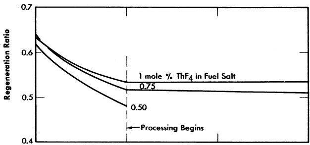

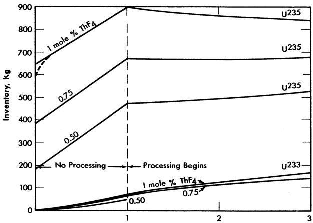  
Time of Operation, years   
FIG. 14-9. Operating performance of two-region, homogeneous, molten fluoridesalt reactors fueled with $\mathbf{U}^{235}$ . Core diameter, 8 ft; total power, 600 Mw (heat); load factor, 0.80.

equilibrium inventory is, for example, equal to the first year's production, then the increase in $\mathbf{U}^{235}$ inventory and the decrease in regeneration ratio are effectively arrested, as shown in Fig. 14-10. The fuel-addition rate drops immediately from 1.28 to $0.73\mathrm{kg / day}$ when processing is started. At the end of two years, the addition rate is down to $0.50\mathrm{kg / day}$ , and it continues to decline slowly to $0.39\mathrm{kg / day}$ after 20 years of operation. The nonfissionable isotopes of uranium continue to accumulate, of course, but these are nearly compensated by the ingrowth of $\mathbf{U}^{233}$ . As shown in Fig. 14-10, the inventory of $\mathbf{U}^{235}$ actually decreases for several years in a typical case, and then increases only moderately during a lifetime of 20 years.

The rapid increase in critical inventory of $\mathbf{U}^{235}$ during the first year can be avoided by partial withdrawal of thorium. In Fig. 14-10 the dashed lines indicate the course of events when thorium is removed at the rate of $1/900$ per day. Burnup reduces the thorium concentration by another

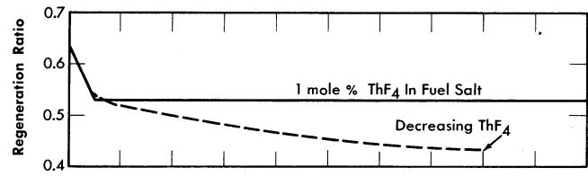

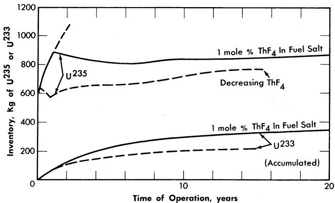  
FIG. 14-10. Long-term nuclear performance of typical two-region, homogeneous, molten fluoride-salt reactors fueled with $\mathbf{U}^{235}$ . Core diameter, 8 ft; total power, 600 Mw (heat); load factor, 0.80.

1/4300 per day. The $\mathrm{U}^{235}$ inventory rises to $826\mathrm{kg}$ and then falls, at the end of eight months, to $587\mathrm{kg}$ . At this time, the processing rate is increased to $1 / 240$ per day (eight-month cycle), but the thorium is returned to the core and the thorium concentration falls thereafter only by burnup. It may be seen that the $\mathrm{U}^{235}$ inventory creeps up slowly and that the regeneration ratio falls slowly. The increase in $\mathrm{U}^{235}$ inventory could have been prevented by withdrawing thorium at a small rate; however, the regeneration ratio would have fallen somewhat more rapidly, and more $\mathrm{U}^{235}$ feed would have been required to compensate for burnup.

# 14-2. HOMOGENEOUS REACTORS FUELED WITH $\mathbf{U}^{233}$

Uranium-233 is a superior fuel for use in molten fluoride-salt reactors in almost every respect. The fission cross section in the intermediate range of neutron energies is greater than the fission cross sections of $\mathbf{U}^{235}$ and $\mathrm{Pu}^{239}$ . Thus initial critical inventories are less, and less additional fuel is required to override poisons. Also, the parasitic cross section is substantially less, and fewer neutrons are lost to radiative capture. Further, the radiative captures result in the immediate formation of a fertile iso

TABLE 14-4   
NUCLEAR PERFORMANCE OF A TWO-REGION, HOMOGENEOUS,   
MOLTEN FLUORIDE-SALT REACTOR FUELED WITH U235   
IN THE FUEL SALT   
Total power: 600   
Core diameter: 8 ft.   

<table><tr><td rowspan="2"></td><td colspan="3">Initial state</td><td colspan="3">After 1 year</td></tr><tr><td>Inventory, kg</td><td>Absorptions, %</td><td>Fissions, %</td><td>Inventory, kg</td><td>Absorptions, %</td><td>Fissions, %</td></tr><tr><td colspan="7">Core elements</td></tr><tr><td>Th232</td><td>2,100</td><td>20.3</td><td></td><td>2,100</td><td>16.7</td><td></td></tr><tr><td>Pa233</td><td></td><td></td><td></td><td>8.2</td><td>0.3</td><td></td></tr><tr><td>U233</td><td></td><td></td><td></td><td>61.0</td><td>5.9</td><td>12.5</td></tr><tr><td>U234</td><td></td><td></td><td></td><td>1.9</td><td>0.0</td><td></td></tr><tr><td>U235</td><td>604</td><td>55.4</td><td>100</td><td>893</td><td>49.3</td><td>86.3</td></tr><tr><td>U236</td><td></td><td></td><td></td><td>62.2</td><td>1.8</td><td></td></tr><tr><td>Np237</td><td></td><td></td><td></td><td>4.2</td><td>0.2</td><td></td></tr><tr><td>U238</td><td>45.3</td><td>2.2</td><td></td><td>57.9</td><td>2.0</td><td></td></tr><tr><td>Pu239</td><td></td><td></td><td></td><td>6.8</td><td>0.8</td><td>1.2</td></tr><tr><td>Fission fragments</td><td></td><td></td><td></td><td>181</td><td>3.8</td><td></td></tr><tr><td>Li7</td><td>3,920</td><td>1.9</td><td></td><td>3,920</td><td>0.9</td><td></td></tr><tr><td>Be9</td><td>3,008</td><td>0.6</td><td></td><td>3,008</td><td>0.5</td><td></td></tr><tr><td>F19</td><td>24,000</td><td>3.2</td><td></td><td>24,000</td><td>3.0</td><td></td></tr><tr><td colspan="7">Blanket element</td></tr><tr><td>U233</td><td></td><td></td><td></td><td>8.7</td><td></td><td></td></tr><tr><td>Total fuel</td><td>604</td><td></td><td></td><td>963</td><td></td><td></td></tr><tr><td>U235 burnup rate, kg/day</td><td>0.69</td><td></td><td></td><td>0.62</td><td></td><td></td></tr><tr><td>U235 feed rate, kg/day</td><td>2.22</td><td></td><td></td><td>1.28–0.73</td><td></td><td></td></tr><tr><td>Regeneration ratio</td><td>0.64</td><td></td><td></td><td>0.53</td><td></td><td></td></tr></table>

continued

TABLE 14-4 (continued)   

<table><tr><td rowspan="2"></td><td colspan="3">After 2 years</td><td colspan="3">After 5 years</td></tr><tr><td>Inventory, kg</td><td>Absorptions, %</td><td>Fissions, %</td><td>Inventory, kg</td><td>Absorptions, %</td><td>Fissions, %</td></tr><tr><td colspan="7">Core elements</td></tr><tr><td>Th232</td><td>2,100</td><td>16.3</td><td></td><td>2,100</td><td>15.4</td><td></td></tr><tr><td>Pa233</td><td>7.9</td><td>0.2</td><td></td><td>7.5</td><td>0.2</td><td></td></tr><tr><td>U233</td><td>110</td><td>9.7</td><td>20.8</td><td>201</td><td>15.3</td><td>33.0</td></tr><tr><td>U234</td><td>6.5</td><td>0.1</td><td></td><td>27.1</td><td>0.4</td><td></td></tr><tr><td>U235</td><td>863</td><td>44.3</td><td>77.4</td><td>818</td><td>36.9</td><td>64.1</td></tr><tr><td>U236</td><td>115</td><td>3.1</td><td></td><td>222</td><td>5.2</td><td></td></tr><tr><td>Np237</td><td>0.8</td><td>0.4</td><td></td><td>1.8</td><td>0.8</td><td></td></tr><tr><td>U238</td><td>69.7</td><td>2.3</td><td></td><td>9.0</td><td>2.7</td><td></td></tr><tr><td>Pu239</td><td>12.0</td><td>1.3</td><td>1.8</td><td>24.3</td><td>2.0</td><td>2.9</td></tr><tr><td>Fission fragments</td><td>181</td><td>3.6</td><td></td><td>181</td><td>3.1</td><td></td></tr><tr><td>Li7</td><td>3,920</td><td>0.8</td><td></td><td>3,920</td><td>0.6</td><td></td></tr><tr><td>Be9</td><td>3,008</td><td>0.5</td><td></td><td>3,008</td><td>0.5</td><td></td></tr><tr><td>F19</td><td>24,000</td><td>3.0</td><td></td><td>24,000</td><td>3.0</td><td></td></tr><tr><td colspan="7">Blanket element</td></tr><tr><td>U233</td><td>16</td><td></td><td></td><td>24</td><td></td><td></td></tr><tr><td>Total fuel</td><td>990</td><td></td><td></td><td>1,045</td><td></td><td></td></tr><tr><td>U235 burnup rate, kg/day</td><td>0.58</td><td></td><td></td><td>0.47</td><td></td><td></td></tr><tr><td>U235 feed rate, kg/day</td><td>0.50</td><td></td><td></td><td>0.45</td><td></td><td></td></tr><tr><td>Regeneration ratio</td><td>0.53</td><td></td><td></td><td>0.54</td><td></td><td></td></tr><tr><td rowspan="2"></td><td colspan="3">After 10 years</td><td colspan="3">After 20 years</td></tr><tr><td>Inventory, kg</td><td>Absorptions, %</td><td>Fissions, %</td><td>Inventory, kg</td><td>Absorptions, %</td><td>Fissions, %</td></tr><tr><td colspan="7">Core elements</td></tr><tr><td>Th232</td><td>2,100</td><td>14.6</td><td></td><td>2,100</td><td>13.7</td><td></td></tr><tr><td>Pa233</td><td>7.1</td><td>0.2</td><td></td><td>6.7</td><td>0.2</td><td></td></tr><tr><td>U233</td><td>266</td><td>17.6</td><td>38.3</td><td>322</td><td>18.8</td><td>41.0</td></tr><tr><td>U234</td><td>64.4</td><td>0.8</td><td></td><td>124</td><td>1.4</td><td></td></tr><tr><td>U235</td><td>831</td><td>33.5</td><td>58.2</td><td>872</td><td>31.7</td><td>54.9</td></tr><tr><td>U236</td><td>328</td><td>6.7</td><td></td><td>450</td><td>7.9</td><td></td></tr><tr><td>Np237</td><td>2.6</td><td>0.9</td><td></td><td>3.2</td><td>1.0</td><td></td></tr><tr><td>U238</td><td>10.8</td><td>2.9</td><td></td><td>12.9</td><td>3.0</td><td></td></tr><tr><td>Pu239</td><td>37.3</td><td>2.4</td><td>3.5</td><td>52.6</td><td>2.8</td><td>4.1</td></tr><tr><td>Fission fragments</td><td>181</td><td>2.7</td><td></td><td>181</td><td>2.4</td><td></td></tr><tr><td>Li7</td><td>3,920</td><td>0.5</td><td></td><td>3,920</td><td>0.4</td><td></td></tr><tr><td>Be9</td><td>3,008</td><td>0.5</td><td></td><td>3,008</td><td>0.5</td><td></td></tr><tr><td>F19</td><td>24,000</td><td>3.0</td><td></td><td>24,000</td><td>3.0</td><td></td></tr><tr><td colspan="7">Blanket element</td></tr><tr><td>U233</td><td>28</td><td></td><td></td><td>33</td><td></td><td></td></tr><tr><td>Total fuel</td><td>1,129</td><td></td><td></td><td>1,232</td><td></td><td></td></tr><tr><td>U235 burnup rate, kg/day</td><td>0.41</td><td></td><td></td><td>0.38</td><td></td><td></td></tr><tr><td>U235 feed rate, kg/day</td><td>0.44</td><td></td><td></td><td>0.39</td><td></td><td></td></tr><tr><td>Regeneration ratio</td><td>0.533</td><td></td><td></td><td>0.530</td><td></td><td></td></tr></table>

tope, $\mathrm{U}^{234}$ . The rate of accumulation of $\mathrm{U}^{236}$ is orders of magnitude smaller than with $\mathrm{U}^{235}$ as a fuel, and buildup of $\mathrm{Np}^{237}$ and $\mathrm{Pu}^{239}$ is negligible.

The mean neutron energy is rather nearer to thermal in these reactors than it is in the corresponding $\mathbf{U}^{235}$ cases. Consequently, losses to core vessel and to core salt tend to be higher. Both losses will be reduced substantially at higher thorium concentrations.

14-2.1 Initial states. Results from a parametric study of the nuclear characteristics of two-region, homogeneous, molten fluoride-salt reactors fueled with $\mathbf{U}^{233}$ are given in Table 14-5. The core diameters considered range from 3 to 10 ft, and the thorium concentrations range from 0.25 to 1 mole %. Although the regeneration ratios are less than unity, they are very good compared with those obtained with $\mathbf{U}^{235}$ . With 1 mole % $\mathrm{ThF_4}$ in an 8-ft-diameter core, the $\mathbf{U}^{233}$ inventory was only $196\mathrm{kg}$ , and the regeneration ratio was 0.91.

The regeneration ratios and fuel inventories of reactors of various diameters containing 0.25 mole $\%$ thorium and fueled with $\mathbf{U}^{235}$ or $\mathbf{U}^{233}$ are compared in Fig. 14-11. The superiority of $\mathbf{U}^{233}$ is obvious.

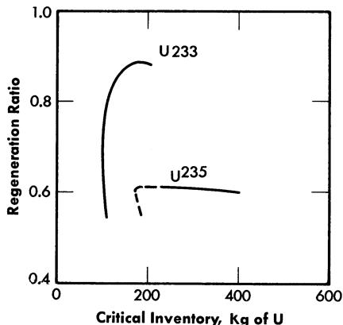  
FIG. 14-11. Comparison of regeneration ratios in molten-salt reactors containing 0.25 mole $\%$ ThF $_4$ and U $^{235}$ - or U $^{233}$ -enriched fuel.

14-2.2 Intermediate states. Calculations of the long-term performance of one reactor (Case 51, Table 14-5) with $\mathbf{U}^{233}$ as the fuel are described below. The core diameter used was 8 ft and the thorium concentration was $0.75\mathrm{~mol}\%$ . The changes in inventory of $\mathbf{U}^{233}$ and regeneration ratio are listed in Table 14-6. During the first year of operation, the inventory rises from 129 to $199\mathrm{kg}$ , and the regeneration ratio falls from 0.82 to 0.71. If the reprocessing required to hold the concentration of fission products

TABLE 14-5   
NUCLEAR CHARACTERISTICS OF TWO-REGION, HOMOGENEOUS, MOLTEN FLUORIDE-SALT REACTORS FUELED WITH U²³³   
Core diameter: 8 ft. Total power: 600 Mw (heat). External fuel volume: 339 ft³. Load factor: 0.8.   

<table><tr><td>Case number</td><td>41</td><td>42</td><td>43</td><td>44</td><td>45</td><td>46</td></tr><tr><td>Fuel and blanket salts*</td><td>1</td><td>1</td><td>1</td><td>1</td><td>1</td><td>1</td></tr><tr><td>Core diameter, ft</td><td>3</td><td>4</td><td>4</td><td>5</td><td>6</td><td>6</td></tr><tr><td>ThF4in fuel salt, mole %</td><td>0</td><td>0</td><td>0.25</td><td>0</td><td>0.25</td><td>0.25</td></tr><tr><td>U233in fuel salt, mole %</td><td>0.592</td><td>0.158</td><td>0.233</td><td>0.106</td><td>0.048</td><td>0.066</td></tr><tr><td>U233atom density†</td><td>21.0</td><td>6.09</td><td>8.26</td><td>3.75</td><td>1.66</td><td>2.36</td></tr><tr><td>Critical mass, kg of U233</td><td>64.9</td><td>22.3</td><td>30.3</td><td>26.9</td><td>20.5</td><td>29.2</td></tr><tr><td>Critical inventory, kg of U233</td><td>1620</td><td>248</td><td>337</td><td>166</td><td>82.0</td><td>117</td></tr><tr><td>Neutron absorption ratios‡</td><td></td><td></td><td></td><td></td><td></td><td></td></tr><tr><td>U233(fissions)</td><td>0.8754</td><td>0.8706</td><td>0.8665</td><td>0.8725</td><td>0.8814</td><td>0.8779</td></tr><tr><td>U233(n-γ)</td><td>0.1246</td><td>0.1294</td><td>0.1335</td><td>0.1275</td><td>0.1186</td><td>0.1221</td></tr><tr><td>Be-Li-F in fuel salt</td><td>0.0639</td><td>0.1061</td><td>0.0860</td><td>0.1472</td><td>0.3180</td><td>0.2297</td></tr><tr><td>Core vessel</td><td>0.0902</td><td>0.1401</td><td>0.1093</td><td>0.1380</td><td>0.1983</td><td>0.1508</td></tr><tr><td>Li-Be-F in blanket salt</td><td>0.0233</td><td>0.0234</td><td>0.0203</td><td>0.0196</td><td>0.0215</td><td>0.0179</td></tr><tr><td>Leakage</td><td>0.0477</td><td>0.0310</td><td>0.0306</td><td>0.0193</td><td>0.0160</td><td>0.0157</td></tr><tr><td>Th in fuel salt</td><td></td><td></td><td>0.1095</td><td>0.1593</td><td></td><td>0.1973</td></tr><tr><td>Th in blanket salt</td><td>0.9722</td><td>0.8857</td><td>0.8193</td><td>0.7066</td><td>0.6586</td><td>0.5922</td></tr><tr><td>Neutron yield, η</td><td>2.20</td><td>2.19</td><td>2.18</td><td>2.19</td><td>2.21</td><td>2.20</td></tr><tr><td>Median fission energy, ev</td><td>174</td><td>14</td><td>19</td><td>2.9</td><td>0.33</td><td>1.2</td></tr><tr><td>Thermal fissions, %</td><td>0.053</td><td>8.0</td><td>2.3</td><td>16</td><td>38</td><td>29</td></tr><tr><td>n-γ capture-to-fission ratio, α</td><td>0.14</td><td>0.15</td><td>0.15</td><td>0.15</td><td>0.13</td><td>0.14</td></tr><tr><td>Regeneration ratio</td><td>0.97</td><td>0.89</td><td>0.93</td><td>0.87</td><td>0.66</td><td>0.79</td></tr></table>

continued

TABLE 14-5 (continued)   

<table><tr><td>Case number</td><td>47</td><td>48</td><td>49</td><td>50</td><td>51</td></tr><tr><td>Fuel and blanket salts*</td><td>1</td><td>1</td><td>1</td><td>1</td><td>2</td></tr><tr><td>Core diameter, ft</td><td>8</td><td>8</td><td>10</td><td>10</td><td>8</td></tr><tr><td>ThF4in fuel salt, mole %</td><td>0.25</td><td>1</td><td>0.25</td><td>1</td><td>0.75</td></tr><tr><td>U233in fuel salt, mole %</td><td>0.039</td><td>0.078</td><td>0.031</td><td>0.063</td><td>0.0597</td></tr><tr><td>U233atom density†</td><td>1.40</td><td>2.95</td><td>1.10</td><td>2.29</td><td>1.97</td></tr><tr><td>Critical mass, kg of U233</td><td>41.1</td><td>86.6</td><td>63.0</td><td>131</td><td>58.8</td></tr><tr><td>Critical inventory, kg of U233</td><td>93.1</td><td>196</td><td>104</td><td>216</td><td>129</td></tr><tr><td>Neutron absorption ratios‡</td><td></td><td></td><td></td><td></td><td></td></tr><tr><td>U233(fissions)</td><td>0.8850</td><td>0.8755</td><td>0.8881</td><td>0.8781</td><td>0.8809</td></tr><tr><td>U233(n-γ)</td><td>0.1150</td><td>0.1245</td><td>0.1119</td><td>0.1219</td><td>0.1191</td></tr><tr><td>Be-Li-F in fuel salt</td><td>0.3847</td><td>0.1899</td><td>0.5037</td><td>0.2360</td><td>0.2458</td></tr><tr><td>Core vessel</td><td>0.1406</td><td>0.0778</td><td>0.1168</td><td>0.0629</td><td>0.1168</td></tr><tr><td>Li-Be-F in blanket salt</td><td>0.0141</td><td>0.0095</td><td>0.0108</td><td>0.0071</td><td>0.0187</td></tr><tr><td>Leakage</td><td>0.0095</td><td>0.0090</td><td>0.0068</td><td>0.0065</td><td>0.0050</td></tr><tr><td>Th in fuel salt</td><td>0.2513</td><td>0.5768</td><td>0.2852</td><td>0.6507</td><td>0.4903</td></tr><tr><td>Th in blanket salt</td><td>0.4211</td><td>0.3344</td><td>0.3058</td><td>0.2408</td><td>0.3325</td></tr><tr><td>Neutron yield, η</td><td>2.22</td><td>2.20</td><td>2.23</td><td>2.20</td><td>2.21</td></tr><tr><td>Median fission energy, ev</td><td>0.20</td><td>1.1</td><td>50% Th</td><td>3.2</td><td>0.68</td></tr><tr><td>Thermal fissions, %</td><td>43</td><td>24</td><td>50</td><td>30</td><td>34</td></tr><tr><td>n-γ capture-to-fission ratio, α</td><td>0.13</td><td>0.14</td><td>0.13</td><td>0.14</td><td>0.14</td></tr><tr><td>Regeneration ratio</td><td>0.67</td><td>0.91</td><td>0.59</td><td>0.89</td><td>0.82</td></tr></table>

*Fuel salt No. 1: 31 mole % BeF $_2$ + 69 mole % LiF + UF $_4$ + ThF $_4$   
Blanket salt No. 1: 25 mole % ThF₄ + 75 mole % LiF   
Fuel salt No. 2: 37 mole % BeF $_2$ + 63 mole % LiF + UF $_4$ + ThF $_4$   
Blanket salt No. 2: 13 mole % ThF₄ + 16 mole % BeF₂ + 71 mole % LiF   
$\ddagger$ Neutrons absorbed per absorption in $\mathbf{U}^{233}$ .

†Atoms (× 10 $^{-19}$ )/cc.

TABLE 14-6   
NUCLEAR PERFORMANCE OF A TWO-REGION, HOMOGENEOUS, MOLTEN FLUORIDE-SALT REACTOR FUELED WITH U²³³ AND   
CONTAINING 0.75 MOLE $\%$ THF4 IN THE FUEL SALT Core diameter: 8 ft. Total power: 600 Mw (heat). External fuel volume: 339 ft3. Load factor: 0.8.   

<table><tr><td rowspan="2"></td><td colspan="3">Initial state</td><td colspan="3">After 1 year</td></tr><tr><td>Inventory, kg</td><td>Absorptions, %</td><td>Fissions, %</td><td>Inventory, kg</td><td>Absorptions, %</td><td>Fissions, %</td></tr><tr><td colspan="7">Core elements</td></tr><tr><td>Th232</td><td>1,572</td><td>22.2</td><td></td><td>1,572</td><td>19.1</td><td></td></tr><tr><td>Pa233</td><td></td><td></td><td></td><td>9.4</td><td>0.5</td><td></td></tr><tr><td>U233</td><td>129</td><td>45.2</td><td>100</td><td>199</td><td>45.3</td><td>99.5</td></tr><tr><td>U234</td><td></td><td></td><td></td><td>23.3</td><td>0.9</td><td></td></tr><tr><td>U235</td><td></td><td></td><td></td><td>1.9</td><td>0.3</td><td>0.5</td></tr><tr><td>U236</td><td></td><td></td><td></td><td>0.1</td><td>0.1</td><td></td></tr><tr><td>Np237</td><td></td><td></td><td></td><td></td><td></td><td></td></tr><tr><td>U238</td><td></td><td></td><td></td><td></td><td></td><td></td></tr><tr><td>Pu239</td><td></td><td></td><td></td><td></td><td></td><td></td></tr><tr><td colspan="7">Fission fragments</td></tr><tr><td>Li6</td><td>3,920</td><td>6.5</td><td></td><td>181</td><td>7.9</td><td></td></tr><tr><td>Be9</td><td>3,004</td><td>0.8</td><td></td><td>3,920</td><td>3.4</td><td></td></tr><tr><td>F19</td><td>24,000</td><td>4.0</td><td></td><td>3,008</td><td>0.7</td><td></td></tr><tr><td colspan="7">Blanket element</td></tr><tr><td>U233</td><td></td><td></td><td></td><td>24,000</td><td>3.5</td><td></td></tr><tr><td>Total fuel</td><td>129</td><td></td><td></td><td>8.6</td><td></td><td></td></tr><tr><td>U233 feed rate, kg/day</td><td>0.790</td><td></td><td></td><td>210</td><td></td><td></td></tr><tr><td>Regeneration ratio</td><td>0.82</td><td></td><td></td><td>0.370–0.189</td><td></td><td></td></tr><tr><td></td><td></td><td></td><td></td><td>0.71</td><td></td><td></td></tr></table>

continued

TABLE 14-6 (continued)   

<table><tr><td rowspan="2"></td><td colspan="3">After 2 years</td><td colspan="3">After 5 years</td></tr><tr><td>Inventory, kg</td><td>Absorptions, %</td><td>Fissions, %</td><td>Inventory, kg</td><td>Absorptions, %</td><td>Fissions, %</td></tr><tr><td colspan="7">Core elements</td></tr><tr><td>Th232</td><td>1,572</td><td>18.9</td><td></td><td>1,572</td><td>18.3</td><td></td></tr><tr><td>Pa233</td><td>9.0</td><td>0.5</td><td></td><td>8.9</td><td>0.4</td><td></td></tr><tr><td>U233</td><td>204</td><td>44.9</td><td>98.5</td><td>216</td><td>43.7</td><td>95.6</td></tr><tr><td>U234</td><td>44.0</td><td>1.7</td><td></td><td>89</td><td>3.1</td><td></td></tr><tr><td>U235</td><td>5.4</td><td>0.8</td><td>1.5</td><td>17.7</td><td>2.3</td><td>4.4</td></tr><tr><td>U236</td><td>0.6</td><td>0.3</td><td></td><td>4.2</td><td>0.2</td><td></td></tr><tr><td>Np237</td><td>0.1</td><td>0.1</td><td></td><td>0.5</td><td>0.1</td><td></td></tr><tr><td>U238</td><td></td><td></td><td></td><td>0.3</td><td></td><td></td></tr><tr><td>Pu239</td><td></td><td></td><td></td><td></td><td></td><td></td></tr><tr><td>Fission fragments</td><td>181</td><td>7.7</td><td></td><td>181</td><td>7.2</td><td></td></tr><tr><td>Li6</td><td>3,920</td><td>3.3</td><td></td><td>3,920</td><td>2.8</td><td></td></tr><tr><td>Be9</td><td>3,008</td><td>0.6</td><td></td><td>3,008</td><td>0.6</td><td></td></tr><tr><td>F19</td><td>24,000</td><td>3.4</td><td></td><td>24,000</td><td>3.3</td><td></td></tr><tr><td colspan="7">Blanket element</td></tr><tr><td>U233</td><td>10.7</td><td></td><td></td><td>16.2</td><td></td><td></td></tr><tr><td>Total fuel</td><td>220</td><td></td><td></td><td>250</td><td></td><td></td></tr><tr><td>U233 feed rate, kg/day</td><td>0.188</td><td></td><td></td><td>0.181</td><td></td><td></td></tr><tr><td>Regeneration ratio</td><td>0.72</td><td></td><td></td><td>0.73</td><td></td><td></td></tr></table>

continued

TABLE 14-6 (continued)   

<table><tr><td rowspan="2"></td><td colspan="3">After 10 years</td><td colspan="3">After 20 years</td></tr><tr><td>Inventory, kg</td><td>Absorptions, %</td><td>Fissions, %</td><td>Inventory, kg</td><td>Absorptions, %</td><td>Fissions, %</td></tr><tr><td colspan="7">Core elements</td></tr><tr><td>Th232</td><td>1,572</td><td>17.8</td><td></td><td>1,572</td><td>17.2</td><td></td></tr><tr><td>Pa233</td><td>8.6</td><td>0.4</td><td></td><td>8.4</td><td>0.4</td><td></td></tr><tr><td>U233</td><td>231</td><td>42.5</td><td>92.8</td><td>247</td><td>41.5</td><td>90.5</td></tr><tr><td>U234</td><td>132</td><td>4.2</td><td></td><td>172</td><td>5.0</td><td></td></tr><tr><td>U235</td><td>32.5</td><td>3.7</td><td>7.1</td><td>47</td><td>4.8</td><td>9.0</td></tr><tr><td>U236</td><td>12.5</td><td>0.6</td><td></td><td>24</td><td>1.1</td><td></td></tr><tr><td>Np237</td><td>1.7</td><td>0.2</td><td></td><td>3.4</td><td>0.3</td><td></td></tr><tr><td>U238</td><td>1.7</td><td>0.1</td><td></td><td>5.1</td><td>0.3</td><td></td></tr><tr><td>Pu239</td><td>0.2</td><td>0.1</td><td>0.1</td><td>0.8</td><td>0.3</td><td>0.5</td></tr><tr><td>Fission fragments</td><td>181</td><td>6.7</td><td></td><td>181</td><td>6.3</td><td></td></tr><tr><td>Li6</td><td>3,920</td><td>2.5</td><td></td><td>3,920</td><td>2.1</td><td></td></tr><tr><td>Be9</td><td>3,008</td><td>0.6</td><td></td><td>3,008</td><td>0.6</td><td></td></tr><tr><td>F19</td><td>24,000</td><td>3.3</td><td></td><td>24,000</td><td>3.3</td><td></td></tr><tr><td colspan="7">Blanket element</td></tr><tr><td>U233</td><td>22.2</td><td></td><td></td><td>31.6</td><td></td><td></td></tr><tr><td>Total fuel</td><td>282</td><td></td><td></td><td>295</td><td></td><td></td></tr><tr><td>U233 feed rate, kg/day</td><td>0.171</td><td></td><td></td><td>0.168</td><td></td><td></td></tr><tr><td>Regeneration ratio</td><td>0.73</td><td></td><td></td><td>0.73</td><td></td><td></td></tr></table>

and $\mathbf{Np}^{237}$ constant is begun at this time, the inventory of $\mathbf{U}^{233}$ increases slowly to $247\mathrm{kg}$ and the regeneration ratio rises slightly to 0.73 during the next 19 years. This constitutes a substantial improvement over the performance with $\mathbf{U}^{235}$ .

# 14-3. HOMOGENEOUS REACTORS FUELED WITH PLUTONIUM

It may be feasible to burn plutonium in molten fluoride-salt reactors. The solubility of $\mathrm{PuF_3}$ in mixtures of LiF and $\mathrm{BeF_2}$ is considerably less than that of $\mathrm{UF_4}$ , but is reported to be over 0.2 mole % [8], which may be sufficient for criticality even in the presence of fission fragments and nonfissionable isotopes of plutonium but probably limits severely the amount of $\mathrm{ThF_4}$ that can be added to the fuel salt. This limitation, coupled with the condition that $\mathrm{Pu}^{239}$ is an inferior fuel in intermediate reactors, will result in a poor neutron economy in comparison with that of $\mathrm{U}^{233}$ -fueled reactors. However, the advantages of handling plutonium in a fluid fuel system may make the plutonium-fueled molten-salt reactor more desirable than other possible plutonium-burning systems.

14-3.1 Initial states. Critical concentration, mass, inventory, and regeneration ratio. The results of calculations of a plutonium-fueled reactor having a core diameter of 8 ft and no thorium in the fuel salt are described below. The critical concentration was 0.013 mole $\%$ $\mathrm{PuF_3}$ , which is an order of magnitude smaller than the solubility limits in the fluoride salts of interest. The critical mass was $13.7\mathrm{kg}$ and the critical inventory in a 600-Mw system (339 ft³ of external fuel volume) was only $31.2\mathrm{kg}$ .

The core was surrounded by the Li-Be-Th fluoride blanket mixture No. 2 (13% ThF $_4$ ). Slightly more than 19% of all neutrons were captured in the thorium to give a regeneration ratio of 0.35. By employing smaller cores and larger investments in $\mathrm{Pu}^{239}$ , however, it should be possible to increase the regeneration ratio substantially.

Neutron balance and miscellaneous details. Details of the neutron economy of a reactor fueled with plutonium are given in Table 14-7. Parasitic captures in $\mathbf{Pu}^{239}$ are relatively high; $\eta$ is 1.84, compared with a $\nu$ of 2.9. The neutron spectrum is relatively soft; almost $60\%$ of all fissions are caused by thermal neutrons and, as a result, absorptions in lithium are high.

14-3.2 Intermediate states. On the basis of the average value of $\alpha$ of $\mathrm{Pu}^{239}$ , it is estimated that $\mathrm{Pu}^{240}$ will accumulate in the system until it captures, at equilibrium, about half as many neutrons as $\mathrm{Pu}^{239}$ . While these captures are not wholly parasitic, inasmuch as the product, $\mathrm{Pu}^{241}$ , is fissionable, the added competition for neutrons will necessitate an increase in the concentration of the $\mathrm{Pu}^{239}$ . Likewise, the ingrowth of fission products

will necessitate the addition of more $\mathrm{Pu}^{239}$ . Further, the rare earths among the fission products may exert a common-ion influence on the plutonium and reduce its solubility. On the credit side, however, is the $\mathrm{U}^{233}$ produced in the blanket. If this is added to the core it may compensate for the ingrowth of $\mathrm{Pu}^{240}$ and reduce the $\mathrm{Pu}^{239}$ requirement to below the solubility limit, and it may be possible to operate indefinitely, as with the $\mathrm{U}^{235}$ -fueled reactors.

# 14-4. HETEROGENEOUS GRAPHITE-MODERATED REACTORS

The use of a moderator in a heterogeneous lattice with molten-salt fuels is potentially advantageous. First, the approach to a thermal neutron spectrum improves the neutron yield, $\eta$ , attainable, especially with $\mathrm{U}^{235}$

TABLE 14-7 INITIAL-STATE NUCLEAR CHARACTERISTICS OF A TYPICAL MOLTEN FLUORIDE-SALT REACTOR FUELED WITH $\mathbf{P}\mathbf{u}^{239}$   

<table><tr><td>Core diameter:</td><td>8 ft.</td></tr><tr><td>External fuel volume:</td><td>339 ft3.</td></tr><tr><td>Total power:</td><td>600 Mw (heat).</td></tr><tr><td>Load factor:</td><td>0.8.</td></tr><tr><td>Critical inventory:</td><td>31.2 kg of Pu239.</td></tr><tr><td>Critical concentration:</td><td>0.013 mole % Pu239.</td></tr></table>

<table><tr><td></td><td>Neutrons absorbed per neutrons absorbed in Pu239</td></tr><tr><td>Neutron absorbers</td><td></td></tr><tr><td>Pu239 (fissions)</td><td>0.630</td></tr><tr><td>Pu239 (n-γ)</td><td>0.372</td></tr><tr><td>Li6 and Li7 in fuel salt</td><td>0.202</td></tr><tr><td>Be9 in fuel salt</td><td>0.022</td></tr><tr><td>F19 in fuel salt</td><td>0.086</td></tr><tr><td>Core vessel</td><td>0.145</td></tr><tr><td>Th in blanket salt</td><td>0.352</td></tr><tr><td>Li-Be-F in blanket salt</td><td>0.024</td></tr><tr><td>Reactor vessel</td><td>0.004</td></tr><tr><td>Leakage</td><td>0.003</td></tr><tr><td>Neutron yield, η</td><td>1.84</td></tr><tr><td>Thermal fissions, %</td><td>59</td></tr><tr><td>Regeneration ratio</td><td>0.352</td></tr></table>

TABLE 14-8   
COMPARISON OF GRAPHITE-MODERATED MOLTEN-SALT AND LIQUID-METAL-FUELED REACTORS   

<table><tr><td></td><td>LMFR</td><td>MSFR-1</td><td>MSFR-2</td></tr><tr><td>Total power, Mw (heat)</td><td>580</td><td>600</td><td>600</td></tr><tr><td>Over-all radius, in.</td><td>75</td><td>75</td><td>72</td></tr><tr><td>Critical mass, kg of U233</td><td>9.9</td><td>9.6</td><td>27.7</td></tr><tr><td>Critical inventory, kg of U233*</td><td>467</td><td>77.8</td><td>213</td></tr><tr><td>Regeneration ratio</td><td>1.107</td><td>0.83</td><td>1.07</td></tr><tr><td>Core</td><td></td><td></td><td></td></tr><tr><td>Radius, in.</td><td>33</td><td>33</td><td>34.8</td></tr><tr><td>Graphite, vol %</td><td>45</td><td>45</td><td>45</td></tr><tr><td>Fuel fluid, vol %</td><td>55</td><td>55</td><td>55</td></tr><tr><td>Fuel components, mole %</td><td></td><td></td><td></td></tr><tr><td>Bi</td><td>~100</td><td></td><td></td></tr><tr><td>LiF</td><td></td><td>69</td><td>61</td></tr><tr><td>BeF2</td><td></td><td>31</td><td>36.5</td></tr><tr><td>ThF4</td><td></td><td></td><td>2.5</td></tr><tr><td>Unmoderated blanket</td><td></td><td></td><td></td></tr><tr><td>Thickness, in.</td><td>6</td><td>6</td><td>13.2</td></tr><tr><td>Composition, mole %</td><td></td><td></td><td></td></tr><tr><td>Bi</td><td>90</td><td></td><td></td></tr><tr><td>Th</td><td>10 (Th)</td><td>10 (ThF4)</td><td>13 (ThF4)</td></tr><tr><td>LiF</td><td></td><td>70</td><td>71</td></tr><tr><td>BeF2</td><td></td><td>20</td><td>16</td></tr><tr><td>U233</td><td>0.015</td><td>0.014</td><td></td></tr><tr><td>Moderated blanket</td><td></td><td></td><td></td></tr><tr><td>Thickness, in.</td><td>36</td><td>36</td><td>24</td></tr><tr><td>Composition, vol %</td><td></td><td></td><td></td></tr><tr><td>Graphite</td><td>66.6</td><td>66.6</td><td>100</td></tr><tr><td>Blanket fluid†</td><td>33.4</td><td>33.4</td><td></td></tr><tr><td>Neutron absorption ratio‡</td><td></td><td></td><td></td></tr><tr><td>Th in fuel fluid</td><td></td><td></td><td>0.566</td></tr><tr><td>U233 in fuel fluid</td><td>0.918</td><td>0.925</td><td>1.000</td></tr><tr><td>Other components of fuel fluid</td><td>0.081</td><td>0.324</td><td>0.106</td></tr><tr><td>Th in blanket fluid</td><td>1.110</td><td>0.825</td><td>0.490</td></tr><tr><td>U233 in blanket fluid</td><td>0.083</td><td>0.071</td><td></td></tr><tr><td>Other components of blanket fluid</td><td>0.040</td><td>0.092</td><td>0.038</td></tr><tr><td>Leakage</td><td>0.012</td><td>0.004</td><td>0.014</td></tr><tr><td>Neutron yield, η</td><td>2.24</td><td>2.24</td><td>2.21</td></tr></table>

*With bismuth, the external volume indicated in Ref. 10 was used. The molten-salt systems are calculated for 339 ft³ external volumes.   
†Same as unmoderated blanket fluid.   
$\ddagger$ Neutrons absorbed per neutron absorbed in $\mathbf{U}^{233}$ .

and $\mathrm{Pu}^{239}$ . Second, in a heterogeneous system, the fuel is partially shielded from neutrons of intermediate energy, and a further improvement in effective neutron yield, $\eta$ , results. Further, the optimum systems may prove to have smaller volumes of fuel in the core than the corresponding fluorinemoderated, homogeneous reactors and, consequently, higher concentrations of fuel and thorium in the melt. This may substantially reduce parasitic losses to components of the carrier salt. On the other hand, these higher concentrations tend to increase the inventory in the circulating-fuel system external to the core. The same considerations apply to fission products and to nonfissionable isotopes of uranium.

Possible moderators for molten-salt reactors include beryllium, BeO, and graphite. The design and performance of the Aircraft Reactor Experiment, a beryllium-oxide moderated, sodium-zirconium fluoride salt, one-region, $\mathrm{U}^{235}$ -fueled burner reactor has been reported (see Chapter 16). Since beryllium and BeO and molten salts are not chemically compatible, it was necessary to line the fuel circuit with Inconel. It is easily estimated that the presence of Inconel, or any other prospective containment metal in a heterogeneous thermal reactor would seriously impair the regeneration ratio of a converter-breeder. Consequently, beryllium and BeO are eliminated from consideration.

Preliminary evidence indicates that uranium-bearing molten salts may be compatible with some grades of graphite and that the presence of the graphite will not carburize metallic portions of the fuel circuit seriously [9]. It therefore becomes of interest to explore the capabilities of the graphitemoderated systems. The principal independent variables of interest are the core diameter, fuel channel diameter, lattice spacing, and thorium concentration.

14-4.1 Initial states. Two cases of graphite-moderated molten-salt reactors have been calculated for the same geometry and graphite-to-fluid volume ratio as those for the reference-design LMFR [10]. The results for these two cases, together with those for the liquid bismuth case, are summarized in Table 14-8. Only the initial states are considered, and a metallic shell to separate core and blanket fluids has not been included. With no thorium in the core fluid, the molten-salt-fueled reactor has a significantly lower regeneration ratio than that of the liquid-metal-fueled reactor, with only a slightly lower critical mass. Adding 2.5 mole $\%$ ThF $_4$ to the core fluid increases the initial regeneration ratio to about 1.07, with a critical mass and a corresponding total fuel inventory that are acceptably low.

# REFERENCES

1. R. L. MACKLIN, Neutron Activation Cross Sections with Sb-Be Neutrons, Phys. Rev. 107, 504-508 (1957).   
2. L. G. ALEXANDER et al., Operating Instructions for the Univac Program Ocusol-A, A Modification of the Eyewash Program, USAEC Report CF-57-6-4, Oak Ridge National Laboratory, 1957.   
3. J. H. ALEXANDER and N. D. GIVEN, A Machine Multigroup Calculation. The Eyewash Program for Univac, USAEC Report ORNL-1925, Oak Ridge National Laboratory, 1955.   
4. J. T. ROBERTS and L. G. ALEXANDER, Cross Sections for the Ocusol-A Program, USAEC Report CF-57-6-5, Oak Ridge National Laboratory, 1957.   
5. B. W. KINYON, Oak Ridge National Laboratory, 1958, personal communication.   
6. W. D. Powers, Oak Ridge National Laboratory, 1958, personal communication.   
7. L. G. ALEXANDER and L. A. MANN, First Estimate of the Gamma Heating in the Core Vessel of a Molten Fluoride Converter, USAEC Report CF-57-12-77, Oak Ridge National Laboratory, 1957.   
8. C. J. BARTON, Solubility and Stability of $\mathsf{PuF}_3$ in Fused Alkali Fluoride-Beryllium Fluoride, USAEC Report ORNL-2530, Oak Ridge National Laboratory, 1958.   
9. F. KERTESZ, Oak Ridge National Laboratory, 1958, personal communication.   
10. BABCOCK AND WILCOX Co., Liquid Metal Fuel Reactor, Technical Feasibility Report, USAEC Report BAW-2(Del.), 1955.

# CHAPTER 15

# EQUIPMENT FOR MOLTEN-SALT REACTOR HEAT-TRANSFER SYSTEMS*

The equipment required in the heat-transfer circuits of a molten-salt reactor consists of the components needed to contain, circulate, cool, heat, and control molten salts at temperatures up to $1300^{\circ}\mathrm{F}$ . Included in such systems are pumps, heat exchangers, piping, expansion tanks, storage vessels, valves, devices for sensing operating variables, and other auxiliary equipment.

Pumps for the fuel and blanket salts differ from standard centrifugal pumps for operation at high temperatures in that provisions must be made to exclude oxidants and lubricants from the salts, to prevent uncontrolled escape of salts and gases, and to minimize heating and irradiation of the drive motors. Heat is transferred from both the fuel and the blanket salts to sodium in shell-and-tube heat exchangers designed to maximize heat transfer per unit volume and to minimize the contained volume of salt, especially the fuel salt.

Seamless piping is used, where possible, to minimize flaws. Thermal expansion is accommodated by prestressing the pipe and by using expansion loops and joints. Heaters and thermal insulation are provided on all components that contain salt or sodium for preheating and for maintaining the circuits at temperatures above the freezing points of the liquids and to minimize heat losses. Devices are provided for sensing flow rates, pressures, temperatures, and liquid levels. The devices include venturi tubes, pressure transmitters, thermocouples, electrical probes, and floats. Inert gases are used over free-liquid surfaces to prevent oxidation and to apply appropriate base pressures for suppressing cavitation or moving liquid or gas from one vessel to another.

The deviations from standard practice required to adapt the various components to the molten-salt system are discussed below. The schematic diagram of a molten-salt heat-transfer system presented in Fig. 15-1 indicates the relative positions of the various components. For nuclear operation, an off-gas system is supplied, as described in Chapter 17. The vapor condensation trap indicated in Fig. 15-1 is required only on systems that contain $\mathrm{ZrF_4}$ or a comparably volatile fluoride as a component of the molten salt.

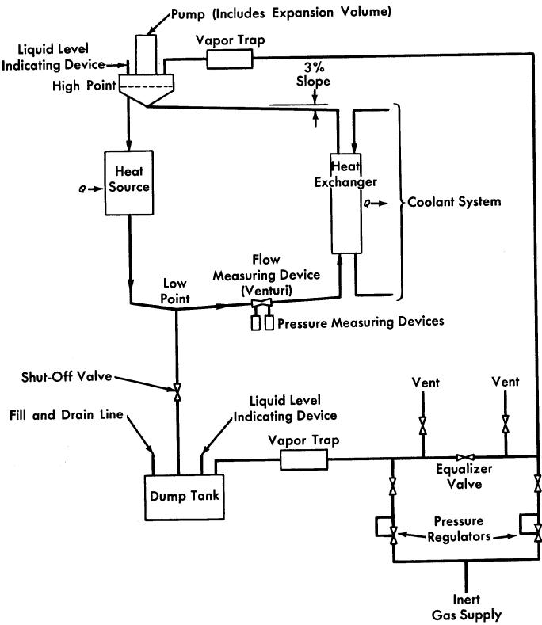  
FIG. 15-1. A molten-salt heat-transfer system.

# 15-1. PUMPS FOR MOLTEN SALTS

Centrifugal pumps with radial or mixed-flow types of impeller have been used successfully to circulate molten-salt fuels. The units built thus far and those currently being developed have a vertical shaft which carries the impeller at its lower end. The shaft passes through a free surface of liquid to isolate the motor, the seals, and the upper bearings from direct contact with the molten salt. Uncontrolled escape of fission gases or entry of undesirable contaminants to the cover gas above the free-liquid surface in the pump are prevented either by the use of mechanical shaft seals or hermetic enclosure of the pump and, if necessary, the motor. Thermal and radiation shields or barriers are provided to assure acceptable temperature and radiation levels in the motor, seal, and bearing areas. Liquid cooling of internal pump surfaces is provided to remove heat induced by gamma and beta radiation.

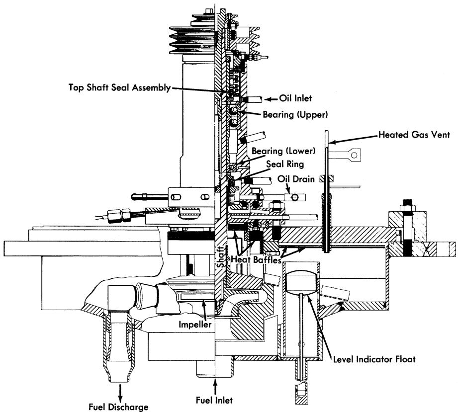  
FIG. 15-2. Sump-type centrifugal pump developed for the Aircraft Reactor Experiment.

The principles used in the design of pumps for normal liquids are applicable to the hydraulic design of a molten-salt pump. Experiments have shown that the cavitation performance of molten-salt pumps can be predicted from tests made with water at room temperature. In addition to stresses induced by normal thermal effects, stresses due to radiation must be taken into account in all phases of design.

The pump shown in Fig. 15-2 was developed for 2000-hr durability at very low irradiation levels and was used in the Aircraft Reactor Experiment for circulating molten salts and sodium at flow rates of 50 to $150\mathrm{gpm}$ , at heads up to 250 ft, and at temperatures up to $1550^{\circ}\mathrm{F}$ . These pumps have been virtually trouble-free in operation, and many units in addition to those used in the Aircraft Reactor Experiment have been used in developmental tests of various components of molten-salt systems.

The bearings, seals, shaft, and impeller form a cartridge-type subassembly that is removable from the pump tank after opening a single, gasketed

joint above the liquid level. The volute, suction, and discharge connections form parts of the pump tank subassembly into which the removable cartridge is inserted. The upper portion of the shaft and a toroidal area in the lower part of the bearing housing are cooled by circulating oil. Heat losses during operation are reduced by thermal insulation.

In all the units built thus far nickel-chrome alloys have been used in the construction of all the high-temperature wetted parts of the pump to minimize corrosion. The relatively low thermal conductivity and high strength of such alloys permitted close spacing of the impeller and bearings and high thermal gradients in the shaft.

Thrust loads are carried at the top of the shaft by a matched pair of preloaded angular-contact ball bearings mounted face-to-face in order to provide the flexibility required to avoid binding and to accommodate thermal distortions. Either single-row ball bearings or a journal bearing can be used successfully for the lower bearing.

The upper lubricant-to-air and the lower lubricant-to-inert-gas seals are similar, rotary, mechanical face-type seals consisting of a stationary graphite member operating in contact with a hardened-steel rotating member. The seals are oil-lubricated, and the leakage of oil to the process side is approximately 1 to $5\mathrm{cc/day}$ . This oil is collected in a catch basin and removed from the pump by gas-pressure sparging or by gravity.

The accumulation of some 200,000 hr of relatively trouble-free test operation in the temperature range of 1200 to $1500^{\circ}\mathrm{F}$ with molten salts and liquid metals as the circulated fluids has proved the adequacy of this basic pump design with regard to the major problem of thermally induced distortions. Four different sizes and eight models of pumps have been used to provide flows in the range of 5 to $1500\mathrm{gpm}$ . Several individual pumps have operated for periods of 6000 to $8000\mathrm{hr}$ , consecutively, without maintenance.

15-1.1 Improvements desired for power reactor fuel pump. The basic pump described above has bearings and seals that are oil-lubricated and cooled, and in some of the pumps elastomers have been used as seals between parts. The pump of this type that was used in the ARE was designed for a relatively low level of radiation and received an integrated dose of less than $5 \times 10^{8}$ r. Under these conditions both the lubricants and elastomers used proved to be entirely satisfactory.

The fuel pump for a power reactor, however, must last for many years. The radiation level anticipated at the surface of the fuel is $10^{5}$ to $10^{6}\mathrm{r / hr}$ . Beta- and gamma-emitting fission gases will permeate all available gas space above the fuel, and the daughter fission products will be deposited on all exposed surfaces. Under these conditions, the simple pump described above would fail within a few thousand hours.

Considerable improvement in the resistance of the pump and motor to radiation can be achieved by relatively simple means. Lengthening the shaft between the impeller and the lower motor bearing and inserting additional shielding material will reduce the radiation from the fuel to a low level at the lower motor bearing and the motor. Hollow, metal O-rings or another metal gasket arrangement can be used to replace the elastomer seals. The sliding seal just below the lower motor bearing, which prevents escape of fission-product gases or inleakage of the outside atmosphere, must be lubricated to ensure continued operation. If oil lubrication is used, radiation may quickly cause coking. Various phenyls, or mixtures of them, are much less subject to formation of gums and cokes under radiation and could be used as lubricant for the seal and for the lower motor bearing. This bearing would be of the friction type, for radial and thrust loads. These modifications would provide a fuel pump with an expected life of the order of a year. With suitable provisions for remote maintenance and repair, these simple and relatively sure improvements would probably suffice for power reactor operation.

Three additional improvements, now being studied, should make possible a fuel pump that will operate trouble-free throughout a very long life. The first of these is a pilot bearing for operation in the fuel salt. Such a bearing, whether of hydrostatic or hydrodynamic design, would be completely unaffected by radiation and would permit use of a long shaft so that the motor could be well shielded. A combined radial and thrust bearing just below the motor rotor would be the only other bearing required. The second improvement is a labyrinth type of gas seal to prevent escape of fission gases up the shaft. There are no rubbing surfaces and hence no need for lubricants, so there can be no radiation damage. The third innovation is a hemispherical gas-cushioned bearing to act as a combined thrust and radial bearing. It would have the advantage of requiring no auxiliary lubrication supply, and it would combine well with the labyrinth type of gas seal. It would, of course, be unaffected by radiation.

15-1.2 A proposed fuel pump. A pump design embodying these last three features is shown in Fig. 15-3. It is designed for operation at a temperature of $1200^{\circ}\mathrm{F}$ , a flow rate of $24,000\mathrm{gpm}$ , and a head of $70\mathrm{ft}$ of fluid. The lower bearing is of the hydrostatic type and is lubricated by the molten-salt fuel. The upper bearing, which is also of the hydrostatic type, is cushioned by helium and serves also as a barrier against passage of gaseous fission products into the motor. This bearing is hemispherical to permit accommodation of thermally induced distortions in the over-all pump structure.

The principal radiation shielding is that provided between the source and the area of the motor windings. Layers of beryllium and boron for

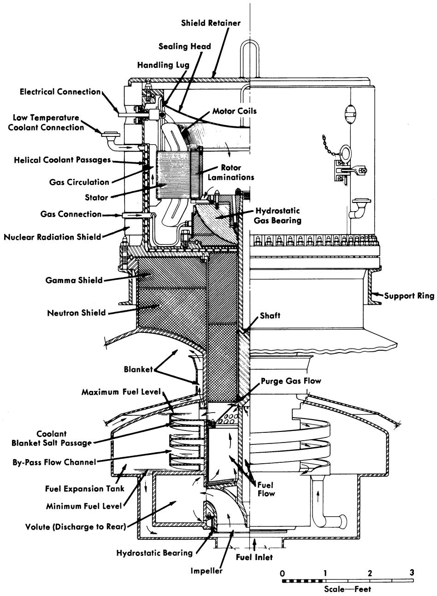  
FIG. 15-3. Improved molten-salt fuel pump designed for power reactor use. Operating temperature, $1200^{\circ}\mathrm{F}$ ; flow rate, 24,000 gpm; head, 70 ft of fluid.

neutron shielding and a heavy metal for gamma-radiation shielding are proposed. The motor is totally enclosed, to eliminate the need for a shaft seal. A coolant is circulated in the area outside the stator windings and between the upper bearing and the shielding. Molten-salt fuel is circulated over the surfaces of those parts of the pump which are in contact with the gaseous fission products to remove heat generated in the metal.

# 15-2. HEAT EXCHANGERS, EXPANSION TANKS, AND DRAIN TANKS

The heat exchangers, expansion tanks, and drain tanks must be especially designed to fit the particular reactor system chosen. The design data of items suitable for a specific reactor plant are described in Chapter 17. The special problems encountered are the need for preheating all salt- and sodium-containing components, for cooling the exposed metal surfaces in the expansion tank, and for removing afterheat from the drain tanks. It has been found that the molten salts behave as normal fluids during pumping and flow and that the heat-transfer coefficients can be predicted from the physical properties of the salts.

# 15-3. VALVES

The problems associated with valves for molten-salt fuels are the consistent alignment of parts during transitions from room temperature to $1200^{\circ}\mathrm{F}$ , the selection of materials for mating surfaces which will not fusion-bond in the salt and cause the valve to stick in the closed position, and the provision of a gastight seal. Bellows-sealed, mechanically operated, poppet valves of the type shown in Fig. 15-4 have given reliable service in test systems.

A number of corrosion and fusion-bond resistant materials for high-temperature use were found through extensive screening tests. Molybdenum against tungsten or copper and several titanium or tungsten carbidenickel cermets mating with each other proved to be satisfactory. Valves with very accurately machined cermet seats and poppets have operated satisfactorily in 2-in. molten-salt lines at $1300^{\circ}\mathrm{F}$ with leakage rates of less than $2\mathrm{cc / hr}$ . Consistent positioning of the poppet and seat to assure leaktightness is achieved by minimizing transmission of valve-body distortions to the valve stem and poppet.

If rapid valve operation is not required, a simple "freeze" valve may be used to ensure a leaktight seal. The freeze valve consists of a section of pipe, usually flattened, that is fitted with a device to cool and freeze a salt plug and another means of subsequently heating and melting the plug.

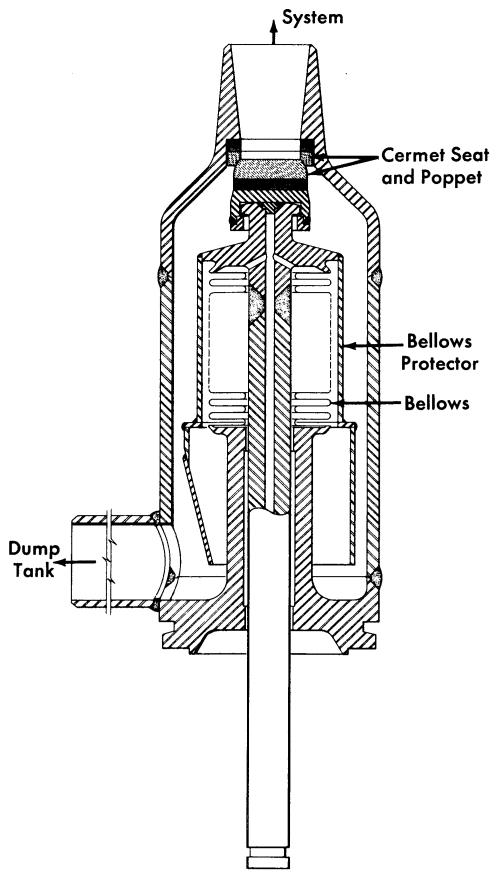  
FIG. 15-4. Bellows-sealed, mechanically operated poppet valve for molten-salt service.

# 15-4. SYSTEM HEATING

Molten-salt systems must be heated to prevent thermal shock during filling and to prevent freezing of the salt when the reactor is not operating to produce power. Straight pipe sections are normally heated by an electric tube-furnace type of heater formed of exposed Nichrome V wire in a ceramic shell (clamshell heaters). A similar type of heater with the Nichrome V wire installed in flat ceramic blocks can be used to heat flat surfaces or large components, such as dump tanks, etc. In general, these heaters are satisfactory for continuous operation at $1800^{\circ}\mathrm{F}$ . Pipe bends, irregular shapes, and small components, such as valves and pressure-measuring devices, are usually heated with tubular heaters (e.g., General Electric Company "Calrods") which can be shaped to fit the component or pipe bend. In general, this type of heater should be limited to service at

$1500^{\circ}\mathrm{F}$ . Care must be exercised in the installation of tubular heaters to avoid failure due to a hot spot caused by insulation in direct contact with the heater. This type of failure can be avoided by installing a thin sheet of metal (shim stock) between the heater and the insulation.

Direct resistance heating in which an electric current is passed directly through a section of the molten-salt piping has also been used successfully. Operating temperatures of this type of heater are limited only by the corrosion and strength limitations of the metal as the temperature is increased. Experience has indicated that heating of pipe bends by this method is usually not uniform and can be accompanied by hot spots caused by nonuniformity of liquid flow in the bend.

# 15-5.JOINTS

Failures of some system components may be expected during the desired operating life, say 20 years, of a molten-salt power-producing reactor; consequently, provisions must be made for servicing or removing and replacing such components. Remotely controlled manipulations will be required because there will be a high level of radiation within the primary shield. Repair work on or preparations for disposal of components that fail will be carried out in separate hot-cell facilities.

The components of the system are interconnected by piping, and flanged connections or welded joints may be used. In breaking connections between a component and the piping, the cleanliness of the system must be preserved, and in remaking a connection, proper alignment of parts must be re-established. The reassembled system must conform to the original leaktightness specifications. Special tools and handling equipment will be needed to separate components from the piping and to transport parts within the highly radioactive regions of the system. While an all-welded system provides the highest structural integrity, remote cutting of welds, remote welding, and inspection of such welds are difficult operations. Special tools are being developed for these tasks, but they are not yet generally available. Flanged connections, which are attractive from the point of view of tooling, present problems of permanence of their leaktightness.

Three types of flanged joints are being tested that show promise. One is a freeze-flange joint that consists of a conventional flanged-ring joint with a cooled annulus between the ring and the process fluid. The salt that enters the annulus freezes and provides the primary seal. The ring provides a backup seal against salt and gas leakage. The annulus between the ring and frozen material can be monitored for fission product or other gas leakage. The design of this joint is illustrated in Fig. 15-5.

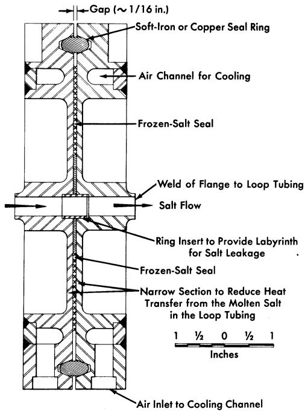  
Xxxx Between Flange Faces Indicate Region of Frozen-Salt Seal; Zzzz Indicate Region of Transition from Liquid to Solid Salt

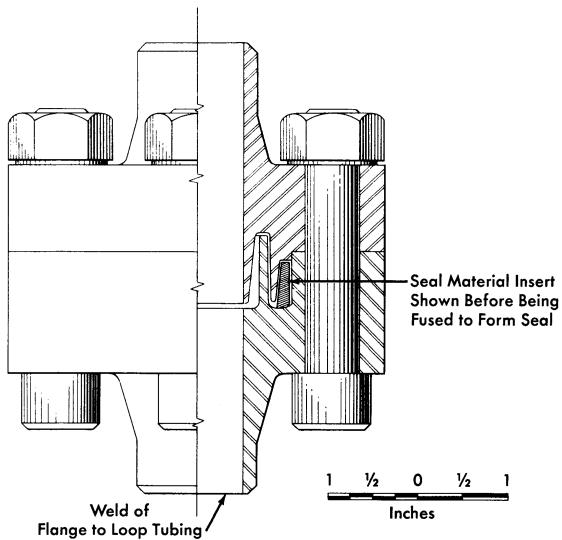  
FIG. 15-5. Freeze-flange joint for 1/2-in.-OD tubing.   
FIG. 15-6. Cast-metal-sealed flanged joint.

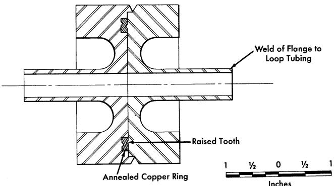  
FIG. 15-7. Indented-seal flange.

A cast-metal-sealed flanged joint is also being tested for use in vertical runs of pipe. As shown in Fig. 15-6, this joint includes a seal which is cast in place in an annulus provided to contain it. When the connection is to be made or broken the seal is melted. Mechanical strength is supplied by clamps or bolts.

A flanged joint containing a gasket (Fig. 15-7) is the third type of joint being considered. In this joint the flange faces have sharp, circular, mating ridges. The opposing ridges compress a soft metal gasket to form the seal between the flanges.

# 15-6. INSTRUMENTS

Sensing devices are required in molten-salt systems for the measurement of flow rates, pressures, temperatures, and liquid levels. Devices for these services are evaluated according to the following criteria: (1) they must be of leaktight, preferably all-welded, construction, (2) they must be capable of operating at the maximum temperature of the fluid system, (3) their accuracies must be relatively unaffected by changes in the system temperature, (4) they should provide lifetimes at least as great as the lifetime of the reactor, (5) each must be constructed so that, if the sensing element fails, only the measurement supplied by it is lost. The fluid system to which the instrument is attached must not be jeopardized by failure of the sensing element.

15-6.1 Flow measurements. Flow rates are measured in molten-salt systems with orifice or venturi elements. The pressures developed across the sensing element are measured by comparing the outputs of two pressure-measuring devices. Magnetic flowmeters are not at present sufficiently sensitive for molten-salt service because of the poor electrical conductivity of the salts.

15-6.2 Pressure measurements. Measurements of system pressures require that transducers operate at a safe margin above the melting point of the salt, and thus the minimum transducer operating temperature is usually about $1200^{\circ}\mathrm{F}$ . The pressure transducers that are available are of two types: (1) a pneumatic force-balanced unit and (2) a displacement unit in which the pressure is sensed by displacement of a Bourdon tube or diaphragm. The pneumatic force-balanced unit has the disadvantages that loss of the instrument gas supply (usually air) can result in loss of the measurement, and that failure of the bellows or diaphragm would open the process system to the air supply or to the atmosphere. The displacement unit, on the other hand, makes use of an isolating fluid to transfer the sensed pressure hydrostatically to an isolated low-temperature output element. Thus, in the event of a failure of the primary diaphragm, the process fluid would merely mix with the isolating fluid and the closure of the system would be unaffected.   
15-6.3 Temperature measurements. Temperatures in the range of 800 to $1300^{\circ}\mathrm{F}$ are commonly measured with Chromel-Alumel or platinum-platinum-rhodium thermocouples. The accuracy and life of a thermocouple in the temperature range of interest are functions of the wire size and, in general, the largest possible thermocouple should be used. Either beaded thermocouples or the newer, magnesium oxide-insulated thermocouples may be used.   
15-6.4 Liquid-level measurements. Instruments are available for both on-off and continuous level measurements. On-off measurements are made with modified automotive-type spark plugs in which a long rod is used in place of the normal center conductor of the spark plug. To obtain a continuous level measurement, the fluid head is measured with a differential pressure instrument. The pressure required to bubble a gas into the fluid is compared with the pressure above the liquid to obtain the fluid head. Resistance probe and float types of level indicators are available for use in liquid-metal systems.   
15-6.5 Nuclear sensors. Nuclear sensors for molten-salt reactors are similar to those of other reactors and are not required to withstand high temperatures. Existing and well-tested fission, ionization, and boron trifluoride thermal-neutron detection chambers are available for installation at all points essential to reactor operation. Their disadvantages of limited life can be countered only by duplication or replacement, and provisions can be made for this. It should be pointed out that the relatively large, negative temperature coefficients of reactivity provided by most circulating-fuel reactors make these instruments unessential to the routine operation of the reactor.

# CHAPTER 16

# AIRCRAFT REACTOR EXPERIMENT*

The feasibility of the operation of a molten-salt-fueled reactor at a truly high temperature was demonstrated in 1954 in experiments with a reactor constructed at ORNL. The temperature of the fuel exiting from the core of this reactor was about $1500^{\circ}\mathrm{F}$ , and the temperature of the fuel at the inlet to the core was about $1200^{\circ}\mathrm{F}$ . The reactor was constructed before the mechanism and control of corrosion by molten salts had been fully explored, and therefore the experimental operation of the reactor was of short duration. Since the work was supported by the Aircraft Reactors Branch of the Atomic Energy Commission, the reactor was called the Aircraft Reactor Experiment (ARE).†

The ARE was a thermal reactor in which moderation was accomplished by BeO blocks through which the fluoride fuel was circulated in Inconel tubes arranged in a symmetrical, heterogeneous matrix. The Inconel vessel containing the core was essentially a right cylinder, approximately 52 in. OD and 44 in. in height, with 2-in.-thick walls. The fuel passages consisted of 1-in.-diameter Inconel tubes arranged in six parallel circuits, and each circuit, by the use of reverse bends at top and bottom of the core, made eleven passes through the core. The fuel passages did not traverse the peripheral BeO blocks which served as a reflector around the core of the reactor. A top view of the BeO blocks and the Inconel tubes is shown in Fig. 16-1. The moderator and reflector blocks were cooled by circulating liquid sodium from the bottom to the top of the pressure vessel. The sodium permeated all interstices of the BeO and flowed rapidly through 1/2-in. vertical holes in the reflector sections of the BeO. An elevation drawing of the reactor which illustrates these features is presented in Fig. 16-2, and a photograph of the reactor vessel that was taken before assembly of the thermal shield is shown in Fig. 16-3.

Since the purpose of the operation of this experimental reactor was to study the behavior of the circulating-fluoride-fuel system and to identify the problems associated therewith, the power output of the reactor was not utilized but, rather, was simply dumped as heat. The heat-removal system is shown schematically in Fig. 16-4. The fuel was circulated through a finned-tube radiator type of heat exchanger. This radiator was located within a sheet-metal housing of a toroidal shape. In another part of the toroidal housing there was a second finned-tube radiator through

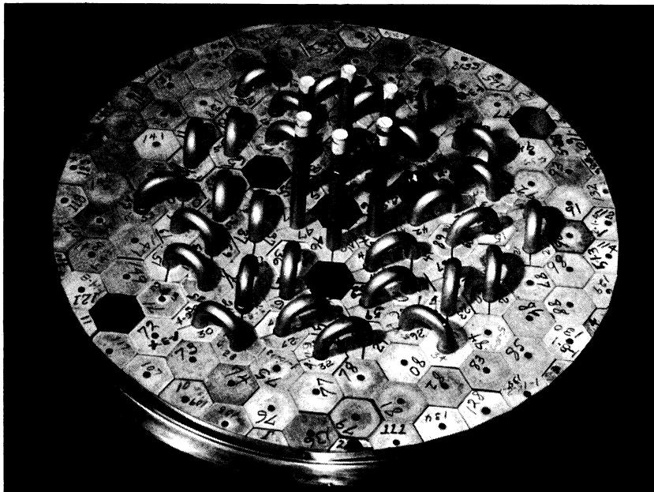  
FIG. 16-1. Top view of the reactor core of the ARE. Hexagonal beryllium oxide blocks serve as the moderator. Inconel tubes pass through the moderator blocks to carry the molten-salt fuel.

which plant water flowed. A large centrifugal blower circulated the coolant gas (helium) in the toroidal loop so that heat was picked up from the fuel radiator and dumped into the water radiator.

An identical arrangement of radiators and blower was used for cooling the sodium used as the moderator-reflector coolant. In the interest of safety (for removal of afterheat in the event of a pump failure), the sodium circuit was installed in duplicate so that an entire sodium cooling system was available as a spare. These two sodium loops were operated alternately during the experiment in an effort to keep a check on the operability of each loop. Had one loop failed to operate, the experiment would have been terminated for lack of a spare cooling system.

The control system of the reactor was based on conventional practice. The three safety shim rods were actuated by electrically driven lead screws which moved electromagnets in a vertical plane. When these magnets were driven to their lowest extremity, an armature was engaged to which the shim (poison) rods were attached. Loss of current in the electromagnets would allow the rods to fall under the action of gravity into thimbles in the central region of the core. The regulating rod was a simple stainless-steel pipe which was rigidly attached to a rack driven by a reversible elec

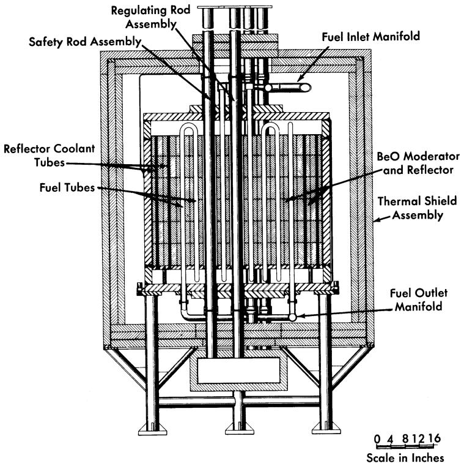  
Fig. 16-2. Elevative section of the Aircraft Reactor Experiment.

tric motor through a pinion. Fission chambers located in the reflector, as well as ionization chambers located outside the pressure shell of the reactor, furnished the neutron and gamma-ray signals for the control system.

The shim and control rods which entered the hot reactor core had to be cooled to prevent overheating from neutron capture and gamma-ray absorption. This cooling was effected by circulating helium in a closed loop that included a water-cooled radiator, as in the case of the fuel and sodium circuits. This helium circuit was integral with a helium-filled monitoring annulus which surrounded all fuel and sodium piping in the system. This annulus was formed by putting a continuous stainless-steel sleeve around all hot piping, and the helium circulated in the annulus performed two functions: (1) it kept the hot lines at essentially an even temperature during the warmup period when the system was heated by means of electrical heating units placed on the outer surface of the annulus, and (2) the helium was monitored to ensure that the fuel and sodium piping was leaktight.

Large, heated reservoir tanks were connected to the system through isolation valves so that the sodium and the fused fluoride mixture could

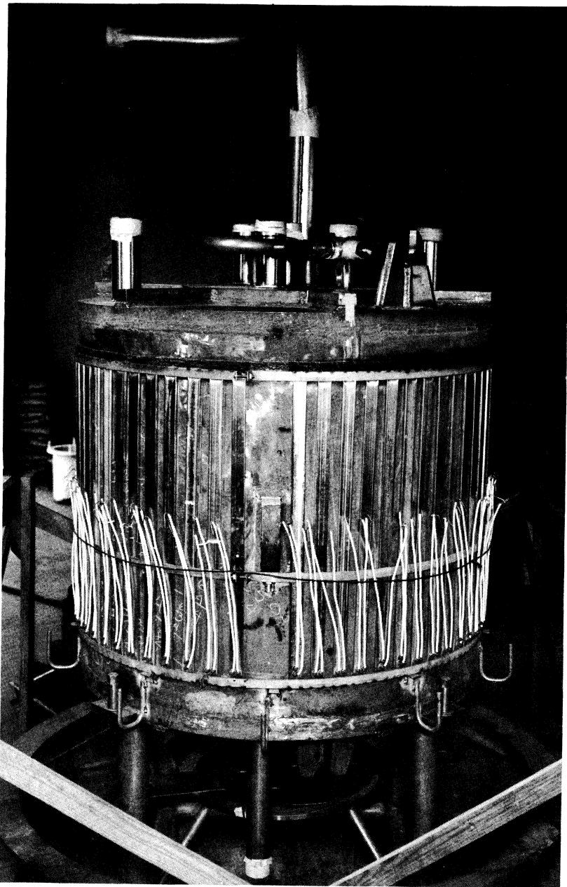  
FIG. 16-3. View of the ARE Vessel before addition of the thermal shield. The external strip heaters with their electrical leads are shown in place.

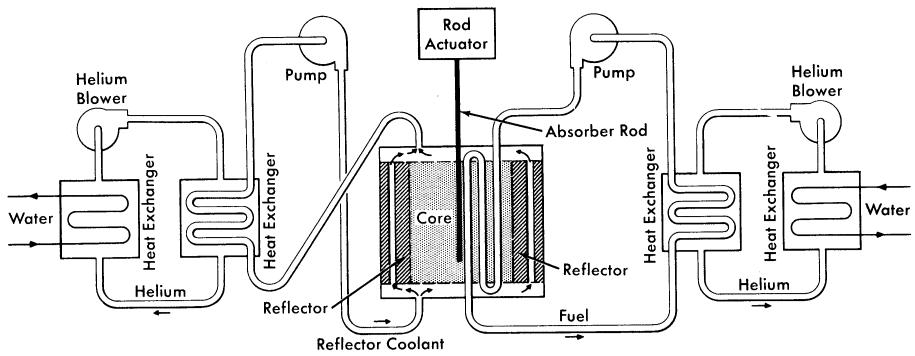  
FIG. 16-4. Schematic diagram of the heat-removal system for the ARE.

be pressurized from the tanks into the system and could be drained back into the tanks after the experiment was over. Dry helium was used for operating penumatic instruments and for pressurizing the liquids into the system from the tanks.

Pumps for both the sodium and the molten-fluoride mixture consisted of sump-type centrifugal pumps with overhanging shafts. The pumps were mounted vertically, and a gas space was provided between the liquid level and the upper bearings of the pump. The pumps were located so that the free-liquid surface in the sump tank was the high point in both the fuel and the sodium circuits. The sump tank of the pump also served as an expansion tank for the liquid. The isometric drawing of the fuel system presented in Fig. 16-5 indicates the relative levels of the components.

Both of the liquid systems, fuel and sodium, were fabricated entirely of Inconel, and all closures were made by inert-gas-shielded electric-arc (Heliarc) welding. The welding procedure was adopted after extensive experimental research and developmental work, and meticulous care was exercised in all welding operations. The entire reactor system, that is, the reactor vessel, heat exchangers, pumps, dump tanks, piping, and auxiliary equipment (with the exception of control rod drives), was located in concrete pits below ground level. After the reactor was brought to criticality by manual fuel injection, concrete blocks were placed on top of the pits to complete the shielding of the system as required during power operation.

Fuel was added as a molten mixture of NaF and UF $_4$ (enriched in $\mathrm{U}^{235}$ ) after the sodium system had been heated and filled with sodium and the fuel system had been heated and filled with fuel carrier—a molten mixture of NaF and $\mathrm{ZrF_4}$ . The fuel additions were made into the sump of the fuel pump through the use of a temporary enrichment system that was capable of injecting (by manual operation) a few hundred grams of fuel mixture

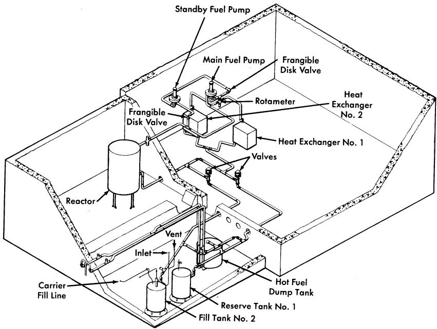  
FIG. 16-5. Layout of the fuel system components for the ARE.

at a time. This method of fuel addition was laborious and time-consuming, but it effectively and safely enriched the reactor to a critical concentration.

The reactor was taken to criticality essentially without incident. The total amount of $\mathrm{U}^{235}$ added to the system to make the reactor critical was approximately $61\mathrm{kg}$ , but small amounts of fuel were withdrawn from the system for sampling and in trimming the pump level. The uranium concentration at criticality was $384\mathrm{g}/\mathrm{liter}$ of fluoride mixture. The calculated volume of the core was 38.8 liters at $1300^{\circ}\mathrm{F}$ , and thus the clean critical mass of the reactor was $14.9\mathrm{kg}$ of $\mathrm{U}^{235}$ .

It was demonstrated that the reactor had an over-all temperature coefficient of reactivity of $-6 \times 10^{-5} (\Delta k / k) / {}^{\circ}\mathrm{F}$ . As was anticipated, the fast negative temperature coefficient of reactivity (associated with the fuel expansion coefficient) served to stabilize the reactor power level. From a power lever of $200\mathrm{kw}$ upward, the temperature coefficient controlled the system so precisely that the reactor responded to load demands in a thoroughly reliable manner.

The response of the reactor was demonstrated in a number of experiments, one of which is described in Fig. 16-6. The abscissa, to be read from right to left, is the time in minutes, and the print-outs from recorders giving the reactor inlet and outlet temperatures are the ordinate. Initially, in this experiment, the reactor was operating at low power. Then the heat

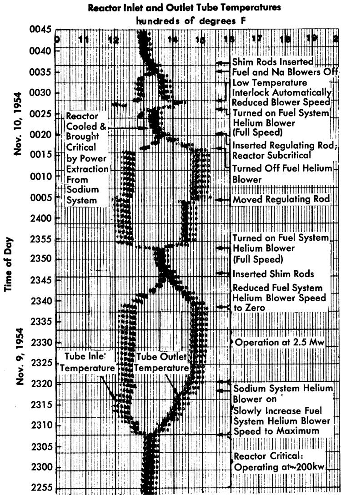  
FIG. 16-6. Chart of inlet and outlet temperatures for the ARE as influenced by various experimental procedures.

extraction from the fuel was slowly increased and there was, first, a resultant decrease in the temperature of the fuel which reached the reactor inlet from the heat exchanger. This increased the reactivity and the reactor power, as indicated by the temperature rise at the reactor outlet. The spread of inlet and outlet temperatures corresponds to a power level of $2.5\mathrm{Mw}$ . When the heat extraction was reduced, the inlet temperature

rose and the outlet temperature fell until the two temperatures became nearly coincident. As may be seen, the control rods did not determine the power output; they only influenced the average temperature. Insertion of the shim rods decreased the temperature. Another rapid increase in the power demand on the fuel system again spread apart the inlet and outlet temperature recordings, and full insertion and full withdrawal of the regulating rod depressed and then raised both temperatures simultaneously. Next, the power extraction was stopped and the regulating rod was inserted to make the reactor subcritical.

The third spread of the temperatures in Fig. 16-6 was a result of a demonstration which showed that the reactor could be brought to criticality, without use of the rods, by the power demand alone. Power extraction from the sodium system cooled the reactor to make it critical, and power extraction from the fuel again caused the spread of inlet and outlet temperatures.

The remarkable stability of the system made it unexpectedly possible to demonstrate that no more than $5\%$ of the $\mathrm{Xe}^{135}$ was retained in the molten fuel. It had been computed that the xenon poisoning after 27 hr of operation at full power would amount to $2\times 10^{-3}$ in $\Delta k / k$ if all the xenon formed stayed in the fuel until it decayed. This level of poisoning was less than would be expected from the usual equations, partly because the fuel spent only one-fourth of the time in the core and was thus effectively only subjected to one-fourth of the flux, and partly because many of the neutrons had energies above the large $\mathrm{Xe}^{135}$ absorption resonance. As little as $5\%$ of this computed poisoning would have been detectable, but none was found.

There was a small leakage from the gas volume above the liquid surface of the fuel pumps which made operation at a high power level somewhat awkward, but danger to operating personnel was circumvented by operating with the reactor pit at a subatmospheric pressure and remotely exhausting the pit gases to the atmosphere at a location where they were adequately dispersed.

The entire program of experiments that had been planned for the reactor was completed satisfactorily. The reactor was shut down after a total power production of 96 Mwh, and it was later dismantled. The fuel and sodium systems had been in operation for a total of 462 and $635\mathrm{hr}$ , respectively, including $221\mathrm{hr}$ of nuclear operation, with the final $74\mathrm{hr}$ of operation in the megawatt range.

# CHAPTER 17

# CONCEPTUAL DESIGN OF A POWER REACTOR*

The design of a homogeneous molten-salt reactor of the type discussed in the preceding chapters is described below. The choice of the power level for this design is arbitrary, since the 8-ft-diameter reactor core, chosen from nuclear considerations, is capable of operating at power levels up to $1900\mathrm{Mw}$ (thermal) without excessive power densities in the core. An electrical generator of 275-Mw capacity was chosen, since this is in the size range that a number of power companies have used in recent years. It is estimated that about $6\%$ of the power would be used in the station, and thus the net power to the system would be about $260\mathrm{Mw}$ .

Two sodium circuits in series were chosen as the heat-transfer system between the fuel salt and the steam. Delayed neutrons from the circulating fuel will activate the primary heat exchangers and the sodium passing through them. A secondary heat-exchanger system in which the heat will transfer from the radioactive sodium to nonradioactive sodium will serve to prevent radioactivity at the steam generators, superheaters, and reheaters. The fuel flow from the core is distributed among four primary heat exchangers which serve as the first elements of the four parallel paths for heat transfer to the steam. A single primary heat exchanger and path is provided for the blanket circuit.

Plan and elevation views of the reactor plant are shown in Figs. 17-1 and 17-2, and an isometric drawing showing the piping of the heat-transfer systems is shown in Fig. 17-3. The reactor and the primary heat exchangers are contained in a large rectangular reactor cell, sealed to contain any leakage of fission-product gases. All operations in the cell must be carried out remotely after the reactor has operated at power. The principal characteristics of the plant are listed in Table 17-1.

# 17-1. FUEL AND BLANKET SYSTEMS

17-1.1 Reactor vessel. The reactor vessel and the fuel and blanket pumps are a closely coupled assembly (Fig. 17-4) which is suspended from a flange on the fuel pump barrel. The vessel itself has two regions—one for the fuel and one for the blanket salt. The fuel region consists of the reactor core surmounted by an expansion chamber, which contains the single fuel pump. The blanket region completely surrounds the fuel region, and the blanket salt cools the walls of the expansion chamber gas space and shields the pump motor. The floor of the expansion chamber is

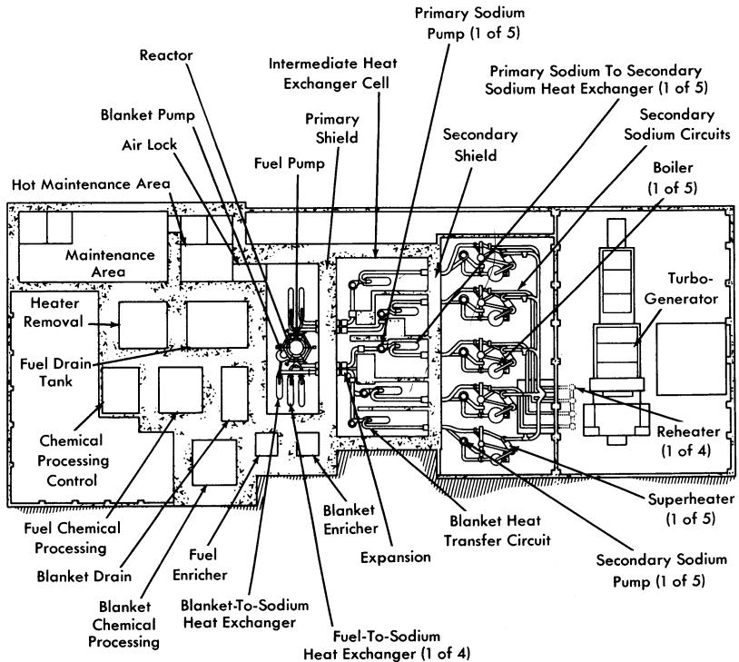  
FIG. 17-1. Plan view of molten salt power reactor plant.

a flat disk, 3/8 in. thick, which serves as a diaphragm to absorb differential thermal expansion between the core and the outer shells.

17-1.2 Fuel pump. The fuel pump is of the type illustrated in Chapter 15 (Fig. 15-3) and is designed to have a capacity of $24,000\mathrm{gpm}$ . It is driven by a 1000-hp motor with a shaft speed of $700\mathrm{rpm}$ . This pump incorporates three major advanced features that are being developed, but which are not present in any molten-salt pump operated to date. These are a hydrostatic lower bearing to be operated in the molten salt, a labyrinth type of gas seal to prevent escape of fission-product gases up the shaft, and a hemispherical gas-cushioned upper bearing to act as a combined thrust and radial bearing. These advanced features are intended to provide a pump with greater resistance to radiation damage and less complex auxiliary equipment than necessary for pumps presently used for molten salts.

17-1.3 System for removal of fission-product gases. About $3.5\%$ of the fuel passing through the fuel pump is diverted from the main stream,

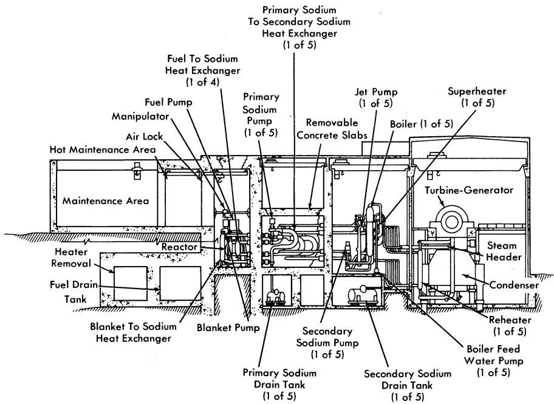  
FIG. 17-2. Elevation view of molten salt power reactor plant.

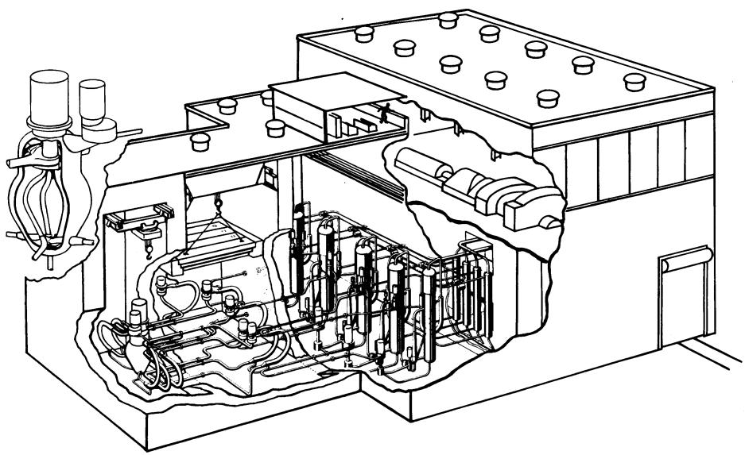  
FIG. 17-3. Isometric view of molten salt power reactor plant.

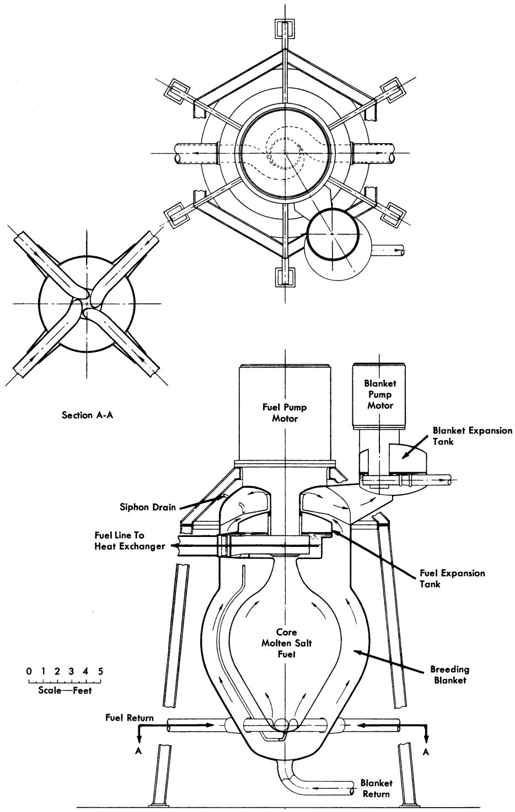  
FIG. 17-4. Reactor vessel and pump assembly.

TABLE 17-1   
REACTOR PLANT CHARACTERISTICS   

<table><tr><td>Fuel</td><td>&gt;90% U235F4</td></tr><tr><td>Fuel carrier</td><td>62 mole % LiF, 37 mole % BeF2, 1 mole % ThF4</td></tr><tr><td>Neutron energy</td><td>Intermediate</td></tr><tr><td>Moderator</td><td>LiF BeF2</td></tr><tr><td>Primary coolant</td><td>Circulating fuel solution, 23,800 gpm</td></tr><tr><td>Power</td><td></td></tr><tr><td>Electric (net)</td><td>260 Mw</td></tr><tr><td>Heat</td><td>640 Mw</td></tr><tr><td>Regeneration ratio</td><td></td></tr><tr><td>Clean</td><td>0.63</td></tr><tr><td>Average (20 yr)</td><td>0.50</td></tr><tr><td>Blanket salt</td><td>71 mole % LiF, 16 mole % BeF2, 13 mole % ThF4</td></tr><tr><td>Refueling cycle at full power</td><td>Semicontinuous</td></tr><tr><td>Shielding</td><td>Concrete room walls, 9 ft thick</td></tr><tr><td>Control</td><td>Temperature and fuel concentration</td></tr><tr><td>Plant efficiency</td><td>44.3%</td></tr><tr><td>Exit fuel temperature</td><td>1210°F at approximately 83 psia</td></tr><tr><td>Steam</td><td></td></tr><tr><td>Temperature</td><td>1000°F, with 1000°F reheat</td></tr><tr><td>Pressure</td><td>1800 psia</td></tr><tr><td>Second loop fluid</td><td>Sodium</td></tr><tr><td>Third loop fluid</td><td>Sodium</td></tr><tr><td>Structural materials</td><td></td></tr><tr><td>Fuel circuit</td><td>INOR-8</td></tr><tr><td>Secondary loop</td><td>Type-316 stainless steel</td></tr><tr><td>Tertiary loop</td><td>5% Cr, 1% Si steel</td></tr><tr><td>Steam boiler</td><td>2.5% Cr, 1% Mo steel</td></tr><tr><td>Steam superheater</td><td>5% Cr, 1% Si steel</td></tr><tr><td>Active-core dimensions</td><td></td></tr><tr><td>Fuel equivalent diameter</td><td>8 ft</td></tr><tr><td>Blanket thickness</td><td>2 ft</td></tr><tr><td>Temperature coefficient, (Δk/k)/°F</td><td>-(3.8 ± 0.04) × 10-5</td></tr><tr><td>Specific power</td><td>1000 kw/kg</td></tr><tr><td>Power density</td><td>80 kw/liter</td></tr><tr><td>Fuel inventory</td><td></td></tr><tr><td>Initial (clean)</td><td>604 kg of U235</td></tr><tr><td>Average (20 yr)</td><td>1000 kg of U235</td></tr><tr><td>Clean critical mass</td><td>267 kg of U235</td></tr><tr><td>Burnup</td><td>Unlimited</td></tr></table>

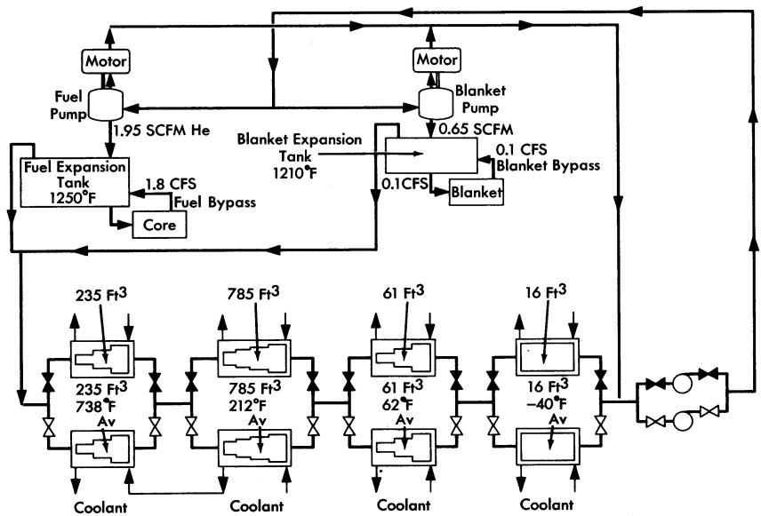  
FIG. 17-5. Schematic flow diagram for continuous removal of fission-product gases.

mixed with helium from the pump-shaft labyrinth seal, and sprayed into the reactor expansion tank. The mixing and spraying provides a large fuel-to-purge-gas interface, which promotes the establishment of low equilibrium fission gas concentrations in the fuel. The expansion tank provides a liquid surface area of approximately $26\mathrm{ft}^2$ for removal of the entrained purge and fission gas mixture. The gas removal is effected by the balance between the difference in the density of the fuel and the gas bubbles and the drag of the opposing fuel velocity. The downward surface velocity in the expansion tank is less than 1 in/sec, which should allow all bubbles larger than 0.008 in. in radius to come to the surface and escape. In the Aircraft Reactor Experiment at least $97\%$ of the fission-product gases were continuously purged by similar techniques.

With a fuel purge gas rate of 5 cfm, approximately 350 kw of beta heating from the decay of the fission-product gases and their daughters is deposited in the fuel and on metal surfaces of the fuel expansion tank. This heat is partly removed by the bypass fuel circuits and the balance is transferred through the expansion tank walls to the blanket salt.

The mixture of fission-product gases, decay products, and purge helium leaves the expansion tank through the off-gas line, which is located in the top of the tank, and joins with a similar stream from the blanket expansion tank (see Fig. 17-5). The combined flow is delayed approximately $50\mathrm{min}$ in a cooled volume to allow a large fraction of the shorter-lived fission products to decay before entering the cooled activated-carbon beds. The

capacity of the carbon beds will hold krypton from passing through for approximately 6 days, and xenon for much longer times.

The purge gases, essentially free from activity, leave the carbon beds to join the gases from the gas-lubricated bearings of the pumps. The gases are then compressed and returned to the reactor to repeat the cycle. Approximately every four days the gas stream is diverted from one set of carbon beds to the other. The inactive bed is then regenerated by warming it to expel the $\mathrm{Kr}^{85}$ and other long-lived fission products. It will probably be economical to recover some of these gases; others may be expelled to the stack.

# 17-2. HEAT-TRANSFER CIRCUITS AND TURBINE GENERATOR

The primary heat exchangers are designed to have the fuel on the shell side and sodium inside the tubes. This arrangement makes full use of the superior properties of sodium as a heat-transfer fluid and appears to yield the lowest fuel volume.

The heat exchangers, which are of semicircular construction, as shown in Fig. 17-3, provide convenient piping to the top and bottom of the reactor. The thermal characteristics of the primary heat exchanger, together with the characteristics of other heat exchangers of the reactor system, are listed in Table 17-2.

The sodium in the intermediate heat-transfer system (see Fig. 17-6) is heated by the fuel in the primary heat exchanger and is pumped out of the reactor cell and through the reactor cell shield to adjacent cells, which contain the secondary sodium-to-sodium heat exchangers and the pump. No control of intermediate sodium flow is required, so there are no valves and a constant speed centrifugal pump is used. To permit the sodium to be at a lower pressure than the fuel in the primary heat exchanger, the pump for the intermediate sodium is in the higher temperature side of the circuit. The secondary heat exchangers are of the U-tube in U-shell, counterflow design, with the intermediate sodium in the tubes and the final sodium on the shell side.

The final sodium circuit, except for the secondary exchanger, is outside the shielded area and thus available for adjustment and maintenance at all times. The principal problems in this circuit are concerned with the adjustment of sodium temperature. Excessive thermal strains are prevented in the steam generator by limiting the temperature of the sodium entering it, and in the intermediate heat exchanger by the regulation of sodium flows so that too cold sodium is never returned to it. The hot sodium from the secondary exchanger is split into three streams with regulating valves for control of the relative flows. One stream bypasses the steam system and goes directly to a blender; the flow in it is, of course, greatest at low power

TABLE 17-2   
DATA FOR HEAT EXCHANGERS   

<table><tr><td></td><td colspan="2">Primary</td><td colspan="2">Secondary</td></tr><tr><td>Fuel and sodium-to-sodium exchangers</td><td></td><td></td><td></td><td></td></tr><tr><td>Number required</td><td colspan="2">4</td><td colspan="2">4</td></tr><tr><td>Fluid</td><td>Fuel salt</td><td>Primary sodium</td><td>Primary sodium</td><td>Secondary sodium</td></tr><tr><td>Fluid location</td><td>Shell</td><td>Tubes</td><td>Tubes</td><td>Shell</td></tr><tr><td>Type of exchanger</td><td colspan="2">U-tube in U-shell, counterflow</td><td colspan="2">U-tube in U-shell, counterflow</td></tr><tr><td>Temperatures</td><td></td><td></td><td></td><td></td></tr><tr><td>Hot end, °F</td><td>1210</td><td>1120</td><td>1120</td><td>1080</td></tr><tr><td>Cold end, °F</td><td>1075</td><td>925</td><td>925</td><td>825</td></tr><tr><td>Tube data</td><td></td><td></td><td></td><td></td></tr><tr><td>Material</td><td colspan="2">INOR-8</td><td colspan="2">Type-316 stainless steel</td></tr><tr><td>Outside diameter, in.</td><td colspan="2">1.000</td><td colspan="2">0.750</td></tr><tr><td>Wall thickness, in.</td><td colspan="2">0.058</td><td colspan="2">0.049</td></tr><tr><td>Length, ft</td><td colspan="2">23.7</td><td colspan="2">21.5</td></tr><tr><td>Number</td><td colspan="2">515</td><td colspan="2">1440</td></tr><tr><td>Pitch (Δ), in.</td><td colspan="2">1.144</td><td colspan="2">0.898</td></tr><tr><td>Bundle diameter, in.</td><td colspan="2">28</td><td colspan="2">36</td></tr><tr><td>Heat transfer capacity, Mw</td><td colspan="2">144</td><td colspan="2">144</td></tr><tr><td>Heat transfer area, ft2</td><td colspan="2">2800</td><td colspan="2">5200</td></tr><tr><td>Average heat flux, 1000 Btu/(hr)(ft2)</td><td colspan="2">175</td><td colspan="2">95</td></tr><tr><td>Flow rate, cfps</td><td>13.4</td><td>46.1</td><td>46.1</td><td>33.6</td></tr><tr><td>Fluid velocity, fps</td><td>10.8</td><td>19.7</td><td>13.9</td><td>13.2</td></tr><tr><td>Pressure drop, psi</td><td>40</td><td>15.5</td><td>10</td><td>14.8</td></tr></table>

continued

TABLE 17-2 (continued)   

<table><tr><td></td><td colspan="2">Steam Generator</td><td colspan="2">Superheater</td><td colspan="2">Reheater</td></tr><tr><td>Sodium-to-steam exchanger</td><td></td><td></td><td></td><td></td><td></td><td></td></tr><tr><td>Number required</td><td colspan="2">4</td><td colspan="2">4</td><td colspan="2">4</td></tr><tr><td>Fluid</td><td>Secondary sodium</td><td>Water</td><td>Secondary sodium</td><td>Steam</td><td>Secondary sodium</td><td>Steam</td></tr><tr><td>Fluid location</td><td>Shell</td><td>Tubes</td><td>Shell</td><td>Tubes</td><td>Shell</td><td>Tubes</td></tr><tr><td>Type of exchanger</td><td colspan="2">Bayonet, counterflow</td><td colspan="2">U-tube in U-shell, counterflow</td><td colspan="2">Straight, counterflow</td></tr><tr><td>Temperatures</td><td></td><td></td><td></td><td></td><td></td><td></td></tr><tr><td>Hot end, °F</td><td>825</td><td>621</td><td>1080</td><td>1000</td><td>1080</td><td>1000</td></tr><tr><td>Cold end, °F</td><td>740</td><td>621</td><td>930</td><td>621</td><td>1000</td><td>640</td></tr><tr><td>Tube data</td><td></td><td></td><td></td><td></td><td></td><td></td></tr><tr><td>Material</td><td colspan="2">2.5% Cr, 1% Mo Alloy</td><td colspan="2">5% Cr, 1% Si Alloy</td><td colspan="2">5% Cr, 1% Si Alloy</td></tr><tr><td>Outside diameter, in.</td><td colspan="2">2</td><td colspan="2">0.750</td><td colspan="2">0.750</td></tr><tr><td>Wall thickness, in.</td><td colspan="2">0.180</td><td colspan="2">0.095</td><td colspan="2">0.065</td></tr><tr><td>Length, ft</td><td colspan="2">18</td><td colspan="2">25</td><td colspan="2">16.5</td></tr><tr><td>Number</td><td colspan="2">362</td><td colspan="2">480</td><td colspan="2">800</td></tr><tr><td>Pitch (Δ), in.</td><td colspan="2">2.75</td><td colspan="2">1.00</td><td colspan="2">1.00</td></tr><tr><td>Bundle diameter, in.</td><td colspan="2">55</td><td colspan="2">23</td><td colspan="2">29.7</td></tr><tr><td>Heat transfer capacity, Mw</td><td colspan="2">82.2</td><td colspan="2">39.2</td><td colspan="2">22.6</td></tr><tr><td>Heat transfer area, ft2</td><td colspan="2">2800</td><td colspan="2">1760</td><td colspan="2">2200</td></tr><tr><td>Average heat flux, 1000 Btu/(hr) (ft2)</td><td colspan="2">100</td><td colspan="2">76</td><td colspan="2">35</td></tr><tr><td>Flow rate, cfps</td><td colspan="2">57.5</td><td colspan="2">15.5</td><td colspan="2">16.8</td></tr><tr><td>or 1000 lb/hr</td><td colspan="2">410</td><td colspan="2">406</td><td colspan="2">399</td></tr><tr><td>Fluid velocity, fps</td><td colspan="2">5.6</td><td>9.3</td><td>61</td><td>7.9</td><td>137</td></tr><tr><td>Pressure drop, psi</td><td colspan="2">5.7 (jet pump)</td><td>6.9</td><td>10.3</td><td>3.2</td><td>10.4</td></tr></table>

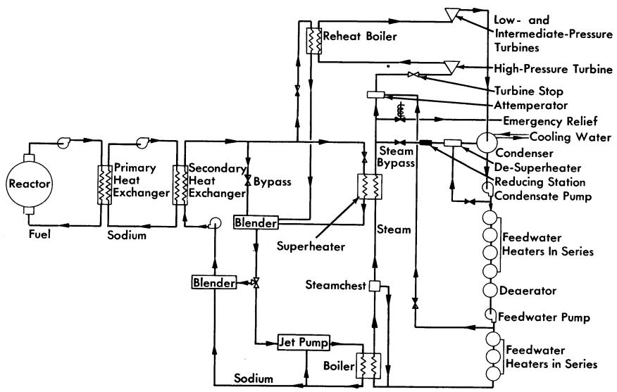  
FIG. 17-6. Schematic diagram of heat-transfer system.

levels. The other two streams go to the superheater and the reheater, and are then combined with the bypass flow in the blender. On leaving the blender, the sodium stream is split again by a three-way valve into two streams; one enters a second bypass and goes directly to the main pump and the other enters a jet pump that keeps a large sodium flow recirculating through the boiler, which is of the Lewis type. The three-way valve is adjusted, at design point, so that about two-thirds of the flow goes to the jet pump and one-third bypasses the boiler. At low power levels the valve would be adjusted to give very low flows to the boiler.

The centrifugal pump in this circuit has two speeds, full speed and one-fourth of full speed. The low-speed operation provides for better regulation of the sodium flow at very low power levels.

The turbine selected uses 1800-psia steam at $1000^{\circ}\mathrm{F}$ with reheat to $1000^{\circ}\mathrm{F}$ and is rated at $275\mathrm{Mw}$ . It is a 3600-rpm single-shaft machine with three exhaust ends. The turbine heat rate is estimated to be 7700 Btu/kwh, or $44.3\%$ cycle efficiency, while 7860 and 8360 Btu/kwh are the generator and station heat rates, respectively. With $6\%$ of generator output used for station auxiliaries, 260 Mw is supplied to the bus bar.

# 17-3. REMOTE MAINTENANCE PROVISIONS

Remotely controlled mechanized tools and viewing devices are provided in the reactor cell for making minor repairs and for removing and re

placing any component in the cell. The tools will be able to handle any pump, heat exchanger, pipe, heater for pipe and equipment, instrument, and even the reactor vessel, and, correspondingly, the components will be designed and located for accessibility and separation.

The removal and replacement of components requires a reliable method of making and breaking joints in the pipe. Cutting and welding of pipe sections can be used, but in the low-pressure molten-salt system it is believed that a flanged-pipe joint (see Section 15-5) may be satisfactory.

All equipment and pipe joints in the reactor cell are laid out so that they are accessible from above. Directly above the equipment is a traveling bridge on which can be mounted one or more remotely operated manipulators. At the top of the cell is another traveling bridge for a remotely operated crane. At one end of the cell is an air lock that connects with the maintenance area. The crane can move from the bridge in the cell to a monorail in the air lock.

Closed-circuit television equipment is provided for viewing the maintenance operation in the cell. A number of cameras are mounted to show the operation from different angles, and a periscope gives a direct view of the entire cell.

# 17-4. MOLTEN-SALT TRANSFER EQUIPMENT

The fuel-transfer systems are shown schematically in Fig. 17-7. Salt freeze valves (see Section 15-3) are used to isolate the individual components in the fuel-transfer lines and to isolate the chemical plant from the components in the reactor cell. With the exception of the reactor draining operation, which is described below, the liquid is transferred from one vessel to another by a differential gas pressure. By this means, fuel may be added to, or withdrawn from, the reactor during power operation.

The fuel added to the reactor will have a high concentration of $\mathrm{UF_4}$ with respect to the process fuel, so that additions to overcome burnup will require transfer of only a small volume; similarly, thorium-bearing molten salt may be added at any time to the fuel system. The thorium, in addition to being a design constituent of the fuel salt, may be added in amounts required to serve as a nuclear poison.

For the main fuel drain circuit, bellows-sealed, mechanically operated, poppet valves (see Section 15-3) will be placed in series with the freeze valves to establish a stagnant liquid suitable for freezing. Normally these mechanical valves will be left open. By melting the plug in the freeze line and opening gas-equalization valves, the liquid in the reactor will flow by gravity to the drain tank, and the gas in the drain tank will be transferred to the reactor system. Thus gas will not have to be added to, or vented from, the primary system.

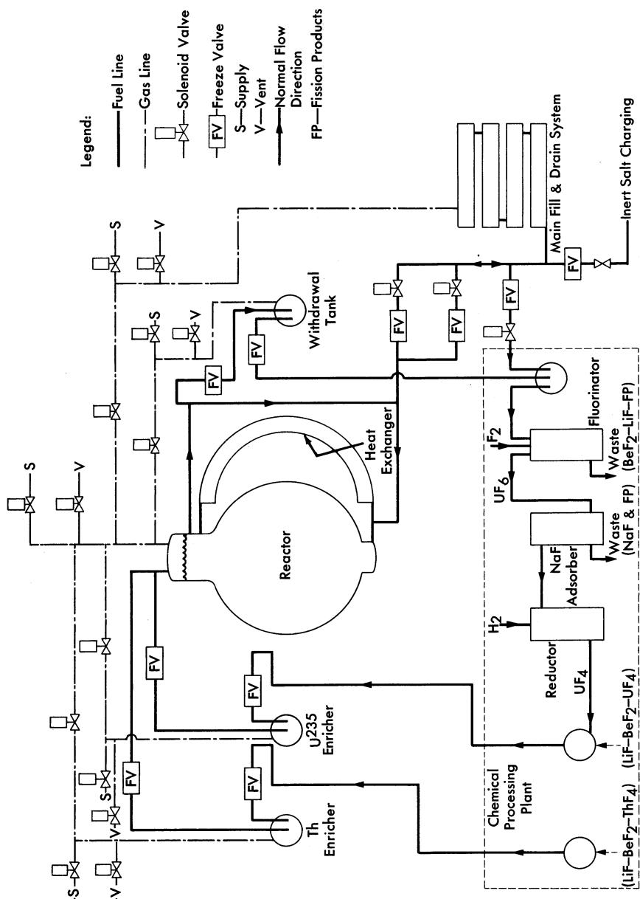  
FIG. 17-7. Schematic diagram of fuel salt transfer system.

# 17-5. FUEL DRAIN TANK

For the drain vessel design calculations, it was assumed that at $1200^{\circ}\mathrm{F}$ the fuel system volume would be $600\mathrm{ft}^3$ . The design capacity of the drain vessel was therefore set at $750\mathrm{ft}^3$ in order to allow for temperature excursions and for a residual inventory. An array of 12-in.-diameter pipes was selected as the primary containment vessel of the drain system in order to obtain a large surface area-to-volume ratio for heat-transfer efficiency and to provide a large amount of nuclear poison material. Forty-eight 20-ft lengths of pipe are arranged in six vertical banks connected on alternate ends with mitered joints (see Fig. 17-8). The six banks of pipe are connected at the bottom with a common drain line that connects with the fuel system. The drain system is preheated and maintained at the desired temperature with electric heaters installed in small-diameter pipes located axially inside main pipes. These bayonet-type heaters can be removed or installed from one face of the pipe array to facilitate maintenance. The entire system is installed in an insulated room or furnace to minimize heat losses.

The removal of the fuel afterheat is accomplished by filling boiler tubes installed between 12-in.-diameter fuel-containing pipes with water from headers that are normally filled. The boiler tubes will normally be dry and at the ambient temperature of about $950^{\circ}\mathrm{F}$ . Cooling will be accomplished by slowly flooding or "quenching" the tubes, which then furnish a heat sink for radiant heat transfer between the fuel-containing pipes and the low-pressure, low-temperature boiler tubes. For the peak afterheat load, a flow of about $150\mathrm{gpm}$ of water is required to supply the boiler tubes.

The design criteria for this fill-and-drain system are that it always be in a standby condition immediately available for drainage of the fuel, that it be capable of adequately handling the fuel afterheat, and that it provide double containment for the fuel. The heat-removal scheme is essentially self-regulating in that the amount of heat removed is determined by the radiant exchange between the vessels and water wall. Both the water and the fuel systems are at low pressure, and a double failure would be required for the two fluids to be mixed. The drain system cell may be easily enclosed and sealed from the atmosphere because there are no large gas-cooling ducts or other major external systems connected to it.

# 17-6. CHEMICAL REPROCESSING METHOD

In this plant it is assumed that the core and blanket salts will be reprocessed by the fluoride volatility process [1] to remove $\mathrm{UF}_6$ . The $\mathrm{UF}_6$ will be reduced by a fluorine-hydrogen flame process [2] and returned to the reactor core. The blanket salt with its $\mathrm{U}^{233}$ removed will be returned to the blanket, since the buildup of fission products in the blanket salt will

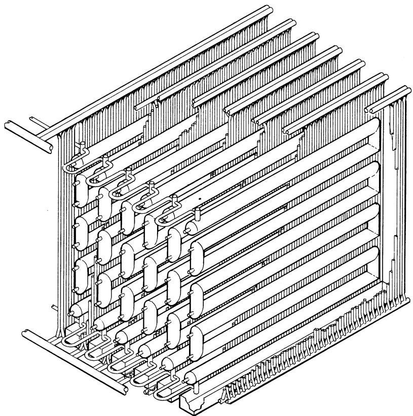  
FIG. 17-8. Drain and storage tank for fuel salt of molten salt power reactor.

not be an appreciable poison for many years. For purposes of the cost study, it is assumed that the spent fuel salt with its contained fission products will be discarded after each processing, and new fuel salt will be provided. Since several means of recovering the fuel salt appear to be feasible, this is a conservative assumption. The chemical processing is assumed to be an integral part of this reactor plant.

# 17-7. COST ESTIMATES

All the costs were calculated for a 260-Mw net-electrical-output plant operated at a load factor of 0.80. An annual charge of $14\%$ was made for all capital items, other than the uranium inventory, for which a $4\%$ annual charge was made. It is assumed that the reactor plant components will have been engineered and developed with separate funds not included in this estimate.

Table 17-3 gives the fuel cycle costs separately from the other reactor costs, so that a comparison can be made with comparable costs for solid-fuel-element reactors.

TABLE 17-3   
FUEL CYCLE COSTS   

<table><tr><td>Operating costs (fuel cycle only)</td><td>$/year</td><td>mills/kwh</td></tr><tr><td>\(U^{235}\) consumed</td><td>2,260,000</td><td>1.24</td></tr><tr><td>Fuel salt makeup (or recovery cost)</td><td>760,000</td><td>0.42</td></tr><tr><td>Chemical plant operation (listed as part of Operation and Maintenance in Table 17-5)</td><td>500,000</td><td>0.28</td></tr><tr><td></td><td>3,520,000</td><td>1.94</td></tr><tr><td>Capital charges (fuel cycle only)</td><td></td><td></td></tr><tr><td>\(U^{233}\) and \(U^{235}\) inventory, 1000 kg at 4%</td><td>680,000</td><td>0.37</td></tr><tr><td>Chemical plant and equipment $3,000,000 at 14% (included in capital costs in Table 17-4 and fixed cost in Table 17-5)</td><td>420,000</td><td>0.23</td></tr><tr><td></td><td>1,100,000</td><td>0.60</td></tr><tr><td>Total fuel cycle cost</td><td>4,620,000</td><td>2.54</td></tr></table>

An estimate of the capital costs for the reactor plant is given in Table 17-4. This breakdown leads to the estimated power costs in Table 17-5.

TABLE 17-4   
CAPITAL COSTS   

<table><tr><td>Land and land rights</td><td>$500,000</td></tr><tr><td>Structures and improvements</td><td>7,500,000</td></tr><tr><td>Reactor system (including chemical plant)</td><td>20,039,000</td></tr><tr><td>Steam system</td><td>3,750,000</td></tr><tr><td>Turbine-generator plant</td><td>11,750,000</td></tr><tr><td>Accessory electrical equipment</td><td>4,600,000</td></tr><tr><td>Miscellaneous power plant equipment</td><td>1,250,000</td></tr><tr><td>Direct costs subtotal</td><td>49,389,000</td></tr><tr><td>Contingency subtotal</td><td>10,216,000</td></tr><tr><td>General expense</td><td>7,500,000</td></tr><tr><td>Design costs</td><td>2,450,000</td></tr><tr><td>Total cost</td><td>$69,555,000</td></tr></table>

Note that in Table 17-5 the chemical plant capital and operating costs listed in Table 17-3 are part of the fixed cost and operation and maintenance, respectively, so that the amount listed for fuel charges is only 2.03

TABLE 17-5   
POWER COSTS   

<table><tr><td>Item</td><td>Annual charge</td><td>mills/kwh</td></tr><tr><td>Fixed cost</td><td>$9,738,000</td><td>5.34</td></tr><tr><td>Operation and maintenance</td><td>2,700,000</td><td>1.48</td></tr><tr><td>Fuel charges</td><td>3,700,000</td><td>2.03</td></tr><tr><td>Total annual charge</td><td>$16,138,000</td><td></td></tr><tr><td>Total power cost</td><td></td><td>8.85</td></tr></table>

mills/kwh. This breakdown is in keeping with the philosophy of regarding the chemical reprocessing as an integral part of the reactor plant. The difference in cost between having the reactor on standby and having it on the line is less than 2 mills/kwh.

# REFERENCES

1. G. I. CATHERs, Uranium Recovery for Spent Fuel by Dissolution in Fused Salt and Fluorination, Nuclear Sci. and Eng. 2, 767 (1957).   
2. S. H. SMILEY and D. C. BRATER, Conversion of Uranium Hexafluoride to Uranium Tetrafluoride, Progress in Nuclear Energy, Series III, Process Chemistry, Vol. II. New York: Pergamon Press, in preparation.

# BIBLIOGRAPHY FOR PART II

Conceptual design studies of molten-salt power reactors:   
BULMER, J. J. et al., *Fused Salt Fast Breeder*, USAEC Report CF-56-8-204(Del.), Oak Ridge National Laboratory, 1956.   
DAVIDSON, J. K. and W. L. ROBB, A Molten-salt Thorium Converter for Power Production, USAEC Report KAPL-M-JKD-10, Knolls Atomic Power Laboratory, 1956.   
DAVIES, R. W. et al., 600 Mw Fused Salt Homogeneous Reactor Power Plant, USAEC Report CF-56-8-208(Del.), Oak Ridge National Laboratory, 1956.   
WEHMeyer, D. B. et al., Study of a Fused Salt Breeder Reactor for Power Production, USAEC Report CF-53-10-25, Oak Ridge National Laboratory, 1953.

__________   
__________   
  
__________   
__________   
  
  
  
  
__________   
  
__________   
__________