# Part III

# LIQUID-METAL FUEL REACTORS

FRANK MASLAN, Editor Brookhaven National Laboratory

18. Liquid-Metal Fuel Reactors   
19. Reactor Physics for Liquid-Metal Reactor Design   
20. Composition and Properties of Liquid-Metal Fuels   
21. Materials of Construction—Metallurgy   
22. Chemical Processing   
23. Engineering Design   
24. Liquid-Metal Fuel Reactor Design Study   
25. Additional Liquid-Metal Reactors

# CONTRIBUTORS

R. BOURDEAU

M. B. BRODSKY

J. S. BRYNER

J. CHERNICK

J.G.Y.CHOW

O. E. DWYER

W.P.EATHERLY

J.J. EGAN

A.M. ESHAYA   
W.S.GINELL   
L. GREEN   
R.J.ISLER   
D. H. GURINKSY   
D. HALL   
F. B. HILL

M. JANES   
O.F.KAMMERER   
C.J.KLAMUT   
R.M.KIEHN   
R. L. MANSFIELD   
R.A.MEYER   
F. T. MILES   
C. RASEMAN   
W. ROBBA   
D. G. SCHWEITZER   
T.V.SHEEHAN   
H. SUSSKIND   
C. WAIDE   
J. R. WEEKS   
R. H. WISWALL

# PREFACE

This is the most extensive discussion of liquid-metal fuel reactor development yet published in the United States. Emphasis has been placed on the Liquid Metal Fuel Reactor being developed by Brookhaven National Laboratory and Babcock & Wilcox Co. because it is the most advanced project. Work on various phases of liquid-metal fuel reactors is being carried out by Los Alamos Scientific Laboratory, Raytheon Manufacturing Co., Argonne National Laboratory, Ames Laboratory, and Atomics International. The editor would like to have given more coverage to work at the last three locations but was unable to because time was lacking.

The liquid-metal fuel reactor development at Brookhaven started as an organized program in 1951. Before that, work had been conducted on bismuth-uranium fuel and other components. In 1954, Babcock & Wilcox Co., in collaboration with representatives of sixteen other companies, prepared a reference design and report. In 1956, Babcock & Wilcox contracted with the Atomic Energy Commission to design, build, and operate a low-power experimental reactor (LMFR Experiment No. 1). Research, development, and design studies are being carried on concurrently by B & W and Brookhaven. LMFR Experiment No. 1, on which construction is scheduled to start in 1960, is intended to demonstrate feasibility and provide information on the physics, metallurgy, chemistry, and mechanical aspects of this type of reactor.

The editor expresses appreciation to many of his colleagues at Brookhaven and Babcock & Wilcox for working with him on these chapters. He wishes particularly to thank those whose material he drew upon, also C. Williams, O. E. Dwyer, D. Gurinsky, H. Kouts, F. T. Miles, and T. V. Sheehan, of Brookhaven National Laboratory; R. T. Schoemer, H. H. Poor, and J. Happell, of Babcock & Wilcox Co.; R. Rebholz and G. Goring, of Union Carbide Corp.; D. Hall, of Los Alamos Scientific Laboratory; and W. Robba, of Raytheon Manufacturing Co. Special appreciation is due Miss Gloria Ministeri for her laborious and prolonged secretarial work and Miss Dolores Del Castillo for coming to our aid in emergencies.

Upton, New York June 1958

Frank Maslan, Editor

# CHAPTER 18

# LIQUID METAL FUEL REACTORS

# 18-1. BACKGROUND

Liquid metal fuel reactors have received attention since the early days of reactor technology. The concept of a high-temperature fluid fuel which could be circulated for both heat exchange and chemical processing has been an intriguing one [1-4].

This type of reactor was first suggested in 1941 but received little research and development attention until approximately 1947. At this time the Nuclear Engineering Department at Brookhaven National Laboratory began its Liquid Metal Fuel Reactor (LMFR) development. A solution of uranium in bismuth was suggested because of the low melting point and low neutron-capture cross section of bismuth. Coupled with these factors is the very high boiling point of bismuth, which makes possible the high-temperature operation of a bismuth-cooled reactor at relatively low pressures.

Modern steam power plants have a thermodynamic efficiency of approximately $40\%$ . For a nuclear system to achieve comparable efficiencies, the working fluid will have to have a reactor outlet temperature in the neighborhood of $500^{\circ}\mathrm{C}$ . The LMFR is one of the new types of nuclear reactors having this desirable characteristic. Thus, it is one of the few with potentialities for producing power competitive with the best of the present steam systems.

18-1.1 Work at Brookhaven National Laboratory. In 1948, an appraisal of various low-melting alloys was made at Brookhaven. Attention was also given to metallic slurries consisting of uranium in the form of intermetallic compounds suspended in liquid metal carriers. The uranium-bismuth system appeared to show considerable promise. Preliminary solubility studies were completed by 1950 and a start was made on fuel processing investigations.

Since that time the project has steadily accelerated. Chemical aspects of the fuel and fuel-processing systems have been and are being investigated in considerable detail. Metallurgical studies of corrosion, mass transfer, and stability of fuel systems have advanced from short-time crucible tests to circulating loops of alloy steel operated for many thousands of hours. Consideration has also been given to the design of such various reactor components as pumps, piping, valves, heat exchangers, and instruments.

18-1.2. Work of study groups. In common with other reactor concepts, the LMFR has been evaluated from time to time as part of the general Atomic Energy Commission Reactor Development Program. During the summer of 1953, the LMFR was evaluated under Project Dynamo, and it was concluded that it was an extremely attractive concept if proven technically feasible. In 1955 an industrial study group, under the direction of Babcock & Wilcox, made a detailed appraisal and design of the LMFR concept [19], and reported that it could be proved technically feasible in the near future and that it appears attractive from an economic point of view. In 1957, the Babcock & Wilcox Company re-evaluated the LMFR and found the outlook as good as indicated previously [21]. Of course, the development of a new reactor concept of this kind is a long-range program.

Present plans call for a buildup of knowledge through the construction and operation of several LMFR experiments. The first of these is currently being designed by Babcock & Wilcox.

# 18-2. GENERAL CHARACTERISTICS OF LIQUID METAL FUEL REACTORS*

18-2.1 Comparison of fluid- and solid-fuel reactors. In order to better understand the development and characteristics of the Liquid Metal Fuel Reactor, fluid- and solid-fuel reactors should be compared, and a distinction should be made between the features of fluid fuels in general and those of liquid metal fuels in particular.

A reactor using a fluid fuel may have the following advantages over one with solid-fuel elements:

(1) Simple structure. A fluid fuel can be cooled in an external heat exchanger separate from the reactor core. Thus the nuclear requirements (of the core) and the heat flow requirements (of the exchanger) need not both be satisfied at the same place. This may allow design for very high specific power. For example, material of high cross section, such as tungsten or tantalum, which could not be used in the core, could be used in the heat exchanger.   
(2) Easy fuel handling.   
(3) Simplified reprocessing. The reduction to metal, fabrication, canning, and dissolving steps are eliminated. Because manual steps in refabrication are unnecessary, decontamination need not be complete. The cooling time could be made much shorter, resulting in a smaller holdup of fissionable material.   
(4) Simplified waste disposal.   
(5) Continuous removal of fission products. The removal of poisons would improve neutron economy and permit higher burnup. With a lower

inventory of radioactive material, the potential hazard would be decreased; this might reduce the size of the exclusion area required for safety.

(6) Inherent safety and ease of control. Any liquid fuel which expands on heating gives an immediate negative temperature coefficient of reactivity. This effect is not delayed by any heat-transfer process. The rate of expansion is limited only by the speed of sound (shockwave) in the liquid. This instantaneous effect tends to make the reactor self-regulating. Adjustment of fuel concentration can be used as an operating control.

Disadvantages of fluid fuels are listed below:

(1) Possible fluctuations of reactivity caused by density or concentration changes in the fuel, e.g., bubbling.   
(2) Loss of delayed neutrons in the fuel leaving the core.   
(3) External holdup of fissionable material.   
(4) Induced activity in pumps and heat exchangers and possible deposition of fuel and fission products.   
(5) Corrosion and erosion problems. Each fuel system has its particular corrosion problems. These differ greatly from one system to another, but in every case corrosion is a critical problem which must be solved.   
(6) High radiation levels in the reactor and in the component piping require development of remote maintenance techniques.

18-2.2 Advantages and disadvantages of LMFR. Comparing one liquid fuel system with another involves relative advantages and disadvantages. Liquid metal solution systems (in particular, solutions of uranium in bismuth) [5-12] have the following advantages over aqueous systems:

(1) Metals can be operated at high temperatures without high pressures.   
(2) Metal solutions are free from radiation damage and do not give off bubbles. By using liquid metals, therefore, two factors that may limit the specific power of aqueous systems are avoided.   
(3) Liquid metals have better heat-transfer properties than water.   
(4) Metal systems do not have inherent moderating properties and can be used for fast and intermediate reactors as well as for thermal reactors, provided the critical mass requirements are not excessive.   
(5) Liquid metals can be circulated by electromagnetic pumps if desired, although the efficiency may be poor, as with bismuth.   
(6) Some suitable metals, e.g., bismuth, are cheaper than $\mathbf{D}_2\mathbf{O}$ .   
(7) Polonium, formed from bismuth by neutron capture, may be a valuable by-product.

Liquid-metal systems have the following disadvantages in comparison with aqueous systems:

(1) The heat capacity is less than with water.   
(2) The higher density may be a disadvantage.   
(3) Liquid metals are more difficult to pump.

(4) The absorption cross sections of the best metals (e.g., bismuth $\sigma_{a} = 0.032$ barn) are inferior to $\mathrm{D}_2\mathrm{O}$ , although better than $\mathrm{H}_2\mathrm{O}$ . The cross section of bismuth may be low enough, however, to allow breeding of $\mathrm{U}^{233}$ from thorium by means of thermal neutrons.   
(5) For a thermal reactor, moderator must be supplied.   
(6) The limited solubility of uranium in bismuth necessitates the use of enriched $\mathbf{U}^{235}$ or $\mathbf{U}^{233}$ as fuel. Uranium-238 or thorium cannot be held in solution in sufficient concentration to give internal breeding.   
(7) Because of items (4) and (5) above, liquid metal fuel reactors are at least 2 ft in diameter [13] and cannot be scaled down as far as aqueous reactors can.   
(8) The high melting point of most metals makes the startup of a reactor difficult.   
(9) Polonium may represent an additional hazard. However, if the polonium remains with the fission products, it should not add to the problems already present.

# 18-3. LIQUID METAL FUEL REACTOR TYPES

As a solvent for liquid-metal fuels, bismuth is a natural choice because it dissolves uranium and has a low cross section for thermal neutrons. As a result, research work at Brookhaven National Laboratory has centered on bismuth-uranium fuels. Other possible liquid-metal fuels are the Los Alamos Molten Plutonium System (LAMPRE) [14] and dispersions of uranium oxide in liquid metals, NaK [15] or bismuth [16]. The limited solubility of uranium in bismuth is troublesome in some designs. More concentrated fuels can be obtained by using slurries or dispersions of solid uranium compounds in bismuth. Among the solids which have been suggested are intermetallic compounds [10] uranium oxide [16], uranium carbide, and uranium fluoride. Use of a dispersion avoids the limited concentration but introduces other problems of concentration control, stability, and erosion.

Liquid metal fuel reactors would appear to be most useful for large central station power plants [6,11,17-20] where the integrated chemical processing, one of the attractive features of an LMFR system, would be important.

The uranium-bismuth fuel system is flexible and can be used in many designs. Although other types of liquid-metal systems are certainly possible, the LMFR at Brookhaven is being designed as a thermal reactor in which the fuel is dissolved or suspended in a liquid heavy-metal carrier. Ordinarily, the liquid metal is bismuth for highest neutron economy, but other systems such as lead or lead-bismuth eutectic may be used. The moderator is graphite, although beryllium oxide has also been considered.

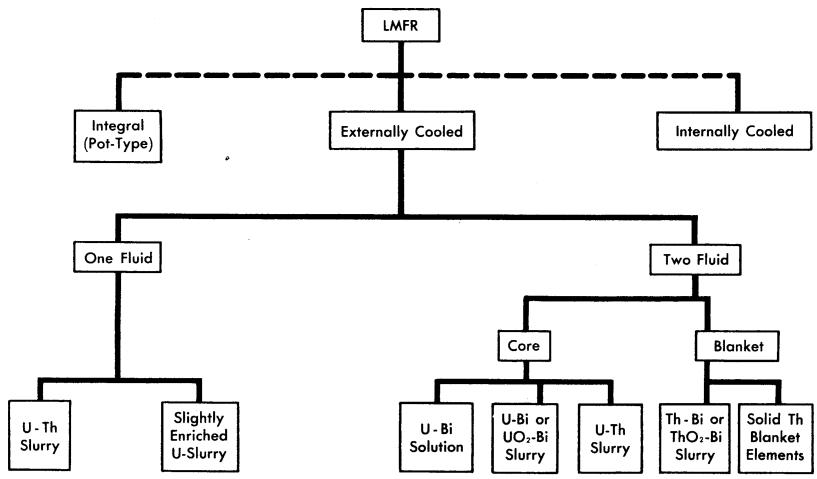  
FIG. 18-1. Classification of Liquid Metal Fuel Reactors.

Liquid metal fuel reactors are classified on the basis of their heat-transfer characteristics (Fig. 18-1) [21]. If heat is transferred within the core the reactor is said to be internally cooled. If heat is transported by the fuel to the primary heat exchanger external to the core, the reactor is externally cooled. The term "integral reactor" implies an externally cooled system, but one so compact that the reactor and primary heat exchangers can be placed in the same container.

Externally cooled LMFR's can be divided into two classes, single-fluid and two-fluid. In the single-fluid reactor the fissionable and fertile materials are combined in a single fluid carrier, bismuth. This type of reactor has no separate blanket, and conversion or breeding takes place within the core fluid itself. The conversion ratio can be made to approach unity with the proper choice of such parameters as core size, graphite-to-fuel ratio, and thorium concentration. However, the most economic design is not necessarily the one having the highest conversion ratio (see Chapter 24). If no fertile material is mixed with the fuel, the concept reduces to the simple burner.

The two-fluid externally cooled LMFR (Fig. 18-2) is somewhat more complex because it has a physically separate core and blanket, but higher conversion ratios are possible. The blanket can be made in a variety of ways, making use of either solid or liquid blanket materials. In exploiting the LMFR concept to the full, a fluid blanket consisting of a slurry of $\mathrm{ThBi}_2$ or $\mathrm{ThO}_2$ in bismuth is used.

A variety of fuels is also possible. In the two-region reactor, critical concentrations of uranium in bismuth could be below solubility limits;

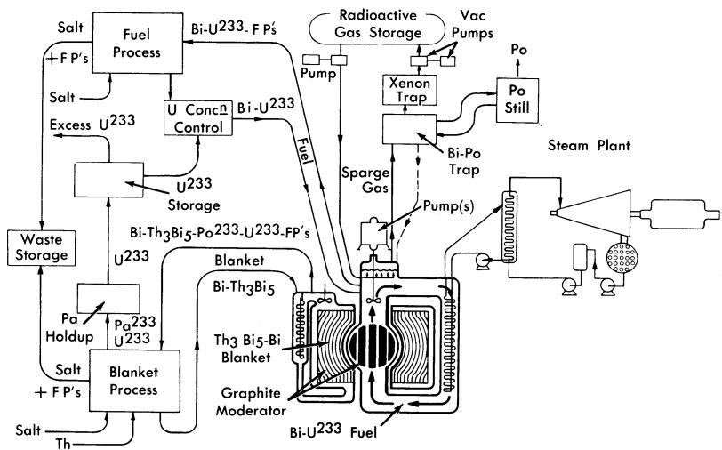  
FIG. 18-2. Schematic diagram of LMFR, showing reactor, steam plant, and chemical processing.

therefore solution fuels are possible. Such a fuel for the single-region reactors is possible only for small thorium loadings or for burners. Higher fuel concentrations can be utilized only through the use of slurries. On the basis of experiments, a maximum slurry content of $10\mathrm{w / o}$ (weight percent) of either uranium or thorium as bismuthide compounds in bismuth can be assumed. If an oxide slurry is used, approximately $20\mathrm{w / o}$ can be carried by the bismuth. So far only fuels of $\mathbf{U}^{233}$ and $\mathbf{U}^{235}$ have been investigated in the LMFR program.

# 18-4. LMFR PROGRAM

In the following chapters detailed discussions of the liquid metal fuels research, development, and engineering work are given. Practically all the LMFR work is in the research and development stage. In the first group of chapters, the physics, chemistry, and engineering design of the LMFR are discussed. In the last chapters, several liquid metal fuel reactor designs, based on current research and development, are presented. It should be understood that these are design studies and it is expected that more than one liquid metal fuel experimental reactor will have to be built and operated before a final commercial design is evolved.

# REFERENCES

1. H. HALBAN and L. KOWARSKI, Cambridge University, England, Cavendish Laboratory, 1941. Unpublished.   
2. M. E. LEE, Fairchild Engine & Airplane Corp., NEPA Division, 1950. Unpublished.   
3. E. P. WIGNER et al., Argonne National Laboratory, 1944. Unpublished.   
4. G. Young, Outline of a Liquid Metal Pile, USAEC Report MonP-264, Oak Ridge National Laboratory, Mar. 5, 1947.   
5. O. E. DwyER, Heat Transfer in a Liquid-Metal-Fuel Reactor for Power, in Chemical Engineering Progress Symposium Series, Vol. 50, No. 11. New York: American Institute of Chemical Engineers, 1954. (pp. 75-91)   
6. C. WILLIAMS and F. T. MILES, Liquid Metal Fuel Reactor Systems for Power, ibid., No. 11. (pp. 244-252)   
7. J. E. Atherton et al., Studies in the Uranium-Bismuth Fuel System, ibid., No. 12. (p. 23)   
8. C. J. RASEMAN and J. WEISMAN, Liquid-Metal-Fuel Reactor Processing Loops, ibid., No. 12. (p. 153)   
9. D. W. BAREIS et al., Processing of Liquid Bismuth Alloys by Fused Salts, ibid., No. 12. (p. 228)   
10. R. J. TEitel et al., Liquid-Metal Fuels and Liquid-Metal Breeder Blan-kets, ibid., No. 13. (p. 11)   
11. NUCLEAR ENGINEERING DEPARTMENT, BROOKHAVEN NATIONAL LABORATORY, Liquid Metal Fuel Reactor Systems, a collection of seven papers, *Nucleonics* 12(7), 11-12 (1954).   
12. O. E. Dwyer et al., Liquid Bismuth As a Fuel Solvent and Heat Transport Medium for Nuclear Reactors, paper presented at the Nuclear Engineering and Science Congress at Cleveland, Ohio, Dec. 12-16, 1955. (Preprint 50)   
13. J. CHERNICK, Small Liquid Metal Fueled Reactor Systems, Nuclear Sci. and Eng. 1, 135-155 (1956).   
14. R. M. KIEHN, A Molten Plutonium Reactor Concept—LAMPRE, USAEC Report LA-2112, Los Alamos Scientific Laboratory, January 1957: Los Alamos Molten Plutonium Reactor Equipment (LAMPRE), Nucleonics 14(2), 14 (February 1956); Molten Plutonium Reactors, in Radiation Safety and Major Activities in the Atomic Energy Programs, July–December 1956, U. S. Atomic Energy Commission. Washington, D. C.: Government Printing Office, January 1957. (p. 43)   
15. B. M. ABRAHAM et al., $\mathrm{UO}_2$ -NaK Slurry Studies in Loops to $600^{\circ}\mathrm{C}$ , Nuclear Sci. and Eng. 2, 501-512 (1951).   
16. J. K. DAVIDSON et al., A $UO_{2}$ -Liquid Metal Slurry for Economic Power, paper presented before the American Nuclear Society at Washington, D. C., Dec. 10-12, 1956.   
17. F. T. MILES and C. WILLIAMS, Liquid Metal Fuel Reactor, in Proceedings of the International Conference on the Peaceful Uses of Atomic Energy, Vol. 3. New York: United Nations, 1956. (P/494, p. 125)

18. D. J. SENGSTAKEN and E. DURHAM, Liquid Metal Fuel Reactor for Central Station Power, paper presented at the Nuclear Engineering and Science Congress at Cleveland, Ohio, Dec. 12-16, 1955. (Preprint 39)   
19. BABCOCK & WILCOX Co., Liquid Metal Fuel Reactor; Technical Feasibility Report, USAEC Report BAW-2(Del.), June 30, 1955.   
20. D. MARS et al., Preliminary Design of an LMFR Power Plant, Nuclear Sci. and Eng., in preparation.   
21. BABCOCK & WILCOX Co., 1958. Unpublished.

# CHAPTER 19

# REACTOR PHYSICS FOR LIQUID METAL REACTOR DESIGN*

The flexibility of liquid metal fuel systems is such that they range over several different reactor categories. Liquid metal reactors may be designed as fast, intermediate, or thermal systems, with either circulating or static fuel systems. The reactor core components consist of a fuel carrier such as molten bismuth or lead, and a moderator such as graphite or beryllium, if the neutrons within the reactor core are to be thermalized. If the fuel is stationary, a second fluid is required as the reactor coolant.

In the simplest system, a high-temperature liquid-metal solution or slurry would be pumped through an externally moderated reactor core. For such a reactor, the neutron physics problems would be similar to those of aqueous homogeneous systems. The chief difference would lie in the neutron spectrum, which would be higher because of weaker moderation and higher operating temperatures.

The liquid-metal system that has received the greatest emphasis to date is of the heterogeneous, circulating fuel type. This reactor, known as the Liquid Metal Fuel Reactor (LMFR), has as its fuel a dilute solution of enriched uranium in liquid bismuth, and graphite is used as both moderator and reflector. With $\mathrm{U}^{233}$ as the fuel and $\mathrm{Th}^{232}$ as the fertile material, the reactor can be designed as a thermal breeder. Consideration is restricted here to this reactor type but, wherever possible, information of a general nature is included.

# 19-1. LMFR PARAMETERS

19-1.1 Cross sections. Most of the cross sections required for neutron physics studies of the LMFR can be obtained from BNL-325. The following exceptions should be noted. The $2200\mathrm{m / sec}$ value of the absorption cross section of graphite is given as $3.2\pm 0.2\mathrm{mb}$ . The best experimental value however is $3.6\mathrm{mb}$ after correcting for the presence of such impurities as B, $\mathbf{N}_2$ , etc. Graphite of density 1.65 to $1.70~\mathrm{g / cm^3}$ is obtainable with an absorption cross section of about $4\mathrm{mb}$ , including impurities. Graphite of density $1.8~\mathrm{g / cm^3}$ or higher is becoming available, but the purity of this high-density graphite has not been well established.

The $2200\mathrm{m / sec}$ value of the absorption cross section of $\mathrm{Bi}^{209}$ is $32\pm 2\mathrm{mb}$ . Two isomeric states of $\mathrm{Bi}^{210}$ are formed, one of which decays by $\beta$ -emission with a half-life of 5 days into $\mathrm{Po}^{210}$ .

TABLE 19-1   
PARAMETERS OF $\mathbf{B}\mathbf{I}^{209}$ RESONANCES   

<table><tr><td>E0(ev)</td><td>σ0Γ, barn-ev</td><td>Γ, ev</td></tr><tr><td>810</td><td>9400</td><td>5.8 ± 0.3</td></tr><tr><td>2370</td><td>7660</td><td>17 ± 1.5</td></tr></table>

Bismuth has prominent resonances at 810 ev and 2370 ev, largely due to scattering. Breit-Wigner parameters obtained by Bollinger et al. at Argonne National Laboratory are listed in Table 19-1. To determine neutron capture within these resonances, it is necessary to estimate the value of the level width, $\Gamma_{\gamma}$ . One method is to use the value of 0.5 b obtained by Langsdorf (ANL-4342) for the resonance integral, which implies that $\Gamma_{\gamma}$ is about $150~\mathrm{mv}$ . An analysis of Bollinger's data indicates that a more likely value is about $50~\mathrm{mv}$ .

High-energy cross sections of bismuth and lead are of secondary interest in well-moderated liquid-metal reactors, but would become of prime interest in fast- or intermediate-energy reactors. On the basis of the known levels and spin assignments for bismuth and lead, Oleksa of Brookhaven National Laboratory has calculated cross sections that are in good agreement with experimental data. The (n, p) and (n, $\alpha$ ) cross sections are negligible. The threshold for the (n, 2n) cross section in bismuth is high, 7.5 Mev. At 1.0 and 4.3 Mev the transport cross sections of bismuth are calculated as 4.3 b and 4.2 b, respectively. The capture cross section at 1 Mev is 3.4 mb.

Inelastic scattering in bismuth is important in considering fission-energy neutrons. The results of Oleksa's studies are presented in Table 19-2. The lowest levels in $\mathrm{Bi}^{209}$ occur at 0.9, 1.6, 3.35 Mev, respectively. At energies up to 2.6 MeV, Oleksa finds that the cross sections for scattering into the individual levels are in good agreement with calculations based on the Hauser-Feshbach model.

In a U-fueled liquid-metal system, the cross sections of the higher isotopes or uranium are of considerable importance in determining equilibrium concentrations of these isotopes and the time required to approach their equilibrium. These equilibrium conditions require study because of solubility limitations in a liquid-metal fuel reactor. The chain starts with either $\mathrm{U}^{235}$ or $\mathrm{U}^{233}$ , depending on whether a converter or breeder reactor is under consideration, and ends with $\mathrm{U}^{237}$ because of its short half-life. In addition, some $\mathrm{U}^{238}$ may be present in the fuel. Thermal cross sections are given in BNL-325.

Other absorption cross sections of importance to high-power, high-fuel-burnup reactors are those of the long-lived fission products and, in a $\mathrm{U}^{233}$ breeder, that of $\mathrm{Pa}^{233}$ . Despite a number of comprehensive studies of these effects, accurate values may not be known until such reactors have been in operation for some time. Fuel-processing studies for the LMFR, however, indicate that the poisoning effect can economically be maintained at a few percent.

Although the LMFR is a heterogeneous reactor, the fuel and moderator arrangements that have been proposed yield a core which is nearly homogeneous from the neutron physics viewpoint. The preferred core is an impermeable graphite structure perforated with holes of about 2 in. diameter for passage of the liquid-metal fuel. The moderator volume is about equal to that of the liquid metal, bismuth, which contains about $0.1\mathrm{w / o}$ enriched uranium. Actually, the size of the fuel channels could be considerably increased without seriously increasing the flux disadvantage factor and, hence, the critical mass of the reactor core.

19-1.2 Neutron age and diffusion length. The following formulas, appropriate for mixtures, have been used to obtain the diffusion area, $L^2$ , and neutron age, $\tau$ , of graphite-bismuth LMFR cores:

$$
L ^ {2} = \frac {1}{3} \Sigma_ {a} \Sigma_ {\mathrm {t r}}, \tag {19-1}
$$

$$
\tau = \frac {\tau_ {\mathrm {C}} (1 + R) ^ {2}}{\left[ 1 + \frac {(\xi \Sigma_ {\mathrm {s}}) _ {\mathrm {B i}}}{(\xi \Sigma_ {\mathrm {s}}) _ {\mathrm {C}}} R \right] \left[ 1 + \frac {(\Sigma_ {\mathrm {t r}}) _ {\mathrm {B i}}}{(\Sigma_ {\mathrm {t r}}) _ {\mathrm {C}}} R \right]}, \tag {19-2}
$$

where $\xi$ is the logarithmic energy decrement,

$\Sigma_{s}$ is the macroscopic scattering cross section,   
$\Sigma_{a}$ is the macroscopic absorption cross section,   
$\Sigma_{\mathrm{tr}}$ is the macroscopic transport cross section,

the subscripts Bi and C indicate the macroscopic cross section for the respective materials, and $R$ is the bismuth-to-graphite volume ratio.

19-1.3 Reactivity effects. A problem unique to circulating fuel reactors is the loss of delayed neutrons in the external circuit. Since the time spent by the delayed-neutron emitters outside the reactor core is generally greater than that spent within the core, a considerable fraction of the delayed neutrons may be wasted. In addition, since most of the delayed-neutron emitters are produced as gases, they may be carried off during degassing operations. For $\mathrm{U}^{233}$ , the delayed neutron fraction in thermal fission is only $0.24\%$ . Thus prompt critical may, in some cases, be as little as $0.1\%$ excess reactivity.

TABLE 19-2 INELASTIC SCATTERING CROSS SECTION OF BI   

<table><tr><td>E, Mev</td><td>σinBi, barns</td></tr><tr><td>0.9</td><td>0</td></tr><tr><td>1.0</td><td>0.1</td></tr><tr><td>1.5</td><td>0.4</td></tr><tr><td>2.0</td><td>0.7</td></tr><tr><td>3.0</td><td>1.4</td></tr><tr><td>4.0</td><td>2.0</td></tr><tr><td>5.0</td><td>2.4</td></tr><tr><td>6.0</td><td>2.6</td></tr><tr><td>7.0</td><td>2.6</td></tr><tr><td>8.0</td><td>2.5</td></tr><tr><td>10.0</td><td>1.5</td></tr></table>

Coupled with this problem is the fact that the prompt temperature coefficient (due to liquid metal expansion) in the LMFR system under consideration is of the order of $-5 \times 10^{-5} / {}^{\circ}\mathrm{C}$ . Thus, ignoring temperature overshoots, which are discussed later, the magnitude of rapid reactivity changes must be limited to avoid large metal temperature changes. The total temperature coefficient of the LMFR runs about $-1.5 \times 10^{-4} / {}^{\circ}\mathrm{C}$ , the delayed coefficient resulting primarily from increased neutron leakage due to the heating of the graphite structure. While the slow response of the graphite to power changes thus limits the size of the prompt temperature coefficient, it aids in stabilizing the system against small oscillations at high power output.

19-1.4 Breeding. The LMFR can be operated as a breeder on the $\mathrm{U}^{233}\text{-}\mathrm{Th}^{232}$ cycle. The possible breeding gain is not large, since the value of $\eta$ for $\mathrm{U}^{233}$ is about 2.3. The theoretical gain is at most 0.3, but a value of 0.10 is about the maximum possible in a practical system. In fact, optimization based on economic considerations would probably reduce the gain to zero in any power breeder built in the near future. The gain is reduced by competitive neutron capture in the core and blanket, and by neutron leakage from the blanket and from the ends of the reactor core. A problem not yet solved is that of a leakproof, weakly absorbing container that will separate the core and blanket. It is hoped that beryllium or an impermeable graphite will provide such a container for the LMFR. Croloy steel or tantalum containers about $1/4$ -in thick appear satisfactory

from the mechanical and metallurgical standpoint but effectively wipe out the potential breeding gain because of their absorption cross section.

A number of studies of the so-called immoderation principle have been carried out in an attempt to reduce the neutron losses to the container. By removing the bulk of the moderator from a small region on both sides of the container wall the thermal neutron losses can be greatly reduced. Several feasible mechanical designs embodying this principle have been worked out by the Babcock & Wilcox Company.

# 19-2. LMFR STATICS

19-2.1 Core. The standard LMFR is predominantly thermal, nearly homogeneous, and moderated by graphite. Thus age-diffusion theory is applicable, and therefore the following formula can be used for a critical system:

$$
k _ {\infty} e ^ {- \tau B ^ {2}} = 1 + L ^ {2} B ^ {2}, \tag {19-3}
$$

where $B^2$ is the buckling of the system, and

$$
k _ {\infty} = \eta f, \tag {19-4}
$$

where $\eta$ is the number of fast neutrons produced per thermal neutron captured in the fuel, and $f$ is the thermal utilization factor. The product of the fast fission effect, $\epsilon$ , and resonance escape probability, $p$ , is assumed equal to unity.

In view of the uncertainty in the value of $\Gamma_{\gamma}$ for bismuth, the validity of neglecting resonance capture is still uncertain, and Monte Carlo studies are planned at BNL to obtain lower limits for $p$ as a function of channel size and lattice pitch. For small channels, the homogeneous formula for $f$ is adequate, since consideration of self-shielding of the fuel reduces $f$ in a typical core by about $2\%$ .

Studies have yielded for buckling the typical values given in Table 19-3 [1] for both $\mathbf{U}^{233}$ and $\mathbf{U}^{235}$ as the fuel in a graphite moderator at an average core temperature of $475^{\circ}\mathrm{C}$ .

19-2.2 Reflector. In order to apply the above results to reflected reactors, it is necessary to determine the reflector savings, which can be obtained from conventional two-group theory. This method could also be used to estimate the critical size of the reactor but, for small cores, two-group theory underestimates the size of graphite-moderated reactors.

Two-group results obtained for typical reflectors are given in Table 19-4 [1] for a cylindrical reactor system surrounded by a large reflector.

TABLE 19-3   
BUCKLING OF GRAPHITE-MODERATED LMFR CORES   

<table><tr><td>V Bi/V C</td><td>N U/N Bi=0.6×10-3</td><td>N U/N Bi=1×10-3</td><td>N U/N Bi=1.5×10-3</td></tr><tr><td colspan="4">U233 Fuel</td></tr><tr><td>0.25</td><td>6.64×10-4cm-2</td><td>9.51×10-4cm-2</td><td>11.85×10-4cm-2</td></tr><tr><td>0.50</td><td>8.20</td><td>10.70</td><td>12.50</td></tr><tr><td>1.00</td><td>8.09</td><td>9.82</td><td>10.95</td></tr><tr><td>1.50</td><td>7.33</td><td>8.60</td><td>9.43</td></tr><tr><td>2.00</td><td>6.59</td><td>7.60</td><td>8.22</td></tr><tr><td colspan="4">U235 Fuel</td></tr><tr><td>0.25</td><td>6.05</td><td>8.65</td><td>10.72</td></tr><tr><td>0.50</td><td>7.43</td><td>9.63</td><td>11.19</td></tr><tr><td>1.00</td><td>7.25</td><td>8.74</td><td>9.71</td></tr><tr><td>1.50</td><td>6.53</td><td>7.64</td><td>8.30</td></tr><tr><td>2.00</td><td>5.68</td><td>6.72</td><td>7.23</td></tr></table>

TABLE 19-4   
REFLECTOR SAVINGS OF U235-BI CORES MODERATED BY GRAPHITE   

<table><tr><td rowspan="2">Reflector</td><td colspan="5">Core</td></tr><tr><td>\(V_{\text{Bi}}/V_{\text{C}}=\)</td><td>1</td><td>2</td><td>1</td><td>2</td></tr><tr><td>Reflector</td><td>\(N_{\text{U}}/N_{\text{Bi}}=\)</td><td>\(0.6 \times 10^{-3}\)</td><td>\(0.6 \times 10^{-3}\)</td><td>\(1.5 \times 10^{-3}\)</td><td>\(1 \times 10^{-3}\)</td></tr><tr><td>Graphite</td><td></td><td>1.71 ft</td><td>2.10 ft</td><td>1.66 ft</td><td>2.10 ft</td></tr><tr><td>90%C-10% Void</td><td></td><td>1.62</td><td>2.00</td><td>1.63</td><td>2.01</td></tr><tr><td>\(V_{\text{C}}-V_{\text{Bi}}-V_{\text{Th}}:\)</td><td></td><td></td><td></td><td></td><td></td></tr><tr><td>85- 5- 0</td><td></td><td>1.69</td><td>2.04</td><td>1.65</td><td>2.04</td></tr><tr><td>85-15- 0</td><td></td><td>1.66</td><td>1.97</td><td>1.59</td><td>2.01</td></tr><tr><td>85-10- 5</td><td></td><td>0.70</td><td>0.82</td><td>0.78</td><td>0.87</td></tr><tr><td>70-20-10</td><td></td><td>0.58</td><td>0.68</td><td>0.65</td><td>0.73</td></tr></table>

19-2.3 Critical mass. The results of age-diffusion theory are in good agreement with multigroup calculations for predominantly thermal LMFR reactors. At higher fuel concentrations, however, the age theory overestimates the critical mass, as shown in Table 19-5 [1]. The differences in critical mass estimates are large only for weakly moderated reactors.

TABLE 19-5   
CRITICAL MASS AND DIAMETER OF U235-FUELED LMFR SPHERES WITH A 90-CM GRAPHITE REFLECTOR   

<table><tr><td rowspan="2">NU/NBi</td><td rowspan="2">VBi-U/Vc</td><td colspan="2">Age-Diffusion</td><td colspan="2">Multigroup</td></tr><tr><td>Diameter, ft</td><td>Mass, kg</td><td>Diameter, ft</td><td>Mass, kg</td></tr><tr><td colspan="6">Graphite-moderated</td></tr><tr><td rowspan="3">1×10-3</td><td>0.25</td><td>4.38</td><td>2.73</td><td>4.52</td><td>3.02</td></tr><tr><td>1.0</td><td>3.88</td><td>4.77</td><td>3.81</td><td>4.53</td></tr><tr><td>2.0</td><td>4.15</td><td>7.79</td><td>4.04</td><td>7.15</td></tr><tr><td rowspan="2">1×10-2</td><td>0.25</td><td>2.57</td><td>5.50</td><td>2.28</td><td>3.89</td></tr><tr><td>1.0</td><td>2.79</td><td>17.69</td><td>2.24</td><td>9.20</td></tr><tr><td colspan="6">Beryllium-moderated</td></tr><tr><td rowspan="3">1×10-3</td><td>0.25</td><td>3.86</td><td>1.87</td><td>3.88</td><td>1.92</td></tr><tr><td>1.0</td><td>3.08</td><td>2.37</td><td>2.94</td><td>2.07</td></tr><tr><td>2.0</td><td>3.29</td><td>3.86</td><td>3.04</td><td>3.05</td></tr><tr><td rowspan="3">1×10-2</td><td>0.25</td><td>1.90</td><td>2.22</td><td>1.66</td><td>1.49</td></tr><tr><td>1.0</td><td>2.11</td><td>7.70</td><td>1.73</td><td>4.19</td></tr><tr><td>2.0</td><td>2.43</td><td>15.55</td><td>1.94</td><td>7.87</td></tr></table>

19-2.4 Breeding. The conversion ratio obtainable in liquid metal systems depends on a number of variables, such as the fuel and fertile material concentrations, the fission-product processing methods, losses to the core container, etc. In a feasibility study of the LMFR conducted by the Babcock & Wilcox Company, currently practical reactor designs were reported (BAW-2) with conversion ratios ranging from 0.8 to 0.9, depending on whether an oxide slagging or fused salt method was used for nonvolatile fission-product processing. The U/Bi atomic ratio was low $(0.6 \times 10^{-3})$ and a $2\frac{1}{4}\% \mathrm{Cr - }1\%$ Mo steel core container was used, both

choices tending to reduce the possible breeding ratio. The estimates of the neutron balance are given in Table 19-6 [6].

TABLE 19-6   
NEUTRON BALANCE OF $\mathbf{Th}^{232}$ , $\mathbf{U}^{233}$ BREEDER   

<table><tr><td>Production per U233absorption</td><td>Scheme A
Oxide slagging
2.31</td><td>Scheme B
Fused-salt process
2.31</td></tr><tr><td>Losses: Absorption in
U233</td><td>1.00</td><td>1.00</td></tr><tr><td>Bi</td><td>0.13</td><td>0.13</td></tr><tr><td>C</td><td>0.05</td><td>0.05</td></tr><tr><td>Fission products</td><td>0.12</td><td>0.03</td></tr><tr><td>Higher isotopes</td><td>0.02</td><td>0.02</td></tr><tr><td>Croloy structure</td><td>0.12</td><td>0.12</td></tr><tr><td>Th</td><td>0.80</td><td>0.89</td></tr><tr><td>Pa</td><td>0.02</td><td>0.02</td></tr><tr><td>Leakage</td><td>0.05</td><td>0.05</td></tr></table>

19-2.5 Control. Because of its prompt temperature coefficient, the LMFR is expected to be stable. Nevertheless, it represents a completely new and untested system. There are a number of ways in which the reactivity of the system can change, for example, with changes in inlet temperature, concentration, or velocity of the fuel, and changes in xenon concentration, delayed neutron emitter concentration, and blanket composition. Most of these changes are expected to be gradual, but they can be sufficiently large to require the use of control rods. Inherent stability has not been demonstrated in operating reactors except over a limited range in reactivity and power output. In a reactor with a high-velocity coolant there may occur sudden changes of reactivity which are too fast for conventional control. Thus both inherent stability against sudden reactivity changes and control rods for large but gradual reactivity changes are needed until considerable experience has been gained in operation of the reactor.

Studies have been carried out at BNL on control requirements for an LMFR experiment. The control requirements depend not only on the choice of operating temperatures, the possible xenon and fission-product poisoning, etc., but also on conceivable emergency situations such as errors in fuel concentration control. In a reactor with a full breeding blanket, the control requirements may have to include the effect of complete loss of the breeder fluid.

For a 5-mw experiment, control of $15\%$ reactivity appears to be ample and can be obtained with four $2\frac{1}{4}\%$ Cr-1% Mo steel rods of about 2-in. diameter. Blacker rods containing boron could, of course, be used to increase reactivity control. A study of various arrangements of identical rods in a ring around a central rod indicates that the optimum position of the ring occurs at about 1/4 of the distance from the reactor center to the (extrapolated) radius of the reactor core.

It would be highly desirable to use sheaths for control rods in order to eliminate the problem of rod insertion through a heavy liquid metal. Steel sheaths are not satisfactory, since they reduce the breeding ratio in a liquid-metal power breeder and reduce the over-all thermal flux in an experimental reactor. The solution to the problem may lie in the development of structurally sound beryllium sheaths.

19-2.6 Shielding. Shielding of an LMFR is complicated by the necessity of shielding an external circuit in which the delayed neutron emitters and fission products decay.

Calculations by K. Spinney at BNL indicate that even for a 5-Mw experimental reactor, about 5.5 ft of concrete are required as a neutron shield around the reactor cell. Gamma shielding of the cell requires about 8.5 ft of ordinary concrete or 4.5 ft of BNL concrete (70% Fe). For this reason, it has been proposed that heavy concrete be used as the shield for the 5-Mw reactor. For the rest of the circuit, including the degasser, pumps, heat exchanger, etc., the advantage of using BNL concrete is less evident.

# 19-3. LMFR KINETICS

A number of fundamental studies of the kinetics of circulating fuel reactors have been carried out at ORNL and by Babcock & Wilcox Company. A review of the subject has been given by Welton [2]. At low power, the equations governing the system are linear and complicated chiefly by the feedback of delayed neutrons. General results for the in-hour relation have been obtained by Fleck [3] for $\mathrm{U}^{233}$ - and $\mathrm{U}^{235}$ -fueled reactors. At high power, the kinetics are much more complicated and there is a real question whether the response of a complex reactor can be accurately predicted in advance of its operation. Bethe [6] has strongly recommended the use of oscillator experiments to determine reactor transfer functions. Despite such experiments, however, the mechanism responsible for the resonances observed in EBR-I has, to date, not been satisfactorily explained.

There are two methods of treating the kinetics of a reactor. In the open-loop method, the inlet temperature is taken as constant. The justification for this procedure is that this condition generally prevails during rapid

transients, the feedback of information through the external system being slow by comparison. The method, however, suffers from the defect that it cannot reveal instabilities associated with the entire circuit. In the closed-loop method, the external system, or a reasonable facsimile, is coupled to the reactor system. The representation of the reactor, however, is generally oversimplified because of the complexity of the over-all system.

Although the set of kinetic equations that include temperature effects are nonlinear, the linearized equations are satisfactory for the investigation of stability and the qualitative transient behavior. A large subset of equations is required to properly treat the effect of the delayed neutron emitters. Again, however, lumping the delayed neutrons into a single group, or neglecting them altogether, always appears to lead to qualitatively, if not quantitatively, correct results.

A study of the temperature-dependent open-loop kinetics of the LMFR has been carried out by Fleck [4]. The effect of delayed neutrons and the delayed moderator temperature coefficient were neglected. Under these conditions, Fleck found that the reactor responded rapidly and with little overshoot in temperature when subjected to the largest permissible reactivity excursions.

Using a method developed at the Oak Ridge National Laboratory (ORNL-CF1-56-4-183) for homogeneous systems, the Babcock & Wilcox Company has studied the stability of the LMFR against small oscillations. The results show that the LMFR models under study are stable up to power densities 100 to 1000 times greater than the nominal design level.

Fleck has also examined the transient pressures in LMFR cores by treating the bismuth as a frictionless, compressible fluid. He found that the maximum pressures developed during conceivable transients were quite small. The assumption sometimes made, that the fluid external to the core can be represented as an incompressible slug, was found to overestimate the transient pressures.

In general, heterogeneous reactors possessing both a small prompt (positive or negative) fuel temperature coefficient and a large delayed negative moderator temperature coefficient can be expected to exhibit oscillatory instability at sufficiently high power. However, elementary models indicate that power levels high enough to cause such instability are not achievable in present reactors. Further study of the complex heat-transfer transients in reactor systems is still required before reactor stability can be assured.

# REFERENCES

1. J. CHERNICK, Small Liquid Metal Fueled Reactor Systems, Nuclear Sci. and Eng. 1(2), 135 (1956).   
2. T. A. WELTON, Kinetics of Stationary Reactor Systems, in Proceedings of the International Conference on the Peaceful Uses of Atomic Energy, Vol. 5. New York: United Nations, 1956. (P/610, p. 377)   
3. J. A. FLECK, JR., Theory of Low Power Kinetics of Circulating Fuel Reactors with Several Groups of Delayed Neutrons, USAEC Report BNL-334, Brookhaven National Laboratory, April 1955.   
4. J. A. FLECK, JR., The Temperature Dependent Kinetics of Circulating Fuel Reactors, USAEC Report BNL-357, Brookhaven National Laboratory, July 1955.   
5. G. T. TRAMMELL, Oak Ridge National Laboratory, 1955. ORNL-1893, 1955.   
6. BABCOCK & WILCOX Co., Liquid Metal Fuel Reactor; Technical Feasibility Report, USAEC Report BAW-2(Del.), June 30, 1955.

# CHAPTER 20

# COMPOSITION AND PROPERTIES OF LIQUID-METAL FUELS*

# 20-1. CORE FUEL COMPOSITION

In Chapter 18, the advantages and disadvantages of liquid metal fuels were discussed in a general way. The point was made that a liquid-metal fuel has no theoretical limitation of burnup, suffers no radiation damage, and is easily handled for fission-product poison removal. In this chapter, the results of research and development on various liquid-metal fuels are presented. This work has been largely concentrated on uranium dissolved in bismuth.

At the contemplated operating temperatures of approximately $500^{\circ}\mathrm{C}$ , it was found that uranium has adequate solubility in bismuth when present by itself. However, as the work progressed, it soon became evident that other materials would have to be added to the solution in order to obtain a usable fuel. The present fuel system contains uranium as the fuel, zirconium as a corrosion inhibitor, and magnesium as an oxygen getter.

An LMFR operating on the contemplated $\mathrm{Th}^{232}$ to $\mathrm{U}^{233}$ breeding cycle can be designed with an initial $\mathrm{U}^{233}$ concentration of 700 to $1000\mathrm{ppm}$ in bismuth. The actual figure, of course, is dependent upon the specific design and materials used. In Chapter 24, in the design studies, such figures are given. The concentrations of zirconium and magnesium are each approximately $300\mathrm{ppm}$ . It is contemplated that these concentrations will have to be varied depending upon desired operating conditions. In their use as corrosion inhibitor and antioxidant there is enough leeway for this purpose.

The fuel described in the previous paragraph is the clean fuel which would be charged initially. During reactor operation, however, fission products will build up in the fuel and would be maintained at a level dictated by the economies of the chemical reprocessing system used. It has been found that the fission products and other additives to the bismuth have an important effect on the solubility of uranium in bismuth. These have been carefully investigated in order to permit selection of reactor temperatures that will ensure that all the uranium remains in solution during reactor operation. Likewise, the solubility of steel corrosion products has been investigated to determine their effect on uranium solubility in bismuth.

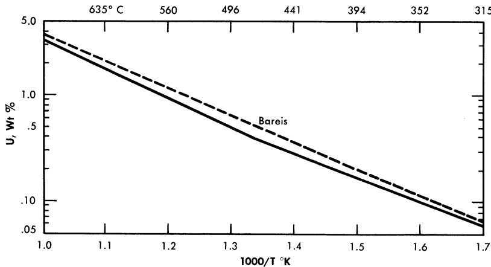  
FIG. 20-1. Solubility of uranium in bismuth.

It is important to note that although the basic fuel is a simple one, the uranium used for liquid metal fuel reactors using the Th-U $^{233}$ cycle must be almost completely enriched 233 or 235 in the initial charge. Further, since the concentrations are measured in parts per million by weight, it is not an easy matter to maintain a strict accounting of all fuel. When dealing with such small amounts, losses due to reaction of uranium with carbon and adsorption of uranium on steel and graphite walls can be significant.

The fuel for the LMFR is still under extensive study. At present, most of the major information for the design of an LMFR experiment is at hand. This information is primarily solubility data and other fuel information, presented in the following pages.

# 20-2. SOLUBILITIES IN BISMUTH

20-2.1 Uranium. The experimental techniques used to measure solubilities in liquid bismuth have been described previously [1,2]. Several workers [3-7] have investigated the solubility of uranium and bismuth. Recently, with improvements in analytical techniques, redetermination of the solubility curve has been undertaken. The latest results are at variance with the older work of Bareis [5], as shown in Fig. 20-1. It can be seen that the recent data obtained at Brookhaven National Laboratory are, at some temperatures, as much as 20 to $25\%$ lower than those obtained some years ago.

This variance in solubility determinations may be due to several factors, but it is believed that the improved techniques are more reliable, and that the newer values are consequently more precise. The presence of such

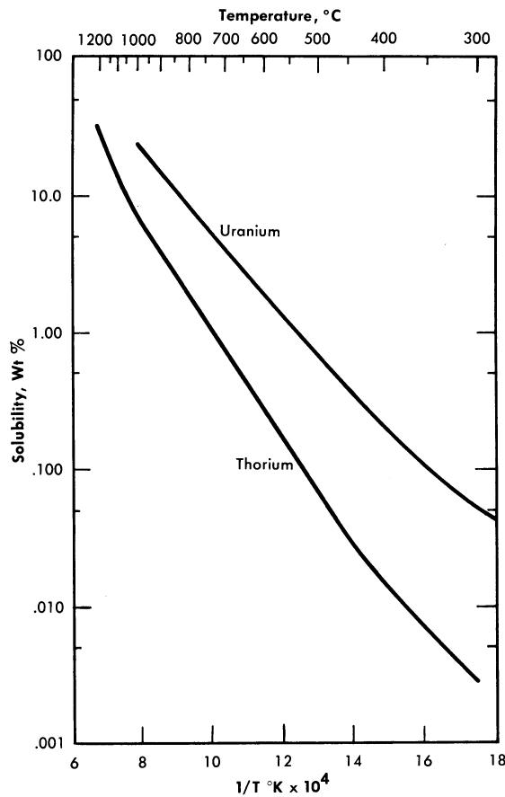  
FIG. 20-2. Solubility of uranium and thorium in bismuth.

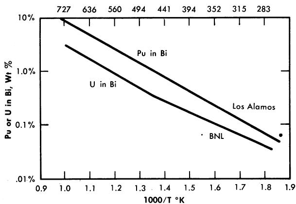  
FIG. 20-3. Solubility of plutonium and uranium in bismuth.

other materials as nickel, copper, manganese, etc., in the bismuth in quantities large enough to affect the uranium solubility still remains to be investigated. For example, nickel has been shown to markedly reduce the uranium solubility in bismuth [1].

It is obvious that even slight variations of the solubility of uranium in bismuth might be of considerable importance in LMFR reactor design. The solubility of uranium, according to the preferred data (the solid curve in Fig. 20-1), allows a rather small leeway in uranium concentration in the reactor cycle when the lowest temperature of $400^{\circ}\mathrm{C}$ in the heat exchangers is taken into account.

20-2.2 Thorium and plutonium. The solubility of thorium in bismuth, as determined by Bryner, is compared with the solubility of uranium in Fig. 20-2. In the temperature range 400 to $500^{\circ}\mathrm{C}$ , the solubility of thorium is markedly lower than that of uranium. In fact, it is so low that a breeding cycle using only thorium in solution with bismuth cannot be carried out.

To fill out the information on fissionable fuel solubility in bismuth, Fig. 20-3 shows the solubility of plutonium in bismuth, as determined at the Los Alamos National Laboratory. In comparing plutonium with uranium, it is seen that plutonium is significantly more soluble.

20-2.3 Fission-product solubility. The solubilities of most of the important fission products have been determined, and are shown in Fig. 20-4. In general, all the fission products are soluble enough so that they will stay in solution throughout the reactor cycle. This is not true of molybdenum however. Attempts at determining the solubility of Mo have indicated that it is less than $1\mathrm{ppm}$ (the limit of detection) at temperatures below $800^{\circ}\mathrm{C}$ . Since a fair amount of the Mo is produced by fission, this means that a sludge might form during reactor operation. (Beryllium presents similar difficulties, since at temperatures below $800^{\circ}\mathrm{C}$ the solubility of Be has been shown to be less than $10\mathrm{ppm}$ .)

20-2.4 Magnesium and zirconium. The solubility of magnesium in bismuth in the temperature range 400 to $500^{\circ}\mathrm{C}$ is approximately 5 wt.%, which is considerably higher than the amounts of magnesium being considered in this work (300 ppm). Little work has been done on this particular determination at Brookhaven.

The solubility of zirconium in bismuth has been determined and is shown in Fig. 20-5. This information is important in showing that the saturation solubility of zirconium is very close to the amounts desired for corrosion inhibition in the temperature range 400 to $500^{\circ}\mathrm{C}$ .

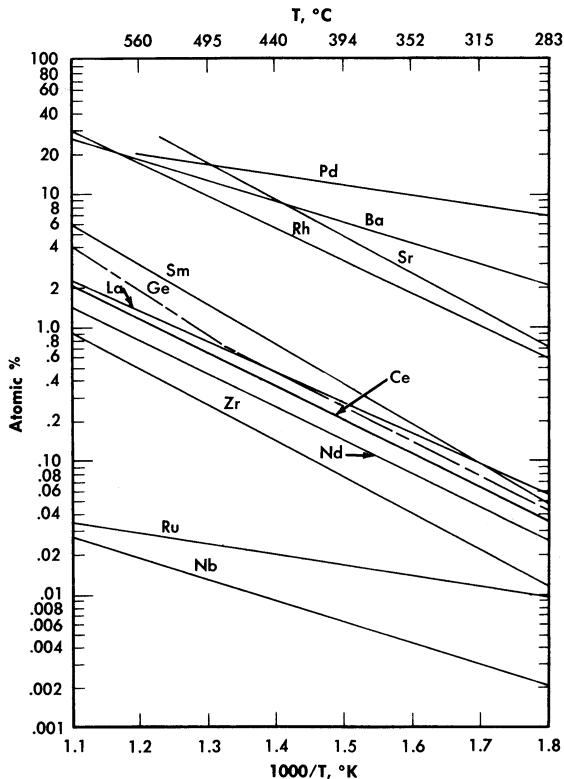  
FIG. 20-4. Solubility of fission products in bismuth.

20-2.5 Solubility of corrosion products in bismuth. An alloy steel is contemplated as the tube material for containing the circulating fuel in the LMFR. Hence it has been pertinent to determine the solubility of alloy steel constituents in bismuth. Figure 20-6 shows the solubilities of iron, chromium, nickel, and manganese, all of whose solubilities are fairly high from a corrosion point of view. Nickel and manganese are particularly high.

The solubility of titanium is shown in Fig. 20-7. It has been shown [8] that titanium will reduce the mass-transfer corrosion of steels by liquid bismuth.

20-2.6 Solubilities of combination of elements in bismuth. The effect of $\mathbf{Zr}$ on the $U$ solubility. The mutual solubilities of uranium and zirconium in bismuth have been measured over the temperature range 325 to $700^{\circ}\mathrm{C}$ . The data are plotted in Fig. 20-5. When bismuth is saturated with zirconium, the uranium solubility is appreciably decreased. On the other

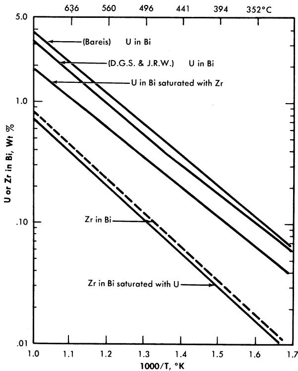  
FIG. 20-5. Mutual solubility of uranium and zirconium in bismuth.

hand, only a slight decrease is noted in the $\mathbf{Zr}$ solubility. The addition of $1000\mathrm{ppm}$ magnesium had no effect on either the uranium or zirconium solubility. This, of course, is in considerable excess of the quantity of magnesium contemplated for use in the fuel.

The mutual solubility effects were further studied by determining the ternary system U-Zr-Bi at three temperatures, 375, 400, and $425^{\circ}\mathrm{C}$ . These are shown in Fig. 20-8.

The effect of fission products on the solubility of $U - Bi$ . Considerable work has been done on determining the mutual solubility effect of fission products on uranium and bismuth. A good typical example is shown in Fig. 20-9, which shows that the solubility of uranium and bismuth is affected by $250~\mathrm{ppm}$ $\mathrm{Zr}$ , $350~\mathrm{Mg}$ , $60~\mathrm{Nd}$ , $15~\mathrm{Sm}$ , $15~\mathrm{Sr}$ , $10~\mathrm{Cs}$ , and $8~\mathrm{Ru}$ . There is little doubt that this small amount of fission products, $120~\mathrm{ppm}$ , has a small but definite effect on uranium solubility.

Effects of additives on solubility of corrosion products in liquid bismuth. The ordinary concentrations of zirconium (250 to 300 ppm) do not affect the equilibrium iron solubility at temperatures from 500 to $700^{\circ}\mathrm{C}$ . For

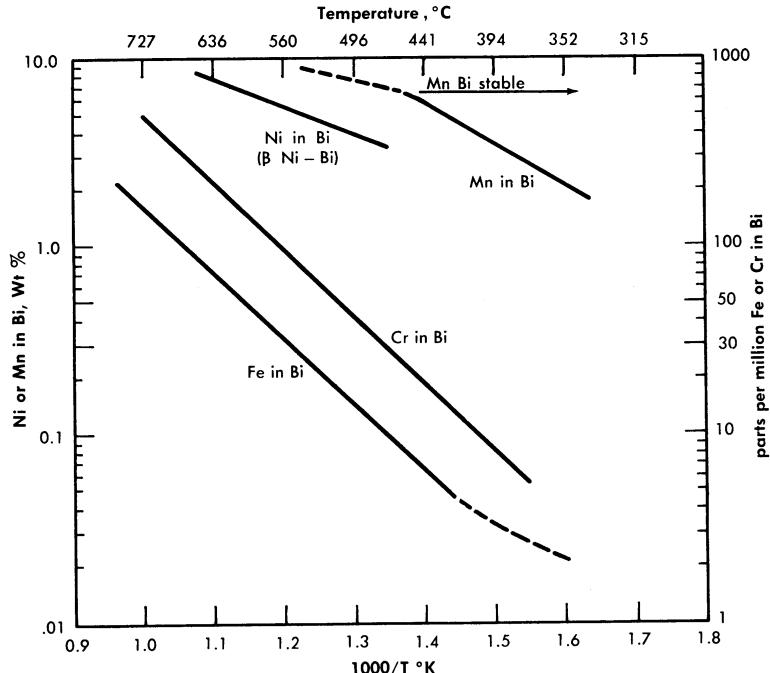

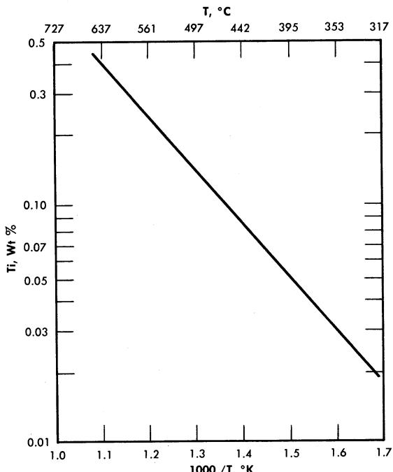  
FIG. 20-6. Solubility of Fe, Cr, Ni, and Mn in bismuth.   
FIG. 20-7. Solubility of titanium in bismuth.

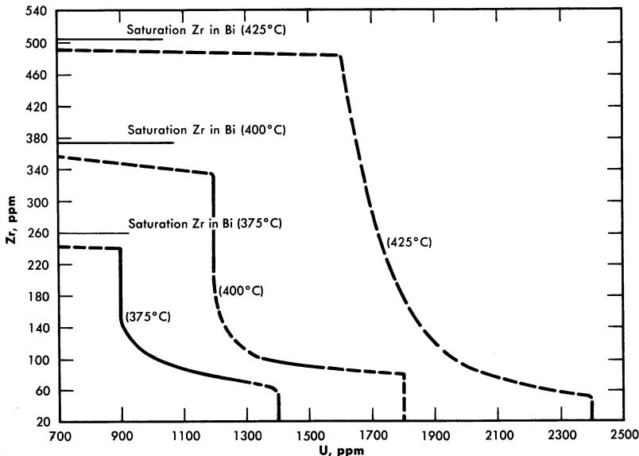  
FIG. 20-8. The U-Zr-Bi ternary system: liquidus curves at 375, 400, and $425^{\circ}\mathrm{C}$ .

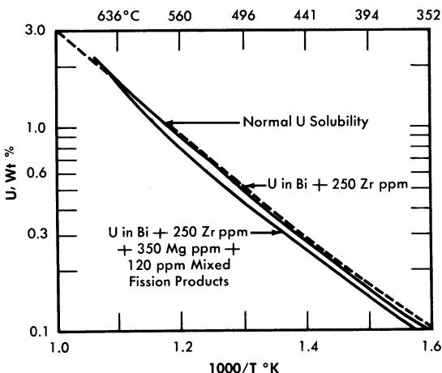  
FIG. 20-9. Solubility of U in Bi + 250 ppm Zr, and in Bi + 250 ppm Zr + 350 ppm Mg + 120 ppm mixed fission products. Original alloys 3.9% U and 3% U, respectively.

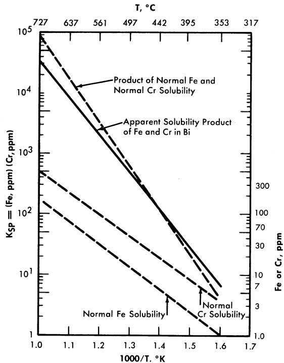  
FIG. 20-10. Effect of Cr on the solubility of Fe in Bi.

higher concentrations (above 700 ppm zirconium), the iron solubility is increased in this same temperature range.

Zirconium in all concentrations up to saturation does not affect the solubility of chromium in bismuth.

Uranium, with magnesium additions up to 2000 ppm, does not affect the solubility of iron in bismuth. The possible effects on chromium solubility are not known at this time.

Chromium has a marked effect on the solubility of iron, whereas the chromium solubility itself is not affected. An apparent solubility product is observed as is shown in Fig. 20-10 by the line titled "Apparent solubility product. Below $450^{\circ}\mathrm{C}$ , the iron solubility appears to be increased by saturating the solution with chromium. Above that temperature, the iron solubility is markedly reduced by chromium.

Titanium, at concentrations greater than 100 ppm, has been found to reduce the iron solubility in the temperature range 475 to $685^{\circ}\mathrm{C}$ [9].

20-2.7 Salts. In some of the contemplated chemical fuel processing methods the liquid bismuth fuel will be brought in contact with chloride

and fluoride salts. A typical chloride salt is the eutectic mixture of $\mathrm{NaCl - KCl - MgCl_2}$ . It is important that none of the salts dissolve in the bismuth and get carried over into the core, since chlorine is a neutron poison. Preliminary investigations at BNL indicate that the solubility of these chloride salts is less than the detectable amount, 1 ppm.

# 20-3. PHYSICAL PROPERTIES OF SOLUTIONS

20-3.1 Bismuth properties. The physical properties of bismuth are listed in Table 23-1.

20-3.2 Solution properties. Little work has been done on determining physical properties of the solutions. The available results indicate that the small amount of dissolved material does not appreciably affect the physical properties of density, viscosity, heat capacity, and vapor pressure. For design purposes, the properties of pure bismuth can probably be used with safety.

20-3.3 Gas solubilities in bismuth. The question of the solubility of the fission-product gases xenon and krypton in bismuth is of extreme importance. In particular, $\mathrm{Xe}^{135}$ , a strong neutron poison, must be removed from the system as fast as it is formed in order to have a good neutron economy.

Attempts at measuring and calculating the solubility of these gases in bismuth have proved extremely difficult, because of the extremely small solubilities. Mitra and Bonilla [10] have measured the solubility of xenon in bismuth at $492^{\circ}\mathrm{C}$ as $8 \times 10^{-7}$ atom fraction at atmospheric pressure. On the other hand, McMillan [11] has calculated the solubility as $10^{-12}$ atom fraction at $300^{\circ}\mathrm{C}$ . It is probable that the amount of gases produced in the reactor lies between these two determinations. At present, the question of xenon and krypton solubility in bismuth is open to more intensive research.

# 20-4. FUEL PREPARATION

Fuel has been prepared at BNL by simply dissolving the solid uranium, magnesium, and zirconium in molten bismuth. The solids are usually in the form of small chips and are placed in a small metal basket which is then suspended in the bismuth.

# 20-5. FUEL STABILITY

It is essential to maintain a homogeneous fuel and to prevent the uranium from concentrating in any particular region of the reactor. Stability tests have been conducted to determine conditions necessary for keeping the

uranium in solution by preventing its reaction with the steel and graphite of the system. Measurements have also been made of the rate of oxidation of uranium in the liquid fuel stream. This study indicates the effect of an accidental air leak during the reactor operation.

20-5.1 Losses of uranium from bismuth by reaction with container materials. Early attempts to make up uranium-bismuth solutions resulted in about a $50\%$ loss of uranium even though very high-purity bismuth $(99.99\%)$ was used. Apparently the uranium reacted with the few impurities in bismuth or adsorbed on the walls of steel containers. Sand-blasting and acid-pickling of the container walls, deoxidizing the bismuth by hydrogen firing, and adding 250 ppm Zr and 350 ppm Mg before introduction of U reduced this loss to about $5\%$ . It is possible that even this $5\%$ loss may not be real, but is attributable to analytical and sampling techniques.

Only small decreases in the zirconium and magnesium concentrations have been observed, and in tests where titanium was used as an oxygen scavenger, no loss of U was observed.

When the fuel solution is brought in contact with graphite, usually 10 to $15\%$ of the uranium is lost from the solution. Apparently it reacts with the graphite or impurities present in the graphite. Research on this is under way at present. However, it is proving to be extremely difficult since the amounts of materials involved are so small.

Since zirconium reacts with graphite to form zirconium carbide in preference to uranium forming uranium carbide, addition of zirconium to the solution should help prevent loss of uranium. This effect has been observed.

Generally it has been found that zirconium concentration will initially drop and then maintain a constant level throughout the exposure of the fuel solution to graphite.

20-5.2 Reaction of fuel solution with air. Should an air leak occur in the LMFR, the uranium, magnesium, and zirconium will all tend to oxidize in preference to the bismuth. Figure 20-11 shows the results of an experiment in which air was bubbled through fuel kept at a temperature of $405^{\circ}\mathrm{C}$ . These results indicate that the preference of oxidation is in the order magnesium, uranium, zirconium.

The reaction data indicate that the uranium oxidation rate is one-half order dependent on the $\mathrm{UO_2}$ present. The magnesium oxidation rate, in general, is first order with respect to magnesium concentration. Other experiments show that if additional amounts of magnesium are added to the solution after the oxidation, most of the $\mathrm{UO_2}$ can be reduced back to uranium. These data are given in Table 20-1.

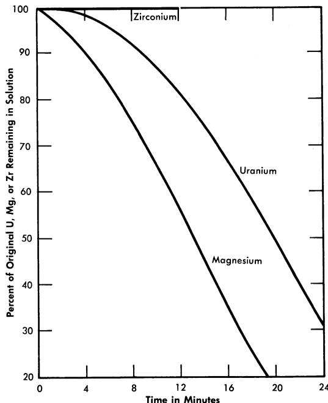  
FIG. 20-11. Concurrent oxidation of U, Zr, and Mg from Bi containing 750 ppm U, 284 ppm Mg, and 280 ppm Zr.

TABLE 20-1 REDUCTION OF $\mathrm{UO_2}$ BY MG IN BI   

<table><tr><td>T°C</td><td>U (ppm) as UO2before ad-dition of Mg</td><td>U (ppm) present in solution before ad-dition of Mg</td><td>Mg (ppm) added</td><td>Time after Mg addi-tion</td><td>U (ppm) in solution after Mg added</td><td>% UO2* reduced</td></tr><tr><td>405</td><td>960</td><td>10</td><td>6600</td><td>25 min</td><td>710</td><td>75-100</td></tr><tr><td>400</td><td>150</td><td>530</td><td>5000</td><td>48 hr</td><td>660</td><td>90</td></tr><tr><td>360</td><td>510</td><td>310</td><td>2500</td><td>10 hr</td><td>460</td><td>30</td></tr><tr><td>360</td><td>550</td><td>10</td><td>1000</td><td>48 hr</td><td>290</td><td>50</td></tr></table>

*The values listed as $\%$ $\mathrm{UO_2}$ reduced are probably lower than equilibrium values, since the samples were taken at arbitrary times after the Mg was added.

Work on fuel stability is obviously of great importance, and is being continued. Very little has been done so far on observation of stability under neutron bombardment. A program is getting underway for the study of radiation effects on the fuel concurrently with a study of corrosion effects. For this purpose the Brookhaven Pile will be used together with Radiation Effects Loop No. 1.

# 20-6. THORIUM BISMUTHIDE BLANKET SLURRY

20-6.1 Status of development. In developing a blanket system for the LMFR, it has seemed logical to select one which is as similar as possible to the core fuel. After considerable evaluation the principal emphasis has been placed upon a bismuth fluid containing thorium bismuthide in the form of very small particles. This is commonly called the thorium bismuthide slurry system.

Since this fluid has practically the same physical properties as that of the core, it would be possible to balance pressures across the graphite wall separating the blanket from the core and, in the event of mixing the core and blanket fluids, no violent reactions would ensue. Furthermore, from a chemical processing point of view, an all-metallic blanket system offers considerable advantage when pyrometallurgical processing techniques are used.

This does not mean that other types of blankets are not being studied. Work is concurrently under way on thorium oxide-bismuth slurries. Also, thorium carbide, thorium fluoride, and thorium sulphide slurries are under consideration.

At the Ames Laboratory (Iowa State College) the solution of thorium in magnesium has received considerable attention in the past few years. This is a true solution, and certainly offers another possibility for a blanket fluid. However, unless an absolute method for keeping the magnesium solution separate from the core bismuth solution is found, this system would be hazardous when used with the contemplated uranium-bismuth core fluid, since magnesium and bismuth will react violently and cause a marked temperature rise.

20-6.2 Chemical composition of thorium bismuthide. The thorium bismuthide intermetallic compound discussed in this section has the chemical formula $\mathrm{ThBi}_2$ . This compound is $35.7\mathrm{w / o}$ thorium. A second compound, $\mathrm{Th}_3\mathrm{Bi}_4$ , also can exist and has been observed in alloys containing greater than 50 to $55\mathrm{w / o}$ thorium.

20-6.3 Crystal chemistry of thorium bismuthide. $\mathrm{ThBi}_2$ has a tetragonal crystal structure (with $a_0 = 4.942\mathrm{A}$ , and $c_{0} = 9.559\mathrm{A}$ ) containing two thorium atoms and two bismuth atoms per unit cell. The density as determined

by x-ray measurement, is $11.50\mathrm{g / cc}$ at $25^{\circ}\mathrm{C}$ . It is estimated to be approximately $11.4\mathrm{g / cc}$ at $550^{\circ}\mathrm{C}$ .

$\mathrm{Th}_3\mathrm{Bi}_4$ has a body-centered cubic structure ( $a_0 = 9.559 \, \text{A}$ ) containing 12 thorium atoms and 16 bismuth atoms in the unit cell. The density is $11.65 \, \text{g/cc}$ .

Ordinarily, when thorium bismuthide is prepared at $500^{\circ}\mathrm{C}$ , very small equiaxed particles (less than 0.5 micron) are formed. These equiaxed particles grow until they reach the average size of 50 to 60 microns, and under certain conditions they can grow to considerably larger dimensions.

When a 5 to $10\mathrm{w / o}$ thorium bismuthide slurry is cooled from a temperature of complete solution (above $1000^{\circ}\mathrm{C}$ ), $\mathrm{ThBi_2}$ precipitates in the form of platelets having diameter-to-thickness ratios greater than 50:1. The plane of the platelet is parallel to the 001 plane of the crystal. Platelet diameters up to $1\mathrm{cm}$ have been observed in alloys cooled at moderate rates. The diameters can be decreased by increasing the cooling rate.

Whereas equiaxed particles tend to grow equally in all three dimensions, it has been found that the platelets, when heated isothermally at temperatures above $300^{\circ}\mathrm{C}$ , tend to grow faster in thickness than in diameter. The solid particles thus tend to approach an equiaxed shape. The rate of approach to equiaxiality increases as the temperature of isothermic treatment is increased.

Considerable work has been carried out on control of crystal structure and size. The addition of tolerable amounts of Li, Be, Mg, Al, Si, Ca, Ti, Cr, Mn, Fe, Co, Ni, Cu, Zn, Zr, Mo, Pd, Ag, Sn, Sb, Te, Pa, La, Ce, Tr, Nd, Ta, W, Pt, Pb, and U has little effect on the mode of thorium bismuthide when it is precipitated. It has been found, however, that tellurium inhibits the thorium bismuthide particle growth, agglomeration, and deposition during thermal cycling. The platelet mode of bismuthide precipitation is not modified by addition of tellurium. The amount of tellurium used in these experiments has been 0.10 w/o.

The mechanisms by which tellurium additions inhibit $\mathrm{ThBi}_2$ particle growth, agglomeration, and deposition are as yet uncertain. Although additions of tellurium in larger concentrations decrease the solubility of thorium in bismuth markedly, the concentration of tellurium required for inhibition decreases the solubility only slightly. These small amounts of tellurium appear to be associated with the solid phase rather than the liquid phase. They do not appear to alter the crystal structure.

It has been observed that under certain conditions $\mathrm{ThBi}_2$ particles suspended in liquid bismuth can be pressure-welded to one another and to container materials by the forces of impact. This pressure-welding phenomenon has been observed at $525^{\circ}\mathrm{C}$ and higher temperatures. Since this phenomenon might cause plugging by agglomeration at points of high impact, it will be necessary to take this factor into account in the design of slurry circulation systems.

20-6.4 Thorium-bismuth slurry preparation. Dispersions of small equiaxed particles of $\mathrm{ThBi}_2$ in bismuth can be prepared by heating finely divided thorium, in the form of powder or chips, in contact with liquid bismuth at 500 to $600^{\circ}\mathrm{C}$ under an inert atmosphere. The intermetallic compound is formed by an exothermic reaction at the thorium-bismuth interface, when the convex radius of curvature of the thorium surface is suitably small. The compound exfoliates into the liquid as agglomerates of very small particles (less than 0.5 micron). These small particles grow very rapidly, the larger at the expense of the smaller, as equiaxed single crystals of $\mathrm{ThBi}_2$ . Rapid growth ceases when the maximum crystal dimensions approach approximately 50 to 60 microns. The time necessary for complete reaction varies with the dimensions of the thorium. For example, 325-mesh thorium powder reacts completely in 5 min at $500^{\circ}\mathrm{C}$ , thorium chips $1/2'' \times 1/8'' \times 0.010''$ require 2 hr at $500^{\circ}\mathrm{C}$ , and thorium chips $3/4'' \times 3/16'' \times 0.020''$ require 13 hr at $500^{\circ}\mathrm{C}$ . The thorium dimensions have only a slight effect upon the ultimate particle size. The reaction can be accelerated by raising the temperature. Higher temperatures, however, increase both the particle size and the tendency to form sintered agglomerates rather than single crystals.

If thorium powder is added to the liquid bismuth surface at the reaction temperature, it is necessary to stir the thorium into the liquid. Otherwise a crust of intermetallic compound forms on the surface which is rigid enough to support subsequent additions, thus preventing contact between the thorium and the bismuth.

During the reaction, evolution of an unidentified gas (possibly hydrogen from thorium hydride) has been observed. It is necessary to stir the slurry under vacuum to remove the undesirable trapped bubbles of this gas.

A photomicrograph of a typical slurry produced by the exfoliation method is shown in Fig. 20-12. The dark $\mathrm{ThBi}_2$ particles appear in a white matrix of solidified bismuth. The method has been used to prepare 90-lb batches of slurry and may readily be adapted to tonnage-scale preparation. The method is suitable for preparation of the initial blanket charge, but would probably not be used for slurry reconstitution during subsequent blanket processing.

A modification of this method has been studied in which finely divided thorium from a supernatant mixture of fused chlorides is electrolytically deposited on a molten bismuth cathode at the desired temperature [13]. The thorium must be stirred through the interface. Slurries that are satisfactory with respect to thorium content and particle size and shape have been produced by the electrolytic method in batches of up to 10 lb. No evolution of gas has been detected during the thorium-bismuth reaction. Unfortunately, the necessary stirring introduces chloride inclusions which are difficult to remove completely. Since these inclusions would decrease

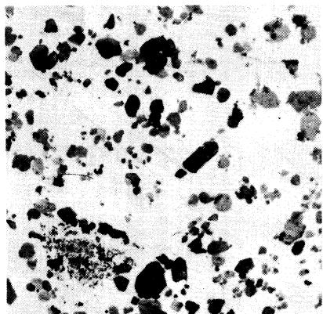  
FIG. 20-12. 5 w/o Th-95 w/o Bi. Dispersion of equiaxed ThBi $_2$ particles in Bi Produced by heating Th chips in Bi at $500^{\circ}\mathrm{C}$ for 2 hr. (150×)

the efficiency of neutron utilization in a breeder blanket because of the high cross section of chlorine, the electrolytic method of slurry preparation must, at present, be considered unsatisfactory.

Another preparation method for thorium-bismuth slurry is by quenching and heat treatment. In this method a solution of thorium, for example $5 \mathrm{~w/o}$ , is very rapidly cooled from about $1000^{\circ} \mathrm{C}$ down to about $600^{\circ} \mathrm{C}$ . This can be accomplished by pouring a hot solution into a container having a sufficiently high heat capacity or by pouring the hot solution into an equal volume of liquid bismuth heated just above the melting point. When this is done tiny platelets are formed.

As will be discussed in the following section, the platelet form of crystal is unsatisfactory from a fluidity point of view. When these fine platelets are heat-treated for $20\mathrm{min}$ at $800^{\circ}\mathrm{C}$ , or for $5\mathrm{min}$ at $900^{\circ}\mathrm{C}$ , dispersions of $\mathrm{ThBi}_2$ particles having maximum dimensions less than 100 microns and diameter-to-thickness ratios equal to or less than 5 to 1 are produced. Platelet formation during cooling is avoided by agitating the slurry to suspend the particles.

Figure 20-13 shows the fine platelets produced by the quenching and Fig. 20-14 shows the larger particles produced from these fine platelets by the heat treatment at $800^{\circ}\mathrm{C}$ for $20\mathrm{min}$ . Such a slurry exhibits high fluidity after concentration to $10\mathrm{w/o}$ thorium by removal of excess liquid phase, and is suitable for use in the reactor blanket.

Other possible ways for reconstituting a satisfactory slurry after heating to complete solution involve the use of ultrasonic energy [14]. It has been demonstrated that application of ultrasonic energy to a thorium-bismuth solution during cooling causes the formation of essentially equiaxed particles rather than platelets. It has also been demonstrated that application of

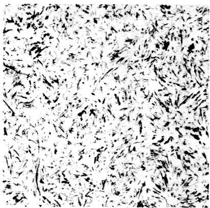  
FIG. 20-13. 5 w/o Th-95 w/o Bi. Dispersion of ThBi $_2$ platelets in Bi. Alloy heated to $1000^{\circ}\mathrm{C}$ and quenched by pouring into graphite crucible at $25^{\circ}\mathrm{C}$ . (150×)

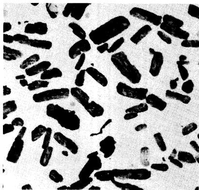  
FIG. 20-14. 10 w/o Th-90 w/o Bi. Dispersion of reconstituted ThBi $_2$ particles in Bi. Produced by heating fine-platelet dispersion to $800^{\circ}\mathrm{C}$ for 20 min. (150×)

ultrasonic energy to platelet dispersions causes the platelets to break up into essentially equiaxed fragments.

20-6.5 Engineering studies of slurries. The intermetallic compound $\mathrm{ThBi}_2$ is quite soft, having a Rockwell 15-T hardness of approximately 60 at room temperature. It is brittle at room temperature but appears to exhibit some ductility at $400^{\circ}\mathrm{C}$ . The compound is pyrophoric and must be protected against oxidation.

When slurries of equiaxed bismuthide in bismuth are prepared, they are fluid at temperatures above the melting point of bismuth, $271^{\circ}\mathrm{C}$ . In these slurries the solid phase is in thermodynamic equilibrium with the

liquid phase and is perfectly wetted by it. At the proposed reactor temperatures (350 to $550^{\circ}\mathrm{C}$ ) practically all the thorium in the slurry appears in the solid phase, since the solubility in the liquid is very low.

The ideal slurry composition represents a balance between a desire for a high thermal neutron utilization factor (i.e., a high thorium content) and the necessity for high fluidity. Fluidity studies have shown that the upper limit of thorium concentration for high fluidity at reactor temperatures is approximately $10\mathrm{w / o}$ of thorium. This corresponds to $24.9\%$ by volume of $\mathrm{ThBi}_2$ , and a thermal neutron utilization factor of 0.957. Although the viscosity of Th-Bi slurries has not been measured, calculations based on the viscosity of liquid bismuth and the behavior of similar systems indicate that at $550^{\circ}\mathrm{C}$ the viscosity of a $10\mathrm{w / o}$ Th suspension of 50-micron, equiaxed $\mathrm{ThBi}_2$ particles should be approximately 2.5 centipoises. It has been observed that increasing the thorium content beyond $10\mathrm{w / o}$ Th causes a disproportionately large increase in the viscosity, so that the consistency approaches that of a mud or paste. The maximum thorium concentration for high fluidity decreases when the $\mathrm{ThBi}_2$ particle shape departs significantly from an equiaxed shape.

The density of liquid bismuth varies from 9.97 at $350^{\circ}\mathrm{C}$ to 9.72 at $550^{\circ}\mathrm{C}$ , and should not be changed appreciably by the small amount of thorium dissolved at these temperatures. Therefore the solid particles should sink in the liquid. Although settling rates have not been measured, the magnitude of expected settling rates can be calculated. The settling rate for 100-micron spheres at $550^{\circ}\mathrm{C}$ , as calculated by Stokes' Law, is 0.030 fps. The settling rate in a $10\mathrm{w / o}$ Th-Bi dispersion of 100-micron spheres at $550^{\circ}\mathrm{C}$ , as calculated by the hindered settling equation, is 0.0026 fps.

It has been observed in small systems that equiaxed $\mathrm{ThBi}_2$ particles settle to a relatively stable layer in which the thorium concentration is approximately $15\mathrm{w / o}$ Th. Such layers can be redispersed by mild agitation of the supernatant liquid. When the thorium concentration in the settled layer is increased to 18 to $20\mathrm{w / o}$ Th (by centrifugation, for example), the viscosity of the layer is so high that mechanical agitation of the layer itself is necessary to redisperse the particles.

Experiments have shown that the viscosity of a $10\mathrm{w / o}$ Th slurry, using platelets of 50- to 100-micron size, is so high as to make the slurry completely unsuitable for use.

Slurry behavior under conditions of reactor blanket operation. It is anticipated that the slurry would be contained in a low-permeability graphite within the reactor blanket. For heat removal and processing, the slurry would be circulated externally through pipes and heat exchangers fabricated of low-chromium steel or comparable material. During circulation for heat removal, the slurry would be subjected to thermal cycling between a probable maximum temperature of $550^{\circ}\mathrm{C}$ in the blanket and a possible

minimum of $350^{\circ}\mathrm{C}$ in the heat exchangers. Capsule and pumped-loop experiments have been carried out to study the behavior of the slurry under conditions of thermal cycling and flow.

In the capsule experiments, small specimens of slurry are caused to flow back and forth at 6 cycles/min in periodically tilted tubes fabricated of the container material under test. The tubes, which are sealed under vacuum, are heated to a higher temperature at one end than at the other. When specimens of slurry containing $10\mathrm{w / o}$ Th, with and without additions of $0.025\mathrm{w / o}$ zirconium, were cycled between 350 and $550^{\circ}\mathrm{C}$ in $21\%$ $\mathrm{Cr - 1\%}$ Mo steel tubes, nearly all the $\mathrm{ThBi_2}$ was deposited in the cooler ends of the tubes in less than $500\mathrm{hr}$ . Examination of the deposits disclosed that a deposit due to mass transfer of the steel had formed on the tube walls prior to deposition of the $\mathrm{ThBi_2}$ . This suggested that mass transfer of the steel may have been instrumental in starting the $\mathrm{ThBi_2}$ deposition, perhaps by roughening the walls or perhaps by altering the composition of the tube surface.

Specimens of $5\mathrm{w / o}$ Th slurries have been cycled for $500\mathrm{hr}$ between 350 and $580^{\circ}\mathrm{C}$ in graphite tubes with no evidence of plug formation. In these experiments, a relatively rapid increase in $\mathrm{ThBi}_2$ particle size (from 50 to 225 microns in $500\mathrm{hr}$ ) was observed. This increase was due to particle agglomeration rather than growth of single crystals. No evidence of graphite erosion was observed.

Specimens of slurries containing $10\mathrm{w / o}$ thorium and $0.10\mathrm{w / o}$ tellurium have been cycled between 350 and $580^{\circ}\mathrm{C}$ in graphite, and between 350 and $550^{\circ}\mathrm{C}$ in $2\frac{1}{4}\% \mathrm{Cr - }1\%$ Mo steel for 500 hr with no evidence of $\mathrm{ThBi_2}$ plug formation or mass transfer of the steel. The specimens showed no increase in the maximum particle dimension and no particle agglomeration. When a specimen of slurry containing $10\mathrm{w / o}$ Th, $0.10\mathrm{w / o}$ Te was cycled at higher temperatures in a $2\frac{1}{4}\% \mathrm{Cr - }1\%$ Mo steel tube, mass transfer of steel and deposition of $\mathrm{ThBi_2}$ in the cooler end were observed after less than $100\mathrm{hr}$ .

Slurries containing up to $7\mathrm{w/o}$ Th and minor additions of zirconium have been circulated through small $21\%$ Cr- $1\%$ Mo steel loops by means of a propeller pump. Isothermal circulation at $450^{\circ}\mathrm{C}$ has been carried out for more than $450\mathrm{hr}$ at velocities between 0.3 and 1.5 fps, with no difficulty in circulation or maintaining suspension. Attempts to circulate these slurries through a temperature differential, however, have resulted in the formation of $\mathrm{ThBi}_2$ deposits in the coldest section of the loop. In a modified loop containing a graphite liner in the finned-cooler section, isothermal circulation was maintained without difficulty. $\mathrm{ThBi}_2$ , however, again deposited in the finned-cooler section when a temperature differential was applied.

When a slurry containing 7 w/o Th. 0.025 w/o Zr, and 0.10 w/o Te was

circulated in a $2\frac{1}{4}\% \mathrm{Cr - }1\%$ Mo steel loop through a temperature differential, $\mathrm{ThBi}_2$ deposited in the finned-cooler section. The rate of buildup of the deposit was markedly less than in the case of slurries containing no tellurium.

The problem of $\mathrm{ThBi}_2$ deposition during circulation through a temperature differential is one which must be solved before the Th-Bi slurry is acceptable as a fluid breeder-blanket material. The favorable results obtained by tellurium additions in the capsule experiments offer hope that the problem can be solved.

# 20-7. THORIUM COMPOUND SLURRIES

20-7.1 Thorium oxide. Probably the best blanket material, next to the thorium bismuthide slurry, is the suspension of thorium oxide in bismuth. The thorium-oxide slurry should be compatible with the graphite and steel in the reactor structure. Experiments have shown that $\mathrm{ThO_2}$ is wetted by the liquid bismuth if some zirconium or thorium is dissolved in the bismuth. Slurries of $10\mathrm{w / o}$ thorium oxide have been prepared.

The separation of thorium oxide from the liquid bismuth for processing could be achieved by mechanical means, and the oxide could then be processed by the existing Thorex process.

The thorium-oxide blanket slurry is gaining increased attention. A loop of several pounds per minute capacity has been completed for forced circulation of the oxide slurries at BNL and an 800 lb/min loop is ready at Babcock & Wilcox.

20-7.2 Other thorium compounds. A small amount of attention has been directed toward $\mathrm{ThC}_2$ , ThS, and $\mathrm{ThF}_4$ slurries in bismuth. However, the major effort is on the thorium bismuthide and thorium-oxide slurries.

# REFERENCES

1. J. R. WEEKS et al., Corrosion Problems with Bismuth-Uranium Fuels, in Proceedings of the First International Conference on the Peaceful Uses of Atomic Energy, Vol. 9. New York: United Nations, 1956. (P/118, pp. 341-355); D. H. GURINSKY and G. J. DIENS, Nuclear Fuels. Princeton, N. J.: D. Van Nostrand Co., Inc., 1956. (Chap. XIII); J. R. WEEKS, Metallurgical Studies on Liquid Bismuth and Bismuth Alloys for Reactor Fuels or Coolants, in Progress in Nuclear Energy, Series IV, Technology and Engineering, Vol. I. New York: Pergamon Press, 1956. (pp. 378-408)   
2. J. E. ATHERTON et al., Studies in the Uranium-Bismuth Fuel System, in Chemical Engineering Progress Symposium Series, Vol. 50, No. 12. New York: American Institute of Chemical Engineers, 1954. (pp. 23-37); *Nucleonics* 4(7), 40-42 (1954).   
3. D. H. AHMANN and R. R. BALDWIN, The Uranium-Bismuth System, USAEC Report CT-2961, Iowa State College, 1945.   
4. MASSACHUSETTS INSTITUTE OF TECHNOLOGY, Progress Report for the Month of October 1946, USAEC Report CT-3718.   
5. D. W. BAREIS, Liquid Reactor Fuels: Bismuth-Uranium System, USAEC Report BNL-75, Brookhaven National Laboratory, 1950.   
6. R. J. TEitel, Uranium-Bismuth System, J. Metals 9, 131-136 (1957).   
7. G. W. GREENWOOD, personal communication to J. R. Weeks, Aug. 29, 1957.   
8. O. J. ELGERT and C. J. EGAN, Dynamic Corrosion of Steel by Liquid Bismuth, USAEC Report MTA-12, California Research and Development Co., 1953.   
9. J. R. WEEKS and D. H. GURINSKY, Solid Metal-Liquid Metal Reactions in Bismuth and Sodium, in ASM Symposium on Liquid Metals and Solidification, ed. by B. Chalmers. Cleveland, Ohio: The American Society for Metals, 1958.   
10. C. R. MITRA and C. F. BONILLA, Solubility and Stripping of Rare Gases in Molten Metals, USAEC Report BNL-3337, Columbia University Department of Chemical Engineering, June 30, 1955.   
11. W. G. McMillan, Estimates of the Solubility and Diffusion Constant of Xenon in Liquid Bismuth, USAEC Report BNL-353, Brookhaven National Laboratory, June 1955.   
12. M. E. SEIBERT, Investigation of Methods for Preparation of Thorium Bismuthide Dispersions in Liquid Bismuth, Final Progress Report, Horizons, Inc., Oct. 31, 1956.   
13. AEROPROJECTS, INC., Applications of Ultrasonic Energy, Progress Report No. 4, USAEC Report NYO-7918, 1957.

# CHAPTER 21

# MATERIALS OF CONSTRUCTION-METALLURGY*

# 21-1. LMFR MATERIALS

21-1.1 Metals. Alloy steel. For maximum power production, it is desirable to operate an LMFR at the highest possible temperature consistent with the mechanical properties and corrosion resistance of the materials of construction. A maximum temperature of $500^{\circ}\mathrm{C}$ or higher is deemed desirable for economically attractive operation of the reactor. No materials have yet been found that are mechanically strong at these temperatures, readily fabricable, and also completely resistant to corrosion by the U-Bi fuel.

This does not mean that there is no hope for obtaining a good material for holding bismuth fuel. On the contrary, very significant advances have been made in the past few years. It must be realized that before work was started on liquid metal fuel reactors, very little was known about the solubility and corrosion characteristics of liquid bismuth with reference to containing materials. There is general optimism that continuing research and development will lead to suitable materials for containing the U-Bi fuel system.

The low-alloy steels offer a good compromise for use in the heat exchanger, piping, and reactor vessel, particularly since their corrosion resistance can be greatly improved by the addition to the fuel of $\mathrm{Zr + Mg}$ as corrosion inhibitors. Nickel-containing stainless steels cannot be used, despite their good high-temperature mechanical properties, because of the high solubility of Ni in Bi, and the greatly lowered U solubility in the presence of this dissolved Ni. Extensive engineering and fundamental studies have been made on the corrosion of the low alloy steels by inhibited U-Bi, as well as the mechanism of corrosion inhibition. Radiation effects are currently being investigated.

Of course, besides steels, there are other materials, notably the rarer metals, which have characteristics making them suitable for certain uses in a liquid-metal system. However, unless the cost and ability to fabricate these materials can be improved significantly, heavy dependence will have to be placed upon alloy steels for the main containment problem.

21-1.2 Graphite. In the LMFR, graphite is considered as the principal choice for the moderating material because of its availability, cost, and knowledge of its characteristics under radiation. However, there are additional special requirements for the graphite in the LMFR system. It not only is the moderator, but is also the container material for the U-Bi solution in the reactor. Hence it should be impervious to the liquid metal and mechanically strong.

Experimental work at BNL has shown that graphite can be used directly in contact with the fuel stream without danger of corrosion. By preferentially reacting to form $\mathrm{ZrC}$ at the fuel-graphite interface, the $\mathrm{Zr}$ corrosion inhibitor also prevents reaction of the U and fission products with the graphite. Special grades of graphite are being developed that appear to have the desired mechanical strength and low porosity required for use as moderator and reflector in the reactor. Reactions of graphite with the fuel, and the possible effects of pile radiation on these reactions, are described in the following sections.

# 21-2. STEELS

21-2.1 Static tests. In order to attack the steel corrosion problem in a basic manner, solubilities of the various components and combinations have been determined. Most of these solubilities are given in Chapter 20. However, more solubility work, important from a corrosion point of view, is discussed here.

Solubility of steel components and inhibiting additives in liquid Bi. Iron. The solubilities of iron in Bi, $\mathrm{Bi} + 0.1\% \mathrm{Mg}$ , $\mathrm{Bi} + 0.2\% \mathrm{U} + 0.1\% \mathrm{Mg}$ , and $\mathrm{Bi} + 0.1\% \mathrm{Mg} +$ saturation Zr are given in Fig. 21-1. Uranium and Mg, in the quantities added, have no effect on the iron solubility over the temperature range 400 to $700^{\circ}\mathrm{C}$ . Zirconium increases iron solubility slightly at temperatures above $500^{\circ}\mathrm{C}$ . Titanium (which might be present as a corrosion inhibitor) has been found to decrease the iron solubility at temperatures above $450^{\circ}\mathrm{C}$ , the extent of this decrease being proportional (but not linearly) to the amount of Ti in the liquid. Below $400^{\circ}\mathrm{C}$ , there appears to be a considerable increase in the iron solubility. For example, Bi containing 1600 ppm Ti dissolved only $30\%$ as much iron as pure Bi at $690^{\circ}\mathrm{C}$ , while Bi containing 300 ppm Ti (saturation) at $350^{\circ}\mathrm{C}$ dissolved more than ten times as much iron as pure Bi.

Zirconium. The solubility of $\mathbf{Zr}$ in Bi is given in Fig. 20-5. This appears to be unaffected by the presence of $\mathrm{Mg}$ , Cr, or Fe in the liquid metal.

Chromium. The solubility of Cr in Bi is given in Fig. 20-6. This also appears to be unaffected by the presence of Mg, Zr or Fe in the liquid bismuth. However, the presence of Cr in Bi causes a marked reduction in the iron solubility.

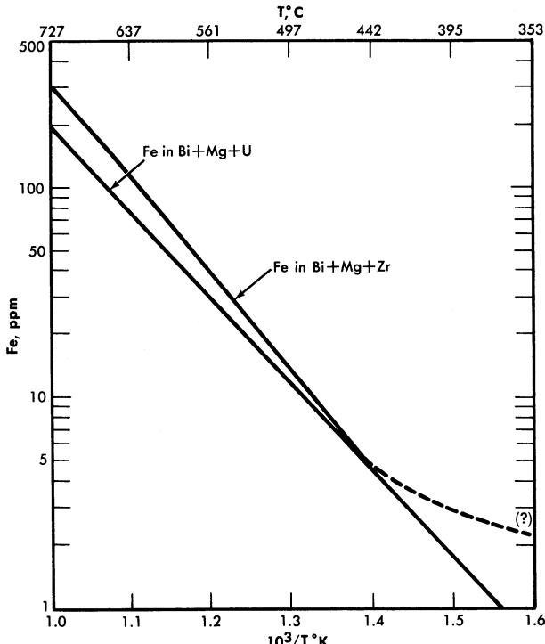  
FIG. 21-1. Solubility of Fe in Bi alloys.

Miscellaneous data. The Fe-Zr intermetallic compound $\mathrm{ZrFe_2}$ appears to decompose when added to Bi, Zr dissolving approximately to its normal saturation and Fe somewhat in excess of its normal solubility in the presence of Zr. The amount of excess Fe present in the liquid metal can possibly be attributed to a finite solubility of the undissociated intermetallic compound $\mathrm{ZrFe_2}$ .

The solubility of Ta in Bi is estimated to be less than 0.01 ppm (detection limit) at $500^{\circ}\mathrm{C}$ .

The solubility of Ni in Bi is close to $5\%$ at $500^{\circ}\mathrm{C}$ and probably greater than $1\%$ at $400^{\circ}\mathrm{C}$ .

The solubility of $\mathrm{Mg}$ in Bi is close to $4\%$ at $500^{\circ}\mathrm{C}$ and $2\%$ at $400^{\circ}\mathrm{C}$ .

Surface reactions. Experimental evidence has shown that the corrosion resistance of steels in Bi is in part due to the formation of insoluble films on the steel surfaces. The effect of these films on the corrosion behavior of different steels is not readily determined by thermal convection loop experiments because of the relatively low temperatures (400 to $550^{\circ}\mathrm{C}$ ) and long times associated with such tests. The comparative behavior of different

steeles and different films is more easily obtained from high-temperature (600 to $850^{\circ}\mathrm{C}$ ), short-time, static contact tests.

Steel specimens approximately 1/2 in. wide, 2 in. long, and 1/8 in. thick are cleaned and given various surface treatments, such as sandblasting, chemical etches, polishes, etc. Six to ten different materials are then placed in a vacuum furnace, heat-treated as desired, and immersed in a Bi alloy containing the desired additives. The crucible used to contain the liquid metal is either a material inert to Bi, such as Mo or graphite, or the same material as the specimen. After contacting, the samples are removed from the solution at temperature and allowed to cool in He or in vacuum. The adherent Bi is removed from the steel by immersing in $\mathrm{Hg}$ at $200^{\circ}\mathrm{C}$ in a vacuum or inert atmosphere. After rinsing, the residual adherent $\mathrm{Hg}$ is completely removed by vacuum distillation at 100 to $200^{\circ}\mathrm{C}$ . The cleaned surfaces are examined by x-ray reflection techniques, utilizing a North American Phillips High Angle Diffractometer.

Surface reaction of zirconium, titanium, and magnesium. When pure iron was contacted with bismuth containing radioactive zirconium tracer for 1 hr at $450^{\circ}\mathrm{C}$ , a Langmuir type adsorption of the zirconium on the iron crucible surface was obtained. Increasing the temperature to $520^{\circ}\mathrm{C}$ and the contact time as much as 24 hr showed an increased amount of reaction. The structure of this deposit is not known. On the other hand, when pure iron is contacted in saturated solutions of zirconium in bismuth for times ranging from 100 to 300 hours at 500 to $750^{\circ}\mathrm{C}$ neither corrosion nor x-ray detectable surface deposits occur. At concentrations of zirconium below saturation value, pure iron is extensively attacked.

A tightly adherent, thick, uniform, metallic deposit was found on the surfaces of pure Fe dipsticks contacted with liquid Bi saturated with Ti at 650 to $790^{\circ}\mathrm{C}$ . In all cases the x-ray patterns were the same but could not be identified. The 15- to 25-micron layers were carefully scraped off and chemically analyzed. The results corresponded to a compound having the composition $\mathrm{FeTi_4Bi_2}$ .

Pure Fe and $24\%$ Cr-1% Mo steel samples contacted with 2.5 w/o Mg in Bi at $700^{\circ}\mathrm{C}$ for 250 hr showed no deposit detectable by x-ray diffraction. Slight uniform intergranular attack was observed on all the samples. Pure Fe samples contacted with Bi solutions containing $0.56\%$ Mg + 170 ppm Zr, and $0.23\%$ Mg + 325 ppm Zr at $700^{\circ}\mathrm{C}$ were not attacked and did not have detectable surface films. These solutions acted similarly to those saturated with Zr.

Reactions of steels with UBi solutions. Uranium nitride (UN) deposits have been identified on the surfaces of $5\%$ Cr-1/2% Mo, $2\frac{1}{4}\%$ Cr-1% Mo, Bessemer, and mild steels, after these samples were contacted with Bi solutions containing U or $\mathrm{U} + \mathrm{Mg}$ . Extensive attack always accompanied UN formation, indicating that this film is not protective. Nitrogen analyses

made on these contacted specimens show that depletion of the $\mathbf{N}$ in the steel is much more rapid than it is when the same steels are contacted with solutions containing Zr.

Reactions of steels with Bi solutions containing combinations of $\mathrm{Zr}$ , $\mathrm{Mg}$ , $\mathrm{U}$ , $\mathrm{Th}$ , and $\mathrm{Ti}$ . Deposits of $\mathrm{ZrN}$ , $\mathrm{ZrC}$ , and mixtures of the two have been identified on many different steels contacted with Bi solutions containing $\mathrm{Zr}$ with or without combination of $\mathrm{Mg}$ , $\mathrm{U}$ , and $\mathrm{Th}$ . No corrosion has ever been observed on such samples contacted at 600 to $850^{\circ}\mathrm{C}$ for 20 to 550 hr, nor have films other than $\mathrm{ZrN}$ or $\mathrm{ZrC}$ been found. When a mild steel was contacted with Bi containing 1000 ppm $\mathrm{Zr}$ and 200 ppm Ti at $650^{\circ}\mathrm{C}$ , x-ray examination showed strong lines for TiN and a less intense pattern of TiC.

Considerable difficulty was experienced in establishing the correct unit cell dimension for the nitrides and carbides of $\mathbf{Zr}$ and Ti. Many different values may be found in the literature. The inconsistency in the data probably can be attributed to the existence of varying amounts of C, O, or N in the samples. Table 21-1 gives the parameters determined by a number of investigators. The values of $a_0$ used in this research were those given by Duwez and Odell [1]. These compared favorably with the values found on test specimens, powdered compact samples, and $\mathrm{ZrN}$ prepared by heating $\mathbf{Zr}$ in purified $\mathbf{N}_2$ at $1000^{\circ}\mathrm{C}$ for $20\mathrm{hr}$ .

A nondestructive x-ray method of measuring film thickness has been developed for this research [2]. The x-rays pass through the film and are diffracted by the substrate back to a counter. The intensity is reduced by the absorption of the film. Unknown conditions of the substrate are eliminated by measuring the intensity of two orders of reflection or by measuring the intensity of a reflection using two different radiations. The method is accurate to about $20\%$ .

TABLE 21-1   
PUBLISHED X-RAY PARAMETERS FOR THE UNIT CELLS OF ZRC, TIC, ZRN, AND TIN (CUBIC, NaCl-TYPE)   

<table><tr><td></td><td>Becker and Ebert [20]</td><td>Van Arkel [21]</td><td>Kovalskii and Umanskii [22]</td><td>Dawihl and Rix [23]</td><td>Duwez and Odell [24]</td></tr><tr><td>ZrC</td><td>4.76</td><td>4.73</td><td>4.6734</td><td></td><td>4.685</td></tr><tr><td>TiC</td><td>4.60</td><td>4.26</td><td>4.4442</td><td>4.31</td><td>4.32</td></tr><tr><td>ZrN</td><td>4.63</td><td>4.61</td><td></td><td></td><td>4.567</td></tr><tr><td>TiN</td><td>4.40</td><td>4.23</td><td>4.234</td><td>4.236</td><td>4.237</td></tr></table>

# TABLE 21-2

ORIGINAL ANALYSES AND FILMS FORMED ON SPECIAL STEELS USED IN STATIC TESTS   

<table><tr><td>Material</td><td>% Al (Sol)</td><td>%N (Tot)</td><td>EHN*</td><td>% N as EHN</td><td>Film formed</td></tr><tr><td>5Cr-1/2Mo</td><td>0.016</td><td>0.023</td><td>0.0002</td><td>1.0</td><td>ZrN</td></tr><tr><td>21/4Cr-1Mo</td><td>0.003</td><td>0.042</td><td>0.0001</td><td>0</td><td>”</td></tr><tr><td>21/4Cr-1Mo</td><td>0.055</td><td>0.050</td><td>—</td><td>—</td><td>”</td></tr><tr><td>21/4Cr-1Mo</td><td>0.003</td><td>0.01</td><td>—</td><td>—</td><td>”</td></tr><tr><td>21/4Cr-1Mo</td><td>0.06</td><td>0.047</td><td>0.0003</td><td>1.0</td><td>”</td></tr><tr><td>21/4Cr-1Mo</td><td>0.009</td><td>0.013</td><td>0.0001</td><td>1.0</td><td>”</td></tr><tr><td>Bessemer</td><td>0.003</td><td>0.009</td><td>0.0002</td><td>2.0</td><td>”</td></tr><tr><td>Carbon</td><td>0.007</td><td>0.005</td><td>0.0001</td><td>2.0</td><td>”</td></tr><tr><td>21/4Cr-1Mo</td><td></td><td>0.015</td><td>0.015</td><td>100</td><td>ZrC</td></tr><tr><td>21/4Cr-1Mo</td><td>0.44</td><td>0.054</td><td>0.025</td><td>50</td><td>”</td></tr><tr><td>21/4Cr-1Mo</td><td>0.014</td><td>0.013</td><td>0.009</td><td>70</td><td>”</td></tr><tr><td>21/4Cr-1Mo</td><td>0.022</td><td>0.015</td><td>0.010</td><td>70</td><td>”</td></tr><tr><td>21/4Cr-1Mo</td><td>0.02</td><td>0.015</td><td>0.011</td><td>75</td><td>”</td></tr><tr><td>11/4Cr-1/2Mo</td><td>0.02</td><td>0.014</td><td>0.010.</td><td>70</td><td>”</td></tr><tr><td>RH 1081 (0.3 Ti)</td><td></td><td></td><td></td><td></td><td>”</td></tr></table>

*EHN: Ester-halogen insoluble nitrogen. This is believed to be an indication of the nitrogen combined as AlN or TiN in steels [26].

Effect of steel composition and heat treatment. It has been found experimentally that some steels with very similar over-all compositions behave quite differently in the same static corrosion tests. Films that form on these materials range from pure $\mathrm{ZrN}$ to pure $\mathrm{ZrC}$ . Table 21-2 gives typical analyses selected from the more than 100 steels run in static corrosion tests, and identifies the surface films. After contacting, the only changes in analyses were found in the total nitrogen remaining and the amount of ester halogen insoluble nitrogen (EHN) present in the steels. The only significant difference in analyses between nitride-formers and carbide-formers in Table 21-2 is found in the relative amounts of EHN. The carbide-formers have more than $50\%$ of the total nitrogen combined as EHN, while the nitride-formers have only a few percent of the total nitrogen combined. At present, the relationship between the N, Al, Cr, and the Mo contents of the steels and their film-forming properties is not obvious. Some excellent nitride-formers have very low nitrogen content, while some carbide-formers have high nitrogen content. The same holds true for the

Al, Cr, and Mo contents of the steels. The EHN content of a steel can be readily changed by short-time heat treatment at. $700^{\circ}\mathrm{C}$ and higher [3], so that this variable is controllable within limits.

To a first approximation, the corrosion resistance of a particular steel is enhanced by high "inhibitor" concentrations and/or the presence of insoluble adherent films formed on the steel surface. The first of these conditions is neither desirable nor practical in a solution-type fuel reactor because of the adverse effect of $\mathrm{Zr}$ on the U solubility. At present, work is being done to measure quantitatively the effects of different alloying constituents on the activities of N and C in steels. Consider the following reactions:

$$
\begin{array}{l} \mathrm {Z r} _ {(\mathrm {B i})} + \mathrm {N} _ {(\text {s t e e l})} \xrightarrow {\longrightarrow} \mathrm {Z r N} _ {(\text {f i l m})}, (21-1) \\ \mathrm {Z r} _ {(\mathrm {B i})} + \mathrm {C} _ {(\text {s t e e l})} \xrightarrow {\leftarrow} \mathrm {Z r C} _ {(\text {f i l m})}. (21-2) \\ \end{array}
$$

Assuming that the films are insoluble in Bi, then at equilibrium

$$
K _ {(\mathrm {Z r N})} = \frac {1}{\left(a _ {\mathrm {Z r}}\right) \left(a _ {\mathrm {N}}\right)}, \text {a n d} K _ {(\mathrm {Z r C})} = \frac {1}{\left(a _ {\mathrm {Z r}}\right) \left(a _ {\mathrm {C}}\right)}. \tag {21-3}
$$

If the products of the $\mathbf{Zr}$ activity in the Bi with the activities of the N and C in the steel are not sufficient to satisfy the respective equilibrium constants, the reactions will not occur, and the steel will not form $\mathbf{ZrC}$ or $\mathbf{ZrN}$ films. If the activity products are greater than the constants, $K_{(\mathbf{ZrC})}$ or $K_{(\mathbf{ZrN})}$ , the reactions will proceed until the activities are lowered to these values. Thus, for a fixed $\mathbf{Zr}$ activity, the activities of N and C in the steel determine whether the carbide and nitride film-producing reactions should occur. The excess of N or C above these equilibrium values should be a measure of the driving force of reactions (21-1) and (21-2) to the right.

Solution rate tests. The solution rates of Fe into Bi, and $\mathrm{Bi} + \mathrm{Zr}$ and $\mathrm{Mg}$ , were measured in crucibles of a carbon steel, a $2\frac{1}{4}\%$ Cr-1% Mo, a $5\%$ Cr-1/2% Mo, and an AISI type-410 steel. The crucible, Bi, and additives were equilibrated at 400 to $425^{\circ}\mathrm{C}$ , the temperature rapidly raised to $600^{\circ}\mathrm{C}$ , and the concentration of Fe in solution measured as a function of time. Results are shown in Fig. 21-2. In the presence of $\mathrm{Zr} + \mathrm{Mg}$ , the $5\%$ Cr-1/2% Mo and the AISI type-410 steels dissolved at approximately the same rate, while the $2\frac{1}{4}\%$ Cr-1% Mo steel dissolved more slowly. No detectable dissolution of Fe from the carbon steel was measured in 44 hr at $610^{\circ}\mathrm{C}$ . These results are parallel to the thermal convection loop results, and consistent with the film-formation studies in that the measured solution rates are inversely proportional to the ability and rate at which the steels form ZrN films. At present no data are available on rates of solution for ZrC-forming steels.

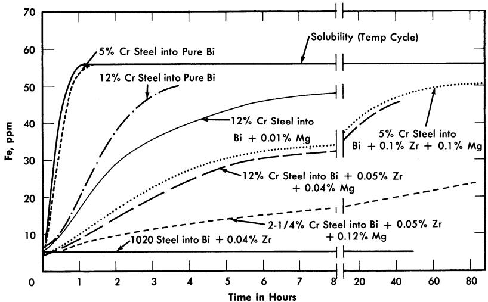  
FIG. 21-2. Dissolution of Fe into Bi (plus additives) at $600^{\circ}\mathrm{C}$ from steel crucible.

Rates of precipitation. The rate of precipitation of iron from bismuth in a pure iron steel crucible is very rapid. Iron precipitated from bismuth, saturated at $615^{\circ}\mathrm{C}$ , as rapidly as the temperature could be lowered to $425^{\circ}\mathrm{C}$ . The addition of $\mathrm{Zr}$ plus $\mathrm{Mg}$ to liquid metal did not change the rapid precipitation of most of the iron from the bismuth under these same conditions, but produced a marked delay in the precipitation of the last amount of iron in excess of equilibrium solubility. An apparently stable supersaturation ratio of 2.0 was observed for more than $7\mathrm{hr}$ at $425^{\circ}\mathrm{C}$ in a pure iron crucible containing $\mathrm{Bi} + 1000\mathrm{ppm}\mathrm{Mg} + 500\mathrm{ppm}\mathrm{Zr}$ , and 1.7 for more than $48\mathrm{hr}$ at $450^{\circ}\mathrm{C}$ . In a $5\%$ Cr steel crucible, a supersaturation ratio of iron in $\mathrm{Bi} + \mathrm{Mg} + \mathrm{Zr}$ of 2.9 was observed after $24\mathrm{hr}$ at $425^{\circ}\mathrm{C}$ . This phenomenon may be due to the ability of the formed surface deposits to poison the effectiveness of the iron surface as a nucleation promotor or catalyst, the different supersaturations observed being due to the relative abilities of a $\mathrm{Zr - Fe}$ intermetallic compound or of $\mathrm{ZrN}$ to promote nucleation of iron. This observed supersaturation suggests that mass transfer should be nearly eliminated in a circulating system in which the solubility ratio due to the temperature gradient does not exceed the measured "stable supersaturation" at the cold-leg temperature.

Precipitation rate experiments made in AISI type-410 steel crucibles show that $\mathrm{Zr + Mg}$ stabilize Cr supersaturations of 2.0 to 3.0 for more than $24\mathrm{hr}$ . However, no Cr supersaturation was found during precipitation rate experiments made in pure Cr crucibles when $\mathrm{Zr + Mg}$ were present in the melt [4]. The measured supersaturations should therefore be due to the films present on the steel surfaces.

21-2.2 Corrosion testing on steels. The research effort on materials for containment of the LMFR has been concerned mainly with low-alloy steels having constituents which have low solubilities in Bi, such as C, Cr, and Mo. Although the solubilities of Fe and Cr are only 28 and $80~\mathrm{ppm}$ respectively at the intended maximum temperature of operation, severe corrosion and mass transfer are encountered when pure Bi or a U-Bi solution is circulated through a temperature differential in a steel loop. This results from the continuous solution of the pipe material in the hot portion of the system and subsequent precipitation from the supersaturated solution in the colder portions. Zirconium additions to U-Bi greatly reduce this corrosion and mass transfer.

The behavior of steels in U-Bi is studied in three types of tests. Thermal convection loops are used to test materials under dynamic conditions. In these, the fuel solution is continuously circulated through a temperature differential in a closed loop of pipe. Variables such as material composition, maximum temperature, temperature differential, and additive concentrations are studied in this test. More than sixty such loops have now been run at BNL. The principal limitation in these tests is that the velocities obtained by thermal pumping are extremely low when compared with the LMFR design conditions.

Forced circulation loops are used to study materials under environments more closely approximating LMFR conditions. Three such loops are now in operation at BNL and two more are under construction. A very large loop (4 in. ID) which will circulate U-Bi at 360 U.S. gpm and transfer about $2\frac{1}{2} \times 10^{6}$ watts of heat, is now under construction and is expected to go into operation late this year.

Static tests, as discussed previously, in which steels are isothermally immersed in high-temperature U-Bi containing various additives, are used to study their corrosion resistance and the inhibition process as a function of additive concentration and steel composition. Most of the tests have been performed on a $2\frac{1}{4}\%$ Cr-1% Mo steel (Table 21-3). However, some tests have also been made with higher Cr steels, $1\frac{1}{4}\%$ Cr-1/2% Mo, $1/2\%$ Cr-1/2% Mo, and carbon steels.

21-2.3 Thermal convection loop tests at BNL. A typical thermal convection loop that has been used at BNL is shown in Fig. 21-3. The loop is provided with a double-valve air lock at the top of the vertical section which permits taking liquid metal samples while the loop is running without contaminating the protective atmosphere. The hot leg is insulated and heat is supplied to that section of the loop while the cold leg is exposed and two small blowers are utilized to extract heat. The hottest point in the loop is at the "tee" at the upper end of the insulated section, and the coldest in the bottom of the exposed section. The total height of the loop proper is

TABLE 21-3   
COMPOSITION OF STEELS TESTED   

<table><tr><td>Steel</td><td>C</td><td>Mn</td><td>Si</td><td>P(max)</td><td>S(max)</td><td>Cr</td><td>Mo</td><td>Others</td></tr><tr><td>Carbon Steel</td><td>0.08</td><td>0.85</td><td>0.01</td><td>0.09</td><td>0.27</td><td>—</td><td>—</td><td>—</td></tr><tr><td>Bessemer</td><td>0.07</td><td>0.42</td><td>0.009</td><td>0.056</td><td>0.022</td><td>—</td><td>—</td><td>—</td></tr><tr><td>RH 1081</td><td>0.31</td><td>0.12</td><td>0.14</td><td>0.018</td><td>0.020</td><td>—</td><td>—</td><td>0 30 Ti</td></tr><tr><td>1/2Cr-1/2Mo*</td><td>0.10-0.20</td><td>0.3-0.61</td><td>0.1-0.3</td><td>0.045</td><td>0.045</td><td>0.5-0.81</td><td>0.45-0.66</td><td>—</td></tr><tr><td>1¼Cr-1/2Mo*</td><td>0.15</td><td>0.3-0.6</td><td>0.5-0.1</td><td>0.045</td><td>0.045</td><td>1.0-1.5</td><td>0.45-0.66</td><td>—</td></tr><tr><td>2¼Cr-1Mo*</td><td>0.15</td><td>0.3-0.6</td><td>0.50</td><td>0.045</td><td>0.030</td><td>1.9-2.6</td><td>0.87-1.13</td><td>—</td></tr><tr><td>5Cr-1/2Mo*</td><td>0.15</td><td>0.3-0.6</td><td>0.50</td><td>0.045</td><td>0.030</td><td>4-6</td><td>0.45-0.65</td><td>—</td></tr><tr><td>5Cr-Si*</td><td>0.15</td><td>0.3-0.6</td><td>1.0-2.0</td><td>0.045</td><td>0.03</td><td>4-6</td><td>0.45-0.65</td><td>—</td></tr><tr><td>9Cr-1Mo*</td><td>0.15</td><td>0.3-0.6</td><td>0.25-1.0</td><td>0.045</td><td>0.03</td><td>8-10</td><td>0.9-1.1</td><td>—</td></tr><tr><td>AISI Type 410*</td><td>0.15 max</td><td>1.00</td><td>0.75</td><td>0.030</td><td>0.030</td><td>11.5-13.5</td><td>—</td><td>Ni 0.50 max</td></tr><tr><td>18Cr-8Ni</td><td>0.08 max</td><td>2.00 max</td><td>0.75</td><td>0.030</td><td>0.030</td><td>18-20</td><td>—</td><td>Ni 8-11</td></tr><tr><td>AISI Type 304*</td><td></td><td></td><td></td><td></td><td></td><td></td><td></td><td></td></tr><tr><td>AISI 4130*</td><td>0.28-0.33</td><td>0.4-0.6</td><td>0.2-0.35</td><td>0.04</td><td>0.04</td><td>0.8-1.1</td><td>0.15-0.25</td><td></td></tr><tr><td>Rex AA*</td><td>0.73</td><td></td><td></td><td></td><td></td><td>4.0</td><td></td><td>V 1.15; W 18 Bal Fe</td></tr><tr><td>Stellite 90*</td><td>2.75</td><td></td><td></td><td></td><td></td><td>27.0</td><td></td><td>Fe balance</td></tr></table>

*Nominal composition.

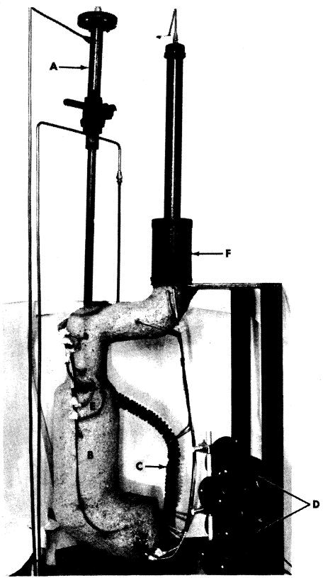  
FIG. 21-3. Thermal convection loop. A. Air lock. B. Hot leg. C. Cold leg. D. Fans. E. "Tee" connection. F. Melt tank with AISI type-410 steel filter bottom.

approximately 15 in. and the total length of the loop is approximately 40 in. With this configuration, the flow rate is approximately 0.05 fps when Bi is circulated with a $100^{\circ}\mathrm{C}$ temperature differential. Temperature differentials ranging from 40 to $150^{\circ}\mathrm{C}$ can be conveniently applied to the loop. Radiographic inspection of the loop while in operation is periodically made to monitor it for corrosion at the hottest section and deposition at the coldest section. The inside of the steel pipe for the loop is either acid-cleaned or grit-blasted. The pipe is then cold-bent to the desired shape, and welded at the "tee" by the inert-gas shielded-arc process.

The general procedure for running the loop is as follows: (1) Solid Bi is charged into the melt tank. (2) The entire system is leak-checked with a mass spectrometer. (3) The Bi is melted and introduced into the uniformly heated $(550^{\circ}\mathrm{C})$ , fully insulated loop through a 35-micron AISI

TABLE 21-4   
SUMMARY OF THERMAL CONVECTION LOOP DATA   
All loops were fabricated from 1/2 IPS Sch 40 pipe of the steel indicated   

<table><tr><td rowspan="2">Test no.</td><td rowspan="2">Steel</td><td rowspan="2">Welding rod</td><td colspan="4">Additives, nominal composition, ppm</td><td colspan="3">Liquid metal temperature, °C</td><td rowspan="2">Duration of test, hr</td><td rowspan="2">Results</td></tr><tr><td>U</td><td>Mg</td><td>Zr</td><td>Others</td><td>Max</td><td>Min</td><td>Diff.</td></tr><tr><td>1</td><td>214Cr-1Mo</td><td>5Cr-1/2Mo</td><td>1000</td><td>—</td><td>—</td><td>—</td><td>550</td><td>510</td><td>40</td><td>405</td><td>Plugged</td></tr><tr><td>2</td><td>”</td><td>”</td><td>1000</td><td>—</td><td>—</td><td>—</td><td>550</td><td>475</td><td>75</td><td>310</td><td>Plugged</td></tr><tr><td>3</td><td>”</td><td>”</td><td>1000</td><td>—</td><td>—</td><td>—</td><td>550</td><td>432</td><td>118</td><td>260</td><td>Plugged</td></tr><tr><td>4</td><td>”</td><td>”</td><td>1000</td><td>350</td><td>250</td><td>—</td><td>550</td><td>460</td><td>90</td><td>13,550</td><td>No corr.; no deposition</td></tr><tr><td>5</td><td>”</td><td>”</td><td>1000</td><td>350</td><td>250</td><td>—</td><td>550</td><td>450</td><td>100</td><td>11,673*</td><td>Weld corr. (5Cr-1/2Mo); moderate deposition</td></tr><tr><td>6</td><td>”</td><td>”</td><td>1000</td><td>350</td><td>250</td><td>—</td><td>550</td><td>450</td><td>100</td><td>10,928</td><td>Weld (5Cr-1/2Mo) and pipe corr.; moderate deposition</td></tr><tr><td>7</td><td>”</td><td>”</td><td>1000</td><td>350</td><td>250</td><td>—</td><td>525</td><td>425</td><td>100</td><td>9,834*</td><td>Pipe corr.; slight deposition</td></tr><tr><td>8</td><td>”</td><td>”</td><td>1000</td><td>350</td><td>250</td><td>—</td><td>500</td><td>400</td><td>100</td><td>10,869*</td><td>No corr.; slight deposition</td></tr><tr><td>9</td><td>”</td><td>”</td><td>1000</td><td>350</td><td>250</td><td>—</td><td>600</td><td>550</td><td>50</td><td>5,643</td><td></td></tr><tr><td></td><td></td><td></td><td></td><td></td><td></td><td></td><td>600</td><td>525</td><td>75</td><td>2,686</td><td></td></tr><tr><td></td><td></td><td></td><td></td><td></td><td></td><td></td><td>600</td><td>500</td><td>100</td><td>4,152*</td><td>Weld corr. (5Cr-1/2Mo) moderate deposition</td></tr><tr><td>10</td><td>”</td><td>”</td><td>1000</td><td>350</td><td>325</td><td>—</td><td>500</td><td>400</td><td>100</td><td>5,295*</td><td>Weld (214Cr-1Mo) and pipe corr.; slight deposition</td></tr><tr><td></td><td>Normalized and tempered</td><td></td><td></td><td></td><td></td><td></td><td></td><td></td><td></td><td></td><td></td></tr><tr><td>11</td><td>21Cr-1Mo
Be insert</td><td>21Cr-Mo</td><td>1000</td><td>350</td><td>325</td><td>—</td><td>500</td><td>400</td><td>100</td><td>1,631*</td><td>No corr.; slight deposition</td></tr><tr><td>12</td><td>21Cr-1Mo
graphite insert</td><td>5Cr-1/2Mo</td><td>1000</td><td>350</td><td>350</td><td>—</td><td>550</td><td>440</td><td>110</td><td>15,086</td><td>Severe corr.; moderate deposition</td></tr><tr><td>13</td><td>21Cr-1Mo</td><td>” ”</td><td>1000</td><td>350</td><td>250</td><td>—</td><td>550</td><td>440</td><td>110</td><td>16,906</td><td>Corroded through at weld (5Cr-1/2Mo); moderate deposition</td></tr><tr><td>14</td><td>21Cr-1Mo</td><td>” ”</td><td>1000</td><td>350</td><td>250</td><td>—</td><td>525</td><td>400</td><td>125</td><td>10,649*</td><td>Weld corr.(5Cr-1/2Mo); moderate deposition</td></tr><tr><td>15</td><td>21Cr-1Mo
nitrided after welding</td><td>” ”</td><td>1000</td><td>350</td><td>250</td><td>—</td><td>550</td><td>425</td><td>125</td><td>10,425*</td><td>No corr.; slight deposition</td></tr><tr><td>16</td><td>21Cr-1Mo</td><td>” ”</td><td>1000</td><td>350</td><td>250</td><td>—</td><td>550</td><td>420</td><td>130</td><td>5,323</td><td>Heavy pipe corr.; heavy deposition</td></tr><tr><td>17</td><td>21Cr-1Mo</td><td>” ”</td><td>1000</td><td>350</td><td>250</td><td>—</td><td>650</td><td>500</td><td>150</td><td>1,180</td><td>Plugged; severe corrosion</td></tr><tr><td>18</td><td>Bessemer
Carbon steel</td><td>Carbon steel</td><td>1000</td><td>350</td><td>250</td><td>—</td><td>550</td><td>415</td><td>135</td><td>12,356</td><td>No corr.; no deposition</td></tr><tr><td>19</td><td>RH1081</td><td>RH1081</td><td>1000</td><td>350</td><td>250</td><td>—</td><td>450</td><td>415</td><td>135</td><td>8,231*</td><td>No corr.; no deposition</td></tr><tr><td>20</td><td>1/2Cr-1/2Mo</td><td>1/4Cr-1/2Mo</td><td>1000</td><td>350</td><td>325</td><td>—</td><td>500</td><td>405</td><td>95</td><td>8,538*</td><td>No corr.; no deposition</td></tr><tr><td>21</td><td>1/4Cr-1/2Mo</td><td>1/4Cr-1/2Mo</td><td>1000</td><td>350</td><td>400</td><td>—</td><td>525</td><td>425</td><td>100</td><td>9,194*</td><td>No corr.; slight deposition</td></tr><tr><td>22</td><td>1/4Cr-1/2Mo</td><td>1/4Cr-1/2Mo</td><td>1000</td><td>350</td><td>325</td><td>—</td><td>500</td><td>400</td><td>100</td><td>963</td><td></td></tr><tr><td>23</td><td>5Cr-Si</td><td>5Cr-1/2Mo</td><td>1000</td><td>350</td><td>250</td><td>—</td><td>550</td><td>440</td><td>100</td><td>6,240*</td><td>No corr.; slight deposition</td></tr><tr><td>24</td><td>9Cr-1Mo</td><td>9Cr-1Mo</td><td>1000</td><td>350</td><td>250</td><td>—</td><td>550</td><td>420</td><td>130</td><td>3,340</td><td>Slight corr.; some deposition</td></tr></table>

*Test in progress as of 3/15/58. Time indicated is duration at temperature differential. Results indicated for these loops are   
continued

based on radiographic inspection.

TABLE 21-4 (continued)   

<table><tr><td rowspan="2">Test no.</td><td rowspan="2">Steel</td><td rowspan="2">Welding rod</td><td colspan="4">Additives, nominal composition, ppm</td><td colspan="3">Liquid metal temperature, °C</td><td rowspan="2">Duration of test, hr</td><td rowspan="2">Results</td></tr><tr><td>U</td><td>Mg</td><td>Zr</td><td>Others</td><td>Max.</td><td>Min.</td><td>Diff.</td></tr><tr><td>25</td><td>18Cr-8Ni</td><td>18Cr-8Ni</td><td>1000</td><td>350</td><td>250</td><td>—</td><td>550</td><td>400</td><td>150</td><td>630</td><td>Plugged; severe corr.</td></tr><tr><td>26</td><td>21/4Cr-1Mo</td><td>5Cr-1/2Mo</td><td>—</td><td>—</td><td>—</td><td>450Th</td><td>550</td><td>500-480</td><td>50-70</td><td>1,294</td><td>Plugged; severe corr.</td></tr><tr><td>27</td><td>21/4Cr-1Mo</td><td>5Cr-1/2Mo</td><td>1000</td><td>—</td><td>400</td><td>400Th</td><td>550</td><td>435</td><td>115</td><td>8,567</td><td>Severe corr.; very heavy precipitation</td></tr><tr><td>28</td><td>21/4Cr-1Mo</td><td>5Cr-1/2Mo</td><td>1000</td><td>350</td><td>—</td><td>1000Ti</td><td>550</td><td>445</td><td>105</td><td>6,413</td><td>Plugged; severe corr.</td></tr><tr><td>29</td><td>21/4Cr-1Mo</td><td>5Cr-1/2Mo</td><td>1000</td><td>—</td><td>250</td><td>500Ca</td><td>550</td><td>450</td><td>100</td><td>2,374</td><td>Plugged</td></tr></table>

type-410 stainless-steel filter. (4) Zr and Mg are introduced into the loop through the air lock. (5) The Bi in the loop is sampled, using a graphite sample extractor, to check for additive concentration. (6) Uranium is added if additive concentrations are as desired; if necessary, additive concentrations are adjusted prior to U addition. (7) The temperature differential is obtained by removing the insulation from the cold leg and starting the fans. The temperature differential is usually applied in two steps, first $40^{\circ}\mathrm{C}$ and then the differential at which the loop is to operate. (8) The entire loop is radiographed every 750 hr. (9) The liquid metal is sampled at regular intervals. (10) After completion of the test the entire loop is sectioned longitudinally and transversely for metallographic examination.

In Table 21-4, data from 29 thermal convection loop experiments at BNL are summarized. The first three loops were fabricated from $2\frac{1}{4}\%$ Cr-1% Mo steel pipe and the U-Bi solution was not inhibited. Loops No. 4 to 17 inclusive were made with $2\frac{1}{4}\%$ Cr-1% Mo steel and inhibited with Mg and Zr. Loops No. 18 to 25 inclusive were fabricated from various types of steels, ranging from Bessemer to $18\%$ Cr-8% Ni austenitic steels. Loops No. 26 to 29 were made from $2\frac{1}{4}\%$ Cr-1% Mo steel pipe. The purpose of these tests was to study the effectiveness of Ca, Th, and Ti as inhibitors.

It can be seen from the first three tests that deposition in the cold legs of uninhibited loops after a few hundred hours is sufficient to stop flow. These tests show conclusively that uninhibited U-Bi solution causes serious mass transfer of this steel even at a temperature differential as low as $40^{\circ}\mathrm{C}$ . Metallographic examination of the hot legs of these loops showed a generalized intergranular attack.

The data from loops inhibited with 350 ppm of Mg and 250 to 350 ppm Zr (loops No. 4 to 17) show that mass-transfer rate can be decreased considerably by the introduction of these additives. This effect is attributed to the formation of a ZrN film on the steel surface [4,5]. The data demonstrate, however, that this film is not completely protective in $21\%$ Cr-1% Mo steel system. Test No. 4 indicates that for a differential in the order of $90^{\circ}\mathrm{C}$ , the film was sufficiently protective to prevent corrosion or deposition in 13,550 hr of test. For temperature differentials of $100^{\circ}\mathrm{C}$ or higher, incipient corrosion can be expected in about 5000 to 6000 hr. Some of the $21\%$ Cr-1 Mo loop sections were joined with 5 Cr-1/2 Mo welding rod. This higher chromium material has lower resistance to inhibited U-Bi than the pipe, so that corrosion generally starts at these welds. Increasing the temperature of the hot leg seems to increase the rate of corrosion, as illustrated by the results of loops No. 5 to 9 inclusive, which were all tested at $100^{\circ}\mathrm{C}$ temperature differential.

Loop No. 10, which was normalized from $954^{\circ}\mathrm{C}$ and tempered at $732^{\circ}\mathrm{C}$ after welding, stood up poorly when compared with other tests. The heat-treating was done in an argon atmosphere, and no subsequent alteration was made to the surface left by the heat treatment. This heat treatment was thought, from some observations in the pumped loops, to improve corrosion resistance. It is believed that the poor results of test No. 10 are due to alteration of the surface during the heat treatment and not to the metallurgical structure of the steel. Loops No. 11 and 12 had Be and graphite inserts in the hot leg to study their effect on mass transfer and also the stability of U, Mg, and Zr concentrations. No detrimental effects on either have been observed.

Loop No. 15, made of a $2\frac{1}{4}$ Cr-1 Mo steel that was internally nitrided to a depth of 0.015 inch, appears to be standing up much better than other $2\frac{1}{4}$ Cr-1 Mo loops tested at a $125^{\circ}\mathrm{C}$ temperature differential. The added nitrogen in the steel probably promoted the formation of the $\mathbf{Z}\mathbf{r}\mathbf{N}$ film. A slight loss in $\mathbf{Z}\mathbf{r}$ has been observed in this test, but other additive concentrations have remained constant.

Results of tests No. 18 to 25 show that higher-alloyed steels are inferior to the carbon steels in inhibited U-Bi. Loop No. 18, fabricated from Bessemer carbon steel, showed exceptional resistance to U-Bi. Metallographic examination of this loop indicated no evidence of corrosion or deposition after $12,356\mathrm{hr}$ of operation at $135^{\circ}\mathrm{C}$ temperature differential. X-ray diffraction studies of a polished insert in this loop indicated that a $\mathrm{ZrN}$ film was present; however, no film was detected on the pipe surface. Considerable evidence of structural instability in the form of grain coarsening and graphitization of the Bessemer steel was found in the metallographic examination of the loop. A medium carbon steel containing Ti, Rh-1081, also exhibited good resistance to U-Bi corrosion. The lower chromium steels, such as $1/2\%$ Cr-1/2% Mo and $1\frac{1}{4}\%$ Cr-1/2% Mo (tests No. 20, 21, and 22), also seem to be standing up well to inhibited U-Bi. The testing of these steels will be increased.

Loops No. 26 to 29 were run to study the effectiveness of Th, $\mathrm{Th} + \mathrm{Zr}$ , $\mathrm{Ti} + \mathrm{Mg}$ , and $\mathrm{Ca} + \mathrm{Zr}$ as inhibitors. It can be seen from these tests that these inhibitors were much inferior to $\mathrm{Mg}$ and $\mathrm{Zr}$ combinations. In tests No. 27 and 29 it was found that a slow but continuous loss of $\mathrm{Zr}$ , Th, and Ca occurred. Horsley [6] also ran Bi loops containing $\mathrm{Ca}$ and $\mathrm{Zr}$ as inhibitors. He reported similarly that the loops plugged, and that $\mathrm{Ca}$ and $\mathrm{Zr}$ were lost from the melt. The results of loop No. 28 indicate that $\mathrm{Mg}$ and Ti provide some inhibition, but are not nearly as effective as $\mathrm{Mg}$ and $\mathrm{Zr}$ . Metallographic examination of this loop shows that the corrosion was uniform and that most of the attack took place 4 to 6 in. downstream from the "tee," in an area which is normally somewhat lower in temperature than the "tee."

Metallographic examinations of $2\frac{1}{4}\%$ Cr-1% Mo loops inhibited by Mg and Zr show that corrosion starts in the form of a pit. After the pit has penetrated about 0.020 or 0.025 in. into the pipe, the progress of corrosion generally proceeds laterally on the pipe, widening the pit rather than deepening it. A typical pitted area formed by U-Zr-Mg-Bi in $2\frac{1}{4}\%$ Cr-1% Mo steel is shown in Fig. 21-4. The attack is transgranular throughout the pitted area. Horsley [6] reported intergranular attack at the bottom of pits formed in a similar steel by Zr-Ca-Bi. Metallographic examination of plugged thermal convection loops shows the deposit to be very flaky and not tightly adherent to the loop walls. Chemical analysis of the deposition in a $2\frac{1}{4}\%$ Cr-1% Mo steel loop indicated it to be about $95\%$ Fe and $2\%$ Cr. ZrN films have been positively identified by x-ray reflection in only two thermal convection loops: Bessemer steel loop, and one $2\frac{1}{4}\%$ Cr-1% Mo steel loop. The protective film is possibly so thin that it can be identified only under ideal conditions.

21-2.4 High-velocity tests. Although thermal convection loops are convenient for extensive corrosion testing under dynamic conditions, the velocity is not large enough to give design data for actual operating conditions. These data must be obtained by operating loops in which the bismuth solution is pumped at considerably higher linear velocities through suitably designed test sections.

Attainment of higher flow velocities complicates corrosion testing methods. Large heat inputs are necessary to obtain temperature differentials comparable to those readily attained in thermal convection loops. Special equipment is required to measure flow. Pumps must be designed leaktight to maintain absolute system purity. The U-Bi must be prevented from freezing in the piping.

Some important features of the BNL loops are (1) the systems are completely sealed and operate under a purified inert-gas blanket, (2) samples of the liquid metal can be taken at any time during operation without contamination, (3) radiography permits nondestructive examination of test samples so that long runs are possible, and (4) the safety control system is designed to prevent the freezing of the U-Bi (and subsequent bursting) in the piping.

In corrosion loops (HVL I and II) at BNL [7], no valves are used to hold the fluid up in the system, and flow is measured with a submerged orifice located in the sample tank. Piping in these loops is 3/4-in. schedule-40 except in the test sections. A GE G-6 electromagnetic pump is used in HVL I, while Callery 25-20 electromagnetic pump is used in HVL II. Flows in the order of 1 to $2\mathrm{gpm}$ are achieved with both pumps. An intermediate heat exchanger does about $50\%$ of the heating and cooling. Resistance furnaces provide the heat. The head developed is sufficient to

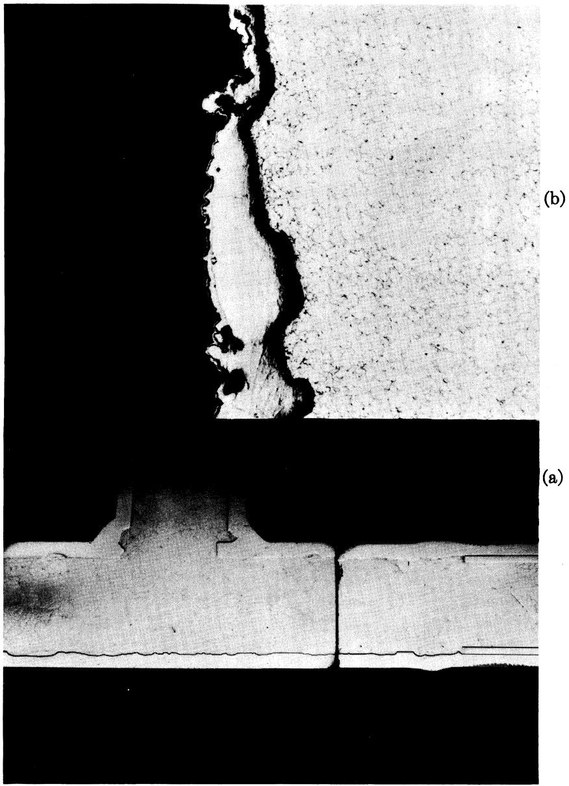  
FIG. 21-4. Pitted area at "tee" in Loop #12. (a) Macrograph. (b) Micrograph (original $250 \times$ ) of pitted areas.

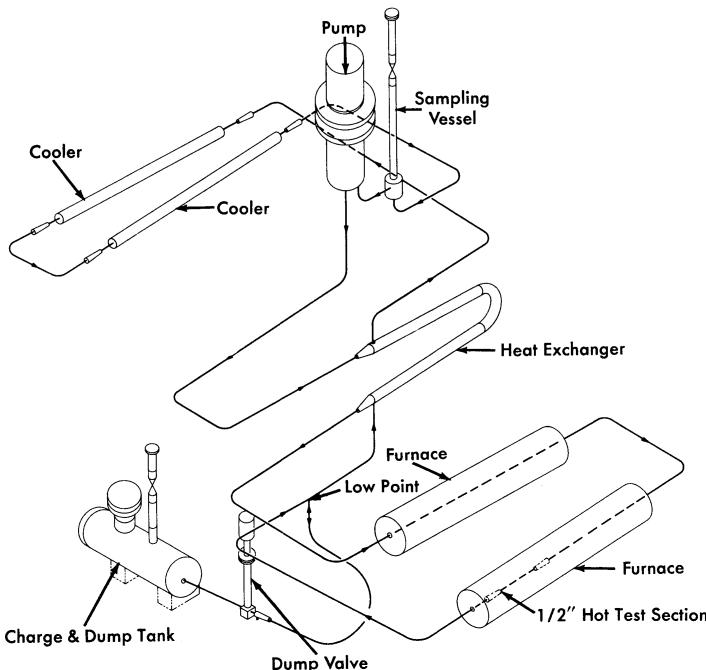  
FIG. 21-5. High-velocity pump test loop.

allow the use of short small-diameter test sections in which velocities up to 8 fps are attained.

A third corrosion loop (loop G) uses a canned centrifugal pump to circulate the U-Bi, permitting flows up to 4.8 gpm and velocities up to 14 fps to be attained. Engineering devices such as bellows-sealed valves and pressure transmitters are being tested in this loop, as well as materials for high-velocity corrosion resistance. Heating and cooling is the same as in HVL I and II. The loop is fabricated for the most part of $2\frac{1}{4}\% \mathrm{Cr - }1\%$ Mo steel, 1-in. schedule-40 piping.

Two more loops (HVL III and IV), similar to loop G, are now under construction. These are shown in Fig. 21-5. Flow rates up to 12 gpm, velocities up to 25 fps, and temperature differentials of $150^{\circ}\mathrm{C}$ will be attainable in these loops. HVL III will be fabricated of $2\frac{1}{4}\%$ Cr-1% Mo steel, while HVL IV will be of $1\frac{1}{4}\%$ Cr-1/2% Mo steel.

While the basic material of construction of these loops is a Cr-Mo steel, test sections are usually made up of a variety of steels and weldments. All welds are made by the inert arc process. Cleaning, for the most part, is done by grit-blasting.

TABLE 21-5   
RESULTS FROM HIGH VELOCITY LOOPS   

<table><tr><td rowspan="2">Loop no.</td><td rowspan="2">Material*</td><td colspan="2">Temp. (Bulk), °C</td><td colspan="2">Temp. Film, °C</td><td colspan="3">Additive conc.</td><td rowspan="2">Time of test, hr</td><td rowspan="2">Flow, gpm</td><td rowspan="2">Remarks</td></tr><tr><td>Max</td><td>Min</td><td>Max</td><td>Min</td><td>Mg</td><td>Zr</td><td>U</td></tr><tr><td>HVL I: 
Run 1</td><td>24Cr-1Mo</td><td>520</td><td>414</td><td>525</td><td>400</td><td>350</td><td>300</td><td>920</td><td>1026</td><td>1.20</td><td>No corrosion</td></tr><tr><td>Run 2</td><td>24Cr-1Mo</td><td>520</td><td>414</td><td>525</td><td>400</td><td>350</td><td>350</td><td>1000</td><td>1026</td><td>1.20</td><td>Cavitation pits in high velocity test section</td></tr><tr><td>Run 3</td><td>24Cr-1Mo</td><td>520</td><td>414</td><td>525</td><td>400</td><td>350</td><td>300</td><td>1000</td><td>1006</td><td>1.25</td><td>No cavitation</td></tr><tr><td>Run 4</td><td>24Cr-1Mo</td><td>544</td><td>417</td><td>550</td><td>400</td><td>350</td><td>250</td><td>1000</td><td>2591</td><td>1.1</td><td>Severe pits and mass transfer; loop sectioned</td></tr><tr><td>Run 5</td><td>14Cr-1/2Mo 
(loop refabri-cated)</td><td>520</td><td>445</td><td>525</td><td>428</td><td>350</td><td>250</td><td>1000</td><td>4000†</td><td></td><td>No corrosion; some transfer after 4000 hr</td></tr><tr><td>HVL II: 
Run 1</td><td>24Cr-1Mo</td><td>520</td><td>445</td><td>522</td><td>427</td><td>350</td><td>350</td><td>1000</td><td>7400†</td><td></td><td>Slight pit corr. in welds; transferr detected after 2500 hr at ΔT; loop still in operation 7000 hr</td></tr><tr><td>Loop G: 
Run 1</td><td>24Cr-1Mo</td><td>525</td><td>473</td><td>529</td><td>458</td><td>350</td><td>350</td><td>1000</td><td>938</td><td>4.0</td><td>Pt. corr. of 4-6 Cr-1Mo welds; corr. of AISI 410 SS.</td></tr><tr><td>Run 2</td><td>24Cr-1Mo</td><td>525</td><td>450</td><td>526</td><td>435</td><td>350</td><td>250</td><td>900</td><td>2500†</td><td>4.8</td><td>No corr. after 2500 hr</td></tr></table>

*This is the major material of construction. The actual test section is a composite of many materials.†Still in operation. Test time as of 3/15/58.

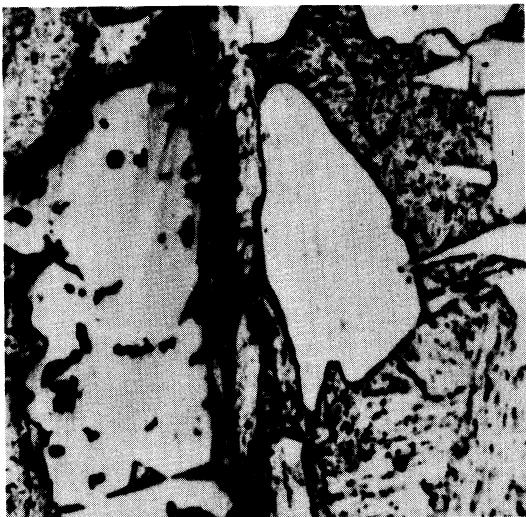  
FIG. 21-6. Precipitation of Fe-Cr alloy in high-velocity cold-leg test section (HVL I-Run 1).

Results obtained thus far with the pumped loops are shown in Table 21-5. In most cases a run consists of a test on a particular test section rather than on the entire loop. The exception is Run 4 of HVL I, which was continued until the loop plugged, at which time the entire loop was dismantled and refabricated of $1\frac{1}{4}\% \mathrm{Cr - }1 / 2\%$ Mo steel. The film temperature reported is the calculated liquid-steel interface temperature. In all tests Zr and Mg were used as inhibitors.

The purpose of Run 1 on HVL I was to study the effect of velocity on the material deposited in the cold portions of the system. It was felt that a high flow rate might dislodge the loose precipitated crystals and circulate them to the hot sections, where they would redissolve in preference to the pipe wall. The high-velocity section was placed at the region of the coldest bulk liquid. All test specimens were fabricated of $2\frac{1}{4}\%$ Cr-1% Mo steel and welds were performed with a $5\%$ Cr-1/2% Mo bare filler rod.

Examination of the test sections after 1026 hr of test showed that no corrosion had taken place in the hot sections. A one-grain, adherent layer of precipitated Fe-Cr alloy was found in the high-velocity cold section (Fig. 21-6).

To test the effect of impact on the inhibiting film, a right-angle, high-velocity section was inserted in the hot leg of HVL I-Run 2. The section was about 5 in. long, 0.355-in. ID and contained a graphite insert specimen and an annealed and hardened $21\%$ Cr-1% Mo steel specimen. All welds were made with $5\%$ Cr-1/2% Mo bare filler rod. The flow through the

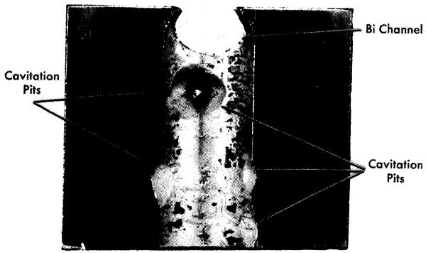  
FIG. 21-7. Cavitation-erosion on downstream side of right-angle bend in HVL I-Run 2.

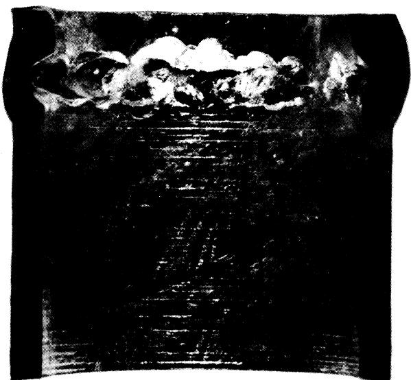  
FIG. 21-8. Preferential attack on $5\%$ Cr- $\frac{1}{2}\%$ Mo Weld in HVL I-Run 4.

small diameter was 5 fps. Physically, the right-angle section was located just outside the furnace. Polished bushings and tab samples were also placed in the furnace leg. Temperature conditions were identical to Run 1.

This run was terminated after 1026 hr of $\Delta T$ operation, and samples were removed for metallographic examination. No corrosion was detected on the polished samples located in the furnace. No erosion or corrosion was observed on any of the graphite samples. Again a very small amount of deposition was found in the cold section, this time between the pipe wall and the cold sample bushing inserts. Large pits, some about 1/2-in. diameter and 1/8-in. deep, were found on the steel samples located in the exit side of a right-angle bend (Fig. 21-7). If a vortexing of the fluid (therefore a locally increased velocity) is assumed to have occurred after the change of direction in the right-angle bend, then a condition for cavitation may have existed, i.e., the static head at this point (7 psi gauge) may have been exceeded by the dynamic head.

Run 3 of HVL I was a duplicate of Run 2 except that the static head at the right-angle bend was doubled. Examination of the specimen after the 1000-hr run showed that the cavitation pitting was eliminated.

Run 4 of HVL I was intended to test the inhibiting film under an increased temperature gradient $(150^{\circ}\mathrm{C})$ with the maximum temperature raised to $550^{\circ}\mathrm{C}$ . The test section consisted of samples of $2\frac{1}{4}\%$ Cr-1% Mo steel (both annealed, and normalized and tempered), mild steel, and several grades of graphite. All welds were made with $5\%$ Cr-1/2% Mo bare filler rod. This run was terminated after 2591 hr of operation because of extensive pitting in the hot section and plugging in the finned cooler section, as revealed by radiographs. Attempts to drain the loop completely were unsuccessful. Upon sectioning, localized masses of intermetallic compounds were found, which probably developed when the system was cooled. These formations did not redissolve on heating because of the lack of good mixing, and were viscous enough to prevent the bismuth from draining.

The entire loop was sectioned and examined. A severe pit-type corrosion was found in the hot sections; welds (Fig. 21-8) as well as parent material (Fig. 21-9) were grossly attacked; $2\frac{1}{4}\% \mathrm{Cr - }1\%$ Mo steel in the normalized and tempered condition was less corroded than the same material in the annealed condition; carbon steel samples showed little or no attack. Corrosion occurred in crevices between the samples and pipe walls. The mass-transfer plugs occurred in the region of the coldest film temperature rather than the coldest bulk temperature. Velocity did not sweep away the deposited material, but rather a plug of high density was produced (Fig. 21-10).

The minimum film temperature for this run may possibly have been as much as $25^{\circ}\mathrm{C}$ lower than the $400^{\circ}\mathrm{C}$ reported because of an error involved in selecting the actual cooling area.

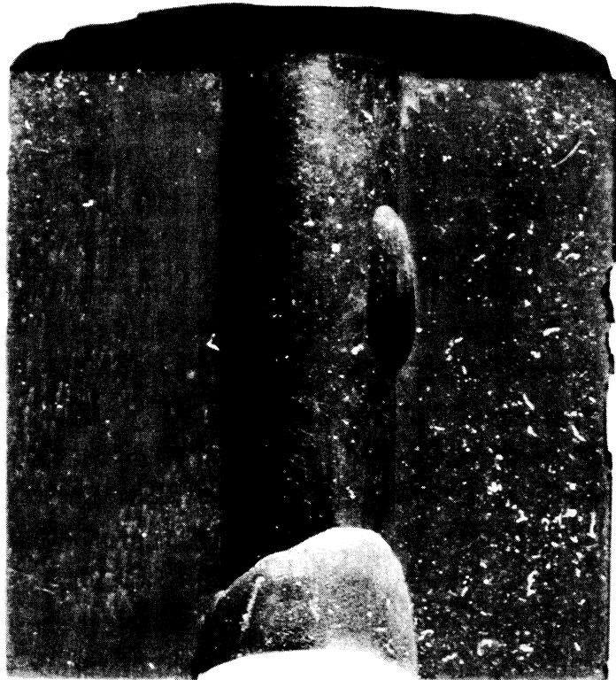  
FIG. 21-9. Attack on annealed $2\frac{1}{4}\%$ Cr-1% Mo hot test specimen in HVL I-Run 4.

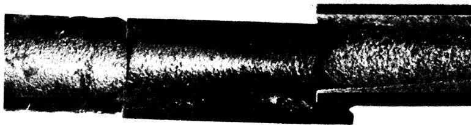

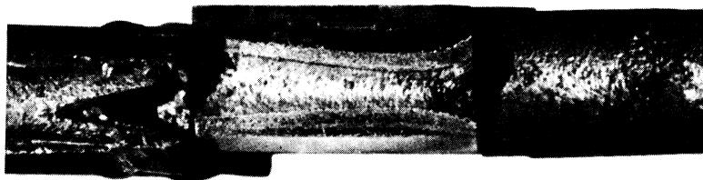  
FIG. 21-10. Cross section of deposited Fe-Cr alloy in finned-cooler section of HVL I-Run 4.

Loop G-Run 1, had a hot-leg test section consisting of specimens of $2\frac{1}{4}\% \mathrm{Cr - }1\% \mathrm{Mo}$ , $1\frac{1}{4}\% \mathrm{Cr - }1 / 2\% \mathrm{Mo}$ , AISI type-410, and Bessemer steels, joined with welds made with $2\frac{1}{4}\% \mathrm{Cr - }1\% \mathrm{Mo}$ , $1\frac{1}{4}\% \mathrm{Cr - }1 / 2\% \mathrm{Mo}$ , $5\% \mathrm{Cr - }1 / 2\% \mathrm{Mo}$ , AISI type-410, and mild steel bare filler rods. This run was terminated after 938 hr of operation at a $75^{\circ}\mathrm{C}$ film gradient and a flow of 4 fps in the test section. Examination of the test section showed that welds made with a $5\% \mathrm{Cr - }1 / 2\% \mathrm{Mo}$ rod were severely attacked, while those made with a $2\frac{1}{4}\% \mathrm{Cr - }1\% \mathrm{Mo}$ rod and a $1\frac{1}{4}\% \mathrm{Cr - }1 / 2\% \mathrm{Mo}$ rod were not attacked. The only other corrosion observed in this run was some slight attack on welds and base material of AISI type-410 steel. Cavitation pits were also observed on the pump impeller.

Loop G-Run 2, HVL I-Run 5, and HVL II-Run 1 are still under test. In these loops are specimens of $2\frac{1}{4}\%$ Cr-1% Mo and $1\frac{1}{4}\%$ Cr-1/2% Mo steels having various heat treatments, AISI type-410 and Bessemer steels, and welds made with $1\frac{1}{4}\%$ Cr-1/2% Mo, $2\frac{1}{4}\%$ Cr-1% Mo, $5\%$ Cr-1/2% Mo, AISI type-410 and mild steel bare filler rods. No corrosion has been detected radiographically in the loop G test section after 2500 hr of operation. No corrosion has been detected in the HVL I-Run 5 test section; however, slight deposition has been detected in the finned cooler. This precipitate was first observed after 1400 hr of operation but is still not serious after 4000 hr.

Pitting of welds made with $5\%$ Cr-1/2% Mo rod and possible corrosion of a $2\frac{1}{4}\%$ Cr-1% Mo weld have been detected in Run 1 of HVL II. This loop first operated 2500 hr with a film $\Delta T$ of $75^{\circ}\mathrm{C}$ (500 to $425^{\circ}\mathrm{C}$ film) with no radiographically detectable corrosion and little or no mass transfer. The temperature differential was then increased to $75^{\circ}\mathrm{C}$ bulk (522 to $427^{\circ}\mathrm{C}$ film). After 100 hr at this new differential, deposition in the cooler was observed. Pitting of the $5\%$ Cr-1/2% Mo weld was detected after 2000 hr at the new differential. However, after a total of 7400 hr of temperature gradient operation, the amount of pitting and transferred material was not serious enough to stop loop operation.

The effect of velocity on corrosion and mass transfer is not apparent at this time. This is mainly due to a lack of tests in which velocity is the only variable. Correlation between the pump loops and thermal convection loops suggests that velocity has little effect on mass transfer other than on the type of plug formed, provided conditions for cavitation do not exist. However, results from tests now under way should definitely evaluate this variable.

21-2.5 Rapid oxidation of $2^{\frac{1}{4}}\%$ Cr-1% Mo steel. In a pumped Bi loop containing Mg+Zr, the $2^{\frac{1}{4}}\%$ Cr-1% Mo steel adjacent to a pinhole leak was found to be severely oxidized. The appearance of the oxide scale was very similar to that reported by Leslie and Fontana [8]. These investigators

found that rapid oxidation of a $16\%$ Cr- $25\%$ Ni- $6\%$ Mo steel will occur in a stagnant atmosphere, and that $\mathrm{MoO_3}$ catalyzed the rapid oxidation of this steel. They also reported that $\mathrm{Bi}_2\mathrm{O}_3$ could produce a similar effect.

A test simulating a leak in a loop was made to study this phenomenon. A $2\frac{1}{4}\%$ Cr-1% Mo steel pipe was filled with Bi containing 1000 ppm U, 350 ppm Mg, and 250 ppm Zr. A 1/32-in. hole was drilled in the pipe below the Bi level. A patch of asbestos tape 2 in. in diameter was put over the hole. The tube was then heated to $594^{\circ}\mathrm{C}$ and pressurized to 5 psi to force out a small amount of Bi. The pressure was dropped as soon as some Bi had leaked out and the tube was then heated at $594^{\circ}\mathrm{C}$ for 1025 hr. The appearance of the pipe underneath the asbestos tape patch and a cross section of the oxidized area are shown in Fig. 21-11. A complete oxidation through the pipe wall has occurred in the area adjacent to the leak.

Tests run at 738 and $816^{\circ}\mathrm{C}$ in covered crucibles show that chemically pure $\mathrm{Bi}_{2}\mathrm{O}_{3}$ can promote rapid oxidation in $2\frac{1}{4}\%$ Cr-1% Mo, $1\frac{1}{4}\%$ Cr-1/2% Mo, and carbon steels. Tube tests and crucible tests are being continued to determine the minimum temperature at which rapid oxidation is a problem.

21-2.6 Radiation effects on steels. Since steel will be in direct contact with the liquid U-Bi fuel, it is important to determine the effects of fission recoils and fast neutrons on the rate of corrosion or erosion. If corrosion inhibition is achieved by a layer of ZrN between the Bi and the steel, there is concern that fission recoil particles might destroy this film. Local heating, resulting from the stopping of the particles, may cause a differential expansion between the layer and the steel. Consequently, the layer may break away from the steel, leaving the surface exposed to Bi attack. On the other hand, neutrons should not be detrimental to a thin ZrN layer, per se.

Effects of neutrons must also be determined on the mechanical properties of the steels at reactor temperatures. Radiation-induced increases in tensile strength and elastic modulus may not anneal out at LMFR operating temperatures. A decrease in the impact strength is not considered too probable at these temperatures, although the possibility must be investigated.

To study the radiation effects on materials, a capsule test has been developed. The capsules, in which samples are inserted in a highly enriched U-Bi solution containing Mg and Zr inhibitors, are exposed in the BNL reactor and irradiated to the desired level. The test has the advantage of attaining high temperatures $(700^{\circ}\mathrm{C})$ and a high fission recoil density.

Samples of $1\frac{1}{4}\% \mathrm{Cr - 1 / 2\% Mo}$ and $2\frac{1}{4}\% \mathrm{Cr - 1\% Mo}$ have been placed in one of these capsules with Bi containing $4000~\mathrm{ppm}$ U, $2500~\mathrm{ppm}$ Zr, and $3500~\mathrm{ppm}$ Mg. The exposure was approximately $2.2\times 10^{19}$ nvt. Sectioning of this capsule has shown no corrosion of the samples. A second capsule

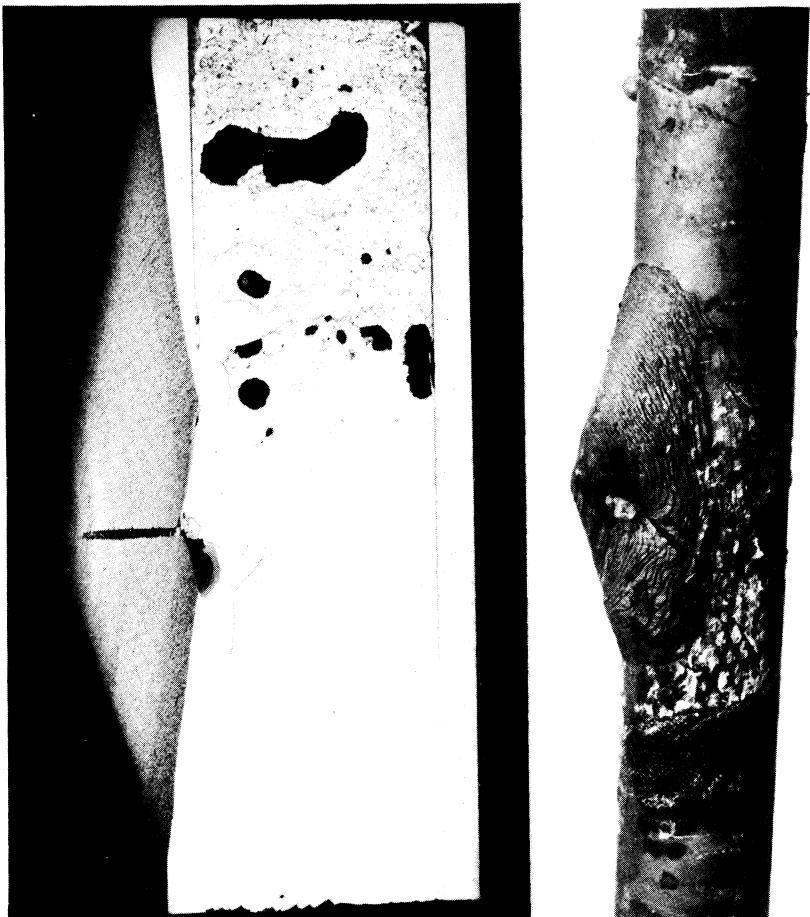  
FIG. 21-11. Rapid oxidation of $24\%$ G-1% Mo steel pipe after 1025 hr at $594^{\circ}\mathrm{C}$ at pinhole leak.

has been put in the BNL pile containing samples of $1\frac{1}{4}\% \mathrm{Cr - 1 / 2\% Mo}$ and mild steels. Results are not yet available.

Dynamic tests of the reaction between Bi and steel in the presence of a radiation field must be completed before a final selection can be made of materials for the LMFR. The effect of velocity on corrosion is not certain from the out-of-pile studies, so that no exact analogy can be made between out-of-pile forced circulation loops and in-pile capsules. There has been limited work done at Harwell [6] with thermal convection loops in and out of a radiation field. These loops had no U but did contain Ca and Zr inhibitors. The data suggest that pile radiation may have induced some acceleration of mass transfer.

An in-pile, forced-circulation loop has been built at BNL and two others at Babcock & Wilcox Research Laboratory to test the corrosion stability of LMFR materials under conditions to be expected in the reactor experiment. In this loop, Bi containing approximately 1500 ppm of $\mathrm{U}^{235}$ , 180 ppm $\mathrm{Zr}$ , and 350 ppm $\mathrm{Mg}$ will be pumped at a rate of 5 to 7 gpm. The bulk $\Delta T$ will be approximately $75^{\circ}\mathrm{C}$ , with a maximum temperature of $500^{\circ}\mathrm{C}$ . There are three sample sections in the loop: one, containing samples of $1\frac{1}{4}\% \mathrm{Cr - 1 / 2\% Mo}$ steel, $2\frac{1}{4}\% \mathrm{Cr - 1\% Mo}$ steel, Be, and graphite, will be at the center of the reactor and will be in a flux of approximately $3\times 10^{13}$ thermal neutrons; one within the shield will see delayed neutrons at a temperature of $500^{\circ}\mathrm{C}$ ; and the third section will be outside the reactor at a temperature of $425^{\circ}\mathrm{C}$ . This test is presently being assembled, and will be operating late in 1958.

# 21-3. NONFERROUS METALS

Several nonferrous metals are receiving attention as container materials, principally because of their low solubility in bismuth. At this time only a small amount of work has been done on testing these metals. The following is a brief discussion of some of the most important of them.

21-3.1 Beryllium. In the Liquid Metals Handbook, beryllium has been reported to have a good resistance to attack by liquid bismuth at $500^{\circ}\mathrm{C}$ and probably also at $1000^{\circ}\mathrm{C}$ . Recent work at Harwell has shown that beryllium has good resistance to mass transfer by liquid bismuth circulating through a temperature gradient of $500^{\circ}\mathrm{C}$ , with a base temperature of $300^{\circ}\mathrm{C}$ . Recent advances in the production technology of beryllium metal have improved its mechanical properties sufficiently so that it is now possible to consider this metal for reactor core vessel or moderator. However, no data on reaction between beryllium and uranium additives and fission products dissolved in a liquid metal fuel are available. Since uranium is known to form a stable intermetallic compound with beryllium, the possibility of such a reaction must be investigated before beryllium can be recommended as a moderator in contact with a liquid-metal fuel. Static tests on the resistance of Be to attack by U-Bi at 550 and $650^{\circ}\mathrm{C}$ showed some (but not conclusive) evidence of a slight attack (less than 1 mil/yr average penetration). A slight attack on Be was noted by Brasunas by a $2\%$ U-Bi alloy after 4 hr at $1000^{\circ}\mathrm{C}$ .

21-3.2 Tantalum. Recent work at the Ames Laboratory indicates that tantalum is an excellent material to contain U-Bi. A 5 w/o U in Bi solution was circulated through a 3/4-in. OD by 0.030-in. wall tantalum loop at a rate of $800\mathrm{lb / min}$ . The U-Bi was circulated with an electromagnetic pump and the temperature differential was $100^{\circ}\mathrm{C}$ (950 to $850^{\circ}\mathrm{C}$ ).

Liquid metal samples taken during operation showed that the Ta concentration never exceeded 6 ppm. After 5250 hr of operation, the loop was shut down and examined metallographically. No transferred material was detected in the cold leg and the corrosion was less than 1 mil. The tantalum remained shiny and ductile throughout the experiment.

Even though the above results are hopeful, the use of tantalum as a container material for a U-Bi reactor system is limited by (1) its poor air oxidation resistance, (2) difficulty of fabrication, (3) cost.

21-3.3 Molybdenum. Molybdenum is also known to be highly resistant to U-Bi. However, its use as a container material is hampered by its poor oxidation resistance and difficult fabrication.

Some success has been obtained, however, with Mo applied as a coating on low-chrome steel. The process was developed by the Vitro Corporation and is described in detail in KLX-10009. Essentially, the coating is applied by first electrophoretically depositing $80\% \mathrm{Mo} + 20\% \mathrm{MoO}_3$ on the steel. The coating is then pressed, reduced in a $\mathrm{H}_{2}$ atmosphere, repressed and sintered in an $\mathrm{H}_{2} + \mathrm{HCl}$ atmosphere.

These specimens have been subjected to static Bi which was temperature cycled at 550 to $400^{\circ}\mathrm{C}$ . Filtered liquid metal samples of the Bi were taken and analyzed for the presence of Fe and Cr. The Bi was allowed to stay at the $550^{\circ}\mathrm{C}$ temperature overnight before a liquid metal sample was taken. After 4300 hr at temperature and some 17,000 cycles, the concentration of Fe was 6.9 ppm and Cr 2 ppm. By comparison, the solubilities of Fe and Cr at $550^{\circ}\mathrm{C}$ were 30 ppm and 80 ppm respectively.

On the basis of their low solubility in U-Bi such materials as tungsten, tantalum, molybdenum, and beryllium could be classified as container materials. Their practical use, however, is governed by their poor air oxidation resistance, fabrication difficulties, availability, and cost.

# 21-4. BEARING MATERIALS

The relative bearing properties of materials for use as valve seats, disks, and guides are being determined in Bi containing Mg and Zr. Testing is done under a boundary lubrication condition.

The test apparatus consists of a main test chamber and a sump tank to facilitate easy handling of the liquid Bi and to permit periodic sampling of the liquid metal. The main test chamber, containing the samples and the sample loading mechanism, is shown in the cutaway of Fig. 21-12. The method of transmitting the load with air pistons through flexible bellows can be clearly seen. A second chamber mounted on top of the main test chamber contains a dc Thymotrol motor which rotates the cylindrical specimen. The power input versus torque characteristics of the motor when

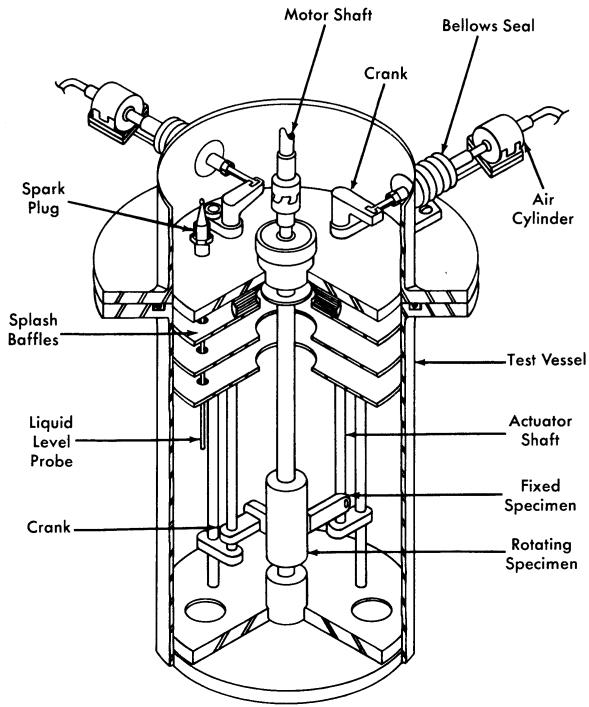  
FIG. 21-12. Bearing materials test apparatus.

operated in a helium atmosphere using "high-altitude" aircraft brushes has been determined.

A test consists of contacting the rotating cylindrical specimen with a flat specimen under a constant force for a set period of time under set conditions. After the contact run, the Bi is removed from the specimen. The degree and kind of scoring, galling, material transfer, and depth of wear on the surface were noted. Surface roughness measurements are made with a profilometer. Hardness measurements are made. Coefficients of friction are calculated from the measured torque data by the equation

$$
f = \frac {T}{P r}, \tag {21-4}
$$

where $f =$ the coefficient of friction, $P =$ the applied load (lb), $r =$ the radius of sleeve (ft), and $T =$ the torque (ft-lb).

In general, the hard-to-hard material combinations have shown good wear resistance except for some scoring. The best hard material tested thus far is $\mathrm{Al}_{2}\mathrm{O}_{3}$ flame-coated on AISI 4130 steel. When this material was contacted against itself, no wear or scoring could be detected. This ma

terial will be thermally cycled and exposed to inhibited U-Bi for long times to evaluate its utility. Stellarite 90 and Rex AA also behaved well. Contacts made with common die steels and low-alloy steels have exhibited severe scoring and wear. Corrosion has also been detected on these samples. Of the cemented carbides, only TiC with either a mild steel or $2\frac{1}{4}\% \mathrm{Cr - }1\%$ Mo binder has been tested. This material did not show good wear properties and also exhibited some pitting corrosion.

Graphitar versus tool steel and Mo versus Rex AA or Stellarite 90 have shown the best results of the hard versus soft combinations tested. The results have been good in that the wear has been very smooth; however, the wear has been excessive. The use of these combinations would be limited to very low-load applications.

# 21-5. SALT CORROSION

In earlier chapters, it was pointed out that one of the chief advantages of the LMFR lies in the possibility of easy chemical processing. Several processing techniques have been studied, most of which are based on pyrometallurgical processes. The two chief pyrometallurgical methods under consideration are the chloride process, in which the bismuth fuel is contacted with a ternary mixture of molten chloride salts, and the fluoride process, in which the bismuth fuel is contacted with molten fluoride salts containing hydrogen fluoride. As may be imagined, the construction material problem for these plants is very difficult.

A corrosion test program is actively under way at BNL and Argonne National Laboratory on the chloride and fluoride processes respectively. At BNL, these tests have consisted principally of rocking furnace and tab exposure tests.

In the rocking furnace test, a piece of tubing approximately 12 in. long and $1/2$ in. ID, containing a charge of either salt or a mixture of salt and bismuth, is placed on a rocking rack in a furnace. This rack alternately tilts to one end for a period of $1\mathrm{min}$ and then to the other end for a like amount of time. The two ends of the furnace are kept at 450 and $500^{\circ}\mathrm{C}$ in order to give a temperature differential and thus induce mass-transfer corrosion. The standard test period has been $1000\mathrm{hr}$ . These tests are part of the initial screening program. When they are completed, the metals which have given the best performance will be further evaluated in test loops and pilot-plant equipment.

At present, only molybdenum has been satisfactorily tested against a mixture of salt and bismuth fuel. However, the results are definitely encouraging. It has been found that the ternary salt, $\mathrm{MgCl_2 - NaCl - KCl}$ , with or without zirconium and uranium chlorides, can be contained fairly well in austenitic stainless steels, particularly 347 stainless steel. When a

mixture of bismuth fuel and the ternary salt containing less than $1\%$ $\mathrm{BiCl}_3$ was tested, the ferritic stainless steels were the best materials. These include 410, 430, and 446 stainless steels. Probably the best of the ferritics is the $2\frac{1}{4}\%$ Cr- $1\%$ Mo stainless steel.

During one step in the chloride chemical process, it is necessary to have the ternary salt, containing more than $1\%$ $\mathrm{BiCl}_3$ , in contact with bismuth fuel. For this mixture only molybdenum has been satisfactory. However, considerably more testing is required before this can be considered a satisfactory material.

The experience in handling salt with larger-sized equipment is quite limited. A small loop built of 347 stainless steel has been operated satisfactorily for a fairly short time. A much larger loop, loop "N," is now being constructed at BNL. This will contact the chloride salt and the bismuth fuel. The salt part of the loop is constructed of 347 stainless steel. The bismuth fuel section of the unit is constructed of $2\frac{1}{4}\% \mathrm{Cr - }1\%$ Mo steel. The actual contacting units are constructed of both 347 and the low-chrome steels. This pilot plant, when placed in operation, should furnish considerable information on the corrosion characteristics of the molten chloride salt.

The fluoride process also presents difficulties with materials of construction. The mixture of the molten fluoride salts, containing HF, with the bismuth fuel is extremely corrosive. Pure nickel has been found to stand up fairly well to the molten fluoride salts alone. However, the combination of the three materials has proved to be very corrosive even to nickel. The extensive development program to investigate the materials of construction for the fluoride process is continuing.

# 21-6. GRAPHITE

21-6.1 Mechanical properties. In the proposed LMFR system, the moderator, graphite, is also employed as the container material. Therefore, the graphite should have good physical properties such as strength, hardness, and resistance to shock. Since graphite is to be the container material for the bismuth solution, it should theoretically be completely impervious to the solution. For this reason, special graphites, more impervious than the usual reactor grades, have been developed and are under development. Physical properties of typical examples of these graphites are given in Table 21-6. In comparison with the usual reactor grade, AGOT, having a compressive strength of 6000 psi, these impervious grades have a strength of 6500 to 9700 psi.

Another special requirement for the graphite is that it withstand erosion or pitting by the flowing fuel. Test sections of accurately bored graphite were placed in test loops where the flow velocity of bismuth was 6 to 8 fps. No observable effect was noted after 1000 hr of test at $550^{\circ}\mathrm{C}$ .

Although tests so far have been on rather small samples, the mechanical properties of these improved graphites appear sufficiently good for use in LMFR systems. These new graphites must be manufactured in large sizes in order to conveniently make up the core of an LMFR. The graphite industry in the United States is now developing manufacturing techniques for making such large sizes.

21-6.2 Graphite-to-metal seals. Leaktight joints of steel to graphite are required at several places in the core of an LMFR. These seals must withstand an average of 125 psi at approximately $550^{\circ}\mathrm{C}$ . This is done by joining finely machined steel and graphite surfaces under sufficient spring loading to prevent bismuth leaking across the seal.

Tests were run by Markert at the Babcock & Wilcox Research Center to evaluate such pressure seals. Three-inch and six-inch steel pipes $(2\frac{1}{4}\% \mathrm{Cr - 1\% Mo})$ with machined ends were pressed against a flat surface of a block of MH4LM graphite (Great Lakes Carbon Co., density $1.9~\mathrm{g / cc}$ ). The graphite surface had been prepared by sanding and polishing with No. 000 emery paper. A seal was effected against Bi at $438^{\circ}$ with a pressure differential across the seal of 100 psi, and with 1500 psi stress between the graphite and the steel. The minimum stress that may be used without visible Bi leakage at this pressure differential was found to be as low as 600 psi. It was not necessary to resort to complicated interface configurations to obtain a seal. These initial results are very encouraging, and further development work is being directed toward more complicated seals.

21-6.3 Graphite reactions. If graphite is to be in direct contact with the U-Bi fuel, it should be inert to the various fuel constituents and also to fission products and corrosion products. Work has been done at various locations on these reactions. Thermodynamic data on chemical equilibrium, when available, have proved to be extremely valuable in guiding the experiments.

Uranium-graphite reactions. The reaction between uranium and graphite is probably the most important one to consider in the LMFR. Mallett, Gerds, and Nelson [11] reported that uranium forms three stable carbides: UC, $\mathrm{UC}_2$ , and $\mathrm{U}_2\mathrm{C}_3$ . Further work on this subject [7,12] indicates that when less than $1\%$ U is present in bismuth, it does not react with graphite to form carbides at temperatures below $1200^{\circ}\mathrm{C}$ .

However, the nitride of uranium, UN, has been identified on graphite contacted with $0.05\%$ U in Bi at $850^{\circ}\mathrm{C}$ for 28 hr. This nitrogen was undoubtedly adsorbed on the surface of the graphite and had not been dislodged by outgassing at high temperatures and vacuum.

When zirconium and magnesium are present with uranium in the bismuth, zirconium reacts preferentially with the graphite to form $\mathrm{ZrC}$ . This

TABLE 21-6   
GENERAL PHYSICAL PROPERTIES OF GRAPHITE AT $20^{\circ}\mathrm{C}$   

<table><tr><td rowspan="2">Grade</td><td colspan="3">Base grades</td><td colspan="4">Impregnated grades</td><td colspan="2" rowspan="2">Units</td></tr><tr><td>R-0013</td><td>R-0018</td><td>ATJ</td><td>R-0025</td><td>R-0020</td><td>ATJ-82</td><td colspan="2">MH4LM-90</td></tr><tr><td colspan="2">Manufacturer Max. production size*</td><td>National Carbon Company 40'' dia.</td><td>40'' dia.</td><td>20'' × 24'' × 8''</td><td>National Carbon Company 40'' dia.</td><td>40'' dia.</td><td>20'' × 24'' × 8''</td><td>Great Lakes Carbon Co. 48'' dia.</td><td></td></tr><tr><td colspan="2">Density</td><td>1.85</td><td>1.85</td><td>1.73</td><td>1.90</td><td>1.90</td><td>1.88</td><td>1.90</td><td>g/cc</td></tr><tr><td colspan="2">Electrical resistivity w</td><td>1.16</td><td>1.53</td><td>1.16</td><td>1.21</td><td>1.49</td><td>1.12</td><td>0.64</td><td>mΩ-cm</td></tr><tr><td colspan="2">a</td><td>1.40</td><td>1.77</td><td>1.43</td><td>1.48</td><td>1.64</td><td>1.48</td><td>0.69</td><td>mΩ-cm</td></tr><tr><td colspan="2">Thermal conductivity w</td><td>0.28</td><td>0.21</td><td>0.30</td><td>0.27</td><td>0.22</td><td>0.31</td><td>0.45</td><td>cal/(sec)(cm)(°C)</td></tr><tr><td colspan="2">a</td><td>0.23</td><td>0.17</td><td>0.22</td><td>0.23</td><td>0.21</td><td>0.22</td><td>0.46</td><td>cal/(sec)(cm)(°C)</td></tr><tr><td colspan="2">Flexural strength w</td><td>3250</td><td>3400</td><td>3300</td><td>4000</td><td>4100</td><td>4600</td><td>2750</td><td>psi</td></tr><tr><td colspan="2">a</td><td>3000</td><td>3200</td><td>3300</td><td>3900</td><td>3900</td><td>4600</td><td>2900</td><td>psi</td></tr><tr><td colspan="2">Compressive strength w</td><td>7500</td><td>8700</td><td>8400</td><td>8600</td><td>9100</td><td>9700</td><td>6650</td><td>psi</td></tr><tr><td colspan="2">a</td><td>7500</td><td>8700</td><td>8500</td><td>8500</td><td>9000</td><td>9700</td><td>6250</td><td>psi</td></tr><tr><td colspan="2">Coefficient of thermal expansion w</td><td>2.1</td><td>2.3</td><td>2.3</td><td>2.4</td><td>2.4</td><td>2.1</td><td>2.5</td><td>×10-6/°C</td></tr><tr><td colspan="2">a</td><td>2.5</td><td>2.5</td><td>2.8</td><td>2.9</td><td>2.6</td><td>2.5</td><td>2.7</td><td>×10-6/°C</td></tr><tr><td colspan="2">Helium flow at &lt; p&gt; = 2.7 atm w</td><td>240</td><td></td><td></td><td>3.2</td><td>1.7</td><td>0.16</td><td>0.88</td><td>ml/min through</td></tr><tr><td colspan="2">Δp=1 atm a</td><td></td><td>3.9</td><td>160</td><td>1.7</td><td>1.7</td><td>0.12</td><td>0.43</td><td>1 cm cube</td></tr><tr><td colspan="2">Grade</td><td>CCN</td><td>ATL-82</td><td>Graphite-G</td><td>Graphite-A</td><td>R-4</td><td>CEY</td><td>AGOT</td><td>Units</td></tr><tr><td colspan="2">Manufacturer Max. production size*</td><td>National Carbon Company 40" dia.</td><td>53" dia.</td><td>Graphite Specialties Corporation 7" dia.</td><td>35" dia.</td><td>40" dia.</td><td>NCC 2" dia.</td><td>NCC 16" × 16"</td><td></td></tr><tr><td colspan="2">Density</td><td>1.92</td><td>1.88</td><td>1.88</td><td>1.93</td><td>1.98</td><td>1.90</td><td>1.70</td><td>g/cc</td></tr><tr><td rowspan="2">Electrical resistivity</td><td>w</td><td>1.14</td><td>1.20</td><td>0.89</td><td>1.07</td><td>1.12</td><td>1.51</td><td>0.73</td><td>mΩ-cm</td></tr><tr><td>a</td><td>1.20</td><td>1.25</td><td>1.04</td><td>1.17</td><td>1.14</td><td></td><td>0.94</td><td>mΩ-cm</td></tr><tr><td rowspan="2">Thermal conductivity</td><td>w</td><td>0.30</td><td>0.29</td><td>0.38</td><td>0.34</td><td>0.35</td><td>0.13</td><td>0.53</td><td>cal/(sec)(cm)(°C)</td></tr><tr><td>a</td><td>0.27</td><td>0.26</td><td>0.31</td><td>0.30</td><td>0.30</td><td></td><td>0.33</td><td>cal/(sec)(cm)(°C)</td></tr><tr><td rowspan="2">Flexural strength</td><td>w</td><td>2400</td><td>2800</td><td>4400</td><td>4800</td><td>3850</td><td></td><td>2400</td><td>psi</td></tr><tr><td>a</td><td>2050</td><td>2400</td><td>3900</td><td>4000</td><td>3550</td><td></td><td>2000</td><td>psi</td></tr><tr><td rowspan="2">Compressive strength</td><td>w</td><td>7500</td><td>6500</td><td>7400</td><td>8500</td><td>6900</td><td></td><td>6000</td><td>psi</td></tr><tr><td>a</td><td>6500</td><td>6200</td><td>8500</td><td>9000</td><td>7200</td><td></td><td>6000</td><td>psi</td></tr><tr><td rowspan="2">Coefficient of thermal expansion</td><td>w</td><td>2.2</td><td>2.3</td><td>3.1</td><td>3.3</td><td>3.2</td><td>2.5</td><td>2.2</td><td>×10-6/°C</td></tr><tr><td>a</td><td>2.2</td><td>2.7</td><td>3.7</td><td>3.8</td><td>3.8</td><td></td><td>3.8</td><td>×10-6/°C</td></tr><tr><td rowspan="2">Helium flow at &lt; p&gt; = 2.7 atm Δp=1 atm</td><td>w</td><td>5.7</td><td>1.7</td><td></td><td>0.21</td><td></td><td></td><td>300</td><td>ml/min through 1 cm cube</td></tr><tr><td>a</td><td></td><td></td><td>0.042†</td><td>0.055†</td><td>0.021†</td><td>0.00040</td><td></td><td></td></tr></table>

\*As specified at present time by the individual manufacturers. $\dagger$ Processed and measured as small samples.

is predictable from the chemical thermodynamic data. An experiment in which graphite was contacted with $1000\mathrm{ppm}$ U, $50~\mathrm{ppm}$ $\mathbf{Zr}$ , and $300~\mathrm{ppm}$ $\mathrm{Mg}$ in Bi at $1000^{\circ}\mathrm{C}$ for 8 hr showed only a single intense x-ray diffraction line corresponding to the most intense line for $\mathrm{ZrC}$ . The x-ray analysis was carried out after the adherent bismuth was removed from the samples by mercury rinsing.

These experiments indicate that the reaction of uranium with graphite is not likely to occur under the LMFR operational conditions and can be prevented by the addition of zirconium to the bismuth.

Zirconium and titanium reactions with graphite. Since zirconium and possibly some titanium will be present in the bismuth, reactions of these materials with graphite have been investigated. As described above, zirconium reacts to form the carbide with a strong negative free energy. At temperatures around $550^{\circ}\mathrm{C}$ , $\mathrm{ZrC}$ and solid solutions of $\mathrm{ZrC}$ and $\mathrm{ZrN}$ have been identified on graphite surfaces contacted with bismuth solutions containing $130~\mathrm{ppm}$ $\mathrm{Zr}$ .

On the other hand, no reaction between graphite and $1600\mathrm{ppm}$ Ti in Bi solutions has been observed up to $800^{\circ}\mathrm{C}$ for contact times up to $170\mathrm{hr}$ . A strong TiC x-ray pattern and a less intense $\mathrm{ZrC - ZrN}$ solution pattern were observed on graphite contacted with approximately $0.2\%$ Ti and $0.2\%$ Zr in Bi at $1250^{\circ}\mathrm{C}$ for $44\mathrm{hr}$ .

When steel samples are reacted with U-Bi fuels containing zirconium and magnesium, the x-ray patterns of the surface are those for pure or very nearly pure nitrides or carbides. When graphite is contacted with the fuel, however, solid solutions of the carbide and nitride are often found. The unit cells vary from $4.567\mathrm{Kx}^*$ to $4.685\mathrm{Kx}$ for the zirconium compounds and from $4.237\mathrm{Kx}$ to $4.320\mathrm{Kx}$ for the titanium compounds. These parameters are low for complete carbon carbide structures.

Parameters for carbon-deficient carbide structures have been reported in the literature [13]. For $\mathrm{ZrC}$ the reported $a_0$ varied from $4.376\mathrm{Kx}$ at 20 atomic percent C to $4.67\mathrm{Kx}$ at 50 atomic percent C. However, up to the present time no evidence of carbon deficient structures has been observed in studying the graphite-fuel experiments. The low parameters are instead believed due to nitrogen replacing the carbon atoms in the carbide lattice (NaCl-type). Parameters for such solid carbide-nitride solutions are described by Duwez and Odell [1].

Fission product-graphite reactions. The products of uranium fission may also react chemically with graphite to form carbides. A series of experiments have shown that materials such as cerium will definitely react with graphite. When 25 ppm Ce in bismuth was placed in contact with graphite at $700^{\circ}\mathrm{C}$ for $110\mathrm{hr}$ , $\mathrm{CeC_2}$ was identified as a film on the graphite. Graphite contacted with 140 ppm Sm in bismuth at $800^{\circ}\mathrm{C}$ for $140\mathrm{hr}$ , on

the other hand, gave an x-ray diffraction pattern of the graphite surface which could not be identified or indexed. Under similar reaction conditions, neodymium, barium, or beryllium in bismuth solutions have no reaction product. However, Miller [12] has shown by an autoradiograph technique that 180 ppm irradiated Nd in bismuth reacts with graphite at $1100^{\circ}\mathrm{C}$ in 100 hr, concentrating the radioactive Nd at the graphite-liquid metal interface. When the same experiment was repeated with the addition of 100 ppm Zr to the solution, no Nd was identified at the graphite surface.

This experiment indicates that zirconium will probably form the carbide and nitride preferentially to most fission products. However, further research is required to determine whether a zirconium carbide-nitride layer on the graphite can be depended upon to prevent the adhesion of the fission products to the graphite surface. This point is not only important from the chemical and graphite surface point of view, but is also important from the neutron economy point of view. To obtain the highest breeding ratio, the fission products, which are all fairly good neutron adsorbers, must be removed from the graphite core soon after their formation. This is especially true of samarium, which has a very high neutron absorption cross section. Therefore, the experiments reported above on zirconium are quite encouraging in that there is no trace of a samarium film on the graphite.

21-6.4 Radiation effects on graphite. The graphite core, in order to serve as moderator and container for the flowing fuel, must be stable to radiation. Fission recoils may cause spalling and reduction in the thermal conductivity that might increase the thermal stresses within the core structure. The graphite must not adsorb large quantities of U or fission products.

A capsule test has been developed in which samples are irradiated in a highly enriched U-Bi solution containing Mg and Zr inhibitors for study of radiation effects on materials. The test has the advantage of attaining high temperatures $(700^{\circ}\mathrm{C})$ and a high fission recoil density.

Graphite samples have been exposed in these capsules under conditions given in Table 21-7. Metallographic examination of these graphite samples indicates that there is no excessive spalling or corrosion.

However, some samples were treated with Bi containing Zr at $1300^{\circ}\mathrm{C}$ to obtain 10- to 30-micron ZrN-ZrC layers on the graphite prior to irradiation, and postirradiation examination indicated some change of this layer. The cause of these effects is still being determined.

The effect of neutrons on the growth and thermal conductivity properties of special low-permeability grades of graphite has been measured. Three sets of samples have been irradiated to exposures as great as $5 \times 10^{20}$ thermal neutrons/ $\mathrm{cm}^2$ in the temperature range 400 to $475^{\circ}\mathrm{C}$ . Results of these tests are listed in Table 21-8. The change in physical length of the graphite is primarily contraction and should not present a major engineering problem.

TABLE 21-7   
URANIUM SOLUTION CAPSULE CONDITIONS ON GRAPHITE   

<table><tr><td rowspan="2">Capsule</td><td rowspan="2">Type of sample</td><td rowspan="2"></td><td colspan="3">Sol. concentration, ppm</td><td rowspan="2">Exposure, nvt</td><td rowspan="2">Max. irradian. temp., C</td><td rowspan="2">Observations</td></tr><tr><td>U-235</td><td>Zr</td><td>Mg</td></tr><tr><td>6</td><td>Graphite</td><td>(AGHT)</td><td>4000</td><td>200</td><td>350</td><td>12.8 × 1018</td><td>392</td><td>Zrn layer not evident after irradiation</td></tr><tr><td>8</td><td>”</td><td>”</td><td>3250</td><td>200</td><td>350</td><td>6.36</td><td>320</td><td>No spalling</td></tr><tr><td>10</td><td>”</td><td>”</td><td>3750</td><td>180</td><td>700</td><td>12.3</td><td>320</td><td>No spalling</td></tr><tr><td>15</td><td>”</td><td>”</td><td>4450</td><td>1500</td><td>1900</td><td>13.1</td><td>420</td><td>No spalling</td></tr></table>

TABLE 21-8   
PHYSICAL PROPERTY CHANGES IN LOW PERMEABILITY GRAPHITES INDUCED BY NEUTRON IRRADIATION AT ELEVATED TEMPERATURES*  

<table><tr><td rowspan="2">Graphite type</td><td rowspan="2">Exposure nvt</td><td rowspan="2">Irrad., T°C</td><td colspan="2">Thermal conductivity at 50°C, cal/(cm)(°C)(sec)</td><td rowspan="2">Gross growth, %</td><td colspan="2">Electrical resistivity, ohm-cm × 10-5</td></tr><tr><td>Preirrad.</td><td>Postirrad.</td><td>Preirrad.</td><td>Postirrad.</td></tr><tr><td>A†</td><td>1.8 × 1020</td><td>475</td><td>0.290</td><td>0.198</td><td>0.01</td><td>9.51</td><td>18.21</td></tr><tr><td>G†</td><td>1.8</td><td>475</td><td>0.393</td><td>0.286</td><td>0.002</td><td>7.18</td><td>16.31</td></tr><tr><td>ATL-82‡</td><td>1.8</td><td>475</td><td>0.253</td><td>0.163</td><td>0.02</td><td>11.9</td><td>24.43</td></tr><tr><td>R-0025‡</td><td>1.8</td><td>475</td><td>0.217</td><td>0.127</td><td>0.02</td><td>13.3</td><td>25.84</td></tr><tr><td>G-3†</td><td>10</td><td>475</td><td>0.308</td><td>0.137</td><td>—</td><td>11.2</td><td>19.4</td></tr><tr><td>G-7†</td><td>10</td><td>475</td><td>0.329</td><td>0.131</td><td>—</td><td>8.2</td><td>18.4</td></tr><tr><td>G-12†</td><td>10</td><td>475</td><td>0.347</td><td>0.141</td><td>—</td><td>7.4</td><td>17.8</td></tr></table>

*Irradiations and measurements were made at the Hanford Atomic Products Operation of the General Electric Company.   
$\dagger$ Graphite Specialties Company.   
$\ddagger$ National Carbon Company.

On the other hand, the neutrons reduced the thermal conductivity by 25 to $35\%$ of the preirradiation value. Moreover, some of these graphites had a preirradiation conductivity only $65\%$ that of the usual reactor-grade graphite. The combination of low permeability and neutron irradiation therefore reduces the thermal conductivity to $50\%$ that of the usual reactor-grade graphites.

Bismuth penetration into graphite permits the diffusion of some uranium into the graphite. The resulting fission recoil particles may further reduce the thermal conductivity of graphite. Tests are now under way to determine the degree of damage produced.

21-6.5 Bismuth permeation and diffusion into graphite. Early in the work on the Liquid Metal Fuel Reactor it was recognized that a special type of graphite was required if it were to be both a moderator and a container for the reactor fluid. Such an impermeable graphite would have not only the usual advantages of being both structural material and moderator, but would also not hold up quantities of coolant or fuel, with resulting decreased neutron efficiency and control. Besides these characteristics, because the design fluxes are of the order of $10^{15} \, \mathrm{n/cm^2}$ (sec) it is necessary that the graphite have a high degree of resistance to radiation damage, specifically to physical growth and reduction in thermal conductivity.

In considering impermeable graphite, two characteristics of the graphite are concerned: liquid pickup and permeability. Liquid pickup refers to the amount of fluid which is held in the interior pore volume of the graphite in the manner of a sponge. Permeability is the rate at which a fluid can be made to flow through the graphite. Both these properties depend primarily on the accessible void volume and the pore spectrum.

In research work on graphite, it is customary to divide the size of pores into two categories: macropores larger than 1 micron and averaging 2.5 microns in radius, and micropores with radii less than 1 micron and predominantly below 0.5 micron.

The development of new types of "impermeable" graphite has necessitated an examination and improvement of manufacturing processes concurrent with experiments on bismuth uptake [14].

The classic process of graphite manufacture is based on cokes and pitch binders, baking and pitch reimpregnations, and finally graphitization. Around this scheme has evolved a complex technology involving careful particle and flour sizing to obtain optimum compaction, elaborate baking and graphitizing schedules, and extremes of pressure vacuum treatments. The production of the new relatively impermeable grades was made possible by three significant advances over the older technology: (1) the ability to use raw materials of more advanced form, including graphites and blacks of various types, (2) impregnation techniques now span a variety of resins

with various viscosity and wetting properties, and (3) new forming techniques permit much more uniform and finer-grained artificial graphites. This last includes, in particular, the development of pressure baking, where heat is applied by passing electric current through the carbon in the mold and under pressure.

The conventional pitch-type impregnation has the effect of increasing density without markedly reducing permeability. This is apparently due to the tendency of the pitch to coke out only in the voids of large effective pore radius. Conversely, the newer impregnating materials, with their lower viscosities and increased wetting, tend to block the pores themselves as well as the larger open volumes. Consequently, there is no general relationship between density and permeability. Several conclusions may be drawn: (1) The newer impregnates primarily attack the macropore distribution and shift it from the 1- to 5-micron range into the submicron range. (2) Optimum particle packing in the original base material is, in general, not an advantage upon reimpregnation. (3) It is essential to use base materials in which the long tail at high pore radii is missing. The relatively minor effect of the present impregnates upon the micropore distribution demonstrates that the present materials, markedly improved as they are, do not as yet represent the achievable ultimate.

The amount of bismuth uptake in graphite is probably the most important property concerned in evaluating the graphite, and was one of the first investigated. For this purpose, a simple pot arrangement is used to hold samples of graphite in molten bismuth at pressures from vacuum to 550 psi and at temperatures from $550^{\circ}\mathrm{C}$ . The graphite samples (0.5-in. OD and 1.75-in. long) are outgassed in a vacuum at $550^{\circ}\mathrm{C}$ and then submerged in the bismuth. Helium pressure is then applied to the molten bismuth. The amount of bismuth uptake into the graphite is determined by the difference in the density of the sample before and after submersion. The accuracy of this measurement is within $0.01\mathrm{g}$ bismuth per cc graphite.

The degree of bismuth uptake by graphite as a function of time, determined at a pressure of 250 psi at $550^{\circ}\mathrm{C}$ , is shown in Fig. 21-13. As was mentioned above, there is no correlation between uptake and graphite density. The densities of these graphites range from 1.73 to $1.92\mathrm{g / cc}$ . The total percent of void volumes in the impregnated grades varies from 16.0 to $19.0\%$ of the bulk volume. Of these totals, the inaccessible volumes range from 6 to $10\%$ . Although samples EY-9 and ATL-82 have nearly the same density, the bismuth absorption differs by as much as a factor of 3 because of the difference in pore spectrum.

As can be seen from the figure, the amount of bismuth uptake varies as a function of time. This behavior was obtained using separate samples for each point on a curve and also by measuring the same sample at various time intervals. In making determinations, considerable oscillation about

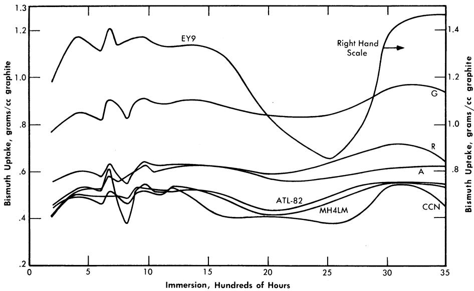  
FIG. 21-13. Bi penetration; successive immersion of same specimen. Temperature $= 550^{\circ}\mathrm{C}$ , pressure $= 250$ psi, outgassed $550^{\circ}\mathrm{C}$ for $20\mathrm{hr}$ .

a mean value is found for investigations extended to as much as $3500\mathrm{hr}$ . Evidently these variances are caused by outgassing by the graphite over the time interval of the experiment. Outgassing the graphite at $900^{\circ}\mathrm{C}$ instead of at $550^{\circ}\mathrm{C}$ reduced the amplitude of the excursions, but the mean value remained from 0.425 to $0.525\mathrm{g}$ bismuth per cc graphite for most of the types investigated. When the outgassing temperature was increased to $900^{\circ}\mathrm{C}$ , the saturation or maximum value of uptake was reached in some cases within $2.5\mathrm{hr}$ .

The rate of bismuth penetration into graphite was determined in order to estimate the effect of an unexpected pressure excursion in the reactor. Samples were subjected to 250 psi for times varying from 5 sec to 5 min, as shown in Fig. 21-14. This time span far exceeds that expected for a reactor pressure surge. The test conditions were 250 psi at $550^{\circ}\mathrm{C}$ after an outgassing period of 20 hr at $550^{\circ}\mathrm{C}$ . The data indicate that the practical maximum uptake is reached in about 10 sec for all graphites except types A and G. These graphites, which are essentially coatings instead of bulk impregnations, have their uptake increased continuously with time. In a long-term test their equilibrium values were not reached until after some 800 hr of submersion.

Since the core of the reactor will be subjected to various pressures, a study was made of the effect of pressure on the absorption of bismuth by graphite. Long-term tests covering hundreds of hours were conducted at

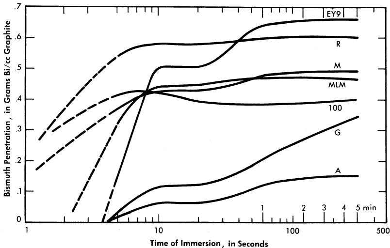  
FIG. 21-14. Short-time Bi penetration. Temperature $= 550^{\circ}\mathrm{C}$ , He pressure $= 250$ psi, outgassed $550^{\circ}\mathrm{C}$ for $20\mathrm{hr}$ .

125 psi to duplicate the test discussed above. It was found that the bismuth uptake is approximately the same as for the 250-psi pressure and the relative absorption remain the same between the different grades of graphite.

In another series of tests, samples were immersed for $20\mathrm{hr}$ at $550^{\circ}\mathrm{C}$ at varying pressures, as shown in Fig. 21-15. The samples for each curve were first evacuated for $20\mathrm{hr}$ at $550^{\circ}\mathrm{C}$ before being immersed in bismuth. With each type of graphite, the bismuth uptake at 450 psi corresponds approximately to the values attained at 250 psi for longer periods of submersion. Type R, CCN, HLM, and ATL-82 are insensitive to pressure increases beyond 200 psi. The remaining three types, A, G, EY-9, do increase continuously in bismuth uptake and furthermore show a threshold pressure below which no bismuth penetrates the graphite for the 20-hr duration of the test.

However, results of long term tests at 125 psi showed that graphites having a threshold pressure at 20 hr do absorb bismuth after several hundred hours.

After a pressure surge in the reactor core, the operating pressure will return to approximately 120 psi, and the amount of bismuth in the graphite might decrease. To investigate this, samples impregnated at 450 psi were resubmerged in bismuth at 25 and at 100 psi to determine what quantity of bismuth might leave the graphite. The dotted lines in Fig. 21-15 connect these points. It can be seen that there is no significant reduction of the bismuth contained in each type of sample.

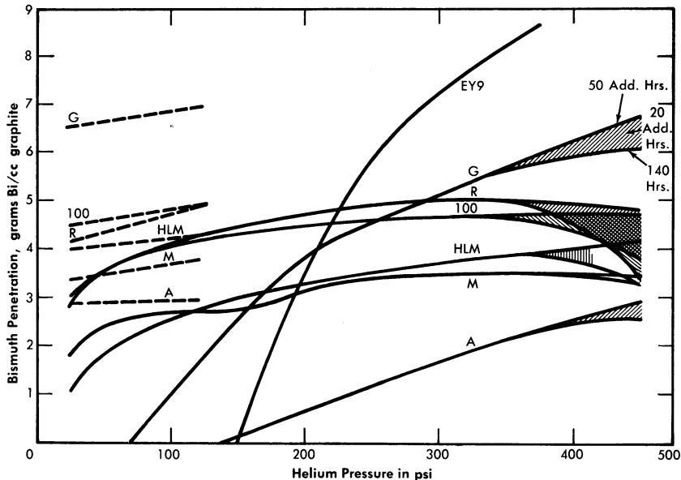  
FIG. 21-15. Effect of pressure on Bi penetration; successive immersions of 20 hr. Temperature $= 550^{\circ}\mathrm{C}$ , outgassed $550^{\circ}\mathrm{C}$ for 20 hr. Dashed lines for reduced pressure after 450-psi impregnation.

Calculations of the percent of voids filled with bismuth were made for the maximum bismuth uptake obtained in the experiments shown in Fig. 21-15. Table 21-9 gives these calculated values for the approximate saturation level reached. In this table, the last graphite, AGOT, is the conventional reactor graphite. The $100\%$ filling of the voids is obviously a good check of the assumption that it is quite permeable. All the other graphites are impermeable grades under development by various companies. The percent voids filled for these graphites do not represent total saturation of the accessible voids. Rather, these values show that about $1/3$ to $1/2$ of the accessible void volumes have been filled in these experiments.

In studying threshold penetration effect, surface tensions of bismuth on various surfaces of graphite were measured (Table 21-10). Although differing from the accepted values, these determinations probably represent more closely the actual circumstances in a reactor core. In none of the four cases was wetting of the graphite obtained by the bismuth or bismuth solution.

Uranium diffusion into bismuth in graphite pores. Since a certain amount of fuel absorption will have to be tolerated with the graphites now available, it is essential to measure the diffusion of uranium into graphite by

TABLE 21-9 VOIDSFILLEDAT450PSI AFTER20HR.   

<table><tr><td>Graphite type</td><td>Voids filled with Bi, %</td></tr><tr><td>100</td><td>37</td></tr><tr><td>EY-9</td><td>44</td></tr><tr><td>A</td><td>17</td></tr><tr><td>G</td><td>37</td></tr><tr><td>HLM</td><td>32</td></tr><tr><td>M</td><td>23</td></tr><tr><td>R</td><td>32</td></tr><tr><td>AGOT</td><td>100</td></tr></table>

TABLE 21-10 SURFACE TENSIONS   

<table><tr><td>Graphite surface</td><td>Constituents</td><td>Time after contact, min</td><td>Wetting properties</td><td>Surface tension, dynes/cm</td></tr><tr><td rowspan="3">Smooth</td><td rowspan="3">Bi</td><td>1</td><td>None</td><td>276</td></tr><tr><td>29</td><td></td><td>257</td></tr><tr><td>78</td><td></td><td>241</td></tr><tr><td rowspan="2">Rough and loose particles</td><td rowspan="2">Bi</td><td>5</td><td>None</td><td>153</td></tr><tr><td>60</td><td></td><td>142</td></tr><tr><td rowspan="2">Polished</td><td rowspan="2">Bi + 350 ppm Mg</td><td>15</td><td>None</td><td>66</td></tr><tr><td>90</td><td></td><td>66</td></tr><tr><td rowspan="4">Polished</td><td rowspan="4">Bi + 350 ppm Zr</td><td>15</td><td>None</td><td>285</td></tr><tr><td>120</td><td></td><td>275</td></tr><tr><td>240</td><td></td><td>282</td></tr><tr><td>360</td><td></td><td>283</td></tr></table>

means of the bismuth solution. Experiments to measure this effect have been made. This was done by first impregnating graphite with bismuth solution containing magnesium and/or zirconium. After bismuth impregnation at a given pressure, uranium was added to the solution and the graphite allowed to soak in the bismuth solution for a period of time. The amount of uranium which diffused into the graphite was measured by sectioning the graphite and analyzing for uranium concentration as a function of distance from the surface of the sample. These experiments were run at $550^{\circ}\mathrm{C}$ with a pressure of 200 psi. The graphite was first allowed to soak in the bismuth solution for 90 hr; then the uranium was added and the conditions were maintained for the duration of the experiment. Results of two experiments are given in Table 21-11. In the first experiment, the bismuth contained 390 ppm Mg and 1000 ppm U. The uranium concentration in the graphite specimen was found to be less than in the melt solution and decreased from the sample face inwards.

The second experiment was performed exactly like the first except that no magnesium was present. The graphite specimen (Great Lakes Type HLM) absorbs less bismuth than the EY-9 graphite used in the first experiment. However, the uranium concentration near the surface of the specimen built up to an amount considerably greater than that initially in the solution, and the concentration gradient is much steeper than was found when magnesium was present in the solution. This high value for the uranium-to-bismuth ratio near the interface may be explained by assuming that uranium reacted with impurities present on the graphite surfaces. Apparently when magnesium is present in the solution it reacts preferentially with these impurities.

These experiments definitely show that uranium and other solutes present in the bismuth can be expected to diffuse into the graphite as far as the bismuth has penetrated. For the graphites now at hand, this means diffusion through the entire thickness of the graphite for the long-term exposures contemplated in a reactor core. Of course, since the diffusion of uranium itself takes considerable time, fission will convert it to other products before it has an opportunity to diffuse many inches into the graphite. The effect of diffusion of the various solutes and fuel into graphite on neutron economy and reactor operational characteristics is recognized, and studies have to be made in large-scale experiments.

In general, it is believed that the graphites at hand will meet the requirements for the first experiment of an LMFR reactor. It is already possible to produce some of these in sizes as large as 40 to 60 in. in diameter. As this development progresses, graphites of greater impermeability will be produced. Improvements in graphite have taken place steadily, and markedly improved materials are anticipated in the future.

TABLE 21-11   
URANIUM DIFFUSION INTO GRAPHITE   

<table><tr><td>Specimen no.</td><td>Distance, in.</td><td>Bi, %</td><td>Mg, ppm</td><td>U, ppm</td></tr><tr><td colspan="5">A. EY-9 Graphite</td></tr><tr><td>1</td><td>0.0312</td><td>32.2</td><td>1150</td><td>900</td></tr><tr><td>2</td><td>0.0937</td><td>30.5</td><td>1050</td><td>840</td></tr><tr><td>3</td><td>0.1562</td><td>29.6</td><td>750</td><td>810</td></tr><tr><td>4</td><td>0.250</td><td>28.0</td><td>800</td><td>760</td></tr><tr><td>5</td><td>0.500</td><td>26.0</td><td>820</td><td>740</td></tr><tr><td colspan="5">B. HLM Graphite</td></tr><tr><td>1</td><td>0.0312</td><td>16.35</td><td></td><td>5600</td></tr><tr><td>2</td><td>0.0937</td><td>16.87</td><td></td><td>2630</td></tr><tr><td>3</td><td>0.1562</td><td>16.38</td><td></td><td>460</td></tr><tr><td>4</td><td>0.250</td><td>16.78</td><td></td><td>70</td></tr><tr><td>5</td><td>0.500</td><td>17.78</td><td></td><td>30</td></tr></table>

# REFERENCES

1. P. DuWEz and F. ODELL, Phase Relationships in the Binary Systems of Nitrides and Carbides of Zirconium, Columbium, Titanium, and Vanadium, J. Electrochem. Soc. 97, 299-304 (1950).   
2. D. T. KEATING and O. F. KAMMERER, Film Thickness Determination from Substrate X-ray Reflections, Rev. Sci. Instr. 29, 34 (1958).   
3. L. S. DARKEN et al., Solubility of Nitrogen in Gamma Iron and the Effect of Alloying Constituents—Aluminum Nitride Precipitation, J. Metals 3, 1174-1179 (1951).   
4. J. R. WEEKS and D. H. GURINSKY, Solid Metal-Liquid Metal Reactions in Bismuth and Sodium, in ASM Symposium on Liquid Metals and Solidification, ed. by B. Chalmers. Cleveland, Ohio: The American Society for Metals, 1958.   
5. O. F. KAMMERER et al., Zirconium and Titanium Inhibit Corrosion and Mass Transfer of Steels by Liquid Heavy Metals, Trans. Met. Soc. AIME 212, 20-25 (1958).   
6. G. W. HORSLEY and J. T. MASKREY, The Corrosion of $214\%$ Cr-1% Mo Steel by Liquid Bismuth, Report AERE M/R-2343, Great Britain, Atomic Energy Research Establishment, 1957.   
7. J. R. WEEKS et al., Corrosion Problems with Bismuth-Uranium Fuels, in Proceedings of the International Conference on the Peaceful Uses of Atomic Energy, Vol. 9. New York: United Nations, 1956 (P/118, pp. 341-355); D. H. GURINSKY and G. J. DIENES (Eds.), Nuclear Fuels. Princeton, N. J.: D. Van Nostrand Co., Inc., 1956. (Chap. XIII); J. R. WEEKS, Metallurgical Studies on Liquid Bismuth and Bismuth Alloys for Reactor Fuels or Coolants, in Progress in Nuclear Energy, Series IV, Technology and Engineering, Vol. I. New York: Pergamon Press, 1956. (pp. 378-408)   
8. W. C. LESLIE and M. G. FONTANA, Mechanism of the Rapid Oxidation of High Temperature, High Strength Alloys Containing Molybdenum, Trans. Am. Soc. Metals 41, 1213 (1949).   
9. L. S. MARKS (Ed.), Mechanical Engineers Handbook. 4th ed. New York: McGraw-Hill Book Company, Inc., 1941. (p. 232)   
10. W. E. MARKERT, JR., personal communication to J. R. Weeks, Mar. 20, 1958.   
11. M. W. MALLETT et al., The Uranium-Carbon System, USAEC Report AECD-3226, Battelle Memorial Institute, 1951; The Reactor Handbook, Vol. 3, General Properties of Materials, USAEC Report AECD-3647, 1955. (p. 316)   
12. W. E. MILLER and J. R. WEEKS, *Reactions between LMFR Fuel and Its Container Materials*, USAEC Report BNL-2913, Brookhaven National Laboratory, 1956.   
13. G. V. SAMSONOV and N. S. ROZINOVA, Some Physicochemical Properties of Zirconium-Carbon Alloys, Izvest. Sektora Fiz.-Khim. Anal. Inst. Obshchei. Neorg. Khim. Akad. Nauk. S.S.S.R. 27, 126-132 (1956).   
14. W. P. EATHERLY et al., Physical Properties of New Graphite Materials for Special Nuclear Applications, paper prepared for the Second International Conference on the Peaceful Uses of Atomic Energy, Geneva, 1958.

# CHAPTER 22

# CHEMICAL PROCESSING*

# 22-1. INTRODUCTION

The Liquid Metal Fuel Reactor offers the opportunity for continuous removal of fission products from the fluid fuel by chemical and physical processing. By this procedure the poisoning effect of the fission products may be kept to a low level, and thus make possible a good breeding ratio in this thermal reactor. In this chapter, the various chemical and physical processes for removing the fission products are discussed.

To simplify the discussion, the fission products are classified into four basic groups as follows:

(1) Gaseous elements or compounds that are volatile at reactor operating temperature. This group is ordinarily abbreviated FPV.   
(2) Nonvolatile elements forming compounds more stable than the corresponding uranium compound. The abbreviation for this group is FPS.   
(3) Nonvolatile elements forming compounds that are less stable than the corresponding uranium compound and more stable than the corresponding bismuth compound. The abbreviation for this group is FPN.   
(4) Nonvolatile elements forming compounds less stable than the corresponding bismuth compounds. The abbreviation for this group is NFPN.

In the FPV group there are four elements: bromine, iodine, krypton, and xenon. Of these, 6.7-hr $\mathbf{I}^{135}$ and its daughter 9.13-hr $\mathrm{Xe}^{135}$ are the important ones. $\mathrm{Xe}^{135}$ is by far the most important because of its cross section, 2,700,000 barns. Since this is so large, it is necessary to remove most of the iodine and xenon as soon as formed.

The other major poisons occur in the FPS group. In calculating the average atomic weight and cross section of these groups, it is convenient to use the fission yield in milliatoms. Normally, it is assumed that two atoms of fission products are produced by the splitting of one atom of uranium. Thus, 2000 milliatoms of fission products are produced by fission of one atom of uranium, and $1\%$ yield is equal to 10 milliatoms. On this basis, Table 22-1 presents the FPS nuclides with the important information on their poisoning effect. As can be seen, $\mathrm{Sm}^{149}$ is the most important element to be dealt with in this group.

The last group, commonly called the noble fission products, represents a combination of groups (3) and (4) in the above classification. The important poisoning information on all these nuclides is given in Table 22-2

Precursors have half-lives less than 5 days.

TABLE 22-1   
FUSED-SALT SOLUBLE FISSION PRODUCTS [1]   

<table><tr><td>Nuclide</td><td>Half-life</td><td>Fission yield y, milliatoms*</td><td>Cross section σ, barns (at0.025ev)†</td><td>yσ</td><td>Type poison‡</td></tr><tr><td>Rb85</td><td>Stable</td><td>20</td><td>0.90</td><td>18</td><td>3</td></tr><tr><td>Rb86</td><td>19d</td><td>36</td><td>1.0</td><td>36</td><td>3</td></tr><tr><td>Rb87</td><td>6.2 × 1010y</td><td>46</td><td>0.14</td><td>6.4</td><td>3</td></tr><tr><td>Sr88</td><td>Stable</td><td>54</td><td>0.005</td><td>0.25</td><td>3</td></tr><tr><td>Sr89</td><td>54d</td><td>61</td><td>110</td><td>6,700</td><td>2</td></tr><tr><td>Sr90</td><td>20y</td><td>64</td><td>1.0</td><td>64.0</td><td>3</td></tr><tr><td>Y→Zr91</td><td>61d; (stable)</td><td>66</td><td>1.52</td><td>100.0</td><td>3</td></tr><tr><td>Xe→Cs133</td><td>5.27d (stable)</td><td>66</td><td>29.0</td><td>1,920</td><td>3</td></tr><tr><td>Cs135</td><td>3 × 106y</td><td>70.5</td><td>15.0</td><td>1,060</td><td>3</td></tr><tr><td>Cs137</td><td>37y</td><td>71.5</td><td>2.0</td><td>143</td><td>3</td></tr><tr><td>Ba138</td><td>Stable</td><td>71.1</td><td>0.6</td><td>43</td><td>3</td></tr><tr><td>La139</td><td>Stable</td><td>70.5</td><td>8.4</td><td>590</td><td>3</td></tr><tr><td>Ba→La→Ce140</td><td>12.8d; 40h (stable)</td><td>68.5</td><td>0.63</td><td>43</td><td>3</td></tr><tr><td>Ce→Pr141</td><td>32d (stable)</td><td>61.5</td><td>11.2</td><td>688</td><td>3</td></tr><tr><td>Ce142</td><td>Stable</td><td>55.0</td><td>1.8</td><td>99</td><td>3</td></tr><tr><td>Pr→Nd143</td><td>13.5d (stable)</td><td>45.5</td><td>290.0</td><td>13,200</td><td>2</td></tr><tr><td>Ce→Pr→Nd144</td><td>280d; 17m (stable)</td><td>36.0</td><td>4.8</td><td>173</td><td>3</td></tr><tr><td>Nd145</td><td>Stable</td><td>27.0</td><td>52.0</td><td>1,400</td><td>2</td></tr><tr><td>Nd146</td><td>Stable</td><td>20.0</td><td>9.8</td><td>196</td><td>3</td></tr><tr><td>Nd→Pm→Sm147</td><td>11.6d; 2.6y (stable)</td><td>14.0</td><td>60.0</td><td>840</td><td>2</td></tr><tr><td>Nd148</td><td>Stable</td><td>10.0</td><td>3.3</td><td>33</td><td>3</td></tr><tr><td>Sm149</td><td>Stable</td><td>7.0</td><td>47,000</td><td>329,000</td><td>1</td></tr><tr><td>Nd150</td><td>Stable</td><td>5.0</td><td>2.9</td><td>14.5</td><td>3</td></tr><tr><td>Sm151</td><td>73y</td><td>2.6</td><td>7,200</td><td>18,700</td><td>1</td></tr><tr><td>Sm152</td><td>Stable</td><td>1.6</td><td>150</td><td>240</td><td>2</td></tr><tr><td>Eu153</td><td>Stable</td><td>0.9</td><td>420</td><td>378</td><td>2</td></tr><tr><td>Sm154</td><td>Stable</td><td>0.5</td><td>5.5</td><td>2.8</td><td>3</td></tr><tr><td>Eu155</td><td>1.7y</td><td>0.3</td><td>13,000</td><td>3,900</td><td>1</td></tr><tr><td>Eu→Gd156</td><td>15d (stable)</td><td>0.2</td><td>750</td><td>150</td><td>2</td></tr><tr><td>Gd157</td><td>Stable</td><td>0.1</td><td>160,000</td><td>16,000</td><td>1</td></tr><tr><td>Total 30 nuclides</td><td></td><td>1052.3</td><td></td><td>394,010</td><td></td></tr></table>

*Percent yield multiplied by 10; total yield is $200\%$ , or 2000 milliatoms.   
$\dagger \sigma_{\mathrm{avg}} = 374$ barns.   
$\ddagger \sigma > 1000 =$ type 1; $\sigma 50$ to $1000 =$ type 2; $\sigma < 50 =$ type 3.

TABLE 22-2 FUSED-SALT INSOLUBLE FISSION PRODUCTS [1]   

<table><tr><td>Nuclide</td><td>Half-life</td><td>Fission yield y, milliatoms</td><td>Cross section σ, barns (at 0.025 ev)†</td><td>yσ</td><td>Type poison</td></tr><tr><td>Se77</td><td>Stable</td><td>0.4</td><td>40</td><td>16</td><td>2</td></tr><tr><td>Se78</td><td>Stable</td><td>1.1</td><td>0.4</td><td>4.4</td><td>2</td></tr><tr><td>Se79</td><td>6 × 104y</td><td>2.0</td><td></td><td></td><td></td></tr><tr><td>Se80</td><td>Stable</td><td>2.8</td><td>0.53</td><td>1.5</td><td>2</td></tr><tr><td>Se82</td><td>Stable</td><td>5.5</td><td>0.055</td><td>0.3</td><td>2</td></tr><tr><td>Zr92</td><td>Stable</td><td>67.5</td><td>0.25</td><td>17</td><td>2</td></tr><tr><td>Zr93</td><td>5 × 106y</td><td>68.0</td><td>3</td><td>204</td><td>2</td></tr><tr><td>Zr94</td><td>Stable</td><td>67.5</td><td>0.08</td><td>5.4</td><td>2</td></tr><tr><td>Zr→Nb95</td><td>65d; 37d</td><td>66.0</td><td>13.4</td><td>880</td><td>2</td></tr><tr><td>Zr96</td><td>Stable</td><td>64.0</td><td>0.05</td><td>3.2</td><td>2</td></tr><tr><td>Mo97</td><td>Stable</td><td>59.0</td><td>2.10</td><td>124</td><td>2</td></tr><tr><td>Mo98</td><td>Stable</td><td>56.0</td><td>0.13</td><td>7.2</td><td>2</td></tr><tr><td>Tc99</td><td>2.1 × 105y</td><td>48.0</td><td>100</td><td>4,800</td><td>1</td></tr><tr><td>Mo100</td><td>Stable</td><td>35.0</td><td>0.2</td><td>7.0</td><td>2</td></tr><tr><td>Ru101</td><td>Stable</td><td>26.0</td><td>12</td><td>312</td><td>2</td></tr><tr><td>Ru102</td><td>Stable</td><td>24.0</td><td>1.2</td><td>29</td><td>2</td></tr><tr><td>Ru103</td><td>40d</td><td>8.8</td><td>150</td><td>1,320</td><td>1</td></tr><tr><td>Ru104 N.I.*</td><td>Stable</td><td>6.2</td><td>0.7</td><td>4</td><td>2</td></tr><tr><td>Pd105</td><td>Stable</td><td>4.6</td><td>18</td><td>83</td><td>2</td></tr><tr><td>Ru106</td><td>1.0y</td><td>3.3</td><td>(15)‡</td><td>(50)</td><td>(2)</td></tr><tr><td>Pd107</td><td>5 × 106y</td><td>2.2</td><td>750</td><td>1,650</td><td>1</td></tr><tr><td>Pd108</td><td>Stable</td><td>1.3</td><td>11.1</td><td>14</td><td>2</td></tr><tr><td>Ag109</td><td>Stable</td><td>0.9</td><td>84</td><td>75</td><td>2</td></tr><tr><td>Pd110 N.I.</td><td>Stable</td><td>0.4</td><td>0.4</td><td>0.2</td><td>2</td></tr><tr><td>Cd111</td><td>Stable</td><td>0.3</td><td>750</td><td>225</td><td>1</td></tr><tr><td>Cd112</td><td>Stable</td><td>0.2</td><td>0.03</td><td>0.01</td><td>2</td></tr><tr><td>Cd113</td><td>Stable</td><td>0.2</td><td>25,000</td><td>5,000</td><td>1</td></tr><tr><td>Sb123</td><td>Stable</td><td>0.2</td><td>3.86</td><td>0.76</td><td>2</td></tr><tr><td>Sn124 N.I.</td><td>Stable</td><td>0.4</td><td>0.2</td><td>0.08</td><td>2</td></tr><tr><td>Sn→Sb→Te125</td><td>10d; 2.7y (stable)</td><td>0.6</td><td>1.5</td><td>0.90</td><td>2</td></tr><tr><td>Te126</td><td>Stable</td><td>0.9</td><td>0.8</td><td>0.72</td><td>2</td></tr><tr><td>Te128</td><td>Stable</td><td>5.7</td><td>0.16</td><td>0.91</td><td>2</td></tr><tr><td>Te130</td><td>Stable</td><td>25.0</td><td>0.31</td><td>7.8</td><td>2</td></tr><tr><td>Total 33</td><td></td><td>654.0</td><td></td><td>14,843.38</td><td></td></tr></table>

$^{*}$ N.I., not identified as fission product on G.E. Chart, 1952.   
$\dagger \sigma_{\mathrm{avg}} = 22.7$ barns.   
Assumed from values for daughter, Pd106.

under the group heading FPN. As can be seen by examining the column headed $y\sigma$ , none of these nuclides is a very important poison, compared with xenon and samarium.

From the data given in these tables, it is possible to calculate the poison level in an LMFR as a function of time of operation. Besides the characteristics of the fission products themselves, the poison level is dependent mainly on the core fuel volume, the total fuel system volume, and the average core flux. In Fig. 22-1, the poison level is given as a function of days of operation for a 500-Mw LMFR reference design [1] with 600 ppm $\mathrm{U}^{233}$ in Bi. It is assumed that the volatile poisons, FPV, can be removed in a steady-state operation and the poisoning level kept to $1\%$ . The other two classes, of course, steadily increase, based on the assumption of no chemical processing of the core. After a certain poisoning level is reached, the continuous chemical processing will serve to keep the poisoning at a constant value. This level must be chosen by a careful economic optimization procedure.

Figure 22-1 shows that while the FPS group is the most important, assuming that the volatiles can be removed as desired, the FPN group does gradually accumulate, and after about 400 days of operation has a $1\%$ poisoning effect. Hence, over long-term operation, processing of all the groups becomes desirable if a low poison level is to be maintained.

The poisoning in a $\mathrm{U}^{235}$ -fueled reactor is expected to be 10 to $20\%$ higher than in a $\mathrm{U}^{233}$ -fueled reactor [2,3] depending on the average residence time of the fission products in the fuel. This is due to a shift in the fission product spectrum toward higher cross section nuclides. The cumulative poisoning effect of the higher uranium isotopes is also slightly higher for $\mathrm{U}^{235}$ .

In connection with this last point, the higher isotopes of uranium gradually build up throughout the operation of the reactor. In the calculations used in the reference design of Chapter 24 and in BAW-2 [1], the poisoning effect of the higher uranium isotopes has been assumed as $2\%$ for a $\mathrm{U}^{233}$ fuel. Since these higher isotopes are chemically the same as the fuel, no provision can be made for a chemical separation from the $\mathrm{U}^{233}$ . The gradual buildup of the higher uranium isotope poisons can actually be tolerated over a number of years before becoming important in the economics of the reactor operation, as is shown in Chapter 24.

In all the foregoing discussions, it is assumed that corrosion products contribute very little to the poisoning in the reactor. However, this may not be so. As was described in Chapters 20 and 21, the corrosion rate of the containing metals by the bismuth fuel is rather high. Corrosion products such as iron and chromium at a concentration of $300~\mathrm{ppm}$ in bismuth would contribute a poisoning effect of about $1\%$ . However, the same processes which remove the FPS and FPN will also remove all the corrosion products.

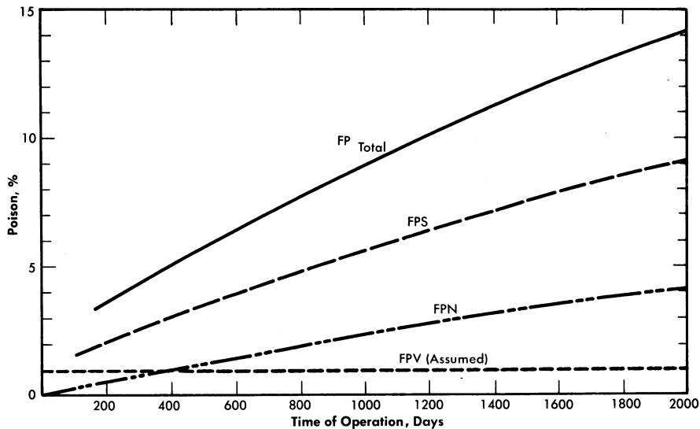  
FIG. 22-1. Poison level after startup vs. time of operation for all fission products. Core fuel volume, 1800 ft³.

# 22-2. VOLATILE FISSION PRODUCT REMOVAL [20]

22-2.1 Xenon and iodine removal. For a $1\%$ poisoning level, assuming no Xe adsorbed on, or absorbed by, the graphite moderator, the concentrations of 9.13-hr $\mathrm{Xe}^{135}$ and total Xe in the fuel are calculated to be 1.5 and 12.9 ppb, respectively. Compared with the 9.13-hr $\mathrm{Xe}^{135}$ , the combined poisoning effect of all the other FPV's is negligible, so that the problem of FPV removal is really one of $\mathrm{Xe}^{135}$ removal. Some typical statistics on the FPV's are summarized in Table 22-3. These figures are based on three assumptions: (a) that Xe buildup on the graphite is negligible, (b) that negligible amounts of Br and I are volatilized with the FPV's, and (c) that Kr and Xe have the same removal characteristics.

In Article 20-3.3 it was shown that the actual solubility of xenon in bismuth may well be in the ppb range; McMillan calculated the solubility as $10^{-12}$ . Since the amount of xenon generated is probably larger than its solubility in bismuth, it is necessary to determine the behavior of the gas in relation to the surfaces of the reactor core and fuel conduits, as it will have a strong tendency to escape from solution.

Since the xenon is the decay daughter of $\mathbf{I}^{135}$ , it is born not only in the reactor core but throughout the fuel system wherever $\mathbf{I}^{135}$ is present. Therefore the chemical and kinetic behavior of I, its decay precursor, is important. The $\mathrm{Xe}^{135}$ removal problem might be solved by desorption of $\mathbf{I}^{135}$ ; however, it is found that the $\mathbf{I}^{135}$ decays so rapidly that at least $75\%$ of the $\mathbf{I}^{135}$ would have to be removed with the FPV's in

TABLE 22-3 STATISTICS ON FPV'S UNDER CONDITIONS OF $1 \%$ REACTOR POISONING FOR A 500-MW REACTOR $1000~\mathrm{ppm}~\mathrm{U}^{233}$ ; 150 tons of Bi   

<table><tr><td colspan="2">1. Concentrations, ppb</td></tr><tr><td>(a) Kr</td><td>2.8</td></tr><tr><td>(b) 9.13-hr Xe135</td><td>1.46</td></tr><tr><td>(c) Total Xe</td><td>12.9</td></tr><tr><td>(d) Total FPV&#x27;s</td><td>15.7</td></tr><tr><td colspan="2">2. Removal rates, g/day</td></tr><tr><td>(a) Kr</td><td>23.1</td></tr><tr><td>(b) 9.13-hr Xe135</td><td>12.0</td></tr><tr><td>(c) Total Xe</td><td>106.0</td></tr><tr><td>(d) Total FPV&#x27;s</td><td>129.1</td></tr><tr><td>3. Per cent, by weight, total fission products</td><td>23.8</td></tr><tr><td>4. Average atomic weight of FPV&#x27;s</td><td>122.3</td></tr><tr><td>5. Rate of radiant energy release, kw/g</td><td>605</td></tr></table>

order to significantly reduce the amount of $\mathbf{Xe}^{135}$ formed. This is probably too much to be hoped for. Experimental results indicate that such a large fraction of the I cannot be volatilized from U-Bi fuel. Thermodynamic analysis indicates that the I, for the most part, should react with the Rb, Sr, Cs, and Ba fission products to form monoiodides with about $70\%$ of the I going to CsI.

These alkali and alkaline-earth iodides would presumably have low solubilities in Bi and, as a result, have a tendency to leave the U-Bi fuel and collect on unwetted solid surfaces. These iodides also transfer heavily to the salt in the FPS-removal process, but the rate of processing would be too slow to extract significant quantities of $\mathbf{I}^{135}$ and, in fact, most of the other iodine nuclides. Thus there appear to be two predominant modes by which I departs from the fuel: physical expulsion in the form of iodides and radioactive decay.

22-2.2 Xenon and iodine adsorption on graphite and steel. Graphite is not wet by the fuel; moreover, it has a void volume of almost $20\%$ , largely composed of interconnected cells. These facts suggest the possibility of Xe buildup in an LMFR core.

A factor in this problem is the behavior of iodine in the LMFR fuel. The iodine may form rather insoluble iodides, then adsorb on unwetted surfaces, and there decay to Xe. Both kinetic and thermodynamic analyses indicate that this may be a real possibility.

In 1956, an in-pile loop [4] was operated at Brookhaven in which fission products were generated in U-Bi fuel, where the natural U concentration was $800~\mathrm{ppm}$ . The concentrations of fission products were therefore several orders of magnitude below those for an LMFR. Two steel rods, $1/2$ in. in diameter and 4 in. long, were suspended vertically in the gas space of the surge tank, 2 in. above the liquid metal level. One was exposed for a period of $60~\mathrm{hr}$ and showed an $\mathrm{I}^{133}$ concentration of $9.0\times 10^{7}$ atoms/ $\mathrm{cm}^2$ at time of removal; the other, exposed for $85~\mathrm{hr}$ , showed $1.6\times 10^{7}$ atoms/ $\mathrm{cm}^2$ . The corresponding $\mathrm{I}^{133}$ concentration in the flowing metal was $1.1\times 10^{9}$ atoms/ $\mathrm{cm}^3$ , which means that for every 100 atoms of $\mathrm{I}^{133}$ per cc of fuel there were roughly 1 to $8\mathrm{I}^{133}$ atoms/ $\mathrm{cm}^2$ of exposed surface in the gas space. The temperatures of the rods and liquid metal were the same, $500^{\circ}\mathrm{C}$ .

Several steel tabs immersed for extended periods in the flowing metal showed $\mathrm{I}^{133}$ concentrations on their surfaces roughly 100 times those found on the rods suspended in the gas phase. Moreover, it was estimated that less than half the I in the system was in the Bi; about $60\%$ was found on the container walls contacting the Bi and about $1\%$ on the gas walls. The tabs were, for the most part, unwetted by the Bi.

The loop had a degassing chamber in which the metal flowed in a thin layer over a baffled plate. Samples of gas taken from this chamber showed I concentrations too small to measure, even radiochemically.

To get a better understanding of this general problem, a two-part experimental program is underway at BNL. In the first part, capsule scale experiments are being carried out to determine the action of iodine and xenon on graphite and steel capsules containing U-Bi fuel. These capsules are irradiated in the BNL pile and then examined for iodine, xenon, and radioactivity across the radius of the specimen. The second part of the program is a kinetic study of the removal of iodine and xenon in degassing equipment.

In-pile capsule experiments. In one series of experiments, capsules made of $2\frac{1}{4}\% \mathrm{Cr - 1\%}$ Mo steel and graphite were filled with Bi containing 500 to $1000~\mathrm{ppm}$ of natural U, $350~\mathrm{ppm~Mg}$ , and $350~\mathrm{ppm~Zr}$ . The capsules were degassed under vacuum for $3\mathrm{hr}$ at $800^{\circ}\mathrm{C}$ before being filled. They had the dimensions $1.27~\mathrm{cm}$ ID, $1.60~\mathrm{cm}$ OD, and $10~\mathrm{cm}$ long. The capsules were irradiated in a flux of $2\times 10^{12} / (\mathrm{cm}^2)(\mathrm{sec})$ , with the U-Bi mixture frozen, for periods up to $2\mathrm{wk}$ . After irradiation, the capsules were held at $500^{\circ}\mathrm{C}$ for periods ranging from $10\mathrm{min}$ to $117\mathrm{hr}$ . They were then cooled quickly to room temperature and sectioned into 10 disks for radiochemical analysis. The concentrations of $\mathrm{Xe}^{133}$ , $\mathrm{I}^{133}$ , and U were measured at the center of each disk and in a $1\mathrm{-mm}$ ring on the periphery of the Bi. The results are summarized in Table 22-4.

These experiments are exploratory. They were carried out to determine

TABLE 22-4   
RESULTS OF IN-PILE STUDIES ON THE BEHAVIOR OF IODINE AND XENON IN LMFR FUEL   

<table><tr><td rowspan="2">Sample number</td><td rowspan="2">Container material</td><td colspan="2">Concentration of I133, atoms/g Bi</td><td colspan="2">Concentration of Xe133, atoms/g Bi</td><td rowspan="2">Agitated during equilibration time</td></tr><tr><td>Core</td><td>Periphery</td><td>Core</td><td>Periphery</td></tr><tr><td>S-010</td><td>steel</td><td>5 × 108</td><td>5 × 1011</td><td>7 × 107</td><td>6 × 1011</td><td>No</td></tr><tr><td>S-020</td><td>”</td><td>7 × 108</td><td>2 × 1011</td><td>2 × 1011</td><td>7 × 1011</td><td>”</td></tr><tr><td>G-010</td><td>graphite</td><td>2 × 1010</td><td>6 × 1011</td><td>—</td><td>—</td><td>”</td></tr><tr><td>G-020</td><td>”</td><td>2 × 109</td><td>1 × 1011</td><td>2 × 109</td><td>2 × 1010</td><td>”</td></tr><tr><td>G-030</td><td>”</td><td>4 × 108</td><td>2 × 109</td><td>1 × 109</td><td>2 × 109</td><td>”</td></tr><tr><td>G-040</td><td>”</td><td>3 × 109</td><td>3 × 1011</td><td>1 × 1010</td><td>4 × 1010</td><td>”</td></tr><tr><td>G-080</td><td>”</td><td>5 × 1010</td><td>3 × 1011</td><td>2 × 109</td><td>7 × 109</td><td>Yes</td></tr><tr><td>G-150</td><td>”</td><td>7 × 1010</td><td>6 × 1011</td><td>1 × 109</td><td>7 × 109</td><td>”</td></tr></table>

roughly the extent to which iodine and xenon concentrate on interfaces. However, in spite of the limitations of the experiments, the following conclusions are warranted.

When the concentration of iodine generated by fission reaches a level of about $10^{11}$ to $10^{12}$ atoms/g Bi (capsules S-010, S-020, G-010, G-020), the iodine concentrates at the interface between the Bi and the container wall. The concentration at the interface is about 1000 times higher than that in the bulk of the Bi for the steel capsules, and about 100 times higher than that for the graphite capsules.

When the concentration of Xe reaches a level of about $10^{11}$ to $10^{12}$ atoms/g Bi (capsules S-010, S-020, G-010, G-020), its concentration near the Bi-steel interface is about 10,000 times that in the Bi. This ratio for graphite, $G$ , is only 10 (G-020). The difference between the steel and graphite capsules is believed to be due to the fact that Xe diffuses into the latter. This penetration by fission-product gases has been found in other experiments and confirmed by autoradiographs and material balances.

When the concentrations of iodine and Xe are lower, i.e., about $10^{9}$ atoms/g, the differences between interface and core concentrations are much smaller, though still statistically significant (Xe in G-040, iodine in G-030 and G-040). For iodine the concentration ratios vary slightly from less than 10 for G-030 to 100 for G-040. For Xe the ratio is only about 3 for G-040, and no significant separation was observed in G-030. These

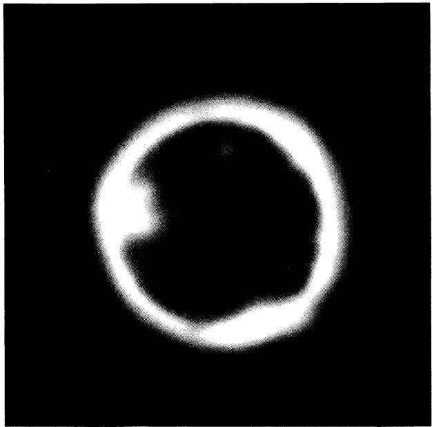  
FIG. 22-2. In-pile capsule experiment with molten bismuth fuel, showing xenon and iodine diffusion into graphite.

lower Xe ratios are again attributed to the loss of Xe from the interface to the graphite.

Samples G-080 and G-150 were agitated (by rotating them at 15 rpm around an axis passing at right angles through the middle of the capsule) while being equilibrated at $500^{\circ}\mathrm{C}$ for 75 hr. It is seen that in the case of the agitated samples Xe segregation was unaffected but I separation was appreciably reduced. However, the great bulk of the I was still found on the outer layer of the Bi.

Besides these experiments, another series was carried out in which the bismuth, containing uranium, was molten during irradiation, so that the xenon and iodine had a chance to escape as soon as formed. Figure 22-2 is an example of a typical experiment. In the figure, the central dark area is the bismuth core. The bright band is that part of the graphite into which xenon and iodine have diffused at $500^{\circ}\mathrm{C}$ . This band is about $1.5\mathrm{mm}$ , since the picture represents a magnification of 4 times. The conditions for this particular experiment are given in Table 22-5. The irregularities observed in the photograph are in accordance with the heterogeneity of graphite.

It should be noted that fission products other than iodine and xenon may be and possibly are involved in the formation of the high-intensity

# TABLE 22-5

# CAPSULE TESTS WITH MOLTEN FUEL

1000 ppm $\mathbf{U}^{235}$ in Bi + 350 ppm Mg + 350 ppm Zr. Irradiated for 15 days at a flux $2\times 10^{12}\mathrm{n / (cm^2)}$ -(sec) at $500^{\circ}\mathrm{C}$ . Graphite G capsule

<table><tr><td colspan="6">Xe133 concentration in graphite about 1 × 1013 atoms/g of graphite</td></tr><tr><td>Xe133</td><td>”</td><td>” bulk</td><td>”</td><td>3 × 109atoms/g of Bi</td><td></td></tr><tr><td>I131</td><td>”</td><td>” graphite</td><td>”</td><td>5 × 1013atoms/g of graphite</td><td></td></tr><tr><td>I131</td><td>”</td><td>” bulk</td><td>”</td><td>3 × 1010atoms/g of Bi</td><td></td></tr></table>

regions. The penetrations in the graphite appear to be due to radioactive gases exclusively.

The results of all these experiments show that I and Xe concentrate very heavily on surfaces in contact with the U-Bi fuel. There is evidence that Xe and radioactive gases penetrate the graphite and are immobilized therein. This may present a very serious problem in keeping the LMFR fission-product poisoning to the low levels required for economic breeding. The reported experiments, however, have been limited by the available neutron flux of the BNL pile to concentration levels about 1/1000 those anticipated in an LMFR breeder. Extrapolation of the present results to the LMFR levels is not justified, since it is conceivable that because of saturation effects the concentrations at the interfaces may not increase proportionately. However, the penetration of Xe in the graphite, as contrasted to its accumulation at interfaces, is a potentially serious problem because of the large surfaces available inside the graphite.

The results of these experiments clearly indicate that the removal of the FPV's is not a simple degassing operation. An increased research program is under way to learn more about the release and movement of the FPV's in both the reactor core and in the fuel streams. While degassing equipment designed to afford a large fluid surface for escape of the gases will probably be the best kind of equipment, the volatiles may very well never arrive at the degasser at all. Instead, they may adhere to the graphite walls and to the steel walls. Operation of the LMFR Experiment No. I should give extremely valuable information on this particular question.

22-2.3 Design of equipment for FPV removal. In the LMFR, the fuel would flow continuously through several parallel loops to external heat exchangers for cooling. Degassing equipment would, in all probability, be located in each of these loops. For a 500-Mw reactor, if all heat-exchange

streams were processed continuously, the fraction of FPV in the fuel removed per pass would only be about 0.004. Since the solubilities of Kr and Xe in Bi increase with temperature, the degassing equipment should preferably be located in the coldest part of the system, but since the fuel flow through the reactor is upward, and since the degassers must be located at the top of the system because of hydrostatic pressure, it is not very practical to locate them at the coldest point.

The main objective would be to prevent excessive amounts of Xe from being adsorbed on, or absorbed in, the graphite moderator. To achieve this, two conditions are necessary: first, the relative amount of I settling on the graphite must be kept low, and second, the degassers must be very efficient. The problem is not so much one of desorbing Xe from a Bi solution as it is one of controlling the accumulation of I and Xe on unwetted surfaces. To minimize I buildup on the graphite, the fuel velocity in the core should be as high as practical and there should be solid surfaces located somewhere between the core and the degassers to collect I.

On the basis of present knowledge, the degassers should be so designed that a large interfacial area is provided and that the liquid metal surface is as turbulent as possible. Theoretically, a degasser should work with good efficiency. A theoretical analysis by McMillan (BNL-353) showed that xenon has a tremendous tendency to concentrate on liquid bismuth surfaces. For a spherical volume, the number of xenon atoms on the surface was estimated to be about $10^{8}$ times the number dissolved in bismuth at $300^{\circ}\mathrm{C}$ . At $500^{\circ}\mathrm{C}$ this ratio came close to $10^{5}$ .

A sieve-plate column, in which the fuel descends in fine streams, would be such a degasser. It is felt that sparging of an inert gas into the fuel is not necessary to promote gas desorption, since Xe is so insoluble. However, depending on the gas pressure in the degasser, the use of an inert carrier gas may be desirable. The effluent fission gases would be collected in refrigerated charcoal beds.

# 22-3. FUSED CHLORIDE SALT PROCESS

In processing the molten bismuth for the removal of fission-product poisons, the ideal process would be a pyrometallurgical one operating at substantially the same temperature as the fuel. Furthermore, this process should either leave the uranium fuel in the bismuth or treat it in such a manner that it is relatively easy to recharge it as a metal into the bismuth stream for reuse. The LMFR thus offers an excellent opportunity for the application of pyrometallurgical chemical reprocessing methods. From a procedural point of view, such methods should inherently be cheaper than presently known aqueous processing methods. It will be necessary, however,

to await an economic comparison of the aqueous and pyrometallurgical processes before one is finally chosen for use with an LMFR.

However, since the LMFR offers such an excellent opportunity for the application of cheap pyrometallurgical processing, this path has been explored quite extensively. In this section a fused chloride salt process for the removal of fission poisons is described. In following sections a fluoride volatility process and a noble fission product removal process are described.

22-3.1 Equilibrium distribution. Chemistry. The FPS group consists of the lanthanides and the elements in groups IA, IIA, and IIIA of the Periodic Table. Within this group the lanthanides account for about $94\%$ of the total poisoning effect of the FPS elements. In the case of a typical 500-Mw reactor [1] the concentration of FPS elements in the bismuth amounts to about $17~\mathrm{ppm}$ . To reduce this concentration to acceptable levels, a process has been developed whereby the FPS elements are oxidized by and then extracted into a fused salt.

Following the original suggestion by Winsche that fission products might be extractable from a liquid U-Bi fuel by molten salts in a manner similar to solvent extraction, experiments were conducted by Bareis using the LiCl-KCl eutectic and lanthanide-bismuth alloys [6]. If the mechanism was indeed one of liquid-liquid extraction, then the lanthanide distribution should follow a simple distribution law and as such be independent of total concentration. Experimentally, this was not the case, and it was subsequently shown by Wiswall [7,8] and later independently by Cubicciotti [9] that the results could be explained by assuming that a chemical reaction had occurred as follows:

$$
3 \mathrm {L i C l} _ {\left(\text {s a l t}\right)} + \mathrm {L a} _ {\left(\mathrm {B i}\right)} \longleftrightarrow \mathrm {L a C l} _ {3 \left(\text {s a l t}\right)} + 3 \mathrm {L i} _ {\left(\mathrm {B i}\right)}. \tag {22-1}
$$

From the free energies of formation of the halides involved (Table 22-6) we may calculate $\Delta F^{\infty} = +33.6\mathrm{kcal}$ for Eq. (22-1). From this and the relationship $\Delta F^{0} = -RT\ln K_{\mathrm{eq}}$ , the equilibrium constant, $K_{\mathrm{eq}}$ is found to be $3.2\times 10^{-10}$ . Obviously, the equilibrium will be displaced far to the left. However, if we assume an initial La concentration in the bismuth equal to $17~\mathrm{ppm}$ , equal volumes of eutectic (KCl considered here as inert) and bismuth, and that activities are equal to mole fractions, then the ratio of moles of lanthanum in the salt to moles of lanthanum in the bismuth at equilibrium will be 146. Essentially, therefore, all the lanthanum will be transferred to the salt phase.

On the other hand, for the analogous reaction with uranium:

$$
3 \mathrm {L i C l} + \mathrm {U} \rightleftharpoons \mathrm {U C l} _ {3} + 3 \mathrm {L i} \tag {22-2}
$$

TABLE 22-6   
$\Delta F$ OF CERTAIN HALIDES AT $773^{\circ}\mathrm{K}$ [10]   

<table><tr><td>Compound</td><td>Free energy of formation F, kcal/atom Cl</td></tr><tr><td>KCl</td><td>88.6</td></tr><tr><td>SmCl2</td><td>84.1</td></tr><tr><td>LiCl</td><td>82.6</td></tr><tr><td>NaCl</td><td>81.4</td></tr><tr><td>LaCl3</td><td>71.4</td></tr><tr><td>CeCl3</td><td>69.8</td></tr><tr><td>NdCl3</td><td>67.4</td></tr><tr><td>MgCl2</td><td>61.7</td></tr><tr><td>UCl3</td><td>57.5</td></tr></table>

the standard free energy change is $+75.3\mathrm{kcal}$ , and $K_{\mathrm{eq}} = 5.2 \times 10^{-22}$ . At equilibrium, assuming the initial uranium concentration in the bismuth $= 1000\mathrm{ppm}$ , the ratio of the mole fraction of U in salt to the mole fraction of U in Bi will be equal to $6.8 \times 10^{-4}$ . Thus, in principle, a selective oxidation of the lanthanides may be achieved in the presence of uranium. Of course, the assumption that activities are equal to mole fractions is only an approximation.

Ternary salt. As a consequence of these reactions, lithium metal builds up in the bismuth phase and, in view of its high thermal neutron cross section, replacement of the lanthanide by lithium offers no advantage in terms of neutron economy.

Therefore another low-melting salt, the ternary eutectic of $\mathrm{MgCl}_2(50$ mole \%), KCl $(20\%)$ , and NaCl $(30\%)$ (MP $396^{\circ}\mathrm{C}$ ) was investigated. In this system, the free energy of formation of $\mathrm{MgCl}_2$ is intermediate between those of the lanthanide chlorides on one hand and uranium trichloride on the other and a satisfactory, although not complete, separation should be achieved.* Furthermore, the low neutron cross section of $\mathrm{Mg}$ is more favorable than that of lithium, and a low concentration of $\mathrm{Mg}$ in the fuel $(250~\mathrm{ppm})$ appears to be necessary in order to minimize corrosion and mass transfer in the steel equipment. The magnesium concentration in the bismuth will therefore control the extent of the reaction:

$$
3 \mathrm {M g C l} _ {2 (\text {s a l t})} + 2 \mathrm {L a} _ {(\mathrm {B i})} \rightleftharpoons 2 \mathrm {L a C l} _ {3 (\text {s a l t})} + 3 \mathrm {M g} _ {(\mathrm {B i})}, \quad \Delta F ^ {0} = - 5 8. 2 \mathrm {k c a l}, \tag {22-3}
$$

$$
3 \mathrm {M g C l} _ {2 (\text {s a l t})} + 2 \mathrm {U} _ {(\mathrm {B i})} \xrightarrow {\leftarrow} 2 \mathrm {U C l} _ {3 (\text {s a l t})} + 3 \mathrm {M g} _ {(\mathrm {B i})}, \quad \Delta F ^ {0} = + 2 5. 2 \text {k c a l}, \tag {22-4}
$$

but will not influence the degree of separation which may be achieved.

Thermodynamics of FPS transfer and distribution data. The equilibrium constant for reaction (22-3), in which lanthanum is taken as being representative of lanthanides in the $+3$ oxidation state, is given by

$$
K _ {\mathrm {e q}} = \frac {a _ {\mathrm {L a C l} _ {3}} ^ {2} a _ {\mathrm {M g}} ^ {3}}{a _ {\mathrm {L a}} ^ {2} a _ {\mathrm {M g C l} _ {2}} ^ {3}}. \tag {22-5}
$$

Expressed in terms of mole fractions, Eq. (22-5) becomes

$$
K _ {\mathrm {e q}} = \frac {X _ {\mathrm {L a C l} _ {3}} ^ {2} X _ {\mathrm {M g}} ^ {3}}{X _ {\mathrm {L a}} ^ {2} X _ {\mathrm {M g C l} _ {2}} ^ {3}} \cdot \frac {\left(f _ {\mathrm {L a C l} _ {3}} ^ {\infty}\right) ^ {2} \left(f _ {\mathrm {M g}} ^ {\infty}\right) ^ {3}}{\left(f _ {\mathrm {L a}} ^ {\infty}\right) ^ {2} \left(f _ {\mathrm {M g C l} _ {2}}\right) ^ {3}}. \tag {22-6}
$$

In the above, $a =$ thermodynamic activity, $X =$ mole fraction, and $f$ and $f^{\infty}$ are activity coefficients. $f^{\infty}$ is the limiting activity coefficient at infinite dilution, which is assumed to be independent of concentration at the concentrations encountered in this investigation. It is equivalent to the Henry's law constant [11].

Solved for the experimentally determinable quantity $X_{\mathrm{LaCl}_3} / X_{\mathrm{La}}$ , Eq. (22-6) becomes

$$
\frac {X _ {\mathrm {L a C l} _ {3}}}{X _ {\mathrm {L a}}} = \left(\frac {K _ {e q} X _ {\mathrm {M g C l} _ {2}} ^ {3}}{K _ {f} X _ {\mathrm {M g}} ^ {3}}\right) ^ {1 / 2}, \tag {22-7}
$$

where

$$
K _ {f} = \frac {\left(f _ {\mathrm {L a C l _ {3}}} ^ {\infty}\right) ^ {2} \left(f _ {\mathrm {M g}} ^ {\infty}\right) ^ {3}}{\left(f _ {\mathrm {L a}} ^ {\infty}\right) ^ {2} \left(f _ {\mathrm {M g C l _ {2}}}\right) ^ {3}}.
$$

In logarithmic form, (22-7) may be written

$$
\log \frac {X _ {\mathrm {L a C l} _ {3}}}{X _ {\mathrm {L a}}} = - \frac {3}{2} \log X _ {\mathrm {M g}} + \frac {1}{2} \log \frac {K _ {\mathrm {e q}} \left(X _ {\mathrm {M g C l} _ {2}}\right) ^ {3}}{K _ {f}}, \tag {22-8}
$$

whereupon, a plot of $\log X_{\mathrm{LaCl}_3} / X_{\mathrm{La}}$ versus $\log X_{\mathrm{Mg}}$ should result in a straight line of slope $= -3/2$ . Figure 22-3 is a plot for most of the FPS, uranium, and zirconium based on the best experimental data. In the case of La, the best line has a slope of $-3/2$ . From the position of the line, the constant term of Eq. (22-8) may be calculated by

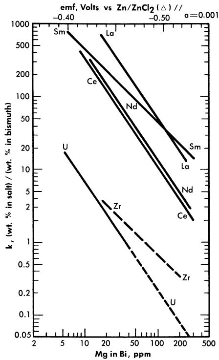  
FIG. 22-3. Distribution of solutes between $\mathrm{MgCl}_2$ -NaCl-KCl and Bi-Mg.

$$
B \left(\mathrm {c o n s t a n t}\right) = \frac {1}{2} \log \frac {K _ {\mathrm {e q}} \left(^ {\prime} X _ {\mathrm {M g C l _ {2}}}\right) ^ {3}}{K _ {f}}. (2 2 - 9)
$$

Experimental values of these constants are given in Table 22-7.

Comparison of theory and experiment. In order to compare theory with experiment, $K_{\mathrm{eq}}$ , $X_{\mathrm{MgCl_2}}$ , and the activity coefficients of the pertinent substances in each phase must be known. $K_{\mathrm{eq}}$ is easily calculated from the $\Delta F^{\infty}$ for the appropriate reaction by means of the relation $\Delta F^{\infty} = -RT \ln K_{\mathrm{eq}}$ ; $X_{\mathrm{MgCl_2}}$ may be considered essentially constant and equal to 0.5, since $\mathrm{MgCl_2}$ is present in the salt phase in large excess over the other reactants and its concentration changes only very slightly during the reaction. An exact calculation of $K_f$ is not possible at this time, owing to the paucity of information regarding activity coefficients in fused salts and in liquid bismuth. However, in one case, that of cerium, it is possible to estimate $K_f$ from measured activity coefficients if one assumption is allowed. Recently Egan [12,15] has measured the partial molar free energy of mixing, $\overline{\Delta F}$ , of magnesium in bismuth and cerium in bismuth by galvanic cell methods. From $\overline{\Delta F_{\mathrm{Mg}}}$ and $\overline{\Delta F_{\mathrm{Ce}}}$ , it was possible to calculate $f_{\mathrm{Mg}}^{\infty}$ and $f_{\mathrm{Ce}}^{\infty}$ , the activity coefficients at infinite dilution, in bismuth at $500^{\circ}\mathrm{C}$ . These values are estimated to be $f_{\mathrm{Mg}}^{\infty} = 2 \times 10^{-3}$ and $f_{\mathrm{Ce}}^{\infty} = 3 \times 10^{-14}$

TABLE 22-7   
VALUES OF $B$ (CONSTANT)   

<table><tr><td>Reaction</td><td>-ΔF0</td><td>Keq</td><td>-B</td><td>-B&#x27;</td><td>Kf</td><td>f∞</td></tr><tr><td>2La + 3MgCl2 ⇌ 2LaCl3 + 3Mg</td><td>58.2</td><td>2.84 × 1016</td><td>3.2924</td><td>—</td><td>1.36 × 1022</td><td>4 × 10-16</td></tr><tr><td>2Ca + 3MgCl2 ⇌ 2CeCl3 + 3Mg</td><td>48.6</td><td>5.49 × 1013</td><td>3.9586</td><td>—</td><td>5.67 × 1020</td><td>2 × 10-15</td></tr><tr><td>2Nd + 3MgCl2 ⇌ 2NdCl3 + 3Mg</td><td>34.2</td><td>4.66 × 109</td><td>3.8873</td><td>—</td><td>3.49 × 1016</td><td>2 × 10-13</td></tr><tr><td>Sm + MgCl2 ⇌ SmCl2 + Mg</td><td>44.8</td><td>4.62 × 1012</td><td>—</td><td>1.8097</td><td>1.49 × 1014</td><td>4 × 10-13</td></tr><tr><td>2U + 3MgCl2 ⇌ 2UCl3 + 3Mg</td><td>-25.2</td><td>7.52 × 10-8</td><td>—</td><td>—</td><td>—</td><td>—</td></tr></table>

(Table 22-8). Neil [13] by similar galvanic cell techniques, has measured the activity coefficient of $\mathrm{MgCl}_2$ in the ternary salt eutectic $\mathrm{MgCl}_2$ -KCl-NaCl at $500^{\circ}$ . The best value to date is $f_{\mathrm{MgCl}_2} = 0.34$ . If it is assumed that $f_{\mathrm{CeCl}_3}^{\infty} = 0.1$ in the ternary salt (and this value appears reasonable), then $K_f$ for cerium is given by

$$
K _ {f} = \frac {\left(f _ {\mathrm {C e C l} _ {3}} ^ {\infty}\right) ^ {2} \left(f _ {\mathrm {M g}} ^ {\infty}\right) ^ {3}}{\left(f _ {\mathrm {C e}} ^ {\infty}\right) ^ {2} \left(f _ {\mathrm {M g C l} _ {2}}\right) ^ {3}} = \frac {(1 0 ^ {- 1}) ^ {2} (2 \times 1 0 ^ {- 3}) ^ {3}}{(3 \times 1 0 ^ {- 1 4}) ^ {2} (0 . 3 4) ^ {3}} = 2. 3 \times 1 0 ^ {1 8}.
$$

The experimental value of $K_{f}$ , $5.6 \times 10^{20}$ , leads to a value of $2 \times 10^{-15}$ for $f_{\mathrm{CeCl}_3}^\infty$ . The agreement is considered satisfactory, in view of the exponential character of the equations and the uncertainties in the available data.

For example, the entire difference between the experimental value and calculated value of $K_{f}$ may be reconciled if one assumes an error of 1.4 kcal/atom Cl in the $\Delta F$ of formation of CeCl₃. Such an error is well within the limits with which the standard free energies of formation are known at these temperatures. The estimated activity coefficients of metals in bismuth may also be in error by as much as a factor of 2 to 3.

The experimental values of the constant $B_{\mathrm{La}}$ and $B_{\mathrm{Nd}}$ (Table 22-7) may be used to calculate the activity coefficients of lanthanum and neodymium in the bismuth if it is assumed, as in the case of cerium, that $f_{\mathrm{LaCl}_3}^\infty = f_{\mathrm{NdCl}_3}^\infty = 0.1$ . The values so obtained, $f_{\mathrm{La}}^\infty = 4 \times 10^{-16}$ and $f_{\mathrm{Nd}}^\infty = 2 \times 10^{-13}$ , are quite low, and are in general agreement with the measured $f_{\mathrm{Ce}}^0$ .

In the case of samarium, $\mathrm{SmCl}_2$ is thermodynamically more stable than $\mathrm{SmCl}_3$ by 14.6 kcal/atom of Cl at $500^{\circ}\mathrm{C}$ , and hence the equilibrium reaction is

$$
\mathrm {S m} _ {(\mathrm {B i})} + \mathrm {M g C l} _ {2 (\text {s a l t})} \xleftarrow {\leftrightarrow} \mathrm {S m C l} _ {2 (\text {s a l t})} + \mathrm {M g} _ {(\mathrm {B i})}. \tag {22-10}
$$

In a manner analogous to the treatment of the trivalent lanthanides, we obtain

$$
\log \frac {X _ {\mathrm {S m C l} _ {2}}}{X _ {\mathrm {S m}}} = - \log X _ {\mathrm {M g}} + B ^ {\prime}, \tag {22-11}
$$

where

$$
B ^ {\prime} = \log \frac {K _ {\mathrm {e q}} X _ {\mathrm {M g C l} _ {2}}}{K _ {f}} \quad \text {a n d} \quad K _ {f} ^ {\prime} = \frac {f _ {\mathrm {S m C l} _ {2}} ^ {\infty} f _ {\mathrm {M g}} ^ {\infty}}{f _ {\mathrm {S m}} ^ {\infty} f _ {\mathrm {M g C l} _ {2}}} \cdot
$$

# TABLE 22-8

# ACTIVITY COEFFICIENTS AT INFINITE DILUTION

<table><tr><td>System</td><td>Temperature, °C</td><td>fM∞</td></tr><tr><td>Ce-Bi</td><td>500</td><td>3 × 10-14</td></tr><tr><td>Mg-Bi</td><td>500</td><td>2 × 10-3</td></tr><tr><td>U-Bi</td><td>500</td><td>1 × 10-5</td></tr><tr><td>Li-Bi</td><td>450</td><td>1 × 10-5</td></tr><tr><td>Na-Bi</td><td>500</td><td>8.5 × 10-5</td></tr><tr><td>Zr-Bi</td><td>700</td><td>7 × 10-4</td></tr></table>

Equation (22-11) predicts that a plot of $\log X_{\mathrm{SmCl_2}} / X_{\mathrm{Sm}}$ versus $\log X_{\mathrm{Mg}}$ should yield a straight line of slope $-1$ . The curve is shown in Fig. 22-3 and the line is drawn with a slope of $-1$ . This line yields the value of $B'$ given in Table 22-7. With the assumption that $f_{\mathrm{SmCl_2}}^{\infty} = 0.1$ , the estimated activity coefficient at infinite dilution of samarium in bismuth is $f_{\mathrm{Sm}}^{\infty} = 3 \times 10^{-18}$ .

The validity of Eq. (22-6) is dependent upon the assumption that side reactions, such as the oxidation of bismuth by the salt, are negligible. Since $\Delta F^0$ for these reactions are large positive numbers, it is reasonable to consider bismuth as inert in this respect. Bismuth, of course, interacts with the lanthanides and magnesium very strongly, but this is taken into account by the use of activity coefficients.

It is also assumed that the reactions

$$
\begin{array}{l} 3 \mathrm {N a C l} + \mathrm {L a} \xrightarrow {\quad} \mathrm {L a C l} _ {3} + 3 \mathrm {N a}, \quad \Delta F ^ {0} = + 3 0. 0 \mathrm {k c a l}, \\ 3 \mathrm {K C l} + \mathrm {L a} \xrightarrow {\leftarrow} \mathrm {L a C l} _ {3} + 3 \mathrm {K}, \quad \Delta F ^ {0} = + 5 1. 6 \mathrm {k c a l}, \\ \end{array}
$$

do not contribute significantly to the transfer of lanthanides to the salt phase, in view of the large positive free energy change. This approximation was checked experimentally by determining the concentrations of Na and K in the bismuth phase after an equilibration experiment. No detectable amounts of alkali metals were found in the bismuth. This result also indicates that salt solubility in bismuth is negligibly low. Analysis of the salt phase for bismuth yielded low, erratic results, possibly due to the slight solubility of bismuth in $1\mathrm{N}$ HCl which occurred during the aqueous separation of salt and metallic phases. It is highly improbable that bismuth would be soluble in a salt of this type.

Another assumption made in this analysis involves the reversibility of the oxidation of the lanthanides by $\mathrm{MgCl_2}$ . This point was checked by equilibrating a series of Mg-Bi alloys with a salt eutectic containing $\mathrm{Ce^{143}Cl_3}$ . The distribution data of cerium as a function of $\mathrm{Mg}$ concentration in the bismuth derived from the reduction of $\mathrm{CeCl_3}$ by $\mathrm{Mg}$ shows the reaction is reversible within an experimental error of $10\%$ [14].

Included in Fig. 22-3 are Nd distribution data obtained in the presence of $0.1\mathrm{w / o}$ uranium and $0.03\mathrm{w / o}$ zirconium in the bismuth. (Zirconium will normally be present in the LMFR fuel as a corrosion inhibitor.) Within this concentration range, zirconium and uranium do not affect the Nd distribution.

Data for process design. It will be noted from the relative positions of the lines of Fig. 22-3 that it is not possible to assume, a priori, that the order of the lanthanide distributions will be directly predictable from free energy of formation data. For example, from Table 22-6 the order of decreasing stability of the chlorides is Sm, La, Ce, and Nd, whereas at constant $X_{\mathrm{Mg}}$ the experimental order is La, Sm, Nd, and Ce. The difference in order is apparently due to the large variation of the activity coefficients of the lanthanides in bismuth.

The results of the lanthanide distribution experiments have provided a basis for the design of a countercurrent, salt-metal extraction process [2]. Results of uranium distribution studies indicate that in small-scale experiments, a satisfactory separation of lanthanides from uranium may be achieved in a single equilibrium contacting stage. The experimental value of the distribution coefficient, $K_{s}$ , was found to be of the order of 20 to 50, where $K_{s}$ is defined as

$$
\frac {X _ {\mathrm {L a C l} _ {3}} / X _ {\mathrm {L a B i}}}{X _ {\mathrm {U C l} _ {3}} / X _ {\mathrm {U B i}}}.
$$

Multistage extraction should ensure efficient removal of the fission-product poisons from the bismuth fuel stream.

22-3.2 Pilot plant equilibrium experiments. A pilot plant equilibrium program is under way at BNL to investigate the salt bismuth-fuel equilibria on a larger scale under conditions more closely simulating those in an actual plant. The contacting vessels, made of 347 stainless steel, have a capacity of about 2 liters. They can be fitted with liners of other metals in order to study the effect of surfaces and corrosion. Each contacter is equipped with connections through which materials can be added and removed without admitting air, a sightport, gas and vacuum connections, heaters, and thermocouples. Liquid salt and metal phases are equilibrated in quantities large enough to allow multiple analyses, so that the effect of

changes in conditions can be directly determined by before-and-after analyses on a single system.

The most significant results of this pilot plant program are those from experiments for which an apparatus of large capacity alone could serve. These are studies of the stability of the solutions for long periods and of the changes in equilibrium distribution resulting from addition of various reagents. In general, the distribution coefficients obtained in this equipment confirm those found in the small-scale work. However, the precision of the results is less.

In carrying out experiments in these equilibrium vessels, a stability sufficient for most practical purposes can be achieved, given the right operating conditions, but there are still unsolved problems. A solution of Bi, U, Mg, rare earth, and Zr can be kept at $500^{\circ}\mathrm{C}$ under helium in a stainless-steel vessel indefinitely without change of composition. If then a quantity of pretreated salt* is added to the system, a significant drop occurs in the U concentration in the metal, e.g., from 1000 to 900 ppm. Some U appears in the salt phase, but not in an amount equivalent to the loss from the metal. Thereafter, the U concentration remains constant but the Mg in the metal suffers a slow decline, losing between 1 and 10 ppm per day. As its concentration decreases, the distribution of elements such as the rare earths changes in about the way which would be predicted from the results of the gram-scale experiments. The U remains nearly constant unless the Mg is allowed to drop below about 20 ppm, in which case U begins to transfer to the salt.

From some of these systems a solid material has been recovered which gives the x-ray pattern of uranium nitride, and it is possible that nitrogen from the container walls is somehow involved in the mysterious behavior of U and Mg. Since very small quantities of the various materials are involved in these reactions, it is quite possible that solid surface adsorption effects are also playing a part in the instability of composition.

In a second series of experiments, the change in equilibrium distribution from the addition of reagents is being studied. In the FPS extraction process, a sequence of columns operated at different oxidation potentials is proposed. Most of these changes in equilibrium are controlled by the addition of $\mathrm{BiCl}_3$ or $\mathrm{Mg}$ to the system at appropriate points. Experiments have been done in which these reagents have been added to a salt-metal system at equilibrium. The results of two such experiments will illustrate the behavior of these systems. In the first, an initial equilibrium was established in which the metal phase contained a fairly high concentration

of Mg. Its approximate value, together with those of the other constituents, are given in the first row of Table 22-9, Run 1. In view of difficulties in sampling and analysis, these figures may be in error by 10 to $20\%$ . A quantity of $\mathrm{BiCl}_3$ which was more than equivalent to all the Mg was then added. When a new equilibrium had been reached, it was found that all the Mg and much of the Zr and U had been removed from the metal phase; the second row gives the analytical figures. Metallic Mg was then added to reverse the reaction; and the final equilibrium situation is given by the figures in the last row. It can be seen that the U was restored to its original concentration in the metal. It is of interest that this occurred even though the final Mg concentration was much less than the original; that is, the U distribution coefficient was insensitive to the Mg concentration when the latter's value was $100\mathrm{ppm}$ or more. This agrees with the laboratory experiments discussed previously. Additional confirmation was obtained in Run 2, in which an amount of $\mathrm{BiCl}_3$ was added which was less than equivalent to the Mg. The results are given in Table 22-9, Run 2. Here, when the Mg concentration was lowered from 320 to $140\mathrm{ppm}$ , the Ce distribution coefficient increased, as one would expect, but the U remained unchanged.

22-3.3 Reaction rates. Previously, the equilibrium for the salt-metal reactions was discussed. It was shown that most probably more than one equilibrium contact will be required to remove the FPS. This means that some kind of contacting between two flowing streams will be required in

TABLE 22-9   

<table><tr><td></td><td>Concen-tration, mole %</td><td colspan="7">Concentration, ppm</td></tr><tr><td rowspan="2"></td><td rowspan="2">Mg Salt</td><td rowspan="2">Mg Metal</td><td colspan="2">Zr</td><td colspan="2">U</td><td colspan="2">Ce</td></tr><tr><td>Salt</td><td>Metal</td><td>Salt</td><td>Metal</td><td>Salt</td><td>Metal</td></tr><tr><td>Run No. 1</td><td></td><td></td><td></td><td></td><td></td><td></td><td></td><td></td></tr><tr><td>Initial equilibrium</td><td>50</td><td>440</td><td>20</td><td>240</td><td>10</td><td>800</td><td>15</td><td>11</td></tr><tr><td>After BiCl3addition</td><td>50</td><td>10</td><td>20</td><td>160</td><td>1070</td><td>330</td><td>73</td><td>0.1</td></tr><tr><td>After Mg addition</td><td>50</td><td>110</td><td>20</td><td>210</td><td>17</td><td>810</td><td>56</td><td>4</td></tr><tr><td>Run No. 2</td><td></td><td></td><td></td><td></td><td></td><td></td><td></td><td></td></tr><tr><td>Initial equilibrium</td><td>50</td><td>320</td><td>-</td><td>200</td><td>20</td><td>790</td><td>28</td><td>9</td></tr><tr><td>After BiCl3addition</td><td>50</td><td>140</td><td>-</td><td>-</td><td>30</td><td>790</td><td>58</td><td>5</td></tr></table>

the over-all chemical processing, using the fused chloride salt method. Therefore, an examination of the reaction rates is important. When several equilibrium contacting stages are required, and it is desired to do this in a flowing countercurrent system, it is necessary for the mass transfer rates to be fast.

In this reaction there are at least three stages: transport of the reactants to the salt-metal interface, the reaction proper, involving exchange of electrons, and transport of the products away from the interface. Situations are conceivable in which any of these could be rate-limiting. In investigating so complex a situation experimentally, it is often possible to order things so that one or more stages are fast relative to the others, thus permitting the kinetics of the latter to be studied alone. If, for example, the reaction is made to go under conditions which are far from equilibrium, i.e., the reverse reaction proceeding to only a negligible extent, the transport kinetics of certain species can be excluded from consideration.

A series of experiments of this type was carried out in which $2.2\mathrm{-mm}$ drops of Bi containing $200~\mathrm{ppm}~\mathrm{Sm}^{153}$ fell through $31~\mathrm{cm}$ of molten ternary salt eutectic. At the bottom, the drops were drawn off and analyzed. The salt phase was initially free of rare earths, and its volume was 500 times that of the total Bi which fell through, so transport of species in the salt phase should not be rate-limiting. The contact time for each drop was about 0.6 sec. Analysis showed that $75\%$ of the Sm was extracted into the salt. If we calculate the amount that would have been extracted had the rate been limited by diffusion of solute to the surface of a spherical drop, assuming rapid reaction at the interface, a smaller figure results. It may be concluded that some turbulence exists within the drop, assisting the diffusion process, and that the interface reaction is indeed fast.

Although further rate studies are required, the results at hand show that considerable latitude is available to the process engineer in designing the over-all process using these equilibrium and rate data. These possible designs may range from straight batch type contacting to completely automated countercurrent contacting.

22-3.4 FPS removal process. In the process design described [20], the oxidant is $\mathrm{BiCl}_3$ and the carrier salt is the ternary eutectic $\mathrm{NaCl - KCl - MgCl_2}$ , which melts at $396^{\circ}\mathrm{C}$ . Sufficient oxidant is added to the salt to remove the FPS, leaving the U for the most part behind. The FPS form chlorides, which are considerably more stable than $\mathrm{UCl}_3$ , the most stable chloride of U.

Equilibrium partition coefficients for Ce, Zr, and U, as functions of Mg concentration, are shown in Fig. 22-3. For a particular Mg concentration, the ratio of the Ce coefficient to that of U is a direct measure of how difficult it is to achieve a given degree of separation between the two solutes.

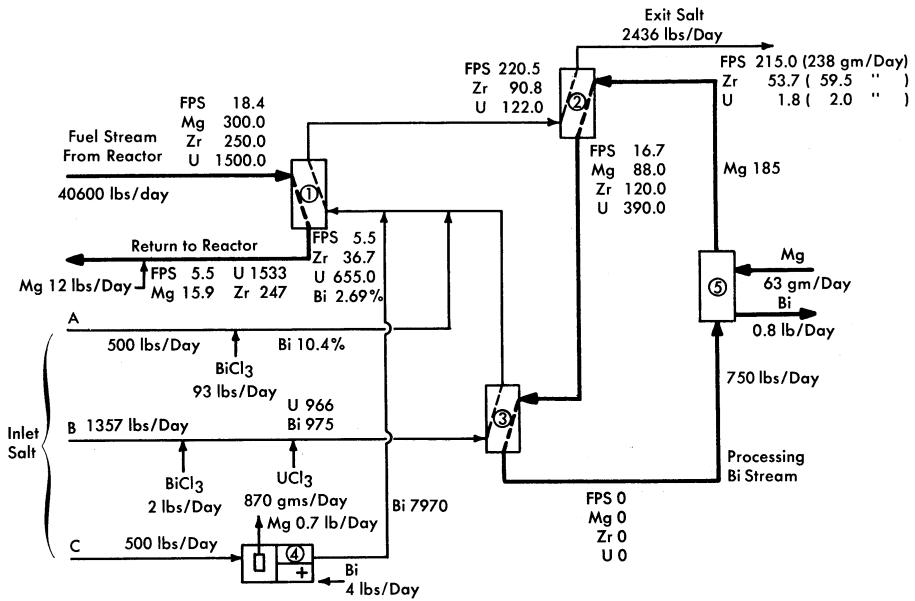  
Note: Concentrations in Parts Per 106 Unless Otherwise Indicated   
FIG. 22-4. Flowsheet for the removal of FPS and Zr fission products from an LMFR fuel.

Ce is one of the least stable of the FPS chlorides, but in the treatment which follows, FPS salt-metal equilibrium coefficients are taken to be the same as that of Ce, that is, they are conservative. The slope of the Ce and U lines in Fig. 22-3 is $-1.5$ , signifying trivalency in the salt phase, while that of the Zr is shown as $-1$ , signifying divalency. The Zr line is drawn dashed because experimental results are still preliminary, and the slope of $-1$ was assumed rather than being firmly established by experiment. Unfortunately, the data available at this writing were obtained over a rather short range of Mg concentration. Of the FPS, Rb and Cs are univalent and Ba, Sr, and Sm are divalent, but all of these lie well above the Ce line and would, therefore, be more easily extracted.

The total energy release per fission in the LMFR is estimated to be 194 MeV. For a reactor having a heat rate of $500\mathrm{Mw}$ , this means that $542\mathrm{g}$ of $\mathrm{U}^{235}$ would be fissioned per day. Since the FPS represent about $44\%$ of the total fission products by weight, $238\mathrm{g}$ of FPS's must be removed per day to maintain a steady concentration in the fuel. (See Table 22-10.) The Zr concentration is kept at about $250~\mathrm{ppm}$ for purposes of corrosion inhibition, and the steady-state removal rate of this fission product will be approximately $59\mathrm{g/day}$ . It is interesting to note that about $11\%$ of the fission products end up as Zr. For a reactor with a heat rate of $500\mathrm{Mw}$ and a total fuel inventory of 150 tons, a fission-product Zr con

# TABLE 22-10

# STATISTICS ON VARIOUS FISSION-PRODUCT GROUPS

For a 500-Mw reactor having a 150-ton Bi inventory containing 1000 ppm $\mathrm{U}^{233}$ .

<table><tr><td>Group</td><td>Typical concentrations</td><td>Approximate reactor poisoning, %</td><td>Removal rate, g/day</td><td>Weight fraction of total fission products produced</td></tr><tr><td>FPS</td><td>18 ppm</td><td>0.8</td><td>238</td><td>0.44</td></tr><tr><td>Zr</td><td>250 ppm</td><td>0.1</td><td>59</td><td>0.11</td></tr><tr><td>FPN</td><td>2 ppm</td><td>0.8</td><td>0.6</td><td>0.0011</td></tr><tr><td>N FPN (less Mo)</td><td>174 ppm</td><td></td><td>59</td><td>0.110</td></tr><tr><td>Mo</td><td>1 ppm</td><td>0.0</td><td>54</td><td>0.10</td></tr><tr><td>FPV</td><td>16 ppb</td><td>1.0</td><td>129</td><td>0.24</td></tr></table>

centration of 250 ppm corresponds to a 590-day average residence time in the fuel and gives a reactor poisoning effect of slightly less than $0.1\%$ .

Figure 22-4 is a simplified flowsheet showing how the FPS may be removed from an LMFR fuel of a 500-Mw reactor. The high concentration of Mg makes it difficult to extract the FPS, but the high concentration of Zr makes it easier to extract that particular element. The high Mg concentration rules out the possibility of using a buffer method and necessitates the use of a stoichiometric method in the FPS removal step. Sufficient oxidizing agent (in this case $\mathrm{BiCl}_3$ ) is added to the salt to remove the required fractions of FPS and Zr. At the same time, most of the Mg in the fuel is unavoidably oxidized.

After a suitable holdup period, the fuel flows at the rate of $0.34\mathrm{gpm}$ through column 1, the removal column. This column, as shown, has a separative capacity equivalent to two equilibrium stages. The separative capacity of the column is illustrated in Fig. 22-5, where concentrations, relative flow rates, and equilibrium partition coefficients are shown. The bottom stage operates under oxidizing conditions, while the top one operates under reducing conditions. This brings about relatively high concentrations in the middle of the column. The increase in the U concentration in the fuel, in passing through the column, is to provide the necessary U makeup for the reactor. The principal effects of increasing the number of stages to three would be to lower slightly the $\mathrm{Mg}$ concentration in the exit fuel stream, to increase considerably the FPS/U ratio in the exit salt, and to decrease appreciably the $\mathrm{Zr / U}$ ratio in the exit salt. The first of these by itself would be of little consequence, the second would be very

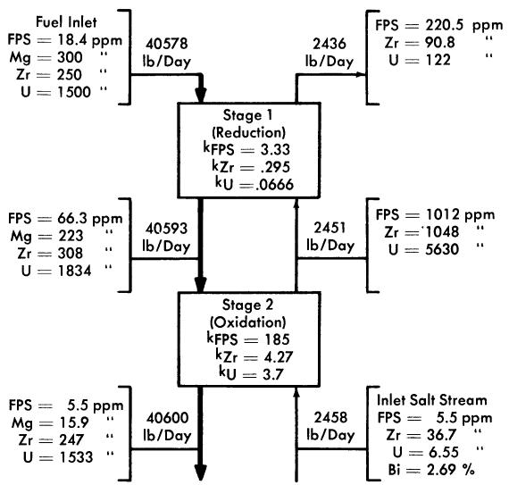  
FIG. 22-5. Typical concentrations in an FPS removal column with two equilibrium stages.

desirable, and the third would be undesirable. The last effect is actually controlling, which means that a three-stage separation is not as good as a two-stage separation. Going in the other direction, a one-stage separation gives very much lower FPS/U and $\mathrm{Zr / U}$ ratios in the exit salt, thereby increasing the difficulty of subsequent U recovery. However, certain advantages result from a single-stage operation—higher Mg concentration in the exit fuel allows easier control of the process, and higher $\mathrm{Zr}$ concentration in the exit salt makes it easier to remove the $\mathrm{Zr}$ . The optimum number of equilibrium stages probably lies between one and two.

In column 2, the U in the salt stream from column 1 is recovered by extracting it into a second Bi stream. This column operates under the buffer system, even though the Mg concentration in the metal stream drops $52\%$ . The separative capacity of this column is equivalent to four equilibrium stages, and the variations of solute concentrations throughout the column are shown in Fig. 22-6. The U losses in the exit salt stream were set arbitrarily at $2\mathrm{g/day}$ , for purposes of illustration. Obviously, in actual practice this quantity would be determined by economic considerations, i.e., it would be at such a value that the cost per gram of recovering any additional U would be more than it is worth. The process design of column 2 is controlled by the fact that the concentration of $\mathrm{Zr}$ in the exit salt stream has to be $54\mathrm{ppm}$ for a salt flow rate of $2436\mathrm{lb/day}$ and a reactor with a $500-\mathrm{Mw}$ heat rate, i.e., $59\mathrm{g}$ of fission-product $\mathrm{Zr}$ must be removed per

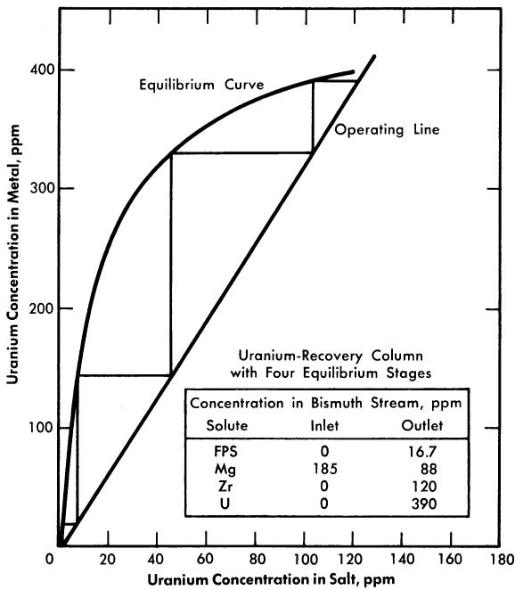  
FIG. 22-6. Uranium recovery column with four equilibrium stages.

day. When the $\mathrm{Zr}$ concentration in the exit salt stream is fixed, the concentration of the FPS is also fixed, for the ratio $\mathrm{FPS} / \mathrm{Zr}$ in the exit salt stream must be the same ratio in which these materials are generated in the fuel. The concentration of the FPS in the inlet fuel stream to column 1 was varied while the $\mathrm{Zr}$ concentration was held constant, until this condition was achieved. The concentration of $18.4\mathrm{ppm}$ for the FPS's corresponds to a total FPS poisoning effect of about $0.8\%$ .

The processing Bi stream, column 2, contains $185~\mathrm{ppm}$ Mg but no other solutes. In passing through the column, the Mg concentration in the Bi drops to $88~\mathrm{ppm}$ , which means that the oxidation reduction potential between the salt and Bi phases changes appreciably throughout the column.

The fission products, $\mathrm{Mg}$ and U in the Bi stream from column 2, are all oxidized completely into incoming salt stream $B$ in vessel 3. The stripped Bi, after addition of $185~\mathrm{ppm}$ $\mathrm{Mg}$ , is then returned to column 2 to repeat its cycle. The $\mathrm{Mg - Bi}$ stream is so small that a few days' supply could be prepared on a batch basis if continuous addition of $\mathrm{Mg}$ to the recirculating Bi stream proved difficult to control.

Vessel 3, conditions in which are highly oxidative, could be a short column; its only function is to provide good single-stage contact between the Bi and salt streams. The U makeup for the reactor, shown added as

$\mathrm{UCl}_3$ to the salt stream entering this vessel, is transferred to the fuel in column 1. Alternatively, the bred U from the blanket could be transferred from a Bi solution to the incoming salt. This Bi stream would be joined to that from column 2 and later separated from it after leaving vessel 3, or it could be contacted with the incoming salt in a separate vessel.

The exit salt from column 2 can be treated with a Ba-Bi or Ca-Bi solution to remove the FPS and U, thus making it possible to recirculate the salt. The FPS's and U could then be slagged out of the Bi into a low-cost salt mixture for storage.

The flowsheet in Fig. 22-4, for the sake of simplicity, does not show holdup and storage tanks, instrumentation, pumps, or heat exchangers. There are several possible variations of this flowsheet but, for the most part, they include the three types of operations described above.

Owing to the fact that the oxidation-reduction potential varies considerably throughout the FPS removal column, it may be preferable to operate it with concurrent flow within each stage and countercurrent flow between stages. Alternatively, two separate concurrent columns could be used. The U recovery column, on the other hand, would clearly be operated with countercurrent flow because, chemically, conditions are reductive throughout the column.

Design of extraction columns. The mechanical design of a proposed extraction column is shown in Fig. 22-7. Fuel enters at the top of the column and is dispersed by the slots in each tray as it falls through the column. The flow paths are indicated by arrows. Coalescence of the fuel drops occurs on each tray. Salt, as the continuous phase, may flow either concurrently with or countercurrently to the fuel. Fuel coalescence promotes thorough local mixing in the fuel and at the same time tends to minimize axial dispersion in each phase.

Columns of the type shown in Fig. 22-7, about 3 to 6 ft long and 3 to 4 in. in diameter, are expected to have satisfactory performance characteristics. Such columns have not yet been tested under conditions simulating actual practice, although their fluid dynamical behavior has been studied with $\mathrm{H}_2\mathrm{O}$ and $\mathrm{Hg}$ as substitutes for salt and Bi.

22-3.5 Process control of fused chloride process. The object of the process described above is to remove $59\mathrm{g}$ of fission-product $\mathrm{Zr}$ and $238\mathrm{g}$ of FPS from the fuel per day, at the same time losing only $2\mathrm{g}$ of U. For this, careful control of the process is required. Continuous measurement of the U concentrations in the salt streams from columns 1 and 2 will be required. The U concentrations in these streams are good indicators of column operation, i.e., if the U concentrations are correct, those of the $\mathrm{Zr}$ and FPS should also be correct. Assuming constancy of fuel composition and all flow rates, the two operating variables affecting the process are,

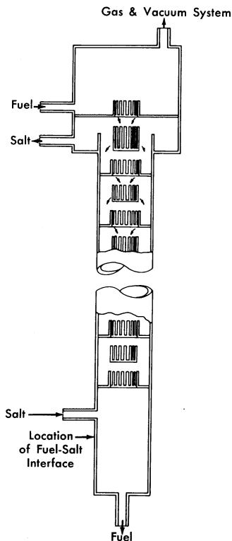  
FIG. 22-7. Extraction column.

first, the $\mathrm{BiCl}_3$ concentration in the inlet salt stream to column 1 and the $\mathbf{Mg}$ concentration in the inlet Bi stream to column 2. Each of these must be controlled to give the proper concentrations of U in the salt leaving columns 1 and 2. The operation of column 1 is the more difficult to control. There are three inlet salt streams which eventually merge into the single stream entering column 1. Stream $A$ contains about $92\%$ of the total $\mathrm{BiCl}_3$ requirements, $B$ contains about $2\%$ , and $C$ contains the remainder. Streams $A$ and $B$ are separated because of difference in corrosiveness, and stream $C$ provides fine control of the total $\mathrm{BiCl}_3$ addition. At least one day's supply of each stream would be prepared in advance.

The Mg concentration in the exit fuel is a sensitive indication of the rate of $\mathrm{BiCl}_3$ addition to the column and, consequently, of the U concentration in the exit salt. Thus controlling the rate of addition of $\mathrm{BiCl}_3$ to column 1 by this Mg concentration would be more satisfactory than controlling it by the U concentration in the exit salt, because of the much quicker response of the Mg concentration to changes in the rate of $\mathrm{BiCl}_3$ addition. The damping effect of the column should then result in a fairly uniform U concentration in the exit salt.

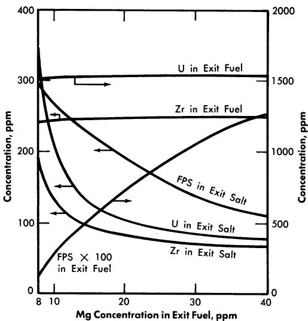  
FIG. 22-8. Effect of Mg concentration in exit fuel on the compositions of the exit streams from the FPS removal column.

Figure 22-8 shows the effect of variation in the Mg concentration in the exit fuel stream of column 1 on the steady-state concentrations of FPS, Zr, and U in the exit fuel and salt streams. It is seen that changes in Mg concentration have less effect the higher the Mg concentration; e.g., in the case shown, the column would be much easier to control at an exit Mg concentration of 25 than at one of 15.

The results of studies at Brookhaven indicate that it should be possible to measure continuously the Mg concentration in the exit fuel by means of a galvanic cell. For this, Marsland [17] has used the following type of cell:

$\mathrm{Zn / ZnCl_2(1\%}$ solution in NaCl-KCl-MgCl2 eutPyrex//

NaCl-KCl-MgCl2eut/Mg (Bi).

The emf from such a cell would control the voltage to another, large electrochemical cell. This second cell, shown in the flowsheet, would add $\mathrm{BiCl}_3$ to inlet salt stream $C$ , the rate depending on the demand from the controlling cell.

The control of column 2 should be much less of a problem. The Mg concentration in the inlet Bi stream must be kept within certain limits to maintain the desired concentration of U in the exit salt. Actually, column 2 can, to a considerable degree, correct for malfunctioning of column 1.

In the event that control of the process described in Fig. 22-4 should turn out to be difficult, several steps which can be taken to correct the difficulty: (a) decreasing the separative capacity of column 1, (b) increasing

the salt flow rate, and (c) inserting a holdup tank between columns 1 and 2 to assure uniform composition of the salt entering column 2. As an extreme measure, the first column could be replaced by equilibration vessels, but this would appear to be an unlikely eventuality. The magnitude of the problem is defined by the continuous processing requirements, namely, maintaining close control of very low uranium and fission product concentrations in streams of three interdependent contacting towers.

22-3.6 Processing to reduce radiation hazard. The continuous process described above is based on an FPS concentration of approximately $18~\mathrm{ppm}$ , and calls for a processing rate of $0.45~\mathrm{gpm}$ . These conditions were chosen on the basis of poisoning considerations. If, however, safety considerations were the determining factor, the processing rate would be greatly increased. If the whole fuel stream were processed daily for removal of FPS, the concentrations of $\mathrm{Sr}^{90}$ and $\mathrm{Cs}^{137}$ , the two worst fission nuclides from the standpoint of biological hazard, could each be kept down to about $0.1~\mathrm{ppm}$ . This might well be a very desirable objective, and the processing rate would still be only about $3~\mathrm{gpm}$ .

22-3.7 Pilot plant program for fused chloride process. Plans for an extensive pilot plant program for the fused chloride process are currently being made. Some work on mechanical component development and materials of construction has already started. Several small loops are in operation at BNL, circulating fused salt. In these loops, mechanical components such as pumps, valves, and control instruments are under development and test. Concurrently, a corrosion test program is under way, as was discussed in Section 21-5. A full-sized prototype pilot plant for the testing and operation of a single extraction column is now being fabricated and constructed (Loop N). This pilot plant has been designed to circulate quantities of bismuth fuel and fused salt comparable to those for a full-sized reactor, as discussed previously in this chapter. In this pilot plant it is planned to obtain operational data which will lead to a full-scale processing plant.

22-3.8 Heat generation by fission products. The problem of heat removal is an important consideration in the design of processes and equipment for handling radioactive fission products. This is particularly true in the present case, because of the relatively short age of the fission products at the time of their extraction from the fuel. However, heat removal from fused salts does not present a difficult problem.

Figure 22-9 shows a family of curves giving the specific heat rates for the FPS as a function of average residence time in the reactor and time after removal therefrom [2,16]. The curves were calculated from fission

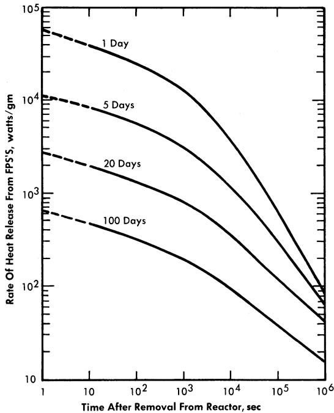  
FIG. 22-9. Energy release from FPS.

product heat-release data obtained from the Argonne National Laboratory. Extrapolations to short decay times were made with the aid of the Way-Wigner expression for fission product decay heat.

The energy will be divided about equally between beta and gamma radiation. For this fused chloride process, the heat release will, of course, depend on the poison concentrations, but will probably range from 100,000 to 500,000 Btu/(hr) (ft $^3$ of salt).

# 22-4. FLUORIDE VOLATILITY PROCESS FOR FISSION PRODUCTS

As an alternative to the fused chloride process, a pyrometallurgical process based on the volatility of $\mathrm{UF}_6$ has been suggested by the Argonne National Laboratory. A schematic flowsheet is given in Chapter 24 as Fig. 24-18. This process would be operated batchwise.

In this process a batch of molten salt made up of $50\%$ $\mathrm{ZrF_4}$ and $50\%$ NaF is poured into the graphite hydrofluorinator and heated to $600^{\circ}\mathrm{C}$ . The fused salt is then sparged with HF gas, dissolving approximately 3 w/o. After the HF gas is cut off, bismuth-uranium core fluid containing FPS is introduced at the top of the vessel. Salt-metal contacting time is long enough to permit hydrofluorination of the FPS, FPN, and U in the core fluid and subsequent extraction of the resulting fluorides into the fused

salt melt. Excess HF is sent to a scrub tower not shown in the figure. The stripped bismuth is continuously withdrawn from the bottom of the column into a storage tank, leaving enough Bi for a liquid seal. The fluoride salt containing all the poisons and $\mathrm{UF_4}$ is then routed to a nickel fluorination vessel in which $\mathrm{UF_4}$ is fluorinated to $\mathrm{UF_6}$ by direct contacting with fluorine gas. Other salts, such as $\mathrm{MoF_6}$ , $\mathrm{TeF_6}$ , $\mathrm{RuF_6}$ , $\mathrm{AsF_3}$ , $\mathrm{IF_5}$ and $\mathrm{MbF_5}$ [18], are also formed in this step, since they are present as fission poisons. Since all of these materials are volatile, they will leave the fluoride melt with the excess fluorine, and will then be condensed in a cold trap maintained at approximately $-40^{\circ}\mathrm{C}$ . An NaF trap removes traces of $\mathrm{TeF_6}$ , $\mathrm{AsF_5}$ , and $\mathrm{Ruf_8}$ from the fluorine before it is recycled. These volatile fluorides are then sublimed from the cold trap by heating to about $100^{\circ}\mathrm{C}$ , and distilled in order to complete the separation and purification of $\mathrm{UF_6}$ from the other volatile fluorides.

The gaseous $\mathrm{UF}_6$ is reduced by bubbling it with an excess of hydrogen through fresh molten fluoride salt. The resultant $\mathrm{UF}_4$ is trapped in this clean salt melt. As shown in Fig. 24-18, the salt containing $\mathrm{UF}_4$ is next contacted with the stripped bismuth stream in an electrochemical reduction step. In this step, the $\mathrm{UF}_4$ is reduced to metal at a flowing bismuth cathode while fluorine gas is released at the anode. The resultant bismuth-uranium alloy, to which $\mathrm{Mg}$ and $\mathrm{Zr}$ have previously been added, is ready for re-entry to the core.

As an alternative to this last electrochemical step, the $\mathrm{UF_4}$ can be reduced in the salt by direct contact with $\mathbf{Mg}$ -Bi.

Although the development work on this process is not as far advanced as on the fused chloride process, enough work has been done so that the process appears feasible. Small-scale laboratory work has indicated that the hydrofluorination step can be carried out successfully. Previous work in other areas of the atomic energy program has supplied considerable information on the direct fluorination step and the volatile fluoride distillation step. In the other areas of this process, less information is currently available.

The chief advantages of the fluoride volatility process is that it will be operated batchwise and will give a complete, clean separation between the uranium and all the fission products. This allows comparatively easy control of the cleanup of the fuel and preparation of new fuel for the reactor. Since each step of this process is batch, the instrumentation would be comparatively simple and the operators would have complete independent control of each step.

On the other hand, there are many difficult problems being encountered in developing this process further. One of them is the severe corrosion encountered in the various steps. The chemistry of the hydrofluorination in the first step has to be proven out conclusively. It is believed that by

close temperature control the oxidation of bismuth can be prevented. However, the free energy of formation of bismuth fluoride is rather close to those of some of the fission products. From an economic point of view, some means will probably have to be found for cutting down the cost of fluoride salts sent to waste. Zirconium fluoride is quite expensive and could be an important item in the total expense of the program.

# 22-5. NOBLE FISSION PRODUCT REMOVAL

22-5.1 Characteristics of FPN poisoning. Owing to the fact that they include no nuclides which are particularly high neutron absorbers, the FPN can be allowed to build up to relatively high concentrations in the fuel. The two worst poisons are $\mathrm{Tc}^{99}$ with a 19-barn thermal cross section, and stable $\mathrm{Rh}^{103}$ with 150. For the reactor conditions described earlier, the poisoning effect of the FPN (less Mo) is essentially proportional to their concentration or average residence time in the fuel. The relationship is

Percent poisoning $= 0.0020$ (average residence time in days).

Table 22-11 shows the concentrations of the FPN and NFPN elements after a 400-day operating period. It is seen that the FPN group represents only about $1\%$ of the total soluble FPN.

FPN CONCENTRATIONS AFTER 400 DAYS OF OPERATION  

<table><tr><td colspan="2">FPN group</td><td colspan="2">NFPN group</td></tr><tr><td>Element</td><td>ppm</td><td>Element</td><td>ppm</td></tr><tr><td>Ag</td><td>0.21</td><td>Se</td><td>0.75</td></tr><tr><td>Cd</td><td>0.44</td><td>Nb</td><td>5.0</td></tr><tr><td>In</td><td>0.07</td><td>Tc</td><td>39.0</td></tr><tr><td>Sn</td><td>0.58</td><td>Mo*</td><td>1</td></tr><tr><td>Sb</td><td>0.42</td><td>Te</td><td>23.0</td></tr><tr><td></td><td></td><td>Ru</td><td>80.0</td></tr><tr><td>Total</td><td>1.72</td><td>Rh</td><td>17.0</td></tr><tr><td></td><td></td><td>Pd</td><td>9.2</td></tr><tr><td></td><td></td><td>Total</td><td>175.0</td></tr></table>

*Solubility of Mo is less than 1 ppm; if solubility had not been exceeded, its concentration would be 146 ppm.

The FPN group, minus Mo, represents 11 a/o of the total fission products. With practically all the Mo out of solution, a 400-day residence time gives an FPN concentration of 177 ppm with a reactor poisoning effect of about $0.8\%$ for a 500-Mw reactor. To maintain that concentration, the fuel would have to be processed at the rate of only 9.2 gal/day, assuming complete removal of the FPN's. The size of the batches, and therefore the frequency of processing, would be determined by economic factors. Processing would begin probably after 400 days of full-power operation.

22-5.2 Chemistry of NFPN removal by zinc drossing. The process adopted for the NFPN fission products is basically the same as the Parkes [19] process for desilvering Bi. Experiments conducted by the American Smelting and Refining Co., under a research subcontract with the Brookhaven National Laboratory, and by Argonne National Laboratory have given very encouraging results. A few results are given in Tables 22-12 and 22-13 to illustrate the high efficiency of the process. In a series of experiments, Ru, Pd, and Te were dissolved in Bi at $500^{\circ}\mathrm{C}$ . Zn was added in three concentrations, 1, 2, and $3\%$ . In each case, the mixture was agitated and then cooled to $400^{\circ}\mathrm{C}$ . The concentrations of the original solutes, both in the filtered Bi solution and in the skimmed-off dross, are shown in Table 22-12.

TABLE 22-12 REMOVAL OF NFPN METALS FROM BI WITH ZN   

<table><tr><td colspan="7">Concentrations at 400°C, ppm</td></tr><tr><td rowspan="2">Amount of Zn added, %</td><td colspan="3">Metal</td><td colspan="3">Dross</td></tr><tr><td>Ru</td><td>Pd</td><td>Te</td><td>Ru</td><td>Pd</td><td>Te</td></tr><tr><td>0</td><td>15</td><td>62</td><td>25</td><td>18</td><td>64</td><td>357</td></tr><tr><td>1</td><td>3</td><td>22</td><td>1.5</td><td>324</td><td>1280</td><td>610</td></tr><tr><td>2</td><td>0.6</td><td>5.3</td><td>1.0</td><td>216</td><td>1038</td><td>320</td></tr><tr><td>3</td><td>&lt;0.5</td><td>1.9</td><td>&lt;0.1</td><td>187</td><td>847</td><td>213</td></tr></table>

As shown by the results in Table 22-13, the amount of Zn required decreases as the precipitation temperature is lowered. The less Zn added, the less to be extracted later.

TABLE 22-13 REMOVAL OF NFPN METALS FROM BI WITH $0.5\%$ ZN AT VARIOUS TEMPERATURES  

<table><tr><td rowspan="2">Temperature, °C</td><td colspan="4">Concentrations in Bi, ppm</td></tr><tr><td>Ru</td><td>Pd</td><td>Rh</td><td>Te</td></tr><tr><td>Original solution, 500</td><td>44</td><td>26</td><td>12</td><td>100</td></tr><tr><td>Zn added, 450</td><td>31</td><td>31</td><td>9.5</td><td>8</td></tr><tr><td>400</td><td>12</td><td>11</td><td>1.2</td><td>0.6</td></tr><tr><td>350</td><td>2.4</td><td>4</td><td>0.5</td><td>0.6</td></tr><tr><td>300</td><td>1.5</td><td>1.6</td><td>0.5</td><td>0.6</td></tr><tr><td>Freezing point</td><td>1</td><td>0.9</td><td>0.5</td><td>0.6</td></tr></table>

22-5.3 FPN removal for the fused chloride process. The zinc drossing process has been modified for use with either the fused chloride or the fluoride volatility process. In this article, the modification for the fused chloride process is discussed, and in the next, that for fluoride volatility will be described. In both cases, the NFPN removal is essentially the same.

Flowsheet. The proposed process is represented in Fig. 22-10. From the FPS-removal plant, the fuel is charged to vessel 1, which is an equilibration tank having both agitation and heat-removal facilities. Here it is contacted with ternary chloride salt and just enough $\mathrm{BiCl}_3$ to oxidize the FPS, $\mathrm{Mg}$ , $\mathrm{Zr}$ , and $\mathrm{U}$ into the salt. The fuel stream is then fed into vessel 3, where practically all the FPN fission products are removed from the Bi with $\mathrm{Zn}$ . The more noble fission products form intermetallic compounds with $\mathrm{Zn}$ , which are skimmed off the top of the Bi after cooling it close to its freezing point. Thus far, it is known that Se, Nb, Te, Ru, Rh, and Pd of the NFPN group and Ag of the FPN group can be removed from Bi by $\mathrm{Zn}$ treatment. It is a general observation that all elements more noble than Bi are removable by $\mathrm{Zn}$ . The extents to which the FPN elements Cd, In, Sn, and Sb and the NFPN element Tc are removed by $\mathrm{Zn}$ have not yet been determined. It is probable that both In and Sn will not be appreciably removed.

The concentration of Zn required is less than $0.5\%$ , which is well below its solubility limit at $500^{\circ}\mathrm{C}$ . The Bi from vessel 3 is charged to vessel 4, where the residual Zn and FPN are removed by oxidizing them to chlorides with ternary chloride salt containing $\mathrm{BiCl}_3$ (Cl sparging could also be used). The stripped Bi is then fed to vessel 2, where it is contacted with the salt from vessel 1. Sufficient Mg is added to the Bi in the vessel to transfer all

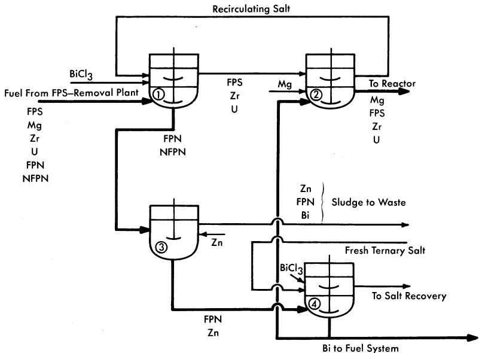  
FIG. 22-10. Flowsheet for the removal of FPN fission products from an LMFR fuel.

the FPS, Zr, and U in the salt back into the metal and still leave about 300 ppm Mg in the Bi as it is returned to the reactor. In vessel 2, the Fe and Cr concentrations in the Bi should be brought back up to those in the incoming fuel.

A portion of the stripped Bi from vessel 4 may be sent directly to a holdup tank and used for fuel-adjustment purposes. Similarly, a concentrated solution of U in Bi may be made in vessel 2, also for fuel adjustment purposes.

Vessel 2 can be eliminated and its function taken over by vessel 1. The two vessels were included in Fig. 22-10 for convenience in explaining the process. All vessels are similar in design and equal in size. To handle 275 gal (one month's accumulation) of metal, they should have a total volume of about 350 gal. The operations in vessels 1 and 2 should be conducted in $\mathrm{O}_2$ -free atmospheres, but this condition is not necessary for the operations carried out in vessels 3 and 4.

Molybdenum removal. Mo is really a special member of the NFPN group. Its solubility at $375^{\circ}\mathrm{C}$ , probably the coldest fuel temperature, is estimated to be less than 1 ppm. Moreover, it is produced at a rate equivalent to 0.38 ppm/day. Thus, probably the most feasible way to remove Mo would be to precipitate it out of solution onto cold fingers immersed in the circulating fuel. The precipitation rate for a 500-Mw reactor would be 54 g/day, most of which would be stable Mo. Even with cold traps, some Mo will

very likely precipitate throughout the fuel system where it is generated. Information on this will be obtained in the LMFR Experiment No. 1.

Polonium removal. The behavior of Po in the FPS and FPN removal processes described above is not clear. Chemically, it is more noble than Bi and should not form an intermetallic compound with Zn, indicating that it should always remain with the Bi. In preliminary equilibration experiments with chloride salt mixtures, it was found that about $1\%$ of the Po transferred to the salt, but whether this was due to chemical oxidation or volatilization is not presently known.

Heat generation rates. The maximum rate of heat removal from the charge in vessel 1 is estimated to be about $290\mathrm{kw}$ (250 from the fission products and 40 from the Po) and from vessel 3 about $240\mathrm{kw}$ (200 from the fission products and 40 from the Po). These values can be greatly reduced by allowing the 275 gal of fuel to "cool off" for several days before processing. The rate of heat removal can be kept sufficiently low so that cooling the vessels does not present too much of a problem.

The worst heat-removal problem arises when the NFPN's are concentrated in the Zn,Bi-NFPN sludge; but the generated heat can be removed satisfactorily by leaving the intermetallic sludge in contact with some molten Bi in the "extraction" vessel for a short while until it can be skimmed off and sent to waste without danger of excessive heating.

22-5.4 FPN removal process for the fluoride volatility process. The flowsheet for this proposed process is given in Fig. 24-20. The feed stream for the FPN fission product removal plant is taken from the fluoride volatility plant after the bismuth is free of all the uranium and FPS. This bismuth stream now contains only FPN. In a batch vessel, it is brought in contact with a small amount of zinc (approximately $0.5\mathrm{w / o}$ ). As the contents are cooled, the zinc forms intermetallics with the FPN and NFPN elements, as described previously. This zinc dross floats to the top, is skimmed off and sent to the zinc waste. From the bottom of the vessel, the bismuth stream containing some zinc is sent to a zinc crystallizer, where the temperature is further decreased. Some of the zinc crystallizes and is removed from the top for recycle back to the first vessel. It is proposed to remove the remaining zinc by a distillation operation shown on the flowsheet as Still. The bismuth from the Still is ready for return to the volatility plant for the addition of uranium, magnesium, and zirconium.

The entire FPN plant would be operated batchwise. The quantity of material handled would probably be about the same as for the previous process, about 275 gal. The heating problem for this process also would be about the same as for the process described previously.

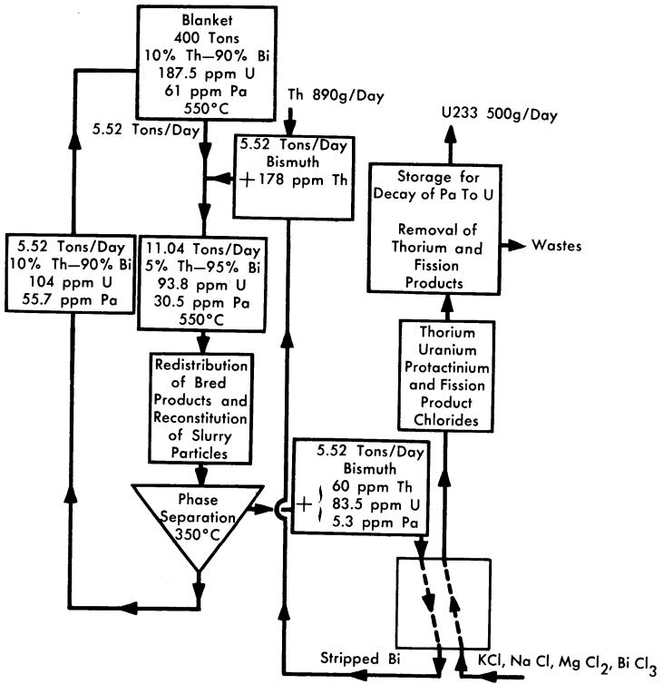  
FIG. 22-11. Flow diagram for processing a $10\mathrm{w / o}$ Th-Bi breeder-blanket slurry to remove $\mathbf{Pa}^{233}$ and $\mathbf{U}^{233}$ .

# 22-6. BLANKET CHEMICAL PROCESSING

As is pointed out in Chapter 20, the easiest blanket to handle in the LMFR would be a $10\mathrm{w / o}$ thorium-bismuthide slurry in bismuth. Chemical processing of this blanket would be very similar to the core processes already described. The major problem consists in transferring the bred uranium and protactinium from the solid thorium bismuthide to the liquid bismuth phase, so that they can then be chemically processed. Two examples of proposed processes are shown in Fig. 22-11, which shows a process that can be used with the fused chloride salt FPS removal process, and in Fig. 24-19, which shows a flowsheet for a process to be used with the fluoride volatility process.

In the process of Fig. 22-11, a typical two-fluid 500-Mw LMFR would have a blanket of about 400 tons of material containing approximately $10\%$ Th and $90\%$ Bi. The material balance shows that 5.52 tons/day would be withdrawn and processed. In the first step, an additional 5.52 tons/day of bismuth containing fresh thorium is added to the stream,

primarily to dilute the thorium bismuthide to half its first value. This slurry is then raised in temperature until a complete solution is obtained. When this is done, all the uranium and protactinium as well as fission products dissolve in bismuth. In the next step, the thorium bismuthide is reconstituted by cooling methods such as described in Chapter 20. The U, Pa, and fission products will remain in solution in the bismuth. Then a phase separation at $350^{\circ}\mathrm{C}$ can be carried out. This gives a recycle stream of 5.52 tons/day containing $10\%$ Th going back to the blanket and 5.52 tons/day of Bi with about $95\%$ of the original U and Pa dissolved in it.

This stream then goes to column 1 of the fused chloride salt FPS removal system, where all the Th, U, Pa, and FPS are transferred to the ternary chloride salt. Meanwhile, the stripped Bi is returned to dilute more blanket thorium bismuthide.

In the last step, the Pa is allowed to decay to U for about 130 days. At the end of this time, practically all (99.5%) of the Pa would be converted to U, and the U would be separated from the Th and FPS by the methods previously described. As shown on the flowsheet, this would result in the production of approximately $500\mathrm{g/day}$ of $\mathrm{U}^{233}$ for charging into the core fluid.

The flowsheet for the bismuthide slurry head-processing shown in Fig. 24-19 shows a similar technique for handling the transfer of U and Pa from the intermetallic solid to the liquid bismuth.

As yet neither of these processes has been tried in the laboratory. As work progresses on the bismuthide blanket system, further work on the chemical processing will be carried out.

# 22-7. ECONOMICS OF CHEMICAL PROCESSING

Basically, in evaluating the economics of chemical processing, the cost of neutrons in the form of uranium fuel wasted to fission-product poisoning must be balanced against the cost of operating the chemical processing units for removal of the fission-product poisons. In the over-all operation of an LMFR reactor and its auxiliary chemical processing plant, the attainment of the highest breeding ratio will not necessarily give the lowest cost power. When the price of fuel is fixed as it is now by the U.S. Government, or by general market conditions, then the cost of the chemical processing becomes the variable which must be operated upon in order to justify a high breeding ratio.

As is shown in Chapter 24, the chemical processes now available and under development are so expensive relative to the cost of fuel that optimization of the reactor conditions for a two-region reactor indicates a most economic breeding ratio of about 0.86, and for a single region reactor about 0.75. These figures can be increased toward one or better by de

creasing the cost of chemical processing. However, it must be kept in mind that the fission products are not the only neutron poisons present in the LMFR. Such other neutron poisons as the bismuth, the structural materials, and the higher uranium isotopes will be present even though the fission and corrosion products levels are kept to zero percent.

# REFERENCES

1. BABCOCK & WILCOX Co., Liquid Metal Fuel Reactor; Technical Feasibility Report, USAEC Report BAW-2(Del.), June 30, 1955.   
2. O. E. DWYER, A.I.Ch.E. Journal 2, 163-168 (June 1956).   
3. J. B. SAMPSON et al., Poisoning in Thermal Reactors Due to Stable Fission Products, USAEC Report KAPL-1226, Knolls Atomic Power Laboratory, Oct. 4. 1954.   
4. C. J. RASEMAN et al., Continuous Removal of Fission Products from Liquid Metal Fuel, Chem. Eng. Progr. 53(2), 86-F (1957).   
5. R. W. REBHOZ et al., Chemical Reprocessing Studies for the Liquid Metal Fuel Reactor Experiment, USAEC Report UCN-42, Union Carbide Nuclear Co., June 28, 1957.   
6. D. W. BAREIS, A Continuous Fission Product Separation Process. I. Removal of the Rare Earths (Lanthanum, Cerium, Praseodymium, and Neodymium) from a Typical Liquid Bismuth—Uranium Reactor Fuel by Contact with Fused LiCl-KCl Mixture, USAEC Report BNL-125, Brookhaven National Laboratory, 1951.   
7. R. H. WISWALL, JR., The Distribution of Elements in Salt-Metal Systems with Special Reference to the Data of D. W. Bareis, USAEC Report BNL-201, Brookhaven National Laboratory, Sept. 30, 1952.   
8. D. W. BAREIS et al., Fused Salts for Removing Fission Products from U-Bi Fuels, *Nucleonics* 12(7), 16-19 (1954).   
9. D. CUBICCIOTTI, An Explanation of the Effect of Added Metals on the Distribution of Rare Earths between Liquid Bismuth and KCl-LiCl, USAEC Report NAA-SR-202, North American Aviation, Inc., 1953.   
10. A. GLASSNER, The Thermochemical Properties of the Oxides, Fluorides, and Chlorides to $2500^{\circ}\mathrm{K}$ , USAEC Report ANL-5750, Argonne National Laboratory, 1957.   
11. O. KUBASCHEWSKI and E. EVANS, Metallurgical Thermochemistry. New York: Pergamon Press, 1956. (pp. 42-43)   
12. JAMES J. EGAN and R. H. WISWALL, JR., Applying Thermodynamics to Liquid-Metal-Fuel Reactor Technology, *Nucleonics* 15(7), 104-106 (1957).   
13. D. Neil, personal communication.   
14. W. S. GINELL, paper presented at San Francisco Meeting, American Chemical Society, April 1958.

15. R. H. WISWALL, JR., et al., Recent Advances in the Chemistry of Liquid Metal Fuel Reactors, paper prepared for the Second International Conference on the Peaceful Uses of Atomic Energy, Geneva, 1958.   
16. O. E. Dwyer et al., High Temperature Processing Systems for Liquid Metal Fuels and Breeder Blankets, in Proceedings of the International Conference on the Peaceful Uses of Atomic Energy, Vol. 9. New York: United Nations, 1956. (P/550, pp. 604-612)   
17. D. B. MARSLAND, A Reference Electrode for Fused-Salt Studies, PH.D. thesis, Cornell University, Ithaca, N. Y., 1958.   
18. S. LAWROSKI, Survey of Separations Processes, in Proceedings of the International Conference on the Peaceful Uses of Atomic Energy, Vol. 9. New York: United Nations, 1956. (P/823, pp. 575-582)   
19. D. M. LIDDELL (Ed.), Handbook of Non-ferrous Metallurgy, Vol. II. New York: McGraw-Hill Book Company, Inc., 1945. (p. 201)   
20. O. E. DWYER, A. M. ESHAYA, and F. B. HILL, Removal of Fission Products from Uranium-Bismuth Fuel, paper prepared for the Second International Conference on the Peaceful Uses of Atomic Energy, Geneva, 1958.

# CHAPTER 23

# ENGINEERING DESIGN

# 23-1. REACTOR DESIGN*

The LMFR readily lends itself to a wide variety of designs and arrangements. The concepts proposed to date may be classified according to type as being internally or externally cooled and either compact or open arrangement of cycle. Such classification has been brought about in an attempt to present designs which minimize bismuth and uranium inventories.

If we assume the cost of U235 to be $20/g and that of bismuth to be $2.25/lb, a U-Bi solution of 700 ppm uranium by weight would cost approximately $6000/ft3. This high volume cost makes it very important to design the LMFR with the minimum possible holdup.

In addition to the variety of cycle arrangements, several different coolants are possible. The U-Bi may be used directly to produce steam, or a secondary fluid such as NaK or sodium may be used. The LMFR has also been proposed as the heat source for a closed-cycle, gas-turbine power plant [2].

23-1.1 Externally cooled LMFR. In an externally cooled LMFR the fuel is circulated through the core to an external heat exchanger, where the heat is removed by the secondary fluid. This type provides the simplest core design, requiring simply an assembly of graphite pierced with holes for circulation of liquid-metal fuel. The major problems of heat transfer are essentially removed from the core design.

23-1.2 Internally cooled LMFR. The internally cooled LMFR is designed so that the liquid fuel remains in the reactor core. The core thus acts as a heat exchanger in which the heat is transferred to a secondary fluid flowing through it to an external heat exchanger or steam generator.

The internally cooled design offers a means of substantially reducing the U-Bi inventory of the system, but considerably complicates the design of the core. The core must be designed to accommodate two fluids and sufficient surface for transferring heat from one to the other. The introduction of a secondary fluid in the core requires a greater uranium concentration than in the externally cooled system, which has only U-Bi and graphite in the core. The required concentration cannot be achieved with U-Bi so-

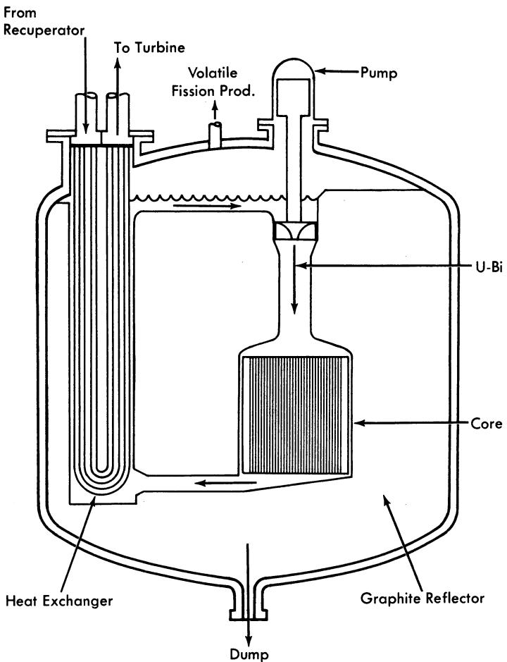  
FIG. 23-1. Externally cooled compact arrangement LMFR for closed-cycle gas turbine.

lutions, since these concentrations approach the solubility limits for the temperatures presently being considered (400 to $550^{\circ}\mathrm{C}$ ).

23-1.3 Compact arrangements. The compact arrangement may best be described as an integral or "pot type" design and may be internally or externally cooled. In such a design [1] the fluid fuel remains in the core except for small amounts which are withdrawn for reprocessing. The breeding fluid acts as a coolant by circulating through blanket and core and thence through heat exchangers which are also contained within the primary reactor vessel.

Figure 23-1 shows a concept of an externally cooled compact reactor

arrangement for a closed-cycle, gas-turbine power plant [2]. In this arrangement the fuel is circulated through the core and heat exchanger, which are contained inside the same vessel. The compact arrangement offers a means of reducing the U-Bi inventory over a particular reactor designed with an open-cycle arrangement. It does, however, increase the problems associated with design of the core, blanket, and reactor vessel. The compacting of all the equipment into a single vessel reduces the flexibility of mechanical design which the open arrangement allows, as well as intensifying the problems of thermal expansion. The reactor vessel not only becomes larger, but the number of openings is also increased, both of which complicate the vessel design. Nevertheless, as operating experience with materials and equipment becomes available, the compact arrangement may provide a means of improving the economics of the LMFR system.

23-1.4 Open arrangements. The open arrangement is the type receiving the most consideration at present because of the flexibility and simplicity of design it affords the system components. Figure 23-2 shows one concept of an externally cooled LMFR using the open-cycle arrangement [3]. In this design both blanket and core fluids are circulated to heat ex-changers located outside the reactor vessel. This type of arrangement also allows greater freedom of design for maintenance of equipment. Means must be provided for removal and/or maintenance of system components under radioactive conditions. The open arrangement makes it easier to provide such facilities. The major disadvantage of this arrangement is the high U-Bi inventory.

The open-cycle arrangement may also be employed in an internally cooled LMFR to reduce fuel inventory, but it introduces those problems peculiar to internally cooled systems.

23-1.5 Containment and safety requirements. The high negative temperature coefficient and low amount of excess reactivity available make the LMFR inherently stable and safe. However, any rupture of the primary system, whether by reactor excursion or otherwise, would release fission products and polonium to the surrounding atmosphere. The primary system must therefore be surrounded with a secondary vessel for containment of radioactivity in case of such a failure. Since all materials in the reactor core have very low vapor pressures, the containment vessel need not be designed to withstand any appreciable pressure. The containment problem in the LMFR is one of containing the high-temperature liquid metal together with fission products, and such containment can be accomplished by lining the reactor and primary circuit cells with a gastight steel membrane. This containment vessel also acts as a catch basin for recovery of U-Bi in case of leaks.

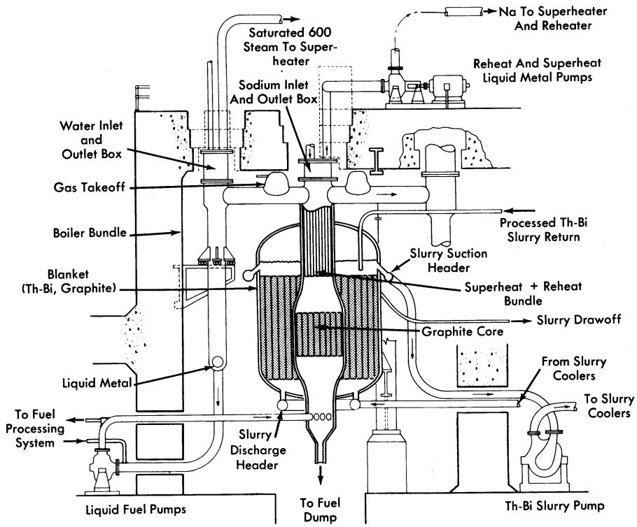  
FIG. 23-2. Externally cooled open-cycle arrangement LMFR.

The arrangement of the containment vessel also depends on the heat-removal design. If an intermediate heat-transfer fluid such as sodium or NaK is used, the containment may be handled as above. If a direct U-Bi to steam cycle is used, a double-wall heat exchanger must be used to maintain double containment, unless the entire building is constructed to act as the second containment barrier.

In the event of a leak in the system, the U-Bi would be drained to a dump tank. This tank would be provided with adequate cooling to remove the decay heat from fission products.

23-1.6 Design methods. The vessels in an LMFR are designed in accordance with the Code for Unfired Pressure Vessels [4]. Vessels would be of welded construction with all seams radiographed and stress-relieved.

The design temperature used can be as high as $1100^{\circ}\mathrm{F}$ . For $2\frac{1}{4}\%$ Cr-1% Mo steel, this gives allowable stresses of 4200 psi for normal operating conditions and 9200 psi for emergency, short-duration conditions. These figures correspond to $1\%$ creep strength for 100,000 hr and 10,000 hr, respectively.

23-1.7 Maintenance and repair provisions. Provisions for maintenance and repair of the LMFR raise several problems. It is anticipated that a substantial level of activity will be induced in the system by the circulating fuel. This means that the system should be designed so that it can be maintained despite the high radiation level. Several approaches, not mutually exclusive, to this problem are being considered:

(1) If maintenance or repair to a component is required, the entire component will be removed from the system and a new one inserted.   
(2) All connections between components will be made in one area, fully biologically shielded from the components themselves. When a component is to be removed, its connections are shielded from adjacent connections by portable shielding if the work is to be done directly rather than remotely. The connections are broken and the shielding is removed above the pipes leading to the component in question. The component is removed with the overhead crane and a new one set in place. The shielding is replaced, and the connections are remade. The connections are accessible and pipes do not overlay each other so as to prevent removal of any disconnected component. Unfortunately, placing all connections in one channel increases the fuel inventory since the piping for this arrangement is somewhat longer than that required for a more conventional arrangement.   
(3) Both mechanical and welded connections are being studied, with a view toward the ease with which connections can be made and broken both directly and remotely.   
(4) Remote methods of performing maintenance tasks (welding and cutting pipe, making and breaking flanged joints and closures) are being studied, since direct maintenance will not be possible in some areas.   
(5) Fluidized powders, shot, and liquids are being studied as possible portable shielding media.

# 23-2. HEAT TRANSFER*

In the open-cycle externally cooled, two-fluid LMFR, the bismuth-uranium solution serves as the primary coolant as well as the fuel. In the reactor itself, there is no actual heat transfer. Instead, the solution acts as a transporter of heat to an external heat exchanger. In evaluating bismuth as a primary coolant, it is helpful to make a comparison between it and three other coolants: sodium, a typical alkali metal coolant; LiCl-KCl eutectic, a typical alkali halide salt mixture; and water. (The salt eutectic used here would not be a suitable primary coolant for a thermal reactor. Its heat transfer properties, however, are typical of salt coolants.)

The ideal primary coolant for a nuclear power reactor should have the following characteristics:

(1) High heat-transfer rates.   
(2) Good gamma absorptivity.   
(3) Low pumping power requirements.   
(4) Low melting point.   
(5) Low vapor pressure.   
(6) Low corrosion rate.   
(7) Low chemical reactivity.   
(8) Low neutron absorption.   
(9) Low induced radioactivity.   
(10) Low cost.

In order to have the above characteristics, the coolant should have the following physical properties in either a high or low amount:

(1) Density (high): affects pumping power requirements, heat-transfer characteristics, and gamma shielding requirements.   
(2) Thermal conductivity (high): affects heat-transfer characteristics.   
(3) Specific heat (high): affects heat-transfer characteristics and coolant flow rate.   
(4) Viscosity (low): affects pumping power requirements and heat-transfer characteristics.   
(5) Melting point (low): affects auxiliary heating requirements.   
(6) Vapor pressure (low): affects mechanical design of reactor and system components.   
(7) Volume change on fusion (low): affects startup and shutdown procedures.   
(8) Coefficient of volumetric expansion (high): affects thermal pumping capacity and, where primary coolant is also the fuel, reactor reactivity.   
(9) Electrical resistivity (low): affects applicability of electromagnetic pumps.

Table 23-1 summarizes the physical properties of bismuth which are relevant to nuclear reactor design and in the temperature range of practical interest from the standpoint of electrical power generation [5,6].

23-2.1 Nuclear aspects of coolants. From the nuclear standpoint, five important characteristics of primary reactor coolants are their capacities for (1) absorbing thermal neutrons, (2) slowing down neutrons to the thermal energy level, (3) absorbing gamma radiation, (4) developing induced radioactivity, and (5) resisting radiation damage.

In Table 23-2 the thermal neutron absorption cross section and neutronslowing-down power of Bi are compared with those of Na and $\mathbf{H}_2\mathbf{O}$ . Bis

TABLE 23-1   
PHYSICAL PROPERTIES OF BISMUTH  

<table><tr><td>Atomic weight</td><td>209</td><td></td><td></td><td></td></tr><tr><td>Melting point</td><td>271.0°C (520°F)</td><td></td><td></td><td></td></tr><tr><td>Boiling point</td><td>1477°C (2691°F)</td><td></td><td></td><td></td></tr><tr><td>Volume change on fusion</td><td>-3.32%</td><td></td><td></td><td></td></tr><tr><td>Temperature, °C</td><td>300</td><td>400</td><td>500</td><td>600</td></tr><tr><td>Temperature, °F</td><td>572</td><td>752</td><td>932</td><td>1112</td></tr><tr><td>Vapor pressure, mm Hg</td><td>10-9(1)</td><td>3.5 × 10-5*</td><td>2.3 × 10-4</td><td>6.3 × 10-4</td></tr><tr><td>Density, g/cm3</td><td>10.03</td><td>9.91</td><td>9.79</td><td>9.66</td></tr><tr><td>Specific heat, cal/(gm)(°C)</td><td>0.0343</td><td>0.0354</td><td>0.0365</td><td>0.0376</td></tr><tr><td>Viscosity, centipoises</td><td>1.66</td><td>1.37</td><td>1.16</td><td>1.00</td></tr><tr><td>Thermal conductivity, Btu/(hr)(ft)(°F)</td><td>9.9</td><td>9.0</td><td>9.0</td><td>9.0</td></tr><tr><td>Electrical resistivity, ohms</td><td>128.9</td><td>134.2</td><td>139.8</td><td>145.2</td></tr><tr><td>U solubility, ppm</td><td>480</td><td>1850</td><td>5100</td><td>13000</td></tr></table>

*Extrapolated results.

muth with a macroscopic cross section of $9.0 \times 10^{-4} \, \text{cm}^{-1}$ at $450^{\circ}\text{C}$ has the lowest neutron absorption characteristic of any practical coolant, with the exception of $\mathrm{D}_2\mathrm{O}$ and certain gases. Its "reactor poisoning" effect is at least an order of magnitude below those of sodium and water. The slowing-down power of $\mathrm{Bi}$ is very low, however, which means that when it is used as the primary coolant in a thermal reactor it contributes very little moderating capacity. The term $\xi N\sigma_s$ in Table 23-2 represents the decrease in the natural logarithm of the neutron energy per centimeter of travel through coolant.

The gamma absorption coefficient, $\mu$ , is defined by the equation

$$
d I = - \mu I d x \tag {23-1}
$$

and has the units of $\mathrm{cm}^{-1}$ . Values of $\mu$ for $450^{\circ}\mathrm{C}$ Bi at several gamma energies are shown in Table 23-3, along with those for Na and $\mathrm{H}_2\mathrm{O}$ . Bismuth, because of its high density, is an excellent absorber of gamma radiation, which means that it provides considerable internal shielding. The values presented in Table 23-3 are estimates based on the theoretical calculations of Davission and Evans [8].

TABLE 23-2   
SOME NUCLEAR PROPERTIES OF VARIOUS REACTOR COOLANTS  

<table><tr><td>Coolant</td><td>Temp., °C</td><td>Thermal neutron cross section [7], σa, barns</td><td>Macroscopic cross section [7], Naσ, cm-1</td><td>Density ρ, g/cm3</td><td>Thermal scattering cross section, σs, barns</td><td>ξ* dimension-less</td><td>Slowing-down power, ξNσs, cm-1</td></tr><tr><td>Bi</td><td>450</td><td>0.032</td><td>0.00090</td><td>9.82</td><td>9</td><td>0.0095</td><td>0.0024</td></tr><tr><td>Na</td><td>450</td><td>0.505</td><td>0.011</td><td>0.841</td><td>4.0</td><td>0.084</td><td>0.0074</td></tr><tr><td>H2O</td><td>250</td><td>—</td><td>0.018</td><td>0.802</td><td>—</td><td>—</td><td>1.23</td></tr></table>

*Average decrease in the natural logarithm of the neutron energy per collision.

TABLE 23-3   
VALUES OF $\mu$ , THE GAMMA ABSORPTION COEFFICIENT, FOR VARIOUS REACTOR COOLANTS AS A FUNCTION OF ENERGY   

<table><tr><td rowspan="2">Coolant</td><td rowspan="2">Temp., °C</td><td colspan="5">Energy, Mev</td></tr><tr><td>0.5</td><td>1.0</td><td>1.5</td><td>2.0</td><td>3.0</td></tr><tr><td>Bi</td><td>450</td><td>1.57</td><td>0.70</td><td>0.52</td><td>0.44</td><td>0.41</td></tr><tr><td>Na</td><td>450</td><td>0.070</td><td>0.051</td><td>0.042</td><td>0.036</td><td>0.029</td></tr><tr><td>H2O</td><td>250</td><td>0.078</td><td>0.057</td><td>0.046</td><td>0.039</td><td>0.032</td></tr></table>

Regarding the tendency for developing induced radioactivity, Bi has a serious disadvantage, owing to the formation of $\mathrm{Po}^{210}$ , a very energetic alpha emitter with a 138.3-day half-life. Its formation and decay can be represented as follows:

$$
\mathrm {B i} ^ {n (1 9 \mathrm {m b})} \longrightarrow \mathrm {B i} ^ {2 1 0} \xrightarrow [ 5 \mathrm {d} ]{- \beta} \mathrm {P o} ^ {2 1 0} \xrightarrow [ 1 3 8. 3 \mathrm {d} ]{\alpha} \mathrm {P b} ^ {2 0 6}.
$$

$\mathrm{Po}^{210}$ is one of the most poisonous materials known, the maximum allowable concentration in air being $7 \times 10^{-11} \mu \mathrm{c/ml}$ or $3.75 \times 10^{-8} \mathrm{ppm}$ . Another troublesome feature of $\mathrm{Po}^{210}$ is its tendency to scatter throughout

any accessible volume, due to recoil from its high-energy alpha emission. Thus, spillage of solutions containing $\mathrm{Po}^{210}$ constitutes a most serious physiological hazard. In the LMFR, however, it is not believed that the presence of $\mathrm{Po}^{210}$ in the fuel stream creates a more serious radioactivity problem than already exists as a result of the fission products.

Sodium is not free of the radioactivity problem either, but as a primary coolant it is not as bad in this respect as Bi. Water is comparatively free of induced radioactivity after short holdup times. For the same flux conditions, Na will give over 20,000 times as much radioactivity, on a roentgen basis, as $\mathbf{H}_2\mathbf{O}$ .

Liquid metals, because of their simple atomic structure, suffer no radiation damage.

23-2.2 Pumping-power requirements. An important criterion for assessing the relative merits of different coolants is the amount of pumping power required for a fixed rate of heat removal in a given application. The three main pressure drops in the primary coolant circuit are those in the reactor, the external heat exchanger, and the interconnecting piping. A comparison of the four different types of coolants will now be made on the basis of their relative pumping-power requirements, with respect to the interconnecting piping and the heat exchangers. The physical properties of the coolants are listed in Table 23-4. The properties of the first three are evaluated at $450^{\circ}\mathrm{C}$ , as a typical average primary coolant temperature for such coolants, and those for water at $250^{\circ}\mathrm{C}$ .

TABLE 23-4   
PHYSICAL PROPERTIES OF SOME TYPICAL REACTOR COOLANTS  

<table><tr><td>Property</td><td>Bi 450°C</td><td>Na 450°C</td><td>KCl-LiCl 450°C</td><td>H2O 250°C</td></tr><tr><td>Melting point, °F</td><td>520</td><td>208</td><td>664</td><td>32</td></tr><tr><td>Boiling point, °F</td><td>2691</td><td>1621</td><td>—</td><td>212</td></tr><tr><td>Density, lb/ft3</td><td>615</td><td>52.5</td><td>103</td><td>50.0</td></tr><tr><td>Specific heat, Btu/(lb)(°F)</td><td>0.036</td><td>0.304</td><td>0.31</td><td>1.16</td></tr><tr><td>Heat capacity, Btu/(ft3)(°F)</td><td>22.1</td><td>15.95</td><td>31.9</td><td>57.8</td></tr><tr><td>Thermal conductivity, Btu/(hr)(ft)(°F)</td><td>8.95</td><td>39.5</td><td>1.47</td><td>0.357</td></tr><tr><td>Viscosity, cp</td><td>1.28</td><td>0.245</td><td>3.4</td><td>0.110</td></tr><tr><td>Prandtl number, Cp μ/k</td><td>0.0125</td><td>0.00454</td><td>1.7</td><td>0.863</td></tr></table>

The pumping power required to circulate the coolant through the piping system per unit rate of heat transport for a fixed temperature rise in the coolant has been shown [9] to be

$$
\phi_ {p} = \frac {\text {p u m p i n g p o w e r}}{\text {h e a t l o a d}} = (\text {a c o n s t a n t}) \frac {\mu^ {0 . 2}}{\rho^ {2} C _ {p} ^ {2 . 8}}. \tag {23-2}
$$

The quantity $\mu^{0.2} / \rho^2 C_p^{2.8}$ , represented here by the symbol $X$ , is an index of the pumping power required to circulate a coolant through a fixed piping system, for a given heat load. Table 23-5 gives relative values of $X$ for the four typical coolants mentioned above. The units and values of the physical properties used in evaluating $X$ are the same as those given in Table 23-4.

TABLE 23-5 RELATIVE VALUES OF $X$ FOR VARIOUS COOLANTS FLOWING THROUGH A FIXED PIPING SYSTEM   

<table><tr><td>Coolant</td><td>Temp., °C</td><td>X × 104</td></tr><tr><td>Bi</td><td>450</td><td>308</td></tr><tr><td>Na</td><td>450</td><td>77</td></tr><tr><td>LiCl-KCl eutectic</td><td>450</td><td>32</td></tr><tr><td>H2O</td><td>250</td><td>1.7</td></tr></table>

The very large spread in pumping-power requirements is striking. Bismuth has about four times the pumping-power requirements of sodium and both have manifold greater requirements than that of water, which has the least of any known liquid. The tremendous superiority of water as a heat-transport medium is due to its low viscosity and very high volumetric heat capacity.

23-2.3 Heat transfer for LMFR. So far as is known, no heat-transfer data have been obtained for liquid bismuth. However, several investigators [10-14] have published experimental heat-transfer results on the bismuth lead eutectic and on mercury. For these results the Lubarski and Koffman equation [15] expresses the results most closely:

$$
\frac {h D}{k} = 0. 6 2 5 \left(D V _ {p} C _ {p} / k\right) ^ {0. 4}. \tag {23-3}
$$

This equation may be used for turbulent flow in round tubes or for turbulent flow outside round tubes.

In obtaining the heat-transfer coefficients for comparison with bismuth, the sodium coefficients were calculated from the Martinelli-Lyon relationship. The coefficients for molten salt and water were calculated from the conventional Dittus-Boelter equation.

Using the above relationships and assuming (1) total fixed heat load, (2) fixed diameter of tubes, (3) fixed inlet and outlet temperatures, (4) average bulk temperature of coolants same as in Table 23-4, and (5) combined heat-transfer resistance of tube wall and second fluid equals 0.001, a typical value for 1-in. ID alloy steel tubes with 0.1 in. wall, the values in Tables 23-6 and 23-7 were calculated. Although the heat-transfer characteristics of bismuth are slightly inferior to those for sodium, it is clear from these two sets of calculations that all four coolants behave similarly.

The heat-transport capability of bismuth are simply related to its volumetric heat capacity. The values of this property are given in Table 23-4. Bismuth is definitely superior to sodium but inferior to the fused salt and water.

To achieve good thermal contact between bismuth and a solid metal surface, the surface must be cleaned to a high polish, the bismuth must be free of oxide and dissolved gases, and the system must be filled under a high vacuum. Gases or oxides on the heat-transfer surface can greatly reduce the heat-transfer coefficient for bismuth. Bismuth has a less stable oxide than the oxides of iron, chromium, and nickel which may be present on the tube surfaces. Hence the bismuth would have a tendency to non-wet the walls.

Good wetting of alloyed steels by bismuth may be achieved by adding small amounts of alkali or alkaline earth metals, by heating to high tem-

TABLE 23-6   
COMPARISON OF COOLANTS IN HEAT-EXCHANGER DESIGN WHEN NUMBER OF TUBES IN PARALLEL IS FIXED   

<table><tr><td>Coolant</td><td>Velocity of flow, ft/sec</td><td>h, Btu/(hr)(ft)2(°F)</td><td>U, Btu/(hr)(ft)2(°F)</td><td>Relative size of heat exchangers</td></tr><tr><td>Bi</td><td>15</td><td>2700</td><td>730</td><td>1.00</td></tr><tr><td>Na</td><td>20.8</td><td>10230</td><td>910</td><td>0.87</td></tr><tr><td>LiCl-KCl eutectic</td><td>10.4</td><td>2400</td><td>706</td><td>1.12</td></tr><tr><td>H2O</td><td>5.73</td><td>2360</td><td>703</td><td>1.12</td></tr></table>

peratures (above $1200^{\circ}\mathrm{F}$ ), or by both. For good heat transfer with bismuth extreme care must be taken to ensure oxide- and gas-free systems.

23-2.4 Heat-exchanger design. In a commercial liquid-metal fuel system, the primary bismuth coolant would probably exchange heat with a secondary metal coolant before generating steam. Typical conditions for a 5-Mw countercurrent bismuth-sodium heat exchanger are given in Table 23-8.

# 23-3. COMPONENT DESIGN*

This section discusses the design and development experience obtained on components required in LMFR systems. Besides the requirements for these systems, considerable component development is needed in the research and development program for experimental apparatus. Both kinds of components are treated here in detail and by case histories.

23-3.1 Pumps. In the case of liquid-metal pumps, which can be classified as mechanical or electromagnetic, a good deal of preliminary development work has been done by the Fairchild Engine and Airplane Corporation Nuclear Energy for Propulsion of Aircraft Division (NEPA), the Allis-Chalmers Co., the Babcock & Wilcox Co., and the Government Laboratories, KAPL, ORNL and ANL [19].

TABLE 23-7   
COMPARISON OF COOLANTS IN HEAT-EXCHANGER DESIGN AT FIXED LINEAR VELOCITY OF 15 FT/SEC   

<table><tr><td>Coolant</td><td>Relative number of tubes in parallel</td><td>Temp., °C</td><td>h, Btu/(hr)(ft)2(°F)</td><td>U, Btu/(hr)(ft)2(°F)</td><td>Relative size of heat exchangers</td></tr><tr><td>Bi</td><td>n</td><td>450</td><td>2770</td><td>730</td><td>1.00</td></tr><tr><td>Na</td><td>1.38n</td><td>450</td><td>8810</td><td>897</td><td>0.88</td></tr><tr><td>LiCl-KCl eutectic</td><td>0.69n</td><td>450</td><td>3200</td><td>762</td><td>1.03</td></tr><tr><td>H2O</td><td>0.42n</td><td>250</td><td>5150</td><td>837</td><td>0.94</td></tr></table>

TABLE 23-8   
TYPICAL CONDITIONS IN A COUNTERCURRENT, BI-NA HEAT EXCHANGER   

<table><tr><td>Tube material</td><td>Low Cr-Steel</td></tr><tr><td>Thermal conductivity of tube, Btu/(hr)(ft)(°F)</td><td>15.8</td></tr><tr><td>Tube inside diameter, in.</td><td>0.70</td></tr><tr><td>Tube thickness, in.</td><td>0.100</td></tr><tr><td>Tube spacing (triangular), in.</td><td>0.250</td></tr><tr><td>Bi temperature (bulk), °F</td><td>850</td></tr><tr><td>Bi velocity (outside tubes), ft/sec</td><td>15.0</td></tr><tr><td>Bi heat transfer coefficient, Btu/(hr)(ft)2(°F)</td><td>3,390</td></tr><tr><td>Na temperature (bulk), °F</td><td>750</td></tr><tr><td>Na velocity (inside tubes), ft/sec</td><td>25.5</td></tr><tr><td>Na heat transfer coefficient, Btu/(hr)(ft)2(°F)</td><td>12,300</td></tr><tr><td>Over-all heat transfer coefficient, Btu/(hr)(ft)2(°F)</td><td>1,015</td></tr><tr><td>Fraction of resistance offered by tube wall</td><td>0.60</td></tr><tr><td>Heat flux (outside tube surface), Btu/(hr)(ft)2</td><td>101,500</td></tr><tr><td>Power density, Btu/(hr)(ft)3</td><td>510,000</td></tr><tr><td>Bi, ft3/mw heat</td><td>0.56</td></tr><tr><td>Na inventory, ft3/mw heat</td><td>0.45</td></tr></table>

Electromagnetic pumps. In the early days of the LMFR project, a magnetic pump for Bi was described by B. Feld and L. Szilard [20,21]. The Fuel Processing Group of Brookhaven National Laboratory required pilot-plant pumps that would circulate uranium-bismuth fuel with absolutely no leakage. The U-Bi fuel was eventually to be circulated through an experimental hole in the Brookhaven reactor where fission products and polonium would be generated. Since a small flow rate of approximately 1 gpm was desired and efficiency was of little concern, it was decided to use an electromagnetic pump.

An experimental loop [22] was set up to circulate nonradioactive U-Bi by means of a General Electric Model G-3 AC (Faraday) electromagnetic pump. This loop ran continuously for 2400 hr. During the first 160 hr the rig was operated isothermally at a temperature of $645^{\circ}\mathrm{F}$ ; during the remainder of the time, the loop was run isothermally at $840^{\circ}\mathrm{F}$ . The U-Bi solution was circulated for most of this period at a rate of 1 gpm. There was no sign of plugging or flow restriction.

The General Electric G-3 AC pump was calibrated (Figs. 23-3 and 23-4) in another AISI type-347 stainless steel liquid bismuth loop at $930^{\circ}\mathrm{F}$ [22]. It was operated continuously for over 13,000 hr.

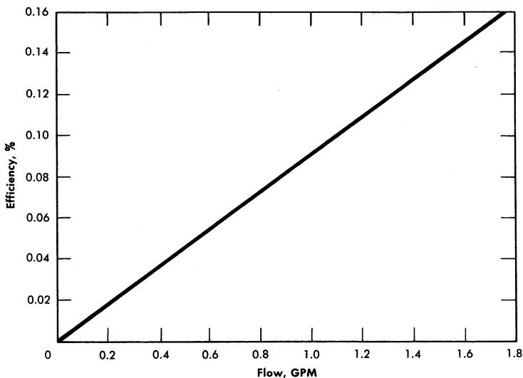  
FIG. 23-3. AC electromagnetic pump efficiency. Molten bismuth in AISI type-347 stainless steel cell. (Manufactured by General Electric Co.)

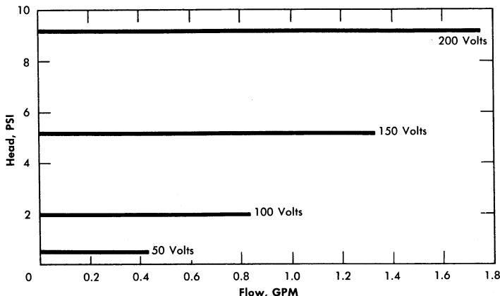  
FIG. 23-4. AC electromagnetic pump characteristics. Molten bismuth in AISI type-347 stainless steel cell. (Manufactured by General Electric Co.)

The same pump was used to circulate bismuth at $930^{\circ}\mathrm{F}$ in a $2\frac{1}{4}\%$ $\mathrm{Cr - 1\%}$ Mo steel loop. The efficiency and characteristic curves were somewhat lower than those obtained in a stainless steel loop. This is probably due to short-circuiting of magnetic flux in the ferritic steel walls.

A theoretical study [23] was prepared by the Atomic Energy Research Establishment at Harwell, England, for linear-induction pumping of bismuth. The report indicates the feasibility of using this type of pump. Linear-induction pumps have been built and successfully used at Ames

Laboratory to circulate Mg-Th eutectic (37 w/o Th) and Bi-U alloy (5 w/o U) in an Inconel-enclosed tantalum loop [24,25]. The pump operated successfully in the Mg-Th system for 2000 hr at $1470^{\circ}\mathrm{F}$ with a temperature differential of $250^{\circ}\mathrm{F}$ , and in Bi-U for 5250 hours at $1740^{\circ}\mathrm{F}$ with a temperature differential of $210^{\circ}\mathrm{F}$ . For calibration, about 1 gpm of Bi-U was pumped at $750^{\circ}\mathrm{F}$ against a head of 0.5 in., with an efficiency of $0.16\%$ .

Mechanical pumps. Most pump development work has been aimed at pumping sodium or sodium-potassium alloys. The most serious problem relative to the design of a mechanical liquid-metal pump appears to be that of suitable bearings and seals.

Bismuth was pumped by NEPA in 1950 [26]. The system was operated for $37\mathrm{hr}$ , the maximum flow rate measured was $2\mathrm{gpm}$ , the maximum head developed was $66\mathrm{psi}$ , and the maximum bismuth temperature reached was $1765^{\circ}\mathrm{F}$ . The pump was a modified Browne and Sharpe No. 206, machine-tool-coolant pump.

In another experiment [27] NEPA circulated bismuth with a 50-gpm centrifugal pump for $100\mathrm{hr}$ at a mean temperature of $1500^{\circ}\mathrm{F}$ with a temperature differential of $500^{\circ}\mathrm{F}$ . An accumulation in the sump of a residue high in oxide content and dissolved elements reduced the flow and forced suspension of operation. This residue probably resulted from an impure inert atmosphere above the liquid metal. The container material selected was AISI type-347 stainless steel which had shown some promise in bismuth solubility tests at temperatures up to $1800^{\circ}\mathrm{F}$ .

The California Research and Development Corporation made a survey of the various types of pumps that might be used for liquid bismuth and came to the conclusion that a centrifugal pump would best fit the need. A test unit was built that operated for 1037 hr, and a report [28] stated that the centrifugal pump proved to be a very satisfactory means for circulating bismuth in an isothermal system at 700 to $750^{\circ}\mathrm{F}$ . This pump and its driver are on a common shaft, the shaft being top-suspended with all bearings in the motor chamber. Space was provided for a labyrinth to separate the pump chamber from the motor chamber, although no seal was used during operation. This pump has also been used to circulate mercury in a test loop at BNL. It has been run successfully for an accumulated time of over 4000 hr.

Brookhaven has developed a totally canned overhung-impeller centrifugal pump. Figure 23-5 shows the major design features of this pump. These units pump 5 to $25\mathrm{gpm}$ Bi against heads up to 30 ft while operating at $525^{\circ}\mathrm{C}$ . These sump-type pumps run with no bearings in the liquid metal and have proved reliable so long as sufficient internal baffling is included to stop surface splashing.

There are several centrifugal pumps that have been used to circulate

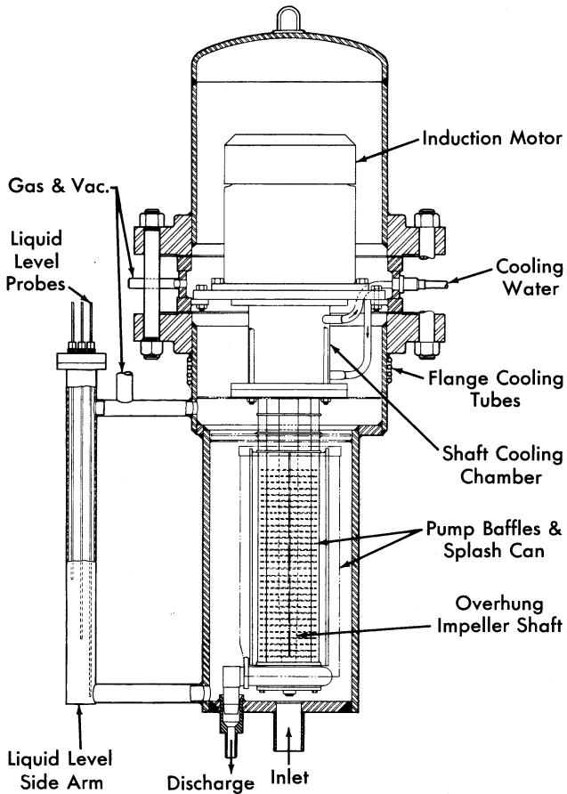  
FIG. 23-5. Canned-motor centrifugal pump developed at Brookhaven.

lead-bismuth eutectic [29,30]. They are all vertically mounted sump pumps with overhung shafts and impellers. All would require a can around the motor and shaft for a hermetic seal.

The University of California has used a double-volute pump which is rated at $30\mathrm{gpm}$ and a 40-ft head at $1000^{\circ}\mathrm{F}.$ * The lower bearing is 2 ft above the liquid metal. The pump utilizes a packing gland (Johns-Manville Super Seal No. 6) adjusted to allow helium at 2 psig to leak out of the system at a rate of about $10\mathrm{ft}^3/\mathrm{hr}$ .

The pump used at North American Aviation, Inc. [30] is made of cast steel. The lower bearing is cooled with a water jacket and a graphite seal

minimizes gas leakage from the casing. A flow of 0.82 gpm at 400-rpm shaft speed and a temperature of $700^{\circ}\mathrm{F}$ was maintained until oxide dross forced shutdown of the pump after 496 hr.

A completely canned, modified Series T-34 MD Duval stainless steel pump was used at the University of California to circulate mercury [31]. The packing gland was replaced with a bushing and any metal leakage was drained to a reservoir. The pump was driven by a 5-hp, 3-phase induction motor at a shaft speed of $1200\mathrm{rpm}$ .

North American Aviation, Inc. has circulated tin with a graphite pump at 2 gpm against a head of 22.5 psi at $1830^{\circ}\mathrm{F}$ [32]. The pump has a 4-in.-diameter impeller and is driven by a variable speed (20 to 2000 rpm) dc compound-wound motor mounted outside the gastight enclosure to avoid the high temperatures. A rotating Graphitar bushing on hardened steel provides the gas seal. The spindle bearings are in a cooled housing. The pump was operated for 500 hr in one run; this was followed by additional runs. To overcome differential thermal expansion, a molybdenum adapter joins the graphite shaft to the stainless steel spindle.

A miniature canned centrifugal pump to circulate bismuth, ideally suited for in-pile work, has been developed by the Atomic Energy Research Establishment at Harwell, England. The over-all pump dimensions are $3\frac{3}{4}$ -in.-diameter by $24\frac{1}{8}$ in. long, with a 2-in.-diameter impeller. The bismuth flow is $1.5\mathrm{gpm}$ with a head of 9 ft. The motor rating is $0.75\mathrm{hp}$ and $2800\mathrm{rpm}$ . Two gas-lubricated bearings are utilized. The material of construction is $2\frac{1}{4}\mathrm{Cr - 1Mo}$ steel.

The Allis-Chalmers Manufacturing Co. has built a canned rotor centrifugal pump with fluid piston-type bearings to pump bismuth at $1050^{\circ}\mathrm{F}$ . The pump is rated at 10 gpm and a head of 25 ft, with an efficiency of $10\%$ . Those parts of the pump in contact with the bismuth are made from AISI type-410 steel. The pump was used in loop G at BNL to pump bismuth at $1020^{\circ}\mathrm{F}$ with a temperature differential of $300^{\circ}\mathrm{F}$ . After 15.5 hr the pump failed, due to scoring of the bearings and seizure of the can by the rotor.

23-3.2 Valves. The standard-stem packed gate valves used in early NEPA bismuth tests [26] proved that special valves would be required for successful liquid-bismuth operation. High leakage rates through the packing caused maintenance difficulties throughout the tests.

A $1\frac{1}{2}$ -in. Fulton-Sylphon bellows-type stainless steel valve was cycled 1000 times at the rate of 77 times/min against bismuth at a temperature of $1000^{\circ}\mathrm{F}$ and a pressure of 25 psig. No failure of the bellows or other valve parts occurred. NEPA also checked valves for metal-to-metal self-welding effects [33]. Tests of valve operation reached $1500^{\circ}\mathrm{F}$ with liquid bismuth on Standard Stellar-faced poppets and seats without indication of self-welding effects.

The two types of valves which have seen extensive service up to $1050^{\circ}\mathrm{F}$ in liquid-metal fuel systems are standard Y pattern globe valves and needle valves. Due to the stringent requirements of zero gas leakage (into or out of the metal systems), the only acceptable stem seal has been a steel bellows. Packings are unacceptable.

Brookhaven National Laboratory has used both types of valves extensively [22,34]. The 1/2-in. IPS 150-lb Y pattern globe valves constructed from AISI type-347 stainless steel for all parts in contact with bismuth (including bellows, stem, and disk) have been used continuously for over 8000 hr at $930^{\circ}\mathrm{F}$ without mishap. Similar valves with mild carbon steel disks (instead of type-347 stainless steel) have been used at $930^{\circ}\mathrm{F}$ for over 13,000 hr without failure or extensive corrosion.

A high-velocity loop operating with bismuth at $1020^{\circ}\mathrm{F}$ at BNL uses 1-in. IPS 150-lb Y pattern globe valves made from $2\frac{1}{4}\%$ Cr-1% Mo steel, AISI type-430 steel bellows and disk, and AISI type-416 steel stem.

Needle valves (1/8-in. IPS AISI type-347 stainless steel construction, including the bellows) have been in use for intermittent service (i.e., drain valves).

As an additional safety measure, 1/2-in. IPS globe valves used in an in-pile loop at Brookhaven National Laboratory have utilized two sets of bellows [34]. The space between the two bellows was pressurized with inert gas which was continually monitored to detect pressure changes (thus indicating a valve leak). None was detected.

The valve drives have been modified to facilitate remote operation. The globe valve handwheels are replaced by gears and these are, in turn, connected to extension rods projecting through the enclosures. Extension rods are welded directly to the needle valve bellows. Universal joints and right-angle gear drives are used for changes in direction between valve and operator. When relatively gastight enclosures are desired, as in in-pile loops, the extension rods project through rubber-gasketed compression seals.

Oak Ridge National Laboratory has reported on the use of special high-temperature packing [35] for valve stems. This packing consists of successive layers of Inconel braid, graphite, nickel powder, and another layer of Inconel braid.

It has been shown at practically all AEC installations that two sections of a circulation system can be isolated from each other by freezing a short section of connecting pipe. This plug can be remelted and flow resumed after a short wait. This type of seal is undesirable for uranium-bismuth solutions, however, since the uranium will deposit at the cold surface.

23-3.3 Piping. Layout features. The most important considerations in designing piping for a liquid-metal fuel system are the considerable thermal

expansion of the pipe when heated from room temperature to operating temperature, and the expansion of bismuth upon freezing $(3\%)$ . The former condition prescribes the type of supports required, while the latter determines the methods and techniques for freezing the metal.

In general, it is desirable to hang pipe from overhead supports, preferably spring-loaded hangers with straps around the pipe insulation. Heavy vessels may be anchored to hangers by brackets welded to the wall. Care should be taken to see that these brackets do not act as a large heat sink. If the system is supported from below, heavy vessels should "float" by locating them on freely moving bearing raceways.

Freezing the liquid metal in the system, especially in components with bellows, should be avoided. However, in case of emergency, the metal should be frozen towards the free surface. For this reason, a system should always contain a surge (or expansion) tank, located at the highest elevation.

The use of an integral fill tank, located at the lowest point in the system to permit charging the loop with metal through a pipe "dip leg" completely immersed in the metal, is recommended. The application of gas pressure on the fill tank will transfer the metal slowly into the loop. By charging the metal from the bottom, into a previously evacuated system, gas entrainment will be minimized. A sintered metallic filter should be used to remove oxide and other scum from the metal while filling the loop. This filter should always be located outside the fill tank, since this will facilitate removal of the filter when it becomes clogged and will prevent cracking of the pores if the contents of the fill tank freeze.

The loop may be drained into a vessel which can be either the fill tank or a separate drain tank. Piping lines should be sloped to facilitate drainage; undrainable pockets should be provided with separate drain lines or, if possible, eliminated. A typical liquid-bismuth loop layout is shown in Fig. 23-6.

Bellows. Several types of metal bellows have been used at Brookhaven National Laboratory in bismuth systems at $930^{\circ}\mathrm{F}$ . AISI type-347 stainless steel welded bellows have been used continuously in 1/2-in. IPS globe valves for periods as long as 13,000 hr. The bellows have not, however, been extensively cycled in bismuth. Their dimensions are $2\frac{1}{2}$ in. OD by 1-in. ID by 0.018-in. thick and contain 32 convolutions. Two AISI type-410 steel welded bellows have been bench cycled 32,000 and 120,000 times, respectively, in bismuth at $1020^{\circ}\mathrm{F}$ and should, therefore, be satisfactory. They are used in pressure transmitters, and are $1\frac{1}{4}$ in. OD by 3/8-in. ID by 0.009-in. thick and contain 22 convolutions. At this time, one AISI type-430 steel hydraulically formed bellows, used in 1/2-in. IPS globe valves, has been bench-cycled with helium over 200,000 times at $1020^{\circ}\mathrm{F}$ without failure. Its dimensions are $1\frac{3}{8}$ in. OD by 7/8-in. ID by 0.008-in. thick (two-ply).

Bellows tests at Argonne National Laboratory [36] have yielded the following data:

(1) Failures have generally occurred at a weld; therefore bellows with the least number of welds are favored. However, mechanically formed bellows should be examined for cracks and other flaws that may be introduced in the forming.   
(2) There was no evidence that corrosion played a part in the failure of any bellows.   
(3) One predominant factor determining bellows life is the relative amount of travel.   
(4) Other factors affecting bellows life are temperature and the relative distribution between compression and extension. It was found that the outer bellows failed before the inner bellows which operated at a higher temperature.   
(5) Some bellows designs had not failed up to $10^{6}$ cycles, at which point the test was stopped.

Joints. Metal systems. In general, in these metal systems, all joints should be welded for tightness and structural soundness. All weld joints are made by standard inert-arc procedures. Complete procedure specifications have been prepared by BNL for inert-arc welding of AISI type-347 stainless steel pipe, fittings, and vessels for use with liquid metals. This procedure was developed through the cooperation of the Metallurgy Division of Oak Ridge National Laboratory. Specifications have, likewise, been prepared at BNL for welding $2\frac{1}{4}\%$ Cr-1% Mo steel. AISI type-502 steel welding rods are used in welding $2\frac{1}{4}\%$ Cr-1% Mo steel pipe. A procedure for welding 0.030-in.-thick tantalum tubing, as well as AISI type-316 stainless steel to tantalum, has been prepared at Ames Laboratory [24,25].

Experimental and operating procedures, however, often make it advantageous to have removable joints. These have been successfully used at a number of installations. An oval cross-sectional ring for a flanged joint was used by NEPA [37] in a bismuth system between 520 and $660^{\circ}\mathrm{F}$ at 300 psig, and by the California Research and Development Corporation [28] on $1\frac{1}{2}$ -in. piping containing bismuth at 700 to $750^{\circ}\mathrm{F}$ .

Standard metallic ring-joint flanged connections have also been satisfactorily used at the University of California and Brookhaven National Laboratory [22,29]. The rings were of soft iron (in lead-bismuth systems) and AISI type-347 stainless steel (in bismuth systems). At a temperature of $930^{\circ}\mathrm{F}$ , the AISI type-347 stainless steel joint has been found to be helium leaktight to a mass spectrometer.

The ability of liquid metals and liquid salts to leak through extremely small openings has made the use of helium mass-spectrometer leak testers a specified test step. Halogen leak testers should never be used because of the absorbed halogen which remains in the surfaces after the tests.

Graphite system. Several graphite loops have been operated with bismuth at a maximum temperature of $2550^{\circ}\mathrm{F}$ [38] and with tin at temperatures up to $2730^{\circ}\mathrm{F}$ [32]. Spherical joints held together with steel flanges and bolts, or tapered joints threaded for assembly under tension, have been the best. In addition, the joints may be fused to reduce leakage by coating furfural on one face and hydrochloric acid on the other. However, even with all these precautions, the systems were not absolutely tight to bismuth or tin.

Sight ports. Sight ports have been used to facilitate viewing the liquid metal inside a closed system at the University of California [29] and at Brookhaven National Laboratory. A satisfactory port consists of a glass plate at the end of a steel bellows welded to the pipe. A normally closed butterfly valve isolates the glass from lead or bismuth vapors. The valve is moved by an externally mounted magnet or a handle projecting through a Teflon-packed gland.

23-3.4 Heating equipment. Flexible Nichrome heater wire consisting of a Nichrome inner wire, asbestos and glass insulation, and a flexible stainless steel protective braid, is extremely useful for maintaining systems at temperatures up to $1100^{\circ}\mathrm{F}$ for periods of time in excess of 10,000 hr [22]. Figure 23-6 shows the application of this type of heater in loop work. Strip and tubular heaters have been in in-pile service for over 8000 hr [34]. A resistance heater has also been used as an internal heater submerged in a lead-bismuth eutectic system [29].

Induction heating has been used on bismuth with good results [27]. A heating transformer in which the metal stream is the secondary circuit has been used at Ames Laboratory in magnesium-thorium and uranium-bismuth systems at temperatures up to $1740^{\circ}\mathrm{F}$ for periods of up to 5000 hr [24].

The use of graphite as a resistance heater in graphite loops has been successful at temperatures up to $2700^{\circ}\mathrm{F}$ for short times (about 500 hr) [32,38].

23-3.5 Insulation. Samples of 26 insulating materials were tested for possible reaction with molten bismuth [51]. In general, results indicated that little or no reaction occurred when molten bismuth at $1832^{\circ}\mathrm{F}$ came into contact with the unheated materials, but that none of the materials would withstand contact with the bismuth for more than a few hours when both were at $1832^{\circ}\mathrm{F}$ .

At BNL, Johns-Manville Co. Superex preformed pipe insulation and Carborundum Co. Fiberfrax bulk insulation have been used extensively.

23-3.6 System preparation. Cleaning of equipment. Owing to the corrosive nature of most bismuth compounds and the necessity for maintain

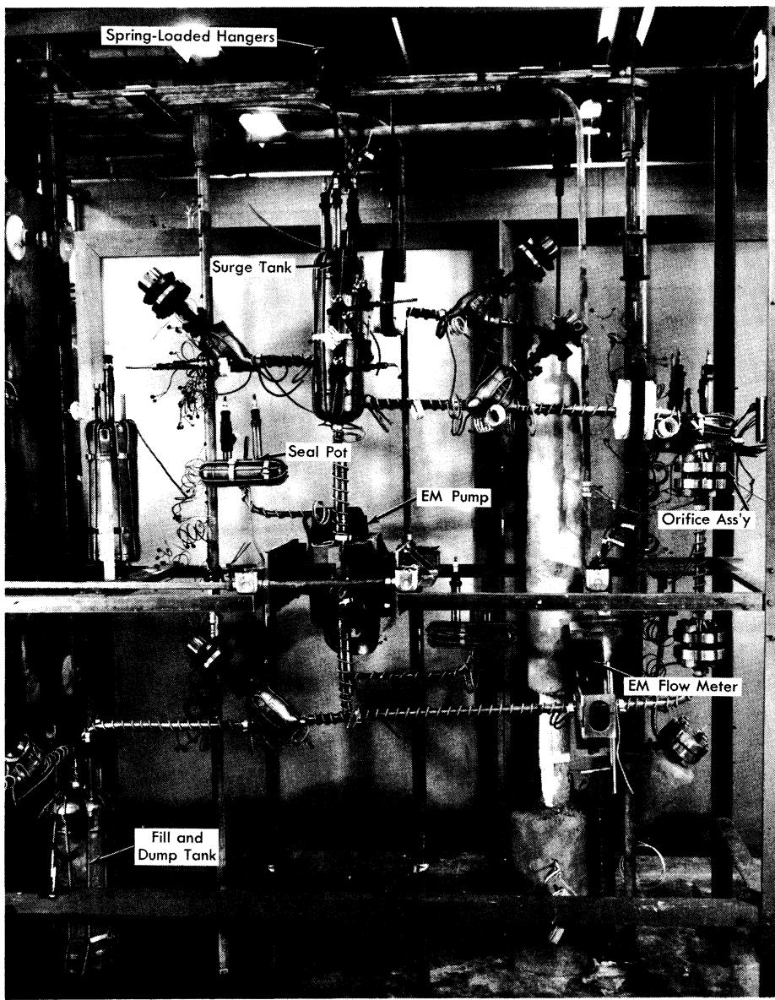  
FIG. 23-6. Typical liquid bismuth loop.

ing definite concentrations of additives in the fuel systems, the type of container employed and the condition of the container-liquid interface is of great importance. The presence of oxygen and other impurities in soluble or insoluble form can accelerate the attack upon the container material. As a result, it is desirable to remove all foreign material from liquid-metal fuel systems before charging. Cleaning techniques for the more important liquid-metal container materials are summarized as follows.

Stainless steels. The committee of stainless steel producers of the American Iron and Steel Institute [40] recommend several techniques, depending upon the type of impurity to be removed. In addition to these methods, BNL has found electropolishing to be useful in removing surface oxides [34]. In all cases, after the use of cleaning solutions the material is rinsed thoroughly with water and dried by allowing a final alcohol or acetone rinse to evaporate.

Low-chrome steels. Several methods have been used for cleaning metals of this type. One method is described [30] for PbBi systems in which boiling detergent solution is used to remove dirt and scale, followed by a distilled water rinse and drying under conditions of heat and vacuum. The same reference describes the following cleaning procedure:

(1) Inhibitor: $10\%$ HCl for 12 hr.   
(2) Neutralization of HCl with $\mathrm{Na}_2\mathrm{CO}_3$   
(3) Water rinse.   
(4) $10\%$ phosphoric acid wash.   
(5) Drying with heat and vacuum.

The following technique has been developed at BNL for use with large vessels:

(1) Degrease with trichlorethylene.   
(2) $3\% \mathrm{HNO}_3 - 17\%$ HCl solution for $30\mathrm{min}$ at room temperature.   
(3) Flush with water.   
(4) Repeat steps (2) and (3).   
(5) Add $20\%$ HCl solution for 5 min at room temperature.   
(6)Rinse with water.   
(7)Rinse with alcohol.   
(8) Dry with inert gas blast.

Leak testing. Liquid-metal fuel systems which involve solutions containing uranium and oxygen-sensitive additives (such as the magnesium used in LMFR systems) require that precautions be taken to prevent air leakage into equipment. In general, a sequence of leak detection is followed in which gross leakage and structural faults are first eliminated by pressure testing. Suspected leaks can be verified by application of soap solution.

The helium mass-spectrometer leak detector has been found to be the most useful as a final test. Systems found leaktight to helium are acceptable for use in uranium-bismuth systems.

Preheating. A procedure for preheating equipment has been used at BNL and elsewhere [34,41] in which the equipment is first evacuated to less than 100 microns pressure and then heated, at a rate slow enough to prevent pressure surges above 100 microns, to operating temperature. This procedure has the advantage of removing condensables from the container walls before they can react with the wall at elevated temperatures.

With the equipment at or above operating temperature, purified hydrogen may be introduced to reduce any surface oxide that might be present. This step is frequently done with the liquid metal present in the charging vessel in order to reduce oxides present in the charge.

Charging procedures. The procedures described here are specific for the preparation of LMFR fuel solutions, but they are at the same time somewhat typical of the handling techniques necessary for other liquid-metal fuel systems that have been suggested. Basically, the procedures result from the need for maintaining system cleanliness, stability of additives, minimum oxygen contamination, and uniformity of solutions.

Bismuth preparation. Bismuth ingots are cut to a size suitable for loading and surface oxide deposits are mechanically removed. The metal is then charged to a melt tank and heated to the charging temperature under vacuum. Zirconium and magnesium, in the appropriate amounts, are suspended in the melt to establish the proper concentrations of additives. Samples are taken to verify this. When the concentrations of the additives are stable, the bismuth is considered satisfactory for charging to the test equipment.

Equipment charging. The bismuth from the charging vessel is forced, by inert-gas pressure, through a porous metal filter to remove oxides, and into a sump tank in the test equipment. From this tank the metal can be raised by gas pressure into the operating sections of the equipment.

Addition to flowing bismuth. The addition of uranium, magnesium, and zirconium to flowing streams is accomplished by inserting a steel basket containing the additive into the bismuth stream through a sampling port. Initial uranium additions to a system are not made until sampling has shown that the concentrations of magnesium and zirconium are stable.

23-3.7 Operation and handling. Blanket gas. The blanketing of bismuth with inert gases is necessary to provide protection against oxidation. In many cases it has been found necessary to purify commercial grades of gas to meet system requirements. A survey of active metals for use in the purification of rare gases has been made at Ames [42].

Several methods are in use for the determination of oxygen in gases in the

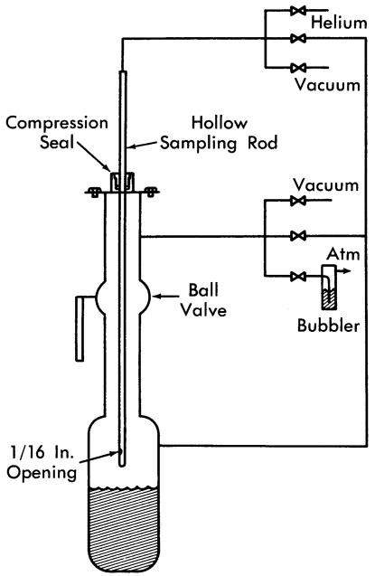  
FIG. 23-7. Thief-type sampler.

ppm range of concentration. KAPL [43] and Oak Ridge [44] have developed techniques for this analysis and commercial units have also been developed for use in this range. At BNL, the purity of gas is checked by passing it over a polished uranium chip at 550 to $600^{\circ}\mathrm{C}$ . If the chip is not tarnished, the gas is considered suitable for use.

Conditioning operation. In addition to the system preparation steps described in previous sections, it has been found desirable to provide a period of system operation in which a corrosion-inhibiting layer of zirconium nitride can be formed on the container walls. In general, this is done by charging the system with bismuth to which zirconium and magnesium have already been added and then operating the system isothermally until analyses have shown the additive concentrations to be stable.

Sampling. Thief-type samplers have been used almost exclusively for liquid-metal fuel systems. Sampling in this manner is accomplished by inserting a sample tube into the metal through an airlock mounted above the vessel. The airlock is separated from the vessel chamber by a full-opening ball valve. By bubbling helium through a hole near the bottom of the sample tube, it is possible to control the depth at which the sample is taken. At the time of sampling the pressure inside and outside the tube is equalized and the liquid enters the tube, which is then withdrawn [22].

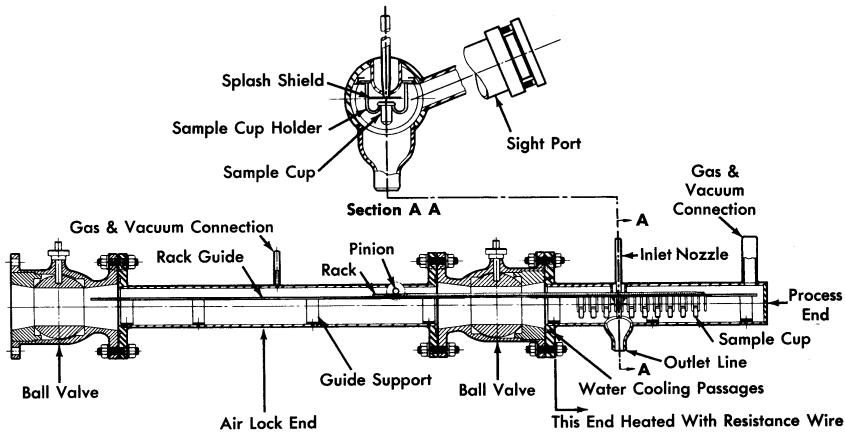  
FIG. 23-8. In-line bismuth sampler.

This method is shown in Fig. 23-7. A variation of this technique has been adapted for taking filtered samples; an inverted sample cup, which has been closed at one end by a filter, is lowered into the metal stream and filled by increasing the system pressure. Another variation involves the use of a sliding valve on the sample tube. This valve is opened and closed by a rotary bellows-sealed drive that controls the time at which the sample is taken. Radioactive samples have been taken using thief-sampler techniques. The activity levels encountered were not high enough to require remote manipulation, but drybox techniques were necessary to protect against alpha contamination.

Corrosion study samples are used extensively in developmental systems and consist of carefully prepared and examined metal or graphite pieces which are included in the system piping during fabrication and removed after each experimental run. Samples have also been inserted into flowing streams through thief-sampler airlocks to study corrosion effects and interactions between the sample and fuel stream components.

A line-type sampler, in which the liquid-metal stream is drawn through a sample line to a sample container, is shown in Fig. 23-8. In this device, small cups may be filled in succession and then withdrawn through the airlock. The sampler is manipulated externally by the pinion gear.

High-temperature radiography. Techniques for radiographing operating bismuth systems at elevated temperatures have been developed to study plug formation, gross corrosion effects, and operating characteristics such as liquid levels and gas entrainment. Gamma-ray sources are used in this work [45].

Repair techniques. In making repairs on systems which have contained liquid-metal fuels it is essential to observe certain precautions:

(1) Whenever possible, the system should be thermally cold.   
(2) Blanket gas should always be maintained on the inside of the system. When the system is opened, a flow of gas from the system should be maintained.   
(3) In making welds, any surface deposit of bismuth must be removed before a successful weld can be assured. Removal of a part of the inner pipe wall by reaming has been found necessary. Cooling coils placed on the pipe at the end of the reamed section will keep bismuth from melting and flowing into the weld.   
(4) In cases where bismuth fuels have undergone neutron irradiation, proper protection against polonium contamination must be provided. It has been found that polonium and nonvolatile fission products contained in solid bismuth can be handled without little difficulty, since they are largely immobilized by the bismuth. Repairs of contaminated equipment, including welding operations, have been made without hazard [34].

23-3.8 Instrumentation. Liquid level measurement. Determination of liquid levels in a closed metallic system, such as that generally encountered in liquid-metal work, can be approached either as a single-level problem or as a continuously indicating level problem. The requirements for the former are:

(1) A metallic probe, preferably of the same material as the metallic container.   
(2) High-temperature insulation between the probe and the vessel in which the liquid level is to be determined.   
(3) A gastight seal between insulation and both adjacent metallic parts.   
(4) An appropriate external circuit to note the attainment of the particular level.

Experience at Brookhaven National Laboratory [22] has shown that the most successful method for providing both good insulation and a satisfactory high-temperature seal in a single-level probe is by the use of automotive spark plugs. It is suggested that the seal be removed from direct contact with the heat source by means of an appropriate pipe extension. A probe can be welded to the spark plug after removal of the bent side electrode. The probes may be made from AISI types-347 and 502 steel for bismuth systems or of tungsten in a tin system [32]. The external circuit consists of a transformer, relay, and indicating lights. By the use of two probes and interlocked relays, it is possible to indicate a level beneath the lower probe, between probes, or above the upper probe.

There are two general types of continuous level indicators: a manually adjustable resistance probe, and a variable inductance probe.

The movable probe, consisting of the proper metal rod or tube, is adjusted through a suitable compression fitting. Modified Parker fittings [29] and Wilson fittings with Teflon packing glands are recommended. The liquid level is determined by comparing the probe height with a previously calibrated scale.

The variable inductance probe consists of a doubly wound coil in a ceramic form [22]. The coil is inserted into a pipe well inside the tank and, as the liquid-metal level rises, the inductance of the coil changes. The change of inductance is detected in a bridge circuit, with the degree of unbalance being a measure of the level. This method has the advantage, especially important in handling radioactive fluids, that the system is hermetically sealed at all times.

If it is not possible to utilize the fluid itself for level indication, the liquid level may be obtained in a roundabout manner by means of a stainless-steel float. A stainless-steel tube long enough to protrude from the tank is attached to the float. A short length of cold-rolled steel rod is contained in the uppermost section, which is completely enclosed so that no liquid can come in contact with it. The liquid level is obtained by locating the position of the cold-rolled steel rod with a search coil wound about a tube concentric with the one protruding from the tank.

Pressure measurement. Several methods are available for measuring the pressure exerted by liquid-metal fuels. These include seal pots, gas- or spring-balanced nullmatic transmitters, and bourdon-type gauges.

The seal pot measuring devices are simple to construct and have been used most extensively [22,29,30] in this work. The pressure is transmitted from the metal to a trapped inert gas that is monitored by a conventional gas-pressure gauge. This inert gas maintains a constant metal level in the seal pots, as determined by means of a float [29] or spark plug probes [22,30]. The float (with an extension rod) or the High-Low spark plug probes actuate solenoid valves connected to gas supply and vent lines. The probe separation is 1/4-in., thereby regulating the liquid level to $\pm 1/8$ in. Since there is no barrier between metal and gas, metal may splash into the gas space and freeze the gas lines. This may be partly alleviated by providing long vertical gas lines, a means of heating these lines, and baffles.

A variation consists of measuring the relative height of a column of bismuth, backed up by gas pressure in a steel pipe [25]. The level is determined by radiography with an Ir192 source. This method finds special application in measuring differential pressure heads (i.e., orifice).

The gas-balanced [46,47] or spring-balanced [48] nullmatic pressure transmitters provide a metal bellows or diaphragm seal between the liquid

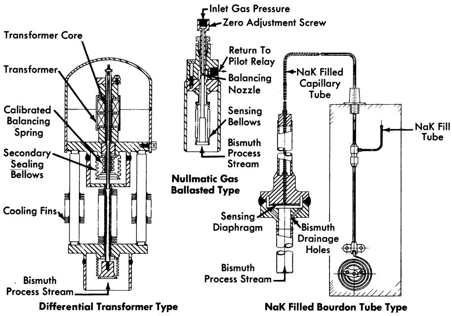  
FIG. 23-9. Pressure transmitters.

metal and a gas or mechanical pressure balance; this balancing pressure is then measured. Figure 23-9 illustrates the basic design of three types of these transmitters.

The nullmatic pilot-operated pressure transmitter can be made to be very sensitive, with rapid response. A thin metallic bellows seals the unit and is the sensing element. The full-range bellows movement is only a few thousands of an inch. The backing gas is nitrogen and the sensing system is adjusted to maintain a maximum differential of 10 psig across the bellows. One of the difficulties with this type of element is the incomplete drainage of Bi from the convolutions of the bellows. This trapped Bi may rupture the bellows when it freezes. Another disadvantage is its large consumption of instrument gas.

Another type of pressure transmitter utilizes a bellows-sealed differential transformer. The sensing element of this transmitter is similar to that of the previous unit and consists of a metallic bellows. The very slight movement of the bellows during a pressure change is transmitted to a differential transformer by a rod with a secondary bellows seal. A matching transformer installed in a bridge circuit allows a calibrated instrument to indicate or record the actual pressure in the system.

The diaphragm-sealed, NaK-filled bourdon-tube type of pressure transmitter has been used with two different styles of diaphragms. A thin, 0.010- to 0.015-in.-thick metallic diaphragm is used to separate the Bi system

from a NaK capillary system that extends from the diaphragm chamber to a bourdon tube in a conventional pressure transmitter. Capillary lengths up to 20 ft allow the transmitter to be placed remotely with respect to the system. The other diaphragm style consists of two thin sheets of metal welded together to form an envelope. The inside of the envelope contains NaK and is connected to a bourdon element by a length of capillary tubing. The envelope diaphragm is suspended in the Bi in an all-welded container. This type of transmitter has proved to be reliable in the pressure range between 10 and 175 psig.

Flow measurement. Orifice. Flow of liquid-metal fuels, much like flows of water or other liquids, is most commonly measured with standard orifices [22,25,30]. Work done at the Engineering Research Center, University of California [39,50] has demonstrated that an orifice may be calibrated with water, and the calibration may then be used directly for heavy metal (Bi or Pb-Bi) flow metering. The error introduced in this manner is only between 3 and $5\%$ .

Orifice assemblies have generally been installed in the piping systems with ring-joint and flange connections; one-piece orifice plate and metallic O-rings are used. Either flange or vena contracta taps are used and the pressure is measured as indicated in the previous section. Mild steel orifice plates with sharp-edged holes are satisfactory for use in lead-bismuth systems [29,30]. After 500 hr at $350^{\circ}\mathrm{F}$ , and a throat velocity of 1.5 fps, there was no detectable erosion in one such orifice.

A rounded-edge orifice (with flange taps) made from AISI type-347 stainless steel gave very satisfactory service at Brookhaven National Laboratory in a 1/2-in. IPS bismuth loop for $13,500\mathrm{hr}$ at $930^{\circ}\mathrm{F}$ [22]. The flow was 5.5 fps through the throat. Upon examination, the hole diameter had increased by $3\%$ (from 0.2662 in.) during loop operation.

A submerged orifice made from $2\frac{1}{4}\%$ Cr-1 Mo steel has been successfully used at Brookhaven National Laboratory in over 4000 hr of operation with bismuth at $1020^{\circ}\mathrm{F}$ . Its special appeal lies in the fact that liquid levels (heads) instead of pressures are measured. Ordinary liquid level probes are used.

Electromagnetic flowmeter. An electromagnetic flowmeter has been designed and analyzed theoretically by General Electric Company and by Babcock & Wilcox. A permanent magnet is mounted around the pipe through which molten metal is flowing, with the faces of the magnet creating a field perpendicular to the pipe. Two leads are welded to the pipe wall, mutually perpendicular to both the pipe and magnetic flux. The emf generated by the molten metal when cutting the lines of flux is picked up by these leads and can be transmitted to any potential-sensitive instrument. The theoretical analysis of this type of flowmeter agrees within $6\%$ with experimental results.

The electromagnetic flowmeter has been successfully used to meter bismuth flows in AISI type-347 stainless steel at Brookhaven National Laboratory [22]. The measured flow agreed within $10\%$ with the theoretically determined value.

Preliminary results have shown that these flowmeters may also be used in a $2\frac{1}{4}\%$ Cr-1% Mo steel system. However, corrections must be made for the short-circuiting of magnetic flux in the ferritic steel pipe walls. One way of minimizing this correction might be to use a bimetallic cell, that is, a thin (0.010 in.) liner of $2\frac{1}{4}\%$ Cr-1% Mo steel surrounded by an AISI type-347 stainless-steel pipe to provide structural strength.

Temperature measurement. The temperature of liquid metal fuels is usually measured with thermocouples of duplex Chromel-Alumel, No. 20 BWG gauge. Each wire is individually insulated with fiberglass and asbestos and each pair is covered again with insulation.

The best and most accurate service in low-chrome or stainless-steel systems is obtained by welding the thermocouple junction directly to the outside of the pipe wall. The difference between the temperature on the pipe wall and the bulk bismuth at $930^{\circ}\mathrm{F}$ is no greater than $10^{\circ}\mathrm{F}$ . If required, thermocouples located in wells have also been used in bismuth systems.

In graphite systems the thermocouples are inserted in drilled holes, and then cemented in place with alumina cement [32].

Temperature control for isothermal loops is obtained as follows [22]. The various parts of the loop are heated by means of individual heater circuits. Since the current demand varies, depending on the position of the heater in the loop, the current to the heaters is adjusted by means of individual autotransformers on each circuit. The entire heater group is supplied from a single line whose voltage varies according to the signal supplied to a controller by a single, centrally located thermocouple. The voltage is varied by means of a transformer whose primary is in the feed line. While the loop temperature remains within the neutral band around the set point of the controller, the secondary coil circuit is closed. If the temperature drops below the neutral band, the relay opens the secondary coil circuit, thus decreasing the inductance of the primary, and increases the voltage to the heaters. If the temperature rises above the neutral band, the controller relay opens the main circuit breaker and cuts off current to the heaters.

By proper adjustment of the individual Variacs it is possible to maintain the temperatures around the loop within $20^{\circ}$ of the desired value and to operate so that the main circuit breakers are rarely opened.

# REFERENCES

1. R. J. TEitel, An Internally Cooled Liquid Metal Fuel Reactor Design, in Proceedings of the First Nuclear Engineering and Science Congress, Vol. 1, Problems in Nuclear Engineering. New York: Pergamon Press, 1957. (pp. 292-301)   
2. T. V. SHEEHAN and L. D. STOUGHTON, The Liquid Metal Fuel Reactor Closed-Cycle Gas Turbine Power Plant, Mech. Eng. 78, 699-702 (1956).   
3. C. WILLIAMS and F. T. MILES, Liquid-Metal-Fuel Reactor Systems for Power, in Chemical Engineering Progress Symposium Series, Vol. 50, No. 11. New York: American Institute of Chemical Engineers, 1954. (p. 245)   
4. FRANK W. DAVIS, Feasibility Study of Pressure Vessels for Nuclear Power Generating Reactors, USAEC Report AECU-3062, Division of Reactor Development, AEC, December 1955. (pp. 5-6)   
5. C. WILLIAMS and F. T. MILES, Liquid-Metal-Fuel Reactor Systems for Power, in Chemical Engineering Progress Symposium Series, Vol. 50, No. 11. New York: American Institute of Chemical Engineers, 1954. (pp. 245-252)   
6. R. N. Lyon et al., Liquid Metals Handbook, U. S. Atomic Energy Commission and U. S. Navy. 2nd ed. Washington, D. C.: U. S. Government Printing Office, 1952.   
7. D. J. HUGHES and J. A. HARVEY, Neutron Cross Sections, USAEC Report BNL-325, Brookhaven National Laboratory, May 1955.   
8. C. M. DAVISSON and R. D. EVANS, Gamma-Ray Absorption Coefficients, Rev. Modern Phys. 24(2), 79-107 (1952).   
9. O. E. Dwyer et al., Liquid Bismuth As a Fuel Solvent and Heat Transport Medium for Nuclear Reactors, USAEC Report BNL-2432, Brookhaven National Laboratory, 1955.   
10. L. M. TREFETHAN, Heat Transfer Properties of Liquid Metals, Cambridge University, England, Christ's College, July 1, 1950.   
11. S. E. ISAKOFF and T. B. DREW, Heat and Momentum Transfer in Turbulent Flow of Mercury, in Proceedings of the General Discussion on Heat Transfer, Institution of Mechanical Engineers (London) and American Society of Mechanical Engineers, 1951. (pp. 405-409)   
12. W. K. STROMQUIST, Effect of Wetting on Heat Transfer Characteristics of Liquid Metals (thesis), USAEC Report ORO-93, University of Tennessee, March 1953.   
13. H. A. JOHNSON et al., Heat Transfer to Mercury in Turbulent Pipe Flow, USAEC Report AECU-2627, University of California, Berkeley, Institute of Engineering Research, July 1953.   
14. H. A. JOHNSON et al., Heat Transfer to Molten Lead-Bismuth Eutectic in Turbulent Pipe Flow, Trans. Am. Soc. Mech. Engrs. 75(6), 1191-1198 (1953).   
15. B. LUBARsKY and S. J. KAUFMAN, Review of Experimental Investigations of Liquid-Metal Heat Transfer, Report NACA-TN-336, Lewis Flight Propulsion Laboratory, March 1955.   
16. R. N. Lyon, Liquid-Metal Heat Transfer Coefficients, Chem. Eng. Progr. 47(2), 75-79 (1951).

17. R. C. MARTINELLI, Heat Transfer to Molten Metals, Trans. Am. Soc. Mech. Engrs. 69(8), 947-959 (1947).   
18. O. E. Dwyer, Heat Exchanger in LMF Power Reactor Systems, *Nucleonics* 12(7), 30-39 (1954).   
19. R. L. MORGAN, Technical Information Service, AEC, 1952. Unpublished.   
20. B. FELD and L. SZILARD, A Magnetic Pump for Liquid Bismuth, USAEC Report CE-279, Argonne National Laboratory, 1942.   
21. B. FELD, More Calculations in the Bismuth Pump, USAEC Report CP-326, Argonne National Laboratory, Oct. 17, 1942.   
22. C. J. RASEMAN and J. WEISMAN, Liquid Metal Fuel Reactor (LMFR) Processing Loops. Part I. Design, Construction, and Corrosion Data, USAEC Report BNL-322, Brookhaven National Laboratory, June 1954.   
23. D. A. WATT, A Study in Design of Traveling Field Electromagnetic Pumps for Liquid Metals, Report AERE-ED/R-1696, Great Britain Atomic Energy Research Establishment, June 12, 1955.   
24. G. R. WINDERS and R. W. FISHER, An Electro-magnetic Pump and Heating Transformer for High Temperature Liquid Metals, USAEC Report ISC-547, Iowa State College, Dec. 6, 1954.   
25. R. W. FISHER and G. R. WINDERS, High Temperature Loop for Circulating Liquid Metals, in Chemical Engineering Progress Symposium Series, Vol. 53, No. 20. New York: American Institute of Chemical Engineers, 1957. (pp. 1-6)   
26. R. S. WINGARD, Jr., Fairchild Engine & Airplane Corp., NEPA Division, 1950. Unpublished.   
27. J. F. COLLINS, Fairchild Engine & Airplane Corp., NEPA Division, 1950. Unpublished.   
28. J. E. WALKEy, California Research Corporation, 1951. Unpublished.   
29. H. A. JOHNSON et al., The Design and Operation of a 30 Gpm 40 Kw Pb-Bi Eutectic Heat Transfer System, USAEC Report AECU-2848, University of California, Berkeley, Institute of Engineering Research, February 1954.   
30. R. CYGAN, Circulation of Lead-Bismuth Eutectic at Intermediate Temperatures, USAEC Report NAA-SR-253, North American Aviation, Inc., Oct. 1, 1953.   
31. H. A. JOHNSON et al., Heat Transfer to Mercury in Turbulent Pipe Flow, USAEC Report AECU-2627, University of California, Berkeley, Institute of Engineering Research, July 1953.   
32. R. D. KeEN, High Temperature Liquid Metal Circulating System, USAEC Report NAA-SR-985, North American Aviation, Inc., Aug. 1, 1954.   
33. T. A. SIMMS, Fairchild Engine & Airplane Corp., NEPA Division, 1950. Unpublished.   
34. C. J. RASEMAN et al., Liquid Metal Fuel Reactor In-pile Fuel Processing Loop (Loop B); Construction, Operation, Experimental Results, USAEC Report BNL-403, Brookhaven National Laboratory, January 1957.   
35. W. B. COTTRELL, Oak Ridge National Laboratory, 1952. Unpublished.   
36. W. P. BIGLER, Reactor Engineering Quarterly Report for March 1, 1950, Through May 31, 1950, USAEC Report ANL-4481, Argonne National Laboratory, July 1, 1950.   
37. R. POTTER et al., Fairchild Engine & Airplane Corp., NEPA Division, 1950. Unpublished.

38. W. J. Hallett et al., Dynamic Corrosion of Graphite by Liquid Bismuth, USAEC Report NAA-SR-188, North American Aviation, Inc., Sept. 22, 1952.   
39. R. A. SEBAN et al., Flow Metering of Molten Lead-Bismuth Eutectic, at University of California, Berkeley, California. University of California, Berkeley, Institute of Engineering Research, April 25, 1949.   
40. Am. Machinist, Nov. 12, 1951.   
41. O. J. ELGERT et al., Dynamic Corrosion of Steel by Liquid Bismuth, USAEC Report LWS-24891, California Research and Development Co., Aug. 29, 1952.   
42. D. S. GIBBS et al., Purification of Rare Gases. I. A Comparison of Active Metals in the Purification of Rare Gases, USAEC Report ISC-560, Iowa State College, Dec. 30, 1954.   
43. L. P. PePKOWITZ and E. L. SHIRLEY, Quantitative Determination of Oxygen in Gases, Anal. Chem. 25, 1718-1720 (November 1953).   
44. LELAND A. MANN, Oak Ridge National Laboratory, personal communication.   
45. J. C. AUSTIN and P. RICHARDS, Radiography As a Hot Lab Service, *Nucleonics* 12(11), 78 (1954).   
46. P. W. TAYLOR, Moore Pressure Transmitter Test Summary, USAEC Report CF-53-1-260, Oak Ridge National Laboratory, Jan. 22, 1953.   
47. M. T. MORGAN, Hermetically Sealed High-Temperature Pressure Transmitter and Hermetically Sealed High-Temperature Liquid Level Probe, USAEC Report ORNL-1939, Oak Ridge National Laboratory, Sept. 15, 1955.   
48. E. C. KING and V. K. HECKEL, High Temperature Pressure Gauge, Technical Report No. 45, Mine Safety Appliances Co., Jan. 5, 1956.   
49. E. A. LueBKE, Knolls Atomic Power Laboratory, 1952. Unpublished.   
50. H. A. JOHNSON et al., Orifice Metering Coefficients for Lead-Bismuth Eutectic, USAEC Report AECU-2798, University of California, Berkeley, Institute of Engineering Research, December 1953.   
51. W. S. FLESHMAN and C. G. COLLINS, The Effect of Molten Bismuth on Insulating Materials, Report NEPA-1306, Fairchild Engine & Airplane Corp., NEPA Division, Feb. 9, 1950.   
52. R. CYGAN, Lead-Bismuth Eutectic Thermal Convection Loop. USAEC Report NAA-SR-1060, North American Aviation, Inc., Oct. 15, 1954.

# CHAPTER 24

# LIQUID METAL FUEL REACTOR DESIGN STUDY*

# 24-1. COMPARISON OF TWO-FLUID AND SINGLE-FLUID LMFR DESIGNS

In Chapter 18, the two-fluid and the single-fluid externally cooled LMFR concepts were discussed in a general way. It was pointed out that the two-fluid design has the better breeding possibilities but is somewhat more complex than the single-fluid reactor. In this chapter a complete design study of a two-fluid full-sized LMFR reactor is described and discussed, and a shorter discussion of a single-fluid design study follows. This does not mean that one design is necessarily favored over the other. In fact both of these designs are being studied very extensively.

# 24-2. TWO-FLUID REACTOR DESIGN

24-2.1 General description. The two-fluid externally cooled LMFR concept consists of a relatively small core surrounded, for the most part, by a blanket containing fertile material. The core is composed of high-density, impervious graphite through which vertical channels are drilled to allow circulation of the fuel coolant. The fuel in the core is dissolved $\mathbf{U}^{233}$ or $\mathbf{U}^{233}$ dissolved and suspended in liquid bismuth. The fluid fuel also acts as coolant for the core system. The required coolant to moderator ratio is obtained by proper size and spacing of the fuel coolant channels.

The blanket is constructed of high-density graphite through which flows a liquid bismuth slurry containing the bred $\mathrm{U}^{233}$ fuel and thorium, the fertile material. In this study, thorium is assumed to be suspended in bismuth as thorium bismuthide, although thorium oxide particles could be used. The blanket is wrapped around the core as completely as possible for good neutron economy. An important economic consideration is the degree of end blanketing which can be achieved while keeping coolant velocities below the allowable limit. Several blanket designs were investigated, but a complete study for obtaining the best end blanket design has not yet been carried out.

24-2.2 General specifications. Unless otherwise noted, the specifications listed below are common to all calculations performed in this design.

<table><tr><td>Total power</td><td>825 mw (thermal)</td></tr><tr><td></td><td>315,000 kw (electrical)</td></tr><tr><td>Coolant to moderator ratio in core, VBi/Vc</td><td>1.22</td></tr><tr><td>Coolant to moderator ratio in blanket, Vslurry/Vc</td><td>0.50</td></tr><tr><td>Core-blanket barrier material</td><td>graphite</td></tr><tr><td>Blanket thickness</td><td>3.0 ft</td></tr><tr><td>Blanket slurry composition:</td><td></td></tr><tr><td>Bismuth</td><td>90 w/o</td></tr><tr><td>Thorium, as Th3Bi5</td><td>10 w/o</td></tr><tr><td>Coolant inlet temperature</td><td>750°F</td></tr><tr><td>Coolant outlet temperature</td><td>1050°F</td></tr></table>

Nuclear calculations utilizing latest cross sections and multigroup diffusion theory indicate that the values 1.22 and 0.50 listed above are close to the optimum.

The several factors which dictated the choice of a bismuth-to-carbon volume ratio merit some attention. There are some losses of neutrons due to capture in graphite. Hence, one would wish to use only enough graphite to sufficiently thermalize the reactor. If too little graphite is used, the critical mass will be large. It is suspected that the $\eta$ value for $\mathrm{U}^{233}$ may be lower in the epithermal than in the thermal energy range. This would make it desirable to keep the reactor thermal. It was found that bismuth-to-carbon volume ratios in the range of 0.5 to 2.0 satisfy these various requirements quite well. It may be further observed by referring to Fig. 24-1 that breeding improves with an increase in the bismuth-to-carbon volume ratio. However, the maximum bismuth-to-carbon volume ratio acceptable on the basis of structural limitations was 1.22, and consequently this core diameter is $155.7\mathrm{cm}$ (61 in.) at a bismuth-to-carbon volume ratio of 1.22, assuming a cylinder with its height equal to diameter.

Blanket slurry-to-graphite volume ratio and blanket thickness. A series of calculations were made to estimate the most economical parameter values for the blanket. Blanket slurry-to-graphite volume ratio and blanket thickness were varied to give the best breeding ratio consistent with reasonable bismuth holdup. Figures 24-2 and 24-3 demonstrate the effects of varying blanket composition and thickness on breeding ratio. The slurry-to-graphite volume ratio was set at 0.5 and the blanket thickness was set at 3.0 ft.

Study of design parameters. The parameters investigated in the following analysis are (1) end blanket design, (2) power fraction in the blanket, and (3) fission product poison level in the core.

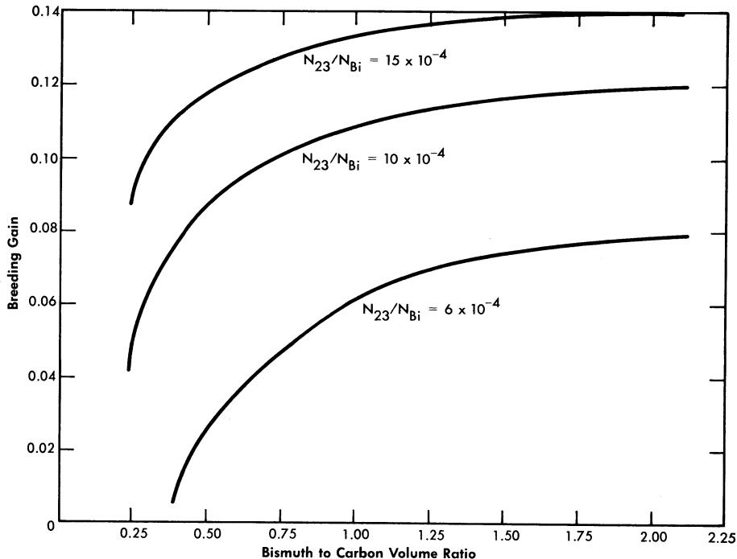  
FIG. 24-1. Breeding gain vs. bismuth-to-carbon volume ratio in core.

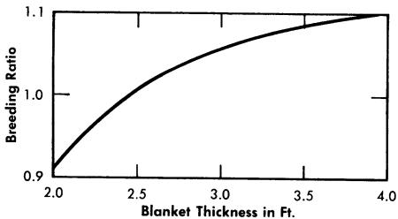  
FIG. 24-2. Breeding vs. blanket thickness for slurry-to-carbon volume ratio $= 1.00$ and bismuth to carbon volume ratio in core $= 1.00$ .

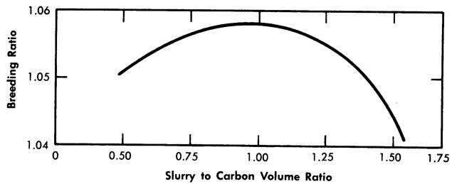  
FIG. 24.3. Breeding vs. slurry-to-carbon volume ratio in blanket for bismuth to carbon volume ratio = 1.00 and blanket thickness = 3 ft.

24-2.3 End blanket effects. A series of nuclear calculations were performed to determine the effects of end blanket design upon breeding ratio and critical fuel concentration. Two extreme blanket designs were considered. In the most optimistic case, a spherical core, equivalent to a 61-in.-diameter cylinder, was surrounded by a 3-ft spherical blanket. The pessimistic calculations assumed a cylindrical core with a diameter of 61 in., height equal to 1.5 times the diameter, a 3-ft radial blanket, and no end blanket. Critical values of fuel concentrations and breeding ratio were calculated for four power fractions in the blanket for each design.

All calculations were performed for hot, clean conditions with an average temperature of $900^{\circ}\mathrm{F}$ . A two-group, multiregion code was used to solve the diffusion equations, and a 37-group spectral code was used to determine the two-group nuclear constants. The results of these calculations are tabulated in Table 24-1. The breeding ratio is decreased 0.20 to 0.25 by completely eliminating the end blankets. This is due primarily to the added neutron leakage out the ends of the core, despite the fact that the core height is increased. Although the critical mass of fuel in the core is higher without end blankets, the fuel concentration is somewhat lower due to the increased core volume.

TABLE 24-1 CRITICALITY CALCULATIONS FOR TWO-FLUID LMFR WITH AND WITHOUT END BLANKETS   

<table><tr><td rowspan="2">Case</td><td colspan="2">N23/NBi×106</td><td rowspan="2">Ratio of blanket power to total power</td><td rowspan="2">Breeding ratio</td><td rowspan="2">Blanket thickness, ft</td><td rowspan="2">Geometry</td></tr><tr><td>Core</td><td>Blanket</td></tr><tr><td>I</td><td>559</td><td>152</td><td>0.0665</td><td>1.053</td><td>3.0</td><td>Full blanket</td></tr><tr><td>II</td><td>530</td><td>534</td><td>0.205</td><td>1.051</td><td>3.0</td><td>” ”</td></tr><tr><td>III</td><td>461</td><td>1600</td><td>0.445</td><td>1.039</td><td>3.0</td><td>” ”</td></tr><tr><td>IV</td><td>436</td><td>2100</td><td>0.515</td><td>1.033</td><td>3.0</td><td>” ”</td></tr><tr><td>V</td><td>403</td><td>1050</td><td>0.272</td><td>0.80</td><td>3.0</td><td>No end blanket</td></tr><tr><td>VI</td><td>366</td><td>2100</td><td>0.425</td><td>0.82</td><td>3.0</td><td>” ” ”</td></tr><tr><td>VII</td><td>347</td><td>2808</td><td>0.492</td><td>0.83</td><td>3.0</td><td>” ” ”</td></tr><tr><td>VIII</td><td>403</td><td>1050</td><td>0.272</td><td>—</td><td>4.0</td><td>” ” ”</td></tr></table>

The actual core and blanket design is between the two extremes assumed in these calculations. The blanket can be extended beyond the end boundaries of the core, and a graphite reflector can cover the ends of the core except for the coolant inlet and outlet. Cooling becomes a serious design

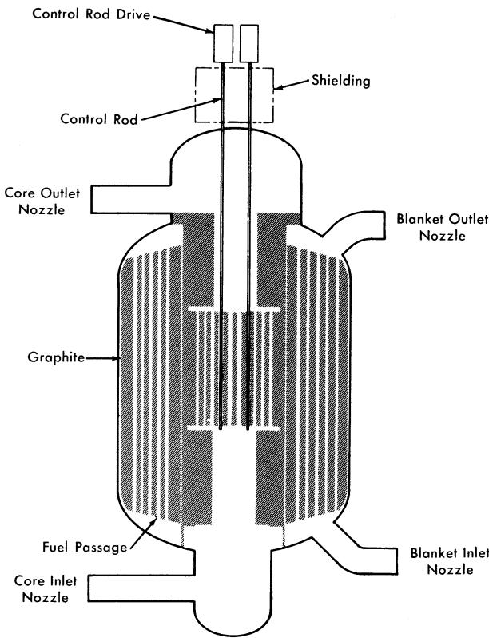  
FIG. 24-4. Two-region, externally cooled liquid metal fuel reactor.

problem, if the end reflector is replaced with blanket material. The design in Fig. 24-4 is a substantial improvement over no end blanket or reflector. However, further improvement in breeding ratio could be achieved with even better end blanket designs.

24-2.4 Power level in the blanket. For a given geometry, coolant-to-moderator ratio, and thorium concentration in the blanket, specification of the fraction of total fissions generated in the blanket establishes a unique set of values for fuel concentration in the blanket, fuel concentration in the core, and fissions generated in the core. For simplicity, the power generated in a region is assumed directly proportional to the fissions in that region. The data in Table 24-1 indicate that breeding ratio changes very little with large changes in the fraction of total power generated in the blanket. This increase in blanket power results in an increased ratio of resonance to thermal absorptions, a phenomenon which tends to offset the additional fast neutron leakage out of the blanket as blanket power increases.

An economic analysis of the effects of changing the blanket power fraction was performed to determine the optimum core-blanket power split under equilibrium operating conditions. The parameters affecting this choice are (1) fission-product poison levels in the blanket, (2) fission-product poison levels in the core, and (3) chemical processing costs.

Fission-product poisons in the blanket. The chemical processing of the blanket slurry accomplishes two things:

(1) The removal of bred $\mathbf{U}^{233}$ from the blanket system at a rate necessary to maintain the $\mathbf{U}^{233}$ concentration in the blanket slurry at some equilibrium value corresponding to the desired blanket power fraction.   
(2) The removal of fission products from the blanket slurry.

If the blanket processing cycle is determined by the minimum removal rate of $\mathbf{U}^{233}$ for steady-state operation, a corresponding poison level in the blanket is automatically set. If the blanket chemical processing cycle is determined by the poison level and is less than the cycle determined by the above criteria, the bred fuel removed from the blanket must be fed back into both core and blanket to maintain steady-state fuel concentrations. In this analysis the blanket processing cycle in all cases was assumed to be based on the minimum removal rate to maintain steady-state $\mathbf{U}^{233}$ concentrations without feeding fuel into the blanket system.

Chemical processing cycle for blanket slurry. The chemical processing was assumed to be performed continuously on the reactor site. Unless otherwise specified, the fluoride volatility process is utilized as described in Article 24-3.16. The chemical processing cycle for the blanket may be calculated [3] from the equation

$$
T _ {B} = \frac {Z _ {u} M _ {2 3} ^ {B} \left[ 1 + \left(Z _ {1 3} / Z _ {u}\right) (b / a) \right]}{\beta P _ {t} \left[ (\mathrm {B R}) - \left(\frac {P _ {B}}{P _ {t}}\right) \right]},
$$

where

$T_{B} =$ blanket processing cycle, days,

$Z_{u} =$ removal efficiency for uranium $= 0.25$

$Z_{13} =$ removal efficiency for protactinium $= 0.04$

$M_{23}^{\mathrm{B}} =$ mass of fuel in blanket system, kg,

$b / a =$ ratio of $\mathrm{Pa}^{233}$ to $\mathrm{U}^{233}$ in blanket,

$\beta = \mathrm{kg}$ of fuel burned per Mwd $= 1.05(1 + \alpha_{23})$

$P_{t} =$ total power, $825\mathrm{Mw}$

$\mathrm{BR} =$ breeding ratio,

$P_B =$ blanket power, $\mathrm{Mw}$

and

$$
\frac {b}{a} = \frac {\sigma_ {a} ^ {2 3} (\mathrm {e f f}) \phi_ {2} ^ {\mathrm {B S}} + \frac {Z _ {u}}{T _ {B}}}{\gamma_ {1 3}},
$$

where

$$
\sigma_ {a} ^ {2 3} \left(\text {e f f}\right) = \text {a n e f f e c t i v e a b s o r p t i o n c r o s s s e c t i o n t o a c c o u n t f o r r e s o n a n c e}
$$

$$
\begin{array}{l} \phi_ {2} ^ {\mathrm {B S}} = \text {a v e r a g e t h e r m a l f u x o v e r t h e b l a n k e t s y s t e m}, \\ \gamma_ {1 3} \quad = \text {d e c a y c o n s t a n t f o r P a} ^ {2 3 3}. \\ \end{array}
$$

The poison level in the blanket depends upon $T_B$ , and $T_B$ is a function of $M_{23}^{\mathrm{B}}$ , $b / a$ , breeding ratio, and power fraction in the blanket. All these variables are interrelated. The ratio $b / a$ is a function of $T_B$ , but $T_B$ is a slowly varying function of $b / a$ due to the low value of $Z_{13} / Z_u$ (0.16). Breeding ratio is a slowly varying function of fission-product levels in the blanket due to the heavy loading of fuel and thorium in that region. The breeding ratio is sensitive to the poison level, and thus to the chemical processing rate, in the core fuel solution. An iterative calculation procedure was required to arrive at optimum values of $T_B$ , fission-product poison level in the blanket, and the power fraction in the blanket.

For a given chemical processing rate in the blanket, the fission-product poison level was determined from the data in KAPL 1226 [4]. Relative poisoning, RP, is defined as the absorptions in fission products per thermal fission in fuel, while the fission-product poison fraction is the absorptions in fission products per total absorption in fuel. Xenon and samarium are treated separately and are not included in the term fission products. The burnup, $F$ , in a region is defined as the atoms of fuel fissioned per atom present in the region. The burnup $F$ at time $T$ in the blanket is calculated from

$$
F = \frac {0 . 8 6 6 T (P _ {B} / P _ {t})}{M _ {2 3} ^ {B}}.
$$

Using this relation, the relative poisoning in the blanket was determined for each processing cycle from a graph of RP versus $F$ [4]. The RP curve used is based upon high cross sections of all fission products with the exception of a low value for $\mathbf{Zr}^{93}$ .

Xenon in the blanket. Xenon is removed from the blanket by the degasser. Although the removal rate of fission-product gases cannot be determined until experimental information becomes available, a poison fraction of 0.01 was assumed for $\mathrm{Xe}^{135}$ .

Samarium in the blanket. The removal rate of samarium by chemical processing was neglected. The steady-state ratio of $\Sigma_{a}^{\mathrm{Sm}} / \Sigma_{a}^{233}$ , using appropriate thermal absorption cross sections, is determined by the relation

$$
\frac {\sum_ {a} ^ {\mathrm {S m}}}{\sum_ {a} ^ {2 3 3}} = 1. 4 2 \times 1 0 ^ {- 1 6} \bar {\phi} + 0. 0 1 2 6,
$$

where $\overline{\phi} =$ average thermal flux in the region of interest.

Fission-product poisons in the core. The level of fission products, FP, other than xenon and samarium, in the core is determined by the chemical processing cycle for the core fuel solution. The steady-state value of FP poisons in the core should be established by an economic balance between the value of improved breeding ratio and increased chemical processing costs. The relationship between the core processing cycle, $T_{c}$ , and the relative poison, RP, in the core may be expressed as

$$
\frac {d (\mathrm {R P})}{d F} = \frac {\mathrm {R P}}{F}
$$

and

$$
F = \frac {0 . 8 6 6 T _ {c} \left(P _ {c} / P _ {t}\right)}{M _ {2 3} ^ {c}},
$$

where

$$
\frac {d (\mathrm {R P})}{d F} \text {i s} F [ 4 ],
$$

$$
M _ {2 3} ^ {c} = \text {t o t a l m a s s o f U} ^ {2 3 3} \text {i n t h e c o r e s y s t e m .}
$$

The xenon and samarium poisons in the core are determined as described for the blanket.

Economic optimization. An optimization study was performed to determine the most economic power split between core and blanket systems and fission-product poison level for the core during equilibrium operation. The fuel cost items which vary with these two parameters are (1) bismuth inventory, (2) fuel inventory, (3) fuel burnup, (4) thorium amortization, (5) thorium burnup, and (6) chemical processing. Nuclear calculations specified the fuel concentrations for both core and blanket and breeding ratios. These values were then used to determine the chemical processing cycle for the blanket and the pertinent costs.

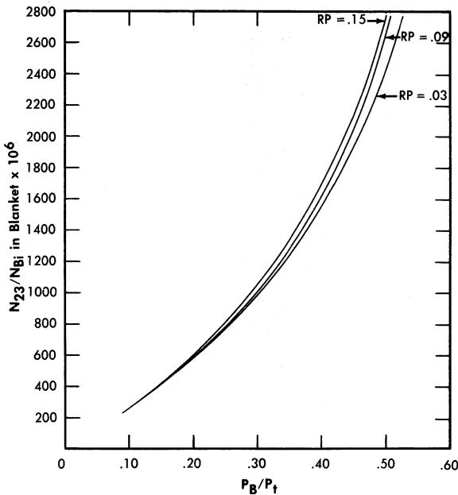  
FIG. 24-5. Fuel concentration in blanket vs. $P_B / P_t$ for two-fluid LMFR fully blanketed sphere.

Nuclear calculations. The values of the parameters investigated were

$$
R P (c o r e) = 0. 0 3, 0. 0 9, 0. 1 5,
$$

$$
P _ {B} / P _ {t} = 0. 1 0 - 0. 5 0.
$$

Since only a relative comparison was needed, all calculations were made with a spherical core and complete 3-ft spherical blanket. The xenon poison fraction was taken as 0.01, and the samarium steady-state value was computed for each region in each case.

The fission-product poison level in the blanket cannot be determined without first knowing the blanket processing cycle. As a first approach, the breeding ratio for the hot clean conditions was used to determine the cycle time from which the RP in the blanket was calculated as described previously. The relative poison levels determined on this basis were as follows:

$$
\frac {P _ {B} / P _ {t}}{10 \%} \quad \frac {\mathrm {R P} (\text {blanket})}{0.029}
$$

$$
25 \% \quad 0.048
$$

$$
50 \% \quad 0.155
$$

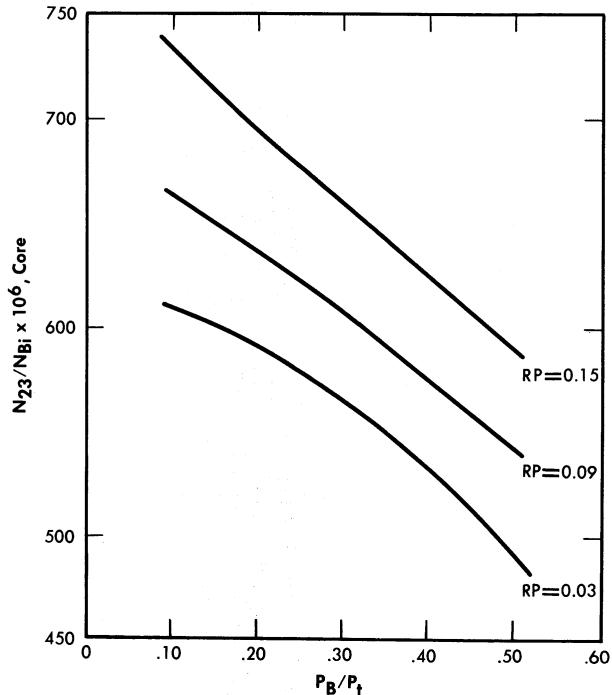  
FIG. 24-6. Fuel concentration in core vs. $P_B / P_t$ for two-fluid LMFR fully blanketed sphere.

All criticality calculations were performed using the specifications outlined in Article 24-2.2. Two-group diffusion theory was employed, and a two-group, multiregion code was used for solving the diffusion equations. As previously mentioned a 37-group spectral code was used to generate the two-group coefficients. The critical concentration of fuel in the core and blanket, breeding ratio, and neutron losses were determined for several power splits for each relative poison level in the core. The blanket power fraction values of 10, 33.3, and $50\%$ were used as reference values for comparison, and the important nuclear parameters were determined from a set of parametric curves for these precise values. (Cases actually calculated corresponded very closely to the desired blanket power in most calculations.)

The nuclear parameters corresponding to these power splits are summarized in Table 24-2. Figures 24-5 and 24-6 show the variation of $N_{23} / N_{\mathrm{Bi}}$ in both the core and blanket as the blanket power fraction changes. This atom ratio of $\mathrm{U}^{233}$ to bismuth in the blanket ranges from $255 \times 10^{-6}$ to $2420 \times 10^{-6}$ for $P_B / P_t = 0.10$ to 0.50. In the core the $N_{23} / N_{\mathrm{Bi}}$ ratio decreases approximately $20\%$ over the same range. The

TABLE 24-2 RESULTS OF NUCLEAR CALCULATIONS FOR VARIOUS POWER SPLITS   

<table><tr><td>Case</td><td>PB/Pt</td><td>Relative poison in core</td><td>Relative poison in blanket</td><td>BR</td><td>1 + α23</td><td>N23/NBi × 106(core)</td><td>M23, kg</td><td>N23/NBi × 106(blanket)</td><td>MB23, kg</td><td>Average thermal flux in core system</td><td>Average thermal flux in blanket system</td></tr><tr><td>I (a)</td><td>0.10</td><td>0.03</td><td>0.029</td><td>1.0256</td><td>1.132</td><td>620</td><td>368.7</td><td>255</td><td>53.2</td><td>5.77 × 1013</td><td>5.20 × 1013</td></tr><tr><td>(b)</td><td></td><td>0.09</td><td></td><td>1.007</td><td>1.132</td><td>664</td><td>395</td><td>255</td><td>53.2</td><td>5.15</td><td>4.97</td></tr><tr><td>(c)</td><td></td><td>0.15</td><td></td><td>0.978</td><td>1.132</td><td>732</td><td>435.4</td><td>255</td><td>53.2</td><td>4.425</td><td>467</td></tr><tr><td>II (a)</td><td>0.3333</td><td>0.03</td><td>0.0475</td><td>1.007</td><td>1.132</td><td>554</td><td>215.8</td><td>1150</td><td>317</td><td>7.13 × 1013</td><td>2.61 × 1013</td></tr><tr><td>(b)</td><td></td><td>0.09</td><td></td><td>0.993</td><td>1.132</td><td>599</td><td>233.5</td><td>1190</td><td>328</td><td>6.40</td><td>2.39</td></tr><tr><td>(c)</td><td></td><td>0.15</td><td></td><td>0.978</td><td>1.132</td><td>667</td><td>260</td><td>1230</td><td>334</td><td>5.71</td><td>2.23</td></tr><tr><td>III (a)</td><td>0.50</td><td>0.03</td><td>0.155</td><td>0.980</td><td>1.135</td><td>494</td><td>154.8</td><td>2420</td><td>834</td><td>7.62 × 1013</td><td>1.28 × 1013</td></tr><tr><td>(b)</td><td></td><td>0.09</td><td></td><td>0.959</td><td>1.135</td><td>542</td><td>170</td><td>2670</td><td>920</td><td>6.72</td><td>1.01</td></tr><tr><td>(c)</td><td></td><td>0.15</td><td></td><td>0.945</td><td>1.135</td><td>590</td><td>185</td><td>2760</td><td>951</td><td>6.19</td><td>0.97</td></tr></table>

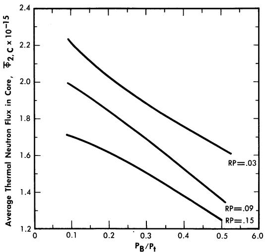  
FIG. 24-7. Average thermal flux in core vs. $P_B / P_t$ for two-fluid LMFR based on a fully blanketed sphere at 825 Mw.

values of the average thermal neutron flux in the core and blanket are graphed in Figs. 24-7 and 24-8, and BR in Fig. 24-9.

Bismuth inventory. The primary system volumes for $P_B / P_t = 0.33$ and 0.50 are based on a six-loop capsule design. Each loop contains a bismuth inventory of $245\mathrm{ft}^3$ . If $50\%$ of the power is generated in the blanket, three loops contain blanket slurry and three contain U-Bi core solution. If one-third of the power originates in the blanket, two loops are devoted to the blanket system and four to the core system. If only $10\%$ of the total power is generated in the blanket, a three-loop design is assumed for the core system, and two small loops of $125\mathrm{ft}^3$ each are used for the blanket. The reactor holdup has been estimated from the reactor drawing in Fig. 24-4. Fuel inventory volumes are summarized in Table 24-3.

Using the value of $2.25/lb of bismuth, 12% annual fixed charges, and a density of 613.5 lb/ft³ (9.83 g/cc), the annual bismuth inventory charges are

$$
C _ {1} (\$ / \mathrm {y r}) = 1 6 5. 6 \left(V _ {\mathrm {c s}} + V _ {\mathrm {b s}}\right),
$$

where

$$
V _ {\mathrm {c s}} = \text {i n v e n t o r y}
$$

$$
V _ {\mathrm {b s}} = \text {i n v e n t o r y} \quad \text {v o l u m e} \quad \text {o f} \quad \text {b l a n k e t} \quad \text {s y s t e m}, \quad \mathrm {f t} ^ {3}.
$$

Fuel inventory. Five days' holdup of fuel from both blanket and core is assumed for the chemical processing plant. $\mathrm{Pa}^{233}$ is held up for 135 days to allow for decay to $\mathrm{U}^{233}$ . Approximately $3\%$ of the $\mathrm{Pa}^{233}$ remains after 135 days and is discarded with the fission-product waste. This loss, while

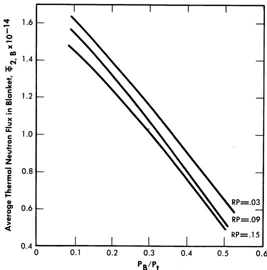  
FIG. 24-8. Average thermal flux in blanket vs. $P_B / P_t$ for two-fluid LMFR based on a fully blanketed sphere at 825 Mw.

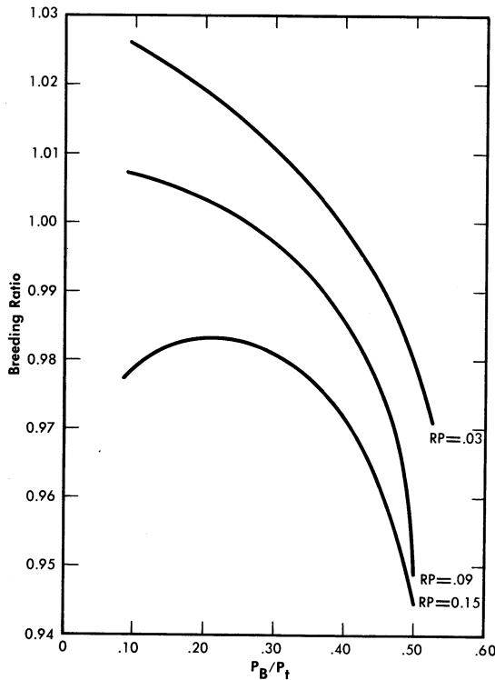  
FIG. 24-9. Breeding ratio vs. $P_B / P_t$ for two-fluid LMFR fully blanketed sphere.

TABLE 24-3 INVENTORY VOLUMES IN TWO-FLUID LMFR   

<table><tr><td></td><td>PB/Pt=0.10</td><td>Pt/Pc=0.333</td><td>Pt/Pc=0.50</td></tr><tr><td>Core system:</td><td></td><td></td><td></td></tr><tr><td>Reactor</td><td>275 ft3</td><td>275 ft3</td><td>275 ft3</td></tr><tr><td>External system</td><td>1640</td><td>980</td><td>735</td></tr><tr><td>Subtotal</td><td>1915</td><td>1255</td><td>1010</td></tr><tr><td>Blanket system:</td><td></td><td></td><td></td></tr><tr><td>Reactor</td><td>495</td><td>495</td><td>495</td></tr><tr><td>External system</td><td>250</td><td>490</td><td>735</td></tr><tr><td>Subtotal</td><td>745</td><td>985</td><td>1230</td></tr><tr><td>Total</td><td>2660</td><td>2240</td><td>2240</td></tr></table>

quite small, has been included with the fuel inventory charges, which may be expressed as

$$
\begin{array}{l} C _ {2} (\$ / \mathrm {y r}) = 6 2 6 M _ {2 3} ^ {c} \left(1 + \frac {5}{T _ {c}}\right) + M _ {2 3} ^ {B} \left(1 + \frac {5}{T _ {w}}\right) + \frac {b}{a} M _ {2 3} ^ {B} \\ \left(1 + \frac {1 3 5 Z _ {1 3}}{T _ {B}}\right) + 3 0 + 1 3 2, 0 0 0 \frac {b}{a} \frac {M _ {2 3} ^ {B} Z _ {1 3}}{T _ {B}}. \\ \end{array}
$$

This equation assumes a 30-kg inventory of U $^{233}$ feed material external to the reactor. The economic assumptions used in this equation are $4 \%$ fuel lease charges and a U $^{233}$ price of $15.65/g.

Fuel burnup. The annual cost of the net $\mathrm{U}^{233}$ fuel burned in an 825-Mw reactor, assuming an $80\%$ plant factor, is

$$
C _ {3} (\$ / \mathrm {y r}) = 3. 9 6 \times 1 0 ^ {6} (1 + \alpha_ {2 3}) (1 - \mathrm {B R}).
$$

Thorium amortization charges. Assuming a cost of \(42/kg for thorium and an annual amortization rate of \(15\%\) based on a 20-yr life, the annual amortization charges for the thorium are

$$
C _ {4} (\$ / \mathrm {y r}) = 6. 3 M _ {0 2}.
$$

Thorium burnup. The thorium replacement costs due to burnup are calculated according to the equation

$$
C _ {5} (\$ / \mathrm {y r}) = 1 0, 6 2 0 (1 + \alpha_ {2 3}) \text {B R}.
$$

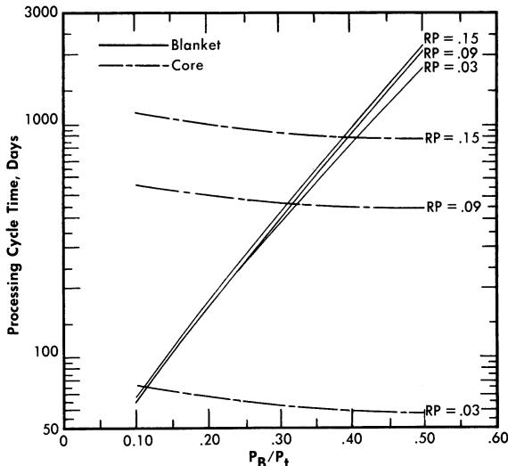  
FIG. 24-10. Chemical processing cycles vs. blanket power, based on a blanketed sphere with total reactor power of $825\mathrm{Mw}$ and the removal efficiencies of $Z_{u} = 0.25$ , $Z_{13} = 0.04$ , $Z_{\mathbf{FP}}^{\mathbf{B}} = 0.10$ , $Z_{\mathbf{FP}}^{\mathbf{C}} = 1.00$ .

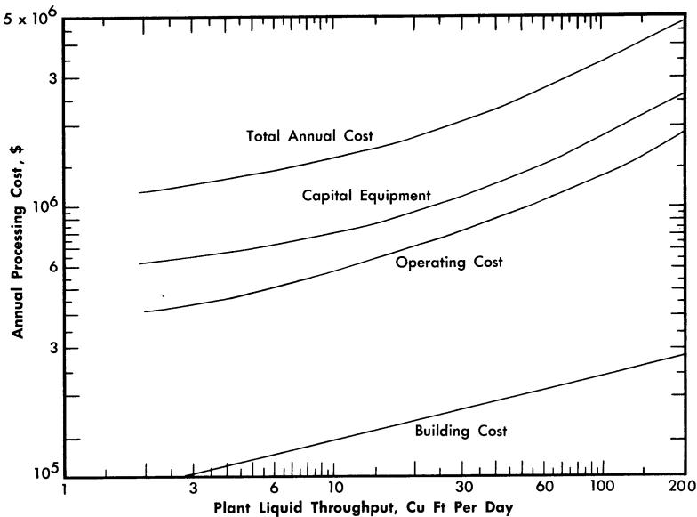  
FIG. 24-11. Annual fluoride volatility processing cost vs. plant throughput for 825-Mw-two-fluid LMFR.

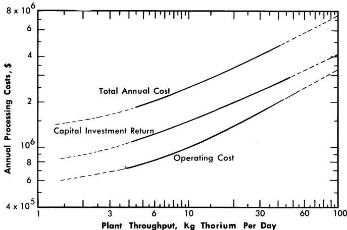  
FIG. 24-12. Annual aqueous processing costs vs. plant throughput for 825-Mw-two-fluid LMFR.

Chemical processing costs. The chemical processing cycle time for the blanket is determined by the $P_B / P_t$ ratio and the breeding ratio, as discussed in previous paragraphs. The processing rate for the core system is determined by the method also described previously; see Fig. 24-10. The total throughput to the fluoride volatility chemical separations plant is simply:

$$
\text {T h r o u g h p u t} \left(\mathrm {f t} ^ {3} / \text {d a y}\right) = \frac {V _ {\mathrm {c s}}}{T _ {c}} + \frac {V _ {\mathrm {b s}}}{T _ {B}}.
$$

The annual processing charges based on fluoride volatility can be read directly from Fig. 24-11, a plot of annual charges versus plant throughput.

As a matter of comparison, the chemical processing charges were also computed for each case, assuming on-site aqueous processing methods. The capacity and cost of an aqueous processing plant are determined by the amount of thorium per day which must be processed. The core solution processing does not enter into the cost unless the ratio of fuel to thorium presents criticality problems in the process equipment. This situation is likely to occur for the higher power levels in the blanket. This analysis did not take this possibility into account, however, and annual aqueous processing costs were taken directly from Fig. 24-12. This design plant capacity is $35\mathrm{kg/day}$ of thorium feed.

Results of optimization. The bismuth inventory is slightly greater for the case of $P_B / P_t = 0.10$ than for the other two cases, because of the added primary system volume. Fuel inventory charges are not very sensitive to

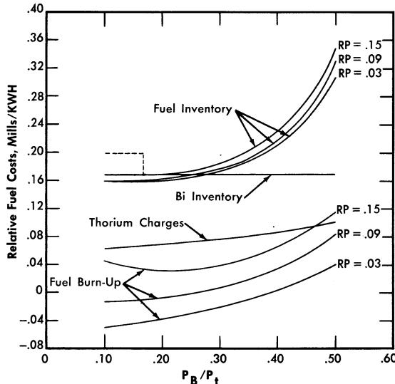  
FIG. 24-13. Relative fuel costs vs. blanket power for two-fluid LMFR based on a fully blanketed sphere operating at 825-Mw with a plant factor of $80\%$ .

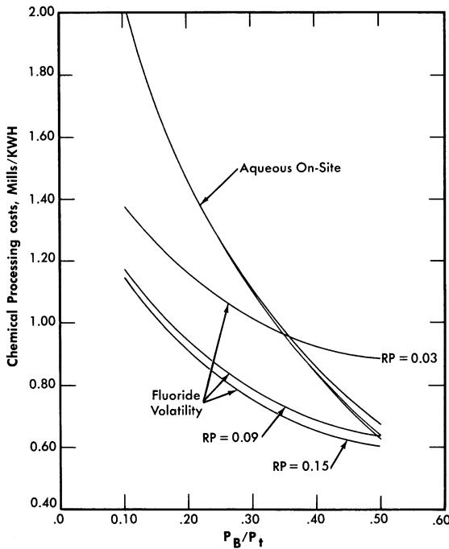  
FIG. 24-14. Chemical processing costs vs. blanket power. The cycle times are based on a blanketed spherical reactor with a total heat power of 825-Mw.

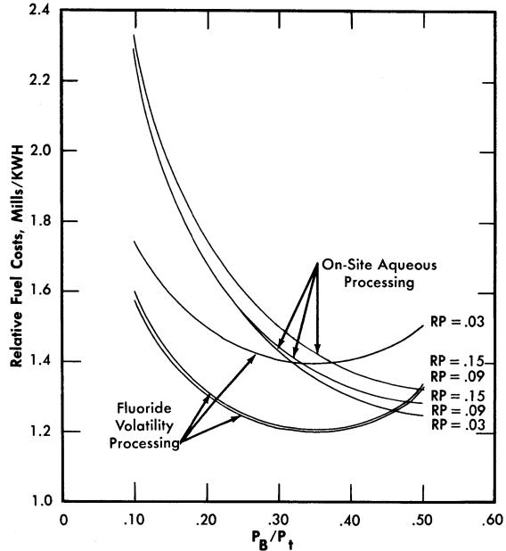  
FIG. 24-15. Relative fuel costs vs. blanket power for a blanketed spherical reactor operating at a total power of $825\mathrm{Mw}$ with a plant factor of $80\%$ .

the relative poison level in the core, but they increase sharply with an increase in power level (Fig. 24-13). Thorium charges increase linearly with blanket system slurry volume, and fuel burnup charges increase as $P_B / P_t$ increases, as shown in Fig. 24-13.

Chemical processing costs drop rapidly as the power fraction in the blanket increases. The increased processing rate required to maintain a steady-state fission-product relative poison level in the core of 0.03 results in a processing cost much higher than required for RP values greater than 0.09. The aqueous processing costs appear to become essentially equal to fluoride volatility costs at a value of $50\%$ for $P_B / P_t$ . Further analysis would be required to determine the validity of the aqueous processing cost curve for low throughput and high $N_{23} / N_{02}$ ratios encountered in the cases of high blanket power. The chemical processing costs are tabulated in Table 24-4 and shown graphically in Fig. 24-14.

The results of the economic comparisons are summarized in Table 24-5 and are graphed in Fig. 24-15. (RP on the graphs refers to the relative poison level of the fission products in the core.) Figure 24-15 shows that for all values of RP a minimum fuel cost occurs for a $P_B / P_t$ of approximately 0.33.

24-2.5 Selection of a reference design. The optimization study indicated that the most economic reactor design should produce one-third of

TABLE 24-4   
CHEMICAL PROCESSING COSTS TWO-FLUID LMFR   

<table><tr><td>Case</td><td>PB/Pt</td><td>Blanket process cycle, days</td><td>Slurry flow rate to chemi-cal plant, ft3/day, Vbs/ TB</td><td>RP (core)</td><td>Tc, days</td><td>U-Bi flow to chemi-cal plant, ft3/day, Vcs/Tc</td><td>Chemical plant thru-output, ft3/day,</td><td>Fluoride volatil-ity costs, $/yr × 10-6</td><td>Fluoride volatil-ity costs, mills/kwh</td><td>TB(Zu=1)</td><td>Th/day to chemi-cal plant, M02/ TB</td><td>Aqueous processing cost, $/yr × 10-6</td><td>Aqueous processing cost, mills/kwh</td></tr><tr><td>I (a)</td><td>0.10</td><td>16.26</td><td>45.8</td><td>0.03</td><td>75.8</td><td>25.3</td><td>71.1</td><td>3.03</td><td>1.37</td><td>65</td><td>325</td><td>4.20</td><td>1.90</td></tr><tr><td>(b)</td><td></td><td>16.59</td><td>44.9</td><td>0.09</td><td>557</td><td>3.44</td><td>48.3</td><td>2.57</td><td>1.17</td><td>66</td><td>320</td><td>4.15</td><td>1.88</td></tr><tr><td>(c)</td><td></td><td>17.08</td><td>43.6</td><td>0.15</td><td>1116</td><td>1.71</td><td>45.3</td><td>2.51</td><td>1.14</td><td>68</td><td>310</td><td>4.10</td><td>1.86</td></tr><tr><td>II (a)</td><td>0.3333</td><td>122.3</td><td>8.05</td><td>0.03</td><td>60</td><td>20.9</td><td>29.0</td><td>2.15</td><td>0.974</td><td>489</td><td>57.1</td><td>2.10</td><td>0.951</td></tr><tr><td>(b)</td><td></td><td>129</td><td>7.64</td><td>0.09</td><td>446</td><td>2.81</td><td>10.5</td><td>1.65</td><td>0.747</td><td>516</td><td>54.1</td><td>2.08</td><td>0.937</td></tr><tr><td>(c)</td><td></td><td>136.3</td><td>7.23</td><td>0.15</td><td>900</td><td>1.39</td><td>8.62</td><td>1.58</td><td>0.716</td><td>525</td><td>53.1</td><td>2.06</td><td>0.933</td></tr><tr><td>III (a)</td><td>0.50</td><td>444.5</td><td>2.77</td><td>0.03</td><td>56.5</td><td>17.9</td><td>20.7</td><td>1.95</td><td>0.883</td><td>1778</td><td>19.6</td><td>1.38</td><td>0.625</td></tr><tr><td>(b)</td><td></td><td>513</td><td>2.40</td><td>0.09</td><td>432</td><td>2.34</td><td>4.74</td><td>1.40</td><td>0.634</td><td>2052</td><td>17.0</td><td>1.32</td><td>0.598</td></tr><tr><td>(c)</td><td></td><td>547</td><td>2.25</td><td>0.15</td><td>854</td><td>1.18</td><td>3.43</td><td>1.33</td><td>0.602</td><td>2188</td><td>15.9</td><td>1.30</td><td>0.589</td></tr></table>

TABLE 24-5   
RELATIVE FUEL COST FOR TWO-FLUID LMFR (WITH POISONS-BLANKETED SPHERE)   

<table><tr><td rowspan="2">Case</td><td rowspan="2">PB/Pt</td><td rowspan="2">Bismuth 
inven-
tory, 
C1×10-3$/yr</td><td rowspan="2">Fuel 
inven-
tory, 
C2×10-3$/yr</td><td rowspan="2">Fuel 
burnup, 
C3×10-3$/yr</td><td rowspan="2">Thorium 
inven-
tory, 
C4×10-3$/yr</td><td rowspan="2">Thorium 
burnup, 
C5×10-3$/yr</td><td rowspan="2">Fluoride 
volatility 
process-
ing costs, 
Cp×10-3$/yr</td><td colspan="2">Total costs incl. 
fluoride vol.
proc.</td><td rowspan="2">Aqueous 
proc.
costs, 
Cp×10-3$/yr</td><td colspan="2">Total costs incl.
aqueous pro-
 cessing</td></tr><tr><td>Ct×10-3$/yr</td><td>Ct mills/kwh</td><td>Ct×10-3$/yr</td><td>Ct mills/kwh</td></tr><tr><td>I (a)</td><td>0.10</td><td>440</td><td>353</td><td>-116.5</td><td>133</td><td>12.3</td><td>3031</td><td>3852</td><td>1.75</td><td>4200</td><td>5022</td><td>2.28</td></tr><tr><td>(b)</td><td></td><td>440</td><td>353</td><td>-31.4</td><td>133</td><td>12.1</td><td>2570</td><td>3477</td><td>1.58</td><td>4150</td><td>5057</td><td>2.29</td></tr><tr><td>(c)</td><td></td><td>440</td><td>369</td><td>98.6</td><td>133</td><td>11.8</td><td>2510</td><td>3562</td><td>1.61</td><td>4100</td><td>5152</td><td>2.33</td></tr><tr><td>II (a)</td><td>0.3333</td><td>371</td><td>399</td><td>-31.4</td><td>176</td><td>12.1</td><td>2150</td><td>3077</td><td>1.39</td><td>2100</td><td>3027</td><td>1.37</td></tr><tr><td>(b)</td><td></td><td>371</td><td>407</td><td>31.4</td><td>176</td><td>11.9</td><td>1650</td><td>2647</td><td>1.20</td><td>2070</td><td>3067</td><td>1.39</td></tr><tr><td>(c)</td><td></td><td>371</td><td>429</td><td>98.6</td><td>176</td><td>11.8</td><td>1580</td><td>2666</td><td>1.21</td><td>2060</td><td>3146</td><td>1.44</td></tr><tr><td>III (a)</td><td>0.50</td><td>371</td><td>678</td><td>89.8</td><td>220</td><td>11.8</td><td>1950</td><td>3311</td><td>1.50</td><td>1380</td><td>2741</td><td>1.25</td></tr><tr><td>(b)</td><td></td><td>371</td><td>731</td><td>184.5</td><td>220</td><td>11.6</td><td>1400</td><td>2918</td><td>1.32</td><td>1320</td><td>2838</td><td>1.29</td></tr><tr><td>(c)</td><td></td><td>371</td><td>766</td><td>247</td><td>220</td><td>11.4</td><td>1330</td><td>2945</td><td>1.33</td><td>1300</td><td>2915</td><td>1.32</td></tr></table>

the total power in the blanket system and that the relative poison in the core due to fission products should be approximately 0.09. However, several effects must be considered in relating the optimum reactor to the actual operating reactor. A geometry more realistic than the fully blanketed sphere must be considered in establishing new specifications; effects of higher uranium isotopes, Pa losses, and control rods on breeding ratio must be taken into account; and a new chemical processing cycle for the blanket, along with a new fission-product poison level in the blanket, must be calculated based upon the adjusted breeding ratio.

Geometry effects. The inability to wrap a blanket around the ends of the core requires an adjustment to the parameters for the reference design based on the calculations with a full blanket. The axial leakage out of a bare ended core and a blanket with a height 1.5 times its diameter was calculated to be 0.18 neutron per absorption in fuel. An extension of the blanket length and the addition of partial end graphite reflectors are estimated to reduce the end leakage to one-half this value. The total neutron leakage, both fast and thermal, out of the partially blanketed reactor is estimated at 0.17 neutron per absorption in fuel.

The added length of core and blanket will slightly increase the critical mass, but the required $N_{23} / N_{\mathrm{Bi}}$ ratio will decrease slightly. In order to be conservative in the fuel inventory costs, however, the critical values of $N_{23} / N_{\mathrm{Bi}}$ for the fully blanketed sphere are assumed for both core and blanket.

Breeding ratio. Higher uranium isotopes. The higher uranium isotopes, primarily $\mathrm{U}^{234}$ , $\mathrm{U}^{235}$ , and $\mathrm{U}^{236}$ , continue to build up in both the core and blanket fuels throughout reactor life, since they cannot be separated in the chemical plant. The relative poison due to these isotopes, however, rises rapidly at first with the buildup of $\mathrm{U}^{236}$ but increases very slowly thereafter. The return from $\mathrm{U}^{235}$ fissions almost balances for losses to $\mathrm{U}^{234}$ and $\mathrm{U}^{236}$ [4]. An average poison fraction of 0.01 for the reactor is used for the reference design.

Protactinium losses. The equilibrium $\mathrm{Pa}^{233}$ concentration can be computed from the relationship

$$
N _ {1 3} ^ {B} = \frac {b}{a} N _ {2 3} ^ {B},
$$

using an effective thermal absorption cross section of $\mathrm{Pa}^{233}$ based on the calculated neutron spectrum in the blanket. The relative absorptions of the $\mathrm{Pa}^{233}$ are very small (0.005), but they are included.

Control rods. The self-regulating properties of an LMFR have not been established at this time. An allowance of 0.01 in relative absorptions is included to account for the possibility of using a regulating rod and a small

# REFERENCE DESIGN SPECIFICATIONS

# SPECIFICATIONS FOR EQUILIBRIUM OPERATION

# Core:

<table><tr><td>Thermal power</td><td>550 Mw</td></tr><tr><td>Electric power</td><td>210,000 kw</td></tr><tr><td>Diameter, inches</td><td>61</td></tr><tr><td>Height, inches</td><td>91.5</td></tr><tr><td>Fuel</td><td>U233</td></tr><tr><td>VBi/Vc</td><td>1.22</td></tr><tr><td>N23/NBi</td><td>600 × 10-6</td></tr><tr><td>Mass of U233 in system, kg</td><td>234</td></tr><tr><td>Total volume of fuel, ft3</td><td>1255</td></tr><tr><td>Breeding ratio, over-all</td><td>0.86</td></tr><tr><td>Chemical processing cycle, days</td><td>446</td></tr><tr><td>Volume flow rate through chemical plant, ft3/day</td><td>2.81</td></tr><tr><td>Mass flow rate through chemical plant, g U233/day</td><td>525</td></tr><tr><td>Average thermal flux in active core</td><td>1.6 × 1015</td></tr><tr><td>Average thermal flux in core system</td><td>6.4 × 1013</td></tr></table>

# Blanket:

<table><tr><td>Thermal power</td><td>275 Mw</td></tr><tr><td>Electric power</td><td>105,000 kw</td></tr><tr><td>Thickness, ft</td><td>3</td></tr><tr><td>Vslurry/Vc</td><td>0.5</td></tr></table>

Slurry content:

Thorium (as $\mathrm{Th}_{3}\mathrm{Bi}_{5}$ ) $10\%$ wt

Bismuth $90\%$ wt

$\mathrm{N}_{23} / N_{\mathrm{Bi}}$ (atom ratio) $1190 \times 10^{-6}$

Mass of $\mathbf{U}^{233}$ in system, kg 328

Mass of thorium in system, kg 27,900

Total volume of fuel, ft3 985

Chemical processing cycle, days 200

Volume flow rate through chemical plant, ft3/day 4.91

Mass flow rate through chemical plant, kg of Th/day 140

amount of shim control for normal operation. Safety rods are included in the reference design but do not affect neutron economy.

Fission-product poisons. The adjustment of breeding ratio to correspond to the effects outlined above changes the required chemical processing cycle for the blanket system. This change in $T_{B}$ also changes the equilibrium

value of fission products in the blanket. Proper adjustments result in a blanket processing cycles of 200 days (assuming $Z_{u} = 0.25$ ) and a fission-product poison fraction in the blanket of 0.039 (RP in blanket = 0.15).

Neutron balance. The neutron losses proportional to one absorption in $\mathbf{U}^{233}$ are listed below:

<table><tr><td>Absorptions in: U233</td><td>1.000</td></tr><tr><td>Th</td><td>0.860</td></tr><tr><td>C</td><td>0.025</td></tr><tr><td>Bi</td><td>0.050</td></tr><tr><td>Xe135</td><td>0.010</td></tr><tr><td>Sm149</td><td>0.017</td></tr><tr><td>Fission products</td><td>0.073</td></tr><tr><td>Higher isotopes</td><td>0.010</td></tr><tr><td>Control rod</td><td>0.010</td></tr><tr><td>Pa233</td><td>0.005</td></tr><tr><td>Leakage</td><td>0.170</td></tr><tr><td>Total</td><td>2.230</td></tr></table>

# 24-3. SYSTEMS DESIGN

24-3.1 General. Systems design covers all of the reactor plant external to the reactor, except for chemical processing. The reactor plant includes the steam generator, but not the steam system or its auxiliaries. The principal purpose of the systems is to transport heat from the reactor and generate steam. They also provide supporting functions, such as shield cooling, uranium addition, etc.

The primary system consists of six heat transport loops, each consisting of a pump, a heat exchanger, check valve, and interconnecting piping. The hot-leg temperature is $1050^{\circ}\mathrm{F}$ ; the cold-leg temperature $750^{\circ}\mathrm{F}$ . In each of the intermediate heat exchangers, heat is transferred from the bismuth to the intermediate fluid, sodium. There are six intermediate heat transport loops, each containing a pump, steam generator, and interconnecting piping. The hot-leg temperature is $1010^{\circ}\mathrm{F}$ ; the cold-leg temperature $680^{\circ}\mathrm{F}$ . Steam is produced at 2100 psia, $1000^{\circ}\mathrm{F}$ .

Selection of the above parameters was a problem involving consideration of the steam plant as well as the reactor plant. The primary system temperatures were first fixed by using the largest $\Delta T$ considered likely to prove practical.

The temperature approach of the intermediate heat exchanger was set at $40^{\circ}\mathrm{F}$ , resulting in a sodium hot-leg temperature of $1010^{\circ}\mathrm{F}$ . To provide the close approach necessary for steam temperature stability, the steam temperature was set at $1000^{\circ}\mathrm{F}$ . A steam pressure of 2100 psig was picked to correspond with $1000^{\circ}\mathrm{F}$ .

Shifting the sodium cold-leg temperature redistributes heat-transfer surface between the intermediate heat exchanger and the steam generator. However, it seems desirable to favor making the intermediate heat exchanger small to cut down on fuel inventory. For this reason, the sodium cold-leg temperature was established at $680^{\circ}\mathrm{F}$ .

24-3.2 Plant arrangement. Plant arrangement starts with positioning the primary system relative to the reactor, and this is determined by seven principal considerations: (1) reactor design, (2) plant operation, (3) maintenance, (4) operational limitations of major components, (5) structural integrity of piping, (6) economics, and (7) safety.

A preliminary analysis of the two reactor concepts, single-fluid and two-fluid, resulted in the decision to use three external loops for the single-fluid and six for the two-fluid reactor. For both these alternates the maintenance philosophy selected was that of removal and replacement by horizontal transfer of a complete primary loop upon failure of any major component in the loop [5]. Thus, for arrangement purposes, the primary loops assume the shape of a rail-mounted horizontal containment vessel, or capsule, sized to contain all loop components. The height of the capsules relative to the reactor is dictated by an economic balance between height or elevation costs and pump net positive suction head.

The arrangement for the two-fluid reactor with six primary loops is shown in Figs. 24-16 and 24-17.

In plan, the primary loops were located radially around the reactor, Fig. 24-16. A minimum length of interconnecting pipe between the reactor and the loops was used because of high fuel inventory costs. This latter consideration ruled out shielding of any appreciable thickness between the reactor and the loops. Maintenance access doors and other shielding around the outside of the loops was sized for source conditions 6 to 8 hr after shutdown of the reactor to permit access by maintenance personnel at that time into the annular area.

With the primary loop arrangement established, the next problem was location of the intermediate system. Since this system is the connecting link between the primary systems and the steam turbines, it must be located between them. The turbine is above ground level for gravity drainage of condenser cooling water, and the primary loops are below ground level for economy of shield costs. The path taken by the intermediate system can be either a high-level path, immediately up from the primary system, or a low-level path, immediately down from the primary system, and then horizontally to an area outside the primary system area.

The intermediate system in this arrangement follows the high-level route to the steam plant. Sodium lines are brought straight up to an annular area around the reactor maintenance chamber. Since access to

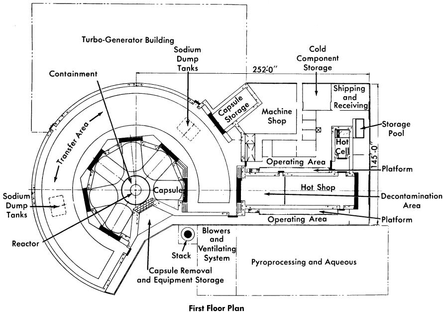  
FIG. 24-16. LMFR-6: Capsulate loop conceptual plant layout.

this chamber will not be permitted during reactor operation, a heavy shield wall is not required around the chamber.

Within this annulus are the sodium pumps and the steam generators. Final layout of this equipment will require considerable ingenuity, but it is feasible. Steam lines will cross the roof of the reactor building to the turbine building.

Because the primary loop hot maintenance shop for this concept serves such specialized functions, its usefulness for maintenance of chemical processing equipment is doubtful. Accordingly, the chemical processing facilities for this two-fluid six-loop plant, together with its supporting hot and conventional laboratories, fuel addition and other systems, are located in a separate building.

The turbine building is of conventional construction and will be in all essential respects identical for both plants.

Startup heating switch gear, gas heating and cooling systems for the reactor and dump tanks, inert gas storage systems, control rooms, and other auxiliaries are located relative to the above systems as logically as possible in the light of their functional requirements.

With respect to contamination control the basic philosophy is (1) controlled access to areas having different order of magnitude activity levels and (2) controlled circulation of ventilating air to assure flow from low-

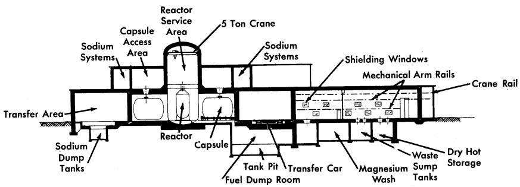  
FIG. 24-17. LMFR-6: Capsulate loop conceptual plant elevation.

to high-level activity areas. For guidance in achieving these objectives a rough scale of activity levels has been proposed, as follows:

Class #1—conventional steam turbine plant, personnel monitored.

Class #2—uncontaminated areas of nuclear plant, personnel monitored.

Class #3—potentially contaminated areas, personnel closely monitored; e.g., shield cooling, reactor and dump tank heating and cooling, hot shop operating area.

Class #4—low activity, accessible by closely monitored personnel only under favorable conditions; e.g., exhaust blower room, hot chemical laboratory.

Class #5—medium to high activity, accessible by closely monitored personnel only after executing standard decontamination procedures; e.g., hot maintenance shop.

Class #6—high activity, no access during life of plant except after extended shutdown and special decontamination; e.g., chemical processing and chemical hot cell.

Class #7—very high activity, no access by personnel during or after life of the plant; e.g., primary loop and reactor areas.

24-3.3 Primary system. The LMFR primary system is designed to remove up to $825\mathrm{Mw}$ of heat from the reactor. The primary system consists of six separate heat transport loops.

The fuel stream enters the bottom portion of the reactor vessel at a minimum bulk temperature of $750^{\circ}\mathrm{F}$ , and flows upward through the core, where fissions within the fuel cause the fluid to undergo a temperature rise of $300^{\circ}\mathrm{F}$ , resulting in a maximum fuel temperature of $1050^{\circ}\mathrm{F}$ . Upon leaving the core, the fluid passes upward to a degassing area, where volatile fission products are removed from the fuel stream. The reactor discharge consists of a header which splits the fuel flow into the primary heat-transport loops.

The primary loop piping, 20 in. in diameter, is sized to obtain a maximum fuel velocity of 10 fps.

From the degassing area discharge, each fuel stream flows to the suction of a variable speed centrifugal sump type pump. Each pump is designed to deliver about 9000 gpm at 20-ft head of pumped fluid. To obtain a reasonable pump speed, the net positive suction head requirement is 11.5 ft. A gas pressure (helium) is maintained over the pump sump to prevent flooding of upper parts (motor windings, cooling system, etc.) of the pump.

From pump discharge the fuel stream flows to the tube side of a U-tube U-shell intermediate heat exchanger in which the fuel stream gives up heat to the intermediate fluid, sodium. Upon discharge from the intermediate heat exchanger, the fuel solution flows into the reactor.

To meet safety requirements, the reactor and the major components of the primary loops are enclosed within containment vessels. The containment vessel which houses the pump and heat exchanger of each primary loop is a cylindrical capsule, 20 ft in diameter by 30 ft long, including 2:1 elliptical heads. The capsule is equipped with access holes such that certain maintenance operations may be performed [5]. The reactor containment vessel is a right circular cylinder 30 ft in diameter, with a hemispherical top head and a flat bottom head. Access holes are provided in the vessel for maintenance operations.

Each heat-transport loop is provided with four dump tanks which receive the loop and a portion of the reactor volumes. The tanks are sized and arranged to prevent a fast chain reaction. The primary loops are filled from the dump tanks by means of small electromagnetic pumps. These pumps also promise a means for agitation of the fuel.

Two dump lines, each with a maintainable valve, connect each loop with the dump tanks.

The bismuth charge system consists of a bismuth melt tank, filter, valves, and piping to the dump tanks.

The proposed material of construction exposed to primary fluid is $21\%$ Cr-1% Mo steel.

24-3.4 Intermediate system. The intermediate system, which also consists of six separate heat-transfer loops, utilizes sodium as the heat-transfer medium. All material of construction of the intermediate system, except the steam generator, is $2\frac{1}{4}\%$ Cr-1% Mo steel. The steam generator, which is designed for high-pressure, high-temperature service, is constructed of type-304 stainless steel. The intermediate piping (12-in. schedule-30) is sized for a maximum sodium velocity of 17 fps.

Sodium flowing at 11,000 gpm enters the shell side of the intermediate heat exchanger (which is a U-tube, U-shell unit containing 2400 5/8-in.-OD

tubes with an average length of 21 ft) at $680^{\circ}\mathrm{F}$ , flows countercurrent to the fuel stream, and exits from the heat exchanger. Sodium flows to the suction of a variable speed centrifugal sump type pump. Each intermediate pump is designed to deliver 11,000 gpm at 180-ft head.

From pump discharge sodium flows to the shell side of the steam generator. The steam generator is a U-tube, U-shell "once-through" type unit which is constructed of type-304 stainless steel. The unit consists of 530 1/2-in.-OD tubes with an average length of 65 ft. The shell OD is 29 in. and the over-all length is 68 ft.

Sodium flows countercurrent to superheated steam, boiling water, and feedwater in the steam generator and gives up heat which produces $1,100,000 \mathrm{lb/hr}$ of superheated steam at 2250 psig and $1000^{\circ}\mathrm{F}$ .

From the steam generator sodium flows to the intermediate heat exchanger inlet to complete the cycle.

In addition to the components listed above, auxiliary components are necessary to obtain proper function of the intermediate system. An expansion tank is located at the highest point of each intermediate loop. This tank serves as a cushion for pressure surges, a surge vessel for thermal expansion of sodium, and suction head for the pumps. The lowest point of each intermediate loop is connected by pipe and dump valves to a sodium dump tank which receives the inventory of the respective loop. Sodium is replaced in the loop by a small electromagnetic pump which takes suction from the bottom of the dump tank. A plugging indicator and a cold trap are provided to determine sodium oxide concentration and to maintain the oxide concentration at low levels.

In the event fission-product "hangup" occurs in the intermediate heat exchanger, fission product activity will generate heat within the metal. To prevent excessive metal temperatures, cooling must be provided when the unit is drained. This cooling is accomplished by providing removable sections of insulation which, when removed, will permit heat to be dissipated by radiation, conduction, and convection heat transfer. Flow control of the intermediate system will be by the variable speed pump drives. This method of control should provide a reasonably constant steam temperature and pressure.

24-3.5 Reactor heating and cooling system. The reactor must be preheated prior to operation and for outgassing purposes. The required temperature for outgassing the graphite is $1000^{\circ}\mathrm{F}$ . To achieve preheating, hot helium gas will be circulated through the close-fitting jacket or double containment which creates an annulus surrounding the reactor vessel. During the preheating phase, helium gas will be pumped from one of two blowers, pass through an electric resistance heater, be introduced at the bottom of the annulus, pass up around the reactor vessel giving up its

transported heat to the cooler surface, and return by ducting from the upper end of the containment to the blower suction.

When, for any reason, it becomes desirable to shut down the reactor and dump the primary system, reactor cooling must be provided to remove decay heat generated by fission-product hangup within the reactor after dump. This is necessary to prevent internal temperatures from exceeding design limits. The system as just described provides cooling by opening a valve to bring a finned tube helium-to-water heat exchanger into the cycle and by closing a stop valve to remove the gas heater from the gas flow path.

Helium system design pressure and temperature will be 5 psig and $1050^{\circ}\mathrm{F}$ . The entire loop is of all-welded construction to minimize helium leakage and leakage of volatile fission products should a rupture of the reactor vessel or piping give volatile fission products access to this loop.

24-3.6 Dump tank heating and cooling. When fuel is drained from the primary system into the dump tanks, fission-product decay produces heat within the fuel which must be removed to prevent dump tank metal temperatures from exceeding design limits.

Cooling is accomplished by circulating helium at 140 psig through a narrow annulus around each dump tank. Helium which has removed heat from the dump tanks passes through a finned-tube heat exchanger and gives up heat to river water. Circulation of helium is provided by six 14,000 cfm blowers, each rated to provide a head of 18-in. water. Three standby blowers are also provided. Helium piping is arranged such that four dump tanks are serviced by one blower.

To preheat the dump tanks and to maintain their temperature at a level such that fuel precipitation does not occur, electric heaters are paralleled with the heat exchanger such that the same piping system serves for heating or cooling. The heaters or heat exchangers may be brought into or taken off the cycle by valving.

24-3.7 Startup heating system. Prior to power operation, the LMFR heat-transport system must be preheated to about $800^{\circ}\mathrm{F}$ . The reactor and the primary dump tanks are preheated by electric furnaces and circulating helium. The remainder of the heat-transport systems, i.e., primary pipe, intermediate heat exchanger, intermediate piping, dump tanks, expansion tanks, steam generator, and the steam system pipe and components, are preheated by induction heaters.

Since $2\frac{1}{4}$ Croloy and stainless steel are nonmagnetic, a thin sheet of carbon steel will be required under areas where induction heaters are applied.

24-3.8 Primary inert gas system. Inert gas is used in the LMFR primary system to cover all free liquid metal surfaces and to provide a gas seal within the pumps.

Helium, by virtue of its very low activation cross section and inertness, is utilized as the cover and seal gas for the primary system. It is stored at 200 psig in a storage tank and is piped via pressure-reducing valves to the pump, dump tanks, and reactor. Since relatively small quantities of helium will be used, it is expected that waste helium will be discharged via the off-gas system to the stack.

Since commercial helium is sufficiently pure for use in an LMFR, no purification will be required.

24-3.9 Intermediate inert gas system. Nitrogen is used in the LMFR intermediate system to cover all free sodium surfaces and to provide a gas seal in the pump. It is stored at 200 psig in a storage tank and is piped via pressure-reducing valves to the pumps, expansion tanks, and the dump tanks. Used nitrogen is discharged to the stack.

Commercial nitrogen must be purified prior to use in the intermediate system. Purification is accomplished by bubbling nitrogen through several tanks containing NaK.

24-3.10 Shield cooling. The concrete surrounding the primary cells serves as a shield from the neutrons and gammas leaving the primary fluid. In the absorption of these neutrons and gammas, considerable heat is generated within the concrete. To hold temperatures and thermal gradients within the concrete to reasonable limits, a cooling system must be utilized. This cooling system consists of panel coils embedded about 6 in. within the concrete shield. High-purity water, flowing inside the panel coils, removes heat from the concrete and prevents temperature damage to the concrete.

The closed, high-purity loop which rejects heat to river water is designed for a maximum heat load of $6\mathrm{Mw}$ . One pump of 900-gpm capacity provides circulation for the closed water loop. Flow control valves proportion the flow to the various panels such that panel coil outlet temperatures are equal.

A dump tank for the closed loop (about $300\mathrm{ft}^3$ ) is located beneath the panel coils, so that the coils may be gravity drained. Water is returned to the closed loop by means of gas pressure. In the event it is necessary to dispose of the water in the closed loop, it may be drained from the dump tank to the radioactive waste disposal system.

24-3.11 Reactor cell cooling. Instruments located within the reactor containment vessel must be kept at a relatively low ambient temperature. To maintain the ambient temperature, a "fin fan" cooling unit is attached

to the containment vessel. Helium, which fills the containment vessel, is circulated by a blower located within the cooling unit. The circulating helium removes heat from the containment vessel and transports it to the finned coil, where it is transferred to water which is taken from and returned to the closed shield cooling circuit.

24-3.12 Capsule and reactor room cooling. The containment capsules and the reactor are located in a large room. The ventilation requirements of this area are dependent upon heat losses from the primary loop containment capsules.

Ventilation is provided by locating air intake louver at several points around the room. An air fan provides circulation of air around the capsules and removes heat, which is discharged to the stack. A radiation monitor continuously monitors the air discharge. In the event radiation tolerance levels are exceeded by the air discharge, the cooling air will be recirculated to the reactor and capsule room until the source of radiation is determined.

24-3.13 Raw water system. The raw water system is the final waste heat sink for the entire plant. River water, which is screened and treated, is piped beneath the turbine-generator building. The systems which require river water, i.e., turbine condenser, shield cooling, reactor cooling, dump tank and pump cooling, take suction from this pipe and discharge to a similar one which returns the heated water to the river. Where possible, river water flows tube side in heat exchangers, to facilitate cleaning.

24-3.14 Instrumentation and control. The purpose of the control system in this plant is to provide safe and stable operation while following the loads imposed by the utility system. The plant follows the turbo generator. Loads on the turbo generator are set by the utility.

A load change will appear in the steam system as a change in throttle valve position and, therefore, a change in steam flow and pressure. The feedwater controllers at the inlet to the steam generators will sense these changes and operate to maintain steam pressure constant. The steam flow could also provide an anticipatory signal to the primary and intermediate system pumps to change their speed to suit the load.

The reactor will have a negative temperature coefficient of reactivity. Thus, it will try to maintain its average temperature constant during load changes. The temperature will change from time to time as reactivity changes. To take advantage of the negative temperature coefficient, the average temperature of the reactor will be set at a constant value.

Programming of flow rate in the primary and intermediate loop is uncertain. Cost estimates for pumps and control equipment were based on the premise that speed of the pumps would be varied. This might be necessary to avoid thermal stresses during transients.

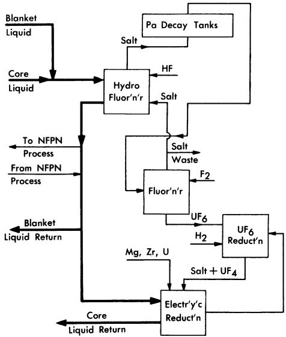  
FIG. 24-18. Fluoride volatility processing of core and blanket.

24-3.15 Maintenance. The maintenance of the reactor and primary system components will be completely remote, because of the high levels of radioactivity of the circulating fuel. The entire plant and reactor system are arranged for remote maintenance [5].

24-3.16 Chemical processing. The pyro process chosen for this economic study is the fluoride volatility method applied to a two-region reactor. Work of adapting this process to bismuth fuel processing is presently under way at Argonne National Laboratory. Figure 24-18 presents the main steps in this process. As shown, the process may be used for either blanket or core liquid. When the plant is processing core liquid the basic steps in this process are (1) hydrofluorination to oxidize uranium and some fission products, (2) transfer of the oxidized material to a fused salt phase, (3) fluorination of the salt carrying the uranium and fission products for separation of uranium as volatile $\mathrm{UF}_6$ , (4) reduction of the $\mathrm{UF}_6$ to $\mathrm{UF}_4$ by $\mathrm{H}_2$ in a fused salt phase, and (5) reduction of $\mathrm{UF}_4$ to uranium metal and transfer into the metal phase (bismuth).

The volatility method can be conveniently used to process a thorium bismuthide blanket. The process must be preceded by a phase separation step which separates the thorium bismuthide solids from the liquid carrier bismuth (Fig. 24-19). The modification of the core liquid process flowsheet is as follows: (1) salt effluent from the hydrofluorination step must be stored in order to achieve Pa decay to uranium, and (2) the bismuth liquid is returned to the blanket head end process without the addition of uranium.

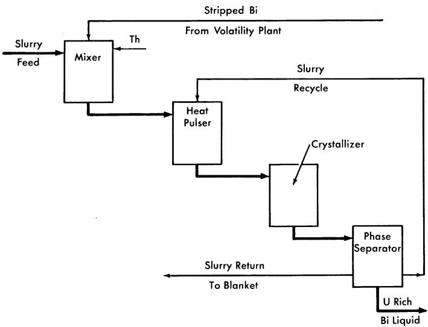  
FIG. 24-19. Head end processing, bismuthide slurry.

Certain of the fission products are not removed by volatility processing. These may be removed by zinc precipitation (Fig. 24-20). This process requires that the bismuth feed be free of uranium, and the volatility plant provides such a bismuth feed stream.

The head end process transfers bred uranium, protactinium, and fission products out of the solid phase portion of the slurry and into the liquid phase. After this step the two phases are partially separated. A liquid portion transferred to the volatility plant carries bred uranium, protactinium, and fission products with it for stripping with HF. The stripped liquid bismuth is returned to the head end plant for mixing with fresh slurry feed. The head end process is not $100\%$ efficient; i.e., the uranium and protactinium are not completely removed from the slurry before reconstitution and return to the blanket region. This problem has been examined in some detail and was taken into account in determining economics.

24-3.17 Turbine generator plant. A flow of 3,330,000 lb/hr of superheated steam at 2100 psi and $1000^{\circ}\mathrm{F}$ is delivered to the turbine. The generator has a gross output of 333,000 electrical kw, and the condenser removes $1.677 \times 10^{9}$ Btu/hr at 1.5 in. of mercury absolute, thus giving a gross heat rate of 8450 Btu/kwh. About 18,000 kw of electrical power is used for the various pumps and auxiliary systems in the plant, making the net output 315,000 kw. Therefore, the net heat rate is 8940 Btu/kwh, which corresponds to an efficiency of $38.2\%$ .

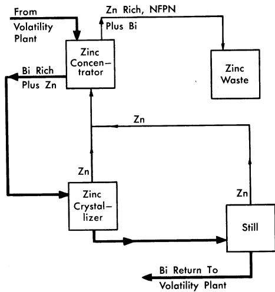  
FIG. 24-20. NFPN fission-product removal.

At full load there are 1,825,500 lb/hr of steam leaving the turbine and being condensed in the condenser. Also, 113,800 lb/hr of water from various parts of the cycle are being cooled by the condenser. The total head load on the condenser is $1.677 \times 10^{9}$ Btu/hr. The condenser cooling water enters one water box at $70^{\circ}\mathrm{F}$ and leaves the other at $80^{\circ}\mathrm{F}$ .

24-3.18 Off-gas system. The actual design and efficiency of any conceptual degasser are as yet unknown quantities, and a knowledge of these important details will have to wait until in-pile loops have provided sufficient data.

The off-gas system will consist of a cooler followed by a series of storage bottles. Gaseous fission products that have been separated from the liquid bismuth in the degasser are first sent through a cooler which offers a residence time of about a day, or enough for most of the short-lived isotopes to decay. From the cooler, the gasses are compressed into storage bottles, each capable of holding 30 days' accumulation. The storage bottles will each be $4.25\mathrm{ft}^3$ in volume, and at $212^{\circ}\mathrm{F}$ and 60 psia at the time of disconnection from the compressor.

Some sweep gas may be included in the above gas stream, but the present design philosophy indicates that no extra sweep gas should be required; however, if some sweep gas is required for efficient degasser operation, this gas could be obtained by a recycle of previously removed gas. This recycle sweep stream would most probably be taken from the storage bottles after sufficient cooling.

The gas in the storage bottles may be vented to the atmosphere after 90 days of storage, since then only the $\mathrm{Kr}^{85}$ activity is still present in appreciable amounts, and this can be released provided there is sufficient dilution. However, the most probable course of action will be to process the stored off-gas through a gas separation system, where the valuable $\mathrm{Kr}^{85}$ will be recovered.

# 24-4. SINGLE-FLUID REACTOR DESIGN

24-4.1 General description. The single-fluid LMFR concept has been investigated to determine the characteristics and economic attractiveness of this design. In general, the core consists of a large array of solid moderator blocks stacked to provide the desirable geometry of a cylinder. Vertical cylindrical channels are drilled through the moderator to allow circulation of the liquid metal slurry containing both the fuel and fertile material. The fission heat generated in the fuel-coolant stream is transported by forced convection to heat exchangers external to the reactor vessel. The unique feature of this concept is that only one coolant, the slurry, is used for removing heat from all parts of the reactor. The desired slurry-to-moderator ratio is achieved by selecting the appropriate combination of channel size and spacing.

24-4.2 General specifications. The general specifications for the system affecting reactor design are tabulated below:

<table><tr><td>Power</td><td>825 Mw (thermal)</td></tr><tr><td></td><td>315 Mw (electrical)</td></tr><tr><td>Slurry temperature:</td><td></td></tr><tr><td>Tin</td><td>750°F</td></tr><tr><td>Tout</td><td>1050°F</td></tr><tr><td>Maximum slurry velocity</td><td>10 fps</td></tr><tr><td>Fuel</td><td>U235 or U233</td></tr><tr><td>Fertile material</td><td>Thorium</td></tr><tr><td>Moderator material</td><td>Graphite or BeO</td></tr><tr><td>Slurry carrier</td><td>Bismuth or lead</td></tr><tr><td>Slurry-to-moderator ratio</td><td>Variable</td></tr><tr><td>Fertile material content in slurry</td><td>Variable</td></tr><tr><td>Core geometry</td><td>Cylinder</td></tr><tr><td>Core size</td><td>Variable</td></tr></table>

24-4.3 Parametric study. A parametric study was performed to determine the optimum nuclear parameters for a single-fluid concept. The variable parameters investigated and their range of values are:

Slurry-to-graphite ratio, $V_{s} / V_{c} = 0.05$ to 1.0,

Fertile material content, $\mathrm{g / kg}$ of $\mathrm{Bi} = 0$ to 80,

Equivalent bare reactor diameter, $D$ , ft = 10 to 20.

The choice of fuel for the first full-scale LMFR will depend upon the availability of $\mathbf{U}^{233}$ , which is much more attractive than $\mathbf{U}^{235}$ because of better neutron economy, and a sufficient quantity for fueling an LMFR may be available in 10 to 15 yr. In the early stages of this study, however, $\mathbf{U}^{235}$ was arbitrarily chosen as the fuel for the parametric study. The selection of the reference design should be valid for either fuel.

In each case the critical concentration and conversion ratio were determined by multigroup diffusion theory, using 37 neutron energy groups. To handle the large number of calculations, a digital computer was used once the range of values for the parameters was established by a series of criticality calculations by hand.

The use of BeO as a moderator has the advantage of reducing the core size because of improved slowing-down power compared with graphite. Critical size, fuel concentration, and breeding ratio were determined for one case, using BeO as moderator.

Since the cost of bismuth as a primary coolant is between $3,000,000 and $4,000,000, the inventory charges are a significant fraction of the total fuel costs. One case was calculated using lead as a coolant in order to compare the increase in inventory charges due to the use of bismuth with the loss in conversion ratio due to the absorptions in the lead.

Basis of nuclear calculations. To obtain comparative results, the following specifications were assumed for all cases:

Average temperature 862°F

Graphite density 1.80 $\mathbf{g} / \mathbf{cc}$

Bismuth density 9.83 g/cc

Geometry Cylinder $(H = D)$

For consistency and ease of comparison, all calculations used equivalent bare reactor dimensions, except the calculation of reflector savings as a function of reflector thickness.

TABLE 24-6 SUMMARY OF SINGLE-FLUID NUCLEAR CALCULATIONS   

<table><tr><td>Case</td><td>Thorium, g/kg Bi, W02</td><td>Vs/Vc</td><td>Bare equiv. core size, D = H, ft</td><td>Initial conversion ratio</td><td>N25/NBi, ×106</td></tr><tr><td>11144</td><td>0</td><td>0.5</td><td>14</td><td>0.00</td><td>153</td></tr><tr><td>11154</td><td>0</td><td>0.7</td><td>14</td><td>0.00</td><td>134</td></tr><tr><td>11164</td><td>0</td><td>1.0</td><td>14</td><td>0.00</td><td>120</td></tr><tr><td>11234</td><td>15</td><td>0.3</td><td>14</td><td>0.53</td><td>458</td></tr><tr><td>11232</td><td>15</td><td>0.3</td><td>10</td><td>0.43</td><td>621</td></tr><tr><td>11244</td><td>15</td><td>0.5</td><td>14</td><td>0.608</td><td>451</td></tr><tr><td>11254</td><td>15</td><td>0.7</td><td>14</td><td>0.65</td><td>481</td></tr><tr><td>11324</td><td>30</td><td>0.2</td><td>14</td><td>0.625</td><td>774</td></tr><tr><td>11325</td><td>30</td><td>0.2</td><td>17</td><td>0.666</td><td>706</td></tr><tr><td>11326</td><td>30</td><td>0.2</td><td>20</td><td>0.695</td><td>666</td></tr><tr><td>11334</td><td>30</td><td>0.3</td><td>14</td><td>0.692</td><td>772</td></tr><tr><td>11335</td><td>30</td><td>0.3</td><td>17</td><td>0.733</td><td>708</td></tr><tr><td>11336</td><td>30</td><td>0.3</td><td>20</td><td>0.760</td><td>671</td></tr><tr><td>11342</td><td>30</td><td>0.5</td><td>10</td><td>0.63</td><td>1181</td></tr><tr><td>11344</td><td>30</td><td>0.5</td><td>14</td><td>0.746</td><td>870</td></tr><tr><td>11345</td><td>30</td><td>0.5</td><td>17</td><td>0.788</td><td>794</td></tr><tr><td>11346</td><td>30</td><td>0.5</td><td>20</td><td>0.814</td><td>751</td></tr><tr><td>11424</td><td>50</td><td>0.2</td><td>14</td><td>0.735</td><td>1199</td></tr><tr><td>11425</td><td>50</td><td>0.2</td><td>17</td><td>0.780</td><td>1099</td></tr><tr><td>11426</td><td>50</td><td>0.2</td><td>20</td><td>0.801</td><td>1054</td></tr><tr><td>11434</td><td>50</td><td>0.3</td><td>14</td><td>0.788</td><td>1304</td></tr><tr><td>11435</td><td>50</td><td>0.3</td><td>17</td><td>0.817</td><td>1203</td></tr><tr><td>11436</td><td>50</td><td>0.3</td><td>20</td><td>0.843</td><td>1144</td></tr><tr><td>11444</td><td>50</td><td>0.5</td><td>14</td><td>0.787</td><td>1757</td></tr><tr><td>11445</td><td>50</td><td>0.5</td><td>17</td><td>0.827</td><td>1598</td></tr><tr><td>11446</td><td>50</td><td>0.5</td><td>20</td><td>0.854</td><td>1504</td></tr><tr><td>11514</td><td>80</td><td>0.05</td><td>14</td><td>0.565</td><td>2099</td></tr><tr><td>11524</td><td>80</td><td>0.2</td><td>14</td><td>0.804</td><td>1990</td></tr><tr><td>11525</td><td>80</td><td>0.2</td><td>17</td><td>0.840</td><td>1853</td></tr><tr><td>11526</td><td>80</td><td>0.2</td><td>20</td><td>0.865</td><td>1769</td></tr><tr><td>11534</td><td>80</td><td>0.3</td><td>14</td><td>0.816</td><td>2452</td></tr><tr><td>11535</td><td>80</td><td>0.3</td><td>17</td><td>0.849</td><td>2274</td></tr><tr><td>11536</td><td>80</td><td>0.3</td><td>20</td><td>0.875</td><td>2160</td></tr><tr><td>11544</td><td>80</td><td>0.5</td><td>14</td><td>0.747</td><td>4471</td></tr><tr><td>11545</td><td>80</td><td>0.5</td><td>17</td><td>0.788</td><td>3959</td></tr><tr><td>11546</td><td>80</td><td>0.5</td><td>20</td><td>0.851</td><td>3684</td></tr><tr><td>11435*</td><td>50</td><td>0.3</td><td>17</td><td>0.720</td><td>1531</td></tr><tr><td>11431†</td><td>50</td><td>0.3</td><td>8</td><td>0.680</td><td>1223</td></tr><tr><td>11433†</td><td>50</td><td>0.3</td><td>12</td><td>0.765</td><td>1032</td></tr><tr><td>11344‡</td><td>30</td><td>0.5</td><td>14</td><td>0.880</td><td>678</td></tr></table>

*Lead coolant †BeO moderator ‡U²³³ fuel

The resonance integral of the fertile material is a function of the scattering per atom, size of fuel channel, and lattice spacing. The channel size and lattice spacing, however, are not specified; therefore, the lattice resonance parameters are not known. A maximum value of the effective resonance integral is the homogeneous value based on the scattering in the core mixture per atom of fertile material. A minimum value of the resonance integral is the homogeneous value based on scattering in the slurry per fertile atom. For the cases using thorium, a value of $R_{02}$ (effective resonance integral) was chosen between the maximum and minimum values, and the calculated uncertainties are $\pm 20\%$ in the $N_{25} / N_{\mathrm{Bi}}$ ratio and $\pm 3.3\%$ in the conversion ratio.

Results of nuclear calculations. The results of the parametric study are summarized in Table 24-6 for all cases. The critical concentrations and conversion ratios for the cases using thorium as the fertile material are graphed in Figs. 24-21 through 24-25.

The notation used on all graphs have the following definitions:

$$
N _ {2 5} / N _ {\mathrm {B i}} = \text {a t o m r a t i o o f U} ^ {2 3 5} \quad \text {t o b i s m u t h}.
$$

$$
W _ {0 2} = \text {t h o r i u m c o n c e n t r a t i o n i n g r a m s o f T h} ^ {2 3 2} / \mathrm {g B i}.
$$

$$
V _ {s} / V _ {c} = \text {v o l u m e r a t i o o f s l u r r y t o g r a p h i t e i n c o r e}.
$$

$$
D \quad = \text {t h e}
$$

In all cases, the fuel concentration increases with an increase in fertile material, $W_{02}$ (Fig. 24-24). An increase in $V_{s} / V_{c}$ increases the thorium content, reduces the slowing-down power, increases the average energy of the neutron spectrum in the core, and increases the thorium absorptions. As a result of these effects, the critical fuel concentration in the fluid fuel, $N_{25} / N_{\mathrm{Bi}}$ ratio, increases as $V_{s} / V_{c}$ increases (Fig. 24-25).

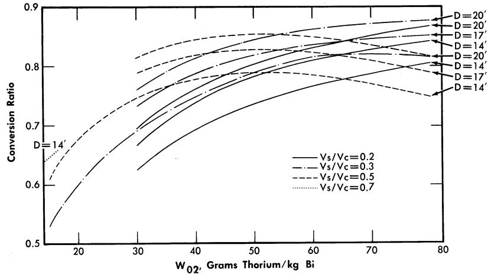  
FIG. 24-21. Conversion ratio vs. thorium concentration for a single-fluid LMFR.

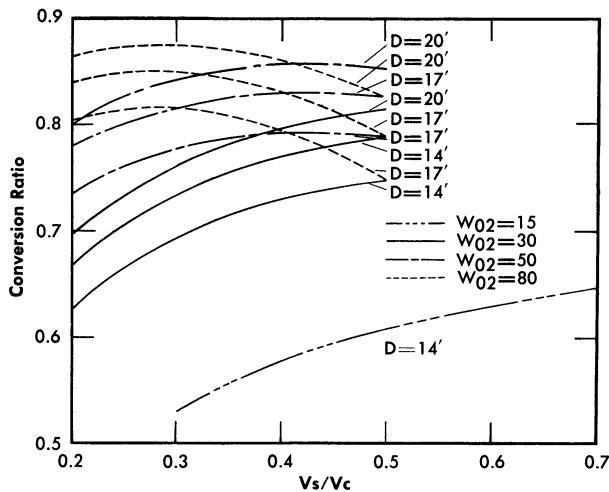  
FIG. 24-22. Conversion ratio vs. slurry-to-graphite volume ratio for a single-fluid LMFR.

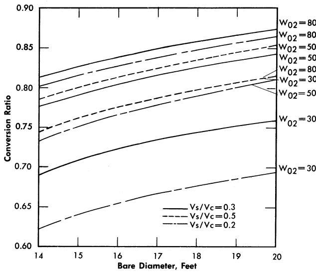  
FIG. 24-23. Conversion ratio vs. diameter for a bare single-fluid LMFR.

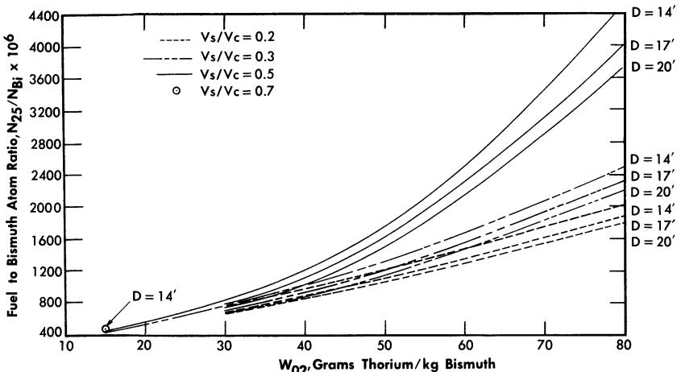  
FIG. 24-24. Critical fuel concentration vs. thorium concentration for single-fluid LMFR.

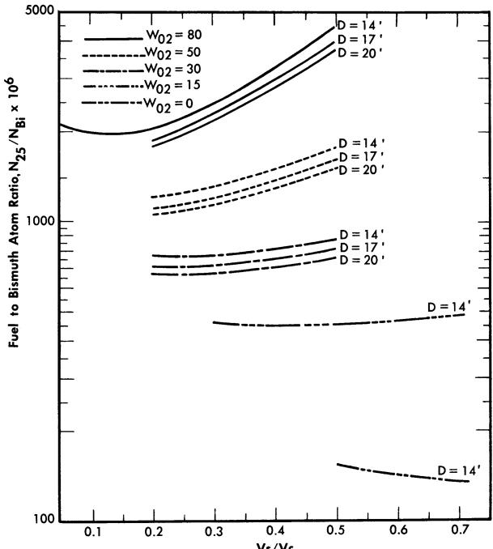  
FIG. 24-25. Critical fuel concentration vs. slurry-to-graphite volume ratio for a single-fluid LMFR.

The conversion ratio is highly dependent upon the $N_{02} / N_{25}$ ratio, the average energy of the neutron spectrum, and the reactor size. Figure 24-21 shows that for larger values of $V_{s} / V_{c}$ , the conversion ratio passes through a maximum as thorium concentration increases; however, for smaller values of $V_{s} / V_{c}$ , the conversion ratio increases continuously as $V_{s} / V_{c}$ increases over the range of interest; i.e., the maximum value of the conversion ratio shifts to higher values of $W_{02}$ as the $V_{s} / V_{c}$ ratio decreases. Likewise, the curves of conversion ratio versus $V_{s} / V_{c}$ go through a maximum, with the maximum value occurring at increasingly higher values of $V_{s} / V_{c}$ as $W_{02}$ increases (Fig. 24-22).

An increase in core diameter simply reduces the neutron leakage. As a result, the conversion ratio increases as the diameter increases. An increase in $D$ from 14 to 20 ft increases the CR approximately 0.09 (Fig. 24-23).

Case 11435 was recalculated using lead instead of bismuth as the coolant fluid. The conversion ratio decreased by 0.10, and the critical $N_{25} / N_{\mathrm{Bi}}$ ratio increased from $1203 \times 10^{-6}$ to $1531 \times 10^{-6}$ .

Beryllium oxide, BeO, was used as moderator in another variation of Case 11435. This calculation, case 11433, for a diameter of 12 ft, requires an $N_{25} / N_{\mathrm{Bi}}$ ratio of $1032 \times 10^{-6}$ and yields the slightly lower conversion ratio of 0.77.

The worth of a pure graphite reflector was calculated for Case 11435. The reflector savings as a function of reflector thickness are shown in Fig. 24-26. The reflector savings are approximately equal to the reflector thicknesses for reflectors less than 2 ft thick.

The values of conversion ratio and $N_{25} / N_{\mathrm{Bi}}$ ratio calculated in this parametric study are for hot, clean reactor conditions, and they are used for comparative purposes only. The effects of fission-product poisons, control rods, and $\mathrm{Pa}^{233}$ losses have not been included.

24-4.4 Economic optimization. The selection of parameters for a reference design must be based upon economics. An economic optimization was accomplished by computing relative energy costs based on those variable costs which depend upon the parameters selected. The costs which are dependent upon the nuclear parameters are (1) bismuth inventory, (2) fuel inventory, (3) fuel burnup, (4) thorium inventory, (5) thorium burnup, (6) reactor core and vessel, and (7) chemical processing costs.

Reactor cost. Since the range of reactor sizes varies from 10 to 20 ft, reactor cost is an important variable. Reactor vessel, graphite, and erection costs have been estimated for several sizes; to these is added $167,000 for three control rods and miscellaneous hardware. Contingency and engineering of 44% were also assumed. A breakdown of these costs is listed in Table 24-7.

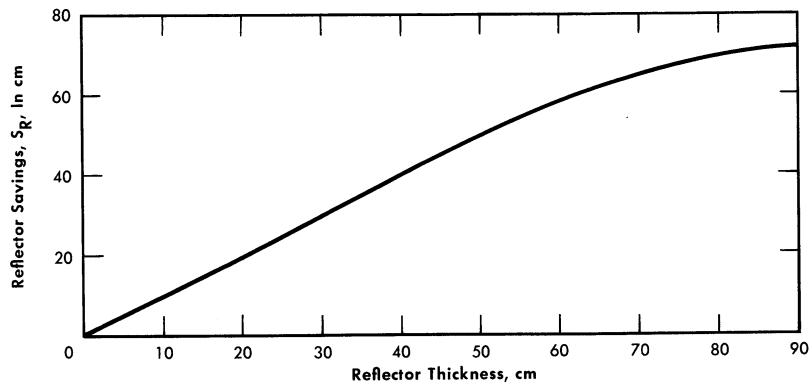  
FIG. 24-26. Reflector savings vs. reflector thickness for a single-fluid LMFR. These data are obtained from case 11435, where $V_{s}V_{c} = 0.3$ , $W_{02} = 50 \, \mathrm{g/kg}$ , and $D_{B} = 17$ .

TABLE 24-7 ESTIMATED SINGLE-FLUID REACTOR COST  

<table><tr><td>Size, ft</td><td>Reactor</td><td>Graphite</td><td>Misc.</td><td>Erection</td><td>Total</td><td>Total cost</td><td>$/yr</td></tr><tr><td>10</td><td>160,000</td><td>350,000</td><td>167,000</td><td>24,000</td><td>701,000</td><td>1,009,440</td><td>151,400</td></tr><tr><td>14</td><td>380,000</td><td>970,000</td><td>167,000</td><td>30,000</td><td>1,547,000</td><td>2,227,680</td><td>334,152</td></tr><tr><td>17</td><td>570,000</td><td>1,700,000</td><td>167,000</td><td>35,000</td><td>2,472,000</td><td>3,559,680</td><td>533,952</td></tr><tr><td>20</td><td>900,000</td><td>2,800,000</td><td>167,000</td><td>40,000</td><td>3,907,000</td><td>5,627,080</td><td>843,912</td></tr></table>

Bismuth inventory charges. The bismuth inventory is determined by the primary system volume external to the reactor vessel, the volume of bismuth in the core, the volume of bismuth external to the core but inside the reactor vessel, and the holdup external to the reactor system. The primary system external to the reactor vessel is made up of three heat-exchanger loops containing a total volume of 1640 ft³. The volume of bismuth in the core is

$$
V _ {\mathrm {B i}} ^ {c} = V _ {r} \frac {V _ {s} / V _ {c}}{1 + V _ {s} / V _ {c}}, \text {w h e r e} V _ {r} = \text {c o r e v o l u m e}
$$

The volume of bismuth external to the core and inside the reactor vessel is tabulated in Table 24-8.

No additional holdup is included to account for temperature expansion during startup, fuel feed system, and other sources of bismuth inventory. The assumption used throughout this study that the volume of bismuth is equal to the volume of slurry accounts for an additional 3 to $10\%$ excess bismuth due to the $\mathrm{ThO_2}$ content of the slurry.

TABLE 24-8 BISMUTH INVENTORY IN REACTOR VESSEL EXTERNAL TO CORE   

<table><tr><td>Core diameter, ft</td><td>Bi inventory, ft3</td></tr><tr><td>10</td><td>550</td></tr><tr><td>14</td><td>600</td></tr><tr><td>17</td><td>650</td></tr><tr><td>20</td><td>700</td></tr></table>

The density of bismuth is taken as $9.83\mathrm{g / cc}$ , and the price is assumed to be $\$2.25/\mathrm{lb}$ . Bismuth is a nondepreciating capital investment with a $12\%$ annual amortization rate. The annual bismuth inventory charges may be represented by the equation

$$
C _ {1} (\mathbb {S} / \mathrm {y r}) = 0. 1 2 (2. 2 5) \left[ V _ {r} \frac {V _ {s} / V _ {c}}{1 + V _ {s} / V _ {c}} + V _ {p} \right] \rho_ {\mathrm {B i}},
$$

where

$$
V _ {p} = \text {t o t a l p r i m a r y s y s t e m v o l u m e e x c e p t c o r e , f t} ^ {3},
$$

$$
\rho_ {\mathrm {B i}} = \text {d e n s i t y} \quad \mathrm {b i s m u t h}, \mathrm {l b} / \mathrm {f t} ^ {3}.
$$

Fuel inventory charges. The annual lease charges on the $\mathbf{U}^{235}$ are assumed to be $4\%$ . Treating $\mathrm{Pa}^{233}$ as fuel, the annual fuel inventory charges can be expressed as

$$
C _ {2} (\$ / \mathrm {y r}) = 0. 0 4 V _ {2 5} \bar {M} _ {2 5} + V _ {2 3} \bar {M} _ {2 3} + V _ {1 3} \bar {M} _ {1 3},
$$

where

$$
V _ {2 3} = V _ {1 3} = \text {v a l u e o f} U ^ {2 3 3} \text {a s f u e l},
$$

$$
V _ {2 5} = \text {v a l u e o f U} ^ {2 3 5} \text {a s f u e l}, \\ \S 1 7, 7 6 0 / \mathrm {k g},
$$

$$
\begin{array}{l} \overline {{M}} _ {j} = \text {a v e r a g e m a s s o f e l e m e n t j i n e n t i r e r e a c t o r s y s t e m} \\ \text {d u r i n g l i f e o f p l a n t .} \end{array}
$$

To simplify the work in the absence of information concerning average values of fuel mass, the total mass of fuel was considered to be the hot, clean critical loading at startup. The value of $\overline{M}_{25}$ is taken as the initial value with $\overline{M}_{23}$ and $\overline{M}_{13}$ taken as zero.

Fuel burnup costs. Using $\mathbf{U}^{235}$ as fuel, the yearly burnup costs are

$$
C _ {3} (\$ / \mathrm {y r}) = 1 7. 7 6 (2 9 2) P \beta (1 - \overline {{\mathrm {C R}}}),
$$

where

$$
P = \text {p o w e r}, 8 2 5 \mathrm {M w},
$$

$$
\beta = \text {g r a m s o f f u e l b u r n e d p e r M w D}, 1. 2 5,
$$

$$
\overline {{\mathrm {C R}}} = \text {a v e r a g e c o n v e r s i o n r a t i o}.
$$

The initial value of the conversion ratio is used, since only relative costs are needed.

Thorium burnup costs. Thorium is periodically replenished in the reactor to maintain the desired concentration in the slurry. The thorium burnup costs may be expressed as

$$
C _ {4} (\$ / \mathrm {y r}) = V _ {0 2} P \beta \overline {{\mathrm {C R}}} (2 9 2),
$$

where V02 = value of thorium, $42/kg. These costs are very small, approximately $10,000/yr, and are neglected.

Chemical processing costs. The chemical processing is assumed to use solvent extraction aqueous chemistry in a central processing plant. The irradiated fuel is removed from the reactor on a batch processing cycle. The processing costs are represented by

$$
C _ {\mathrm {P}} = 2 9 2 \left[ 9 5. 8 7 5 \frac {M _ {0 2}}{T} + 4 7 9 5 \frac {M _ {2 3} ^ {*} (T)}{T} + \frac {2 5 0 , 0 0 0}{T} + 5 9 6 \right],
$$

where

$$
M _ {0 2} = \text {t o t a l}
$$

$$
M _ {2 3} ^ {*} (T) = M _ {2 3} + M _ {1 3} \text {a t t i m e} T \text {a f t e r l o a d i n g o f f u e l c h a r g e , k g},
$$

$$
T = \text {c h e m i c a l}
$$

Results of economic optimization. Since chemical processing costs are very sensitive to the chemical processing cycle time and the optimum cycle time may vary with reactor design, the relative energy cost of each reactor design was determined neglecting the chemical processing costs. The results of this study are tabulated in Table 24-9 and are shown graphically in Figs. 24-27 and 24-28.

The pure burner, $W_{02} = 0$ , shows costs more than twice as high as several of the more attractive concepts (Fig. 24-28). In general, the minimum

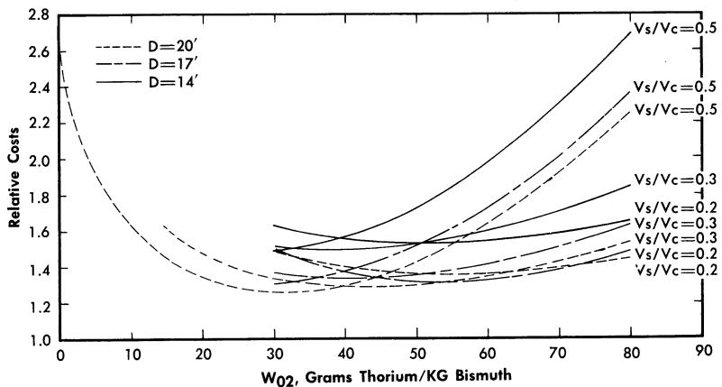  
FIG. 24-27. Relative cost vs. thorium concentration for a single-fluid LMFR.

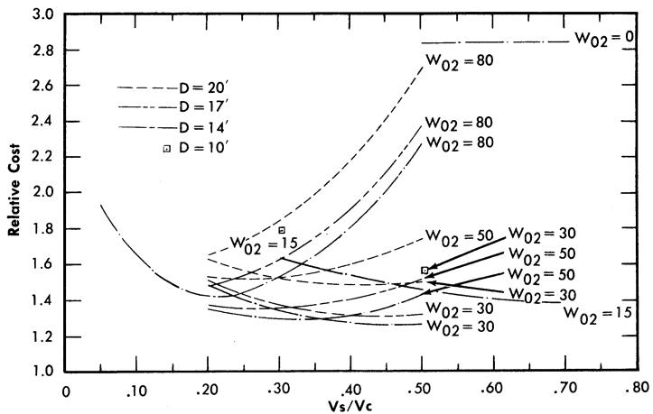  
FIG. 24-28. Relative cost vs. slurry-to-graphite volume ratio for a single-fluid LMFR.

costs are achieved with thorium loadings corresponding to $W_{02} = 20$ to $50 \, \mathrm{g/kg}$ . The most attractive designs do not have the highest values of conversion ratio.

In many cases the additional fuel inventory charges and reactor vessel costs corresponding to higher conversion ratios more than offset the reduction in fuel burnup costs. The economically optimum reactor is neither a burner nor a converter with maximum conversion ratio, but somewhat between these extremes.

Using a cost of $18\frac{e}{b}$ for lead as a coolant, comparisons of lead versus Bi as a coolant were made for Case 11435. The annual fixed charges on lead were only $\$44,000$ compared with $\$478,000$ for bismuth in this case;

however, the increased fuel burnup and inventory charges associated with the lead coolant resulted in a net increase of \(288,000/yr or 0.14 mills/kwh in the fuel cost. BeO is not feasible as a moderator material for this concept because of its high cost. Fixed charges on the BeO alone add almost a mill/kwh to the fuel cost.

The six most attractive cases were selected and the chemical processing costs computed for several processing cycle times. The total costs tabulated in Table 24-10 are based on a 3000-day cycle time, and other costs are from Table 24-9. Since the aqueous processing costs are dependent upon the total thorium inventory to be processed, chemical processing costs penalize the designs with heavy thorium loadings. In Tables 24-9 and 24-10, the total costs are reduced to mills/kwh by using an electrical power output of $315\mathrm{Mw}$ with an $80\%$ plant factor.

24-4.5 Selection of a reference design. Using the data presented in Table 24-10, a design was selected for further study. It is important to realize that when chemical processing costs are included in the comparison of energy costs, there is little difference in the cheapest four or five cases. The relative attractiveness of these cases depends very heavily on the economic ground rules. Even a change in chemical processing cycle may change the relative order of the cases. With the wide range of freedom for choice of nuclear parameters in this concept, the economic optimum can be chosen to correspond to any set of basic assumptions on economics. For example, an increase in fuel price would emphasize higher conversion ratios. The design selected for further study was Case 11344.

Time study. The nuclear performance of the reference design, Case 11344, was determined using a thorium lifetime program written for the digital computer. These calculations provided information concerning the variations of fission-product poisons, breeding ratio, and critical fuel mass as functions of reactor operating time. This information then made possible the choice of an optimum fuel processing cycle and the determination of over-all fuel cost for the operating reactor.

Basis of time study. The reference design calculations used $\mathrm{U}^{233}$ as fuel for both the initial charge and feed material. Since the contemplated construction date for an LMFR is 10 yr in the future, the assumption that $\mathrm{U}^{233}$ fuel will be available seems reasonable, and data based on $\mathrm{U}^{233}$ allows comparison with previous work [2].

The reference design on which the time studies were based has a graphite side reflector 1.5 ft thick, an active core diameter of 11 ft, and a core height of 14 ft. The average core temperature is $900^{\circ}\mathrm{F}$ . The nuclear constants used in the two-group criticality and isotope buildup calculations were determined by using a 40-group spectral code.

TABLE 24-9   
RELATIVE ENERGY COSTS FOR SINGLE FLUID LMFR  

<table><tr><td>Case</td><td>Initial conversion ratio</td><td>N25/NBi, ×106</td><td>W02</td><td>Vs/Vc</td><td>D(bare), ft</td><td>Bismuth inventory, C1×10-3,$/yr</td><td>Fuel inventory, C2×10-3,$/yr</td><td>Fuel burnup, C3×10-3,$/yr</td><td>Thorium inventory, C4×10-3,$/yr</td><td>Reactor core and vessel, C6×10-3,$/yr</td><td>CT×10-3,$/yr</td><td>CT,mills/kwh</td></tr><tr><td>11144</td><td>0</td><td>153</td><td>0</td><td>0.5</td><td>14</td><td>444</td><td>91</td><td>5348</td><td>0</td><td>334</td><td>6217</td><td>2.82</td></tr><tr><td>11154</td><td>0</td><td>134</td><td>0</td><td>0.7</td><td>14</td><td>461</td><td>83</td><td>5348</td><td>0</td><td>334</td><td>6226</td><td>2.82</td></tr><tr><td>11164</td><td>0</td><td>120</td><td>0</td><td>1.0</td><td>14</td><td>480</td><td>77</td><td>5348</td><td>0</td><td>334</td><td>6240</td><td>2.83</td></tr><tr><td>11232</td><td>0.432</td><td>621</td><td>15</td><td>0.3</td><td>10</td><td>377</td><td>310</td><td>3039</td><td>60</td><td>151</td><td>3937</td><td>1.78</td></tr><tr><td>11234</td><td>0.530</td><td>458</td><td>15</td><td>0.3</td><td>14</td><td>421</td><td>256</td><td>2516</td><td>67</td><td>334</td><td>3594</td><td>1.63</td></tr><tr><td>11244</td><td>0.609</td><td>451</td><td>15</td><td>0.5</td><td>14</td><td>444</td><td>265</td><td>2093</td><td>71</td><td>334</td><td>3207</td><td>1.45</td></tr><tr><td>11254</td><td>0.647</td><td>481</td><td>15</td><td>0.7</td><td>14</td><td>461</td><td>293</td><td>1890</td><td>73</td><td>334</td><td>3052</td><td>1.38</td></tr><tr><td>11324</td><td>0.625</td><td>774</td><td>30</td><td>0.2</td><td>14</td><td>407</td><td>411</td><td>2007</td><td>130</td><td>334</td><td>3289</td><td>1.49</td></tr><tr><td>11325</td><td>0.666</td><td>706</td><td>30</td><td>0.2</td><td>17</td><td>451</td><td>415</td><td>1784</td><td>143</td><td>534</td><td>3327</td><td>1.51</td></tr><tr><td>11326</td><td>0.695</td><td>666</td><td>30</td><td>0.2</td><td>20</td><td>512</td><td>445</td><td>1632</td><td>163</td><td>844</td><td>3596</td><td>1.63</td></tr><tr><td>11334</td><td>0.692</td><td>772</td><td>30</td><td>0.3</td><td>14</td><td>421</td><td>424</td><td>1645</td><td>134</td><td>334</td><td>3958</td><td>1.34</td></tr><tr><td>11335</td><td>0.733</td><td>708</td><td>30</td><td>0.3</td><td>17</td><td>478</td><td>442</td><td>1427</td><td>152</td><td>534</td><td>3033</td><td>1.37</td></tr><tr><td>11336</td><td>0.760</td><td>671</td><td>30</td><td>0.3</td><td>20</td><td>560</td><td>490</td><td>1284</td><td>178</td><td>844</td><td>3356</td><td>1.52</td></tr><tr><td>11342</td><td>0.628</td><td>1181</td><td>30</td><td>0.5</td><td>10</td><td>421</td><td>256</td><td>2516</td><td>67</td><td>151</td><td>3411</td><td>1.55</td></tr><tr><td>11344</td><td>0.746</td><td>870</td><td>30</td><td>0.5</td><td>14</td><td>444</td><td>504</td><td>1358</td><td>141</td><td>334</td><td>2780</td><td>1.26</td></tr><tr><td>11345</td><td>0.788</td><td>794</td><td>30</td><td>0.5</td><td>17</td><td>523</td><td>541</td><td>1136</td><td>166</td><td>534</td><td>2901</td><td>1.31</td></tr><tr><td>11346</td><td>0.814</td><td>751</td><td>30</td><td>0.5</td><td>20</td><td>478</td><td>736</td><td>977</td><td>254</td><td>844</td><td>3303</td><td>1.50</td></tr><tr><td>11424</td><td>0.735</td><td>1199</td><td>50</td><td>0.2</td><td>14</td><td>407</td><td>624</td><td>1417</td><td>216</td><td>334</td><td>2998</td><td>1.36</td></tr><tr><td>11425</td><td>0.780</td><td>1099</td><td>50</td><td>0.2</td><td>17</td><td>451</td><td>633</td><td>1179</td><td>239</td><td>534</td><td>3036</td><td>1.38</td></tr></table>

<table><tr><td>11426</td><td>0.801</td><td>1054</td><td>50</td><td>0.2</td><td>20</td><td>512</td><td>690</td><td>1064</td><td>272</td><td>844</td><td>3381</td><td>1.53</td></tr><tr><td>11434</td><td>0.778</td><td>1304</td><td>50</td><td>0.3</td><td>14</td><td>421</td><td>702</td><td>1187</td><td>223</td><td>334</td><td>2868</td><td>1.30</td></tr><tr><td>11435</td><td>0.817</td><td>1203</td><td>50</td><td>0.3</td><td>17</td><td>478</td><td>736</td><td>977</td><td>254</td><td>534</td><td>2979</td><td>1.35</td></tr><tr><td>11436</td><td>0.843</td><td>1144</td><td>50</td><td>0.3</td><td>20</td><td>560</td><td>820</td><td>839</td><td>297</td><td>844</td><td>3359</td><td>1.52</td></tr><tr><td>11444</td><td>0.787</td><td>1757</td><td>50</td><td>0.5</td><td>14</td><td>444</td><td>997</td><td>1139</td><td>235</td><td>334</td><td>3149</td><td>1.43</td></tr><tr><td>11445</td><td>0.827</td><td>1598</td><td>50</td><td>0.5</td><td>17</td><td>523</td><td>1068</td><td>927</td><td>277</td><td>534</td><td>3330</td><td>1.51</td></tr><tr><td>11446</td><td>0.854</td><td>1504</td><td>50</td><td>0.5</td><td>20</td><td>637</td><td>1226</td><td>783</td><td>338</td><td>843</td><td>3828</td><td>1.73</td></tr><tr><td>11514</td><td>0.565</td><td>2099</td><td>80</td><td>0.05</td><td>14</td><td>381</td><td>993</td><td>2325</td><td>323</td><td>334</td><td>4256</td><td>1.93</td></tr><tr><td>11524</td><td>0.804</td><td>1990</td><td>80</td><td>0.2</td><td>14</td><td>407</td><td>1007</td><td>1051</td><td>345</td><td>334</td><td>3144</td><td>1.42</td></tr><tr><td>11525</td><td>0.840</td><td>1853</td><td>80</td><td>0.2</td><td>17</td><td>451</td><td>1038</td><td>857</td><td>382</td><td>534</td><td>3263</td><td>1.48</td></tr><tr><td>11526</td><td>0.865</td><td>1769</td><td>80</td><td>0.2</td><td>20</td><td>512</td><td>1126</td><td>724</td><td>434</td><td>844</td><td>3640</td><td>1.65</td></tr><tr><td>11534</td><td>0.816</td><td>2452</td><td>80</td><td>0.3</td><td>14</td><td>421</td><td>1284</td><td>986</td><td>357</td><td>334</td><td>3382</td><td>1.53</td></tr><tr><td>11535</td><td>0.850</td><td>2274</td><td>80</td><td>0.3</td><td>17</td><td>478</td><td>1352</td><td>803</td><td>406</td><td>534</td><td>3574</td><td>1.62</td></tr><tr><td>11536</td><td>0.875</td><td>2160</td><td>80</td><td>0.3</td><td>20</td><td>560</td><td>1504</td><td>671</td><td>475</td><td>844</td><td>4053</td><td>1.84</td></tr><tr><td>11544</td><td>0.747</td><td>4471</td><td>80</td><td>0.5</td><td>14</td><td>444</td><td>2462</td><td>1356</td><td>376</td><td>334</td><td>4972</td><td>2.25</td></tr><tr><td>11545</td><td>0.788</td><td>3959</td><td>80</td><td>0.5</td><td>17</td><td>523</td><td>2569</td><td>1132</td><td>444</td><td>534</td><td>5201</td><td>2.36</td></tr><tr><td>11546</td><td>0.815</td><td>3684</td><td>80</td><td>0.5</td><td>20</td><td>637</td><td>2912</td><td>990</td><td>541</td><td>844</td><td>5924</td><td>2.68</td></tr></table>

TABLE 24-10   
RELATIVE FUEL COSTS INCLUDING CHEMICAL PROCESSING SINGLE FLUID LMFR  
Assumed processing cycle $= 3000$ days   

<table><tr><td>Case No.</td><td>\(W_{02}\)</td><td>Initial CR</td><td>\(V_s/V_c\)</td><td>D(bare), ft</td><td>\(M_{02}\), kg</td><td>\(M_{25}\), kg</td><td>Chemical processing cost, \(C_P \times 10^{-3}/yr\)</td><td>Other cost, \(C_T \times 10^{-3}/yr\)</td><td>Total costs, \(10^{-3}/yr\)</td><td>Total costs, mills/kwh</td></tr><tr><td>11254</td><td>15</td><td>0.65</td><td>0.7</td><td>14</td><td>11,640</td><td>413</td><td>504</td><td>3052</td><td>3556</td><td>1.61</td></tr><tr><td>11334</td><td>30</td><td>0.69</td><td>0.3</td><td>14</td><td>21,268</td><td>597</td><td>681</td><td>2958</td><td>3639</td><td>1.65</td></tr><tr><td>11344</td><td>30</td><td>0.75</td><td>0.5</td><td>14</td><td>22,407</td><td>709</td><td>745</td><td>2780</td><td>3525</td><td>1.60</td></tr><tr><td>11345</td><td>30</td><td>0.79</td><td>0.5</td><td>17</td><td>26,407</td><td>762</td><td>808</td><td>2901</td><td>3709</td><td>1.68</td></tr><tr><td>11434</td><td>50</td><td>0.78</td><td>0.3</td><td>14</td><td>35,447</td><td>989</td><td>1000</td><td>2868</td><td>3868</td><td>1.75</td></tr><tr><td>11435</td><td>50</td><td>0.82</td><td>0.3</td><td>17</td><td>40,275</td><td>1036</td><td>1068</td><td>2979</td><td>4047</td><td>1.83</td></tr></table>

The neutron poisons due to fission products and higher uranium isotopes were calculated using the data by W. L. Robba et al. [4]. The xenon poisoning (absorptions in $\mathrm{Xe}^{135}$ to absorptions in fuel) was held at 0.01 throughout life, and $\mathrm{Sm}^{149}$ was allowed to reach steady state. The other fission-product poisoning corresponds to poison data labeled "less Xe and Sm with high cross sections except low $\mathrm{Zr}^{93}$ ." Due to lack of information, no resonance absorption by the fission products was considered. The neutron flux averaged over the entire primary system volume was used in all isotope and poison buildup computation, since this is a circulating fuel reactor.

Fuel was added at frequent time intervals to maintain $k_{\mathrm{eff}} \approx 1.01$ (assuming $1\%$ rod holddown). Thorium was added to the core with the fuel to maintain a constant thorium loading.

Results of time study. The study was carried to 2000 days of full-power operation. The mass of $\mathrm{U}^{233}$ fuel and the buildup of $\mathrm{Pa}^{233}$ are shown in Fig. 24-29, and the buildup of fission product poisons (other than $\mathrm{Xe}^{135}$ and $\mathrm{Sm}^{149}$ ) along with breeding ratio are graphed in Fig. 24-30. The fission-product poisons vary in an almost linear manner for burnups corresponding to 2000 to 6000 days. Other calculations have indicated that extrapolations (represented by dashed lines on Figs. 24-29 and 24-30) to 5840 days, the expected life of the plant, are reasonable.

The quantities necessary to evaluate the chemical processing costs for various processing cycles are average values of fuel mass and breeding ratio $(\overline{M}_{23}, \overline{M}_{13}$ , and $\overline{\mathrm{BR}})$ . The average value of $\overline{M}_{13}$ is approximately the steady-state value; $\overline{M}_{23}$ and $\overline{\mathrm{BR}}$ are shown in Figs. 24-29 and 24-30.

Selection of chemical processing cycle. The fuel costs which are dependent upon the chemical processing cycle are fuel inventory, fuel burnup, and processing charges. These charges were computed using formulas similar to those described in Article 24-4.4 but using data appropriate to $\mathbf{U}^{233}$ fuel. Equations giving costs in dollars per full power day are

Fuel inventory: $C_2$ (\$/day) = 2.143 ( $\overline{M}_{23} + \overline{M}_{13}$ )

Fuel burnup: $C_3$ (\$/day) = 15,250 (1 - BR)

Chemical processing:

$$
C _ {P} (\$ / \text {d a y}) = 9 5. 8 7 5 \frac {M _ {0 2}}{T} + 4 7 9 5 \frac {M _ {2 3} ^ {*} (T)}{T} + \frac {2 5 0 , 0 0 0}{T} + 5 9 6.
$$

The results of these calculations are tabulated in Table 24-11 and graphed in Fig. 24-31. This analysis indicates an economic optimum processing cycle of approximately 4000 full-power days. However, only a small penalty of slightly more than $200/day (less than 0.03 mills/kwh) is incurred by operating the reactor for its complete life (5840 full-power days) before sending the fuel to a chemical separations plant.

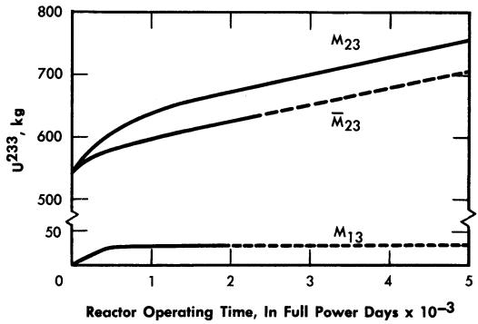  
FIG. 24-29. Mass of $\mathbf{U}^{233}$ vs. reactor operating time for a single-fluid reactor operating at $825\mathrm{Mw}$ .

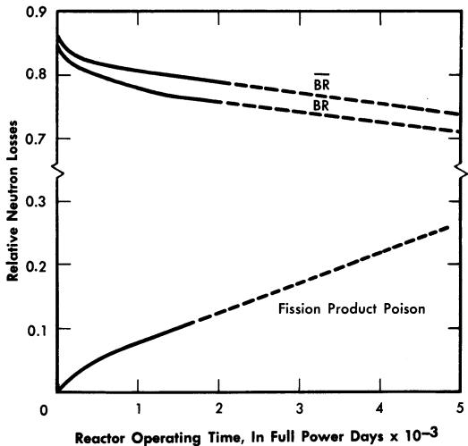  
FIG. 24-30. Neutron losses vs. reactor operating time for a single-fluid reactor operating at $825\mathrm{Mw}$

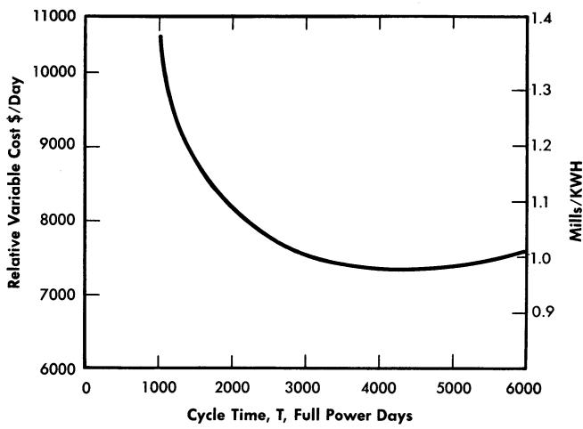  
Mills/KWH   
FIG. 24-31. Variable fuel cost for 825-Mw single fluid LMFR vs. chemical processing cycle (aqueous batch process).

TABLE 24-11   
VARIABLE FUEL COST FOR AN 825-MW LMFR   
For various processing cycles   

<table><tr><td>Chem. proc. cycle, days</td><td>M23(T)</td><td>M13(T)</td><td>M23(T)</td><td>M13(T)</td><td>M23(T)</td><td>BR(T)</td><td>Fuel inven-tory charges, $/day</td><td>Fuel burnup costs, $/day</td><td>Chem. proc. costs, $/day</td><td>Total vari-able cost, $/day</td></tr><tr><td>6000</td><td>780</td><td>30</td><td>730</td><td>30</td><td>760</td><td>0.722</td><td>1690</td><td>4240</td><td>1,627</td><td>7,557</td></tr><tr><td>4000</td><td>725</td><td>30</td><td>675</td><td>30</td><td>705</td><td>0.755</td><td>1510</td><td>3738</td><td>2,101</td><td>7,349</td></tr><tr><td>2000</td><td>671</td><td>30</td><td>623</td><td>30</td><td>653</td><td>0.787</td><td>1400</td><td>3230</td><td>3,575</td><td>8,105</td></tr><tr><td>1000</td><td>635</td><td>30</td><td>595</td><td>30</td><td>625</td><td>0.807</td><td>1340</td><td>2943</td><td>6,184</td><td>10,470</td></tr><tr><td>500</td><td>603</td><td>30</td><td>578</td><td>30</td><td>608</td><td>0.820</td><td>1303</td><td>2746</td><td>16,467</td><td>15,500</td></tr></table>

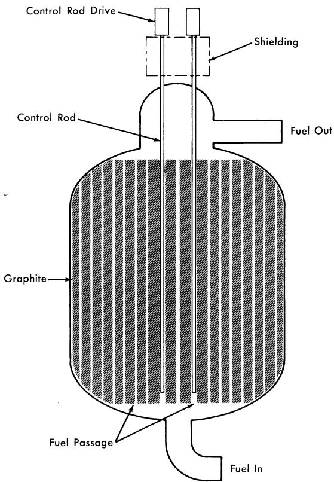  
FIG. 24-32. Single-region, externally cooled liquid metal fuel reactor.

Specifications of reference design. The single-region reactor design is illustrated in Fig. 24-32. The core is constructed of large blocks of high density reimpregnated graphite, with 1.5- to 2.0-in.-diameter axial holes for the passage of fuel slurry. The graphite is supported by a number of compensated molybdenum rods and a bottom support plate. Provision is made for three or four liquid metal control rods, if experience indicates they are necessary.

The reactor vessel is constructed of $2\frac{1}{4}\% \mathrm{Cr - 1\%}$ Mo steel, $2\frac{1}{4}$ inches thick, designed for a temperature of $1150^{\circ}\mathrm{F}$ and maximum pressure of 120 psi. Three 28-in.-diameter pipes carry the fluid into the reactor at the bottom and leave at the top. The entire reactor vessel is doubly contained by a relatively thin-walled containment vessel. A drain line to the fuel dump tanks is also provided. The free space above the reactor core is used as the degasser to remove volatile fission products. The reference core design has the following specifications:

# Power:

Thermal power 825Mw

Net electrical power 315,000 kw

Station efficiency 38.2%

# Materials:

Fuel U233

Fertile material Thorium

Moderator High-density graphite

Reflector High-density graphite

Coolant $\mathrm{UO}_2\text{-}\mathrm{ThO}_2\text{-}\mathrm{Bi}$ Slurry

Coolant-to-moderator ratio, $V_{s} / V_{c}$ 0.5

Thorium concentration, $W_{02}$ 30 g/kg Bi

# Geometry:

Core radius 5.5 ft

Core height 14.0 ft

Reflector thickness 1.5 ft

Number of primary coolant loops 3

Fuel-slurry volume:

Coolant loops 1640 ft3

Reactor core 443

Reactor vessel 600

Total

2683 ft3

Chemical processing cycle 4000 days

# Nuclear data:

<table><tr><td></td><td>Startup</td><td>4000 days</td><td>Average</td></tr><tr><td>Mass U233</td><td>546 kg</td><td>725 kg</td><td>675 kg</td></tr><tr><td>Mass Pa233</td><td>0</td><td>30</td><td>30</td></tr><tr><td>Mass 233</td><td>546</td><td>755</td><td>705</td></tr><tr><td>Initial average core thermal flux</td><td></td><td></td><td>3 × 1014</td></tr><tr><td>Breeding ratio</td><td>0.87</td><td>0.725</td><td>0.75</td></tr><tr><td>Poison fraction</td><td>0</td><td>0.216</td><td></td></tr><tr><td>Mass of bismuth</td><td>1,646,000 lb</td><td></td><td></td></tr><tr><td>Mass of thorium</td><td>22,400 kg</td><td></td><td></td></tr></table>

# 24-5. ECONOMICS

Economic considerations were essential to the optimization studies required to establish the reference designs presented in Sections 24-2 and 24-4. An important objective of this study is the economic comparison of energy costs for the single-fluid and the two-fluid externally cooled LMFR. A brief summary of energy costs for the optimum design in each concept is presented in Table 24-12.

TABLE 24-12 ENERGY COST (80% PLANT FACTOR)   

<table><tr><td rowspan="2"></td><td colspan="2">Mills/kwh</td></tr><tr><td>Single-fluid LMFR</td><td>Two-fluid LMFR</td></tr><tr><td>Fixed charges on total capital investment</td><td>4.09</td><td>4.31</td></tr><tr><td>Nuclear fuel and inventory costs</td><td>1.24</td><td>1.41</td></tr><tr><td>Maintenance</td><td>1.18</td><td>1.05</td></tr><tr><td>Operation</td><td>0.38</td><td>0.38</td></tr><tr><td>Interest on working capital</td><td>0.04</td><td>0.04</td></tr><tr><td>Total energy cost, mills/kwh</td><td>6.9</td><td>7.2</td></tr></table>

24-5.1 Fixed charges on capital investment. Direct construction costs. The estimated costs of equipment, installation of equipment, and construction are based on the plant layouts for the two reference designs evaluated in this study. Construction and erection costs of all items, as well as direct materials costs for those components manufactured by the Babcock & Wilcox Company, were developed by B&W estimators. Delivered costs of equipment supplied by manufacturers other than B&W were taken from vendors' quotations.

A summary of direct construction costs for each reference design is tabulated in Tables 24-13 and 24-14.

Total capital investment. The total capital investments are summarized according to account numbers in Tables 24-15 and 24-16.

24-5.2 Maintenance and operation. In computing energy costs, the fixed charges on maintenance equipment and spare parts are included in the maintenance costs, while fixed charges on buildings used for maintenance are included in fixed charges on capital investment.

24-5.3 Fuel costs. The fuel costs as presented in this report include (1) bismuth inventory, (2) fuel inventory, (3) fuel burnup, (4) thorium inventory, (5) thorium burnup, and (6) chemical processing. Sodium inventory is not included, since it is used as coolant fluid for the intermediate system and does not contain fuel. Fuel costs are summarized in Table 24-17.

24-5.4 Summary of energy costs. The energy costs in mills/kwh, based upon an electric output of 315,000 kw and a plant factor of $80\%$ , are tabulated in Table 24-18 for various categories.

TABLE 24-13   
SUMMARY OF DIRECT CONSTRUCTION COSTS FOR SINGLE-FLUID LMFR  

<table><tr><td>Account no.</td><td></td><td>Direct labor</td><td>Direct materials</td><td>Direct construction cost</td></tr><tr><td rowspan="2">310</td><td>Land and land rights</td><td></td><td></td><td></td></tr><tr><td>Direct site</td><td></td><td>$500,000</td><td>$500,000</td></tr><tr><td rowspan="5">311</td><td>Structures and improvements</td><td></td><td></td><td></td></tr><tr><td>Improvements and miscellaneous structures</td><td>$78,000</td><td>126,000</td><td>204,000</td></tr><tr><td>Nuclear steam generator building</td><td>2,981,000</td><td>3,535,000</td><td>6,516,000</td></tr><tr><td>Accessory buildings</td><td>51,000</td><td>84,000</td><td>135,000</td></tr><tr><td>Total</td><td>3,110,000</td><td>3,745,000</td><td>6,855,000</td></tr><tr><td rowspan="13">312</td><td>Nuclear Steam Generator and Chemical Plant Equipment</td><td></td><td></td><td></td></tr><tr><td>Reactor</td><td>60,000</td><td>2,028,000</td><td>2,088,000</td></tr><tr><td>Primary and blanket system</td><td>309,000</td><td>1,470,000</td><td>1,779,000</td></tr><tr><td>Blanket system</td><td></td><td></td><td></td></tr><tr><td>Intermediate system</td><td>279,000</td><td>2,778,000</td><td>3,057,000</td></tr><tr><td>Steam system</td><td>125,000</td><td>1,629,000</td><td>1,754,000</td></tr><tr><td>Primary inert gas system (He)</td><td>5,000</td><td>22,000</td><td>27,000</td></tr><tr><td>Intermediate gas system (N2)</td><td>6,000</td><td>24,000</td><td>30,000</td></tr><tr><td>Reactor heating and cooling system</td><td>21,000</td><td>84,000</td><td>105,000</td></tr><tr><td>Dump tank heating and cooling systems</td><td>100,000</td><td>149,000</td><td>249,000</td></tr><tr><td>Primary system capsule area ventilating system</td><td>1,000</td><td>2,000</td><td>3,000</td></tr><tr><td>Primary system reactor cell cooling system</td><td>3,000</td><td>3,000</td><td>6,000</td></tr><tr><td>Shield cooling system</td><td>18,000</td><td>21,000</td><td>39,000</td></tr></table>

<table><tr><td></td><td>Water cooling system</td><td>3,000</td><td>7,000</td><td>10,000</td></tr><tr><td></td><td>Offgas system</td><td>20,000</td><td>50,000</td><td>70,000</td></tr><tr><td></td><td>Feedwater heating system</td><td>286,000</td><td>2,541,000</td><td>2,827,000</td></tr><tr><td></td><td>Instrumentation and controls</td><td>599,000</td><td>1,236,000</td><td>1,835,000</td></tr><tr><td></td><td>Spare parts</td><td>110,000</td><td>2,666,000</td><td>2,776,000</td></tr><tr><td></td><td>Miscellaneous equipment</td><td>315,000</td><td>588,000</td><td>903,000</td></tr><tr><td></td><td>Inventories</td><td></td><td>4,680,000</td><td>4,680,000</td></tr><tr><td></td><td>Chemical plant equipment</td><td>156,000</td><td>403,000</td><td>559,000</td></tr><tr><td></td><td>Total</td><td>2,416,000</td><td>20,381,000</td><td>22,797,000</td></tr><tr><td>314</td><td>Turbine Generator Equipment</td><td></td><td></td><td></td></tr><tr><td></td><td>Turbine and condensing</td><td>828,000</td><td>13,382,000</td><td>14,210,000</td></tr><tr><td>315</td><td>Accessory electrical equipment</td><td>400,000</td><td>2,484,000</td><td>2,884,000</td></tr><tr><td>316</td><td>Miscellaneous power plant equipment</td><td></td><td></td><td></td></tr><tr><td></td><td>Transmission structures</td><td>50,000</td><td>130,000</td><td>180,000</td></tr><tr><td></td><td>Maintenance equipment</td><td>172,000</td><td>2,921,000</td><td>3,093,000</td></tr><tr><td></td><td>Total</td><td>222,000</td><td>3,051,000</td><td>3,273,000</td></tr><tr><td>342-343</td><td>Station equipment</td><td>189,000</td><td>1,246,000</td><td>1,435,000</td></tr><tr><td></td><td>Total Direct Construction Cost</td><td></td><td></td><td>$51,954,000</td></tr></table>

TABLE 24-14   
SUMMARY OF DIRECT CONSTRUCTION COSTS FOR TWO-FLUID LMFR   

<table><tr><td>Account no.</td><td></td><td>Direct labor</td><td>Direct materials</td><td>Direct cost construction</td></tr><tr><td rowspan="2">310</td><td>Land and land rights</td><td></td><td></td><td></td></tr><tr><td>Direct site</td><td></td><td>$500,000</td><td>$500,000</td></tr><tr><td rowspan="5">311</td><td>Structures and improvements</td><td></td><td></td><td></td></tr><tr><td>Improvements and miscellaneous structures</td><td>$78,000</td><td>126,000</td><td>204,000</td></tr><tr><td>Nuclear steam generator building</td><td>3,184,000</td><td>4,035,000</td><td>7,219,000</td></tr><tr><td>Accessory buildings</td><td>51,000</td><td>84,000</td><td>135,000</td></tr><tr><td>Total</td><td>3,313,000</td><td>4,245,000</td><td>7,558,000</td></tr><tr><td rowspan="12">312</td><td>Steam generator and chemical plant equipment</td><td></td><td></td><td></td></tr><tr><td>Reactor</td><td>50,000</td><td>1,531,000</td><td>1,581,000</td></tr><tr><td>Primary and blanket system</td><td>436,000</td><td>1,788,000</td><td>2,224,000</td></tr><tr><td>Intermediate system</td><td>295,000</td><td>3,365,000</td><td>3,660,000</td></tr><tr><td>Steam system</td><td>250,000</td><td>1,949,000</td><td>2,199,000</td></tr><tr><td>Primary inert gas system (He)</td><td>8,000</td><td>34,000</td><td>42,000</td></tr><tr><td>Intermediate gas system (N2)</td><td>8,000</td><td>40,000</td><td>48,000</td></tr><tr><td>Reactor heating and cooling system</td><td>21,000</td><td>84,000</td><td>105,000</td></tr><tr><td>Dump tank heating and cooling systems</td><td>100,000</td><td>149,000</td><td>249,000</td></tr><tr><td>Primary system capsule area ventilating system</td><td>1,000</td><td>2,000</td><td>3,000</td></tr><tr><td>Primary system reactor cell cooling system</td><td>3,000</td><td>3,000</td><td>6,000</td></tr><tr><td>Shield cooling system</td><td>18,000</td><td>21,000</td><td>39,000</td></tr></table>

<table><tr><td></td><td>Water cooling system</td><td>3,000</td><td>7,000</td><td>10,000</td></tr><tr><td></td><td>Offgas system</td><td>20,000</td><td>50,000</td><td>70,000</td></tr><tr><td></td><td>Feedwater heating system</td><td>290,000</td><td>2,546,000</td><td>2,836,000</td></tr><tr><td></td><td>Instrumentation and controls</td><td>765,000</td><td>1,547,000</td><td>2,312,000</td></tr><tr><td></td><td>Spare parts</td><td>72,000</td><td>2,000,000</td><td>2,072,000</td></tr><tr><td></td><td>Miscellaneous equipment and inventories</td><td>273,000</td><td>564,000</td><td>837,000</td></tr><tr><td></td><td>Inventories</td><td></td><td>4,289,000</td><td>4,289,000</td></tr><tr><td></td><td>Chemical plant equipment</td><td>540,000</td><td>1,461,000</td><td>2,001,000</td></tr><tr><td></td><td>Total</td><td>3,153,000</td><td>21,430,000</td><td>24,583,000</td></tr><tr><td>314</td><td>Turbine generator equipment</td><td></td><td></td><td></td></tr><tr><td></td><td>Turbine and condensers</td><td>828,000</td><td>13,382,000</td><td>14,210,000</td></tr><tr><td>315</td><td>Accessory electrical equipment</td><td>401,000</td><td>2,503,000</td><td>2,904,000</td></tr><tr><td>316</td><td>Miscellaneous power plant equipment</td><td></td><td></td><td></td></tr><tr><td></td><td>Transmission structure</td><td>50,000</td><td>130,000</td><td>180,000</td></tr><tr><td></td><td>Maintenance equipment</td><td>173,000</td><td>2,274,000</td><td>2,447,000</td></tr><tr><td></td><td>Total</td><td>223,000</td><td>2,404,000</td><td>2,627,000</td></tr><tr><td>342-343</td><td>Station equipment</td><td>189,000</td><td>1,246,000</td><td>1,435,000</td></tr><tr><td></td><td>Total Direct Construction Cost</td><td>$8,107,000</td><td>$45,710,000</td><td>$53,817,000</td></tr></table>

TABLE 24-15   
SUMMARY OF CAPITAL INVESTMENT FOR SINGLE-FLUID LMFR   

<table><tr><td>Account no.</td><td></td><td>Direct construction costs</td><td>Contingency</td><td>Miscellaneous charges*</td><td>Total capital investment</td></tr><tr><td>310</td><td>Land and land rights</td><td>$500,000</td><td>$0</td><td>$0</td><td>$500,000</td></tr><tr><td>311</td><td>Structures and improvements</td><td></td><td></td><td></td><td></td></tr><tr><td></td><td>Nuclear and turbogenerator plant</td><td>6,697,000</td><td>1,479,000</td><td>3,158,000</td><td>11,334,000</td></tr><tr><td></td><td>Chemical plant</td><td>158,000</td><td>34,000</td><td>71,000</td><td>263,000</td></tr><tr><td>312</td><td>Nuclear steam generating and chemical plant equipment</td><td></td><td></td><td></td><td></td></tr><tr><td></td><td>Nuclear plant equipment</td><td>14,782,000</td><td>2,733,000</td><td>3,436,000</td><td>20,951,000</td></tr><tr><td></td><td>Chemical plant equipment</td><td>559,000</td><td>112,000</td><td>188,000</td><td>859,000</td></tr><tr><td></td><td>Spare parts</td><td>2,776,000</td><td>479,000</td><td>418,000</td><td>3,673,000</td></tr><tr><td></td><td>Inventories</td><td>4,680,000</td><td>0</td><td>0</td><td>4,680,000</td></tr><tr><td>314</td><td>Turbine generator equipment</td><td>14,210,000</td><td>2,483,000</td><td>2,346,000</td><td>19,039,000</td></tr><tr><td>315</td><td>Accessory electrical equipment</td><td>2,884,000</td><td>531,000</td><td>655,000</td><td>4,070,000</td></tr><tr><td>316</td><td>Miscellaneous power plant equipment</td><td></td><td></td><td></td><td></td></tr><tr><td></td><td>Transmission structures</td><td>180,000</td><td>36,000</td><td>61,000</td><td>277,000</td></tr><tr><td></td><td>Maintenance equipment</td><td>3,093,000</td><td>539,000</td><td>505,000</td><td>4,137,000</td></tr><tr><td>342-343</td><td>Station equipment</td><td>1,435,000</td><td>263,000</td><td>318,000</td><td>2,016,000</td></tr><tr><td></td><td>Total</td><td>$51,954,000</td><td>$8,689,000</td><td>$11,156,000</td><td>$71,799,000</td></tr></table>

*Includes indirect construction cost, interest, and engineering charges.

TABLE 24-16 SUMMARY OF CAPITAL INVESTMENT FOR TWO-FLUID LMFR   

<table><tr><td>Account no.</td><td></td><td>Direct construction costs</td><td>Contingency</td><td>Miscellaneous charges</td><td>Total capital investment</td></tr><tr><td>310</td><td>Land and land rights</td><td>$500,000</td><td>$0</td><td>$0</td><td>$500,000</td></tr><tr><td>311</td><td>Structures and improvements</td><td></td><td></td><td></td><td></td></tr><tr><td></td><td>Nuclear and turbogenerator plant</td><td>7,010,000</td><td>1,538,000</td><td>3,223,000</td><td>11,771,000</td></tr><tr><td></td><td>Chemical plant</td><td>548,000</td><td>119,000</td><td>247,000</td><td>914,000</td></tr><tr><td>312</td><td>Nuclear steam generating and chemical plant equipment</td><td></td><td></td><td></td><td></td></tr><tr><td></td><td>Nuclear plant equipment</td><td>16,221,000</td><td>2,930,000</td><td>3,915,000</td><td>23,066,000</td></tr><tr><td></td><td>Chemical plant equipment</td><td>2,001,000</td><td>401,000</td><td>658,000</td><td>3,060,000</td></tr><tr><td></td><td>Spare parts</td><td>2,072,000</td><td>360,000</td><td>301,000</td><td>2,733,000</td></tr><tr><td></td><td>Inventories</td><td>4,289,000</td><td></td><td></td><td>4,289,000</td></tr><tr><td>314</td><td>Turbine generator equipment</td><td>14,210,000</td><td>2,483,000</td><td>2,346,000</td><td>19,039,000</td></tr><tr><td>315</td><td>Accessory electrical equipment</td><td>2,904,000</td><td>534,000</td><td>659,000</td><td>4,097,000</td></tr><tr><td>316</td><td>Miscellaneous power plant equipment</td><td></td><td></td><td></td><td></td></tr><tr><td></td><td>Transmission structures</td><td>180,000</td><td>36,000</td><td>61,000</td><td>277,000</td></tr><tr><td></td><td>Maintenance equipment</td><td>2,447,000</td><td>432,000</td><td>427,000</td><td>3,306,000</td></tr><tr><td>342-343</td><td>Station equipment</td><td>1,435,000</td><td>263,000</td><td>318,000</td><td>2,016,000</td></tr><tr><td></td><td>Total</td><td>$53,817,000</td><td>$9,096,000</td><td>$12,155,000</td><td>$75,068,000</td></tr></table>

TABLE 24-17   
SUMMARY OF FUEL COSTS   
315 Mw (elec.); plant factor = 80%   

<table><tr><td rowspan="2">Item</td><td colspan="2">Capital investment</td><td colspan="2">Annual cost, $/yr</td><td colspan="2">Energy cost, mills/kwh</td></tr><tr><td>Single-fluid</td><td>Two-fluid</td><td>Single-fluid</td><td>Two-fluid</td><td>Single-fluid</td><td>Two-fluid</td></tr><tr><td>Bismuth inventory</td><td>$3,704,000</td><td>$3,090,000</td><td>$444,000</td><td>$371,000</td><td>0.201</td><td>0.168</td></tr><tr><td>Fuel inventory</td><td></td><td></td><td>455,000</td><td>396,000</td><td>0.206</td><td>0.179</td></tr><tr><td>Fuel burnup</td><td></td><td></td><td>1,091,000</td><td>627,000</td><td>0.494</td><td>0.284</td></tr><tr><td>Thorium inventory</td><td>941,000</td><td>1,171,000</td><td>141,000</td><td>176,000</td><td>0.064</td><td>0.080</td></tr><tr><td>Thorium burnup</td><td></td><td></td><td>9,000</td><td>10,000</td><td>0.004</td><td>0.005</td></tr><tr><td>Chemical processing:</td><td></td><td></td><td></td><td></td><td></td><td></td></tr><tr><td>Offsite processing</td><td></td><td></td><td>144,000</td><td></td><td>0.063</td><td></td></tr><tr><td>Buildings</td><td>263,000</td><td>941,000</td><td>35,000</td><td>127,000</td><td>0.016</td><td>0.058</td></tr><tr><td>Equipment</td><td>859,000</td><td>3,060,000</td><td>116,000</td><td>744,000</td><td>0.053</td><td>0.337</td></tr><tr><td>Operating costs</td><td></td><td></td><td>18,000</td><td>530,000</td><td>0.008</td><td>0.240</td></tr><tr><td>Shipping charges</td><td></td><td></td><td>6,000</td><td></td><td>0.002</td><td></td></tr><tr><td>Thorium inventory</td><td></td><td></td><td>13,000</td><td></td><td>0.006</td><td></td></tr><tr><td>Fuel inventory</td><td></td><td></td><td>44,000</td><td></td><td>0.020</td><td></td></tr><tr><td>Fuel depreciation</td><td></td><td></td><td>222,000</td><td>124,000</td><td>0.101</td><td>0.056</td></tr><tr><td>Total</td><td>$5,767,000</td><td>$8,262,000</td><td>$2,744,000</td><td>$3,105,000</td><td>1.24</td><td>1.41</td></tr></table>

TABLE 24-18   
UNIT ENERGY COSTS   

<table><tr><td rowspan="2">Item</td><td colspan="2">Cost, mills/kwh</td></tr><tr><td>Single-fluid</td><td>Two-fluid</td></tr><tr><td>Land and land rights</td><td>0.03</td><td>0.03</td></tr><tr><td>Structures and improvements (less chemical processing facilities)</td><td>0.69</td><td>0.72</td></tr><tr><td>Equipment (less maintenance equipment and spares):</td><td></td><td></td></tr><tr><td>Reactor vessel and internals</td><td>0.19</td><td>0.14</td></tr><tr><td>Primary and blanket system</td><td>0.21</td><td>0.27</td></tr><tr><td>Intermediate system</td><td>0.36</td><td>0.44</td></tr><tr><td>Feedwater heating system</td><td>0.26</td><td>0.27</td></tr><tr><td>Instrumentation and controls</td><td>0.29</td><td>0.36</td></tr><tr><td>Miscellaneous equipment and Na inventory</td><td>0.11</td><td>0.10</td></tr><tr><td>Auxiliary systems</td><td>0.22</td><td>0.27</td></tr><tr><td>Station equipment</td><td>0.14</td><td>0.14</td></tr><tr><td>Accessory electric equipment</td><td>0.28</td><td>0.28</td></tr><tr><td>Turbine generator equipment</td><td>1.29</td><td>1.29</td></tr><tr><td>Miscellaneous power plant equipment</td><td>0.02</td><td>0.02</td></tr><tr><td>Fuel costs (includes chemical processing facilities)</td><td>1.24</td><td>1.41</td></tr><tr><td>Plant operation</td><td>0.38</td><td>0.38</td></tr><tr><td>Maintenance (includes maintenance equipment and spares)</td><td>1.18</td><td>1.05</td></tr><tr><td>Interest on working capital</td><td>0.04</td><td>0.04</td></tr><tr><td>Total</td><td>6.93</td><td>7.21</td></tr></table>

# REFERENCES

1. BABCOCK & WILCOX Co., 1958. USAEC Report BAW-1046.   
2. BABCOCK & WILCOX Co., Liquid Metal Fuel Reactor; Technical Feasibility Report, USAEC Report BAW-2(Del.), June 30, 1955.   
3. BABCOCK & WILCOX Co., 1958. USAEC Report BAW-1048.   
4. W. L. ROBBA et al., Fission-product Buildup in Long-burning Thermal Reactors, *Nucleonics* 13(12), 30-33 (1955).   
5. BABCOCK & WILCOX Co., A Review and Evaluation of Maintenance Concepts for Liquid Metal Fuel Reactors, USAEC Report BAW-1047, March 1958.

# CHAPTER 25

# ADDITIONAL LIQUID METAL REACTORS

In this chapter three other types of Liquid Metal Fuel Reactors will be discussed. The first of these is the Liquid Metal Fuel Gas-Cooled Reactor. In principle this reactor is similar to the LMFR previously discussed, but it has many features that are different; for example, it has a noncirculating fuel, and the heat is removed by cooling with helium under pressure. Advantages and disadvantages of this design over the circulating fuel LMFR will be discussed in the following pages.

The second reactor discussed in this chapter is the LAMPRE. This is a molten plutonium fueled reactor which is under development at the Los Alamos Scientific Laboratory. Although only in its beginning stages of development, it is conceived as a high temperature $(650^{\circ}\mathrm{C})$ fast breeder reactor utilizing plutonium as the fuel.

The third type of reactor is based on a liquid metal- $\mathrm{UO_2}$ slurry fuel.

# 25-1. LIQUID METAL FUEL GAS-COOLED REACTOR*

25-1.1 Introduction and objectives of concept. The Liquid Metal Fuel Gas-Cooled Reactor (LMF-GCR) design is unique in that it combines inert gas cooling with the advantageous liquid fuel approach. The LMF-GCR concept has a high degree of design flexibility. It is a high-temperature, high-efficiency system that may be designed as a thermal converter, uranium thermal breeder, or plutonium fast breeder; that may produce heat, electric energy, or propulsive power; and that may power either a steam or a gas turbine.

The fundamental principle of the LMF-GCR is the utilization of an internally cooled fixed moderator-heat exchanger element with fluid fuel center. The fuel is circulated slowly through the core to assure proper mixing and to facilitate fuel addition. The core is cooled by gas that is pumped through it in passages that are separated by a suitable high-temperature material from the fuel channels. The many well-known advantages of fluid fuels are thereby gained without the penalties of circulating great quantities of corrosive, highly radioactive fuel-coolant solution and of tying up large amounts of expensive fuel outside the core.

25-1.2 Reference design characteristics of an LMF-GCR. Materials. Internal gas cooling avoids the corrosion and material problems encountered in reactor concepts that require the circulation of liquid fuels or coolants as a heat-transport medium. Helium has been selected as the gas coolant because it is inert and has better heat-transfer properties than other inert gases. Graphite has been chosen for the moderator and core element structural material in a thermal reactor, because of its excellent moderating and high-temperature properties. Its resistance to corrosion by bismuth has been fairly well established, and the operating temperature is high enough so that energy storage in the graphite should not be a problem.

Reference design. A reference design of an LMF-GCR nuclear power station has been produced. A summary of the design parameters is given in Table 25-1. It is a graphite-moderated thermal reactor employing highly enriched uranium-bismuth fuel and helium coolant. The coolant leaves the core at $1300^{\circ}\mathrm{F}$ and is circulated through a superheater and steam generator, where it produces steam at 850 psig, $900^{\circ}\mathrm{F}$ . Since it is inherently self-regulating, has little excess reactivity, and is cooled by inert helium, it is extremely safe.

In order that the capital cost of the first plant be low, the reference design is for a small plant producing approximately 16,000 kw net electrical output. However, it is large enough to demonstrate the practicability of an LMF-GCR and provide operational experience applicable to commercial-size plants. By assuming the feasibility of constructing a 13-ft diameter pressure vessel for a design pressure of 1000 psi, it appears possible to design a gas-cooled reactor plant having an electrical capacity of 240 Mw.

A $\mathrm{U}^{235}$ -fueled thermal reactor was chosen for the design because it will demonstrate the practicability of the LMF-GCR concept in a relatively simple reactor. A breeder is more complicated because it requires two similar systems for fuel and blanket solutions.

The reactor building and the general arrangement of components as conceived in the reference design are shown in Fig. 25-1. The reactor, primary coolant system, fuel system, and steam generator are enclosed in a gastight steel containment shell.

The reactor core, reflector, internal fuel and gas piping, and pressure vessel are shown in Fig. 25-2. The core, consisting of an array of graphite elements, has an active length of 56 in. and a cross section approximating a circle of 56-in. diameter. Fig 25-3 is a picture of a sample section of the core element. The larger rectangular holes are vertical fuel channels that would be 56 in. long in the reactor. The small crosswise slots are for helium coolant flow. This graphite element, which separates the two fluids, is similar to a heat exchanger that conducts heat from the fuel to the gas

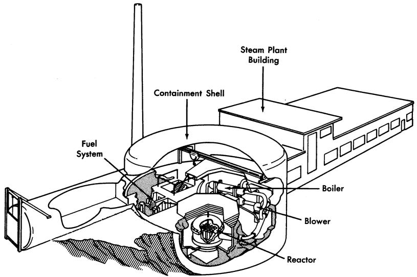  
FIG. 25-1. Artist's concept of LMF-GCR nuclear power station.

channel surface, where it is removed by convection into the coolant stream. The principal problem associated with the LMF-GCR is the development of an impervious graphite core material that will prevent significant leakage of bismuth or fission-product gases into the coolant stream, or of helium into the fuel.

The machining operations required to produce the core section of the element have been demonstrated to be feasible. The reflector is made up of various machined graphite shapes. The fuel piping completes the core and the reactor assembly.

By volume, the core region is approximately $65\%$ graphite, $25\%$ fuel, and $10\%$ void space for coolant. The fuel solution contains fully enriched uranium dissolved in bismuth. With these proportions of fuel and moderator, the minimum critical dimensions as calculated for a cylindrical reactor are height and diameter of approximately 42 in. For this application, a larger core size is required in order to have sufficient heat-transfer area. Since the graphite core elements are a permanent part of the reactor and are not changed in routine refueling procedure, it is not required that they be interchangeable. A considerable amount of design flexibility is thereby achieved, and variations of the fuel channel, moderator, and gas channel geometry provide control over the nuclear and heat processes.

For the reactor described above, it is calculated that 900 atomic parts of $\mathbf{U}^{235}$ per million parts of bismuth are necessary for criticality, if there is no poisoning of the reactor. However, if the effect of xenon and samarium

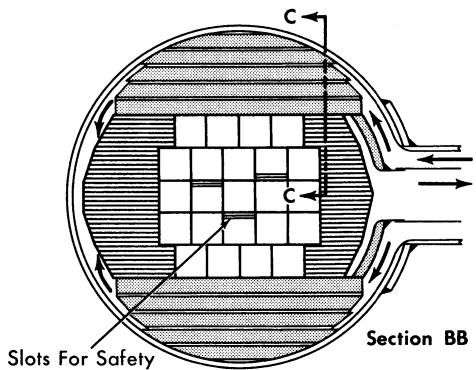

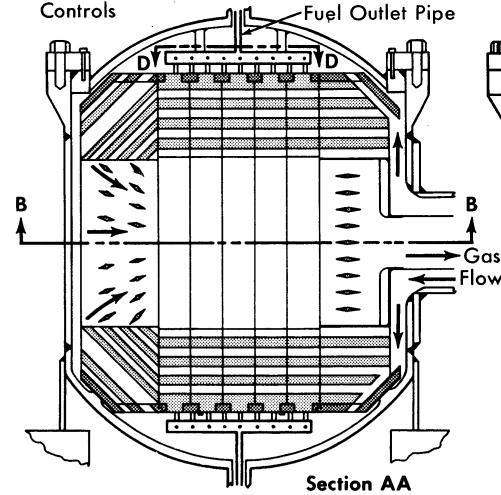

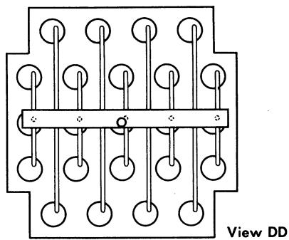

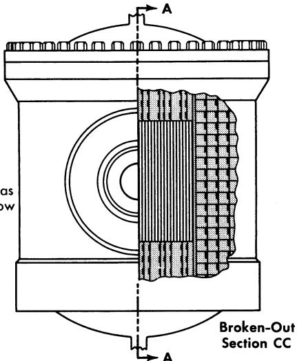  
FIG. 25-2. Reactor and pressure vessel assembly.

equilibrium poisoning is included, 1010 ppm of $\mathbf{U}^{235}$ will be required for criticality.

The buildup of fission products and uranium isotopes as a function of time was calculated to determine the fuel concentration necessary for criticality after various time periods of operation. Since the solubility of uranium in bismuth is limited to 6560 ppm at $965^{\circ}\mathrm{F}$ , the lowest fuel temperature in the LMF-GCR, the reactor fuel must be replaced or processed after the poisons build up to such a level that this solubility limit is exceeded by criticality requirements. With the total fuel inventory in the system equal to 1.2 times the fuel in the core, the fuel lifetime will be 220 megawatt-years. This corresponds to an operating period of 4.8 years with a plant utilization factor of $80\%$ .

At the end of the fuel lifetime, the fuel solution will contain 3370 ppm

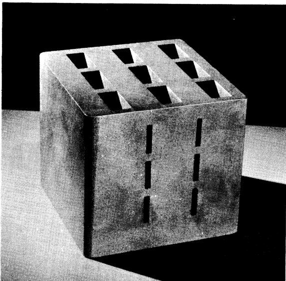  
FIG. 25-3. Model section of nuclear core element for LMF-GCR liquid metal fuel gas-cooled reactor.

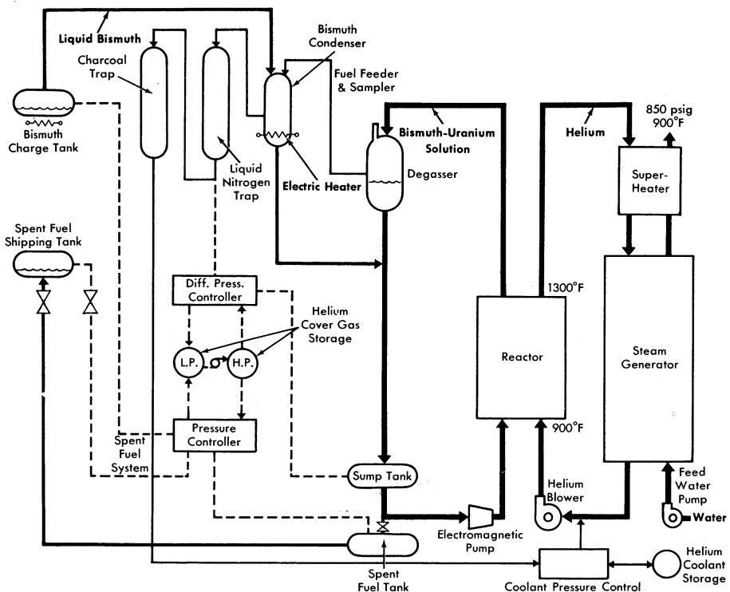  
FIG. 25-4. Over-all plant flow diagram.

of $\mathrm{U}^{235}$ , 1960 ppm of $\mathrm{U}^{236}$ , and 1230 ppm of $\mathrm{U}^{238}$ , which make up the 6560 ppm of uranium allowed by the solubility limit.

In producing the 220 Mw-yr of heat, $98.7\mathrm{kg}$ of $\mathrm{U}^{235}$ will be either fissioned or transmuted into $\mathrm{U}^{236}$ . Since $23.8\mathrm{kg}$ of $\mathrm{U}^{235}$ remain in the reactor at the end of fuel lifetime, approximately $80\%$ of the total amount of $\mathrm{U}^{235}$ added to the reactor during its operation will have been "burned."

The systems required in the plant are shown by the flowsheet of Fig. 25-4. The heat is removed from the reactor by helium at 500 psia, which leaves the reactor at $1300^{\circ}\mathrm{F}$ and returns at $900^{\circ}\mathrm{F}$ . This heat is removed from the helium in a steam generator that produces superheated steam at 850 psig, $900^{\circ}\mathrm{F}$ . The steam is utilized by a standard turbine generator plant.

A steam-cycle generating plant was incorporated, since it is highly developed. A closed-cycle gas turbine, the most probable alternative, has not yet been developed sufficiently for general utility application, but may be advantageously combined with the LMF-GCR at some later time. In such a system, the reactor coolant would serve also as the cycle working fluid, eliminating the intermediate heat exchanger.

Although the reference LMF-GCR is envisioned as a high-enrichment reactor, it is possible, by changing the parameters, to use fuel of only $20\%$ enrichment. This low-enrichment reactor would have the advantage of producing a sizeable fraction of its own fuel by creating $\mathrm{Pu}^{239}$ through neutron absorption in $\mathrm{U}^{238}$ .

Parametric calculations of low-enrichment reactors have been made using a two-group, two-region spherical geometry computer code developed for the IBM 650 digital computer. The results show that to have a fuel lifetime long enough (about 1 yr) to be of practical value, the dimensions of the reactor core should be equivalent to a sphere at least 6 ft in diameter.

25-1.3 Fuel and fuel system. Fuel system. The fuel system is completely separate from the heat-removal system. The main fuel loop flow rate is approximately 2 to $4\mathrm{gpm}$ , which is sufficient to provide for uranium makeup and for gas separation in the degasser.

Fuel flows upward through the reactor core and into the degasser. From there, the flow goes down into the sump tank and back into the reactor inlet. The fuel is pumped electromagnetically and flow is measured by an orifice or an electromagnetic flow meter.

The sump tank acts as a receiver for all the fuel in the loop when the core is to be drained. To keep the sump tank nearly empty during operation, the pressure differential between the helium cover gas in the sump tank and the degasser must be kept equal to the bismuth static head. The fuel is automatically drained into the sump tank when the pump is de-energized and the two cover gas lines are connected together. Thus there are no valves in the primary fuel loop which must be operated in order to drain the reactor.

TABLE 25-1 SUMMARY OF DESIGN PARAMETERS   

<table><tr><td colspan="2">Over-all plant performance</td></tr><tr><td>Reactor core thermal power</td><td>57,000 kw</td></tr><tr><td>Helium blower power</td><td>5,530 kw</td></tr><tr><td>Net electric power generated</td><td>16,470 kw</td></tr><tr><td>Plant efficiency</td><td>28.9%</td></tr><tr><td>Thermal data on reactor at full power</td><td></td></tr><tr><td>Helium pressure</td><td>500 psia</td></tr><tr><td>Coolant inlet temperature</td><td>900°F</td></tr><tr><td>Coolant exit temperature</td><td>1300°F</td></tr><tr><td>Coolant flow rate</td><td>389,000 lb/hr</td></tr><tr><td>Coolant velocity in core</td><td>≈560 fps</td></tr><tr><td>Number of flow passes</td><td>1</td></tr><tr><td>Average thermal power density</td><td>0.714 Mw/ft3</td></tr><tr><td>Peak thermal power density</td><td>≈0.922 Mw/ft3</td></tr><tr><td>Peak to average heat flux ratio (average over life)</td><td>≈1.29</td></tr><tr><td>Design heat output</td><td>1.94 × 108Btu/hr</td></tr><tr><td>Maximum graphite temperature</td><td>1650°F</td></tr><tr><td>Maximum fuel temperature</td><td>1755°F</td></tr><tr><td>ΔP/P through reactor</td><td>4.3%</td></tr><tr><td>Steam plant data</td><td></td></tr><tr><td>Pressure</td><td>850 psig</td></tr><tr><td>Temperature</td><td>900°F</td></tr><tr><td>Flow rate</td><td>188,300 lb/hr</td></tr><tr><td>Number of extractions</td><td>4</td></tr><tr><td>Turbine heat rate</td><td>9,645 Btu/kwh</td></tr><tr><td>Condenser pressure</td><td>1.5 in. Hg</td></tr><tr><td>Turbine speed</td><td>3600 rpm</td></tr><tr><td>Gross turbine output</td><td>22,000 kw</td></tr><tr><td>Pressure vessel</td><td></td></tr><tr><td>Material</td><td>Stainless steel</td></tr><tr><td>Outside diameter</td><td>94 in.</td></tr><tr><td>Thickness</td><td>2 in.</td></tr><tr><td>Over-all length</td><td>123 in.</td></tr><tr><td>Weight</td><td>30,000 lb.</td></tr><tr><td>Type of closure</td><td>Bolted</td></tr><tr><td>Insulation</td><td>4 in. of diatom-</td></tr><tr><td>Core</td><td></td></tr><tr><td>Neutron energy</td><td>Thermal</td></tr><tr><td>Fuel, clean</td><td>900 ppm of U235</td></tr><tr><td></td><td>93.5% en-</td></tr><tr><td></td><td>riched U in Bi</td></tr><tr><td>Fuel lifetime</td><td>220 Mw-yr</td></tr><tr><td>Reprocessing interval (0.8 plant factor)</td><td>4.8 yr</td></tr><tr><td>Fuel burnup</td><td>80% of U235</td></tr><tr><td>Moderator</td><td>1.9 g/cc graphite</td></tr><tr><td>Bismuth in core</td><td>11,400 lb</td></tr><tr><td>Bismuth volume fraction</td><td>25%</td></tr><tr><td>Graphite volume fraction</td><td>65%</td></tr><tr><td>Void (helium) fraction</td><td>10%</td></tr><tr><td>Average core radius</td><td>28 in.</td></tr><tr><td>Core height</td><td>56 in.</td></tr><tr><td>Core volume</td><td>79.8 ft3</td></tr><tr><td>Power</td><td>57 Mw</td></tr><tr><td>Specific power, average over fuel lifetime</td><td>~3700 kw/kg</td></tr><tr><td>Power density (based on core volume in liters)</td><td>25.2 kw/liter</td></tr><tr><td>Average thermal flux (clean)</td><td>5.9 × 1014</td></tr><tr><td>Average thermal flux (average over life)</td><td>~3 × 1014</td></tr><tr><td>Average fast flux (clean)</td><td>~6 × 1014</td></tr><tr><td>Average moderator temperature</td><td>800°C</td></tr><tr><td>Temperature coefficient, average over fuel lifetime</td><td>~0.5 × 10-4δk/°C</td></tr><tr><td>Critical mass (clean, enriched U)</td><td>5.6 kg</td></tr><tr><td>Critical mass (xenon at equilibrium, enriched U)</td><td>6.3 kg</td></tr><tr><td>Inventory (xenon at equilibrium, enriched U)</td><td>7.6 kg</td></tr><tr><td>Inventory volume = 1.2 core volume of bismuth</td><td>24 ft3</td></tr><tr><td>U235 in system at end of fuel lifetime</td><td>23.8 kg</td></tr><tr><td>Reflector</td><td>1.9 g/cc graphite</td></tr><tr><td>Reflector thickness</td><td>1.5 ft</td></tr><tr><td>Reflector void fraction</td><td>5%</td></tr></table>

Fuel. Uranium makeup is added to the fuel solution on a day-to-day basis, thus keeping excess reactivity to a minimum. The operating lifetime of the fuel is nearly 5 yr at full power and $80\%$ plant utilization factor. Fuel burnup may be as much as $80\%$ , and total $\mathrm{U}^{235}$ inventory varies from about $7\mathrm{kg}$ at the beginning of fuel life to about $24\mathrm{kg}$ at the end of fuel life.

The LMF-GCR tends to be self-regulating. Under the influence of its negative temperature coefficient, the reactor will tend to operate at the same average moderator temperature at all power levels. This temperature will be maintained by controlling the uranium fuel solution concentration.

Spent fuel. After 4 to 5 yr, nonvolatile fission-product poisons and nonfissionable isotopes of uranium accumulate to such an extent that a new fuel charge is required. The used fuel is drained into the spent fuel tank and the reactor fuel loop is then ready to receive a new fuel charge. The spent fuel is transferred into a number of small, shielded shipping tanks for shipment to a chemical processing plant.

25-1.4 Reactor materials. The critical problem associated with the LMF-GCR is the development of a core element. As a basic core element material graphite is extremely attractive because it is a very good moderator, possesses excellent high-temperature strength, has unexcelled resistance to thermal shock, is not attacked by bismuth, has a low neutron absorption cross section, possesses a satisfactorily high thermal conductivity, and shows evidence that radiation damage is rapidly annealed at high temperature. Presently available graphite is not impermeable to bismuth or gases, as the core element material of the LMF-GCR must be in order to separate the fuel and coolant satisfactorily. However, recent developments indicate a chance for success in this area.

The other aspect of core element development is to find a suitable means for joining the graphite to the upper and lower fuel system headers. The graphite-to-metal bond must have adequate mechanical strength and be resistant to corrosion, thermal cycling, and radiation damage. Bonds of this type have been prepared by means of high-temperature brazing techniques, and the work has shown that numerous additional bonding agents are available. Preliminary work is encouraging and indicates that with improvements in bond design, bond techniques, and test methods, solutions to the bonding problem may be achieved.

Alternate materials as the basic core element structural material are under investigation as a backup to the graphite development. These include KT silicon carbide, molybdenum, molybdenum carbide, niobium, niobium carbide, zirconium carbide, tantalum, and tantalum carbide, all of which have properties indicating promise for LMF-GCR application.

25-1.5 Plant operation and maintenance. The LMF-GCR is primarily self-regulating, having a temperature coefficient of approximately $-0.5 \times 10^{-4} / ^{\circ}\mathrm{C}$ . Large changes in power output are controlled by varying coolant flow rate while keeping the gas temperatures approximately constant. Coolant flow rate will be varied by controlling the helium blower speed, and by changing the coolant gas density (pressure) with the compressor and accumulator system.

The main plant and reactor control room will be outside the reactor containment shell in the steam plant generator building. A full thickness of shielding wall separates the boiler and blower compartments from the reactor, and operating personnel will be able to conduct maintenance and inspection of these items while the reactor is in operation. This wall is penetrated by the concentric piping which carries the primary gas into and out of the reactor. To attenuate radiation streaming through the pipe, a turn is made within the shield.

The core and pressure vessel assembly have been designed so that the core, and also the reflector if necessary, may be replaced in the event of a

failure. During operation, the core and reflector are supported at the bottom of the pressure vessel. However, the core assembly is attached to the pressure vessel head so that the two will be lifted together when the head is removed. The reflector is also constructed with a metal support structure so that it can be lifted out of the pressure vessel as a unit.

The fuel loop components and piping are arranged so that maintenance can be carried out in a safe and reliable manner. Since the parts are relatively inexpensive, it will probably be cheaper to replace than repair them.

25-1.6 Plant capital and power cost. For a 16,000-kw (electrical) LMF-GCR plant, the cost of power, at an $80\%$ plant utilization factor, is estimated at 14.6 mills/kwh, made up of 8.6 mills/kwh for fixed charges, 2.7 mills/kwh for operation and maintenance, and 3.3 mills/kwh for fuel. The total power cost using a $60\%$ plant utilization factor is 18.4 mills/kwh. A fixed charge rate of $15\%$ was used.

The capital cost for a 16,000-kw LMF-GCR nuclear plant has been estimated at $409/kw$ of installed capacity. These cost figures are based on estimates for the important equipment in the plant, and on recent AEC fuel prices.

# 25-2. MOLTEN PLUTONIUM FUEL REACTOR*

25-2.1 Introduction. The long-range utility of nuclear power based on uranium fission depends upon the development of a plutonium-fueled reactor capable of being refueled by an integral, or associated, breeding cycle. If full utilization of the energy content in the world's supply of uranium is to be accomplished, the more abundant $\mathbf{U}^{238}$ must be converted into the easily fissionable isotopes of plutonium. The need for this full utilization is apparent when it is realized that the economically recoverable $\mathbf{U}^{235}$ content of uranium ores [1,2] is sufficient to supply projected world power requirements for only a few decades. Breeding on the plutonium cycle extends fission power capabilities by a factor of 140, yielding thousands, instead of tens, of years of world energy reserves.

The high values of the capture-to-fission ratio at thermal and epithermal neutron energies for the plutonium isotopes preclude these types of reactors from an integral plutonium breeding cycle system. To obtain an appreciable breeding gain, a plutonium-fueled reactor must be either a fast or a fast-intermediate neutron spectrum device where breeding ratios of the order of 1.7 may be expected from suitably designed systems. One of the power-producing reactors of the future must logically be a fast plutonium breeder.

In order to maintain a fast-neutron spectrum, fuel densities in a plutonium breeder will be high, and coolants must be either molten metals or salts. The latter characteristic will permit large amounts of power to be extracted from relatively small volumes, thus obtaining a large specific power. Hydrogenous and organic coolants are eliminated because of their attendant neutron moderation properties, high vapor pressures at high temperatures, and relatively poor resistance to radiation damage. For efficiency reasons the system temperature should be as high as is compatible with a long operating life. Therefore, to be in step with modern electrical generation techniques, this would imply coolant outlet temperatures of the order of $650^{\circ}\mathrm{C}$ .

25-2.2 Basic components. Before discussing the Los Alamos Molten Plutonium Reactor (LAMPRE) proposal in detail, the following resume will treat some of the possibilities for the three basic components of a power reactor: the fuel, the container, and the coolant.

Molten plutonium fuels. Plutonium metal melts at $640^{\circ}\mathrm{C}$ , a temperature that is somewhat high, but not beyond the bounds of utility. Fortunately, some alloys of plutonium have significantly lower melting temperatures. Specifically, eutectic alloys of plutonium with iron, nickel, and cobalt all have melting temperatures in the vicinity of 400 to $450^{\circ}\mathrm{C}$ . Ternary and quaternary alloying agents will further lower these melting temperatures by a few percent. One characteristic of these transition metal alloys is that they do not dilute the fuel volumetrically to a great extent in their eutectic compositions.

Other alloys of plutonium which are more dilute in fuel and have not too unreasonable melting temperatures are the magnesium-plutonium and bismuth-plutonium alloys. The spatial dilution of fuel atoms alleviates the high power density problem but, unfortunately, these alloys have melting temperatures significantly higher than the transition metal alloys.

A compilation of the interesting fuel alloys, their melting points, and eutectic compositions appears in Table 25-2.

Container materials. A material capable of being fabricated into various shapes and resistant to high-temperature corrosion by the fuel alloy is a necessity if practical use is to be made of the low melting temperature plutonium alloys. Since the transition metals readily form low melting point alloys with plutonium, the normal constructional materials, steels and nickel alloys, are eliminated.

The next alternatives, the refractory metals, have been used with measurable success to contain the various alloys of plutonium. Tungsten and tantalum have been somewhat better containers than molybdenum and niobium and much better than chromium, vanadium, and titanium. The requirement of fabricability eliminates several of the refractory metals, such

as tungsten and molybdenum, because of the poor state of their peculiar welding art.

The limitations of metallurgical knowledge at present lead to the conclusion that tantalum will be one of the best container materials for these plutonium alloys. The high-temperature strength properties and the heat-transfer properties of tantalum are excellent; moreover, it is weldable. The parasitic capture cross section of tantalum would be intolerable in an epithermal or thermal power breeder reactor and, although relatively large in a fast spectrum, its effect on neutron economy in a fast reactor can be made small, if not minor, by careful design.

Dynamic corrosion tests indicate that tantalum's resistance to corrosion by molten sodium, a possible coolant, will be adequate. Long-term static corrosion tests (9000 hr at $650^{\circ}\mathrm{C}$ ) indicate that the fuel is compatible with tantalum at proposed operating temperatures.

Coolant. The desire to obtain a high power density at high temperatures and low pressures in a high radiation field dictates the use of molten metal or salt coolant. The list of possibilities is topped by sodium and bismuth. A few words about the properties of these coolants are probably appropriate at this point.

Sodium is advantageous because of its low melting point, good heat-transfer properties, low pumping power requirement, and because there has been considerable engineering experience with it. Its poor long-term corrosion properties when in contact with the better container materials such as tantalum and its explosive burning property when exposed to water or moist air are distinct disadvantages.

Bismuth, on the other hand, does not react explosively with water, nor does it burn in air. Pumping power requirements some five times larger than for sodium, its higher melting temperature, and the polonium buildup problems are disadvantageous factors of a bismuth coolant. However,

TABLE 25-2   
FUEL ALLOYS   

<table><tr><td>Alloy</td><td>Eutectic composition, a/o</td><td>Melting point, °C</td><td>Approximate density, g/cc</td></tr><tr><td>Pu-Fe</td><td>9.5 Fe</td><td>410</td><td>16.8</td></tr><tr><td>Pu-Co</td><td>10 Co</td><td>405</td><td>16</td></tr><tr><td>Pu-Ni</td><td>12.5 Ni</td><td>465</td><td>16</td></tr><tr><td>Pu-Mg</td><td>85 Mg</td><td>552</td><td>3.4</td></tr><tr><td>Pu-Bi</td><td>Noneutectic</td><td>271-900</td><td></td></tr></table>

the corrosion resistance of tantalum in dynamic, high-temperature bismuth is excellent, according to the Ames experiments [3].

25-2.3 LAMPRE. A first step in solving the plutonium power reactor problem is to prove the feasibility of operating and maintaining a molten plutonium power reactor core. To this end, the reactor assembly known as LAMPRE I has been devised. The LAMPRE system has the following essential features:

Fuel alloy: Molten plutonium-iron (eutectic composition, 9.5 a/0 Fe)

Container: Tantalum

Reflector: Steel

Shield: Graphite, iron, concrete

Coolant: Sodium

Power: 1 Mw heat

Heat transfer: Internally cooled core Tube-shell Heat exchanger Heat rejected to air

Breeding No breeding blanket

Core. The LAMPRE core consists of three parts: fuel alloy, container, and coolant. A proposed design, described in detail below, yields a structure which is approximately $50\%$ by volume fuel alloy, $15\%$ structure, and $35\%$ coolant. The minimum tube separation is slightly under 1/16 in. At reasonable heat-transfer rates, this configuration is capable of developing a specific power of better than 250 watts/g. More efficient systems can utilize a similar structure but must dilute the fuel volumetrically to obtain a larger heat-transfer surface per unit of contained fuel. The larger area-to-volume ratio can be obtained by going to smaller diameter tubes and/or closer spacing of the tube array. In the tube-shell arrangement, the fuel is located on the outside of the tubes and the coolant flows through the tubes. Such a scheme preserves the volumetric integrity of the fuel. Other radiator-type schemes, which also preserve fuel integrity, are conceivable.

The over-all assembly will be designed so that the core will be completely filled during operating conditions. The estimated core height is 6.5 in.

Tantalum expansion, filling, and draining tubes will be attached to the core structure. A reference core assembly would be:

<table><tr><td>Container</td><td>Tantalum</td></tr><tr><td>Tubes (547)</td><td>3/16-in. OD, 0.015-in. wall, hexagonal array</td></tr><tr><td>Cage shape</td><td>Right cylinder, 6.25-in. OD, 6.5-in. height</td></tr><tr><td>Headers and shell</td><td>0.040 to 0.080 in.</td></tr><tr><td>Critical mass</td><td>26 kg plutonium alloy</td></tr></table>

Reflector. No attempt to breed will be carried out in the first LAMPRE concept. Although the over-all coolant container will be made of stainless steel, the fast-neutron reflector will be made of steel and will be cooled by the main sodium stream. The thickness of the radial steel reflector will be adjusted to be thin enough, neutronwise, to obtain adequate external reflector control, but will be too thick to allow the thermalized neutrons returning from the graphite shield to build up a power spike at the core surface. The core, although slightly coupled to the reflector and shield, will have a mean fission energy greater than 500 kev, ensuring a high possible breeding gain. The top and bottom stainless-steel reflector slugs will also be sodium-cooled and will be essentially "infinitely" thick to fast neutrons. The coolant channels will be drilled or machined into solid slug or disk castings.

Control. The control of LAMPRE will be effected by reflector-type mechanisms. An annular shim control displacing the innermost 4 in. of shield with aluminum will be used as a coarse criticality adjustment mechanism. Several replacement cylinders, replacing the inner portions of aluminum with void, will be used as fine controls. A rotating control cylinder will be built into the system in anticipation of safety and neutron kinetics experiments.

The radial thickness of the steel fast-neutron reflector is adjusted so that the fast and intermediate neutrons returning to the core from the aluminum reflector and graphite are worth approximately $10\%$ to the core critical mass. Displacement of the aluminum reflector effectively reduces the neutron reflection back to the core, yielding an external, large-effect control mechanism adequately cooled by aluminum conduction and air convention.

The LAMPRE critical experiments have proved that aluminum-void replacement mechanisms are effective and operable. The annular shim has been shown to be almost ineffective at distances greater than 2 in.

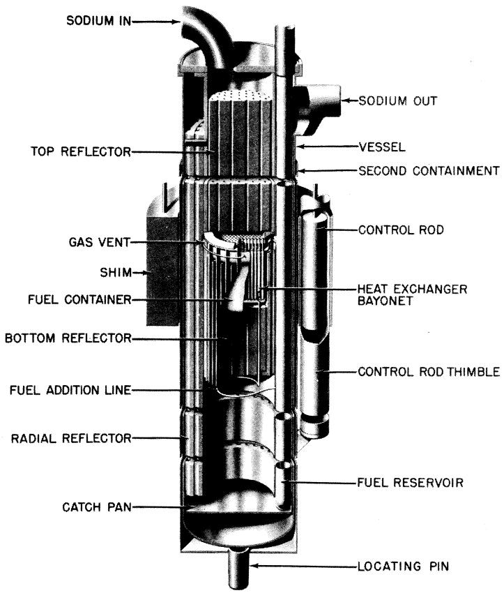  
FIG. 25-5. The Los Alamos Molten Plutonium Reactor Experiment.

above or below the core height for the geometry. These results have been incorporated into the LAMPRE design as presented in Fig. 25-5.

# 25-3. LIQUID METAL-URANIUM OXIDE SLURRY REACTORS

There has been some work done at other locations on uranium oxide slurry reactors. At Knolls Atomic Power Laboratory, a uranium oxide-bismuth slurry reactor has been explored [4]. In this reactor, the fuel, consisting of uranium oxide suspension and liquid bismuth, is pumped through a moderator matrix and then through an external heat exchanger. The reader will recognize that this is the same as the single-region LMFR described in the preceding chapter.

The studies at KAPL were encouraging. A small amount of experimental work indicated that dispersions of uranium oxide and bismuth can be made. These workers found that at 500 to $600^{\circ}\mathrm{C}$ titanium is the best additive for promoting the wetting of $\mathrm{UO}_2$ by bismuth. An $8\mathrm{w / o}$ $\mathrm{UO}_2$ -bismuth slurry was actually pumped with an electromagnetic pump at $450^{\circ}\mathrm{C}$ .

At Argonne National Laboratory, uranium oxide-NaK slurries have been studied as possible reactor fuels [5]. This fuel would be suitable for a fast-breeder reactor. Investigations have been carried out at a maximum concentration of 4.3 vol. $\%$ $\mathrm{UO_2}$ in eutectic NaK. Two loops have been operated at temperatures ranging from 450 to $600^{\circ}\mathrm{C}$ . A slurry with 4.3 vol. $\%$ actually has a very high weight percent, 36.0 w/o.

The tests in the two loops indicated uniform suspension at flow rates of 2 fps.

The $\mathrm{UO}_2$ dropped out of suspension at temperatures above $500^{\circ}\mathrm{C}$ but would resuspend at lower temperatures. When a very small amount of uranium metal was added to the slurry, better wetting of the particles was obtained and no further settling above $500^{\circ}\mathrm{C}$ was observed.

Work on the uranium oxide slurries is continuing, and the incorporation of these results into liquid metal fuel reactors can be expected.

# REFERENCES

1. S. GLASSTONE, Principles of Nuclear Reactor Engineering. Princeton, N. J.: D. Van Nostrand Co., Inc., 1955. (pp. 1-2)   
2. P. C. PUTNAM, Energy in the Future. Princeton, N. J.: D. Van Nostrand Co., Inc., 1953. (p. 214)   
3. R. W. FISHER and G. R. WINDERS, High Temperature Loop for Circulating Liquid Metals, in Chemical Engineering Progress Symposium Series, Vol. 53, No. 20. New York: American Institute of Chemical Engineers, 1957. (pp. 1-6)   
4. D. H. AHMANN et al., A $UO_{2}$ -Bismuth System As a Reactor Fuel, USAEC Report KAPL-1877, Knolls Atomic Power Laboratory, July 1, 1957.   
5. B. M. ABRAHAM et al., $\mathrm{UO}_2$ -NaK Slurry Studies in Loops to $600^{\circ}\mathrm{C}$ , *Nuclear Sci. and Eng.* 2, 501-512 (1957).