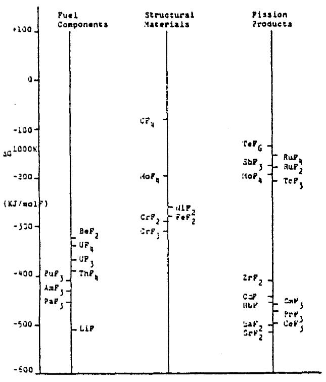
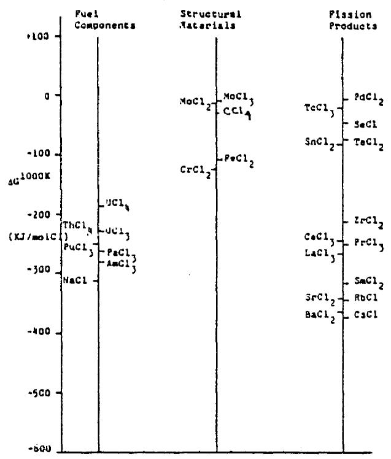

# Cursory First Look at the Molten Chloride Fast Reactor as an Alternative to the Conventional BATR Concept

Eric H. Ottewitte

April 1992

# ABSTRACT

INEL is presently studying the design and feasibility of a Broad Application Testing Reactor (BATR) which would eventually replace the Advanced Test Reactor (ATR) at INEL. A Molten Chloride Fast Reactor (MCFR) concept with its very fast neutron spectrum in an annular core would engender high neutron fluxes, driving inner and outer thermal neutron flux traps, each variable in size and neutron energy spectrum. Continuous processing and refueling would minimize reactor downtime. Absence of fuel elements and associated structures should maximize test space and facilitate access thereto.

This paper collates forty years of worldwide experience with molten salt reactors, compiling the unique pluses and minuses of such a reactor. In addition it reports advice of co-members of a current international molten salt consortium.

# SUMMARY

# Technical and Economic Feasibility

Fast molten chloride reactors have been cursorily considered before but mainly for the U/Pu fuel cycle. The ORNL MSR program showed the feasibility of fuel salt circulation. The combination of that experience and MCFR research (out-of-pile experiments and theoretical studies, so far) provide a basis for believing the concept will work.

Chemical stability and corrosion of molten salts are fairly predictable. Low vapor pressure of the salts enhances safety and permits low pressure structural components.

Molten fuel state and external cooling simplify component design in a radiation environment. They forego complicated refueling mechanism, close tolerances associated with solid fuel, and mechanical control devices. Molten state and low vapor pressure of the salts also offer inherent safety advantages.

Graphite and Mo alloys and coatings appear as promising candidates for primary salt containment, both in and out of core. These high temperature materials may permit high fuel salt temperatures (above $1000^{\circ}\mathrm{C}$ ). This can reduce fuel salt inventory in the heat exchanger and allow gas turbine cycles and/or process heat applications using helium as an intermediate and final coolant.

# Key MCFR Advantages

Some salient advantages of the MCFR concept are:

1. Simplicity: no control rods, fuel handling mechanisms, fuel elements or associated structures. Very uncluttered: should maximize test space and facilitate access thereto. Fluid fuel can be transferred remotely by pumping through pipes connecting storage and reactor.   
2. MSRs don't refuel or reprocess, just add fuel and process out wastes. Continuous processing and refueling would minimize reactor downtime. Can usefully consume all fuel forms, simplifying fuel supply while simultaneously solving other people's problems.   
3. MSR is the safest concept of all due to very strong negative temperature coefficient. No gaseous hydrogen can possibly evolve from fuel or primary coolant. Fuel already molten and handled by system. Simple design technique makes boiling impossible. Continuous removal of fission products reduces their heat source by two orders of magnitude: consequently, natural circulation suffices for emergency cooling, thereby greatly reducing the designated evacuation area. Also, under any off-normal conditions, the liquid fuel can be channeled to a continuously cooled drain tank, in a short time.   
4. Very fast neutron spectrum in an annular core engenders high neutron fluxes, driving inner and outer thermal neutron flux traps, each variable in size and neutron energy spectrum by means of molten salt composition. Elimination of fuel cladding and

structural material significantly improves the neutron economy of the reactor: more neutrons are available for applications.

5. Elimination of pressurized and pressure-evolving components inside the containment, reducing risk of containment failure   
6. Potential additional missions for an MCFR BATR could include

a. Sr and Cs waste transmutation because of very high neutron flux   
b. Useful consumption of fissile fuel from dismantled weapons because of the flexibility in fuel form   
c. Process heat R&D due to high temperature capability   
d. A $^6\mathrm{LiD}$ or $^6\mathrm{LiOD}$ shell for generation of a 14 MeV fusion neutron trap.

# Inherent Disadvantages and Limitations to MCFRs

Expected problem areas and concerns for an MCFR will be that

1. External cooling and local processing produce high fuel inventory in-plant; on the other hand little inventory exists out-of-plant or in transport   
2. Molten salt fuel transfers heat poorly compared with sodium in an LMFBR   
3. The high melting point $(-560^{\circ}\mathrm{C})$ of suitable fuel salts necessitates preheating in many places   
4. The high melting point of the fuel salt limits the $\Delta t$ across a heat exchanger, less the salt freeze. Consequently one must increase the mass flow rate   
5. The presence of fission products in the fuel salt necessitates a high standard of plant reliability and leak tightness   
6. Corrosion and high temperature limit the choice for structural materials   
7. High neutron flux damages structural materials   
8. The processing plant requires developments   
9. Mutants in the fuel salt, including sulfur from chlorine mutation, corrode.

Limits on power density may come from

1. Radiation damage to the high flux   
2. High temperature of the fuel coolant causing leakage through a seal expansion, melting

of metal, or chemical corrosion

3. High fuel inventory in the heat exchanger, affecting economics, doubling time, and reactor control.

Use of replaceable graphite for the material in contact with the fuel coolant throughout the reactor and much of the primary circuit might eliminate much of concerns (1) and (2).

# CONTENTS

ABSTRACT iii

SUMMARY V

Technical and Economic Feasibility 2

Key MCFR Advantages

Inherent Disadvantages and Limitations to MCFRs vi

INTRODUCTION 1

BATR REQUIREMENTS AND MISSIONS 2

Requirements of a BATR Concept 2

Missions 2

GENERAL MOLTEN SALT REACTORS 3

Physico-Chemical Features 3

Peritectic melting point 3

Fluid Fuel Features 4

Thermohydraulic Advantages 4

External Cooling 5

Continuous On-Line Processing 5

Reactor Safety 6

Leakage of Radioactive Salt 7

Criticality Accident Considerations 7

Other Concerns 7

Burning Fissile Fuel from Dismantled Weapons 7

Diversion and Proliferation Prevention 8

Waste Minimization 8

Molten Salt Thermal Reactor Experience 9

Aircraft Reactor Experiment 9   
Civilian-Oriented Molten Salt Reactor Program. 9   
Molten Salt Reactor Experiment (MSRE). 10

Recent Work. 11

MOLTEN CHLORIDE REACTOR 12   
Advantages of a Very Fast Neutron Spectrum 12   
Projected Reactor Geometry 14   
Salt Compositions 14   
Thermohydraulic Considerations 16   
Cooling and Heat Exchangers 17   
Continuous Processing 17   
Principal Salt Processing Methods 18   
Core Salt Processing 20   
Ability to Digest All Existing Spent Fuels 24   
MCFR Fuel Cycle 24   
In-core Continuous Gas Purging 25   
Delayed Neutron Emitters 25   
Safety 26   
Analysis of Accident Situations 27   
Resistance to External Threat 30   
Effects of Neutron Irradiation upon Molten Salt Chemistry 31   
Effect of Chemical Stability upon Corrosion 31   
Transmutations of Sodium and Chlorine 32   
Chemical Behavior of Radiosulphur Obtained by $^{35}\mathrm{Cl}(\mathbf{n},\mathbf{p})^{35}\mathrm{S}$ During In-Pile Irradiation. 32   
Fission Product Behavior in the Fuel 33

# Structural Materials 35

General Considerations and Criteria 36

Chemical Reactions in an MCFR 38

Candidate Materials for an MCFR 40

Materials for the Core/Blanket Interface 42

Chemical Stability of Halides 43

The Irradiation of Molybdenum and Iron in a Fast High Flux Reactor 44

# Enhanced Transmutation of $^{90}\mathrm{Sr}$ and $^{137}\mathrm{Cs}$ 44

# Access and Maintenance 45

Intrinsic Reliability 45

MSRE Experience 46

Comparison of Primary Circuit Configurations 46

Reactor Maintenance/Replacement Procedure 46

Reactor Shielding 47

Radiation Sources in Processing Equipment 47

# Auxiliary Plant 47

Power Cycle Options 48

Auxiliary Hardware 49

Filling,Draining andDump Systems 50

Overall Plant Size 50

# History of the MSFR. 50

US Activities 51

European Activity 52

# Summary MSR State-of-the-Art 54

# REFERENCES 55

# Cursory First Look at the Molten Chloride Fast Reactor as an Alternative to the Conventional BATR Concept

INTRODUCTION

INEL is presently studying the design and feasibility of a Broad (wide variety) Application flexible, high-flux Testing Reactor (BATR) which would eventually replace the Advanced Test Reactor (ATR) at INEL. This paper purposes to compile the unique pluses and minuses of a BATR based on the Molten Chloride Fast Reactor (MCFR) concept. Its very fast neutron spectrum in an annular core would engender high neutron fluxes, driving inner and outer thermal neutron flux traps, each variable in size and neutron energy spectrum. Continuous processing and refueling would minimize reactor downtime. Absence of fuel elements and associated structures should maximize test space and facilitate access thereto.

The paper first lists the projected BATR requirements and missions. It then reviews generic characteristics of all molten salt reactors before focussing on the molten chloride fast reactor. The latter concept was first proposed as a future INEL high flux testing reactor in 1976. This paper does not evaluate fast and thermal molten fluoride salt reactors, whose neutron spectra are much softer, as BATR concepts. The option of incorporating those molten salt variants, in whole or in part, does increase the flexibility of the molten salt BATR concept.

Potential additional missions for an MCFR BATR could include

1. Sr and Cs waste transmutation because of very high neutron flux   
2. Useful consumption of fissile fuel from dismantled weapons because of the flexibility in fuel form   
3. Process heat applications due to high temperature capability   
4. A $^6\mathrm{LiD}$ or $^6\mathrm{LiOD}$ shell for generation of a 14 MeV fusion neutron trap.

This paper is based primarily on references Ta78, Ot82, Ga89 and Ga92. It attempts to cursorily collate forty years of off-and-on-again experience with molten salt reactors, as it applies to a BATR concept, into a readable summary. Some redundancies, incompleteness and incohesiveness may be expected in this short effort. Due to their extensive number, three different notations are used for references in this first cursory collation. Examples are [1], [1'], and [Ga89]. Additional specific questions may be addressed by members of the molten salt consortium and friends which include Uri Gat (ORNL), M. Taube (Switzerland), K. Furukawa (Japan), V. M. Novikov (Moscow), J. Moyer and J. D. Lee (LLNL), M. W. Golay (MIT), Ehud Greenspan (LBL), Carl Leyse (Idaho Falls) and E. Ottewitte (INEL).

# BATR REQUIREMENTS AND MISSIONS [Ry91]

# Requirements of a BATR Concept

The Broad Application Test Reactor is to have a neutron flux greater than $10^{15}\mathrm{ncm}^{-2}\mathrm{s}^{-1}$ over a volume of tens of liters. A broad spectrum of neutron energies is needed. The core should be modular and flexible. It should provide easy access for multiple in-core loops, beam tubes, and rabbit tubes in order to adapt to a variety of different missions over the 30-50 year life. Development risk should be reduced. The two most promising configurations are multiple-annular and multiple hexagonal.

Evaluating the feasibility of BATR concepts should include the following considerations:

Neutron flux levels and energy spectrum   
Thermohydraulics   
Fuels and materials   
Mechanics   
Reliability   
Safety; ability to respond to changes in safety requirements   
Costs   
Compliance; ability to respond to changes in compliance requirements

# Missions

Projected BATR missions, in approximate order of priority, include the following:

1. Fuels and materials irradiation testing   
2. Isotope production   
3. Space nuclear reactor testing: large volume, high power-density space-reactor fuels and component testing, e. g. particle bed reactor   
4. Medical research   
5. Fusion testing   
6. Intense positron facility   
7. Transmutation doping

# GENERAL MOLTEN SALT REACTORS

Molten salt reactors (MSRs) employ a liquid peritectic mixture of fuel and carrier salts. Cooling may be in-core or external. The optimum salt anion appears to be the halides, especially fluorine or chlorine. Other salts are also possible [Ot82]. Halides afford on-line processing, inherent safety, design simplicity and efficiency. Molten salt technology is well developed and experience has been good (see page 9).

Molten salt reactors can operate at thermal, epithermal or fast neutron energies. They can serve as power reactors, fission product burners, and fuel converters or breeders. The power range is also extremely flexible with no safety compromises. They are suitable for small and standby power applications in remote, unattended or for-defense applications. Operational modes range from continuous processed fuel to a lifetime-sealed reactor. They have the potential and promise to become the third generation reactors. The lead technology resides in the U.S. [Ga89].

# Physico-Chemical Features

The choice of fissile material in MSR fuel salt does not seriously affect the salt properties. Hence, a given reactor plant would be capable of using fissile materials in arbitrary combinations for high-temperature, high-efficiency power operation.

1. Salts are chemically stable and evidence good compatibility with materials. Molten salts will not chemically interact with air or water, regardless of temperatures. However, any introduction of hot objects into water could lead to a steam explosion. Some MSR cocnepts employ an intermediate salt to preclude the possibility of radioactive salt interacting with water.   
2. They are nonflammable, averting fire hazards.   
3. Fuel and coolant do not react with air and water when both are at the same temperature   
4. No possible evolution of gaseous hydrogen from fuel or primary coolant   
5. Fuel and primary coolant feature high boiling points and low vapor pressures   
6. In stagnant cooled form, the fuel does not release the volatile fission products.   
7. Some salts are soluble in water, facilitating cleanup of any leaks.

# Peritectic melting point.

Peritectic behavior implies that the mixing of two salts lowers the melting point far below that for either salt by itself. The amount of lowering depends on the molar ratio of the two salts; exceptionally low temperature is possible at the eutectic point, or nadir. This may be of special value for non-fuel salts where little heat is generated.

A fuel mix with melting point well below $700^{\circ}\mathrm{C}$ would minimize auxiliary heating when shut down and allow a large temperature rise in the core without reaching high outlet temperatures ( $>1000^{\circ}\mathrm{C}$ ). Low melting points of the component salts also will facilitate their initial dissolution.

# Fluid Fuel Features

Fluid-fuel reactors differ significantly from all the present solid-fuel reactors: they continuously add fuel and remove fission products and require no fuel refabrication. Indeed, the entire solid-fuel-element fabrication process is avoided. This saves a significant part of the head-end effort and cost. It also adds flexibility:

1. Fuel prepared for an MSR can be conveniently shipped as a cold solid and remelted just before it is added to the reactor system. For small additions, the reactor can be designed to accept the fuel in the frozen state, as in the Molten Salt Reactor Experiment (MSRE).   
2. The fuel can be blended into the reactor on an ad hoc basis at the site. The amount added will depend on its isotopic makeup and concentration, but all can be accommodated by the reactor. These advantages are particularly important for fuel derived from weapons.   
3. There is no need for long lead times and interim storage or for exact long-range planning that may be upset by variations on either the supply or the demand side.   
4. Fluid fuel can be transferred remotely by pumping through pipes connecting storage and reactor.

Molten-salt reactors (MSR) have been more extensively developed than other fluid-fuel power systems.

# Thermohydraulic Aspects

Low vapor pressures up to high temperatures, and favorable heat transfer properties result in high thermal efficiencies for MSRs. This precludes safety hazards associated with high pressures, such as ruptures or depressurizations.

Specific thermohydraulic advantages include the following:

1. All components (fuel, primary coolant) in the containment exhibit low vapor pressure   
2. Existence of a large heat sink   
3. Under any off-normal conditions, the liquid fuel can be channeled to a continuously cooled drain tank, in a short time   
4. Natural convection removes decay heat   
5. Can use a low-melting-point, diluting salt containing neutron poison as a core catcher.

The peritectic nature of the halide salts facilitates low temperature operation in the near term by minimizing chemically-reducing corrosion problems with Mo-Fe alloys. With graphite, these problems may not exist. Later, high temperature operation leading to higher efficiency process heat at compositions away from the eutectic nadir can be implemented when more is known about material corrosion. Off-eutectic compositions can also mean higher BG and thermal conductivity of salt.

Halide salts also offer superior thermal and radiation stability. This inhibits the formation of other compounds, thereby preventing corrosion.

The ORNL MSR program shows that fuel salt circulation is feasible: it is facilitated in part by lowering of melting points in peritectic multi-component mixtures. Chemical stability and corrosion of the molten salts are fairly predictable.

Heat transfer depends on fuel salt density $(\rho)$ , thermal conductivity $(\mathbf{k})$ , viscosity $(\mu)$ , and specific heat $(C_p)$ . Of these, $\rho(T)$ , $\mu(T)$ , and $C_p$ $(T_{m.p.})$ are well known for single salts; much less so for salt mixtures. Knowledge of $k(T)$ for mixtures is better, but still skimpy. Major uncertainties in predicting $h_f$ for a mixture should stem from all parameters except $\rho(T)$ .

# External Cooling

Having the fuel in a fluid state allows external cooling, thereby avoiding structural components in fields of significant radiation damage. It also eliminates labor and material costs associated with fuel element decladding, dissolution, and fabrication. Fuel handling by pumps and piping should be less complex than solid fuel handling. The simplified core should greatly ease the plant design, and increase its reliability and availability, thereby decreasing cost.

A fluid state system also facilitates on-site close-coupled fuel processing. External cooling of the molten salt allows the primary circuit to operate at low pressure: this reduces the severity of the environment and allows materials such as graphite for piping.

Elimination of fuel cladding and structural material significantly improves the neutron economy of the reactor: more neutrons are available for breeding, reduced critical mass, or other tradeoffs.

The principal disadvantage of external cooling will be the hazard associated with multiple critical masses present in the plant outside the reactor.

# Continuous On-Line Processing

Fission product (FP) inventories in MSRs can be significantly reduced [Ta78] by

1. Continuous purging of volatile FPs with helium which removes

a. noble gases (within a period of minutes),   
b. halogens and tritium, partially, and to some extent the noble and seminoble metals in the form of aerosols (within a period of hours);

2. On-site chemical high-temperature processing removal of the non-volatile FPs and, if needed, some "hazardous" actinides (within a period varying from hours to weeks).

The feasibility of the various steps for on-line processing has been calculated and individually demonstrated at ORNL [16',17']. In addition, the uranium recovery step was demonstrated in the MSRE when the fissile material was changed from uranium-235 to uranium-233. The process involved 47 hours of fluorine sparging over a six-day period [5'] to produce a uranium product pure

enough for cascade re-enrichment.

The fission product inventory, in an earlier concept of the Molten Salt Breeder Reactor (MSBR), was planned to be a 10-day accumulation [7]. A more recent proposal [18] suggests reducing the fission products to a level where the entire afterheat can be contained in the salt without reaching boiling. The limit to the reduction of fission product inventory in the reactor will depend on factors of economics and fission product concentrations, among others.

Continuous processing on-site minimizes the fissile inventory, environmental hazard, and proliferation danger outside the reactor: the inventory in the core, piping, and heat exchangers represents almost the entire fuel cycle inventory. Fuel is not tied up in other plants or their temporary storage depots. It is also not under transport to or from such locations, eliminating highjacking, sabotage, and transportation accidents. Finally, it never even occurs in a form or container suitable for transport.

Continuous processing also removes hazardous and neutron-absorbing fission products while adding fresh shim fuel from the optional breeding blanket or from surplus weapons Pu. This greatly reduces the potential radiological danger of the reactor while increasing the neutron economy. Processing online also allows on-line refuelling. That reduces downtime and obviates mechanical shim devices, increasing the neutron economy.

# Reactor Safety

MSRs possess many inherent safety properties:

1. Already being a molten fuel, further "meltdown" cannot occur   
2. Fluid fuel has inherently a strong negative temperature coefficient of reactivity due to expansion, greatly inhibiting boiling   
3. Elimination of pressurized and pressure-evolving components inside the containment   
4. Elimination of the possibility of gas and vapor evolution, especially the release of free hydrogen and attendant fire hazard   
5. Reduced risk of radioactivity release outside the containment due to

a. reduced risk of failure of the containment, and   
b. two orders of magnitude reduction in the FP decay heat source relative to conventional solid-fuel reactors, due to continuous on-site chemical processing

6. Reduced FP inventory improves the capability for emergency heat removal by natural convection, thereby greatly reducing the designated evacuation area   
7. Fluidity facilitates removal from the reactor to ever-safe containers   
8. High heat capacity of fuel restricts temperature rise on loss of normal cooling

9. Low salt vapor pressure minimizes the effect of any temperature rise.

# Leakage of Radioactive Salt

In MSRs, fuel is circulating throughout the reactor system. Consequently the probability of a significant radioactivity leak (of liquid-fuel) should be higher compared to solid-fuel reactors and the consequences more severe. However the barriers to external FP release from an MSR include the

1. Reactor coolant boundary,   
2. Sealed reactor vessel (primary containment)   
3. Reactor building (secondary containment)

In addition, practically all MSR concepts remove fission gases and volatiles continuously, reducing significantly the potential radioactive source term in the system. This reduces both the risk of dispersal of radioactivity and the amount of decay heat that must be contended with during an accident. Fluid fuel also allows shutdown of the reactor by draining the core into subcritical containers from which any decay heat can be readily removed by conduction and natural convection.

# Criticality Accident Considerations

For fission reactors one must protect against criticality accidents during fuel handling. In MSRs the fuel is critical in the molten state in some optimal configuration. This precludes most solid-fuel criticality accident scenarios where the fuel melts or slumps. If the fuel escapes its optimum environment or configuration (e.g., failure of the primary coolant boundary), it will become subcritical. In thermal MSRs a graphite moderator is required for criticality. Thus criticality can occur only in the core. For other concepts, the design must simply exclude vessels that are not criticality-safe for credible fuel mixtures. In addition, the ability to add fuel with the reactor on-line strongly limits the amount of excess nuclear reactivity that must be available.

The molten nature greatly benefits safety as well: increase in temperature causes a strong decrease in fuel density. The inherent stability of this negative temperature coefficient will limit excursions. A self-regulating system may be possible, avoiding the need for control elements.

# Other Concerns

# Burning Flssile Fuel from Dismantled Weapons

MSRs are suitable for the beneficial utilization of fissile material from dismantled weapons for efficient and economical energy production. MSRs can utilize all three major fissile fuels: uranium-233, -235, and plutonium, as demonstrated in the MSRE. This flexibility is achieved without reactor-core design modifications.

Fuel recycling and fabrication are not necessary. Fissiles can be treated completely at the head-end dismantling facility. Fuel shipment sizes are arbitrary and thus optimally safe and fuel transportation is reduced to a minimum [Ga92]. The bulk of the waste can be reduced in volume and

brought into shape, size, form, chemical combination, and shipment and disposal size that are the most acceptable or whatever else may be deemed desirable for safety, security, economy, or practicality. The denaturing and spiking can render the fuel unattractive for proliferation or diversion. All these factors combine to possibly reduce potential public objection.

The fuel supply from the dismantled nuclear devices could be augmented at any time or totally displaced by fuel from other sources. By adjusting other components of the fuel, the conversion ratio can be controlled within rather wide limits. This further assures uninterrupted continued operation of molten salt reactors for support of the overall energy economy. The fact that no substantial design changes are required to accommodate fissile supply changes acts as a damper on the propagation of interruptions, changes in schedule, or plans. This flexibility also moderates any costs that might result from changes and interruptions.

# Diversion and Proliferation Prevention

The relatively simple remote handling allows even the fresh fuel to be highly radioactive which provides a strong diversion inhibitor. Also, highly radioactive fuel can be detected easily. If the temperature of the fuel is allowed to drop, the fuel solidifies and again is difficult to manipulate, providing additional diversion protection.

MSRs can be designed in an extremely safe manner with inherently safe properties that cannot be altered or tampered with. These safety attributes make the MSRs very attractive, and may contribute to their economy by reducing the need for elaborate safety measures.

MSRs further require a minimum of special fuel preparation and can tolerate denaturing and dilution of the fuel. Fuel shipments can be arbitrarily small, which may reduce the risk of diversion.

# Waste Minimization

All fission reactors generate radioactive waste. MSRs with their continuous on-line removal of the waste from the residual fuel greatly simplify its subsequent handling. On-line processing can significantly reduce the transportation of radioactive shipments: there is no shipping between the reactor and the processing facility. Storage requirements are also reduced as there is no interim storage for either cool-down or preparation for shipment. The waste, having been separated from the fuel, requires no accommodation for either criticality or fuel diversion concerns: the waste shipments can be optimized for waste concerns alone.

The actinides can be recycled into the fuel for burning and largely eliminated from the waste. Eliminating the actinides from shipments and from the waste reduces the very long controlled storage time of the waste to more acceptable and reasonable periods of time [19']. The on-site on-line processing also allows for the insertion of some selected fission products like long-lived iodine back into the reactor for transmutation.

The fission products, already being in a processing facility and in a fluid matrix, can be processed to the optimal form desired. That is, they can be reduced in volume by concentration or dilution to the most desirable constitution. They can be further transformed into the most desirable chemical state, shape, size, or configuration to meet shipping and/or storage requirements. The continuous processing also allows making the shipments to the final disposal site as large or as small as desired. This can reduce the risk associated with each individual shipment to an acceptable level.

One primary facet of the nuclear waste problem is that reactor operation induces short-and intermediate-lived radioactivity in materials which had been stable or only long-lived radioactive. The solution is to alternatively store the activated materials until they decay, or to transmute them back into harmless stable or quasi-stable nuclides. When operation produces nuclides which poison the environment and last long, then ecology prefers the added speed of transmutation.

Fuel cycle wastes occur in preparation of the fuel (mill tailings) reactor operation (spent fuel and activation of air and water) and reactor decommissioning (activation products of structural materials). The latter are generally nonvolatile, bound up in the structural material, and extremely difficult to release to the environment, even in accident situations. The mill tailings are inherently low-level. Holdup tanks and stacks with large dilution factors manage the air and water activations. Management of the spent fuel poses the major problem: all others pale in comparison.

In the absence of US reprocessing spent fuel has accumulated recently such as to saturate the utility storage pools. To prevent loss of nuclear generation, DOE plans to find away-from-reactor storage capacity for 810 MT of spent fuel by 1984 and at least 25,000 MT by 1996. Foreign spent fuel will add to these requirements [32].

# Molten Salt Thermal Reactor Experience

The U. S. Department of Energy and its predecessor agencies carried out two very successful reactor experiments: the Aircraft Reactor Experiment (ARE)[4'] and the Molten Salt Reactor Experiment (MSRE)[5'].

# Aircraft Reactor Experiment

In 1947 ORNL began a study on the physics chemistry, and engineering of uranium- and thorium-bearing molten fluorides. MSR technology first appeared in the open literature in 1957 (Briant and Weinberg[1]). The potential for very high temperatures and power density interested the aircraft propulsion project.

The ARE $[1',2',3',4',6']$ was a product of the Aircraft Nuclear Propulsion Program. It was a beryllium-moderated, thermal reactor fueled with a $\mathrm{UF}_4 / \mathrm{NaF} / \mathrm{ZrF}_2$ mix and contained in Inconel. The reactor successfully operated in 1954 for more than $90,000\mathrm{kWhr}$ without incident, at thermal powers up to $2.5\mathrm{MW}$ and temperatures as high as $1650^{\circ}\mathrm{F}$ .

That program was subsequently discontinued, but a civilian-oriented Molten Salt Reactor Program (MSRP) that began in 1956 [5'] continued development of this general technology.

# Civillian-Oriented Molten Salt Reactor Program.

The primary goal of the early MSRP and for most of the thermal molten salt reactor program was the development of a thermal Molten Salt Breeder Reactor (MSBR) for economic civilian power [5',7'] using the Th-233U fuel cycle. The MSBR was conceived as a near thermal reactor with a graphite moderator. The preferred salts are fluorides, including beryllium and lithium fluorides, for their desired nuclear and thermodynamic properties. Both the beryllium and the fluorine cause significant neutron moderation. To achieve breeding with the soft neutron spectrum, it is necessary to select the thorium cycle [15'].

In order to compete with other concepts using the $^{238}\mathrm{U}$ -Pu fuel cycle, the effort was focused on a system with integral, on-line chemical processing. It included

1. Evaluating the most promising designs   
2. Pinpointing specific development problems   
3. Developing materials for fuels, containers and moderators   
4. Developing components, especially pumps, valves, and flanges suitable for extended use with molten salts at $1300^{\circ}\mathrm{C}$   
5. Developing supplementary chemical processes for recovering valuable components (other than uranium) from spent fuel   
6. Developing and demonstrating the maintainability of an MSR system.

In 1963, Alexander [6] summarized the Oak Ridge development:

1. The simplicity of the reactor core and the semi-continuous fuel handling apparatus lead to low capital costs and increased plant availability.   
2. The simplicity and continuous nature of fissile and fertile stream processing methods lead to negligible fuel cycle costs in on-site plants.   
3. The negative temperature coefficient of reactivity inherent in the thermal expansion of the fuel provides safety advantages over other reactor concepts.   
4. The internally-cooled reactor offers competitive nuclear performance; the externally-cooled reactor, superior performance.

The MSBR effort was discontinued in 1972, resumed as a technology-development program in 1974, and finally closed out in 1976. A residual problem was that Hastelloy-N limited the temperatures of the ORNL MSBR: the addition of carbides into the grain boundaries keeps He from forming and swelling there, but at high temperatures the carbides disappear into the grains. E. Zebroski of EPRI felt that the problem with the MSBR was whether the system parts would hold together very long [10].

# Molten Salt Reactor Experiment (MSRE).

The MSRP effort led to the design, construction, and operation of the 8-MWth Molten Salt Reactor Experiment (MSRE). Critical operation of the MSRE spanned the period from June 1965 to December 1969. During that time the reactor accumulated over 13,000 equivalent full-power hours of operation and demonstrated remarkably high levels of operability, availability, and maintainability.

The MSRE was operated initially with $^{235}\mathrm{U}$ as the fissile fuel at about $35\%$ enrichment. That operation spanned 34 months beginning in 1965 and included a sustained run of 188 days (partly at low power to accommodate the experimental program). All aspects of operation, including the addition of fissile fuel with the reactor operating at power, were demonstrated. Subsequently the mixture of $^{235}\mathrm{U}$ and $^{238}\mathrm{U}$ was removed from the salts by fluorination on-site and $^{233}\mathrm{U}$ was added to the

fuel salt for the next phase of the operation. Plutonium produced during the $^{235}\mathrm{U} - ^{238}\mathrm{U}$ operation remained in the salt during the $^{233}\mathrm{U}$ operation. Several fissile additions consisting of $\mathsf{PuF}_3$ were made [15'] for fuel makeup to demonstrate that capability. The plutonium additions were made by adding capsules of the $\mathsf{PuF}_3$ in the solid form to the reactor salt and allowing the plutonium salt to dissolve. Thus, plutonium from two sources was burned in the MSRE: the added plutonium and the plutonium that was bred from the uranium-238 in the initial operations.

Thus, the same reactor, without changes in design, operated successfully on all of the major fissile fuels: uranium-235 and -233, and plutonium mixed with uranium. This property provides the ultimate flexibility in the utilization of fissile fuel.

# Recent Work.

In recent years, Battelle Northwest Laboratory (BNWL) has made critical experiments on MSBR configurations [7]. Several United States universities have studied the chemistry of molten salts [8]. ANL identified the need [9] for in-pile corrosion testing at high burn-ups to clarify the effect of noble-metal deposition on container metal.

Germany studied a variant called the Molten Salt Epithermal (MOSEL) reactor [11,12']. To enhance breeding in the thorium cycle, this concept forgoes the graphite in the core, that is used as a moderator in other MSR concepts. That hardens the spectrum, reaching into the peak region of the uranium-233 neutron yield in the epithermal spectrum [11'].

A small MSBR design study was undertaken in 1978 as part of DOE's Non-proliferating Alternative Systems Amassment Program (NASAP)[8]. This study examined additional MSR concepts that might offer greater resistance to nuclear proliferation than the light-water reactors operating on a once-through fuel cycle. The study led, ultimately, to two similar conceptual MSRs - one, a break-even breeder [8,9] using a complex, on-line fuel processing plant and the other a simplified converter [10], with a once-through 30-year fuel cycle.

By mixing the fuel with adequate proportions of fertile material, conversion to either plutonium or uranium-233 is possible. Calculations have indicated promising conversion ratios (near 0.9) for a variety of conditions and values above 1.0 may be achievable under carefully controlled conditions with on-line processing to remove fission-product poisons. With an appropriate fuel cycle, one fissile material can be burned off almost completely or burned and "converted" into another. As an example, one could burn plutonium and produce uranium-233. Such a conversion will transform a fuel, plutonium, particularly suitable for weapons, into a fuel, uranium-233, that may be less suitable for weapons but more neutron productive in non-fast spectra. Furthermore, while plutonium could be separated from the salt (or other additives) by chemical means, uranium will contain substantial amounts of uranium-232 which is considered a strong deterrent to proliferation. The very strong radioactivity emanating from the uranium-232 decay products makes any direct handling prohibitive only a short time after chemical purification.

More recently some concepts in Japan [13'] and at ORNL [14'] addressed simplicity of design and enhanced safety as the primary goals.

# MOLTEN CHLORIDE REACTOR

The lightest neutron-moderating material of significance in the MCFR driver fuel is chlorine (atomic weight $= 35.5$ ). The consequent very fast neutron spectrum engenders low fission and capture cross sections. That induces a high neutron flux per fission or unit power and good neutron economy, providing neutron leakage is well treated. For a BATR concept, one might configure the driver fuel in annular geometry similar to current BATR designs. Interior to the annulus, moderating material such as the SrOD and CsOD used in Taube's FP burner concept, would give a high thermal neutron flux trap. That would provide abundant thermal neutrons for the stated BATR missions. Correspondingly, with this concept one might consider adding Cs and Sr transmutation to the list of BATR missions.

The excellent neutron economy allows one to choose between breeding fuel, burning up fission products, isotope production, irradiation testing, and fundamental research (including with neutron beams). These alternatives thus become the basis for controlling and using the neutron leakage.

The molten state of the fuel enables even higher neutron fluxes by permitting reactor operation at very high power densities. Some MCFR designs for power operation approach $10\mathrm{GWm}^{-3}$ : these would not likely be needed here. Also, the very steep fission rate gradient accompanying a thermal flux trap makes a molten fuel core essential since the local fission density can be one order of magnitude greater than the mean density. In a solid-fuel core such high heat removal rates would not be achievable.

In all cases a directly coupled continuously operating processing plant is proposed. Some of the technological problems of processing are discussed. Impurities accumulating in the molten salt may induce corrosion on irradiated structural materials.

# Advantages of a Very Fast Neutron Spectrum

An MCFR exhibits a very fast neutron energy spectrum: chlorine (atomic weight $\mathbf{A} = 36$ ) constitutes the lightest major element; the salt contains only small amounts of Na ( $A = 23$ ) or K ( $A = 39$ ). Thus no strong elastic scatterers pervade to moderate the neutron's energy. Choosing a high molar content of $\mathrm{UCl}_3$ in the core salt further inhibits the neutron moderation. The principal moderating mechanism then defaults to heavy element inelastic scatter.

Table 1 compares the median flux energy of the resulting neutron spectrum to that for other fast reactors. Since the neutron capture cross section decreases with energy and many isotopes exhibit threshold behavior for fission (Figure 1) the hard spectrum enhances fission over capture. The result is that

1. Reactivity per unit mass increases, decreasing the critical size   
2. More actinides now fission usefully rather than just transmute into a higher-A actinide   
3. The $^{233}\mathrm{U}$ (n,2n) cross section for producing $^{232}\mathrm{U}$ , a proliferation deterrent, increases   
4. Parasitic neutron capture by fission products and structural materials decreases, thereby improving the neutron economy, and decreasing the sensitivity of those materials

Table 1. Fast Reactor Comparison   
Figure 1. Enhanced fissionability of fertile nuclides at higher neutron energies   

<table><tr><td>Fuel
Cycle</td><td>Reactor</td><td>Medium Flux
Energy</td></tr><tr><td>238U/Pu</td><td>ANL 1000 MW(e) LAFBR
AI 1000 MW(e) LAFBR
Fast Na ZPPRs</td><td>130 keV
180 keV
190 keV</td></tr><tr><td></td><td>GCFR Lattice
1000 MW(e) GCFR Design</td><td>187 keV
176 keV</td></tr><tr><td></td><td>MCFR (in-core cooling)
MCFR (internal blanket,
out-of-core cooling)</td><td>198 keV
370 keV</td></tr><tr><td></td><td>Ultra-High Fast Flux
Molten Chloride Test
Reactor</td><td>471 keV</td></tr><tr><td>Th/233U</td><td>MCFR (out-of-core cooling,
high 233U enriched)</td><td>700 keV</td></tr></table>

5. Both $^{233}\mathrm{Pa}$ and $^{234}\mathrm{U}$ tend more to fission. This eliminates the need to remove and hold $^{233}\mathrm{Pa}$ for decay into $^{233}\mathrm{U}$ .

In a plutonium-fueled MCFR, the high actinide density, the absence of core internals, and the very fast neutron spectrum can combine to raise BG up to 0.7. A $^{233}\mathrm{U} / \mathrm{Th}$ system could probably only achieve BG of 0.2 to 0.5. Should one prefer a BG near zero, the local neutron economy can be diverted to other advantages such as smaller blankets, slower fission product cleanup, added Th in the core mix to reduce power density, cooling in-core, or operation at (lower) peritectic operating temperatures.

The fast neutron spectrum also implies low fission cross sections relative to a thermal neutron spectrum. To accomplish the same power density as in a thermal system, the flux levels must exceed $10^{16}\mathrm{ncm}^{-2}\mathrm{sec}^{-1}$ . The lack of core internals limits radiation damage problems in the external cooled MCFR. On the plus side, such flux levels might benefit MCFR variants such as high flux [75] reactors for molecular studies and radio-medicine production [76] and flux-trap burner reactors for troublesome fission product transmutation [23].

# Projected Reactor Geometry

The best MCFR arrangement might be a small number of cylindrical tubes in a skewed annular configuration. The chain reaction would concentrate where the tubes converge. However, as no fuel salt boundaries exist along the tube axes, criticality boundaries blur.

Skewing the tubes would keep the high levels of neutron flux and power generation in the primary salt away from the reactor vessel walls, depending on individual tube subcriticality, distance of separation between tubes, and angle of their skew. For example, if they are near critical by themselves and are distant from one another, then their fluxes will follow a cosine distribution over the total distance between bends. However, increasing the inter-tube coupling cause the fluxes within the tubes to fall off more steeply beyond the tube convergence region.

Note that if one keeps the tubes fairly decoupled, that approaches the ATR type of operation where power level can be varied by lobe. Here one could also vary the neutron spectrum by tube or lobe by running separate circuits in one or more tubes and choosing a different salt composition.

Th concentration and other fuel salt parameters will also affect neutron distributions because they moderate the neutrons which shortens their mean free path. Fluxes will also extend into the blanket in all directions but with much shorter relaxation lengths.

The choice of tube arrangement will depend upon a detailed trade study of effective core size: extension of the chain reaction out along the tubes will increase exposure of the pressure vessel to neutrons emanating from the tubes; making the core size small reduces stability of the system to perturbations.

# Salt Compositions

The limiting criteria in the search for fuel, fertile material and coolants for internally cooled systems are as follows

1. small elastic scattering for fast neutrons

2. small inelastic scattering   
3. low neutron capture cross-sections for fast neutrons   
4. thermodynamic and kinetic stability of plutonium and uranium compounds   
5. melting point below $700^{\circ}\mathrm{C}$ in the pure state or in the dissolved state   
6. boiling point above 1500-1600 °C for both pure and dissolved states so as to minimize vapor pressure   
7. stability against atmospheric constituents, oxygen, water carbon dioxide   
8. high thermal conductivity and specific heat capacity   
9. low fuel salt viscosity so as to minimize pumping costs   
10. good corrosion properties if possible   
11. adequate technological or laboratory experience.   
12. relatively cheap and available materials   
13. non-toxic

Graphical studies of most of these parameters may be found in [Ot82].

These wide ranging criteria are fulfilled best by the chlorine compounds $\mathrm{PuCl}_3$ , $\mathrm{UCl}_3$ , and $\mathrm{NaCl}$ , due especially to chlorine low neutron moderator. NaCl is the peritectic-forming carrier salt of preference due to its abundant occurrence in nature [Ot82]. Fluoride salts can also be run as a fast reactor (but not with Li and Be as in the thermal MSBR concept).

The best neutron economy of an MCFR is achieved with $\mathrm{PuCl}_3$ or $^{233}\mathrm{UCl}_3$ as fissile fuel. "Eta" values of $^{235}\mathrm{U}$ are significantly lower at high neutron energies. The corresponding fertile fuels are generally $^{238}\mathrm{UCl}_4$ or $\mathrm{ThCl}_4$ . Breeding of replacement fuel obviates the need for isotopic enrichment processes.

Table 2 summarizes the intercomparison of carrier salt cations. The goal of keeping the core spectrum hard discourages use of Be and Li there because of elastic downscatter; Ca and K downscatter the least. Na undergoes the most inelastic scatter; Ca and K, the least. Parasitic neutron capture though small exceeds by magnitudes for Li and K over that for Ca, Mg, and Na. Ca transmutes the least into radioactivity or troublesome chemicals.

Cation choice on the basis of peritectic melting point depends on the range of acceptable actinide molar contents. Boiling points for carrier chlorides play no role as they far exceed those for actinide chlorides. The chemical stability the alkali chlorides (NaCl and KCl) surpasses that of the alkaline earth chlorides $(\mathrm{MgCl}_2$ and $\mathrm{CaCl}_2)$ . NaCl abounds by far the most in nature and costs the least. Salt density affects pumping power needs but the higher densities of the actinide chlorides dwarf any differences due to carrier salt choice. The light alkalis transfer heat the best.

In summary, NaCl costs little and exhibits good physical and chemical properties. K and Ca feature better nuclear properties for the core salt but the much higher Cl concentration obscures them. Na and ${}^{7}\mathrm{Li}$ look best for the blanket salt. Final choice must weigh these relative advantages plus the location of peritectic melting points near the desired actinide molar fraction.

Table 2. Intercomparison of Salt Cations   

<table><tr><td></td><td colspan="3">Rating According to Core Salt Goals</td></tr><tr><td></td><td>good</td><td>intermediate</td><td>poor</td></tr><tr><td>nuclear properties</td><td></td><td></td><td></td></tr><tr><td>elastic scatter</td><td>K, Ca</td><td>Na, Mg, Pb</td><td>Li, Be</td></tr><tr><td>inelastic scatter</td><td>K, Ca, Be</td><td>Li, Mg</td><td>Na, Pb</td></tr><tr><td>neutron absorption</td><td>Mg, Ca, Li, Na</td><td>Pb, Be</td><td>Li, K</td></tr><tr><td>radioactivity</td><td>Ca, Pb</td><td>Mg, 7Li, Cs</td><td>Li, Be, Na, K</td></tr><tr><td>impurity mutants</td><td>Ca, Sr, Cs</td><td>K, Na, Be, Ba</td><td>Rb, Sr, Ba</td></tr><tr><td>overall nuclear</td><td>Ca</td><td>K, Mg, Na, Pb</td><td>Mg, Li, Pb</td></tr><tr><td>physical properties</td><td></td><td></td><td></td></tr><tr><td>m.p.</td><td>K, Na, Li, Pb</td><td>Mg, Ca</td><td>Be</td></tr><tr><td>b.p. vapor press</td><td>all o.k.</td><td></td><td></td></tr><tr><td>heat transfer coef.</td><td>Li, Mg</td><td>Na, K, Ca, Pb, Rb, Cs</td><td>Ba, Sr</td></tr><tr><td>chemical behavior</td><td></td><td></td><td></td></tr><tr><td>salt stability</td><td>Na, K, Rb, Cs</td><td>Mg, Ca, Pb, Sr, Ba</td><td></td></tr><tr><td>economics</td><td></td><td></td><td></td></tr><tr><td>cost</td><td>Na</td><td>Ca, K, Mg, Li, Pb</td><td>Be</td></tr><tr><td>disposal</td><td colspan="3">(same as radioactivity)</td></tr><tr><td>overall comparison</td><td></td><td></td><td></td></tr><tr><td>core</td><td>Na</td><td>K, Ca, Mg, Pb Sr, Ba</td><td>Li, Be</td></tr><tr><td>blanket</td><td>Na, 7Li</td><td>Mg, Ca, K, Pb</td><td>Li, Be</td></tr></table>

# Thermohydraulic Considerations

The molten state allows high power densities (up to 10 MW per liter) and high temperature operation while at low pressure. Fuel melting is part of the design and so is not a problem. Fuel vaporization does not occur until extreme temperatures, contributing to low operating pressures. Only the container materials impose temperature limits. With Mo alloys $900^{\circ}\mathrm{C}$ appears to be an upper limit. Graphite structures should tolerate considerably higher temperatures. High temperature operation could also lead to process heat missions.

The crucial parameter here is the core power density. The given value is high but still near the present state of the art power densities for some high flux reactors (Table 3).

Table 3. Power density in high-flux reactors   

<table><tr><td rowspan="2"></td><td colspan="2">Power density GW(th)/m3</td></tr><tr><td>in core volume</td><td>in coolant volume</td></tr><tr><td>Feinberg, research reactor</td><td>3-5</td><td>8-10</td></tr><tr><td>Melekes CM-2 (Soviet Union)</td><td>2-5</td><td>5</td></tr><tr><td>FFTF (USA)</td><td>1-0</td><td>2</td></tr><tr><td>Lane (Molten chlorides)</td><td>5-10</td><td>5-10</td></tr><tr><td>HFIR (USA) mean maximum</td><td>24-38</td><td>48-5</td></tr><tr><td>Phenix 250 (France)</td><td>0.46</td><td>1.0</td></tr><tr><td>This paper</td><td>10-9</td><td>10-8</td></tr></table>

# Cooling and Heat Exchangers

The fuel salt may be cooled externally or in-core. Under the extreme operating conditions of very high neutron fluxes and high specific power, external cooling is preferred. This leads to high fuel inventory and multiple critical masses in the primary loop.

# Continuous Processing [17, 81, 141-146]

Molten salt reactors offer the advantages of on-site continuous processing using chemical separation processes indigenous to the high temperature molten salt media. Fission products may be grouped into three classes:

FPA: fission products of alkali and alkali earth but also rare earth elements which have free enthalpy of chloride formation greater than those of $\mathrm{PuCl}_3$

FPS: fission products of semi-noble metals with free enthalpy of formation smaller than those of $\mathsf{PuCl}_3$

FPE: fission products existing in elementary form because of the low free energy of chloride formation or negative balance of chlorine.

The pyrochemical separation of plutonium or uranium from the irradiated fuel could be carried out in the following steps of the metal transport process:

Molten salt, primary phase Pu, FP (part of FP remains)   
Metallic phase (part of FP remains)   
Molten salt, secondary phase containing only Pu.

Some processing should occur continuously, some batchwise. Batchwise will generally be easier, more efficient in separation, and more economical. This study does not deal with the near-identical concerns associated with starting early cores up with $\mathrm{PuCl}_3$ or $^{235}\mathrm{UCl}_3$ instead of $^{233}\mathrm{UCl}_3$ .

Core salt processing removes fission products, oxides, corrosion products, and chlorine transmutation products; part continuously and part batchwise. It also readjusts the chlorine stoichiometry.

# Principal Salt Processing Methods

The MSR concept inherently avoids many of the conventional processing stages, especially fuel element dissolution and refabrication. The absence of these stages removes the need for high decontamination stages in processing. Proliferation concerns also discourage high decontamination: residual radioactivity makes weapon construction hazardous. Eliminating all these stages reduces costs.

This leaves just the separation stages: core salt cleanup and bred-U extraction from the blanket. The most promising methods are by

1. Solvent extraction from aqueous solution   
2. Volatility   
3. Pyrometallurgy   
4. Pyrochemistry (molten salt electrolysis)

We first review the chemistry of the heavy elements.

Chemistry of the Heavy Elements[81]. The separation processes, especially those based on solvent extraction, take advantage of the somewhat unusual chemical behavior of the actinides. Elements in the analogous lanthanide series all exhibit similar chemistry: the presence of three, relatively loosely-bound, outer electrons causes each atom to exhibit a positive valence of 3.

The actinides also all form a tripositive (III) valence state. However, some also evidence loosely-bound inner electrons. This leads to tetrapositive (IV), pentapositive (V), and hexapositive (V1) states.

These higher oxidation states evidence different stabilities (Table 4) which facilitates extraction and separation of the heavy elements. Th and U differ pronouncedly, Th evidencing mostly just the IV state.

The III and IV states easily precipitate from aqueous solution as fluorides; the V or VI states do not. The fluorides of the III and IV states do not volatilize; the VI-state fluorides do at fairly low temperatures. The IV and VI states appreciably dissolve in certain organic liquid; the III-state nitrates remain virtually insoluble in these liquids.

Table 4. Relative stabilities of oxidation states of the actinide elements [81]   

<table><tr><td>Atomic No. Element</td><td>89 Ac</td><td>90 Th</td><td>91 Pa</td><td>92 U</td><td>93 Np</td><td>94 Pu</td><td>95 Am</td><td>96 Cm</td><td>97 Bk</td></tr><tr><td>III......</td><td>****</td><td>*</td><td>*?</td><td>**</td><td>**</td><td>***</td><td>****</td><td>****</td><td>****</td></tr><tr><td>IV......</td><td></td><td>****</td><td>*</td><td>***</td><td>****</td><td>****</td><td>*</td><td></td><td>**</td></tr><tr><td>V......</td><td></td><td></td><td>****</td><td>*</td><td>***</td><td>**</td><td>*</td><td></td><td></td></tr><tr><td>VI......</td><td></td><td></td><td></td><td>****</td><td>***</td><td>***</td><td>*</td><td></td><td></td></tr></table>

Legend \*\*\* most stable state \*\*\* decreasingly stable \*\*

Solvent Extraction from Aqueous Solution. The extraction of actinides from aqueous solution by an organic solvent is the most advanced process: it has been widely used since about 1951. The Thorex version extracts $^{233}\mathrm{U}$ from aqueous solution of irradiated Th fuel elements [72]. It relies on the stability differences between Th and U in higher valence states (Table 4.).

The facility of solvent extraction for multi-stage operation without consuming additional heat or chemicals particularly benefits

1. Situations requiring extreme purification. Use of enough stages can lower the gamma activity from fission products in the extracted uranium to below that of natural uranium. Thus one might not want to furnish this capability to a foreign nation.   
2. Situations where the properties of two metals parallel one another so closely that a single precipitation or crystallization can not separate to the degree required. Thus this method may not be needed for Th-U separation.

The dissolution step for a chloride salt has to be the simplest of all: just add water. Different organic solvents separately extract the U, Th, and wastes. Addition of $\mathrm{Cl}_2$ and $\mathrm{CCl}_4$ subsequently rechloridizes U and Th.

Disadvantages associated with this method include

1. Extra criticality precautions for H-moderated fuel solutions   
2. Multiplicity and complexity of steps   
3. Large waste volumes   
4. Large shielded space required   
5. Additional steps needed to produce solid wastes.

Volatility Processes. Volatile $\mathrm{UF}_6$ (b.p. $56.4^{\circ}\mathrm{C}$ ) easily separates from fission product and Th fluorides. The ability to decontaminate to low activity levels parallels that for solvent extraction. However, the volatility method requires fewer steps and therefore smaller volumes of highly-radioactive wastes compared with aqueous processing.

Volatilization should work especially well for processing a $\mathrm{ThF_4 / NaF}$ (or other fluoride carrier) blanket salt mix. One would oxidize the bred $\mathrm{UF}_4$ to $\mathrm{UF}_{6}$ , separate it by distillation, chloridize it and reduce it to $\mathrm{UCl}_3$ . The remaining $\mathrm{ThF_4}$ would return to the blanket.

Distilling $\mathrm{UCl}_4$ , $\mathrm{UCl}_5$ , or $\mathrm{UCl}_6$ from a mix of $\mathrm{ThCl}_4$ and chlorides of the structural materials and fission products would be more difficult: more volatile chlorides compounds exist and their vapor-pressure ranges overlap. However, considerable loss development effort has been expended on methods for separating volatile chlorides; the problems may be solvable.

Pyrometallurgical Processing. In the 1950's ANL developed pyrometallurgical processes to recover and purify fissile and fertile material from breeder reactors. Although demonstrated on a pilot-plant scale, much engineering development remained to evolve a workable and reliable process, especially in view of criticality restrictions.

A typical process would use a molten chloride flux to contact the oxide fuel and a molten metal to extract the actinide. Hence the need for high temperature (pyro). With molten chloride salt fuels only the extractant is needed: for chloride fuels, Dillon [28] proposed a Mg-Zn alloy. A similar metal may work with Th/U cycle chlorides.

Pyrometallurgical processes decontaminate by factors of only about one hundred. With them one must handle fuel which poses no problem for molten salt processing: it requires no fuel - fabrication or other handling; everything is done remotely anyhow. Leaving in radioactivity also inhibits use of the material for weapons.

Because of its compactness, pyrometallurgical process can operate close-coupled to the reactor and on a much shorter cycle than the aqueous route. If economical, a pyrochemical processing plant could easily be accommodated within the reactor building due to its small size. Preliminary work indicates that capital and operating costs may be high because of the small batch type operations needed.

Detractions include low recovery rates and the development needed to cope with temperatures above $1000^{\circ}\mathrm{C}$ . High temperature equipment of great reliability that can be operated and replaced remotely is hard to design and expensive to test. However, work already done indicates that the difficulties may be overcome.

Molten Salt Electrolysis. Techniques exist to deposit actinide oxides and carbides from molten salt solution through electrolytic reduction [143] e.g. $\mathrm{UO}_2^{+2}(\mathrm{soln}) + 2\mathrm{e}^{-} = \mathrm{UO}_2$ (solid) at the cathode. At the anode: $2\mathrm{Cl}^{-}$ (soln) $\rightleftharpoons$ $\mathrm{Cl}_2$ (gas) $+2\mathrm{e}^{-}$ . Similarly Taube [147] mentioned reducing actinides directly in their molten chloride mixture. The $\mathrm{Cl}_2$ released could be used to chloridize $\mathrm{ThO}_2$ for blanket feed.

# Core Salt Processing

On equilibrium cycle, the core fuel will include carrier alkali salt (e.g. NaCl), fissile UCl $_3$ , diluent ThCl $_4$ , actinide transmutants (e.g. PaCl $_4$ , NpCl $_3$ and PuCl $_3$ ), impurity oxides, fission products in

various forms and states structural corrosion products, and sulfur (from chlorine transmutation). Some of the mutants may form complex chlorides like $\mathrm{Cs}_2\mathrm{UCl}_6$ and compounds like UI and US, which precipitate out at sundry temperatures.

Core shim material must replace irradiated core salt near continuously so as to maintain criticality. The fuel burnup rate (1.6 gm/min for a 2250 MWth plant) fixes the rate of shim replacement. Actual core salt processing can still occur batchwise or continuously. The choice will depend in part on the allowable inventory of core salt in reprocessing and the allowable level of FP concentrations in the core. The latter depends on

1. The reactivity worth of FP   
2. The effect of lower Th/U ratio or increased reactor size on reactor performance.   
3. The effect of FP on BG   
4. Acceptable radioactivity levels in the primary circuit (high levels necessitate remote processing and extra plant shielding).

Recovery Options. The first option is whether to clean up the salt (remove the bad part) or just recover the $^{233}\mathrm{UCl}_3$ and scrap the rest since NaCl is so cheap. Solid fuel cycles conventionally take the latter approach. Here we choose to clean up the salt because

1. NaCl radioactivity precludes easy disposal   
2. Enrichment in $^{37}\mathrm{Cl}$ (if chosen) would forfeit cheap cost arguments   
3. Discarding non-uranium actinides would mean poor fuel utilization since every actinide atom can eventually fission in this spectrum   
4. Continuous gas removal gives a good start on sail cleanup.

It might be feasible to just remove the parasitic neutron absorbers and corrosion agents: let the salt accumulate the rest of the mostly-radioactive non-volatile mutants, some as substitute carrier salt. The advantages are

1. A suitable place to store non-volatile radioactive wastes   
2. The reactor will transmute many of the wastes into a less hazardous form.   
3. The radioactivity will add to the heat source.   
4. The radioactivity discourages diversion of the core salt for weapons purposes.

Potential disadvantages to watch for and control are

1. Change in viscosity and other thermophysical properties   
2. Mutant plate-out causing flow blockage, radiation sources, or other problems.

The enumerated advantages seem real enough to warrant this basic approach; practicalities may require some modifications.

Continuous Removal of Mutant Gases. Fission produces Se, Xe, Kr, I₂, and Br₂ which are all gases at reactor temperatures. Threshold reactions also produce He and HT gas. One ton of fuel from the core of a fast breeder contains 2 x 10⁴ Ci of ${}^{85}\mathrm{Kr}$ , 100 Ci of ${}^{131}\mathrm{Xe}$ (after cooling 4 months), 130 and 0.7 Ci of ${}^{131}\mathrm{I}$ (after cooling 4 and 6 months, respectively), 0.13 Ci of ${}^{129}\mathrm{I}$ , and 2200 Ci of T. In an MSR circuit rupture, these would all present a radiation hazard. Gas accumulation will also build up pressure, affecting circulation.

In remedy for the MSBR, ORNL proposed a cleanup system which recirculates gas in loops across each main salt pump. Injected helium nucleates bubbles which absorb gases, the small-particle fog of inert metals (Pd,Tc,Ru,Rh, and Te) and some of the volatile chlorides. While in a hold-up tank to reduce decay heat, some of the metals and chlorides deposit out. Passage through traps and beds removes Kr, Xe, water, etc., before returning to the helium injector. About $20\%$ of the bypass flow undergoes a long delay in which all isotopes except the 10-year ${}^{85}\mathrm{Kr}$ decay to an insignificant level.

Presently $^{85}\mathrm{Kr}$ levels from reactors are small enough to discharge directly to the atmosphere. Should nuclear power abound in 30-40 years it may be necessary to separate out $^{85}\mathrm{K}$ ; low-temperature fractionation looks like a promising method.

Evaporation and fractionation can also concentrate tritium for lengthy storage; this is presently done in solid fuel reprocessing.

An intermediate half-life makes $^{137}\mathrm{Cs}$ one of the more troublesome fission products; only a small portion of the $A = 137$ yield comes directly to $^{137}\mathrm{Cs}$ . Though the gaseous precursors decay relatively quick, continuous gas extraction could remove a lot of them before non-gaseous $^{137}\mathrm{Cs}$ formed. This would

1. Lower the activity of the circuit   
2. Avoid the more difficult removal of $\mathbf{CsCl}_2$ or other compound later   
3. Help isolate Cs for individualized volume reduction.

The main design parameters for gaseous fission product removal are

1. The absorption required in the delay beds   
2. The heat removal needed to avoid excessive temperature rise in the charcoal traps.

One form of delay bed is a trough of swimming pool size. Low pressure steam forms above the pool and passes to condenser units. Such a system would dwarf the reactor in size. Alternatively, one might store the gases safely and reliably at high pressure.

Removal of Non-Gaseous Fission Products. The inert metals not escaping as fog will likely deposit in various parts of the primary or FP removal circuits. External processing will remove the remaining $50 - 60\%$ of the fission products as necessary unless on-line treatment processes can be developed.

We mentioned three possible processing methods above. Of these solvent extraction from aqueous solution is the best established. However, economics may require the processing plant to serve multiple reactor facilities. Processing at a different location, would mean

1. Increased out-of-plant inventory   
2. Increased hazard of radioactivity, sabotage, and proliferation

Combined with the disadvantages mentioned above, this argues for consideration of the less-developed salt processing methods.

Control of the Oxygen Levels. Oxygen and oxygen-containing compounds react with $\mathrm{UCl}_3$ to precipitate uranium oxides and oxychlorides. Oxygen can enter the salt through air, water vapor or transmutation of F. The vagarious nature of air and water vapor entry necessitates keeping the oxygen content well below saturation. A continuous gas bubbling system (with chemical reducing agent) should help; so should the appreciable capacity of the salt for oxygen.

Experiment indicates difficulty with simple methods of salt cleanup such as the small change in solubility by temperature adjustment. An alternative effective method routes the bypass gas flow through a bed, where the gas mixes continuously with injected liquid $\mathrm{NaAlCl}_4$ . Greater stability of $\mathrm{Al}_{2}\mathrm{O}_{3}$ causes it to form over $\mathrm{AlCl}_3$ . The solid alumina then separates out by filtration or cyclone.

Removal of Sulfur Impurities. Several nuclear reactions convert chlorine to sulfur. Mass balance and Coulomb barriers combine to inhibit most of these reactions, but high flux levels bolster production. $^{35}$ Cl converts to $^{32}\mathrm{S},^{33}\mathrm{S}$ , and $^{36}\mathrm{S}$ . $^{37}\mathrm{Cl}$ should produce only small amounts of $^{34}\mathrm{S}$ (favoring a $^{37}\mathrm{Cl}$ enrichment again). A natural chlorine-fuelled system will produce more sulfur than the salt solubility can handle. Phosphorus, though present is only transitory, decaying quickly to sulfur.

The presence of sulfur, or of any other element capable of compounding with uranium, need not adversely affect the feasibility of the system: simple adjustment of temperature and $\mathrm{UCl}_4$ content can induce precipitation in a clean-up circuit. Because one can reliable predict the production rate of these mutants, the concentration in the core could be safely maintained close to saturation: then even an inefficient removal process would suffice.

The effect of the sulfur presence will, in part, depend on its oxidation state. For molten sulfur, the oxidation-state equilibrium is fairly well fixed; the predominant state tends to be positive. The "positivity" also increases with irradiation.

Maintaining the Chlorine Stoichiometry. Each actinide atom initially binds three or four atoms. Although fission splits each actinide atom into two product atoms, the net valency reduces (in part due to inert gases) and an excess of chlorine occurs. This can lead to several corrosion agents, especially $\mathrm{UCl}_4$ . (The intense fission fragment irradiation of the salt produces short-lived ions which quickly oxidize $\mathrm{UCl}_3$ to $\mathrm{UCl}_4$ .)

To hold down the concentration of $\mathrm{UCl}_4$ , and excess Cl in general; one can react the fuel salt at a modest rate with metal of natural uranium or thorium, or with other reducing agents.

Storing Troubleshome Fission Products by Using Them as Carrier Salt. Of all the fission products, $^{90}\mathrm{Sr}$ and $^{137}\mathrm{Cs}$ should present the most trouble. However Sr and Cs belong to the alkaline earth and alkali classes of elements. A good way to manage these long-lived salts might

simply be to use them as carrier salts $\mathrm{SrCl}_2$ and $\mathrm{CsCl}$ . Unlike natural Sr and Cs, they would not increase in radiological hazard, but rather decrease. This would also apply to some of the other fission products, especially RbCl and $\mathrm{BaCl}_2$ .

Comparison to MSBR Processing. In MSBR processing of the fuel salt a volatility process first extracts uranium and immediately returns it to the primary circuit. Subsequent steps proceed more slowly and sometimes tortuously. They especially include $^{233}\mathrm{Pa}$ extraction by a liquid bismuth contact process and rare earth extraction. After $^{233}\mathrm{Pa}$ decays to $^{233}\mathrm{U}$ , it returns to the reactor.

MSBRs must carefully handle tritium gas produced by $^6$ Li $(\mathfrak{n},\alpha)$ reactions: releases to the environment must be strictly controlled. Processing for an MCFR(Th) should be much simpler: enhanced $^{233}\mathrm{Pa}$ and $^{234}\mathrm{U}$ fissionability makes it unnecessary to separate and hold up $^{233}\mathrm{Pa}$ . Also an MCFR produces magnitudes-less tritium.

Materials Requirements. The processing plant may require special materials. The transfer lines will probably be molybdenum tubing; some of the large vessels may be graphite. For an MSBR a frozen layer of salt protects the wall of the fluorinator from corrosion.

# Ability to Digest All Existing Spent Fuels

The MCFR should be able to usefully consume all existing spent fuels. In principle one could bring in spent LWR oxide fuel, declad it (radioactivity makes this the most cumbersome step), convert it to chloride just like Th and U (natural or depleted) oxides and breed it in the blanket region. That would, of course, mean producing Pu. One might not want to export that capability and may need to ensure that any exportable MCFR designed for the Th cycle cannot be easily so modified.

# MCFR Fuel Cycle

On a typical MCFR(TH) fuel cycle, at equilibrium an MCFR(Th) blanket consumes natural thorium and breeds $^{233}\mathrm{UCl}_4$ . Blanket processing separates out the $\mathrm{UCl}_4$ , reduces it to $\mathrm{UCl}_3$ , and feeds it into the core as shim. Small amounts of Th, and $^{234}\mathrm{U}$ , and $^{232}\mathrm{U}$ also carry over in chloride form.

Continuous core processing should result in

1. Gases vented to atmosphere following suitable decay   
2. Very small long-lived FP waste which could remain at the plant until the end of the plant life   
3. No actinide waste   
4. A few commercial byproducts, e.g. S, nonradioactive FP, and possibly $^{90}\mathrm{Sr}$ and $^{137}\mathrm{Cs}$ radiation sources   
5. Renovated core salt still highly radioactive, mixed in with the blanket product shim. Most of this radioactive, weapons-grade mix returns to the core, but some goes out as BG in a form non-conducive to intimate handling.

We seek to minimize transport of weapons-grade and radioactive material. The one shipment of starter fuel in and shipment of BG out constitutes the only major transport, nil compared to the usual

reactor fuel cycle.

1. Have low neutron cross section to avoid neutronics penalty   
2. Be non-volatile so as to not pose a hazard in a transport accident   
3. Be difficult to separate from the core salt.

Troublesome long-lived fission products might be ideal.

# In-Core Continuous Gas Purging

In-core continuous gas purging of the molten fuel can significantly improve the safety of an in-core accident.

A mixture of hydrogen-helium gas is continuously bubbled through the liquid fuel in the core. The mean dwell time of the gas bubbles needs to be controlled and the mean transport time of the molten components to these bubbles must also be controlled: e.g., if speed-up is desired, intensive mixing; if delay, local addition of a further gas stream.

The aim of the gas stripping is as follows:

1) to remove the volatile fission products which in the case of an accident control the environmental hazard: (I-131, Xe-133, Kr-85 and precursors of Cs-137). For the thermal reactor, one would also remove the I-135, precursor of Xe-135, to improve the neutron balance.   
2) to control the production of delayed neutrons since most of the precursors and nuclides of this group are very volatile, e. g. + Br-I-isotopes   
3) removal of oxygen and sulphur, continuously   
4) in situ control of corrosion problems on structural materials

For a first approximation, arbitrarily assume a gas flux of $30~\mathrm{cm}^3/\mathrm{s}$ (normal state) of $\mathbf{H}_2 / \mathbf{He}$ . At 20 bar pressure and with a dwelling time in core of 20 seconds, the gas bubbles will only occupy a fraction of the core equal to 10 of its volume and have little influence of the criticality, (but the collapsing of bubbles results in a positive criticality coefficient).

The system proposed for continuous removal of the volatile fission product from the core itself has a retention time of some hundreds of seconds only. Each processing mechanism which operates out of core is limited by the amount of molten fuel being pumped from the core to the processing plant. This amount, due to the high capital cost of the fuel and high operation costs cannot be greater than that which gives a fuel in-core dwell time of about one week. Even with a 1 day dwell time, that is, if after one day the fuel goes through the processing plant, no acceptable solution to the I-131 problem is obtained since the activity of this nuclide is only diminished by one order of magnitude. Only direct in-core removal gives the dwell time in core as low as some hundreds of seconds.

Delayed Neutron Emitters

Some of the short-lived iodine and bromine (perhaps also arsenic, tellurium) isotopes are the precursors of the delayed neutrons.

Precursors of delayed neutrons for Pu-239 fast fission   

<table><tr><td>Group</td><td>Half-life \( {\mathrm{t}}_{1/2}\left( \mathrm{\;s}\right) \)</td><td>Fraction%</td><td>Probable Nuclide</td></tr><tr><td>1</td><td>52.75</td><td>3.8</td><td>Br-87</td></tr><tr><td>2</td><td>22.79</td><td>28.0</td><td>I-137,Br-86</td></tr><tr><td>3</td><td>5. 19</td><td>21.6</td><td>I-138,Br-89</td></tr><tr><td>4</td><td>2.09</td><td>32.8</td><td>I-139,Br-90</td></tr><tr><td>5</td><td>0.549</td><td>10. 3</td><td></td></tr><tr><td>6</td><td>0.216</td><td>3. 5</td><td></td></tr></table>

Other possible nuclides include As-85, Kr-92 -93, Rb-92, -94, Sr-97, -98, Te-136, -137, Cs-142, -143. The removal of these delayed-neutron precursors from the core reduces the value of $\beta$ , which is already lower for Pu-239 than for U-235. Thus one must trade off between rapid removal of the hazardous I-131, and a dwell time in the core for the delayed neutron precursors I-140, I-139, I-138, I-137 and the appropriate bromine isotopes.

In this case the mean dwell time of iodine in the steady state reactor is about 100 seconds. It can be seen that the activity of iodine for a 2.5 GW(t) reactor is of the order of only 10 kilo curies (for seconds) activity of approximately (or for 1000 second extraction rate).

This amount of plutonium is of the order of $10^{-4}$ relative to the amount of plutonium fissioned in the same time (approx $10^{-4}$ mol $\mathrm{Pu / s}$ ). However, it still has to be recovered, which unfortunately makes the processing more complicated.

Last but not least is the in-core gas extraction of two other elements:

oxygen, in the form of $\mathbf{H}_2\mathbf{O}$ , from impurities (i.e. PuOCl)   
sulphur, in the form of $\mathbf{H}_2\mathbf{S}$ , from the nuclear reaction $^{35}\mathrm{Cl}(\mathfrak{n},\mathfrak{p})^{35}\mathbf{S}$ .

# Safety

The molten chlorides reactor seems to be a relatively safe system due to the following reasons

an extremely high negative temperature coefficient of reactivity, since during a temperature rise part of the liquid fuel is pushed out of the core into a non-critical geometry buffer tank. The dumping of fuel in case of an incident is also possible in an extremely short time.

in a more serious incident when the fuel temperature increases to 1500-1700 °C (depending on external pressure) the fuel begins to boil. The vapor bubbles give rise to a new and unique, very high negative "fuel void effect"   
the leakage of fuel to the coolant is probably not a serious problem because the coolant is continuously processed.   
leakage of coolant to the fuel for the same reason cannot cause large problems (provided the leak remains small).   
A disadvantage of a molten fuel reactor is the need to initially heat the solidified fuel in a non critical geometry with external power. (e.g. from the electrical grid). This problem has been fully overcome in the case of the molten fluoride thermal reactor (Oak Ridge National Laboratory).

# Analysis of Accident Situations

Continual removal of volatile fission products from the salts during operation eliminates several obnoxious species from being present in an accident. Many of the remaining hazards could stay in the salt. Thus, no accident can occur which corresponds in severity of radioactivity to the meltdown of solid fuel systems. The major concern then becomes that no primary circuit failure leads to critical masses forming.

Small Leakages. Leaks between core and blanket pose no serious chemical threat as the salts are compatible. However, other factors influence whether the pressure difference should force core salt leaks into the blanket or vice versa.

Higher temperatures in the core salt may produce higher vapor pressures there than in the blanket. The core salt also circulates under pump pressure while the blanket salt need not. If a reserve tank automatically replaced fuel salt leaking into the blanket, the system could simultaneously approach supercriticality and high temperature, a strong temperature coefficient notwithstanding. The high temperature could further abet the deterioration. In contrast, blanket salt leaking into the core would only dampen the criticality: however, this could result in degraded system performance.

An anomalous rise in concentration of $^{233}\mathrm{U}$ or fission product in the blanket, or a rise in temperature there (due to increased fissions), or a drop in core salt pressure would signal core-to-blanket leakage. Leakage of blanket salt into the core would decrease the core mean temperature and blanket salt pressure.

The secondary coolant circuit should be pressurized slightly higher above the primary one, and the tertiary even higher. This will cause less active coolants like helium or lead to leak into the molten salt. He is inert and the salt cleanup system, which already separates the fission product gases, would remove helium as well. Lead interacts with nickel-bearing alloys, but not with Mo or graphite. Traps at certain points in the circuit would locate the position of lead leakage.

The containment building will catch leakage of volatile fission products from the primary circuit or blanket to the air, similar to MSRE, with appropriate detection and leak-tight barriers.

Loss of Flow. Leaks, pipe break, heat exchanger plugging, and pump failure can all reduce flow in the primary circuit. In most events the reactor shuts down and the fuel drains to a safety tank;

there fission product decay and delayed neutron-induced fission continue to generate heat, but the high capacity of the salt restrains the temperature rise.

The effect of a single pump failure depends upon the primary circuit arrangement. With single pumps per channel failure of one pump would shut down one whole core channel. The fuel salt in that core channel must then drain out to stop full power production in it. Subsequent replacement by void, blanket, or carrier salt would cause a large loss of reactivity thereby shutting down the reactor unless

(1) The separation between channels was such that they were individually near critical, and   
(2) Missing reactivity could be added through enrichment enhancement

Then one could continue operation on a reduced scale, e.g. 6/7 for six out of seven channels still operating, until a more opportune time occurred in which to drain the whole core and replace malfunctioning equipment.

With multiple subchannels per core channel, each with pumps and exchangers, failure of one pump still allows partial reactor operation until a better time for shutdown and repair. If one operated the Plan B or C subchannels or the plan D heat exchanger at less than full efficiency, then their full use is available in the event of one subchannel failure. This would however, increase out-of-core inventory and capital costs though. Should the core tubes be connected in series, then any in-core malfunction (leak or pipe break) would require system shutdown.

Should both regular and emergency power supply fail, all pumps would fail unless they are steam turbine driven. However, electrically driven pumps are easier to include in the containment and also easier to supply for pre-testing, etc. Inertia would help electric pump run-down rates, or some short-term auxiliary supply might have to be provided until full dump of fuel has taken place. The fluid could also drain through a "freeze valve" by gravity into a natural-convection cooled tank which has a noncritical geometry.

In the event that flow ceases and core salt remains in place, the strong negative temperature coefficient will control the temperature and power: initial temperature increase will decrease density, which decreases reactivity and thereby power, until some equilibrium state is reached. MCFR(PU) studies [29] with a simplified reactor model showed that the temperature rise of the salt for a reactivity step of up to $1 should be less than 300°C; for 7 pumps failing out of 8, less than 230°C.

In summary, it appears that reactor stability concerns over out-of-core inventory may preclude the use of out-of-core subchannels as well as dictate series connection of the core channels. This means designing the system for high reliability to minimize shutdown and for rapid repair of heat exchangers, piping, and pumps when shutdown does occur. Rapid repair will entail expedient removal of all the core salt followed by a salt flushing of all radioactivity from the system. The strong temperature coefficient should dispel any criticality accident concerns.

Structural Failure. Failure of the tubes separating core and blanket would lead to no chemical or compatibility problems. Dilution of the core salt will reduce reactivity; only if core salt were replenished as it entered and displaced the blanket, could a reactivity increase occur. Even then the system could accommodate temperature rise from moderate salt additions, as ample margin exists above operating temperature on a short term basis. The limit to the permissible rate of such salt addition needs to be established.

Vessel failure would require rapid dumping from both the circuit and the catchpots. Dump tanks should probably be sized to contain the contents of one secondary coolant circuit as well as all core and blanket salt. Relief valves on the secondary system will protect the primary circuit from pressurization resulting from a major steam generator failure into the secondary system.

In the event of a major circuit failure, operating pressure would play an important role in the subsequent fate of the fission products and the containment. The molten salts themselves exhibit low vapor pressures. Although high pumping losses can cause primary circuit pressures up to 460 psi, lead secondary coolant acts essentially like a hydraulic system with little stored energy. Missile formation is therefore unlikely and it should be possible to demonstrate a containment which will not be breached from this cause.

With a high-pressure helium-cooled system one must ask whether an accident might aerosolize the core salt. However, a properly designed reactor vessel could withstand the full helium pressure from a severe rupture between the coolant and primary circuits. Thus release of activity to the reactor containment cell would not occur except under a simultaneous double failure. The cell itself is small and can economically be made in the form of a prestressed vessel to withstand missile damage and to act as an additional barrier to fission product release. A final low pressure building containment would prevent release from small leaks in the earlier containment stages.

Emergency Cooling. Unlike solid fuel, molten salt can quickly transfer into a geometrically-safe tank. Gravity can provide a fail-safe transfer method from reactor to holding tank: a pipe wherein the salt is normally kept frozen would open naturally upon loss of electric power.

In the tank, the salt will circulate naturally as heat from fission product decay transfers through tube walls to air convected by natural draft towers. Otherwise pressure would build up from salt vaporization. The absence of mechanical moving parts will make this whole system highly reliable; multiplicity could add even further integrity. A forced draft system would probably layout more compactly and cheaply.

A second cooling option would circulate naturally a low melting-point salt or NaK through U-tubes in the tank to boiling water heat exchangers. Air-cooled condensers situated in a normal or forced draft stack would condense the steam formed. Alternatively, the heat could transfer directly to a large boiling pool, thus accommodating decay heat for a protracted period without makeup. Condensers or make-up water would be provided for continuous operation.

A catchall salt bed below this apparatus would serve as a backup for any leaks or breaks. The heat of salt formation would greatly aid in absorbing decay energy. An independent cooling system might remove decay heat. The bed would also dilute the fuel salt. Proper choice of tank diameter would insure subcriticality.

Recovery from emergency tanks or beds would require heaters, drains, and pumps. When carrier or blanket salt is added for dilution and/or heat absorption by latent heat of formation, a method to separate out the dump salt would also be needed.

Comparison of MSRs to Other Reactors. MSRs should be biologically safer because

1. The plant continuously removes volatile fission products   
2. The fuel is already molten and in contact with materials designed for that condition.

The removal of volatiles from the primary circuit still requires attention to their presence elsewhere in the plant. However, it should not be difficult to insure the integrity of a storage medium below ground. After a suitable decay period some of the gases may be releasable to the atmosphere.

In the event a pump fails or other flow loss occurs, the only concern is that decay heat might build up vaporization pressure. However, the same coils which preheat the fluid could also cool the fluid.

Precipitation out of Eutectic Mixtures. After the temperature of a salt mixture fails to the solidification point, the composition of liquid changes, sliding along the liquidus curve as crystals separate out. With low initial $\mathrm{UC}_3$ molar content, cooling precipitates out NaCl crystals, thereby enriching the fluid in $\mathrm{UCl}_3$ . With high initial $\mathrm{UCl}_3$ molar content, cooling produces $\mathrm{UCl}_3$ crystals and NaCl-enriched fluid. In either case the liquid migrates to the nearest eutectic point (nadir) composition and causes a concentration of $\mathrm{UCl}_3$ . Thus one must consider possible criticality situations and design geometries to prevent them. Probably precipitation of $\mathrm{UCl}_3$ crystals from a $\mathrm{UCl}_3$ -rich fluid is the less-serious case.

Boiling Off of Salt Mixtures. In the event that the carrier salt had a boiling point much lower than that of the actinide chlorides, one could postulate a positive temperature coefficient contribution in that temperature region. Fortunately carrier salts appear to be less volatile than actinide chlorides.

Containment. Solid fuel plants generally feature triple containment: fuel element, reactor vessel, and then the containment building. The MCFR will feature reduced FP radioactivity due to continuous gas cleanup but it will inherently have only double containment of piping and a building. A second radiation hazard arises from activation of the secondary coolant and nearby equipment by delayed neutrons in the primary circuit.

To further contain these hazards, a low-pressure leak-tight membrane might be formed around the walls, floors and ceiling of the reactor system. This membrane can also form part of the ducting for the inert gas circulation required to cool the concrete structure and shielding and inhibit vessel oxidation. Heat losses with insulation restricting the concrete temperatures to below $70^{\circ}\mathrm{C}$ would be about 200 watts/m² with 40 cm of insulation. This would equate to about 3 MW total heat removal by water or air cooling.

The main building would constitute the tertiary containment. ItS volume must be sufficient to contain the stored energy of any gases present. In the lead-cooled design these are cover gas volumes at low to moderate pressure. The helium-cooled version may require a larger outer containment volume and/or intermediate prestressed concrete containment(Sec. 3.6.3.3)

Molten Salt Combustion Support. Molten salt itself does not burn, but will support combustion with solids such as wood, coke, paper, plastics, cyanides, chlorates, and ammonium salts and with active metals such as aluminum, sodium, and magnesium. Water from spray sprinklers or low-velocity fog nozzles provides good fire protection.

# Resistance to external threat.

One can postulate a number of scenarios wherein external explosion impact threatens the reactor integrity directly or through a loss-of-coolant accident. These could involve ground or aerial bombs, planes, and space re-entry projectiles (e.g. meteors, missiles, space laboratory), by either accident or intention. An individual, a subnational group, or another country might intentionally initiate. Nature

threatens with earthquakes, tornadoes, and dam breaks.

In many or most of these situations one could anticipate the danger. Most reactors already lie below ground level. Still the vessels generally sit high enough to be rupture-prone to strong explosions or impacts. Such an incident could release volatilized fission products and actinides of consequence greatly exceeding a simple bomb or other initiating event.

To protect against these threats an MCFR could uniquely transfer its fuel to a storage tank, located remotely under additional earth or in an otherwise hardened "bunker".

Fission reactors inherently induce high levels of radioactivity. A terrorist could deliberately release radioactive gases and, by means of explosive devices, radioactive aerosols. Although an MSR plant continuously purges its fuel, much of the problem remains: the same amount of fission products have still been generated per MWe and must eventually be disposed of (transported from in-plant safe storage to some final safe storage). Only semipermanent storage at the MSR site can alleviate, the transportation risk relative to other reactors. But even then, such a high fission product concentration might also attract saboteurs.

In contrast, a fusion reactor produces only tritium which is conceivably dispersable. In-plant recycling further mitigates the problem. However, the only near-term economical fusion reactor is projected to be the hybrid which will produce weapons-grade fissile fuel again.

# Effects of Neutron Irradiation upon Molten Salt Chemistry

# Effect of Chemical Stability upon Corrosion

Using the molten salt fuel as the primary coolant of a nuclear reactor presents many novel problems in both reactor design and system chemistry. The success of the ORNL Molten Salt Reactor Program shows that it can be done at least up to their power levels. Experience there also revealed that the chemical states often behave as if in equilibrium. This allows much progress towards understanding interactions within the salt (chemical stability) and between the salt and its environment (corrosion) since many of the equilibria are grossly predictable.

The free energy of formation of the compounds, $\Delta G$ , measures the chemical stability of the salts, specifically their ability to resist forming other compounds which precipitate out. Taube has deduced the temperature-dependent $\Delta G$ for salts of interest [82].

Candidate reactants in the system which threaten salt stability are

1. Atmosphere constituents oxygen, water, and carbon dioxide   
2. Structural materials   
3. Fission products and other mutants

Radiolysis also affects salt stability.

Chemical corrosion involves several sciences. Physical chemistry and metallurgy describe the physical, chemical, and mechanical behavior. Thermodynamics reveals the spontaneous direction of a

reaction and whether or not corrosion can occur. Electrochemistry describes electrode kinetics: the dissolution and plating cut of different materials in electrical contact.

# Transmutations of Sodium and Chlorine

The high neutron flux will cause considerable transmutations in the salt via the following reactions

$\cdot$ ${ }^{35} \mathrm{Cl}(\mathfrak{n}, \gamma)^{36} \mathrm{Cl}(\beta^{-}, 3.1 \times 10^{5} \text{ years}) \rightarrow {}^{38} \mathrm{Ar}$ (volatile)   
$\cdot$ ${ }^{37} \mathrm{Cl}(\mathfrak{n}, \gamma)^{38} \mathrm{Cl}(\beta^{-}, 37.3 \text{ minutes}) \rightarrow {}^{38} \mathrm{Ar}$ (volatile)   
35Cl(n,p)35S(β-, 8.7 days) → 35Cl  
$\mathrm{Na}(\mathrm{n}, \gamma)^{24}\mathrm{Na}(\beta^{-}, 15\mathrm{h}) \rightarrow {}^{24}\mathrm{Mg}(\mathrm{n}, \gamma)^{25}\mathrm{Mg}(\mathrm{n}, \gamma)^{26}\mathrm{Mg}(\mathrm{n}, \gamma)^{27}\mathrm{Mg}(\beta^{-}, 9\mathrm{min}) \rightarrow {}^{27}\mathrm{Al}$ .

The build-in of sulphur will affect the molten fuel chemistry, as discussed below. Magnesium and aluminum threaten to physically clutter up the system.

# Chemical Behavior of Radiosulphur Obtained by $^{35}\mathrm{Cl}(n,p)^{35}\mathrm{S}$ During In-Pile Irradiation [Ja75]

The rather large concentration of sulphur formed by $^{35}\mathrm{Cl}(\mathfrak{n},\mathfrak{p})^{35}\mathrm{S}$ reaction in the molten chlorides system proposed for the fast reactor makes it necessary to obtain the full information on the chemical behavior of the radiosulphur. The most recent studies on the chemical states of radiosulphur obtained by irradiation of alkali chlorides have shown the complexity of this problem.

To obtain new data on the behavior of radiosulphur we have investigated the influence of the time and temperature of irradiation and of post-irradiation heating on the chemical distribution of the sulphur.

Experiment Description. Sodium chloride ("Merck" reagent) was heated for 60 hr at $200^{\circ}\mathrm{C}$ in an oven in vacuo. The dried samples of $100\mathrm{mg}$ , sealed in evacuated $(10^{-4}$ torr) quartz tubes, were irradiated near the core of the "Saphir" swimming pool reactor at a nominal neutron flux of $5\times 10^{12}\mathrm{n}$ $\mathrm{cm}^{-2}\mathrm{s}^{-1}$ and estimated temperatures of $150 - 190^{\circ}\mathrm{C}$ . After irradiation the samples were kept for 8 days to allow the decay of Na.

The Method of $^{35}$ S-Species Separation--The crushing of the irradiated ampoule was made in a special device from which the air was removed by purging with a nitrogen stream containing 10 ppm of oxygen. After crushing a gentle stream of nitrogen was allowed to-flow for about 10 min. The gases evolved were collected in cooled traps. The irradiated slat was dissolved in 2 M KCN solution containing carriers of $S^2$ , CNS-, $SO_3^{2-}$ , $SO_4^{2-}$ . During dissolution oxygen was not completely excluded although nitrogen gas was passed continuously through the system. The radiosulphur found in gaseous form was determined as barium sulphate. For the $^{35}$ S-species separation the chemical method described recently by Kasrai and Maddock was used. The radioactive samples were counted under a thin window Geiger counter. All measurements were made in duplicate with and without Al-absorber.

Post-Irradiation Heating--The sealed irradiated ampules were heated in an electric oven at $770^{\circ}\mathrm{C}$ for 2 hr or at $830^{\circ}\mathrm{C}$ for about 5 min. and then cooled and crushed in a closed system under

a stream of nitrogen.

Effect of Length of Irradiation Time. $S^{2-}$ remains the preponderant fraction independent of the irradiation time. Formation of $S^{2-}$ is indicated by charge conservation during the $^{35}\mathrm{Cl}(\mathbf{n},\mathbf{p})$ reaction. Alternatively it can be supposed that reduction of sulphur takes place by capture of electrons due to the discharge of F-centers. The presence of $S^{0}$ in this oxidation state in the lattice is no longer contested. The precursors of higher forms may be $S+$ as a result of an electron loss from $S^{0}$ . However, the interaction of chlorine entities formed by irradiation with radiosulphur to form species as $\mathrm{SCl}_{1}$ , $\mathrm{SCl}_{2}$ , $\mathrm{SCl}_{3}$ may be an important mechanism in forming the precursors of sulphate and sulphite.

During longer irradiations some of the sulphide is converted into higher oxidized forms. This may be a consequence of radiation-produced defects with oxidizing character (e.g. V-centers or derivatives). It is possible that the concentration of defects responsible for reduction of the sulphur decreases by annihilation when new traps are formed. The oxidation of radiosulphur with increase of radiation damage concentration may also be due to the reaction of recoil sulphur with chlorine atoms. The presence of OH in the crystal must not be neglected. It has been suggested that radiolysis of OH can be responsible for accelerating the oxidizing process.

Effect of Post-Irradiation Heating. The effect of post-irradiation heating (including melting) can be seen in Table 5. Comparisons between heated and unheated samples are made for irradiations of 2, 12 and 24 hr. For 2 hr irradiation, results on samples heated at a temperature below the melting point of NaCl are also presented. As is seen, on heating, a part of the radiosulphur is found in a volatile form. The volatile radiosulphur appears at the expense of $S^0$ and higher oxidation forms. The results show that with temperatures above the boiling point of sulphur and above melting point of NaCl the $S^0$ and $S+$ and/or $S_x C_l_y$ receive sufficient kinetic energy to migrate to the surface or even to escape from the crystal and be collected as volatile radiosulphur. However, there are some differences in the $^{35}S^{-}$ chemical distribution on heating below and above the melting point of NaCl (experiments 2-3). It seems that for relatively short periods of irradiation (2 hr) only the sulphate and sulphite precursors account for the volatile radiosulphur fraction. For a longer time of irradiation, on melting the $S^0$ value decreases to about $2\%$ and this corresponds to an increase in the volatile radiosulphur (experiments 5, 7). However, a small and practically constant yield of $S^0$ is found in the melt after longer irradiation.

# Flssion Product Behavior in the Fuel

The fission of $\mathrm{PuCl}_3$ causes the formation of two fission products $\mathrm{FP}_1$ and $\mathrm{FP}_2$ and three atoms of chlorine: $\mathrm{PuCl}_3(\mathfrak{n},\mathfrak{f})\rightarrow \mathrm{FP}_1 + \mathrm{FP}_2 + 3\mathrm{Cl}$ . For the fissioning of 100 atoms of Pu the following balance has been suggested: $100\mathrm{PuCl}_3(\mathfrak{n},\mathfrak{f})\rightarrow 0.008\mathrm{Se}(\mathrm{gas}) + 0.003\mathrm{Br}(\mathrm{gas}) + 0.942\mathrm{Kr}(\mathrm{gas}) + 1.05$ $\mathrm{RbCl} + 5.49\mathrm{SrCl}_2 + 3.03\mathrm{YCl}_3 + 21.5\mathrm{ZrCl}_3 + 0.29\mathrm{NbCl}_5(?) + 18.16\mathrm{MoCl}_2 + 0.28\mathrm{MoCl}_3 + 4.$ $01\mathrm{Tc}$ (metal) $+31.45\mathrm{Ru}$ (metal) $+1.73\mathrm{Rh}$ (metal) $+12.66\mathrm{Pd}$ (metal) $+1.88\mathrm{AgCl} + 0.66\mathrm{CdCl}_2$ $+0.06\mathrm{InCl} + 0.324\mathrm{SnCl}_2 + 0.67\mathrm{SbCl}_3 + 7.65\mathrm{TeCl}_2 + 6.18\mathrm{I}(\mathrm{gas}) + 21.23\mathrm{Xe}(\mathrm{gas}) + 13.34$ $\mathrm{CsCl} + 9.50\mathrm{BaCl}_2 + 5.78\mathrm{LaCl}_3 + 13.98\mathrm{CeCl}_3 + 4.28\mathrm{PrCl}_3 + 11.87\mathrm{NdCl}_3 + 1.44\mathrm{PmCl}_3 + 3.74$ $\mathrm{SmCl}_3 + 0.60\mathrm{EuCl}_2 + 0.03\mathrm{CdCl}_3$

Table 5. Effects of post-irradiation heating   

<table><tr><td>Expt.</td><td>Irrad. time</td><td>Post-irrad. treatment</td><td>S2%</td><td>S0%</td><td>SO2-4 % SO3-3</td><td>S-volatile %</td></tr><tr><td>1</td><td>2 hrs.</td><td>no</td><td>73.1 ± 0.4</td><td>9.8 ± 0.8</td><td>16.9 ± 0.8</td><td>0.01</td></tr><tr><td rowspan="2">2</td><td rowspan="2">&quot;</td><td>770°C</td><td rowspan="2">75.4 ± 2.8</td><td rowspan="2">5.3 ± 0.3</td><td rowspan="2">3.6 ± 2.3</td><td rowspan="2">15.4 ± 1.1</td></tr><tr><td>2 hrs.</td></tr><tr><td rowspan="2">3</td><td rowspan="2">&quot;</td><td>830°C</td><td rowspan="2">77.2 ± 2.0</td><td rowspan="2">11.0 ± 0.8</td><td rowspan="2">6.6 ± 2.5</td><td rowspan="2">5.0 ± 1.4</td></tr><tr><td>5 min.</td></tr><tr><td>4</td><td>12 hrs.</td><td>no</td><td>67.5 ± 0.7</td><td>12.1 ± 0.1</td><td>20.4 ± 0.6</td><td>0.01</td></tr><tr><td rowspan="2">5</td><td rowspan="2">&quot;</td><td>830°C</td><td rowspan="2">7.15</td><td rowspan="2">1.9</td><td rowspan="2">18.9</td><td rowspan="2">7.6</td></tr><tr><td>5 min.</td></tr><tr><td>6</td><td>24 hrs.</td><td>no</td><td>64.4 ± 2.5</td><td>11.9 ± 0.5</td><td>23.7 ± 2.0</td><td>0.01</td></tr><tr><td rowspan="2">7</td><td rowspan="2">&quot;</td><td>830°C</td><td rowspan="2">68.2 ± 3.4</td><td rowspan="2">2.3 ± 0.5</td><td rowspan="2">21.4 ± 2.3</td><td rowspan="2">7.9 ± 0.7</td></tr><tr><td>5 min.</td></tr></table>

Expt. 1-5 = 4.3 101² n cm-2 s

Expt. 6-7 = 5.0 10² n cm⁻² s⁻¹

* Sulphite fraction is less than 5% in our experiments and always lower than sulphate fraction

From the earlier published data (Chasanov, 1965; Harder et al., 1969; Taube, 1961) it appears that the problem of the chemical state (oxidation state) in this chloride medium for the fission product element constituent requires further clarification.

From a simple consideration it seems that the freeing of chlorine from the fissioned plutonium is controlled by the fission product elements with standard free enthalpy of formation up to 1-20 KJ/mol of chlorine, that is up to molybdenum chloride. The more 'noble' metals such as palladium, technetium, ruthenium, rhodium and probably tellurium and of course noble gases: xenon, krypton plus probably iodine and bromine, remain in their elementary state because of lack of chlorine. Molybdenum as a fission product with a yield of $18\%$ from $200\%$ all fission products may remain in part in metallic form. Since molybdenum also plays the role of structural material the corrosion problems of the metallic molybdenum or its alloys are strongly linked with the fission product behavior in this medium.

The possible reaction of $\mathrm{UCl}_3$ and $\mathrm{PuCl}_3$ with $\mathrm{MoCl}_2$ resulting in further chlorination of the actinides-trichlorides to tetrachlorides seems, for $\mathrm{PuCl}_3$ very unlikely ( $\Delta G^{1000\mathrm{K}} 450 \mathrm{~kJ} / \mathrm{mol} \mathrm{Cl}$ ) but this is not so for $\mathrm{UCl}_3$ .

A rather serious problem arises out of the possible reaction of oxygen and oxygen containing compounds (e. g. water) with $\mathrm{PuCl}_3$ and $\mathrm{UCl}_3$ which results in a precipitation of oxides or oxychlorides. The continuous processing may permit some control over the permissible level of oxygen in the entire system as well as the continuous gas bubbling system with appropriate chemical reducing agent.

Corrosion of the structural material, being molybdenum is also strongly influenced by the oxygen containing substances, a protective layer of molybdenum however, may be used on some steel materials using electrodeposition or plasma spraying techniques.

Note that all these considerations have been based on standard free enthalpy: but even a change in the thermodynamic activity from $= 1$ to $= 0.001$ which means a change in free enthalpy of $14\mathrm{kJ mol}^{-1}$ thus appears insignificant as far as these rough calculations go.

The most important reactions in the fertile material are

fission process: $\mathrm{UCl}_3\rightarrow$ fission products $+3\mathrm{Cl}$   
oxidation process: $\mathrm{UCl}_3 + 1/2\mathrm{Cl}_2 \rightarrow \mathrm{UCl}_4$ ; $\Delta G^{1250K} = 25\mathrm{kJ/mol}$   
disproportionation: $\mathrm{UCl} + 3\mathrm{UCl}_3 \rightarrow 3\mathrm{UCl}_4 + \mathrm{U}_{\mathrm{metal}}$

# Structural Materials

To find materials of suitable strength and endurance one must anticipate the environment and the response of materials to it. Environment includes radiation, temperature, pressure, fluid composition, chemical additives, condensation, and vaporization. Material response depends on mechanical strengths, metallurgical phases, and chemical interactions (corrosion).

Requirements on the material will include suitable thermophysical properties, ability to fabricate and weld, product availability, and existence of pertinent experience for the material.

# General Considerations and Criteria

Plant-Life Economics. Initial study usually suggests several economical materials. The material cost is important, but the true installed cost depends also on size, pipe schedule, system complexity, joint make-up, fabrication techniques, and labor rates. Downtime and life expectancy, functions of the material response, will affect the ongoing maintenance costs. Fortunately, metals usually have known corrosion rates.

Corrosion, [80, 126]. The most important engineering task is likely to be finding materials which resist corrosion by fuel and blanket salt mixtures containing fission products and other impurities. This may require a trade-off with system conditions such as lowering temperature, decreasing velocity, or removing oxidizers.

Alternatively one might sacrifice some corrosion resistance for higher strength; also, the best material might not be readily available. The most desirable material will probably combine moderate cost with reasonable life. Sometimes the environment conditions change with time: The structural material must handle that or be changed also. Experimental loops under similar reactor operating conditions are thus invaluable: they allow one to examine actual corroded pipe, valves, and fittings.

Many factors can affect corrosion, some of which may be obscure. The questions below help in evaluating them:

1. What is the composition of the corrosive fluid?   
2. What is the concentration (specific gravity, pH, etc.)?   
3. What is the operating temperature and pressure?   
4. Is water present at any time?   
5. Is air present, or is the opportunity for air-leaks high?   
6. Is the system ever flushed, rinsed, or drained out?   
7. Is a slight amount of corrosion objectionable from a contamination standpoint?   
8. Has any specific trouble or problem been experienced with certain materials?   
9. What materials are being, or have been, used for valves and fittings?   
10. What were the comparative lives of the materials used?   
11. Are there special fabrication, handling, or installation problems?   
12. What is the estimated installed cost or capitalized cost for the projected life of the piping?

Metallurgical structure markedly affects corrosion resistance: fortunately it can often be altered. Physical chemistry and its various disciplines are most useful for studying the mechanisms of corrosion reactions, the surface conditions of metals, and other basic properties.

Corrosion by Electrochemical Attack [80]. Under chemical attack, metal ions leave anodic areas of the surface and enter into the solution, thus dissolving the surface. This creates an etched affect. In the solution they chemically react with other elements such as oxygen, chlorine, etc. to form nonmetallic compounds; plate-out of these darkens the surface with a protective, passive film. Examples include rust on iron, oxide layer on aluminum, and "passivation" of stainless steel by immersion in nitric acid.

While they remain intact, such films generally protect the metal or at least retard further degradation. However, high stream velocities, vibration, and thermal shock can all break the film continuity. The pickling of pipe to remove mill scale illustrates controlled corrosion by direct attack.

Galvanic action, or bimetal corrosion, exemplifies another common mechanism. Two dissimilar metals establish an electrical potential when they contact, or connect by an electrical pathway, in the presence of a conducting solution (electrolyte).

In bolted joints, such as pipe flanges, the relative sizes of the anodic and cathodic areas become important. An anodic area that is small in relation to the cathodic area accelerates the corrosion. Where flanges and bolts are dissimilar metals, the bolting metal should be cathodic to the flange metal.

Corrosion Protection[80, 126]. The means of reducing corrosion include

(1) Use of corrosion-resistant metals and alloys   
(2) Protective coatings such as paint, electroplating, etc.   
(3) Cathodic protection by the use of a sacrificial metal higher in the electropotential series

Impervious graphite - for handling hydrofluoric, sulfuric, and nitric acids - has some temperature and concentration limits. It is unsuitable for use with free bromine, fluorine, and iodine, as well as chromic acid and sulfur trioxide. Normally, its porosity makes graphite unsuitable as a piping material; however, various resins used as impregnants will produce an impervious material. The pipe manufacturer should know what corrosives are to be handled so he can provide the proper impregnant. A concern here would be the effects of high radiation on the organic resin as well as the graphite.

The use of lined piping systems for corrosive surfaces is rapidly increasing. Linings include glass, plastics, elastomers, and various metals. Lined pipe systems usually rely on carbon steel as a main structural component: ease of lubrication and low cost permit its use with most linings and manufacturing techniques. Glass-lined steel pipe has one of the broadest ranges of corrosion resistance of all. It's smooth surface improves product flow, but it has poor impact and thermal shock resistance, requiring care and handling during installation and maintenance. Thermal shook resistance could be a valid concern where one plans to completely and quickly remove the fuel from the primary circuit, several times per year.

Thermal and Radiation-Induced Expansion. Temperature and radiation will cause most materials to expand. This will affect the choice of materials for core tubes, reactor vessel, and out-of-reactor equipment (pipes, pumps, heat exchangers) for primary, secondary, and tertiary circuits. Table 6 gauges thermal expansion for some materials of interest: both Mo and graphite look attractive.

Table 6. Coefficients of thermal expansion for some candidate structural materials [86,97]   

<table><tr><td>Material</td><td>Temp. Range (℃)</td><td>Coefficient (10-6/℃)</td></tr><tr><td rowspan="2">Extruded graphite - along the grain</td><td>20-100</td><td>2</td></tr><tr><td>1000</td><td>4</td></tr><tr><td rowspan="2">- against the grain</td><td>20-100</td><td>3</td></tr><tr><td>1000</td><td>6</td></tr><tr><td>Mo</td><td>25C</td><td>5</td></tr><tr><td>Hastelloy N</td><td>20-100</td><td>11</td></tr><tr><td>Fe</td><td>25</td><td>12</td></tr><tr><td>Ni</td><td>25</td><td>12-13</td></tr><tr><td>304SS</td><td>25</td><td>17</td></tr><tr><td>Croloy</td><td>20-100</td><td>18</td></tr></table>

Core tubes need to be far enough apart that expansion does not cause stresses by forcing them together. Design for longitudinal expansion will prevent bowing and/or breakage (of graphite).

Proper layout should accommodate expansion in out-of-reactor piping. Expansion effects in a pump or heat exchanger are more critical: fortunately radiation levels there, from delayed neutrons, are near three magnitudes below that in the core.

# Chemical Reactions in an MCFR

Compatible content materials are those which do not form stable chlorides. Examples are graphite, iron, nickel, and the refractory metals. The chlorides of the pure fuel salt are highly stable, reacting little with materials they contact. However, over the reactor life the core and blanket salts will mutate into a variety of compositions, begetting additional chemical species: fission products and free chlorine from fission; other mutants through neutron capture; oxygen creeping in through seals. Fortunately, fluid systems can process continuously which helps to keep these impurities low.

Chemical reactions between these salt mixtures and incompatible container materials could

1. Precipitate fissile material leading to criticality safety problems   
2. In the presence of high temperatures, high velocities, and high radiation fields, cause corrosion leading to leakage and maintenance problems.

Reactions with Fission-Produced Mutants. When uranium fissions, the $\mathrm{UCl}_3$ molecular structure breaks up, creating three chlorine ions and two fission products (FP). Table 7 [9] gives the valencies, of these FP in their most stable state (largest, free, energy of formation [17,32,86,127] at reactor temperatures).

The FP will only form chlorides if the free enthalpy of formation exceeds about 20 kilojoules per mole chlorine: FP up to and including molybdenum. The gases xenon, krypton, and probably iodine and bromine are inert to chloridization; so are the more inert metals such as palladium, technetium, ruthenium, rhodium, and probably tellurium. Based on MSRE experience, they will either entrain with the inert gases or plate out on metal surfaces.

Table 7. Valencies of the fission-product elements in molten chlorides   

<table><tr><td>Valency</td><td>Elements</td></tr><tr><td>-2</td><td>Se, Te</td></tr><tr><td>-1</td><td>I</td></tr><tr><td>0</td><td>Kr, Xe</td></tr><tr><td>+1</td><td>Rb, Ag, In, Cs</td></tr><tr><td>+2</td><td>Sr, Zr, Mo, Pd, Cd, Sn, Ba, Sm, Eu</td></tr><tr><td>+3</td><td>Y, Tc, Ru, Rh, Sb, La, Ce, Pr, Nd, Pm, Gd</td></tr><tr><td>+5</td><td>Nb</td></tr></table>

This suggests the production of about $80\mathrm{kg}$ insoluble metal per Gwth-year. That amount of metal deposition warrants serious attention to prevent restrictions and plugging.

Since each Pu atom fissions into two product atoms, the average valency should be 3 chloride ions per Pu/2FP per $\mathbf{Pu} = 1.5$ to maintain electroneutrality. Chasonov showed that for $\mathrm{PuCl}_3$ the average valency is close to 0 indicating a deficiency of Cl ions. However, the removal of the relatively-inert metals like Ru, Pd, and Te, either through plate-out or deliberately by the processing system, can quickly lower the average valency. Below 1.5, Cl ions are in excess, producing corrosion.

In summary, tube plugging may occur at some locations and tube dissolution by corrosion at others. In-pile testing to high burn-ups is needed to study these competing effects.

Experience on molten fluoride systems indicates that irradiation and fission products do not accelerate corrosion (McLain p.800)

Molybdenum as a fission product with a yield of $18\%$ (out of $200\%$ ) of all fission products may remain, in part, in metallic form. When molybdenum is the structural material, the corrosion problems of metallic molybdenum or its alloys are strongly linked with the fission product behavior in this medium. Fission fragment $\mathrm{MoCl}_2$ will react with $\mathrm{UCl}_3$ to form $\mathrm{UCl}_4$ plus Mo. Likewise the excess chlorine released will react with the strongest reducing agent present, $\mathrm{UCl}_3$ , to form $\mathrm{UCl}_4$ .

The Effect of UCl₄ Presence in the Core Salt[31]. Pure UCl₄ highly corrodes container metals, but both theory (stability of corrosion product chlorides) and laboratory experience show that dilute-UCl₄ fuel attacks little: alloys of iron, nickel, or refractory metals such as molybdenum resist chloride fuel and blanket salts, providing the UCl₃/UCl₄ mix contains no more than a few percent UCl₄. Alloys can also include minor amounts of more reactive metals such as chromium if the design allows for some surface leaching.

Extrapolating from ORNL experience with fluoride fuel salts at comparable heat ratings, irradiation should neither release chlorine from the melt nor enhance the attack of the container materials.

# Candidate Materials for an MCFR

The high flux levels in an MCFR suggest high radiation damage. However, due to the unique tube configuration the only exposed structure is the core/blanket interface: the blanket shields the vessel, reducing its radiation dose by three magnitudes.

Beyond the high radiation environment of the reactor lie piping, pumps, and heat exchangers for the primary fuel-coolant. These face exposure to high temperatures, delayed neutron irradiation, and corrosion by salt transmutant impurities.

Materials in the secondary and possible-tertiary circuits face a much milder environment. However, the amounts of materials there greatly surpass those in the primary circuit, thereby sensitizing their cost: except for the high temperature helium case, one prefers lower operating temperatures so as to allow cheaper materials. The cost factor, however, must also be balanced with factors of corrosion, thermal stress, and avoidance of secondary-coolant freezing (especially for active liquid metal) on the intermediate heat exchanger tubes.

Table 8 lists the most promising materials for use with the different fluids. Strength considerations dictate the temperature limits. Corrosion tests under MCFR conditions have generally not been carried out yet. Materials which best resist corrosion by chemical attack should be those with small free energy of chloride formation. Low vapor pressure (high boiling and melting points) will also allow chlorides which form to remain as protective coverings. From available information Mo is a strong candidate.-

Table 8. Materials for various MCFR fluid environments   

<table><tr><td>Fluid</td><td>Candidate Materials</td><td>Approximate Material
Temperature Limit °C</td></tr><tr><td>Molten Chloride Salt</td><td>Stainless steel
Hastelloy N
Molybdenum or TZM
Graphite</td><td>600
700
1000-1200 (?) 
1500</td></tr><tr><td>Helium</td><td>Nickel alloys
Molybdenum or TZM
Graphite</td><td>900-1000
1000
1500</td></tr><tr><td>Lead</td><td>Fecralloy or Croloy
Molybdenum</td><td>500
1000 (?)</td></tr><tr><td>Superheated Steam</td><td>Stainless steel or high nickel alloys</td><td>550</td></tr><tr><td>Lower Temperature
Steam and water</td><td>Iron alloys</td><td>450</td></tr></table>

Overview on Metals. High nickel alloys and refractory metals appear to be the only metals compatible with fuel and blanket salt. Superior strength and resistance to corrosion and radiation embrittlement at high temperature recommend molybdenum alloys (particularly TZM) for contact with

the circulating fluid.

There is some incentive for using molybdenum alloys for all the components (including pumps) which contact the salt. However massive molybdenum outside the core would require precautions against its external oxidation: e.g. enclosing the reactor vessel and other sensitive components in a hot box purged with an inert or slightly reducing atmosphere. An alternative to this would be to use duplex material: a protective 2Mo layer electrodeposited or plasma sprayed onto certain steels.

For the less severe conditions of the reactor vessel and the salt ducts returning from the heat exchanger, Hastelloy-N or advanced developments of that alloy might suffice. However, having decided to use molybdenum for the core/blanket membrane, a change to a dissimilar metal elsewhere in the salt circuit could cause galvanic corrosion. Also, nickel alloys resist molten lead (a candidate secondary coolant) very poorly compared with molybdenum; they would probably be subject to attack when the lead leaked through the heat exchanger into the salt.

Mo Alloys. Mo offers high temperature strength, good irradiation resistance and high thermal conductivity: promising traits for a material in contact with fuel and blanket salts at high temperatures. However, fabrication of light molybdenum sections requires welding and heat treatment: this technology needs development, but it is already proceeding for other applications.

Also, the high specific cost of molybdenum is acceptable only on a limited basis: the vessel piping, etc, should use materials which are cheaper and more easily fabricated. Candidates include Mo/Fe, Mo/Ni and Ti/Zr/Mo (TZM) alloys. With Mo/Fe indications are that the swelling for Fe has already peaked at the operating temperatures, while that for Mo occurs at much higher temperatures.

The use of molybdenum or its alloys may permit high fuel salt temperatures (above $1000^{\circ}\mathrm{C}$ ). This can reduce fuel salt inventory through higher power densities and allow gas turbine cycles and/or process heat applications using helium as an intermediate and final coolant.

Mo has an appreciable absorption cross section for neutrons. Such reactions also produce significant amounts of technetium. This changes the nature of the structural material and makes it radioactive.

Previous discussion indicated Mo to be strongly corrosion resistant. The most significant reaction from the standpoint of corrosion should be

$$
\mathrm {U C l} _ {4} + \mathrm {M o} \rightarrow 2 \mathrm {U C l} _ {3} + \mathrm {M o C l} _ {2}
$$

$\mathrm{UCl}_4$ will be a major constituent in the blanket from the neutron transmutation of $\mathrm{ThCl}_4$ . Free chloride from fission of U in the core combine with $\mathrm{UCl}_3$ to form $\mathrm{UCl}_4$ . It also reacts directly with Mo:

$$
\mathrm {M o} + \mathrm {C l} _ {2} \rightarrow \mathrm {M o C l} _ {2}
$$

Traces of oxygen or water will produce molybdenum oxide, e.g.

$$
\mathrm {M o C l} _ {2} + \mathrm {H} _ {2} \mathrm {O} \rightarrow \mathrm {M o O} + 2 \mathrm {H C l}
$$

With all of these reactions, mechanical properties will change.

Graphite. Both carbon and graphite resist corrosion and conduct heat well enough to warrant

existing uses in heat exchangers and pumps. A resin-bonded graphite has found wide application in the chemical process industries. Both America and France have used graphite with $\mathrm{LiF / BeF_2}$ molten salt: McDonnell-Douglas markets a high-strength, woven graphite for this; the French company PUK sells a product with graphite connected to heat exchanger material [27].

The high thermal conductivity results in excellent thermal shock resistance. Still one must exert care as carbon and graphite are weak and brittle compared with metals.

Tensile strength varies between about 500 and $3000\mathrm{lb / in.}^2$ , and impact resistance is nil. Abrasion resistance is poor. High temperature stability is good and they can be used at temperatures up to 4000 or $5000^{\circ}\mathrm{F}$ if protected from oxidation (burning). Silicon-base coatings (silicides or silicon carbide) and iridium coatings are claimed to give protection up to around $2900^{\circ}\mathrm{F}$ .

Based on the existing experience as a structural material for molten fluoride thermal breeders and on periodic replacement of tubes, we assumed graphite for the physics studies here: $2\mathrm{cm}$ thick for the tube wall and $4\mathrm{cm}$ thick for the vessel wall.

Heat Exchanger Considerations. As mentioned above low vapor pressure of the primary and secondary fused salts permits thin-walled heat exchangers. These are highly efficient in heat transfer, thereby decreasing necessary area and fissile volume out-of-core. However, assuming close pitch, they will require development and testing to resist the thermal and vibrational strains over a long working life.

Refractory metals are attractive as they can accommodate high temperatures, while still affording the good heat transfer of a metallic material. A string candidate is Mo. It does have an appreciable cross section for neutron absorption: this affects delayed-neutron activation but not neutron economy or radiation damage there. Of greater concern is the welding and joining properties of Mo, its cost, and its oxidation.

# Materials for the Core/Blanket Interface

Finding an interface material that can withstand a $10^{16}$ n cm $^{-2}$ sec $^{-1}$ flux over an acceptable period of time is indeed a challenge. It is greatly eased by assuming periodic replacement of the few tubes: an action far less complicated than the conventional replacement of fuel elements; just drain the core and blanket and uncouple the tubes outside the reactor. This is especially feasible if one uses a cheap material like graphite. The section on Access and Maintenance discusses this further. Still the tubes may experience a cumulative dose of $10^{23}$ n cm $^{-2}$ in just a few months. Also irradiation of graphite produces "stored energy".

# Materials for Reactor Vessel

The reactor vessel will experience

(1) Low pressure   
(2) Temperature higher than the blanket salt melting point   
(3) Radiation damage from a $10^{13} \mathrm{~n} \mathrm{~cm}^{-2} \mathrm{sec}^{-1}$ flux. A suitable material must meet these conditions; it should also minimize

(1) Induced radioactivity so as to maximize access   
(2) Cost

Candidates include graphite and prestressed concrete (of low-activating compositions).

# Chemical Stability of Halides

This section surveys the chemical stability of the halides in the system (tendency to break up) and their corrosiveness (tendency to chemically attack the structural materials in the primary circuit at the temperature of concern).

Figure 2 compares the stability of some chloride and fluoride compounds: the lower the $\Delta G$ , the more stable. NaCl and LiF are particularly good. In general chlorides are less stable than fluorides. This pattern of decreasing stability with halide atomic number continues through bromine and iodine.

  
Figure 2. Free energy of formation at $1000\mathrm{K}$ for fluorides and chlorides [17]

The small $\Delta G$ values for $\mathrm{MoCl}_2$ and $\mathrm{MoCl}_3$ inhibit their formation, which is why Mo is a preferred structural material in a chloride system. Graphite also resists chemical attack (formation of $\mathrm{CF}_4$ and $\mathrm{CCl}_4$ ) well. The appreciable $\Delta G$ for halides of Fe, Cr, and Ni makes them unsuitable as structural material in contact with salt.

Chlorides generally dissolve in $\mathrm{H}_2\mathrm{O}$ ; fluorides do not. Inside the molten salt circuit the presence of oxygen or water will produce oxy-chlorides (OCl) which corrode. Outside the reactor, water

solubility may facilitate cleanup of leaks or spills.

$\Delta G$ for other halides are less available; they are generally less stable.

Chemical Behavior. Halogens react vigorously with the alkali metals to form a very stable binary compound. Salts of alkaline earths also exhibit large free energy for formation. Pb halides are not so stable: ORNL [13] found $\mathrm{PbCl}_2$ to react with the structural materials available then. They also found $\mathrm{ZrCl}_2$ to cause a snowy precipitate.

In addition to having high melting points, alkali halides conduct electricity in the molten state, and otherwise behave like electrovalent compounds. With the exception of lithium fluoride, they readily dissolve in water.

# The Irradiation of Molybdenum and Iron in a Fast High Flux Reactor

The high neutron flux irradiation causes physical and chemical changes in structural materials.

Molybdenum is a mixture of stable isotopes. The most important by-product of neutron irradiation is the Tc-99 beta-emitter with $t_{\mathrm{t2}} = 2.1 \times 10^{5}$ years and belongs to the following transmutation chain:

$$
(23 \%) ^ {98} \mathrm {M o} (\mathrm {n}, \gamma) ^ {99} \mathrm {M o} (\beta^ {-}, \mathrm {t} _ {\nu_ {2}} = 6 6 \mathrm {h}) \rightarrow 9 9 \mathrm {T c} (\beta^ {-}, \mathrm {t} _ {\nu_ {2}} = 2. 1 \times 1 0 ^ {5} \mathrm {y}) (\mathrm {n}, \gamma) ^ {1 0 0} \mathrm {T c} (\beta^ {-}, \mathrm {t} _ {\nu_ {2}} = 1 7 \mathrm {s}) \rightarrow 1 0 0 \mathrm {R u}.
$$

For approximately $1000\mathrm{kg}$ molybdenum in the core in the form of cooling tubes, or about 10,000 moles, the Mo-98 gives 2300 mol. The irradiation rate $\mathrm{N}_{\mathrm{Mo - 99}}(\mathrm{mols / s}) = (2.3\times 10^{3})\times (6\times 10^{23})\times$ $(10\times 10^{-27})\times 10^{16} = 1.2\times 10^{17}$ atom/s. After an irradiation of 700 hrs a steady state concentration of $^{99}\mathrm{Mo}$ is reached $= 1.2\times 10^{17} / 3\times 10^{-5} = 3\times 10^{21}$ atoms $= 0.005$ mol.

The radioactivity of the $^{99}\mathrm{Tc}(t_{\nu_2} = 2.1 \times 10^5 \mathrm{y} = 6.2 \times 10^{12} \mathrm{s})$ , after three years irradiation of $1000 \mathrm{~kg}$ of molybdenum in the fast reactor core, $= 1.2 \times 10^{17}$ atoms/s x (3 x 3. 1x107s/year) x $10^{-13} / 3.7 \times 10^{10}$ = 3 Ci/tonne of Mo.

The diffusion rate of hydrogen from the molten fuel to the coolant and blanket (here also $\mathbf{U}\mathbf{C}_3$ - NaCl) must also be mentioned.

One can assume that this melt containing hydrogen is saturated so that the porosity of the wall (molybdenum) will play a minor role. The most important factor is the variation in the mechanical properties of the molybdenum caused by the uptake of hydrogen.

The problem of molybdenum corrosion in chlorine containing media is particularly complicated by the numerous molybdenum chlorides: $\mathsf{MoCl}_2$ , $\mathsf{MoCl}_3$ , $\mathsf{MoCl}_4$ , $\mathsf{MoCl}_5$ .

# Enhanced Transmutation of $^{90}\mathrm{Sr}$ and $^{137}\mathrm{Cs}$

For the reference case the transmutation rates obtained are:

$$
\begin{array}{l} \cdot^ {9 0} \mathrm {S r}: \quad t _ {\text {e f f}} = 1. 8 5 \mathrm {y r}, \quad t _ {3} / t _ {\text {e f f}} = 1 5 \\ \cdot^ {1 3 7} \mathrm {C s}: t _ {\text {e f f}} = 8. 9 5 \mathrm {y r}; t _ {g} / t _ {\text {e f f}} = 3. 3 \\ \end{array}
$$

The total reduction in hazard from both fission products equals 13.5.

The amount of strontium-90, the most hazardous nuclide, in the high flux burner is about the same as that found in the power reactors after 3 years of operation.

However the most impressive result comes from considering the end of the fission power area. Where by compared to storage (natural decay with a combined half life of 39 years) without transmutation, the transmutation case shows that the amount of nuclides remaining will be reduced by a factor of 1000.

In a high flux transmutation the reduction by a factor 1000 would be achieved with 26 years in the lifetime of one reactor generation.

The system proposed for the transmutation of $^{90}\mathrm{Sr}$ and $^{137}\mathrm{Cs}$ , fulfills the following criteria:

1. The energy balance is positive.   
2. The hazardous waste balance is strongly negative. That is, the amount of hazardous material destroyed greatly exceeds the amount of freshly produced, e. g. tritium, $^{10}$ B, and the activation products of the structural material.   
3. The rate of destruction (transmutation) is approximately at least one order of magnitude greater than that due to spontaneous beta decay.   
4. The period in which a thousand-fold reduction in the hazard can be achieved is the same as the lifetime of one reactor, that is, 20 to 40 yrs.   
5. The neutron balance of the system is positive. That is, it permits breeding to occur along with the transmutation.   
6. The weakest feature is shown in the relationship between the probability of catastrophic release to the environment for the transmutation operation, $\mathbf{P}_{\text{trans}}$ , to the probability of a similar event in the case of storage, $\mathbf{P}_{\text{store}}$ , where it is desired that   
7. The proposed system, a molten-salt fast reactor, while rather exotic from a technological point of view, is not as far removed from the present state of technology as some other transmutation proposals (e.g. high-flux high-energy accelerators, controlled thermonuclear reactors) may be.

# Access and Maintenance

The goals for all nuclear power plants include efficient reliable, and safe reactor operation. This entails adequate inspection and opportunity for maintenance and repair. With MSRs one can drain the fuel, flush the system with clean salt, and then replace the whole reactor vessel or individual heat exchanger units. However, with external cooling, the primary circuit emits delayed neutrons; these activate circuit equipment and the secondary coolant, inhibiting access and maintenance there.

# Intrinsic Reliability

The MSR avoids intricate mechanical devices: it needs

1. No complex refueling mechanisms   
2. Few of the close tolerances present in solid-fuelled reactors   
3. No mechanical control devices in the core or blanket.

This implies the high system reliability of a chemical or hydraulic plant: pumps, heat exchangers, and containing materials will operate reliably so long as they do not exceed proven limits of corrosion, thermal expansion, and salt velocity.

# MSRE Experience

MSRE demonstrated that with proper design one can maintain an active fluid-fuel system without undue difficulty. Such design should entail easy replacement of pump and heat exchanger or in-situ repair. As an example, a U-tube heat exchanger allows the major components to expand and also permits plugging any leaking tubes from the less-active coolant circuit side. These features do cost some extra fuel inventory though.

# Comparison of Primary Circuit Configurations

In nuclear reactors radiation inhibits access to the primary circuit. The liquid nature of MCFR fuel allows the removal of most of the radiation sources during reactor shutdown.

One would like to design the primary circuit to allow reduced power operation while repairing a small ex-core portion of it in a shielded cell r-then removal cf me It-tube#' circuit from operating would still leave $(\mathfrak{n} - \mathfrak{l}) / \mathfrak{n}$ of the reactor in operation. Adversely the primary circuit must lie Close to the core so as to minimize out-of-core fuel inventory.

# Reactor Maintenance/Replacement Procedure

Upon shutdown the core fluid may drain or be pumped into safe geometry tanks. Operators could then flush the primary circuits, first with (irradiated) blanket salt and then with fresh blanket mix. The latter might first clean up tile blanket region itself. Each mix would need a separate drain tank. Both tanks and lines might require auxiliary heating. Water or steam could accomplish the final cleanup: chlorides dissolve easily in water.

With a clean system, operators could decouple and replace the graphite tubes just like fuel elements, only much faster:

1. No delay time is needed for radioactivity to die down   
2. Low radioactivity greatly eases the handling problems   
3. Spent tubes will require no extensive storage as for spent fuel elements; they should be easily disposed of.   
4. Only a few $(N = 3 - 6)$ tubes are involved.

Core tubes will probably require the most frequent replacement of all the solid reactor components due to the combined effects of radiation, corrosion, and high temperature. Frequency of replacement might be similar to that for LWR and LMFBR refuelling (6-12 mos). Even more frequent intervals can be tolerated without significant penalty. The costs of replacement tubes will be negligible also. One would like to remove the tubes without disturbing the reactor vessel. Once in a great while, the reactor vessel or a graphite vessel could also be replaced.

# Reactor Shielding

External cooling may cause some unique shielding problems due to the circulation of delayed neutron emitters. Assuming a delayed neutron fraction of 0.003, a total-to-core volume ratio of four, $= 3$ secondary neutrons per fission, a core power density of 10 MWth per liter, neutron multiplication factor $\mathbf{k}$ in a 5-in. pipe $\approx 2/3$ (a reasonable arbitrary guess), [Ot82] calculates that an unshielded 5-in pipe will produce delayed neutron fluxes of the order $10^{12} - 10^{13} \mathrm{~n} \mathrm{~cm}^{-2} \mathrm{sec}^{-1}$ nearby.

This flux level could appreciably activate the primary circuit environment, causing delay and difficulty in maintenances. Routing alternate subchannels through separate shielded cells outside the vessel would partly circumvent the problem: then if one subchannel broke down, the operator could divert flow to another. After a suitable decay time the broken subcircuit could be entered and fixed.

The delayed neutron radiation stems from relatively short-lived emitters; it will quickly stop once reactor operation does. The high gamma radiation from fission and activation products lasts much longer: it continues during shutdown. Continuous fission product cleanup helps to keep these gamma radiation levels down.

# Radiation Sources in Processing Equipment

To avoid neutrons from decay alphas, the process should avoid use of light elements, especially Be, F, B, Li, Al, O, Mg, and Na (in decreasing order of importance).

The presence of $^{232}\mathrm{U}$ , especially in core salt processing, will also produce penetrating radiation.

# Auxiliary Plant

# Power Cycle Options

Generally the primary coolant transfers heat to

1. An intermediate liquid coolant which generates steam for a turbine, or to   
2. A gas coolant which passes directly to high-efficiency gas turbines and/or process heat applications.

Melting point, corrosion, and activation (by delayed neutrons) constitute the main concerns in the auxiliary plant.

Intermediate Liquid Coolant for Steam Cycle. Liquid metals and fused salts, because of their high boiling points and thermal conductivities allow operation at high temperatures and low pressures. This promotes excellent heat transfer without expensive and hazardous high pressure

equipment. Low pressure especially permits use of thin heat-exchanger tubes.

Research earlier on Na-graphite reactors and later on LMFBRs has produced a broad base of Na technology. Similar technology exists for the low-melting peritectic Na-K mixture. Either one, but especially NaK, avoids problems of coolant freezing. NASA-Lewis has also pioneered the use of K with a K-vapor turbine, getting up to $65\%$ efficiency. That cycle would probably need more study though.

Unfortunately, alkali metals react vigorously with both steam and molten salt. A small leak on the high-pressure steam side could spell disaster. If the alkali leaked into the molten salt, removal by processing would be hard. Sodium would react with $\mathrm{UCl}_3$ to form $\mathrm{NaCl}$ and pure U metal; the latter could plate out or otherwise accumulate.

Lead behaves better chemically as it reacts little with either salt or steam and should not enlarge any leaks. Lead costs a lot but that has not discouraged the British from choosing it. It will require development of suitable pumps and components especially in regards to corrosion. The inertia associated with lead's high density will also require high strength construction.

Lead will need auxiliary heating to prevent freezing during low power and start-up conditions. The cooler parts of the lead circuit could use low alloy steels but regions above $500^{\circ}\mathrm{C}$ may require other materials: the superheater will need duplex tubing as lead attacks nickel-bearing alloys.

Molten salts compete favorably with liquid metals: they exhibit thermal conductivities intermediate to water and the poorer of the liquid metals. Their specific heat capacities parallel water's. Furthermore, an intermediate coolant of molten salt should more closely match the primary salt in physical properties, thereby reducing freezing and thermal stress problems. They cost far less than liquid metals. Table 8 shows that a wide choice in peritectic melting points exists among candidate salt mixtures.

Considerable experience exists in pumping and general use of molten salts, especially in salt baths and petroleum refining applications which feature constant high temperatures and continuous system operation. Salts work well with Hastelloy N.

Table 8. Eutectic melting points of some salt mixes [12]   

<table><tr><td>Salt Mix</td><td>M.P. (℃)</td></tr><tr><td>ZrF4/NaF</td><td>500</td></tr><tr><td>NaBF4</td><td>408</td></tr><tr><td>ThCl4/PbCl2</td><td>395</td></tr><tr><td>92 NaBF4/8 NaF</td><td>384</td></tr><tr><td>2 (LiF)/BeF2</td><td>364</td></tr><tr><td>ThCl4/NaCl</td><td>360-370</td></tr><tr><td>ThCl4/PbC2/LiCl</td><td>325-335</td></tr><tr><td>NaNO2/NaNO3/KNO</td><td>142</td></tr><tr><td>NaAlCl4</td><td>108</td></tr></table>

However steam leakage into the coolant salt could produce locally high corrosion. Processing difficulties would arise if the coolant leaked into the fuel salt. For these latter reasons the British decided against molten salts for the secondary coolant.

Coolant for Gas Cycle. $\mathrm{CO}_{2}$ or other oxidizing gas leaking into the fuel salt, would react to form $\mathrm{UO}_{2}$ . That could overload the oxide removal section of the salt cleanup plant.

Inert helium avoids this problem. He cooling is also under development for other reactors along with a He gas turbine. It should work well with molybdenum heat exchanger tubing although this is not yet fully endorsed.

Both France and the Soviet Union are considering gaseous aluminous chloride to power the first stage of gas turbines; dissociating $\mathrm{NO}_2$ ( $\mathrm{N}_2\mathrm{O}_4$ ) gas, the second stage.

Lower turbine working pressure with gas should permit more component prefabrication. That should lower installation times and save on construction and interest charges. Avoiding the steam generator and tertiary circuit also reduces costs, the extent depending upon the gas cycle efficiency.

Poor heat transfer properties of gas penalize the cycle with a larger heat exchanger. This means higher out-of-core fuel salt inventory. One must also analyze the safety of a pressurized secondary coolant.

# Auxiliary Hardware

Pumps. Pumps that circulate molten salts experience unusual metallurgical, chemical, physical and mechanical conditions. Salts exhibit temperature-dependent physical properties. At temperatures near $700^{\circ}$ they corrode many structural materials and deteriorate chemically if exposed to air, water or water vapor.

ORNL successfully tested single-stage centrifugal salt pumps in the MSRE and in loops at $650^{\circ}\mathrm{C}$ up to 16,000 hours. Two-stage semi-axial pumps may require basic development work. Both pump designs require development and testing to successfully increase sizes to the range needed for a 1000 MWe plant.

Both pump designs separate the high-temperature pumping elements from the primary shaft seal and bearings: this allows the latter parts to operate near ambient temperatures and to use conventional lubricants. An inert gas buffers the space between the high-temperature pumped salt and the primary pump shaft seal. Elastomeric seals and lubricants must be protected from excessive gamma heating and radiation damage.

Initially, mechanical pump designs avoided rubbing parts in the salts; now pumps with journal bearings in the salt have operated successfully.

No direct experience exists with high power, continuously-running lead pumps. The design principles would probably follow the sodium pump design developed for LMFBRs but with higher power and strength requirements.

Core/Blanket Seal. An earlier section emphasizes guarding against core fluid leaks more than blanket leaks. Therefore, the core tubes should be a single entity throughout the reactor with no pressure seal between core and blanket salt.

One solution might be to route the core tubes through a second tube or sleeve which penetrates the reactor vessel. However, such a sleeve will itself experience high radiation damage and require replacement. It would also thermalize neutrons. Thus we prefer to create a blanket seal on the core

tube. Low blanket pressure enhances the feasibility for it. One could also design a catcher for limited blanket leakage as part of the blanket processing stream. Then, no seal at all might even work.

# Filling, Draining and Dump Systems

Two tanks below the reactor vessel serve for filling and draining. Each can contain the whole salt inventory of core or blanket. They provide for quick dumping of the core and/or blanket or for accumulating salt leaks from the reactor vessel. Two more tanks function as standbys and as delay tanks for salt removal for processing, one each for core and blanket. An emergency cooling tank would remove the decay heat from any tank through the same system lines used for preheating.

Mechanical pumps or gas pressure can transfer the salt. For initial filling the fuel or blanket salt will be brought to site in solid form. Electric immersion heaters or steam coils that pass below the surface of a salt bath melt the salt under inert gas in small non-critical batches. Heating a solid bath of salt from the bottom alone can develop sufficient pressure to rupture equipment or expel the molten salt through the solid surface. Once molten the salt can be pumped into the reactor.

The primary salt circuits will require preheating to about $600^{\circ}\mathrm{C}$ ; the secondary, less. In some areas it will be more economic and convenient to heat whole spaces such as the reactor vault and processing plant; trace heating is better for longer lengths of pipework as in secondary pipes to the steam generators. Submerged centrifugal pumps circulate the salt. They are of a type which permits no contact of the salt with the packing gland. The ORNL MSRE encountered no particular problems with preheating.

The MSR uniquely separates, concentrates, and stores part of its wastes within the plant for neutron economy, safety, and corrosion protection of the reactor. Being already in the form of a concentrated heat source suggests the possibility of dissipating the decay heat by putting it to work. One use could be for preheating. Helium, or a low-melting point salt like Flibe $(363^{\circ}\mathrm{C})$ could be the heating agent. An auxiliary heater would provide a backup heat source, especially prior to accumulating sufficient fission product waste.

# Overall Plant Size

Building layout in the British MCFR(PU) design is compact: the reactor vessel and primary circuit are small; the plant requires no elaborate fuel handling machinery. The skewed-tube configuration and tube replacement machinery here forfeit some of this compactness. If in-line pyrochemical processing proves practical and economical, it should fit in the building with little size increase. This includes the attendant control and maintenance areas. If feasible, high pressure storage of fission gases would also save much space.

# History of the MSFR

Beginning shortly after World War II but extending into the 70's several laboratories looked at molten salt fast reactor (MSFR) concepts. Interest generally followed the fortunes of the thermal MSR and so has waned in recent years.

Throughout this time, the inherent absence of cladding in MSRs has hinted at a neutron economy sufficient for breeding or other uses. A thermal reactor doesn't breed easily; it requires careful design and continuous processing to minimize nonproductive neutron captures in fission products, core

structural materials, and control poisons. An MSFR is not so sensitive; it has no moderator and little internal structure. Cl and limited alkali (typically Na) are the lightest materials present. Therefore, the neutron spectrum remains fast and fission products absorb far fewer neutrons.

Numerous workers have already studied the MSFR(U/Pu) as a breeder, fission product burner, and ultra-high, fast-flux test facility with very hard neutron spectrum.

Though not usually emphasized, the very hard spectrum and good neutron economy of an MSFR offer the prospect of usefully consuming all actinide products: sooner or later all the transactinides fission. If some capture initially, that only (generally) further deforms the nucleus, thereby increasing the probability of fission.

# US Activities

Goodman et al [11] proposed a molten-chloride fast reactor (MCFR) in 1952; Scatchard et al [12] reviewed the chemical problems involved. In 1956, Bulmer et al, [13] designed and evaluated a 500 MWth MCFR, externally cooled. At that time the work was secret and only later classified. Chlorides of sodium, magnesium, uranium, and plutonium made up the fuel salt. The blanket was depleted uranium oxide, cooled by sodium. Their report contains numerous trade studies, some still useful.

Bulmer chose chlorides over fluorides to limit neutron moderation. However, he felt that the strong $^{35}\mathrm{Cl}(\mathfrak{n},\mathfrak{p})$ reaction would require enrichment in $^{37}\mathrm{Cl}$ . M. Taube [14-16] of the Institute of Nuclear Research, Warsaw shared this view. More recently both Taube [17] and Faugeras [18] have mentioned that fluoride salts may work well with $^{233}\mathrm{U}$ in a fast reactor in spite of the extra moderation. The MSFR work then shifted to Argonne National Laboratory (ANL).

E. S. Bettis (ORNL) feels that [19] ORNL's look at the MCFR was very superficial since it was outside their thermal reactor charter. They mainly criticized the high fuel inventory tied up in the heat exchanger. Bettis thought that M. Taube had a good idea in direct cooling (in-core, no fuel circulation) with boiling Hg [20], but that insufficient quantities of Hg exist. ORNL looked unsuccessfully at molten lead direct cooling: corrosion proved to be the Achilles Heel.

In 1967, ANL summarized [21] the fuel properties and nuclear performance of fast reactors fueled with uranium and plutonium trichlorides dissolved in chlorides of alkalis and alkaline-earths. Included were the physical and chemical properties of the fuel, and the heat removal and neutronics for one homogeneous reactor and two internally-cooled reactors. The optimum core volume for 1000 MWe power proved to be 10,000 liters for each type. Each exhibited favorable characteristics of high breeding ratio, large negative temperature coefficients of reactivity, and low fuel-cycle cost. However, the unattractive characteristics of large plutonium inventory, large volume, complex design, and container material problems indicated the need for a sizeable program to develop the, MCFR(U/PU).

Recently L. E. McNeese [22] offered the following comments on the MCFR:

1. Resistance of Mo to salt corrosion seems to depend directly on the oxidation states present, as expressed by the "redox" potential. This corresponds to the directions of the Swiss chemical research.   
2. Re graphite vs. Mo as a structural material: graphite is a step up in technology requirements. It is also subject to radiation damage. ORNL stopped the engineering on it

for MSBR.

3. Re in-core vs. external cooling: in-core offers lower inventory (SI), but high structural radiation damage. The extra shielding for out-of-core is inconsequential. Though the out-of-core (Pu) version offers a breeding gain of 0.6-0.7 to counteract the extra inventory, the economic measure of interest (at least for U/Pu cycles) is approximately $\mathbf{S}\mathbf{I}^2$ $\mathbf{BG}^{-1}$ . In summary external will be easiest, but may be less economic in terms of fuel costs. Fission product burner concepts are of little interest: only $^{129}\mathrm{I}$ separation has been contemplated.   
4. The Swiss molten chloride fast reactor designs presume that a stream of about one ppm can be continuously directed for processing and returned. For this:

a. the chemistry exists (at least for fluorine systems);   
b. the engineering ability exists;   
c. the small-scale ORNL/MSBR plan-11 was not finished; and   
d. scaling up has not been done and would be a significant undertaking --- much work to be done.

# European Activity

Poland/Switzerland, Led by Mieczyslaw Taube. M. Taube first, in Poland and later in Switzerland looked at a variety of MSR concepts, primarily on the plutonium cycle. Principal studies were on

1. A system of about four fast MCFRs and one MSR "burner" of fission waste [23]. The overall system consumes its own fission product wastes and still has a positive breeding gain. The burner features a thermal flux trap surrounded by fast reactor molten fuel. The higher the specific power (MW/1) in the system, the lower the steady-state fission product concentration becomes.   
2. Optimization of the breeding ratio for an MCFR(U/Pu), theoretically achieving 1.6 - 1.8 [24].

The $10\mathrm{MW}1^{-1}$ power density assumed by Dr. Taube far exceeds the $70 - 80\mathrm{kW}1^{-1}$ technology of ORNL. Thus, little direct experience applies. Still, L. E. McNeese (ORNL) was unable to immediately foresee any intrinsic difficulty with $10\mathrm{MW}1^{-1}$ [22].

Presently, the Swiss work has stopped, as the electorate pushes the laboratory from reactor research towards general energy research and development.

France. In France, Comm. Energ. Atomique (CEA) and Electricite de France (EdF) sponsored development of the MSBR as backup to the Superphoenix breeder. EdF emphasized lower powers for near-term feasibility. Their long-term interests included direct-contact in-core molten-lead cooling. CEA pursued higher temperatures for long-term application. Their near-term interests centered on experimental corrosion studies.

Fontenay-aux-Roses (CEA) and Pechiney Ugine Kuhlman (PUK) studied several high temperature MSR concepts [18,25,26], a Th/ $^{233}\mathrm{U}$ cycle in fast and thermal fluoride-salt reactors and an MCFR (U/Pu). The MCFR design features in-core cooling and a 7.62 m³ cylindrical core surrounded by a 30 m³ blanket. Table 9 intercompares the main fast and thermal MSR concepts of the French.

A CEA/PUK subcompany, SERS, and Carbonne-Lorraine [27] carried out experimental studies in 1974-1976 including

1. Tests of the mechanical performance of the materials under temperature and radiation   
2. Corrosion tests in salt at high temperature   
3. Operation cf loops at high temperature: one for isothermal hydrodynamic studies, a non-isothermal one with small flow for heat exchange studies, and a third non-isothermal one for corrosion.

In 1977, if the above results were positive, they were to decide on a development program whose object would be the construction of a prototype of 25 - 50 MWth.

The American and French atomic organizations were also seeking to agree on the fields of preparation f or a 200 MWe MSBR demo plant. They were to decide in 1979 on the construction of this reactor, depending on the progress with high temperature reactors and success of the French Superphoenix 1200 MW(e) Liquid Metal Breeder Reactor (LMFBR).

Table 9. Comparison of French MSR concepts   

<table><tr><td>CHARACTERISTIC</td><td>Fast Reactor</td><td>Thermal Reactor</td></tr><tr><td>Power (Mw): Thermal Electrical</td><td>20501000</td><td>22501000</td></tr><tr><td>Core specific power w/cm3</td><td>255</td><td>22</td></tr><tr><td>Efficiency %</td><td>49</td><td>44</td></tr><tr><td>Fuel, mol %</td><td>15 PuCl3, 85 NaCl</td><td>71. 7 LiF, 16 BeF212 ThF4, 0. 3 UF4</td></tr><tr><td>Fertile material, mol %</td><td>65 238UCl3, 35 NaCl</td><td>71. 7 LiF, 16 BeF212 ThF4, 0. 3 UF4</td></tr><tr><td>Secondary coolant</td><td>AlCl3</td><td>NaBF4</td></tr><tr><td>Working fluid</td><td>Dissociating N2O4Gas</td><td>Steam</td></tr><tr><td>Core fuel velocity, m/s</td><td>2</td><td>2. 5</td></tr><tr><td>Neutron spectrum</td><td>0. 01 Kev to 10 Mev</td><td>Thermal</td></tr><tr><td>Moderator</td><td>None</td><td>Graphite</td></tr><tr><td>Structural material: reactor and tubes</td><td>Molyybdenum Alloy (Nickel or Iron Added)</td><td>Hastelloy-N</td></tr></table>

England. British workers studied MSRs in 1964 and 1965. The MSFR interested them the most and they felt that such a study would complement the US MSBR program. A preliminary study of a fast system using the $^{233}\mathrm{U} / \mathrm{Pu}$ cycle and fluoride salts did not look encouraging, so they refocused on a $^{233}\mathrm{U} / \mathrm{Pu}$ cycle and chloride salts. Work on salt chemistry began in 1965; in 1970-1972 the program extended to include other materials aspects.

Workers at Harwell and Winfrith examined three variants of a 2500 MWe MCFR ( $^{238}\mathrm{U / Pu}$ ) [23-31]: in-core "direct" cooling by molten lead drops, in-core cooling by blanket sat passing through Mo tubes, and external cooling.

The direct scheme encountered too many problems. The in-core cooling concept appeared to warrant further study but the fuel inventory did not appear to be as low as first thought; also the high velocities and high pumping pressures presented serious design problems. The corrosion limits and strength of molybdenum or its alloys at reactor temperatures represented a large unknown.

With external cooling, at first the fuel inventory in the reactor circuit was to high. However, compact layouts and higher (but still achievable) heat exchanger volumetric ratings reduced it to within reason. The neutron flux was $3 \times 10^{16} \mathrm{~n} \mathrm{~cm}^{-1} \mathrm{~s}^{-1}$ in the reactor and $3 \times 10^{13}$ in the heat exchanger.

Soviet Union. Very little is known about Soviet Union engineering studies. However, extensive salt thermodynamic and physical property studies suggest a much larger supporting research program than in the Western world. A USSR review book on Liquid-salt Nuclear Reactors regards MSRs as reactors of future with compact and promising fuel cycles. They conclude that the developmental focus must be on the external fuel cycle, ergo the USSR attention to salt properties.

# Summary MSR State-of-the-Art

Both the 2 MWth ARE and the 8 MWth MSRE, demonstrated extended successful MSR performance but under conditions less strenuous than those considered for a 1000 MWe or MCFR. The question remains: will a circulating-fuel system hold together long enough to be practical? More specifically, how will the candidate container materials - Mo alloys, graphite, or composites with these - hold up at high temperature to corrosion by the variety of mutants and oxidation states which high burnup produces? The answer to such questions will come from in-pile corrosion testing. The French have an on-going experimental program in such engineering studies, but it may be proprietary.

Much work needs to be done in developing and scaling up the processing system.

With external cooling most of the fuel circulates outside the core. This threatens the reactor stability. Inventory reduction requires compact layouts and high heat exchanger efficiency.

# REFERENCES

Ga89: U. Gat, "Molten Salt Reactor: The Potential Third Generation Reactor," Talk given at INEL, July 10th, 1989, 9:30 a.m.   
Ga92: U. Gat and J. R. Engel, "The Molten Salt Reactor Option for Beneficial Use of Fissile Material from Dismantled Weapons," Paper presented at the January 1992 AAAS Meeting, to be published.   
Ja75: E. Janovici and M. Taube, "Chemical Behoavior of Radiosulphur Obtained by $^{35}\mathrm{Cl}(\mathbf{n},\mathbf{p})^{35}\mathrm{S}$ During In-Pile-Irradiation," J. Nucl. inorg. Chem. 37, 2561 (1975)   
Ot75: E. H. Ottewitte, "Determining the Negative Energy Resonance Parameters for the Four Exit Channels of Cl-35, International Conference on the Interactions of Neutrons with Nuclei, Lowell Massachusetts, July 6-9, 1975, CONF-760715, 1976, p. 1440.   
Ot78: E. H. Ottewitte, Fast Molten Chloride Reactor on the Thorium Cycle, T. ANS 28 (June 1978)   
Ot82: E. H. Ottewitte, "Configuration of a Molten Chloride Fast Reactor on a Thorium Fuel Cycle to Current Nuclear Fuel Concerns," Ph. D. Thesis, UCLA, 1982, University Microfilms Order No. 8229695.   
Ry91: J. M. Ryskamp, et al., "Safety Requirements, Facility User Needs, and Reactor Concepts for a New Broad Application Test Reactor," Idaho National Engineering Laboratory Internal Report No. NRRT-N-91-036, October 1991.   
Ta75: M. Taube, E. H. Otewitte, J. Ligou, A High-Flux Fast Molten Salt Reactor for the Transmutation of Cesium-137 and Strontium-90, EIR-Bericht Nr. 259, September 1975.   
Ta76: M. Taube, "The Transmutation of Strontium-90 and Cesium-137 in a High-Flux Fast Reactor with a Thermalized Central Region," Nuclear Science and Engineering: 61, 212-221, 1976.   
Ta78: M. Taube, et al., "Fast Reactors Using Molten Chloride Salts as Fuel, Final Report (1972-1977)," EIR-Bericht Nr-332, January 1978.   
1'. Charles L. Hebel, Limiting and Reducing Inventories of Fissionable Weapon Materials, Proceedings of the AAAS Meeting, February 18, 1991.   
2'. John J. Taylor, Disposal of Fissionable Material from Dismantled Nuclear Weapons, Proceedings of the AAAS Meeting, February 18, 1991.   
3'. J. A. Lane, H. G. MacPherson, and F. Maslan "Fluid-fuel Reactors," Addison Wesley, Reading, Mass (1958).   
4'. M. W. Rosenthal et al., "Molten Salt Reactors," Proc. Intl. Conf. on Constructive Uses of Atomic Energy, Washington, D. C., November 1968, American Nuclear Society (March 1969).

5'. P. N. Haubenreich and J. R. Engel, "Experience with the Molten Salt Reactor Experiment," Nuclear Appl. & Tech., 8, 118-136 (1970).   
6'. R. C. Briant et al., "The Aircraft Reactor Experiment," (four papers) Nucl. Sci. & Eng., 2, 797 (1957)   
7'. R. C. Robertson (Ed), "Conceptual Design Study of a Single-Fluid Molten Salt Breeder Reactor," ORNL-4541 June 1971.   
8'. Department of Energy, "Nonproliferating Alternative Systems Assessment Program Plan," Assistant Secretary for Energy Technology, Nuclear Energy Programs, Office of Fuel Cycle Evaluation (April 1978).   
9'. J. R. Engel et al., "Molten Salt Reactors for Efficient Nuclear Fuel Utilization Without Plutonium Separation," Nuclear Tech., 46, 30-43 (1979).   
10'. J. R. Engel et al., "Conceptual Design Characteristics of a Denatured Molten Salt Reactor with Once-Through Fueling," ORNL/TM-7207, July 1980.   
11'. P. R. Kasten, "The MOSEL-Reactor-Concept," Third International Conference on the Peaceful Use of Atomic Energy, Geneva 1964, Conf. 28/P/538.   
12'. P. R. Kasten, Uri Gat, S. Schulze Horn, and H. W. Vornhusen, Design Concepts for the Core Structure of a MOSEL (Molten Salt Experimental) Reactor," Nucl. Struct. Eng. 2, 224-232 (1965).   
13'. K. Furukawa et al., "Simplified Safe Small Molten Salt Reactor - 'FUJT' - for a Global Measure of Greenhouse Effect," 9th Miami International Conference on Energy & Environment, Miami Beach, Florida (Dec. 11-13, 1989).   
14'. Uri Gat and S. R. Daugherty, The Ultimate Safe (U. S.) Reactor, 7th Miami International Conference on Alternative Energy Sources, Miami Beach, December 9-11, 1985.   
15'. M. W. Rosenthal et al., "Recent Progress in Molten Salt Reactor Development," Atomic Energy Review, IX, No. 3, 601 (1971), IAEA.   
16'. R. E. Lindauer, "Processing of the MSRE Flush and Fuel Salts," ORNL/TM-2578, August 1969.   
17'. W. L. Coster and E. L. Nicholson, "Design Cost Study of a Fluorination-Reductive Extraction-Metal Transfer Processing Plant for the MSBR," ORNL/TM-3579, May 1972.   
18'. Uri Gat, The Ultimate Safe (U. S.) Reactor - A Concept for the Third Millennium, 4th ICENES, June 30-July 4,1986, Madrid, Editors: G. Velarde and E. Minguez.   
19'. A. G. Croff, C. W. Forsberg, and S. B. Ludwig, A Re-examination of the Incentives for Actinide Burning, Transaction of ANS, 1990 Winter Meeting, November 11-15, 1990, Vol. 62.   
1. Brian, R. C. and A. M. Weinberg. "Molten Fluorides as Power Reactor Fuels," Nucl. Sci.

Eng., 2(6), 797-803, November 1957.   
2. Bettis, E. S., et al. "The Aircraft Reactor Experiment - Operation," Nucl. Sci. Eng., 2(6), 841-853, November 1957.   
3. Bettis, E. S., et al. "The Aircraft Reactor Experiment - Design and Construction," Nucl. Sci. Eng., 2(6), 804-825, November 1957.   
4. Bergen, W. K., et al. "The Aircraft Reactor Experiment Physics," Nucl. Sci. Eng., 2(6), 826-840, November 1957.   
5. MacPherson, H. G. "Molten Salts for Civilian Power," Oak Ridge National Laboratory, Tennessee, ORNL CF-57-10-41, October 1957.   
6. Alexander, L. G. Molten Salt Reactors," Conference on Breeding, Economics, and Safety in Large Fast Power Reactors," Argonne, Illinois, 7-10 October 1963, ANL-6792, 1963.   
7. Battelle Northwest Laboratories. "AEC -Reactor Development and Technology Program, Technical Activities Quarterly Reports, July-September 1971," BNWL-1522-4, Richland, Washington.   
8. Braunstein, J., G. Mamanto, and G. P. Smith, eds. Advances in Molten Salt Chemistry, Volume 2, Plenum Publishing Corp., New York, 1973.   
9. Chasonov, M. G. "Fission Products Effects in Molten Chloride Fast Reactor Fuels," Nucl. Sci. Eng., 23(2): 189-190 1965.   
10. Zebroski, E. (EPRI). Private communication to E. H. Ottewitte at June 1978 ANS Meeting in San Diego.   
11. Goodman, C., et al., "Nuclear Problems of Non-Aqueous Fluid-Fuel Reactors," Nuclear Engineering Project, Massachusetts Institute of Technology, MIT-5000, October 1952.   
12. Scatchard, G., et al., "Chemical Problems of Non-Aqueous Fluid-Fuel Reactors," Nuclear Engineering Project, Massachusetts Institute of Technology, MIT-5001, October 1952.   
13. Bulmer, J. J., et al. "Fused Salt Fast Breeder Reactor Design and Feasibility Study," Oak Ridge School of Reactor Technology, Tennessee ORNL OF-56-8-204, August 1956.   
14. Taube, M. "Plutonium Fused Salts Fuels for Fast Breeder Reactor; Nuclear and Chemical Criterion," 6, 603-628, 1961.   
15. Taube, M. "Molten Plutonium and Uranium Chlorides as Fuel for Fast Breeder Reactors," Proceedings of a Symposium on Power Reactor Experiments, IAEA, Vienna, 23-27 October 1961, Vol. 1, pp. 353-363, 1962; see also USAEC Translation AEC-TR-5161.   
16. Taube, M. "Stopione Chlorki Plutonu i Uranu Juko Paliwo Dla Predkich Reaktorow," Instytut Badan Judrowych, Warszawa, Poland, 414/V, March 1963.   
17. Taube, M. "Fast Reactors Using Molten Chloride Salts as Fuel, Final Report

(1972-1977)," Swiss Federal Institute for Reactor Research, Wuerenlingen, Switzerland, EIR-332, Januar 1978.   
18. Faugeras, P., et al. Molten Salt Reactors for High Temperatures, "Trans. APS, 20: 703-704, April 1975.   
19. Bettis, E. S. Private communication, 13 November 1975.   
20. Taube, M., et al. "New Boiling Salt Fast Breeder Reactor Concepts," Nuclear Engineering and Design, 5: 109-112, 1967.   
21. Nelson, P. A., et al., "Fuel Properties and Nuclear Performance of Fast Reactors Fueled with Molten Chlorides," Nuclear Applications, 3: 540-547, September 1967.   
22. McNeese, L. E. (ORNL). Private communication, April 1977.   
23. Taube, M., E. H. Ottewitte, and J. Ligou. "A High-Flux Fast Molten Salt Reactor for the Transmutation of Cassium-137 and an Strontium-90," Swiss Federal Institute for Reactor Research, Wuerenlingen, Switzerland, EIR-259, September 1975.   
24. Taube, M. "Very High Breeding Ratio in the Molten Chloride Fast Power Reactor with External Cooling," Swiss Federal Institute for Reactor Research, Wuerenlingen, Switzerland, (Internal Report) TM-HL-261, July 1975.   
25. Grenon, M. and J.J. Geist. "Molten Salt Reactors," Oak Ridge National Laboratory, Tennessee, ORNL-TR-2508; Translated by F. Kertesz from Energ. Nucl. (Paris), 13(2): 86-93, March-April 1971.   
26. Grenon, M. and J. J. Geist. "Molten Salt Reactor," Rev. Fr. Energ. 25(263): 477-487, May 1974 (in French).   
27. Taube, M. Private communication, August 1975.   
28. Dillon, I. G. "Review of the Chemistry Molten Salt Reactors and the equilibrium Between Molten Metal and Salts," Dept. de Genie Radioactif, Centre d'Etudes Ncleaires de Fonteney-aux-Roses, CEA-CCNF-2690, CONF-730482-1, 1973.   
29. Smith, J., et al. "An Assessment of a 2500 MW(e) Molten Chloride Salt Fast Reactor," Technical Assessments and Studies Division, Atomic Energy Establishment, Winfrith, Dorchester, Dorset, AEEW - R 956, 1974, (Not-for-Publication, Commercial).   
30. Ralph, J. C. "Direct Contact Heat Transfer in a Molten Salt Fast Breeder Reactor, An Experimental Study Using Analogue Fluids," Reactor Heat Transfer, edited by Dalle Donne, Karlsruhe, Germany, 1973, paper no. 23, pp. 704-727.   
31. Harder, B. R., G. Long, and W. P. Stenaway. "Compatibility and Processing Problems in Use of Molten UCl₃-Alkali Chlorides Mixture as Reactor Fuels," Symposium on Reprocessing of Nuclear Fuels, Iowa State University, Ames, Iowa, 25-27 August 1969, (Nuclear Metallurgy, Volume 15), edited by P. Chiotti, CONF690801, 1969, pp. 405-432.

32. "The Dilemma Over Spent Fuel, Who's to Do What with How Much.... And When." The Energy Daily, 1 February 1979, pp. 4-6.   
33. Taube, M. "Breeding in Molten Salt Reactors," Swiss Federal Institute of Reactor Research, Wuerenlingen, Switzerland, EIR-276, April 1976.   
34. Safe Handling of Radionuclides, Safety Series No.1, (Code of Practice sponsored by the IAEA and the World Health Organization) IAEA, Vienna, 1973.   
35. Angelo, J. A., Jr. and R. G. Post. "Nuclear Fuel Cycle and the Isotopic Compositions," Nuclear Technology, 24(3): 323-330, December 1974.   
36. Wolfe, R. A., and R. W. Ramsey. "The Transuranium-Contaminated Waste Research and Development Program Within the Energy Research and Development Administration (ERDA)," Trans. AN3, 21: 246, June 1975.   
37. Olivier, J. P. "The Management of Fission Products and Long-Lived Alpha Wastes," Advances in Nuclear Science and Technology, Vol. 8, pp. 141-172, 1975.   
38. Gera, F. and D. C. Jacobs. "Considerations in the Long-Term Management of High Level Active Wastes," Oak- Ridge National Laboratory, Tennessee, ORNL-4762, February 1972.   
39. Hebel, L. C., et al. "Report to the American Physical Society by the Study Group on Nuclear Fuel Cycles and Waste Management," Reviews of Modern Physics, 50(1), Part II: S1-S188, January 1978.   
40. Blomeke, J. P. and J. P. Nichols. "Managing Radioactive Wastes," Physics Today, No. 8, 36-42, August 1973.   
41. Kubo, A. S. and. D. J. Rose. "Disposal of Nuclear Waste," Science, 182 (4118): 1205-1211, December 1973.   
42. Lewis, W. B. "Radioactive Waste Management in the Long Term," Chalk River Nuclear Laboratories, Chalk River, Ontario, AECL-4268, October 1972.   
43. Rupp, A. F., "A Radioisotope-Oriented View of Nuclear Waste Management," Oak Ridge National Laboratory, Tennessee, ORNL-4776, May 1972.   
44. Schneider, K. J. and A. M. Platt, eds. "High Level Radioactive Waste Disposal Alternatives." Battele Northwest Laboratories, Richland, Washinton, BNWL-1900, May 1974.   
45. USAEC Division of Waste Management Transportation. "High-Level Radioactive Waste Management Alternatives," Washington, D. C., May 1974.   
46. Wild, H. "Radioaktive Inventare und deren zeitlicher Verlauf nach Abschalten des Reaktors," Institut fuer Angewandte Systemtechnik und Reaktorphysik, Kernforschungszentnm, Karlsruhe, KfK-1797, 1974.   
47. .McKenzie, D. S., et al. "Disposal of Transuranic Solid Waste Using Atomics International

Molten Salt Combustion Process," Atomics International, Canoga Park, California, AI-ERDA-13151, May 1975.   
48. Bowers, E. U. et al., "Waste Management Special Studies. Progress Report, December 1974 - January 1975," Atlantic Richland Hanford Co., Richland, Washington. ARH-LD-107 D, February 1975.   
49. Aug, Kist Paen. "Quantities of Actinides in Nuclear Reactor Fuel Cycles," Lawrence Berkeley Laboratory, California, LBL-3682, April 1975.   
50. Taube, M. Plutonium - A General Survey., Verlag Chemie GmbH, Weinheim/Bergstr., 1974.   
51. Ottewitte, E. H. "Transuranium Cross Sections Which Influence FBR Economics," Second Conference on Neutron Cross Section Technology, Washington, D. C., March 1968, U. S. Dept. of Commerce, NBS Special Publication 299, Volume 1, pp. 415-425.   
52. Molkenhauer, W. C. "The Controlled Thermonuclear Reactor as a Fission Product Burner," Battelle Pacific Northwest Laboratories, Richland, Washington, BNWL-SA-4232, 1972.   
53. Gore, B. F. and B. R. Leonard. "Transmutation in Quantity of $^{137}\mathrm{Cs}$ in a Controlled Thermonuclear Reactor," Nuclear Science and Engineering, 53 (3): 319-323, November 1974.   
54. Wolkenhauer, W. C., B. K. Leonard, and B. F. Gore. "Transmutation of High-Level Radioactive Waste with a CTR," Batelle Pacific Northwest Laboratories, Richland, Washington, BNWL-1772, September 1973.   
55. Vogelsang, H. F., et al., "Transmutations, Radioactivity in D-T Tokamak Fusion Reactor," Nuclear Technology, 22 (3): 379-391, June 1974.   
56. Hennelly, E. J. "Nuclear Data for Actinide Recycle" Nuclear Cross Sections and Technology, N3S Special Publication 425 Volume Washington D. C., March 1975, R. A. Schrock and C. D. Bowman (editors), pp. 214-217.   
57. Benjamin, R. W. et al. "A Consistent Set of Transplutonium Multigroup Cross Sections," Nuclear Cross Sections and Technology, NBS Special Publication 425, Volume I, Washington D. C., March 1975, R. A. Schrock and C. D. Bowman (editors), pp. 224-228.   
58. Croff, A. G. "Parametric Studies Concerning Actinide Transmutation in Power Reactors," Trans, ANS, 22: 345, San Francisco, November 1975.   
59. Beaman, S. L. "Actinide Recycle in LMFBRs as a Waste Management Alternative," Trans. ANS, 22: 346-347, San Francisco, November 1975.   
60. Breen, R. J., "Elimination of Actinides with LMFBR Recycle," Trans. ANS, 21: 262, New Orleans, June 1975.   
61. Hegedues, F. and S. Chakraborty. "Calculation of the Burnup of $^{137}\mathrm{Cs}$ by 80 MeV Protons," Swiss Federal Institute for Reactor Research, Wuerenlingen, Switzerland, (Internal

Report) AN-PH-446, 1974.   
62. Gregory, M. V. and M. Steinberg, "A Nuclear Transformation System for Disposal of Long-Lived Fission Product Waste," Brookhaven National Laboratory, New York, BNL-8558 November 1967.   
63. Steinberg, M., et al. "Neutron Burning of Long-Lived Fission Products for Waste Disposal," Brookhaven National Laboratory, BNL-8558, BNL-8558, New York, September 1964.   
64. Claiborne, H. C. "Neutron-Induced Transmutation of High-Level Radioactive Waste," Oak Ridge National Laboratory, Tennessee, ORNL-TN-3964, December 1972.   
65. Gilinsky, Victor. "Nuclear Energy and Nuclear Proliferation," Nuclear Materials Management, 6 (4): 43-46, Winter 1977-1978.   
66. Gilinsky, Victor. "Plutonium, Proliferation and the Price of Money," U. S. Nuclear Regulatory Comission News Release, S-78-8, 1978.   
67. Topical Meeting on Analytical Methods for Safeguard and Accountability Measurements on Special Nuclear Material, Williamsburg, Virginia, May 15-17, 1978.   
68. Wye, J. "Non-Proliferation: A Long-Term Strategy," Foreign Affairs, 56: 601-23, April 1978.   
69. Starr, C. "The Separation of Nuclear Power From Nuclear Proliferation," Energy Technology V - Challenges to Technology, Proceedings of the Fifth Energy Technology Conference, February 27 - March 1, 1978, Washington, D. C., edited by R. F. Hill, Government Institutes Inc., Washington, April 1978, pp. 103-110.   
70. Nori, Kazuhisa. "Possible Impact on Japan of the Expected New U. S. Nuclear Policy," AIF INFO, No. 105, April 1977.   
71. Starr, C. "Nuclear Power and Weapons Proliferation - The Thin Link," Proceedings of the American Power Conference, Chicago, Illinois, April 18-20, 1977, Illinois Institute of Technology, Chicago, 1977, 39: 26-33.   
72. AEC Division of Reactor Development and Technology. "The Use of Thorium in Nuclear Power Reactors," WASH 1097, June 1969.   
73. Amaldi, E. "The Production and Slowing Down of Neutrons," Encyclopedia of Physics, Vol. 336, Part 2, Neutrons and Related Gamma Ray Problems, Edited by S. Fluegge, Springer Verlag, Berlin, 1959.   
74. Leyse, C. (EG&G Idaho, Inc.), private communication, 1977.   
75. Ligou, J. "Molten Chlorides Fast Breeder Reactor, Reactor Physics Calculations," Swiss Federal Institute for Reactor Research, Wuerenlingen, Switzerland, EIR 229, November 1972.

76. Brugger, R. N. "We Need More Intense Thermal-Neutron Beams," Physics Today, 21 (12): 23-30, December 1968.   
77. Storrer, P. "Introduction to the Physics of Past Power Reactors," Development in the Physics of Nuclear Power Reactors, IAEA, Technical Reports Series No. 143, Vienna, 1973.   
78. Lane, J. A. "Test-Reactor Perspectives," Reactor and Fuel-Processing Technology, 12 (1): 1-9, Winter 1968-1969.   
79. Taube, M. and J. Ligou. "Molten Plutonium Chlorides Fast Breeder Reactor Cooled by Molten Uranium Chloride," Annals of Nuclear Science and Engineering, 1: 277-281, 1974.   
80. Fontana, M. G. and N. D. Greene, Corrosion Engineering, Second Edition, McGraw Hill, New York, 1978,   
81. Glasstone, S. and A. Sesonske, Nuclear Reactor Engineering, D. Van Nostrand, Princeton, 1963.   
82. Taube, M. and J. Ligou. "Molten Chlorides Fast Breeder Reactor, Problems and Possibilities," Swiss Federal Institute for Reactor Research, Wuerenlingen, Switzerland, EIR - 215, June, 1972.   
83. Desyatnik, V. N., S. F. Katyshev, and S. P. Raspopin. "Physicochemical Properties of Melts Comprising Mixtures of Uranium Tetrachloride with the Chlorides of Alkali Meltals," Soviet Journal of Atomic Energy, 42 (2): 108-112, February 1977.   
84. Kinosz, D. L. and W. E. Haupin. "Electrical Conductivity and Density of Chloride Melts," Proc. of the International Symposium on Molten Salts, The Electrochemical Society, Inc., P. 0. Box 2071, Princeton, New Jersey, 08540, 1976, pp. 375-387.   
85. Janz, G. J. Molten Salts Handbook, Academic Press, New York, 1967.   
86. Lynch, C. T., Editor. Handbook of Materials Science., Vol. I, General Properties, CRC Press, 1974.   
87. Janz, G. J., F. W. Dampier, G. R. Lakshiminarayanam, P. K. Lorenz, and R. P. T. Tompkins. "Molten Salts: Volume 1, Electrical Conductance Density, and Viscosity Data," National Standard Reference Data Series - National Bureau of Standards 15, October, 1968.   
88. Desyatnik, V. N., S. P. Raspopin, and K. I. Trifonov. "Viscosity of Thorium (IV) Chloride - Magnesium Chloride System Melts," Izvestiya Vysshikh Uchebnvkh Zavedenii, Khimiya i Khimicheskaya Teknologiya 19 (3): 351-354, 1976.   
89. Perry, Robert H. and Cecil H. Chilton. Chemical Engineer's Handbook, Fifth Edition, McGraw-Hill, New York, 1973, pp. 3-236.   
90. Tipton, Jr., C. R., Editor, Reactor Handbook, Volume I, Materials, Second Editions Interscience, New York, 1960.

91. Bystrai, G. P. and V. N. Desyatnik. "Thermal Conductivity of Alkali Metal Chlorides," Teplofizicheskie Issledovaniya Zhidkostei, 1975, pp. 34-8.   
92. Bystrai, G. P., V. N. Desyatnik, and V. A. Zlokazov. "Thermal Conductivities of Alkaline - Earth Chlorides," Teplofizika Vysokikh Temperature, 13 (3): 665-666, May - June, 1975.   
93. Sladkov, I. B. and T. G. Kotina. "The Thermal Conductivities and Thermal Diffusivities of Certain Group III, IV and V Element Halides in the Liquid State," Zhurnal Fizicheskoi Khimii, 48: 1878, 1974.   
94. Bystrai, G. P., V. N. Desyatnik, and V. A. Zlokazov. "The Thermal Conductivities of Fused Mixtures of Uranium Tetrachloride with Rubidium and Caesium Chlorides," Russian Journal of Physical Chemistry, 50 (2): 208-209, 1976.   
95. Ganbill, W. R. "Fused Salt Thermal Conductivity," Chemical Engineering, 66 (16): 129-130, 10 August 1959.   
96. Perry, Robert H. and Cecil H. Chilton. Chemical Engineer's Handbook, Fifth Edition, McGraw-Hill, 1973, p. 3-242.   
97. Weast, Robert C. and Melvin J. Astle. CRC Handbook of Chemistry and Physics, CRC Press, Boca Raton, Florida, 1981.   
98. Bondarenko I. I. Group Constants for Nuclear Reactor Calculations, Consultants Bureau, New York, 1964.   
99. Maples, C., G. W. Goth, and J. Cerny. "Nuclear Reaction Q - Values," *Nuclear Data*, 2 (5 & 6), December 1966.   
100. Desyatnik, V. N., S. P. Raspopin, and K. I. Trifonov. "Calculation of the Liquidus Lines for Binary Systems of Uranium Tetrachloride with Alkali Metal Chlorides Using a Structured Model," Russian Journal of Physical Chemistry, 48: 776, 1974.   
101. Desyatnik, V. N., I. F. Nichkov, P. T. Porodnov, S. P. Raspopin, and O. V. Skiba. "Fusibility Diagram of $\mathsf{ThCl}_4\text{-}\mathsf{UCl}_3$ and $\mathsf{PuCl}_3\text{-}\mathsf{UCl}_3$ ," Izvestiya Vysshikh Uchebnykh, Tsvetnaya Metallurgiya, 13 (1): 101-103, 1970.   
102. Desyatnik, V. N. and S. P. Raspopin. "Interaction of Uranium (IV) and Thorium (IV) Chlorides with Sodium and Potassium Chlorides (The NaCl-ThCl $_4$ -UCl $_4$ and KCl-ThCl $_4$ -UCl $_4$ Systems),"Russian Journal of Inorganic Chemistry, 20 (5): 780-781, 1975.   
103. Gorbunov, L. V., V. N. Desyatnik, S. P. Haspopin, and K. I. Trifonov. "The Interaction of Thorium Tetrachloride with Alkaline Earth Metal Chlorides," Russian Journal of Inorganic Chemistry, 19 (11): 1692-1693, 1974.   
104. Desyatnik, V. N. "The Lead Dichloride-Uranium Tetrachloride-Thorium Tetrachloride System," Russian Journal of Inorganic Chemistry, 21 (11): 3166-3167, 1976.   
105. Desyatnik, V. N., A. N. Vokhmyakov, N. N. Kurbator, and S. P. Raspopin. "Phase Diagram of the System LiCl - UCl₄ - ThCl₄," Izvestiya Vysshikh Uchebnykh Zavedenii,

Tsvetnaya Metallurgiya, 17 (3): 107-109, 1974.   
106. Desyatnik, V. N., N. N. Kurbator, and S. P. Paspopin, "Fusibility Diagram of the System ThCl₄ - LiCl - PbCl₂," Izvestiya Vysshikh Uchebnykh Zavedenii, Tsvetnaya Metallurgia, 18 (3): 137-8, 1975.   
107. Desyatnik, V. N., Yu. T. Melynikov, S. P. Paspopin, and I. F. Nichkov. "Fusibility Diagram of the System $\mathsf{PbCl}_2\mathsf{2}$ -ThCl₄," Izvestiya Vysshikh Uchebnykh Zavedenii, Tsvetnaya Metallurgia, 12 (3): 99-100, 1969.   
108. Oymada, Ryozo. "Phase Diagrams of $\mathrm{ThCl}_4$ Systems Containing NaCl, KCl and LiCl and the Limitation of the Congruently Melting Compounds Formation," Denki Kagaku, 39 (1): 2-5, 1971.   
109. Vdovenko, V. M., A. Ya. Gershanovich, and I. G. Suglobova. "Termographisches Kost Rentgenographischneskoe Issledovaniiie Binarnisch System ThCl4-LiCl i ThCl4-NaCl," Radiokhimiya, 16 (6): 886-889, 1974.   
110. Desyatnik, V. N., V. A. Dubinin, M. F. Nichkov, and S. P. Raspopin. "The Fusibility Diagram of the KCl-ThCl₄ System," Izvestiya Vysshikh Uchebnykh Zavedenii, Tzvetnaya Metallurgiya, 9, (4): 82-83, 1966.   
111. Korshanov, B. G., V. I. Ionov, R. A. Baklashova, and V. V. Kokorev. "Investigation of the Interaction of $\mathrm{ThCl}_4$ with the Chlorides of Mg, Ca, Ce, Al, Fe, Nb, Ta and the Oxychloride of Nb in Melts," Izv. Vysshikh Uchebn. Zavedenii, Tsvetn. Met., 4 (6): 114-118, 1960, Translated by E. E. Conrad, IS-TRANS-56, Ames Laboratory.   
112. Janz, G. J., R. P. T. Tomkins, C. B. Allen, J. R. Downey, Jr., G. L. Gardner, U. Krebs, and S. K. Singer. "Molten Salts: Volume 4, Part 2, Chlorides and Mixtures, Electrical Conductance, Density, Viscosity and Surface Tension Data," J. Physical and Chemical Reference Data, 4 (4): 871-1178, 1975.   
113. Vokhmyakov, A. N., V. N. Desyatnik, N. N. Kurbator, and S. P. Raspopin. "Fusibility Diagram of the System LiCl - UCl₃ - ThCl₄," Izvestiya Vysshikh Uchebnykh Zavedenii, Tsvetnaya Metallurgiya, 16 (6): 86-87, 1973.   
114. Desyatnik, V. N., Yu T. Melynikov, and I. I. Trifonov. "Troynaya Systema $\mathbf{MgCl}_2$ - $\mathbf{UCl}_3$ - $\mathbf{ThCl}_4$ ," Izvestiya Vysshikh Uchebnykh Zavedenii, Tsvetnava Metallurgiya, 15 (4): 95-96, 1972.   
115. Desyatnik, V. N., Yu T. Melynikov, S. P. Raspopin, and V. I. Suschko. "Ternary Systems Containing UCl₃ and UCl₄ with Chlorides of Na, K, and Ca," Atomnaya Energiya, 31 (6): 631-633, December 1971.   
116. Desyatnik, V. N., Yu T. Melynikov, S. P. Raspopin, and I. I. Trifonov. "Melting Point Diagrams of Ternary Systems Containing $\mathsf{NgCl}_2$ , $\mathsf{CaCl}_2$ , $\mathsf{UCl}_3$ , and $\mathsf{UCl}_4$ ," Atomnaya Energiya, 33 (6): 994-995, December 1972.   
117. Desyatnik, V. N., B. V. Dubinin, Yu T. Melynikov, and S. P. Raspopin. "Interaction of UCl₃ with Alkaline Earth Metal Chlorides," Zhurnal Neorganicheskoi Khimii, 20 (4):

1085-1087, 1975.   
118. Thoma R. E., et al. "Salt Systems for Application in Advanced Reactor Technology," Reactor Chemistry Division Annual Progress Report for Period Ending January 31, 1965, Oak Ridge National Laboratory, Tennessee, ORNL 3789, pp. 23-24, 1965   
119. Thoma, R. E. "Phase Diagrams of Nuclear Reactor Materials," Oak Ridge National Laboratory, Tennessee, ORNL-2548, November 1959.   
120. Desyatnik, V. N., Yu A. Izmodenov, Yu T. Melnikov, I. F. Nichov, and S. P. Raspopin. "Fusibility Diagrams of Systems Based on Magnesium and Uranium Chlorides," Soviet Journal of Atomic Energy, 26: 634-635, 1969.   
121. Sterlin Ya. M. and V. V. Artamonov "Phase Diagrams of the Systems $\mathrm{UCl}_4\text{-PbCl}_2$ , $\mathrm{UCl}_4\text{-}\mathrm{UC}_2$ and $\mathrm{UCl}_4\text{-MgCl}_2$ ," Soviet Journal of Atomic Energy, 22: 589-593, 1967.   
122. Janz, G. J., G. L. Gardner, Ursula Krebs, and R. P. T. Tomkins. "Molten Salts: Volume 4, Part 1, Fluorides and Mixtures, Electrical Conductance, Density, Viscosity, and Surface Tension Date," J. Phys. Chem. Ref. Data, 3 (1), 1974.   
123. Taube, M. and B. Dawudi. "Thermischer Kreislauf in einem Salzschmelze-Reaktor mit Ausserem Warmeauschafter," Eidg. Inst. fuer Reaktorforschung, (internal report) TM-HL-270, October, 1975.   
124. Desyatnik, V. N., S. P. Raspopin, and K. I. Trifonov. "Viscosity of $\mathsf{ThCl}_4 - \mathsf{MgCl}_2$ System Melts," Izvestiya Vvsshikh Uchebnykh Zavedenii, Khimiya i Khimicheskaya Teknologiya, 19 (3): 351-354, 1976.   
125. Desyatnik, V. N., A. I. Nechaev, and Yu P. Chervinskii. "Viscosities of Molten Mixtures of Uranium Tetrafluoride with Alkali Fluorides," Soviet Journal of Atomic Energy, 46 (5): 408-409, 1979.   
126. Bauman, T. C., and L. T. Overstreet. "Corrosion and Piping Materials in the CPI," Chemical Engineering, 85 (8): 59-68, 1978.   
127. Lumsden, J. Thermodynamics of Molten Salt Mixtures, Academic Press, New York, 1966.   
128. Argonne National Laboratory, Reactor Physics Constants, ANL-5800, Second Edition, July, 1963, p. 594.   
129. Engle Jr., W. W. "A Users Manual for ANISN: A One-Dimensional Discrete Ordinates Transport Code with Anisotropic Scattering," Oak Ridge National Laboratory, Tennessee, K-1693, March 30, 1967.   
130. Greens, N. M., et al. "AMPX: A Modular Code System for Generating Coupled Multigroup Neutron-Gamma Libraries from ENDF/B," Oak Ridge National Laboratory, Tennessee, ORNL-TM-3706, March 1976.   
131. Engel, J. R., H. T. Kerr, and E. J. Allen. "Nuclear Characteristics of a 1000-MWe Molten-Salt Breeder Reactor," Trans. ANS, 22: 705, 1975.

132. Calamand, A. "Cross Sections for Fission Neutron Spectrum Induced Reactions," Handbook on Nuclear Activation Cross Sections, IAEA Technical Reports Series No. 156, Vienna, 1971.   
133. Gryntakis, E. K. and J. I. Kim. "Activation Cross-Sections for Some (n,2n), (n,p) and (n, $\gamma$ ) - Reactions," Journal of Radioanalytical Chemistry, 46: 159-163, January 1978.   
134. Hinkelmann, B. "Microscopic Neutron Nuclear Data and 5 - Group Cross Sections for the Actinides $^{231}\mathrm{Pa}$ , $^{232}\mathrm{U}$ , $^{234}\mathrm{U}$ , $^{236}\mathrm{U}$ , $^{237}\mathrm{U}$ , $^{237}\mathrm{Np}$ , $^{238}\mathrm{Np}$ , $^{236}\mathrm{Pu}$ , $^{238}\mathrm{Pu}$ , $^{241}\mathrm{Am}$ , and $^{242}\mathrm{Cm}$ ," Institut fuer Neutronenphysik und Reaktortechnik, Kernforschungszentrum, Karlsruhe, KFK-1186, 1970.   
135. Clayton, E. D. "Fissionability and Criticality: From Protactinium to Californium and Beyond," Nuclear Science and Engineering, 52 (3): 417-420, November 1973.   
136. International Commission on Radiological Units and Measurements. Radiation Quantities and Units, ICRU Report No. 33, April 15, 1980.   
137. Liske, H. and A. Paulsen. "Neutron Yields of Light Elements Under Alpha Bombardment," Atomkernenergie, 30 (1): 59-61, 1977.   
138. Taylor, T. B. "Safeguards Against Theft or Diversion of Nuclear Materials," Nuclear Cross Sections and Technology, Proceedings of a Conference, Washington, D. C., March 3-7, 1973. U. S. Dept. of Commerce/National Bureau of Standards, National Bureau of Standards Special Publication 425, October 1975, pp. 199-201.   
139 Jaeger, R. G., et al. (editors). Engineering Compendium on Radiation Shielding, Volume I: Shielding Fundamentals and Methods, Springer - Verlag, Berlin, p. 385, 1968.   
140 Hummel, Harry H. and David Okrent, Reactivity Coefficients in Large Fast Power Reactors, American Nuclear Society, LaGrange Park, Illinois, 1970.   
141. Benedict, M. and T. H. Pigford. *Nuclear Chemical Engineering*, McGraw - Hill, New York, 1957.   
142. Chiotti, P., ed. Symposium on Reprocessing of Nuclear Fuels, Nuclear Metallurgy. Volume 15, USAEC Division of Technical Information, CONF-690801, August, 1961.   
143. Long, Justin T. Engineering for Nuclear Fuel Processing, American Nuclear Society, LaGrange Park, Illinois, 1978   
144. Fomin, V. V. et al. "Fundamental Problems of the Reprocessing of Spent Fuel Elements," Soviet Journal of Atomic Energy, 43 (6): 1132-1138, December 1977.   
145. Dem'yanovich, M. A. "Fundamental Problems of the Reprocessing of Fast-Reactor Fuel," Soviet Journal of Atomic Energy, 43 (6): 1138-1142, December 1977.   
146. Bennett, R. L., E. K. Colbert, and L. A. Smith. "Chloride Volatility Coprocessing of Thoria-Urania Fuels," Paper presented at The 31st Pacific Coast Regional Meeting of the American Ceramic Society, San Diego, California, October 1978, Babcock & Wilcox

Company Inc., Lynchburg Research Center, Lynchburg, Virginia.   
147. Taube, M., W. Heer, and A. Indrefjord, "A Molten Salt Converter Reactor with Very Low Fission Product Inventory," Second International Conference on Emerging Nuclear Energy Systems, Lausanne, Switzerland, 8-11 April 1980.   
148. Ianovici, E. and M. Taube. "Chemical Behaviour of Radiosulphur Obtained by $^{35}\mathrm{Cl}(\mathfrak{n},\mathfrak{p})^{35}\mathrm{S}$ During In-pile Irradiation," Journal of Inorganic and Nuclear Chemistry, 37: 2561-2562, 1975.   
149. Courtney, J. E., ed. A Handbook of Radiation Shielding Data, ANS/SD - 76/14, Louisiana State University Bookstore, Baton Rouge, July 1976.