# UNIVERSITY OF CALIFORNIA

Los Angeles

Configuration of a Molten Chloride Fast Reactor

on a Thorium Fuel Cycle

to Current Nuclear Fuel Cycle Concerns

A dissertation submitted in partial satisfaction of

the requirements for the degree

Doctor of Philosophy in Engineering

by

Eric Heinz Ottewitte

The dissertation of Eric Heinz Ottewitte is approved.

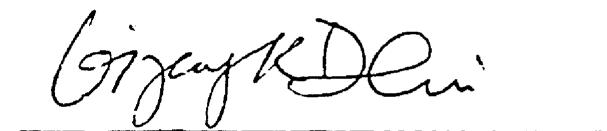

Vijay K. Dhir

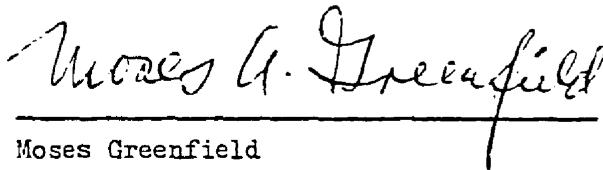

Steve a horosh

Steven A. Hoszkovski

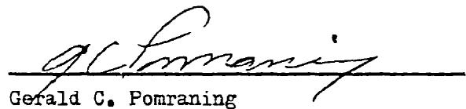

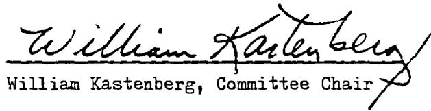

University of California, Los Angeles

# Table of Contents

# 1.0 Introduction

1.1 Overview of Current Nuclear Politics and Technology

1.1.1 Nuclear Fuel Cycle Problems and Their Politics   
1.1.2 Technical Solution: Thorium Fuel Cycle   
1.1.3 Technical Solution: Fast Halide Reactor

1.1.3.1 Advantages of fluid-fuel reactors   
1.1.3.2 Introduction to the MSFR

1.2 Historical Review of Molten Salt Activities

1.2.1 American Activity

1.2.1.1 Development of the MSBR   
1.2.1.2 Development of the MGFR

1.2.2 European Activity

1.2.2.1 Poland/Switzerland, led by Mieczyszlaw Taube   
1.2.2.2 France   
1.2.2.3 England   
1.2.2.4 Soviet Union

1.2.3 Summary MSR State-of-the-Art

2.0 Contemporary Concerns Which Affect Choice of an Advanced Concept

2.1 Nuclear Fuel Cycle Waste Management

2.1.1 Characterization of Spent Fuel Wastes

2.1.1.1 Gases   
2.1.1.2 Solid fission products   
2.1.1.3 Actinides   
2.1.1.4 Unique biological hazard of plutonium

2.1.2 Management of Spent Fuel Wastes

2.2 Non-Proliferation

2.2.1 Development of US Policy   
2.2.2 Relationship Between Nuclear Electric Power and Nuclear Weapons Development

2.2.2.1 Extent of the spent fuel problem   
2.2.2.2 Question of reprocessing   
2.2.2.3 Attitudes on return of Pu

2.2.3 Which Reactor Fuel Contains the Least Proliferation Danger?

2.2.3.1 Weapons-grade material   
233   
2.2.3.2 Unique 55 U daughter radiation   
2.2.3.3 Preignition   
2.2.3.4 238 Pu high heat generation   
2.2.3.5 Denaturing and other technical fixes   
2.2.3.6 Summary

2.2.4 The Significance of Stockpiles

2.2.4.1 Peaceful vs. military explosives   
2.2.4.2 What about unsafeguardarded production reactors?

2.2.5 Fuel Cycle Vulnerability to Diversion

2.2.5.1 Once- through fuel cycle   
2.2.5.2 Solid-fuel reprocessing cycle   
2.2.5.3 Molten-salt fuel cycle   
2.2.5.4 To reprocess or not to reprocess   
2.2.5.5 To breed or not to breed   
2.2.5.6 Fusion reactor vulnerability

2.3 Fuel Utilization

2.3.1 Earth's Resources   
2.3.2 Use of Thorium   
2.3.3 Intercomparison of Reactor Concepts with Regard to Fuel Utilization   
2.3.4 Use of Both Th and U Reserves

2.4 Strategic Security

2.4.1 Present Susceptibility

2.4.1.1 Subnational blackmail   
2.4.1.2 Sabotage   
2.4.1.3 War   
2.4.1.4 Summary

2.4.2 Potential Remedy with an MSR

2.5 Summary Design Principals for an Advanced Reactor System

2.5.1 Waste Management Restraints   
2.5.2 Non-Proliferation Restraints   
2.5.3 Fuel Utilization Restraints   
2.5.4 Strategic Security Restraints

2.6 Promise and Uniqueness of the Molten Chloride Fast Reactor on a Thorium Fuel Cycle

2.6.1 Advantages of the Molten State   
2.6.2 Advantages Stemming from the Exclusive Use of Thorium   
2.6.3 Advantages of Continuous Reprocessing   
2.6.4 Advantages of a Very Fast Neutron Spectrum   
2.6.5 Spinoff Ability to Digest Existing Spent Fuels   
2.6.6 Inherent Disadvantages and Limitations to MCFR

# 3.0 Concept Design

3.1 Choosing the Reactor Configuration

3.1.1 Maximizing Breeding by Minimizing Neutron Moderation in the Core

3.1.1.1 BG potential   
3.1.1.2 Minimizing neutron moderation

3.1.2 Maximizing Breeding by Minimizing Leakage

3.1.2.1 Effect of an inner blanket   
3.1.3.2 Size of the outer blanket   
3.1.2.3 Moderating the blanket neutron spectrum to enhance capture   
3.1.2.4 Neutron reflector and damage-shield

3.1.3 Core and Blanket Design

3.1.3.1 Choice of geometry   
3.1.3.2 Choice of number, size, and spacing of tubes   
3.1.3.3 Location of tubes   
3.1.3.4 Axial blanket and neutron leakage

3.1.4 Method of Reactivity Shimming

3.1.5 Summary Guidelines on Reactor Configuration

# 3.2 Reactor Thermohydraulics

3.2.1 Means of Cooling the Molten Salt Fuel

3.2.1.1 Out-of-core heat exchanger   
3.2.1.2 In-core heat exchanger across tubes   
3.2.1.3 In-core direct contact heat exchange   
3.2.1.4 Blanket cooling

3.2.2 Power Density in an MSFR

3.2.2.1 Inherent high power density in MSFRs   
3.2.2.2 Realistic range of power densities   
3.2.2.3 High neutron flux levels and radiation damage in fast reactors   
3.2.2.4 Impetus for high temperature operation   
3.2.2.5 Adjusting power density through critical mass   
3.2.2.6 Reactor design power   
3.2.2.7 Reactor power distribution   
3.2.2.8 Summary

3.2.3 Primary Coolant Velocity

3.2.3.1 Maximizing velocity and minimizing pumping power   
3.2.3.2 Corrosion dependence on velocity   
3.2.3.3 Velocities in similar systems

3.2.4 Operating Temperatures

3.2.4.1 Upper limits on fuel salt temperature   
3.2.4.2 Minimum fuel salt temperature   
3.2.4.3 Minimum secondary coolant temperature   
3.2.4.4 Restrictions on $\Delta T$ across heat exchanger walls   
3.2.4.5 Restrictions on temperature differences within the primary circuit   
3.2.4.6 $\{\Delta t, t\}$ in other MCFRs   
3.2.4.7 Summary

3.2.5 Design of the Primary Circuit Heat Exchanger

3.2.5.1 Heat transfer coefficient   
3.2.5.2 Minimizing fuel inventory in the heat exchanger   
3.2.5.3 Primary fluid volume in heat exchanger and associated plena and piping

3.2.6 Primary Circuit Arrangement

3.2.6.1 General guidelines   
3.2.6.2 Location of pumps and heat exchanger   
3.2.6.3 Parallel subchannels   
3.2.6.4 Tube channels in series   
3.2.6.5 Summary

3.2.7 Reactor Thermohydraulics Summary

3.3 Choosing the Salt Composition

3.3.1 Introduction

3.3.1.1 Neutron spectrum   
3.3.1.2 Chemistry   
3.3.1.3 Eutectic melting point   
3.3.1.4 Heat transfer parameters  
3.3.1.5 Densities   
3.3.1.6 Viscosities   
3.3.1.7 Specific heats   
3.3.1.8 Thermal conductivities   
3.3.1.9 Summary

3.3.2 Choice of Halogen

3.3.2.1 Neutron moderating effect   
3.3.2.2 Neutron absorption   
3.3.2.3 Transmutation products   
3.3.2.4 Melting point   
3.3.2.5 Boiling point and vapor pressure   
3.3.2.6 Chemical behavior   
3.3.2.7 Cost and availability   
3.3.2.8 Density   
3.3.2.9 Summary

3.3.3 Choice of Actinide Chemical States (Stoichiometry)

3.3.3.1 Actinides inherent to an MCFR(Th)   
3.3.3.2 Melting and boiling points   
3.3.3.3 Chemical behavior   
3.3.3.4 Choice between UCl and UCl in the core   
3.3.3.5 Chemical states in'the blanket

3.3.4 Choice of Carrier Salt Cation

3.3.4.1 Neutron moderating effect   
3.3.4.2 Neutron absorption   
3.3.4.3 Transmutation products   
3.3.4.4 Melting point   
3.3.4.5 Boiling point and vapor pressure   
3.3.4.6 Chemical behavior   
3.3.4.7 Cost and availability   
3.3.4.8 Density   
3.3.4.9 Heat transfer coefficient   
3.3.4.10 Summary

3.3.5 Choice of Relative Proportions of Actinides and Carrier Salt

3.3.5.1 Neutron physics of the $\mathrm{ThCl}_4 / \mathrm{UCl}_3$ ratio in the core mixture   
3.3.5.2 Density   
3.3.5.3 Viscosity   
3.3.5.4 Specific heat   
3.3.5.5 Thermal conductivity   
3.3.5.6 Heat transfer coefficient   
3.3.5.7 Choice of core mix   
3.3.5.8 Choice of blanket mix   
3.3.5.9 Eutectic mix for flush salt

3.4 Structural Materials

i

3.4.1 General Consideration and Criteria

3.4.1.1 Plant-life economics   
3.4.1.2 Corrosion, general   
3.4.1.3 Corrosion by electrochemical attack   
3.4.1.4 Corrosion protection   
3.4.1.5 Thermal and radiation-induced expansion

3.4.2 Chemical Reactions in an MCFR

3.4.2.1 Reactions with fission-produced mutants   
3.4.2.2 The effect of UCl₄ presence in the core salt

3.4.3 Candidate Materials for an MCFR

3.4.3.1 Overview on metals   
3.4.3.2 Mo alloys   
3.4.3.3 Graphite   
3.4.3.4 Heat Exchanger considerations

3.4.4 Materials for Core/Blanket Interface (Tubes)   
3.4.5 Materials for Reactor Vessel   
3.4.6 Material for a Lend Secondary Circuit

3.4.6.1 Steam generator tubes   
3.4.6.2 Remainder of the circuit

3.4.7 Material for a Helium Secondary Circuit

3.5 Physics of MCFR(Th) and Its Fuel Cycle

3.5.1 Nuclear Models of an MCFR

3.5.1.1 Definition of the reactor geometry   
3.5.1.2 Use of spherical geometry for neutronics calculations

3.5.2 Neutronic Calculational Methods

3.5.2.1 Spatial mesh   
3.5.2.2 Angular quadrature   
3.5.2.3 Convergence criteria

3.5.3 Neutron Cross Sections

3.5.3.1 Bondarenko 26 group Set   
3.5.3.2 Twenty-six groups, Pl set from ENDF/B-IV   
3.5.3.3 Effects of resonance self-shielding

3.5.4 Transmutation Chains and Equations

3.5.4.1 Chains for actinide transmutations   
3.5.4.2 Chain for build-up of $^{232}\mathrm{U}$ -paired radio-activity

3.5.5 Principal Physics Metrics

3.5.5.1 BG: actual breeding gain   
3.5.5.2 BGX: BG extended to zero neutron leakage   
3.5.5.3 BGP: BG potential associated with the core spectrum   
3.5.5.4 $\phi$ (core)   
3.5.5.5 <E>core φ   
3.5.5.6 Power density   
3.5.5.7 $\phi$ (vessel), total and $>100\mathrm{KeV}$   
3.5.5.8 Fuel inventory and doubling time

3.5.6 Fuel Cycle Modelling

3.5.6.1 Fuel cycle model

3.5.6.2 Equilibrium fuel cycle   
3.5.6.3 On the choice of U removal rates c and b

3.5.7 Reactor Design: Configuration Trade Studies

3.5.7.1 Inner blanket study   
3.5.7.2 Optimum outer blanket thickness   
3.5.7.3 Reflector   
3.5.7.4 Core tube material

3.5.8 Reactor Design: Controlling the Core $^{233}\mathrm{U} / ^{234}\mathrm{U}$ Ratio

3.5.8.1 Basis for studying the ratio   
3.5.8.2 Effect of the ratio on spectrum, BG, and Pu presence   
3.5.8.3 Effect on reactor fissile inventory and doubling time   
3.5.8.4 Deducing the ratio on equilibrium cycle

3.5.9 Reactor Design: Choosing the Core Salt $\mathrm{ThCl}_4 / \mathrm{UCl}_3$ Ratio

3.5.9.1 Effect on BG   
3.5.9.2 Effect on reactor fissile inventory and doubling time   
3.5.9.3 Effect on power density and flux levels   
3.5.9.4 Effect on actinide fission rates and $^{233}\mathrm{U} / ^{234}\mathrm{U}$ ratio

3.5.10 Reactor Design: Choosing the Core Carrier Salt (NaCl) Content

3.5.10.1 Effect on BG   
3.5.10.2 Effect on reactor fissile inventory and doubling time   
3.5.10.3 Effect on power density and flux levels   
3.5.10.4 Effect on $^{233}\mathrm{U} / ^{234}\mathrm{U}$ ratio

3.5.11 Mutation Effects

3.5.11.1. Significance of artinides which emit alphas   
3.5.11.2 Significance of $^{25}\mathrm{U}$ production   
3.5.11.3 Impact of fission product concentration upon neutron physics performance

3.5.12 Summary

3.6 Safety & Kinetics

3.6.1 Physics of Reactor Safety and Kinetics

3.6.1.1 Effective delayed neutron.fraction   
3.6.1.2 Prompt neutron lifetime, 1.   
3.6.1.3 Temperatue coefficient of relativity

3.6.2 Analysis of Normal Operations

3.6.2.1 Reactor startup   
3.6.2.2 Reactor control   
3.6.2.3 Reactor stability and inventory ratio   
3.6.2.4 Reactor shutdown   
3.6.2.5 Change in physical properties due to transmutations

3.6.3 Analysis of Accident Situations

3.6.3.1 Small leakages   
3.6.3.2 Loss of flow   
3.6.3.3 Structural failure   
3.6.3.4 Emergency cooling   
3.6.3.5 Comparison of molten salt reactors to others   
3.6.3.6 Precipitation-out of eutectic mixtures   
3.6.3.7 Boiling-off of salt mixtures   
3.6.3.8 Containment   
3.6.3.9 Resistance to external threat   
3.6.3.10 Molten salt combustion support

3.7 Fuel Processing

3.7.1 Principal Salt Reprocessing Methods

3.7.1.1 Chemistry of the heavy elements   
3.7.1.2 Solvent extraction from aqueous solution   
3.7.1.3 Volatility processes   
3.7.1.4 Pyrometallurgical processing   
3.7.1.5 Molten salt electrolysis

3.7.2 Core Salt Processing

3.7.2.1 Recovery options   
3.7.2.2 Continuous removal of mutant gases   
3.7.2.3 Removal of non-gaseous fission products   
3.7.2.4 Control of the oxygen levels   
3.7.2.5 Removal of sulfur impurities   
3.7.2.6 Maintaining the chlorine stoichiometry   
3.7.2.7 Storing troublesome fission products by using them as carrier salts   
3.7.2.8 Comparison to MSBR reprocessing   
3.7.2.9 Materials requirements

3.7.3 Blanket Salt Processing

3.7.4 Starter Fuels

3.7.4.1 Starter fuel for the core

3.7.4.2 Preparation of $\mathsf{ThCl}_4$ for the blanket

3.7.5 Fuel Cycle Summary

# 3.8 Safeguards

3.8.1 National Fuel Inventory   
3.8.2 In-plant Diversion Potential   
3.8.3 Facility Modification   
3.8.4 Desired Radioactivity in Transported Breeding Gain   
3.8.5 Radiological Sabotage Threat

# 3.9 Access and Maintenance

3.9.1 Compactness of an MCFR   
3.9.2 Intrinsic Reliability   
3.9.3 MSRE Experience   
3.9.4 Comparison of Primary Circuit Configurations   
3.9.5 Reactor Maintenance/Replacement Procedure   
3.9.6 Reactor Shielding

# 3.10 Auxiliary Plant

3.10.1 Power Cycle Options

3.10.1.1 Intermediate liquid coolant for steam cycle   
3.10.1.2 Coolant for gas cycle

3.10.2 Secondary Hardware: Pumps   
3.10.3 Filling, Draining, and Dump Systems   
3.10.4 Overall Plant Size

# 3.11 Economics

3.11.1 British Study Results

3.11.1.1 Capital-costs   
3.11.1.2 Fuel cycle costs   
3.11.1.3 Summary

3.11.2 Transportation Costs   
3.11.3 Outage Penalties   
3.11.4 Other Ccts

# 4.0 Summary

4.1 Pu, Proliferation, Safeguards, Security, and Waste Management   
4.2 Reactor Design   
4.3 Technical and Economic Feasibility

# 5.0 References

# VITA

1938 August 1 Born, Cincinnati, Ohio   
1957-1961 Chemical Engineering Cooperative Student with the Aircraft Nuclear Propulsion Project, General Electric Co., Cincinnati, Ohio   
1962 Ch.E. University of Cincinnati   
1962 Summer Job as Technical Editor, Mound Laboratory, Miamisburg, Ohio   
1962-1963 Laboratory Assistant, Phoenix Memorial Laboratory, Ann Arbor, Michigan   
1963 MS. Nuclear Engineering, University of Michigan, Ann Arbor   
1963-1973 Member Technical Staff, Atomics International, Canoga Park, California   
1968-1969 Atomics International Assignment to the National Neutron Cross Section Center, Brookhaven National Laboratory   
1973-1975 Guest Scientist at Swiss Federal Institute for Reactor Research (EIR), Wuerenlingen, Switzerland   
1975-Present Scientist at Idaho National Engineering Lab.; Instructor with University of Idaho at Idaho Falls

# ABSTRACT OF THE DISSERTATION

Configuration of a Molten Chloride Fast Reactor

on a Thorium Fuel Cycle

to Current Nuclear Fuel Cycle Concerns

by

Eric Heinz Ottewitte

Doctor of Philosophy in Engineering

University of California, Los Angeles, 1982

Professor William B. Kastenberg, Chair

Current concerns about the nuclear fuel cycle seem to center on waste management, non-proliferation, and optimum fuel utilization (including use of thorium). This thesis attempts to design a fast molten-salt reactor on the thorium fuel cycle to address these concerns and then analyzes its potential performance. The result features

1. A simplified easy-to-replace skewed-tube geometry for the core   
2. A very hard neutron spectrum which allows the useful consumption of all the actinides (no actinide waste)   
3. Reduced proliferation risks on the equilibrium cycle compared to conventional fuel cycles because of the absence of carcinogenic, chemically-separable plutonium and the presence of $^{232}\mathrm{U}$ which gives a tell-tale signal and is hazardous to work with   
4. A breeding gain in the neighborhood of 0.3

# 1.0 INTRODUCTION

# 1.1 Overview of Current Nuclear Politics and Technology

# 1.1.1 Nuclear Fuel Cycle Problems and Their Politics

In recent years a number of concerns over the nuclear fuel cycle have arisen. A principal irritant is plutonium (Pu) production in the existing light water reactor (LWR) uranium fuel cycle and in the fast breeder (FBR) extension thereto. Concerned individuals fear that the presence of Pu stockpiles may promote the proliferation of nuclear weapons, covertly or overtly, among national and subnational (e.g. terrorist) groups.

In response to this concern, President Ford announced that the US would no longer consider reprocessing of LWR fuel to be a foregone conclusion. The alternative of course is to stockpile or to bury spent fuels, thereby creating a problem of actinide waste management. That would appear to be less than an optimum ecological alternative as much of the uranium mined (mostly $^{238}\mathrm{U}$ ) would never be used: mining transforms mountain containing 10,000 parts of embedded uranium from natural to machine - processed state for the recovery of 72 parts fuel. Of that, reactors consume 7 - 10 parts; a few parts change into plutonium and the rest currently becomes other - actinide waste.

If commercial FBRs ever appear, the associated fuel cycle must also contend with higher actinides such as americium and curium. Heat source rate and alpha decay toxicity may economically prohibit their fabrication into fuel rods.

These and other concerns also influenced President Carter to slow down the plans for commercial FBRs.

# 1.1.2 Technical Solution: Thorium Fuel Cycle

The thorium fuel cycle solves some of these problems. By starting with a material which is lower in atomic weight (A=232 vs. 238) this fuel cycle eventually produces far less alpha-active waste (especially carcinogenic and weapons-grade Pu) than the $^{238}\mathrm{U}/$ Pu fuel cycle. Though $^{233}\mathrm{U}$ from the Th fuel cycle makes just as good a nuclear explosive, it is always accompanied by $^{232}\mathrm{U}$ whose daughter decay products emit a highly-penetrating gamma radiation. This makes $^{233}\mathrm{U}$ hazardous to work with. It also signals its location and transport.

# 1.1.3 Technical Solution: Molten Salt Fast Reactor

1.1.3.1 Advantages of fluid-fuel reactors. Fluid-fuel reactors continuously add fuel and remove fission products and require no fuel refabrication. Molten-salt reactors (MSR) have been more extensively developed than other fluid-fuel power systems. They appear to offer advantages in limiting the proliferation of nuclear explosives: the fuel cycle inventory of weapons-grade material outside the reactor is very small and concentrated at the power plants; little stockpiling or shipping of weapons-grade fissile materials occurs.

1.1.3.2 Introduction to the MSFR. Beginning shortly after World War II but extending into the 70's several laboratories looked at molten salt fast reactor (MSFR) concepts. Interest generally followed the fortunes of the thermal MSR and so has waned in recent years. Throughout this time, the inherent absence of cladding in an MSR has hinted of a neutron economy sufficient for breeding.

A thermal reactor doesn't breed easily; it requires careful design and continuous reprocessing to minimize nonproductive neutron

captures in fission products, core structural materials, and control poisons. An MSFR is not so sensitive; it has no moderator and little internal structure. Cl and limited alkali (typically Na) are the lightest materials present. Therefore, the neutron spectrum remains fast and fission products absorb far fewer neutrons.

Numerous workers have already studied the MSFR(U/Pu) as a breeder, fission product burner, and ultra-high, fast-flux test facility with very hard neutron spectrum. This thesis systematically examines the technical bases of MSFRs and extends MSFR studies into the thorium fuel cycle, MSFR(Th), seeking a system which can maintain criticality in steady-state operation without accumulating actinides detrimentally.

The $\mathrm{Th} / ^{233}\mathrm{U}$ and the $^{238}\mathrm{U} / \mathrm{Pu}$ cycles differ in their neutron economics. As a result, interest in the thermal molten salt breeder reactor (MSBR) has centered on its special usefulness for breeding on the $\mathrm{Th} / ^{233}\mathrm{U}$ cycle. Interest in the MSFR has focused on exceptional breeding gain (BG) with the $^{238}\mathrm{U} / \mathrm{Pu}$ cycle [MSFR(U/Pu)]: up to 0.6-0.8. For an MSFR (Th) even with an anticipated reduction of 0.2-0.3, BG= 0.3-0.5 may be possible.

Though not usually emphasized, the very hard spectrum and good neutron economy of an MSFR offer the prospect of usefully consuming all actinide products: sooner or later all the transactinides fission. If some capture initially, that only (generally) further deforms the nucleus, thereby increasing the probability of fission. Thus the MSFR offers strong potential for resolving current concerns, particularly on a thorium fuel cycle.

# 1.2 Historical Review of Molten Salt Activities

The history of the MSR is as old and complex as the history of nuclear power itself. The ups and downs have followed those of the parent technology but the swings have been if anything more violent.

# 1.2.1 American Activities

1.2.1.1 Development of the HsBR. In 1947 ORNL began a study on the physics, chemistry, and engineering of uranium- and thorium-bearing molten fluorides. The potential for very high temperatures and power density interested the aircraft propulsion project.

MSR technology first appeared in the open literature in 1957 (Briant and Weinberg[1]). Next, Bettis, et al. [2,3] and Ergen, et al. [4] reported on the Aircraft Reactor Experiment: a berylliummoderated, thermal reactor fueled with a $\mathrm{UF}_4 / \mathrm{NaF} / \mathrm{ZrF}_2$ mix and contained in Inconel. This reactor successfully operated in 1954 for more than 90,000 kWh without incident, at thermal powers up to 2.5 MW and temperatures as high as $1650^{\circ}\mathrm{F}$ .

This marked the start of an ORNL program to develop a thermal Molten Salt Breeder Reactor (MSBR) for economic civilian power [5]. It included

1. Evaluating the most promising designs   
2. Pinpointing specific development problems   
3. Developing materials for fuels, containers, and moderators   
4. Developing components, especially pumps, valves, and flanges suitable for extended use with molten salts at $1300^{\circ}\mathrm{C}$

5. Developing supplementary chemical processes for recovering valuable components (other than uranium) from spent fuel.   
6. Developing and demonstrating the maintainability of an MSR system.

In 1963, Alexander [6] summarized the Cak Ridge development:

1. The simplicity of the reactor core and the semicontinuous fuel handling apparatus lead to low capital costs and increased plant availability.   
2. The simplicity and continuous nature of fissile and fertile stream processing methods lead to negligible fuel cycle costs in on-site plants.   
3. The negative temperature coefficient of reactivity inherent in the thermal expansion of the fuel provides safety advantages over other reactor concepts.   
4. The internally-cooled reactor offers competitive nuclear performance; the externally-cooled reactor, superior performance.

This effort led to the design, construction, and operation of the 8-MWth Molten Sait Reactor Experiment (MSR). Critical operation of the MSRE spanned the period from June 1965 to December 1969, during which the reactor accumulated over 13,000 equivalent full-power hours of operation and demonstrated remarkably high levels of operability, availability, and maintainability.

In recent years, Battelle Northwest Laboratory (BNWL) has made critical experiments on MSBR configurations [7]. Several United States universities have studied the chemistry of molten salts [8].

ANL identified the need [9] for in-pile corrosion testing at high burnups to clarify the effect of noble-metal deposition on container metal.

Presently all work has stopped. A current problem was that Hastelloy-N limited the temperatures of the ORNL MSBR: the addition of carbides into the grain boundaries keeps He from forming and swelling there, but at high temperatures the carbides disappear into the grains. E. Zebroski of EPRI feels that the problem with the MSBR was whether the system parts would hold together very long [10].

1.2.1.2 Development of the NCFR. Goodman et al [11] proposed a molten-chloride fast reactor (MCFR) in 1952; Scatchard et al [12] reviewed the chemical problems involved. In 1956, Bulmer et al., [13] designed and evaluated a 500 MWth MCFR, externally cooled. At that time the work was secret and only later declassified.

Chlorides of sodium, magnesium, uranium, and plutonium made up the fuel salt. The blanket was depleted uranium oxide, cooled by sodium. Their report contains numerous trade studies, some still useful.

Bulmer chose chlorides over fluorides to limit neutron moderation. However, he felt that the strong $^{35}\mathrm{Cl}(\mathbf{n},\mathbf{p})$ reaction would require enrichment in $^{37}\mathrm{Cl}$ . M. Taube [14-16] of the Institute of Nuclear Research, Warsaw shared this view. More recently both Taube [17] and Faugeras [18] have mentioned that fluoride salts may work well with $^{233}\mathrm{U}$ in a fast reactor in spite of the extra moderation. The MSFR work then shifted to Argonne National Laboratory (ANL).

E. S. Bettis (ORNL) feels that [19] ORNL's look at the MCFR was

very superficial since it was outside their thermal reactor charter. They mainly criticized the high fuel inventory tied up in the heat exchanger. Bettis thought that M. Taube had a good idea in direct cooling (in-core, no fuel circulation) with boiling Hg [20], but that insufficient quantities of Hg exist. ORNL looked unsuccessfully at molten lead direct cooling: corrosion proved to be the Achilles Heel.

In 1967, ANL summarized [21] the fuel properties and nuclear performance of fast reactors fueled with uranium and plutonium trichlorides dissolved in chlorides of alkalis and alkaline-earths. Included were the physical and chemical properties of the fuel, and the heat removal and neutronics for one homogeneous reactor and two internally-cooled reactors. The optimum core volume for 1000 MWe power proved to be 10,000 liters for each type. Each exhibited favorable characteristics of high breeding ratio, large negative temperature coefficients of reactivity, and low fuel-cycle cost. However, the unattractive characteristics of large plutonium inventory, large volume, complex design, and container material problems indicated the need for a sizable program to develop the MCFR(U/Pu).

Recently L. E. McNeese [22] offered the following comments on the MCFR:

1. Resistance of Mo to salt corrosion seems to depend directly on the oxidation states present, as expressed by the "redox" potential. This corresponds to the directions of the Swiss chemical research.

2. Re graphite vs. Mo as a structural material: graphite is a step up in technology requirements. It is also subject to radiation damage. ORNL stopped the engineering on it for MSBR.   
3. Re in-core vs. out-of-core cooling: in-core offers lower inventory (SI), but high structural radiation damage. The extra shielding for out-of-core is inconsequential. Though the out-of-core (Pu) version offers a breeding gain of 0.6 -0.7 to counteract the extra inventory, the economic measure of interest (at least for U/Pu cycles) is approximately $\mathsf{SI}^2\mathsf{BG}^{-1}$ . In summary out-of-core will be easiest, but may be less economic in terms of fuel costs. Fission product burner concepts are of little interest: only $^{129}\mathrm{I}$ separation has been contemplated.

4. The Swiss molten chloride fast reactor designs presume that a stream of about one ppm can be continuously directed for reprocessing and returned. For this:

a. the chemistry exists (at least for fluorine systems);   
b. the engineering ability exists;   
c. the small-scale ORNL/MSBR plant was not finished; and   
d. scaling up has not been done and would be a significant undertaking—much work to be done.

# 1.2.2 European Activity

1.2.2.1 Poland/Switzerland, Led by Mieczyslaw Taube. M. Taube

first, in Poland and later in Switzerland, looked at a variety of MSR concepts, primarily on the plutonium cycle. Principal studies were on

1. A system of about four fast MCFRs and one MSR "burner" of fission product waste [23]. The overall system consumes its own fission product wastes and still has a positive breeding gain. The burner features a thermal flux trap surrounded by fast reactor molten fuel. The higher the specific power (MW/1) in the system, the lower the steady-state fission product concentration becomes.

2. Optimization of the breeding ratio for an MCFR(U/Pu), theoretically achieving 1.6 - 1.8 [24].

The 10 MW $l^{-1}$ power density assumed by Dr. Taube far exceeds the 70 - 80kW $l^{-1}$ technology of ORNL. Thus, little direct experience applies. Still, L. E. McNeese (ORNL) was unable to immediately foresee any intrinsic difficulty with 10 MW $l^{-1}$ [22].

Presently, the Swiss work has stopped, as the electorate pushes the laboratory from reactor research towards general energy research and development.

1.2.2.2 France. In France, Comm. Energ. Atomique (CEA) and Electricite de France (EdF) sponsored development of the MSBR as backup to the Superphoenix breeder. EdF emphasized lower powers for near-term feasibility. Their long-term interests included direct-contact in-core molten-lead cooling. CEA pursued higher temperatures for long-term application. Their near-term interests centered on experimental corrosion studies.

Fontenay-aux-Roses (CEA) and Pechiney Ugine Kuhlman (PUK) studied several high temperature MSR concepts [18,25,26], a Th/ $^{233}\mathrm{U}$ cycle in fast and thermal fluoride-salt reactors and an MCFR (U/Pu). The MCFR design features in-core cooling (Fig. 1.2-1) and a $7.62\mathrm{m}^3$ cylindrical core surrounded by a $30\mathrm{m}^3$ blanket. Table 1.2-I intercompares the main fast and thermal MSR concepts of the French.

A CEA/PUK subcompany, SERS, and Carbonne-Lorraine [27] carried out experimental studies in 1974-1976 including

1. Tests of the mechanical performance of the materials under temperature and radiation   
2. Corrosion tests in salt at high temperature   
3. Cperation of loops at high temperature: one for isothermal hydrodynamic studies, a non-isothermal one with small flow for heat exchange studies, and a third non-isothermal one for corrosion.

In 1977, if the above results were positive, they were to decide on a development program whose object would be the construction of a prototype of 25 - 50 Mth.

The American and French atomic organizations were also seeking to agree on the fields of preparation for a 200 MWe MSBR demonstrant. They were to decide in 1979 on the construction of this reactor, depending on the progress with high temperature reactors and success of the French Superphoenix 1200 MW(e) Liquid Metal Breeder Reactor (LMFER).

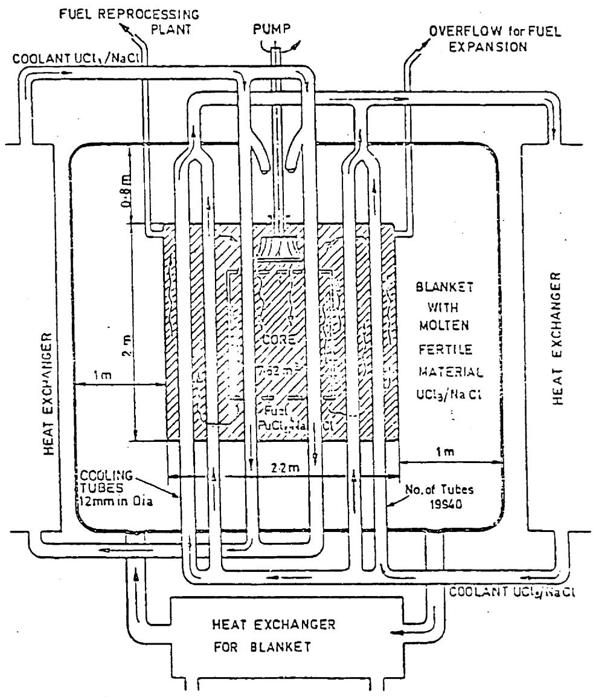  
Figure 1.2-1 French MCFR Design with In-Core Cooling

Table 1.2-I COMPARISON OF FRENCH MOLTEN SALT REACTORS   

<table><tr><td>CHARACTERISTIC</td><td>Fast Reactor</td><td>Thermal Reactor</td></tr><tr><td>Power, Mw</td><td></td><td></td></tr><tr><td>Thermal</td><td>2050</td><td>2250</td></tr><tr><td>Electrical</td><td>1000</td><td>1000</td></tr><tr><td>Core specific power w/cm3</td><td>255</td><td>22</td></tr><tr><td>Efficiency %</td><td>49</td><td>44</td></tr><tr><td>Fuel, mol %</td><td>15 PuCl385 NaCl3</td><td>71.7 LiF16 BeF212 ThF40.3 UF4</td></tr><tr><td>Fertile material, moi%</td><td>65 238UCl335 NaCl</td><td>71.7 LiF16 BeF212 ThF40.3 UF4</td></tr><tr><td>Secondary coolant</td><td>AlCl3</td><td>NaBF4</td></tr><tr><td>Working fluid</td><td>Dissociating N2O4Gas</td><td>Steam</td></tr><tr><td>Core fuel velocity, m/s</td><td>2</td><td>2.5</td></tr><tr><td>Neutron spectrum</td><td>0.01 Kev to 10 Mev</td><td>Thermal</td></tr><tr><td>Moderator</td><td>None</td><td>Graphite</td></tr><tr><td>Structural material reactor and tubes</td><td>Molybdenum Alloy (Nickel or Iron Added)</td><td>Hastelloy-N</td></tr></table>

1.2.2.3 England. British workers studied MSRs in 1954 and 1965. The MSFR interested them the most and they felt that such a study would complement the US MSBR program. A preliminary study of a fast system using the $^{233}\mathrm{U} / \mathrm{Th}$ cycle and fluoride salts did not look encouraging, so they refocused on a $^{238}\mathrm{U} / \mathrm{Pu}$ cycle and chloride salts. Work on salt chemistry began in 1965; in 1970-1972 the program extended to include other materials aspects.

Workers at Harwell and Winfrith examined three variants of $\text{25CO MWe MCFR}$ ( $^{238}\mathrm{U / Pu}$ ) [28-31]: in-core "direct" cooling by molten lead drops, in-core cooling by blanket salt passing through no tubes, and cut-of-core cooling.

The direct scheme encountered too many problems. The in-core cooling concept appeared to warrant further study but the fuel inventory did not appear to be as low as first thought; also the high velocities and high pumping pressures presented serious design problems. The corrosion limits and strength of molybdenum or its alloys at reactor temperatures represented a large unknown.

With out-of-core cooling, at first the fuel inventory in the reactor circuit was too high. However, compact layouts and higher (but still achievable) heat exchanger volumetric ratings reduced it to within reason. Figure 1.2-2 illustrates the design. The neutron flux was $3 \times 10^{16} \mathrm{~n} \mathrm{~cm}^{-2} \mathrm{~s}^{-1}$ in the reactor and $3 \times 10^{13}$ in the heat exchanger.

1.2.2.4 Soviet Union. Very little is known about Soviet Union engineering studies. However, extensive salt thermodynamic and physical property studies, evidenced in Section 3.3, suggest a

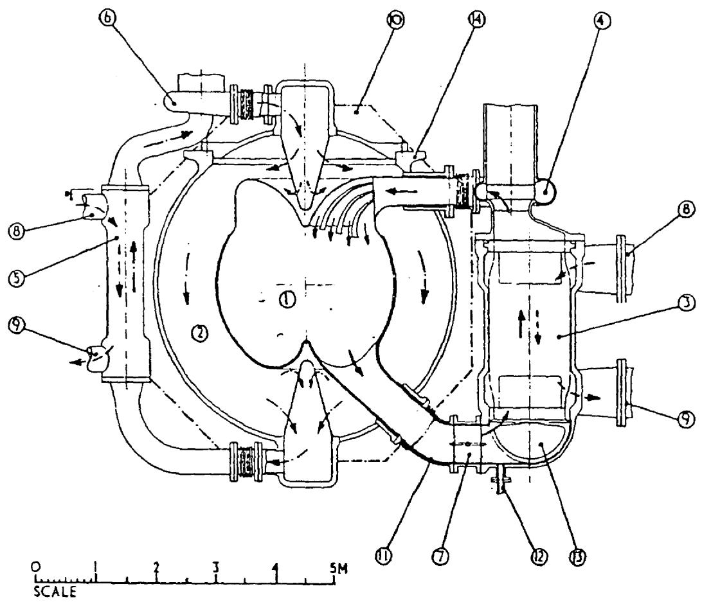  
Fig. 1.2-2 British 6000 MWth MCFR Design; Lead-cooled, Out-of-Core.

CORE   
2 BLANKET   
3 INTERMEDIATE HEAT EXCHANGER-80ff   
4 FUEL SALT PUMP-8 off   
5 BLANKET COOLER-4off   
6 BLANKET COOLER PUMP-4off   
7 ISOLATION VALVE   
8 LEAD INLET

9 LEAD OUTLET   
IO GRAPHITE   
II HIGH TEMPERATURE

RESISTANT LINING

12 DRAIN LINE  
iFLOWDISTRIBSOR   
14 SUPPORT FLANGE

much larger supporting research program than in the Western world. A USSR review book on Liquid-salt Nuclear Reactors regards MSRs as reactors of future with compact and promising fuel cycles. They conclude that the developmental focus must be on the external fuel cycle, ergo the USSR attention to salt properties.

# 1.2.3 Summary MSR State-of-the-Art

Both the 2 MWth ARE and the 8 MWth MSRE demonstrated extended successful MSR performance but under conditions less strenuous than those considered for a 1000 MWe or MCFR. The question remains: will a circulating-fuel system hold together long enough to be practical? More specifically, how will the candidate container materials - Mo alloys, graphite, or composites with these - hold up at high temperature to corrosion by the variety of mutants and oxidation states which high burnup produces? The answer to such questions will come from in-pile corrosion testing. The French have an on-going experimental program in such engineering studies, but it may be proprietary.

Much work needs to be done in developing and scaling up the reprocessing system.

With out-of-core cooling most of the fuel circulates outside the core. This threatens the reactor stability. Inventory reduction requires compact layouts and high heat exchanger efficiency.

2.0 ANALYSIS OF CONTEMPORY CONCERNS ABOUT THE NUCLEAR FUEL CYCLE

AND OTHER CONSIDERATIONS AFFECTING CCHOICE OF AN ADVANCED CONCEPT

# 2.1 Nuclear Fuel Cycle Waste Management

One primary facet of the nuclear waste problem is that reactor operation induces short-and intermediate-lived radioactivity in materials which had been stable or only long-lived radioactive. The solution is to alternatively store the activated materials until they decay, or to transmute them back into harmless stable or quasi-stable nuclides. When operation produces nuclides which poison the environment and last long, then ecology prefers the added speed of transmutation.

Fuel cycle wastes occur in preparation of the fuel (mill tailings), reactor operation (spent fuel and activation of air and water), and reactor decommissioning (activation products of structural materials). The latter are generally nonvolatile, bound up in the structural material, and extremely difficult to release to the enviroment, even in accident situations. The mill tailings are inherently low-level. Holdup tanks and stacks with large dilution factors manage the air and water activations. Management of the spent fuel poses the major problem: all others pale in comparison.

In the absence of US reprocessing, spent fuel has accumulated recently such as to saturate the utility storage pools. To prevent loss of nuclear generation, DOE plans to find away from-reactor storage capacity for 810 MT of spent fuel by 1984 and at least 25,000 MT by 1996. Foreign spent fuel will add to these requirements [32].

# 2.1.1 Characterization of Spent Fuel Wastes

Fission products and transmuted actinides emit most of the radiation in spent fuel. Some of these radioisotopes exist for long times, comparable with a human life span. Those with half-life of a few to 50 years are particularly hazardous because they radiate faster than the longer-lived ones. How long each element remains in a human or animal depends on its biological-elimination half-life, which may be very long.

Some half-lives exceed the life span of our society. A concern then arises that nuclear power might burden the generations to come with accumulated waste, particularly the transactinides (Figure 2.1-1).

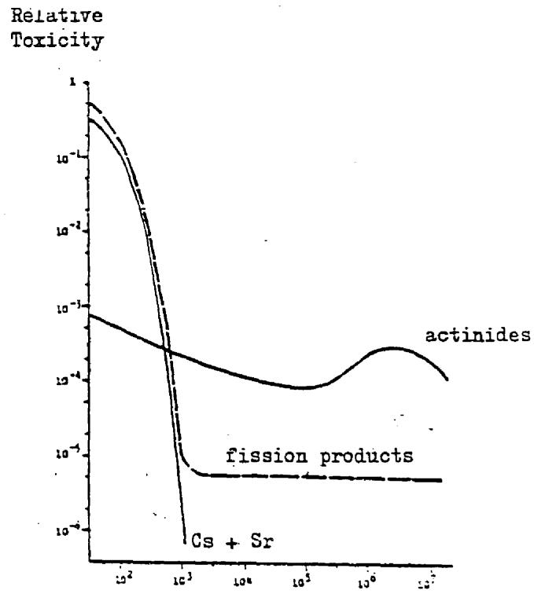  
Figure 2.1-1  
Hazard from Fuel  
Wastes [33]

2.1.1.1 Cases. Spent fuel gases generally include He and $\mathbf{T}_2$ from ternary fission, $\mathsf{H}_2$ , $\mathsf{D}_2$ , $\mathsf{T}_2$ , and He from charged-particle-out threshold reactions, and fission product gases (Xe, Kr, and $\mathsf{I}_2$ ). In either a molten salt fuel or in dissolution of a solid fuel, gases separate out easily.

The IAEA Code of Practice for Safe Handling of Radicnuclides [34] classifies radicnuclides into four groups according to their radiotoxicity per unit activity, primarily upon inhalation. An ICRH (Th) could produce the following nuclides in gaseous form (half-lives in parentheses):

i. Group I (very high radictoxicity): ncre   
2. Group II (high radiotoxicity): $^{36}\mathrm{Cl}$ ( $3 \times 10^{5} \mathrm{y}$ ), $^{13}\mathrm{I}$ ( $8.0 \mathrm{d}$ ), and $^{133}\mathrm{I}$ ( $20.8 \mathrm{h}$ )   
3. Group III (moderate radiotoxicity): $\frac{18}{F} (109.8m)$ , $\frac{35}{Ci} (37.2m)$ , $\frac{85}{Kr^m} (10.72y)$ , $\frac{87}{Kr - (76m)}$ , $\frac{132}{I} (2.29h)$ , $\frac{134}{I} (52.6m)$ , $\frac{135}{I} (6.6h)$ , $\frac{135}{Xe} (9.1h)$ .   
4. Group IV (1ow radictoxicity): ${}^{3}\mathrm{H}$ (12.33 y), ${}^{129}\mathrm{I}$ (1.6x107y), ${}^{131}\mathrm{Xe}^{\mathrm{m}}$ (11.9 d), ${}^{133}\mathrm{Xe}$ (5.25 d).

Cf these only $^{3} \mathrm{H}$ , $^{129} \mathrm{I}$ , $^{85} \mathrm{Kr}^{\mathrm{m}}$ , and $^{36} \mathrm{Cl}$ (in order of increasing hazard) have half-lives long enough to warrant processing: the rest just require short-term holdup before release to the atmosphere.

Low hazard tritium relatively emits only weak radiation; its maximum allowable concentration is among the highest for any radiative material. Furthermore the body excretes it rapidly and it cannot biologically concentrate in the environment, in food chains

or in man. It decays with a 12.3 years half-life to harmless helium and thus poses no long term hazard. It also has application for the fusion program. Nevertheless, it must be monitored and is hard to contain.

$^{85} \mathrm{Kr}^{\mathrm{m}}$ has a similar half-life but is far more toxic. As an inert gas, it is easy to isolate. Both $^{129} \mathrm{I}_2$ and $^{36} \mathrm{Cl}_2$ gases might be returned to the reactor as halide salt. There they will most likely transmute to harmless $^{37} \mathrm{Cl}$ and $^{130} \mathrm{Kr}$ .

2.1.1.2 Solid fission products. Storage for about a year (Fig.

2.1-2) reduces most fission product radioactivity to more manageable amounts. Of the remaining radioisotopes the most hazardous are those which metabolize and become a part of living organisms, and decay with half-lives comparable to a human life-span.

2.1.1.3 Actinides. Management of actinide wastes has caused much controversy in recent years [35-49]. Their long half-life makes actinides a quasi-permanent burden unless one can transmute or otherwise remove them from the environment. Alpha-emitters threaten the most, particularly when ingested. Plutonium is the worst of these: inside the body it seeks out and locates on bones, which makes it carcinogenic. Section 2.1.1.4 discusses this further.

Most actinides though usually in an unwieldy form can also be used for weapons Section 2.2 analyzes this.

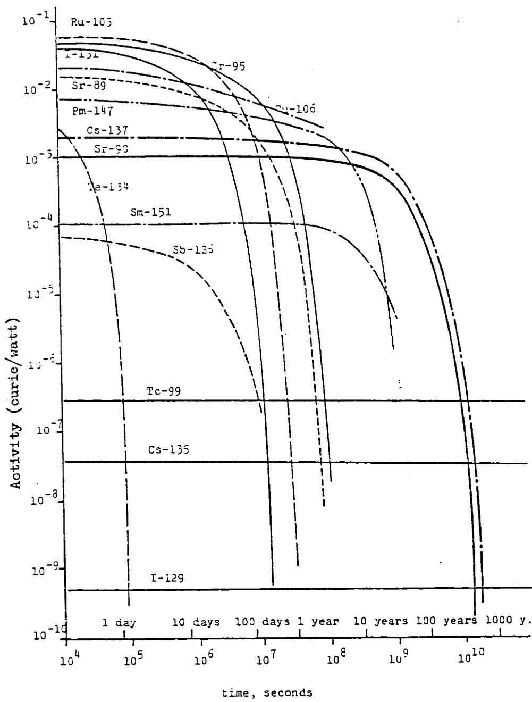  
FiG. 2.1-2 Fission Product Decay

2.1.1.4 Unique biological hazard of plutonium [50]. Most chemical elements react chemically with biological systems, some of them detrimentally. Others may be safe in elemental form, but not as compounds. Individual isotopes can also harm living matter by emitting dangerous radiation. All the isotopes of actinide elements radiate. Plutonium predominates among these elements because it comprises five quasi-stable isotopes and constitutes the first significant element above starter uranium on the A scale.

The main isotopes of plutonium, in order of decreasing importance are $^{239}\mathrm{Pu}$ , $^{240}\mathrm{Pu}$ , $^{241}\mathrm{Pu}$ , $^{238}\mathrm{Pu}$ , and $^{242}\mathrm{Pu}$ . This reflects their usual concentrations and activity rates. In high-burnup LMFBR fuel, Pu-241 presents the principal short-term hazard (Table 2.1-I). $^{239}\mathrm{Pu}$ emits 5.15 MeV alpha particles which range only 3.6 cm in air and less than $45\mu \mathrm{m}$ in water. In each ionizing collision with air or water molecules, the alpha loses 35 eV. After about 120,000 collisions, it has lost all of its kinetic energy. It then stops, captures two electrons, and changes into a neutral helium atom. Noble gas helium does not affect the human body.

Outside the human body the alpha radiation poses no threat: 5.1 MeV alpha-particles can penetrate the skin from outside only to a depth of $45\mu \mathrm{m}$ . This is still within the epidermis layer which regenerates very quickly.

The short track length of an alpha-particle in living tissue concentrates the energy absorption in a relatively small volume thereby increasing its effect. Thus to compare toxicity of alpha

TABLE 2.1-I   
RADIOACTIVITY IN FUEL 120 DAYS AFTER DISCHARGE FROM A 100-MWD/kg, 1000-MWE FBR   

<table><tr><td rowspan="2">Isotope</td><td rowspan="2">Decay Mode</td><td rowspan="2">Half Life</td><td rowspan="2">Equilibrium Discharge Composition (gm MT Mix)</td><td colspan="2">Radiation Level After 120 Days of Cooling</td></tr><tr><td>Curies per kg of Discharge Isotope</td><td>Kilocuries per Mt of Fuel Mix</td></tr><tr><td>U-232</td><td>α</td><td>73.6 y</td><td>0.014</td><td>2.09 x 10^4</td><td>0.0</td></tr><tr><td>U-237</td><td>α</td><td>6.75 d</td><td>3.0</td><td>356</td><td>0.0</td></tr><tr><td>U-238</td><td>α</td><td>4.5 x 10^9 y</td><td>909 kg</td><td>3.35 x 10^-4</td><td>0.0</td></tr><tr><td>U-239</td><td>β</td><td>23.5 m</td><td>1.2</td><td>2 x 10^-5</td><td>0.0</td></tr><tr><td>Np-236</td><td>α</td><td>22 h (57%)</td><td>0.000034</td><td>5.5</td><td>0.0</td></tr><tr><td>Np-237</td><td>β</td><td>2.14 x 1^6 y</td><td>175.</td><td>0.706</td><td>0.0</td></tr><tr><td>Np-238</td><td>β</td><td>2.10 d</td><td>0.112</td><td>224.</td><td>0.0</td></tr><tr><td>Np-239</td><td>β</td><td>2.35 d</td><td>179</td><td>310.</td><td>0.0</td></tr><tr><td>Pu-236</td><td>α</td><td>2.85 y</td><td>0.0046</td><td>5.04 x 10^5</td><td>0.0</td></tr><tr><td>Pu-238</td><td>α</td><td>89 y</td><td>246.</td><td>1.68 x 10^4</td><td>4.1</td></tr><tr><td>Pu-239</td><td>α</td><td>24.400 y</td><td>40.4 kg</td><td>61.38</td><td>2.5</td></tr><tr><td>Pu-240</td><td>α</td><td>6760 y</td><td>17.2 kg</td><td>221.</td><td>3.8</td></tr><tr><td>Pu-241</td><td>α</td><td>13 y</td><td>2.3 kg</td><td>1.13 x 10^5</td><td>260.0</td></tr><tr><td>Pu-242</td><td>α</td><td>379,000 y</td><td>1.2 kg</td><td>3.89</td><td>0.0</td></tr><tr><td>Pu-243</td><td>β</td><td>4.98 h</td><td>0.05</td><td>0.1</td><td>0.0</td></tr><tr><td>Am-241</td><td>α</td><td>458 y</td><td>176</td><td>3.25 x 10^3</td><td>0.6</td></tr><tr><td>Am-242</td><td>β,γ</td><td>16 h (81%)</td><td>0.064</td><td>0.6</td><td>0.0</td></tr><tr><td>Am-243</td><td>α</td><td>8000 y</td><td>96.5</td><td>1.85 x 10^5</td><td>17.9</td></tr><tr><td>Am-244</td><td>β,γ</td><td>26 m</td><td>0.014</td><td>2.7 x 10^-5</td><td>0.0</td></tr><tr><td>Cm-242</td><td>α</td><td>162.5 d</td><td>16.2</td><td>2.1 x 10^6</td><td>34.0</td></tr><tr><td>Cm-243</td><td>α</td><td>35 y</td><td>0.257</td><td>4.2 x 10^4</td><td>0.0</td></tr><tr><td>Cm-244</td><td>α</td><td>13.4 y</td><td>6.50</td><td>7.95 x 10^4</td><td>0.5</td></tr></table>

with the well-known results for X-rays one must multiply the energy absorption for alpha-particles by the "Quality Factor", varying from 10 to 50.

The most dangerous situation arises when plutonium enters the human body. Alpha-particles can then penetrate into the tissues to a depth of $45\mu \mathrm{m}$ . Tissues generally are shielded by membranes, but these are thinner than $1\mu \mathrm{m}$ .

As water comprises more than $70\%$ by weight of human tissue, the ionizing penetration produces hydrogen peroxide through radio-ysis. Peroxide acts as a very strong poison inside living tissue: through a series of chemical reactions it charges the structure in the enzymes which catalyze biochemistry inside the living cell. Prolonged irradiation by alpha-particles also deforms nucleic acids, the carriers of genetic information.

Our widest experience concerning biological effects of alpha emitters is with $226\mathrm{Ra}$ . Seventy years of handling suggests that the body burden limit for occupational exposure to it be $0.1\mu \mathrm{Ci}$ $(0.1\mu \mathrm{g})$ . Experiments on dogs and other animals indicate that Pu produces about five times greater biological effect.

Plutonium, like calcium, strontium, radium, and cerium, forms non-soluble phosphates which deposit in the bones. For these elements the skeleton is the "critical" organ.

Plutonium binds strongly to the sialprotein on the bone surface; the most abundant component of bone, collagen, does not bind plutonium to any significant extent. This localization is what makes $^{239}\mathrm{Pu}$

so carcinogenic. The lowest average dose rate of $^{239}\mathrm{Pu}$ in bones causing death of rats from osteosarcoma was 57 rad (about 15 times less than the lethal dose rate from $^{90}\mathrm{Sr}$ ).

In contrast thorium and uranium exhibit low radioactivity. Alpha-emitters $^{232}\mathrm{U}$ and $^{233}\mathrm{U}$ also endanger biological systems but they don't "seek bones" like plutonium. This recommends a $\mathrm{Th} / ^{233}\mathrm{U}$ fuel cycle over a $^{238}\mathrm{U} / \mathrm{Pu}$ one.

# 2.1.2 Management of Spent Fuel Wastes

One can either store long-lived spent fuel wastes or transmute them into non-hazardous products: those which are stable or near-stable, or which shortly decay into same (Figure 2.1-3). Studies to date would transmute waste in Controlled Thermonuclear Reactors [52-55], the Savannah River Plant high-flux production reactors [56,57], power reactors [56-60], accelerators [61], and others [62-64]. Taube [23] and others [44] have shown that, of the troublesome radiation emitters, $^{90}\mathrm{Sr}$ and $^{137}\mathrm{Cs}$ most resist transmutation: they have low cross sections (< 1 barn) for thermal neutron capture transmutation into $^{91}\mathrm{Zr}$ and $^{138}\mathrm{Ba}$ . However, a thermal flux trap in a fast molten salt reactor could provide sufficiently high flux to reduce the effective half lives from 29 and 30.1 years down to 2 and 9 years, respectively [23]. A solid fuel reactor could not do this because of technical limits on specific power.

Sometimes, the same properties which render an isotope hazardous, also make it attractive as a commercial radiation source. $^{90}\mathrm{Sr}$ and $^{137}\mathrm{Cs}$ are examples. However, commercial demand does not threaten to exceed supply.

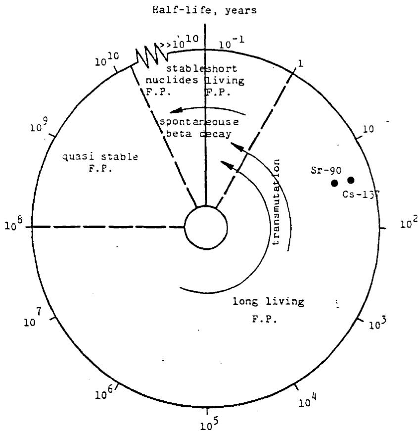  
Figure 2.1-3. Transmutations of Fission Products

Actinide "wastes" accumulate when nuclides resist fission-ing. Figure 2.1-4 indicates the prominent actinides of the Th and U fuel cycles and their fission tendencies. More explicitly Figure 2.1-5 shows that fission generally does not predominate over capture until rather high neutron energies are reached. However, $\sigma_{\mp}$ does exceed $\sigma_{c}$ for $^{234}\mathrm{U}$ at much lower energies than for other actinides. Thus, a very fast spectrum reactor, especially on the thorium fuel cycle can uniquely avoid accumulating actinides.

According to their median flux energies (Table 2.1-II), fast reactors must have many more neutrons above the Figure 2.1-5 crossover points than thermal reactors. MSFRs which minimize neutron moderation (eiastic scattering) will have the hardest neutron spectrum of all power reactors. Reactors with highly-enriched fuels (Table 2.1-II) will also exhibit a faster spectrum: enrichment eliminates from the core $^{238}\mathrm{U}$ or $^{232}\mathrm{Th}$ , which primarily undergo inelastic scatter.

In considering the reactivity contribution of each nuclide note that the reactivity crossover point in Figure 2.1-5 where $n = \sqrt{G_{\mathrm{F}}} / \sigma_{\mathrm{C}}$ exceeds 1, will occur at even lower energies (roughly where $\sigma_{\mathrm{F}} / \sigma_{\mathrm{C}} = 0.3 - 0.4$ ). Thus, nuclides usually considered as actinide wastes do not severely detract from criticality or breeding gain potential in a very fast spectrum reactor.

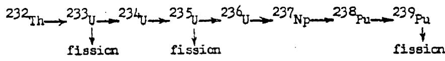

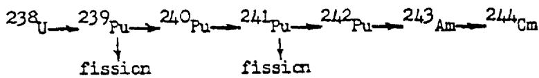  
Fig. 2.1-4 Burnup Chains for the $^{232}\mathrm{Th} / ^{233}\mathrm{U}$ and $^{238}\mathrm{U} / ^{239}\mathrm{Pu}$ Fuel Cycles

Table 2.1-II. Fast Reactor Comparison   

<table><tr><td>Fuel Cycle</td><td>Reactor</td><td>Medium Flux Energy</td></tr><tr><td rowspan="3">238U/Pu</td><td>ANL 1000 MW(e) LMFBR</td><td>130 keV</td></tr><tr><td>AI 1000 MW(e) LMFBR</td><td>180 keV</td></tr><tr><td>Fast Na ZPPRs</td><td>190 keV</td></tr><tr><td></td><td>GCFR Lattice</td><td>187 keV</td></tr><tr><td></td><td>1000 MW(e) GCFR Design</td><td>176 keV</td></tr><tr><td></td><td>MCFR (in-core cooling)</td><td>198 keV</td></tr><tr><td></td><td>MCFR (internal blanket, out-of-core cooling</td><td>370 keV</td></tr><tr><td></td><td>Ultra-High Fast Flux Molten Chloride Test Reactor</td><td>471 keV</td></tr><tr><td>Th/233U</td><td>MCFR (out-of-core cooling, high 233U enriched)</td><td>700 keV</td></tr></table>

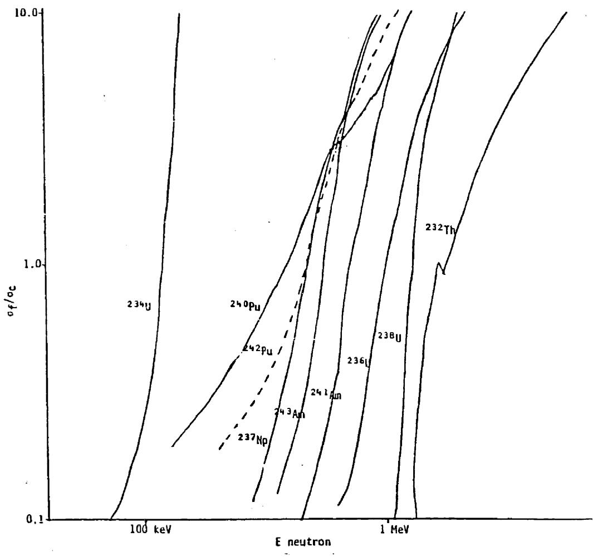  
Figure 2.1-5 Enhanced fissionability of fertile nuclides at higher neutron energies.

# 2.2 Non-proliferation

# 2.2.1 Development of US Policy

US nuclear energy policy was from the first based on a keen awareness of the dangerous aspect of nuclear electric power. The Acheson-Lilienthal Report of 1946 saw a close association between the civilian and military aspects of nuclear energy. It recommended international ownership of nuclear explosive materials.

The related US proposal to the United Nations failed in part because the Soviet Union would not participate. After that the US withdrew into a period of secrecy. Eventually we became more relaxed about the development of nuclear energy for peaceful purposes and abandoned the secrecy. Because we mistakenly thought civilian reactor safeguards could be stretched to cover the more dangerous elements in the fuel cycle - such as plutonium reprocessing - we allowed plans for the use of plutonium to go forward unhampered. There is where the damage was done [65].

In 1957 the International Atomic Energy Agency IAEA was established primarily to monitor the flow of commercial nuclear materials and equipment among member countries. The charter advocates control over "excess" quantities of plutonium, but does not restrict their use.

The nuclear policymakers of the fifties and the sixties apparently did not realize the security implications of easy access to nuclear explosive material in national stockpiles. The prospect of many nations possessing substantial nuclear explosive materials seemed very far away. Also, nuclear weapons were thought to be

enormously difficult to design and fabricate. The US near-monopoly on the technology, fuels, and equipment for civilian nuclear power activities worldwide seemed to ensure US control of the situation. Fledgling nuclear power programs seemed to be unrelated to the development of nuclear weapons. The earlier prescience of the Acheson-Lilienthal group that they had everything to do with it was ignored.

There was also some genuine confusion on the technical side. It was once widely thought, for example, that you could not make nuclear weapons with plutonium derived from spent power reactor fuel. The Acheson-Lilienthal report seems to have misled many, including the IAEA into believing you could denature plutonium. As a result, many of those responsible for protection against military diversion of plutonium were relying upon technological barriers which did not exist.

On October 28, 1976, President Ford concluded that "avoidance of proliferation must come before economic interests". Therefore, we should defer reprocessing until "there is sound reason to conclude that the world community can effectively overcome the associated risks of proliferation."

Two factors contributed to Ford's decision and to the subsequent development of President Carter's non-proliferation policy. The first is how the safeguards deficiency impacts international security: we cannot control the plutonium or highly-enriched uranium of other nations should they suddenly decide to abrogate agreements and appropriate explosive material for weapons. At the same time the extensive growth of the nuclear industry, world-wide, is increasing

the availability of plutonium.

The second factor affecting current policies is the dubious economics of reprocessing and recycle of plutonium in light water reactors. This makes the early introduction of plutonium into international trade as unnecessary as it is dangerous.

Presidents Ford and Carter both advocated that we restrict access to dangerous materials, pause in the commitment to plutonium separation and use, and search for alternatives to national stockpiling. Their efforts to persuade our allies and trading partners mct at best, with mixed success. It is hardly surprising that this US policy shift on plutonium produced widespread irritation, alarm, and even the cynical suggestion that the Americans were less interested in proliferation than in perpetuating a commercial advantage.

Both Britain and France have emphasized the security advantages of their reprocessing plans. The British suggest that if reprocessing does not relieve the accumulation of spent fuel, non-nuclear-weapon states will have to develop indigenous reprocessing facilities: this will certainly pose a serious danger of proliferation. Britain argues that the best way to discourage this development is to confine reprocessing services to the states which already have the bomb [66].

Carter subsequently submitted a bill, the Nuclear Non-Proliferation Act of 1977. It would impose stricter rules on US nuclear exports which would block their use for explosives. Opposition to this act argued that whatever relationship exists cannot be reversed and that it is so remote that further controls aren't necessary.

Sam McDowell of DOE Safeguards and Security has defined non-pro

liferation as prevention of weapons capability in a nonweapons state [67]. The goal of an alternate fuel cycle would be to deter or reveal diversion such that suitable time would be provided which allowed other countried to negotiate or induce that country to st

Zebroski of EPRI has suggested [10] that the primary objective should be to seek improved resistance to diversion from civilian power fuel cycles.

The heart of the controversy lies in the access to nuclear explosive materials which the nuclear electric power industry provides. Section 2.2.2 discusses this further.

# 2.2.2 Relationship Between Nuclear Electric Power and

# Nuclear Weapons Development

The U.S. generally produces plutonium for weapons purposes in large special purpose reactors and separates it from the irradiated fuel in government reprocessing plants. However, nuclear power generation electricity also produces plutonium; commercial spent fuel reprocessing plants will separate it, physically creating large stockpiles. Also the same technology (and in some cases the same plants) which enrich uranium for fuel can also enrich it further for weapons use.

The essential point is this: getting the requisite explosive material is still the most difficult and time-consuming item in the initial production of nuclear weapons.* The operation of civilian nuclear power reactors and plants for fissile fuel separation and/or enrichment tend to remove this bottleneck. Then if a country has

prepared secretly in advance, it can quickly manufacture nuclear warheads once it decides to do so.

This is now a real threat, not present when the basic international rules for nuclear trade were formulated twenty years ago. The reason is that the civilian nuclear power industry has grown enormously. By any reasonable measure (the plutonium production rate or the size of uranium enrichment facilities being utilized), it exceeds the scale of the world's military nuclear programs. In fact, in most countries the quantities of plutonium is spent reactor fuel, if separated out and stored, will dwarf any plausible military needs.

2.2.2.1 Extent of the spent fuel problem. Over the next decade Europe and Japan plan to send 3 Gg (metric kilotons) of spent fuel to Wind-scale. La Hague reportedly will process about 6 Gg spent fuel for Japan, the Federal Republic of Germany, Sweden, Switzerland, Belgium, Holland, and Austria. This means separating about 75 Mg (metric tons) plutonium, or enough for about 10,000 nuclear weapons. Clearly heavy financial investments ride on the outcome: when transport charges are included, the European contracts represent almost three billion dollars in business. The intense international competition in nuclear commerce, accompanied by heavy investment and national

*See the 1975 Encyclopedia Americana article on Nuclear Weapons by John Foster, then the Defense Department's R&D chief and a former director of the Livermore Laboratory: "the only difficult part of making a fission bomb of some sort is the preparation of a supply of fissionable material of adequate purity; the design of the bomb itself is relatively easy".

pride, tends to obscure the proliferation threat.

2.2.2.2 Question of reprocessing. [32,65,66]. Current U.S. policy supports the relatively safe fuel cycle activities and discourages the more dangerous ones. A primary U.S. imperative is to promote common rules for international nuclear trade. But before formulating rules, much less implementing them, one must ascertain just what is dangerous and just how much the spread of nuclear weapons threatens individual countries and world security. Clearly a common understanding does not yet exist, as witness US opposition to European export sales of plutonium reprocessing and uranium enrichment facilities.

Recent U.S. Administrations have shunned reprocessing. Many analysts [68] believe this directly increases the risks of both diversion and proliferation. With no reprocessing, the increasing amount of long-cooled spent fuel, and the increasing number of locations with such fuel [69] increase diversion risks. The likelihood of "proliferation" increases because concern for a reliable supply stimulates development of independent enrichment capabilities.

The capability to develop fissile production now exists in fifty countries, with 10-20 additional possible in the next decade [70,71]. A secure fuel supply and reprocessing service through international commerce would economically discourage these countries from developing their own. The economic inhibition is substantial since initial small-scale operations are highly uneconomic relative to mature manufacturing and production capabilities in supplier countries.

Section 2.2.5 examines the vulnerability of different fuel cycles to diversion.

2.2.2.3 Attitudes on return of Pu. Of prime importance to proliferation is the question: who gets the bred Pu - the reprocessor or the spent fuel owner? If plutonium eventually displaces uranium as the primary fuel for power reactors, how can indigenous reprocessing be successfully discouraged outside the nuclear weapon states or a big suppliers club? The goal, long-sought by many, of fuel "independence" does not equate to simply shifting fuel dependence from the United States to Europe. These commercial and political pressures, which earlier led to reprocessing cuid yet force Fu return even without adequate international protection against proliferation.

Presently non-Euratom countries need US permission both to transfer US-supplied spent fuel to other reprocessors like "indscale and La Hague and to get Fu back. Pu can return only "under conditions that...warn the US of any diversion well in advance of the time" diverted material could be transformed into weapons. England has pledged the material will be returned to its owners "only in a form that will reduce the risks" of proliferation. In his report on the Windscale inquiry, British Judge Parker took refuge in time: "this matter can be alleviated to some extent by technical fixes", he wrote.

2.2.3 Which Reactor Fuel Contains the Least Proliferation Danger?

All reactors either produce Pu or $^{233}\mathrm{U}$ , or start with fully-enriched $^{235}\mathrm{U}$ . Thus weapons-grade fuel is intrinsically recoverable from all reactor fuel cycles. However, which fuel attracts nationalist and subnational groups the least as a weapon? The answer may depend on unraveling complex interrelated factors, which are examined here.

2.2.3.1 Weapons-grade material. For $^{233}\mathrm{U}$ or $^{235}\mathrm{U}$ , weapons grade means isotopic content enrichment in U exceeding 12 or $20\%$ , respectively. In the broad sense weapons-grade means any material which can undergo chemical separation to yield Pu or the uranium enrichments mentioned above. Thus dilution with any other element including thorium does not lower the weapons grade as chemistry can separate out the U again.

At one time it was thought that reactor-grade plutonium (produced in thermal reactors) was not of weapons grade [66]. The U.S. government has now stated unambiguously that they have produced and successfully tested militarily important nuclear weapons, using reactor-grade plutonium. Even simple weapon designs reliably produce highly powerful (kiloton) explosions.

Similarly, the IAEA Safeguards Technical Manual now provides the following guidance: plutonium of any grade, in either metal, oxide or nitrate form can be put in a form suitable for the namufacture of nuclear explosive devices in a matter of days to weeks [65].

2.2.3.2 Unique $^{232}\mathrm{U}$ Daughter Radiation. All weapons-grade fuel can be left in a highly-radioactive state (by means of fission products). The associated biological hazard would then discourage its use by subnational weapon makers. Special national laboratories, could readily clean these up but ever-present $^{232}\mathrm{U}$ impurity in $^{233}\mathrm{U}$ will continue to decay into hazardous $\gamma$ -emitters (Sec. 3.5.4). In less than a week after high level decontamination, the gamma activity in recovered Th and $^{233}\mathrm{U}$ becomes so great that fabrication by direct methods can be permitted only on a scheduled radiation dosage basis [72].

The characteristic hari-gamma signal of the $^{232}\mathrm{U}$ daughter radiation also reveals the location and transport of this material.

2.2.3.3 Preignition. The explosive yield of a fission bomb depends on how long the imploded configuration stays together. Multiplied source neutrons from spontaneous $^{240}\mathrm{Pu}$ fissions cause early energy release which produces a premature disassembly. This greatly reduces the total energy yield of the device. Consequently, a military might shun high burnup plutonium (high in $^{240}\mathrm{Pu}$ ), but a subnational group might still desire it.

In pure actinide metal only spontaneous fission can con- tinue copious source neutrons. However actinide compounds pro- duce intrinsic preignition-triggerers through $(\alpha ,n)$ reactions. Table 2.2-I compares the typical activities from these neutron sources. No Th/cycle isotope can match the $^{240}\mathrm{Pu}$ spontaneous fission rate. $^{232}\mathrm{U}$ comes closest in half-life (Figure 2.2-1), but its concentration lies magnitudes lower. Thus the neutron

Table 2.2-I Weapon Preignition Triggers in Pertinent Fuels   

<table><tr><td></td><td>232U</td><td>234U</td><td>240Fu</td></tr><tr><td>α half-life (y)</td><td>71.7</td><td>2.45x10^5</td><td>6540.</td></tr><tr><td>α (α/sec/nuclide)</td><td>3.1x10^-10</td><td>9.0x10^-14</td><td>3.4x10^-12</td></tr><tr><td>α energy (MeV)</td><td>5.3</td><td>4.8</td><td>5.2</td></tr><tr><td>SF half-life (y)</td><td>8x10^13</td><td>2x10^16</td><td>1.3x10^11</td></tr><tr><td>γSF (n/dis)</td><td>≤ 2</td><td>≤ 2</td><td>~ 2</td></tr><tr><td>nSF (n/sec/nuclide)</td><td>6x10^-22</td><td>2x10^-24</td><td>3x10^-19</td></tr><tr><td>Typical isotopic enrichment</td><td>1/1000</td><td>1/5</td><td>1/5</td></tr><tr><td>nSF (n/sec/atom)</td><td>6x10^-25</td><td>4x10^-25</td><td>7x10^-20</td></tr><tr><td>nα (n/sec/atom)*</td><td></td><td></td><td></td></tr><tr><td>in F</td><td>4x10^-18</td><td>2x10^-19</td><td>8x10^-18</td></tr><tr><td>in Cl</td><td>3x10^-20</td><td>2x10^-21</td><td>7x10^-20</td></tr><tr><td>in O</td><td>2x10^-20</td><td>1x10^-21</td><td>5x10^-20</td></tr></table>

* Neutron yields per $10^{8} \sim 5$ MeV-alphas are 1200, 11, and 7 for targets of F,Cl, and Φ, respectively according to Roberts [73]

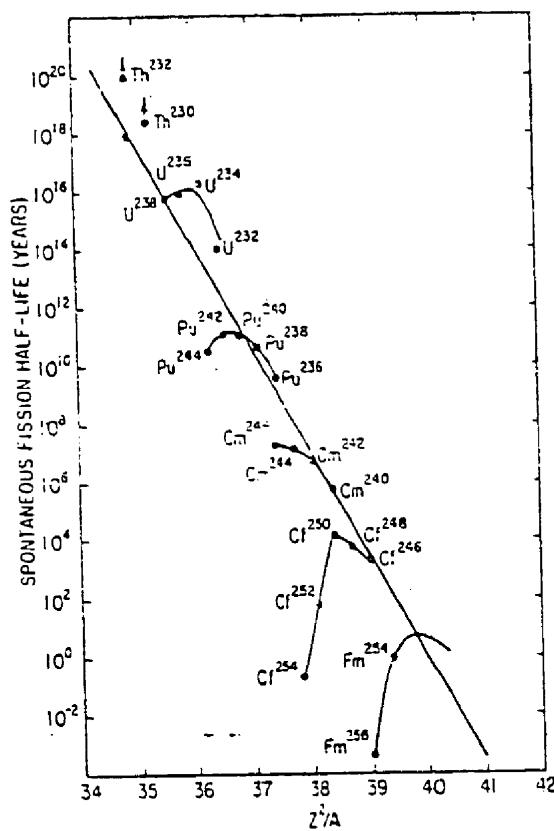  
Fig. 2.2-1 Spontaneous fission half-life of even-even nuclides versus $z^2 / A$ .

production rate from $^{232}\mathrm{U}$ and $^{234}\mathrm{U}$ in with $^{233}\mathrm{U}$ falls many magnitudes below that from $^{240}\mathrm{Pu}$ in Pu.

With high Cl $_2$ F, or O concentration (as in salt or oxide compounds) the $(\alpha, n)$ neutron rate (Table 2.2-3) equals or exceeds the spontaneous fissor neutron rate of metallic Pu $(7 \times 10^{-20} \mathrm{n/s} \quad \mathrm{Pu atom}, 20 \%^{240} \mathrm{Pu})$ . F is much stronger than C $_2$ or O, in this regard. This should appreciably reduce the explosive threat from $^{233} \mathrm{U}$ weapons in fluoride, chloride, or oxide chemical form. The $(\alpha, n)$ neutrons will also present a strong activation hazard except when heavily shielded.

2.3.3.4 238 Fu high heat generation. Pu has found considerable application as a radioisotope heat source. Because its high heat generation rate will melt practical sizes of the metal, the usual form is $\mathsf{PuO}_2$ . For a large enough uncooled mass, even the oxide can melt. Oxide sources also produce neutrons through $^{18}\mathrm{C}$ ( $\alpha, n$ ) reactions. Together, the neutrons and the heat make plutonium high in $^{236}\mathrm{Pu}$ content cumbersome to work with.

Two principal routes produce $^{238}\mathrm{Pu}$ .

239Pu (n,2n) 238Pu (2.2-1)   
235U (n, y) 236U (n, y) 237Np (n, y) 238Pu (2.2-2)

Route (2.2-1) enhances productions for very fast plutonium reactors; Route (2.2-2), for high enriched $^{233}\mathrm{U}$ or $^{235}\mathrm{U}$ reactors. In high burnup U-fuelled LRRs, $^{238}\mathrm{Pu}$ isotopic content reaches $1\%$ . In a $\mathrm{Th} / ^{233}\mathrm{U}$ or a high $^{235}\mathrm{U}$ -enriched reactor, with little or no $^{238}\mathrm{U}$ present $^{238}\mathrm{Pu}$ should dominate any plutonium separated out.

2.2.3.5 Denaturing and other technical fixes [32]. One technical fix, the Civex process, has received a fair amount of international attention. It returns plutonium to the customer in the form of fabricated fuel containing enough radioactive products to preclude easy chemical extraction of bomb material. However, within a few years after leaving the reactor, radioactivity decay forfeits this protection. Since most spent fuel reprocessed in this century will have cooled for even longer than that, the Civex process cannot contribute to the solution of the problems we must worry about now.

Civex also must face other problems. Industry will resist irradiated fuels because they increase occupational and public health exposures. Likewise the owners of the material, especially foreign countries, are not likely to accept the dictates of the reprocessor on the form in which plutonium is to be returned to them. This would also argue against industrial recycle of solid-form $^{233}\mathrm{U}$ daughters).

The simplest answer to denaturing the BG export from an MCFR will be to take it directly from the core; fission products, $\gamma$ -emitters and all.

2.2.3.6 Summary. It remains yet to say if there exist any significant proliferation differences among any of the fuels. We can categorize them as follows:

1. U (low-enrichment in $^{235}\mathrm{U}$ or $^{233}\mathrm{U}$ )   
2. Pu   
235U

233U

$\mathrm{Pu}, ^{235}\mathrm{U},$ and $^{233}\mathrm{U}$ are all weapons-grade. Fuelling reactors with sub-weapons-grade materials does little to limit proliferation: the reactor will soon produce weapons-grade fuel from the diluent, i.e. $\mathrm{Pu}$ from $^{238}\mathrm{U}$ . Thus, no reactor fuel cycle can avoid weapons-grade material. Also, any irradiated $^{238}\mathrm{U}$ -containing fuel constitutes a terrorist threat from TNT-explosion aerosol-dispersal of carcinogenic $\mathrm{Pu}$ .

All but very fresh $^{233}\mathrm{U}$ exhibits a deadly penetrating daughter radiation. This hazard discourages the assembly and holding of a $^{233}\mathrm{U}$ bomb. Even if one chemically separates out the daughters, they soon build in again.

Thus, in summary, no "proliferation-proof" fuel exists, but the $\mathrm{Th} / ^{233}\mathrm{U}$ cycle does offer some advantages over the U/Pu one: the presence of $^{232}\mathrm{U}$ daughter radiation and the absence of carcinogenic Pu.

# 2.2.4 The Significance of Stockpiles

2.2.4.1 Peaceful vs. military explosives. The Nonproliferation Treaty forbids non-nuclear-weapon states to acquire nuclear explosive devices, whether labelled military or peaceful (they blow up the same way). Peaceful explosive services could still be provided under strict international physical control.

The same rules should apply to something very similar, a dis-assembled bomb. That being so, what about the nuclear explosive material itself? The only answer consistent with the Treaty's prohibition on nuclear explosive devices is - don't label it "peace-

ful" until you prove you can safeguard it [65].

2.2.4.2 What about unsafeguarded production reactors? [65]. It is contended for example, that no country choosing to build nuclear weapons would turn to its civilian power reactors for the requisite explosive materials; to divert material in this way would risk detection by the IAEA inspectors, and in addition would provide too poor a grade of plutonium to interest weaponers. Under this self-serving theory, if weapons material is wanted, a special-purpose unsafe-guarded reactor would be built. It is possible at the moment to do this legally in countries not party to the Nonproliferation Treaty and therefore not subject to inspection of all its indigenous nuclear facilities. This underlines the need to extend the requirements of the treaty to nonsignatory nations by conditioning nuclear trade on acceptance of international agreements and inspection on all nuclear activities within importing countries.

There is increasing pressure to do this, and a recent bill before the Congress would make this a condition for U.S. nuclear exports.

Even if legal, however, the construction of a special purpose plutonium production reactor signals a country's intention to build bombs and, in the present climate, risks premature interception of its attempt to obtain explosive material for nuclear weapons.

To avoid interference, a country might stockpile separated plutonium from spent power plant fuel openly and legally. A defense establishment can design and fabricate a bomb in privacy; the illegal activity is then confined to a swift, almost one

step process: appropriation from its storage place of the necessary plutonium, fabrication, and insertion into the waiting bomb. It is surely the quickest, cheapest, and least risky route to nuclear weapons. So long as individual nations are permitted to keep nuclear explosive stockpiles they are in effect, in possession of an option to make nuclear weapons almost literally overnight.

In other words, from the moment spent reactor fuel is translated into separated plutonium and stored, the element of "timely" warning, on which our present safeguards system has been relying, evaporates. The same is true, of course, for stockpiles of highly enriched uranium.

It is important to understand that so far as safeguards are concerned a stock of nuclear explosive material is a lot more like a bomb than it is like a reactor. No one would dream of suggesting that nuclear explosive devices, regardless of how labelled, should be exported under international safeguards. The Nonproliferation Treaty settled once and for all the notion that nuclear explosives came in two categories - military and peaceful. Under the treaty no such distinction is permitted. Yet strip away the electronics and the conventional high explosives and label the plutonium as intended for peaceful purposes and many nuclear spokesman, at home and abroad, will tell you that if subject to occasional inspections it is a perfectly safe proposition: just like safeguarding power reactors [65].

The worldwide opportunities for diversion are clearly dominated by the existence of large volumes of spent fuel stored in many hun-

dreds of locations, and especially long - cooled spent fuel which is not returned to supplier countries [10].

The crux of the proliferation issue is not to completely avoid Pu. Due to advanced technology, any country can produce it without resorting to nuclear power cycles. Rather it is to avoid having Pu lie around in large quantities where diversion is less detectable. In an MCFR(Pu), Pu is always in solution, except for that fuel which is required to start a new reactor. Reprocessing is done within the plant boundaries continuously and the Pu then fed back into the system.

# 2.2.5 Fuel Cycle Vulnerability to Diversion

The opportunity for national or subnational diversion of weapons-grade material will depend on the size of the fuel cycle inventory. Transport outside secure boundaries and decentralization of the inventory enhances the potential for subnational diversion: while under transport the material will be in a more easy-to-handle form and probably under less security; decentralization also implies less security.

2.2.5.1 Once-through fuel cycle. Figure 2.2-1 diagrams the trail of weapons-grade material in a once-through fuel cycle, assuming that the initial fuel elements are low-enrichment U. After generation in the reactor, it passes through about three storage/queue depots. Possibly one more storage depot labelled "permanent" may appear later, once it is fixed what that will be. Only one out-of plant transfer may be necessary. The inventory in the long term storage depots will grow with time, eventually becoming very large. Although the Pu there is not separated out, a national laboratory could easily do so.

One should also note the presence of the enrichment plant: though it doesn't produce weapons grade-material for this fuel cycle, it could.

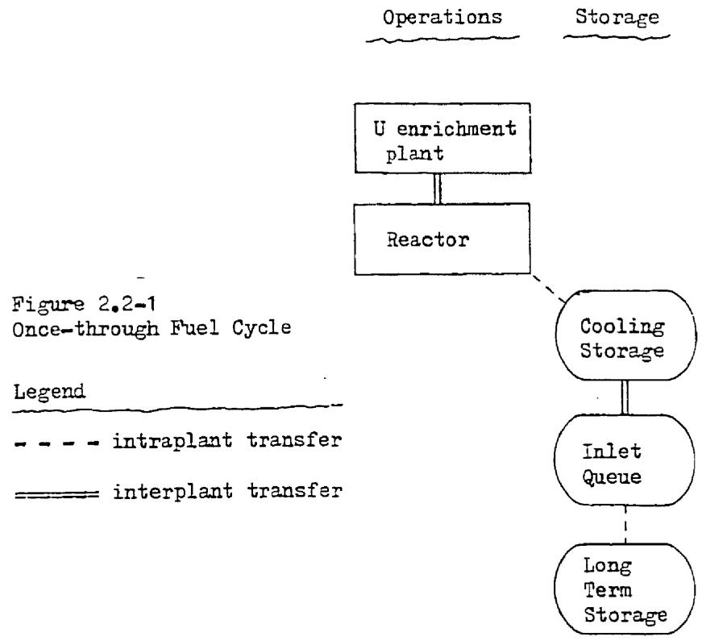

2.2.5.2 Solid fuel reprocessing cycle. In solid-fuel recycle (Fig.   
2.2-2) we note that weapons-grade fuel will accumulate in three plants and maybe six storage/queue depots. Four interplant transfer operations occur, counting BG export. It is not hard to envision the equivalent of ten cores being tied up in the various queues, plants, storage, and transports.   
2.2.5.3 Molten-salt fuel cycle. Here almost all weapons-grade material stays (Fig. 2.2-3) within the plant boundaries. With out-of-core cooling, the equivalent of 4-5 cores inventory is possible, but they remain within the walls and mostly in the primary circuit. Only BG export requires out-of-plant transport.

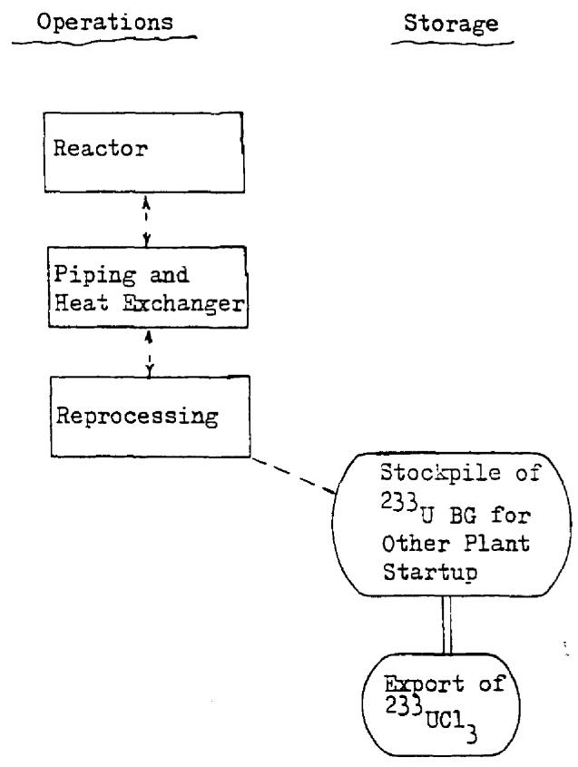  
Fig. 2.2-3 Molten-Salt Fuel Cycle

-- -- intra plant transfer

-------- interplant transfer

2.2.5.4 To reprocess or not to reprocess. The once-through fuel cycle, starting with low-enrichment U, seems to display fairly low vulnerability to subnational diversion, but creates a cumulating stockpile available for national use. It also creates a long-term waste management problem and poorly uses our resources.

The molten salt fuel cycle clearly seems to be less vulnerable than the solid-fuel reprocessing cycle. On the present rough scale, the molten salt fuel cycle must be rated as comparable to the "once-through" in vulnerability.

The question now occurs - would you export an MSR with its in-plant fuel cycle capability to a non-weapons state? Or, a different question: which would you export, the "once-through" or the "molten" fuel cycle? Assuming that you could alter the MCFR to make Pu from $^{238}$ U but that also the non-weapons state keeps its spent fuel from a once-through cycle (see section 2.2.2.3), either cycle is bad for national proliferation. This seems to say forget about exporting unless you can maintain control: IAEA, US, or other.

On the domestic scene, the reduced market would definitely favor the "molten" cycle as it solves more problems and makes more fuel economically available.

2.2.5.5 To breed or not to breed. Assuming that the potential to breed excess plutonium or highly-enriched $^{233}\mathrm{U}$ exists, one must next ask - should we? The alternative is to use the excess neutrons to achieve higher fission product levels, a smaller critical mass, or some other benefit.

Breeding obviously provides initial fuel for starting up other reactors. The alternative is to start MCFRs up with Pu from spent LWR fuel, or highly-enriched $^{235}\mathrm{U}$ . But either of the latter two fuels would make it easier to manufacture weapons. Also they would cause the thorium fuel cycle in this reactor to depend on the U/Pu fuel cycle. With a system of thermal MSRs the export $^{233}\mathrm{U}$ BG could be diluted below weapons grade, but Th diluent is chemically separable and $^{238}\mathrm{U}$ diluent would eventually mean Pu production.

Based on these considerations, this study seeks a breeding MCFR. Only the first generation of MCFR(Th) reactors should then need $235_{\mathrm{U}}$ or $\mathrm{Pu}$ for startup.

2.2.5.6 Fusion reactor vulnerability. Lest anyone think that fusion reactors are the panacea, note that the current literature is full of fissile breeding ideas, producing weapons-grade $^{233}\mathrm{U}$ or $\mathrm{Pu}$ . In the US, current thinking regards such a hybrid as necessary to a near-term economical reactor. In the USSR it is their prime goal.

# 2.3 Fuel Utilization

# 2.3.1 Earth's Resources

Beyond $^{209}\mathrm{Bi}$ ( $Z = 83$ ) nature offers on earth only the chemical elements thorium and uranium ( $Z = 90$ and $92$ ). Only these two materials, in present, or feasibly-transmuted form, can sustain a neutron-induced fission chain reaction.

Only $0.72\%$ of U is $^{235}$ U. The enrichment process loses some of that. Present reactors, without recycle, consume just $10\%$ of the $^{235}$ U before assigning the rest to semipermanent storage. Thus we presently waste $99.94\%$ of the uranium mined, an affront to the environment. If, instead, the reactor could usefully consume all of the actinide, considerably less eyesore and mining expense would result. Economics might then justify the retrieval of extensive low-grade ores. At a time of energy shortage the present policy seems foolhardy except that it reflects the restrictions posed by economics, proliferation concern, and spent fuel waste management. These must first be overcome.

Thorium abounds three times as much as uranium in the earth's crust, and offers that much more nuclear fuel energy. The avail- able uranium ores increase greatly if one includes not only the classical ores ( $>1000$ ppm uranium) but the very abundant granites with 80 ppm uranium and thorium. Granite is the main constituent of the earth's crust (up to 20 km deep). Extraction from these ores could become economical if fission reactors fully used all the Th and U present. Together with fusion reactors, such a fuel cycle would then open up all the principal world resources of nuclear fuel.

# 2.3.2 Use of Thorium

Nature has significantly inhibited the use of Th by not providing a thorium isotope which can sustain a neutron chain reaction. Despite some unique advantages of a $\mathrm{Th} / ^{233}\mathrm{U}$ cycle over a U/Pu one, Th use must still prove its economics. A reactor which yields high BG in the Th cycle would help a lot.

High melting points hinder reprocessing of a solid Th fuel: $\mathsf{ThO}_2$ melts at $3050^{\circ}\mathsf{C}$ ; Th metal, at $1750^{\circ}\mathsf{C}$ . Breeding is very marginal, except with a fast reactor. Reducing non-productive neutron captures (e.g. to fission products, core structural materials, and control poisons) becomes crucial. That suggests fluid fuel reactors: they can continuously remove fission products while adding fuel online, and some variants require no core structure.

# 2.3.3 Intercomparison of Reactor

# Concepts with Regard to Fuel Utilization

Much attention currently centers on optimum uranium usage by candidate reactor concepts. The parameter of Megawatt days of electric energy produced per mined metric ton of uranium (MWde/mined MTU) provides a suitable yardstick. Note that the numerator includes energy production from thorium while the denominator ignores thorium consumption. Consider as a benchmark that all the uranium were somehow (ideally) consumed. Then without any energy production from Th, the rating would be 380.000 MWde/mined MTU. The advanced concepts in Table 2.3-I, currently under study in the US, do not come anywhere near this idealistic figure; not even when including energy production from Th.

Table 2.3-I   
SONE 30-YEAR FUEL CYCLE PERFORMANCE COMPARISONS [74]   

<table><tr><td>Reactor</td><td>Fuel Cycle</td><td>Energy Production
MWde/Mined MTU</td></tr><tr><td rowspan="7">PWRs</td><td>Uranium Cycles:
once-through uranium</td><td>1860</td></tr><tr><td>uranium recycle only, 
Pu storage</td><td>2270</td></tr><tr><td>uranium and single Pu 
pass recycle</td><td>2650</td></tr><tr><td>uranium and Pu recycle</td><td>2800</td></tr><tr><td>Thorium Cycles:
93 w/o 235U, recycle of 
235U and 233U</td><td>3420</td></tr><tr><td>3 w/o 235U, recycle of 
Pu and 233U</td><td>2900</td></tr><tr><td>3 w/o 235U, crossed 
progeny recycle</td><td>2870</td></tr><tr><td rowspan="3">LWBR</td><td>Spectrum Shift (Thorium):
93 w/o 235U, recycle of 
235U and 233U</td><td>5550</td></tr><tr><td>3 w/o 235U, recycle of 
Pu and 233U</td><td>3450</td></tr><tr><td>Thorium Cycle</td><td>6800</td></tr><tr><td rowspan="2">CANDU</td><td>Uranium Cycle</td><td>5800</td></tr><tr><td>Thorium Cycle</td><td>10440</td></tr><tr><td rowspan="2">HTGR</td><td>Thorium Cycle:
once-through</td><td>2620</td></tr><tr><td>233U recycle</td><td>4240</td></tr></table>

+ $3\mathrm{w} / \mathrm{o}^{235}\mathrm{U}$ as $\mathrm{UO}_2$ core; feed of output Pu into $\mathrm{ThO}_2$ with recycle of Pu; feed of $^{233}\mathrm{U}$ into $\mathrm{UO}_2$ (natural) with recycle of Pu into $\mathrm{ThO}_2$ and recycle of $^{233}\mathrm{U}$ into $\mathrm{UO}_2$

Zebroski [10] concludes that the evolutionary extension of LWR burnup offers the best near-term hope for improving usage. However, higher burnup will also produce greater statistical variations in fuel failure, which will limit these extensions. On the long term, an MCFR should come much closer or exceed the ideal limit because all actinides are consumed and it requires only thorium feed (except for startup fuel on early reactors).

# 2.3.4 Use of Both Th and U Reserves

One might desire that any new reactor concept be able to operate on both the Th and U cycle, so as to eventually allow use of all our reserves. MCFR studies have already indicated large potential breeding gains on the U/Pu cycle, providing Pu is acceptable. In that event, one could also supply spent U fuel as blanket feed, thereby solving that waste management problem.

# 2.4 Strategic Security

Although it doesn't normally get public attention, still strategic security has its place on the list of contemporary concerns due to current events:

1. The long-and short-term goals of the USSR   
2. Other political conflicts which could lead to world war (viz: Israel-Arab, China vs. Taiwan or USSR, Arab-Arab, etc.)   
3. The growing-pains and frustration of have-nots and emerging nations   
4. The increasing political turmoil and unrest within America stemming from problems of cities, alienation of extremist groups, and, again, have-nots.

It might be successfully argued that fat men don't look for a fight - "yon Cassius hath a lean and hungry look". Then insecurity traces to the failure-to-appear of cheap nuclear electricity, coupled with the disappearance of the cheap oil-fired energy source. Thus the world still hungers for a cheap abundant energy source to solve its woes. We'd like to think the MCFR is it. Until that becomes more obvious though, it would be well to secure our US energy supply from all threat.

# 2.4.1 Present Susceptibility

At present, US energy supplies, key to our might and resourcefulness, are all above board (ground level) for everyone to see and aim at. This includes dams, oil tankers and depots, fossil-fuelled plants, and nuclear reactors. Actually only the containment building of the latter protrudes above ground but that still leaves it vulnerable.

2.4.1.1 Subnational Blackmail. Should a terrorist group seek a means of national blackmail, the threat of destruction to a dam or a nuclear plant might seem credible.

Given sufficient explosive a dam would seem to be a better target, both in size and certainty of wreaking financial havoc. LWR destruction would likely cause more personal injury. A fossil - fuelled plant destruction would not necessarily threaten public lives. Bombing a city or a poisonous gas (like chlorine) plant might pose the next largest threats.

2.4.1.2 Sabotage. In time of war or unrest, sabotage to our system could rear its ugly head. Surprise attacks might often occur. In addition to the above targets, one might then add many more non-nuclear possibilities such as poisoning water systems or destroying any energy supply. For sheer havoc, though, destroying all water supply to LWR cores as well as their containment would do well.

2.4.1.3 War. In event of war, sabotage could be one front of the attack. In addition planes and missiles might be directed at nuclear plants in hopes of accomplishing what the aggressor didn't want to or couldn't send an atomic bomb to do: perhaps an atomic blast would have destroyed a valuable industrial complex whereas an LWR core release will simply harm and demoralize a lot of people.

# 2.4.2 Potential Remedy with an MSR

The dominant vulnerability of the above energy sources would seem to be the presence of the potential hazard above or near the earth's surface. Moving the hazard lower mitigates the danger. Dams can't go underground. Nuclear power plants can, but it costs a lot. An MSR uniquely offers

(1) Continuous removal of the principal hazard from the system: the gaseous and volatile fission products. One can store these far underground in a recessed tank for security.   
(2) Ability to transfer the whole core further underground at a moment's notice to a (possibly natural convection-) cooled holding tank.

Thus the MSR may allow the security advantage of underground siting without all the costs and other difficulties.

# 2.4.3 Summary

Analysis suggests that an LwR may be a likely target for attack or threat of attack. The goals of such an attack would be

(1) Destruction of the energy production capability   
(2) Release of gaseous and volatile fission products into the air.

This threat to energy and people probably exceeds that from a dam which tends to be located farther from people. Also water must follow the lay of the land, which authorities could observe and some-what predict. Transport of fission product gases, they could not very well.

At the same time, nuclear plants can be the toughest nuts to crack as they are more compact and self-contained. With a little more hardening, such as an MSR allows, they could be America's energy ace-in-the-hole and basis for survival.

On the long term the MCFR and all other novel concepts should be explored and re-explored for their ability to provide that panacea of a cheap abundant energy source - a far better means of dealing with yon hungry Cassius than any protective shells one can devise.

2.5 Summary Design Principals for an Advanced System

# 2.5.1 Waste Management Restraints

Spent fuel contains several products whose activity remains high after a years storage. Of these, the alpha-emitters can extensively damage internals when ingested. Plutonium presents a special hazard because it locates on bones: the whole skeleton of man becomes the critical organ. Although our society has learned how to handle other toxic industrial wastes (arsenic, mercury, chlorine), control is not perfect and accidents have occurred. Thus, we prefer to avoid plutonium production if that does not severely curtail our energy production. A reactor which usefully consumes all the actinides and has nil Pu in its system would seem very attractive.

# 2.5.2 Non-proliferation Restraints

Despite earlier misconceptions plutonium of any grade can be put in a form suitable for the manufacture of nuclear explosive devices in a matter of days to weeks. Thus, from the moment a non-weapons state separates plutonium from spent reactor fuel and stores it, the element of "timely warning", on which our present safeguards system relies, vanishes.

The same holds true of course for stockpiles of highly enriched (in $^{233}\mathrm{U}$ or $^{235}\mathrm{U}$ ) uranium. Thus $^{233}\mathrm{U}$ or $^{235}\mathrm{U}$ must be diluted with $^{238}\mathrm{U}$ to avoid classification as weapons-grade. However, subsequent reactor irradiation again produces plutonium which separates easily by chemistry. Thus no fuel cycle can avoid producing weapons-grade fuel. Of course one can minimize the proliferation hazard by using extended LWR cycles and not reprocessing.

Both of the last two Presidential Administrations have suggested this fall-back course. However, to get any significant improvement in fuel utilization, reprocessing is necessary. Then one seeks to minimize the transport of weapons-grade and radioactive materials. Molten-salt fuel cycles with in-house reprocessing offer low proliferation hazard comparable to that of the once-through cycle.

# 2.5.3 Fuel Utilization Restraints

Know nuclear fuel supplies contain up to $10^{15}$ GW-years of energy. However much of this industry cannot tap because ores are uneconomic to extract and the current reactor fuel cycle uses less than one ore-thousandth of that which it does extract. The absence of any naturally-occurring "fissile" isotope puts Th at a further disadvantage.

A reactor concept which could approach full utilization of all actinide fuel might stand a chance of providing the economics necessary to accomplish the extraction of low-grade ores, including both uranium and thorium for fission reactors. Such a concept should exhibit a high BG to overcome thorium's fissile disadvantage.

# 2.5.4 Strategic Security Restraints

Dams and current nuclear power plants provide attractive targets to internal and external attack. MSRs offer a hardening to such attack by continuous removal of the major radiation hazard from the system and ability to transfer the whole core further underground at a moments' notice. However, if an MCFR provided the break through to universal cheap electricity, that should be the greatest advance to security.

2.6 Promise and Uniqueness of the Molten Chloride Fast Reactor on a Thorium Fuel Cycle

The promise and uniqueness of this concept stems from the molten salt state, the exclusive use of thorium, continuous reprocessing, and the very fast neutron spectrum.

# 2.6.1 Advantages of the Molten State

Having the fuel in a fluid state allows out-of-core cooling, thereby avoiding structural components in fields of significant radiation damage. It also eliminates labor and material costs associated with fuel element decladding, dissolution, and fabrication. Fuel handling by pumps and piping should be less complex than solid fuel handling. The simplified core should greatly ease the plant design, and increase its reliability and availability, thereby decreasing cost.

A fluid state system also facilitates on-site close-coupled fuel reprocessing (Section 2.6.2). Out-of-core cooling of the molten salt allows the primary circuit to operate at low pressure: this reduces the severity of the environment and allows materials such as graphite for piping. That should reduce fuel cycle costs.

Elimination of fuel cladding and structural material significantly improves the neutron economy of the reactor: more neutrons are available for breeding, reduced critical mass, or other tradeoffs.

The molten state allows high power densities (up to 10 MW per liter) and high temperature operation while at low pressure: fuel melting is part of the design and so is not a problem; fuel vaporization does not occur until extreme temperatures, contributing

to low operating pressures. Only the container materials impose temperature limits. With Mo alloys $900^{\circ}\mathrm{C}$ appears to be an upper limit. Graphite structures should tolerate considerably higher temperatures. This could significantly advance thermal efficiency which could attendantly reduce thermal pollution of the environment. High temperature operation affords applications with existing steam technology, or with He secondary coolant for gas turbines or process heat. High power density also promotes small sizes which saves plant costs.

The eutectic nature of the halide salts facilitates low temperature operation in the near term by minimizing chemically-reducing corrosion problems with Mo-Fe alloys. With graphite, these problems may not exist. Later, high temperature operation leading to higher efficiency process heat at compositions away from the eutectic nadir can be implemented when more is known about material corrosion. Off-eutectic compositions can also mean higher BG and thermal conductivity of salt.

Halide salts also offer superior thermal and radiation stability. This inhibits the formation of other compounds, thereby preventing corrosion.

The molten nature greatly benefits safety as well: increase in temperature causes a strong decrease in fuel density. The inherent stability of this negative temperature coefficient will limit excursions. A self-regulating system may be possible, avoiding the need for control elements.

The fluid state of the fuel also enhances safety under abnor

mal condition through a combination of properties:

(1) Fluidity facilitates removal from the reactor to ever-safe containers   
(2) High heat capacity of fuel restricts temperature rise on loss of normal cooling   
(3) Low salt vapor pressure minimizes the effect of any temperature rise

# 2.6.2 Advantages Stemming from the Exclusive Use of Thorium

The nuclear industry has exclusively used the uranium fuel cycle to date, mainly because no "fissile" thorium isotope exists. However, once a thorium cycle proves viable, numerous advantages accrue. Because the burning of thorium begins much lower on the atomic weight scale than does uranium, little plutonium or higher actinides accumulate. The plutonium which does appear will be mostly $^{238}$ Pu, a strong heat source which melts in concentrated form unless cooled. That hinders its use as a weapon.

The predominant products in the cycle will be $^{232}\mathrm{Th}$ , $^{233}\mathrm{Pa}$ , $^{233}\mathrm{U}$ , $^{234}\mathrm{U}$ , and $^{235}\mathrm{U}$ . The only significant hazard associated with these will be gamma radiation from $^{232}\mathrm{U}$ decay daughters. As the KCFR concept requires no handling (as in fuel element fabrication) this will be a plus; it prohibitedly hazardizes the construction of weapons.

# 2.6.3 Advantages of On-site Continuous Reprocessing

Reprocessing on-site minimizes the fissile inventory, environmental hazard, and proliferation danger of the whole system: fuel is not tied up in other plants or their temporary storage depots.

It is also not under transport to or from such locations, eliminating highjacking, sabotage, and transportation accidents. Finally, it never even occurs in a form or container suitable for transport, except for breeding gain export.

Continuous reprocessing minimizes the fuel inventory outside the reactor: the inventory in the core, piping, and heat exchangers represents almost the entire fuel cycle inventory. Continuous re-processing also removes hazardous and neutron absorbing fission products while adding fresh shim fuel from the blanket. This greatly reduces the potential radiological danger of the reactor while increasing the neutron economy. Processing on-line allows on-line refueling. That reduces downtime and obviates mechanical shim devices, increasing the neutron economy.

# 2.6.4 Advantages of a Very Fast Neutron Spectrum

An ICFR exhibits a very fast neutron energy spectrum: chlorine (atomic weight $\mathsf{A}\approx 36$ ) constitutes the lightest major element; the salt contains only small amounts of Na ( $A = 23$ ) or K ( $A = 39$ ). Thus no strong elastic scatterers pervade to moderate the neutron's energy. Choosing a high molar content of UCl₃ in the core salt further inhibits the neutron moderation. The principal moderating mechanism then defaults to heavy element inelastic scatter. Feeding only $^{233}\mathrm{UCl}_3$ ( $\sim$ no ThCl₄) into the core reduces even that relative to fission.

Table 2.1-II compared the median flux energy of the resulting neutron spectrum to that for other fast reactors. Since the neutron capture cross section decreases with energy and many isotopes ex

hibit threshold behavior for fission (Figure 2.1-5), the hard spectrum enhances fission over capture. The result is that

1. Reactivity per unit mass increases, decreasing the critical size   
2. More actinides now fission usefully rather than just transmate into a higher-A actinide   
3. The $^{233}\mathrm{U}$ (n,2n) cross section for producing $^{232}\mathrm{U}$ , a pro-liferation deterrent, increases   
4. Parasitic neutron capture by fission products and structural materials decreases, thereby improving the neutron economy, and decreasing the sensitivity of those materials   
5. Both $^{233}\mathrm{Pa}$ and $^{234}\mathrm{U}$ tend more to fission. This eliminates the need to remove and hold $^{233}\mathrm{Pa}$ for decay into $^{233}\mathrm{U}$ .

In a plutonium-fueled MCFR, the high actinide density, the absence of core internals, and the very fast neutron spectrum can combine to raise BG up to 0.7. A $^{233}\mathrm{U} / \mathrm{Th}$ system could probably only achieve BG of 0.2 to 0.5. Should one prefer a BG near zero, the good neutron economy can be diverted to other advantages such as smaller blankets, slower fission product cleanup, added Th in the core mix to reduce power density, cooling in-core, or operation at (lower) eutectic nadir operating temperatures.

The fast neutron spectrum also implies low fission cross sections relative to a thermal neutron spectrum. To accomplish the same power density as in a thermal system, the flux levels must exceed $10^{16}$ n cm $^{-2}$ sec $^{-1}$ . The lack of core internals limits radiation damage problems in the out-of-core cooled MCFR. On the plus

side, such flux levels might benefit MCFR variants such as high flux [75] reactors for molecular studies and radio-medicine production [76] and flux-trap burner reactors for troublesome fission product transmutation [23].

# 2.6.5 Spinoff Ability to Digest Existing Spent Fuels

The MCFR should be able to usefully consume all existing spent fuels. In principle one could bring in spent LWR oxide fuel, declad it (radioactivity makes this the most cumbersome step), convert it to chloride just like Th and U (natural or depleted) oxides, and breed it in the blanket region. That would, of course, mean producing Pu. One might not want to export that capability and may need to ensure that any exportable MCFR designed for the Th cycle cannot be easily so modified.

# 2.6.6 Inherent Disadvantages and Limitations to MCFRs

Expected problem areas and concerns for an MCFR will be that

1. Out-of-core cooling and local reprocessing produce high fuel inventory in-plant; on the other hand little inventory exists out-of-plant or in transport   
2. Molten salt fuel transfers heat poorly compared with sodium in an LmFBR   
3. The high melting point $(\sim 560^{\circ}\mathrm{C})$ of suitable fuel salts necessitates pre-heating in many places   
4. The high melting point of the fuel salt limits the $\Delta t$ across a heat exchanger, less the salt freeze. Consequently one must increase the mass flow rate   
5. The presence of fission products in the fuel salt necessitates

a high standard of plant reliability and leak tightness

6. Corrosion and high temperature limit the choice for structural materials   
7. High neutron flux damages structural materials   
8. The reprocessing plant requires development   
9. Mutants in the fuel salt, including sulfur from chlorine mutation, corrode.

# 3.0 CONCEPT DESIGN

MCFR(Th) neutronics will depend on the choice of reactor configuration, method of cooling, power density, operating temperatures, salt compositions, structural materials, and method of shim and safety control. Section 2 provides directives for choosing: usefully consume the actinides, use thorium as feed fuel, and maximize breeding. These all coincide with a supra-guide-line: keep the core neutron spectrum as hard as possible. An intrinsic guideline is technical and economical feasibility.

# 3.1 Choosing the Reactor Configuration

Subsections 3.1.1 and 3.1.2 analyze how to maximize breeding by minimizing neutron moderation and leakage. Following subsections apply that knowledge to evaluate spherical vs. cylindrical geometry, one-zone reactor vs. core and blanket, other blanket aspects, reflector, damage shield, and method of shimming.

3.1.1 Maximizing Breeding by Minimizing Neutron Moderation in the Core 3.1.1.1 BG potential. Conversion of fertile to fissile fuel depends upon capturing the excess neutrons in the chain reaction. Each time a $^{233}\mathrm{U}$ atom absorbs a neutron, the number of neutrons potentially available for breeding is [77]

$$
\text {P o t e n t i a l} \quad \overline {{B R}} = \frac {\nu_ {3} - 1 - \alpha_ {3} + F _ {2} (\nu_ {2} - 1) - A - L}{1 + \alpha_ {3}} \tag {3-1}
$$

where

$$
\begin{array}{l} \mathrm {B R} = \text {b r e e d i n g} \\ \gamma_ {3} = \text {n o . o f f i s s i o n n e u t r o n s f r o m} ^ {2 3 3} U \text {f i s s i o n} \\ \gamma_ {2} = \text {n o . o f f i s s i o n n e u t r o n s f r o m} ^ {2 3 2} \text {T h f i s s i o n} \\ \end{array}
$$

$$
\begin{array}{l} \Delta_ {3} = \text {n o . o f n e u t r o n c a p t u r e s i n} ^ {2 3 3} U \text {p e r} ^ {2 3 3} U \text {f i s s i o n} \\ \begin{array}{l} \text {A} = \text {n o . o f n e u t r o n c a p t u r e s i n s t r u c t u r a l m a t e r i a l s p e r} \\ 2 3 3 _ {\text {U}} \text {f i s s i o n} \end{array} \\ L = \text {n o .} \text {o f n e u t r o n s w h i c h l e a k f r o m t h e r e a c t o r p e r} ^ {2 3 3} U \\ F _ {2} = n o. o f ^ {2 3 2} \text {T h} \quad \text {f i s s i o n s p e r} ^ {2 3 3} U \text {f i s s i o n} \\ \end{array}
$$

Rearranging terms one gets

$$
B R \approx \left\{\left(\nu_ {3} ^ {\prime} + F _ {2} \nu_ {2} ^ {\prime}\right) - (\alpha_ {3} + A) - L \right\} / (1 + \alpha_ {3}) \tag {3-2}
$$

where ${y}^{\prime } = y - 1$

Now in the neutron energy range of fast reactors the positive contributing factors $\nabla_{3}, F_{2}$ , and $\nabla_{2}$ increase with neutron energy while $\alpha_{3}$ and $\mathbf{A}$ decrease. I varies little with neutron energy. $\nabla_{1}, \nabla_{2}$ and $\alpha_{3}$ also vary slowly. $F_{2}$ and A vary pronouncedly but are much smaller. Thus BG potential (i.e. available neutrons) increases with spectral hardness but not dramatically so. For this and other reasons of section 2., one desires as hard a spectrum as possible, but not at great expense of some other desirable parameter such as actual fertile captures.

For a rough estimate of the BG potential we assume $A = 0$ (no structural materials) and $L = 0$ (zero neutron leakage). As $^{232}\mathrm{Th}$ has a high threshold for fission, it is also reasonable to let $F_{2} = 0$ . We then have

$$
\text {w h e r e} \eta_ {i} = \frac {\nu_ {i}}{1 + \alpha_ {i}} = \frac {\sqrt {3} - (1 + \alpha_ {3})}{1 + \alpha_ {3}} = \eta_ {3} - 1 \tag {3-3}
$$

$\eta$ varies strongly with neutron energy, more so for $^{239}\mathrm{Pu}$ than $^{233}\mathrm{U}$ (Figure 3.1-1). $\mathrm{F}_2$ is greater for $^{238}\mathrm{U}$ than for $^{232}\mathrm{Th}$ . Consequently, $^{239}\mathrm{Pu}$ and $^{233}\mathrm{U}$ differ little in $\mathrm{EG}$ at 100 keV; but by near 0.4, at 1 MeV.

In studies of an MCFR(Pu), Taube calculated maximum BGs of 0.7-0.8. This agrees with Figure 3.1-i and equation (3-1), assuming some contribution $(F)$ from $238_{\mathrm{U}}$ fission. On the basis of Figure 3.1-i and $F_{2} \approx 0$ , we guess a BG potential for Th/ $233_{\mathrm{U}}$ near 0.4. Section 3.5.7 confirms this.

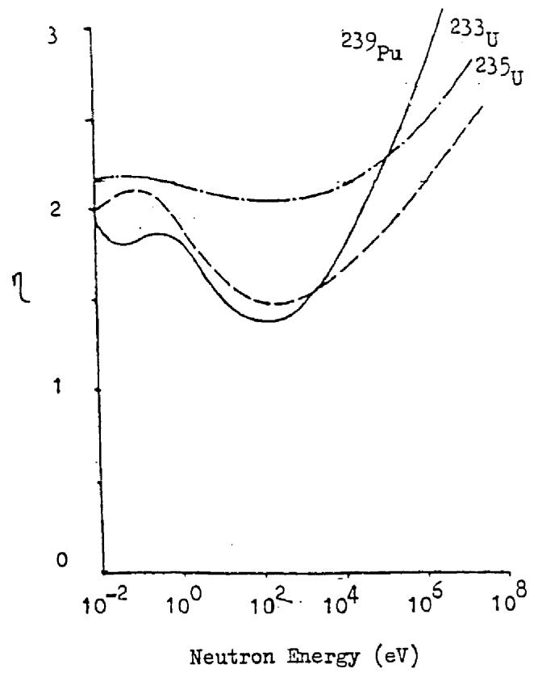  
Figure 3.1-1 Value of Eta $(\eta)$ for Fissile Nuclides

3.1.1.2 Minimizing Neutron Moderation. This translates to minimizing neutron scatter, i.e. avoiding structural material in the reactor and admixture to the fissile fuel. With separate core and blanket zones, the core fuel should contain as high a fraction of $^{233}\mathrm{U}$ atoms as possible for spectrum hardness. It also implies keeping the core and blanket separate: mixing fertile and fissile fuel in a single reactor zone such as in the MSBR moderates the spectrum.

# 3.1.2 Kaximinizing Breeding by Minimizing Leakage

Section 3.1.1.1 sought the maximum breeding possible when no neutrons escaped the fertile blanket $(\mathsf{L} = 0)$ and when $A = 0$ . Practical aids towards low $L$ might be an inner blanket, a thick outer blanket, and a good neutron reflector. Reactor configuration affects A through the addition of structural materials.

3.1.2.1 Effect of an inner blanket. With an inner blanket (Figure 3.1-2), neutrons enter as if from multiple cores. Those which do not react are not yet lost from the reactor: they reenter the core and cuter blanket where they can further react or turn around.

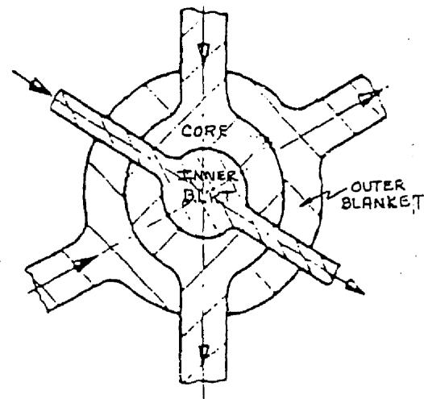  
Figure 3.1-2 Three-zone Spherical Reactor

3.1.2.2 Size of the cuter blanket. Irregardless of an inner blanket,

useful capture of neutrons (breeding) requires an outer blanket.

ANL studied [21] 1.5 to 4 feet (0.46-1.22 m) thicknesses;

English and Swiss analysts typically assumed 1.0 m. The present

work (Section 3.5.1) found 2 meters to be effectively infinite to BG

and very effective in reducing damage to the vessel wall.

3.1.2.3 Moderating the blanket neutron spectrum to enhance capture

In a fast reactor, neutron capture decreases with increasing neutron

energy (Fig 3.1-3). Thus to increase fertile capture we need to sof

ten the neutron spectrum in the blanket without seriously degrading

it in the core.

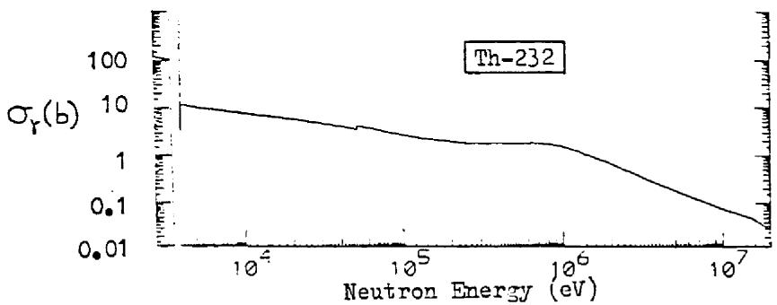  
Fig. 3. 1-3 Thorium Capture Cross Section

ORNL studied the effect of a graphite moderator in the blanket [13]. Although the fertile capture rate did increase, reducing the necessary blanket thickness, the overall BG decreased (Fig. 3.1-4) due to simultaneous increase in parasitic neutron capture.

Another way of moderating the blanket is to use a (lighter)

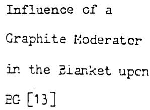  
Fig. 3.1-4

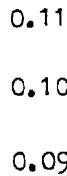  
BG

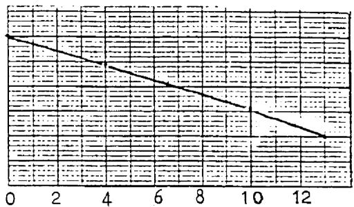  
Thickness of Graphite Moderator Section, cm

3.1.2.4 Neutron reflector and damage-shield. A neutron reflector outside the reactor vessel will obviously reduce L. Few of the reflected neutrons will make it through the outer blanket to return to the core. A thermalizing reflector would therefore have little effect upon the core spectrum, particularly if the outer blanket region is fairly thick (in mean free paths).

Such a reflector would enhance neutron capture in the blanket (but in carrier salt as well as in fertile). It would also decrease $F_{2}$ somewhat. The net change in EG would depend on how the competing capture cross sections change as neutron energy decreases. This is expressed by the cross section ratio

$$
R = \frac {a \sigma_ {H a} (E) + b \sigma_ {A l k} (E)}{\sigma_ {T h} (E)}
$$

where Ha = halide: chlorine or fluorine

Alk = alkali or alkaline earth

$a, b =$ coefficients dependent upon the molar ratios.

For a typical $65/35 \, \text{ThCl}_4/\text{NaCl}$ mix, Table 3.1-I shows the results. At very fast and thermal neutron energies Cl parasitic capture predominates. In the broad intermediate range of 20 ev to 1 MeV Th fertile capture is greater. Thus we prefer that neutrons in a $\text{ThCl}_4$ blanket slow down, but not all the way to eV energies. This recommends an inelastic or a heavy scatterer more than a light elastic one for the reflector material. This would also recommend a high actinide-to-carrier salt ratio in the blanket.

Choice of beryllium as reflector material would enhance the outer blanket breeding through scattering and (n,2n) reactions. However, beryllium is toxic, relatively scarce and quite light. Graphite, in contrast, costs little.

Cu and Ni are well known for their ability to reflect fast neutrons. Fe and Pb reflect almost as well and cost less. All four qualify as inelastic or heavy-elastic acatters. However, reflector studies in Section 3.5.6.3 indicate that with a blanket thickness of $200\mathrm{cm}$ , the choice of reflector material matters little. Then the low cost and low activation of graphite should predominate.

Borrowing a page from fusion test reactor design, one could reduce damage to the vessel with an inner liner. Neutrons striking it change direction and lose energy; they are then less

Table 3.1 Ratio of Cl to Th Neutron Absorption in ThCl   

<table><tr><td rowspan="2">Group</td><td rowspan="2">Energy Range</td><td colspan="3">\( \overline{S}_{\text{abs}} \) (b)</td></tr><tr><td>Cl</td><td>Th</td><td>4Cl/Th</td></tr><tr><td>1</td><td>6.5-10.5 MeV</td><td>0.215</td><td>0.01</td><td>97.6</td></tr><tr><td>2</td><td>4.0-6.5</td><td>0.146</td><td>0.02</td><td>33.1</td></tr><tr><td>3</td><td>2.5-4</td><td>0.057</td><td>0.04</td><td>6.5</td></tr><tr><td>4</td><td>1.4-2.5</td><td>0.020</td><td>0.08</td><td>1.13</td></tr><tr><td>5</td><td>0.8-1.4</td><td>0.0063</td><td>0.14</td><td>0.20</td></tr><tr><td>6</td><td>0.4-0.8</td><td>0.0021</td><td>0.17</td><td>0.056</td></tr><tr><td>7</td><td>0.2-0.4</td><td>0.0009</td><td>0.19</td><td>0.022</td></tr><tr><td>8</td><td>0.1-0.2</td><td>0.0011</td><td>0.27</td><td>0.018</td></tr><tr><td>9</td><td>46.5-100 keV</td><td>0.0031</td><td>0.42</td><td>0.034</td></tr><tr><td>10</td><td>21.5-46.5</td><td>0.0103</td><td>0.56</td><td>0.084</td></tr><tr><td>11</td><td>10.0-21.5</td><td>0.0109</td><td>0.75</td><td>0.066</td></tr><tr><td>12</td><td>4.65-10</td><td>0.0189</td><td>1.35</td><td>0.064</td></tr><tr><td>13</td><td>2.15-4.65</td><td>0.0194</td><td>2.10</td><td>0.042</td></tr><tr><td>14</td><td>1.0-2.15</td><td>0.0221</td><td>3.30</td><td>0.030</td></tr><tr><td>15</td><td>465-1000 eV</td><td>0.1670</td><td>5.0</td><td>0.152</td></tr><tr><td>16</td><td>215-465</td><td>0.3730</td><td>11.</td><td>0.154</td></tr><tr><td>17</td><td>100-215</td><td>0.1557</td><td>19.</td><td>0.037</td></tr><tr><td>18</td><td>46.5-100</td><td>0.3660</td><td>28.</td><td>0.059</td></tr><tr><td>19</td><td>21.5-46.5</td><td>0.7081</td><td>47.</td><td>0.068</td></tr><tr><td>20</td><td>10.0-21.5</td><td>1.1625</td><td>12.</td><td>0.440</td></tr><tr><td>21</td><td>4.65-10</td><td>1.795</td><td>0.46</td><td>17.7</td></tr><tr><td>22</td><td>2.15-4.65</td><td>2.771</td><td>0.67</td><td>18.8</td></tr><tr><td>23</td><td>1.0-2.15</td><td>4.231</td><td>0.99</td><td>19.4</td></tr><tr><td>24</td><td>0.465-1.0</td><td>6.274</td><td>1.45</td><td>19.6</td></tr><tr><td>25</td><td>0.215-0.465</td><td>9.33</td><td>2.11</td><td>20.1</td></tr><tr><td>26</td><td>0.0252 eV</td><td>28.69</td><td>7.56</td><td>17.2</td></tr></table>

likely to damage the reactor vessel. This damage shield should be cheap, suggesting graphite, and might be in partitions for easy replacement. One could also combine damage shield, vessel, and reflector into one thick-walled graphite vessel. This might cost the least to make or replace. Due to low activation it would also be the easiest to dispose of.

# 3.1.3 Core and Blanket Design

# 3.1.3.1 Choice of geometry. Spherical geometry offers

1. Minimum neutron leakage in a critical reactor (thereby maximum BG)   
2. Minimum shielding and plant size   
3. Minimum critical mass   
4. Simple theoretical computation

The first two factors directly affect reactor design. Minimum critical mass actually matters little: the fuel utilization issue pertains more to total cycle inventory while proliferation deals with the availability of attractive weapons-grade or carcinogenic material. The fourth factor affects just the methods used for survey calculations.

Three main designs come to mind in spherical geometry. The first copies the thermal MSBR: . core and blanket materials, i.e. fissile and fertile, flowing together homogeneously. The second copies the usual breeder reactor: a minimum-size core surrounded by blanket. The third adds an inner blanket (Figure 3.1-2).

Inherent disadvantages with spherical containers may be

1. Difficult fabrication of structural materials   
2. Difficult replacement of structural materials   
3. Stresses due to material curvature necessitating a stronger, thicker core/blanket interface   
4. Non-uniform flow velocities in the core, possibly creating additional stress.

Cylindrical geometry offers choices similar to Fig. 3.1-2: BG in (c) of Figure 3.1-6 may be slightly higher than in (b) when the core fuel is all fissile and no fertile; BG in (a) will probably be lower due to spectrum degradation. Likewise, replacement of the annular core (c) by near-equivalent-area tubes (d) may further increase BG. Either each tube approaches criticality or they approach each other in distance close enough to avoid spectrum degradation.

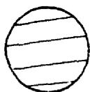  
a

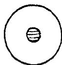  
(b)

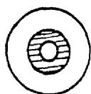  
(c)

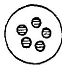  
(d)   
Figure 3.1-6 Alternate Cylindrical Geometries (Top View)

Design (d) also suggests quick and cheap replacement, a simple solution to the problems of radiation damage and corrosion in the reactor. Structural tubes obviously produce no fission products; if made of graphite, they also radiate no gammas. That should facilitate their handling and disposal. Graphite also costs little. A design with straight tubes would limit replacement downtime. Design (d) is also easier to make and replace than (c).

3.1.3.2 Choice of number, size, and spacing of tubes. Proceeding with the Figure 3.1-6 (d) concept, Figure 3.1-7 defines some annular arrays of N tubes. The dotted-line circle passing through the tube locates their centers. To minimize core spectrum

degradation the circle might be several mean free paths in diameters so that most neutrons leaving the side don't reach tubes on the other side. Alternatively tubes might abut one another so that most neutrons leaving a tube either go permanently into the blanket or directly into another core tube. To minimize structural material, N should be small.

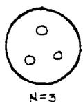

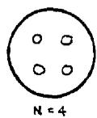

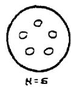

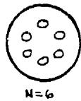

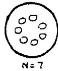

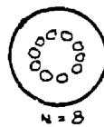  
Figure 3.1-7. Annular array of N-tubes

A question certain to arise over core tubes is the interdependence of their neutronics and kinetics. One prefers either close or near-zero coupling between them: intermediate loose-coupling could lead to oscillations, not quickly damped. Behavior as independent reactors (zero-coupling) would probably require multiple control panels and operators, i.e. separate full-power cores sharing the same blanket. This option might warrant attention as the tubes would share the same reprocessing plant and other facilities as well without affecting each other's operation. Since the reactor physics of each reactor would simply copy that of a conventional core and blanket reactor, this study will not treat it separately. Close neutronic coupling implies physical closeness as well (separated by less than one mean free path) and individually far subcritical. Then, shutdown of one tube channel would shutdown the whole plant.

3.1.3.3 Location of tubes. To gain more insight into tube location, consider again the annular core geometry of Figure 3.1-6(c). Fixing the reactor radius, Figure 3.1-8 depicts designs with inner blanket (IB) diameter ranging from no IB to no outer blanket.

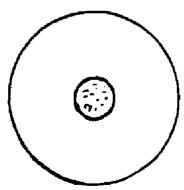

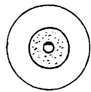

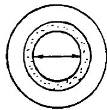

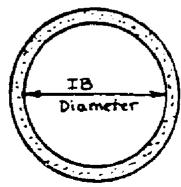  
Fig. 3.1-8 Designs with Varying IB Diameters

Pertinent metrics include breeding gain, medium flux energy in each region, and critical mass. Section 3.5.6.1 shows that the largest breeding gain occurs with no inner blanket. This would correspond to placing the tubes adjacent to one another in the reactor center.

3.1.3.4 Axial blanket and neutron leakage. Neutrons which leak from the reactor cannot breed. They also require shielding. Lengthening the core helps but an axial blanket stops axial leakage best. Figure 3.1-9 suggests some designs which accomplish that by dampening the chain reaction in the tubes near top and bottom of the reactor vessel.

The overriding concern in choosing between these designs

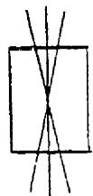  
Vertically Skewed

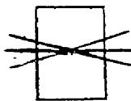  
Horizontally Skewed

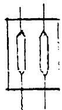  
Ballooning

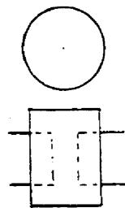  
Side-Entering and - Returning

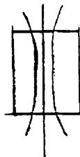  
End verging   
Figure 3.1-9. Alternate Designs Which Create an Axial Blanket in the Reactor Vessel

should be ease of making and replacing the tubes: otherwise one must design for corrosion and high neutron radiation exposure. The two skewed tube designs should excel in this regard because the tubes are straight. The chain reaction in these would confine itself to prolate or oblate spherical geometries. The critical geometry for the other three designs, would more resemble a cylinder.

The next two designs exhibit large bends. Presumably, one would use straight pieces to the extent possible and fasten them to the bends, a cumbersome procedure in a radiation environment. The ballooned tube design presents even more difficulty to make and replace.

In conclusion, the use of a few (N=3 or 4) large skewed tubes should present the least engineering difficulty in their fabrication, operation, and replacement. It will also minimize neutron spectrum degradation and neutron parasitic capture.

# 3.1.4 Method of Reactivity Shimming

The concentration ratio $\left[{ }^{233} \mathrm{U}\right] / \left[\mathrm{U} + \mathrm{Th} + \mathrm{FP}\right]$ provides a suitable though only approximate measure of the ratio of neutron producers to neutron absorbers. As the reactor operates, this ratio naturally decreases in the core, thereby losing reactivity. Replacement by a mix of higher ratio restores the reactivity.

In Figure 3.1-10 the blanket breeds $^{233}\mathrm{UCl}_4$ and the re-processing plant separates it from $\mathrm{ThCl}_4$ and $\mathrm{NaCl}$ (Section 3.7). Addition of H, Na or Th reduces $\mathrm{UCl}_4$ to $\mathrm{UCl}_3$ :

$$
\begin{array}{l} \frac {1}{2} \mathrm {H} _ {2} + \mathrm {U C l} _ {2} \longrightarrow \mathrm {H C l} + \mathrm {U C l} _ {3} \\ \mathrm {N a} + \mathrm {U C l} _ {4} \longrightarrow \mathrm {N a C l} + \mathrm {U C l} _ {3} \\ \mathrm {T h} + 4 \mathrm {U C l} _ {4} \longrightarrow \mathrm {T h C l} _ {4} + 4 \mathrm {U C l} _ {3} \\ \end{array}
$$

The separated $^{233}\mathrm{UCl}_3$ should immediately mix in a shim tank with highly-radioactive reprocessed core fuel (for non-proliferation purposes). As shim mix flows into the core, irradiated fuel passes out to the FP remover. If necessary, a ThCl/NaCl mixture could be used to provide negative shim.

MSFR(Th) Reprocessing and Reactivity Shimming Scheme

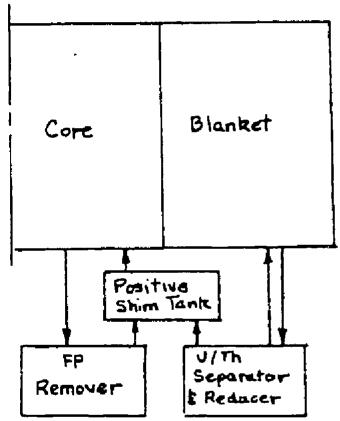  
Figure 3.1-10

# 3.1.5 Summary Guidelines on Reactor Configuration

The first priority is to maximize BG. Hardening the core neutron spectrum enhances the BG potential but not necessarily the achievable BG. Hard spectrum also increases the fission probability for all the actinides.

Spherical geometry maximizes BG by minimizing neutron leakage but presents engineering difficulties. It also limits the power density: since critical masses are smaller in spherical geometry, power densities rise. Varying the core length in cylindrical geometry provides more choice in the critical mass and power density. The spectrum remains hard.

One can also use multiple, small cylindrical tubes: some spectrum softening occurs there, depending upon their proximity. The optimum configuration may be a small number (e.g. three) of skewed tubes penetrating a cylindrical tank. The effective geometry of the neutron distribution will then closely approach a sphere.

# 3.2 Reactor Thermohydraulics

An MCFR will require only low pressures for circulation and reprocessing removal. Much of the MSBR technology in thermohydraulics should apply as well to the MCFR.

# 3.2.1 Means of Cooling the Molten Salt Fuel

We consider three means of cooling molten salt fuel (Figure 3.2-1): cut-of-core heat exchange, in-core heat exchange across tubes, and in-core direct contact with a secondary coolant.

3.2.1.1 Out-of-core heat exchange. Here the molten fuel flows out of the core through piping to the external heat exchanger, greatly increasing the system inventory. As a result, most delayed neutrons emanate outside the core. This affects reactor control (section 3.6.2.2), and the neutrons activate the primary circuit and its environs. The large fuel inventory might penalize the economics of a $^{235}\mathrm{U}-$ or Pu-based plant; for an MCFR(Th) the penalty matters less because thorium abounds more, the feed requires no enrichment or fabrication, and the plant achieves near-full actinide utilization. Large fuel inventory also works against non-proliferation goals, but not as seriously as if it occurred out-of-plant in transport, reprocessing, or fuel fabrication operations.

The absence of structural material inside the reactor maximizes the neutron economy and minimizes softening the neutron spectrum. The high emphasis on these characteristics in Section 2 prompts us to adopt this method of cooling for this study.

Means

Scheme

Out-of-core heat exchanger

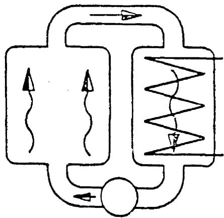  
Fig. 3.2-1 Means of Cooling Molten Salt Fuel

In-core direct contact

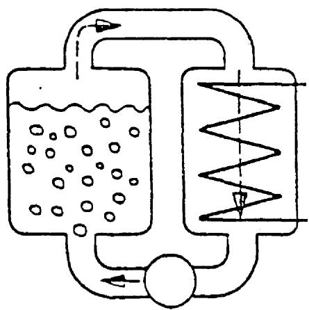

In-core heat exchange across tubes

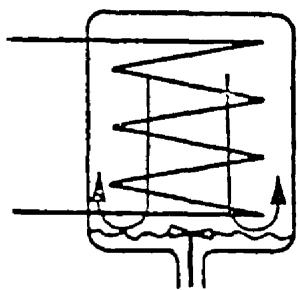

Nelson et al [21] examined two MCFR(Pu) designs with out-of-core cooling: his main comment was an economical concern for the large Pu inventory. Lane [78] mentioned out-of-core cooling for a high-flux (10 $^{16}$ n sec $^{-1}$ cm $^{-2}$ ) materials-testing fast reactor. Winfrith examined at least four out-of-core cooling variants. They recommended further study with both He and lead secondary coolants.

Earlier Taube studies [79] concentrated on in-core cooling. Taube cautioned that loss of delayed neutrons out-of-core might hurt reactor control. Later work emphasized out-of-core cooling to achieve high flux in burner and test reactors and high BG in power reactors.

3.2.1.2 In-core heat exchange across tubes. Taube and Ligou [79] analyzed a 2030 MWth MCFR(U/Pu) cooled by $^{238}$ UCl₄ blanket salt flowing through 23,000 Mo-alloy tubes in the core. A pump stirred the fuel in the vessel to a speed of 2m/sec to increase the heat transfer. That much Mo meant large neutron absorption (3.3% of the core total). The core inlet and outlet temperatures were 750 and 793°C. A main question was the weldability of the Mo-alloy tubes.

A Winfrith group examined [29] Taube's work. They found his breeding gains slightly high due to expected deficiencies in the Bondarenko cross sections for $^{238}\mathrm{U}$ and Pu. Also they found the physical properties of the salt not to be as good as what he used. These differences would increase the maximum fuel salt temperature to $1160^{\circ}\mathrm{C}$ . There one approaches limits of

of corrosion and of strength of Mo and its alloys. Taube has also suggested tubes of steel-reinforced graphite.

Winfrith earlier studied the use of molten lead cooling but limited themselves to an $800^{\circ}\mathrm{C}$ salt temperature. Within that restriction they found poor performance, especially low BG due to neutron absorption by heat exchange materials.

With helium cooling, Winfrith allowed the salt to reach $970^{\circ}\mathrm{C}$ ; the outlet He temperature was $850^{\circ}\mathrm{C}$ .

ANL studied two sodium-cooled MCFR(Pu)s [21].

3.2.1.3 In-core direct-contact heat exchange. Here an immiscible fluid like molten lead [29], boiling mercury [20], or boiling $\mathrm{AlCl}_3$ [20] mixes with the fuel directly in the core. It then separates out and passes out of the core to a heat exchanger. The direct contact of molten fuel with molten coolant affords very good heat transfer, elimination of coolant tubes (and cladding), and possible extraction of fission products.

The principal problems occur with mixing and separating the fuel and coolant, and corrosion. The need for extensive research to overcome these led to the abandonment of this method of cooling. 3.2.1.4 Blanket cooling. A Th blanket will generate little heat. Constant bleedoff of the blanket salt (for reprocessing) and replacement by cold NaCl/ThCl<sub>4</sub> may satisfy the heat removal requirements.

# 3.2.2 Power Density in an MSFR

3.2.2.1 Inherently high power density in MSFRs. The absence of structural materials allows high fissile fuel atom density. Absence of neutron moderating materials, and limited presence of fertile and carriers salts keeps the spectrum hard. Together, these results produce high $\eta$ ( $= \nabla S_{\mathrm{f}} / S_{\mathrm{a}}$ ) and small critical dimensions. To then produce the same power as a thermal reactor requires high power densities.

3.2.2.2 Realistic range of power densities. No actual experience with MSFRs exists. ORNL considered power densities of 5-10 MW/liter in a study of an MSFR fast flux test facility. Taube's MCFR (Pu) designs range from 0.2 to 11.1 MW/l. British designs had 0.36 MW/l.

CRNL operated a thermal molten salt reactor up to $80\mathrm{kW} / 1$ Peak power densities in existing water-cooled reactors include 1.3, 1.5, 2.5, and $4.4\mathrm{MW} / 1$ in ETR, HFBR, ATR, and HFIR [78], respectively. A coolant velocity of 120 ft/s might permit 10 MW per liter of core in HFIR [78]. For the sodium-cooled fast reactors Melekes CH-2, Phoenix 250, and FTFF, core power densities average 2.5, 0.46, and 1.0 MW/1.

The power per unit volume coolant for the sodium- and water-cooled reactors above is a factor of two higher. Thus a peak power density of 10 MW/l for a fast molten salt reactor does not appear infeasible, but this study should not exceed it without good cause and a lower one would present less engineering difficulty.

Flow velocity and heat exchanger size (i.e. out-of-core fuel inventory) may constitute the real operational limits.

3.2.2.3 High neutron flux levels and radiation damage in fast reactors.

The following integral expresses the power density:

$$
P (\underline {{r}}) = \int N _ {\text {f i s s i l e}} \bar {C} _ {\bar {f}} \phi (E) d E \tag {3.2-1}
$$

where

$$
\begin{array}{l} P (\underline {{r}}) = \text {t h e p o w e r d e n s i t y a t t h e p o i n t i n c a t e d b y v e c t o r} \underline {{r}}, \\ N _ {\text {f i s s i l e}} = \text {t h e a t o m d e n s i t y o f t h e f i s s i l e f u e l a t} r, \\ \mathcal {C} _ {\mathrm {f}} = \text {t h e f i s s i o n c r o s s s e c t i o n f o r t h e f i s s i e a t o m s a t} \underline {{\mathrm {r}}}, \\ \varnothing = \text {t h e} \underline {{\mathbf {r}}} \\ \mathrm {d E} = \text {t h e d i f f e r e n t i a l o f t h e n e u t r o n e n e r g y o v e r w h i c h t h e} \\ \end{array}
$$

Because $\sigma_{f}$ is several magnitudes smaller in a fast neutron spectrum than in a thermal one, $\phi$ must increase that much to get the same power density. $N_{\text{fissile}}$ is also higher here, but that leads to small critical volume and higher power density (Section 3.2.2.1) which makes $\phi$ even higher. Because of high $\phi$ ( $>10^{16} \, \text{n cm}^{-2} \, \text{sec}^{-1}$ ), another limit to power density could be radiation damage to structural materials (at the blank-ke+ core interface).

The number of displacements per atom and the helium production rate gauge radiation damage for intermediate and heavy mass materials. In the past $>0.1$ MeV and $>1.0$ MeV fluence served as somewhat coarser (but still valid) gauges. This emphasizes that most all of the neutrons in a fast reactor cause damage whereas many don't in a thermal reactor. Coupled with the higher flux levels here, that bodes a limit to the life of structural materials within the core environs. The solution there is to periodically replace the skewed tubes.

Cut near the reactor perimeter the 2-meter molten salt blanket has greatly reduced the flux in the pressure vessel down to $\sim 10^{13}$ n cm $^{-2}$

s \~1; this gives a 30 year fluence of \~1022 n cm-2 for which much experience already exists. Keeping the vessel exposure low is important enough to discourage the use of any regular arrays of solid material in the blanket through which neutrons could stream.

3.2.2.4 Impetus for high temperature operation. Heat transfers from the core according to

$$
\alpha = \dot {m} C _ {p} \Delta T _ {f} \tag {3.2-2}
$$

Here

$q =$ the heat removal rate $=$ the heat generation rate under equilibrium conditions

$m =$ the mass flow rate, proportional to the fluid velocity $(\mathbf{v})$ density, and the flow area

$C_p =$ the heat capacity of the fluid (energy per unit mass per unit temperature)

$\Delta \mathbb{T}_{\mathbf{f}} =$ the temperature increase of the fluid from entrance to exit of the core.

$C_p$ and the density are relatively fixed; only $v$ , the flow area, and $\Delta T_f$ can vary. Raising $v$ would increase pumping power requirements and corrosion. Increasing the flow area may dictate more $\mathrm{ThCl}_4$ or NaCl to avoid supercriticality: that, in turn would soften the spectrum and reduce the BG potential.

With regard to increasing $\Delta T_{f}$ , Section 3.3 already requires inlet temperatures of $550^{\circ}C$ and higher. Thus an MSFR inherently generates

high temperature heat. This offers advantages (touted elsewhere) as well as problems. The problems may include leakage through seal expansion and melting of metal. Also, in numerous fused-salt systems, high temperature gradients at equilibrium enhance chemical corrosion[80].

Thus, in short summary, increased heat removal requirements will most likely increase corrosion and/or soften the spectrum.

3.2.2.5 Adjusting power density through critical mass. Section 3.5 sets the minimum critical volume for an MCFR(Th) at about 60 liters of $0.06 \, \text{m}^3$ . For a 10 Gwth reactor this would imply a power density of 167 MWth/1. Even for a 2250 kWth reactor (1000 MWe) it spells 38 MWth/1. The power density limits of section 3.2.2.2 (10 MW/1) dictate a larger critical volume.

One way to get it is to increase leakage from the core (but not from the reactor) by reducing the core dimension in one or more directions. A thin cylinder is one logical solution: above a given length-to-diameter ratio the length can infinitely increase without appreciably changing $k_{\text{eff}}$ . However, space requirements and return piping do impose practical limits on the length.

Multiple thin cylinders resolve that dilemma. In regular array (Figure 3.1-7) they approach an annular core geometry with internal blanket (IB). As the IB diameter increases (annulus moves radially outward in Fig. 3.1-8) the critical volume further increases.

In the skewed tube configuration the effective geometry (where the tubes come together) can vary from one of minimal core leakage when angles between tubes are equal and near perpendicular, to one of high leakage when tubes penetrate the vessel top and bottom or from the vessel sides (Fig. 3.1-9).

A second way to increase the critical volume would be to increase neutron absorption by allowing a higher equilibrium concentration of fission products. However, breeding gain would suffer.

A third way is to increase the carrier salt concentration (decrease the molar percentage of actinide salt). However, this will soften the neutron spectrum and decrease the BG potential. (This would not decrease the BG proliferation hazard of the material: any material which can sustain a chain reaction in a fast reactor, can do so even easier in a bomb configuration.)

A fourth method is to add in fertile material. This will soften the spectrum somewhat but without parasitic capture of neutrons. Indeed, this option looks very favorable; section 3.3 discusses it further.

3.2.2.6 Reactor design power. For a given power density, adding more fuel (e.g. lengthening the core) can increase the total reactor power. This should increase the economics since the capital equipment, including that for reprocessing, changes more slowly. However, two or more small reactors at a plant may excel over one larger one: though each one requires separate instrumentation and operating crew, while one is down the other still uses the reprocessing system and produces electric power. Without significantly coupling the cores, the blankets of several reactors might also abut one another so as to eliminate reflector and enhance breeding.

A popular size for intercomparison of designs is 1000 Mie. 3.2.2.7 Reactor power distribution. Zonewise, fission of bred $^{233}\mathrm{U}$ should generate more power in the blanket than high-threshold $^{232}\mathrm{Th}$ fission would. The usual concerns regarding power peaking vanish: the fuel is already melted, and burnup is homogenous due to liquid mixing. 3.2.2.8 Summary. The 2-meter thick blanket protects the vessel from the high fluxes accompanying high power density. The frequency of skewed core tubes replacement will still depend on the flux levels. Increasing the core volume therefore increases the tube lifetime. The most constructive way to do that will be

(1) The use of multiple thin skewed tubes   
(2) Dilution of the fuel with fertile salt

# 3.2.3 Primary Coolant Velocity

Section 3.2.2.4 pointed out that $\mathbf{v}$ , flow area, and $\Delta \mathbf{T}_{\mathbf{f}}$ are the only variables for removing heat from the core.

3.2.3.1 Maximizing velocity and minimizing pumping power. To maximize velocity one desires as few bends as possible. Flow through a sphere like Fig. 3.2-2, unless baffled somehow, would proceed more slowly near the surface than through the middle. This could lead to surface hot spots as well as neck corrosion. The ideal geometry for maximum v would seem to be large-diameter pipes as described in section

3.1.3.

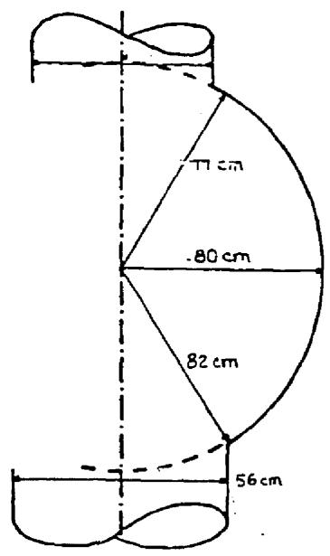  
Fig. 3.2-2   
Typical Spherical Reactor

For constant mass flow rate the coolant velocity, $v$ , will vary inversely as the tube cross sectional area. Pumping power increases as $v^3$ ; for $v < 15 \, \text{m/s}$ , pumping uses $5 - 8\%$ of the power. Friction losses in small pipes will add to this. This recommends a few large pipes for maximum flow velocity.

3.2.3.2 Corrosion dependence on velocity. How velocity affects corrosion depends upon the corrosion mechanism which, in turn, depends on the metal and its environment [80]. For corrosion by activation polarization (Curve B, Fig. 3.2-2), velocity has no effect.

Corrosion by cathodic diffusion does increase with velocity as in Curve A/Section 1. Small amounts of an oxidizer, e.g. dissolved oxygen in acids or water, cause this. Easily passivated materials such as stainless steel and titanium frequently resist this corrosion better at high velocity: there the increased agitation causes an active-to-passive transition (curve A, sections 1 and 2).

Some metals resist corrosion in certain mediums by forming massive protective films on their surfaces. These differ from the usual passivating films in that they are readily visible and much less tenacious. Extremely-high velocities may mechanically damage or remove these films, resulting in accelerated attack (curve C). This is called erosion corrosion.

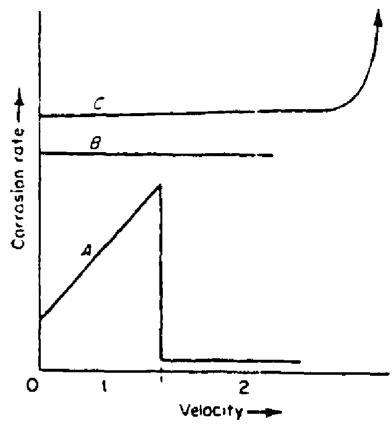  
Figure 3.2-3 Behavior of Different Corrosion Mechanisms

# Corrosion Mechanism

A: Cathodic diffusion   
B: Activation polarization   
C: Erosion

3.2.3.3 Velocities in similar systems. In an LMFBR core sodium typically flows at $8\mathrm{m / s}$ . In the HFIR core, the coolant reaches 120 ft/s (37 m/s).

In theoretical studies, Taube [17,79] considered velocities of 10-16 m/s in the heat exchanger, choosing 14 m/s as optimum. The British [29] varied v from 4-11 m/s in their MCFR heat exchanger. ORNL designed an MCFR heat exchanger with a fuel salt velocity of 6.1 m/s.

# 3.2.4 Operating Temperatures

Numerous criteria will limit the primary circuit temperature. Figure 3.2-4 illustrates the discussion.

3.2.4.1 Upper limits on fuel salt temperature. A high fuel salt temperature could increase the feasible $\Delta T$ and thereby provide extra heat transfer driving force. This would then reduce the needed intermediate heat exchanger area, and thereto the external fuel inventory. Temperatures above $900^{\circ}\mathrm{C}$ allow operation with He as the secondary coolant. Even higher temperature would allow MHD topping cycles and increased efficiency in conventional heat exchangers.

However, the temperature musn't exceed the salt boiling point or cause damage to the piping material in or out of the core. Temperature increases the rate of almost all chemical reactions. Corrosion frequently accelerates exponentially with temperature once past some threshold value. Refractory metals such as Mo and Mo alloys have high melting point and thermal conductivity and resist corrosion well. With graphite piping, the fuel salt temperature limit might extend to $1500^{\circ}\mathrm{C}$ . (Melting points of graphite or Mo are much higher.)

Temperature

Constraints

in Heat

Exchanger

Design

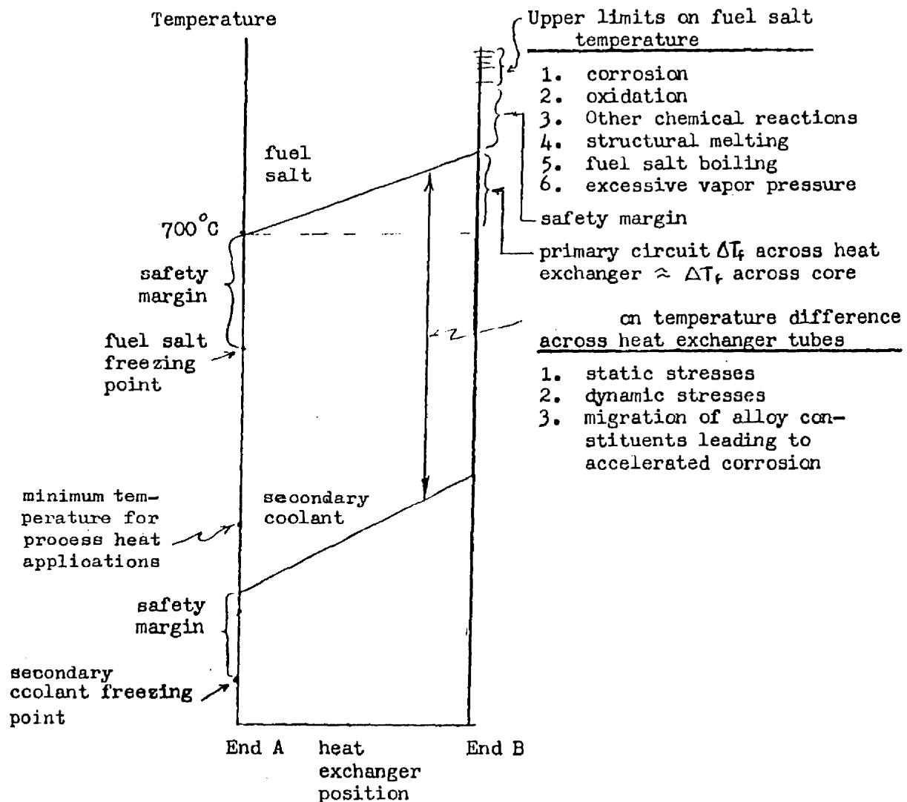  
Figure 3.2-4

The British [29] considered $970^{\circ}C$ with He cooling and 810 with Pb cooling. Taube studied $860 - 1100^{\circ}C$ and chose $950^{\circ}C$ . ANL [21] stayed with $740^{\circ}C$ . The French considered $1000 - 1300^{\circ}C$ for high temperature applications but warned of problems to be overcome.

3.2.4.2 Minimum fuel salt temperature. The minimum inlet temperature must exceed the salt melting point with an adequate safety margin. Although melting points of actinide chlorides decrease with transmutation up the A-scale (Section 3.6.2.5), impurities also build in which might raise the melting point through the formation of complex compounds.

Table 3.3-VI suggests a minimum $T_{fuel}$ of $650^{\circ}C$ to allow some range in composition; adding a $50^{\circ}C$ margin gives $700^{\circ}C$ . For comparable MCFR(Pu) concepts, the British chose $650 - 670^{\circ}C$ ; Taube used $750^{\circ}C$ ; ANL, $625^{\circ}C$ ; ONL, $566^{\circ}C$ .

3.2.4.3 Minimum secondary coolant temperatures. Secondary coolant salts with a variety of melting points are available, at least in principle (Section 3.10.1.1). In practice other problems and properties may limit the choice. For process heat applications, the secondary coolant temperature must be fairly high.

3.2.4.4 Restrictions on $\Delta T$ across heat exchanger walls. For fuel salt flowing through a hollow tube, the maximum stress occurs at the outside cylindrical surface of the tube wall. It surpasses the wall material strength $\sigma$ (psi), such as the yield strength (YS), when the $\Delta T$ across the wall exceeds

$$
\Delta T _ {\omega} = \frac {\frac {\sigma (1 - v)}{\alpha E} - \frac {9}{8 k} \left[ a ^ {2} + b ^ {2} - \frac {(b ^ {2} - a ^ {2})}{\ln b / a} \right]}{\left[ \frac {1}{2 \ln b / a} - \frac {a ^ {2}}{b ^ {2} - a ^ {2}} \right]} \tag {3.2-3}
$$

where $q =$ volumetric heat generation rate, Btu/hr in<sup>3</sup>

k = thermal conductivity, Btu/hr F in

$\alpha =$ coefficient of linear thermal expansion, $\mathbf{F}^{-1}$

E $=$ modulus of elasticity, psi

$\mathcal{V} =$ Poisson's ratio

a = inside radius, in

$\mathbf{b} =$ outside radius, in

All three terms in this expression are positive; the second numerator term is generally quite small compared to the first.

A safety margin should most likely be in $\Delta T_{\mathrm{W}}$ itself; this will allow for abnormal transient conditions which produce

(1) High fuel salt temperature   
(2) Low secondary coolant temperature

Two materials are of principal concern, Mo and graphite. Table 3.2-I lists a range of properties for graphite. To find the largest $\Delta T_{W}$ , property Set 1 maximizes $\sigma$ and $k$ , while minimizing $\alpha$ and $E$ . Complementary Set 2 should give the smallest $\Delta T_{W}$ . Table 3.2-II shows the results for graphite and Mo under the principal assumptions of

Table 3.2-I   
Thermophysical Properties of Mo and Graphite   

<table><tr><td>Material</td><td>Mo*</td><td>Graphite**</td><td>Graphite Set 1</td><td>Graphite Set 2</td></tr><tr><td>E(106psi)</td><td>48</td><td>0.5-1.2</td><td>0.5</td><td>1.2</td></tr><tr><td>α(10-6F-1)</td><td>2.8</td><td>1.0-22</td><td>1.0</td><td>2.2</td></tr><tr><td>k(Btu/hr F in)</td><td>6.4</td><td>7.4-9.7</td><td>9.7</td><td>7.4</td></tr><tr><td>γ</td><td>0.32</td><td>0.25</td><td>0.25</td><td>0.25</td></tr><tr><td>0.2%-YS (103psi)</td><td>99.8</td><td>—</td><td>—</td><td>—</td></tr><tr><td>UTS (103psi)</td><td>101.</td><td>0.5-2.4</td><td>2.4</td><td>0.5</td></tr></table>

* arc cast, hot-rolled   
** electrode quality

UTS: ultimate tensile strength

YS: yield strength

Table 3.2-II Calculated Stress Limits $\Delta T_{W}$ Across Heat Exchanger Tube Walls   

<table><tr><td>Material</td><td>IR/CR</td><td>σ(103psi)</td><td>core volume (m3)</td><td>Δt (°C)</td></tr><tr><td rowspan="11">Mo</td><td>0.20/0.25 in*</td><td>99.8</td><td>0.25</td><td>586</td></tr><tr><td></td><td>99.8</td><td>0.5</td><td>596</td></tr><tr><td></td><td>99.8</td><td>1.0</td><td>601</td></tr><tr><td></td><td>101.</td><td>1.0</td><td>601</td></tr><tr><td>4.5/5.0 mm**</td><td>99.8</td><td>1.0</td><td>581</td></tr><tr><td>0.20/0.25 in*</td><td>99.8</td><td>2.0</td><td>604</td></tr><tr><td></td><td>49.9</td><td>0.25</td><td>288</td></tr><tr><td></td><td>49.9</td><td>0.50</td><td>289</td></tr><tr><td></td><td>49.9</td><td>1.0</td><td>290</td></tr><tr><td>4.5/5.0 mm**</td><td>49.9</td><td>1.0</td><td>298</td></tr><tr><td>0.20/0.25 in*</td><td>49.9</td><td>2.0</td><td>290.4</td></tr><tr><td>Graphite</td><td>0.20/0.25 in*</td><td>2.4</td><td>0.5</td><td>4313</td></tr><tr><td rowspan="2">Set 1</td><td></td><td>2.4</td><td>1.0</td><td>4317</td></tr><tr><td></td><td>1.2</td><td>1.0</td><td>2157</td></tr><tr><td>Graphite</td><td></td><td>0.25</td><td>0.25</td><td>68</td></tr><tr><td rowspan="4">Set 2</td><td></td><td>0.25</td><td>0.5</td><td>76.7</td></tr><tr><td></td><td>0.25</td><td>1.0</td><td>81</td></tr><tr><td></td><td>0.25</td><td>0.5</td><td>162</td></tr><tr><td></td><td>0.50</td><td>1.0</td><td>166</td></tr><tr><td colspan="5">* Δx = 50 mils</td></tr><tr><td colspan="5">** Δx = 19.7 mils</td></tr></table>

(1) $\mathcal{S} = \mathrm{YS}$ or UTS   
(2) A 0.20-inch radius tube with 50-mil wall thickness (a popular size)   
(3) $q =$ reactor power/(core fuel salt volume of $1 \, \text{m}^3$ and pertinent variations thereof)

With graphite Set 1 parameters, the sky's the limit almost. Set 2 parameters would allow a maximum $\Delta T_{\mathrm{W}}$ of $162 - 166^{\circ}\mathrm{C}$ , depending on the exact power density. A safety factor of two would lower the maximum $\Delta T_{\mathrm{W}}$ to $70 - 80^{\circ}\mathrm{C}$ .

For Mo the fixed range of parameters appears to offer more certainty. The allowable $\Delta T_{W} = 600\mathrm{C}$ seems very adequate, easily accommodating a safety factor of two. One observes that

1. The results do not depend on q which varies inversely with core volume; i.e. the second numerator term in Eq. 3.2-3 is generally small   
2. Wall thickness does not set the $\Delta T_{\mathrm{W}}$ limit, at least down to 20 mils   
3. The most sensitive quantity is $\sigma / \alpha E$

In conclusion, Mo seems to have an adequate safety margin; graphite utility may depend on what kind of quality control can be achieved at reasonable cost. The two fluids in the heat exchanger should counterflow to minimize the $\Delta T_{W}$ .

3.2.4.5 Restrictions on temperature differences within the primary circuit. The maximum $\Delta T_{f}$ within the primary circuit will be the difference between core inlet and outlet temperatures. A similar $\Delta$ occurs between heat exchanger inlet and outlet. MSBR experience indicates that when

(1) The reaction between the fuel salt and a structural alloy constituent strongly depends on temperature, and   
(2) Temperature differs greatly within the circuit, then the constituent dissolves at the high temperature regions and deposits in colder regions.

The scope of this study does not permit quantification of this restriction; however, the potential mass transfer does discourage going far beyond the circuit $\Delta T_{\mathrm{f}}$ in similar reactor designs (below).

3.2.4.6 [ΔT, T] in other MCFRs. Figure 3.2-5 summarizes the results of previous MCFR(Pu) designs. Taube's [17] and the British He-cooled designs [29] are perhaps the boldest in using higher T's and ΔT's. Many designs use a lower melting salt (with lower actinide molar content) to operate the fuel salt below $700^{\circ}\mathrm{C}$ .

3.2.4.7 Summary. Based on the above discussion, this study considers

(1) A minimum fuel salt temperature of $700^{\circ} \mathrm{C}$   
(2) A reference $\Delta T_{\mathrm{f}} = 200^{\circ}\mathrm{C}$ ; advanced, $300^{\circ}\mathrm{C}$   
(3) A reference $\Delta T_{W}^{\max} = 200^{\circ}C$ ; advanced, $300^{\circ}C$   
(4) A reference LNTD = 150°C; advanced, 200°C

The advanced $\Delta T$ 's exceed those of earlier studies (except Taube's) and are to be avoided if possible.

Temperature (°C)

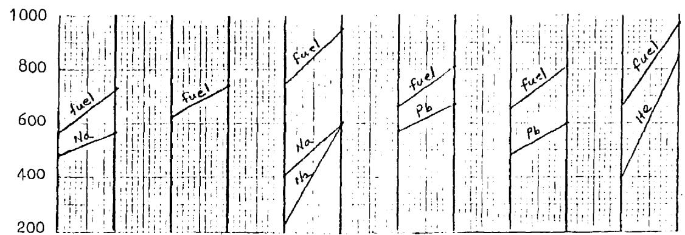  
Figure 3.2-5. Review of MCFR(Pu) Heat exohanger Design $\left\{\Delta T\right\}^{*}$

<table><tr><td>Study Year</td><td>ORNL13 1956</td><td>AND,6 196</td><td>Ttube17 1970-80</td><td>British-129 1975</td><td>British-229 1975</td><td>British-329 1975</td></tr><tr><td>Intermediate Coolant</td><td>Na</td><td>Na or F salt</td><td>Na</td><td>Pb</td><td>Pb</td><td>He</td></tr><tr><td>ΔT fuel (°C)</td><td>167</td><td>115</td><td>200</td><td>150</td><td>160</td><td>300</td></tr><tr><td>LTD (°C)** across tubes</td><td>120</td><td>—</td><td>345- 429</td><td>113</td><td>189</td><td>185</td></tr><tr><td>Max. ΔTw across tubes</td><td>167</td><td>—</td><td>350- 520</td><td>140</td><td>210</td><td>270</td></tr></table>

* See Figure 3.2-6 for clarification of diagrams if necessary   
\*\* defined in Section 3.2.5.1

3.2.5.1 Heat transfer coefficient. The heat exchanger plays a critical role: virtually all the heat generated in the core must pass through its tube walls into the secondary coolant. Glasstone and Sesonske [81] show that:

$$
\mathrm {q} = \mathrm {U} (2 \pi \mathrm {R} _ {\circ} \mathrm {L} \mathrm {N}) \Delta \mathrm {T} _ {\mathrm {w}} \tag {3.2-1}
$$

$$
\frac {1}{U} = \frac {R _ {0}}{h _ {f} ^ {2} R _ {i}} + \frac {R _ {0} \ln \left(R _ {0} / R _ {i}\right)}{k _ {w}} + \frac {1}{h _ {i . c .}} \tag {3.2-2}
$$

where

$$
q = \text {h e a t}
$$

$$
U = \text {o v e r a l l h e a t t r a n s f e c i e n t} (\mathrm {c a l} / \mathrm {s} \mathrm {c m} ^ {2} \mathrm {K})
$$

$$
R _ {0} = \text {c u t s i d e}
$$

$$
R _ {i} = \text {i n s i d e r a d i u s (c m)} \text {o f t u b e t h r o w h i t h w h i c h f u e l s a t f l o w s}
$$

$$
k _ {w} = \text {w a l l t h e r m a l c o n d u c t i v i t y (c a l / s o m K)}
$$

$$
i. c. = \text {F i m} \quad \text {c o e f f i c i e n t o f i n t e r m a d i a t e} \quad \text {c o o l a n t} \quad (\text {c a l / s} \quad \mathrm {c m} ^ {2} \mathrm {K}); \quad \text {t h i s}
$$

$$
L = t u b e l e n _ {5} ^ {-} t h
$$

$$
N = n o. o f t u b e s
$$

$$
\Delta T _ {W} = \text {t e m p e r a t u r e d i f f e r e n c e b e t w e e n f u e l c o o l a n t a n d i n t e r m i d a t e} \quad \text {c o o l a n t (a c r o s s t h e t u b e w a l l s) . G e n e r a l l y o n e u s e s t h e l o g -} \quad \text {m e a n t e m p e r a t u r e d i f f e r e n c e , L M T D} = \frac {\Delta T _ {b} - \Delta T _ {a}}{\ln (\Delta T _ {b} / \Delta T _ {a})}, \text {f o r a z e r o - d i m e n s i o n a l a p p r o x i m a t i o n , a s d e f i n e d b y F i g . 3 . 2 - 6 .}
$$

The heat transfer coefficient for the fuel is

$$
h _ {f} = \frac {k}{D} N u \tag {3.2-3}
$$

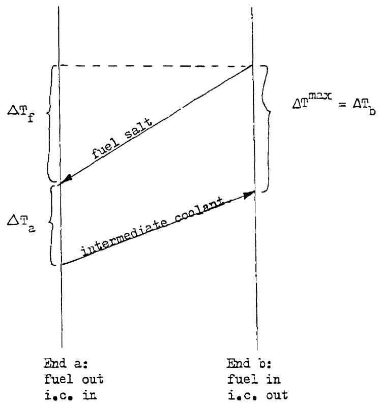  
Figure 3.2-6 Heat Exchanger $\Delta T$ Definitions

where $k =$ thermal conductivity of the fuel(cal/som K)

D = diameter of tubes through which it passes (cm)

For turbulent flow (Re > 1000) of fluids with $0.7 < \mathrm{Pr} < 700$ through circular tubes of $\mathrm{L} / \mathrm{D} > 60$ , the empirical Sieder-Tate equation gives

$$
\mathrm {N u} = 0. 0 2 3 \mathrm {R e} ^ {0. 8} \mathrm {P r} ^ {1 / 3} \quad \left(\mu_ {1} / \mu_ {\omega}\right) ^ {0. 1 4} \tag {3.2-4}
$$

where "b" refers to the arithmetic bulk temperature, and "w" to the average wall temperature, and where

$$
\begin{array}{l} R e = \frac {D v \rho}{\mu} \\ \Pr = \frac {C _ {p} \mu}{k} \\ v = \text {l i n e a r f u e l v e l o c i t y} (m / s) \\ \rho = \text {f u e l d e n s i t y} \left(\mathrm {g} / \mathrm {c m} ^ {3}\right) \\ \mu = \text {f u e l v i s c o s i t y (c e n t p o i s e s} = g / m s) \\ C _ {p} = \text {f u e l s p e c i f i c h e a t c a p a c i t y (c a l / g m K)} \\ \end{array}
$$

To use the above convenient units we must convert centimeters to meters within Re and Pr. Doing this $(10^{3.2 - 0.66} \times 0.023 = 7.97)$ and grouping terms gives

$$
h _ {f} \left(\frac {\text {c a l}}{\sec \mathrm {c m} ^ {2} \mathrm {K}}\right) = 7. 9 7 (\mathrm {v p}) ^ {0. 8} \mathrm {k} ^ {0. 6 7} \left(\mathrm {C} _ {\mathrm {p}} / \mu\right) ^ {0. 3 3} \mu_ {\mathrm {w}} ^ {- 0. 1 4} \mathrm {D} ^ {- 0. 2} \tag {3.2-5}
$$

Equation (3.2-5) indicates what makes a good film coefficient: high values for $\rho, \nu, k, C_p, 1/\mu,$ and $1/D$ in that approximate order of priority.

From Section 3.3.5.3 $h_{i}$ is typically 1.2 cal/s cm²K. Assuming $R_{i} = 0.20$ in, $R_{o} = 0.25$ in, and $k_{w} = 0.32$ cal/s cm°C, get

$$
\begin{array}{l} \frac {1}{U} = \frac {1}{0 . 8 \times 1 . 2} + \frac {0 . 2 5 \times 2 . 5 4 \ln 1 . 2 5}{0 . 3 2} + \frac {1}{h _ {i c}} \tag {3.2-6} \\ = \frac {1}{0 . 9 6} + \frac {1}{2 . 2 6} + \text {s m a l l e r t e r m} \\ U = 0. 6 7 \mathrm {c a l} / \mathrm {s} \mathrm {c m} ^ {2} \mathrm {K} \\ \end{array}
$$

The importance of the second term relative to the first in (3.2-2) or (3.2-6) is

$$
\begin{array}{l} \frac {h _ {f}}{h _ {w} ^ {\prime}} = \frac {h _ {f} R _ {i}}{R _ {o}} \cdot \frac {R _ {o} \ln \left(R _ {o} / R _ {i}\right)}{k _ {w}} = \frac {h _ {f}}{k _ {w}} \cdot R _ {i} \ln \left(R _ {o} / R _ {i}\right) \\ = \frac {0 . 9 6}{2 . 2 6} = 0. 4 2 \text {h e r e} \\ \end{array}
$$

Alternately for IR = 4.5 mm, OR = 5.0 mm as in Table 3.2-II

$$
\frac {h _ {f}}{h _ {w} ^ {\prime}} = \frac {1 . 2}{0 . 3 2} x 0. 4 5 \ln (5 0 / 4 5) = 0. 1 8
$$

This shows that the fuel salt film coefficient controls the heat removal: going to a thinner tube will not help much. The significance of Mo would be that it would allow a wider and thicker (therefore more reliable tube without heat transfer penalty.

For comparison, the ORNL study reported [13]

$$
U = \left[ \frac {1}{0 . 3 0} + \frac {1}{0 . 5 5} + \frac {1}{1 . 8} \right] ^ {- 1} = 0. 1 5
$$

They used the same dimensions as here, but their fuel salt $h_f$ was three times smaller: they assumed $17\%$ UCl₃ fuel salt and $83\%$ carrier salts (MgCl₂ & NaCl) while this work presumes high actinide content. The wall material k in the ORNL study was 6.5 times lower (80 Ni/20 Mo there vs. pure Mo here).

3.2.5.2 Minimizing fuel inventory in the heat exchanger. The out-of-core fuel inventory affects reactor stability (Section 3.6.2.3), U inventory costs, and out-of-core criticality. The fuel volume in N exchanger tubes is

$$
V _ {\text {t u b e s}} = N L T R _ {i} ^ {2} \tag {3.2-7}
$$

A reasonably-conservative guess of the additional fuel in heat exchanger plenum and piping appears to be (section 3.6.2.3) one additional equivalent volume. Then

$$
V _ {o. c.} = V _ {\text {o u t - o f - c o r e}} \approx 2 N L \pi R _ {i} ^ {2} \tag {3.2-8}
$$

Rearranging equation (3.5-1) gives

$$
2 N L \overline {{\Pi}} = q / U R _ {o} \Delta T _ {w}
$$

Therefore

$$
V _ {O C C} = R _ {i} ^ {2} q / U R _ {o} \Delta T _ {w}
$$

The condition for stability (section 3.6.2.3) is that $V_{o.c.}$ not exceed three times the core volume, $V_{c}$ , i.e.:

$$
V _ {0, c.} <   3 V _ {c}
$$

This means

$$
R _ {i} ^ {2} q <   3 V _ {c} U R _ {o} \Delta T _ {w}
$$

or

$$
V _ {c} \Delta T _ {w} > R _ {i} ^ {2} q / 3 U R _ {o}
$$

Given

$$
\begin{array}{l} U = 0. 6 7 \mathrm {c a l} / \sec \mathrm {c m} ^ {2} \mathrm {K} \\ R _ {i} = 0. 2 0 \text {i n} = 0. 5 0 8 \mathrm {c m} \\ R _ {0} = 0. 2 5 \text {i n} = 0. 6 3 5 \mathrm {c m} \\ = 2 2 5 0 x 1 0 ^ {6} \text {w a t t s} x \frac {0 . 2 3 8 8 y c a l}{\text {w a t t s e c}} = 5 3 7. 5 x 1 0 ^ {6} \text {c a l / s e c} \\ \end{array}
$$

get

$$
\nabla_ {c} \Delta T _ {W} > 1 0 9 m ^ {3} K
$$

Figure 3.2-7 plots this relation, adding boundaries of power density $< 10 \mathrm{MWth} / \mathrm{liter}$ and $\Delta T_{\mathrm{W}} < 300$ . A broad reference region lies sufficiently far from the limiting boundaries so as to not require advanced design development. To further broaden the reference region would require smaller $R_{i}$ or larger $U$ .

Critical Volume, $V_{c}(r^{3})$

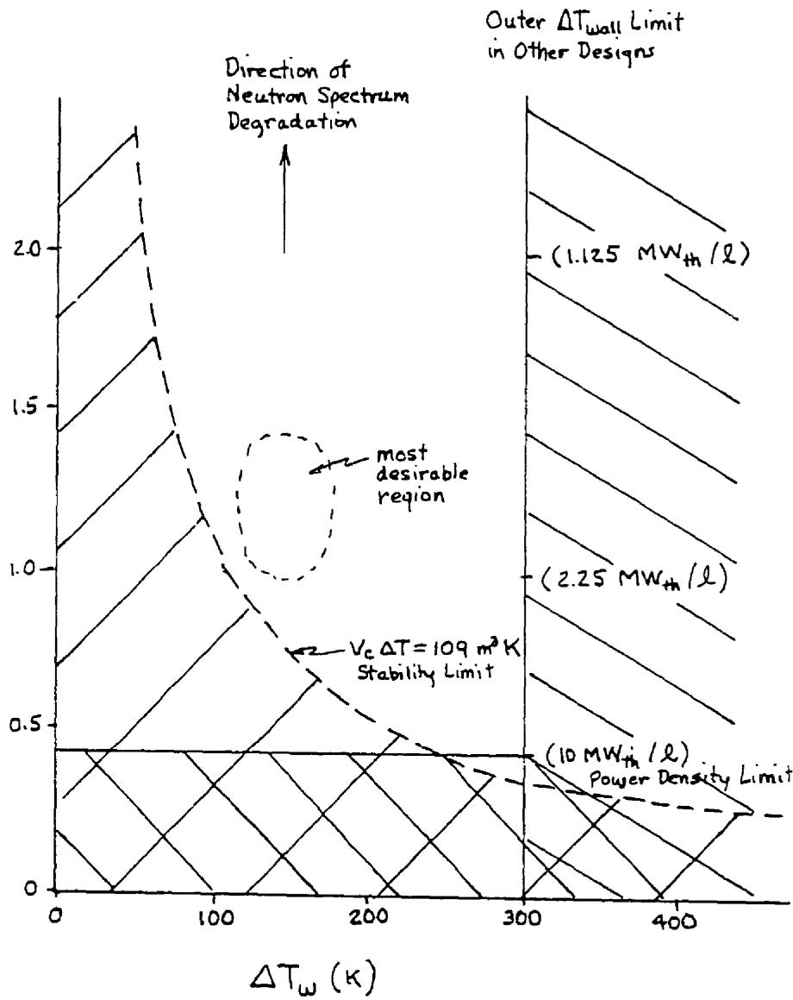  
Figure 3.2-7. Locating the Optimum $\Delta T_{\mathrm{W}}$ and $V_{c}$

Larger U implies higher $\mathbf{k}_{\mathbf{w}}$ and $\mathbf{h}_{\mathbf{f}}$ and lower effective wall thickness $\Delta x = R_{0} \ln((R_{0} / R_{1})$ . Both pure Mo and graphite exhibit high $\mathbf{k}_{\mathbf{w}}$ (Table 3.2-1). Low $\Delta x$ implies keeping the walls as thin as possible. This dictates a metal with good resistance to corrosion, especially with a high temperature-gradient present. It must also withstand the radiation damage from the delayed neutrons; either that or be cheap and easily replaced.

# 3.2.5.3 Volume in heat exchanger and associated plena and piping

From equations 3.2-1, 3.2-6, and 3.2-8

$$
\begin{array}{l} 2 2 5 0 \mathrm {M W t h} x \frac {0 . 2 3 9 \mathrm {c a l}}{1 0 ^ {- 6} \mathrm {M W s}} = U (2 \pi R _ {\circ} L N) \Delta T _ {w} \\ = U R _ {0} \frac {V _ {o c}}{R _ {1} ^ {2}} \Delta T _ {W} \\ V _ {o c} = \frac {2 . 2 5 \times 2 . 3 9 \times 1 0 ^ {8}}{0 . 6 7 \times \Delta T _ {w} (K)} \times \frac {R _ {i} ^ {2}}{R _ {o}} \times \frac {1 0 ^ {- 6} m ^ {3}}{c m ^ {3}} \\ V _ {o c} \left(m ^ {3}\right) = \frac {8 . 0}{\Delta T _ {w} (1 0 0 k)} \times \frac {R _ {i} ^ {2}}{R _ {o}} (c m) \\ \end{array}
$$

For cases of $(\mathbb{R}_i, \mathbb{R}_0) = \text{either (0.20 in, 0.25 in)}$ or $(0.45 \text{cm}, 0.50 \text{cm})$ , get

$$
V _ {o c} = \frac {3 . 3 \pi^ {3}}{\Delta T _ {w} (1 0 a k)}
$$

Considering $\Delta T_{\mathrm{w}} = 150\mathrm{K}$ from Section 3.2.4.7, get

$$
V _ {O C} \approx 2 m ^ {3}
$$

# 3.2.6 Primary Circuit Arrangement

3.2.6.1 General Guidelines. Sections 2.5.4, 3.6, and 3.7 and 3.9 show the need for transferring the core and blanket fluids to remote storage tanks, and flushing the primary circuit. Sections 3.6.2 and 3.8 emphasize minimizing the fuel salt inventory. Section 2.5.5 mentions the importance of reliability and plant factor.

3.2.6.2 Location of pumps and heat exchangers. Both pumps and heat exchangers should closely surround the reactor as in Figure 1.2-2 so as to minimize the fuel inventory in piping. Shielding from core neutrons, beyond that provided by the blanket, is not warranted as the primary coolant itself emits delayed neutrons. Placing the pump between the heat exchanger and the ccre inlet imposes a lower operating temperature on it; this should lengthen its service and ease its design.

3.2.6.3 Parallel subchannels. As each tube channel (of N total) leaves the core it could split into M>2 subchannels, each with a small pump and/or heat-exchanger. Such redundancy should increase load factor and safety of operation. Small size would also make it easier and cheaper to build and replace the units, and easier to avoid criticality outside the core. However, as the number of pumps increases, the chance for a single pump failure does also. Thus the optimum plant load factor could occur for a smaller number of pumps and/or heat exchangers.

Several alternate arrangements are possible (Figure 3.2-8). Plan A schedules a single pump and heat exchanger for each channel. Plan B splits the flow outside the core into M>2 parallel paths, each with a pump and heat exchanger. Plans C and D only duplicate pumps. Thus in B: C, or D, a single pump failure does not terminate all flow.

Approaches A, B, and C differ significantly from the multiple cooling loop concept of current reactor designs: the principal N loops have no common container as in Plan D: each circulates independently. Plan D probably is infeasible because of the

(1) Desire to compactize space so as to keep down the fuel inventory (minimum piping per heat exchanger)   
(2) Difficulty in avoiding a critical configuration

If a single pump fails with plan A, not only must that channel flow cease, but the others' must also: the whole reactor must shutdown less the chain reaction continue to generate heat in the broken channel as well as in the two good ones. In plan B or C, failure of one pump again affects the whole reactor: the flow and power reduce by $1 / M$ in the bad channel and the other $N - 1$ core channels must also due to the close neutronic coupling.

If $M = 2$ subchannels in plan $C$ represent regular and backup paths, then each can handle the full flow and one is always ready in backup - just need to switch a valve. Figure 3.2-9 shows a top view of such a plan. Use of multiple (M22) subchannels especially for pumps, should increase reliability and ability for reduced power operation, but may also increase fuel inventory, auxiliary heating, and friction (due to added bends).

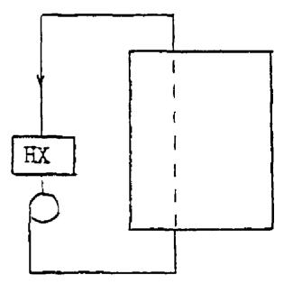  
Plan A

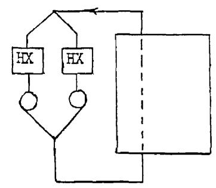  
Plan B

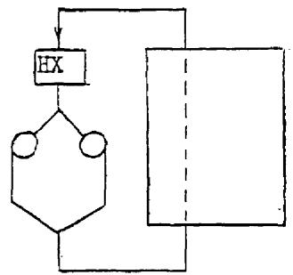  
Plan C

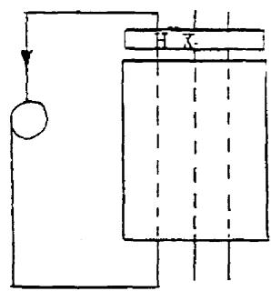  
Plan D   
Figure 3.2-8. Alternate Pump and Heat Exchanger Arrangements for Each Core Channel

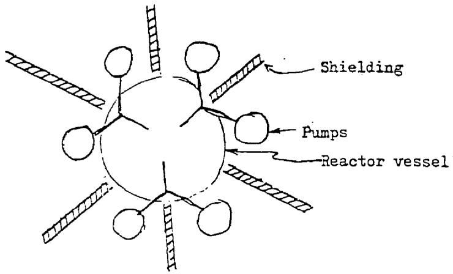  
Fig. 3.2-9 Top View of Plan 3 with Alternate Subchannels in Shielded Cells

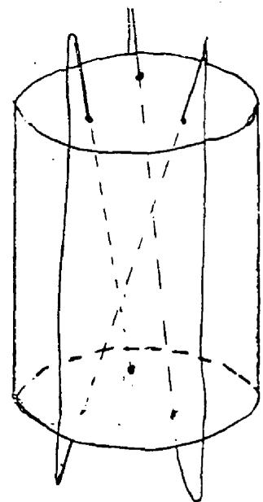  
Fig. 3.2-10 Schematic Diagram of Series Connection of Three Skewed Tube Channels

3.2.6.4 Tube channels in series. For a skewed core (recommended in section 3.1.3.4) the inlet and outlet of a tube occur on opposite sides of the reactor. To avoid excessive piping and fuel inventory the outlet of one tube should connect to the inlet of another, which lies vertically below. This means connecting all N channels in series. Fig. 3.2-10 attempts to describe this. It's as if someone ran a needle and thread through a cylindrical cushion; coming out the top, the thread returns outside the cushion to another entrance point on the bottom. This continues until the thread returns to the starting position.

The series connection causes failure of one pump or heat exchanger to shut down the whole system. But this does not differ from plan A, and one can still employ duplicate subchannels as in B or C above.

Figure 3.2-11 shows a B-type horizontal M=2 design. Here the tubes penetrate sides rather than the top and bottom. This should simplify the reactor support and reduce the out-of-core inventory as well. A physical model would be three pencils lying across each other, penetrating an approximately-square cylinder of (blanket) jello.

3.2.6.5 Summary. In the reference concept a small number of skewed tubes connect in series. Alternate subchannels with pumps in each could provide backup, but would add friction losses. On-line backup (to avoid reactor shutdown) would also increase inventory and auxiliary heating. Keeping N to 3 or 4 should help the system reliability as well as reduce the time required for repair and maintenance. It also minimizes neutron spectrum degradation and parasitic absorption.

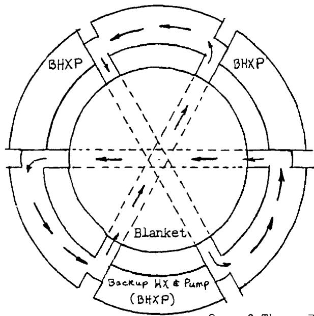  
PLAN VIEW   
One of Three Emergency Lines to Core Salt Safety Tank

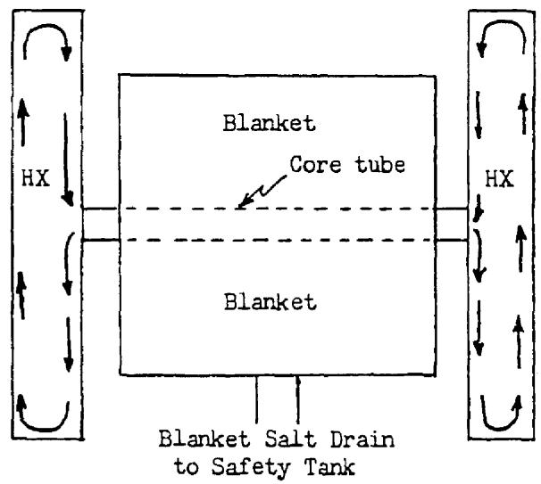  
ELEVATION VIEW   
Figure 3.2-11 B-Type Horizontal M=2 Layout of Pumps and Heat Exchangers.

Arrows denote core salt flow.

# 3.2.7 Summary

Limits on power density may come from

1. Radiation damage to the high flux   
2. High temperature of the fuel coolant causing leakage through a seal expansion, melting of metal, or chemical corrosion   
3. High fuel inventory in the heat exchanger, affecting economics, doubling time, and reactor control.

Use of replaceable graphite for the material in contact with the fuel coolant throughout the reactor and much of the primary circuit might eliminate much of concerns (1) and (2).

# 3.3 Choosing the Salt Composition

The abundance and low neutron moderation of chlorine makes sodium and actinide chlorides the preferred molten salts for fast reactors on the U/Pu cycle (Section 1.2). Here we concentrate on the thorium fuel cycle which could have different priorities.

# 3.3.1 Introduction

The top concerns in chosing the salt composition are neutromics (especially neutron spectrum), chemistry, and melting point. Other desirable traits are

1. Good heat transfer properties: high thermal conductivity and specific heat capacity   
2. High boiling point to minimize vapor pressure   
3. Adequate technological or laboratory experience   
4. Low fuel salt viscosity to minimize pumping costs   
5. Low price and good availability   
6. Non-toxic

3.3.1.1 Neutron spectrum. We desire as hard a neutron spectrum in the core as possible, though not at the expense of BG. Since nonfissile constituents mainly downscatter and capture neutrons, this means maximizing the ratio of $^{233}\mathrm{U}$ to all other isotopes.

In the blanket, a softer neutron spectrum enhances neutron capture by the fertile material. Thus neutron moderators might help there, if they don't absorb neutrons as well. However this would not be good for an inner blanket as it would then soften the core neutron spectrum.

If the core tubes were many mean free paths apart, then each tube would individually approach delayed critical and have a hard spectrum, but their coupling would be loose or near-zero.

3.3.1.2 Chemistry. Using the molten salt fuel as the primary coolant of a nuclear reactor presents many novel problems in both reactor design and system chemistry. The success of the CRNL Molten Salt Reactor Program shows that it can be done at least up to their power levels. Experience there also revealed that the chemical states often behave as if in equilibrium. This allows much progress towards understanding interactions within the salt (chemical stability) and between the salt and its environment (corrosion) since many of the equilibria are grossly predictable.

The free energy of formation of the compounds, $\Delta G_{1}$ , measures the chemical stability of the salts, specifically their ability to resist forming other compounds which precipitate out. Taube has deduced the temperature-dependent $\Delta G$ for salts of interest (Figure 3.3-1) [82].

Candidate reactants in the system which threaten salt stability are

1. Atmosphere constituents oxygen, water, and carbon dioxide   
2. Structural materials (Section 3.4)   
3. Fission products and other mutants

Radiolysis also affects salt stability.

Chemical corrosion involves several sciences (Fig. 3.3-2). Physical chemistry and metallurgy describe the physical, chemical, and mechanical behavior. Thermodynamics reveals the spontaneous

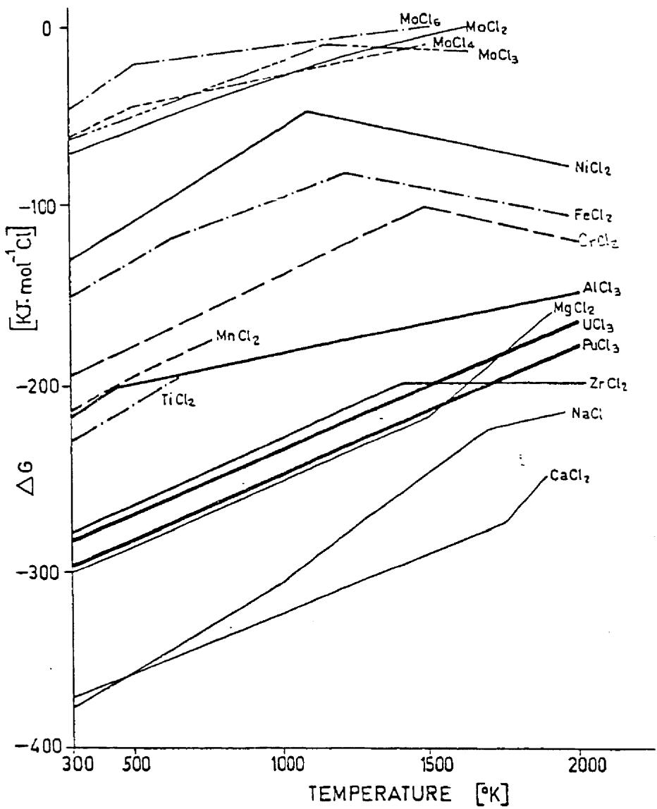  
Fig. 3.3-1 Free Energy of Formation for Chlorides [82]

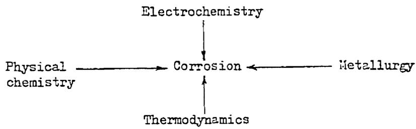  
Figure 3.3-2. Factors Affecting Corrosion of a Metal

direction of a reaction and whether or not corrosion can occur. Electrochemistry describes electrode kinetics: the dissolution and plating out of different materials in electrical contact.

3.3.1.3 Eutectic melting point. Figure 3.3-3 depicts a typical eutectic behavior: the mixing of two salts lowers the melting point far below that for either salt by itself. The amount of low-ering depends on the molar ratio of the two salts; exceptionally low temperature is possible at the eutectic point, or nadir. This may be of special value for the blanket region where little heat is generated.

A fuel mix with melting point well below $700^{\circ}\mathrm{C}$ would minimize auxiliary heating when shut down and allow a large temperature rise in the core without reaching high outlet temperatures ( $>1000^{\circ}\mathrm{C}$ ). Low melting points of the component salts also will facilitate their initial dissolution.

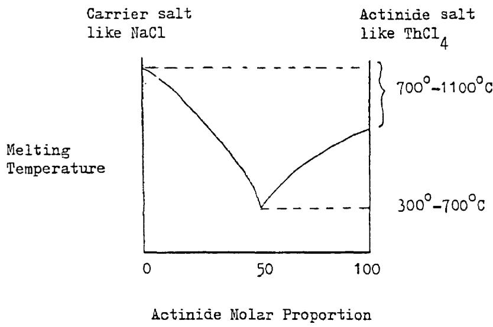  
Figure 3.3-3. Eutectic Melting Point Behavior for a Mixture

Adding a third component like a second actinide salt in Figure 3.3-4 can further lower the melting point, especially when all three are in near-equal proportions. Unfortunately many multicomponent (ternary or higher) phase diagrams are unknown or in unavailable Russian literature.

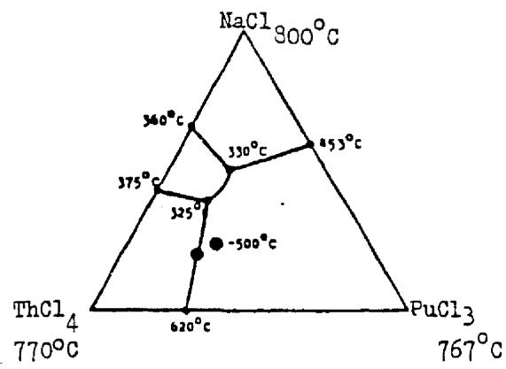  
Figure 3.3-4. Ternary phase diagram for NaCl/PuCl₃/ThCl₄

3.3.1.4 Heat transfer parameters. Section 3.2.5.1 showed how MCFR

heat removal varies according to

$$
h _ {f} \sim p ^ {0. 8} k ^ {0. 6 7} \left(\frac {c _ {p}}{\mu}\right) ^ {0. 3 3} \mu_ {w} ^ {- 0. 1 4}
$$

For survey purposes here let

$\mu$ (bulk temperature) $= \mu$ (wall temperature).

Then

$$
n _ {f} - 2 ^ {0. 8} \times 1 2 ^ {0. 6 7} / c ^ {- 0. 4 7} c _ {p} ^ {0. 3 3}
$$

The exponent magnitudes measure the relative significance of the constituent parameters.

As other factors discourage the use of fluorides in the core, this section studies only chlorides. Information on density $(\rho)$ is readily available for pure salts and a satisfactory algorithm exists for mixtures. Viscosity $(\mu)$ and specific heat $(C_p)$ data also suffice. Thermal conductivities are very sparse.

3.3.1.5 Densities. Desyatnik et al [83] studied molten mixtures of $\mathrm{UCl}_4$ and alkali chlorides. They found the density of individual salts to decrease linearly with temperature, getting

$$
\begin{array}{l} \left(L i C l\right) = 1. 8 8 0 7 - 0. 4 3 1 7 \frac {T (K)}{1 0 0 0} \pm 0. 0 0 1 1 g / c m ^ {3} \\ \left(\mathrm {N a C l}\right) = 2. 1 3 3 2 - 0. 5 4 0 5 \frac {\mathrm {T} (\mathrm {K})}{1 0 0 0} \pm 0. 0 0 1 0 \\ \int_ {0} ^ {\infty} (K C l) = 2. 1 7 5 1 - 0. 6 0 6 0 \frac {T (K)}{1 0 0 0} \pm 0. 0 0 9 \\ \rho (\mathrm {R b C l}) = 3. 1 0 6 9 - 0. 8 7 9 9 \frac {\mathrm {T} (\mathrm {K})}{1 0 0 0} \pm 0. 0 0 1 3 \\ \end{array}
$$

$$
\begin{array}{l} \beta \quad (\mathrm {C s C l}) = 3. 7 7 2 6 - 1. 0 7 1 6 \frac {\mathrm {T} (\mathrm {K})}{1 0 0 0} \pm 0. 0 0 1 1 \\ \rho \left(\mathrm {B e C l} _ {2}\right) = 2. 2 7 6 - 1. 1 0 \frac {\mathrm {T} (\mathrm {K})}{1 0 0 0} \pm 0. 0 0 1 1 \\ \rho \left(\mathrm {M g C l} _ {2}\right) = 1. 9 7 6 - 0. 3 0 2 \frac {\mathrm {T} (\mathrm {K})}{1 0 0 0} \pm 0. 0 0 1 1 \\ \mathcal {D} \left(\mathrm {C a C l} _ {2}\right) = 2. 5 2 6 1 - 0. 4 2 2 5 \frac {\mathrm {T} (\mathrm {K})}{1 0 0 0} \pm 0. 0 0 1 1 \\ \left(\operatorname {S r C l} _ {2}\right) = 3. 3 8 9 6 - 0. 5 7 8 1 \frac {\mathrm {T} (\mathrm {K})}{1 0 0 0} \pm 0. 0 0 1 1 \\ \left(\mathrm {B a C l} _ {2}\right) = 4. 0 1 5 2 - 0. 6 8 1 3 \frac {\mathrm {T} (\mathrm {K})}{1 0 0 0} \pm 0. 0 0 1 1 \\ \left(P b C l _ {2}\right) = 6. 6 2 1 3 - 2. 0 5 3 6 \frac {T (K)}{1 0 0 0} \pm 0. 0 1 2 \\ \left(\mathrm {T h C l} _ {4}\right) = 6. 2 5 7 0 - 2. 7 0 3 0 \frac {\mathrm {T} (\mathrm {K})}{1 0 0 0} \pm 0. 0 1 5 \\ \left(\mathrm {U C l} _ {3}\right) = 7. 5 2 0 - 2. 4 7 2 \frac {\mathrm {T (K)}}{1 0 0 0} \\ \left(\mathrm {U C l} _ {4}\right) = 5. 6 2 5 1 - 2. 2 9 2 4 \frac {\mathrm {T} (\mathrm {K})}{1 0 0 0} \pm 0. 0 0 2 1 \\ \end{array}
$$

Kinosz and Haupin [84] give the density of NaCl and KCl as

$$
\begin{array}{l} f (L i C l) = (1. 4 6 3 + 0. 0 0 2 4 6 4 \tau) / (1 + 0. 0 0 2 \tau) \\ \beta (\mathrm {N a C l}) = (1. 6 1 1 + 0. 0 0 1 8 9 7 \tau) / (1 + 0. 0 0 1 5 3 8 \tau) \\ j (K C l) = (1. 5 6 8 + 0. 0 0 1 6 1 9 \tau) / (1 + 0. 0 0 1 4 2 9 \tau) \\ p \left(\mathrm {M g C l} _ {2}\right) = (1. 6 8 2 + 0. 0 0 4 4 6 2 8 T) / (1 + 0. 0 0 2 8 5 7 T) \\ \Delta (C a C l _ {2}) = (2. 1 1 5 + 0. 0 0 3 7 6 8 \tau) / (1 + 0. 0 0 2 \tau) \\ \end{array}
$$

where $\gamma = T(K) - 973 = T(^{\circ}C) - 700$ . A spot check at $1000K$ showed fair agreement for NaCl and KCl, getting $\rho = 1.596$ and $1.552$ by Kinosz vs $1.593 \pm 0.001$ and $1.569 \pm 0.001$ by Desyatnik.

Equivalencing the two formulas one gets

Kinosz

$$
P (L i C l) = 1. 4 6 3 (1 - 0. 0 0 0 3 1 6 \tau)
$$

$$
\rho (\mathrm {N a C l}) = 1. 6 1 1 (1 - 0. 0 0 0 3 6 0 \mathrm {T})
$$

$$
\rho (\mathrm {K C l}) = 1. 5 6 8 (1 - 0. 0 0 0 3 9 6 \tau)
$$

$$
\rho \left(\mathrm {M g C l} _ {2}\right) = 1. 6 8 2 (1 - 0. 0 0 0 2 0 4 \tau)
$$

$$
\rho \left(\mathrm {C a C l} _ {2}\right) = 2. 1 1 5 (1 - 0. 0 0 0 2 1 8 \tau)
$$

$$
D (L i C l) = 1. 4 6 1 (1 - 0. 0 0 0 2 9 6 \uparrow)
$$

Desyatnik

$$
\rho (\mathrm {N a C l} = 1. 6 0 7 (1 - 0. 0 0 0 3 3 6 \tau) ^ {5}
$$

$$
\rho (K C l) = 1. 5 8 5 (1 - 0. 0 0 0 3 8 2 \gamma)
$$

$$
\rho (\mathrm {R b C l}) = 2. 2 5 1 (1 - 0. 0 0 0 3 9 1 T)
$$

$$
\rho (\mathrm {C s C l}) = 2. 7 3 5 (1 - 0. 0 0 0 3 9 2 \tau)
$$

$$
\beta \left(P _ {5} C l _ {2}\right) = 4. 6 2 3 (1 - 0. 0 0 0 4 4 4 T)
$$

$$
\rho \left(\mathrm {T h C l} _ {4}\right) = 3. 6 2 7 (1 - 0. 0 0 0 7 4 5 \mathrm {T})
$$

$$
\rho (U C l _ {3}) = 5. 1 1 5 (1 - 0. 0 0 0 4 8 3 \tau)
$$

$$
\rho \left(\mathrm {U C l} _ {4}\right) = 3. 3 9 5 (1 - 0. 0 0 0 6 7 5 \tau)
$$

The Kinosz equivalencing is by

$$
\frac {a + b \tau}{1 + c \tau} = a - \frac {(c - \frac {b}{a}) \tau}{1 + c \tau} \approx a - (c - \frac {b}{a}) \tau
$$

The resulting slopes ( $\gamma$ coefficients) are expectedly higher than for Desyatnik

For a mixture of salts Desyatnik showed [83] that linear addition of the molar (specific) volumes of each salt

$\rho_{\text{total}} = \left[\sum_{i} \omega_{i} / \rho_{i}\right]^{-1}$ gives densities high compared to experiment. Direct addition of densities would give even higher errors, in the same direction. In binary mixtures with carrier salts like NaCl, the maximum deviation occurs at about 60 mole % actinide salt. A spot check on a 50-50 UCl4/NaCl mixture at 1000K predicted $\rho$ (50/50, 1000K) = 2.91 whereas the measured was 2.871± 0.0024. Formation of complex salts, e.g. 3 KCl + UCl3 → K3UCl6, causes this deviation from linearity. 3.3.1.6 Viscosities. Section 3.2.5 showed that low viscosity increases heat transfer. Figure 3.3-5 displays the temperature-dependent viscosity for individual salts [85,86] beginning at their melting points.

The viscosity of salt mixtures is generally unavailable; Figure 3.3-6 does show viscosity behavior for two salt mixtures: first $\mathrm{MgCl}_2$ with NaCl [87]; then with $\mathrm{ThCl}_4$ [88]. (Note that the two sets of pure $\mathrm{MgCl}_2$ measurements do not agree. The (latter) Russian work is particularly suspect because of other errors found there. Still the data are informative here.) The bumps correspond to formation of complex molecules.

Comparison of these diagrams with phase diagrams Figs. 3.3-7 and 3.3-28 suggests a correlation with eutectic effects which, in turn, depend on complex molecule formation. In general it appears feasible to choose a molar composition where the viscosity is close to the lowest individual salt viscosity. Therefore, for $\mathrm{ThCl}_4 / \mathrm{NaCl}$ , $\mathrm{UCl}_3 / \mathrm{NaCl}$ , $\mathrm{UCl}_4 / \mathrm{NaCl}$ or combinations thereof we can roughly presume

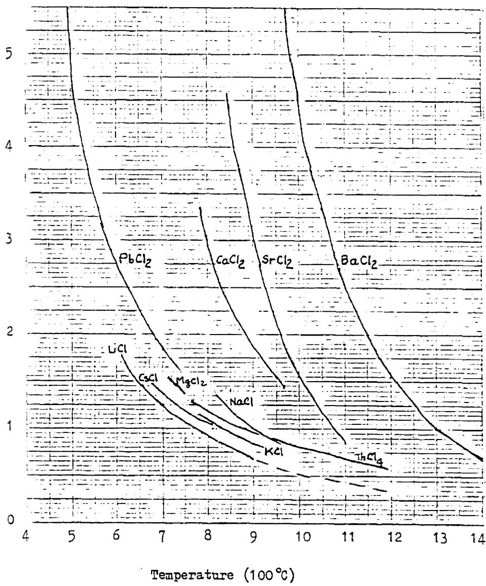  
（C）  
Figure 3.3-5 Viscosity of Individual Molten Salts [85, 86].

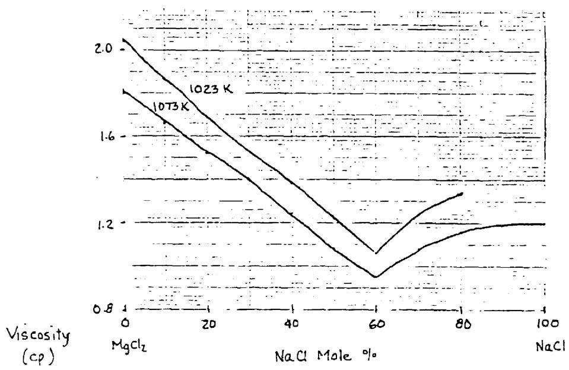

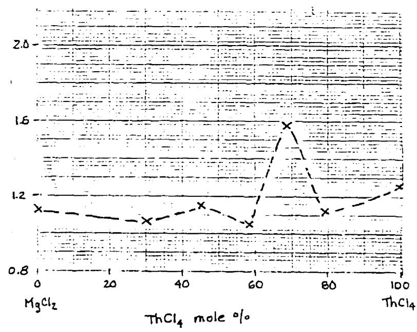  
Figure 3.3-6 Viscosity Behavior for Two Molten Salt Binary Mixtures [87, 88]

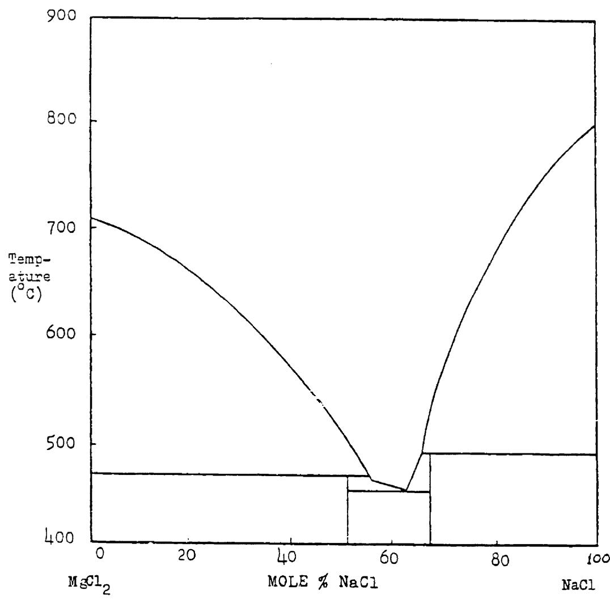  
Figure 3.3-7. The $\mathbf{MgCl}_2$ -NaCl Binary Phase Diagram [13]

$$
\mu (\mathrm {T}) \approx \mu_ {\mathrm {N a C l}} (\mathrm {T}).
$$

From reference [85]

$$
\mu_ {\mathrm {N a C l}} \approx 1 8. 6 \times 1 0 ^ {- 3} \exp [ 9 3 0 8 / 1. 9 8 7 \mathrm {T} (\mathrm {K}) ] \mathrm {c p}.
$$

3.31.7 Specific Heat. Perry's Handbook [89] recommends for fused salts at and slightly above the melting point:

$$
C _ {p} \left(\frac {\text {c a l}}{g m ^ {o} C}\right) = \frac {8 . 1 \left(\frac {\text {c a l} / ^ {o} C}{\text {a t o m m o l e}}\right) x \left(\frac {\text {n o . a t o m s}}{\text {m o l e c u i e}}\right)}{\text {M o l e c u l a r w e i g h t (g m s / m o l e)}}
$$

Data on chlorides (Table 3.3-I) from the Molten Salts Handbook [85] supports this formula for 2- and 3-atom molecules. For 4-atom molecules, the coefficient increases to 8.5 cal/ $^{\circ}$ C atom mole.

The next question is the temperature dependence of the specific heat. Table 3.3-II shows how experimental $\left\{\mathrm{C}_{\mathrm{p}}^{0-1} \mathrm{d}\mathrm{C}_{\mathrm{p}} / \mathrm{dT}\right\}$ [90] for some F salts compare to their $\left\{\rho_{0}-1 \mathrm{~d}\rho / \mathrm{dT}\right\}$ and coefficients of linear expansion $\left\{\alpha\right\}$ . $\mathrm{C}_{\mathrm{p}}^{\circ}$ and $\rho_{0}$ represent values extrapolated to $T=0$ Kelvin. On the average $\alpha$ parallels $(\mathrm{C}_{\mathrm{p}}^{0-1} \mathrm{d}\mathrm{C}_{\mathrm{p}} / \mathrm{dT})$ fair; individual fluctuations of the two parameters do not correlate very well however. Still this represents the best empirical correlation which could be developed within the scope of this study. On this basis we approximate

$$
C _ {p} \quad (c a l / g m C) = C _ {p} ^ {\circ} [ 1 - \alpha T (K) ]
$$

where

$$
\mathrm {C} _ {\mathrm {p}} ^ {\circ} = \mathrm {C} _ {\mathrm {p}} \left(\mathrm {T} _ {\mathrm {m p}}\right) / [ 1 - \alpha \mathrm {T} _ {\mathrm {m p}} (\mathrm {K}) ]
$$

Table 3.3-III calculates some salts of interest. Figure 3.3-8 correlates the resulting $\left\{\mathsf{C}_{\mathsf{p}}\left[900^{\circ}\mathsf{C}\right]\right\}$ so as to deduce the missing value for MgCl (for which $\alpha$ was unavailable).

Table 3.3-I   
Dependency of Specific Heat on No. Atoms per Molecule [85]   

<table><tr><td>Salt</td><td>Cp(mole molecule)</td><td>N (No. atoms/molecule)</td><td>Cp(cal/°C mole atom)</td></tr><tr><td>LiCl</td><td>15.0</td><td>2</td><td>7.5</td></tr><tr><td>NaCl</td><td>16.0</td><td>2</td><td>8.0</td></tr><tr><td>KCl</td><td>16.0</td><td>2</td><td>8.0</td></tr><tr><td>CsCl</td><td>18.0</td><td>2</td><td>9.0</td></tr><tr><td>AgCl</td><td>16.0</td><td>2</td><td>8.0</td></tr><tr><td>CuCl</td><td>15.9</td><td>2</td><td>8.0</td></tr><tr><td>TiCl</td><td>17.4</td><td>2</td><td>8.7</td></tr><tr><td>Avg.</td><td>16.3</td><td>2</td><td>8.16</td></tr><tr><td>NiCl2</td><td>24.0</td><td>3</td><td>8.0</td></tr><tr><td>MgCl2</td><td>22.0</td><td>3</td><td>7.3</td></tr><tr><td>CaCl2</td><td>23.6</td><td>3</td><td>7.9</td></tr><tr><td>SrCl2</td><td>27.2,26.7</td><td>3</td><td>9.0</td></tr><tr><td>BaCl2</td><td>26.3,25.0</td><td>3</td><td>8.6</td></tr><tr><td>CaCl2</td><td>24.0</td><td>3</td><td>8.0</td></tr><tr><td>HgCl2</td><td>25.0</td><td>3</td><td>8.3</td></tr><tr><td>ZrCl2</td><td>24.1</td><td>3</td><td>8.03</td></tr><tr><td>PbCl2</td><td>23.6</td><td>3</td><td>7.93</td></tr><tr><td>MnCl2</td><td>22.6</td><td>3</td><td>7.53</td></tr><tr><td>FeCl2</td><td>24.4</td><td>3</td><td>8.13</td></tr><tr><td>Avg.</td><td>24.2</td><td>3</td><td>8.06</td></tr><tr><td>LaCl3</td><td>37.7</td><td>4</td><td>9.4</td></tr><tr><td>PrCl3</td><td>32.0</td><td>4</td><td>8</td></tr><tr><td>NdCl3</td><td>35.0</td><td>4</td><td>8.8</td></tr><tr><td>AlCl3</td><td>31.2</td><td>4</td><td>7.8</td></tr><tr><td>GdCl3</td><td>33.7</td><td>4</td><td>8.4</td></tr><tr><td>HoCl3</td><td>35.3</td><td>4</td><td>8.4</td></tr><tr><td>ErCl3</td><td>33.7</td><td>4</td><td>8.4</td></tr><tr><td>BiCl3</td><td>34.3</td><td>4</td><td>8.6</td></tr><tr><td>FeCl3</td><td>32.0</td><td>4</td><td>8.0</td></tr><tr><td>Avg.</td><td>33.9</td><td>4</td><td>8.47</td></tr></table>

Table 3.3-III   
Approximate Equivalence Between Specific-Heat Temperature-Dependence and That for Other Physical Parameters, Based on Measured F Salt Mixtures   

<table><tr><td>Mix</td><td>Mole Fractions</td><td>105Cp(0 K) dT</td><td>105ρ(0 K) dT</td><td>105x coefficient of expansion</td></tr><tr><td>NaF/ZrF4</td><td>50/50</td><td>28.37</td><td>23.0</td><td>29.6</td></tr><tr><td>LiF/NaF</td><td>60/40</td><td>46.47</td><td>21.40</td><td>27.1</td></tr><tr><td>LiF/KF</td><td>50/50</td><td>32.12</td><td>25.70</td><td>34.0</td></tr><tr><td>LiF/RbF</td><td>43/57</td><td>36.52</td><td>26.95</td><td>36.5</td></tr><tr><td>LiF/NaF/ZrF4</td><td>55/22/23</td><td>24.51</td><td>23.54</td><td>30.6</td></tr><tr><td>NaF/ZrF4/UF4</td><td>56/39/5</td><td>20.16</td><td>22.16</td><td>28.3</td></tr><tr><td>RbF/ZrF4/UF4</td><td>48/48/4</td><td>34.41</td><td>21.86</td><td>27.8</td></tr><tr><td>LiF/KF/UF4</td><td>48/48/4</td><td>51.42</td><td>24.75</td><td>32.4</td></tr><tr><td>NaF/LiF/ZrF4/UF4</td><td>20/55/21/4</td><td>31.46</td><td>22.54</td><td>29.3</td></tr><tr><td>Average</td><td></td><td>34±10</td><td>24±2</td><td>31±3</td></tr></table>

Determination of $\mathbf{c}_{\mathfrak{p}}(\mathbf{T}) = \mathbf{c}_{\mathfrak{p}0} \left[1 - \alpha \mathbf{T}(\mathbf{K})\right]$ and $\mathbf{c}_{\mathfrak{p}}(900^{\circ}\mathbf{C})$ for

Chloride Salts of Interest

Table 3.3 - III   

<table><tr><td>Salt</td><td>c&#x27;p(cal/°C mole)</td><td>Mol wt</td><td>c[p(Tmp)] (cal/°C g/m)</td><td>Tmp (°C)</td><td>(10-4°C-1)</td><td>Cpo</td><td>Cp[900°C] (cal/°C g/m)</td></tr><tr><td>LiCl</td><td>15.</td><td>42.39</td><td>0.3539</td><td>614</td><td>2.96</td><td>0.4799</td><td>0.3132</td></tr><tr><td>NaCl</td><td>16.</td><td>58.44</td><td>0.2738</td><td>801</td><td>3.65</td><td>0.4504</td><td>0.2575</td></tr><tr><td>KCl</td><td>16.</td><td>74.56</td><td>0.2146</td><td>776</td><td>3.98</td><td>0.3684</td><td>0.1964</td></tr><tr><td>RbCl</td><td>16.2</td><td>120.92</td><td>0.1340</td><td>715</td><td>4.13</td><td>0.2263</td><td>0.1167</td></tr><tr><td>CsCl</td><td>18.0</td><td>168.36</td><td>0.1069</td><td>646</td><td>4.04</td><td>0.1701</td><td>0.0895</td></tr><tr><td>CaCl2</td><td>23.6</td><td>110.99</td><td>0.2126</td><td>772</td><td>2.07</td><td>0.2713</td><td>0.2054</td></tr><tr><td>SrCl2</td><td>27.0</td><td>158.53</td><td>0.1703</td><td>673</td><td>2.17</td><td>0.2267</td><td>0.1690</td></tr><tr><td>BaCl2</td><td>25.6</td><td>208.25</td><td>0.1229</td><td>963</td><td>2.20</td><td>0.1688</td><td>0.1253</td></tr><tr><td>PbCl2</td><td>23.6</td><td>278.10</td><td>0.0849</td><td>501</td><td>4.10</td><td>0.1243</td><td>0.0645</td></tr><tr><td>ThCl4</td><td>42.5</td><td>373.85</td><td>0.1137</td><td>770</td><td>5.57</td><td>0.2713</td><td>0.0940</td></tr><tr><td>UCl3</td><td>34.</td><td>344.39</td><td>0.0987</td><td>842</td><td>4.24</td><td>0.1873</td><td>0.0941</td></tr><tr><td>UCl4</td><td>42.5</td><td>379.84</td><td>0.1119</td><td>590</td><td>5.26</td><td>0.2049</td><td>0.0785</td></tr></table>

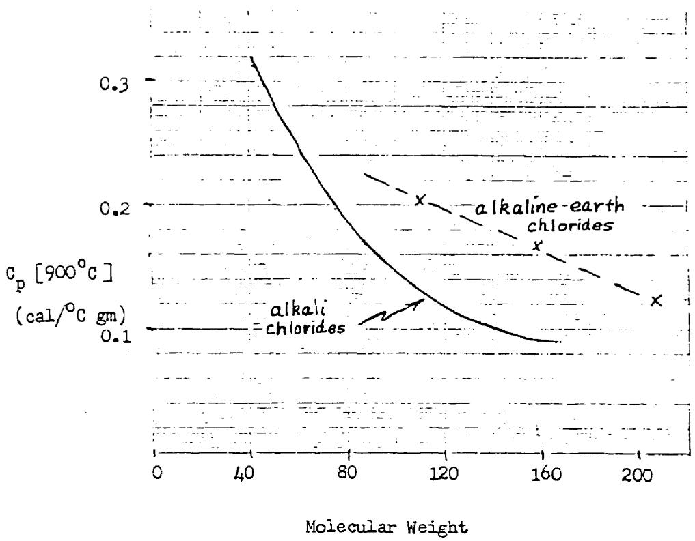  
Fig. 3.3-8 Correlation of Specific Heat with Salt Molecular Weight to Deduce $C_p$ [900°C] for MgCl₂.

3.3.1.8 Thermal conductivity. Figure 3.3-9 displays the measured thermal conductivities of individual salts, all from Russian sources [91-94]. For other salts and salt mixtures, one must rely on phenomenological models. Knowing room-temperature $k$ for a salt does not help in predicting $k(T)$ of the liquid: Figure 3.3-10 shows how $k$ changes with temperature as a salt passes from solid to liquid state.

Gambill [95] proposed that two distinct mechanisms determine $k$ for fused salts:

1. Atomic or lattice conduction along the short-range atomic or molecular order present in liquids   
2. Ionic transfer by the drift of free charged ions between the atoms. Gambill successfully correlated existing salt mixture (mostly fluorides) data at their melting points by

$$
\mathrm {k} _ {\mathrm {m p}} \quad \left(\frac {\mathrm {c a l} / \mathrm {s}}{\mathrm {c m} \mathrm {K}}\right) = 0. 0 4 3 0 8 \mathrm {T} _ {\mathrm {m p}} ^ {0. 5} \rho_ {\mathrm {m p}} ^ {0. 8} / \mathrm {H} ^ {1. 8} f _ {\text {a t o m i c}} \tag {3.3-1}
$$

$$
\begin{array}{l} \text {w h e r e} \quad T _ {\mathrm {m p}} = \text {m e l t i n g p o i n t t e m p e r a t u r e (K)} \\ \rho = \text {d e n s i t y} (\bar {s} / c c) \\ M = \text {a v g} _ {\bullet} \text {m o l e c u l a r w e i g h t o f m i x t u r e} \\ k = \text {t h e r m a l} \\ f _ {\text {a t o m i c}} = 0. 4 3 8 - 0. 0 9 N _ {\text {a v g} \bullet} \quad (\text {a t o m i c p a r t}) \\ N _ {\text {a v g}} = \text {a v e r a g e n u m b e r o f i o n s p e r d i s s o c i a t e d m o l e c u l e} \\ (e _ {\bullet \bar {6} \bullet} 5 f o r T h C l _ {4} a n d 2 f o r N a C l) \\ \end{array}
$$

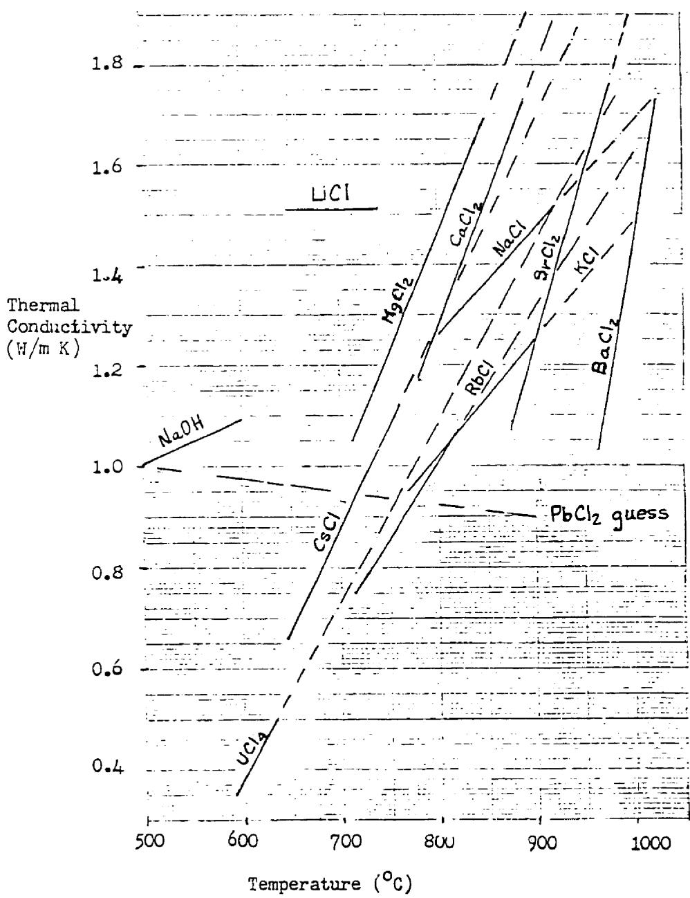  
Figure 3.3-9 Thermal Conductivity of Individual Salts

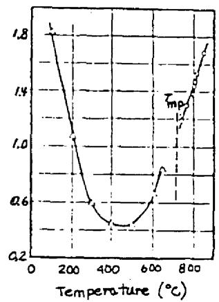  
Thermal Conductivity (W/m·°C)   
Fig. 3.3-10 Thermal Conductivity of $\mathrm{MgCl}_2$ from Solid to Liquid States

When $N_{avg} \geq 5$ , ion drifting predominates and this approach fails (f atomic is nil, or actually negative). However, with fused salt mixtures of interest as core salt, $N_{avg}$ generally falls below 3. The effect of complexing, e.g. $3KCl + UCl_3 \rightarrow K_3^{+1}(UCl_4)^{-3}$ will generally increase $N_{avg}$ , however.

For $k(\mathbb{T}_{\mathrm{mp}})$ of individual chloride salts Gambill's formula differs markedly from experimental Russian data (Table 3.3-IV and Figure 3.3-11). The consistent dependence of the theory correction factors with salt molecular weight (Figure 3.3-11) suggests

(1) A different exponent than 1.8 for M (more like 0.8)   
(2) A slightly different correlation with $N_{avg}$

For temperature dependence of $k$ , Gambill [95] derived the following expression

Comparison of Gambill's Formula to Experiment for Individual Chloride

Salts

Table 3.3-IV   

<table><tr><td>Salt</td><td>Navg.</td><td>fat.</td><td>Tm.p. (K)</td><td>M</td><td>p.m.p. (g/cc)</td><td>k calc /k cal mcal cm</td><td>k exp /k calc mcal cm</td><td>k exp /k calc</td></tr><tr><td>LiCl</td><td>2</td><td>0.258</td><td>887</td><td>42.39</td><td>1.50</td><td>8.09</td><td>3.61</td><td>0.446</td></tr><tr><td>NaCl</td><td>2</td><td></td><td>1074</td><td>58.44</td><td>1.55</td><td>5.14</td><td>3.01</td><td>0.586</td></tr><tr><td>KCl</td><td>2</td><td></td><td>1049</td><td>74.56</td><td>1.54</td><td>3.25</td><td>2.27</td><td>0.698</td></tr><tr><td>RbCl</td><td>2</td><td></td><td>988</td><td>120.92</td><td>2.24</td><td>1.78</td><td>1.79</td><td>1.006</td></tr><tr><td>CsCl</td><td>2</td><td></td><td>919</td><td>168.36</td><td>2.79</td><td>1.13</td><td>1.29</td><td>1.142</td></tr><tr><td>MgCl2</td><td>3</td><td>0.168</td><td>981</td><td>95.22</td><td>1.68</td><td>3.34</td><td>2.45</td><td>0.734</td></tr><tr><td>CaCl2</td><td>3</td><td></td><td>1045</td><td>110.99</td><td>2.09</td><td>3.11</td><td>2.67</td><td>0.859</td></tr><tr><td>SrCl2</td><td>3</td><td></td><td>1146</td><td>158.53</td><td>2.73</td><td>2.12</td><td>2.52</td><td>1.189</td></tr><tr><td>BaCl2</td><td>3</td><td></td><td>1236</td><td>208.25</td><td>3.17</td><td>1.52</td><td>2.47</td><td>1.625</td></tr></table>

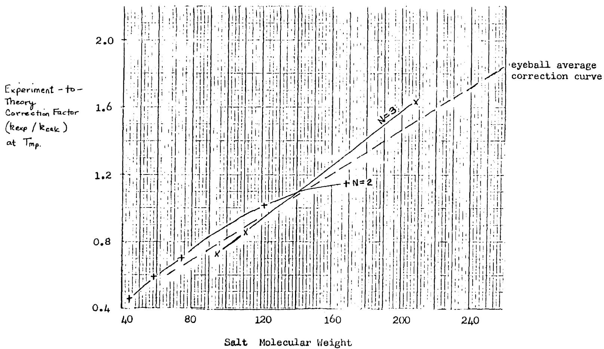  
Fig. 3.3-11 Correlation of Experiment-to-(Gambill's) Theory Differences with Molecular Weight

$$
\begin{array}{l} k _ {\text {t o t a l}} \left(T _ {2}\right) = k _ {\text {t o t a l}} \left(T _ {1}\right) \left\{f _ {\text {a t m i c}} \cdot \left[ \frac {\rho \left(T _ {2}\right)}{\rho \left(T _ {1}\right)} \right] ^ {5 / 2} \left[ \frac {C _ {p} \left(T _ {2}\right)}{C _ {p} \left(T _ {1}\right)} \right] \right. \\ + (1 - f _ {\mathrm {a t o m i c}}) \left[ \frac {\rho (\tau_ {2})}{\rho (\tau_ {2})} \right] \left[ \frac {\tau_ {2}}{\tau_ {1}} \right] ^ {1 / 2} \\ \end{array}
$$

The usefulness of this formula depends upon the confidence developed in it; Gambill had no data with which to test it. Attempts to fit the available (Russian) data for individual salts fail dramatically. Inspection of the terms reveals the cause: $\mathtt{k}_{\mathtt{atomic}}$ (first term) predominantly depends on $\rho^{5 / 2}$ which has a negative T-coefficient while experimentally dk/dT is positive. For k.ionic (second term) the $\sqrt{\mathbf{T}}$ factor overrides the negative T-dependence in $\rho_{\bullet}$ but only up to a certain temperature. Overall this approach fails.

Perry's Chemical Engineering Handbook [96] describes numerous other formulae but these generally pertain to organics and other non-related fluids; also they either do not treat temperature dependence or they grossly disagree.

In Table 3.3-V the electrostatic-bonded alkali and alkaline earth chlorides of intermediate and heavy molecular weight appear to follow

$$
\frac {d k}{d T} = 0. 0 2 4 \times M \cdot V (m W / m ^ {\bullet} K ^ {2})
$$

where $\mathbf{M} =$ molecular weight

$\mathbf{V} =$ cation valence

For highly-covalent UCl₄, dk/dT = 0.0023 x MW(m·J/mK²), a magnitude smaller. For other covalent molecules, e.g. SiCl₄, k actually decreases with T. As PbCl₂ belongs to this chemical class, its dk/dT should be about -0.25 milliWatts/m·K².

Table 3.3- V   
Correlation of Temperature Dependence of Salt Thermal Conductivity with Cation Valence Number and Molecular Weight [91-94].   

<table><tr><td>Ciaass</td><td>Salt</td><td>dk/dT (mW/m·K2)</td><td>Cation Valence V</td><td>M</td><td>[dk/dT]/M·V (10-6W/m·K2)</td></tr><tr><td rowspan="5">alkali coloride</td><td>LiCl</td><td>0</td><td>1</td><td>42.39</td><td>0</td></tr><tr><td>NaCl</td><td>2.1</td><td>1</td><td>58.44</td><td>35.9</td></tr><tr><td>KCl</td><td>2.3</td><td>1</td><td>74.56</td><td>30.9</td></tr><tr><td>RbCl</td><td>3.0</td><td>1</td><td>120.92</td><td>24.8</td></tr><tr><td>CsCl</td><td>4.0</td><td>1</td><td>168.36</td><td>23.8</td></tr><tr><td rowspan="4">alkaline earth chloride</td><td>MgCl2</td><td>4.7</td><td>2</td><td>95.22</td><td>24.7</td></tr><tr><td>CaCl2</td><td>5.1</td><td>2</td><td>110.99</td><td>23.0</td></tr><tr><td>SrCl2</td><td>6.8</td><td>2</td><td>158.53</td><td>21.5</td></tr><tr><td>BaCl2</td><td>10.5</td><td>2</td><td>208.25</td><td>25.2</td></tr><tr><td>(covalent) actinide chlorides</td><td>UCl4</td><td>3.5</td><td>4</td><td>379.64</td><td>2.3</td></tr><tr><td rowspan="5">other covalent chlorides</td><td>SiCl4</td><td>-0.25</td><td>4</td><td>169.90</td><td>-0.37</td></tr><tr><td>GeCl4</td><td>-0.15</td><td>4</td><td>214.41</td><td>-0.18</td></tr><tr><td>SnCl4</td><td>-0.20</td><td>4</td><td>260.50</td><td>-0.19</td></tr><tr><td>PCl3</td><td>-0.30</td><td>3</td><td>137.33</td><td>-0.73</td></tr><tr><td>AsCl2</td><td>-0.25</td><td>2</td><td>181.28</td><td>-0.69</td></tr></table>

The few measurements of chloride mixtures available - $\mathrm{RbCl / UCl_4}$ and $\mathrm{CsCl / UCl_4}$ mixtures (Fig. 3.3-12 and 3.3-13) [94] - show that k fluctuates dramatically with molar composition. The oscillations may correspond to the formation of complex molecules just as occurred with viscosity data. This behavior suggests that one might yet achieve high $\mathbf{k} \approx \mathbf{k}$ (pure carrier salt), even for high actinide molar composition and when $\mathbf{k}$ (pure actinide salt) is much lower.

Figure 3.3-14 compares Gambill's predictions to the above data, with and without the single-salt correction factors from Fig. 3.3-11. In most cases omission of the correction factor gives better agreement.

Note here how k very definitely increases with temperature: the slope remains positive up through at least 60 mole % actinide salt. The average value of (dk/dT) /M·V from these six cases is 2.5 x 10 $^{-6}$ W/m·K $^{2}$ (or 6.0 x 10 $^{-9}$ cal/sec cm K $^{2}$ ) in close agreement with the value of 2.3 x 10 $^{-6}$ W/m·K $^{2}$ for UCl $_{4}$ in Table 3.3-V.

In summary, Gambill's formula for $k(\mathbf{T}_{\mathfrak{mp}})$ proved successful with fluoride mixtures. With chloride salts it appears to succeed better with salt mixtures than with the individual salts. Certain mixture compositions should give a $k$ comparable to that of the individual carrier salt. For the mixtures of concern here, the covalent actinide chloride tends to control the temperature dependence of $k$ : it varies much less than the carrier chloride salt. To obtain high thermal conductivity, both experiment (Fig. 3.3-9) and theory (Gambill's formula for high thermal conductivity) tend to favor salts with low $M$ . In Gambill's formula the factors $T_{\mathfrak{mp}}$ and $\rho_{\mathfrak{mp}}$ tend to cancel one another.

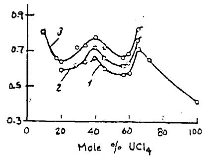  
Thermal Conductivity (W m-1K-1)   
Figure 3.3-12 Thermal conductivity isotherms for fused UCl₄-RbCl mixtures at different temperature (K): 1) 883; 2) 903; 3) 963 [94]

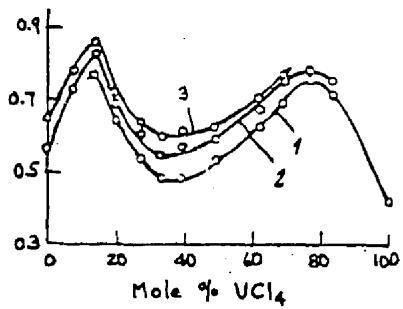  
Thermal Conductivity (W m-1K-1)   
Figure 3.3-13 Thermal conductivity isotherms for fused UCl $_4$ -CsCl mixtures at different temperatures (K) 1) 883; 2) 923; 3) 943 [94]

Figure 3.3-14 Comparison of Theoretical $\{k\}$ with Russian Experiments on RbCl/UCL and CsCl/UCL Mixtures   
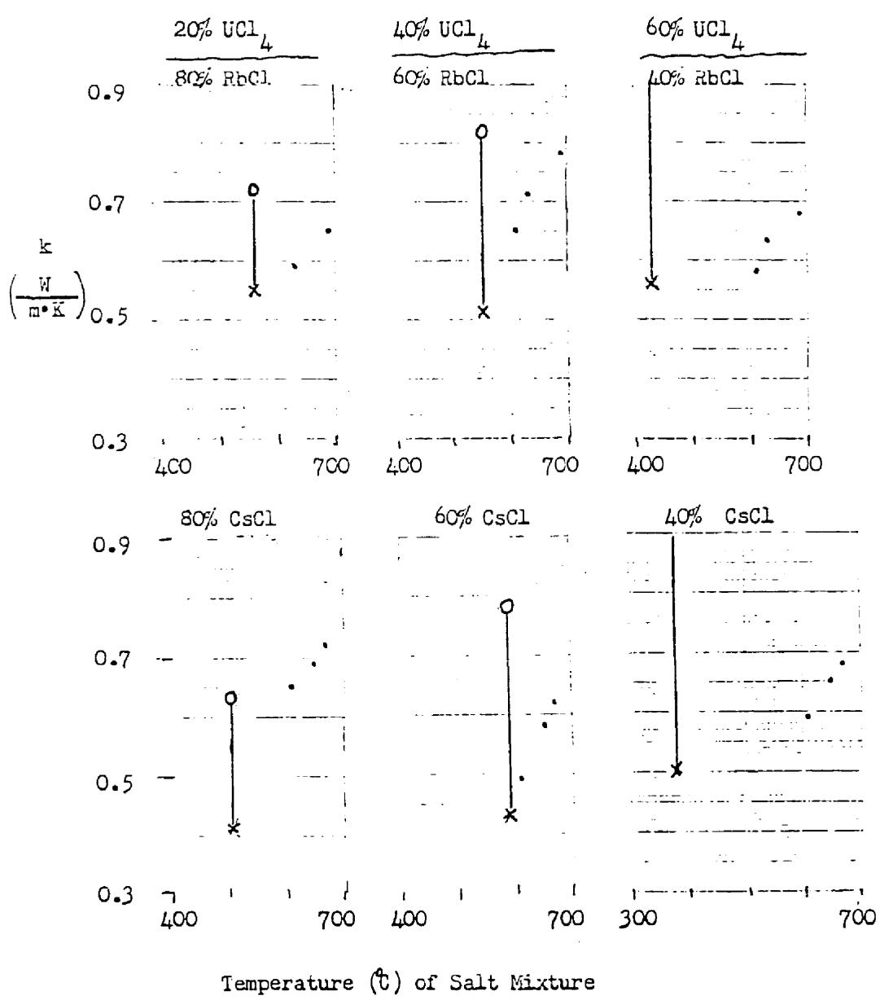  
Legend $\bullet$ experiment [94] $x$ Gambill prediction at $\mathbf{T}_{\mathfrak{m}\mathfrak{p}}$ o Gambill prediction at T corrected according to individual salt data (Fig. 3.3-11)

3.3.1.9 Summary: We seek maximum $^{233}\mathrm{U}$ content and hard spectrum in the fuel salt and a softer spectrum in the outer blanket.

The ORNL MSR program shows that fuel salt circulation is feasible: It is facilitated in part by lowering of melting points in eutectic multi-component mixtures. Chemical stability and corrosion of the molten salts are fairly predictable.

Heat transfer depends on fuel salt density $(\rho)$ thermal conductivity $(k)$ , viscosity $(\mu)$ , and specific heat $(C_p)$ . $\rho(T)$ , $\mu(T)$ , and $C_p$ $(T_{m.p.})$ are well known for single salts; much less so for salt mixtures. Knowledge of $k(T)$ for mixture is better, but still skimpy. Major uncertainties in predicting $h_f$ for a mixture should stem from all but $\rho(T)$ .

# 3.3.2 Choice of Halogen

This study centers on Cl and F for which much literature exists. Br and I are also possibilities which we peruse only superficially; economics, availability, and salt stability probably preclude their use.

3.3.2.1 Neutron moderating effect. The halogen will be the principal "light" material of the system. Thus chlorine $(A = 36)$ will produce a much harder neutron spectrum than fluorine $(A = 19)$ , satisfying a principal core guideline. A soft neutron spectrum in the blanket may enhance BG.

3.2.2.2 Neutron absorption. F absorbs significantly less than Cl (Table 3.3-VI), which further recommends F for the blanket. Numerous workers have suggested enriching the chlorine in $^{37}\mathrm{Cl}$ as $^{35}\mathrm{Cl}$ contributes most to absorption at thermal energies. However, despite the fact that $^{37}\mathrm{Cl}$ has the low level density of a magic nucleus ( $N = 20$ neutrons), its S-wave strength function ( $\Gamma_{n}^{o}/D$ ) and gamma width $\Gamma_{\gamma}$ will be near the same at fast neutron energies. Thus no immediate evidence exists that enrichment in $^{37}\mathrm{Cl}$ will reduce the fast neutron absorption.

Table 3.3-VI Halogen Neutron Absorption Cross Section   

<table><tr><td rowspan="2">Halogen</td><td colspan="2">Spectrum-averaged Absorption Cross Section (mb)</td></tr><tr><td>Typical Core</td><td>Typical 200 cm Blanket</td></tr><tr><td>F</td><td>5.3</td><td>4.3</td></tr><tr><td>Cl</td><td>17.</td><td>9.5</td></tr></table>

3.3.2.3 Transmutation products. One might still enrich $^{37}\mathrm{Cl}$ so as to avoid producing sulfur and phosphorus (Figure 3.3-15). Enrichment would be relatively easy because

1. $37 \mathrm{Cl}$ has a (high) natural abundance of $24.5\%$ to start with   
2. The weight ratio for separation, $\frac{37 - 35}{35} = 0.057$ is relatively large   
3. Chlorine is gaseous at room temperature

Neither $^{19}\mathrm{F},$ $^{35}\mathrm{Cl}$ , nor $^{37}\mathrm{Cl}$ transmute into long-lived nuclides. The chlorine isotopes create a stronger short-term radiation source than $^{19}\mathrm{F}$ , but the usual $\mathsf{BeF}_2$ and LiF components in a fluorine salt mixture produce $^{10}\mathrm{Be}$ (1.6 x 10 $^6$ years) and tritium (12.3 years).

1. (100%) 19 F (n,α) 16 N 7 s   
19 F (n,2n) 18 F 18 110 m   
19 F (n, y) 20 F 3.   
35 35 (75.77%) 17 Cl (n,p) 16 87.2d 35Cl   
5. (75.773) 35 Cl (n,α) 32P β- 15 14 d 32s   
6. (24.23%) 37 Cl (n, Y) 38 Cl β-γ 38 Ar 17   
7. (75.77%) 35cl (n, 2n) 34cl β'γ 34s

Fig. 3.3-15 Principal Neutron-Induced Reactions of the Candidate

Halogens Which Produce Impurities and Radioactivity

3.3.2.4 Melting point [97]. Salts which melt above room temperature require preheating to start up a power plant: the higher the melting point, the greater the

1. Heating requirements,   
2. Difficulty of plant operation,   
3. Possibility of freeze-up during plant shutdown.

Chlorides stay liquid at much lower temperatures than fluorides. For actinides (Fig. 3.3-16) and alkaline earths (Fig. 3.3-17), the differences reach $400 - 700^{\circ}\mathrm{C}$ ; for alkalies (Fig. 3.3-17), only $100^{\circ}\mathrm{C}$ . Eutectic mixes behave similarly (Figures 3.3-18 and 3.3-19). This discourages the use of fluorides in the blanket.

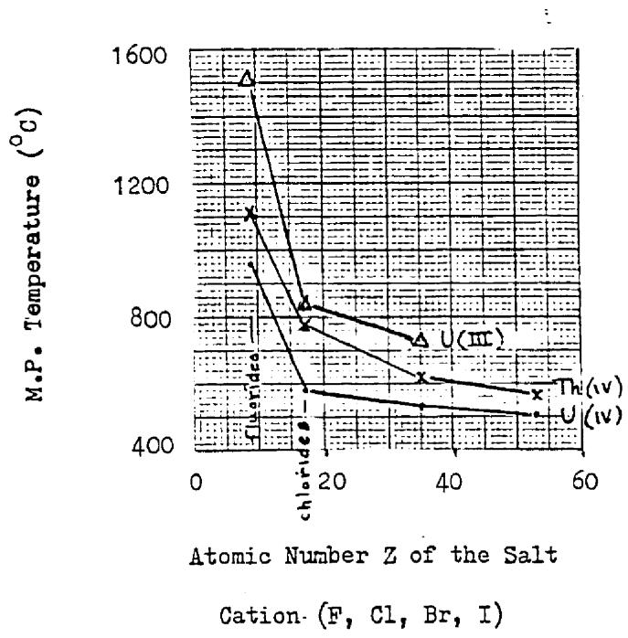  
Fig. 3.3-16 Halide Melting Points for Pertinent Actinides

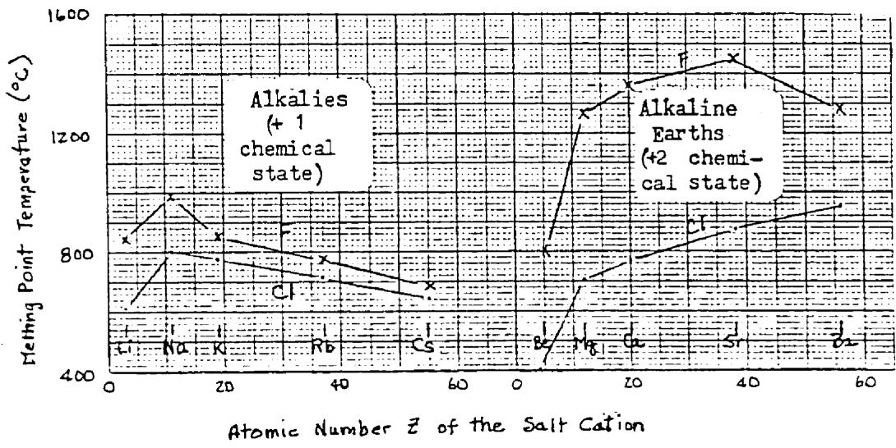  
Figure 3.3-17. Melting Points for Balides of Alkalies (Li, Na, K, Rb, Cs) and Alkaline Earths (Be, Mg, Ca, Sr, Ba).

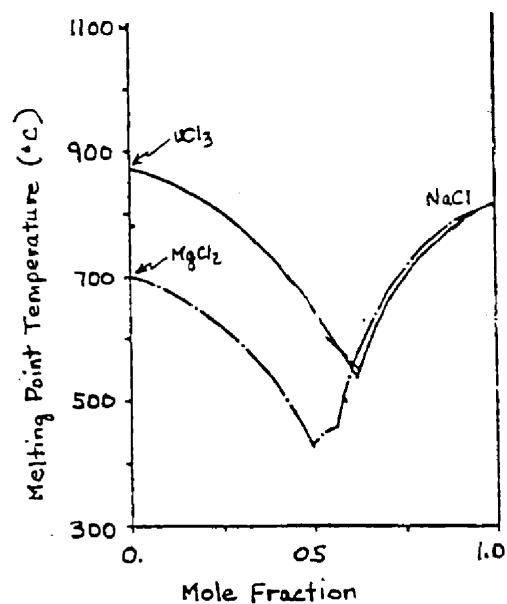  
Fig. 3.3-18

Typical Eutectic Melting Points for Chloride Mixes

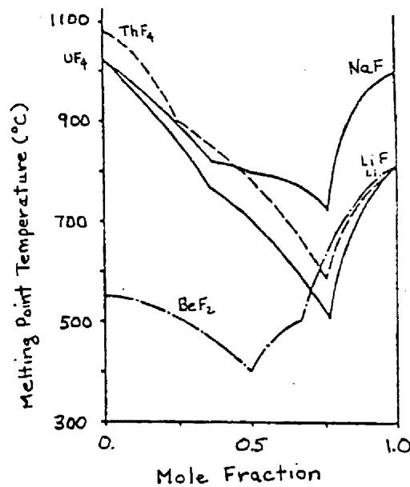  
Fig. 3.3-19

Typical Eutectic Melting Points for Fluoride Mixes

Sr and I also show (Figure 3.3-16) systematically lower melting points, but availability and physiochemical properties may limit them.

Section 3.3-1 mentioned how eutectic ternary mixtures can lower the melting point even further. However section 3.3.4 shows that significant lowering only comes with low actinide molar content.

3.3.2.5 Boiling point and vapor pressure. Figure 3.3-20 shows how the vapor pressure for metal chlorides depends on temperature; boiling occurs where the vapor pressure reaches one atmosphere. Core salts with high boiling points will emit low vapor pressure at the reactor operating temperatures. This means low system pressure and enhanced safety. Depending on corrosion rates, it may also permit the use of thin-walled (more efficient) heat-exchanger tubes. The higher the boiling point, the greater the ultimate temperatures which may be employed. Boiling points above $1500 - 1600^{\circ}\mathrm{C}$ would allow maximum high temperature operation with graphite. Thus one desires a carrier salt with low melting point and high boiling point. Since the eutectic behavior applies only to the melting points these goals are not as contradictory as they first seem.

Comparing the boiling points of chlorides and fluorides, (Fig. 3.3-21) one concludes that generally the fluorides are less volatile, especially for alkaline earths. Unfortunately the higher melting points and moderating properties of the fluorides discourage their use in the core. Should vapor pressure at desired temperatures become a dominating problem, they could provide relief.

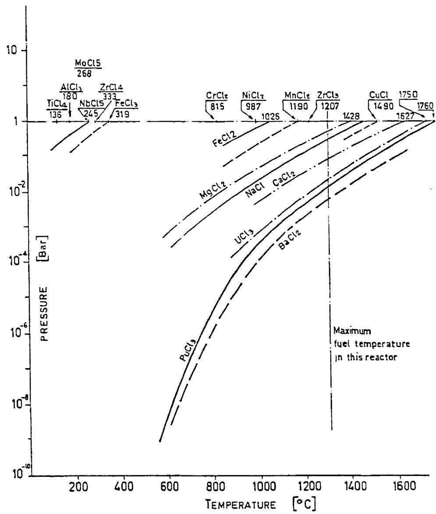  
Figure 3.3-20 Vappr Pressure for Metal Chlorides [17]

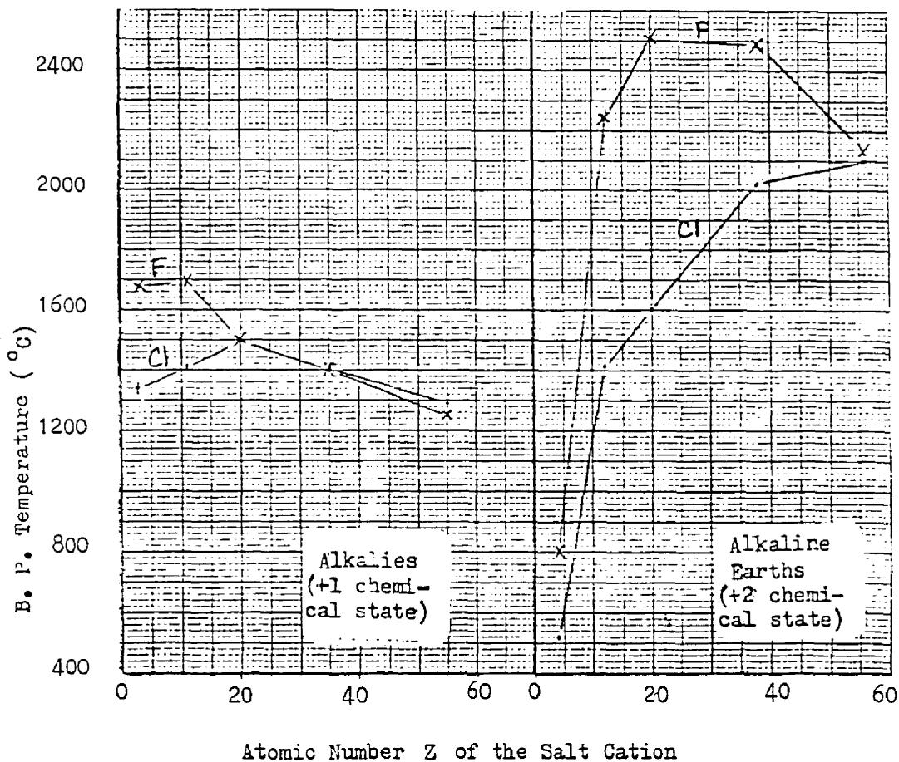  
Fig. 3.3-21 Boiling Points for Halides of Alkalies (Li, Na, K, Rb, Cs) and Alkaline Earths (Be, Mg, Ca, Sr, Ba) [97]

3.3.2.6 Chemical behavior. This section surveys the chemical stability of the halides in the system (tendency to break up) and their corrosiveness (tendency to chemically attack the structural materials in the primary circuit at the temperature of concern).

Figures 3.3-22 compares the stability of some chloride and fluoride compounds: the lower the $\Delta G$ , the more stable. NaCl and LiF are particularly good. In general chlorides are less stable than fluorides. This pattern of decreasing stability with halide atomic number continues through bromine and iodine.

The small $\Delta G$ values for $\mathrm{MoCl}_2$ and $\mathrm{MoCl}_3$ inhibit their formation, which is why Mo is a preferrei structural material in a chloride system. Graphite also resists chemical attack (formation of $\mathrm{CF}_4$ and $\mathrm{CCl}_4$ ) well. The appreciable $\Delta G$ for halides of Fe, Cr, and Ni makes them unsuitable as structural material in contact with salt.

Chlorides generally dissolve in $\mathrm{H}_2\mathrm{O}$ ; fluorides do not. Inside the molten salt circuit the presence of oxygen or water will produce oxy-chlorides (CCl) which corrode. Outside the reactor, water solubility may facilitate cleanup of leaks or spills.

$\triangle G$ for other halides is less available; they are generally less stable.

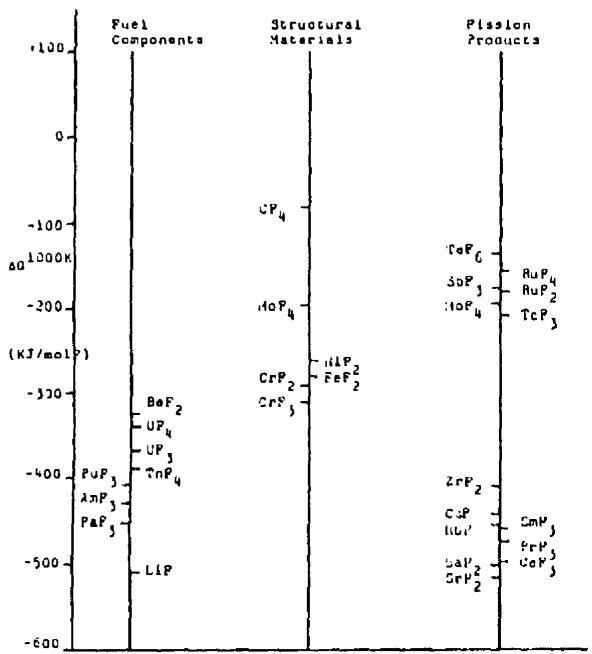

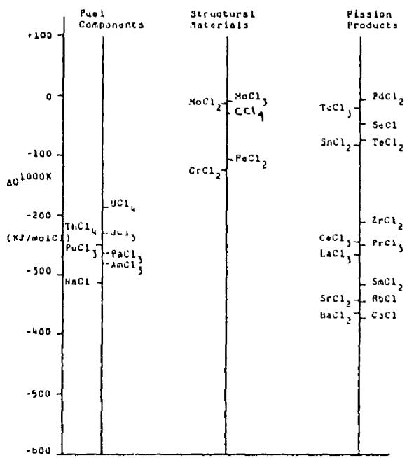  
Figure 3.3-22. Free Energy of Formation at 1000 K for Fluorides and Chlorides [17]

3.3.2.7 Cost and availability. The abundance of seawater provides obvious cost and availability advantages for chlorine over fluorine. The scarcity and cost of Be for a F/Li/Be mix (necessary to achieve low F melting temperatures) tilts the scale even more in favor of Cl. 3.3.2.8 Density. The power needed for pumping the core salt depends directly on its density; heat transfer can the other hand increases with $\rho^{0.8}$ . Thus, lead $(10.5\mathrm{g} / \mathrm{cm}^3)$ requires high pumping power; sodium $(0.83\mathrm{g} / \mathrm{cm}^3)$ , much less. Typical densities reported for salts in the fluoride HsBR and chloride MCFR (Pu) concepts are 3.2 and $3.1\mathrm{g} / \mathrm{cm}^3$ respectively, indicating little difference due to halide choice. 3.3.2.9 Summary. In the core Cl permits a hard neutron spectrum; F does not. Heavier halogens are less well studied, scarcer, and unnecessary. F excels only in lower vapor pressure. In the blanket, chloride costs less, melts lower, and is more chemically stable, but fluorine, which moderates better and absorbs fewer neutrons, could considerably enhance breeding in the blanket. The main problem with F there is high melting point.

# 3.3.3 Choice of Actinide Chemical States(Stoichiometry)

This section assumes the use of Cl salts in the core, and Cl or F salts in the blanket.

3.3.3.1 Actinides inherent to an MCFR(Th). Since only thorium crosses the plant boundary as feed replacement material, the principal actinides in the system will be Th and U isotopes with A-232-234. Pa, Np, and Pu should total less than 1% (section 3.5.8.1). Pu starter fuel in early reactors will produce some An and Cm but these fission usefully. Later reactors will start up on bred $^{233}$ U.

3.3.3.2 Melting and boiling points. In Figure 3.3-16 the melting points for actinides in the $-4$ (IV) state clearly lie below those in the (III) state. Eutectic mixtures tend to follow this trend. This recommends the (IV) state for the blanket which generates less heat and tolerates moderator much better (Sec. 3.3.1.1).

Few salt boiling points have been measured. As III-state melting points exceed those of the IV state, boiling points should also. This recommends the (III) state for the core salt.

3.3.3.3 Chemical behavior. UCl₄ and UCl₃ can coexist in equilibrium. In the core some UCl₃ will pick up free chlorine to form UCl₄. By itself UCl₄ corrodes, but not when UCl₃ predominates (i.e. when the stoichiometry is near 3 Cl atoms to 1 U atom). ThCl₄ may be present in the core as a critical mass diluent or negative shimming agent, or simply be carried over in blanket reprocessing. It can also coexist with UCl₃ without any deleterious effect.

Corrosion also increases with temperature. Temperature in the blanket should be fairly low unless other conditions warrant a high

melting temperature.

3.3.3.4 Choice between UCl₃ and UCl₄ in the core. Hard spectrum, EG potential, and corrosion should mainly dictate the core composition. The higher uranium density and boiling point and lower corrosiveness of UCl₃ far outweigh the lower melting point of UCl₄.

3.3.3.5 Chemical states in the blanket. As a chloride, Th exists only as $\mathrm{ThCl}_4$ and can coexist with $\mathrm{UCl}_3$ or $\mathrm{UCl}_4$ . $\mathrm{UCl}_4$ helps lower the melting point in the blanket where little heat is generated.

Elements which promise chemical stability and high boiling point (Fig. 3.3-21) as a halide carrier salt include the alkalis Li, Na and K, and the alkaline earths Be, Mg, and Ca. Inadequate data limit the studies of the heavier alkalies and alkaline earths Rb, Cs, Sr, and Ba. Pb is included because of interest generated by British studies.

3.3.4.1 Neutron moderating effect. The average lethargy increment per collision $\S$ measures the effectiveness of various materials as moderators. At most neutron energies $\frac{\delta S_{s}^{el}}{\Delta u}$ approximates the group-raise elastic downscatter cross section ( $\delta$ is the elastic scatter cross section and $\underline{u}$ is the group lethargy width). The evidence from (Figure 3.3-23) and $\frac{\delta S_{s}^{el}}{\Delta u}$ (Table 3.3-VII) pretty much agree: Li and Be moderate very strongly; Na and Mg, intermediate; K and Ca downscatter the least; Rb, Cs, Sr, Ba, and Pb should also.

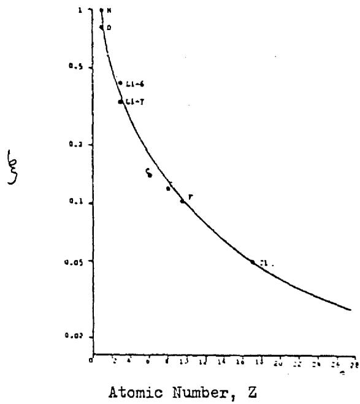  
Fig. 3.3-23 Variation of $\xi$ , the average lethargy increment per collision with atomic number Z.

Table 3.3-VII Elastic downscatter cross sections [98]   

<table><tr><td rowspan="2">Group</td><td rowspan="2">Neutron Energy</td><td colspan="6">Cross Sections (b) by Material</td><td rowspan="2">MCFR</td><td rowspan="2">Fission</td></tr><tr><td>Li-7</td><td>Be</td><td>Na</td><td>Mg</td><td>K</td><td>Ca</td></tr><tr><td>1</td><td>6.5 - 10.5 MeV</td><td>0.746</td><td>0.373</td><td>0.244</td><td>0.120</td><td>0.146</td><td>0.148</td><td>0.501</td><td>1.7</td></tr><tr><td>2</td><td>4.0 - 6.5 MeV</td><td>1.00</td><td>0.410</td><td>0.230</td><td>0.159</td><td>0.196</td><td>0.212</td><td>3.18</td><td>9.2</td></tr><tr><td>3</td><td>2.5 - 4.0 MeV</td><td>0.910</td><td>0.832</td><td>0.248</td><td>0.160</td><td>0.241</td><td>0.269</td><td>8.46</td><td>18.6</td></tr><tr><td>4</td><td>1.4 - 2.5 MeV</td><td>0.613</td><td>0.565</td><td>0.244</td><td>0.226</td><td>0.191</td><td>0.184</td><td>17.15</td><td>27.</td></tr><tr><td>5</td><td>0.8 - 1.4 MeV</td><td>0.642</td><td>0.971</td><td>0.350</td><td>0.304</td><td>0.135</td><td>0.231</td><td>19.92</td><td>20.</td></tr><tr><td>6</td><td>0.4 - 0.8 MeV</td><td>0.532</td><td>1.12</td><td>0.510</td><td>0.400</td><td>0.116</td><td>0.175</td><td>22.03</td><td>14.</td></tr><tr><td>7</td><td>0.2 - 0.4 MeV</td><td>1.474</td><td>1.23</td><td>0.475</td><td>0.834</td><td>0.147</td><td>0.192</td><td>14.42</td><td>6.</td></tr><tr><td>8</td><td>0.1 - 0.2 MeV</td><td>0.379</td><td>1.51</td><td>0.460</td><td>0.547</td><td>0.174</td><td>0.144</td><td>7.86</td><td>2.3</td></tr><tr><td>9</td><td>46.5-100 keV</td><td>0.337</td><td>1.51</td><td>0.582</td><td>0.895</td><td>0.168</td><td>0.096</td><td>4.00</td><td>0.9</td></tr><tr><td>10</td><td>21.5-46.5 keV</td><td>0.357</td><td>1.57</td><td>0.472</td><td>0.421</td><td>0.179</td><td>0.096</td><td>1.48</td><td>0.3</td></tr><tr><td>11</td><td>10.0-21.5 keV</td><td>0.357</td><td>1.60</td><td>0.549</td><td>0.421</td><td>0.130</td><td>0.121</td><td>0.778</td><td>0.1</td></tr><tr><td>12</td><td>4.65-10.0 keV</td><td>0.367</td><td>1.63</td><td>0.878</td><td>0.369</td><td>0.240</td><td>0.160</td><td>0.133</td><td>0.</td></tr><tr><td>13</td><td>2.15-4.65 keV</td><td>0.371</td><td>1.63</td><td>10.97</td><td>0.369</td><td>0.275</td><td>0.155</td><td>0.0372</td><td>0.</td></tr><tr><td>14</td><td>1.0 - 2.15 keV</td><td>0.374</td><td>1.63</td><td>0.680</td><td>0.369</td><td>0.131</td><td>0.192</td><td>0.011</td><td>0.</td></tr><tr><td colspan="2">Reactor spectrum average</td><td>0.727</td><td>1.017</td><td>0.398</td><td>0.416</td><td>0.159</td><td>0.192</td><td></td><td></td></tr><tr><td colspan="2">Fission spectrum average</td><td>0.744</td><td>0.832</td><td>0.325</td><td>0.297</td><td>0.175</td><td>0.209</td><td></td><td></td></tr></table>

The choice of Cl (A≈36) as the core halide (Section 3.3.2) encourages choosing a carrier salt cation (CSC) with A≥36: e.g. K or Ca. This is not crucial, however, as Cl well outnumberers CSC in the salt mix.

Inelastic scattering also degrades the neutron spectrum. The fission and reactor spectrum averages in Table 3.3-VIII recommend K and Ca the most (again); Pb and Na, the least.

3.3.4.2 Neutron absorption. The cation cross sections all measure just millibars (Table 3.3-III); the anions Cl and F (Table 3.3-VI) absorb neutrons much more. still $\{s\}$ for K, Li, and Be exceed those for Pb, Mg, Na, and Ca by magnitudes.

3.3.4.3 Transmutation products. Neutron absorption can transmute the CSC into markedly-different products. The law of energy conservation fixes which channels the compound nucleus can decay into. All $(n, \gamma)$ reactions are possible. Table 3.3-X searches for others which have positive $Q$ -values. Fig. 3.3-24 lists the cnes which also yield significant transmutation products.

Li transmutes into tritium and helium, leaving a surplus of halogen. Be activates to $(1.6 \times 10^{6}$ year) $^{10}\mathrm{Be}$ . Na transforms into Mg, changing the chemical valency of the salt system. The very fast neutron spectrum enhances (n, 2n) production of 2.6-year-radioactive $^{22}\mathrm{Na}$ . Neutron absorption by $^{26}\mathrm{Mg}$ ( $11\%$ abundance) produces Al, resulting in the chem-

Table 3.3-VIII. Comparison of Inelastic Cross Sections [98]   

<table><tr><td rowspan="2">Group</td><td rowspan="2">Neutron Energy</td><td rowspan="2">FS(%)</td><td rowspan="2">RFS(%)</td><td colspan="6">Cross Sections (barns)</td><td rowspan="2">Pb</td></tr><tr><td>Li-7</td><td>Be</td><td>Na</td><td>Mg</td><td>K</td><td>Ca</td></tr><tr><td>1</td><td>6.5 - 10.5 MeV</td><td>1.7</td><td>0.50</td><td>0.40</td><td>0.55</td><td>0.65</td><td>0.84</td><td>0.80</td><td>1.15</td><td>2.50</td></tr><tr><td>2</td><td>4.0 - 6.5 MeV</td><td>9.2</td><td>3.2</td><td>0.30</td><td>0.55</td><td>0.65</td><td>0.85</td><td>0.50</td><td>0.76</td><td>2.10</td></tr><tr><td>3</td><td>2.5 - 4.0 MeV</td><td>18.6</td><td>8.5</td><td>0.25</td><td>0.40</td><td>0.65</td><td>0.75</td><td>0.16</td><td>0.05</td><td>1.23</td></tr><tr><td>4</td><td>1.4 - 2.5 MeV</td><td>27.</td><td>17.</td><td>0.25</td><td>0.00</td><td>0.58</td><td>0.10</td><td>0.01</td><td>0.</td><td>0.55</td></tr><tr><td>5</td><td>0.8 - 1.4 MeV</td><td>20.</td><td>20.</td><td>0.16</td><td>0.</td><td>0.48</td><td>0.01</td><td>0.</td><td>0.</td><td>0.29</td></tr><tr><td>6</td><td>0.4 - 0.8 MeV</td><td>14.</td><td>22.</td><td>0.03</td><td>0.</td><td>0.13</td><td>0.</td><td>0.</td><td>0.</td><td>0.01</td></tr><tr><td>7</td><td>0.2 - 0.4 MeV</td><td></td><td></td><td>0.</td><td>0.</td><td>0.</td><td>0.</td><td>0.</td><td>0.</td><td>0.</td></tr><tr><td></td><td colspan="3">Fission Spectrum (FS) Average</td><td>0.185</td><td>0.141</td><td>0.472</td><td>0.342</td><td>0.092</td><td>0.099</td><td>0.67</td></tr><tr><td></td><td colspan="3">Reactor Flux Spectrum (RFS) Average</td><td>0.114</td><td>0.054</td><td>0.303</td><td>0.165</td><td>0.035</td><td>0.034</td><td>0.34</td></tr><tr><td></td><td></td><td></td><td></td><td colspan="7">Pb; Hα &gt; Mg &gt; Li &gt; (Be, K, Ca)</td></tr></table>

Table 3.3-IX Neutron Capture Comparison of Candidate Carrier Salt Elements [98]   

<table><tr><td rowspan="2">Group</td><td rowspan="2">Neutron Energy</td><td colspan="7">Infinitely-Dilute Cross Section (barns) for</td><td rowspan="2">Fission Spectrum (%)</td><td rowspan="2">Core Spectrum (%)</td></tr><tr><td>Be</td><td>Na</td><td>Mg</td><td>K</td><td>Ca</td><td>Li-6</td><td>Fb</td></tr><tr><td>1</td><td>6.5 - 10.5 MeV</td><td>0.030</td><td>0.050</td><td>0.060</td><td>0.330</td><td>0.02</td><td>3.06</td><td>0.000</td><td>1.7</td><td>0.501</td></tr><tr><td>2</td><td>4.0 - 6.5</td><td>0.070</td><td>0.005</td><td>0.003</td><td>0.240</td><td>0.01</td><td>0.10</td><td>0.000</td><td>9.2</td><td>3.18</td></tr><tr><td>3</td><td>2.5 - 4.0</td><td>0.095</td><td>0.0002</td><td>0.0002</td><td>0.150</td><td>0.00</td><td>0.16</td><td>0.001</td><td>18.6</td><td>8.46</td></tr><tr><td>4</td><td>1.4 - 2.5</td><td>0.040</td><td>0.0002</td><td>0.0003</td><td>0.065</td><td>0.00</td><td>0.25</td><td>0.001</td><td>27.</td><td>17.15</td></tr><tr><td>5</td><td>0.8 - 1.4</td><td>0.003</td><td>0.0002</td><td>0.0004</td><td>0.025</td><td></td><td>0.30</td><td>0.003</td><td>20.</td><td>19.92</td></tr><tr><td>6</td><td>0.4 - 0.8</td><td>0.000</td><td>0.0003</td><td>0.0004</td><td>0.003</td><td></td><td>0.50</td><td>0.004</td><td>14.</td><td>22.03</td></tr><tr><td>7</td><td>0.2 - 0.4</td><td></td><td>0.0006</td><td>0.0003</td><td>0.001</td><td></td><td>2.00</td><td>0.006</td><td>6.</td><td>14.42</td></tr><tr><td>8</td><td>0.1 - 0.2</td><td></td><td>0.0012</td><td>0.0040</td><td>0.006</td><td></td><td>0.95</td><td>0.006</td><td>2.3</td><td>7.86</td></tr><tr><td>9</td><td>46.5 - 100 keV</td><td></td><td>0.0016</td><td>0.0005</td><td>0.009</td><td></td><td>0.70</td><td>0.005</td><td>0.9</td><td>4.0</td></tr><tr><td>10</td><td>21.5 - 46.5</td><td></td><td>0.0026</td><td>0.0005</td><td>0.014</td><td></td><td>0.85</td><td>0.004</td><td>0.3</td><td>4.48</td></tr><tr><td>11</td><td>10 - 26.5</td><td></td><td>0.001</td><td>0.0005</td><td>0.005</td><td></td><td>1.20</td><td>0.002</td><td>0.1</td><td>0.778</td></tr><tr><td>12</td><td>4.65-10</td><td></td><td>0.001</td><td>0.0001</td><td>0.033</td><td></td><td>1.80</td><td>0.001</td><td>0.</td><td>0.133</td></tr><tr><td>13</td><td>2.15-4.65</td><td></td><td>0.100</td><td>0.0002</td><td>0.200</td><td></td><td>2.60</td><td>0.001</td><td>0.</td><td>0.0372</td></tr><tr><td>14</td><td>1.0 - 2.15</td><td></td><td>0.000</td><td>0.0003</td><td>0.009</td><td></td><td>3.90</td><td>0.001</td><td>0.</td><td>0.0110</td></tr><tr><td>15</td><td>465 - 1000 eV</td><td></td><td>0.005</td><td>0.0004</td><td>0.013</td><td></td><td>5.70</td><td>0.001</td><td>0.</td><td>1.72-3</td></tr><tr><td></td><td>FSA(b)</td><td>0.036</td><td>0.0016</td><td>0.0017</td><td>0.079</td><td>0.0013</td><td>0.029</td><td>0.0022</td><td></td><td></td></tr><tr><td></td><td>CSA(b)</td><td>0.018</td><td>0.0009</td><td>0.0010</td><td>0.041</td><td>0.0004</td><td>0.046</td><td>0.0035</td><td></td><td></td></tr></table>

Conclusion: $(\mathbf{L}\mathbf{i},\mathbf{K}) > \mathbf{B}\mathbf{e} > (\mathbf{P}\mathbf{b},\mathbf{M}\mathbf{g},\mathbf{N}\mathbf{a},\mathbf{G}\mathbf{a})$   
* in natural lithium

Table 3.3-X Q-Values for Some Neutron Reactions with Candidate   
Alkali and Alkaline Earth Isotopes [99]   

<table><tr><td rowspan="2">Target Isotope</td><td rowspan="2">Nat. Abund. (%)</td><td colspan="3">Q-value (MeV) for</td></tr><tr><td>(n,2n) Reaction</td><td>(n,p) Reaction</td><td>(n,α) Reaction</td></tr><tr><td>6Li</td><td>7.5</td><td>-5.7</td><td>-2.7</td><td>4.8</td></tr><tr><td>7Li</td><td>92.5</td><td>-7.3</td><td>-10.4</td><td>unknown</td></tr><tr><td>9Be</td><td>100.</td><td>-1.7</td><td>-12.8</td><td>-0.6</td></tr><tr><td>22Na</td><td>0</td><td>-11.1</td><td>+3.6</td><td>+1.95</td></tr><tr><td>23Na</td><td>100</td><td>-12.4</td><td>-3.6</td><td>-3.9</td></tr><tr><td>24Mg</td><td>79</td><td>-16.5</td><td>-4.7</td><td>-2.6</td></tr><tr><td>25Mg</td><td>10</td><td>-7.3</td><td>-3.1</td><td>+0.48</td></tr><tr><td>26Mg</td><td>11</td><td>-11.1</td><td>-7.7</td><td>-5.4</td></tr><tr><td>39K</td><td>93</td><td>-13.1</td><td>+0.22</td><td>+1.36</td></tr><tr><td>40K</td><td>0.012</td><td>-7.8</td><td>+2.3</td><td>+3.9</td></tr><tr><td>41K</td><td>6.7</td><td>-10.</td><td>-1.7</td><td>-0.10</td></tr><tr><td>40Ca</td><td>97</td><td>-15.6</td><td>-0.5</td><td>+1.75</td></tr><tr><td>41Ca</td><td>0</td><td>-8.3</td><td>+1.2</td><td>+5.24</td></tr><tr><td>42Ca</td><td>0.65</td><td>-11.5</td><td>-2.7</td><td>+0.35</td></tr><tr><td>43Ca</td><td>0.14</td><td>-7.9</td><td>-1.0</td><td>+2.3</td></tr><tr><td>44Ca</td><td>2.1</td><td>-11.1</td><td>-4.5</td><td>-2.7</td></tr><tr><td>46Ca</td><td>0.003</td><td>-10.4</td><td>-6.9</td><td>unknown</td></tr><tr><td>48Ca</td><td>0.19</td><td>-9.9</td><td>unknown</td><td>unknown</td></tr></table>

Table 3.3-χ (Continued)   

<table><tr><td rowspan="2">Target Isotone</td><td rowspan="2">Nat. Abund. (%)</td><td colspan="3">Q-value (MeV) for</td></tr><tr><td>(n,2n) Reaction</td><td>(n,p) Reaction</td><td>(n,x) Reaction</td></tr><tr><td>85Rb</td><td>72.17</td><td>-10.5</td><td>0.11</td><td>0.99</td></tr><tr><td>87Rb</td><td>27.83</td><td>-9.9</td><td>-3.1</td><td>-1.2</td></tr><tr><td>84Sr</td><td>0.56</td><td>-11.8</td><td>-0.10</td><td>2.68</td></tr><tr><td>86Sr</td><td>9.9</td><td>-11.5</td><td>-0.99</td><td>1.13</td></tr><tr><td>87Sr</td><td>7.0</td><td>-8.4</td><td>0.51</td><td>3.21</td></tr><tr><td>88Sr</td><td>82.6</td><td>-11.1</td><td>-4.46</td><td>-0.76</td></tr><tr><td>134Cs</td><td>2.06yr</td><td>-6.9</td><td>2.1</td><td>6.2</td></tr><tr><td>133Cs</td><td>100</td><td>-9.0</td><td>0.35</td><td>4.38</td></tr><tr><td>130Ba</td><td>0.10</td><td>-10.3</td><td>0.34</td><td>6.76</td></tr><tr><td>132Ba</td><td>0.095</td><td>-9.6</td><td>-0.40</td><td>5.96</td></tr><tr><td>134Ba</td><td>2.4</td><td>-9.3</td><td>-1.28</td><td>5.21</td></tr><tr><td>135Ba.</td><td>6.5</td><td>-7.2</td><td>0.57</td><td>6.94</td></tr><tr><td>136Ba</td><td>7.8</td><td>-9.2</td><td>-2.0</td><td>4.24</td></tr><tr><td>137Ba</td><td>11.2</td><td>-7.0</td><td>-0.39</td><td>5.75</td></tr><tr><td>138Ba</td><td>71.9</td><td>-8.5</td><td>-4.0</td><td>3.77</td></tr><tr><td>204Pb</td><td>1.4</td><td>-8.2</td><td>0.02</td><td>8.20</td></tr><tr><td>206Pb</td><td>24.1</td><td>-8.1</td><td>-0.74</td><td>7.12</td></tr><tr><td>207Pb</td><td>22.1</td><td>-6.7</td><td>-0.65</td><td>7.89</td></tr><tr><td>208Pb</td><td>52.4</td><td>-7.4</td><td>-4.2</td><td>6.05</td></tr></table>

1. (75%) 6Li(n,α)3T 12.33 yr 3He   
2. (92.5%) Li7(n,γ)2 4 He   
9Be (n, y)10Be 1.6 x 106 y 103   
23Na(n,γ)24Na 15hr 24Mg  
5. (n, 2n)²Na 2.6 yr → 22Ne   
6. (11.01%)26Mg(n, Y.)27Mg 9.5 min 27Al   
7. (93.3%) 39K(n,p)39A 269 Y→39K   
3. (n, α)³⁶cl 3 x 10⁵ y → 36A, 36S   
9. (6.7%) 41K(n,γ)42K 12hr → 42Ca

Figure 3.3-24 Principal Neutron-Induced Reactions Which Produce Impurities and Radioactivity from the Candidate Cations

Natural abundances are in parentheses

10. (96.94%) 40Ca(n,α)37Ar 34.8 d 37Cl   
85Rb(n,2n)84Rb 34d 84 Kr   
12. (n, 8) $^{86}\mathrm{Ib} \frac{18.65\mathrm{d}}{\beta^{\prime}\gamma^{\prime}}$ 86Sr   
13. (n, p)85K 10.73 y 85Rb   
14. (n,α)82Br 35.4 hr 82Kr   
15. (27.83) 87Rb(n,2n)86Rb 18.65 d 86Kr 89r 50.5d 16. (n,Y)88Rb 17.7 m 88Sr(n,Y)89 Sr(n,Y)90Sr 29 y   
17. (n, p)87Kr 76 m 87Ro   
18. (n,α) 843r 31.8 m 84Kr   
88Sr(n,γ)89Sr(n,γ)90Sr 29y 50.5a   
133 Cs(n,Y) 134 Cs(n,Y) 135 Cs(n,Y) 136 Cs 13 d Ba 2.06y 2.3 x 106y   
21. (n,2n)132Cs 6.47a 132 Xe & 132Ba   
22. (n, p) $133\mathrm{Xe}\frac{5.29\mathrm{d}}{3\mathrm{Y}} 133\mathrm{Cs}$

133cs (n,α) 130hr 130Xe   
24. (11.2%) 137Ba (n,p) 137Cs $\frac{30.1\mathrm{y}}{\beta^{-\gamma}}$ 137Ba   
138 Ba (n, Y) 139Ba 83.3 min, 139La   
26. (n,p) 138Cs 32.2 m 138Ba   
27. (n,α) 135xe 9.2 hr 135cs   
28. (1.4%) 204Pb (n,α) 201Hg   
29. (24.1%) 206Pb (n,α) 203Hg 46.6 d→ 203Tl   
30. (22.1%) 207Pb (n,α) 204Hg   
31. (52.4%) 208Pb (n,α) 205Hg 5.2 m 205Tl

ically-aggressive $\mathrm{AlCl}_3$ as well as a small change in valency. Transmission of K produces long-lived radioactivity and divalent calcium. The magic proton number of Ca causes the existence of numerous stable and quasistable Ca isotopes. These mostly transmute into themselves, yielding nil radioactivity.

Rb produces long-lived $^{85}\mathrm{Kr}$ and $^{90}\mathrm{Sr}$ plus considerable short-lived radicactivity and different elements (especially Sr). Sr irradiation principally leads to $^{90}\mathrm{Sr}$ .

Cs transmutation products appear innocuous. Ba will directly produce $^{137}\mathrm{Cs}$ . Proton-magic $\mathbb{Pb}$ will generally produce stable nuclei but highly-exothermic $(n,\alpha)$ reactions will yield chemically different Tl and Hg.

3.3.4.4 Melting point. This section relies on the limited available fusibility diagrams for salt mixtures [87, 100-122]. Most of these come from terse articles in remote Russian journals; some disagree with one another. This limits us to only qualitative conclusions.

Low core salt melting point helps avoid high outlet temperature (e.g. > 1000 C). Figure 3.3-25 displays the approximate melting points for UCl₃ mixes. Alkali chlorides tend to form lower temperature eutectics with UCl₃ than do alkaline earth chlorides. The bumps signal complex molecules like K₃UCl₆ (3KCl·UCl₃). Desyatnik et al [100] verify that complex uranium groupings increase in frequency as the alkali-cation radius increases.

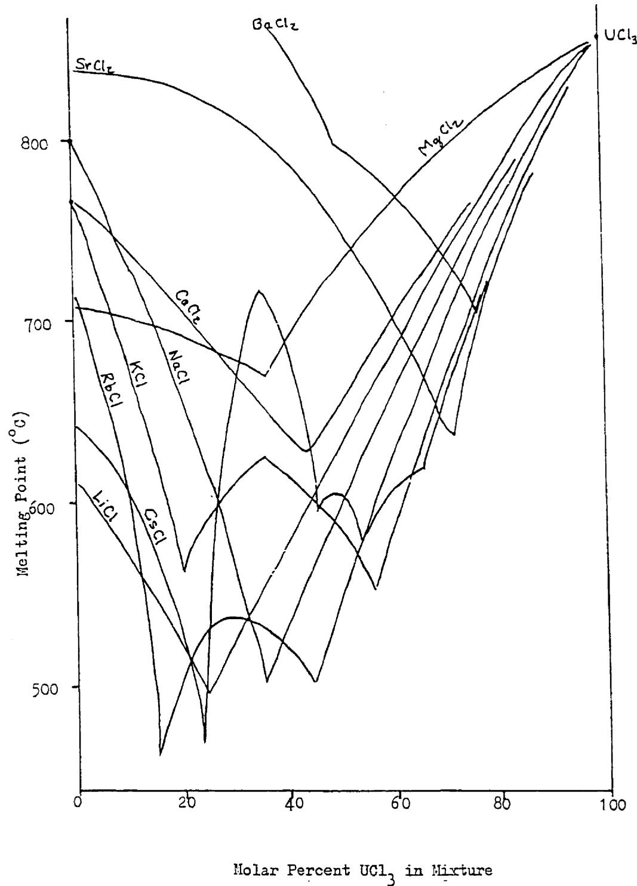  
Fig. 3.3-25 Fusion Diagrams for Binary UCl₃ Salt Mixtures

Many of the eutectic melting points occur at low UCl $_3$ molar content. In contrast, hard spectrum and high BG potential favor high actinide content.

Table 3.3-XI shows the possible UCl $_3$ molar contents under various temperature restrictions. RbCl excels for a $550^{\circ}\mathrm{C}$ limit; KCl or RbCl for $600^{\circ}\mathrm{C}$ . At $650^{\circ}\mathrm{C}$ all alkali chlorides show potential, though KCl and CsCl excel. Alkaline earth chlorides don't work until the low temperature limit exceeds $700^{\circ}\mathrm{C}$ .

If one wants a high-actinide 30 NaCl/70 UCl $_3$ mix then the lowest core salt temperature allowable (with a little safety margin) is $750^{\circ}\mathrm{C}$ . With a 50/50 NaCl/UCl $_3$ mix the temperature can drop to nominally $650^{\circ}\mathrm{C}$ .

Section 3.3.1.3 mentioned that ternary and higher component mixtures can further lower the melting point. Figure 3.3-26 presents four ternary diagrams for UCl₃-UCl₄-AkCl, where Ak=alkali or alkaline earth. One desires to optimize the UCl₃/UCl₄ ratio so as to hold down temperature (which affects corrosion) as well as the content of corrosive UCl₄. Keeping the U/Ak ratio high maximizes spectrum hardness and BG potential. Unfortunately, the isotherms and the eutectic m.p. tend away from high UCl₃ content. Ternary mixtures with two AkCl components behave similarly (Fig. 3.3-27). In summary one must tradeoff low melting point (low U-III content) and corrosion (high Ak content) against large spectrum hardness and BG potential (high U-III content).

Table 3.3-XI. Candidate Core Salt Compositions Under Varicus   
Temperature Restrictions   

<table><tr><td>Lowest Temp. to be En- countered (°C)</td><td>Carrier Salt</td><td>UCl3Molar Content (%)</td><td>Lowest Temp. to be En- countered (°C)</td><td>Carrier Salt</td><td>UCl3Molar Content (%)</td></tr><tr><td>500</td><td>RbCl</td><td>~15</td><td>700</td><td>LiCl</td><td>0-60</td></tr><tr><td>550</td><td>LiCl</td><td>~25</td><td></td><td>NaCl</td><td>18-60</td></tr><tr><td></td><td>NaCl</td><td>~35</td><td></td><td>KCl</td><td>10-68</td></tr><tr><td></td><td>CsCl</td><td>~25</td><td></td><td>RbCl</td><td>5-70</td></tr><tr><td></td><td>RbCl</td><td>15-45</td><td></td><td>CsCl</td><td>40-70</td></tr><tr><td></td><td></td><td></td><td></td><td>MgCl2</td><td>~38</td></tr><tr><td>600</td><td>LiCl</td><td>10-40</td><td></td><td>CaCl2</td><td>25-55</td></tr><tr><td></td><td>NaCl</td><td>30-45</td><td></td><td>SrCl2</td><td>60-70</td></tr><tr><td></td><td>KCl</td><td>50-60</td><td></td><td></td><td></td></tr><tr><td></td><td>RbCl</td><td>15-55</td><td>750</td><td>LiCl</td><td>0-70</td></tr><tr><td></td><td>CsCl</td><td>~55</td><td></td><td>NaCl</td><td>12-75</td></tr><tr><td></td><td></td><td></td><td></td><td>KCl</td><td>6-75</td></tr><tr><td>650</td><td>LiCl</td><td>0-50</td><td></td><td>RbCl</td><td>0-75</td></tr><tr><td></td><td>NaCl</td><td>20-55</td><td></td><td>CsCl</td><td>0-75</td></tr><tr><td></td><td>KCl</td><td>15-65</td><td></td><td>MgCl2</td><td>0-50</td></tr><tr><td></td><td>RbCl</td><td>8-60</td><td></td><td>CaCl2</td><td>15-65</td></tr><tr><td></td><td>CsCl</td><td>45-65</td><td></td><td>SrCl2</td><td>50-80</td></tr><tr><td></td><td>CaCl2</td><td></td><td></td><td>BaCl2</td><td>70-75</td></tr></table>

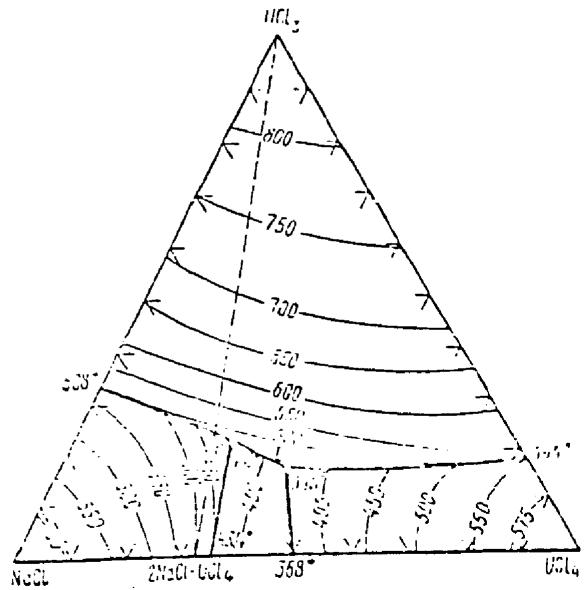

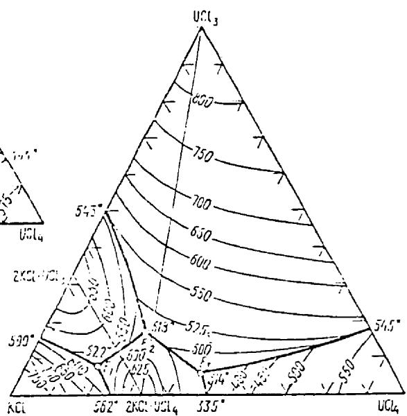

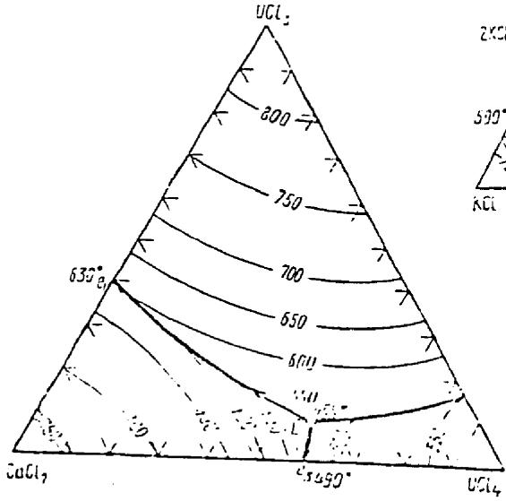

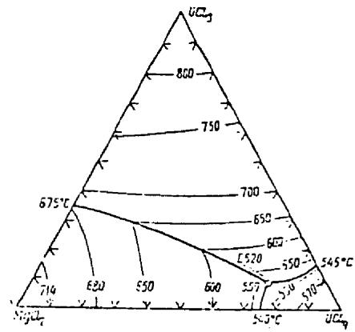  
Fig. 3.3-26 Ternary $\mathrm{UCl}_3 / \mathrm{UCl}_4$ Fusibility Diagrams

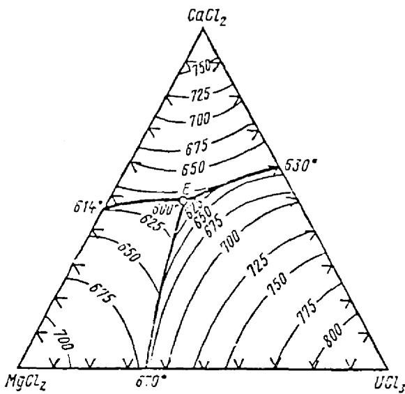  
Fig. 3.3-27 The UCl₃-CeI₂-MgCl₂ Fusibility Diagram

The blanket salt will generate little heat; therefore, a low m.p. temperature will facilitate its handling. High $\mathrm{ThCl}_4$ content maximizes BG there. Carrier-salts whose eutectic mixtures with $\mathrm{ThCl}_4$ (Fig. 3.3-28) seem to qualify are $\mathrm{PbCl}_2$ , LiCl, NaCl, and KCl. They also form suitable eutectics with the small amounts of $\mathrm{UCl}_4$ present (Fig. 3.3-29). $\mathrm{PbCl}_2$ has a slight disadvantage in that Pb is divalent, further increasing parasitic capture by chlorine.

Under an arbitrary operating design limit of one U atom per 10 Th atoms and low Ak content (to avoid blanket power cooling and BG loss) ternary $\mathrm{UCl}_4 / \mathrm{ThCl}_4 / \mathrm{AkCl}$ (Fig. 3.3-30) mixtures do not significantly lower the melting point: all eutectic points lie at high $\mathrm{UCl}_4$ and carrier salt contents.

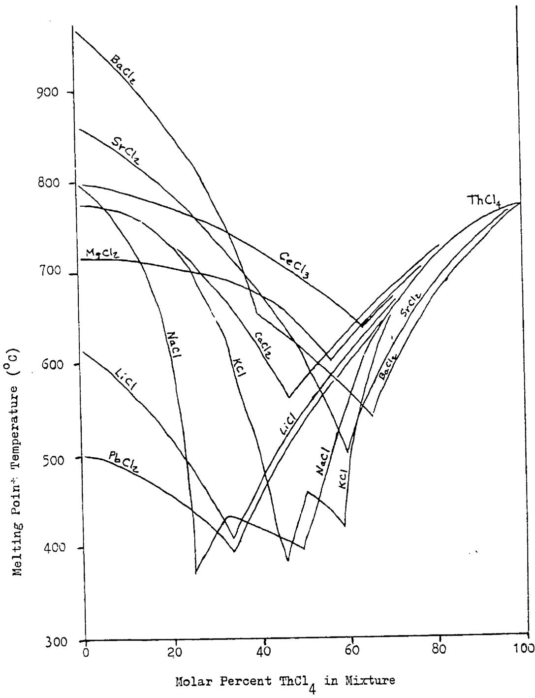  
Fig. 3.3-28 Fusion Diagrams for Binary $\mathrm{ThCl}_4$ Salt Systems

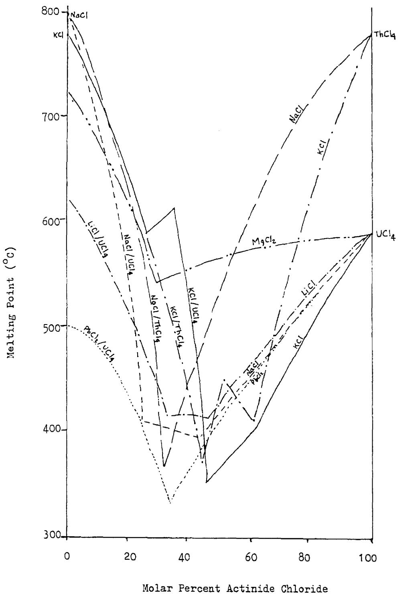  
Figure 3.3-29. Fusion Diagrams for Binary Mixtures of Ac(IV) and Carrier Chloride Salts

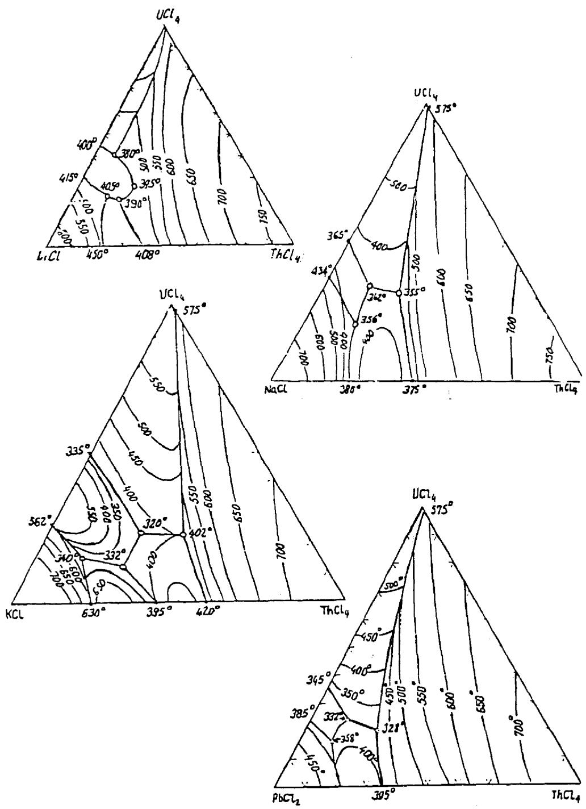  
Fig. 3.3-30 Ternary UCl4/ThCl4 Fusibility Diagrams

Addition of a second carrier salt does lower $\mathbf{T}_{\mathfrak{mp}}$ (down to 325-335° C) at $\sim 20\%$ ThCl<sub>4</sub> content (Fig. 3.3-31); however, though ${}^{7}\mathrm{Li}$ and $\mathrm{Pb}$ may not be too absorbing, the high Cl/Th ratio will damage BG and neutron spectrum.

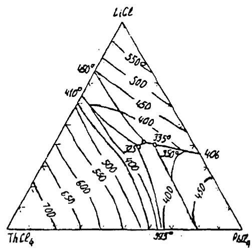  
Fig. 3.3-31. ThCl4/LiCl/PbCl2Fusibility Diagram

Fluoride blanket salt presents another alternative. ${}^{7}$ LiF (Fig. 3.3-32) could best lower the molting point and thermalize the blanket neutron spectrum without parasitically capturing neutrons. NaF looks next best. However fluorides solidify near ${700}^{ \circ  }\mathrm{C}$ and eutectic effects do not appear until ${\mathrm{{ThF}}}_{4}$ molar content falls dramatically (to BG) low to ${20}\%$ (Fig. 3.3-32); chlorides melt much lower.

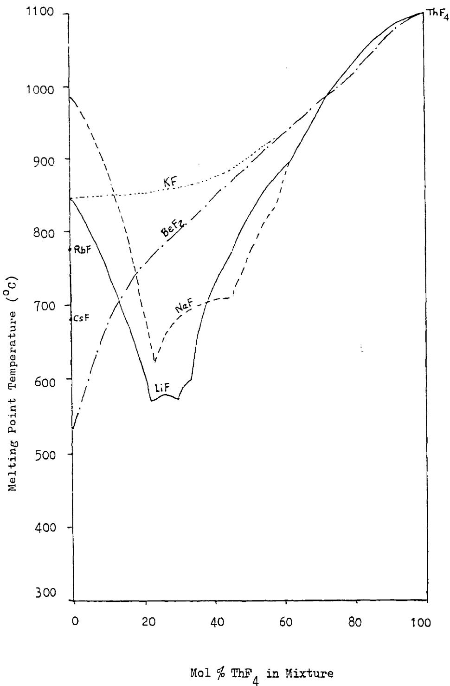  
Figure 3.3-32. Fusion Diagrams for Binary $\mathsf{ThF}_4$ Salt Systems

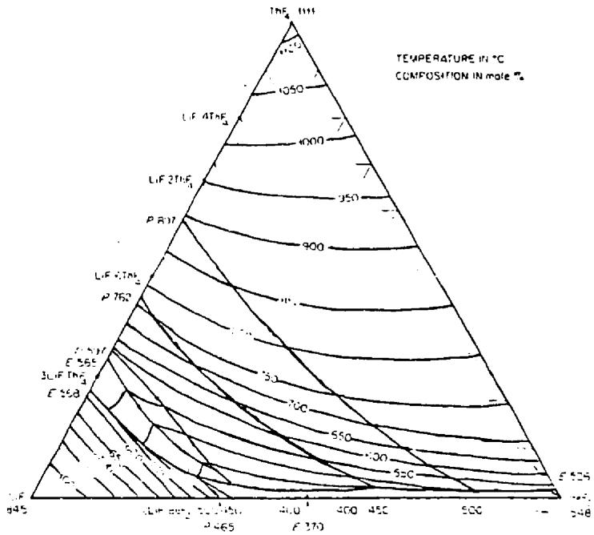  
Fig. 3.3-33

ThF/LiF/BeF2 and

ThF/NaF/ZrF

Fusibility

Diagrams

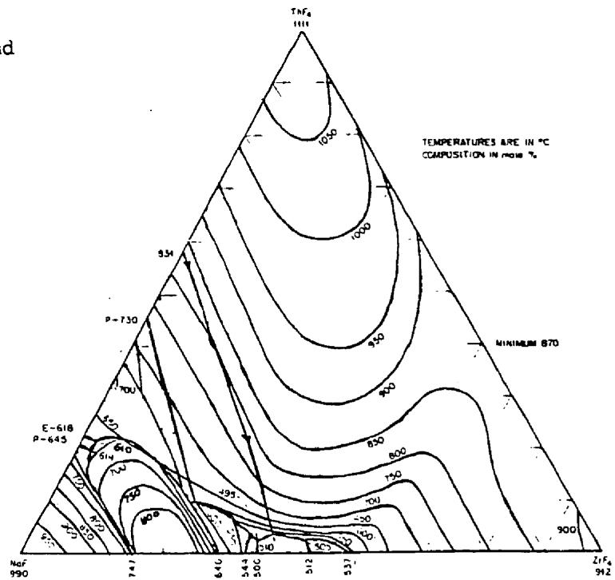

The eutectic points which minimize KCl content are $5.5\mathrm{UCl}_3 / 45\mathrm{UCl}_4 / 49.5\mathrm{KCl}$ for a m.p. of $314^{\circ}\mathrm{C}$ , or $17\mathrm{UCl}_3 / 26\mathrm{UCl}_4 / 57\mathrm{KCl}$ for a m.p. of $518^{\circ}\mathrm{C}$ . With NaCl one might opt for a m.p. of $339^{\circ}\mathrm{C}$ at $17\mathrm{UCl}_3 / 40.5\mathrm{UCl}_4 / 42.5\mathrm{NaCl}$ or $432^{\circ}\mathrm{C}$ at $21.5\mathrm{UCl}_3 / 29.5\mathrm{UCl}_4 / 49\mathrm{NaCl}$ . The $\mathrm{CaCl}_2$ ternary offers no attractive eutectic points.

None of the above points have $\mathrm{UCl}_3 / \mathrm{UCl}_4 > 1$ ; that could spell corrosion troubles (Sect. 3.4.2.2). Still, temperature affects corrosion as well, so that high $\mathrm{UCl}_4$ could yet be worthwhile. Of the five cases mentioned above the mix with m.p. $339^{\circ}\mathrm{C}$ looks the best.

Ternary mixtures of $\mathsf{ThF}_4 / \mathsf{UF}_4 / \mathsf{AkF}$ behave like their chloride counterpart: no eutectic points occur with high $\mathsf{ThF}_4$ content. Mixing in two carrier salts with $\mathsf{ThF}_4$ doesn't help either (Fig. 3.3-33): the well known MSBR salt Flibe $\mathsf{BeF}_2 / \mathsf{LiF}$ combines with $\mathsf{ThF}_4$ or $\mathsf{UF}_4$ to reach melting points of $400 - 500^{\circ}\mathsf{C}$ , but only at $12\%$ $\mathsf{ThF}_4$ (for $500^{\circ}\mathsf{C}$ ). Flibe also suffers because Be is scarce and Li produces T unless enriched in ${}^{7}\mathsf{Li}$ .

Fig. 3.3-6 showed higher halides to have lower melting points, but they have other problems.

3.3.4.5 Boiling point and vapor pressure. Chlorides of Ca, K, Na and Mg all boil in the same range, $1400 - 1600^{\circ}\mathrm{C}$ . Their differences are insignificant because $\mathrm{UCl}_4$ ( $792^{\circ}\mathrm{C}$ ) and $\mathrm{ThCl}_4$ ( $928^{\circ}\mathrm{C}$ ) pose much lower limits. The boiling points of $\mathrm{UCl}_3$ and $\mathrm{PuCl}_3$ are unknown, but their melting points compare with those of the carrier salts.

3.3.4.6 Chemical behavior. Halogens react vigorously with the alkali metals to form a very stable binary compound. Salts of alkaline earths also exhibit large free energy for formation (Fig. 3.3-12). Pb halides are not so stable: ORN.[13] found $\mathsf{PbCl}_2$ to react with the structural materials available then. They also found $\mathsf{ZrCl}_2$ to cause a snowy precipitate.

In addition to having high melting points, alkali halides conduct electricity in the molten state, and otherwise behave like electrovalent compounds. With the exception of lithium fluoride, they readily dissolve in water.

3.3.4.7 Cost and availability. NaCl is very abundant and cheap. This reduces both direct capital and fuel cycle costs; it also allows other options such as substitution of fresh for radioactive NaCl.   
3.3.4.8 Density. The densities of the principal (lighter) candidate carrier salts (Table 3.3-XII) differ little compared to those of $\mathsf{ThCl}_4$ , $\mathsf{UCl}_3$ , and $\mathsf{UCl}_4$ .

Due to differences in molecular weight, a 50-50 molar mix of actinide and carrier salt means about an 85-15 weight mix, respectively. Thus the actinide salt density controls the final density.

3.3.4.9 Heat Transfer Coefficient. Section 3.3.1.4 pointed out that

$$
n _ {f} \sim 1 0. 8 1 - 0. 4 7 C p ^ {0. 3 3} k ^ {0. 6 7}
$$

Section 3.3.4.8 showed that the actinide salt controls the density.

Section 3.3.1.6 suggests that $\mu$ (fuel salt mixture) $\approx \mu$ (carriers salt). Fig. 3.3-5 suggests avoiding most of the alkaline earth salts:

Table 3.3-XII Density $(\mathrm{g} / \mathrm{cm}^{3})$ of Chloride Salts at $800^{\circ}\mathrm{C}$   

<table><tr><td>Salt</td><td>Desyatnik et al [83]</td><td>Kinosz and Haupin [84]</td></tr><tr><td>LiCl</td><td>1.42</td><td>1.46</td></tr><tr><td>NaCl</td><td>1.55</td><td>1.61</td></tr><tr><td>KCl</td><td>1.52</td><td>1.57</td></tr><tr><td>RbCl</td><td>2.16</td><td></td></tr><tr><td>CsCl</td><td>2.62</td><td></td></tr><tr><td>PbCl2</td><td>4.42</td><td></td></tr><tr><td>ThCl4</td><td>3.36</td><td></td></tr><tr><td>UCl3</td><td>4.87</td><td></td></tr><tr><td>UCl4</td><td>3.17</td><td></td></tr><tr><td>BeCl2</td><td>1.10</td><td></td></tr><tr><td>MgCl2</td><td>1.65</td><td>1.68</td></tr><tr><td>CaCl2</td><td>2.07</td><td>2.11</td></tr><tr><td>SrCl2</td><td>2.77</td><td></td></tr><tr><td>BaCl2</td><td>3.28</td><td></td></tr></table>

the alkali chlorides and $\mathsf{PbCl}_2$ offer lower values.

In Table 3.3-III, the lighter chlorides offer the higher specific heats. In Figure 3.3-9 they also exhibit higher thermal conductivities in the $700 - 900^{\circ}\mathrm{C}$ range. CsCl is an exception.

Ignoring $\rho$ because the actinide density controls, a heat transfer figure-of-merit (FCM) for carrier salts is $C_p^{0.33} k^{0.67} \mu^{-0.47}$ .

The results for Section 3.3.1 data (Figure 3.3-34) and the above discussion recommend the lighter-weight-salts, and all the alkali chlorides.

A FC $^4$ including the density factor $\rho^{0.8}$ (Fi6.3.3-35) again discourages only the heavier alkaline earth chlorides. CsCl and FbCl $_2$ look very good then.

In summary, LiCl, MgCl $_2$ , and NaCl look to be the most attractive, in that order. SrCl $_2$ and BaCl $_2$ ; the least. This study is not conclusive, however, as it generally does not include the effects of actinide chloride admixture.

3.3.4.10. Choice in other studies. ORNL in 1956 [13] chose a $3\mathrm{NaCl} / 2\mathrm{MgCl}_2$ mix based on the eutectic point between these two. However, as pointed out above, the advantage of a second carriers salt disappears when the actinide salt predominates.

Similarly, ORNL in 1963 [G] and ANL in 1967 [21] reported studies on carrier salt mixtures of NaCl, KCl and MgCl $_2$ but with only 30 and $18 - 50\%$ mole of actinide chloride present, respectively.

Taube [17] generally assumes NaCl alone as carrier salt even with low actinide contents. He mentions also further study of NaF/ZrF $_2$ , but Section 3.3.2.9 precludes F from the core. The British [29] also choose NaCl by itself.

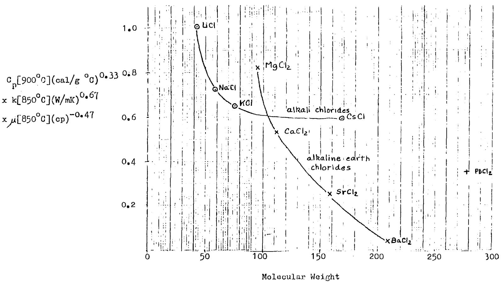  
Figure 3.3-34. Heat Transfer Coefficient Figure-of-Merit for Chloride Salts of Interest

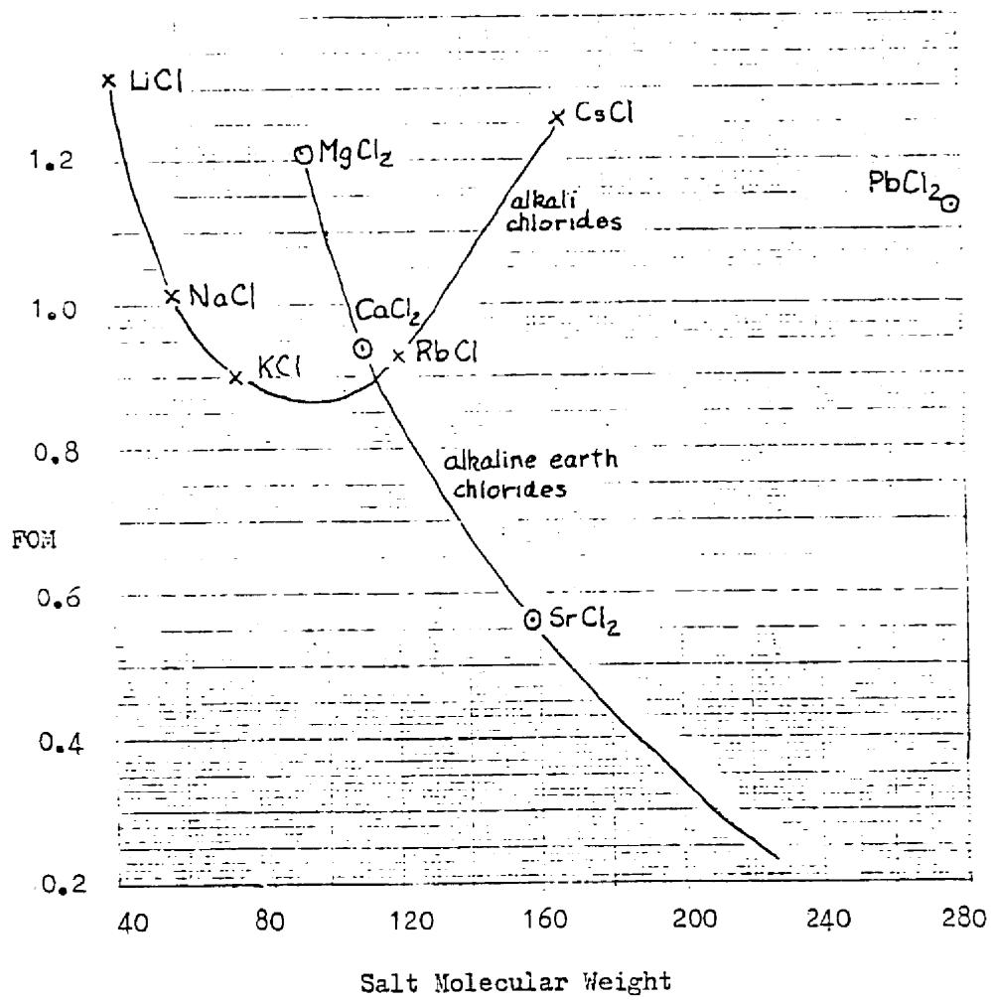  
Figure 3.3-35. Heat Transfer Coefficient Figure-of-Merit for Chloride Salts of Interest, Including Density

$$
\begin{array}{l} F O M = \rho [ 2 5 0 ^ {\circ} C ] (g / c m ^ {3}) ^ {0. 8} x C _ {p} [ 9 0 0 ^ {\circ} C ] (c a l / g ^ {\circ} C) ^ {C. 3 3} \\ x k [ 8 5 0 ^ {\circ} C ] (W / \square K) ^ {0. 6 7} x \mu [ 8 5 0 ^ {\circ} C ] (c p) ^ {- 0. 4 7} \\ \end{array}
$$

3.3.4.f1 Summary. Table 3.3-XIII summarizes the intercomparison of carrier salt cations. The goal of keeping the core spectrum hard discourages use of Be and Li there because of elastic downscatter; Ca and K downscatter the least. Na undergoes the most inelastic scatter; Ca and K, the least. Parasitic neutron capture though small, exceeds by magnitudes for Li and K over that for Ca, Mg, and Na. Ca transmutes the least into radioactivity or troublesome chemicals.

Cation choice on the basis of eutectic melting point depends on the range of acceptable actinide molar contents. Boiling points for carrier chlorides play no role as they far exceed those for actinide chlorides. The chemical stability of the alkali chlorides (NaCl and KCl) surpasses that of the alkaline earth chlorides (MgCl $_2$ and CaCl $_2$ ). NaCl abounds by far the most in nature and costs the least. Salt density affects pumping power needs but the higher densities of the actinide chlorides dwarf any differences due to carrier salt choice. The light alkalis transfer heat the best.

In summary, NaCl costs little and exhibits good physical and chemical properties. K and Ca feature better nuclear properties for the core salt but the much higher Cl concentration obscures them. Na and $\bar{\mathbb{I}}_{\mathrm{Li}}$ look best for the blanket salt. Final choic must weigh these relative advantages plus the location of eutectic melting points near the desired actinide molar fraction.

Table 3.3-XIII. Intercomparison of Salt Cations   

<table><tr><td rowspan="2">nuclear properties</td><td colspan="3">rating according to core salt goals</td></tr><tr><td>good</td><td>intermediate</td><td>poor</td></tr><tr><td>elastic scatter</td><td>K,Ca</td><td>Na,Mg,Pb</td><td>Li,Be</td></tr><tr><td>inelastic scatter</td><td>K,Ca,Be</td><td>Li,Mg</td><td>Na,Pb</td></tr><tr><td>neutron absorption</td><td>Mg,Ca,7Li</td><td>Pb,Be</td><td>Li,K</td></tr><tr><td>radioactivity</td><td>Na</td><td></td><td></td></tr><tr><td>impurity mutants</td><td>Ca,Pb</td><td>Mg,7Li,Cs</td><td>Li,Be,Na,K</td></tr><tr><td rowspan="3">overall nuclear</td><td>Ca,Sr,Cs</td><td>K,Na,Be,Ba</td><td>Rb,Sr,Ba</td></tr><tr><td>Ca</td><td>K,Mg,Na,Pb</td><td>Mg,Li,Pb</td></tr><tr><td></td><td></td><td>Li,Be</td></tr><tr><td>physical properties</td><td></td><td></td><td></td></tr><tr><td>m.p.</td><td>K,Na,Li,Pb</td><td>Mg,Ca</td><td>Be</td></tr><tr><td>b.p. vapor press.</td><td>all o.k.</td><td></td><td></td></tr><tr><td rowspan="2">heat transfer coef.</td><td>Li,Mg</td><td>Na,K,Ca</td><td>Ba,Sr,</td></tr><tr><td></td><td>Pb,Rb,Cs</td><td></td></tr><tr><td>chemical behavior</td><td></td><td></td><td></td></tr><tr><td rowspan="2">salt stability</td><td>Na,K,Rb,Cs</td><td>Mg,Ca,Pb</td><td></td></tr><tr><td></td><td>Sr,Ba</td><td></td></tr><tr><td>economics</td><td></td><td></td><td></td></tr><tr><td>cost</td><td>Na</td><td>Ca,K,Mg,Li,Pb</td><td>Be</td></tr><tr><td>disposal</td><td></td><td>(same as radioactivity)</td><td></td></tr><tr><td>overall comparison</td><td></td><td></td><td></td></tr><tr><td>core</td><td>Na,7Li</td><td>K,Ca,Mg,Pb,Sr,Ba</td><td>Li,Be</td></tr><tr><td>blanket</td><td></td><td>Mg,Ca,K,Pb</td><td>Li,Be</td></tr></table>

# 3.3.5 Choice of Relative Proportions of Actinide and Carrier Salt.

In the core we want to avoid nuclei which neither fission nor breed, but only downscatter and capture neutrons. This means maximizing the fissile enrichment and the ratio of actinide-to-carrier salt. It is also important to maximize the fuel salt heat transfer coefficient at an average fuel temperature of $800 - 850^{\circ}\mathrm{C}$ ; $\mathfrak{h}_{\mathfrak{f}}$ comprises the parameters $\hat{p}, \hat{\mu}, \hat{c}_{\mathfrak{p}}$ , and $\mathbf{k}$ (Section 3.2.5).

# 3.3.5.1 Neutron physics of the $\mathrm{ThCl}_4 / \mathrm{UCl}_3$ ratio in the core mixture.

Considerable $\mathsf{ThCl}_4$ inherently resides in between the core tubes as blanket salt and interacts neutrionically with the core. However, as a first approximation, Section 3.5.1 ignores that modelling heterogeneity as well as that of the multiple core tubes. Thus the $\mathsf{ThCl}_4/\mathsf{UCl}_3$ ratio here refers solely to that within the primary loop.

The addition of $\mathrm{ThCl}_4$ to the core salt mixture should

1. Markediy increase the critical core radius, thereby decreasing the power density. This causes

a. the core flux level to decrease, which

(1) extends the life of the core tubes, and   
(2) decreases the damage flux to the vessel, which extends its life

b. the primary coolant power density in the heat exchanger to decrease, which

(1) decreases out-of-core fuel inventory   
(2) eases heat exchanger stresses

2. Lead to an optimum Th/U ratio where the primary circuit fissile inventory is a minimum. The 1956 ORNL study [13]

obtained a similar result

3. Increase internal (core) breeding, which

a. reduces the necessary size of the outer blanket   
b. reduces the import of a reactor

4. Soften the neutron spectrum, which

a. decreases the BG potential of the reactor   
b. inhibits the useful consumption of higher actinides   
c. nullifies a small part of the flux decrease from the dilution because the average fission cross sections become smaller.

In summary there are both pros and cons re Th presence which are difficult to quantify on a common basis. However, qualitatively, BG potential and the useful consumption of the actinides argue for low Th concentration ([Th]) while [Th] $\rightarrow$ O could mean too frequent a replacement of the core tubes. Practically, reactor operation could start with high [Th] and wide tubes and later change to low [Th] and smaller tubes as confidence in the tube wall life develops. This vers-satility would probably require only the inclusion of a few extra tube ports in the reactor vessel.

3.3.5.2 Density. This study principally involves UCl₃, NaCl, and ThCl₄. NaCl molar content may vary only between 30 and 70% to achieve eutectic melting point lowering. Figure 3.3-36 shows the density for various ThCl₄/UCl₃ ratios using the densities and the prescription for their addition from section 3.3.1.5.

For a $\mathrm{PuCl}_3 / 2\mathrm{UCl}_3 / 3.16$ NaCl mix, Taube and Davudi [123] listed $\rho = 2.92\mathrm{g / cc}$ at $850^{\circ}\mathrm{C}$ ; for 15 $\mathrm{PuCl}_3 / 85$ NaCl, $\rho = 2.12\mathrm{g / cc}$ . These

values both seem low compared to Fig. 3.3-36 (though different actinide salts are involved). In the same report these authors quote $\rho = 3.526 \, \text{g/cc}$ for a $1\, \text{PuCl}_3 / 2\, \text{UCl}_3 / 3.65$ NaCl mix at $850^{\circ}\text{C}$ , which seems high.

The 1963 ORNL paper [6] listed a density of $3.08 \, \text{g/cc}$ at $649^{\circ} \text{C}$ for a $45 \, \text{NaCl}/25 \, \text{KCl}/30 \, (\text{PuCl}_3 + \text{UCl}_3)$ mix. Since density decreases with increasing temperature, that value supports Figure 3.3-36. The earlier 1956 ORNL study [13] used $\rho = 2.5 \, \text{g/cc}$ for a $3 \, \text{NaCl}, 2 \, \text{MgCl}_2$ , $1 \, (\text{UCl}_3 + \text{PuCl}_3)$ salt, which also seems consistent.

3.3.5.3 Viscosity. Section 3.31.6 recommended

$$
\mu (\text {m i x t u r e}) \approx \mu (\text {c a r r i e r s a l t})
$$

Assuming NaCl carrier salt, then from Fig. 3.3-5 at $850^{\circ}\mathrm{C}$

$$
\mu = 0. 0 1 2 \mathrm {g m} / \mathrm {s} \mathrm {c m}
$$

For a 1 PuCl $_3$ /2 UCl $_3$ /3.65 NaCl mixture, Taube and Dawudi [123] assumed a much higher $\mu = 0.05$ (1-0.001(T-850°C)). Similarly, at $649^{\circ}\mathrm{C}$ ORNL used 0.0662 ± 0.0080 for a 45 NaCl/25 KCl/30 ( $UCl_3 + PuCl_3$ ) salt in 1963 [6] and 0.10 for a 3 NaCl/2 MgCl $_2$ /1 ( $UCl_3 + PuCl_3$ ) salt in 1956 [13]. However, neither Taube nor ORNL indicate any experimental basis whereas the $\mu$ recommended here is based on recent (Russian) measurements [124-125]. This reduction in $\mu$ by more than a factor of three increases $h_f$ by roughly $50\%$ over previous studies. 3.3.5.4 Specific heat. From the study of specific heats for 3-component salts (Section 3.3.1.7)

$$
\begin{array}{l} C _ {p, m, p _ {\bullet}} (\mathrm {c a l / g ^ {o} C}) = \frac {8 . 1 \mathrm {c a l / ^ {\circ} C}}{\text {a t o m m o l e}} x \frac {(2 m _ {2} + 4 m _ {4} + 5 m _ {5})}{m _ {2} ^ {M} m _ {2} + m _ {4} ^ {M} m _ {4} + m _ {5} ^ {M} m _ {5}} \\ \text {a n d} \quad C p (T) = C p _ {0} [ 1 - \bar {\alpha} T (K) ] \end{array}
$$

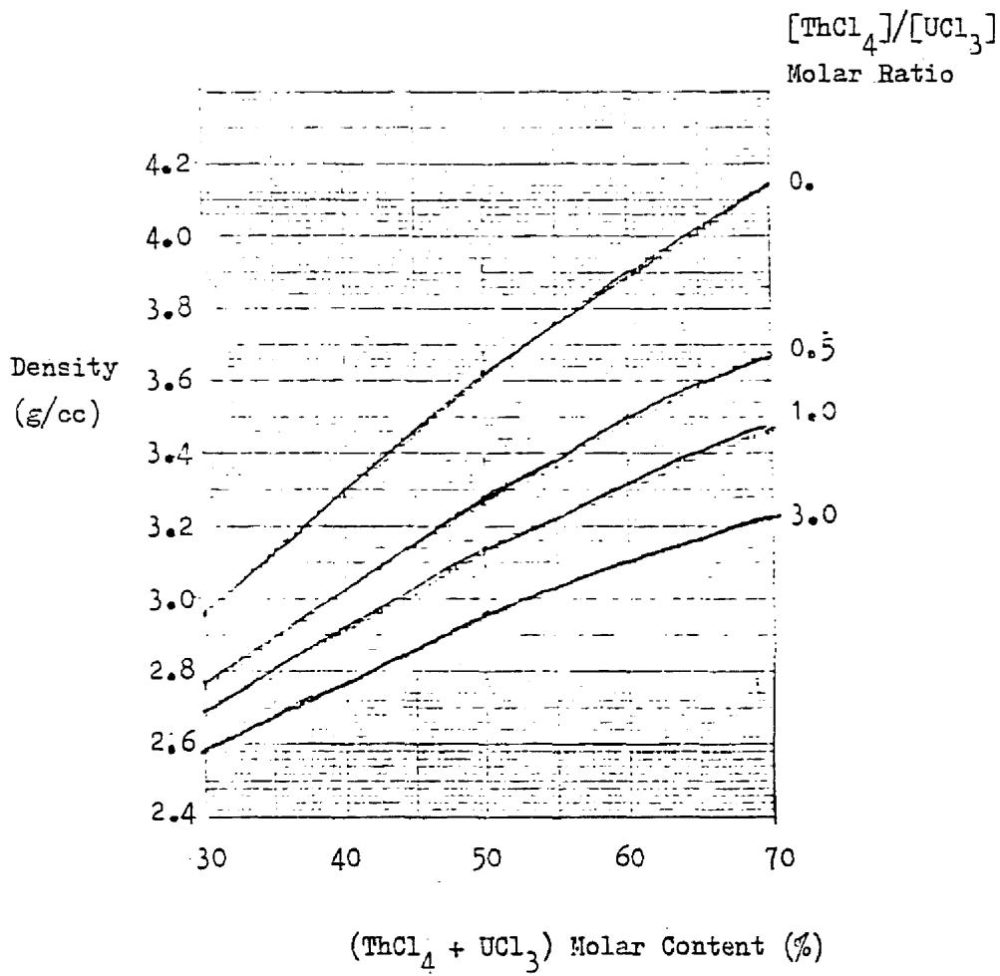  
Figure 3.3-36 Density at $850^{\circ}\mathrm{C}$ for $\mathrm{NaCl} / \mathrm{ThCl}_4 / \mathrm{UCl}_3$ Mixtures Based on Janz Et. Al [112] Data and Linear Addition of Specific Volumes of Component Salts.

where

$$
\begin{array}{l} m _ {2} = \text {m o l e f r a c t i o n o f t h e 2 - a t o m a l k a l i c a r r i e r s a l t} \\ m _ {4} = \text {m o l e f r a c t i o n o f t h e 4 - a t o m U C l} _ {3} \\ m _ {5} = \text {m o l e f r a c t i o n o f t h e 5 - a t o m T h C l} \\ M _ {2}, M _ {4}, M _ {5} = \text {c o r r e s p o n d i n g m o l e c u l a r w e i g h t s} \\ C _ {p} ^ {\circ} = C _ {p, m p} / [ 1 - \bar {\alpha} T _ {m p} (K) ] \\ \overline {{\alpha}} = \text {a v e r a g e c o e f f i c i e n t o f l i n e a r e x p a n s i o n} \\ = \sum_ {i} m _ {i} \alpha_ {i} \\ \alpha_ {i} = 3. 6 5, 4. 2 3, \text {a n d} 5. 5 7 \times 1 0 ^ {- 4} \mathrm {C} ^ {- 1} \text {f o r N a C l , U C l} _ {3}, \text {a n d T h C l} _ {4} \\ \end{array}
$$

Figure 3.3-37 shows the results at the $T_{mp}$ for each material. For a fixed temperature, $C_p$ changes much less with molar composition.

Taube and Dawudi [123] assumed $C_p = 0.094$ and $0.068 \times (1 - 0.0005(T - 850^{\circ}C)) \, \text{cal/gm}^{\circ}C$ for 15 $\text{PuCl}_3 / 85 \, \text{NaCl}$ and 1 $\text{PuCl}_3 / 2 \, \text{UCl}_3 / 3.16 \, \text{NaCl}$ mixtures, fairly consistent with Figure 3.3-37. However for a 1 $\text{PuCl}_3 / 2 \, \text{UCl}_3 / 3.65 \, \text{NaCl}$ mix at $850^{\circ}C$ they used a rather high value of 0.24 cal/gm $^{-}$ C. This agrees better with the 1963 ORNL [6] value of 0.3±0.03 cal/gm $^{\circ}C$ at $649^{\circ}C$ for a 45 NaCl/25 KCL/30 ( $\text{UCl}_3 + \text{PuCl}_3$ ) mix and the 1956 ORNL [13] value of 0.2 cal/gm $^{\circ}C$ at $649^{\circ}C$ for a 3 NaCl/2 MgCl $_2$ /1 ( $\text{UCl}_3 + \text{PuCl}_3$ ) salt.

The values used in this work are intermediate to the above extremes. Although they admittedly contain large uncertainty, at least Section 3.3.1.7 describes their basis; Taube and ORNL do not describe theirs.

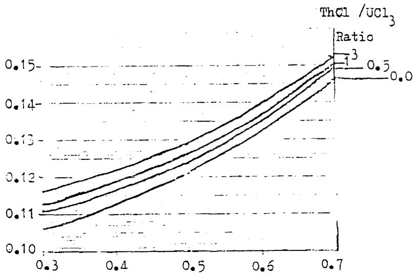  
C p (cal C)   
NaCl Molar Fraction   
Figure 3.3-37 Specific Heat at $T_{mp}$ for NaCl/ThCl4/UCl3 Mixtures

3.3.5.5 Thermal conductivity. Section 3.3.1.8 estimated

K $(\mathrm{T}_{\mathrm{mp}}) = 0.04308\mathrm{T}_{\mathrm{mp}}^{0.5}\rho_{\mathrm{mp}}^{0.8} / \mathrm{H}^{1.8}\mathrm{f}_{\mathrm{atomic}}$ cal/s cm K and

$$
k (T) = k \left(T _ {m p}\right) + 6. 0 x 1 0 ^ {- 7} \left(T - T _ {m p}\right) M V
$$

Table XIV shows the calculated $\left\{k\right\}$ at $T = T_{mp}$ , $T = T_{mp} + 100^{\circ}C$ , and $T = 350^{\circ}C$ . The higher k-values seem to occur for high NaCl and ThCl<sub>4</sub> contents.

Table 3.3-XIV Calculation of Thermal Conductivity for NaCl/ThCl4/UCl3 Mixtures   

<table><tr><td rowspan="2">NaCl Molar Content (%)</td><td rowspan="2">ThCl3/UCl3Molar Ratio</td><td rowspan="2">Tmp(C)</td><td rowspan="2">m.p(g/cc)</td><td rowspan="2">M</td><td rowspan="2">Navg</td><td rowspan="2">f atomic</td><td colspan="3">k (10-3cal cm sec°F)</td></tr><tr><td>at Tmp</td><td>at Tmp+ 100°C</td><td>at 800°C</td></tr><tr><td>30</td><td>0</td><td>740</td><td>4.37</td><td>255.1</td><td>3.40</td><td>0.132</td><td>1.57</td><td>1.94</td><td>1.97</td></tr><tr><td>50</td><td>0</td><td>610</td><td>4.02</td><td>198.9</td><td>3.00</td><td>0.168</td><td>1.69</td><td>1.93</td><td>2.26</td></tr><tr><td>70</td><td>0</td><td>540</td><td>3.35</td><td>142.7</td><td>2.60</td><td>0.204</td><td>2.10</td><td>2.24</td><td>2.52</td></tr><tr><td>30</td><td>0.5</td><td>(713)</td><td>3.96</td><td>263.2</td><td>3.633</td><td>0.111</td><td>1.61</td><td>2.03</td><td>2.18</td></tr><tr><td>50</td><td>0.5</td><td>(540)</td><td>3.85</td><td>204.7</td><td>3.167</td><td>0.153</td><td>1.63</td><td>1.90</td><td>2.146</td></tr><tr><td>70</td><td>0.5</td><td>(502)</td><td>3.25</td><td>146.2</td><td>2.700</td><td>0.195</td><td>2.00</td><td>2.15</td><td>2.52</td></tr><tr><td>30</td><td>1.0</td><td>(700)</td><td>3.81</td><td>267.2</td><td>3.750</td><td>0.100</td><td>1,68</td><td>2.12</td><td>2.34</td></tr><tr><td>50</td><td>1.0</td><td>(505)</td><td>3.79</td><td>207.5</td><td>3.250</td><td>0.146</td><td>1.61</td><td>1.89</td><td>2.58</td></tr><tr><td>70</td><td>1.0</td><td>(482)</td><td>3.21</td><td>147.9</td><td>2.750</td><td>0.190</td><td>1.96</td><td>2.12</td><td>2.53</td></tr><tr><td>30</td><td>3.0</td><td>660</td><td>3.66</td><td>273.2</td><td>3.925</td><td>0.0848</td><td>1.81</td><td>2.29</td><td>2.72</td></tr><tr><td>50</td><td>3.0</td><td>400</td><td>3.83</td><td>211.8</td><td>3.375</td><td>0.1343</td><td>1.59</td><td>1.89</td><td>2.95</td></tr><tr><td>70</td><td>3.0</td><td>425</td><td>3.21</td><td>150.5</td><td>2.825</td><td>0.1838</td><td>1.89</td><td>2.05</td><td>2.59</td></tr></table>

Table XV compares some of these $\{\mathbf{k}\}$ (with $\mathrm{T - 600^{\circ}C}$ ) to those assumed in other studies, ordered by increasing actinide salt content. ORNL [13] and Taube values seem rather high. Close agreement with the other $\{\mathbf{k}\}$ ( $\approx 2 \times 10^{-3} \mathrm{cal/s cmK}$ ) lends credence to the values assumed in this work.

3.3.5.6 Heat transfer coefficient. With the above bases, and assuming

(1) The algorithm developed for $h_f$ in Section 3.2.5.1   
(2) A salt velocity in the heat exchanger of 14 meters per second   
(3) An inside tube diameter of 0.40 inches   
(4) $\mu = \mu_{\text{wall}}$ (for these survey purposes),

The film coefficient for various mixtures and temperatures becomes

$$
\begin{array}{r l} h _ {f} = & \frac {7 . 3 7 (1 4) ^ {0 . 8} (1 0 ^ {- 3}) ^ {0 . 6 7}}{(1 . 4 6) ^ {0 . 4 7} x (1 . 0 1 6) ^ {0 . 2}} \rho (\varepsilon / c c) ^ {0. 8} k (1 0 ^ {- 3} c a l / s c m K) \\ & \quad \Psi \\ & \quad 0. 5 3 6 7 \end{array}
$$

The results (Table 3.3-XVI) differ very little with mixture or temperature. Considering the approximations made for the input parameters, no significant trend is detected. Roughly

$$
h _ {f} = 1. 2 \text {c a l / s e c} \mathrm {c m} ^ {2} \mathrm {K}
$$

The only other value available for comparison is the ORNL [13] $h_f = 0.38 \, \text{cal/s cm}^2 \, \text{K}$ . Table 3.3-XVII shows that the factor of 3 increase here is predominantly due to a doubling of fuel velocity and an 8-fold decrease in viscosity. The latter is mostly due to more recent information and higher temperature, and partly contingent on picking a composition with eutectic-like effects on viscosity (Sec. 3.3.1.6).

Entries arranged in order of decreasing carrier salt concentration

Table 3.3-XV Comparison of Calculated Thermal Conductivities to   
Those Assumed in Previous MCFR Studies   

<table><tr><td>Study</td><td>Carrier salt</td><td>Actinide salt</td><td>T(℃)</td><td>k (10-3cal sec cm k)</td></tr><tr><td rowspan="2">CRNL/56 [13]</td><td>50 NaCl</td><td rowspan="2">17 (UCL3+ PuCl3)</td><td rowspan="2">649</td><td rowspan="2">4.1</td></tr><tr><td>33 MgCl2</td></tr><tr><td rowspan="2">ANL/C [21]</td><td>82 NaCl</td><td>5.4 PuCl3</td><td rowspan="2">552.5</td><td rowspan="2">2.4</td></tr><tr><td></td><td>12.6 UCL3</td></tr><tr><td rowspan="2">CRNL/63 [6]</td><td>45 NaCl</td><td rowspan="2">30 (PuCl3+ UCL3)</td><td rowspan="2">649</td><td rowspan="2">1.7</td></tr><tr><td>25 KCl</td></tr><tr><td>ANL/A [21]</td><td>70 NaCl</td><td>30 PuCl3</td><td>682.5</td><td>2.1</td></tr><tr><td>This work</td><td>70 NaCl</td><td>30 UCL3</td><td>640</td><td>2.2</td></tr><tr><td rowspan="2">Taube[17]</td><td>55 NaCl</td><td>15 PuCl3</td><td>850</td><td>3.6</td></tr><tr><td></td><td>30 UCL3</td><td></td><td></td></tr><tr><td></td><td></td><td></td><td>650</td><td>2.9</td></tr><tr><td rowspan="2">ANL/B [21]</td><td>50 NaCl</td><td>22.5 PuCl3</td><td>615</td><td>1.6</td></tr><tr><td></td><td>27.5 UCL3</td><td></td><td></td></tr><tr><td>This work</td><td>50 NaCl</td><td>50 UCL3</td><td>610</td><td>1.7</td></tr><tr><td rowspan="2">This work</td><td>50 NaCl</td><td>25 ThCl4</td><td>605</td><td>1.9</td></tr><tr><td></td><td>25 UCL3</td><td></td><td></td></tr></table>

Table 3.3-XVI Calculated Heat Transfer Coefficients   

<table><tr><td colspan="2">Molar Composition</td><td colspan="2">h f (cal/sec cm2K)</td></tr><tr><td>ThCl4/UCl3</td><td>NaCl</td><td>at Tmp + 100</td><td>at 850°C</td></tr><tr><td rowspan="3">0</td><td>30</td><td>1.22</td><td>1.22</td></tr><tr><td>50</td><td>1.20</td><td>1.23</td></tr><tr><td>70</td><td>1.22</td><td>1.18</td></tr><tr><td rowspan="3">0.5</td><td>30</td><td>1.17</td><td>1.19</td></tr><tr><td>50</td><td>1.15</td><td>1.19</td></tr><tr><td>70</td><td>1.16</td><td>1.11</td></tr><tr><td rowspan="3">1.0</td><td>30</td><td>1.17</td><td>1.19</td></tr><tr><td>50</td><td>1.13</td><td>1.18</td></tr><tr><td>70</td><td>1.14</td><td>1.09</td></tr><tr><td rowspan="3">3.0</td><td>30</td><td>1.20</td><td>1.24</td></tr><tr><td>50</td><td>1.15</td><td>1.20</td></tr><tr><td>70</td><td>1.12</td><td>1.06</td></tr></table>

Table 3.3-XVII Comparison of h, Between This Work and the CRNL/56[13] Study   

<table><tr><td>Parameter</td><td>CRNL 56 [13]</td><td>This Work</td><td>Effect of This work/ CRNL-56</td></tr><tr><td>Salt Temp (°C)</td><td>732</td><td>(582)</td><td>—</td></tr><tr><td>Molar % NaCl</td><td>83</td><td>70</td><td>—</td></tr><tr><td>\( \hat{p} (g/cm^3) \)</td><td>2.5</td><td>2.7</td><td>\( (\frac{2.7}{2.5})^{0.8}=1.06 \)</td></tr><tr><td>\( \mu (gm/s cm) \)</td><td>0.10</td><td>0.0146</td><td>\( (\frac{0.012}{0.10})^{-0.47}=2.7 \)</td></tr><tr><td>\( c_p(cal/gm^3c) \)</td><td>0.20</td><td>0.15</td><td>\( (\frac{0.15}{0.20})^{0.33}=0.91 \)</td></tr><tr><td>\( k.\left(\frac{10^{-3}cal}{s cm\%}\right) \)</td><td>4.1</td><td>2.12</td><td>\( (\frac{2.12}{4.1})^{0.67}=0.64 \)</td></tr><tr><td>\( \nu (m/s) \)</td><td>6.1</td><td>14.</td><td>\( (\frac{14}{6.1})^{0.8}=1.94 \)</td></tr><tr><td>\( h_i(cal/m^{2oC}) \)</td><td>0.38</td><td>1.14</td><td>\( (\frac{1.14}{0.38})=3.00 \)</td></tr></table>

3.3.5.7 Choice of core mix. A pure fissile fuel would produce the hardest neutron spectrum but an MSR requires carrier salt admixture to reduce the melting point. Adding fertile salt to the core mix helps reach BG potential by reducing leakage through increased fertile capture, but it also lowers the BG potential by softening the core neutron spectrum. Another consequence will be to increase the critical mass of fissile fuel and the core size. This will be good for power density (Fig. 3.5-15) and in-core to out-of-core inventory ratio (for control purposes), but there are limits to economical plant size.

An alternative to fertile fuel in the core is to increase the size of the outer blanket. However, this also increases the size of the overall reactor system.

The ORNL/56 design limited the actinide concentration to 17 mole precent actinide chloride. Of this, $2/3$ of the actinide was fertile material. The prime motivation was to keep the liquidus temperature below $500^{\circ}\mathrm{C}$ , to avoid what were then exotic structural materials.

The British [29] chose an actinide molar concentration of $30 - 40\%$ ; the French [23], $30\%$ , following the earlier lead of ANL [21]. The reasons for these choices are not clearly stated. However, we suspect they include

1. Keeping the power density low   
2. Keeping down the plant fissile inventory   
3. Improving the thermophysical properties.

This study assumed $70\%$ for most of the physics analyses so as to

fully explore the advantages of a hard spectrum: power density is reduced by using a geometry with high surface/volume ratio and limited fertile fuel presence (limited reduction in enrichment). By and large the enrichment problem is ignored because all fuels have weapons capability but $^{232}$ U-bearing $^{233}$ U, the least so. The better thermophysical properties from higher carrier salt content are sacrificed for the sake of the highly-desirable hard spectrum and attendant high BG potential. 3.3.5.8 Choice of blanket mix. Since the blanket generates little heat, it can avoid high temperatures. This should

1. Preclude corrosion of the reactor vessel   
2. Allow more choices for the reactor vessel material   
3. Reduce auxiliary heating needs

For low temperature operation the salt composition should lie near the eutectic point(s), but on the side high in actinide content for high BG. The French and Swiss MCFR(U/Pu) designs assume $65\%$ UCl₃ and $35\%$ NaCl; the British, $40\%$ UCl₃ and $60\%$ NaCl. For a NaCl/UCl₃ mix the eutectic point occurs at about $65\%$ NaCl; for NaCl/ThCl₄, at about $70\%$ NaCl. We assume here a $65\%$ ThCl₄ and $35\%$ NaCl, KCl, or LiCl mix. Table 3.3-XIII tends to favor a farther look at LiF for the blanket. PbCl₂ is an outside possibility yet.

3.3.5.9 Eutectic mix for flush salt. Section 3.9.5 proposes flush operations for removing residual radioactive salt in core and blanket. The best mix for this purpose would probably be the eutectic composition of the blanket feed: with the NaCl/ThCl $_4$ system, any mix between 25 and $50\%$ NaCl would be good (Fig. 3.3-22).

# 3.4 Structural Materials

To find materials of suitable strength and endurance one must anticipate the environment and the response of materials to it. Environment includes radiation, temperature, pressure, fluid composition, chemical additives, condensation, and vaporization. Material response depends on mechanical strengths, metallurgical phases, and chemical interactions (corrosion).

Requirements on the material will include suitable thermophysical properties, ability to fabricate and weld, product availability, and existence of pertinent experience for the material.

# 3.4.1 General Considerations and Criteria

3.4.1.1 Plant-life economics. Initial study usually suggests several economical materials. The material cost is important, but the true installed cost depends also on size, pipe schedule, system complexity, joint make-up, fabrication techniques, and labor rates. Downtime and life expectancy, functions of the material response, will affect the ongoing maintenance costs. Fortunately, metals usually have known corrosion rates.

3.4.1.2 Corrosion, general [80, 126]. The most important engineering task is likely to be finding materials which resist corrosion by fuel and blanket salt mixtures containing fission products and other impurities. This may require a trade-off with system conditions such as lowering temperature, decreasing velocity, or removing oxidizers.

Alternately one might sacrifice some corrosion resistance for higher strength; also, the best material might not be readily available. The most desirable material will probably combine

moderate cost with reasonable life. Sometimes the environment conditions change with time: The structural material must handle that or be changed also. Experimental loops under similar reactor operating conditions are thus invaluable: they allow one to examine actual corroded pipe, valves, and fittings.

Many factors can affect corrosion, some of which may be obscure. The questions below help in evaluating them:

1. What is the composition of the corrosive fluid?   
2. What is the concentration (specific gravity, pH, etc.)?   
3. What is the operating temperature and pressure?   
4. Is water present at any time?   
5. Is air present, or is the opportunity for air-leaks high?   
6. Is the system ever flushed, rinsed, or drained out?   
7. Is a slight amount of corrosion objectionable from a contamination standpoint?   
8. Has any specific trouble or problem been experienced with certain materials?   
9. What materials are being, or have been, used for valves and fittings?   
10. What were the comparative lives of the materials used?   
11. Are there special fabrication, handling, or installation problems?   
12. What is the estimated installed cost or capitalized cost for the projected life of the piping?

Metallurgical structure markedly affects corrosion resistance: fortunately it can often be altered. Physical chemistry and its

various disciplines are most useful for studying the mechanisms of corrosion reactions, the surface conditions, of metals, and other basic properties.

3.4.1.3 Corrosion by electrochemical attack [80]. Under chemical attack, metal ions leave anodic areas of the surface and enter into the solution, thus dissolving the surface. This creates an etched affect. In the solution they chemically react with other elements such as oxygen, chlorine, etc. to form nonmetallic compounds; plateout of these darkens the surface with a protective, passive film. Examples include rust on iron, oxide layer on aluminum, and "passivation" of stainless steel by immersion in nitric acid.

While they remain intact, such films generally protect the metal or at least retard further degradation. However, high stream velocities, vibration, and thermal shock can all break the film continuity. The pickling of pipe to remove mill scale illustrates controlled corrosion by direct attack.

Galvanic action, or bimetal corrosion, exemplifies another common mechanism. Two dissimilar metals establish an electrical potential when they contact, or connect by an electrical pathway, in the presence of a conducting solution (electrolyte).

In bolted joints, such as pipe flanges, the relative sizes of the anodic and cathodic areas become important. An anodic area that is small in relation to the cathodic area accelerates the corrosion. Where flanges and bolts are dissimilar metals, the bolting metal should be cathodic to the flange metal.

3.4.1.4 Corrosion protection [80, 126]. The means of reducing corrosion include

(1) Use of corrosion-resistant metals and alloys   
(2) Protective coatings such as paint, electroplating, etc.   
(3) Cathodic protection by the use of a sacrificial metal higher in the electropotential series

Impervious graphite - for handling hydrofluoric, sulfuric, and nitric acids - has some temperature and concentration limits. It is unsuitable for use with free bromine, fluorine, and iodine, as well as chromic acid and sulfur trioxide. Normally, its porosity makes graphite unsuitable as a piping material; however, various resins used as impregnants will produce an impervious material. The pipe manufacturer should know what corrosives are to be handled so he can provide the proper impregnant. A concern here would be the effects of high radiation on the organic resin as well as the graphite.

The use of lined piping systems for corrosive surfaces is rapidly increasing. Linings include glass, plastics, elastomers, and various metals. Lined pipe systems usually rely on carbon steel as a main structural component: ease of fabrication and low cost permit its use with most linings and manufacturing techniques. Glass-lined steel pipe has one of the broadest ranges of corrosion resistance of all. It's smooth surface improves product flow, but it has poor impact and thermal shock resistance, requiring care and handling during installation and maintenance. Thermal shock resistance could be a valid concern where one plans to completely and quickly remove the fuel from the primary circuit, several times per year.

3.4.1.5 Thermal and radiation-induced expansion. Temperature and radiation will cause most materials to expand. This will affect the choice of materials for core tubes, reactor vessel, and out-of-reactor equipment (pipes, pumps, heat exchangers) for primary, secondary, and tertiary circuits. Table 3.4-I gauges thermal expansion for some materials of interest: both Mo and graphite look attractive.

Table 3.4-I Coefficients of Thermal Expansion for Some Candidate Structural Materials [86,97]   

<table><tr><td>Material</td><td>Temp. Range(℃)</td><td>Coefficient (10-6/°C)</td></tr><tr><td rowspan="2">Extruded graphite - along the grain</td><td>20-100</td><td>2</td></tr><tr><td>1000</td><td>4</td></tr><tr><td rowspan="2">- against the grain</td><td>20-100</td><td>3</td></tr><tr><td>1000</td><td>6</td></tr><tr><td>Mo</td><td>250</td><td>5</td></tr><tr><td>Hastelloy N</td><td>20-100</td><td>11</td></tr><tr><td>Fe</td><td>25</td><td>12</td></tr><tr><td>Ni</td><td>25</td><td>12-13</td></tr><tr><td>304SS</td><td>25</td><td>17</td></tr><tr><td>Croloy</td><td>20-100</td><td>18</td></tr></table>

Core tubes need to be far enough apart that expansion does not cause stresses by forcing them together. Design for longitudinal expansion will prevent bowing and/or breakage (of graphite).

Proper layout should accommodate expansion in out-of-reactor piping. Expansion effects in a pump or heat exchanger are more critical: fortunately radiation levels there, from delayed neutrons, are near three magnitudes below that in the core.

# 3.4.2 Chemical Reactions in an MCFR

Compatible containment materials are those which do not form stable chlorides. Examples are graphite, iron, nickel, and the refractory metals. The chlorides of the pure fuel salt are highly stable, reacting little with materials they contact. However, over the reactor life the core and blanket salts will mutate into a variety of compositions, begetting additional chemical species: fission products and free chlorine from fission; other mutants through neutron capture; oxygen creeping in through seals. Fortunately, fluid systems can reprocess continuously (Section 3.7), which helps to keep these impurities low.

Chemical reactions between these salt mixtures and incompatible container materials could

1. Precipitate fissile material leading to criticality safety problems   
2. In the presence of high temperatures, high velocities, and high radiation fields, cause corrosion leading to leakage and maintenance problems.

3.4.2.1 Reactions with fission-produced mutants. When uranium fissions, the $\mathrm{UCl}_3$ molecular structure breaks up, creating three chlorine ions and two fission products (FP). Table 3.4-II [9] gives the valencies of these these FP in their most stable state (largest free energy of formation [17,82,86,127] at reactor temperatures).

The FP will only form chlorides if the free enthalpy of formation exceeds about 20 kilojoules per mole chlorine: FP up to and including molybdenum in Fig. 3.4-1. The gases xenon, krypton, and probably iodine and bromine are inert to chloridization; so are the more inert metals such as palladium, technetium, ruthenium, rhodium, and probably tellurium. Based on MSFE experience, they will either entrain with the inert gases or plate out on metal surfaces.

Table 3.4-II Valencies of the Fission-Product Elements in Holten Chlorides   

<table><tr><td>Valency</td><td>Elements</td></tr><tr><td>-2</td><td>Se, Te</td></tr><tr><td>-1</td><td>I</td></tr><tr><td>.0</td><td>Kr, Xe</td></tr><tr><td>+1</td><td>Rb, Ag, In, Cs</td></tr><tr><td>+2</td><td>Sr, Zr, Mo, Pd, Cd, Sn, Ba, Sm, Eu</td></tr><tr><td>+3</td><td>Y, Tc, Ru, Rh, Sb, La, Ce, Pr, Nd, Pm, Gd</td></tr><tr><td>+5</td><td>Nb</td></tr></table>

Free enthalpy of formation, - G1250 K (kJ·mol-1Cl)   

<table><tr><td>300</td><td>-NoC1</td><td>-PuC13</td><td>-YC13</td><td>-PRC3(4.28)</td><td>-EuC13(1.06)</td><td>-CeC13(13.98)</td><td>-Lac13(5.78)</td><td>-</td><td>-AgC1(1.89)</td><td>-AgC1(0.57)</td><td>-AgC1(0.56)</td><td>-AgC1(0.56)</td><td>-AgC1(0.56)</td><td>-AgC1(0.56)</td><td>-AgC1(0.56)</td><td>-AgC1(0.56)</td><td>-AgC1(0.56)</td></tr><tr><td></td><td>-RbC1</td><td>-RcC1</td><td>-CsC1</td><td>-SmC12</td><td>-SmC12</td><td>-SmC12</td><td>-SmC12</td><td>-SmC12</td><td>-SmC12</td><td>-SmC12</td><td>-SmC12</td><td>-SmC12</td><td>-SmC12</td><td>-SmC12</td><td>-SmC12</td><td>-SmC12</td><td></td></tr><tr><td></td><td></td><td></td><td></td><td></td><td></td><td></td><td></td><td></td><td></td><td></td><td></td><td></td><td></td><td></td><td></td><td></td><td></td></tr><tr><td></td><td></td><td></td><td></td><td></td><td></td><td></td><td></td><td></td><td></td><td></td><td></td><td></td><td></td><td></td><td></td><td></td><td></td></tr><tr><td></td><td></td><td></td><td></td><td></td><td></td><td></td><td></td><td></td><td></td><td></td><td></td><td></td><td></td><td></td><td></td><td></td><td></td></tr><tr><td></td><td></td><td></td><td></td><td></td><td></td><td></td><td></td><td></td><td></td><td></td><td></td><td></td><td></td><td></td><td></td><td></td><td></td></tr><tr><td></td><td></td><td></td><td></td><td></td><td></td><td></td><td></td><td></td><td></td><td></td><td></td><td></td><td></td><td></td><td></td><td></td><td></td></tr><tr><td></td><td></td><td></td><td></td><td></td><td></td><td></td><td></td><td></td><td></td><td></td><td></td><td></td><td></td><td></td><td></td><td></td><td></td></tr><tr><td></td><td>300</td><td colspan="15">atoms of chlorine released from fission of 100 atoms of Pu</td><td></td></tr></table>

Fig. 3.4-1 The behavior of fission products in the molten chlorides fuel. (Yields given represent products for 100 Pu fissioned)[17].

For the fissioning of 100 Pu atoms the following balance has been suggested [17]

$$
\begin{array}{l} 0. 0 0 8 \mathrm {S e} _ {\text {g a s}} + 0. 0 0 3 \mathrm {B r} _ {\text {g a s}} + 0. 9 4 2 \mathrm {K r} _ {\text {g a s}} \\ + 1. 0 5 \mathrm {R b C l} + 5. 4 9 \mathrm {S r C l} _ {2} + 3. 0 3 \mathrm {Y C l} _ {3} + 2 1. 5 \mathrm {Z r C l} _ {3} \\ + 0. 2 9 N b C l _ {5} + 1 8. 1 6 M o C l _ {2} + 0. 2 8 M o C l _ {3} + 4. 0 1 T c _ {m e t} \\ + 3 1. 4 5 \mathrm {R u} _ {\text {m e t}} + 1. 7 3 \mathrm {R h} _ {\text {m e t}} + 1 2. 6 6 \mathrm {P d} _ {\text {m e t}} + 1. 8 8 \mathrm {A g C l} \\ + 0. 6 6 \mathrm {C d C l} _ {2} + 0. 0 6 \mathrm {I n C l} + 0. 3 2 4 \mathrm {S n C l} _ {2} + 0. 6 7 \mathrm {S b C l} _ {3} \\ + 7. 6 5 \mathrm {T e C l} _ {2} + 6. 1 8 \mathrm {I} _ {\text {g a s}} + 2 1. 2 3 \mathrm {X e} _ {\text {g a s}} + 1 3. 3 4 \mathrm {C s C l} \\ + 9. 5 0 \mathrm {B a C l} _ {2} + 5. 7 0 \mathrm {L a C l} _ {3} + 1 3. 9 8 \mathrm {C e C l} _ {3} + 4. 2 8 \mathrm {P r C l} _ {3} \\ + 1 1. 8 7 \mathrm {N a C l} _ {3} + 1. 4 4 \mathrm {P m C l} _ {3} + 3. 7 4 \mathrm {S m C l} _ {3} + 0. 6 0 \mathrm {E u C l} _ {2} \\ + 0. 0 3 \mathrm {C d C l} _ {3} + \text {t r a c e s o f c o m p l e x c o m p o u n d s l i k e C s U C l} _ {6} \\ \end{array}
$$

This suggests the production of about $80\mathrm{kg}$ insoluble metal per Girth-year. That amount of metal deposition warrants serious attention to prevent restrictions and plugging.

Since each Pu atom fissions into two product atoms, the average valency should be $\frac{3}{2}$ chloride ions per Pu = 1.5 to maintain electroneutrality. Chasonov showed that for PuCl₃ the average valency is close to 2.0, indicating a deficiency of Cl ions. However, the removal of the relatively-inert metals like Ru, Pd, and Te, either through plateout or deliberately by the reprocessing system, can quickly lower the average valency. Below 1.5, Cl ions are in excess, producing corrosion.

In summary, tube plugging may occur at some locations and tube dissolution by corrosion at others. In-pile testing to high burnups is needed to study these competing effects.

Experience on molten fluoride systems indicates that irradiation and fission products do not accelerate corrosion (McLain p.800)

Molybdenum as a fission product with a yield of $18\%$ (out of $200\%$ ) of all fission products may remain, in part, in metallic form. When molybdenum is the structural material, the corrosion problems of metallic molybdenum or its alloys are strongly linked with the fission product behavior in this medium. Fission fragment $\mathsf{MoCl}_2$ will react with $\mathsf{UCl}_3$ to form $\mathsf{UCl}_4$ plus Mo. Likewise the excess chlorine released will react with the strongest reducing agent present, $\mathsf{UCl}_3$ , to form $\mathsf{UCl}_4$ .

3.4.2.2 The effect of UCl, presence in the core salt [31]. Pure UCl $_4$ highly corrodes container metals, but both theory (stability of corrosion product chlorides) and laboratory experience show that dilute-UCl $_4$ fuel salt attacks little: alloys of iron, nickel, or refractory metals such as molybdenum resist chloride fuel and blanket salts, providing the UCl $_3$ /UCl $_4$ mix contains no more than a few percent UCl $_4$ . Alloys can also include minor amounts of more reactive metals such as chromium if the design allows for some surface leaching.

Extrapolating from CRNL experience with fluoride fuel salts at comparable heat ratings, irradiation should neither release chlorine from the melt nor enhance the attack of the container materials.

# 3.4.3 Candidate Materials for an MCFR

The high flux levels in an MCFR suggest high radiation damage. However, due to the unique tube configuration the only exposed structure is the core/blanket interface: the blanket shields the vessel, reducing its radiation dose by three magnitudes.

Beyond the high radiation environment of the reactor lie piping, pumps, and heat exchangers for the primary fuel-coolant. These face exposure to high temperatures, delayed neutron irradiation, and corrosion by salt transmutant impurities.

Materials in the secondary and possible-tertiary circuits will face a much milder environment. However, the amounts of materials there greatly surpass those in the primary circuit, thereby sensitizing their cost: except for the high temperature helium case, one prefers lower operating temperatures so as to allow cheaper materials. The cost factor, however, must also be balanced with factors of corrosion, thermal stress, and avoidance of secondary-coolant freezing (especially for active liquid metal) on the intermediate heat exchanger tubes.

Table 3.4-III lists the most promising materials for use with the different fluids. Strength considerations dictate the temperature limits. Corrosion tests under MCFR conditions have generally not been carried out yet. Materials which best resist corrosion by chemical attack should be those with small free energy of chloride formation (Fig. 3.4-1). Low vapor pressure (high boiling and melting points) will also allow chlorides which form to remain as protective coverings. From available information (Figs. 3.4-1 and 3.4-2) Mo is a strong candidate.

Table 3.4-III. Materials for Various MCFR Fluid Environment   

<table><tr><td>Fluid</td><td>Candidate Materials</td><td>Approximate Material Temperature Limit °C</td></tr><tr><td rowspan="4">Molten Chloride Salt</td><td>Stainless steel</td><td>600</td></tr><tr><td>Hastelloy N</td><td>700</td></tr><tr><td>Molybdenum or TZM</td><td>1000-1200 (?)</td></tr><tr><td>Graphite</td><td>1500</td></tr><tr><td rowspan="3">Helium</td><td>Nickel alloys</td><td>900-1000</td></tr><tr><td>Molybdenum or TZM</td><td>1000</td></tr><tr><td>Graphite</td><td>1500</td></tr><tr><td rowspan="2">Lead</td><td>Fecralloy or Croloy</td><td>500</td></tr><tr><td>Molybdenum</td><td>1000 (?)</td></tr><tr><td>Superheated Steam</td><td>Stainless steel or high nickel alloys</td><td>550</td></tr><tr><td>Lower Temperature Steam and water</td><td>Ircn alloys</td><td>450</td></tr></table>

3.4.3.1 Overview on Metals. High nickel alloys and refractory metals appear to be the only metals compatible with fuel and blanket salt. Superior strength and resistance to corrosion and radiation embrittlement at high temperature recommend molybdenum alloys (particularly TZH) for contact with the circulating fluid.

There is some incentive for using molybdenum alloys for all the components (including pumps) which contact the salt. However massive molybdenum outside the core would require precautions against its external oxidation: e.g. enclosing the reactor vessel and other sensitive components in a hot box purged with an inert or slightly reducing atmosphere. An alternative to this would be to use duplex material: a protective Mo layer electrodeposited or plasma sprayed onto certain

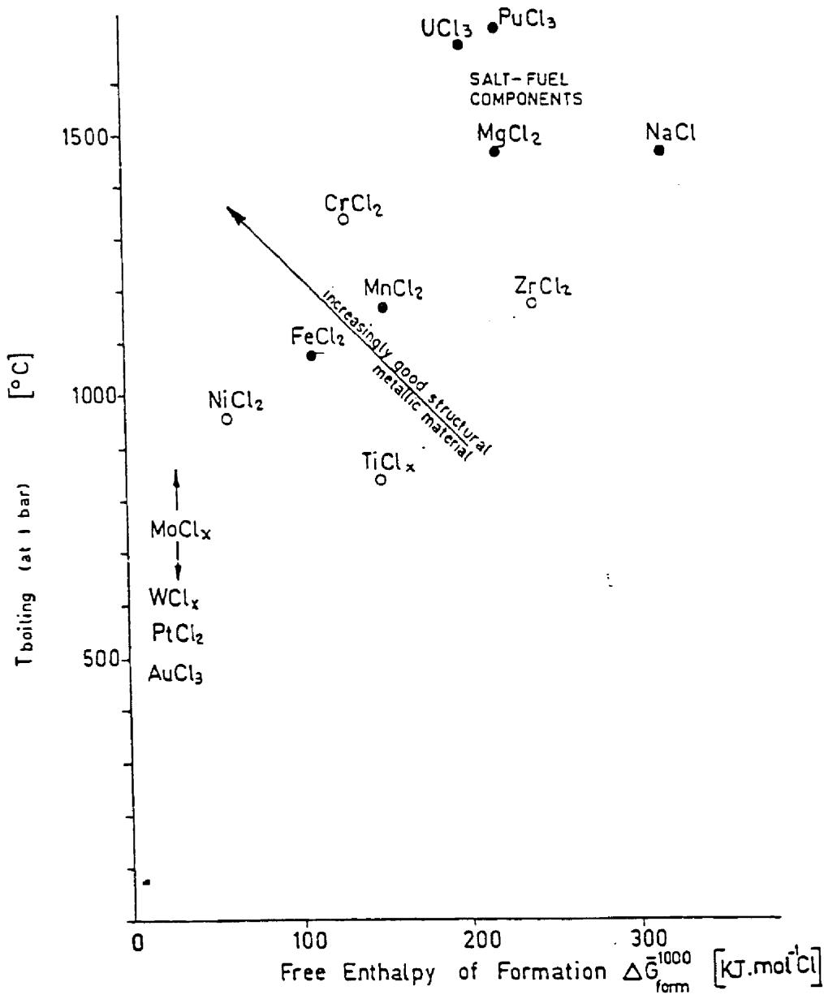  
Fig. 3.4-2 Resistance of Metals to Chloridization Corrosion [17]

steels.

For the less severe conditions of the reactor vessel and the salt ducts returning from the heat exchanger, Hastelloy-N or advanced developments of that alloy might suffice. However, having decided to use molybdenum for the core/blanket membrane, a change to a dissimilar metal elsewhere in the salt circuit could cause galvanic corrosion. Also, nickel alloys resist molten lead (a candidate secondary coolant) very poorly compared with molybdenum; they would probably be subject to attack when the lead leaked through the heat exchanger into the salt. 3.4.3.2 No alloys. No offers high temperature strength, good irradiation resistance, and high thermal conductivity: promising traits for a material in contact with fuel and blanket salts at high temperatures. However, fabrication of light molybdenum sections requires welding and heat treatment: this technology needs development, but it is already proceeding for other applications.

Also, the high specific cost of molybdenum is acceptable only on a limited basis: the vessel piping, etc, should use materials which are cheaper and more easily fabricated. Candidates include Mo/Fe, Mo/Ni and Ti/Zr/Mo (TZM) alloys. With Mo/Fe indications are that the swelling for Fe has already peaked at the operating temperatures, while that for Mo occurs at much higher temperatures.

The use of molybdenum or its alloys may permit high fuel salt temperatures (above $1000^{\circ}\mathrm{C}$ ). This can reduce fuel salt inventory through higher power densities and allow gas turbine cycles and/or process heat applications using helium as an intermediate and final coolant.

Mo has an appreciable absorption cross section for neutrons. Such reactions also produce significant amounts of technetium. This changes the nature of the structural material and makes it radioactive.

Figure 3.4-1 and the discussion in Section 3.4.2 indicated Mo to be strongly corrosion resistant. The most significant reaction from the standpoint of corrosion should be (Fig. 3.3-13)

$$
\mathrm {U C l} _ {4} + \mathrm {M o} \longrightarrow 2 \mathrm {U C l} _ {3} + \mathrm {M o C l} _ {2}
$$

$\mathsf{UCl}_{4}$ will be a major constituent in the blanket from the neutron transmutation of $\mathsf{ThCl}_{4}$ . Free chloride from fission of U in the core will combine with $\mathsf{UCl}_{3}$ to form $\mathsf{UCl}_{4}$ . It also reacts directly with Mo:

$$
\mathrm {N o} + \mathrm {C l} _ {2} \rightarrow \mathrm {M o C l} _ {2}
$$

Traces of oxygen or water will produce molybdenum oxide, e.g.

$$
\mathrm {M o C l} _ {2} + \mathrm {H} _ {2} \mathrm {C} \longrightarrow \mathrm {M o O} + 2 \mathrm {H C l}
$$

With all of these reactions, mechanical properties will change.

3.4.3.3 Graphite. Both carbon and graphite resist corrosion and conduct heat well enough to warrant existing uses in heat exchangers and pumps. A resin-bonded graphite has found wide application in the chemical process industries. Both America and France have used graphite with LiF/BeF $_2$ molten salt: McDonnell-Douglas markets a high-strength, woven graphite for this; the French company PUK sells a product with graphite connected to heat exchanger material [27].

The high thermal conductivity results in excellent thermal

shock resistance. Still one must exert care as carbon and graphite are weak and brittle compared with metals.

Tensile strength varies between about 500 and 3000 lb/in. $^2$ , and impact resistance is nil. Abrasion resistance is poor. High-temperature stability is good and they can be used at temperatures up to 4000 or $5000^{\circ}\mathrm{F}$ if protected from oxidation (burning). Silicon-base coatings (silicides or silicon carbide) and iridium coatings are claimed to give protection up to around $2900^{\circ}\mathrm{F}$ .

Based on the existing experience as a structural material for molten fluoride thermal breeders and on periodic replacement of tubes, we assumed graphite for the physics studies here: 2 cm thick for the tube wall and 4 cm thick for the vessel wall.

3.4.3.4 Heat exchanger considerations. As mentioned in section 3.3.2.5 low vapor pressure of the primary and secondary fused salts permits thin-walled heat exchangers. These are highly efficient in heat transfer, thereby decreasing necessary area and fissile volume out-of-core. However, assuming close pitch, they will require development and testing to resist the thermal and vibrational strains over a long working life.

Refractory metals are attractive as they can accommodate high temperatures while still affording the good heat transfer of a metallic material. A strong candidate is Mo. It does have an appreciable cross section for neutron absorption: this affects delayed-neutron activation but not neutron economy or radiation damage there. Of greater concern is the welding and joining properties of Mo, its cost, and its oxidation.

# 3.4.4 Materials for the Core/Blanket Interface

Finding an interface material that can withstand a $10^{16}$ n cm $^{-2}$ seo $^{-1}$ flux over an acceptable period of time is indeed a challenge. It is greatly eased by assuming periodic replacement of the few tubes: an action far less complicated than the conventional replacement of fuel elements; just drain the core and blanket and uncouple the tubes outside the reactor. This is especially feasible if one uses a cheap material like graphite. Section 3.9, Access and Maintenance, discusses this further. Still the tubes may experience a cumulative dose of $10^{23}$ n cm $^{-2}$ in just a few months. Also irradiation of graphite produces "stored energy".

# 3.4.5 Materials for Reactor Vessel

The reactor vessel will experience

(1) Low pressure   
(2) Temperature higher than the blanket salt melting point   
(3) Radiation damage from a $10^{13}$ n cm $^{-2}$ sec $^{-1}$ flux.

A suitable material must meet these conditions; it should also minimize

(1) Induced radioactivity so as to maximize access   
(2) Cost

Candidates include graphite and prestressed concrete (of low-activating compositions).

# 3.4.6 Material for a Lead Secondary Circuit

3.4.6.1 Steam generator tubes. Mo alloys normally resist lead corrosion well, but might not if a steam generator leaked in small amounts of oxygen. Dissolving Mg or Ca as a getter in the lead would help lower the oxygen level, but might not suffice. One could also clad the molybdenum with an alloy which resists "oxygenated" lead; Fecraloy, a ferritic steel containing aluminum, forms a protective alumina film under these conditions.

A third, untried alternative, might be that Fecraloy alone can resist both steam and oxygenated lead. Forming a duplex with stainless steel could overcome its poor high temperature strength.

The possibility of making the heat exchanger tubes of Hastelloy-N has only slight attractions: it would still need a Fecraloy or molybdenum external cladding to resist the lead.

3.4.6.2 Remainder of the circuit. The ducts carrying the lead to and from the steam generators and also the steam generator shells might be molybdenum, protected from external oxidation either by a stainless steel cladding or by an inert atmosphere. An alternative is Fecraloy, externally clad with stainless steel for strength.

# 3.4.7 Material for a Helium Secondary Circuit

The main change relative to the lead-cooled design is higher. temperatures, parallel to a core temperature increase from 810 to $970^{\circ}\mathrm{C}$ . This suggests the need for molybdenum alloys, especially on mechanical grounds. However, even though there is no reason to doubt their corrosion resistance at this temperature, any supporting evidence is completely lacking. British studies showed that design variations might lower the salt pump operating temperature from $800^{\circ}\mathrm{C}$ to $670^{\circ}\mathrm{C}$ . This would ease the engineering and the selection of materials.

Materials selection for helium cooling should be much easier than for lead cooling but so far has been little studied: unidentified problems could become just as challenging as with lead-cooled systems.

Presumably a helium cooled system could draw on the extensive work already done with respect to HTRs and gas turbines: The MCFR version could actually ride on the future HTR program.

HTR programs have recognised that, in practice, helium is not an inert coolant since traces of air, moisture and other oxidizing gases can cause corrosion and traces of carbonaceous gas can carburize structural materials. Though much work remains it does seem likely that it will be possible to specify

1. The impurity levels acceptable in the helium   
2. Methods of controlling them   
3. What intentional additions if any, should be made, for example, to render the helium reducing.

Selected nickel alloys could be used for the turbines and other circuit components. This would restrict the need for molybdenum in the coolant circuit to heat exchanger tubes and similar applications.

# 3.5 Physics of MCFR(Th) and Its Fuel Cycle

# 3.5.1 Nuclear Models of an MCFR

3.5.1.1 Definition of the reactor geometry. Section 3.1.3 concluded that the best MCFR arrangement might be a small number of skewed cylindrical tubes. The chain reaction will center where the tubes converge. However, as no fuel salt boundaries exist along the tube axes, criticality boundaries blur.

High levels of flux and power generation in the primary salt may extend far along the tubes. This will depend on individual tube subcriticality, distance of separation between tubes, and angle of their skew. For example, if they are near critical by themselves and are distant from one another, then their fluxes will follow a cosine distribution over the total distance between bends. However, increasing the intertube coupling will cause the fluxes within the tubes to fall off more steeply beyond the tube convergence region.

Th concentration and other fuel salt parameters will also affect neutron distributions because they moderate the neutrons which shortens their mean free path. Fluxes will also extend into the blanket in all directions but with much shorter relaxation lengths.

The choice of tube arrangement will depend upon a detailed trade study of effective core size: extension of the chain reaction out along the tubes will increase exposure of the pressure vessel to neutrons emanating from the tubes; making the core size small reduces stability of the system to perturbations.

# 3.5.1.2 Use of spherical geometry for neutronic calculations.

Neutronics analyses of complicated geometries require expensive Monte Carlo calculations. For the present survey purposes, it should suffice to use simple one-dimensional spherical geometry featuring five zones (Fig. 3.5-1): core, core tube wall, blanket, vessel wall, and reflector.

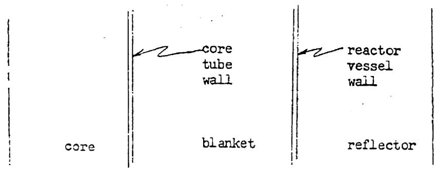  
Fig. 3.5-1 Cne-dimensional Spherical Model

All the tube wall material gets lumped into one spherical shell. The validity of this approach, vs. uniform material distribution in the spherical core, will depend upon the number of actual tubes. For only three or four tubes, the current thinking, it should do quite well.

Taking the tube wall thickness to be two cm facilitates comparisons with MCFR(Pu) studies. The vessel wall is four cm thick; the reflector zone, 40 cm. A check calculation with 20 cm reflector thickness showed no significant changes when the blanket thickness was 200 cm (quasi-infinite).

Section 3.5.7.2 studies the effect of blanket thickness, settling on a value of $200\mathrm{cm}$ for most cases. The critical core radius usually ranges $25 - 50\mathrm{cm}$ .

Section 3.3.5.6 gives the densities of individual salts and an algorithm for combining them. Densities for graphite and nickel were 0.1 and 0.09 atoms $\mathrm{cm}^{-1}$ barn $^{-1}$ .

A primary difference between an exact calculation and those in spherical geometry is likely to be the spectrum softening and other effects of the $\mathrm{ThCl}_4 / \mathrm{NaCl}$ blanket salt intermediate between the fuel salt tubes. Depending on the clearance and skew angle between tubes, a smeared model of such a spherical region would probably include $5 - 25\%$ blanket salt by volume.

In this regard, the calculations may be better done in infinitesimal geometry. That remains to be shown however, and cylindrical calculations cost more. In the meantime, spherical critical U masses (U) or volumes can be corrected to cylindrical geometry by use of shape factors:

$$
U _ {c y l} (L / D) = U _ {s p h} / S F (L / D)
$$

Fig. 3.5-2 displays some experimental and calculated data. A subset of these (Table 3.5-I) was fit with a least squares program to produce the following algorithm for use in Section 3.5.5 studies:

$$
\begin{array}{l} \log \mathrm {S F} (\mathrm {L} / \mathrm {D}) = 6. 3 9 9 \times 1 0 ^ {- 2} \log (\mathrm {L} / \mathrm {D}) - 0. 6 9 7 6 (\log (\mathrm {L} / \mathrm {D})) ^ {2} \\ - 9. 8 2 0 \times 1 0 ^ {- 3} \\ \end{array}
$$

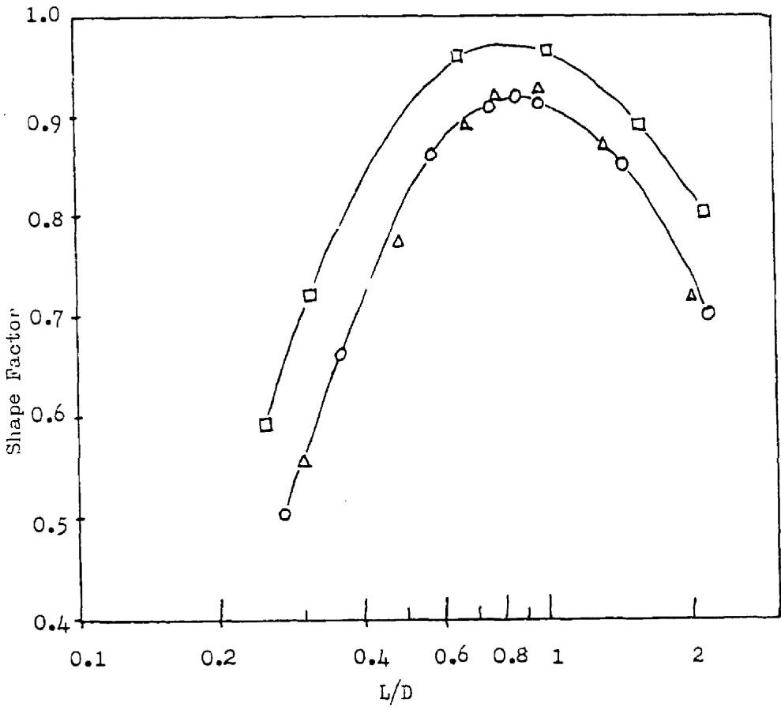  
Fig. 3.5-2 Shape Factors for Cylindrical Fast-Neutron Systems [128]

Legend

high-density metal system   
low-density metal system   
ZPR-III 1:1 critical assemblies

Factor (SF) Data [128] Assumed for This Study

Table 3.5-I Experimental Shape   

<table><tr><td>L/D</td><td>S.F.</td><td>L/D</td><td>S.F.</td></tr><tr><td>0.217</td><td>0.297</td><td>0.9</td><td>0.96</td></tr><tr><td>0.257</td><td>0.565</td><td>1.0</td><td>0.96</td></tr><tr><td>0.3</td><td>0.7</td><td>1.25</td><td>0.94</td></tr><tr><td>0.4</td><td>0.82</td><td>1.4</td><td>0.91</td></tr><tr><td>0.5</td><td>0.89</td><td>1.67</td><td>0.87</td></tr><tr><td>0.6</td><td>0.94</td><td>2</td><td>0.825</td></tr><tr><td>0.7</td><td>0.96</td><td>2</td><td>0.825</td></tr><tr><td>0.8</td><td>0.96</td><td>8.79</td><td>0.29</td></tr></table>

# 3.5.2 Neutronic Calculational Methods

Neutronic analysis of small fast reactors like MCFRs generally requires transport theory. Modeling the reactor as a one-dimensional symmetric sphere permits use of the well established and efficient ANISN code [129].

3.5.2.1 Spatial mesh. A spatial mesh of 1/10 of a mean free path per interval would give quasi-exact results in transport theory calculations. Computer storage and cost generally prohibit this. A mesh of one mean path (mfp) per interval suffices for most calculations.

In iCFR(Th) calculations, the neutron mean free path typically ranges from 1-10 cm (Table 3.5-II). With a core radius of 30-80 cm, a 200 cm blanket and a 40 cm reflector, a uniform one mfp interval mesh would mean a lot of intervals. Furthermore, most would lie outside the core, leading to possible numerical instability in the iterative transport theory calculations. Consequently a coarser mesh was used (Table 3.5-II), especially outside the core. This worked fine for most of the survey calculations; a few select effects needed finer detail.

3.5.2.2 Angular quadrature. Most studies were done with an S<sub>4</sub> angular quadrature. S<sub>8</sub> check calculations on the smallest of spheres showed increased neutron leakage as expected, but only increased the volume by 1.5%, while decreasing BG by ~0.01.

3.5.2.3 Convergence criteria. Initial survey calculations satisfied a $\mathbf{k}_{\text{eff}}$ convergence of 0.01 and a critical radius search convergence of 1. Select effects required 0.001 $\mathbf{k}_{\text{eff}}$ convergence.

Table 3.5-II Spatial Mesh in MCFR(Th) Neutronic Calculations   

<table><tr><td colspan="2"></td><td>Core</td><td>Core Wall</td><td>Blanket</td><td>Vessel Wall</td><td>Reflector</td></tr><tr><td colspan="2">Typical mfp (cm)</td><td>12</td><td>3</td><td>10</td><td>2</td><td>1</td></tr><tr><td colspan="2">Typical dimension (cm)</td><td>30-80</td><td>2</td><td>200</td><td>4</td><td>40</td></tr><tr><td colspan="2">Range of dimensions (cm)</td><td>24-136</td><td>2</td><td>100-200</td><td>4</td><td>20,40</td></tr><tr><td rowspan="3">Survey (10/16)*</td><td>No. Intervals</td><td>10</td><td>1</td><td>10</td><td>1</td><td>4</td></tr><tr><td>Int. Size (cm)</td><td>3-8</td><td>2</td><td>20</td><td>4</td><td>10</td></tr><tr><td>&#x27;&#x27; &#x27;&#x27; (mfp)</td><td>0.25-0.67</td><td>0.67</td><td>2</td><td>2</td><td>10</td></tr><tr><td rowspan="3">Detail (20/46)*</td><td>No. Intervals</td><td>20</td><td>1</td><td>30</td><td>1</td><td>14</td></tr><tr><td>Int. Size (cm)</td><td>1.5</td><td>2</td><td>6.7</td><td>4</td><td>3</td></tr><tr><td>&#x27;&#x27; &#x27;&#x27; (mfp)</td><td>0.1</td><td>0.7</td><td>0.7</td><td>2</td><td>3</td></tr><tr><td rowspan="3">Multizone (20/65)*</td><td>No. Intervals</td><td>10+10</td><td>2</td><td>10+10+32</td><td>1</td><td>5+5</td></tr><tr><td>Int. Size (cm)</td><td>(2.5,vbl)</td><td>1</td><td>1. 3. 5.</td><td>4</td><td>3.5</td></tr><tr><td>&#x27;&#x27; &#x27;&#x27; (mfp)</td><td>(0.2,vbl)</td><td>0.3</td><td>0.1 0.3 0.5</td><td>2</td><td>3.5</td></tr><tr><td rowspan="3">Intermediate (10/31)*</td><td>No. Intervals</td><td>10</td><td>1</td><td>25</td><td>1</td><td>4</td></tr><tr><td>Int. Size (cm)</td><td>2.7</td><td>2</td><td>8</td><td>4</td><td>10</td></tr><tr><td>&#x27;&#x27; &#x27;&#x27; (mfp)</td><td>0.23</td><td>0.7</td><td>0.8</td><td>2</td><td>10</td></tr></table>

\* (no. core intervals/no. non-core intervals)

# 3.5.3 Neutron Cross Sections

This study required neutron cross sections for Th, $^{233}\mathrm{U}$ , $^{234}\mathrm{U}$ , $^{235}\mathrm{U}$ , $^{233}\mathrm{U}$ fission products, C, Na, Ni, and Cl. Data for $^{236}\mathrm{U}$ , Mo, F, and other carrier salt cations were desirable.

3.5.3.1 Bondarenko 26 group set [98]. The Bondarenko neutron cross section library long ago established itself for fast reactor calculations. Testing has revealed deficiencies in the Pu isotopes, $^{235}\mathrm{U}$ , and $^{238}\mathrm{U}$ , but these nuclei by and large do not appear in an MCFR(Th). Less is known in general about Th and $^{233}\mathrm{U}$ cross sections; they are currently undergoing extensive reevaluation for ENDF/B-5. For survey purposes here, the Bondarenko values in Pl-corrected PO form (transport cross sections) should suffice.

Nuclei missing from the library are Cl and F. Early in the study, K substituted for Cl: this was conservative as K absorbs more neutrons. Final calculations used Cl and FPI sets derived from ENDF/B - IV.

3.5.3.2 Twenty-six group, P1 set from ENDF/B-IV. Available

late in this study was a 92-group P1 set of cross sections generated by AMPX.[130] from ENDF/3-IV, containing most of the materials of interest here. This was too large and expensive to run so the set was collapsed to 26 groups similar (Table 3.5-III) to those in the Bondarenko library to allow cross-comparison and -usage.

The list of materials included not only Cl but also F. Missing however were Na and C. Comparison of their nuclear properties indicated Mg would represent Na well, especially since Na content is small compared to Cl. For C, the Bondarenko set was used; C is also a minor

Table 3.5-III   
Lower Boundaries of Energy Group   

<table><tr><td>Group</td><td colspan="2">Bondarenko Set</td><td colspan="2">AMPX-Generated ENDF/B-IV Set</td></tr><tr><td>0</td><td>10.5</td><td>MeV</td><td>14.9</td><td>MeV</td></tr><tr><td>1</td><td>6.5</td><td>MeV</td><td>6.07</td><td>MeV</td></tr><tr><td>2</td><td>4.0</td><td>MeV</td><td>3.68</td><td>MeV</td></tr><tr><td>3</td><td>2.5</td><td>MeV</td><td>2.23</td><td>MeV</td></tr><tr><td>4</td><td>1.4</td><td>MeV</td><td>1.35</td><td>MeV</td></tr><tr><td>5</td><td>0.8</td><td>MeV</td><td>0.82</td><td>MeV</td></tr><tr><td>6</td><td>0.4</td><td>MeV</td><td>0.39</td><td>MeV</td></tr><tr><td>7</td><td>0.2</td><td>MeV</td><td>0.18</td><td>MeV</td></tr><tr><td>8</td><td>0.1</td><td>MeV</td><td>0.11</td><td>MeV</td></tr><tr><td>9</td><td>46.5</td><td>keV</td><td>52.5</td><td>keV</td></tr><tr><td>10</td><td>21.5</td><td>keV</td><td>19.3</td><td>keV</td></tr><tr><td>11</td><td>10.0</td><td>keV</td><td>9.12</td><td>keV</td></tr><tr><td>12</td><td>4.65</td><td>keV</td><td>4.31</td><td>keV</td></tr><tr><td>13</td><td>2.15</td><td>keV</td><td>2.03</td><td>keV</td></tr><tr><td>14</td><td>1.0</td><td>keV</td><td>0.96</td><td>keV</td></tr><tr><td>15</td><td>465.</td><td>eV</td><td>454.</td><td>eV</td></tr><tr><td>16</td><td>215.</td><td>eV</td><td>214.</td><td>eV</td></tr><tr><td>17</td><td>100.</td><td>eV</td><td>101.</td><td>eV</td></tr><tr><td>18</td><td>46.5</td><td>eV</td><td>47.9</td><td>eV</td></tr><tr><td>19</td><td>21.5</td><td>eV</td><td>22.6</td><td>eV</td></tr><tr><td>20</td><td>10.</td><td>eV</td><td>10.7</td><td>eV</td></tr><tr><td>21</td><td>4.65</td><td>eV</td><td>5.04</td><td>eV</td></tr><tr><td>22</td><td>2.15</td><td>eV</td><td>2.38</td><td>eV</td></tr><tr><td>23</td><td>1.0</td><td>eV</td><td>1.13</td><td>eV</td></tr><tr><td>24</td><td>0.465</td><td>eV</td><td>0.53</td><td>eV</td></tr><tr><td>25</td><td>0.215</td><td>eV</td><td>0.22</td><td>eV</td></tr><tr><td>26</td><td colspan="2">thermal</td><td colspan="2">thermal</td></tr></table>

constituent.

3.5.3.3 Effects of resonance self-shielding. Resonance-region cross sections for the two sets described above were averaged assuming the materials to be infinitely dilute, i.e. ignoring resonance self-shielding. In $^{233}\mathrm{U}$ most of the reactivity effects from fission and capture self-shielding, if present, would cancel each other. Self-shielding for $^{232}\mathrm{Th}$ capture, if present, could affect BG.

The Bondarenko-calculated self-shielding factors for capture (Table 3.5-IV) show virtually no self-shielding in the top 12 groups, which cover well the core and blanket spectra. What little does occur in group 12 for $^{232}\mathrm{Th}$ , Doppler Broadening partly ameliorates. $^{233}\mathrm{U}$ is similar. Thus the infinitely-dilute calculations appear correct to first and maybe second-order approximation.

Table 3.5-IV   
Bondarenko Self-Shielding Factors for $^{232}$ Th [98]   

<table><tr><td rowspan="2">i</td><td rowspan="2">T&quot;K</td><td colspan="4">Ic at σ0 equal to</td><td colspan="3">Ie at σ0 equal to</td><td colspan="3">Ie at σ0 equal to</td></tr><tr><td>10a</td><td>10a</td><td>10a</td><td>10a</td><td>10a</td><td>10a</td><td>10a</td><td>10a</td><td>10a</td><td>10a</td></tr><tr><td rowspan="3">11</td><td>300</td><td>1.00</td><td>1.00</td><td>0.98</td><td>0.97</td><td>1.00</td><td>1.00</td><td>0.98</td><td>1.00</td><td>1.00</td><td>0.99</td></tr><tr><td>900</td><td>1.00</td><td>1.00</td><td>1.00</td><td>0.98</td><td>1.00</td><td>1.00</td><td>1.00</td><td>1.00</td><td>1.00</td><td>1.00</td></tr><tr><td>2100</td><td>1.00</td><td>1.00</td><td>1.00</td><td>1.00</td><td>1.00</td><td>1.00</td><td>1.00</td><td>1.00</td><td>1.00</td><td>1.00</td></tr><tr><td rowspan="3">12</td><td>300</td><td>1.00</td><td>1.00</td><td>0.97</td><td>0.92</td><td>1.00</td><td>0.99</td><td>0.94</td><td>1.00</td><td>0.99</td><td>0.97</td></tr><tr><td>900</td><td>1.00</td><td>1.00</td><td>1.00</td><td>0.95</td><td>1.00</td><td>1.00</td><td>0.98</td><td>1.00</td><td>1.00</td><td>0.99</td></tr><tr><td>2100</td><td>1.00</td><td>1.00</td><td>1.00</td><td>0.99</td><td>1.00</td><td>1.00</td><td>1.00</td><td>1.00</td><td>1.00</td><td>1.00</td></tr><tr><td rowspan="3">13</td><td>300</td><td>1.00</td><td>1.00</td><td>0.95</td><td>0.90</td><td>1.00</td><td>0.97</td><td>0.86</td><td>1.00</td><td>0.99</td><td>0.93</td></tr><tr><td>900</td><td>1.00</td><td>1.00</td><td>0.98</td><td>0.87</td><td>1.00</td><td>0.99</td><td>0.99</td><td>1.00</td><td>0.99</td><td>0.96</td></tr><tr><td>2100</td><td>1.00</td><td>1.00</td><td>0.99</td><td>0.84</td><td>1.00</td><td>1.00</td><td>0.95</td><td>1.00</td><td>1.00</td><td>0.99</td></tr><tr><td rowspan="3">14</td><td>300</td><td>1.00</td><td>0.99</td><td>0.92</td><td>0.2</td><td>1.00</td><td>0.93</td><td>0.73</td><td>1.00</td><td>0.93</td><td>0.95</td></tr><tr><td>900</td><td>1.00</td><td>0.99</td><td>0.97</td><td>0.2</td><td>1.00</td><td>0.97</td><td>0.73</td><td>1.00</td><td>0.99</td><td>0.89</td></tr><tr><td>2100</td><td>1.00</td><td>1.00</td><td>0.99</td><td>0.82</td><td>1.00</td><td>1.00</td><td>0.83</td><td>1.00</td><td>1.00</td><td>0.94</td></tr><tr><td rowspan="3">15</td><td>300</td><td>1.00</td><td>0.97</td><td>0.87</td><td>0.45</td><td>1.00</td><td>0.86</td><td>0.59</td><td>1.00</td><td>0.94</td><td>0.78</td></tr><tr><td>900</td><td>1.00</td><td>0.98</td><td>0.92</td><td>0.55</td><td>1.00</td><td>0.91</td><td>0.62</td><td>1.00</td><td>0.97</td><td>0.80</td></tr><tr><td>2100</td><td>1.00</td><td>0.99</td><td>0.96</td><td>0.64</td><td>1.00</td><td>0.96</td><td>0.65</td><td>1.00</td><td>0.99</td><td>0.86</td></tr><tr><td rowspan="3">16</td><td>300</td><td>1.00</td><td>0.92</td><td>0.38</td><td>0.20</td><td>0.34</td><td>0.50</td><td>0.29</td><td>0.92</td><td>0.65</td><td>0.40</td></tr><tr><td>900</td><td>1.00</td><td>0.95</td><td>0.67</td><td>0.25</td><td>0.87</td><td>0.58</td><td>0.30</td><td>0.95</td><td>0.71</td><td>0.44</td></tr><tr><td>2100</td><td>1.00</td><td>0.96</td><td>0.74</td><td>0.31</td><td>0.91</td><td>0.66</td><td>0.32</td><td>0.96</td><td>0.77</td><td>0.48</td></tr><tr><td rowspan="3">17</td><td>300</td><td>1.00</td><td>0.91</td><td>0.59</td><td>0.21</td><td>0.82</td><td>0.44</td><td>0.23</td><td>0.90</td><td>0.61</td><td>0.36</td></tr><tr><td>900</td><td>1.00</td><td>0.94</td><td>0.68</td><td>0.26</td><td>0.87</td><td>0.51</td><td>0.21</td><td>0.93</td><td>0.66</td><td>0.39</td></tr><tr><td>2100</td><td>1.00</td><td>0.96</td><td>0.76</td><td>0.35</td><td>0.91</td><td>0.62</td><td>0.27</td><td>0.95</td><td>0.73</td><td>0.43</td></tr><tr><td rowspan="3">18</td><td>300</td><td>0.98</td><td>0.86</td><td>0.45</td><td>0.13</td><td>0.82</td><td>0.37</td><td>0.22</td><td>0.91</td><td>0.64</td><td>0.45</td></tr><tr><td>900</td><td>0.99</td><td>0.91</td><td>0.54</td><td>0.17</td><td>0.87</td><td>0.43</td><td>0.23</td><td>0.94</td><td>0.70</td><td>0.50</td></tr><tr><td>2100</td><td>0.99</td><td>0.94</td><td>0.62</td><td>0.21</td><td>0.94</td><td>0.50</td><td>0.24</td><td>0.96</td><td>0.71</td><td>0.50</td></tr><tr><td rowspan="3">19</td><td>300</td><td>0.96</td><td>0.72</td><td>0.27</td><td>0.083</td><td>0.61</td><td>0.29</td><td>0.22</td><td>0.86</td><td>0.64</td><td>0.54</td></tr><tr><td>900</td><td>0.97</td><td>0.76</td><td>0.30</td><td>0.085</td><td>0.70</td><td>0.30</td><td>0.22</td><td>0.88</td><td>0.65</td><td>0.54</td></tr><tr><td>2100</td><td>0.98</td><td>0.82</td><td>0.30</td><td>0.099</td><td>0.79</td><td>0.34</td><td>0.23</td><td>0.91</td><td>0.69</td><td>0.55</td></tr><tr><td rowspan="3">20</td><td>300</td><td>1.00</td><td>1.00</td><td>1.00</td><td>1.00</td><td>1.00</td><td>1.00</td><td>1.00</td><td>1.00</td><td>1.00</td><td>1.00</td></tr><tr><td>900</td><td>1.00</td><td>1.00</td><td>1.00</td><td>1.00</td><td>1.00</td><td>1.00</td><td>1.00</td><td>1.00</td><td>1.00</td><td>1.00</td></tr><tr><td>2100</td><td>1.00</td><td>1.00</td><td>1.00</td><td>1.00</td><td>1.00</td><td>1.00</td><td>1.00</td><td>1.00</td><td>1.00</td><td>1.00</td></tr><tr><td rowspan="3">21</td><td>300</td><td>0.91</td><td>0.55</td><td>0.16</td><td>0.058</td><td>0.37</td><td>0.081</td><td>0.013</td><td>0.58</td><td>0.22</td><td>0.13</td></tr><tr><td>900</td><td>0.94</td><td>0.64</td><td>0.20</td><td>0.070</td><td>0.17</td><td>0.091</td><td>0.013</td><td>0.67</td><td>0.26</td><td>0.14</td></tr><tr><td>2100</td><td>0.96</td><td>0.76</td><td>0.31</td><td>0.097</td><td>0.50</td><td>0.14</td><td>0.049</td><td>0.77</td><td>0.35</td><td>0.16</td></tr></table>

3.5.4.1 Chains for actinide transmutation. Figure 3.5-3 details the Th cycle burnup chain as it pertains to reactor criticality. $^{233}\mathrm{Pa}$ branching - by neutron capture to $^{234}\mathrm{U}$ or by $\beta^{-}$ decay to $^{233}\mathrm{U}$ - is very important in a thermal reactor where $^{234}\mathrm{U}$ only absorbs neutrons. However, in a fast MCFR(Th) spectrum $^{234}\mathrm{U}$ mostly fissions (Figure 2.1-5) - much more so than any other threshold-fission isotope. It does not significantly moderate the spectrum or otherwise detract.

Production of $^{233}\mathrm{Pa}$ follows directly from $^{232}\mathrm{Th}$ : $^{233}\mathrm{Th}$ decays quickly enough to ignore its presence. $^{233}\mathrm{Pa}$ decays at the rate of $\ln 2 / 27.0$ days = 3.0 x $10^{-7}$ disintegrations per second per $^{233}\mathrm{Pa}$ atom. With $\phi = 10^{16} \, \text{n cm}^{-2} \, \text{s}^{-1}$ in core (25% of time), ~0 out-of-core, and a core-spectrum-averaged cross section of 0.3 barns (Table 3.5-V), $^{233}\mathrm{Pa}(n, Y)$ reactions occur 0.7 x $10^{-9} \, \text{s}^{-1}$ , more than two magnitudes slower than $^{233}\mathrm{Pa}$ decay. In the blanket the greatly-reduced flux lowers the reaction rate even further. A thermal reactor with $\sigma_{2200} = 39b$ and $\phi = 10^{14} \, \text{n cm}^{-2} \, \text{s}^{-1}$ x 0.25 yields a similar rate of 1 x $10^{-9} \, \text{s}^{-1}$ [131].

In summary, $^{234}\mathrm{U}$ production from $^{233}\mathrm{Pa}$ parallels that in a thermal reactor, but a low-threshold fission cross section raises it to fissile fuel status and also destroys it faster. Therefore the reduced presence of $^{234}\mathrm{U}$ and the $^{233}\mathrm{U}$ -like reactivity behavior of $^{234}\mathrm{U}$ in an MCFR obviate the need for separating out $^{233}\mathrm{Pa}$ to let it decay as in an MSBR. Therefore it suffices in these survey calculations to ignore the $^{233}\mathrm{Pa}$ ( $n, \gamma$ ) branch, i.e. to construe all $^{232}\mathrm{Th}$ captures to pass directly to $^{233}\mathrm{U}$ .

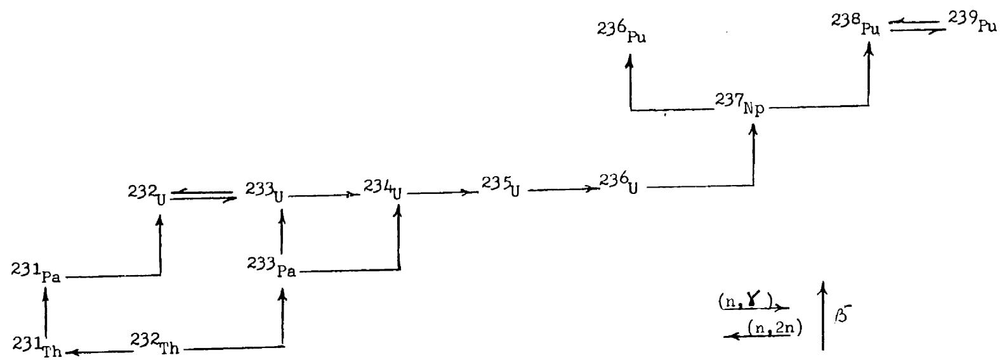  
Figure 3.5-3 Th Cycle Burnup Chain for Neutronic Calculations

Table 3.5-V   
MCFR(Th)-Spectrum Averaged Cross Sections for Some Obscure Reactions   

<table><tr><td rowspan="2">Group</td><td rowspan="2">Neutron Energy</td><td colspan="3">Cross Section (barns)*</td><td rowspan="2">Core Spectrum (%)</td><td rowspan="2">Blanket Spectrum (%)</td></tr><tr><td>230Th(n,Y)</td><td>233Pa(n,Y)</td><td>233Pa(n,f)</td></tr><tr><td>1</td><td>6.5-10.5MeV</td><td>0.006</td><td>0.01</td><td>1.2</td><td>0.501</td><td>0.0403</td></tr><tr><td>2</td><td>4.0-6.5</td><td>0.005</td><td>0.02</td><td>0.8</td><td>3.18</td><td>0.272</td></tr><tr><td>3</td><td>2.5-4.0</td><td>0.0066</td><td>0.05</td><td>0.8</td><td>8.46</td><td>0.835</td></tr><tr><td>4</td><td>1.4-2.5</td><td>0.01</td><td>0.13</td><td>0.7</td><td>17.15</td><td>2.78</td></tr><tr><td>5</td><td>0.8-1.4</td><td>0.02</td><td>0.3</td><td>0.1</td><td>19.92</td><td>6.82</td></tr><tr><td>6</td><td>0.4-0.8</td><td>0.034</td><td>0.3</td><td>0.</td><td>22.03</td><td>16.5</td></tr><tr><td>7</td><td>0.2-0.4</td><td>0.04</td><td>0.3</td><td></td><td>14.42</td><td>18.5</td></tr><tr><td>8</td><td>0.1-0.2</td><td>0.05</td><td>0.4</td><td></td><td>7.86</td><td>17.1</td></tr><tr><td>9</td><td>46.5-100keV</td><td>0.12</td><td>0.6</td><td></td><td>4.0</td><td>14.1</td></tr><tr><td>10</td><td>21.5-46.5</td><td>0.22</td><td>1.2</td><td></td><td>1.48</td><td>11.1</td></tr><tr><td>11</td><td>10.0-21.5</td><td>0.32</td><td>2.2</td><td></td><td>0.778</td><td>7.71</td></tr><tr><td>12</td><td>4.65-10.0</td><td>0.4</td><td>3.5</td><td></td><td>0.133</td><td>2.70</td></tr><tr><td>13</td><td>2.15-4.65</td><td>0.65</td><td>5.3</td><td></td><td>0.0372</td><td>0.521</td></tr><tr><td>14</td><td>1.0-2.15</td><td>1.1</td><td>7.5</td><td></td><td>0.011</td><td>0.842</td></tr><tr><td>15</td><td>465-1000 eV</td><td>1.7</td><td>10.5</td><td></td><td>nil</td><td>0.1552</td></tr><tr><td>16</td><td>215-465</td><td>0.5</td><td>16</td><td></td><td></td><td>1.49x10-2</td></tr><tr><td>17</td><td>100-215</td><td></td><td>25</td><td></td><td></td><td>1.87x10-3</td></tr><tr><td>18</td><td>46.5-100</td><td></td><td>40</td><td></td><td></td><td>4.83-4</td></tr><tr><td>19</td><td>21.5-46.5</td><td></td><td>55</td><td></td><td></td><td>1.74-4</td></tr><tr><td>20</td><td>10 -21.5</td><td></td><td>95</td><td></td><td></td><td>3.95-4</td></tr><tr><td>21-26</td><td></td><td></td><td></td><td></td><td></td><td>nil</td></tr><tr><td colspan="2">Core average</td><td>0.035</td><td>0.29</td><td>0.53</td><td></td><td></td></tr><tr><td colspan="2">Blkt, average</td><td>0.12</td><td>0.79</td><td>0.83</td><td></td><td></td></tr></table>

* cross sections eyeballed from ENDF/B-V.

In calculating burnup (fuel depletion and replenishment), this study also omitted the $^{232}\mathrm{Th}(n,2n)$ and $^{233}\mathrm{U}(n,2n)$ paths as well as the calculation of isotopes higher than $^{236}\mathrm{U}$ (Fig. 3.5-3). These approximations should not affect the conclusions of this survey with respect to BG or criticality. The resulting chain was

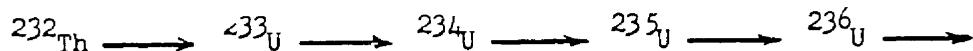

Each arrow denotes an $(n, r)$ reaction.

The corresponding equations, which describe nuclide activity up through $235\mathrm{U}$ , are

$$
d U _ {3} / d t = \left\langle \sigma_ {n, r} \phi \right\rangle T h - \left\langle \sigma_ {3 a} \phi \right\rangle U _ {3} \tag {3.5.4-1}
$$

$$
d U _ {4} / d t = \langle \sigma_ {3 8} \phi \rangle U _ {3} - \langle \sigma_ {4 a} \phi \rangle U _ {4} \tag {3.5.4-2}
$$

$$
d U _ {5} / d t = \left\langle \sigma_ {4 r} \phi \right\rangle U _ {4} - \left\langle \sigma_ {5 a} \phi \right\rangle U _ {5} \tag {3.5.4-3}
$$

Here

$$
U _ {3} = ^ {2 3 3} U \text {c o n t e n t} \quad (\text {a t o m s})
$$

$$
U _ {4} = ^ {2 3 4} U \text {c o n t e n t (a t o m s)}
$$

$$
U _ {5} = ^ {2 3 5} U \text {c o n t e n t (a t o m s)}
$$

$$
\mathrm {T h} = \begin{array}{l} 2 3 2 \\ \text {i} \end{array} \text {T h c o n t e n t (a t o m s)}
$$

$$
\varnothing = \text {n e u t r o n f l u x} (n c m ^ {- 2} s ^ {- 1})
$$

$$
\mathcal {E} _ {\mathrm {r h r}} = \text {c r o s s s e c t i o n (b) f o r} ^ {2 3 2} \operatorname {T h} (\mathrm {n}, \mathrm {Y}) \text {r e a c t i o n}
$$

$$
\sigma_ {j a} = \quad \prime \prime \quad \prime \prime \quad \prime \prime \quad \prime \quad 2 3 3 _ {U (n, a b s)} \quad \prime \prime
$$

$$
\sigma_ {3 \gamma} = \quad \prime \prime \quad \prime \prime \quad \prime \prime \quad 2 3 3 _ {U} (n, Y) \quad \prime \prime
$$

$$
\sigma_ {u a} = \quad \prime \prime \quad \prime \prime \quad \prime \prime \quad \prime \prime 2 3 4 U (n, a b s) \quad \prime \prime
$$

$$
\widetilde {S} _ {4 \gamma} = \quad \quad \quad \quad \quad \quad \quad \quad \quad \quad \quad \quad \quad \quad \quad \quad \quad \quad \quad \quad 2 3 4 U (n, \gamma) \quad \quad \quad \quad \quad \quad \quad \quad \quad \quad
$$

$$
\sigma_ {5 a} = \quad \prime \prime \quad \prime \prime \quad \prime \prime \quad 2 3 5 _ {U (n, a b s)} \quad \prime \prime
$$

$$
\langle \sigma \phi \rangle = \text {t o t a l r e a c t i o n r a t e , i n t e g r a t e d o v e r t h e n e u t r o n s p e c t r u m} (\text {r e a c t i o n s} \mathrm {s} ^ {- 1} \text {a t o m} ^ {- 1})
$$

Table 3.5-VI lists the ANISN-calculated reaction rates for numerous cases of interest.

Core and Blanket Average Reaction Rates (Reactions/Atom/s) for Some Configurations of Interest

Table 3.5-VI   

<table><tr><td rowspan="2">Nuclide</td><td rowspan="2">Reaction</td><td rowspan="2">Zone</td><td colspan="7">Configuration*</td></tr><tr><td>1,7,Ni,30</td><td>0.7,C,30</td><td>0.5,C,30</td><td>0.3,C,30</td><td>3.7,C,30</td><td>0.7,C,50</td><td>0.7,C,70</td></tr><tr><td rowspan="2">232Th</td><td rowspan="2">capture</td><td>core</td><td>6.43-9</td><td>0.</td><td>0.</td><td>0.</td><td>2.40-9</td><td>0.</td><td>0.</td></tr><tr><td>blkt.</td><td>2.91-10</td><td>4.07-10</td><td>4.03-10</td><td>3.97-10</td><td>1.52-10</td><td>3.89-10</td><td>3.54-10</td></tr><tr><td rowspan="4">233U</td><td rowspan="2">capture</td><td>core</td><td>5.41-9</td><td>9.84-9</td><td>9.67-9</td><td>9.37-9</td><td>2.09-9</td><td>9.07-9</td><td>7.60-9</td></tr><tr><td>blkt.</td><td>2.72-10</td><td>3.86-10</td><td>3.81-10</td><td>3.75-10</td><td>1.43-10</td><td>3.68-10</td><td>3.35-10</td></tr><tr><td rowspan="2">absorp.</td><td>core</td><td>7.54-8</td><td>1.65-7</td><td>1.60-7</td><td>1.53-7</td><td>2.57-8</td><td>1.45-7</td><td>1.11-7</td></tr><tr><td>blkt.</td><td>2.41-9</td><td>3.48-9</td><td>3.44-9</td><td>3.38-9</td><td>1.22-9</td><td>3.30-9</td><td>2.98-9</td></tr><tr><td rowspan="4">234U</td><td rowspan="2">capture</td><td>core</td><td>9.26-9</td><td>1.78-8</td><td>1.74-8</td><td>1.68-8</td><td>3.44-9</td><td>1.61-8</td><td>1.31-8</td></tr><tr><td>blkt.</td><td>3.95-10</td><td>5.82-10</td><td>5.76-10</td><td>5.65-10</td><td>2.08-10</td><td>5.53-10</td><td>5.00-10</td></tr><tr><td rowspan="2">absorp.</td><td>core</td><td>3.21-8</td><td>8.21-8</td><td>7.95-8</td><td>7.46-8</td><td>9.42-9</td><td>7.02-8</td><td>5.08-8</td></tr><tr><td>blkt.</td><td>6.16-10</td><td>9.31-10</td><td>9.20-10</td><td>9.00-10</td><td>3.04-10</td><td>8.78-10</td><td>7.85-10</td></tr><tr><td rowspan="2">235U</td><td rowspan="2">absorp.</td><td>core</td><td>5.48-8</td><td>1.17-7</td><td>1.14-7</td><td>1.09-7</td><td>1.90-8</td><td>1.04-7</td><td>8.08-7</td></tr><tr><td>blkt.</td><td>1.92-9</td><td>2.75-9</td><td>2.72-9</td><td>2.67-9</td><td>9.84-10</td><td>2.61-9</td><td>2.36-9</td></tr></table>

The nomenclature for each configuration is $\mathrm{ThCl}_4 / \mathrm{UCl}_3$ core ratio, $^{233}\mathrm{U} / ^{234}\mathrm{U}$ core ratio, reflector material, NaCl molar content (\%) in core salt

3.5.4.2 Chain for buildup of $^{232}\mathrm{U}$ -paired radioactivity. $^{232}\mathrm{U}$ buildup in the fuel merits special attention because it heads a lengthy decay chain (Figure 3.5-4) which culminates in $^{208}\mathrm{Tl}$ , the emitter of a penetrating 2.61-MeV gamma ray.

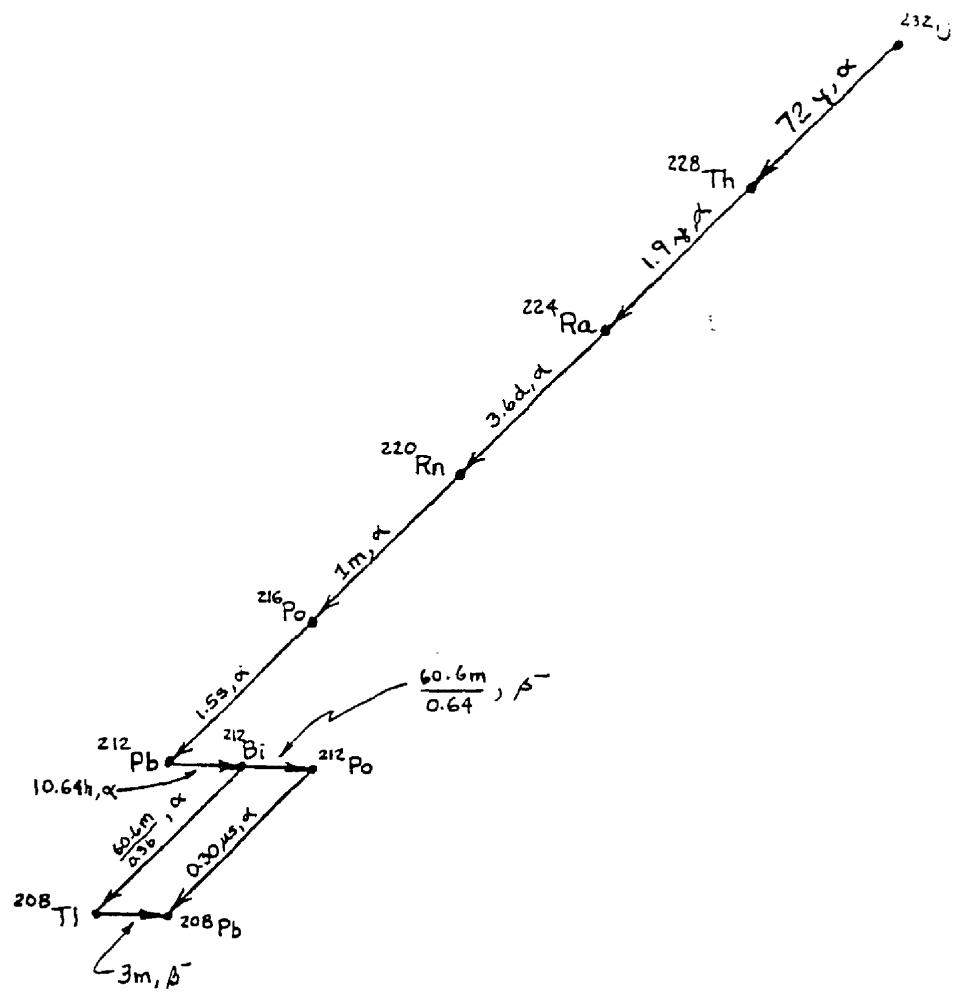  
Fig. 3.5-4. $232$ U Decay Chain

The high-energy gamma necessitates remote handling of the recycled fuel and complicates the fuel reprocessing and refabrication. This discourages fuel diversion and theft as well as subsequent weapon manufacture. For legitimate MCFR operation, which requires no fuel fabrication and continuously reprocesses fuel anyhow, it poses no major additional problem.

Some $^{228}\mathrm{Th}$ will actually exist prior to $^{232}\mathrm{U}$ production due to $^{232}\mathrm{Th}$ decay:

$$
2 3 2 _ {\mathrm {T h}} \frac {\alpha}{1 . 3 9 x 1 0 ^ {9} y} 2 2 8 _ {\mathrm {R a}} \frac {\beta^ {-}}{6 . 7 y} 2 2 8 _ {\mathrm {A c}} \frac {\beta^ {-}}{6 . 1 3 \mathrm {h}} 2 2 8 _ {\mathrm {T h}}
$$

This might assist as a deterrent early in reactor operation due to the 2.6-MeV gamma signal, but being a different chemical element Th will easily separate from the U fuel. Therefore it plays no significant role here. No other isotope besides $^{232}\mathrm{U}$ should be initially present.

Several paths lead to $^{232}\mathrm{U}$ in a Th/ $^{233}\mathrm{U}$ fuel cycle. Each starts from a source material (enclosed in boxes in Figure 3.5-5). $^{232}\mathrm{Th}$ and $^{233}\mathrm{U}$ are obvious source materials in core and blanket. About 1 ppm $^{230}\mathrm{Th}$ normally occurs in thorium; it comes from decay of $^{238}\mathrm{U}$ which occurs naturally in most Th ores.

The route

$$
{ } ^ { 2 3 3 } _ { U ( n , 2 n ) } { } ^ { 2 3 2 } _ { U }
$$

should dominate. The routes

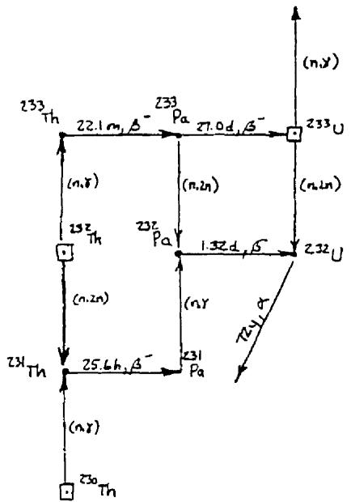  
Figure 3.5-5. 232 U Buildup Chains. Boxes denote isotope which exist in reactors at startup.

$$
{ } ^ { 2 3 3 } \mathrm { T h } ( n , 2 n ) { } ^ { 2 3 1 } \mathrm { T h } ( \beta ^ { - } ) { } ^ { 2 3 1 } \mathrm { P a } ( n , Y ) { } ^ { 2 3 2 } \mathrm { P a } ( \beta ^ { - } ) { } ^ { 2 3 2 } \mathrm { U }
$$

$$
{ } ^ { 2 3 0 } \mathrm { T h } ( n , Y ) { } ^ { 2 3 1 } \mathrm { T h } ( , 5 ^ { - } ) { } ^ { 2 3 1 } \mathrm { P a } ( n , Y ) { } ^ { 2 3 2 } \mathrm { P a } ( , 5 ^ { - } ) { } ^ { 2 3 2 } U
$$

$$
{ } ^ { 2 3 2 } \mathrm { T h } ( n , \gamma ) { } ^ { 2 3 3 } \mathrm { T h } ( \beta ^ { - } ) { } ^ { 2 3 3 } \mathrm { P a } ( n , 2 n ) { } ^ { 2 3 2 } \mathrm { P a } ( \beta ^ { - } ) { } ^ { 2 3 2 } \mathrm { u } .
$$

will also contribute.

The threshold nature of these reactions implies that $^{232}\mathrm{U}$ will buildup much more in fast reactors than thermal ones.

Magnitude comparison of the various paths can lead to some simplifications. Ignoring the delay from 25.6h half-life decay of $^{231}\mathrm{Th}$ and 22.1m half-life decay of $^{233}\mathrm{Th}$ , the differential equations are

$$
d N _ {2 2} / d t = \sigma_ {2 3 N} \phi N _ {2 3} + \sigma_ {1 1 8} \phi N _ {1 1} + \sigma_ {1 3 N} \phi N _ {1 3} - (\lambda_ {2 2} + \sigma_ {2 2} \phi) N _ {2 2}
$$

$$
d N _ {1 1} / d t = \sigma_ {D Z N} \phi N _ {0 2} + \sigma_ {O O r} \phi N _ {0 0} - \sigma_ {I I} \phi N _ {I I} \tag {3.5.4-5}
$$

$$
c N _ {1 3} / d t = S _ {0 2 r} \phi N _ {0 2} - (\lambda_ {1 3} + G _ {1 3} \phi) N _ {1 3} \tag {3.5.4-6}
$$

where

$$
\begin{array}{l} N _ {i} = \text {c o n c e n t r a t i o n o f i} ^ {\text {t h}} \text {n u c l i d e} \\ i = 0 0, 0 2, 1 1, 1;, 2 2, 2 3 \text {f o r T h i s o t o p e s 2 3 0 a n d 2 3 2 ,} \\ \text {P a i s o t o p e s 2 3 1 , 3 , a n d U i s o t o p e s 2 3 2 - 3 , r e s p e c t i v e l y} \end{array}
$$

$$
\begin{array}{l} \phi = \text {t o t a l f l u x (n c m ^ {- 2} s ^ {- 1}) = t y p i c a l l y 2 x 1 0 ^ {1 6}} \\ \text {i n c o r e , 5 x 1 0 ^ {1 4} i n b l a n k e t} \end{array}
$$

$$
\begin{array}{l} \lambda_ {B} = \text {p r o b a b i l i t y} (\lambda) \text {f o r} \beta - \text {d e c a y o f} ^ {2 3 3} \mathrm {P a} \\ = 3. 0 \times 1 0 ^ {- 7} s ^ {- 1} \\ \end{array}
$$

$$
\lambda_ {2 2} = \lambda \text {f o r} \alpha - \text {d e c a y o f} ^ {2 3 2} U = 3. 1 \times 1 0 ^ {- 1 0}. s ^ {- 1}
$$

$$
\begin{array}{l} \sigma_ {\infty \tau} = \text {s p e c t r u m - a v e r a g e d c r o s s s e c t i o n (} \sigma \text {)} \text {f o r t h e} \\ 2 3 0 _ {9 0} \text {T h (n , Y)} \text {r e a c t i o n .} \end{array}
$$

Subscript $\gamma$ denotes $(n, \gamma)$ reactions to distinguish from $N$ which denotes $(n, 2n)$ reactions and from a blank which denotes total neutron absorption.

The procedure for determining most $\{\sigma_{i}\}$ was to average their group values $\{\sigma_{i}^{(g)}\}$ over a typical calculated MCFR spectrum. ANISN calculations did this for $\sigma_{02x}\phi$ (Table 3.5-VI). Table 3.5-VII similarly evaluates $\sigma_{11y}, \sigma_{11},$ and $\sigma_{22}$ . Evaluations for $\sigma_{00r}$ and $\sigma_{13}$ data estimated from the literature gave results too low to warrant more detailed evaluation.

Where pointwise data is unavailable; MCFR spectrum-averaged reaction rates ( $\phi \overline{\sigma}$ ) can be estimated from fission-spectrum averages by

$$
\phi \sigma = \left[ \frac {\phi_ {1}}{x _ {1}} \right] \sigma^ {(F S)}
$$

Here,

$\left[\frac{\phi_{1}}{\chi_{1}}\right] =$ ratio of flux to fission-spectrum fraction in the first neutron energy group   
$= 5 \times 10^{15}$ , typically for an MCFR(Th) core   
$= 1 \times 10^{13}$ , typically for an MCFR(Th) blanket

Calamand [132] and Gryntakis [133] evaluated the fission spectrum average for $\sigma_{02\mathbb{N}}$ and $\sigma_{23\mathbb{N}}$ to be 14.2 and 3.3 mb, respectively. Fitting Calamand's empirical correlation for

$$
\overline {{S}} ^ {(F S)} = 3 4 3. A ^ {2 / 3} e ^ {- 0. 9 8 1 6 F _ {T} (M e V)} m b
$$

Then for $233\mathrm{Pa}(n,2n)$ with $\mathbf{E}_{\mathrm{T}} = \frac{\mathbf{A} + 1}{\mathbf{A}} (-\mathbf{Q}) = \frac{234}{233}\times 6.518$

$$
\sigma_ {1 3 N} ^ {(F S)} = 2 1. 0 m b
$$

Table 3.5-VIII summarizes these results along with all the others above.

Table 3.5-VIII   
Some MCFR(Th) Spectrum-Averaged Four-Group Cross Sections for Actinide Transmutations [134]   

<table><tr><td rowspan="2">Group</td><td rowspan="2">Energy Range</td><td colspan="3">σ (b)</td><td colspan="2">Spectrum (%)</td></tr><tr><td>231Pa (n,Y)</td><td>231Pa (n,f)</td><td>232U (n,abs)</td><td>Core</td><td>Blanket</td></tr><tr><td>1</td><td>0.8-10 keV</td><td>0.01</td><td>1.2</td><td>1.97</td><td>49.2</td><td>10.8</td></tr><tr><td>2</td><td>46.5-800 keV</td><td>0.43</td><td>0.18</td><td>2.08</td><td>48.3</td><td>66.2</td></tr><tr><td>3</td><td>1-46.5 keV</td><td>3.5</td><td>0.</td><td>3.0</td><td>2.4</td><td>22.9</td></tr><tr><td>4</td><td>0.465-1 keV</td><td>61.</td><td>0.</td><td>14.</td><td>0.1</td><td>0.17</td></tr><tr><td>5</td><td>thermal</td><td>200.</td><td>0.</td><td>155.</td><td>0.</td><td>2.1-7</td></tr></table>

<table><tr><td>Spectrum</td><td>Core 0.36</td><td>0.67</td><td>2.1</td></tr><tr><td>Averages</td><td>Blkt. 1.2</td><td>0.25</td><td>2.3</td></tr></table>

a Typical MCFR

Table 3.5-VIII Evaluated Production and Destruction Coefficient for   

<table><tr><td rowspan="2">Coefficient*</td><td rowspan="2">Reaction 
Symbol</td><td rowspan="2">Reaction 
Description</td><td colspan="2">Activity(s-1)</td></tr><tr><td>Core</td><td>Flanket</td></tr><tr><td>α021</td><td>G021φ</td><td>232Th(n,2n)</td><td>7x10-11</td><td>1x10-13</td></tr><tr><td>αC2Y</td><td>G02Yφ</td><td>232Th(n,Y)</td><td>4x10-9</td><td>2x10-10</td></tr><tr><td>α11</td><td>G11φ</td><td>231Pa(n,Y)</td><td>7x10-9</td><td>6x10-10</td></tr><tr><td>γ13</td><td>S13Nφ</td><td>233Pa(n,2n)</td><td>1x10-10</td><td>2x10-13</td></tr><tr><td>γ23</td><td>S23Nφ</td><td>233J(n,2n)</td><td>2x10-11</td><td>3x10-14</td></tr><tr><td>β11</td><td>S11φ</td><td>231Pa(n,abs)</td><td>2x10-8</td><td>7x10-10</td></tr><tr><td>β13</td><td>λ13</td><td>233Pa(β-)</td><td>3.0x10-7</td><td>3.0x10-7</td></tr><tr><td>β22</td><td>S22φ</td><td>232U(n,abs)</td><td>4.x10-8</td><td>1.x10-9</td></tr><tr><td></td><td>λ22</td><td>232U(α)</td><td>3.1x10-10</td><td>3.1x10-10</td></tr><tr><td></td><td>G0φ</td><td>230Th(n,Y)</td><td>7.x10-10</td><td>6.x10-11</td></tr><tr><td></td><td>S13φ</td><td>233Pa(n,abs)</td><td>1.1x10-8</td><td>4x10-10</td></tr></table>

$\{\alpha\}$ are production coefficients and $\{\beta\}$ are destruction coefficients. Their use in the differential equations helps in visual checking and bookkeeping of terms

The probability ratio R of path $^{230}\mathrm{Th}(\mathfrak{n},\mathfrak{Y})^{231}\mathrm{Th}$ to path $^{232}\mathrm{Th}$

$(n,2n)^{231}\mathrm{Th}$ (Fig. 3.5-5) is

$$
R = \frac {\overline {{\sigma}} _ {0 0} N _ {0 0}}{\overline {{\sigma}} _ {O 2 N} N _ {O 2}}
$$

For N/N= 10-6 (1 ppm) mentioned above, get

$$
\begin{array}{l} R = 1 0 ^ {- 6} \times \frac {7 \times 1 0 ^ {- 1 0}}{7 \times 1 0 ^ {- 1 1}} = 1 0 ^ {- 5} \text {i n c o r e} \\ = 1 0 ^ {- 6} \times \frac {6 \times 1 0 ^ {- 1 1}}{1 \times 1 0 ^ {- 1 3}} = 6 \times 1 0 ^ {- 4} \text {i n b l a n k e t} \\ \end{array}
$$

Thus the $^{230}\mathrm{Th}(n,\gamma)$ $^{231}\mathrm{Th}$ path can be ignored.

In the destruction of $\mathbf{N}_{13}$ , $\lambda_{13} = 3.0 \times 10^{-7} \mathrm{s}^{-1}$ far exceeds $\phi \sigma_{13}$ : in the core by a factor of near 30; in the blanket, by three magnitudes. In the destruction of $\mathbf{N}_{22}$ , $\delta_{22} \phi$ far exceeds $\lambda_{22}$ and thus becomes the governing time constant (of about 10 mos.) in the approach to equilibrium concentration.

Taking La Place transforms of Equations 3.5.4-4 through -6

$$
\begin{array}{l} s ^ {n} _ {2 2} - 1) _ {2 2} ^ {0} = \alpha_ {2 3} n _ {2 3} + \alpha_ {1 1} n _ {1 1} + \alpha_ {1 3} n _ {1 3} - \beta_ {2 2} n _ {2 2} \\ u _ {2 2} = \frac {1}{s + b} _ {2 2} \left\{n _ {2 2} ^ {0} + \alpha_ {2 3} n _ {2 3} + \alpha_ {1 1} n _ {1 1} + \alpha_ {1 3} u _ {1 3} \right\} \\ s \mathcal {U} _ {1 1} - \mathcal {U} _ {1 1} ^ {0} = \alpha_ {0 2 2} \mathcal {U} _ {0 2} - \beta_ {1 1} \mathcal {U} _ {1 1} \\ M _ {1 1} = \frac {1}{s + B _ {1 1}} \left[ H _ {1 1} ^ {0} + \alpha_ {0 2} H _ {0 2} \right] \\ s M _ {1 3} - M _ {1 3} ^ {0} = x _ {0 2} y _ {0 2} - y _ {1 3} M _ {1 3} \\ \eta_ {1 3} = \frac {1}{s + \beta_ {1 3}} \left\{1. 0 _ {1 3} + \alpha_ {0 2 r} \eta_ {0 2} \right\} \\ \end{array}
$$

Assuming $\mathbb{N}_i$ constant $= \mathbb{N}_i$ for 02 and 23, then $\mathcal{M}_{02}(s) = \frac{1}{s}\mathcal{M}_{02}^{c}$ .

$$
n _ {2 3} (s) = \frac {1}{3} n _ {2 3} ^ {c}, \quad \text {a n d s u b s t i t u t i n g , g e t}
$$

$$
\begin{array}{l} \eta_ {2 2} (s) = \frac {1}{s + \beta_ {2 2}} \left\{l _ {2 2} ^ {0} + \frac {\alpha_ {2 3} \eta_ {2 3} ^ {0}}{s} + \frac {\alpha_ {1 1}}{s + \beta_ {1 1}} \eta_ {1 1} ^ {0} \right. \\ + \frac {d _ {1 3}}{s + \beta_ {1 3}} \left[ n _ {1 3} ^ {0} + \frac {\alpha_ {0 2 5} \cdot n _ {c 2} ^ {c}}{s} \right] \Bigg \} \\ \end{array}
$$

Now initially one would have

$$
m _ {1 3} ^ {c} = m _ {1 1} ^ {0} = m _ {2 2} ^ {0} = c
$$

Then

$$
\begin{array}{l} n _ {2 2} = \frac {1}{s (s + \beta_ {2 2})} \left\{x _ {2 3} n _ {2 3} ^ {c} + \frac {\alpha_ {1 1}}{s - \beta_ {1 1}} x _ {C Z N} n _ {C 2} ^ {c} \right. \\ + \frac {x _ {1 3}}{s + 3 , 3} x _ {0 2 r} i _ {0 2} ^ {c} \\ \end{array}
$$

Normalizing $^{232}\mathrm{U}$ to $^{233}\mathrm{U}$ concentration one has

$$
\begin{array}{l} \frac {N _ {2 2}}{N _ {2 3}} = \frac {\alpha_ {2 3} (1 - e ^ {- \beta_ {2 2} t})}{\alpha_ {2 2}} \\ + \frac {\alpha_ {1 1} \alpha_ {2 2} \left(\frac {N _ {C 2}}{N _ {2 3}}\right)}{\beta_ {1 1} \beta_ {2 2}} \left\{\frac {\beta_ {1 1} - \beta_ {2 2} + \beta_ {2 2} e ^ {- \beta_ {1 1} t} - \beta_ {1 1} e ^ {- \beta_ {2 2} t}}{\beta_ {1 1} - \beta_ {2 2}} \right\} \\ + \frac {\alpha_ {1 3} \alpha_ {0 2 5} (\frac {N _ {2}}{N _ {2 3}})}{\beta_ {1 3} \beta_ {2 2}} \left\{\frac {\beta_ {1 3} - \beta_ {2 2} + \beta_ {2 2} e ^ {- \beta_ {1 3} t} - \beta_ {1 3} e ^ {- \beta_ {2 2} t}}{\beta_ {1 3} - \beta_ {2 2}} \right\} \\ = x _ {2 3} \left[ \frac {1 - e ^ {- \beta_ {2 2} r}}{\beta_ {2 2}} \right] \\ + \alpha_ {1 1} \alpha_ {c 2 N} \left(\frac {N _ {c 2}}{N _ {2 3}}\right) \left\{\frac {\left[ \frac {1 - e ^ {- \beta_ {2 2} r}}{\beta_ {2 L}} \right] - \left[ \frac {1 - e ^ {- \beta_ {1 1} t}}{\beta_ {1 1}} \right]}{\beta_ {1 1} - \beta_ {2 2}} \right\} \\ + x _ {1 3} \alpha_ {0 2 5} \left(\frac {N _ {0 2}}{N _ {2 3}}\right) \left\{\frac {\left[ \frac {1 - e ^ {- \beta_ {2 2} t}}{\beta_ {2 2}} \right] - \left[ \frac {1 - e ^ {- \beta_ {1 3} t}}{\beta_ {1 3}} \right]}{\beta_ {1 3} - \beta_ {2 2}} \right\} \\ \end{array}
$$

Setting $G\left( {3}_{i}\right)  = \frac{1 - {e}^{-{\beta }_{i}t}}{{3}_{i}}$

and

$\frac{{N}_{22}}{{N}_{23}} = {\alpha }_{23}{G}^{\prime }\left( {s}_{22}\right)  + {\alpha }_{11}{\alpha }_{02n}\left( \frac{{N}_{C2}}{{N}_{23}}\right)  + \left( {{\beta }_{11},{\beta }_{22}}\right)$

$$
+ \alpha_ {1 3} x _ {c 2 Y} \left(\frac {N _ {0 2}}{N _ {2 3}}\right) H \left(S _ {i 3}, S _ {i 2}\right) \tag {3.5.4-7}
$$

We can now explore $\mathbb{N}_{22} / \mathbb{N}_{23}$ buildup as a function of $\mathbb{N}_{02} / \mathbb{N}_{23}$ , i.e.

$$
[ ^ {2 3 2} U ] / [ ^ {2 3 3} U ] a s f (^ {2 3 2} \pi_ {1} / ^ {2 3 3} U)
$$

To calculate the radioactivity we construct and solve the decay equations for the $^{232}\mathrm{U}$ daughters in Figure 3.5-4. $^{224}\mathrm{Ra}, ^{220}\mathrm{Rn}, ^{216}\mathrm{Po}$ , and $^{212}\mathrm{Pb}$ all decay relatively instantaneously, so they can be skipped. For a fuel outside the reactor with a given $^{232}\mathrm{U}$ concentration one then has

$$
2 3 2 _ {U} \xrightarrow {7 2 y} 2 2 8 _ {\text {T h}} \xrightarrow {1 . 9 y} 2 1 2 _ {\text {B i}} \xrightarrow [ ]{6 0. 6 m} 2 0 8 _ {\text {T l}} \xrightarrow [ ]{3 m} 2. 6 \mathrm {K e V}
$$

For purpose of simplification, we take the $^{232}\mathrm{U}$ concentration here as constant. The differential equations are then

$$
\frac {d N _ {0 8}}{d T} = \lambda_ {2 2} N _ {2 2} - \lambda_ {0 8} N _ {0 8}
$$

$$
\frac {d \mathbb {N} _ {3 2}}{d t} = \lambda_ {0 8} \mathbb {N} _ {0 8} - \lambda_ {3 2} \mathbb {N} _ {3 2}
$$

$$
\frac {d \mathrm {N} _ {1 8}}{d \mathrm {T}} = 0. 3 6 \lambda_ {3 2} \mathrm {N} _ {3 2} - \lambda_ {1 8} \mathrm {N} _ {1 8}
$$

where

$$
N _ {2 2} = \text {c c n c e n t r a t i o n o f} \begin{array}{l} 2 3 2 \\ 9 2 \end{array}
$$

$$
N _ {O 8} = \quad \text {"} \quad \text {"} \quad \text {"} \quad \text {"} \quad \text {"} \quad \text {"} \quad \text {"} \quad \text {"} \quad \text {"} \quad \text {"} \quad \text {"} \quad \text {"} \quad \text {"} \quad \text {"} \quad \text {"} \quad \text {"} \quad \text {"} \quad \tag {228}
$$

$$
\mathrm {N} _ {3 2} = \quad \text {"} \quad \text {"} \quad \text {"} \quad \text {"} \quad \text {"} \quad \text {"} \quad \text {"} \quad \text {"} \quad \text {"} \quad \text {"} \quad \text {"} \quad \text {"} \quad \text {"} \quad \text {"} \quad \text {"} \quad \text {"} \quad \text {"} \quad \tag {83}
$$

$$
N _ {1 8} = \quad \text {"} \quad \text {"} \quad \text {"} \quad \text {"} \quad \text {"} \quad \text {"} \quad \text {"} \quad \text {"} \quad \text {"} \quad \text {"} \quad \text {"} \quad \text {"} \quad \text {"} \quad \text {"} \quad \text {"} \quad \text {"} \quad \text {"} \quad \tag {208}_{T1}
$$

$$
\lambda_ {2 2} = \ln 2 / 7 2 y = 3. 1 x 1 0 ^ {- 1 0} s ^ {- 1}
$$

$$
\lambda_ {0 8} = \ln 2 / 1. 9 y = 1. 2 ^ {\prime} x 1 0 ^ {- 8} s ^ {- 1}
$$

$$
\lambda_ {3 2} = \ln 2 / 6 0. 6 m = 1. 9 x 1 0 ^ {- 4} s ^ {- 1}
$$

$$
\lambda_ {1 8} = \ln 2 / 3 m = 3. 9 x 1 0 ^ {- 3} s ^ {- 1}
$$

Taking Laplace transforms

$$
s M _ {1 8} - M _ {1 8} ^ {\circ} = 0. 3 6 \lambda_ {3 2} M _ {3 2} - \lambda_ {1 8} M _ {1 8}
$$

$$
m _ {1 8} = \frac {1}{s + \lambda_ {1 8}} \left\{n _ {1 8} ^ {\circ} + 0. 3 6 \lambda_ {3 2} m _ {3 2} \right\}
$$

$$
s _ {3 2} - s _ {3 2} ^ {\circ} = \lambda_ {0 8} u _ {0 8} - \lambda_ {3 2} u _ {3 2}
$$

$$
n _ {3 2} = \frac {1}{s + \lambda_ {3 2}} \left\{n _ {3 2} ^ {\circ} + \lambda_ {0 8} n _ {0 8} \right\}
$$

$$
s \eta_ {0 8} - \eta_ {0 8} ^ {\circ} = \lambda_ {2 2} \eta_ {2 2} - \lambda_ {0 8} \eta_ {0 8}
$$

$$
n _ {0 8} = \frac {1}{s + \lambda_ {0 8}} \left\{n _ {0 8} ^ {\circ} + \lambda_ {2 2} n _ {2 2} \right\}
$$

$$
s n _ {2 2} - n _ {2 2} ^ {0} = - \lambda_ {2 2} n _ {2 2}
$$

$$
m _ {2 2} = \frac {1}{s + \lambda_ {2 2}} m _ {2 2} ^ {0}
$$

$$
\begin{array}{l} \therefore M _ {1 8} = \frac {1}{S + \lambda_ {1 8}} \left\{u _ {1 8} ^ {\circ} - \frac {0 . 3 6 \lambda_ {3 2}}{S + \lambda_ {3 2}} \left[ u _ {3 2} ^ {\circ} + \frac {\lambda_ {0 8}}{S + \lambda_ {0 8}} \left(u _ {0 8} ^ {\circ} \right. \right. \right. \\ + \frac {\lambda_ {2 2} \eta_ {2 2} ^ {o}}{s}) ] \rbrace \\ = \frac {u _ {1 9} ^ {\circ}}{s + \lambda_ {1 8}} + \frac {0 . 3 6 \lambda_ {3 2} u _ {3 2} ^ {\circ}}{(s + \lambda_ {1 8}) (s + \lambda_ {3 2})} \\ + \frac {0 . 3 6 \lambda_ {3 2} \lambda_ {0 8} u _ {0 8} ^ {o}}{(s + \lambda_ {1 8}) (s + \lambda_ {3 2}) (s + \lambda_ {0 8})} + \frac {0 . 3 6 \lambda_ {3 2} \lambda_ {0 8} \lambda_ {2 2} u _ {7 2} ^ {o}}{3 (s + \lambda_ {1 8}) (s + \lambda_ {3 2}) (s + \lambda_ {0 8})} \\ \end{array}
$$

There are an infinite set of possible situations and corresponding solutions associated with different reprocessing schemes. If most direct interest is the situation where

$$
n _ {1 8} ^ {\circ} = n _ {3 2} ^ {\circ} = n _ {0 8} ^ {\circ} = 0
$$

Then

$$
\begin{array}{l} S \equiv \lambda_ {1 8} N _ {1 8} = 0. 3 6 \lambda_ {3 2} \lambda_ {0 8} \lambda_ {\pi 2} \lambda_ {1 8} \left(\frac {N _ {2 2} ^ {0}}{N _ {2 3}}\right) \cdot N _ {2 3} \\ \left[ \frac {1}{\lambda_ {1 8} \lambda_ {3 2} \lambda_ {0 8}} - \left\{F _ {1} (\lambda_ {1 8}, \lambda_ {3 2}, \lambda_ {0 8}) + F _ {2} (\lambda_ {3 2}, \lambda_ {1 8}, \lambda_ {0 8}) + F _ {3} (\lambda_ {0 8}, \lambda_ {3 2}, \lambda_ {1 8}) \right\} \right] \\ \end{array}
$$

where

$$
F (a, b, c) = e ^ {- a t} / (b - a) (c - a) a
$$

S = emission rate for 2.51-keV 203 Tl gannas

and the units of $\lambda_{18}N_{18}$ are $^{208}\mathrm{TL}$ -decays/s. Substituting in $\mathbf{N}_{23} = 19\mathrm{gm}^{233}\mathrm{U}$ metal $\mathrm{cm}^{-3}\times 6.02\times 10^{23}233\mathrm{U}$ atoms per $^{233}_{S}233_{U}$ and the $\{\lambda_i\}$ , one gets a source rate

$$
\begin{array}{l} S = 1 9. x \frac {6 . 0 2 x 1 0 ^ {2 3}}{2 3 3} x 0. 3 6 x 1. 9 x 1 0 ^ {- 4} x 1. 2 x 1 0 ^ {- 8} x 3. 1 x 1 0 ^ {- 1 0} \\ \times 3. 9 \times 1 0 ^ {- 3} \left[ \frac {N _ {2 2}}{N _ {2 3}} \right] \left\{\frac {1}{\lambda_ {1 8} \lambda_ {3 2} \lambda_ {0 8}} - \sum_ {i = 1} ^ {3} F _ {i} \right\} \\ \end{array}
$$

$$
S \left(\frac {d}{s c m ^ {3}}\right) = 0. 0 4 9 \left[ \frac {N _ {2 2}}{N _ {2 3}} \right] \left\{\frac {1}{\lambda_ {1 8} \lambda_ {3 2} \lambda_ {D 8}} - \sum_ {i = 1} ^ {3} F _ {i} \right\}
$$

Note that for at least one $\mathbf{F}_i$ the exponential numerator should be near one and its denominator very small so that $\sum F_i$ is large. Section 3.5.11.2 evaluates S for situations of interest.

# 3.5.5 Pertinent Physics Metrics

3.5.5.1 BG: actual breeding gain. The conventional definition of BG is

$$
B G = \frac {\text {r a t e o f f i s s i l e p r o d u c t i o n}}{\text {r a t e o f f i s s i l e d e s t r u c t i o n}} \tag {3.5.5-1}
$$

The question then arises: which materials are fissile and which fertile? Convention says $^{234}\mathrm{U}$ is fertile, but in the very hard HCFR neutron spectrum it behaves like a fissile: $\mathcal{S}_{\mathrm{f}}$ exceeds $\mathcal{S}_{\mathrm{Y}}$ over most of the neutron spectrum (Fig. 2.1-5), suggesting a bare critical mass smaller than that for $^{237}\mathrm{Np}$ ( $69\mathrm{kg}$ ), $^{240}\mathrm{Tu}$ ( $159\mathrm{kg}$ ), or $^{241}\mathrm{Am}$ ( $114\mathrm{kg}$ ) [135]. $^{232}\mathrm{Th}$ and $^{238}\mathrm{U}$ cannot sustain a chain reaction. Thus we label $^{233}\mathrm{U}$ , $^{234}\mathrm{U}$ , and $^{235}\mathrm{U}$ as fissiles in an HCFR, $^{232}\mathrm{Th}$ and $^{238}\mathrm{U}$ as non-fissils.

BG can mean the instantaneous BG at any given point in time (of the burnup cycle) or a time-averaged BG such as over a given LFER re-fuelling cycle or reactor life. As the survey nature of this study precludes a detailed fuel management analysis, this study deals only with instantaneous BG, presumably on equilibrium cycle:

$$
\mathrm {B G} = \frac {\text {T h c a p t u r e r a t e}}{\text {r a t e o f} ^ {2 3 3} \mathrm {U} , ^ {2 3 4} \mathrm {U} , ^ {2 3 5} \mathrm {U} \text {f i s s i o n}}
$$

This certainly differs in $^{234}\mathrm{U}$ treatment from that for a thermal $\mathrm{Th}/^{233}\mathrm{U}-$ MSBR: however each reflects the physical realities of the corresponding neutron spectra, and this definition does agree with equation (3.5.5.-1!) above.

# 3.5.5.2 BGX: BG extended to zero neutron leakage. BGX

gauges the BG potential of a reactor design in the event that neutrons which presently escape from the reactor (outer) blanket (CB) were instead captured there in the same proportions as present.

$$
\mathrm {B G X} = (1 + \mathrm {B G}) \left\{1 + \left[ \frac {\text {T h c a p t u r e}}{\text {t o t a l a b s r a t e}} \right] _ {\mathrm {O B}} f _ {1 k g} \right\} - 1
$$

This metric thus indicates what additional BG can be obtained through a larger blanket.

# 3.5.5.3 BGP: BG potential associated with the core spectrum.

The theoretical limit to BG forms another valuable metric of an MCFR(Th). Taube calculated previously-unheard-of BG = 0.7-0.8 (BR = 1.7-1.8) for an MCFR(Pu).

Section 3.1.1.1 defined BG potential as the number of neutrons available for breeding per $^{233}\mathrm{U}$ fission. That ignored all actinides except $^{232}\mathrm{Th}$ and $^{233}\mathrm{U}$ . The net result depended primarily on $\gamma \sigma_{\mathrm{f}}$ for $^{233}\mathrm{U}$ and indicated a potential for BGs up to 0.4 on the $^{232}\mathrm{Th}/^{233}\mathrm{U}$ fuel cycle.

The ideal situation would be for $^{232}$ Th to capture neutrons which leave the core: i.e. for none to leak out the blanket nor be lost to parasitic capture. Then BG = $\gamma - 2$ . However, for the MCFR here we must return from utopia and allow at least for parasitic losses due to necessary core salt components. This then gives

$$
B C P = (\overline {{\nu}} - 2) _ {\text {r e a c t o r}} \quad - \quad \frac {\sum_ {\text {c o r e}} (\text {p a r a s i t i c c a p t u r e s})}{\sum_ {\text {r e a c t o r}} (\text {f i s s i o n s})}
$$

3.5.5.4 $\phi_{\text {core }}$ The core-averaged total flux will primarily indicate the rate of damage to, and thereby replacement of, the graphite tubes.

3.5.5.5 E core . The median core flux energy is found as- suming a constant lethargy flux within a group's boundaries. This metric proves to be a valuable barometer of BGP (Fig. 3.5-6) since $\overline{\nu}$ and $\sigma_{\mathrm{f}}$ increase with fast neutron energy while $\mathfrak{G}$ decreases.

3.5.5.6 Power density. Together with $\langle \mathbf{E} \rangle_{\text {core }} \varnothing$ , this metric determines $\varnothing_{\text {core }}$ . It also affects heat exchanger design: the higher the power density in the core fluid salt, the faster must heat per unit fluid volume be removed in the exchanger.

3.5.5.7 $\Phi$ (vessel), total and $>100\mathrm{keV}$ . Unlike the core tubes, the MCFR design and operation plan does not readily tolerate the replacement of the reactor vessel. Therefore the neutron damage, especially measured by the flux above $100\mathrm{keV}$ , should not exceed $10^{13}$ n cm $^{-2}$ sec $^{-1}$ or so.

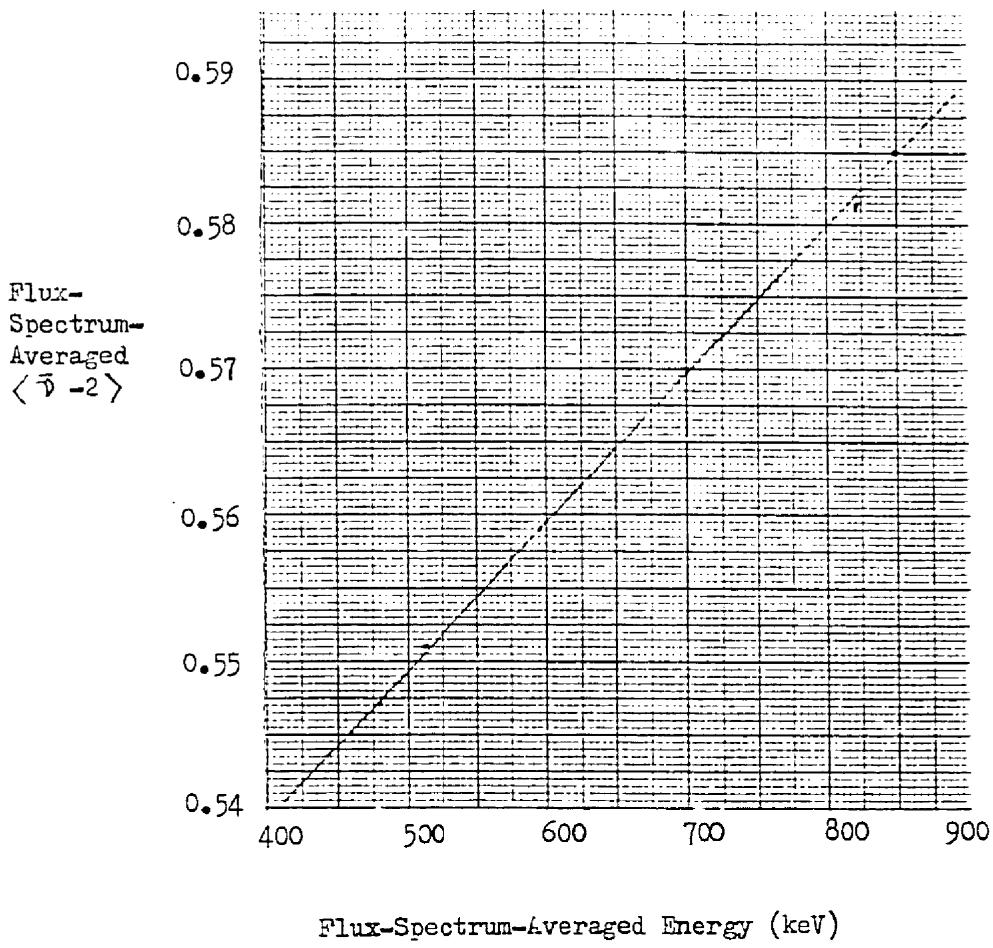  
Figure 3.5-6. Variation of Utopian BG (Ignoring Parasitic Losses and Leakage) with Core Flux-Spectrum Hardness.

3.5.5.8 Fuel inventory and doubling time. Doubling time (DT) provides a pertinent measure of the economics and physics of a breeder reactor: the time required to breed enough extra fuel to start up another reactor. That should really encompass the whole fuel cycle: core + blanket + primary loop + in-plant stockpiles + transport + fuel fabrication + fuel reprocessing + out-of-plant storage.

However, perhaps because solid fuel reactors all require similar ex-reactor fuel cycles, DT conventionally measures just the time for duplicating core and blanket. To facilitate comparison, this study adopts that definition also except that the MCFR must also include its full primary circuit contents:

$$
\mathrm {D T} = \frac {\mathrm {U} _ {\mathrm {i}} + \mathrm {U} _ {\mathrm {o}} + \mathrm {U} _ {\mathrm {b}}}{\text {B G p r o d u c t i o n r a t e}} \tag {3.5.5-2}
$$

Here

$U_{i} = U$ content inside the reactor vessel; more precisely between the ex-vessel bends of the tubes (Fig. 3.2-9, -10, and -11)

$U_{0} = U$ inventory in primary circuit beyond (outside) the reactor vessel: piping, pumps, and heat exchangers. Section 3.4 indicates the volume $V_{0} = 2 - 3\mathrm{m}^{3}$ .

$U_{b} =$ Blanket U content

This should result in a conservative comparison of the MCFR fuel cycle to the solid fuel cycle of other breeder reactors: solid fuel will require much more inventory in storage, transportation, decladding, and fabrication operations; the MCFR, little. Both cycles should involve similar amounts of chemical processing, but

the MCFR going from liquid to liquid state, may require fewer steps and therefore less U.

The odd geometry of the skewed tube configuration increases the in-vessel U content, $\mathsf{U}_{\mathsf{i}}$ , considerably beyond the calculated critical spherical mass, $\mathsf{U}_{\mathsf{s}}$ . If there was only one cylindrical tube (N=1) then the volume $\mathsf{V}_{\mathsf{i}}$ associated with $\mathsf{U}_{\mathsf{i}}$ would be

$$
V _ {i} (N = 1) = \pi D ^ {2} L / 4 = V _ {s} / S F (L / D) \tag {3.5.5-3}
$$

where

$$
\begin{array}{l} V _ {S} = \text {c r i t i c a l v o l u m e i n s p h e r i s c a l g e o m e t r y} \\ S F = L / D \text {d e p e n d e n t s h a p e f a c t o r} (\text {S e c . 3 . 5 . 1 . 2}) \\ L = \text {c r i t i c a l} L = H \\ H = \text {d i s t a n c e} \\ \text {m e t e r} \quad \mathrm {b l a n k e t} \quad \text {s u r r o n d i n g} \quad \text {c o r e , w e} \quad \mathrm {e s t i m a t e} \quad \mathrm {H} = 5 \mathrm {m} \\ D = \text {c r i t i c a l} \\ \end{array}
$$

Rearranging Eq. 3.5.5-3, get

$$
L / D = \left(\pi L ^ {3} S F (L / D) / 4 V _ {S}\right) ^ {\frac {1}{2}} \tag {3.5.5-4}
$$

Since SF depends on L/D, Eq. 3.5.5-4 is transcendental: it must be solved iteratively or by graphical intersection technique.

If $N > 1$ and the tubes lay sufficiently apart from one another (loosely coupled), then $V_{i} (N > 1) \approx N V_{i} (N = 1)$ . However, this is not of interest because we prefer strong intertube neutronic coupling (Section 3.1.3.2).

With strong coupling, if N tubes were not skewed but lay ad

jacent to one another, then their combined cross sectional area would approach that of a single large tube, then

$$
V _ {i} (N > 1) = V _ {i} (N = 1) \text {o f E q .} 3. 5. 5 - 3.
$$

In contrast, when skewed the maximum, the tubes closely approach one another only near their midpoints. Then no tube sustains the neutron chain reaction very well outside the close-approach zone. The critical geometry of that zone should resemble a square cylinder $(\mathsf{L} / \mathsf{D} = 1)$ , somewhat squeezed at its middle into the shape of an hour glass or a wheat stack ().

The large mean free paths of fast neutrons tend to negate the "tubular" protusions of core salt from this geometry: next collisions will probably occur in the neutron-absorbing blanket. Then with $L / D \approx 1$

$$
V _ {S} / S F (L / D = 1) = N T D _ {t} ^ {2} \cdot D _ {t} / 4
$$

where

$$
D _ {t} = d i a m e t e r o f a s i n g l e t u b e
$$

$$
D _ {t} = \left(4 V _ {s} / N \pi S F (L / D = 1)\right) ^ {1 / 3}
$$

$$
\begin{array}{l} V _ {i} (N > 1) = N \pi H D _ {t} ^ {2} / 4 = H ((V _ {s} / 0. 9 7) ^ {2} N \pi / 4) ^ {1 / 3} \\ = 0. 9 4 \mathrm {H} (\mathrm {N V} _ {\mathrm {s}} ^ {2}) ^ {1 / 3} \tag {3.5.5-5} \\ \end{array}
$$

Figure 3.5-7 displays the results of Eq. 3.5.5-3 and 3.5.5-5. The differences in $V_{i}$ correspond to the differences between zero and maximum skew angle respectively. Thus the true results would lie intermediate. For the present study we take $V_{i}$ at some value of low significant figure slightly below the Eq. 3.5-7 line (for $N = 3$ ). This should result in a conservative estimate of DT. To get $U_{1}$ or $U_{0}$ we multiply $V_{i}$ or $V_{0}$ by $U_{s} / V_{s}$ .

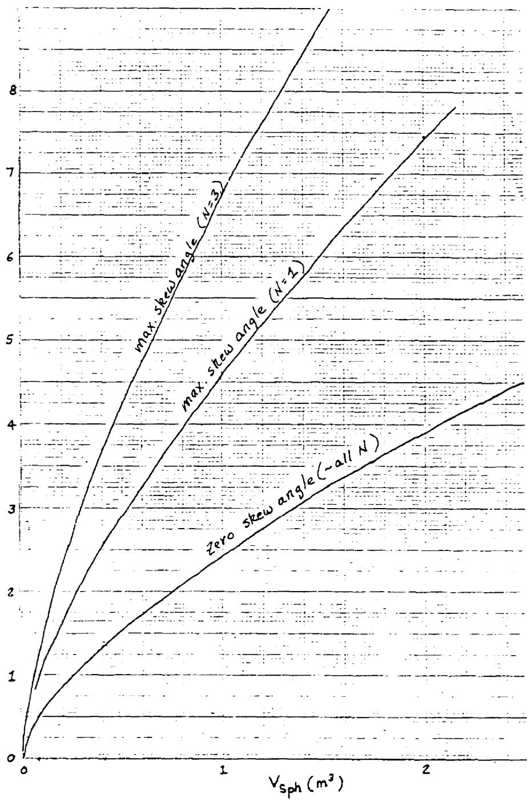  
V（m）  
Figure 3.5-7. Variation of In-Vessel Primary-Circuit Volume with Critical-Sphere Volume for Maximum- and Zero-Angle Tube Skew

# 3.5.6 Fuel Cycle Modelling

3.5.6.1 Fuel cycle model. Figure 3.5-8 describes the actinide flow scheme. (Section 3.7 describes the chemical aspects of the fuel cycle.) Th supply to both primary circuit and blanket maintains the Th concentrations. U exits with fractional removal rates p and b respectively, passing into the shim tank. b is actually a net removal rate: part of the removed blanket U returns.

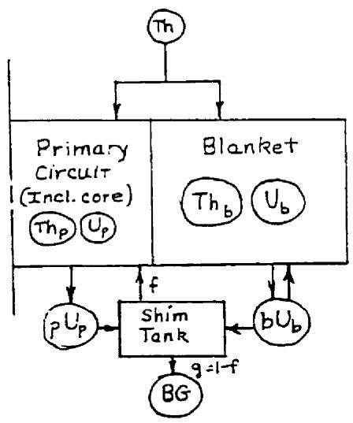  
Fig. 3.5-8. Actinide Flow Scheme

Fraction $f$ of the shim tank inflow feeds the primary circuit, simultaneous with $pU_p$ and fission product removal. The remaining fraction $g = 1 - f$ is exported as BG.

Extending Sec. 3.5.4.1, U varies in the blanket according to

$$
d U _ {3 b} / d t = \left\langle \sigma_ {T h x} \phi \right\rangle_ {b} T h _ {b} - \left\langle \sigma_ {3 a} \phi \right\rangle_ {b} U _ {3 b} - b U _ {3 b} \tag {3.5.6-1}
$$

$$
d U _ {4 b} / d t = \left\langle \sigma_ {3 r} \phi \right\rangle_ {b} U _ {3 b} - \left\langle \sigma_ {4 r} \phi \right\rangle_ {b} U _ {4 b} - b U _ {4 b} \tag {3.5.6-2}
$$

$$
d U _ {5 b} / d t = \left\langle \sigma_ {4 r} \phi \right\rangle_ {b} U _ {4 b} - \left\langle \sigma_ {s a} \phi \right\rangle_ {b} U _ {5 b} - b U _ {5 b} \tag {3.5.6-3}
$$

Similarly in the primary circuit

$$
\begin{array}{l} \mathrm {U} _ {3 p} / \mathrm {d t} = \left\langle \mathrm {S} _ {\text {o r}} \phi \right\rangle_ {s} \mathrm {T h} _ {s} - \left\langle \mathrm {S} _ {3 a} \phi \right\rangle_ {s} \mathrm {U} _ {3 s} - \mathrm {p U} _ {3 p} \\ + f \left(p U _ {3 p} + b U _ {3 b}\right) \tag {3.5.6-4} \\ \end{array}
$$

$$
\begin{array}{l} d U _ {4 p} / d t = \left\langle \sigma_ {3 r} \phi \right\rangle_ {s} U _ {3 s} - \left\langle \sigma_ {4 c} \phi \right\rangle_ {s} U _ {4 s} - p U _ {4 p} \\ + r \left(p U _ {4 p} + b U _ {4 t}\right) \tag {3.5.6-5} \\ \end{array}
$$

$$
\begin{array}{l} d U _ {5 p} / d t = \left\langle \sigma_ {4 r} \phi \right\rangle_ {s} U _ {4 s} - \left\langle \sigma_ {5 4} \phi \right\rangle_ {s} U _ {5 s} - p U _ {5 p} \\ + f \left(p U _ {5 p} + b U _ {5 b}\right) \tag {3.5.6-6} \\ \end{array}
$$

Here the subscript $s$ denotes the spherical core region. The integrated reaction rates may differ slightly in few-tube geometry, but they can be adjusted later to reaction rates from assemblies of higher Th concentration.

We define here

$$
\begin{array}{l} U _ {s} = U _ {3 s} + U _ {4 s} + U _ {5 s} (3.5.6-7) \\ U _ {b} = U _ {3 b} + U _ {4 b} + U _ {5 b} (3.5.6-8) \\ U _ {i p} = U _ {i s} V _ {p} / V _ {s}, i = 3, 4, \text {o r} 5 \text {f o r} ^ {2 3 3} U ^ {2 3 4} U, \text {o r} ^ {2 3 5} U. \\ \zeta = v _ {p} / v _ {s} \\ V _ {p} = \text {V o l u m e i n t h e p r i m a r y c i r c u i t} \\ V _ {s} = \text {V o l u m e o f a c r i t i c a l s p h e r e} \\ \end{array}
$$

Then, substituting in Eq. 3.5.6-4 through -6 for the $\left\{\mathsf{U}_{\mathsf{ip}}\right\} -$

$$
\begin{array}{l} \frac {d U _ {3 s}}{d t} = \left\langle \sigma_ {a v} \phi \right\rangle_ {s} T h _ {s} - \left\langle \sigma_ {3 a} \phi \right\rangle_ {s} U _ {3 s} - p 5 U _ {3 s} + f (p 5 U _ {3 s} + b U _ {3 b}) \\ \frac {d U _ {4 s}}{d t} = \left\langle \sigma_ {3 r} \phi \right\rangle_ {s} U _ {3 s} - \left\langle \sigma_ {4 a} \phi \right\rangle_ {s} U _ {4 s} - p \zeta U _ {4 s} + f (p \zeta U _ {4 s} + b U _ {4 b}) \\ \left. \frac {d U _ {5 s}}{d t} = \left\langle \sigma_ {4 r} \phi \right\rangle_ {s} U _ {4 s} - \left\langle \sigma_ {5 a} \phi \right\rangle_ {s} U _ {5 s} - p S U _ {5 s} + f (\bar {r} S U _ {5 s} + b U _ {5 0}) \right. \\ \end{array}
$$

3.5.6.2 Equilibrium fuel cycle. We now study a specific situation of interest - the equilibrium cycle where compositions have stabilized and $\left\{\frac{dJ_{ij}}{dt}\right\}$ each $= 0$ . The starter fuel does not affect the equilibrium composition; only the feed material and neutron spectrum control it. This section seeks to determine the relations which express

1. The equilibrium proportions of actinides in primary circuit and blanket   
2. The equilibrium breeding gain and/or reactor doubling time.

ANISN calculations provide the reaction probability rates (per atom) $\langle \sigma \phi \rangle$ . In addition we specify the core uranium concentration, and blanket thickness. Together with a critical core radius search, this fixes $U_{s}, Th_{s}$ , and $Th_{b}$ . Nine unknowns remain: $U_{3s}, U_{4s}, U_{5s}, U_{3b}, U_{4b}, U_{5b}, f, b$ , and c. There are seven equations, 3.5.6-1 - 3.5.6-7. That suggests that we also choose the reprocessing rates b and c; these will then determine f, and from it, the BG export and doubling time.

Now setting $\mathrm{d}U_{ij} / \mathrm{d}t = 0$ for each $i$ and $j$ , then from Eq. 3.5.6-1 through 3.5.6-3, in the blanket:

$$
U _ {3 b} = \frac {\left\langle \sigma_ {\pi r} \phi \right\rangle_ {b}}{b + \left\langle \sigma_ {3 a} \phi \right\rangle_ {b}} \quad T h _ {b} \tag {3.5.6-9}
$$

$$
U _ {4 b} = \frac {\left\langle \sigma_ {3 x} \phi \right\rangle_ {b}}{b + \left\langle \sigma_ {4 a} \phi \right\rangle_ {b}} U _ {3 b} \tag {3.5.6-10}
$$

$$
U _ {\overline {{2}} b} = \frac {\langle \sigma_ {4 y} \phi \rangle_ {b}}{b + \langle \sigma_ {5 a} \phi \rangle_ {b}} U _ {4 b} \tag {3.5.6-11}
$$

Normalizing uranium contents to $\mathbf{Th}_0$ , get

$$
u _ {3 b} = \frac {\left\langle \sigma_ {n r} \phi \right\rangle_ {b}}{b + \left\langle \sigma_ {3 a} \phi \right\rangle_ {b}} \quad \left(^ {2 3 3} U _ {b} a t o m s / ^ {2 3 2} T h _ {b} a t o m\right)
$$

$$
u _ {4 b} = \frac {\langle \sigma_ {3 r} \phi \rangle_ {b}}{b + \langle \sigma_ {4 s} \phi \rangle_ {b}} u _ {3 b}
$$

$$
u _ {5 b} = \frac {\langle \sigma_ {4 r} \phi \rangle_ {b}}{b + \langle \sigma_ {5 a} \phi \rangle_ {b}} u _ {4 b}
$$

where

$$
u _ {i b} = U _ {i b} / \mathrm {T h} _ {b}
$$

In the core, by equations 3.5.6-4 through 3.5.6-6, get

$$
U _ {3 s} = \frac {\left\langle C _ {t h r} 4 \right\rangle_ {s} \cdot \operatorname {T h} _ {s} + b f U _ {3 b}}{\left\langle C _ {3 a} \phi \right\rangle_ {s} + p 5 (1 - f)} \tag {3.5.6-12}
$$

$$
U _ {4 S} = \frac {\left\langle \sigma_ {3 r} \phi \right\rangle_ {S} U _ {3 S} + b f U _ {4 b}}{\left\langle a _ {4 d} \phi \right\rangle_ {S} + p S (1 - f)} \tag {3.5.6-13}
$$

$$
U _ {5 3} = \frac {\langle \sigma_ {4 x} \phi \rangle_ {s} U _ {4 s} + b f U _ {5 b}}{\langle \sigma_ {s a} \phi \rangle_ {s} + p \text {与} (1 - r)} \tag {3.5.6-14}
$$

Normalizing to $U_{s}$ and setting $c = p\zeta$ :

$$
\begin{array}{l} u _ {3 s} = \frac {\langle \sigma_ {n r} \phi \rangle_ {s} t _ {s} + n u _ {3 b}}{\langle \sigma_ {3 a} \phi \rangle_ {s} + c (1 - f)} \\ u _ {4 s} = \frac {\langle \sigma_ {3 r} \phi \rangle_ {s} u _ {3 s} + n u _ {4 b}}{\langle \sigma_ {4 a} \phi \rangle_ {s} + c (1 - f)} \\ u _ {5 s} = \frac {\langle \sigma_ {4 r} \phi \rangle_ {s} u _ {4 s} + n u _ {5 b}}{\langle \sigma_ {5 a} \phi \rangle_ {s} + c (1 - f)} \\ \end{array}
$$

Here

$$
\begin{array}{l} u _ {i s} = U _ {i s} / U _ {s} \\ t _ {s} = \mathrm {T h} _ {s} / U _ {s} \\ n = b f - t _ {b} \\ t _ {b} = T h _ {b} / U _ {s} \\ \end{array}
$$

Now to calculate these requires knowledge of f. Summing Eq.

3.5.6-5 through 3.5.6-7 gives a recursion formula suitably weighted over all the actinide contents:

$$
f + \frac {c U _ {s} + \sum_ {i = 3} ^ {4} \left\langle \sigma_ {i f} \phi \right\rangle_ {s} \cdot U _ {i s} + \left\langle \sigma_ {s a} \phi \right\rangle_ {s} U _ {s s} - \left\langle \sigma_ {s r} \phi \right\rangle_ {s} T h _ {s}}{c U _ {s} + b U _ {b}}
$$

Normalizing numerator and denominator to $U_{s}$ , get

$$
f = \frac {c + \sum_ {i = 3} ^ {4 i} \left\langle \sigma_ {i r} \phi \right\rangle_ {s} u _ {i s} + \left\langle \sigma_ {s a} \phi \right\rangle_ {s} u _ {s s} - \left\langle \sigma_ {m r} \phi \right\rangle_ {s} t _ {s}}{c + b \cdot u _ {b} \cdot t _ {b}} \tag {3.5.6-15}
$$

Our iterative procedure will be to

(1) Choose b   
(2) Calculate $\left\{u_{ib}\right\}$ and $u_{b}$   
(3) Make initial $\left\{\mathbf{u}_{\mathbf{i}\mathbf{s}}\right\}$ guess

(4) Choose c   
(5) Calculate $f$ by Eq. 3.5.6-15   
(6) Calculate corresponding $\left\{\mathbf{u}_{\mathbf{i}\mathbf{s}}\right\}$ and $\mathbf{u}_s = \sum \mathbf{u}_{\mathbf{i}\mathbf{s}}$   
(7) If $|u_s - 1| < \epsilon$ , renormalize $\{u_{is}\}$ and $u_s$   
(8) Reset starter guess and go to (4) until desired range of c is covered.   
(9) Return to (1) until desired range of $b$ is covered.

The BG export rate is

$$
\dot {U} _ {e} = (1 - f) \left(c U _ {s} + b U _ {b}\right) \tag {3.5.6-16}
$$

The doubling time with respect to reactor inventory is then

$$
\mathrm {D T} = \frac {\mathrm {U} _ {\mathrm {t}}}{(1 - \mathrm {f}) (\mathrm {c U} _ {\mathrm {s}} + \mathrm {b U} _ {\mathrm {b}})} \tag {3.5.6-17}
$$

where

$$
U _ {t} = U _ {i} + U _ {o} + U _ {b} (\text {S e c . 3 . 5 . 5 . 8}),
$$

ANISN calculates $\mathbf{U}_{\mathbf{s}}$ and reaction rates (Table 3.5-VI),

$U_{b}$ depends on removal rate $b$ (Eq. 3.5.6-9; 10 & 11)

Fig. 3.5-7 provides the means of getting $U_{i}$ from $U_{s}$

$U_{0} = 2 - 3\pi^{3}$ , as discussed in Sec. 3.5.5.8.

3.5.6.3 On the choice of U removal rates c and b. This section studies how c and b affect the core $^{233}\mathrm{U} / ^{234}\mathrm{U}$ ratio and blanket U content ( $\mathsf{U}_{\mathsf{b}}$ ) using reaction rates calculated for an MCFR model with 30/35/35 NaCl/ThCl $_4$ /UCl $_3$ molar composition and 7/1 $^{233}\mathrm{U} / ^{234}\mathrm{U}$ ratio in the core salt. Section 3.5.8 shows the importance of high $^{233}\mathrm{U} / ^{234}\mathrm{U}$ ratio in the core salt. $\mathsf{U}_{\mathsf{b}}$ should be minimized because

it degrades BG export $(\dot{U}_{e})$ and increases doubling time (DT); it also generates unwanted power and radioactivity in the blanket.

Figure 3.5-9 shows how increasing $b$ quickly reduces $U_b$ to nil. The total $U$ inventory $(U_t)$ then comprises just the primary circuit contents, $U_i + U_o$ . Meanwhile, $\dot{U}_e$ rises from oblivion to its maximum level. Since $U_t$ and $U_e$ vary with $b$ in opposite directions, their quotient DT (Eq. 3.5.6-17) varies even more strongly with $b$ (Fig. 3.5-10). Core $^{233}U/^{234}U$ ratio also varies markedly with $b$ in Fig. 3.5-10.

All these comparisons argue for $b \geq 10^{-7}$ , but not much beyond that. Fig. 3.5-11 shows that high c keeps $^{233}\mathrm{U} / ^{234}\mathrm{U}$ high and only slightly affects DT adversely. It seems to warrant c as high as $10^{-6} / \mathrm{s}$ , but not crucially so. Note that $c = 10^{-7}$ implies a primary $\mathrm{U_p}$ removal rate of $p = c / s = c V_s / V_p$ . Thus the requirement on p will typically fall a factor of 10 or more below (be far less stringent than) that on c.

A rate of $10^{-6} / \mathrm{s}$ implies the removal of 1 ppm of the U per second, or a complete processing of that zone every 11.6 days. Though that may be doable, a rate of $10^{-7} / \mathrm{s}$ or full processing in 116 days seems more reasonable while imposing no severe penalty.

Detailed analysis in other studies shows the same b and c behavior patterns there. Thus we adopt $b = c = 10^{-7} / s$ as a reference for this work. We also conclude that physical reprocessing limitations should not prevent us from achieving near-optimum $233_{\mathrm{U}} / 234_{\mathrm{U}}$ ratio and DT and small $U_{b}$ .

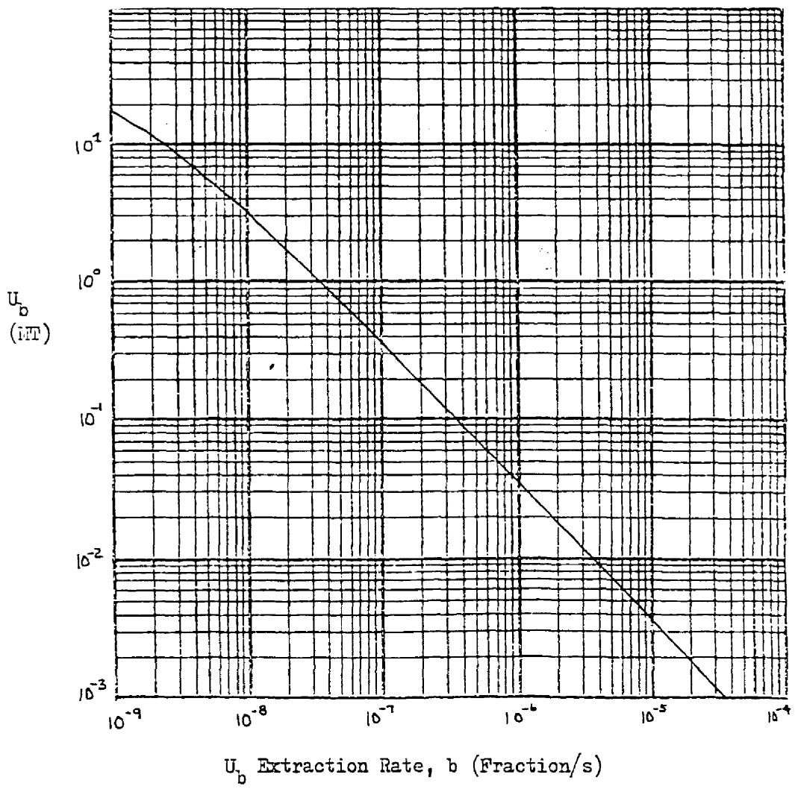  
Figure 3.5-9. Sensitivity of Blanket Uranium Content $(U_{b})$ to Its Extraction Rate (b)

Basis: ANISN calculations of critical size and reaction rates of a core mixture with 30 mole % NaCl, 35 mole % ThCl₄, 35 mole % UCl₃,²³₃U/²³₄U ratio of 7.

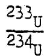  
DT (yrs)   
Figure 3.5-10 Sensitivity of DT and $233_{\mathrm{U}} / 234_{\mathrm{U}}$ Ratio to $\mathsf{U}_{\mathsf{b}}$ Extraction Rate   
Based on ANISN calculations of critical size and reaction rates of a core mixture with 30 mole % NaCl 35 mole % ThCl4 35 mole % UCl3 $233_{\mathrm{U}} / 234_{\mathrm{U}}$ ratio of 7   
c = core U extraction rate (fraction s-1)

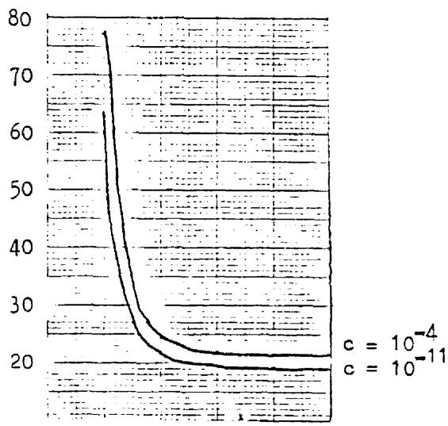

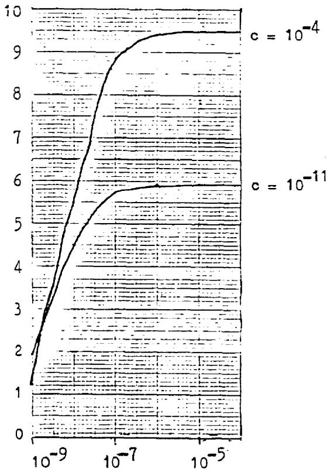  
Ub Extraction Rate, b (fraction s-1)

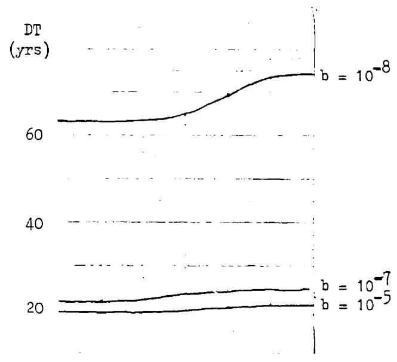  
Fig. 3.5-11 Sensitivity of Doubling Time and $233_{\mathrm{U}} / 234_{\mathrm{U}}$ Ratio to Core U Extraction Rate

$$
\frac {2 3 3 _ {U}}{2 3 4 _ {U}}
$$

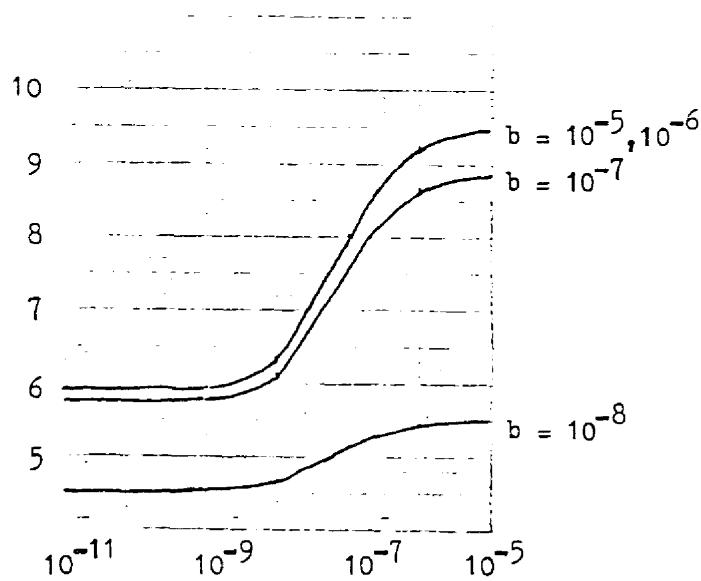  
Based on ANISN calculation of critical size and reaction rates of a core mixture with 30 mole $\%$ NaCl 35 mole $\%$ ThCl 4 35 mole $\%$ UCl 323U/234U ratio b = blkt. U extractio (fraction s-1)   
Core U Extraction Rate, c (fraction /s)

3.5.7.1 Inner blanket study. Taube studied [17] inner blankets up to $1.1\mathrm{m}$ in radius for spherical MCFR(Pu) and (fluoride) MFFR(Pu). In each case the outer blanket remained one-meter thick. With pure fissile (no fertile) salt in the core, the BG slightly increased for an MCFR(PU) and decreased for an MHTR(Pu). Fig. 3.5-12 shows the changes by zone in the MFFR(Pu) study: inner blanket breeding increases with its volume, but also softens the core neutron spectrum. The result is increased core BG but lower total BG, more so for F than Cl salt. Thus for a

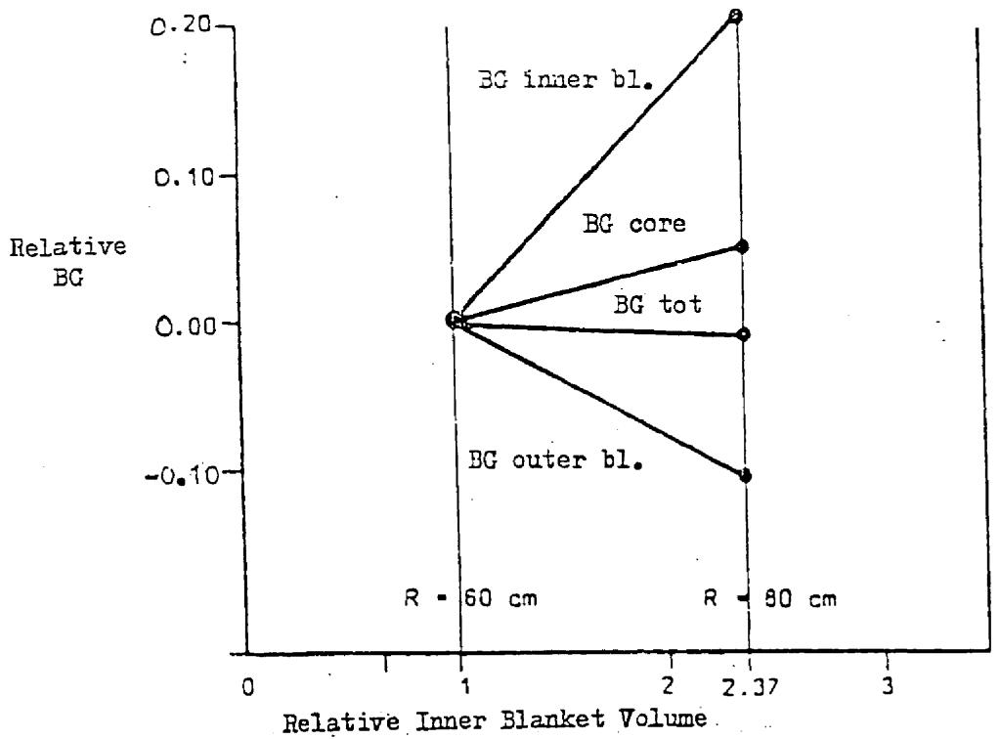  
Fig. 3.5-12 Impact of Inner Blanket Volume on BG for a MFFR(Pu)

fixed reactor diameter, which controls the overall plant size, an inner blanket does not appear worthwhile relative to just increasing the outer blanket thickness. Furthermore even if marginal BG advantages were found, the added engineering complexity would probably discourage it.

To verify the effect of an inner blanket a study was made in spherical geometry. Figures 3.5-13 and 3.5-14 show the results for a constant total blanket thickness of $200\mathrm{cm}$ . As the IB diameter increases, the annular core moves radially outward. As a result

1. The core volume increases, decreasing the power density   
2. The core spectrum softens   
3. Neutron leakage from the reactor increases   
4. Inner breeding increases and outer breeding decreases resulting in a strong net decrease

The accelerating BG decrease is primarily caused by the increasing neutron leakage and secondly by the softened core spectrum effect on BG potential.

3.5.7.2 Optimum outer blanket thickness. A study was made to determine what constituted an infinite (outer) blanket thickness to BG. It assumed no inner blanket. The study considered $\mathrm{ThCl}_4 / \mathrm{UCl}_3$ molar ratios in the core of 0,1, and 3. The NaCl molar content in the fuel salt was $30\%$ . The results (Fig. 3.5-15) indicate that 2 m is near infinite.

Figure 3.5-16 shows that the outer blanket also shields the vessel from the high core flux: a two-meter thickness reduces the damage ( $>0.1 \, \text{MeV}$ ) flux by over 3 magnitudes down to the level of the delayed neutrons.

Median Core Flux Energy (MeV)

BG

Figure 3.5-13. Decline of BG and Median Core Clux Energy with Increasing Inner Blanket Size   
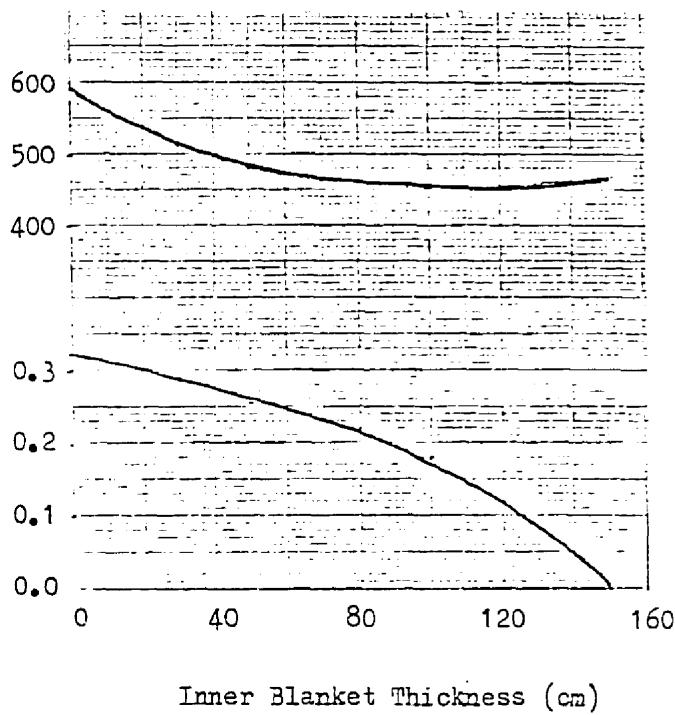  
Bases: 30/35/35 molar proportions of Na/ThCl4/UCl3 in the core 200 cm total (inner + outer) blanket thickness Ni reflector

3.5.7.3 Reflector. A pair of ANISN calculations determined the effect of reducing the reflector from 40 cm graphite to 20 cm using a keff-precision of 0.001 or $0.1\%$ , P1 cross sections, and S8 quadrature. With a 2 m blanket, the BG dropped from 0.3446

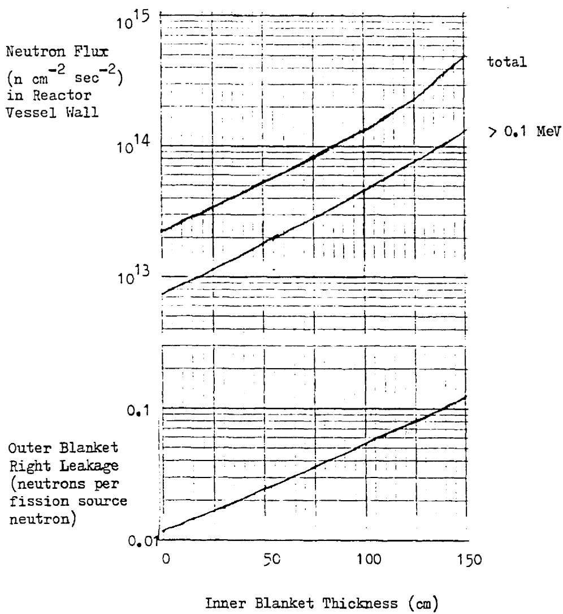  
Figure 3.5-14. Increasing Neutron Leakage into Reactor Vessel Wall with Increasing Inner Blanket Size.

```txt
Bases: 30/35/35 molar proportions of NaCl/ThCl4/UCl3 in the core 200 cm total (inner + outer) blanket thickness Ni reflector 
```

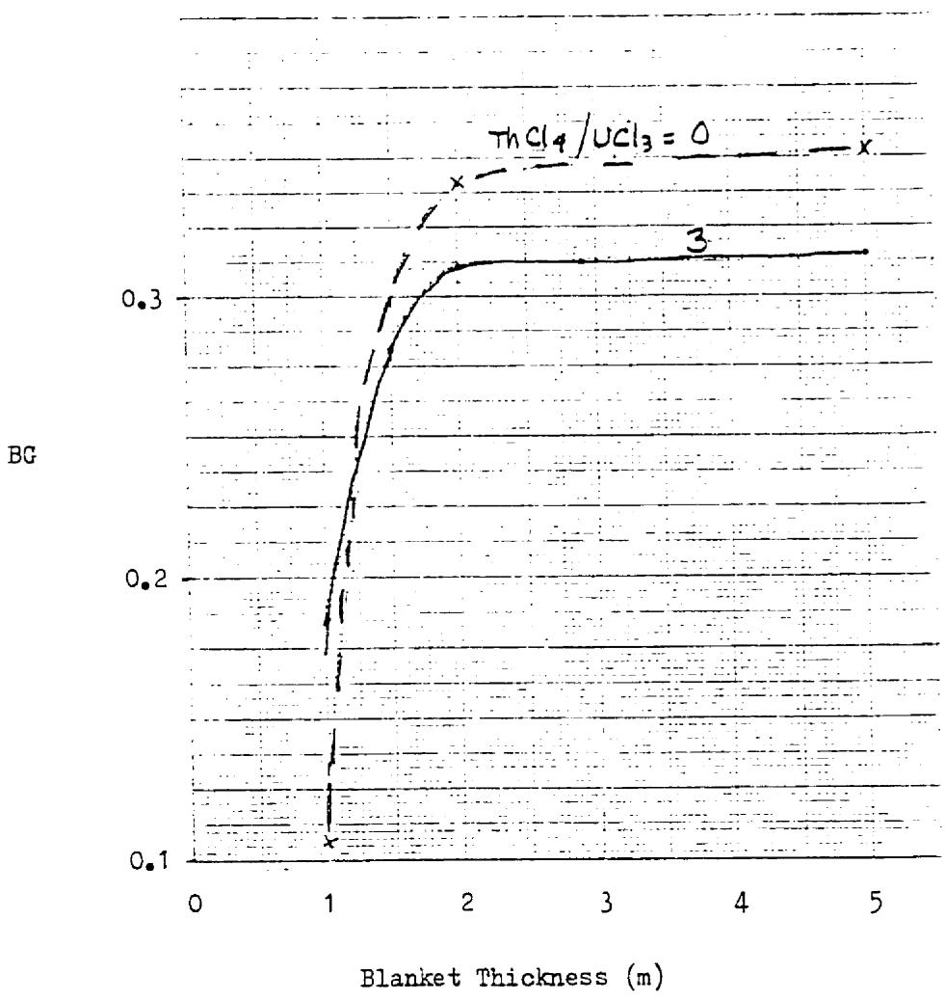  
Figure 3.5-15. Determining the Outer Blanket Thickness Which Is Quasi-Infinite to the BG, for Two Core Salt Mixtures

Bases: - blanket salt = 30/70 molar NaCl/ThCl₄   
40 cm graphite reflector   
- no inner blanket   
- $30 \%$ molar NaCl fraction in core salt

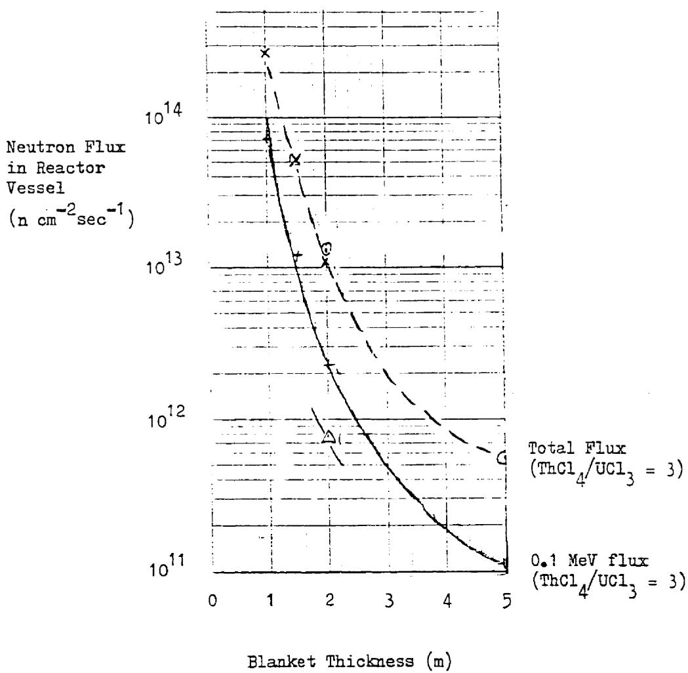  
Figure 3.5-16. Typical Decrease in Vessel Flux and Damage with Increasing Blanket Thickness, Graphite Reflector

<table><tr><td>Legend</td><td>Symbol</td><td>ThCl4/ UCl3 Molar Ratio in Core Salt</td><td>Flux</td></tr><tr><td></td><td>O</td><td>0</td><td>&gt;0.1 MeV</td></tr><tr><td></td><td>X</td><td>3</td><td>total</td></tr><tr><td></td><td>+</td><td>3</td><td>&gt;0.1 MeV</td></tr><tr><td></td><td>△</td><td>5</td><td>&gt;0.1 MeV</td></tr></table>

to 0.3442 or $0.2\%$ . The critical radius increased from 26.11 to 26.14 cm or $0.1\%$ (a critical volume increase of $0.3\%$ ). Thus cutting the reflector thickness in half barely shows up above the accuracy of the calculations. This result corresponds well to that of the previous section: namely that two meters constitutes a near-infinite blanket thickness.

Comparison of C and Ni reflectors for a 3/1 Th/U core ratio and 5-m thick blanket showed no detectable differences. For a 0/1 Th/U core ratio and 1-m thick blanket, C performed much better (BG=0.106) than Ni (BC=0.040); the critical core radius differed little. The BG difference probably stems from the moderating power of C: neutrons reflected by C stand a much better chance of capture by Th than those reflected by Ni. This recommends C for cases where a non-infinite blanket is used. For ≥ 1.5-2.0 m thick blankets and 65/35 ThCl₄/NaCl mixture, a neutron reflector appears unneeded.

3.5.7.4 Core tube material. In an MCFR (Pu) study [75], a 20 Mo/80 Fe alloy for the core/blanket wall reduced BG by 0.04 relative to a C wall. As the $20\%$ Ho dominated the neutron absorptions there $(61\%)$ , $100\%$ Mo tubes might reduce BG by 0.2. The MCFR(Pu) study assumed in-core cooling with the tubes occupying $5.9\%$ of the core volume. In the present MCFR(Th) concept the 2-cm tubes occupy several times that proportion of volume but they lie more on the periphery. Thus a BG effect similar to 0.2 might be expected.

3.5.8 Reactor Design: Controlling the Core $^{233}\mathrm{U} / ^{234}\mathrm{U}$ Ratio

3.5.8.1 Basis for studying the ratio. $^{234}\mathrm{U}$ content affects the Section 2-adduced goals: hard neutron spectrum, high BG, and minimum presence of Pu and other heavy actinides. Although $^{234}\mathrm{U}$ content is not a design (independent) variable but rather a physics consequence (dependent variable), still design variables like NaCl/ UCl₃/ThCl₄ molar composition can influence it. Therefore we study its effects as if it were an independent variable, looking at $^{233}\mathrm{U}/234\mathrm{U} = 3,5$ , and 7.

The MCFR model used as a basis in the study included a core salt molar composition of $30/70 / \mathrm{C}$ NaCl/UCl₃/ThCl₄ and a 200 cm blanket.

3.5.8.2 Effect of the ratio on spectrum, BG, and Fu presence.

Fig. 3.5-17 shows that $^{234}\mathrm{U}$ softens the neutron spectrum ( $\langle \mathbf{E} \rangle_{\text{core}}$ decreases. This is probably due to a higher $\langle \sigma_{\text{inel}} \rangle / \langle \sigma_{\text{fiss}} \rangle$ ratio for $^{234}\mathrm{U}$ compared to that for $^{233}\mathrm{U}$ . $^{234}\mathrm{U}$ also reduces BG and power density. Table 3.5-IX shows that the major BG reduction stems directly from the lower $\langle \nabla \sigma_{\mathrm{f}} - \sigma_{\mathrm{c}} \rangle$ value for $^{234}\mathrm{U}$ , not from spectral softening. This same phenomenon decreases the reactivity of high $^{234}\mathrm{U}$ systems: that accounts for the larger critical volumes and lower power densities.

Intuitively, a high ratio will minimize the presence of Pu and other heavy actinides (the third goal): $234$ U heads the chain that leads to them.

In summary, a high $^{233}\mathrm{U} / ^{234}\mathrm{U}$ ratio promotes all three goals of hard neutron spectrum, high BG, and minimal Pu presence.

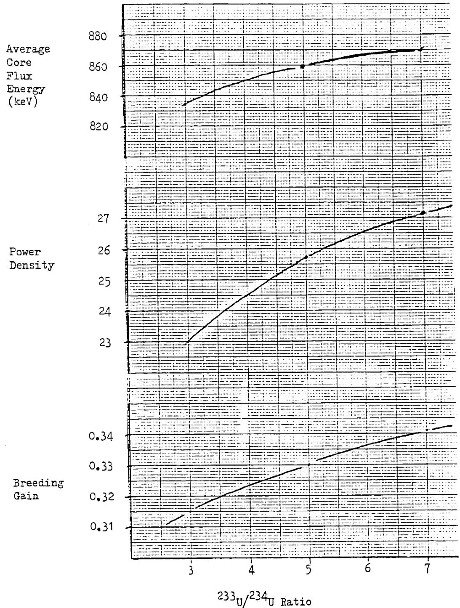  
Figure 3.5-17. Correlation of Decreasing $^{234}\mathrm{U}$ Content With Key Core Physics Parameters

Table 3.5-IX Calculation of Neutron Production by the Two Principal U Isotopes   

<table><tr><td rowspan="2">233U/234U Ratio</td><td colspan="3">value for &lt;ν σε - σa&gt;</td></tr><tr><td>233U</td><td>234U</td><td>Uavg</td></tr><tr><td>3</td><td>3.27</td><td>1.16</td><td>2.74</td></tr><tr><td>5</td><td>3.26</td><td>1.18</td><td>2.91</td></tr><tr><td>7</td><td>3.33</td><td>1.02</td><td>3.04</td></tr></table>

3.5.8.3 Effect on reactor fissile inventory and doubling time. Because $^{234}\mathrm{U}$ is a fissile MCFR fuel, the reactor U inventory varies little in this study. However, the U export rate (Eq. 3.5.6-16) does increase with decreasing $^{234}\mathrm{U}$ content, reaching 0.25 MT/yr for the ratio $^{233}\mathrm{U}/^{234}\mathrm{U} = 7$ . Figure 3.5-18 shows the consequent effect on doubling time. This recommends a high $^{233}\mathrm{U}/^{234}\mathrm{U}$ ratio; however, significant effort to reach higher ratios may not be warranted.

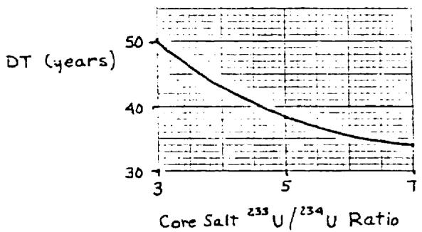  
Figure 3.5-18. Variation of Doubling Time with Core Salt $^{233}\mathrm{U} / ^{234}\mathrm{U}$ Ratio

Basis: 30/70/0 NaCl/UCl₃/ThCl₄ molar salt composition in the core, 200 cm blanket, C reflector; b = c = 10⁻⁷/s

3.5.8.4 Deducing the ratio on equilibrium cycle. Given a set of reaction rates and choosing b and c, the equations of Sec. 3.5.8.2 specify the $^{233}\mathrm{U} / ^{234}\mathrm{U}$ ratio. However, this ratio for the fuel cycle will depend on the reaction rates used. These, in turn, depend on the ratio assumed apriori in the neutronic analysis of the equilibrium fuel cycle. Figure 3.5-19 suggests that the two converge near $^{233}\mathrm{U} / ^{234}\mathrm{U} = 9\frac{1}{2}$ for $\mathrm{b=c=10^{-7}}$ and near $12\frac{1}{2}-13$ for $\mathrm{b=c=10^{-6}}$ . This is for a 30/70/0 NaCl/UCl₃/ThCl₄ molar composition. Similar behavior is presumed for other MCFR models.

The results of later calculations with the refined set of P1 Cl cross sections (Sec. 3.5.3.2) suggest a slightly lower value, nearer to $233_{\mathrm{U}} / 234_{\mathrm{U}} = 8 \frac{1}{2}$ and $11 \frac{1}{2}$ for $b = c = 10^{-7}$ and $10^{-6}$ , respectively.

Core $^{233}\mathrm{U} / ^{234}\mathrm{U}$ Ratio on Equilibrium Fuel Cycle Deduced from ANISN-Calculated Reaction Rates

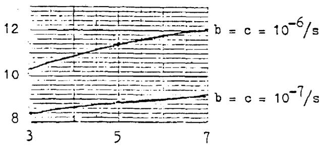  
Core $^{233}\mathrm{U} / ^{234}\mathrm{U}$ Ratio Assumed in Calculating Reaction Rates with ANISN   
Figure 3.5-19. Calculational Approach to the Equilibrium Core $233_{\mathrm{U}} / 231_{\mathrm{U}}$ Ratio

Bases = 30/70/0 molar proportions of NaCl/ThCl4/UCl3 in the core, 200 cm blanket

# 3.5.9 Reactor Design: Choosing the Core Salt ThCl/UCl3 Ratio

To approach its BG potential (BGX or BGP) the reactor must capture its excess neutrons in fertile material. One means of reducing neutron leakage from the reactor is to thicken the outer blanket (Sec. 3.5.6.2) so that the fertile fuel captures or reflects most of the neutrons which escape the core. Another way is to add fertile material to the core fuel thereby reducing the core neutron leakage. However, this also softens the neutron spectrum, which lowers the BG potential (BGP).

With an MCFR(U/Pu) Taube reported [17] BG up to 0.7-0.8 with such techniques. The following subsections study the optimum fertile content in an MCFR(Th) core. They assume a salt mixture of $30\%$

NaCl and $70\%$ $(\mathrm{UCl}_3 + \mathrm{ThCl}_4)$ and a $^{233}\mathrm{U} / ^{234}\mathrm{U}$ ratio of 7/1.

3.5.9.1 Effect on BG. Fig. 3.5-20 shows the results of ANISN calculations. Neutrons leak significantly from a one-meter blanket so the choice of reflector affects BG. Then one prefers $\mathrm{ThCl}_4 / \mathrm{UCl}_3 = 0$ .

When the blanket thickness exceeds $2.0 \, \text{m}$ however, few neutrons leak and the reflector has little effect. [Th] = 0 then produces the greatest BG because it engenders the hardest neutron spectrum (Fig. 3.5-21) and consequently, the most excess neutrons (Sec. 3.5.5.5).

Fig. 3.5-20 also shows the BG from the 1956 ORNL study [13] of an MCFR(Pu) which included a Pb core-reflector and a graphite-moderated thin blanket. The larger $\sqrt{v}$ value for Pu causes the high BG. Few neutrons leak despite low fertile content, but this is because of high (83%) carrier salt content. BG could actually be higher were it not for the spectrum softening and neutron absorption by the carrier salt.

3.5.9.2 Effect on reactor fissile inventory and doubling times. Substituting $\mathrm{ThCl}_4$ for $\mathrm{UCl}_3$ decreases density. However, the critical core radius increases near proportionally, and volume increases even faster. Thus, overall, Th dilution increases the spherical critical mass $U_{s}$ (Fig. 3.5-22) and the corresponding mass in the tubes $U_{i}$ (from Fig. 3.5-7). In contrast, the primary circuit volume outside the vessel, $V_{o}$ , remains fixed, so $U_{o}$ decreases.

While $V_{o}$ exceeds $V_{i}$ , $U_{t} = U_{i} + U_{o} + U_{b}$ decreases. ( $U_{b}$ plays little role while $b > 10^{-7}$ .) Eventually the Th proportion reaches a level where the internal volume $V_{i}$ exceeds the fixed $V_{o}$ . Then $U_{t}$ begins

Breeding Gain

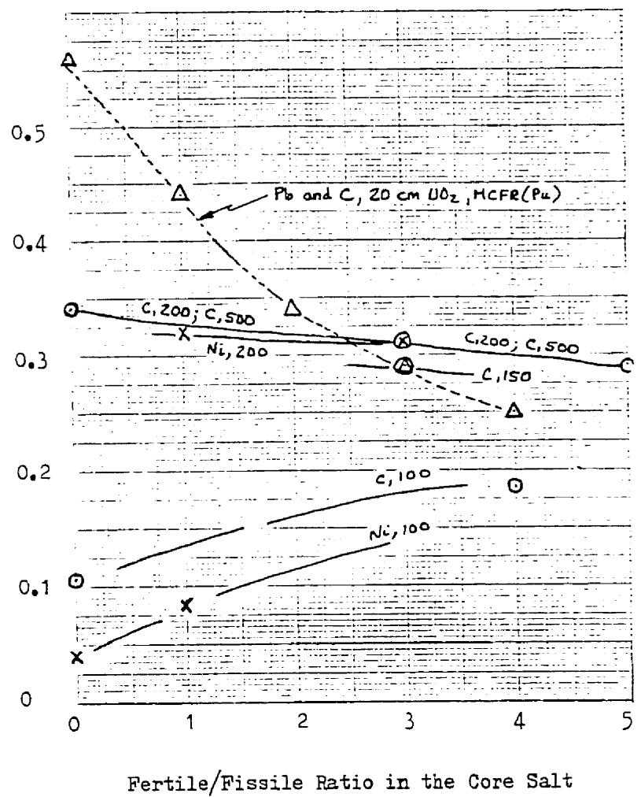  
Figure 3.5-20. Effect of Fertile Presence in the Core Salt upon BG: Lowering of the BG Potential; Trapping of Leakage Neutrons

Legend: C, 200 implies a 200 cm ThCl blanket and a C reflector(s). The MCFR(Pu) reactor features interlayered blankets and reflector/moderators carbon reflectors, MCFR(Th) Ni reflectors, MCFR(Th) Be and C reflectors/moderators, MCFR(Pu)

Median

Core-

Neutron

Energy

(keV)

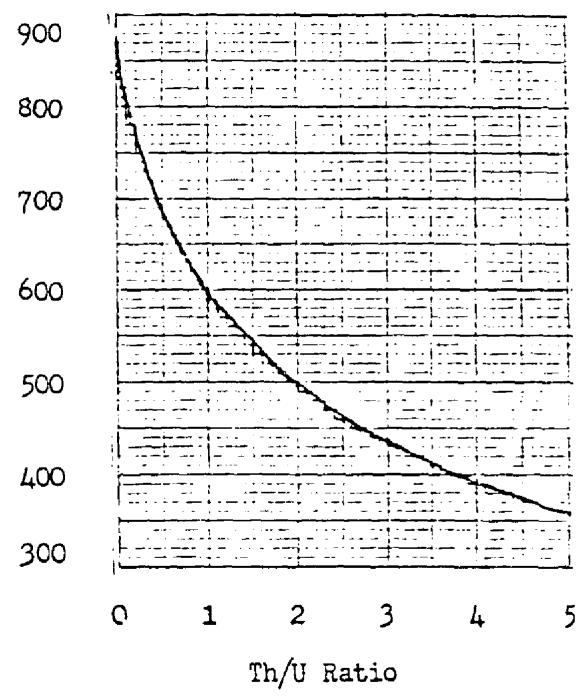  
Fig. 3.5-21 Effect of Th Presence in Core Salt Upon Core Neutron Spectrum

to increase with increasing Th/U ratio. This $U_{t}$ -minimum occurs near $\mathrm{ThCl}_4 / \mathrm{UCl}_3 = 1 - 2$ .

In the 1956 ORNL study [13] of an MCFR(Pu) the minimum plant inventory occurred at a $^{238}\mathrm{U} / \mathrm{Pu}$ ratio of 2 (Fig. 3.5-23), similar to this work. The MCFR(Pu) total fissile inventory however lies roughly a factor of 3 below that for the present MCFR(Th) study: the reason is great dilution of the Pu fuel mixture by carrier salt ( $83\%$ molar content).

In Fig. 3.5-24 the BG export rate $\dot{U}_{e}$ for $b = c = 10^{-7} / s$ (defined by Eq. 3.5.6-16) stays fairly constant as the core Th/U ratio changes. By Eq. 3.5.6-17 then, DT behavior must closely follow that of $U_{t}$ . Fig. 3.5-24 shows that the lowest DT clearly occurs at a $\mathrm{ThCl}_4 / \mathrm{UCl}_3$ ratio $\neq 0$ : somewhere around 1-2.

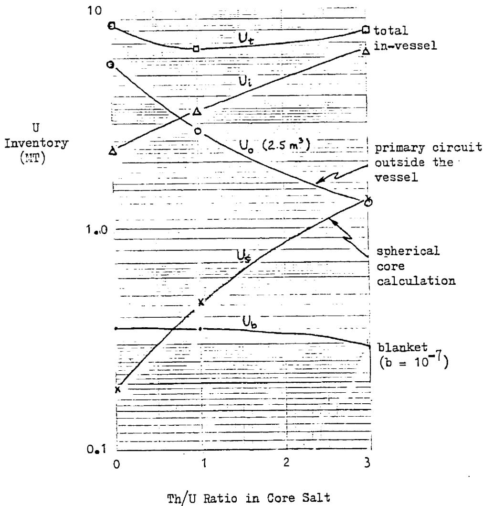  
Figure 3.5-22. Dependence of the MCFR(Th) Reactor U Inventory upon the Core Th/U Ratio.

Total Plant

239pu

Inventory

（iTT）

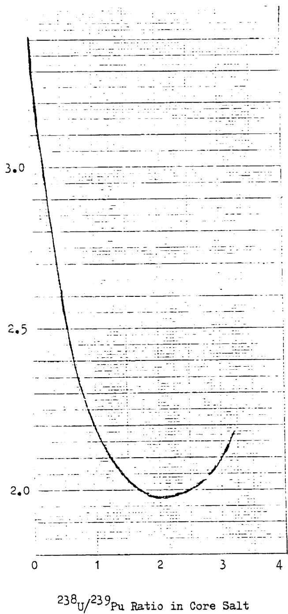  
Figure 3.5-23. MCFR(Pu) Plant Pu Inventory with a 3 NaCl,

2 MgCl $_2$ , 1 UCl $_3$ (PuCl $_3$ ) Core Salt.

External holdup volume $= 3.5 \, \text{m}^3$

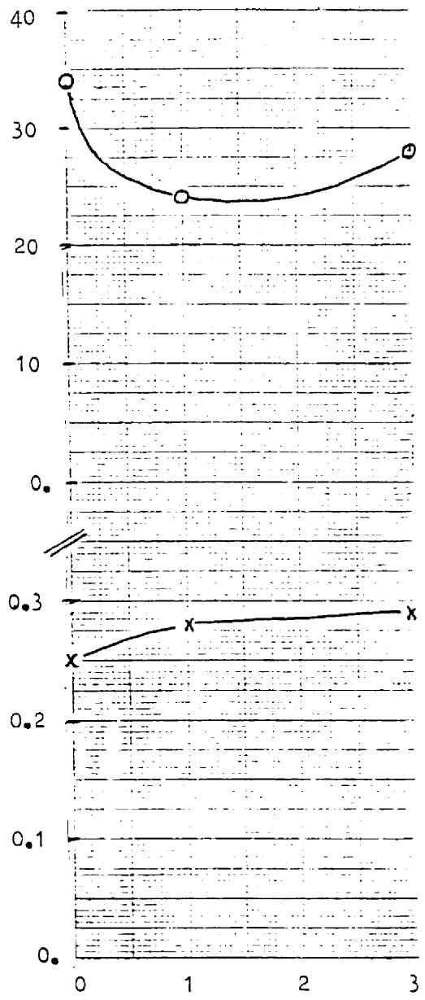  
Doubling Time, DT (years)   
BG Export Rate, U (mT/yr)e   
Th/U Ratio in Core Salt   
Figure 3.5-24. Variation of BG Export Rate and Consequent Doubling Time with Core Th/U Ratio.

# 3.5.7.3 Effect on power density and flux levels

The power density limit of 10 MJ/liter (Section 3.2.2.2) reflects more a premonition of problems than a recognition of any specific ones. Still, flux levels in the core tubes and the pressure vessel closely relate to power density (section 3.2.2.3). Figure 3.5-25 shows how $\mathrm{ThCl}_4$ dilution of the core salt markedly reduces power density and fluxes alike.

The skewed-tube geometry will further increase the critical mass (lower the power density). A cylinder with length-to-diameter ratio $(L / D)$ near 1.0 requires about $10\%$ more critical mass in low density metal systems than does a sphere; with $L / D \sim 2$ , about $40\%$ more. The heterogeneity of multiple skewed tubes further increases critical mass as does neutron capture and scatter by the blanket $\mathrm{ThCl}_4$ in between the tubes. Altogether these effects should reduce power density and fluxes by more than a factor of two compared to spheres. Applied to Fig. 3.5-25, the result is that $\mathrm{ThCl}_4 / \mathrm{UCl}_3 = 0.1$ now satisfies the power density criteria of $< 10 \mathrm{MW} / \mathrm{l}$ .

At higher $\mathrm{ThCl}_4 / \mathrm{UCl}_3$ ratios the $>100\mathrm{keV}$ flux in the vessel falls below $10^{13}\mathrm{ncm}^{-2}\mathrm{s}^{-1}$ or $< 10^{22}\mathrm{ncm}^{-2}$ in 30 years. That level will allow operation over the reactor life for many metals.

Meanwhile the core flux level will be $\sim 10^{23}$ n cm $^{-2}$ mo $^{-1}$ . Presumably, most materials won't be able to take many months of that. This emphasizes the importance of our design: straight tubes, easily replaced, and not touching one another.

Figure 3.5-25. Reduction in Flux and Power Density as Th Presence in the MCFR(Th) Core Salt Softens the Neutron Energy Spectrum   
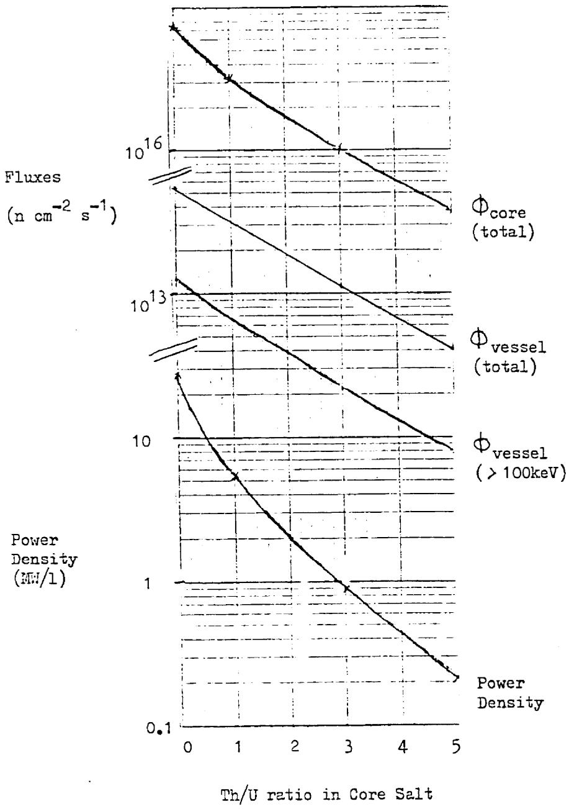  
Bases: 2 m C reflector, $^{233}\mathrm{U} / ^{234}\mathrm{U}$ in core = 7:1, Na/Actinide in core 30/70.

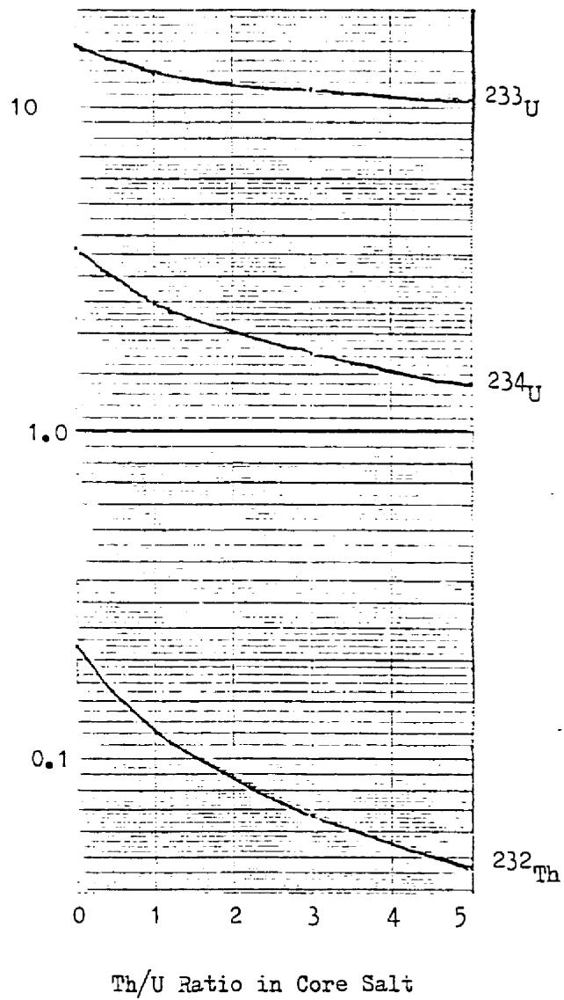  
Isotopic $\langle \sigma_{\tau} / \sigma_{\tau}\rangle$ in the Core Sal   
Figure 3.5-26. Spectrum Softening of Th Presence in Core Salt: Effect Upon the Fission-to-Capture Rate Competition for Key Isotopes

3.5.9.4 Effect on actinide fission rates and $^{233}\mathrm{U} / ^{234}\mathrm{U}$ ratio. The spectrum softening effect of $\mathrm{ThCl}_4$ content (Fig. 3.5-21) reduces the average fission cross section relative to the capture cross section, especially for even-A isotopes which do not readily fission (Fig. 3.5-26). This favors accumulation of higher-A nuclides which section 2.1.2 showed to be undesirable. Figure 3.5-27 confirms this effect on the $^{233}\mathrm{U} / ^{234}\mathrm{U}$ ratio. Section 3.5.8 showed that $^{234}\mathrm{U}$ presence further softens the spectrum.

Equilibrium

$$
2 3 3 _ {U} / 2 3 4 _ {U}
$$

Ratio in

Core Salt

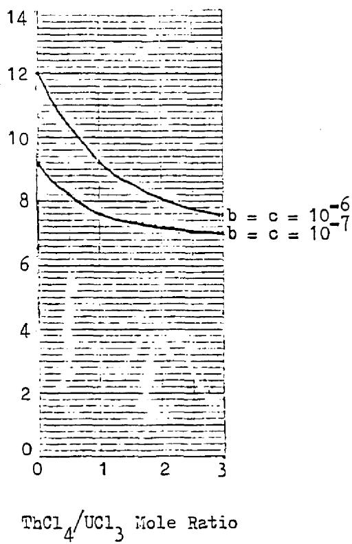  
Figure 3.5-27. Effect of $\mathrm{ThCl}_4$ Content in Core Salt Upon

233U/234U Ratio

Bases: $30\%$ NaCl mole content in salt

7/1 ratio for $^{233}\mathrm{U} / ^{234}\mathrm{U}$

# 3.5.10 Reactor Design: Core Carrier Salt (NaCl) Content

Like $\mathrm{ThCl}_4$ , NaCl substitution for $\mathrm{UCl}_3$ in the primary salt significantly reduces the fissile inventory outside the core tubes, but also degrades the neutronic performance in the core. This section analyzes some of these physics consequences assuming a core salt composed of zero $\mathrm{ThCl}_4$ and a $^{233}\mathrm{U}/^{234}\mathrm{U}$ ratio of 7. Results are compared with those from $\mathrm{ThCl}_4$ substitution (Sec. 3.5.9).

3.5.10.1 Effect on BG. NaCl decreases BG through parasitic absorption and moderation of neutrons. Fig. 3.5-28 combines the results from the present MCFR(Th) study with the behavior derived from an MCFR(Pu) study by Taube. The results suggest

1. Generally minimizing the NaCl content   
2. Absolutely avoiding NaCl molar content 80%

Fig. 3.5-29 compares NaCl substitution relative to ThCl₄ substitution on an expanded scale. One sees that ThCl₄ diminishes BG slightly less than NaCl does. The probable reason is that most neutron capture in ThCl₄ contributes to BG (even considering the four Cl atoms), whereas none of that in NaCl does. Table 3.5-IX supports this.

With a thinner blanket, the $\mathrm{ThCl}_{4}$ -NaCl difference would probably be much greater.

3.5.10.2 Effect on reactor fissile inventory and doubling time.

Figure 3.5-30 shows the results of this study. Similar to Sec.

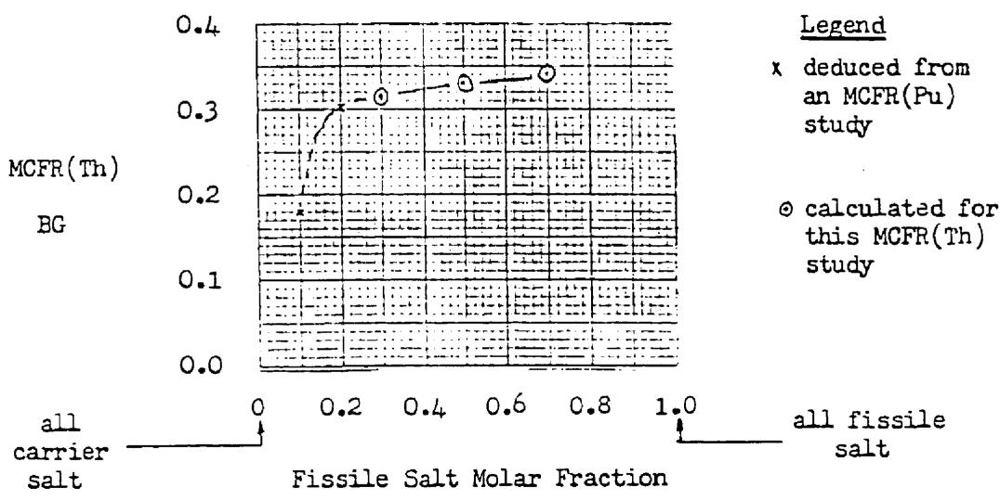

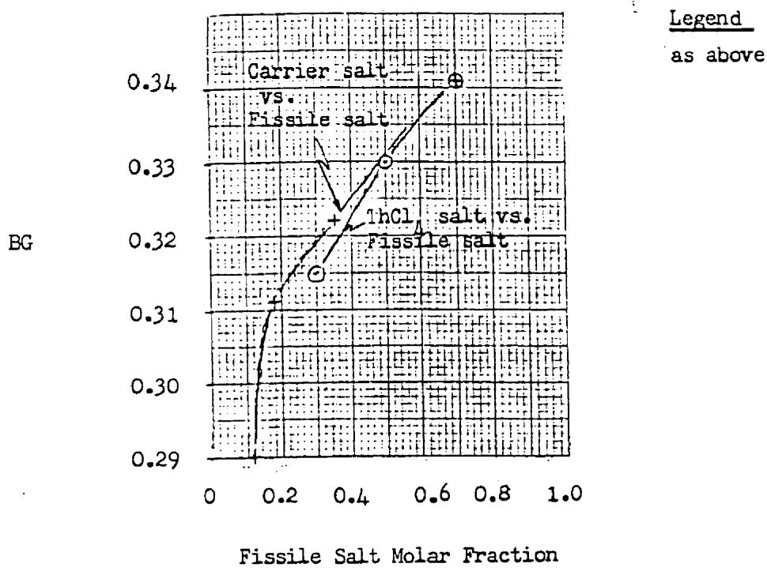  
Fig. 3.5-28 Drastic Falloff in BG at High Carrier Salt Content   
Fig. 3.5-29 BG Comparison of Carrier Salt Substitution to $\mathsf{ThCl}_4$ (Fertile) Salt Substitution

Doubling Time (years)

U Inventories (IT)

10.

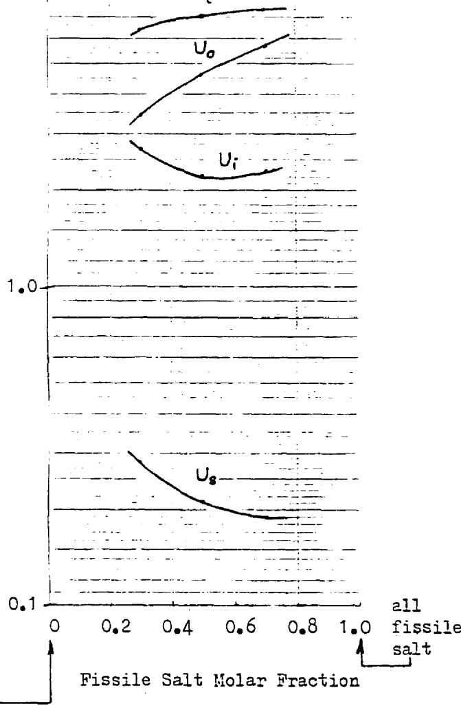  
Figure 3.5-30. Effect of Carrier Salt Admixture Upon Fissile

all carrier (NaCl) salt

Inventory and Doubling Time

3.5.9.2, NaCl substitution for UCl₃ increases the fissile inventory in the core tubes within the vessel. However, the larger inventory outside the vessel decreases faster. Thus the total inventory (primary circuit plus blanket) decreases with increasing NaCl content.

NaCl substitution also decreases the BG export rate, but only slightly. Unlike ThCl₄ substitution, NaCl substitution continues to decrease DT down through 30% UCl₃ molar content. However, beyond that point Sec. 3.5.10.1 indicates that BG should fall off drastically, with consequent DT increase.

3.5.10.3 Effect on power density and flux levels. Figure 3.5-31 shows how NaCl substitution for UCl₃ decreases the power density and flux levels. However, ThCl₄-substitution causes an even faster decrease. In both cases the blanket composition remains constant. Thus the greater fall-off in flux from adding ThCl₄ to the core salt must stem from the higher microscopic absorption cross section for Th than for Na (Table 3.5-X), resulting in less neutron leakage from the core.

The difference that $\mathrm{ThCl}_4$ makes relative to NaCl might allow the use of a thinner blanket.

3.5.10.4 Effect on $^{233}\mathrm{U} / ^{234}\mathrm{U}$ ratio. Substitution of non-fissile salts for UCl₃ softens the neutron spectrum because it substitutes a source of elastic- and inelastic- scattered neutrons for one of fission neutrons. In a softer spectrum, the rate of $^{234}\mathrm{U}$ (threshold) fission decreases and $^{233}\mathrm{U} (-1/\mathrm{v})$ capture increases. Both

Total Core Flux (a cm-1s-1)

>100 keV Flux $(\mathrm{ncm}^{-2}\mathrm{s}^{-1})$ in Reactor Vessel

Core Power Density (H/1)

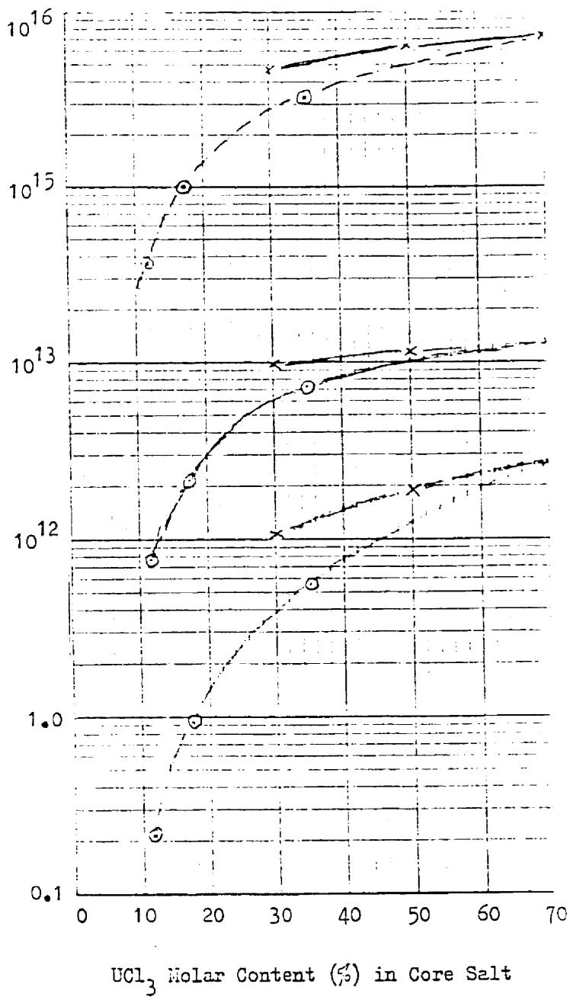  
Figure 3.5-31. Effect of Core Salt Dilution on Flux Levels and Power Density: X - NaCl Substitution, O - ThCl4 Substitution

Basis: $7 / 1^{233} \mathrm{U} /^{234} \mathrm{U}$ ratio in core salt
200 cm blanket
Starting core salt composition: $70 \%$ UCl₃, $30 \%$ NaCl, $0 \%$ ThCl₄

Table 3.5-X   
Some Pertinent Microscopic Absorption Cross Sections   

<table><tr><td rowspan="2">Element</td><td colspan="2">Cross Section (mb )</td></tr><tr><td>Core*</td><td>Blanket*</td></tr><tr><td>Cl</td><td>15</td><td>6.5</td></tr><tr><td>Na</td><td>1.0</td><td>1.7</td></tr><tr><td>Th</td><td>230</td><td>11</td></tr></table>

* As calculated for an MCFR(Th) with core salt mixture at 30/35/35 NaCl/UCl₃/ThCl₄ molar composition.

changes increase the $^{234}\mathrm{U}$ content. $^{233}\mathrm{U}$ capture increase also decreases the $^{233}\mathrm{U}$ content, giving a double effect. All three effects work in concert to decrease the ratio (Fig. 3.5-32).

Differences between NaCl and $\mathrm{ThCl}_4$ as salt substitutes appear to be small. NaCl mostly scatters elastically while $\mathrm{ThCl}_4$ scatters more inelastically. The different shapes of the NaCl and $\mathrm{ThCl}_4$ curves in Fig. 3.5-32 may reflect these differences: Th inelastic scatter should contribute more to spectrum softening at low non-fissile content where the neutrons still exceed the inelastic threshold energy.

Equilibrium

233U/234U

Ratio in

Core Salt

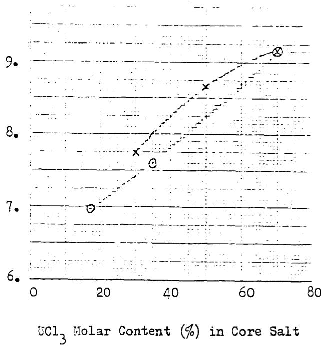  
Figure 3.5-32. Effect of Core Salt Dilution on the Equilibrium $^{233}\mathrm{U} / ^{234}\mathrm{U}$ Ratio in the Core Salt: X - NaCl Substitution, O - ThCl Substitution

Basis: U reprocessing rates b = c = 10 $^{-7}$ /s reaction rates based on $233 \mathrm{U} / 234$ U ratio = 7 in core salt 200 cm blanket starting core salt composition $70 \%$ UCl₃, $30 \%$ NaCl, $0 \%$ ThCl₄

# 3.5.11 Mutation Effects

3.5.11.1 Significance of actinides which emit alphas. Reactor irradiation transmutes actinides into long-lived alpha-emitters: they increase in atomic number (Z) and weight (A) through $(n, \gamma)$ reactions and $\beta$ -decay; they then generally decrease slowly in Z and A through alpha decay, finally becoming a stable nucleus. Alpha emitters are undesirable because

1. They pose a long-lived radiobiological hazard   
2. They produce neutrons through $(\alpha ,n)$ reactions   
3. Some produce neutrons also through spontaneous fission   
4. They destroy reprocessing chemicals

The radiobiological hazard will depend upon

1. The probability of the isotope reaching the public environment in an ingestible form   
2. Its radioactive half-life: very short- and very long-lived isctopes present little danger   
3. The biological-elimination half-life: how long before the body removes it naturally   
4. The chemical affinity of the isotope for specific organs or other members of the body. Those which seek cut bones are labelled carcinogenic (cancer causing)   
5. The available energy per decay   
6. The occurrence of secondary radiations by reactions such as $(\alpha, n)$ for high energy alphas   
7. The quantity of iscope present.

Combination of these factors defines the toxicity of an isotope - just how much of a practical threat it poses. Table 3.5-XI includes a toxicity classification along with other pertinent physics information. The moderate half-lives of Pu plus their early preeminence in the act-ince burnup chains warrant their highly toxic classification. Carcinogenicity further emphasizes avoiding their production.

The problem with $(\alpha, n)$ reactions as well as spontaneous fission neutrons is that neutrons penetrate gamma shielding: in addition to harming workers directly, they can activate the surroundings, presenting longer-term hazards.

Numerous light elements (up through Al and Si) undergo these reactions with alphas. Fig. 3.5-33 shows some relative yields. F, though not included there reacts almost as strongly as Be. F, Li, and Be are candidate materials for (blanket) salt mix; this phenomenon argues against their use unless the neutron signal and hazard are desired for non-proliferation purposes. Section 3.7 mentions the use of F, O, $\mathrm{Hg}$ , and Na with various reprocessing schemes; this phenomenon would discourage their use there somewhat.

The threshold-like behavior of the $(\alpha, n)$ neutron yields per reaction (Fig. 3.5-33) makes isotopes emitting higher-energy alphas particularly hazardous. These include $212_{Bi}$ , $212_{Po}$ , $216_{Po}$ , $220_{Rn}$ , $224_{Ta}$ , $236_{Pu}$ , $242_{Cm}$ , and $244_{Cm}$ . However, when one considers the half-lives and quantities actually present, the principal $(\alpha, n)$ sources are $238_{Pu}$ , $242_{Cm}$ , and $239_{Pu}$ while the main S. F. neutron sources tend to be $242_{Cm}$ , $244_{Cm}$ , $238_{Pu}$ , $240_{Pu}$ , and $242_{Pu}$ . These all really emphasize a strong desire to avoid Pu and higher actinides.

Elements [34, 50, 51, 136]

Table 3.5-XI Hazard Characterization of Potential MCFR(Th) Heavy   

<table><tr><td>Isotope</td><td>Alpha
Half-
life
(years)</td><td>Alpha
Energy
(MeV)</td><td>S.F.
Half-
life
(years)</td><td>1 GWe
FBR
Conc.</td><td>Carcin-
ogenic
Bone
Seeker?</td><td>Tox-
icity
Class</td></tr><tr><td>Pb-212</td><td>10.64 h</td><td>(beta decay)</td><td></td><td></td><td></td><td></td></tr><tr><td>Po-212</td><td>45 s</td><td>11.65</td><td></td><td></td><td></td><td></td></tr><tr><td>-216</td><td>0.15 s</td><td>6.779</td><td></td><td></td><td></td><td></td></tr><tr><td>Bi-212</td><td>60.6 m</td><td>8.78, 6.05, 6.09</td><td></td><td></td><td></td><td></td></tr><tr><td>Rn-220</td><td>55.6 s</td><td>6.2883</td><td></td><td></td><td></td><td></td></tr><tr><td>Ra-224</td><td>3.66 d</td><td>5.6856</td><td></td><td></td><td></td><td></td></tr><tr><td>-226</td><td>1600</td><td>4.7845</td><td></td><td></td><td></td><td>I</td></tr><tr><td>Th-228</td><td>1.913</td><td>5.4233, 5.3405</td><td></td><td></td><td></td><td></td></tr><tr><td>-230</td><td>7.7+4</td><td>4.687, 4.621</td><td>1.5+17</td><td></td><td></td><td></td></tr><tr><td>-232</td><td>1.40+10</td><td>4.01, 3.95</td><td>1+21</td><td></td><td></td><td></td></tr><tr><td>-234</td><td>24.1 d</td><td>(beta decay)</td><td></td><td></td><td></td><td>II</td></tr><tr><td>Pa-231</td><td>3.28+4</td><td>5.01,-.92, 5.03</td><td>1.1+16</td><td></td><td></td><td></td></tr><tr><td>U-232</td><td>72</td><td>5.3205, 5.2635</td><td>8+13</td><td></td><td></td><td></td></tr><tr><td>-233</td><td>1.592+5</td><td>4.824, 4.783</td><td>1.2+17</td><td></td><td></td><td></td></tr><tr><td>-234</td><td>2.44+5</td><td>4.744, 4.722</td><td>2+16</td><td></td><td></td><td></td></tr><tr><td>-235</td><td>7.04+8</td><td>4.401, 4.365</td><td>3.5+17</td><td></td><td></td><td></td></tr><tr><td>-236</td><td>2.342+7</td><td>4.494, 4.45</td><td>2+16</td><td></td><td></td><td></td></tr><tr><td>-238</td><td>4.468+9</td><td>4.196, 4.15</td><td>8.19+15</td><td></td><td></td><td>II</td></tr><tr><td>Np-236</td><td>1.3+6</td><td>(beta decay)</td><td></td><td></td><td></td><td></td></tr><tr><td>-237</td><td>2.14+6</td><td>4.788, 4.770</td><td>1+18</td><td></td><td></td><td></td></tr><tr><td>Pu-236</td><td>2.85</td><td>5.768, 5.721</td><td>3.5+9</td><td></td><td></td><td></td></tr><tr><td>-238</td><td>87.74</td><td>5.4992, 5.4565</td><td>4.77+10</td><td>4.1</td><td>yes</td><td rowspan="6">I</td></tr><tr><td>-239</td><td>2.411+4</td><td>5.16, 5.14, 5.10</td><td>5.5+15</td><td>2.5</td><td>yes</td></tr><tr><td>-240</td><td>6537</td><td>5.1683, 5.1238</td><td>1.340+11</td><td>3.8</td><td>yes</td></tr><tr><td>-241</td><td>14.7</td><td>4.897</td><td></td><td>260</td><td>yes</td></tr><tr><td>-242</td><td>3.76+5</td><td>4.901, 4.857</td><td>6.75+10</td><td></td><td>yes</td></tr><tr><td>-244</td><td>8.3+7</td><td>4.589, 4.546</td><td>6.55+10</td><td></td><td>yes</td></tr><tr><td>Am-241</td><td>432</td><td>5.4857, 5.4430</td><td>1.147+14</td><td>0.6</td><td></td><td rowspan="4">I</td></tr><tr><td>-243</td><td>7380</td><td>5.275, 5.234</td><td>2.0+14</td><td>7.9</td><td></td></tr><tr><td>Cm-242</td><td>162.8 d</td><td>6.1129, 6.0696</td><td>6.09+6</td><td>34.0</td><td></td></tr><tr><td>-244</td><td>18.11</td><td>5.8050, 5.7628</td><td>1.345+7</td><td>0.5</td><td></td></tr></table>

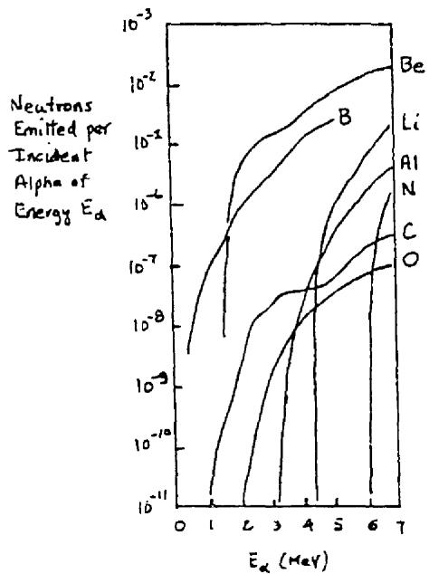  
Figure 3.5-33 Energy-Dependence of Major $(\alpha, n)$ Reactions [137]

3.5.11.2 Significance of $^{232}\mathrm{U}$ Production. Section 3.5.4.2 derived the equations for producing $^{232}\mathrm{U}$ and its daughter (principally $^{208}\mathrm{Tl}$ ) radioactivity. Figure 3.5-34 shows the resulting $^{232}\mathrm{U}$ enrichment in core and blanket salts assuming the constant $^{232}\mathrm{Th}/^{233}\mathrm{U}$ ratios indicated. The time to reach equilibrium concentration in the core reflects the time constant of $1/\sigma\phi = 10$ mos. estimated in Sec. 3.5.4.2. The several-magnitude higher $^{232}\mathrm{U}$ concentration in the core compared to blanket reflects the 1000-higher production coefficient $\alpha_{23\mathrm{N}}^{\prime}$ in that harder neutron spectrum. This means that fresh blanket U will contain not only far less fission product hazard but also far less $^{232}\mathrm{U}$ hazard. Thus it constitutes the biggest threat to proliferation. It is therefore very important to mix it with irradiated core U so as to "spike it" into a less proliferation-hazardous form.

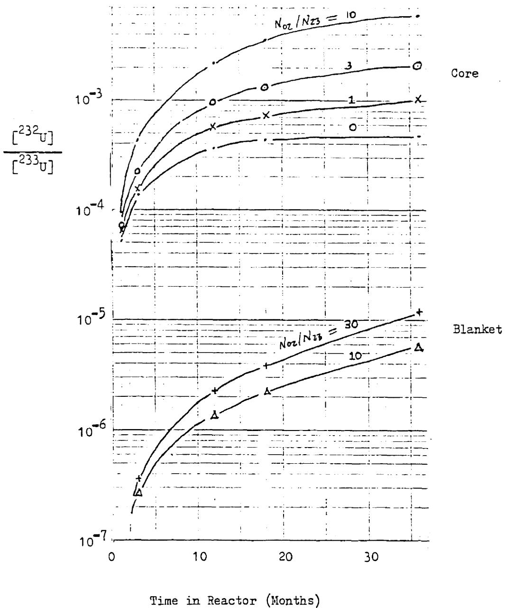  
Figure 3.5-34. Buildup of $^{232}\mathrm{U}$ in Core and Blanket Salts

We would like to estimate what level of radiation hazard this $232_{\mathrm{U}}$ daughter activity actually poses to theft, diversion, and weapons manufacture. The minimum critical mass or $^{233}\mathrm{U}$ for weapons use will nominally be $6 \, \mathrm{kg} \, [138]$ . With a U metal density of $19.2 \, \mathrm{g/cm}^3$ [50], that implies a radius of $4.2 \, \mathrm{cm}$ . The corresponding flux from a sphere of such material is given [139] by

$$
\phi = \frac {S}{4 a} [ 2 R a - (a ^ {2} - R ^ {2}) \ln [ (R - a) / (a - R) ] \quad f o r a \geq R
$$

where $S =$ uniform source rate $\equiv \lambda_{18} N_{18}$ (see Eq. 3.5.4-8)

$\equiv$ radial distance from sphere center

$\mathbb{R} =$ sphere radius

For $a = R$

$$
\phi = \frac {\sin}{2}
$$

At a distance of 1 meter from the sphere

$$
\phi = \frac {S / 4}{R + 1 0 0} \left[ 2 R (1 0 0 + R) - \left(R ^ {2} + 2 0 C R + 1 0 ^ {4} - R ^ {2}\right) \ln \left(\frac {2 R + 1 0 0}{1 0 0}\right) \right]
$$

For 2.6-MeV photons the dose conversion factor is $3.6 \times 10^{-6}$ Rem/hr per unit $\gamma$ flux [81]. Then the dose

$$
\begin{array}{r l} D \left(\frac {\mathrm {R e m}}{\mathrm {h r}}\right) & = 3. 6 \times 1 0 ^ {- 6} \times \left(\frac {4 . 2 \mathrm {c m}}{2}\right) \times 0. 0 4 9 \left[ \frac {\mathrm {N} _ {2 2}}{\mathrm {N} _ {2 3}} \right] \times \\ & \left\{\frac {1}{\lambda_ {1 8} \lambda_ {3 2} \lambda_ {0 8}} - \sum_ {i = 1} ^ {3} F _ {i} \right\} \\ & = 3. 7 \times 1 0 ^ {- 7} \left[ \frac {\mathrm {N} _ {2 2}}{\mathrm {N} _ {2 3}} \right] \left\{\frac {1}{\lambda_ {1 8} \lambda_ {3 2} \lambda_ {0 8}} - \sum_ {i = 1} ^ {3} F _ {i} \right\} \end{array}
$$

$$
= 4. 0 \times 1 0 ^ {- 1 0} \left[ \frac {N _ {2 2}}{N _ {2 3}} \right] \left\{\frac {1}{\lambda_ {1 8} \lambda_ {3 2} \lambda_ {0 8}} - \sum_ {i = 1} ^ {3} F _ {i} \right\} \text {f o r a = 1 m}
$$

From Figure 3.5-34 $\left[\mathrm{N}_{22} / \mathrm{N}_{23}\right]$ is typically $10^{-3}$ . Fig. 3.5-35 presents the results for D. One sees that after 10 years the dose from 208Tl approaches

$$
D (\text {s u r f a c e}) = 4 5 \text {R e m / h o u r}
$$

$$
D (1 \text {m e t e r}) = 4 5 \text {m e m / h o u r}
$$

To remove most of this and other radiation one could chemically separate the uranium in the core salt from the $^{208}\mathrm{Tl}$ and all other actinides and fission products. However, this would not separate $^{233}\mathrm{U}$ from $^{232}\mathrm{U}$ . Then, in only two weeks the surface dose would again reach 1 Rem/hour. Furthermore, if only $99\%$ removal efficiency was achieved, a $\frac{1}{2}$ Rem/hour surface dose from $^{208}\mathrm{Tl}$ alone would be present in the interim.

From this one concludes that a highly efficient scientific group with laboratory facilities (such as a national laboratory) might be able to make a bomb without getting a deadly radiation dose, but all others would encounter difficulty.

In addition to these complications, the tell-tale $^{208}\mathrm{Tl}$ signals would continue to emanate from the separated waste as well as from the new regenerating source in the separated U. All these troubles must discourage subnational groups which contemplate taking and using $^{233}\mathrm{U}$ for weapons purposes.

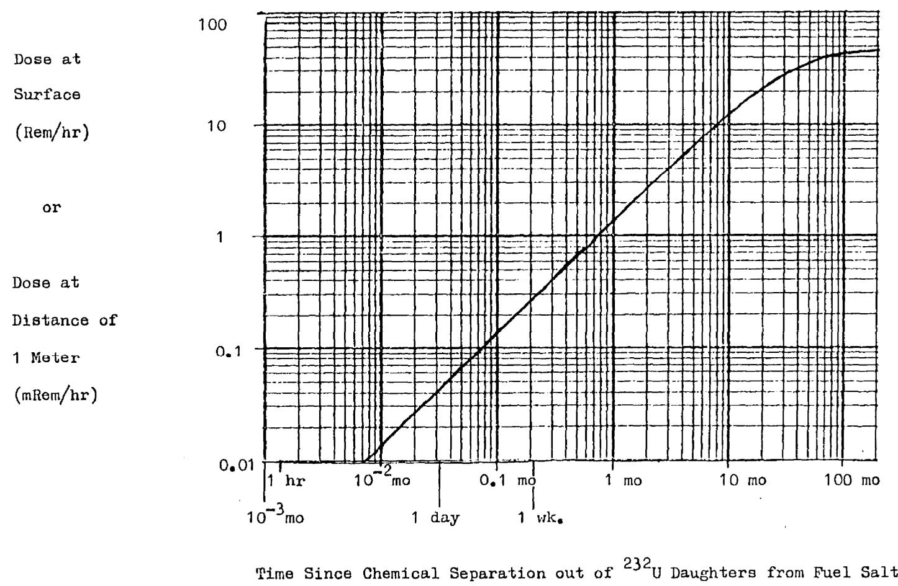  
Figure 3.5-35. Variation of Radiation Hazard from $0.1\%$ $^{232}\mathrm{U}$ Daughter Content in $6\mathrm{kg}$ of $^{233}\mathrm{U}$ Following Reprocessing

The effect of such activity on a conventional solid fuel cycle, would probably be to require costly shielding and remote handling to protect the workers. This means in fuel fabrication plants and, possibly, at the end stages of processing plants. A molten salt fuel cycle automates the reprocessing far more; the shorter time out-of-core should also reduce the activity due to neutron absorption reactions with each member of the decay chain.

Meanwhile, in any breeding gain set aside, the radiation hazard will start adding to that from fission products and actinides and increase for several years. Thus the biggest problem which $^{232}\mathrm{U}$ presents in a molten salt thorium cycle should be transport of breeding gain: radiation will make the fuel unwieldy (heavy shielding and remote handling) and hazardous, thereby somewhat unattractive to diversion and to weapons manufacture by subnational groups.

Since $^{232}\mathrm{U}$ and $^{233}\mathrm{U}$ are chemically inseparable this radiation hazard will continue to manifest itself for many multiples of the $^{232}\mathrm{U}$ 72-year halflife, i.e. for centuries. By leaving the breeding gain in chloride form it is ready to startup another plant, without intermediate handling.

# 3.5.11.3 Impact of fission product concentration upon neutron physics

performance. ANISN calculations showed that a FP concentration of $5.8 \times 10^{-4}$ a cm $^{-1}$ b $^{-1}$ ≈ 0.10 [U $_{\text{fissile}}$ ] in an MCFR(Th) reduces the 3R by 0.007 out of 1.34 or 0.5%. Within the accuracy of the calculation, this amount of FP did not affect the critical dimensions.

Figure 3.5-36 shows the FP effect on BG calculated by Taube et al for an MCFR(Pu): $[FP] = 2 \times 10^{-4} = 0.10[\mathrm{Pu}]$ appears to cause a similar ER loss of $0.01 / 1.45 = 0.7\%$ . $[FP] = 1.0[\mathrm{Pu}]$ seems to produce a (proportionally) larger loss of about $10\%$ in BR.

BR

Fig. 3.5-36 Impact of Fission Products upon the BR of an MCFR(Pu)[17]   
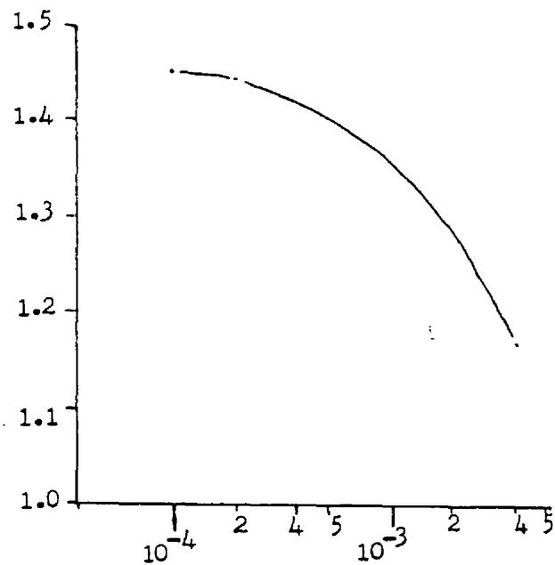  
Fission Product Concentration (a cm-1b-1)

$$
[ \mathrm {P u} ] _ {\text {c o r e}} = 0. 0 0 2 1 a c m ^ {- 1} b ^ {- 1}
$$

# 3.5.12 Summary

Section 3.5 attempted a first cut at optimizing the reactor design and composition and also analyzed some of the consequences therefrom. The first six subsections defined methods, data, and models.

Sec. 3.5.7 discouraged the use of an inner blanket and showed that two meters constitutes an infinite outer blanket. In that event a reactor reflector contributes little. In addition to achieving maximum BG, the 2 m-blanket greatly reduces the flux dose to the reactor vessel. Sec. 3.5.7 also favored graphite as the core tube wall material because Mo strongly absorbs neutrons.

Section 3.5.8 showed that design decisions which favor a high $233_{\mathrm{U}} / 234_{\mathrm{U}}$ ratio in the core salt produce

1. A hard neutron spectrum there

2. Higher BG and lower DT

3. Minimal presence of Pu and other high-A actinides Fortunately, within the ranges of interest, all the trade studies indicate that the $^{233}\mathrm{U} / ^{234}\mathrm{U}$ ratio on equilibrium fuel cycle will exceed 7. That is sufficiently high to achieve the above goals; additional major efforts are unwarranted.

Sections 3.5.9 and 3.5.10 revealed that both $\mathrm{ThCl}_4$ and $\mathrm{NaCl}$ , acting as diluents in the core salt, greatly reduce flux levels and the amount of out-of-core fissile inventory. They also reduce BG. The combined effects of inventory and BG produce an optimum DT near a U molar composition of about $30\%$ and a Th/U ratio of 1-2. This and the lower flux levels explain the preference of other MCFR

studies for a fissile molar content of $15 - 30\%$ . However, low fissile content will decrease the $^{233}\mathrm{U} / ^{234}\mathrm{U}$ ratio, an indication of greater transplutonium buildup. Thus the true optimum remains to be found and will depend on final assignment of priorities.

DT of 20-30 years appear feasible. This is high compared to quoted DT 13-20 years for an MSBR on the Th fuel cycle. However, an MCFR(Th) should build up less transplutonium.

Efforts to lower DT should focus on the out-of-core inventory. Note also, that, compared to conventional reactors, the absence of fuel fabrication and decladding operations and the minimal transportation and storage needs provide additional fuel inventory advantages which are not taken into account here.

Section 3.5.11.1 quantified somewhat the basis for avoiding transplutonium buildup. Sec. 3.5.11.2 pinpointed fresh blanket U as the greatest proliferation hazard. By immediately mixing it with core salt, one adds not only fission product activity, which is chemically removable, but also $^{232}$ U-daughter radioactivity which is not. The radioactivity will discourage U handling, but not make it impossible. Sec. 3.5.11.3 showed that the presence of too much FP can seriously reduce BG.

# 3.6 Safety & Kinetics

# 3.6.1 Physics of Reactor Safety and Kinetics

3.6.1.1 Effective delayed neutron fraction. Delayed neutrons from fission of $^{233}\mathrm{U}$ , $^{235}\mathrm{U}$ , and $^{239}\mathrm{Pu}$ amount to 0.0027, 0.0065, and 0.0022 of the respective total neutron yields. At first glance this suggests that the effective delayed neutron fraction $/_{\text{eff}}$ for a $^{233}\mathrm{U}$ -fueled MCFR exceeds that for a $^{239}\mathrm{Pu}$ -fueled LIFBR. However, most of the MCFR fuel lies cut-of-core in the primary circuit. This makes $/_{\text{eff}}$ much smaller.

Passing through a core less than 2 meters high, with a velocity of 9 meters per second, the fuel is present for only 0.2 seconds. Each decay half-life of the six delayed-neutron groups (Table 3.6-I) far exceeds that. Therefore the delayed neutrons originate near uniformly throughout the primary circuit and / $\beta$ eff diminishes by the ratio of fuel in-core to that in the total circuit: by 0.2-0.3 to $\beta_{\text{eff}} = 0.0005 - 0.0008$ .

3.6.1.2 Prompt neutron lifetime,1. I increases with the median fission energy $E_{\mathrm{m}}$ , ranging from $5 \times 10^{-7}$ for an LTFBR (190 keV) to $3 \times 10^{-9}$ for Jezebel and $^{233}\mathrm{U}$ Godiva (near 1.6 keV). For the intermediate MCFR(Th) with $E_{\mathrm{m}} = 400 - 700$ keV, I should $\approx 10^{-8}$ s⁻¹.

3.6.1.3 Temperature coefficient of reactivity. Reactor stability depends on several coefficients of reactivity. In a molten salt reactor, the temperature coefficient due to expansion dominates. In an MCFR the very hard neutron spectrum nullifies any Doppler coefficient of reactivity.

Table 3.6-I $^{233}\mathrm{U}$ Delayed Neutron Characteristics   

<table><tr><td>Group</td><td>Half-life (Sec)</td><td>Relative Abundance (%)</td></tr><tr><td>1</td><td>55.</td><td>9</td></tr><tr><td>2</td><td>21.</td><td>30.</td></tr><tr><td>3</td><td>5.</td><td>25.</td></tr><tr><td>4</td><td>2.</td><td>28.</td></tr><tr><td>5</td><td>0.6</td><td>5.</td></tr><tr><td>6</td><td>0.3</td><td>3.</td></tr></table>

Section 3.3.5.6 indicates a typical temperature coefficient of salt density of $0.0004 \, \text{‰}$ /°C. ANISN calculations (Section 3.5.8.3) reveal that $0.050 \, \text{‰}$ lowers reactivity by $0.034 \, \text{‰}$ k, a coefficient of $0.68 \, \text{‰}$ /°C. Applying the above gives $-27 \times 10^{-5} \frac{\Delta \text{k}}{\text{k}}^{\circ} \text{C}^{-1}$ . Using $\beta_{\text{eff}} = 0.00068$ one gets a strong negative temperature coefficient of $-40 \, \text{‰}$ C.

For comparison, a Pu-fuelled LMFBR typically exhibits $-0.4$ to $-0.5\mathrm{g} / {}^{\circ}\mathrm{C}$ [140], assuming $\beta_{\mathrm{eff}} = 0.003$ . Calculation for a 1000 MWe MSBR gave an isothermal temperature coefficient of $-0.9\times 10^{-5}\Delta \mathrm{k / k} / {}^{\circ}\mathrm{C}$ [131]. However this comprised a $-4.4\times 10^{-5}\Delta \mathrm{k / k} / {}^{\circ}\mathrm{C}$ for the negative Doppler coefficient of thorium and positive coefficients for the thermal spectrum graphite moderator and fuel salt density. The latter stems from a negative salt density coefficient of $-0.03\Delta \mathrm{k / k} / \Delta p / \rho$ for their low-actinide fluoride salt mix.

# 3.6.2 Analysis of Formal Operations

3.6.2.1 Reactor startup. MCFR coolant circuits and salt supply will need preheating just like an KSBR does. A salt of subcritical fuel concentration or even a low-melting non-fuel salt could flow test the circuit. Cne might approach zero power criticality and subsequent rise to power by gradually adding fissile fuel through the clean-up loop to a subcritical fuel salt.

3.6.2.2 Reactor control. A limited study [29] indicated feasible control of reactor and power level by manipulating the secondary circuit conditions: mainly varying the flow rate of salt through the core and heat exchangers. The negative temperature coefficient will hold the salt temperature nearly constant at all power levels. The absence of the heat transfer and fuel pin temperature differentials of a solid-fuel reactor allow this direct response.

3.6.2.3 Reactor stability and inventory ratio. The amount of fuel in the primary circuit outside the core fixes the effective delayed neutron fraction and affects the reactor stability. The British [29] showed that an MCFR(U/Pu) should be stable to small reactivity perturbations if the fraction of primary circuit salt in the core exceeded $25\%$ . Engineering studies of their MCFR designs met this requirement with a margin. The primary circuit flow rate seemed to have little effect upon the delayed neutron concentration in the core.

Table 3.6-11 Fuel Inventory in a 11 Gwth MCFR(Pu) Plant [23]   

<table><tr><td>Specific heat exchanger power
(conservative data)</td><td>1 KJ/cm3</td></tr><tr><td>Total volume of heat exchanger for
11GJ(th)</td><td>11 m3</td></tr><tr><td>Fuel fraction of heat exchanger volume</td><td>0.3</td></tr><tr><td>Fuel volume in heat exchanger</td><td>3.3 m3</td></tr><tr><td>Fuel in the duct work</td><td>1.0 m3</td></tr><tr><td>Total fuel out of core</td><td>4.3 m3</td></tr><tr><td>Fuel in core</td><td>1.0 m3</td></tr><tr><td>Total fuel in system</td><td>5.3 m3</td></tr><tr><td>Mean specific power of fuel in the
whole system 11GJ th
5.3m3</td><td>2.1 GW/m3</td></tr><tr><td>Plutonium content of fuel</td><td>0.8 gPu/cm3</td></tr><tr><td>Power rating of whole system</td><td>0.385 kgPu/</td></tr></table>

Taube analyzed a 11 GJth MCFR(Pu) and inventoried (Table 3.6-II) the fissile fuel salt in the primary circuit. Assuming a power density of 11 MJth/liter and conservative heat exchanger performance, $81\%$ of the fissile fuel salt is out of the core. For a given heat exchanger rating, as the total plant power decreases the inventory in the heat exchanger will also by about $0.3\text{m}^3$ fuel per GJth. Little change occurs in the core or piping. Therefore according to the British analysis, this plant should operate at lower power.

Table 3.6-III compares Taube's results to those of British designs and a 1956 ORIL study. The British designs contain only $56 - 64\%$ , of the primary circuit fuel salt out-of-core, reportedly mostly in the duct work. Unlike Taube but in agreement with the British designs, the ORIL/1956 study also attributed a large portion of the inventory to piping between core and heat exchanger.

Table 3.6-III Volume Distributions in Some MCFR(Pu) Designs   

<table><tr><td rowspan="2"></td><td colspan="2">CRNL/56 [13]</td><td colspan="2">Taube [23]</td><td>British [29]</td></tr><tr><td>Volume (m3)</td><td>Distribution out-of-core (%)</td><td>Volume (m3)</td><td>Distribution out-of-core (%)</td><td>Qualitative Proportions</td></tr><tr><td>Core</td><td>3.30</td><td></td><td>1.0</td><td></td><td></td></tr><tr><td>HX plena</td><td>0.35</td><td>10.0</td><td></td><td></td><td></td></tr><tr><td>HX tubes</td><td>1.62</td><td>46.2</td><td></td><td></td><td></td></tr><tr><td>HX subtotal</td><td>1.97</td><td>56.1</td><td>3.3</td><td>76.7</td><td></td></tr><tr><td>Piping</td><td>1.54</td><td>43.9</td><td>1.0</td><td>23.3</td><td>dominant</td></tr><tr><td>Out-of-core Subtotal</td><td>3.51</td><td>100</td><td>4.3</td><td>100</td><td></td></tr><tr><td>Total</td><td>6.81</td><td></td><td>5.3</td><td></td><td></td></tr><tr><td>% Out-of-core</td><td>51.5</td><td></td><td>81.1</td><td></td><td>56-64</td></tr></table>

Fig. 3.6-1 shows a typical British design [29] with large heat exchangers to compensate for lower thermal conductivity values for the fuel salt. They have given considerable thought to reducing duct length but find that unconventional methods tend to be less reliable or less easily maintained. Increasing fuel velocity can reduce duct cross sectional areas, but limits due to vibration and pumping power costs may occur.

The choice of intermediate coolant will also affect out-of-core inventory by its influence on heat exchanger arrangement and temperature conditions.

3.5.2.4 Reactor Shutdown. Basically the NCFR requires no scram device because the strong temperature coefficient holds the system steady. Adding blanket salt or other absorber should quickly reduce power and temperature. Moving part or all of the molten core fuel to geometrically-safe, cooled holding tanks will accomplish full shutdown. Criticality safety calculations must be sure to consider criticality increase as $^{233}\mathrm{Pa}$ decays ( $t_{\frac{1}{2}} = 27.0 \, \text{d}$ ) to $^{233}\mathrm{U}$ . There decay heat will help keep the salt molten, while natural circulation cooling holds down the fuel vapor pressure.

3.6.2.5 Change in physical properties due to transmutations. As $^{232}\mathrm{Th}$ and $^{233}\mathrm{U}$ transmute to actinides higher in Z, the individual salt melting points (excluding eutectic effects) lower (Fig. 3.6-2). However, since uranium isotopes predominate in the burnup chain, very little higher-Z material appears. Similarly, boiling point and vapor pressure should also change little.

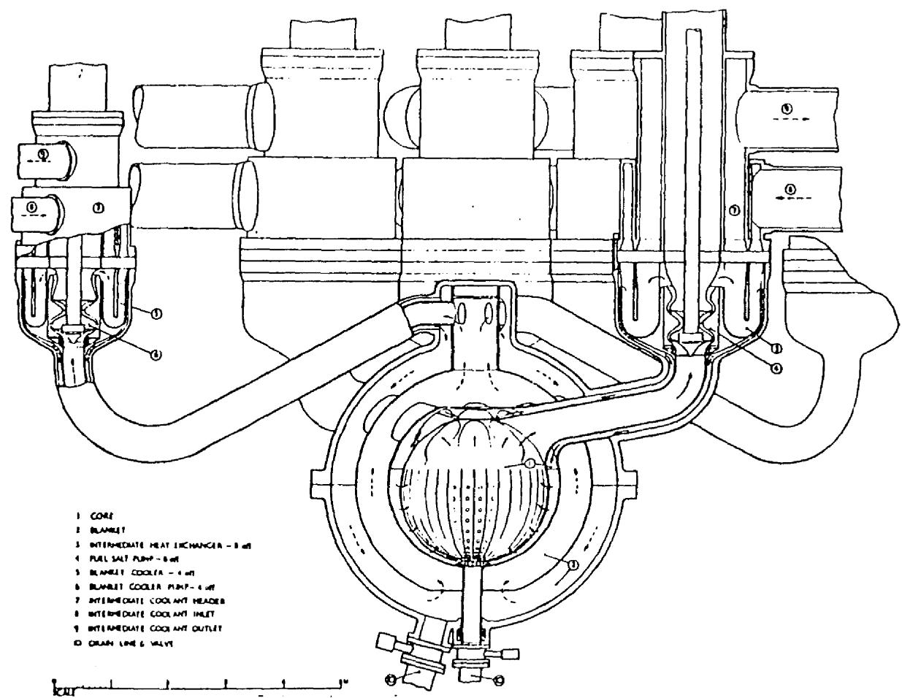  
Figure 3.6-1. Typical MCFR(Pu) Design with Large Heat Exchangers to Compensate for Low Thermal Conductivity of Salt [29]

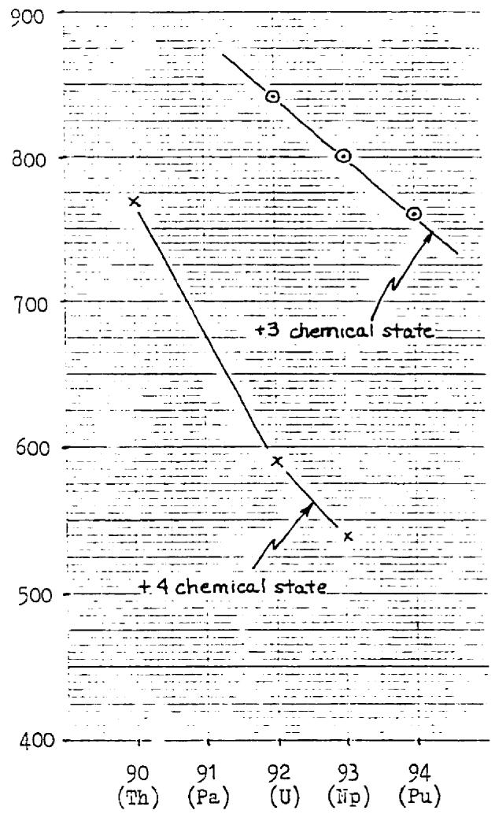  
Melting Point $(^{\circ}C)$   
Atomic Number   
Figure 3.6-2. Melting Point of Some Actinide Chlorides

# 3.6.3 Analysis of Accident Situations

Continual removal of volatile fission products from the salts during operation eliminates several obnoxious species from being present in an accident. Many of the remaining hazards would stay in the salt. Thus, no accident can occur which corresponds in severity of radioactivity to the meltdown of solid fuel systems. The major concern then becomes that no primary circuit failure lead to critical masses forming.

3.6.3.1 Small leakages. Leaks between core and blanket pose no sericus chemical threat as the salts are compatible. However, other factors influence whether the pressure difference should force core salt leaks into the blanket or vice versa.

Higher temperatures in the core salt may produce higher vapor pressures there than in the blanket. The core salt also circulates under pump pressure while the blanket salt need not. If a reserve tank automatically replaced fuel salt leaking into the blanket, the system could simultaneously approach supercriticality and high temperature, a strong temperature coefficient notwithstanding. The high temperature could further abet the deterioration. In contrast, blanket salt leaking into the core would only dampen the criticality: however, this could result in degraded system performance.

An anomalous rise in concentration of $^{233}\mathrm{U}$ or fission product in the blanket, or a rise in temperature there (due to increased fissions), or a drop in core salt pressure would signal core-to-blanket leakage. Leakage of blanket salt into the core would decrease the core mean temperature and blanket salt pressure.

The secondary coolant circuit should be pressurized slightly higher above the primary one, and the tertiary even higher. This will cause less active coolants like helium or lead to leak into the molten salt. He is inert and the salt cleanup system, which already separates the fission product gases, would remove helium as well. Lead interacts with nickel-bearing alloys, but not with Mo cr graphite. Traps at certain points in the circuit would locate the position of lead leakage.

The containment building will catch leakage of volatile fission products from the primary circuit or blanket to the air, similar to MSRE, with appropriate detection and leaktight barriers.

3.6.3.2 Loss of flow. Leaks, pipe break, heat exchanger plugging, and pump failure can all reduce flow in the primary circuit. Figure 3.6-3 analyzes the consequences. In most events the reactor shuts down and the fuel drains to a safety tank; there fission product decay and delayed neutron-induced fission continue to generate heat, but the high capacity of the salt restrains the temperature rise.

The effect of a single pump failure depends upon the primary circuit arrangement. With single pumps per channel (Plan A in Fig. 3.2-8) failure of one pump would shut down one whole core channel. The fuel salt in that core channel must then drain out to stop full power production in it. Subsequent replacement by void, blanket, or carrier salt would cause a large loss of reactivity thereby shutting down the reactor unless

(1) The separation between channels was such that they were

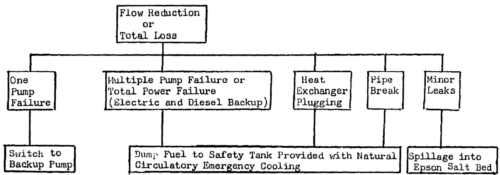  
Fig. 3.6-3 Analysis of Primary Circuit Failures

individually near critical, and

(2) Missing reactivity could be added through enrichment enhancement

Then one could continue operation on a reduced scale, e.g. 6/7 for six out of seven channels still operating, until a more opportune time occurred in which to drain the whole core and replace malfunctioning equipment.

With multiple subchannels per core channel, each with pumps and exchangers as in Fig. 3.2-8-B, C and D, failure of one pump still allows partial reactor operation until a better time for shutdown and repair. If one operated the Plan B or C subchannels or the plan D heat exchanger at less than full efficiency, then their full use is available in the event of one subchannel failure. This would however, increase out-of-core inventory and capital costs though. Should the core tubes be connected in series as in Section 3.2.6.4 then any in-core malfunction (leak or pipe break) would require system shutdown.

Should both regular and emergency power supply fail, all pumps would fail unless they are steam turbine driven. However, electrically driven pumps are easier to include in the containment and also easier to supply for pre-testing, etc. Inertia would help electric pump run-down rates, or some short-term auxiliary supply might have to be provided until full dump of fuel has taken place. The fluid could also drain through a "freeze valve" by gravity into a natural-convection cooled tank which has a non-critical geometry.

In the event that flow ceases and core salt remains in place,

the strong negative temperature coefficient will control the temper- erature and power: initial temperature increase will decrease density, which decreases reactivity and thereby power, until some equilibrium state is reached. HCFR(Pu) studies [29] with a simpli- fied reactor model showed that the temperature rise of the salt for a reactivity step of up to \(1 should be less than \(300^{\circ}C;\) for 7 pumps failing out of 6, less than \(230^{\circ}C.\)

In summary, it appears that reactor stability concern over out-of-core inventory may preclude the use of out-of-core subchannels as well as dictate series connection of the core channels. This means designing the system for high reliability to minimize shutdown and for rapid repair of heat exchangers, piping, and pumps when shutdown does occur. Rapid repair will entail expedient removal of all the core salt followed by a salt flushing of all radioactivity from the system. The strong temperature coefficient should disspell any criticality accident concerns.

3.6.3.3 Structural failure. Failure of the tubes separating core and blanket would lead to no chemical or compatibility problems. Dilution of the core salt will reduce reactivity; only if core salt were replenished as it entered and displaced the blanket, could a reactivity increase occur. Even then the system could accommodate temperature rise from moderate salt additions, as ample margin exists above operating temperature on a short term basis. The limit to the permissible rate of such salt addition needs to be established.

Vessel failure would require rapid dumping from both the circuit and the catchpots. Dump tanks should probably be sized to contain the contents of one secondary coolant circuit as well as all core and blanket salt. Relief valves on the secondary system will protect the primary circuit from pressurization resulting from a major steam generator failure into the secondary system.

In the event of a major circuit failure, operating pressure would play an important role in the subsequent fate of the fission products and the containment. The molten salts themselves exhibit low vapor pressures. Although high pumping losses can cause primary circuit pressures up to 460 psi, lead secondary coolant acts essentially like a hydraulic system with little stored energy. Missile formation is therefore unlikely and it should be possible to demonstrate a containment which will not be breached from this cause.

With a high-pressure helium-cooled system one must ask whether an accident might aerosolize the core salt. However, a properly-designed reactor vessel could withstand the full helium pressure from a severe rupture between the coolant and primary circuits. Thus release of activity to the reactor containment cell would not occur except under a simultaneous double failure. The cell itself is small and can economically be made in the form of a prestressed vessel to withstand missile damage and to act as an additional barrier to fission product release. A final low pressure building containment would prevent release from small leaks in the earlier containment stages.

3.6.3.4 Emergency cooling. Unlike solid fuel, molten salt can quickly transfer into a geometrically-safe tank. Gravity can provide a failsafe transfer method from reactor to holding tank (Figure 3.2-11): a pipe wherein the salt is normally kept frozen would open naturally upon loss of electric power.

In the tank, the salt will circulate naturally as heat from fission product decay transfers through tube walls to air convected by natural draft towers. Otherwise pressure would build up from salt vaporization. The absence of mechanical moving parts will make this whole system highly reliable; multiplicity could add even further integrity. A forced draft system would probably layout more compactly and cheaply.

A second cooling option would circulate naturally a low melting-point salt or NaK through U-tubes in the tank to boiling water heat exchangers. Air-cooled condensers situated in a normal or forced draft stack would condense the steam formed. Alternatively, the heat could transfer directly to a large boiling pool, thus accomodating decay heat for a protracted period without makeup. Condensers or make-up water would be provided for continuous operation.

A catchall salt bed below this apparatus would serve as a backup for any leaks or breaks. The heat of salt formation would greatly aid in absorbing decay energy. An independent cooling system might remove decay heat. The bed would also dilute the fuel salt. Proper choice of tank diameter would insure subcriticality.

Recovery from emergency tanks or beds would require heaters, drains, and pumps. When carrier or blanket salt is added for dilution and/or heat absorption by latent heat of formation, a method to separate out the dump salt would also be needed.

3.6.3.5 Comparison of MSRs to others. MSRs should be biologically safer because

1. The plant continuously removes volatile fission products   
2. The fuel is already molten and in contact with materials designed for that condition.

The removal of volatiles from the primary circuit still requires attention to their presence elsewhere in the plant. However, it should not be difficult to insure the integrity of a storage medium below ground. After a suitable decay period some of the gases may be releasable to the atmosphere.

In the event a pump fails or other flow loss occurs, the only concern is that decay heat might build up vaporization pressure. However, the same coils which preheat the fluid could also cool the fluid.

3.6.3.6. Precipitation out of eutectic mixtures. After the temperature of a salt mixture falls to the solidification point, the composition of liquid changes, sliding along the liquidus curve as crystals separate out (Figure 3.6-4). With low initial UCl $_3$ molar content, cooling precipitates out NaCl crystals, thereby enriching the fluid in UCl $_3$ . With high initial UCl $_3$ molar content, cooling produces UCl $_3$ crystals and NaCl-enriched fluid. In either case the liquid migrates to the nearest eutectic point (nadir) composition and causes a concentration of UCl $_3$ . Thus one must consider possible criticality situations and design geometries to prevent them. Probably precipitation of UCl $_3$ crystals from a UCl $_3$ -rich fluid is the less-serious case.

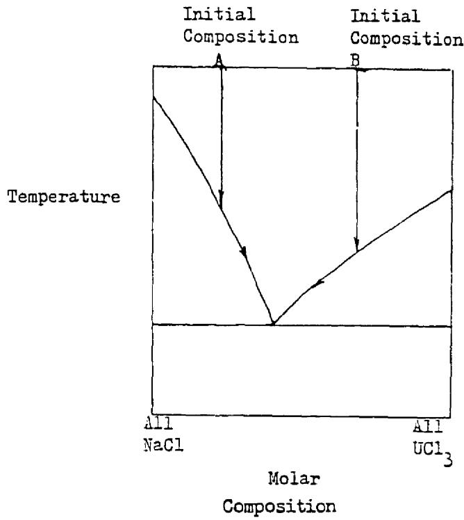  
Fig. 3.6-4 Migration of the Liquid Composition Along the Eutectic Path as the Salt Mixture Cools

3.6.3.7 Boiling off of salt mixtures. In the event that the carriers salt had a boiling point much lower than that of the actinide chlorides, one could postulate a positive temperature coefficient contribution in that temperature region. Fortunately evidence from section 3.3.3.5 contradicts this: carrier salts appear to be less volatile than actinide chlorides.

3.6.3.8 Containment. Solid fuel plants generally feature triple containment: fuel element, reactor vessel, and then the containment building. The MCFR will feature reduced FP radioactivity due to continuous gas cleanup but it will inherently have only double containment of piping and a building. A second radiation hazard arises from activation of the secondary coolant and nearby equipment by delayed neutrons in the primary circuit.

To further contain these hazards, a low-pressure leak-tight membrane might be formed around the walls, floors and ceiling of the reactor system. This membrane can also form part of the ducting for the inert gas circulation required to cool the concrete structure and shielding and inhibit vessel oxidation. Heat losses with insulation restricting the concrete temperatures to below $70^{\circ}\mathrm{C}$ would be about 200 watts/m² with 40 cm of insulation. This would equate to about 3 kW total heat removal by water or air cooling.

The main building would constitute the tertiary containment. Its volume must be sufficient to contain the stored energy of any gases present. In the lead-cooled design these are cover gas volumes at low to moderate pressure. The helium-cooled version may require a larger outer containment volume and/or intermediate prestressed concrete containment(Sec. 3.6.3.3)

3.6.3.9 Resistance to external threat. One can postulate a number of scenarios wherein external explosion or impact threatens the reactor integrity directly or through a loss-of-coolant accident. These could involve ground or aerial bombs, planes, and space re-entry projectiles (e.g. meteors, missiles, space laboratory), by either accident or intention. An individual, a subnational group,

or another country might intentionally initiate. Nature threatens with earthquakes, tornadoes, and dam breaks.

In many or most of these situations one could anticipate the danger. Most reactors already lie below ground level. Still the vessels generally sit high enough to be rupture-prone to strong explosions or impacts. Such an incident could release volatized fission products and actinides of consequence greatly exceeding a simple bomb or other initiating event.

To protect against these threats an MCFR could uniquely transfer its fuel to a storage tank (section 3.6.3.3), located remotely under additional earth (Figure 3.6-5) or in an otherwise hardened "bunker".

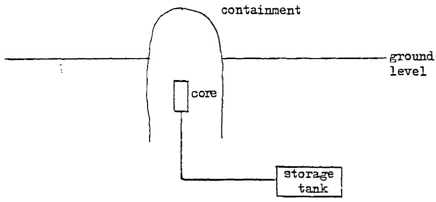  
Figure 3.6-5 Hardened Storage Tank

3.6.3.10. Molten salt combustion support. Molten salt itself does not burn, but will support combustion with solids such as wood, coke, paper, plastics, cyanides, chlorates, and ammonium salts and with active metals such as aluminum, sodium, and magnesium. Water from spray sprinklers or low-velocity fog nozzles provides good fire protection.

3.7 Fuel Processing [17, 81, 141-146]

This section analyzes the chemical aspects of the reactor fuel cycle: principally preparation of the $\mathrm{ThCl}_4$ blanket fuel and reprocessing of irradiated blanket and core salts.

Some processing should occur continuously, some batchwise. Batchwise will generally be easier, more efficient in separation, and more economical. This study does not deal with the near-identical concerns associated with starting early cores up with $\mathsf{PuCl}_3$ or $^{235}\mathsf{UCl}_3$ instead of $^{233}\mathsf{UCl}_3$ .

$\mathsf{ThO}_2$ is converted to $\mathsf{ThCl}_4$ , mixed with reprocessed blanket salt, and fed into the blanket simultaneous with blanket salt removal. Blanket reprocessing separates out bred $\mathsf{UCl}_4$ (predominantly $^{233}\mathsf{UCl}_4$ ), reduces it to $\mathsf{UCL}_3$ , and admixes that to reprocessed core salt, forming the core shim material. This constitutes a spiked fuel, suitable for BG export as well as for positive reactivity shim to the MFR(Th) core (simultaneous with irradiated core salt removal).

Core salt reprocessing removes fission products, oxides, corrosion products, and chlorine transmutation products; part continuously and part batchwise. It also readjusts the chlorine stoichiometry.

# 3.7.1 Principal Salt Reprocessing Methods

The MSR concept inherently avoids many of the conventional reprocessing stages, especially fuel element dissolution and refabrication. The absence of these stages removes the need for high decontamination stages in reprocessing. Proliferation concerns

also discourage high decontamination: residual radioactivity makes weapon construction hazardous. Eliminating all these stages reduces costs.

This leaves just the separation stages: core salt cleanup and bred-U extraction from the blanket. The most promising methods are by

1. Solvent extraction from aqueous solution   
2. Volatility   
3. Pyrometallurgy   
4. Pyrochemistry (molten salt electrolysis) We first review the chemistry of the heavy elements.

3.7.1.1 Chemistry of the heavy elements [31]. The separation processes, especially those based on solvent extraction, take advantage of the somewhat unusual chemical behavior of the actinides. Elements in the analogous lanthanide series all exhibit similar chemistry: the presence of three, relatively loosely-bound, outer electrons causes each atom to exhibit a positive valence of 3.

The actinides also all form a tripositive (III) valence state. However, some also evidence loosely-bound inner electrons. This leads to tetrapositive (IV), pentapositive (V), and hexapositive (VI) states.

These higher oxidation states evidence different stabilities (Table 3.7-I) which facilitates extraction and separation of the heavy elements. Th and U differ pronouncedly, Th evidencing mostly just the IV state.

Table 3.7-I RELATIVE STABILITIES OF OXIDATION STATES OF THE ACTINIDE ELEMENTS [81]   

<table><tr><td colspan="10">Atomic</td></tr><tr><td>No....</td><td>89</td><td>90</td><td>91</td><td>92</td><td>93</td><td>94</td><td>95</td><td>96</td><td>97</td></tr><tr><td>Element...</td><td>Ac</td><td>Th</td><td>Pa</td><td>U</td><td>Np</td><td>Pu</td><td>Am</td><td>Cm</td><td>Bk</td></tr><tr><td>III.....</td><td>***</td><td>*</td><td>**?</td><td>**</td><td>**</td><td>***</td><td>****</td><td>****</td><td>****</td></tr><tr><td>IV.....</td><td></td><td>****</td><td>*</td><td>***</td><td>****</td><td>****</td><td>*</td><td></td><td>**</td></tr><tr><td>V.....</td><td></td><td></td><td>****</td><td>*</td><td>***</td><td>**</td><td>*</td><td></td><td></td></tr><tr><td>VI.....</td><td></td><td></td><td></td><td>****</td><td>***</td><td>***</td><td>*</td><td></td><td></td></tr></table>

```batch
Legend \*\*\* most stable state \*\*\* decreasingly \* stable 
```

The III and IV states easily precipitate from aqueous solution as fluorides; the V or VI states do not. The fluorides of the III and IV states do not volatilize; the VI-state fluorides do at fairly low temperatures. The IV and VI states appreciably dissolve in certain organic liquids; the III-state nitrates remain virtually insoluble in these liquids.

3.7.1.2 Solvent extraction from aqueous solution. The extraction of actinides from aqueous solution by an organic solvent is the most advanced process: it has been widely used since about 1951. The Thorex version extracts $^{233}\mathrm{U}$ from aqueous solution of irradiated Th fuel elements [72]. It relies on the stability differences

between Th and U in higher valence states (Table 3.7-I).

The facility of solvent extraction for multi-stage operation without consuming additional heat or chemicals particularly benefits

1. Situations requiring extreme purification. Use of enough stages can lower the gamma activity from fission products in the extracted uranium to below that of natural uranium. Thus cne might not want to furnish this capability to a foreign nation.

2. Situations where the properties of two metals parallel one another so closely that a single precipitation or crystallization can not separate to the degree required. Thus this method may not be needed for Th-U separation.

The dissolution step for a chloride salt has to be the simplest of all: just add water. Different organic solvents separately extract the U, Th, and wastes. Addition of $\mathrm{Cl}_2$ and $\mathrm{CCl}_4$ subsequently rechloridizes U and Th.

Disadvantages associated with this method include

1. Extra criticality precautions for H-moderated fuel solutions   
2. Multiplicity and complexity of steps   
3. Large waste volumes   
4. Large shielded space required   
5. Additional steps needed to produce solid wastes.

3.7.1.3 Volatility processes. Volatile $\mathsf{UF}_6$ (b.p. $56.4^{\circ}\mathsf{C}$ ) easily separates from fission product and Th fluorides. The ability to decontaminate to low activity levels parallels that for solvent extraction. However, the volatility method requires fewer steps and therefore

smaller volumes of highly-radioactive wastes compared with aqueduct processing.

Volatilization should work especially well for processing a $\mathrm{ThF}_4 / \mathrm{NaF}$ (or other fluoride carrier) blanket salt mix. Cne would oxidize the bred $\mathrm{UF}_4$ to $\mathrm{UF}_6$ , separate it by distillation, chloridize it, and reduce it to $\mathrm{UCl}_3$ . The remaining $\mathrm{ThF}_4$ would return to the blanket.

Distilling $\mathrm{UCl}_4$ , $\mathrm{UCl}_5$ , or $\mathrm{UCl}_6$ from a mix of $\mathrm{ThCl}_4$ and chlorides of the structural materials and fission products would be more difficult: more volatile chlorides compounds exist and their vapor-pressure ranges overlap. However, considerable less development effort has been expended on methods for separating volatile chlorides; the problems may be solvable.

3.7.1.4 Pyrometallurgical processing. In the 1950's ANL developed pyrometallurgical processes to recover and purify fissile and fertile material from breeder reactors. Although demonstrated on a pilot-plant scale, much engineering development remained to evolve a workable and reliable process, especially in view of criticality restrictions.

A typical process would use a molten chloride flux to contact the oxide fuel and a molten metal to extract the actinide. Hence the need for high temperature (pyro). With molten chloride salt fuels only the extractant is needed: for chloride fuels, Dillon [28] proposed a Mg-Zn alloy. A similar metal may work with Th/U cycle chlorides.

Pyrometallurgical processes decontaminate by factors of only

about one hundred. With them one must handle fuel remotely. This poses no problem for molten salt processing: it requires no fuel fabrication or other handling; everything is done remotely anyhow. Leaving in radioactivity also inhibits use of the material for weapons.

Because of its compactness, pyrometallurgical process can operate close-coupled to the reactor and on a much shorter cycle than the aqueus route. If economical, a pyrochemical processing plant could easily be accommodated within the reactor building due to its small size. Preliminary work indicates that capital and operating costs may be high because of the small batch type operations needed.

Detractions include low recovery rates and the development needed to cope with temperatures above $1000^{\circ}\mathrm{C}$ . High temperature equipment of great reliability that can be operated and replaced remotely is hard to design and expensive to test. However, work already done indicates that the difficulties may be overcome.

3.7.1.5 Molten salt electrolysis. Techniques exist to deposit actinide oxides and carbides from molten salt solution through electrolytic reduction [143] e.g.

$$
\mathrm {U C} _ {2} ^ {+ 2} (\text {s o l n}) + 2 \mathrm {e} ^ {-} = \mathrm {U C} _ {2} (\text {s o l i d})
$$

at the cathode. At the anode:

$$
2 \mathrm {C l} ^ {-} (\text {s o l n}) = \mathrm {C l} _ {2} (\text {g a s}) + 2 \mathrm {e} ^ {-}
$$

Similarly Taube [147] mentioned reducing actinides directly in their molten chloride mixture. The $\mathrm{Cl}_2$ released could be used to chloridize $\mathrm{ThC}_2$ for blanket feed (section 3.7.7).

# 3.7.2 Core Salt Processing

Cn equilibrium cycle, the core fuel will include carrier alkali salt (e.g. NaCl), fissile UCl₃, diluent ThCl₄, actinide transmutants (e.g. PaCl₄, NpCl₃, and PuCl₃), impurity oxides, fission products in various forms and states (section 3.4.2.1), structural corrosion products, and sulfur (from chlorine transmutation). Some of the mutants may form complex chlorides like Cs₂UCl₆ and compounds like UI and US, which precipitate out at sundry temperatures.

Core shim material must replace irradiated core salt near-continuously so as to maintain criticality. The fuel burnup rate (1.6 gm/min for a 2250 m²th plant) fixes the rate of shim replacement. Actual core salt reprocessing can still occur batchwise or continuously. The choice will depend in part on the allowable inventory of core salt in reprocessing and the allowable level of FP concentrations in the core. The latter depends on

1. The reactivity worth of FP   
2. The effect of lower Th/U ratio or increased reactor size on reactor performance.   
3. The effect of FP on BG   
4. Acceptable radioactivity levels in the primary circuit (high levels necessitate remote reprocessing and extra plant shielding).

3.7.2.1 Recovery options. The first option is whether to clean up the salt (remove the bad part) or just recover the $^{233}\mathrm{UCl}_3$ and scrap the rest since NaCl is so cheap. Solid fuel cycles conventionally take the latter approach. Here we choose to clean up the salt because

1. NaCl radioactivity precludes easy disposal   
2. Enrichment in $^{37}$ Cl(if chosen) would forfeit cheap cost arguments   
3. Discarding non-uranium actinides would mean poor fuel utilization since every actinide atom can eventually fission in this spectrum   
4. Continuous gas removal gives a good start on salt cleanup.

It might be feasible to just remove the parasitic neutron absorbers and corrosion agents: let the salt accumulate the rest of the mostly-radioactive non-volatile mutants, some as substitute carrier salt. The advantages are

1. A suitable place to store non-volatile radioactive wastes   
2. The reactor will transmute many of the wastes into a less hazardous form.   
3. The radioactivity will add to the heat source.   
4. The radic/activity discourages diversion of the core salt for weapons purposes.

Potential disadvantages to watch for and control are

1. Change in viscosity and other thermophysical properties   
2. Mutant plate-out causing flow blockage, radiation sources, or other problems.

The enumerated advantages seem real enough to warrant this basic approach; practicalities may require some modifications.

3.7.2.2 Continuous removal of mutant gases. Fission produces Se, Xe, Kr, I₂, and Br₂, which are all gases at reactor temperatures (section 3.4.2.1). Threshold reactions also produce He and HT gas. Cne ton of fuel from the core of a fast breeder contains 2 x 10⁴ Ci of 85Kr, 100 Ci of 131Xe (after cooling 4 months), 130 and 0.7 Ci of 131I (after cooling 4 and 6 months, respectively), 0.13 Ci of 129I, and 2200 Ci of T. In an MSR circuit rupture, these would all present a radiation hazard. Gas accumulation will also build up pressure, affecting circulation.

In remedy for the MSBR, CRNL proposed a cleanup system which recirculates gas in loops across each main salt pump. Injected helium nucleates bubbles which absorb gases, the small-particle fog of inert metals (Pd, Tc,Ru,Rh, and Te) and some of the volatile chlorides (Fig. 3.7-1). While in a hold-up tank to reduce decay heat, some of the metals and chlorides deposit out. Passage through traps and beds removes Kr, Xe, water, etc., before returning to the helium injector. About $20\%$ of the bypass flow undergoes a long delay in which all isotopes except the 10-year ${}^{85}\mathrm{Kr}$ decay to an insignificant level.

Presently $^{85}$ Kr levels from reactors are small enough to discharge directly to the atmosphere. Should nuclear power abound in 30-40 years it may be necessary to separate out $^{85}$ K; low-temperature fractionation looks like a promising method.

Evaporation and fractionation can also concentrate tritium for lengthy storage; this is presently done in solid fuel reprocessing.

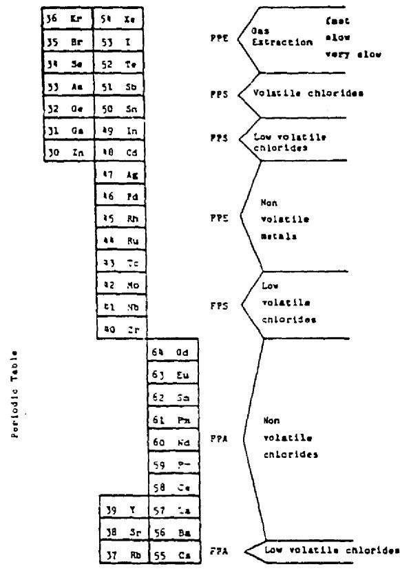  
Fig. 3.7-1 Fission Products in Molten Chlorides Media

An intermediate half-life makes $^{137}\mathrm{Cs}$ one of the more troublesome fission products (Fig. 2.1-2). Figure 3.7-2 shows that only a small portion of the A=137 yield comes directly to $^{137}\mathrm{Cs}$ . Though the gaseous precursors decay relatively quick, continuous gas extraction could remove a lot of them before non-gaseous $^{137}\mathrm{Cs}$ formed. This would

1. Lower the activity of the circuit   
2. Avoid the more difficult removal of $\mathrm{CsCl}_2$ or other compound later   
3. Help isolate Cs for individualized volume reduction.

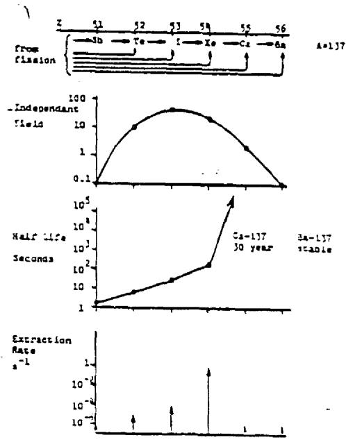  
Fig. 3.7-2   
Reprocessing Characteristics of the A = 137 Fission Product chain.

The main design parameters for gaseous fission product removal are

1. The absorption required in the delay beds   
2. The heat removal needed to avoid excessive temperature rise in the charcoal traps.

Cne form of delay bed in a trough of swimming pool size. Low pressure steam forms above the pool and passes to condenser units. Such a system would dwarf the reactor in size. Alternatively, one might store the gases safely and reliably at high pressure.

3.7.2.3 Removal of non-faseous fission products. The inert metals (section 3.4.2.1) not escaping as fog will likely deposit in various parts of the primary or FP removal circuits. External processing will remove the remaining $50 - 60\%$ of the fission products as necessary unless on-line treatment processes can be developed.

Section 3.7.1 mentions three possible processing methods. If these solvent extraction from aqueous solution is the best established. However, economics may require the reprocessing plant to serve multiple reactor facilities. Reprocessing at a different location, would mean

1. Increased out-of-plant inventory   
2. Increased hazard of radioactivity, sabotage, and proliferation

Combined with the disadvantages mentioned in Section 3.7.1.2 this argues for consideration of the less-developed processes of section 3.7.1.

3.7.2.4 Control of the oxygen levels. Oxygen and oxygen-containing compounds react with $\mathrm{UCl}_3$ to precipitate uranium oxides and oxychlorides. Oxygen can enter the salt through air, water vapor or transmutation of F. The vagarious nature of air and water vapor entry necessitates keeping the oxygen content well below saturation. A continuous gas bubbling system (with chemical reducing agent) should help; so should the appreciable capacity of the salt for oxygen.

Experiment indicates difficulty with simple methods of salt cleanup such as the small change in solubility by temperature adjustment. An alternative effective method routes the bypass gas flow through a bed, where the gas mixes continuously with injected liquid $\mathrm{NaAlCl}_4$ . Greater stability of $\mathrm{Al}_{2}\mathrm{C}_{3}$ causes it to form over $\mathrm{AlCl}_3$ (Fig. 3.7-3). The solid alumina then separates out by filtration or cyclone.

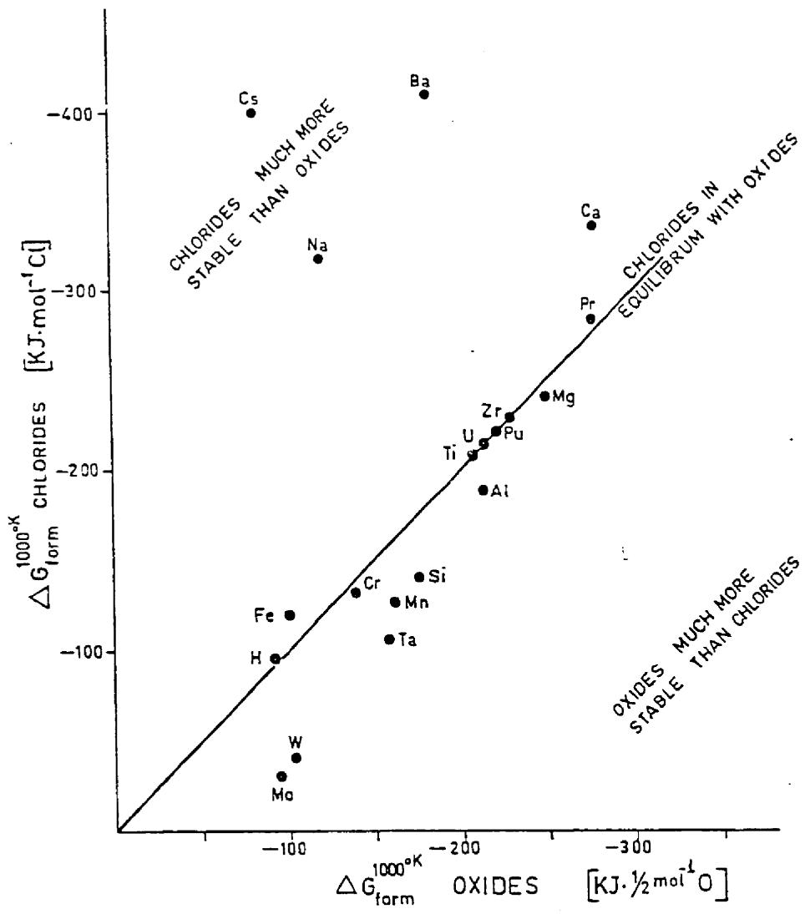  
Figure 3.7-3 Competition Between Formation of Oxides and Chlorides at 1000 K.

3.7.2.5 Removal of sulfur impurities. Several nuclear reactions convert chlorine to sulfur (Figure 3.7-4). Mass balance and Coulomb barriers combine to inhibit most of these reactions, but high flux levels bolster production. $^{35}\mathrm{Cl}$ converts to $^{32}\mathrm{S}$ , $^{33}\mathrm{S}$ , and $^{36}\mathrm{S}$ . $^{37}\mathrm{Cl}$ should produce only small amounts of $^{34}\mathrm{S}$ (favoring a $^{37}\mathrm{Cl}$ enrichment again). A natural chlorine-fuelled system will produce more sulfur than the salt solubility can handle. Phosphorus, though present is only transitory, decaying quickly to sulfur.

The presence of sulfur, or of any other element capable of compounding with uranium, need not adversely affect the feasibility of the system: simple adjustment of temperature and $\mathrm{UCl}_4$ content can induce precipitation in a clean-up circuit. Because one can reliably predict the production rate of these mutants, the concentrations in the core could be safely maintained close to saturation; then even an inefficient removal process would suffice.

The effect of the sulfur presence will, in part, depend on its oxidation state. For molten sulfur, the oxidation-state equilibrium is fairly well fixed; the predominant state tends to be positive (Fig. 3.7-5). The "positivity" also increases with irradiation (Fig. 3.7-6).

3.7.2.6 Maintaining the chlorine stoichiometry. Each actinide atom initially binds three or four Cl atoms. Although fission splits each actinide atom into two product atoms, the net valency reduces (in part due to inert gases) and an excess of chlorine occurs. This can lead to several corrosion agents, especially UCl<sub>4</sub>. (The

35Cl (n,p) 35S (n,χ) 36S 0.615,9.89   
2. $35_{\mathrm{Cl}}(n,\alpha)^{32}\mathrm{P} \xrightarrow{\beta^{-}} 3^{2}\mathrm{S}$ 0.935   
3. 35C1 (n, Y) 36C1 $\begin{cases} (\mathfrak{n}, \mathfrak{p}) \stackrel{36}{\longrightarrow} \\ (\mathfrak{n}, \alpha) \stackrel{33}{\longrightarrow} \\ (\mathfrak{n}, \gamma) \stackrel{34}{\longrightarrow} \end{cases}$ 8.58,1.92   
37c1 (n,p) 37s 5.06 m 37c1 -3.98   
37Ci (n,α) 34P 12.4s→34S -1.29

Figure 3.7-4 Nuclear Reactions Which Produce Sulfur in an MCFR(Th)

intense fission fragment irradiation of the salt produces short-lived ions which quickly oxidize UCl₃ to UCl₄.

To hold down the concentration of $\mathrm{UCl}_4$ , and excess Cl in general, one can react the fuel salt at a modest rate with metal of natural uranium or thorium or with other reducing agents.

3.7.2.7 Storing troublesome fission products by using them as carrier salts. Section 2.1.2 points out that, of all the fission products, $^{90}\mathrm{Sr}$ and $^{137}\mathrm{Cs}$ should present the most trouble. However, Sr and Cs belong to the alkaline earth and alkali classes of elements examined in section 3.3.4. Thus a good way to manage these

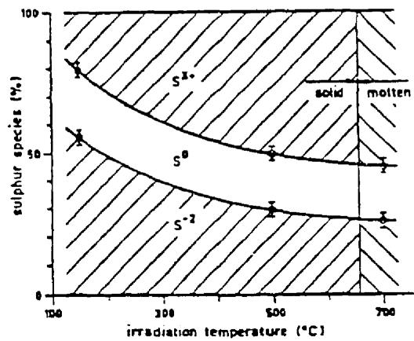  
Fig. 3.7-5 Irradiation-temperature dependence of the oxidation-state distribution of $^{35}\mathrm{S}$ species [148]

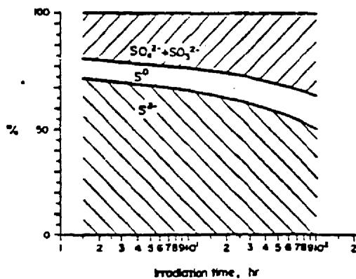  
Fig. 3.7-6 Effect of length of irradiation time on the $^{35}\mathrm{S}$ -species distribution, $150^{\circ}\mathrm{C}$ [148]

long-lived salts might simply be to use them as carrier salts $\mathrm{SrCl}_2$ and CsCl. Unlike natural Sr and Cs, they would not increase in radiological hazard, but rather decrease. This would also apply to some of the other fission products, especially RbCl and BaCl $_2$ .

3.7.2.8 Comparison to MSBR reprocessing. In MSBR reprocessing of the fuel salt (Fig. 3.7-7) a volatility process (Section 3.7.1.3) first extracts uranium and immediately returns it to the primary circuit. Subsequent steps proceed more slowly and sometimes tortuously. They especially include $^{233}\mathrm{Pa}$ extraction by a liquid bismuth contact process and rare earth extraction. After $^{233}\mathrm{Pa}$ decays to $^{233}\mathrm{U}$ , it returns to the reactor.

MSBRs must carefully handle tritium gas produced by ${}^{6}$ Li (n, $\alpha$ ) reactions: releases to the environment must be strictly controlled.

Reprocessing for an HCFR(Th) should be much simpler: enhanced $^{233}\mathrm{Pa}$ and $^{234}\mathrm{U}$ fissionability makes it unnecessary to separate and hold up $^{233}\mathrm{Pa}$ . Also an HCFR produces magnitudes-less tritium.

3.7.2.9 Materials requirements. The processing plant may require special materials. The transfer lines will probably be molybdenum tubing; some of the large vessels may be graphite. For an M5BR a frozen layer of salt protects the wall of the fluorinator from corrosion,

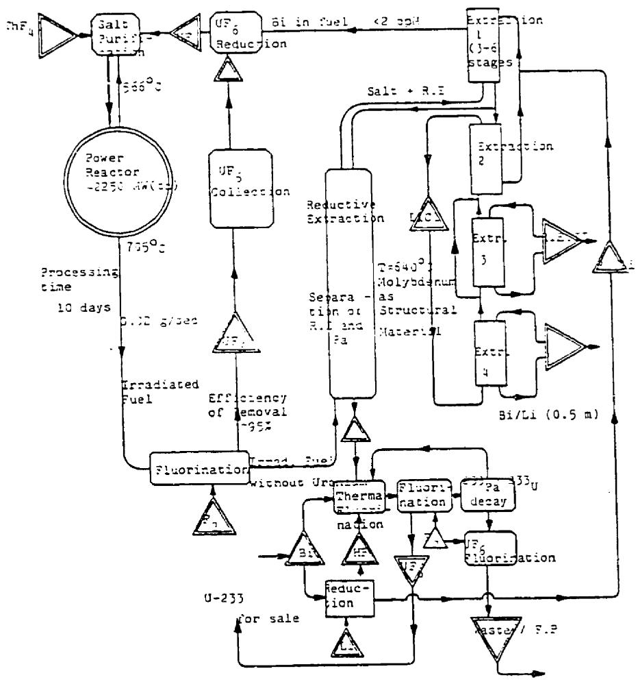  
Figure 3.7-7. HsBR Reprocessing Scheme

# 3.7.3 Blanket Salt Processing

Blanket salt processing must extract UCl₄ and convert it to UCl₃. Some degree of separation may be initially accomplished by slowly cooling the salt mix to precipitate out ThCl₄ until a eutectic composition is reached (Fig. 3.6-1).

A low need for high purity plus a desire for compactness favor pyroprocessing with chlorides. Should the blanket salt be a fluoride, oxidation to $\mathrm{UF}_6$ and subsequent distillation (section 3.7.3.8) appeals.

$\mathrm{UCl}_4$ reduces to $\mathrm{UCl}_3$ relatively easy using $\mathsf{H}_2$ , alkali (Na,K,etc.), U, or Th. For metallic reduction, rod, gauze or turnings are popular. Using alkali (Ak = Na or K), the chemical reaction is

$$
\mathrm {U C l} _ {4} + \mathrm {A k} \longrightarrow \mathrm {U C l} _ {3} + \mathrm {A k C l}
$$

This results in a 50/50 molar mix; lower in uranium content than desired. Any AkCl initially present would even further reduce the UCl $_3$ molar content. This leaves only Th or H $_2$ as alternatives.

Th metal is toxic and flammable. $\mathsf{H}_2$ produces HCl, which in turn might be used to chlorinate the thorium oxide feed (section 3.7.7). A possible direct route to reducing UCl<sub>4</sub> may be by electrolysis, releasing Cl<sub>2</sub> which could, in turn, chlorinate ThO<sub>2</sub> feed.

Blanket salt should well accord batch reprocessing. The frequency of blanket reprocessing will depend on

1. The tolerable $^{233}\mathrm{U}$ concentration in the blanket which depends on

a. Allowable power production in blanket which depends on

(1) Maximum desirable heat removal capability from blanket salt   
(2) Neutron damage to reactor vessel

b. The amount of $^{233}\mathrm{U}$ inventory to be tolerated in the blanket, which depends on

(1) Proliferation hazard   
(2) Financial worth of $^{233}\mathrm{U}$

c. The loss in BG it causes

2. The optimum reprocessing economics which depends on

a. $^{233}\mathrm{U}$ separation efficiency   
b. Blanket reprocessing costs

3. The demand rate for $^{233}\mathrm{U}$ in the core shim tank which depends on

a. The tolerable size of the shim tank, which depends on

(1) Criticality hazard   
(2) Proliferation Hazard   
(3) Financial worth of $^{233}\mathrm{U}$

b. Fuel burnup rate in the core.

Regarding BG (1c above), Figure 3.7-8 shows that Taube found a significant BG loss as the $\mathrm{Pu} / ^{238}\mathrm{U}$ ratio went from $10^{-3}$ to $10^{-2}$ . An MCFR(Th) should behave similarly with $^ { 2 3 3 } _ { \text{U} / \text{Th} }$ ratio.

Fig. 3.7-8. Impact of Fissile $^{239}\mathrm{Pu}$ Content in the Blanket upon Freeding Ratio (Case of a Three-Echo HCFR(Pu) Roector) [18]   
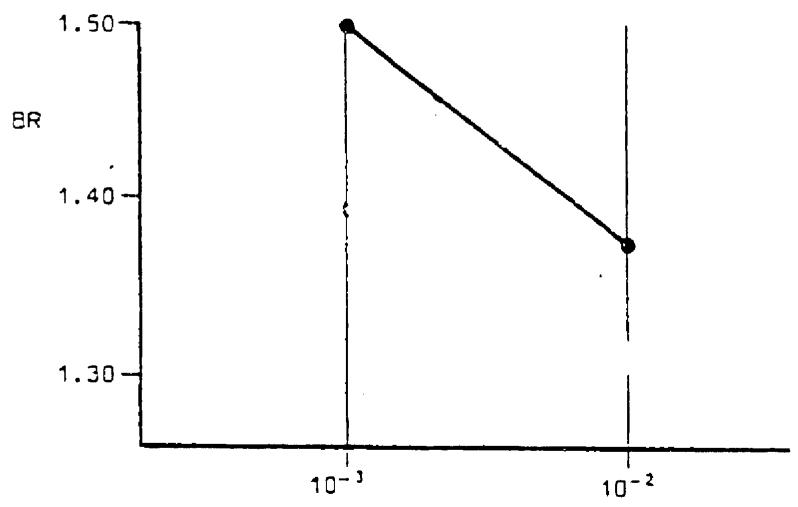  
Relative F concentration: U-236 = 1.0

# 3.7.4 Starter Fuels

3.7.4.1 Starter fuel for the core. Until $^{233}\mathrm{U}$ becomes available, HCFt(th) reactors must start up with highly-enriched $^{235}\mathrm{U}$ or Pu. Pu most closely matches the critical dimensions and characteristics of the equilibrium $^{233}\mathrm{U}$ cycle. It also avoids mining new uranium (at a rate of 1000 parts U for 72 parts $^{235}\mathrm{U}$ ) and uses up existing stocks of Pu.

This conflicts with the desire to avoid Pu, but requires only the one transport for the starter core fuel. To start with highly-enriched 235 $_{U}$ would later require a core geometry change (smaller tube diameter

or wider skew angle) or thorium dilution of the $^{233}\mathrm{U}$ . When $^{233}\mathrm{U}$ becomes available, it can start up new reactors.

Replaceable tubes would also permit variable core dimensions and composition. One might then even start with a slow neutron spectrum and core mix of lower enrichment until dufficient $^{233}\mathrm{U}$ is bred to operate the design MCFR(Th).

3.7.1.2 Preparation of $\mathsf{ThCl}_4$ for blanket. Th principally occurs in rocks as $\mathsf{ThO}_2$ , the same form considered for solid fuels. The necessary technology already exists for converting oxides into chlorides: the principal method to recover thorium and uranium from spent solid fuels happens to be a chloride volatility process wherein $\mathsf{ThCl}_4$ occurs as an intermediate step.

In this process, a gas mixture of $\mathrm{Cl}_2$ and $\mathrm{CCl}_4$ attacks the oxides at $700 - 350^{\circ}\mathrm{C}$ to form volatile $\mathrm{ThCl}_4$ and other chlorides. Sintered metal filters remove solids from the gas; salt sorption traps at controlled temperatures separate the chlorides into different fractions.

One could also form ThCl4 while

(1) Reducing blanket UCl4 to UCl3:

$$
\mathrm {T h} + 4 \mathrm {U C l} _ {4} \rightarrow 4 \mathrm {U C l} _ {3} + \mathrm {T h C l} _ {4}
$$

(2) "Getting" excess Cl (released from the UCl<sub>4</sub> molecule by fission) from the core salt

$$
\mathrm {T h} + 4 \mathrm {C l} \longrightarrow \mathrm {T h C l} _ {4}
$$

However, these methods require metallic Th which is pyrophoric and difficult to obtain from $\mathrm{TiO}_2$ .

Another possibility would be to use the HCI product from blanket

salt reduction along with lots of heat to drive the reaction

$$
\mathrm {T h O} _ {2} + 4 \mathrm {H C l} \longrightarrow \mathrm {T h C l} _ {4} + 2 \mathrm {H} _ {2} \mathrm {O}
$$

Most of the heat would be recoverable and might come from the reactor itself.

# 3.7.5 Fuel Cycle Summary

Fig. 3.7-9 summarizes a typical MCFR(Th) fuel cycle. On equilibrium cycle an MCFR(Th) blanket consumes natural thorium and breeds $233_{\mathrm{UCl}_4}$ . Blanket reprocessing separates out the $\mathrm{UCl}_4$ , reduces it to $\mathrm{UCl}_3$ , and feeds it into the core as shim. Small amounts of Th, $234_{\mathrm{U}}$ , and $232_{\mathrm{U}}$ also carry over in chloride form.

Continuous core reprocessing should result in

1. Gases vented tc atmosphere following suitable decay   
2. Very small long-lived FP waste which could remain at the plant until the end of the plant life   
3. No actinide waste   
4. A few commercial byproducts, e.g. S, non-radioactive FP, and possibly $90\mathrm{Sr}$ and $137\mathrm{Cs}$ radiation sources   
5. Renovated core salt still highly radioactive, mixed in with the blanket product shim. Most of this radioactive, weapons-grade mix returns to the core, but some goes cut as EG in a form non-conducive to intimate handling.

Section 2.5.2 advocates minimum transport of weapons-grade and radioactive material. The one shipment of starter fuel in and shipment of BG out constitutes the only major transport, nil compared to the usual reactor fuel cycle.

# 3.8 Safeguards

# 3.S.1 National Fuel Inventory

Although out-of-core cooling greatly increases the fuel inventory in the primary circuit, fuel safeguards does not suffer:

1. Fuel diversion from the primary circuit requires shutting down the operating power plant

2. High radicactivity makes diversion unwieldy.

The inventory in the reprocessing stream will depend on the reprocessing mode (batchwise vs. continuous) and on the reprocessing goals (degree of separations. The only other fuel accumulations will be in the shim tank and in the breeding gain export, both highly radioactive.

The absence of fuel fabrication and fuel element reprocessing, and associated transportation eliminates most out-of-plant inventory. Thus, unlike other reactor fuel cycles, the national inventory of an MGFR basically comprises only the power plant inventories.

# 3.8.2 In-plant Diversicn Potential

FP and $^{232}$ U-daughter radioactivity in the molten fuel should discourage diversion prior to reprocessing. Selective reprocessing could remove just the neutron absorbers and corrosive agents, while allowing high-activity non-volatile emitters to remain. (This would simultaneously manage some of the cumbersome waste). After appreciable reactor operation, long-term radic activity and heat generation rates may prohibit salt use for weapons.

The most sensitive (weapons-attractive) material should be the low-burnup UCl₃ or UCl₄ extracted from the blanket. Processing remotely and then mixing immediately with (reprocessed) radioactive core salt should safeguard the UCl₃. No stage should ever hold enough low-burnup 233 UCl₃ to warrant seizure for quick bomb manufacture.

# 2.8.3 Facility Modification

Presumably a country could modify its MCFR(Th) to produce Pu by simply substituting UCl₄ for ThCl₄ in the blanket. This could be done either in the salt solution or in a separate capsule. But then a research reactor or other neutron sources would serve almost as well. Thus safeguards cannot prohibit such steps: they can only seek to induce ramifications to, and external signals of, such modification. Signals would include higher heat production in the blanket and fewer 2.6-MeV photons from $^{232}\mathrm{U}$ daughters. Designing a blanket with limited heat removal capability should preclude significant Pu manufacture.

# 3.8.4 Desired Radioactivity in Transported Breeding Gain

The best opportunities for diversion or theft of core salt would occur with stockpiles and transports of breeding gain. Still even though the fuel be packaged for safe handling in transport, the presence of $^{232}\mathrm{U}$ daughters and radioactive fission products in the fuel will make it unattractive for handling in weapons construction. Furthermore, this radioactivity will necessitate unwieldy shielding during transport. The subject radioisotopes should

1. Have low neutron cross section to avoid neutronics penalty   
2. Be non-volatile so as to not pose a hazard in a transport accident   
3. Be difficult to separate from the core salt.

Troublesome long-lived fission products might be ideal.

# 3.8.5 Radiological Sabotage Threat

Fission reactors inherently induce high levels of radioactivity. A terrorist could deliberately release radioactive gases and, by means of explosive devices, radioactive aerosols. Although an MSR plant continuously purges its fuel, much of the problem remains: the same amount of fission products have still been generated per life and must eventually be disposed of (transported from in-plant safe storage to some final safe storage). Only semipermanent storage at the MSR site can alleviate the transportation risk relative to other reactors. But even then, such a high fission product concentration might also attract saboteurs.

In contrast, a fusion reactor produces only tritium which is conceivably dispersable. In-plant recycling further mitigates the problem. However, the only near-term economical fusion reactor is projected to be the hybrid which will produce weapons-grade fissile fuel again.

# 3.9 Access and Maintenance

The goals for all nuclear power plants include efficient, reliable, and safe reactor operation. This entails adequate inspection and opportunity for maintenance and repair. With MRs one can drain the fuel, flush the system with clean salt, and then replace the whole reactor vessel or individual heat exchanger units. However, with out-of-core cooling, the primary circuit emits delayed neutrons; these activate circuit equipment and the secondary coolant, inhibiting access and maintenance there.

# 3.9.1 Compactness of an HCFR

Figure 3.9-1 indicates the compact layout of an MCFR and compares its overall size to that for a typical LIFBR and a lower-powered MSER. In British MCFR(Pu) designs, no item of plant exceeds $6.5\mathrm{m}$ diameter; this permits prefabrication of the vessel in the shop, thus reducing construction time and interest charges.

# 3.9.2 Intrinsic Reliability

The MSR avoids intricate mechanical devices: it needs

1. I.o complex refuelling mechanisms   
2. Few of the close tolerances present in solid-fuelled reactors   
3. No mechanical control devices in the core or blanket.

This implies the high system reliability of a chemical or hydraulic

plant: pumps, heat exchangers, and containing materials will operate reliably so long as they do not exceed proven limits of corrosion, thermal expansion, and salt velocity.

# 3.9.3 MSRE Experience

MSRE demonstrated that with proper design one can maintain an active fluid-fuel system without undue difficulty. Such design should entail easy replacement of pump and heat exchanger or insitu repair. As an example, a U-tube heat exchanger allows the major components to expand and also permits plugging any leaking tubes from the less-active coolant circuit side. These features do cost some extra fuel inventory though.

# 3.9.4 Comparison of Primary Circuit Configurations

In nuclear reactors radiation inhibits access to the primary circuit. The liquid nature of MCFR fuel allows the removal of most of the radiation sources during reactor shutdown.

One would like to design the primary circuit to allow reduced-power operation while repairing a small ox-core portion of it in a shielded cell (Fig. 3.9-2). Then removal of one "tube" circuit from operation would still leave $(n - 1) / n$ of the reactor in operation. Adversely the primary circuit must lie close to the core so as to minimize out-of-core fuel inventory.

Because of this the radiation fields of the core and adjacent subchannels overlap. Therefore unless robots can do the job, replacement or repair of any component (heat exchangers, pump, piping, etc.) will probably require removal of all the radiation sources: i.e., shutdown and clean out of the whole reactor.

In that event one might ask, are multiple loops in each sub-channel still needed? Probably they still buy you time to wait until a scheduled maintenance period occurs - like that for replacing the in-core tubes.

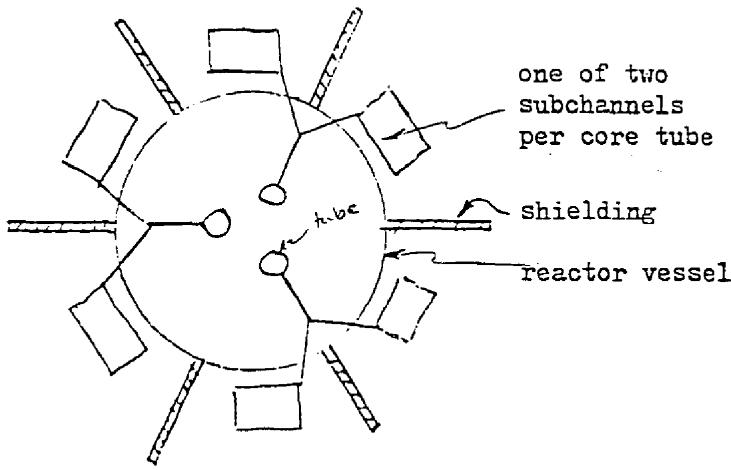  
Figure 3.9-2. Top View of a 3-Tube Reactor with Subchannels in Shielded Cells

# 3.9.5 Reactor Maintenance/Replacement Procedure

Upon shutdown the core fluid may drain or be pumped into safe geometry tanks. Operators could then flush the primary circuits, first with (irradiated) blanket salt and then with fresh blanket mix. The latter might first clean up the blanket region itself. Each mix would need a separate drain tank. Both tanks and lines might require auxiliary heating. Water or steam could accomplish the final cleanup: chlorides dissolve easily in water.

With a clean system, operators could decouple and replace the graphite tubes just like fuel elements, only much faster:

1. No delay time is needed for radioactivity to die down   
2. Low radic/activity greatly eases the handling problems   
3. Spent tubes will require no extensive storage as for spent fuel elements; they should be easily disposed of.   
4. Only a few $(N = 3 - 6)$ tubes are involved.

Core tubes will probably require the most frequent replacement of all the solid reactor components due to the combined effects of radiation, corrosion, and high temperature. Frequency of replacement might be similar to that for LiR and LiFBR refuelling (6-12 mos). Even more frequent intervals can be tolerated without significant penalty. The costs of replacement tubes will be negligible also. One would like to remove the tubes without disturbing the reactor vessel. Once in a great while, the reactor vessel or a graphite vessel liner could also be replaced.

# 3.9.6 Reactor Shielding

Cut-of-core ccoing may cause some unique shielding problems

due to the circulation of delayed neutron emitters. Assuming a delayed neutron fraction of 0.003, a total-to-core volume ratio of four, $\overline{\nu} = 3$ secondary neutrons per fission, a core power density of 10 MWh per liter, neutron multiplication factor $k$ in a 5-in. pipe $= 2/3$ (a reasonable arbitrary guess), one gets a neutron source rate of

$$
\begin{array}{l} S = \frac {1 0 M W}{\mathrm {c o r e l i t e r}} \times \frac {1 . 6 V}{1 . 6 0 2 \times 1 0 ^ {- 1 9} W s} \times \frac {\Delta v \mathrm {d e l a y e d n e u t s}}{2 0 0 \mathrm {M a v}} \times \frac {\mathrm {c o r e v o l .}}{\mathrm {t o t . v o l .}} \\ \times \frac {1 \mathrm {l i t e r}}{1 0 ^ {3} c m ^ {3}} \times \frac {1}{1 - k} \left(\frac {\mathrm {s u b c r i t i c a l}}{\mathrm {m u l t i p l i c a t i o n}}\right) = 8. 4 \times 1 0 ^ {1 2} \mathrm {n c m} ^ {- 3} s ^ {- 2} \\ \end{array}
$$

The surface flux on a cylindrical source is [149]

$$
\phi = \frac {B \lambda S}{2} G (n, R / \lambda)
$$

where $\lambda =$ neutron mean free path (cm)

B = buildup factor, normally applied in use with photons to add scattered flux in with the uncollided flux. Thus B is usually near 1.0.

$h =$ half-height of the cylinder measured in units of $\lambda$ ; in evaluating $G$ , $h = 6$ is the same as $h = \infty$ .

$$
\begin{array}{l} \mathbf {R} = \text {c y l i n d e r} (c m). \\ G (a, b) = \int_ {0} ^ {b} d x \int_ {0} ^ {\tan^ {- 1} (a / x)} e ^ {- x \sec y} d y; \quad \max G = G (\infty , \infty) = 1. 0 \\ \end{array}
$$

Thus on the surface of a 5-inch diameter pipe, with $\lambda = 10$ cm,

$$
G (\infty , 2. 5 \times 2. 5 4 / 1 0) = 0. 7 3 \text {a n d} \phi = 1. 8 2 5 B \cdot S \approx 1 0 ^ {1 3} n c m ^ {- 2} s ^ {- 1}.
$$

Treating a pipe as a 2 meter-long line source, then at a distance 1 meter away from its midpoint [149]

$$
\phi = \frac {S R ^ {2}}{2 a} B \cdot F (4 5 ^ {\circ}, 0) = 0. 3 2 3 \cdot S \geq 1 0 ^ {1 2} n c m ^ {- 2} s ^ {- 1}
$$

where $a = 1$ m (distance away)

$$
F (\phi , b) = \int_ {0} ^ {\phi} e ^ {- b \sec \phi^ {\prime}} d \phi^ {\prime}
$$

In summary, an unshielded 5-in pipe will produce delayed neutron fluxes of the order $10^{12} - 10^{13}$ n cm $^{-2}$ sec $^{-1}$ nearby.

This flux level could appreciably activate the primary circuit environment, causing delay and difficulty in maintenance. Routing alternate subchannels through separate shielded cells outside the vessel (Fig. 3.7-1) would partly circumvent the problem: then if one subchannel broke down, the operator could divert flow to another. After a suitable decay time the broken subcircuit could be entered and fixed.

The delayed neutron radiation stems from relatively short-lived emitters; it will quickly stop once reactor operation does. The high gamma radiation from fission and activation products lasts much longer: it will continue during shutdown. Continuous fission product cleanup helps to keep these gamma radiation levels down.

# 3.9.7 Radiation Sources in Reprocessing Equipment

Section 3.5.10.1 reported the neutron production from decay alphas. To avoid these neutrons, the process should avoid use of light elements, especially Be,F,B,Li,Al,O,Mg,and Na (in decreasing order of importance).

The presence of $^{232}\mathrm{U}$ , especially in core salt reprocessing, will also produce penetrating radiation. Section 3.5.10.2 discusses this in more detail.

# 3.10 Auxiliary Plant

# 3.10.1 Power Cycle Options

Generally the primary coolant transfers heat to

1. An intermediate liquid coolant which generates steam for a turbine, or to   
2. A gas coolant which passes directly to high-efficiency gas turbines and/or process heat applications.

Melting point, corrosion, and activation (by delayed neutrons) constitute the main concerns in the auxiliary plant.

3.10.1.1 Intermediate liquid coolant for steam cycle. Liquid metals and fused salts, because of their high boiling points and thermal conductivities allow operation at high temperatures and low pressures. This promotes excellent heat transfer without expensive and hazardous high pressure equipment. Low pressure especially permits use of thin heat-exchanger tubes.

Research earlier on Na-graphite reactors and later on LMFBRs has produced a broad base of Na technology. Similar technology exists for the low-melting eutectic Na-K mixture. Either one, but especially NaK, avoids problems of coolant freezing. NASA-Lewis has also pioneered the use of K with a K-vapor turbine, getting up to $65\%$ efficiency. That cycle would probably need more study though.

Unfortunately, alkali metals react vigorously with both steam and molten salt. A small leak on the high-pressure steam side could spell disaster. If the alkali leaked into the molten salt, removal by processing would be hard. Sodium would react with $\mathrm{UCl}_3$ to form

NaCl and pure U metal; the latter could plate out or otherwise accumulate.

Lead behaves better chemically as it reacts little with either salt or steam and should not enlarge any leaks. Lead costs a lot but that has not discouraged the British from choosing it. It will require development of suitable pumps and components especially in regards to corrosion. The inertia associated with lead's high density will also require high strength construction.

Lead will need auxiliary heating to prevent freezing during low power and start-up conditions. The cooler parts of the lead circuit could use low alloy steels but regions above $500^{\circ}\mathrm{C}$ may require other materials: the superheater will need duplex tubing as lead attacks nickel-bearing alloys.

Molten salts compete favorably with liquid metals: they exhibit thermal conductivities intermediate to water and the poorer of the liquid metals. Their specific heat capacities parallel water's. Furthermore, an intermediate coolant of molten salt should more closely match the primary salt in physical properties, thereby reducing freezing and thermal stress problems. They will cost far less than liquid metals. Table 3.10-I shows that a wide choice in eutectic melting points exists among candidate salt mixtures.

Considerable experience exists in pumping and general use of molten salts, especially in salt baths and petroleum refining applications which feature constant high temperatures and continuous system operation. Salts work well with Hastelloy N.

Table 3.10-I Eutectic Melting Points of Some Salt Mixes [112]   

<table><tr><td>Salt Mix</td><td>M.P. (°C)</td></tr><tr><td>ZrF4/NaF</td><td>500</td></tr><tr><td>NaBF4</td><td>408</td></tr><tr><td>ThCl4/PbCl2</td><td>395</td></tr><tr><td>92 NaBF4/8 NaF</td><td>384</td></tr><tr><td>2 (LiF)/BeF2</td><td>364</td></tr><tr><td>ThCl4/NaCl</td><td>360-370</td></tr><tr><td>ThCl4/PbCl2/LiCl</td><td>325-335</td></tr><tr><td>NaNO2/NaNO3/KNO</td><td>142</td></tr><tr><td>NaAlCl4</td><td>108</td></tr></table>

However steam leakage into the coolant salt could produce locally high corrosion. Processing difficulties would arise if the coolant leaked into the fuel salt. For these latter reasons the British decided against molten salts for the secondary coolant.

3.10.1.2 Coolant for gas cycle. $\mathrm{CO}_{2}$ or other oxidizing gas leaking into the fuel salt, would react to form $\mathrm{VO}_{2}$ . That could over-load the oxide removal section of the salt cleanup plant.

Inert helium avoids this problem. He cooling is also under development for other reactors along with a He gas turbine. It should work well with molybdenum heat exchanger tubing although this is not yet fully endorsed.

Both France and the Soviet Union are considering gaseous

aluminous chloride to power the first stage of gas turbines; dissociating $\mathrm{NO}_2$ ( $\mathrm{NO}_4$ ) gas, the second stage.

Lower turbine working pressure with gas should permit more component prefabrication. That should lower installation times and save on construction and interest charges. Avoiding the steam generator and tertiary circuit also reduces costs, the extent depending upon the gas cycle efficiency.

Poor heat transfer properties of gas will penalize the cycle with a larger heat exchanger. This means higher out-of-core fuel salt inventory. One must also analyze the safety of a pressurized secondary coolant.

# 3.10.2 Auxiliary Hardware

3.10.2.1 Pumps. Pumps that circulate molten salts experience unusual metallurgical, chemical, physical and mechanical conditions. Salts exhibit temperature-dependent physical properties. At temperatures near $700^{\circ}\mathrm{C}$ they corrode many structural materials and deteriorate chemically if exposed to air, water or water vapor.

ORNL successfully tested single-stage centrifugal salt pumps in the MSRE and in loops at $650^{\circ}\mathrm{C}$ up to 16,000 hours. Two-stage semi-axial pumps may require basic development work. Both pump designs will require development and testing to successfully increase sizes to the range needed for a 1000 MWe plant.

Both pump designs separate the high-temperature pumping elements from the primary shaft seal and bearings: this allows the latter parts to operate near ambient temperatures and to use conventional lubricants. An inert gas buffers the space between the

high-temperature pumped salt and the primary pump shaft seal.

Elastomeric seals and lubricants must be protected from excessive

gamma heating and radiation damage.

Initially, mechanical pump designs avoided rubbing parts in the salts; now pumps with journal bearings in the salt have operated successfully.

No direct experience exists with high power, continuously running lead pumps. The design principles would probably follow the sodium pump design developed for LMFBRs but with higher power and strength requirements.

3.10.2.2 Core/blanket seal. Section 3.7 emphasizes guarding against core fluid leaks more than blanket leaks. Therefore, the core tubes should be a single entity throughout the reactor with no pressure seal between core and blanket salt.

One solution might be to route the core tubes through a second tube or sleeve which penetrates the reactor vessel. However, such a sleeve will itself experience high radiation damage and require replacement. It would also thermalize neutrons. Thus we prefer to create a blanket seal on the core tube (Figure 3.10-1). Low blanket pressure enhances the feasibility for it. One could also design a catcher for limited blanket leakage as part of the blanket reprocessing stream. Then, no seal at all might even work.

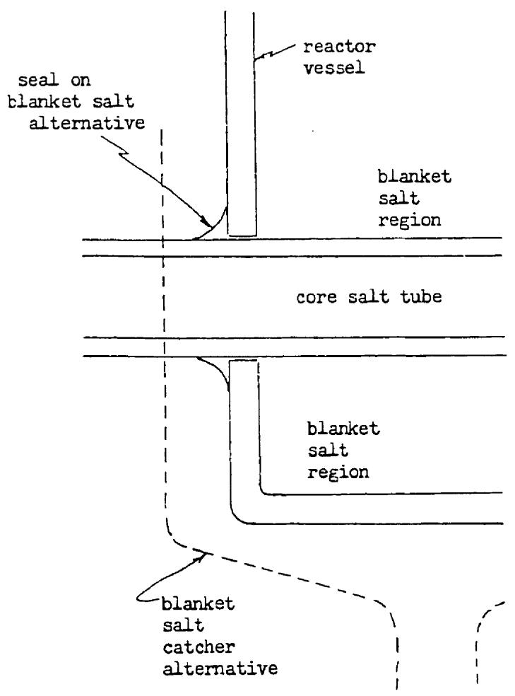  
Fig. 3.10-1 Alternative Interfaces Between Core Tube and Reactor Vessel.

Two tanks below the reactor vessel serve for filling and draining. Each can contain the whole salt inventory of core or blanket. They provide for quick dumping of the core and/or blanket or for accumulating salt leaks from the reactor vessel. Two more tanks function as standbys and as delay tanks for salt removal for processing, one each for core and blanket. An emergency cooling system would remove the decay heat from any tank through the same lines used for preheating.

Mechanical pumps or gas pressure can transfer the salt. For initial filling the fuel or blanket salt will be brought to site in solid form. Electric immersion heaters or steam coils that pass below the surface of a salt bath melt the salt under inert gas in small non-critical batches. Heating a solid bath of salt from the bottom alone can develop sufficient pressure to rupture equipment or expel the molten salt through the solid surface. Once molten the salt can be pumped into the reactor.

The primary salt circuits will require preheating to about $600^{\circ}\mathrm{C}$ ; the secondary, less. In some areas it will be more economic and convenient to heat whole spaces such as the reactor vault and processing plant; trace heating is better for longer lengths of pipework as in secondary pipes to the steam generators. Submerged centrifugal pumps circulate the salt. They are of a type which permits no contact of the salt with the packing gland. The ORNL iMSRE encountered no particular problems with preheating.

The MSR uniquely separates, concentrates, and stores part of its wastes within the plant for neutron economy, safety, and corrosion protection of the reactor. Being already in the form of a concentrated heat source suggests the possibility of dissipating the decay heat by putting it to work. One use could be for preheating. Helium or a low-melting point salt like Flibe $(363^{\circ}\mathrm{C})$ could be the heating agent. An auxiliary heater would provide a backup heat source, especially prior to accumulating sufficient fission product waste.

# 3.10.5 Overall Plant Size

Building layout in the British MCFR(Pu) design is compact: the reactor vessel and primary circuit are small; the plant requires no elaborate fuel handling machinery. The skewed-tube configuration and tube replacement machinery here forfeit some of this compactness. If inline pyrochemical reprocessing proves practical and economical, it should fit in the building with little size increase. This includes the attendant control and maintenance areas. If feasible, high pressure storage of fission gases would also save much space.

# 3.11 Economics

Several earlier sections have mentioned potential economic advantages with MSRs, and MCFRs in particular. This section attempts to summarize these and others; many come from an internally-published British study for an MCFR(Pu) [29].

# 3.11.1 British Study Results

The British compared a lead-cooled MCFR(Pu) to an LiFBR of year 1990 design.

# 3.11.1.1 Capital costs. Here they found

1. The MSFR avoids elaborate control systems and complex fuel handling equipment. This implies cost savings through compactness and simplicity. However necessary auxiliary systems increase costs.   
2. Component smallness allows shop fabrication in nearly all cases.   
3. The simplicity of a chemical type of plant should a. Ease erection, testing, and commissioning procedures b. Reduce construction time with consequent savings in interest and overhead charges.   
4. If full advantage could be taken of the higher temperature potential, further savings on plant costs could accrue with the lead secondary-coolant/steam plant system.   
5. Should secondary cooling by helium prove feasible (satisfy safety requirements), the associated temperatures possible with it might permit use of gas-turbines. Significant

savings might then accrue from skipping a tertiary circuit and using a layout integrated in a pre-stressed concrete pressure container vessel.

3.11.1.2 Fuel cycle costs. The British study assumed

1. Off-site solvent extraction of heavy metals   
2. Removal of residual fission products   
3. Cn-line removal of volatile fission products and salt clean-up.   
4. A reprocessing cycle of three months cooling-off delay period and three months processing and transport time.   
5. A one-month stockpile of fresh fuel at the reactor site. Comparison of fabrication and reprocessing costs showed a definite advantage for an MCFR over the oxide-fuelled LMFBR, as expected.

If the maximum fuel salt temperatures can increase from the $800^{\circ}\mathrm{C}$ of the reference lead-cooled case to $920^{\circ}\mathrm{C}$ , the MCFR(Pu) inventory could reduce by $25\%$ . It would then approach that for the oxide-fuelled IMFBR; the doubling time also would then fall to a value similar to that of the IMFBR.

The British also examined the on-line pyrochemical process in the hope that it would reduce inventory over the aqueous process. While it appeared technically feasible, the initial cost estimates were discouragingly high. These stemmed from

1. Batch processing of small "non-critical" quantities,   
2. The remote operation and maintenance involved.

This area needs further study.

3.11.1.3 Summary. MCFRs appear to offer better economics than LMFBRs. The fuel cycle costs above assume the well-established aqueous processing for heavy metal; an on-line high-temperature process only cleans the salt up. Potentially large capital savings in a high temperature MCFR warrant further study of its plant design, maintenance problems, and safety.

# 3.11.2 Transportation Costs

Transportation of conventional spent reactor fuel incurs large costs through

1. The high radioactivity of the fuel   
2. The considerable residual heat   
3. The presence of fissionable materials.

These necessitate

1. Extensive shielding materials   
2. Small packages or package cooling   
3. Cumbersome handling procedures   
4. Security (safeguards)   
5. Special accident procedures during transport.

The transportation problem largely determines the construction sites for reprocessing plants and the cooling time of the spent fuel before reprocessing [44]. An MSFR with in-plant reprocessing avoids all of this except for BG transport.

# 3.11.3 Outage Penalties

An MCFR may experience less downtime than a conventional LWR: MCFR core tubes should wear out more frequently, but low activity and the fewness of number should simplify the task. However, problems related to peripheral equipment malfunction still apply, and could be greater with a new concept.

# 3.11.4 Other Costs

Graphite tubes should be cheap. NaCl will be dirt cheap. $\mathsf{ThO}_2$ abounds in nature more than $\mathsf{UO}_2$ . An MCFR avoids fuel element fabrication and enrichment costs. High flow velocities incur high pumping costs.

# 4.0 SUMMARY

# 4.1 Fu, Proliferation, Safeguards, Security, and Waste Management

Much concern with the nuclear fuel cycle centers on Pu due to its carcinogenicity and its potential use in a weapon. One desires close control less it pollute the environment or be diverted (overtly or covertly) to weapons use. Once chemically separated (relatively easy to do for Pu) it can be put into a pre-assembled bomb within days. The main difficulty will be to properly implant the device. National or large subnational groups might be able to practice that trick beforehand.

Present and prospective solid fuel cycles involve extensive fuel logistics including element fabrication, decladding, and post-operation storage. Molten salt reactors skip these steps, thereby reducing much of the pollution and diversion dangers.

A reactor on the Th fuel cycle minimizes production of Pu and heavy actinides by beginning much lower on the atomic weight scale and usefully consuming them. Fast reactors succeed even better by enhancing fission, especially for $^{234}\mathrm{U}$ . This pertains especially to fast molten salt reactors with a very hard neutron spectrum.

All reactors use or produce weapons-grade fissile fuel. In the Th fuel cycle, the predominantly $^{233}\mathrm{U}$ fissile fuel discloses its presence by emitting a hazardous, characteristic highly-penetrating gamma ray. Any transformation of the reactor to the U/Pu fuel cycle will evidence a reduced gamma signal.

An mSR also allows one to continuously remove the principal (gaseous) radiation hazard from the fuel and store it away from

the reactor. This fact plus the ability to transfer the whole core further underground at a moment's notice should enhance security of the plant from attack.

# 4.2 Reactor Design

Extensive evaluation of core salt properties favors cheap NaCl as the carrier salt, ThCl₄ for fertile material, and UCl₃ for fissile material. High fissile salt proportion (Th/U = 0.5, 30% NaCl) will yield high BG (up to 0.4) and enhance actinide fission due to hard neutron spectrum. However, it also causes high doubling time and more frequent replacement of radiation-damaged core tubes.

Doubling time reduces to near 20 years at lower fissile contents (Th/U = 1 to 2, 30% NaCl). The optimum composition should lie in between these two points, depending on the assignment of priorities. In earlier years of operation one might operate with a low fissile content to achieve low DT, low flux levels, and softer spectrum. Then in later years, when more is known about radiation damage and the press for available $^{233}\mathrm{U}$ is diminished, the plant could switch to a salt of higher fissile content so as to avoid actinide buildup and produce more surplus neutrons(higher BG).

The blanket region could benefit from a thermalizing carrier salt like $7_{\text{LiCl}}$ or a fluoride instead of NaCl, but cost and high melting points, respectively, discourage those.

The optimum core configuration for BG and DT appears to be a few frequently-replaced, skewed, graphite tubes in a blanket

bath 2 meters thick: a cost-effective solution to the high flux levels inherent to this concept. Inner blanket regions definitely detract: they decrease BG without decreasing the out-of-core inventory.

# 4.3 Technical and Economic Feasibility

Fast molten chloride reactors have been cursorily considered before but mainly for the U/Pu fuel cycle. The ORNL MSR program showed the feasibility of fuel salt circulation. The combination of that experience and MCFR research (out-of-pile experiments and theoretical studies, so far) provide a basis for believing the concept will work.

Chemical stability and corrosion of molten salts are fairly predictable. Low vapor pressure of the salts enhances safety and permits low pressure structural components.

Molten fuel state and cooling out-of-core simplify component design in a radiation environment. They forego complicated refueling mechanism, close tolerances associated with solid fuel, and mechanical control devices. Molten state and low vapor pressure of the salts also offer inherent safety advantages.

Graphite and Mo alloys and coatings appear as promising candidates for primary salt containment, both in and out of core. These high temperature materials may permit high fuel salt temperatures (above $1000^{\circ}\mathrm{C}$ ). This can reduce fuel salt inventory in the heat exchanger and allow gas turbine cycles and/or process heat applications using helium as an intermediate and final coolant.

Use of the MCFR on the Th fuel cycle should greatly expand the amount of available fuel: three times as much Th exists as U. The high BG accompanying very fast neutron spectra in some MCFR designs will enhance the economic retrievability of extensive low-grade U and Th ores.

1. Briant, R. C. and A. M. Weinberg. "Molten Fluorides as Power Reactor Fuels," Nucl. Sci. Eng., 2(6), 797-803, November 1957.   
2. Bettis, E. S., et al. "The Aircraft Reactor Experiment - Operation," Nucl. Sci. Eng., 2(6), 841-853, November 1957.   
3. Bettis, E. S., et al. The Aircraft Reactor Experiment - Design and Construction," Nucl. Sci. Eng., 2(6), 804-825, November 1957.   
4. Ergen, W. K., et al. "The Aircraft Reactor Experiment Physics," Nucl. Sci. Eng., 2(6), 826-840, November 1957.   
5. MacPherson, H. G. "Molten Salts for Civilian Power," Oak Ridge National Laboratory, Tennessee, ORNL CF-57-10-41, October 1957.   
6. Alexander, L. G. "Molten Salt Reactors," Conference on Breeding, Economics, and Safety in Large Fast Power Reactors," Argonne, Illinois, 7-10 October 1963, ANL-6792, 1963.   
7. Batelle Northwest Laboratories. "AEC Reactor Development and Technology Program, Technical Activities Quarterly Reports, July-September 1971," BNWL-1522-4, Richland, Washington.   
8. Braunstein, J., G. Mamanto, and G. P. Smith, eds. Advances in Holten Salt Chemistry, Volume 2, Plenum Publishing Corp., New York, 1973.   
9. Chasonov, M. G. "Fission Products Effects in Molten Chloride Fast Reactor Fuels," Nucl. Sci. Eng., 23(2): 189-190, 1965.   
10. Zebroski, E. (EPRI). Private communication to E. H. Ottewitte at June 1978 ANS Meeting in San Diego.

11. Goodman, C., et al. "Nuclear Problems of Non-Aqueous Fluid-Fuel Reactors," Nuclear Engineering Project, Massachusetts Institute of Technology, MIT-5000, October 1952.   
12. Scatchard, G., et al. "Chemical Problems of Non-Aqueous Fluid-Fuel Reactors," Nuclear Engineering Project, Massachusetts Institute of Technology, MIT-5001, October 1952.   
13. Bulmer, J. J., et al. "Fused Salt Fast Breeder Reactor Design and Feasibility Study," Oak Ridge School of Reactor Technology, Tennessee, ORNL CF-56-8-204, August 1956.   
14. Taube, M. "Plutonium Fused Salts Fuels for Fast Breeder Reactor; Nuclear and Chemical Criterion," Nukleonika, 6, 603-628, 1961.   
15. Taube, M. "Molton Plutonium and Uranium Chlorides as Fuel for Fast Breeder Reactors," Proceedings of a Symposium on Power Reactor Experiments, IAEA, Vienna, 23-27 October 1961, Vol. 1, pp. 353-363, 1962; see also USAEC Translation AEC-TR-5161.   
16. Taube, H. "Stopione Chlorki Plutonu i Uranu Juko Paliwo Dla Predkich Reaktorov," Instytut Badan Judrowych, Warszawa, Poland, 414/V, March 1963.   
17. Taube, H. "Fast Reactors Using Holten Chloride Salts as Fuel, Final Report (1972-1977)," Swiss Federal Institute for Reactor Research, Wuerenlingen, Switzerland, EIR-332, January 1978.   
18. Faugeras, P., et al. "Holten Salt Reactors for High Temperatures," Trans. ANS, 20: 703-704, April 1975.   
19. Bettis, E. S. Private communication, 13 November 1975.   
20. Taube, N., et al. "New Boiling Salt Fast Breeder Reactor Concepts," Nuclear Engineering and Design, 5: 109-112, 1967.

21. Nelson, P.A., et al. "Fuel Properties and Nuclear Performance of Fast Reactors Fueled with Molten Chlorides," Nuclear Applications, 3: 540-547, September 1967.   
22. McNeese, L. E. (ORNL). Private communication, April 1977.   
23. Taube, M., E. H. Ottewitte, and J. Ligou. "A High-Flux Fast Holten Salt Reactor for the Transmutation of Caesium-137 and Strontium-90," Swiss Federal Institute for Reactor Research, Wuerenlingen, Switzerland, EUR-259, September 1975.   
24. Taube, M. "Very High Breeding Ratio in the Holten Chloride Fast Power Reactor with External Cooling," Swiss Federal Institute for Reactor Research, Wuerenlingen, Switzerland, (Internal Report) TH-HL-261, Jul. 1975.   
25. Grenon, M. and J. J. Geist. "Molten Salt Reactors," Oak Ridge National Laboratory, Tennessee, ORNL-TR-2508; Translated by F. Kertesz from *Energ. Nucl. (Paris)*, 13(2): 86-93, March-April 1971.   
26. Grenon, M. and J. J. Geist. "Molten Salt Reactor," Rev. Fr. Energ., 25(263): 477-48, May 1974 (in French).   
27. Taube, M. Private communication, August 1975.   
28. Dillon, I. G. "Review of the Chemistry of Molten Salt Reactors and the Equilibrium Between Molten Metal and Salts," Dept. de Genie Radioactif, Centre d'Etudes Nucleaires de Fontenay-aux-Roses, CEA-CONF-2690, CONF-730482-1, 1973.   
29. Smith, J., et al. "An Assessment of a 2500 MW(e) Molten Chloride Salt Fast Reactor," Technical Assessments and Studies Division, Atomic Energy Establishment, Winfrith, Dorchester,

Dorset, A&H - R 956, 1974, (Not-for-Publication, Commercial).   
30. Ralph, J. C. "Direct Contact Heat Transfer in a Molten Salt Fast Breeder Reactor, An Experimental Study Using Analogue Fluids," Reactor Heat Transfer, edited by M. Dalle Donne, Karlsruhe, Germany, 1973, paper no. 23, pp. 704-727.   
31. Harder, B. R., G. Long, and H. P. Stanaway. "Compatibility and Processing Problems in Use of Molten UCl₃-Alkali Chlorides Mixture as Reactor Fuels," Symposium on Reprocessing of Nuclear Fuels, Iowa State University, Ames, Iowa, 25-27 August 1969, (Nuclear Metallurgy, Volume 15), edited by P. Chiotti, CONF-690801, 1969, pp. 405-432.   
32. "The Dilemma Over Spent Fuel, Who's to Do What with How Much.... And When," The Energy Daily, 1 February 1979, pp. 4-6.   
33. Taube, M. "Breeding in Molten Salt Reactors," Swiss Federal Institute of Reactor Research, Wuerenlingen, Switzerland, EIR-276, April 1976.   
34. Safe Handling of. Radionuclides, Safety Series No.1, (Code of Practice sponsored by the IAEA and the World Health Organization), IAEA, Vienna, 1973.   
35. Angelo, J. A., Jr. and R. G. Post. "Nuclear Fuel Cycle and the Isotopic Compositions," Nuclear Technology, 24(3): 323-330, December 1974.   
36. Wolfe, R. A. and R. W. Ramsey. "The Transuranium-Contaminated Waste Research and Development Program Within the Energy Research and Development Administration (ERDA)," Trans. ANS, 21: 246, June 1975.

37. Olivier, J. P. "The Management of Fission Products and Long-Lived Alpha Wastes," Advances in Nuclear Science and Technology, Vol. 8, pp. 141-172, 1975.   
38. Gera, F. and D. G. Jacobs. "Considerations in the Long-Term Management of High Level Active Wastes," Oak Ridge National Laboratory, Tennessee, ORNL-4762, February 1972.   
39. Hebel, L. C., et al. "Report to the American Physical Society by the Study Group on Nuclear Fuel Cycles and Waste Management," Reviews of Modern Physics, 50(1), Part II: Sl-S188, January 1978.   
40. Blomeke, J. P. and J. P. Nichols. "Managing Radioactive Wastes," Physics Today, No. 8, 36-42, August 1973.   
41. Kubo, A. S. and D. J. Rose. "Disposal of Nuclear Waste," Science, 182 (4118): 1205-1211, December 1973.   
42. Lewis, W. B. "Radioactive Waste Management in the Long Term," Chalk River Nuclear Laboratories, Chalk River, Ontario, AECL-4268, October 1972.   
43. Rupp, A. F. "A Radioisotope-Oriented View of Nuclear Waste Management," Oak Ridge National Laboratory, Tennessee, ORNL-4776, May 1972.   
44. Schneider, K. J. and A. M. Platt, eds. "High Level Radioactive Waste Disposal Alternatives," Battele Northwest Laboratories, Richland, Washington, 1900, May 1974.   
45. USAEC Division of Waste Management and Transportation. "High-Level Radioactive Waste Management Alternatives," WASH-1297, Washington, D. C., May 1974.

46. Wild, H. "Radioaktivive Inventare und deren zeitlicher Verlauf nach Abschalten des Reaktors," Institut fuer Angewandte Systemtechnik und Reaktorphysik, Kernforschungszentrum, Karlsruhe, KfK-1797, 1974.   
47. McKenzie, D. E., et al. "Disposal of Transuranic Solid Waste Using Atomics International Holten Salt Combustion Process," Atomics International, Canoga Park, California, AI-ERDA-13151, May 1975.   
48. Bovers, E. N., et al. "Waste Management Special Studies. Progress Report, December 1974 - January 1975," Atlantic Richland Hanford Co., Richland, Washington. ARH-LD-107 B, February 1975.   
49. Aug, Kist Peen. "Quantities of Actinides in Nuclear Reactor Fuel Cycles," Lawrence Berkeley Laboratory, California, LBL-3682, April 1975.   
50. Taube, M. Plutonium - A General Survey, Verlag Chemie GmbH, Weinheim/Bergstr., 1974.   
51. Ottewitte, E. H. "Transuranium Cross Sections Which Influence FBR Economics," Second Conference on Neutron Cross Section Technology, Washington, D. C., March 1968, U. S. Dept. of Commerce, NBS Special Publication 299, Volume 1, pp. 415-425.   
52. Wolkenhauer, W. C. "The Controlled Thermonuclear Reactor as a Fission Product Burner," Battelle Pacific Northwest Laboratories, Richland, Washington, BML-SA-4232, 1972.

53. Gore, B. F. and B. R. Leonard. "Transmutation in Quantity of 137Cs in a Controlled Thermonuclear Reactor," Nuclear Science and Engineering, 53 (3): 319-323, November 1974.   
54. Wolkenhauer, W. C., B. K. Leonard, and B. F. Gore. "Transmission of High-Level Radioactive Waste with a CTR," Battelle Pacific Northwest Laboratories, Richland, Washington, 1772, September 1973.   
55. Vogelsang, W. F., et al. "Transmutations, Radioactivity in D-T Tokamak Fusion Reactor," Nuclear Technology, 22 (3): 379-391, June 1974.   
56. Hennelly, E. J. "Nuclear Data for Actinide Recycle," Nuclear Cross Sections and Technology, NBS Special Publication 425, Volume I, Washington D. C., March 1975, R. A. Schrock and C. D. Bowman (editors), pp. 214-217.   
57. Benjamin, R. W. et al. "A Consistent Set of Transplutonium Multigroup Cross Sections," Nuclear Cross Sections and Technology, IBS Special Publication 425, Volume I, Washington D. C., March 1975, R. A. Schrock and C. D. Bowman (editors), pp. 224-228.   
58. Croff, A. G. "Parametric Studies Concerning Actinide Transmutation in Power Reactors," Trans. ANS, 22: 345, San Francisco, November 1975.   
59. Beaman, S. L. "Actinide Recycle in LIFBRs as a Waste Management Alternative," Trans. ANS, 22: 346-347, San Francisco, November 1975.

60. Breen, R. J. "Elimination of Actinides with LTFBR Recycle," Trans. ANS, 21: 262, New Orleans, June 1975.   
61. Hegedus, F. and S. Chakraborty. "Calculation of the Burnup of $^{137}$ Cs by 80 MeV Protons," Swiss Federal Institute for Reactor Research, Wuerenlingen, Switzerland, (Internal Report) AN-PH-446, 1974.   
62. Gregory, M. V. and M. Steinberg. "A Nuclear Transformation System for Disposal of Long-Lived Fission Product Waste," Brookhaven National Laboratory, New York, BNL-8558, November 1967.   
63. Steinberg, M., et al. "Neutron Burning of Long-Lived Fission Products for Waste Disposal," Brookhaven National Laboratory, BNL-8558, New York, September 1964.   
64. Claiborne, H. C. "Neutron-Induced Transmutation of High-Level Radioactive Waste," Oak Ridge National Laboratory, Tennessee, ORNL-TM-3964, December 1972.   
65. Gilinsky, Victor. "Nuclear Energy and Nuclear Proliferation," Nuclear Materials Management, 6 (4): 43-46, Winter 1977-1978.   
66. Gilinsky, Victor. "Plutonium, Proliferation and the Price of Money," U. S. Nuclear Regulatory Commission News Release, S-78-8, 1978.   
67. Topical Meeting on Analytical Methods for Safeguard and Accountability Measurements on Special Nuclear Material, Williamsburg, Virginia, May 15-17, 1978.   
68. Nye, J. "Non-Proliferation: A Long-Term Strategy," Foreign Affairs, 56: 601-23, April 1978.

69. Starr, C. "The Separation of Nuclear Power From Nuclear Proliferation," Energy Technology V - Challenges to Technology, Proceedings of the Fifth Energy Technology Conference, February 27 - March 1, 1978, Washington, D.C., edited by R.F. Hill, Government Institutes Inc., Washington, April 1978, pp. 103-110.   
70. Mori, Kazuhisa. "Possible Impact on Japan of the Expected New U. S. Nuclear Policy," AIF INFO, No. 105, April 1977.   
71. Starr, C. "Nuclear Power and Weapons Proliferation - The Thin Link," Proceedings of the American Power Conference, Chicago, Illinois, April 18-20, 1977, Illinois Institute of Technology, Chicago, 1977, 39: 26-33.   
72. AEC Division of Reactor Development and Technology. "The Use of Thorium in Nuclear Power Reactors," WASH 1097, June 1969.   
73. Amaldi, E. "The Production and Slowing Down of Neutrons," Encyclopedia of Physics, Vol. 38, Part 2, Neutrons and Related Gamma Ray Problems, Edited by S. Fluegge, Springer Verlag, Berlin, 1959.   
74. Leyse, C. (EG&G Idaho, Inc.), private communication, 1977.   
75. Ligou, J. "Molten Chlorides Fast Breeder Reactor, Reactor Physics Calculations," Swiss Federal Institute for Reactor Research, Wuerenlingen, Switzerland, EIR 229, November 1972.   
76. Brugger, R. M. "We Need More Intense Thermal-Neutron Beams," Physics Today, 21 (12): 23-30, December 1968.

77. Storrer, F. "Introduction to the Physics of Fast Power Reactors," Development in the Physics of Nuclear Power Reactors, IAEA, Technical Reports Series No. 143, Vienna, 1973.   
78. Lane, J.A. "Test-Reactor Perspectives," Reactor and Fuel-Processing Technology, 12 (1): 1-9, Winter 1968-1969.   
79. Taube, M. and J. Ligou. "Molten Plutonium Chlorides Fast Breeder Reactor Cooled by Molten Uranium Chloride," Annals of Nuclear Science and Engineering, 1: 277-281, 1974.   
Ou. Fontana, M. C. and N. D. Greene, Corrosion Engineering, Second Edition, McGraw Hill, New York, 1978.   
81. Glasstone, S. and A. Sesonske, Nuclear Reactor Engineering, D. Van Nostrand, Princeton, 1963.   
82. Taube, M. and J. Ligou. "Moltern Chlorides Fast Breeder Reactor, Problems and Possibilities," Swiss Federal Institute for Reactor Research, Wuerenlingen, Switzerland, EIR - 215, June, 1972.   
83. Desyatnik, V. N., S. F. Katyshev, and S. P Raspopin. "Physicochemical Properties of Melts Comprising Mixtures of Uranium Tetrachloride with the Chlorides of Alkali Meltals," Soviet Journal of Atomic Energy, 42 (2): 108-112, February 1977.   
84. Kinosz, D. L. and W. E. Haupin. "Electrical Conductivity and Density of Chloride Melts," Proc. of the International Symposium on Molten Salts, The Electrochemical Society, Inc., P. O. Box 2071, Princeton, New Jersey, 08540, 1976, pp. 375-387.   
85. Janz, G. J. Molten Salts Handbook, Academic Press, New York, 1967.

86. Lynch, C. T., Editor. Handbook of Materials Science, Vol. I, General Properties, CRC Press, 1974.   
87. Janz, G. J., F. W. Dampier, G. R. Lakshiminarayanam, P. K. Lorenz, and R. P. T. Tompkins. "Molten Salts: Volume 1, Electrical Conductance, Density, and Viscosity Data," National Standard Reference Data Series - National Bureau of Standards 15, October, 1968.   
88. Desyatnik, V. N., S. P. Raspopin, and K. I. Trifonov. "Viscosity of Thorium (IV) Chloride - Magnesium Chloride System Melts," Izvestiva Vysshikh Ucheonykh Zavedenii, Khimiya i Khimicheskaya Teknologiya, 19 (3): 351-354, 1976.   
89. Perry, Robert H. and Cecil H. Chilton. Chemical Engineer's Handbook, Fifth Edition, McGraw-Hill, New York, 1973, pp. 3-236.   
90. Tipton, Jr., C. R., Editor. Reactor Handbook, Volume I, Materials, Second Edition, Interscience, New York, 1960.   
91. Bystrai, G. P. and V. N. Desyatnik. "Thermal Conductivity of Alkali Metal Chlorides," Teplofizicheskie Issledovaniya Zhidkostei, 1975, pp. 34-8.   
92. Bystrai, G. P., V. N. Desyatnik, and V. A. Zlokazov. "Thermal Conductivities of Alkaline - Earth Chlorides," Teplofizika Vysokikh Temperature, 13 (3): 665-666, May - June, 1975.   
93. Sladkov, I. B. and T. G. Kotina. "The Thermal Conductivities and Thermal Diffusivities of Certain Group III, IV and V Element Halides in the Liquid State," Zhurnal Fizicheskoi Khimii, 48: 1878, 1974.

94. Bystrai, G. P., V. N. Desyatnik, and V. A. Zlokazov. "The Thermal Conductivities of Fused Mixtures of Uranium Tetrachloride with Rubidium and Caesium Chlorides," Russian Journal of Physical Chemistry, 50 (2): 208-209, 1976.   
95. Gambill, W. R. "Fused Salt Thermal Conductivity," Chemical Engineering, 66 (16): 129-130, 10 August 1959.   
96. Perry, Robert H. and Cecil H. Chilton. Chemical Engineer's Handbook, Fifth Edition, McGraw-Hill, 1973, p. 3-242.   
97. Weast, Robert C. and Melvin J. Astle. CRC Handbook of Chemistry and Physics, CRC Press, Boca Raton, Florida, 1981.   
98. Bondarenko, I. I. Group Constants for Nuclear Reactor Calculations, Consultants Bureau, New York, 1964.   
99. Maples, C., G. W. Goth, and J. Cerny. "Nuclear Reaction Q - Values," Nuclear Data, 2 (5 & 6), December 1966.   
100. Desyatnik, V. N., S. P. Raspopin, and K. I. Trifonov. "Calculation of the Liquidus Lines for Binary Systems of Uranium Tetrachloride with Alkali Metal Chlorides Using a Structured Model," Russian Journal of Physical Chemistry, 48: 776, 1974.   
101. Desyatnik, V. N., I. F. Nichkov, P. T. Porodnov, S. P. Raspopin, and O. V. Skiba. "Fusibility Diagram of $\mathsf{ThCl}_4\mathsf{-UCl}_3$ and $\mathsf{PuCl}_3\mathsf{-UCl}_3$ ," Izvestiya Vysshikh Uchebnykh Zavedenii, Tsvetnaya Metallurgiya, 13 (1): 101-103, 1970.   
102. Desyatnik, V. N. and S. P. Raspopin. "Interaction of Uranium (IV) and Thorium (IV) Chlorides with Sodium and Potassium Chlorides (The NaCl-ThCl $_4$ -UCl $_4$ and KCl-ThCl $_4$ -UCl $_4$ Systems)," Russian Journal of Inorganic Chemistry, 20 (5): 780-781, 1975.

103. Gorbunov, L. V., V. N. Desyatnik, S. P. Raspopin, and K. I. Trifonov. "The Interaction of Thorium Tetrachloride with Alkaline Earth Metal Chlorides," Russian Journal of Inorganic Chemistry, 19 (11): 1692-1693, 1974.   
104. Desyatnik, V. N. "The Lead Dichloride-Uranium Tetrachloride-Thorium Tetrachloride System," Russian Journal of Inorganic Chemistry, 21 (11): 3166-3167, 1976.   
105. Desyatnik, V. N., A. N. Vokhmyakov, N. N. Kurbator, and S. P. Raspopin. "Phase Diagram of the System LiCl - UCl₄ - ThCl₄," Izvestiya Vysshikh Uchebnykh Zavedenii, Tsvetnaya Metallurgiya, 17 (3): 107-109, 1974.   
106. Desyatnik, V. N., N. N. Kurbator, and S. P. Raspopin. "Fusibility Diagram of the System ThCl₄ - LiCl - PbCl₂," Izvestiya Vysshikh Uchebnykh Zavedenii, Tsvetnaya Metallurgiya, 18 (3): 137-8, 1975.   
107. Desyatnik, V. N., Yu. T. Melynikov, S. P. Paspopin, and I. F. Nichkov. "Fusibility Diagram of the System $\mathsf{PbCl}_2\text{-}\mathsf{ThCl}_4$ ," Izvestiya Vysshikh Uchebnykh Zavedenii, Tsvetnaya Metallurgia, 12 (3): 99-100, 1969.   
108. Oymada, Ryozo. "Phase Diagrams of ThCl₄ Systems Containing NaCl, KCl and LiCl and the Limitation of the Congruently Melting Compounds Formation," Denki Kagaku, 39 (1): 2-5, 1971.   
109. Vdovenko, V. M., A. Ya, Gershanovich, and I. G. Suglobova. "Termographischesko i Rentgenographischeskoe Issledovanie Binarnisch System ThCl4-LiCl i ThCl4-NaCl," Radiokhimiya, 16 (6): 886-889, 1974.

110. Desyatnik, V. N., V. A. Dubinin, M. F. Nichkov, and S. P. Raspopin. "The Fusibility Diagram of the KCl-ThCl<sub>4</sub> System," Izvestiya Vysshikh Uchebnykh Zavedenii, Tsvetnaya Metallurgyiya, 9, (4): 82-83, 1966.   
111. Korshunov, B. G., V. I. Ionov, R. A. Baklashova, and V. V. Kokorev. "Investigation of the Interaction of $\mathsf{ThCl}_4$ with the Chlorides of Mg, Ca, Ce, Al, Fe, Nb, Ta and the Oxychloride of Nb in Melts," Izv. Vysshikh Uchebn. Zavedenii, Tsvetn. Met., 4 (6): 114-118, 1960. Translated by E. E. Conrad, IS-TRANS-56, Ames Laboratory.   
112. Janz, G. J., R. P. T. Tomkins, C. B. Allen, J. R. Downey, Jr., G. L. Gardner, U. Krebs, and S. K. Singer. "Molten Salts: Volume 4, Part 2, Chlorides and Mixtures, Electrical Conductance, Density, Viscosity and Surface Tension Data," J. Physical and Chemical Reference Data, 4 (4): 871-1178, 1975.   
113. Vokhmyakov, A. N., V. N. Desyatnik, N. N. Kurbator, and S. P. Raspopin. "Fusibility Diagram of the System LiCl - UCl₃ - ThCl₄," Izvestiya Vysshikh Uchebnykh Zavedenii, Tsvetnaya Metallurgiya, 16 (6): 86-87, 1973.   
114. Desyatnik, V. N., Yu T. Melynikov, and I. I. Trifonov. "Troynaya Systema $\mathsf{MgCl}_2 - \mathsf{UCl}_3 - \mathsf{ThCl}_4$ ," Izvestiya Vysshikh Uchebnykh Zavedenii, Tsvetnaya Metallurgiya, 15 (4): 95-96, 1972.   
115. Desyatnik, V. N., Yu T. Melynikov, S. P. Raspopin, and V. I. Suschko. "Ternary Systems Containing UCl₃ and UCl₄ with Chlorides of Na, K, and Ca," Atomnaya Energiya, 31 (6): 631-633,

December 1971.   
116. Desyatnik, V. N., Yu T. Melynikov, S. P. Raspopin, and I. I. Trifonov. "Melting Point Diagrams of Ternary Systems Containing $\mathsf{MgCl}_2$ , $\mathsf{CaCl}_2$ , $\mathsf{UCl}_3$ , and $\mathsf{UCl}_4$ ," Atomnaya Energiya, 33 (6): 994-995, December 1972.   
117. Desyatnik, V. N., B. V. Dubinin, Yu T. Melynikov, and S. P. Raspopin. "Interaction of UCl₃ with Alkaline Earth Metal Chlorides," Zhurnal Neorganicheskoi Khimii, 20 (4): 1085-1087, 1975.   
118. Thoma, R. E., et al. "Salt Systems for Application in Advanced Reactor Technology," Reactor Chemistry Division Annual Progress Report for Period Ending January 31, 1965, Oak Ridge National Laboratory, Tennessee, ORNL 3789, pp. 23-24, 1965.   
119. Thoma, R. E. "Phase Diagrams of Nuclear Reactor Materials," Oak Ridge National Laboratory, Tennessee, ORNL-2548, November 1959.   
120. Desyatnik, V. N., Yu A. Izmodenov, Yu T. Melnikov, I. F. Nichov, and S. P. Raspopin. "Fusibility Diagrams of Systems Based on Magnesium and Uranium Chlorides," Soviet Journal of Atomic Energy, 26: 634-635, 1969.   
121. Sterlin Ya. M. and V. V. Artamonov. "Phase Diagrams of the Systems UCl₄-PbCl₂, UCl₄-VO₂ and UCl₄-MgCl₂," Soviet Journal of Atomic Energy, 22: 589-593, 1967.   
122. Janz, G. J., G. L. Gardner, Ursula Krebs, and R. P. T. Tomkins. "Molten Salts: Volume 4, Part 1, Fluorides and Mixtures, Electrical Conductance, Density, Viscosity, and Surface Tension

Date,"J. Phys. Chem. Ref.Data,3(1),1974.   
123. Taube, M. and B. Dawudi. "Thermischer Kreislauf in einem Salzschmelze-Reaktor mit Ausserem Warmeausstauscher," Eidg. Inst. fuer Reaktorforschung, (internal report) TM-HL-270, October, 1975.   
124. Desyatnik, V. N., S. P. Raspopin, and K. I. Trifonov. "Viscosity of $\mathsf{ThCl}_4 - \mathsf{MgCl}_2$ System Melts," Izvestiya Vysshikh Uchebnykh Zavedenii, Khimiya i Khimicheskaya Teknologiya, 19 (3): 351-354, 1976.   
125. Desyatnik, V. N., A. I. Nechaev, and Yu F. Chervinskii. "Viscosities of Molten Mixtures of Uranium Tetrafluoride with Alkali Fluorides," Soviet Journal of Atomic Energy, 46 (5): 408-409, 1979.   
126. Bauman, T. C. and L. T. Overstreet. "Corrosion and Piping Materials in the CPI," Chemical Engineering, 85 (8): 59-68, 1978.   
127. Lumsden, J. Thermodynamics of Molten Salt Mixtures, Academic Press, New York, 1966.   
128. Argonne National Laboratory, Reactor Physics Constants, ANL-5800, Second Edition, July, 1963, p. 594.   
129. Engle, Jr., W. W. "A Users Manual for ANISN: A One-Dimensional Discrete Ordinates Transport Code with Anisotropic Scattering," Oak Ridge National Laboratory, Tennessee, K-1693, March 30, 1967.   
130. Greene, N. M., et al. "AMPX: A Modular Code System for Generating Coupled Multigroup Neutron-Gamma Libraries from ENDF/B," Oak Ridge National Laboratory, Tennessee, ORNL-TM-3706, March 1976.

131. Engel, J. R., H. T. Kerr, and E. J. Allen. "Nuclear Characteristics of a 1000-MWe Molten-Salt Breeder Reactor," Trans. ANS, 22: 705, 1975.   
132. Calamand, A. "Cross Sections for Fission Neutron Spectrum Induced Reactions," Handbook on Nuclear Activation Cross Sections, IAEA Technical Reports Series No. 156, Vienna, 1974.   
133. Gryntakis, E. M. and J. I. Kim. "Activation Cross-Sections for Some (n, 2n), (n,p) and (n,Y) - Reactions," Journal of Radioanalytical Chemistry, 46: 159-163, January 1978.   
134. Hinkelmann, B. "Microscopic Neutron Nuclear Data and 5 - Group Cross Sections for the Actinides $^{231}\mathrm{Pa}$ , $^{232}\mathrm{U}$ , $^{234}\mathrm{U}$ , $^{236}\mathrm{U}$ , $^{237}\mathrm{U}$ , $^{237}\mathrm{Np}$ , $^{238}\mathrm{Np}$ , $^{236}\mathrm{Pu}$ , $^{238}\mathrm{Pu}$ , $^{241}\mathrm{Am}$ , and $^{242}\mathrm{Cm}$ ," Institut fuer Neutronenphysik und Reaktortechnik, Kernforschungszentrum, Karlsruhe, KFK-1186, 1970.   
135. Clayton, E. D. "Fissionability and Criticality: From Pro-tactinium to California and Beyond," Nuclear Science and Engineering, 52 (3): 417-420, November 1973.   
136. International Commission on Radiological Units and Measurements. Radiation Quantities and Units, ICRU Report No. 33, April 15, 1980.   
137. Liske, H. and A. Paulsen. "Neutron Yields of Light Elements Under Alpha Bombardment," Atomkernenergie, 30 (1): 59-61, 1977.   
138. Taylor, T. B. "Safeguards Against Theft or Diversion of Nuclear Materials," Nuclear Cross Sections and Technology, Proceedings of a Conference, Washington, D. C., March 3-7, 1975, U. S. Dept. of Commerce/National Bureau of Standards, National

Bureau of Standards Special Publication 425, October 1975, pp. 199-201.   
139. Jaeger, R. G., et al. (editors). Engineering Compendium on Radiation Shielding, Volume I: Shielding Fundamentals and Methods, Springer - Verlag, Berlin, p. 385, 1968.   
140. Hummel, Harry H. and David Okrent. Reactivity Coefficients in Large Fast Power Reactors, American Nuclear Society, LaGrange Park, Illinois, 1970.   
141. Benedict, M. and T. H. Pigford. Nuclear Chemical Engineering, McGraw-Hill, New York, 1957.   
142. Chiotti, P., ed. Symposium on Reprocessing of Nuclear Fuels, Nuclear Metallurgy, Volume 15, USAEC Division of Technical Information, CONF-690801, August, 1961.   
143. Long, Justin T. Engineering for Nuclear Fuel Processing, American Nuclear Society, LaGrange Park, Illinois, 1978.   
144. Fomin, V. V. et al. "Fundamental Problems of the Reprocessing of Spent Fuel Elements," Soviet Journal of Atomic Energy, 43 (6): 1132-1138, December 1977.   
145. Dem'yanovich, M. A. "Fundamental Problems of the Reprocessing of Fast-Reactor Fuel," Soviet Journal of Atomic Energy, 43 (6): 1138-1142, December 1977.   
146. Bennett, R. L., E. K. Colbert, and L. A. Smith. "Chloride Volatility Coprocessing of Thoria-Urania Fuels," Paper presented at The 31st Pacific Coast Regional Meeting of the American Ceramic Society, San Diego, California, October 1978, Babcock & Wilcox Company Inc., Lynchburg Research Center, Lynchburg, Virginia.

147. Taube, M., W. Heer, and A. Indrefjord. "A Molten Salt Converter Reactor with Very Low Fission Product Inventory," Second International Conference on Emerging Nuclear Energy Systems, Lausanne, Switzerland, 8-11 April 1980.   
148. Ianovici, E. and M. Taube. "Chemical Behaviour of Radiosulphur Obtained by $^{35}\mathrm{Cl}(\mathfrak{n},\mathfrak{p})^{35}\mathrm{S}$ During In-pile Irradiation," Journal of Inorganic and Nuclear Chemistry, 37: 2561-2562, 1975.   
149. Courtney, J. E., ed. A Handbook of Radiation Shielding Data, ANS/SD - 76/14, Louisiana State University Bookstore, Baton Rouge, July 1976.