# NUCLEAR PROBLEMS

# OF NON-AQUEOUS FLUID-FUEL REACTORS

October 15, 1952

# Authors

Clark Goodman

John L. Greenstadt

Robert M. Kiehn

Abraham Klein

Mark M. Mills

Nunzio Tralli

Consultants

-Harvey Brooks

Henry W. Newson

# NUCLEAR ENGINEERING PROJECT

# MASSACHUSETTS INSTITUTE OF TECHNOLOGY

Manson Benedict, Director

U.S. ATOMIC ENERGY COMMISSION

NEW YORK OPERATIONS OFFICE

CLASSIFICATION CANCELED

DATE FEB 28 1957

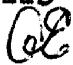

H. H. (a n e l)

Chief, Declassification Branch

# LEGAL NOTICE

This report was prepared as an account of Government sponsored work. Neither the United States, nor the Commission, nor any person acting on behalf of the Commission:

A. Makes any warranty or representation, express or implied, with respect to the accuracy, completeness, or usefulness of the information contained in this report, or that the use of any information, apparatus, method, or process disclosed in this report may not infringe privately owned rights; or   
B. Assumes any liabilities with respect to the use of, or for damages resulting from the use of any information, apparatus, method, or process disclosed in this report.

As used in the above, "person acting on behalf of the Commission" includes any employee or contractor of the Commission to the extent that such employee or contractor prepares, handles or distributes, or provides access to, any information pursuant to his employment or contract with the Commission.

# TABLE OF CONTENTS

Page No.

# Chapter I General Considerations 11

1.1 Introduction 11   
1.2 Fast Reactors 12   
1.3 Thermal Converters 20

Glossary of Symbols Used in Chapter I 24

# Chapter II Fast Reactors 25

1. Nuclear Constants 25

1.1 Total Cross-Sections. 25   
1.2 Transport Cross-Sections 25   
1.3 Inelastic Cross-Sections 27   
1.4 Fission Cross-Sections 30   
1.5 Capture Cross-Sections 32   
1.6 Scattering Cross-Sections 36   
1.7 Neutron Yields 38   
1.8 Neutron Spectra 38   
1.9 Recommendations 39

2. Calculation Methods 48

2.1 Bare Reactor Multigroup Method 48   
2.2 Multigroup Estimates for Blanket 50   
2.3 Two-Group Two-Region Method 56   
2.4 One-Group Calculations 59

3. Results of Fast Reactor Calculations 66

3.1 Introduction 66   
3.2 Bare Reactor 66   
3.3 Two-Group Two-Region Calculations 88   
3.4 One-Group Three Region 95   
3.5 Special Multigroup Calculations 97

Page No.

3. Results of Fast Reactor Calculations (contd.)

3.6 General Trends 104   
3.7 Final Design of Fused Salt Reactor 111

4. Fast Reactor Poisoning 127

4.1 Introduction 127   
4.2 Fission Products 127   
4.3 Higher Isotopes 128   
4.4 Engineering Considerations 130

5. Control Methods 131

5.1 General Considerations 131   
5.2 Control Calculations 132   
5.3 Control of the Fused Salt Reactor 140

Glossary of Symbols Used in Chapter II. 145

Acknowledgments 150

Chapter III Thermal Reactors 151

1. Introduction 151   
2. Bare Homogeneous Reactor 153

2.1 Definitions and Basic Constants 153   
2.2 Analytical Expressions 159   
2.3 The Conversion Ratio, C.R. 164   
2.4 Results of Calculations 165

3. Poisoning Effects 166

3.1 Uranium 236 166   
3.2 Fast Neutron Reactions of Beryllium 173   
3.3 Fission Products 174

4. Heterogeneous Reactors 177

4.1 The "Immoderate" Blanket 178   
4.2 The Effect of Be Lumping 181

5. Final Design Calculations 187

5.1 Reactor Constituents and Properties 187   
5.2 Calculation Procedure 188   
5.3 Results 192   
5.4 Critique of Results 197

6. Recommendations 202

6.1 Design Studies 202   
6.2 Nuclear Data Studies 202

Glossary of Symbols Used in Chapter III 205

Chapter IV Comparison of Fast and Thermal Converters 208

1. Core Structure 208   
2. Reflector Structure 209   
3．Blanket Structure 209   
4. Critical Mass and Inventory 209   
5. Conversion Ratio 210   
6. Parameters and Processing of Poisons 212   
7. Control 214

Glossary of Symbols Used in Chapter IV 215

Appendix A Procedure for Homogeneous, Fast, Bare Reactor 216   
Appendix B Summary of Calculations on Bare Homogeneous Thermal Reactors 231   
Appendix C Secular Equations 238   
Appendix D Effect of Fast Neutron Reactions of Be on the Conversion Ratio 247   
Appendix E Two-Group, Two-Region Reactor Equations. 257   
References 261   
Acknowledgments 264

# LIST OF TABLES

Page No.

TABLE II-1.2-1 Transport Cross-Sections 26

II-1.3-1 Inelastic Cross-Sections 28

II-1.3-2 Assumed Spectral Distribution of Inelastically Scattered Neutrons. 29

II-1.4-1 Fission Cross-Sections 31

II-1.5-1 Capture Cross-Sections 34

II-1.5-2 Effect of Changing $\sigma_{\mathbf{c}}(\mathbf{Bi})$ on C.R. in U-Bi Systems 35

II-1.6-1 Degradation: Product of Scattering Cross-Section and Mean Loga-rithmic Energy Decrement (s)... 37

II-1.9-1 Resume of Nuclear Data Needed 47

II-3.2-1 System Constituents for Bare Reactor Multigroup Calculations 71

II-3.2-2 Breeders - Results of Multigroup Bare Reactor Calculations 72

II-3.2-3 Converters - Results of Multigroup Bare Reactor Calculations 73

II-3.2-4 Breeders - Neutron Balance 74

II-3.2-5 Converters - Neutron Balance 75

II-3.3-1 Comparison of Special Multigroup Calculations with Two-Group Calculations 89

II-3.5-1 System Constituents for Special Multigroup Calculations 99

II-3.5-2 Results of Special Multigroup Calculations 100

II-3.5-3 Special Systems - Neutron Balance 101

II-3.7-1 System 24: System Constituents and Results 112

II-3.7-2 System 24 - Neutron Balance 113

TABLE II-3.7-3 System Constituents of Fused Salt Reactor 118

II-3.7-4 Results of Fused Salt Multi-region Calculation 119

II-3.7-5 Neutron Balance - Fused Salt Reactor; Multigroup Calculation. 120

II-5.4-1 Delayed Neutrons 137

III-2.1-1 Temperature Corrections for Nuclear Data 154

III-2.1-2 Thermal Neutron Properties of Thermal Reactor Constituents 155

III-2.1-3 Properties of Isotopic Uranium Mixtures 157

III-2.1-4 Resonance Escape Probability 159

III-2.2-1 Age to Thermal 161

III-2.2-2 Age and Density of Bi-Be Mixtures 163

III-3.1-1 Effect of U-236 on Conversion Ratio in Thermal Reactors 171

III-4.2-1A Results of Cell Calculations 183

III-4.2-1B Required Data for Evaluation of p. 184

III-5.1-1A Reactor Constituents and Constants. 188

III-5.1-1B Reactor Constituents and Constants. 189

III-5.2-1 Summary of Reactor Properties 191

III-5.3-1 Results of Calculation 192

III-5.3-2 Neutron Balance 193

III-5.3-3 Delayed Neutrons 196

III-5.4-1 Homogeneous Reactor Results 198

III-5.4-2 Gain in Production Ratio by Use of Blanket 201

TABLE B-1 Summary of Calculations on Bare Homogeneous Thermal Reactors 232

B-2 232   
B-3 233   
B-4 233   
B-5 234   
B-6 234   
B-7 235   
B-8 235   
B-9 236   
B-10 236   
B-11 237   
C-1 Numerical Values Used in Computation 244   
C-2 U-236 Concentration and Buildup Time 245   
C-3 Summary of Secular Results 246   
D-1 Data for Fast Neutron Reactions of Be 252   
D-2 Li6 Concentration Factors 253

# LIST OF FIGURES

Page No.

# FIGURE II-2.4-1 Three Media-One Velocity Systems 63

II-3.2-1 $\mathsf{PuCl}_3\mathsf{-UCl}_4$ Breeders 76   
II-3.2-2 Pu--U-238--Bi Breeders 77  
II-3.2-3 U-235--U-238--Bi Converters 78  
II-3.2-4 UCl-NaCl Converters 79   
II-3.2-5 System 14: Spectrum of Fissions and Fraction of Fissions above u 80   
II-3.2-6 System 14: Flux Spectrum 81   
II-3.2-7 System 15: Spectrum of Fissions and Fraction of Fissions above u 82   
II-3.2-8 System 15: Flux Spectrum 83   
II-3.2-9 System 16: Spectrum of Fissions and Fraction of Fissions above u 84   
II-3.2-10 System 16: Flux Spectrum 85   
II-3.2-ll System 17: Spectrum of Fissions and Fraction of Fissions above u 86   
II-3.2-12 System 17: Flux Spectrum 87   
II-3.3-1 Reflector Size vs. Core Size 91   
II-3.3-2 Reflector Size vs. Core Size 92   
X.C.R. X.C.R.(Bare Reactor) versus Core Size 93 Bare Core Size   
II-3.3-4 X.C.R. X.C.R.(Bare Reactor) versus Core Size 94 Bare Core Size

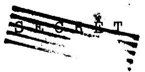

Page No.

FIGURE II-3.4-1 Reflector Thickness and X.C. /X.C. o versus Core Size 96   
II-3.5-1 System 52: Comparison of the Spectrum of Fissions of a Bare Reactor and a Blanketed Reactor 102   
II-3.5-2 Comparison of the Flux Spectrum of a Bare Reactor and a Blanketed Reactor 103   
II-3.7-1 System 24: Spectrum of Fissions and Fraction of Fissions above u ... 114   
II-3.7-2 System 24: Flux Spectrum 115   
II-3.7-3 Fused Salt Reactor - Flux Spectrum 121   
II-3.7-4 Fission Power Distribution in the Fused Salt Reactor 122   
II-3.7-5 . Total Neutron Flux per Unit Radial Distance vs. Radial Distance 123   
II-3.7-6 Normalized Flux Spectrum at Various Radial Distances 124   
III-2.1-1 Experimental Resonance Absorption Integral, A, versus "σs/U" 158   
III-3.1-1 Reaction Equations 167   
III-3.1-2 Higher Isotope Chains 168   
III-4.2-1 f and p versus Radius of Be Lump for Various N(Be)/N(Bi) 185   
III-4.2-2 Product pf vs. Radius of Be Lump 186   
III-5.4-1 Critical Mass versus Production Ratio for One-Zone and Two-Zone U-Bi-Be Reactors 199

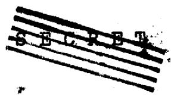

Page

No.

FIGURE A-1 System 21: Spectrum of Fissions and Fraction of Fissions above u 224

A-2 System 21: Flux Spectrum 225   
D-1 $\psi (u) = \int_{-\infty}^{u}\chi_{f}(u^{\prime})du^{\prime}$ as a Function of Energy 254   
D-2 J(X) = J{N(Be)} = Number of Be Atoms Undergoing (n,a) Reaction per Unit Source Neutron vs. X... 255   
D-3 g = Average Fraction of Final Li Concentration as a Function of M(U-235) 256

# I. GENERAL CONSIDERATIONS

# 1.1 INTRODUCTION

The primary purpose of the Nuclear Engineering Project at M.I.T. during the summer of 1952 was to investigate the problems of reactors using non-aqueous fluid fuels for the production of plutonium and to recommend a program of research and development to supply the information needed to provide a sound basis for the engineering of this important type of reactor. Aqueous fluid-fuels are receiving attention at Oak Ridge and elsewhere.

The results of this Project are being described in three companion reports.

1. "Engineering Analysis of Non-Aqueous Fluid-Fuel Reactors" - (MIT-5002),   
2. "Chemical Problems of Non-Aqueous Fluid-Fuel Reactors" - (MIT-5001), and   
3. This report.

The first of these reports describes the objectives of the Project, the lines of investigation pursued, and the main conclusions drawn. It describes in detail the engineering studies carried out by the Project and the bases for them. It summarizes all recommendations for future research and development.

The second of these reports describes the chemical studies conducted by the Project and gives details of the program of chemical and chemical engineering research recommended by it.

The present report treats the nuclear studies conducted by the Project. The basic nuclear data and design methods are described and the results of the nuclear studies are given in detail. A research program on nuclear properties of importance to non-aqueous fluid-fuel reactors is recommended.

Chapter I of this report outlines the considerations which led to the choice of two reactors for detailed study by the Project:

(1) A fast converter using as fuel a solution of $\mathsf{UCl}_4$ in fused chlorides   
(2) A thermal converter using as fuel a liquid alloy of U in Bi,

and lists the main characteristics of each reactor. Nuclear studies on the fast and thermal reactors are described in Chapters II and III, respectively. Chapter IV compares the two reactors. The Appendices contain details of calculation methods, and the results of nuclear studies not directly related to the reactor processes given engineering study.

# 1.2 FAST REACTORS

The two main questions regarding fast reactors asked at the beginning of the Project were:

(1) Should the fast reactor to be investigated be a converter or a breeder, and   
(2) What fuel system should be chosen?

BREEDERS VS. CONVERTERS. - As shown in Chapter II of this report, fast, fluid-fuel breeders may yield a breeding gain of the order of 0.6, whereas a fast converter using the same type of fuel except for the interchange of U-235 for Pu-239 will give a conversion ratio of around 1.15. Cost analyses described in more detail in the engineering analysis report show that plutonium can be produced more economically in a fast converter than in the corresponding breeder, under the cost bases adopted for this project.

The cost advantage of the fast fluid-fuel converter compared with a feasible fast breeder arises from two main causes:

1). The high unit cost of Pu compared with that of U-235; i.e., U-235 is cheaper to burn or store than Pu-239 on a gram for gram basis, because the

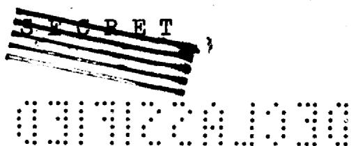

projected cost per gram of Pu-239 is still larger than the present cost per gram of U-235.

2). The inventory charges on Pu-239 are based upon the total critical mass of the breeder, but only on the equilibrium concentration of Pu-239 in the converter, which may be quite small in comparison. Hence for the low specific powers considered for the fused salt reactor ( $\sim$ 300 watts/gm), an equivalent breeder (also with a specific power of 300 watts/gm) would have such a large inventory charge assessed against it, that it could not compete with a converter in the economic production of Pu-239. Higher specific powers, if possible engineeringwise, would decrease the disparate cost estimates for Pu-producing breeders and converters.

Even if no charge was made for inventory, however, some cost advantage would remain with the converter under the cost bases adopted by this project.

Selection of Fuel. - Fast reactors must have high concentrations of uranium and low concentrations of absorbing diluents which should not moderate excessively. An initial survey of possible fluid core materials showed that few, if any, fluid alloys with uranium have sufficiently satisfactory nuclear and engineering properties to be practical for fast reactors. Fused salts are an alternative to the fluid alloys. The fluorides were eliminated on the basis of their excessive moderation which would increase the overall α of the melt. The bromides and iodides were eliminated on the basis of their unfavorable capture cross-sections (associated with high atomic weight). These decisions were based on the following useful rule-of-thumb for estimating the upper limit for the microscopic capture cross-section of diluents, σc(D), in fast converters:

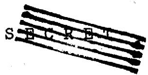

$$
\sigma_ {c} (D) <   \frac {N (2 5)}{N (D)} x 0. 2 4 b a r n s \tag {1.2-1}
$$

at 0.2 MeV mean neutron energy.

This relation assumes as a practical basis that the decrease in the conversion ratio resulting from capture in diluents should be less than one-tenth the conversion ratio for a non-poisoned reactor. For example, in a hypothetical mixture: $U^{235}\mathrm{Br}^{4}$ , which is certainly the lowest possible concentration of Br in a bromide fused salt, $\sigma_{\mathrm{c}}(\mathrm{D})_{\max} = 0.24 / 4 = 0.06$ barn at 0.2 Mev. However, Br has an estimated $\sigma_{\mathrm{c}} = 0.1$ barn at this energy and $\sigma_{\mathrm{c}}$ (iodine) is even greater. Bromine and iodine were ruled out for this reason, leaving chlorine as the only possible halogen, $\sigma_{\mathrm{c}}(\mathrm{Cl}) \cong 0.0034$ barn at 0.2 Mev.

The fused salt, uranium chloride, was chosen on the basis of metallurgical, engineering and nuclear considerations to be the subject of the fast reactor investigations by this project. The corrosion problem remains as its most detrimental feature. To lower operating temperatures in the fused salt, $\mathrm{PbCl}_2$ and $\mathrm{NaCl}$ were added to the $\mathrm{UCl}_4$ . The optimum ratio of U-238/U-235 was then determined by minimizing the estimated production cost of plutonium in this system, including the inventory charges on external holdup.

Internal or external cooling is a major consideration in the design of a fast reactor. Externally cooled systems have the advantages of safety and replaceability of heat exchangers, and absence of parasitic loss of neutrons to cooling fluids and internal structural materials. Internally cooled systems have the important advantage of lower critical mass due to absence of non-reacting inventory in external heat exchangers. For the fused salt system selected for detailed investigation, an engineering study suggested that the externally cooled system would be preferable. For a liquid-metal reactor, it is probable that an internally cooled system would be preferred.

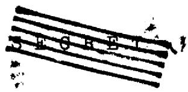

For fast reactors the highest possible Conversion Ratios (and Breeding Ratios) occur for U-238/U-235 ratios of $\frac{\mathrm{N}(28)}{\mathrm{N}(25)}$ equal to or less than 2.5. Essentially, the internal conversion ratio depends only upon the ratio $\frac{\mathrm{N}(28)}{\mathrm{N}(25)}$ , implying that the ratio $\frac{\sigma_{c}(28)}{\sigma_{a}(25)}$ is a constant over the region between 0.1 and 1 Mev. The upper limit of $\frac{\mathrm{N}(28)}{\mathrm{N}(25)}$ is about 12; higher ratios will lead to either infinite critical mass or intermediate to thermal spectra, and the systems are no longer considered to be fast reactors. For externally cooled reactors, it turns out that slightly higher ratios of $\frac{\mathrm{N}(28)}{\mathrm{N}(25)}$ , i.e. 3 to 5, will give the minimum overall cost, even though some conversion ratio has been sacrificed, because the higher dilution with U-238 decreases the holdup mass of U-235.

Internally cooled systems will contain structural material (Fe, say) and coolant (Na, say) to remove the heat. Admittedly, external holdup is decreased, but with a sacrifice in C.R. due to parasitic absorption in the above materials.

The high densities of liquid metals imply small critical masses of fissionable material, but most known uranium alloys involve high operating temperatures when used in the fluid form.

Captures in fuel material and reactor poisons reduce the conversion ratio to about 1.15 in a practical fast converter. The relatively low capture cross-sections of the fission products and the feasibility of removing them by processing make the poisoning effects of fission products negligible in fluid-fuel fast reactors. In fact, large fractional burnup - and hence large buildup of fission products - may be tolerated in fast reactor designs. This can be seen quite readily from Eq. (1.2-1). When

$N(F.P.) = N(25)$ , i.e. 33 per cent burnup, $\sigma_{c}(F.P.)$ should be less than 0.24 barn if the decrease in C.R. is to be less than $10\%$ , whereas, in fact, the estimated average value $\sigma_{c}(F.P.)$ is 0.2 barn at 0.2 Mev.

U-236, formed by U-235 parasitic capture, is a troublesome poison in fast converters. Unfortunately, $\sigma_{\mathrm{c}}^{\prime}(\mathrm{U - 236})$ is not known in the fast region. It was assumed to be the same as U-238 in all NEP calculations, i.e. $\sigma_{\mathrm{c}}^{\prime}(\mathrm{U - 236}) = 0.22$ barn at 0.2 Mev. On this basis, U-236 is about equivalent to the average F.P., atom for atom. However, because it is isotopic with the primary fuel, U-235, the removal of accumulated U-236 and its subsequent separation, presumably by gaseous diffusion, would be quite expensive. Thus reprocessing costs dictate the upper limit, and the loss in conversion ratio by parasitic capture in U-236 sets a lower limit on the rate of reprocessing the fuel for U-236.

For Pu producing reactors, one should note that the ratio $\frac{\sigma_c(49)}{\sigma_c(28)}$ is smaller in the fast region than in the thermal. Therefore, Pu-240 contamination of the product Pu-239 is of less importance in a fast converter than in a thermal converter.

The fast converter structure studied consists of a semi-spherical core, reflector, and blanket. The reflector is used to reduce the inventory of critical mass. In general, the reflector should be a dense material of high transport cross-section and low capture cross-section, such as lead. Iron could be used as a combination container-reflector provided it were not too thick. Reflectors should not be designed such that they more than replace fissionable material, for large thickness of iron (or, to a lesser extent, lead) seriously reduce the conversion ratio by decreasing the leakage flux reaching the outer blanket.

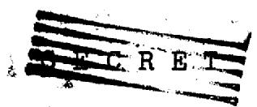

The blanket structure should be sufficiently thick that it does not allow an appreciable number of neutrons to leak out of it. Moreover, the blanket should completely cover the core so that no leakage gaps are present. This last requirement is difficult to achieve in practice, since cooling pipes and control mechanisms must be inserted through the reactor. It is obvious that the blanket should be processed often enough to keep the inventory of Pu-239 to a minimum. It is well to keep in mind that the fast fission effect in U-238 approximately balances the parasitic captures in structural materials in a well-designed blanket.

Constructional problems may dictate that a suitable nuclear reflector is impractical. It should then be remembered that the blanket, the containing structural materials (Fe), and the reflector control rods (Pb) will act to some extent as an effective reflector if properly designed.

As the generation time ( $< 10^{-6}$ seconds) in a fast reactor is much shorter than in a thermal reactor, fast reactors are inherently harder to control. Moreover, in externally cooled fast reactors with their rapid fuel flow rates there can be up to a $60\%$ loss of delayed neutrons in the heat exchanger, depending upon the relative fuel transit times. Fluid fuels will however have large negative temperature coefficients due to thermal expansion giving a distinct safety advantage. The use of absorbers for control mechanisms is not practical, as absorption cross-sections are low in the fast region and because the addition of absorbers will decrease the conversion ratio. Reflector control is the most efficient method of controlling fast reactors, because its use will not significantly destroy

the conversion ratio.

Fluid fuels have the additional feature that they are not as sensitive as solid fuels to radiation damage. Processing problems are also greatly reduced, enabling the concentrations of fission products and Pu to be kept small.

In general, as diluent materials are added to the composition of the non-aqueous fluid-fuel reactor core, the critical mass at first rises quite slowly since the diluent merely replaces fissionable material (lower leakage loss and number density of U-235 compensate for fuel dilution). The neutron spectrum is rapidly degraded to a mean energy of about 200 Kev. As more diluents are added, the neutron loss by parasitic capture more than compensates for the improved transport cross-section (less leakage). The neutron spectrum falls into the 100 Kev region, or less, and the critical mass increases rapidly - in many cases it becomes infinite. As further dilution of fissionable material is brought about, especially with moderating material, the critical mass of the reactor may again become finite as the neutron spectrum is degraded to thermal energies, for in this region the fission cross-section of U-235 increases rapidly with decreasing energy. Further dilution with good moderators causes the critical mass to go through a minimum, until the uranium is so diluted that the loss of neutrons to capture and leakage is not balanced by the neutron production from U-235. The critical mass again goes to infinity even though the microscopic fission cross-section is very large in the thermal region.

It is evident that only for particular combinations

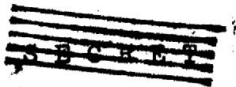

of enriched fuel, moderator and other diluents may a reactor become critical in the thermal region.

One notes that the critical size of a reactor depends upon the buckling and atom density of the fuel material, and that the critical mass is inversely proportional to the square of the U-235 atom density. As the conversion ratio is decreased by parasitic capture, the best converters have the following general design specifications.

1). small parasitic capture   
(2). large macroscopic transport cross-section   
3). large U-235 atom density   
4). high specific power

Items 1, 2 and 3 imply small critical mass (large buckling) and item 1 implies large conversion ratio. To bring in the last, important general design parameter for Pu-producing reactors, we note that the inventory charges on the final product are inversely proportional to specific power. To reduce the effect of inventory on the cost of Pu-239, we add item 4 to our list.

Recommendations for future work involving nuclear data which are important in fast reactors are to be found in detail in Section II-1.9. The major deficiency in data is to be found in the fast inelastic and capture cross-sections.

Paralleling this lack of information are a number of engineering deficiencies which are to be found in detail in the engineering analysis report. The major reason why these deficiencies are important nuclearwise is that they set an upper limit on the specific power of a fast reactor.

Until these deficiencies are removed by further basic research, we can not be certain of the feasibility of fast, non-aqueous, fluid-fuel reactors for the economical production of Pu-239.

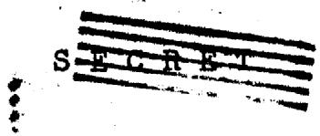

# 1.3 THERMAL CONVERTERS

Preliminary analysis of the U-Bi system showed that this was the best liquid alloy fuel for thermal reactors and that a reactor using this fuel would have an acceptable conversion ratio and critical mass. Since a fused salt system had been chosen for the fast reactor, it was decided to study the U-Bi system for a thermal reactor, in order that liquid metals could also be investigated by the Project.

A limited amount of study was also given to fused salts for thermal reactors, with the conclusion that solutions of $\mathrm{UF}_4$ in fused fluorides were the only ones competitive with the U-Bi fuel chosen for detailed investigation. Fluoride fuels merit further study. Of other fused salt possibilities, C1, Se, Te, Br, I, N and CN were eliminated because of unfavorable cross-sections; carbides, oxides, sulfides, silicides and arsenides because of high melting point; phosphates, sulfates and nitrates because of poor thermal and radiation stability. A more detailed report of the search for fused-salt mixtures for thermal reactors is described in the engineering analysis report.

The particular U-Bi thermal reactor studied consists of a core in which U-Bi solution flows through holes in a Be matrix. Some of the special problems which must be considered in choosing a particular design are conversion ratio, critical mass and inventory, processing rates, internal vs. external cooling, uniform or variable Bi/Be ratio, and control.

The maximum possible C.R. in a thermal converter employing U-235 is 1.10. This maximum is reduced by parasitic capture and leakage. A rough and ready criterion to test whether parasitic capture by the basic constituents of the reactor is excessive is

$$
\frac {N (s) \sigma_ {c} ^ {\prime} (s)}{N (2 5) \sigma_ {a} ^ {\prime} (2 5)} = \frac {N (s) \sigma_ {c} ^ {\prime} (s)}{N (\bar {U}) R \sigma_ {a} ^ {\prime} (2 5)} \leq . 1, \tag {1.3-1}
$$

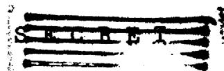

#

where $N(s) \leq (s)$ implies a summation over $s$ , the elements other than uranium. For the reactor design chosen, equation (1.3-1) yields a parasitic loss of .08 for the Bi and Be alone. To this value must be added the loss due to poisons.

The problem of poisons in the U-Bi-Be system studied divides into three parts. Two of these, the formation of fission products and of higher isotopes are quite general, since they are directly tied to the presence of fissionable material. The third, specific to the use of Be as moderator, is the formation of $\mathsf{Li}^6$ as a consequence of an $(\mathsf{n},\mathsf{a})$ reaction. A fourth possible source of poisoning, absorption by the products of the neutron reactions of Bi was not considered because of the complete absence of information on the cross-sections of its decay products.

The concentration of poisons which are formed directly in the liquid fuel can be kept to admissible values by sufficiently rapid processing. In this reactor, the Pu-239/U-238 ratio was determined by the requirement that the Pu-240 content of the product Pu be kept below the maximum allowable limit.

The fission product poisons where concentrations must be kept low are Xe and Sm which have anomalously large thermal absorption cross-sections; these are processed separately. The loss in C.R. due to fission product capture in the final reactor is .017, and that due to higher isotope capture .01.

The loss of neutrons resulting from the high energy neutron reactions of Be forms a particularly knotty problem. Though the direct loss resulting from the $(n, a)$ reaction is compensated by an $(n, 2n)$ reaction, the $\mathsf{Li}^6$ which is a decay product of the former reaction is lodged directly in the Be matrix and is therefore unremovable by processing of the liquid fuel. The loss in C.R. resulting from the high thermal capture of $\mathsf{Li}^6$ turns out to be .02, based on the

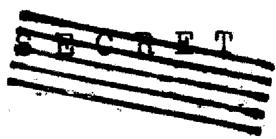

assumption of a six-year operating period for the Be.

The leakage of neutrons from the reactor constitutes as serious a loss as parasitic capture. Of course these neutrons could be all productively captured if one were willing to consider the added complexity, processwise and engineering-wise, of a substantially pure U-blanket. In the design of the thermal converter this added complexity was ruled out a priori by the requirement of structural and processing simplicity. It might be pointed out here, however, that if one attempted to design a two-region thermal converter, one would undoubtedly move away from the type of design in which one attempts to minimize the leakage, as required for a bare reactor. External conversion would become more important. Maximization of the leakage would effect a substantial saving in critical mass since the requirements of minimizing leakage and critical mass are directly opposed.

An attempt was made, within the restrictions imposed by the requirement of a single region reactor, to do something about reclaiming the fast leakage from a bare reactor. The basic strategem consists of having a specified zone on the outside of the reactor with radically reduced spatial density of Be, but with the same fuel mixture coursing through the Be matrix. The basic idea is to provide a low multiplication region of high resonance capture for the fast leakage and thus to increase the C.R. There are two attendant facts which nullify much of the gain thus achieved: first, that the outer zone is one of higher spatial density of fuel and one therefore pays in critical mass, and second, that the outer zone has perforce poor moderating power and that therefore a substantial fraction of the neutrons produced in this region will leak out as fast neutrons. Calculations show that there is still a net gain in C.R. compared to the homogeneous reactor with same critical mass, but that the saving is not as substantial as initially conceived. Some further

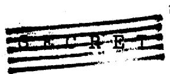

benefit might be achieved by including a reflector of fast neutrons on the outside of the reactor, but this possibility was not investigated.

The question of internal vs. external cooling was determined on the same basis as for the fast reactor; namely, the criteria of reliability and replaceability dictated the choice of external cooling. This decision had the effect of essentially doubling the inventory of fissionable material, since the external holdup is the same order of magnitude as the critical mass. On the grounds of costs alone, engineering studies seem to show that there is little to choose between the two methods, since the loss in C.R. due to the inclusion of structural materials required for internal cooling is balanced by the gain from decreased inventory.

Fianlly, the problem of control of the thermal converter is not nearly as serious a one as for the fast reactor. In particular, calculations of delayed neutron effectiveness show that the value of the dollar is decreased by less than $10\%$ of its no-flow value compared with the almost $50\%$ loss for the fast reactor.

# GLOSSARY - CHAPTER I

B.R. Breeding Ratio; gross atoms of Pu-239 produced per atom of Pu-239 destroyed (No U-235 fuel)

C.R. Conversion Ratio; gross atoms of Pu-239 produced per atoms of U-235 and Pu-239 destroyed

F.P. Fission Products

N(a) Number of atoms of type a per cm³

R Atomic enrichment fraction $= \frac{\mathrm{N}(25)}{\mathrm{N}(25) + \mathrm{N}(28)}$

Ratio of the number of parasitic neutron captures to the number of neutron captures producing a fission in fuel material, i.e.,

$$
\frac {N (a) \sigma_ {c} ^ {(a)}}{N (f) \sigma_ {f} ^ {(f u e l)}}
$$

for any element of type a, where the fuel is U-235 or Pu-239

Macroscopic cross-section; the subscripts on $\Sigma$ are defined as: tr = transport; a = absorption (fission + capture); s = elastic scattering; i = inelastic scattering; f = fission

Microscopic cross-section (per atom); subscripts same as for

# II. FAST REACTORS

# 1. NUCLEAR CONSTANTS

This chapter summarizes the calculations on fast reactors. Prior to presenting the results, an outline is given of the calculation methods. Important details are included in appendices. Since the reliability of the results depends directly on the nuclear constants, we begin with a brief resume of the values used in the NEP calculations.

# 1.1 TOTAL CROSS-SECTIONS

Extensive data are available on total cross-sections, $\sigma_{t}$ , because of the relative simplicity of such measurements. Total cross-sections do not enter reactor calculations per se but are of value in establishing upper limits for a) transport cross-sections $\sigma_{\mathrm{tr}}$ for fast neutrons and, b) absorption cross-sections $\sigma_{\mathrm{a}}$ for slow neutrons. Total cross-sections also provide some basis for the theoretical interpretation of neutron interactions. In some cases theory has been used to extend available experimental data and to estimate unmeasured nuclear constants.

A very complete compilation of neutron cross-sections (AECU-2040) has been published (August 1952) by the AEC Neutron Cross-Section Advisory Group. A classified supplement (BNL-170) summarizes the data available for heavy elements. We are indebted to the chairman, Dr. D. J. Hughes, for prepublication copies of these reports.

# 1.2 TRANSPORT CROSS-SECTIONS

The transport cross-section, which determines the net loss of forward momentum of a neutron, is defined as:

$$
\sigma_ {t r} = \sigma_ {t} - \int \sigma_ {s} (\theta) \cos \theta d \Omega \tag {1.2-1}
$$

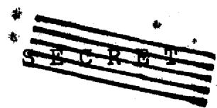

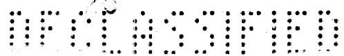

# TABLE II-1.2-1. Transport Cross-Sections

These cross-sections (in barns) used in all NEP fast reactor calculations

<table><tr><td>u</td><td>.5-1</td><td>1-2</td><td>2-3</td><td>3-3.75</td><td>3.75-4.5</td><td>4.5-5.5</td><td>5.5-7</td><td>7-10</td></tr><tr><td>Group</td><td>1</td><td>2</td><td>3</td><td>4</td><td>5</td><td>6</td><td>7</td><td>8</td></tr><tr><td>Pu-239</td><td>5.0</td><td>5.0</td><td>6.0</td><td>7.0</td><td>8.5</td><td>10.0</td><td>12.5</td><td>18</td></tr><tr><td>U-238</td><td>4.0</td><td>4.14</td><td>4.86</td><td>6.27</td><td>8.0</td><td>10.6</td><td>13.8</td><td>14.6</td></tr><tr><td>U-235</td><td>4.52</td><td>5.17</td><td>6.3</td><td>7.48</td><td>8.61</td><td>10.24</td><td>12.6</td><td>17.8</td></tr><tr><td>Bi</td><td>3.7</td><td>4.0</td><td>4.7</td><td>6.0</td><td>8.7</td><td>11.5</td><td>12.5</td><td>13.0</td></tr><tr><td>Pb</td><td>3.7</td><td>4.0</td><td>4.7</td><td>6.0</td><td>8.7</td><td>11.5</td><td>12.5</td><td>13.0</td></tr><tr><td>F.P.</td><td>3.35</td><td>3.7</td><td>4.35</td><td>4.92</td><td>5.35</td><td>5.75</td><td>6.3</td><td>7.12</td></tr><tr><td>Fe</td><td>2.1</td><td>2.09</td><td>2.29</td><td>3.4</td><td>3.48</td><td>3.92</td><td>4.18</td><td>11.2</td></tr><tr><td>C1</td><td>1.8</td><td>2.0</td><td>2.8</td><td>3.5</td><td>3.7</td><td>3.9</td><td>4.2</td><td>8.2</td></tr><tr><td>A1</td><td>1.752</td><td>2.017</td><td>2.852</td><td>3.851</td><td>3.956</td><td>2.911</td><td>1.118</td><td>1.496</td></tr><tr><td>Na</td><td>1.595</td><td>1.818</td><td>3.426</td><td>3.605</td><td>3.861</td><td>3.922</td><td>4.134</td><td>5.222</td></tr><tr><td>Be</td><td>1.028</td><td>1.534</td><td>3.045</td><td>3.755</td><td>4.272</td><td>4.936</td><td>5.181</td><td>5.42</td></tr></table>

These values obtained from KAPL except for the following: Pu-239, Bi and Cl extrapolation and interpolation of KAPL values using Feshbach-Weisskopf theory (NY0-636) as a guide, F.P. average values obtained from theoretical curves (NY0-636) weighted by fission yield (Steinberg and Freedman)

where $\sigma_{\mathrm{s}}(\theta)\mathrm{d}\Omega$ is the scattering cross-section into the solid angle $\mathrm{d}\Omega$ in direction $\theta$ . Clearly $\sigma_{\mathrm{tr}} < \sigma_{\mathrm{t}}$ .

Transport cross-sections enter all reactor calculations significantly. Measurements of $\sigma_{\mathrm{tr}}$ have been made for only a few of the elements of interest. Most of these data were obtained some time ago when experimental techniques were presumably less reliable. Accordingly, a consistent set of transport cross-sections can only be obtained by a judicious combination of theory and limited experimental data. The cross-sections used in all NEP fast reactor calculations were compiled by the group at KAPL under Dr. H. Hurwitz. Based on additional information gathered by the NEP, it suggests that some revisions in certain of the KAPL cross-sections may be in order. However, the KAPL cross-sections possess the virtue of having been consistent with a large number of critical mass measurements. Hence, we concluded that on the whole it would be prudent to use the complete set of KAPL values rather than make individual revisions.

The transport cross-sections used in all NEP fast reactor calculations are given in Table II-1.2-1. The values for Pu-239, Bi, F.P. (fission products) and Cl are NEP estimates. The other values were obtained from KAPL.

# 1.3 INELASTIC CROSS-SECTIONS

In nearly all the NEP fast reactor calculations, inelastic scattering is the predominant process in degrading neutrons from above to below 0.5 MeV. Below this energy, i.e. $u > 4$ , elastic scattering is the only process for degrading the neutron energy. The inelastic cross-sections used are given in Table II-1.3-1. The yield of inelastically scattered neutrons in other groups due to inelastic scattering in a given group is presented in the calculation sheet, Appendix A. More generally the assumed energy distributions of inelastically scattered neutrons as obtained from KAPL are summarized in Table II-1.3-2.

These cross-sections (in barns) used in all NEP fast reactor calculations

TABLE II-1.3-1. Inelastic Cross-Sections   

<table><tr><td>u*</td><td>.5-1</td><td>1-2</td><td>2-3</td><td>3-3.75</td></tr><tr><td>Group</td><td>1</td><td>2</td><td>3</td><td>4</td></tr><tr><td>Pu-239</td><td>.7</td><td>.7</td><td>.5</td><td></td></tr><tr><td>U-238</td><td>2.5</td><td>2.5</td><td>2.1</td><td>.85</td></tr><tr><td>U-235</td><td>1.2</td><td>1.2</td><td>.9</td><td></td></tr><tr><td>Bi</td><td>.8</td><td>.7</td><td>.4</td><td></td></tr><tr><td>Pb</td><td>.95</td><td>.88</td><td>.4</td><td>.0</td></tr><tr><td>F.P.</td><td>.84</td><td>.78</td><td>.31</td><td></td></tr><tr><td>Fe</td><td>.8375</td><td>.7875</td><td>.3125</td><td>.0</td></tr></table>

* Negligible above 4th group   
The values for U-238 are based on a re-analysis of the Snell and similar experiments (see KAPL-741).

# 29

TABLE II-1.3-2. Assumed Spectral Distribution of Inelastically Scattered Neutrons The fractional yield $\left(X_{i}\right)_{i} \rightarrow j$ in each of the energy groups (2-6) is shown due to inelastic scattering in a given higher energy group.   

<table><tr><td rowspan="2">Groupj\i</td><td rowspan="2">Rangeinu</td><td colspan="4">U-238 and U-236</td><td colspan="3">Pu-239 and U-235</td><td colspan="3">Fission Products and Fe</td><td colspan="3">Pb and Bi</td><td>Cl</td></tr><tr><td>1</td><td>2</td><td>3</td><td>4</td><td>1</td><td>2</td><td>3</td><td>1</td><td>2</td><td>3</td><td>1</td><td>2</td><td>3</td><td>1</td></tr><tr><td>2</td><td>1-2</td><td>.15</td><td>-</td><td>-</td><td>-</td><td>.10</td><td>-</td><td>-</td><td>.4</td><td>-</td><td>-</td><td>.4</td><td>-</td><td>-</td><td>0.2</td></tr><tr><td>3</td><td>2-3</td><td>.35</td><td>.35</td><td>-</td><td>-</td><td>.20</td><td>.20</td><td>-</td><td>.4</td><td>.6</td><td>-</td><td>.3</td><td>.6</td><td>-</td><td>0.6</td></tr><tr><td>4</td><td>3-3.75</td><td>.24</td><td>.33</td><td>.51</td><td></td><td>.30</td><td>.33</td><td>.51</td><td>.2</td><td>.4</td><td>1.0</td><td>.2</td><td>.3</td><td>.9</td><td>0.2</td></tr><tr><td>5</td><td>3.75-4.5</td><td>.16</td><td>.22</td><td>.34</td><td>.80</td><td>.20</td><td>.22</td><td>.34</td><td>-</td><td>-</td><td>-</td><td>.1</td><td>.1</td><td>.1</td><td>-</td></tr><tr><td>6</td><td>4.5-5.5</td><td>.10</td><td>.10</td><td>.15</td><td>.20</td><td>.20</td><td>.25</td><td>.15</td><td>-</td><td>-</td><td>-</td><td>-</td><td>-</td><td>-</td><td>-</td></tr></table>

These data, except for Cl, obtained from KAPL. There is considerable uncertainty in all values, since so few experimental measurements of $\chi_{i\rightarrow j}$ have been made.

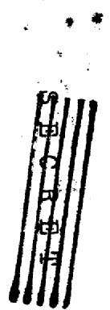

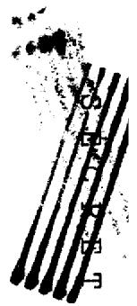

# 1.4 FISSION CROSS-SECTIONS

The fission cross-sections $\sigma_{\mathrm{f}}$ used are listed in Table II-1.4-1. These values are based on recent repeat measurements at Los Alamos which indicate a reduction of about 10 per cent is necessary in the fast region. For example, $\sigma_{\mathrm{f}}$ (Pu-239) has been reduced from 1.94 to 1.75 barns, which is of considerable practical importance, since it results in a significant reduction in estimated breeding ratios. Similarly, the reduction in the accepted value of $\sigma_{\mathrm{f}}$ (U-235) lowers practically attainable conversion ratios in the production of plutonium.

This revision in $\sigma_{\mathrm{f}}$ (Pu-239) has not been made in BNL-170. Apparently the revision in $\sigma_{\mathrm{f}}$ (U-235) has been made in this recent publication. It is uncertain whether the revision has been made in $\sigma_{\mathrm{f}}$ (U-238) and $\sigma_{\mathrm{f}}$ (U-236). The values for $\sigma_{\mathrm{f}}$ (238) as used by NEP were obtained from KAPL. The value, $\sigma_{\mathrm{f}}$ (U-238) = 0.5805 for group 1 is about 10 per cent lower than the average taken from the curve in BNL-170 for this group, indicating that the correction has not been applied. KAPL had no values for $\sigma_{\mathrm{f}}$ (U-236), hence the values used were taken from BNL-170 but without the 10 per cent revision. Because the concentration of U-236 is less than that of other fissionable materials in all of the reactors considered by NEP, this possible correction in $\sigma_{\mathrm{f}}$ (U-236) would result in a negligible change in all NEP calculations.

These cross-sections (in barns) used in all NEP fast reactor calculations

TABLE II-1.4-1. Fission Cross-Sections   

<table><tr><td>u</td><td>.5-1</td><td>1-2</td><td>2-3</td><td>3-3.75</td><td>3.75-4.5</td><td>4.5-5.5</td><td>5.5-7</td><td>7-10</td></tr><tr><td>Group</td><td>1</td><td>2</td><td>3</td><td>4</td><td>5</td><td>6</td><td>7</td><td>8</td></tr><tr><td>Pu-239</td><td>1.75</td><td>1.75</td><td>1.75</td><td>1.75</td><td>1.75</td><td>1.79</td><td>1.95</td><td>6</td></tr><tr><td>U-238</td><td>.5805</td><td>.3916</td><td>.0171</td><td>-</td><td>-</td><td>-</td><td>-</td><td>-</td></tr><tr><td>U-236</td><td>.86</td><td>.54</td><td>.1</td><td>-</td><td>-</td><td>-</td><td>-</td><td>-</td></tr><tr><td>U-235</td><td>1.2</td><td>1.2</td><td>1.22</td><td>1.43</td><td>1.74</td><td>2.1</td><td>2.82</td><td>6.54</td></tr></table>

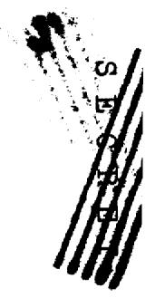

Values for Pu-239 from BNL-170 with $10\%$ downward revision (see text). Values for U-235 and U-238 from KAPL. Values for U-236 from BNL-170.

# 1.5 CAPTURE CROSS-SECTIONS

It is evident from Table II-1.5-1 that the capture cross-sections of the fissionable elements and of the fission products predominate over those of the other elements present except for unusually high concentrations of diluents. The rapid increase in capture cross-section with decreasing energy for both U-235 and Pu-239 imposes serious limitations on the minimal energy allowable in the neutron spectrum in fast breeders and converters. In general, fast reactors designed primarily for the production of plutonium, have too low breeding or conversion ratios to be considered practicable if the neutron spectrum has an average value below $\sim 0.1$ MeV, i.e. $u > 5$ .

The capture cross-section of fissionable nuclei is generally expressed as the ratio $\alpha = \sigma_{\mathrm{c}} / \sigma_{\mathrm{f}}$ . Unfortunately, the data on $\alpha$ in the fast region are so sparse and so uncertain that only rough estimates can be made of the variation with energy. Unpublished values of $\alpha(\mathrm{Pu})$ obtained from KAPL are:

$\mathbf{E}_{\mathfrak{n}}(\mathbf{kev})$ : 0.15 1.2 3. 10. 122.

a(Pu) 0.7+0.1 0.6+0.15 0.52+0.17 .43+.09 0.1+0.1

For want of any better data, a smooth curve was drawn through the mean values and extrapolated to $\alpha = .02$ at 10 Mev. The values of $\sigma_{c}^{\prime}$ (Pu-239) for the 8 energy groups listed in Table II-1.5-1 were obtained from this very approximate curve.

Similarly the values of $\sigma_{\mathrm{c}}(\mathrm{U} - 235)$ were obtained from KAPL's unpublished curve of $\alpha (\mathrm{U} - 235)$ as a function of energy.

A value of $0.45^{+} - .05$ is reported in BNL-170 for pile filtered neutrons with a broad energy spread of mean value 15 kev.

Roughly the same uncertainty exists in $a(U - 235)$ as in $a(Pu - 239)$ .

Recent information from BNL and KAPL suggests that the values of $\sigma_{\mathrm{c}}(\mathrm{Bi})$ given in Table II-1.5-1 should be revised. Measurements with the pile oscillator at ANL and by activation using thermal neutrons have established that $\mathrm{Bi}^{210}$ formed by $\mathrm{Bi}^{209}(\mathrm{n},\gamma)$ decays both by $\beta$ and a emission with a branching ratio of about 50 per cent. Hence the single experimental value of $\sigma_{\mathrm{c}}(\mathrm{Bi}) = .0034$ barn at 1 MeV (group 3) as measured by Hughes from induced $\beta$ activity should be doubled. Since the values for groups 1 and 2 are based on Hughes value at 1 Mev, it might be concluded that these should also be doubled. However, some unpublished experiments at KAPL suggest that $\sigma_{\mathrm{c}}(\mathrm{Bi})$ , unlike its non-magic neighboring nuclei, is essentially constant over the eight energy groups. Transmission measurements at KAPL indicate no detectable variation of $\sigma_{\mathrm{c}}(\mathrm{Pb})$ with neutron energy.

Other experiments indicate no significant difference in this respect between Pb and Bi. If these conclusions are correct $\sigma_{\mathrm{c}}^{\mathrm{(Bi)}} \simeq .007$ barn for each of the 8 energy groups rather than increasing with decreasing neutron energy as assumed in Table II-1.5-1. Corrections of the fast reactor calculations for Bi systems can be accomplished easily by reference to the detailed balance sheets of Section II-3.2. However, an estimate has been made based on the one-group method which indicates that the correction in the conversion ratio is generally less than $10\%$ . Table II-1.5-2 presents the effects of changing the capture cross-section of Bi on the conversion ratio for System 12.

TABLE II-1.5-1. Capture Cross-Sections  
These cross-sections (in barns) used in all NEP fast reactor calculations   

<table><tr><td>u</td><td>.5-1</td><td>1-2</td><td>2-3</td><td>3-3.75</td><td>3.75-4.5</td><td>4.5-5.5</td><td>5.5-7</td><td>7-10</td></tr><tr><td>Group</td><td>1</td><td>2</td><td>3</td><td>4</td><td>5</td><td>6</td><td>7</td><td>8</td></tr><tr><td>Pu-239</td><td>.05</td><td>.07</td><td>.088</td><td>.14</td><td>.23</td><td>.41</td><td>.7</td><td>3.3</td></tr><tr><td>U-238</td><td>.015</td><td>.05</td><td>.13</td><td>.16</td><td>.22</td><td>.32</td><td>.52</td><td>1.0</td></tr><tr><td>U-235</td><td>.065</td><td>.065</td><td>.075</td><td>.12</td><td>.207</td><td>.375</td><td>.726</td><td>2.4</td></tr><tr><td>Bi</td><td>.0025</td><td>.003</td><td>.0034</td><td>.007</td><td>.009</td><td>.015</td><td>.03</td><td>.07</td></tr><tr><td>Pb</td><td>.0025</td><td>.0025</td><td>.0025</td><td>.0025</td><td>.0025</td><td>.0025</td><td>.0025</td><td>.0025</td></tr><tr><td>F.P.</td><td>.002</td><td>.006</td><td>.052</td><td>.125</td><td>.195</td><td>.27</td><td>.38</td><td>.576</td></tr><tr><td>Fe</td><td>.001</td><td>.001</td><td>.0013</td><td>.0039</td><td>.0062</td><td>.0097</td><td>.01</td><td>.013</td></tr><tr><td>Cl</td><td>.0006</td><td>.0007</td><td>.001</td><td>.0018</td><td>.0034</td><td>.0063</td><td>.0085</td><td>.0113</td></tr><tr><td>Al</td><td>.0004</td><td>.0004</td><td>.0004</td><td>.0004</td><td>.0004</td><td>.0004</td><td>.0004</td><td>.00092</td></tr><tr><td>Na</td><td>.00027</td><td>.00027</td><td>.00027</td><td>.00027</td><td>.00027</td><td>.00028</td><td>.00049</td><td>..02211</td></tr></table>

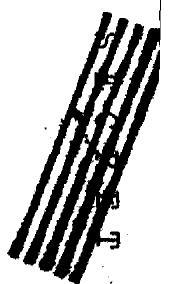

For Pu-239 and U-235 see text.

Values for U-238 from BNL-170, p. 35.

Values for Cl and Bi based on single measurements by Hughes at 1 Mev extrapolated to other energies with average slope obtained from measured values for neighboring elements.

Estimates for F.P. based on yields and measured values when available. Consideration given to low values for magic numbered isotopes; however, energy variation assumed to be the same as for non-magic.

All other cross-sections from KAPL.

$\widetilde{\mathcal{O}}_{\mathbf{c}}(\mathbf{Pb})$ probably should rise with decreasing energy although magicity $(Z = 82)$ for all isotopes and $(N = 146)$ for $\mathbf{Pb} - 208$ may cause $\widetilde{\mathcal{O}}_{\mathbf{c}}$ to remain essentially constant as assumed by KAPL.

Effect of Changing $\sigma_{\mathrm{c}}(\mathrm{Bi})$ on C.R. in U-Bi Systems; One-Group Calculation. System12; U-235:U-238:Bi-1:3:40

TABLE II-1.5-2  

<table><tr><td>Assumed value of σc(Bi) in fifth u group</td><td>I.C.R.</td><td>X.C.R.</td><td>T.C.R.</td></tr><tr><td>.009 barns</td><td>.339</td><td>.683</td><td>1.022</td></tr><tr><td>.004 barns</td><td>.339</td><td>.786</td><td>1.125</td></tr></table>

# 1.6 SCATTERING CROSS-SECTIONS

Since the scattering cross-sections $\sigma_{\mathrm{s}}$ always enter the calculations in the form $\xi \sigma_{\mathrm{s}}$ , where $\xi =$ the mean logarithmic energy loss, this product, called the degradation, is given for each of the elements in each energy group in Table II-1.6-1. $\xi$ is calculated from the atomic weight in the usual manner. The values of $\xi \sigma_{\mathrm{s}}$ are considered quite reliable, except, possibly, for that of Cl (which is the principal source of elastic degradation unfortunately in the fused salt reactor).

# 37

TABLE II-1.6-1. Degradation: Product of Scattering Cross-Section and Mean Logarithmic Energy Decrement $(\zeta \sigma_{s})$   
These values used in all NEP fast reactor calculations   

<table><tr><td>u</td><td>.5-1</td><td>1-2</td><td>2-3</td><td>3-3.75</td><td>3.75-4.5</td><td>4.5-5.5</td><td>5.5-7</td><td>7-10</td></tr><tr><td>Group</td><td>1</td><td>2</td><td>3</td><td>4</td><td>5</td><td>6</td><td>7</td><td>8</td></tr><tr><td>Pu-239</td><td>.037</td><td>.037</td><td>.046</td><td>.061</td><td>.071</td><td>.078</td><td>.084</td><td>.089</td></tr><tr><td>U-238</td><td>.037</td><td>.037</td><td>.046</td><td>.061</td><td>.071</td><td>.078</td><td>.084</td><td>.089</td></tr><tr><td>U-235</td><td>.037</td><td>.037</td><td>.046</td><td>.061</td><td>.071</td><td>.078</td><td>.084</td><td>.089</td></tr><tr><td>Bi</td><td>.038</td><td>.039</td><td>.045</td><td>.063</td><td>.085</td><td>.111</td><td>.120</td><td>.125</td></tr><tr><td>Pb</td><td>.038</td><td>.039</td><td>.045</td><td>.063</td><td>.085</td><td>.111</td><td>.120</td><td>.125</td></tr><tr><td>F.P.</td><td>.055</td><td>.081</td><td>.106</td><td>.120</td><td>.122</td><td>.122</td><td>.121</td><td>.119</td></tr><tr><td>Fe</td><td>.103</td><td>.096</td><td>.094</td><td>.122</td><td>.122</td><td>.137</td><td>.147</td><td>.4</td></tr><tr><td>Cl</td><td>.139</td><td>.144</td><td>.179</td><td>.197</td><td>.206</td><td>.217</td><td>.234</td><td>.455</td></tr><tr><td>Al</td><td>.176</td><td>.192</td><td>.256</td><td>.288</td><td>.303</td><td>.215</td><td>.082</td><td>.11</td></tr><tr><td>Na</td><td>.194</td><td>.209</td><td>.347</td><td>.323</td><td>.346</td><td>.351</td><td>.369</td><td>.454</td></tr><tr><td>Be</td><td>.213</td><td>.320</td><td>.64</td><td>.787</td><td>.955</td><td>1.103</td><td>1.16</td><td>1.211</td></tr></table>

These values obtained from KAPL except for the following:

Pu-239 taken same as U-238 since $\mathfrak{T}_{\mathbf{t}}$ 's are in good agreement between 0.3 to 3.5 MeV (BNL-170). The absence of data on Cl necessitated an interpolation of the KAPL values for Na, Al and Fe. The values for F.P. obtained by plotting averaged $\xi \sigma_{s}$ for known F.P. versus energy (weighted for yield), averaging and interpolating.

# 1.7 NEUTRON YIELDS

One of the most important parameters in the calculations of critical mass and conversion ratio is the number of neutrons per fission v. The experimental values used in NEP calculations were:

$$
\begin{array}{l} v (U - 2 3 5) = 2. 4 7 \\ v (P u - 2 3 9) = 2. 9 7 \\ \end{array}
$$

Assumed values were:

$$
v (U - 2 3 6) = v (U - 2 3 8) = 2. 5 0
$$

The latter are more important in fast reactors than in thermal reactors, since the fast effect (in U-236 and U-238) contributes from about 8 to 15 per cent of the total number of fissions in the fast reactors considered.

# 1.8 NEUTRON SPECTRA

The fission spectrum for all but delayed neutrons (which are substantially lower in energy(a)) is given in the following table:

<table><tr><td>Group</td><td>u = ln(Eo/E)</td><td>f</td></tr><tr><td>1</td><td>0.5 - 1.0</td><td>.1344</td></tr><tr><td>2</td><td>1 - 2</td><td>.4522</td></tr><tr><td>3</td><td>2 - 3</td><td>.2954</td></tr><tr><td>4</td><td>3 - 3.75</td><td>.0807</td></tr><tr><td>5</td><td>3.75 - 4.5</td><td>.0373</td></tr></table>

These are the KAPL yields of fission neutrons in each of the indicated groups. They have been used for all fissionable

(a)

No correction was made for the fact that the delayed neutrons have a lower mean energy than the prompt neutrons.

elements in all NEP calculations. While there is probably some variation in $x_{j}$ between different fissionable nuclei, this difference is probably not sufficient to affect seriously any of the NEP calculations.

Since only limited attention was given to control problems by the NEP, accurate values for the half-lives and yield of delayed neutrons were not essential. The values quoted by Glasstone and Edlund were used, namely:

<table><tr><td>T1in sec.</td><td>Fraction βi</td><td>Energy in MeV</td></tr><tr><td>0.43</td><td>0.00084</td><td>0.42</td></tr><tr><td>1.52</td><td>0.0024</td><td>0.62</td></tr><tr><td>4.51</td><td>0.0021</td><td>0.43</td></tr><tr><td>22.0</td><td>0.0017</td><td>0.56</td></tr><tr><td>55.6</td><td>0.00026</td><td>0.25</td></tr></table>

# 1.9 RECOMMENDATIONS

In the course of the NEP studies, the need arose for new nuclear data and for improvements in existing measurements. This section outlines these needs specifically, and makes some suggestions regarding methods of satisfying them in the future.

The fast reactors considered by NEP have neutron spectra peaked in the range of 100-300 kev. This energy region is beyond the reach of velocity selectors and below the fission spectrum. However, it is conveniently covered by electrostatic generators, for example, via the $\mathsf{Li}^{7}(\mathsf{p},\mathsf{n})$ reaction. By means of such sources the fast cross-sections needed can probably be obtained most expeditiously.

Fewer gaps appear in the thermal data. These can be filled quite readily using pile sources (ANL, ORNL and BNL) provided qualified personnel can be attracted to these problems.

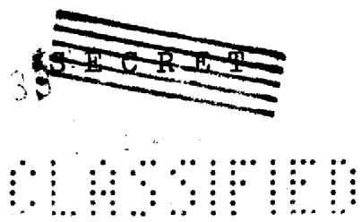

CAPTURE CROSS-SECTIONS. - In the thermal region capture cross-sections may be measured by transmission methods (large $\mathfrak{O}_{\mathbf{c}}$ ) and by diffusion methods (small $\mathfrak{O}_{\mathbf{c}}$ ) in addition to being measurable in some cases (both large and small $\mathfrak{O}_{\mathbf{c}}$ ) by activation methods. However, in the region of primary interest (100 - 300 kev) for fast reactors, the capture cross-sections of all elements are so much less than the scattering cross-sections that transmission and diffusion methods cannot be used. Hence, nearly all of the measurements in this region have been made by bombardment of the elements with neutrons of more or less well-defined energy followed by measurements on the reaction products; either induced radioactivity or isotopic abundance.

These methods have a number of limitations. When radioactive isotopes are produced in even atomic-numbered elements which often have several isotopes, there may be some uncertainty as to which isotope is activated. If this is not a serious problem, it may still happen that the abundance of the isotope activated may be small and non-representative of the element as a whole. The half-life of the radioisotope formed must be convenient for activation and measurement. The radiations emitted must be sufficiently energetic to be measured and must be readily distinguished from radiations (if any) emitted by the target element. Many elements, especially those of promise in reactor design, have too low cross-sections to be measured except in large neutron fluxes. The last limitation is especially critical when an electrostatic generator is being used as the neutron source.

Despite these difficulties, enough data are available to allow some fairly reliable general conclusions to be drawn. As indicated in Section II-1.5, experiments have established that $\sigma_{\mathrm{c}}$ increases rapidly with decreasing energy below 1 MeV for most elements. It is also well established that the cross-section increases with increasing atomic weight and that the magic nuclei (atomic number and/or neutron number

2, 8, 20, 50, 82, 126) have unusually low capture cross-sections. Some rough measurements at KAPL suggest for Pb and possibly for Bi that $\sigma_{\mathrm{c}}$ is not nearly as dependent on energy as for non-magic nuclei. This hypothesis is of practical value and should be investigated experimentally. If this proves to be true, certain of the fission products will be less absorptive than has heretofore been assumed. What is more important, the magic nuclei, Pb and Be, which have good engineering properties, will also be shown to have unusually good nuclear properties for fast reactors.

Measurements of capture cross-sections in U-235 and Pu-239, obtained from the U-236 and Pu-240 formed, give only rough indications of their energy dependence. Danger coefficient measurements are only of slightly better reliability. Improvements in the knowledge of these capture cross-sections are urgently needed.

CHLORINE. - If fused salt reactors continue to be of practical interest, further information is needed on the cross-sections of chlorine. $\mathfrak{T}_{\mathrm{t}}(\mathrm{Cl})$ has been measured only up to 280 ev. $\mathfrak{T}_{\mathrm{c}}(\mathrm{Cl}^{37}) = 0.74 \mathrm{mb}$ has been obtained by Hughes et al for fission neutrons, (mean energy about 1 Mev). Assuming this value applies to chlorine as a whole ( $25\% \mathrm{Cl}^{37}$ ), $0.74 \mathrm{mb}$ was used as the single experimental point on a curve whose slope was obtained from a combination of theory and experiment (TMS-5). Average cross-sections for the other seven energy groups were obtained from this curve (linear on semi-log plot). The activation cross-section $\mathfrak{T}_{\mathrm{c}}(\mathrm{Cl}^{37})$ should be extended below 1 Mev, and the capture cross-section of Cl as a whole determined from 0.1 to 1 Mev if possible.

IRON GROUP (Mn, Fe, Co, Ni). - These elements are of importance as structural materials. Only Fe has been considered in the NEP calculations. As indicated above, the values of $\sigma_{\mathrm{c}}^{\prime}(\mathrm{Fe})$ in the fast region were obtained from KAPL. These probably were derived by analogy with neighboring

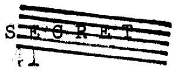

nuclei since there appear to be no measured values for Fe in the literature.

Activation measurements on Co $^{59}$ and Ni $^{64}$ have been made only at 1 Mev. Fairly complete data on Mn have been obtained from .03 to 3 Mev. It would be desirable to have similar data for Fe, Co and Ni.

Pb AND Bi. - These two magic nuclei are so important as possible constituents in fast reactors (coolants, reflectors, controls and blanket components) that a special effort should be made to establish $\sigma_{\mathrm{c}}^{\prime}(\mathrm{Pb})$ and $\sigma_{\mathrm{c}}^{\prime}(\mathrm{Bi})$ over the energy range 0.1 to 1 MeV.

U-236. - In order to keep down the reprocessing costs, it is necessary to allow substantial buildup of U-236 (0.2 atoms U-236 to 1 atom U-235) to occur before sending the fluid fuel of the fast converter through the gaseous diffusion plant for separation of U-235 and U-236. For this reason accurate knowledge of $\sigma_{\mathrm{c}}$ (U-236) is of importance. In the NEP fast reactor calculations, it was assumed (purely ad hoc) that U-236 has the same capture cross-section as U-238. This was necessary since no data on $\sigma_{\mathrm{c}}$ (U-236) in the fast region appear to be available. Obviously this uncertainty should be removed by experimental measurements of $\sigma_{\mathrm{c}}$ (U-236).

U-235 AND Pu-239. - Better knowledge of the capture cross-sections of U-235 and Pu-239 in both the slow and fast regions is urgently needed. This lack results in serious uncertainties in the design of the most economical reactors for the production of plutonium.

Not only are these measurements difficult to make, but the results are difficult to interpret unambiguously. Weisskopf has reviewed the situation in a preliminary report (NDA Memo-15B-1) received near the end of the summer (1952). As he points out, the easiest region to measure is at low

energies where scattering is negligible compared to fission and capture. Under these conditions $\alpha$ is determined by measuring the peak values of $\sigma_{t}$ and $\sigma_{f}$ :

$$
a = \left(\frac {\sigma_ {t} - \sigma_ {f}}{\sigma_ {f}}\right) p e a k
$$

He states, however: "Unfortunately the resolving power of the relevant measurements is not adequate, and the observed peak value corresponds to the actual one only for the first few ev. At higher energies, the observed peak value is much less than the actual one and in the case of the total cross-section it contains a good deal of the potential scattering taking place between resonances". Reference is made to KAPL-377 and KAPL-394 for an analysis of the U-235 levels made at G.E. based upon very unreliable data. While theory is of value as a guide, what is really needed for the low energy region is an improvement of resolving power in the fission as well as the total cross-section measurements.

Two types of measurements have been made at higher energies - both give only rough indications of the energy dependence because of the broad spectral distributions of the neutrons. In the first method (KAPL-183), samples of U-235 and Pu-239 are enclosed in shields of different thicknesses and composition, and are irradiated at Hanford. $\sigma_{\mathrm{c}}(\mathrm{U} - 235)$ is obtained from mass spectrographic measurements of the U-236 produced and $\sigma_{\mathrm{c}}(\mathrm{Pu} - 239)$ from measurement of the spontaneous fission in the Pu-240 produced. The second method consists in measurement of the danger coefficient at different locations in several reactors. The energy spectra of the neutrons at these locations are known only approximately. a can be calculated from the danger coefficients. This method requires a correction for the thickness of sample irradiated - a procedure which is not very reliable.

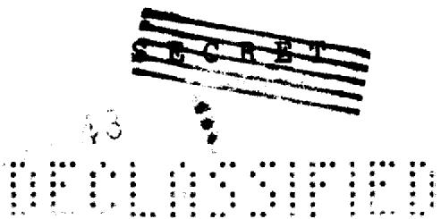

Thus it appears that improvement in the knowledge of the a's in the fast region can be attained by these two methods only with considerable further experimental effort. This effort is amply justified by the need for these data.

A possible technique which apparently has not been tested is to determine a from the prompt gamma rays emitted during fission and capture. Through the use of scintillation counters (NaI-T1I) one might be able to distinguish between the fission and capture gammas since the latter should have a higher energy component. If this is possible, monoenergetic neutrons from the $\mathrm{Li}^{7}(\mathfrak{p},\mathfrak{n})$ reaction could be used to irradiate a conical sample of U-235 or Pu-239 surrounding the scintillation detector which is shielded from the direct beam by a cone of boro-paraffin.

TRANSPORT CROSS-SECTIONS. - Measurements of $\sigma_{\mathrm{tr}}$ have been made for only a few of the elements in the NEP calculations. Fortunately, except for Cl, values of $\sigma_{\mathrm{t}}$ are available and these set upper limits for the values of $\sigma_{\mathrm{tr}}$ . In addition the theory is fairly reliable and can be used for interpolation between measured elements. It would be of particular value to have $\sigma_{\mathrm{tr}}(\mathrm{Cl})$ or alternatively $\sigma_{\mathrm{t}}(\mathrm{Cl})$ in the fast region. This should not be difficult - C Cl4 might be used as scatterer. At present $\sigma_{\mathrm{t}}(\mathrm{Cl})$ has been measured only to 400 ev. $\sigma_{\mathrm{tr}}(\mathrm{Bi})$ has been assumed the same as $\sigma_{\mathrm{tr}}(\mathrm{Pb})$ (some experimental data). $\sigma_{\mathrm{tr}}(\mathrm{F.P.})$ was obtained by interpolation and $\sigma_{\mathrm{tr}}(\mathrm{Pu}-239)$ by extrapolation of the limited experimental values for other elements. While large differences are not expected, reliable experimental measurements on the elements of interest should be obtained as soon as possible.

SCATTERING CROSS-SECTIONS. - Values of $\sigma_{s}$ can be obtained with sufficient reliability from $\sigma_{t}$ . Hence, the only urgent data needed are for chlorine (see above).

FISSION CROSS-SECTIONS. - Except for the 10 per cent downward revision, which appears to be in process of general acceptance, and the unknown value of $\mathfrak{S}_{\mathbf{f}}(2^{40})$ , the fission cross-sections used by N.E.P. appear to be of adequate reliability for such preliminary design calculations. For more refined calculations, more accurate values of $\mathfrak{S}_{\mathbf{f}}$ in the region of 100 to 300 kev would be required.

INELASTIC CROSS-SECTIONS. - The need for improvement in inelastic cross-sections is widely recognized. This has been glaringly evident for some time in shielding studies and is becoming of increasing urgency in reactor calculations. These measurements are unusually difficult to make with electronic detectors, and easy, but extremely, tedious with photographic emulsions as detectors of the knock-on protons.

In the NEP calculations the KAPL values of $\sigma_{\mathbf{i}}$ and $x_{i\rightarrow j}$ were taken over without critical review even though it was recognized from the outset that these data are probably quite uncertain. These cross-sections and the assumed energy distribution of inelastically scattered neutrons enter the calculations very significantly in that they determine to a great extent the average energy of the neutron spectrum, and therefore the mean effective $\bar{\alpha}$ and the percentage of fast fissions.

In addition to adding to the theory of the nucleus, the cross-sections and energy distributions of inelastically scattered neutrons by reactor fuels, diluents, and structural materials are urgently needed for accurate design calculations of fast reactors.

NEUTRON YIELDS. - In all NEP calculations it was tacitly assumed that the $\nu$ of each fissionable element is independent of energy. While this is very likely, experimental confirmation is desirable.

It was also assumed that $v(U - 238) = v(U - 236) = 2.50$

and $v(U - 235) = 2.47$ . This important parameter has only been measured reliably for the last of these three isotopes. The fact that in fast reactors, U-236 and U-238 can account for $15\%$ of the total number of fissions and that the fast fission effect in U-238 in the blanket helps to offset the neutron loss due to parasitic capture in structural materials emphasizes the importance of accurately determining $v$ of U-238.

# RESUME OF NUCLEAR DATA NEEDED:

1. Capture cross-sections.

a. Ascertain whether magic nuclei are less energy dependent than non-magic.   
b. Improved resolving power is required in the fission and total cross-section measurements in order to obtain reliable values of the capture cross-sections of U-235 and Pu-239 up to several hundred electron volts.   
c. Obtain $\mathfrak{O}_{\mathbf{c}}(\mathbf{Cl})$ and $\mathcal{O}_{\mathbf{c}}(\mathbf{U - 236})$ as functions of energy in the fast region.   
d. Obtain $\mathfrak{O}_{\mathbf{c}}(\mathrm{Fe})$ , $\mathfrak{O}_{\mathbf{c}}(\mathrm{Co})$ , $\mathfrak{O}_{\mathbf{c}}(\mathrm{Ni})$ , $\mathfrak{O}_{\mathbf{c}}(\mathrm{Bi})$ and $\mathfrak{O}_{\mathbf{c}}(\mathrm{Pb})$ as functions of energy in the fast region.

2. Transport cross-sections.

a. $\sigma_{\mathrm{tr}}$ (or $\sigma_{\mathrm{t}}$ ) for chlorine particularly needed in fast region.   
b. $\widetilde{\sigma}_{\mathrm{tr}}$ (Bi), $\widetilde{\sigma}_{\mathrm{tr}}$ (Pu-239) and $\widetilde{\sigma}_{\mathrm{tr}}$ of intermediate elements representative of the fission products should be obtained.

3. Inelastic cross-sections.

a. Improvement should be made in the experimental values of the inelastic cross-sections of U-238, Pb, Bi and Fe.   
b. Measurements of $\sigma_{i}$ (Pu-239), $\sigma_{i}$ (U-235) and $\sigma_{i}$ (Cl) especially in the energy range 0.2 to 1

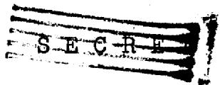

Mev.

c. Additional information is needed on the energy distribution of inelastically scattered neutrons even though it is recognized that these measurements are difficult and tedious.

4. Fission Cross-sections.

a. $\sigma_{\mathrm{f}}(\mathrm{Pu - }240)$ as a function of energy.

The following table checks the most urgently needed nuclear data in the fast region (100 to 3000 kev)

TABLE II-1.9-1. Resume of Nuclear Data Needed   

<table><tr><td>Element</td><td>v</td><td>σc</td><td>σf</td><td>σi</td><td>αtr</td><td>σs</td></tr><tr><td>U-235</td><td></td><td>*</td><td></td><td>*</td><td></td><td></td></tr><tr><td>U-236</td><td>*</td><td>*</td><td></td><td>*</td><td></td><td></td></tr><tr><td>U-238</td><td>*</td><td></td><td></td><td>*</td><td></td><td></td></tr><tr><td>Bi</td><td></td><td>*</td><td></td><td>*</td><td>*</td><td>*</td></tr><tr><td>Pb</td><td></td><td>*</td><td></td><td>*</td><td>*</td><td>*</td></tr><tr><td>Cl</td><td></td><td>*</td><td></td><td>*</td><td>*</td><td>*</td></tr><tr><td>Fe</td><td></td><td>*</td><td></td><td>*</td><td></td><td></td></tr><tr><td>Co</td><td></td><td>*</td><td></td><td>*</td><td></td><td></td></tr><tr><td>Ni</td><td></td><td>*</td><td></td><td>*</td><td></td><td></td></tr><tr><td>Na</td><td></td><td>*</td><td></td><td></td><td></td><td></td></tr><tr><td>Pu-239</td><td></td><td>*</td><td></td><td>*</td><td>*</td><td>*</td></tr><tr><td>Pu-240</td><td>*</td><td>*</td><td>*</td><td>*</td><td>*</td><td>*</td></tr><tr><td>Pu-241</td><td>*</td><td>*</td><td>*</td><td>*</td><td>*</td><td>*</td></tr></table>

(* stands for information needed)

# 2. CALCULATION METHODS

# 2.1 BARE REACTOR MULTIGROUP METHOD

At steady state the rate of removal of neutrons from each energy group a (leakage + absorption + inelastic scattering + degradation by elastic scattering) equals the rate of addition (fission + elastic and inelastic scattering from higher energy groups). The bare reactor multigroup approximation to the age equation for this steady state condition can be written:

$$
\begin{array}{l} - \left(\frac {1}{3} \Sigma_ {\tau r}\right) _ {\alpha} \nabla^ {2} \Phi_ {\alpha} + \left(\Sigma_ {a}\right) _ {\alpha} \Phi_ {\alpha} + \left(\Sigma_ {i}\right) _ {\alpha} \Phi_ {\alpha} + \left(\frac {5}{F U} \Sigma_ {s}\right) _ {\alpha} \Phi_ {\alpha} = \\ \left(x _ {f}\right) _ {\alpha} \nu_ {c} \int_ {\beta = 1} ^ {\beta = n} \left(\Sigma_ {f}\right) _ {\beta} \Phi_ {\beta} + \left(\frac {\xi}{F U} \right) _ {\alpha - 1} \Phi_ {\alpha - 1} + \int_ {\beta = 1} ^ {\beta = \alpha - 1} \left(\Sigma_ {i}\right) _ {\beta} \Phi_ {\beta} (2. 1 - 1) \\ \end{array}
$$

These and all other symbols used are defined in the glossary which is appended at the end of this report. In these equations it is implicitly understood that $\nu, \Sigma$ and the inelastic spectra are summed over the appropriate nuclear species.

Since the flux distribution has the form:

$$
\Phi_ {\alpha} (r) = \frac {\sin k r}{r} \varphi_ {\alpha} \tag {2.1-2}
$$

we can write eq. (2.1-1) as:

$$
\begin{array}{l} \left\{k ^ {2} \left(\frac {1}{3 Z _ {t r}}\right) _ {\alpha} + \left(Z _ {i}\right) _ {\alpha} + \left(Z _ {i}\right) _ {\alpha} + \left(\frac {f Z _ {s}}{F U}\right) _ {\alpha} \right\} \varphi_ {\alpha} = \tag {2.1-3} \\ \left(\chi_ {f}\right) _ {\alpha} 2 c \int_ {\beta = 1} ^ {\beta = n} \left(Z _ {f}\right) _ {\beta} \varphi_ {\beta} + \left(\frac {f Z _ {s}}{F U}\right) _ {\alpha - 1} \varphi_ {\alpha - 1} + \int_ {\beta = 1} ^ {\beta = \alpha - 1} \left(X _ {i}\right) _ {\beta - \alpha} \left(Z _ {i}\right) _ {\beta} \varphi_ {\beta} \\ \end{array}
$$

For the solution of eq. (2.1-3) it is convenient to scale the system to one source neutron, i.e. let:

$$
v _ {c} \int_ {\beta = 1} ^ {\beta = n} (\Sigma_ {f}) _ {\beta} \varphi_ {\beta} = 1 \tag {2.1-4}
$$

：

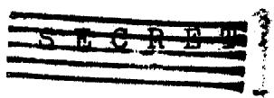

It is also convenient to take the macroscopic cross-sections as per atom of fuel, i.e. to divide the macroscopic cross-sections by the atomic density of fuel. In this way only atomic ratios enter the calculations. The conversion to more usual units need then be considered only for the calculation of the critical mass.

The solution proper is substantially a matter of detailed bookkeeping of the neutrons. A convenient form, obtained at G.E., has been used. A typical example is given in Appendix A together with a step-by-step procedure for carrying through the calculation.

After a consistent calculation has been completed, one can obtain the following information for the bare reactor:

a). Internal conversion ratio   
b). External conversion ratio   
c). Mean effective $\overline{\alpha}$   
d). Critical radius and critical mass   
e). Spectrum of fissions, i.e. percentage of fissions due to neutrons in a given energy range   
f). Spectrum of neutron flux   
g). Fraction of fast fissions   
h). Detailed neutron balance

# 2.2 MULTIGROUP ESTIMATES FOR BLANKET

The method of calculation described in Sec. 2.1 represents the basic method employed by this Project to obtain reliable information about neutron spectra and conversion ratios (See Section II-3) for a reasonable number of different systems in a severely limited amount of time. The actual system which consisted of, in addition to the core, a blanket or a blanket and reflector will have properties which may differ substantially from those predicted for a bare reactor; one can decide this question only on the basis of multigroup-multiregion calculations for which there was insufficient time to complete more than two. The methods to be described in this section may be viewed as complementary procedures designed to investigate the possible range of spectra in these outer regions, and the effect on the conversion ratios, and to provide additional spectra for one-and two-group calculations.

These methods have been called:

a). Equilibrium blanket (e.b.)   
b).Driven blanket (d.b.)   
c). Intermediate blanket (i.b.)   
d). Strong coupling (s.c.)

We shall describe these methods in turn. In order to compare results, the numerical calculations were made on the same core-blanket system (Core: System #2 in Table II-3.2-1; Blanket: UCl4).

a). Equilibrium blanket. - The actual integration of the core and blanket is such that "fast" leakage neutrons from the core enter the blanket and are to some extent slowed down by scattering before being absorbed. Some of these slower blanket neutrons leak back and influence the core. Thus, there will be a continuous degradation in the neutron spectrum as the radial distance increases. However, one can imagine a point in the blanket beyond which the neutrons

from the core source have practically disappeared and all the neutrons are in spectral equilibrium; i.e. the spectrum no longer changes appreciably with radial distance beyond that point. It is this part of the neutron distribution that one treats by the "equilibrium blanket" method.

In a non-multiplying medium, the spatial dependence of the principal mode is $\frac{e^{-\lambda r}}{r}$ . This introduces into the age-diffusion equation 2.1-1 the term $-\frac{\lambda^2}{3\lambda_r} \Phi_{\alpha}(r)$ instead of $+\frac{\lambda^2}{3\lambda_r} \Phi_{\alpha}(r)$ . The rest of the multigroup calculation is carried through in an exactly analogous fashion (of course, the quantity above, being a "leakage source", is subtracted when computing the quantity $A_{\alpha}$ ).

Unfortunately, this calculation, when applied to the $\mathrm{UCl}_4$ blanket, gave an unreasonably slow spectrum, one which had its maximum in the seventh group with a very large degradation out of the eighth and last group. The shape of the spectrum indicated that the neutrons are degraded rapidly by inelastic scattering through the first four groups into the fifth and sixth, and that they then lose energy slowly by elastic collisions while waiting, as it were, to be absorbed in groups where high absorption cross sections prevail.

While the above situation may obtain, it must be true only when there is spectral equilibrium; however, the actual neutron density will then be very small. Therefore, the very slow spectrum obtained by this method cannot be considered to characterize the blanket realistically.

b). Driven blanket. - The e.b. neutron distribution may also be conceived as determined by an additional source term (to be added to $S_{\mathbf{a}}$ ) which is proportional to the prevailing neutron spectrum in the blanket. By contrast, we can add to the source a term proportional to the bare core (leakage) spectrum. (In analogy to oscillator problems, we think of the blanket as being "driven" by the core) and drop

the diffusion term altogether. While a "local" interpretation of this procedure must be somewhat strained (although one might imagine a situation approximating this one to prevail near the core-blanket interface), one can obtain exactly the same equation by integrating equation 2.l-1 over the entire blanket volume and assuming the net current at the interface between core and blanket to have the core spectrum. This in effect assumes a "one-way coupling" from the blanket to the core, since the incoming neutrons from the core have the same spectrum as the leakage from the unperturbed bare core. The arbitrary parameter (equal to the number of externally supplied neutrons per fission neutron required for steady state) that multiplies the core source term is to be varied until the normalization condition on the fission source is satisfied. The blanket spectrum that results from this calculation is slower than the core spectrum, but not nearly as slow as the e.b. spectrum.

c). Intermediate blanket. - The e.b. and d.b. calculations may be considered extreme cases of a more general approach. The e.b. method assumes no coupling at all from core to blanket while the d.b. assumes no "feedback" at all from the blanket spectrum to the blanket source. The more general approach is to assume some arbitrary mixing of these two cases with the proviso that neutron balance be maintained. This has been done for one case by assuming a weaker core source than in the d.b. case and by varying $\frac{\lambda^2}{3}$ until balance was attained. The spectrum, as one might guess, was intermediate between the e.b. and d.b. spectra. Since there has been no way found of estimating the appropriate core source strength, this type of calculation is too indefinite to yield useful results.

d). Strong coupling. - From the point of view of the effect of the blanket on the core, all of the above approximations are extreme because they are based upon the assumption of one-way coupling. At the other extreme is the "strong coupling" approach, in which one assumes such complete interaction between core and blanket that they both have the same neutron spectrum. Thus we set:

$$
\Phi_ {\alpha} (r) = \Psi (r) \varphi_ {\alpha} \tag {2.2-1}
$$

and $\varphi_{\alpha}$ applies to both regions of the reactor. If we integrate eq. (2.1-1) over the entire reactor volume, the Laplacian term vanishes by Gauss' Theorem with the result:

$$
\begin{array}{l} \left\{\left(\widetilde {Z} _ {a}\right) _ {\alpha} + \left(\widetilde {Z} _ {i}\right) _ {\alpha} + \left(\frac {\widetilde {S} Z _ {s}}{F V}\right) _ {\alpha} \right\} \varphi_ {\alpha} = \left(\frac {\widetilde {S} Z _ {s}}{F V}\right) _ {\alpha - 1} \tag {2.2-2} \\ + \left(x _ {f}\right) _ {\alpha} v \int_ {\beta = 1} ^ {\rho = n} \left(\widetilde {Z} _ {s}\right) _ {\beta} \varphi_ {\beta} + \int_ {\beta = 1} ^ {\rho = \alpha - 1} \left(\widetilde {Z} _ {i}\right) _ {\beta} \varphi_ {\beta} \\ \end{array}
$$

where

$$
\tilde {\Sigma} \equiv \mathbf {I} \cdot \Sigma_ {\text {(c o r e)}} + \Sigma_ {\text {(b l a n k e t)}}
$$

$$
\widetilde {\xi} \Sigma_ {s} \equiv I \cdot \xi Z _ {s} (\text {c o r e}) + \quad \xi Z _ {s} (\text {b l a n k e t})
$$

and

$$
I = \frac {\int \psi (r) d V _ {c o r e}}{\int \psi (r) d V _ {b l a n k e t}}
$$

To perform the computation, one chooses values for I, and completes multigroup calculations, similar to those done for the bare pile, until a consistent solution I is found which satisfies the normalization condition on the total source strength. With this method, the spectrum is between the bare-pile and e.b. spectra, as one expects.

The breeding ratio is calculated by dividing the total captures in 28 by the total absorptions in 49:

$$
B. R _ {\bullet} \equiv \frac {\int_ {\alpha} \left(\tilde {Z} _ {c} (2 8)\right) _ {\alpha} \varphi_ {\alpha}}{\int_ {\alpha} \left(\tilde {Z} _ {a} (4 9) _ {\alpha} \varphi_ {\alpha}\right)} \tag {2.2-3}
$$

Unfortunately, the result of this calculation in the case considered was so much smaller $^{(a)}$ than the bare pile result, that strong doubt is cast on the validity of the s.c. method. The unfavorable result is due to the excessive degradation of the core spectrum which in turn increases $\overline{a}$ , the mean capture-to-fission ratio of 49.

The disparate results obtained using the various approximations-by-extreme indicate that the spectral variation with radial distance may be too complicated and too strong to be computed by a smeared-out approximation. Evidently one must do a multigroup-multiregion calculation to obtain dependable results and to decide which one, if any, of these pictures can be trusted.

c). Other multigroup methods. - Reports available to NEP outlining multigroup methods distinct from the KAPL method used by us were: 1) LA-1391 (B. Carlson - Serber-Wilson method); and 2) R-233 and RM-852 (G. Safonov - his own method).

1). The Serber-Wilson method offers the possibility of performing a multigroup-multiregion calculation in a reasonable time by hand, but it is still somewhat too complicated to be used on this project. To achieve the same spectral accuracy as our bare-pile calculations, it would be necessary to solve two or three eighth order transcendental determinantal equations. However, this is a distinct advantage over having to solve a 16 or 32 order transcendental determinant in the "exact"

(a)

1.768 for b.p.; 1.556 for s.c.

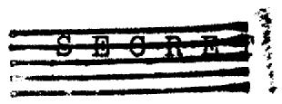

multigroup method. Moreover, the Serber-Wilson method starts with the transport equation rather than the diffusion approximation.

2). The Safonov method also starts from the transport equation, but is far too complicated to be feasible for this Project, since it involves stepwise integration over a lattice in both configuration and energy space and is in this respect a more elaborate version of the KAPL multigroup-multiregion method.

# 2.3 TWO-GROUP TWO-REGION METHOD

INTRODUCTION. - Some two-group two-region calculations were performed for one or more of the following reasons:

(a) To determine reflector savings (for either reflector or blanket).   
(b) To determine loss in conversion ratio due to presence of reflector.   
(c) To ascertain to what extent conversion ratios were fixed by the choice of average cross-sections for core and blanket regions, i.e. to determine what adjustment was provided by the required satisfaction of the boundary conditions; to compare these results with those obtained by the various types of blanket calculations described in Section 2.2.

The dividing line in energy between the groups is most conveniently chosen as the threshold of the fast fission effect in U-238. This subsumes the first three groups of the previous multigroup division under the present label of "fast" group. The remaining five groups constitute the "slow" group. Cross-sections were chosen by averaging over the multigroup neutron spectrum when such was available for the system considered. The resulting equations were solved exactly rather than by the KAPL self-consistent method, since the former turns out to be numerically less tedious in this special case.

Since two-group fast reactor equations differ in content from the better-known two-group formulation of the thermal problem, it may be worthwhile to consider their derivation briefly. This derivation could be carried out directly from the age-diffusion equation. We prefer, however, to proceed from the multigroup equations, (2.1-1), as a more realistic basis, since the accuracy of the two group treatment is predicated on the availability of multigroup spectra which are used in the derivation of average cross

sections.

DERIVATION OF EQUATIONS. - Let the subscript 1 refer to the "fast" group and the subscript 2 to the "slow" group. If we now sum eqs. (2.1-1) from $\alpha = 1$ to $\alpha = \overline{n} = 3$ and from $\alpha = n + 1$ to $\alpha = \eta = 8$ , we obtain the two equations

$$
\begin{array}{l} - \left(\frac {1}{3 Z _ {t r}}\right) _ {1} \nabla^ {2} \Phi_ {1} (r) + \left(Z _ {a}\right) _ {1} \Phi_ {1} + \left(Z _ {i}\right) _ {1} \Phi_ {1} + \left(\frac {3 Z _ {s}}{U}\right) _ {1} \Phi_ {1} = \\ \left.\rightarrow (x _ {f}) _ {1} \left\{\left(\Sigma_ {f}\right) _ {1} \Phi_ {1} + \left(\Sigma_ {f}\right) _ {2} \Phi_ {2} \right\} + \int_ {\alpha = 1} ^ {\overline {{n}}} \int_ {\beta = 1} ^ {\beta = \alpha - 1} \left(x _ {i}\right) _ {\beta \rightarrow \infty} \left(\Sigma_ {i}\right) _ {\beta} \Phi_ {\beta} \right. \\ \end{array}
$$

and

$$
\begin{array}{l} \left(\frac {1}{3 \Sigma_ {t r}}\right) _ {2} \nabla^ {2} \Phi_ {2} + \left(\Sigma_ {a}\right) _ {2} \Phi_ {2} + \left(\Sigma_ {i}\right) _ {2} \Phi_ {2} = \left(\frac {\xi \Sigma_ {s}}{U}\right) _ {1} \Phi_ {1} \tag {2.3-2} \\ + \nabla (x _ {f}) _ {2} \left\{\left(\Sigma_ {f}\right) _ {1} \Phi_ {1} + \left(\Sigma_ {f}\right) _ {2} \Phi_ {2} \right\} + \int_ {\alpha = \overline {{r}} + 1} ^ {\eta} \int_ {\beta = 1} ^ {\beta = \alpha - 1} \left(x _ {i}\right) _ {\beta \rightarrow \infty} \left(\Sigma_ {i}\right) _ {\beta} \Phi_ {\beta} \\ \end{array}
$$

where, for example,

$$
\left(\Sigma_ {a}\right) _ {1} = \frac {\int_ {\beta = 1} ^ {\hbar} \left(\Sigma_ {a}\right) _ {\beta} \Phi_ {\beta}}{\int_ {\beta = 1} ^ {\rho h} \Phi_ {\beta}} \tag {2.3-3}
$$

is a number derived from a bare pile multigroup calculation, or guessed. The other average cross-sections are similarly defined, except that

$$
\left(\frac {\xi \Sigma_ {s}}{V}\right) _ {1} = \frac {\left(\frac {\xi \Sigma_ {s}}{F U}\right) _ {\bar {n}} \Phi_ {\bar {n}}}{\int_ {\beta = 1} ^ {\bar {n}} \Phi_ {\beta}} = \frac {g _ {\bar {n}} ^ {+}}{\int_ {\beta = 1} ^ {\bar {n}} \Phi_ {\beta}} \tag {2.3-4}
$$

In the summation over the finer group divisions, it is clear that only the degradation appropriate to the gross division into two groups survives. A similar expectation leads one to rewrite the inelastic terms. Consider first the summation

$$
\int_ {\alpha = 1} ^ {\bar {n}} \int_ {\beta = 1} ^ {\beta = \alpha - 1} (x _ {i}) _ {\beta \rightarrow \infty} (\Sigma_ {i}) _ {\beta} \Phi_ {\beta} = \int_ {\beta = 1} ^ {\bar {n}} \int_ {\alpha = \beta + 1} ^ {\bar {n}} (x _ {i}) _ {\beta \rightarrow \alpha} (\Sigma_ {i}) _ {\beta} \Phi_ {\beta}
$$

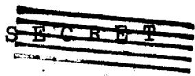

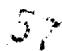

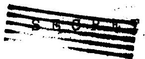

$$
\begin{array}{l} = \left\{\int_ {\beta = 1} ^ {\bar {n}} \int_ {\alpha = \beta + 1} ^ {n} - \int_ {\beta = 1} ^ {\bar {n}} \int_ {\alpha = \bar {n} + 1} ^ {n} \right\} (\chi_ {i}) _ {\beta \rightarrow \alpha} (\Sigma_ {i}) _ {\beta} \Phi_ {\beta} (2. 3 - 5) \\ = (\Sigma_ {i}) _ {1} \Phi_ {1} - \int_ {\beta = 1} ^ {\overline {{n}}} (X _ {i}) _ {\beta \rightarrow z} (\Sigma_ {i}) _ {\beta} \Phi_ {\beta} = (\Sigma_ {i}) _ {1} \Phi_ {1} - (\overline {{\Sigma_ {i}}}) \Phi_ {1} \\ \end{array}
$$

In deriving eq. (2.3-5), we have in turn interchanged the order of summation, added and subtracted the $\int_{\omega = \overline{n} +1}^{\eta}$ and recognized the meaning of the resulting summations. Thus $(X_{i})_{\beta \rightarrow 2}$ is the fraction of those neutrons which are inelastically scattered from the fine energy group $\beta$ and into the gross group 2. $\overline{\Sigma}_{i}$ is an average inelastic cross-section defined by the last two sides of eq. (2.3-5).

Similarly we find

$$
\begin{array}{l} \int_ {\alpha = \overline {{n}} + 1} ^ {\eta} \int_ {\beta} ^ {\alpha - 1} (\chi_ {i}) _ {\beta \rightarrow \alpha} (\Sigma_ {i}) _ {\beta} \Phi_ {\beta} = \int_ {\alpha = \overline {{n}} + 1} ^ {\eta} \left\{\int_ {\beta = 1} ^ {\overline {{n}}} + \int_ {\beta = \overline {{n}} + 1} ^ {\alpha - 1} \right\} (\chi_ {i}) _ {\beta \rightarrow \alpha} (\Sigma_ {i}) _ {\beta} \Phi_ {\beta} \\ = \bar {\Sigma} _ {i} \Phi_ {i} + \int_ {\beta = \bar {h} + 1} ^ {\eta} \int_ {\alpha} (X _ {i}) _ {\beta \rightarrow \alpha} (\Sigma_ {i}) _ {\beta} \Phi_ {\beta} = \bar {\Sigma} _ {i} \Phi_ {i} + (\bar {z} _ {i}) _ {2} \Phi_ {2} (2. 3 - 6) \\ \end{array}
$$

By using the results of eqs. (2.3-5) and (2.3-6), we can now write eqs. (2.3-1) and (2.3-2) in the forms

$$
\nabla^ {2} \Phi_ {1} (r) - \alpha_ {1} ^ {2} \Phi_ {1} (r) + \beta_ {1} ^ {2} \Phi_ {2} (r) = 0 \tag {2.3-7}
$$

$$
\nabla^ {2} \Phi_ {2} (r) - \alpha_ {2} ^ {2} \Phi_ {2} (r) + \beta_ {2} ^ {2} \Phi_ {1} (r) = 0 \tag {2.3-8}
$$

where

$$
\alpha_ {1} ^ {2} = (3 \sum_ {c r}) _ {i} \left\{\left(\sum_ {a}\right) _ {i} + \left(\frac {\xi z _ {s}}{U}\right) _ {i} + \overline {{\sum_ {i}}} - (\chi_ {s}) _ {i} v (z _ {s}) _ {i} \right\} (2. 3 - 9)
$$

$$
\beta_ {1} ^ {2} = (3 \sum_ {r}) _ {1} \left\{\left(x _ {f}\right) _ {1} v \left(\sum_ {f}\right) _ {2} \right\} \tag {2.3-10}
$$

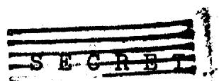

$$
\alpha_ {2} ^ {2} = \left(3 \Sigma_ {t r}\right) _ {2} \left\{\left(\Sigma_ {a}\right) _ {2} - \left(x _ {f}\right) _ {2} \geqslant \left(\Sigma_ {f}\right) _ {2} \right\} \tag {2.3-11}
$$

and

$$
\beta_ {2} ^ {2} = \left(3 \Sigma_ {t r}\right) _ {2} \left\{\left(\frac {3 \Sigma_ {s}}{U}\right) _ {1} + \overline {{\Sigma}} _ {i} + \left(\chi_ {f}\right) _ {2} v \left(\Sigma_ {s}\right) _ {1} \right\} \tag {2.3-12}
$$

are numbers obtainable from the known cross-sections and composition, and from the assumed energy spectrum.

Several additional remarks are in order. We have a pair of equations such as (2.3-7,8) for each homogeneous region. A basic assumption in their derivation is that it is a good approximation to assume a single energy spectrum for each homogeneous region, an assumption that is certainly not true as soon as we couple two regions together. Finally the particular dividing line between fast and slow regions proves particularly convenient in the case of a blanket containing only U-238 as fissile material. In this case $\beta_{1}^{2} = 0$ , since $(\Sigma_{f})_{2} = 0$ , and the solution of the problem is in every way analogous to that of the thermal two-group problem. For a non-fissioning reflector this is true no matter where we make the group division.

SOLUTION OF EQUATIONS. - It suffices merely to cite a standard reference, say CF-51-9-127, for the solution procedure for the two-region problem each of which is governed by a set of equations such as (2.3-7,8).

# 2.4 ONE-GROUP CALCULATIONS

ONE VELOCITY - SINGLE MEDIUM. - One-velocity calculations give approximate results for critical size and conversion ratios for homogeneous fast reactors, if appropriate cross-sections are chosen. The choice of average cross-sections implies a previous knowledge of the neutron spectrum, which is obtained from experience or by judicious guessing.

Neglecting elastic scattering and inelastic scattering,

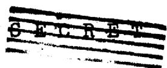

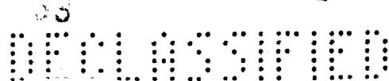

the neutron diffusion equation becomes

$$
- \frac {\nabla^ {2} \phi}{3 Z _ {r}} + \Sigma_ {a} \phi = v \Sigma_ {f} \phi \tag {2.4-1}
$$

where the neutron production is assumed to be proportional to the fission cross-section.

For a multiplying region, eq. (2.4-1) becomes

$$
\nabla^ {2} \varphi + k ^ {2} \varphi = 0 \tag {2.4-2}
$$

where the buckling $\mathbf{k}^2$ is defined as

$$
k ^ {2} = 3 \Sigma_ {t r} (v \Sigma_ {f} - \Sigma_ {a}) \tag {2.4-3}
$$

For a non-multiplying medium, eq. (2.4-1) becomes

$$
\nabla^ {2} \varphi - K ^ {2} \varphi = 0 (2. 4 - 4)
$$

where $\mathbf{K}^2$ is defined as

$$
K ^ {2} = 3 \Sigma_ {t r} (\Sigma_ {q} - v \Sigma_ {f}) \tag {2.4-5}
$$

The solution of eq. (2.4-2) in spherical coordinates is

$$
\varphi = \frac {A \sin k r}{r} \tag {2.4-6}
$$

subject to the boundary condition that the flux vanish at the extrapolated bare pile radius. Hence, the critical radius is

$$
b = \frac {\pi}{k} \tag {2.4-7}
$$

and the critical mass of extrapolated reactor is:

$$
C. M. = ^ {4} / 3 \pi b ^ {3} p _ {f} \tag {2.4-8}
$$

where $\rho_{\mathrm{f}} =$ density of fissionable material in the reactor core.

If one assumes that all the leakage neutrons can be

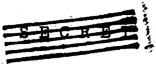

used to produce Pu, the external conversion ratio is the ratio of the number of leakage neutrons to the number of neutrons absorbed by U-235 in the core:

$$
\begin{array}{l} x, c, R. = \frac {\int - \frac {V ^ {2} \phi}{3 \Sigma_ {r r}} d V}{\int \left\{\left. Z _ {f} (z s) + Z _ {c} (z s) \right\} \phi d V \right.} \tag {2.4-9} \\ = \frac {2 \Sigma_ {f} - \Sigma_ {a}}{\Sigma_ {f} (2 s) + \Sigma_ {c} (2 s)} \\ \end{array}
$$

The internal conversion ratio is the ratio of the number of neutrons captured in U-238 to the number absorbed in U-235 in the core:

$$
I. C. R _ {1} = \frac {\int \Sigma_ {c} (2 8) \varphi d V}{\int \left\{\Sigma_ {f} (2 5) + \Sigma_ {c} (2 5) \right\} \varphi d V} = \frac {\Sigma_ {c} (2 8)}{\Sigma_ {f} (2 5) + \Sigma_ {c} (2 5)} (2. 4 - 1 0)
$$

These equations are in agreement with a detailed neutron balance. The added information given by eq. (2.4-2) is the buckling, $\mathbf{k}^2$ , and hence the critical size.

Experience dictates the choice of the average neutron energy at which the neutron cross-sections are chosen. For the systems considered, the third and fourth energy groups were appropriate for fast systems: 1 - 2 atoms U-238/U-235; < 8 diluent atoms/U-235. The fifth and sixth energy groups were appropriate for more dilute systems: 3 - 6 atoms U-238/U-235; 8 - 35 atoms diluent/U-235.

For most cases the one-velocity techniques were used to determine the initial value of $k^2 / 3$ to be used in the multi-group calculations. Table 2.4-1 summarizes the comparison between the one-velocity approximation and the multigroup treatment for system # 21, in which the fifth energy group was chosen.

TABLE II-2.4-1   

<table><tr><td></td><td>b(cm)</td><td>C.M. (metric tons)</td><td>X.C.R.</td><td>I.C.R.</td><td>T.C.R.</td></tr><tr><td>One-velocity estimate</td><td>125.1</td><td>2.693</td><td>.813</td><td>.339</td><td>1.152</td></tr><tr><td>8 group system 21</td><td>125.1</td><td>2.693</td><td>.771</td><td>.354</td><td>1.125</td></tr></table>

For rapid estimates, one-group calculations can easily give $10\%$ accuracy.

ONE VELOCITY - MULTIREGION. - For multiregion systems, the one velocity eqs. (2.4-2) and (2.4-4) are solved subject to the boundary conditions of continuity of neutron flux and neutron current. For the three-region system consisting of a core, reflector, and blanket, shown in Fig. II-2.4-1, the criticality equation is:

$$
e ^ {+ 2 K _ {2} (a - b)} \cdot \frac {\left[ 1 - K _ {2} a - \{K _ {3} a \coth K _ {3} (x - a) + 1 \} \frac {\sum_ {t r} ^ {(2)}}{\sum_ {t r} ^ {(2)}} \right]}{\left[ 1 + K _ {2} a - \{K _ {3} a \coth K _ {3} (x - a) + 1 \} \frac {\sum_ {t r} ^ {(2)}}{\sum_ {t r} ^ {(2)}} \right]} = \tag {2.4-11}
$$

$$
\frac {[ (k b \cot k b - 1) \frac {\sum_ {t r} ^ {(2)}}{\sum_ {t r} ^ {(1)}} + 1 - k _ {2} b ]}{[ (k b \cot k b - 1) \frac {\sum_ {t r} ^ {(2)}}{\sum_ {t r} ^ {(1)}} + 1 + k _ {2} b ]}
$$

From eq. (2.4-11), reflector savings and pipe holdups may be estimated, using the bare pile calculations to determine $\mathbf{k}$ . The equation is strictly true if ratios of cross-sections in the various regions are independent of neutron energy; otherwise, the flux consists of additional spatial harmonics.

2.24

69

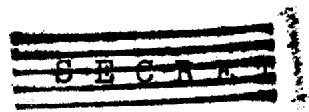

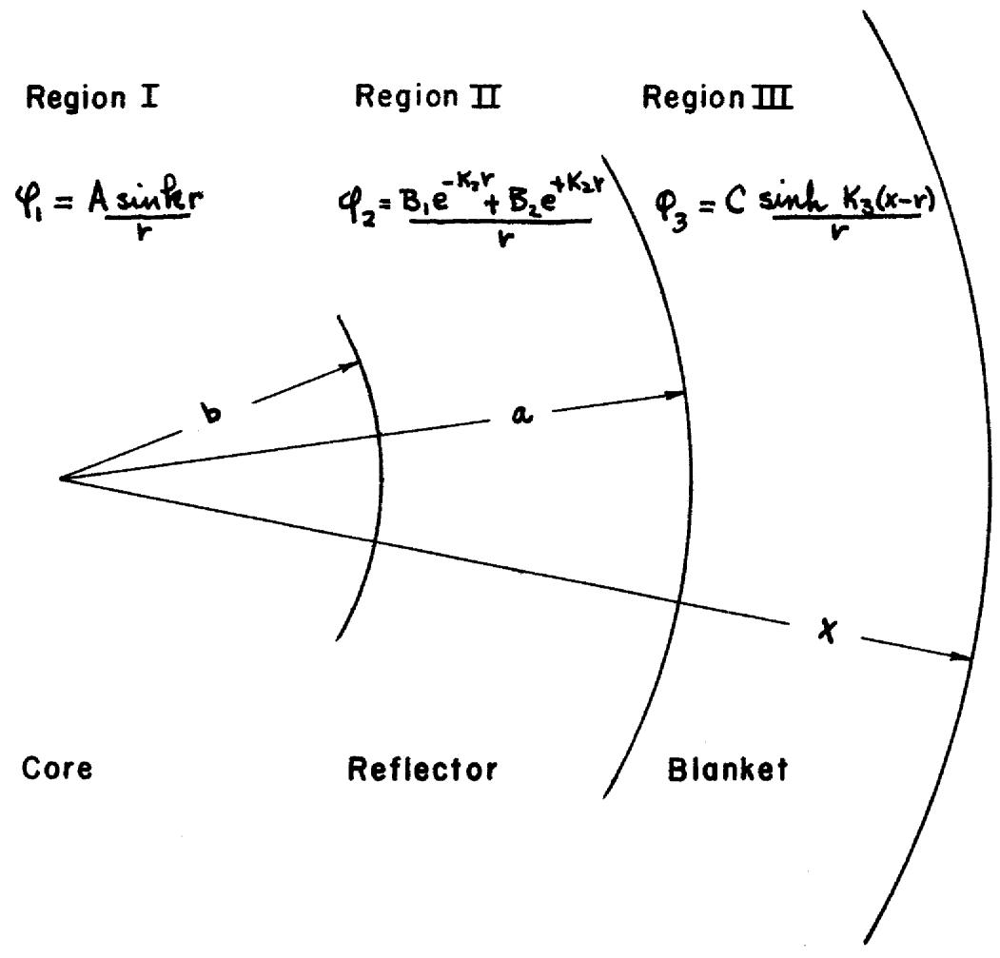  
FIGURE II-2.4-1   
THREE MEDIA - ONE VELOCITY SYSTEMS

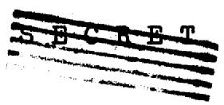  
中 中 中 中 中 中 中 中 中 中 中 中 中 中 中

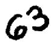

The X.C.R. will decrease somewhat as the reflector is made thicker due to its small, but not negligible, absorption. For those systems satisfying eq. (2.4-11), X.C.R. may be calculated from:

$$
\begin{array}{l} x. c. R _ {1} = \frac {\int_ {\mathrm {b l a n k} _ {2} +} \sum_ {c (2 s)} \varphi d V}{\int_ {\mathrm {c o r e}} \left\{\sum_ {f (2 s)} + \sum_ {c (2 s)} \right\} \varphi d V} \\ = \frac {\sum_ {c} (2 8)}{\sum_ {f} (2 5) + \sum_ {k} (2 5)} \left(\frac {R _ {2}}{K _ {3}}\right) ^ {2} \left\{\frac {1 + K _ {3} a \cot h K _ {3} (x - a) - \frac {K _ {3} x}{\sin h K _ {3} (x - a)}}{1 - R _ {2} b \cot h R _ {2} b} \right\} (2. 4 - 1 2) \\ \left. \right. \cdot \left\{\cosh K _ {2} (a - b) + \sinh K _ {2} (a - b) \left[ \frac {\sum_ {t r} ^ {(2)} (R b c o t k b - 1) + 1}{\sum_ {t r} ^ {(i)} (R b c o t k b - 1)} \right]\right\} \\ \end{array}
$$

The first term in brackets takes into account the finite thickness of the blanket, and the second term in brackets represents the loss due to absorptions in the reflector.

On a one-velocity basis, the I.C.R. remains the same as for the bare pile.

Eq. (2.4-12) may be used to compare the relative merits of reduced inventory and reduced X.C.R. for various thicknesses of reflector. Such a process was used to optimize the nuclear constituents in the fast fused-salt reactors considered by this Project.

# DETAILED NEUTRON BALANCE

Neutrons can be lost by parasitic capture, fission or leakage from a chain reacting system. Assume that the probability per unit event for each of the processes is represented by a macroscopic cross-section suitably averaged over the spectrum of the reactor.

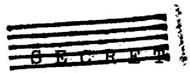

$$
\begin{array}{l} \sum_ {c} = \text {p r o b a b i l i t y o f a n e u t r o n b e i n g c a p t u r e d} \\ \sum_ {f} = \text {p r o b a b i l i t y} \\ L = \text {p r o b a b i l i t y} \\ \end{array}
$$

The production of neutrons is:

$$
v \Sigma_ {f} \equiv \int_ {\beta} v (u) Z _ {f} (\beta)
$$

For a critical assembly, the number of neutrons produced per unit event must be equal to the number of neutrons lost per unit event. Hence, the leakage is:

$$
L = \nu \Sigma_ {f} - \Sigma_ {c} - \Sigma_ {f}
$$

Assuming that all the leakage neutrons can be used to produce Pu-239:

$$
\begin{array}{l} X. C. R. = \frac {2 Z _ {f} - Z _ {c} - Z _ {f}}{Z _ {f} (2 5) + Z _ {c} (2 5)} \\ I. C. R. = \frac {\Sigma_ {c} (2 5)}{\Sigma_ {f} (2 5) + \Sigma_ {c} (2 5)} \\ \end{array}
$$

These equations, coupled with the one-velocity results, may be used to predict the effect of small additional quantities of different materials added to an original reactor system.

# 3. RESULTS OF FAST REACTOR CALCULATIONS

# 3.1 INTRODUCTION

Eight-group calculations based upon the age-diffusion theory were carried out by the methods outlined above to determine the following quantities for the mixtures of materials considered by NEP to be practical:

a). Internal conversion ratio   
b). External conversion ratio   
c). Mean effective $\overline{\mathbf{a}}$   
d). Critical radius and critical mass   
e). Spectrum of fissions, i.e. percentage of fissions due to neutrons in a given energy interval   
f). Spectrum of the neutron flux   
g). Fraction of fast fissions   
h). Detailed neutron balance

Terms and symbols are defined in the glossary.

# 3.2 BARE REACTOR

The following methods were used for the bare reactor calculations.

Critical radius: The extrapolated critical radius was calculated by the methods outlined in 2.1

Critical mass: The critical masses were computed using the extrapolated radius as the dimension of the volume to facilitate comparisons between different systems.

External conversion ratio: The external conversion ratio was computed on the basis of one neutron absorbed in U-235 in the core, and assuming that all leakage neutrons would produce Pu-239 in the

blanket. This assumption was based upon the experience of the KAPL physics group, and the test methods of section 2.2. This assumption that the fast fission effect in U-238 effectively counterbalances the non-productive captures by other blanket materials is slightly optimistic for the slower spectra, possibly introducing a five to ten per cent correction in the external conversion ratio.

Internal conversion ratio: The internal conversion ratio was computed on the basis of one neutron absorbed in U-235.

Fraction of fast fissions: The fraction of fast fissions indicates the contribution made by fast fissions in U-238 and U-236.

Neutron spectrum: The bare pile multigroup calculation gives an indication of the neutron spectrum in the actual reactor. This spectrum served as the basis for making suitable cross-section averages which were later used in the less precise two-group and one-group calculations of multi-region problems.

Cross-sections: The cross-sections for the atomic constituents have been discussed in Section II-1.

Densities: Although the calculations for the conversion ratios are independent of the density of the mixture, the density will determine the critical mass of the assembly. For the fused salts, the macroscopic densities used were the best estimates for the average operating temperatures given by the engineering group. The number density of fissionable material was determined by dividing the macroscopic density by the relative atomic volumes of the various constituents:

$$
N (2 5) = \frac {p x 6 . 0 3 x 1 0 ^ {2 3}}{2 3 5 + \frac {N (2 8)}{N (2 5)} (2 3 8) + \frac {N (C 1)}{N (2 5)} (3 5 . 5) + \dots}
$$

The densities of the liquid metals were assumed to be those of a volumetric mixture.

As more accurate density determinations are made, corrections to the critical mass may be made quite readily, as the density is a common factor in the bare pile calculation.

Interpolations: For chemically similar systems, interpolation methods were utilized to optimize various core mixtures with respect to their atomic ratios. Generally, chemical and metallurgical considerations eliminate the problem of many independent atomic ratios for a complete survey.

For the fused salts, the main variable of interest was the ratio of U-238 atoms to U-235 atoms. Eutectic compositions which gave the lowest melting points fixed the other atom ratios.

# TABLES AND GRAPHS

Table 3.2-1: System Constituents for Bare Reactor Multigroup Calculations

This table describes the atomic constituents and their relative atomic ratios, and the macroscopic density used in the calculations of the bare reactor assemblies considered by NEP. Table 3.2-1 also gives a code number to each reactor system which is used as a means of reference throughout this report.

Table 3.2-2: Breeders - Results of Multigroup Bare Reactor Calculations

The results to be found in Table 3.2-2 include:

a). Number density of Pu   
b). Critical Mass (in metric tons)   
c). Mean effective $\overline{\mathbf{a}}$   
d). Total Breeding Ratio   
e). External Breeding Ratio   
f). Internal Breeding Ratio   
g). Buckling $(\mathbf{k}^2 /3$ with number density factored out)   
h). Fraction of fast fissions in U-238   
i). $50\%$ fission energy, i.e., $50\%$ of fissions occur below this energy.

Table 3.2-3: Converters - Results of Multigroup Bare Reactor Calculations

Table 3.2-3 is identical to Table 3.2-2, except for the fact that U-235 is the primary fuel, instead of Pu-239.

Table 3.2-4: Breeders - Neutron Balance

Table 3.2-4 gives a detailed neutron balance for the breeder reactors investigated by this project. The basis of the balance is one neutron absorbed by fission and capture in Pu-239.

The degree of balance is an indication of the calculation accuracy, not of the accuracy of the results.

Table 3.2-5: Converters - Neutron Balance

Table 3.2-5 is similar to Table 3.2-4 except that the balance basis is one neutron absorbed in U-235.

Figures 3.1-1,2,3 and 4: These figures present the results of the multigroup calculations for chemically similar systems graphically. Trends of the various parameters as functions of different atomic ratios are obvious from this presentation. When external holdup is added to each of these plots, a definite inventory minimum in the vicinity of $\mathbb{N}(28) / \mathbb{N}(25) = 3$

is evident. For optimalizations, the interpolations indicated by these graphs may be used to save many man-hours of calculation.

Figures 3.2-5 to 12: Spectra These figures are presented as being representations of the flux and fission spectrums in the fast reactors considered by this project. The graphs are chosen for the chemically similar $\mathrm{UCl}_4$ -NaCl fused salt systems, and show how the neutron spectrum changes with varying atomic ratios.

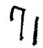

TABLE II-3.2-1. System Constituents for Bare Reactor Multigroup Calculations (atom basis)   

<table><tr><td>System Number</td><td>U-235</td><td>U-236</td><td>U-238</td><td>Pu-239</td><td>Bi</td><td>Cl</td><td>Na</td><td>Pb</td><td>Fe</td><td>F.P.</td><td>ρgm/cc</td></tr><tr><td>1.</td><td></td><td></td><td></td><td>1</td><td></td><td>3</td><td></td><td></td><td></td><td></td><td>4.578</td></tr><tr><td>2.</td><td></td><td></td><td>3</td><td>1</td><td></td><td>15</td><td></td><td></td><td></td><td></td><td>4.161</td></tr><tr><td>3.</td><td></td><td></td><td>5.66</td><td>1</td><td></td><td>25.66</td><td></td><td></td><td></td><td></td><td>4.116</td></tr><tr><td>4.</td><td></td><td></td><td>10</td><td>1</td><td></td><td>43</td><td></td><td></td><td></td><td></td><td>4.090</td></tr><tr><td>5.</td><td></td><td></td><td>5.66</td><td>1</td><td></td><td>25.66</td><td>10</td><td></td><td>15</td><td></td><td>3.710</td></tr><tr><td>6.</td><td></td><td></td><td></td><td>1</td><td>25</td><td></td><td></td><td></td><td></td><td></td><td>9.827</td></tr><tr><td>7.</td><td></td><td></td><td>4</td><td>1</td><td>25</td><td></td><td></td><td></td><td></td><td></td><td>10.571</td></tr><tr><td>8.</td><td></td><td></td><td>7</td><td>1</td><td>40</td><td></td><td></td><td></td><td></td><td></td><td>10.584</td></tr><tr><td>9.</td><td>1</td><td></td><td>4</td><td></td><td>25</td><td></td><td></td><td></td><td></td><td></td><td>10.604</td></tr><tr><td>10.</td><td>1</td><td></td><td>4</td><td></td><td>12</td><td></td><td></td><td></td><td></td><td></td><td>11.43</td></tr><tr><td>11.</td><td>1</td><td></td><td></td><td></td><td>10</td><td></td><td></td><td></td><td></td><td></td><td>9.792</td></tr><tr><td>12.</td><td>1</td><td></td><td>3</td><td></td><td>40</td><td></td><td></td><td></td><td></td><td></td><td>9.797</td></tr><tr><td>13.</td><td>1</td><td></td><td>6</td><td></td><td>70</td><td></td><td></td><td></td><td></td><td></td><td>9.797</td></tr><tr><td>14.</td><td>1</td><td></td><td></td><td></td><td></td><td>5</td><td>1</td><td></td><td></td><td></td><td>3.57</td></tr><tr><td>15.</td><td>1</td><td></td><td>3</td><td></td><td></td><td>20</td><td>4</td><td></td><td></td><td></td><td>3.57</td></tr><tr><td>16.</td><td>1</td><td></td><td>6</td><td></td><td></td><td>35</td><td>7</td><td></td><td></td><td></td><td>3.57</td></tr><tr><td>17.</td><td>1</td><td></td><td>9</td><td></td><td></td><td>50</td><td>10</td><td></td><td></td><td></td><td>3.57</td></tr><tr><td>18.</td><td>1</td><td></td><td></td><td></td><td></td><td>8</td><td>1</td><td></td><td></td><td>1</td><td>3.57</td></tr><tr><td>19.</td><td>1</td><td></td><td>3</td><td></td><td></td><td>24</td><td></td><td>4</td><td></td><td></td><td>4.48</td></tr><tr><td>20.</td><td>1</td><td></td><td></td><td></td><td></td><td>7</td><td>1</td><td>1</td><td></td><td></td><td>4.01</td></tr><tr><td>21.</td><td>1</td><td></td><td>3</td><td></td><td></td><td>28</td><td>4</td><td>4</td><td></td><td></td><td>4.01</td></tr><tr><td>22.</td><td>1</td><td></td><td>3</td><td></td><td></td><td>15</td><td></td><td></td><td></td><td></td><td>4.161</td></tr><tr><td>23.</td><td></td><td></td><td></td><td>1</td><td></td><td>15</td><td>12</td><td></td><td></td><td></td><td>2.288</td></tr><tr><td>24.</td><td>1</td><td>.2</td><td>3.25</td><td>.0048</td><td></td><td>28.75</td><td>1.81</td><td>4.57</td><td></td><td>0.017</td><td>4.2</td></tr></table>

# TABLE II-3.2-2. Breeders

# Results of Multigroup Bare Reactor Calculations

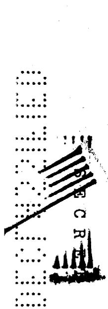

<table><tr><td>System Number</td><td>N(49)atoms cc</td><td>C.M.(metric) (tons)</td><td>a</td><td>T.B.R.</td><td>X.B.R.</td><td>I.B.R.</td><td>k2/3(barns)2</td><td>Fraction Fast Fissions</td><td>50% Fission Energy</td></tr><tr><td>1.</td><td>7.982x10+21</td><td>0.516</td><td>0.065</td><td>1.786</td><td>1.786</td><td>0.0</td><td>45.</td><td>-</td><td>910 Kev</td></tr><tr><td>2.</td><td>1.687</td><td>1.113</td><td>0.130</td><td>1.768</td><td>1.461</td><td>0.307</td><td>214.</td><td>.11</td><td>333</td></tr><tr><td>3.</td><td>0.992</td><td>1.725</td><td>0.176</td><td>1.678</td><td>1.015</td><td>0.663</td><td>326.</td><td>.13</td><td>140</td></tr><tr><td>4.</td><td>0.595</td><td>14.36</td><td>0.232</td><td>1.570</td><td>0.250</td><td>1.320</td><td>157.</td><td>.155</td><td>130</td></tr><tr><td>5.</td><td>0.626</td><td>3.43</td><td>0.254</td><td>1.414</td><td>0.711</td><td>0.703</td><td>380.</td><td>.095</td><td>111</td></tr><tr><td>6.</td><td>1.083</td><td>0.754</td><td>0.101</td><td>1.593</td><td>1.593</td><td>0.0</td><td>503.</td><td>-</td><td>287</td></tr><tr><td>7.</td><td>0.992</td><td>0.890</td><td>0.131</td><td>1.622</td><td>1.191</td><td>0.431</td><td>505.8</td><td>.085</td><td>224</td></tr><tr><td>8.</td><td>0.621</td><td>2.33</td><td>0.161</td><td>1.493</td><td>0.677</td><td>0.816</td><td>499.4</td><td>.10</td><td>174</td></tr><tr><td>23.</td><td>1.316</td><td>1.139</td><td>0.143</td><td>1.574</td><td>1.574</td><td>0.0</td><td>296.</td><td>-</td><td>368</td></tr></table>

# TABLE II-3.2-3. Converters

Results of Multigroup Bare Reactor Calculations   

<table><tr><td>System Number</td><td>N(25)atoms cc</td><td>C.M.(metric) (tons)</td><td>a</td><td>T.C.R.</td><td>X.C.R.</td><td>I.C.R.</td><td>k2/3(barns)2</td><td>Fraction Fast Fissions</td><td>50% Fission Energy</td></tr><tr><td>9.</td><td>0.996x10+21</td><td>1.882</td><td>0.134</td><td>1.156</td><td>0.697</td><td>0.459</td><td>303.4</td><td>.075</td><td>150 Kev</td></tr><tr><td>10.</td><td>1.863</td><td>1.090</td><td>0.121</td><td>1.301</td><td>0.892</td><td>0.409</td><td>189.</td><td>.10</td><td>202</td></tr><tr><td>11.</td><td>2.537</td><td>1.095</td><td>0.093</td><td>1.217</td><td>1.217</td><td>0.0</td><td>125.3</td><td>-</td><td>318</td></tr><tr><td>12.</td><td>0.634</td><td>2.69</td><td>0.144</td><td>1.007</td><td>0.655</td><td>0.352</td><td>435.0</td><td>.045</td><td>143</td></tr><tr><td>13.</td><td>0.362</td><td>206.</td><td>0.169</td><td>0.776</td><td>0.047</td><td>0.729</td><td>50.7</td><td>.055</td><td>100</td></tr><tr><td>14.</td><td>4.943</td><td>1.355</td><td>0.0864</td><td>1.267</td><td>1.267</td><td>0.0</td><td>44.5</td><td>-</td><td>550</td></tr><tr><td>15.</td><td>1.229</td><td>2.36</td><td>0.161</td><td>1.211</td><td>0.853</td><td>0.358</td><td>196.9</td><td>.085</td><td>143</td></tr><tr><td>16.</td><td>0.702</td><td>6.48</td><td>0.187</td><td>1.161</td><td>0.450</td><td>0.711</td><td>211.4</td><td>.11</td><td>87</td></tr><tr><td>17.</td><td>0.491</td><td>1790.</td><td>0.213</td><td>1.107</td><td>0.017</td><td>1.089</td><td>8.</td><td>.12</td><td>61</td></tr><tr><td>18.</td><td>3.302</td><td>1.596</td><td>0.092</td><td>1.190</td><td>1.190</td><td>0.0</td><td>68.1</td><td>-</td><td>420</td></tr><tr><td>19.</td><td>1.026</td><td>2.45</td><td>0.155</td><td>1.200</td><td>0.853</td><td>0.347</td><td>243.2</td><td>.075</td><td>134</td></tr><tr><td>20.</td><td>3.391</td><td>1.502</td><td>0.095</td><td>1.244</td><td>1.244</td><td>0.0</td><td>68.6</td><td>-</td><td>401</td></tr><tr><td>21.</td><td>0.845</td><td>2.64</td><td>0.176</td><td>1.137</td><td>0.781</td><td>0.356</td><td>300.</td><td>.07</td><td>103</td></tr><tr><td>22.</td><td>1.687</td><td>2.13</td><td>0.138</td><td>1.290</td><td>0.945</td><td>0.345</td><td>139.</td><td>.10</td><td>180</td></tr><tr><td>24.</td><td>.825</td><td>2.918</td><td>0.173</td><td>1.126</td><td>0.744</td><td>0.382</td><td>288.7</td><td>.08</td><td>111</td></tr></table>

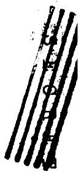

TABLE II-3.2-4. Breeders - Neutron Balance   
Basis: 1 neutron absorbed in Pu-239   

<table><tr><td>System Number</td><td>1.</td><td>2.</td><td>3.</td><td>4.</td><td>5.</td><td>6.</td><td>7.</td><td>8.</td><td>23.</td></tr><tr><td>Neutron Productionv(49)·Fissions of Pu-239v(28)·Fissions of U-238</td><td>2.7885</td><td>2.62930.2713</td><td>2.52480.3345</td><td>2.41130.3733</td><td>2.36950.2147</td><td>2.6941</td><td>2.62580.2070</td><td>2.56310.2445</td><td>2.5987</td></tr><tr><td>Total Source</td><td>2.7885</td><td>2.9006</td><td>2.8593</td><td>2.7846</td><td>2.5842</td><td>2.6941</td><td>2.8328</td><td>2.8076</td><td>2.5987</td></tr><tr><td>Neutron ConsumptionFissions of Pu-239Fissions of U-238Captures by Pu-239Captures by U-238Captures by BiCaptures by ClCaptures by NaCaptures by FeLeakage</td><td>0.93890.061120.0022890.0022890.0022890.0022891.7862</td><td>0.88530.10850.11470.30740.023760.047550.010160.14606</td><td>0.85010.13380.14990.66250.047550.0154</td><td>0.81190.14930.18811.31960.065380.02503</td><td>0.79780.085870.20220.70340.048260.010160.026680.7107</td><td>0.90710.092940.10070.1580.43120.12040.0631</td><td>0.88410.082790.11580.43120.12040.0631</td><td>0.86300.097810.13700.81610.21700.020290.0040750.6766</td><td>0.87500.12500.020290.0040750.5743</td></tr><tr><td>Total Consumption</td><td>2.7885</td><td>2.9003</td><td>2.8593</td><td>2.7846</td><td>2.5850</td><td>2.6939</td><td>2.8259</td><td>2.8075</td><td>2.5987</td></tr></table>

TABLE II-3.2-5. Converters - Neutron Balance   
Basis: 1 Neutron absorbed in U-235   

<table><tr><td>System Number</td><td>9</td><td>10</td><td>11</td><td>12</td><td>13</td><td>14</td><td>15</td><td>16</td><td>17</td><td>18</td><td>19</td><td>20</td><td>21</td><td>22</td></tr><tr><td>Neutron Production</td><td></td><td></td><td></td><td></td><td></td><td></td><td></td><td></td><td></td><td></td><td></td><td></td><td></td><td></td></tr><tr><td>(25)-Fissions of U-235</td><td>2.1771</td><td>2.2040</td><td>2.2581</td><td>2.1600</td><td>2.1153</td><td>2.2736</td><td>2.1272</td><td>2.0805</td><td>2.0365</td><td>2.2628</td><td>2.1410</td><td>2.2549</td><td>2.0999</td><td>2.1709</td></tr><tr><td>(28)-Fissions of U-238</td><td>0.1803</td><td>0.2552</td><td></td><td>0.1071</td><td>0.1290</td><td></td><td>0.2024</td><td>0.2597</td><td>0.2827</td><td></td><td>0.1789</td><td></td><td>0.1560</td><td>0.2429</td></tr><tr><td>Total Source</td><td>2.3574</td><td>2.4592</td><td>2.2581</td><td>2.2671</td><td>2.2443</td><td>2.2736</td><td>2.3296</td><td>2.3402</td><td>2.3192</td><td>2.2628</td><td>2.3199</td><td>2.2549</td><td>2.2559</td><td>2.4137</td></tr><tr><td>Neutron Consumption</td><td></td><td></td><td></td><td></td><td></td><td></td><td></td><td></td><td></td><td></td><td></td><td></td><td></td><td></td></tr><tr><td>Fissions of U-235</td><td>0.8814</td><td>0.8923</td><td>0.9142</td><td>0.8745</td><td>0.8564</td><td>0.9205</td><td>0.8612</td><td>0.8423</td><td>0.8245</td><td>0.9161</td><td>0.8668</td><td>0.9129</td><td>0.8502</td><td>0.8789</td></tr><tr><td>Fissions of U-238</td><td>0.07212</td><td>0.1021</td><td></td><td>0.04283</td><td>0.05159</td><td></td><td>0.08097</td><td>0.1039</td><td>0.1131</td><td></td><td>0.07156</td><td></td><td>0.06239</td><td>0.09715</td></tr><tr><td>Captures by U-235</td><td>0.1186</td><td>0.1077</td><td>0.08580</td><td>0.1255</td><td>0.1436</td><td>0.07954</td><td>0.1388</td><td>0.1577</td><td>0.1755</td><td>0.08387</td><td>0.1331</td><td>0.08709</td><td>0.1498</td><td>0.1211</td></tr><tr><td>Captures by U-238</td><td>0.4597</td><td>0.4085</td><td></td><td>0.3515</td><td>0.7287</td><td></td><td>0.3582</td><td>0.7107</td><td>1.0899</td><td></td><td>0.3473</td><td></td><td>0.3557</td><td>0.3447</td></tr><tr><td>Captures by Bi</td><td>0.1289</td><td>0.05705</td><td>0.04087</td><td>0.2169</td><td>0.4165</td><td></td><td></td><td></td><td></td><td></td><td></td><td></td><td></td><td></td></tr><tr><td>Captures by Cl</td><td></td><td></td><td></td><td></td><td></td><td>0.006365</td><td>0.03732</td><td>0.07156</td><td>0.09230</td><td>0.009889</td><td>0.04353</td><td>0.008970</td><td>0.05109</td><td>0.02708</td></tr><tr><td>Captures by Na</td><td></td><td></td><td></td><td></td><td></td><td>0.000177</td><td>0.001067</td><td>0.003491</td><td>0.007018</td><td>0.000167</td><td></td><td>0.000174</td><td>0.001701</td><td></td></tr><tr><td>Captures by Fe</td><td></td><td></td><td></td><td></td><td></td><td></td><td></td><td></td><td></td><td></td><td></td><td></td><td></td><td></td></tr><tr><td>Captures by Pb</td><td></td><td></td><td></td><td></td><td></td><td></td><td></td><td></td><td></td><td></td><td>0.004733</td><td>0.001567</td><td>0.004397</td><td></td></tr><tr><td>Captures by F.P.</td><td></td><td></td><td></td><td></td><td></td><td></td><td></td><td></td><td></td><td>0.06209</td><td></td><td></td><td></td><td></td></tr><tr><td>Leakage</td><td>0.6966</td><td>0.8916</td><td>1.2171</td><td>0.6547</td><td>0.04737</td><td>1.2667</td><td>0.8531</td><td>0.4504</td><td>0.01760</td><td>1.1903</td><td>0.8529</td><td>1.2442</td><td>0.7807</td><td>0.9448</td></tr><tr><td>Total Captures</td><td>2.3573</td><td>2.4592</td><td>2.2580</td><td>2.2659</td><td>2.2442</td><td>2.2733</td><td>2.3306</td><td>2.3400</td><td>2.3199</td><td>2.2624</td><td>2.3199</td><td>2.2549</td><td>2.2559</td><td>2.4137</td></tr></table>

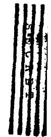

FIGURE II-3.2-1. $\mathrm{PuCl}_{3}-\mathrm{UCl}_{4}$ BREEDERS   
SYSTEMS 1 TO 4   
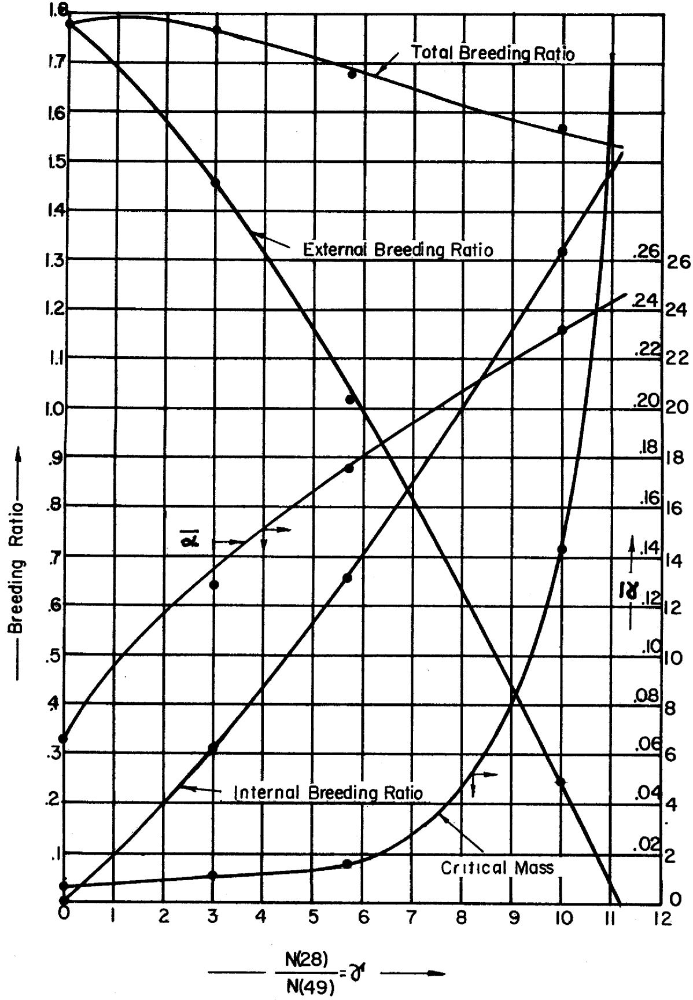  
Bare Reactor Critical Pu Mass, metric tons

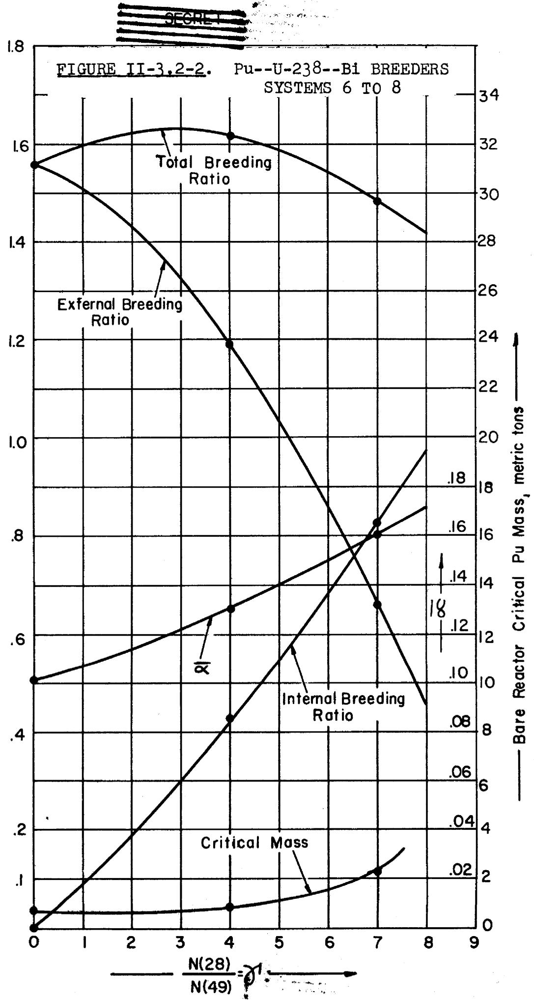  
Breeding Ratio

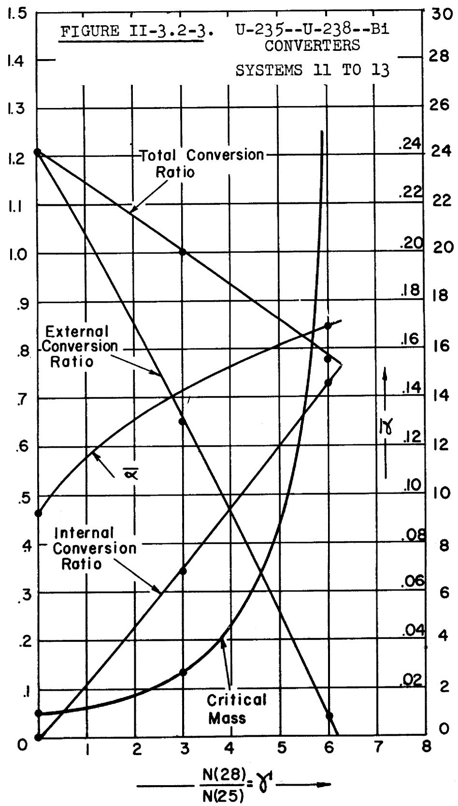  
Conversion Ratio   
Bare Reactor-Critical U-235 Mass, metric tons

FIGURE II-3.2-4. UCl4-NaCl CONVERTERS   
SYSTEMS 14 TO 17   
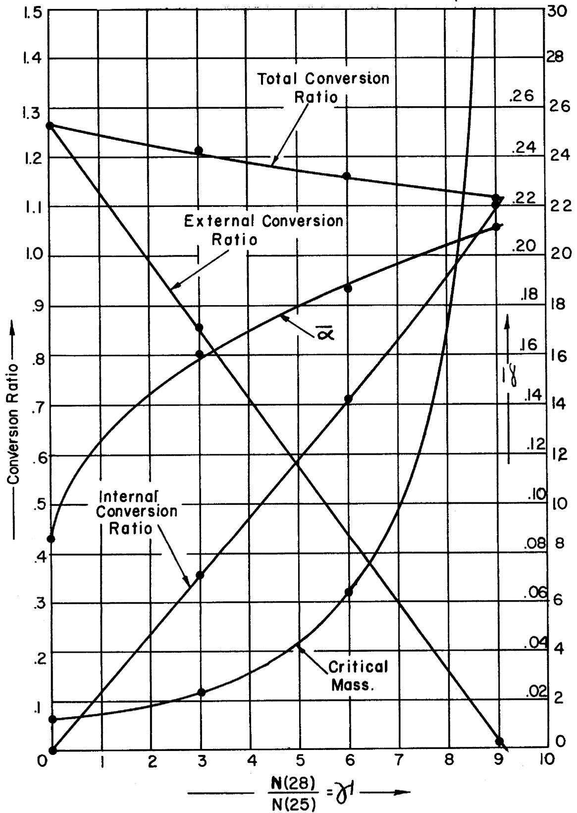  
Bare Reactor-Critical U-235 Mass, metric tons

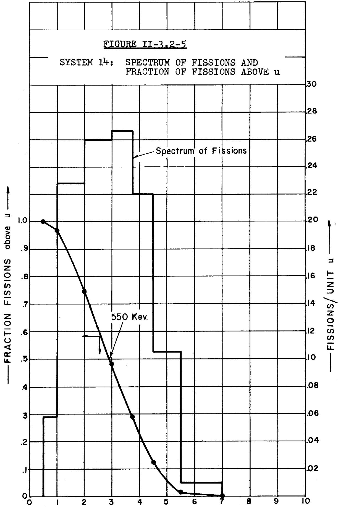

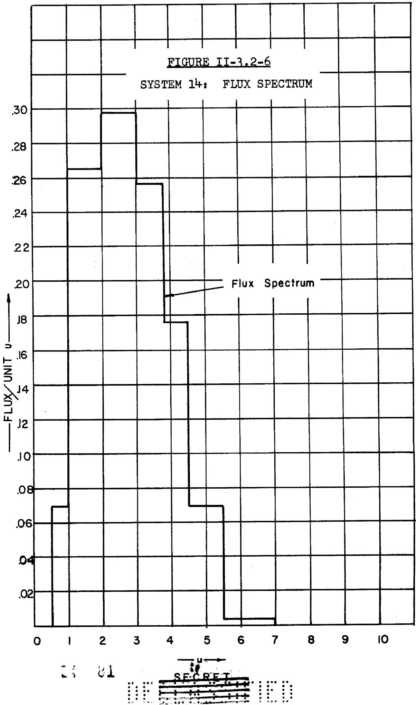

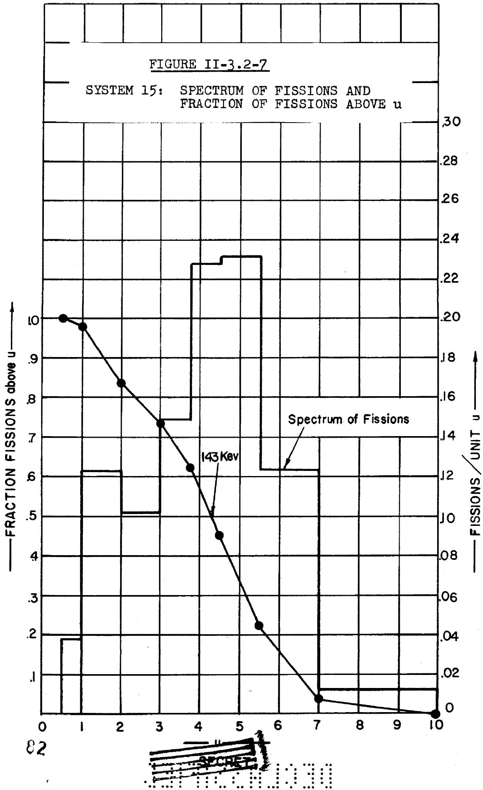

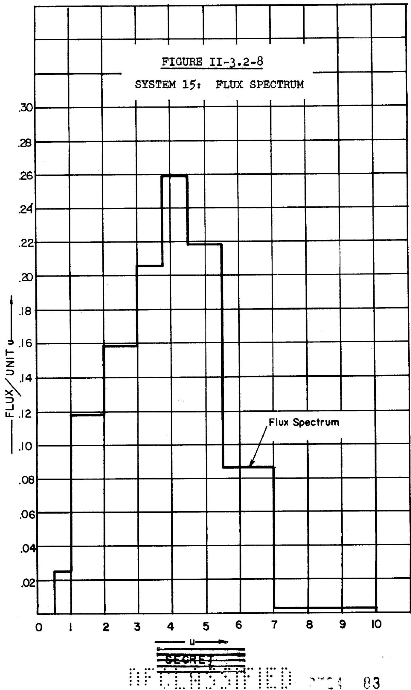

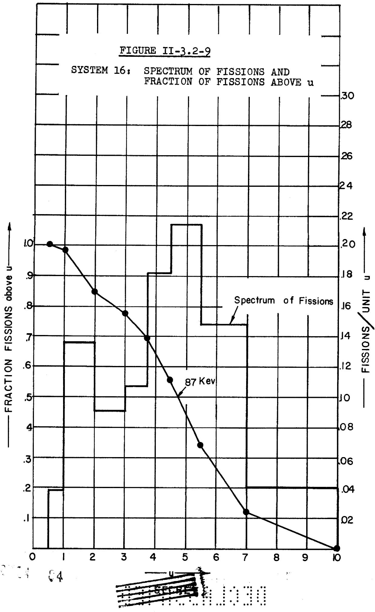

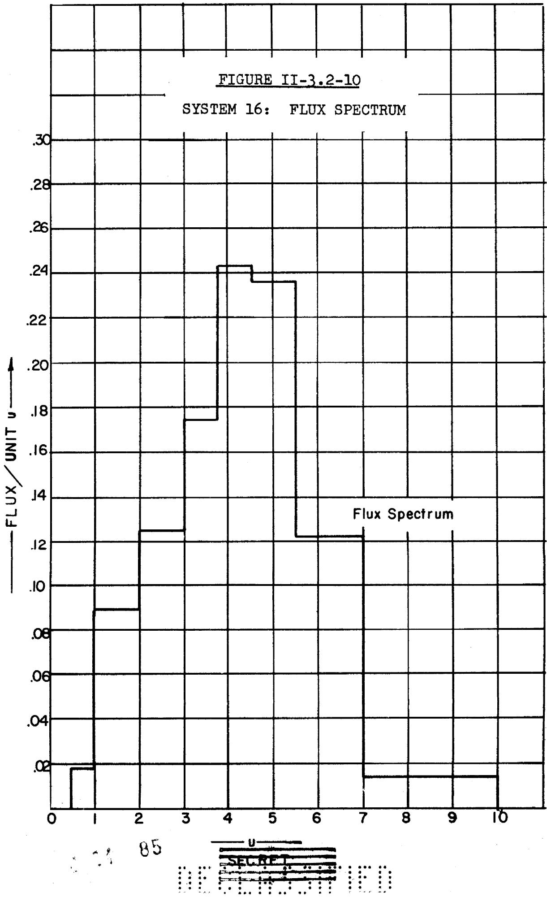

# 3.3 TWO-GROUP TWO-REGION CALCULATIONS

The several two-group calculations that were carried out can be divided into two distinct sets:

(a) Computations were performed for a given core and infinite blanket to determine reflector savings and to compare breeding ratios with those obtained by means of special multigroup methods for the blanket. The results are given in Table II-3.3-1, which compares the result of a given two-group calculation with the multigroup calculation which was taken as the basis of cross-section averaging in the given case. It is seen that the requirement of satisfying boundary conditions in the two-group case leads to a small adjustment of breeding ratios away from the extreme values given by the special multigroup methods. However, this adjustment is not sufficient to warrant an extensive number of such calculations for present purposes. It is further seen that the reflector savings are not great compared to those obtainable with a good reflector because of the low density of the blanket.

(b) Core size as a function of reflector size was investigated for system No. 14 coupled to a Pb reflector. We have also obtained the X.C.R. as a function of the same parameters. This was calculated as

$$
X. C. R. = \frac {\text {L e a k a g e f r o m r e f l e c t o r}}{\text {F i s s i o n} + \text {C a p t u r e o f U - 2 3 5 i n c o r e}},
$$

consistent with the assumption made in the bare pile multi-group calculations that all neutrons which leak out of the core are available for conversion.

Three distinct calculations were performed. Two of these were two-group calculations, which differed in the choice of reflector cross-sections. The results for the critical size are compared in Figure 3.3-1, where we have plotted reflector size as a function of core size, both given in units of the bare core size, $a = 56$ cm. The overall

TABLE II-3.3-1. Comparison of Special Multigroup Calculations with Two-Group Calculations   

<table><tr><td>System Number</td><td colspan="2">52: Strong Coupling</td><td colspan="2">53: Driven Blanket</td></tr><tr><td rowspan="2">T.B.R.</td><td>Multigroup</td><td>Two-Group</td><td>Multigroup</td><td>Two-Group</td></tr><tr><td>1.556</td><td>1.584</td><td>1.728</td><td>1.717</td></tr><tr><td>X.B.R.</td><td>1.170</td><td>1.233</td><td>1.421</td><td>1.403</td></tr><tr><td>I.B.R.</td><td>0.386</td><td>0.351</td><td>0.307</td><td>0.314</td></tr><tr><td>Core Radius = Bare Core Radius</td><td>1.000</td><td>0.681</td><td>1.000</td><td>0.688</td></tr></table>

size of the reflected reactor relative to the bare reactor is then obtained by adding abscissa and ordinates. C.M. can then be directly obtained from the value given in the previous section for the system in question (see Table 3.3-1). The curve labeled "Fast Reflector Spectrum" was obtained on the extreme assumption that the reflector has the same spectrum as the bare core, whereas the one marked "Slow Reflector Spectrum" resulted from the assumption of a substantially slower energy distribution. In Figure 3.3-3 the same comparison is made for the X.C.R.'s. In all cases, the points actually computed are indicated.

In addition to the results found above, we have also performed a one-group calculation for the same system, using the fast spectrum to determine average cross-sections. The results of this computation are compared with the two-group fast spectrum result in Figures 3.3-2,4.

As was to be expected, the slower reflector spectrum predicts smaller critical masses because it results in the assumption of larger transport cross-sections for the reflector than in the fast spectrum case. The results for the conversion ratio quite likely underestimate the conversion loss, since there is no information contained in the calculations made about the degradation of the leakage spectrum relative to bare core leakage. The actual rise of the X.C.R. as seen in Figure 3.3-3 may be understood on the basis of the remark that for small reflector sizes, the overall size of the reflected reactor is actually smaller than that of the bare pile. The most important result to be gleaned from the graphs, however, is that with little loss in conversion ratio, one can approach optimum reflector savings.

  
-92

S3

SEGRED

# 3.4 ONE GROUP - THREE REGION

The methods developed in Section II-2.4 were used to estimate the loss of conversion ratio and the reduced critical core mass which would be obtained for various thicknesses of a Pb or Fe reflector. Equation (II-2.4-3) was applied to the systems of interest.

As an example, the results of applying this method to a system # 15 core, Pb reflector and an infinite UCl₄ blanket are represented graphically in Figure 3.4-1. The fifth energy group was used to determine cross-sections for all three regions.

If the core buckling is low, loss of external conversion ratio does not permit the utilization of the maximum possible reflector savings. Economic considerations will determine how much loss of X.C.R. can be tolerated, or traded for decreased inventory.

The one velocity - three region techniques are applicable for comparing and optimizing similar reactor systems. For an actual reactor, however, these results indicate trends, and are not expected to give precise values as a detailed account of the neutron distribution as a function of space and materials was neglected.

  
96

# 3.5 SPECIAL MULTIGROUP CALCULATIONS

Additional multigroup calculations were carried out to investigate specific problems encountered. For the bare reactor in most cases, interpolations proved satisfactory for intermediate values of parameters.

System 18 examines the effects of Fission Product poisoning on conversion ratio and critical mass.

System 51 examines the effects of mixtures of Pu-239 and U-235.

Systems 52 and 53 are self-consistent calculations which were undertaken to evaluate the assumptions made concerning the effect of a blanket on the spectrum and conversion ratios of the bare reactor, see Section II-2.2.

System 54 examines the effect of cross-section variations on critical mass and breeding ratio.

# TABLES AND GRAPHS

Table 3.5-1: System Constituents for Special Multi-group Calculations Table 3.5-1 lists the atomic constituents and gives a code number for each of the special multigroup calculations.

Table 3.5-2: Results of Special Multigroup Calculations Table 3.5-2 summarizes the results of the multi-group calculations for each special reactor system considered.

Table 3.5-3: Special Systems, Neutron Balance Table 3.5-3 gives a detailed neutron balance for each special system considered. The basis for these balances was 1 neutron absorbed in U-235 and/or Pu-239 in the core.

$7

# Figures 3.5-1,2: Comparison of neutron spectrums by strong-coupling theory.

Figures 3.5-1,2 compare the neutron spectrum of System 2 with the spectrum given by the strong-coupling theory. One notes that the mean fission energy is lower and $\alpha$ larger in the strong-coupling case.

# 99

TABLE II-3.5-1. System Constituents for Special Multigroup Calculations   

<table><tr><td>System Number</td><td>U-235</td><td>U-238</td><td>Pu-239</td><td>Cl</td><td>Na</td><td>Remarks</td></tr><tr><td>51.</td><td>1</td><td>4.5</td><td>.25</td><td>28.75</td><td>6</td><td>Bare Reactor calculation (Compare with 15.) Mixture of Pu-239 and U-235</td></tr><tr><td>52. core Blanket</td><td></td><td>3 1</td><td>1</td><td>15 4</td><td></td><td>Strong Coupling Blanket Calculation (Compare with #2.)</td></tr><tr><td>53. core Blanket</td><td></td><td>3 1</td><td>1</td><td>15 4</td><td></td><td>Driven Blanket Calculation (Compare with #2.)</td></tr><tr><td>54.</td><td></td><td>3</td><td>1</td><td>15</td><td></td><td>10% Revision of σf and σc for Pu; σf(Pl)=1.94</td></tr></table>

TABLE II-3.5-2. Results of Special Multigroup Calculations   

<table><tr><td>System Number</td><td>Atom Density atoms/cc</td><td>C.M.(metric) tons)</td><td>a</td><td>T.C.R.</td><td>X.C.R.</td><td>I.C.R.</td><td>Eigenvalue</td><td>Remarks</td></tr><tr><td>51.</td><td>N(25)=.852x1021</td><td>C.M.(25)=1.847 C.M.(49)=0.470</td><td>a25=0.161 a49=0.176</td><td>1.302</td><td>0.888</td><td>0.414</td><td>k²/3=375.4</td><td>Bare Reactor Calculation</td></tr><tr><td>52.</td><td></td><td></td><td>a = .235</td><td>1.556</td><td>1.170</td><td>0.386</td><td>I = .11</td><td>Strong Coupling Blanket Calculation; Compare with No. 2.</td></tr><tr><td>53.</td><td></td><td></td><td></td><td>1.728</td><td>1.421</td><td>0.307</td><td>λ = 12.4</td><td>Driven Blanket Calculation; Compare with No. 2.</td></tr><tr><td>54.</td><td>N(49)=1.687x1021</td><td>C.M.(49)=0.926</td><td>a=0.125</td><td>T.B.R. 1.778</td><td>X.B.R. 1.512</td><td>I.B.R. 0.266</td><td>k²/3=242</td><td>σf and σc of Pu-239 increased by 10%.</td></tr></table>

TABLE II-3.5-3. Special Systems - Neutron Balance   

<table><tr><td>System Number</td><td>51.</td><td>52.</td><td>53.</td><td>54.</td></tr><tr><td>Neutron Productionv(25)·Fissions U-235</td><td>1.6974</td><td>Core Blanket</td><td></td><td></td></tr><tr><td>v(28)·Fissions U-238</td><td>0.2276</td><td>0.1045 0.3167</td><td>0.1174</td><td>.272</td></tr><tr><td>v(49) Fissions Pu-239</td><td>0.5105</td><td>2.4892</td><td></td><td>2.639</td></tr><tr><td>Leakage into blanket</td><td></td><td></td><td>1.4606</td><td></td></tr><tr><td>Total source</td><td>2.4355</td><td>2.9104</td><td>1.5780</td><td>2.911</td></tr><tr><td>Neutron ConsumptionFissions in U-235</td><td>0.6872</td><td></td><td></td><td></td></tr><tr><td>Fissions in U-238</td><td>0.09103</td><td>0.04180 0.1267</td><td>0.04697</td><td>.1088</td></tr><tr><td>Fissions in Pu-239</td><td>0.1719</td><td>0.8381</td><td></td><td>.8886</td></tr><tr><td>Captures by U-235</td><td>0.1106</td><td></td><td></td><td></td></tr><tr><td>Captures by U-238</td><td>0.4141</td><td>0.3999 1.2115</td><td>1.4341</td><td>.2664</td></tr><tr><td>Captures by Pu-239</td><td>0.03032</td><td>0.1974</td><td></td><td>.1114</td></tr><tr><td>Captures by Cl</td><td>0.04121</td><td>0.05724 0.07689</td><td>0.08806</td><td>.0202</td></tr><tr><td>Captures by Na</td><td>0.001490</td><td></td><td></td><td></td></tr><tr><td>Leakage</td><td>0.8876</td><td></td><td></td><td>1.5116</td></tr><tr><td>Total</td><td>2.4355</td><td>2.9495</td><td>1.5691</td><td>2.907</td></tr></table>

# 3.6 GENERAL TRENDS

TRENDS OF BREEDING OR CONVERSION RATIO. - The breeding (a) characteristics of a reactor are determined by the average final fate of its neutrons. If we assume the blanket large enough to capture practically all the neutrons that leak into it from the core, then the breeding ratio will depend on the outcome of the competition between radiative capture by 28 on the one hand, and parasitic capture by 49 or by reactor contaminants and diluents on the other. While degradation by collision and leakage cannot be considered the "final fate" of a neutron, the extent to which they influence the neutron spectrum will have an important effect on the absorption competition referred to, principally because of the tendency with slower spectra for capture cross-sections to increase relative to the fission cross-section of 49.

The following discussion attempts to explain the general trends of breeding ratio and critical mass for chemically similar systems as variations are made in the relative atomic ratios of the reactor constituents. The results of such an investigation will appear as Figures 1 to 4 of Section II-3.2. An understanding of these results enables one to generalize fast reactor characteristics to such an extent that optimalizations may be made without lengthy calculations.

a). Internal Breeding Ratio (I.B.R.)

The internal breeding ratio is given by:

$$
I. B. R. = \int_ {\text {c o r g}} \Sigma_ {a} (2 8) \varphi d u d V / \int_ {\text {c o r g}} \Sigma_ {a} (4 9) \varphi d u d V \tag {3.6-1}
$$

It happens that the ratio $\sum_{k=1}^{n} \frac{2(k+1)}{2(k+1)}$ is not strongly energy dependent in the range of energy where all the in-

(a)

"Conversion" and "25" may replace "Breeding" and "49" in the subsequent discussion.

104

vestigated neutron spectra are concentrated. Therefore, if an average value for $\frac{\sum_{c}(28)}{\sum_{c}(49)}$ is taken outside the integrals, the remaining integrals cancel, and we have:

$$
I. B. R. = \frac {\sum_ {c} (2 8)}{\sum_ {a} (4 9)} = \frac {N (2 8) \sigma_ {c} (2 9)}{N (4 9) \sigma_ {a} (4 9)} \tag {3.6-2}
$$

Thus we see that the I.B.R. is proportional to the atomic ratio of 28 to 49, and is roughly independent of the neutron spectrum.

b). External Breeding Ratio (X.B.R.)

In the case of internal breeding, we noted that the competition for neutrons between 28 and 49 takes place "locally"; i.e., in each small volume element of the core, the number of neutrons available to 28 and 49 is the same (for all energies), since the flux is the same for both. Hence, the I.B.R. does not depend on geometry, other constituents, parasitic absorption, etc. The situation in the case of the X.B.R. is entirely different. Here the competition is between 49 in the core and 28 in the blanket.

Between the time that a neutron is emitted in the core and leaks into the blanket to be captured by 28, it has to run a gamut of parasitic absorption by 49, diluents and contaminants and fast fission absorption by 28. The effect of this gamut on decimating the blanket-bound neutron population varies with core and blanket density, spectrum composition, and geometry.

One can always write for the core

$$
\text {L e a k a g e} + \text {A b s o r p t i o n} = \text {P r o d u c t i o n} \tag {3.6-3}
$$

The assumption underlying our blanket breeding estimates from bare reactor calculations is that the fast fission effect in 28 compensates for non-productive absorption in and possible leakage from the blanket. On this basis, all the neutrons that leak into the blanket are captured by 28 to form 49

finally. Therefore, the rate of external breeding is just equal to the leakage rate divided by the rate of absorption in (49).

The production is given by

$$
P = \nu (4 9) \int \Sigma_ {4} (4 9) \varphi d u d V + \nu (2 8) \int \Sigma_ {4} (2 8) \varphi d u d V \quad (3. 6 - 4)
$$

and the absorption by:

$$
A = \int \Sigma_ {a} (4 9) \varphi d u d V + \int \Sigma_ {a} (2 8) \varphi d u d V + \int \Sigma_ {c} (P) \varphi d u d V
$$

where $\Sigma_{\mathbf{c}}(\mathfrak{p})$ expresses the parasitic capture by diluents and contaminants. We rewrite the balance equation:

$$
\begin{array}{l} L = N (4 9) \left\{v (4 9) \int \sigma_ {f} (4 9) \varphi d u d V + \frac {N (2 8)}{N (4 9)} v (2 8) \int \sigma_ {f} (2 8) \varphi d u d V \right. \\ - \int \sigma_ {a} (4 9) \varphi d u d V - \frac {N (2 8)}{N (4 9)} \int \sigma_ {a} (2 8) \varphi d u d V - \frac {N (p)}{N (4 9)} \int \sigma_ {c} (p) \varphi d u d V \Bigg \} \\ \end{array}
$$

For the fused salt systems, the parameter of interest is the ratio $\frac{\mathrm{N}(28)}{\mathrm{N}(49)}$ ; therefore, denoting $\frac{\mathrm{N}(28)}{\mathrm{N}(49)}$ by $\gamma$ and $\int \sigma \varphi dud\mathbf{v}$ by $\overline{\sigma} \overline{\varphi} \mathbf{v}$ , we have:

$$
\begin{array}{l} L _ {1} = N (4 9) \widetilde {\varphi} T \left\{2 (4 9) \overline {{\sigma_ {f}}} (4 9) - \overline {{\sigma_ {a}}} (4 9) - \frac {N (P)}{N (4 9)} \overline {{\sigma_ {c}}} (P) \right. \tag {3.6-6} \\ - y ^ {1} \left[ \overline {{\sigma_ {a}}} (2 8) - 2 (2 8) \overline {{\sigma}} _ {f} (2 8) \right] \rbrace \\ \end{array}
$$

In the range of energy where most of our spectra fell, the various cross-section averages were roughly constant, though not exactly so. Therefore, the changes in the neutron spectrum due to changing $\gamma$ were reflected in relatively small changes in the mean cross-sections. Moreover, one notes that if $\frac{\mathrm{N}(\mathrm{Cl})}{\mathrm{N}(49)}$ is a linear function of $\gamma$ , where $\mathrm{N}(\mathrm{Cl})$ is the number density of chlorine, L is a linear function of $\gamma$ , with negative slope.

We may write

$$
L = N (4 9) \cdot (G - H Y) \tag {3.6-7}
$$

and

$$
X. B. R. = L / \bar {Z} _ {n} (4 9) V = \frac {G - H \gamma}{\sqrt {2} (4 9) V} = A (\gamma_ {0} - \gamma) \tag {3.6-8}
$$

and we remember that A is a slowly varying function of $\gamma$ in virtue of the small changes in $\overline{\sigma}$ caused by spectral shifts with increasing dilution. These small variations cause, in fact, a slight downward curvature in the plot of XBR vs. $\gamma$ .

# c). Total breeding ratio (T.B.R.)

The T.B.R., being the sum of the I.B.R. and X.B.R., will also be an approximately linear function of $\gamma$ . Moreover, the leakage does not play a direct part in the overall neutron economy, since we have assumed that whatever neutrons leak out of the core are captured by 28. Therefore, any changes in T.B.R. will be due to differential parasitic capture with changing $\gamma$ . This can occur because of the shift in spectrum that takes place with dilution. $\overline{a}$ increases, as well as the relative parasitic capture by diluents and contaminants. Therefore, the T.B.R. falls off somewhat with greater dilution although not as strongly as the X.B.R. Moreover, for the dilutions at which the T.B.R. does begin to drop more sharply, the critical mass becomes infinite; for feasible masses, the whole variation of T.B.R. is about $15\%$ .

# TRENDS OF SIZE AND CRITICAL MASS.

# a). Trends of size

Formula (3.6-7) gives the leakage $L$ as an approximately linear function of the 28 to 49 ratio $\gamma$ . For a bare pile, the following formulae are true:

$$
L = \frac {k ^ {2}}{3 \Sigma_ {t r}} \tag {3.6-9}
$$

$$
\mathrm {k b} = \pi \tag {3.6-10}
$$

where $k^2$ is the buckling and $b$ is the radius of the bare pile. For chloride systems (PuCl₃-UCl₄), the transport cross-section, $\Sigma_{\mathrm{tr}}$ , is approximately independent of $\gamma$ since the $\sigma_{\mathrm{tr}}$ of 28 and 49 are approximately equal(a) and the total number density of heavy atoms(b) is practically independent of $\gamma$ , being 20% less for $\gamma = 10$ than for $\gamma = 0$ . In fact, we can write: $N(49) + N(28) = N_0 = \text{const}$ ; therefore:

$$
N (4 9) \left\{1 + \gamma \right\} = N _ {o} s \quad N (4 9) = \frac {N _ {o}}{1 + \gamma} \tag {3.6-11}
$$

Combining formulas, we obtain for $b^2$ :

$$
b ^ {2} = \frac {\pi^ {2}}{3 \Sigma_ {t r}} \cdot \frac {1 + \gamma}{N _ {o}} \cdot \frac {1}{A \left(\gamma_ {o} - \gamma\right)} = C \frac {1 + \gamma}{\gamma_ {o} - \gamma} \tag {3.6-12}
$$

Strictly speaking, the constants in this formula vary weakly with $\gamma$ . However, (3.6-12) still displays the main feature of the critical size: slow variation for small $\gamma$ , rising rapidly to infinity for $\gamma + \gamma_0$ . One notes that the X.B.R. goes to zero as the critical mass goes to infinity.

b). Trends of mass.

The mass of 49 in the bare pile is given by:

$$
M = \frac {4}{3} \pi b ^ {3} \cdot N (4 9) \cdot m (4 9) \tag {3.6-13}
$$

where $m(49)$ is the mass of the 49 atom. Substituting for $b$ gives:

$$
\begin{array}{l} M = \frac {4}{3} \pi m (4 9) C ^ {3 / 2} \left(\frac {1 + \gamma}{\gamma_ {0} - \gamma}\right) ^ {3 / 2} \cdot \frac {N _ {0}}{1 + \gamma} \tag {3.6-14} \\ = \frac {D (1 + \gamma) ^ {\frac {1}{2}}}{(\gamma_ {0} - \gamma) ^ {3 / 2}} \\ \end{array}
$$

According to this formula, the critical mass varies relatively slowly for small $\gamma$ , then increases to infinity for $\gamma \rightarrow \gamma_0$ . ( $\gamma_0$ is of the order of 10). Therefore, there is an extensive range of $\gamma$ wherein inventory is roughly the same

(a) This is even truer for 25 mixtures.   
(b) As well as that of Cl atoms

and therefore can be a secondary consideration in choosing $\gamma$ .

c). Temperature effects on density.

The bare-reactor multigroup method of calculation shows that the spectrum is independent of density; therefore, one need only consider density changes in analyzing critical size and mass changes with temperature. Since the proportions of a chloride mixture are independent of temperature, the temperature variation of N (number density) - for each component - will be the same. If we assume:

$$
\rho = \rho_ {0} f (t) \quad (t = \text {c e n t i g r a d e} \quad (3. 6 - 1 5)
$$

then we can write:

$$
N (4 9) = N _ {0} (4 9) f (t) \tag {3.6-16}
$$

$$
N (2 8) = N _ {o} (2 8) f (t), e t c.
$$

where $f(0) = 1$ .

Now we rewrite the formulas for $b^2$ and $M$ , keeping track this time of all number densities. We have:

$$
L = N (4 9) \left\{G - H r \right\} \tag {3.6-17}
$$

$$
\frac {k ^ {2}}{3 \bar {\sigma} _ {t r} \cdot N} = L \tag {3.6-18}
$$

Therefore,

$$
b ^ {2} = \frac {\pi^ {2}}{3 \bar {\sigma} _ {t r} N \cdot N (4 9) \left\{G - H Y \right\}} \tag {3.6-19}
$$

$$
\begin{array}{l} b ^ {2} = \frac {\pi^ {2}}{3 \bar {\sigma} _ {t r} \left\{G - H Y \right\}} \cdot \frac {1}{N _ {o} \cdot N _ {o} (4 9)} \cdot \frac {1}{f (t) ^ {2}} \equiv \frac {b _ {o} ^ {2}}{f (t) ^ {2}} \\ \dots \dots \dots (3. 6 - 2 0) \\ \end{array}
$$

$$
\begin{array}{l} M = \frac {4}{3} \pi b ^ {3} \cdot N (4 + 9) \\ = \frac {4}{3} \pi \frac {b _ {0} ^ {3}}{f (t)} 3 \cdot N _ {O} (4 9) f (t) \tag {3.6-21} \\ \end{array}
$$

$$
M = \frac {M _ {0}}{f (t) ^ {2}} \tag {3.6-22}
$$

Equation (3.6-22) shows that M is more strongly dependent on temperature than the critical radius. Estimates of f(t), made by chemical engineers for the fused salt systems, gave:

$$
f (t) \simeq 1 - . 2 5 x 1 0 ^ {- 3} \cdot t \tag {3.6-23}
$$

These formulas are of use in calculating the temperature coefficient of reactivity due to density changes.

TRENDS OF $\overline{\mathbf{a}}$ . - The only effect of $\gamma$ on $\overline{\mathbf{a}}$ is the change it makes on the neutron spectrum, viz., the spectrum will become slower as $\gamma$ increases. However, this effect will be less marked for larger $\gamma$ ; it is found that the spectral shift becomes very slow for $\gamma$ 's within several units of the point of infinite critical mass. Therefore, although $\mathfrak{a}(49)$ changes rapidly with energy, the median spectral energy of the reactor changes slowly for this range of $\gamma$ so that $\overline{\mathbf{a}}(49)$ , the average over the spectrum also changes slowly.

For small values of $\gamma$ (0 to 3 or 4), $\overline{a}$ follows the relatively rapid shift in neutron spectrum. For interesting values of $\gamma$ (those which lead to reasonable critical mass and inventory) $\overline{a}$ is less than 0.2.

# 3.7 FINAL DESIGN OF FUSED SALT REACTOR

BARE REACTOR CALCULATION. - A bare reactor calculation was made for the system described in Table II-3.7-1. The atomic constituents were chosen by optimalization of processing and production costs. One notes that the fission product concentration is quite low, and the U-236 content relatively high (see Section II-4).

Table II-3.7-2 is a detailed neutron balance of system $2^{4}$ based on 1 neutron absorbed in Pu-239 and U-235. Excess degradation is that small amount of neutrons which are degraded below the $8^{\text{th}}$ u group, and which are assumed to be lost by parasitic capture.

Figures II-3.7-1,2 are the fission and flux spectrums for the prescribed core.

This calculation was used as a preliminary basis for the design and evaluation of the fused salt reactor discussed in the engineering analysis report. The one-velocity methods of Section II-2.4 were used to compute the reflected critical mass and the $\Delta k$ associated with the molten Pb control rods.

System 24: System Constituents and Results

TABLE II-3.7-1   

<table><tr><td>System No.</td><td>U25</td><td>U26</td><td>U28</td><td>Pu239</td><td>Na</td><td>Cl</td><td>Pb</td><td>F.P.</td></tr><tr><td>24</td><td>1</td><td>0.2</td><td>3.25</td><td>0.0048</td><td>1.81</td><td>28.75</td><td>4.57</td><td>0.017</td></tr></table>

$$
\overline {{a}} _ {2 5} = 0. 1 7 3
$$

$$
\mathrm {T . C . R .} = 1. 1 2 6
$$

$$
X. C. R. = 0. 7 4 4
$$

$$
I. C. R. = 0. 3 8 2
$$

Fraction of Fast Fissions = 8.2%

Median Fission Energy = lll Kev

Critical Radius = 129.39 cm

Critical Mass (Bare) = 2.918 metric tons of U-235

N(25) = .825 x 10²¹ atoms U-235/cc

$$
\underline {{\rho}} = 4. 2 \mathrm {g m} / \mathrm {c c}
$$

TABLE II-3.7-2. System 24 - Neutron Balance

Basis: 1 neutron absorbed in U-235 and Pu-239

# Neutron Production

v(25)·Fissions of U-235 2.094728

v(49)·Fissions of Pu-239 0.011942

v(28)·Fissions of U-238 0.173925

v(26)·Fissions of U-236 0.017257

Total Neutron Production 2.297852

# Neutron Consumption

Fissions of U-235 0.848068

Fissions of Pu-239 0.004021

Fissions of U-238 0.069570

Fissions of U-236 0.006903

Captures by U-235 0.147120

Captures by Pu-239 0.000790

Captures by U-238 0.382281

Captures by U-236 0.023525

Captures by Pb 0.005060

Captures by Na 0.000735

Captures by C1 0.052288

Captures by F.P. 0.001480

Excess Degradation 0.011659

Leakage 0.744356

Total Consumption 2.297856

MULTIREGION CALCULATION. - Through the cooperation of Dr. Ehrlich at KAPL, NEP obtained two machine calculations for the three region multigroup problem of the fused salt reactor. The calculation was made to determine the correct reflected critical mass, and to determine the decrease in conversion ratio brought about by absorptions in the reflector. Such a calculation by hand was not considered practical.

The reactor was approximated by a spherical core enclosed by a reflector and a blanket. To make the calculation for the blanket and reflector easier, these regions were homogenized with their containing structural materials, i.e., the core container, the inside edge of the blanket container, the two-inch void, and the Pb control rods were homogenized into one region called the reflector; similarly, the rest of the blanket container and the blanket material $(\mathrm{UCl}_4)$ were homogenized into one region called the blanket. In the machine calculation, the reflector uranium was assumed to be pure U-238, and the blanket uranium was assumed to be depleted uranium containing $0.3\%$ U-235. The neutron balance achieved by the machine computation was .984 produced neutrons for 1.000 source neutron, using v = 2.50 for U-235.

Table II-3.7-3 summarizes the results of the homogenization and gives other facts concerning this reactor. The reactor constituents were changed slightly from the bare reactor calculation above.

Table II-3.7-5 gives the neutron balance based on the machine calculations, adjusted to $v = 2.47$ , to be consistent with the rest of this report.

Results of perturbation calculations to force the neutron balance, and to include the effects of small changes in Pu-239 and U-235 concentrations in the reflector and blanket are to be found in the engineering analysis report.

Table II-3.7-4 presents the results of the multigroup multiregion calculation, and by comparison with Table II-3.7-1 indicates that the assumptions made using the bare reactor calculations and one-group theory were satisfactory. The only significant change brought about by the more elaborate calculation was a 5 per cent reduction in reflected core radius. The blanket was designed to be four diffusion lengths thick, on the basis of one velocity theory, to reduce the leakage loss out of the blanket to a minimum. The multi-region calculation substantiates this decision.

Figure II-3.7-3 compares the averaged flux spectrum in the three regions. By comparison with Figure II-3.7-2 one sees that the core spectrum is only weakly coupled to the blanket.

Figure II-3.7-4 represents the power distribution within the reactor as a function of the radius.

Figures II-3.7-5,6 portray the integrated flux vs. radius, and the shift in spectral distribution of the neutron flux with radius for the fused salt reactor. The areas under each curve in Figure II-3.7-6 have been normalized to unity.

Only one spectral curve has been drawn for the interior of the core, Figure 3.7-6, because the shape is practically invariable almost all the way out to the core-reflector interface. This effect, the truth of which was assumed in the bare-reactor multigroup calculation, demonstrates why the bare reactor calculations give good results.

The rather small shift in spectrum at the outer surface of the core shows that the back-coupling from the reflector to the core is weak, and hence that the "strong-coupling" method outlined in Section 2.2 would not be expected to give reliable results. On the contrary, the "driven-blanket" method, which assumes the blanket to be coupled to the leakage spectrum of the core and to exert no reciprocal influence on the core, rests on reliable assumptions and is the calculation

TABLE II-3.7-3. System Constituents of Fused Salt Reactor   

<table><tr><td>Region</td><td>U-235</td><td>U-236</td><td>U-238</td><td>Pu-239</td><td>Na</td><td>Cl</td><td>Pb</td><td>Fe</td><td>\( \overline{F.P.} \)</td><td>N</td><td>\( \underline{\mathbf{p}} \)</td></tr><tr><td rowspan="2">Core</td><td rowspan="2">1.000</td><td rowspan="2">0.20</td><td rowspan="2">3.24</td><td rowspan="2">.0048</td><td rowspan="2">1.89</td><td rowspan="2">29.20</td><td rowspan="2">4.77</td><td rowspan="2"></td><td rowspan="2">0.016</td><td>atom/cc</td><td>gm/cc</td></tr><tr><td>\( N(25)=.810x10^{21} \)</td><td>4.2</td></tr><tr><td>Reflector</td><td></td><td></td><td>.035</td><td></td><td></td><td>0.141</td><td>0.271</td><td>1.000</td><td></td><td>\( N(\text{Fe})=23.798x10^{21} \)</td><td>-</td></tr><tr><td>Blanket</td><td>.003012</td><td></td><td>.996988</td><td></td><td></td><td>4.000</td><td></td><td>0.736</td><td></td><td>\( N(28)=6.043x10^{21} \)</td><td>4.05</td></tr></table>

TABLE II-3.7-4. Results of Fused Salt Multiregion Calculation   

<table><tr><td>T.C.R.</td><td>X.C.R.</td><td>I.C.R.</td><td>a25</td><td>C.M.(25) metric tons</td><td>Core Radius</td><td>Reflector Thickness</td><td>Blanket Thickness</td><td colspan="2">Fission (Including U-235) Power (in blanket)</td></tr><tr><td rowspan="2">1.126</td><td rowspan="2">0.745</td><td rowspan="2">0.381</td><td rowspan="2">0.181</td><td rowspan="2">1.168</td><td rowspan="2">95.9 cm</td><td rowspan="2">(given) 15.25 cm</td><td rowspan="2">(given) 150 cm</td><td>Core</td><td>Blanket and Reflector</td></tr><tr><td>97.13%</td><td>2.87%</td></tr></table>

* From Table II-3.7-5

Basis: 1 neutron absorbed in U-235 and Pu-239 in the core

TABLE II-3.7-5. Neutron Balance - Fused Salt Reactor: Multiregion Calculation   

<table><tr><td rowspan="6">Neutron Production
* v(25)·Fissions of U-235
v(26)·Fissions of U-236
v(28)·Fissions of U-238
v(49)·Fissions of Pu-239
Total Production</td><td>Core</td><td>Reflector</td><td>Blanket</td><td>All Regions</td></tr><tr><td>2.080600</td><td></td><td>0.033276</td><td></td></tr><tr><td>0.015642</td><td></td><td></td><td></td></tr><tr><td>0.157183</td><td>0.005895</td><td>0.028103</td><td></td></tr><tr><td>0.011740</td><td></td><td></td><td></td></tr><tr><td>2.265165</td><td>0.005895</td><td>0.061379</td><td>2.332439</td></tr><tr><td colspan="5">Neutron Consumption</td></tr><tr><td>Fissions: U-235</td><td>0.842348</td><td></td><td>0.013472</td><td></td></tr><tr><td>U-236</td><td>0.006257</td><td></td><td></td><td></td></tr><tr><td>U-238</td><td>0.062873</td><td>0.002358</td><td>0.011241</td><td></td></tr><tr><td>Pu-239</td><td>0.003953</td><td></td><td></td><td></td></tr><tr><td>Captures: U-235</td><td>0.152868</td><td></td><td>0.003437</td><td></td></tr><tr><td>U-236</td><td>0.023531</td><td></td><td></td><td></td></tr><tr><td>U-238</td><td>0.381222</td><td>0.040077</td><td>0.704953</td><td></td></tr><tr><td>Pu-239</td><td>0.000830</td><td></td><td></td><td></td></tr><tr><td>Na</td><td>0.000905</td><td></td><td></td><td></td></tr><tr><td>Cl</td><td>0.052761</td><td>0.002442</td><td>0.042803</td><td></td></tr><tr><td>Pb</td><td>0.005033</td><td>0.002192</td><td></td><td></td></tr><tr><td>Fe</td><td>-</td><td>0.024205</td><td>0.010443</td><td></td></tr><tr><td>F.P.</td><td>0.001383</td><td></td><td></td><td></td></tr><tr><td>Net Leakage</td><td>0.795872</td><td>-0.071486</td><td>-0.719014</td><td></td></tr><tr><td>Total Consumption</td><td>2.329836</td><td>-0.000212</td><td>0.067335</td><td>2.396959</td></tr></table>

* v(25) = 2.47 was used in this table to be consistent with rest of report. v = 2.50 was used in original machine calculation.

  
#   
FIGURE II-3.7-4. Fission Power Distribution in the Fused Salt Reactor

  
FIGURE II-3.7-5. Total Neutron Flux per Unit Radial Distance vs. Radial Distance $(\mathbf{r}^2\phi, \text{arbitrary units})$

  
#

$$
1 2 4
$$

-221

  
FIGURE II-3.7-6. Normalized Flux Spectrum at Various Radial Distances

method of choice for computing the blanket spectrum.

The spectrum in the blanket degrades slowly with increasing radius as the flux gradually shifts to the fundamental mode (the "equilibrium blanket"). However, it is evident that the blanket ends long before that stage.

To evaluate the core radius for an exact neutron balance, an extrapolation procedure gives 95.9 cm. One will note that the neutron balance is slightly inconsistent due to round-off error and the slightly non-critical multiplication constant assumed. The figures in Table II-3.7-5 are given to 6 figures only to allow intercomparisons to be made by the reader, and not as an indication of the accuracy of the calculation.

Based on the preceding results, the following calculation procedure appears appropriate in future work:

a). Surveys: Use the one-velocity techniques described in section II-2.4 to compute conversion ratios and critical size.   
b). Design parameters for particular systems: Utilize the multigroup technique for the bare reactor to compute conversion ratios and core buckling; next, use the core spectrum to choose appropriate average cross-sections to be used in a one-velocity calculation for the three-region problem giving reflected core radius; then use the driven blanket technique to determine the characteristics of the blanket.   
c). Final design: Use multi-region, multigroup calculation methods.

A second calculation for the fused salt reactor was undertaken to determine the effectiveness of the Pb reflector control rods. The second calculation substantiated (within $15\%$ ) the one-velocity estimates (Section II-5.2) for the effectiveness of the Pb control rods. The change of

reactivity according to the multigroup multi-region calculation is

$$
\frac {\Delta k}{k} = 0. 0 2 7
$$

if all of the Pb is removed from the reflector.

# 4. FAST REACTOR POISONING

# 4.1 INTRODUCTION

Fast reactor poisons are detrimental because they decrease the conversion ratio and increase the critical mass of fuel. The two principal types of fuel poisons are the fission products and the higher isotopes. The features of these two types are different in important respects.

The concentrations of both types of poisons are, however, governed by secular equations of standard form: The rate of change of element "a" $(= \frac{\mathrm{dNa}}{\mathrm{dt}})$ is equal to its production by fission $(= Z_{\mathrm{f}}\tilde{\varphi}\mathrm{Y}(\mathrm{a}))$ , by neutron absorption by element "a" $(= N(\hat{a})\sigma_{c}(\hat{a})\tilde{\varphi})$ and by radioactive decay of a predecessor a' $(= \lambda (a')N(a'))$ , minus its loss by neutron absorption $(= \sigma_{a}(a)\tilde{\varphi} N(a))$ , by radioactive decay $(= \lambda (a)N(a))$ and by processing $(= R(a)N(a))$ . (Here $Z_{\mathrm{f}}$ is the macroscopic fission cross-section, $\tilde{\varphi}$ is the neutron flux integrated over the core, Y(a) is the yield function for fission products, N(x) is the number of atoms of element "x" in the core, $\lambda$ is the reciprocal mean life and R(a) is the processing rate.)

The balance equation (for each "a") is then:

$$
\begin{array}{l} \frac {d N (a)}{d t} = \Sigma_ {f} \widetilde {\varphi} Y (a) + \widetilde {\varphi} \sigma_ {c} (\hat {a}) N (\hat {a}) + \lambda (a ^ {\prime}) N (a ^ {\prime}) - \widetilde {\varphi} \sigma (a) N (a) \\ - \lambda (a) N (a) - R (a) N (a). \tag {4.1-1} \\ \end{array}
$$

# 4.2 FISSION PRODUCTS

As the fission product capture cross-sections are small in the fast region, loss of fission product atoms by neutron capture is a relatively small item in comparison with the high chemical extraction rates possible in fluid fuel systems. In equation (4.1-1), processing is assumed to be done at a constant rate R.

Moreover, the small capture cross-sections (relative

to the fission cross-section of U-235) make it possible to allow large concentrations of fission products to build up without too adverse an effect on the conversion ratio. In fact,

$$
\overline {{a}} (F, P.) = \frac {\sigma_ {c} ^ {(F , P .)}}{\sigma_ {f} ^ {(2 5)}} \leq . 1 2 \tag {4.2-1}
$$

Accordingly, if a $10\%$ loss of neutrons to fission products is tolerable, the fractional burnup allowed is $53\%$ , for:

$$
\begin{array}{l} \text {f r a c t .} \quad \text {b u r n u p} = \frac {\mathrm {y} - 1 - \alpha}{2 \sigma_ {\mathrm {c}} / \sigma_ {\mathrm {f}}} x (\text {t o l e a b l e} \\ \dots \dots \tag {4.2-2} \\ = \frac {1 . 2 7}{2 x . 1 2} x. 1 = . 5 3 \\ \end{array}
$$

The direct effect of fission product capture on conversion ratio is actually as follows:

$$
\text {L o s s i n X . C . R .} = \frac {\sum_ {c} (F . P .)}{\sum_ {a} (2 5)} \tag {4.2-3}
$$

If the radioactive decay half-life is long, the extraction rate is much larger than the decay rate; on the other hand, if the decay half-life is short, one can consider the atom to decay immediately into its daughter isotope, (ineffect, not to exist at all). Then, competing events (viz., burnup, processing) are negligibly probable by comparison with decay. Fortunately, the decay half-lives of the fission products are either much longer than or much shorter than the processing half-life, which leaves the processing rate the dominant quantity in determining fission product concentrations.

# 4.3 HIGHER ISOTOPES

In contrast to fission products, higher isotopes have larger capture cross-sections and fission cross-sections

as well. Moreover, the role of capture-decay chains is much more important in the formation of higher isotope poisons. (These chains are described in detail in Section III-3.1.) Therefore, the neutron capture and radioactive decay half-lives are of the same order of magnitude as economically feasible processing half-lives. This means that higher-isotope equilibrium concentrations depend more strongly on nuclear quantities than do fission product concentrations.

For converters, in particular, the formation of U-236 is of prime importance, because chemical processing techniques cannot be used to remove it from the reactor. Hence, its concentration will build up to a much greater degree than those of fission products, thus rendering its effect on the conversion ratio much more deleterious than fission products, in view also of its higher capture cross-section (on an atom-for-atom basis).

A mitigating feature of higher isotopes is their nonvanishing fission cross-sections. However, this effect does not nullify the loss due to capture.

If one denotes the fission cross-section of these elements averaged over the neutron spectrum as $\pmb{\Sigma}_{\mathbf{f}}(\mathbf{H}.\mathbf{I}.)$ and assumes $\nu$ neutrons per fission, the loss in X.C.R. is:

$$
\text {L o s s i n X . C . R .} = \frac {\sum_ {a} (H . I .) - v \sum_ {f} (H . I .)}{\sum_ {a} (2 5)} \tag {4.3-1}
$$

Except for meager data in BNL-170, little is known about the higher uranium isotopes. U-236 was assumed to be similar to U-238 for all neutron processes except fission.

In breeders, the principal higher isotope poison is Pu-240. Experiments at L.A. indicate that

$$
\frac {\sigma_ {f} ^ {(2 4 0)}}{\sigma_ {f} ^ {(2 3 9)}} \leq . 4 \tag {4.3-2}
$$

and one may claim on the basis of general nuclear considerations

that

$$
\frac {\sigma_ {a} ^ {(2 4 0)}}{\sigma_ {a} ^ {(2 3 8)}} \sim 1 \tag {4.3-3}
$$

# 4.4 ENGINEERING CONSIDERATIONS

A more detailed discussion of the secular equations and their solution is contained in the engineering analysis report. It is evident from Eq. (4.1-1), however, that the relations between concentrations under steady-state conditions will depend only on the ratios of cross-sections. In general, the ratios of cross-sections vary much less with energy than the cross-sections themselves. Therefore, it is possible to make estimates of steady-state concentrations using values of cross-sections taken at the mean neutron energy of the core. It remains only to choose processing rates.

Because the processing cost is strongly dependent on the processing rate, economic factors, as well as design feasibility factors, come into play in the choice of processing rates. These must be balanced against the loss in conversion ratio and the increased inventory that attend high poison concentrations. The arguments above show that this balance will be well on the side of low processing cost for fission products, because of the ease of processing as well as the high allowable concentrations. For higher isotopes, this balance is not so readily struck, because it is expensive to extract them and expensive to leave them in. Thus, the higher isotopes are much the more serious poisons for fast liquid-fuel reactors.

# 5. CONTROL METHODS

# 5.1 GENERAL CONSIDERATIONS

When considering the kinetics of fast reactors, one is always struck by the disastrously short periods which would result by even small instantaneous increases in $\mathbf{k}$ . However, in nature nothing happens instantaneously, and, in fact, in a reactor the speed at which the multiplication constant of the reactor may change is to a considerable extent under the control of the designer.

The possible methods of control consist in adding absorbers, removing fissionable material and changing leakage by moving parts of the reflector.

As the absorption cross-section of most elements is less than 1 barn in the fast region, absorption control implies moving large amounts of material in short periods of time. One must also consider that additions of absorbing material upset the neutron balance and lower the conversion ratio.

Control by removing amounts of fuel is more effective in fast reactors, but one is then faced with the problems of removing large amounts of heat generated within the control element. U-238 control rods would not destroy the conversion ratio, but then the rods must be processed from time to time to recover the valuable product produced.

For large fast reactors, reflector control implies moving a large mass of reflector in short periods of time, a difficult mechanical accomplishment. However, reflector control has the advantage that it does not destroy conversion ratio, as those neutrons which leak out are captured by the blanket to produce useful Pu.

One type of fast reactor control which has not been examined thoroughly but has some merit, is moderation control. Some moderating material is added to the reactor,

slowing down the reactor spectrum, and decreasing the reactor reactivity by essentially raising the overall $\overline{\alpha}$ . This method of control would also destroy conversion ratio, and in this light is not as advantageous as reflector control.

# 5.2 CONTROL CALCULATIONS

REACTOR KINETICS. - We consider now the time behavior of a reactor. If $n$ is the number of fissions per unit time occurring in a reactor, then the equations describing the secular behavior of $n$ are(a):

$$
\dot {n} = A n + \sum_ {i} \lambda_ {i} c _ {i} + \frac {S}{L} \tag {5.2-1a}
$$

$$
\dot {c} _ {i} = - \lambda_ {i} c _ {i} + \frac {\beta_ {i} \epsilon_ {i}}{L} n \tag {5.2-1b}
$$

where $\beta_{i}$ is the number of delayed neutrons of $i^{\text{th}}$ type arising from each fission divided by the number of prompt neutrons so arising, $\epsilon_{i}$ is the "effectiveness" of the $i^{\text{th}}$ type neutron, S is a neutron source term, L is the prompt generation time, and $c_{i}$ is related to number of delayed neutron emitters of type 1.

If one calculates the complementary function of (5.2-1) by assuming $n = n_{0}e^{\omega t}$ , $c_{i} = c_{i_{0}}e^{\omega t}$ , one obtains for $\omega$ :

$$
\omega = A + \sum_ {i} \frac {\beta_ {i} \in_ {i}}{\frac {L}{\omega + \lambda_ {1}}}
$$

or, substituting for A:

$$
\mathrm {L} \omega = \mathrm {k} _ {\mathrm {p}} - 1 + \sum_ {\mathrm {i}} \frac {\beta_ {\mathrm {i}} \epsilon_ {\mathrm {i}} \lambda_ {\mathrm {i}}}{\omega + \lambda_ {\mathrm {i}}} \tag {5.2-2b}
$$

In general, if there are $N$ delayed groups, there will be $N + 1$ solutions of (5.2-2), of which only one can be positive. The reactor reproduction constant $k$ , is obtained by setting $\omega = 0$ and requiring that $k = 1$ for this case (steady state).

(a) Equations (5.2-1) and, (5.2-2) are based on: H. Hurwitz, Nucleonics, 5, p. 61 (July 1949).

Then we have:

$$
0 = k _ {p} - 1 + \sum_ {i} \beta_ {i} \in_ {1} \tag {5.2-3}
$$

and thus

$$
k _ {p} + \sum_ {i} \beta_ {i} \epsilon_ {i} \equiv k, k = 1 \tag {5.2-4}
$$

Eliminating $\mathbf{k}_{\mathfrak{p}}$ between (5.2-2b) and (5.2-4) yields:

$$
\mathrm {L} \omega = k - 1 + \sum_ {i} \beta_ {i} \in_ {i} \left\{\frac {\lambda_ {1}}{\omega + \lambda_ {1}} - 1 \right\} \tag {5.2-5}
$$

Now, let us consider a reactor with a fixed $\mathbf{k}$ , and change the effectiveness $\epsilon_{i}$ of the $i^{th}$ delayed neutron group. (That this can happen will be shown in the next section). We wish to find the induced change in $\omega$ resulting from changing $\epsilon_{i}$ . Therefore, we differentiate equation (5.2-5) with respect to $\epsilon_{j}$ to obtain:

$$
L \frac {\partial w}{\partial \epsilon_ {j}} = \beta_ {j} \left\{\frac {\lambda_ {j}}{\omega + \lambda_ {j}} - 1 \right\} - \left(\sum_ {i} \frac {\beta_ {i} \epsilon_ {i}}{(\omega + \lambda_ {i}) ^ {2}}\right) \frac {\partial w}{\partial \epsilon_ {j}} \tag {5.2-6a}
$$

or, rearranging:

$$
\left\{L + \sum_ {i} \frac {\beta_ {i} \epsilon_ {i}}{(\omega + \lambda_ {i}) ^ {2}} \right\} \frac {\partial w}{\partial \epsilon_ {j}} = - \frac {\beta_ {j} w}{\omega + \lambda_ {j}} \tag {5.2-6b}
$$

Now consider a rising period $(k > 1)$ . The brace in (5.2-6b) is always positive as are all the factors on the right-hand side. Therefore, the derivative $\frac{\partial w}{\partial x_j}$ is negative, so that if $\epsilon_j$ decreases, $\omega$ will increase. A similar argument for the case when $\omega < 0$ ( $k < 1$ ) shows that $\frac{\partial |\omega|}{\partial \epsilon_j} < 0$ ; thus, the absolute magnitude of $\omega$ always increases when $\epsilon_j$ decreases, and vice versa.

Now consider the steady state of the reactor for $k < 1$ . (For $k > 1$ , there is no steady state). We set all time-

derivatives equal to zero in equation (5.2-1) and eliminate $c_{j}$ . We obtain:

$$
A n + \left(\sum_ {i} \frac {\beta_ {i} \in i}{L}\right) n + \frac {S}{L} = 0 \tag {5.2-7a}
$$

or, after substitutions:

$$
n = \frac {S}{1 - k} \tag {5.2-7b}
$$

This relation will be useful in calculating heat generation under subcritical conditions.

We shall now derive some approximate consequences of (5.2-1) by dropping delayed neutron and spontaneous fission terms. This procedure is to the point when the reactor is prompt supercritical (an "accident"). Since $\lambda_{i}c_{i}$ is positive, we have:

$$
\mathrm {n} = \mathrm {A n} + \sum_ {i} \lambda_ {i} c _ {i} + \frac {\mathrm {S}}{\mathrm {L}} > \mathrm {A n} \tag {5.2-8a}
$$

or

$$
\frac {\dot {n}}{n} > A = \frac {k _ {p} - 1}{L} \tag {5.2-8b}
$$

We integrate this equation with respect to time from $\mathbf{o}$ to $\mathbf{T}$ (maintaining the inequality), and obtain:

$$
\ln n (T) - \ln n _ {o} > \frac {1}{L} \int_ {o} ^ {T} \left(k _ {p} - 1\right) d t \tag {5.2-9}
$$

We assume now that:

$$
k _ {p} = 1 + R t \tag {5.2-10}
$$

i.e., $k_p$ is increasing linearly with time and at $t = 0$ , the reactor has just become prompt critical. Equation (5.2-9) becomes, for this case:

1.34

$$
\ln \left\{\frac {n (T)}{n _ {0}} \right\} > \frac {R}{2 L} T ^ {2} \tag {5.2-11}
$$

Now, when $t = T$ , we assume that the reactor is well into the super-prompt critical condition and that delayed neutrons can be neglected. Then, from (5.2-8a),

$$
\frac {\bullet}{n} \sim_ {A} \quad \left(= \frac {k _ {p} - 1}{L} = \frac {R T}{L}\right) \tag {5.2-12}
$$

By definition, $\frac{\dot{n}}{n} \equiv \frac{1}{\tau}$ where $\tau$ is the reactor period. Therefore:

$$
\frac {1}{\tau (T)} = \frac {R T}{L} \tag {5.2-13}
$$

Combining this with (5.2-11) (by eliminating $\mathbf{T}$ ), we obtain:

$$
\ln \left\{\frac {n (T)}{n (0)} \right\} > \frac {R}{2 L} \cdot \left(\frac {L}{R \tau}\right) ^ {2} = \frac {L}{2 R} \cdot \frac {1}{\tau^ {2}} \tag {5.2-14a}
$$

or

$$
\tau > \left[ \frac {L}{2 R \ln \left\{\frac {n (T)}{n (0)} \right\}} \right] ^ {1 / 2} \tag {5.2-14b}
$$

Finally, assume that a control element which moves along a coordinate $x$ has a linear coefficient of reactivity $\frac{\partial k}{\partial x}$ equal to $S^{\langle o\rangle}$ . Assume also that the distance $x$ covered in time $t$ (from a standstill) under the influence of gravity will be $\frac{1}{2} g t^2$ . The reactor period will then vary (from (5.2-12)) as follows:

$$
\frac {1}{\tau} = \frac {\bullet}{n} \sim A (t) = \frac {k _ {p} - 1 - s ^ {(e)} \cdot \frac {1}{2} g t ^ {2}}{L} \tag {5.2-15a}
$$

Using (5.2-10), we have, finally,

$$
\begin{array}{l} \frac {1}{\tau} = \frac {\mathrm {k} _ {\mathrm {p}} ^ {\circ} - 1}{\mathrm {L}} + \frac {\mathrm {R t} - \frac {1}{2} \mathrm {S} ^ {(0)} \mathrm {g} \mathrm {t} ^ {2}}{\mathrm {L}} = \frac {1}{\tau_ {\mathrm {o}}} + \frac {\mathrm {R t} - \frac {1}{2} \mathrm {S} ^ {(0)} \mathrm {g} \mathrm {t} ^ {2}}{\mathrm {L}} \\ \dots \dots \quad (5. 2 - 1 5 b) \\ \end{array}
$$

These formulae will be used in Section 5.3.

LOSS OF DELAYED NEUTRONS. - In externally cooled fluid fuel reactors, the fuel circulates through the core and the heat exchanger. Accordingly, some of the delayed neutrons are produced in the core and some are produced in the heat exchanger. To estimate the control dollar*devaluation due to this loss of delayed neutrons, one may assume uniform progressive flow through the core and heat exchanger. The fuel spends a time $\mathbf{T}_{1}$ in the core and a time $\mathbf{T}_{2}$ in the heat exchanger.

If one assumes that the delayed neutron emitters are produced uniformly throughout the core, one may write the fractional number of delayed neutrons produced within the core during the continuous cycling process at constant power as:

$$
\epsilon_ {i} = 1 - \frac {1}{z _ {1}} \cdot \frac {\left(1 - e ^ {- z _ {1}}\right) \left(1 - e ^ {- z _ {2}}\right)}{1 - e ^ {- \left(z _ {1} + z _ {2}\right)}} \tag {5.2-16}
$$

where ${z}_{1} = \frac{{T}_{1}}{{r}_{i}}\;\left( {T = \frac{2}{3}}\right)$ and ${z}_{2} = \frac{{T}_{2}}{{r}_{i}}$

$\tau_{i}\equiv$ mean life of delayed neutron emitter i.

Table II-5.4-1 summarizes the result of applying equation (5.2-16) to each delayed neutron emitter, assuming representative values of $T_1 = 3.36$ seconds and $T_2 = 5.96$ seconds.

*One dollar = Σiεiβi. For all delayed neutrons emitted in the core Σiεiβi = 0.0073 in Table II-5.4-1 (data from ORNL-1099).

TABLE II-5.4-1. Delayed Neutrons   

<table><tr><td>Half Life (sec)</td><td>β1(no flow)</td><td>εiβi(flow)</td><td>εi</td></tr><tr><td>0.43</td><td>0.00084</td><td>.000687</td><td>.818</td></tr><tr><td>1.52</td><td>0.0024</td><td>.001236</td><td>.515</td></tr><tr><td>4.51</td><td>0.0021</td><td>.000808</td><td>.385</td></tr><tr><td>22.0</td><td>0.0017</td><td>.000614</td><td>.361</td></tr><tr><td>55.6</td><td>0.00026</td><td>.000094</td><td>.360</td></tr><tr><td></td><td>0.0073</td><td>.003439</td><td></td></tr></table>

One sees from the table that the delayed neutron dollar has been deflated to 47 per cent of its original (no flow) value. In view of the discussion in the section on kinetics, one notes that for a given $k$ , the reactor period has become smaller.

One may also compute the generation time from equation (5.2-5) when $\omega \ll \lambda_{1}$ , as

$$
\tilde {L} \approx \sum_ {i} \frac {\varepsilon_ {i} \beta_ {i}}{\lambda_ {i}} + L = . 0 3 5 4 \mathrm {s e c s}. \tag {5.2-17}
$$

for the fast reactor for small $\Delta k$ changes. If no delayed neutrons were lost, the generation time would be

$$
\tilde {L} = \sum_ {i} \beta_ {i} + L = . 0 9 4 2 \mathrm {s e c s}. \tag {5.2-18}
$$

One notes that for reactivity changes greater than one delayed neutron dollar, the pile period becomes the order of the mean lifetime of a fast neutron in the reactor. For a fast reactor

$$
L \sim \frac {1}{r \nu \Sigma_ {j}} \approx 1 0 ^ {- 6} \text {s e c s}.
$$

It is obvious that such reactivity changes could not be tolerated in a fast reactor. Furthermore, one notes that the

loss of delayed neutrons lowers the upper limit of controllable reactivity changes by about a factor of 2.

DENSITY CHANGES. - It is of some interest to estimate the amount of reactivity change due to thermal expansion which will be found in the fused salt reactor. It is expected that such a reactor will have a large negative temperature coefficient.

From the one-velocity relation (II-2.4-3)

$$
v = \left(\frac {\pi}{6}\right) ^ {2} \frac {1}{\sigma_ {t r} \sigma_ {f} N ^ {2}} + \frac {\sigma_ {a}}{\sigma_ {f}}. \tag {5.2-19}
$$

If one assumes that the reactivity, $\frac{\Delta k}{k}$ is approximately $\frac{dv}{v}$ , then, approximately

$$
- \frac {\Delta k}{k} \simeq \frac {d v}{v} = \left(\frac {\pi}{b}\right) ^ {2} \frac {2}{\Sigma_ {t r} v \Sigma_ {f}} \frac {d N}{N} \simeq \frac {d N}{N} \tag {5.2-20}
$$

For the fused salt reactor

$$
N \simeq N _ {o} (1 - . 2 5 x 1 0 ^ {- 3} T) \tag {5.2-21}
$$

where $T$ is in degrees centigrade.

$$
- \frac {\Delta k}{k} \simeq \frac {d v}{v} \simeq 0. 2 5 x 1 0 ^ {- 3} d T \tag {5.2-22}
$$

and the negative temperature coefficient of the fused salt reactor is approximately

$$
2. 5 \times 1 0 ^ {- 4} / ^ {\circ} C \tag {5.2-23}
$$

For metallic systems the negative temperature coefficient due to thermal expansion is of the order of $10^{-5} / ^{\circ}\mathrm{C}$ ; while for an aqueous reactor, the coefficient is of the order of $10^{-3} / ^{\circ}\mathrm{C}$ .

It is evident that the fused salt reactor has a large inherent stabilizing feature due to its large and negative

density temperature coefficient. It is expected that the nuclear temperature coefficient will be much smaller.

REFLECTOR CONTROL. - To estimate the effectiveness of reflector control, it is assumed that the removal of a slug of reflector may be represented by a homogeneous macroscopic density change over the entire reflector.

From the results of section II-3.4, it is obvious that the core radius depends upon the thickness of the reflector. Accordingly, the effectiveness of the reflector control also depends upon the thickness of the reflector.

The reflected critical radius is first computed for a given core buckling ( $k_{0}^{2}$ fixes the dimensions of the reactor). Using these same dimensions a new fictitious core buckling, $k^{2}$ , is computed assuming the reflector density has decreased by an amount equivalent to the removal of a control rod of reflector. The change in core buckling can then be conveniently expressed as an equivalent change in $\nu$ .

The change of $\mathbf{v}$ so computed will give an approximate result for the effectiveness of the reflector control, as

$$
\frac {\Delta k}{k} \approx \frac {\Delta v}{v}
$$

As an example, a lead reflector 2.6 cm thick on core system No. 15 will give a reactivity change of

$$
\frac {\Delta k}{k} \approx \frac {\Delta v}{v} \sim 0. 0 2 5
$$

if it is completely removed from the reactor. (See Figure II-3.4-1).

# 5.3 CONTROL OF THE FUSED-SALT REACTOR

The fast fused-salt reactor, being composed of a homogeneous melt, can stand rather considerable overloads in temperature for short times. This is a distinct advantage inasmuch as it renders control more feasible and permits of the use of the quenching action of a temperature rise (via the negative temperature coefficient of the reaction demonstrated in Section 5.2) as a safety mechanism.

CONTROL DURING CHARGING. - Let us consider what sorts of accidents may occur in the operation of reactor and what their consequences will be. At some interval not known, it will be necessary to fill the core with the uranium chloride melt, and it will also be necessary to start up the reactor by inserting the liquid lead reflector which is to be installed to act as a control rod. The lead reflector occupies a space about 2 feet high and about 2 inches thick over the surface of the core. The total effect on k of this amount of lead will be about $3\%^{(a)}$ . If we are therefore able to insert this lead in about 5 minutes, the time rate of change of k will be .01% sec $^{-1}$ ; or R will be $10^{-4}$ sec $^{-1}$ . (See eq. (5.2-10)). The rate of filling the core may be calculated as follows: approximately 1 liter of melt will be equivalent to the addition of a $\mathfrak{g}\mathbf{k}$ of .0001. If, therefore, 1 liter of melt is added per second, the rate of change of k will be .01% sec $^{-1}$ and R will be $10^{-4}$ sec $^{-1}$ which is the same as when the lead reflector is moved. The total time for filling the core will then be 10,000 seconds, or roughly 3 hours.

Using equation (5.2-14b) with the above value of R, and assuming L to be $10^{-6}$ seconds and $\frac{n(T)}{n(o)}$ to be $e^{36}$ (a rather pessimistic estimate), we obtain a runaway period of $\frac{1}{90}$ sec., i.e., 11 milliseconds.

(a)

See the analysis in Section 5.2. The effect derived there $(2.5\%)$ is for a reflector thickness of 1 inch. A solid-angle factor has also been included here to take account of incomplete covering of the core by the reflector.

40

Under normal circumstances, the intensity of the reactor and the rate of change of intensity will be observed on suitable instruments, and the insertion of melt or lead will be stopped when the reactor is on a stable period of about 10 seconds. However, if by some maloperation the reactor should run away, we have the problem of stopping its rise before damage to its structure can occur, when the period is 11 milliseconds. For this purpose valves will be opened which allow the lead to flow out of the reflector at the same rate as if it were falling free under the influence of gravity. To this situation we apply formula (5.2-15b). If the total movement of the lead (2 feet) is equivalent to $3\%$ in $\mathbf{k}$ , then the value of S is $5 \times 10^{-4} \mathrm{~cm}^{-1}$ . Equation (5.2-15b) shows that the power will rise to a maximum and then fall rapidly. The time $t_{m}$ at which it will reach the maximum may be obtained by setting the left side of equation (5.2-15b) equal to zero and solving for $t_{m}$ . This gives a time of $< .01$ seconds between the instant that the lead starts to fall and the instant that the reactor power starts to decrease. The fractional rise during this time may be calculated by integrating equation (5.2-15b) from $t = 0$ to $t = t_{m}$ (computed as above). This gives a factor of rise of about 2. However, one must consider the fact that after the instruments have detected a runaway period, there will still be some time delay while a solenoid valve is operated to drop the lead. This delay may be estimated as about 30 milliseconds, and during this time the reactor will rise by a factor of $e^{3} \sim 20$ . However, instrumentation is now well developed which will detect a runaway period at a power level which is a thousandth of full power. A short-period runaway (as calculated above) may be checked and the reactor shut off by means of the moving lead reflector in a much shorter time than that in which appreciable heating of the melt would occur. Consequently, reasonable times for inserting the lead or filling the core seem to be consistent with safety.

It may at some time be necessary to fill the blanket while the core is already full, and since the blanket has a powerful reflector action, the possibility of overshooting criticality during the filling will exist. In order to fill the blanket safely under these conditions, it should be arranged that the blanket and the core cannot be filled simultaneously and that the times to fill the blanket be about the same. We have shown above that convenient operating times are quite safe, and in fact, if it were desirable to be more conservative, considerably longer times for filling core, blanket, and reflector would probably be operationally tolerable.

CONTROL DURING OPERATION. - We should now consider accidents which are not connected with the start-up or the filling of the reactor. A serious possibility of accident might be anticipated if the reactor were run with a partially filled core. The rapid rate of circulation of the core material and the large pump connected therewith might be expected to shift this level appreciably and thereby cause a runaway accident at the operating power level. To avert this possibility, careful precautions should be taken to bleed the top point of the core so that no pockets of gas can exist within the core volume itself.

The only other accident which seems at all likely would be a precipitation of 25 in the heat exchanger as, say, a scale, and then a rather sudden break-off of this scale, which, when swept into the core, would cause an increase of k. In order to change the quantity of U-235 within the core by an amount sufficient to exceed the delayed neutron fraction, about 5 liters of break-off scale would have to be transferred from the heat exchanger to the core. If a sufficient amount of this scale were to be swept into the core to drive the reactor over prompt critical, the time to do so would be roughly the circulation time of the core, or about one second. This would give a rate of change of k (i.e., R) of

$5 \times 10^{-3} \mathrm{sec}^{-1}$ . If we now substitute this into equation (5.2-14b) and take $\ln \left( \frac{n(T)}{n(o)} \right)$ as only about 1 (since this accident would be most dangerous if it occurred at full power), we again get a runaway period of about .01 sec. This would cause a power surge to about 50 times full power, but since its duration would only be .01 sec., the total surge would be equivalent to an operation at twice power for one second. This would raise the temperature of the melt by about $200^{\circ} \mathrm{C}$ . Such an increase of temperature of the melt would cause boiling. However, an increase of only a few degrees in the temperature of the melt would be sufficient to pull the k of the reactor below prompt critical, and thereby to decrease the intensity and duration of this surge by a large factor. Under these assumed conditions, the pile would probably survive this accident without damage. This type of accident, however, is very difficult to characterize quantitatively, and an analysis in terms of equation (5.2-14b) must be regarded as very rough indeed. Nevertheless, it indicates that even a rather large amount of scale formation might be tolerable as far as this accident is concerned. Moreover, even such an approximate analysis as this points clearly to the desirability of containing materials which will not form corrosion products which precipitate; clearly also, precautions must be taken to remove solid materials as soon as possible after they are formed.

Naturally, before one attempted a more specific design for such a reactor, the accident possibilities and consequences would be analyzed in much greater detail than has been done above. However, a preliminary consideration such as this indicates that, with reasonable design points and operating conditions, the operation of this reactor would be quite comparable in safety to that of such thermal reactors as the Naval reactor or the MTR.

In case of signs of maloperation, it is proposed that the melt from the core would be drained into a sump. Since

there is a considerable cooling problem in the sump, and since the reason for draining the core might well be mal-operation of the heat exchangers, it is important to estimate the times that it would take to stop the chain reaction. Any maloperation in pumping the core would of course scream the reactor and drop the lead reflector out in the manner described before. This would reduce k by $3\%$ during the total time of fall of the lead, which would be about 1/3 second. The power due to all sources would decrease by about a factor of 10, since the power due to fission can drop to much less than that due to the decay of fission products, at least over short intervals of time. This can be shown as follows: Equation (5.2-7b) gives the total rate of fissions in a subcritical reactor induced by a source of neutrons. For the purpose of this calculation, we can consider the delayed neutrons as originating from a constant source (even though this source really decays with the mean life of delayed neutrons). The reactor under this assumed circumstance was subcritical by about $3\%$ when it was running steadily. When the lead is dropped out, the reactor is then subcritical by about $3\%$ . The ratio of the fission rates in the two conditions (remembering that there is the same source for both) is, according to (5.2-7b), just equal to the reciprocal of the ratio of their "criticality defects", i.e.:

$$
\frac {\mathrm {N} _ {\mathrm {a}} (\text {after shutdown})}{\mathrm {N} _ {\mathrm {b}} (\text {before shutdown})} = \frac {1 - \mathrm {k} _ {\mathrm {b}}}{1 - \mathrm {k} _ {\mathrm {a}}} = \frac {. 3 \%}{3 \%} = . 1 \tag{5.3 - 1}
$$

This shows that the power will drop to about 1/10th its value (and subsequently decay exponentially).

# GLOSSARY - CHAPTER II

A Neutron absorptions in the neutron balance equations

A A(t) is related to the reactivity of the reactor in the reactor kinetic equations:

$$
A (t) = \frac {1}{L \left(k _ {p} - 1\right)}
$$

A,B,B2,C One-velocity neutron flux coefficients as defined in Figure II-2.4-1

$\mathbf{A}_{\mathbf{a}}$ Sum of all neutron losses, except the degradation, in u group a

b Critical radius of bare critical pile or reactor. Actually this is the extrapolated critical radius, no account being made for difference between extrapolated radius and radius of actual material to achieve bare critical

B.R. Breeding Ratio (see T.B.R.)

Variable related to the number of delayed neutron emitters, $m_{1}$ ; i.e.,

$$
c _ {1} = \frac {\epsilon_ {1} m _ {1}}{L v _ {p}}
$$

where $\mathbf{v}$ is the number of prompt neutrons per fission

C.M. Critical mass of fissionable material

dV Differential volume element

F.P. Fission Products

$\mathbf{F}_{\mathbf{a}}$ Ratio of average slowing down density $\overline{\mathbf{q}}$ in energy group a to slowing down density at bottom of energy interval q

$$
\overline {{q}} _ {a} = F _ {a} q _ {a} ^ {+} = \left(\frac {\xi \Sigma_ {s}}{U}\right) a \Phi_ {a}
$$

g Acceleration of gravity

H.I. Higher isotopes

I $\frac{\int\psi(\mathbf{r})\mathrm{d}\mathbf{V}\mathrm{core}}{\int\psi(\mathbf{r})\mathrm{d}\mathbf{V}\mathrm{blanket}}$ , the eigenvalue in the "strong

coupling" blanket calculations

I.B.R. Internal Breeding Ratio =

Gross atoms of Pu-239 produced in the core per neutron absorbed in Pu-239 by fission and capture in the core

I.C.R. Internal Conversion Ratio

Gross atoms of Pu-239 produced in the core per neutron absorbed in U-235 by fission and capture in the core

k Effective reproduction constant

k Prompt reproduction constant

$\mathbf{k}^2$ Buckling, with atom number density factored out, for multiplying media in multigroup calculations

$\mathbf{k}_{(\mathbf{a})}^2$ One-velocity buckling for multiplying region a

$\mathbf{K}_{(\mathbf{a})}^{2}$ One-velocity buckling for non-multiplying region a

L Fictitious cross-section representing neutron leakage

L Neutron leakage in the neutron balance equations

L Prompt generation time

Generation time including delayed neutrons

m(a) Mass of atom a

n Number of fissions per unit time in reactor

N(s) Atom number density of material s, atoms per cm³

P Neutron production in the neutron balance equations

R Time coefficient of prompt reproduction constant

R(a) Processing rate, fraction of (a) inventory processed per unit time

S Source in reactor, i.e., spontaneous fission source

$\mathbf{S}_{\mathbf{a}}$ A neutron source term in u group a

t Centigrade temperature

t Time (seconds)

A definite value of time, t

Time spent by circulating fuel in core

T2 Time spent by circulating fuel in pipes and heat exchangers

T.B.R. Total Breeding Ratio = I.B.R. + X.B.R.

T.C.R. Total Conversion Ratio = X.C.R. + I.C.R.

$\mathbf{u}$ $\begin{array}{rl}{=}&{\ln\left(\mathrm{E}_{\mathrm{o}}/\mathrm{E}\right)\text{where}\mathrm{E}_{\mathrm{o}}=\mathrm{10^{7}e.v.}}\end{array}$

$\mathbf{U}_{\mathfrak{a}}$ width of energy interval $\pmb{\alpha}$ in lethargy units

v Neutron velocity

x Coordinate x

X.B.R. External Breeding Ratio =

Gross atoms of Pu-239 produced in the blanket per neutron absorbed in Pu-239 by fission and capture in the core

X.C. External Conversion Ratio with reflector in two and three region calculations

X.C.R. External Conversion Ratio =

Gross atoms of Pu-239 produced in the blanket per neutron absorbed in U-235 by fission and capture in the core

X.C. External Conversion Ratio without reflector in two and three region calculations

Y(a) Yield function: atoms of (a) formed per atom fissioned

Z $\mathbf{T} / \tau_{2}$ , a dimensionless parameter

a Ratio of capture to fission in fissionable nuclei, for example $\mathfrak{a}(\mathrm{Pu}) = \sigma_{\mathrm{c}}(\mathrm{Pu}) / \sigma_{\mathrm{f}}(\mathrm{Pu})$ . From the context this is easily distinguishable from the following second definition of $\mathfrak{a}$ .

Index labeling the energy group. In the present calculations a runs from 1 to 8 ( $n = 8$ ), the groups being selected on a logarithmic energy scale as follows:

a: 1 2 3 4 5 6 7 8

u: .5-1,1-2, 2-3,3-3.75,3.75-4.5,4.5-5.5,5.5-7,7-10

E: 4.87,2.51,.924,.367, .173, .076, .025,.0048

$\overline{a}_{25} = \frac{\int_{0}^{\infty}\Phi_{\alpha}\left(\sigma_{c}(2s)\right)_{\alpha}}{\int_{0}^{\infty}\Phi_{\alpha}\left(\sigma_{4}(2s)\right)_{\alpha}}$ , capture to fission ratio for U-235

in multigroup calculations

$\beta_{1}$ Fraction of delayed neutrons of type i   
Y = N(28)/N(49)   
$\epsilon_{1}$ "effectiveness" of $i^{\text{th}}$ delayed neutron emitter on reactivity   
$\pmb{x}^2$ Buckling, with atom number density factored out, for non-multiplying media in multigroup calculations   
Radioactive decay constant (sec-1)   
$\lambda$ Ratio of externally supplied neutrons to blanket (by leakage from core) per fission source neutron in the blanket for the driven blanket calculation   
v(a) Number of neutrons per fission of element a   
Number of neutrons emitted per fission (must be summed over all fissionable materials). $\mathbf{v}_{\mathbf{c}} =$ calculated value of $\mathbf{v}$ .   
Mean logarithmic energy decrement per elastic collision = average change in lethargy   
Microscopic cross-section (per atom); subscripts same as for $\pmb{\Sigma}$   
Macroscopic cross-section; the subscripts on $\Sigma$ are defined as: tr = transport; a = absorption (fission + capture); s = elastic scattering; i = inelastic scattering; f = fission   
Summation sign (to avoid confusion with $\sum$

48

Reactor Period (sec); defined by Equation II-5.2-13

$\tau_{j}$ Mean life of neutron emitter i (sec)

One-velocity neutron flux, if subscript a is missing

Neutron flux integrated over the reactor; $\sim \int \varphi \mathrm{d}V$

$\Phi_{a}(r)$ Neutron flux at point $r$ integrated over the energy interval denoted by $a$

$\Psi (\mathbf{r})$ Spatial part of neutron flux, $\Phi_{a}$

$\chi_{f}$ Fission yield function

$\chi_{a}$ Fraction of fission neutrons emitted in energy range a, $\int_{\text{all } a} \chi_{a} = 1$

$(\chi_{1})_{\beta \rightarrow a}$ Probability that a neutron inelastically scattered in group $\beta$ will be scattered into group $a$ ,

$$
\int_ {a} ^ {c} \left(x _ {1}\right) _ {\beta \rightarrow a} = 1
$$

A root of the inhour equation

# ACKNOWLEDGMENTS

The physics group of the Nuclear Engineering Project is greatly indebted to Dr. H. Hurwitz, Dr. R. Ehrlich and the staff of the Knolls Atomic Power Laboratory for the assistance, advice, and data they gave for use in the fast reactor calculations. Through their generosity, the N.E.P. received invaluable aid in the form of

1). Nuclear Data,   
2). Fast Reactor Calculation Methods, and   
3). Machine Calculation Assistance

# III. THERMAL REACTORS

# 1. INTRODUCTION

In the earlier stages of the project, calculations were made for fast reactors using Uranium-Bismuth solutions. It soon became clear, however, that the concentrations of Uranium in Bismuth available at reasonable temperatures would not provide a sufficiently fast neutron spectrum. Only by going to slurries could such a fast spectrum be obtained. Because of the large number of uncertainties in the behavior of slurries under reactor operating conditions, in particular, in regard to their stability, it was concluded that further investigation of the nuclear properties of such systems would be of academic interest only.

The available concentrations, as well as the low thermal capture cross-section of Bi made a U-Bi fuel mixture a strong contender when the decision to study a non-aqueous thermal converter was made. At the time no fused salt thermal system seemed more promising. It was therefore decided to investigate the nuclear properties of a Uranium-Bismuth-Beryllium reactor.

A large number of bare homogeneous thermal converters were studied. The variable parameters were the U to Bi and Be to Bi ratios as well as various U-235 atomic enrichment fractions. The calculations are described in Section 2. While the results of these early calculations (See Appendix B) were crude and approximate, they described trends correctly so that a choice of the optimum reactor could be made on both physical and economic bases.

The modification of the results of Section 2 due to the effects of poisons is investigated in Section 3. There we have studied higher isotope buildup, in particular that of U-236, the fast neutron reactions of Beryllium and the poisoning due to fission products.

Actually the conversion ratios of the bare homogeneous reactors with sufficiently low critical mass turn out too small for economically feasible operation. This is due to the loss of neutrons which leak from the reactor. Both the fast and slow leakage could be reclaimed by the use of a substantially pure U blanket. It is generally conceded, however, that a truly multiple region thermal reactor is out of the question because the increase in conversion ratio does not compensate for the increased inventory, additional chemical processing, and the added engineering problems. The fast leakage, however, can be reclaimed by the simple expedient of reducing the Be to Bi ratio in a peripheral zone of specified thickness. The manner by which this is accomplished is described in Section 4.1. In Section 4.2, the effect of Be lumping is briefly considered.

Finally, in Section 5, we report in detail the results of calculations on the final reactor design.

In connection with the latter, there are some problems, both nuclear and engineering, left unfinished, which might alter the significance of our specific study. There are also some uncertainties in the nuclear data which might modify both our particular results as well as the general status of the type of reactor considered in this chapter. These are discussed and specific recommendations for further study made in Section 6.

# 2. BARE HOMOGENEOUS REACTOR

The computations for unreflected thermal reactors utilized simplified approximate expressions. The reactors were assumed to be spherical and free of poisons. The effect of poisons is considered in Section 3. The results of the calculations reliably show trends but absolute values (e.g. critical mass) are uncertain. The calculated values of conversion ratios and thermal utilizations are considered reliable. The computations are made for neutrons of $760^{\circ}\mathrm{C}$ . thermal energy (see Table III-2.1-1).

# 2.1 DEFINITIONS AND BASIC CONSTANTS

The important nuclear data used in the calculations of thermal reactors are summarized in Table III-2.1-2. Thermal neutron properties at room temperature (2.2 km/s. neutron velocity) have been converted to the assumed operating temperature of $760^{\circ}\mathrm{C}$ by means of the conversion factors given in Table III-2.1-1.

The factors which determine the value of the multiplication constant, $\mathbf{k}_{\infty}$ , are

a). The number of neutrons produced per neutron absorbed in uranium, $\eta$ , defined by:

$$
\eta = \frac {2}{1 + \alpha} \frac {\sum_ {a} (2 5)}{\sum_ {a} (U)} \tag {2.1-1}
$$

where

$$
\alpha = \frac {\sum_ {c} (2 s)}{\sum_ {f} (2 s)} \quad j \quad \sum_ {a} (2 s) = \sum_ {c} (2 s) + \sum_ {f} (2 s) \quad j \quad \sum_ {a} (v) = \sum_ {a} (2 s) + \sum_ {a} (2 s)
$$

By using the values of the basic constants given in Table III-2.1-1 and the definition of the atomic enrichment fraction, namely,

$$
R = \frac {N (2 5)}{N (2 5) + N (2 8)}, \tag {2.1-2}
$$

the expression for $\eta$ at $760^{\circ}C$ may be reduced to:

$$
\eta = 2. 1 0 \frac {3 6 3 R}{3 6 3 R + 1 . 4 9 (1 - R)} \tag {2.1-3}
$$

# TABLE III-2.1-1 Temperature Corrections for Nuclear Data

The computations were made for neutrons of $760^{\circ}\mathrm{C}$ . thermal energy since a 4 per cent U in Bi solution was initially contemplated. In BNL-170 cross-sections are given for monoenergetic (not Maxwell) neutrons at 2.2 km./sec. These are thermal (Maxwell) for $20^{\circ}\mathrm{C}$ , if the cross-section is 1/v. BNL-170 gives factors for cross-sections not 1/v.

Energy Comparison   

<table><tr><td></td><td>Ordinary Thermal</td><td></td><td>Thermal in Bi Reactor</td></tr><tr><td>Temperatures</td><td>20°C.</td><td></td><td>760°C.</td></tr><tr><td></td><td>293°K</td><td></td><td>1033°K</td></tr><tr><td></td><td>68°F.</td><td></td><td>1400°F</td></tr><tr><td></td><td>527°R</td><td></td><td>1859°R</td></tr><tr><td>Neutron velocity, km./sec.</td><td>2.20</td><td></td><td>4.13</td></tr><tr><td>Neutron energy, e.v.</td><td>0.0250</td><td></td><td>0.0881</td></tr><tr><td>l/v factor</td><td></td><td>0.5326</td><td></td></tr><tr><td>(1.04)(a) x l/v factor</td><td></td><td>0.5539</td><td></td></tr></table>

(a)

Extrapolated from BNL-170 factor-temperature curve, for U-235.

.54

The cross-sections $\sigma$ are in barns, N in (atoms/cm $^3$ ) x $10^{-24}$ . Values at $760^{\circ}\mathrm{C}$ calculated from thermal data by means of factors given in Table III-2.1-1.

TABLE III-2.1-2. Thermal Neutron Properties of Thermal Reactor Constituents.   

<table><tr><td rowspan="2">Nuclear Parameters</td><td colspan="2">U-235</td><td colspan="2">U-238</td><td colspan="2">B1</td><td colspan="2">Be</td></tr><tr><td colspan="2">2.2 km/s. 760°C</td><td colspan="2">2.2 km/s. 760°C</td><td>2.2 km/s.</td><td>760°C</td><td>2.2 km/s.</td><td>760°C</td></tr><tr><td>σf</td><td>549</td><td>303</td><td></td><td></td><td></td><td></td><td></td><td></td></tr><tr><td>σc</td><td>101</td><td>60</td><td>2.8</td><td>1.491</td><td>0.016</td><td>0.00852</td><td>0.009</td><td>0.00473</td></tr><tr><td>σf+σc</td><td>650</td><td>363</td><td>2.8</td><td>1.491</td><td>0.016</td><td>0.00852</td><td>0.009</td><td>0.00473</td></tr><tr><td>σs</td><td></td><td></td><td>9.3</td><td>9.3</td><td>9.2</td><td>9.2</td><td>6.1</td><td>6.1</td></tr><tr><td>σtr</td><td></td><td></td><td>9.3</td><td>9.3</td><td>9.2</td><td>9.2</td><td>5.67</td><td>5.67</td></tr><tr><td>(ξσs)</td><td></td><td></td><td></td><td></td><td>0.088</td><td>0.088</td><td>1.23</td><td>1.23</td></tr><tr><td>a</td><td>0.183</td><td>0.197</td><td></td><td></td><td></td><td></td><td></td><td></td></tr><tr><td>v</td><td>2.51</td><td>2.51</td><td></td><td></td><td></td><td></td><td></td><td></td></tr><tr><td>η</td><td>2.12</td><td>2.10</td><td></td><td></td><td></td><td></td><td></td><td></td></tr><tr><td>ρ gm/cc</td><td></td><td></td><td></td><td></td><td></td><td>9.46(a)</td><td>1.85(b)</td><td>1.798(c)</td></tr><tr><td>N</td><td></td><td></td><td></td><td></td><td></td><td>0.0272</td><td></td><td>0.1199</td></tr><tr><td>λtr(cm)</td><td></td><td></td><td></td><td></td><td></td><td>3.997</td><td>1.43(b)</td><td>1.471</td></tr><tr><td>λs(cm)</td><td></td><td></td><td></td><td></td><td></td><td>3.997</td><td></td><td>1.368</td></tr><tr><td>Σs(cm-1)</td><td></td><td></td><td></td><td></td><td></td><td>0.250</td><td></td><td>0.731</td></tr></table>

(a) Interpolated, Table I, p. 31, "Liquid Metals Handbook."   
(b) From BNL-170   
(c) Corrected density assuming 3.66 x $10^{-5} / ^{\circ}\mathrm{C}$ . volumetric expansion, Esbach.

The average absorption cross-section per uranium atom is

$$
\sigma_ {a} (U) = 3 6 3 R + 1. 4 9 (1 - R) \tag {2.1-4}
$$

In Table III-2.1-3 $\eta$ and $\sigma$ are tabulated for various values of R.

b). The thermal utilization, $f$ , is defined as:

$$
f = \frac {\sum_ {a} (u)}{\sum_ {a} (t o t)} \tag {2.1-5}
$$

where: $\sum_{\alpha}(\text{tot.}) = \sum_{\alpha}(\mathbf{U}) + \sum_{\alpha}(\text{structure, coolant, moderator}).$

The cross-sections used in the calculations of $\eta$ and $f$ are quite sensitive to the thermal neutron temperature. In general the data for Bi are less reliable than those for Be and U. In particular the value of $\sigma_{\mathrm{c}}(\mathrm{Bi}) = 0.016$ barn, accepted during the early stages of the Project and used in most of the thermal calculations, is probably low by a factor of two. The higher and more reliable value $\sigma_{\mathrm{c}}(\mathrm{Bi}) = 0.032$ barn was obtained later and was used only in the final design calculations of the thermal reactor.

c). The resonance escape probability, $p$ , was determined from the expression

$$
\ln (1 / p) = \frac {N (2 3 8) A}{\xi \Sigma_ {s}} \tag {2.1-6}
$$

where $A$ is the experimental resonance absorption integral:

$$
A = \left(\int \sigma_ {a} (2 3 8) \frac {d E}{E}\right) _ {e f f}
$$

and $\xi \Sigma_{s}$ represents the quantity $\xi_{\mathbf{i}} \mathbf{N}_{\mathbf{i}} (\sigma_{\mathbf{s}})_{\mathbf{i}}$ summed over all the $\mathbf{i}$ atoms. The scattering cross-sections were evaluated near 7 ev, the largest, lowest lying U-238 resonance.

Two curves of A vs. "σs/U", the total scattering cross-section per atom of U-238, are plotted in Figure III-2.1-1. The optimistic values of p thus derived and used in the calculations slightly underestimate the conversion ratios. However, they more strongly affect the multiplication constant and the critical sizes and masses.

TABLE III-2.l-3. Properties of Isotopic Uranium Mixtures (For Maxwell neutrons, $760^{\circ}$ )   

<table><tr><td>Ratom fract.</td><td>σa(U)barns</td><td>ηu</td><td>Σa(U)/Σa(235) (for conversion ratio)</td></tr><tr><td>0.01</td><td>5.106</td><td>1.4929</td><td>1.4066</td></tr><tr><td>0.02</td><td>8.721</td><td>1.7482</td><td>1.2013</td></tr><tr><td>0.03</td><td>12.336</td><td>1.8538</td><td>1.1328</td></tr><tr><td>0.04</td><td>15.951</td><td>1.9116</td><td>1.0986</td></tr><tr><td>0.05</td><td>19.566</td><td>1.9480</td><td>1.0780</td></tr><tr><td>0.06</td><td>23.182</td><td>1.9730</td><td>1.0644</td></tr><tr><td>0.07</td><td>27.797</td><td>1.9913</td><td>1.0546</td></tr><tr><td>0.08</td><td>30.412</td><td>2.0053</td><td>1.0472</td></tr><tr><td>0.09</td><td>34.027</td><td>2.0163</td><td>1.0415</td></tr><tr><td>0.10</td><td>36.642</td><td>2.0251</td><td>1.0370</td></tr><tr><td>1.00</td><td>363</td><td>2.10</td><td>1.00</td></tr></table>

SEGRE

TABLE III-2.1-4   

<table><tr><td colspan="5">Resonance Escape Probability</td></tr><tr><td>NU/NB1 =</td><td>0.01</td><td>0.02</td><td>0.03</td><td>0.04</td></tr><tr><td>NBe/NB1</td><td>—</td><td>—</td><td>—</td><td>—</td></tr><tr><td>1</td><td>0.541</td><td>0.410</td><td>0.329</td><td>0.273</td></tr><tr><td>2</td><td>.694</td><td>.583</td><td>.510</td><td>.455</td></tr><tr><td>4</td><td>.804</td><td>.722</td><td>.656</td><td>.612</td></tr><tr><td>6</td><td>.849</td><td>.776</td><td>.721</td><td>.677</td></tr><tr><td>8</td><td>.876</td><td>.802</td><td>.764</td><td>.733</td></tr><tr><td>10</td><td>.893</td><td>.836</td><td>.791</td><td>.752</td></tr><tr><td>12</td><td>.907</td><td>.852</td><td>.814</td><td>.780</td></tr><tr><td>14</td><td>.916</td><td>.867</td><td>.831</td><td>.784</td></tr><tr><td>20</td><td>.936</td><td>.894</td><td>.864</td><td>.838</td></tr></table>

In Table III-2.1-4 are given the values of p corresponding to different values of the ratio $\mathrm{N_{Be} / N_{Bi}}$ for $\mathrm{N_U / N_{Bi}} = 0.01, 0.02, 0.03, 0.04$ . These p values correspond to an enrichment fraction of 0.05. Since the enrichment has little effect on the values of p, the same values were used for R = 0.03, 0.05, 0.07.

d). The fast fission factor, $\epsilon$ , was assumed to be equal to unity in the calculations.

# 2.2 ANALYTICAL EXPRESSIONS

a). The thermal diffusion area, $\mathbf{L}^2$ is given by the expression

$$
\frac {1}{L ^ {2}} = 3 \Sigma_ {t r} \Sigma_ {a} \tag {2.2-1}
$$

in which $\Sigma_{\mathrm{tr}}$ and $\Sigma_{\mathbf{a}}$ represent, respectively, the quantities $\mathbf{N}_{\mathbf{i}}(\sigma_{\mathrm{tr}})_{\mathbf{i}}$ and $\mathbf{N}_{\mathbf{i}}(\sigma_{\mathbf{a}})_{\mathbf{i}}$ summed over all the i atoms.

The value of $L^2$ is dependent on the energy of the thermal neutrons. In the calculations this energy corresponded

to $760^{\circ}\mathrm{C}$ . $(\mathbf{T}_{\mathbf{o}} = 1033^{\circ}\mathbf{K})$ or 0.0883 ev. Through L the critical radii $\mathbf{R}_{\mathbf{c}}$ and masses $\mathbf{M}_{\mathbf{c}}$ will vary with the temperature T according to the relations

$$
R _ {c} (T) \simeq R _ {c} \left(T _ {o}\right) \left\{1 - \frac {1}{2} \Delta L ^ {2} / M ^ {2} \right\} \tag {2.2-2}
$$

$$
M _ {c} (T) \simeq M _ {c} \left(T _ {o}\right) \left\{1 - \frac {3}{2} \Delta L ^ {2} / M ^ {2} \right\} \tag {2.2-3}
$$

in which $\Delta L^2 = L^2(T_0) - L^2(T)$ . If it is assumed that the absorption cross-sections vary as $1 / v$ , $L(T) = L(T_0) \left\{ T / T_0 \right\}^{\frac{1}{3}}$ . Hence

$$
\Delta L ^ {2} = L ^ {2} \left(T _ {0}\right) \left\{1 - T / T _ {0} \right\} \tag {2.2-4}
$$

b). The age to thermal, $\tau$ . - In Table III-2.2-1 are given the values of $\tau$ which were used in the calculations together with additional values, denoted by $\tau_{d}$ , obtained by a detailed calculation.

The values used in the calculations were obtained from the crude expression

$$
\tau = \tau (\mathrm {B e}) \frac {\left(\xi \sum_ {\mathrm {t r}} \sum_ {\mathrm {s}}\right) _ {\mathrm {B i}}}{\left(\xi \sum_ {\mathrm {t r}} \sum_ {\mathrm {s}}\right) _ {\mathrm {B e}}} \tag {2.2-5}
$$

in which $\tau(\mathrm{Be})$ , the age to thermal $(760^{\circ}\mathrm{C})$ in Be, was taken to be $86.5~\mathrm{cm}^2$ .

In the detailed calculations $\tau_{\mathrm{d}}$ was determined by numerical integration of

$$
\tau_ {d} = \int_ {E _ {t h}} ^ {E _ {m}} \frac {d (\ln E)}{3 \xi \Sigma_ {s} \Sigma_ {t r}}
$$

in which

$$
E _ {m} = 2 \text {M e v}, \quad E _ {t h} = 0. 0 8 8 3 \text {e v},
$$

$$
\xi \Sigma_ {s} = (N \xi \sigma_ {s}) _ {B e} + (N \xi \sigma_ {s}) _ {B 1}
$$

$$
\Sigma_ {\mathrm {t r}} = (\mathrm {N} \sigma_ {\mathrm {t r}}) _ {\mathrm {B e}} + (\mathrm {N} \sigma_ {\mathrm {t r}}) _ {\mathrm {B i}}.
$$

60

Age to Thermal

TABLE III-2.2-1   

<table><tr><td>NBe/NBi</td><td>τ</td><td>τd</td></tr><tr><td>1</td><td>895cm2</td><td>779cm2</td></tr><tr><td>2</td><td>472</td><td>431</td></tr><tr><td>4</td><td>266</td><td>256</td></tr><tr><td>6</td><td>202</td><td></td></tr><tr><td>8</td><td>171</td><td></td></tr><tr><td>10</td><td>153</td><td></td></tr><tr><td>12</td><td>141</td><td></td></tr><tr><td>14</td><td>133</td><td></td></tr><tr><td>20</td><td>118</td><td></td></tr></table>

Check calculation: $\tau_{d}(\text{Be})$ to indium resonance = 78.1 (= 80 $^{\pm}$ -2, BNL-170)

In these calculations $\sigma_{s}^{\prime}$ for both Be and Bi was assumed equal to $\sigma_{t}$ and the curves of $\sigma_{t}$ vs. E in SENP I, (33), pp.402-403, 498-499, were used. As a check on the calculations the value of $\tau (\mathrm{Be})$ to the indium resonance was calculated. The value obtained agreed with the value $80^{+2}\mathrm{cm}^2$ given in BNL-170.

Although the values of $\tau$ used in the calculations are somewhat higher than those obtained by the detailed calculations, the discrepancy is appreciable only for low values of the ratio $N_{\text{Be}} / N_{\text{Bi}}$ . Furthermore, any error in $\tau$ will affect the critical radii and masses but will alter the conversion ratio only slightly. Better values of the critical radii and masses than those used in the calculations may be obtained from the relations

$$
R _ {c d} = R _ {c} \left(1 - \frac {1}{2} \Delta \tau / M ^ {2}\right) \tag {2.2-7}
$$

$$
M _ {c d} = M _ {c} \left(1 - \frac {3}{2} \Delta \tau / M ^ {2}\right) \tag {2.2-8}
$$

where $\mathbf{R}_{\mathbf{c}}$ and $\mathbf{M}_{\mathbf{c}}$ are given in the tables included as Appendix B, and

$$
M ^ {2} = L ^ {2} + \tau , \quad \Delta \tau = \tau - \tau_ {d}.
$$

c). Density. - Since in the reactor there is a mass of Be in Bi rather than a solution, the densities were calculated on the assumption that the volumes of Be and Bi were additive. It was further assumed that the uranium (1 - 4%) dissolved in Bi without increasing the volume.

The densities of Be and Bi given in Table III-2.2-2 are for a neutron temperature of $760^{\circ}\mathrm{C}$ . which corresponds to a solution of 4 atomic per cent U in Bi. For lower U to Bi ratios the densities will be somewhat higher than those tabulated because of the lower eutectic temperature.

d). Critical radii and masses. - The critical radii $\mathbf{R}_{\mathbf{c}}$ given in Appendix B, Tables B-1 to B-ll were calculated from the relation

$$
R _ {c} = \pi (L ^ {2} + \tau) ^ {\frac {1}{2}} (k _ {b} - 1) ^ {- \frac {1}{2}}. \tag {2.2-9}
$$

The critical masses $\mathbf{M}_{\mathrm{c}}$ were calculated using (2.2-9) and the appropriate density and composition.

The expression for the critical radii is crude and optimistic. Better values of $R_{c}$ and $M_{c}$ than those used in the calculations may be obtained by using the results of two-group calculations. Denoting by $R_{c}^{(2)}$ and $M_{c}^{(2)}$ , respectively, the critical radii and masses obtained from the two-group calculations, it is found that

$$
R _ {c} ^ {(2)} = R _ {c} \left\{2 u ^ {- 1} (\sqrt {1 + u} - 1) \right\} ^ {- \frac {1}{2}} \tag {2.2-10}
$$

and

$$
M _ {c} ^ {(2)} = M _ {c} \left\{2 u ^ {- 1} (\sqrt {1 + u} - 1) \right\} - 3 / 2 \tag {2.2-11}
$$

where

$$
\begin{array}{l} u = 4 (k _ {0} - 1) \beta^ {2} (1 - \beta^ {2}) \\ \beta^ {2} = \frac {\tau}{L ^ {2} + \tau} = \frac {\tau}{M ^ {2}}. \\ \end{array}
$$

2

TABLE III-2.2-2. Age and Density of Bi-Be Mixtures (assume additive volume, $760^{\circ}\mathrm{C}$ .)   

<table><tr><td rowspan="2">Atom ratio N(Be)/N(Bi)</td><td rowspan="2">Age τ cm2</td><td colspan="2">Be</td><td colspan="2">Bi</td></tr><tr><td>gm/cc</td><td>&quot;atoms&quot;/cc*</td><td>gm/cc</td><td>&quot;atoms&quot;/cc</td></tr><tr><td>1</td><td>895</td><td>0.333</td><td>0.0222</td><td>7.71</td><td>0.0222</td></tr><tr><td>2</td><td>472</td><td>0.561</td><td>0.0374</td><td>6.51</td><td>0.0187</td></tr><tr><td>4</td><td>266</td><td>0.856</td><td>0.0571</td><td>4.96</td><td>0.0142</td></tr><tr><td>6</td><td>202</td><td>1.036</td><td>0.0691</td><td>4.00</td><td>0.0115</td></tr><tr><td>8</td><td>171</td><td>1.160</td><td>0.0773</td><td>3.36</td><td>0.00966</td></tr><tr><td>10</td><td>153</td><td>1.248</td><td>0.0832</td><td>2.90</td><td>0.00832</td></tr><tr><td>12</td><td>141</td><td>1.316</td><td>0.0878</td><td>2.54</td><td>0.00731</td></tr><tr><td>14</td><td>133</td><td>1.366</td><td>0.0911</td><td>2.26</td><td>0.00650</td></tr><tr><td>20</td><td>118</td><td>1.474</td><td>0.0983</td><td>1.71</td><td>0.00492</td></tr><tr><td>0</td><td>-</td><td>-</td><td>-</td><td>9.46</td><td>0.0272</td></tr><tr><td>∞</td><td>86.5</td><td>1.798</td><td>0.1199</td><td>-</td><td>-</td></tr></table>

\* "atoms" = No. of atoms x 10-24

# 2.3 THE CONVERSION RATIO, C.R.

The conversion ratio consists of two parts, the contribution due to resonance capture and that due to thermal capture. The former is merely

Neutrons produced Neutrons absorbed in U-235 x fast leakage escape probability

x resonance capture probability

$$
\begin{array}{l} = \frac {v}{1 + a} \frac {1}{1 + \tau x ^ {2}} (1 - p) = \frac {v}{1 + a} (1 - p) - \frac {v}{1 + a} \frac {\tau x ^ {2}}{1 + \tau x ^ {2}} (1 - p) \\ = \frac {v}{1 + a} - \frac {\sum_ {a} (U)}{\sum_ {a} (2 3 5)} \frac {k _ {\infty}}{f} - \frac {v}{1 + a} \frac {\tau x ^ {2}}{1 + \tau x ^ {2}} (1 - p) \tag {2.3-1} \\ \end{array}
$$

in which

$$
x ^ {2} = x _ {o} ^ {2} \left\{2 u ^ {- 1} (\sqrt {1 + u} - 1) \right\}, x _ {o} ^ {2} = \frac {k _ {\infty} - 1}{L ^ {2} + \tau};
$$

the latter is

$$
\begin{array}{l} \frac {\text {N e u t r o n s a b s o r b e d i n U - 2 3 8}}{\text {N e u t r o n s a b s o r b e d i n U - 2 3 5}} = \frac {\sum_ {\mathrm {a}} (2 3 8)}{\sum_ {\mathrm {a}} (2 3 5)} = \frac {\sum_ {\mathrm {a}} (\mathrm {U})}{\sum_ {\mathrm {a}} (2 3 5)} - 1. \\ \dots \dots \tag {2.3-2} \\ \end{array}
$$

The conversion ratio can then be written in two useful forms: First by adding the initial expression in (2.3-1) to (2.3-2),

$$
C. R. = \frac {v}{1 + a} \frac {1}{1 + \tau x ^ {2}} (1 - p) + \frac {\sum_ {a} (U)}{\sum_ {a} (2 3 5)} - 1, \tag {2.3-3}
$$

we have a direct expression in terms of U-238 capture; second, by employing the last form of (2.3-1) to rewrite (2.3-3), we easily find

$$
\begin{array}{l} C. R. = \frac {v}{1 + a} - 1 - \frac {\sum_ {a} (U)}{\sum_ {a} (2 3 5)} (\frac {1}{f} - 1) - \frac {\sum_ {a} (U)}{\sum_ {a} (2 3 5)} \frac {k _ {c o} - 1}{f} \\ - \frac {v}{1 + a} \frac {\tau x ^ {2}}{1 + \tau x ^ {2}} (1 - p), \tag {2.3-3'} \\ \end{array}
$$

The difference of the terms

$$
C _ {0} = \frac {v}{1 + a} - 1 = 1. 1 0
$$

.64

and

$$
P = \frac {\sum_ {a} (U)}{\sum_ {a} (2 3 5)} (\frac {1}{f} - 1)
$$

represents the conversion ratio for an infinite, clean thermal reactor at steady-state critical. The last two terms of (2.3-3) represent, respectively, the slow leakage loss and the fast leakage loss.

# 2.4 RESULTS OF CALCULATIONS

The results of the calculations on the poison-free reactors are summarized in Appendix B, Tables B-1 to B-11. The cases treated are itemized below.

<table><tr><td>Table</td><td>NU/NBi</td><td>R</td></tr><tr><td>B-1</td><td>0.04</td><td>0.03</td></tr><tr><td>B-2</td><td>.04</td><td>.05</td></tr><tr><td>B-3</td><td>.04</td><td>.07</td></tr><tr><td>B-4</td><td>0.03</td><td>0.03</td></tr><tr><td>B-5</td><td>.03</td><td>.05</td></tr><tr><td>B-6</td><td>.03</td><td>.07</td></tr><tr><td>B-7</td><td>0.02</td><td>0.03</td></tr><tr><td>B-8</td><td>.02</td><td>.05</td></tr><tr><td>B-9</td><td>.02</td><td>.07</td></tr><tr><td>B-10</td><td>0.01</td><td>0.03</td></tr><tr><td>B-11</td><td>.01</td><td>.07</td></tr></table>

# 3. POISONING EFFECTS

# 3.1 URANIUM-236

U-236 is generated in thermal reactors by non-fission neutron capture in U-235. It has a half-life of $10^{7}$ years. In converters operating at $10^{4}$ to $10^{5}$ watts/gm, it reaches equilibrium in approximately 10 to 1 years, respectively (see Appendix C). At equilibrium there are 10 to 15 atoms of U-236 to 1 atom of U-235. This concentration of U-236, if it does not shut down the reactor, will reduce the conversion ratio substantially.

U-236 generates a chain leading to $\mathsf{Pu}(238)$ which has a spontaneous fission rate 6.8 times that of $\mathsf{Pu}(2^{40})$ . The reaction equations for this chain, together with those of the U-238 chain leading to $\mathsf{Pu}(2^{40})$ are given in Figure III-3.1-1. The general chain scheme is outlined in Figure III-3.1-2. The secular equations for both chains are considered in Appendix C.

The effect of the U-236 on the conversion ratio is two-fold: It introduces a factor $l = \frac{N(236)}{N(236) + N(238)}$ in the contribution due to the resonance capture (Section 2.3), if we assume the same resonance structure for U-236 as for U-238, and adds the term $-\frac{\sum_{a}(236)}{\sum_{a}(235)}$ to the contribution from thermal capture. The resulting expression for the conversion ratio is then

$$
\begin{array}{l} C. R. = C _ {o} - \underline {{P}} - \frac {\sum_ {a} (U)}{\sum_ {a} (2 3 5)} \frac {k _ {\infty} - 1}{f} - \frac {v}{1 + a} \frac {(1 - p) \tau k ^ {2}}{1 + \tau k ^ {2}} + f (C. R.) \\ \dots \dots \dots \dots \tag {3.1-1} \\ \end{array}
$$

in which

$$
\delta (C. R.) = - \frac {\sum_ {a} (2 3 6)}{\sum_ {a} (2 3 5)} - \frac {v}{1 + a} \frac {1 - p}{1 + \tau x ^ {2}} \frac {N (2 3 6)}{N (2 3 6) + N (2 3 8)} \tag {3.1-2}
$$

# FIGURE III-3.1-1

# Reaction Equations

Lower chain

$$
U (2 3 5) + n \begin{array}{l} U (2 3 6) \\ f i s s i o n \end{array}
$$

$$
U (2 3 6) + n \rightarrow U (2 3 7)
$$

$$
\begin{array}{l} \mathrm {U} (2 3 7) \xrightarrow {6 . 8 \mathrm {d}} \mathrm {N p} (2 3 7) \\ \mathrm {U} (2 3 7) + \mathrm {n} \longrightarrow \mathrm {U} (2 3 8) ^ {\text {(a)}} \end{array}
$$

$$
\mathrm {N p} (2 3 7) + \mathrm {n} \rightarrow \mathrm {N p} (2 3 8)
$$

$$
\mathrm {N p} (2 3 8) \xrightarrow {2 . 1 d} \mathrm {P u} (2 3 8)
$$

$$
\mathrm {N p} (2 3 8) + \mathrm {n} \rightarrow \text {f i s s i o n f r a m g e m s}
$$

$$
\mathrm {P u} (2 3 8) + \mathrm {n} \begin{array}{l} \text {P u} (2 3 9) \\ \text {f i s s i o n f r a g m e n t s} \end{array}
$$

Upper chain

$$
\mathbf {U} (2 3 8) + \mathbf {n} \rightarrow \mathbf {U} (2 3 9)
$$

$$
U (2 3 9) \xrightarrow {2 3 . 5 m} N p (2 3 9)
$$

$$
U (2 3 9) + n \rightarrow U (2 4 0)
$$

$$
U (2 4 0) \xrightarrow {1 4 h} N p (2 4 0) ^ {(b)}
$$

$$
\mathrm {N p} (2 3 9) \xrightarrow {2 . 3 \mathrm {d}} \mathrm {P u} (2 3 9)
$$

$$
\mathrm {N p} (2 3 9) + \mathrm {n} \rightarrow \mathrm {N p} (2 4 0) ^ {(c)}
$$

$$
\mathrm {P u} (2 3 9) + \mathrm {n} \begin{array}{c} \text {P u} (2 4 0) \\ \text {f i s s i o n} \\ \text {f r a g m e n t s} \end{array}
$$

$$
\mathrm {P u} (2 4 0) + \mathrm {n} \rightarrow \mathrm {P u} (2 4 1)
$$

(a)

Chain is stopped here since U(238) is loaded into the reactor for conversion

(b) Chain is stopped here since no data are available for $\mathbf{Np}(2^{40})$   
(c) Chain is stopped here since no data are available for Np(239)

  
C = Chemical Removal   
F = Fission Removal   
X, - - - Small or Uncertain   
93   
Np

  
94   
Pu

It should be noted, however, that the effect of the U-236 is not merely to add the correction term (3.1-2) to the formula (2.3-3) but also to change the values of $p$ and $f$ in the entire expression.

When the effect of the U-236 is included, the definition of the thermal utilization becomes

$$
f = \frac {\Sigma_ {a} (U)}{\Sigma_ {a} (U) + \Sigma_ {a} (2 3 6) + \Sigma_ {a} (\text {s t r u c t u r e , c o o l a n t , m o d e r a t o r})}
$$

in which $\Sigma_{\mathbf{a}}(\mathbf{U}) = \Sigma_{\mathbf{a}}(235) + \Sigma_{\mathbf{a}}(238)$ only (i.e. U-236 is considered as a parasite). The change in the thermal utilization due to the presence of U-236 is approximately

$$
\begin{array}{l} \int f = - f ^ {2} \frac {\sum_ {a} (2 3 6)}{\sum_ {a} (U)} = - f ^ {2} \frac {\sum_ {a} (2 3 5)}{\sum_ {a} (U)} \frac {\sum_ {a} (2 3 6)}{\sum_ {a} (2 3 5)} \\ \dots \dots \dots \dots (3. 1 - 3) \\ \end{array}
$$

where $f$ is given in the tables of Appendix B and

$$
\sum_ {a} (2 3 5) / \sum_ {a} (U) \text {i n T a b l e I I I - 2 . 1 - 3 .}
$$

The expression for the resonance escape probability becomes

$$
\ln (1 / p) = \frac {N (2 3 8) + N (2 3 6)}{\xi Z _ {s}} \cdot A \tag {3.1-4}
$$

where A, the experimental resonance absorption integral, is now computed by summing the number of U-236 and U-238 atoms (i.e. A is considered as a function of $\frac{\mathrm{Ns}\sigma_{\mathrm{s}}}{\mathrm{N}(238) + \mathrm{N}(236)}$ ). An approximate expression for the change in p due to U-236 is

$$
\delta_ {p} = \frac {N (2 3 6)}{N (2 3 8)} p \ln p \tag {3.1-5}
$$

where $p$ is given in the tables of Appendix B.

For a first approximation to the reduction of the conversion ratio due to the presence of U-236 consider (3.1-2). A pessimistic approximation is obtained by taking $1 + \tau x^2$

as equal to unity. Then

$$
\begin{array}{l} \delta (C. R.) = - \frac {\sum_ {a} (2 3 6)}{\sum_ {a} (2 3 5)} - 2. 1 (1 - p) \frac {N (2 3 6)}{N (2 3 6) + N (2 3 8)} \\ \ldots \ldots \tag {3.1-6} \\ \end{array}
$$

where $\nu / 1 + \alpha = 2.1$ . Expanding $\ln p$ in (3.1-5) by means of the expression

$$
\ln p = (p - 1) - \frac {(p - 1) ^ {2}}{2} + \frac {(p - 1) ^ {3}}{3} \dots \dots
$$

and combining the resulting expression with (3.1-6) yields

$$
\begin{array}{l} \delta (C. R.) = - \frac {\sum_ {a} (2 3 6)}{\sum_ {a} (2 3 5)} - 2. 1 \frac {N (2 3 6)}{N (2 3 6) + N (2 3 8)} (1 - p) (1 + p \frac {N (2 3 6)}{N (2 3 8)}) \\ \dots \dots \dots \dots (3. 1 - 7) \\ \end{array}
$$

which is somewhat more pessimistic than (3.1-6). In Table III-3.1-1, - $\delta(C.R.)$ is given as a function of $p$ and the ratio $N(236)/N(235)$ for various atomic enrichment fractions. The assumed low values of the ratio are less than saturation (see Appendix C). They must be maintained by diluting the reactor effluent with diffusion plant stream. In a few cases the loss exceeds the upper limit, 0.1554 (see equation (3.1-11), below). This is because (3.1-7) is rather crude and pessimistic. The table shows trends satisfactorily.

The upper limit to the change in the C.R. due to U-236 may be found as follows: Write

$$
\delta \left(\mathrm {C . R .}\right) = - \frac {\mathrm {N} (2 3 6) \sigma_ {\text {e f f}} ^ {\prime} (2 3 6)}{\mathrm {N} (2 3 5) \sigma_ {\mathrm {a}} ^ {\prime} (2 3 5)} \tag {3.1-8}
$$

where $\sigma_{\mathrm{eff}}(236)$ is the effective absorption cross-section. It depends on the resonance structure of U-236 which, unfortunately, is not known. This upper limit pertains to a reactor from which no uranium is being purged, and is unrealistic since any practical reactor will have such a purge stream.

The secular equation for U-236 buildup in the absence of a purge stream is:

Effect of U-236 on Conversion Ratio in Thermal Reactors

TABLE III-3.1-1   

<table><tr><td></td><td colspan="2">p = 0.7</td><td>0.8</td><td>0.9</td><td>1.0</td></tr><tr><td>R</td><td colspan="2">N(236)/N(235)</td><td colspan="3">-δ(C.R.)</td></tr><tr><td rowspan="3">.03</td><td>1</td><td>.0287</td><td>.0225</td><td>.0159</td><td>.0094</td></tr><tr><td>2</td><td>.0570</td><td>.0444</td><td>.0317</td><td>.0188</td></tr><tr><td>4</td><td>.1130</td><td>.0884</td><td>.0634</td><td>.0377</td></tr><tr><td rowspan="3">.05</td><td>1</td><td>.0419</td><td>.0312</td><td>.0204</td><td>.0094</td></tr><tr><td>2</td><td>.0835</td><td>.0623</td><td>.0408</td><td>.0188</td></tr><tr><td>4</td><td>.1640</td><td>.1220</td><td>.0811</td><td>.0377</td></tr><tr><td rowspan="3">.07</td><td>1</td><td>.0558</td><td>.0405</td><td>.0251</td><td>.0094</td></tr><tr><td>2</td><td>.1100</td><td>.0803</td><td>.0501</td><td>.0188</td></tr><tr><td>4</td><td>.2140</td><td>.1580</td><td>.0992</td><td>.0376</td></tr></table>

C. ${t}_{1} \rightarrow  {t}_{2}$

$$
\frac {d}{d t} N (2 3 6) = N (2 3 5) \sigma_ {c} (2 3 5) \varphi - N (2 3 6) \sigma_ {e f f} (2 3 6) \varphi
$$

(3.1-9)

Hence, at equilibrium,

$$
\frac {\mathrm {N} (2 3 6)}{\mathrm {N} (2 3 5)} = \frac {\sigma_ {\mathrm {c}} (2 3 5)}{\sigma_ {\text {e f f}} (2 3 6)} \tag {3.1-10}
$$

Substitution of (3.1-10) into (3.1-8) then gives

$$
\delta (C. R.) = \frac {- \sigma_ {c} ^ {(2 3 5)}}{\sigma_ {a} ^ {(2 3 5)}} = - \frac {a}{1 + a} = - 0. 1 5 5 4 a t e q u i l i b r i u m
$$

(3.1-11)

where $\alpha = \sigma_{\mathrm{c}}(235) / \sigma_{\mathrm{f}}(235)$ .

# 3.2 FAST NEUTRON REACTIONS OF BERYLLIUM

Beryllium has two fast neutron reactions which affect the conversion ratio of the U-Be-Bi thermal reactors, namely, the $(n,a)$ and $(n,2n)$ reactions.

The $(n, a)$ reaction has a threshold at 0.8 Mev. The cross-section rises to a maximum at 2.6 Mev and then remains roughly constant with a value of approximately 0.045 barns up to the largest energy measured (about $4\mathrm{MeV}$ ). For a plot of $\sigma(n, a)$ vs. energy, see R. K. Adair, Rev. Mod. Phys. 22, 257 (1950), or AECU-2040.

The threshold of the endothermic (n,2n) reaction is 1.63 Mev. The cross-section data are unfortunately both sparse and contradictory. Measurements using Ra-Be and Po-Be sources yield values ranging from 0.3 to 3.6 barns. In order to obtain a rough estimate of the effect of this reaction, the cross-section was assumed to rise linearly with energy from the threshold to a value of 0.3 barns at 4 Mev. This assumption undoubtedly underestimates the rapidity with which the cross-section rises with energy.

The $(n, a)$ reaction constitutes a negative fast effect while the $(n, 2n)$ reaction is a positive fast effect. It turns out that the two effects just about compensate one another. In fact, there is a likelihood of a small net positive effect, although accurate predictions are impossible with the available cross-section data. Hence, at the worst, there is no loss in the conversion ratio which is directly attributable to the fast neutron reactions. The pertinent calculations are given in Appendix D.

The $(n, a)$ reaction, $n + \mathrm{Be}^9 \rightarrow a + \mathrm{He}^6$ , indirectly produces a reduction in the conversion ratio because of the decay of $\mathrm{He}^6$ to $\mathrm{Li}^6$ , $\mathrm{He}^6 \beta^{-(0.85 \text{ sec.})} \cdot \mathrm{Li}^6$ . $\mathrm{Li}^6$ has a thermal (0.025 ev) absorption cross-section of 910 barns and is potentially a serious poison. The average loss in C.R. due to this source is

$$
\delta (C. R.) = - \frac {\overline {{N}} (\mathrm {L i} ^ {6}) \sigma (\overline {{L i}} ^ {6})}{\sum (2 3 5)} \tag {3.2-1}
$$

where the bar indicates a time average over the operating period for the Be in the reactor. The considerations of Appendix D show that (3.2-1) may be written

$$
\delta \left(\mathrm {C}. \mathrm {R}. _ {\bullet}\right) = - g J \frac {n}{k _ {\infty}} \frac {\sum (\mathrm {U})}{\sum (2 3 5)} \tag {3.2-2}
$$

where $g$ is less than unity and $J < 0.027$ .

# 3.3 FISSION PRODUCTS

It was shown in Section II-4.1 that the net rate of growth of concentration of a poison "a" is given by

$$
\begin{array}{l} \frac {d}{d t} N (a) = \sum_ {f} Y (a) \widetilde {\varphi} + \sigma_ {c} (\hat {a}) N (\hat {a}) \widetilde {\varphi} + \lambda (a ^ {\prime}) N (a ^ {\prime}) \\ - \sigma (a) N (a) \widetilde {\varphi} - \lambda (a) N (a) - R (a) N (a). \quad (I I - 4. 1 - 1) \\ \end{array}
$$

The poisons consist of direct fission products, nuclei resulting from their decay and higher isotopes. The worst of the higher isotopes, namely, U-236, has been discussed in Section 3.1. Most of the direct fission products, e.g., Zirconium and Molybdenum, have capture cross-sections which are small compared to the Uranium-235 fission cross-section at thermal energies, and it is not difficult to maintain the steady-state concentration of these fission products low enough by continuous processing so that their poisoning effect is negligible. In many cases the time required for these fission products to build up to steady-state concentration is so long that their poisoning effect is negligible during the operating period of the reactor.

Certain of the nuclei resulting from the decay of fission products, notably Xenon-135 and Samarium-149, have relatively high thermal capture cross-sections. These decay products with high cross-sections usually build up relatively soon to steady-state concentration, and this concentration must be maintained low enough to reduce the effect on criticality and conversion ratio by a proper choice of the

processing rate (R in Equation II-4.1-1).

As an example, consider Xenon-135. This is found in a direct yield of 0.002 atoms per atom fissioned, but a much larger amount results from the two-stage decay of the direct product Tellurium-135, whose yield is 0.065. Since the half-life of Tellurium-135 is only 2 min. and that of Iodine-135, the first decay product, is only 6.7 hr., it is assumed for simplicity that Xenon-135, the second decay product, is a direct fission product with a yield of 0.067.

The net rate of formation of iodine-135 is given by

$$
\frac {d I}{d t} = \Sigma_ {f} Y _ {1} \tilde {\varphi} - \sigma_ {1} \tilde {\varphi} I - \lambda_ {1} I \tag {3.3-1}
$$

Setting B $\equiv$ $\lambda_{1} + \sigma_{1}\widetilde{\varphi}$ , the solution of (3.3-1) is

$$
I (t) = \frac {V _ {1} \sum_ {f} \widetilde {\varphi}}{B} (1 - e ^ {- B t}) \tag {3.3-2}
$$

where it has been assumed that $\mathbf{I}(0) = 0$ .

The net rate of formation of xenon-135 is given by

$$
\frac {d}{d t} X = \lambda_ {1} I + \Sigma_ {f} Y _ {2} \tilde {\varphi} - \lambda_ {2} X - \sigma_ {2} \tilde {\varphi} X - R X
$$

or

$$
\frac {d X}{d t} + A X = \lambda_ {1} I + \sum_ {f} Y _ {2} \widetilde {\varphi} \tag {3.3-3}
$$

where $A \equiv R + \lambda_2 + \sigma_2 \widetilde{\varphi}$ . The solution of (3.3-3) is

$$
\begin{array}{l} X (t) = \frac {\sum_ {i} \widetilde {\phi}}{A} \left\{Y _ {2} + \frac {\lambda_ {1} Y _ {1}}{B} - \left(Y _ {2} - \frac {\lambda_ {1} Y _ {1}}{A - B}\right) e ^ {- A t} \right. \\ - \frac {A}{B} \left(\frac {\lambda_ {1} Y _ {1}}{A - B}\right) e ^ {- B t} \rbrace \\ \end{array}
$$

or,

$$
\begin{array}{l} X (t) = \frac {\sum_ {f} \tilde {\varphi}}{R + \lambda_ {2} + \sigma_ {2} \tilde {\varphi}} \left\{Y _ {2} + Y _ {1} - \left(Y _ {2} - \frac {\lambda_ {1} Y _ {1}}{R + \lambda_ {2} - \lambda_ {1} + \sigma_ {2} \tilde {\varphi}}\right) e ^ {- (R + \lambda_ {2} + \sigma_ {2} \tilde {\varphi}) t} \right. \\ \left. - \frac {\left(R + \lambda_ {2} + \sigma_ {2} \widetilde {\varphi}\right)}{R + \lambda_ {2} - \lambda_ {1} + \sigma_ {2} \widetilde {\varphi}} e ^ {- \lambda_ {1} t} \right\} \tag {3.3-4} \\ \end{array}
$$

where $\sigma_{1}\widetilde{\varphi}$ has been neglected in comparison to $\lambda_{1}$ in $B = \lambda_{1} + \sigma_{1}\widetilde{\varphi}$ . It is clear from expression (3.3-4) that by making R large enough the concentration of Xe-135 may be kept as low as desired. The poison calculations are carried out in the engineering analysis report.

# 4. HETEROGENOUS REACTORS

# 4.1 THE "IMMODERATE" BLANKET

The loss in conversion ratio due to both fast and slow leakage constitutes a serious problem for the one-region thermal reactor. Yet it is generally conceded that a multiple region thermal converter cannot compete economically with a fast converter because of the intrinsically smaller conversion ratio of the former. The difficulty is that the leakage loss increases rapidly with increasing multiplication constant, i.e., with decreasing reactor size.

In order to achieve a deeper understanding of the problem of obtaining a nice economic balance between inventory and conversion ratio, consider the expression for the conversion ratio (2.3-20). From Table III-2.1-3 it is clear that the contribution to the C.R. from the thermal U-238 capture, $\frac{\sum_{\mathrm{a}}(\mathrm{U})}{\sum_{\mathrm{a}}(235)} - 1$ , is less than 0.4 in general, and less than 0.2 for the enrichment ratios of interest. Clearly, most of the C.R. comes from resonance capture. The problem, therefore, is to maximize the resonance capture in a manner consistent with the other requirements of reactor operation.

The only way to reclaim both thermal and fast leakage is to use a pure U blanket. Since this has been assumed economically unfeasible, the following practical expedient was suggested: Since the resonance capture increases as the moderating material is removed, it is possible to establish a high resonance capture, low multiplication zone on the outside of the reactor, using the same fuel mixture, merely by radically decreasing the Be/Bi ratio in this region. Such a region has been termed the "immoderate" blanket.

The requirements for the "immoderate" blanket are as follows:

(a) It must be such as to maximize the resonance capture, i.e. $p \ll 1$ . This can be accomplished by decreasing the Be/Bi ratio. It follows, then that $k_{\infty} \ll 1$ so that the blanket is a non-multiplying region.   
(b) If the thickness of the blanket is denoted by $y$ , then $y \geq 2\sqrt{\tau}$ in order to minimize the fast leakage from the reactor. As may be seen from Figure 4.1-1, the age of a Be-Bi mixture (and, hence, the thickness of the blanket) increases rapidly as the Be/Bi ratio decreases below unity. However, since the immoderate blanket does not provide much in the way of reflector savings, it cannot be made too thick because of the excessive inventory. There is therefore a practical lower limit on the Be/Bi ratio.

Since the immoderate blanket contains fissionable material, it was necessary to generalize the usual two-group, two-region treatment. There are two equations of the form

$$
\begin{array}{l} \tau \nabla^ {2} \varphi_ {2} - \varphi_ {2} + n f \frac {\sum_ {1}}{\sum_ {2}} \varphi_ {1} = 0 \tag {4.1-1} \\ L ^ {2} \nabla^ {2} \varphi_ {1} - \varphi_ {1} + P \frac {\sum_ {1} ^ {2}}{\sum_ {1} ^ {2}} \varphi_ {2} = 0 \\ \end{array}
$$

for each region. In these equations the fast fission effect, $\varepsilon$ , has been neglected, $\phi_{i}$ is the flux in the $i^{\text{th}}$ energy group ( $i = 1$ represents the thermal group and $i = 2$ the epithermal group), $\Sigma_{i}$ is the total thermal absorption cross-section and $\Sigma_{i} = \frac{5Z_{i}}{\lambda_{m}(E_{0} / E_{+W})}$ , with $E_{0} = 2$ MeV, is the total "fast absorption" cross-section. The solution of the equations is carried out in Appendix E.

The expression for the conversion ratio in the two-

region reactor is also derived in Appendix E. It may be written

$$
C. R _ {1} = C _ {0} - P - \delta_ {0} + \delta_ {1} - \delta_ {2} + \delta_ {3} \tag {4.1-2}
$$

in which

$$
C _ {0} = \frac {v}{1 + \alpha} - 1 \quad \delta_ {1} = \frac {v}{1 + \alpha} L _ {f} ^ {(0)} \frac {P ^ {(0)} - P ^ {(1)}}{S ^ {(0)} - S ^ {(1)}}
$$

$$
P = \frac {\sum_ {a} (U)}{\sum_ {a} (2 3 5)} \left(\frac {1}{f ^ {(0)}} - 1\right) \quad \delta_ {2} = \frac {2}{1 + \alpha} L _ {f} ^ {(1)} \frac {1 - p ^ {(1)}}{S ^ {(0)} - S ^ {(1)}}
$$

$$
\delta_ {0} = \frac {\sum_ {a} (U)}{\sum_ {a} (2 3 5)} \frac {k _ {a a} ^ {(0)} - 1}{f ^ {(0)}} \qquad \delta_ {3} = \frac {2}{1 + \alpha} S ^ {(1)} \frac {p ^ {(0)} - p ^ {(1)}}{S ^ {(0)} + S ^ {(1)}}
$$

The superscripts 0, 1 refer to the core and blanket, respectively. S represents the (fast) neutron source and $L_{f}$ the fast neutron leakage. The other symbols have their usual meaning.

Expression (2.1-20) for the conversion ratio of a bare homogeneous reactor may be written

$$
\begin{array}{l} C. R. (\text {b a r e r e a c t o r}) = C _ {o} - P - \delta_ {o} - \frac {v}{1 + a} \frac {\tau x ^ {2}}{1 + \tau x ^ {2}} (1 - p). \\ \dots \dots \dots \dots (4. 1 - 3) \\ \end{array}
$$

Note that the first three terms of (4.1-2) and (4.1-3) are identical. It turns out that for all cases considered the last three terms of (4.1-2) contribute less than $1\%$ to the conversion ratio. This result depends on the choice of blanket size which was taken for engineering reasons as two

feet, somewhat less than $2\sqrt{\tau}$ . For such a blanket then, an excellent approximation and a lower limit to the conversion ratio can be obtained from the formula

$$
C. R. \simeq C _ {o} - P - \delta_ {o} \tag {4.1-4}
$$

Comparing (4.1-4) with (4.1-3), we see that the net effect of the blanket is to reclaim the fast leakage loss from the bare reactor. It must be recalled, however, that this gain is achieved at the expense of inventory and that the blanket has some fast leakage of its own. Whether there is a net gain in inventory over the larger homogeneous reactor with the same conversion ratio is a priori a moot point. In Section 5, we demonstrate that the blanket achieves an actual saving.

# 4.2 THE EFFECT OF BE LUMPING

In the discussion thus far, the reactor has been considered as a homogeneous mixture of U, Bi and Be. Lumping the Be into rod form affects the multiplication constant $k_{\infty} = \eta \epsilon p f$ .

The effect of Be lumping on the thermal utilization f has been investigated by means of the standard cellular approximation and the application of diffusion theory as described by Weinberg in "The Science and Engineering of Nuclear Power", Vol. II, Chap. 6 and CF-51-5-98, Vol. I, Chap. IV. The results of calculations for several reactors in Table B-7 are summarized in Table III-4.2-1. In Figure III-4.2-1, f has been plotted as a function of $\mathbf{r}_0$ , the radius of the Be rod, for different ratios $\mathbf{x} \equiv \mathbf{N}_{\mathrm{Be}} / \mathbf{N}_{\mathrm{Bi}}$ .

As $\mathbf{r}_0 \to 0$ , the values of $f$ should approach those for the homogeneous distribution. This transition takes place as soon as the dimensions of the lumped regions become of the order of magnitude of the transport mean free path. However, the calculated values of $f$ formed smooth curves which gave for $\mathbf{r}_0 \to 0$ values greater than those for the homogeneous distributions. This behavior is characteristic of the diffusion theory approximation which does not sufficiently accentuate the depression of the flux in the fuel mixture relative to that in the Be and which, therefore, gives values of $f$ greater than the true values. In order to obtain more reliable results, it was assumed that the shape of the curves of $f$ vs. $\mathbf{r}_0$ was correct so that the correct curves could be obtained by renormalizing the curves for the correct value of $f$ at $\mathbf{r}_0 = 0$ . It is these renormalized values of $f$ which are given in Table III-4.2-1 and plotted in Figure III-4.2-1.

The resonance escape probability, $p$ , was calculated from the expression

$$
p = \exp \left\{- \frac {N (U)}{(\xi \sum_ {s}) _ {\text {e f f}}} A \right\}
$$

in which A is the effective resonance absorption integral and

$$
\left(\zeta \boldsymbol {\Sigma} _ {s}\right) _ {\text {e f f}} = \xi (\mathrm {B e}) \boldsymbol {\Sigma} _ {s} (\mathrm {B e}) \frac {\mathrm {V} _ {0} \overline {{\phi}} _ {0}}{\mathrm {V} _ {1} \phi_ {1}} + \xi (\mathrm {B i}) \boldsymbol {\Sigma} _ {s} (\mathrm {B i})
$$

where

$$
\begin{array}{l} \frac {V _ {o}}{V _ {l}} = \frac {N (B e)}{N (B i)} \frac {\rho (B i)}{\rho (B e)} \\ \overline {{\phi}} _ {o} = \text {a v e r a g e f l u x i n B e r o d} \\ \overline {{\phi}} _ {1} = \text {a v e r a g e f l u x i n B i - U s o l u t i o n} \\ \end{array}
$$

Figure III-4.2-2, summarizing the results of the calculations, gives curves of the product pf as a function of the radius of the Be rod.

TABLE III-4.2-1A. Results of Cell Calculations   

<table><tr><td>X = N(Be)/N(Bi)</td><td>1</td><td>2</td><td>3</td><td>4</td></tr><tr><td>f: r0= 0 cm</td><td>-</td><td>.932</td><td>.899</td><td>.869</td></tr><tr><td>2</td><td>.961</td><td>.949</td><td>.905</td><td>.842</td></tr><tr><td>4</td><td>.957</td><td>.945</td><td>.901</td><td>.836</td></tr><tr><td>6</td><td>.950</td><td>.938</td><td>.895</td><td>.830</td></tr><tr><td>f(renormalized)</td><td>-</td><td>.932</td><td>.899</td><td>.869</td></tr><tr><td></td><td>-</td><td>.915</td><td>.880</td><td>.842</td></tr><tr><td></td><td>-</td><td>.911</td><td>.871</td><td>.836</td></tr><tr><td></td><td>-</td><td>.905</td><td>.868</td><td>.830</td></tr><tr><td>p: r0= 0</td><td>-</td><td>.583</td><td>.722</td><td>.776</td></tr><tr><td>2</td><td>.466</td><td>.626</td><td>.743</td><td>.799</td></tr><tr><td>4</td><td>.502</td><td>.642</td><td>.751</td><td>.804</td></tr><tr><td>6</td><td>.552</td><td>.665</td><td>.762</td><td>.810</td></tr><tr><td>pf: r0= 0</td><td>-</td><td>.543</td><td>.649</td><td>.674</td></tr><tr><td>2</td><td>.448</td><td>.573</td><td>.654</td><td>.673</td></tr><tr><td>4</td><td>.480</td><td>.585</td><td>.654</td><td>.672</td></tr><tr><td>6</td><td>.524</td><td>.602</td><td>.661</td><td>.672</td></tr></table>

$$
\frac {N (U)}{N (B i)} = . 0 2, R = . 0 3, \eta = 1. 8 5 3 3
$$

E O R E T

中

14

TABLE III-4.2-1B. Required Data for Evaluation of p   

<table><tr><td>N(Be)/N(Bi)</td><td>Σa0(Be)</td><td>x₀</td><td>σa(Bi)</td><td>ξσs(Bi)</td><td>σ(U)t-r</td><td>σt-r(Bi)</td><td>A+</td><td>σa(U)</td><td>x1</td></tr><tr><td>1</td><td>0.0276 cm-1</td><td>.237 cm-1</td><td>.00852 b</td><td>0.088 b</td><td>9.3 b</td><td>9.2 b</td><td>62 b</td><td>9.69 b</td><td>.0671 cm-1</td></tr><tr><td>2</td><td>0.0276 cm-1</td><td>.237 cm-1</td><td>.00852 b</td><td>0.088 b</td><td>9.3 b</td><td>9.2 b</td><td>72.4</td><td>11.31</td><td>.0719</td></tr><tr><td>4</td><td>0.0276 cm-1</td><td>.237 cm-1</td><td>.00852 b</td><td>0.088 b</td><td>9.3 b</td><td>9.2 b</td><td>89.0</td><td>13.91</td><td>.0790</td></tr><tr><td>6</td><td>0.0276 cm-1</td><td>.237 cm-1</td><td>.00852 b</td><td>0.088 b</td><td>9.3 b</td><td>9.2 b</td><td>100</td><td>15.63</td><td>.0834</td></tr></table>

Product pf vs. Radius of Be Lump.

$$
U / B i = 0. 0 2
$$

$$
R = 0. 0 3
$$

  
FIGURE III-4.2-2

# 5. FINAL DESIGN CALCULATIONS

# 5.1 REACTOR CONSTITUENTS AND PROPERTIES

In this section we shall describe the calculations made in connection with the final reactor design, chosen as the result of an approximate cost optimization in which all poisoning effects were included in the nuclear calculations. The concentrations and assumed thermal absorption cross-sections of the constituents are given in Table III-5.1-1. The Be/Bi, U/Bi, and enrichment ratios were determined by the optimalization procedure. The fission product and higher isotope concentrations are fixed by the processing rates. The $\mathbf{Li}^6$ concentrations in core and blanket were determined by the application of the considerations of Section 3.2, assuming a 1000 MW reactor, a six-year operating life for Be in the reactor, and approximate values for fuel inventory in core and blanket. The most reliable current value for $\sigma_{\mathrm{c}}(\mathrm{Bi})$ of 0.032 at 0.025 ev. was used in these calculations.

# 5.2 CALCULATION PROCEDURE

The reactor consists of two zones differing only in Be concentration. The calculation method employed has therefore been that described in Section 4.1 in the discussion of the "immoderate" blanket scheme. It is thus essentially a two-region two-group calculation, though one cannot emphasize too strongly that there is no container wall between the two regions.

The relevant thermal and epithermal properties that enter this calculation are listed in Table III-5.2-1. In the following discussion we shall consider only those data and formulas which either supplement or replace the previous considerations of this chapter. For example, the multiplication constant,

$$
k _ {0 0} = \eta f p \tag {5.2-1}
$$

TABLE III-5.1-1. Reactor Constituents and Constants   
Table III-5.1-1A   

<table><tr><td>Isotope</td><td>Concentration Relative to Total U Content</td><td>Assumed σa at .0881 ev-barns(a)</td></tr><tr><td>B1-209</td><td>50</td><td>.01704(b)</td></tr><tr><td>U-235</td><td>0.04726</td><td>363</td></tr><tr><td>Pu-239</td><td>0.003654</td><td>595.45</td></tr><tr><td>Np-239</td><td>0.000232</td><td>79.89</td></tr><tr><td>Pu-240</td><td>0.0001615</td><td>600(c)</td></tr><tr><td>U-236</td><td>0.003194</td><td>3.1956</td></tr><tr><td>U-237</td><td>2.39x10-6</td><td>31.956(d)</td></tr><tr><td>Cd-112</td><td>0.0950x10-5</td><td>0.1598x104</td></tr><tr><td>Cd-113</td><td>0.155x10-6</td><td>1.0386x104</td></tr><tr><td>Cd-115</td><td>0.0865x10-5</td><td>0.1598x104</td></tr><tr><td>Ag-109</td><td>0.175x10-4</td><td>55.92</td></tr><tr><td>Rh-105</td><td>5.605x10-4</td><td>79.87</td></tr><tr><td>I-129</td><td>64.84x10-4</td><td>7.989</td></tr><tr><td>Sm-149</td><td>0.260x10-5</td><td>2.503x104</td></tr><tr><td>Xe-135</td><td>0.0595x10-6</td><td>1.864x106</td></tr><tr><td>Xe-133</td><td>0.071x10-6</td><td>0.5326x104(e)</td></tr><tr><td>Other F.P.</td><td>0.01063</td><td>0.9944</td></tr></table>

(a) Corrected for $1 / v$ unless otherwise specified.   
(b) New value which is twice that previously used. Private communication from I. Kaplan, Brookhaven.   
(c) Assumed same as at .025 ev because near resonance region of Pu-240.   
(d) Arbitrarily assumed ten times value for U-236.   
(e) Interpolated between Xe-131 and Xe-135.

TABLE III-5.1-1B   

<table><tr><td>Quantity</td><td>Value</td></tr><tr><td>N(Be)/N(Bi), core</td><td>2.3</td></tr><tr><td>N(Be)/N(Bi), blanket</td><td>0.5</td></tr><tr><td>N(Li6)/N(U), core</td><td>4.037 x 10-4</td></tr><tr><td>N(Li6)/N(U), blanket</td><td>9.52 x 10-6</td></tr><tr><td>σ(U)</td><td>18.5758 b</td></tr><tr><td>Σa(U)/Σa(235)</td><td>1.0828</td></tr><tr><td>v (Pu-239)</td><td>2.97</td></tr><tr><td>a (Pu-239)</td><td>0.47</td></tr></table>

has been defined in terms of absorption in both U-235 and Pu-239. Thus we define $\eta$ as

$$
\eta = \left(\frac {v}{1 + a}\right) _ {2 5} \frac {\sum_ {a} (2 5)}{\sum_ {a} (U) + \sum_ {a} (4 9)} + \left(\frac {v}{1 + a}\right) _ {4 9} \frac {\sum_ {a} (4 9)}{\sum_ {a} (U) + \sum_ {a} (4 9)},
$$

(5.2-2)

and for f we write

$$
f = \frac {\sum_ {a} (U) + \sum_ {a} (4 9)}{\sum_ {a} (U) + \sum_ {a} (4 9) + \sum_ {a} (\text {e v e r y t h i n g e l s e})}. \tag {5.2-3}
$$

It should also be noted that resonance absorption by U-236 has been included in the evaluation of $p$ under the assumption that it has the same resonance structure as U-238.

Perhaps the only other point that has not been previously mentioned is the choice of fast scattering cross-sections for Be and Bi, which enter the calculation of the quantities $\Sigma_{\mathrm{tr}_2}$ and $\Sigma_2$ , the latter representing the fast "absorption" cross-section, in reality the degradation. It is incorrect to use the resonance values which help determine p. Rather we have chosen values, $\sigma_{\mathrm{s}}(\mathrm{Be}) = 5$ b, and $\sigma_{\mathrm{s}}(\mathrm{Bi}) = 8$ b, determined by a rough average with respect to logarithmic energy over the energy interval from 5 Mev to 10 ev. These yield values of the age, $\tau$ , here defined by

$$
\tau^ {(1)} = \frac {\mathrm {D} _ {2} ^ {(1)}}{\Sigma_ {2} ^ {(1)}} \quad , \tag {5.2-4}
$$

in close accord with values obtained previously from more detailed calculations.

Finally, we should note that the value of $N(\mathrm{Be}) / N(\mathrm{Bi})$ chosen for the blanket zone yields results which satisfy the requirements of Section 4.1. There was not time enough, however, to investigate how the results would be affected by a different choice of the Be concentration. It is expected that our choice is close to optimum.

N(U)/N(Bi) = .02; R = .04726, n = 1.946965 Dimensions: D in cm, Σin cm-1, L² in cm² and τ in cm².

TABLE III-5.2-1. Summary of Reactor Properties   

<table><tr><td>Property(a)</td><td>Core</td><td>Blanket</td></tr><tr><td>N(Be)/N(Bi)</td><td>2.30</td><td>0.5</td></tr><tr><td>p(Bi)-atoms/cc</td><td>0.017873</td><td>0.024429</td></tr><tr><td>f</td><td>0.904983</td><td>0.937018</td></tr><tr><td>p</td><td>0.61730</td><td>0.221773</td></tr><tr><td>k∞</td><td>1.087664</td><td>0.404590</td></tr><tr><td>Thermal Group</td><td></td><td></td></tr><tr><td>Σi(i) - absorption</td><td>0.00819667</td><td>0.010820</td></tr><tr><td>Σi(i) - transprt</td><td>0.400838</td><td>0.229983</td></tr><tr><td>D1(i) - diffusion constant</td><td>0.831591</td><td>1.449382</td></tr><tr><td>L2 - diffusion area</td><td>101.455</td><td>133.954</td></tr><tr><td>Epithermal Group</td><td></td><td></td></tr><tr><td>Σi(1)</td><td>0.0026172</td><td>0.000864</td></tr><tr><td>Σi(1)</td><td>0.333293</td><td>0.251979</td></tr><tr><td>D2(i)</td><td>1.000121</td><td>1.322861</td></tr><tr><td>τ(i) - age</td><td>382.134</td><td>1531.09</td></tr></table>

(a) Number of figures given is for convenience of calculation.

# 5.3 RESULTS

The basic results of the calculation are summarized in Table III-5.3-1. One is immediately struck by the large inventory in the blanket. This is a consequence both of the large volume associated with the blanket and the higher spatial density of fuel than in the core zone. The question arises whether the homogeneous reactor with the same production ratio has as high an inventory as the reactor contemplated here. The answer is that it has a larger inventory as will be demonstrated in the next section.

The P.R. (production ratio) is defined as

$$
\begin{array}{l} P. R. = \frac {U - 2 3 8 \text {c o n s u m e d} - P u - 2 3 9 \text {c o n s u m e d}}{U - 2 3 5 \text {c o n s u m e d}} \\ = \frac {\text {N e t P u p r o d u c e d}}{\text {U} - 2 3 5 \text {c o n s u m e d}} \tag {5.3-1} \\ \end{array}
$$

TABLE III-5.3-1. Results of Calculation*   

<table><tr><td>Quantity</td><td>Core</td><td>Blanket</td><td>Total</td></tr><tr><td>Radius of Region-cm</td><td>205.76</td><td>60.96</td><td>266.72</td></tr><tr><td>C.M. (U-235) - kg</td><td>240.64</td><td>387.49</td><td>628.13</td></tr><tr><td>P.R.</td><td></td><td></td><td>0.86014</td></tr></table>

* These calculations are for a spherical reactor and will not agree exactly with the actual cylindrical reactor.

Basis: 1 neutron absorbed in U-235 and Pu-239

TABLE III-5.3-2. Neutron Balance   

<table><tr><td>Neutron Production</td><td>Core</td><td>Blanket</td><td>Total</td></tr><tr><td>U-235 fission · v(235)</td><td>1.756050</td><td>0.107601</td><td>1.863651</td></tr><tr><td>Pu-239 fission · v(239)</td><td>0.213683</td><td>0.013093</td><td>0.226776</td></tr><tr><td>Total fission</td><td>1.969733</td><td>0.120694</td><td>2.090427</td></tr><tr><td>Neutron Consumption</td><td></td><td></td><td></td></tr><tr><td>U-235 fission</td><td>0.699621</td><td>0.042869</td><td>0.742490</td></tr><tr><td>Pu-239 fission</td><td>0.071947</td><td>0.004408</td><td>0.076355</td></tr><tr><td>U-235 capture</td><td>0.136593</td><td>0.008370</td><td>0.144963</td></tr><tr><td>Pu-239 capture</td><td>0.034103</td><td>0.002090</td><td>0.036193</td></tr><tr><td>U-238 capture (thermal)</td><td>0.069243</td><td>0.004243</td><td>0.073486</td></tr><tr><td>U-238 capture (res.)</td><td>0.718250</td><td>0.084150</td><td>0.802400</td></tr><tr><td>U-236 capture (res.)</td><td>0.002415</td><td>0.000282</td><td>0.002697</td></tr><tr><td>Be capture</td><td>0.026514</td><td>0.000353</td><td>0.026867</td></tr><tr><td>Bi capture</td><td>0.041530</td><td>0.002545</td><td>0.044075</td></tr><tr><td>Xe capture</td><td>0.005460</td><td>0.000335</td><td>0.005795</td></tr><tr><td>Sm capture</td><td>0.003170</td><td>0.000194</td><td>0.003364</td></tr><tr><td>Other F.P. capture</td><td>0.005490</td><td>0.000336</td><td>0.005826</td></tr><tr><td>H.I. capture</td><td>0.006129</td><td>0.000375</td><td>0.006504</td></tr><tr><td>Li6capture</td><td>0.017907</td><td>0.000026</td><td>0.017933</td></tr><tr><td>Fast leakage</td><td>0.086625</td><td>0.012564</td><td>0.099189</td></tr><tr><td>Thermal leakage</td><td>0.044656</td><td>-0.042137</td><td>0.002519</td></tr><tr><td>Total Neutron Consumption</td><td>1.969653</td><td>0.121003</td><td>2.090656</td></tr></table>

In the present case the value given was computed directly from Table III-5.3-2, which contains a detailed breakdown of the neutron economy. The same result can be found by means of the formula (cf. equation (4.1-2))

$$
\begin{array}{l} C. R. = C _ {0} ^ {\prime} - P ^ {\prime} - \delta_ {0} ^ {\prime} + \delta_ {1} ^ {\prime} - \delta_ {2} ^ {\prime} + \delta_ {3} ^ {\prime} \\ \dots \dots \dots \dots (5. 3 - 2) \\ \end{array}
$$

in which

$$
\begin{array}{l} C _ {o} ^ {\prime} = (\frac {v}{1 + a} - 1) _ {2 5} + (\frac {v}{1 + a} - 2) _ {4 9} \frac {\sum_ {a} (4 9)}{\sum_ {a} (2 5)} \\ P ^ {\prime} = \frac {\sum_ {a} (U) + \sum_ {a} (4 9)}{\sum_ {a} (2 3 5)} (\frac {1}{f (0)} - 1) \\ \int_ {0} ^ {\prime} = \frac {\sum_ {a} ^ {(U) + \sum_ {a} ^ {(4 9)}}}{\sum_ {a} ^ {(2 3 5)}} \frac {k _ {0 0} ^ {(0)} - 1}{f ^ {(0)}}, \\ \end{array}
$$

and one obtains $\delta_1', \delta_2', \delta_3'$ from $\delta_1, \delta_2, \delta_3$ respectively by making the replacement

$$
\left(\frac {v}{1 + a}\right) _ {2 5} \rightarrow \left\{\left(\frac {v}{1 + a}\right) _ {2 5} + \left(\frac {v}{1 + a}\right) _ {4 9} \frac {Z _ {a} ^ {\prime} (4 9)}{Z _ {a} ^ {\prime} (2 5)} \right\}.
$$

To this formula one must still apply small corrections for the U-236 resonance capture, as described in Section 3.1. The sum of the first three terms of equation (5.3-2) is an excellent approximation to the P.R. as one easily verifies for this particular case.

An examination of the neutron economy reveals several salient features:

a). The fast leakage from the blanket is even larger than that from the core into the blanket. This is accounted for by the poor moderating power of the blanket and is more than compensated on a Pu production basis by b).

b). The relatively high resonance capture in the blanket.   
c). It is seen that of the poisoning effects, the $\mathsf{Li}^6$ absorption is the most deleterious, followed by the F.P. and the H.I. (higher isotopes) capture respectively.   
d). The current higher and presumably correct thermal cross-section of Bi results in a serious drain on the neutron economy.

We shall complete this section by reporting the results of some delayed neutron calculations. It was demonstrated in Section II-5.2 that, assuming the delayed neutron emitters are produced uniformly throughout the reactor, the fractional number of delayed neutrons, $\epsilon_{\mathbf{i}}$ , produced within the reactor by the $i^{\text{th}}$ delayed neutron emitter during the continuous cycling process at constant power is given by

$$
\epsilon_ {1} = 1 - \frac {1}{Z _ {1}} \frac {\left(1 - e ^ {- Z _ {1}}\right) \left(1 - e ^ {- Z _ {2}}\right)}{1 - e ^ {- \left(Z _ {1} + Z _ {2}\right)}} \tag {II-5.2-16}
$$

in which $Z_{1} = T_{1} / \tau_{1}$ and $Z_{2} = T_{2} / \tau_{1}$ where $\tau_{1}$ is the mean lifetime of the $i^{th}$ emitter ( $\tau_{1} = \tau_{1}(\frac{1}{2}) / 0.693$ ), $T_{1}$ is the time spent by the fuel mixture inside the reactor and $T_{2}$ the time it spends outside.

Table III-5.3-3 summarizes the results of applying (II-5.2-16) to each of the delayed neutron emitters, using representative values of $\mathbf{T}_{\mathbf{1}} = 175.8$ seconds and $\mathbf{T}_{\mathbf{2}} = 86.5$ seconds. These results show that the delayed neutron dollar has been reduced only $6.18\%$ of its original (no flow) value. Since so small a fraction of the delayed neutrons is emitted outside of the reactor, they have no significant effect on the neutron balance or conversion ratio.

TABLE III-5.3-3. Delayed Neutrons   

<table><tr><td>Half-life 
τi(½)</td><td>% of fission 
neutrons (no flow)</td><td>εi</td><td>% of fission 
neutrons (flow) 
εi βi</td></tr><tr><td>0.05 sec.</td><td>0.029</td><td>0.9996</td><td>0.0290</td></tr><tr><td>0.43</td><td>0.084</td><td>0.9965</td><td>0.0837</td></tr><tr><td>1.52</td><td>0.24</td><td>0.9875</td><td>0.2370</td></tr><tr><td>4.51</td><td>0.21</td><td>0.9630</td><td>0.2022</td></tr><tr><td>22.0</td><td>0.17</td><td>0.8315</td><td>0.1414</td></tr><tr><td>55.6</td><td>0.026</td><td>0.7220</td><td>0.0188</td></tr><tr><td colspan="3">Total = 0.759</td><td>Total = 0.7121</td></tr></table>

# 5.4 CRITIQUE OF RESULTS

The calculations suffer first of all from a lack of accurate nuclear data in certain sensitive areas. We may especially note the following dubious assumptions or omissions:

a). The resonance structure of U-236 was assumed to be the same as that of U-238 in the absence of any more reliable information. This principally affects the conversion ratio.   
b). Inelastic scattering by Bismuth was ignored. In particular, this will modify the age calculations and therefore the calculated sizes and critical masses.   
c). Values of the effective resonance integral given in the literature are not all consistent. The values assumed may underestimate resonance capture.   
d). No account was taken of the decay products of $\mathbf{Bi}^{210}$ . According to the reaction scheme

$$
8 3 ^ {\mathrm {B i} ^ {2 0 9}} + \mathrm {n} \rightarrow 8 3 ^ {\mathrm {B i} ^ {2 1 0}} \overbrace {8 4 ^ {\mathrm {P o}} \rightarrow 8 1 ^ {\mathrm {T l} ^ {2 0 6}}} ^ {\beta_ {8 4 ^ {\mathrm {P o}}}} \quad \frac {\mathrm {a}}{1 4 0 \text {d a y s}} \quad 8 2 ^ {\mathrm {P b} ^ {2 0 6}}
$$

$\sim 50\%$ branching ratio

there exists the possibility of further serious poisoning of the reactor if the absorption cross-sections of Po-210 and T1-206 are appreciable. The existence of the $\alpha$ -decay of Bi-210 has only recently been substantiated.

e). No information is available on the fission cross-section of U-237.

In addition to the uncertainties arising from the nuclear data, there are further questions associated with the incompleteness of the nuclear calculations. The most important of these is the problem of lumping the Be in the reactor. In the time available no real headway could be made in determining its effect on reactor properties. Associated

with this problem is that of the fast fission effect which was completely ignored and which might yield a significant neutron premium.

One source of doubt which can be removed is that connected with the choice of the "immoderate" blanket design. The specific question which we have set out to answer is the following: Given N(U)/N(Bi), enrichment, and poison concentrations, does the homogeneous reactor with a ratio N(Be)/N(Bi) adjusted in such a way as to yield the same production ratio as in the two-region design have a smaller or a larger critical mass than the latter? The results justify the choice of design. In Table III-5.4-1 we have given the results of several bare-homogeneous reactor calculations with N(Be)/N(Bi) varying from 2.0 to 2.5. The essential results are also plotted in Figure III-5.4-1. According to these results, the homogeneous reactor with the same P.R. as our design has a critical mass which is over 100 kg larger than the latter. If one includes external holdup, the difference is even greater. Similarly the homogeneous reactor with the same critical mass has a P.R. which is .015 smaller. The differences, though real, are not as substantial as initially contemplated. One might hope to achieve a further gain in conversion by using a reflector of fast neutrons on the outside of the reactor, but this has not been investigated.

TABLE III-5.4-1. Homogeneous Reactor Results   

<table><tr><td>N(Be)/N(Bi)</td><td>Core Radius cm</td><td>C.M. (U-235) kg.</td><td>P.R.</td></tr><tr><td>2.5</td><td>190</td><td>195</td><td>.734</td></tr><tr><td>2.3</td><td>233</td><td>349</td><td>.797</td></tr><tr><td>2.1</td><td>306</td><td>815</td><td>.865</td></tr><tr><td>2.0</td><td>364</td><td>1475</td><td>.895</td></tr></table>

Reactor constituents are listed in Table III-5.1-1A.

  
Critical Mass, Kgm. U-235

The reactor designed consists of one region from the cooling and processing point of view. The design of a multiregion thermal converter was ruled out a priori by the requirement of simplicity. The question of what further increase in P.R. is thus obtainable is nevertheless interesting from the nuclear point of view. For the purposes of this discussion we define the leakage losses as follows:

Fast leakage production loss = $\frac{\text{Fast leakage}}{\text{U-235 consumed}}$

$$
\begin{array}{l} = \left\{\left(\frac {v}{1 + a}\right) _ {2 5} + \left(\frac {v}{1 + a}\right) _ {4 9} \frac {\sum_ {i} (4 9)}{\sum_ {i} (2 5)} \right\} \frac {\tau x ^ {2}}{1 + \tau x ^ {2}}. \\ \dots \dots \dots (5. 4 - 1) \\ \end{array}
$$

Thermal leakage production loss = $\frac{\text{Thermal leakage}}{\text{U} - 235}$ consumed

$$
\begin{array}{l} = \left\{\left(\frac {v}{1 + a}\right) _ {2 5} + \left(\frac {v}{1 + a}\right) _ {4 9} \frac {\sum_ {i = 1} ^ {n} (4 9)}{2 5} \right\} \frac {p}{1 + \tau x ^ {2}} \cdot \frac {L ^ {2} x ^ {2}}{1 + L ^ {2} x ^ {2}} \\ = \left\{\left[ \left(\frac {v}{1 + a}\right) _ {2 5} + \left(\frac {v}{1 + a}\right) _ {4 9} \frac {\sum_ {i = 1} ^ {n} (4 9)}{2 ^ {n} (2 5)} \right] \frac {p}{k _ {\infty}} \right\}. L ^ {2} x ^ {2}. \\ \ldots \ldots \ldots \ldots (5. 4 - 2) \\ \end{array}
$$

The sum of (5.4-1) and (5.4-2) would be the increase in production ratio obtainable by the use of an infinite U-238 blanket. The results of calculations performed for reactors previously considered are given in Table III-5.4-2. These demonstrate the tendency of the blanket to equalize production ratios and further shows that if at all feasible economically, the use of a U-238 blanket is most gainful for the smaller reactors.

TABLE III-5.4-2. Gain in Production Ratio by Use of Blanket   

<table><tr><td rowspan="2">N(Be)/N(Bi)</td><td rowspan="2">Character</td><td colspan="3">Loss in P.R. due to Leakage</td><td rowspan="2">P.R.with U Blanket</td></tr><tr><td>Fast Leakage</td><td>Thermal Leakage</td><td>Total</td></tr><tr><td>2.5</td><td>homogeneous</td><td>.204</td><td>.035</td><td>.239</td><td>.973</td></tr><tr><td>2.3</td><td>homogeneous</td><td>.151</td><td>.026</td><td>.177</td><td>.974</td></tr><tr><td>2.3</td><td>&quot;immoderate&quot; blanket</td><td>.112</td><td>.003</td><td>.115</td><td>.975</td></tr><tr><td>2.1</td><td>homogeneous</td><td>.098</td><td>.014</td><td>.112</td><td>.977</td></tr><tr><td>2.0</td><td>homogeneous</td><td>.075</td><td>.009</td><td>.084</td><td>.979</td></tr></table>

Reactor constituents are listed in Table III-5.1-1A.

# 6. RECOMMENDATIONS

The material to be compiled in this section is already largely contained in the foregoing sections, in more diffuse form. This is especially true of the previous Section 5.4 which should be studied in connection with many of the allegations to be set down below.

# 6.1 DESIGN STUDIES

The following questions, which have been considered either partially or not at all in the course of our design studies are deemed worthy of further investigation:

a). The effect of lumping of the Be on critical size, inventory, and conversion ratio; the optimalization of cell dimensions; the fast fission effect. Because of lack of time, no real solution of these problems was attempted.   
b). Engineering analysis of a two-region reactor consisting of core and separated U-238 blanket. It has been demonstrated that such a system can provide significantly higher production ratios than the one-region reactor (compare Tables III-5.3-1, III-5.4-1, and III-5.4-2), that the overall production ratio becomes a much more slowly varying function of N(Be)/N(Bi), and therefore that if a separate blanket is at all feasible, it is so for reactors which are smaller than the one chosen for the final design in this report.   
c). The addition of a reflector of fast neutrons on the outside of the reactor designed with "immoderate" blanket should be investigated. What is desired is a mechanism for degrading the fast leakage into the resonance region and returning some of it to the blanket.

# 6.2 NUCLEAR DATA STUDIES

Some of the nuclear data found wanting in the design of the present thermal converter parallel those mentioned in Section II-1.9, which contains the recommendations for fast

cross-section studies. In that section will also be found suggested approaches to some of the problems. We shall therefore content ourselves with a resume of the required nuclear information. Many of these have already been discussed in Section 5.4.

a). The need for more accurate information on the ratio

$$
a = \frac {\sigma_ {c} (\text {f u e l})}{\sigma_ {f} (\text {f u e l})}
$$

as a function of energy for the available nuclear fuels cannot be too strongly stressed. In particular, the complete absence of any information on a (U-233) in the intermediate energy region (below 100 kev) is to be deplored. U-233 represents the remaining possibility for breeding or converting in the intermediate region.

b). Resolved measurements of the U-238 resonance structure would go a long way toward refining the predictions of neutron economy for a thermal converter.   
c). Information on the resonance structure of U-236 is completely lacking. The need for such information will increase in the future as one designs reactors of higher and higher power levels.   
d). Because of the increasing concern with Bi as a diluent in both fast and thermal reactors, it is essential that the absorption cross-sections of decay products of the bismuth neutron reactions, namely Po-210 and Tl-206 be measured, especially in the thermal region (see Section 5.4).   
e). The age of Bi should be measured. By comparison with the value computed on the basis of elastic scattering alone, one could obtain the integral effect of inelastic scattering.   
f). Information on the fission cross-section of U-237 would be desirable, since it occurs in the higher isotope chain emanating from U-236.

g). More accurate measurements of the $(n,2n)$ reaction of Be would yield information needed for the evaluation of the fast effect premium in Be moderated reactors.

# GLOSSARY - CHAPTER III

A Experimental resonance absorption integral; also used as atomic weight - distinction clear from context

$^{\circ}C$ Temperature, degrees Centigrade

C.M. Critical Mass of fissionable material (U-235 and/or Pu-239) of a bare reactor (extrapolated) in metric tons

C. Virgin Conversion Ratio = $\frac{v}{1 + a} - 1$

C.R. Conversion Ratio

D Neutron Diffusion Constant

E Neutron Energy

f Thermal utilization $= \Sigma_{\mathrm{a}}(\mathrm{U}) / \Sigma_{\mathrm{a}}$ (total)

$\mathbf{o}_{\mathbf{F}}$ Temperature, degrees Fahrenheit

F.P. Fission Products

H.I. Higher Isotopes

I Number of Iodine atoms

$\mathbf{k}_{\infty}$ Reproduction constant for infinite medium

$\mathbf{\Omega}^{\circ}\mathbf{K}$ Temperature, degrees Kelvin

L Thermal diffusion length $(\mathbb{L}^2 =$ thermal diffusion area)

M Migration length $(\mathbf{M}^2 = \text{migration area} = \mathbf{L}^{2 + \tau})$

$\mathbf{M}_{\mathbf{c}}(\mathbf{T})$ Critical mass of bare reactor at temperature T.

No Avogadro's number (atoms/mole) = 6.023 x 10²³

N(s) Atom number density of material s, atoms per cm³

p Resonance escape probability

P = 2a(U) (235) {1 - 1}

P.R. Production ratio defined as net Pu-239 production per atom of U-235 consumed. Net Pu-239 production = U-238 absorption less Pu-239 burnup.   
$\mathbf{r}_{\circ}$ Be rod radius (cm)   
R Atomic enrichment fraction $= \frac{\mathrm{N}(25)}{\mathrm{N}(25) + \mathrm{N}(28)}$   
$\mathbf{\Omega}^{\circ}\mathbf{R}$ Temperature, degrees Rankine   
R(a) Processing rate (sec $^{-1}$ ), unit volume basis, of atoms a   
$\mathbf{R}_{\mathbf{c}}(\mathbf{T})$ Critical radius of bare reactor, temperature T.   
T Absolute temperature (Kelvin); reference temperature used was $\mathrm{T}_{0} = 1033^{\circ}\mathrm{K}$ .   
Time spent by circulating fuel in core   
$\mathbf{T}_{2}$ Time spent by circulating fuel in pipes and heat exchangers   
A function defined in Equation III-2.2-10.   
v Neutron velocity   
X Number of Xenon atoms (unit volume basis)   
X $\frac{\mathrm{N}(\mathrm{Be})}{\mathrm{N}(\mathrm{Bi})}$   
Y(a) Yield function for fission products of type a, per fission   
Z $\frac{\mathrm{T}}{\tau_{\mathbf{i}}}$ , a dimensionless parameter   
a   
$\beta_{j}$ Fraction of delayed neutrons of type i.   
$\beta^2$ A function defined in Equation III-2.2-11   
Increment operator; with subscripts, implies conversion ratio increments   
$\epsilon$ Fast fission factor   
$\epsilon_{i}$ "effectiveness" of $i^{\text{th}}$ delayed neutron emitter on emitter on reactivity   
Number of neutrons produced per neutron absorbed in uranium

$x$ and $x_0$ . A parameter defined in Equation III-2.3-1

Mean free path $(\lambda_{\mathbf{tr}}$ for transport m.f.p.; etc.)   
Radioactive decay constant (sec-1)   
Number of neutrons per fission   
Mean logarithmic energy decrement per elastic collision = average change in lethargy   
Density of material. $\mathfrak{p}_{\mathbf{f}} =$ density of fissionable material (grams/cm3)

Microscopic cross-section (per atom); subscripts same as for $\sum_{i}$ (barns)

$\sigma_{\mathrm{eff}}$ Effective thermal absorption cross-section which usually includes the contribution of fast or resonance capture, according to the definition

$$
N (s) \sigma_ {\text {e f f}} (s) \varphi_ {\text {t h e r m a l}} = J,
$$

where $J$ is the number of neutrons absorbed by the fast or resonance process

" $\mathcal{T}_{\mathrm{s}} / \mathsf{U}^{\prime \prime}$ Notation commonly used to designate $\Sigma_{s} / N(238)$ in which contribution of 238 in $\Sigma_{s}$ is usually neglected   
Macroscopic cross-section; the subscripts on $\Sigma$ are defined as: tr = transport; a = absorption; (fission + capture); s = elastic scattering; i = inelastic scattering; f = fission   
Neutron age, i.e. slowing down distance squared $(\mathbf{cm}^2)$   
$\tau_{d}$ $\tau$ values calculated in detail (cm²)   
$\tau_{1}$ Mean life of delayed neutron emitters (sec)   
Neutron flux integrated over the reactor;~ $\int \varphi \mathrm{dV}$

# IV. COMPARISON OF FAST AND THERMAL CONVERTERS

In this chapter a detailed comparison in tabular form is made of the nuclear properties of the two-reactor systems which were chosen for a detailed analysis by NEP. The systems are: a) A fast fused salt converter, and, b) A thermal U-Bi liquid metal converter. Engineering and cost comparisons are to be found in the engineering analysis report.

Fast Converter

Thermal Converter

# 1. Core Structure

# Dimensions:

Core radius $= 95.9$ cm.

205.76 cm.

# Fuel:

Homogeneous fused salt of proportions: 1 UCl4-1.125 Pb Cl2-.46 NaCl. (The chlorides of lead and sodium are included to depress the melting point)

$$
\frac {N (2 8)}{N (2 5)} = 3. 2 4
$$

Solution of U in molten Bi flowing in solid Be matrix

$$
\frac {N (U)}{N (B i)} = . 0 2
$$

$$
\frac {N (2 8)}{N (2 5)} = 2 0. 2 8
$$

$$
\frac {N (B e)}{N (B i)} = 2. 3
$$

# Mean Operating Temperature:

480°c

${760}^{ \circ  }\mathrm{C}$

# Container:

Iron shell

No container shell

# Fast Converter

# Thermal Converter

# 2. Reflector Structure

# Dimensions and Materials:

The reflector is effectively: the core container wall (Fe of thickness $\frac{1}{2}$ ); void (of thickness $2^{\prime \prime}$ ); the blanket container wall (Fe of thickness $1^{\prime \prime}$ ); liquid Pb in Fe pipes immersed in UCl $_4$ of blanket for thickness of $2.5^{\prime \prime}$ .

The thermal reactor has no reflector.

# Operation:

The liquid lead is pumped in and out of the pipes to act as control mechanism.

# 3. Blanket Structure

# Dimensions:

150 cm. thick

61 cm. thick

# Composition:

UCl4 (uranium is depleted diffusion plant tailings); Fe ribbing and container shell.

U-Bi solution (same as core) in Be matrix, but:

$$
\frac {N (B e)}{N (B 1)} = . 5
$$

# 4. Critical Mass and Inventory

# Critical Mass: (25)

1290 kg.(in core); tailings only, in blanket.

273 kg.in Core 473 kg.in Blanket

# Total Inventory:

$\sim 3,550~\mathrm{kg}$

$\sim 1148 \mathrm{~kg}$ .

# Fast Converter

A fast reactor inventory need not be so large. The low density of the fused salt makes the critical mass large, and the external cooling leads to a large holdup. The external holdup is about $63.6\%$ of the inventory.

Pu Content:

$$
\frac {N (4 9)}{N (2 5)} = . 0 0 4 8
$$

# Thermal Converter

The external cooling increases the inventory considerably. The external holdup is about $50\%$ of the total inventory.

Relative Cost of U-235:

The fast reactor uranium (in core) is highly enriched (22% U-235).

$$
\frac {N (4 9)}{N (2 5)} = . 0 7 7
$$

The fuel is slightly enriched natural uranium and is not as expensive as in the fast reactor.

Multiplication Effect of Blanket:

The blankets contribute to the multiplication to the extent of:

$3 \%$ of power generated in blanket. The blanket serves as a partial reflector, but full reflector savings are not obtained due to the low density of UCl $_4$ .

10% of power generated in blanket. The enriched blanket serves as an excellent, though expensive, "reflector".

# 5. Conversion Ratio

Conversion Ratio:

$$
I. C. R. = . 3 8 2
$$

$$
C. R. = . 8 7 6
$$

$$
\mathrm {T . C . R .} = 1. 1 2 6
$$

Production Ratio:

$$
P. R. = 1. 1 2 6
$$

$$
P. R _ {\bullet} = . 8 6 0
$$

# Fast Converter

# Thermal Converter

Effect of Losses on C.R.: (All losses expressed in units of neutrons lost per neutron absorbed in U-235 and Pu-239).

# Parasitic Capture Loss:

$$
\frac {N (2 6)}{N (2 5)} = . 2, \text {l o s s} = . 0 2 3
$$

$$
\frac {N (2 6)}{N (2 5)} = . 0 6 8, \text {l o s s} = . 0 0 3
$$

(U-236 resonance capture removes neutrons).

No Be

$$
\frac {N (L i ^ {6})}{N (2 5)} = . 0 0 8 5, \text {l o s s} = . 0 1 8
$$

The $\mathsf{Li}^6$ comes from neutron absorption by and subsequent decay of $\mathsf{Be}^9$ . There is also an (n,2n) reaction of $\mathsf{Be}^9$ which cancels the immediate loss to absorption by $\mathsf{Be}^9$ . However, the $\mathsf{Li}^6$ then absorbs further.

Fission product loss = .0014

Fission product loss = .015

$$
\frac {N (\overline {{F}} . P .)}{N (2 5)} = . 0 1 6
$$

$$
\frac {\overline {{N}} (F , P _ {1})}{N (2 5)} = . 3 7 4 5 \text {(p e s s i m i s t i c)}
$$

# Pu Captures:

$$
\frac {N (4 9)}{N (2 5)} = . 0 0 4 8, \overline {{a}} _ {4 9} = . 2 1
$$

$$
\frac {N (4 9)}{N (2 5)} = . 0 7 7, a _ {4 9} = . 1 4 7 ^ {2}
$$

While the presence of $\mathsf{Pu}(240)$ resulting from capture by $\mathsf{Pu}(239)$ causes extra capture losses, it has the more serious effect of degrading the quality of the $\mathsf{Pu}$ produced.

# Leakage Loss:

The blanket is designed to contribute about 2/3 of the conversion; the intrinsic small core size and consequent high leakage demands the use of a blanket for a large percentage of the conversion.

The blanket is designed for high resonance capture of fast leakage from core. At the same time there is high leakage of its own source neutrons because of poor moderating power. Slow leakage losses are substantially reduced.

# Fast Converter

Total leakage from reactor

0

# Thermal Converter

Total leakage from reactor = .102 (predominantly fast)

# 6. Parameters and Processing of Poisons

The nuclear properties of the poisons have a direct bearing on the extent to which buildup can be permitted, and hence, on processing rates.

Pu-240:

The longer Pu is left in the reactor, the higher the Pu-240 contamination will be. The Pu-240 content in the product is determined by the ratio $\frac{\sigma_{c}(49)}{\sigma_{c}(28)}$ . One notes that

$$
\frac {\overline {{\sigma_ {c}}} (4 9)}{\overline {{\sigma_ {c}}} (2 8) \text {f a s t}} = 1. 4 7
$$

$$
\frac {\overline {{\sigma_ {c} ^ {(4 9)}}}}{\overline {{\sigma_ {c} ^ {(2 8)}}}} \text {t h e r m} = 1 1. 3
$$

showing that the fast reactor has a decided advantage on this point. Moreover, the processing system (distillation) used in the fast reactor is much more selective than the thermal processing scheme, enabling the fast reactor to operate economically at a much lower Pu/U-238 ratio.

U-236:

The rate of formation of U-236 is determined by $\mathfrak{a}(25)$

$$
a _ {f a s t} (2 5) = . 1 8
$$

$$
a _ {\text {t h e r m .}} (2 5) = . 1 9 5
$$

Therefore, the buildup of U-236 per 25 atom is approximately the same for both reactors.

Fission Products:

There are no known anomalously large capture cross-sections in the fast region. The equivalent $\mathbf{a}$ of the average fission product relative to fission of 25 is:

$$
a (\overline {{F . P .}}) = \frac {\sigma_ {c} (F . P .)}{\sigma_ {f} (2 5)} =. 1 2
$$

Xe and Sm have anomalously high capture cross-sections in the thermal region. The relative captures due to these F.P. alone are:

$$
a (X e) = \frac {\sigma_ {c} (X e)}{\sigma_ {f} (2 5)} \approx 6, 1 5 3.
$$

$$
a (S m) = \frac {\sigma_ {c} (S m)}{\sigma_ {f} (2 5)} \simeq 8 2. 4
$$

# Fast Converters

# Thermal Converters

These elements must be extracted by processing and their concentrations kept at a low level.

It is of interest to compare the macroscopic alpha of the fission products in these two reactors including the effects of processing.

$$
\Delta (\overline {{F . P .}}) = \frac {\sum_ {c} (F . P .)}{\sum_ {f} (2 5)} = . 0 0 1 6 \quad \Delta (X e) = \frac {\sum_ {c} (X e)}{\sum_ {f} (2 5)} = . 0 0 7 8
$$

$$
a (S m) = . 0 0 4 5
$$

$$
\partial (\text {o t h e r} \mathrm {F}. \mathrm {P}.) = \quad . 0 0 7 8
$$

# Cooling Times:

The main cooling problem is to keep the U-237 activity below $1\mu c / gm$ of U before the core material can be processed for U-236. (This number is the limit set by K-25). Long cooling times ( $\sim 125$ days) impose excess inventory charges on the product.

Additional cooling is desired to allow the fission product activity to die out enough so that radiation damage to the Redox process is negligible.

$$
U - 2 3 7 \quad \frac {6 . 6 3 d}{\beta} \rightarrow N p ^ {- 2 3 7}
$$

$$
\mathrm {N p} - 2 3 9 \quad \frac {2 . 3 \mathrm {d}}{\beta} \quad \mathrm {P u} - 2 3 9
$$

# 7. Control

# Fast Converters

# Thermal Converters

# Natural Stability:

Negative temperature coefficient of k due to thermal expansion of the melt makes this reactor stable against not-quite sudden changes in reactivity. However, the delayed neutron fraction = .0034, which makes for less stability.

Doppler broadening of fast capture resonance in 28, together with longer prompt generation time makes this reactor inherently more stable than the fast reactor. The delayed neutron fraction is .007.

# Power Level Control:

Pb reflector rods (pipes filled with molten Pb) will be used for control. This method does not result in a loss in conversion. Shim control may be handled as in the thermal reactor.

Control will be accomplished by variation in the 28 concentration by regulating processing rates.

# GLOSSARY - CHAPTER IV

Ratio of $\pmb{\Sigma}_{\mathbf{a}}$ of fission product to $\pmb{\Sigma}_{\mathbf{f}}$ of U-235

C.R. Conversion Ratio, gross Pu atoms produced per Pu and U-235 atoms destroyed

F.P. Fission Products

I.C.R. Internal Conversion Ratio = Gross atoms of Pu-239 produced in the core per neutron absorbed in U-235 and Pu-239 by fission and capture in the core

P.R. Production Ratio defined as net Pu-239 production per atom of U-235 consumed. Net Pu-239 production = U-238 absorption less Pu-239 burnup

T.C.R. Total Conversion Ratio = X.C.R. + I.C.R.

X.C.R. External Conversion Ratio = Gross atoms of Pu-239 produced in the blanket per neutron absorbed in U-235 and Pu-239

x Element of type x   
$\mathbf{a}_{\mathbf{x}} = \frac{\sigma_{\mathrm{c}}^{(\mathbf{x})}}{\sigma_{\mathrm{f}}^{(\mathbf{x})}}$ ratio of capture to fission cross-sections   
$\overline{a}_{(x)} = \frac{\int_{a}^{\circ}\Phi_{a}(\sigma_{c}(x))_{a}}{\int_{a}\Phi_{a}(\sigma_{f}^{*}(x))_{a}}$ ratio of number of captures to

number of fissions in multigroup calculations

Beta decay process

Macroscopic cross-section; the subscripts on $\Sigma$ are defined as: tr = transport; a = absorption (fission + capture); s = elastic scattering; i = inelastic scattering; f = fission

Microscopic cross-section (per atom); subscripts same as for

# APPENDIX A

# Procedure for Homogeneous, Fast, Bare Reactor

The accompanying calculation sheet gives the computed values of the indicated quantities for each of the eight energy groups. In order to assist those unfamiliar with multigroup calculations of this type, a step by step description of the procedure is presented below.

1. The relative proportions of the reactor core materials are chosen primarily from engineering considerations. The example to be considered was system #21, one of the fused salt converters. It was assumed that the core material consists of a homogeneous mixture of $1U^{235}C1_4 + 3U^{238}C1_4 + 4PbC1_2 + 4NaCl$ which is equivalent to atomic proportions: $1U^{235}, 3U^{238}, 4Pb, 4Na$ and $28Cl$ .

2. From experience with these calculation methods a judicious guess of $\mathbf{k}^2 /3 = 295$ is made. This guess involves choosing the correct energy group in which the average of the neutron spectrum lies. For dense systems (little 238 and/or other materials) the 3rd group is likely; for more dilute systems (3-6 atoms 238 to 15-30 diluent atoms) the 4th or 5th group is appropriate; for very dilute systems the 6th or 7th group should be selected.

In the present example since there are $3U^{238}$ and 36 diluent atoms per $U^{235}$ , the 5th energy group was chosen. From accompanying data on cross-sections and other nuclear parameters we obtain:

$$
v = 2. 4 7 \quad N (2 5) = . 8 4 4 5 7 9 x 1 0 ^ {- 3} x 1 0 ^ {2 4} a t o m s / c m ^ {3}
$$

$$
\sum_ {t r} = 1 8 6. 4 5 4 N (2 5) \quad \sum_ {f} (2 5) = 1. 7 4 N (2 5)
$$

$$
\sum_ {a} = 2. 7 1 3 2 8 N (2 5) \quad \sum_ {c} (2 5) = . 2 0 7 N (2 5)
$$

One-velocity diffusion theory yields the relation:

$$
k ^ {2} / 3 = \Sigma_ {\mathrm {t r}} (\nu \Sigma_ {\mathrm {f}} - \Sigma_ {\mathrm {a}}) N ^ {2} (2 5) = 2 9 5. 6 N ^ {2} (2 5)
$$

Since we normalize all cross-sections to $N(25) = 1$ for convenience, the value $k^2 / 3 = 295$ was selected for use in the trial calculation. As shown in this example, a judicious choice of the energy group enables a balance between sources versus absorption and leakage to be attained in only one or two sets of calculations. Since each set represents several man-hours of work, there is a distinct advantage in reducing the number to a minimum. In the present case the balance achieved on the first calculation, after making the minor corrections discussed below, was sufficiently accurate.

The foregoing method of estimating $\mathbf{k}^2 / 3$ usually yields results which check the assumed source strength within $10\%$ . The second value of $\mathbf{k}^2 / 3$ is then computed by means of the formula:

$$
\frac {\mathrm {k} _ {2} ^ {2}}{3} = \frac {\mathrm {k} _ {1} ^ {2}}{3} \quad \frac {\mathrm {S} _ {1} - \mathrm {F} _ {1} - \mathrm {C} _ {1}}{\mathrm {I} - \mathrm {F} _ {1} - \mathrm {C} _ {1}} \tag {A-1}
$$

where, $S_1 =$ computed source strength for $k^2 = k_1^2$ .

$$
\begin{array}{l} F _ {1} = \text {n u m b e r o f f i s s i o n s u s i n g k} ^ {2} = k _ {1} ^ {2} \\ C _ {1} ^ {1} = \text {n u m b e r o f c a p t u r e s u s i n g k} ^ {2} = k _ {1} ^ {2} \\ \end{array}
$$

This formula has been found to give 1 per cent accuracy or better in all cases.

In the above list of cross-sections many figures are included beyond the significant place. The same is true in the calculation sheet. It was found convenient in using hand calculating machines to standardize on six figures and not attempt to round off the last significant figure until the final step in the calculation.

3. The fraction of fission neutrons emitted in each of the first five energy groups, $\chi_{\mathrm{f}}$ , was obtained from KAPL.

Above the 5th group, i.e. $u > 4.5$ , and below the 1st group, i.e. $u < 0.5$ , the contribution from the fission spectrum is considered negligible.

4. The tabulated values of $(\chi_{1})_{\beta \rightarrow a}$ given for groups 2-6 inclusive under the heading "fraction" were likewise obtained from KAPL, except for chlorine (Cl) in which case our own estimates were made. All of these values are only approximate since reliable information on the energy distribution of inelastically scattered neutrons is not yet available. No appreciable inelastic scattering is expected above the 6th group, since the first excited states of even the heavy nuclei appear to be greater than this energy. The $U^{238}$ data are based on a re-analysis of the Snell and similar experiments by KAPL, reported in KAPL-741.

The figures entered under "sources" opposite Group I are the contributions to each of the lower energy groups from energy group 1 resulting from inelastic scattering by each of the reactor constituents which contribute. Similarly those entries opposite Group II are contributions from inelastic scattering in energy group 2, etc. Sodium does not contribute appreciably, chlorine contributes only from Group I and 238 is the only important inelastic scatterer from Group IV.

5. Another contribution to the total source of neutrons is from elastic scattering from group (a-1) to group a. These sources are entered opposite "previous q+". The total source $\chi_{\tau}$ in each energy group is obtained by simple addition.   
6. The first entries in the lower half of the calculation sheet, where the losses are summarized, are in the left-hand column of each energy group. These figures are the average macroscopic cross-sections normalized to one

atom of 235 for each energy group. The leakage $L$ is represented by a fictitious cross-section $k^2 / 3 \mathbf{Z}_{\mathrm{tr}}$ entered opposite $L$ in the left hand column for each energy group.

The degradation resulting from elastic scattering is also represented by a fictitious cross-section $\xi \Sigma_{\mathrm{s}} / \mathrm{FU}$ . The product $\xi \Sigma_{\mathrm{s}}$ for each energy group is determined by standard methods. The width of each energy group, U, is determined by the arbitrary selection of the energy intervals.

A modification, used by us, in the manner of choosing $F_{\mathbf{q}}$ in the degradation term $\xi \mathbf{Z}_{\mathbf{s}} / \mathbf{FU}$ saves time as compared with the graphical method used by KAPL. By assuming that (linear approximation):

$$
\overline {{q}} _ {a} = \frac {q _ {a - 1} ^ {+} + q _ {a} ^ {+}}{2} \tag {A-2}
$$

and using the definition of $\mathbf{F}_{\mathfrak{a}}$ (see Glossary) we can eliminate $\varphi_{\mathfrak{a}}$ from eq. 3 and obtain

$$
F _ {a} = \frac {\left(x _ {T}\right) _ {a} + q _ {a - 1} ^ {+}}{2 \left(x _ {T}\right) _ {a} - \left(A _ {a} / B _ {a}\right) q _ {a - 1} ^ {+}} \tag {A-3}
$$

where $(x_{\tau})_{\alpha} =$ right hand side of eq. II-2.1-3, sec. 1.1

$$
\begin{array}{l} A _ {a} = \left(k ^ {2} / 3 \sum_ {t r}\right) _ {a} + \left(\sum_ {a}\right) _ {a} + \left(\sum_ {i}\right) _ {a} \\ B _ {a} = \left(\frac {\xi \Sigma_ {s}}{U}\right) _ {\alpha} \\ \end{array}
$$

This is an adequate expression for $\mathbf{F}_{\mathbf{q}}$ in all but the last group or possibly the last few groups where the choice of $\mathbf{F}_{\mathbf{q}}$ is of least relative significance. Somewhat better approximations, based on an improved approximation for $\overline{\mathbf{q}}_{\mathbf{q}}$ , have been tested. The results show a negligible correction for a representative system.

7. The next step is the stepwise computation by groups

beginning with group 1. Since there is no contribution to this group from higher energies, $q_{a-1}^{+}$ for the first group is zero. Hence from Eq. (A-3) above, $F_{a} = 0.5$ as entered at the bottom of the group 1 column.

8. From this value of $F$ the degradation $(\xi \Sigma_{s} / \text{FU}) = 19.872$ which is entered together with the other cross sections. The total cross section is obtained by addition of all cross sections, real and fictitious.   
9. The total source $\chi_{\mathbf{T}}$ is obtained by addition of the entries in the source column. In group 1 this is simply the fission source $\chi_{\mathrm{f}}$ . The relative flux in group 1, $\varphi_{1} = (\chi_{\mathrm{T}} / \sigma_{\mathrm{T}})$ , is then obtained by division.   
10. Each of the cross-sections is multiplied by $\phi_{\mathrm{t}}$ and these products, which are the fractional leakage and losses, are entered in the right hand column. The sum of these should equal $X_{T}$ , e.g. $1.34340 = .1344$ , the difference simply resulting from the rounding off of the figures. This completes the entries under group 1.   
11. The source terms in group 2 consist of $\chi_f$ , the group I inelastic sources, obtained from the product of the fraction for each component times the fractional inelastic loss from group 1, plus the loss by degradation from group 1.   
12. The calculation of $\mathbf{F}$ for group 2 and subsequent groups is obtained through Eq. (A-3). $\left( \frac{A_a}{B_a} \right)$ is computed separately. In some calculations $\mathbf{F}$ may be negative in groups 7 and 8. In which case it is assumed that the degradation out of the group is zero.   
13. The procedure for groups 2 - 8 follows the same steps as for group 1. The only source terms for groups 7 and 8 are by degradation from higher energy groups. The calculation must be internally consistent on two counts. The fractional leakage and absorption terms summed over

all groups should $= 1$ (see last column). If this is not the case, within the rounding off error, there must be a numerical mistake in the calculation. Likewise the total fractional fission term for each fissionable component is multiplied by its $v$ , and the sum of these products, the fission source strength, should also $= 1$ . If this is not the case the calculations do not represent the critical condition and must be repeated using a new $k^2 / 3$ estimated from Eq. (A-1) employing the above fission source strength.

After a consistent calculation has been completed, one can obtain the following information for the bare reactor

a). Internal conversion ratio   
b). External conversion ratio   
c). Mean effective $\overline{\alpha}$   
d). Critical radius and critical mass   
e). Spectrum of fissions, i.e. percentage of fissions due to neutrons in a given energy range   
f). Spectrum of neutron flux   
g). Fraction of fast fissions   
h). Detailed neutron balance

Typical Tabulation. - The following tables and graphs exemplify the procedure for system 21. The neutron balance is corrected by changing the fission cross-sections slightly. The resulting calculation error in conversion ratios is then less than the original error in the neutron balance; in this case $0.6\%$ .

a). I.C.R. = 0.157663/0.376865+0.066405 = 0.355681   
b). X.C.R. = 0.346062 / 0.376865+0.066405 = 0.780702   
c). $\overline{a}_{25} = \frac{0.066405}{0.376865} = 0.176203$   
d). b = $\frac{\pi}{k N(25)} = 125.1 \, \text{cm}$

C.M. $= 4 / 3\pi b^{3} = 2.693$ tons U-235 assuming N(25) .8446 x $10^{+21}$ atoms/cc.

e). See Figure A-1   
f). See Figure A-2   
g). Fraction of fast fissions by U-238

$$
= \frac {0 . 2 7 6 5 7}{0 . 3 7 6 8 6 5 + 0 . 0 2 7 6 5 7} = . 0 6 8 3 6 9 = 6. 8
$$

23

h). Detailed Neutron Balance: basis - 1 source neutron

<table><tr><td>Neutron Production</td><td>Uncorrected</td><td>Corrected</td></tr><tr><td>v(25) · Fissions in U-235</td><td>0.936471</td><td>0.930857</td></tr><tr><td>v(28) · Fissions in U-238</td><td>0.069560</td><td>0.069143</td></tr><tr><td>Total Production</td><td>1.006031</td><td>1.000000</td></tr><tr><td>Neutron Consumption</td><td></td><td></td></tr><tr><td>Fissions in U-235</td><td>0.379138</td><td>0.376865</td></tr><tr><td>Fissions in U-238</td><td>0.027824</td><td>0.027657</td></tr><tr><td>Captures by U-235</td><td>0.066405</td><td>0.066405</td></tr><tr><td>Captures by U-238</td><td>0.157663</td><td>0.157663</td></tr><tr><td>Captures by Pb</td><td>0.001949</td><td>0.001949</td></tr><tr><td>Captures by Cl</td><td>0.022645</td><td>0.022645</td></tr><tr><td>Captures by Na</td><td>0.000754</td><td>0.000754</td></tr><tr><td>Leakage</td><td>0.343494</td><td>0.346062</td></tr><tr><td>Total Consumption</td><td>0.999872</td><td>1.000000</td></tr></table>

DERIVATION OF "EXPONENTIAL" $\mathbf{F}_{\mathbf{a}}$ . - A somewhat improved approximation for $\mathbf{F}_{\mathbf{a}}$ , which is expected to be more accurate than A-3 when $q$ varies strongly within a group, may be derived as follows: We start with the age diffusion equation:

$$
\left(\frac {k ^ {2}}{3 \Sigma_ {i}} + \Sigma_ {a} + \Sigma_ {i}\right) \varphi + \frac {\partial q}{\partial u} = \chi_ {F} + \int_ {0} ^ {u} K (u, u ^ {\prime}) \Sigma_ {i} ^ {\prime} \varphi^ {\prime} d u ^ {\prime} (A - 4)
$$

We shall denote the parenthesis on the left by $\Sigma_{\tau}$ and the right hand side by S (the total source). We replace $\phi$ by $\frac{1}{\xi \Sigma_{s}}\eta$ and denote $\frac{\Sigma_{\tau}}{\xi \Sigma_{s}}$ by h. We now have

$$
\mathrm {h q} + \frac {\partial q}{\partial k} = S \tag {A-5}
$$

We can integrate (A-5) by multiplying by $\exp \left\{\int_{u^{-}}^{u}h(u^{\prime})du^{\prime}\right\}$ and integrating over $u$ . The final result is:

$$
\begin{array}{l} q (u) = e ^ {- \int_ {u} ^ {u} h ^ {\prime} d u} q (u -) + e ^ {- \int_ {u} ^ {u} h ^ {\prime} d u ^ {\prime}} \int_ {u -} ^ {u} e ^ {\int_ {u +} ^ {u ^ {\prime}} h ^ {\prime \prime} d u ^ {\prime \prime}} S ^ {\prime} d u ^ {\prime} \\ \ldots \ldots \quad (A - 6) \\ \end{array}
$$

Now let $\mathbf{u}^{-}$ be the lower limit of a lethargy group and $\mathbf{u}^{+}$ be the upper limit. If we make the assumption that both $h(u)$ and $S(u)$ are constant throughout the lethargy interval $[u^{-}, u^{+}]$ , then we have:

$$
q ^ {+} = e ^ {- h U} q ^ {-} + \frac {1 - e ^ {- h U}}{h} S \tag {A-7}
$$

where $U = u^{+} - u^{-}$ . Now we define $S \equiv US$ and $hU \equiv x$ , and we have

$$
q ^ {+} = e ^ {- x} q ^ {-} + \frac {1 - e ^ {- x}}{x} \cdot \tilde {S} \tag {A-8}
$$

Returning now to (A-5), we integrate it another way by assuming $h$ and $S$ to be constant and we obtain the multigroup equation:

2.27

$$
\mathrm {h} \overline {{q}} U + q ^ {+} - q ^ {-} = \tilde {S} \tag {A-9a}
$$

or

$$
\overline {{q}} x + q ^ {+} - q ^ {-} = \tilde {S} \tag {A-9b}
$$

We now assume that:

$$
\overline {{q}} = a q ^ {-} + b q ^ {+} \tag {A-10a}
$$

$$
q = F q ^ {+} \tag {A-10b}
$$

Equation (A-10b) is, in a sense, superfluous, since it only fulfills the function of defining F. However, in the actual multigroup calculation procedure, F is the useful quantity.

From (A-9b) and (A-10a), we eliminate $\overline{q}$ and solve for $q^+$ , with the result:

$$
q ^ {+} = \frac {1 - a x}{1 + b x} q ^ {-} + \frac {1}{1 + b x} \cdot \tilde {S} \tag {A-11}
$$

In the multigroup calculation procedure, $\mathbf{q}^{-}$ and $S$ are known, as is $x$ . If we wish formula (A-11) to agree with formula (A-8), we must have:

$$
\frac {1 - a x}{1 + b x} = e ^ {- x} \tag {A-12a}
$$

$$
\frac {1}{1 + b x} = \frac {1 - e ^ {- x}}{x} \tag {A-12b}
$$

These equations can be solved for a and b:

$$
a = \frac {1}{x} - \frac {e ^ {- x}}{1 - e ^ {- x}} \tag {A-13a}
$$

$$
b = - \frac {1}{x} + \frac {1}{1 - e ^ {- x}} \tag {A-13b}
$$

228

Note that $a + b = 1$ , rigorously. Now, we can eliminate $q^+$ and $q^-$ from (A-9b), (A-10a) and (A-10b) to obtain for F:

$$
F = \frac {b x _ {T} + a q ^ {-}}{x _ {T} - x a q ^ {-}} \tag {A-14}
$$

where $\chi_{\mathrm{T}} \equiv \widetilde{\mathrm{S}} + \mathrm{q}^{-}$ . We can write this formula for the $\mathfrak{a}^{\mathrm{th}}$ group as follows:

$$
F _ {a} = \frac {b _ {a} \left(x _ {T}\right) _ {a} + a _ {a} q _ {a - 1} ^ {+}}{\left(x _ {T}\right) _ {a} - x _ {a} a _ {a} q _ {a - 1} ^ {+}} \tag {A-15}
$$

where we have replaced $q_{a}^{-}$ by $q_{a - 1}^{+}$ .

Going back now to the definition of $x$ ( $= hU$ ), and replacing $h$ by $\Sigma_{\mathrm{T}} / \xi \Sigma_{\mathrm{s}}$ , we have:

$$
x _ {a} = \left(\sum_ {T}\right) _ {a} \div \frac {\xi \sum_ {S}}{U} a \tag {A-16a}
$$

We can now recognize $\mathbf{x}_{\mathbf{a}}$ :

$$
x _ {a} = A _ {a} / B _ {a} \tag {A-16b}
$$

In an actual calculation, $a(x)$ or $b(x)$ , given by (A-13), can be tabulated or plotted accurately and then read off for various $x_a$ . If $a$ is obtained, $b$ is just 1-a, and vice versa. This operation, together with formula (A-15), replaces step 6 in the procedural outline above.

Examination of particular cases shows that this method of estimating $\mathbf{F}_{\mathbf{a}}$ is much better than the one which assumes $a_{a} = b_{a} = \frac{1}{2}$ , for groups wherein $q_{a}^{+}$ and $q_{a}^{-}$ are very different. Moreover, $\mathbf{F}_{\mathbf{a}}$ can never become negative with this procedure, which is a more realistic behavior than if it can be negative. On the other hand, calculations on a representative case gave the result that, while the spectrum of the bare pile was changed somewhat, the differences between the calculated

critical sizes, conversion ratios and other neutron balances were negligible. However, for a spectrum which varies much more sharply than the one tested, there might be a non-negligible difference. In any case, there is very little more work involved in using the method with variable a and b.

$k^2 / 3 = 295$ (estimated from one velocity approximation)

System No.21

Atomic Proportions

U235 U238

3 4 4 28

<table><tr><td rowspan="2">u interval Group</td><td colspan="2">.5-1 1</td><td colspan="2">1-2 2</td><td colspan="2">2-3 3</td><td colspan="2">3-3.75 4</td><td colspan="2">3.75-4.5 5</td><td colspan="2">4.5-5.5 6</td><td colspan="2">5.5-7 7</td><td colspan="2">7-10 8</td><td>Summa-tion</td><td></td></tr><tr><td>Fraction</td><td>Sources</td><td>Fraction</td><td>Sources</td><td>Fraction</td><td>Sources</td><td>Fraction</td><td>Sources</td><td>Fraction</td><td>Sources</td><td>Fraction</td><td>Sources</td><td>Fraction</td><td>Sources</td><td>Fraction</td><td>Sources</td><td>Fraction</td><td>Sources</td></tr><tr><td>Fission Source X_F</td><td></td><td>.1344</td><td></td><td>.4522</td><td></td><td>.2954</td><td></td><td>.0807</td><td></td><td>.0373</td><td></td><td></td><td></td><td></td><td></td><td></td><td></td><td></td></tr><tr><td>I Group I 235</td><td></td><td></td><td>.1</td><td>.000241</td><td>.2</td><td>.000483</td><td>.3</td><td>.000724</td><td>.2</td><td>.000493</td><td>.2</td><td>.000493</td><td></td><td></td><td></td><td></td><td></td><td></td></tr><tr><td>NS 238</td><td></td><td></td><td>.15</td><td>.002262</td><td>.35</td><td>.005279</td><td>.24</td><td>.003630</td><td>.16</td><td>.002413</td><td>.10</td><td>.001508</td><td></td><td></td><td></td><td></td><td></td><td></td></tr><tr><td>EO Pb</td><td></td><td></td><td>.4</td><td>.003059</td><td>.3</td><td>.002293</td><td>.2</td><td>.001528</td><td>.1</td><td>.000764</td><td>—</td><td></td><td></td><td></td><td></td><td></td><td></td><td></td></tr><tr><td>LU Cl</td><td></td><td></td><td>.2</td><td>.011262</td><td>.6</td><td>.033785</td><td>.2</td><td>.011262</td><td>—</td><td></td><td></td><td></td><td></td><td></td><td></td><td></td><td></td><td></td></tr><tr><td>AR Group II 235</td><td></td><td></td><td></td><td></td><td>.2</td><td>.004667</td><td>.33</td><td>.007700</td><td>.22</td><td>.005133</td><td>.25</td><td>.005834</td><td></td><td></td><td></td><td></td><td></td><td></td></tr><tr><td>SC 238</td><td></td><td></td><td></td><td></td><td>.35</td><td>.051043</td><td>.33</td><td>.048126</td><td>.28</td><td>.032084</td><td>.10</td><td>.011589</td><td></td><td></td><td></td><td></td><td></td><td></td></tr><tr><td>TE 238</td><td></td><td></td><td></td><td></td><td>.6</td><td>.041068</td><td>.3</td><td>.020534</td><td>.1</td><td>.006845</td><td>—</td><td></td><td></td><td></td><td></td><td></td><td></td><td></td></tr><tr><td>IS Group III 235</td><td></td><td></td><td></td><td></td><td></td><td></td><td>.57</td><td>.013179</td><td>.34</td><td>.008726</td><td>.15</td><td>.003896</td><td></td><td></td><td></td><td></td><td></td><td></td></tr><tr><td>C 238</td><td></td><td></td><td></td><td></td><td></td><td></td><td>.57</td><td>.092255</td><td>.34</td><td>.061503</td><td>.15</td><td>.027134</td><td></td><td></td><td></td><td></td><td></td><td></td></tr><tr><td>Pb Group IV 238</td><td></td><td></td><td></td><td></td><td></td><td></td><td>.9</td><td>.041347</td><td>.1</td><td>.004594</td><td>—</td><td>.015251</td><td></td><td></td><td></td><td></td><td></td><td></td></tr><tr><td>Previous q+=(%FU)q-1</td><td></td><td></td><td></td><td>.039963</td><td></td><td>.161179</td><td></td><td>.227255</td><td></td><td>.165203</td><td></td><td>.46032</td><td></td><td>.274691</td><td></td><td>.077644</td><td></td><td></td></tr><tr><td>Total Source X_T(X_T/σ_T)=φ</td><td></td><td>.1344</td><td>.002011</td><td>.508985</td><td>.019445</td><td>.595197</td><td>.028715</td><td>.548230</td><td>.029903</td><td>.596110</td><td>.041933</td><td>.484692</td><td></td><td>.077644</td><td></td><td>.005897</td><td></td><td></td></tr><tr><td rowspan="13">LEAKAGE:L=k^2/3σ_T L Fissions 235 3x238 Captures 235 3x238 4x Pb 28xCl Inelasticities 235 3x238 4x Pb 28xCl Degradation%/FU</td><td>3.3484967</td><td>.006934</td><td>3.045569</td><td>.054221</td><td>2.238511</td><td>.064274</td><td>1.813041</td><td>.054215</td><td>1.690690</td><td>.059162</td><td>1.385444</td><td>.058096</td><td>1.338789</td><td>.037014</td><td>.810243</td><td>.004978</td><td>.343499</td><td></td></tr><tr><td>1.2</td><td>.002413</td><td>1.2</td><td>.023334</td><td>1.22</td><td>.035030</td><td>—</td><td>.042761</td><td>1.74</td><td>.069716</td><td>2.1</td><td>.088654</td><td>2.82</td><td>.064259</td><td>6.54</td><td>.08566</td><td>.579158</td><td></td></tr><tr><td>1.742</td><td>.003503</td><td>1.175</td><td>.022849</td><td>.0513</td><td>.001493</td><td>—</td><td>—</td><td>—</td><td>—</td><td>—</td><td>—</td><td>—</td><td>—</td><td>—</td><td>—</td><td>.027824</td><td></td></tr><tr><td>.065</td><td>.000131</td><td>.065</td><td>.001264</td><td>.075</td><td>.002153</td><td>.12</td><td>.003588</td><td>.207</td><td>.007649</td><td>.375</td><td>.015725</td><td>.726</td><td>.021692</td><td>2.4</td><td>.014153</td><td>.066405</td><td></td></tr><tr><td>.045</td><td>.000040</td><td>.15</td><td>.002917</td><td>.39</td><td>.011198</td><td>.48</td><td>.014353</td><td>.66</td><td>.024597</td><td>.96</td><td>.040256</td><td>1.56</td><td>.046611</td><td>3.0</td><td>.017691</td><td>.157663</td><td></td></tr><tr><td>.01</td><td>.000020</td><td>.01</td><td>.000194</td><td>.01</td><td>.000287</td><td>.01</td><td>.000299</td><td>.01</td><td>.000372</td><td>.01</td><td>.000419</td><td>.01</td><td>.000299</td><td>.01</td><td>.00059</td><td>.001949</td><td></td></tr><tr><td>.0168</td><td>.000038</td><td>.0196</td><td>.000381</td><td>.028</td><td>.000804</td><td>.0504</td><td>.001507</td><td>.0952</td><td>.003671</td><td>.1764</td><td>.007397</td><td>.7380</td><td>.007111</td><td>.3164</td><td>.001866</td><td>.022645</td><td></td></tr><tr><td>.00108</td><td>.000002</td><td>.00108</td><td>.000021</td><td>.00108</td><td>.000031</td><td>—</td><td>—</td><td>—</td><td>—</td><td>—</td><td>—</td><td>—</td><td>—</td><td>—</td><td>—</td><td>.00754</td><td></td></tr><tr><td>1.2</td><td>.002413</td><td>1.2</td><td>.023334</td><td>.9</td><td>.025842</td><td>—</td><td>—</td><td>—</td><td>—</td><td>—</td><td>—</td><td>—</td><td>—</td><td>—</td><td>—</td><td>—</td><td></td></tr><tr><td>.75</td><td>.015083</td><td>7.5</td><td>.145738</td><td>6.3</td><td>.180892</td><td>2.55</td><td>.076283</td><td>—</td><td>—</td><td>—</td><td>—</td><td>—</td><td>—</td><td>—</td><td>—</td><td>—</td><td></td></tr><tr><td>3.8</td><td>.007642</td><td>3.52</td><td>.068446</td><td>1.6</td><td>.045941</td><td>—</td><td>—</td><td>—</td><td>—</td><td>—</td><td>—</td><td>—</td><td>—</td><td>—</td><td>—</td><td>—</td><td></td></tr><tr><td>28.0</td><td>.056308</td><td>—</td><td>—</td><td>—</td><td>—</td><td>—</td><td>—</td><td>—</td><td>—</td><td>—</td><td>—</td><td>—</td><td>—</td><td>—</td><td>—</td><td>—</td><td></td></tr><tr><td>Degradation%/FU</td><td>19.892</td><td>.039963</td><td>.161179</td><td>7.914921</td><td>.227255</td><td>11.878587</td><td>3.35203</td><td>4.185757</td><td>.416032</td><td>6.550786</td><td>.274691</td><td>2.598628</td><td>.077644</td><td>—</td><td></td><td></td><td></td></tr><tr><td rowspan="2">Total Cross Section σ_T F</td><td>66.800347</td><td>.134340</td><td>26.175202</td><td>.508997</td><td>20.72612</td><td>.595180</td><td>14.333028</td><td>.548211</td><td>15.449727</td><td>.576109</td><td>11.557670</td><td>.434690</td><td>4.193375</td><td>.274689</td><td>13.165083</td><td>.077634</td><td>.999892</td><td></td></tr><tr><td>0.5</td><td></td><td>623963</td><td></td><td>.854610</td><td></td><td>.819856</td><td></td><td>.926893</td><td></td><td>1.267269</td><td></td><td>2.26889</td><td></td><td>∞</td><td></td><td></td><td></td></tr></table>

# APPENDIX B

# SUMMARY OF CALCULATIONS ON BARE HOMOGENEOUS THERMAL REACTORS

Tables B-1 to B-11 contain the results of calculations of a number of bare, spherical, critical, thermal reactors composed of mixtures of enriched uranium, beryllium and bismuth. Each of the eleven tables gives the results for a specified U/Bi ratio and an assumed enrichment for a range of Be/Bi ratios.

These tables have been computed for a Bi capture cross-section of 0.016 barns at 0.025 ev., the value accepted at the beginning of the Project. The final calculations, reported in Chapter III use a cross-section of 0.032 barns, the value now considered more reliable. Results of this Appendix may be expected to show trends correctly, but are inconsistent numerically with the final calculations.

TABLEB-1 $\mathrm{N_U / N_{Bi} = 0.04}$ R=0.03   

<table><tr><td>NBe/NBi</td><td>p</td><td>f</td><td>k</td><td>C.R.</td><td>L2(cm2)</td><td>T(cm2)</td><td>M2(cm2)</td><td>Rc(cm)</td><td>Vc(106cm3)</td><td>MBi(106cm)</td><td>MU(106cm)</td><td>M25(103cm)</td><td>MBe(106gm)</td></tr><tr><td>1</td><td>-</td><td>-</td><td>-</td><td>-</td><td>-</td><td>-</td><td>-</td><td>-</td><td>-</td><td>-</td><td>-</td><td>-</td><td>-</td></tr><tr><td>2</td><td>0.455</td><td>0.965</td><td>0.813</td><td>-</td><td>-</td><td>-</td><td>-</td><td>-</td><td>-</td><td>-</td><td>-</td><td>-</td><td>-</td></tr><tr><td>4</td><td>.612</td><td>.947</td><td>1.074</td><td>0.903</td><td>98.8</td><td>266</td><td>365</td><td>221</td><td>44.95</td><td>223.</td><td>10.2</td><td>306.</td><td>38.5</td></tr><tr><td>6</td><td>.617</td><td>.930</td><td>1.166</td><td>.718</td><td>109.7</td><td>202</td><td>312</td><td>136</td><td>10.6</td><td>42.2</td><td>1.933</td><td>58.0</td><td>10.9</td></tr><tr><td>8</td><td>.733</td><td>.913</td><td>1.241</td><td>.605</td><td>121.2</td><td>171</td><td>292</td><td>109</td><td>5.48</td><td>18.4</td><td>0.842</td><td>25.3</td><td>6.36</td></tr></table>

TABLE B-2   
$\mathrm{N_U / N_{Bi} = 0.04}$ $\mathbf{R} = 0.05$ $\eta = 1.94798$   

<table><tr><td>NBe/NBi</td><td>p</td><td>f</td><td>k</td><td>C.R.</td><td>L2(cm2)</td><td>γ(cm2)</td><td>M2(cm2)</td><td>Rc(cm)</td><td>Vc(106cm3)</td><td>MBi(106gm)</td><td>MU(106gm)</td><td>M25(103gm)</td><td>MBe(106gm)</td></tr><tr><td>1</td><td>0.273</td><td>0.9833</td><td>0.5229</td><td>-</td><td>-</td><td>-</td><td>-</td><td>-</td><td>-</td><td>-</td><td>-</td><td>-</td><td>-</td></tr><tr><td>2</td><td>.455</td><td>.9774</td><td>.8663</td><td>-</td><td>-</td><td>-</td><td>-</td><td>-</td><td>-</td><td>-</td><td>-</td><td>-</td><td>-</td></tr><tr><td>4</td><td>.612</td><td>.9658</td><td>1.151</td><td>0.801</td><td>63.54</td><td>266</td><td>329.5</td><td>146.7</td><td>13.22</td><td>65.57</td><td>3.000</td><td>150.</td><td>11.32</td></tr><tr><td>6</td><td>.677</td><td>.9546</td><td>1.259</td><td>.632</td><td>71.04</td><td>202</td><td>273.</td><td>102.</td><td>4.444</td><td>17.78</td><td>0.8136</td><td>40.68</td><td>4.604</td></tr><tr><td>8</td><td>.733</td><td>.9435</td><td>1.347</td><td>.500</td><td>78.97</td><td>171</td><td>250.</td><td>84.32</td><td>2.511</td><td>8.43&#x27;</td><td>.3861</td><td>19.31</td><td>2.913</td></tr></table>

233

TABLE B-3

$$
N _ {U} / N _ {B i} = 0. 0 4
$$

$$
R = 0. 0 7
$$

$$
\eta = 1. 9 9 1
$$

TABLE B-4   

<table><tr><td>NBe/NBi</td><td>p</td><td>f</td><td>k</td><td>C.R.</td><td>L2(cm2)</td><td>T(cm2)</td><td>M2(cm2)</td><td>Rc(cm)</td><td>Vc(106cm3)</td><td>MBi(106gm)</td><td>MU(106gm)</td><td>M25(103gm)</td><td>MBe(106gm)</td></tr><tr><td>1</td><td>0.273</td><td>0.988</td><td>0.537</td><td>-</td><td>-</td><td>-</td><td>-</td><td>-</td><td>-</td><td>-</td><td>-</td><td>-</td><td>-</td></tr><tr><td>2</td><td>.455</td><td>.984</td><td>.891</td><td>-</td><td>-</td><td>-</td><td>-</td><td>-</td><td>-</td><td>-</td><td>-</td><td>-</td><td>-</td></tr><tr><td>4</td><td>.612</td><td>.976</td><td>1.189</td><td>0.751</td><td>46.8</td><td>266</td><td>313</td><td>128.</td><td>8.75</td><td>43.4</td><td>1.986</td><td>139.</td><td>7.49</td></tr><tr><td>6</td><td>.677</td><td>.968</td><td>1.304</td><td>.583</td><td>52.6</td><td>202</td><td>255</td><td>90.9</td><td>3.15</td><td>12.6</td><td>0.577</td><td>40.4</td><td>3.26</td></tr><tr><td>8</td><td>.733</td><td>.960</td><td>1.400</td><td>.452</td><td>58.6</td><td>171</td><td>230</td><td>75.3</td><td>1.786</td><td>6.00</td><td>.275</td><td>19.2</td><td>2.07</td></tr></table>

$$
\mathrm {N} _ {\mathrm {U}} / \mathrm {N} _ {\mathrm {B i}} = 0. 0 3
$$

$$
R = 0. 0 3
$$

$$
n = 1. 8 5 3 8 0
$$

<table><tr><td>N_Be/N_Bi</td><td></td><td>f</td><td>k</td><td>C.R.</td><td>L² (cm²)</td><td>T (cm²)</td><td>M² (cm²)</td><td>Rc (cm)</td><td>Vc (10^6 cm³)</td><td>M_Bi (10^6 gm)</td><td>MJ (10^6 gm)</td><td>M25 (10^3 gm)</td><td>M_Be (10^6 gm)</td></tr><tr><td>1</td><td>0.329</td><td>0.9653</td><td>0.5887</td><td>-</td><td>-</td><td>-</td><td>-</td><td>-</td><td>-</td><td>-</td><td>-</td><td>-</td><td>-</td></tr><tr><td>2</td><td>.510</td><td>.9534</td><td>.9014</td><td>-</td><td>-</td><td>-</td><td>-</td><td>-</td><td>-</td><td>-</td><td>-</td><td>-</td><td>-</td></tr><tr><td>4</td><td>.656</td><td>.9304</td><td>1.131</td><td>0.792</td><td>129.4</td><td>266</td><td>395.4</td><td>172.6</td><td>21.54</td><td>106.8</td><td>3.649</td><td>109.5</td><td>18.44</td></tr><tr><td>6</td><td>.721</td><td>.9085</td><td>1.214</td><td>.639</td><td>143.0</td><td>202</td><td>345.</td><td>126.1</td><td>8.399</td><td>33.60</td><td>1.148</td><td>34.44</td><td>8.700</td></tr><tr><td>8</td><td>.764</td><td>.8877</td><td>1.257</td><td>.548</td><td>157.1</td><td>171</td><td>328.1</td><td>112.2</td><td>5.915</td><td>19.87</td><td>0.6790</td><td>20.37</td><td>6.861</td></tr></table>

TABLE B-5

$$
N _ {U} / N _ {B 1} = 0. 0 3
$$

$$
R = 0. 0 5
$$

$$
n = 1. 9 4 7 9 8
$$

TABLE B-6   

<table><tr><td>NBe/NBi</td><td>p</td><td>f</td><td>k</td><td>C.R.</td><td>L2(cm2)</td><td>T(cm2)</td><td>M2(cm2)</td><td>Rc(cm)</td><td>Vc(106cm3)</td><td>MBi(106gm)</td><td>MU(106gm)</td><td>M25(103gm)</td><td>MBe(106gm)</td></tr><tr><td>1</td><td>0.329</td><td>0.9778</td><td>0.6266</td><td>-</td><td>-</td><td>-</td><td>-</td><td>-</td><td>-</td><td>-</td><td>-</td><td>-</td><td>-</td></tr><tr><td>2</td><td>.510</td><td>.9701</td><td>.9637</td><td>-</td><td>-</td><td>-</td><td>-</td><td>-</td><td>-</td><td>-</td><td>-</td><td>-</td><td>-</td></tr><tr><td>4</td><td>.656</td><td>.9550</td><td>1.2204</td><td>0.686</td><td>83.75</td><td>266</td><td>349.8</td><td>125.1</td><td>8.202</td><td>40.68</td><td>1.390</td><td>69.50</td><td>7.024</td></tr><tr><td>6</td><td>.721</td><td>.9403</td><td>1.3207</td><td>.531</td><td>93.28</td><td>202</td><td>295.3</td><td>95.30</td><td>3.625</td><td>14.50</td><td>0.4955</td><td>24.78</td><td>3.755</td></tr><tr><td>8</td><td>.764</td><td>.9261</td><td>1.3783</td><td>.438</td><td>103.34</td><td>171</td><td>274.3</td><td>84.57</td><td>2.534</td><td>8.514</td><td>.2909</td><td>14.55</td><td>2.940</td></tr></table>

$$
N _ {U} / N _ {B i} = 0. 0 3
$$

$$
R = 0. 0 7
$$

$$
n = 1. 9 9 1 3 3
$$

<table><tr><td>N_Be/N_Bi</td><td>p</td><td>f</td><td>k</td><td>C.R.</td><td>L² (cm²)</td><td>γ (cm²)</td><td>M² (cm²)</td><td>Rc (cm)</td><td>Vc (10^6 cm³)</td><td>M_Bi (10^6 gm)</td><td>M_U (10^6 gm)</td><td>M_25 (10^3 gm)</td><td>M_Be (10^6 gm)</td></tr><tr><td>1</td><td>0.329</td><td>0.9837</td><td>0.6445</td><td>-</td><td>-</td><td>-</td><td>-</td><td>-</td><td>-</td><td>-</td><td>-</td><td>-</td><td>-</td></tr><tr><td>2</td><td>.510</td><td>.9780</td><td>.9932</td><td>-</td><td>-</td><td>-</td><td>-</td><td>-</td><td>-</td><td>-</td><td>-</td><td>-</td><td>-</td></tr><tr><td>4</td><td>.656</td><td>.9667</td><td>1.263</td><td>0.637</td><td>61.91</td><td>266</td><td>327.9</td><td>110.9</td><td>5.714</td><td>28.34</td><td>0.9684</td><td>67.79</td><td>4.892</td></tr><tr><td>6</td><td>.721</td><td>.9557</td><td>1.372</td><td>.482</td><td>69.24</td><td>202</td><td>271.2</td><td>84.83</td><td>2.557</td><td>10.23</td><td>.3496</td><td>24.47</td><td>2.649</td></tr><tr><td>8</td><td>.764</td><td>.9449</td><td>1.438</td><td>.386</td><td>77.00</td><td>171</td><td>248.0</td><td>74.77</td><td>1.751</td><td>5.883</td><td>.2010</td><td>14.07</td><td>2.023</td></tr></table>

$$
2 3 5
$$

# TABLE B-7

$$
N _ {U} / N _ {B 1} = 0. 0 2
$$

$$
R = 0. 0 3
$$

$$
\eta = 1. 8 5 3 3
$$

<table><tr><td>NBe/NBi</td><td>p</td><td>f</td><td>k</td><td>C.R.</td><td>L2(cm2)</td><td>T(cm2)</td><td>M2(cm2)</td><td>Rc(cm)</td><td>Vc(106cm3)</td><td>MBi(106gm)</td><td>MU(106gm)</td><td>M25(103gm)</td><td>MBe(106gm)</td></tr><tr><td>1</td><td>-</td><td>-</td><td>-</td><td>-</td><td>-</td><td>-</td><td>-</td><td>-</td><td>-</td><td>-</td><td>-</td><td>-</td><td>-</td></tr><tr><td>2</td><td>0.583</td><td>0.932</td><td>1.007</td><td>1.003</td><td>175</td><td>472</td><td>647</td><td>983</td><td>3980.</td><td>25900.</td><td>592.</td><td>17800.</td><td>2234.</td></tr><tr><td>4</td><td>.722</td><td>.899</td><td>1.203</td><td>0.641</td><td>187</td><td>266</td><td>453</td><td>156</td><td>15.9</td><td>78.9</td><td>1.81</td><td>54.3</td><td>13.64</td></tr><tr><td>6</td><td>.776</td><td>.869</td><td>1.249</td><td>.531</td><td>205</td><td>202</td><td>407</td><td>127</td><td>8.59</td><td>34.4</td><td>0.789</td><td>23.7</td><td>10.88</td></tr><tr><td>8</td><td>.802</td><td>.841</td><td>1.250</td><td>.486</td><td>223</td><td>171</td><td>394</td><td>124</td><td>8.04</td><td>27.0</td><td>.618</td><td>18.5</td><td>9.36</td></tr></table>

$$
\mathrm {N} _ {\mathrm {U}} / \mathrm {N} _ {\mathrm {B 1}}
$$

$$
\mathrm {T A B L E} \quad \mathrm {B - 8}
$$

$$
R = 0. 0 5
$$

$$
\eta = 1. 9 4 7 9 8
$$

<table><tr><td>NBe/NBi</td><td>p</td><td>f</td><td>k</td><td>C.R.</td><td>L2(cm2)</td><td>γ(cm2)</td><td>M2(cm2)</td><td>Rc(cm)</td><td>Vc(106cm3)</td><td>MBi(106gm)</td><td>(</td><td>M25(103gm)</td><td>MBe(106gm)</td></tr><tr><td>1</td><td>0.410</td><td>-</td><td>-</td><td>-</td><td>-</td><td>-</td><td>-</td><td>-</td><td>-</td><td>-</td><td>-</td><td>-</td><td>-</td></tr><tr><td>2</td><td>.583</td><td>0.9558</td><td>1.085</td><td>0.897</td><td>113.38</td><td>472</td><td>585.4</td><td>260.8</td><td>74.31</td><td>483.8</td><td>11.07</td><td>553.5</td><td>41.76</td></tr><tr><td>4</td><td>.722</td><td>.9339</td><td>1.313</td><td>.533</td><td>122.91</td><td>266</td><td>388.9</td><td>110.7</td><td>5.684</td><td>28.19</td><td>0.6450</td><td>32.25</td><td>4.868</td></tr><tr><td>6</td><td>.776</td><td>.9130</td><td>1.380</td><td>.418</td><td>135.94</td><td>202</td><td>337.9</td><td>93.67</td><td>3.443</td><td>13.77</td><td>.3151</td><td>15.76</td><td>3.566</td></tr><tr><td>8</td><td>.802</td><td>.8932</td><td>1.395</td><td>.375</td><td>149.54</td><td>171</td><td>320.5</td><td>89.47</td><td>3.000</td><td>10.08</td><td>.2306</td><td>11.53</td><td>3.481</td></tr></table>

TABLE B-9

$$
\mathrm {N} _ {\mathrm {U}} / \mathrm {N} _ {\mathrm {B i}} = 0. 0 2
$$

$$
R = 0. 0 7
$$

$$
\eta = 1. 9 9 0 7
$$

TABLE B-10   

<table><tr><td>NBe/NBi</td><td>p</td><td>f</td><td>k</td><td>C.R.</td><td>L2(cm2)</td><td>T(cm2)</td><td>M2(cm2)</td><td>Rc(cm)</td><td>c(106cm3)</td><td>MBi(106gm)</td><td>MU(106gm)</td><td>M25(103gm)</td><td>MBe(106gm)</td></tr><tr><td>1</td><td>0.410</td><td>0.9766</td><td>0.841</td><td>-</td><td>-</td><td>-</td><td>-</td><td>-</td><td>-</td><td>-</td><td>-</td><td>-</td><td>-</td></tr><tr><td>2</td><td>.583</td><td>.9685</td><td>1.124</td><td>0.754</td><td>80.8</td><td>472</td><td>553</td><td>209.8</td><td>38.7</td><td>252.</td><td>5.76</td><td>403.3</td><td>21.7</td></tr><tr><td>4</td><td>.722</td><td>.9525</td><td>1.369</td><td>.481</td><td>88.2</td><td>266</td><td>354</td><td>97.27</td><td>3.86</td><td>19.2</td><td>0.438</td><td>30.6</td><td>3.30</td></tr><tr><td>6</td><td>.776</td><td>.9371</td><td>1.448</td><td>.362</td><td>94.1</td><td>202</td><td>296</td><td>80.74</td><td>2.20</td><td>8.82</td><td>.212</td><td>14.8</td><td>2.29</td></tr><tr><td>8</td><td>.802</td><td>.9224</td><td>1.473</td><td>.306</td><td>108.6</td><td>171</td><td>279</td><td>76.32</td><td>1.86</td><td>6.26</td><td>.143</td><td>10.0</td><td>2.16</td></tr></table>

$$
\mathrm {N} _ {\mathrm {U}} / \mathrm {N} _ {\mathrm {B 1}} = 0. 0 1
$$

$$
R = 0. 0 3
$$

$$
\eta = 1. 8 5 3 8 0
$$

<table><tr><td>NBe/NBi</td><td>p</td><td>f</td><td>k</td><td>C.R.</td><td>L2(cm2)</td><td>γ(cm2)</td><td>(</td><td>Rc(cm)</td><td>Vc(106cm3)</td><td>MBi(106gm)</td><td>MU(106gm)</td><td>M25(103gm)</td><td>MBe(106gm)</td></tr><tr><td>1</td><td>0.5406</td><td>0.9026</td><td>0.9045</td><td>-</td><td>-</td><td>-</td><td>-</td><td>-</td><td>-</td><td>-</td><td>-</td><td>-</td><td>-</td></tr><tr><td>2</td><td>.6937</td><td>.8721</td><td>1.1215</td><td>0.728</td><td>327.9</td><td>472</td><td>799.9</td><td>254.8</td><td>69.28</td><td>451.0</td><td>5.137</td><td>154.1</td><td>38.94</td></tr><tr><td>4</td><td>.8040</td><td>.8168</td><td>1.2174</td><td>.492</td><td>340.9</td><td>266</td><td>606.9</td><td>165.9</td><td>19.13</td><td>94.88</td><td>1.081</td><td>32.43</td><td>16.38</td></tr><tr><td>6</td><td>.8487</td><td>.7680</td><td>1.2083</td><td>.414</td><td>362.5</td><td>202</td><td>564.5</td><td>163.5</td><td>18.31</td><td>73.24</td><td>0.8342</td><td>25.03</td><td>18.97</td></tr><tr><td>8</td><td>.8763</td><td>.7248</td><td>1.1774</td><td>.368</td><td>384.9</td><td>171</td><td>555.9</td><td>175.9</td><td>22.80</td><td>76.61</td><td>.8726</td><td>26.18</td><td>26.45</td></tr></table>

$$
N _ {U} / N _ {B i} = 0. 0 1
$$

$$
R = 0. 0 7
$$

$$
n = 1. 9 9 1 3 3
$$

TABLE B-11   

<table><tr><td>NBe/NBi</td><td>p</td><td>f</td><td>k</td><td>C.R.</td><td>L2(cm2)</td><td>γ(cm2)</td><td>M2(cm2)</td><td>Rc(cm)</td><td>Vc(106cm3)</td><td>MBi(106gm)</td><td>MU(106gm)</td><td>M25(103gm)</td><td>MBe(106gm)</td></tr><tr><td>1</td><td>0.5406</td><td>0.9527</td><td>1.0256</td><td>0.999</td><td>162.0</td><td>895</td><td>1057.</td><td>638.1</td><td>1088.</td><td>8388.</td><td>95.54</td><td>6688.</td><td>362.</td></tr><tr><td>2</td><td>.6937</td><td>.9367</td><td>1.2940</td><td>.562</td><td>162.1</td><td>472</td><td>634.1</td><td>145.9</td><td>13.01</td><td>84.70</td><td>0.9647</td><td>67.53</td><td>7.312</td></tr><tr><td>4</td><td>.8040</td><td>.9064</td><td>1.4511</td><td>.319</td><td>174.1</td><td>266</td><td>440.1</td><td>98.14</td><td>3.959</td><td>19.64</td><td>.2237</td><td>15.66</td><td>3.391</td></tr><tr><td>6</td><td>.8487</td><td>.8779</td><td>1.4837</td><td>.236</td><td>190.8</td><td>202</td><td>392.8</td><td>89.53</td><td>3.006</td><td>12.02</td><td>.1369</td><td>9.583</td><td>3.113</td></tr><tr><td>8</td><td>.8763</td><td>.8512</td><td>1.4853</td><td>.194</td><td>208.1</td><td>171</td><td>379.1</td><td>87.81</td><td>2.836</td><td>9.529</td><td>.1085</td><td>7.595</td><td>3.290</td></tr></table>

# APPENDIX C

# SECULAR EQUATIONS

In writing the secular equations, the problem of branching fraction is encountered. This is best handled by a notation. In general, a given element is removed by: chemical processing, natural decay, the neutron flux. The next step in the chain is made by the flux or natural decay alone. It is best to isolate the removed rate as a single time factor, T, since the sum of the times from the start of the chain gives an estimate of the time required to reach equilibrium for a given element. The branching fractions, $\beta$ , then propagate through all succeeding members of the chain affecting final equilibrium level but not time required to build up.

Since a given element can continue the chain only by flux or natural decay, at most two $\beta$ 's are needed for a given step. This makes it convenient to define the $\beta$ in terms of the element starting the step, rather than the logical $\beta$ , showing initial and final elements in the step. A bar over one of the $\beta$ 's is used when branching occurs.

The notation is:  
C = conversion ratio $\varphi =$ flux $\sigma =$ cross-section (= total absorption, except $\sigma_{25} = \sigma_{\mathrm{F}}(25)$ ) $\tau =$ natural decay time  
T = net chemical processing cycle time, and is meant to include any efficiency effects. (i.e., if half core processed in 10 days, and concentration reduced by half in one pass, T = 40 days).

It is assumed that uranium is not removed, but all Np and Pu is affected by chemical processing.

$$
\begin{array}{l} \alpha = \sigma (n, \gamma) / \sigma_ {F} \\ \overline {{a}} = \sigma (n, Y) / \left(\sigma_ {F} + \sigma (n, Y)\right) \\ \begin{array}{r l} Z ^ {A} & = (9 2) ^ {2 4 0} = (2 0) \text {f o r i s o t o p e n o t a t i o n ,} \\ & \text {s e e T a b l e I , t h i r d l i n e .} \end{array} \\ (2 7) = \text {n u m b e r} U ^ {2 3 7} \text {a t o m s / u n i t v o l u m e o f} \\ \end{array}
$$

A. Lower chain

$$
\frac {d (2 6)}{d t} = \alpha_ {2 5} (2 5) \sigma_ {2 5} \varphi - \frac {(2 6)}{T _ {2 6}}
$$

$$
\begin{array}{l} \frac {d (2 6)}{d t} = \alpha_ {2 5} (2 5) \sigma_ {2 5} 4 - (2 6) \sigma_ {2 6} \varphi \\ \sigma_ {1 6} = \text {" e f f e c t i v e " c r o s s s e c t i o n ; (2 6)} \quad \text {p r e s u m a b l y h a s a r e s o n a n c e} \quad \text {a b s o r p t i o n .} \\ \end{array}
$$

$$
\begin{array}{l} \frac {d (2 7)}{d t} = \frac {(2 6)}{T _ {2 6}} - \frac {(2 7)}{T _ {2 7}} \\ \frac {1}{T _ {2 7}} = \frac {1}{T _ {2 7}} + \sigma_ {2 7} \varphi \\ \end{array}
$$

$$
\begin{array}{l} \frac {d (3 7)}{d t} = \beta_ {2 7} \frac {(2 7)}{T _ {2 7}} - \frac {(3 7)}{T _ {3 7}} \\ \beta_ {2 7} = \frac {\frac {1}{T _ {2 7}}}{\frac {1}{T _ {2 7}} + \sigma_ {2 7} \phi} \\ \frac {1}{T _ {3 7}} = \frac {1}{T} + \sigma_ {3 7} \varphi \\ \end{array}
$$

The formation of (28) by (27) $+\mathbf{n}\rightarrow$ (28) is neglected because the reactor normally will contain (28) for conversion.

Purging for U-236 by isotopic separation neglected.

$$
\frac {d (3 8)}{d t} = (3 7) \sigma_ {3 7} \varphi - \frac {(3 8)}{T} - \frac {(3 8)}{\tau_ {3 8}} - (3 8) \sigma_ {3 8} \varphi
$$

$$
\frac {d (3 8)}{d t} = \beta_ {3 7} \frac {(3 7)}{T _ {3 7}} - \frac {(3 8)}{T _ {3 8}}
$$

$$
\beta_ {3 7} = \frac {\sigma_ {3 7} \varphi}{\frac {1}{T} + \sigma_ {3 7} \varphi}
$$

$$
\frac {1}{T _ {3 8}} = \frac {1}{T} + \frac {1}{\tau_ {3 8}} + \sigma_ {3 8} \varphi
$$

note: $\sigma_{38}$ assumed all fission

$$
\frac {d (4 8)}{d t} = \frac {(3 8)}{\tau_ {3 8}} - \frac {(4 8)}{T} - (4 8) \sigma_ {4 8} \varphi
$$

$$
\frac {d (4 8)}{d t} = \beta_ {3 8} \frac {(3 8)}{T _ {3 8}} - \frac {(4 8)}{T _ {4 8}}
$$

$$
\beta_ {3 8} = \frac {\frac {1}{\tau_ {3 8}}}{\frac {1}{T} + \frac {1}{\tau_ {3 8}} + \sigma_ {3 8} \varphi}
$$

$$
\frac {1}{T _ {4 8}} = \frac {1}{T} + \sigma_ {4 8} \varphi
$$

B. Upper Chain

$$
\frac {d (2 9)}{d t} = C (1 + a _ {2 5}) (2 5) \sigma_ {2 5} \varphi - \frac {(2 9)}{\tau_ {2 9}} - (2 9) \sigma_ {2 9} \varphi
$$

$$
\frac {d (2 9)}{d t} = C \left(1 + a _ {2 5}\right) (2 5) \sigma_ {2 5} \phi - \frac {(2 9)}{T _ {2 9}}
$$

$$
C = \text {c o n v e s i o n r a t i o}
$$

$$
\frac {1}{T _ {2 9}} = \frac {1}{r _ {2 9}} + \sigma_ {2 9} \varphi
$$

SE-OR

2794 2+1

The reaction (29) $+\mathbf{n}\rightarrow (20)$ is neglected since the half life of (29) is only 23 minutes.

$$
\begin{array}{l} \frac {d (3 9)}{d t} = \frac {(2 9)}{\tau_ {2 9}} - \frac {(3 9)}{T} - \frac {(3 9)}{\tau_ {3 9}} - (3 9) \sigma_ {3 9} \varphi \\ \frac {d (3 9)}{d t} = \beta_ {2 9} \frac {(2 9)}{T _ {2 9}} - \frac {(3 9)}{T _ {3 9}} \\ \beta_ {2 9} = \frac {\frac {1}{\tau_ {2 9}}}{\frac {1}{\tau_ {2 9}} + \sigma_ {2 9}} \psi (= 1, a l l f l u x e s \\ \frac {1}{T _ {3 9}} = \frac {1}{T} + \frac {1}{\tau_ {3 9}} + \sigma_ {3 9} \varphi \\ \frac {d (4 9)}{d t} = \frac {(3 9)}{\tau_ {3 9}} + (4 8) \overline {{a}} _ {4 8} \sigma_ {4 8} \varphi - \frac {(4 9)}{T} - (4 9) \sigma_ {4 9} \varphi \\ \frac {d (4 9)}{d t} = \beta_ {3 9} \frac {(3 9)}{T _ {3 9}} + \beta_ {4 8} \frac {(4 8)}{T _ {4 8}} - \frac {(4 9)}{T _ {4 9}} \\ \beta_ {3 9} = \frac {\frac {1}{\tau_ {3 9}}}{\frac {1}{T} + \frac {1}{\tau_ {3 9}} + \sigma_ {3 9} \varphi} \\ \beta_ {4 8} = \frac {\overline {{a}} _ {4 8} \sigma_ {4 8} \varphi}{\frac {1}{T} + \sigma_ {4 8} \varphi} \\ \frac {1}{T _ {4 9}} = \frac {1}{T} + \sigma_ {4 9} \varphi \\ \end{array}
$$

Neglect effects (39) $+\mathbf{n}\rightarrow (30)$ , no cross-sections known.

$$
\frac {d (l + 0)}{d t} = \overline {{a}} _ {l + 9} (l + 9) \sigma_ {l + 9} \varphi - \frac {(l + 0)}{T} - (l + 0) \sigma_ {l + 0} \varphi
$$

$$
\frac {d (4 0)}{d t} = \beta_ {4 9} \frac {(4 9)}{T _ {4 9}} - \frac {(4 0)}{T _ {4 0}}
$$

$$
\begin{array}{l} \beta_ {4 9} = \frac {\overline {{a}} _ {4 9} \sigma_ {4 9} \varphi}{\frac {1}{T} + \sigma_ {4 9} \varphi} \\ \frac {1}{T _ {4 0}} = \frac {1}{T} + \sigma_ {4 0} \varphi \\ \overline {{a}} _ {4 9} = \text {(r a d . c a p t . / t o t a l a b s .)} \\ \end{array}
$$

# C. Equilibrium Values, Time Scale

By setting $\frac{\mathrm{d}}{\mathrm{d}t} = 0$ , the equilibrium values are:

# Lower chain

(26) $= {T}_{26}\left( {25}\right) {a}_{25}{\sigma }_{25} \varphi$   
(27) $= T_{27}(25)a_{25}\sigma_{25} \varphi$   
(37) = β27 T37 (25)a25σ25φ   
(38) = β27 β37 T38(25)a25a254   
(48) = β27 β37 β38 T48(25)a25σ25φ

# Upper chain

(29) $= \mathrm{T}_{29}(25)$ C $(1 + a_{25})$ 254   
(39) = β29 T39 (25) C (1+a25) σ25φ   
(49) $= \left\{\beta_{29} \beta_{39} + \beta_{27} \beta_{37} \beta_{38} \beta_{48} \frac{a}{c(1 + a)}\right\}$ .

$$
\left\{\mathrm {T} _ {4 9} (2 5) \subset (1 + a _ {2 5}) \sigma_ {2 5} \varphi \right\}
$$

2734 2

中

The second term is negligible relative to first, hence:

$$
\begin{array}{l} (4 9) = \beta_ {2 9} \beta_ {3 9} T _ {4 9} (2 5) C (1 + a _ {2 5}) \sigma_ {2 5} \varphi \\ (4 0) = \beta_ {2 9} \beta_ {3 9} \beta_ {4 9} T _ {4 0} (2 5) C (1 + a _ {2 5}) \sigma_ {2 5} \phi \\ \end{array}
$$

Through a chain, the e-time required to reach a certain level is approximately the sum of the times for each step (including the time for the final step). If this total time is indicated by a bar, this gives:

Lower chain

$$
\begin{array}{l} \overline {{\mathrm {T}}} _ {2 6} = \mathrm {T} _ {2 6} \\ \overline {{\mathrm {T}}} _ {2 7} = \mathrm {T} _ {2 6} + \mathrm {T} _ {2 7} \\ \overline {{\mathrm {T}}} _ {3 7} = \mathrm {T} _ {2 6} + \mathrm {T} _ {2 7} + \mathrm {T} _ {3 7} \\ \overline {{\mathrm {T}}} _ {3 8} = \mathrm {T} _ {2 6} + \mathrm {T} _ {2 7} + \mathrm {T} _ {3 7} + \mathrm {T} _ {3 8} \\ \overline {{\mathrm {T}}} _ {4 8} = \mathrm {T} _ {2 6} + \mathrm {T} _ {2 7} + \mathrm {T} _ {3 7} + \mathrm {T} _ {3 8} + \mathrm {T} _ {4 8} \\ \end{array}
$$

Upper chain

$$
\begin{array}{l} \overline {{\mathbf {T}}} _ {2 9} = \mathbf {T} _ {2 9} \\ \overline {{\mathrm {T}}} _ {3 9} = \mathrm {T} _ {2 9} + \mathrm {T} _ {3 9} \\ \overline {{\mathrm {T}}} _ {4 9} = \mathrm {T} _ {2 9} + \mathrm {T} _ {3 9} + \mathrm {T} _ {4 9} \\ \overline {{\mathrm {T}}} _ {4 0} = \mathrm {T} _ {2 9} + \mathrm {T} _ {3 9} + \mathrm {T} _ {4 9} + \mathrm {T} _ {4 0} \\ \end{array}
$$

The values of the nuclear constants appearing in the above relations are given in Table C-1. The secular results are summarized in Table C-2. The U-236 concentration and build-up time is given in Table C-3.

These results are predicated on there being no purging of U-236 by isotopic separation. The results for both U-236 buildup and Pu-238 contamination are therefore more pessimistic than is the case for the reactors given engineering study by this project.

TABLE C-1. Numerical Values Used in Computation   

<table><tr><td rowspan="2">Mass number</td><td rowspan="2">235</td><td rowspan="2">236</td><td colspan="3">Uranium</td><td colspan="5">Neptunium</td><td colspan="3">Plutonium</td></tr><tr><td>237</td><td>238</td><td>239</td><td>240</td><td>237</td><td>238</td><td>239</td><td>240</td><td>238</td><td>239</td><td>240</td></tr><tr><td>Symbol</td><td>(25)</td><td>(26)</td><td>(27)</td><td>(28)</td><td>(29)</td><td>(20)</td><td>(37)</td><td>(38)</td><td>(39)</td><td>(30)</td><td>(48)</td><td>(49)</td><td>(40)</td></tr><tr><td>σF, b</td><td>538</td><td>0</td><td>0</td><td>0</td><td>0</td><td></td><td>0(19mb)</td><td>1600</td><td></td><td></td><td>18</td><td>757</td><td>0</td></tr><tr><td>σ(n, Y), b</td><td>99</td><td>6</td><td>(60)</td><td>2.8</td><td>22</td><td></td><td>150</td><td>(0)</td><td>?</td><td></td><td>425</td><td>361</td><td>600</td></tr><tr><td>σ(abs), b</td><td>637</td><td>6</td><td>(60)</td><td>2.8</td><td>22</td><td></td><td>150</td><td>1600</td><td></td><td></td><td>443</td><td>1118</td><td>600</td></tr><tr><td>ν</td><td>2.51</td><td></td><td></td><td></td><td></td><td></td><td>2.5</td><td>2.5</td><td></td><td></td><td></td><td>2.96</td><td></td></tr><tr><td>η</td><td>2.12</td><td></td><td></td><td></td><td></td><td></td><td>0(10-4)</td><td>(2.5)</td><td></td><td></td><td>0.115</td><td>2.01</td><td></td></tr><tr><td>α</td><td>0.183</td><td></td><td></td><td></td><td></td><td></td><td>104</td><td>(0)</td><td></td><td></td><td>23.6</td><td>0.474</td><td></td></tr><tr><td>α (capt/tot)</td><td>0.155</td><td></td><td></td><td></td><td></td><td></td><td>1.0</td><td></td><td></td><td></td><td>0.958</td><td>0.323</td><td></td></tr><tr><td>T (1/2, α)</td><td>109y</td><td>107y</td><td>-</td><td>109y</td><td>-</td><td>-</td><td>106y</td><td>-</td><td>-</td><td>-</td><td>90y ?</td><td>104y</td><td>104y</td></tr><tr><td>T (1/2, β)</td><td>-</td><td>-</td><td>6.8d</td><td>-</td><td>23.5m</td><td>14h ?</td><td>-</td><td>2.1d</td><td>2.3d</td><td>-</td><td>- ?</td><td>-</td><td>-</td></tr><tr><td rowspan="2">T (e, β)</td><td rowspan="2"></td><td rowspan="2"></td><td rowspan="2">9.8d</td><td rowspan="2"></td><td>33.8m</td><td>20.7h</td><td rowspan="2"></td><td rowspan="2">3.02d</td><td rowspan="2">3.31d</td><td rowspan="2">-</td><td rowspan="2">-</td><td rowspan="2">-</td><td rowspan="2">-</td></tr><tr><td>0.0234d</td><td>0.863d</td></tr><tr><td>s.f. no./gm.hr.</td><td>1.3+0.6</td><td>600+1000</td><td></td><td>24.8+0.9</td><td></td><td></td><td>20</td><td></td><td></td><td></td><td>1.1×107</td><td>35</td><td>1.62×106</td></tr></table>

( ) Indicate values used of considerable uncertainty.   
* Values generally from BNL-170, $\nu^2$ for Pu-241 from Chalk River, s.f. rates from LA-148A, all data are for 0.025 e.v. Maxwell neutrons.

TABLE C-2. U-236 Concentration and Buildup Time   

<table><tr><td rowspan="2">ε= 
N(26)/N(25)</td><td>0</td><td>0.5</td><td>1.0</td><td>1.5</td></tr><tr><td>16.5</td><td>11.0</td><td>8.25</td><td>6.60</td></tr><tr><td rowspan="2">T26, years, 
for w = 103</td><td colspan="4">(in body of table below)</td></tr><tr><td>233</td><td>155</td><td>116</td><td>93.2</td></tr><tr><td rowspan="2">Watts 
gm.</td><td>104</td><td>23</td><td>15.5</td><td>11.6</td></tr><tr><td>105</td><td>2.3</td><td>1.6</td><td>1.2</td></tr></table>

$$
\varepsilon = \text {r a t i o :} \quad \text {r e s o n a n c e c a p t u r e i n (2 6) , t o} \quad \text {t h e r m a l c a p t u r e i n (2 6) .}
$$

$$
\begin{array}{l} N (2 6) / N (2 5) = e q u i l i b r i u m a t o m r a t i o. \\ \begin{array}{r l} \mathrm {T} _ {2 6} & = \text {e - l i f e f o r b u i l d u p t o e q u i l i b r i u m} \\ & \text {v a l u e o f (2 6) .} \end{array} \\ \end{array}
$$

Loss in conversion ratio at equilibrium is:

$$
\delta C = - \frac {a _ {2 5}}{1 + a _ {2 5}} = - 0. 1 5 ^ {4} + 5,
$$

independent of assumption about $\pmb{\varepsilon}$

#

# 246

TABLE C-3. Summary of Secular Results   

<table><tr><td>Process Cycle (days)</td><td>Spec. Power w/gm</td><td>(49)/(25) Atomic Ratio</td><td>(40)/(39)+(49) Atomic Ratio</td><td>T40Days</td><td>(38)/(39)+(49) Units(40) Atomic Ratio</td><td>(48)/(39)+(49) Units(40) Atomic Ratio</td><td>(38)+(48)/(39)+(49) Units(40) Atomic Power</td><td>T38Days</td><td>T48Days</td><td>T26Yrs.</td><td>(38)+(48)+(40)/(39)+(49) Units(40) Atomic Ratio</td><td>β37Fract.</td><td>β37Fract.</td></tr><tr><td rowspan="3">1</td><td>103</td><td>.0003</td><td>.00016</td><td>2.76</td><td>.000074</td><td>.000074</td><td>.000301</td><td>11.5</td><td>12.5</td><td>116</td><td>.00046</td><td>.00029</td><td>.247</td></tr><tr><td>104</td><td>.00292</td><td>.00158</td><td>2.64</td><td>.00304</td><td>.000747</td><td>.00379</td><td>11.4</td><td>12.4</td><td>11.6</td><td>.00537</td><td>.0029</td><td>.243</td></tr><tr><td>105</td><td>.0246</td><td>.0125</td><td>2.50</td><td>.0188</td><td>.00562</td><td>.0244</td><td>10.4</td><td>11.5</td><td>1.2</td><td>.0369</td><td>.028</td><td>.201</td></tr><tr><td rowspan="3">10</td><td>103</td><td>.00955</td><td>.00507</td><td>22.2</td><td>.000715</td><td>.00233</td><td>.00305</td><td>22.1</td><td>32.0</td><td>116</td><td>.00812</td><td>.0029</td><td>.763</td></tr><tr><td>104</td><td>.0798</td><td>.0450</td><td>20.8</td><td>.00742</td><td>.0226</td><td>.0300</td><td>21.6</td><td>31.8</td><td>11.6</td><td>.0750</td><td>.028</td><td>.720</td></tr><tr><td>105</td><td>.313</td><td>.156</td><td>10.3</td><td>.0645</td><td>.114</td><td>.178</td><td>17.9</td><td>23.3</td><td>1.2</td><td>.334</td><td>.26</td><td>.447</td></tr><tr><td rowspan="3">100</td><td>103</td><td>.103</td><td>.0608</td><td>173</td><td>.00106</td><td>.0315</td><td>.0325</td><td>110</td><td>202</td><td>116</td><td>.0933</td><td>.0282</td><td>.962</td></tr><tr><td>104</td><td>.407</td><td>.291</td><td>78.2</td><td>.0183</td><td>.324</td><td>.342</td><td>89.6</td><td>143</td><td>11.6</td><td>.633</td><td>.225</td><td>.893</td></tr><tr><td>105</td><td>.574</td><td>.304</td><td>12.6</td><td>.154</td><td>.517</td><td>.671</td><td>35.9</td><td>46</td><td>1.2</td><td>.975</td><td>.742</td><td>.507</td></tr><tr><td>Footnote 1</td><td>2</td><td>3</td><td>4</td><td>5</td><td>6</td><td>7</td><td>8</td><td>9</td><td>10</td><td>11</td><td>12</td><td>13</td><td>14</td></tr></table>

1. Net chemical process cycle time.   
2. Based on U-235 alone, Pu fission adds to heat removal problem, not to conversion ratio.   
3. From secular equation assuming conversion ratio of unity (entire table).   
4. Usual Pu-240 buildup.   
5. Time (e-time) to reach equilibrium up to and including Pu-240 in upper chain.   
6. This is atomic ratio in column heading multiplied by 6.8, the ratio of spontaneous fission rates of Pu-238 to Pu-240. It represents contamination of product.   
7. See footnote 6.   
8. See footnote 6.   
9. Time after (26) equilibrium to reach (38) equilibrium, both e-times.   
10. Time after (26) equilibrium to reach (48) equilibrium, both e-times.   
11. Time for (26) to reach equilibrium, e-time.   
12. Total contamination of product by s.f. isotopes in Pu-240 equivalent units.   
13. First reduction in propagation of lower chain by chemical removal of Np-237.   
14. Reduction in propagation of lower chain beyond Np-238 by large fission cross section of Np-238.

# APPENDIX D

# EFFECT OF FAST NEUTRON REACTIONS OF RE ON THE CONVERSION RATIO

The average loss in C.R. due to $\mathsf{Li}^6$ absorption is

$$
\delta (C. R.) = - \frac {\overline {{N}} \left(L i ^ {6}\right) \sigma_ {a} \left(L i ^ {6}\right)}{\Sigma_ {a} (2 3 5)}. \tag {D-1}
$$

where the bar indicates a time average over the operating period for the Be in the reactor. The formulas required for the evaluation of (D-1) are derived as follows: If the thermal flux $\varphi_{\mathrm{th}}$ is normalized to one fission neutron, an effective thermal cross-section, $\sigma_{\mathrm{eff}}$ , for the $(n,a)$ reaction may be defined by the relation

$$
\mathrm {N} (\mathrm {B e}) \sigma_ {\text {e f f}} \varphi_ {\text {t h}} = J \tag {D-2}
$$

where $J$ is the number of neutrons absorbed by the (n,a) reaction. If $\Sigma_{t}$ denotes the total thermal absorption cross-section and $p$ the resonance escape probability, then

$$
\varphi_ {\text {t h}} \Sigma_ {\mathrm {t}} = \mathrm {p} \tag {D-3}
$$

so that (D-2) becomes

$$
\sigma_ {\text {e f f}} = \frac {J \sum t}{N (\mathrm {B e}) p} \tag {D-4}
$$

From the secular equation

$$
\frac {d}{d t} N \left(L i ^ {6}\right) = N (B e) \sigma_ {\text {e f f}} \varphi - N \left(L i ^ {6}\right) q _ {a} \left(L i ^ {6}\right) \varphi \tag {D-5}
$$

it follows that at equilibrium

$$
N (L i ^ {6}) \sigma_ {a} ^ {\prime} (L i ^ {6}) = N (B e) \sigma_ {e f f} \tag {D-6}
$$

On the average, however,

$$
\overline {{\mathrm {N}}} (\mathrm {L i} ^ {6}) \sigma_ {\mathrm {a}} (\mathrm {L i} ^ {6}) = \mathrm {g N} (\mathrm {B e}) \sigma_ {\mathrm {e f f}} \tag {D-7}
$$

where $g$ is the time average fraction of the final $Li^6$ concentration. $g$ depends both on the flux and on the operating period.

Combination of $(D - 4)$ and $(D - 7)$ yields

$$
\overline {{N}} \left(L i ^ {6}\right) Q _ {a} ^ {\prime} \left(L i ^ {6}\right) = \frac {g J Z _ {t}}{p} \tag {D-8}
$$

so that (D-1) becomes

$$
\begin{array}{l} \delta (C. R.) = - g J \frac {1}{p} \frac {\sum_ {t}}{\sum_ {a} ^ {(2 3 5)}} = - g J \frac {\eta}{k _ {\infty}} \frac {\sum_ {a} ^ {(U)}}{\sum_ {a} ^ {(2 3 5)}}. \\ \dots \dots \dots \dots (D - 9) \\ \end{array}
$$

The evaluation of $g$ will be considered in connection with the secular equations for the Li $^6$ buildup. The quantity $J$ is defined by the integral

$$
J = N (\mathrm {B e}) \int \sigma (n, a) \varphi_ {\text {f a s t}} d u, \tag {D-10}
$$

where the integration is taken over the region of nonnegligible flux and cross-section. This region was taken as extending from $E_0 = 4$ Mev to $E = 0.892$ Mev corresponding to $u = 0$ to $u = 1.5$ ( $E = E_0 e^{-u}$ ). $\sigma(n, a)$ is given as a function of $u$ in Table D-1. In the absence of detailed information concerning $\varphi_{\text{fast}}(u)$ , it was assumed that

$$
\varphi_ {\text {f a s t}} (u) = \frac {q (u)}{\xi \left[ \sum_ {s} (u) + \sum_ {a} (u) \right]} \cong \frac {q (u)}{\left[ \xi N \sigma \right] _ {\mathrm {B e}}} \tag {D-11}
$$

where $\sigma_{\mathrm{(Be)}} = \left[\sigma_{\mathrm{S}} + \sigma_{\mathrm{a}}\right]_{\mathrm{Be}}$ , and

$$
\begin{array}{l} q (u) = \int_ {- \infty} ^ {u} X _ {F} (u ^ {\prime}) \exp \left\{- \int_ {u ^ {\prime}} ^ {u} \frac {[ N \sigma_ {i} ] _ {B i}}{[ \xi N \sigma ] _ {B e}} d u ^ {\prime} \right\} d u ^ {\prime} (D-12) \\ \simeq \beta (u, x) \psi (u), x = N _ {B e} / N _ {B 1}. (D-13) \\ \end{array}
$$

Here

$$
\psi (u) = \int_ {- \infty} ^ {u} \chi_ {F} (u ^ {\prime}) d u ^ {\prime}
$$

and the fission spectrum $x_{\mathbf{F}}$ is normalized so that

$$
\int_ {- \infty} ^ {+ \infty} \chi_ {F} (u) d u = 1, \tag {D-14}
$$

and $\beta(u)$ is an attenuation factor obtained by an examination of the approximate behavior of the exponential in (D-12). $\beta(u) \to 1$ as $x \to \infty$ .

Substitution of (D-11) and (D-13) into (D-10) then gives

$$
J (x) \simeq \int_ {0} ^ {h 5} d u \frac {\sigma (n , a)}{(\xi \sigma) _ {B e}} \beta (u, x) \psi (u) \tag {D-15}
$$

Of course $J(0) = 0$ . Figure D-1 gives the variation of $J$ with $x$ . Figure D-2 shows $\psi(u)$ as a function of energy. This curve was obtained by integrating the fission spectrum given in LA-140-A. Finally, Table D-1 lists the cross-section values and other data required for the evaluation of the integrals (D-15) as well as the analogous integrals (D-16) considered below.

In analogy with (D-15) the excess neutrons provided by the $(n,2n)$ reaction per unit source neutron is approximately given by

$$
K \approx \int_ {0} ^ {0. 9} d u \frac {(n , 2 n)}{(\xi \sigma) _ {\mathrm {B e}}} \Psi (u) = 0. 0 2 8 \tag {D-16}
$$

Comparison of this number with $J(\infty) \simeq 0.027$ shows that there is no net fast effect when account is taken of both the $(n, a)$ and $(n, 2n)$ reactions.

To evaluate the quantity $g$ in (D-9) consider first the secular equations for $\mathbf{L}\mathbf{i}^6$ buildup,

$$
\frac {d}{d t} N (B e) = - N (B e) \left[ \sigma_ {\text {e f f}} + \sigma_ {\text {t h}} \right] \varphi , \tag {D-17}
$$

$$
\frac {d}{d t} N (L i ^ {6}) = N (B e) \sigma_ {\text {e f f}} \varphi - N (L i ^ {6}) \sigma (L i ^ {6}) \varphi . \tag {D-18}
$$

With the definition

$$
\sigma_ {(\mathrm {B e})} \equiv \sigma_ {\text {e f f}} + \sigma_ {\text {t h}}, \tag {D-19}
$$

the solution of (D-17) is

$$
N (B e) = N ^ {0} (B e) e ^ {- \sigma (B e)} \varphi^ {t} \tag {D-20}
$$

Substituting (D-20) into (D-18) and solving the resulting equation yields

$$
N (L i ^ {6}) = N ^ {0} (B e) e ^ {- \sigma (L i ^ {6})} \varphi t \int_ {0} ^ {t} \sigma_ {\text {e f f}} \varphi e ^ {[ \sigma (L i ^ {6}) - \sigma (B e) ]} \varphi t ^ {\prime} d t ^ {\prime} \tag {D-21}
$$

For further computations $\sigma(\mathrm{Be})$ was ignored compared to $\sigma(\mathrm{Li}^6) = 910$ barns, since $\sigma_{\mathrm{eff}}$ is of the same order of magnitude as $\sigma_{\mathrm{th}} = 0.00473$ barns. Then, to a good approximation,

$$
\begin{array}{l} N \left(L i ^ {6}\right) = N ^ {0} (B e) \frac {\sigma_ {\text {e f f}}}{\sigma_ {(L i)} 6} \left\{1 - e ^ {- \sigma \left(L i ^ {6}\right)} \varphi t \right\} (D-22) \\ = N _ {\text {e q u i .}} \left(L i ^ {6}\right) \left(1 - e ^ {- t / T}\right), (D-23) \\ \end{array}
$$

where

$$
N _ {\text {e q u i .}} \left(L i ^ {6}\right) = N ^ {0} (B e) \frac {\sigma_ {\text {e f f}}}{\sigma_ {a} \left(L i ^ {6}\right)}
$$

$$
T = \frac {1}{\sigma_ {a} (\mathrm {L i} ^ {6})} \varphi = \frac {3 . 4 8 \times 1 0 ^ {1 4}}{\varphi} \text {y e a r s}
$$

when $\varphi$ is in neutrons/cm²/sec.

Evaluation of $\overline{\mathbb{N}} (\mathsf{Li}^b)$ from (D-23) and substitution into (D-7) gives

$$
\begin{array}{l} g = \frac {1}{T _ {0}} \int_ {0} ^ {T _ {0}} (1 - e ^ {- t / T}) d t \\ = 1 - \frac {T}{T _ {0}} (1 - e ^ {- T _ {0} / T}), \tag {D-24} \\ \end{array}
$$

where $\mathbf{T}_0$ is the length of time that the Be is left in the reactor.

Assuming $\mathbf{T}_0$ equals six years, the cost write-off period, and calculating the average flux from the relation

$$
\varphi = \frac {1 . 2 2 1 x 1 0 ^ {- 1 1}}{\sigma_ {f} (2 3 5)} s
$$

where $\sigma_{\mathrm{f}}(235) = 538$ barns and S = $\frac{5 \times 10^{5} \mathrm{Kw}}{\text{Mass of U-235 in Kg}}$ for a 500 Mw reactor, the values of $\varphi$ , T and g corresponding to various assumed masses of U-235 have been tabulated in Table D-2. In Figure D-3 g is plotted as a function of the mass of U-235 in the reactor.

TABLE D-1. Data for Fast Neutron Reactions of Be.   

<table><tr><td>u</td><td>E</td><td>σn,a(a)</td><td>ξBe σBe(a)</td><td>σn,2n(b)</td><td>σf(28)(a)</td><td>χ(u)(c)</td><td>β(u,x),x=2</td></tr><tr><td>0</td><td>4 Mev</td><td>.045 barns</td><td>.416 barns</td><td>.30 barns</td><td>.60 barns</td><td>.055</td><td>1</td></tr><tr><td>.15</td><td>3.44</td><td>.043</td><td>.437</td><td>.22</td><td>.55</td><td>.090</td><td>.902</td></tr><tr><td>.30</td><td>2.96</td><td>.042</td><td>.624</td><td>.16</td><td>.51</td><td>.150</td><td>.888</td></tr><tr><td>.45</td><td>2.55</td><td>.045</td><td>.520</td><td>.10</td><td>.46</td><td>.210</td><td>.811</td></tr><tr><td>.60</td><td>2.20</td><td>.033</td><td>.374</td><td>.06</td><td>.43</td><td>.275</td><td>.699</td></tr><tr><td>.75</td><td>1.89</td><td>.030</td><td>.354</td><td>.025</td><td>.39</td><td>.365</td><td>.638</td></tr><tr><td>.90</td><td>1.63</td><td>.026</td><td>.395</td><td>0</td><td>.31</td><td>.475</td><td>.657</td></tr><tr><td>1.05</td><td>1.40</td><td>.020</td><td>.520</td><td>-</td><td>.11</td><td>.550</td><td>.701</td></tr><tr><td>1.20</td><td>1.20</td><td>.015</td><td>.624</td><td>-</td><td>.033</td><td>.625</td><td>.794</td></tr><tr><td>1.35</td><td>1.04</td><td>.012</td><td>.686</td><td>-</td><td>.012</td><td>.705</td><td>.886</td></tr><tr><td>1.50</td><td>.892</td><td>.01</td><td>.728</td><td>-</td><td>.0066</td><td>.755</td><td>.900</td></tr></table>

(a) AECU-2040 Neutron Cross-Sections (Compilation of Neutron Cross-Section Advisory Group)   
(b) Guess based on meager data   
(c) Fission spectrum from LA-140 A.

TABLE D-2. Li ${}^{6}$ Concentration Factors   

<table><tr><td colspan="4">Reactor Power = 500 MW</td></tr><tr><td>M(25)</td><td>φ</td><td>T</td><td>g</td></tr><tr><td rowspan="2">50 kg</td><td>neuts/cm2-sec</td><td rowspan="2">1.53 yrs.</td><td rowspan="2">.75</td></tr><tr><td>2.27 x 1014</td></tr><tr><td>100</td><td>1.14&quot;</td><td>3.01</td><td>.52</td></tr><tr><td>200</td><td>.568&quot;</td><td>6.13</td><td>.36</td></tr><tr><td>400</td><td>.284</td><td>12.25</td><td>.21</td></tr></table>

J(X) = J{N(Be)} = Number of Be

Atoms Undergoing $(n,a)$ Reaction per Unit Source Neutron vs. X.

  
FIGURE D-2

# APPENDIX E

# TWO-GROUP, TWO-REGION REACTOR EQUATIONS

# E.1 EQUATIONS FOR THE FLUXES

Let

$\phi_{1} = \text{flux in the } i^{\text{th}} \text{ energy group ( } i = 1 \text{ represents the thermal group and } i = 2 \text{ the epithermal)}$

$$
\begin{array}{l} \lambda_ {i} \equiv \frac {1}{\left(\Sigma_ {t r}\right) _ {i}} = \text {t r a n s p o r t m e a n f r e e p a t h s} \\ \Sigma_ {2} \equiv \frac {\zeta \Sigma_ {s}}{\ln \left(E _ {o} / E _ {t h}\right)} = \text {t o t a l}" f a s t a b s o r p t i o n" (w i t h E _ {o} = 2 M e v), \\ \sum_ {1} = \text {t o t a l t h e r m a l (t r u e) a b s o r p t i o n} \\ \tau = \frac {\lambda_ {2}}{3 Z _ {2}} = a g e \\ L ^ {2} = \frac {\lambda_ {1}}{3 \Sigma_ {1}} = \text {t h e r m a l d i f f u s i o n a r e a} \\ \end{array}
$$

Superscripts (0 for the core and 1 for the blanket) will be used to designate the region of the reactor to which any of the above quantities belongs.

There are two equations of the form

$$
\tau \nabla^ {2} \phi_ {2} - \phi_ {2} + \eta f \frac {\Sigma_ {1}}{\Sigma_ {2}} \phi_ {1} = 0 \tag {E.1-1}
$$

$$
L ^ {2} \nabla^ {2} \phi_ {1} - \phi_ {1} + p \frac {\Sigma_ {2}}{\Sigma_ {1}} \phi_ {2} = 0 \tag {E.1-2}
$$

for each region. The fast fission effect, $\epsilon$ , has been ignored.

On assuming a solution of the form

$$
\nabla^ {2} \left( \begin{array}{l} \phi_ {1} \\ \phi_ {2} \end{array} \right) = - \lambda^ {2} \left( \begin{array}{l} \phi_ {1} \\ \phi_ {2} \end{array} \right) \tag {E.1-3}
$$

and substituting in (E.1-1) and (E.1-2) there results the well-known secular equation

$$
(1 + L ^ {2} x ^ {2}) (1 + \tau x ^ {2}) = \eta f p = k _ {\infty} \tag {E.1-4}
$$

Two cases may be distinguished:

a). Core. $\mathbf{k}_{\infty} > 1$ . The two roots of (E.1-4) are

$$
x ^ {2} = x _ {0} ^ {2} 2 u ^ {- 1} \left\{\pm \sqrt {1 + u} - 1 \right\} \tag {E.1-5}
$$

where

$$
x _ {0} ^ {2} = \frac {k _ {\infty} - 1}{L ^ {2} + \tau} = \frac {k _ {\infty} - 1}{M ^ {2}}, u = (k _ {\infty} - 1) 4 \beta^ {2} (1 - \beta^ {2}), \beta^ {2} = \frac {\tau}{M ^ {2}}.
$$

Here, one root $x_1^2 = \mu^2$ is positive while the other $x_2^2 = -\nu^2$ is negative.

b). Blanket. $\mathbf{k}_{\infty} < 1$ . Here

$$
x ^ {2} = x _ {0} ^ {2} v ^ {- 1} \left\{\pm \sqrt {1 - v} - 1 \right\} \tag {E.1-6}
$$

where

$$
x _ {0} ^ {2} = \frac {1 - k _ {\infty}}{M ^ {2}}, \quad v = (1 - k _ {\infty}) 4 \beta^ {2} (1 - \beta^ {2}), \beta^ {2} = \frac {\tau}{M ^ {2}}.
$$

In this case both roots $x_{3,4}^{2} = -\lambda_{1,2}^{2}$ , respectively, are negative.

The equations for the fluxes are

$$
\phi_ {2} ^ {(o)} = A \frac {\sin \mu r}{r} + C \frac {\sinh v r}{r} \tag {E.1-7}
$$

$$
\phi_ {j} ^ {(a)} = A S _ {1} \frac {\sin \mu r}{r} + C S _ {2} \frac {\sinh v r}{r} \tag {E.1-8}
$$

$$
\begin{array}{l} \phi_ {2} ^ {(i)} = F \frac {\sinh \lambda_ {1} (r - b)}{r} + G \frac {\sinh \lambda_ {2} (r - b)}{r} \tag {E.1-9} \\ \phi_ {i} ^ {(i)} = F S _ {3} \frac {\sinh \lambda_ {1} (r - b)}{r} + G S _ {4} \frac {\sinh \lambda_ {2} (r - b)}{r} \\ \dots \dots \quad (E. 1 - 1 0) \\ \end{array}
$$

where $b$ is the outer radius of the spherical reactor and the coupling coefficients $S_{j}$ are given by

$$
S _ {1} = \frac {1 + \tau x _ {1} ^ {2}}{n ^ {f} z _ {1} / z _ {2}} = p \frac {\Sigma_ {2} / \Sigma_ {1}}{1 + L ^ {2} x _ {1} ^ {2}} \tag {E.1-11}
$$

The constants A, C, F and G are determined from the boundary conditions which state the continuity of flux and current at the boundary, r = a, between the core and blanket. Derivation of convenient expressions for the critical determinant and for these constants is straight forward, though tedious.

# E.2 THE CONVERSION RATIO

The quantities required for the derivation of the expression for the C.R. are

$$
\begin{array}{l} \text {T o t a l s o u r c e (f a s t)} = \eta f ^ {(o)} \Sigma_ {1} ^ {(o)} \int \phi_ {1} ^ {(o)} d (\text {c o r e}) + \\ + \eta f ^ {(1)} \Sigma_ {1} ^ {(1)} \int \phi_ {1} ^ {(1)} d (\text {b l a n k e t}) \\ = S ^ {(0)} + S ^ {(1)} \tag {E.2-1} \\ \end{array}
$$

$$
\text {U - 2 3 5 c o n s u m e d} = \frac {1 + a}{v} \left(S ^ {(0)} + S ^ {(1)}\right) \tag {E.2-2}
$$

$$
\begin{array}{l} \text {F a s t l e a k a g e f r o m c o r e} = L _ {f} ^ {(o)} = - 4 \pi a ^ {2} \frac {\lambda_ {2} ^ {(o)}}{3} \left. \frac {d \phi_ {2} ^ {(o)}}{d r} \right| _ {r = a} \\ \ldots \ldots \quad (E. 2 - 3) \\ \end{array}
$$

Fast leakage from reactor $= L_{f}^{(1)} = -4\pi b^{2}\frac{\lambda_{2}^{(1)}}{3}\frac{d\phi_{2}^{(1)}}{dr}\Bigg|_{r = b}$

$$
\dots \dots \dots \dots \tag {E.2-4}
$$

The method of derivation of the expression for the C.R. of the two-region reactor is the same as that employed for the bare reactor except that the contributions from both the core and blanket must now be considered. The contribution from the resonance capture in the core is

$$
\frac {\left(S ^ {(o)} - L _ {f} ^ {(o)}\right) \left(1 - p ^ {(o)}\right)}{\frac {1 + a}{v} \left(S ^ {(o)} + S ^ {(1)}\right)} \tag {E.2-5}
$$

The corresponding contribution from the blanket is

$$
\frac {\left(S ^ {(1)} + L _ {f} ^ {(0)} - L _ {f} ^ {(1)}\right) \left(1 - p ^ {(1)}\right)}{\frac {1 + a}{v} \left(S ^ {(0)} + S ^ {(1)}\right)} \tag {E.2-6}
$$

The contribution due to U-238 thermal capture is

$$
\begin{array}{l} \frac {\sum_ {1} ^ {(o)} f ^ {(1)} \frac {\sum_ {2 3 8}}{\sum_ {U} ^ {(U)}} \int \phi_ {1} ^ {(o)} d (\text {c o r e}) + \sum_ {1} ^ {(1)} f ^ {(1)} \frac {\sum_ {2 3 8}}{\sum_ {U} ^ {(U)}} \int \phi_ {1} ^ {(1)} d (\text {b l a n k e t})}{\frac {1 + a}{v} (S ^ {(o)} + S ^ {(1)})} \\ = \frac {v}{1 + a} \frac {\sum_ {a} (2 3 8)}{\sum_ {a} (U)} \frac {1}{\eta} = \frac {\sum_ {a} (U)}{\sum_ {a} (2 3 5)} - 1 \tag {E.2-7} \\ \end{array}
$$

This simple result is a consequence of the fact that $\Sigma_{\mathbf{a}}(238) / \Sigma_{\mathbf{a}}(\mathbf{U})$ is independent of the region of the reactor.

The total C.R. is the sum of (E.2-5), (E.2-6) and (E.2-7). After a simple rearrangement of terms, there results the expression

$$
C. R. = C _ {o} - P - \delta_ {o} + \delta_ {1} - \delta_ {2} + \delta_ {3} \tag {4.1-2}
$$

of the text.

# REFERENCES

1. A-4315, R. Ehrlich, H. Hurwitz, and J. R. Stehn, "A Multi-Group Method for Computing Critical Masses of Intermediate Piles", May 9, 1947.   
2. AECU-2040, D. J. Hughes, et al., "Neutron Cross-Sections: A Compilation of the AEC Neutron Cross-Section Group", August 1952.   
3. AERE-T/R/108, H. Melvin-Melvin, "A Method of Calculating the Critical Dimensions of Spherically Symmetrical Reactors-I", November 30, 1950.   
4. BNL-170, D. J. Hughes, "Neutron Cross-Sections - A Compilation of the A.E.C. Neutron Cross-Section Advisory Group", May 15, 1952.   
5. BNL-Log No. C-5754 and BNL-170, D. J. Hughes, et al, "Classified Neutron Cross-Sections Compilation", January 25, 1952. (To be reissued as part of another report).   
6. CF-2881, F. L. Friedman and A. T. Monk, "Macroscopic Theory of Breeders and Converters", March 26, 1945.   
7. CF-51-5-98, A. M. Weinberg, L. C. Noderer, "Theory of Neutron Chain Reactions - Volume I - Diffusion and Slowing Down of Neutrons", May 15, 1951.   
8. CL-697, A. Turkevich, H. H. Goldsmith, P. Morrison, Volume II, Chapter 4, "Neutron and Fission Physics", Figure 7.   
9. CP-1121, G. Young, "Displacement of Delayed Neutrons in Homogeneous Piles", December 7, 1943.   
10. CP-1456, G. Young, Murray and Castle, "Calculations for Some Pile Shapes of which the Boundaries are Partly Spherical", February 25, 1944.   
11. KAPL-14, H. Hurwitz, "Pile Neutron Physics I", December 4, 1947.   
12. KAPL-334, H. Brooks, "Secular Equations for Breeding", April 28, 1950.   
13. KAPL-346, R. Ehrlich, "Multi-Group and Adjoint Calculations for SAPL-5", May 10, 1950.

14. KAPL-611, "The Plutonium Power Breeder Reactor".   
15. KAPL-634, "A Discussion of Possible Homogeneous Reactor Fuels".   
16. KAPL-741, R. Ehrlich and S. E. Russell, "Fast Neutron Cross-Sections of U-235 and U-238", May 19, 1952.   
17. LA-140 and LA-14OA, "Los Alamos Handbook of Nuclear Physics", September 30, 1944.   
18. LA-994, W. Nyer, "Summary of Fast Fission Cross-Sections", December 2, 1949.   
19. LA-1391, B. Carlson, "Multi-Velocity Serber-Wilson Neutron Diffusion Calculations", March 24, 1952.   
20. LEXP-1, "Nuclear Powered Flight", September 30, 1948.   
21. Memo PLH-3, P. L. Hofmann, "Multi-Group Procedures as used at KAPL", March 27, 1952.   
22. MonP-428, G. Young and L. Noderer, "Distribution Functions and Fission Product Poisoning", November 6, 1947.   
23. NAVEXOS P-733, R. N. Lyon, "Liquid Metals Handbook", June 1, 1950.   
24. NDA Memo-15B-1, V. F. Weisskopf, "A Preliminary Discussion of the Ratio of Capture to Fission", July 23, 1952.   
25. NY0-636, B. T. Feld, et al., "Final Report of the Fast Neutron Data Project", January 31, 1951.   
26. ORNL-1099, S. Glasstone and M. C. Edlund, "The Elements of Nuclear Reactor Theory - Part I", October 26, 1951.   
27. ORNL-51-9-126, S. Glasstone and M. C. Edlund, "The Elements of Nuclear Reactor Theory - Part II", October 19, 1951.   
28. ORNL-51-9-127, S. Glasstone and M. C. Edlund, "The Elements of Nuclear Reactor Theory - Part III", October 26, 1951.   
29. ORNL-51-9-128, S. Glasstone and M. C. Edlund, "The Elements of Nuclear Reactor Theory - Part IV".   
30. ORNL-51-9-129, S. Glasstone and M. C. Edlund, "The Elements of Nuclear Reactor Theory - Part V", October 30, 1951.

31. R-233, G. Safonov, "Notes on Multi-Group Techniques for the Investigation of Neutron Diffusion".   
32. RM-852, G. Safonov, "A Note of Fast Breeding in Mixtures of U²³³ and Th²³², February 19, 1952.   
33. SENP-I, "Science and Engineering of Nuclear Power", Volume I - edited by C. Goodman. Addison-Wesley Press (1948).   
34. TID-70(Rev), "Journal of Metallurgy and Ceramics", January, 1951.   
35. TID-389, R. L. Shannon, "Nuclear Breeding, A Literature Search", November, 1950.   
36. TMS-5, T. M. Snyder, "Fast Neutron Radiative Capture Cross-Sections of Some Reactor Materials".   
37. Y-F10-98, W. K. Ergen, "Physics Considerations of Circulating Fuel Reactors", April 16, 1952.   
38. H. Hurwitz, Nucleonics, 5, 61 (July 1949).   
39. E. P. Steinberg and M. S. Freedman, "Summary of Fission-Yield Experiments", pp. 1378-1389. Book 3 - "Radio-chemical Studies" by C. D. Coryell and N. Sugarman. McGraw-Hill Book Co. (1951).

S E C R E T

# ACKNOWLEDGMENTS

The short-term nature of this project made it imperative that we draw on existing information at other installations wherever possible. We are very grateful for the active cooperation in this which we encountered in every case.

The assistance of the New York Operations Office of the AEC in many phases of our work proved invaluable. The Division of Reactor Development and the Operations Analysis Staff of the AEC in Washington contributed much-needed advice and data. We also wish to express our appreciation of the generous amounts of time and information extended to members of our staff at the following AEC installations and Contractors' offices:

Argonne National Laboratory Dow Chemical Company  
Battelle Memorial Institute Iowa State College  
Brookhaven National Laboratory Knolls Atomic Power Lab.  
Detroit Edison Company North American Aviation Co.

University of California

Advance reactor information obtained from other groups saved a great deal of time here and served to expedite comparison with project reactors. We are indebted to the Washington Office of the AEC for data on the Jumbo and Aqueous Homogeneous Reactors and to the KAPL staff for information about their Pin-Type Fast Reactor.

The members of the Project's Advisory Committee were Harvey Brooks, John Chipman, Charles D. Coryell, Edwin R. Gilliland, and Harold S. Mickley. This committee, in addition to its assistance in shaping the general course of the Project, made many valuable, specific contributions to the work.

Among the Project's consultants, Henry W. Newson provided many useful suggestions, particularly in the field of reactor controls. Warren M. Rohsenow spearheaded the mechanical design activities. David D. Jacobus helped crystallize structural designs of the reactors. George

2724-265

Scatchard and Walter Schumb contributed to and coordinated the work in chemistry. Herbert H. Uhlig provided valuable interpretation of corrosion problems.

We are grateful to Karl Cohen of the Walter Kidde Nuclear Laboratories for allowing two physicists from his staff to join the Project for the summer. Lee Haworth of the Brookhaven National Laboratory also helped at a critical time when he made it possible for Dr. Jacobus to spend a week with the Project.

As Executive Officer, William E. Ritchie facilitated the work of the Project in many ways and helped it to work effectively.

SEOR

2724-266